Linux in Hungary - Hardware Trends
----------------------------------

A project to identify most popular hardware characteristics and track their change
over time based on data collected by Linux users at https://Linux-Hardware.org.

Anyone can contribute to this report by the [hw-probe](https://github.com/linuxhw/hw-probe) tool:

    sudo -E hw-probe -all -upload

This is a report for all computer types. See also reports for [desktops](/Location/Hungary/Desktop/README.md) and [notebooks](/Location/Hungary/Notebook/README.md).

Period: May, 2023.

Contents
--------

* [ System ](#system)
  - [ OS                       ](#os)
  - [ OS Family                ](#os-family)
  - [ Kernel                   ](#kernel)
  - [ Kernel Family            ](#kernel-family)
  - [ Kernel Major Ver.        ](#kernel-major-ver)
  - [ Arch                     ](#arch)
  - [ DE                       ](#de)
  - [ Display Server           ](#display-server)
  - [ Display Manager          ](#display-manager)
  - [ OS Lang                  ](#os-lang)
  - [ Boot Mode                ](#boot-mode)
  - [ Filesystem               ](#filesystem)
  - [ Part. scheme             ](#part-scheme)
  - [ Dual Boot with Linux/BSD ](#dual-boot-with-linuxbsd)
  - [ Dual Boot (Win)          ](#dual-boot-win)

* [ Board ](#board)
  - [ Vendor                   ](#vendor)
  - [ Model                    ](#model)
  - [ Model Family             ](#model-family)
  - [ MFG Year                 ](#mfg-year)
  - [ Form Factor              ](#form-factor)
  - [ Secure Boot              ](#secure-boot)
  - [ Coreboot                 ](#coreboot)
  - [ RAM Size                 ](#ram-size)
  - [ RAM Used                 ](#ram-used)
  - [ Total Drives             ](#total-drives)
  - [ Has CD-ROM               ](#has-cd-rom)
  - [ Has Ethernet             ](#has-ethernet)
  - [ Has WiFi                 ](#has-wifi)
  - [ Has Bluetooth            ](#has-bluetooth)

* [ Location ](#location)
  - [ Country                  ](#country)
  - [ City                     ](#city)

* [ Drives ](#drives)
  - [ Drive Vendor             ](#drive-vendor)
  - [ Drive Model              ](#drive-model)
  - [ HDD Vendor               ](#hdd-vendor)
  - [ SSD Vendor               ](#ssd-vendor)
  - [ Drive Kind               ](#drive-kind)
  - [ Drive Connector          ](#drive-connector)
  - [ Drive Size               ](#drive-size)
  - [ Space Total              ](#space-total)
  - [ Space Used               ](#space-used)
  - [ Malfunc. Drives          ](#malfunc-drives)
  - [ Malfunc. Drive Vendor    ](#malfunc-drive-vendor)
  - [ Malfunc. HDD Vendor      ](#malfunc-hdd-vendor)
  - [ Malfunc. Drive Kind      ](#malfunc-drive-kind)
  - [ Failed Drives            ](#failed-drives)
  - [ Failed Drive Vendor      ](#failed-drive-vendor)
  - [ Drive Status             ](#drive-status)

* [ Storage controller ](#storage-controller)
  - [ Storage Vendor           ](#storage-vendor)
  - [ Storage Model            ](#storage-model)
  - [ Storage Kind             ](#storage-kind)

* [ Processor ](#processor)
  - [ CPU Vendor               ](#cpu-vendor)
  - [ CPU Model                ](#cpu-model)
  - [ CPU Model Family         ](#cpu-model-family)
  - [ CPU Cores                ](#cpu-cores)
  - [ CPU Sockets              ](#cpu-sockets)
  - [ CPU Threads              ](#cpu-threads)
  - [ CPU Op-Modes             ](#cpu-op-modes)
  - [ CPU Microcode            ](#cpu-microcode)
  - [ CPU Microarch            ](#cpu-microarch)

* [ Graphics ](#graphics)
  - [ GPU Vendor               ](#gpu-vendor)
  - [ GPU Model                ](#gpu-model)
  - [ GPU Combo                ](#gpu-combo)
  - [ GPU Driver               ](#gpu-driver)
  - [ GPU Memory               ](#gpu-memory)

* [ Monitor ](#monitor)
  - [ Monitor Vendor           ](#monitor-vendor)
  - [ Monitor Model            ](#monitor-model)
  - [ Monitor Resolution       ](#monitor-resolution)
  - [ Monitor Diagonal         ](#monitor-diagonal)
  - [ Monitor Width            ](#monitor-width)
  - [ Aspect Ratio             ](#aspect-ratio)
  - [ Monitor Area             ](#monitor-area)
  - [ Pixel Density            ](#pixel-density)
  - [ Multiple Monitors        ](#multiple-monitors)

* [ Network ](#network)
  - [ Net Controller Vendor    ](#net-controller-vendor)
  - [ Net Controller Model     ](#net-controller-model)
  - [ Wireless Vendor          ](#wireless-vendor)
  - [ Wireless Model           ](#wireless-model)
  - [ Ethernet Vendor          ](#ethernet-vendor)
  - [ Ethernet Model           ](#ethernet-model)
  - [ Net Controller Kind      ](#net-controller-kind)
  - [ Used Controller          ](#used-controller)
  - [ NICs                     ](#nics)
  - [ IPv6                     ](#ipv6)

* [ Bluetooth ](#bluetooth)
  - [ Bluetooth Vendor         ](#bluetooth-vendor)
  - [ Bluetooth Model          ](#bluetooth-model)

* [ Sound ](#sound)
  - [ Sound Vendor             ](#sound-vendor)
  - [ Sound Model              ](#sound-model)

* [ Memory ](#memory)
  - [ Memory Vendor            ](#memory-vendor)
  - [ Memory Model             ](#memory-model)
  - [ Memory Kind              ](#memory-kind)
  - [ Memory Form Factor       ](#memory-form-factor)
  - [ Memory Size              ](#memory-size)
  - [ Memory Speed             ](#memory-speed)

* [ Printers & scanners ](#printers--scanners)
  - [ Printer Vendor           ](#printer-vendor)
  - [ Printer Model            ](#printer-model)
  - [ Scanner Vendor           ](#scanner-vendor)
  - [ Scanner Model            ](#scanner-model)

* [ Camera ](#camera)
  - [ Camera Vendor            ](#camera-vendor)
  - [ Camera Model             ](#camera-model)

* [ Security ](#security)
  - [ Fingerprint Vendor       ](#fingerprint-vendor)
  - [ Fingerprint Model        ](#fingerprint-model)
  - [ Chipcard Vendor          ](#chipcard-vendor)
  - [ Chipcard Model           ](#chipcard-model)

* [ Unsupported ](#unsupported)
  - [ Unsupported Devices      ](#unsupported-devices)
  - [ Unsupported Device Types ](#unsupported-device-types)

System
------

OS
--

Installed operating systems

| Name                | Computers | Percent |
|---------------------|-----------|---------|
| BlackPanther 18.1   | 73        | 56.15%  |
| Fedora 38           | 12        | 9.23%   |
| Linux Mint 21.1     | 8         | 6.15%   |
| Ubuntu 22.04        | 6         | 4.62%   |
| BlackPanther 22.1   | 6         | 4.62%   |
| OpenMandriva 23.03  | 3         | 2.31%   |
| Ubuntu 23.04        | 2         | 1.54%   |
| Debian 12           | 2         | 1.54%   |
| Debian 11           | 2         | 1.54%   |
| Arch Rolling        | 2         | 1.54%   |
| Zorin 16            | 1         | 0.77%   |
| Ubuntu 18.04        | 1         | 0.77%   |
| Rocky Linux 9.1     | 1         | 0.77%   |
| Q4OS 4              | 1         | 0.77%   |
| Pop!_OS 22.04       | 1         | 0.77%   |
| OpenMandriva 4.3    | 1         | 0.77%   |
| Manjaro 22.1.1      | 1         | 0.77%   |
| Linux Mint 20.3     | 1         | 0.77%   |
| Gentoo 2.13         | 1         | 0.77%   |
| Fedora 37           | 1         | 0.77%   |
| Endless 5.0.3       | 1         | 0.77%   |
| EndeavourOS Rolling | 1         | 0.77%   |
| Elementary 6.1      | 1         | 0.77%   |
| ArcoLinux Rolling   | 1         | 0.77%   |

OS Family
---------

OS without a version

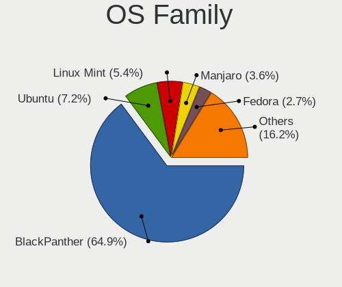

| Name         | Computers | Percent |
|--------------|-----------|---------|
| BlackPanther | 79        | 60.77%  |
| Fedora       | 13        | 10%     |
| Ubuntu       | 9         | 6.92%   |
| Linux Mint   | 9         | 6.92%   |
| OpenMandriva | 4         | 3.08%   |
| Debian       | 4         | 3.08%   |
| Arch         | 2         | 1.54%   |
| Zorin        | 1         | 0.77%   |
| Rocky Linux  | 1         | 0.77%   |
| Q4OS         | 1         | 0.77%   |
| Pop!_OS      | 1         | 0.77%   |
| Manjaro      | 1         | 0.77%   |
| Gentoo       | 1         | 0.77%   |
| Endless      | 1         | 0.77%   |
| EndeavourOS  | 1         | 0.77%   |
| Elementary   | 1         | 0.77%   |
| ArcoLinux    | 1         | 0.77%   |

Kernel
------

Version of the Linux kernel

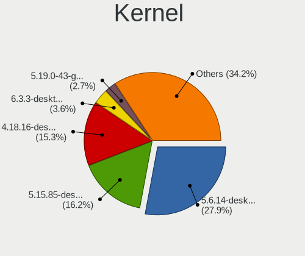

| Version                             | Computers | Percent |
|-------------------------------------|-----------|---------|
| 5.6.14-desktop-2bP                  | 25        | 19.23%  |
| 4.18.16-desktop-1bP                 | 25        | 19.23%  |
| 5.15.85-desktop-1bP                 | 23        | 17.69%  |
| 6.2.14-300.fc38.x86_64              | 5         | 3.85%   |
| 5.19.0-41-generic                   | 5         | 3.85%   |
| 5.15.0-72-generic                   | 5         | 3.85%   |
| 6.2.9-desktop-1bP                   | 4         | 3.08%   |
| 6.2.15-300.fc38.x86_64              | 4         | 3.08%   |
| 6.2.6-desktop-1omv2390              | 3         | 2.31%   |
| 5.10.0-23-amd64                     | 3         | 2.31%   |
| 6.2.0-20-generic                    | 2         | 1.54%   |
| 5.15.0-71-generic                   | 2         | 1.54%   |
| 5.15.0-69-generic                   | 2         | 1.54%   |
| 6.4.0-rc3-1-git-00008-gae8373a5add4 | 1         | 0.77%   |
| 6.3.1-zen1-1-zen                    | 1         | 0.77%   |
| 6.3.1-arch1-1                       | 1         | 0.77%   |
| 6.2.9-300.fc38.x86_64               | 1         | 0.77%   |
| 6.2.6-76060206-generic              | 1         | 0.77%   |
| 6.2.15-200.fc37.x86_64              | 1         | 0.77%   |
| 6.2.14-060214-generic               | 1         | 0.77%   |
| 6.2.13-300.fc38.x86_64              | 1         | 0.77%   |
| 6.2.12-gentoo-x86_64                | 1         | 0.77%   |
| 6.2.12-300.fc38.x86_64              | 1         | 0.77%   |
| 6.1.27-1-lts                        | 1         | 0.77%   |
| 6.1.25-1-MANJARO                    | 1         | 0.77%   |
| 6.1.0-9-amd64                       | 1         | 0.77%   |
| 6.1.0-1bP                           | 1         | 0.77%   |
| 6.1-sunxi64                         | 1         | 0.77%   |
| 5.6.14-server-2bP                   | 1         | 0.77%   |
| 5.4.0-148-generic                   | 1         | 0.77%   |
| 5.19.0-42-generic                   | 1         | 0.77%   |
| 5.16.7-desktop-1omv4003             | 1         | 0.77%   |
| 5.15.0-47-generic                   | 1         | 0.77%   |
| 5.14.0-162.23.1.el9_1.x86_64        | 1         | 0.77%   |
| 4.15.0-211-generic                  | 1         | 0.77%   |

Kernel Family
-------------

Linux kernel without a distro release

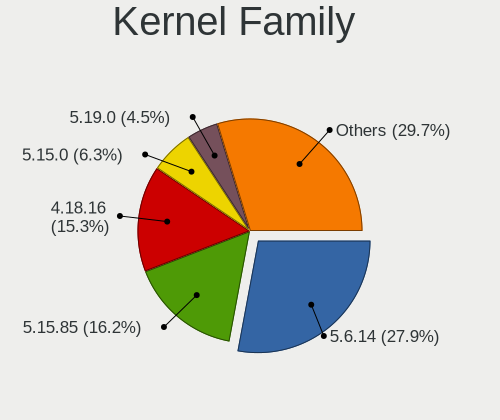

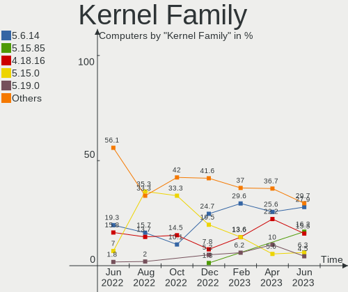

| Version | Computers | Percent |
|---------|-----------|---------|
| 5.6.14  | 26        | 20%     |
| 4.18.16 | 25        | 19.23%  |
| 5.15.85 | 23        | 17.69%  |
| 5.15.0  | 10        | 7.69%   |
| 6.2.14  | 6         | 4.62%   |
| 5.19.0  | 6         | 4.62%   |
| 6.2.9   | 5         | 3.85%   |
| 6.2.15  | 5         | 3.85%   |
| 6.2.6   | 4         | 3.08%   |
| 5.10.0  | 3         | 2.31%   |
| 6.3.1   | 2         | 1.54%   |
| 6.2.12  | 2         | 1.54%   |
| 6.2.0   | 2         | 1.54%   |
| 6.1.0   | 2         | 1.54%   |
| 6.4.0   | 1         | 0.77%   |
| 6.2.13  | 1         | 0.77%   |
| 6.1.27  | 1         | 0.77%   |
| 6.1.25  | 1         | 0.77%   |
| 6.1     | 1         | 0.77%   |
| 5.4.0   | 1         | 0.77%   |
| 5.16.7  | 1         | 0.77%   |
| 5.14.0  | 1         | 0.77%   |
| 4.15.0  | 1         | 0.77%   |

Kernel Major Ver.
-----------------

Linux kernel major version

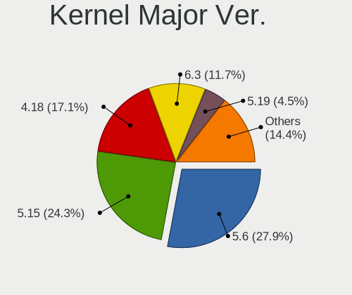

| Version | Computers | Percent |
|---------|-----------|---------|
| 5.15    | 33        | 25.38%  |
| 5.6     | 26        | 20%     |
| 6.2     | 25        | 19.23%  |
| 4.18    | 25        | 19.23%  |
| 5.19    | 6         | 4.62%   |
| 6.1     | 4         | 3.08%   |
| 5.10    | 3         | 2.31%   |
| 6.3     | 2         | 1.54%   |
| 6.4     | 1         | 0.77%   |
| 6       | 1         | 0.77%   |
| 5.4     | 1         | 0.77%   |
| 5.16    | 1         | 0.77%   |
| 5.14    | 1         | 0.77%   |
| 4.15    | 1         | 0.77%   |

Arch
----

OS architecture (x86_64, i586, etc.)

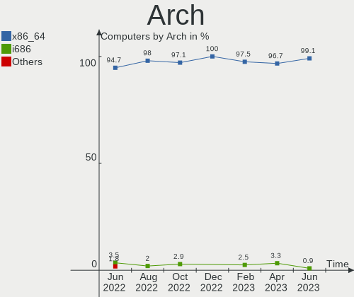

| Name    | Computers | Percent |
|---------|-----------|---------|
| x86_64  | 128       | 98.46%  |
| i686    | 1         | 0.77%   |
| aarch64 | 1         | 0.77%   |

DE
--

Desktop Environment

| Name       | Computers | Percent |
|------------|-----------|---------|
| KDE5       | 82        | 63.08%  |
| GNOME      | 28        | 21.54%  |
| Unknown    | 6         | 4.62%   |
| X-Cinnamon | 5         | 3.85%   |
| XFCE       | 3         | 2.31%   |
| MATE       | 3         | 2.31%   |
| Pantheon   | 1         | 0.77%   |
| LXQt       | 1         | 0.77%   |
| Hyprland   | 1         | 0.77%   |

Display Server
--------------

X11 or Wayland

| Name    | Computers | Percent |
|---------|-----------|---------|
| X11     | 104       | 80%     |
| Wayland | 22        | 16.92%  |
| Unknown | 3         | 2.31%   |
| Tty     | 1         | 0.77%   |

Display Manager
---------------

SDDM, LightDM, etc.

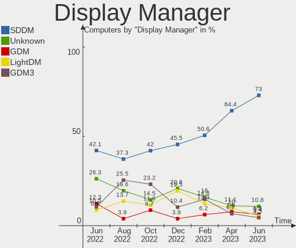

| Name    | Computers | Percent |
|---------|-----------|---------|
| SDDM    | 84        | 64.62%  |
| Unknown | 18        | 13.85%  |
| LightDM | 12        | 9.23%   |
| GDM3    | 10        | 7.69%   |
| GDM     | 6         | 4.62%   |

OS Lang
-------

Language

| Lang    | Computers | Percent |
|---------|-----------|---------|
| Unknown | 80        | 61.54%  |
| hu_HU   | 26        | 20%     |
| en_US   | 18        | 13.85%  |
| C       | 3         | 2.31%   |
| en_GB   | 2         | 1.54%   |
| de_DE   | 1         | 0.77%   |

Boot Mode
---------

EFI or BIOS

| Mode | Computers | Percent |
|------|-----------|---------|
| EFI  | 66        | 50.77%  |
| BIOS | 64        | 49.23%  |

Filesystem
----------

Type of filesystem

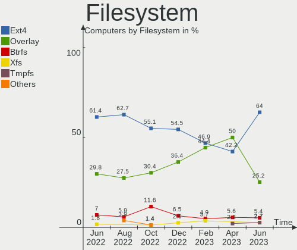

| Type    | Computers | Percent |
|---------|-----------|---------|
| Ext4    | 81        | 62.31%  |
| Overlay | 30        | 23.08%  |
| Btrfs   | 11        | 8.46%   |
| Tmpfs   | 6         | 4.62%   |
| Xfs     | 1         | 0.77%   |
| Unknown | 1         | 0.77%   |

Part. scheme
------------

Scheme of partitioning

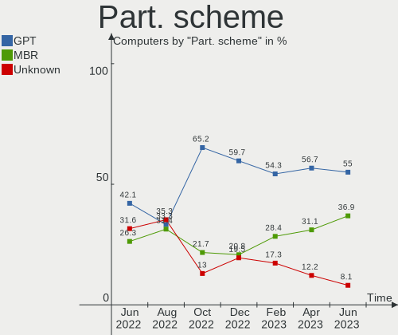

| Type    | Computers | Percent |
|---------|-----------|---------|
| GPT     | 68        | 52.31%  |
| MBR     | 45        | 34.62%  |
| Unknown | 17        | 13.08%  |

Dual Boot with Linux/BSD
------------------------

Hosting more than one Linux/BSD

| Dual boot | Computers | Percent |
|-----------|-----------|---------|
| No        | 95        | 73.08%  |
| Yes       | 35        | 26.92%  |

Dual Boot (Win)
---------------

Hosting Linux and Windows

| Dual boot | Computers | Percent |
|-----------|-----------|---------|
| No        | 80        | 61.54%  |
| Yes       | 50        | 38.46%  |

Board
-----

Vendor
------

Motherboard manufacturer

| Name                | Computers | Percent |
|---------------------|-----------|---------|
| Lenovo              | 23        | 17.69%  |
| ASUSTek Computer    | 20        | 15.38%  |
| Hewlett-Packard     | 18        | 13.85%  |
| Dell                | 17        | 13.08%  |
| Gigabyte Technology | 11        | 8.46%   |
| Fujitsu             | 8         | 6.15%   |
| Acer                | 7         | 5.38%   |
| MSI                 | 6         | 4.62%   |
| ASRock              | 3         | 2.31%   |
| Unknown             | 3         | 2.31%   |
| Toshiba             | 2         | 1.54%   |
| Fujitsu Siemens     | 2         | 1.54%   |
| eMachines           | 2         | 1.54%   |
| Valve               | 1         | 0.77%   |
| Sony                | 1         | 0.77%   |
| Samsung Electronics | 1         | 0.77%   |
| Pine Microsystems   | 1         | 0.77%   |
| Microsoft           | 1         | 0.77%   |
| Medion              | 1         | 0.77%   |
| Apple               | 1         | 0.77%   |
| Alcor Digital       | 1         | 0.77%   |

Model
-----

Motherboard model

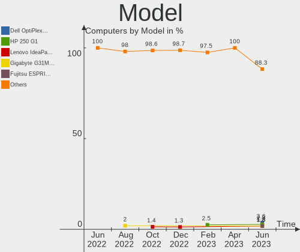

| Name                                     | Computers | Percent |
|------------------------------------------|-----------|---------|
| Unknown                                  | 3         | 2.31%   |
| Lenovo ThinkPad T420 4236W8L             | 2         | 1.54%   |
| HP EliteDesk 705 G3 SFF                  | 2         | 1.54%   |
| eMachines E725                           | 2         | 1.54%   |
| Dell Latitude 5490                       | 2         | 1.54%   |
| Dell Inspiron 7737                       | 2         | 1.54%   |
| ASUS X550CC                              | 2         | 1.54%   |
| ASUS K54HR                               | 2         | 1.54%   |
| Valve Jupiter                            | 1         | 0.77%   |
| Toshiba Satellite M50D-A                 | 1         | 0.77%   |
| Toshiba Satellite C55-A-1NV              | 1         | 0.77%   |
| Sony VGN-FW21Z                           | 1         | 0.77%   |
| Samsung 300E4C/300E5C/300E7C             | 1         | 0.77%   |
| Pine Microsystems Pine64 PinePhone (1.2) | 1         | 0.77%   |
| MSI MS-7C96                              | 1         | 0.77%   |
| MSI MS-7C95                              | 1         | 0.77%   |
| MSI MS-7C91                              | 1         | 0.77%   |
| MSI MS-7817                              | 1         | 0.77%   |
| MSI MS-7697                              | 1         | 0.77%   |
| MSI MS-7309                              | 1         | 0.77%   |
| Microsoft Surface Laptop Go              | 1         | 0.77%   |
| Medion MS-7748                           | 1         | 0.77%   |
| Lenovo V15-ADA 82C7                      | 1         | 0.77%   |
| Lenovo ThinkStation D20 4158AF8          | 1         | 0.77%   |
| Lenovo ThinkStation C30 1097A34          | 1         | 0.77%   |
| Lenovo ThinkPad X270 20HMS1RM02          | 1         | 0.77%   |
| Lenovo ThinkPad X250 20CLS1JN00          | 1         | 0.77%   |
| Lenovo ThinkPad X200 74595FG             | 1         | 0.77%   |
| Lenovo ThinkPad T500 2056CL8             | 1         | 0.77%   |
| Lenovo ThinkPad T440s 20ARS06C00         | 1         | 0.77%   |
| Lenovo ThinkPad T400 2768WGB             | 1         | 0.77%   |
| Lenovo ThinkPad P1 Gen 4i 20Y3000FHV     | 1         | 0.77%   |
| Lenovo ThinkPad L15 Gen 1 20U7S09R00     | 1         | 0.77%   |
| Lenovo ThinkCentre M83 10AHS0W300        | 1         | 0.77%   |
| Lenovo ThinkCentre M73 10B6001SUS        | 1         | 0.77%   |
| Lenovo IdeaPad L340-15API 81LW           | 1         | 0.77%   |
| Lenovo IdeaPad 700-15ISK 80RU            | 1         | 0.77%   |
| Lenovo IdeaPad 110-15ACL 80TJ            | 1         | 0.77%   |
| Lenovo IdeaPad 100-15IBD 80QQ            | 1         | 0.77%   |
| Lenovo G580 20150                        | 1         | 0.77%   |

Model Family
------------

Motherboard model prefix

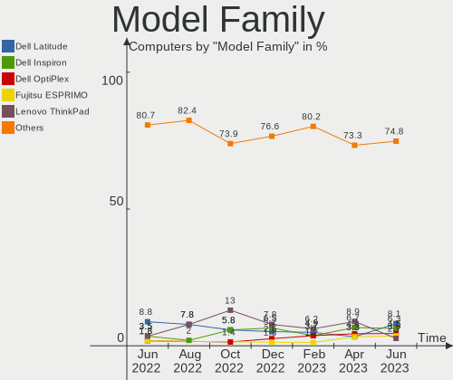

| Name                     | Computers | Percent |
|--------------------------|-----------|---------|
| Lenovo ThinkPad          | 10        | 7.69%   |
| Dell Latitude            | 6         | 4.62%   |
| Dell Inspiron            | 5         | 3.85%   |
| Lenovo IdeaPad           | 4         | 3.08%   |
| HP Compaq                | 4         | 3.08%   |
| Dell OptiPlex            | 4         | 3.08%   |
| HP EliteDesk             | 3         | 2.31%   |
| HP 250                   | 3         | 2.31%   |
| Fujitsu LIFEBOOK         | 3         | 2.31%   |
| Fujitsu ESPRIMO          | 3         | 2.31%   |
| ASUS PRIME               | 3         | 2.31%   |
| Acer TravelMate          | 3         | 2.31%   |
| Acer Aspire              | 3         | 2.31%   |
| Unknown                  | 3         | 2.31%   |
| Toshiba Satellite        | 2         | 1.54%   |
| Lenovo ThinkStation      | 2         | 1.54%   |
| Lenovo ThinkCentre       | 2         | 1.54%   |
| HP Pavilion              | 2         | 1.54%   |
| Fujitsu CELSIUS          | 2         | 1.54%   |
| eMachines E725           | 2         | 1.54%   |
| ASUS X550CC              | 2         | 1.54%   |
| ASUS VivoBook            | 2         | 1.54%   |
| ASUS M5A97               | 2         | 1.54%   |
| ASUS K54HR               | 2         | 1.54%   |
| Valve Jupiter            | 1         | 0.77%   |
| Sony VGN-FW21Z           | 1         | 0.77%   |
| Samsung 300E4C           | 1         | 0.77%   |
| Pine Microsystems Pine64 | 1         | 0.77%   |
| MSI MS-7C96              | 1         | 0.77%   |
| MSI MS-7C95              | 1         | 0.77%   |
| MSI MS-7C91              | 1         | 0.77%   |
| MSI MS-7817              | 1         | 0.77%   |
| MSI MS-7697              | 1         | 0.77%   |
| MSI MS-7309              | 1         | 0.77%   |
| Microsoft Surface        | 1         | 0.77%   |
| Medion MS-7748           | 1         | 0.77%   |
| Lenovo V15-ADA           | 1         | 0.77%   |
| Lenovo G580              | 1         | 0.77%   |
| Lenovo G570              | 1         | 0.77%   |
| Lenovo G50-30            | 1         | 0.77%   |

MFG Year
--------

Motherboard manufacture year

| Year    | Computers | Percent |
|---------|-----------|---------|
| 2013    | 14        | 10.77%  |
| 2011    | 13        | 10%     |
| 2015    | 12        | 9.23%   |
| 2012    | 11        | 8.46%   |
| 2008    | 10        | 7.69%   |
| 2021    | 8         | 6.15%   |
| 2017    | 8         | 6.15%   |
| 2019    | 7         | 5.38%   |
| 2018    | 7         | 5.38%   |
| 2014    | 7         | 5.38%   |
| 2010    | 7         | 5.38%   |
| 2020    | 6         | 4.62%   |
| 2016    | 5         | 3.85%   |
| 2009    | 4         | 3.08%   |
| 2007    | 4         | 3.08%   |
| 2022    | 3         | 2.31%   |
| 2023    | 2         | 1.54%   |
| 2006    | 1         | 0.77%   |
| Unknown | 1         | 0.77%   |

Form Factor
-----------

Physical design of the computer

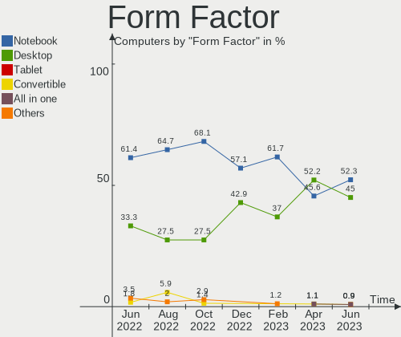

| Name        | Computers | Percent |
|-------------|-----------|---------|
| Notebook    | 70        | 53.85%  |
| Desktop     | 56        | 43.08%  |
| Phone       | 1         | 0.77%   |
| Tablet      | 1         | 0.77%   |
| Convertible | 1         | 0.77%   |
| All in one  | 1         | 0.77%   |

Secure Boot
-----------

Enabled or disabled

| State    | Computers | Percent |
|----------|-----------|---------|
| Disabled | 123       | 94.62%  |
| Enabled  | 7         | 5.38%   |

Coreboot
--------

Have coreboot on board

| Used | Computers | Percent |
|------|-----------|---------|
| No   | 130       | 100%    |

RAM Size
--------

Total RAM memory

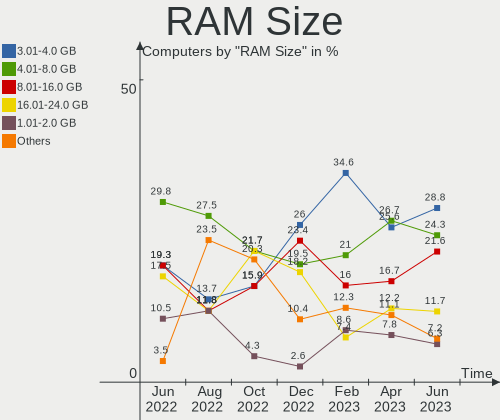

| Size in GB | Computers | Percent |
|------------|-----------|---------|
| 3.01-4.0   | 40        | 30.77%  |
| 4.01-8.0   | 27        | 20.77%  |
| 8.01-16.0  | 27        | 20.77%  |
| 32.01-64.0 | 12        | 9.23%   |
| 16.01-24.0 | 11        | 8.46%   |
| 1.01-2.0   | 7         | 5.38%   |
| 2.01-3.0   | 3         | 2.31%   |
| 24.01-32.0 | 2         | 1.54%   |
| Unknown    | 1         | 0.77%   |

RAM Used
--------

Used RAM memory

| Used GB  | Computers | Percent |
|----------|-----------|---------|
| 1.01-2.0 | 47        | 36.15%  |
| 0.51-1.0 | 38        | 29.23%  |
| 2.01-3.0 | 16        | 12.31%  |
| 0.01-0.5 | 10        | 7.69%   |
| 4.01-8.0 | 9         | 6.92%   |
| 3.01-4.0 | 9         | 6.92%   |
| Unknown  | 1         | 0.77%   |

Total Drives
------------

Number of drives on board

| Drives | Computers | Percent |
|--------|-----------|---------|
| 1      | 79        | 60.77%  |
| 2      | 38        | 29.23%  |
| 3      | 6         | 4.62%   |
| 4      | 4         | 3.08%   |
| 0      | 2         | 1.54%   |
| 5      | 1         | 0.77%   |

Has CD-ROM
----------

Has CD-ROM on board

| Presented | Computers | Percent |
|-----------|-----------|---------|
| No        | 72        | 55.38%  |
| Yes       | 58        | 44.62%  |

Has Ethernet
------------

Has Ethernet on board

| Presented | Computers | Percent |
|-----------|-----------|---------|
| Yes       | 120       | 92.31%  |
| No        | 10        | 7.69%   |

Has WiFi
--------

Has WiFi module

| Presented | Computers | Percent |
|-----------|-----------|---------|
| Yes       | 92        | 70.77%  |
| No        | 38        | 29.23%  |

Has Bluetooth
-------------

Has Bluetooth module

| Presented | Computers | Percent |
|-----------|-----------|---------|
| Yes       | 70        | 53.85%  |
| No        | 60        | 46.15%  |

Location
--------

Country
-------

Geographic location (country)

| Country | Computers | Percent |
|---------|-----------|---------|
| Hungary | 130       | 100%    |

City
----

Geographic location (city)

| City              | Computers | Percent |
|-------------------|-----------|---------|
| Budapest          | 43        | 33.08%  |
| Zalaegerszeg      | 4         | 3.08%   |
| Tatabánya        | 4         | 3.08%   |
| Szolnok           | 4         | 3.08%   |
| Szigetujfalu      | 4         | 3.08%   |
| Debrecen          | 4         | 3.08%   |
| Pécs             | 3         | 2.31%   |
| Gödöllő        | 3         | 2.31%   |
| Berettyóújfalu  | 3         | 2.31%   |
| Veszprém         | 2         | 1.54%   |
| Szigetszentmiklos | 2         | 1.54%   |
| Szekszárd        | 2         | 1.54%   |
| Nyiregyhaza       | 2         | 1.54%   |
| Nagykanizsa       | 2         | 1.54%   |
| Győr             | 2         | 1.54%   |
| Toeroekbalint     | 1         | 0.77%   |
| Tiszakecske       | 1         | 0.77%   |
| Szombathely       | 1         | 0.77%   |
| Szigethalom       | 1         | 0.77%   |
| Szentendre        | 1         | 0.77%   |
| Székesfehérvár | 1         | 0.77%   |
| Sátoraljaújhely | 1         | 0.77%   |
| Sarvar            | 1         | 0.77%   |
| Sarbogard         | 1         | 0.77%   |
| Salgotarjan       | 1         | 0.77%   |
| Puspokladany      | 1         | 0.77%   |
| Pomaz             | 1         | 0.77%   |
| Pecel             | 1         | 0.77%   |
| Oroshaza          | 1         | 0.77%   |
| Opusztaszer       | 1         | 0.77%   |
| Miskolc           | 1         | 0.77%   |
| Medgyesegyhaza    | 1         | 0.77%   |
| Mateszalka        | 1         | 0.77%   |
| Kisvarda          | 1         | 0.77%   |
| Kiskunhalas       | 1         | 0.77%   |
| Kiskoros          | 1         | 0.77%   |
| Kecskemét        | 1         | 0.77%   |
| Karcsa            | 1         | 0.77%   |
| Karcag            | 1         | 0.77%   |
| Jaszkiser         | 1         | 0.77%   |

Drives
------

Drive Vendor
------------

Hard drive vendors

| Vendor              | Computers | Drives | Percent |
|---------------------|-----------|--------|---------|
| Samsung Electronics | 35        | 40     | 19.34%  |
| WDC                 | 30        | 37     | 16.57%  |
| Kingston            | 26        | 29     | 14.36%  |
| Seagate             | 13        | 14     | 7.18%   |
| Toshiba             | 12        | 12     | 6.63%   |
| Hitachi             | 8         | 8      | 4.42%   |
| HGST                | 6         | 6      | 3.31%   |
| A-DATA Technology   | 6         | 6      | 3.31%   |
| Micron Technology   | 5         | 5      | 2.76%   |
| SK hynix            | 4         | 4      | 2.21%   |
| Unknown             | 3         | 4      | 1.66%   |
| Patriot             | 3         | 3      | 1.66%   |
| Intel               | 3         | 4      | 1.66%   |
| SPCC                | 2         | 2      | 1.1%    |
| Phison Electronics  | 2         | 2      | 1.1%    |
| Kingmax             | 2         | 2      | 1.1%    |
| Intenso             | 2         | 2      | 1.1%    |
| Crucial             | 2         | 2      | 1.1%    |
| China               | 2         | 2      | 1.1%    |
| Unknown             | 2         | 2      | 1.1%    |
| Zheino              | 1         | 1      | 0.55%   |
| Verbatim            | 1         | 1      | 0.55%   |
| Union Memory        | 1         | 1      | 0.55%   |
| SSSTC               | 1         | 1      | 0.55%   |
| ShiJi               | 1         | 1      | 0.55%   |
| Netac               | 1         | 1      | 0.55%   |
| LuminouTek          | 1         | 1      | 0.55%   |
| LITEON              | 1         | 1      | 0.55%   |
| KIOXIA              | 1         | 1      | 0.55%   |
| JMicron Technology  | 1         | 1      | 0.55%   |
| Gigabyte Technology | 1         | 1      | 0.55%   |
| Apple               | 1         | 1      | 0.55%   |
| 2-Power             | 1         | 1      | 0.55%   |

Drive Model
-----------

Hard drive models

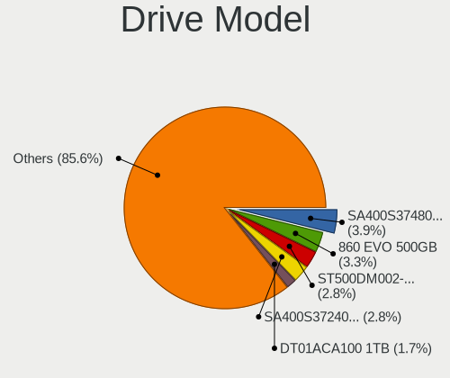

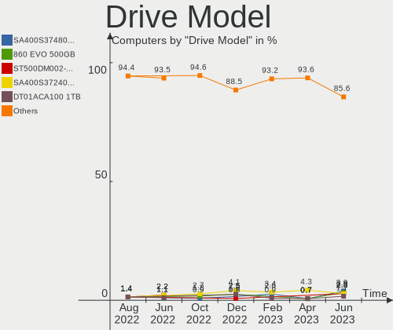

| Model                                   | Computers | Percent |
|-----------------------------------------|-----------|---------|
| Kingston SA400S37240G 240GB SSD         | 6         | 3.05%   |
| Kingston SA400S37480G 480GB SSD         | 5         | 2.54%   |
| Toshiba DT01ACA100 1TB                  | 4         | 2.03%   |
| Samsung SSD 850 EVO 250GB               | 4         | 2.03%   |
| HGST HTS541010A9E680 1TB                | 3         | 1.52%   |
| WDC WDS240G2G0B-00EPW0 240GB SSD        | 2         | 1.02%   |
| WDC WD30EFRX-68EUZN0 3TB                | 2         | 1.02%   |
| WDC WD10SPCX-24HWST1 1TB                | 2         | 1.02%   |
| WDC WD10PURZ-85U8XY0 1TB                | 2         | 1.02%   |
| WDC WD10EZRX-00L4HB0 1TB                | 2         | 1.02%   |
| SPCC Solid State Disk 256GB             | 2         | 1.02%   |
| Seagate ST500LT012-1DG142 500GB         | 2         | 1.02%   |
| Seagate ST1000LM024 HN-M101MBB 1TB      | 2         | 1.02%   |
| Samsung SSD 970 EVO 250GB               | 2         | 1.02%   |
| Samsung SSD 870 EVO 500GB               | 2         | 1.02%   |
| Samsung SSD 850 EVO 120GB               | 2         | 1.02%   |
| Samsung SSD 830 Series 64GB             | 2         | 1.02%   |
| Phison PS5013 E13 NVMe Controller 512GB | 2         | 1.02%   |
| Micron MTFDDAK256MAM-1K1 256GB SSD      | 2         | 1.02%   |
| Kingston SUV400S37120G 120GB SSD        | 2         | 1.02%   |
| Kingston SA400S37960G 960GB SSD         | 2         | 1.02%   |
| Kingston SA400S37120G 120GB SSD         | 2         | 1.02%   |
| Hitachi HTS547550A9E384 500GB           | 2         | 1.02%   |
| Hitachi HTS545050B9A300 500GB           | 2         | 1.02%   |
| Unknown                                 | 2         | 1.02%   |
| Zheino CHN-NGFFNV2280-256 256GB         | 1         | 0.51%   |
| WDC WDS500G2B0A 500GB SSD               | 1         | 0.51%   |
| WDC WDS480G2G0A-00JH30 480GB SSD        | 1         | 0.51%   |
| WDC WD7500BPVX-60JC3T0 752GB            | 1         | 0.51%   |
| WDC WD6400AAKS-07A7B0 640GB             | 1         | 0.51%   |
| WDC WD60EFZX-68B3FN0 6TB                | 1         | 0.51%   |
| WDC WD5003AZEX-00MK2A0 500GB            | 1         | 0.51%   |
| WDC WD5000LPCX-60VHAT1 500GB            | 1         | 0.51%   |
| WDC WD5000LPCX-24VHAT0 500GB            | 1         | 0.51%   |
| WDC WD5000BPVT-00HXZT1 500GB            | 1         | 0.51%   |
| WDC WD5000BPKT-75PK4T0 500GB            | 1         | 0.51%   |
| WDC WD5000AZRX-00L4HB0 500GB            | 1         | 0.51%   |
| WDC WD40EFRX-68N32N0 4TB                | 1         | 0.51%   |
| WDC WD3200BEVT-08A23T1 320GB            | 1         | 0.51%   |
| WDC WD3200BEVT-00ZCT0 320GB             | 1         | 0.51%   |

HDD Vendor
----------

Hard disk drive vendors

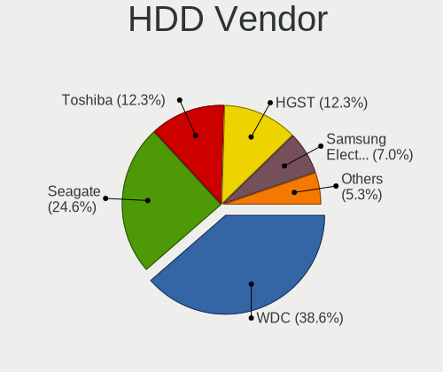

| Vendor              | Computers | Drives | Percent |
|---------------------|-----------|--------|---------|
| WDC                 | 26        | 32     | 37.14%  |
| Seagate             | 13        | 14     | 18.57%  |
| Toshiba             | 10        | 10     | 14.29%  |
| Hitachi             | 8         | 8      | 11.43%  |
| Samsung Electronics | 7         | 7      | 10%     |
| HGST                | 6         | 6      | 8.57%   |

SSD Vendor
----------

Solid state drive vendors

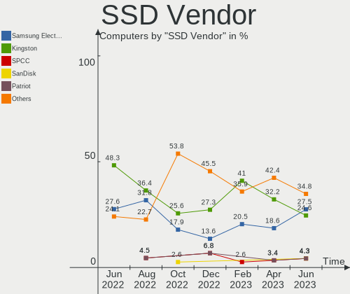

| Vendor              | Computers | Drives | Percent |
|---------------------|-----------|--------|---------|
| Kingston            | 23        | 26     | 28.75%  |
| Samsung Electronics | 19        | 21     | 23.75%  |
| WDC                 | 4         | 4      | 5%      |
| A-DATA Technology   | 4         | 4      | 5%      |
| Patriot             | 3         | 3      | 3.75%   |
| Micron Technology   | 3         | 3      | 3.75%   |
| Toshiba             | 2         | 2      | 2.5%    |
| SPCC                | 2         | 2      | 2.5%    |
| Kingmax             | 2         | 2      | 2.5%    |
| Intenso             | 2         | 2      | 2.5%    |
| Intel               | 2         | 3      | 2.5%    |
| Crucial             | 2         | 2      | 2.5%    |
| China               | 2         | 2      | 2.5%    |
| Verbatim            | 1         | 1      | 1.25%   |
| Union Memory        | 1         | 1      | 1.25%   |
| SK hynix            | 1         | 1      | 1.25%   |
| ShiJi               | 1         | 1      | 1.25%   |
| Netac               | 1         | 1      | 1.25%   |
| LuminouTek          | 1         | 1      | 1.25%   |
| JMicron Technology  | 1         | 1      | 1.25%   |
| Gigabyte Technology | 1         | 1      | 1.25%   |
| Apple               | 1         | 1      | 1.25%   |
| 2-Power             | 1         | 1      | 1.25%   |

Drive Kind
----------

HDD or SSD

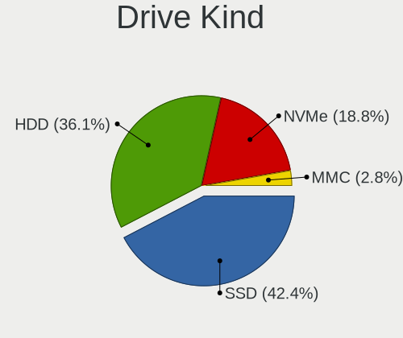

| Kind    | Computers | Drives | Percent |
|---------|-----------|--------|---------|
| SSD     | 72        | 86     | 42.35%  |
| HDD     | 65        | 77     | 38.24%  |
| NVMe    | 29        | 30     | 17.06%  |
| MMC     | 3         | 4      | 1.76%   |
| Unknown | 1         | 2      | 0.59%   |

Drive Connector
---------------

SATA, SAS, NVMe, etc.

| Type | Computers | Drives | Percent |
|------|-----------|--------|---------|
| SATA | 108       | 161    | 75.52%  |
| NVMe | 29        | 30     | 20.28%  |
| SAS  | 3         | 4      | 2.1%    |
| MMC  | 3         | 4      | 2.1%    |

Drive Size
----------

Size of hard drive

| Size in TB | Computers | Drives | Percent |
|------------|-----------|--------|---------|
| 0.01-0.5   | 89        | 108    | 64.96%  |
| 0.51-1.0   | 37        | 43     | 27.01%  |
| 2.01-3.0   | 5         | 6      | 3.65%   |
| 1.01-2.0   | 3         | 3      | 2.19%   |
| 3.01-4.0   | 2         | 2      | 1.46%   |
| 4.01-10.0  | 1         | 1      | 0.73%   |

Space Total
-----------

Amount of disk space available on the file system

| Size in GB     | Computers | Percent |
|----------------|-----------|---------|
| 101-250        | 33        | 25.38%  |
| Unknown        | 32        | 24.62%  |
| 251-500        | 23        | 17.69%  |
| 501-1000       | 12        | 9.23%   |
| 51-100         | 12        | 9.23%   |
| 21-50          | 5         | 3.85%   |
| 1001-2000      | 5         | 3.85%   |
| 1-20           | 4         | 3.08%   |
| More than 3000 | 2         | 1.54%   |
| 2001-3000      | 2         | 1.54%   |

Space Used
----------

Amount of used disk space

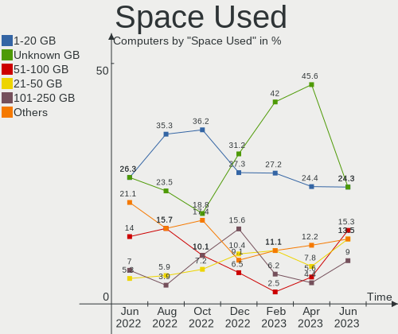

| Used GB        | Computers | Percent |
|----------------|-----------|---------|
| Unknown        | 32        | 24.62%  |
| 1-20           | 31        | 23.85%  |
| 21-50          | 26        | 20%     |
| 51-100         | 17        | 13.08%  |
| 101-250        | 14        | 10.77%  |
| 501-1000       | 5         | 3.85%   |
| 251-500        | 2         | 1.54%   |
| 1001-2000      | 2         | 1.54%   |
| More than 3000 | 1         | 0.77%   |

Malfunc. Drives
---------------

Drive models with a malfunction

| Model                                   | Computers | Drives | Percent |
|-----------------------------------------|-----------|--------|---------|
| WDC WD10PURZ-85U8XY0 1TB                | 2         | 2      | 6.06%   |
| Hitachi HTS545050B9A300 500GB           | 2         | 2      | 6.06%   |
| WDC WDS240G2G0B-00EPW0 240GB SSD        | 1         | 1      | 3.03%   |
| WDC WD6400AAKS-07A7B0 640GB             | 1         | 1      | 3.03%   |
| WDC WD3200BEVT-08A23T1 320GB            | 1         | 1      | 3.03%   |
| WDC WD30EFRX-68EUZN0 3TB                | 1         | 1      | 3.03%   |
| WDC WD2500BEVT-00ZCT0 250GB             | 1         | 1      | 3.03%   |
| WDC WD10EARS-00Y5B1 1TB                 | 1         | 1      | 3.03%   |
| Toshiba MQ01ABF050 500GB                | 1         | 1      | 3.03%   |
| Toshiba KSG60ZMV256G M.2 2280 256GB SSD | 1         | 1      | 3.03%   |
| Toshiba HDWD130 3TB                     | 1         | 1      | 3.03%   |
| Seagate ST9500325AS 500GB               | 1         | 1      | 3.03%   |
| Seagate ST320LT020-9YG142 320GB         | 1         | 1      | 3.03%   |
| Seagate ST3160812AS 160GB               | 1         | 1      | 3.03%   |
| Seagate ST31000528AS 1TB                | 1         | 1      | 3.03%   |
| Seagate ST1000LM024 HN-M101MBB 1TB      | 1         | 1      | 3.03%   |
| Samsung Electronics SSD 750 EVO 250GB   | 1         | 1      | 3.03%   |
| Samsung Electronics HD200HJ 200GB       | 1         | 1      | 3.03%   |
| Samsung Electronics HD161HJ 160GB       | 1         | 1      | 3.03%   |
| Samsung Electronics HD103UJ 1TB         | 1         | 1      | 3.03%   |
| Kingston SA400S37240G 240GB SSD         | 1         | 1      | 3.03%   |
| Intenso JAJM600M128C 128GB SSD          | 1         | 1      | 3.03%   |
| Intel SSDSC2KF240H6L 240GB              | 1         | 1      | 3.03%   |
| Intel SSDSC2BF180A5L 180GB              | 1         | 1      | 3.03%   |
| Hitachi HTS547550A9E384 500GB           | 1         | 1      | 3.03%   |
| Hitachi HTS542525K9SA00 250GB           | 1         | 1      | 3.03%   |
| HGST HTS545032A7E380 320GB              | 1         | 1      | 3.03%   |
| HGST HTS541010A9E680 1TB                | 1         | 1      | 3.03%   |
| Apple SSD TS064E 64GB                   | 1         | 1      | 3.03%   |
| A-DATA Technology SX6000PNP 256GB       | 1         | 1      | 3.03%   |
| A-DATA Technology SU630 240GB SSD       | 1         | 1      | 3.03%   |

Malfunc. Drive Vendor
---------------------

Vendors of faulty drives

| Vendor              | Computers | Drives | Percent |
|---------------------|-----------|--------|---------|
| WDC                 | 8         | 8      | 25%     |
| Seagate             | 5         | 5      | 15.63%  |
| Samsung Electronics | 4         | 4      | 12.5%   |
| Hitachi             | 4         | 4      | 12.5%   |
| Toshiba             | 3         | 3      | 9.38%   |
| HGST                | 2         | 2      | 6.25%   |
| A-DATA Technology   | 2         | 2      | 6.25%   |
| Kingston            | 1         | 1      | 3.13%   |
| Intenso             | 1         | 1      | 3.13%   |
| Intel               | 1         | 2      | 3.13%   |
| Apple               | 1         | 1      | 3.13%   |

Malfunc. HDD Vendor
-------------------

Vendors of faulty HDD drives

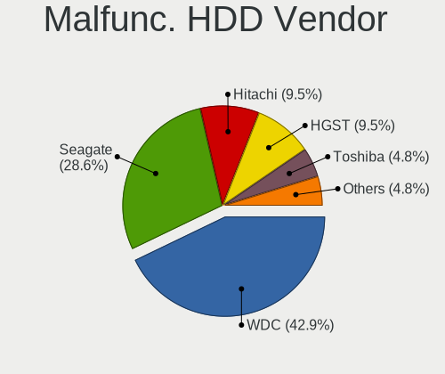

| Vendor              | Computers | Drives | Percent |
|---------------------|-----------|--------|---------|
| WDC                 | 7         | 7      | 30.43%  |
| Seagate             | 5         | 5      | 21.74%  |
| Hitachi             | 4         | 4      | 17.39%  |
| Samsung Electronics | 3         | 3      | 13.04%  |
| Toshiba             | 2         | 2      | 8.7%    |
| HGST                | 2         | 2      | 8.7%    |

Malfunc. Drive Kind
-------------------

Kinds of faulty drives

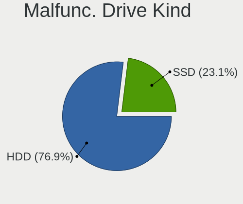

| Kind | Computers | Drives | Percent |
|------|-----------|--------|---------|
| HDD  | 22        | 23     | 70.97%  |
| SSD  | 8         | 9      | 25.81%  |
| NVMe | 1         | 1      | 3.23%   |

Failed Drives
-------------

Failed drive models

| Model                           | Computers | Drives | Percent |
|---------------------------------|-----------|--------|---------|
| Samsung Electronics HD103SJ 1TB | 1         | 1      | 100%    |

Failed Drive Vendor
-------------------

Failed drive vendors

| Vendor              | Computers | Drives | Percent |
|---------------------|-----------|--------|---------|
| Samsung Electronics | 1         | 1      | 100%    |

Drive Status
------------

Number of failed and malfunc. drives

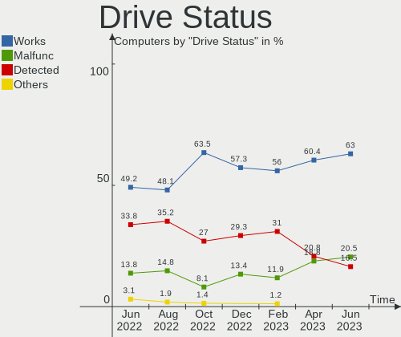

| Status   | Computers | Drives | Percent |
|----------|-----------|--------|---------|
| Works    | 86        | 127    | 59.72%  |
| Malfunc  | 29        | 33     | 20.14%  |
| Detected | 28        | 38     | 19.44%  |
| Failed   | 1         | 1      | 0.69%   |

Storage controller
------------------

Storage Vendor
--------------

Storage controller vendors

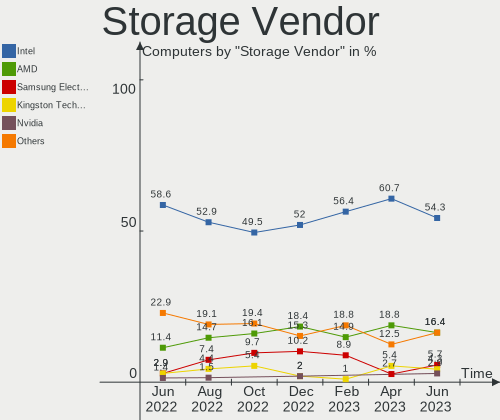

| Vendor                         | Computers | Percent |
|--------------------------------|-----------|---------|
| Intel                          | 93        | 60.39%  |
| AMD                            | 24        | 15.58%  |
| Samsung Electronics            | 12        | 7.79%   |
| Nvidia                         | 5         | 3.25%   |
| SK hynix                       | 3         | 1.95%   |
| Kingston Technology Company    | 3         | 1.95%   |
| Silicon Motion                 | 2         | 1.3%    |
| Phison Electronics             | 2         | 1.3%    |
| Micron Technology              | 2         | 1.3%    |
| Toshiba America Info Systems   | 1         | 0.65%   |
| Solid State Storage Technology | 1         | 0.65%   |
| Silicon Image                  | 1         | 0.65%   |
| SanDisk                        | 1         | 0.65%   |
| Realtek Semiconductor          | 1         | 0.65%   |
| Marvell Technology Group       | 1         | 0.65%   |
| Lite-On Technology             | 1         | 0.65%   |
| ASMedia Technology             | 1         | 0.65%   |

Storage Model
-------------

Storage controller models

| Model                                                                          | Computers | Percent |
|--------------------------------------------------------------------------------|-----------|---------|
| AMD FCH SATA Controller [AHCI mode]                                            | 13        | 7.18%   |
| Intel 7 Series Chipset Family 6-port SATA Controller [AHCI mode]               | 9         | 4.97%   |
| Intel 8 Series/C220 Series Chipset Family 6-port SATA Controller 1 [AHCI mode] | 8         | 4.42%   |
| Intel Wildcat Point-LP SATA Controller [AHCI Mode]                             | 6         | 3.31%   |
| Intel 82801IBM/IEM (ICH9M/ICH9M-E) 4 port SATA Controller [AHCI mode]          | 6         | 3.31%   |
| Intel 6 Series/C200 Series Chipset Family 6 port Mobile SATA AHCI Controller   | 6         | 3.31%   |
| Samsung NVMe SSD Controller SM981/PM981/PM983                                  | 5         | 2.76%   |
| Intel Sunrise Point-LP SATA Controller [AHCI mode]                             | 5         | 2.76%   |
| Intel 7 Series/C210 Series Chipset Family 6-port SATA Controller [AHCI mode]   | 5         | 2.76%   |
| Intel 200 Series PCH SATA controller [AHCI mode]                               | 5         | 2.76%   |
| AMD SB7x0/SB8x0/SB9x0 SATA Controller [AHCI mode]                              | 5         | 2.76%   |
| Samsung NVMe SSD Controller 980                                                | 4         | 2.21%   |
| Intel Volume Management Device NVMe RAID Controller                            | 4         | 2.21%   |
| Intel Q170/Q150/B150/H170/H110/Z170/CM236 Chipset SATA Controller [AHCI Mode]  | 4         | 2.21%   |
| Intel 82801JI (ICH10 Family) SATA AHCI Controller                              | 4         | 2.21%   |
| Intel 82801 Mobile SATA Controller [RAID mode]                                 | 4         | 2.21%   |
| Intel 8 Series SATA Controller 1 [AHCI mode]                                   | 4         | 2.21%   |
| Intel 4 Series Chipset PT IDER Controller                                      | 3         | 1.66%   |
| AMD 500 Series Chipset SATA Controller                                         | 3         | 1.66%   |
| AMD 300 Series Chipset SATA Controller                                         | 3         | 1.66%   |
| Samsung NVMe SSD Controller PM9A1/PM9A3/980PRO                                 | 2         | 1.1%    |
| Phison PS5013 E13 NVMe Controller                                              | 2         | 1.1%    |
| Nvidia MCP61 SATA Controller                                                   | 2         | 1.1%    |
| Nvidia MCP61 IDE                                                               | 2         | 1.1%    |
| Micron NVMe Storage Controller                                                 | 2         | 1.1%    |
| Intel Tiger Lake-LP SATA Controller                                            | 2         | 1.1%    |
| Intel SATA Controller [RAID mode]                                              | 2         | 1.1%    |
| Intel NM10/ICH7 Family SATA Controller [IDE mode]                              | 2         | 1.1%    |
| Intel Atom Processor E3800 Series SATA AHCI Controller                         | 2         | 1.1%    |
| Intel 82801JD/DO (ICH10 Family) 4-port SATA IDE Controller                     | 2         | 1.1%    |
| Intel 82801JD/DO (ICH10 Family) 2-port SATA IDE Controller                     | 2         | 1.1%    |
| Intel 82801HM/HEM (ICH8M/ICH8M-E) IDE Controller                               | 2         | 1.1%    |
| AMD FCH IDE Controller                                                         | 2         | 1.1%    |
| AMD 400 Series Chipset SATA Controller                                         | 2         | 1.1%    |
| Toshiba America Info Systems XG6 NVMe SSD Controller                           | 1         | 0.55%   |
| Solid State Storage Non-Volatile memory controller                             | 1         | 0.55%   |
| SK hynix PC401 NVMe Solid State Drive 256GB                                    | 1         | 0.55%   |
| SK hynix Gold P31/PC711 NVMe Solid State Drive                                 | 1         | 0.55%   |
| SK hynix BC501 NVMe Solid State Drive                                          | 1         | 0.55%   |
| Silicon Motion SM2263EN/SM2263XT SSD Controller                                | 1         | 0.55%   |

Storage Kind
------------

Kind of storage controller (IDE, SATA, NVMe, SAS, ...)

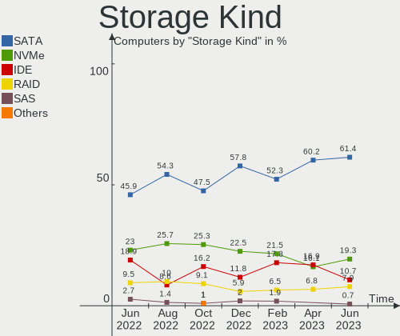

| Kind | Computers | Percent |
|------|-----------|---------|
| SATA | 103       | 62.8%   |
| NVMe | 29        | 17.68%  |
| IDE  | 19        | 11.59%  |
| RAID | 12        | 7.32%   |
| SAS  | 1         | 0.61%   |

Processor
---------

CPU Vendor
----------

Processor vendors

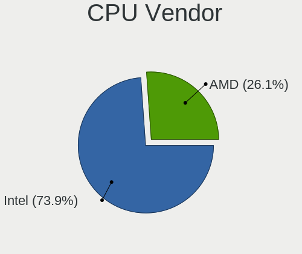

| Vendor | Computers | Percent |
|--------|-----------|---------|
| Intel  | 98        | 75.38%  |
| AMD    | 31        | 23.85%  |
| ARM    | 1         | 0.77%   |

CPU Model
---------

Processor models

| Model                                       | Computers | Percent |
|---------------------------------------------|-----------|---------|
| Intel Core i5-2540M CPU @ 2.60GHz           | 4         | 3.08%   |
| Intel Core i5-5200U CPU @ 2.20GHz           | 3         | 2.31%   |
| AMD FX-6300 Six-Core Processor              | 3         | 2.31%   |
| Intel Pentium CPU 2117U @ 1.80GHz           | 2         | 1.54%   |
| Intel Core i7-8650U CPU @ 1.90GHz           | 2         | 1.54%   |
| Intel Core i7-4510U CPU @ 2.00GHz           | 2         | 1.54%   |
| Intel Core i5-4570 CPU @ 3.20GHz            | 2         | 1.54%   |
| Intel Core i5-1035G1 CPU @ 1.00GHz          | 2         | 1.54%   |
| Intel Core i3-10110U CPU @ 2.10GHz          | 2         | 1.54%   |
| Intel Core 2 Duo CPU T7500 @ 2.20GHz        | 2         | 1.54%   |
| Intel Core 2 Duo CPU P8600 @ 2.40GHz        | 2         | 1.54%   |
| Intel Core 2 Duo CPU E8400 @ 3.00GHz        | 2         | 1.54%   |
| Intel 11th Gen Core i7-1165G7 @ 2.80GHz     | 2         | 1.54%   |
| AMD Ryzen 5 3400G with Radeon Vega Graphics | 2         | 1.54%   |
| AMD PRO A6-9500 R5, 8 COMPUTE CORES 2C+6G   | 2         | 1.54%   |
| Intel Xeon CPU X5677 @ 3.47GHz              | 1         | 0.77%   |
| Intel Xeon CPU X5650 @ 2.67GHz              | 1         | 0.77%   |
| Intel Xeon CPU W3550 @ 3.07GHz              | 1         | 0.77%   |
| Intel Xeon CPU L5420 @ 2.50GHz              | 1         | 0.77%   |
| Intel Xeon CPU E5530 @ 2.40GHz              | 1         | 0.77%   |
| Intel Xeon CPU E5-2637 0 @ 3.00GHz          | 1         | 0.77%   |
| Intel Xeon CPU E3-1225 v3 @ 3.20GHz         | 1         | 0.77%   |
| Intel Pentium Dual-Core CPU T4400 @ 2.20GHz | 1         | 0.77%   |
| Intel Pentium Dual-Core CPU T4300 @ 2.10GHz | 1         | 0.77%   |
| Intel Pentium CPU N3540 @ 2.16GHz           | 1         | 0.77%   |
| Intel Pentium CPU N3510 @ 1.99GHz           | 1         | 0.77%   |
| Intel Pentium CPU G4560 @ 3.50GHz           | 1         | 0.77%   |
| Intel Pentium CPU G3260 @ 3.30GHz           | 1         | 0.77%   |
| Intel Pentium CPU B970 @ 2.30GHz            | 1         | 0.77%   |
| Intel Pentium CPU B960 @ 2.20GHz            | 1         | 0.77%   |
| Intel Core i7-8750H CPU @ 2.20GHz           | 1         | 0.77%   |
| Intel Core i7-7700K CPU @ 4.20GHz           | 1         | 0.77%   |
| Intel Core i7-6700T CPU @ 2.80GHz           | 1         | 0.77%   |
| Intel Core i7-6600U CPU @ 2.60GHz           | 1         | 0.77%   |
| Intel Core i7-5600U CPU @ 2.60GHz           | 1         | 0.77%   |
| Intel Core i7-4600U CPU @ 2.10GHz           | 1         | 0.77%   |
| Intel Core i7-3770 CPU @ 3.40GHz            | 1         | 0.77%   |
| Intel Core i7-2630QM CPU @ 2.00GHz          | 1         | 0.77%   |
| Intel Core i7-1065G7 CPU @ 1.30GHz          | 1         | 0.77%   |
| Intel Core i5-9400 CPU @ 2.90GHz            | 1         | 0.77%   |

CPU Model Family
----------------

Processor model prefix

| Model                   | Computers | Percent |
|-------------------------|-----------|---------|
| Intel Core i5           | 28        | 21.54%  |
| Intel Core i3           | 15        | 11.54%  |
| Intel Core i7           | 13        | 10%     |
| Other                   | 11        | 8.46%   |
| Intel Core 2 Duo        | 10        | 7.69%   |
| Intel Pentium           | 8         | 6.15%   |
| Intel Xeon              | 7         | 5.38%   |
| AMD Ryzen 5             | 7         | 5.38%   |
| Intel Celeron           | 6         | 4.62%   |
| AMD Ryzen 7             | 3         | 2.31%   |
| AMD FX                  | 3         | 2.31%   |
| Intel Pentium Dual-Core | 2         | 1.54%   |
| AMD A8                  | 2         | 1.54%   |
| Intel Core 2 Quad       | 1         | 0.77%   |
| Intel Core 2            | 1         | 0.77%   |
| Intel Atom              | 1         | 0.77%   |
| AMD Ryzen 7 PRO         | 1         | 0.77%   |
| AMD Ryzen 3             | 1         | 0.77%   |
| AMD E1                  | 1         | 0.77%   |
| AMD E                   | 1         | 0.77%   |
| AMD Athlon II X4        | 1         | 0.77%   |
| AMD Athlon II           | 1         | 0.77%   |
| AMD Athlon 64 X2        | 1         | 0.77%   |
| AMD Athlon 64           | 1         | 0.77%   |
| AMD Athlon              | 1         | 0.77%   |
| AMD A6                  | 1         | 0.77%   |
| AMD A4                  | 1         | 0.77%   |
| AMD A10                 | 1         | 0.77%   |

CPU Cores
---------

Number of processor cores

| Number  | Computers | Percent |
|---------|-----------|---------|
| 2       | 67        | 51.54%  |
| 4       | 39        | 30%     |
| 6       | 7         | 5.38%   |
| 8       | 6         | 4.62%   |
| 1       | 5         | 3.85%   |
| 3       | 4         | 3.08%   |
| 14      | 1         | 0.77%   |
| Unknown | 1         | 0.77%   |

CPU Sockets
-----------

Number of sockets

| Number  | Computers | Percent |
|---------|-----------|---------|
| 1       | 127       | 97.69%  |
| 2       | 2         | 1.54%   |
| Unknown | 1         | 0.77%   |

CPU Threads
-----------

Threads per core (Hyper-Threading)

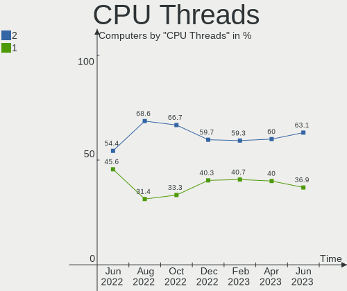

| Number  | Computers | Percent |
|---------|-----------|---------|
| 2       | 76        | 58.46%  |
| 1       | 53        | 40.77%  |
| Unknown | 1         | 0.77%   |

CPU Op-Modes
------------

CPU Operation Modes (32-bit, 64-bit)

| Op mode        | Computers | Percent |
|----------------|-----------|---------|
| 32-bit, 64-bit | 129       | 99.23%  |
| Unknown        | 1         | 0.77%   |

CPU Microcode
-------------

Microcode number

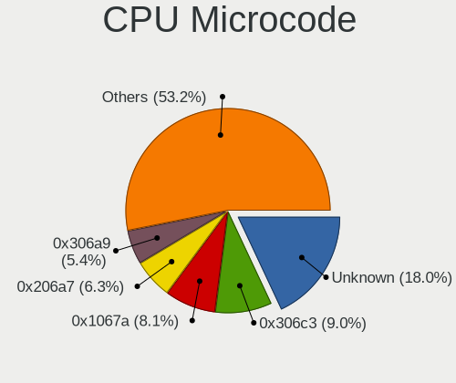

| Number     | Computers | Percent |
|------------|-----------|---------|
| Unknown    | 31        | 23.85%  |
| 0x206a7    | 10        | 7.69%   |
| 0x306a9    | 9         | 6.92%   |
| 0x1067a    | 8         | 6.15%   |
| 0x306c3    | 7         | 5.38%   |
| 0x506e3    | 5         | 3.85%   |
| 0x306d4    | 4         | 3.08%   |
| 0x406e3    | 3         | 2.31%   |
| 0x08108109 | 3         | 2.31%   |
| 0x906e9    | 2         | 1.54%   |
| 0x806ec    | 2         | 1.54%   |
| 0x6fa      | 2         | 1.54%   |
| 0x40651    | 2         | 1.54%   |
| 0x106a5    | 2         | 1.54%   |
| 0x0600611a | 2         | 1.54%   |
| 0x03000027 | 2         | 1.54%   |
| 0x010000c8 | 2         | 1.54%   |
| 0x906eb    | 1         | 0.77%   |
| 0x906ea    | 1         | 0.77%   |
| 0x806ea    | 1         | 0.77%   |
| 0x806d1    | 1         | 0.77%   |
| 0x806c1    | 1         | 0.77%   |
| 0x706e5    | 1         | 0.77%   |
| 0x706a1    | 1         | 0.77%   |
| 0x6fd      | 1         | 0.77%   |
| 0x6f2      | 1         | 0.77%   |
| 0x506c9    | 1         | 0.77%   |
| 0x30678    | 1         | 0.77%   |
| 0x206d7    | 1         | 0.77%   |
| 0x206c2    | 1         | 0.77%   |
| 0x20655    | 1         | 0.77%   |
| 0x10677    | 1         | 0.77%   |
| 0x10676    | 1         | 0.77%   |
| 0x0a50000c | 1         | 0.77%   |
| 0x0a404102 | 1         | 0.77%   |
| 0x0a20120a | 1         | 0.77%   |
| 0x0a201016 | 1         | 0.77%   |
| 0x08900201 | 1         | 0.77%   |
| 0x08701030 | 1         | 0.77%   |
| 0x08600106 | 1         | 0.77%   |

CPU Microarch
-------------

Microarchitecture

| Name             | Computers | Percent |
|------------------|-----------|---------|
| KabyLake         | 13        | 10%     |
| Haswell          | 13        | 10%     |
| SandyBridge      | 12        | 9.23%   |
| Penryn           | 12        | 9.23%   |
| IvyBridge        | 11        | 8.46%   |
| Skylake          | 8         | 6.15%   |
| Broadwell        | 6         | 4.62%   |
| Zen+             | 5         | 3.85%   |
| TigerLake        | 4         | 3.08%   |
| Icelake          | 4         | 3.08%   |
| Core             | 4         | 3.08%   |
| Zen 3            | 3         | 2.31%   |
| Westmere         | 3         | 2.31%   |
| Piledriver       | 3         | 2.31%   |
| K10 Llano        | 3         | 2.31%   |
| Unknown          | 3         | 2.31%   |
| Zen 2            | 2         | 1.54%   |
| Steamroller      | 2         | 1.54%   |
| Silvermont       | 2         | 1.54%   |
| Nehalem          | 2         | 1.54%   |
| K8 Hammer        | 2         | 1.54%   |
| K10              | 2         | 1.54%   |
| Excavator        | 2         | 1.54%   |
| Zen              | 1         | 0.77%   |
| Puma             | 1         | 0.77%   |
| K8 & K10 hybrid  | 1         | 0.77%   |
| Jaguar           | 1         | 0.77%   |
| Goldmont plus    | 1         | 0.77%   |
| Goldmont         | 1         | 0.77%   |
| Bonnell          | 1         | 0.77%   |
| Bobcat           | 1         | 0.77%   |
| Alderlake Hybrid | 1         | 0.77%   |

Graphics
--------

GPU Vendor
----------

Vendors of graphics cards

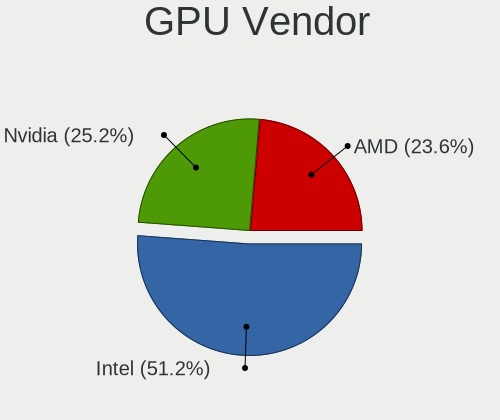

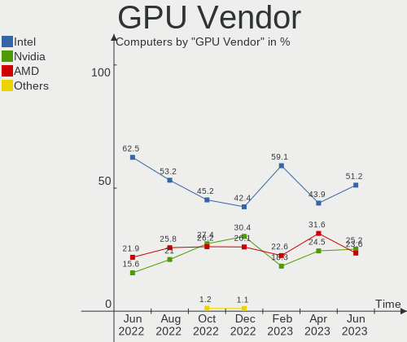

| Vendor | Computers | Percent |
|--------|-----------|---------|
| Intel  | 71        | 47.02%  |
| Nvidia | 43        | 28.48%  |
| AMD    | 37        | 24.5%   |

GPU Model
---------

Graphics card models

| Model                                                                         | Computers | Percent |
|-------------------------------------------------------------------------------|-----------|---------|
| Intel 2nd Generation Core Processor Family Integrated Graphics Controller     | 7         | 4.46%   |
| Intel HD Graphics 5500                                                        | 6         | 3.82%   |
| Intel 3rd Gen Core processor Graphics Controller                              | 6         | 3.82%   |
| Nvidia GF117M [GeForce 610M/710M/810M/820M / GT 620M/625M/630M/720M]          | 5         | 3.18%   |
| Intel Xeon E3-1200 v3/4th Gen Core Processor Integrated Graphics Controller   | 4         | 2.55%   |
| Intel Mobile 4 Series Chipset Integrated Graphics Controller                  | 4         | 2.55%   |
| Intel HD Graphics 530                                                         | 4         | 2.55%   |
| Intel Haswell-ULT Integrated Graphics Controller                              | 4         | 2.55%   |
| Intel TigerLake-LP GT2 [Iris Xe Graphics]                                     | 3         | 1.91%   |
| Intel Skylake GT2 [HD Graphics 520]                                           | 3         | 1.91%   |
| Intel 4 Series Chipset Integrated Graphics Controller                         | 3         | 1.91%   |
| AMD Sun XT [Radeon HD 8670A/8670M/8690M / R5 M330 / M430 / Radeon 520 Mobile] | 3         | 1.91%   |
| AMD Seymour [Radeon HD 6400M/7400M Series]                                    | 3         | 1.91%   |
| AMD Picasso/Raven 2 [Radeon Vega Series / Radeon Vega Mobile Series]          | 3         | 1.91%   |
| Nvidia GM107 [GeForce GTX 750 Ti]                                             | 2         | 1.27%   |
| Nvidia GK208BM [GeForce 920M]                                                 | 2         | 1.27%   |
| Nvidia GK107M [GeForce GT 750M]                                               | 2         | 1.27%   |
| Intel UHD Graphics 620                                                        | 2         | 1.27%   |
| Intel Mobile GM965/GL960 Integrated Graphics Controller (secondary)           | 2         | 1.27%   |
| Intel Mobile GM965/GL960 Integrated Graphics Controller (primary)             | 2         | 1.27%   |
| Intel Iris Plus Graphics G1 (Ice Lake)                                        | 2         | 1.27%   |
| Intel HD Graphics 620                                                         | 2         | 1.27%   |
| Intel CometLake-U GT2 [UHD Graphics]                                          | 2         | 1.27%   |
| Intel CoffeeLake-S GT2 [UHD Graphics 630]                                     | 2         | 1.27%   |
| Intel Atom Processor Z36xxx/Z37xxx Series Graphics & Display                  | 2         | 1.27%   |
| Intel 4th Gen Core Processor Integrated Graphics Controller                   | 2         | 1.27%   |
| AMD Wani [Radeon R5/R6/R7 Graphics]                                           | 2         | 1.27%   |
| AMD RV635/M86 [Mobility Radeon HD 3650]                                       | 2         | 1.27%   |
| Nvidia TU117 [GeForce GTX 1650]                                               | 1         | 0.64%   |
| Nvidia TU106 [GeForce RTX 2070]                                               | 1         | 0.64%   |
| Nvidia GT218 [GeForce 210]                                                    | 1         | 0.64%   |
| Nvidia GP108M [GeForce MX150]                                                 | 1         | 0.64%   |
| Nvidia GP108 [GeForce GT 1030]                                                | 1         | 0.64%   |
| Nvidia GP106 [GeForce GTX 1060 6GB]                                           | 1         | 0.64%   |
| Nvidia GP104 [GeForce GTX 1080]                                               | 1         | 0.64%   |
| Nvidia GP104 [GeForce GTX 1070]                                               | 1         | 0.64%   |
| Nvidia GM108M [GeForce MX130]                                                 | 1         | 0.64%   |
| Nvidia GM108M [GeForce 930MX]                                                 | 1         | 0.64%   |
| Nvidia GM107M [GeForce GTX 950M]                                              | 1         | 0.64%   |
| Nvidia GM107GL [Quadro K620]                                                  | 1         | 0.64%   |

GPU Combo
---------

Combinations of graphics cards

| Name           | Computers | Percent |
|----------------|-----------|---------|
| 1 x Intel      | 53        | 40.77%  |
| 1 x AMD        | 28        | 21.54%  |
| 1 x Nvidia     | 26        | 20%     |
| Intel + Nvidia | 13        | 10%     |
| Intel + AMD    | 4         | 3.08%   |
| 2 x AMD        | 2         | 1.54%   |
| AMD + Nvidia   | 2         | 1.54%   |
| Other          | 1         | 0.77%   |
| 2 x Nvidia     | 1         | 0.77%   |

GPU Driver
----------

Free vs proprietary

| Driver      | Computers | Percent |
|-------------|-----------|---------|
| Free        | 117       | 90%     |
| Proprietary | 7         | 5.38%   |
| Unknown     | 6         | 4.62%   |

GPU Memory
----------

Total video memory

| Size in GB | Computers | Percent |
|------------|-----------|---------|
| Unknown    | 63        | 48.46%  |
| 0.01-0.5   | 23        | 17.69%  |
| 1.01-2.0   | 17        | 13.08%  |
| 0.51-1.0   | 17        | 13.08%  |
| 7.01-8.0   | 4         | 3.08%   |
| 3.01-4.0   | 3         | 2.31%   |
| 5.01-6.0   | 1         | 0.77%   |
| 2.01-3.0   | 1         | 0.77%   |
| 8.01-16.0  | 1         | 0.77%   |

Monitor
-------

Monitor Vendor
--------------

Monitor vendors

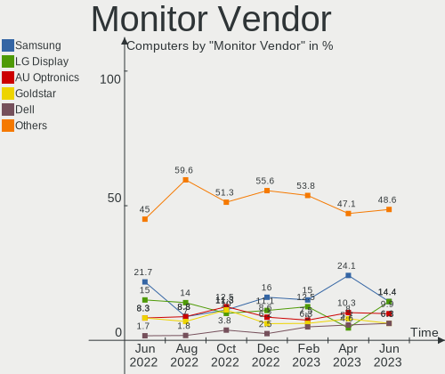

| Vendor                  | Computers | Percent |
|-------------------------|-----------|---------|
| LG Display              | 19        | 14.62%  |
| Samsung Electronics     | 18        | 13.85%  |
| AU Optronics            | 16        | 12.31%  |
| Goldstar                | 13        | 10%     |
| Chimei Innolux          | 8         | 6.15%   |
| BOE                     | 8         | 6.15%   |
| Dell                    | 6         | 4.62%   |
| Lenovo                  | 4         | 3.08%   |
| Chi Mei Optoelectronics | 4         | 3.08%   |
| Ancor Communications    | 4         | 3.08%   |
| Sony                    | 3         | 2.31%   |
| Acer                    | 3         | 2.31%   |
| NCS                     | 2         | 1.54%   |
| Hewlett-Packard         | 2         | 1.54%   |
| Arnos Instruments       | 2         | 1.54%   |
| AOC                     | 2         | 1.54%   |
| Valve                   | 1         | 0.77%   |
| Unknown                 | 1         | 0.77%   |
| Philips                 | 1         | 0.77%   |
| PANDA                   | 1         | 0.77%   |
| NEC Computers           | 1         | 0.77%   |
| MSI                     | 1         | 0.77%   |
| Medion                  | 1         | 0.77%   |
| LG Electronics          | 1         | 0.77%   |
| Iiyama                  | 1         | 0.77%   |
| HannStar                | 1         | 0.77%   |
| Eizo                    | 1         | 0.77%   |
| BenQ                    | 1         | 0.77%   |
| Belinea                 | 1         | 0.77%   |
| ASUSTek Computer        | 1         | 0.77%   |
| Apple                   | 1         | 0.77%   |
| Unknown                 | 1         | 0.77%   |

Monitor Model
-------------

Monitor models

| Model                                                                    | Computers | Percent |
|--------------------------------------------------------------------------|-----------|---------|
| NCS LCD Monitor NCS2275 1920x1080 256x192mm 12.6-inch                    | 2         | 1.49%   |
| LG Display LCD Monitor LGD0395 1366x768 344x194mm 15.5-inch              | 2         | 1.49%   |
| Goldstar E1940 GSM4BD6 1360x768 406x229mm 18.4-inch                      | 2         | 1.49%   |
| Chi Mei Optoelectronics CMC 19" AD CMO0198 1280x1024 338x270mm 17.0-inch | 2         | 1.49%   |
| AU Optronics LCD Monitor AUO21EC 1366x768 344x193mm 15.5-inch            | 2         | 1.49%   |
| AU Optronics LCD Monitor AUO213E 1600x900 309x174mm 14.0-inch            | 2         | 1.49%   |
| Ancor Communications VX228 ACI22C1 1920x1080 476x268mm 21.5-inch         | 2         | 1.49%   |
| Valve ANX7530 U VLV3001 800x1280 100x150mm 7.1-inch                      | 1         | 0.75%   |
| Unknown LCD Monitor FFFF 2288x1287 2550x2550mm 142.0-inch                | 1         | 0.75%   |
| Sony TV *00 SNY7C04 3840x2160 1218x685mm 55.0-inch                       | 1         | 0.75%   |
| Sony TV *00 SNY3F05 3840x2160 1439x809mm 65.0-inch                       | 1         | 0.75%   |
| Sony KDL-S32A12U SNY5C00 1280x768                                        | 1         | 0.75%   |
| Samsung Electronics SyncMaster SAM02DB 1680x1050 474x296mm 22.0-inch     | 1         | 0.75%   |
| Samsung Electronics SyncMaster SAM01B8 1280x1024 338x270mm 17.0-inch     | 1         | 0.75%   |
| Samsung Electronics SyncMaster SAM0191 1280x1024 338x270mm 17.0-inch     | 1         | 0.75%   |
| Samsung Electronics SyncMaster SAM0027 1280x1024 312x234mm 15.4-inch     | 1         | 0.75%   |
| Samsung Electronics SMEX2220 SAM0685 1920x1080 477x268mm 21.5-inch       | 1         | 0.75%   |
| Samsung Electronics SA300/SA350 SAM0849 1920x1080 477x268mm 21.5-inch    | 1         | 0.75%   |
| Samsung Electronics S27E500 SAM0D0D 1920x1080 598x336mm 27.0-inch        | 1         | 0.75%   |
| Samsung Electronics S24R35x SAM100E 1920x1080 527x296mm 23.8-inch        | 1         | 0.75%   |
| Samsung Electronics S24D330 SAM0D92 1920x1080 531x299mm 24.0-inch        | 1         | 0.75%   |
| Samsung Electronics S24D300 SAM0B45 1920x1080 521x293mm 23.5-inch        | 1         | 0.75%   |
| Samsung Electronics S22B370 SAM08BD 1920x1080 477x268mm 21.5-inch        | 1         | 0.75%   |
| Samsung Electronics LCD Monitor SMB2240W 2880x1200                       | 1         | 0.75%   |
| Samsung Electronics LCD Monitor SM2443DW                                 | 1         | 0.75%   |
| Samsung Electronics LCD Monitor SEC3157 1280x800 303x190mm 14.1-inch     | 1         | 0.75%   |
| Samsung Electronics LCD Monitor SEC3051 1600x900 398x232mm 18.1-inch     | 1         | 0.75%   |
| Samsung Electronics LCD Monitor SEC304F 1680x945 409x230mm 18.5-inch     | 1         | 0.75%   |
| Samsung Electronics LCD Monitor SEC3046 1366x768 344x193mm 15.5-inch     | 1         | 0.75%   |
| Samsung Electronics LCD Monitor SDC3150 1920x1080 344x194mm 15.5-inch    | 1         | 0.75%   |
| Samsung Electronics LCD Monitor SAM7017 3840x2160 1872x1053mm 84.6-inch  | 1         | 0.75%   |
| Samsung Electronics C49J89x SAM0F21 3840x1080 1196x336mm 48.9-inch       | 1         | 0.75%   |
| Philips 196V4 PHLC0AF 1366x768 410x230mm 18.5-inch                       | 1         | 0.75%   |
| PANDA LCD Monitor NCP0065 1920x1080 309x174mm 14.0-inch                  | 1         | 0.75%   |
| NEC Computers EA223WM NEC6890 1680x1050 474x296mm 22.0-inch              | 1         | 0.75%   |
| MSI MAG274QRF-QD MSI3CA8 2560x1440 597x336mm 27.0-inch                   | 1         | 0.75%   |
| Medion MD20328 MED3941 1600x900 462x272mm 21.1-inch                      | 1         | 0.75%   |
| LG Electronics LCD Monitor LG HDR WFHD 2560x1080                         | 1         | 0.75%   |
| LG Display LCD Monitor LGD06F5 1920x1080 344x194mm 15.5-inch             | 1         | 0.75%   |
| LG Display LCD Monitor LGD06AA 3840x2400 344x215mm 16.0-inch             | 1         | 0.75%   |

Monitor Resolution
------------------

Monitor screen resolution

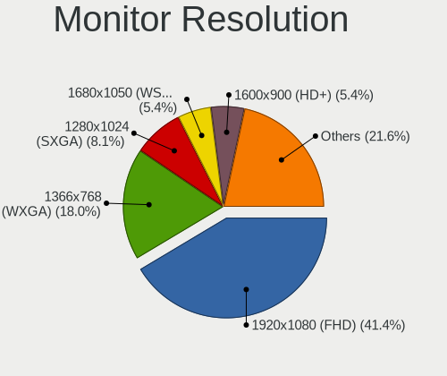

| Resolution         | Computers | Percent |
|--------------------|-----------|---------|
| 1920x1080 (FHD)    | 45        | 34.62%  |
| 1366x768 (WXGA)    | 29        | 22.31%  |
| 1280x1024 (SXGA)   | 9         | 6.92%   |
| 1680x1050 (WSXGA+) | 7         | 5.38%   |
| 1600x900 (HD+)     | 7         | 5.38%   |
| 3840x2160 (4K)     | 5         | 3.85%   |
| 1440x900 (WXGA+)   | 4         | 3.08%   |
| 1280x800 (WXGA)    | 3         | 2.31%   |
| 1024x768 (XGA)     | 3         | 2.31%   |
| 2560x1080          | 2         | 1.54%   |
| 1920x1200 (WUXGA)  | 2         | 1.54%   |
| 1360x768           | 2         | 1.54%   |
| 800x1280           | 1         | 0.77%   |
| 4093x4093          | 1         | 0.77%   |
| 3840x2400          | 1         | 0.77%   |
| 3840x1080          | 1         | 0.77%   |
| 2880x1200          | 1         | 0.77%   |
| 2736x1824          | 1         | 0.77%   |
| 2560x1440 (QHD)    | 1         | 0.77%   |
| 2288x1287          | 1         | 0.77%   |
| 1680x945           | 1         | 0.77%   |
| 1280x768           | 1         | 0.77%   |
| 1152x864           | 1         | 0.77%   |
| Unknown            | 1         | 0.77%   |

Monitor Diagonal
----------------

Diagonal size in inches

| Inches  | Computers | Percent |
|---------|-----------|---------|
| 15      | 37        | 28.03%  |
| 21      | 15        | 11.36%  |
| 14      | 10        | 7.58%   |
| 17      | 8         | 6.06%   |
| 27      | 7         | 5.3%    |
| 23      | 7         | 5.3%    |
| 13      | 7         | 5.3%    |
| 12      | 7         | 5.3%    |
| 18      | 6         | 4.55%   |
| 24      | 5         | 3.79%   |
| 22      | 5         | 3.79%   |
| 19      | 4         | 3.03%   |
| 16      | 3         | 2.27%   |
| Unknown | 3         | 2.27%   |
| 142     | 1         | 0.76%   |
| 84      | 1         | 0.76%   |
| 75      | 1         | 0.76%   |
| 65      | 1         | 0.76%   |
| 49      | 1         | 0.76%   |
| 34      | 1         | 0.76%   |
| 11      | 1         | 0.76%   |
| 7       | 1         | 0.76%   |

Monitor Width
-------------

Physical width

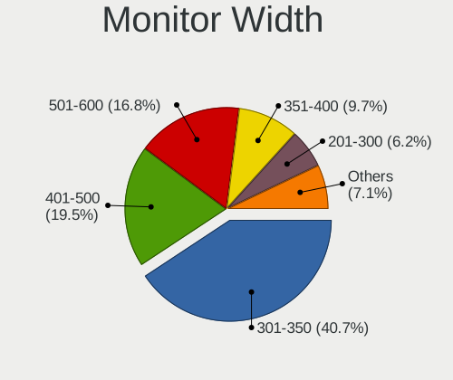

| Width in mm    | Computers | Percent |
|----------------|-----------|---------|
| 301-350        | 58        | 44.62%  |
| 401-500        | 25        | 19.23%  |
| 501-600        | 18        | 13.85%  |
| 201-300        | 10        | 7.69%   |
| 351-400        | 9         | 6.92%   |
| Unknown        | 3         | 2.31%   |
| 1501-2000      | 2         | 1.54%   |
| 1001-1500      | 2         | 1.54%   |
| More than 2000 | 1         | 0.77%   |
| 701-800        | 1         | 0.77%   |
| 1-100          | 1         | 0.77%   |

Aspect Ratio
------------

Proportional relationship between the width and the height

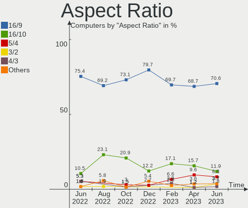

| Ratio   | Computers | Percent |
|---------|-----------|---------|
| 16/9    | 86        | 68.8%   |
| 16/10   | 13        | 10.4%   |
| 5/4     | 9         | 7.2%    |
| 4/3     | 6         | 4.8%    |
| 3/2     | 4         | 3.2%    |
| Unknown | 3         | 2.4%    |
| 32/9    | 1         | 0.8%    |
| 21/9    | 1         | 0.8%    |
| 1.00    | 1         | 0.8%    |
| 0.67    | 1         | 0.8%    |

Monitor Area
------------

Area in inch²

| Area in inch² | Computers | Percent |
|----------------|-----------|---------|
| 101-110        | 36        | 27.48%  |
| 201-250        | 25        | 19.08%  |
| 81-90          | 16        | 12.21%  |
| 141-150        | 11        | 8.4%    |
| 151-200        | 9         | 6.87%   |
| 301-350        | 7         | 5.34%   |
| More than 1000 | 4         | 3.05%   |
| 71-80          | 4         | 3.05%   |
| 61-70          | 4         | 3.05%   |
| 121-130        | 3         | 2.29%   |
| 111-120        | 3         | 2.29%   |
| Unknown        | 3         | 2.29%   |
| 51-60          | 1         | 0.76%   |
| 351-500        | 1         | 0.76%   |
| 1-40           | 1         | 0.76%   |
| 251-300        | 1         | 0.76%   |
| 131-140        | 1         | 0.76%   |
| 501-1000       | 1         | 0.76%   |

Pixel Density
-------------

Pixels per inch

| Density       | Computers | Percent |
|---------------|-----------|---------|
| 51-100        | 48        | 37.21%  |
| 101-120       | 40        | 31.01%  |
| 121-160       | 30        | 23.26%  |
| 161-240       | 6         | 4.65%   |
| Unknown       | 3         | 2.33%   |
| More than 240 | 1         | 0.78%   |
| 1-50          | 1         | 0.78%   |

Multiple Monitors
-----------------

Total monitors connected

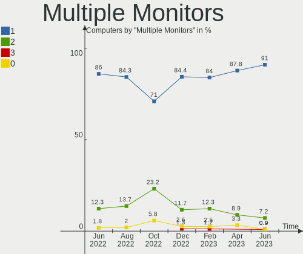

| Total | Computers | Percent |
|-------|-----------|---------|
| 1     | 117       | 90%     |
| 2     | 9         | 6.92%   |
| 0     | 3         | 2.31%   |
| 4     | 1         | 0.77%   |

Network
-------

Net Controller Vendor
---------------------

Controller vendors

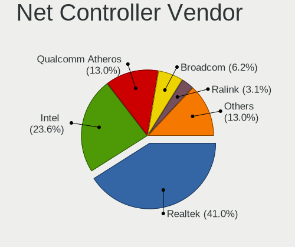

| Vendor                            | Computers | Percent |
|-----------------------------------|-----------|---------|
| Realtek Semiconductor             | 64        | 33.86%  |
| Intel                             | 57        | 30.16%  |
| Qualcomm Atheros                  | 30        | 15.87%  |
| Broadcom                          | 11        | 5.82%   |
| Nvidia                            | 5         | 2.65%   |
| TP-Link                           | 3         | 1.59%   |
| Ericsson Business Mobile Networks | 3         | 1.59%   |
| Broadcom Limited                  | 3         | 1.59%   |
| Marvell Technology Group          | 2         | 1.06%   |
| IMC Networks                      | 2         | 1.06%   |
| WEMOS.CC                          | 1         | 0.53%   |
| Ralink                            | 1         | 0.53%   |
| QinHeng Electronics               | 1         | 0.53%   |
| Microsoft                         | 1         | 0.53%   |
| MediaTek                          | 1         | 0.53%   |
| Lenovo                            | 1         | 0.53%   |
| DisplayLink                       | 1         | 0.53%   |
| D-Link System                     | 1         | 0.53%   |
| ASIX Electronics                  | 1         | 0.53%   |

Net Controller Model
--------------------

Controller models

| Model                                                             | Computers | Percent |
|-------------------------------------------------------------------|-----------|---------|
| Realtek RTL8111/8168/8411 PCI Express Gigabit Ethernet Controller | 48        | 21.62%  |
| Realtek RTL810xE PCI Express Fast Ethernet controller             | 9         | 4.05%   |
| Intel 82579LM Gigabit Network Connection (Lewisville)             | 7         | 3.15%   |
| Qualcomm Atheros QCA9565 / AR9565 Wireless Network Adapter        | 5         | 2.25%   |
| Intel Wireless 8265 / 8275                                        | 5         | 2.25%   |
| Intel Wireless 7265                                               | 5         | 2.25%   |
| Qualcomm Atheros AR9485 Wireless Network Adapter                  | 4         | 1.8%    |
| Intel Wi-Fi 6 AX201                                               | 4         | 1.8%    |
| Intel Ethernet Connection (4) I219-LM                             | 4         | 1.8%    |
| Realtek RTL8188EUS 802.11n Wireless Network Adapter               | 3         | 1.35%   |
| Qualcomm Atheros QCA9377 802.11ac Wireless Network Adapter        | 3         | 1.35%   |
| Qualcomm Atheros AR9287 Wireless Network Adapter (PCI-Express)    | 3         | 1.35%   |
| Qualcomm Atheros AR9285 Wireless Network Adapter (PCI-Express)    | 3         | 1.35%   |
| Intel Wireless 7260                                               | 3         | 1.35%   |
| Intel Wireless 3160                                               | 3         | 1.35%   |
| Intel I211 Gigabit Network Connection                             | 3         | 1.35%   |
| Intel Ethernet Connection I217-LM                                 | 3         | 1.35%   |
| Intel 82567LM Gigabit Network Connection                          | 3         | 1.35%   |
| Broadcom BCM4313 802.11bgn Wireless Network Adapter               | 3         | 1.35%   |
| Realtek RTL8822CE 802.11ac PCIe Wireless Network Adapter          | 2         | 0.9%    |
| Realtek RTL8723BE PCIe Wireless Network Adapter                   | 2         | 0.9%    |
| Realtek RTL8125 2.5GbE Controller                                 | 2         | 0.9%    |
| Qualcomm Atheros AR8152 v2.0 Fast Ethernet                        | 2         | 0.9%    |
| Qualcomm Atheros AR8151 v2.0 Gigabit Ethernet                     | 2         | 0.9%    |
| Qualcomm Atheros AR8132 Fast Ethernet                             | 2         | 0.9%    |
| Nvidia MCP61 Ethernet                                             | 2         | 0.9%    |
| Intel WiFi Link 5100                                              | 2         | 0.9%    |
| Intel PRO/Wireless 5100 AGN [Shiloh] Network Connection           | 2         | 0.9%    |
| Intel Ice Lake-LP PCH CNVi WiFi                                   | 2         | 0.9%    |
| Intel Ethernet Connection (3) I218-LM                             | 2         | 0.9%    |
| Intel Ethernet Connection (2) I219-V                              | 2         | 0.9%    |
| Intel Ethernet Connection (13) I219-V                             | 2         | 0.9%    |
| Intel Dual Band Wireless-AC 3168NGW [Stone Peak]                  | 2         | 0.9%    |
| Intel Centrino Advanced-N 6205 [Taylor Peak]                      | 2         | 0.9%    |
| Intel 82567LM-3 Gigabit Network Connection                        | 2         | 0.9%    |
| Ericsson Business Mobile Networks F5521gw                         | 2         | 0.9%    |
| Broadcom NetXtreme BCM5761 Gigabit Ethernet PCIe                  | 2         | 0.9%    |
| WEMOS.CC LOLIN-S2-MINI                                            | 1         | 0.45%   |
| TP-Link TL-WN821N Version 5 RTL8192EU                             | 1         | 0.45%   |
| TP-Link TL-WN722N v2/v3 [Realtek RTL8188EUS]                      | 1         | 0.45%   |

Wireless Vendor
---------------

Wireless vendors

| Vendor                | Computers | Percent |
|-----------------------|-----------|---------|
| Intel                 | 42        | 46.15%  |
| Qualcomm Atheros      | 23        | 25.27%  |
| Realtek Semiconductor | 10        | 10.99%  |
| Broadcom              | 6         | 6.59%   |
| TP-Link               | 3         | 3.3%    |
| IMC Networks          | 2         | 2.2%    |
| Broadcom Limited      | 2         | 2.2%    |
| Ralink                | 1         | 1.1%    |
| Microsoft             | 1         | 1.1%    |
| MediaTek              | 1         | 1.1%    |

Wireless Model
--------------

Wireless models

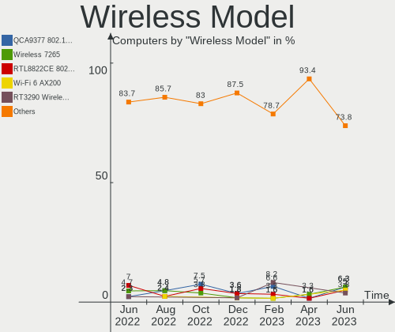

| Model                                                                   | Computers | Percent |
|-------------------------------------------------------------------------|-----------|---------|
| Qualcomm Atheros QCA9565 / AR9565 Wireless Network Adapter              | 5         | 5.49%   |
| Intel Wireless 8265 / 8275                                              | 5         | 5.49%   |
| Intel Wireless 7265                                                     | 5         | 5.49%   |
| Qualcomm Atheros AR9485 Wireless Network Adapter                        | 4         | 4.4%    |
| Intel Wi-Fi 6 AX201                                                     | 4         | 4.4%    |
| Realtek RTL8188EUS 802.11n Wireless Network Adapter                     | 3         | 3.3%    |
| Qualcomm Atheros QCA9377 802.11ac Wireless Network Adapter              | 3         | 3.3%    |
| Qualcomm Atheros AR9287 Wireless Network Adapter (PCI-Express)          | 3         | 3.3%    |
| Qualcomm Atheros AR9285 Wireless Network Adapter (PCI-Express)          | 3         | 3.3%    |
| Intel Wireless 7260                                                     | 3         | 3.3%    |
| Intel Wireless 3160                                                     | 3         | 3.3%    |
| Broadcom BCM4313 802.11bgn Wireless Network Adapter                     | 3         | 3.3%    |
| Realtek RTL8822CE 802.11ac PCIe Wireless Network Adapter                | 2         | 2.2%    |
| Realtek RTL8723BE PCIe Wireless Network Adapter                         | 2         | 2.2%    |
| Intel WiFi Link 5100                                                    | 2         | 2.2%    |
| Intel PRO/Wireless 5100 AGN [Shiloh] Network Connection                 | 2         | 2.2%    |
| Intel Ice Lake-LP PCH CNVi WiFi                                         | 2         | 2.2%    |
| Intel Dual Band Wireless-AC 3168NGW [Stone Peak]                        | 2         | 2.2%    |
| Intel Centrino Advanced-N 6205 [Taylor Peak]                            | 2         | 2.2%    |
| TP-Link TL-WN821N Version 5 RTL8192EU                                   | 1         | 1.1%    |
| TP-Link TL-WN722N v2/v3 [Realtek RTL8188EUS]                            | 1         | 1.1%    |
| TP-Link 802.11ac WLAN Adapter                                           | 1         | 1.1%    |
| Realtek RTL8852AE 802.11ax PCIe Wireless Network Adapter                | 1         | 1.1%    |
| Realtek RTL8821AE 802.11ac PCIe Wireless Network Adapter                | 1         | 1.1%    |
| Realtek RTL8723BU 802.11b/g/n WLAN Adapter                              | 1         | 1.1%    |
| Ralink RT3290 Wireless 802.11n 1T/1R PCIe                               | 1         | 1.1%    |
| Qualcomm Atheros QCA6174 802.11ac Wireless Network Adapter              | 1         | 1.1%    |
| Qualcomm Atheros AR9462 Wireless Network Adapter                        | 1         | 1.1%    |
| Qualcomm Atheros AR928X Wireless Network Adapter (PCI-Express)          | 1         | 1.1%    |
| Qualcomm Atheros AR922X Wireless Network Adapter                        | 1         | 1.1%    |
| Qualcomm Atheros AR242x / AR542x Wireless Network Adapter (PCI-Express) | 1         | 1.1%    |
| Microsoft Xbox 360 Wireless Adapter                                     | 1         | 1.1%    |
| MediaTek MT7922 802.11ax PCI Express Wireless Network Adapter           | 1         | 1.1%    |
| Intel Wireless 8260                                                     | 1         | 1.1%    |
| Intel Wireless 3165                                                     | 1         | 1.1%    |
| Intel Wi-Fi 6 AX210/AX211/AX411 160MHz                                  | 1         | 1.1%    |
| Intel Wi-Fi 6 AX200                                                     | 1         | 1.1%    |
| Intel Ultimate N WiFi Link 5300                                         | 1         | 1.1%    |
| Intel PRO/Wireless 4965 AG or AGN [Kedron] Network Connection           | 1         | 1.1%    |
| Intel PRO/Wireless 3945ABG [Golan] Network Connection                   | 1         | 1.1%    |

Ethernet Vendor
---------------

Ethernet vendors

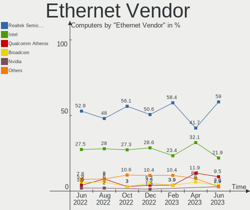

| Vendor                   | Computers | Percent |
|--------------------------|-----------|---------|
| Realtek Semiconductor    | 60        | 48.39%  |
| Intel                    | 35        | 28.23%  |
| Qualcomm Atheros         | 11        | 8.87%   |
| Broadcom                 | 6         | 4.84%   |
| Nvidia                   | 5         | 4.03%   |
| Marvell Technology Group | 2         | 1.61%   |
| Lenovo                   | 1         | 0.81%   |
| DisplayLink              | 1         | 0.81%   |
| D-Link System            | 1         | 0.81%   |
| Broadcom Limited         | 1         | 0.81%   |
| ASIX Electronics         | 1         | 0.81%   |

Ethernet Model
--------------

Ethernet models

| Model                                                             | Computers | Percent |
|-------------------------------------------------------------------|-----------|---------|
| Realtek RTL8111/8168/8411 PCI Express Gigabit Ethernet Controller | 48        | 38.1%   |
| Realtek RTL810xE PCI Express Fast Ethernet controller             | 9         | 7.14%   |
| Intel 82579LM Gigabit Network Connection (Lewisville)             | 7         | 5.56%   |
| Intel Ethernet Connection (4) I219-LM                             | 4         | 3.17%   |
| Intel I211 Gigabit Network Connection                             | 3         | 2.38%   |
| Intel Ethernet Connection I217-LM                                 | 3         | 2.38%   |
| Intel 82567LM Gigabit Network Connection                          | 3         | 2.38%   |
| Realtek RTL8125 2.5GbE Controller                                 | 2         | 1.59%   |
| Qualcomm Atheros AR8152 v2.0 Fast Ethernet                        | 2         | 1.59%   |
| Qualcomm Atheros AR8151 v2.0 Gigabit Ethernet                     | 2         | 1.59%   |
| Qualcomm Atheros AR8132 Fast Ethernet                             | 2         | 1.59%   |
| Nvidia MCP61 Ethernet                                             | 2         | 1.59%   |
| Intel Ethernet Connection (3) I218-LM                             | 2         | 1.59%   |
| Intel Ethernet Connection (2) I219-V                              | 2         | 1.59%   |
| Intel Ethernet Connection (13) I219-V                             | 2         | 1.59%   |
| Intel 82567LM-3 Gigabit Network Connection                        | 2         | 1.59%   |
| Broadcom NetXtreme BCM5761 Gigabit Ethernet PCIe                  | 2         | 1.59%   |
| Realtek USB 10/100/1G/2.5G LAN                                    | 1         | 0.79%   |
| Realtek RTL8169 PCI Gigabit Ethernet Controller                   | 1         | 0.79%   |
| Qualcomm Atheros QCA8172 Fast Ethernet                            | 1         | 0.79%   |
| Qualcomm Atheros Attansic L1 Gigabit Ethernet                     | 1         | 0.79%   |
| Qualcomm Atheros AR8162 Fast Ethernet                             | 1         | 0.79%   |
| Qualcomm Atheros AR8131 Gigabit Ethernet                          | 1         | 0.79%   |
| Qualcomm Atheros AR8121/AR8113/AR8114 Gigabit or Fast Ethernet    | 1         | 0.79%   |
| Nvidia MCP79 Ethernet                                             | 1         | 0.79%   |
| Nvidia MCP77 Ethernet                                             | 1         | 0.79%   |
| Nvidia MCP73 Ethernet                                             | 1         | 0.79%   |
| Marvell Group 88E8056 PCI-E Gigabit Ethernet Controller           | 1         | 0.79%   |
| Marvell Group 88E8055 PCI-E Gigabit Ethernet Controller           | 1         | 0.79%   |
| Lenovo USB-C to LAN                                               | 1         | 0.79%   |
| Intel Ethernet Controller I226-V                                  | 1         | 0.79%   |
| Intel Ethernet controller                                         | 1         | 0.79%   |
| Intel Ethernet Connection I219-V                                  | 1         | 0.79%   |
| Intel Ethernet Connection I218-LM                                 | 1         | 0.79%   |
| Intel Ethernet Connection (5) I219-V                              | 1         | 0.79%   |
| Intel Ethernet Connection (2) I219-LM                             | 1         | 0.79%   |
| Intel 82579V Gigabit Network Connection                           | 1         | 0.79%   |
| Intel 82567LF-3 Gigabit Network Connection                        | 1         | 0.79%   |
| DisplayLink USB Port Replicator PR8.1                             | 1         | 0.79%   |
| D-Link System DL10050 Sundance Ethernet                           | 1         | 0.79%   |

Net Controller Kind
-------------------

Ethernet, WiFi or modem

| Kind     | Computers | Percent |
|----------|-----------|---------|
| Ethernet | 119       | 55.35%  |
| WiFi     | 91        | 42.33%  |
| Modem    | 5         | 2.33%   |

Used Controller
---------------

Currently used network controller

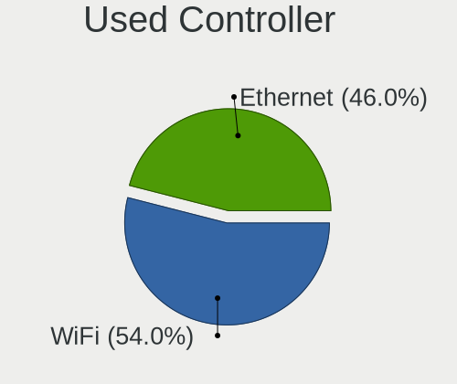

| Kind     | Computers | Percent |
|----------|-----------|---------|
| WiFi     | 73        | 54.07%  |
| Ethernet | 62        | 45.93%  |

NICs
----

Total network controllers on board

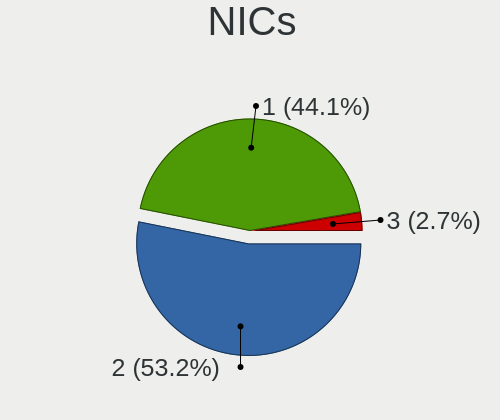

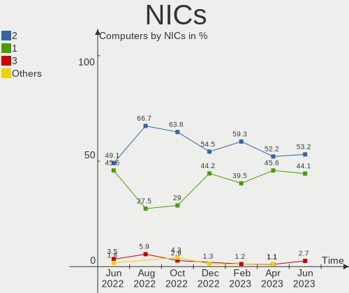

| Total | Computers | Percent |
|-------|-----------|---------|
| 2     | 71        | 54.62%  |
| 1     | 54        | 41.54%  |
| 0     | 3         | 2.31%   |
| 3     | 2         | 1.54%   |

IPv6
----

IPv6 vs IPv4

| Used | Computers | Percent |
|------|-----------|---------|
| No   | 78        | 60%     |
| Yes  | 52        | 40%     |

Bluetooth
---------

Bluetooth Vendor
----------------

Controller vendors

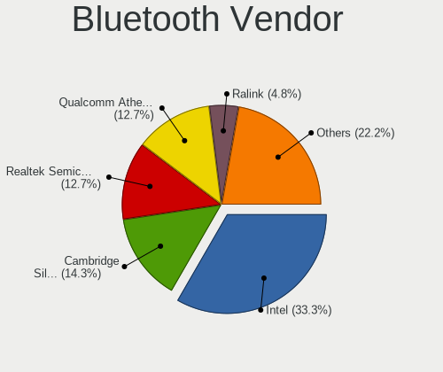

| Vendor                          | Computers | Percent |
|---------------------------------|-----------|---------|
| Intel                           | 32        | 45.71%  |
| Qualcomm Atheros Communications | 9         | 12.86%  |
| Cambridge Silicon Radio         | 7         | 10%     |
| Realtek Semiconductor           | 5         | 7.14%   |
| Broadcom                        | 4         | 5.71%   |
| Foxconn / Hon Hai               | 3         | 4.29%   |
| Toshiba                         | 2         | 2.86%   |
| TP-Link                         | 1         | 1.43%   |
| Ralink                          | 1         | 1.43%   |
| Lite-On Technology              | 1         | 1.43%   |
| IMC Networks                    | 1         | 1.43%   |
| Dell                            | 1         | 1.43%   |
| ASUSTek Computer                | 1         | 1.43%   |
| Apple                           | 1         | 1.43%   |
| Alps Electric                   | 1         | 1.43%   |

Bluetooth Model
---------------

Controller models

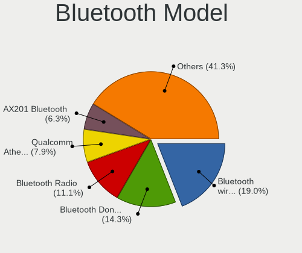

| Model                                               | Computers | Percent |
|-----------------------------------------------------|-----------|---------|
| Intel Bluetooth wireless interface                  | 17        | 24.29%  |
| Intel AX201 Bluetooth                               | 7         | 10%     |
| Cambridge Silicon Radio Bluetooth Dongle (HCI mode) | 7         | 10%     |
| Qualcomm Atheros  Bluetooth Device                  | 5         | 7.14%   |
| Realtek Bluetooth Radio                             | 3         | 4.29%   |
| Intel Bluetooth 9460/9560 Jefferson Peak (JfP)      | 3         | 4.29%   |
| Toshiba Bluetooth Device                            | 2         | 2.86%   |
| Intel Wireless-AC 3168 Bluetooth                    | 2         | 2.86%   |
| TP-Link UB500 Adapter                               | 1         | 1.43%   |
| Realtek RTL8821A Bluetooth                          | 1         | 1.43%   |
| Realtek RTL8723B Bluetooth                          | 1         | 1.43%   |
| Ralink RT3290 Bluetooth                             | 1         | 1.43%   |
| Qualcomm Atheros QCA61x4 Bluetooth 4.0              | 1         | 1.43%   |
| Qualcomm Atheros AR3012 Bluetooth 4.0               | 1         | 1.43%   |
| Qualcomm Atheros AR3012 Bluetooth                   | 1         | 1.43%   |
| Qualcomm Atheros AR3011 Bluetooth                   | 1         | 1.43%   |
| Lite-On Atheros AR3012 Bluetooth                    | 1         | 1.43%   |
| Intel Centrino Bluetooth Wireless Transceiver       | 1         | 1.43%   |
| Intel AX210 Bluetooth                               | 1         | 1.43%   |
| Intel AX200 Bluetooth                               | 1         | 1.43%   |
| IMC Networks Bluetooth Radio                        | 1         | 1.43%   |
| Foxconn / Hon Hai Wireless_Device                   | 1         | 1.43%   |
| Foxconn / Hon Hai Broadcom Bluetooth 2.1 Device     | 1         | 1.43%   |
| Foxconn / Hon Hai Broadcom BCM20702 Bluetooth       | 1         | 1.43%   |
| Dell Wireless 360 Bluetooth                         | 1         | 1.43%   |
| Broadcom BCM43142A0 Bluetooth Device                | 1         | 1.43%   |
| Broadcom BCM2070 Bluetooth 2.1 + EDR                | 1         | 1.43%   |
| Broadcom BCM2045B (BDC-2.1) [Bluetooth Controller]  | 1         | 1.43%   |
| Broadcom BCM2045 Bluetooth                          | 1         | 1.43%   |
| ASUS ASUS USB-BT500                                 | 1         | 1.43%   |
| Apple Built-in Bluetooth 2.0+EDR HCI                | 1         | 1.43%   |
| Alps Electric BCM2046 Bluetooth Device              | 1         | 1.43%   |

Sound
-----

Sound Vendor
------------

Sound card vendors

| Vendor                 | Computers | Percent |
|------------------------|-----------|---------|
| Intel                  | 96        | 55.49%  |
| AMD                    | 39        | 22.54%  |
| Nvidia                 | 29        | 16.76%  |
| Plantronics            | 2         | 1.16%   |
| Texas Instruments      | 1         | 0.58%   |
| Promethean Limited     | 1         | 0.58%   |
| Lenovo                 | 1         | 0.58%   |
| Generalplus Technology | 1         | 0.58%   |
| Focusrite-Novation     | 1         | 0.58%   |
| Creative Labs          | 1         | 0.58%   |
| C-Media Electronics    | 1         | 0.58%   |

Sound Model
-----------

Sound card models

| Model                                                                             | Computers | Percent |
|-----------------------------------------------------------------------------------|-----------|---------|
| Intel 7 Series/C216 Chipset Family High Definition Audio Controller               | 14        | 6.67%   |
| Intel 8 Series/C220 Series Chipset High Definition Audio Controller               | 9         | 4.29%   |
| Intel 6 Series/C200 Series Chipset Family High Definition Audio Controller        | 8         | 3.81%   |
| Intel Xeon E3-1200 v3/4th Gen Core Processor HD Audio Controller                  | 7         | 3.33%   |
| Intel Sunrise Point-LP HD Audio                                                   | 7         | 3.33%   |
| Intel 82801I (ICH9 Family) HD Audio Controller                                    | 7         | 3.33%   |
| AMD FCH Azalia Controller                                                         | 7         | 3.33%   |
| AMD Family 17h/19h HD Audio Controller                                            | 7         | 3.33%   |
| Intel Wildcat Point-LP High Definition Audio Controller                           | 6         | 2.86%   |
| Intel Broadwell-U Audio Controller                                                | 6         | 2.86%   |
| AMD SBx00 Azalia (Intel HDA)                                                      | 6         | 2.86%   |
| Nvidia GK208 HDMI/DP Audio Controller                                             | 5         | 2.38%   |
| Intel 82801JI (ICH10 Family) HD Audio Controller                                  | 5         | 2.38%   |
| Intel 200 Series PCH HD Audio                                                     | 5         | 2.38%   |
| Intel 100 Series/C230 Series Chipset Family HD Audio Controller                   | 5         | 2.38%   |
| Intel Tiger Lake-LP Smart Sound Technology Audio Controller                       | 4         | 1.9%    |
| Intel Haswell-ULT HD Audio Controller                                             | 4         | 1.9%    |
| Intel 8 Series HD Audio Controller                                                | 4         | 1.9%    |
| AMD Kabini HDMI/DP Audio                                                          | 4         | 1.9%    |
| AMD Caicos HDMI Audio [Radeon HD 6450 / 7450/8450/8490 OEM / R5 230/235/235X OEM] | 4         | 1.9%    |
| Nvidia GM107 High Definition Audio Controller [GeForce 940MX]                     | 3         | 1.43%   |
| Nvidia Audio device                                                               | 3         | 1.43%   |
| Intel Ice Lake-LP Smart Sound Technology Audio Controller                         | 3         | 1.43%   |
| Intel 82801JD/DO (ICH10 Family) HD Audio Controller                               | 3         | 1.43%   |
| AMD Starship/Matisse HD Audio Controller                                          | 3         | 1.43%   |
| AMD Raven/Raven2/Fenghuang HDMI/DP Audio Controller                               | 3         | 1.43%   |
| Nvidia MCP61 High Definition Audio                                                | 2         | 0.95%   |
| Nvidia GP104 High Definition Audio Controller                                     | 2         | 0.95%   |
| Nvidia GK107 HDMI Audio Controller                                                | 2         | 0.95%   |
| Nvidia GK106 HDMI Audio Controller                                                | 2         | 0.95%   |
| Nvidia GA106 High Definition Audio Controller                                     | 2         | 0.95%   |
| Intel NM10/ICH7 Family High Definition Audio Controller                           | 2         | 0.95%   |
| Intel Comet Lake PCH-LP cAVS                                                      | 2         | 0.95%   |
| Intel Atom Processor Z36xxx/Z37xxx Series High Definition Audio Controller        | 2         | 0.95%   |
| Intel 82801H (ICH8 Family) HD Audio Controller                                    | 2         | 0.95%   |
| AMD RV710/730 HDMI Audio [Radeon HD 4000 series]                                  | 2         | 0.95%   |
| AMD RV635 HDMI Audio [Radeon HD 3650/3730/3750]                                   | 2         | 0.95%   |
| AMD Rembrandt Radeon High Definition Audio Controller                             | 2         | 0.95%   |
| AMD Oland/Hainan/Cape Verde/Pitcairn HDMI Audio [Radeon HD 7000 Series]           | 2         | 0.95%   |
| AMD Kaveri HDMI/DP Audio Controller                                               | 2         | 0.95%   |

Memory
------

Memory Vendor
-------------

Memory module vendors

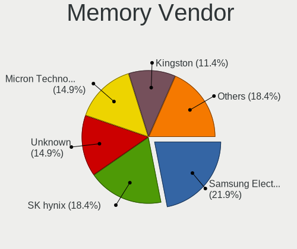

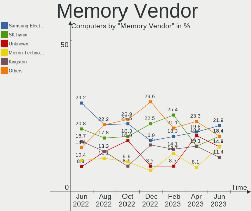

| Vendor              | Computers | Percent |
|---------------------|-----------|---------|
| SK hynix            | 28        | 21.88%  |
| Samsung Electronics | 25        | 19.53%  |
| Kingston            | 17        | 13.28%  |
| Unknown             | 14        | 10.94%  |
| Micron Technology   | 14        | 10.94%  |
| G.Skill             | 5         | 3.91%   |
| Corsair             | 5         | 3.91%   |
| Ramaxel Technology  | 3         | 2.34%   |
| Crucial             | 3         | 2.34%   |
| Unknown (ABCD)      | 2         | 1.56%   |
| Nanya Technology    | 2         | 1.56%   |
| Elpida              | 2         | 1.56%   |
| Unknown (8A5B)      | 1         | 0.78%   |
| Transcend           | 1         | 0.78%   |
| SGS/Thomson         | 1         | 0.78%   |
| Qimonda             | 1         | 0.78%   |
| Kingmax             | 1         | 0.78%   |
| ASint Technology    | 1         | 0.78%   |
| Apacer              | 1         | 0.78%   |
| A-DATA Technology   | 1         | 0.78%   |

Memory Model
------------

Memory module models

| Model                                                            | Computers | Percent |
|------------------------------------------------------------------|-----------|---------|
| SK hynix RAM HMT451S6BFR8A-PB 4GB SODIMM DDR3 1600MT/s           | 3         | 2.17%   |
| SK hynix RAM HMT351S6CFR8C-H9 4096MB SODIMM DDR3 1333MT/s        | 3         | 2.17%   |
| Samsung RAM M471B5173QH0-YK0 4GB SODIMM DDR3 1600MT/s            | 3         | 2.17%   |
| Unknown RAM Module 2048MB SODIMM 800MT/s                         | 2         | 1.45%   |
| Unknown (ABCD) RAM 123456789012345678 2GB SODIMM LPDDR4 2400MT/s | 2         | 1.45%   |
| Samsung RAM Module 4096MB DIMM DDR4 2133MT/s                     | 2         | 1.45%   |
| Samsung RAM M471B5173EB0-YK0 4GB SODIMM DDR3 1600MT/s            | 2         | 1.45%   |
| Samsung RAM M471B1G73DB0-YK0 8GB SODIMM DDR3 1600MT/s            | 2         | 1.45%   |
| Samsung RAM M378B5173QH0-CK0 4GB DIMM DDR3 1600MT/s              | 2         | 1.45%   |
| Kingston RAM KHX2400C15/16G 16GB DIMM DDR4 3334MT/s              | 2         | 1.45%   |
| Kingston RAM KHX1600C10D3/4G 4GB DIMM DDR3 1866MT/s              | 2         | 1.45%   |
| Kingston RAM KHX1600C10D3/ 8GB DIMM DDR3 1600MT/s                | 2         | 1.45%   |
| G.Skill RAM F4-3000C16-8GISB 8192MB DIMM DDR4 3200MT/s           | 2         | 1.45%   |
| Elpida RAM EBJ40UG8EFU0 4GB SODIMM DDR3 1600MT/s                 | 2         | 1.45%   |
| Unknown RAM V02L3L84GB52852816 4096MB DIMM DDR3 1333MT/s         | 1         | 0.72%   |
| Unknown RAM Module 4096MB DIMM SDRAM                             | 1         | 0.72%   |
| Unknown RAM Module 4096MB DIMM DDR3 1333MT/s                     | 1         | 0.72%   |
| Unknown RAM Module 4096MB DIMM 1600MT/s                          | 1         | 0.72%   |
| Unknown RAM Module 2GB SODIMM DDR2                               | 1         | 0.72%   |
| Unknown RAM Module 2GB DIMM DDR2 800MT/s                         | 1         | 0.72%   |
| Unknown RAM Module 2048MB DIMM 800MT/s                           | 1         | 0.72%   |
| Unknown RAM Module 2048MB DIMM 667MT/s                           | 1         | 0.72%   |
| Unknown RAM Module 2048MB DIMM 1333MT/s                          | 1         | 0.72%   |
| Unknown RAM Module 1GB SODIMM DDR3 1600MT/s                      | 1         | 0.72%   |
| Unknown RAM Module 1GB SODIMM DDR2 667MT/s                       | 1         | 0.72%   |
| Unknown RAM Module 1GB DIMM DDR2 800MT/s                         | 1         | 0.72%   |
| Unknown RAM Module 1024MB DIMM DDR2                              | 1         | 0.72%   |
| Unknown RAM Module 1024MB DIMM 800MT/s                           | 1         | 0.72%   |
| Unknown (8A5B) RAM LuminouTek 16GB SODIMM DDR4 2667MT/s          | 1         | 0.72%   |
| Transcend RAM JM1333KLN-4G 4GB DIMM DDR3 1600MT/s                | 1         | 0.72%   |
| SK hynix RAM HYMP125S64CP8-Y5 2GB SODIMM DDR2 667MT/s            | 1         | 0.72%   |
| SK hynix RAM HMT451U7BFR8A-PB 4096MB DIMM DDR3 1600MT/s          | 1         | 0.72%   |
| SK hynix RAM HMT451U6AFR8C-PB 4GB DIMM DDR3 1600MT/s             | 1         | 0.72%   |
| SK hynix RAM HMT41GS6BFR8A-PB 8GB SODIMM DDR3 1600MT/s           | 1         | 0.72%   |
| SK hynix RAM HMT351U6EFR8C-PB 4GB DIMM DDR3 1800MT/s             | 1         | 0.72%   |
| SK hynix RAM HMT351S6EFR8C-PB 4GB SODIMM DDR3 1600MT/s           | 1         | 0.72%   |
| SK hynix RAM HMT351S6CFR8C-PB 4GB SODIMM DDR3 1600MT/s           | 1         | 0.72%   |
| SK hynix RAM HMT325S6EFR8A-PB 2048MB SODIMM DDR3 1600MT/s        | 1         | 0.72%   |
| SK hynix RAM HMT325S6BFR8C-H9 2048MB SODIMM DDR3 1333MT/s        | 1         | 0.72%   |
| SK hynix RAM HMT325S6BFR8C-H9 2048MB DIMM DDR3 1333MT/s          | 1         | 0.72%   |

Memory Kind
-----------

Memory module kinds

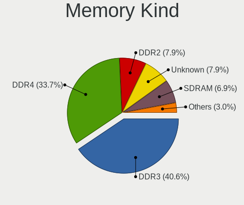

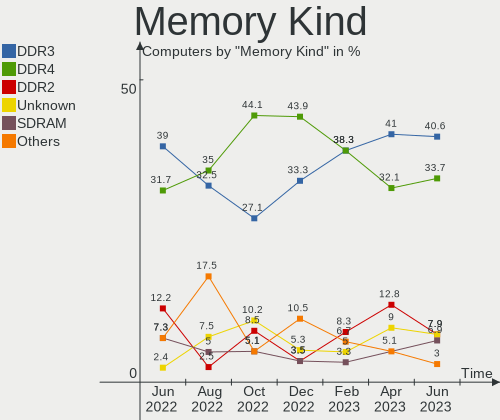

| Kind    | Computers | Percent |
|---------|-----------|---------|
| DDR3    | 55        | 49.55%  |
| DDR4    | 32        | 28.83%  |
| DDR2    | 8         | 7.21%   |
| Unknown | 6         | 5.41%   |
| SDRAM   | 5         | 4.5%    |
| LPDDR4  | 4         | 3.6%    |
| DDR5    | 1         | 0.9%    |

Memory Form Factor
------------------

Physical design of the memory module

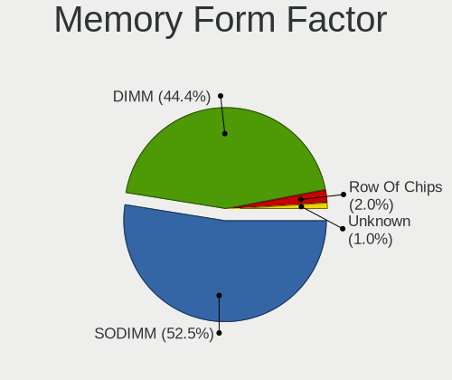

| Name         | Computers | Percent |
|--------------|-----------|---------|
| SODIMM       | 59        | 53.15%  |
| DIMM         | 49        | 44.14%  |
| Row Of Chips | 2         | 1.8%    |
| Chip         | 1         | 0.9%    |

Memory Size
-----------

Memory module size

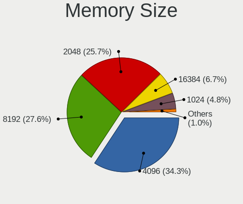

| Size  | Computers | Percent |
|-------|-----------|---------|
| 4096  | 49        | 40.83%  |
| 8192  | 29        | 24.17%  |
| 2048  | 23        | 19.17%  |
| 16384 | 11        | 9.17%   |
| 1024  | 8         | 6.67%   |

Memory Speed
------------

Memory module speed

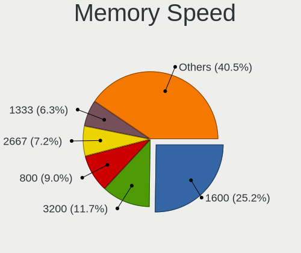

| Speed   | Computers | Percent |
|---------|-----------|---------|
| 1600    | 34        | 27.64%  |
| 1333    | 13        | 10.57%  |
| 3200    | 10        | 8.13%   |
| 2667    | 9         | 7.32%   |
| 800     | 9         | 7.32%   |
| 2400    | 8         | 6.5%    |
| 2133    | 8         | 6.5%    |
| 1866    | 5         | 4.07%   |
| 667     | 4         | 3.25%   |
| 1067    | 3         | 2.44%   |
| Unknown | 3         | 2.44%   |
| 3334    | 2         | 1.63%   |
| 1334    | 2         | 1.63%   |
| 6000    | 1         | 0.81%   |
| 4267    | 1         | 0.81%   |
| 4199    | 1         | 0.81%   |
| 3600    | 1         | 0.81%   |
| 3466    | 1         | 0.81%   |
| 3266    | 1         | 0.81%   |
| 2800    | 1         | 0.81%   |
| 2666    | 1         | 0.81%   |
| 2448    | 1         | 0.81%   |
| 2048    | 1         | 0.81%   |
| 2000    | 1         | 0.81%   |
| 1800    | 1         | 0.81%   |
| 1066    | 1         | 0.81%   |

Printers & scanners
-------------------

Printer Vendor
--------------

Printer device vendors

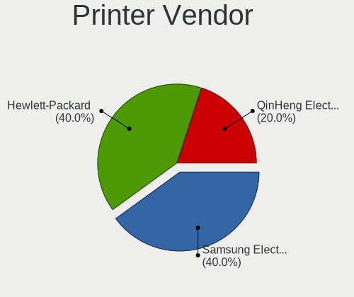

| Vendor              | Computers | Percent |
|---------------------|-----------|---------|
| Samsung Electronics | 2         | 50%     |
| QinHeng Electronics | 1         | 25%     |
| Hewlett-Packard     | 1         | 25%     |

Printer Model
-------------

Printer device models

| Model                                | Computers | Percent |
|--------------------------------------|-----------|---------|
| Samsung ML-1640 Series Laser Printer | 1         | 25%     |
| Samsung C48x Series                  | 1         | 25%     |
| QinHeng CH340S                       | 1         | 25%     |
| HP DeskJet 2600 series               | 1         | 25%     |

Scanner Vendor
--------------

Scanner device vendors

| Vendor | Computers | Percent |
|--------|-----------|---------|
| Canon  | 1         | 100%    |

Scanner Model
-------------

Scanner device models

| Model                              | Computers | Percent |
|------------------------------------|-----------|---------|
| Canon CanoScan N670U/N676U/LiDE 20 | 1         | 100%    |

Camera
------

Camera Vendor
-------------

Camera device vendors

| Vendor                                 | Computers | Percent |
|----------------------------------------|-----------|---------|
| Chicony Electronics                    | 14        | 19.18%  |
| Microdia                               | 8         | 10.96%  |
| Realtek Semiconductor                  | 5         | 6.85%   |
| Suyin                                  | 4         | 5.48%   |
| Quanta                                 | 4         | 5.48%   |
| Cheng Uei Precision Industry (Foxlink) | 4         | 5.48%   |
| Bison Electronics                      | 4         | 5.48%   |
| Alcor Micro                            | 4         | 5.48%   |
| IMC Networks                           | 3         | 4.11%   |
| Apple                                  | 3         | 4.11%   |
| Syntek                                 | 2         | 2.74%   |
| Luxvisions Innotech Limited            | 2         | 2.74%   |
| Lite-On Technology                     | 2         | 2.74%   |
| GEMBIRD                                | 2         | 2.74%   |
| Z-Star Microelectronics                | 1         | 1.37%   |
| Sunplus Innovation Technology          | 1         | 1.37%   |
| Sonix Technology                       | 1         | 1.37%   |
| Silicon Motion                         | 1         | 1.37%   |
| Ricoh                                  | 1         | 1.37%   |
| Microsoft                              | 1         | 1.37%   |
| Lenovo                                 | 1         | 1.37%   |
| icSpring                               | 1         | 1.37%   |
| Generalplus Technology                 | 1         | 1.37%   |
| BRS 2Mp Camera                         | 1         | 1.37%   |
| Aveo Technology                        | 1         | 1.37%   |
| Acer                                   | 1         | 1.37%   |

Camera Model
------------

Camera device models

| Model                                               | Computers | Percent |
|-----------------------------------------------------|-----------|---------|
| Chicony Integrated Camera                           | 4         | 5.48%   |
| Microdia Camera                                     | 3         | 4.11%   |
| Syntek Integrated Camera                            | 2         | 2.74%   |
| GEMBIRD Generic UVC 1.00 camera [AppoTech AX2311]   | 2         | 2.74%   |
| Chicony HD User Facing                              | 2         | 2.74%   |
| Cheng Uei Precision Industry (Foxlink) Webcam       | 2         | 2.74%   |
| Bison Lenovo EasyCamera                             | 2         | 2.74%   |
| Apple iPhone 5/5C/5S/6/SE/7/8/X                     | 2         | 2.74%   |
| Alcor Micro Asus Integrated Webcam                  | 2         | 2.74%   |
| Z-Star Venus USB2.0 Camera                          | 1         | 1.37%   |
| Suyin Integrated_Webcam_HD                          | 1         | 1.37%   |
| Suyin HP Truevision HD                              | 1         | 1.37%   |
| Suyin Acer/HP Integrated Webcam [CN0314]            | 1         | 1.37%   |
| Suyin Acer HD Crystal Eye webcam                    | 1         | 1.37%   |
| Sunplus Integrated_Webcam_HD                        | 1         | 1.37%   |
| Sonix USB2.0 FHD UVC WebCam                         | 1         | 1.37%   |
| Silicon Motion WebCam SC-13HDL11939N                | 1         | 1.37%   |
| Ricoh Sony Vaio Integrated Webcam                   | 1         | 1.37%   |
| Realtek USB2.0 HD UVC WebCam                        | 1         | 1.37%   |
| Realtek Integrated_Webcam_HD                        | 1         | 1.37%   |
| Realtek Integrated Webcam HD                        | 1         | 1.37%   |
| Realtek HP Webcam                                   | 1         | 1.37%   |
| Realtek FJ Camera                                   | 1         | 1.37%   |
| Quanta HP Wide Vision HD Camera                     | 1         | 1.37%   |
| Quanta HP HD Camera                                 | 1         | 1.37%   |
| Quanta HD Webcam                                    | 1         | 1.37%   |
| Quanta HD Camera                                    | 1         | 1.37%   |
| Microsoft LifeCam HD-3000                           | 1         | 1.37%   |
| Microdia Sonix USB 2.0 Camera                       | 1         | 1.37%   |
| Microdia Integrated_Webcam_HD                       | 1         | 1.37%   |
| Microdia Integrated Webcam                          | 1         | 1.37%   |
| Microdia Integrated HD Webcam                       | 1         | 1.37%   |
| Microdia Integrated Camera                          | 1         | 1.37%   |
| Luxvisions Innotech Limited Integrated RGB Camera   | 1         | 1.37%   |
| Luxvisions Innotech Limited HP TrueVision HD Camera | 1         | 1.37%   |
| Lite-On Integrated Camera                           | 1         | 1.37%   |
| Lite-On HP Wide Vision HD Camera                    | 1         | 1.37%   |
| Lenovo Integrated Webcam                            | 1         | 1.37%   |
| IMC Networks USB2.0 UVC HD Webcam                   | 1         | 1.37%   |
| IMC Networks USB2.0 HD UVC WebCam                   | 1         | 1.37%   |

Security
--------

Fingerprint Vendor
------------------

Fingerprint sensor vendors

| Vendor                             | Computers | Percent |
|------------------------------------|-----------|---------|
| Validity Sensors                   | 3         | 25%     |
| Upek                               | 3         | 25%     |
| AuthenTec                          | 2         | 16.67%  |
| Synaptics                          | 1         | 8.33%   |
| Shenzhen Goodix Technology         | 1         | 8.33%   |
| Realtek USB2.0 Finger Print Bridge | 1         | 8.33%   |
| Elan Microelectronics              | 1         | 8.33%   |

Fingerprint Model
-----------------

Fingerprint sensor models

| Model                                                           | Computers | Percent |
|-----------------------------------------------------------------|-----------|---------|
| Upek Biometric Touchchip/Touchstrip Fingerprint Sensor          | 3         | 25%     |
| AuthenTec AES2810                                               | 2         | 16.67%  |
| Validity Sensors VFS101 Fingerprint Reader                      | 1         | 8.33%   |
| Validity Sensors Synaptics WBDI                                 | 1         | 8.33%   |
| Validity Sensors Swipe Fingerprint Sensor                       | 1         | 8.33%   |
| Synaptics UWP WBDI Device                                       | 1         | 8.33%   |
| Shenzhen Goodix Fingerprint Reader                              | 1         | 8.33%   |
| Realtek USB2.0 Finger Print Bridge FocalTech Fingerprint Device | 1         | 8.33%   |
| Elan ELAN:Fingerprint                                           | 1         | 8.33%   |

Chipcard Vendor
---------------

Chipcard module vendors

| Vendor      | Computers | Percent |
|-------------|-----------|---------|
| O2 Micro    | 3         | 60%     |
| Lenovo      | 1         | 20%     |
| Alcor Micro | 1         | 20%     |

Chipcard Model
--------------

Chipcard module models

| Model                                | Computers | Percent |
|--------------------------------------|-----------|---------|
| O2 Micro OZ776 CCID Smartcard Reader | 3         | 60%     |
| Lenovo Integrated Smart Card Reader  | 1         | 20%     |
| Alcor Micro AU9540 Smartcard Reader  | 1         | 20%     |

Unsupported
-----------

Unsupported Devices
-------------------

Total unsupported devices on board

| Total | Computers | Percent |
|-------|-----------|---------|
| 0     | 97        | 74.62%  |
| 1     | 26        | 20%     |
| 2     | 4         | 3.08%   |
| 3     | 2         | 1.54%   |
| 10    | 1         | 0.77%   |

Unsupported Device Types
------------------------

Types of unsupported devices

| Type                     | Computers | Percent |
|--------------------------|-----------|---------|
| Fingerprint reader       | 12        | 26.09%  |
| Graphics card            | 10        | 21.74%  |
| Chipcard                 | 5         | 10.87%  |
| Net/wireless             | 3         | 6.52%   |
| Multimedia controller    | 3         | 6.52%   |
| Net/ethernet             | 2         | 4.35%   |
| Communication controller | 2         | 4.35%   |
| Bluetooth                | 2         | 4.35%   |
| Storage/ata              | 1         | 2.17%   |
| Storage                  | 1         | 2.17%   |
| Sound                    | 1         | 2.17%   |
| Flash memory             | 1         | 2.17%   |
| Dvb card                 | 1         | 2.17%   |
| Card reader              | 1         | 2.17%   |
| Camera                   | 1         | 2.17%   |

