Linux in India - Hardware Trends
--------------------------------

A project to identify most popular hardware characteristics and track their change
over time based on data collected by Linux users at https://Linux-Hardware.org.

Anyone can contribute to this report by the [hw-probe](https://github.com/linuxhw/hw-probe) tool:

    sudo -E hw-probe -all -upload

This is a report for all computer types. See also reports for [desktops](/Location/India/Desktop/README.md) and [notebooks](/Location/India/Notebook/README.md).

Period: Dec, 2025.

Contents
--------

* [ System ](#system)
  - [ OS                       ](#os)
  - [ OS Family                ](#os-family)
  - [ Kernel                   ](#kernel)
  - [ Kernel Family            ](#kernel-family)
  - [ Kernel Major Ver.        ](#kernel-major-ver)
  - [ Arch                     ](#arch)
  - [ DE                       ](#de)
  - [ Display Server           ](#display-server)
  - [ Display Manager          ](#display-manager)
  - [ OS Lang                  ](#os-lang)
  - [ Boot Mode                ](#boot-mode)
  - [ Filesystem               ](#filesystem)
  - [ Part. scheme             ](#part-scheme)
  - [ Dual Boot with Linux/BSD ](#dual-boot-with-linuxbsd)
  - [ Dual Boot (Win)          ](#dual-boot-win)

* [ Board ](#board)
  - [ Vendor                   ](#vendor)
  - [ Model                    ](#model)
  - [ Model Family             ](#model-family)
  - [ MFG Year                 ](#mfg-year)
  - [ Form Factor              ](#form-factor)
  - [ Secure Boot              ](#secure-boot)
  - [ Coreboot                 ](#coreboot)
  - [ RAM Size                 ](#ram-size)
  - [ RAM Used                 ](#ram-used)
  - [ Total Drives             ](#total-drives)
  - [ Has CD-ROM               ](#has-cd-rom)
  - [ Has Ethernet             ](#has-ethernet)
  - [ Has WiFi                 ](#has-wifi)
  - [ Has Bluetooth            ](#has-bluetooth)

* [ Location ](#location)
  - [ Country                  ](#country)
  - [ City                     ](#city)

* [ Drives ](#drives)
  - [ Drive Vendor             ](#drive-vendor)
  - [ Drive Model              ](#drive-model)
  - [ HDD Vendor               ](#hdd-vendor)
  - [ SSD Vendor               ](#ssd-vendor)
  - [ Drive Kind               ](#drive-kind)
  - [ Drive Connector          ](#drive-connector)
  - [ Drive Size               ](#drive-size)
  - [ Space Total              ](#space-total)
  - [ Space Used               ](#space-used)
  - [ Malfunc. Drives          ](#malfunc-drives)
  - [ Malfunc. Drive Vendor    ](#malfunc-drive-vendor)
  - [ Malfunc. HDD Vendor      ](#malfunc-hdd-vendor)
  - [ Malfunc. Drive Kind      ](#malfunc-drive-kind)
  - [ Failed Drives            ](#failed-drives)
  - [ Failed Drive Vendor      ](#failed-drive-vendor)
  - [ Drive Status             ](#drive-status)

* [ Storage controller ](#storage-controller)
  - [ Storage Vendor           ](#storage-vendor)
  - [ Storage Model            ](#storage-model)
  - [ Storage Kind             ](#storage-kind)

* [ Processor ](#processor)
  - [ CPU Vendor               ](#cpu-vendor)
  - [ CPU Model                ](#cpu-model)
  - [ CPU Model Family         ](#cpu-model-family)
  - [ CPU Cores                ](#cpu-cores)
  - [ CPU Sockets              ](#cpu-sockets)
  - [ CPU Threads              ](#cpu-threads)
  - [ CPU Op-Modes             ](#cpu-op-modes)
  - [ CPU Microcode            ](#cpu-microcode)
  - [ CPU Microarch            ](#cpu-microarch)

* [ Graphics ](#graphics)
  - [ GPU Vendor               ](#gpu-vendor)
  - [ GPU Model                ](#gpu-model)
  - [ GPU Combo                ](#gpu-combo)
  - [ GPU Driver               ](#gpu-driver)
  - [ GPU Memory               ](#gpu-memory)

* [ Monitor ](#monitor)
  - [ Monitor Vendor           ](#monitor-vendor)
  - [ Monitor Model            ](#monitor-model)
  - [ Monitor Resolution       ](#monitor-resolution)
  - [ Monitor Diagonal         ](#monitor-diagonal)
  - [ Monitor Width            ](#monitor-width)
  - [ Aspect Ratio             ](#aspect-ratio)
  - [ Monitor Area             ](#monitor-area)
  - [ Pixel Density            ](#pixel-density)
  - [ Multiple Monitors        ](#multiple-monitors)

* [ Network ](#network)
  - [ Net Controller Vendor    ](#net-controller-vendor)
  - [ Net Controller Model     ](#net-controller-model)
  - [ Wireless Vendor          ](#wireless-vendor)
  - [ Wireless Model           ](#wireless-model)
  - [ Ethernet Vendor          ](#ethernet-vendor)
  - [ Ethernet Model           ](#ethernet-model)
  - [ Net Controller Kind      ](#net-controller-kind)
  - [ Used Controller          ](#used-controller)
  - [ NICs                     ](#nics)
  - [ IPv6                     ](#ipv6)

* [ Bluetooth ](#bluetooth)
  - [ Bluetooth Vendor         ](#bluetooth-vendor)
  - [ Bluetooth Model          ](#bluetooth-model)

* [ Sound ](#sound)
  - [ Sound Vendor             ](#sound-vendor)
  - [ Sound Model              ](#sound-model)

* [ Memory ](#memory)
  - [ Memory Vendor            ](#memory-vendor)
  - [ Memory Model             ](#memory-model)
  - [ Memory Kind              ](#memory-kind)
  - [ Memory Form Factor       ](#memory-form-factor)
  - [ Memory Size              ](#memory-size)
  - [ Memory Speed             ](#memory-speed)

* [ Printers & scanners ](#printers--scanners)
  - [ Printer Vendor           ](#printer-vendor)
  - [ Printer Model            ](#printer-model)
  - [ Scanner Vendor           ](#scanner-vendor)
  - [ Scanner Model            ](#scanner-model)

* [ Camera ](#camera)
  - [ Camera Vendor            ](#camera-vendor)
  - [ Camera Model             ](#camera-model)

* [ Security ](#security)
  - [ Fingerprint Vendor       ](#fingerprint-vendor)
  - [ Fingerprint Model        ](#fingerprint-model)
  - [ Chipcard Vendor          ](#chipcard-vendor)
  - [ Chipcard Model           ](#chipcard-model)

* [ Unsupported ](#unsupported)
  - [ Unsupported Devices      ](#unsupported-devices)
  - [ Unsupported Device Types ](#unsupported-device-types)

System
------

OS
--

Installed operating systems

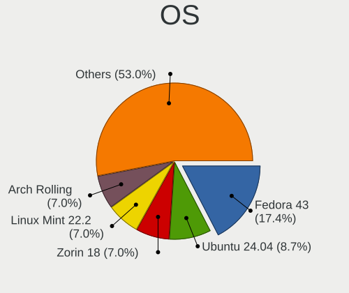

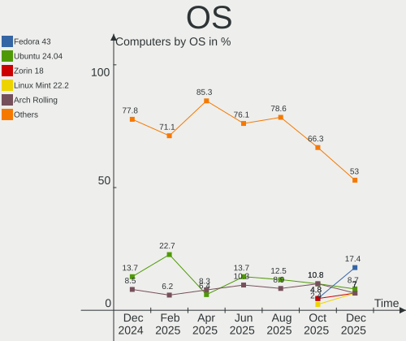

| Name                         | Computers | Percent |
|------------------------------|-----------|---------|
| Fedora 43                    | 20        | 17.39%  |
| Ubuntu 24.04                 | 10        | 8.7%    |
| Zorin 18                     | 8         | 6.96%   |
| Linux Mint 22.2              | 8         | 6.96%   |
| Arch Rolling                 | 8         | 6.96%   |
| Ubuntu 25.10                 | 6         | 5.22%   |
| Ubuntu 22.04                 | 4         | 3.48%   |
| Debian 13                    | 4         | 3.48%   |
| Pop!_OS 24.04                | 3         | 2.61%   |
| OpenMandriva 25.90           | 3         | 2.61%   |
| OpenMandriva 24.12           | 3         | 2.61%   |
| CachyOS Rolling              | 3         | 2.61%   |
| Zorin 17                     | 2         | 1.74%   |
| Ubuntu 20.04                 | 2         | 1.74%   |
| SteamOS 3.7.7                | 2         | 1.74%   |
| openSUSE Tumbleweed-XXXXXXXX | 2         | 1.74%   |
| OpenMandriva 25.11           | 2         | 1.74%   |
| Kubuntu 25.10                | 2         | 1.74%   |
| Fedora 42                    | 2         | 1.74%   |
| Anduinos 1.4.1               | 2         | 1.74%   |
| Xubuntu 22.04                | 1         | 0.87%   |
| Ultramarine 43               | 1         | 0.87%   |
| Ubuntu MATE 24.04            | 1         | 0.87%   |
| Ubuntu 25.04                 | 1         | 0.87%   |
| SteamOS 3.7.17               | 1         | 0.87%   |
| Parrot 7.0                   | 1         | 0.87%   |
| org.kde.Platform 5.15-21.08  | 1         | 0.87%   |
| OpenMandriva 6.0             | 1         | 0.87%   |
| Nobara 42                    | 1         | 0.87%   |
| NixOS 25.11                  | 1         | 0.87%   |
| MX 25                        | 1         | 0.87%   |
| Lubuntu 24.04                | 1         | 0.87%   |
| LMDE 7                       | 1         | 0.87%   |
| Kali 2025.4                  | 1         | 0.87%   |
| Gentoo 2.18                  | 1         | 0.87%   |
| Elementary 8                 | 1         | 0.87%   |
| Debian 12                    | 1         | 0.87%   |
| CachyOS                      | 1         | 0.87%   |
| Bazzite 43                   | 1         | 0.87%   |

OS Family
---------

OS without a version

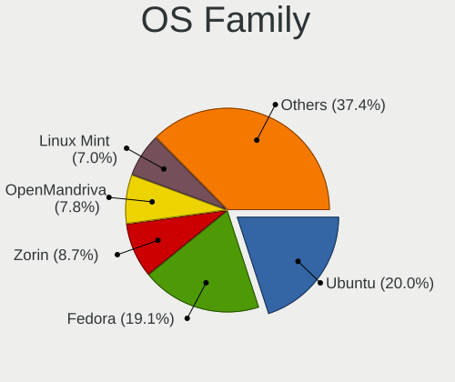

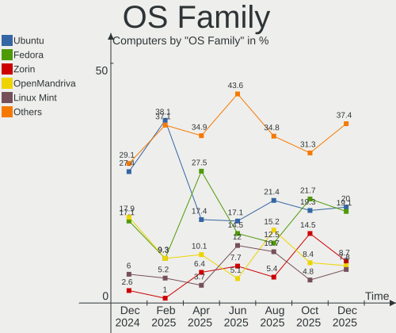

| Name             | Computers | Percent |
|------------------|-----------|---------|
| Ubuntu           | 23        | 20%     |
| Fedora           | 22        | 19.13%  |
| Zorin            | 10        | 8.7%    |
| OpenMandriva     | 9         | 7.83%   |
| Linux Mint       | 8         | 6.96%   |
| Arch             | 8         | 6.96%   |
| Debian           | 5         | 4.35%   |
| CachyOS          | 4         | 3.48%   |
| SteamOS          | 3         | 2.61%   |
| Pop!_OS          | 3         | 2.61%   |
| openSUSE         | 2         | 1.74%   |
| Kubuntu          | 2         | 1.74%   |
| Anduinos         | 2         | 1.74%   |
| Xubuntu          | 1         | 0.87%   |
| Ultramarine      | 1         | 0.87%   |
| Ubuntu MATE      | 1         | 0.87%   |
| Parrot           | 1         | 0.87%   |
| org.kde.Platform | 1         | 0.87%   |
| Nobara           | 1         | 0.87%   |
| NixOS            | 1         | 0.87%   |
| MX               | 1         | 0.87%   |
| Lubuntu          | 1         | 0.87%   |
| LMDE             | 1         | 0.87%   |
| Kali             | 1         | 0.87%   |
| Gentoo           | 1         | 0.87%   |
| Elementary       | 1         | 0.87%   |
| Bazzite          | 1         | 0.87%   |

Kernel
------

Version of the Linux kernel

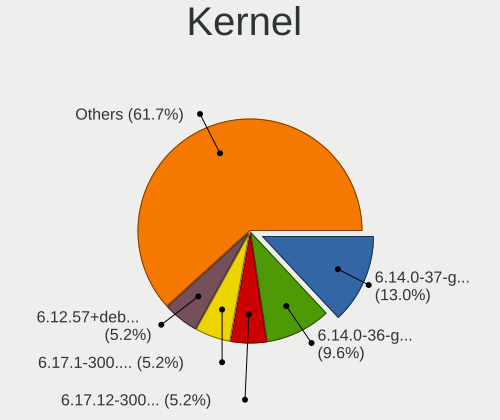

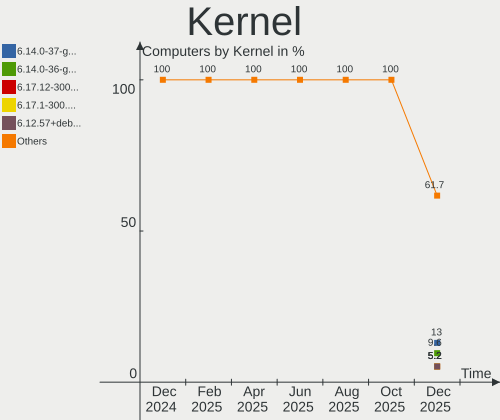

| Version                     | Computers | Percent |
|-----------------------------|-----------|---------|
| 6.14.0-37-generic           | 15        | 13.04%  |
| 6.14.0-36-generic           | 11        | 9.57%   |
| 6.17.12-300.fc43.x86_64     | 6         | 5.22%   |
| 6.17.1-300.fc43.x86_64      | 6         | 5.22%   |
| 6.12.57+deb13-amd64         | 6         | 5.22%   |
| 6.8.0-87-generic            | 5         | 4.35%   |
| 6.17.9-300.fc43.x86_64      | 5         | 4.35%   |
| 6.17.0-8-generic            | 5         | 4.35%   |
| 6.17.9-arch1-1              | 4         | 3.48%   |
| 6.14.2-desktop-3omv2590     | 4         | 3.48%   |
| 6.8.0-90-generic            | 3         | 2.61%   |
| 6.17.9-76061709-generic     | 3         | 2.61%   |
| 6.17.0-7-generic            | 3         | 2.61%   |
| 6.17.10-300.fc43.x86_64     | 2         | 1.74%   |
| 6.12.6-desktop-1omv2490     | 2         | 1.74%   |
| 5.15.0-139-generic          | 2         | 1.74%   |
| 6.5.0-14-generic            | 1         | 0.87%   |
| 6.18.2-cachyos1.fc43.x86_64 | 1         | 0.87%   |
| 6.18.1-arch1-2              | 1         | 0.87%   |
| 6.18.1-1-default            | 1         | 0.87%   |
| 6.18.1-1-cachyos-bore       | 1         | 0.87%   |
| 6.18.0-zen1-1-zen           | 1         | 0.87%   |
| 6.18.0-desktop-1omv2590     | 1         | 0.87%   |
| 6.18.0-5-cachyos            | 1         | 0.87%   |
| 6.18.0-2-default            | 1         | 0.87%   |
| 6.17.9-zen1-1-zen           | 1         | 0.87%   |
| 6.17.9-2-cachyos            | 1         | 0.87%   |
| 6.17.8-200.fc42.x86_64      | 1         | 0.87%   |
| 6.17.8+deb13-amd64          | 1         | 0.87%   |
| 6.17.7-desktop-1omv2590     | 1         | 0.87%   |
| 6.17.7-ba19.fc43.x86_64     | 1         | 0.87%   |
| 6.17.7-300.fc43.x86_64      | 1         | 0.87%   |
| 6.17.7-3-cachyos            | 1         | 0.87%   |
| 6.17.5-gentoo-x86_64        | 1         | 0.87%   |
| 6.17.13-200.fc42.x86_64     | 1         | 0.87%   |
| 6.17.10-1-liquorix-amd64    | 1         | 0.87%   |
| 6.17.10+kali-amd64          | 1         | 0.87%   |
| 6.17.10                     | 1         | 0.87%   |
| 6.17.0-6-generic            | 1         | 0.87%   |
| 6.17.0-1005-aws             | 1         | 0.87%   |

Kernel Family
-------------

Linux kernel without a distro release

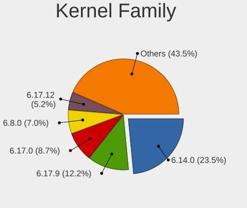

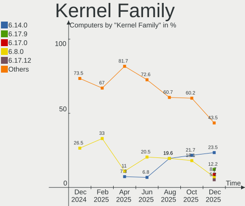

| Version | Computers | Percent |
|---------|-----------|---------|
| 6.14.0  | 27        | 23.48%  |
| 6.17.9  | 14        | 12.17%  |
| 6.17.0  | 10        | 8.7%    |
| 6.8.0   | 8         | 6.96%   |
| 6.17.12 | 6         | 5.22%   |
| 6.17.1  | 6         | 5.22%   |
| 6.12.57 | 6         | 5.22%   |
| 6.17.10 | 5         | 4.35%   |
| 6.18.0  | 4         | 3.48%   |
| 6.17.7  | 4         | 3.48%   |
| 6.14.2  | 4         | 3.48%   |
| 6.18.1  | 3         | 2.61%   |
| 6.11.11 | 3         | 2.61%   |
| 6.17.8  | 2         | 1.74%   |
| 6.12.6  | 2         | 1.74%   |
| 5.15.0  | 2         | 1.74%   |
| 6.5.0   | 1         | 0.87%   |
| 6.18.2  | 1         | 0.87%   |
| 6.17.5  | 1         | 0.87%   |
| 6.17.13 | 1         | 0.87%   |
| 6.15.6  | 1         | 0.87%   |
| 6.12.63 | 1         | 0.87%   |
| 6.12.61 | 1         | 0.87%   |
| 6.12.1  | 1         | 0.87%   |
| 6.1.0   | 1         | 0.87%   |

Kernel Major Ver.
-----------------

Linux kernel major version

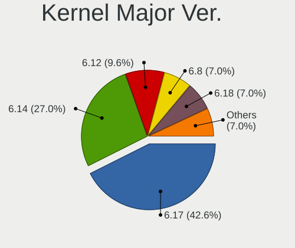

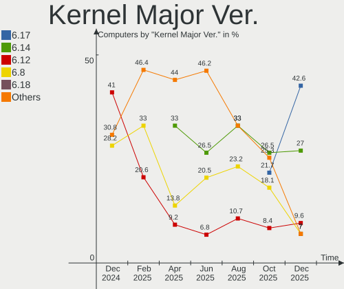

| Version | Computers | Percent |
|---------|-----------|---------|
| 6.17    | 49        | 42.61%  |
| 6.14    | 31        | 26.96%  |
| 6.12    | 11        | 9.57%   |
| 6.8     | 8         | 6.96%   |
| 6.18    | 8         | 6.96%   |
| 6.11    | 3         | 2.61%   |
| 5.15    | 2         | 1.74%   |
| 6.5     | 1         | 0.87%   |
| 6.15    | 1         | 0.87%   |
| 6.1     | 1         | 0.87%   |

Arch
----

OS architecture (x86_64, i586, etc.)

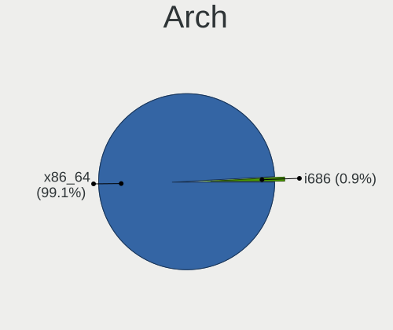

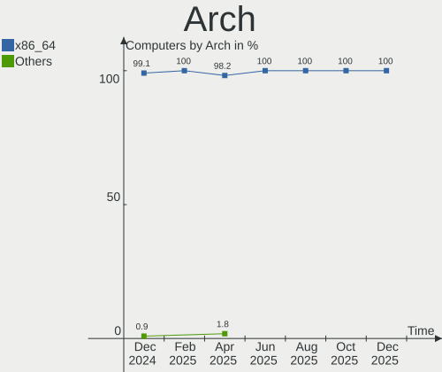

| Name   | Computers | Percent |
|--------|-----------|---------|
| x86_64 | 115       | 100%    |

DE
--

Desktop Environment

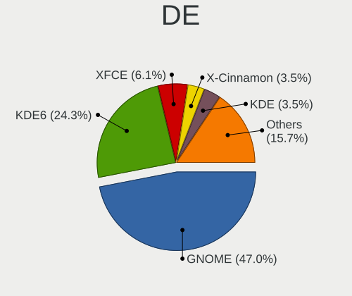

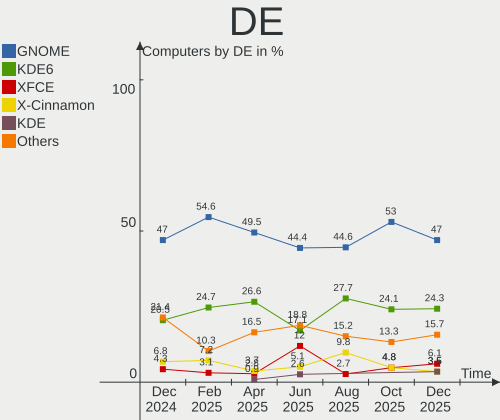

| Name       | Computers | Percent |
|------------|-----------|---------|
| GNOME      | 54        | 46.96%  |
| KDE6       | 28        | 24.35%  |
| XFCE       | 7         | 6.09%   |
| X-Cinnamon | 4         | 3.48%   |
| KDE        | 4         | 3.48%   |
| Hyprland   | 3         | 2.61%   |
| COSMIC     | 3         | 2.61%   |
| Unknown    | 3         | 2.61%   |
| Pantheon   | 1         | 0.87%   |
| Niri       | 1         | 0.87%   |
| MATE       | 1         | 0.87%   |
| LXQt       | 1         | 0.87%   |
| LXDE       | 1         | 0.87%   |
| KDE4       | 1         | 0.87%   |
| i3         | 1         | 0.87%   |
| Cinnamon   | 1         | 0.87%   |
| Budgie     | 1         | 0.87%   |

Display Server
--------------

X11 or Wayland

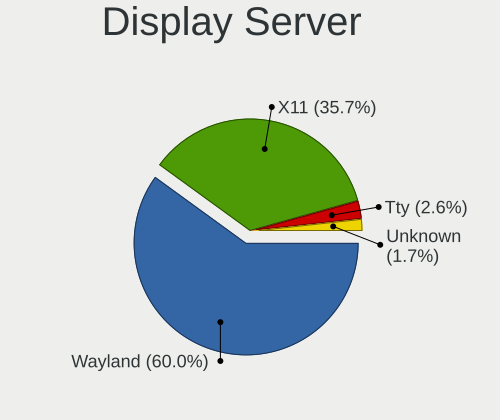

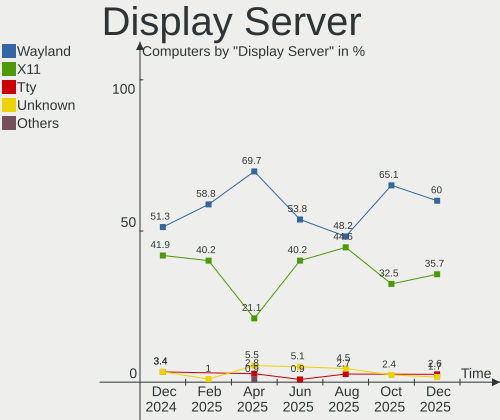

| Name    | Computers | Percent |
|---------|-----------|---------|
| Wayland | 69        | 60%     |
| X11     | 41        | 35.65%  |
| Tty     | 3         | 2.61%   |
| Unknown | 2         | 1.74%   |

Display Manager
---------------

SDDM, LightDM, etc.

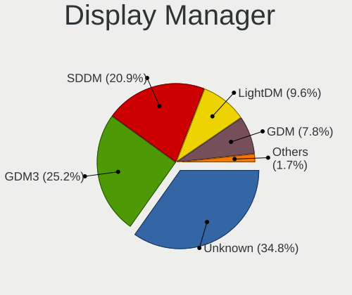

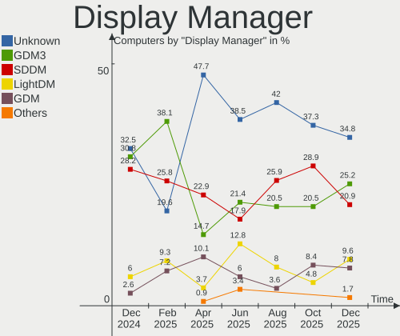

| Name           | Computers | Percent |
|----------------|-----------|---------|
| Unknown        | 40        | 34.78%  |
| GDM3           | 29        | 25.22%  |
| SDDM           | 24        | 20.87%  |
| LightDM        | 11        | 9.57%   |
| GDM            | 9         | 7.83%   |
| Ly             | 1         | 0.87%   |
| COSMIC-GREETER | 1         | 0.87%   |

OS Lang
-------

Language

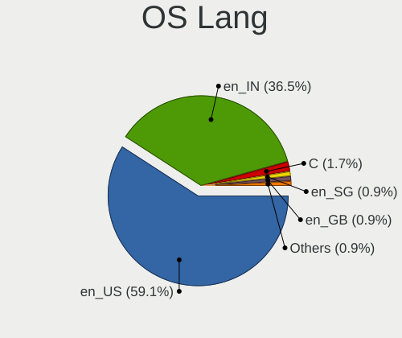

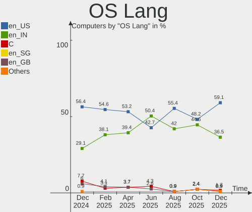

| Lang    | Computers | Percent |
|---------|-----------|---------|
| en_US   | 68        | 59.13%  |
| en_IN   | 42        | 36.52%  |
| C       | 2         | 1.74%   |
| en_SG   | 1         | 0.87%   |
| en_GB   | 1         | 0.87%   |
| Unknown | 1         | 0.87%   |

Boot Mode
---------

EFI or BIOS

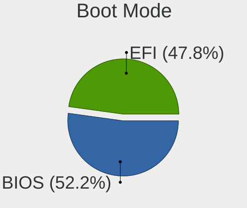

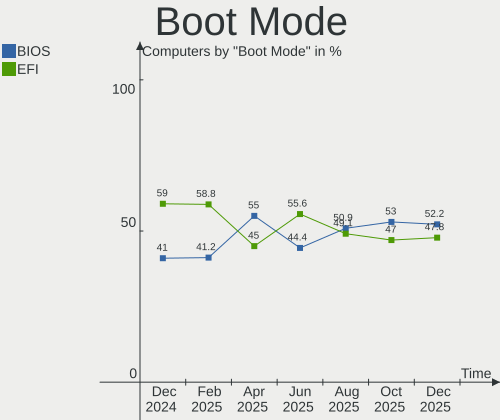

| Mode | Computers | Percent |
|------|-----------|---------|
| BIOS | 60        | 52.17%  |
| EFI  | 55        | 47.83%  |

Filesystem
----------

Type of filesystem

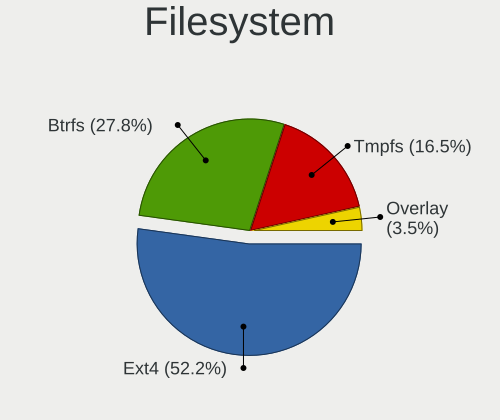

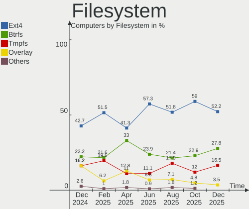

| Type    | Computers | Percent |
|---------|-----------|---------|
| Ext4    | 60        | 52.17%  |
| Btrfs   | 32        | 27.83%  |
| Tmpfs   | 19        | 16.52%  |
| Overlay | 4         | 3.48%   |

Part. scheme
------------

Scheme of partitioning

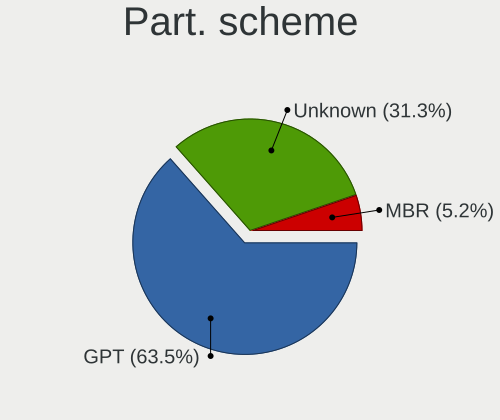

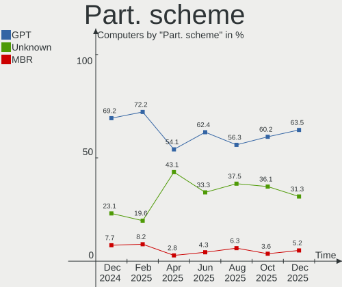

| Type    | Computers | Percent |
|---------|-----------|---------|
| GPT     | 73        | 63.48%  |
| Unknown | 36        | 31.3%   |
| MBR     | 6         | 5.22%   |

Dual Boot with Linux/BSD
------------------------

Hosting more than one Linux/BSD

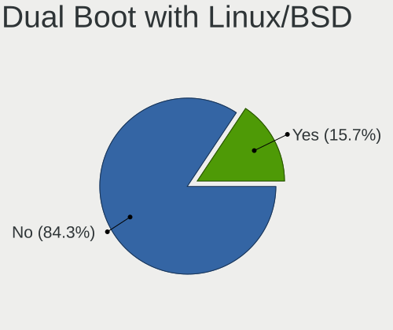

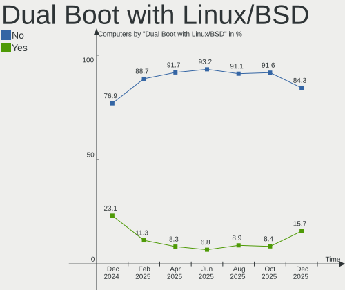

| Dual boot | Computers | Percent |
|-----------|-----------|---------|
| No        | 97        | 84.35%  |
| Yes       | 18        | 15.65%  |

Dual Boot (Win)
---------------

Hosting Linux and Windows

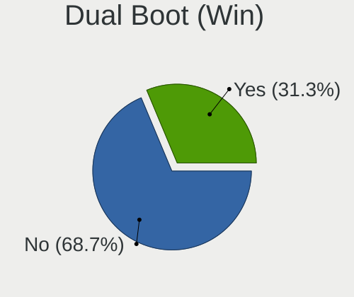

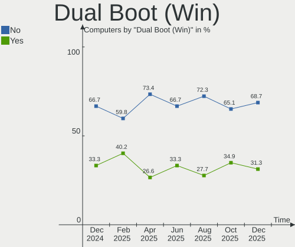

| Dual boot | Computers | Percent |
|-----------|-----------|---------|
| No        | 79        | 68.7%   |
| Yes       | 36        | 31.3%   |

Board
-----

Vendor
------

Motherboard manufacturer

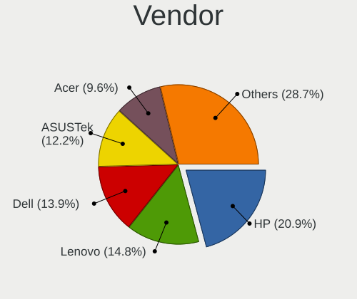

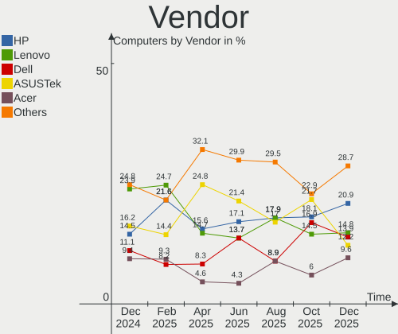

| Name                 | Computers | Percent |
|----------------------|-----------|---------|
| Hewlett-Packard      | 24        | 20.87%  |
| Lenovo               | 17        | 14.78%  |
| Dell                 | 16        | 13.91%  |
| ASUSTek Computer     | 14        | 12.17%  |
| Acer                 | 11        | 9.57%   |
| MSI                  | 8         | 6.96%   |
| Gigabyte Technology  | 8         | 6.96%   |
| Intel                | 4         | 3.48%   |
| ASRock               | 3         | 2.61%   |
| Red Hat              | 2         | 1.74%   |
| Infinix              | 2         | 1.74%   |
| Valve                | 1         | 0.87%   |
| TECNO Mobile Limited | 1         | 0.87%   |
| Samsung Electronics  | 1         | 0.87%   |
| Fusionstor           | 1         | 0.87%   |
| ECS                  | 1         | 0.87%   |
| Alienware            | 1         | 0.87%   |

Model
-----

Motherboard model

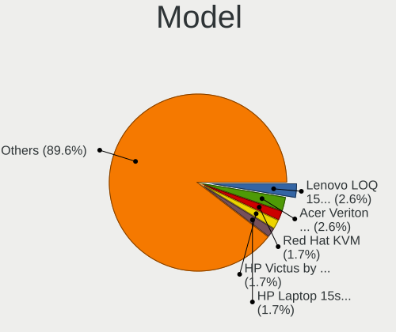

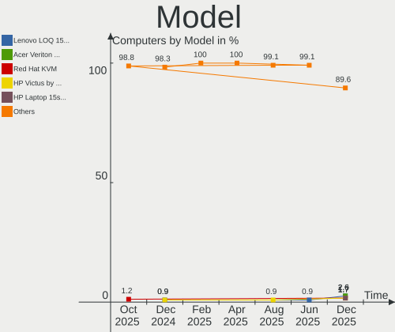

| Name                                       | Computers | Percent |
|--------------------------------------------|-----------|---------|
| Lenovo LOQ 15IRX9 83DV                     | 3         | 2.61%   |
| Acer Veriton X4240G                        | 3         | 2.61%   |
| Red Hat KVM                                | 2         | 1.74%   |
| HP Victus by Gaming Laptop 15-fb0xxx       | 2         | 1.74%   |
| HP Laptop 15s-eq2xxx                       | 2         | 1.74%   |
| ASUS PRIME B450M-A                         | 2         | 1.74%   |
| Acer Aspire A515-57G                       | 2         | 1.74%   |
| Valve Galileo                              | 1         | 0.87%   |
| TECNO Mobile Limited MEGABOOK T1 TGL       | 1         | 0.87%   |
| Samsung 750XGK                             | 1         | 0.87%   |
| MSI MS-7D48                                | 1         | 0.87%   |
| MSI MS-7C52                                | 1         | 0.87%   |
| MSI MS-7C37                                | 1         | 0.87%   |
| MSI MS-7C35                                | 1         | 0.87%   |
| MSI MS-7A38                                | 1         | 0.87%   |
| MSI MS-7A33                                | 1         | 0.87%   |
| MSI MS-7917                                | 1         | 0.87%   |
| MSI GF75 Thin 9SCXR                        | 1         | 0.87%   |
| Lenovo V15 G2 IJL 82QY                     | 1         | 0.87%   |
| Lenovo ThinkPad X1 Carbon Gen 8 20UAS75T0R | 1         | 0.87%   |
| Lenovo ThinkPad T560 20FJS3GD00            | 1         | 0.87%   |
| Lenovo ThinkPad T14 Gen 6 21QDCTO1WW       | 1         | 0.87%   |
| Lenovo ThinkPad E590 20NB001LUS            | 1         | 0.87%   |
| Lenovo ThinkPad E14 Gen 5 21JKS0X900       | 1         | 0.87%   |
| Lenovo ThinkCentre M710s 10M8S8FV00        | 1         | 0.87%   |
| Lenovo ThinkCentre M58p 6137BH3            | 1         | 0.87%   |
| Lenovo LOQ 15AHP9 83DX                     | 1         | 0.87%   |
| Lenovo IdeaPad Gaming 3 15ACH6 82K2        | 1         | 0.87%   |
| Lenovo IdeaPad 320-15ISK 80XH              | 1         | 0.87%   |
| Lenovo G50-70 20351                        | 1         | 0.87%   |
| Lenovo Flex 2-14 20404                     | 1         | 0.87%   |
| Lenovo B490 20207                          | 1         | 0.87%   |
| Intel MS-0C77F                             | 1         | 0.87%   |
| Intel H61                                  | 1         | 0.87%   |
| Intel DG41RQ AAE54511-203                  | 1         | 0.87%   |
| Intel cloudstar itx-c246                   | 1         | 0.87%   |
| Infinix INBOOK Y1 PLUS NEO                 | 1         | 0.87%   |
| Infinix INBOOK X1 NEO                      | 1         | 0.87%   |
| HP Victus by Gaming Laptop 15-fa1xxx       | 1         | 0.87%   |
| HP ProBook 640 G5                          | 1         | 0.87%   |

Model Family
------------

Motherboard model prefix

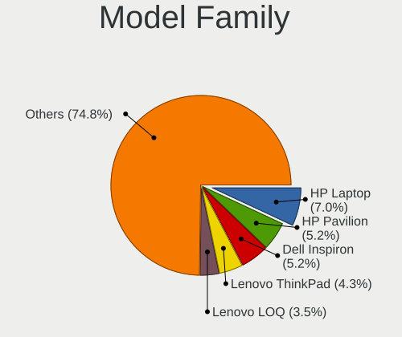

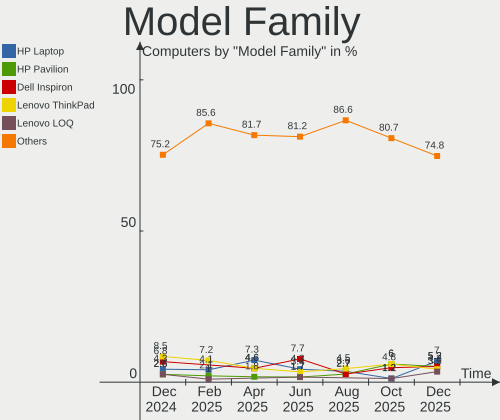

| Name                          | Computers | Percent |
|-------------------------------|-----------|---------|
| HP Laptop                     | 8         | 6.96%   |
| HP Pavilion                   | 6         | 5.22%   |
| Dell Inspiron                 | 6         | 5.22%   |
| Lenovo ThinkPad               | 5         | 4.35%   |
| Lenovo LOQ                    | 4         | 3.48%   |
| ASUS ASUS                     | 4         | 3.48%   |
| Acer Veriton                  | 4         | 3.48%   |
| Acer Aspire                   | 4         | 3.48%   |
| HP Victus                     | 3         | 2.61%   |
| Dell Latitude                 | 3         | 2.61%   |
| Red Hat KVM                   | 2         | 1.74%   |
| Lenovo ThinkCentre            | 2         | 1.74%   |
| Lenovo IdeaPad                | 2         | 1.74%   |
| Infinix INBOOK                | 2         | 1.74%   |
| Dell OptiPlex                 | 2         | 1.74%   |
| ASUS VivoBook                 | 2         | 1.74%   |
| ASUS ROG                      | 2         | 1.74%   |
| ASUS PRIME                    | 2         | 1.74%   |
| Valve Galileo                 | 1         | 0.87%   |
| TECNO Mobile Limited MEGABOOK | 1         | 0.87%   |
| Samsung 750XGK                | 1         | 0.87%   |
| MSI MS-7D48                   | 1         | 0.87%   |
| MSI MS-7C52                   | 1         | 0.87%   |
| MSI MS-7C37                   | 1         | 0.87%   |
| MSI MS-7C35                   | 1         | 0.87%   |
| MSI MS-7A38                   | 1         | 0.87%   |
| MSI MS-7A33                   | 1         | 0.87%   |
| MSI MS-7917                   | 1         | 0.87%   |
| MSI GF75                      | 1         | 0.87%   |
| Lenovo V15                    | 1         | 0.87%   |
| Lenovo G50-70                 | 1         | 0.87%   |
| Lenovo Flex                   | 1         | 0.87%   |
| Lenovo B490                   | 1         | 0.87%   |
| Intel MS-0C77F                | 1         | 0.87%   |
| Intel H61                     | 1         | 0.87%   |
| Intel DG41RQ                  | 1         | 0.87%   |
| Intel cloudstar               | 1         | 0.87%   |
| HP ProBook                    | 1         | 0.87%   |
| HP OMEN                       | 1         | 0.87%   |
| HP 250R                       | 1         | 0.87%   |

MFG Year
--------

Motherboard manufacture year

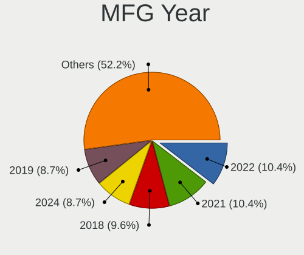

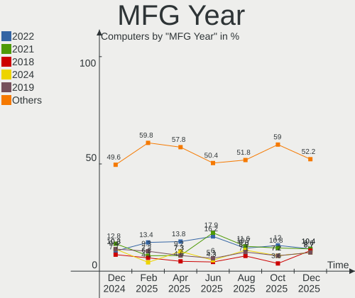

| Year | Computers | Percent |
|------|-----------|---------|
| 2022 | 12        | 10.43%  |
| 2021 | 12        | 10.43%  |
| 2018 | 11        | 9.57%   |
| 2024 | 10        | 8.7%    |
| 2019 | 10        | 8.7%    |
| 2025 | 9         | 7.83%   |
| 2023 | 8         | 6.96%   |
| 2020 | 8         | 6.96%   |
| 2014 | 8         | 6.96%   |
| 2013 | 7         | 6.09%   |
| 2017 | 6         | 5.22%   |
| 2016 | 5         | 4.35%   |
| 2012 | 3         | 2.61%   |
| 2011 | 2         | 1.74%   |
| 2009 | 2         | 1.74%   |
| 2008 | 2         | 1.74%   |

Form Factor
-----------

Physical design of the computer

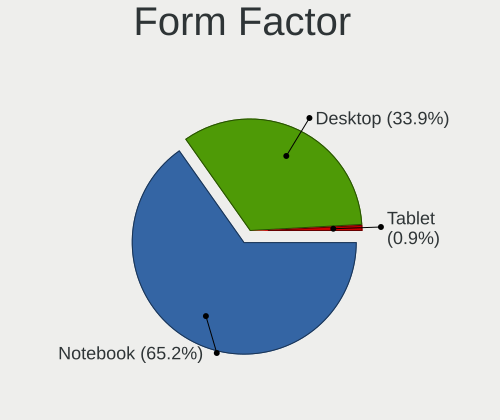

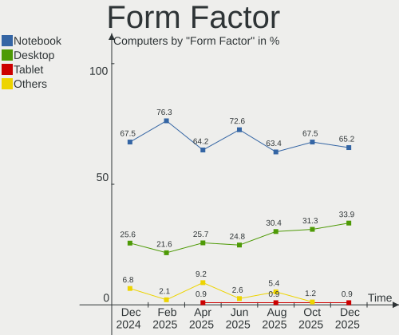

| Name     | Computers | Percent |
|----------|-----------|---------|
| Notebook | 75        | 65.22%  |
| Desktop  | 39        | 33.91%  |
| Tablet   | 1         | 0.87%   |

Secure Boot
-----------

Enabled or disabled

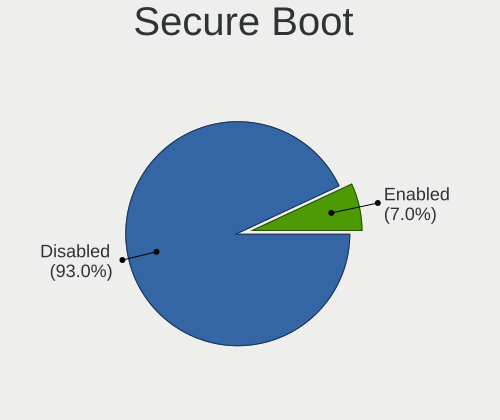

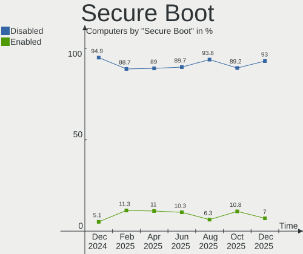

| State    | Computers | Percent |
|----------|-----------|---------|
| Disabled | 107       | 93.04%  |
| Enabled  | 8         | 6.96%   |

Coreboot
--------

Have coreboot on board

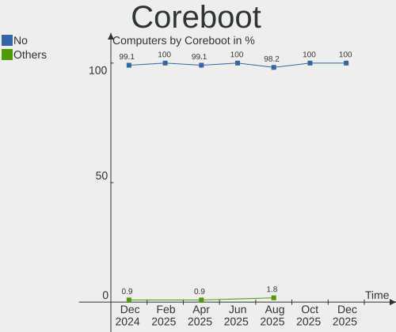

| Used | Computers | Percent |
|------|-----------|---------|
| No   | 115       | 100%    |

RAM Size
--------

Total RAM memory

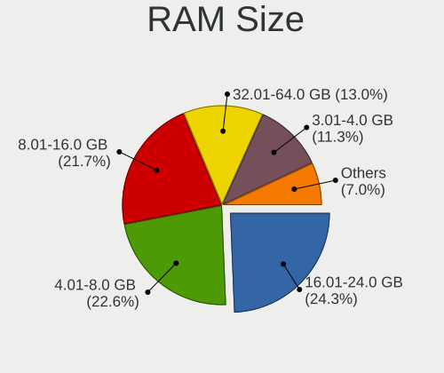

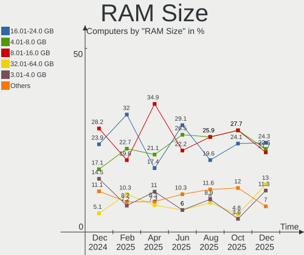

| Size in GB  | Computers | Percent |
|-------------|-----------|---------|
| 16.01-24.0  | 28        | 24.35%  |
| 4.01-8.0    | 26        | 22.61%  |
| 8.01-16.0   | 25        | 21.74%  |
| 32.01-64.0  | 15        | 13.04%  |
| 3.01-4.0    | 13        | 11.3%   |
| 24.01-32.0  | 6         | 5.22%   |
| 64.01-256.0 | 2         | 1.74%   |

RAM Used
--------

Used RAM memory

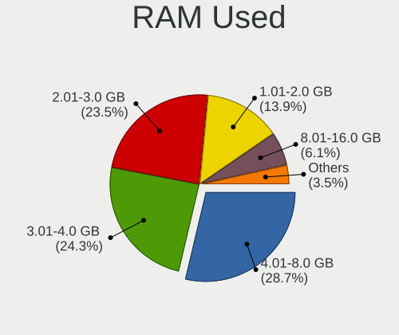

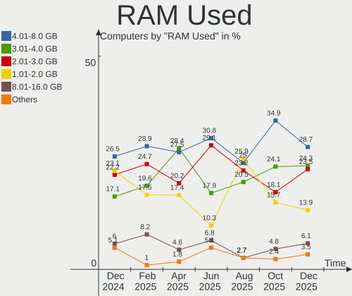

| Used GB    | Computers | Percent |
|------------|-----------|---------|
| 4.01-8.0   | 33        | 28.7%   |
| 3.01-4.0   | 28        | 24.35%  |
| 2.01-3.0   | 27        | 23.48%  |
| 1.01-2.0   | 16        | 13.91%  |
| 8.01-16.0  | 7         | 6.09%   |
| 0.51-1.0   | 3         | 2.61%   |
| 16.01-24.0 | 1         | 0.87%   |

Total Drives
------------

Number of drives on board

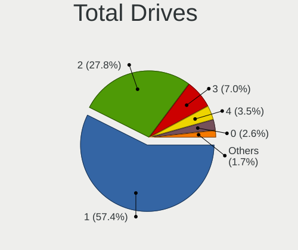

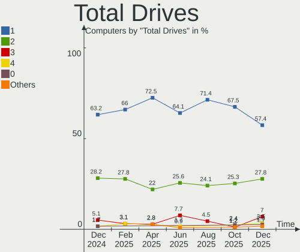

| Drives | Computers | Percent |
|--------|-----------|---------|
| 1      | 66        | 57.39%  |
| 2      | 32        | 27.83%  |
| 3      | 8         | 6.96%   |
| 4      | 4         | 3.48%   |
| 0      | 3         | 2.61%   |
| 6      | 1         | 0.87%   |
| 5      | 1         | 0.87%   |

Has CD-ROM
----------

Has CD-ROM on board

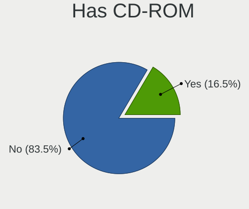

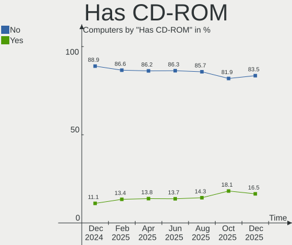

| Presented | Computers | Percent |
|-----------|-----------|---------|
| No        | 96        | 83.48%  |
| Yes       | 19        | 16.52%  |

Has Ethernet
------------

Has Ethernet on board

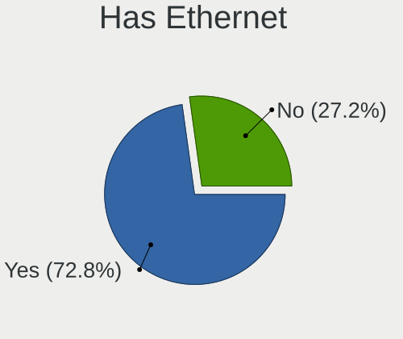

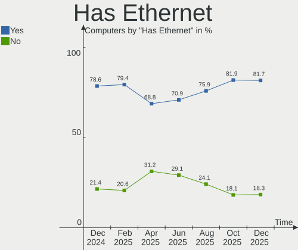

| Presented | Computers | Percent |
|-----------|-----------|---------|
| Yes       | 94        | 81.74%  |
| No        | 21        | 18.26%  |

Has WiFi
--------

Has WiFi module

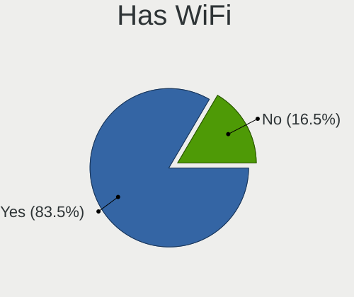

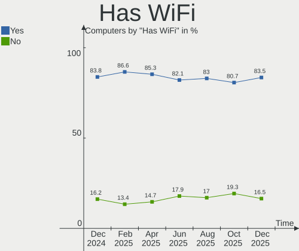

| Presented | Computers | Percent |
|-----------|-----------|---------|
| Yes       | 96        | 83.48%  |
| No        | 19        | 16.52%  |

Has Bluetooth
-------------

Has Bluetooth module

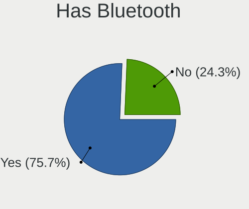

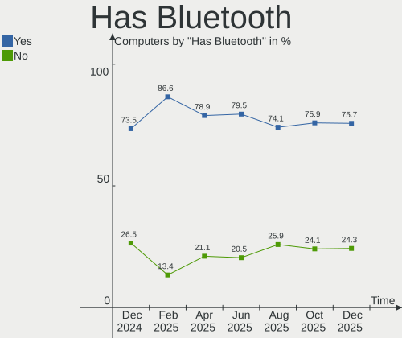

| Presented | Computers | Percent |
|-----------|-----------|---------|
| Yes       | 87        | 75.65%  |
| No        | 28        | 24.35%  |

Location
--------

Country
-------

Geographic location (country)

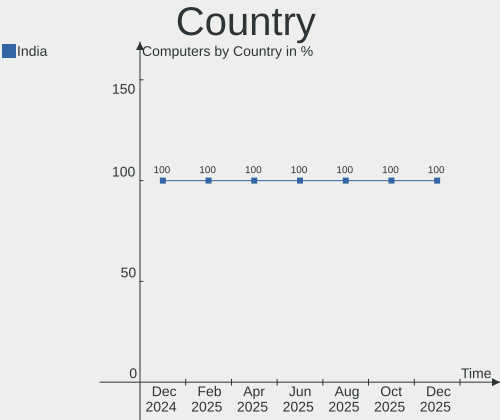

| Country | Computers | Percent |
|---------|-----------|---------|
| India   | 115       | 100%    |

City
----

Geographic location (city)

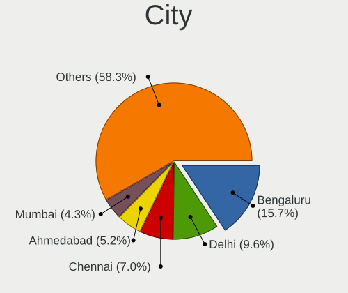

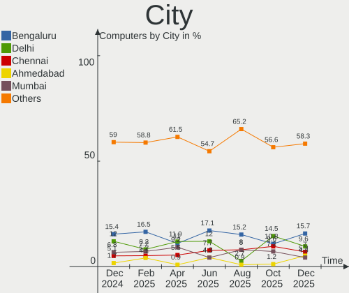

| City          | Computers | Percent |
|---------------|-----------|---------|
| Bengaluru     | 18        | 15.65%  |
| Delhi         | 11        | 9.57%   |
| Chennai       | 8         | 6.96%   |
| Ahmedabad     | 6         | 5.22%   |
| Mumbai        | 5         | 4.35%   |
| Kochi         | 5         | 4.35%   |
| Hyderabad     | 4         | 3.48%   |
| Bhubaneswar   | 4         | 3.48%   |
| Pune          | 3         | 2.61%   |
| Kolkata       | 3         | 2.61%   |
| Gurgaon       | 3         | 2.61%   |
| Durgapur      | 3         | 2.61%   |
| Lucknow       | 2         | 1.74%   |
| Indore        | 2         | 1.74%   |
| Amritsar      | 2         | 1.74%   |
| Visakhapatnam | 1         | 0.87%   |
| Vadodara      | 1         | 0.87%   |
| Tonk          | 1         | 0.87%   |
| Thrissur      | 1         | 0.87%   |
| Thiruthani    | 1         | 0.87%   |
| Thane         | 1         | 0.87%   |
| Salem         | 1         | 0.87%   |
| Raipur        | 1         | 0.87%   |
| Purnia        | 1         | 0.87%   |
| Patna         | 1         | 0.87%   |
| New Delhi     | 1         | 0.87%   |
| Nagpur        | 1         | 0.87%   |
| Morādābād  | 1         | 0.87%   |
| Meerut        | 1         | 0.87%   |
| Mansarovar    | 1         | 0.87%   |
| Malda         | 1         | 0.87%   |
| Kozhikode     | 1         | 0.87%   |
| Kota          | 1         | 0.87%   |
| Kanpur        | 1         | 0.87%   |
| Jaunpur       | 1         | 0.87%   |
| Jamshedpur    | 1         | 0.87%   |
| Jabalpur      | 1         | 0.87%   |
| Guwahati      | 1         | 0.87%   |
| Guntur        | 1         | 0.87%   |
| Greater Noida | 1         | 0.87%   |

Drives
------

Drive Vendor
------------

Hard drive vendors

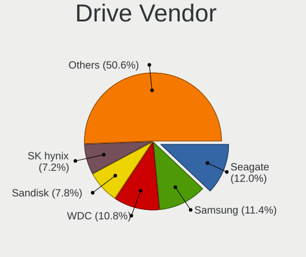

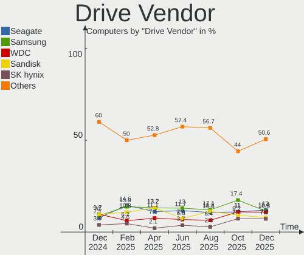

| Vendor                         | Computers | Drives | Percent |
|--------------------------------|-----------|--------|---------|
| Seagate                        | 20        | 26     | 12.05%  |
| Samsung Electronics            | 19        | 23     | 11.45%  |
| WDC                            | 18        | 20     | 10.84%  |
| Sandisk                        | 13        | 14     | 7.83%   |
| SK hynix                       | 12        | 12     | 7.23%   |
| Micron Technology              | 12        | 12     | 7.23%   |
| Kingston                       | 7         | 8      | 4.22%   |
| Toshiba                        | 6         | 6      | 3.61%   |
| Crucial                        | 6         | 6      | 3.61%   |
| Silicon Motion                 | 5         | 5      | 3.01%   |
| Intel                          | 5         | 6      | 3.01%   |
| HGST                           | 5         | 5      | 3.01%   |
| Micron/Crucial Technology      | 3         | 3      | 1.81%   |
| HS-SSD-E100                    | 3         | 3      | 1.81%   |
| CONSISTENT                     | 3         | 3      | 1.81%   |
| BIWIN                          | 3         | 3      | 1.81%   |
| Unknown                        | 2         | 2      | 1.2%    |
| Phison Electronics             | 2         | 2      | 1.2%    |
| FORESEE                        | 2         | 2      | 1.2%    |
| EVM                            | 2         | 2      | 1.2%    |
| China                          | 2         | 2      | 1.2%    |
| Solid State Storage Technology | 1         | 1      | 0.6%    |
| Simm                           | 1         | 1      | 0.6%    |
| Shenzhen Longsys Electronics   | 1         | 1      | 0.6%    |
| S930P                          | 1         | 1      | 0.6%    |
| Realtek Semiconductor          | 1         | 1      | 0.6%    |
| Realtek                        | 1         | 1      | 0.6%    |
| MAXIO Technology (Hangzhou)    | 1         | 1      | 0.6%    |
| KIOXIA-EXCERIA                 | 1         | 1      | 0.6%    |
| KIOXIA                         | 1         | 1      | 0.6%    |
| Kingston Technology Company    | 1         | 2      | 0.6%    |
| JMicron Technology             | 1         | 1      | 0.6%    |
| Hitachi                        | 1         | 1      | 0.6%    |
| Cablet                         | 1         | 1      | 0.6%    |
| ADATA Technology               | 1         | 1      | 0.6%    |
| A-DATA Technology              | 1         | 1      | 0.6%    |
| Unknown                        | 1         | 1      | 0.6%    |

Drive Model
-----------

Hard drive models

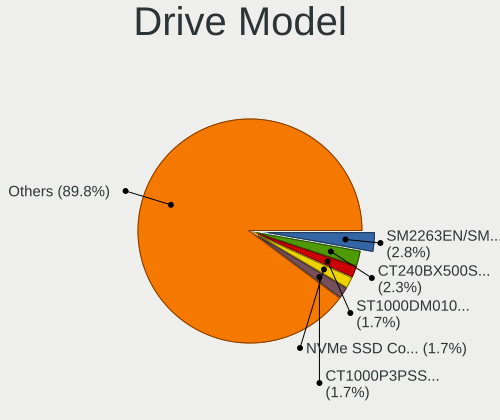

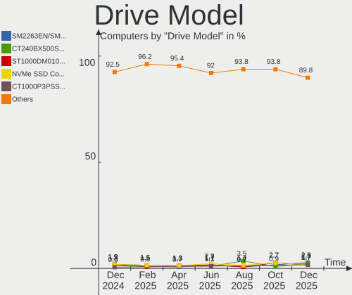

| Model                                                                   | Computers | Percent |
|-------------------------------------------------------------------------|-----------|---------|
| Silicon Motion SM2263EN/SM2263XT SSD Controller 512GB                   | 5         | 2.82%   |
| Crucial CT240BX500SSD1 240GB                                            | 4         | 2.26%   |
| Seagate ST1000DM010-2EP102 1TB                                          | 3         | 1.69%   |
| Samsung NVMe SSD Controller SM981/PM981/PM983 1TB                       | 3         | 1.69%   |
| Micron CT1000P3PSSD8 1TB                                                | 3         | 1.69%   |
| Intel SSDPEKNU512GZH 512GB                                              | 3         | 1.69%   |
| BIWIN AP823 CE980TB8900-512G                                            | 3         | 1.69%   |
| WDC WDS240G2G0B-00EPW0 240GB SSD                                        | 2         | 1.13%   |
| SK hynix SKHynix_HFS512GD9TNI-L2B0B 512GB                               | 2         | 1.13%   |
| SK hynix SKHynix_HFS001TEJ4X112N 1024GB                                 | 2         | 1.13%   |
| Seagate ST500DM002-1BD142 500GB                                         | 2         | 1.13%   |
| Seagate ST3500418AS 500GB                                               | 2         | 1.13%   |
| Seagate ST1000LM035-1RK172 1TB                                          | 2         | 1.13%   |
| Sandisk WD Black SN770 / PC SN740 256GB / PC SN560 (DRAM-less) NVMe SSD | 2         | 1.13%   |
| SanDisk NVMe SSD Drive 1TB                                              | 2         | 1.13%   |
| Micron/Crucial P2 NVMe PCIe SSD 2TB                                     | 2         | 1.13%   |
| Micron 2400_MTFDKBA512QFM 512GB                                         | 2         | 1.13%   |
| Kingston SA400S37240G 240GB SSD                                         | 2         | 1.13%   |
| HS-SSD-E100 SSD 256G                                                    | 2         | 1.13%   |
| HGST HTS545050A7E680 500GB                                              | 2         | 1.13%   |
| HGST HTS541010B7E610 1TB                                                | 2         | 1.13%   |
| WDC WDS500G2B0A-00SM50 500GB                                            | 1         | 0.56%   |
| WDC WDS240G2G0A-00JH30 240GB SSD                                        | 1         | 0.56%   |
| WDC WD5000LPVX-22V0TT0 500GB                                            | 1         | 0.56%   |
| WDC WD5000AADS-00S9B0 500GB                                             | 1         | 0.56%   |
| WDC WD20EZRZ-60Z5HB0 2TB                                                | 1         | 0.56%   |
| WDC WD20EZRZ-00Z5HB0 2TB                                                | 1         | 0.56%   |
| WDC WD20EZBX-00AYRA0 2TB                                                | 1         | 0.56%   |
| WDC WD10SPZX-60Z10T0 1TB                                                | 1         | 0.56%   |
| WDC WD10SPZX-24Z10 1TB                                                  | 1         | 0.56%   |
| WDC WD10SPZX-21Z10T0 1TB                                                | 1         | 0.56%   |
| WDC WD10SPCX-60KHST0 1TB                                                | 1         | 0.56%   |
| WDC WD10PURX-64D85Y0 1TB                                                | 1         | 0.56%   |
| WDC WD10EZEX-00MFCA0 1TB                                                | 1         | 0.56%   |
| WDC WD10EADS-00P6B0 1TB                                                 | 1         | 0.56%   |
| WDC WD1003FBYZ-010FB0 1TB                                               | 1         | 0.56%   |
| WDC WD Blue SA510 2.5 250GB                                             | 1         | 0.56%   |
| WDC WD Blue SA510 2.5 1000GB SSD                                        | 1         | 0.56%   |
| WDC PC SN530 SDBPTPZ-1T00-1002 1TB                                      | 1         | 0.56%   |
| Unknown SD/MMC/MS PRO 2GB                                               | 1         | 0.56%   |

HDD Vendor
----------

Hard disk drive vendors

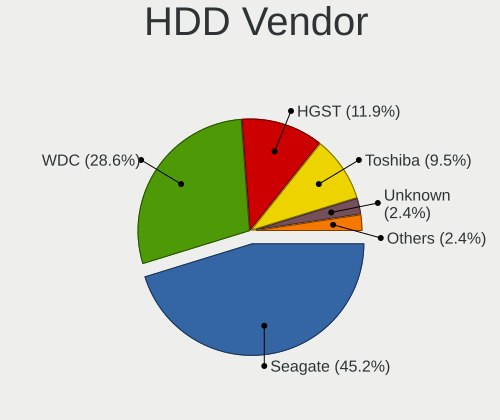

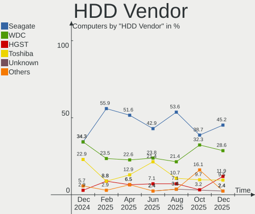

| Vendor  | Computers | Drives | Percent |
|---------|-----------|--------|---------|
| Seagate | 19        | 25     | 45.24%  |
| WDC     | 12        | 13     | 28.57%  |
| HGST    | 5         | 5      | 11.9%   |
| Toshiba | 4         | 4      | 9.52%   |
| Unknown | 1         | 1      | 2.38%   |
| Hitachi | 1         | 1      | 2.38%   |

SSD Vendor
----------

Solid state drive vendors

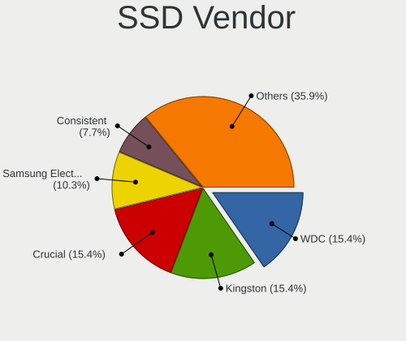

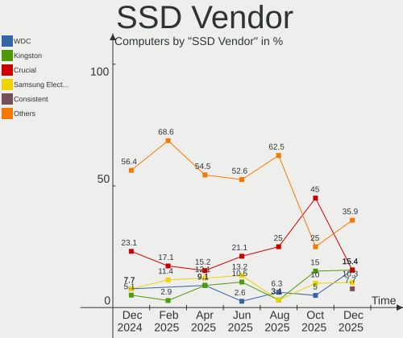

| Vendor              | Computers | Drives | Percent |
|---------------------|-----------|--------|---------|
| WDC                 | 6         | 6      | 15.38%  |
| Kingston            | 6         | 6      | 15.38%  |
| Crucial             | 6         | 6      | 15.38%  |
| Samsung Electronics | 4         | 4      | 10.26%  |
| Consistent          | 3         | 3      | 7.69%   |
| HS-SSD-E100         | 2         | 2      | 5.13%   |
| EVM                 | 2         | 2      | 5.13%   |
| China               | 2         | 2      | 5.13%   |
| Toshiba             | 1         | 1      | 2.56%   |
| SK hynix            | 1         | 1      | 2.56%   |
| SanDisk             | 1         | 1      | 2.56%   |
| S930P               | 1         | 1      | 2.56%   |
| Micron Technology   | 1         | 1      | 2.56%   |
| KIOXIA-EXCERIA      | 1         | 1      | 2.56%   |
| FORESEE             | 1         | 1      | 2.56%   |
| A-DATA Technology   | 1         | 1      | 2.56%   |

Drive Kind
----------

HDD or SSD

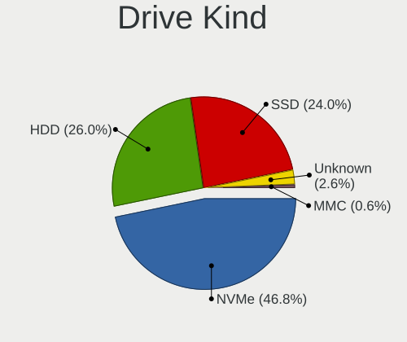

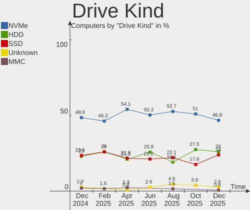

| Kind    | Computers | Drives | Percent |
|---------|-----------|--------|---------|
| NVMe    | 72        | 88     | 46.75%  |
| HDD     | 40        | 49     | 25.97%  |
| SSD     | 37        | 39     | 24.03%  |
| Unknown | 4         | 4      | 2.6%    |
| MMC     | 1         | 2      | 0.65%   |

Drive Connector
---------------

SATA, SAS, NVMe, etc.

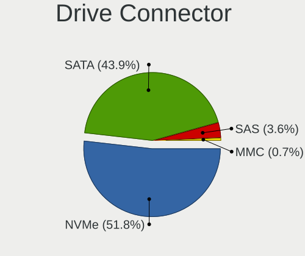

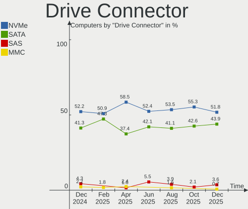

| Type | Computers | Drives | Percent |
|------|-----------|--------|---------|
| NVMe | 72        | 87     | 51.8%   |
| SATA | 61        | 88     | 43.88%  |
| SAS  | 5         | 5      | 3.6%    |
| MMC  | 1         | 2      | 0.72%   |

Drive Size
----------

Size of hard drive

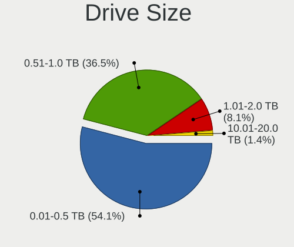

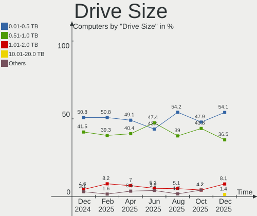

| Size in TB | Computers | Drives | Percent |
|------------|-----------|--------|---------|
| 0.01-0.5   | 40        | 51     | 54.05%  |
| 0.51-1.0   | 27        | 29     | 36.49%  |
| 1.01-2.0   | 6         | 7      | 8.11%   |
| 10.01-20.0 | 1         | 1      | 1.35%   |

Space Total
-----------

Amount of disk space available on the file system

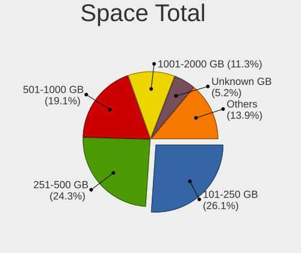

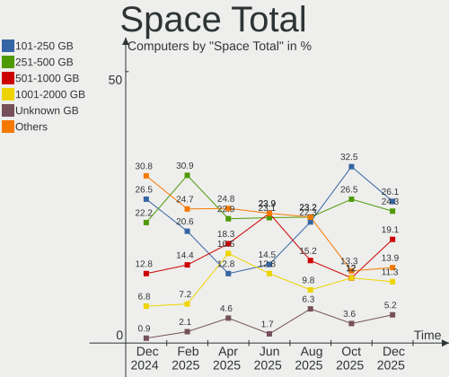

| Size in GB     | Computers | Percent |
|----------------|-----------|---------|
| 101-250        | 30        | 26.09%  |
| 251-500        | 28        | 24.35%  |
| 501-1000       | 22        | 19.13%  |
| 1001-2000      | 13        | 11.3%   |
| Unknown        | 6         | 5.22%   |
| 2001-3000      | 4         | 3.48%   |
| More than 3000 | 3         | 2.61%   |
| 21-50          | 3         | 2.61%   |
| 1-20           | 3         | 2.61%   |
| 51-100         | 3         | 2.61%   |

Space Used
----------

Amount of used disk space

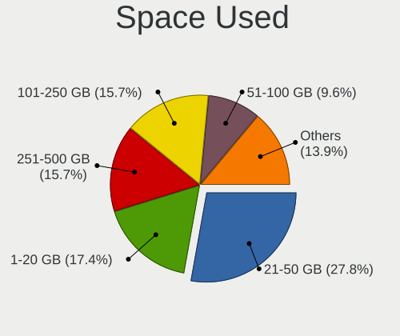

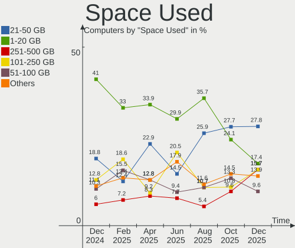

| Used GB   | Computers | Percent |
|-----------|-----------|---------|
| 21-50     | 32        | 27.83%  |
| 1-20      | 20        | 17.39%  |
| 251-500   | 18        | 15.65%  |
| 101-250   | 18        | 15.65%  |
| 51-100    | 11        | 9.57%   |
| 501-1000  | 7         | 6.09%   |
| Unknown   | 6         | 5.22%   |
| 1001-2000 | 3         | 2.61%   |

Malfunc. Drives
---------------

Drive models with a malfunction

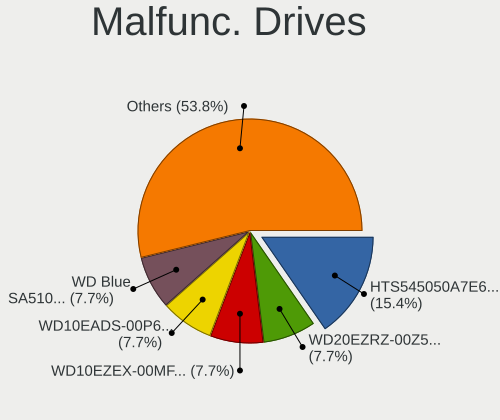

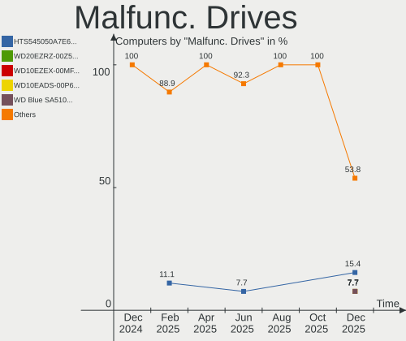

| Model                               | Computers | Drives | Percent |
|-------------------------------------|-----------|--------|---------|
| HGST HTS545050A7E680 500GB          | 2         | 2      | 15.38%  |
| WDC WD20EZRZ-00Z5HB0 2TB            | 1         | 1      | 7.69%   |
| WDC WD10EZEX-00MFCA0 1TB            | 1         | 1      | 7.69%   |
| WDC WD10EADS-00P6B0 1TB             | 1         | 1      | 7.69%   |
| WDC WD Blue SA510 2.5 250GB         | 1         | 1      | 7.69%   |
| Toshiba MQ01ACF050 500GB            | 1         | 1      | 7.69%   |
| Seagate ST320LM001 HN-M320MBB 320GB | 1         | 1      | 7.69%   |
| Seagate ST3160212SCE 160GB          | 1         | 1      | 7.69%   |
| Seagate ST1000LX015-1U7172-SSHD 1TB | 1         | 1      | 7.69%   |
| Seagate ST1000DM003-9YN162 1TB      | 1         | 1      | 7.69%   |
| Hitachi HDS721032CLA362 320GB       | 1         | 1      | 7.69%   |
| HGST HTS545050A7E380 500GB          | 1         | 1      | 7.69%   |

Malfunc. Drive Vendor
---------------------

Vendors of faulty drives

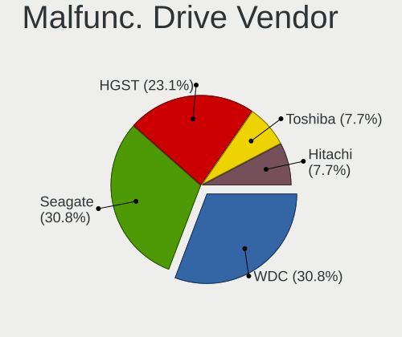

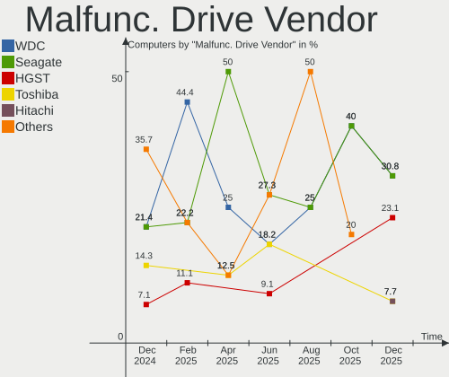

| Vendor  | Computers | Drives | Percent |
|---------|-----------|--------|---------|
| WDC     | 4         | 4      | 30.77%  |
| Seagate | 4         | 4      | 30.77%  |
| HGST    | 3         | 3      | 23.08%  |
| Toshiba | 1         | 1      | 7.69%   |
| Hitachi | 1         | 1      | 7.69%   |

Malfunc. HDD Vendor
-------------------

Vendors of faulty HDD drives

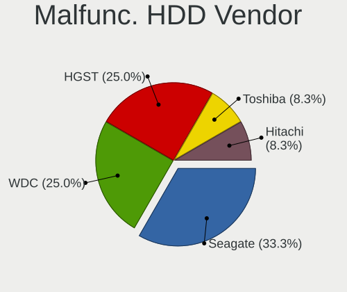

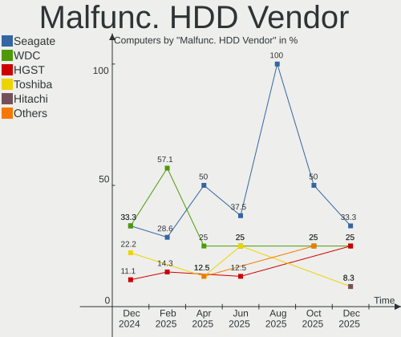

| Vendor  | Computers | Drives | Percent |
|---------|-----------|--------|---------|
| Seagate | 4         | 4      | 33.33%  |
| WDC     | 3         | 3      | 25%     |
| HGST    | 3         | 3      | 25%     |
| Toshiba | 1         | 1      | 8.33%   |
| Hitachi | 1         | 1      | 8.33%   |

Malfunc. Drive Kind
-------------------

Kinds of faulty drives

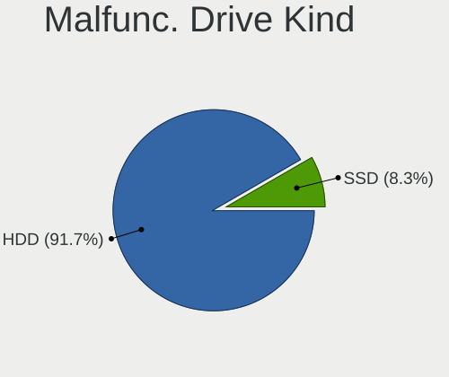

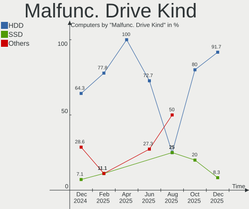

| Kind | Computers | Drives | Percent |
|------|-----------|--------|---------|
| HDD  | 11        | 12     | 91.67%  |
| SSD  | 1         | 1      | 8.33%   |

Failed Drives
-------------

Failed drive models

Zero info for selected period =(

Failed Drive Vendor
-------------------

Failed drive vendors

Zero info for selected period =(

Drive Status
------------

Number of failed and malfunc. drives

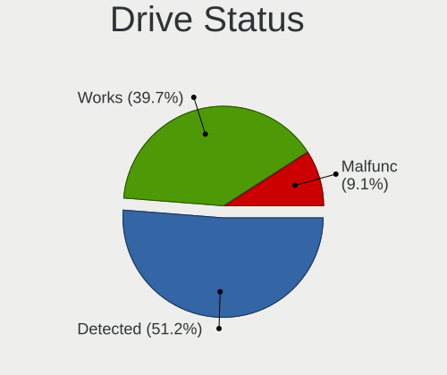

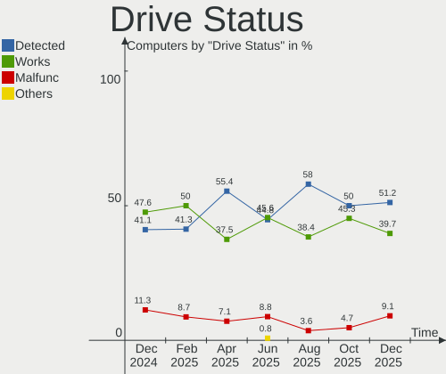

| Status   | Computers | Drives | Percent |
|----------|-----------|--------|---------|
| Detected | 62        | 100    | 51.24%  |
| Works    | 48        | 69     | 39.67%  |
| Malfunc  | 11        | 13     | 9.09%   |

Storage controller
------------------

Storage Vendor
--------------

Storage controller vendors

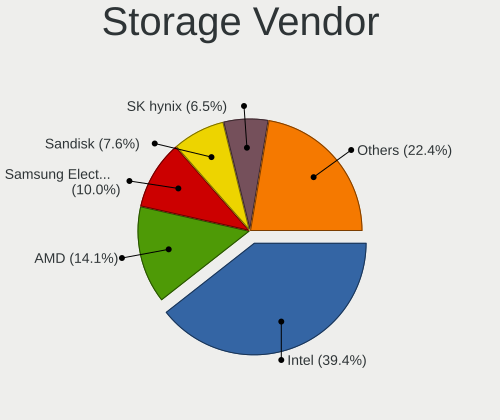

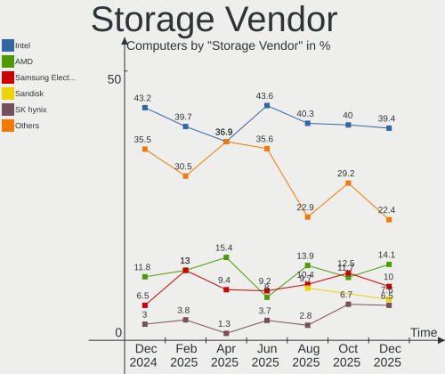

| Vendor                         | Computers | Percent |
|--------------------------------|-----------|---------|
| Intel                          | 67        | 39.41%  |
| AMD                            | 24        | 14.12%  |
| Samsung Electronics            | 17        | 10%     |
| Sandisk                        | 13        | 7.65%   |
| SK hynix                       | 11        | 6.47%   |
| Micron Technology              | 11        | 6.47%   |
| Silicon Motion                 | 5         | 2.94%   |
| Micron/Crucial Technology      | 3         | 1.76%   |
| Biwin Storage Technology       | 3         | 1.76%   |
| ASMedia Technology             | 3         | 1.76%   |
| Shenzhen Longsys Electronics   | 2         | 1.18%   |
| Phison Electronics             | 2         | 1.18%   |
| Kingston Technology Company    | 2         | 1.18%   |
| Toshiba America Info Systems   | 1         | 0.59%   |
| Solid State Storage Technology | 1         | 0.59%   |
| Realtek Semiconductor          | 1         | 0.59%   |
| MAXIO Technology (Hangzhou)    | 1         | 0.59%   |
| KIOXIA                         | 1         | 0.59%   |
| Hosin Global Electronics       | 1         | 0.59%   |
| ADATA Technology               | 1         | 0.59%   |

Storage Model
-------------

Storage controller models

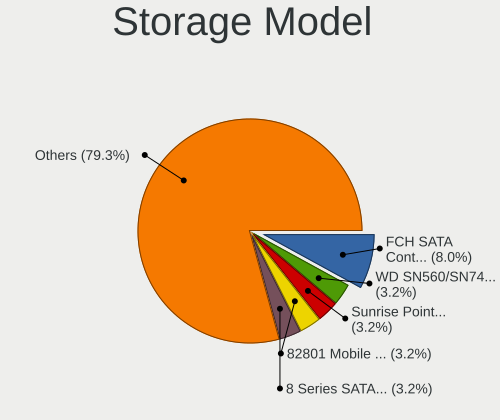

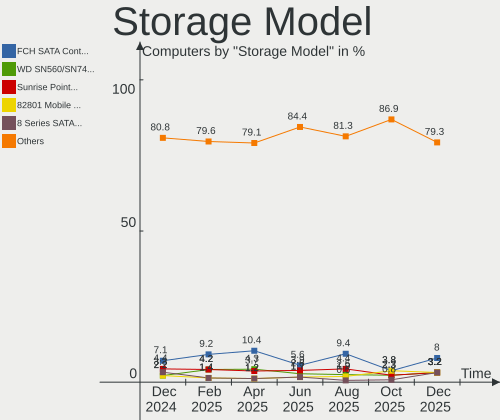

| Model                                                                                                              | Computers | Percent |
|--------------------------------------------------------------------------------------------------------------------|-----------|---------|
| AMD FCH SATA Controller [AHCI mode]                                                                                | 15        | 7.98%   |
| SanDisk WD SN560/SN740/SN770/SN5000 NVMe SSD                                                                       | 6         | 3.19%   |
| Intel Sunrise Point-LP SATA Controller [AHCI mode]                                                                 | 6         | 3.19%   |
| Intel 82801 Mobile SATA Controller [RAID mode]                                                                     | 6         | 3.19%   |
| Intel 8 Series SATA Controller 1 [AHCI mode]                                                                       | 6         | 3.19%   |
| SK hynix BC901 NVMe Solid State Drive (DRAM-less)                                                                  | 5         | 2.66%   |
| Silicon Motion SM2263EN/SM2263XT (DRAM-less) NVMe SSD Controllers                                                  | 5         | 2.66%   |
| Samsung NVMe SSD Controller 980 (DRAM-less)                                                                        | 5         | 2.66%   |
| AMD 500 Series Chipset SATA Controller                                                                             | 5         | 2.66%   |
| AMD 400 Series Chipset SATA Controller                                                                             | 5         | 2.66%   |
| Samsung NVMe SSD Controller SM981/PM981/PM983                                                                      | 4         | 2.13%   |
| Micron 2550 NVMe SSD (DRAM-less)                                                                                   | 4         | 2.13%   |
| Intel Volume Management Device NVMe RAID Controller                                                                | 4         | 2.13%   |
| Intel SSD 670p Series [Keystone Harbor]                                                                            | 4         | 2.13%   |
| Samsung NVMe SSD Controller PM9C1a (DRAM-less)                                                                     | 3         | 1.6%    |
| Samsung NVMe SSD Controller PM9B1 (DRAM-less)                                                                      | 3         | 1.6%    |
| Micron 2400 NVMe SSD (DRAM-less)                                                                                   | 3         | 1.6%    |
| Intel Tiger Lake-LP SATA Controller                                                                                | 3         | 1.6%    |
| Intel SATA controller                                                                                              | 3         | 1.6%    |
| Intel Jasper Lake SATA AHCI Controller                                                                             | 3         | 1.6%    |
| Intel Cannon Lake PCH SATA AHCI Controller                                                                         | 3         | 1.6%    |
| Intel Alder Lake-P SATA AHCI Controller                                                                            | 3         | 1.6%    |
| Intel 6 Series/C200 Series Chipset Family Desktop SATA Controller (IDE mode, ports 4-5)                            | 3         | 1.6%    |
| Intel 6 Series/C200 Series Chipset Family Desktop SATA Controller (IDE mode, ports 0-3)                            | 3         | 1.6%    |
| Biwin Storage FX700 NVMe SSD (DRAM-less)                                                                           | 3         | 1.6%    |
| ASMedia ASM1061/ASM1062 Serial ATA Controller                                                                      | 3         | 1.6%    |
| SK hynix PC611 NVMe Solid State Drive                                                                              | 2         | 1.06%   |
| SK hynix Gold P31/BC711/PC711 NVMe Solid State Drive                                                               | 2         | 1.06%   |
| Shenzhen Longsys FORESEE XP1000 / Lexar Professional CFexpress Type B Gold series, NM620 PCIe NVME SSD (DRAM-less) | 2         | 1.06%   |
| Sandisk WD PC SN740 NVMe SSD 512GB (DRAM-less)                                                                     | 2         | 1.06%   |
| SanDisk IX SN530 NVMe SSD / microSD Express Card (DRAM-less)                                                       | 2         | 1.06%   |
| Micron/Crucial P2 [Nick P2] / P3 / P3 Plus NVMe PCIe SSD (DRAM-less)                                               | 2         | 1.06%   |
| Kingston Company NV1 NVMe SSD [E13T] (DRAM-less)                                                                   | 2         | 1.06%   |
| Intel Volume Management Device NVMe RAID Controller Intel Corporation                                              | 2         | 1.06%   |
| Intel Cannon Point-LP SATA Controller [AHCI Mode]                                                                  | 2         | 1.06%   |
| Intel 82801IR/IO/IH (ICH9R/DO/DH) 6 port SATA Controller [AHCI mode]                                               | 2         | 1.06%   |
| Intel 7 Series Chipset Family 6-port SATA Controller [AHCI mode]                                                   | 2         | 1.06%   |
| Intel 6 Series/C200 Series Chipset Family 6 port Mobile SATA AHCI Controller                                       | 2         | 1.06%   |
| Intel 6 Series/C200 Series Chipset Family 6 port Desktop SATA AHCI Controller                                      | 2         | 1.06%   |
| Intel 200 Series PCH SATA controller [AHCI mode]                                                                   | 2         | 1.06%   |

Storage Kind
------------

Kind of storage controller (IDE, SATA, NVMe, SAS, ...)

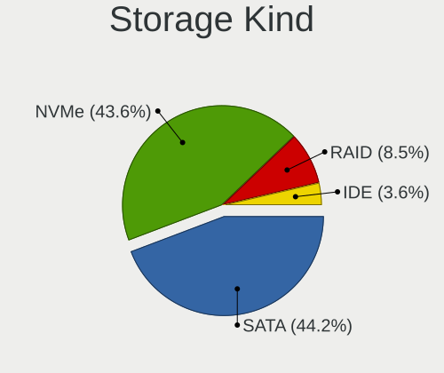

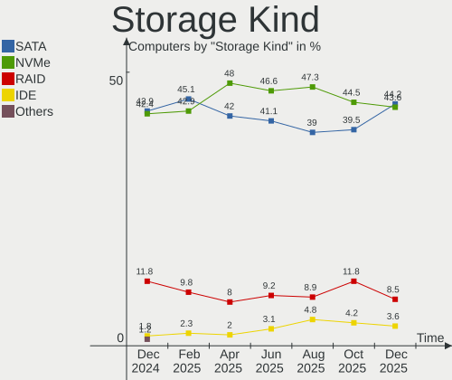

| Kind | Computers | Percent |
|------|-----------|---------|
| SATA | 73        | 44.24%  |
| NVMe | 72        | 43.64%  |
| RAID | 14        | 8.48%   |
| IDE  | 6         | 3.64%   |

Processor
---------

CPU Vendor
----------

Processor vendors

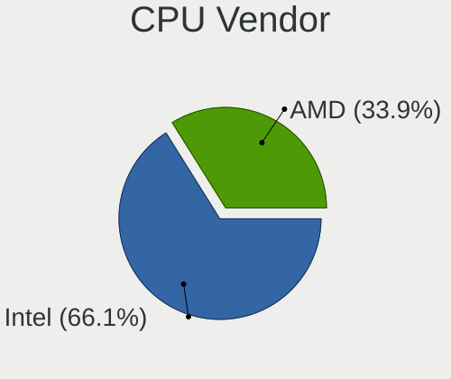

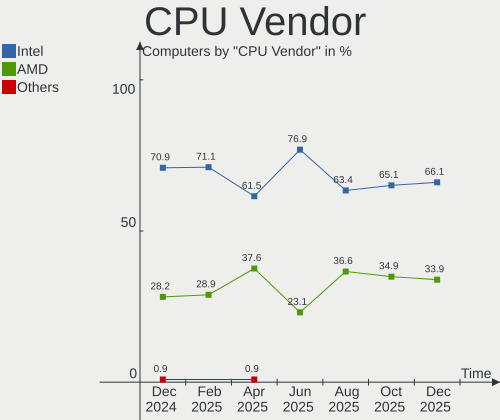

| Vendor | Computers | Percent |
|--------|-----------|---------|
| Intel  | 76        | 66.09%  |
| AMD    | 39        | 33.91%  |

CPU Model
---------

Processor models

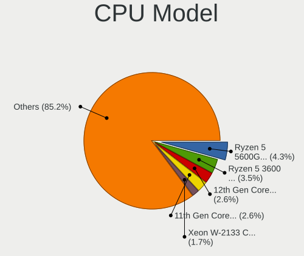

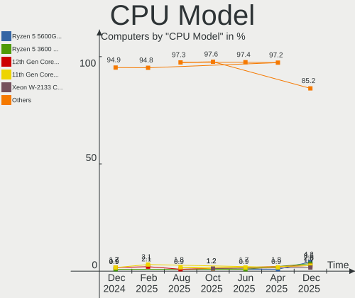

| Model                                         | Computers | Percent |
|-----------------------------------------------|-----------|---------|
| AMD Ryzen 5 5600G with Radeon Graphics        | 5         | 4.35%   |
| AMD Ryzen 5 3600 6-Core Processor             | 4         | 3.48%   |
| Intel 12th Gen Core i5-1240P                  | 3         | 2.61%   |
| Intel 11th Gen Core i5-1135G7 @ 2.40GHz       | 3         | 2.61%   |
| Intel Xeon W-2133 CPU @ 3.60GHz               | 2         | 1.74%   |
| Intel Core i7-9750H CPU @ 2.60GHz             | 2         | 1.74%   |
| Intel Core i7-14700HX                         | 2         | 1.74%   |
| Intel Core i5-8250U CPU @ 1.60GHz             | 2         | 1.74%   |
| Intel Core i5-4210U CPU @ 1.70GHz             | 2         | 1.74%   |
| Intel Core i3-4005U CPU @ 1.70GHz             | 2         | 1.74%   |
| Intel Core i3-3220 CPU @ 3.30GHz              | 2         | 1.74%   |
| Intel Celeron N5100 @ 1.10GHz                 | 2         | 1.74%   |
| AMD Ryzen 5 5600H with Radeon Graphics        | 2         | 1.74%   |
| AMD Ryzen 5 3500U with Radeon Vega Mobile Gfx | 2         | 1.74%   |
| AMD Ryzen 3 5300U with Radeon Graphics        | 2         | 1.74%   |
| Intel Pentium Dual-Core CPU E5300 @ 2.60GHz   | 1         | 0.87%   |
| Intel Pentium CPU G630 @ 2.70GHz              | 1         | 0.87%   |
| Intel Core Ultra 9 275HX                      | 1         | 0.87%   |
| Intel Core Ultra 7 255H                       | 1         | 0.87%   |
| Intel Core Ultra 7 155H                       | 1         | 0.87%   |
| Intel Core Ultra 5 225U                       | 1         | 0.87%   |
| Intel Core i9-9900KF CPU @ 3.60GHz            | 1         | 0.87%   |
| Intel Core i7-9700 CPU @ 3.00GHz              | 1         | 0.87%   |
| Intel Core i7-8850H CPU @ 2.60GHz             | 1         | 0.87%   |
| Intel Core i7-8565U CPU @ 1.80GHz             | 1         | 0.87%   |
| Intel Core i7-8550U CPU @ 1.80GHz             | 1         | 0.87%   |
| Intel Core i7-7700 CPU @ 3.60GHz              | 1         | 0.87%   |
| Intel Core i7-7600U CPU @ 2.80GHz             | 1         | 0.87%   |
| Intel Core i5-9300H CPU @ 2.40GHz             | 1         | 0.87%   |
| Intel Core i5-8500 CPU @ 3.00GHz              | 1         | 0.87%   |
| Intel Core i5-8365U CPU @ 1.60GHz             | 1         | 0.87%   |
| Intel Core i5-8300H CPU @ 2.30GHz             | 1         | 0.87%   |
| Intel Core i5-7200U CPU @ 2.50GHz             | 1         | 0.87%   |
| Intel Core i5-6300U CPU @ 2.40GHz             | 1         | 0.87%   |
| Intel Core i5-4690 CPU @ 3.50GHz              | 1         | 0.87%   |
| Intel Core i5-4200U CPU @ 1.60GHz             | 1         | 0.87%   |
| Intel Core i5-3337U CPU @ 1.80GHz             | 1         | 0.87%   |
| Intel Core i5-2520M CPU @ 2.50GHz             | 1         | 0.87%   |
| Intel Core i5-2467M CPU @ 1.60GHz             | 1         | 0.87%   |
| Intel Core i5-2400S CPU @ 2.50GHz             | 1         | 0.87%   |

CPU Model Family
----------------

Processor model prefix

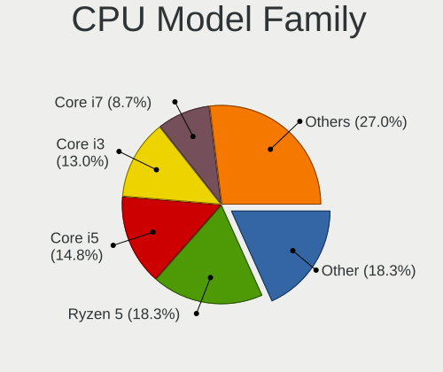

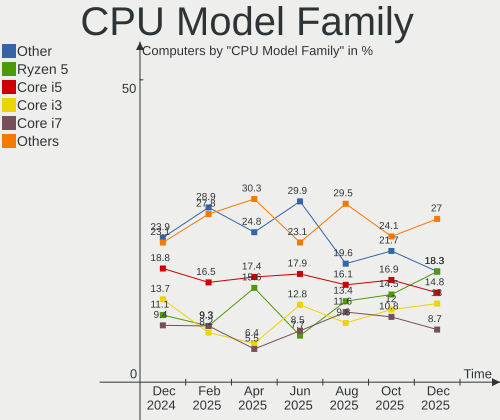

| Model                   | Computers | Percent |
|-------------------------|-----------|---------|
| Other                   | 21        | 18.26%  |
| AMD Ryzen 5             | 21        | 18.26%  |
| Intel Core i5           | 17        | 14.78%  |
| Intel Core i3           | 15        | 13.04%  |
| Intel Core i7           | 10        | 8.7%    |
| Intel Core              | 5         | 4.35%   |
| AMD Ryzen 7             | 5         | 4.35%   |
| Intel Celeron           | 3         | 2.61%   |
| AMD Ryzen 3             | 3         | 2.61%   |
| Intel Xeon              | 2         | 1.74%   |
| Intel Core 2 Duo        | 2         | 1.74%   |
| AMD Ryzen 9             | 2         | 1.74%   |
| Intel Pentium Dual-Core | 1         | 0.87%   |
| Intel Pentium           | 1         | 0.87%   |
| Intel Core i9           | 1         | 0.87%   |
| AMD Ryzen Threadripper  | 1         | 0.87%   |
| AMD FX                  | 1         | 0.87%   |
| AMD E2                  | 1         | 0.87%   |
| AMD E1                  | 1         | 0.87%   |
| AMD A4                  | 1         | 0.87%   |
| AMD A12                 | 1         | 0.87%   |

CPU Cores
---------

Number of processor cores

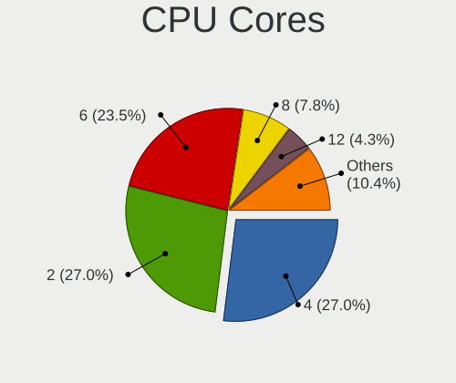

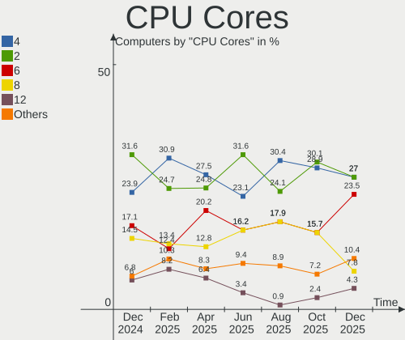

| Number | Computers | Percent |
|--------|-----------|---------|
| 4      | 31        | 26.96%  |
| 2      | 31        | 26.96%  |
| 6      | 27        | 23.48%  |
| 8      | 9         | 7.83%   |
| 12     | 5         | 4.35%   |
| 10     | 5         | 4.35%   |
| 16     | 3         | 2.61%   |
| 20     | 2         | 1.74%   |
| 24     | 1         | 0.87%   |
| 14     | 1         | 0.87%   |

CPU Sockets
-----------

Number of sockets

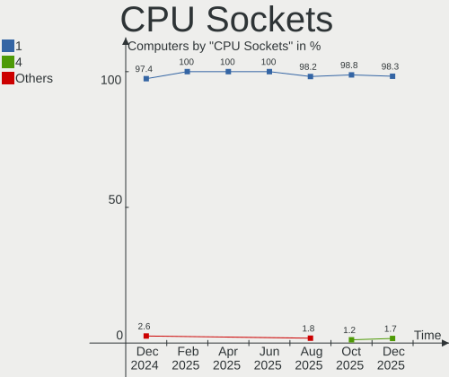

| Number | Computers | Percent |
|--------|-----------|---------|
| 1      | 113       | 98.26%  |
| 4      | 2         | 1.74%   |

CPU Threads
-----------

Threads per core (Hyper-Threading)

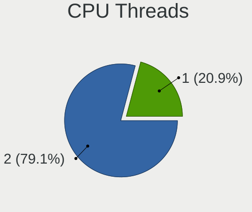

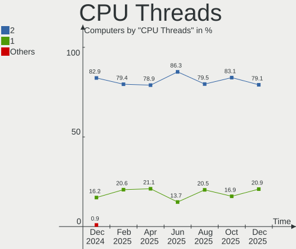

| Number | Computers | Percent |
|--------|-----------|---------|
| 2      | 91        | 79.13%  |
| 1      | 24        | 20.87%  |

CPU Op-Modes
------------

CPU Operation Modes (32-bit, 64-bit)

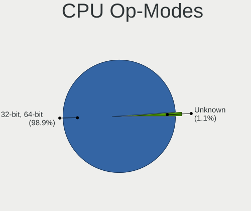

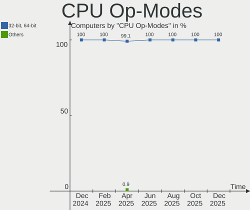

| Op mode        | Computers | Percent |
|----------------|-----------|---------|
| 32-bit, 64-bit | 115       | 100%    |

CPU Microcode
-------------

Microcode number

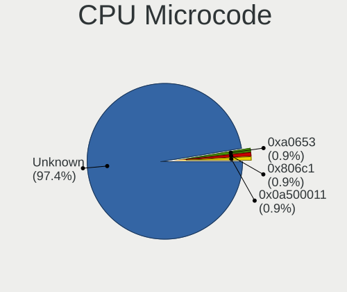

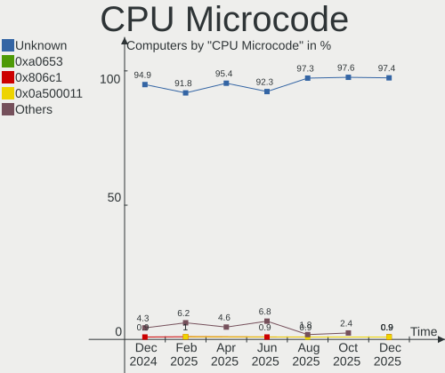

| Number     | Computers | Percent |
|------------|-----------|---------|
| Unknown    | 112       | 97.39%  |
| 0xa0653    | 1         | 0.87%   |
| 0x806c1    | 1         | 0.87%   |
| 0x0a500011 | 1         | 0.87%   |

CPU Microarch
-------------

Microarchitecture

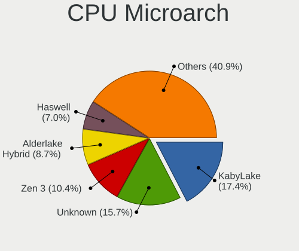

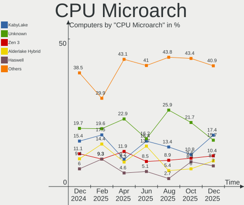

| Name              | Computers | Percent |
|-------------------|-----------|---------|
| KabyLake          | 20        | 17.39%  |
| Unknown           | 18        | 15.65%  |
| Zen 3             | 12        | 10.43%  |
| Alderlake Hybrid  | 10        | 8.7%    |
| Haswell           | 8         | 6.96%   |
| Zen 2             | 7         | 6.09%   |
| TigerLake         | 5         | 4.35%   |
| Skylake           | 5         | 4.35%   |
| SandyBridge       | 5         | 4.35%   |
| IvyBridge         | 4         | 3.48%   |
| Tremont           | 3         | 2.61%   |
| Penryn            | 3         | 2.61%   |
| Zen+              | 2         | 1.74%   |
| Zen               | 2         | 1.74%   |
| Puma              | 2         | 1.74%   |
| Icelake           | 2         | 1.74%   |
| Excavator         | 2         | 1.74%   |
| Piledriver        | 1         | 0.87%   |
| Meteorlake Hybrid | 1         | 0.87%   |
| Lunarlake Hybrid  | 1         | 0.87%   |
| K10 Llano         | 1         | 0.87%   |
| CometLake         | 1         | 0.87%   |

Graphics
--------

GPU Vendor
----------

Vendors of graphics cards

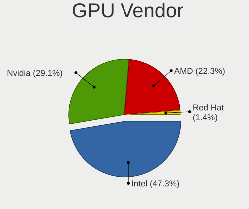

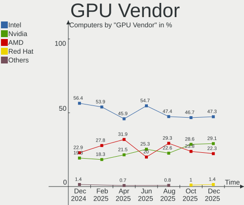

| Vendor  | Computers | Percent |
|---------|-----------|---------|
| Intel   | 70        | 47.3%   |
| Nvidia  | 43        | 29.05%  |
| AMD     | 33        | 22.3%   |
| Red Hat | 2         | 1.35%   |

GPU Model
---------

Graphics card models

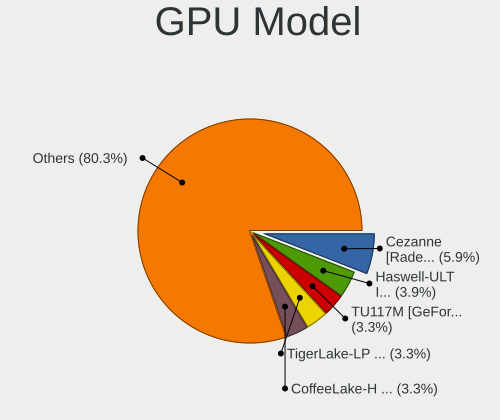

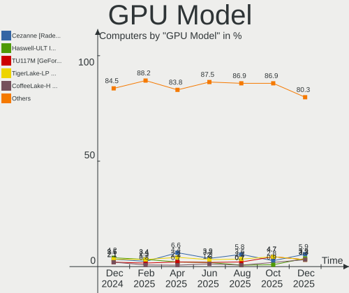

| Model                                                                         | Computers | Percent |
|-------------------------------------------------------------------------------|-----------|---------|
| AMD Cezanne [Radeon Vega Series / Radeon Vega Mobile Series]                  | 9         | 5.92%   |
| Intel Haswell-ULT Integrated Graphics Controller                              | 6         | 3.95%   |
| Nvidia TU117M [GeForce GTX 1650 Mobile / Max-Q]                               | 5         | 3.29%   |
| Intel TigerLake-LP GT2 [Iris Xe Graphics]                                     | 5         | 3.29%   |
| Intel CoffeeLake-H GT2 [UHD Graphics 630]                                     | 5         | 3.29%   |
| Nvidia GK208B [GeForce GT 710]                                                | 4         | 2.63%   |
| Nvidia GA107M [GeForce RTX 3050 Mobile]                                       | 4         | 2.63%   |
| Intel 2nd Generation Core Processor Family Integrated Graphics Controller     | 4         | 2.63%   |
| Nvidia AD107M [GeForce RTX 4060 Max-Q / Mobile]                               | 3         | 1.97%   |
| Intel Raptor Lake-S UHD Graphics                                              | 3         | 1.97%   |
| Intel Kaby Lake-U GT2 [HD Graphics 620]                                       | 3         | 1.97%   |
| Intel Kaby Lake-R GT2 [UHD Graphics 620]                                      | 3         | 1.97%   |
| Intel JasperLake [UHD Graphics]                                               | 3         | 1.97%   |
| Intel Alder Lake-P GT2 [Iris Xe Graphics]                                     | 3         | 1.97%   |
| AMD Lucienne                                                                  | 3         | 1.97%   |
| Red Hat Virtio 1.0 GPU                                                        | 2         | 1.32%   |
| Nvidia GM108M [GeForce MX130]                                                 | 2         | 1.32%   |
| Nvidia GF117M [GeForce 610M/710M/810M/820M / GT 620M/625M/630M/720M]          | 2         | 1.32%   |
| Nvidia GA107M [GeForce RTX 2050]                                              | 2         | 1.32%   |
| Nvidia GA107 [GeForce RTX 2050]                                               | 2         | 1.32%   |
| Intel Xeon E3-1200 v2/3rd Gen Core processor Graphics Controller              | 2         | 1.32%   |
| Intel WhiskeyLake-U GT2 [UHD Graphics 620]                                    | 2         | 1.32%   |
| Intel TigerLake-H GT1 [UHD Graphics]                                          | 2         | 1.32%   |
| Intel Kaby Lake-S GT2 [HD Graphics 630]                                       | 2         | 1.32%   |
| Intel CoffeeLake-S GT2 [UHD Graphics 630]                                     | 2         | 1.32%   |
| Intel 4 Series Chipset Integrated Graphics Controller                         | 2         | 1.32%   |
| Intel 3rd Gen Core processor Graphics Controller                              | 2         | 1.32%   |
| AMD Sun XT [Radeon HD 8670A/8670M/8690M / R5 M330 / M430 / Radeon 520 Mobile] | 2         | 1.32%   |
| AMD Renoir [Radeon Vega Series / Radeon Vega Mobile Series]                   | 2         | 1.32%   |
| AMD Raphael                                                                   | 2         | 1.32%   |
| AMD Picasso/Raven 2 [Radeon Vega Series / Radeon Vega Mobile Series]          | 2         | 1.32%   |
| AMD Mullins [Radeon R2 Graphics]                                              | 2         | 1.32%   |
| Nvidia TU116 [GeForce GTX 1660]                                               | 1         | 0.66%   |
| Nvidia TU116 [GeForce GTX 1660 SUPER]                                         | 1         | 0.66%   |
| Nvidia TU116 [GeForce GTX 1650 SUPER]                                         | 1         | 0.66%   |
| Nvidia GP108M [GeForce MX330]                                                 | 1         | 0.66%   |
| Nvidia GP107M [GeForce GTX 1050 Mobile]                                       | 1         | 0.66%   |
| Nvidia GP107M [GeForce GTX 1050 3 GB Max-Q]                                   | 1         | 0.66%   |
| Nvidia GP107GLM [Quadro P600 Mobile]                                          | 1         | 0.66%   |
| Nvidia GM108M [GeForce 940MX]                                                 | 1         | 0.66%   |

GPU Combo
---------

Combinations of graphics cards

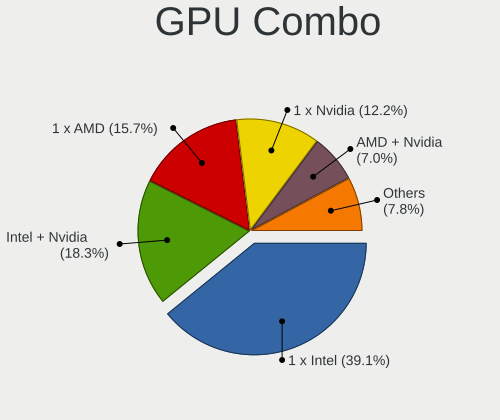

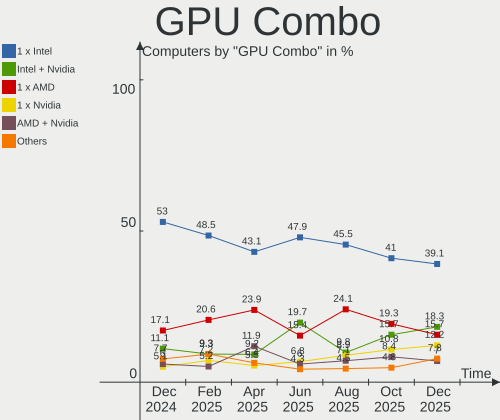

| Name           | Computers | Percent |
|----------------|-----------|---------|
| 1 x Intel      | 45        | 39.13%  |
| Intel + Nvidia | 21        | 18.26%  |
| 1 x AMD        | 18        | 15.65%  |
| 1 x Nvidia     | 14        | 12.17%  |
| AMD + Nvidia   | 8         | 6.96%   |
| 2 x AMD        | 4         | 3.48%   |
| Intel + AMD    | 3         | 2.61%   |
| 1 x Red Hat    | 2         | 1.74%   |

GPU Driver
----------

Free vs proprietary

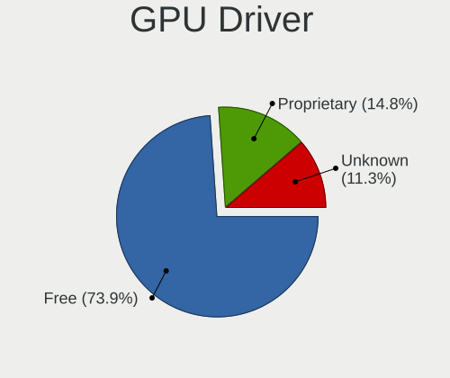

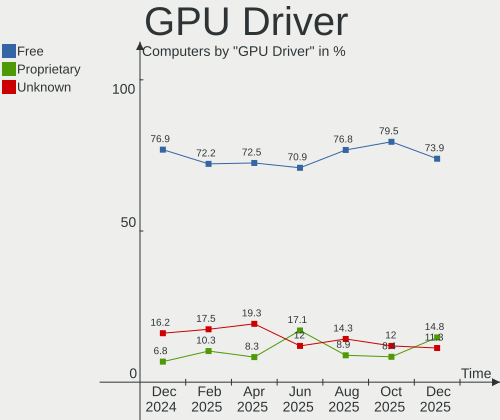

| Driver      | Computers | Percent |
|-------------|-----------|---------|
| Free        | 85        | 73.91%  |
| Proprietary | 17        | 14.78%  |
| Unknown     | 13        | 11.3%   |

GPU Memory
----------

Total video memory

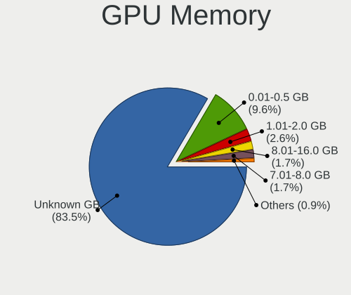

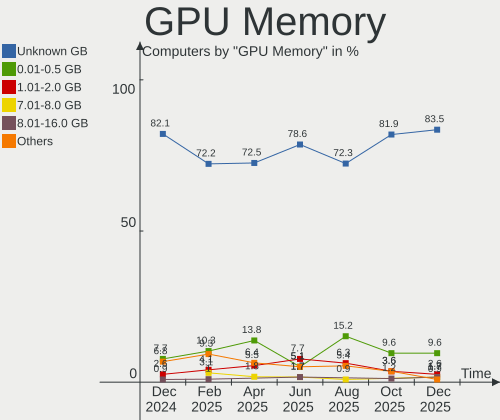

| Size in GB | Computers | Percent |
|------------|-----------|---------|
| Unknown    | 96        | 83.48%  |
| 0.01-0.5   | 11        | 9.57%   |
| 1.01-2.0   | 3         | 2.61%   |
| 7.01-8.0   | 2         | 1.74%   |
| 8.01-16.0  | 2         | 1.74%   |
| 0.51-1.0   | 1         | 0.87%   |

Monitor
-------

Monitor Vendor
--------------

Monitor vendors

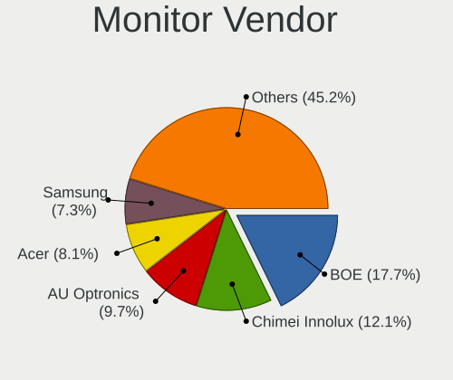

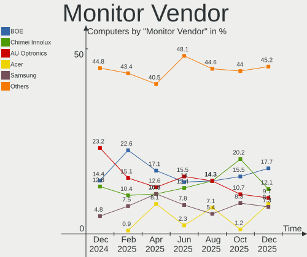

| Vendor              | Computers | Percent |
|---------------------|-----------|---------|
| BOE                 | 22        | 17.74%  |
| Chimei Innolux      | 15        | 12.1%   |
| AU Optronics        | 12        | 9.68%   |
| Acer                | 10        | 8.06%   |
| Samsung Electronics | 9         | 7.26%   |
| LG Display          | 8         | 6.45%   |
| Goldstar            | 8         | 6.45%   |
| Dell                | 5         | 4.03%   |
| BenQ                | 5         | 4.03%   |
| Lenovo              | 4         | 3.23%   |
| MSI                 | 3         | 2.42%   |
| Hewlett-Packard     | 3         | 2.42%   |
| Unknown (XXX)       | 2         | 1.61%   |
| Sharp               | 2         | 1.61%   |
| RHT                 | 2         | 1.61%   |
| HKC                 | 2         | 1.61%   |
| CSW                 | 2         | 1.61%   |
| Valve               | 1         | 0.81%   |
| Unknown             | 1         | 0.81%   |
| PANDA               | 1         | 0.81%   |
| LLL                 | 1         | 0.81%   |
| KDC                 | 1         | 0.81%   |
| ITE                 | 1         | 0.81%   |
| IDS                 | 1         | 0.81%   |
| CSOT                | 1         | 0.81%   |
| CPT                 | 1         | 0.81%   |
| AOC                 | 1         | 0.81%   |

Monitor Model
-------------

Monitor models

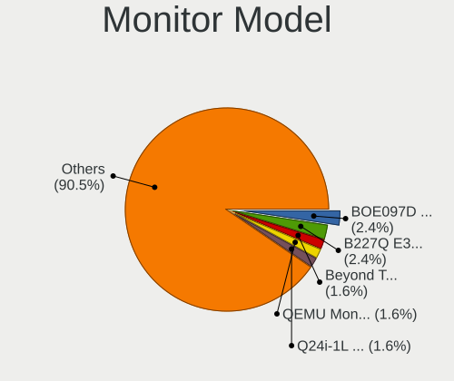

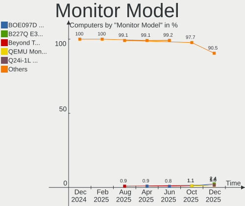

| Model                                                                  | Computers | Percent |
|------------------------------------------------------------------------|-----------|---------|
| BOE LCD Monitor BOE097D 1920x1080 344x194mm 15.5-inch                  | 3         | 2.38%   |
| Acer B227Q E3 ACR0C6C 1920x1080 479x260mm 21.5-inch                    | 3         | 2.38%   |
| Unknown (XXX) Beyond TV XXX2851 3840x2160 1209x680mm 54.6-inch         | 2         | 1.59%   |
| RHT QEMU Monitor RHT1234 2048x1152 325x203mm 15.1-inch                 | 2         | 1.59%   |
| Lenovo Q24i-1L LEN66C0 1920x1080 530x300mm 24.0-inch                   | 2         | 1.59%   |
| Hewlett-Packard X24ih HPN36DA 1920x1080 527x297mm 23.8-inch            | 2         | 1.59%   |
| Goldstar 27GL850 GSM5B7F 2560x1440 597x336mm 27.0-inch                 | 2         | 1.59%   |
| CSW LCD Monitor CSW150F 1920x1080 344x193mm 15.5-inch                  | 2         | 1.59%   |
| Chimei Innolux LCD Monitor CMN153B 1920x1080 344x193mm 15.5-inch       | 2         | 1.59%   |
| Chimei Innolux LCD Monitor CMN1521 1920x1080 344x193mm 15.5-inch       | 2         | 1.59%   |
| AU Optronics LCD Monitor AUO7EAD 1920x1080 344x193mm 15.5-inch         | 2         | 1.59%   |
| Valve ANX7530 U VLV3003 800x1280 100x160mm 7.4-inch                    | 1         | 0.79%   |
| Unknown LCD Monitor FFFF 2288x1287 2550x2550mm 142.0-inch              | 1         | 0.79%   |
| Sharp LQ134R1JW51 SHP151B 3840x2400 288x180mm 13.4-inch                | 1         | 0.79%   |
| Sharp LCD Monitor SHP148B 3840x2160 294x165mm 13.3-inch                | 1         | 0.79%   |
| Samsung Electronics SyncMaster SAM058C 1600x900 443x249mm 20.0-inch    | 1         | 0.79%   |
| Samsung Electronics S27E360 SAM0C13 1920x1080 598x336mm 27.0-inch      | 1         | 0.79%   |
| Samsung Electronics LCD Monitor SEC5441 1280x800 331x207mm 15.4-inch   | 1         | 0.79%   |
| Samsung Electronics LCD Monitor SEC454C 1366x768 309x174mm 14.0-inch   | 1         | 0.79%   |
| Samsung Electronics LCD Monitor SDC4651 1366x768 344x194mm 15.5-inch   | 1         | 0.79%   |
| Samsung Electronics LCD Monitor SDC41A0 1920x1200 302x189mm 14.0-inch  | 1         | 0.79%   |
| Samsung Electronics LCD Monitor SDC419D 2880x1800 302x189mm 14.0-inch  | 1         | 0.79%   |
| Samsung Electronics LCD Monitor SAM7106 1920x1080 1210x680mm 54.6-inch | 1         | 0.79%   |
| Samsung Electronics LCD Monitor SAM0A7A 1920x1080 1060x626mm 48.5-inch | 1         | 0.79%   |
| PANDA LCD Monitor NCP0029 1920x1080 344x194mm 15.5-inch                | 1         | 0.79%   |
| MSI MP273QP MSI30B6 2560x1440 600x330mm 27.0-inch                      | 1         | 0.79%   |
| MSI MD272QP MSI40B1 2560x1440 600x330mm 27.0-inch                      | 1         | 0.79%   |
| MSI G274QPF E2 MSI8CC2 2560x1440 597x336mm 27.0-inch                   | 1         | 0.79%   |
| LLL LCD Monitor LLL0001 1366x768                                       | 1         | 0.79%   |
| LG Display LP156WH2-TLQ1 LGD021B 1366x768 344x194mm 15.5-inch          | 1         | 0.79%   |
| LG Display LCD Monitor LGD0739 1920x1080 344x194mm 15.5-inch           | 1         | 0.79%   |
| LG Display LCD Monitor LGD05EE 2560x1440 309x174mm 14.0-inch           | 1         | 0.79%   |
| LG Display LCD Monitor LGD053F 1920x1080 344x194mm 15.5-inch           | 1         | 0.79%   |
| LG Display LCD Monitor LGD046B 1366x768 344x194mm 15.5-inch            | 1         | 0.79%   |
| LG Display LCD Monitor LGD0446 1920x1080 309x174mm 14.0-inch           | 1         | 0.79%   |
| LG Display LCD Monitor LGD03E5 1366x768 310x170mm 13.9-inch            | 1         | 0.79%   |
| LG Display LCD Monitor LGD03AB 1366x768 344x194mm 15.5-inch            | 1         | 0.79%   |
| Lenovo LCD Monitor LEN9052 1920x1080 344x194mm 15.5-inch               | 1         | 0.79%   |
| Lenovo LCD Monitor LEN40BA 1920x1080 344x194mm 15.5-inch               | 1         | 0.79%   |
| KDC LCD Monitor KDC0422 1920x1080 309x174mm 14.0-inch                  | 1         | 0.79%   |

Monitor Resolution
------------------

Monitor screen resolution

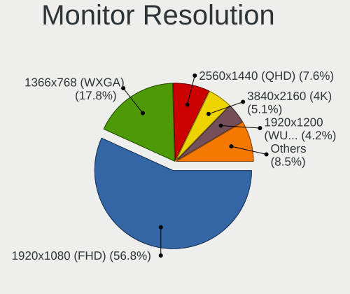

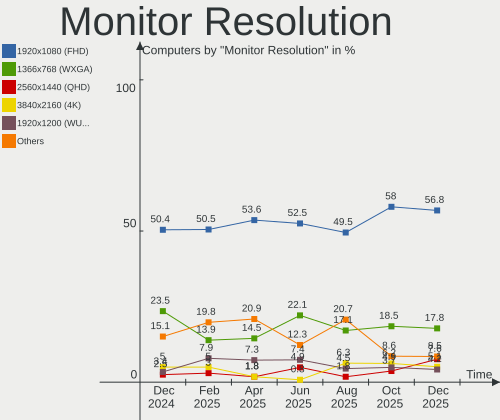

| Resolution        | Computers | Percent |
|-------------------|-----------|---------|
| 1920x1080 (FHD)   | 67        | 56.78%  |
| 1366x768 (WXGA)   | 21        | 17.8%   |
| 2560x1440 (QHD)   | 9         | 7.63%   |
| 3840x2160 (4K)    | 6         | 5.08%   |
| 1920x1200 (WUXGA) | 5         | 4.24%   |
| 2560x1397         | 2         | 1.69%   |
| 1600x900 (HD+)    | 2         | 1.69%   |
| 800x1280          | 1         | 0.85%   |
| 3840x2400         | 1         | 0.85%   |
| 3440x1440         | 1         | 0.85%   |
| 2880x1800         | 1         | 0.85%   |
| 2560x1600         | 1         | 0.85%   |
| 2288x1287         | 1         | 0.85%   |

Monitor Diagonal
----------------

Diagonal size in inches

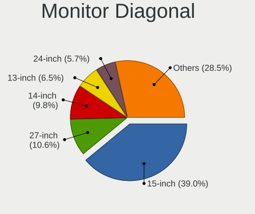

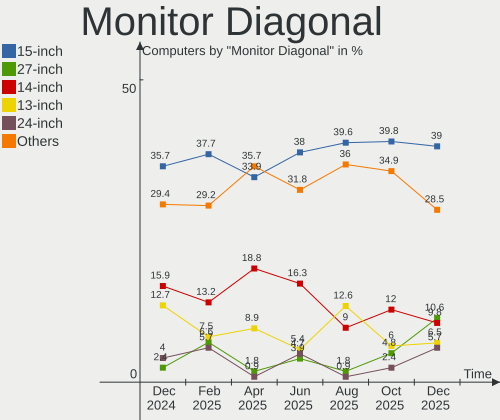

| Inches | Computers | Percent |
|--------|-----------|---------|
| 15     | 48        | 39.02%  |
| 27     | 13        | 10.57%  |
| 14     | 12        | 9.76%   |
| 13     | 8         | 6.5%    |
| 24     | 7         | 5.69%   |
| 21     | 6         | 4.88%   |
| 23     | 5         | 4.07%   |
| 18     | 3         | 2.44%   |
| 16     | 3         | 2.44%   |
| 63     | 2         | 1.63%   |
| 31     | 2         | 1.63%   |
| 29     | 2         | 1.63%   |
| 17     | 2         | 1.63%   |
| 142    | 1         | 0.81%   |
| 54     | 1         | 0.81%   |
| 48     | 1         | 0.81%   |
| 39     | 1         | 0.81%   |
| 34     | 1         | 0.81%   |
| 20     | 1         | 0.81%   |
| 19     | 1         | 0.81%   |
| 12     | 1         | 0.81%   |
| 11     | 1         | 0.81%   |
| 7      | 1         | 0.81%   |

Monitor Width
-------------

Physical width

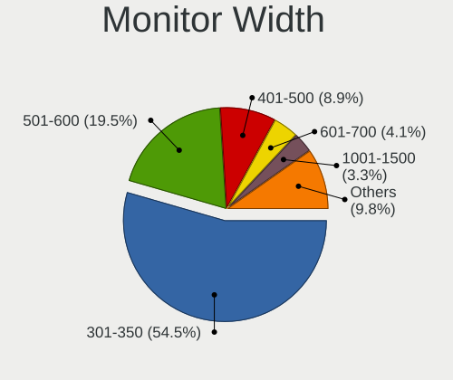

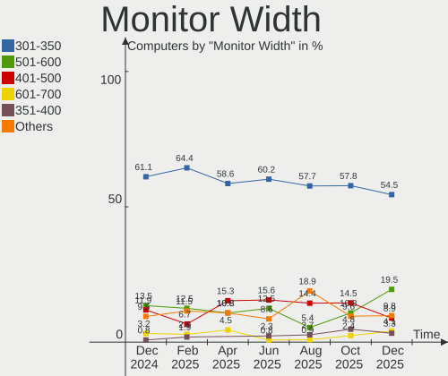

| Width in mm    | Computers | Percent |
|----------------|-----------|---------|
| 301-350        | 67        | 54.47%  |
| 501-600        | 24        | 19.51%  |
| 401-500        | 11        | 8.94%   |
| 601-700        | 5         | 4.07%   |
| 351-400        | 4         | 3.25%   |
| 201-300        | 4         | 3.25%   |
| 1001-1500      | 4         | 3.25%   |
| More than 2000 | 1         | 0.81%   |
| 801-900        | 1         | 0.81%   |
| 701-800        | 1         | 0.81%   |
| 1-100          | 1         | 0.81%   |

Aspect Ratio
------------

Proportional relationship between the width and the height

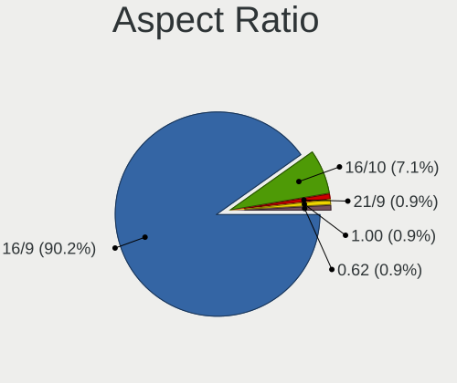

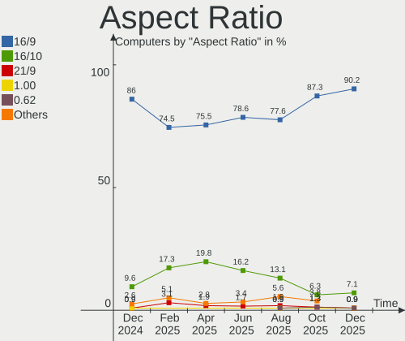

| Ratio | Computers | Percent |
|-------|-----------|---------|
| 16/9  | 101       | 90.18%  |
| 16/10 | 8         | 7.14%   |
| 21/9  | 1         | 0.89%   |
| 1.00  | 1         | 0.89%   |
| 0.62  | 1         | 0.89%   |

Monitor Area
------------

Area in inch²

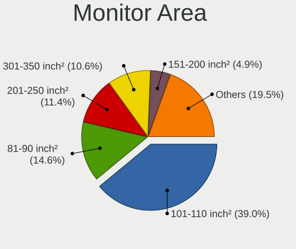

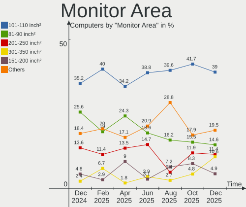

| Area in inch² | Computers | Percent |
|----------------|-----------|---------|
| 101-110        | 48        | 39.02%  |
| 81-90          | 18        | 14.63%  |
| 201-250        | 14        | 11.38%  |
| 301-350        | 13        | 10.57%  |
| 151-200        | 6         | 4.88%   |
| More than 1000 | 5         | 4.07%   |
| 351-500        | 5         | 4.07%   |
| 71-80          | 3         | 2.44%   |
| 141-150        | 3         | 2.44%   |
| 121-130        | 2         | 1.63%   |
| 111-120        | 2         | 1.63%   |
| 51-60          | 1         | 0.81%   |
| 1-40           | 1         | 0.81%   |
| 501-1000       | 1         | 0.81%   |
| 91-100         | 1         | 0.81%   |

Pixel Density
-------------

Pixels per inch

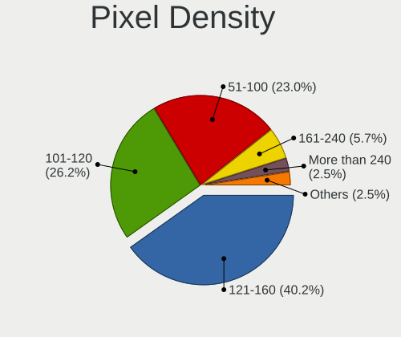

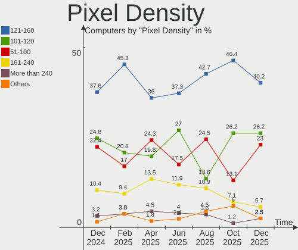

| Density       | Computers | Percent |
|---------------|-----------|---------|
| 121-160       | 49        | 40.16%  |
| 101-120       | 32        | 26.23%  |
| 51-100        | 28        | 22.95%  |
| 161-240       | 7         | 5.74%   |
| More than 240 | 3         | 2.46%   |
| 1-50          | 3         | 2.46%   |

Multiple Monitors
-----------------

Total monitors connected

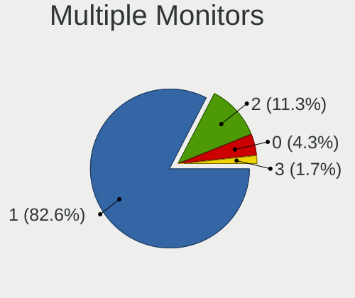

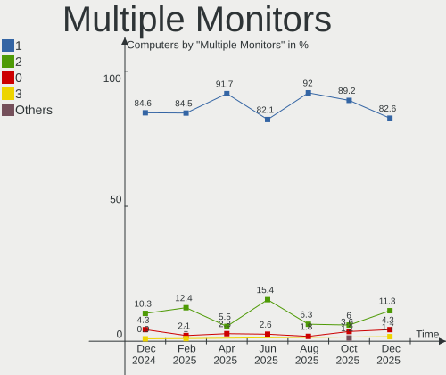

| Total | Computers | Percent |
|-------|-----------|---------|
| 1     | 95        | 82.61%  |
| 2     | 13        | 11.3%   |
| 0     | 5         | 4.35%   |
| 3     | 2         | 1.74%   |

Network
-------

Net Controller Vendor
---------------------

Controller vendors

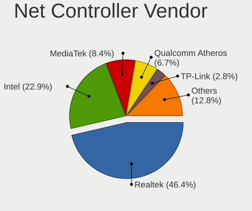

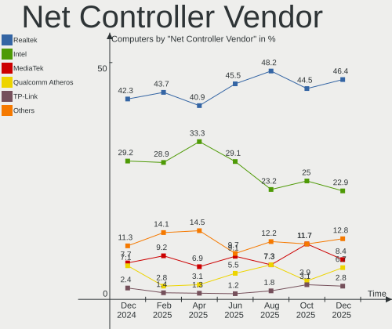

| Vendor                          | Computers | Percent |
|---------------------------------|-----------|---------|
| Realtek Semiconductor           | 83        | 46.37%  |
| Intel                           | 41        | 22.91%  |
| MediaTek                        | 15        | 8.38%   |
| Qualcomm Atheros                | 12        | 6.7%    |
| TP-Link                         | 5         | 2.79%   |
| Broadcom                        | 4         | 2.23%   |
| Shenzhen Goodix Technology      | 3         | 1.68%   |
| Ralink Technology               | 3         | 1.68%   |
| Samsung Electronics             | 2         | 1.12%   |
| Ralink                          | 2         | 1.12%   |
| OPPO Electronics                | 2         | 1.12%   |
| ASIX Electronics                | 2         | 1.12%   |
| Qualcomm Atheros Communications | 1         | 0.56%   |
| Qualcomm                        | 1         | 0.56%   |
| DisplayLink                     | 1         | 0.56%   |
| AMTelecom                       | 1         | 0.56%   |
| Unknown                         | 1         | 0.56%   |

Net Controller Model
--------------------

Controller models

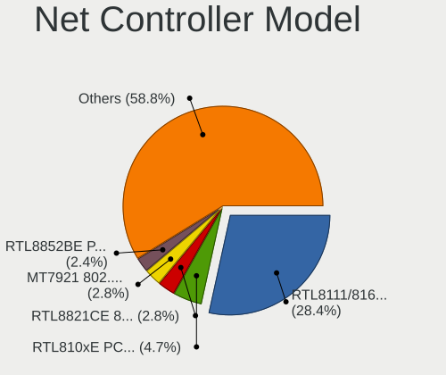

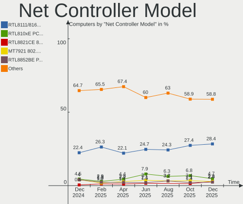

| Model                                                                  | Computers | Percent |
|------------------------------------------------------------------------|-----------|---------|
| Realtek RTL8111/8168/8211/8411 PCI Express Gigabit Ethernet Controller | 60        | 28.44%  |
| Realtek RTL810xE PCI Express Fast Ethernet controller                  | 10        | 4.74%   |
| Realtek RTL8821CE 802.11ac PCIe Wireless Network Adapter               | 6         | 2.84%   |
| MediaTek MT7921 802.11ax PCIe Wireless Network Adapter [Filogic 330]   | 6         | 2.84%   |
| Realtek RTL8852BE PCIe 802.11ax Wireless Network Controller            | 5         | 2.37%   |
| MediaTek MT7902 802.11ax PCIe Wireless Network Adapter [Filogic 310]   | 5         | 2.37%   |
| Intel Alder Lake-P PCH CNVi WiFi                                       | 5         | 2.37%   |
| Realtek RTL8125 2.5GbE Controller                                      | 4         | 1.9%    |
| Qualcomm Atheros QCA9565 / AR9565 Wireless Network Adapter             | 4         | 1.9%    |
| Intel Wi-Fi 6 AX200                                                    | 4         | 1.9%    |
| Intel Cannon Lake PCH CNVi WiFi                                        | 4         | 1.9%    |
| Shenzhen Goodix Fingerprint Reader                                     | 3         | 1.42%   |
| Realtek RTL8723BE PCIe Wireless Network Adapter                        | 3         | 1.42%   |
| Realtek 802.11ac NIC                                                   | 3         | 1.42%   |
| Ralink MT7601U Wireless Adapter                                        | 3         | 1.42%   |
| Qualcomm Atheros QCA9377 802.11ac Wireless Network Adapter             | 3         | 1.42%   |
| Intel Wi-Fi 6 AX201                                                    | 3         | 1.42%   |
| TP-Link Archer T2U PLUS [RTL8821AU]                                    | 2         | 0.95%   |
| Samsung Galaxy series, misc. (tethering mode)                          | 2         | 0.95%   |
| Realtek RTL8852BE PCIe 802.11ax Wireless Network Controller [1T1R]     | 2         | 0.95%   |
| Realtek RTL8723DE Wireless Network Adapter                             | 2         | 0.95%   |
| Ralink RT3290 Wireless 802.11n 1T/1R PCIe                              | 2         | 0.95%   |
| Qualcomm Atheros QCA6174 802.11ac Wireless Network Adapter             | 2         | 0.95%   |
| OPPO Ace 3V                                                            | 2         | 0.95%   |
| MediaTek MT7922 802.11ax PCI Express Wireless Network Adapter          | 2         | 0.95%   |
| Intel Wireless 3165                                                    | 2         | 0.95%   |
| Intel Raptor Lake PCH CNVi WiFi                                        | 2         | 0.95%   |
| Intel Jasper Lake PCH CNVi WiFi                                        | 2         | 0.95%   |
| Intel Ethernet Controller I226-V                                       | 2         | 0.95%   |
| Intel Ethernet Connection (7) I219-LM                                  | 2         | 0.95%   |
| Intel Arrow Lake CNVi WiFi                                             | 2         | 0.95%   |
| Intel 700 Series Chipset CNVi WiFi                                     | 2         | 0.95%   |
| ASIX AX88179 Gigabit Ethernet                                          | 2         | 0.95%   |
| TP-Link TL-WN823N v2/v3 [Realtek RTL8192EU]                            | 1         | 0.47%   |
| TP-Link Archer T3U [Realtek RTL8812BU]                                 | 1         | 0.47%   |
| TP-Link AC600 wireless Realtek RTL8811AU [Archer T2U Nano]             | 1         | 0.47%   |
| Realtek RTL8852AE 802.11ax PCIe Wireless Network Adapter               | 1         | 0.47%   |
| Realtek RTL8851BE PCIe 802.11ax Wireless Network Controller            | 1         | 0.47%   |
| Realtek RTL8822CE 802.11ac PCIe Wireless Network Adapter               | 1         | 0.47%   |
| Realtek RTL8822BE 802.11a/b/g/n/ac WiFi adapter                        | 1         | 0.47%   |

Wireless Vendor
---------------

Wireless vendors

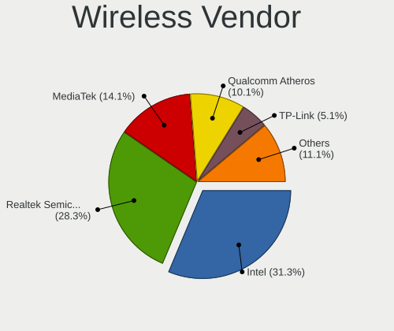

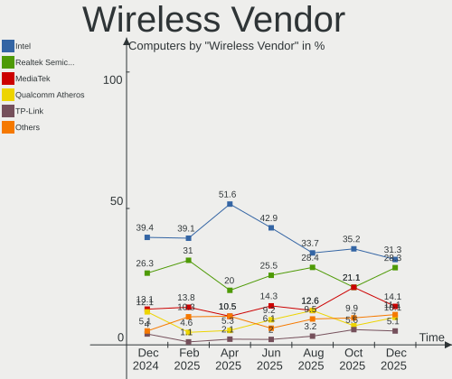

| Vendor                          | Computers | Percent |
|---------------------------------|-----------|---------|
| Intel                           | 31        | 31.31%  |
| Realtek Semiconductor           | 28        | 28.28%  |
| MediaTek                        | 14        | 14.14%  |
| Qualcomm Atheros                | 10        | 10.1%   |
| TP-Link                         | 5         | 5.05%   |
| Broadcom                        | 4         | 4.04%   |
| Ralink Technology               | 3         | 3.03%   |
| Ralink                          | 2         | 2.02%   |
| Qualcomm Atheros Communications | 1         | 1.01%   |
| Qualcomm                        | 1         | 1.01%   |

Wireless Model
--------------

Wireless models

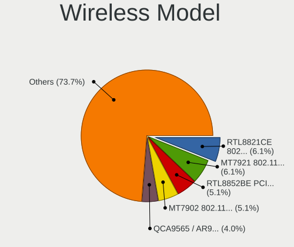

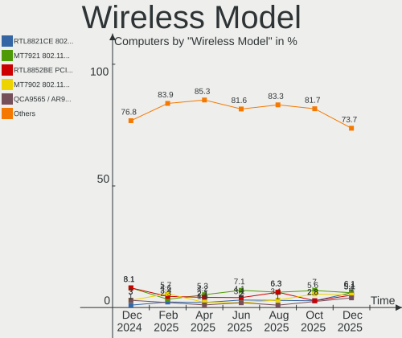

| Model                                                                           | Computers | Percent |
|---------------------------------------------------------------------------------|-----------|---------|
| Realtek RTL8821CE 802.11ac PCIe Wireless Network Adapter                        | 6         | 6.06%   |
| MediaTek MT7921 802.11ax PCIe Wireless Network Adapter [Filogic 330]            | 6         | 6.06%   |
| Realtek RTL8852BE PCIe 802.11ax Wireless Network Controller                     | 5         | 5.05%   |
| MediaTek MT7902 802.11ax PCIe Wireless Network Adapter [Filogic 310]            | 5         | 5.05%   |
| Qualcomm Atheros QCA9565 / AR9565 Wireless Network Adapter                      | 4         | 4.04%   |
| Intel Wi-Fi 6 AX200                                                             | 4         | 4.04%   |
| Intel Cannon Lake PCH CNVi WiFi                                                 | 4         | 4.04%   |
| Realtek RTL8723BE PCIe Wireless Network Adapter                                 | 3         | 3.03%   |
| Realtek 802.11ac NIC                                                            | 3         | 3.03%   |
| Ralink MT7601U Wireless Adapter                                                 | 3         | 3.03%   |
| Qualcomm Atheros QCA9377 802.11ac Wireless Network Adapter                      | 3         | 3.03%   |
| Intel Wi-Fi 6 AX201                                                             | 3         | 3.03%   |
| Intel Alder Lake-P PCH CNVi WiFi                                                | 3         | 3.03%   |
| TP-Link Archer T2U PLUS [RTL8821AU]                                             | 2         | 2.02%   |
| Realtek RTL8852BE PCIe 802.11ax Wireless Network Controller [1T1R]              | 2         | 2.02%   |
| Realtek RTL8723DE Wireless Network Adapter                                      | 2         | 2.02%   |
| Ralink RT3290 Wireless 802.11n 1T/1R PCIe                                       | 2         | 2.02%   |
| Qualcomm Atheros QCA6174 802.11ac Wireless Network Adapter                      | 2         | 2.02%   |
| MediaTek MT7922 802.11ax PCI Express Wireless Network Adapter                   | 2         | 2.02%   |
| Intel Wireless 3165                                                             | 2         | 2.02%   |
| Intel Jasper Lake PCH CNVi WiFi                                                 | 2         | 2.02%   |
| Intel 700 Series Chipset CNVi WiFi                                              | 2         | 2.02%   |
| TP-Link TL-WN823N v2/v3 [Realtek RTL8192EU]                                     | 1         | 1.01%   |
| TP-Link Archer T3U [Realtek RTL8812BU]                                          | 1         | 1.01%   |
| TP-Link AC600 wireless Realtek RTL8811AU [Archer T2U Nano]                      | 1         | 1.01%   |
| Realtek RTL8852AE 802.11ax PCIe Wireless Network Adapter                        | 1         | 1.01%   |
| Realtek RTL8851BE PCIe 802.11ax Wireless Network Controller                     | 1         | 1.01%   |
| Realtek RTL8822CE 802.11ac PCIe Wireless Network Adapter                        | 1         | 1.01%   |
| Realtek RTL8822BE 802.11a/b/g/n/ac WiFi adapter                                 | 1         | 1.01%   |
| Realtek RTL8821CE PCIe 802.11ac Wireless Network Controller                     | 1         | 1.01%   |
| Realtek RTL8192EU 802.11b/g/n WLAN Adapter                                      | 1         | 1.01%   |
| Realtek RTL8188FTV 802.11b/g/n 1T1R 2.4G WLAN Adapter                           | 1         | 1.01%   |
| Qualcomm QCNFA765 Wireless Network Adapter                                      | 1         | 1.01%   |
| Qualcomm Atheros AR9271 802.11n                                                 | 1         | 1.01%   |
| Qualcomm Atheros AR9485 Wireless Network Adapter                                | 1         | 1.01%   |
| MediaTek MT7925 802.11be 160MHz 2x2 PCIe Wireless Network Adapter [Filogic 360] | 1         | 1.01%   |
| Intel Wireless 8265 / 8275                                                      | 1         | 1.01%   |
| Intel Wireless 8260                                                             | 1         | 1.01%   |
| Intel Wireless 7265                                                             | 1         | 1.01%   |
| Intel Wi-Fi 5(802.11ac) Wireless-AC 9x6x [Thunder Peak]                         | 1         | 1.01%   |

Ethernet Vendor
---------------

Ethernet vendors

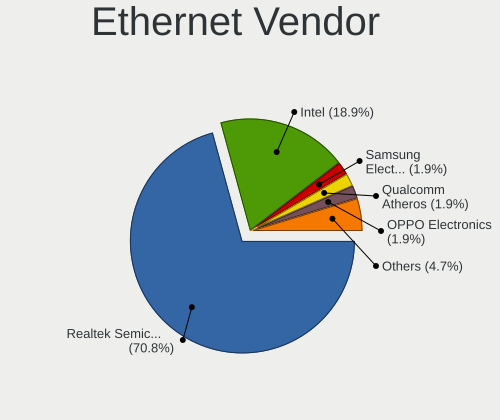

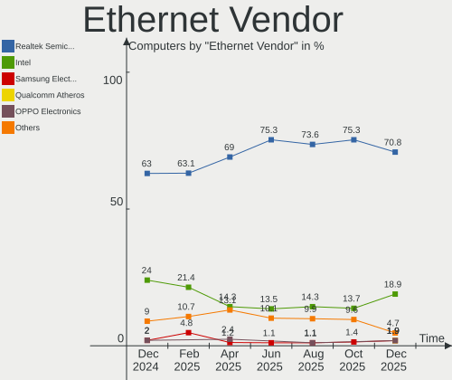

| Vendor                | Computers | Percent |
|-----------------------|-----------|---------|
| Realtek Semiconductor | 75        | 70.75%  |
| Intel                 | 20        | 18.87%  |
| Samsung Electronics   | 2         | 1.89%   |
| Qualcomm Atheros      | 2         | 1.89%   |
| OPPO Electronics      | 2         | 1.89%   |
| ASIX Electronics      | 2         | 1.89%   |
| MediaTek              | 1         | 0.94%   |
| DisplayLink           | 1         | 0.94%   |
| AMTelecom             | 1         | 0.94%   |

Ethernet Model
--------------

Ethernet models

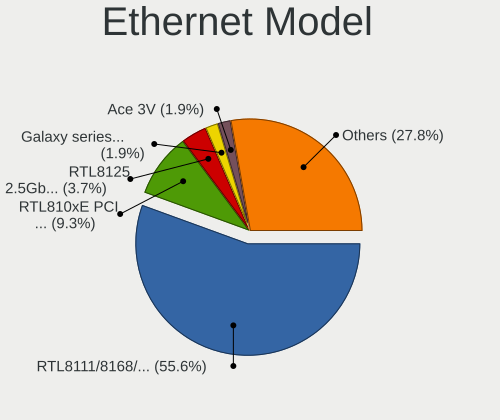

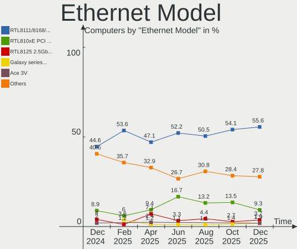

| Model                                                                  | Computers | Percent |
|------------------------------------------------------------------------|-----------|---------|
| Realtek RTL8111/8168/8211/8411 PCI Express Gigabit Ethernet Controller | 60        | 55.56%  |
| Realtek RTL810xE PCI Express Fast Ethernet controller                  | 10        | 9.26%   |
| Realtek RTL8125 2.5GbE Controller                                      | 4         | 3.7%    |
| Samsung Galaxy series, misc. (tethering mode)                          | 2         | 1.85%   |
| OPPO Ace 3V                                                            | 2         | 1.85%   |
| Intel Ethernet Controller I226-V                                       | 2         | 1.85%   |
| Intel Ethernet Connection (7) I219-LM                                  | 2         | 1.85%   |
| Intel Alder Lake-P PCH CNVi WiFi                                       | 2         | 1.85%   |
| ASIX AX88179 Gigabit Ethernet                                          | 2         | 1.85%   |
| Realtek RTL8111/8168/8411 PCI Express Gigabit Ethernet Controller      | 1         | 0.93%   |
| Realtek Killer E2600 GbE Controller                                    | 1         | 0.93%   |
| Qualcomm Atheros Killer E2500 Gigabit Ethernet Controller              | 1         | 0.93%   |
| Qualcomm Atheros Killer E220x Gigabit Ethernet Controller              | 1         | 0.93%   |
| MediaTek Infinix HOT 50i                                               | 1         | 0.93%   |
| Intel Raptor Lake PCH CNVi WiFi                                        | 1         | 0.93%   |
| Intel Ethernet Controller X550                                         | 1         | 0.93%   |
| Intel Ethernet Connection I219-LM                                      | 1         | 0.93%   |
| Intel Ethernet Connection (7) I219-V                                   | 1         | 0.93%   |
| Intel Ethernet Connection (6) I219-LM                                  | 1         | 0.93%   |
| Intel Ethernet Connection (5) I219-LM                                  | 1         | 0.93%   |
| Intel Ethernet Connection (4) I219-LM                                  | 1         | 0.93%   |
| Intel Ethernet Connection (24) I219-V                                  | 1         | 0.93%   |
| Intel Ethernet Connection (23) I219-V                                  | 1         | 0.93%   |
| Intel Ethernet Connection (14) I219-V                                  | 1         | 0.93%   |
| Intel Ethernet Connection (13) I219-LM                                 | 1         | 0.93%   |
| Intel Ethernet Connection (10) I219-LM                                 | 1         | 0.93%   |
| Intel Arrow Lake CNVi WiFi                                             | 1         | 0.93%   |
| Intel 82579LM Gigabit Network Connection (Lewisville)                  | 1         | 0.93%   |
| Intel 82567LM-3 Gigabit Network Connection                             | 1         | 0.93%   |
| DisplayLink Dell Universal Dock D6000                                  | 1         | 0.93%   |
| AMTelecom JMR1140 [Jiofi]                                              | 1         | 0.93%   |

Net Controller Kind
-------------------

Ethernet, WiFi or modem

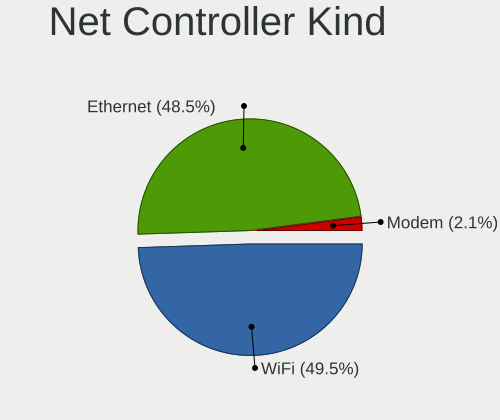

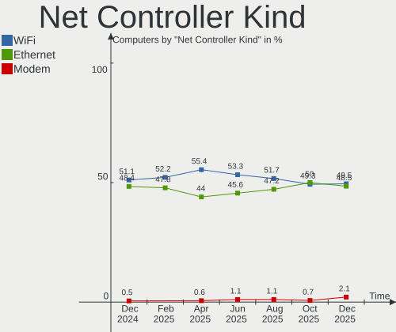

| Kind     | Computers | Percent |
|----------|-----------|---------|
| WiFi     | 96        | 49.48%  |
| Ethernet | 94        | 48.45%  |
| Modem    | 4         | 2.06%   |

Used Controller
---------------

Currently used network controller

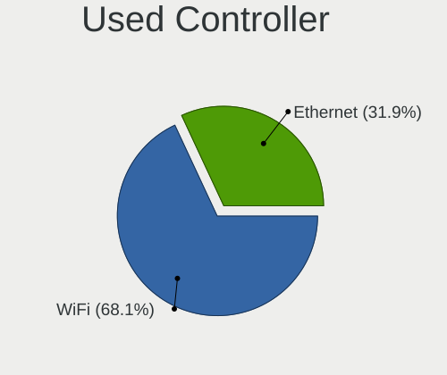

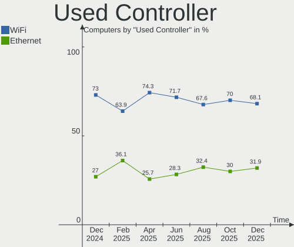

| Kind     | Computers | Percent |
|----------|-----------|---------|
| WiFi     | 81        | 68.07%  |
| Ethernet | 38        | 31.93%  |

NICs
----

Total network controllers on board

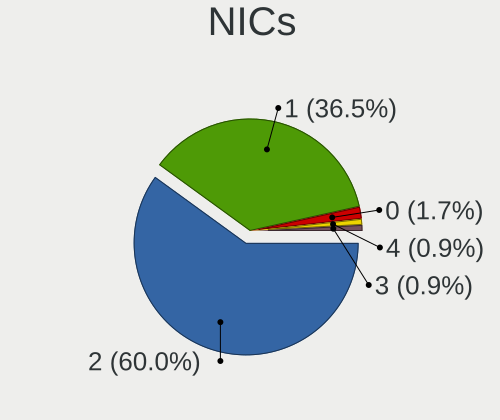

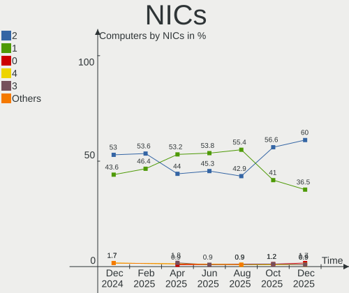

| Total | Computers | Percent |
|-------|-----------|---------|
| 2     | 69        | 60%     |
| 1     | 42        | 36.52%  |
| 0     | 2         | 1.74%   |
| 4     | 1         | 0.87%   |
| 3     | 1         | 0.87%   |

IPv6
----

IPv6 vs IPv4

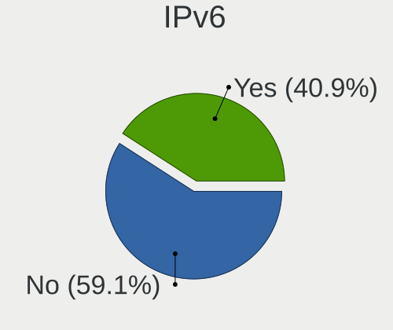

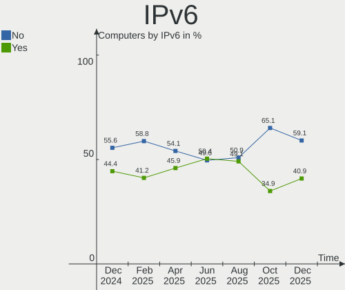

| Used | Computers | Percent |
|------|-----------|---------|
| No   | 68        | 59.13%  |
| Yes  | 47        | 40.87%  |

Bluetooth
---------

Bluetooth Vendor
----------------

Controller vendors

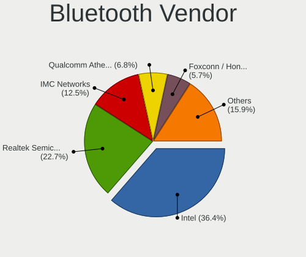

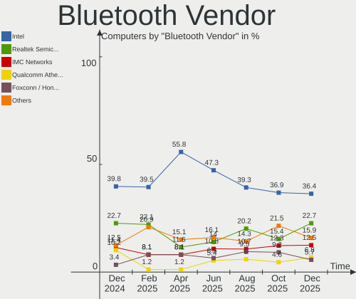

| Vendor                          | Computers | Percent |
|---------------------------------|-----------|---------|
| Intel                           | 32        | 36.36%  |
| Realtek Semiconductor           | 20        | 22.73%  |
| IMC Networks                    | 11        | 12.5%   |
| Qualcomm Atheros Communications | 6         | 6.82%   |
| Foxconn / Hon Hai               | 5         | 5.68%   |
| TP-Link                         | 3         | 3.41%   |
| Cambridge Silicon Radio         | 3         | 3.41%   |
| Ralink                          | 2         | 2.27%   |
| Lite-On Technology              | 2         | 2.27%   |
| MediaTek                        | 1         | 1.14%   |
| Chicony Electronics             | 1         | 1.14%   |
| AICSemi                         | 1         | 1.14%   |
| Actions                         | 1         | 1.14%   |

Bluetooth Model
---------------

Controller models

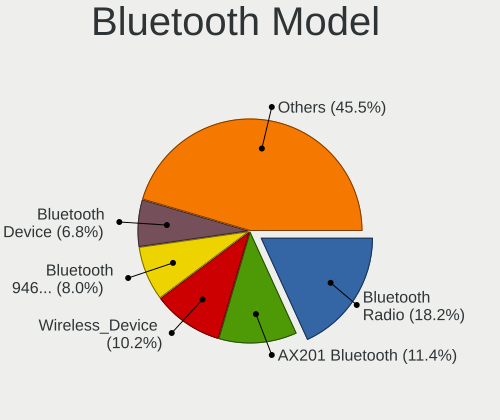

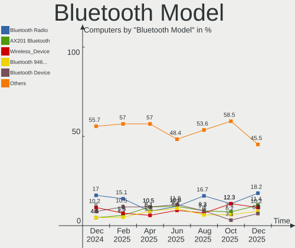

| Model                                               | Computers | Percent |
|-----------------------------------------------------|-----------|---------|
| Realtek Bluetooth Radio                             | 16        | 18.18%  |
| Intel AX201 Bluetooth                               | 10        | 11.36%  |
| IMC Networks Wireless_Device                        | 9         | 10.23%  |
| Intel Bluetooth 9460/9560 Jefferson Peak (JfP)      | 7         | 7.95%   |
| Intel Bluetooth Device                              | 6         | 6.82%   |
| Realtek  Bluetooth 4.2 Adapter                      | 4         | 4.55%   |
| Intel Bluetooth wireless interface                  | 4         | 4.55%   |
| Intel AX200 Bluetooth                               | 4         | 4.55%   |
| TP-Link TP-T@- UB500 Adapter                        | 3         | 3.41%   |
| Qualcomm Atheros  Bluetooth Device                  | 3         | 3.41%   |
| Cambridge Silicon Radio Bluetooth Dongle (HCI mode) | 3         | 3.41%   |
| Ralink RT3290 Bluetooth                             | 2         | 2.27%   |
| Qualcomm Atheros AR9462 Bluetooth                   | 2         | 2.27%   |
| Foxconn / Hon Hai Wireless_Device                   | 2         | 2.27%   |
| Foxconn / Hon Hai MediaTek Bluetooth Adapter        | 2         | 2.27%   |
| Qualcomm Atheros AR3012 Bluetooth 4.0               | 1         | 1.14%   |
| MediaTek Wireless_Device                            | 1         | 1.14%   |
| Lite-On Qualcomm Atheros QCA9377 Bluetooth          | 1         | 1.14%   |
| Lite-On Bluetooth Device                            | 1         | 1.14%   |
| Intel Wireless-AC 9260 Bluetooth Adapter            | 1         | 1.14%   |
| IMC Networks Bluetooth Radio                        | 1         | 1.14%   |
| IMC Networks Atheros AR3012 Bluetooth 4.0 Adapter   | 1         | 1.14%   |
| Foxconn / Hon Hai Bluetooth Device                  | 1         | 1.14%   |
| Chicony Bluetooth (RTL8723BE)                       | 1         | 1.14%   |
| AICSemi AIC 8800D80                                 | 1         | 1.14%   |
| Actions general adapter                             | 1         | 1.14%   |

Sound
-----

Sound Vendor
------------

Sound card vendors

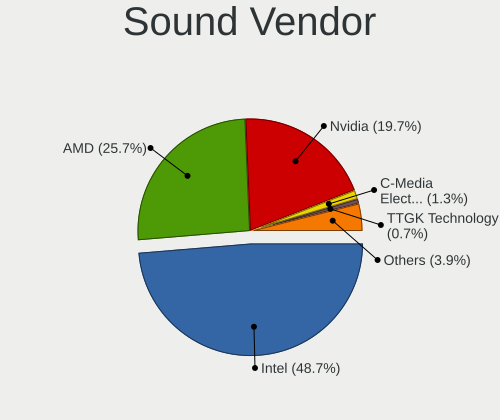

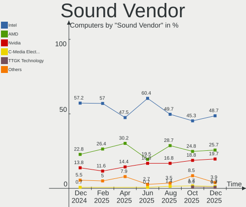

| Vendor                 | Computers | Percent |
|------------------------|-----------|---------|
| Intel                  | 74        | 48.68%  |
| AMD                    | 39        | 25.66%  |
| Nvidia                 | 30        | 19.74%  |
| C-Media Electronics    | 2         | 1.32%   |
| TTGK Technology        | 1         | 0.66%   |
| Razer USA              | 1         | 0.66%   |
| OPPO Electronics       | 1         | 0.66%   |
| Huawei Technologies    | 1         | 0.66%   |
| Generalplus Technology | 1         | 0.66%   |
| Creative Technology    | 1         | 0.66%   |
| ASUSTek Computer       | 1         | 0.66%   |

Sound Model
-----------

Sound card models

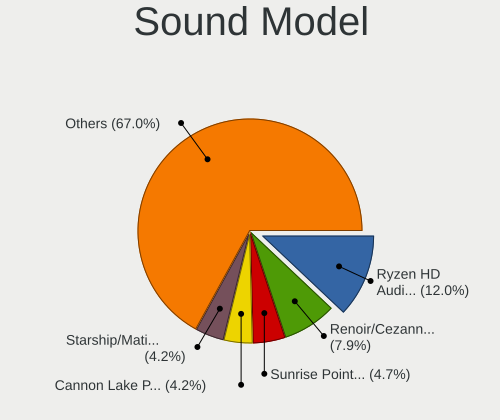

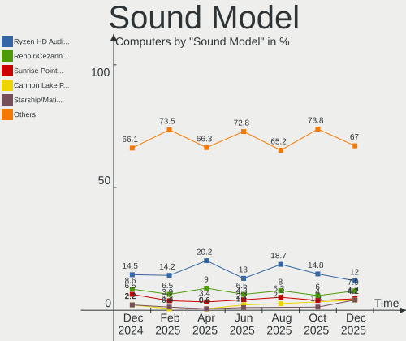

| Model                                                                      | Computers | Percent |
|----------------------------------------------------------------------------|-----------|---------|
| AMD Ryzen HD Audio Controller                                              | 23        | 12.04%  |
| AMD Renoir/Cezanne HDMI/DP Audio Controller                                | 15        | 7.85%   |
| Intel Sunrise Point-LP HD Audio                                            | 9         | 4.71%   |
| Intel Cannon Lake PCH cAVS                                                 | 8         | 4.19%   |
| AMD Starship/Matisse HD Audio Controller                                   | 8         | 4.19%   |
| Intel Alder Lake PCH-P High Definition Audio Controller                    | 7         | 3.66%   |
| Intel 6 Series/C200 Series Chipset Family High Definition Audio Controller | 7         | 3.66%   |
| Nvidia GA107 High Definition Audio Controller                              | 6         | 3.14%   |
| Intel Haswell-ULT HD Audio Controller                                      | 6         | 3.14%   |
| Intel 8 Series HD Audio Controller                                         | 6         | 3.14%   |
| Intel Tiger Lake-LP Smart Sound Technology Audio Controller                | 5         | 2.62%   |
| AMD Radeon High Definition Audio Controller                                | 5         | 2.62%   |
| Nvidia GK208 HDMI/DP Audio Controller                                      | 4         | 2.09%   |
| Nvidia AD107 High Definition Audio Controller                              | 4         | 2.09%   |
| Intel Raptor Lake High Definition Audio Controller                         | 4         | 2.09%   |
| Nvidia TU116 High Definition Audio Controller                              | 3         | 1.57%   |
| Nvidia GA104 High Definition Audio Controller                              | 3         | 1.57%   |
| Intel Raptor Lake-P/U/H cAVS                                               | 3         | 1.57%   |
| Intel Jasper Lake HD Audio                                                 | 3         | 1.57%   |
| Intel 200 Series PCH HD Audio                                              | 3         | 1.57%   |
| AMD FCH Azalia Controller                                                  | 3         | 1.57%   |
| Nvidia TU107 GeForce GTX 1650 High Definition Audio Controller             | 2         | 1.05%   |
| Nvidia GP107GL High Definition Audio Controller                            | 2         | 1.05%   |
| Intel Xeon E3-1200 v3/4th Gen Core Processor HD Audio Controller           | 2         | 1.05%   |
| Intel Tiger Lake-H HD Audio Controller                                     | 2         | 1.05%   |
| Intel Cannon Point-LP High Definition Audio Controller                     | 2         | 1.05%   |
| Intel Arrow Lake cAVS                                                      | 2         | 1.05%   |
| Intel 7 Series/C216 Chipset Family High Definition Audio Controller        | 2         | 1.05%   |
| C-Media Electronics USB Audio Device                                       | 2         | 1.05%   |
| AMD Raven/Raven2/Fenghuang HDMI/DP Audio Controller                        | 2         | 1.05%   |
| AMD Navi 48 HDMI/DP Audio Controller                                       | 2         | 1.05%   |
| AMD Kabini HDMI/DP Audio                                                   | 2         | 1.05%   |
| AMD Family 15h (Models 60h-6fh) Audio Controller                           | 2         | 1.05%   |
| TTGK Technology Audiocular D07                                             | 1         | 0.52%   |
| Razer USA Razer Barracuda X 2.4                                            | 1         | 0.52%   |
| OPPO Electronics MH148                                                     | 1         | 0.52%   |
| Nvidia GF119 HDMI Audio Controller                                         | 1         | 0.52%   |
| Nvidia GB206 High Definition Audio Controller                              | 1         | 0.52%   |
| Nvidia GB203 High Definition Audio Controller                              | 1         | 0.52%   |
| Nvidia GA106 High Definition Audio Controller                              | 1         | 0.52%   |

Memory
------

Memory Vendor
-------------

Memory module vendors

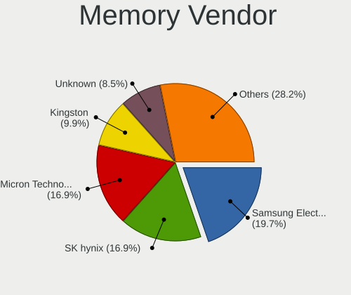

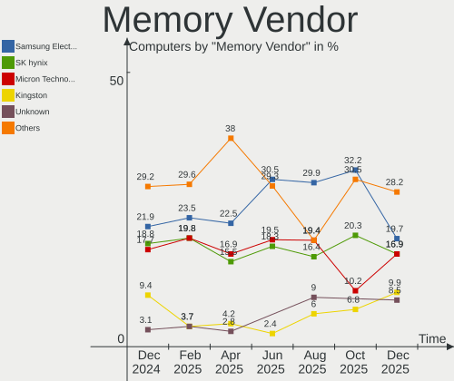

| Vendor              | Computers | Percent |
|---------------------|-----------|---------|
| Samsung Electronics | 14        | 19.72%  |
| SK hynix            | 12        | 16.9%   |
| Micron Technology   | 12        | 16.9%   |
| Kingston            | 7         | 9.86%   |
| Unknown             | 6         | 8.45%   |
| Corsair             | 5         | 7.04%   |
| Unknown             | 3         | 4.23%   |
| Red Hat             | 2         | 2.82%   |
| Crucial             | 2         | 2.82%   |
| A-DATA Technology   | 2         | 2.82%   |
| Unknown (0x0080)    | 1         | 1.41%   |
| Transcend           | 1         | 1.41%   |
| Timetec             | 1         | 1.41%   |
| Ramaxel Technology  | 1         | 1.41%   |
| Nanya Technology    | 1         | 1.41%   |
| Acer                | 1         | 1.41%   |

Memory Model
------------

Memory module models

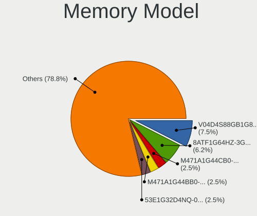

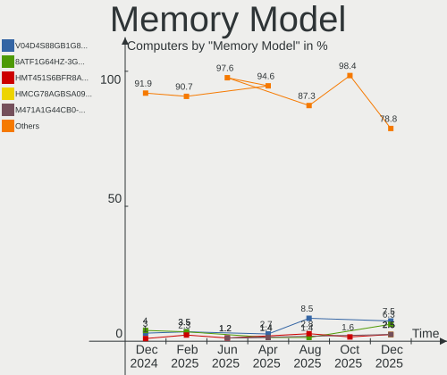

| Model                                                           | Computers | Percent |
|-----------------------------------------------------------------|-----------|---------|
| Unknown                                                         | 6         | 7.5%    |
| Micron RAM 8ATF1G64HZ-3G2R1 8GB SODIMM DDR4 3200MT/s            | 5         | 6.25%   |
| SK hynix RAM HMT451S6BFR8A-PB 4GB SODIMM DDR3 1600MT/s          | 2         | 2.5%    |
| SK hynix RAM HMCG78AGBSA092N 16GB SODIMM DDR5 5600MT/s          | 2         | 2.5%    |
| Samsung RAM M471A1G44CB0-CWE 8GB SODIMM DDR4 3200MT/s           | 2         | 2.5%    |
| Samsung RAM M471A1G44BB0-CWE 8GB SODIMM DDR4 3200MT/s           | 2         | 2.5%    |
| Samsung RAM 53E1G32D4NQ-046WTE 4GB Row Of Chips LPDDR4 3200MT/s | 2         | 2.5%    |
| Micron RAM 4ATF1G64HZ-3G2F1 8GB SODIMM DDR4 3200MT/s            | 2         | 2.5%    |
| Corsair RAM CMK8GX4M1E3200C16 8GB DIMM DDR4 3200MT/s            | 2         | 2.5%    |
| Corsair RAM CMK8GX4M1D3000C16 8GB DIMM DDR4 3600MT/s            | 2         | 2.5%    |
| Unknown RAM Module 8GB DIMM 1600MT/s                            | 1         | 1.25%   |
| Unknown RAM Module 2GB DIMM DDR2 667MT/s                        | 1         | 1.25%   |
| Unknown RAM 6 6 6 8GB DIMM DDR4 2667MT/s                        | 1         | 1.25%   |
| Unknown (0x0080) RAM Module 16GB SODIMM DDR4 3200MT/s           | 1         | 1.25%   |
| Transcend RAM JM1333KLH-4G 4GB DIMM DDR3 1333MT/s               | 1         | 1.25%   |
| Timetec RAM U16G-2666 16GB DIMM DDR4 2667MT/s                   | 1         | 1.25%   |
| SK hynix RAM HMT451S6AFR8A-PB 4GB SODIMM DDR3 1600MT/s          | 1         | 1.25%   |
| SK hynix RAM HMCG78AGBSA095N 16GB SODIMM DDR5 5600MT/s          | 1         | 1.25%   |
| SK hynix RAM HMAA1GS6CJR6N-XN 8GB SODIMM DDR4 3200MT/s          | 1         | 1.25%   |
| SK hynix RAM HMA851S6DJR6N-XN 4GB SODIMM DDR4 3200MT/s          | 1         | 1.25%   |
| SK hynix RAM HMA851S6CJR6N-UH 4GB SODIMM DDR4 2400MT/s          | 1         | 1.25%   |
| SK hynix RAM HMA81GS6DJR8N-VK 8GB SODIMM DDR4 2667MT/s          | 1         | 1.25%   |
| SK hynix RAM HMA81GS6AFR8N-VK 8GB SODIMM DDR4 2667MT/s          | 1         | 1.25%   |
| SK hynix RAM HMA81GS6AFR8N-UH 8GB SODIMM DDR4 3200MT/s          | 1         | 1.25%   |
| SK hynix RAM HMA81GS6AFR8N-UH 8GB SODIMM DDR4 2667MT/s          | 1         | 1.25%   |
| SK hynix RAM H58G66BK7BX067 16GB Row Of Chips LPDDR5 8533MT/s   | 1         | 1.25%   |
| Samsung RAM UBE3D4AA-MGCL 2GB Row Of Chips LPDDR4 4267MT/s      | 1         | 1.25%   |
| Samsung RAM M471A5244CB0-CRC 4GB SODIMM DDR4 2667MT/s           | 1         | 1.25%   |
| Samsung RAM M471A1K43EB1-CWE 8GB SODIMM DDR4 3200MT/s           | 1         | 1.25%   |
| Samsung RAM M471A1K43BB1-CRC 8GB SODIMM DDR4 2667MT/s           | 1         | 1.25%   |
| Samsung RAM M471A1G44AB0-CWE 8GiB SODIMM DDR4 3200MT/s          | 1         | 1.25%   |
| Samsung RAM M378A1K43CB2-CTD 8GB DIMM DDR4 3266MT/s             | 1         | 1.25%   |
| Samsung RAM M378A1K43CB2-CRC 8GB DIMM DDR4 3500MT/s             | 1         | 1.25%   |
| Samsung RAM K4EBE304EB-EGCG 8GB Row Of Chips LPDDR3 2133MT/s    | 1         | 1.25%   |
| Red Hat RAM Module 8GB DIMM RAM                                 | 1         | 1.25%   |
| Red Hat RAM Module 8124MB DIMM RAM                              | 1         | 1.25%   |
| Ramaxel RAM RMT3160ME68FAF1600 8GB SODIMM DDR3 1600MT/s         | 1         | 1.25%   |
| Nanya RAM NT8GA64D88CX3S-JR 8GB SODIMM DDR4 3200MT/s            | 1         | 1.25%   |
| Micron RAM MTC8C1084S1SC56BD1 16GB SODIMM DDR5 5600MT/s         | 1         | 1.25%   |
| Micron RAM MTC4C10163S1SC56BD1 8GB SODIMM DDR5 5600MT/s         | 1         | 1.25%   |

Memory Kind
-----------

Memory module kinds

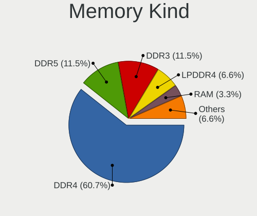

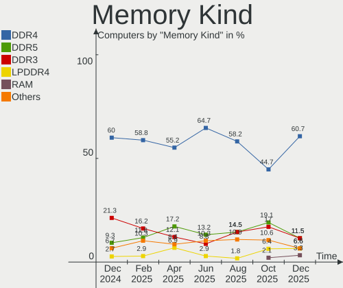

| Kind    | Computers | Percent |
|---------|-----------|---------|
| DDR4    | 37        | 60.66%  |
| DDR5    | 7         | 11.48%  |
| DDR3    | 7         | 11.48%  |
| LPDDR4  | 4         | 6.56%   |
| RAM     | 2         | 3.28%   |
| LPDDR5  | 1         | 1.64%   |
| LPDDR3  | 1         | 1.64%   |
| DDR2    | 1         | 1.64%   |
| Unknown | 1         | 1.64%   |

Memory Form Factor
------------------

Physical design of the memory module

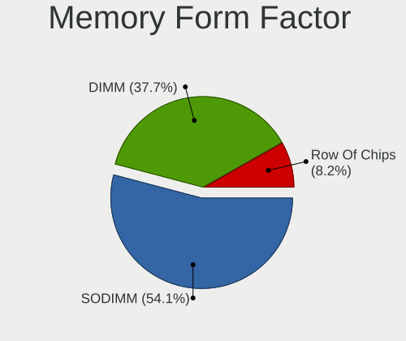

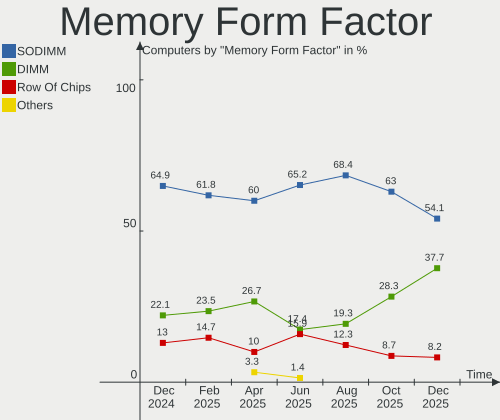

| Name         | Computers | Percent |
|--------------|-----------|---------|
| SODIMM       | 33        | 54.1%   |
| DIMM         | 23        | 37.7%   |
| Row Of Chips | 5         | 8.2%    |

Memory Size
-----------

Memory module size

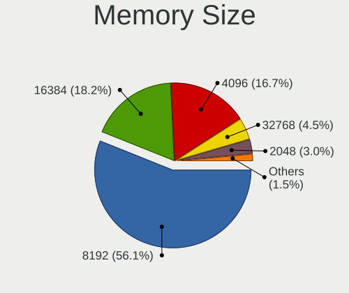

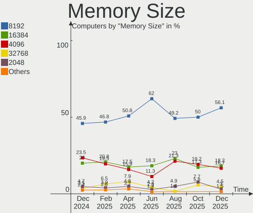

| Size  | Computers | Percent |
|-------|-----------|---------|
| 8192  | 37        | 56.06%  |
| 16384 | 12        | 18.18%  |
| 4096  | 11        | 16.67%  |
| 32768 | 3         | 4.55%   |
| 2048  | 2         | 3.03%   |
| 8124  | 1         | 1.52%   |

Memory Speed
------------

Memory module speed

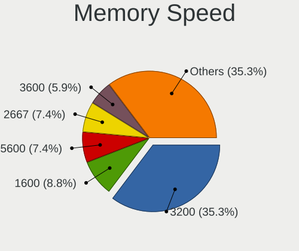

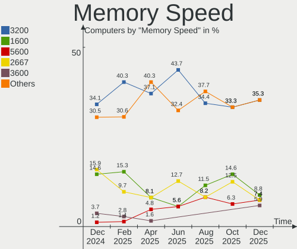

| Speed   | Computers | Percent |
|---------|-----------|---------|
| 3200    | 24        | 35.29%  |
| 1600    | 6         | 8.82%   |
| 5600    | 5         | 7.35%   |
| 2667    | 5         | 7.35%   |
| 3600    | 4         | 5.88%   |
| 2933    | 2         | 2.94%   |
| 2666    | 2         | 2.94%   |
| 667     | 2         | 2.94%   |
| Unknown | 2         | 2.94%   |
| 8533    | 1         | 1.47%   |
| 6000    | 1         | 1.47%   |
| 4800    | 1         | 1.47%   |
| 4267    | 1         | 1.47%   |
| 4266    | 1         | 1.47%   |
| 3933    | 1         | 1.47%   |
| 3800    | 1         | 1.47%   |
| 3500    | 1         | 1.47%   |
| 3266    | 1         | 1.47%   |
| 3066    | 1         | 1.47%   |
| 3000    | 1         | 1.47%   |
| 2800    | 1         | 1.47%   |
| 2400    | 1         | 1.47%   |
| 2133    | 1         | 1.47%   |
| 1334    | 1         | 1.47%   |
| 1333    | 1         | 1.47%   |

Printers & scanners
-------------------

Printer Vendor
--------------

Printer device vendors

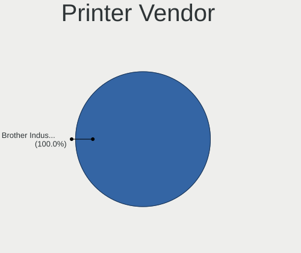

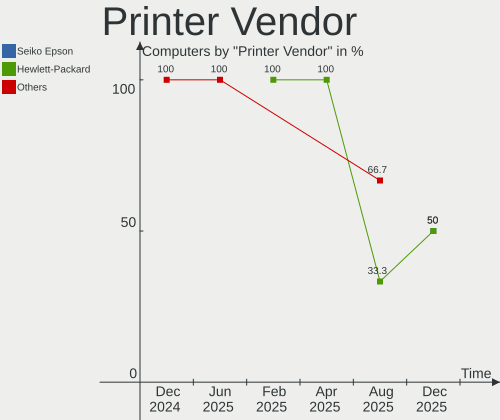

| Vendor          | Computers | Percent |
|-----------------|-----------|---------|
| Seiko Epson     | 1         | 50%     |
| Hewlett-Packard | 1         | 50%     |

Printer Model
-------------

Printer device models

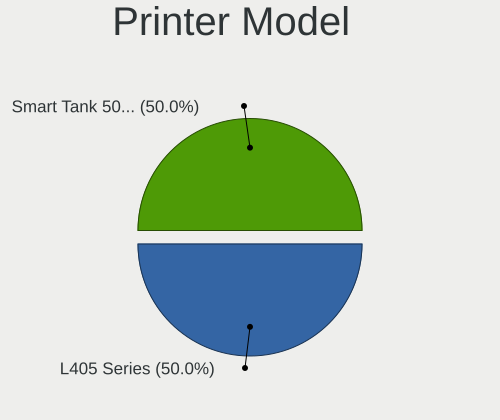

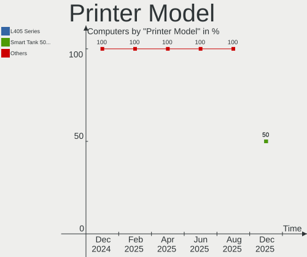

| Model                    | Computers | Percent |
|--------------------------|-----------|---------|
| Seiko Epson L405 Series  | 1         | 50%     |
| HP Smart Tank 500 series | 1         | 50%     |

Scanner Vendor
--------------

Scanner device vendors

Zero info for selected period =(

Scanner Model
-------------

Scanner device models

Zero info for selected period =(

Camera
------

Camera Vendor
-------------

Camera device vendors

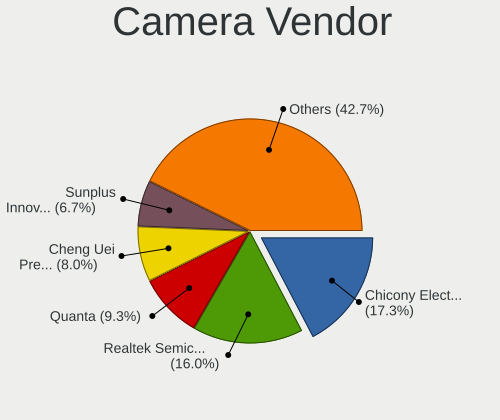

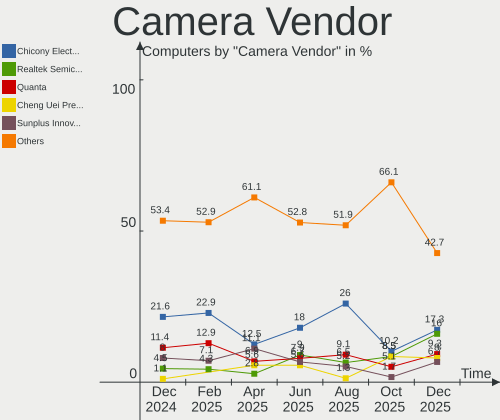

| Vendor                                 | Computers | Percent |
|----------------------------------------|-----------|---------|
| Chicony Electronics                    | 13        | 17.33%  |
| Realtek Semiconductor                  | 12        | 16%     |
| Quanta                                 | 7         | 9.33%   |
| Cheng Uei Precision Industry (Foxlink) | 6         | 8%      |
| Sunplus Innovation Technology          | 5         | 6.67%   |
| IMC Networks                           | 5         | 6.67%   |
| Microdia                               | 4         | 5.33%   |
| Luxvisions Innotech Limited            | 4         | 5.33%   |
| Bison Electronics                      | 4         | 5.33%   |
| Shinetech                              | 3         | 4%      |
| Suyin                                  | 2         | 2.67%   |
| Sonix Technology                       | 2         | 2.67%   |
| Syntek                                 | 1         | 1.33%   |
| SunplusIT                              | 1         | 1.33%   |
| Logitech                               | 1         | 1.33%   |
| Lenovo                                 | 1         | 1.33%   |
| Jiangxi Shinetech Optical              | 1         | 1.33%   |
| Foxlink                                | 1         | 1.33%   |
| CVT Electronics.Co.                    | 1         | 1.33%   |
| ARC International                      | 1         | 1.33%   |

Camera Model
------------

Camera device models

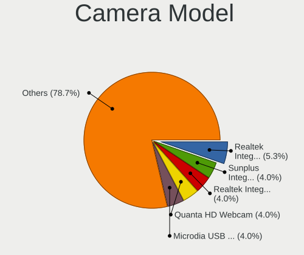

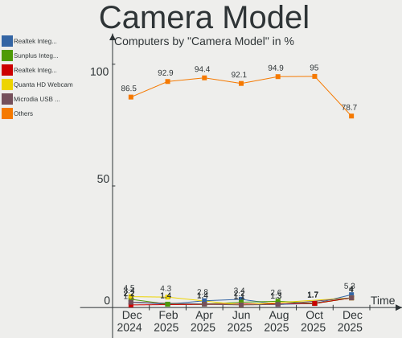

| Model                                                          | Computers | Percent |
|----------------------------------------------------------------|-----------|---------|
| Realtek Integrated_Webcam_HD                                   | 4         | 5.33%   |
| Sunplus Integrated_Webcam_HD                                   | 3         | 4%      |
| Realtek Integrated Webcam                                      | 3         | 4%      |
| Quanta HD Webcam                                               | 3         | 4%      |
| Microdia USB 2.0 Camera                                        | 3         | 4%      |
| Chicony Integrated Camera                                      | 3         | 4%      |
| Chicony HP Wide Vision HD Camera                               | 3         | 4%      |
| Cheng Uei Precision Industry (Foxlink) Webcam                  | 3         | 4%      |
| Sonix USB2.0 HD UVC WebCam                                     | 2         | 2.67%   |
| Shinetech USB2.0 FHD UVC WebCam                                | 2         | 2.67%   |
| Quanta HP True Vision FHD Camera                               | 2         | 2.67%   |
| Luxvisions Innotech Limited Integrated Camera                  | 2         | 2.67%   |
| IMC Networks USB2.0 HD UVC WebCam                              | 2         | 2.67%   |
| IMC Networks Integrated Camera                                 | 2         | 2.67%   |
| Chicony HP TrueVision HD Camera                                | 2         | 2.67%   |
| Cheng Uei Precision Industry (Foxlink) HP TrueVision HD Camera | 2         | 2.67%   |
| Syntek Integrated Camera                                       | 1         | 1.33%   |
| Suyin UVC 0.3M Webcam                                          | 1         | 1.33%   |
| Suyin HP Truevision HD                                         | 1         | 1.33%   |
| SunplusIT USB Camera                                           | 1         | 1.33%   |
| Sunplus Laptop_Integrated_Webcam_HD                            | 1         | 1.33%   |
| Sunplus HP TrueVision HD Camera                                | 1         | 1.33%   |
| ShineTech USB2.0 HD UVC WebCam                                 | 1         | 1.33%   |
| Realtek Lenovo EasyCamera                                      | 1         | 1.33%   |
| Realtek Integrated_Webcam_FHD                                  | 1         | 1.33%   |
| Realtek Integrated Webcam HD                                   | 1         | 1.33%   |
| Realtek HD WebCam                                              | 1         | 1.33%   |
| Realtek EasyCamera                                             | 1         | 1.33%   |
| Quanta HP Wide Vision HD Camera                                | 1         | 1.33%   |
| Quanta HP TrueVision HD Camera                                 | 1         | 1.33%   |
| Microdia Integrated_Webcam_HD                                  | 1         | 1.33%   |
| Luxvisions Innotech Limited HP Wide Vision HD Camera           | 1         | 1.33%   |
| Luxvisions Innotech Limited HP TrueVision HD Camera            | 1         | 1.33%   |
| Logitech C922 Pro Stream Webcam                                | 1         | 1.33%   |
| Lenovo Lenovo FHD Webcam Audio                                 | 1         | 1.33%   |
| Jiangxi Shinetech Optical 720p HD Camera                       | 1         | 1.33%   |
| IMC Networks USB2.0 VGA UVC WebCam                             | 1         | 1.33%   |
| Foxlink HP True Vision FHD Camera                              | 1         | 1.33%   |
| CVT Electronics.Co. USB Camera                                 | 1         | 1.33%   |
| Chicony Integrated Camera (1280x720@30)                        | 1         | 1.33%   |

Security
--------

Fingerprint Vendor
------------------

Fingerprint sensor vendors

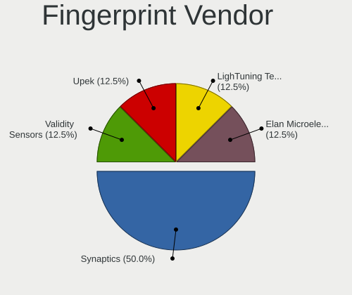

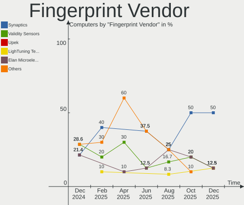

| Vendor                | Computers | Percent |
|-----------------------|-----------|---------|
| Synaptics             | 4         | 50%     |
| Validity Sensors      | 1         | 12.5%   |
| Upek                  | 1         | 12.5%   |
| LighTuning Technology | 1         | 12.5%   |
| Elan Microelectronics | 1         | 12.5%   |

Fingerprint Model
-----------------

Fingerprint sensor models

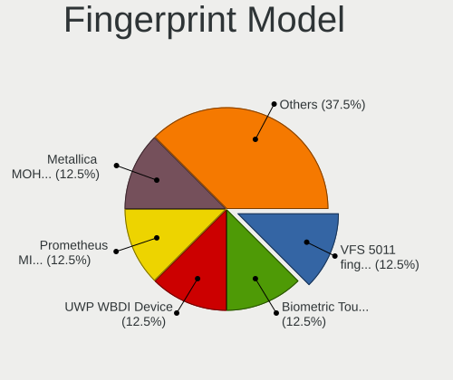

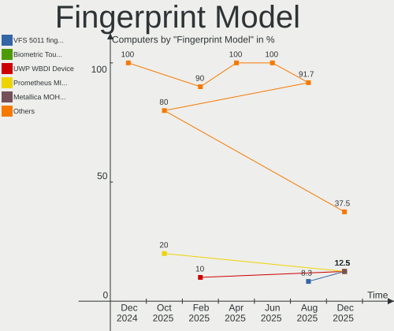

| Model                                                  | Computers | Percent |
|--------------------------------------------------------|-----------|---------|
| Validity Sensors VFS 5011 fingerprint sensor           | 1         | 12.5%   |
| Upek Biometric Touchchip/Touchstrip Fingerprint Sensor | 1         | 12.5%   |
| Synaptics UWP WBDI Device                              | 1         | 12.5%   |
| Synaptics Prometheus MIS Touch Fingerprint Reader      | 1         | 12.5%   |
| Synaptics Metallica MOH Touch Fingerprint Reader       | 1         | 12.5%   |
| Synaptics Fingerprint reader [HP G6]                   | 1         | 12.5%   |
| LighTuning EgisTec Touch Fingerprint Sensor            | 1         | 12.5%   |
| Elan ELAN:ARM-M4                                       | 1         | 12.5%   |

Chipcard Vendor
---------------

Chipcard module vendors

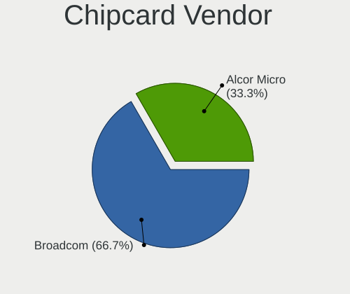

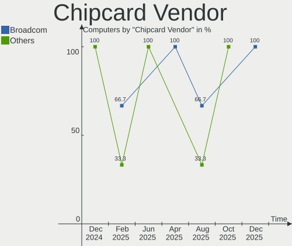

| Vendor   | Computers | Percent |
|----------|-----------|---------|
| Broadcom | 2         | 100%    |

Chipcard Model
--------------

Chipcard module models

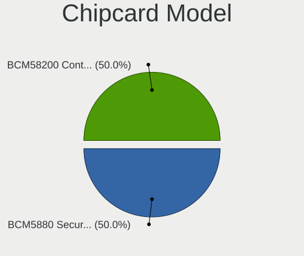

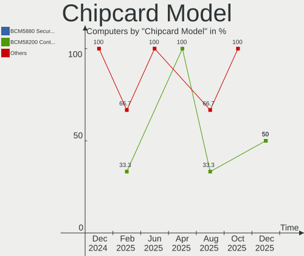

| Model                                                                       | Computers | Percent |
|-----------------------------------------------------------------------------|-----------|---------|
| Broadcom BCM5880 Secure Applications Processor                              | 1         | 50%     |
| Broadcom BCM58200 ControlVault 3 (FingerPrint sensor + Contacted SmartCard) | 1         | 50%     |

Unsupported
-----------

Unsupported Devices
-------------------

Total unsupported devices on board

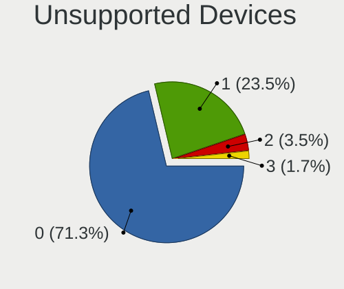

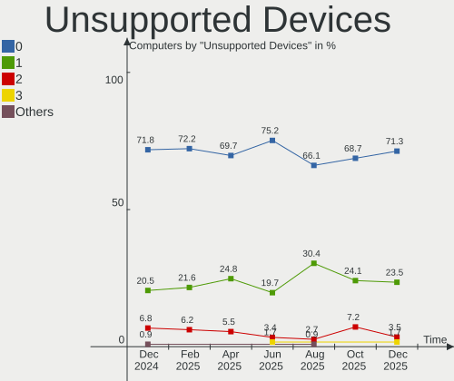

| Total | Computers | Percent |
|-------|-----------|---------|
| 0     | 82        | 71.3%   |
| 1     | 27        | 23.48%  |
| 2     | 4         | 3.48%   |
| 3     | 2         | 1.74%   |

Unsupported Device Types
------------------------

Types of unsupported devices

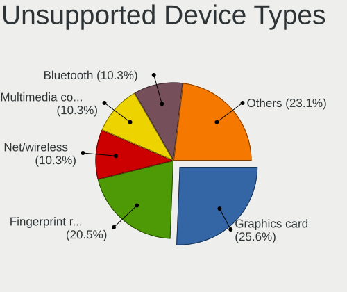

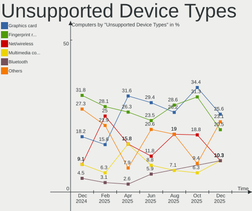

| Type                  | Computers | Percent |
|-----------------------|-----------|---------|
| Graphics card         | 10        | 25.64%  |
| Fingerprint reader    | 8         | 20.51%  |
| Net/wireless          | 4         | 10.26%  |
| Multimedia controller | 4         | 10.26%  |
| Bluetooth             | 4         | 10.26%  |
| Unassigned class      | 3         | 7.69%   |
| Sound                 | 2         | 5.13%   |
| Chipcard              | 2         | 5.13%   |
| Storage/raid          | 1         | 2.56%   |
| Storage/ide           | 1         | 2.56%   |

