Linux in India - Hardware Trends
--------------------------------

A project to identify most popular hardware characteristics and track their change
over time based on data collected by Linux users at https://Linux-Hardware.org.

Anyone can contribute to this report by the [hw-probe](https://github.com/linuxhw/hw-probe) tool:

    sudo -E hw-probe -all -upload

This is a report for all computer types. See also reports for [desktops](/Location/India/Desktop/README.md) and [notebooks](/Location/India/Notebook/README.md).

Period: Jan, 2024.

Contents
--------

* [ System ](#system)
  - [ OS                       ](#os)
  - [ OS Family                ](#os-family)
  - [ Kernel                   ](#kernel)
  - [ Kernel Family            ](#kernel-family)
  - [ Kernel Major Ver.        ](#kernel-major-ver)
  - [ Arch                     ](#arch)
  - [ DE                       ](#de)
  - [ Display Server           ](#display-server)
  - [ Display Manager          ](#display-manager)
  - [ OS Lang                  ](#os-lang)
  - [ Boot Mode                ](#boot-mode)
  - [ Filesystem               ](#filesystem)
  - [ Part. scheme             ](#part-scheme)
  - [ Dual Boot with Linux/BSD ](#dual-boot-with-linuxbsd)
  - [ Dual Boot (Win)          ](#dual-boot-win)

* [ Board ](#board)
  - [ Vendor                   ](#vendor)
  - [ Model                    ](#model)
  - [ Model Family             ](#model-family)
  - [ MFG Year                 ](#mfg-year)
  - [ Form Factor              ](#form-factor)
  - [ Secure Boot              ](#secure-boot)
  - [ Coreboot                 ](#coreboot)
  - [ RAM Size                 ](#ram-size)
  - [ RAM Used                 ](#ram-used)
  - [ Total Drives             ](#total-drives)
  - [ Has CD-ROM               ](#has-cd-rom)
  - [ Has Ethernet             ](#has-ethernet)
  - [ Has WiFi                 ](#has-wifi)
  - [ Has Bluetooth            ](#has-bluetooth)

* [ Location ](#location)
  - [ Country                  ](#country)
  - [ City                     ](#city)

* [ Drives ](#drives)
  - [ Drive Vendor             ](#drive-vendor)
  - [ Drive Model              ](#drive-model)
  - [ HDD Vendor               ](#hdd-vendor)
  - [ SSD Vendor               ](#ssd-vendor)
  - [ Drive Kind               ](#drive-kind)
  - [ Drive Connector          ](#drive-connector)
  - [ Drive Size               ](#drive-size)
  - [ Space Total              ](#space-total)
  - [ Space Used               ](#space-used)
  - [ Malfunc. Drives          ](#malfunc-drives)
  - [ Malfunc. Drive Vendor    ](#malfunc-drive-vendor)
  - [ Malfunc. HDD Vendor      ](#malfunc-hdd-vendor)
  - [ Malfunc. Drive Kind      ](#malfunc-drive-kind)
  - [ Failed Drives            ](#failed-drives)
  - [ Failed Drive Vendor      ](#failed-drive-vendor)
  - [ Drive Status             ](#drive-status)

* [ Storage controller ](#storage-controller)
  - [ Storage Vendor           ](#storage-vendor)
  - [ Storage Model            ](#storage-model)
  - [ Storage Kind             ](#storage-kind)

* [ Processor ](#processor)
  - [ CPU Vendor               ](#cpu-vendor)
  - [ CPU Model                ](#cpu-model)
  - [ CPU Model Family         ](#cpu-model-family)
  - [ CPU Cores                ](#cpu-cores)
  - [ CPU Sockets              ](#cpu-sockets)
  - [ CPU Threads              ](#cpu-threads)
  - [ CPU Op-Modes             ](#cpu-op-modes)
  - [ CPU Microcode            ](#cpu-microcode)
  - [ CPU Microarch            ](#cpu-microarch)

* [ Graphics ](#graphics)
  - [ GPU Vendor               ](#gpu-vendor)
  - [ GPU Model                ](#gpu-model)
  - [ GPU Combo                ](#gpu-combo)
  - [ GPU Driver               ](#gpu-driver)
  - [ GPU Memory               ](#gpu-memory)

* [ Monitor ](#monitor)
  - [ Monitor Vendor           ](#monitor-vendor)
  - [ Monitor Model            ](#monitor-model)
  - [ Monitor Resolution       ](#monitor-resolution)
  - [ Monitor Diagonal         ](#monitor-diagonal)
  - [ Monitor Width            ](#monitor-width)
  - [ Aspect Ratio             ](#aspect-ratio)
  - [ Monitor Area             ](#monitor-area)
  - [ Pixel Density            ](#pixel-density)
  - [ Multiple Monitors        ](#multiple-monitors)

* [ Network ](#network)
  - [ Net Controller Vendor    ](#net-controller-vendor)
  - [ Net Controller Model     ](#net-controller-model)
  - [ Wireless Vendor          ](#wireless-vendor)
  - [ Wireless Model           ](#wireless-model)
  - [ Ethernet Vendor          ](#ethernet-vendor)
  - [ Ethernet Model           ](#ethernet-model)
  - [ Net Controller Kind      ](#net-controller-kind)
  - [ Used Controller          ](#used-controller)
  - [ NICs                     ](#nics)
  - [ IPv6                     ](#ipv6)

* [ Bluetooth ](#bluetooth)
  - [ Bluetooth Vendor         ](#bluetooth-vendor)
  - [ Bluetooth Model          ](#bluetooth-model)

* [ Sound ](#sound)
  - [ Sound Vendor             ](#sound-vendor)
  - [ Sound Model              ](#sound-model)

* [ Memory ](#memory)
  - [ Memory Vendor            ](#memory-vendor)
  - [ Memory Model             ](#memory-model)
  - [ Memory Kind              ](#memory-kind)
  - [ Memory Form Factor       ](#memory-form-factor)
  - [ Memory Size              ](#memory-size)
  - [ Memory Speed             ](#memory-speed)

* [ Printers & scanners ](#printers--scanners)
  - [ Printer Vendor           ](#printer-vendor)
  - [ Printer Model            ](#printer-model)
  - [ Scanner Vendor           ](#scanner-vendor)
  - [ Scanner Model            ](#scanner-model)

* [ Camera ](#camera)
  - [ Camera Vendor            ](#camera-vendor)
  - [ Camera Model             ](#camera-model)

* [ Security ](#security)
  - [ Fingerprint Vendor       ](#fingerprint-vendor)
  - [ Fingerprint Model        ](#fingerprint-model)
  - [ Chipcard Vendor          ](#chipcard-vendor)
  - [ Chipcard Model           ](#chipcard-model)

* [ Unsupported ](#unsupported)
  - [ Unsupported Devices      ](#unsupported-devices)
  - [ Unsupported Device Types ](#unsupported-device-types)

System
------

OS
--

Installed operating systems

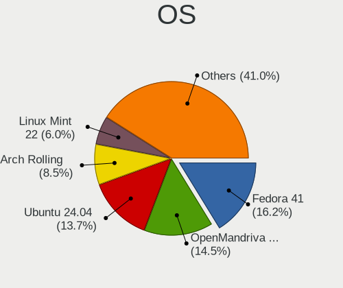

| Name                         | Computers | Percent |
|------------------------------|-----------|---------|
| Ubuntu 22.04                 | 18        | 14.75%  |
| Fedora 39                    | 18        | 14.75%  |
| Ubuntu 23.10                 | 11        | 9.02%   |
| Arch Rolling                 | 11        | 9.02%   |
| Pop!_OS 22.04                | 7         | 5.74%   |
| Zorin 17                     | 6         | 4.92%   |
| Linux Mint 21.2              | 5         | 4.1%    |
| EndeavourOS Rolling          | 4         | 3.28%   |
| Debian 12                    | 4         | 3.28%   |
| Ubuntu 20.04                 | 3         | 2.46%   |
| KDE neon 22.04               | 3         | 2.46%   |
| Zorin 16                     | 2         | 1.64%   |
| Xero Rolling                 | 2         | 1.64%   |
| openSUSE Leap-15.5           | 2         | 1.64%   |
| OpenMandriva 23.08           | 2         | 1.64%   |
| Manjaro 23.1.2               | 2         | 1.64%   |
| Manjaro                      | 2         | 1.64%   |
| Linux Mint 21.3              | 2         | 1.64%   |
| Kali 2023.4                  | 2         | 1.64%   |
| ArcoLinux Rolling            | 2         | 1.64%   |
| Xubuntu 20.04                | 1         | 0.82%   |
| SteamOS 4                    | 1         | 0.82%   |
| RHEL 9                       | 1         | 0.82%   |
| Raspbian 12                  | 1         | 0.82%   |
| openSUSE Tumbleweed-XXXXXXXX | 1         | 0.82%   |
| OpenMandriva 5.0             | 1         | 0.82%   |
| Nobara 39                    | 1         | 0.82%   |
| Nobara 37                    | 1         | 0.82%   |
| Kubuntu 23.10                | 1         | 0.82%   |
| Kubuntu 22.04                | 1         | 0.82%   |
| Fedora 38                    | 1         | 0.82%   |
| Endless 5.1.1                | 1         | 0.82%   |
| Debian 11                    | 1         | 0.82%   |
| Clear Linux 40710            | 1         | 0.82%   |

OS Family
---------

OS without a version

| Name         | Computers | Percent |
|--------------|-----------|---------|
| Ubuntu       | 32        | 26.23%  |
| Fedora       | 19        | 15.57%  |
| Arch         | 11        | 9.02%   |
| Zorin        | 8         | 6.56%   |
| Pop!_OS      | 7         | 5.74%   |
| Linux Mint   | 7         | 5.74%   |
| Debian       | 5         | 4.1%    |
| Manjaro      | 4         | 3.28%   |
| EndeavourOS  | 4         | 3.28%   |
| openSUSE     | 3         | 2.46%   |
| OpenMandriva | 3         | 2.46%   |
| KDE neon     | 3         | 2.46%   |
| Xero         | 2         | 1.64%   |
| Nobara       | 2         | 1.64%   |
| Kubuntu      | 2         | 1.64%   |
| Kali         | 2         | 1.64%   |
| ArcoLinux    | 2         | 1.64%   |
| Xubuntu      | 1         | 0.82%   |
| SteamOS      | 1         | 0.82%   |
| RHEL         | 1         | 0.82%   |
| Raspbian     | 1         | 0.82%   |
| Endless      | 1         | 0.82%   |
| Clear Linux  | 1         | 0.82%   |

Kernel
------

Version of the Linux kernel

| Version                     | Computers | Percent |
|-----------------------------|-----------|---------|
| 6.5.0-14-generic            | 21        | 17.21%  |
| 6.2.0-39-generic            | 13        | 10.66%  |
| 5.15.0-91-generic           | 9         | 7.38%   |
| 6.6.6-76060606-generic      | 7         | 5.74%   |
| 6.6.11-200.fc39.x86_64      | 6         | 4.92%   |
| 6.6.8-200.fc39.x86_64       | 4         | 3.28%   |
| 6.7.0-zen3-1-zen            | 3         | 2.46%   |
| 6.6.9-200.fc39.x86_64       | 3         | 2.46%   |
| 6.5.0-15-generic            | 3         | 2.46%   |
| 6.7.0-arch3-1               | 2         | 1.64%   |
| 6.6.9-arch1-1               | 2         | 1.64%   |
| 6.6.8-2-MANJARO             | 2         | 1.64%   |
| 6.6.13-200.fc39.x86_64      | 2         | 1.64%   |
| 6.6.11-1-lts                | 2         | 1.64%   |
| 6.5.6-300.fc39.x86_64       | 2         | 1.64%   |
| 6.5.0-kali3-amd64           | 2         | 1.64%   |
| 6.4.11-desktop-1omv2390     | 2         | 1.64%   |
| 6.1.0-15-amd64              | 2         | 1.64%   |
| 5.15.0-75-generic           | 2         | 1.64%   |
| 6.7.2-arch1-1               | 1         | 0.82%   |
| 6.7.1-arch1-1               | 1         | 0.82%   |
| 6.7.1-2-default             | 1         | 0.82%   |
| 6.7.0-200.fsync.fc39.x86_64 | 1         | 0.82%   |
| 6.7.0-0-MANJARO             | 1         | 0.82%   |
| 6.6.9-060609-generic        | 1         | 0.82%   |
| 6.6.8-arch1-1               | 1         | 0.82%   |
| 6.6.8-100.fc38.x86_64       | 1         | 0.82%   |
| 6.6.3-arch1-1               | 1         | 0.82%   |
| 6.6.2-desktop-1omv2390      | 1         | 0.82%   |
| 6.6.13-1401.native          | 1         | 0.82%   |
| 6.6.12-200.fc39.x86_64      | 1         | 0.82%   |
| 6.6.10-arch1-1              | 1         | 0.82%   |
| 6.6.1-arch1-1               | 1         | 0.82%   |
| 6.6.1-273-tkg-eevdf         | 1         | 0.82%   |
| 6.5.9-arch2-1               | 1         | 0.82%   |
| 6.5.8-arch1-1               | 1         | 0.82%   |
| 6.5.0-9-generic             | 1         | 0.82%   |
| 6.5.0-10-generic            | 1         | 0.82%   |
| 6.3.7-zen1-1-zen            | 1         | 0.82%   |
| 6.1.69-1-MANJARO            | 1         | 0.82%   |

Kernel Family
-------------

Linux kernel without a distro release

| Version | Computers | Percent |
|---------|-----------|---------|
| 6.5.0   | 28        | 22.95%  |
| 6.2.0   | 13        | 10.66%  |
| 5.15.0  | 13        | 10.66%  |
| 6.6.8   | 8         | 6.56%   |
| 6.6.11  | 8         | 6.56%   |
| 6.7.0   | 7         | 5.74%   |
| 6.6.6   | 7         | 5.74%   |
| 6.6.9   | 6         | 4.92%   |
| 6.1.0   | 5         | 4.1%    |
| 6.6.13  | 3         | 2.46%   |
| 6.7.1   | 2         | 1.64%   |
| 6.6.1   | 2         | 1.64%   |
| 6.5.6   | 2         | 1.64%   |
| 6.4.11  | 2         | 1.64%   |
| 5.14.21 | 2         | 1.64%   |
| 6.7.2   | 1         | 0.82%   |
| 6.6.3   | 1         | 0.82%   |
| 6.6.2   | 1         | 0.82%   |
| 6.6.12  | 1         | 0.82%   |
| 6.6.10  | 1         | 0.82%   |
| 6.5.9   | 1         | 0.82%   |
| 6.5.8   | 1         | 0.82%   |
| 6.3.7   | 1         | 0.82%   |
| 6.1.69  | 1         | 0.82%   |
| 6.1.11  | 1         | 0.82%   |
| 5.15.10 | 1         | 0.82%   |
| 5.14.0  | 1         | 0.82%   |
| 5.13.0  | 1         | 0.82%   |
| 5.10.0  | 1         | 0.82%   |

Kernel Major Ver.
-----------------

Linux kernel major version

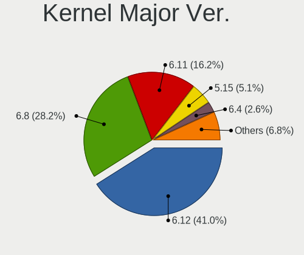

| Version | Computers | Percent |
|---------|-----------|---------|
| 6.6     | 38        | 31.15%  |
| 6.5     | 32        | 26.23%  |
| 5.15    | 14        | 11.48%  |
| 6.2     | 13        | 10.66%  |
| 6.7     | 10        | 8.2%    |
| 6.1     | 7         | 5.74%   |
| 5.14    | 3         | 2.46%   |
| 6.4     | 2         | 1.64%   |
| 6.3     | 1         | 0.82%   |
| 5.13    | 1         | 0.82%   |
| 5.10    | 1         | 0.82%   |

Arch
----

OS architecture (x86_64, i586, etc.)

| Name    | Computers | Percent |
|---------|-----------|---------|
| x86_64  | 121       | 99.18%  |
| aarch64 | 1         | 0.82%   |

DE
--

Desktop Environment

| Name          | Computers | Percent |
|---------------|-----------|---------|
| GNOME         | 74        | 60.66%  |
| KDE5          | 23        | 18.85%  |
| XFCE          | 6         | 4.92%   |
| X-Cinnamon    | 6         | 4.92%   |
| i3            | 2         | 1.64%   |
| xinitrc       | 1         | 0.82%   |
| qtile         | 1         | 0.82%   |
| Openbox       | 1         | 0.82%   |
| MATE          | 1         | 0.82%   |
| KDE6          | 1         | 0.82%   |
| KDE           | 1         | 0.82%   |
| Hyprland      | 1         | 0.82%   |
| herbstluftwm  | 1         | 0.82%   |
| GNOME Classic | 1         | 0.82%   |
| Endless:GNOME | 1         | 0.82%   |
| Unknown       | 1         | 0.82%   |

Display Server
--------------

X11 or Wayland

| Name    | Computers | Percent |
|---------|-----------|---------|
| X11     | 60        | 49.18%  |
| Wayland | 60        | 49.18%  |
| Tty     | 1         | 0.82%   |
| Unknown | 1         | 0.82%   |

Display Manager
---------------

SDDM, LightDM, etc.

| Name    | Computers | Percent |
|---------|-----------|---------|
| Unknown | 42        | 34.43%  |
| GDM3    | 34        | 27.87%  |
| SDDM    | 16        | 13.11%  |
| LightDM | 16        | 13.11%  |
| GDM     | 13        | 10.66%  |
| LY-DM   | 1         | 0.82%   |

OS Lang
-------

Language

| Lang    | Computers | Percent |
|---------|-----------|---------|
| en_IN   | 61        | 50%     |
| en_US   | 47        | 38.52%  |
| C       | 6         | 4.92%   |
| en_GB   | 5         | 4.1%    |
| POSIX   | 1         | 0.82%   |
| en_HK   | 1         | 0.82%   |
| Unknown | 1         | 0.82%   |

Boot Mode
---------

EFI or BIOS

| Mode | Computers | Percent |
|------|-----------|---------|
| EFI  | 70        | 57.38%  |
| BIOS | 52        | 42.62%  |

Filesystem
----------

Type of filesystem

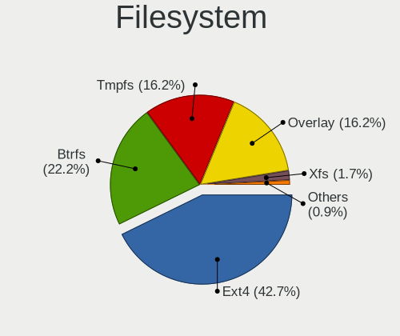

| Type    | Computers | Percent |
|---------|-----------|---------|
| Ext4    | 69        | 56.56%  |
| Btrfs   | 26        | 21.31%  |
| Tmpfs   | 18        | 14.75%  |
| Overlay | 6         | 4.92%   |
| Xfs     | 3         | 2.46%   |

Part. scheme
------------

Scheme of partitioning

| Type    | Computers | Percent |
|---------|-----------|---------|
| GPT     | 72        | 59.02%  |
| Unknown | 41        | 33.61%  |
| MBR     | 9         | 7.38%   |

Dual Boot with Linux/BSD
------------------------

Hosting more than one Linux/BSD

| Dual boot | Computers | Percent |
|-----------|-----------|---------|
| No        | 105       | 86.07%  |
| Yes       | 17        | 13.93%  |

Dual Boot (Win)
---------------

Hosting Linux and Windows

| Dual boot | Computers | Percent |
|-----------|-----------|---------|
| No        | 87        | 71.31%  |
| Yes       | 35        | 28.69%  |

Board
-----

Vendor
------

Motherboard manufacturer

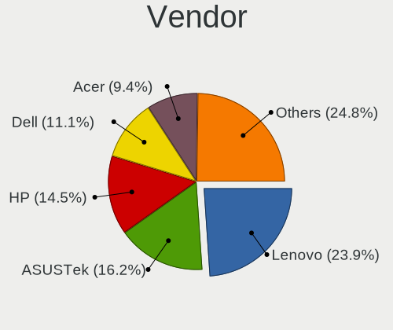

| Name                    | Computers | Percent |
|-------------------------|-----------|---------|
| Hewlett-Packard         | 22        | 18.03%  |
| Dell                    | 22        | 18.03%  |
| ASUSTek Computer        | 20        | 16.39%  |
| Lenovo                  | 19        | 15.57%  |
| Gigabyte Technology     | 9         | 7.38%   |
| Infinix                 | 6         | 4.92%   |
| MSI                     | 5         | 4.1%    |
| Acer                    | 5         | 4.1%    |
| Timi                    | 2         | 1.64%   |
| Intel                   | 2         | 1.64%   |
| Google                  | 2         | 1.64%   |
| Tyrone Systems          | 1         | 0.82%   |
| Samsung Electronics     | 1         | 0.82%   |
| Raspberry Pi Foundation | 1         | 0.82%   |
| LG Electronics          | 1         | 0.82%   |
| HONOR                   | 1         | 0.82%   |
| Fujitsu                 | 1         | 0.82%   |
| Apple                   | 1         | 0.82%   |
| Unknown                 | 1         | 0.82%   |

Model
-----

Motherboard model

| Name                                 | Computers | Percent |
|--------------------------------------|-----------|---------|
| Infinix ZERO BOOK 13                 | 2         | 1.64%   |
| Infinix INBOOK X1 NEO                | 2         | 1.64%   |
| HP Notebook                          | 2         | 1.64%   |
| HP EliteBook 840 G3                  | 2         | 1.64%   |
| Dell Inspiron 3542                   | 2         | 1.64%   |
| Dell Inspiron 3501                   | 2         | 1.64%   |
| Tyrone Systems DIT400TR-48RL         | 1         | 0.82%   |
| Timi Xiaomi NoteBook Pro             | 1         | 0.82%   |
| Timi Mi NoteBook Ultra               | 1         | 0.82%   |
| Samsung RV408/RV508                  | 1         | 0.82%   |
| RPi Raspberry Pi 4 Model B Rev 1.5   | 1         | 0.82%   |
| MSI Thin GF63 12HW                   | 1         | 0.82%   |
| MSI MS-7850                          | 1         | 0.82%   |
| MSI GL63 9SD                         | 1         | 0.82%   |
| MSI GL63 8RC                         | 1         | 0.82%   |
| MSI Bravo 15 B5DD                    | 1         | 0.82%   |
| LG 14Z990-V.AR52A2                   | 1         | 0.82%   |
| Lenovo Yoga 730-15IKB 81CU           | 1         | 0.82%   |
| Lenovo V14-ADA 82C6                  | 1         | 0.82%   |
| Lenovo ThinkStation P720 30BBS6NG00  | 1         | 0.82%   |
| Lenovo ThinkPad X390 20Q1S7RB00      | 1         | 0.82%   |
| Lenovo ThinkPad X230 2330A17         | 1         | 0.82%   |
| Lenovo ThinkPad T480 20L6S4T80H      | 1         | 0.82%   |
| Lenovo ThinkPad L380 20M6S1MG0X      | 1         | 0.82%   |
| Lenovo ThinkPad E14 Gen 4 21E3S06300 | 1         | 0.82%   |
| Lenovo ThinkPad E14 20RAS1S600       | 1         | 0.82%   |
| Lenovo ThinkCentre M71e 3156PT5      | 1         | 0.82%   |
| Lenovo Legion 7 16ACHg6 82N6         | 1         | 0.82%   |
| Lenovo IdeaPadFlex 5 14ALC05 82HU    | 1         | 0.82%   |
| Lenovo IdeaPad Y560                  | 1         | 0.82%   |
| Lenovo IdeaPad Slim 5 16IRL8 82XF    | 1         | 0.82%   |
| Lenovo IdeaPad S145-15AST 81N3       | 1         | 0.82%   |
| Lenovo IdeaPad 5 15ITL05 Ua 82FG     | 1         | 0.82%   |
| Lenovo IdeaPad 5 15ALC05 82LN        | 1         | 0.82%   |
| Lenovo IdeaPad 330S-15IKB D 81F5     | 1         | 0.82%   |
| Lenovo IdeaPad 320-15IKB 80XL        | 1         | 0.82%   |
| Intel H61/B75                        | 1         | 0.82%   |
| Intel H55                            | 1         | 0.82%   |
| Infinix INBOOK X3 Slim               | 1         | 0.82%   |
| Infinix INBook X1 Pro                | 1         | 0.82%   |

Model Family
------------

Motherboard model prefix

| Name                         | Computers | Percent |
|------------------------------|-----------|---------|
| Dell Inspiron                | 9         | 7.38%   |
| ASUS VivoBook                | 9         | 7.38%   |
| Lenovo IdeaPad               | 7         | 5.74%   |
| Lenovo ThinkPad              | 6         | 4.92%   |
| HP EliteBook                 | 6         | 4.92%   |
| Dell Vostro                  | 5         | 4.1%    |
| Dell Latitude                | 5         | 4.1%    |
| Infinix INBOOK               | 4         | 3.28%   |
| HP Pavilion                  | 4         | 3.28%   |
| HP Laptop                    | 4         | 3.28%   |
| ASUS ASUS                    | 4         | 3.28%   |
| ASUS ROG                     | 3         | 2.46%   |
| MSI GL63                     | 2         | 1.64%   |
| Infinix ZERO                 | 2         | 1.64%   |
| HP Notebook                  | 2         | 1.64%   |
| HP ENVY                      | 2         | 1.64%   |
| Gigabyte B450M               | 2         | 1.64%   |
| Dell OptiPlex                | 2         | 1.64%   |
| Acer Nitro                   | 2         | 1.64%   |
| Acer Aspire                  | 2         | 1.64%   |
| Tyrone Systems DIT400TR-48RL | 1         | 0.82%   |
| Timi Xiaomi                  | 1         | 0.82%   |
| Timi Mi                      | 1         | 0.82%   |
| Samsung RV408                | 1         | 0.82%   |
| RPi Raspberry                | 1         | 0.82%   |
| MSI Thin                     | 1         | 0.82%   |
| MSI MS-7850                  | 1         | 0.82%   |
| MSI Bravo                    | 1         | 0.82%   |
| LG 14Z990-V.AR52A2           | 1         | 0.82%   |
| Lenovo Yoga                  | 1         | 0.82%   |
| Lenovo V14-ADA               | 1         | 0.82%   |
| Lenovo ThinkStation          | 1         | 0.82%   |
| Lenovo ThinkCentre           | 1         | 0.82%   |
| Lenovo Legion                | 1         | 0.82%   |
| Lenovo IdeaPadFlex           | 1         | 0.82%   |
| Intel H61                    | 1         | 0.82%   |
| Intel H55                    | 1         | 0.82%   |
| HONOR BMH-WCX9               | 1         | 0.82%   |
| HP Victus                    | 1         | 0.82%   |
| HP OMEN                      | 1         | 0.82%   |

MFG Year
--------

Motherboard manufacture year

| Year    | Computers | Percent |
|---------|-----------|---------|
| 2021    | 22        | 18.03%  |
| 2023    | 16        | 13.11%  |
| 2022    | 14        | 11.48%  |
| 2020    | 13        | 10.66%  |
| 2019    | 12        | 9.84%   |
| 2018    | 9         | 7.38%   |
| 2011    | 7         | 5.74%   |
| 2013    | 6         | 4.92%   |
| 2014    | 5         | 4.1%    |
| 2017    | 4         | 3.28%   |
| 2016    | 4         | 3.28%   |
| 2010    | 4         | 3.28%   |
| 2015    | 2         | 1.64%   |
| 2012    | 2         | 1.64%   |
| 2008    | 1         | 0.82%   |
| Unknown | 1         | 0.82%   |

Form Factor
-----------

Physical design of the computer

| Name           | Computers | Percent |
|----------------|-----------|---------|
| Notebook       | 93        | 76.23%  |
| Desktop        | 21        | 17.21%  |
| Convertible    | 4         | 3.28%   |
| Server         | 2         | 1.64%   |
| System on chip | 1         | 0.82%   |
| Mini pc        | 1         | 0.82%   |

Secure Boot
-----------

Enabled or disabled

| State    | Computers | Percent |
|----------|-----------|---------|
| Disabled | 106       | 86.89%  |
| Enabled  | 16        | 13.11%  |

Coreboot
--------

Have coreboot on board

| Used | Computers | Percent |
|------|-----------|---------|
| No   | 120       | 98.36%  |
| Yes  | 2         | 1.64%   |

RAM Size
--------

Total RAM memory

| Size in GB  | Computers | Percent |
|-------------|-----------|---------|
| 16.01-24.0  | 34        | 27.87%  |
| 4.01-8.0    | 32        | 26.23%  |
| 8.01-16.0   | 22        | 18.03%  |
| 32.01-64.0  | 15        | 12.3%   |
| 3.01-4.0    | 14        | 11.48%  |
| 64.01-256.0 | 3         | 2.46%   |
| 24.01-32.0  | 1         | 0.82%   |
| 2.01-3.0    | 1         | 0.82%   |

RAM Used
--------

Used RAM memory

| Used GB   | Computers | Percent |
|-----------|-----------|---------|
| 4.01-8.0  | 38        | 31.15%  |
| 2.01-3.0  | 31        | 25.41%  |
| 3.01-4.0  | 30        | 24.59%  |
| 1.01-2.0  | 20        | 16.39%  |
| 8.01-16.0 | 2         | 1.64%   |
| 0.51-1.0  | 1         | 0.82%   |

Total Drives
------------

Number of drives on board

| Drives | Computers | Percent |
|--------|-----------|---------|
| 1      | 79        | 64.75%  |
| 2      | 36        | 29.51%  |
| 3      | 4         | 3.28%   |
| 4      | 2         | 1.64%   |
| 6      | 1         | 0.82%   |

Has CD-ROM
----------

Has CD-ROM on board

| Presented | Computers | Percent |
|-----------|-----------|---------|
| No        | 100       | 81.97%  |
| Yes       | 22        | 18.03%  |

Has Ethernet
------------

Has Ethernet on board

| Presented | Computers | Percent |
|-----------|-----------|---------|
| Yes       | 85        | 69.67%  |
| No        | 37        | 30.33%  |

Has WiFi
--------

Has WiFi module

| Presented | Computers | Percent |
|-----------|-----------|---------|
| Yes       | 115       | 94.26%  |
| No        | 7         | 5.74%   |

Has Bluetooth
-------------

Has Bluetooth module

| Presented | Computers | Percent |
|-----------|-----------|---------|
| Yes       | 101       | 82.79%  |
| No        | 21        | 17.21%  |

Location
--------

Country
-------

Geographic location (country)

| Country | Computers | Percent |
|---------|-----------|---------|
| India   | 122       | 100%    |

City
----

Geographic location (city)

| City               | Computers | Percent |
|--------------------|-----------|---------|
| Bengaluru          | 16        | 13.11%  |
| Hyderabad          | 11        | 9.02%   |
| Delhi              | 10        | 8.2%    |
| Chennai            | 10        | 8.2%    |
| Kolkata            | 8         | 6.56%   |
| Mumbai             | 6         | 4.92%   |
| Kochi              | 6         | 4.92%   |
| Jaipur             | 4         | 3.28%   |
| Pune               | 3         | 2.46%   |
| Ludhiana           | 3         | 2.46%   |
| Lucknow            | 3         | 2.46%   |
| Bhopal             | 3         | 2.46%   |
| Trivandrum         | 2         | 1.64%   |
| Nagpur             | 2         | 1.64%   |
| Indore             | 2         | 1.64%   |
| Bhubaneswar        | 2         | 1.64%   |
| Ahmedabad          | 2         | 1.64%   |
| Warangal           | 1         | 0.82%   |
| Visakhapatnam      | 1         | 0.82%   |
| Varanasi           | 1         | 0.82%   |
| Tirunelveli        | 1         | 0.82%   |
| Thrissur           | 1         | 0.82%   |
| Thiruvananthapuram | 1         | 0.82%   |
| Shimla             | 1         | 0.82%   |
| Salem              | 1         | 0.82%   |
| Raipur             | 1         | 0.82%   |
| Prayagraj          | 1         | 0.82%   |
| Patna              | 1         | 0.82%   |
| Panipat            | 1         | 0.82%   |
| Noida              | 1         | 0.82%   |
| Mormugao           | 1         | 0.82%   |
| Meerut             | 1         | 0.82%   |
| Madurai            | 1         | 0.82%   |
| Kozhikode          | 1         | 0.82%   |
| Kottakkal          | 1         | 0.82%   |
| Jodhpur            | 1         | 0.82%   |
| Hoshiarpur         | 1         | 0.82%   |
| Hamirpur           | 1         | 0.82%   |
| Gurgaon            | 1         | 0.82%   |
| Gopiganj           | 1         | 0.82%   |

Drives
------

Drive Vendor
------------

Hard drive vendors

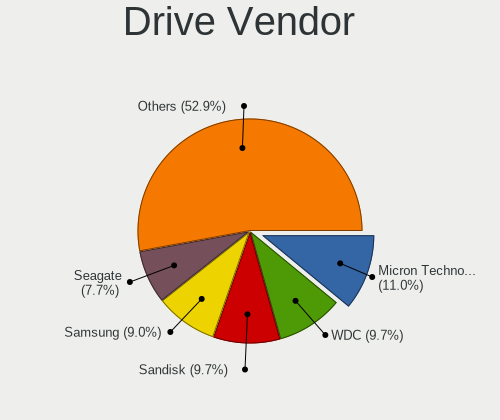

| Vendor                       | Computers | Drives | Percent |
|------------------------------|-----------|--------|---------|
| Seagate                      | 24        | 29     | 14.37%  |
| Samsung Electronics          | 21        | 22     | 12.57%  |
| WDC                          | 20        | 22     | 11.98%  |
| Unknown                      | 10        | 10     | 5.99%   |
| Sandisk                      | 10        | 10     | 5.99%   |
| Micron Technology            | 9         | 9      | 5.39%   |
| Intel                        | 9         | 9      | 5.39%   |
| Crucial                      | 8         | 8      | 4.79%   |
| SK hynix                     | 7         | 7      | 4.19%   |
| Toshiba                      | 6         | 7      | 3.59%   |
| Shenzhen Longsys Electronics | 5         | 5      | 2.99%   |
| Kingston                     | 4         | 5      | 2.4%    |
| Micron/Crucial Technology    | 3         | 3      | 1.8%    |
| KIOXIA                       | 3         | 3      | 1.8%    |
| Phison Electronics           | 2         | 2      | 1.2%    |
| Kingston Technology Company  | 2         | 2      | 1.2%    |
| Hitachi                      | 2         | 2      | 1.2%    |
| CONSISTENT                   | 2         | 2      | 1.2%    |
| Unknown                      | 2         | 2      | 1.2%    |
| Union Memory (Shenzhen)      | 1         | 1      | 0.6%    |
| UMIS                         | 1         | 1      | 0.6%    |
| Transcend                    | 1         | 1      | 0.6%    |
| Silicon Motion               | 1         | 1      | 0.6%    |
| Seagate Technology           | 1         | 1      | 0.6%    |
| Realtek                      | 1         | 1      | 0.6%    |
| PNY                          | 1         | 1      | 0.6%    |
| Phison                       | 1         | 1      | 0.6%    |
| NGFF                         | 1         | 1      | 0.6%    |
| MAXIO Technology (Hangzhou)  | 1         | 1      | 0.6%    |
| Matrix                       | 1         | 1      | 0.6%    |
| HS-SSD-C100                  | 1         | 1      | 0.6%    |
| HGST                         | 1         | 1      | 0.6%    |
| FORESEE                      | 1         | 1      | 0.6%    |
| China                        | 1         | 1      | 0.6%    |
| Cablet                       | 1         | 1      | 0.6%    |
| BHT                          | 1         | 1      | 0.6%    |
| Aarvex                       | 1         | 1      | 0.6%    |

Drive Model
-----------

Hard drive models

| Model                                             | Computers | Percent |
|---------------------------------------------------|-----------|---------|
| Seagate ST1000LM035-1RK172 1TB                    | 9         | 5.17%   |
| Unknown SD/MMC/MS PRO 256GB                       | 3         | 1.72%   |
| Micron 2450_MTFDKBA512TFK 512GB                   | 3         | 1.72%   |
| Micron 2210_MTFDHBA512QFD 512GB                   | 3         | 1.72%   |
| WDC WD10SPZX-60Z10T0 1TB                          | 2         | 1.15%   |
| WDC WD10EZEX-08WN4A0 1TB                          | 2         | 1.15%   |
| Toshiba BG3 NVMe SSD Controller 256GB             | 2         | 1.15%   |
| SK hynix BC711 NVMe 512GB                         | 2         | 1.15%   |
| Shenzhen Longsys FORESEE XP2100F001T 1TB          | 2         | 1.15%   |
| Seagate ST500LT012-1DG142 500GB                   | 2         | 1.15%   |
| Seagate ST500DM002-1BD142 500GB                   | 2         | 1.15%   |
| Seagate ST1000LM048-2E7172 1TB                    | 2         | 1.15%   |
| Seagate ST1000DM010-2EP102 1TB                    | 2         | 1.15%   |
| Sandisk WD Black SN850 1024GB                     | 2         | 1.15%   |
| Samsung PM991a NVMe 256GB                         | 2         | 1.15%   |
| Samsung NVMe SSD Controller SM981/PM981/PM983 1TB | 2         | 1.15%   |
| Samsung MZVL4512HBLU-00BTW 512GB                  | 2         | 1.15%   |
| Phison PS5013 E13 NVMe Controller 256GB           | 2         | 1.15%   |
| Micron/Crucial P2 NVMe PCIe SSD 1TB               | 2         | 1.15%   |
| Kingston SA400S37240G 240GB SSD                   | 2         | 1.15%   |
| Intel SSDPEKNU512GZ 512GB                         | 2         | 1.15%   |
| Intel SSD 660P Series 1024GB                      | 2         | 1.15%   |
| Crucial CT1000MX500SSD1 1TB                       | 2         | 1.15%   |
| Crucial CT1000BX500SSD1 1TB                       | 2         | 1.15%   |
| Unknown                                           | 2         | 1.15%   |
| WDC WDS240G2G0B-00EPW0 240GB SSD                  | 1         | 0.57%   |
| WDC WDS240G2G0A 240GB SSD                         | 1         | 0.57%   |
| WDC WD7500BPVT-60HXZT3 752GB                      | 1         | 0.57%   |
| WDC WD5000LPVX-75V0TT0 500GB                      | 1         | 0.57%   |
| WDC WD3200BPVT-00HXZT1 320GB                      | 1         | 0.57%   |
| WDC WD2500LPCX-24C6HT0 250GB                      | 1         | 0.57%   |
| WDC WD20EZRZ-00Z5HB0 2TB                          | 1         | 0.57%   |
| WDC WD10SPZX-24Z10 1TB                            | 1         | 0.57%   |
| WDC WD10SPSX-75A6WT0 1TB                          | 1         | 0.57%   |
| WDC WD10JPVX-16JC3T3 1TB                          | 1         | 0.57%   |
| WDC WD10EZRX-00L4HB0 1TB                          | 1         | 0.57%   |
| WDC WD10EZRX-00A8LB0 1TB                          | 1         | 0.57%   |
| WDC WD10EZEX-75WN4A1 1TB                          | 1         | 0.57%   |
| WDC WD10EZEX-75WN4A0 1TB                          | 1         | 0.57%   |
| WDC WD10EZEX-00WN4A0 1TB                          | 1         | 0.57%   |

HDD Vendor
----------

Hard disk drive vendors

| Vendor  | Computers | Drives | Percent |
|---------|-----------|--------|---------|
| Seagate | 24        | 29     | 47.06%  |
| WDC     | 16        | 17     | 31.37%  |
| Unknown | 4         | 4      | 7.84%   |
| Toshiba | 4         | 5      | 7.84%   |
| Hitachi | 2         | 2      | 3.92%   |
| HGST    | 1         | 1      | 1.96%   |

SSD Vendor
----------

Solid state drive vendors

| Vendor              | Computers | Drives | Percent |
|---------------------|-----------|--------|---------|
| Crucial             | 7         | 7      | 22.58%  |
| Samsung Electronics | 6         | 7      | 19.35%  |
| WDC                 | 3         | 3      | 9.68%   |
| Kingston            | 2         | 3      | 6.45%   |
| CONSISTENT          | 2         | 2      | 6.45%   |
| Transcend           | 1         | 1      | 3.23%   |
| SK hynix            | 1         | 1      | 3.23%   |
| Sandisk             | 1         | 1      | 3.23%   |
| PNY                 | 1         | 1      | 3.23%   |
| NGFF                | 1         | 1      | 3.23%   |
| Intel               | 1         | 1      | 3.23%   |
| HS-SSD-C100         | 1         | 1      | 3.23%   |
| China               | 1         | 1      | 3.23%   |
| BHT                 | 1         | 1      | 3.23%   |
| Aarvex              | 1         | 1      | 3.23%   |
| Unknown             | 1         | 1      | 3.23%   |

Drive Kind
----------

HDD or SSD

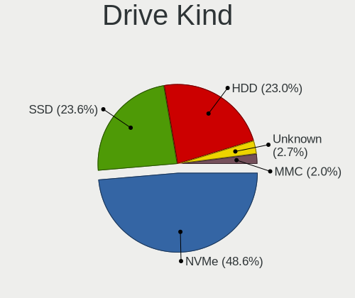

| Kind    | Computers | Drives | Percent |
|---------|-----------|--------|---------|
| NVMe    | 72        | 78     | 46.75%  |
| HDD     | 48        | 58     | 31.17%  |
| SSD     | 26        | 33     | 16.88%  |
| MMC     | 5         | 5      | 3.25%   |
| Unknown | 3         | 3      | 1.95%   |

Drive Connector
---------------

SATA, SAS, NVMe, etc.

| Type | Computers | Drives | Percent |
|------|-----------|--------|---------|
| NVMe | 72        | 77     | 50.35%  |
| SATA | 60        | 89     | 41.96%  |
| SAS  | 6         | 6      | 4.2%    |
| MMC  | 5         | 5      | 3.5%    |

Drive Size
----------

Size of hard drive

| Size in TB | Computers | Drives | Percent |
|------------|-----------|--------|---------|
| 0.01-0.5   | 39        | 44     | 50.65%  |
| 0.51-1.0   | 31        | 38     | 40.26%  |
| 1.01-2.0   | 4         | 5      | 5.19%   |
| 3.01-4.0   | 2         | 3      | 2.6%    |
| 4.01-10.0  | 1         | 1      | 1.3%    |

Space Total
-----------

Amount of disk space available on the file system

| Size in GB     | Computers | Percent |
|----------------|-----------|---------|
| 251-500        | 35        | 28.69%  |
| 101-250        | 28        | 22.95%  |
| 501-1000       | 22        | 18.03%  |
| 1001-2000      | 11        | 9.02%   |
| 1-20           | 6         | 4.92%   |
| 51-100         | 6         | 4.92%   |
| More than 3000 | 5         | 4.1%    |
| 21-50          | 3         | 2.46%   |
| 2001-3000      | 3         | 2.46%   |
| Unknown        | 3         | 2.46%   |

Space Used
----------

Amount of used disk space

| Used GB        | Computers | Percent |
|----------------|-----------|---------|
| 1-20           | 31        | 25.41%  |
| 21-50          | 26        | 21.31%  |
| 101-250        | 19        | 15.57%  |
| 51-100         | 19        | 15.57%  |
| 251-500        | 12        | 9.84%   |
| 501-1000       | 7         | 5.74%   |
| 1001-2000      | 3         | 2.46%   |
| Unknown        | 3         | 2.46%   |
| More than 3000 | 1         | 0.82%   |
| 2001-3000      | 1         | 0.82%   |

Malfunc. Drives
---------------

Drive models with a malfunction

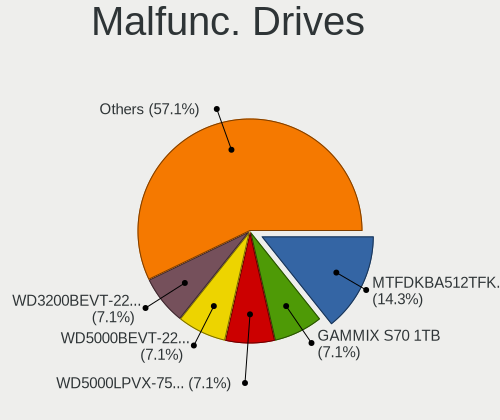

| Model                               | Computers | Drives | Percent |
|-------------------------------------|-----------|--------|---------|
| Seagate ST1000LM035-1RK172 1TB      | 3         | 3      | 20%     |
| WDC WD7500BPVT-60HXZT3 752GB        | 1         | 1      | 6.67%   |
| WDC WD20EZRZ-00Z5HB0 2TB            | 1         | 1      | 6.67%   |
| WDC WD Green 2.5 480GB SSD          | 1         | 1      | 6.67%   |
| Toshiba MK3265GSX 320GB             | 1         | 1      | 6.67%   |
| Toshiba MK3261GSYN 320GB            | 1         | 1      | 6.67%   |
| Seagate ST320LT007-9ZV142 320GB     | 1         | 1      | 6.67%   |
| Seagate ST31000524AS 1TB            | 1         | 1      | 6.67%   |
| Seagate ST2000LM015-2E8174 2TB      | 1         | 1      | 6.67%   |
| Seagate ST2000DM008-2FR102 2TB      | 1         | 2      | 6.67%   |
| Samsung Electronics SSD 870 EVO 1TB | 1         | 2      | 6.67%   |
| HGST HTS545050A7E680 500GB          | 1         | 1      | 6.67%   |
| Unknown                             | 1         | 1      | 6.67%   |

Malfunc. Drive Vendor
---------------------

Vendors of faulty drives

| Vendor              | Computers | Drives | Percent |
|---------------------|-----------|--------|---------|
| Seagate             | 7         | 8      | 46.67%  |
| WDC                 | 3         | 3      | 20%     |
| Toshiba             | 2         | 2      | 13.33%  |
| Samsung Electronics | 1         | 2      | 6.67%   |
| HGST                | 1         | 1      | 6.67%   |
| Unknown             | 1         | 1      | 6.67%   |

Malfunc. HDD Vendor
-------------------

Vendors of faulty HDD drives

| Vendor  | Computers | Drives | Percent |
|---------|-----------|--------|---------|
| Seagate | 7         | 8      | 58.33%  |
| WDC     | 2         | 2      | 16.67%  |
| Toshiba | 2         | 2      | 16.67%  |
| HGST    | 1         | 1      | 8.33%   |

Malfunc. Drive Kind
-------------------

Kinds of faulty drives

| Kind | Computers | Drives | Percent |
|------|-----------|--------|---------|
| HDD  | 12        | 13     | 80%     |
| SSD  | 3         | 4      | 20%     |

Failed Drives
-------------

Failed drive models

| Model                     | Computers | Drives | Percent |
|---------------------------|-----------|--------|---------|
| Seagate ST9320320AS 320GB | 1         | 1      | 100%    |

Failed Drive Vendor
-------------------

Failed drive vendors

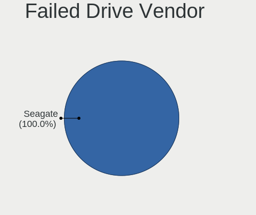

| Vendor  | Computers | Drives | Percent |
|---------|-----------|--------|---------|
| Seagate | 1         | 1      | 100%    |

Drive Status
------------

Number of failed and malfunc. drives

| Status   | Computers | Drives | Percent |
|----------|-----------|--------|---------|
| Detected | 68        | 96     | 51.52%  |
| Works    | 49        | 63     | 37.12%  |
| Malfunc  | 14        | 17     | 10.61%  |
| Failed   | 1         | 1      | 0.76%   |

Storage controller
------------------

Storage Vendor
--------------

Storage controller vendors

| Vendor                       | Computers | Percent |
|------------------------------|-----------|---------|
| Intel                        | 83        | 49.11%  |
| AMD                          | 16        | 9.47%   |
| Samsung Electronics          | 15        | 8.88%   |
| SanDisk                      | 11        | 6.51%   |
| Micron Technology            | 9         | 5.33%   |
| SK hynix                     | 6         | 3.55%   |
| Shenzhen Longsys Electronics | 6         | 3.55%   |
| Micron/Crucial Technology    | 4         | 2.37%   |
| Kingston Technology Company  | 4         | 2.37%   |
| Phison Electronics           | 3         | 1.78%   |
| KIOXIA                       | 3         | 1.78%   |
| Union Memory (Shenzhen)      | 2         | 1.18%   |
| Toshiba America Info Systems | 2         | 1.18%   |
| Silicon Motion               | 1         | 0.59%   |
| Seagate Technology           | 1         | 0.59%   |
| Nextorage                    | 1         | 0.59%   |
| MAXIO Technology (Hangzhou)  | 1         | 0.59%   |
| Marvell Technology Group     | 1         | 0.59%   |

Storage Model
-------------

Storage controller models

| Model                                                                                                              | Computers | Percent |
|--------------------------------------------------------------------------------------------------------------------|-----------|---------|
| AMD FCH SATA Controller [AHCI mode]                                                                                | 14        | 7.65%   |
| Intel Volume Management Device NVMe RAID Controller                                                                | 9         | 4.92%   |
| Intel Sunrise Point-LP SATA Controller [AHCI mode]                                                                 | 9         | 4.92%   |
| Samsung NVMe SSD Controller 980 (DRAM-less)                                                                        | 8         | 4.37%   |
| Intel 82801 Mobile SATA Controller [RAID mode]                                                                     | 7         | 3.83%   |
| SK hynix Gold P31/BC711/PC711 NVMe Solid State Drive                                                               | 5         | 2.73%   |
| Micron 2210 NVMe SSD [Cobain]                                                                                      | 5         | 2.73%   |
| Intel Tiger Lake-LP SATA Controller                                                                                | 5         | 2.73%   |
| Intel Volume Management Device NVMe RAID Controller Intel Corporation                                              | 4         | 2.19%   |
| Intel SSD 660P Series                                                                                              | 4         | 2.19%   |
| Intel 8 Series SATA Controller 1 [AHCI mode]                                                                       | 4         | 2.19%   |
| Intel 7 Series Chipset Family 6-port SATA Controller [AHCI mode]                                                   | 4         | 2.19%   |
| Shenzhen Longsys FORESEE XP1000 / Lexar Professional CFexpress Type B Gold series, NM620 PCIe NVME SSD (DRAM-less) | 3         | 1.64%   |
| Micron/Crucial P2 [Nick P2] / P3 / P3 Plus NVMe PCIe SSD (DRAM-less)                                               | 3         | 1.64%   |
| Micron 2450 NVMe SSD [HendrixV] (DRAM-less)                                                                        | 3         | 1.64%   |
| Intel SSD 670p Series [Keystone Harbor]                                                                            | 3         | 1.64%   |
| Intel Alder Lake-P SATA AHCI Controller                                                                            | 3         | 1.64%   |
| Intel 6 Series/C200 Series Chipset Family 6 port Mobile SATA AHCI Controller                                       | 3         | 1.64%   |
| Intel 400 Series Chipset Family SATA AHCI Controller                                                               | 3         | 1.64%   |
| Toshiba America Info Systems BG3 x2 NVMe SSD Controller (DRAM-less)                                                | 2         | 1.09%   |
| Shenzhen Longsys FORESEE XP2100 NVMe SSD (DRAM-less)                                                               | 2         | 1.09%   |
| SanDisk WD PC SN810 / Black SN850 NVMe SSD                                                                         | 2         | 1.09%   |
| SanDisk Ultra 3D / WD Blue SN570 NVMe SSD (DRAM-less)                                                              | 2         | 1.09%   |
| SanDisk Ultra 3D / WD Blue SN550 NVMe SSD                                                                          | 2         | 1.09%   |
| SanDisk IX SN530 NVMe SSD (DRAM-less)                                                                              | 2         | 1.09%   |
| Samsung NVMe SSD Controller SM981/PM981/PM983                                                                      | 2         | 1.09%   |
| Samsung NVMe SSD Controller PM9B1 (DRAM-less)                                                                      | 2         | 1.09%   |
| Samsung NVMe SSD Controller PM9A1/PM9A3/980PRO                                                                     | 2         | 1.09%   |
| Phison PS5013-E13 PCIe3 NVMe Controller (DRAM-less)                                                                | 2         | 1.09%   |
| KIOXIA NVMe SSD Controller BG4 (DRAM-less)                                                                         | 2         | 1.09%   |
| Kingston Company A2000 NVMe SSD SM2263EN                                                                           | 2         | 1.09%   |
| Intel Wildcat Point-LP SATA Controller [AHCI Mode]                                                                 | 2         | 1.09%   |
| Intel Q170/Q150/B150/H170/H110/Z170/CM236 Chipset SATA Controller [AHCI Mode]                                      | 2         | 1.09%   |
| Intel Jasper Lake SATA AHCI Controller                                                                             | 2         | 1.09%   |
| Intel Cannon Point-LP SATA Controller [AHCI Mode]                                                                  | 2         | 1.09%   |
| Intel Cannon Lake Mobile PCH SATA AHCI Controller                                                                  | 2         | 1.09%   |
| Intel C620 Series Chipset Family SSATA Controller [AHCI mode]                                                      | 2         | 1.09%   |
| Intel C620 Series Chipset Family SATA Controller [AHCI mode]                                                       | 2         | 1.09%   |
| Intel 6 Series/C200 Series Chipset Family 6 port Desktop SATA AHCI Controller                                      | 2         | 1.09%   |
| Intel 500 Series Chipset Family SATA AHCI Controller                                                               | 2         | 1.09%   |

Storage Kind
------------

Kind of storage controller (IDE, SATA, NVMe, SAS, ...)

| Kind | Computers | Percent |
|------|-----------|---------|
| SATA | 75        | 43.86%  |
| NVMe | 72        | 42.11%  |
| RAID | 20        | 11.7%   |
| IDE  | 4         | 2.34%   |

Processor
---------

CPU Vendor
----------

Processor vendors

| Vendor | Computers | Percent |
|--------|-----------|---------|
| Intel  | 95        | 77.87%  |
| AMD    | 26        | 21.31%  |
| ARM    | 1         | 0.82%   |

CPU Model
---------

Processor models

| Model                                       | Computers | Percent |
|---------------------------------------------|-----------|---------|
| Intel 11th Gen Core i5-1135G7 @ 2.40GHz     | 5         | 4.1%    |
| Intel 12th Gen Core i5-12450H               | 3         | 2.46%   |
| Intel 12th Gen Core i5-1235U                | 3         | 2.46%   |
| AMD Ryzen 5 5500U with Radeon Graphics      | 3         | 2.46%   |
| Intel Core i7-8650U CPU @ 1.90GHz           | 2         | 1.64%   |
| Intel Core i7-8565U CPU @ 1.80GHz           | 2         | 1.64%   |
| Intel Core i5-8350U CPU @ 1.70GHz           | 2         | 1.64%   |
| Intel Core i5-8265U CPU @ 1.60GHz           | 2         | 1.64%   |
| Intel Core i5-7200U CPU @ 2.50GHz           | 2         | 1.64%   |
| Intel Core i5-6200U CPU @ 2.30GHz           | 2         | 1.64%   |
| Intel Core i5-4200U CPU @ 1.60GHz           | 2         | 1.64%   |
| Intel Core i5-10300H CPU @ 2.50GHz          | 2         | 1.64%   |
| Intel Celeron N5100 @ 1.10GHz               | 2         | 1.64%   |
| Intel 13th Gen Core i9-13900H               | 2         | 1.64%   |
| Intel 13th Gen Core i5-13500H               | 2         | 1.64%   |
| Intel 12th Gen Core i5-12500H               | 2         | 1.64%   |
| Intel 11th Gen Core i7-1165G7 @ 2.80GHz     | 2         | 1.64%   |
| Intel 11th Gen Core i5-11300H @ 3.10GHz     | 2         | 1.64%   |
| AMD Ryzen 9 5900HX with Radeon Graphics     | 2         | 1.64%   |
| AMD Ryzen 5 5600H with Radeon Graphics      | 2         | 1.64%   |
| Intel Xeon Silver 4216 CPU @ 2.10GHz        | 1         | 0.82%   |
| Intel Xeon Silver 4114 CPU @ 2.20GHz        | 1         | 0.82%   |
| Intel Pentium Dual-Core CPU T4500 @ 2.30GHz | 1         | 0.82%   |
| Intel Pentium CPU N3540 @ 2.16GHz           | 1         | 0.82%   |
| Intel Pentium CPU G2030 @ 3.00GHz           | 1         | 0.82%   |
| Intel Core Ultra 7 155H                     | 1         | 0.82%   |
| Intel Core i7-9750H CPU @ 2.60GHz           | 1         | 0.82%   |
| Intel Core i7-6850K CPU @ 3.60GHz           | 1         | 0.82%   |
| Intel Core i7-4790K CPU @ 4.00GHz           | 1         | 0.82%   |
| Intel Core i7-4510U CPU @ 2.00GHz           | 1         | 0.82%   |
| Intel Core i7-2670QM CPU @ 2.20GHz          | 1         | 0.82%   |
| Intel Core i7-10850H CPU @ 2.70GHz          | 1         | 0.82%   |
| Intel Core i7-1065G7 CPU @ 1.30GHz          | 1         | 0.82%   |
| Intel Core i7-10510U CPU @ 1.80GHz          | 1         | 0.82%   |
| Intel Core i5-8300H CPU @ 2.30GHz           | 1         | 0.82%   |
| Intel Core i5-8250U CPU @ 1.60GHz           | 1         | 0.82%   |
| Intel Core i5-7600K CPU @ 3.80GHz           | 1         | 0.82%   |
| Intel Core i5-7400 CPU @ 3.00GHz            | 1         | 0.82%   |
| Intel Core i5-6500 CPU @ 3.20GHz            | 1         | 0.82%   |
| Intel Core i5-6300U CPU @ 2.40GHz           | 1         | 0.82%   |

CPU Model Family
----------------

Processor model prefix

| Model                   | Computers | Percent |
|-------------------------|-----------|---------|
| Other                   | 34        | 27.87%  |
| Intel Core i5           | 31        | 25.41%  |
| Intel Core i7           | 12        | 9.84%   |
| Intel Core i3           | 10        | 8.2%    |
| AMD Ryzen 5             | 10        | 8.2%    |
| AMD Ryzen 7             | 8         | 6.56%   |
| Intel Celeron           | 4         | 3.28%   |
| Intel Xeon Silver       | 2         | 1.64%   |
| Intel Pentium           | 2         | 1.64%   |
| AMD Ryzen 9             | 2         | 1.64%   |
| Intel Pentium Dual-Core | 1         | 0.82%   |
| Intel Core              | 1         | 0.82%   |
| AMD Ryzen 5 PRO         | 1         | 0.82%   |
| AMD Ryzen 3             | 1         | 0.82%   |
| AMD E2                  | 1         | 0.82%   |
| AMD Athlon              | 1         | 0.82%   |
| AMD A4                  | 1         | 0.82%   |

CPU Cores
---------

Number of processor cores

| Number  | Computers | Percent |
|---------|-----------|---------|
| 4       | 38        | 31.15%  |
| 2       | 35        | 28.69%  |
| 6       | 16        | 13.11%  |
| 8       | 15        | 12.3%   |
| 12      | 5         | 4.1%    |
| 10      | 5         | 4.1%    |
| 14      | 3         | 2.46%   |
| 32      | 1         | 0.82%   |
| 20      | 1         | 0.82%   |
| 16      | 1         | 0.82%   |
| 1       | 1         | 0.82%   |
| Unknown | 1         | 0.82%   |

CPU Sockets
-----------

Number of sockets

| Number  | Computers | Percent |
|---------|-----------|---------|
| 1       | 119       | 97.54%  |
| 2       | 2         | 1.64%   |
| Unknown | 1         | 0.82%   |

CPU Threads
-----------

Threads per core (Hyper-Threading)

| Number  | Computers | Percent |
|---------|-----------|---------|
| 2       | 102       | 83.61%  |
| 1       | 19        | 15.57%  |
| Unknown | 1         | 0.82%   |

CPU Op-Modes
------------

CPU Operation Modes (32-bit, 64-bit)

| Op mode        | Computers | Percent |
|----------------|-----------|---------|
| 32-bit, 64-bit | 121       | 99.18%  |
| Unknown        | 1         | 0.82%   |

CPU Microcode
-------------

Microcode number

| Number     | Computers | Percent |
|------------|-----------|---------|
| Unknown    | 90        | 73.77%  |
| 0x0a50000c | 4         | 3.28%   |
| 0x08600106 | 3         | 2.46%   |
| 0x806ec    | 2         | 1.64%   |
| 0x806ea    | 2         | 1.64%   |
| 0x0a50000d | 2         | 1.64%   |
| 0x08108109 | 2         | 1.64%   |
| 0xa0652    | 1         | 0.82%   |
| 0x906e9    | 1         | 0.82%   |
| 0x906c0    | 1         | 0.82%   |
| 0x806c1    | 1         | 0.82%   |
| 0x50657    | 1         | 0.82%   |
| 0x50654    | 1         | 0.82%   |
| 0x40651    | 1         | 0.82%   |
| 0x306a9    | 1         | 0.82%   |
| 0x206a7    | 1         | 0.82%   |
| 0x20655    | 1         | 0.82%   |
| 0x0a404102 | 1         | 0.82%   |
| 0x08608104 | 1         | 0.82%   |
| 0x08608103 | 1         | 0.82%   |
| 0x08608102 | 1         | 0.82%   |
| 0x07030106 | 1         | 0.82%   |
| 0x06006705 | 1         | 0.82%   |
| 0x06001119 | 1         | 0.82%   |

CPU Microarch
-------------

Microarchitecture

| Name             | Computers | Percent |
|------------------|-----------|---------|
| KabyLake         | 21        | 17.21%  |
| Unknown          | 19        | 15.57%  |
| Alderlake Hybrid | 11        | 9.02%   |
| TigerLake        | 10        | 8.2%    |
| Zen 3            | 9         | 7.38%   |
| Skylake          | 7         | 5.74%   |
| Haswell          | 7         | 5.74%   |
| SandyBridge      | 6         | 4.92%   |
| Zen 2            | 5         | 4.1%    |
| IvyBridge        | 5         | 4.1%    |
| Zen+             | 3         | 2.46%   |
| Westmere         | 3         | 2.46%   |
| IceLake          | 3         | 2.46%   |
| CometLake        | 3         | 2.46%   |
| Broadwell        | 3         | 2.46%   |
| Tremont          | 1         | 0.82%   |
| Silvermont       | 1         | 0.82%   |
| Puma             | 1         | 0.82%   |
| Piledriver       | 1         | 0.82%   |
| Penryn           | 1         | 0.82%   |
| Goldmont plus    | 1         | 0.82%   |
| Excavator        | 1         | 0.82%   |

Graphics
--------

GPU Vendor
----------

Vendors of graphics cards

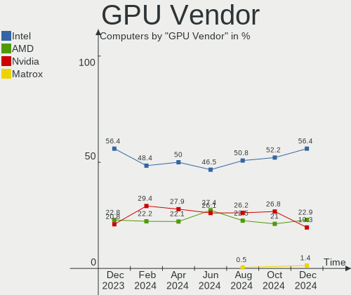

| Vendor            | Computers | Percent |
|-------------------|-----------|---------|
| Intel             | 87        | 57.62%  |
| Nvidia            | 35        | 23.18%  |
| AMD               | 28        | 18.54%  |
| ASPEED Technology | 1         | 0.66%   |

GPU Model
---------

Graphics card models

| Model                                                                         | Computers | Percent |
|-------------------------------------------------------------------------------|-----------|---------|
| Intel TigerLake-LP GT2 [Iris Xe Graphics]                                     | 9         | 5.84%   |
| AMD Cezanne [Radeon Vega Series / Radeon Vega Mobile Series]                  | 7         | 4.55%   |
| Intel UHD Graphics 620                                                        | 6         | 3.9%    |
| Intel 2nd Generation Core Processor Family Integrated Graphics Controller     | 6         | 3.9%    |
| Nvidia TU117M [GeForce GTX 1650 Mobile / Max-Q]                               | 5         | 3.25%   |
| Intel Raptor Lake-P [Iris Xe Graphics]                                        | 5         | 3.25%   |
| Intel Haswell-ULT Integrated Graphics Controller                              | 5         | 3.25%   |
| Intel WhiskeyLake-U GT2 [UHD Graphics 620]                                    | 4         | 2.6%    |
| Intel Alder Lake-P GT1 [UHD Graphics]                                         | 4         | 2.6%    |
| AMD Renoir [Radeon RX Vega 6 (Ryzen 4000/5000 Mobile Series)]                 | 4         | 2.6%    |
| AMD Lucienne                                                                  | 4         | 2.6%    |
| Nvidia GA107M [GeForce RTX 3050 Mobile]                                       | 3         | 1.95%   |
| Intel Skylake GT2 [HD Graphics 520]                                           | 3         | 1.95%   |
| Intel HD Graphics 620                                                         | 3         | 1.95%   |
| Intel Core Processor Integrated Graphics Controller                           | 3         | 1.95%   |
| Intel CometLake-U GT2 [UHD Graphics]                                          | 3         | 1.95%   |
| Intel CometLake-H GT2 [UHD Graphics]                                          | 3         | 1.95%   |
| Intel Alder Lake-UP3 GT2 [Iris Xe Graphics]                                   | 3         | 1.95%   |
| Intel Alder Lake-P GT2 [Iris Xe Graphics]                                     | 3         | 1.95%   |
| Intel 3rd Gen Core processor Graphics Controller                              | 3         | 1.95%   |
| AMD Sun XT [Radeon HD 8670A/8670M/8690M / R5 M330 / M430 / Radeon 520 Mobile] | 3         | 1.95%   |
| AMD Picasso/Raven 2 [Radeon Vega Series / Radeon Vega Mobile Series]          | 3         | 1.95%   |
| Nvidia GA106M [GeForce RTX 3060 Mobile / Max-Q]                               | 2         | 1.3%    |
| Nvidia AD107M [GeForce RTX 4060 Max-Q / Mobile]                               | 2         | 1.3%    |
| Intel Xeon E3-1200 v3/4th Gen Core Processor Integrated Graphics Controller   | 2         | 1.3%    |
| Intel TigerLake-H GT1 [UHD Graphics]                                          | 2         | 1.3%    |
| Intel JasperLake [UHD Graphics]                                               | 2         | 1.3%    |
| Intel HD Graphics 530                                                         | 2         | 1.3%    |
| Intel CoffeeLake-H GT2 [UHD Graphics 630]                                     | 2         | 1.3%    |
| AMD Rembrandt [Radeon 680M]                                                   | 2         | 1.3%    |
| Nvidia TU117M [GeForce MX450]                                                 | 1         | 0.65%   |
| Nvidia TU116M [GeForce GTX 1660 Ti Mobile]                                    | 1         | 0.65%   |
| Nvidia TU106 [GeForce RTX 2060 SUPER]                                         | 1         | 0.65%   |
| Nvidia GP108M [GeForce MX330]                                                 | 1         | 0.65%   |
| Nvidia GP108M [GeForce MX230]                                                 | 1         | 0.65%   |
| Nvidia GP108 [GeForce GT 1030]                                                | 1         | 0.65%   |
| Nvidia GP107M [GeForce MX350]                                                 | 1         | 0.65%   |
| Nvidia GP107M [GeForce MX150]                                                 | 1         | 0.65%   |
| Nvidia GP107M [GeForce GTX 1050 Mobile]                                       | 1         | 0.65%   |
| Nvidia GP104GL [Quadro P5000]                                                 | 1         | 0.65%   |

GPU Combo
---------

Combinations of graphics cards

| Name            | Computers | Percent |
|-----------------|-----------|---------|
| 1 x Intel       | 65        | 53.28%  |
| Intel + Nvidia  | 18        | 14.75%  |
| 1 x AMD         | 15        | 12.3%   |
| 1 x Nvidia      | 9         | 7.38%   |
| AMD + Nvidia    | 7         | 5.74%   |
| Intel + AMD     | 4         | 3.28%   |
| 2 x AMD         | 2         | 1.64%   |
| Other           | 1         | 0.82%   |
| Nvidia + ASPEED | 1         | 0.82%   |

GPU Driver
----------

Free vs proprietary

| Driver      | Computers | Percent |
|-------------|-----------|---------|
| Free        | 97        | 79.51%  |
| Proprietary | 22        | 18.03%  |
| Unknown     | 3         | 2.46%   |

GPU Memory
----------

Total video memory

| Size in GB | Computers | Percent |
|------------|-----------|---------|
| Unknown    | 93        | 76.23%  |
| 0.01-0.5   | 11        | 9.02%   |
| 1.01-2.0   | 7         | 5.74%   |
| 3.01-4.0   | 4         | 3.28%   |
| 8.01-16.0  | 3         | 2.46%   |
| 7.01-8.0   | 2         | 1.64%   |
| 16.01-24.0 | 1         | 0.82%   |
| 0.51-1.0   | 1         | 0.82%   |

Monitor
-------

Monitor Vendor
--------------

Monitor vendors

| Vendor                  | Computers | Percent |
|-------------------------|-----------|---------|
| BOE                     | 24        | 18.18%  |
| Chimei Innolux          | 23        | 17.42%  |
| AU Optronics            | 18        | 13.64%  |
| LG Display              | 13        | 9.85%   |
| Samsung Electronics     | 9         | 6.82%   |
| Goldstar                | 7         | 5.3%    |
| Dell                    | 6         | 4.55%   |
| Acer                    | 5         | 3.79%   |
| BenQ                    | 4         | 3.03%   |
| PANDA                   | 3         | 2.27%   |
| KDC                     | 3         | 2.27%   |
| KDB                     | 2         | 1.52%   |
| ViewSonic               | 1         | 0.76%   |
| Unknown                 | 1         | 0.76%   |
| Toshiba                 | 1         | 0.76%   |
| TMX                     | 1         | 0.76%   |
| Sony                    | 1         | 0.76%   |
| SGT                     | 1         | 0.76%   |
| Panasonic               | 1         | 0.76%   |
| MSI                     | 1         | 0.76%   |
| Lenovo                  | 1         | 0.76%   |
| InfoVision              | 1         | 0.76%   |
| HJC                     | 1         | 0.76%   |
| Hewlett-Packard         | 1         | 0.76%   |
| Chi Mei Optoelectronics | 1         | 0.76%   |
| Apple                   | 1         | 0.76%   |
| AOC                     | 1         | 0.76%   |

Monitor Model
-------------

Monitor models

| Model                                                                 | Computers | Percent |
|-----------------------------------------------------------------------|-----------|---------|
| PANDA LCD Monitor NCP004D 1920x1080 344x194mm 15.5-inch               | 3         | 2.27%   |
| KDC LCD Monitor KDC0422 1920x1080 309x174mm 14.0-inch                 | 3         | 2.27%   |
| Chimei Innolux LCD Monitor CMN1521 1920x1080 344x193mm 15.5-inch      | 3         | 2.27%   |
| LG Display LCD Monitor LGD060F 1920x1080 309x174mm 14.0-inch          | 2         | 1.52%   |
| KDB LCD Monitor KDB0526 1920x1080 344x194mm 15.5-inch                 | 2         | 1.52%   |
| Goldstar MONITOR GSM59C6 1920x1080 509x286mm 23.0-inch                | 2         | 1.52%   |
| Chimei Innolux LCD Monitor CMN15F5 1920x1080 344x193mm 15.5-inch      | 2         | 1.52%   |
| Chimei Innolux LCD Monitor CMN15E7 1920x1080 344x193mm 15.5-inch      | 2         | 1.52%   |
| Chimei Innolux LCD Monitor CMN14D6 1366x768 309x173mm 13.9-inch       | 2         | 1.52%   |
| BOE LCD Monitor BOE0B2B 1920x1200 345x215mm 16.0-inch                 | 2         | 1.52%   |
| BOE LCD Monitor BOE09AE 1920x1080 309x174mm 14.0-inch                 | 2         | 1.52%   |
| BenQ GW2480 BNQ78E7 1920x1080 527x296mm 23.8-inch                     | 2         | 1.52%   |
| AU Optronics LCD Monitor AUO203D 1920x1080 309x174mm 14.0-inch        | 2         | 1.52%   |
| ViewSonic LCD Monitor VA2732-FHD 1920x1080                            | 1         | 0.76%   |
| Unknown LCD Monitor CSO 2560x1600                                     | 1         | 0.76%   |
| Toshiba ScreenXpert TSB8888 1080x2160                                 | 1         | 0.76%   |
| TMX TL156MDMP01-0 TMX1560 3200x2000 336x210mm 15.6-inch               | 1         | 0.76%   |
| Sony TV *00 SNY7E04 3840x2160 1660x934mm 75.0-inch                    | 1         | 0.76%   |
| SGT YSD SGT1900 1440x900 600x300mm 26.4-inch                          | 1         | 0.76%   |
| Samsung Electronics S22F350 SAM0D1B 1920x1080 477x268mm 21.5-inch     | 1         | 0.76%   |
| Samsung Electronics S22F350 SAM0D1A 1920x1080 477x268mm 21.5-inch     | 1         | 0.76%   |
| Samsung Electronics S19F350 SAM0D46 1366x768 410x230mm 18.5-inch      | 1         | 0.76%   |
| Samsung Electronics LF24T35 SAM707D 1920x1080 528x297mm 23.9-inch     | 1         | 0.76%   |
| Samsung Electronics LCD Monitor SEC5441 1366x768 344x194mm 15.5-inch  | 1         | 0.76%   |
| Samsung Electronics LCD Monitor SDC4171 2880x1800 302x189mm 14.0-inch | 1         | 0.76%   |
| Samsung Electronics LCD Monitor SDC4161 1920x1080 344x194mm 15.5-inch | 1         | 0.76%   |
| Samsung Electronics LCD Monitor SDC414D 3456x2160 336x210mm 15.6-inch | 1         | 0.76%   |
| Samsung Electronics LCD Monitor LS24A600N 2560x1440                   | 1         | 0.76%   |
| Panasonic LCD Monitor TV 3840x2160                                    | 1         | 0.76%   |
| MSI MP273 MSI30B4 1920x1080 600x330mm 27.0-inch                       | 1         | 0.76%   |
| LG Display LCD Monitor LGD40A9 1920x1080 309x174mm 14.0-inch          | 1         | 0.76%   |
| LG Display LCD Monitor LGD06FF 1920x1080 344x194mm 15.5-inch          | 1         | 0.76%   |
| LG Display LCD Monitor LGD069A 1920x1080 344x194mm 15.5-inch          | 1         | 0.76%   |
| LG Display LCD Monitor LGD0612 1920x1080 344x194mm 15.5-inch          | 1         | 0.76%   |
| LG Display LCD Monitor LGD05B1 1920x1080 309x174mm 14.0-inch          | 1         | 0.76%   |
| LG Display LCD Monitor LGD04BE 1366x768 344x194mm 15.5-inch           | 1         | 0.76%   |
| LG Display LCD Monitor LGD0456 1366x768 344x194mm 15.5-inch           | 1         | 0.76%   |
| LG Display LCD Monitor LGD03AB 1366x768 344x194mm 15.5-inch           | 1         | 0.76%   |
| LG Display LCD Monitor LGD02EB 1366x768 309x174mm 14.0-inch           | 1         | 0.76%   |
| LG Display LCD Monitor LGD02E3 1366x768 344x194mm 15.5-inch           | 1         | 0.76%   |

Monitor Resolution
------------------

Monitor screen resolution

| Resolution        | Computers | Percent |
|-------------------|-----------|---------|
| 1920x1080 (FHD)   | 73        | 58.87%  |
| 1366x768 (WXGA)   | 28        | 22.58%  |
| 2560x1440 (QHD)   | 5         | 4.03%   |
| 1920x1200 (WUXGA) | 5         | 4.03%   |
| 2560x1600         | 4         | 3.23%   |
| 3840x2160 (4K)    | 2         | 1.61%   |
| 3456x2160         | 1         | 0.81%   |
| 3200x2000         | 1         | 0.81%   |
| 2880x1800         | 1         | 0.81%   |
| 2560x1080         | 1         | 0.81%   |
| 1600x900 (HD+)    | 1         | 0.81%   |
| 1440x900 (WXGA+)  | 1         | 0.81%   |
| 1280x800 (WXGA)   | 1         | 0.81%   |

Monitor Diagonal
----------------

Diagonal size in inches

| Inches  | Computers | Percent |
|---------|-----------|---------|
| 15      | 50        | 37.88%  |
| 14      | 26        | 19.7%   |
| 13      | 10        | 7.58%   |
| 24      | 8         | 6.06%   |
| 23      | 6         | 4.55%   |
| 21      | 6         | 4.55%   |
| 16      | 6         | 4.55%   |
| 18      | 5         | 3.79%   |
| Unknown | 4         | 3.03%   |
| 31      | 2         | 1.52%   |
| 27      | 2         | 1.52%   |
| 12      | 2         | 1.52%   |
| 86      | 1         | 0.76%   |
| 75      | 1         | 0.76%   |
| 34      | 1         | 0.76%   |
| 26      | 1         | 0.76%   |
| 11      | 1         | 0.76%   |

Monitor Width
-------------

Physical width

| Width in mm | Computers | Percent |
|-------------|-----------|---------|
| 301-350     | 87        | 66.92%  |
| 501-600     | 15        | 11.54%  |
| 401-500     | 11        | 8.46%   |
| 201-300     | 6         | 4.62%   |
| Unknown     | 4         | 3.08%   |
| 601-700     | 2         | 1.54%   |
| 351-400     | 2         | 1.54%   |
| 701-800     | 1         | 0.77%   |
| 1501-2000   | 1         | 0.77%   |
| 1001-1500   | 1         | 0.77%   |

Aspect Ratio
------------

Proportional relationship between the width and the height

| Ratio   | Computers | Percent |
|---------|-----------|---------|
| 16/9    | 100       | 83.33%  |
| 16/10   | 13        | 10.83%  |
| Unknown | 4         | 3.33%   |
| 21/9    | 1         | 0.83%   |
| 2.00    | 1         | 0.83%   |
| 0.56    | 1         | 0.83%   |

Monitor Area
------------

Area in inch

| Area in inch | Computers | Percent |
|----------------|-----------|---------|
| 101-110        | 51        | 39.23%  |
| 81-90          | 34        | 26.15%  |
| 201-250        | 14        | 10.77%  |
| 141-150        | 5         | 3.85%   |
| 111-120        | 5         | 3.85%   |
| Unknown        | 4         | 3.08%   |
| 351-500        | 3         | 2.31%   |
| 251-300        | 3         | 2.31%   |
| More than 1000 | 2         | 1.54%   |
| 71-80          | 2         | 1.54%   |
| 61-70          | 2         | 1.54%   |
| 301-350        | 2         | 1.54%   |
| 151-200        | 2         | 1.54%   |
| 51-60          | 1         | 0.77%   |

Pixel Density
-------------

Pixels per inch

| Density       | Computers | Percent |
|---------------|-----------|---------|
| 121-160       | 64        | 50%     |
| 101-120       | 25        | 19.53%  |
| 51-100        | 24        | 18.75%  |
| 161-240       | 7         | 5.47%   |
| Unknown       | 4         | 3.13%   |
| More than 240 | 3         | 2.34%   |
| 1-50          | 1         | 0.78%   |

Multiple Monitors
-----------------

Total monitors connected

| Total | Computers | Percent |
|-------|-----------|---------|
| 1     | 106       | 86.89%  |
| 2     | 12        | 9.84%   |
| 0     | 3         | 2.46%   |
| 3     | 1         | 0.82%   |

Network
-------

Net Controller Vendor
---------------------

Controller vendors

| Vendor                   | Computers | Percent |
|--------------------------|-----------|---------|
| Realtek Semiconductor    | 68        | 36.17%  |
| Intel                    | 67        | 35.64%  |
| MediaTek                 | 13        | 6.91%   |
| Qualcomm Atheros         | 12        | 6.38%   |
| TP-Link                  | 6         | 3.19%   |
| Broadcom                 | 5         | 2.66%   |
| Ralink Technology        | 3         | 1.6%    |
| Samsung Electronics      | 2         | 1.06%   |
| Qualcomm                 | 2         | 1.06%   |
| Xiaomi                   | 1         | 0.53%   |
| Ralink                   | 1         | 0.53%   |
| QinHeng Electronics      | 1         | 0.53%   |
| Marvell Technology Group | 1         | 0.53%   |
| Google                   | 1         | 0.53%   |
| DisplayLink              | 1         | 0.53%   |
| Broadcom Limited         | 1         | 0.53%   |
| ASUSTek Computer         | 1         | 0.53%   |
| ASIX Electronics         | 1         | 0.53%   |
| American Megatrends      | 1         | 0.53%   |

Net Controller Model
--------------------

Controller models

| Model                                                                  | Computers | Percent |
|------------------------------------------------------------------------|-----------|---------|
| Realtek RTL8111/8168/8211/8411 PCI Express Gigabit Ethernet Controller | 41        | 18.55%  |
| Realtek RTL810xE PCI Express Fast Ethernet controller                  | 10        | 4.52%   |
| MediaTek MT7921 802.11ax PCI Express Wireless Network Adapter          | 9         | 4.07%   |
| Intel Alder Lake-P PCH CNVi WiFi                                       | 9         | 4.07%   |
| Intel Wi-Fi 6 AX201                                                    | 7         | 3.17%   |
| Realtek RTL8188EUS 802.11n Wireless Network Adapter                    | 6         | 2.71%   |
| Intel Wi-Fi 6 AX200                                                    | 6         | 2.71%   |
| Intel Raptor Lake PCH CNVi WiFi                                        | 5         | 2.26%   |
| Realtek RTL8822CE 802.11ac PCIe Wireless Network Adapter               | 4         | 1.81%   |
| Realtek RTL8821CE 802.11ac PCIe Wireless Network Adapter               | 4         | 1.81%   |
| Qualcomm Atheros QCA9565 / AR9565 Wireless Network Adapter             | 4         | 1.81%   |
| Qualcomm Atheros QCA9377 802.11ac Wireless Network Adapter             | 4         | 1.81%   |
| Intel 82579LM Gigabit Network Connection (Lewisville)                  | 4         | 1.81%   |
| Realtek RTL8723BE PCIe Wireless Network Adapter                        | 3         | 1.36%   |
| Realtek RTL8153 Gigabit Ethernet Adapter                               | 3         | 1.36%   |
| Ralink MT7601U Wireless Adapter                                        | 3         | 1.36%   |
| MediaTek MT7922 802.11ax PCI Express Wireless Network Adapter          | 3         | 1.36%   |
| Intel Wireless 8265 / 8275                                             | 3         | 1.36%   |
| Intel I211 Gigabit Network Connection                                  | 3         | 1.36%   |
| Intel Ethernet Connection (4) I219-LM                                  | 3         | 1.36%   |
| Intel Comet Lake PCH-LP CNVi WiFi                                      | 3         | 1.36%   |
| Intel Centrino Advanced-N 6205 [Taylor Peak]                           | 3         | 1.36%   |
| Intel Cannon Point-LP CNVi [Wireless-AC]                               | 3         | 1.36%   |
| Intel Cannon Lake PCH CNVi WiFi                                        | 3         | 1.36%   |
| TP-Link 802.11ac WLAN Adapter                                          | 2         | 0.9%    |
| Samsung GT-I9070 (network tethering, USB debugging enabled)            | 2         | 0.9%    |
| Realtek Killer E2600 GbE Controller                                    | 2         | 0.9%    |
| Intel Wireless 8260                                                    | 2         | 0.9%    |
| Intel Wireless 7265                                                    | 2         | 0.9%    |
| Intel Wi-Fi 6 AX201 160MHz                                             | 2         | 0.9%    |
| Intel Tiger Lake PCH CNVi WiFi                                         | 2         | 0.9%    |
| Intel Ethernet Connection I219-LM                                      | 2         | 0.9%    |
| Xiaomi Mi/Redmi series (RNDIS)                                         | 1         | 0.45%   |
| TP-Link UE300 10/100/1000 LAN (ethernet mode) [Realtek RTL8153]        | 1         | 0.45%   |
| TP-Link TL-WN822N Version 4 RTL8192EU                                  | 1         | 0.45%   |
| TP-Link TL-WN821N v5/v6 [RTL8192EU]                                    | 1         | 0.45%   |
| TP-Link RTL8812AU Archer T4U 802.11ac                                  | 1         | 0.45%   |
| TP-Link Archer T4U ver.3                                               | 1         | 0.45%   |
| Realtek RTL8852BE PCIe 802.11ax Wireless Network Controller            | 1         | 0.45%   |
| Realtek RTL8822BE 802.11a/b/g/n/ac WiFi adapter                        | 1         | 0.45%   |

Wireless Vendor
---------------

Wireless vendors

| Vendor                | Computers | Percent |
|-----------------------|-----------|---------|
| Intel                 | 61        | 50%     |
| Realtek Semiconductor | 23        | 18.85%  |
| MediaTek              | 13        | 10.66%  |
| Qualcomm Atheros      | 10        | 8.2%    |
| TP-Link               | 6         | 4.92%   |
| Broadcom              | 4         | 3.28%   |
| Ralink Technology     | 3         | 2.46%   |
| Ralink                | 1         | 0.82%   |
| Qualcomm              | 1         | 0.82%   |

Wireless Model
--------------

Wireless models

| Model                                                          | Computers | Percent |
|----------------------------------------------------------------|-----------|---------|
| MediaTek MT7921 802.11ax PCI Express Wireless Network Adapter  | 9         | 7.38%   |
| Intel Alder Lake-P PCH CNVi WiFi                               | 9         | 7.38%   |
| Intel Wi-Fi 6 AX201                                            | 7         | 5.74%   |
| Realtek RTL8188EUS 802.11n Wireless Network Adapter            | 6         | 4.92%   |
| Intel Wi-Fi 6 AX200                                            | 6         | 4.92%   |
| Intel Raptor Lake PCH CNVi WiFi                                | 5         | 4.1%    |
| Realtek RTL8822CE 802.11ac PCIe Wireless Network Adapter       | 4         | 3.28%   |
| Realtek RTL8821CE 802.11ac PCIe Wireless Network Adapter       | 4         | 3.28%   |
| Qualcomm Atheros QCA9565 / AR9565 Wireless Network Adapter     | 4         | 3.28%   |
| Qualcomm Atheros QCA9377 802.11ac Wireless Network Adapter     | 4         | 3.28%   |
| Realtek RTL8723BE PCIe Wireless Network Adapter                | 3         | 2.46%   |
| Ralink MT7601U Wireless Adapter                                | 3         | 2.46%   |
| MediaTek MT7922 802.11ax PCI Express Wireless Network Adapter  | 3         | 2.46%   |
| Intel Wireless 8265 / 8275                                     | 3         | 2.46%   |
| Intel Comet Lake PCH-LP CNVi WiFi                              | 3         | 2.46%   |
| Intel Centrino Advanced-N 6205 [Taylor Peak]                   | 3         | 2.46%   |
| Intel Cannon Point-LP CNVi [Wireless-AC]                       | 3         | 2.46%   |
| Intel Cannon Lake PCH CNVi WiFi                                | 3         | 2.46%   |
| TP-Link 802.11ac WLAN Adapter                                  | 2         | 1.64%   |
| Intel Wireless 8260                                            | 2         | 1.64%   |
| Intel Wireless 7265                                            | 2         | 1.64%   |
| Intel Wi-Fi 6 AX201 160MHz                                     | 2         | 1.64%   |
| Intel Tiger Lake PCH CNVi WiFi                                 | 2         | 1.64%   |
| TP-Link TL-WN822N Version 4 RTL8192EU                          | 1         | 0.82%   |
| TP-Link TL-WN821N v5/v6 [RTL8192EU]                            | 1         | 0.82%   |
| TP-Link RTL8812AU Archer T4U 802.11ac                          | 1         | 0.82%   |
| TP-Link Archer T4U ver.3                                       | 1         | 0.82%   |
| Realtek RTL8852BE PCIe 802.11ax Wireless Network Controller    | 1         | 0.82%   |
| Realtek RTL8822BE 802.11a/b/g/n/ac WiFi adapter                | 1         | 0.82%   |
| Realtek RTL8723BU 802.11b/g/n WLAN Adapter                     | 1         | 0.82%   |
| Realtek RTL8192EU 802.11b/g/n WLAN Adapter                     | 1         | 0.82%   |
| Realtek RTL8188FTV 802.11b/g/n 1T1R 2.4G WLAN Adapter          | 1         | 0.82%   |
| Realtek 802.11ac NIC                                           | 1         | 0.82%   |
| Ralink RT3290 Wireless 802.11n 1T/1R PCIe                      | 1         | 0.82%   |
| Qualcomm QCNFA765 Wireless Network Adapter                     | 1         | 0.82%   |
| Qualcomm Atheros QCA6174 802.11ac Wireless Network Adapter     | 1         | 0.82%   |
| Qualcomm Atheros AR9285 Wireless Network Adapter (PCI-Express) | 1         | 0.82%   |
| MediaTek MT7630e 802.11bgn Wireless Network Adapter            | 1         | 0.82%   |
| Intel Wireless-AC                                              | 1         | 0.82%   |
| Intel Wireless 7260                                            | 1         | 0.82%   |

Ethernet Vendor
---------------

Ethernet vendors

| Vendor                   | Computers | Percent |
|--------------------------|-----------|---------|
| Realtek Semiconductor    | 57        | 60%     |
| Intel                    | 22        | 23.16%  |
| Samsung Electronics      | 2         | 2.11%   |
| Qualcomm Atheros         | 2         | 2.11%   |
| Broadcom                 | 2         | 2.11%   |
| Xiaomi                   | 1         | 1.05%   |
| TP-Link                  | 1         | 1.05%   |
| Qualcomm                 | 1         | 1.05%   |
| Marvell Technology Group | 1         | 1.05%   |
| Google                   | 1         | 1.05%   |
| DisplayLink              | 1         | 1.05%   |
| Broadcom Limited         | 1         | 1.05%   |
| ASUSTek Computer         | 1         | 1.05%   |
| ASIX Electronics         | 1         | 1.05%   |
| American Megatrends      | 1         | 1.05%   |

Ethernet Model
--------------

Ethernet models

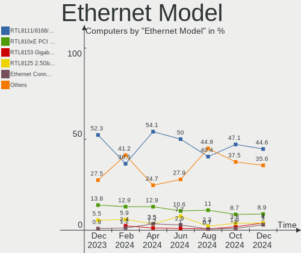

| Model                                                                  | Computers | Percent |
|------------------------------------------------------------------------|-----------|---------|
| Realtek RTL8111/8168/8211/8411 PCI Express Gigabit Ethernet Controller | 41        | 41.84%  |
| Realtek RTL810xE PCI Express Fast Ethernet controller                  | 10        | 10.2%   |
| Intel 82579LM Gigabit Network Connection (Lewisville)                  | 4         | 4.08%   |
| Realtek RTL8153 Gigabit Ethernet Adapter                               | 3         | 3.06%   |
| Intel I211 Gigabit Network Connection                                  | 3         | 3.06%   |
| Intel Ethernet Connection (4) I219-LM                                  | 3         | 3.06%   |
| Samsung GT-I9070 (network tethering, USB debugging enabled)            | 2         | 2.04%   |
| Realtek Killer E2600 GbE Controller                                    | 2         | 2.04%   |
| Intel Ethernet Connection I219-LM                                      | 2         | 2.04%   |
| Xiaomi Mi/Redmi series (RNDIS)                                         | 1         | 1.02%   |
| TP-Link UE300 10/100/1000 LAN (ethernet mode) [Realtek RTL8153]        | 1         | 1.02%   |
| Realtek RTL8125 2.5GbE Controller                                      | 1         | 1.02%   |
| Qualcomm Redmi 9T                                                      | 1         | 1.02%   |
| Qualcomm Atheros QCA8171 Gigabit Ethernet                              | 1         | 1.02%   |
| Qualcomm Atheros Killer E2400 Gigabit Ethernet Controller              | 1         | 1.02%   |
| Marvell Group 88E8040 PCI-E Fast Ethernet Controller                   | 1         | 1.02%   |
| Intel I350 Gigabit Network Connection                                  | 1         | 1.02%   |
| Intel I210 Gigabit Network Connection                                  | 1         | 1.02%   |
| Intel Ethernet Connection I218-LM                                      | 1         | 1.02%   |
| Intel Ethernet Connection I217-V                                       | 1         | 1.02%   |
| Intel Ethernet Connection (7) I219-V                                   | 1         | 1.02%   |
| Intel Ethernet Connection (6) I219-V                                   | 1         | 1.02%   |
| Intel Ethernet Connection (5) I219-LM                                  | 1         | 1.02%   |
| Intel Ethernet Connection (3) I219-LM                                  | 1         | 1.02%   |
| Intel Ethernet Connection (2) I218-V                                   | 1         | 1.02%   |
| Intel Ethernet Connection (16) I219-V                                  | 1         | 1.02%   |
| Intel Ethernet Connection (14) I219-LM                                 | 1         | 1.02%   |
| Intel Ethernet Connection (11) I219-LM                                 | 1         | 1.02%   |
| Intel 82577LM Gigabit Network Connection                               | 1         | 1.02%   |
| Google Pixel 8                                                         | 1         | 1.02%   |
| DisplayLink Dell Universal Dock D6000                                  | 1         | 1.02%   |
| Broadcom NetXtreme BCM57765 Gigabit Ethernet PCIe                      | 1         | 1.02%   |
| Broadcom NetXtreme BCM5761 Gigabit Ethernet PCIe                       | 1         | 1.02%   |
| Broadcom Limited NetLink BCM57780 Gigabit Ethernet PCIe                | 1         | 1.02%   |
| ASUS USB 10/100/1000 LAN                                               | 1         | 1.02%   |
| ASIX AX88179 Gigabit Ethernet                                          | 1         | 1.02%   |
| American Megatrends Virtual Ethernet.                                  | 1         | 1.02%   |

Net Controller Kind
-------------------

Ethernet, WiFi or modem

| Kind     | Computers | Percent |
|----------|-----------|---------|
| WiFi     | 115       | 57.21%  |
| Ethernet | 85        | 42.29%  |
| Modem    | 1         | 0.5%    |

Used Controller
---------------

Currently used network controller

| Kind     | Computers | Percent |
|----------|-----------|---------|
| WiFi     | 98        | 83.05%  |
| Ethernet | 20        | 16.95%  |

NICs
----

Total network controllers on board

| Total | Computers | Percent |
|-------|-----------|---------|
| 2     | 64        | 52.46%  |
| 1     | 52        | 42.62%  |
| 3     | 3         | 2.46%   |
| 0     | 3         | 2.46%   |

IPv6
----

IPv6 vs IPv4

| Used | Computers | Percent |
|------|-----------|---------|
| No   | 70        | 57.38%  |
| Yes  | 52        | 42.62%  |

Bluetooth
---------

Bluetooth Vendor
----------------

Controller vendors

| Vendor                          | Computers | Percent |
|---------------------------------|-----------|---------|
| Intel                           | 54        | 53.47%  |
| Realtek Semiconductor           | 13        | 12.87%  |
| Qualcomm Atheros Communications | 8         | 7.92%   |
| IMC Networks                    | 7         | 6.93%   |
| Foxconn / Hon Hai               | 6         | 5.94%   |
| Lite-On Technology              | 3         | 2.97%   |
| Cambridge Silicon Radio         | 3         | 2.97%   |
| Broadcom                        | 2         | 1.98%   |
| TP-Link                         | 1         | 0.99%   |
| Ralink                          | 1         | 0.99%   |
| MediaTek                        | 1         | 0.99%   |
| ASUSTek Computer                | 1         | 0.99%   |
| Apple                           | 1         | 0.99%   |

Bluetooth Model
---------------

Controller models

| Model                                                 | Computers | Percent |
|-------------------------------------------------------|-----------|---------|
| Intel AX201 Bluetooth                                 | 16        | 15.84%  |
| Intel Bluetooth Device                                | 11        | 10.89%  |
| Intel Bluetooth 9460/9560 Jefferson Peak (JfP)        | 11        | 10.89%  |
| Realtek Bluetooth Radio                               | 10        | 9.9%    |
| Intel Bluetooth wireless interface                    | 10        | 9.9%    |
| IMC Networks Wireless_Device                          | 7         | 6.93%   |
| Qualcomm Atheros  Bluetooth Device                    | 5         | 4.95%   |
| Intel AX200 Bluetooth                                 | 5         | 4.95%   |
| Foxconn / Hon Hai Wireless_Device                     | 4         | 3.96%   |
| Cambridge Silicon Radio Bluetooth Dongle (HCI mode)   | 3         | 2.97%   |
| Qualcomm Atheros AR9462 Bluetooth                     | 2         | 1.98%   |
| TP-Link UB500 Adapter                                 | 1         | 0.99%   |
| Realtek RTL8822BE Bluetooth 4.2 Adapter               | 1         | 0.99%   |
| Realtek RTL8723B Bluetooth                            | 1         | 0.99%   |
| Realtek  Bluetooth 4.2 Adapter                        | 1         | 0.99%   |
| Ralink RT3290 Bluetooth                               | 1         | 0.99%   |
| Qualcomm Atheros AR3011 Bluetooth                     | 1         | 0.99%   |
| MediaTek MT7630e Bluetooth Adapter                    | 1         | 0.99%   |
| Lite-On Wireless_Device                               | 1         | 0.99%   |
| Lite-On Qualcomm Atheros QCA9377 Bluetooth            | 1         | 0.99%   |
| Lite-On Bluetooth Device                              | 1         | 0.99%   |
| Intel Centrino Bluetooth Wireless Transceiver         | 1         | 0.99%   |
| Foxconn / Hon Hai Broadcom Bluetooth 2.1 Device       | 1         | 0.99%   |
| Foxconn / Hon Hai Bluetooth Device                    | 1         | 0.99%   |
| Broadcom BCM2070 Bluetooth Device                     | 1         | 0.99%   |
| Broadcom BCM2045 Bluetooth                            | 1         | 0.99%   |
| ASUS Broadcom BCM20702 Single-Chip Bluetooth 4.0 + LE | 1         | 0.99%   |
| Apple Bluetooth Host Controller                       | 1         | 0.99%   |

Sound
-----

Sound Vendor
------------

Sound card vendors

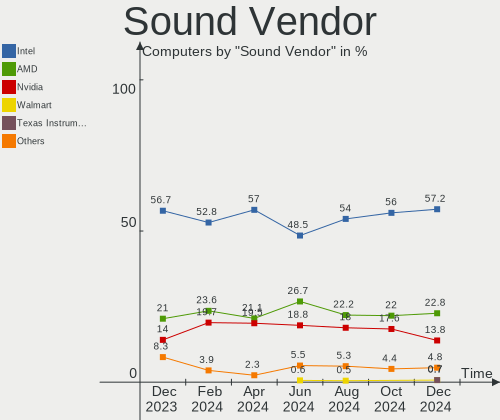

| Vendor                                       | Computers | Percent |
|----------------------------------------------|-----------|---------|
| Intel                                        | 95        | 59.75%  |
| AMD                                          | 29        | 18.24%  |
| Nvidia                                       | 24        | 15.09%  |
| Realtek Semiconductor                        | 2         | 1.26%   |
| Zoran Co. Personal Media Division (Nogatech) | 1         | 0.63%   |
| Tenx Technology                              | 1         | 0.63%   |
| Samson Technologies                          | 1         | 0.63%   |
| Nordic Semiconductor ASA                     | 1         | 0.63%   |
| M-Audio                                      | 1         | 0.63%   |
| GN Netcom                                    | 1         | 0.63%   |
| Creative Labs                                | 1         | 0.63%   |
| Cambridge Audio                              | 1         | 0.63%   |
| C-Media Electronics                          | 1         | 0.63%   |

Sound Model
-----------

Sound card models

| Model                                                                      | Computers | Percent |
|----------------------------------------------------------------------------|-----------|---------|
| AMD Family 17h/19h HD Audio Controller                                     | 21        | 11.05%  |
| AMD Renoir Radeon High Definition Audio Controller                         | 13        | 6.84%   |
| Intel Sunrise Point-LP HD Audio                                            | 12        | 6.32%   |
| Intel Alder Lake PCH-P High Definition Audio Controller                    | 11        | 5.79%   |
| Intel Tiger Lake-LP Smart Sound Technology Audio Controller                | 10        | 5.26%   |
| Intel 6 Series/C200 Series Chipset Family High Definition Audio Controller | 7         | 3.68%   |
| Intel Raptor Lake-P/U/H cAVS                                               | 6         | 3.16%   |
| Nvidia Audio device                                                        | 5         | 2.63%   |
| Intel Haswell-ULT HD Audio Controller                                      | 5         | 2.63%   |
| Intel 8 Series HD Audio Controller                                         | 5         | 2.63%   |
| Nvidia TU107 GeForce GTX 1650 High Definition Audio Controller             | 4         | 2.11%   |
| Intel Tiger Lake-H HD Audio Controller                                     | 4         | 2.11%   |
| Intel Cannon Point-LP High Definition Audio Controller                     | 4         | 2.11%   |
| Intel 7 Series/C216 Chipset Family High Definition Audio Controller        | 4         | 2.11%   |
| Nvidia GA106 High Definition Audio Controller                              | 3         | 1.58%   |
| Intel Comet Lake PCH-LP cAVS                                               | 3         | 1.58%   |
| Intel Comet Lake PCH cAVS                                                  | 3         | 1.58%   |
| Intel Cannon Lake PCH cAVS                                                 | 3         | 1.58%   |
| Intel 5 Series/3400 Series Chipset High Definition Audio                   | 3         | 1.58%   |
| AMD Raven/Raven2/Fenghuang HDMI/DP Audio Controller                        | 3         | 1.58%   |
| Nvidia GP104 High Definition Audio Controller                              | 2         | 1.05%   |
| Nvidia GF119 HDMI Audio Controller                                         | 2         | 1.05%   |
| Nvidia GA104 High Definition Audio Controller                              | 2         | 1.05%   |
| Intel Xeon E3-1200 v3/4th Gen Core Processor HD Audio Controller           | 2         | 1.05%   |
| Intel Wildcat Point-LP High Definition Audio Controller                    | 2         | 1.05%   |
| Intel Lewisburg MROM 0                                                     | 2         | 1.05%   |
| Intel Jasper Lake HD Audio                                                 | 2         | 1.05%   |
| Intel Ice Lake-LP Smart Sound Technology Audio Controller                  | 2         | 1.05%   |
| Intel Broadwell-U Audio Controller                                         | 2         | 1.05%   |
| Intel 200 Series PCH HD Audio                                              | 2         | 1.05%   |
| Intel 100 Series/C230 Series Chipset Family HD Audio Controller            | 2         | 1.05%   |
| AMD Starship/Matisse HD Audio Controller                                   | 2         | 1.05%   |
| AMD Rembrandt Radeon High Definition Audio Controller                      | 2         | 1.05%   |
| AMD Navi 21/23 HDMI/DP Audio Controller                                    | 2         | 1.05%   |
| AMD FCH Azalia Controller                                                  | 2         | 1.05%   |
| Zoran Co. Personal Media Division (Nogatech) USB Audio and HID             | 1         | 0.53%   |
| Tenx Technology USB AUDIO                                                  | 1         | 0.53%   |
| Samson Technologies Q2U handheld mic with XLR                              | 1         | 0.53%   |
| Realtek Semiconductor USB Audio                                            | 1         | 0.53%   |
| Realtek Semiconductor HP Banff                                             | 1         | 0.53%   |

Memory
------

Memory Vendor
-------------

Memory module vendors

| Vendor              | Computers | Percent |
|---------------------|-----------|---------|
| Samsung Electronics | 28        | 34.15%  |
| SK hynix            | 17        | 20.73%  |
| Micron Technology   | 12        | 14.63%  |
| Kingston            | 8         | 9.76%   |
| Crucial             | 7         | 8.54%   |
| Unknown             | 3         | 3.66%   |
| Corsair             | 2         | 2.44%   |
| Unknown (0x0080)    | 1         | 1.22%   |
| Nanya Technology    | 1         | 1.22%   |
| ff                  | 1         | 1.22%   |
| 4ea5                | 1         | 1.22%   |
| Unknown             | 1         | 1.22%   |

Memory Model
------------

Memory module models

| Model                                                        | Computers | Percent |
|--------------------------------------------------------------|-----------|---------|
| Samsung RAM M471A5244CB0-CWE 4GB SODIMM DDR4 3200MT/s        | 3         | 3.41%   |
| Samsung RAM M471A1G44BB0-CWE 8GB SODIMM DDR4 3200MT/s        | 3         | 3.41%   |
| SK hynix RAM HMA81GS6AFR8N-UH 8GB SODIMM DDR4 2667MT/s       | 2         | 2.27%   |
| Samsung RAM M471A5244CB0-CWE 4GB Row Of Chips DDR4 3200MT/s  | 2         | 2.27%   |
| Samsung RAM M471A1K43EB1-CWE 8GB SODIMM DDR4 3200MT/s        | 2         | 2.27%   |
| Samsung RAM M471A1K43DB1-CTD 8GB SODIMM DDR4 2667MT/s        | 2         | 2.27%   |
| Samsung RAM M471A1G44AB0-CWE 8GB SODIMM DDR4 3200MT/s        | 2         | 2.27%   |
| Micron RAM 8ATF1G64HZ-3G2R1 8GB SODIMM DDR4 3200MT/s         | 2         | 2.27%   |
| Micron RAM 4ATF1G64HZ-3G2F1 8GB SODIMM DDR4 3200MT/s         | 2         | 2.27%   |
| Corsair RAM CMK16GX4M1E3200C16 16GB DIMM DDR4 3200MT/s       | 2         | 2.27%   |
| Unknown RAM Module 8GB SODIMM DDR3 1600MT/s                  | 1         | 1.14%   |
| Unknown RAM Module 2GB SODIMM DDR2 800MT/s                   | 1         | 1.14%   |
| Unknown RAM MEM-DOWN 8192MB SODIMM DDR4 2400MT/s             | 1         | 1.14%   |
| Unknown (0x0080) RAM Module 16GB SODIMM DDR4 3200MT/s        | 1         | 1.14%   |
| SK hynix RAM HMT451S6DFR8A-PB 4GB SODIMM DDR3 1600MT/s       | 1         | 1.14%   |
| SK hynix RAM HMT451S6AFR8A-PB 4GB SODIMM DDR3 1600MT/s       | 1         | 1.14%   |
| SK hynix RAM HMT425S6AFR6A-PB 2GB SODIMM DDR3 3200MT/s       | 1         | 1.14%   |
| SK hynix RAM HMT41GU6BFR8A-PBT 8192MB DIMM DDR3 1333MT/s     | 1         | 1.14%   |
| SK hynix RAM HMT41GU6AFR8A-PB 8192MB DIMM DDR3 1333MT/s      | 1         | 1.14%   |
| SK hynix RAM HMT41GS6DFR8A-PB 8GB SODIMM DDR3 1600MT/s       | 1         | 1.14%   |
| SK hynix RAM HMT351U6CFR8C-PBA 8GB SODIMM DDR3 1600MT/s      | 1         | 1.14%   |
| SK hynix RAM HMT325S6BFR8C-H9 2GB SODIMM DDR3 1600MT/s       | 1         | 1.14%   |
| SK hynix RAM HMAA2GS6AJR8N-XN 16GB SODIMM DDR4 3200MT/s      | 1         | 1.14%   |
| SK hynix RAM HMA851S6DJR6N-XN 4GB SODIMM DDR4 3200MT/s       | 1         | 1.14%   |
| SK hynix RAM HMA851S6CJR6N-XN 4GB SODIMM DDR4 3200MT/s       | 1         | 1.14%   |
| SK hynix RAM HMA851S6CJR6N-VK 4GB SODIMM DDR4 2667MT/s       | 1         | 1.14%   |
| SK hynix RAM HMA82GS6JJR8N-VK 16GB SODIMM DDR4 2667MT/s      | 1         | 1.14%   |
| SK hynix RAM HMA81GS6DJR8N-XN 8GB SODIMM DDR4 3200MT/s       | 1         | 1.14%   |
| SK hynix RAM HMA41GU6AFR8N-TF 8GB DIMM DDR4 2465MT/s         | 1         | 1.14%   |
| SK hynix RAM H58G66BK7BX067 4GB Row Of Chips LPDDR5 8533MT/s | 1         | 1.14%   |
| Samsung RAM Module 8GB SODIMM DDR4 2133MT/s                  | 1         | 1.14%   |
| Samsung RAM Module 4GB Row Of Chips LPDDR5 6400MT/s          | 1         | 1.14%   |
| Samsung RAM Module 1GB Row Of Chips LPDDR4 4267MT/s          | 1         | 1.14%   |
| Samsung RAM M471B5173QH0-YK0 4096MB SODIMM DDR3 1600MT/s     | 1         | 1.14%   |
| Samsung RAM M471B1G73EB0-YK0 8GB SODIMM DDR3 1600MT/s        | 1         | 1.14%   |
| Samsung RAM M471A5244CB0-CRC 4GB SODIMM DDR4 2667MT/s        | 1         | 1.14%   |
| Samsung RAM M471A5143DB0-CPB 4GB SODIMM DDR4 2133MT/s        | 1         | 1.14%   |
| Samsung RAM M471A2G44BM0-CWE 16GB SODIMM DDR4 3200MT/s       | 1         | 1.14%   |
| Samsung RAM M471A1K43DB1-CWE 8GB SODIMM DDR4 3200MT/s        | 1         | 1.14%   |
| Samsung RAM M471A1K43CB1-CTD 8GB SODIMM DDR4 2667MT/s        | 1         | 1.14%   |

Memory Kind
-----------

Memory module kinds

| Kind   | Computers | Percent |
|--------|-----------|---------|
| DDR4   | 44        | 68.75%  |
| DDR3   | 12        | 18.75%  |
| LPDDR4 | 4         | 6.25%   |
| LPDDR5 | 2         | 3.13%   |
| DDR5   | 1         | 1.56%   |
| DDR2   | 1         | 1.56%   |

Memory Form Factor
------------------

Physical design of the memory module

| Name         | Computers | Percent |
|--------------|-----------|---------|
| SODIMM       | 45        | 70.31%  |
| Row Of Chips | 9         | 14.06%  |
| DIMM         | 9         | 14.06%  |
| Unknown      | 1         | 1.56%   |

Memory Size
-----------

Memory module size

| Size  | Computers | Percent |
|-------|-----------|---------|
| 8192  | 36        | 51.43%  |
| 4096  | 15        | 21.43%  |
| 16384 | 12        | 17.14%  |
| 2048  | 4         | 5.71%   |
| 1024  | 2         | 2.86%   |
| 32768 | 1         | 1.43%   |

Memory Speed
------------

Memory module speed

| Speed | Computers | Percent |
|-------|-----------|---------|
| 3200  | 29        | 41.43%  |
| 2667  | 14        | 20%     |
| 1600  | 10        | 14.29%  |
| 2400  | 4         | 5.71%   |
| 2133  | 4         | 5.71%   |
| 4267  | 2         | 2.86%   |
| 8533  | 1         | 1.43%   |
| 6400  | 1         | 1.43%   |
| 4800  | 1         | 1.43%   |
| 2666  | 1         | 1.43%   |
| 2465  | 1         | 1.43%   |
| 1333  | 1         | 1.43%   |
| 800   | 1         | 1.43%   |

Printers & scanners
-------------------

Printer Vendor
--------------

Printer device vendors

| Vendor      | Computers | Percent |
|-------------|-----------|---------|
| Seiko Epson | 1         | 100%    |

Printer Model
-------------

Printer device models

| Model                                                                 | Computers | Percent |
|-----------------------------------------------------------------------|-----------|---------|
| Seiko Epson ME OFFICE 620F Series/Stylus Office BX305F/BX305FW/TX320F | 1         | 100%    |

Scanner Vendor
--------------

Scanner device vendors

Zero info for selected period =(

Scanner Model
-------------

Scanner device models

Zero info for selected period =(

Camera
------

Camera Vendor
-------------

Camera device vendors

| Vendor                                 | Computers | Percent |
|----------------------------------------|-----------|---------|
| IMC Networks                           | 14        | 15.05%  |
| Microdia                               | 12        | 12.9%   |
| Chicony Electronics                    | 11        | 11.83%  |
| Quanta                                 | 8         | 8.6%    |
| Sunplus Innovation Technology          | 6         | 6.45%   |
| Realtek Semiconductor                  | 6         | 6.45%   |
| Bison Electronics                      | 6         | 6.45%   |
| Cheng Uei Precision Industry (Foxlink) | 5         | 5.38%   |
| Syntek                                 | 4         | 4.3%    |
| Sonix Technology                       | 4         | 4.3%    |
| Suyin                                  | 2         | 2.15%   |
| ShineTech                              | 2         | 2.15%   |
| Luxvisions Innotech Limited            | 2         | 2.15%   |
| Logitech                               | 2         | 2.15%   |
| Lite-On Technology                     | 2         | 2.15%   |
| Apple                                  | 2         | 2.15%   |
| Silicon Motion                         | 1         | 1.08%   |
| Pixart Imaging                         | 1         | 1.08%   |
| MacroSilicon                           | 1         | 1.08%   |
| Acer                                   | 1         | 1.08%   |
| Unknown                                | 1         | 1.08%   |

Camera Model
------------

Camera device models

| Model                                                           | Computers | Percent |
|-----------------------------------------------------------------|-----------|---------|
| Microdia Integrated_Webcam_HD                                   | 7         | 7.53%   |
| IMC Networks USB2.0 HD UVC WebCam                               | 6         | 6.45%   |
| Syntek Integrated Camera                                        | 4         | 4.3%    |
| IMC Networks Integrated Camera                                  | 4         | 4.3%    |
| Sunplus Integrated_Webcam_HD                                    | 3         | 3.23%   |
| Sonix USB2.0 HD UVC WebCam                                      | 3         | 3.23%   |
| Microdia USB 2.0 Camera                                         | 3         | 3.23%   |
| Bison HD Webcam                                                 | 3         | 3.23%   |
| Sunplus XiaoMi USB 2.0 Webcam                                   | 2         | 2.15%   |
| Realtek USB Camera                                              | 2         | 2.15%   |
| Realtek Integrated_Webcam_HD                                    | 2         | 2.15%   |
| Quanta HP Wide Vision HD Camera                                 | 2         | 2.15%   |
| Quanta ACER HD User Facing                                      | 2         | 2.15%   |
| IMC Networks HP TrueVision HD Camera                            | 2         | 2.15%   |
| Chicony Integrated Camera                                       | 2         | 2.15%   |
| Chicony HP TrueVision HD Camera                                 | 2         | 2.15%   |
| Chicony HP TrueVision HD                                        | 2         | 2.15%   |
| Cheng Uei Precision Industry (Foxlink) HP Wide Vision HD Camera | 2         | 2.15%   |
| Suyin Lenovo EasyCamera Integrated Webcam                       | 1         | 1.08%   |
| Suyin Integrated_Webcam_HD                                      | 1         | 1.08%   |
| Sunplus MTD Camera                                              | 1         | 1.08%   |
| Sonix USB2.0 FHD UVC WebCam                                     | 1         | 1.08%   |
| Silicon Motion WebCam SCB-0355N                                 | 1         | 1.08%   |
| ShineTech USB2.0 HD UVC WebCam                                  | 1         | 1.08%   |
| Shinetech USB2.0 FHD UVC WebCam                                 | 1         | 1.08%   |
| Realtek Integrated_Webcam_FHD                                   | 1         | 1.08%   |
| Realtek HP Truevision HD                                        | 1         | 1.08%   |
| Quanta VGA WebCam                                               | 1         | 1.08%   |
| Quanta USB2.0 HD UVC WebCam                                     | 1         | 1.08%   |
| Quanta ov9734_techfront_camera                                  | 1         | 1.08%   |
| Quanta HP HD Camera                                             | 1         | 1.08%   |
| Pixart Imaging USB_2.0_Webcam                                   | 1         | 1.08%   |
| Microdia Sonix USB 2.0 Camera                                   | 1         | 1.08%   |
| Microdia Laptop_Integrated_Webcam_HD                            | 1         | 1.08%   |
| MacroSilicon USB3. 0 capture                                    | 1         | 1.08%   |
| Luxvisions Innotech Limited HP Wide Vision HD Camera            | 1         | 1.08%   |
| Luxvisions Innotech Limited HP TrueVision HD Camera             | 1         | 1.08%   |
| Logitech HD Pro Webcam C920                                     | 1         | 1.08%   |
| Logitech C922 Pro Stream Webcam                                 | 1         | 1.08%   |
| Lite-On Integrated Camera                                       | 1         | 1.08%   |

Security
--------

Fingerprint Vendor
------------------

Fingerprint sensor vendors

| Vendor                             | Computers | Percent |
|------------------------------------|-----------|---------|
| Synaptics                          | 6         | 31.58%  |
| Shenzhen Goodix Technology         | 4         | 21.05%  |
| Validity Sensors                   | 3         | 15.79%  |
| Realtek USB2.0 Finger Print Bridge | 3         | 15.79%  |
| Elan Microelectronics              | 3         | 15.79%  |

Fingerprint Model
-----------------

Fingerprint sensor models

| Model                                                                      | Computers | Percent |
|----------------------------------------------------------------------------|-----------|---------|
| Shenzhen Goodix  FingerPrint Device                                        | 3         | 15.79%  |
| Realtek USB2.0 Finger Print Bridge FocalTech Fingerprint Device            | 3         | 15.79%  |
| Elan ELAN:Fingerprint                                                      | 2         | 10.53%  |
| Validity Sensors VFS495 Fingerprint Reader                                 | 1         | 5.26%   |
| Validity Sensors VFS471 Fingerprint Reader                                 | 1         | 5.26%   |
| Validity Sensors Synaptics VFS7552 Touch Fingerprint Sensor with PurePrint | 1         | 5.26%   |
| Synaptics UWP WBDI                                                         | 1         | 5.26%   |
| Synaptics  WBDI                                                            | 1         | 5.26%   |
| Synaptics Prometheus MIS Touch Fingerprint Reader                          | 1         | 5.26%   |
| Synaptics Metallica MOH Touch Fingerprint Reader                           | 1         | 5.26%   |
| Synaptics Metallica MIS Touch Fingerprint Reader                           | 1         | 5.26%   |
| Synaptics Fingerprint scanner                                              | 1         | 5.26%   |
| Shenzhen Goodix Fingerprint Reader                                         | 1         | 5.26%   |
| Elan ELAN:ARM-M4                                                           | 1         | 5.26%   |

Chipcard Vendor
---------------

Chipcard module vendors

| Vendor      | Computers | Percent |
|-------------|-----------|---------|
| Broadcom    | 2         | 50%     |
| O2 Micro    | 1         | 25%     |
| Alcor Micro | 1         | 25%     |

Chipcard Model
--------------

Chipcard module models

| Model                                          | Computers | Percent |
|------------------------------------------------|-----------|---------|
| Broadcom BCM5880 Secure Applications Processor | 2         | 50%     |
| O2 Micro OZ776 CCID Smartcard Reader           | 1         | 25%     |
| Alcor Micro AU9540 Smartcard Reader            | 1         | 25%     |

Unsupported
-----------

Unsupported Devices
-------------------

Total unsupported devices on board

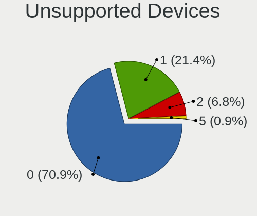

| Total | Computers | Percent |
|-------|-----------|---------|
| 0     | 74        | 60.66%  |
| 1     | 39        | 31.97%  |
| 2     | 6         | 4.92%   |
| 3     | 2         | 1.64%   |
| 6     | 1         | 0.82%   |

Unsupported Device Types
------------------------

Types of unsupported devices

| Type                     | Computers | Percent |
|--------------------------|-----------|---------|
| Fingerprint reader       | 19        | 31.67%  |
| Graphics card            | 11        | 18.33%  |
| Multimedia controller    | 7         | 11.67%  |
| Chipcard                 | 4         | 6.67%   |
| Camera                   | 4         | 6.67%   |
| Unassigned class         | 3         | 5%      |
| Net/wireless             | 3         | 5%      |
| Storage                  | 2         | 3.33%   |
| Sound                    | 2         | 3.33%   |
| Communication controller | 2         | 3.33%   |
| Storage/ide              | 1         | 1.67%   |
| Net/ethernet             | 1         | 1.67%   |
| Bluetooth                | 1         | 1.67%   |

