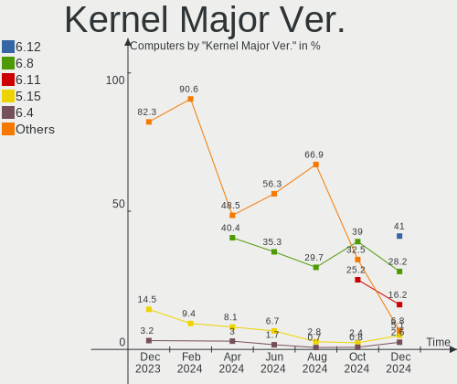
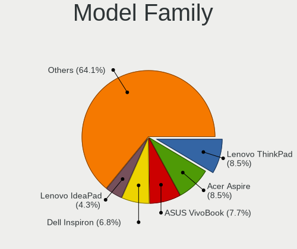
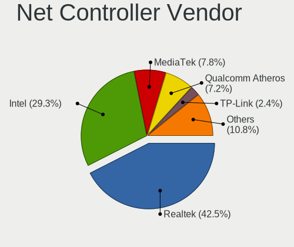
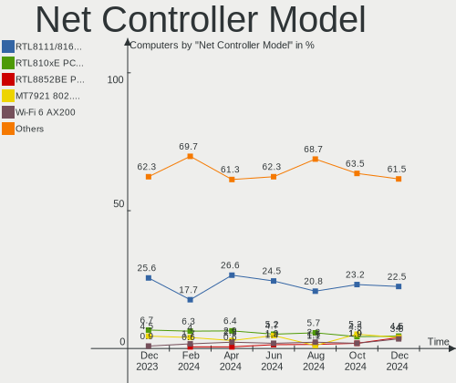
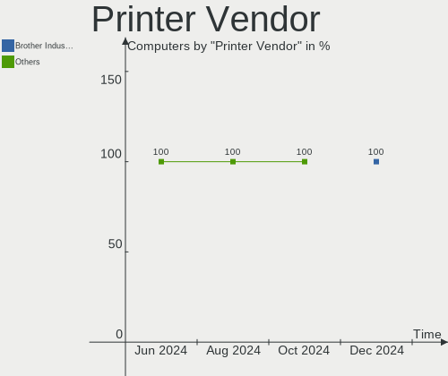
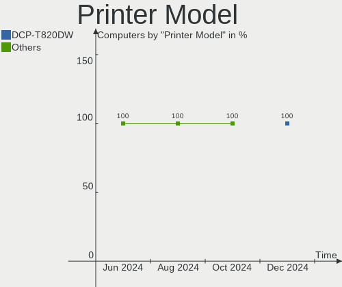
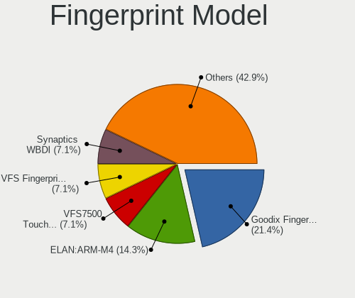

Linux in India - Hardware Trends
--------------------------------

A project to identify most popular hardware characteristics and track their change
over time based on data collected by Linux users at https://Linux-Hardware.org.

Anyone can contribute to this report by the [hw-probe](https://github.com/linuxhw/hw-probe) tool:

    sudo -E hw-probe -all -upload

This is a report for all computer types. See also reports for [desktops](/Location/India/Desktop/README.md) and [notebooks](/Location/India/Notebook/README.md).

Period: Aug, 2023.

Contents
--------

* [ System ](#system)
  - [ OS                       ](#os)
  - [ OS Family                ](#os-family)
  - [ Kernel                   ](#kernel)
  - [ Kernel Family            ](#kernel-family)
  - [ Kernel Major Ver.        ](#kernel-major-ver)
  - [ Arch                     ](#arch)
  - [ DE                       ](#de)
  - [ Display Server           ](#display-server)
  - [ Display Manager          ](#display-manager)
  - [ OS Lang                  ](#os-lang)
  - [ Boot Mode                ](#boot-mode)
  - [ Filesystem               ](#filesystem)
  - [ Part. scheme             ](#part-scheme)
  - [ Dual Boot with Linux/BSD ](#dual-boot-with-linuxbsd)
  - [ Dual Boot (Win)          ](#dual-boot-win)

* [ Board ](#board)
  - [ Vendor                   ](#vendor)
  - [ Model                    ](#model)
  - [ Model Family             ](#model-family)
  - [ MFG Year                 ](#mfg-year)
  - [ Form Factor              ](#form-factor)
  - [ Secure Boot              ](#secure-boot)
  - [ Coreboot                 ](#coreboot)
  - [ RAM Size                 ](#ram-size)
  - [ RAM Used                 ](#ram-used)
  - [ Total Drives             ](#total-drives)
  - [ Has CD-ROM               ](#has-cd-rom)
  - [ Has Ethernet             ](#has-ethernet)
  - [ Has WiFi                 ](#has-wifi)
  - [ Has Bluetooth            ](#has-bluetooth)

* [ Location ](#location)
  - [ Country                  ](#country)
  - [ City                     ](#city)

* [ Drives ](#drives)
  - [ Drive Vendor             ](#drive-vendor)
  - [ Drive Model              ](#drive-model)
  - [ HDD Vendor               ](#hdd-vendor)
  - [ SSD Vendor               ](#ssd-vendor)
  - [ Drive Kind               ](#drive-kind)
  - [ Drive Connector          ](#drive-connector)
  - [ Drive Size               ](#drive-size)
  - [ Space Total              ](#space-total)
  - [ Space Used               ](#space-used)
  - [ Malfunc. Drives          ](#malfunc-drives)
  - [ Malfunc. Drive Vendor    ](#malfunc-drive-vendor)
  - [ Malfunc. HDD Vendor      ](#malfunc-hdd-vendor)
  - [ Malfunc. Drive Kind      ](#malfunc-drive-kind)
  - [ Failed Drives            ](#failed-drives)
  - [ Failed Drive Vendor      ](#failed-drive-vendor)
  - [ Drive Status             ](#drive-status)

* [ Storage controller ](#storage-controller)
  - [ Storage Vendor           ](#storage-vendor)
  - [ Storage Model            ](#storage-model)
  - [ Storage Kind             ](#storage-kind)

* [ Processor ](#processor)
  - [ CPU Vendor               ](#cpu-vendor)
  - [ CPU Model                ](#cpu-model)
  - [ CPU Model Family         ](#cpu-model-family)
  - [ CPU Cores                ](#cpu-cores)
  - [ CPU Sockets              ](#cpu-sockets)
  - [ CPU Threads              ](#cpu-threads)
  - [ CPU Op-Modes             ](#cpu-op-modes)
  - [ CPU Microcode            ](#cpu-microcode)
  - [ CPU Microarch            ](#cpu-microarch)

* [ Graphics ](#graphics)
  - [ GPU Vendor               ](#gpu-vendor)
  - [ GPU Model                ](#gpu-model)
  - [ GPU Combo                ](#gpu-combo)
  - [ GPU Driver               ](#gpu-driver)
  - [ GPU Memory               ](#gpu-memory)

* [ Monitor ](#monitor)
  - [ Monitor Vendor           ](#monitor-vendor)
  - [ Monitor Model            ](#monitor-model)
  - [ Monitor Resolution       ](#monitor-resolution)
  - [ Monitor Diagonal         ](#monitor-diagonal)
  - [ Monitor Width            ](#monitor-width)
  - [ Aspect Ratio             ](#aspect-ratio)
  - [ Monitor Area             ](#monitor-area)
  - [ Pixel Density            ](#pixel-density)
  - [ Multiple Monitors        ](#multiple-monitors)

* [ Network ](#network)
  - [ Net Controller Vendor    ](#net-controller-vendor)
  - [ Net Controller Model     ](#net-controller-model)
  - [ Wireless Vendor          ](#wireless-vendor)
  - [ Wireless Model           ](#wireless-model)
  - [ Ethernet Vendor          ](#ethernet-vendor)
  - [ Ethernet Model           ](#ethernet-model)
  - [ Net Controller Kind      ](#net-controller-kind)
  - [ Used Controller          ](#used-controller)
  - [ NICs                     ](#nics)
  - [ IPv6                     ](#ipv6)

* [ Bluetooth ](#bluetooth)
  - [ Bluetooth Vendor         ](#bluetooth-vendor)
  - [ Bluetooth Model          ](#bluetooth-model)

* [ Sound ](#sound)
  - [ Sound Vendor             ](#sound-vendor)
  - [ Sound Model              ](#sound-model)

* [ Memory ](#memory)
  - [ Memory Vendor            ](#memory-vendor)
  - [ Memory Model             ](#memory-model)
  - [ Memory Kind              ](#memory-kind)
  - [ Memory Form Factor       ](#memory-form-factor)
  - [ Memory Size              ](#memory-size)
  - [ Memory Speed             ](#memory-speed)

* [ Printers & scanners ](#printers--scanners)
  - [ Printer Vendor           ](#printer-vendor)
  - [ Printer Model            ](#printer-model)
  - [ Scanner Vendor           ](#scanner-vendor)
  - [ Scanner Model            ](#scanner-model)

* [ Camera ](#camera)
  - [ Camera Vendor            ](#camera-vendor)
  - [ Camera Model             ](#camera-model)

* [ Security ](#security)
  - [ Fingerprint Vendor       ](#fingerprint-vendor)
  - [ Fingerprint Model        ](#fingerprint-model)
  - [ Chipcard Vendor          ](#chipcard-vendor)
  - [ Chipcard Model           ](#chipcard-model)

* [ Unsupported ](#unsupported)
  - [ Unsupported Devices      ](#unsupported-devices)
  - [ Unsupported Device Types ](#unsupported-device-types)

System
------

OS
--

Installed operating systems

| Name                 | Computers | Percent |
|----------------------|-----------|---------|
| Ubuntu 22.04         | 27        | 22.69%  |
| Fedora 38            | 13        | 10.92%  |
| Ubuntu 20.04         | 10        | 8.4%    |
| Arch Rolling         | 9         | 7.56%   |
| Ubuntu 23.04         | 8         | 6.72%   |
| OpenMandriva 23.08   | 6         | 5.04%   |
| Zorin 16             | 4         | 3.36%   |
| Debian 12            | 4         | 3.36%   |
| Pop!_OS 22.04        | 3         | 2.52%   |
| Linux Mint 21.2      | 3         | 2.52%   |
| ArcoLinux Rolling    | 3         | 2.52%   |
| Xero Rolling         | 2         | 1.68%   |
| Slackware 15.0       | 2         | 1.68%   |
| OpenMandriva 23.03   | 2         | 1.68%   |
| MX 21                | 2         | 1.68%   |
| Kubuntu 23.04        | 2         | 1.68%   |
| KDE neon 22.04       | 2         | 1.68%   |
| Kali 2023.2          | 2         | 1.68%   |
| ROSA 12.4            | 1         | 0.84%   |
| Parrot 5.3           | 1         | 0.84%   |
| OpenMandriva 4.3     | 1         | 0.84%   |
| OpenMandriva 23.90   | 1         | 0.84%   |
| MX 23                | 1         | 0.84%   |
| Linux Mint 21.1      | 1         | 0.84%   |
| Kali 2023.3          | 1         | 0.84%   |
| Garuda Linux Soaring | 1         | 0.84%   |
| Garuda Linux Rolling | 1         | 0.84%   |
| EndeavourOS Rolling  | 1         | 0.84%   |
| Elementary 7         | 1         | 0.84%   |
| Debian               | 1         | 0.84%   |
| CentOS 8             | 1         | 0.84%   |
| blendOS              | 1         | 0.84%   |
| Archcraft            | 1         | 0.84%   |

OS Family
---------

OS without a version

| Name         | Computers | Percent |
|--------------|-----------|---------|
| Ubuntu       | 45        | 37.82%  |
| Fedora       | 13        | 10.92%  |
| OpenMandriva | 10        | 8.4%    |
| Arch         | 9         | 7.56%   |
| Debian       | 5         | 4.2%    |
| Zorin        | 4         | 3.36%   |
| Linux Mint   | 4         | 3.36%   |
| Pop!_OS      | 3         | 2.52%   |
| MX           | 3         | 2.52%   |
| Kali         | 3         | 2.52%   |
| ArcoLinux    | 3         | 2.52%   |
| Xero         | 2         | 1.68%   |
| Slackware    | 2         | 1.68%   |
| Kubuntu      | 2         | 1.68%   |
| KDE neon     | 2         | 1.68%   |
| Garuda Linux | 2         | 1.68%   |
| ROSA         | 1         | 0.84%   |
| Parrot       | 1         | 0.84%   |
| EndeavourOS  | 1         | 0.84%   |
| Elementary   | 1         | 0.84%   |
| CentOS       | 1         | 0.84%   |
| blendOS      | 1         | 0.84%   |
| Archcraft    | 1         | 0.84%   |

Kernel
------

Version of the Linux kernel

| Version                       | Computers | Percent |
|-------------------------------|-----------|---------|
| 6.2.0-26-generic              | 28        | 23.53%  |
| 6.4.11-desktop-1omv2390       | 4         | 3.36%   |
| 6.1.0-10-amd64                | 4         | 3.36%   |
| 5.15.0-79-generic             | 4         | 3.36%   |
| 5.15.0-78-generic             | 4         | 3.36%   |
| 5.15.0-76-generic             | 4         | 3.36%   |
| 6.4.8-desktop-2omv2390        | 3         | 2.52%   |
| 6.4.7-200.fc38.x86_64         | 3         | 2.52%   |
| 6.4.12-200.fc38.x86_64        | 3         | 2.52%   |
| 6.3.0-kali1-amd64             | 3         | 2.52%   |
| 6.2.9-300.fc38.x86_64         | 3         | 2.52%   |
| 6.2.0-31-generic              | 3         | 2.52%   |
| 6.2.0-27-generic              | 3         | 2.52%   |
| 6.4.8-zen1-1-zen              | 2         | 1.68%   |
| 6.4.6-76060406-generic        | 2         | 1.68%   |
| 6.4.4-arch1-1                 | 2         | 1.68%   |
| 6.4.11-zen2-1-zen             | 2         | 1.68%   |
| 6.4.10-arch1-1                | 2         | 1.68%   |
| 6.4.10-200.fc38.x86_64        | 2         | 1.68%   |
| 6.2.0-20-generic              | 2         | 1.68%   |
| 6.1.44-1-lts                  | 2         | 1.68%   |
| 5.19.0-50-generic             | 2         | 1.68%   |
| 5.15.0-82-generic             | 2         | 1.68%   |
| 6.5.0-257.vanilla.fc38.x86_64 | 1         | 0.84%   |
| 6.4.9-200.fc38.x86_64         | 1         | 0.84%   |
| 6.4.8-arch1-1                 | 1         | 0.84%   |
| 6.4.7-desktop-1omv2390        | 1         | 0.84%   |
| 6.4.7-arch1-1                 | 1         | 0.84%   |
| 6.4.3-arch1-2                 | 1         | 0.84%   |
| 6.4.12-arch1-1                | 1         | 0.84%   |
| 6.4.10-zen2-1-zen             | 1         | 0.84%   |
| 6.4.10-zen1-1-zen             | 1         | 0.84%   |
| 6.3.9-zen1-1-zen              | 1         | 0.84%   |
| 6.2.6-desktop-1omv2390        | 1         | 0.84%   |
| 6.2.6-76060206-generic        | 1         | 0.84%   |
| 6.2.16-8-pve                  | 1         | 0.84%   |
| 6.2.0-32-generic              | 1         | 0.84%   |
| 6.1.48-1-lts                  | 1         | 0.84%   |
| 6.1.44                        | 1         | 0.84%   |
| 6.1.39-1-lts                  | 1         | 0.84%   |

Kernel Family
-------------

Linux kernel without a distro release

| Version  | Computers | Percent |
|----------|-----------|---------|
| 6.2.0    | 37        | 31.09%  |
| 5.15.0   | 16        | 13.45%  |
| 6.4.8    | 6         | 5.04%   |
| 6.4.11   | 6         | 5.04%   |
| 6.4.10   | 6         | 5.04%   |
| 6.1.0    | 6         | 5.04%   |
| 6.4.7    | 5         | 4.2%    |
| 6.4.12   | 4         | 3.36%   |
| 6.3.0    | 3         | 2.52%   |
| 6.2.9    | 3         | 2.52%   |
| 6.1.44   | 3         | 2.52%   |
| 5.19.0   | 3         | 2.52%   |
| 6.4.6    | 2         | 1.68%   |
| 6.4.4    | 2         | 1.68%   |
| 6.2.6    | 2         | 1.68%   |
| 6.5.0    | 1         | 0.84%   |
| 6.4.9    | 1         | 0.84%   |
| 6.4.3    | 1         | 0.84%   |
| 6.3.9    | 1         | 0.84%   |
| 6.2.16   | 1         | 0.84%   |
| 6.1.48   | 1         | 0.84%   |
| 6.1.39   | 1         | 0.84%   |
| 6.1.20   | 1         | 0.84%   |
| 6.0.0    | 1         | 0.84%   |
| 5.4.0    | 1         | 0.84%   |
| 5.16.13  | 1         | 0.84%   |
| 5.15.117 | 1         | 0.84%   |
| 5.11.0   | 1         | 0.84%   |
| 5.10.0   | 1         | 0.84%   |
| 4.18.0   | 1         | 0.84%   |

Kernel Major Ver.
-----------------

Linux kernel major version

| Version | Computers | Percent |
|---------|-----------|---------|
| 6.2     | 43        | 36.13%  |
| 6.4     | 33        | 27.73%  |
| 5.15    | 17        | 14.29%  |
| 6.1     | 12        | 10.08%  |
| 6.3     | 4         | 3.36%   |
| 5.19    | 3         | 2.52%   |
| 6.5     | 1         | 0.84%   |
| 6.0     | 1         | 0.84%   |
| 5.4     | 1         | 0.84%   |
| 5.16    | 1         | 0.84%   |
| 5.11    | 1         | 0.84%   |
| 5.10    | 1         | 0.84%   |
| 4.18    | 1         | 0.84%   |

Arch
----

OS architecture (x86_64, i586, etc.)

| Name   | Computers | Percent |
|--------|-----------|---------|
| x86_64 | 119       | 100%    |

DE
--

Desktop Environment

| Name       | Computers | Percent |
|------------|-----------|---------|
| GNOME      | 68        | 57.14%  |
| KDE5       | 32        | 26.89%  |
| XFCE       | 8         | 6.72%   |
| X-Cinnamon | 5         | 4.2%    |
| Pantheon   | 1         | 0.84%   |
| openbox    | 1         | 0.84%   |
| MATE       | 1         | 0.84%   |
| LXQt       | 1         | 0.84%   |
| LXDE       | 1         | 0.84%   |
| Unknown    | 1         | 0.84%   |

Display Server
--------------

X11 or Wayland

| Name    | Computers | Percent |
|---------|-----------|---------|
| X11     | 59        | 49.58%  |
| Wayland | 53        | 44.54%  |
| Tty     | 4         | 3.36%   |
| Unknown | 3         | 2.52%   |

Display Manager
---------------

SDDM, LightDM, etc.

| Name    | Computers | Percent |
|---------|-----------|---------|
| GDM3    | 33        | 27.73%  |
| Unknown | 31        | 26.05%  |
| SDDM    | 29        | 24.37%  |
| GDM     | 14        | 11.76%  |
| LightDM | 10        | 8.4%    |
| XDM     | 2         | 1.68%   |

OS Lang
-------

Language

| Lang    | Computers | Percent |
|---------|-----------|---------|
| en_IN   | 69        | 57.98%  |
| en_US   | 44        | 36.97%  |
| C       | 4         | 3.36%   |
| en_GB   | 1         | 0.84%   |
| Unknown | 1         | 0.84%   |

Boot Mode
---------

EFI or BIOS

| Mode | Computers | Percent |
|------|-----------|---------|
| EFI  | 76        | 63.87%  |
| BIOS | 43        | 36.13%  |

Filesystem
----------

Type of filesystem

| Type    | Computers | Percent |
|---------|-----------|---------|
| Ext4    | 68        | 57.14%  |
| Btrfs   | 23        | 19.33%  |
| Tmpfs   | 15        | 12.61%  |
| Overlay | 8         | 6.72%   |
| Zfs     | 2         | 1.68%   |
| Xfs     | 2         | 1.68%   |
| F2fs    | 1         | 0.84%   |

Part. scheme
------------

Scheme of partitioning

| Type    | Computers | Percent |
|---------|-----------|---------|
| GPT     | 82        | 68.91%  |
| Unknown | 29        | 24.37%  |
| MBR     | 8         | 6.72%   |

Dual Boot with Linux/BSD
------------------------

Hosting more than one Linux/BSD

| Dual boot | Computers | Percent |
|-----------|-----------|---------|
| No        | 103       | 86.55%  |
| Yes       | 16        | 13.45%  |

Dual Boot (Win)
---------------

Hosting Linux and Windows

| Dual boot | Computers | Percent |
|-----------|-----------|---------|
| No        | 71        | 59.66%  |
| Yes       | 48        | 40.34%  |

Board
-----

Vendor
------

Motherboard manufacturer

| Name                | Computers | Percent |
|---------------------|-----------|---------|
| Lenovo              | 26        | 21.85%  |
| Hewlett-Packard     | 24        | 20.17%  |
| Dell                | 22        | 18.49%  |
| ASUSTek Computer    | 13        | 10.92%  |
| Acer                | 6         | 5.04%   |
| MSI                 | 5         | 4.2%    |
| Gigabyte Technology | 4         | 3.36%   |
| Intel               | 3         | 2.52%   |
| ASRock              | 3         | 2.52%   |
| OEM                 | 2         | 1.68%   |
| Infinix             | 2         | 1.68%   |
| Apple               | 2         | 1.68%   |
| Valve               | 1         | 0.84%   |
| HONOR               | 1         | 0.84%   |
| Fujitsu             | 1         | 0.84%   |
| Foxconn             | 1         | 0.84%   |
| ASRockRack          | 1         | 0.84%   |
| Alienware           | 1         | 0.84%   |
| Unknown             | 1         | 0.84%   |

Model
-----

Motherboard model

| Name                                     | Computers | Percent |
|------------------------------------------|-----------|---------|
| OEM Intel H81                            | 2         | 1.68%   |
| Lenovo G50-80 80E5                       | 2         | 1.68%   |
| HP Laptop 14s-dy2xxx                     | 2         | 1.68%   |
| HP 15                                    | 2         | 1.68%   |
| ASUS VivoBook_ASUSLaptop K3502ZA_K3502ZA | 2         | 1.68%   |
| ASUS ROG STRIX B550-F GAMING WIFI II     | 2         | 1.68%   |
| Valve Jupiter                            | 1         | 0.84%   |
| MSI Thin GF63 12VE                       | 1         | 0.84%   |
| MSI Modern 15 A5M                        | 1         | 0.84%   |
| MSI Katana GF76 11UD                     | 1         | 0.84%   |
| MSI GL63 8RC                             | 1         | 0.84%   |
| MSI GF63 Thin 10SC                       | 1         | 0.84%   |
| Lenovo V15 G3 ABA 82TV                   | 1         | 0.84%   |
| Lenovo V15 G2 ALC Ua 82KD                | 1         | 0.84%   |
| Lenovo ThinkPad X230 23253B3             | 1         | 0.84%   |
| Lenovo ThinkPad W540 20BG0016US          | 1         | 0.84%   |
| Lenovo ThinkPad E490 20N8CTO1WW          | 1         | 0.84%   |
| Lenovo ThinkPad E470 20H2S0XB00          | 1         | 0.84%   |
| Lenovo ThinkPad E15 Gen 3 20YHCTO1WW     | 1         | 0.84%   |
| Lenovo ThinkPad E14 Gen 5 21JRS00T00     | 1         | 0.84%   |
| Lenovo ThinkPad E14 Gen 4 21E3S06300     | 1         | 0.84%   |
| Lenovo ThinkPad E14 Gen 3 20YDCTO1WW     | 1         | 0.84%   |
| Lenovo ThinkPad E14 Gen 2 20TAS12B00     | 1         | 0.84%   |
| Lenovo ThinkPad E14 20RBCTO1WW           | 1         | 0.84%   |
| Lenovo ThinkCentre M79 10CTS07800        | 1         | 0.84%   |
| Lenovo ThinkCentre M58p 7220AR1          | 1         | 0.84%   |
| Lenovo Legion Y740-15IRH 81UF            | 1         | 0.84%   |
| Lenovo Legion 5 Pro 16ACH6H 82JQ         | 1         | 0.84%   |
| Lenovo IdeaPadFlex 5 14ALC05 82HU        | 1         | 0.84%   |
| Lenovo IdeaPad Y510P 20217               | 1         | 0.84%   |
| Lenovo IdeaPad L340-15IRH Gaming 81LK    | 1         | 0.84%   |
| Lenovo IdeaPad Gaming 3 15IHU6 82K1      | 1         | 0.84%   |
| Lenovo IdeaPad Gaming 3 15ACH6 82K2      | 1         | 0.84%   |
| Lenovo IdeaPad 5 15ALC05 82LN            | 1         | 0.84%   |
| Lenovo IdeaPad 320-15ISK 80XH            | 1         | 0.84%   |
| Lenovo G50-70 20351                      | 1         | 0.84%   |
| Intel H61                                | 1         | 0.84%   |
| Intel DG41RQ AAE54511-203                | 1         | 0.84%   |
| Intel DB85FL AAG89861-201                | 1         | 0.84%   |
| Infinix INBOOK X2 SLIM                   | 1         | 0.84%   |

Model Family
------------

Motherboard model prefix

| Name               | Computers | Percent |
|--------------------|-----------|---------|
| Dell Inspiron      | 11        | 9.24%   |
| Lenovo ThinkPad    | 10        | 8.4%    |
| HP Pavilion        | 8         | 6.72%   |
| Lenovo IdeaPad     | 6         | 5.04%   |
| Dell Vostro        | 5         | 4.2%    |
| ASUS VivoBook      | 5         | 4.2%    |
| Dell Latitude      | 4         | 3.36%   |
| ASUS ROG           | 4         | 3.36%   |
| HP ProBook         | 3         | 2.52%   |
| HP EliteBook       | 3         | 2.52%   |
| OEM Intel          | 2         | 1.68%   |
| Lenovo V15         | 2         | 1.68%   |
| Lenovo ThinkCentre | 2         | 1.68%   |
| Lenovo Legion      | 2         | 1.68%   |
| Lenovo G50-80      | 2         | 1.68%   |
| Infinix INBOOK     | 2         | 1.68%   |
| HP Laptop          | 2         | 1.68%   |
| HP ENVY            | 2         | 1.68%   |
| HP Compaq          | 2         | 1.68%   |
| HP 15              | 2         | 1.68%   |
| Gigabyte B550M     | 2         | 1.68%   |
| Acer Nitro         | 2         | 1.68%   |
| Acer Aspire        | 2         | 1.68%   |
| Valve Jupiter      | 1         | 0.84%   |
| MSI Thin           | 1         | 0.84%   |
| MSI Modern         | 1         | 0.84%   |
| MSI Katana         | 1         | 0.84%   |
| MSI GL63           | 1         | 0.84%   |
| MSI GF63           | 1         | 0.84%   |
| Lenovo IdeaPadFlex | 1         | 0.84%   |
| Lenovo G50-70      | 1         | 0.84%   |
| Intel H61          | 1         | 0.84%   |
| Intel DG41RQ       | 1         | 0.84%   |
| Intel DB85FL       | 1         | 0.84%   |
| HONOR NMH-WCX9     | 1         | 0.84%   |
| HP Victus          | 1         | 0.84%   |
| HP Notebook        | 1         | 0.84%   |
| Gigabyte H110M-S2  | 1         | 0.84%   |
| Gigabyte B450M     | 1         | 0.84%   |
| Fujitsu LIFEBOOK   | 1         | 0.84%   |

MFG Year
--------

Motherboard manufacture year

| Year | Computers | Percent |
|------|-----------|---------|
| 2021 | 26        | 21.85%  |
| 2022 | 16        | 13.45%  |
| 2019 | 10        | 8.4%    |
| 2015 | 9         | 7.56%   |
| 2020 | 8         | 6.72%   |
| 2023 | 7         | 5.88%   |
| 2017 | 7         | 5.88%   |
| 2016 | 7         | 5.88%   |
| 2013 | 6         | 5.04%   |
| 2018 | 5         | 4.2%    |
| 2014 | 5         | 4.2%    |
| 2012 | 5         | 4.2%    |
| 2008 | 4         | 3.36%   |
| 2011 | 2         | 1.68%   |
| 2009 | 2         | 1.68%   |

Form Factor
-----------

Physical design of the computer

| Name        | Computers | Percent |
|-------------|-----------|---------|
| Notebook    | 92        | 77.31%  |
| Desktop     | 25        | 21.01%  |
| Convertible | 1         | 0.84%   |
| Mini pc     | 1         | 0.84%   |

Secure Boot
-----------

Enabled or disabled

| State    | Computers | Percent |
|----------|-----------|---------|
| Disabled | 106       | 89.08%  |
| Enabled  | 13        | 10.92%  |

Coreboot
--------

Have coreboot on board

| Used | Computers | Percent |
|------|-----------|---------|
| No   | 119       | 100%    |

RAM Size
--------

Total RAM memory

| Size in GB      | Computers | Percent |
|-----------------|-----------|---------|
| 4.01-8.0        | 34        | 28.57%  |
| 16.01-24.0      | 29        | 24.37%  |
| 8.01-16.0       | 27        | 22.69%  |
| 3.01-4.0        | 14        | 11.76%  |
| 32.01-64.0      | 8         | 6.72%   |
| 24.01-32.0      | 4         | 3.36%   |
| More than 256.0 | 1         | 0.84%   |
| 64.01-256.0     | 1         | 0.84%   |
| 1.01-2.0        | 1         | 0.84%   |

RAM Used
--------

Used RAM memory

| Used GB   | Computers | Percent |
|-----------|-----------|---------|
| 4.01-8.0  | 33        | 27.73%  |
| 2.01-3.0  | 30        | 25.21%  |
| 3.01-4.0  | 27        | 22.69%  |
| 1.01-2.0  | 19        | 15.97%  |
| 8.01-16.0 | 6         | 5.04%   |
| 0.51-1.0  | 4         | 3.36%   |

Total Drives
------------

Number of drives on board

| Drives | Computers | Percent |
|--------|-----------|---------|
| 1      | 67        | 56.3%   |
| 2      | 41        | 34.45%  |
| 3      | 6         | 5.04%   |
| 19     | 1         | 0.84%   |
| 6      | 1         | 0.84%   |
| 5      | 1         | 0.84%   |
| 4      | 1         | 0.84%   |
| 0      | 1         | 0.84%   |

Has CD-ROM
----------

Has CD-ROM on board

| Presented | Computers | Percent |
|-----------|-----------|---------|
| No        | 100       | 84.03%  |
| Yes       | 19        | 15.97%  |

Has Ethernet
------------

Has Ethernet on board

| Presented | Computers | Percent |
|-----------|-----------|---------|
| Yes       | 100       | 84.03%  |
| No        | 19        | 15.97%  |

Has WiFi
--------

Has WiFi module

| Presented | Computers | Percent |
|-----------|-----------|---------|
| Yes       | 110       | 92.44%  |
| No        | 9         | 7.56%   |

Has Bluetooth
-------------

Has Bluetooth module

| Presented | Computers | Percent |
|-----------|-----------|---------|
| Yes       | 97        | 81.51%  |
| No        | 22        | 18.49%  |

Location
--------

Country
-------

Geographic location (country)

| Country | Computers | Percent |
|---------|-----------|---------|
| India   | 119       | 100%    |

City
----

Geographic location (city)

| City          | Computers | Percent |
|---------------|-----------|---------|
| Bengaluru     | 16        | 13.45%  |
| Delhi         | 14        | 11.76%  |
| Pune          | 11        | 9.24%   |
| Hyderabad     | 10        | 8.4%    |
| Chennai       | 9         | 7.56%   |
| Mumbai        | 5         | 4.2%    |
| Kolkata       | 4         | 3.36%   |
| Ahmedabad     | 4         | 3.36%   |
| Patna         | 3         | 2.52%   |
| Chandigarh    | 3         | 2.52%   |
| Mangalore     | 2         | 1.68%   |
| Lucknow       | 2         | 1.68%   |
| Kochi         | 2         | 1.68%   |
| Jhansi        | 2         | 1.68%   |
| Indore        | 2         | 1.68%   |
| Greater Noida | 2         | 1.68%   |
| Coimbatore    | 2         | 1.68%   |
| Visakhapatnam | 1         | 0.84%   |
| Vadodara      | 1         | 0.84%   |
| Trivandrum    | 1         | 0.84%   |
| Tiruchi       | 1         | 0.84%   |
| Tiruchchendur | 1         | 0.84%   |
| Siliguri      | 1         | 0.84%   |
| Rajkot        | 1         | 0.84%   |
| Raipur        | 1         | 0.84%   |
| Nagpur        | 1         | 0.84%   |
| Morena        | 1         | 0.84%   |
| Kunnamkulam   | 1         | 0.84%   |
| Kozhikode     | 1         | 0.84%   |
| Kalyan        | 1         | 0.84%   |
| Kalwara       | 1         | 0.84%   |
| Jaipur        | 1         | 0.84%   |
| Imphal        | 1         | 0.84%   |
| Gurgaon       | 1         | 0.84%   |
| Gorakhpur     | 1         | 0.84%   |
| Ghaziabad     | 1         | 0.84%   |
| Gandhinagar   | 1         | 0.84%   |
| Durgapur      | 1         | 0.84%   |
| Dombivali     | 1         | 0.84%   |
| Dhanbad       | 1         | 0.84%   |

Drives
------

Drive Vendor
------------

Hard drive vendors

| Vendor                      | Computers | Drives | Percent |
|-----------------------------|-----------|--------|---------|
| Samsung Electronics         | 26        | 28     | 14.77%  |
| WDC                         | 24        | 28     | 13.64%  |
| Seagate                     | 24        | 29     | 13.64%  |
| Crucial                     | 12        | 16     | 6.82%   |
| SanDisk                     | 10        | 13     | 5.68%   |
| Toshiba                     | 8         | 8      | 4.55%   |
| Kingston                    | 7         | 7      | 3.98%   |
| Intel                       | 7         | 8      | 3.98%   |
| Micron Technology           | 6         | 6      | 3.41%   |
| Hitachi                     | 5         | 5      | 2.84%   |
| SK hynix                    | 3         | 3      | 1.7%    |
| China                       | 3         | 4      | 1.7%    |
| XPG                         | 2         | 2      | 1.14%   |
| UMIS                        | 2         | 2      | 1.14%   |
| Phison                      | 2         | 2      | 1.14%   |
| Micron/Crucial Technology   | 2         | 3      | 1.14%   |
| MAXIO Technology (Hangzhou) | 2         | 2      | 1.14%   |
| KIOXIA                      | 2         | 2      | 1.14%   |
| HGST                        | 2         | 7      | 1.14%   |
| FORESEE                     | 2         | 2      | 1.14%   |
| ADATA Technology            | 2         | 2      | 1.14%   |
| Unknown                     | 2         | 2      | 1.14%   |
| Zebronics                   | 1         | 1      | 0.57%   |
| Unknown                     | 1         | 1      | 0.57%   |
| Union Memory (Shenzhen)     | 1         | 1      | 0.57%   |
| Transcend                   | 1         | 1      | 0.57%   |
| Supersonic                  | 1         | 1      | 0.57%   |
| Silicon Motion              | 1         | 1      | 0.57%   |
| POWER                       | 1         | 1      | 0.57%   |
| Phison Electronics          | 1         | 1      | 0.57%   |
| Maxtor                      | 1         | 1      | 0.57%   |
| LITEONIT                    | 1         | 1      | 0.57%   |
| KingFast                    | 1         | 1      | 0.57%   |
| JMicron Technology          | 1         | 1      | 0.57%   |
| Hikvision                   | 1         | 1      | 0.57%   |
| Hewlett-Packard             | 1         | 1      | 0.57%   |
| EVM                         | 1         | 1      | 0.57%   |
| CT500MX5                    | 1         | 1      | 0.57%   |
| CONSISTENT                  | 1         | 1      | 0.57%   |
| Apple                       | 1         | 2      | 0.57%   |

Drive Model
-----------

Hard drive models

| Model                                               | Computers | Percent |
|-----------------------------------------------------|-----------|---------|
| Samsung NVMe SSD Controller SM981/PM981/PM983 500GB | 5         | 2.66%   |
| Seagate ST1000LM035-1RK172 1TB                      | 4         | 2.13%   |
| WDC WDS240G2G0A-00JH30 240GB SSD                    | 3         | 1.6%    |
| Toshiba MQ01ABD100 1TB                              | 3         | 1.6%    |
| Seagate ST1000LM048-2E7172 1TB                      | 3         | 1.6%    |
| Seagate ST1000DM010-2EP102 1TB                      | 3         | 1.6%    |
| Micron 2450_MTFDKBA512TFK 512GB                     | 3         | 1.6%    |
| Crucial CT240BX500SSD1 240GB                        | 3         | 1.6%    |
| WDC WDS480G2G0B-00EPW0 480GB SSD                    | 2         | 1.06%   |
| WDC WD10SPSX-60A6WT0 1TB                            | 2         | 1.06%   |
| Seagate ST1000LM024 HN-M101MBB 1TB                  | 2         | 1.06%   |
| Sandisk WDC WDS500G2B0C-00PXH0 500GB                | 2         | 1.06%   |
| Sandisk WD Blue SN550 NVMe SSD 250GB                | 2         | 1.06%   |
| Samsung SSD 980 500GB                               | 2         | 1.06%   |
| Samsung MZALQ512HBLU-00BL2 512GB                    | 2         | 1.06%   |
| Micron/Crucial P2 NVMe PCIe SSD 1TB                 | 2         | 1.06%   |
| MAXIO (Hangzhou) NVMe SSD Controller MAP1202 1024GB | 2         | 1.06%   |
| Kingston SA400S37240G 240GB SSD                     | 2         | 1.06%   |
| Crucial CT500P3SSD8 500GB                           | 2         | 1.06%   |
| Crucial CT500MX500SSD1 500GB                        | 2         | 1.06%   |
| ADATA XPG GAMMIX S70 BLADE 1024GB                   | 2         | 1.06%   |
| Unknown                                             | 2         | 1.06%   |
| Zebronics ZEB-SD13 128GB SSD                        | 1         | 0.53%   |
| XPG GAMMIX S70 BLADE 512GB                          | 1         | 0.53%   |
| XPG GAMMIX S5 256GB                                 | 1         | 0.53%   |
| WDC WDS480G2G0A-00JH30 480GB SSD                    | 1         | 0.53%   |
| WDC WDS250G2B0A-00SM50 250GB SSD                    | 1         | 0.53%   |
| WDC WDS240G2G0B-00EPW0 240GB SSD                    | 1         | 0.53%   |
| WDC WDS100T3X0C-00SJG0 1TB                          | 1         | 0.53%   |
| WDC WD5000LPVX-60V0TT0 500GB                        | 1         | 0.53%   |
| WDC WD5000AAKX-60U6AA0 500GB                        | 1         | 0.53%   |
| WDC WD20EZBX-00AYRA0 2TB                            | 1         | 0.53%   |
| WDC WD1600BEVT-75ZCT1 160GB                         | 1         | 0.53%   |
| WDC WD1600BEVT-60ZCT0 160GB                         | 1         | 0.53%   |
| WDC WD1600BEKT-60A25T1 160GB                        | 1         | 0.53%   |
| WDC WD1600AAJS-00B4A0 160GB                         | 1         | 0.53%   |
| WDC WD10SPZX-75Z10T3 1TB                            | 1         | 0.53%   |
| WDC WD10SPZX-75Z10T1 1TB                            | 1         | 0.53%   |
| WDC WD10SPZX-24Z10T0 1TB                            | 1         | 0.53%   |
| WDC WD10SPZX-22Z10T1 1TB                            | 1         | 0.53%   |

HDD Vendor
----------

Hard disk drive vendors

| Vendor  | Computers | Drives | Percent |
|---------|-----------|--------|---------|
| Seagate | 23        | 28     | 42.59%  |
| WDC     | 15        | 15     | 27.78%  |
| Toshiba | 8         | 8      | 14.81%  |
| Hitachi | 5         | 5      | 9.26%   |
| HGST    | 2         | 7      | 3.7%    |
| Apple   | 1         | 1      | 1.85%   |

SSD Vendor
----------

Solid state drive vendors

| Vendor              | Computers | Drives | Percent |
|---------------------|-----------|--------|---------|
| Samsung Electronics | 8         | 8      | 18.6%   |
| Crucial             | 8         | 9      | 18.6%   |
| WDC                 | 6         | 8      | 13.95%  |
| Kingston            | 3         | 3      | 6.98%   |
| China               | 3         | 4      | 6.98%   |
| Zebronics           | 1         | 1      | 2.33%   |
| SK hynix            | 1         | 1      | 2.33%   |
| Seagate             | 1         | 1      | 2.33%   |
| SanDisk             | 1         | 1      | 2.33%   |
| POWER               | 1         | 1      | 2.33%   |
| Maxtor              | 1         | 1      | 2.33%   |
| LITEONIT            | 1         | 1      | 2.33%   |
| EVM                 | 1         | 1      | 2.33%   |
| CT500MX5            | 1         | 1      | 2.33%   |
| CONSISTENT          | 1         | 1      | 2.33%   |
| Apple               | 1         | 1      | 2.33%   |
| Acer                | 1         | 1      | 2.33%   |
| Aarvex              | 1         | 1      | 2.33%   |
| A-DATA Technology   | 1         | 1      | 2.33%   |
| Unknown             | 1         | 1      | 2.33%   |

Drive Kind
----------

HDD or SSD

| Kind    | Computers | Drives | Percent |
|---------|-----------|--------|---------|
| NVMe    | 67        | 87     | 41.88%  |
| HDD     | 49        | 64     | 30.63%  |
| SSD     | 39        | 47     | 24.38%  |
| Unknown | 4         | 4      | 2.5%    |
| MMC     | 1         | 1      | 0.63%   |

Drive Connector
---------------

SATA, SAS, NVMe, etc.

| Type | Computers | Drives | Percent |
|------|-----------|--------|---------|
| SATA | 72        | 109    | 49.66%  |
| NVMe | 67        | 87     | 46.21%  |
| SAS  | 5         | 6      | 3.45%   |
| MMC  | 1         | 1      | 0.69%   |

Drive Size
----------

Size of hard drive

| Size in TB | Computers | Drives | Percent |
|------------|-----------|--------|---------|
| 0.01-0.5   | 49        | 64     | 56.32%  |
| 0.51-1.0   | 32        | 33     | 36.78%  |
| 1.01-2.0   | 4         | 7      | 4.6%    |
| 4.01-10.0  | 2         | 7      | 2.3%    |

Space Total
-----------

Amount of disk space available on the file system

| Size in GB     | Computers | Percent |
|----------------|-----------|---------|
| 251-500        | 33        | 27.73%  |
| 101-250        | 33        | 27.73%  |
| 501-1000       | 20        | 16.81%  |
| 1-20           | 8         | 6.72%   |
| 51-100         | 7         | 5.88%   |
| More than 3000 | 6         | 5.04%   |
| 1001-2000      | 6         | 5.04%   |
| 21-50          | 3         | 2.52%   |
| 2001-3000      | 3         | 2.52%   |

Space Used
----------

Amount of used disk space

| Used GB   | Computers | Percent |
|-----------|-----------|---------|
| 1-20      | 39        | 32.77%  |
| 21-50     | 22        | 18.49%  |
| 51-100    | 21        | 17.65%  |
| 101-250   | 16        | 13.45%  |
| 251-500   | 10        | 8.4%    |
| 501-1000  | 6         | 5.04%   |
| 1001-2000 | 3         | 2.52%   |
| 2001-3000 | 2         | 1.68%   |

Malfunc. Drives
---------------

Drive models with a malfunction

| Model                                                          | Computers | Drives | Percent |
|----------------------------------------------------------------|-----------|--------|---------|
| WDC WDS240G2G0A-00JH30 240GB SSD                               | 1         | 1      | 7.14%   |
| Toshiba MQ01ABF050 500GB                                       | 1         | 1      | 7.14%   |
| Seagate ST9500325AS 500GB                                      | 1         | 1      | 7.14%   |
| Seagate ST1000DM003-1CH162 1TB                                 | 1         | 1      | 7.14%   |
| SanDisk SDSSDXPS480G 480GB                                     | 1         | 1      | 7.14%   |
| Samsung Electronics MZ7TD256GMMC-00000 256GB SSD               | 1         | 1      | 7.14%   |
| POWER X SS1000 512GB SSD                                       | 1         | 1      | 7.14%   |
| MAXIO Technology (Hangzhou) NVMe SSD Controller MAP1202 1024GB | 1         | 1      | 7.14%   |
| LITEONIT LSS-24L6G 24GB SSD                                    | 1         | 1      | 7.14%   |
| Hitachi HTS723232A7A364 320GB                                  | 1         | 1      | 7.14%   |
| Hitachi HTS545032B9A300 320GB                                  | 1         | 1      | 7.14%   |
| Hitachi HDS721032CLA362 320GB                                  | 1         | 1      | 7.14%   |
| Hitachi HDS721010CLA332 1TB                                    | 1         | 1      | 7.14%   |
| HGST HTS545050A7E680 500GB                                     | 1         | 1      | 7.14%   |

Malfunc. Drive Vendor
---------------------

Vendors of faulty drives

| Vendor                      | Computers | Drives | Percent |
|-----------------------------|-----------|--------|---------|
| Hitachi                     | 4         | 4      | 28.57%  |
| Seagate                     | 2         | 2      | 14.29%  |
| WDC                         | 1         | 1      | 7.14%   |
| Toshiba                     | 1         | 1      | 7.14%   |
| SanDisk                     | 1         | 1      | 7.14%   |
| Samsung Electronics         | 1         | 1      | 7.14%   |
| POWER                       | 1         | 1      | 7.14%   |
| MAXIO Technology (Hangzhou) | 1         | 1      | 7.14%   |
| LITEONIT                    | 1         | 1      | 7.14%   |
| HGST                        | 1         | 1      | 7.14%   |

Malfunc. HDD Vendor
-------------------

Vendors of faulty HDD drives

| Vendor  | Computers | Drives | Percent |
|---------|-----------|--------|---------|
| Hitachi | 4         | 4      | 50%     |
| Seagate | 2         | 2      | 25%     |
| Toshiba | 1         | 1      | 12.5%   |
| HGST    | 1         | 1      | 12.5%   |

Malfunc. Drive Kind
-------------------

Kinds of faulty drives

| Kind | Computers | Drives | Percent |
|------|-----------|--------|---------|
| HDD  | 8         | 8      | 57.14%  |
| SSD  | 5         | 5      | 35.71%  |
| NVMe | 1         | 1      | 7.14%   |

Failed Drives
-------------

Failed drive models

Zero info for selected period =(

Failed Drive Vendor
-------------------

Failed drive vendors

Zero info for selected period =(

Drive Status
------------

Number of failed and malfunc. drives

| Status   | Computers | Drives | Percent |
|----------|-----------|--------|---------|
| Works    | 62        | 103    | 50%     |
| Detected | 49        | 86     | 39.52%  |
| Malfunc  | 13        | 14     | 10.48%  |

Storage controller
------------------

Storage Vendor
--------------

Storage controller vendors

| Vendor                                  | Computers | Percent |
|-----------------------------------------|-----------|---------|
| Intel                                   | 82        | 47.13%  |
| AMD                                     | 21        | 12.07%  |
| Samsung Electronics                     | 19        | 10.92%  |
| SanDisk                                 | 13        | 7.47%   |
| Micron/Crucial Technology               | 6         | 3.45%   |
| Micron Technology                       | 6         | 3.45%   |
| Kingston Technology Company             | 4         | 2.3%    |
| ADATA Technology                        | 4         | 2.3%    |
| Silicon Motion                          | 3         | 1.72%   |
| Phison Electronics                      | 3         | 1.72%   |
| MAXIO Technology (Hangzhou)             | 3         | 1.72%   |
| Union Memory (Shenzhen)                 | 2         | 1.15%   |
| SK hynix                                | 2         | 1.15%   |
| Shenzhen Longsys Electronics            | 2         | 1.15%   |
| KIOXIA                                  | 2         | 1.15%   |
| Shenzhen Unionmemory Information System | 1         | 0.57%   |
| ASMedia Technology                      | 1         | 0.57%   |

Storage Model
-------------

Storage controller models

| Model                                                                            | Computers | Percent |
|----------------------------------------------------------------------------------|-----------|---------|
| AMD FCH SATA Controller [AHCI mode]                                              | 15        | 8.11%   |
| Samsung NVMe SSD Controller 980                                                  | 9         | 4.86%   |
| Intel Volume Management Device NVMe RAID Controller                              | 9         | 4.86%   |
| Intel Sunrise Point-LP SATA Controller [AHCI mode]                               | 9         | 4.86%   |
| Intel 82801 Mobile SATA Controller [RAID mode]                                   | 8         | 4.32%   |
| Samsung NVMe SSD Controller SM981/PM981/PM983                                    | 6         | 3.24%   |
| Intel 8 Series SATA Controller 1 [AHCI mode]                                     | 6         | 3.24%   |
| Micron/Crucial P2 [Nick P2] / P3 / P3 Plus NVMe PCIe SSD (DRAM-less)             | 5         | 2.7%    |
| Intel Wildcat Point-LP SATA Controller [AHCI Mode]                               | 5         | 2.7%    |
| Intel 8 Series/C220 Series Chipset Family 6-port SATA Controller 1 [AHCI mode]   | 5         | 2.7%    |
| Intel Tiger Lake-LP SATA Controller                                              | 4         | 2.16%   |
| Intel 7 Series Chipset Family 6-port SATA Controller [AHCI mode]                 | 4         | 2.16%   |
| AMD 500 Series Chipset SATA Controller                                           | 4         | 2.16%   |
| Silicon Motion SM2263EN/SM2263XT (DRAM-less) NVMe SSD Controllers                | 3         | 1.62%   |
| SanDisk WD Blue SN550 NVMe SSD                                                   | 3         | 1.62%   |
| Micron 2450 NVMe SSD [HendrixV] (DRAM-less)                                      | 3         | 1.62%   |
| MAXIO (Hangzhou) NVMe SSD Controller MAP1202                                     | 3         | 1.62%   |
| Kingston Company OM3PDP3 NVMe SSD                                                | 3         | 1.62%   |
| Intel SSD 670p Series [Keystone Harbor]                                          | 3         | 1.62%   |
| Intel SSD 660P Series                                                            | 3         | 1.62%   |
| Intel Q170/Q150/B150/H170/H110/Z170/CM236 Chipset SATA Controller [AHCI Mode]    | 3         | 1.62%   |
| Intel Cannon Lake Mobile PCH SATA AHCI Controller                                | 3         | 1.62%   |
| Intel Alder Lake-P SATA AHCI Controller                                          | 3         | 1.62%   |
| AMD 400 Series Chipset SATA Controller                                           | 3         | 1.62%   |
| ADATA A Non-Volatile memory controller                                           | 3         | 1.62%   |
| Shenzhen Longsys Lexar NM620 NVME SSD (DRAM-less)                                | 2         | 1.08%   |
| SanDisk WD Green SN350 NVMe SSD 240GB (DRAM-less)                                | 2         | 1.08%   |
| SanDisk WD Blue SN570 NVMe SSD 1TB                                               | 2         | 1.08%   |
| SanDisk WD Black SN750 / PC SN730 NVMe SSD                                       | 2         | 1.08%   |
| Samsung NVMe SSD Controller PM9B1                                                | 2         | 1.08%   |
| Micron 2200S NVMe SSD [Cassandra]                                                | 2         | 1.08%   |
| Intel NM10/ICH7 Family SATA Controller [IDE mode]                                | 2         | 1.08%   |
| Intel Comet Lake SATA AHCI Controller                                            | 2         | 1.08%   |
| Intel Atom/Celeron/Pentium Processor x5-E8000/J3xxx/N3xxx Series SATA Controller | 2         | 1.08%   |
| Intel Alder Lake-S PCH SATA Controller [AHCI Mode]                               | 2         | 1.08%   |
| Intel 82801IBM/IEM (ICH9M/ICH9M-E) 4 port SATA Controller [AHCI mode]            | 2         | 1.08%   |
| Intel 82801G (ICH7 Family) IDE Controller                                        | 2         | 1.08%   |
| Union Memory (Shenzhen) AM630 PCIe 4.0 x4 NVMe SSD Controller                    | 1         | 0.54%   |
| Union Memory (Shenzhen) AM620 PCIe 3.0 NVMe SSD 512GB                            | 1         | 0.54%   |
| SK hynix BC901 NVMe Solid State Drive (DRAM-less)                                | 1         | 0.54%   |

Storage Kind
------------

Kind of storage controller (IDE, SATA, NVMe, SAS, ...)

| Kind | Computers | Percent |
|------|-----------|---------|
| SATA | 82        | 48.24%  |
| NVMe | 67        | 39.41%  |
| RAID | 17        | 10%     |
| IDE  | 4         | 2.35%   |

Processor
---------

CPU Vendor
----------

Processor vendors

| Vendor | Computers | Percent |
|--------|-----------|---------|
| Intel  | 86        | 72.27%  |
| AMD    | 33        | 27.73%  |

CPU Model
---------

Processor models

| Model                                   | Computers | Percent |
|-----------------------------------------|-----------|---------|
| AMD Ryzen 7 5700U with Radeon Graphics  | 5         | 4.2%    |
| Intel 11th Gen Core i3-1115G4 @ 3.00GHz | 4         | 3.36%   |
| Intel Core i5-8250U CPU @ 1.60GHz       | 3         | 2.52%   |
| Intel Core i5-7200U CPU @ 2.50GHz       | 3         | 2.52%   |
| Intel Core i3-5005U CPU @ 2.00GHz       | 3         | 2.52%   |
| Intel 11th Gen Core i5-1135G7 @ 2.40GHz | 3         | 2.52%   |
| AMD Ryzen 7 5800H with Radeon Graphics  | 3         | 2.52%   |
| Intel Core i7-8565U CPU @ 1.80GHz       | 2         | 1.68%   |
| Intel Core i7-4700MQ CPU @ 2.40GHz      | 2         | 1.68%   |
| Intel Core i5-9300H CPU @ 2.40GHz       | 2         | 1.68%   |
| Intel Core i5-6300U CPU @ 2.40GHz       | 2         | 1.68%   |
| Intel Core i5-5200U CPU @ 2.20GHz       | 2         | 1.68%   |
| Intel Core i3-4005U CPU @ 1.70GHz       | 2         | 1.68%   |
| Intel Core i3-1005G1 CPU @ 1.20GHz      | 2         | 1.68%   |
| Intel 12th Gen Core i7-12700H           | 2         | 1.68%   |
| Intel 12th Gen Core i5-12500H           | 2         | 1.68%   |
| Intel 12th Gen Core i5-1235U            | 2         | 1.68%   |
| AMD Ryzen 5 5625U with Radeon Graphics  | 2         | 1.68%   |
| AMD Ryzen 5 5600G with Radeon Graphics  | 2         | 1.68%   |
| AMD Ryzen 5 5500U with Radeon Graphics  | 2         | 1.68%   |
| AMD Ryzen 5 4600H with Radeon Graphics  | 2         | 1.68%   |
| Intel Xeon CPU E5-2670 v3 @ 2.30GHz     | 1         | 0.84%   |
| Intel Pentium CPU N3710 @ 1.60GHz       | 1         | 0.84%   |
| Intel Pentium CPU B960 @ 2.20GHz        | 1         | 0.84%   |
| Intel Core i7-9750H CPU @ 2.60GHz       | 1         | 0.84%   |
| Intel Core i7-8665U CPU @ 1.90GHz       | 1         | 0.84%   |
| Intel Core i7-6600U CPU @ 2.60GHz       | 1         | 0.84%   |
| Intel Core i7-4800MQ CPU @ 2.70GHz      | 1         | 0.84%   |
| Intel Core i7-4578U CPU @ 3.00GHz       | 1         | 0.84%   |
| Intel Core i7-10750H CPU @ 2.60GHz      | 1         | 0.84%   |
| Intel Core i7-10510U CPU @ 1.80GHz      | 1         | 0.84%   |
| Intel Core i5-8300H CPU @ 2.30GHz       | 1         | 0.84%   |
| Intel Core i5-7300U CPU @ 2.60GHz       | 1         | 0.84%   |
| Intel Core i5-6600K CPU @ 3.50GHz       | 1         | 0.84%   |
| Intel Core i5-6500T CPU @ 2.50GHz       | 1         | 0.84%   |
| Intel Core i5-4590 CPU @ 3.30GHz        | 1         | 0.84%   |
| Intel Core i5-4440S CPU @ 2.80GHz       | 1         | 0.84%   |
| Intel Core i5-4440 CPU @ 3.10GHz        | 1         | 0.84%   |
| Intel Core i5-4258U CPU @ 2.40GHz       | 1         | 0.84%   |
| Intel Core i5-4210U CPU @ 1.70GHz       | 1         | 0.84%   |

CPU Model Family
----------------

Processor model prefix

| Model             | Computers | Percent |
|-------------------|-----------|---------|
| Intel Core i5     | 26        | 21.85%  |
| Other             | 25        | 21.01%  |
| AMD Ryzen 5       | 16        | 13.45%  |
| Intel Core i3     | 14        | 11.76%  |
| Intel Core i7     | 11        | 9.24%   |
| AMD Ryzen 7       | 10        | 8.4%    |
| Intel Core 2 Duo  | 4         | 3.36%   |
| AMD Ryzen 9       | 3         | 2.52%   |
| Intel Pentium     | 2         | 1.68%   |
| Intel Core 2 Quad | 2         | 1.68%   |
| Intel Celeron     | 2         | 1.68%   |
| Intel Xeon        | 1         | 0.84%   |
| AMD Ryzen 3 PRO   | 1         | 0.84%   |
| AMD A6            | 1         | 0.84%   |
| AMD A10           | 1         | 0.84%   |

CPU Cores
---------

Number of processor cores

| Number | Computers | Percent |
|--------|-----------|---------|
| 2      | 40        | 33.61%  |
| 4      | 34        | 28.57%  |
| 6      | 17        | 14.29%  |
| 8      | 14        | 11.76%  |
| 12     | 7         | 5.88%   |
| 10     | 3         | 2.52%   |
| 24     | 2         | 1.68%   |
| 14     | 2         | 1.68%   |

CPU Sockets
-----------

Number of sockets

| Number | Computers | Percent |
|--------|-----------|---------|
| 1      | 118       | 99.16%  |
| 2      | 1         | 0.84%   |

CPU Threads
-----------

Threads per core (Hyper-Threading)

| Number | Computers | Percent |
|--------|-----------|---------|
| 2      | 98        | 82.35%  |
| 1      | 21        | 17.65%  |

CPU Op-Modes
------------

CPU Operation Modes (32-bit, 64-bit)

| Op mode        | Computers | Percent |
|----------------|-----------|---------|
| 32-bit, 64-bit | 119       | 100%    |

CPU Microcode
-------------

Microcode number

| Number     | Computers | Percent |
|------------|-----------|---------|
| Unknown    | 71        | 59.66%  |
| 0x0a50000c | 5         | 4.2%    |
| 0x306d4    | 4         | 3.36%   |
| 0x0a50000d | 4         | 3.36%   |
| 0x806c1    | 3         | 2.52%   |
| 0x306c3    | 3         | 2.52%   |
| 0x08608103 | 3         | 2.52%   |
| 0x806e9    | 2         | 1.68%   |
| 0x40651    | 2         | 1.68%   |
| 0x306a9    | 2         | 1.68%   |
| 0x1067a    | 2         | 1.68%   |
| 0x08701021 | 2         | 1.68%   |
| 0xb0671    | 1         | 0.84%   |
| 0x906a3    | 1         | 0.84%   |
| 0x806ec    | 1         | 0.84%   |
| 0x806eb    | 1         | 0.84%   |
| 0x506e3    | 1         | 0.84%   |
| 0x406e3    | 1         | 0.84%   |
| 0x206a7    | 1         | 0.84%   |
| 0x0a601203 | 1         | 0.84%   |
| 0x0a20120a | 1         | 0.84%   |
| 0x08900201 | 1         | 0.84%   |
| 0x08608104 | 1         | 0.84%   |
| 0x08608102 | 1         | 0.84%   |
| 0x08600109 | 1         | 0.84%   |
| 0x08600106 | 1         | 0.84%   |
| 0x08101007 | 1         | 0.84%   |
| 0x0700010f | 1         | 0.84%   |

CPU Microarch
-------------

Microarchitecture

| Name             | Computers | Percent |
|------------------|-----------|---------|
| KabyLake         | 16        | 13.45%  |
| Zen 3            | 13        | 10.92%  |
| Haswell          | 13        | 10.92%  |
| Alderlake Hybrid | 12        | 10.08%  |
| Unknown          | 11        | 9.24%   |
| TigerLake        | 9         | 7.56%   |
| Skylake          | 7         | 5.88%   |
| Zen 2            | 5         | 4.2%    |
| SandyBridge      | 5         | 4.2%    |
| Broadwell        | 5         | 4.2%    |
| Penryn           | 4         | 3.36%   |
| IceLake          | 4         | 3.36%   |
| IvyBridge        | 3         | 2.52%   |
| Zen+             | 2         | 1.68%   |
| Silvermont       | 2         | 1.68%   |
| Core             | 2         | 1.68%   |
| CometLake        | 2         | 1.68%   |
| Zen              | 1         | 0.84%   |
| Tremont          | 1         | 0.84%   |
| Steamroller      | 1         | 0.84%   |
| Jaguar           | 1         | 0.84%   |

Graphics
--------

GPU Vendor
----------

Vendors of graphics cards

| Vendor            | Computers | Percent |
|-------------------|-----------|---------|
| Intel             | 79        | 51.97%  |
| AMD               | 37        | 24.34%  |
| Nvidia            | 35        | 23.03%  |
| ASPEED Technology | 1         | 0.66%   |

GPU Model
---------

Graphics card models

| Model                                                                                    | Computers | Percent |
|------------------------------------------------------------------------------------------|-----------|---------|
| AMD Cezanne [Radeon Vega Series / Radeon Vega Mobile Series]                             | 9         | 5.7%    |
| AMD Lucienne                                                                             | 7         | 4.43%   |
| Nvidia TU117M [GeForce GTX 1650 Mobile / Max-Q]                                          | 6         | 3.8%    |
| Intel Haswell-ULT Integrated Graphics Controller                                         | 6         | 3.8%    |
| Intel TigerLake-LP GT2 [Iris Xe Graphics]                                                | 5         | 3.16%   |
| Intel HD Graphics 5500                                                                   | 5         | 3.16%   |
| Intel Alder Lake-P Integrated Graphics Controller                                        | 5         | 3.16%   |
| Intel 2nd Generation Core Processor Family Integrated Graphics Controller                | 5         | 3.16%   |
| Intel Tiger Lake-LP GT2 [UHD Graphics G4]                                                | 4         | 2.53%   |
| Intel HD Graphics 620                                                                    | 4         | 2.53%   |
| Nvidia GA107M [GeForce RTX 3050 Mobile]                                                  | 3         | 1.9%    |
| Intel WhiskeyLake-U GT2 [UHD Graphics 620]                                               | 3         | 1.9%    |
| Intel UHD Graphics 620                                                                   | 3         | 1.9%    |
| Intel Skylake GT2 [HD Graphics 520]                                                      | 3         | 1.9%    |
| Intel CoffeeLake-H GT2 [UHD Graphics 630]                                                | 3         | 1.9%    |
| AMD Renoir                                                                               | 3         | 1.9%    |
| AMD Barcelo                                                                              | 3         | 1.9%    |
| Nvidia TU116M [GeForce GTX 1660 Ti Mobile]                                               | 2         | 1.27%   |
| Nvidia GP108 [GeForce GT 1030]                                                           | 2         | 1.27%   |
| Nvidia GM108M [GeForce 940MX]                                                            | 2         | 1.27%   |
| Intel Xeon E3-1200 v3/4th Gen Core Processor Integrated Graphics Controller              | 2         | 1.27%   |
| Intel TigerLake-H GT1 [UHD Graphics]                                                     | 2         | 1.27%   |
| Intel Mobile 4 Series Chipset Integrated Graphics Controller                             | 2         | 1.27%   |
| Intel Iris Plus Graphics G1 (Ice Lake)                                                   | 2         | 1.27%   |
| Intel HD Graphics 530                                                                    | 2         | 1.27%   |
| Intel CometLake-U GT2 [UHD Graphics]                                                     | 2         | 1.27%   |
| Intel CometLake-H GT2 [UHD Graphics]                                                     | 2         | 1.27%   |
| Intel Atom/Celeron/Pentium Processor x5-E8000/J3xxx/N3xxx Integrated Graphics Controller | 2         | 1.27%   |
| Intel Alder Lake-UP3 GT2 [Iris Xe Graphics]                                              | 2         | 1.27%   |
| Intel Alder Lake-P GT1 [UHD Graphics]                                                    | 2         | 1.27%   |
| Intel 4th Gen Core Processor Integrated Graphics Controller                              | 2         | 1.27%   |
| Intel 3rd Gen Core processor Graphics Controller                                         | 2         | 1.27%   |
| AMD Raphael                                                                              | 2         | 1.27%   |
| AMD Picasso/Raven 2 [Radeon Vega Series / Radeon Vega Mobile Series]                     | 2         | 1.27%   |
| Nvidia TU117M [GeForce MX450]                                                            | 1         | 0.63%   |
| Nvidia TU117M [GeForce GTX 1650 Ti Mobile]                                               | 1         | 0.63%   |
| Nvidia TU117M                                                                            | 1         | 0.63%   |
| Nvidia TU106 [GeForce RTX 2070 Rev. A]                                                   | 1         | 0.63%   |
| Nvidia TU106 [GeForce GTX 1650]                                                          | 1         | 0.63%   |
| Nvidia GT218 [GeForce 310]                                                               | 1         | 0.63%   |

GPU Combo
---------

Combinations of graphics cards

| Name           | Computers | Percent |
|----------------|-----------|---------|
| 1 x Intel      | 51        | 42.86%  |
| 1 x AMD        | 22        | 18.49%  |
| Intel + Nvidia | 20        | 16.81%  |
| AMD + Nvidia   | 8         | 6.72%   |
| 1 x Nvidia     | 6         | 5.04%   |
| Intel + AMD    | 5         | 4.2%    |
| 2 x Intel      | 3         | 2.52%   |
| 2 x AMD        | 2         | 1.68%   |
| 2 x Nvidia     | 1         | 0.84%   |
| 1 x ASPEED     | 1         | 0.84%   |

GPU Driver
----------

Free vs proprietary

| Driver      | Computers | Percent |
|-------------|-----------|---------|
| Free        | 100       | 84.03%  |
| Proprietary | 17        | 14.29%  |
| Unknown     | 2         | 1.68%   |

GPU Memory
----------

Total video memory

| Size in GB | Computers | Percent |
|------------|-----------|---------|
| Unknown    | 83        | 69.75%  |
| 1.01-2.0   | 12        | 10.08%  |
| 0.01-0.5   | 10        | 8.4%    |
| 3.01-4.0   | 7         | 5.88%   |
| 0.51-1.0   | 3         | 2.52%   |
| 7.01-8.0   | 2         | 1.68%   |
| 5.01-6.0   | 1         | 0.84%   |
| 8.01-16.0  | 1         | 0.84%   |

Monitor
-------

Monitor Vendor
--------------

Monitor vendors

| Vendor              | Computers | Percent |
|---------------------|-----------|---------|
| Chimei Innolux      | 26        | 19.7%   |
| BOE                 | 25        | 18.94%  |
| AU Optronics        | 16        | 12.12%  |
| Samsung Electronics | 9         | 6.82%   |
| LG Display          | 9         | 6.82%   |
| Goldstar            | 9         | 6.82%   |
| Dell                | 8         | 6.06%   |
| Hewlett-Packard     | 4         | 3.03%   |
| BenQ                | 4         | 3.03%   |
| Lenovo              | 2         | 1.52%   |
| Apple               | 2         | 1.52%   |
| Acer                | 2         | 1.52%   |
| ViewSonic           | 1         | 0.76%   |
| Valve               | 1         | 0.76%   |
| Sony                | 1         | 0.76%   |
| SKY                 | 1         | 0.76%   |
| Sharp               | 1         | 0.76%   |
| SGT                 | 1         | 0.76%   |
| SAC                 | 1         | 0.76%   |
| PANDA               | 1         | 0.76%   |
| Panasonic           | 1         | 0.76%   |
| NCS                 | 1         | 0.76%   |
| MSI                 | 1         | 0.76%   |
| LG Philips          | 1         | 0.76%   |
| KDC                 | 1         | 0.76%   |
| HJC                 | 1         | 0.76%   |
| DHP                 | 1         | 0.76%   |
| CSO                 | 1         | 0.76%   |

Monitor Model
-------------

Monitor models

| Model                                                                 | Computers | Percent |
|-----------------------------------------------------------------------|-----------|---------|
| Chimei Innolux LCD Monitor CMN15E7 1920x1080 344x193mm 15.5-inch      | 3         | 2.22%   |
| Chimei Innolux LCD Monitor CMN14D4 1920x1080 309x173mm 13.9-inch      | 3         | 2.22%   |
| LG Display LCD Monitor LGD0456 1366x768 344x194mm 15.5-inch           | 2         | 1.48%   |
| Goldstar ULTRAGEAR GSM7765 2560x1440 697x392mm 31.5-inch              | 2         | 1.48%   |
| Chimei Innolux LCD Monitor CMN152D 1920x1080 344x193mm 15.5-inch      | 2         | 1.48%   |
| Chimei Innolux LCD Monitor CMN14C0 1920x1080 308x173mm 13.9-inch      | 2         | 1.48%   |
| BOE LCD Monitor BOE0A81 1920x1080 344x194mm 15.5-inch                 | 2         | 1.48%   |
| BenQ GW2283 BNQ78E9 1920x1080 476x268mm 21.5-inch                     | 2         | 1.48%   |
| AU Optronics LCD Monitor AUO133D 1920x1080 309x173mm 13.9-inch        | 2         | 1.48%   |
| ViewSonic TD1630-3 VSCC234 1366x768 344x193mm 15.5-inch               | 1         | 0.74%   |
| Valve ANX7530 U VLV3001 800x1280 100x150mm 7.1-inch                   | 1         | 0.74%   |
| Sony TV SNYE303 1920x1080                                             | 1         | 0.74%   |
| SKY TV Monitor SKY0030 1920x1080 708x398mm 32.0-inch                  | 1         | 0.74%   |
| Sharp LQ134N1JW52 SHP151E 1920x1200 288x180mm 13.4-inch               | 1         | 0.74%   |
| SGT '' SGT2380 1920x1080 531x289mm 23.8-inch                          | 1         | 0.74%   |
| Samsung Electronics S22D390 SAM0B63 1920x1080 477x268mm 21.5-inch     | 1         | 0.74%   |
| Samsung Electronics LCD Monitor SEC5441 1280x800 331x207mm 15.4-inch  | 1         | 0.74%   |
| Samsung Electronics LCD Monitor SEC3358 1280x800 331x207mm 15.4-inch  | 1         | 0.74%   |
| Samsung Electronics LCD Monitor SEC3047 1366x768 277x156mm 12.5-inch  | 1         | 0.74%   |
| Samsung Electronics LCD Monitor SDC4852 1366x768 344x194mm 15.5-inch  | 1         | 0.74%   |
| Samsung Electronics LCD Monitor SDC4174 3840x2400 344x215mm 16.0-inch | 1         | 0.74%   |
| Samsung Electronics LCD Monitor SDC4161 1920x1080 344x194mm 15.5-inch | 1         | 0.74%   |
| Samsung Electronics LCD Monitor SAM7103 3840x2160 700x390mm 31.5-inch | 1         | 0.74%   |
| Samsung Electronics LCD Monitor SAM0A7C 1366x768 698x393mm 31.5-inch  | 1         | 0.74%   |
| SAC DP1 SAC3236 2560x1440 697x393mm 31.5-inch                         | 1         | 0.74%   |
| PANDA LCD Monitor NCP004D 1920x1080 344x194mm 15.5-inch               | 1         | 0.74%   |
| Panasonic TDM13O56 MEI96A2 3000x2000 285x190mm 13.5-inch              | 1         | 0.74%   |
| NCS LCD Monitor NCS2275 1920x1080 256x192mm 12.6-inch                 | 1         | 0.74%   |
| MSI G24C4 MSI3BA0 1920x1080 521x293mm 23.5-inch                       | 1         | 0.74%   |
| LG Philips LCD Monitor LPL0129 1280x800 304x190mm 14.1-inch           | 1         | 0.74%   |
| LG Display LCD Monitor LGD06EF 1920x1080 309x174mm 14.0-inch          | 1         | 0.74%   |
| LG Display LCD Monitor LGD0521 1920x1080 309x174mm 14.0-inch          | 1         | 0.74%   |
| LG Display LCD Monitor LGD051F 1920x1080 344x194mm 15.5-inch          | 1         | 0.74%   |
| LG Display LCD Monitor LGD03EA 1920x1080 309x174mm 14.0-inch          | 1         | 0.74%   |
| LG Display LCD Monitor LGD039F 1366x768 345x194mm 15.6-inch           | 1         | 0.74%   |
| LG Display LCD Monitor LGD02DC 1366x768 344x194mm 15.5-inch           | 1         | 0.74%   |
| LG Display LCD Monitor LGD02D9 1920x1080 344x194mm 15.5-inch          | 1         | 0.74%   |
| Lenovo LT2252p Wide LEN0A0C 1680x1050 474x296mm 22.0-inch             | 1         | 0.74%   |
| Lenovo LEN L174 LEN240B 1280x1024 340x270mm 17.1-inch                 | 1         | 0.74%   |
| KDC LCD Monitor KDC0422 1920x1080 309x174mm 14.0-inch                 | 1         | 0.74%   |

Monitor Resolution
------------------

Monitor screen resolution

| Resolution         | Computers | Percent |
|--------------------|-----------|---------|
| 1920x1080 (FHD)    | 80        | 61.54%  |
| 1366x768 (WXGA)    | 25        | 19.23%  |
| 2560x1440 (QHD)    | 8         | 6.15%   |
| 3840x2160 (4K)     | 6         | 4.62%   |
| 1280x800 (WXGA)    | 3         | 2.31%   |
| 1920x1200 (WUXGA)  | 2         | 1.54%   |
| 800x1280           | 1         | 0.77%   |
| 3840x2400          | 1         | 0.77%   |
| 2560x1600          | 1         | 0.77%   |
| 2560x1080          | 1         | 0.77%   |
| 1680x1050 (WSXGA+) | 1         | 0.77%   |
| 1280x1024 (SXGA)   | 1         | 0.77%   |

Monitor Diagonal
----------------

Diagonal size in inches

| Inches  | Computers | Percent |
|---------|-----------|---------|
| 15      | 53        | 39.55%  |
| 13      | 17        | 12.69%  |
| 14      | 15        | 11.19%  |
| 23      | 7         | 5.22%   |
| 21      | 7         | 5.22%   |
| 27      | 6         | 4.48%   |
| 31      | 5         | 3.73%   |
| 24      | 4         | 2.99%   |
| 17      | 4         | 2.99%   |
| 18      | 3         | 2.24%   |
| 16      | 3         | 2.24%   |
| 12      | 2         | 1.49%   |
| 43      | 1         | 0.75%   |
| 32      | 1         | 0.75%   |
| 26      | 1         | 0.75%   |
| 25      | 1         | 0.75%   |
| 22      | 1         | 0.75%   |
| 19      | 1         | 0.75%   |
| 7       | 1         | 0.75%   |
| Unknown | 1         | 0.75%   |

Monitor Width
-------------

Physical width

| Width in mm | Computers | Percent |
|-------------|-----------|---------|
| 301-350     | 84        | 63.16%  |
| 501-600     | 14        | 10.53%  |
| 401-500     | 13        | 9.77%   |
| 601-700     | 8         | 6.02%   |
| 351-400     | 5         | 3.76%   |
| 201-300     | 5         | 3.76%   |
| 701-800     | 1         | 0.75%   |
| 901-1000    | 1         | 0.75%   |
| 1-100       | 1         | 0.75%   |
| Unknown     | 1         | 0.75%   |

Aspect Ratio
------------

Proportional relationship between the width and the height

| Ratio | Computers | Percent |
|-------|-----------|---------|
| 16/9  | 109       | 89.34%  |
| 16/10 | 8         | 6.56%   |
| 5/4   | 1         | 0.82%   |
| 4/3   | 1         | 0.82%   |
| 21/9  | 1         | 0.82%   |
| 2.00  | 1         | 0.82%   |
| 0.67  | 1         | 0.82%   |

Monitor Area
------------

Area in inch

| Area in inch | Computers | Percent |
|----------------|-----------|---------|
| 101-110        | 54        | 41.22%  |
| 81-90          | 30        | 22.9%   |
| 201-250        | 15        | 11.45%  |
| 351-500        | 6         | 4.58%   |
| 301-350        | 6         | 4.58%   |
| 141-150        | 4         | 3.05%   |
| 71-80          | 3         | 2.29%   |
| 151-200        | 3         | 2.29%   |
| 121-130        | 3         | 2.29%   |
| 111-120        | 2         | 1.53%   |
| 61-70          | 1         | 0.76%   |
| 1-40           | 1         | 0.76%   |
| 251-300        | 1         | 0.76%   |
| 501-1000       | 1         | 0.76%   |
| Unknown        | 1         | 0.76%   |

Pixel Density
-------------

Pixels per inch

| Density       | Computers | Percent |
|---------------|-----------|---------|
| 121-160       | 65        | 48.87%  |
| 101-120       | 33        | 24.81%  |
| 51-100        | 25        | 18.8%   |
| 161-240       | 6         | 4.51%   |
| More than 240 | 2         | 1.5%    |
| 1-50          | 1         | 0.75%   |
| Unknown       | 1         | 0.75%   |

Multiple Monitors
-----------------

Total monitors connected

| Total | Computers | Percent |
|-------|-----------|---------|
| 1     | 102       | 85.71%  |
| 2     | 16        | 13.45%  |
| 0     | 1         | 0.84%   |

Network
-------

Net Controller Vendor
---------------------

Controller vendors

| Vendor                   | Computers | Percent |
|--------------------------|-----------|---------|
| Realtek Semiconductor    | 79        | 42.93%  |
| Intel                    | 60        | 32.61%  |
| Qualcomm Atheros         | 11        | 5.98%   |
| MediaTek                 | 9         | 4.89%   |
| Broadcom                 | 7         | 3.8%    |
| TP-Link                  | 5         | 2.72%   |
| Samsung Electronics      | 2         | 1.09%   |
| Broadcom Limited         | 2         | 1.09%   |
| ASIX Electronics         | 2         | 1.09%   |
| Xiaomi                   | 1         | 0.54%   |
| Ralink Technology        | 1         | 0.54%   |
| Ralink                   | 1         | 0.54%   |
| Qualcomm                 | 1         | 0.54%   |
| Marvell Technology Group | 1         | 0.54%   |
| Google                   | 1         | 0.54%   |
| D-Link                   | 1         | 0.54%   |

Net Controller Model
--------------------

Controller models

| Model                                                             | Computers | Percent |
|-------------------------------------------------------------------|-----------|---------|
| Realtek RTL8111/8168/8411 PCI Express Gigabit Ethernet Controller | 51        | 23.18%  |
| Realtek RTL810xE PCI Express Fast Ethernet controller             | 15        | 6.82%   |
| Realtek RTL8822CE 802.11ac PCIe Wireless Network Adapter          | 11        | 5%      |
| Intel Alder Lake-P PCH CNVi WiFi                                  | 7         | 3.18%   |
| Intel Wi-Fi 6 AX201                                               | 6         | 2.73%   |
| Realtek RTL8852BE PCIe 802.11ax Wireless Network Controller       | 5         | 2.27%   |
| Realtek RTL8188EUS 802.11n Wireless Network Adapter               | 5         | 2.27%   |
| MediaTek MT7921 802.11ax PCI Express Wireless Network Adapter     | 5         | 2.27%   |
| Intel Wireless 3160                                               | 5         | 2.27%   |
| Intel Wireless 8265 / 8275                                        | 4         | 1.82%   |
| Intel Wi-Fi 6 AX200                                               | 4         | 1.82%   |
| Realtek RTL8821CE 802.11ac PCIe Wireless Network Adapter          | 3         | 1.36%   |
| Qualcomm Atheros QCA9377 802.11ac Wireless Network Adapter        | 3         | 1.36%   |
| MediaTek MT7921K (RZ608) Wi-Fi 6E 80MHz                           | 3         | 1.36%   |
| Intel Wireless 8260                                               | 3         | 1.36%   |
| Intel Ethernet Connection I219-LM                                 | 3         | 1.36%   |
| Intel Cannon Lake PCH CNVi WiFi                                   | 3         | 1.36%   |
| Intel 82579LM Gigabit Network Connection (Lewisville)             | 3         | 1.36%   |
| TP-Link Archer T3U [Realtek RTL8812BU]                            | 2         | 0.91%   |
| TP-Link 802.11ac NIC                                              | 2         | 0.91%   |
| Samsung Galaxy series, misc. (tethering mode)                     | 2         | 0.91%   |
| Realtek RTL8723BU 802.11b/g/n WLAN Adapter                        | 2         | 0.91%   |
| Realtek RTL8125 2.5GbE Controller                                 | 2         | 0.91%   |
| Realtek Killer E2600 Gigabit Ethernet Controller                  | 2         | 0.91%   |
| Qualcomm Atheros QCA9565 / AR9565 Wireless Network Adapter        | 2         | 0.91%   |
| Qualcomm Atheros QCA8171 Gigabit Ethernet                         | 2         | 0.91%   |
| Qualcomm Atheros AR9462 Wireless Network Adapter                  | 2         | 0.91%   |
| Intel Wireless 7265                                               | 2         | 0.91%   |
| Intel Wireless 7260                                               | 2         | 0.91%   |
| Intel Tiger Lake PCH CNVi WiFi                                    | 2         | 0.91%   |
| Intel Ethernet Controller I225-V                                  | 2         | 0.91%   |
| Intel Dual Band Wireless-AC 3168NGW [Stone Peak]                  | 2         | 0.91%   |
| Intel Comet Lake PCH-LP CNVi WiFi                                 | 2         | 0.91%   |
| Intel Comet Lake PCH CNVi WiFi                                    | 2         | 0.91%   |
| Intel Centrino Advanced-N 6205 [Taylor Peak]                      | 2         | 0.91%   |
| Broadcom BCM43142 802.11b/g/n                                     | 2         | 0.91%   |
| ASIX AX88179 Gigabit Ethernet                                     | 2         | 0.91%   |
| Xiaomi Mi/Redmi series (RNDIS)                                    | 1         | 0.45%   |
| TP-Link TL-WN722N v2/v3 [Realtek RTL8188EUS]                      | 1         | 0.45%   |
| Realtek RTL8852AE 802.11ax PCIe Wireless Network Adapter          | 1         | 0.45%   |

Wireless Vendor
---------------

Wireless vendors

| Vendor                | Computers | Percent |
|-----------------------|-----------|---------|
| Intel                 | 52        | 45.22%  |
| Realtek Semiconductor | 29        | 25.22%  |
| Qualcomm Atheros      | 9         | 7.83%   |
| MediaTek              | 9         | 7.83%   |
| TP-Link               | 5         | 4.35%   |
| Broadcom              | 5         | 4.35%   |
| Broadcom Limited      | 2         | 1.74%   |
| Ralink Technology     | 1         | 0.87%   |
| Ralink                | 1         | 0.87%   |
| Qualcomm              | 1         | 0.87%   |
| D-Link                | 1         | 0.87%   |

Wireless Model
--------------

Wireless models

| Model                                                         | Computers | Percent |
|---------------------------------------------------------------|-----------|---------|
| Realtek RTL8822CE 802.11ac PCIe Wireless Network Adapter      | 11        | 9.57%   |
| Intel Alder Lake-P PCH CNVi WiFi                              | 7         | 6.09%   |
| Intel Wi-Fi 6 AX201                                           | 6         | 5.22%   |
| Realtek RTL8852BE PCIe 802.11ax Wireless Network Controller   | 5         | 4.35%   |
| Realtek RTL8188EUS 802.11n Wireless Network Adapter           | 5         | 4.35%   |
| MediaTek MT7921 802.11ax PCI Express Wireless Network Adapter | 5         | 4.35%   |
| Intel Wireless 3160                                           | 5         | 4.35%   |
| Intel Wireless 8265 / 8275                                    | 4         | 3.48%   |
| Intel Wi-Fi 6 AX200                                           | 4         | 3.48%   |
| Realtek RTL8821CE 802.11ac PCIe Wireless Network Adapter      | 3         | 2.61%   |
| Qualcomm Atheros QCA9377 802.11ac Wireless Network Adapter    | 3         | 2.61%   |
| MediaTek MT7921K (RZ608) Wi-Fi 6E 80MHz                       | 3         | 2.61%   |
| Intel Wireless 8260                                           | 3         | 2.61%   |
| Intel Cannon Lake PCH CNVi WiFi                               | 3         | 2.61%   |
| TP-Link Archer T3U [Realtek RTL8812BU]                        | 2         | 1.74%   |
| TP-Link 802.11ac NIC                                          | 2         | 1.74%   |
| Realtek RTL8723BU 802.11b/g/n WLAN Adapter                    | 2         | 1.74%   |
| Qualcomm Atheros QCA9565 / AR9565 Wireless Network Adapter    | 2         | 1.74%   |
| Qualcomm Atheros AR9462 Wireless Network Adapter              | 2         | 1.74%   |
| Intel Wireless 7265                                           | 2         | 1.74%   |
| Intel Wireless 7260                                           | 2         | 1.74%   |
| Intel Tiger Lake PCH CNVi WiFi                                | 2         | 1.74%   |
| Intel Dual Band Wireless-AC 3168NGW [Stone Peak]              | 2         | 1.74%   |
| Intel Comet Lake PCH-LP CNVi WiFi                             | 2         | 1.74%   |
| Intel Comet Lake PCH CNVi WiFi                                | 2         | 1.74%   |
| Intel Centrino Advanced-N 6205 [Taylor Peak]                  | 2         | 1.74%   |
| Broadcom BCM43142 802.11b/g/n                                 | 2         | 1.74%   |
| TP-Link TL-WN722N v2/v3 [Realtek RTL8188EUS]                  | 1         | 0.87%   |
| Realtek RTL8852AE 802.11ax PCIe Wireless Network Adapter      | 1         | 0.87%   |
| Realtek RTL8822BE 802.11a/b/g/n/ac WiFi adapter               | 1         | 0.87%   |
| Realtek RTL8723BE PCIe Wireless Network Adapter               | 1         | 0.87%   |
| Ralink MT7601U Wireless Adapter                               | 1         | 0.87%   |
| Ralink RT3290 Wireless 802.11n 1T/1R PCIe                     | 1         | 0.87%   |
| Qualcomm QCNFA765 Wireless Network Adapter                    | 1         | 0.87%   |
| Qualcomm Atheros QCA6174 802.11ac Wireless Network Adapter    | 1         | 0.87%   |
| Qualcomm Atheros QCA6164 802.11ac Wireless Network Adapter    | 1         | 0.87%   |
| MediaTek MT7922 802.11ax PCI Express Wireless Network Adapter | 1         | 0.87%   |
| Intel Wireless-AC 9260                                        | 1         | 0.87%   |
| Intel Wi-Fi 6 AX210/AX211/AX411 160MHz                        | 1         | 0.87%   |
| Intel Wi-Fi 6 AX201 160MHz                                    | 1         | 0.87%   |

Ethernet Vendor
---------------

Ethernet vendors

| Vendor                   | Computers | Percent |
|--------------------------|-----------|---------|
| Realtek Semiconductor    | 72        | 69.23%  |
| Intel                    | 19        | 18.27%  |
| Qualcomm Atheros         | 3         | 2.88%   |
| Broadcom                 | 3         | 2.88%   |
| Samsung Electronics      | 2         | 1.92%   |
| ASIX Electronics         | 2         | 1.92%   |
| Xiaomi                   | 1         | 0.96%   |
| Marvell Technology Group | 1         | 0.96%   |
| Google                   | 1         | 0.96%   |

Ethernet Model
--------------

Ethernet models

| Model                                                             | Computers | Percent |
|-------------------------------------------------------------------|-----------|---------|
| Realtek RTL8111/8168/8411 PCI Express Gigabit Ethernet Controller | 51        | 48.57%  |
| Realtek RTL810xE PCI Express Fast Ethernet controller             | 15        | 14.29%  |
| Intel Ethernet Connection I219-LM                                 | 3         | 2.86%   |
| Intel 82579LM Gigabit Network Connection (Lewisville)             | 3         | 2.86%   |
| Samsung Galaxy series, misc. (tethering mode)                     | 2         | 1.9%    |
| Realtek RTL8125 2.5GbE Controller                                 | 2         | 1.9%    |
| Realtek Killer E2600 Gigabit Ethernet Controller                  | 2         | 1.9%    |
| Qualcomm Atheros QCA8171 Gigabit Ethernet                         | 2         | 1.9%    |
| Intel Ethernet Controller I225-V                                  | 2         | 1.9%    |
| ASIX AX88179 Gigabit Ethernet                                     | 2         | 1.9%    |
| Xiaomi Mi/Redmi series (RNDIS)                                    | 1         | 0.95%   |
| Realtek RTL8153 Gigabit Ethernet Adapter                          | 1         | 0.95%   |
| Realtek RTL8152 Fast Ethernet Adapter                             | 1         | 0.95%   |
| Qualcomm Atheros Killer E220x Gigabit Ethernet Controller         | 1         | 0.95%   |
| Marvell Group 88E8040 PCI-E Fast Ethernet Controller              | 1         | 0.95%   |
| Intel I210 Gigabit Network Connection                             | 1         | 0.95%   |
| Intel Ethernet Controller X550                                    | 1         | 0.95%   |
| Intel Ethernet Connection I217-V                                  | 1         | 0.95%   |
| Intel Ethernet Connection I217-LM                                 | 1         | 0.95%   |
| Intel Ethernet Connection (6) I219-LM                             | 1         | 0.95%   |
| Intel Ethernet Connection (4) I219-LM                             | 1         | 0.95%   |
| Intel Ethernet Connection (3) I218-LM                             | 1         | 0.95%   |
| Intel Ethernet Connection (2) I219-V                              | 1         | 0.95%   |
| Intel Ethernet Connection (17) I219-LM                            | 1         | 0.95%   |
| Intel Ethernet Connection (16) I219-V                             | 1         | 0.95%   |
| Intel Ethernet Connection (16) I219-LM                            | 1         | 0.95%   |
| Intel 82567LM-3 Gigabit Network Connection                        | 1         | 0.95%   |
| Google Pixel 6                                                    | 1         | 0.95%   |
| Broadcom NetXtreme BCM57766 Gigabit Ethernet PCIe                 | 1         | 0.95%   |
| Broadcom NetXtreme BCM57765 Gigabit Ethernet PCIe                 | 1         | 0.95%   |
| Broadcom NetLink BCM57785 Gigabit Ethernet PCIe                   | 1         | 0.95%   |

Net Controller Kind
-------------------

Ethernet, WiFi or modem

| Kind     | Computers | Percent |
|----------|-----------|---------|
| WiFi     | 110       | 52.38%  |
| Ethernet | 100       | 47.62%  |

Used Controller
---------------

Currently used network controller

| Kind     | Computers | Percent |
|----------|-----------|---------|
| WiFi     | 91        | 73.98%  |
| Ethernet | 32        | 26.02%  |

NICs
----

Total network controllers on board

| Total | Computers | Percent |
|-------|-----------|---------|
| 2     | 78        | 65.55%  |
| 1     | 40        | 33.61%  |
| 6     | 1         | 0.84%   |

IPv6
----

IPv6 vs IPv4

| Used | Computers | Percent |
|------|-----------|---------|
| No   | 82        | 68.91%  |
| Yes  | 37        | 31.09%  |

Bluetooth
---------

Bluetooth Vendor
----------------

Controller vendors

| Vendor                          | Computers | Percent |
|---------------------------------|-----------|---------|
| Intel                           | 49        | 50.52%  |
| Realtek Semiconductor           | 18        | 18.56%  |
| IMC Networks                    | 8         | 8.25%   |
| Qualcomm Atheros Communications | 6         | 6.19%   |
| Foxconn / Hon Hai               | 5         | 5.15%   |
| MediaTek                        | 3         | 3.09%   |
| Broadcom                        | 3         | 3.09%   |
| Apple                           | 2         | 2.06%   |
| TP-Link                         | 1         | 1.03%   |
| Ralink                          | 1         | 1.03%   |
| Lite-On Technology              | 1         | 1.03%   |

Bluetooth Model
---------------

Controller models

| Model                                          | Computers | Percent |
|------------------------------------------------|-----------|---------|
| Realtek Bluetooth Radio                        | 17        | 17.53%  |
| Intel Bluetooth wireless interface             | 16        | 16.49%  |
| Intel AX201 Bluetooth                          | 11        | 11.34%  |
| Intel Bluetooth Device                         | 8         | 8.25%   |
| Intel Bluetooth 9460/9560 Jefferson Peak (JfP) | 8         | 8.25%   |
| Qualcomm Atheros  Bluetooth Device             | 5         | 5.15%   |
| Intel AX200 Bluetooth                          | 4         | 4.12%   |
| IMC Networks Bluetooth Radio                   | 4         | 4.12%   |
| MediaTek Wireless_Device                       | 3         | 3.09%   |
| IMC Networks Wireless_Device                   | 3         | 3.09%   |
| Foxconn / Hon Hai MediaTek Bluetooth Adapter   | 2         | 2.06%   |
| Foxconn / Hon Hai Bluetooth Device             | 2         | 2.06%   |
| TP-Link UB5A Adapter                           | 1         | 1.03%   |
| Realtek RTL8822BE Bluetooth 4.2 Adapter        | 1         | 1.03%   |
| Ralink RT3290 Bluetooth                        | 1         | 1.03%   |
| Qualcomm Atheros QCA61x4 Bluetooth 4.0         | 1         | 1.03%   |
| Lite-On Wireless_Device                        | 1         | 1.03%   |
| Intel Wireless-AC 9260 Bluetooth Adapter       | 1         | 1.03%   |
| Intel AX210 Bluetooth                          | 1         | 1.03%   |
| IMC Networks Bluetooth Device                  | 1         | 1.03%   |
| Foxconn / Hon Hai BCM20702A0                   | 1         | 1.03%   |
| Broadcom BCM43142A0 Bluetooth Device           | 1         | 1.03%   |
| Broadcom BCM43142 Bluetooth 4.0                | 1         | 1.03%   |
| Broadcom BCM20702 Bluetooth 4.0 [ThinkPad]     | 1         | 1.03%   |
| Apple Bluetooth USB Host Controller            | 1         | 1.03%   |
| Apple Bluetooth Host Controller                | 1         | 1.03%   |

Sound
-----

Sound Vendor
------------

Sound card vendors

| Vendor              | Computers | Percent |
|---------------------|-----------|---------|
| Intel               | 85        | 58.22%  |
| AMD                 | 33        | 22.6%   |
| Nvidia              | 21        | 14.38%  |
| C-Media Electronics | 2         | 1.37%   |
| SteelSeries ApS     | 1         | 0.68%   |
| Plantronics         | 1         | 0.68%   |
| OPPO Electronics    | 1         | 0.68%   |
| Kingston Technology | 1         | 0.68%   |
| Unknown             | 1         | 0.68%   |

Sound Model
-----------

Sound card models

| Model                                                                                             | Computers | Percent |
|---------------------------------------------------------------------------------------------------|-----------|---------|
| AMD Family 17h/19h HD Audio Controller                                                            | 27        | 14.14%  |
| AMD Renoir Radeon High Definition Audio Controller                                                | 18        | 9.42%   |
| Intel Sunrise Point-LP HD Audio                                                                   | 11        | 5.76%   |
| Intel Tiger Lake-LP Smart Sound Technology Audio Controller                                       | 9         | 4.71%   |
| Intel Alder Lake PCH-P High Definition Audio Controller                                           | 9         | 4.71%   |
| Intel Haswell-ULT HD Audio Controller                                                             | 6         | 3.14%   |
| Intel 8 Series/C220 Series Chipset High Definition Audio Controller                               | 6         | 3.14%   |
| Intel 8 Series HD Audio Controller                                                                | 6         | 3.14%   |
| Nvidia TU107 GeForce GTX 1650 High Definition Audio Controller                                    | 5         | 2.62%   |
| Intel Wildcat Point-LP High Definition Audio Controller                                           | 5         | 2.62%   |
| Intel Broadwell-U Audio Controller                                                                | 5         | 2.62%   |
| Intel 7 Series/C216 Chipset Family High Definition Audio Controller                               | 5         | 2.62%   |
| Intel Xeon E3-1200 v3/4th Gen Core Processor HD Audio Controller                                  | 4         | 2.09%   |
| Intel Cannon Lake PCH cAVS                                                                        | 4         | 2.09%   |
| Nvidia Audio device                                                                               | 3         | 1.57%   |
| Intel Tiger Lake-H HD Audio Controller                                                            | 3         | 1.57%   |
| Intel Cannon Point-LP High Definition Audio Controller                                            | 3         | 1.57%   |
| Intel 6 Series/C200 Series Chipset Family High Definition Audio Controller                        | 3         | 1.57%   |
| Intel 100 Series/C230 Series Chipset Family HD Audio Controller                                   | 3         | 1.57%   |
| AMD Starship/Matisse HD Audio Controller                                                          | 3         | 1.57%   |
| AMD Rembrandt Radeon High Definition Audio Controller                                             | 3         | 1.57%   |
| Nvidia TU116 High Definition Audio Controller                                                     | 2         | 1.05%   |
| Nvidia TU106 High Definition Audio Controller                                                     | 2         | 1.05%   |
| Nvidia GP108 High Definition Audio Controller                                                     | 2         | 1.05%   |
| Nvidia GK106 HDMI Audio Controller                                                                | 2         | 1.05%   |
| Intel NM10/ICH7 Family High Definition Audio Controller                                           | 2         | 1.05%   |
| Intel Ice Lake-LP Smart Sound Technology Audio Controller                                         | 2         | 1.05%   |
| Intel Comet Lake PCH-LP cAVS                                                                      | 2         | 1.05%   |
| Intel Comet Lake PCH cAVS                                                                         | 2         | 1.05%   |
| Intel Atom/Celeron/Pentium Processor x5-E8000/J3xxx/N3xxx Series High Definition Audio Controller | 2         | 1.05%   |
| Intel Alder Lake-S HD Audio Controller                                                            | 2         | 1.05%   |
| Intel 82801I (ICH9 Family) HD Audio Controller                                                    | 2         | 1.05%   |
| AMD Raven/Raven2/Fenghuang HDMI/DP Audio Controller                                               | 2         | 1.05%   |
| AMD Navi 21/23 HDMI/DP Audio Controller                                                           | 2         | 1.05%   |
| AMD FCH Azalia Controller                                                                         | 2         | 1.05%   |
| SteelSeries ApS SteelSeries Arctis 1 Wireless                                                     | 1         | 0.52%   |
| Plantronics C320-M                                                                                | 1         | 0.52%   |
| OPPO Electronics RMX3392                                                                          | 1         | 0.52%   |
| Nvidia High Definition Audio Controller                                                           | 1         | 0.52%   |
| Nvidia GP107GL High Definition Audio Controller                                                   | 1         | 0.52%   |

Memory
------

Memory Vendor
-------------

Memory module vendors

| Vendor              | Computers | Percent |
|---------------------|-----------|---------|
| Samsung Electronics | 23        | 25.56%  |
| Micron Technology   | 22        | 24.44%  |
| SK hynix            | 18        | 20%     |
| Kingston            | 5         | 5.56%   |
| Crucial             | 4         | 4.44%   |
| A-DATA Technology   | 4         | 4.44%   |
| Ramaxel Technology  | 3         | 3.33%   |
| G.Skill             | 3         | 3.33%   |
| Unknown             | 2         | 2.22%   |
| CSX                 | 2         | 2.22%   |
| Unknown             | 2         | 2.22%   |
| Transcend           | 1         | 1.11%   |
| Corsair             | 1         | 1.11%   |

Memory Model
------------

Memory module models

| Model                                                           | Computers | Percent |
|-----------------------------------------------------------------|-----------|---------|
| Micron RAM 8ATF1G64HZ-3G2R1 8GB SODIMM DDR4 3200MT/s            | 3         | 3.06%   |
| SK hynix RAM Module 8GB SODIMM DDR4 2133MT/s                    | 2         | 2.04%   |
| SK hynix RAM HMAA2GS6CJR8N-XN 16GB SODIMM DDR4 3200MT/s         | 2         | 2.04%   |
| SK hynix RAM HMAA1GS6CJR6N-XN 8GB SODIMM DDR4 3200MT/s          | 2         | 2.04%   |
| Samsung RAM M471A1K43EB1-CWE 8GB SODIMM DDR4 3200MT/s           | 2         | 2.04%   |
| Samsung RAM M471A1G44BB0-CWE 8GB SODIMM DDR4 3200MT/s           | 2         | 2.04%   |
| Samsung RAM M471A1G44AB0-CWE 8GB SODIMM DDR4 3200MT/s           | 2         | 2.04%   |
| Samsung RAM 53E1G32D4NQ-046WTE 1GB Row Of Chips LPDDR4 3200MT/s | 2         | 2.04%   |
| Micron RAM 8KTF51264HZ-1G6E1 4GB SODIMM DDR3 1600MT/s           | 2         | 2.04%   |
| Micron RAM 4ATF1G64HZ-3G2E2 8GB SODIMM DDR4 3200MT/s            | 2         | 2.04%   |
| Unknown                                                         | 2         | 2.04%   |
| Unknown RAM Module 8192MB SODIMM DDR3 1600MT/s                  | 1         | 1.02%   |
| Unknown RAM Module 2GB DIMM DDR2 1067MT/s                       | 1         | 1.02%   |
| Transcend RAM TS1GLK64W6H 8GB DIMM DDR3 1600MT/s                | 1         | 1.02%   |
| Transcend RAM JM1600KLH-8G 8GB DIMM DDR3 1600MT/s               | 1         | 1.02%   |
| SK hynix RAM Module 8GB SODIMM DDR3 1600MT/s                    | 1         | 1.02%   |
| SK hynix RAM HYMP125S64CP8-S6 2GB SODIMM DDR 975MT/s            | 1         | 1.02%   |
| SK hynix RAM HMT451S6BFR8A-PB 4GB SODIMM DDR3 1600MT/s          | 1         | 1.02%   |
| SK hynix RAM HMT451S6AFR8A-PB 4GB SODIMM DDR3 1600MT/s          | 1         | 1.02%   |
| SK hynix RAM HMT351S6CFR8C-PB 4GB SODIMM DDR3 1600MT/s          | 1         | 1.02%   |
| SK hynix RAM HMT351S6CFR8A-PB 4GB SODIMM DDR3 1600MT/s          | 1         | 1.02%   |
| SK hynix RAM HMT351S6BFR8C-H9 4GB SODIMM DDR3 1333MT/s          | 1         | 1.02%   |
| SK hynix RAM HMCG88MEBSA092N 32GB SODIMM DDR5 4800MT/s          | 1         | 1.02%   |
| SK hynix RAM HMA851S6DJR6N-XN 4GB SODIMM DDR4 3200MT/s          | 1         | 1.02%   |
| SK hynix RAM HMA81GS6DJR8N-XN 8GB SODIMM DDR4 3200MT/s          | 1         | 1.02%   |
| SK hynix RAM HMA81GS6CJR8N-XN 8192MB SODIMM DDR4 3200MT/s       | 1         | 1.02%   |
| SK hynix RAM HMA81GS6AFR8N-UH 8GB SODIMM DDR4 2667MT/s          | 1         | 1.02%   |
| SK hynix RAM HMA41GS6AFR8N-TF 8GB SODIMM DDR4 2667MT/s          | 1         | 1.02%   |
| Samsung RAM Module 8GB SODIMM DDR4 2133MT/s                     | 1         | 1.02%   |
| Samsung RAM M471B5773DH0-CH9 2GB SODIMM DDR3 1600MT/s           | 1         | 1.02%   |
| Samsung RAM M471B5773CHS-CH9 2048MB SODIMM DDR3 4199MT/s        | 1         | 1.02%   |
| Samsung RAM M471B5173EB0-YK0 4GB SODIMM DDR3 1600MT/s           | 1         | 1.02%   |
| Samsung RAM M471B5173BH0-CK0 4GB SODIMM DDR3 1600MT/s           | 1         | 1.02%   |
| Samsung RAM M471B1G73QH0-YK0 8GB SODIMM DDR3 1867MT/s           | 1         | 1.02%   |
| Samsung RAM M471B1G73DB0-YK0 8GB SODIMM DDR3 1600MT/s           | 1         | 1.02%   |
| Samsung RAM M471A5244CB0-CWE 4GB SODIMM DDR4 3200MT/s           | 1         | 1.02%   |
| Samsung RAM M471A5244BB0-CRC 4GB SODIMM DDR4 2667MT/s           | 1         | 1.02%   |
| Samsung RAM M471A2K43DB1-CWE 16GB SODIMM DDR4 3200MT/s          | 1         | 1.02%   |
| Samsung RAM M471A1K44BM0-CRC 8GB SODIMM DDR4 2400MT/s           | 1         | 1.02%   |
| Samsung RAM M471A1K43DB1-CWE 8GB SODIMM DDR4 3200MT/s           | 1         | 1.02%   |

Memory Kind
-----------

Memory module kinds

| Kind    | Computers | Percent |
|---------|-----------|---------|
| DDR4    | 46        | 58.23%  |
| DDR3    | 20        | 25.32%  |
| DDR5    | 4         | 5.06%   |
| LPDDR4  | 3         | 3.8%    |
| LPDDR5  | 2         | 2.53%   |
| DDR2    | 2         | 2.53%   |
| SDRAM   | 1         | 1.27%   |
| Unknown | 1         | 1.27%   |

Memory Form Factor
------------------

Physical design of the memory module

| Name         | Computers | Percent |
|--------------|-----------|---------|
| SODIMM       | 60        | 76.92%  |
| DIMM         | 11        | 14.1%   |
| Row Of Chips | 6         | 7.69%   |
| RIMM         | 1         | 1.28%   |

Memory Size
-----------

Memory module size

| Size  | Computers | Percent |
|-------|-----------|---------|
| 8192  | 43        | 53.09%  |
| 4096  | 15        | 18.52%  |
| 16384 | 13        | 16.05%  |
| 2048  | 7         | 8.64%   |
| 32768 | 3         | 3.7%    |

Memory Speed
------------

Memory module speed

| Speed | Computers | Percent |
|-------|-----------|---------|
| 3200  | 32        | 38.1%   |
| 1600  | 17        | 20.24%  |
| 2667  | 8         | 9.52%   |
| 2133  | 4         | 4.76%   |
| 4800  | 3         | 3.57%   |
| 1333  | 3         | 3.57%   |
| 6400  | 2         | 2.38%   |
| 2400  | 2         | 2.38%   |
| 1067  | 2         | 2.38%   |
| 25834 | 1         | 1.19%   |
| 4267  | 1         | 1.19%   |
| 4266  | 1         | 1.19%   |
| 4199  | 1         | 1.19%   |
| 3866  | 1         | 1.19%   |
| 3733  | 1         | 1.19%   |
| 3600  | 1         | 1.19%   |
| 2800  | 1         | 1.19%   |
| 2176  | 1         | 1.19%   |
| 1334  | 1         | 1.19%   |
| 975   | 1         | 1.19%   |

Printers & scanners
-------------------

Printer Vendor
--------------

Printer device vendors

| Vendor          | Computers | Percent |
|-----------------|-----------|---------|
| Hewlett-Packard | 1         | 100%    |

Printer Model
-------------

Printer device models

| Model                  | Computers | Percent |
|------------------------|-----------|---------|
| HP Ink Tank 310 series | 1         | 100%    |

Scanner Vendor
--------------

Scanner device vendors

Zero info for selected period =(

Scanner Model
-------------

Scanner device models

Zero info for selected period =(

Camera
------

Camera Vendor
-------------

Camera device vendors

| Vendor                                 | Computers | Percent |
|----------------------------------------|-----------|---------|
| IMC Networks                           | 13        | 13.98%  |
| Chicony Electronics                    | 13        | 13.98%  |
| Quanta                                 | 11        | 11.83%  |
| Microdia                               | 11        | 11.83%  |
| Syntek                                 | 6         | 6.45%   |
| Bison Electronics                      | 6         | 6.45%   |
| Cheng Uei Precision Industry (Foxlink) | 5         | 5.38%   |
| Suyin                                  | 4         | 4.3%    |
| Sunplus Innovation Technology          | 4         | 4.3%    |
| Realtek Semiconductor                  | 4         | 4.3%    |
| Luxvisions Innotech Limited            | 3         | 3.23%   |
| Lite-On Technology                     | 3         | 3.23%   |
| Acer                                   | 2         | 2.15%   |
| Unknown                                | 1         | 1.08%   |
| Sonix Technology                       | 1         | 1.08%   |
| OmniVision Technologies                | 1         | 1.08%   |
| MacroSilicon                           | 1         | 1.08%   |
| Logitech                               | 1         | 1.08%   |
| Hewlett-Packard                        | 1         | 1.08%   |
| Apple                                  | 1         | 1.08%   |
| Unknown                                | 1         | 1.08%   |

Camera Model
------------

Camera device models

| Model                                                           | Computers | Percent |
|-----------------------------------------------------------------|-----------|---------|
| IMC Networks USB2.0 HD UVC WebCam                               | 6         | 6.45%   |
| IMC Networks Integrated Camera                                  | 6         | 6.45%   |
| Microdia Integrated_Webcam_HD                                   | 5         | 5.38%   |
| Syntek Integrated Camera                                        | 4         | 4.3%    |
| Realtek Integrated_Webcam_HD                                    | 4         | 4.3%    |
| Chicony Integrated Camera                                       | 4         | 4.3%    |
| Quanta HP Wide Vision HD Camera                                 | 3         | 3.23%   |
| Quanta HD User Facing                                           | 3         | 3.23%   |
| Bison HD Webcam                                                 | 3         | 3.23%   |
| Suyin Integrated_Webcam_HD                                      | 2         | 2.15%   |
| Sunplus Integrated_Webcam_HD                                    | 2         | 2.15%   |
| Microdia GC02M2                                                 | 2         | 2.15%   |
| Chicony HP Wide Vision HD Camera                                | 2         | 2.15%   |
| Chicony HP HD Camera                                            | 2         | 2.15%   |
| Cheng Uei Precision Industry (Foxlink) Webcam                   | 2         | 2.15%   |
| Cheng Uei Precision Industry (Foxlink) HP Wide Vision HD Camera | 2         | 2.15%   |
| Acer Lenovo EasyCamera                                          | 2         | 2.15%   |
| Unknown HD camera                                               | 1         | 1.08%   |
| Syntek Lenovo EasyCamera                                        | 1         | 1.08%   |
| Syntek EasyCamera                                               | 1         | 1.08%   |
| Suyin Integrated Webcam                                         | 1         | 1.08%   |
| Suyin HP Truevision HD                                          | 1         | 1.08%   |
| Sunplus HD WebCam                                               | 1         | 1.08%   |
| Sunplus FHD Camera Microphone                                   | 1         | 1.08%   |
| Sonix USB2.0 FHD UVC WebCam                                     | 1         | 1.08%   |
| Quanta ov9734_techfront_camera                                  | 1         | 1.08%   |
| Quanta HP TrueVision HD Camera                                  | 1         | 1.08%   |
| Quanta HP True Vision 5MP Camera                                | 1         | 1.08%   |
| Quanta HP HD Camera                                             | 1         | 1.08%   |
| Quanta ACER HD User Facing                                      | 1         | 1.08%   |
| OmniVision OV2640 Webcam                                        | 1         | 1.08%   |
| Microdia USB 2.0 Camera                                         | 1         | 1.08%   |
| Microdia Laptop_Integrated_Webcam_FHD                           | 1         | 1.08%   |
| Microdia Integrated Webcam                                      | 1         | 1.08%   |
| Microdia HP Integrated Webcam                                   | 1         | 1.08%   |
| MacroSilicon USB Video                                          | 1         | 1.08%   |
| Luxvisions Innotech Limited Integrated Camera                   | 1         | 1.08%   |
| Luxvisions Innotech Limited HP Wide Vision HD Camera            | 1         | 1.08%   |
| Luxvisions Innotech Limited HP TrueVision HD Camera             | 1         | 1.08%   |
| Logitech Webcam C270                                            | 1         | 1.08%   |

Security
--------

Fingerprint Vendor
------------------

Fingerprint sensor vendors

| Vendor                             | Computers | Percent |
|------------------------------------|-----------|---------|
| Validity Sensors                   | 7         | 36.84%  |
| Elan Microelectronics              | 4         | 21.05%  |
| Shenzhen Goodix Technology         | 3         | 15.79%  |
| Realtek USB2.0 Finger Print Bridge | 3         | 15.79%  |
| Synaptics                          | 2         | 10.53%  |

Fingerprint Model
-----------------

Fingerprint sensor models

| Model                                                           | Computers | Percent |
|-----------------------------------------------------------------|-----------|---------|
| Validity Sensors VFS495 Fingerprint Reader                      | 5         | 26.32%  |
| Elan ELAN:ARM-M4                                                | 4         | 21.05%  |
| Realtek USB2.0 Finger Print Bridge FocalTech Fingerprint Device | 3         | 15.79%  |
| Shenzhen Goodix  Fingerprint Device                             | 2         | 10.53%  |
| Validity Sensors VFS5011 Fingerprint Reader                     | 1         | 5.26%   |
| Validity Sensors VFS 5011 fingerprint sensor                    | 1         | 5.26%   |
| Synaptics UWP WBDI                                              | 1         | 5.26%   |
| Synaptics Metallica MOH Touch Fingerprint Reader                | 1         | 5.26%   |
| Shenzhen Goodix Fingerprint Reader                              | 1         | 5.26%   |

Chipcard Vendor
---------------

Chipcard module vendors

| Vendor   | Computers | Percent |
|----------|-----------|---------|
| Broadcom | 3         | 75%     |
| Upek     | 1         | 25%     |

Chipcard Model
--------------

Chipcard module models

| Model                                                      | Computers | Percent |
|------------------------------------------------------------|-----------|---------|
| Upek TouchChip Fingerprint Coprocessor (WBF advanced mode) | 1         | 25%     |
| Broadcom BCM5880 Secure Applications Processor             | 1         | 25%     |
| Broadcom 5880                                              | 1         | 25%     |
| Broadcom 58200                                             | 1         | 25%     |

Unsupported
-----------

Unsupported Devices
-------------------

Total unsupported devices on board

| Total | Computers | Percent |
|-------|-----------|---------|
| 0     | 75        | 63.03%  |
| 1     | 34        | 28.57%  |
| 2     | 7         | 5.88%   |
| 3     | 2         | 1.68%   |
| 6     | 1         | 0.84%   |

Unsupported Device Types
------------------------

Types of unsupported devices

| Type                     | Computers | Percent |
|--------------------------|-----------|---------|
| Fingerprint reader       | 19        | 33.33%  |
| Graphics card            | 13        | 22.81%  |
| Net/wireless             | 7         | 12.28%  |
| Multimedia controller    | 4         | 7.02%   |
| Chipcard                 | 4         | 7.02%   |
| Communication controller | 3         | 5.26%   |
| Camera                   | 2         | 3.51%   |
| Bluetooth                | 2         | 3.51%   |
| Unassigned class         | 1         | 1.75%   |
| Storage                  | 1         | 1.75%   |
| Sound                    | 1         | 1.75%   |

