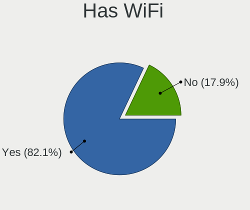
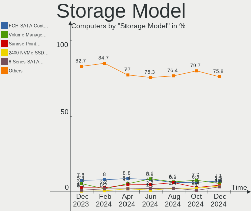
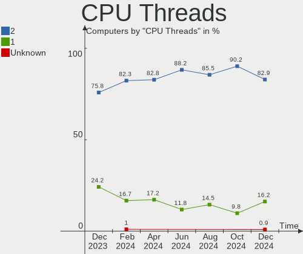
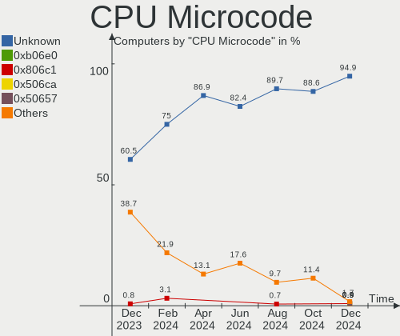

Linux in India - Hardware Trends
--------------------------------

A project to identify most popular hardware characteristics and track their change
over time based on data collected by Linux users at https://Linux-Hardware.org.

Anyone can contribute to this report by the [hw-probe](https://github.com/linuxhw/hw-probe) tool:

    sudo -E hw-probe -all -upload

This is a report for all computer types. See also reports for [desktops](/Location/India/Desktop/README.md) and [notebooks](/Location/India/Notebook/README.md).

Period: Aug, 2022.

Contents
--------

* [ System ](#system)
  - [ OS                       ](#os)
  - [ OS Family                ](#os-family)
  - [ Kernel                   ](#kernel)
  - [ Kernel Family            ](#kernel-family)
  - [ Kernel Major Ver.        ](#kernel-major-ver)
  - [ Arch                     ](#arch)
  - [ DE                       ](#de)
  - [ Display Server           ](#display-server)
  - [ Display Manager          ](#display-manager)
  - [ OS Lang                  ](#os-lang)
  - [ Boot Mode                ](#boot-mode)
  - [ Filesystem               ](#filesystem)
  - [ Part. scheme             ](#part-scheme)
  - [ Dual Boot with Linux/BSD ](#dual-boot-with-linuxbsd)
  - [ Dual Boot (Win)          ](#dual-boot-win)

* [ Board ](#board)
  - [ Vendor                   ](#vendor)
  - [ Model                    ](#model)
  - [ Model Family             ](#model-family)
  - [ MFG Year                 ](#mfg-year)
  - [ Form Factor              ](#form-factor)
  - [ Secure Boot              ](#secure-boot)
  - [ Coreboot                 ](#coreboot)
  - [ RAM Size                 ](#ram-size)
  - [ RAM Used                 ](#ram-used)
  - [ Total Drives             ](#total-drives)
  - [ Has CD-ROM               ](#has-cd-rom)
  - [ Has Ethernet             ](#has-ethernet)
  - [ Has WiFi                 ](#has-wifi)
  - [ Has Bluetooth            ](#has-bluetooth)

* [ Location ](#location)
  - [ Country                  ](#country)
  - [ City                     ](#city)

* [ Drives ](#drives)
  - [ Drive Vendor             ](#drive-vendor)
  - [ Drive Model              ](#drive-model)
  - [ HDD Vendor               ](#hdd-vendor)
  - [ SSD Vendor               ](#ssd-vendor)
  - [ Drive Kind               ](#drive-kind)
  - [ Drive Connector          ](#drive-connector)
  - [ Drive Size               ](#drive-size)
  - [ Space Total              ](#space-total)
  - [ Space Used               ](#space-used)
  - [ Malfunc. Drives          ](#malfunc-drives)
  - [ Malfunc. Drive Vendor    ](#malfunc-drive-vendor)
  - [ Malfunc. HDD Vendor      ](#malfunc-hdd-vendor)
  - [ Malfunc. Drive Kind      ](#malfunc-drive-kind)
  - [ Failed Drives            ](#failed-drives)
  - [ Failed Drive Vendor      ](#failed-drive-vendor)
  - [ Drive Status             ](#drive-status)

* [ Storage controller ](#storage-controller)
  - [ Storage Vendor           ](#storage-vendor)
  - [ Storage Model            ](#storage-model)
  - [ Storage Kind             ](#storage-kind)

* [ Processor ](#processor)
  - [ CPU Vendor               ](#cpu-vendor)
  - [ CPU Model                ](#cpu-model)
  - [ CPU Model Family         ](#cpu-model-family)
  - [ CPU Cores                ](#cpu-cores)
  - [ CPU Sockets              ](#cpu-sockets)
  - [ CPU Threads              ](#cpu-threads)
  - [ CPU Op-Modes             ](#cpu-op-modes)
  - [ CPU Microcode            ](#cpu-microcode)
  - [ CPU Microarch            ](#cpu-microarch)

* [ Graphics ](#graphics)
  - [ GPU Vendor               ](#gpu-vendor)
  - [ GPU Model                ](#gpu-model)
  - [ GPU Combo                ](#gpu-combo)
  - [ GPU Driver               ](#gpu-driver)
  - [ GPU Memory               ](#gpu-memory)

* [ Monitor ](#monitor)
  - [ Monitor Vendor           ](#monitor-vendor)
  - [ Monitor Model            ](#monitor-model)
  - [ Monitor Resolution       ](#monitor-resolution)
  - [ Monitor Diagonal         ](#monitor-diagonal)
  - [ Monitor Width            ](#monitor-width)
  - [ Aspect Ratio             ](#aspect-ratio)
  - [ Monitor Area             ](#monitor-area)
  - [ Pixel Density            ](#pixel-density)
  - [ Multiple Monitors        ](#multiple-monitors)

* [ Network ](#network)
  - [ Net Controller Vendor    ](#net-controller-vendor)
  - [ Net Controller Model     ](#net-controller-model)
  - [ Wireless Vendor          ](#wireless-vendor)
  - [ Wireless Model           ](#wireless-model)
  - [ Ethernet Vendor          ](#ethernet-vendor)
  - [ Ethernet Model           ](#ethernet-model)
  - [ Net Controller Kind      ](#net-controller-kind)
  - [ Used Controller          ](#used-controller)
  - [ NICs                     ](#nics)
  - [ IPv6                     ](#ipv6)

* [ Bluetooth ](#bluetooth)
  - [ Bluetooth Vendor         ](#bluetooth-vendor)
  - [ Bluetooth Model          ](#bluetooth-model)

* [ Sound ](#sound)
  - [ Sound Vendor             ](#sound-vendor)
  - [ Sound Model              ](#sound-model)

* [ Memory ](#memory)
  - [ Memory Vendor            ](#memory-vendor)
  - [ Memory Model             ](#memory-model)
  - [ Memory Kind              ](#memory-kind)
  - [ Memory Form Factor       ](#memory-form-factor)
  - [ Memory Size              ](#memory-size)
  - [ Memory Speed             ](#memory-speed)

* [ Printers & scanners ](#printers--scanners)
  - [ Printer Vendor           ](#printer-vendor)
  - [ Printer Model            ](#printer-model)
  - [ Scanner Vendor           ](#scanner-vendor)
  - [ Scanner Model            ](#scanner-model)

* [ Camera ](#camera)
  - [ Camera Vendor            ](#camera-vendor)
  - [ Camera Model             ](#camera-model)

* [ Security ](#security)
  - [ Fingerprint Vendor       ](#fingerprint-vendor)
  - [ Fingerprint Model        ](#fingerprint-model)
  - [ Chipcard Vendor          ](#chipcard-vendor)
  - [ Chipcard Model           ](#chipcard-model)

* [ Unsupported ](#unsupported)
  - [ Unsupported Devices      ](#unsupported-devices)
  - [ Unsupported Device Types ](#unsupported-device-types)

System
------

OS
--

Installed operating systems

| Name                   | Computers | Percent |
|------------------------|-----------|---------|
| Ubuntu 22.04           | 24        | 21.62%  |
| Ubuntu 20.04           | 10        | 9.01%   |
| Fedora 36              | 10        | 9.01%   |
| OpenMandriva 4.3       | 6         | 5.41%   |
| Pop!_OS 22.04          | 5         | 4.5%    |
| Linux Mint 20.3        | 5         | 4.5%    |
| KDE neon 20.04         | 5         | 4.5%    |
| Zorin 16               | 4         | 3.6%    |
| Ubuntu 18.04           | 3         | 2.7%    |
| Arch Rolling           | 3         | 2.7%    |
| Arch                   | 3         | 2.7%    |
| OpenMandriva 4.90      | 2         | 1.8%    |
| Manjaro 21.3.7         | 2         | 1.8%    |
| Manjaro 21.3.6         | 2         | 1.8%    |
| Linux Mint 21          | 2         | 1.8%    |
| Kubuntu 22.04          | 2         | 1.8%    |
| Kali 2022.3            | 2         | 1.8%    |
| Garuda Linux Soaring   | 2         | 1.8%    |
| Debian Testing         | 2         | 1.8%    |
| Xubuntu 20.04          | 1         | 0.9%    |
| Void Linux Rolling     | 1         | 0.9%    |
| Ubuntu MATE 20.04      | 1         | 0.9%    |
| Ubuntu Budgie 20.04    | 1         | 0.9%    |
| Manjaro 21.3.5         | 1         | 0.9%    |
| Manjaro                | 1         | 0.9%    |
| Lubuntu 16.04          | 1         | 0.9%    |
| Kali 2022.1            | 1         | 0.9%    |
| Endless 4.0.8          | 1         | 0.9%    |
| Endless 3.3.16-nexthw1 | 1         | 0.9%    |
| Elementary 6.1         | 1         | 0.9%    |
| Elementary 6           | 1         | 0.9%    |
| Debian 11-updates      | 1         | 0.9%    |
| Debian 11              | 1         | 0.9%    |
| Debian 10              | 1         | 0.9%    |
| CentOS 9               | 1         | 0.9%    |
| ArcoLinux Rolling      | 1         | 0.9%    |

OS Family
---------

OS without a version

| Name          | Computers | Percent |
|---------------|-----------|---------|
| Ubuntu        | 37        | 33.33%  |
| Fedora        | 10        | 9.01%   |
| OpenMandriva  | 8         | 7.21%   |
| Linux Mint    | 7         | 6.31%   |
| Manjaro       | 6         | 5.41%   |
| Arch          | 6         | 5.41%   |
| Pop!_OS       | 5         | 4.5%    |
| KDE neon      | 5         | 4.5%    |
| Debian        | 5         | 4.5%    |
| Zorin         | 4         | 3.6%    |
| Kali          | 3         | 2.7%    |
| Kubuntu       | 2         | 1.8%    |
| Garuda Linux  | 2         | 1.8%    |
| Endless       | 2         | 1.8%    |
| Elementary    | 2         | 1.8%    |
| Xubuntu       | 1         | 0.9%    |
| Void Linux    | 1         | 0.9%    |
| Ubuntu MATE   | 1         | 0.9%    |
| Ubuntu Budgie | 1         | 0.9%    |
| Lubuntu       | 1         | 0.9%    |
| CentOS        | 1         | 0.9%    |
| ArcoLinux     | 1         | 0.9%    |

Kernel
------

Version of the Linux kernel

| Version                  | Computers | Percent |
|--------------------------|-----------|---------|
| 5.15.0-46-generic        | 22        | 19.82%  |
| 5.15.0-43-generic        | 15        | 13.51%  |
| 5.16.7-desktop-1omv4003  | 6         | 5.41%   |
| 5.4.0-122-generic        | 4         | 3.6%    |
| 5.18.10-76051810-generic | 3         | 2.7%    |
| 5.19.1-zen1-1-zen        | 2         | 1.8%    |
| 5.19.0-76051900-generic  | 2         | 1.8%    |
| 5.18.18-200.fc36.x86_64  | 2         | 1.8%    |
| 5.18.17-200.fc36.x86_64  | 2         | 1.8%    |
| 5.18.16-arch1-1          | 2         | 1.8%    |
| 5.18.16-200.fc36.x86_64  | 2         | 1.8%    |
| 5.18.12-desktop-3omv4090 | 2         | 1.8%    |
| 5.18.0-kali5-amd64       | 2         | 1.8%    |
| 5.18.0-4-amd64           | 2         | 1.8%    |
| 5.17.5-300.fc36.x86_64   | 2         | 1.8%    |
| 5.15.60-1-MANJARO        | 2         | 1.8%    |
| 5.15.0-47-generic        | 2         | 1.8%    |
| 5.15.0-41-generic        | 2         | 1.8%    |
| 5.13.0-30-generic        | 2         | 1.8%    |
| 5.4.0-125-generic        | 1         | 0.9%    |
| 5.4.0-124-generic        | 1         | 0.9%    |
| 5.4.0-121-generic        | 1         | 0.9%    |
| 5.19.3-arch1-1           | 1         | 0.9%    |
| 5.19.2-zen1-1-zen        | 1         | 0.9%    |
| 5.19.2-arch1-1           | 1         | 0.9%    |
| 5.19.1-3-MANJARO         | 1         | 0.9%    |
| 5.19.0-051900-generic    | 1         | 0.9%    |
| 5.18.7_1                 | 1         | 0.9%    |
| 5.18.15-arch1-2          | 1         | 0.9%    |
| 5.18.15-200.fc36.x86_64  | 1         | 0.9%    |
| 5.18.13-200.fc36.x86_64  | 1         | 0.9%    |
| 5.18.0-3-amd64           | 1         | 0.9%    |
| 5.16.0-kali6-amd64       | 1         | 0.9%    |
| 5.15.63-1-lts            | 1         | 0.9%    |
| 5.15.59-1-MANJARO        | 1         | 0.9%    |
| 5.15.57-2-MANJARO        | 1         | 0.9%    |
| 5.15.55-1-MANJARO        | 1         | 0.9%    |
| 5.15.0-25-generic        | 1         | 0.9%    |
| 5.15.0-18-generic        | 1         | 0.9%    |
| 5.14.0-134.el9.x86_64    | 1         | 0.9%    |
| 5.14.0-1050-oem          | 1         | 0.9%    |
| 5.14.0-1049-oem          | 1         | 0.9%    |
| 5.14.0-1048-oem          | 1         | 0.9%    |
| 5.14.0-1024-oem          | 1         | 0.9%    |
| 5.13.0-41-generic        | 1         | 0.9%    |
| 5.11.0-40-generic        | 1         | 0.9%    |
| 5.11.0-35-generic        | 1         | 0.9%    |
| 5.10.0-16-amd64          | 1         | 0.9%    |
| 4.19.0-6-amd64           | 1         | 0.9%    |
| 4.15.0-162-generic       | 1         | 0.9%    |
| 4.15.0-142-generic       | 1         | 0.9%    |
| 4.15.0-12-generic        | 1         | 0.9%    |

Kernel Family
-------------

Linux kernel without a distro release

| Version | Computers | Percent |
|---------|-----------|---------|
| 5.15.0  | 43        | 38.74%  |
| 5.4.0   | 7         | 6.31%   |
| 5.16.7  | 6         | 5.41%   |
| 5.18.0  | 5         | 4.5%    |
| 5.14.0  | 5         | 4.5%    |
| 5.18.16 | 4         | 3.6%    |
| 5.19.1  | 3         | 2.7%    |
| 5.19.0  | 3         | 2.7%    |
| 5.18.10 | 3         | 2.7%    |
| 5.13.0  | 3         | 2.7%    |
| 4.15.0  | 3         | 2.7%    |
| 5.19.2  | 2         | 1.8%    |
| 5.18.18 | 2         | 1.8%    |
| 5.18.17 | 2         | 1.8%    |
| 5.18.15 | 2         | 1.8%    |
| 5.18.12 | 2         | 1.8%    |
| 5.17.5  | 2         | 1.8%    |
| 5.15.60 | 2         | 1.8%    |
| 5.11.0  | 2         | 1.8%    |
| 5.19.3  | 1         | 0.9%    |
| 5.18.7  | 1         | 0.9%    |
| 5.18.13 | 1         | 0.9%    |
| 5.16.0  | 1         | 0.9%    |
| 5.15.63 | 1         | 0.9%    |
| 5.15.59 | 1         | 0.9%    |
| 5.15.57 | 1         | 0.9%    |
| 5.15.55 | 1         | 0.9%    |
| 5.10.0  | 1         | 0.9%    |
| 4.19.0  | 1         | 0.9%    |

Kernel Major Ver.
-----------------

Linux kernel major version

| Version | Computers | Percent |
|---------|-----------|---------|
| 5.15    | 49        | 44.14%  |
| 5.18    | 22        | 19.82%  |
| 5.19    | 9         | 8.11%   |
| 5.4     | 7         | 6.31%   |
| 5.16    | 7         | 6.31%   |
| 5.14    | 5         | 4.5%    |
| 5.13    | 3         | 2.7%    |
| 4.15    | 3         | 2.7%    |
| 5.17    | 2         | 1.8%    |
| 5.11    | 2         | 1.8%    |
| 5.10    | 1         | 0.9%    |
| 4.19    | 1         | 0.9%    |

Arch
----

OS architecture (x86_64, i586, etc.)

| Name   | Computers | Percent |
|--------|-----------|---------|
| x86_64 | 110       | 99.1%   |
| i686   | 1         | 0.9%    |

DE
--

Desktop Environment

| Name       | Computers | Percent |
|------------|-----------|---------|
| GNOME      | 59        | 53.15%  |
| KDE5       | 24        | 21.62%  |
| XFCE       | 11        | 9.91%   |
| X-Cinnamon | 6         | 5.41%   |
| Pantheon   | 2         | 1.8%    |
| MATE       | 2         | 1.8%    |
| Unknown    | 2         | 1.8%    |
| qtile      | 1         | 0.9%    |
| KDE        | 1         | 0.9%    |
| i3         | 1         | 0.9%    |
| Budgie     | 1         | 0.9%    |
| awesome    | 1         | 0.9%    |

Display Server
--------------

X11 or Wayland

| Name    | Computers | Percent |
|---------|-----------|---------|
| X11     | 79        | 71.17%  |
| Wayland | 30        | 27.03%  |
| Tty     | 1         | 0.9%    |
| Unknown | 1         | 0.9%    |

Display Manager
---------------

SDDM, LightDM, etc.

| Name    | Computers | Percent |
|---------|-----------|---------|
| GDM3    | 35        | 31.53%  |
| Unknown | 28        | 25.23%  |
| SDDM    | 19        | 17.12%  |
| LightDM | 19        | 17.12%  |
| GDM     | 10        | 9.01%   |

OS Lang
-------

Language

| Lang  | Computers | Percent |
|-------|-----------|---------|
| en_IN | 69        | 62.16%  |
| en_US | 36        | 32.43%  |
| en_GB | 4         | 3.6%    |
| mr_IN | 1         | 0.9%    |
| C     | 1         | 0.9%    |

Boot Mode
---------

EFI or BIOS

| Mode | Computers | Percent |
|------|-----------|---------|
| EFI  | 72        | 64.86%  |
| BIOS | 39        | 35.14%  |

Filesystem
----------

Type of filesystem

| Type    | Computers | Percent |
|---------|-----------|---------|
| Ext4    | 85        | 76.58%  |
| Btrfs   | 17        | 15.32%  |
| Overlay | 6         | 5.41%   |
| Xfs     | 2         | 1.8%    |
| Ext2    | 1         | 0.9%    |

Part. scheme
------------

Scheme of partitioning

| Type    | Computers | Percent |
|---------|-----------|---------|
| GPT     | 52        | 46.85%  |
| Unknown | 51        | 45.95%  |
| MBR     | 8         | 7.21%   |

Dual Boot with Linux/BSD
------------------------

Hosting more than one Linux/BSD

| Dual boot | Computers | Percent |
|-----------|-----------|---------|
| No        | 97        | 87.39%  |
| Yes       | 14        | 12.61%  |

Dual Boot (Win)
---------------

Hosting Linux and Windows

| Dual boot | Computers | Percent |
|-----------|-----------|---------|
| No        | 72        | 64.86%  |
| Yes       | 39        | 35.14%  |

Board
-----

Vendor
------

Motherboard manufacturer

| Name                | Computers | Percent |
|---------------------|-----------|---------|
| Dell                | 24        | 21.62%  |
| Hewlett-Packard     | 23        | 20.72%  |
| Lenovo              | 18        | 16.22%  |
| ASUSTek Computer    | 16        | 14.41%  |
| Gigabyte Technology | 7         | 6.31%   |
| Acer                | 5         | 4.5%    |
| MSI                 | 4         | 3.6%    |
| ASRock              | 2         | 1.8%    |
| WIPRO               | 1         | 0.9%    |
| Toshiba             | 1         | 0.9%    |
| Timi                | 1         | 0.9%    |
| Sony                | 1         | 0.9%    |
| OEM                 | 1         | 0.9%    |
| LORD ELECTRONICS    | 1         | 0.9%    |
| LG Electronics      | 1         | 0.9%    |
| Intel               | 1         | 0.9%    |
| eMachines           | 1         | 0.9%    |
| Apple               | 1         | 0.9%    |
| Acidanthera         | 1         | 0.9%    |
| Unknown             | 1         | 0.9%    |

Model
-----

Motherboard model

| Name                                   | Computers | Percent |
|----------------------------------------|-----------|---------|
| HP Pavilion g6                         | 3         | 2.7%    |
| Lenovo ThinkBook 14-IML 20RV           | 2         | 1.8%    |
| HP Notebook                            | 2         | 1.8%    |
| HP 15                                  | 2         | 1.8%    |
| Gigabyte H410M S2 V2                   | 2         | 1.8%    |
| Gigabyte H110M-S2                      | 2         | 1.8%    |
| Dell Latitude 3420                     | 2         | 1.8%    |
| Dell Inspiron N5010                    | 2         | 1.8%    |
| Dell Inspiron 3542                     | 2         | 1.8%    |
| Dell G3 3500                           | 2         | 1.8%    |
| WIPRO G31T-M                           | 1         | 0.9%    |
| Toshiba TECRA R940                     | 1         | 0.9%    |
| Timi Mi NoteBook Horizon Edition 14    | 1         | 0.9%    |
| Sony VPCEB16FG                         | 1         | 0.9%    |
| OEM Intel H81                          | 1         | 0.9%    |
| MSI MS-7C13                            | 1         | 0.9%    |
| MSI MS-7A15                            | 1         | 0.9%    |
| MSI Modern 14 B5M                      | 1         | 0.9%    |
| MSI Alpha 15 A3DD                      | 1         | 0.9%    |
| LORD ELECTRONICS GM965 Series          | 1         | 0.9%    |
| LG 14Z990-V.AR52A2                     | 1         | 0.9%    |
| Lenovo ThinkPad X260 20F5A050IG        | 1         | 0.9%    |
| Lenovo ThinkPad L490 20Q5S0LF00        | 1         | 0.9%    |
| Lenovo ThinkPad E14 Gen 4 21E4CTO1WW   | 1         | 0.9%    |
| Lenovo Legion 5 Pro 16ACH6H 82JQ       | 1         | 0.9%    |
| Lenovo IdeaPadFlex 5 14ITL05 82HS      | 1         | 0.9%    |
| Lenovo IdeaPad S540-15IML D 81NG       | 1         | 0.9%    |
| Lenovo IdeaPad S340-14API 81NB         | 1         | 0.9%    |
| Lenovo IdeaPad 5 15ALC05 82LN          | 1         | 0.9%    |
| Lenovo IdeaPad 5 14ARE05 81YM          | 1         | 0.9%    |
| Lenovo IdeaPad 3 15ITL6 82H8           | 1         | 0.9%    |
| Lenovo IdeaPad 3 15IML05 D1 81WB       | 1         | 0.9%    |
| Lenovo IdeaPad 3 15ALC6 Ub 82KU        | 1         | 0.9%    |
| Lenovo IdeaPad 3 15ADA05 81W1          | 1         | 0.9%    |
| Lenovo IdeaPad 3 14ITL6 82H7           | 1         | 0.9%    |
| Lenovo IdeaPad 110-15ISK 80UD          | 1         | 0.9%    |
| Lenovo G50-45 80E3                     | 1         | 0.9%    |
| Intel H61                              | 1         | 0.9%    |
| HP Z4 G4 Workstation                   | 1         | 0.9%    |
| HP ProBook 440 G2                      | 1         | 0.9%    |
| HP Presario CQ56                       | 1         | 0.9%    |
| HP Pavilion x360 Convertible 14-dy0xxx | 1         | 0.9%    |
| HP Pavilion Laptop 15-eg0xxx           | 1         | 0.9%    |
| HP Pavilion Laptop 14-ec0xxx           | 1         | 0.9%    |
| HP Pavilion 15                         | 1         | 0.9%    |
| HP Laptop 15s-gr0xxx                   | 1         | 0.9%    |
| HP Laptop 15s-eq2xxx                   | 1         | 0.9%    |
| HP Laptop 15-da0xxx                    | 1         | 0.9%    |
| HP Laptop 15-bs0xx                     | 1         | 0.9%    |
| HP Laptop 14s-fq1xxx                   | 1         | 0.9%    |
| HP EliteBook x360 1030 G2              | 1         | 0.9%    |
| HP 430                                 | 1         | 0.9%    |
| HP 245 G7 Notebook PC                  | 1         | 0.9%    |
| HP 205 G2 AiO Business PC              | 1         | 0.9%    |
| Gigabyte H81M-S                        | 1         | 0.9%    |
| Gigabyte H61MS                         | 1         | 0.9%    |
| Gigabyte B360M GAMING HD               | 1         | 0.9%    |
| eMachines D725                         | 1         | 0.9%    |
| Dell Vostro 5481                       | 1         | 0.9%    |
| Dell Vostro 3480                       | 1         | 0.9%    |

Model Family
------------

Motherboard model prefix

| Name                   | Computers | Percent |
|------------------------|-----------|---------|
| Lenovo IdeaPad         | 10        | 9.01%   |
| Dell Latitude          | 8         | 7.21%   |
| Dell Inspiron          | 8         | 7.21%   |
| HP Pavilion            | 7         | 6.31%   |
| HP Laptop              | 5         | 4.5%    |
| Dell Vostro            | 4         | 3.6%    |
| Lenovo ThinkPad        | 3         | 2.7%    |
| ASUS VivoBook          | 3         | 2.7%    |
| Acer Aspire            | 3         | 2.7%    |
| Lenovo ThinkBook       | 2         | 1.8%    |
| HP Notebook            | 2         | 1.8%    |
| HP 15                  | 2         | 1.8%    |
| Gigabyte H410M         | 2         | 1.8%    |
| Gigabyte H110M-S2      | 2         | 1.8%    |
| Dell G3                | 2         | 1.8%    |
| ASUS ROG               | 2         | 1.8%    |
| ASUS ASUS              | 2         | 1.8%    |
| WIPRO G31T-M           | 1         | 0.9%    |
| Toshiba TECRA          | 1         | 0.9%    |
| Timi Mi                | 1         | 0.9%    |
| Sony VPCEB16FG         | 1         | 0.9%    |
| OEM Intel              | 1         | 0.9%    |
| MSI MS-7C13            | 1         | 0.9%    |
| MSI MS-7A15            | 1         | 0.9%    |
| MSI Modern             | 1         | 0.9%    |
| MSI Alpha              | 1         | 0.9%    |
| LORD ELECTRONICS GM965 | 1         | 0.9%    |
| LG 14Z990-V.AR52A2     | 1         | 0.9%    |
| Lenovo Legion          | 1         | 0.9%    |
| Lenovo IdeaPadFlex     | 1         | 0.9%    |
| Lenovo G50-45          | 1         | 0.9%    |
| Intel H61              | 1         | 0.9%    |
| HP Z4                  | 1         | 0.9%    |
| HP ProBook             | 1         | 0.9%    |
| HP Presario            | 1         | 0.9%    |
| HP EliteBook           | 1         | 0.9%    |
| HP 430                 | 1         | 0.9%    |
| HP 245                 | 1         | 0.9%    |
| HP 205                 | 1         | 0.9%    |
| Gigabyte H81M-S        | 1         | 0.9%    |
| Gigabyte H61MS         | 1         | 0.9%    |
| Gigabyte B360M         | 1         | 0.9%    |
| eMachines D725         | 1         | 0.9%    |
| Dell System            | 1         | 0.9%    |
| Dell OptiPlex          | 1         | 0.9%    |
| ASUS ZenBook           | 1         | 0.9%    |
| ASUS X556UQK           | 1         | 0.9%    |
| ASUS X542UQR           | 1         | 0.9%    |
| ASUS UX430UAR          | 1         | 0.9%    |
| ASUS TUF               | 1         | 0.9%    |
| ASUS PRIME             | 1         | 0.9%    |
| ASUS P7H55-M           | 1         | 0.9%    |
| ASUS H110M-CS          | 1         | 0.9%    |
| ASUS ASUSPRO           | 1         | 0.9%    |
| ASRock G41M-VS3        | 1         | 0.9%    |
| ASRock B450M           | 1         | 0.9%    |
| Apple MacBook2         | 1         | 0.9%    |
| Acidanthera iMac20     | 1         | 0.9%    |
| Acer TravelMate        | 1         | 0.9%    |
| Acer Nitro             | 1         | 0.9%    |

MFG Year
--------

Motherboard manufacture year

| Year | Computers | Percent |
|------|-----------|---------|
| 2021 | 19        | 17.12%  |
| 2019 | 15        | 13.51%  |
| 2020 | 14        | 12.61%  |
| 2016 | 10        | 9.01%   |
| 2011 | 8         | 7.21%   |
| 2014 | 7         | 6.31%   |
| 2010 | 7         | 6.31%   |
| 2018 | 6         | 5.41%   |
| 2013 | 6         | 5.41%   |
| 2022 | 5         | 4.5%    |
| 2017 | 5         | 4.5%    |
| 2015 | 5         | 4.5%    |
| 2012 | 2         | 1.8%    |
| 2008 | 1         | 0.9%    |
| 2007 | 1         | 0.9%    |

Form Factor
-----------

Physical design of the computer

| Name        | Computers | Percent |
|-------------|-----------|---------|
| Notebook    | 83        | 74.77%  |
| Desktop     | 22        | 19.82%  |
| Convertible | 4         | 3.6%    |
| All in one  | 2         | 1.8%    |

Secure Boot
-----------

Enabled or disabled

| State    | Computers | Percent |
|----------|-----------|---------|
| Disabled | 101       | 90.99%  |
| Enabled  | 10        | 9.01%   |

Coreboot
--------

Have coreboot on board

| Used | Computers | Percent |
|------|-----------|---------|
| No   | 111       | 100%    |

RAM Size
--------

Total RAM memory

| Size in GB | Computers | Percent |
|------------|-----------|---------|
| 4.01-8.0   | 39        | 35.14%  |
| 3.01-4.0   | 23        | 20.72%  |
| 16.01-24.0 | 22        | 19.82%  |
| 8.01-16.0  | 21        | 18.92%  |
| 32.01-64.0 | 2         | 1.8%    |
| 2.01-3.0   | 2         | 1.8%    |
| 1.01-2.0   | 1         | 0.9%    |
| 0.51-1.0   | 1         | 0.9%    |

RAM Used
--------

Used RAM memory

| Used GB    | Computers | Percent |
|------------|-----------|---------|
| 1.01-2.0   | 37        | 33.33%  |
| 2.01-3.0   | 29        | 26.13%  |
| 4.01-8.0   | 21        | 18.92%  |
| 3.01-4.0   | 14        | 12.61%  |
| 8.01-16.0  | 5         | 4.5%    |
| 0.51-1.0   | 4         | 3.6%    |
| 16.01-24.0 | 1         | 0.9%    |

Total Drives
------------

Number of drives on board

| Drives | Computers | Percent |
|--------|-----------|---------|
| 1      | 78        | 70.27%  |
| 2      | 26        | 23.42%  |
| 3      | 6         | 5.41%   |
| 0      | 1         | 0.9%    |

Has CD-ROM
----------

Has CD-ROM on board

| Presented | Computers | Percent |
|-----------|-----------|---------|
| No        | 75        | 67.57%  |
| Yes       | 36        | 32.43%  |

Has Ethernet
------------

Has Ethernet on board

| Presented | Computers | Percent |
|-----------|-----------|---------|
| Yes       | 86        | 77.48%  |
| No        | 25        | 22.52%  |

Has WiFi
--------

Has WiFi module

| Presented | Computers | Percent |
|-----------|-----------|---------|
| Yes       | 102       | 91.89%  |
| No        | 9         | 8.11%   |

Has Bluetooth
-------------

Has Bluetooth module

| Presented | Computers | Percent |
|-----------|-----------|---------|
| Yes       | 85        | 76.58%  |
| No        | 26        | 23.42%  |

Location
--------

Country
-------

Geographic location (country)

| Country | Computers | Percent |
|---------|-----------|---------|
| India   | 111       | 100%    |

City
----

Geographic location (city)

| City          | Computers | Percent |
|---------------|-----------|---------|
| Bengaluru     | 17        | 15.32%  |
| Mumbai        | 14        | 12.61%  |
| Pune          | 8         | 7.21%   |
| New Delhi     | 6         | 5.41%   |
| Chennai       | 6         | 5.41%   |
| Coimbatore    | 4         | 3.6%    |
| Navi Mumbai   | 3         | 2.7%    |
| Ernakulam     | 3         | 2.7%    |
| Lucknow       | 2         | 1.8%    |
| Kolkata       | 2         | 1.8%    |
| Gurgaon       | 2         | 1.8%    |
| Delhi         | 2         | 1.8%    |
| Virar         | 1         | 0.9%    |
| Vijayawada    | 1         | 0.9%    |
| Vellore       | 1         | 0.9%    |
| Vasco da Gama | 1         | 0.9%    |
| Udaipur       | 1         | 0.9%    |
| Tirupur       | 1         | 0.9%    |
| Thrissur      | 1         | 0.9%    |
| Siliguri      | 1         | 0.9%    |
| Shillong      | 1         | 0.9%    |
| Sambalpur     | 1         | 0.9%    |
| Samastipur    | 1         | 0.9%    |
| Patiala       | 1         | 0.9%    |
| Nilambur      | 1         | 0.9%    |
| Nagpur        | 1         | 0.9%    |
| Nagercoil     | 1         | 0.9%    |
| Murshidabad   | 1         | 0.9%    |
| Malappuram    | 1         | 0.9%    |
| Ludhiana      | 1         | 0.9%    |
| Lohogaon      | 1         | 0.9%    |
| Kurukshetra   | 1         | 0.9%    |
| Kozhikode     | 1         | 0.9%    |
| Kochi         | 1         | 0.9%    |
| Karimnagar    | 1         | 0.9%    |
| Kanpur        | 1         | 0.9%    |
| Kachiguda     | 1         | 0.9%    |
| Jaipur        | 1         | 0.9%    |
| Indore        | 1         | 0.9%    |
| Hyderabad     | 1         | 0.9%    |
| Hajipur       | 1         | 0.9%    |
| Gunupur       | 1         | 0.9%    |
| Golaghat      | 1         | 0.9%    |
| Dombivali     | 1         | 0.9%    |
| Dharwad       | 1         | 0.9%    |
| Dehradun      | 1         | 0.9%    |
| Chunchura     | 1         | 0.9%    |
| Chandigarh    | 1         | 0.9%    |
| Bhuj          | 1         | 0.9%    |
| Bhubaneswar   | 1         | 0.9%    |
| Ashti         | 1         | 0.9%    |
| Anantapur     | 1         | 0.9%    |
| Alwal         | 1         | 0.9%    |
| Ahmedabad     | 1         | 0.9%    |

Drives
------

Drive Vendor
------------

Hard drive vendors

| Vendor                      | Computers | Drives | Percent |
|-----------------------------|-----------|--------|---------|
| Seagate                     | 27        | 28     | 18.88%  |
| WDC                         | 24        | 27     | 16.78%  |
| Samsung Electronics         | 15        | 15     | 10.49%  |
| Crucial                     | 12        | 12     | 8.39%   |
| Toshiba                     | 8         | 8      | 5.59%   |
| KIOXIA                      | 8         | 8      | 5.59%   |
| SanDisk                     | 5         | 5      | 3.5%    |
| Intel                       | 5         | 5      | 3.5%    |
| Micron Technology           | 4         | 5      | 2.8%    |
| SK hynix                    | 3         | 3      | 2.1%    |
| Kingston                    | 3         | 3      | 2.1%    |
| HGST                        | 3         | 3      | 2.1%    |
| UMIS                        | 2         | 2      | 1.4%    |
| Silicon Motion              | 2         | 2      | 1.4%    |
| Hitachi                     | 2         | 2      | 1.4%    |
| Unknown                     | 2         | 2      | 1.4%    |
| XPG                         | 1         | 1      | 0.7%    |
| Unknown                     | 1         | 1      | 0.7%    |
| Union Memory (Shenzhen)     | 1         | 1      | 0.7%    |
| SPCC                        | 1         | 1      | 0.7%    |
| Realtek Semiconductor       | 1         | 1      | 0.7%    |
| POWER                       | 1         | 1      | 0.7%    |
| Phison                      | 1         | 2      | 0.7%    |
| OSCOO                       | 1         | 1      | 0.7%    |
| NFORCE                      | 1         | 1      | 0.7%    |
| Micron/Crucial Technology   | 1         | 1      | 0.7%    |
| Maxtor                      | 1         | 1      | 0.7%    |
| LITEON                      | 1         | 1      | 0.7%    |
| KIOXIA-EXCERIA              | 1         | 1      | 0.7%    |
| Kingston Technology Company | 1         | 1      | 0.7%    |
| Hewlett-Packard             | 1         | 1      | 0.7%    |
| Gigabyte Technology         | 1         | 1      | 0.7%    |
| External                    | 1         | 1      | 0.7%    |
| A-DATA Technology           | 1         | 1      | 0.7%    |

Drive Model
-----------

Hard drive models

| Model                                        | Computers | Percent |
|----------------------------------------------|-----------|---------|
| Seagate ST1000LM035-1RK172 1TB               | 6         | 4.05%   |
| Seagate ST1000DM010-2EP102 1TB               | 5         | 3.38%   |
| Crucial CT240BX500SSD1 240GB                 | 5         | 3.38%   |
| Seagate ST500LT012-1DG142 500GB              | 4         | 2.7%    |
| KIOXIA KBG40ZNS512G NVMe 512GB               | 4         | 2.7%    |
| WDC WDS240G2G0A-00JH30 240GB SSD             | 3         | 2.03%   |
| Seagate ST1000LM048-2E7172 1TB               | 3         | 2.03%   |
| WDC WDS120G2G0A-00JH30 120GB SSD             | 2         | 1.35%   |
| Toshiba MQ01ACF050 500GB                     | 2         | 1.35%   |
| Toshiba MQ01ABD100 1TB                       | 2         | 1.35%   |
| Seagate ST500DM002-1BD142 500GB              | 2         | 1.35%   |
| KIOXIA NVMe SSD Drive 512GB                  | 2         | 1.35%   |
| Kingston SA400M8240G 240GB SSD               | 2         | 1.35%   |
| Crucial CT480BX500SSD1 480GB                 | 2         | 1.35%   |
| Unknown                                      | 2         | 1.35%   |
| XPG GAMMIX S5 256GB                          | 1         | 0.68%   |
| WDC WDS500G2B0A-00SM50 500GB SSD             | 1         | 0.68%   |
| WDC WDS240G2G0C-00AJM0 240GB                 | 1         | 0.68%   |
| WDC WD5000LPVX-75V0TT0 500GB                 | 1         | 0.68%   |
| WDC WD5000LPCX-00VHAT0 500GB                 | 1         | 0.68%   |
| WDC WD5000BEKT-75KA9T0 500GB                 | 1         | 0.68%   |
| WDC WD5000AUDX-61WNHY0 500GB                 | 1         | 0.68%   |
| WDC WD3200LPLX-66ZNTT0 320GB                 | 1         | 0.68%   |
| WDC WD3200BPVT-22JJ5T0 320GB                 | 1         | 0.68%   |
| WDC WD3200BEVT-22A23T0 320GB                 | 1         | 0.68%   |
| WDC WD3200BEKX-75B7WT0 320GB                 | 1         | 0.68%   |
| WDC WD3200AAKS-61L9A0 320GB                  | 1         | 0.68%   |
| WDC WD20PURZ-85GU6Y0 2TB                     | 1         | 0.68%   |
| WDC WD20EZWX-60F5KA0 2TB                     | 1         | 0.68%   |
| WDC WD1600AAJS-22L7A0 160GB                  | 1         | 0.68%   |
| WDC WD10SPZX-60Z10T0 1TB                     | 1         | 0.68%   |
| WDC WD10JPVX-60JC3T0 1TB                     | 1         | 0.68%   |
| WDC WD10EZEX-60WN4A0 1TB                     | 1         | 0.68%   |
| WDC WD10EZEX-35WN4A0 1TB                     | 1         | 0.68%   |
| WDC WD10EZEX-22MFCA0 1TB                     | 1         | 0.68%   |
| WDC PC SN530 SDBPNPZ-512G-1114 512GB         | 1         | 0.68%   |
| WDC PC SN530 SDBPMPZ-512G-1101 512GB         | 1         | 0.68%   |
| Unknown MMC Card  64GB                       | 1         | 0.68%   |
| Union Memory (Shenzhen) NVMe SSD Drive 512GB | 1         | 0.68%   |
| UMIS RPJTJ256MEE1OWX 256GB                   | 1         | 0.68%   |
| UMIS RPFTJ128PDD2EWX 128GB                   | 1         | 0.68%   |
| Toshiba MQ04ABF100 1TB                       | 1         | 0.68%   |
| Toshiba MK5061GSYN 500GB                     | 1         | 0.68%   |
| Toshiba MK1637GSX 160GB                      | 1         | 0.68%   |
| Toshiba DT01ACA100 1TB                       | 1         | 0.68%   |
| SPCC Solid State Disk 128GB                  | 1         | 0.68%   |
| SK hynix SKHynix_HFS256GD9TNI-L2A0B 256GB    | 1         | 0.68%   |
| SK hynix BC711 HFM512GD3JX013N 512GB         | 1         | 0.68%   |
| SK hynix BC501 NVMe Solid State Drive 512GB  | 1         | 0.68%   |
| Silicon Motion POWER X NE1000-256GB          | 1         | 0.68%   |
| Silicon Motion NVMe SSD Drive 128GB          | 1         | 0.68%   |
| Seagate ST9500423AS 500GB                    | 1         | 0.68%   |
| Seagate ST4000DM004-2CV104 4TB               | 1         | 0.68%   |
| Seagate ST3160215AS 160GB                    | 1         | 0.68%   |
| Seagate ST1000DM003-1ER162 1TB               | 1         | 0.68%   |
| Seagate ST1000DM003-1CH162 1TB               | 1         | 0.68%   |
| Seagate Expansion 500GB                      | 1         | 0.68%   |
| Seagate BUP Slim 2TB                         | 1         | 0.68%   |
| Seagate BUP BL 4TB                           | 1         | 0.68%   |
| Sandisk WD Blue SN550 NVMe SSD 256GB         | 1         | 0.68%   |

HDD Vendor
----------

Hard disk drive vendors

| Vendor              | Computers | Drives | Percent |
|---------------------|-----------|--------|---------|
| Seagate             | 27        | 28     | 46.55%  |
| WDC                 | 17        | 18     | 29.31%  |
| Toshiba             | 8         | 8      | 13.79%  |
| HGST                | 3         | 3      | 5.17%   |
| Hitachi             | 2         | 2      | 3.45%   |
| Samsung Electronics | 1         | 1      | 1.72%   |

SSD Vendor
----------

Solid state drive vendors

| Vendor              | Computers | Drives | Percent |
|---------------------|-----------|--------|---------|
| Crucial             | 12        | 12     | 32.43%  |
| Samsung Electronics | 8         | 8      | 21.62%  |
| WDC                 | 6         | 6      | 16.22%  |
| SanDisk             | 2         | 2      | 5.41%   |
| Kingston            | 2         | 2      | 5.41%   |
| SPCC                | 1         | 1      | 2.7%    |
| OSCOO               | 1         | 1      | 2.7%    |
| NFORCE              | 1         | 1      | 2.7%    |
| Maxtor              | 1         | 1      | 2.7%    |
| LITEON              | 1         | 1      | 2.7%    |
| KIOXIA-EXCERIA      | 1         | 1      | 2.7%    |
| Hewlett-Packard     | 1         | 1      | 2.7%    |

Drive Kind
----------

HDD or SSD

| Kind    | Computers | Drives | Percent |
|---------|-----------|--------|---------|
| HDD     | 54        | 60     | 38.85%  |
| NVMe    | 45        | 48     | 32.37%  |
| SSD     | 36        | 37     | 25.9%   |
| Unknown | 3         | 3      | 2.16%   |
| MMC     | 1         | 1      | 0.72%   |

Drive Connector
---------------

SATA, SAS, NVMe, etc.

| Type | Computers | Drives | Percent |
|------|-----------|--------|---------|
| SATA | 78        | 97     | 61.42%  |
| NVMe | 44        | 47     | 34.65%  |
| SAS  | 4         | 4      | 3.15%   |
| MMC  | 1         | 1      | 0.79%   |

Drive Size
----------

Size of hard drive

| Size in TB | Computers | Drives | Percent |
|------------|-----------|--------|---------|
| 0.01-0.5   | 51        | 58     | 59.3%   |
| 0.51-1.0   | 31        | 34     | 36.05%  |
| 1.01-2.0   | 3         | 3      | 3.49%   |
| 3.01-4.0   | 1         | 2      | 1.16%   |

Space Total
-----------

Amount of disk space available on the file system

| Size in GB     | Computers | Percent |
|----------------|-----------|---------|
| 251-500        | 39        | 35.14%  |
| 101-250        | 28        | 25.23%  |
| 501-1000       | 17        | 15.32%  |
| 1001-2000      | 7         | 6.31%   |
| 21-50          | 6         | 5.41%   |
| 1-20           | 6         | 5.41%   |
| 51-100         | 6         | 5.41%   |
| More than 3000 | 1         | 0.9%    |
| 2001-3000      | 1         | 0.9%    |

Space Used
----------

Amount of used disk space

| Used GB        | Computers | Percent |
|----------------|-----------|---------|
| 1-20           | 38        | 34.23%  |
| 101-250        | 22        | 19.82%  |
| 21-50          | 21        | 18.92%  |
| 251-500        | 13        | 11.71%  |
| 51-100         | 12        | 10.81%  |
| 501-1000       | 3         | 2.7%    |
| More than 3000 | 1         | 0.9%    |
| 2001-3000      | 1         | 0.9%    |

Malfunc. Drives
---------------

Drive models with a malfunction

| Model                                | Computers | Drives | Percent |
|--------------------------------------|-----------|--------|---------|
| Seagate ST500DM002-1BD142 500GB      | 2         | 2      | 20%     |
| WDC WD5000BEKT-75KA9T0 500GB         | 1         | 1      | 10%     |
| WDC WD3200AAKS-61L9A0 320GB          | 1         | 1      | 10%     |
| WDC WD1600AAJS-22L7A0 160GB          | 1         | 1      | 10%     |
| SK hynix BC711 HFM512GD3JX013N 512GB | 1         | 1      | 10%     |
| Seagate ST500LT012-1DG142 500GB      | 1         | 1      | 10%     |
| Seagate ST1000DM003-1ER162 1TB       | 1         | 1      | 10%     |
| Hitachi HTS545032B9A300 320GB        | 1         | 1      | 10%     |
| HGST HTS545050A7E680 500GB           | 1         | 1      | 10%     |

Malfunc. Drive Vendor
---------------------

Vendors of faulty drives

| Vendor   | Computers | Drives | Percent |
|----------|-----------|--------|---------|
| Seagate  | 4         | 4      | 40%     |
| WDC      | 3         | 3      | 30%     |
| SK hynix | 1         | 1      | 10%     |
| Hitachi  | 1         | 1      | 10%     |
| HGST     | 1         | 1      | 10%     |

Malfunc. HDD Vendor
-------------------

Vendors of faulty HDD drives

| Vendor  | Computers | Drives | Percent |
|---------|-----------|--------|---------|
| Seagate | 4         | 4      | 44.44%  |
| WDC     | 3         | 3      | 33.33%  |
| Hitachi | 1         | 1      | 11.11%  |
| HGST    | 1         | 1      | 11.11%  |

Malfunc. Drive Kind
-------------------

Kinds of faulty drives

| Kind | Computers | Drives | Percent |
|------|-----------|--------|---------|
| HDD  | 9         | 9      | 90%     |
| NVMe | 1         | 1      | 10%     |

Failed Drives
-------------

Failed drive models

Zero info for selected period =(

Failed Drive Vendor
-------------------

Failed drive vendors

Zero info for selected period =(

Drive Status
------------

Number of failed and malfunc. drives

| Status   | Computers | Drives | Percent |
|----------|-----------|--------|---------|
| Detected | 56        | 70     | 47.86%  |
| Works    | 51        | 69     | 43.59%  |
| Malfunc  | 10        | 10     | 8.55%   |

Storage controller
------------------

Storage Vendor
--------------

Storage controller vendors

| Vendor                      | Computers | Percent |
|-----------------------------|-----------|---------|
| Intel                       | 86        | 60.56%  |
| AMD                         | 16        | 11.27%  |
| KIOXIA                      | 8         | 5.63%   |
| SanDisk                     | 6         | 4.23%   |
| Samsung Electronics         | 6         | 4.23%   |
| Micron Technology           | 4         | 2.82%   |
| Union Memory (Shenzhen)     | 3         | 2.11%   |
| SK hynix                    | 3         | 2.11%   |
| Silicon Motion              | 2         | 1.41%   |
| Realtek Semiconductor       | 2         | 1.41%   |
| Phison Electronics          | 2         | 1.41%   |
| Kingston Technology Company | 2         | 1.41%   |
| Micron/Crucial Technology   | 1         | 0.7%    |
| ADATA Technology            | 1         | 0.7%    |

Storage Model
-------------

Storage controller models

| Model                                                                                   | Computers | Percent |
|-----------------------------------------------------------------------------------------|-----------|---------|
| AMD FCH SATA Controller [AHCI mode]                                                     | 15        | 9.74%   |
| Intel Comet Lake SATA AHCI Controller                                                   | 10        | 6.49%   |
| Intel Sunrise Point-LP SATA Controller [AHCI mode]                                      | 8         | 5.19%   |
| KIOXIA NVMe SSD Controller BG4                                                          | 7         | 4.55%   |
| Intel Volume Management Device NVMe RAID Controller                                     | 7         | 4.55%   |
| Intel 82801 Mobile SATA Controller [RAID mode]                                          | 7         | 4.55%   |
| Intel 7 Series Chipset Family 6-port SATA Controller [AHCI mode]                        | 7         | 4.55%   |
| Intel Tiger Lake-LP SATA Controller                                                     | 6         | 3.9%    |
| Intel 82801G (ICH7 Family) IDE Controller                                               | 5         | 3.25%   |
| Samsung NVMe SSD Controller 980                                                         | 4         | 2.6%    |
| Micron Non-Volatile memory controller                                                   | 4         | 2.6%    |
| Intel Q170/Q150/B150/H170/H110/Z170/CM236 Chipset SATA Controller [AHCI Mode]           | 4         | 2.6%    |
| Intel Non-Volatile memory controller                                                    | 4         | 2.6%    |
| Intel 8 Series SATA Controller 1 [AHCI mode]                                            | 4         | 2.6%    |
| Union Memory (Shenzhen) Non-Volatile memory controller                                  | 3         | 1.95%   |
| SanDisk WD Blue SN550 NVMe SSD                                                          | 3         | 1.95%   |
| Intel NM10/ICH7 Family SATA Controller [IDE mode]                                       | 3         | 1.95%   |
| Intel 8 Series/C220 Series Chipset Family 6-port SATA Controller 1 [AHCI mode]          | 3         | 1.95%   |
| Intel 6 Series/C200 Series Chipset Family 6 port Mobile SATA AHCI Controller            | 3         | 1.95%   |
| Intel 400 Series Chipset Family SATA AHCI Controller                                    | 3         | 1.95%   |
| Intel 200 Series PCH SATA controller [AHCI mode]                                        | 3         | 1.95%   |
| Silicon Motion SM2263EN/SM2263XT SSD Controller                                         | 2         | 1.3%    |
| SanDisk Non-Volatile memory controller                                                  | 2         | 1.3%    |
| Samsung NVMe SSD Controller SM981/PM981/PM983                                           | 2         | 1.3%    |
| Realtek Realtek Non-Volatile memory controller                                          | 2         | 1.3%    |
| Intel Cannon Point-LP SATA Controller [AHCI Mode]                                       | 2         | 1.3%    |
| Intel Atom/Celeron/Pentium Processor x5-E8000/J3xxx/N3xxx Series SATA Controller        | 2         | 1.3%    |
| Intel 82801GBM/GHM (ICH7-M Family) SATA Controller [IDE mode]                           | 2         | 1.3%    |
| Intel 5 Series/3400 Series Chipset 6 port SATA AHCI Controller                          | 2         | 1.3%    |
| SK hynix Non-Volatile memory controller                                                 | 1         | 0.65%   |
| SK hynix Gold P31 SSD                                                                   | 1         | 0.65%   |
| SK hynix BC501 NVMe Solid State Drive                                                   | 1         | 0.65%   |
| SanDisk WD Black SN750 / PC SN730 NVMe SSD                                              | 1         | 0.65%   |
| Phison PS5013 E13 NVMe Controller                                                       | 1         | 0.65%   |
| Phison E12 NVMe Controller                                                              | 1         | 0.65%   |
| Micron/Crucial NVMe Controller                                                          | 1         | 0.65%   |
| KIOXIA Non-Volatile memory controller                                                   | 1         | 0.65%   |
| Kingston Company U-SNS8154P3 NVMe SSD                                                   | 1         | 0.65%   |
| Kingston Company OM3PDP3 NVMe SSD                                                       | 1         | 0.65%   |
| Intel SSD 660P Series                                                                   | 1         | 0.65%   |
| Intel Ice Lake-LP SATA Controller [AHCI mode]                                           | 1         | 0.65%   |
| Intel Cannon Lake PCH SATA AHCI Controller                                              | 1         | 0.65%   |
| Intel C600/X79 series chipset SATA RAID Controller                                      | 1         | 0.65%   |
| Intel Atom Processor E3800 Series SATA AHCI Controller                                  | 1         | 0.65%   |
| Intel 82801IBM/IEM (ICH9M/ICH9M-E) 4 port SATA Controller [AHCI mode]                   | 1         | 0.65%   |
| Intel 82801IBM/IEM (ICH9M/ICH9M-E) 2 port SATA Controller [IDE mode]                    | 1         | 0.65%   |
| Intel 6 Series/C200 Series Chipset Family Desktop SATA Controller (IDE mode, ports 4-5) | 1         | 0.65%   |
| Intel 6 Series/C200 Series Chipset Family Desktop SATA Controller (IDE mode, ports 0-3) | 1         | 0.65%   |
| Intel 6 Series/C200 Series Chipset Family 6 port Desktop SATA AHCI Controller           | 1         | 0.65%   |
| Intel 5 Series/3400 Series Chipset 4 port SATA IDE Controller                           | 1         | 0.65%   |
| Intel 5 Series/3400 Series Chipset 4 port SATA AHCI Controller                          | 1         | 0.65%   |
| Intel 5 Series/3400 Series Chipset 2 port SATA IDE Controller                           | 1         | 0.65%   |
| AMD 400 Series Chipset SATA Controller                                                  | 1         | 0.65%   |
| ADATA ADATA XPG GAMMIXS1 1L Media                                                       | 1         | 0.65%   |

Storage Kind
------------

Kind of storage controller (IDE, SATA, NVMe, SAS, ...)

| Kind | Computers | Percent |
|------|-----------|---------|
| SATA | 79        | 54.11%  |
| NVMe | 44        | 30.14%  |
| RAID | 15        | 10.27%  |
| IDE  | 8         | 5.48%   |

Processor
---------

CPU Vendor
----------

Processor vendors

| Vendor | Computers | Percent |
|--------|-----------|---------|
| Intel  | 87        | 78.38%  |
| AMD    | 24        | 21.62%  |

CPU Model
---------

Processor models

| Model                                         | Computers | Percent |
|-----------------------------------------------|-----------|---------|
| Intel Core i5-10210U CPU @ 1.60GHz            | 6         | 5.41%   |
| Intel 11th Gen Core i5-1135G7 @ 2.40GHz       | 5         | 4.5%    |
| Intel Core i5-8265U CPU @ 1.60GHz             | 4         | 3.6%    |
| Intel Core i3-4005U CPU @ 1.70GHz             | 3         | 2.7%    |
| Intel Core i3-3110M CPU @ 2.40GHz             | 3         | 2.7%    |
| AMD Ryzen 5 5500U with Radeon Graphics        | 3         | 2.7%    |
| Intel Pentium Dual-Core CPU T4500 @ 2.30GHz   | 2         | 1.8%    |
| Intel Pentium CPU N3710 @ 1.60GHz             | 2         | 1.8%    |
| Intel Core i7-6500U CPU @ 2.50GHz             | 2         | 1.8%    |
| Intel Core i7-10510U CPU @ 1.80GHz            | 2         | 1.8%    |
| Intel Core i5-9400F CPU @ 2.90GHz             | 2         | 1.8%    |
| Intel Core i5-8250U CPU @ 1.60GHz             | 2         | 1.8%    |
| Intel Core i5-2520M CPU @ 2.50GHz             | 2         | 1.8%    |
| Intel 11th Gen Core i7-1165G7 @ 2.80GHz       | 2         | 1.8%    |
| Intel 11th Gen Core i5-11300H @ 3.10GHz       | 2         | 1.8%    |
| AMD Ryzen 7 5700U with Radeon Graphics        | 2         | 1.8%    |
| AMD Ryzen 5 3500U with Radeon Vega Mobile Gfx | 2         | 1.8%    |
| AMD A8-6410 APU with AMD Radeon R5 Graphics   | 2         | 1.8%    |
| Intel Xeon W-2133 CPU @ 3.60GHz               | 1         | 0.9%    |
| Intel Pentium Gold G6405 CPU @ 4.10GHz        | 1         | 0.9%    |
| Intel Pentium Dual-Core CPU E5800 @ 3.20GHz   | 1         | 0.9%    |
| Intel Pentium Dual-Core CPU E5700 @ 3.00GHz   | 1         | 0.9%    |
| Intel Pentium Dual CPU E2200 @ 2.20GHz        | 1         | 0.9%    |
| Intel Pentium CPU N3540 @ 2.16GHz             | 1         | 0.9%    |
| Intel Pentium CPU G4400 @ 3.30GHz             | 1         | 0.9%    |
| Intel Pentium CPU G3240 @ 3.10GHz             | 1         | 0.9%    |
| Intel Pentium CPU B960 @ 2.20GHz              | 1         | 0.9%    |
| Intel Core i7-7600U CPU @ 2.80GHz             | 1         | 0.9%    |
| Intel Core i7-6600U CPU @ 2.60GHz             | 1         | 0.9%    |
| Intel Core i7-4790S CPU @ 3.20GHz             | 1         | 0.9%    |
| Intel Core i7-3540M CPU @ 3.00GHz             | 1         | 0.9%    |
| Intel Core i7-2670QM CPU @ 2.20GHz            | 1         | 0.9%    |
| Intel Core i7-10750H CPU @ 2.60GHz            | 1         | 0.9%    |
| Intel Core i5-7200U CPU @ 2.50GHz             | 1         | 0.9%    |
| Intel Core i5-6600K CPU @ 3.50GHz             | 1         | 0.9%    |
| Intel Core i5-6200U CPU @ 2.30GHz             | 1         | 0.9%    |
| Intel Core i5-5300U CPU @ 2.30GHz             | 1         | 0.9%    |
| Intel Core i5-4200U CPU @ 1.60GHz             | 1         | 0.9%    |
| Intel Core i5-3570 CPU @ 3.40GHz              | 1         | 0.9%    |
| Intel Core i5-3470 CPU @ 3.20GHz              | 1         | 0.9%    |
| Intel Core i5-3230M CPU @ 2.60GHz             | 1         | 0.9%    |
| Intel Core i5-10400 CPU @ 2.90GHz             | 1         | 0.9%    |
| Intel Core i5-10310U CPU @ 1.70GHz            | 1         | 0.9%    |
| Intel Core i5-10300H CPU @ 2.50GHz            | 1         | 0.9%    |
| Intel Core i5 CPU M 450 @ 2.40GHz             | 1         | 0.9%    |
| Intel Core i3-9100F CPU @ 3.60GHz             | 1         | 0.9%    |
| Intel Core i3-9100 CPU @ 3.60GHz              | 1         | 0.9%    |
| Intel Core i3-7100U CPU @ 2.40GHz             | 1         | 0.9%    |
| Intel Core i3-7020U CPU @ 2.30GHz             | 1         | 0.9%    |
| Intel Core i3-6100 CPU @ 3.70GHz              | 1         | 0.9%    |
| Intel Core i3-6098P CPU @ 3.60GHz             | 1         | 0.9%    |
| Intel Core i3-6006U CPU @ 2.00GHz             | 1         | 0.9%    |
| Intel Core i3-4130 CPU @ 3.40GHz              | 1         | 0.9%    |
| Intel Core i3-2370M CPU @ 2.40GHz             | 1         | 0.9%    |
| Intel Core i3-2310M CPU @ 2.10GHz             | 1         | 0.9%    |
| Intel Core i3-10110U CPU @ 2.10GHz            | 1         | 0.9%    |
| Intel Core i3-10100F CPU @ 3.60GHz            | 1         | 0.9%    |
| Intel Core i3-1005G1 CPU @ 1.20GHz            | 1         | 0.9%    |
| Intel Core i3 CPU M 370 @ 2.40GHz             | 1         | 0.9%    |
| Intel Core i3 CPU M 330 @ 2.13GHz             | 1         | 0.9%    |

CPU Model Family
----------------

Processor model prefix

| Model                   | Computers | Percent |
|-------------------------|-----------|---------|
| Intel Core i5           | 28        | 25.23%  |
| Intel Core i3           | 22        | 19.82%  |
| Other                   | 12        | 10.81%  |
| Intel Core i7           | 10        | 9.01%   |
| AMD Ryzen 5             | 7         | 6.31%   |
| Intel Pentium           | 6         | 5.41%   |
| AMD Ryzen 7             | 6         | 5.41%   |
| Intel Pentium Dual-Core | 4         | 3.6%    |
| AMD Ryzen 3             | 3         | 2.7%    |
| AMD Ryzen 9             | 2         | 1.8%    |
| AMD A8                  | 2         | 1.8%    |
| Intel Xeon              | 1         | 0.9%    |
| Intel Pentium Gold      | 1         | 0.9%    |
| Intel Pentium Dual      | 1         | 0.9%    |
| Intel Core 2 Duo        | 1         | 0.9%    |
| Intel Core 2            | 1         | 0.9%    |
| AMD E2                  | 1         | 0.9%    |
| AMD E1                  | 1         | 0.9%    |
| AMD Athlon              | 1         | 0.9%    |
| AMD A6                  | 1         | 0.9%    |

CPU Cores
---------

Number of processor cores

| Number | Computers | Percent |
|--------|-----------|---------|
| 4      | 47        | 42.34%  |
| 2      | 47        | 42.34%  |
| 6      | 8         | 7.21%   |
| 8      | 7         | 6.31%   |
| 14     | 1         | 0.9%    |
| 12     | 1         | 0.9%    |

CPU Sockets
-----------

Number of sockets

| Number | Computers | Percent |
|--------|-----------|---------|
| 1      | 111       | 100%    |

CPU Threads
-----------

Threads per core (Hyper-Threading)

| Number | Computers | Percent |
|--------|-----------|---------|
| 2      | 83        | 74.77%  |
| 1      | 28        | 25.23%  |

CPU Op-Modes
------------

CPU Operation Modes (32-bit, 64-bit)

| Op mode        | Computers | Percent |
|----------------|-----------|---------|
| 32-bit, 64-bit | 111       | 100%    |

CPU Microcode
-------------

Microcode number

| Number     | Computers | Percent |
|------------|-----------|---------|
| Unknown    | 30        | 27.03%  |
| 0x806ec    | 9         | 8.11%   |
| 0x806c1    | 7         | 6.31%   |
| 0x08608103 | 5         | 4.5%    |
| 0x40651    | 4         | 3.6%    |
| 0x306a9    | 4         | 3.6%    |
| 0x206a7    | 4         | 3.6%    |
| 0x1067a    | 4         | 3.6%    |
| 0x506e3    | 3         | 2.7%    |
| 0x406e3    | 3         | 2.7%    |
| 0x08108109 | 3         | 2.7%    |
| 0x07030105 | 3         | 2.7%    |
| 0xa0652    | 2         | 1.8%    |
| 0x906eb    | 2         | 1.8%    |
| 0x906a3    | 2         | 1.8%    |
| 0x406c4    | 2         | 1.8%    |
| 0x306c3    | 2         | 1.8%    |
| 0x20655    | 2         | 1.8%    |
| 0x0a50000c | 2         | 1.8%    |
| 0xa0655    | 1         | 0.9%    |
| 0xa0653    | 1         | 0.9%    |
| 0x806eb    | 1         | 0.9%    |
| 0x806ea    | 1         | 0.9%    |
| 0x806e9    | 1         | 0.9%    |
| 0x706e5    | 1         | 0.9%    |
| 0x6fd      | 1         | 0.9%    |
| 0x6f6      | 1         | 0.9%    |
| 0x50654    | 1         | 0.9%    |
| 0x306d4    | 1         | 0.9%    |
| 0x30678    | 1         | 0.9%    |
| 0x20652    | 1         | 0.9%    |
| 0x08608102 | 1         | 0.9%    |
| 0x08600106 | 1         | 0.9%    |
| 0x08600104 | 1         | 0.9%    |
| 0x08108102 | 1         | 0.9%    |
| 0x08101016 | 1         | 0.9%    |
| 0x07030106 | 1         | 0.9%    |

CPU Microarch
-------------

Microarchitecture

| Name             | Computers | Percent |
|------------------|-----------|---------|
| KabyLake         | 24        | 21.62%  |
| TigerLake        | 10        | 9.01%   |
| Skylake          | 10        | 9.01%   |
| IvyBridge        | 7         | 6.31%   |
| Haswell          | 7         | 6.31%   |
| Zen+             | 6         | 5.41%   |
| SandyBridge      | 6         | 5.41%   |
| Unknown          | 6         | 5.41%   |
| Penryn           | 5         | 4.5%    |
| CometLake        | 5         | 4.5%    |
| Westmere         | 4         | 3.6%    |
| Puma             | 4         | 3.6%    |
| Zen 2            | 3         | 2.7%    |
| Silvermont       | 3         | 2.7%    |
| Zen 3            | 2         | 1.8%    |
| Zen              | 2         | 1.8%    |
| Core             | 2         | 1.8%    |
| Alderlake Hybrid | 2         | 1.8%    |
| K10 Llano        | 1         | 0.9%    |
| IceLake          | 1         | 0.9%    |
| Broadwell        | 1         | 0.9%    |

Graphics
--------

GPU Vendor
----------

Vendors of graphics cards

| Vendor | Computers | Percent |
|--------|-----------|---------|
| Intel  | 78        | 56.93%  |
| AMD    | 32        | 23.36%  |
| Nvidia | 27        | 19.71%  |

GPU Model
---------

Graphics card models

| Model                                                                                    | Computers | Percent |
|------------------------------------------------------------------------------------------|-----------|---------|
| Intel CometLake-U GT2 [UHD Graphics]                                                     | 10        | 7.04%   |
| Intel TigerLake-LP GT2 [Iris Xe Graphics]                                                | 9         | 6.34%   |
| Intel 2nd Generation Core Processor Family Integrated Graphics Controller                | 6         | 4.23%   |
| AMD Picasso/Raven 2 [Radeon Vega Series / Radeon Vega Mobile Series]                     | 6         | 4.23%   |
| AMD Lucienne                                                                             | 6         | 4.23%   |
| Intel Skylake GT2 [HD Graphics 520]                                                      | 5         | 3.52%   |
| Intel WhiskeyLake-U GT2 [UHD Graphics 620]                                               | 4         | 2.82%   |
| Intel Haswell-ULT Integrated Graphics Controller                                         | 4         | 2.82%   |
| Intel 3rd Gen Core processor Graphics Controller                                         | 4         | 2.82%   |
| Nvidia TU117M [GeForce GTX 1650 Mobile / Max-Q]                                          | 3         | 2.11%   |
| Nvidia GP107 [GeForce GTX 1050 Ti]                                                       | 3         | 2.11%   |
| Intel HD Graphics 620                                                                    | 3         | 2.11%   |
| Intel Core Processor Integrated Graphics Controller                                      | 3         | 2.11%   |
| AMD Thames [Radeon HD 7500M/7600M Series]                                                | 3         | 2.11%   |
| AMD Sun XT [Radeon HD 8670A/8670M/8690M / R5 M330 / M430 / Radeon 520 Mobile]            | 3         | 2.11%   |
| AMD Renoir                                                                               | 3         | 2.11%   |
| Nvidia GP108M [GeForce MX230]                                                            | 2         | 1.41%   |
| Nvidia GF108M [GeForce GT 525M]                                                          | 2         | 1.41%   |
| Nvidia GA106M [GeForce RTX 3060 Mobile / Max-Q]                                          | 2         | 1.41%   |
| Intel Xeon E3-1200 v3/4th Gen Core Processor Integrated Graphics Controller              | 2         | 1.41%   |
| Intel Xeon E3-1200 v2/3rd Gen Core processor Graphics Controller                         | 2         | 1.41%   |
| Intel UHD Graphics 620                                                                   | 2         | 1.41%   |
| Intel Mobile 4 Series Chipset Integrated Graphics Controller                             | 2         | 1.41%   |
| Intel CometLake-H GT2 [UHD Graphics]                                                     | 2         | 1.41%   |
| Intel Atom/Celeron/Pentium Processor x5-E8000/J3xxx/N3xxx Integrated Graphics Controller | 2         | 1.41%   |
| Intel Alder Lake-P Integrated Graphics Controller                                        | 2         | 1.41%   |
| AMD Sun LE [Radeon HD 8550M / R5 M230]                                                   | 2         | 1.41%   |
| AMD Raven Ridge [Radeon Vega Series / Radeon Vega Mobile Series]                         | 2         | 1.41%   |
| AMD Mullins [Radeon R4/R5 Graphics]                                                      | 2         | 1.41%   |
| AMD Cezanne                                                                              | 2         | 1.41%   |
| Nvidia TU117M [GeForce MX450]                                                            | 1         | 0.7%    |
| Nvidia TU117M [GeForce GTX 1650 Ti Mobile]                                               | 1         | 0.7%    |
| Nvidia TU116 [GeForce GTX 1660]                                                          | 1         | 0.7%    |
| Nvidia TU106M [GeForce RTX 2060 Max-Q]                                                   | 1         | 0.7%    |
| Nvidia TU104GL [Quadro RTX 4000]                                                         | 1         | 0.7%    |
| Nvidia GP108M [GeForce MX250]                                                            | 1         | 0.7%    |
| Nvidia GP107M [GeForce MX350]                                                            | 1         | 0.7%    |
| Nvidia GM108M [GeForce 940MX]                                                            | 1         | 0.7%    |
| Nvidia GM107 [GeForce GTX 750 Ti]                                                        | 1         | 0.7%    |
| Nvidia GK208M [GeForce GT 740M]                                                          | 1         | 0.7%    |
| Nvidia GK208B [GeForce GT 730]                                                           | 1         | 0.7%    |
| Nvidia GK208B [GeForce GT 710]                                                           | 1         | 0.7%    |
| Nvidia GF119M [NVS 4200M]                                                                | 1         | 0.7%    |
| Nvidia GA107M [GeForce RTX 3050 Mobile]                                                  | 1         | 0.7%    |
| Nvidia GA104 [Geforce RTX 3070 Ti Laptop GPU]                                            | 1         | 0.7%    |
| Intel Tiger Lake UHD Graphics                                                            | 1         | 0.7%    |
| Intel Mobile GM965/GL960 Integrated Graphics Controller (secondary)                      | 1         | 0.7%    |
| Intel Mobile GM965/GL960 Integrated Graphics Controller (primary)                        | 1         | 0.7%    |
| Intel Mobile 945GM/GMS/GME, 943/940GML Express Integrated Graphics Controller            | 1         | 0.7%    |
| Intel Mobile 945GM/GMS, 943/940GML Express Integrated Graphics Controller                | 1         | 0.7%    |
| Intel Kaby Lake-U GT2f HD 620 Graphics Controller                                        | 1         | 0.7%    |
| Intel Iris Plus Graphics G1 (Ice Lake)                                                   | 1         | 0.7%    |
| Intel HD Graphics 5500                                                                   | 1         | 0.7%    |
| Intel HD Graphics 530                                                                    | 1         | 0.7%    |
| Intel HD Graphics 510                                                                    | 1         | 0.7%    |
| Intel CometLake-S GT2 [UHD Graphics 630]                                                 | 1         | 0.7%    |
| Intel CometLake-S GT1 [UHD Graphics 610]                                                 | 1         | 0.7%    |
| Intel CoffeeLake-S GT2 [UHD Graphics 630]                                                | 1         | 0.7%    |
| Intel Atom Processor Z36xxx/Z37xxx Series Graphics & Display                             | 1         | 0.7%    |
| Intel 82G33/G31 Express Integrated Graphics Controller                                   | 1         | 0.7%    |

GPU Combo
---------

Combinations of graphics cards

| Name           | Computers | Percent |
|----------------|-----------|---------|
| 1 x Intel      | 57        | 51.35%  |
| 1 x AMD        | 18        | 16.22%  |
| Intel + Nvidia | 15        | 13.51%  |
| 1 x Nvidia     | 7         | 6.31%   |
| Intel + AMD    | 6         | 5.41%   |
| AMD + Nvidia   | 5         | 4.5%    |
| 2 x AMD        | 3         | 2.7%    |

GPU Driver
----------

Free vs proprietary

| Driver      | Computers | Percent |
|-------------|-----------|---------|
| Free        | 92        | 82.88%  |
| Proprietary | 17        | 15.32%  |
| Unknown     | 2         | 1.8%    |

GPU Memory
----------

Total video memory

| Size in GB | Computers | Percent |
|------------|-----------|---------|
| Unknown    | 76        | 68.47%  |
| 1.01-2.0   | 10        | 9.01%   |
| 0.01-0.5   | 10        | 9.01%   |
| 0.51-1.0   | 7         | 6.31%   |
| 3.01-4.0   | 6         | 5.41%   |
| 5.01-6.0   | 2         | 1.8%    |

Monitor
-------

Monitor Vendor
--------------

Monitor vendors

| Vendor                  | Computers | Percent |
|-------------------------|-----------|---------|
| LG Display              | 20        | 16.39%  |
| BOE                     | 18        | 14.75%  |
| AU Optronics            | 17        | 13.93%  |
| Chimei Innolux          | 15        | 12.3%   |
| Dell                    | 8         | 6.56%   |
| Samsung Electronics     | 6         | 4.92%   |
| Acer                    | 6         | 4.92%   |
| PANDA                   | 5         | 4.1%    |
| Goldstar                | 5         | 4.1%    |
| BenQ                    | 4         | 3.28%   |
| Sharp                   | 2         | 1.64%   |
| Xiaomi                  | 1         | 0.82%   |
| ViewSonic               | 1         | 0.82%   |
| Toshiba                 | 1         | 0.82%   |
| TMX                     | 1         | 0.82%   |
| Sony                    | 1         | 0.82%   |
| SGT                     | 1         | 0.82%   |
| Philips                 | 1         | 0.82%   |
| Lenovo                  | 1         | 0.82%   |
| InfoVision              | 1         | 0.82%   |
| Hewlett-Packard         | 1         | 0.82%   |
| HCL                     | 1         | 0.82%   |
| Daewoo                  | 1         | 0.82%   |
| CSO                     | 1         | 0.82%   |
| Chi Mei Optoelectronics | 1         | 0.82%   |
| Apple                   | 1         | 0.82%   |
| AOpen                   | 1         | 0.82%   |

Monitor Model
-------------

Monitor models

| Model                                                                 | Computers | Percent |
|-----------------------------------------------------------------------|-----------|---------|
| PANDA LCD Monitor NCP004D 1920x1080 344x194mm 15.5-inch               | 3         | 2.46%   |
| Chimei Innolux LCD Monitor CMN15F5 1920x1080 344x193mm 15.5-inch      | 3         | 2.46%   |
| Samsung Electronics LCD Monitor SEC5441 1366x768 344x194mm 15.5-inch  | 2         | 1.64%   |
| LG Display LCD Monitor LGD0456 1366x768 344x194mm 15.5-inch           | 2         | 1.64%   |
| LG Display LCD Monitor LGD0266 1366x768 344x194mm 15.5-inch           | 2         | 1.64%   |
| Goldstar ULTRAWIDE GSM76F9 2560x1080 531x298mm 24.0-inch              | 2         | 1.64%   |
| Dell S2218H DELD0B7 1920x1080 476x268mm 21.5-inch                     | 2         | 1.64%   |
| Chimei Innolux LCD Monitor CMN1406 1920x1080 309x173mm 13.9-inch      | 2         | 1.64%   |
| AU Optronics LCD Monitor AUO38ED 1920x1080 344x193mm 15.5-inch        | 2         | 1.64%   |
| Xiaomi Mi TV XMD004A 1440x900 708x398mm 32.0-inch                     | 1         | 0.82%   |
| ViewSonic VA2248 SERIES VSC0E28 1920x1080 477x268mm 21.5-inch         | 1         | 0.82%   |
| Toshiba Internal LCD TOS5092 1600x900 309x174mm 14.0-inch             | 1         | 0.82%   |
| TMX TL156VDXP0101 TMX1561 1920x1080 344x194mm 15.5-inch               | 1         | 0.82%   |
| Sony LCD Monitor MS_0025 1920x1080 340x190mm 15.3-inch                | 1         | 0.82%   |
| Sharp LQ156M1JW09 SHP14D3 1920x1080 344x194mm 15.5-inch               | 1         | 0.82%   |
| Sharp LCD Monitor SHP1542 1920x1080 309x174mm 14.0-inch               | 1         | 0.82%   |
| SGT VGA SGT2383 1366x768 410x260mm 19.1-inch                          | 1         | 0.82%   |
| Samsung Electronics S19F350 SAM0D46 1366x768 410x230mm 18.5-inch      | 1         | 0.82%   |
| Samsung Electronics LCD Monitor SDC4171 2880x1800 302x189mm 14.0-inch | 1         | 0.82%   |
| Samsung Electronics LCD Monitor SAM0992 1920x1080 890x500mm 40.2-inch | 1         | 0.82%   |
| Samsung Electronics LCD Monitor F24G3xTF 3286x1080                    | 1         | 0.82%   |
| Philips 202EL PHLC05C 1600x900 443x249mm 20.0-inch                    | 1         | 0.82%   |
| PANDA LCD Monitor NCP0054 1920x1080 344x194mm 15.5-inch               | 1         | 0.82%   |
| PANDA LCD Monitor NCP0052 1920x1080 309x174mm 14.0-inch               | 1         | 0.82%   |
| LG Display LCD Monitor LGD06F0 1920x1080 309x174mm 14.0-inch          | 1         | 0.82%   |
| LG Display LCD Monitor LGD06DA 1920x1080 344x194mm 15.5-inch          | 1         | 0.82%   |
| LG Display LCD Monitor LGD062E 1920x1080 344x194mm 15.5-inch          | 1         | 0.82%   |
| LG Display LCD Monitor LGD05F3 1920x1080 309x174mm 14.0-inch          | 1         | 0.82%   |
| LG Display LCD Monitor LGD05E5 1920x1080 344x194mm 15.5-inch          | 1         | 0.82%   |
| LG Display LCD Monitor LGD05B1 1920x1080 309x174mm 14.0-inch          | 1         | 0.82%   |
| LG Display LCD Monitor LGD04B9 1920x1080 344x194mm 15.5-inch          | 1         | 0.82%   |
| LG Display LCD Monitor LGD04A3 1366x768 277x156mm 12.5-inch           | 1         | 0.82%   |
| LG Display LCD Monitor LGD0493 1366x768 344x194mm 15.5-inch           | 1         | 0.82%   |
| LG Display LCD Monitor LGD0385 1366x768 309x174mm 14.0-inch           | 1         | 0.82%   |
| LG Display LCD Monitor LGD0353 1366x768 345x194mm 15.6-inch           | 1         | 0.82%   |
| LG Display LCD Monitor LGD034D 1366x768 344x194mm 15.5-inch           | 1         | 0.82%   |
| LG Display LCD Monitor LGD033E 1366x768 309x174mm 14.0-inch           | 1         | 0.82%   |
| LG Display LCD Monitor LGD033B 1366x768 344x194mm 15.5-inch           | 1         | 0.82%   |
| LG Display LCD Monitor LGD02F8 1366x768 309x174mm 14.0-inch           | 1         | 0.82%   |
| LG Display LCD Monitor LGD02EB 1366x768 309x174mm 14.0-inch           | 1         | 0.82%   |
| Lenovo D24-20 LEN66AE 1920x1080 527x296mm 23.8-inch                   | 1         | 0.82%   |
| InfoVision LCD Monitor IVO0535 1920x1080 294x165mm 13.3-inch          | 1         | 0.82%   |
| Hewlett-Packard All-in-One HWP4240 1366x768 344x194mm 15.5-inch       | 1         | 0.82%   |
| HCL HCM5LFAN21 HCM0521 1024x768 304x228mm 15.0-inch                   | 1         | 0.82%   |
| Goldstar StudioWorks 5 52V GSM3AF6 1024x768 260x195mm 12.8-inch       | 1         | 0.82%   |
| Goldstar IPS WSXGA GSM5B01 1440x900 419x262mm 19.5-inch               | 1         | 0.82%   |
| Goldstar HDR QHD GSM5B95 2560x1440 698x392mm 31.5-inch                | 1         | 0.82%   |
| Dell SE2219HX DELF10E 1920x1080 476x268mm 21.5-inch                   | 1         | 0.82%   |
| Dell LCD Monitor E1916HV                                              | 1         | 0.82%   |
| Dell IN2030M DELF03C 1600x900 443x249mm 20.0-inch                     | 1         | 0.82%   |
| Dell IN2020M DELF029 1600x900 443x249mm 20.0-inch                     | 1         | 0.82%   |
| Dell E2417H DELA0E1 1920x1080 527x296mm 23.8-inch                     | 1         | 0.82%   |
| Dell E2014H DELD03B 1600x900 432x240mm 19.5-inch                      | 1         | 0.82%   |
| Daewoo HDMI DWE1810 1366x768 340x190mm 15.3-inch                      | 1         | 0.82%   |
| CSO LCD Monitor CSO1600 2560x1600 345x215mm 16.0-inch                 | 1         | 0.82%   |
| Chimei Innolux LCD Monitor CMN15A7 1366x768 344x193mm 15.5-inch       | 1         | 0.82%   |
| Chimei Innolux LCD Monitor CMN153B 1920x1080 344x193mm 15.5-inch      | 1         | 0.82%   |
| Chimei Innolux LCD Monitor CMN14E5 1920x1080 309x173mm 13.9-inch      | 1         | 0.82%   |
| Chimei Innolux LCD Monitor CMN14D6 1366x768 309x173mm 13.9-inch       | 1         | 0.82%   |
| Chimei Innolux LCD Monitor CMN14D2 1920x1080 309x173mm 13.9-inch      | 1         | 0.82%   |

Monitor Resolution
------------------

Monitor screen resolution

| Resolution       | Computers | Percent |
|------------------|-----------|---------|
| 1920x1080 (FHD)  | 59        | 50.86%  |
| 1366x768 (WXGA)  | 38        | 32.76%  |
| 1600x900 (HD+)   | 7         | 6.03%   |
| 2560x1080        | 2         | 1.72%   |
| 1024x768 (XGA)   | 2         | 1.72%   |
| 3840x2160 (4K)   | 1         | 0.86%   |
| 3286x1080        | 1         | 0.86%   |
| 2880x1800        | 1         | 0.86%   |
| 2560x1600        | 1         | 0.86%   |
| 2560x1440 (QHD)  | 1         | 0.86%   |
| 1440x900 (WXGA+) | 1         | 0.86%   |
| 1280x800 (WXGA)  | 1         | 0.86%   |
| Unknown          | 1         | 0.86%   |

Monitor Diagonal
----------------

Diagonal size in inches

| Inches  | Computers | Percent |
|---------|-----------|---------|
| 15      | 48        | 40%     |
| 14      | 21        | 17.5%   |
| 13      | 16        | 13.33%  |
| 21      | 6         | 5%      |
| 19      | 6         | 5%      |
| 24      | 4         | 3.33%   |
| 23      | 3         | 2.5%    |
| 20      | 3         | 2.5%    |
| 12      | 3         | 2.5%    |
| 34      | 2         | 1.67%   |
| Unknown | 2         | 1.67%   |
| 65      | 1         | 0.83%   |
| 46      | 1         | 0.83%   |
| 31      | 1         | 0.83%   |
| 18      | 1         | 0.83%   |
| 16      | 1         | 0.83%   |
| 11      | 1         | 0.83%   |

Monitor Width
-------------

Physical width

| Width in mm | Computers | Percent |
|-------------|-----------|---------|
| 301-350     | 81        | 67.5%   |
| 401-500     | 16        | 13.33%  |
| 501-600     | 7         | 5.83%   |
| 201-300     | 7         | 5.83%   |
| 701-800     | 2         | 1.67%   |
| 351-400     | 2         | 1.67%   |
| 1001-1500   | 2         | 1.67%   |
| Unknown     | 2         | 1.67%   |
| 601-700     | 1         | 0.83%   |

Aspect Ratio
------------

Proportional relationship between the width and the height

| Ratio   | Computers | Percent |
|---------|-----------|---------|
| 16/9    | 100       | 90.09%  |
| 16/10   | 5         | 4.5%    |
| 4/3     | 2         | 1.8%    |
| 21/9    | 2         | 1.8%    |
| Unknown | 2         | 1.8%    |

Monitor Area
------------

Area in inch

| Area in inch | Computers | Percent |
|----------------|-----------|---------|
| 101-110        | 47        | 39.17%  |
| 81-90          | 34        | 28.33%  |
| 151-200        | 12        | 10%     |
| 201-250        | 10        | 8.33%   |
| 71-80          | 4         | 3.33%   |
| 351-500        | 3         | 2.5%    |
| 61-70          | 2         | 1.67%   |
| Unknown        | 2         | 1.67%   |
| More than 1000 | 1         | 0.83%   |
| 51-60          | 1         | 0.83%   |
| 141-150        | 1         | 0.83%   |
| 111-120        | 1         | 0.83%   |
| 501-1000       | 1         | 0.83%   |
| 91-100         | 1         | 0.83%   |

Pixel Density
-------------

Pixels per inch

| Density       | Computers | Percent |
|---------------|-----------|---------|
| 121-160       | 50        | 41.67%  |
| 101-120       | 36        | 30%     |
| 51-100        | 26        | 21.67%  |
| 161-240       | 3         | 2.5%    |
| 1-50          | 2         | 1.67%   |
| Unknown       | 2         | 1.67%   |
| More than 240 | 1         | 0.83%   |

Multiple Monitors
-----------------

Total monitors connected

| Total | Computers | Percent |
|-------|-----------|---------|
| 1     | 99        | 89.19%  |
| 2     | 10        | 9.01%   |
| 3     | 1         | 0.9%    |
| 0     | 1         | 0.9%    |

Network
-------

Net Controller Vendor
---------------------

Controller vendors

| Vendor                          | Computers | Percent |
|---------------------------------|-----------|---------|
| Realtek Semiconductor           | 77        | 44%     |
| Intel                           | 46        | 26.29%  |
| Qualcomm Atheros                | 15        | 8.57%   |
| Broadcom                        | 7         | 4%      |
| TP-Link                         | 5         | 2.86%   |
| Ralink                          | 5         | 2.86%   |
| Ralink Technology               | 4         | 2.29%   |
| Xiaomi                          | 3         | 1.71%   |
| OPPO Electronics                | 3         | 1.71%   |
| OnePlus Technology (Shenzhen)   | 2         | 1.14%   |
| MediaTek                        | 2         | 1.14%   |
| Marvell Technology Group        | 2         | 1.14%   |
| Samsung Electronics             | 1         | 0.57%   |
| Qualcomm Atheros Communications | 1         | 0.57%   |
| IMC Networks                    | 1         | 0.57%   |
| Broadcom Limited                | 1         | 0.57%   |

Net Controller Model
--------------------

Controller models

| Model                                                                                 | Computers | Percent |
|---------------------------------------------------------------------------------------|-----------|---------|
| Realtek RTL8111/8168/8411 PCI Express Gigabit Ethernet Controller                     | 45        | 21.74%  |
| Realtek RTL810xE PCI Express Fast Ethernet controller                                 | 20        | 9.66%   |
| Intel Wi-Fi 6 AX201                                                                   | 10        | 4.83%   |
| Intel Comet Lake PCH-LP CNVi WiFi                                                     | 10        | 4.83%   |
| Realtek RTL8822CE 802.11ac PCIe Wireless Network Adapter                              | 5         | 2.42%   |
| Realtek RTL8723BE PCIe Wireless Network Adapter                                       | 5         | 2.42%   |
| Qualcomm Atheros QCA9377 802.11ac Wireless Network Adapter                            | 5         | 2.42%   |
| Realtek RTL8188EUS 802.11n Wireless Network Adapter                                   | 4         | 1.93%   |
| Ralink MT7601U Wireless Adapter                                                       | 4         | 1.93%   |
| Ralink RT3290 Wireless 802.11n 1T/1R PCIe                                             | 4         | 1.93%   |
| Qualcomm Atheros AR9285 Wireless Network Adapter (PCI-Express)                        | 4         | 1.93%   |
| Broadcom BCM43142 802.11b/g/n                                                         | 4         | 1.93%   |
| Realtek RTL8188FTV 802.11b/g/n 1T1R 2.4G WLAN Adapter                                 | 3         | 1.45%   |
| OPPO 9R                                                                               | 3         | 1.45%   |
| Intel Wireless 8265 / 8275                                                            | 3         | 1.45%   |
| Xiaomi Mi/Redmi series (RNDIS)                                                        | 2         | 0.97%   |
| TP-Link TL-WN823N v2/v3 [Realtek RTL8192EU]                                           | 2         | 0.97%   |
| TP-Link AC600 wireless Realtek RTL8811AU [Archer T2U Nano]                            | 2         | 0.97%   |
| Realtek RTL8852AE 802.11ax PCIe Wireless Network Adapter                              | 2         | 0.97%   |
| Realtek RTL8821CE 802.11ac PCIe Wireless Network Adapter                              | 2         | 0.97%   |
| Realtek RTL8723DE Wireless Network Adapter                                            | 2         | 0.97%   |
| Realtek RTL8188EE Wireless Network Adapter                                            | 2         | 0.97%   |
| Realtek Realtek Network controller                                                    | 2         | 0.97%   |
| Realtek Killer E2600 Gigabit Ethernet Controller                                      | 2         | 0.97%   |
| Realtek 802.11ac NIC                                                                  | 2         | 0.97%   |
| Qualcomm Atheros QCA9565 / AR9565 Wireless Network Adapter                            | 2         | 0.97%   |
| OnePlus (Shenzhen) OnePlus                                                            | 2         | 0.97%   |
| MediaTek MT7921 802.11ax PCI Express Wireless Network Adapter                         | 2         | 0.97%   |
| Intel Wireless 8260                                                                   | 2         | 0.97%   |
| Intel Wi-Fi 6 AX200                                                                   | 2         | 0.97%   |
| Intel Ethernet Connection (11) I219-V                                                 | 2         | 0.97%   |
| Intel Comet Lake PCH CNVi WiFi                                                        | 2         | 0.97%   |
| Intel Cannon Point-LP CNVi [Wireless-AC]                                              | 2         | 0.97%   |
| Intel 82579LM Gigabit Network Connection (Lewisville)                                 | 2         | 0.97%   |
| Broadcom BCM4313 802.11bgn Wireless Network Adapter                                   | 2         | 0.97%   |
| Xiaomi Mi/Redmi series (RNDIS + ADB)                                                  | 1         | 0.48%   |
| TP-Link 802.11ac WLAN Adapter                                                         | 1         | 0.48%   |
| Samsung GT-I9070 (network tethering, USB debugging enabled)                           | 1         | 0.48%   |
| Realtek RTL88x2bu [AC1200 Techkey]                                                    | 1         | 0.48%   |
| Realtek RTL8822BE 802.11a/b/g/n/ac WiFi adapter                                       | 1         | 0.48%   |
| Realtek RTL8821AE 802.11ac PCIe Wireless Network Adapter                              | 1         | 0.48%   |
| Realtek RTL8153 Gigabit Ethernet Adapter                                              | 1         | 0.48%   |
| Realtek RTL8125 2.5GbE Controller                                                     | 1         | 0.48%   |
| Ralink RT3090 Wireless 802.11n 1T/1R PCIe                                             | 1         | 0.48%   |
| Qualcomm Atheros AR9271 802.11n                                                       | 1         | 0.48%   |
| Qualcomm Atheros AR9485 Wireless Network Adapter                                      | 1         | 0.48%   |
| Qualcomm Atheros AR9287 Wireless Network Adapter (PCI-Express)                        | 1         | 0.48%   |
| Qualcomm Atheros AR8152 v2.0 Fast Ethernet                                            | 1         | 0.48%   |
| Qualcomm Atheros AR8132 Fast Ethernet                                                 | 1         | 0.48%   |
| Qualcomm Atheros AR5418 Wireless Network Adapter [AR5008E 802.11(a)bgn] (PCI-Express) | 1         | 0.48%   |
| Marvell Group Yukon Optima 88E8059 [PCIe Gigabit Ethernet Controller with AVB]        | 1         | 0.48%   |
| Marvell Group 88E8053 PCI-E Gigabit Ethernet Controller                               | 1         | 0.48%   |
| Intel Wireless-AC 9260                                                                | 1         | 0.48%   |
| Intel Wireless Gigabit 17265                                                          | 1         | 0.48%   |
| Intel Wireless 7265                                                                   | 1         | 0.48%   |
| Intel Wireless 3165                                                                   | 1         | 0.48%   |
| Intel Wireless 3160                                                                   | 1         | 0.48%   |
| Intel Wi-Fi 6 AX210/AX211/AX411 160MHz                                                | 1         | 0.48%   |
| Intel I210 Gigabit Network Connection                                                 | 1         | 0.48%   |
| Intel Ethernet Connection I219-V                                                      | 1         | 0.48%   |

Wireless Vendor
---------------

Wireless vendors

| Vendor                          | Computers | Percent |
|---------------------------------|-----------|---------|
| Intel                           | 40        | 36.04%  |
| Realtek Semiconductor           | 32        | 28.83%  |
| Qualcomm Atheros                | 14        | 12.61%  |
| Broadcom                        | 7         | 6.31%   |
| TP-Link                         | 5         | 4.5%    |
| Ralink                          | 5         | 4.5%    |
| Ralink Technology               | 4         | 3.6%    |
| MediaTek                        | 2         | 1.8%    |
| Qualcomm Atheros Communications | 1         | 0.9%    |
| IMC Networks                    | 1         | 0.9%    |

Wireless Model
--------------

Wireless models

| Model                                                                                 | Computers | Percent |
|---------------------------------------------------------------------------------------|-----------|---------|
| Intel Wi-Fi 6 AX201                                                                   | 10        | 8.93%   |
| Intel Comet Lake PCH-LP CNVi WiFi                                                     | 10        | 8.93%   |
| Realtek RTL8822CE 802.11ac PCIe Wireless Network Adapter                              | 5         | 4.46%   |
| Realtek RTL8723BE PCIe Wireless Network Adapter                                       | 5         | 4.46%   |
| Qualcomm Atheros QCA9377 802.11ac Wireless Network Adapter                            | 5         | 4.46%   |
| Realtek RTL8188EUS 802.11n Wireless Network Adapter                                   | 4         | 3.57%   |
| Ralink MT7601U Wireless Adapter                                                       | 4         | 3.57%   |
| Ralink RT3290 Wireless 802.11n 1T/1R PCIe                                             | 4         | 3.57%   |
| Qualcomm Atheros AR9285 Wireless Network Adapter (PCI-Express)                        | 4         | 3.57%   |
| Broadcom BCM43142 802.11b/g/n                                                         | 4         | 3.57%   |
| Realtek RTL8188FTV 802.11b/g/n 1T1R 2.4G WLAN Adapter                                 | 3         | 2.68%   |
| Intel Wireless 8265 / 8275                                                            | 3         | 2.68%   |
| TP-Link TL-WN823N v2/v3 [Realtek RTL8192EU]                                           | 2         | 1.79%   |
| TP-Link AC600 wireless Realtek RTL8811AU [Archer T2U Nano]                            | 2         | 1.79%   |
| Realtek RTL8852AE 802.11ax PCIe Wireless Network Adapter                              | 2         | 1.79%   |
| Realtek RTL8821CE 802.11ac PCIe Wireless Network Adapter                              | 2         | 1.79%   |
| Realtek RTL8723DE Wireless Network Adapter                                            | 2         | 1.79%   |
| Realtek RTL8188EE Wireless Network Adapter                                            | 2         | 1.79%   |
| Realtek Realtek Network controller                                                    | 2         | 1.79%   |
| Realtek 802.11ac NIC                                                                  | 2         | 1.79%   |
| Qualcomm Atheros QCA9565 / AR9565 Wireless Network Adapter                            | 2         | 1.79%   |
| MediaTek MT7921 802.11ax PCI Express Wireless Network Adapter                         | 2         | 1.79%   |
| Intel Wireless 8260                                                                   | 2         | 1.79%   |
| Intel Wi-Fi 6 AX200                                                                   | 2         | 1.79%   |
| Intel Comet Lake PCH CNVi WiFi                                                        | 2         | 1.79%   |
| Intel Cannon Point-LP CNVi [Wireless-AC]                                              | 2         | 1.79%   |
| Broadcom BCM4313 802.11bgn Wireless Network Adapter                                   | 2         | 1.79%   |
| TP-Link 802.11ac WLAN Adapter                                                         | 1         | 0.89%   |
| Realtek RTL88x2bu [AC1200 Techkey]                                                    | 1         | 0.89%   |
| Realtek RTL8822BE 802.11a/b/g/n/ac WiFi adapter                                       | 1         | 0.89%   |
| Realtek RTL8821AE 802.11ac PCIe Wireless Network Adapter                              | 1         | 0.89%   |
| Ralink RT3090 Wireless 802.11n 1T/1R PCIe                                             | 1         | 0.89%   |
| Qualcomm Atheros AR9271 802.11n                                                       | 1         | 0.89%   |
| Qualcomm Atheros AR9485 Wireless Network Adapter                                      | 1         | 0.89%   |
| Qualcomm Atheros AR9287 Wireless Network Adapter (PCI-Express)                        | 1         | 0.89%   |
| Qualcomm Atheros AR5418 Wireless Network Adapter [AR5008E 802.11(a)bgn] (PCI-Express) | 1         | 0.89%   |
| Intel Wireless-AC 9260                                                                | 1         | 0.89%   |
| Intel Wireless Gigabit 17265                                                          | 1         | 0.89%   |
| Intel Wireless 7265                                                                   | 1         | 0.89%   |
| Intel Wireless 3165                                                                   | 1         | 0.89%   |
| Intel Wireless 3160                                                                   | 1         | 0.89%   |
| Intel Wi-Fi 6 AX210/AX211/AX411 160MHz                                                | 1         | 0.89%   |
| Intel Centrino Wireless-N 1030 [Rainbow Peak]                                         | 1         | 0.89%   |
| Intel Centrino Advanced-N 6235                                                        | 1         | 0.89%   |
| Intel Centrino Advanced-N 6230 [Rainbow Peak]                                         | 1         | 0.89%   |
| Intel Alder Lake-P PCH CNVi WiFi                                                      | 1         | 0.89%   |
| IMC Networks UB93                                                                     | 1         | 0.89%   |
| Broadcom BCM43228 802.11a/b/g/n                                                       | 1         | 0.89%   |

Ethernet Vendor
---------------

Ethernet vendors

| Vendor                        | Computers | Percent |
|-------------------------------|-----------|---------|
| Realtek Semiconductor         | 68        | 73.12%  |
| Intel                         | 11        | 11.83%  |
| Xiaomi                        | 3         | 3.23%   |
| OPPO Electronics              | 3         | 3.23%   |
| Qualcomm Atheros              | 2         | 2.15%   |
| OnePlus Technology (Shenzhen) | 2         | 2.15%   |
| Marvell Technology Group      | 2         | 2.15%   |
| Samsung Electronics           | 1         | 1.08%   |
| Broadcom Limited              | 1         | 1.08%   |

Ethernet Model
--------------

Ethernet models

| Model                                                                          | Computers | Percent |
|--------------------------------------------------------------------------------|-----------|---------|
| Realtek RTL8111/8168/8411 PCI Express Gigabit Ethernet Controller              | 45        | 47.37%  |
| Realtek RTL810xE PCI Express Fast Ethernet controller                          | 20        | 21.05%  |
| OPPO 9R                                                                        | 3         | 3.16%   |
| Xiaomi Mi/Redmi series (RNDIS)                                                 | 2         | 2.11%   |
| Realtek Killer E2600 Gigabit Ethernet Controller                               | 2         | 2.11%   |
| OnePlus (Shenzhen) OnePlus                                                     | 2         | 2.11%   |
| Intel Ethernet Connection (11) I219-V                                          | 2         | 2.11%   |
| Intel 82579LM Gigabit Network Connection (Lewisville)                          | 2         | 2.11%   |
| Xiaomi Mi/Redmi series (RNDIS + ADB)                                           | 1         | 1.05%   |
| Samsung GT-I9070 (network tethering, USB debugging enabled)                    | 1         | 1.05%   |
| Realtek RTL8153 Gigabit Ethernet Adapter                                       | 1         | 1.05%   |
| Realtek RTL8125 2.5GbE Controller                                              | 1         | 1.05%   |
| Qualcomm Atheros AR8152 v2.0 Fast Ethernet                                     | 1         | 1.05%   |
| Qualcomm Atheros AR8132 Fast Ethernet                                          | 1         | 1.05%   |
| Marvell Group Yukon Optima 88E8059 [PCIe Gigabit Ethernet Controller with AVB] | 1         | 1.05%   |
| Marvell Group 88E8053 PCI-E Gigabit Ethernet Controller                        | 1         | 1.05%   |
| Intel I210 Gigabit Network Connection                                          | 1         | 1.05%   |
| Intel Ethernet Connection I219-V                                               | 1         | 1.05%   |
| Intel Ethernet Connection I219-LM                                              | 1         | 1.05%   |
| Intel Ethernet Connection (6) I219-V                                           | 1         | 1.05%   |
| Intel Ethernet Connection (3) I218-LM                                          | 1         | 1.05%   |
| Intel Ethernet Connection (2) I219-V                                           | 1         | 1.05%   |
| Intel Ethernet Connection (2) I219-LM                                          | 1         | 1.05%   |
| Intel Ethernet Connection (16) I219-V                                          | 1         | 1.05%   |
| Broadcom Limited NetLink BCM57785 Gigabit Ethernet PCIe                        | 1         | 1.05%   |

Net Controller Kind
-------------------

Ethernet, WiFi or modem

| Kind     | Computers | Percent |
|----------|-----------|---------|
| WiFi     | 102       | 54.26%  |
| Ethernet | 86        | 45.74%  |

Used Controller
---------------

Currently used network controller

| Kind     | Computers | Percent |
|----------|-----------|---------|
| WiFi     | 83        | 78.3%   |
| Ethernet | 23        | 21.7%   |

NICs
----

Total network controllers on board

| Total | Computers | Percent |
|-------|-----------|---------|
| 2     | 64        | 57.66%  |
| 1     | 45        | 40.54%  |
| 3     | 1         | 0.9%    |
| 0     | 1         | 0.9%    |

IPv6
----

IPv6 vs IPv4

| Used | Computers | Percent |
|------|-----------|---------|
| No   | 76        | 68.47%  |
| Yes  | 35        | 31.53%  |

Bluetooth
---------

Bluetooth Vendor
----------------

Controller vendors

| Vendor                          | Computers | Percent |
|---------------------------------|-----------|---------|
| Intel                           | 36        | 41.38%  |
| Realtek Semiconductor           | 21        | 24.14%  |
| Qualcomm Atheros Communications | 6         | 6.9%    |
| Cambridge Silicon Radio         | 6         | 6.9%    |
| IMC Networks                    | 5         | 5.75%   |
| Ralink                          | 4         | 4.6%    |
| Broadcom                        | 4         | 4.6%    |
| Ralink Technology               | 1         | 1.15%   |
| Lite-On Technology              | 1         | 1.15%   |
| Foxconn / Hon Hai               | 1         | 1.15%   |
| Dell                            | 1         | 1.15%   |
| Apple                           | 1         | 1.15%   |

Bluetooth Model
---------------

Controller models

| Model                                                                               | Computers | Percent |
|-------------------------------------------------------------------------------------|-----------|---------|
| Realtek Bluetooth Radio                                                             | 14        | 16.09%  |
| Intel Bluetooth 9460/9560 Jefferson Peak (JfP)                                      | 12        | 13.79%  |
| Intel AX201 Bluetooth                                                               | 11        | 12.64%  |
| Intel Bluetooth wireless interface                                                  | 6         | 6.9%    |
| Cambridge Silicon Radio Bluetooth Dongle (HCI mode)                                 | 6         | 6.9%    |
| Realtek  Bluetooth 4.2 Adapter                                                      | 4         | 4.6%    |
| Ralink RT3290 Bluetooth                                                             | 4         | 4.6%    |
| Qualcomm Atheros  Bluetooth Device                                                  | 4         | 4.6%    |
| Realtek RTL8723B Bluetooth                                                          | 2         | 2.3%    |
| Intel Centrino Advanced-N 6230 Bluetooth adapter                                    | 2         | 2.3%    |
| Intel AX200 Bluetooth                                                               | 2         | 2.3%    |
| IMC Networks Wireless_Device                                                        | 2         | 2.3%    |
| IMC Networks Bluetooth Radio                                                        | 2         | 2.3%    |
| Broadcom BCM43142A0 Bluetooth Device                                                | 2         | 2.3%    |
| Broadcom BCM43142 Bluetooth 4.0                                                     | 2         | 2.3%    |
| Realtek RTL8821A Bluetooth                                                          | 1         | 1.15%   |
| Ralink Motorola BC4 Bluetooth 3.0+HS Adapter                                        | 1         | 1.15%   |
| Qualcomm Atheros AR9462 Bluetooth                                                   | 1         | 1.15%   |
| Qualcomm Atheros AR3011 Bluetooth                                                   | 1         | 1.15%   |
| Lite-On Bluetooth Device                                                            | 1         | 1.15%   |
| Intel Centrino Bluetooth Wireless Transceiver                                       | 1         | 1.15%   |
| Intel Bluetooth Device                                                              | 1         | 1.15%   |
| Intel AX210 Bluetooth                                                               | 1         | 1.15%   |
| IMC Networks Bluetooth Device                                                       | 1         | 1.15%   |
| Foxconn / Hon Hai Foxconn T77H114 BCM2070 [Single-Chip Bluetooth 2.1 + EDR Adapter] | 1         | 1.15%   |
| Dell Wireless 365 Bluetooth                                                         | 1         | 1.15%   |
| Apple Bluetooth HCI                                                                 | 1         | 1.15%   |

Sound
-----

Sound Vendor
------------

Sound card vendors

| Vendor                | Computers | Percent |
|-----------------------|-----------|---------|
| Intel                 | 87        | 63.97%  |
| AMD                   | 26        | 19.12%  |
| Nvidia                | 19        | 13.97%  |
| Realtek Semiconductor | 1         | 0.74%   |
| JMTek                 | 1         | 0.74%   |
| DCMT Technology       | 1         | 0.74%   |
| CMX Systems           | 1         | 0.74%   |

Sound Model
-----------

Sound card models

| Model                                                                                             | Computers | Percent |
|---------------------------------------------------------------------------------------------------|-----------|---------|
| AMD Family 17h/19h HD Audio Controller                                                            | 19        | 11.52%  |
| Intel Sunrise Point-LP HD Audio                                                                   | 11        | 6.67%   |
| Intel Tiger Lake-LP Smart Sound Technology Audio Controller                                       | 10        | 6.06%   |
| Intel Comet Lake PCH-LP cAVS                                                                      | 10        | 6.06%   |
| AMD Renoir Radeon High Definition Audio Controller                                                | 10        | 6.06%   |
| Intel 7 Series/C216 Chipset Family High Definition Audio Controller                               | 7         | 4.24%   |
| Intel 6 Series/C200 Series Chipset Family High Definition Audio Controller                        | 6         | 3.64%   |
| AMD Raven/Raven2/Fenghuang HDMI/DP Audio Controller                                               | 6         | 3.64%   |
| Intel NM10/ICH7 Family High Definition Audio Controller                                           | 5         | 3.03%   |
| AMD FCH Azalia Controller                                                                         | 5         | 3.03%   |
| Intel Comet Lake PCH cAVS                                                                         | 4         | 2.42%   |
| Intel Cannon Point-LP High Definition Audio Controller                                            | 4         | 2.42%   |
| Intel 8 Series HD Audio Controller                                                                | 4         | 2.42%   |
| Intel 5 Series/3400 Series Chipset High Definition Audio                                          | 4         | 2.42%   |
| Intel 200 Series PCH HD Audio                                                                     | 4         | 2.42%   |
| Intel 100 Series/C230 Series Chipset Family HD Audio Controller                                   | 4         | 2.42%   |
| Nvidia TU107 GeForce GTX 1650 High Definition Audio Controller                                    | 3         | 1.82%   |
| Nvidia GP107GL High Definition Audio Controller                                                   | 3         | 1.82%   |
| Intel Xeon E3-1200 v3/4th Gen Core Processor HD Audio Controller                                  | 3         | 1.82%   |
| Intel Haswell-ULT HD Audio Controller                                                             | 3         | 1.82%   |
| Intel 8 Series/C220 Series Chipset High Definition Audio Controller                               | 3         | 1.82%   |
| AMD Kabini HDMI/DP Audio                                                                          | 3         | 1.82%   |
| Nvidia GK208 HDMI/DP Audio Controller                                                             | 2         | 1.21%   |
| Nvidia GF108 High Definition Audio Controller                                                     | 2         | 1.21%   |
| Nvidia GA106 High Definition Audio Controller                                                     | 2         | 1.21%   |
| Intel Atom/Celeron/Pentium Processor x5-E8000/J3xxx/N3xxx Series High Definition Audio Controller | 2         | 1.21%   |
| Intel Alder Lake PCH-P High Definition Audio Controller                                           | 2         | 1.21%   |
| Intel 82801I (ICH9 Family) HD Audio Controller                                                    | 2         | 1.21%   |
| Realtek Semiconductor USB Audio                                                                   | 1         | 0.61%   |
| Nvidia TU116 High Definition Audio Controller                                                     | 1         | 0.61%   |
| Nvidia TU106 High Definition Audio Controller                                                     | 1         | 0.61%   |
| Nvidia TU104 HD Audio Controller                                                                  | 1         | 0.61%   |
| Nvidia GM107 High Definition Audio Controller [GeForce 940MX]                                     | 1         | 0.61%   |
| Nvidia GF119 HDMI Audio Controller                                                                | 1         | 0.61%   |
| Nvidia GA104 High Definition Audio Controller                                                     | 1         | 0.61%   |
| Nvidia Audio device                                                                               | 1         | 0.61%   |
| JMTek USB PnP Audio Device                                                                        | 1         | 0.61%   |
| Intel Wildcat Point-LP High Definition Audio Controller                                           | 1         | 0.61%   |
| Intel USB PnP Sound Device                                                                        | 1         | 0.61%   |
| Intel Ice Lake-LP Smart Sound Technology Audio Controller                                         | 1         | 0.61%   |
| Intel Comet Lake PCH-V cAVS                                                                       | 1         | 0.61%   |
| Intel Cannon Lake PCH cAVS                                                                        | 1         | 0.61%   |
| Intel Broadwell-U Audio Controller                                                                | 1         | 0.61%   |
| Intel Atom Processor Z36xxx/Z37xxx Series High Definition Audio Controller                        | 1         | 0.61%   |
| DCMT Technology USB Condenser Microphone                                                          | 1         | 0.61%   |
| CMX Systems EarPods_TC01_K9I                                                                      | 1         | 0.61%   |
| AMD Turks HDMI Audio [Radeon HD 6500/6600 / 6700M Series]                                         | 1         | 0.61%   |
| AMD Redwood HDMI Audio [Radeon HD 5000 Series]                                                    | 1         | 0.61%   |
| AMD Navi 10 HDMI Audio                                                                            | 1         | 0.61%   |
| AMD BeaverCreek HDMI Audio [Radeon HD 6500D and 6400G-6600G series]                               | 1         | 0.61%   |

Memory
------

Memory Vendor
-------------

Memory module vendors

| Vendor              | Computers | Percent |
|---------------------|-----------|---------|
| Samsung Electronics | 28        | 36.84%  |
| SK hynix            | 19        | 25%     |
| Micron Technology   | 7         | 9.21%   |
| Crucial             | 7         | 9.21%   |
| Kingston            | 5         | 6.58%   |
| Unknown             | 3         | 3.95%   |
| A-DATA Technology   | 3         | 3.95%   |
| Transcend           | 1         | 1.32%   |
| G.Skill             | 1         | 1.32%   |
| CSX                 | 1         | 1.32%   |
| Corsair             | 1         | 1.32%   |

Memory Model
------------

Memory module models

| Model                                                        | Computers | Percent |
|--------------------------------------------------------------|-----------|---------|
| Samsung RAM M471A5244CB0-CTD 4096MB SODIMM DDR4 3266MT/s     | 4         | 5.06%   |
| SK hynix RAM HMT451S6BFR8A-PB 4GB SODIMM DDR3 1600MT/s       | 3         | 3.8%    |
| SK hynix RAM HMA81GS6JJR8N-VK 8GB SODIMM DDR4 2667MT/s       | 3         | 3.8%    |
| SK hynix RAM HMA81GS6DJR8N-XN 8GB SODIMM DDR4 3200MT/s       | 3         | 3.8%    |
| Samsung RAM M471B5173QH0-YK0 4GB SODIMM DDR3 1600MT/s        | 3         | 3.8%    |
| Samsung RAM M471A5244CB0-CWE 4GB SODIMM DDR4 3200MT/s        | 3         | 3.8%    |
| SK hynix RAM HMA81GS6CJR8N-XN 8GB SODIMM DDR4 3200MT/s       | 2         | 2.53%   |
| Samsung RAM M471B5173EB0-YK0 4GB SODIMM DDR3 1600MT/s        | 2         | 2.53%   |
| Samsung RAM M471A5244CB0-CWE 4GB Row Of Chips DDR4 3200MT/s  | 2         | 2.53%   |
| Samsung RAM M471A1G44BB0-CWE 8192MB SODIMM DDR4 3200MT/s     | 2         | 2.53%   |
| Samsung RAM M471A1G44AB0-CWE 8GB SODIMM DDR4 3200MT/s        | 2         | 2.53%   |
| Crucial RAM CB8GS2400.C8JT 8GB SODIMM DDR4 2400MT/s          | 2         | 2.53%   |
| Unknown RAM Module 4GB DIMM DDR 1333MT/s                     | 1         | 1.27%   |
| Unknown RAM Module 1GB DIMM DDR2                             | 1         | 1.27%   |
| Unknown RAM MEM-DOWN 8192MB SODIMM DDR4 2400MT/s             | 1         | 1.27%   |
| Transcend RAM JM2666HLD-4G 4GB DIMM DDR4 2400MT/s            | 1         | 1.27%   |
| SK hynix RAM HYMP125S64CP8-S6 2GB SODIMM DDR2 800MT/s        | 1         | 1.27%   |
| SK hynix RAM HMT41GS6AFR8A-PB 8GB SODIMM DDR3 1600MT/s       | 1         | 1.27%   |
| SK hynix RAM HMT351U6CFR8C-PBA 2GB DIMM DDR3 1600MT/s        | 1         | 1.27%   |
| SK hynix RAM HMT351S6CFR8C-PB 4GB SODIMM DDR3 1600MT/s       | 1         | 1.27%   |
| SK hynix RAM HMT351S6BFR8C-H9 4096MB SODIMM DDR3 1333MT/s    | 1         | 1.27%   |
| SK hynix RAM HMAA1GS6CJR6N-XN 8GB SODIMM DDR4 3200MT/s       | 1         | 1.27%   |
| SK hynix RAM HMA851S6CJR6N-VK 4GB Row Of Chips DDR4 2667MT/s | 1         | 1.27%   |
| SK hynix RAM HMA81GS6DJR8N-VK 8GB SODIMM DDR4 2667MT/s       | 1         | 1.27%   |
| SK hynix RAM HMA81GS6AFR8N-UH 8GB SODIMM DDR4 2667MT/s       | 1         | 1.27%   |
| Samsung RAM Module 8192MB SODIMM DDR4 2133MT/s               | 1         | 1.27%   |
| Samsung RAM M471B5273CH0-CK0 4GB SODIMM DDR3 1600MT/s        | 1         | 1.27%   |
| Samsung RAM M471B1G73EB0-YK0 8GB SODIMM DDR3 1600MT/s        | 1         | 1.27%   |
| Samsung RAM M471B1G73BH0-YK0 8GB SODIMM DDR3 1600MT/s        | 1         | 1.27%   |
| Samsung RAM M471A2K43DB1-CTD 16GB SODIMM DDR4 2667MT/s       | 1         | 1.27%   |
| Samsung RAM M471A1K43DB1-CWE 8GB SODIMM DDR4 3200MT/s        | 1         | 1.27%   |
| Samsung RAM M471A1G44AB0-CWE 8GB Row Of Chips DDR4 3200MT/s  | 1         | 1.27%   |
| Samsung RAM M471A1G44AB0-CTD 8GB SODIMM DDR4 2667MT/s        | 1         | 1.27%   |
| Samsung RAM M425R1GB4BB0-CQKOL 8GB SODIMM 4800MT/s           | 1         | 1.27%   |
| Samsung RAM M378B5173EB0-YK0 4GB DIMM DDR3 1600MT/s          | 1         | 1.27%   |
| Samsung RAM K4EBE304ED-EGCG 8GB Row Of Chips LPDDR3 2133MT/s | 1         | 1.27%   |
| Micron RAM Module 8GB SODIMM DDR4 3200MT/s                   | 1         | 1.27%   |
| Micron RAM 8KTF51264HZ-1G6E1 4096MB SODIMM DDR3 1600MT/s     | 1         | 1.27%   |
| Micron RAM 8ATF1G64HZ-3G2J1 8GB SODIMM DDR4 3200MT/s         | 1         | 1.27%   |
| Micron RAM 4ATF51264HZ-3G2J1 4GB SODIMM DDR4 3200MT/s        | 1         | 1.27%   |
| Micron RAM 4ATF1G64HZ-3G2B1 8192MB SODIMM DDR4 3200MT/s      | 1         | 1.27%   |
| Micron RAM 16KTF1G64HZ-1G6P1 8192MB SODIMM DDR3 1600MT/s     | 1         | 1.27%   |
| Micron RAM 16ATF2G64HZ-2G6E1 16GB SODIMM DDR4 2667MT/s       | 1         | 1.27%   |
| Kingston RAM KMKYF9-MIB 8192MB SODIMM DDR4 2400MT/s          | 1         | 1.27%   |
| Kingston RAM KHX2400C15/8G 8GB DIMM DDR4 2933MT/s            | 1         | 1.27%   |
| Kingston RAM HP32D4S2S8MR-8 8GB SODIMM DDR4 3200MT/s         | 1         | 1.27%   |
| Kingston RAM ACR26D4S9S8ME-8 8GB SODIMM DDR4 2667MT/s        | 1         | 1.27%   |
| Kingston RAM 99U5428-078.A00LF 8GB SODIMM DDR3 1600MT/s      | 1         | 1.27%   |
| Kingston RAM 9905428-427.A00LF 8GB SODIMM DDR3 1600MT/s      | 1         | 1.27%   |
| G.Skill RAM F4-3200C22-8GRS 8GB SODIMM DDR4 3200MT/s         | 1         | 1.27%   |
| CSX RAM V01L3SF8GB52852813 8GB SODIMM DDR3 1333MT/s          | 1         | 1.27%   |
| Crucial RAM CT8G4SFRA32A.C16FG 8GB SODIMM DDR4 3200MT/s      | 1         | 1.27%   |
| Crucial RAM CT51264BA160B.C16F 4GB DIMM DDR3 1600MT/s        | 1         | 1.27%   |
| Crucial RAM CT16G4SFD8213.C16FAD 16GB SODIMM DDR4 2133MT/s   | 1         | 1.27%   |
| Crucial RAM CB8GS2666.C8ET 8GB SODIMM DDR4 2667MT/s          | 1         | 1.27%   |
| Crucial RAM CB16GS2666.C8BT 16GB SODIMM DDR4 2133MT/s        | 1         | 1.27%   |
| Corsair RAM CMV8GX4M1A2666C18 8192MB DIMM DDR4 2667MT/s      | 1         | 1.27%   |
| A-DATA RAM Module 8GB DIMM DDR4 2666MT/s                     | 1         | 1.27%   |
| A-DATA RAM DDR4 3200 2OZ 16GB DIMM DDR4 2667MT/s             | 1         | 1.27%   |
| A-DATA RAM AO1P24HC8T1-BSFS 8GB SODIMM DDR4 2400MT/s         | 1         | 1.27%   |

Memory Kind
-----------

Memory module kinds

| Kind   | Computers | Percent |
|--------|-----------|---------|
| DDR4   | 43        | 65.15%  |
| DDR3   | 18        | 27.27%  |
| DDR2   | 2         | 3.03%   |
| LPDDR3 | 1         | 1.52%   |
| DDR5   | 1         | 1.52%   |
| DDR    | 1         | 1.52%   |

Memory Form Factor
------------------

Physical design of the memory module

| Name         | Computers | Percent |
|--------------|-----------|---------|
| SODIMM       | 54        | 78.26%  |
| DIMM         | 10        | 14.49%  |
| Row Of Chips | 5         | 7.25%   |

Memory Size
-----------

Memory module size

| Size  | Computers | Percent |
|-------|-----------|---------|
| 8192  | 38        | 55.88%  |
| 4096  | 23        | 33.82%  |
| 16384 | 5         | 7.35%   |
| 2048  | 1         | 1.47%   |
| 1024  | 1         | 1.47%   |

Memory Speed
------------

Memory module speed

| Speed   | Computers | Percent |
|---------|-----------|---------|
| 3200    | 21        | 29.58%  |
| 1600    | 16        | 22.54%  |
| 2667    | 13        | 18.31%  |
| 2400    | 5         | 7.04%   |
| 3266    | 4         | 5.63%   |
| 2133    | 4         | 5.63%   |
| 1333    | 3         | 4.23%   |
| 4800    | 1         | 1.41%   |
| 2933    | 1         | 1.41%   |
| 2666    | 1         | 1.41%   |
| 800     | 1         | 1.41%   |
| Unknown | 1         | 1.41%   |

Printers & scanners
-------------------

Printer Vendor
--------------

Printer device vendors

| Vendor          | Computers | Percent |
|-----------------|-----------|---------|
| Seiko Epson     | 1         | 50%     |
| Hewlett-Packard | 1         | 50%     |

Printer Model
-------------

Printer device models

| Model                    | Computers | Percent |
|--------------------------|-----------|---------|
| Seiko Epson L3200 Series | 1         | 50%     |
| HP LaserJet 1020         | 1         | 50%     |

Scanner Vendor
--------------

Scanner device vendors

Zero info for selected period =(

Scanner Model
-------------

Scanner device models

Zero info for selected period =(

Camera
------

Camera Vendor
-------------

Camera device vendors

| Vendor                                 | Computers | Percent |
|----------------------------------------|-----------|---------|
| Chicony Electronics                    | 17        | 18.89%  |
| Microdia                               | 12        | 13.33%  |
| IMC Networks                           | 11        | 12.22%  |
| Suyin                                  | 8         | 8.89%   |
| Sunplus Innovation Technology          | 7         | 7.78%   |
| Quanta                                 | 6         | 6.67%   |
| Luxvisions Innotech Limited            | 5         | 5.56%   |
| Realtek Semiconductor                  | 4         | 4.44%   |
| Syntek                                 | 3         | 3.33%   |
| Logitech                               | 3         | 3.33%   |
| Cheng Uei Precision Industry (Foxlink) | 3         | 3.33%   |
| Sonix Technology                       | 2         | 2.22%   |
| Lenovo                                 | 2         | 2.22%   |
| Apple                                  | 2         | 2.22%   |
| MacroSilicon                           | 1         | 1.11%   |
| Lite-On Technology                     | 1         | 1.11%   |
| ARC International                      | 1         | 1.11%   |
| Alcor Micro                            | 1         | 1.11%   |
| Acer                                   | 1         | 1.11%   |

Camera Model
------------

Camera device models

| Model                                                                    | Computers | Percent |
|--------------------------------------------------------------------------|-----------|---------|
| Microdia Integrated_Webcam_HD                                            | 7         | 7.69%   |
| Chicony Integrated Camera                                                | 6         | 6.59%   |
| Sunplus Integrated_Webcam_HD                                             | 4         | 4.4%    |
| IMC Networks USB2.0 HD UVC WebCam                                        | 4         | 4.4%    |
| IMC Networks Integrated Camera                                           | 4         | 4.4%    |
| Chicony HP TrueVision HD                                                 | 3         | 3.3%    |
| Syntek Integrated Camera                                                 | 2         | 2.2%    |
| Suyin 1.3M HD WebCam                                                     | 2         | 2.2%    |
| Sonix USB2.0 HD UVC WebCam                                               | 2         | 2.2%    |
| Realtek Integrated_Webcam_HD                                             | 2         | 2.2%    |
| Quanta HD User Facing                                                    | 2         | 2.2%    |
| Microdia 1.3 MPixel Integrated Webcam                                    | 2         | 2.2%    |
| Luxvisions Innotech Limited HP Wide Vision HD Camera                     | 2         | 2.2%    |
| Luxvisions Innotech Limited HP TrueVision HD Camera                      | 2         | 2.2%    |
| Lenovo FHD Webcam Audio                                                  | 2         | 2.2%    |
| IMC Networks USB2.0 VGA UVC WebCam                                       | 2         | 2.2%    |
| Chicony HP Truevision HD camera                                          | 2         | 2.2%    |
| Syntek EasyCamera                                                        | 1         | 1.1%    |
| Suyin Laptop_Integrated_Webcam_HD                                        | 1         | 1.1%    |
| Suyin Integrated_Webcam_HD                                               | 1         | 1.1%    |
| Suyin HP TrueVision HD Integrated Webcam                                 | 1         | 1.1%    |
| Suyin HP Truevision HD                                                   | 1         | 1.1%    |
| Suyin HP Integrated Webcam                                               | 1         | 1.1%    |
| Suyin Acer/HP Integrated Webcam [CN0314]                                 | 1         | 1.1%    |
| Sunplus Laptop_Integrated_Webcam_HD                                      | 1         | 1.1%    |
| Sunplus HP TrueVision HD Camera                                          | 1         | 1.1%    |
| Sunplus Dell E5570 integrated webcam                                     | 1         | 1.1%    |
| Realtek Lenovo EasyCamera                                                | 1         | 1.1%    |
| Realtek HP Truevision HD                                                 | 1         | 1.1%    |
| Quanta USB2.0 VGA UVC WebCam                                             | 1         | 1.1%    |
| Quanta Laptop_Integrated_Webcam_2HDM                                     | 1         | 1.1%    |
| Quanta HP Wide Vision HD Camera                                          | 1         | 1.1%    |
| Quanta HP TrueVision HD Camera                                           | 1         | 1.1%    |
| Microdia Webcam                                                          | 1         | 1.1%    |
| Microdia USB 2.0 Camera                                                  | 1         | 1.1%    |
| Microdia Laptop_Integrated_Webcam_HD                                     | 1         | 1.1%    |
| MacroSilicon USB Video                                                   | 1         | 1.1%    |
| Luxvisions Innotech Limited Integrated Camera                            | 1         | 1.1%    |
| Logitech Webcam C270                                                     | 1         | 1.1%    |
| Logitech HD Webcam C525                                                  | 1         | 1.1%    |
| Logitech C922 Pro Stream Webcam                                          | 1         | 1.1%    |
| Lite-On Integrated Camera                                                | 1         | 1.1%    |
| IMC Networks USB2.0 HD IR UVC WebCam                                     | 1         | 1.1%    |
| Chicony TOSHIBA Web Camera - FHD                                         | 1         | 1.1%    |
| Chicony LG Camera                                                        | 1         | 1.1%    |
| Chicony HP IR Camera                                                     | 1         | 1.1%    |
| Chicony HP Integrated Webcam                                             | 1         | 1.1%    |
| Chicony HP HD Camera                                                     | 1         | 1.1%    |
| Chicony HD WebCam                                                        | 1         | 1.1%    |
| Chicony FHD User Facing                                                  | 1         | 1.1%    |
| Cheng Uei Precision Industry (Foxlink) HP Webcam-101                     | 1         | 1.1%    |
| Cheng Uei Precision Industry (Foxlink) HP TrueVision HD Camera           | 1         | 1.1%    |
| Cheng Uei Precision Industry (Foxlink) HP EliteBook integrated HD Webcam | 1         | 1.1%    |
| ARC International Camera                                                 | 1         | 1.1%    |
| Apple iPhone 5/5C/5S/6/SE                                                | 1         | 1.1%    |
| Apple Built-in iSight [Micron]                                           | 1         | 1.1%    |
| Alcor Micro USB 2.0 Camera                                               | 1         | 1.1%    |
| Acer Integrated Camera                                                   | 1         | 1.1%    |

Security
--------

Fingerprint Vendor
------------------

Fingerprint sensor vendors

| Vendor                     | Computers | Percent |
|----------------------------|-----------|---------|
| Shenzhen Goodix Technology | 10        | 55.56%  |
| Validity Sensors           | 3         | 16.67%  |
| Elan Microelectronics      | 3         | 16.67%  |
| Synaptics                  | 1         | 5.56%   |
| AuthenTec                  | 1         | 5.56%   |

Fingerprint Model
-----------------

Fingerprint sensor models

| Model                                                       | Computers | Percent |
|-------------------------------------------------------------|-----------|---------|
| Shenzhen Goodix Fingerprint Reader                          | 6         | 33.33%  |
| Shenzhen Goodix  FingerPrint Device                         | 4         | 22.22%  |
| Elan ELAN:ARM-M4                                            | 3         | 16.67%  |
| Validity Sensors VFS495 Fingerprint Reader                  | 1         | 5.56%   |
| Validity Sensors VFS 5011 fingerprint sensor                | 1         | 5.56%   |
| Validity Sensors Synaptics VFS7552 Touch Fingerprint Sensor | 1         | 5.56%   |
| AuthenTec Fingerprint Sensor                                | 1         | 5.56%   |
| Unknown                                                     | 1         | 5.56%   |

Chipcard Vendor
---------------

Chipcard module vendors

| Vendor   | Computers | Percent |
|----------|-----------|---------|
| Broadcom | 2         | 66.67%  |
| O2 Micro | 1         | 33.33%  |

Chipcard Model
--------------

Chipcard module models

| Model                                          | Computers | Percent |
|------------------------------------------------|-----------|---------|
| O2 Micro OZ776 CCID Smartcard Reader           | 1         | 33.33%  |
| Broadcom BCM5880 Secure Applications Processor | 1         | 33.33%  |
| Broadcom 5880                                  | 1         | 33.33%  |

Unsupported
-----------

Unsupported Devices
-------------------

Total unsupported devices on board

| Total | Computers | Percent |
|-------|-----------|---------|
| 0     | 71        | 63.96%  |
| 1     | 32        | 28.83%  |
| 2     | 8         | 7.21%   |

Unsupported Device Types
------------------------

Types of unsupported devices

| Type                     | Computers | Percent |
|--------------------------|-----------|---------|
| Fingerprint reader       | 18        | 38.3%   |
| Net/wireless             | 8         | 17.02%  |
| Graphics card            | 8         | 17.02%  |
| Bluetooth                | 4         | 8.51%   |
| Communication controller | 2         | 4.26%   |
| Chipcard                 | 2         | 4.26%   |
| Storage                  | 1         | 2.13%   |
| Network                  | 1         | 2.13%   |
| Net/ethernet             | 1         | 2.13%   |
| Multimedia controller    | 1         | 2.13%   |
| Camera                   | 1         | 2.13%   |

