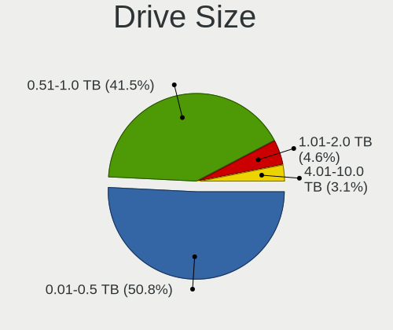
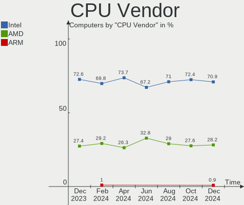
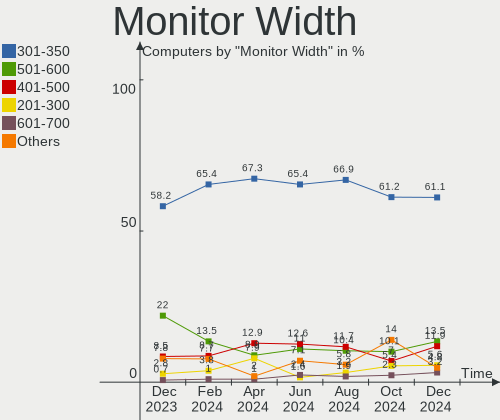
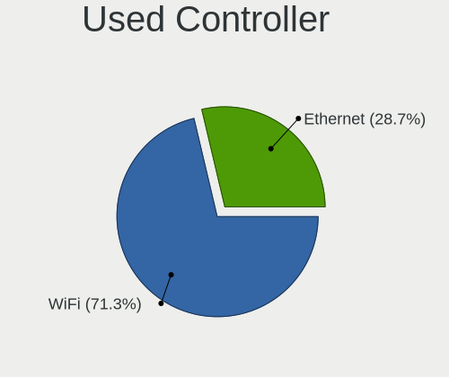
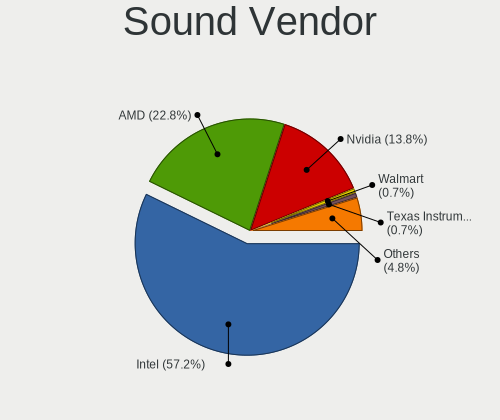
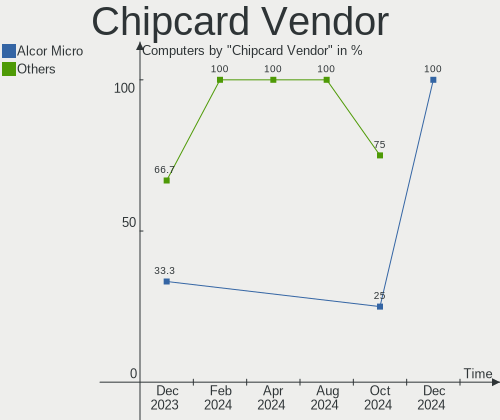

Linux in India - Hardware Trends
--------------------------------

A project to identify most popular hardware characteristics and track their change
over time based on data collected by Linux users at https://Linux-Hardware.org.

Anyone can contribute to this report by the [hw-probe](https://github.com/linuxhw/hw-probe) tool:

    sudo -E hw-probe -all -upload

This is a report for all computer types. See also reports for [desktops](/Location/India/Desktop/README.md) and [notebooks](/Location/India/Notebook/README.md).

Period: Jul, 2023.

Contents
--------

* [ System ](#system)
  - [ OS                       ](#os)
  - [ OS Family                ](#os-family)
  - [ Kernel                   ](#kernel)
  - [ Kernel Family            ](#kernel-family)
  - [ Kernel Major Ver.        ](#kernel-major-ver)
  - [ Arch                     ](#arch)
  - [ DE                       ](#de)
  - [ Display Server           ](#display-server)
  - [ Display Manager          ](#display-manager)
  - [ OS Lang                  ](#os-lang)
  - [ Boot Mode                ](#boot-mode)
  - [ Filesystem               ](#filesystem)
  - [ Part. scheme             ](#part-scheme)
  - [ Dual Boot with Linux/BSD ](#dual-boot-with-linuxbsd)
  - [ Dual Boot (Win)          ](#dual-boot-win)

* [ Board ](#board)
  - [ Vendor                   ](#vendor)
  - [ Model                    ](#model)
  - [ Model Family             ](#model-family)
  - [ MFG Year                 ](#mfg-year)
  - [ Form Factor              ](#form-factor)
  - [ Secure Boot              ](#secure-boot)
  - [ Coreboot                 ](#coreboot)
  - [ RAM Size                 ](#ram-size)
  - [ RAM Used                 ](#ram-used)
  - [ Total Drives             ](#total-drives)
  - [ Has CD-ROM               ](#has-cd-rom)
  - [ Has Ethernet             ](#has-ethernet)
  - [ Has WiFi                 ](#has-wifi)
  - [ Has Bluetooth            ](#has-bluetooth)

* [ Location ](#location)
  - [ Country                  ](#country)
  - [ City                     ](#city)

* [ Drives ](#drives)
  - [ Drive Vendor             ](#drive-vendor)
  - [ Drive Model              ](#drive-model)
  - [ HDD Vendor               ](#hdd-vendor)
  - [ SSD Vendor               ](#ssd-vendor)
  - [ Drive Kind               ](#drive-kind)
  - [ Drive Connector          ](#drive-connector)
  - [ Drive Size               ](#drive-size)
  - [ Space Total              ](#space-total)
  - [ Space Used               ](#space-used)
  - [ Malfunc. Drives          ](#malfunc-drives)
  - [ Malfunc. Drive Vendor    ](#malfunc-drive-vendor)
  - [ Malfunc. HDD Vendor      ](#malfunc-hdd-vendor)
  - [ Malfunc. Drive Kind      ](#malfunc-drive-kind)
  - [ Failed Drives            ](#failed-drives)
  - [ Failed Drive Vendor      ](#failed-drive-vendor)
  - [ Drive Status             ](#drive-status)

* [ Storage controller ](#storage-controller)
  - [ Storage Vendor           ](#storage-vendor)
  - [ Storage Model            ](#storage-model)
  - [ Storage Kind             ](#storage-kind)

* [ Processor ](#processor)
  - [ CPU Vendor               ](#cpu-vendor)
  - [ CPU Model                ](#cpu-model)
  - [ CPU Model Family         ](#cpu-model-family)
  - [ CPU Cores                ](#cpu-cores)
  - [ CPU Sockets              ](#cpu-sockets)
  - [ CPU Threads              ](#cpu-threads)
  - [ CPU Op-Modes             ](#cpu-op-modes)
  - [ CPU Microcode            ](#cpu-microcode)
  - [ CPU Microarch            ](#cpu-microarch)

* [ Graphics ](#graphics)
  - [ GPU Vendor               ](#gpu-vendor)
  - [ GPU Model                ](#gpu-model)
  - [ GPU Combo                ](#gpu-combo)
  - [ GPU Driver               ](#gpu-driver)
  - [ GPU Memory               ](#gpu-memory)

* [ Monitor ](#monitor)
  - [ Monitor Vendor           ](#monitor-vendor)
  - [ Monitor Model            ](#monitor-model)
  - [ Monitor Resolution       ](#monitor-resolution)
  - [ Monitor Diagonal         ](#monitor-diagonal)
  - [ Monitor Width            ](#monitor-width)
  - [ Aspect Ratio             ](#aspect-ratio)
  - [ Monitor Area             ](#monitor-area)
  - [ Pixel Density            ](#pixel-density)
  - [ Multiple Monitors        ](#multiple-monitors)

* [ Network ](#network)
  - [ Net Controller Vendor    ](#net-controller-vendor)
  - [ Net Controller Model     ](#net-controller-model)
  - [ Wireless Vendor          ](#wireless-vendor)
  - [ Wireless Model           ](#wireless-model)
  - [ Ethernet Vendor          ](#ethernet-vendor)
  - [ Ethernet Model           ](#ethernet-model)
  - [ Net Controller Kind      ](#net-controller-kind)
  - [ Used Controller          ](#used-controller)
  - [ NICs                     ](#nics)
  - [ IPv6                     ](#ipv6)

* [ Bluetooth ](#bluetooth)
  - [ Bluetooth Vendor         ](#bluetooth-vendor)
  - [ Bluetooth Model          ](#bluetooth-model)

* [ Sound ](#sound)
  - [ Sound Vendor             ](#sound-vendor)
  - [ Sound Model              ](#sound-model)

* [ Memory ](#memory)
  - [ Memory Vendor            ](#memory-vendor)
  - [ Memory Model             ](#memory-model)
  - [ Memory Kind              ](#memory-kind)
  - [ Memory Form Factor       ](#memory-form-factor)
  - [ Memory Size              ](#memory-size)
  - [ Memory Speed             ](#memory-speed)

* [ Printers & scanners ](#printers--scanners)
  - [ Printer Vendor           ](#printer-vendor)
  - [ Printer Model            ](#printer-model)
  - [ Scanner Vendor           ](#scanner-vendor)
  - [ Scanner Model            ](#scanner-model)

* [ Camera ](#camera)
  - [ Camera Vendor            ](#camera-vendor)
  - [ Camera Model             ](#camera-model)

* [ Security ](#security)
  - [ Fingerprint Vendor       ](#fingerprint-vendor)
  - [ Fingerprint Model        ](#fingerprint-model)
  - [ Chipcard Vendor          ](#chipcard-vendor)
  - [ Chipcard Model           ](#chipcard-model)

* [ Unsupported ](#unsupported)
  - [ Unsupported Devices      ](#unsupported-devices)
  - [ Unsupported Device Types ](#unsupported-device-types)

System
------

OS
--

Installed operating systems

| Name               | Computers | Percent |
|--------------------|-----------|---------|
| Ubuntu 22.04       | 23        | 20.18%  |
| Fedora 38          | 15        | 13.16%  |
| Debian 12          | 9         | 7.89%   |
| Ubuntu 23.04       | 8         | 7.02%   |
| Ubuntu 20.04       | 6         | 5.26%   |
| Linux Mint 21.2    | 6         | 5.26%   |
| Arch Rolling       | 5         | 4.39%   |
| Linux Mint 21.1    | 4         | 3.51%   |
| ArcoLinux Rolling  | 4         | 3.51%   |
| Pop!_OS 22.04      | 3         | 2.63%   |
| Elementary 7       | 3         | 2.63%   |
| Xero Rolling       | 2         | 1.75%   |
| Ubuntu 22.10       | 2         | 1.75%   |
| OpenMandriva 23.03 | 2         | 1.75%   |
| Manjaro 23.0.0     | 2         | 1.75%   |
| Kali 2023.2        | 2         | 1.75%   |
| Fedora 37          | 2         | 1.75%   |
| CachyOS Rolling    | 2         | 1.75%   |
| Zorin 16           | 1         | 0.88%   |
| Ubuntu MATE 22.04  | 1         | 0.88%   |
| Ubuntu 18.04       | 1         | 0.88%   |
| Parrot 5.3         | 1         | 0.88%   |
| openSUSE Leap-15.5 | 1         | 0.88%   |
| OpenMandriva 4.3   | 1         | 0.88%   |
| OpenMandriva 23.90 | 1         | 0.88%   |
| OpenMandriva 23.06 | 1         | 0.88%   |
| Manjaro            | 1         | 0.88%   |
| Lubuntu 22.04      | 1         | 0.88%   |
| Liya Rolling       | 1         | 0.88%   |
| Kubuntu 22.04      | 1         | 0.88%   |
| KDE neon 22.04     | 1         | 0.88%   |
| Kali 2023.1        | 1         | 0.88%   |

OS Family
---------

OS without a version

| Name         | Computers | Percent |
|--------------|-----------|---------|
| Ubuntu       | 40        | 35.09%  |
| Fedora       | 17        | 14.91%  |
| Linux Mint   | 10        | 8.77%   |
| Debian       | 9         | 7.89%   |
| OpenMandriva | 5         | 4.39%   |
| Arch         | 5         | 4.39%   |
| ArcoLinux    | 4         | 3.51%   |
| Pop!_OS      | 3         | 2.63%   |
| Manjaro      | 3         | 2.63%   |
| Kali         | 3         | 2.63%   |
| Elementary   | 3         | 2.63%   |
| Xero         | 2         | 1.75%   |
| CachyOS      | 2         | 1.75%   |
| Zorin        | 1         | 0.88%   |
| Ubuntu MATE  | 1         | 0.88%   |
| Parrot       | 1         | 0.88%   |
| openSUSE     | 1         | 0.88%   |
| Lubuntu      | 1         | 0.88%   |
| Liya         | 1         | 0.88%   |
| Kubuntu      | 1         | 0.88%   |
| KDE neon     | 1         | 0.88%   |

Kernel
------

Version of the Linux kernel

| Version                | Computers | Percent |
|------------------------|-----------|---------|
| 5.19.0-46-generic      | 21        | 18.42%  |
| 5.15.0-76-generic      | 10        | 8.77%   |
| 5.15.0-78-generic      | 7         | 6.14%   |
| 6.1.0-10-amd64         | 5         | 4.39%   |
| 6.3.12-200.fc38.x86_64 | 4         | 3.51%   |
| 6.3.11-200.fc38.x86_64 | 4         | 3.51%   |
| 6.2.0-25-generic       | 4         | 3.51%   |
| 6.1.0-9-amd64          | 4         | 3.51%   |
| 5.19.0-50-generic      | 4         | 3.51%   |
| 6.3.8-200.fc38.x86_64  | 3         | 2.63%   |
| 6.2.6-desktop-1omv2390 | 3         | 2.63%   |
| 6.2.0-24-generic       | 3         | 2.63%   |
| 6.4.6-200.fc38.x86_64  | 2         | 1.75%   |
| 6.4.1-arch2-1          | 2         | 1.75%   |
| 6.2.6-76060206-generic | 2         | 1.75%   |
| 6.1.38-1-MANJARO       | 2         | 1.75%   |
| 5.15.0-58-generic      | 2         | 1.75%   |
| 6.4.7-arch1-1          | 1         | 0.88%   |
| 6.4.6-arch1-1          | 1         | 0.88%   |
| 6.4.4-arch1-1          | 1         | 0.88%   |
| 6.4.4-200.fc38.x86_64  | 1         | 0.88%   |
| 6.4.3-zen1-1.1-zen     | 1         | 0.88%   |
| 6.4.3-arch1-1          | 1         | 0.88%   |
| 6.4.2-zen1-1-zen       | 1         | 0.88%   |
| 6.4.2-desktop-1omv2390 | 1         | 0.88%   |
| 6.4.2-3-MANJARO        | 1         | 0.88%   |
| 6.4.2-2-cachyos        | 1         | 0.88%   |
| 6.4.1-arch1-1          | 1         | 0.88%   |
| 6.4.0-1-mainline       | 1         | 0.88%   |
| 6.3.9-zen1-1-zen       | 1         | 0.88%   |
| 6.3.8-arch1-1          | 1         | 0.88%   |
| 6.3.7-060307-generic   | 1         | 0.88%   |
| 6.3.0-kali1-amd64      | 1         | 0.88%   |
| 6.2.9-300.fc38.x86_64  | 1         | 0.88%   |
| 6.2.10-200.fc37.x86_64 | 1         | 0.88%   |
| 6.2.0-26-generic       | 1         | 0.88%   |
| 6.1.39-1-lts           | 1         | 0.88%   |
| 6.1.0-kali5-amd64      | 1         | 0.88%   |
| 6.1.0-1parrot1-amd64   | 1         | 0.88%   |
| 6.1.0-1016-oem         | 1         | 0.88%   |

Kernel Family
-------------

Linux kernel without a distro release

| Version | Computers | Percent |
|---------|-----------|---------|
| 5.19.0  | 26        | 22.81%  |
| 5.15.0  | 21        | 18.42%  |
| 6.1.0   | 13        | 11.4%   |
| 6.2.0   | 8         | 7.02%   |
| 6.2.6   | 5         | 4.39%   |
| 6.4.2   | 4         | 3.51%   |
| 6.3.8   | 4         | 3.51%   |
| 6.3.12  | 4         | 3.51%   |
| 6.3.11  | 4         | 3.51%   |
| 6.4.6   | 3         | 2.63%   |
| 6.4.1   | 3         | 2.63%   |
| 6.4.4   | 2         | 1.75%   |
| 6.4.3   | 2         | 1.75%   |
| 6.1.38  | 2         | 1.75%   |
| 6.4.7   | 1         | 0.88%   |
| 6.4.0   | 1         | 0.88%   |
| 6.3.9   | 1         | 0.88%   |
| 6.3.7   | 1         | 0.88%   |
| 6.3.0   | 1         | 0.88%   |
| 6.2.9   | 1         | 0.88%   |
| 6.2.10  | 1         | 0.88%   |
| 6.1.39  | 1         | 0.88%   |
| 6.0.7   | 1         | 0.88%   |
| 5.4.0   | 1         | 0.88%   |
| 5.16.7  | 1         | 0.88%   |
| 5.14.21 | 1         | 0.88%   |
| 5.14.0  | 1         | 0.88%   |

Kernel Major Ver.
-----------------

Linux kernel major version

| Version | Computers | Percent |
|---------|-----------|---------|
| 5.19    | 26        | 22.81%  |
| 5.15    | 21        | 18.42%  |
| 6.4     | 16        | 14.04%  |
| 6.1     | 16        | 14.04%  |
| 6.3     | 15        | 13.16%  |
| 6.2     | 15        | 13.16%  |
| 5.14    | 2         | 1.75%   |
| 6.0     | 1         | 0.88%   |
| 5.4     | 1         | 0.88%   |
| 5.16    | 1         | 0.88%   |

Arch
----

OS architecture (x86_64, i586, etc.)

| Name   | Computers | Percent |
|--------|-----------|---------|
| x86_64 | 114       | 100%    |

DE
--

Desktop Environment

| Name       | Computers | Percent |
|------------|-----------|---------|
| GNOME      | 69        | 60.53%  |
| KDE5       | 18        | 15.79%  |
| X-Cinnamon | 10        | 8.77%   |
| XFCE       | 5         | 4.39%   |
| Pantheon   | 3         | 2.63%   |
| MATE       | 2         | 1.75%   |
| Unknown    | 2         | 1.75%   |
| sway       | 1         | 0.88%   |
| qtile      | 1         | 0.88%   |
| LXQt       | 1         | 0.88%   |
| i3         | 1         | 0.88%   |
| Cinnamon   | 1         | 0.88%   |

Display Server
--------------

X11 or Wayland

| Name    | Computers | Percent |
|---------|-----------|---------|
| X11     | 66        | 57.89%  |
| Wayland | 42        | 36.84%  |
| Unknown | 6         | 5.26%   |

Display Manager
---------------

SDDM, LightDM, etc.

| Name    | Computers | Percent |
|---------|-----------|---------|
| Unknown | 38        | 33.33%  |
| GDM3    | 35        | 30.7%   |
| SDDM    | 18        | 15.79%  |
| GDM     | 13        | 11.4%   |
| LightDM | 10        | 8.77%   |

OS Lang
-------

Language

| Lang    | Computers | Percent |
|---------|-----------|---------|
| en_IN   | 74        | 64.91%  |
| en_US   | 36        | 31.58%  |
| Unknown | 2         | 1.75%   |
| en_GB   | 1         | 0.88%   |
| C       | 1         | 0.88%   |

Boot Mode
---------

EFI or BIOS

| Mode | Computers | Percent |
|------|-----------|---------|
| EFI  | 70        | 61.4%   |
| BIOS | 44        | 38.6%   |

Filesystem
----------

Type of filesystem

| Type    | Computers | Percent |
|---------|-----------|---------|
| Ext4    | 66        | 57.89%  |
| Btrfs   | 22        | 19.3%   |
| Tmpfs   | 18        | 15.79%  |
| Overlay | 4         | 3.51%   |
| Xfs     | 3         | 2.63%   |
| F2fs    | 1         | 0.88%   |

Part. scheme
------------

Scheme of partitioning

| Type    | Computers | Percent |
|---------|-----------|---------|
| GPT     | 72        | 63.16%  |
| Unknown | 34        | 29.82%  |
| MBR     | 8         | 7.02%   |

Dual Boot with Linux/BSD
------------------------

Hosting more than one Linux/BSD

| Dual boot | Computers | Percent |
|-----------|-----------|---------|
| No        | 100       | 87.72%  |
| Yes       | 14        | 12.28%  |

Dual Boot (Win)
---------------

Hosting Linux and Windows

| Dual boot | Computers | Percent |
|-----------|-----------|---------|
| No        | 82        | 71.93%  |
| Yes       | 32        | 28.07%  |

Board
-----

Vendor
------

Motherboard manufacturer

| Name                | Computers | Percent |
|---------------------|-----------|---------|
| Lenovo              | 20        | 17.54%  |
| Hewlett-Packard     | 20        | 17.54%  |
| ASUSTek Computer    | 20        | 17.54%  |
| Dell                | 17        | 14.91%  |
| Gigabyte Technology | 9         | 7.89%   |
| Timi                | 7         | 6.14%   |
| MSI                 | 6         | 5.26%   |
| Acer                | 6         | 5.26%   |
| Intel               | 2         | 1.75%   |
| ASRock              | 2         | 1.75%   |
| POWERX              | 1         | 0.88%   |
| Infinix             | 1         | 0.88%   |
| HONOR               | 1         | 0.88%   |
| AVITA               | 1         | 0.88%   |
| Unknown             | 1         | 0.88%   |

Model
-----

Motherboard model

| Name                                     | Computers | Percent |
|------------------------------------------|-----------|---------|
| Timi Mi NoteBook Ultra                   | 5         | 4.39%   |
| Lenovo ThinkPad E14 20RBCTO1WW           | 2         | 1.75%   |
| HP Notebook                              | 2         | 1.75%   |
| Gigabyte H61M-DS2                        | 2         | 1.75%   |
| ASUS VivoBook_ASUSLaptop M3401QC_M3401QC | 2         | 1.75%   |
| Acer Nitro AN515-58                      | 2         | 1.75%   |
| Timi Xiaomi NoteBook Pro                 | 1         | 0.88%   |
| Timi Mi NoteBook Horizon Edition 14      | 1         | 0.88%   |
| POWERX G41                               | 1         | 0.88%   |
| MSI MS-7D22                              | 1         | 0.88%   |
| MSI MS-7923                              | 1         | 0.88%   |
| MSI Katana GF66 11UC                     | 1         | 0.88%   |
| MSI GF63 Thin 11UC                       | 1         | 0.88%   |
| MSI Bravo 15 B5DD                        | 1         | 0.88%   |
| MSI Alpha 15 B5EEK                       | 1         | 0.88%   |
| Lenovo Z50-70 20354                      | 1         | 0.88%   |
| Lenovo Yoga 9 14ITL5 82BG                | 1         | 0.88%   |
| Lenovo Yoga 7 16IAP7 82QG                | 1         | 0.88%   |
| Lenovo V15 G3 IAP 82TT                   | 1         | 0.88%   |
| Lenovo ThinkPad T16 Gen 1 21CJCTO1WW     | 1         | 0.88%   |
| Lenovo ThinkPad E560 20EVCTO1WW          | 1         | 0.88%   |
| Lenovo ThinkPad E14 Gen 3 20YDCTO1WW     | 1         | 0.88%   |
| Lenovo ThinkPad E14 20RAS1RA00           | 1         | 0.88%   |
| Lenovo ThinkCentre M920t 10SGS0K600      | 1         | 0.88%   |
| Lenovo ThinkCentre M910s 10MLS05C00      | 1         | 0.88%   |
| Lenovo Legion Y540-15IRH-PG0 81SY        | 1         | 0.88%   |
| Lenovo IdeaPad Gaming 3 15IHU6 82K1      | 1         | 0.88%   |
| Lenovo IdeaPad Gaming 3 15ARH05 82EY     | 1         | 0.88%   |
| Lenovo IdeaPad 330S-15IKB 81F5           | 1         | 0.88%   |
| Lenovo IdeaPad 130-15AST 81H5            | 1         | 0.88%   |
| Lenovo G500s 20245                       | 1         | 0.88%   |
| Lenovo G50-70 20351                      | 1         | 0.88%   |
| Lenovo E41-25 81FS                       | 1         | 0.88%   |
| Intel H61                                | 1         | 0.88%   |
| Intel DH61BF AAG81311-102                | 1         | 0.88%   |
| Infinix INBOOK X2 PLUS                   | 1         | 0.88%   |
| HONOR NMH-WCX9                           | 1         | 0.88%   |
| HP ProDesk 600 G5 PCI MT                 | 1         | 0.88%   |
| HP ProBook 4525s                         | 1         | 0.88%   |
| HP Pavilion x360 Convertible 14-dh1xxx   | 1         | 0.88%   |

Model Family
------------

Motherboard model prefix

| Name               | Computers | Percent |
|--------------------|-----------|---------|
| ASUS VivoBook      | 8         | 7.02%   |
| HP Pavilion        | 7         | 6.14%   |
| Timi Mi            | 6         | 5.26%   |
| Lenovo ThinkPad    | 6         | 5.26%   |
| Dell Latitude      | 6         | 5.26%   |
| Dell Inspiron      | 5         | 4.39%   |
| Lenovo IdeaPad     | 4         | 3.51%   |
| ASUS ROG           | 3         | 2.63%   |
| ASUS ASUS          | 3         | 2.63%   |
| Acer Aspire        | 3         | 2.63%   |
| Lenovo Yoga        | 2         | 1.75%   |
| Lenovo ThinkCentre | 2         | 1.75%   |
| HP Notebook        | 2         | 1.75%   |
| HP Laptop          | 2         | 1.75%   |
| HP EliteBook       | 2         | 1.75%   |
| HP All-in-One      | 2         | 1.75%   |
| Gigabyte H61M-DS2  | 2         | 1.75%   |
| Dell Vostro        | 2         | 1.75%   |
| Dell Precision     | 2         | 1.75%   |
| ASUS PRIME         | 2         | 1.75%   |
| Acer Nitro         | 2         | 1.75%   |
| Timi Xiaomi        | 1         | 0.88%   |
| POWERX G41         | 1         | 0.88%   |
| MSI MS-7D22        | 1         | 0.88%   |
| MSI MS-7923        | 1         | 0.88%   |
| MSI Katana         | 1         | 0.88%   |
| MSI GF63           | 1         | 0.88%   |
| MSI Bravo          | 1         | 0.88%   |
| MSI Alpha          | 1         | 0.88%   |
| Lenovo Z50-70      | 1         | 0.88%   |
| Lenovo V15         | 1         | 0.88%   |
| Lenovo Legion      | 1         | 0.88%   |
| Lenovo G500s       | 1         | 0.88%   |
| Lenovo G50-70      | 1         | 0.88%   |
| Lenovo E41-25      | 1         | 0.88%   |
| Intel H61          | 1         | 0.88%   |
| Intel DH61BF       | 1         | 0.88%   |
| Infinix INBOOK     | 1         | 0.88%   |
| HONOR NMH-WCX9     | 1         | 0.88%   |
| HP ProDesk         | 1         | 0.88%   |

MFG Year
--------

Motherboard manufacture year

| Year | Computers | Percent |
|------|-----------|---------|
| 2021 | 27        | 23.68%  |
| 2022 | 16        | 14.04%  |
| 2020 | 14        | 12.28%  |
| 2018 | 10        | 8.77%   |
| 2019 | 9         | 7.89%   |
| 2013 | 7         | 6.14%   |
| 2017 | 6         | 5.26%   |
| 2016 | 6         | 5.26%   |
| 2023 | 5         | 4.39%   |
| 2015 | 4         | 3.51%   |
| 2012 | 4         | 3.51%   |
| 2014 | 2         | 1.75%   |
| 2010 | 2         | 1.75%   |
| 2011 | 1         | 0.88%   |
| 2008 | 1         | 0.88%   |

Form Factor
-----------

Physical design of the computer

| Name        | Computers | Percent |
|-------------|-----------|---------|
| Notebook    | 80        | 70.18%  |
| Desktop     | 27        | 23.68%  |
| Convertible | 4         | 3.51%   |
| All in one  | 2         | 1.75%   |
| Server      | 1         | 0.88%   |

Secure Boot
-----------

Enabled or disabled

| State    | Computers | Percent |
|----------|-----------|---------|
| Disabled | 102       | 89.47%  |
| Enabled  | 12        | 10.53%  |

Coreboot
--------

Have coreboot on board

| Used | Computers | Percent |
|------|-----------|---------|
| No   | 114       | 100%    |

RAM Size
--------

Total RAM memory

| Size in GB  | Computers | Percent |
|-------------|-----------|---------|
| 4.01-8.0    | 41        | 35.96%  |
| 16.01-24.0  | 29        | 25.44%  |
| 8.01-16.0   | 20        | 17.54%  |
| 32.01-64.0  | 8         | 7.02%   |
| 3.01-4.0    | 8         | 7.02%   |
| 24.01-32.0  | 3         | 2.63%   |
| 1.01-2.0    | 3         | 2.63%   |
| 64.01-256.0 | 2         | 1.75%   |

RAM Used
--------

Used RAM memory

| Used GB    | Computers | Percent |
|------------|-----------|---------|
| 2.01-3.0   | 31        | 27.19%  |
| 4.01-8.0   | 29        | 25.44%  |
| 3.01-4.0   | 26        | 22.81%  |
| 1.01-2.0   | 17        | 14.91%  |
| 8.01-16.0  | 6         | 5.26%   |
| 0.51-1.0   | 3         | 2.63%   |
| 16.01-24.0 | 1         | 0.88%   |
| 0.01-0.5   | 1         | 0.88%   |

Total Drives
------------

Number of drives on board

| Drives | Computers | Percent |
|--------|-----------|---------|
| 1      | 76        | 66.67%  |
| 2      | 31        | 27.19%  |
| 3      | 5         | 4.39%   |
| 5      | 1         | 0.88%   |
| 0      | 1         | 0.88%   |

Has CD-ROM
----------

Has CD-ROM on board

| Presented | Computers | Percent |
|-----------|-----------|---------|
| No        | 99        | 86.84%  |
| Yes       | 15        | 13.16%  |

Has Ethernet
------------

Has Ethernet on board

| Presented | Computers | Percent |
|-----------|-----------|---------|
| Yes       | 83        | 72.81%  |
| No        | 31        | 27.19%  |

Has WiFi
--------

Has WiFi module

| Presented | Computers | Percent |
|-----------|-----------|---------|
| Yes       | 101       | 88.6%   |
| No        | 13        | 11.4%   |

Has Bluetooth
-------------

Has Bluetooth module

| Presented | Computers | Percent |
|-----------|-----------|---------|
| Yes       | 91        | 79.82%  |
| No        | 23        | 20.18%  |

Location
--------

Country
-------

Geographic location (country)

| Country | Computers | Percent |
|---------|-----------|---------|
| India   | 114       | 100%    |

City
----

Geographic location (city)

| City          | Computers | Percent |
|---------------|-----------|---------|
| Delhi         | 17        | 14.91%  |
| Hyderabad     | 12        | 10.53%  |
| Bengaluru     | 11        | 9.65%   |
| Chennai       | 8         | 7.02%   |
| Mumbai        | 6         | 5.26%   |
| Mangalore     | 5         | 4.39%   |
| Surat         | 4         | 3.51%   |
| Trivandrum    | 3         | 2.63%   |
| Jaipur        | 3         | 2.63%   |
| Ahmedabad     | 3         | 2.63%   |
| Pune          | 2         | 1.75%   |
| Nagpur        | 2         | 1.75%   |
| Lucknow       | 2         | 1.75%   |
| Kolkata       | 2         | 1.75%   |
| Kanpur        | 2         | 1.75%   |
| Guwahati      | 2         | 1.75%   |
| Coimbatore    | 2         | 1.75%   |
| Vijayawada    | 1         | 0.88%   |
| Vengavasal    | 1         | 0.88%   |
| Tirupur       | 1         | 0.88%   |
| Shirala       | 1         | 0.88%   |
| Pollachi      | 1         | 0.88%   |
| Panvel        | 1         | 0.88%   |
| Noida         | 1         | 0.88%   |
| Navi Mumbai   | 1         | 0.88%   |
| Narsingpur    | 1         | 0.88%   |
| Manipal       | 1         | 0.88%   |
| Kodinar       | 1         | 0.88%   |
| Kochi         | 1         | 0.88%   |
| Kishanganj    | 1         | 0.88%   |
| Kalwara       | 1         | 0.88%   |
| Jalpaiguri    | 1         | 0.88%   |
| Hapur         | 1         | 0.88%   |
| Gurgaon       | 1         | 0.88%   |
| Greater Noida | 1         | 0.88%   |
| Faridpur      | 1         | 0.88%   |
| Faridabad     | 1         | 0.88%   |
| Dibrugarh     | 1         | 0.88%   |
| Damoh         | 1         | 0.88%   |
| Chandigarh    | 1         | 0.88%   |

Drives
------

Drive Vendor
------------

Hard drive vendors

| Vendor                       | Computers | Drives | Percent |
|------------------------------|-----------|--------|---------|
| Seagate                      | 25        | 26     | 16.67%  |
| Samsung Electronics          | 20        | 20     | 13.33%  |
| WDC                          | 19        | 21     | 12.67%  |
| Toshiba                      | 10        | 10     | 6.67%   |
| Sandisk                      | 8         | 9      | 5.33%   |
| Micron Technology            | 8         | 8      | 5.33%   |
| Crucial                      | 7         | 7      | 4.67%   |
| SK hynix                     | 6         | 6      | 4%      |
| KIOXIA                       | 6         | 6      | 4%      |
| Intel                        | 6         | 7      | 4%      |
| Kingston Technology Company  | 4         | 4      | 2.67%   |
| Kingston                     | 4         | 4      | 2.67%   |
| ADATA Technology             | 3         | 3      | 2%      |
| Silicon Motion               | 2         | 2      | 1.33%   |
| Micron/Crucial Technology    | 2         | 2      | 1.33%   |
| FORESEE                      | 2         | 2      | 1.33%   |
| China                        | 2         | 2      | 1.33%   |
| Acer                         | 2         | 2      | 1.33%   |
| A-DATA Technology            | 2         | 2      | 1.33%   |
| Yangtze Memory Technologies  | 1         | 1      | 0.67%   |
| XPG                          | 1         | 1      | 0.67%   |
| SPCC                         | 1         | 1      | 0.67%   |
| Shenzhen Longsys Electronics | 1         | 1      | 0.67%   |
| Realtek Semiconductor        | 1         | 1      | 0.67%   |
| PNY                          | 1         | 1      | 0.67%   |
| NFORCE                       | 1         | 1      | 0.67%   |
| Hewlett-Packard              | 1         | 1      | 0.67%   |
| Gigabyte Technology          | 1         | 1      | 0.67%   |
| EVM                          | 1         | 1      | 0.67%   |
| CONSISTENT                   | 1         | 1      | 0.67%   |
| Unknown                      | 1         | 1      | 0.67%   |

Drive Model
-----------

Hard drive models

| Model                                                 | Computers | Percent |
|-------------------------------------------------------|-----------|---------|
| Seagate ST1000LM035-1RK172 1TB                        | 7         | 4.55%   |
| Seagate ST1000DM010-2EP102 1TB                        | 4         | 2.6%    |
| Seagate ST1000LM024 HN-M101MBB 1TB                    | 3         | 1.95%   |
| Sandisk WD Blue SN550 NVMe SSD 250GB                  | 3         | 1.95%   |
| Micron 2450_MTFDKBA512TFK 512GB                       | 3         | 1.95%   |
| KIOXIA KBG40ZNV512G 512GB                             | 3         | 1.95%   |
| Crucial CT240BX500SSD1 240GB                          | 3         | 1.95%   |
| WDC WD10EZEX-08WN4A0 1TB                              | 2         | 1.3%    |
| Toshiba MQ04ABF100 1TB                                | 2         | 1.3%    |
| Silicon Motion SM2263EN/SM2263XT SSD Controller 500GB | 2         | 1.3%    |
| Seagate ST500DM002-1BD142 500GB                       | 2         | 1.3%    |
| Seagate ST3500312CS 500GB                             | 2         | 1.3%    |
| Seagate ST1000DM003-1SB102 1TB                        | 2         | 1.3%    |
| Sandisk WD Black SN750 / PC SN730 NVMe SSD 1024GB     | 2         | 1.3%    |
| Samsung MZVLQ512HBLU-00BH1 512GB                      | 2         | 1.3%    |
| Samsung MZAL4512HBLU-00BL2 512GB                      | 2         | 1.3%    |
| Micron/Crucial P2 NVMe PCIe SSD 1TB                   | 2         | 1.3%    |
| Micron 3400_MTFDKBA512TFH 512GB                       | 2         | 1.3%    |
| Micron 2400_MTFDKBA1T0QFM 1024GB                      | 2         | 1.3%    |
| Kingston Company OM3PDP3 NVMe SSD 512GB               | 2         | 1.3%    |
| Kingston Company A2000 NVMe SSD 1TB                   | 2         | 1.3%    |
| Crucial CT1000P2SSD8 1TB                              | 2         | 1.3%    |
| ADATA XPG GAMMIX S70 BLADE 1024GB                     | 2         | 1.3%    |
| Yangtze Memory YMTC PC005 512GB                       | 1         | 0.65%   |
| XPG GAMMIX S70 BLADE 2TB                              | 1         | 0.65%   |
| WDC WDS500G2B0A-00SM50 500GB SSD                      | 1         | 0.65%   |
| WDC WDS240G2G0B-00EPW0 240GB SSD                      | 1         | 0.65%   |
| WDC WDS240G2G0A-00JH30 240GB SSD                      | 1         | 0.65%   |
| WDC WD5000AAKX-753CA1 500GB                           | 1         | 0.65%   |
| WDC WD20SPZX-08UA7 2TB                                | 1         | 0.65%   |
| WDC WD20EZAZ-00L9GB0 2TB                              | 1         | 0.65%   |
| WDC WD1200BEVS-75RST0 120GB                           | 1         | 0.65%   |
| WDC WD10SPZX-24Z10 1TB                                | 1         | 0.65%   |
| WDC WD10SPSX-21A6WT0 1TB                              | 1         | 0.65%   |
| WDC WD10JPVX-75JC3T0 1TB                              | 1         | 0.65%   |
| WDC WD10JPVX-08JC3T5 1TB                              | 1         | 0.65%   |
| WDC WD10JPCX-24UE4T0 1TB                              | 1         | 0.65%   |
| WDC WD10EZRX-00L4HB0 1TB                              | 1         | 0.65%   |
| WDC WD10EZEX-75WN4A0 1TB                              | 1         | 0.65%   |
| WDC WD10EADS-114BB1 1TB                               | 1         | 0.65%   |

HDD Vendor
----------

Hard disk drive vendors

| Vendor              | Computers | Drives | Percent |
|---------------------|-----------|--------|---------|
| Seagate             | 25        | 26     | 49.02%  |
| WDC                 | 13        | 14     | 25.49%  |
| Toshiba             | 10        | 10     | 19.61%  |
| Samsung Electronics | 2         | 2      | 3.92%   |
| Hewlett-Packard     | 1         | 1      | 1.96%   |

SSD Vendor
----------

Solid state drive vendors

| Vendor              | Computers | Drives | Percent |
|---------------------|-----------|--------|---------|
| Crucial             | 5         | 5      | 16.67%  |
| WDC                 | 4         | 4      | 13.33%  |
| Samsung Electronics | 4         | 4      | 13.33%  |
| Kingston            | 2         | 2      | 6.67%   |
| China               | 2         | 2      | 6.67%   |
| Acer                | 2         | 2      | 6.67%   |
| A-DATA Technology   | 2         | 2      | 6.67%   |
| SPCC                | 1         | 1      | 3.33%   |
| SanDisk             | 1         | 1      | 3.33%   |
| PNY                 | 1         | 1      | 3.33%   |
| Intel               | 1         | 1      | 3.33%   |
| Gigabyte Technology | 1         | 1      | 3.33%   |
| FORESEE             | 1         | 1      | 3.33%   |
| EVM                 | 1         | 1      | 3.33%   |
| CONSISTENT          | 1         | 1      | 3.33%   |
| Unknown             | 1         | 1      | 3.33%   |

Drive Kind
----------

HDD or SSD

| Kind    | Computers | Drives | Percent |
|---------|-----------|--------|---------|
| NVMe    | 65        | 70     | 45.14%  |
| HDD     | 48        | 53     | 33.33%  |
| SSD     | 29        | 30     | 20.14%  |
| Unknown | 2         | 2      | 1.39%   |

Drive Connector
---------------

SATA, SAS, NVMe, etc.

| Type | Computers | Drives | Percent |
|------|-----------|--------|---------|
| NVMe | 65        | 70     | 49.62%  |
| SATA | 65        | 84     | 49.62%  |
| SAS  | 1         | 1      | 0.76%   |

Drive Size
----------

Size of hard drive

| Size in TB | Computers | Drives | Percent |
|------------|-----------|--------|---------|
| 0.01-0.5   | 38        | 43     | 50%     |
| 0.51-1.0   | 34        | 36     | 44.74%  |
| 1.01-2.0   | 4         | 4      | 5.26%   |

Space Total
-----------

Amount of disk space available on the file system

| Size in GB     | Computers | Percent |
|----------------|-----------|---------|
| 251-500        | 39        | 34.21%  |
| 101-250        | 25        | 21.93%  |
| 501-1000       | 24        | 21.05%  |
| 1001-2000      | 9         | 7.89%   |
| 51-100         | 6         | 5.26%   |
| 1-20           | 4         | 3.51%   |
| 2001-3000      | 3         | 2.63%   |
| More than 3000 | 2         | 1.75%   |
| 21-50          | 1         | 0.88%   |
| Unknown        | 1         | 0.88%   |

Space Used
----------

Amount of used disk space

| Used GB   | Computers | Percent |
|-----------|-----------|---------|
| 1-20      | 32        | 28.07%  |
| 21-50     | 26        | 22.81%  |
| 101-250   | 20        | 17.54%  |
| 251-500   | 14        | 12.28%  |
| 51-100    | 11        | 9.65%   |
| 501-1000  | 7         | 6.14%   |
| 1001-2000 | 3         | 2.63%   |
| Unknown   | 1         | 0.88%   |

Malfunc. Drives
---------------

Drive models with a malfunction

| Model                             | Computers | Drives | Percent |
|-----------------------------------|-----------|--------|---------|
| Toshiba MQ01ABD100 1TB            | 1         | 1      | 20%     |
| Toshiba MK2556GSY 250GB           | 1         | 1      | 20%     |
| Seagate ST1000LM035-1RK172 1TB    | 1         | 1      | 20%     |
| Samsung Electronics HD503HI 500GB | 1         | 1      | 20%     |
| A-DATA Technology SU650 480GB SSD | 1         | 1      | 20%     |

Malfunc. Drive Vendor
---------------------

Vendors of faulty drives

| Vendor              | Computers | Drives | Percent |
|---------------------|-----------|--------|---------|
| Toshiba             | 2         | 2      | 40%     |
| Seagate             | 1         | 1      | 20%     |
| Samsung Electronics | 1         | 1      | 20%     |
| A-DATA Technology   | 1         | 1      | 20%     |

Malfunc. HDD Vendor
-------------------

Vendors of faulty HDD drives

| Vendor              | Computers | Drives | Percent |
|---------------------|-----------|--------|---------|
| Toshiba             | 2         | 2      | 50%     |
| Seagate             | 1         | 1      | 25%     |
| Samsung Electronics | 1         | 1      | 25%     |

Malfunc. Drive Kind
-------------------

Kinds of faulty drives

| Kind | Computers | Drives | Percent |
|------|-----------|--------|---------|
| HDD  | 4         | 4      | 80%     |
| SSD  | 1         | 1      | 20%     |

Failed Drives
-------------

Failed drive models

Zero info for selected period =(

Failed Drive Vendor
-------------------

Failed drive vendors

Zero info for selected period =(

Drive Status
------------

Number of failed and malfunc. drives

| Status   | Computers | Drives | Percent |
|----------|-----------|--------|---------|
| Detected | 55        | 79     | 47.83%  |
| Works    | 55        | 71     | 47.83%  |
| Malfunc  | 5         | 5      | 4.35%   |

Storage controller
------------------

Storage Vendor
--------------

Storage controller vendors

| Vendor                       | Computers | Percent |
|------------------------------|-----------|---------|
| Intel                        | 78        | 49.68%  |
| AMD                          | 15        | 9.55%   |
| Samsung Electronics          | 14        | 8.92%   |
| SanDisk                      | 10        | 6.37%   |
| Micron Technology            | 8         | 5.1%    |
| SK hynix                     | 6         | 3.82%   |
| KIOXIA                       | 6         | 3.82%   |
| Kingston Technology Company  | 6         | 3.82%   |
| ADATA Technology             | 4         | 2.55%   |
| Micron/Crucial Technology    | 3         | 1.91%   |
| Silicon Motion               | 2         | 1.27%   |
| Shenzhen Longsys Electronics | 2         | 1.27%   |
| Yangtze Memory Technologies  | 1         | 0.64%   |
| Realtek Semiconductor        | 1         | 0.64%   |
| LSI Logic / Symbios Logic    | 1         | 0.64%   |

Storage Model
-------------

Storage controller models

| Model                                                                                   | Computers | Percent |
|-----------------------------------------------------------------------------------------|-----------|---------|
| Intel Volume Management Device NVMe RAID Controller                                     | 13        | 7.34%   |
| AMD FCH SATA Controller [AHCI mode]                                                     | 12        | 6.78%   |
| Intel Sunrise Point-LP SATA Controller [AHCI mode]                                      | 10        | 5.65%   |
| Intel 82801 Mobile SATA Controller [RAID mode]                                          | 9         | 5.08%   |
| Samsung NVMe SSD Controller 980                                                         | 7         | 3.95%   |
| SanDisk WD Blue SN550 NVMe SSD                                                          | 6         | 3.39%   |
| KIOXIA NVMe SSD Controller BG4 (DRAM-less)                                              | 5         | 2.82%   |
| Intel Alder Lake-P SATA AHCI Controller                                                 | 5         | 2.82%   |
| Intel Wildcat Point-LP SATA Controller [AHCI Mode]                                      | 4         | 2.26%   |
| Intel Tiger Lake-LP SATA Controller                                                     | 4         | 2.26%   |
| Intel Comet Lake SATA AHCI Controller                                                   | 4         | 2.26%   |
| Intel 6 Series/C200 Series Chipset Family Desktop SATA Controller (IDE mode, ports 4-5) | 4         | 2.26%   |
| Intel 6 Series/C200 Series Chipset Family Desktop SATA Controller (IDE mode, ports 0-3) | 4         | 2.26%   |
| Intel 200 Series PCH SATA controller [AHCI mode]                                        | 4         | 2.26%   |
| Samsung NVMe SSD Controller SM981/PM981/PM983                                           | 3         | 1.69%   |
| Micron/Crucial P2 [Nick P2] / P3 / P3 Plus NVMe PCIe SSD (DRAM-less)                    | 3         | 1.69%   |
| Micron 2450 NVMe SSD [HendrixV] (DRAM-less)                                             | 3         | 1.69%   |
| Intel 6 Series/C200 Series Chipset Family 6 port Desktop SATA AHCI Controller           | 3         | 1.69%   |
| Intel 400 Series Chipset Family SATA AHCI Controller                                    | 3         | 1.69%   |
| ADATA A Non-Volatile memory controller                                                  | 3         | 1.69%   |
| Silicon Motion SM2263EN/SM2263XT (DRAM-less) NVMe SSD Controllers                       | 2         | 1.13%   |
| SanDisk WD Green SN350 NVMe SSD 240GB (DRAM-less)                                       | 2         | 1.13%   |
| SanDisk WD Black SN750 / PC SN730 NVMe SSD                                              | 2         | 1.13%   |
| Samsung NVMe SSD Controller PM9B1                                                       | 2         | 1.13%   |
| Micron 3400 NVMe SSD [Hendrix]                                                          | 2         | 1.13%   |
| Micron 2400 NVMe SSD (DRAM-less)                                                        | 2         | 1.13%   |
| Kingston Company OM8PCP Design-In PCIe 3 NVMe SSD (DRAM-less)                           | 2         | 1.13%   |
| Kingston Company OM3PDP3 NVMe SSD                                                       | 2         | 1.13%   |
| Kingston Company A2000 NVMe SSD                                                         | 2         | 1.13%   |
| Intel Tiger Lake SATA AHCI Controller                                                   | 2         | 1.13%   |
| Intel SSD 670p Series [Keystone Harbor]                                                 | 2         | 1.13%   |
| Intel SSD 660P Series                                                                   | 2         | 1.13%   |
| Intel NM10/ICH7 Family SATA Controller [IDE mode]                                       | 2         | 1.13%   |
| Intel Cannon Lake PCH SATA AHCI Controller                                              | 2         | 1.13%   |
| Intel 82801G (ICH7 Family) IDE Controller                                               | 2         | 1.13%   |
| Intel 8 Series SATA Controller 1 [AHCI mode]                                            | 2         | 1.13%   |
| Intel 7 Series/C210 Series Chipset Family 6-port SATA Controller [AHCI mode]            | 2         | 1.13%   |
| AMD 500 Series Chipset SATA Controller                                                  | 2         | 1.13%   |
| Yangtze Memory PC005 NVMe SSD                                                           | 1         | 0.56%   |
| SK hynix Platinum P41/PC801 NVMe Solid State Drive                                      | 1         | 0.56%   |

Storage Kind
------------

Kind of storage controller (IDE, SATA, NVMe, SAS, ...)

| Kind | Computers | Percent |
|------|-----------|---------|
| SATA | 70        | 42.17%  |
| NVMe | 66        | 39.76%  |
| RAID | 23        | 13.86%  |
| IDE  | 7         | 4.22%   |

Processor
---------

CPU Vendor
----------

Processor vendors

| Vendor | Computers | Percent |
|--------|-----------|---------|
| Intel  | 89        | 78.07%  |
| AMD    | 25        | 21.93%  |

CPU Model
---------

Processor models

| Model                                   | Computers | Percent |
|-----------------------------------------|-----------|---------|
| Intel Core i7-10510U CPU @ 1.80GHz      | 4         | 3.51%   |
| Intel 11th Gen Core i5-11300H @ 3.10GHz | 4         | 3.51%   |
| Intel Core i7-6500U CPU @ 2.50GHz       | 3         | 2.63%   |
| Intel Core i5-6300U CPU @ 2.40GHz       | 3         | 2.63%   |
| Intel Core i5-10210U CPU @ 1.60GHz      | 3         | 2.63%   |
| Intel Core i3-5005U CPU @ 2.00GHz       | 3         | 2.63%   |
| Intel Core i3-3220 CPU @ 3.30GHz        | 3         | 2.63%   |
| Intel 11th Gen Core i3-1115G4 @ 3.00GHz | 3         | 2.63%   |
| AMD Ryzen 7 5800H with Radeon Graphics  | 3         | 2.63%   |
| Intel Core i7-9700 CPU @ 3.00GHz        | 2         | 1.75%   |
| Intel Core i5-8250U CPU @ 1.60GHz       | 2         | 1.75%   |
| Intel Core i5-1035G1 CPU @ 1.00GHz      | 2         | 1.75%   |
| Intel Core i3-6006U CPU @ 2.00GHz       | 2         | 1.75%   |
| Intel 12th Gen Core i7-1260P            | 2         | 1.75%   |
| Intel 12th Gen Core i5-12500H           | 2         | 1.75%   |
| Intel 12th Gen Core i5-12450H           | 2         | 1.75%   |
| Intel 12th Gen Core i3-1215U            | 2         | 1.75%   |
| Intel 11th Gen Core i7-11800H @ 2.30GHz | 2         | 1.75%   |
| Intel 11th Gen Core i5-1135G7 @ 2.40GHz | 2         | 1.75%   |
| Intel 11th Gen Core i5-11320H @ 3.20GHz | 2         | 1.75%   |
| AMD Ryzen 9 7945HX with Radeon Graphics | 2         | 1.75%   |
| AMD Ryzen 5 5500U with Radeon Graphics  | 2         | 1.75%   |
| AMD Ryzen 5 4600H with Radeon Graphics  | 2         | 1.75%   |
| Intel Xeon CPU E5-2620 v2 @ 2.10GHz     | 1         | 0.88%   |
| Intel Pentium CPU N3530 @ 2.16GHz       | 1         | 0.88%   |
| Intel Pentium CPU G2030 @ 3.00GHz       | 1         | 0.88%   |
| Intel Pentium CPU G2020 @ 2.90GHz       | 1         | 0.88%   |
| Intel Core i7-8700 CPU @ 3.20GHz        | 1         | 0.88%   |
| Intel Core i7-7700K CPU @ 4.20GHz       | 1         | 0.88%   |
| Intel Core i7-3770S CPU @ 3.10GHz       | 1         | 0.88%   |
| Intel Core i7-10870H CPU @ 2.20GHz      | 1         | 0.88%   |
| Intel Core i7-10700F CPU @ 2.90GHz      | 1         | 0.88%   |
| Intel Core i7-1065G7 CPU @ 1.30GHz      | 1         | 0.88%   |
| Intel Core i5-9300H CPU @ 2.40GHz       | 1         | 0.88%   |
| Intel Core i5-8350U CPU @ 1.70GHz       | 1         | 0.88%   |
| Intel Core i5-8265U CPU @ 1.60GHz       | 1         | 0.88%   |
| Intel Core i5-7500 CPU @ 3.40GHz        | 1         | 0.88%   |
| Intel Core i5-7200U CPU @ 2.50GHz       | 1         | 0.88%   |
| Intel Core i5-6200U CPU @ 2.30GHz       | 1         | 0.88%   |
| Intel Core i5-6198DU CPU @ 2.30GHz      | 1         | 0.88%   |

CPU Model Family
----------------

Processor model prefix

| Model             | Computers | Percent |
|-------------------|-----------|---------|
| Other             | 29        | 25.44%  |
| Intel Core i5     | 24        | 21.05%  |
| Intel Core i7     | 15        | 13.16%  |
| Intel Core i3     | 15        | 13.16%  |
| AMD Ryzen 7       | 8         | 7.02%   |
| AMD Ryzen 5       | 7         | 6.14%   |
| Intel Pentium     | 3         | 2.63%   |
| AMD Ryzen 3       | 3         | 2.63%   |
| Intel Core 2 Duo  | 2         | 1.75%   |
| AMD Ryzen 9       | 2         | 1.75%   |
| AMD A6            | 2         | 1.75%   |
| Intel Xeon        | 1         | 0.88%   |
| Intel Core 2 Quad | 1         | 0.88%   |
| AMD Ryzen 7 PRO   | 1         | 0.88%   |
| AMD Athlon II     | 1         | 0.88%   |

CPU Cores
---------

Number of processor cores

| Number | Computers | Percent |
|--------|-----------|---------|
| 2      | 38        | 33.33%  |
| 4      | 37        | 32.46%  |
| 8      | 17        | 14.91%  |
| 6      | 11        | 9.65%   |
| 12     | 7         | 6.14%   |
| 16     | 2         | 1.75%   |
| 14     | 1         | 0.88%   |
| 1      | 1         | 0.88%   |

CPU Sockets
-----------

Number of sockets

| Number | Computers | Percent |
|--------|-----------|---------|
| 1      | 114       | 100%    |

CPU Threads
-----------

Threads per core (Hyper-Threading)

| Number | Computers | Percent |
|--------|-----------|---------|
| 2      | 93        | 81.58%  |
| 1      | 20        | 17.54%  |
| 4      | 1         | 0.88%   |

CPU Op-Modes
------------

CPU Operation Modes (32-bit, 64-bit)

| Op mode        | Computers | Percent |
|----------------|-----------|---------|
| 32-bit, 64-bit | 114       | 100%    |

CPU Microcode
-------------

Microcode number

| Number     | Computers | Percent |
|------------|-----------|---------|
| Unknown    | 61        | 53.51%  |
| 0x0a50000c | 6         | 5.26%   |
| 0x406e3    | 4         | 3.51%   |
| 0x906ea    | 3         | 2.63%   |
| 0x906a3    | 3         | 2.63%   |
| 0x806ec    | 3         | 2.63%   |
| 0x806c2    | 3         | 2.63%   |
| 0x306a9    | 3         | 2.63%   |
| 0x0a601203 | 3         | 2.63%   |
| 0x06006705 | 3         | 2.63%   |
| 0xb06a2    | 2         | 1.75%   |
| 0x806ea    | 2         | 1.75%   |
| 0x806c1    | 2         | 1.75%   |
| 0x706e5    | 2         | 1.75%   |
| 0x08108109 | 2         | 1.75%   |
| 0x306e4    | 1         | 0.88%   |
| 0x306d4    | 1         | 0.88%   |
| 0x30678    | 1         | 0.88%   |
| 0x20655    | 1         | 0.88%   |
| 0x10676    | 1         | 0.88%   |
| 0x0a50000d | 1         | 0.88%   |
| 0x0a404102 | 1         | 0.88%   |
| 0x08701030 | 1         | 0.88%   |
| 0x08608103 | 1         | 0.88%   |
| 0x08600106 | 1         | 0.88%   |
| 0x08600104 | 1         | 0.88%   |
| 0x010000c8 | 1         | 0.88%   |

CPU Microarch
-------------

Microarchitecture

| Name             | Computers | Percent |
|------------------|-----------|---------|
| KabyLake         | 21        | 18.42%  |
| TigerLake        | 13        | 11.4%   |
| Unknown          | 12        | 10.53%  |
| Skylake          | 10        | 8.77%   |
| IvyBridge        | 9         | 7.89%   |
| Alderlake Hybrid | 9         | 7.89%   |
| Zen 3            | 7         | 6.14%   |
| IceLake          | 5         | 4.39%   |
| Haswell          | 4         | 3.51%   |
| Broadwell        | 4         | 3.51%   |
| Zen+             | 3         | 2.63%   |
| Zen 2            | 3         | 2.63%   |
| Excavator        | 3         | 2.63%   |
| CometLake        | 3         | 2.63%   |
| SandyBridge      | 2         | 1.75%   |
| Penryn           | 2         | 1.75%   |
| Westmere         | 1         | 0.88%   |
| Silvermont       | 1         | 0.88%   |
| K10              | 1         | 0.88%   |
| Core             | 1         | 0.88%   |

Graphics
--------

GPU Vendor
----------

Vendors of graphics cards

| Vendor                     | Computers | Percent |
|----------------------------|-----------|---------|
| Intel                      | 84        | 56.76%  |
| Nvidia                     | 33        | 22.3%   |
| AMD                        | 30        | 20.27%  |
| Matrox Electronics Systems | 1         | 0.68%   |

GPU Model
---------

Graphics card models

| Model                                                                     | Computers | Percent |
|---------------------------------------------------------------------------|-----------|---------|
| Intel TigerLake-LP GT2 [Iris Xe Graphics]                                 | 10        | 6.58%   |
| Intel Skylake GT2 [HD Graphics 520]                                       | 9         | 5.92%   |
| Nvidia GA107M [GeForce RTX 3050 Mobile]                                   | 8         | 5.26%   |
| Intel CometLake-U GT2 [UHD Graphics]                                      | 7         | 4.61%   |
| Intel Xeon E3-1200 v2/3rd Gen Core processor Graphics Controller          | 6         | 3.95%   |
| AMD Cezanne [Radeon Vega Series / Radeon Vega Mobile Series]              | 6         | 3.95%   |
| Intel Alder Lake-P Integrated Graphics Controller                         | 5         | 3.29%   |
| Intel HD Graphics 5500                                                    | 4         | 2.63%   |
| Nvidia TU117M [GeForce GTX 1650 Mobile / Max-Q]                           | 3         | 1.97%   |
| Nvidia TU117M                                                             | 3         | 1.97%   |
| Intel UHD Graphics 620                                                    | 3         | 1.97%   |
| Intel Tiger Lake-LP GT2 [UHD Graphics G4]                                 | 3         | 1.97%   |
| Intel HD Graphics 630                                                     | 3         | 1.97%   |
| Intel Haswell-ULT Integrated Graphics Controller                          | 3         | 1.97%   |
| Intel CoffeeLake-S GT2 [UHD Graphics 630]                                 | 3         | 1.97%   |
| AMD Stoney [Radeon R2/R3/R4/R5 Graphics]                                  | 3         | 1.97%   |
| AMD Raphael                                                               | 3         | 1.97%   |
| AMD Picasso/Raven 2 [Radeon Vega Series / Radeon Vega Mobile Series]      | 3         | 1.97%   |
| AMD Lucienne                                                              | 3         | 1.97%   |
| Nvidia GK208B [GeForce GT 730]                                            | 2         | 1.32%   |
| Nvidia GF117M [GeForce 610M/710M/810M/820M / GT 620M/625M/630M/720M]      | 2         | 1.32%   |
| Intel TigerLake-H GT1 [UHD Graphics]                                      | 2         | 1.32%   |
| Intel Raptor Lake-P [Iris Xe Graphics]                                    | 2         | 1.32%   |
| Intel Iris Plus Graphics G1 (Ice Lake)                                    | 2         | 1.32%   |
| Intel HD Graphics 620                                                     | 2         | 1.32%   |
| Intel CometLake-H GT2 [UHD Graphics]                                      | 2         | 1.32%   |
| Intel Alder Lake-UP3 GT1 [UHD Graphics]                                   | 2         | 1.32%   |
| Intel Alder Lake-P GT1 [UHD Graphics]                                     | 2         | 1.32%   |
| Intel 2nd Generation Core Processor Family Integrated Graphics Controller | 2         | 1.32%   |
| AMD Renoir                                                                | 2         | 1.32%   |
| AMD Rembrandt [Radeon 680M]                                               | 2         | 1.32%   |
| AMD Lexa [Radeon 540X/550X/630 / RX 640 / E9171 MCM]                      | 2         | 1.32%   |
| Nvidia TU116 [GeForce GTX 1660 SUPER]                                     | 1         | 0.66%   |
| Nvidia GP108M [GeForce MX250]                                             | 1         | 0.66%   |
| Nvidia GP108GLM [Quadro P520]                                             | 1         | 0.66%   |
| Nvidia GP107M [GeForce MX350]                                             | 1         | 0.66%   |
| Nvidia GM108M [GeForce MX130]                                             | 1         | 0.66%   |
| Nvidia GM108M [GeForce 940M]                                              | 1         | 0.66%   |
| Nvidia GM108M [GeForce 920MX]                                             | 1         | 0.66%   |
| Nvidia GK208B [GeForce GT 710]                                            | 1         | 0.66%   |

GPU Combo
---------

Combinations of graphics cards

| Name           | Computers | Percent |
|----------------|-----------|---------|
| 1 x Intel      | 58        | 50.88%  |
| Intel + Nvidia | 19        | 16.67%  |
| 1 x AMD        | 12        | 10.53%  |
| AMD + Nvidia   | 9         | 7.89%   |
| Intel + AMD    | 6         | 5.26%   |
| 1 x Nvidia     | 5         | 4.39%   |
| 2 x AMD        | 3         | 2.63%   |
| 2 x Intel      | 1         | 0.88%   |
| 1 x Matrox     | 1         | 0.88%   |

GPU Driver
----------

Free vs proprietary

| Driver      | Computers | Percent |
|-------------|-----------|---------|
| Free        | 88        | 77.19%  |
| Proprietary | 25        | 21.93%  |
| Unknown     | 1         | 0.88%   |

GPU Memory
----------

Total video memory

| Size in GB | Computers | Percent |
|------------|-----------|---------|
| Unknown    | 84        | 73.68%  |
| 0.01-0.5   | 11        | 9.65%   |
| 1.01-2.0   | 8         | 7.02%   |
| 3.01-4.0   | 4         | 3.51%   |
| 7.01-8.0   | 3         | 2.63%   |
| 0.51-1.0   | 2         | 1.75%   |
| 5.01-6.0   | 1         | 0.88%   |
| 8.01-16.0  | 1         | 0.88%   |

Monitor
-------

Monitor Vendor
--------------

Monitor vendors

| Vendor              | Computers | Percent |
|---------------------|-----------|---------|
| BOE                 | 22        | 18.03%  |
| Chimei Innolux      | 19        | 15.57%  |
| Samsung Electronics | 17        | 13.93%  |
| AU Optronics        | 17        | 13.93%  |
| Goldstar            | 8         | 6.56%   |
| LG Display          | 6         | 4.92%   |
| Hewlett-Packard     | 6         | 4.92%   |
| TMX                 | 5         | 4.1%    |
| Dell                | 4         | 3.28%   |
| Philips             | 3         | 2.46%   |
| PANDA               | 3         | 2.46%   |
| Lenovo              | 2         | 1.64%   |
| CSO                 | 2         | 1.64%   |
| Acer                | 2         | 1.64%   |
| STD                 | 1         | 0.82%   |
| RTK                 | 1         | 0.82%   |
| LG Electronics      | 1         | 0.82%   |
| Hitachi             | 1         | 0.82%   |
| BenQ                | 1         | 0.82%   |
| AGO                 | 1         | 0.82%   |

Monitor Model
-------------

Monitor models

| Model                                                                 | Computers | Percent |
|-----------------------------------------------------------------------|-----------|---------|
| TMX TL156MDMP01-0 TMX1560 3200x2000 336x210mm 15.6-inch               | 5         | 4.1%    |
| AU Optronics LCD Monitor AUOAF90 1920x1080 344x193mm 15.5-inch        | 4         | 3.28%   |
| Samsung Electronics LCD Monitor SDC4171 2880x1800 302x189mm 14.0-inch | 3         | 2.46%   |
| BOE LCD Monitor BOE07C9 1920x1080 309x173mm 13.9-inch                 | 3         | 2.46%   |
| Samsung Electronics LCD Monitor SDC4852 1920x1080 344x194mm 15.5-inch | 2         | 1.64%   |
| PANDA LCD Monitor NCP004D 1920x1080 344x194mm 15.5-inch               | 2         | 1.64%   |
| Chimei Innolux LCD Monitor CMN15DB 1366x768 344x193mm 15.5-inch       | 2         | 1.64%   |
| Chimei Innolux LCD Monitor CMN1521 1920x1080 344x193mm 15.5-inch      | 2         | 1.64%   |
| Chimei Innolux LCD Monitor CMN14D4 1920x1080 309x173mm 13.9-inch      | 2         | 1.64%   |
| Chimei Innolux LCD Monitor CMN14C3 1366x768 309x173mm 13.9-inch       | 2         | 1.64%   |
| AU Optronics LCD Monitor AUO21ED 1920x1080 344x194mm 15.5-inch        | 2         | 1.64%   |
| STD LED STD0001 1024x768 300x230mm 14.9-inch                          | 1         | 0.82%   |
| Samsung Electronics SMB2030 SAM063D 1600x900 443x249mm 20.0-inch      | 1         | 0.82%   |
| Samsung Electronics S24R35A SAM72A0 1920x1080 527x296mm 23.8-inch     | 1         | 0.82%   |
| Samsung Electronics S24C350 SAM0A3B 1920x1080 521x293mm 23.5-inch     | 1         | 0.82%   |
| Samsung Electronics S22B370 SAM0899 1920x1080 477x268mm 21.5-inch     | 1         | 0.82%   |
| Samsung Electronics S20D300 SAM0B37 1600x900 432x240mm 19.5-inch      | 1         | 0.82%   |
| Samsung Electronics LF24T35 SAM707D 1920x1080 528x297mm 23.9-inch     | 1         | 0.82%   |
| Samsung Electronics LF22T35 SAM707C 1920x1080 477x268mm 21.5-inch     | 1         | 0.82%   |
| Samsung Electronics LCD Monitor SDC4E51 1366x768 344x194mm 15.5-inch  | 1         | 0.82%   |
| Samsung Electronics LCD Monitor SDC4161 1920x1080 344x194mm 15.5-inch | 1         | 0.82%   |
| Samsung Electronics LCD Monitor SDC354A 1366x768 344x194mm 15.5-inch  | 1         | 0.82%   |
| Samsung Electronics LC32G7xT SAM705A 2560x1440 698x393mm 31.5-inch    | 1         | 0.82%   |
| Samsung Electronics LC27G5xT SAM707A 2560x1440 597x336mm 27.0-inch    | 1         | 0.82%   |
| RTK LCD Monitor RTK1D1A 1920x1080 1020x570mm 46.0-inch                | 1         | 0.82%   |
| Philips PHL 223V7 PHLC154 1920x1080 480x270mm 21.7-inch               | 1         | 0.82%   |
| Philips 226V4 PHLC0B1 1920x1080 477x268mm 21.5-inch                   | 1         | 0.82%   |
| Philips 202EL PHLC05C 1600x900 443x249mm 20.0-inch                    | 1         | 0.82%   |
| PANDA LCD Monitor NCP0052 1920x1080 309x174mm 14.0-inch               | 1         | 0.82%   |
| LG Electronics LCD Monitor LG FULL HD 1920x1080                       | 1         | 0.82%   |
| LG Display LP156WH2-TLRA LGD026B 1366x768 344x194mm 15.5-inch         | 1         | 0.82%   |
| LG Display LCD Monitor LGD063B 1920x1080 382x215mm 17.3-inch          | 1         | 0.82%   |
| LG Display LCD Monitor LGD061F 1920x1080 309x174mm 14.0-inch          | 1         | 0.82%   |
| LG Display LCD Monitor LGD0613 1920x1080 309x174mm 14.0-inch          | 1         | 0.82%   |
| LG Display LCD Monitor LGD060F 1920x1080 309x174mm 14.0-inch          | 1         | 0.82%   |
| LG Display LCD Monitor LGD0456 1366x768 344x194mm 15.5-inch           | 1         | 0.82%   |
| Lenovo LI2215sD LEN65CC 1920x1080 476x267mm 21.5-inch                 | 1         | 0.82%   |
| Lenovo LEN T24i-10 LEN61CE 1920x1080 527x296mm 23.8-inch              | 1         | 0.82%   |
| Hitachi HDMI HEC0029 1920x1080 1152x648mm 52.0-inch                   | 1         | 0.82%   |
| Hewlett-Packard P224 HPN361F 1920x1080 527x296mm 23.8-inch            | 1         | 0.82%   |

Monitor Resolution
------------------

Monitor screen resolution

| Resolution        | Computers | Percent |
|-------------------|-----------|---------|
| 1920x1080 (FHD)   | 67        | 56.78%  |
| 1366x768 (WXGA)   | 22        | 18.64%  |
| 2560x1440 (QHD)   | 7         | 5.93%   |
| 3200x2000         | 5         | 4.24%   |
| 1600x900 (HD+)    | 4         | 3.39%   |
| 2880x1800         | 3         | 2.54%   |
| 2560x1080         | 3         | 2.54%   |
| 3840x2160 (4K)    | 2         | 1.69%   |
| 2560x1600         | 2         | 1.69%   |
| 3440x1440         | 1         | 0.85%   |
| 1920x1200 (WUXGA) | 1         | 0.85%   |
| 1280x1024 (SXGA)  | 1         | 0.85%   |

Monitor Diagonal
----------------

Diagonal size in inches

| Inches  | Computers | Percent |
|---------|-----------|---------|
| 15      | 47        | 38.52%  |
| 14      | 14        | 11.48%  |
| 13      | 14        | 11.48%  |
| 21      | 10        | 8.2%    |
| 23      | 6         | 4.92%   |
| 34      | 3         | 2.46%   |
| 31      | 3         | 2.46%   |
| 20      | 3         | 2.46%   |
| 19      | 3         | 2.46%   |
| 18      | 3         | 2.46%   |
| 17      | 3         | 2.46%   |
| 12      | 3         | 2.46%   |
| 27      | 2         | 1.64%   |
| 24      | 2         | 1.64%   |
| 16      | 2         | 1.64%   |
| 52      | 1         | 0.82%   |
| 46      | 1         | 0.82%   |
| 35      | 1         | 0.82%   |
| Unknown | 1         | 0.82%   |

Monitor Width
-------------

Physical width

| Width in mm | Computers | Percent |
|-------------|-----------|---------|
| 301-350     | 76        | 62.3%   |
| 401-500     | 18        | 14.75%  |
| 501-600     | 10        | 8.2%    |
| 351-400     | 4         | 3.28%   |
| 201-300     | 4         | 3.28%   |
| 701-800     | 3         | 2.46%   |
| 601-700     | 3         | 2.46%   |
| 1001-1500   | 2         | 1.64%   |
| 801-900     | 1         | 0.82%   |
| Unknown     | 1         | 0.82%   |

Aspect Ratio
------------

Proportional relationship between the width and the height

| Ratio   | Computers | Percent |
|---------|-----------|---------|
| 16/9    | 96        | 84.21%  |
| 16/10   | 11        | 9.65%   |
| 21/9    | 4         | 3.51%   |
| 5/4     | 1         | 0.88%   |
| 4/3     | 1         | 0.88%   |
| Unknown | 1         | 0.88%   |

Monitor Area
------------

Area in inch

| Area in inch | Computers | Percent |
|----------------|-----------|---------|
| 101-110        | 47        | 38.52%  |
| 81-90          | 27        | 22.13%  |
| 201-250        | 13        | 10.66%  |
| 151-200        | 11        | 9.02%   |
| 351-500        | 7         | 5.74%   |
| 141-150        | 3         | 2.46%   |
| 121-130        | 3         | 2.46%   |
| 71-80          | 2         | 1.64%   |
| 61-70          | 2         | 1.64%   |
| 301-350        | 2         | 1.64%   |
| 111-120        | 2         | 1.64%   |
| More than 1000 | 1         | 0.82%   |
| 501-1000       | 1         | 0.82%   |
| Unknown        | 1         | 0.82%   |

Pixel Density
-------------

Pixels per inch

| Density       | Computers | Percent |
|---------------|-----------|---------|
| 121-160       | 47        | 38.84%  |
| 101-120       | 32        | 26.45%  |
| 51-100        | 24        | 19.83%  |
| More than 240 | 8         | 6.61%   |
| 161-240       | 7         | 5.79%   |
| 1-50          | 2         | 1.65%   |
| Unknown       | 1         | 0.83%   |

Multiple Monitors
-----------------

Total monitors connected

| Total | Computers | Percent |
|-------|-----------|---------|
| 1     | 98        | 85.96%  |
| 2     | 12        | 10.53%  |
| 0     | 4         | 3.51%   |

Network
-------

Net Controller Vendor
---------------------

Controller vendors

| Vendor                          | Computers | Percent |
|---------------------------------|-----------|---------|
| Realtek Semiconductor           | 67        | 38.73%  |
| Intel                           | 57        | 32.95%  |
| Qualcomm Atheros                | 13        | 7.51%   |
| MediaTek                        | 10        | 5.78%   |
| TP-Link                         | 5         | 2.89%   |
| Ralink Technology               | 4         | 2.31%   |
| Qualcomm                        | 4         | 2.31%   |
| Broadcom                        | 4         | 2.31%   |
| Xiaomi                          | 3         | 1.73%   |
| OPPO Electronics                | 2         | 1.16%   |
| Qualcomm Atheros Communications | 1         | 0.58%   |
| NetGear                         | 1         | 0.58%   |
| Dell                            | 1         | 0.58%   |
| D-Link                          | 1         | 0.58%   |

Net Controller Model
--------------------

Controller models

| Model                                                             | Computers | Percent |
|-------------------------------------------------------------------|-----------|---------|
| Realtek RTL8111/8168/8411 PCI Express Gigabit Ethernet Controller | 42        | 21.43%  |
| Realtek RTL810xE PCI Express Fast Ethernet controller             | 14        | 7.14%   |
| Intel Wi-Fi 6 AX201                                               | 11        | 5.61%   |
| Intel Alder Lake-P PCH CNVi WiFi                                  | 7         | 3.57%   |
| Intel Comet Lake PCH-LP CNVi WiFi                                 | 6         | 3.06%   |
| Realtek RTL8821CE 802.11ac PCIe Wireless Network Adapter          | 5         | 2.55%   |
| Intel Wireless 8265 / 8275                                        | 5         | 2.55%   |
| Realtek RTL8822CE 802.11ac PCIe Wireless Network Adapter          | 4         | 2.04%   |
| Qualcomm Atheros QCA6174 802.11ac Wireless Network Adapter        | 4         | 2.04%   |
| MediaTek MT7921 802.11ax PCI Express Wireless Network Adapter     | 4         | 2.04%   |
| TP-Link TL-WN823N v2/v3 [Realtek RTL8192EU]                       | 3         | 1.53%   |
| Realtek RTL8723BE PCIe Wireless Network Adapter                   | 3         | 1.53%   |
| Realtek Killer E2600 Gigabit Ethernet Controller                  | 3         | 1.53%   |
| Ralink MT7601U Wireless Adapter                                   | 3         | 1.53%   |
| Qualcomm Atheros QCA9565 / AR9565 Wireless Network Adapter        | 3         | 1.53%   |
| Qualcomm Atheros QCA9377 802.11ac Wireless Network Adapter        | 3         | 1.53%   |
| MediaTek MT7922 802.11ax PCI Express Wireless Network Adapter     | 3         | 1.53%   |
| Intel Wireless 8260                                               | 3         | 1.53%   |
| Intel Ethernet Connection (4) I219-LM                             | 3         | 1.53%   |
| Xiaomi Mi/Redmi series (RNDIS)                                    | 2         | 1.02%   |
| Realtek RTL8852BE PCIe 802.11ax Wireless Network Controller       | 2         | 1.02%   |
| Realtek RTL8723DE Wireless Network Adapter                        | 2         | 1.02%   |
| Realtek RTL8188FTV 802.11b/g/n 1T1R 2.4G WLAN Adapter             | 2         | 1.02%   |
| Realtek RTL8125 2.5GbE Controller                                 | 2         | 1.02%   |
| Qualcomm QCNFA765 Wireless Network Adapter                        | 2         | 1.02%   |
| OPPO SM6375-QRD _SN:F4A23F05                                      | 2         | 1.02%   |
| MediaTek MT7921K (RZ608) Wi-Fi 6E 80MHz                           | 2         | 1.02%   |
| Intel Wireless 3160                                               | 2         | 1.02%   |
| Intel Wi-Fi 6 AX200                                               | 2         | 1.02%   |
| Intel Tiger Lake PCH CNVi WiFi                                    | 2         | 1.02%   |
| Intel Ethernet Connection I219-LM                                 | 2         | 1.02%   |
| Intel Ethernet Connection (7) I219-LM                             | 2         | 1.02%   |
| Intel Ethernet Connection (2) I219-V                              | 2         | 1.02%   |
| Intel Ethernet Connection (10) I219-V                             | 2         | 1.02%   |
| Intel 82579LM Gigabit Network Connection (Lewisville)             | 2         | 1.02%   |
| Broadcom BCM43142 802.11b/g/n                                     | 2         | 1.02%   |
| Xiaomi Mi/Redmi series (RNDIS + ADB)                              | 1         | 0.51%   |
| TP-Link Archer T3U [Realtek RTL8812BU]                            | 1         | 0.51%   |
| TP-Link 802.11ac WLAN Adapter                                     | 1         | 0.51%   |
| Realtek RTL8192EE PCIe Wireless Network Adapter                   | 1         | 0.51%   |

Wireless Vendor
---------------

Wireless vendors

| Vendor                          | Computers | Percent |
|---------------------------------|-----------|---------|
| Intel                           | 49        | 45.37%  |
| Realtek Semiconductor           | 20        | 18.52%  |
| Qualcomm Atheros                | 11        | 10.19%  |
| MediaTek                        | 10        | 9.26%   |
| TP-Link                         | 5         | 4.63%   |
| Ralink Technology               | 4         | 3.7%    |
| Broadcom                        | 3         | 2.78%   |
| Qualcomm                        | 2         | 1.85%   |
| Qualcomm Atheros Communications | 1         | 0.93%   |
| NetGear                         | 1         | 0.93%   |
| Dell                            | 1         | 0.93%   |
| D-Link                          | 1         | 0.93%   |

Wireless Model
--------------

Wireless models

| Model                                                         | Computers | Percent |
|---------------------------------------------------------------|-----------|---------|
| Intel Wi-Fi 6 AX201                                           | 11        | 10.19%  |
| Intel Alder Lake-P PCH CNVi WiFi                              | 7         | 6.48%   |
| Intel Comet Lake PCH-LP CNVi WiFi                             | 6         | 5.56%   |
| Realtek RTL8821CE 802.11ac PCIe Wireless Network Adapter      | 5         | 4.63%   |
| Intel Wireless 8265 / 8275                                    | 5         | 4.63%   |
| Realtek RTL8822CE 802.11ac PCIe Wireless Network Adapter      | 4         | 3.7%    |
| Qualcomm Atheros QCA6174 802.11ac Wireless Network Adapter    | 4         | 3.7%    |
| MediaTek MT7921 802.11ax PCI Express Wireless Network Adapter | 4         | 3.7%    |
| TP-Link TL-WN823N v2/v3 [Realtek RTL8192EU]                   | 3         | 2.78%   |
| Realtek RTL8723BE PCIe Wireless Network Adapter               | 3         | 2.78%   |
| Ralink MT7601U Wireless Adapter                               | 3         | 2.78%   |
| Qualcomm Atheros QCA9565 / AR9565 Wireless Network Adapter    | 3         | 2.78%   |
| Qualcomm Atheros QCA9377 802.11ac Wireless Network Adapter    | 3         | 2.78%   |
| MediaTek MT7922 802.11ax PCI Express Wireless Network Adapter | 3         | 2.78%   |
| Intel Wireless 8260                                           | 3         | 2.78%   |
| Realtek RTL8852BE PCIe 802.11ax Wireless Network Controller   | 2         | 1.85%   |
| Realtek RTL8723DE Wireless Network Adapter                    | 2         | 1.85%   |
| Realtek RTL8188FTV 802.11b/g/n 1T1R 2.4G WLAN Adapter         | 2         | 1.85%   |
| Qualcomm QCNFA765 Wireless Network Adapter                    | 2         | 1.85%   |
| MediaTek MT7921K (RZ608) Wi-Fi 6E 80MHz                       | 2         | 1.85%   |
| Intel Wireless 3160                                           | 2         | 1.85%   |
| Intel Wi-Fi 6 AX200                                           | 2         | 1.85%   |
| Intel Tiger Lake PCH CNVi WiFi                                | 2         | 1.85%   |
| Broadcom BCM43142 802.11b/g/n                                 | 2         | 1.85%   |
| TP-Link Archer T3U [Realtek RTL8812BU]                        | 1         | 0.93%   |
| TP-Link 802.11ac WLAN Adapter                                 | 1         | 0.93%   |
| Realtek RTL8192EE PCIe Wireless Network Adapter               | 1         | 0.93%   |
| Realtek RTL8188EE Wireless Network Adapter                    | 1         | 0.93%   |
| Ralink RT5370 Wireless Adapter                                | 1         | 0.93%   |
| Qualcomm Atheros AR9271 802.11n                               | 1         | 0.93%   |
| Qualcomm Atheros AR9485 Wireless Network Adapter              | 1         | 0.93%   |
| NetGear WNA1000M 802.11bgn [Realtek RTL8188CUS]               | 1         | 0.93%   |
| MediaTek 802.11AC MT7663 Wireless Network Adapter             | 1         | 0.93%   |
| Intel Wireless-AC 9260                                        | 1         | 0.93%   |
| Intel Wireless 7265                                           | 1         | 0.93%   |
| Intel Wireless 7260                                           | 1         | 0.93%   |
| Intel Wi-Fi 6 AX210/AX211/AX411 160MHz                        | 1         | 0.93%   |
| Intel Raptor Lake PCH CNVi WiFi                               | 1         | 0.93%   |
| Intel Ice Lake-LP PCH CNVi WiFi                               | 1         | 0.93%   |
| Intel Dual Band Wireless-AC 3168NGW [Stone Peak]              | 1         | 0.93%   |

Ethernet Vendor
---------------

Ethernet vendors

| Vendor                | Computers | Percent |
|-----------------------|-----------|---------|
| Realtek Semiconductor | 61        | 69.32%  |
| Intel                 | 17        | 19.32%  |
| Xiaomi                | 3         | 3.41%   |
| Qualcomm Atheros      | 2         | 2.27%   |
| Qualcomm              | 2         | 2.27%   |
| OPPO Electronics      | 2         | 2.27%   |
| Broadcom              | 1         | 1.14%   |

Ethernet Model
--------------

Ethernet models

| Model                                                             | Computers | Percent |
|-------------------------------------------------------------------|-----------|---------|
| Realtek RTL8111/8168/8411 PCI Express Gigabit Ethernet Controller | 42        | 47.73%  |
| Realtek RTL810xE PCI Express Fast Ethernet controller             | 14        | 15.91%  |
| Realtek Killer E2600 Gigabit Ethernet Controller                  | 3         | 3.41%   |
| Intel Ethernet Connection (4) I219-LM                             | 3         | 3.41%   |
| Xiaomi Mi/Redmi series (RNDIS)                                    | 2         | 2.27%   |
| Realtek RTL8125 2.5GbE Controller                                 | 2         | 2.27%   |
| OPPO SM6375-QRD _SN:F4A23F05                                      | 2         | 2.27%   |
| Intel Ethernet Connection I219-LM                                 | 2         | 2.27%   |
| Intel Ethernet Connection (7) I219-LM                             | 2         | 2.27%   |
| Intel Ethernet Connection (2) I219-V                              | 2         | 2.27%   |
| Intel Ethernet Connection (10) I219-V                             | 2         | 2.27%   |
| Intel 82579LM Gigabit Network Connection (Lewisville)             | 2         | 2.27%   |
| Xiaomi Mi/Redmi series (RNDIS + ADB)                              | 1         | 1.14%   |
| Qualcomm SM6150-IDP _SN:488AC473                                  | 1         | 1.14%   |
| Qualcomm Redmi Note 8                                             | 1         | 1.14%   |
| Qualcomm Atheros QCA8172 Fast Ethernet                            | 1         | 1.14%   |
| Qualcomm Atheros Killer E2500 Gigabit Ethernet Controller         | 1         | 1.14%   |
| Intel Ethernet Controller I225-V                                  | 1         | 1.14%   |
| Intel Ethernet Controller I219-LM                                 | 1         | 1.14%   |
| Intel Ethernet Connection I219-V                                  | 1         | 1.14%   |
| Intel Ethernet Connection I218-LM                                 | 1         | 1.14%   |
| Broadcom NetXtreme BCM5720 Gigabit Ethernet PCIe                  | 1         | 1.14%   |

Net Controller Kind
-------------------

Ethernet, WiFi or modem

| Kind     | Computers | Percent |
|----------|-----------|---------|
| WiFi     | 101       | 54.89%  |
| Ethernet | 83        | 45.11%  |

Used Controller
---------------

Currently used network controller

| Kind     | Computers | Percent |
|----------|-----------|---------|
| WiFi     | 86        | 76.79%  |
| Ethernet | 26        | 23.21%  |

NICs
----

Total network controllers on board

| Total | Computers | Percent |
|-------|-----------|---------|
| 2     | 62        | 54.39%  |
| 1     | 48        | 42.11%  |
| 0     | 2         | 1.75%   |
| 4     | 1         | 0.88%   |
| 3     | 1         | 0.88%   |

IPv6
----

IPv6 vs IPv4

| Used | Computers | Percent |
|------|-----------|---------|
| No   | 62        | 54.39%  |
| Yes  | 52        | 45.61%  |

Bluetooth
---------

Bluetooth Vendor
----------------

Controller vendors

| Vendor                          | Computers | Percent |
|---------------------------------|-----------|---------|
| Intel                           | 47        | 51.09%  |
| Realtek Semiconductor           | 14        | 15.22%  |
| Qualcomm Atheros Communications | 6         | 6.52%   |
| IMC Networks                    | 6         | 6.52%   |
| Lite-On Technology              | 5         | 5.43%   |
| TP-Link                         | 3         | 3.26%   |
| Foxconn / Hon Hai               | 3         | 3.26%   |
| Cambridge Silicon Radio         | 3         | 3.26%   |
| MediaTek                        | 2         | 2.17%   |
| Broadcom                        | 2         | 2.17%   |
| Hewlett-Packard                 | 1         | 1.09%   |

Bluetooth Model
---------------

Controller models

| Model                                               | Computers | Percent |
|-----------------------------------------------------|-----------|---------|
| Intel AX201 Bluetooth                               | 20        | 21.74%  |
| Intel Bluetooth wireless interface                  | 12        | 13.04%  |
| Realtek Bluetooth Radio                             | 9         | 9.78%   |
| Qualcomm Atheros  Bluetooth Device                  | 5         | 5.43%   |
| Intel Bluetooth 9460/9560 Jefferson Peak (JfP)      | 5         | 5.43%   |
| Realtek  Bluetooth 4.2 Adapter                      | 4         | 4.35%   |
| Intel Bluetooth Device                              | 4         | 4.35%   |
| IMC Networks Wireless_Device                        | 4         | 4.35%   |
| TP-Link UB500 Adapter                               | 3         | 3.26%   |
| Lite-On Bluetooth Device                            | 3         | 3.26%   |
| Cambridge Silicon Radio Bluetooth Dongle (HCI mode) | 3         | 3.26%   |
| MediaTek Wireless_Device                            | 2         | 2.17%   |
| Lite-On Wireless_Device                             | 2         | 2.17%   |
| Intel AX200 Bluetooth                               | 2         | 2.17%   |
| Foxconn / Hon Hai Wireless_Device                   | 2         | 2.17%   |
| Realtek RTL8723B Bluetooth                          | 1         | 1.09%   |
| Qualcomm Atheros QCA61x4 Bluetooth 4.0              | 1         | 1.09%   |
| Intel Wireless-AC 9260 Bluetooth Adapter            | 1         | 1.09%   |
| Intel Wireless-AC 3168 Bluetooth                    | 1         | 1.09%   |
| Intel Centrino Bluetooth Wireless Transceiver       | 1         | 1.09%   |
| Intel AX210 Bluetooth                               | 1         | 1.09%   |
| IMC Networks Bluetooth Radio                        | 1         | 1.09%   |
| IMC Networks Bluetooth Device                       | 1         | 1.09%   |
| HP Broadcom 2070 Bluetooth Combo                    | 1         | 1.09%   |
| Foxconn / Hon Hai Bluetooth Device                  | 1         | 1.09%   |
| Broadcom BCM43142A0 Bluetooth 4.0                   | 1         | 1.09%   |
| Broadcom BCM43142 Bluetooth 4.0                     | 1         | 1.09%   |

Sound
-----

Sound Vendor
------------

Sound card vendors

| Vendor              | Computers | Percent |
|---------------------|-----------|---------|
| Intel               | 88        | 63.77%  |
| AMD                 | 24        | 17.39%  |
| Nvidia              | 17        | 12.32%  |
| Texas Instruments   | 2         | 1.45%   |
| Logitech            | 1         | 0.72%   |
| Jieli Technology    | 1         | 0.72%   |
| GYROCOM C&C         | 1         | 0.72%   |
| GN Netcom           | 1         | 0.72%   |
| C-Media Electronics | 1         | 0.72%   |
| bestechnic          | 1         | 0.72%   |
| ASUSTek Computer    | 1         | 0.72%   |

Sound Model
-----------

Sound card models

| Model                                                                      | Computers | Percent |
|----------------------------------------------------------------------------|-----------|---------|
| AMD Family 17h/19h HD Audio Controller                                     | 19        | 11.24%  |
| Intel Sunrise Point-LP HD Audio                                            | 15        | 8.88%   |
| Intel Tiger Lake-LP Smart Sound Technology Audio Controller                | 13        | 7.69%   |
| AMD Renoir Radeon High Definition Audio Controller                         | 11        | 6.51%   |
| Intel Alder Lake PCH-P High Definition Audio Controller                    | 9         | 5.33%   |
| Intel Comet Lake PCH-LP cAVS                                               | 7         | 4.14%   |
| Intel 6 Series/C200 Series Chipset Family High Definition Audio Controller | 7         | 4.14%   |
| Nvidia Audio device                                                        | 6         | 3.55%   |
| Nvidia TU107 GeForce GTX 1650 High Definition Audio Controller             | 4         | 2.37%   |
| Intel Wildcat Point-LP High Definition Audio Controller                    | 4         | 2.37%   |
| Intel Broadwell-U Audio Controller                                         | 4         | 2.37%   |
| Intel 200 Series PCH HD Audio                                              | 4         | 2.37%   |
| Nvidia GK208 HDMI/DP Audio Controller                                      | 3         | 1.78%   |
| Intel Tiger Lake-H HD Audio Controller                                     | 3         | 1.78%   |
| Intel Ice Lake-LP Smart Sound Technology Audio Controller                  | 3         | 1.78%   |
| Intel Haswell-ULT HD Audio Controller                                      | 3         | 1.78%   |
| Intel Cannon Lake PCH cAVS                                                 | 3         | 1.78%   |
| Intel 8 Series HD Audio Controller                                         | 3         | 1.78%   |
| Intel 7 Series/C216 Chipset Family High Definition Audio Controller        | 3         | 1.78%   |
| AMD Raven/Raven2/Fenghuang HDMI/DP Audio Controller                        | 3         | 1.78%   |
| AMD High Definition Audio Controller                                       | 3         | 1.78%   |
| AMD Family 15h (Models 60h-6fh) Audio Controller                           | 3         | 1.78%   |
| Texas Instruments PCM2902 Audio Codec                                      | 2         | 1.18%   |
| Intel Raptor Lake-P/U/H cAVS                                               | 2         | 1.18%   |
| Intel NM10/ICH7 Family High Definition Audio Controller                    | 2         | 1.18%   |
| Intel Comet Lake PCH cAVS                                                  | 2         | 1.18%   |
| AMD Rembrandt Radeon High Definition Audio Controller                      | 2         | 1.18%   |
| AMD Navi 21/23 HDMI/DP Audio Controller                                    | 2         | 1.18%   |
| Nvidia TU116 High Definition Audio Controller                              | 1         | 0.59%   |
| Nvidia GF108 High Definition Audio Controller                              | 1         | 0.59%   |
| Nvidia GA106 High Definition Audio Controller                              | 1         | 0.59%   |
| Nvidia GA104 High Definition Audio Controller                              | 1         | 0.59%   |
| Logitech Headset H340                                                      | 1         | 0.59%   |
| Jieli Technology MK-01                                                     | 1         | 0.59%   |
| Intel Xeon E3-1200 v3/4th Gen Core Processor HD Audio Controller           | 1         | 0.59%   |
| Intel Comet Lake PCH-V cAVS                                                | 1         | 0.59%   |
| Intel Cannon Point-LP High Definition Audio Controller                     | 1         | 0.59%   |
| Intel Atom Processor Z36xxx/Z37xxx Series High Definition Audio Controller | 1         | 0.59%   |
| Intel Alder Lake-S HD Audio Controller                                     | 1         | 0.59%   |
| Intel 9 Series Chipset Family HD Audio Controller                          | 1         | 0.59%   |

Memory
------

Memory Vendor
-------------

Memory module vendors

| Vendor              | Computers | Percent |
|---------------------|-----------|---------|
| Samsung Electronics | 29        | 37.18%  |
| SK hynix            | 16        | 20.51%  |
| Micron Technology   | 6         | 7.69%   |
| Kingston            | 5         | 6.41%   |
| Crucial             | 5         | 6.41%   |
| Ramaxel Technology  | 4         | 5.13%   |
| A-DATA Technology   | 4         | 5.13%   |
| Unknown             | 2         | 2.56%   |
| Nanya Technology    | 2         | 2.56%   |
| G.Skill             | 2         | 2.56%   |
| Corsair             | 2         | 2.56%   |
| Transcend           | 1         | 1.28%   |

Memory Model
------------

Memory module models

| Model                                                       | Computers | Percent |
|-------------------------------------------------------------|-----------|---------|
| Samsung RAM M471A5244CB0-CWE 4GB SODIMM DDR4 3200MT/s       | 3         | 3.75%   |
| Samsung RAM M471A1K43CB1-CTD 8GB SODIMM DDR4 2667MT/s       | 3         | 3.75%   |
| Samsung RAM M471A1G44AB0-CWE 8GB SODIMM DDR4 3200MT/s       | 3         | 3.75%   |
| Micron RAM 8ATF1G64HZ-3G2R1 8GB SODIMM DDR4 3200MT/s        | 3         | 3.75%   |
| Samsung RAM M471B5173EB0-YK0 4GB SODIMM DDR3 1600MT/s       | 2         | 2.5%    |
| Samsung RAM M471A5244CB0-CTD 4GB SODIMM DDR4 3266MT/s       | 2         | 2.5%    |
| Samsung RAM M471A1G44AB0-CWE 8GB Row Of Chips DDR4 3200MT/s | 2         | 2.5%    |
| Ramaxel RAM RMSA3300ME78HBF-2666 16GB SODIMM DDR4 2667MT/s  | 2         | 2.5%    |
| A-DATA RAM DDR4 3200 16GB DIMM DDR4 3600MT/s                | 2         | 2.5%    |
| Unknown RAM Module 4GB DIMM SDRAM                           | 1         | 1.25%   |
| Unknown RAM Module 16GB DIMM DDR4 2400MT/s                  | 1         | 1.25%   |
| Transcend RAM JM4800ASE-32G 32GB SODIMM DDR5 4800MT/s       | 1         | 1.25%   |
| SK hynix RAM Module 8GB SODIMM DDR4 2133MT/s                | 1         | 1.25%   |
| SK hynix RAM HYMP125S64CP8-S6 2GB SODIMM DDR 975MT/s        | 1         | 1.25%   |
| SK hynix RAM HMT425U6AFR6C-PB 2GB DIMM DDR3 1600MT/s        | 1         | 1.25%   |
| SK hynix RAM HMT41GS6BFR8A-PB 8GB SODIMM DDR3 1600MT/s      | 1         | 1.25%   |
| SK hynix RAM HMT41GS6AFR8A-PB 8GB SODIMM DDR3 1333MT/s      | 1         | 1.25%   |
| SK hynix RAM HMCG78MEBSA092N 16GB SODIMM DDR5 4800MT/s      | 1         | 1.25%   |
| SK hynix RAM HMCG66MEBSA095N 8GB SODIMM 4800MT/s            | 1         | 1.25%   |
| SK hynix RAM HMAA2GS6AJR8N-XN 16GB SODIMM DDR4 3200MT/s     | 1         | 1.25%   |
| SK hynix RAM HMAA1GS6CJR6N-XN 8GB SODIMM DDR4 3200MT/s      | 1         | 1.25%   |
| SK hynix RAM HMA851S6CJR6N-XN 4GB SODIMM DDR4 3200MT/s      | 1         | 1.25%   |
| SK hynix RAM HMA851S6CJR6N-VK 4GB SODIMM DDR4 2667MT/s      | 1         | 1.25%   |
| SK hynix RAM HMA81GS6DJR8N-XN 8GB SODIMM DDR4 3200MT/s      | 1         | 1.25%   |
| SK hynix RAM HMA81GS6AFR8N-UH 8GB SODIMM DDR4 2667MT/s      | 1         | 1.25%   |
| SK hynix RAM H9JCNNNFA5MLYR-N6E 8GB SODIMM LPDDR5 6400MT/s  | 1         | 1.25%   |
| SK hynix RAM DMT325U6BFR8C-H9 2GB DIMM DDR3 1333MT/s        | 1         | 1.25%   |
| SK hynix RAM DDR3 1600 8G 8GB DIMM DDR3 1333MT/s            | 1         | 1.25%   |
| Samsung RAM Module 8GB SODIMM DDR4 2400MT/s                 | 1         | 1.25%   |
| Samsung RAM Module 16GB DIMM DDR4 2667MT/s                  | 1         | 1.25%   |
| Samsung RAM M471B5173QH0-YK0 4096MB SODIMM DDR3 1600MT/s    | 1         | 1.25%   |
| Samsung RAM M471A5143EB0-CPB 4GB SODIMM DDR4 2133MT/s       | 1         | 1.25%   |
| Samsung RAM M471A1K43EB1-CWE 8GB SODIMM DDR4 3200MT/s       | 1         | 1.25%   |
| Samsung RAM M471A1K43DB1-CWE 8192MB SODIMM DDR4 3200MT/s    | 1         | 1.25%   |
| Samsung RAM M471A1K43DB1-CTD 8GB SODIMM DDR4 2667MT/s       | 1         | 1.25%   |
| Samsung RAM M471A1G44BB0-CWE 8GB SODIMM DDR4 3200MT/s       | 1         | 1.25%   |
| Samsung RAM M471A1G44BB0-CWE 8GB Row Of Chips DDR4 3200MT/s | 1         | 1.25%   |
| Samsung RAM M4 70T5663RZ3-CF7 2GB SODIMM DDR 975MT/s        | 1         | 1.25%   |
| Samsung RAM M378A2K43CB1-CTD 16384MB DIMM DDR4 3200MT/s     | 1         | 1.25%   |
| Samsung RAM K4E6E304EE-EGCE 4096MB SODIMM LPDDR3 1600MT/s   | 1         | 1.25%   |

Memory Kind
-----------

Memory module kinds

| Kind   | Computers | Percent |
|--------|-----------|---------|
| DDR4   | 46        | 70.77%  |
| DDR3   | 8         | 12.31%  |
| DDR5   | 4         | 6.15%   |
| LPDDR5 | 3         | 4.62%   |
| SDRAM  | 1         | 1.54%   |
| LPDDR4 | 1         | 1.54%   |
| LPDDR3 | 1         | 1.54%   |
| DDR2   | 1         | 1.54%   |

Memory Form Factor
------------------

Physical design of the memory module

| Name         | Computers | Percent |
|--------------|-----------|---------|
| SODIMM       | 46        | 70.77%  |
| DIMM         | 12        | 18.46%  |
| Row Of Chips | 7         | 10.77%  |

Memory Size
-----------

Memory module size

| Size  | Computers | Percent |
|-------|-----------|---------|
| 8192  | 32        | 45.71%  |
| 16384 | 14        | 20%     |
| 4096  | 12        | 17.14%  |
| 2048  | 7         | 10%     |
| 32768 | 5         | 7.14%   |

Memory Speed
------------

Memory module speed

| Speed   | Computers | Percent |
|---------|-----------|---------|
| 3200    | 26        | 38.24%  |
| 2667    | 12        | 17.65%  |
| 1600    | 5         | 7.35%   |
| 6400    | 4         | 5.88%   |
| 2400    | 4         | 5.88%   |
| 1333    | 4         | 5.88%   |
| 2133    | 3         | 4.41%   |
| 4800    | 2         | 2.94%   |
| 3600    | 2         | 2.94%   |
| 3266    | 2         | 2.94%   |
| 5200    | 1         | 1.47%   |
| 3000    | 1         | 1.47%   |
| 975     | 1         | 1.47%   |
| Unknown | 1         | 1.47%   |

Printers & scanners
-------------------

Printer Vendor
--------------

Printer device vendors

| Vendor             | Computers | Percent |
|--------------------|-----------|---------|
| Brother Industries | 1         | 100%    |

Printer Model
-------------

Printer device models

| Model              | Computers | Percent |
|--------------------|-----------|---------|
| Brother DCP-L2520D | 1         | 100%    |

Scanner Vendor
--------------

Scanner device vendors

Zero info for selected period =(

Scanner Model
-------------

Scanner device models

Zero info for selected period =(

Camera
------

Camera Vendor
-------------

Camera device vendors

| Vendor                                 | Computers | Percent |
|----------------------------------------|-----------|---------|
| IMC Networks                           | 15        | 18.29%  |
| Chicony Electronics                    | 13        | 15.85%  |
| Realtek Semiconductor                  | 10        | 12.2%   |
| Cheng Uei Precision Industry (Foxlink) | 8         | 9.76%   |
| Quanta                                 | 6         | 7.32%   |
| Sunplus Innovation Technology          | 5         | 6.1%    |
| Sonix Technology                       | 4         | 4.88%   |
| Bison Electronics                      | 4         | 4.88%   |
| Acer                                   | 4         | 4.88%   |
| Microdia                               | 3         | 3.66%   |
| Luxvisions Innotech Limited            | 3         | 3.66%   |
| Logitech                               | 2         | 2.44%   |
| Syntek                                 | 1         | 1.22%   |
| Suyin                                  | 1         | 1.22%   |
| OPPO Electronics                       | 1         | 1.22%   |
| Nihon KOHDEN                           | 1         | 1.22%   |
| Lite-On Technology                     | 1         | 1.22%   |

Camera Model
------------

Camera device models

| Model                                                           | Computers | Percent |
|-----------------------------------------------------------------|-----------|---------|
| IMC Networks USB2.0 HD UVC WebCam                               | 6         | 7.32%   |
| Realtek Integrated_Webcam_HD                                    | 5         | 6.1%    |
| Chicony Integrated Camera                                       | 5         | 6.1%    |
| Sunplus XiaoMi USB 2.0 Webcam                                   | 4         | 4.88%   |
| Quanta ACER HD User Facing                                      | 4         | 4.88%   |
| IMC Networks USB2.0 VGA UVC WebCam                              | 4         | 4.88%   |
| IMC Networks Integrated Camera                                  | 4         | 4.88%   |
| Acer HD Webcam                                                  | 4         | 4.88%   |
| Chicony HP Truevision HD camera                                 | 3         | 3.66%   |
| Sonix USB2.0 HD UVC WebCam                                      | 2         | 2.44%   |
| Sonix USB2.0 FHD UVC WebCam                                     | 2         | 2.44%   |
| Logitech Webcam C270                                            | 2         | 2.44%   |
| Cheng Uei Precision Industry (Foxlink) HP Wide Vision HD Camera | 2         | 2.44%   |
| Syntek Integrated Camera                                        | 1         | 1.22%   |
| Suyin HP Truevision HD                                          | 1         | 1.22%   |
| Sunplus Integrated_Webcam_HD                                    | 1         | 1.22%   |
| Realtek USB2.0 VGA UVC WebCam                                   | 1         | 1.22%   |
| Realtek Integrated_Webcam_FHD                                   | 1         | 1.22%   |
| Realtek Integrated Webcam_HD                                    | 1         | 1.22%   |
| Realtek Integrated Webcam HD                                    | 1         | 1.22%   |
| Realtek Integrated Webcam                                       | 1         | 1.22%   |
| Quanta HP Wide Vision HD Camera                                 | 1         | 1.22%   |
| Quanta HD User Facing                                           | 1         | 1.22%   |
| OPPO Oppo N1                                                    | 1         | 1.22%   |
| Nihon KOHDEN USB 2.0 Camera                                     | 1         | 1.22%   |
| Microdia USB 2.0 Camera                                         | 1         | 1.22%   |
| Microdia Laptop_Integrated_Webcam_HD                            | 1         | 1.22%   |
| Microdia Integrated_Webcam_HD                                   | 1         | 1.22%   |
| Luxvisions Innotech Limited Integrated RGB Camera               | 1         | 1.22%   |
| Luxvisions Innotech Limited HP Wide Vision HD Camera            | 1         | 1.22%   |
| Luxvisions Innotech Limited HP TrueVision HD Camera             | 1         | 1.22%   |
| Lite-On HP HD Camera                                            | 1         | 1.22%   |
| IMC Networks ov9734_azurewave_camera                            | 1         | 1.22%   |
| Chicony HP Wide Vision HD Camera                                | 1         | 1.22%   |
| Chicony HP Webcam                                               | 1         | 1.22%   |
| Chicony HP Truevision HD                                        | 1         | 1.22%   |
| Chicony HP HD Camera                                            | 1         | 1.22%   |
| Chicony HD User Facing                                          | 1         | 1.22%   |
| Cheng Uei Precision Industry (Foxlink) XiaoMi USB 2.0 Webcam    | 1         | 1.22%   |
| Cheng Uei Precision Industry (Foxlink) Webcam                   | 1         | 1.22%   |

Security
--------

Fingerprint Vendor
------------------

Fingerprint sensor vendors

| Vendor                             | Computers | Percent |
|------------------------------------|-----------|---------|
| Validity Sensors                   | 3         | 23.08%  |
| Shenzhen Goodix Technology         | 3         | 23.08%  |
| Elan Microelectronics              | 3         | 23.08%  |
| Synaptics                          | 2         | 15.38%  |
| Realtek USB2.0 Finger Print Bridge | 2         | 15.38%  |

Fingerprint Model
-----------------

Fingerprint sensor models

| Model                                                                      | Computers | Percent |
|----------------------------------------------------------------------------|-----------|---------|
| Elan ELAN:ARM-M4                                                           | 3         | 23.08%  |
| Shenzhen Goodix  FingerPrint Device                                        | 2         | 15.38%  |
| Realtek USB2.0 Finger Print Bridge FocalTech Fingerprint Device            | 2         | 15.38%  |
| Validity Sensors VFS495 Fingerprint Reader                                 | 1         | 7.69%   |
| Validity Sensors Synaptics VFS7552 Touch Fingerprint Sensor with PurePrint | 1         | 7.69%   |
| Validity Sensors Swipe Fingerprint Sensor                                  | 1         | 7.69%   |
| Synaptics WBDI                                                             | 1         | 7.69%   |
| Synaptics Fingerprint scanner                                              | 1         | 7.69%   |
| Shenzhen Goodix Fingerprint Reader                                         | 1         | 7.69%   |

Chipcard Vendor
---------------

Chipcard module vendors

| Vendor   | Computers | Percent |
|----------|-----------|---------|
| Broadcom | 3         | 100%    |

Chipcard Model
--------------

Chipcard module models

| Model          | Computers | Percent |
|----------------|-----------|---------|
| Broadcom 58200 | 2         | 66.67%  |
| Broadcom 5880  | 1         | 33.33%  |

Unsupported
-----------

Unsupported Devices
-------------------

Total unsupported devices on board

| Total | Computers | Percent |
|-------|-----------|---------|
| 0     | 79        | 69.3%   |
| 1     | 31        | 27.19%  |
| 2     | 4         | 3.51%   |

Unsupported Device Types
------------------------

Types of unsupported devices

| Type                     | Computers | Percent |
|--------------------------|-----------|---------|
| Graphics card            | 14        | 36.84%  |
| Fingerprint reader       | 13        | 34.21%  |
| Net/wireless             | 3         | 7.89%   |
| Chipcard                 | 3         | 7.89%   |
| Camera                   | 2         | 5.26%   |
| Multimedia controller    | 1         | 2.63%   |
| Communication controller | 1         | 2.63%   |
| Bluetooth                | 1         | 2.63%   |

