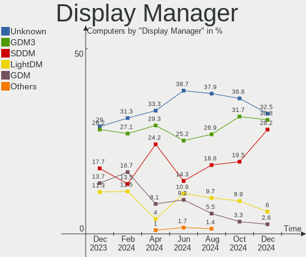
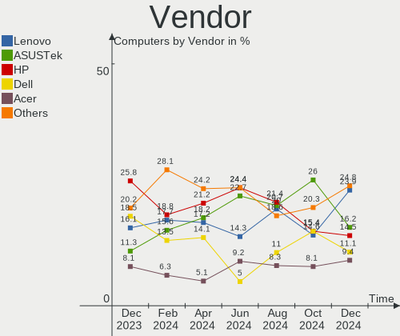
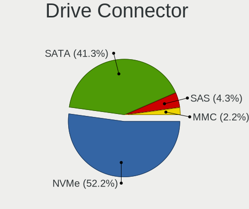
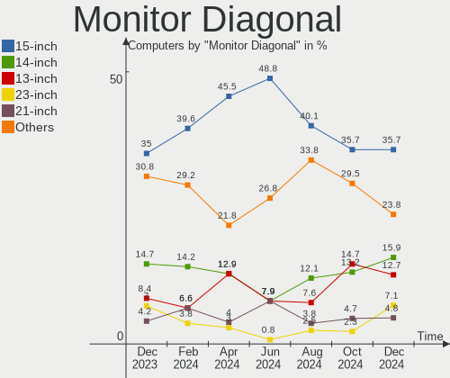
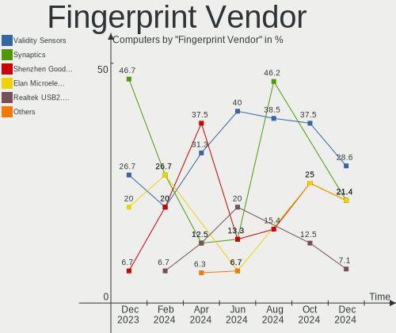
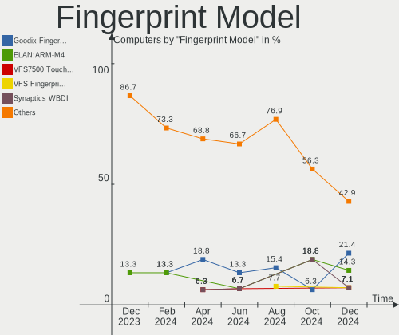

Linux in India - Hardware Trends
--------------------------------

A project to identify most popular hardware characteristics and track their change
over time based on data collected by Linux users at https://Linux-Hardware.org.

Anyone can contribute to this report by the [hw-probe](https://github.com/linuxhw/hw-probe) tool:

    sudo -E hw-probe -all -upload

This is a report for all computer types. See also reports for [desktops](/Location/India/Desktop/README.md) and [notebooks](/Location/India/Notebook/README.md).

Period: Nov, 2023.

Contents
--------

* [ System ](#system)
  - [ OS                       ](#os)
  - [ OS Family                ](#os-family)
  - [ Kernel                   ](#kernel)
  - [ Kernel Family            ](#kernel-family)
  - [ Kernel Major Ver.        ](#kernel-major-ver)
  - [ Arch                     ](#arch)
  - [ DE                       ](#de)
  - [ Display Server           ](#display-server)
  - [ Display Manager          ](#display-manager)
  - [ OS Lang                  ](#os-lang)
  - [ Boot Mode                ](#boot-mode)
  - [ Filesystem               ](#filesystem)
  - [ Part. scheme             ](#part-scheme)
  - [ Dual Boot with Linux/BSD ](#dual-boot-with-linuxbsd)
  - [ Dual Boot (Win)          ](#dual-boot-win)

* [ Board ](#board)
  - [ Vendor                   ](#vendor)
  - [ Model                    ](#model)
  - [ Model Family             ](#model-family)
  - [ MFG Year                 ](#mfg-year)
  - [ Form Factor              ](#form-factor)
  - [ Secure Boot              ](#secure-boot)
  - [ Coreboot                 ](#coreboot)
  - [ RAM Size                 ](#ram-size)
  - [ RAM Used                 ](#ram-used)
  - [ Total Drives             ](#total-drives)
  - [ Has CD-ROM               ](#has-cd-rom)
  - [ Has Ethernet             ](#has-ethernet)
  - [ Has WiFi                 ](#has-wifi)
  - [ Has Bluetooth            ](#has-bluetooth)

* [ Location ](#location)
  - [ Country                  ](#country)
  - [ City                     ](#city)

* [ Drives ](#drives)
  - [ Drive Vendor             ](#drive-vendor)
  - [ Drive Model              ](#drive-model)
  - [ HDD Vendor               ](#hdd-vendor)
  - [ SSD Vendor               ](#ssd-vendor)
  - [ Drive Kind               ](#drive-kind)
  - [ Drive Connector          ](#drive-connector)
  - [ Drive Size               ](#drive-size)
  - [ Space Total              ](#space-total)
  - [ Space Used               ](#space-used)
  - [ Malfunc. Drives          ](#malfunc-drives)
  - [ Malfunc. Drive Vendor    ](#malfunc-drive-vendor)
  - [ Malfunc. HDD Vendor      ](#malfunc-hdd-vendor)
  - [ Malfunc. Drive Kind      ](#malfunc-drive-kind)
  - [ Failed Drives            ](#failed-drives)
  - [ Failed Drive Vendor      ](#failed-drive-vendor)
  - [ Drive Status             ](#drive-status)

* [ Storage controller ](#storage-controller)
  - [ Storage Vendor           ](#storage-vendor)
  - [ Storage Model            ](#storage-model)
  - [ Storage Kind             ](#storage-kind)

* [ Processor ](#processor)
  - [ CPU Vendor               ](#cpu-vendor)
  - [ CPU Model                ](#cpu-model)
  - [ CPU Model Family         ](#cpu-model-family)
  - [ CPU Cores                ](#cpu-cores)
  - [ CPU Sockets              ](#cpu-sockets)
  - [ CPU Threads              ](#cpu-threads)
  - [ CPU Op-Modes             ](#cpu-op-modes)
  - [ CPU Microcode            ](#cpu-microcode)
  - [ CPU Microarch            ](#cpu-microarch)

* [ Graphics ](#graphics)
  - [ GPU Vendor               ](#gpu-vendor)
  - [ GPU Model                ](#gpu-model)
  - [ GPU Combo                ](#gpu-combo)
  - [ GPU Driver               ](#gpu-driver)
  - [ GPU Memory               ](#gpu-memory)

* [ Monitor ](#monitor)
  - [ Monitor Vendor           ](#monitor-vendor)
  - [ Monitor Model            ](#monitor-model)
  - [ Monitor Resolution       ](#monitor-resolution)
  - [ Monitor Diagonal         ](#monitor-diagonal)
  - [ Monitor Width            ](#monitor-width)
  - [ Aspect Ratio             ](#aspect-ratio)
  - [ Monitor Area             ](#monitor-area)
  - [ Pixel Density            ](#pixel-density)
  - [ Multiple Monitors        ](#multiple-monitors)

* [ Network ](#network)
  - [ Net Controller Vendor    ](#net-controller-vendor)
  - [ Net Controller Model     ](#net-controller-model)
  - [ Wireless Vendor          ](#wireless-vendor)
  - [ Wireless Model           ](#wireless-model)
  - [ Ethernet Vendor          ](#ethernet-vendor)
  - [ Ethernet Model           ](#ethernet-model)
  - [ Net Controller Kind      ](#net-controller-kind)
  - [ Used Controller          ](#used-controller)
  - [ NICs                     ](#nics)
  - [ IPv6                     ](#ipv6)

* [ Bluetooth ](#bluetooth)
  - [ Bluetooth Vendor         ](#bluetooth-vendor)
  - [ Bluetooth Model          ](#bluetooth-model)

* [ Sound ](#sound)
  - [ Sound Vendor             ](#sound-vendor)
  - [ Sound Model              ](#sound-model)

* [ Memory ](#memory)
  - [ Memory Vendor            ](#memory-vendor)
  - [ Memory Model             ](#memory-model)
  - [ Memory Kind              ](#memory-kind)
  - [ Memory Form Factor       ](#memory-form-factor)
  - [ Memory Size              ](#memory-size)
  - [ Memory Speed             ](#memory-speed)

* [ Printers & scanners ](#printers--scanners)
  - [ Printer Vendor           ](#printer-vendor)
  - [ Printer Model            ](#printer-model)
  - [ Scanner Vendor           ](#scanner-vendor)
  - [ Scanner Model            ](#scanner-model)

* [ Camera ](#camera)
  - [ Camera Vendor            ](#camera-vendor)
  - [ Camera Model             ](#camera-model)

* [ Security ](#security)
  - [ Fingerprint Vendor       ](#fingerprint-vendor)
  - [ Fingerprint Model        ](#fingerprint-model)
  - [ Chipcard Vendor          ](#chipcard-vendor)
  - [ Chipcard Model           ](#chipcard-model)

* [ Unsupported ](#unsupported)
  - [ Unsupported Devices      ](#unsupported-devices)
  - [ Unsupported Device Types ](#unsupported-device-types)

System
------

OS
--

Installed operating systems

| Name                 | Computers | Percent |
|----------------------|-----------|---------|
| Ubuntu 22.04         | 15        | 15.79%  |
| Arch Rolling         | 12        | 12.63%  |
| Fedora 39            | 8         | 8.42%   |
| Ubuntu 23.10         | 6         | 6.32%   |
| Debian 12            | 5         | 5.26%   |
| Fedora 38            | 4         | 4.21%   |
| Zorin 16             | 3         | 3.16%   |
| Xero Rolling         | 3         | 3.16%   |
| Ubuntu 23.04         | 3         | 3.16%   |
| Ubuntu 20.04         | 3         | 3.16%   |
| Pop!_OS 22.04        | 3         | 3.16%   |
| OpenMandriva 23.08   | 3         | 3.16%   |
| Ubuntu MATE 22.04    | 2         | 2.11%   |
| Linux Mint 21.2      | 2         | 2.11%   |
| KDE neon 22.04       | 2         | 2.11%   |
| Kali 2023.3          | 2         | 2.11%   |
| EndeavourOS Rolling  | 2         | 2.11%   |
| Ubuntu 22.10         | 1         | 1.05%   |
| Oracle Linux 9.3     | 1         | 1.05%   |
| openSUSE Leap-15.5   | 1         | 1.05%   |
| OpenMandriva 5.0     | 1         | 1.05%   |
| OpenMandriva 4.3     | 1         | 1.05%   |
| Nobara 38            | 1         | 1.05%   |
| NixOS 23.11          | 1         | 1.05%   |
| Manjaro 23.1.0       | 1         | 1.05%   |
| LMDE 6               | 1         | 1.05%   |
| Linux Mint 21.1      | 1         | 1.05%   |
| Kubuntu 23.10        | 1         | 1.05%   |
| Guix                 | 1         | 1.05%   |
| Garuda Linux Soaring | 1         | 1.05%   |
| Fedora 36            | 1         | 1.05%   |
| Elementary 7.1       | 1         | 1.05%   |
| Deepin 20.9          | 1         | 1.05%   |
| ArcoLinux Rolling    | 1         | 1.05%   |

OS Family
---------

OS without a version

| Name         | Computers | Percent |
|--------------|-----------|---------|
| Ubuntu       | 28        | 29.47%  |
| Fedora       | 13        | 13.68%  |
| Arch         | 12        | 12.63%  |
| OpenMandriva | 5         | 5.26%   |
| Debian       | 5         | 5.26%   |
| Zorin        | 3         | 3.16%   |
| Xero         | 3         | 3.16%   |
| Pop!_OS      | 3         | 3.16%   |
| Linux Mint   | 3         | 3.16%   |
| Ubuntu MATE  | 2         | 2.11%   |
| KDE neon     | 2         | 2.11%   |
| Kali         | 2         | 2.11%   |
| EndeavourOS  | 2         | 2.11%   |
| Oracle Linux | 1         | 1.05%   |
| openSUSE     | 1         | 1.05%   |
| Nobara       | 1         | 1.05%   |
| NixOS        | 1         | 1.05%   |
| Manjaro      | 1         | 1.05%   |
| LMDE         | 1         | 1.05%   |
| Kubuntu      | 1         | 1.05%   |
| Guix         | 1         | 1.05%   |
| Garuda Linux | 1         | 1.05%   |
| Elementary   | 1         | 1.05%   |
| Deepin       | 1         | 1.05%   |
| ArcoLinux    | 1         | 1.05%   |

Kernel
------

Version of the Linux kernel

| Version                             | Computers | Percent |
|-------------------------------------|-----------|---------|
| 6.2.0-36-generic                    | 13        | 13.68%  |
| 6.5.9-arch2-1                       | 5         | 5.26%   |
| 6.1.0-13-amd64                      | 5         | 5.26%   |
| 6.6.1-zen1-1-zen                    | 4         | 4.21%   |
| 6.2.0-37-generic                    | 4         | 4.21%   |
| 5.15.0-88-generic                   | 4         | 4.21%   |
| 6.6.2-arch1-1                       | 3         | 3.16%   |
| 6.5.6-76060506-generic              | 3         | 3.16%   |
| 6.5.11-300.fc39.x86_64              | 3         | 3.16%   |
| 6.5.0-13-generic                    | 3         | 3.16%   |
| 6.5.0-10-generic                    | 3         | 3.16%   |
| 6.5.9-zen2-1-zen                    | 2         | 2.11%   |
| 6.5.12-300.fc39.x86_64              | 2         | 2.11%   |
| 6.5.0-kali3-amd64                   | 2         | 2.11%   |
| 6.4.11-desktop-1omv2390             | 2         | 2.11%   |
| 6.2.0-35-generic                    | 2         | 2.11%   |
| 6.7.0-0.rc1.315.vanilla.fc39.x86_64 | 1         | 1.05%   |
| 6.6.3-arch1-1                       | 1         | 1.05%   |
| 6.6.2-zen1-1-zen                    | 1         | 1.05%   |
| 6.6.2-desktop-1omv2390              | 1         | 1.05%   |
| 6.6.1-arch1-1                       | 1         | 1.05%   |
| 6.6.1-060601-generic                | 1         | 1.05%   |
| 6.5.9-gnu                           | 1         | 1.05%   |
| 6.5.9-300.fc39.x86_64               | 1         | 1.05%   |
| 6.5.9-201.fsync.fc38.x86_64         | 1         | 1.05%   |
| 6.5.9-200.fc38.x86_64               | 1         | 1.05%   |
| 6.5.8-arch1-1                       | 1         | 1.05%   |
| 6.5.8-200.fc38.x86_64               | 1         | 1.05%   |
| 6.5.6-300.fc39.x86_64               | 1         | 1.05%   |
| 6.5.12-1-MANJARO                    | 1         | 1.05%   |
| 6.5.10-200.fc38.x86_64              | 1         | 1.05%   |
| 6.5.1-060501-generic                | 1         | 1.05%   |
| 6.5.0-9-generic                     | 1         | 1.05%   |
| 6.4.8-desktop-2omv2390              | 1         | 1.05%   |
| 6.2.9-300.fc38.x86_64               | 1         | 1.05%   |
| 6.2.16-15-pve                       | 1         | 1.05%   |
| 6.2.15-100.fc36.x86_64              | 1         | 1.05%   |
| 6.2.0-26-generic                    | 1         | 1.05%   |
| 6.1.61                              | 1         | 1.05%   |
| 6.1.58-1-lts                        | 1         | 1.05%   |

Kernel Family
-------------

Linux kernel without a distro release

| Version | Computers | Percent |
|---------|-----------|---------|
| 6.2.0   | 20        | 21.05%  |
| 6.5.9   | 11        | 11.58%  |
| 6.5.0   | 9         | 9.47%   |
| 5.15.0  | 8         | 8.42%   |
| 6.6.1   | 6         | 6.32%   |
| 6.1.0   | 6         | 6.32%   |
| 6.6.2   | 5         | 5.26%   |
| 6.5.6   | 4         | 4.21%   |
| 6.5.12  | 3         | 3.16%   |
| 6.5.11  | 3         | 3.16%   |
| 6.5.8   | 2         | 2.11%   |
| 6.4.11  | 2         | 2.11%   |
| 6.7.0   | 1         | 1.05%   |
| 6.6.3   | 1         | 1.05%   |
| 6.5.10  | 1         | 1.05%   |
| 6.5.1   | 1         | 1.05%   |
| 6.4.8   | 1         | 1.05%   |
| 6.2.9   | 1         | 1.05%   |
| 6.2.16  | 1         | 1.05%   |
| 6.2.15  | 1         | 1.05%   |
| 6.1.61  | 1         | 1.05%   |
| 6.1.58  | 1         | 1.05%   |
| 5.4.0   | 1         | 1.05%   |
| 5.19.0  | 1         | 1.05%   |
| 5.18.17 | 1         | 1.05%   |
| 5.16.13 | 1         | 1.05%   |
| 5.14.21 | 1         | 1.05%   |
| 5.13.0  | 1         | 1.05%   |

Kernel Major Ver.
-----------------

Linux kernel major version

| Version | Computers | Percent |
|---------|-----------|---------|
| 6.5     | 34        | 35.79%  |
| 6.2     | 23        | 24.21%  |
| 6.6     | 12        | 12.63%  |
| 6.1     | 8         | 8.42%   |
| 5.15    | 8         | 8.42%   |
| 6.4     | 3         | 3.16%   |
| 6.7     | 1         | 1.05%   |
| 5.4     | 1         | 1.05%   |
| 5.19    | 1         | 1.05%   |
| 5.18    | 1         | 1.05%   |
| 5.16    | 1         | 1.05%   |
| 5.14    | 1         | 1.05%   |
| 5.13    | 1         | 1.05%   |

Arch
----

OS architecture (x86_64, i586, etc.)

| Name   | Computers | Percent |
|--------|-----------|---------|
| x86_64 | 95        | 100%    |

DE
--

Desktop Environment

| Name       | Computers | Percent |
|------------|-----------|---------|
| GNOME      | 58        | 61.05%  |
| KDE5       | 21        | 22.11%  |
| X-Cinnamon | 3         | 3.16%   |
| MATE       | 3         | 3.16%   |
| XFCE       | 2         | 2.11%   |
| qtile      | 2         | 2.11%   |
| i3         | 2         | 2.11%   |
| Unknown    | 2         | 2.11%   |
| Pantheon   | 1         | 1.05%   |
| Deepin     | 1         | 1.05%   |

Display Server
--------------

X11 or Wayland

| Name    | Computers | Percent |
|---------|-----------|---------|
| X11     | 45        | 47.37%  |
| Wayland | 45        | 47.37%  |
| Tty     | 3         | 3.16%   |
| Unknown | 2         | 2.11%   |

Display Manager
---------------

SDDM, LightDM, etc.

| Name    | Computers | Percent |
|---------|-----------|---------|
| GDM3    | 28        | 29.47%  |
| Unknown | 26        | 27.37%  |
| SDDM    | 17        | 17.89%  |
| GDM     | 16        | 16.84%  |
| LightDM | 8         | 8.42%   |

OS Lang
-------

Language

| Lang    | Computers | Percent |
|---------|-----------|---------|
| en_IN   | 51        | 53.68%  |
| en_US   | 39        | 41.05%  |
| C       | 2         | 2.11%   |
| Unknown | 2         | 2.11%   |
| en_GB   | 1         | 1.05%   |

Boot Mode
---------

EFI or BIOS

| Mode | Computers | Percent |
|------|-----------|---------|
| EFI  | 70        | 73.68%  |
| BIOS | 25        | 26.32%  |

Filesystem
----------

Type of filesystem

| Type    | Computers | Percent |
|---------|-----------|---------|
| Ext4    | 56        | 58.95%  |
| Btrfs   | 19        | 20%     |
| Tmpfs   | 13        | 13.68%  |
| Xfs     | 3         | 3.16%   |
| Overlay | 2         | 2.11%   |
| Zfs     | 1         | 1.05%   |
| XXXXX   | 1         | 1.05%   |

Part. scheme
------------

Scheme of partitioning

| Type    | Computers | Percent |
|---------|-----------|---------|
| GPT     | 68        | 71.58%  |
| Unknown | 21        | 22.11%  |
| MBR     | 6         | 6.32%   |

Dual Boot with Linux/BSD
------------------------

Hosting more than one Linux/BSD

| Dual boot | Computers | Percent |
|-----------|-----------|---------|
| No        | 83        | 87.37%  |
| Yes       | 12        | 12.63%  |

Dual Boot (Win)
---------------

Hosting Linux and Windows

| Dual boot | Computers | Percent |
|-----------|-----------|---------|
| No        | 62        | 65.26%  |
| Yes       | 33        | 34.74%  |

Board
-----

Vendor
------

Motherboard manufacturer

| Name                           | Computers | Percent |
|--------------------------------|-----------|---------|
| Hewlett-Packard                | 29        | 30.53%  |
| ASUSTek Computer               | 14        | 14.74%  |
| Lenovo                         | 13        | 13.68%  |
| Dell                           | 9         | 9.47%   |
| Gigabyte Technology            | 6         | 6.32%   |
| Acer                           | 5         | 5.26%   |
| MSI                            | 4         | 4.21%   |
| ASRock                         | 4         | 4.21%   |
| Timi                           | 3         | 3.16%   |
| Intel                          | 2         | 2.11%   |
| ZX                             | 1         | 1.05%   |
| Toshiba                        | 1         | 1.05%   |
| HONOR                          | 1         | 1.05%   |
| FUTOPIA GLOBAL Private Limited | 1         | 1.05%   |
| AVITA                          | 1         | 1.05%   |
| Alienware                      | 1         | 1.05%   |

Model
-----

Motherboard model

| Name                                     | Computers | Percent |
|------------------------------------------|-----------|---------|
| Timi Mi NoteBook Pro                     | 2         | 2.11%   |
| HP Pavilion 15                           | 2         | 2.11%   |
| HP Notebook                              | 2         | 2.11%   |
| HP Laptop 15s-fr2xxx                     | 2         | 2.11%   |
| ASUS VivoBook_ASUSLaptop K3402ZA_S3402ZA | 2         | 2.11%   |
| ZX H610ITX                               | 1         | 1.05%   |
| Toshiba Satellite C55-C                  | 1         | 1.05%   |
| Timi RedmiBook 15                        | 1         | 1.05%   |
| MSI Thin GF63 12HW                       | 1         | 1.05%   |
| MSI MS-7D42                              | 1         | 1.05%   |
| MSI MS-7C37                              | 1         | 1.05%   |
| MSI MS-7788                              | 1         | 1.05%   |
| Lenovo ThinkPad X250 20CLAOMLIN          | 1         | 1.05%   |
| Lenovo ThinkPad E14 Gen 5 21JLCTO1WW     | 1         | 1.05%   |
| Lenovo ThinkPad E14 Gen 3 20YDCTO1WW     | 1         | 1.05%   |
| Lenovo ThinkPad E14 20RAS13J00           | 1         | 1.05%   |
| Lenovo Legion 5 Pro 16ITH6H 82JD         | 1         | 1.05%   |
| Lenovo IdeaPadFlex 5 14ALC05 82HU        | 1         | 1.05%   |
| Lenovo IdeaPad S540-15IWL                | 1         | 1.05%   |
| Lenovo IdeaPad Gaming 3 15IAH7 82S9      | 1         | 1.05%   |
| Lenovo IdeaPad Gaming 3 15ACH6 82K2      | 1         | 1.05%   |
| Lenovo IdeaPad 5 15ITL05 82FG            | 1         | 1.05%   |
| Lenovo IdeaPad 3 15ALC6 Ub 82KU          | 1         | 1.05%   |
| Lenovo G510 20238                        | 1         | 1.05%   |
| Lenovo G500s 20245                       | 1         | 1.05%   |
| Intel NUC13ANHi3                         | 1         | 1.05%   |
| Intel DG41RQ AAE54511-203                | 1         | 1.05%   |
| HONOR BRN-FXX                            | 1         | 1.05%   |
| HP Z240 SFF Workstation                  | 1         | 1.05%   |
| HP Victus by Gaming Laptop 15-fb0xxx     | 1         | 1.05%   |
| HP Spectre x360 2-in-1 Laptop 14-ef0xxx  | 1         | 1.05%   |
| HP ProBook 440 G7                        | 1         | 1.05%   |
| HP ProBook 440 G2                        | 1         | 1.05%   |
| HP ProBook 430 G3                        | 1         | 1.05%   |
| HP Pavilion Laptop 15-eh2xxx             | 1         | 1.05%   |
| HP Pavilion Laptop 15-eh1xxx             | 1         | 1.05%   |
| HP Pavilion Laptop 14-dv1xxx             | 1         | 1.05%   |
| HP Pavilion Gaming Laptop 15-ec2xxx      | 1         | 1.05%   |
| HP Pavilion Aero Laptop 13-be0xxx        | 1         | 1.05%   |
| HP Pavilion 11 x360 PC                   | 1         | 1.05%   |

Model Family
------------

Motherboard model prefix

| Name               | Computers | Percent |
|--------------------|-----------|---------|
| HP Pavilion        | 8         | 8.42%   |
| HP Laptop          | 7         | 7.37%   |
| ASUS VivoBook      | 6         | 6.32%   |
| Lenovo IdeaPad     | 5         | 5.26%   |
| Lenovo ThinkPad    | 4         | 4.21%   |
| Dell Inspiron      | 4         | 4.21%   |
| HP ProBook         | 3         | 3.16%   |
| ASUS ROG           | 3         | 3.16%   |
| Timi Mi            | 2         | 2.11%   |
| HP Notebook        | 2         | 2.11%   |
| HP ENVY            | 2         | 2.11%   |
| Dell Vostro        | 2         | 2.11%   |
| ASRock B550M       | 2         | 2.11%   |
| Acer Aspire        | 2         | 2.11%   |
| ZX H610ITX         | 1         | 1.05%   |
| Toshiba Satellite  | 1         | 1.05%   |
| Timi RedmiBook     | 1         | 1.05%   |
| MSI Thin           | 1         | 1.05%   |
| MSI MS-7D42        | 1         | 1.05%   |
| MSI MS-7C37        | 1         | 1.05%   |
| MSI MS-7788        | 1         | 1.05%   |
| Lenovo Legion      | 1         | 1.05%   |
| Lenovo IdeaPadFlex | 1         | 1.05%   |
| Lenovo G510        | 1         | 1.05%   |
| Lenovo G500s       | 1         | 1.05%   |
| Intel NUC13ANHi3   | 1         | 1.05%   |
| Intel DG41RQ       | 1         | 1.05%   |
| HONOR BRN-FXX      | 1         | 1.05%   |
| HP Z240            | 1         | 1.05%   |
| HP Victus          | 1         | 1.05%   |
| HP Spectre         | 1         | 1.05%   |
| HP OMEN            | 1         | 1.05%   |
| HP EliteBook       | 1         | 1.05%   |
| HP Compaq          | 1         | 1.05%   |
| HP 15              | 1         | 1.05%   |
| Gigabyte H510M     | 1         | 1.05%   |
| Gigabyte B660M     | 1         | 1.05%   |
| Gigabyte B650M     | 1         | 1.05%   |
| Gigabyte B450      | 1         | 1.05%   |
| Gigabyte A520M     | 1         | 1.05%   |

MFG Year
--------

Motherboard manufacture year

| Year | Computers | Percent |
|------|-----------|---------|
| 2021 | 18        | 18.95%  |
| 2022 | 15        | 15.79%  |
| 2023 | 13        | 13.68%  |
| 2020 | 9         | 9.47%   |
| 2019 | 6         | 6.32%   |
| 2013 | 6         | 6.32%   |
| 2018 | 5         | 5.26%   |
| 2017 | 4         | 4.21%   |
| 2015 | 4         | 4.21%   |
| 2016 | 3         | 3.16%   |
| 2014 | 3         | 3.16%   |
| 2012 | 3         | 3.16%   |
| 2008 | 3         | 3.16%   |
| 2011 | 1         | 1.05%   |
| 2010 | 1         | 1.05%   |
| 2009 | 1         | 1.05%   |

Form Factor
-----------

Physical design of the computer

| Name        | Computers | Percent |
|-------------|-----------|---------|
| Notebook    | 67        | 70.53%  |
| Desktop     | 21        | 22.11%  |
| Convertible | 4         | 4.21%   |
| Mini pc     | 1         | 1.05%   |
| All in one  | 1         | 1.05%   |
| Server      | 1         | 1.05%   |

Secure Boot
-----------

Enabled or disabled

| State    | Computers | Percent |
|----------|-----------|---------|
| Disabled | 78        | 82.11%  |
| Enabled  | 17        | 17.89%  |

Coreboot
--------

Have coreboot on board

| Used | Computers | Percent |
|------|-----------|---------|
| No   | 95        | 100%    |

RAM Size
--------

Total RAM memory

| Size in GB  | Computers | Percent |
|-------------|-----------|---------|
| 8.01-16.0   | 29        | 30.53%  |
| 4.01-8.0    | 21        | 22.11%  |
| 16.01-24.0  | 19        | 20%     |
| 3.01-4.0    | 9         | 9.47%   |
| 64.01-256.0 | 7         | 7.37%   |
| 32.01-64.0  | 5         | 5.26%   |
| 24.01-32.0  | 3         | 3.16%   |
| 2.01-3.0    | 1         | 1.05%   |
| 1.01-2.0    | 1         | 1.05%   |

RAM Used
--------

Used RAM memory

| Used GB     | Computers | Percent |
|-------------|-----------|---------|
| 4.01-8.0    | 29        | 30.53%  |
| 2.01-3.0    | 24        | 25.26%  |
| 3.01-4.0    | 18        | 18.95%  |
| 1.01-2.0    | 16        | 16.84%  |
| 8.01-16.0   | 6         | 6.32%   |
| 64.01-256.0 | 1         | 1.05%   |
| 0.51-1.0    | 1         | 1.05%   |

Total Drives
------------

Number of drives on board

| Drives | Computers | Percent |
|--------|-----------|---------|
| 1      | 68        | 71.58%  |
| 2      | 17        | 17.89%  |
| 3      | 8         | 8.42%   |
| 4      | 2         | 2.11%   |

Has CD-ROM
----------

Has CD-ROM on board

| Presented | Computers | Percent |
|-----------|-----------|---------|
| No        | 80        | 84.21%  |
| Yes       | 15        | 15.79%  |

Has Ethernet
------------

Has Ethernet on board

| Presented | Computers | Percent |
|-----------|-----------|---------|
| Yes       | 70        | 73.68%  |
| No        | 25        | 26.32%  |

Has WiFi
--------

Has WiFi module

| Presented | Computers | Percent |
|-----------|-----------|---------|
| Yes       | 82        | 86.32%  |
| No        | 13        | 13.68%  |

Has Bluetooth
-------------

Has Bluetooth module

| Presented | Computers | Percent |
|-----------|-----------|---------|
| Yes       | 76        | 80%     |
| No        | 19        | 20%     |

Location
--------

Country
-------

Geographic location (country)

| Country | Computers | Percent |
|---------|-----------|---------|
| India   | 95        | 100%    |

City
----

Geographic location (city)

| City               | Computers | Percent |
|--------------------|-----------|---------|
| Bengaluru          | 15        | 15.79%  |
| Delhi              | 13        | 13.68%  |
| Chennai            | 12        | 12.63%  |
| Hyderabad          | 7         | 7.37%   |
| Mumbai             | 5         | 5.26%   |
| Pune               | 4         | 4.21%   |
| Kolkata            | 4         | 4.21%   |
| Ludhiana           | 3         | 3.16%   |
| Lucknow            | 3         | 3.16%   |
| Thiruvananthapuram | 2         | 2.11%   |
| Kochi              | 2         | 2.11%   |
| Ghaziabad          | 2         | 2.11%   |
| Bhubaneswar        | 2         | 2.11%   |
| Ahmedabad          | 2         | 2.11%   |
| Varanasi           | 1         | 1.05%   |
| Trivandrum         | 1         | 1.05%   |
| Thrissur           | 1         | 1.05%   |
| Satna              | 1         | 1.05%   |
| Salem              | 1         | 1.05%   |
| Patna              | 1         | 1.05%   |
| Panjim             | 1         | 1.05%   |
| Noida              | 1         | 1.05%   |
| Manipal            | 1         | 1.05%   |
| Mangalore          | 1         | 1.05%   |
| Kottayam           | 1         | 1.05%   |
| Kharagpur          | 1         | 1.05%   |
| Kanniyakumari      | 1         | 1.05%   |
| Kalyan             | 1         | 1.05%   |
| Jaipur             | 1         | 1.05%   |
| Guwahati           | 1         | 1.05%   |
| Coimbatore         | 1         | 1.05%   |
| Chhindwara         | 1         | 1.05%   |
| Bhopal             | 1         | 1.05%   |

Drives
------

Drive Vendor
------------

Hard drive vendors

| Vendor                      | Computers | Drives | Percent |
|-----------------------------|-----------|--------|---------|
| WDC                         | 22        | 23     | 16.67%  |
| Samsung Electronics         | 19        | 21     | 14.39%  |
| Seagate                     | 18        | 21     | 13.64%  |
| Micron Technology           | 11        | 11     | 8.33%   |
| Sandisk                     | 10        | 10     | 7.58%   |
| Intel                       | 8         | 8      | 6.06%   |
| Crucial                     | 6         | 6      | 4.55%   |
| Micron/Crucial Technology   | 5         | 5      | 3.79%   |
| Toshiba                     | 4         | 4      | 3.03%   |
| Transcend                   | 2         | 2      | 1.52%   |
| Realtek Semiconductor       | 2         | 2      | 1.52%   |
| KIOXIA                      | 2         | 2      | 1.52%   |
| Kingston                    | 2         | 2      | 1.52%   |
| HGST                        | 2         | 2      | 1.52%   |
| YMTC                        | 1         | 1      | 0.76%   |
| Yangtze Memory Technologies | 1         | 1      | 0.76%   |
| SSSTC                       | 1         | 1      | 0.76%   |
| SPCC                        | 1         | 1      | 0.76%   |
| SCCTS-603-128G              | 1         | 1      | 0.76%   |
| POWER                       | 1         | 1      | 0.76%   |
| Phison Electronics          | 1         | 1      | 0.76%   |
| Phison                      | 1         | 1      | 0.76%   |
| MARSHAL                     | 1         | 1      | 0.76%   |
| Lite-On Technology          | 1         | 1      | 0.76%   |
| Kingston Technology Company | 1         | 1      | 0.76%   |
| KingFast                    | 1         | 1      | 0.76%   |
| Kimtigo                     | 1         | 1      | 0.76%   |
| Hikvision                   | 1         | 1      | 0.76%   |
| Hewlett-Packard             | 1         | 1      | 0.76%   |
| Gigabyte Technology         | 1         | 1      | 0.76%   |
| FORESEE                     | 1         | 1      | 0.76%   |
| BIWIN                       | 1         | 1      | 0.76%   |
| ADATA Technology            | 1         | 1      | 0.76%   |

Drive Model
-----------

Hard drive models

| Model                                              | Computers | Percent |
|----------------------------------------------------|-----------|---------|
| Micron/Crucial P2 NVMe PCIe SSD 1TB                | 4         | 2.92%   |
| Micron 2450_MTFDKBA512TFK 512GB                    | 4         | 2.92%   |
| Seagate ST1000LM035-1RK172 1TB                     | 3         | 2.19%   |
| Seagate ST1000LM024 HN-M101MBB 1TB                 | 3         | 2.19%   |
| Intel SSDPEKNU512GZH 512GB                         | 3         | 2.19%   |
| WDC WDS120G2G0A-00JH30 120GB SSD                   | 2         | 1.46%   |
| WDC WD5000LPVX-60V0TT0 500GB                       | 2         | 1.46%   |
| Seagate ST500DM002-1SB10A 500GB                    | 2         | 1.46%   |
| Seagate ST500DM002-1BD142 500GB                    | 2         | 1.46%   |
| Samsung NVMe SSD Controller PM9A1/PM9A3/980PRO 2TB | 2         | 1.46%   |
| Samsung MZVLQ512HBLU-00BH1 512GB                   | 2         | 1.46%   |
| Micron MTFDHBA512QFD 512GB                         | 2         | 1.46%   |
| Intel SSDPEKNW512GZL 512GB                         | 2         | 1.46%   |
| Intel SSD 660P Series 512GB                        | 2         | 1.46%   |
| Crucial CT1000MX500SSD1 1TB                        | 2         | 1.46%   |
| YMTC PC005 512GB                                   | 1         | 0.73%   |
| Yangtze Memory YMTC PC005 512GB                    | 1         | 0.73%   |
| WDC WDS480G2G0B-00EPW0 480GB SSD                   | 1         | 0.73%   |
| WDC WD5000LPLX-08ZNTT0 500GB                       | 1         | 0.73%   |
| WDC WD5000LPCX-21VHAT0 500GB                       | 1         | 0.73%   |
| WDC WD5000BPKX-60HPJT0 500GB                       | 1         | 0.73%   |
| WDC WD5000AAKX-00ERMA0 500GB                       | 1         | 0.73%   |
| WDC WD40EZRZ-00GXCB0 4TB                           | 1         | 0.73%   |
| WDC WD30EZRZ-00Z5HB0 3TB                           | 1         | 0.73%   |
| WDC WD2500BEVS-11VAT0 250GB                        | 1         | 0.73%   |
| WDC WD20PURZ-85AKKY0 2TB                           | 1         | 0.73%   |
| WDC WD20EZBX-00AYRA0 2TB                           | 1         | 0.73%   |
| WDC WD1600BEVT-75ZCT1 160GB                        | 1         | 0.73%   |
| WDC WD10SPZX-21Z10T0 1TB                           | 1         | 0.73%   |
| WDC WD10JPVX-60JC3T0 1TB                           | 1         | 0.73%   |
| WDC WD10JPVX-08JC3T5 1TB                           | 1         | 0.73%   |
| WDC WD10EZEX-75WN4A0 1TB                           | 1         | 0.73%   |
| WDC WD10EZEX-60WN4A2 1TB                           | 1         | 0.73%   |
| WDC WD10EZEX-08WN4A0 1TB                           | 1         | 0.73%   |
| WDC WD Blue SA510 2.5 500GB                        | 1         | 0.73%   |
| WDC PC SN730 SDBPNTY-512G-1006 512GB               | 1         | 0.73%   |
| Transcend TS256GSSD370 256GB                       | 1         | 0.73%   |
| Transcend TS1TMTE400S 1TB                          | 1         | 0.73%   |
| Toshiba MQ04ABF100 1TB                             | 1         | 0.73%   |
| Toshiba MQ04ABF1 1TB                               | 1         | 0.73%   |

HDD Vendor
----------

Hard disk drive vendors

| Vendor          | Computers | Drives | Percent |
|-----------------|-----------|--------|---------|
| WDC             | 18        | 18     | 40.91%  |
| Seagate         | 18        | 21     | 40.91%  |
| Toshiba         | 4         | 4      | 9.09%   |
| HGST            | 2         | 2      | 4.55%   |
| MARSHAL         | 1         | 1      | 2.27%   |
| Hewlett-Packard | 1         | 1      | 2.27%   |

SSD Vendor
----------

Solid state drive vendors

| Vendor              | Computers | Drives | Percent |
|---------------------|-----------|--------|---------|
| Samsung Electronics | 6         | 8      | 24%     |
| Crucial             | 5         | 5      | 20%     |
| WDC                 | 4         | 4      | 16%     |
| SanDisk             | 2         | 2      | 8%      |
| Kingston            | 2         | 2      | 8%      |
| Transcend           | 1         | 1      | 4%      |
| SCCTS-603-128G      | 1         | 1      | 4%      |
| POWER               | 1         | 1      | 4%      |
| KingFast            | 1         | 1      | 4%      |
| Hikvision           | 1         | 1      | 4%      |
| FORESEE             | 1         | 1      | 4%      |

Drive Kind
----------

HDD or SSD

| Kind | Computers | Drives | Percent |
|------|-----------|--------|---------|
| NVMe | 56        | 64     | 46.67%  |
| HDD  | 40        | 47     | 33.33%  |
| SSD  | 24        | 27     | 20%     |

Drive Connector
---------------

SATA, SAS, NVMe, etc.

| Type | Computers | Drives | Percent |
|------|-----------|--------|---------|
| NVMe | 56        | 64     | 52.34%  |
| SATA | 49        | 69     | 45.79%  |
| SAS  | 2         | 5      | 1.87%   |

Drive Size
----------

Size of hard drive

| Size in TB | Computers | Drives | Percent |
|------------|-----------|--------|---------|
| 0.01-0.5   | 33        | 43     | 56.9%   |
| 0.51-1.0   | 20        | 23     | 34.48%  |
| 1.01-2.0   | 3         | 6      | 5.17%   |
| 3.01-4.0   | 1         | 1      | 1.72%   |
| 2.01-3.0   | 1         | 1      | 1.72%   |

Space Total
-----------

Amount of disk space available on the file system

| Size in GB     | Computers | Percent |
|----------------|-----------|---------|
| 251-500        | 28        | 29.47%  |
| 101-250        | 19        | 20%     |
| 501-1000       | 18        | 18.95%  |
| 1001-2000      | 7         | 7.37%   |
| 51-100         | 7         | 7.37%   |
| 1-20           | 5         | 5.26%   |
| 2001-3000      | 4         | 4.21%   |
| 21-50          | 3         | 3.16%   |
| More than 3000 | 2         | 2.11%   |
| Unknown        | 2         | 2.11%   |

Space Used
----------

Amount of used disk space

| Used GB   | Computers | Percent |
|-----------|-----------|---------|
| 1-20      | 29        | 30.53%  |
| 21-50     | 20        | 21.05%  |
| 51-100    | 17        | 17.89%  |
| 251-500   | 11        | 11.58%  |
| 101-250   | 9         | 9.47%   |
| 1001-2000 | 4         | 4.21%   |
| 501-1000  | 3         | 3.16%   |
| Unknown   | 2         | 2.11%   |

Malfunc. Drives
---------------

Drive models with a malfunction

| Model                            | Computers | Drives | Percent |
|----------------------------------|-----------|--------|---------|
| WDC WDS120G2G0A-00JH30 120GB SSD | 1         | 1      | 8.33%   |
| WDC WD5000AAKX-00ERMA0 500GB     | 1         | 1      | 8.33%   |
| WDC WD2500BEVS-11VAT0 250GB      | 1         | 1      | 8.33%   |
| WDC WD20PURZ-85AKKY0 2TB         | 1         | 1      | 8.33%   |
| WDC WD10EZEX-08WN4A0 1TB         | 1         | 1      | 8.33%   |
| WDC WD Blue SA510 2.5 500GB      | 1         | 1      | 8.33%   |
| Seagate ST9250315AS 250GB        | 1         | 1      | 8.33%   |
| Seagate ST500DM002-1BD142 500GB  | 1         | 1      | 8.33%   |
| Seagate ST380215A 80GB           | 1         | 1      | 8.33%   |
| Seagate ST3320813AS 320GB        | 1         | 1      | 8.33%   |
| Seagate ST1000LM035-1RK172 1TB   | 1         | 1      | 8.33%   |
| HGST HTS725050A7E630 500GB       | 1         | 1      | 8.33%   |

Malfunc. Drive Vendor
---------------------

Vendors of faulty drives

| Vendor  | Computers | Drives | Percent |
|---------|-----------|--------|---------|
| WDC     | 6         | 6      | 50%     |
| Seagate | 5         | 5      | 41.67%  |
| HGST    | 1         | 1      | 8.33%   |

Malfunc. HDD Vendor
-------------------

Vendors of faulty HDD drives

| Vendor  | Computers | Drives | Percent |
|---------|-----------|--------|---------|
| Seagate | 5         | 5      | 50%     |
| WDC     | 4         | 4      | 40%     |
| HGST    | 1         | 1      | 10%     |

Malfunc. Drive Kind
-------------------

Kinds of faulty drives

| Kind | Computers | Drives | Percent |
|------|-----------|--------|---------|
| HDD  | 8         | 10     | 80%     |
| SSD  | 2         | 2      | 20%     |

Failed Drives
-------------

Failed drive models

Zero info for selected period =(

Failed Drive Vendor
-------------------

Failed drive vendors

Zero info for selected period =(

Drive Status
------------

Number of failed and malfunc. drives

| Status   | Computers | Drives | Percent |
|----------|-----------|--------|---------|
| Works    | 55        | 73     | 53.4%   |
| Detected | 38        | 53     | 36.89%  |
| Malfunc  | 10        | 12     | 9.71%   |

Storage controller
------------------

Storage Vendor
--------------

Storage controller vendors

| Vendor                         | Computers | Percent |
|--------------------------------|-----------|---------|
| Intel                          | 65        | 47.45%  |
| AMD                            | 15        | 10.95%  |
| Samsung Electronics            | 13        | 9.49%   |
| Micron Technology              | 11        | 8.03%   |
| SanDisk                        | 9         | 6.57%   |
| Micron/Crucial Technology      | 6         | 4.38%   |
| Phison Electronics             | 3         | 2.19%   |
| Realtek Semiconductor          | 2         | 1.46%   |
| KIOXIA                         | 2         | 1.46%   |
| ASMedia Technology             | 2         | 1.46%   |
| Yangtze Memory Technologies    | 1         | 0.73%   |
| Transcend                      | 1         | 0.73%   |
| Solid State Storage Technology | 1         | 0.73%   |
| ShenZhen TIGO Semiconductor    | 1         | 0.73%   |
| Lite-On Technology             | 1         | 0.73%   |
| Kingston Technology Company    | 1         | 0.73%   |
| INNOGRIT                       | 1         | 0.73%   |
| Broadcom / LSI                 | 1         | 0.73%   |
| ADATA Technology               | 1         | 0.73%   |

Storage Model
-------------

Storage controller models

| Model                                                                                   | Computers | Percent |
|-----------------------------------------------------------------------------------------|-----------|---------|
| Intel Volume Management Device NVMe RAID Controller                                     | 12        | 7.84%   |
| AMD FCH SATA Controller [AHCI mode]                                                     | 11        | 7.19%   |
| Samsung NVMe SSD Controller 980 (DRAM-less)                                             | 7         | 4.58%   |
| Intel Sunrise Point-LP SATA Controller [AHCI mode]                                      | 7         | 4.58%   |
| Intel SSD 670p Series [Keystone Harbor]                                                 | 6         | 3.92%   |
| Micron/Crucial P2 [Nick P2] / P3 / P3 Plus NVMe PCIe SSD (DRAM-less)                    | 5         | 3.27%   |
| Micron 2450 NVMe SSD [HendrixV] (DRAM-less)                                             | 4         | 2.61%   |
| Intel 8 Series SATA Controller 1 [AHCI mode]                                            | 4         | 2.61%   |
| SanDisk Ultra 3D / WD Blue SN570 NVMe SSD (DRAM-less)                                   | 3         | 1.96%   |
| Samsung NVMe SSD Controller PM9A1/PM9A3/980PRO                                          | 3         | 1.96%   |
| Micron 2210 NVMe SSD [Cobain]                                                           | 3         | 1.96%   |
| Intel Wildcat Point-LP SATA Controller [AHCI Mode]                                      | 3         | 1.96%   |
| Intel Tiger Lake-LP SATA Controller                                                     | 3         | 1.96%   |
| Intel Q170/Q150/B150/H170/H110/Z170/CM236 Chipset SATA Controller [AHCI Mode]           | 3         | 1.96%   |
| Intel Alder Lake-S PCH SATA Controller [AHCI Mode]                                      | 3         | 1.96%   |
| Intel Alder Lake-P SATA AHCI Controller                                                 | 3         | 1.96%   |
| Intel 7 Series Chipset Family 6-port SATA Controller [AHCI mode]                        | 3         | 1.96%   |
| AMD 500 Series Chipset SATA Controller                                                  | 3         | 1.96%   |
| AMD 400 Series Chipset SATA Controller                                                  | 3         | 1.96%   |
| SanDisk Extreme Pro / WD Black SN750 / PC SN730 / Red SN700 NVMe SSD                    | 2         | 1.31%   |
| Realtek RTS5765DL NVMe SSD Controller (DRAM-less)                                       | 2         | 1.31%   |
| Micron 3400 NVMe SSD [Hendrix]                                                          | 2         | 1.31%   |
| KIOXIA NVMe SSD Controller BG4 (DRAM-less)                                              | 2         | 1.31%   |
| Intel SSD 660P Series                                                                   | 2         | 1.31%   |
| Intel Comet Lake SATA AHCI Controller                                                   | 2         | 1.31%   |
| Intel 82801HM/HEM (ICH8M/ICH8M-E) SATA Controller [AHCI mode]                           | 2         | 1.31%   |
| Intel 82801HM/HEM (ICH8M/ICH8M-E) IDE Controller                                        | 2         | 1.31%   |
| Intel 82801 Mobile SATA Controller [RAID mode]                                          | 2         | 1.31%   |
| Intel 6 Series/C200 Series Chipset Family Desktop SATA Controller (IDE mode, ports 4-5) | 2         | 1.31%   |
| Intel 6 Series/C200 Series Chipset Family Desktop SATA Controller (IDE mode, ports 0-3) | 2         | 1.31%   |
| ASMedia ASM1062 Serial ATA Controller                                                   | 2         | 1.31%   |
| Yangtze Memory PC005 NVMe SSD                                                           | 1         | 0.65%   |
| Transcend NVMe PCIe SSD 110S/112S/120S/MTE300S/MTE400S/MTE652T2 (DRAM-less)             | 1         | 0.65%   |
| Solid State Storage CL4-8D512 NVMe SSD M.2 (DRAM-less)                                  | 1         | 0.65%   |
| ShenZhen TIGO kimtigo NVMe SSD (DRAM-less)                                              | 1         | 0.65%   |
| Sandisk WD PC SN740 NVMe SSD 512GB (DRAM-less)                                          | 1         | 0.65%   |
| SanDisk WD Blue SN500 / PC SN520 x2 M.2 2280 NVMe SSD                                   | 1         | 0.65%   |
| SanDisk Ultra 3D / WD Blue SN550 NVMe SSD                                               | 1         | 0.65%   |
| SanDisk PC SN735 NVMe SSD (DRAM-less)                                                   | 1         | 0.65%   |
| Samsung NVMe SSD Controller SM981/PM981/PM983                                           | 1         | 0.65%   |

Storage Kind
------------

Kind of storage controller (IDE, SATA, NVMe, SAS, ...)

| Kind | Computers | Percent |
|------|-----------|---------|
| SATA | 60        | 43.8%   |
| NVMe | 56        | 40.88%  |
| RAID | 15        | 10.95%  |
| IDE  | 5         | 3.65%   |
| SAS  | 1         | 0.73%   |

Processor
---------

CPU Vendor
----------

Processor vendors

| Vendor | Computers | Percent |
|--------|-----------|---------|
| Intel  | 69        | 72.63%  |
| AMD    | 26        | 27.37%  |

CPU Model
---------

Processor models

| Model                                   | Computers | Percent |
|-----------------------------------------|-----------|---------|
| AMD Ryzen 5 5500U with Radeon Graphics  | 4         | 4.21%   |
| Intel Core i5-6200U CPU @ 2.30GHz       | 3         | 3.16%   |
| Intel 12th Gen Core i5-12500H           | 3         | 3.16%   |
| Intel 12th Gen Core i5-12450H           | 3         | 3.16%   |
| Intel 11th Gen Core i3-1115G4 @ 3.00GHz | 3         | 3.16%   |
| AMD Ryzen 5 5600G with Radeon Graphics  | 3         | 3.16%   |
| Intel Core i5-8265U CPU @ 1.60GHz       | 2         | 2.11%   |
| Intel Core i5-8250U CPU @ 1.60GHz       | 2         | 2.11%   |
| Intel 12th Gen Core i5-1235U            | 2         | 2.11%   |
| Intel 11th Gen Core i5-1135G7 @ 2.40GHz | 2         | 2.11%   |
| Intel 11th Gen Core i5-11300H @ 3.10GHz | 2         | 2.11%   |
| AMD Ryzen 9 7950X 16-Core Processor     | 2         | 2.11%   |
| AMD Ryzen 7 5700U with Radeon Graphics  | 2         | 2.11%   |
| AMD Ryzen 5 5600H with Radeon Graphics  | 2         | 2.11%   |
| Intel Xeon CPU E5-2623 v4 @ 2.60GHz     | 1         | 1.05%   |
| Intel Pentium Dual CPU E2140 @ 1.60GHz  | 1         | 1.05%   |
| Intel Pentium CPU N3710 @ 1.60GHz       | 1         | 1.05%   |
| Intel Core M-5Y10c CPU @ 0.80GHz        | 1         | 1.05%   |
| Intel Core i7-9700 CPU @ 3.00GHz        | 1         | 1.05%   |
| Intel Core i7-7700HQ CPU @ 2.80GHz      | 1         | 1.05%   |
| Intel Core i7-6700 CPU @ 3.40GHz        | 1         | 1.05%   |
| Intel Core i7-6500U CPU @ 2.50GHz       | 1         | 1.05%   |
| Intel Core i7-5600U CPU @ 2.60GHz       | 1         | 1.05%   |
| Intel Core i7-4510U CPU @ 2.00GHz       | 1         | 1.05%   |
| Intel Core i7-10510U CPU @ 1.80GHz      | 1         | 1.05%   |
| Intel Core i5-7600K CPU @ 3.80GHz       | 1         | 1.05%   |
| Intel Core i5-5200U CPU @ 2.20GHz       | 1         | 1.05%   |
| Intel Core i5-4440 CPU @ 3.10GHz        | 1         | 1.05%   |
| Intel Core i5-4300U CPU @ 1.90GHz       | 1         | 1.05%   |
| Intel Core i5-4200M CPU @ 2.50GHz       | 1         | 1.05%   |
| Intel Core i5-3550 CPU @ 3.30GHz        | 1         | 1.05%   |
| Intel Core i5-2400S CPU @ 2.50GHz       | 1         | 1.05%   |
| Intel Core i5-10400 CPU @ 2.90GHz       | 1         | 1.05%   |
| Intel Core i5-10300H CPU @ 2.50GHz      | 1         | 1.05%   |
| Intel Core i5-10210U CPU @ 1.60GHz      | 1         | 1.05%   |
| Intel Core i5 CPU M 520 @ 2.40GHz       | 1         | 1.05%   |
| Intel Core i3-6006U CPU @ 2.00GHz       | 1         | 1.05%   |
| Intel Core i3-4030U CPU @ 1.90GHz       | 1         | 1.05%   |
| Intel Core i3-4005U CPU @ 1.70GHz       | 1         | 1.05%   |
| Intel Core i3-3227U CPU @ 1.90GHz       | 1         | 1.05%   |

CPU Model Family
----------------

Processor model prefix

| Model              | Computers | Percent |
|--------------------|-----------|---------|
| Other              | 29        | 30.53%  |
| Intel Core i5      | 18        | 18.95%  |
| AMD Ryzen 5        | 15        | 15.79%  |
| Intel Core i7      | 7         | 7.37%   |
| Intel Core i3      | 7         | 7.37%   |
| AMD Ryzen 7        | 6         | 6.32%   |
| AMD Ryzen 9        | 4         | 4.21%   |
| Intel Core 2 Duo   | 3         | 3.16%   |
| Intel Xeon         | 1         | 1.05%   |
| Intel Pentium Dual | 1         | 1.05%   |
| Intel Pentium      | 1         | 1.05%   |
| Intel Core M       | 1         | 1.05%   |
| Intel Celeron      | 1         | 1.05%   |
| AMD Ryzen 3        | 1         | 1.05%   |

CPU Cores
---------

Number of processor cores

| Number | Computers | Percent |
|--------|-----------|---------|
| 2      | 25        | 26.32%  |
| 4      | 22        | 23.16%  |
| 6      | 17        | 17.89%  |
| 8      | 14        | 14.74%  |
| 12     | 6         | 6.32%   |
| 16     | 4         | 4.21%   |
| 10     | 4         | 4.21%   |
| 24     | 1         | 1.05%   |
| 14     | 1         | 1.05%   |
| 1      | 1         | 1.05%   |

CPU Sockets
-----------

Number of sockets

| Number | Computers | Percent |
|--------|-----------|---------|
| 1      | 94        | 98.95%  |
| 2      | 1         | 1.05%   |

CPU Threads
-----------

Threads per core (Hyper-Threading)

| Number | Computers | Percent |
|--------|-----------|---------|
| 2      | 79        | 83.16%  |
| 1      | 16        | 16.84%  |

CPU Op-Modes
------------

CPU Operation Modes (32-bit, 64-bit)

| Op mode        | Computers | Percent |
|----------------|-----------|---------|
| 32-bit, 64-bit | 95        | 100%    |

CPU Microcode
-------------

Microcode number

| Number     | Computers | Percent |
|------------|-----------|---------|
| Unknown    | 57        | 60%     |
| 0x0a50000c | 6         | 6.32%   |
| 0x306a9    | 3         | 3.16%   |
| 0x08608103 | 3         | 3.16%   |
| 0x90672    | 2         | 2.11%   |
| 0x0a601206 | 2         | 2.11%   |
| 0x0a50000d | 2         | 2.11%   |
| 0x08701021 | 2         | 2.11%   |
| 0xb06a3    | 1         | 1.05%   |
| 0xb06a2    | 1         | 1.05%   |
| 0xa0655    | 1         | 1.05%   |
| 0x906e9    | 1         | 1.05%   |
| 0x806ec    | 1         | 1.05%   |
| 0x806eb    | 1         | 1.05%   |
| 0x806c1    | 1         | 1.05%   |
| 0x6fd      | 1         | 1.05%   |
| 0x406f1    | 1         | 1.05%   |
| 0x406e3    | 1         | 1.05%   |
| 0x306c3    | 1         | 1.05%   |
| 0x206a7    | 1         | 1.05%   |
| 0x1067a    | 1         | 1.05%   |
| 0x0a404101 | 1         | 1.05%   |
| 0x08701030 | 1         | 1.05%   |
| 0x08608104 | 1         | 1.05%   |
| 0x08600106 | 1         | 1.05%   |
| 0x0810100b | 1         | 1.05%   |

CPU Microarch
-------------

Microarchitecture

| Name             | Computers | Percent |
|------------------|-----------|---------|
| Unknown          | 15        | 15.79%  |
| Alderlake Hybrid | 14        | 14.74%  |
| Zen 3            | 9         | 9.47%   |
| TigerLake        | 9         | 9.47%   |
| KabyLake         | 9         | 9.47%   |
| Zen 2            | 6         | 6.32%   |
| Skylake          | 6         | 6.32%   |
| Haswell          | 6         | 6.32%   |
| Broadwell        | 4         | 4.21%   |
| SandyBridge      | 3         | 3.16%   |
| IvyBridge        | 3         | 3.16%   |
| Core             | 3         | 3.16%   |
| CometLake        | 2         | 2.11%   |
| Zen+             | 1         | 1.05%   |
| Zen              | 1         | 1.05%   |
| Westmere         | 1         | 1.05%   |
| Silvermont       | 1         | 1.05%   |
| Penryn           | 1         | 1.05%   |
| Goldmont plus    | 1         | 1.05%   |

Graphics
--------

GPU Vendor
----------

Vendors of graphics cards

| Vendor                     | Computers | Percent |
|----------------------------|-----------|---------|
| Intel                      | 65        | 55.08%  |
| Nvidia                     | 27        | 22.88%  |
| AMD                        | 25        | 21.19%  |
| Matrox Electronics Systems | 1         | 0.85%   |

GPU Model
---------

Graphics card models

| Model                                                                         | Computers | Percent |
|-------------------------------------------------------------------------------|-----------|---------|
| AMD Cezanne [Radeon Vega Series / Radeon Vega Mobile Series]                  | 7         | 5.65%   |
| Intel TigerLake-LP GT2 [Iris Xe Graphics]                                     | 6         | 4.84%   |
| AMD Lucienne                                                                  | 6         | 4.84%   |
| Intel Skylake GT2 [HD Graphics 520]                                           | 5         | 4.03%   |
| Intel Haswell-ULT Integrated Graphics Controller                              | 4         | 3.23%   |
| Intel Alder Lake-P GT2 [Iris Xe Graphics]                                     | 4         | 3.23%   |
| Nvidia GA107M [GeForce RTX 3050 Mobile]                                       | 3         | 2.42%   |
| Intel UHD Graphics 620                                                        | 3         | 2.42%   |
| Intel Tiger Lake-LP GT2 [UHD Graphics G4]                                     | 3         | 2.42%   |
| Intel Raptor Lake-P [Iris Xe Graphics]                                        | 3         | 2.42%   |
| Intel Alder Lake-P GT1 [UHD Graphics]                                         | 3         | 2.42%   |
| Intel 2nd Generation Core Processor Family Integrated Graphics Controller     | 3         | 2.42%   |
| AMD Renoir [Radeon RX Vega 6 (Ryzen 4000/5000 Mobile Series)]                 | 3         | 2.42%   |
| Nvidia TU117M [GeForce GTX 1650 Mobile / Max-Q]                               | 2         | 1.61%   |
| Nvidia GF117M [GeForce 610M/710M/810M/820M / GT 620M/625M/630M/720M]          | 2         | 1.61%   |
| Nvidia GA106 [GeForce RTX 3060 Lite Hash Rate]                                | 2         | 1.61%   |
| Intel WhiskeyLake-U GT2 [UHD Graphics 620]                                    | 2         | 1.61%   |
| Intel Mobile GM965/GL960 Integrated Graphics Controller (secondary)           | 2         | 1.61%   |
| Intel Mobile GM965/GL960 Integrated Graphics Controller (primary)             | 2         | 1.61%   |
| Intel HD Graphics 630                                                         | 2         | 1.61%   |
| Intel HD Graphics 5500                                                        | 2         | 1.61%   |
| Intel CometLake-U GT2 [UHD Graphics]                                          | 2         | 1.61%   |
| Intel AlderLake-S GT1                                                         | 2         | 1.61%   |
| Intel Alder Lake-UP3 GT2 [Iris Xe Graphics]                                   | 2         | 1.61%   |
| Intel 3rd Gen Core processor Graphics Controller                              | 2         | 1.61%   |
| AMD Sun XT [Radeon HD 8670A/8670M/8690M / R5 M330 / M430 / Radeon 520 Mobile] | 2         | 1.61%   |
| AMD Raphael                                                                   | 2         | 1.61%   |
| AMD Ellesmere [Radeon RX 470/480/570/570X/580/580X/590]                       | 2         | 1.61%   |
| Nvidia TU106M [GeForce RTX 2060 Mobile]                                       | 1         | 0.81%   |
| Nvidia GT216GLM [Quadro FX 880M]                                              | 1         | 0.81%   |
| Nvidia GP108M [GeForce MX250]                                                 | 1         | 0.81%   |
| Nvidia GP108BM [GeForce MX250]                                                | 1         | 0.81%   |
| Nvidia GP107M [GeForce MX350]                                                 | 1         | 0.81%   |
| Nvidia GP107 [GeForce GTX 1050 Ti]                                            | 1         | 0.81%   |
| Nvidia GP106BM [GeForce GTX 1060 Mobile 6GB]                                  | 1         | 0.81%   |
| Nvidia GM206 [GeForce GTX 960]                                                | 1         | 0.81%   |
| Nvidia GM108M [GeForce MX130]                                                 | 1         | 0.81%   |
| Nvidia GM108M [GeForce 930MX]                                                 | 1         | 0.81%   |
| Nvidia GM108M [GeForce 830M]                                                  | 1         | 0.81%   |
| Nvidia GK208 [GeForce GT 710]                                                 | 1         | 0.81%   |

GPU Combo
---------

Combinations of graphics cards

| Name           | Computers | Percent |
|----------------|-----------|---------|
| 1 x Intel      | 47        | 49.47%  |
| 1 x AMD        | 15        | 15.79%  |
| Intel + Nvidia | 14        | 14.74%  |
| 1 x Nvidia     | 8         | 8.42%   |
| AMD + Nvidia   | 5         | 5.26%   |
| 2 x AMD        | 3         | 3.16%   |
| Intel + AMD    | 2         | 2.11%   |
| 1 x Matrox     | 1         | 1.05%   |

GPU Driver
----------

Free vs proprietary

| Driver      | Computers | Percent |
|-------------|-----------|---------|
| Free        | 77        | 81.05%  |
| Proprietary | 14        | 14.74%  |
| Unknown     | 4         | 4.21%   |

GPU Memory
----------

Total video memory

| Size in GB | Computers | Percent |
|------------|-----------|---------|
| Unknown    | 70        | 73.68%  |
| 0.01-0.5   | 9         | 9.47%   |
| 3.01-4.0   | 5         | 5.26%   |
| 0.51-1.0   | 5         | 5.26%   |
| 1.01-2.0   | 3         | 3.16%   |
| 8.01-16.0  | 2         | 2.11%   |
| 7.01-8.0   | 1         | 1.05%   |

Monitor
-------

Monitor Vendor
--------------

Monitor vendors

| Vendor              | Computers | Percent |
|---------------------|-----------|---------|
| BOE                 | 19        | 19%     |
| Samsung Electronics | 14        | 14%     |
| Chimei Innolux      | 14        | 14%     |
| LG Display          | 10        | 10%     |
| AU Optronics        | 10        | 10%     |
| BenQ                | 6         | 6%      |
| Goldstar            | 5         | 5%      |
| PANDA               | 4         | 4%      |
| Dell                | 4         | 4%      |
| Acer                | 4         | 4%      |
| Sony                | 3         | 3%      |
| LG Philips          | 1         | 1%      |
| Lenovo              | 1         | 1%      |
| InfoVision          | 1         | 1%      |
| HKC                 | 1         | 1%      |
| HCL                 | 1         | 1%      |
| CSO                 | 1         | 1%      |
| AOC                 | 1         | 1%      |

Monitor Model
-------------

Monitor models

| Model                                                                 | Computers | Percent |
|-----------------------------------------------------------------------|-----------|---------|
| Samsung Electronics LCD Monitor SDC4161 1920x1080 344x194mm 15.5-inch | 3         | 2.94%   |
| Chimei Innolux LCD Monitor CMN153B 1920x1080 344x193mm 15.5-inch      | 3         | 2.94%   |
| Samsung Electronics LF24T35 SAM707D 1920x1080 528x297mm 23.9-inch     | 2         | 1.96%   |
| Samsung Electronics LCD Monitor SDC4171 2880x1800 302x189mm 14.0-inch | 2         | 1.96%   |
| LG Display LCD Monitor LGD05FE 1920x1080 344x194mm 15.5-inch          | 2         | 1.96%   |
| Chimei Innolux LCD Monitor CMN15F5 1920x1080 344x193mm 15.5-inch      | 2         | 1.96%   |
| Chimei Innolux LCD Monitor CMN1515 1920x1080 344x193mm 15.5-inch      | 2         | 1.96%   |
| AU Optronics LCD Monitor AUO38ED 1920x1080 344x193mm 15.5-inch        | 2         | 1.96%   |
| Sony TV SNYAB03 1920x1080                                             | 1         | 0.98%   |
| Sony TV SNY5803 1360x768                                              | 1         | 0.98%   |
| Sony TV SNY5304 1600x900                                              | 1         | 0.98%   |
| Samsung Electronics SyncMaster SAM0526 1920x1080 510x287mm 23.0-inch  | 1         | 0.98%   |
| Samsung Electronics S32B80P SAM71F1 3840x2160 700x400mm 31.7-inch     | 1         | 0.98%   |
| Samsung Electronics S20D300 SAM0B37 1600x900 432x240mm 19.5-inch      | 1         | 0.98%   |
| Samsung Electronics LCD Monitor SEC544B 1600x900 382x215mm 17.3-inch  | 1         | 0.98%   |
| Samsung Electronics LCD Monitor SEC3358 1280x800 331x207mm 15.4-inch  | 1         | 0.98%   |
| Samsung Electronics LCD Monitor SDC4A42 1366x768 309x174mm 14.0-inch  | 1         | 0.98%   |
| Samsung Electronics LCD Monitor SDC4141 1366x768 344x194mm 15.5-inch  | 1         | 0.98%   |
| Samsung Electronics LCD Monitor SDC354A 1366x768 344x194mm 15.5-inch  | 1         | 0.98%   |
| PANDA LCD Monitor NCP0059 2560x1600 302x189mm 14.0-inch               | 1         | 0.98%   |
| PANDA LCD Monitor NCP004F 1920x1080 309x174mm 14.0-inch               | 1         | 0.98%   |
| PANDA LCD Monitor NCP004D 1920x1080 344x194mm 15.5-inch               | 1         | 0.98%   |
| PANDA LCD Monitor NCP003F 1920x1080 344x194mm 15.5-inch               | 1         | 0.98%   |
| LG Philips LCD Monitor LPLE800 1280x800 304x190mm 14.1-inch           | 1         | 0.98%   |
| LG Display LCD Monitor LGD070B 1920x1080 309x174mm 14.0-inch          | 1         | 0.98%   |
| LG Display LCD Monitor LGD062E 1920x1080 344x194mm 15.5-inch          | 1         | 0.98%   |
| LG Display LCD Monitor LGD0573 1920x1080 344x194mm 15.5-inch          | 1         | 0.98%   |
| LG Display LCD Monitor LGD0563 1920x1080 344x194mm 15.5-inch          | 1         | 0.98%   |
| LG Display LCD Monitor LGD03DF 1366x768 344x194mm 15.5-inch           | 1         | 0.98%   |
| LG Display LCD Monitor LGD03CD 1366x768 277x156mm 12.5-inch           | 1         | 0.98%   |
| LG Display LCD Monitor LGD0384 1366x768 344x194mm 15.5-inch           | 1         | 0.98%   |
| LG Display LCD Monitor LGD02E3 1366x768 344x194mm 15.5-inch           | 1         | 0.98%   |
| Lenovo LEN LT1913pA LEN60AA 1280x1024 376x301mm 19.0-inch             | 1         | 0.98%   |
| InfoVision LCD Monitor IVO8C44 1920x1200 302x189mm 14.0-inch          | 1         | 0.98%   |
| HKC LCD Monitor HKC36BB 1366x768 309x174mm 14.0-inch                  | 1         | 0.98%   |
| HCL HCMEEWBD11 HCMB486 1366x768 410x230mm 18.5-inch                   | 1         | 0.98%   |
| Goldstar W1943 GSM4BAD 1360x768 406x229mm 18.4-inch                   | 1         | 0.98%   |
| Goldstar ULTRAWIDE GSM59F1 2560x1080 798x334mm 34.1-inch              | 1         | 0.98%   |
| Goldstar Ultra HD GSM5B08 3840x2160 600x340mm 27.2-inch               | 1         | 0.98%   |
| Goldstar E2060 GSM4EBF 1600x900 443x249mm 20.0-inch                   | 1         | 0.98%   |

Monitor Resolution
------------------

Monitor screen resolution

| Resolution        | Computers | Percent |
|-------------------|-----------|---------|
| 1920x1080 (FHD)   | 53        | 55.21%  |
| 1366x768 (WXGA)   | 14        | 14.58%  |
| 1600x900 (HD+)    | 5         | 5.21%   |
| 3840x2160 (4K)    | 4         | 4.17%   |
| 2560x1600         | 4         | 4.17%   |
| 2560x1440 (QHD)   | 3         | 3.13%   |
| 1920x1200 (WUXGA) | 3         | 3.13%   |
| 2880x1800         | 2         | 2.08%   |
| 1360x768          | 2         | 2.08%   |
| 1280x800 (WXGA)   | 2         | 2.08%   |
| 2560x1080         | 1         | 1.04%   |
| 2288x1287         | 1         | 1.04%   |
| 1920x1280         | 1         | 1.04%   |
| 1280x1024 (SXGA)  | 1         | 1.04%   |

Monitor Diagonal
----------------

Diagonal size in inches

| Inches | Computers | Percent |
|--------|-----------|---------|
| 15     | 44        | 43.14%  |
| 14     | 14        | 13.73%  |
| 13     | 7         | 6.86%   |
| 27     | 6         | 5.88%   |
| 24     | 6         | 5.88%   |
| 72     | 3         | 2.94%   |
| 23     | 3         | 2.94%   |
| 21     | 3         | 2.94%   |
| 18     | 3         | 2.94%   |
| 16     | 3         | 2.94%   |
| 31     | 2         | 1.96%   |
| 19     | 2         | 1.96%   |
| 34     | 1         | 0.98%   |
| 22     | 1         | 0.98%   |
| 20     | 1         | 0.98%   |
| 17     | 1         | 0.98%   |
| 12     | 1         | 0.98%   |
| 11     | 1         | 0.98%   |

Monitor Width
-------------

Physical width

| Width in mm | Computers | Percent |
|-------------|-----------|---------|
| 301-350     | 63        | 62.38%  |
| 501-600     | 13        | 12.87%  |
| 401-500     | 9         | 8.91%   |
| 201-300     | 7         | 6.93%   |
| 601-700     | 3         | 2.97%   |
| 1501-2000   | 3         | 2.97%   |
| 351-400     | 2         | 1.98%   |
| 701-800     | 1         | 0.99%   |

Aspect Ratio
------------

Proportional relationship between the width and the height

| Ratio | Computers | Percent |
|-------|-----------|---------|
| 16/9  | 76        | 82.61%  |
| 16/10 | 13        | 14.13%  |
| 5/4   | 1         | 1.09%   |
| 3/2   | 1         | 1.09%   |
| 21/9  | 1         | 1.09%   |

Monitor Area
------------

Area in inch

| Area in inch | Computers | Percent |
|----------------|-----------|---------|
| 101-110        | 44        | 43.56%  |
| 81-90          | 18        | 17.82%  |
| 201-250        | 12        | 11.88%  |
| 301-350        | 6         | 5.94%   |
| More than 1000 | 3         | 2.97%   |
| 71-80          | 3         | 2.97%   |
| 351-500        | 3         | 2.97%   |
| 151-200        | 3         | 2.97%   |
| 141-150        | 3         | 2.97%   |
| 111-120        | 3         | 2.97%   |
| 61-70          | 1         | 0.99%   |
| 51-60          | 1         | 0.99%   |
| 121-130        | 1         | 0.99%   |

Pixel Density
-------------

Pixels per inch

| Density       | Computers | Percent |
|---------------|-----------|---------|
| 121-160       | 44        | 44.44%  |
| 51-100        | 20        | 20.2%   |
| 101-120       | 18        | 18.18%  |
| 161-240       | 11        | 11.11%  |
| More than 240 | 3         | 3.03%   |
| 1-50          | 3         | 3.03%   |

Multiple Monitors
-----------------

Total monitors connected

| Total | Computers | Percent |
|-------|-----------|---------|
| 1     | 80        | 84.21%  |
| 2     | 11        | 11.58%  |
| 0     | 4         | 4.21%   |

Network
-------

Net Controller Vendor
---------------------

Controller vendors

| Vendor                   | Computers | Percent |
|--------------------------|-----------|---------|
| Realtek Semiconductor    | 65        | 43.92%  |
| Intel                    | 42        | 28.38%  |
| MediaTek                 | 10        | 6.76%   |
| Qualcomm Atheros         | 7         | 4.73%   |
| Broadcom                 | 7         | 4.73%   |
| TP-Link                  | 3         | 2.03%   |
| Xiaomi                   | 2         | 1.35%   |
| OPPO Electronics         | 2         | 1.35%   |
| ASIX Electronics         | 2         | 1.35%   |
| Samsung Electronics      | 1         | 0.68%   |
| Ralink Technology        | 1         | 0.68%   |
| Ralink                   | 1         | 0.68%   |
| Marvell Technology Group | 1         | 0.68%   |
| Google                   | 1         | 0.68%   |
| Dell                     | 1         | 0.68%   |
| Broadcom Limited         | 1         | 0.68%   |
| Aquantia                 | 1         | 0.68%   |

Net Controller Model
--------------------

Controller models

| Model                                                              | Computers | Percent |
|--------------------------------------------------------------------|-----------|---------|
| Realtek RTL8111/8168/8411 PCI Express Gigabit Ethernet Controller  | 34        | 20.36%  |
| Realtek RTL810xE PCI Express Fast Ethernet controller              | 12        | 7.19%   |
| Realtek RTL8822CE 802.11ac PCIe Wireless Network Adapter           | 9         | 5.39%   |
| Intel Alder Lake-P PCH CNVi WiFi                                   | 8         | 4.79%   |
| Realtek RTL8125 2.5GbE Controller                                  | 5         | 2.99%   |
| MediaTek MT7921 802.11ax PCI Express Wireless Network Adapter      | 5         | 2.99%   |
| Intel Wi-Fi 6 AX201                                                | 5         | 2.99%   |
| Realtek RTL8723BE PCIe Wireless Network Adapter                    | 4         | 2.4%    |
| Broadcom BCM43142 802.11b/g/n                                      | 4         | 2.4%    |
| Realtek RTL8852BE PCIe 802.11ax Wireless Network Controller        | 3         | 1.8%    |
| Realtek RTL8852AE 802.11ax PCIe Wireless Network Adapter           | 2         | 1.2%    |
| Qualcomm Atheros QCA9565 / AR9565 Wireless Network Adapter         | 2         | 1.2%    |
| Qualcomm Atheros QCA8172 Fast Ethernet                             | 2         | 1.2%    |
| Qualcomm Atheros QCA6174 802.11ac Wireless Network Adapter         | 2         | 1.2%    |
| OPPO RMX3623                                                       | 2         | 1.2%    |
| MediaTek MT7922 802.11ax PCI Express Wireless Network Adapter      | 2         | 1.2%    |
| Intel Wireless 8265 / 8275                                         | 2         | 1.2%    |
| Intel Wireless 7265                                                | 2         | 1.2%    |
| Intel Wi-Fi 6 AX210/AX211/AX411 160MHz                             | 2         | 1.2%    |
| Intel Wi-Fi 6 AX200                                                | 2         | 1.2%    |
| Intel Raptor Lake PCH CNVi WiFi                                    | 2         | 1.2%    |
| Intel Ethernet Controller I226-V                                   | 2         | 1.2%    |
| Intel Comet Lake PCH-LP CNVi WiFi                                  | 2         | 1.2%    |
| Intel Cannon Point-LP CNVi [Wireless-AC]                           | 2         | 1.2%    |
| Intel 700 Series Chipset Family Wi-Fi                              | 2         | 1.2%    |
| Broadcom BCM4312 802.11b/g LP-PHY                                  | 2         | 1.2%    |
| ASIX AX88179 Gigabit Ethernet                                      | 2         | 1.2%    |
| Xiaomi Mi/Redmi series (RNDIS)                                     | 1         | 0.6%    |
| Xiaomi Mi/Redmi series (RNDIS + ADB)                               | 1         | 0.6%    |
| TP-Link Archer T2U PLUS [RTL8821AU]                                | 1         | 0.6%    |
| TP-Link AC600 wireless Realtek RTL8811AU [Archer T2U Nano]         | 1         | 0.6%    |
| TP-Link 802.11ac NIC                                               | 1         | 0.6%    |
| Samsung Galaxy series, misc. (tethering mode)                      | 1         | 0.6%    |
| Realtek RTL8852BE PCIe 802.11ax Wireless Network Controller [1T1R] | 1         | 0.6%    |
| Realtek RTL8821CE 802.11ac PCIe Wireless Network Adapter           | 1         | 0.6%    |
| Realtek RTL8723DE Wireless Network Adapter                         | 1         | 0.6%    |
| Realtek RTL8723BU 802.11b/g/n WLAN Adapter                         | 1         | 0.6%    |
| Realtek RTL8192EU 802.11b/g/n WLAN Adapter                         | 1         | 0.6%    |
| Realtek RTL8188ETV Wireless LAN 802.11n Network Adapter            | 1         | 0.6%    |
| Realtek RTL8152 Fast Ethernet Adapter                              | 1         | 0.6%    |

Wireless Vendor
---------------

Wireless vendors

| Vendor                | Computers | Percent |
|-----------------------|-----------|---------|
| Intel                 | 36        | 41.86%  |
| Realtek Semiconductor | 24        | 27.91%  |
| MediaTek              | 9         | 10.47%  |
| Broadcom              | 7         | 8.14%   |
| Qualcomm Atheros      | 5         | 5.81%   |
| TP-Link               | 3         | 3.49%   |
| Ralink Technology     | 1         | 1.16%   |
| Ralink                | 1         | 1.16%   |

Wireless Model
--------------

Wireless models

| Model                                                              | Computers | Percent |
|--------------------------------------------------------------------|-----------|---------|
| Realtek RTL8822CE 802.11ac PCIe Wireless Network Adapter           | 9         | 10.47%  |
| Intel Alder Lake-P PCH CNVi WiFi                                   | 8         | 9.3%    |
| MediaTek MT7921 802.11ax PCI Express Wireless Network Adapter      | 5         | 5.81%   |
| Intel Wi-Fi 6 AX201                                                | 5         | 5.81%   |
| Realtek RTL8723BE PCIe Wireless Network Adapter                    | 4         | 4.65%   |
| Broadcom BCM43142 802.11b/g/n                                      | 4         | 4.65%   |
| Realtek RTL8852BE PCIe 802.11ax Wireless Network Controller        | 2         | 2.33%   |
| Realtek RTL8852AE 802.11ax PCIe Wireless Network Adapter           | 2         | 2.33%   |
| Qualcomm Atheros QCA9565 / AR9565 Wireless Network Adapter         | 2         | 2.33%   |
| Qualcomm Atheros QCA6174 802.11ac Wireless Network Adapter         | 2         | 2.33%   |
| MediaTek MT7922 802.11ax PCI Express Wireless Network Adapter      | 2         | 2.33%   |
| Intel Wireless 8265 / 8275                                         | 2         | 2.33%   |
| Intel Wireless 7265                                                | 2         | 2.33%   |
| Intel Wi-Fi 6 AX210/AX211/AX411 160MHz                             | 2         | 2.33%   |
| Intel Wi-Fi 6 AX200                                                | 2         | 2.33%   |
| Intel Raptor Lake PCH CNVi WiFi                                    | 2         | 2.33%   |
| Intel Comet Lake PCH-LP CNVi WiFi                                  | 2         | 2.33%   |
| Intel Cannon Point-LP CNVi [Wireless-AC]                           | 2         | 2.33%   |
| Intel 700 Series Chipset Family Wi-Fi                              | 2         | 2.33%   |
| Broadcom BCM4312 802.11b/g LP-PHY                                  | 2         | 2.33%   |
| TP-Link Archer T2U PLUS [RTL8821AU]                                | 1         | 1.16%   |
| TP-Link AC600 wireless Realtek RTL8811AU [Archer T2U Nano]         | 1         | 1.16%   |
| TP-Link 802.11ac NIC                                               | 1         | 1.16%   |
| Realtek RTL8852BE PCIe 802.11ax Wireless Network Controller [1T1R] | 1         | 1.16%   |
| Realtek RTL8821CE 802.11ac PCIe Wireless Network Adapter           | 1         | 1.16%   |
| Realtek RTL8723DE Wireless Network Adapter                         | 1         | 1.16%   |
| Realtek RTL8723BU 802.11b/g/n WLAN Adapter                         | 1         | 1.16%   |
| Realtek RTL8192EU 802.11b/g/n WLAN Adapter                         | 1         | 1.16%   |
| Realtek RTL8188ETV Wireless LAN 802.11n Network Adapter            | 1         | 1.16%   |
| Realtek 802.11n WLAN Adapter                                       | 1         | 1.16%   |
| Ralink MT7601U Wireless Adapter                                    | 1         | 1.16%   |
| Ralink RT3290 Wireless 802.11n 1T/1R PCIe                          | 1         | 1.16%   |
| Qualcomm Atheros AR9485 Wireless Network Adapter                   | 1         | 1.16%   |
| MediaTek Wi-Fi 6E MT7902 Wireless Network Adapter                  | 1         | 1.16%   |
| MediaTek MT7921K (RZ608) Wi-Fi 6E 80MHz                            | 1         | 1.16%   |
| Intel Wireless 8260                                                | 1         | 1.16%   |
| Intel Wireless 3165                                                | 1         | 1.16%   |
| Intel Wireless 3160                                                | 1         | 1.16%   |
| Intel Tiger Lake PCH CNVi WiFi                                     | 1         | 1.16%   |
| Intel Centrino Wireless-N 135                                      | 1         | 1.16%   |

Ethernet Vendor
---------------

Ethernet vendors

| Vendor                   | Computers | Percent |
|--------------------------|-----------|---------|
| Realtek Semiconductor    | 53        | 67.09%  |
| Intel                    | 10        | 12.66%  |
| Qualcomm Atheros         | 3         | 3.8%    |
| Xiaomi                   | 2         | 2.53%   |
| OPPO Electronics         | 2         | 2.53%   |
| ASIX Electronics         | 2         | 2.53%   |
| Samsung Electronics      | 1         | 1.27%   |
| MediaTek                 | 1         | 1.27%   |
| Marvell Technology Group | 1         | 1.27%   |
| Google                   | 1         | 1.27%   |
| Dell                     | 1         | 1.27%   |
| Broadcom Limited         | 1         | 1.27%   |
| Aquantia                 | 1         | 1.27%   |

Ethernet Model
--------------

Ethernet models

| Model                                                               | Computers | Percent |
|---------------------------------------------------------------------|-----------|---------|
| Realtek RTL8111/8168/8411 PCI Express Gigabit Ethernet Controller   | 34        | 41.98%  |
| Realtek RTL810xE PCI Express Fast Ethernet controller               | 12        | 14.81%  |
| Realtek RTL8125 2.5GbE Controller                                   | 5         | 6.17%   |
| Qualcomm Atheros QCA8172 Fast Ethernet                              | 2         | 2.47%   |
| OPPO RMX3623                                                        | 2         | 2.47%   |
| Intel Ethernet Controller I226-V                                    | 2         | 2.47%   |
| ASIX AX88179 Gigabit Ethernet                                       | 2         | 2.47%   |
| Xiaomi Mi/Redmi series (RNDIS)                                      | 1         | 1.23%   |
| Xiaomi Mi/Redmi series (RNDIS + ADB)                                | 1         | 1.23%   |
| Samsung Galaxy series, misc. (tethering mode)                       | 1         | 1.23%   |
| Realtek RTL8852BE PCIe 802.11ax Wireless Network Controller         | 1         | 1.23%   |
| Realtek RTL8152 Fast Ethernet Adapter                               | 1         | 1.23%   |
| Realtek Killer E2600 Gigabit Ethernet Controller                    | 1         | 1.23%   |
| Qualcomm Atheros Killer E2500 Gigabit Ethernet Controller           | 1         | 1.23%   |
| MediaTek X55                                                        | 1         | 1.23%   |
| Marvell Group 88E8040 PCI-E Fast Ethernet Controller                | 1         | 1.23%   |
| Intel Ethernet Controller X710 for 10GbE SFP+                       | 1         | 1.23%   |
| Intel Ethernet Controller I225-V                                    | 1         | 1.23%   |
| Intel Ethernet Connection I218-LM                                   | 1         | 1.23%   |
| Intel Ethernet Connection (7) I219-LM                               | 1         | 1.23%   |
| Intel Ethernet Connection (3) I218-LM                               | 1         | 1.23%   |
| Intel Ethernet Connection (23) I219-V                               | 1         | 1.23%   |
| Intel Ethernet Connection (2) I219-LM                               | 1         | 1.23%   |
| Intel Ethernet Connection (2) I218-V                                | 1         | 1.23%   |
| Intel 82577LM Gigabit Network Connection                            | 1         | 1.23%   |
| Google Nexus/Pixel Device (tether)                                  | 1         | 1.23%   |
| Dell iDRAC Virtual NIC                                              | 1         | 1.23%   |
| Broadcom Limited NetXtreme BCM5720 Gigabit Ethernet PCIe            | 1         | 1.23%   |
| Aquantia AQC113CS NBase-T/IEEE 802.3bz Ethernet Controller [AQtion] | 1         | 1.23%   |

Net Controller Kind
-------------------

Ethernet, WiFi or modem

| Kind     | Computers | Percent |
|----------|-----------|---------|
| WiFi     | 83        | 54.25%  |
| Ethernet | 70        | 45.75%  |

Used Controller
---------------

Currently used network controller

| Kind     | Computers | Percent |
|----------|-----------|---------|
| WiFi     | 67        | 69.79%  |
| Ethernet | 29        | 30.21%  |

NICs
----

Total network controllers on board

| Total | Computers | Percent |
|-------|-----------|---------|
| 2     | 50        | 52.63%  |
| 1     | 41        | 43.16%  |
| 10    | 1         | 1.05%   |
| 4     | 1         | 1.05%   |
| 3     | 1         | 1.05%   |
| 0     | 1         | 1.05%   |

IPv6
----

IPv6 vs IPv4

| Used | Computers | Percent |
|------|-----------|---------|
| No   | 65        | 68.42%  |
| Yes  | 30        | 31.58%  |

Bluetooth
---------

Bluetooth Vendor
----------------

Controller vendors

| Vendor                          | Computers | Percent |
|---------------------------------|-----------|---------|
| Intel                           | 35        | 44.87%  |
| Realtek Semiconductor           | 19        | 24.36%  |
| IMC Networks                    | 6         | 7.69%   |
| Foxconn / Hon Hai               | 4         | 5.13%   |
| TP-Link                         | 3         | 3.85%   |
| Qualcomm Atheros Communications | 3         | 3.85%   |
| Broadcom                        | 2         | 2.56%   |
| Toshiba                         | 1         | 1.28%   |
| Ralink                          | 1         | 1.28%   |
| MediaTek                        | 1         | 1.28%   |
| Lite-On Technology              | 1         | 1.28%   |
| Hewlett-Packard                 | 1         | 1.28%   |
| Dell                            | 1         | 1.28%   |

Bluetooth Model
---------------

Controller models

| Model                                            | Computers | Percent |
|--------------------------------------------------|-----------|---------|
| Realtek Bluetooth Radio                          | 11        | 14.1%   |
| Intel AX201 Bluetooth                            | 10        | 12.82%  |
| Intel Bluetooth Device                           | 8         | 10.26%  |
| Realtek 802.11ac WLAN Adapter                    | 7         | 8.97%   |
| Intel Bluetooth wireless interface               | 7         | 8.97%   |
| Intel Bluetooth 9460/9560 Jefferson Peak (JfP)   | 4         | 5.13%   |
| IMC Networks Wireless_Device                     | 4         | 5.13%   |
| TP-Link TP-Cdj+ UB5A Adapter                     | 3         | 3.85%   |
| Qualcomm Atheros  Bluetooth Device               | 2         | 2.56%   |
| Intel AX210 Bluetooth                            | 2         | 2.56%   |
| Intel AX200 Bluetooth                            | 2         | 2.56%   |
| IMC Networks Bluetooth Radio                     | 2         | 2.56%   |
| Foxconn / Hon Hai Wireless_Device                | 2         | 2.56%   |
| Foxconn / Hon Hai MediaTek Bluetooth Adapter     | 2         | 2.56%   |
| Broadcom BCM43142A0 Bluetooth Device             | 2         | 2.56%   |
| Toshiba BCM43142A0                               | 1         | 1.28%   |
| Realtek  Bluetooth 4.2 Adapter                   | 1         | 1.28%   |
| Ralink RT3290 Bluetooth                          | 1         | 1.28%   |
| Qualcomm Atheros QCA61x4 Bluetooth 4.0           | 1         | 1.28%   |
| MediaTek Wireless_Device                         | 1         | 1.28%   |
| Lite-On Bluetooth Device                         | 1         | 1.28%   |
| Intel Centrino Bluetooth Wireless Transceiver    | 1         | 1.28%   |
| Intel Centrino Advanced-N 6230 Bluetooth adapter | 1         | 1.28%   |
| HP Bluetooth 2.0 Interface [Broadcom BCM2045]    | 1         | 1.28%   |
| Dell DW375 Bluetooth Module                      | 1         | 1.28%   |

Sound
-----

Sound Vendor
------------

Sound card vendors

| Vendor              | Computers | Percent |
|---------------------|-----------|---------|
| Intel               | 69        | 58.97%  |
| AMD                 | 26        | 22.22%  |
| Nvidia              | 18        | 15.38%  |
| C-Media Electronics | 2         | 1.71%   |
| JMTek               | 1         | 0.85%   |
| DSEA A/S            | 1         | 0.85%   |

Sound Model
-----------

Sound card models

| Model                                                                      | Computers | Percent |
|----------------------------------------------------------------------------|-----------|---------|
| AMD Family 17h/19h HD Audio Controller                                     | 23        | 15.44%  |
| AMD Renoir Radeon High Definition Audio Controller                         | 16        | 10.74%  |
| Intel Alder Lake PCH-P High Definition Audio Controller                    | 10        | 6.71%   |
| Intel Tiger Lake-LP Smart Sound Technology Audio Controller                | 9         | 6.04%   |
| Intel Sunrise Point-LP HD Audio                                            | 8         | 5.37%   |
| Nvidia Audio device                                                        | 5         | 3.36%   |
| Intel Raptor Lake-P/U/H cAVS                                               | 4         | 2.68%   |
| Intel Haswell-ULT HD Audio Controller                                      | 4         | 2.68%   |
| Intel 8 Series HD Audio Controller                                         | 4         | 2.68%   |
| Nvidia GA106 High Definition Audio Controller                              | 3         | 2.01%   |
| Intel Wildcat Point-LP High Definition Audio Controller                    | 3         | 2.01%   |
| Intel Broadwell-U Audio Controller                                         | 3         | 2.01%   |
| Intel Alder Lake-S HD Audio Controller                                     | 3         | 2.01%   |
| Intel 7 Series/C216 Chipset Family High Definition Audio Controller        | 3         | 2.01%   |
| Intel 6 Series/C200 Series Chipset Family High Definition Audio Controller | 3         | 2.01%   |
| AMD Starship/Matisse HD Audio Controller                                   | 3         | 2.01%   |
| AMD Rembrandt Radeon High Definition Audio Controller                      | 3         | 2.01%   |
| Intel Comet Lake PCH-LP cAVS                                               | 2         | 1.34%   |
| Intel Cannon Point-LP High Definition Audio Controller                     | 2         | 1.34%   |
| Intel 82801H (ICH8 Family) HD Audio Controller                             | 2         | 1.34%   |
| Intel 700 Series Chipset Family Precise Touch and Stylus Port #1           | 2         | 1.34%   |
| Intel 100 Series/C230 Series Chipset Family HD Audio Controller            | 2         | 1.34%   |
| AMD Raven/Raven2/Fenghuang HDMI/DP Audio Controller                        | 2         | 1.34%   |
| AMD Ellesmere HDMI Audio [Radeon RX 470/480 / 570/580/590]                 | 2         | 1.34%   |
| Nvidia TU107 GeForce GTX 1650 High Definition Audio Controller             | 1         | 0.67%   |
| Nvidia TU106 High Definition Audio Controller                              | 1         | 0.67%   |
| Nvidia GT216 HDMI Audio Controller                                         | 1         | 0.67%   |
| Nvidia GP107GL High Definition Audio Controller                            | 1         | 0.67%   |
| Nvidia GP106 High Definition Audio Controller                              | 1         | 0.67%   |
| Nvidia GM206 High Definition Audio Controller                              | 1         | 0.67%   |
| Nvidia GF119 HDMI Audio Controller                                         | 1         | 0.67%   |
| Nvidia GF108 High Definition Audio Controller                              | 1         | 0.67%   |
| Nvidia GA104 High Definition Audio Controller                              | 1         | 0.67%   |
| Nvidia GA102 High Definition Audio Controller                              | 1         | 0.67%   |
| JMTek USB PnP Audio Device                                                 | 1         | 0.67%   |
| Intel Xeon E3-1200 v3/4th Gen Core Processor HD Audio Controller           | 1         | 0.67%   |
| Intel Tiger Lake-H HD Audio Controller                                     | 1         | 0.67%   |
| Intel Smart Sound Technology (SST) Audio Controller                        | 1         | 0.67%   |
| Intel NM10/ICH7 Family High Definition Audio Controller                    | 1         | 0.67%   |
| Intel Comet Lake PCH cAVS                                                  | 1         | 0.67%   |

Memory
------

Memory Vendor
-------------

Memory module vendors

| Vendor                             | Computers | Percent |
|------------------------------------|-----------|---------|
| Samsung Electronics                | 24        | 31.17%  |
| SK hynix                           | 16        | 20.78%  |
| Micron Technology                  | 9         | 11.69%  |
| Corsair                            | 7         | 9.09%   |
| Kingston                           | 5         | 6.49%   |
| Crucial                            | 4         | 5.19%   |
| Unknown                            | 2         | 2.6%    |
| G.Skill                            | 2         | 2.6%    |
| A-DATA Technology                  | 2         | 2.6%    |
| Unknown (ABCD)                     | 1         | 1.3%    |
| Ramaxel Technology                 | 1         | 1.3%    |
| Kimtigo Semiconductor (HK) Limited | 1         | 1.3%    |
| Gold Key                           | 1         | 1.3%    |
| Elpida                             | 1         | 1.3%    |
| Unknown                            | 1         | 1.3%    |

Memory Model
------------

Memory module models

| Model                                                            | Computers | Percent |
|------------------------------------------------------------------|-----------|---------|
| Samsung RAM M471A1G44AB0-CWE 8GB SODIMM DDR4 3200MT/s            | 5         | 5.88%   |
| Samsung RAM M471A1G44BB0-CWE 8GB SODIMM DDR4 3200MT/s            | 4         | 4.71%   |
| Micron RAM 8ATF1G64HZ-3G2R1 8GB SODIMM DDR4 3200MT/s             | 3         | 3.53%   |
| Samsung RAM M471A1K43EB1-CWE 8GB SODIMM DDR4 3200MT/s            | 2         | 2.35%   |
| Samsung RAM M471A1G44AB0-CWE 8GB Row Of Chips DDR4 3200MT/s      | 2         | 2.35%   |
| Micron RAM 8ATF1G64HZ-3G2J1 8GB SODIMM DDR4 3200MT/s             | 2         | 2.35%   |
| Crucial RAM CT8G4DFRA32A.M4FE 8GB DIMM DDR4 3200MT/s             | 2         | 2.35%   |
| Corsair RAM CMK16GX4M1E3200C16 16GB DIMM DDR4 3200MT/s           | 2         | 2.35%   |
| Unknown RAM V02D4L84GB5285282400 4096MB DIMM DDR4 2400MT/s       | 1         | 1.18%   |
| Unknown RAM Module 2GB DIMM DDR2 667MT/s                         | 1         | 1.18%   |
| Unknown RAM Module 1GB DIMM DDR2 667MT/s                         | 1         | 1.18%   |
| Unknown (ABCD) RAM 123456789012345678 2GB SODIMM LPDDR4 2400MT/s | 1         | 1.18%   |
| SK hynix RAM Module 8GB DIMM DDR3 1333MT/s                       | 1         | 1.18%   |
| SK hynix RAM Module 16GB SODIMM DDR4 3200MT/s                    | 1         | 1.18%   |
| SK hynix RAM Module 16GB DIMM DDR4 2133MT/s                      | 1         | 1.18%   |
| SK hynix RAM HMT451S6BFR8A-PB 4GB SODIMM DDR3 1600MT/s           | 1         | 1.18%   |
| SK hynix RAM HMT41GU6BFR8A-PB 8GB DIMM DDR3 2000MT/s             | 1         | 1.18%   |
| SK hynix RAM HMT41GS6BFR8A-PB 8GB SODIMM DDR3 1600MT/s           | 1         | 1.18%   |
| SK hynix RAM HMT351U6EFR8C-PBC 8GB DIMM DDR3 1067MT/s            | 1         | 1.18%   |
| SK hynix RAM HMP125S6EFR8C-S6 2048MB SODIMM DDR2 800MT/s         | 1         | 1.18%   |
| SK hynix RAM HMAG68EXNSA051N 8GB SODIMM DDR4 3200MT/s            | 1         | 1.18%   |
| SK hynix RAM HMAA1GS6CJR6N-XN 8GB SODIMM DDR4 3200MT/s           | 1         | 1.18%   |
| SK hynix RAM HMAA1GS6CJR6N-XN 8GB Row Of Chips DDR4 3200MT/s     | 1         | 1.18%   |
| SK hynix RAM HMA851S6CJR6N-VK 4GB SODIMM DDR4 2667MT/s           | 1         | 1.18%   |
| SK hynix RAM HMA851S6AFR6N-UH 4GB SODIMM DDR4 2667MT/s           | 1         | 1.18%   |
| SK hynix RAM HMA82GR7AFR8N-UH 16GB DIMM DDR4 2400MT/s            | 1         | 1.18%   |
| SK hynix RAM HMA81GS6AFR8N-UH 8GB SODIMM DDR4 2667MT/s           | 1         | 1.18%   |
| SK hynix RAM H9HCNNNFAMMLXR-NEE 4GB Row Of Chips LPDDR4 4267MT/s | 1         | 1.18%   |
| SK hynix RAM DMT351U6CFR8C-H9 4GB DIMM DDR3 1333MT/s             | 1         | 1.18%   |
| Samsung RAM Module 16GB DIMM DDR4 2133MT/s                       | 1         | 1.18%   |
| Samsung RAM M471B5173QH0-YK0 4GB SODIMM DDR3 1600MT/s            | 1         | 1.18%   |
| Samsung RAM M471B5173DB0-YK0 4GB SODIMM DDR3 1600MT/s            | 1         | 1.18%   |
| Samsung RAM M471A5244CB0-CWE 4GB SODIMM DDR4 3200MT/s            | 1         | 1.18%   |
| Samsung RAM M471A5244CB0-CTD 4GB SODIMM DDR4 3266MT/s            | 1         | 1.18%   |
| Samsung RAM M471A5244BB0-CPB 4GB SODIMM DDR4 2400MT/s            | 1         | 1.18%   |
| Samsung RAM M471A2G43BB2-CWE 16GB SODIMM DDR4 3200MT/s           | 1         | 1.18%   |
| Samsung RAM M471A1K43DB1-CWE 8GB SODIMM DDR4 3200MT/s            | 1         | 1.18%   |
| Samsung RAM M471A1K43DB1-CTD 8GB SODIMM DDR4 2667MT/s            | 1         | 1.18%   |
| Samsung RAM M471A1K43CB1-CRC 8GB SODIMM DDR4 2667MT/s            | 1         | 1.18%   |
| Samsung RAM M425R1GB4BB0-CQKOL 8GB SODIMM 4800MT/s               | 1         | 1.18%   |

Memory Kind
-----------

Memory module kinds

| Kind   | Computers | Percent |
|--------|-----------|---------|
| DDR4   | 45        | 66.18%  |
| DDR3   | 11        | 16.18%  |
| LPDDR4 | 4         | 5.88%   |
| DDR5   | 3         | 4.41%   |
| SDRAM  | 2         | 2.94%   |
| DDR2   | 2         | 2.94%   |
| LPDDR3 | 1         | 1.47%   |

Memory Form Factor
------------------

Physical design of the memory module

| Name         | Computers | Percent |
|--------------|-----------|---------|
| SODIMM       | 43        | 64.18%  |
| DIMM         | 18        | 26.87%  |
| Row Of Chips | 6         | 8.96%   |

Memory Size
-----------

Memory module size

| Size  | Computers | Percent |
|-------|-----------|---------|
| 8192  | 44        | 59.46%  |
| 16384 | 12        | 16.22%  |
| 4096  | 8         | 10.81%  |
| 2048  | 5         | 6.76%   |
| 32768 | 4         | 5.41%   |
| 1024  | 1         | 1.35%   |

Memory Speed
------------

Memory module speed

| Speed | Computers | Percent |
|-------|-----------|---------|
| 3200  | 32        | 45.07%  |
| 1600  | 9         | 12.68%  |
| 2667  | 5         | 7.04%   |
| 2400  | 5         | 7.04%   |
| 3600  | 3         | 4.23%   |
| 4800  | 2         | 2.82%   |
| 4267  | 2         | 2.82%   |
| 2048  | 2         | 2.82%   |
| 1333  | 2         | 2.82%   |
| 6000  | 1         | 1.41%   |
| 3666  | 1         | 1.41%   |
| 3266  | 1         | 1.41%   |
| 2800  | 1         | 1.41%   |
| 2133  | 1         | 1.41%   |
| 2000  | 1         | 1.41%   |
| 1067  | 1         | 1.41%   |
| 800   | 1         | 1.41%   |
| 667   | 1         | 1.41%   |

Printers & scanners
-------------------

Printer Vendor
--------------

Printer device vendors

Zero info for selected period =(

Printer Model
-------------

Printer device models

Zero info for selected period =(

Scanner Vendor
--------------

Scanner device vendors

Zero info for selected period =(

Scanner Model
-------------

Scanner device models

Zero info for selected period =(

Camera
------

Camera Vendor
-------------

Camera device vendors

| Vendor                                 | Computers | Percent |
|----------------------------------------|-----------|---------|
| IMC Networks                           | 13        | 18.84%  |
| Chicony Electronics                    | 13        | 18.84%  |
| Luxvisions Innotech Limited            | 7         | 10.14%  |
| Quanta                                 | 6         | 8.7%    |
| Suyin                                  | 4         | 5.8%    |
| Realtek Semiconductor                  | 3         | 4.35%   |
| Syntek                                 | 2         | 2.9%    |
| Sunplus Innovation Technology          | 2         | 2.9%    |
| Sonix Technology                       | 2         | 2.9%    |
| Cheng Uei Precision Industry (Foxlink) | 2         | 2.9%    |
| Bison Electronics                      | 2         | 2.9%    |
| Acer                                   | 2         | 2.9%    |
| ShineOptics                            | 1         | 1.45%   |
| Ricoh                                  | 1         | 1.45%   |
| Polycom                                | 1         | 1.45%   |
| OPPO Electronics                       | 1         | 1.45%   |
| OmniVision Technologies                | 1         | 1.45%   |
| MSD                                    | 1         | 1.45%   |
| Microdia                               | 1         | 1.45%   |
| Logitech                               | 1         | 1.45%   |
| Lite-On Technology                     | 1         | 1.45%   |
| Hewlett-Packard                        | 1         | 1.45%   |
| Alcor Micro                            | 1         | 1.45%   |

Camera Model
------------

Camera device models

| Model                                                | Computers | Percent |
|------------------------------------------------------|-----------|---------|
| IMC Networks USB2.0 HD UVC WebCam                    | 6         | 8.7%    |
| Luxvisions Innotech Limited HP Wide Vision HD Camera | 4         | 5.8%    |
| IMC Networks Integrated Camera                       | 4         | 5.8%    |
| Luxvisions Innotech Limited HP TrueVision HD Camera  | 3         | 4.35%   |
| Chicony HP Truevision HD camera                      | 3         | 4.35%   |
| Suyin HP Truevision HD                               | 2         | 2.9%    |
| Sunplus XiaoMi USB 2.0 Webcam                        | 2         | 2.9%    |
| Sonix USB2.0 HD UVC WebCam                           | 2         | 2.9%    |
| Quanta HP TrueVision HD Camera                       | 2         | 2.9%    |
| Chicony Integrated Camera                            | 2         | 2.9%    |
| Chicony HP Wide Vision HD Camera                     | 2         | 2.9%    |
| Chicony HP HD Webcam                                 | 2         | 2.9%    |
| Acer BisonCam,NB Pro                                 | 2         | 2.9%    |
| Syntek Lenovo EasyCamera                             | 1         | 1.45%   |
| Syntek Integrated Camera                             | 1         | 1.45%   |
| Suyin Laptop_Integrated_Webcam_HD                    | 1         | 1.45%   |
| Suyin HP Webcam 101                                  | 1         | 1.45%   |
| ShineOptics HD Camera                                | 1         | 1.45%   |
| Ricoh HD Webcam                                      | 1         | 1.45%   |
| Realtek USB2.0 VGA UVC WebCam                        | 1         | 1.45%   |
| Realtek Laptop_Integrated_Webcam_HD                  | 1         | 1.45%   |
| Realtek HP Truevision HD integrated webcam           | 1         | 1.45%   |
| Quanta HP Wide Vision HD Camera                      | 1         | 1.45%   |
| Quanta HP True Vision FHD Camera                     | 1         | 1.45%   |
| Quanta HD User Facing                                | 1         | 1.45%   |
| Quanta ACER HD User Facing                           | 1         | 1.45%   |
| Polycom Poly Studio P5 webcam                        | 1         | 1.45%   |
| OPPO WAIPIO-MTP _SN:2B7F7E2C                         | 1         | 1.45%   |
| OmniVision OV2640 Webcam                             | 1         | 1.45%   |
| MSD 30FPS                                            | 1         | 1.45%   |
| Microdia USB Camera                                  | 1         | 1.45%   |
| Logitech Webcam C270                                 | 1         | 1.45%   |
| Lite-On HP HD Camera                                 | 1         | 1.45%   |
| IMC Networks XiaoMi Webcam                           | 1         | 1.45%   |
| IMC Networks VGA UVC WebCam                          | 1         | 1.45%   |
| IMC Networks USB2.0 VGA UVC WebCam                   | 1         | 1.45%   |
| HP W100                                              | 1         | 1.45%   |
| Chicony TOSHIBA Web Camera - HD                      | 1         | 1.45%   |
| Chicony Laptop_Integrated_Webcam_HD                  | 1         | 1.45%   |
| Chicony HP HD Camera                                 | 1         | 1.45%   |

Security
--------

Fingerprint Vendor
------------------

Fingerprint sensor vendors

| Vendor                             | Computers | Percent |
|------------------------------------|-----------|---------|
| Elan Microelectronics              | 5         | 27.78%  |
| Realtek USB2.0 Finger Print Bridge | 4         | 22.22%  |
| Validity Sensors                   | 3         | 16.67%  |
| Shenzhen Goodix Technology         | 3         | 16.67%  |
| Synaptics                          | 2         | 11.11%  |
| LighTuning Technology              | 1         | 5.56%   |

Fingerprint Model
-----------------

Fingerprint sensor models

| Model                                                           | Computers | Percent |
|-----------------------------------------------------------------|-----------|---------|
| Elan ELAN:ARM-M4                                                | 5         | 27.78%  |
| Realtek USB2.0 Finger Print Bridge FocalTech Fingerprint Device | 4         | 22.22%  |
| Validity Sensors VFS495 Fingerprint Reader                      | 2         | 11.11%  |
| Shenzhen Goodix  FingerPrint Device                             | 2         | 11.11%  |
| Validity Sensors VFS 5011 fingerprint sensor                    | 1         | 5.56%   |
| Synaptics WBDI                                                  | 1         | 5.56%   |
| Synaptics UWP WBDI                                              | 1         | 5.56%   |
| Shenzhen Goodix Fingerprint Reader                              | 1         | 5.56%   |
| LighTuning EgisTec Touch Fingerprint Sensor                     | 1         | 5.56%   |

Chipcard Vendor
---------------

Chipcard module vendors

| Vendor   | Computers | Percent |
|----------|-----------|---------|
| Broadcom | 1         | 100%    |

Chipcard Model
--------------

Chipcard module models

| Model                                          | Computers | Percent |
|------------------------------------------------|-----------|---------|
| Broadcom BCM5880 Secure Applications Processor | 1         | 100%    |

Unsupported
-----------

Unsupported Devices
-------------------

Total unsupported devices on board

| Total | Computers | Percent |
|-------|-----------|---------|
| 0     | 55        | 57.89%  |
| 1     | 32        | 33.68%  |
| 2     | 6         | 6.32%   |
| 5     | 1         | 1.05%   |
| 4     | 1         | 1.05%   |

Unsupported Device Types
------------------------

Types of unsupported devices

| Type                     | Computers | Percent |
|--------------------------|-----------|---------|
| Fingerprint reader       | 18        | 35.29%  |
| Net/wireless             | 10        | 19.61%  |
| Graphics card            | 9         | 17.65%  |
| Communication controller | 3         | 5.88%   |
| Multimedia controller    | 2         | 3.92%   |
| Camera                   | 2         | 3.92%   |
| Bluetooth                | 2         | 3.92%   |
| Unassigned class         | 1         | 1.96%   |
| Storage                  | 1         | 1.96%   |
| Sound                    | 1         | 1.96%   |
| Net/ethernet             | 1         | 1.96%   |
| Chipcard                 | 1         | 1.96%   |

