Linux in India - Hardware Trends
--------------------------------

A project to identify most popular hardware characteristics and track their change
over time based on data collected by Linux users at https://Linux-Hardware.org.

Anyone can contribute to this report by the [hw-probe](https://github.com/linuxhw/hw-probe) tool:

    sudo -E hw-probe -all -upload

This is a report for all computer types. See also reports for [desktops](/Location/India/Desktop/README.md) and [notebooks](/Location/India/Notebook/README.md).

Period: Mar, 2023.

Contents
--------

* [ System ](#system)
  - [ OS                       ](#os)
  - [ OS Family                ](#os-family)
  - [ Kernel                   ](#kernel)
  - [ Kernel Family            ](#kernel-family)
  - [ Kernel Major Ver.        ](#kernel-major-ver)
  - [ Arch                     ](#arch)
  - [ DE                       ](#de)
  - [ Display Server           ](#display-server)
  - [ Display Manager          ](#display-manager)
  - [ OS Lang                  ](#os-lang)
  - [ Boot Mode                ](#boot-mode)
  - [ Filesystem               ](#filesystem)
  - [ Part. scheme             ](#part-scheme)
  - [ Dual Boot with Linux/BSD ](#dual-boot-with-linuxbsd)
  - [ Dual Boot (Win)          ](#dual-boot-win)

* [ Board ](#board)
  - [ Vendor                   ](#vendor)
  - [ Model                    ](#model)
  - [ Model Family             ](#model-family)
  - [ MFG Year                 ](#mfg-year)
  - [ Form Factor              ](#form-factor)
  - [ Secure Boot              ](#secure-boot)
  - [ Coreboot                 ](#coreboot)
  - [ RAM Size                 ](#ram-size)
  - [ RAM Used                 ](#ram-used)
  - [ Total Drives             ](#total-drives)
  - [ Has CD-ROM               ](#has-cd-rom)
  - [ Has Ethernet             ](#has-ethernet)
  - [ Has WiFi                 ](#has-wifi)
  - [ Has Bluetooth            ](#has-bluetooth)

* [ Location ](#location)
  - [ Country                  ](#country)
  - [ City                     ](#city)

* [ Drives ](#drives)
  - [ Drive Vendor             ](#drive-vendor)
  - [ Drive Model              ](#drive-model)
  - [ HDD Vendor               ](#hdd-vendor)
  - [ SSD Vendor               ](#ssd-vendor)
  - [ Drive Kind               ](#drive-kind)
  - [ Drive Connector          ](#drive-connector)
  - [ Drive Size               ](#drive-size)
  - [ Space Total              ](#space-total)
  - [ Space Used               ](#space-used)
  - [ Malfunc. Drives          ](#malfunc-drives)
  - [ Malfunc. Drive Vendor    ](#malfunc-drive-vendor)
  - [ Malfunc. HDD Vendor      ](#malfunc-hdd-vendor)
  - [ Malfunc. Drive Kind      ](#malfunc-drive-kind)
  - [ Failed Drives            ](#failed-drives)
  - [ Failed Drive Vendor      ](#failed-drive-vendor)
  - [ Drive Status             ](#drive-status)

* [ Storage controller ](#storage-controller)
  - [ Storage Vendor           ](#storage-vendor)
  - [ Storage Model            ](#storage-model)
  - [ Storage Kind             ](#storage-kind)

* [ Processor ](#processor)
  - [ CPU Vendor               ](#cpu-vendor)
  - [ CPU Model                ](#cpu-model)
  - [ CPU Model Family         ](#cpu-model-family)
  - [ CPU Cores                ](#cpu-cores)
  - [ CPU Sockets              ](#cpu-sockets)
  - [ CPU Threads              ](#cpu-threads)
  - [ CPU Op-Modes             ](#cpu-op-modes)
  - [ CPU Microcode            ](#cpu-microcode)
  - [ CPU Microarch            ](#cpu-microarch)

* [ Graphics ](#graphics)
  - [ GPU Vendor               ](#gpu-vendor)
  - [ GPU Model                ](#gpu-model)
  - [ GPU Combo                ](#gpu-combo)
  - [ GPU Driver               ](#gpu-driver)
  - [ GPU Memory               ](#gpu-memory)

* [ Monitor ](#monitor)
  - [ Monitor Vendor           ](#monitor-vendor)
  - [ Monitor Model            ](#monitor-model)
  - [ Monitor Resolution       ](#monitor-resolution)
  - [ Monitor Diagonal         ](#monitor-diagonal)
  - [ Monitor Width            ](#monitor-width)
  - [ Aspect Ratio             ](#aspect-ratio)
  - [ Monitor Area             ](#monitor-area)
  - [ Pixel Density            ](#pixel-density)
  - [ Multiple Monitors        ](#multiple-monitors)

* [ Network ](#network)
  - [ Net Controller Vendor    ](#net-controller-vendor)
  - [ Net Controller Model     ](#net-controller-model)
  - [ Wireless Vendor          ](#wireless-vendor)
  - [ Wireless Model           ](#wireless-model)
  - [ Ethernet Vendor          ](#ethernet-vendor)
  - [ Ethernet Model           ](#ethernet-model)
  - [ Net Controller Kind      ](#net-controller-kind)
  - [ Used Controller          ](#used-controller)
  - [ NICs                     ](#nics)
  - [ IPv6                     ](#ipv6)

* [ Bluetooth ](#bluetooth)
  - [ Bluetooth Vendor         ](#bluetooth-vendor)
  - [ Bluetooth Model          ](#bluetooth-model)

* [ Sound ](#sound)
  - [ Sound Vendor             ](#sound-vendor)
  - [ Sound Model              ](#sound-model)

* [ Memory ](#memory)
  - [ Memory Vendor            ](#memory-vendor)
  - [ Memory Model             ](#memory-model)
  - [ Memory Kind              ](#memory-kind)
  - [ Memory Form Factor       ](#memory-form-factor)
  - [ Memory Size              ](#memory-size)
  - [ Memory Speed             ](#memory-speed)

* [ Printers & scanners ](#printers--scanners)
  - [ Printer Vendor           ](#printer-vendor)
  - [ Printer Model            ](#printer-model)
  - [ Scanner Vendor           ](#scanner-vendor)
  - [ Scanner Model            ](#scanner-model)

* [ Camera ](#camera)
  - [ Camera Vendor            ](#camera-vendor)
  - [ Camera Model             ](#camera-model)

* [ Security ](#security)
  - [ Fingerprint Vendor       ](#fingerprint-vendor)
  - [ Fingerprint Model        ](#fingerprint-model)
  - [ Chipcard Vendor          ](#chipcard-vendor)
  - [ Chipcard Model           ](#chipcard-model)

* [ Unsupported ](#unsupported)
  - [ Unsupported Devices      ](#unsupported-devices)
  - [ Unsupported Device Types ](#unsupported-device-types)

System
------

OS
--

Installed operating systems

| Name                | Computers | Percent |
|---------------------|-----------|---------|
| Ubuntu 22.04        | 20        | 16.26%  |
| Linux Mint 21.1     | 12        | 9.76%   |
| Zorin 16            | 8         | 6.5%    |
| Fedora 37           | 8         | 6.5%    |
| Ubuntu 22.10        | 6         | 4.88%   |
| Pop!_OS 22.04       | 6         | 4.88%   |
| OpenMandriva 23.03  | 6         | 4.88%   |
| Arch Rolling        | 6         | 4.88%   |
| Ubuntu 20.04        | 5         | 4.07%   |
| Kali 2023.1         | 5         | 4.07%   |
| OpenMandriva 23.01  | 4         | 3.25%   |
| Kubuntu 22.10       | 4         | 3.25%   |
| ArcoLinux Rolling   | 4         | 3.25%   |
| Xero Rolling        | 3         | 2.44%   |
| Manjaro             | 3         | 2.44%   |
| KDE neon 22.04      | 3         | 2.44%   |
| OpenMandriva 4.2    | 2         | 1.63%   |
| Kubuntu 22.04       | 2         | 1.63%   |
| EndeavourOS Rolling | 2         | 1.63%   |
| Ubuntu Unity 22.10  | 1         | 0.81%   |
| Ubuntu Unity 22.04  | 1         | 0.81%   |
| Ubuntu 23.04        | 1         | 0.81%   |
| Slackware 15.0      | 1         | 0.81%   |
| RHEL 7              | 1         | 0.81%   |
| Parrot 5.2          | 1         | 0.81%   |
| OpenMandriva 4.3    | 1         | 0.81%   |
| OpenMandriva 23.90  | 1         | 0.81%   |
| Manjaro 22.0.5      | 1         | 0.81%   |
| Linux Mint 21       | 1         | 0.81%   |
| Fedora 38           | 1         | 0.81%   |
| Debian 11           | 1         | 0.81%   |
| Artix Rolling       | 1         | 0.81%   |
| Archcraft Rolling   | 1         | 0.81%   |

OS Family
---------

OS without a version

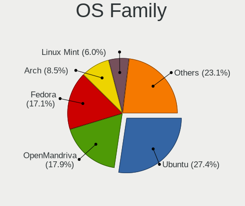

| Name         | Computers | Percent |
|--------------|-----------|---------|
| Ubuntu       | 32        | 26.02%  |
| OpenMandriva | 14        | 11.38%  |
| Linux Mint   | 13        | 10.57%  |
| Fedora       | 9         | 7.32%   |
| Zorin        | 8         | 6.5%    |
| Pop!_OS      | 6         | 4.88%   |
| Kubuntu      | 6         | 4.88%   |
| Arch         | 6         | 4.88%   |
| Kali         | 5         | 4.07%   |
| Manjaro      | 4         | 3.25%   |
| ArcoLinux    | 4         | 3.25%   |
| Xero         | 3         | 2.44%   |
| KDE neon     | 3         | 2.44%   |
| Ubuntu Unity | 2         | 1.63%   |
| EndeavourOS  | 2         | 1.63%   |
| Slackware    | 1         | 0.81%   |
| RHEL         | 1         | 0.81%   |
| Parrot       | 1         | 0.81%   |
| Debian       | 1         | 0.81%   |
| Artix        | 1         | 0.81%   |
| Archcraft    | 1         | 0.81%   |

Kernel
------

Version of the Linux kernel

| Version                 | Computers | Percent |
|-------------------------|-----------|---------|
| 5.15.0-67-generic       | 18        | 14.63%  |
| 5.19.0-35-generic       | 15        | 12.2%   |
| 5.19.0-38-generic       | 6         | 4.88%   |
| 6.2.6-desktop-1omv2390  | 5         | 4.07%   |
| 6.1.1-desktop-1omv2290  | 4         | 3.25%   |
| 6.1.0-kali5-amd64       | 4         | 3.25%   |
| 6.1.14-200.fc37.x86_64  | 3         | 2.44%   |
| 5.19.0-32-generic       | 3         | 2.44%   |
| 5.15.0-69-generic       | 3         | 2.44%   |
| 6.2.8-zen1-1-zen        | 2         | 1.63%   |
| 6.2.8-arch1-1           | 2         | 1.63%   |
| 6.2.6-76060206-generic  | 2         | 1.63%   |
| 6.1.19-1-MANJARO        | 2         | 1.63%   |
| 6.1.13-200.fc37.x86_64  | 2         | 1.63%   |
| 5.19.0-31-generic       | 2         | 1.63%   |
| 5.15.0-58-generic       | 2         | 1.63%   |
| 5.15.0-52-generic       | 2         | 1.63%   |
| 6.3.0-rc1-273-tkg-cfs   | 1         | 0.81%   |
| 6.2.7-x64v1-xanmod1-1   | 1         | 0.81%   |
| 6.2.7-desktop-1omv2390  | 1         | 0.81%   |
| 6.2.7-arch1-1           | 1         | 0.81%   |
| 6.2.7-300.fc38.x86_64   | 1         | 0.81%   |
| 6.2.7-200.fc37.x86_64   | 1         | 0.81%   |
| 6.2.7-060207-generic    | 1         | 0.81%   |
| 6.2.6-zen1-1-zen        | 1         | 0.81%   |
| 6.2.5-arch1-1           | 1         | 0.81%   |
| 6.2.2-zen1-1-zen        | 1         | 0.81%   |
| 6.2.2-desktop-1omv2390  | 1         | 0.81%   |
| 6.2.2-arch2-1           | 1         | 0.81%   |
| 6.2.2-arch1-1           | 1         | 0.81%   |
| 6.2.2-060202-generic    | 1         | 0.81%   |
| 6.2.1-arch1-1           | 1         | 0.81%   |
| 6.2.0-76060200-generic  | 1         | 0.81%   |
| 6.1.3-273-tkg-bmq       | 1         | 0.81%   |
| 6.1.18-x64v2-xanmod1    | 1         | 0.81%   |
| 6.1.15-200.fc37.x86_64  | 1         | 0.81%   |
| 6.1.12-zen1-1-zen       | 1         | 0.81%   |
| 6.1.12-arch1-1          | 1         | 0.81%   |
| 6.1.12-060112-generic   | 1         | 0.81%   |
| 6.1.11-76060111-generic | 1         | 0.81%   |

Kernel Family
-------------

Linux kernel without a distro release

| Version  | Computers | Percent |
|----------|-----------|---------|
| 5.15.0   | 28        | 22.76%  |
| 5.19.0   | 27        | 21.95%  |
| 6.2.6    | 8         | 6.5%    |
| 6.2.7    | 6         | 4.88%   |
| 6.1.0    | 6         | 4.88%   |
| 6.2.2    | 5         | 4.07%   |
| 6.2.8    | 4         | 3.25%   |
| 6.1.1    | 4         | 3.25%   |
| 6.1.14   | 3         | 2.44%   |
| 6.1.12   | 3         | 2.44%   |
| 6.1.19   | 2         | 1.63%   |
| 6.1.13   | 2         | 1.63%   |
| 6.0.12   | 2         | 1.63%   |
| 6.0.0    | 2         | 1.63%   |
| 5.4.0    | 2         | 1.63%   |
| 6.3.0    | 1         | 0.81%   |
| 6.2.5    | 1         | 0.81%   |
| 6.2.1    | 1         | 0.81%   |
| 6.2.0    | 1         | 0.81%   |
| 6.1.3    | 1         | 0.81%   |
| 6.1.18   | 1         | 0.81%   |
| 6.1.15   | 1         | 0.81%   |
| 6.1.11   | 1         | 0.81%   |
| 6.0.7    | 1         | 0.81%   |
| 6.0.2    | 1         | 0.81%   |
| 5.16.13  | 1         | 0.81%   |
| 5.15.80  | 1         | 0.81%   |
| 5.15.102 | 1         | 0.81%   |
| 5.14.0   | 1         | 0.81%   |
| 5.11.12  | 1         | 0.81%   |
| 5.10.79  | 1         | 0.81%   |
| 5.10.14  | 1         | 0.81%   |
| 5.10.0   | 1         | 0.81%   |
| 3.10.0   | 1         | 0.81%   |

Kernel Major Ver.
-----------------

Linux kernel major version

| Version | Computers | Percent |
|---------|-----------|---------|
| 5.15    | 30        | 24.39%  |
| 5.19    | 27        | 21.95%  |
| 6.2     | 26        | 21.14%  |
| 6.1     | 24        | 19.51%  |
| 6.0     | 6         | 4.88%   |
| 5.10    | 3         | 2.44%   |
| 5.4     | 2         | 1.63%   |
| 6.3     | 1         | 0.81%   |
| 5.16    | 1         | 0.81%   |
| 5.14    | 1         | 0.81%   |
| 5.11    | 1         | 0.81%   |
| 3.10    | 1         | 0.81%   |

Arch
----

OS architecture (x86_64, i586, etc.)

| Name   | Computers | Percent |
|--------|-----------|---------|
| x86_64 | 123       | 100%    |

DE
--

Desktop Environment

| Name       | Computers | Percent |
|------------|-----------|---------|
| GNOME      | 60        | 48.78%  |
| KDE5       | 33        | 26.83%  |
| X-Cinnamon | 12        | 9.76%   |
| XFCE       | 10        | 8.13%   |
| Hyprland   | 3         | 2.44%   |
| xmonad     | 1         | 0.81%   |
| Unity      | 1         | 0.81%   |
| MATE       | 1         | 0.81%   |
| KDE4       | 1         | 0.81%   |
| i3         | 1         | 0.81%   |

Display Server
--------------

X11 or Wayland

| Name    | Computers | Percent |
|---------|-----------|---------|
| X11     | 92        | 74.8%   |
| Wayland | 28        | 22.76%  |
| Unknown | 2         | 1.63%   |
| Tty     | 1         | 0.81%   |

Display Manager
---------------

SDDM, LightDM, etc.

| Name    | Computers | Percent |
|---------|-----------|---------|
| GDM3    | 37        | 30.08%  |
| SDDM    | 32        | 26.02%  |
| Unknown | 30        | 24.39%  |
| LightDM | 13        | 10.57%  |
| GDM     | 10        | 8.13%   |
| GREETD  | 1         | 0.81%   |

OS Lang
-------

Language

| Lang    | Computers | Percent |
|---------|-----------|---------|
| en_IN   | 81        | 65.85%  |
| en_US   | 37        | 30.08%  |
| en_GB   | 2         | 1.63%   |
| Unknown | 2         | 1.63%   |
| C       | 1         | 0.81%   |

Boot Mode
---------

EFI or BIOS

| Mode | Computers | Percent |
|------|-----------|---------|
| EFI  | 82        | 66.67%  |
| BIOS | 41        | 33.33%  |

Filesystem
----------

Type of filesystem

| Type    | Computers | Percent |
|---------|-----------|---------|
| Ext4    | 91        | 73.98%  |
| Btrfs   | 16        | 13.01%  |
| Overlay | 9         | 7.32%   |
| Xfs     | 3         | 2.44%   |
| Zfs     | 2         | 1.63%   |
| F2fs    | 2         | 1.63%   |

Part. scheme
------------

Scheme of partitioning

| Type    | Computers | Percent |
|---------|-----------|---------|
| GPT     | 79        | 64.23%  |
| Unknown | 29        | 23.58%  |
| MBR     | 15        | 12.2%   |

Dual Boot with Linux/BSD
------------------------

Hosting more than one Linux/BSD

| Dual boot | Computers | Percent |
|-----------|-----------|---------|
| No        | 104       | 84.55%  |
| Yes       | 19        | 15.45%  |

Dual Boot (Win)
---------------

Hosting Linux and Windows

| Dual boot | Computers | Percent |
|-----------|-----------|---------|
| No        | 70        | 56.91%  |
| Yes       | 53        | 43.09%  |

Board
-----

Vendor
------

Motherboard manufacturer

| Name                    | Computers | Percent |
|-------------------------|-----------|---------|
| Lenovo                  | 27        | 21.95%  |
| Hewlett-Packard         | 24        | 19.51%  |
| Dell                    | 24        | 19.51%  |
| ASUSTek Computer        | 15        | 12.2%   |
| Gigabyte Technology     | 6         | 4.88%   |
| Intel                   | 4         | 3.25%   |
| Acer                    | 4         | 3.25%   |
| Timi                    | 3         | 2.44%   |
| MSI                     | 2         | 1.63%   |
| HONOR                   | 2         | 1.63%   |
| ASRock                  | 2         | 1.63%   |
| ZOTAC                   | 1         | 0.81%   |
| Valve                   | 1         | 0.81%   |
| RDP                     | 1         | 0.81%   |
| OEM                     | 1         | 0.81%   |
| Infinix                 | 1         | 0.81%   |
| HCL Infosystems Limited | 1         | 0.81%   |
| Getac                   | 1         | 0.81%   |
| Foxconn                 | 1         | 0.81%   |
| Apple                   | 1         | 0.81%   |
| Unknown                 | 1         | 0.81%   |

Model
-----

Motherboard model

| Name                                        | Computers | Percent |
|---------------------------------------------|-----------|---------|
| Timi Xiaomi NoteBook Pro                    | 3         | 2.44%   |
| HP Pavilion 15                              | 3         | 2.44%   |
| HONOR NMH-WCX9                              | 2         | 1.63%   |
| HP Laptop 15s-du0xxx                        | 2         | 1.63%   |
| ASUS PRIME H510M-E                          | 2         | 1.63%   |
| ZOTAC ZBOX-ECM73070C/53060C                 | 1         | 0.81%   |
| Valve Jupiter                               | 1         | 0.81%   |
| RDP ThinBook 1010                           | 1         | 0.81%   |
| OEM H110                                    | 1         | 0.81%   |
| MSI MS-7A15                                 | 1         | 0.81%   |
| MSI Alpha 15 B5EEK                          | 1         | 0.81%   |
| Lenovo Yoga 2 13 20344                      | 1         | 0.81%   |
| Lenovo ThinkPad X13 Gen 2a 20XH0076IG       | 1         | 0.81%   |
| Lenovo ThinkPad X1 Carbon Gen 10 21CBCTO1WW | 1         | 0.81%   |
| Lenovo ThinkPad W530 2447C83                | 1         | 0.81%   |
| Lenovo ThinkPad T470 20HES4EG00             | 1         | 0.81%   |
| Lenovo ThinkPad T460s 20FAS55Q1D            | 1         | 0.81%   |
| Lenovo ThinkPad P50 20EN0013US              | 1         | 0.81%   |
| Lenovo ThinkPad E480 20KNA01HIG             | 1         | 0.81%   |
| Lenovo ThinkPad E14 Gen 4 21E3S05B00        | 1         | 0.81%   |
| Lenovo ThinkBook 15 G4 ABA 21DL             | 1         | 0.81%   |
| Lenovo ThinkBook 15 G2 ITL 20VE             | 1         | 0.81%   |
| Lenovo ThinkBook 14 G2 ITL Ub 20VD          | 1         | 0.81%   |
| Lenovo Legion Y540-15IRH-PG0 81SY           | 1         | 0.81%   |
| Lenovo IdeaPadFlex 5 14ALC05 82HU           | 1         | 0.81%   |
| Lenovo IdeaPad S540-15IML D 81NG            | 1         | 0.81%   |
| Lenovo IdeaPad Gaming 3 15IHU6 82K1         | 1         | 0.81%   |
| Lenovo IdeaPad Gaming 3 15ACH6 82K2         | 1         | 0.81%   |
| Lenovo IdeaPad 5 15ITL05 82FG               | 1         | 0.81%   |
| Lenovo IdeaPad 330S-15IKB 81F5              | 1         | 0.81%   |
| Lenovo IdeaPad 330-15IKB 81DE               | 1         | 0.81%   |
| Lenovo IdeaPad 320-15AST 80XV               | 1         | 0.81%   |
| Lenovo IdeaPad 130-14IKB 81H6               | 1         | 0.81%   |
| Lenovo G560 20042                           | 1         | 0.81%   |
| Lenovo G500s 20245                          | 1         | 0.81%   |
| Lenovo G50-80 80E5                          | 1         | 0.81%   |
| Lenovo Flex 2-14 20404                      | 1         | 0.81%   |
| Lenovo E41-25 81FS                          | 1         | 0.81%   |
| Intel Raptor Lake Client Platform           | 1         | 0.81%   |
| Intel H61                                   | 1         | 0.81%   |

Model Family
------------

Motherboard model prefix

| Name                 | Computers | Percent |
|----------------------|-----------|---------|
| Lenovo ThinkPad      | 8         | 6.5%    |
| Lenovo IdeaPad       | 8         | 6.5%    |
| Dell Inspiron        | 8         | 6.5%    |
| HP Pavilion          | 7         | 5.69%   |
| HP Laptop            | 6         | 4.88%   |
| Dell Latitude        | 6         | 4.88%   |
| ASUS VivoBook        | 4         | 3.25%   |
| Timi Xiaomi          | 3         | 2.44%   |
| Lenovo ThinkBook     | 3         | 2.44%   |
| Dell Vostro          | 3         | 2.44%   |
| Dell G15             | 3         | 2.44%   |
| ASUS TUF             | 3         | 2.44%   |
| ASUS ROG             | 3         | 2.44%   |
| HONOR NMH-WCX9       | 2         | 1.63%   |
| HP Victus            | 2         | 1.63%   |
| HP 245               | 2         | 1.63%   |
| Gigabyte B450M       | 2         | 1.63%   |
| Dell Precision       | 2         | 1.63%   |
| ASUS PRIME           | 2         | 1.63%   |
| ZOTAC ZBOX-ECM73070C | 1         | 0.81%   |
| Valve Jupiter        | 1         | 0.81%   |
| RDP ThinBook         | 1         | 0.81%   |
| OEM H110             | 1         | 0.81%   |
| MSI MS-7A15          | 1         | 0.81%   |
| MSI Alpha            | 1         | 0.81%   |
| Lenovo Yoga          | 1         | 0.81%   |
| Lenovo Legion        | 1         | 0.81%   |
| Lenovo IdeaPadFlex   | 1         | 0.81%   |
| Lenovo G560          | 1         | 0.81%   |
| Lenovo G500s         | 1         | 0.81%   |
| Lenovo G50-80        | 1         | 0.81%   |
| Lenovo Flex          | 1         | 0.81%   |
| Lenovo E41-25        | 1         | 0.81%   |
| Intel Raptor         | 1         | 0.81%   |
| Intel H61            | 1         | 0.81%   |
| Intel H55            | 1         | 0.81%   |
| Intel G41            | 1         | 0.81%   |
| Infinix INBOOK       | 1         | 0.81%   |
| HP Stream            | 1         | 0.81%   |
| HP Spectre           | 1         | 0.81%   |

MFG Year
--------

Motherboard manufacture year

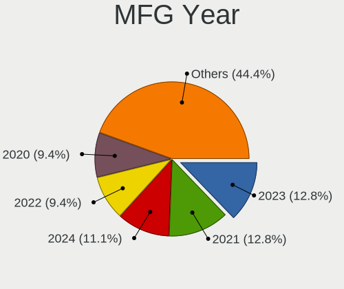

| Year | Computers | Percent |
|------|-----------|---------|
| 2021 | 23        | 18.7%   |
| 2022 | 19        | 15.45%  |
| 2019 | 15        | 12.2%   |
| 2020 | 14        | 11.38%  |
| 2018 | 11        | 8.94%   |
| 2017 | 9         | 7.32%   |
| 2013 | 8         | 6.5%    |
| 2012 | 6         | 4.88%   |
| 2014 | 5         | 4.07%   |
| 2016 | 4         | 3.25%   |
| 2015 | 2         | 1.63%   |
| 2011 | 2         | 1.63%   |
| 2010 | 2         | 1.63%   |
| 2023 | 1         | 0.81%   |
| 2009 | 1         | 0.81%   |
| 2008 | 1         | 0.81%   |

Form Factor
-----------

Physical design of the computer

| Name        | Computers | Percent |
|-------------|-----------|---------|
| Notebook    | 91        | 73.98%  |
| Desktop     | 27        | 21.95%  |
| Convertible | 3         | 2.44%   |
| Mini pc     | 1         | 0.81%   |
| All in one  | 1         | 0.81%   |

Secure Boot
-----------

Enabled or disabled

| State    | Computers | Percent |
|----------|-----------|---------|
| Disabled | 105       | 85.37%  |
| Enabled  | 18        | 14.63%  |

Coreboot
--------

Have coreboot on board

| Used | Computers | Percent |
|------|-----------|---------|
| No   | 123       | 100%    |

RAM Size
--------

Total RAM memory

| Size in GB  | Computers | Percent |
|-------------|-----------|---------|
| 4.01-8.0    | 36        | 29.27%  |
| 16.01-24.0  | 30        | 24.39%  |
| 8.01-16.0   | 23        | 18.7%   |
| 3.01-4.0    | 21        | 17.07%  |
| 32.01-64.0  | 5         | 4.07%   |
| 64.01-256.0 | 4         | 3.25%   |
| 24.01-32.0  | 2         | 1.63%   |
| 1.01-2.0    | 2         | 1.63%   |

RAM Used
--------

Used RAM memory

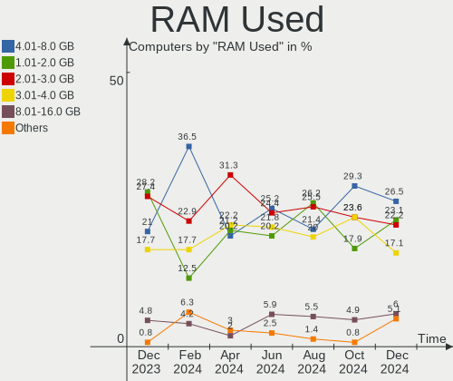

| Used GB    | Computers | Percent |
|------------|-----------|---------|
| 2.01-3.0   | 41        | 33.33%  |
| 1.01-2.0   | 32        | 26.02%  |
| 3.01-4.0   | 22        | 17.89%  |
| 4.01-8.0   | 18        | 14.63%  |
| 8.01-16.0  | 7         | 5.69%   |
| 0.51-1.0   | 2         | 1.63%   |
| 24.01-32.0 | 1         | 0.81%   |

Total Drives
------------

Number of drives on board

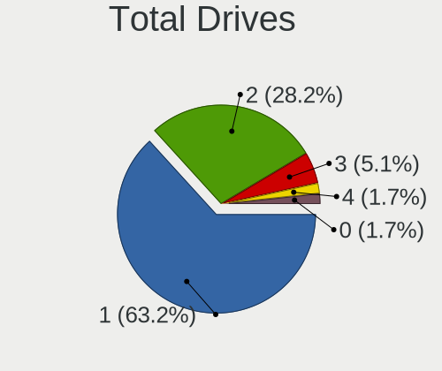

| Drives | Computers | Percent |
|--------|-----------|---------|
| 1      | 77        | 62.6%   |
| 2      | 35        | 28.46%  |
| 3      | 6         | 4.88%   |
| 4      | 4         | 3.25%   |
| 5      | 1         | 0.81%   |

Has CD-ROM
----------

Has CD-ROM on board

| Presented | Computers | Percent |
|-----------|-----------|---------|
| No        | 108       | 87.8%   |
| Yes       | 15        | 12.2%   |

Has Ethernet
------------

Has Ethernet on board

| Presented | Computers | Percent |
|-----------|-----------|---------|
| Yes       | 102       | 82.93%  |
| No        | 21        | 17.07%  |

Has WiFi
--------

Has WiFi module

| Presented | Computers | Percent |
|-----------|-----------|---------|
| Yes       | 113       | 91.87%  |
| No        | 10        | 8.13%   |

Has Bluetooth
-------------

Has Bluetooth module

| Presented | Computers | Percent |
|-----------|-----------|---------|
| Yes       | 95        | 77.24%  |
| No        | 28        | 22.76%  |

Location
--------

Country
-------

Geographic location (country)

| Country | Computers | Percent |
|---------|-----------|---------|
| India   | 123       | 100%    |

City
----

Geographic location (city)

| City              | Computers | Percent |
|-------------------|-----------|---------|
| Bengaluru         | 15        | 12.2%   |
| Chennai           | 13        | 10.57%  |
| Hyderabad         | 11        | 8.94%   |
| Delhi             | 10        | 8.13%   |
| Pune              | 7         | 5.69%   |
| Mumbai            | 6         | 4.88%   |
| Kolkata           | 6         | 4.88%   |
| Jaipur            | 5         | 4.07%   |
| Kochi             | 4         | 3.25%   |
| Ahmedabad         | 4         | 3.25%   |
| Thrissur          | 2         | 1.63%   |
| Salem             | 2         | 1.63%   |
| Noida             | 2         | 1.63%   |
| New Delhi         | 2         | 1.63%   |
| Lucknow           | 2         | 1.63%   |
| Greater Noida     | 2         | 1.63%   |
| Ghaziabad         | 2         | 1.63%   |
| Coimbatore        | 2         | 1.63%   |
| Chittaranjan Park | 2         | 1.63%   |
| Bhubaneswar       | 2         | 1.63%   |
| Warangal          | 1         | 0.81%   |
| Vadodara          | 1         | 0.81%   |
| Trivandrum        | 1         | 0.81%   |
| Thiruvarur        | 1         | 0.81%   |
| Mangalore         | 1         | 0.81%   |
| Madurai           | 1         | 0.81%   |
| Madhubani         | 1         | 0.81%   |
| Ludhiana          | 1         | 0.81%   |
| Kozhikode         | 1         | 0.81%   |
| Karnal            | 1         | 0.81%   |
| Kannur            | 1         | 0.81%   |
| Jalna             | 1         | 0.81%   |
| Jalgaon           | 1         | 0.81%   |
| Indore            | 1         | 0.81%   |
| Guwahati          | 1         | 0.81%   |
| Gurgaon           | 1         | 0.81%   |
| Fatehpur Chaurasi | 1         | 0.81%   |
| Dhubri            | 1         | 0.81%   |
| Bareilly          | 1         | 0.81%   |
| Athani            | 1         | 0.81%   |

Drives
------

Drive Vendor
------------

Hard drive vendors

| Vendor                      | Computers | Drives | Percent |
|-----------------------------|-----------|--------|---------|
| WDC                         | 30        | 33     | 17.65%  |
| Seagate                     | 30        | 31     | 17.65%  |
| Samsung Electronics         | 19        | 21     | 11.18%  |
| Crucial                     | 13        | 14     | 7.65%   |
| Toshiba                     | 8         | 9      | 4.71%   |
| Micron Technology           | 8         | 8      | 4.71%   |
| Sandisk                     | 7         | 8      | 4.12%   |
| SK hynix                    | 6         | 6      | 3.53%   |
| KIOXIA                      | 5         | 5      | 2.94%   |
| Kingston                    | 5         | 6      | 2.94%   |
| Unknown                     | 4         | 4      | 2.35%   |
| Micron/Crucial Technology   | 4         | 4      | 2.35%   |
| Intel                       | 4         | 5      | 2.35%   |
| China                       | 4         | 4      | 2.35%   |
| Silicon Motion              | 2         | 2      | 1.18%   |
| HGST                        | 2         | 2      | 1.18%   |
| ADATA Technology            | 2         | 2      | 1.18%   |
| Acer                        | 2         | 2      | 1.18%   |
| Zebronics                   | 1         | 1      | 0.59%   |
| YMTC                        | 1         | 1      | 0.59%   |
| UMIS                        | 1         | 1      | 0.59%   |
| Solid State Storage         | 1         | 1      | 0.59%   |
| Realtek Semiconductor       | 1         | 1      | 0.59%   |
| Lexar                       | 1         | 1      | 0.59%   |
| Kingston Technology Company | 1         | 2      | 0.59%   |
| Gigabyte Technology         | 1         | 1      | 0.59%   |
| FORESEE                     | 1         | 1      | 0.59%   |
| EVM                         | 1         | 1      | 0.59%   |
| CT500BX5                    | 1         | 1      | 0.59%   |
| Corsair                     | 1         | 1      | 0.59%   |
| BHT                         | 1         | 1      | 0.59%   |
| Apple                       | 1         | 4      | 0.59%   |
| Unknown                     | 1         | 1      | 0.59%   |

Drive Model
-----------

Hard drive models

| Model                                               | Computers | Percent |
|-----------------------------------------------------|-----------|---------|
| Seagate ST1000LM035-1RK172 1TB                      | 8         | 4.37%   |
| Toshiba MQ04ABF100 1TB                              | 4         | 2.19%   |
| Samsung NVMe SSD Controller SM981/PM981/PM983 250GB | 4         | 2.19%   |
| Seagate ST1000LM049-2GH172 1TB                      | 3         | 1.64%   |
| Micron/Crucial P2 NVMe PCIe SSD 1TB                 | 3         | 1.64%   |
| KIOXIA KBG50ZNV512G 512GB                           | 3         | 1.64%   |
| Crucial CT480BX500SSD1 480GB                        | 3         | 1.64%   |
| WDC WD10SPZX-60Z10T0 1TB                            | 2         | 1.09%   |
| Seagate ST500DM002-1BD142 500GB                     | 2         | 1.09%   |
| SanDisk NVMe SSD Drive 512GB                        | 2         | 1.09%   |
| Micron MTFDHBA512QFD 512GB                          | 2         | 1.09%   |
| Micron 2450_MTFDKBA512TFK 512GB                     | 2         | 1.09%   |
| KIOXIA KBG40ZNS512G NVMe 512GB                      | 2         | 1.09%   |
| Kingston SA400S37240G 240GB SSD                     | 2         | 1.09%   |
| Kingston SA400S37120G 120GB SSD                     | 2         | 1.09%   |
| Crucial CT500P1SSD8 500GB                           | 2         | 1.09%   |
| Crucial CT500MX500SSD1 500GB                        | 2         | 1.09%   |
| Crucial CT500BX500SSD1 500GB                        | 2         | 1.09%   |
| Crucial CT240BX500SSD1 240GB                        | 2         | 1.09%   |
| Zebronics ZEB-SD12 120GB SSD                        | 1         | 0.55%   |
| YMTC PC210-512GB-B                                  | 1         | 0.55%   |
| WDC WDS480G2G0A-00JH30 480GB SSD                    | 1         | 0.55%   |
| WDC WDS240G2G0B-00EPW0 240GB SSD                    | 1         | 0.55%   |
| WDC WDS240G2G0A-00JH30 240GB SSD                    | 1         | 0.55%   |
| WDC WDS120G2G0B-00EPW0 120GB SSD                    | 1         | 0.55%   |
| WDC WDS120G2G0A-00JH30 120GB SSD                    | 1         | 0.55%   |
| WDC WDS100T2G0A-00JH30 1TB SSD                      | 1         | 0.55%   |
| WDC WD7500BPKT-75PK4T0 752GB                        | 1         | 0.55%   |
| WDC WD5000LPVX-75V0TT0 500GB                        | 1         | 0.55%   |
| WDC WD5000LPVX-60V0TT0 500GB                        | 1         | 0.55%   |
| WDC WD5000LPLX-08ZNTT0 500GB                        | 1         | 0.55%   |
| WDC WD5000LPCX-24VHAT0 500GB                        | 1         | 0.55%   |
| WDC WD5000AAKX-75U6AA0 500GB                        | 1         | 0.55%   |
| WDC WD5000AAKX-00ERMA0 500GB                        | 1         | 0.55%   |
| WDC WD5000AAKX-001CA0 500GB                         | 1         | 0.55%   |
| WDC WD3200AVVS-63L2B0 320GB                         | 1         | 0.55%   |
| WDC WD20PURZ-85GU6Y0 2TB                            | 1         | 0.55%   |
| WDC WD1600BPVT-22JJ5T0 160GB                        | 1         | 0.55%   |
| WDC WD10SPZX-60Z10T1 1TB                            | 1         | 0.55%   |
| WDC WD10SPZX-24Z10T0 1TB                            | 1         | 0.55%   |

HDD Vendor
----------

Hard disk drive vendors

| Vendor  | Computers | Drives | Percent |
|---------|-----------|--------|---------|
| Seagate | 30        | 31     | 48.39%  |
| WDC     | 21        | 21     | 33.87%  |
| Toshiba | 8         | 9      | 12.9%   |
| HGST    | 2         | 2      | 3.23%   |
| Unknown | 1         | 1      | 1.61%   |

SSD Vendor
----------

Solid state drive vendors

| Vendor              | Computers | Drives | Percent |
|---------------------|-----------|--------|---------|
| Crucial             | 12        | 12     | 27.91%  |
| WDC                 | 6         | 7      | 13.95%  |
| Samsung Electronics | 6         | 6      | 13.95%  |
| Kingston            | 4         | 5      | 9.3%    |
| China               | 4         | 4      | 9.3%    |
| Zebronics           | 1         | 1      | 2.33%   |
| SK hynix            | 1         | 1      | 2.33%   |
| SanDisk             | 1         | 1      | 2.33%   |
| Micron Technology   | 1         | 1      | 2.33%   |
| Lexar               | 1         | 1      | 2.33%   |
| Gigabyte Technology | 1         | 1      | 2.33%   |
| EVM                 | 1         | 1      | 2.33%   |
| CT500BX5            | 1         | 1      | 2.33%   |
| Corsair             | 1         | 1      | 2.33%   |
| BHT                 | 1         | 1      | 2.33%   |
| Acer                | 1         | 1      | 2.33%   |

Drive Kind
----------

HDD or SSD

| Kind    | Computers | Drives | Percent |
|---------|-----------|--------|---------|
| NVMe    | 61        | 73     | 37.65%  |
| HDD     | 59        | 64     | 36.42%  |
| SSD     | 39        | 45     | 24.07%  |
| MMC     | 2         | 2      | 1.23%   |
| Unknown | 1         | 1      | 0.62%   |

Drive Connector
---------------

SATA, SAS, NVMe, etc.

| Type | Computers | Drives | Percent |
|------|-----------|--------|---------|
| SATA | 76        | 104    | 52.41%  |
| NVMe | 61        | 73     | 42.07%  |
| SAS  | 6         | 6      | 4.14%   |
| MMC  | 2         | 2      | 1.38%   |

Drive Size
----------

Size of hard drive

| Size in TB | Computers | Drives | Percent |
|------------|-----------|--------|---------|
| 0.01-0.5   | 47        | 59     | 48.96%  |
| 0.51-1.0   | 42        | 42     | 43.75%  |
| 1.01-2.0   | 7         | 8      | 7.29%   |

Space Total
-----------

Amount of disk space available on the file system

| Size in GB     | Computers | Percent |
|----------------|-----------|---------|
| 101-250        | 38        | 30.89%  |
| 251-500        | 28        | 22.76%  |
| 501-1000       | 22        | 17.89%  |
| 1-20           | 9         | 7.32%   |
| 51-100         | 9         | 7.32%   |
| 1001-2000      | 6         | 4.88%   |
| 21-50          | 5         | 4.07%   |
| 2001-3000      | 3         | 2.44%   |
| More than 3000 | 2         | 1.63%   |
| Unknown        | 1         | 0.81%   |

Space Used
----------

Amount of used disk space

| Used GB   | Computers | Percent |
|-----------|-----------|---------|
| 1-20      | 33        | 26.83%  |
| 21-50     | 27        | 21.95%  |
| 51-100    | 25        | 20.33%  |
| 101-250   | 17        | 13.82%  |
| 251-500   | 13        | 10.57%  |
| 501-1000  | 6         | 4.88%   |
| 1001-2000 | 1         | 0.81%   |
| Unknown   | 1         | 0.81%   |

Malfunc. Drives
---------------

Drive models with a malfunction

| Model                               | Computers | Drives | Percent |
|-------------------------------------|-----------|--------|---------|
| WDC WDS100T2G0A-00JH30 1TB SSD      | 1         | 1      | 6.67%   |
| WDC WD7500BPKT-75PK4T0 752GB        | 1         | 1      | 6.67%   |
| WDC WD5000AAKX-75U6AA0 500GB        | 1         | 1      | 6.67%   |
| WDC WD5000AAKX-00ERMA0 500GB        | 1         | 1      | 6.67%   |
| WDC WD5000AAKX-001CA0 500GB         | 1         | 1      | 6.67%   |
| WDC WD10SPZX-24Z10 1TB              | 1         | 1      | 6.67%   |
| Toshiba DT01ACA100 1TB              | 1         | 1      | 6.67%   |
| Seagate ST9250315AS 250GB           | 1         | 1      | 6.67%   |
| Seagate ST500LT012-9WS142 500GB     | 1         | 1      | 6.67%   |
| Seagate ST500LT012-1DG142 500GB     | 1         | 1      | 6.67%   |
| Seagate ST500LM012 HN-M500MBB 500GB | 1         | 1      | 6.67%   |
| Seagate ST3500312CS 500GB           | 1         | 1      | 6.67%   |
| Seagate ST3160310CS 160GB           | 1         | 1      | 6.67%   |
| Seagate ST31000528AS 1TB            | 1         | 1      | 6.67%   |
| HGST HTS545050A7E680 500GB          | 1         | 1      | 6.67%   |

Malfunc. Drive Vendor
---------------------

Vendors of faulty drives

| Vendor  | Computers | Drives | Percent |
|---------|-----------|--------|---------|
| Seagate | 7         | 7      | 46.67%  |
| WDC     | 6         | 6      | 40%     |
| Toshiba | 1         | 1      | 6.67%   |
| HGST    | 1         | 1      | 6.67%   |

Malfunc. HDD Vendor
-------------------

Vendors of faulty HDD drives

| Vendor  | Computers | Drives | Percent |
|---------|-----------|--------|---------|
| Seagate | 7         | 7      | 50%     |
| WDC     | 5         | 5      | 35.71%  |
| Toshiba | 1         | 1      | 7.14%   |
| HGST    | 1         | 1      | 7.14%   |

Malfunc. Drive Kind
-------------------

Kinds of faulty drives

| Kind | Computers | Drives | Percent |
|------|-----------|--------|---------|
| HDD  | 13        | 14     | 92.86%  |
| SSD  | 1         | 1      | 7.14%   |

Failed Drives
-------------

Failed drive models

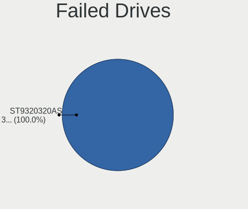

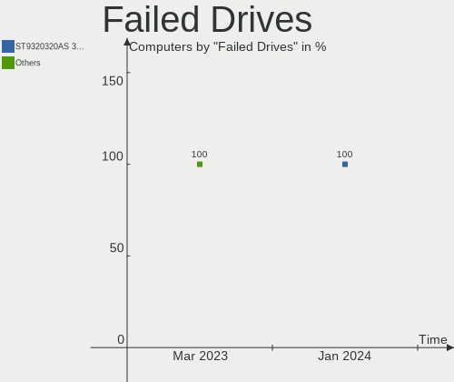

| Model                | Computers | Drives | Percent |
|----------------------|-----------|--------|---------|
| Acer SSD FA100 256GB | 1         | 1      | 100%    |

Failed Drive Vendor
-------------------

Failed drive vendors

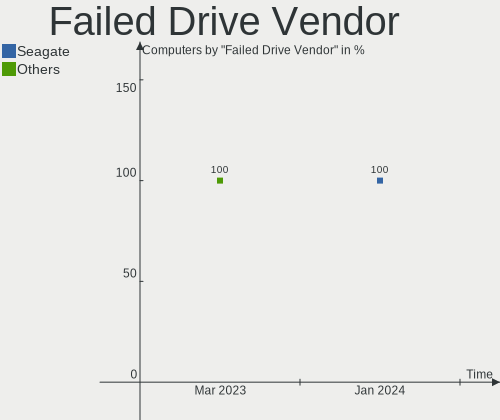

| Vendor | Computers | Drives | Percent |
|--------|-----------|--------|---------|
| Acer   | 1         | 1      | 100%    |

Drive Status
------------

Number of failed and malfunc. drives

| Status   | Computers | Drives | Percent |
|----------|-----------|--------|---------|
| Works    | 73        | 93     | 52.9%   |
| Detected | 50        | 76     | 36.23%  |
| Malfunc  | 14        | 15     | 10.14%  |
| Failed   | 1         | 1      | 0.72%   |

Storage controller
------------------

Storage Vendor
--------------

Storage controller vendors

| Vendor                         | Computers | Percent |
|--------------------------------|-----------|---------|
| Intel                          | 84        | 50.6%   |
| AMD                            | 18        | 10.84%  |
| Samsung Electronics            | 14        | 8.43%   |
| SanDisk                        | 11        | 6.63%   |
| Micron Technology              | 7         | 4.22%   |
| Micron/Crucial Technology      | 6         | 3.61%   |
| SK hynix                       | 5         | 3.01%   |
| KIOXIA                         | 5         | 3.01%   |
| ADATA Technology               | 3         | 1.81%   |
| Silicon Motion                 | 2         | 1.2%    |
| Kingston Technology Company    | 2         | 1.2%    |
| ASMedia Technology             | 2         | 1.2%    |
| Yangtze Memory Technologies    | 1         | 0.6%    |
| Union Memory (Shenzhen)        | 1         | 0.6%    |
| Solid State Storage Technology | 1         | 0.6%    |
| Shenzhen Longsys Electronics   | 1         | 0.6%    |
| Realtek Semiconductor          | 1         | 0.6%    |
| INNOGRIT                       | 1         | 0.6%    |
| Apple                          | 1         | 0.6%    |

Storage Model
-------------

Storage controller models

| Model                                                                                   | Computers | Percent |
|-----------------------------------------------------------------------------------------|-----------|---------|
| AMD FCH SATA Controller [AHCI mode]                                                     | 14        | 7.41%   |
| Intel Sunrise Point-LP SATA Controller [AHCI mode]                                      | 11        | 5.82%   |
| Intel Volume Management Device NVMe RAID Controller                                     | 10        | 5.29%   |
| Intel 82801 Mobile SATA Controller [RAID mode]                                          | 10        | 5.29%   |
| Intel Tiger Lake-LP SATA Controller                                                     | 8         | 4.23%   |
| Samsung NVMe SSD Controller SM981/PM981/PM983                                           | 7         | 3.7%    |
| Samsung NVMe SSD Controller 980                                                         | 6         | 3.17%   |
| Micron NVMe Storage Controller                                                          | 6         | 3.17%   |
| Intel Q170/Q150/B150/H170/H110/Z170/CM236 Chipset SATA Controller [AHCI Mode]           | 6         | 3.17%   |
| SK hynix Gold P31/PC711 NVMe Solid State Drive                                          | 4         | 2.12%   |
| Intel 8 Series SATA Controller 1 [AHCI mode]                                            | 4         | 2.12%   |
| Intel 7 Series Chipset Family 6-port SATA Controller [AHCI mode]                        | 4         | 2.12%   |
| SanDisk WD Black SN750 / PC SN730 NVMe SSD                                              | 3         | 1.59%   |
| Micron/Crucial P2 NVMe PCIe SSD                                                         | 3         | 1.59%   |
| KIOXIA Non-Volatile memory controller                                                   | 3         | 1.59%   |
| Intel Comet Lake SATA AHCI Controller                                                   | 3         | 1.59%   |
| Intel 6 Series/C200 Series Chipset Family Desktop SATA Controller (IDE mode, ports 4-5) | 3         | 1.59%   |
| Intel 6 Series/C200 Series Chipset Family Desktop SATA Controller (IDE mode, ports 0-3) | 3         | 1.59%   |
| Intel 500 Series Chipset Family SATA AHCI Controller                                    | 3         | 1.59%   |
| AMD 400 Series Chipset SATA Controller                                                  | 3         | 1.59%   |
| Silicon Motion SM2263EN/SM2263XT SSD Controller                                         | 2         | 1.06%   |
| SanDisk WD Blue SN550 NVMe SSD                                                          | 2         | 1.06%   |
| SanDisk NVMe Controller                                                                 | 2         | 1.06%   |
| Sandisk Non-Volatile memory controller                                                  | 2         | 1.06%   |
| Micron/Crucial P1 NVMe PCIe SSD                                                         | 2         | 1.06%   |
| KIOXIA NVMe SSD Controller BG4                                                          | 2         | 1.06%   |
| Intel Non-Volatile memory controller                                                    | 2         | 1.06%   |
| Intel NM10/ICH7 Family SATA Controller [IDE mode]                                       | 2         | 1.06%   |
| Intel Cannon Lake Mobile PCH SATA AHCI Controller                                       | 2         | 1.06%   |
| Intel 82801G (ICH7 Family) IDE Controller                                               | 2         | 1.06%   |
| Intel 8 Series/C220 Series Chipset Family 6-port SATA Controller 1 [AHCI mode]          | 2         | 1.06%   |
| Intel 6 Series/C200 Series Chipset Family 6 port Desktop SATA AHCI Controller           | 2         | 1.06%   |
| Intel 5 Series/3400 Series Chipset 6 port SATA AHCI Controller                          | 2         | 1.06%   |
| Intel 400 Series Chipset Family SATA AHCI Controller                                    | 2         | 1.06%   |
| ASMedia ASM1062 Serial ATA Controller                                                   | 2         | 1.06%   |
| AMD 500 Series Chipset SATA Controller                                                  | 2         | 1.06%   |
| Yangtze Memory Non-Volatile memory controller                                           | 1         | 0.53%   |
| Union Memory (Shenzhen) AM630 PCIe 4.0 x4 NVMe SSD Controller                           | 1         | 0.53%   |
| Solid State Storage Non-Volatile memory controller                                      | 1         | 0.53%   |
| SK hynix BC511                                                                          | 1         | 0.53%   |

Storage Kind
------------

Kind of storage controller (IDE, SATA, NVMe, SAS, ...)

| Kind | Computers | Percent |
|------|-----------|---------|
| SATA | 77        | 45.56%  |
| NVMe | 61        | 36.09%  |
| RAID | 24        | 14.2%   |
| IDE  | 7         | 4.14%   |

Processor
---------

CPU Vendor
----------

Processor vendors

| Vendor | Computers | Percent |
|--------|-----------|---------|
| Intel  | 91        | 73.98%  |
| AMD    | 32        | 26.02%  |

CPU Model
---------

Processor models

| Model                                         | Computers | Percent |
|-----------------------------------------------|-----------|---------|
| Intel 11th Gen Core i5-1135G7 @ 2.40GHz       | 5         | 4.07%   |
| Intel Core i5-8250U CPU @ 1.60GHz             | 4         | 3.25%   |
| Intel Core i5-4210U CPU @ 1.70GHz             | 3         | 2.44%   |
| Intel Core i5-10210U CPU @ 1.60GHz            | 3         | 2.44%   |
| Intel Core i3-8145U CPU @ 2.10GHz             | 3         | 2.44%   |
| Intel 12th Gen Core i5-12450H                 | 3         | 2.44%   |
| AMD Ryzen 7 5800H with Radeon Graphics        | 3         | 2.44%   |
| AMD Ryzen 5 5500U with Radeon Graphics        | 3         | 2.44%   |
| Intel Core i7-10750H CPU @ 2.60GHz            | 2         | 1.63%   |
| Intel Core i7-10510U CPU @ 1.80GHz            | 2         | 1.63%   |
| Intel Core i5-9300H CPU @ 2.40GHz             | 2         | 1.63%   |
| Intel Core i5-6300U CPU @ 2.40GHz             | 2         | 1.63%   |
| Intel Core i5-3450 CPU @ 3.10GHz              | 2         | 1.63%   |
| Intel Core i5-2540M CPU @ 2.60GHz             | 2         | 1.63%   |
| Intel Core i3-6100T CPU @ 3.20GHz             | 2         | 1.63%   |
| Intel Core i3-6006U CPU @ 2.00GHz             | 2         | 1.63%   |
| Intel Core i3-3110M CPU @ 2.40GHz             | 2         | 1.63%   |
| Intel Core i3 CPU 540 @ 3.07GHz               | 2         | 1.63%   |
| AMD Ryzen 7 5825U with Radeon Graphics        | 2         | 1.63%   |
| AMD Ryzen 5 5600H with Radeon Graphics        | 2         | 1.63%   |
| AMD Ryzen 5 3550H with Radeon Vega Mobile Gfx | 2         | 1.63%   |
| AMD PRO A4-4350B R4, 5 COMPUTE CORES 2C+3G    | 2         | 1.63%   |
| Intel Xeon CPU E3-1535M v6 @ 3.10GHz          | 1         | 0.81%   |
| Intel Pentium Dual-Core CPU E6700 @ 3.20GHz   | 1         | 0.81%   |
| Intel Pentium Dual CPU E2140 @ 1.60GHz        | 1         | 0.81%   |
| Intel Pentium CPU G4400 @ 3.30GHz             | 1         | 0.81%   |
| Intel Core i7-9700 CPU @ 3.00GHz              | 1         | 0.81%   |
| Intel Core i7-8700K CPU @ 3.70GHz             | 1         | 0.81%   |
| Intel Core i7-6700HQ CPU @ 2.60GHz            | 1         | 0.81%   |
| Intel Core i7-3610QM CPU @ 2.30GHz            | 1         | 0.81%   |
| Intel Core i7-10700 CPU @ 2.90GHz             | 1         | 0.81%   |
| Intel Core i5-9400F CPU @ 2.90GHz             | 1         | 0.81%   |
| Intel Core i5-8350U CPU @ 1.70GHz             | 1         | 0.81%   |
| Intel Core i5-8300H CPU @ 2.30GHz             | 1         | 0.81%   |
| Intel Core i5-8265U CPU @ 1.60GHz             | 1         | 0.81%   |
| Intel Core i5-7500 CPU @ 3.40GHz              | 1         | 0.81%   |
| Intel Core i5-7300U CPU @ 2.60GHz             | 1         | 0.81%   |
| Intel Core i5-6360U CPU @ 2.00GHz             | 1         | 0.81%   |
| Intel Core i5-6200U CPU @ 2.30GHz             | 1         | 0.81%   |
| Intel Core i5-4590T CPU @ 2.00GHz             | 1         | 0.81%   |

CPU Model Family
----------------

Processor model prefix

| Model                   | Computers | Percent |
|-------------------------|-----------|---------|
| Intel Core i5           | 32        | 26.02%  |
| Other                   | 24        | 19.51%  |
| Intel Core i3           | 22        | 17.89%  |
| AMD Ryzen 7             | 11        | 8.94%   |
| AMD Ryzen 5             | 11        | 8.94%   |
| Intel Core i7           | 9         | 7.32%   |
| Intel Celeron           | 2         | 1.63%   |
| AMD Ryzen 3             | 2         | 1.63%   |
| Intel Xeon              | 1         | 0.81%   |
| Intel Pentium Dual-Core | 1         | 0.81%   |
| Intel Pentium Dual      | 1         | 0.81%   |
| Intel Pentium           | 1         | 0.81%   |
| Intel Core 2 Duo        | 1         | 0.81%   |
| AMD Ryzen 9             | 1         | 0.81%   |
| AMD Ryzen 7 PRO         | 1         | 0.81%   |
| AMD FX                  | 1         | 0.81%   |
| AMD E2                  | 1         | 0.81%   |
| AMD A4                  | 1         | 0.81%   |

CPU Cores
---------

Number of processor cores

| Number | Computers | Percent |
|--------|-----------|---------|
| 2      | 43        | 34.96%  |
| 4      | 41        | 33.33%  |
| 8      | 19        | 15.45%  |
| 6      | 11        | 8.94%   |
| 10     | 3         | 2.44%   |
| 14     | 2         | 1.63%   |
| 12     | 2         | 1.63%   |
| 16     | 1         | 0.81%   |
| 1      | 1         | 0.81%   |

CPU Sockets
-----------

Number of sockets

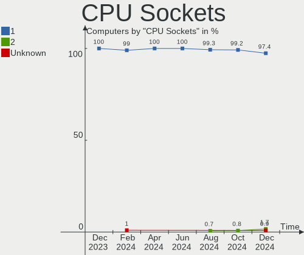

| Number | Computers | Percent |
|--------|-----------|---------|
| 1      | 123       | 100%    |

CPU Threads
-----------

Threads per core (Hyper-Threading)

| Number | Computers | Percent |
|--------|-----------|---------|
| 2      | 103       | 83.74%  |
| 1      | 19        | 15.45%  |
| 12     | 1         | 0.81%   |

CPU Op-Modes
------------

CPU Operation Modes (32-bit, 64-bit)

| Op mode        | Computers | Percent |
|----------------|-----------|---------|
| 32-bit, 64-bit | 123       | 100%    |

CPU Microcode
-------------

Microcode number

| Number     | Computers | Percent |
|------------|-----------|---------|
| Unknown    | 43        | 34.96%  |
| 0x806c1    | 7         | 5.69%   |
| 0x806ec    | 6         | 4.88%   |
| 0x906a3    | 5         | 4.07%   |
| 0x406e3    | 5         | 4.07%   |
| 0x306a9    | 5         | 4.07%   |
| 0x906ea    | 4         | 3.25%   |
| 0x206a7    | 4         | 3.25%   |
| 0x0a50000c | 4         | 3.25%   |
| 0x40651    | 3         | 2.44%   |
| 0x0a50000d | 3         | 2.44%   |
| 0x08608103 | 3         | 2.44%   |
| 0xa0652    | 2         | 1.63%   |
| 0x906e9    | 2         | 1.63%   |
| 0x906a4    | 2         | 1.63%   |
| 0x20655    | 2         | 1.63%   |
| 0x08108109 | 2         | 1.63%   |
| 0x06006705 | 2         | 1.63%   |
| 0xb06a2    | 1         | 0.81%   |
| 0x806eb    | 1         | 0.81%   |
| 0x806ea    | 1         | 0.81%   |
| 0x806c2    | 1         | 0.81%   |
| 0x706e5    | 1         | 0.81%   |
| 0x6fd      | 1         | 0.81%   |
| 0x506e3    | 1         | 0.81%   |
| 0x306d4    | 1         | 0.81%   |
| 0x306c3    | 1         | 0.81%   |
| 0x30673    | 1         | 0.81%   |
| 0x20652    | 1         | 0.81%   |
| 0x0a601203 | 1         | 0.81%   |
| 0x08a00006 | 1         | 0.81%   |
| 0x08900201 | 1         | 0.81%   |
| 0x08608102 | 1         | 0.81%   |
| 0x08600106 | 1         | 0.81%   |
| 0x08108102 | 1         | 0.81%   |
| 0x08001138 | 1         | 0.81%   |
| 0x0600063e | 1         | 0.81%   |

CPU Microarch
-------------

Microarchitecture

| Name             | Computers | Percent |
|------------------|-----------|---------|
| KabyLake         | 24        | 19.51%  |
| Zen 3            | 11        | 8.94%   |
| TigerLake        | 10        | 8.13%   |
| Skylake          | 10        | 8.13%   |
| Alderlake Hybrid | 10        | 8.13%   |
| IvyBridge        | 8         | 6.5%    |
| Unknown          | 7         | 5.69%   |
| Haswell          | 6         | 4.88%   |
| CometLake        | 6         | 4.88%   |
| SandyBridge      | 5         | 4.07%   |
| Westmere         | 4         | 3.25%   |
| Excavator        | 4         | 3.25%   |
| Zen+             | 3         | 2.44%   |
| Zen 2            | 3         | 2.44%   |
| Zen              | 3         | 2.44%   |
| Penryn           | 2         | 1.63%   |
| IceLake          | 2         | 1.63%   |
| Silvermont       | 1         | 0.81%   |
| Goldmont         | 1         | 0.81%   |
| Core             | 1         | 0.81%   |
| Bulldozer        | 1         | 0.81%   |
| Broadwell        | 1         | 0.81%   |

Graphics
--------

GPU Vendor
----------

Vendors of graphics cards

| Vendor | Computers | Percent |
|--------|-----------|---------|
| Intel  | 86        | 54.78%  |
| Nvidia | 39        | 24.84%  |
| AMD    | 32        | 20.38%  |

GPU Model
---------

Graphics card models

| Model                                                                         | Computers | Percent |
|-------------------------------------------------------------------------------|-----------|---------|
| Intel TigerLake-LP GT2 [Iris Xe Graphics]                                     | 8         | 4.97%   |
| AMD Cezanne [Radeon Vega Series / Radeon Vega Mobile Series]                  | 8         | 4.97%   |
| Nvidia TU117M [GeForce GTX 1650 Mobile / Max-Q]                               | 6         | 3.73%   |
| Intel UHD Graphics 620                                                        | 5         | 3.11%   |
| Intel Skylake GT2 [HD Graphics 520]                                           | 5         | 3.11%   |
| Intel CometLake-U GT2 [UHD Graphics]                                          | 5         | 3.11%   |
| Intel 3rd Gen Core processor Graphics Controller                              | 5         | 3.11%   |
| Intel 2nd Generation Core Processor Family Integrated Graphics Controller     | 5         | 3.11%   |
| Nvidia GF117M [GeForce 610M/710M/810M/820M / GT 620M/625M/630M/720M]          | 4         | 2.48%   |
| Intel WhiskeyLake-U GT2 [UHD Graphics 620]                                    | 4         | 2.48%   |
| Intel Haswell-ULT Integrated Graphics Controller                              | 4         | 2.48%   |
| Intel Core Processor Integrated Graphics Controller                           | 4         | 2.48%   |
| Intel Alder Lake-P GT1 [UHD Graphics]                                         | 4         | 2.48%   |
| AMD Stoney [Radeon R2/R3/R4/R5 Graphics]                                      | 4         | 2.48%   |
| AMD Lucienne                                                                  | 4         | 2.48%   |
| Intel Xeon E3-1200 v2/3rd Gen Core processor Graphics Controller              | 3         | 1.86%   |
| Intel HD Graphics 530                                                         | 3         | 1.86%   |
| Intel CometLake-H GT2 [UHD Graphics]                                          | 3         | 1.86%   |
| Intel Alder Lake-P Integrated Graphics Controller                             | 3         | 1.86%   |
| AMD Picasso/Raven 2 [Radeon Vega Series / Radeon Vega Mobile Series]          | 3         | 1.86%   |
| AMD Navi 23 [Radeon RX 6600/6600 XT/6600M]                                    | 3         | 1.86%   |
| AMD Barcelo                                                                   | 3         | 1.86%   |
| Nvidia TU116 [GeForce GTX 1660 Ti]                                            | 2         | 1.24%   |
| Nvidia GM108M [GeForce MX130]                                                 | 2         | 1.24%   |
| Nvidia GA107M [GeForce RTX 3050 Ti Mobile]                                    | 2         | 1.24%   |
| Nvidia GA107M [GeForce RTX 3050 Mobile]                                       | 2         | 1.24%   |
| Intel Tiger Lake-LP GT2 [UHD Graphics G4]                                     | 2         | 1.24%   |
| Intel HD Graphics 620                                                         | 2         | 1.24%   |
| Intel CoffeeLake-S GT2 [UHD Graphics 630]                                     | 2         | 1.24%   |
| Intel CoffeeLake-H GT2 [UHD Graphics 630]                                     | 2         | 1.24%   |
| Intel Alder Lake-UP3 GT2 [Iris Xe Graphics]                                   | 2         | 1.24%   |
| Intel 4 Series Chipset Integrated Graphics Controller                         | 2         | 1.24%   |
| AMD Sun XT [Radeon HD 8670A/8670M/8690M / R5 M330 / M430 / Radeon 520 Mobile] | 2         | 1.24%   |
| AMD Renoir                                                                    | 2         | 1.24%   |
| AMD Baffin [Radeon RX 460/560D / Pro 450/455/460/555/555X/560/560X]           | 2         | 1.24%   |
| Nvidia TU117M [GeForce GTX 1650 Ti Mobile]                                    | 1         | 0.62%   |
| Nvidia TU117M                                                                 | 1         | 0.62%   |
| Nvidia TU116 [GeForce GTX 1650 SUPER]                                         | 1         | 0.62%   |
| Nvidia TU106M [GeForce RTX 2060 Mobile]                                       | 1         | 0.62%   |
| Nvidia TU106 [GeForce RTX 2070 Rev. A]                                        | 1         | 0.62%   |

GPU Combo
---------

Combinations of graphics cards

| Name           | Computers | Percent |
|----------------|-----------|---------|
| 1 x Intel      | 56        | 45.53%  |
| Intel + Nvidia | 26        | 21.14%  |
| 1 x AMD        | 20        | 16.26%  |
| 1 x Nvidia     | 8         | 6.5%    |
| AMD + Nvidia   | 5         | 4.07%   |
| 2 x AMD        | 4         | 3.25%   |
| Intel + AMD    | 3         | 2.44%   |
| 2 x Intel      | 1         | 0.81%   |

GPU Driver
----------

Free vs proprietary

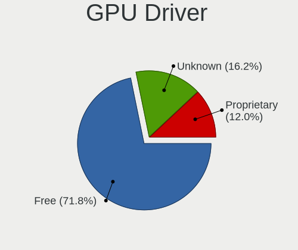

| Driver      | Computers | Percent |
|-------------|-----------|---------|
| Free        | 102       | 82.93%  |
| Proprietary | 17        | 13.82%  |
| Unknown     | 4         | 3.25%   |

GPU Memory
----------

Total video memory

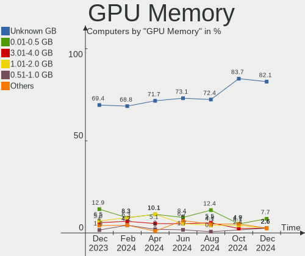

| Size in GB | Computers | Percent |
|------------|-----------|---------|
| Unknown    | 83        | 67.48%  |
| 0.01-0.5   | 12        | 9.76%   |
| 1.01-2.0   | 11        | 8.94%   |
| 3.01-4.0   | 7         | 5.69%   |
| 0.51-1.0   | 6         | 4.88%   |
| 5.01-6.0   | 2         | 1.63%   |
| 7.01-8.0   | 1         | 0.81%   |
| 8.01-16.0  | 1         | 0.81%   |

Monitor
-------

Monitor Vendor
--------------

Monitor vendors

| Vendor                  | Computers | Percent |
|-------------------------|-----------|---------|
| Chimei Innolux          | 22        | 17.19%  |
| BOE                     | 20        | 15.63%  |
| AU Optronics            | 16        | 12.5%   |
| LG Display              | 15        | 11.72%  |
| Samsung Electronics     | 9         | 7.03%   |
| Dell                    | 7         | 5.47%   |
| Goldstar                | 6         | 4.69%   |
| Hewlett-Packard         | 5         | 3.91%   |
| PANDA                   | 4         | 3.13%   |
| Acer                    | 4         | 3.13%   |
| PZG                     | 2         | 1.56%   |
| HKC                     | 2         | 1.56%   |
| BenQ                    | 2         | 1.56%   |
| VST                     | 1         | 0.78%   |
| ViewSonic               | 1         | 0.78%   |
| Valve                   | 1         | 0.78%   |
| TXD                     | 1         | 0.78%   |
| TMX                     | 1         | 0.78%   |
| Philips                 | 1         | 0.78%   |
| MSI                     | 1         | 0.78%   |
| Lenovo Group Limited    | 1         | 0.78%   |
| Lenovo                  | 1         | 0.78%   |
| InfoVision              | 1         | 0.78%   |
| CHO                     | 1         | 0.78%   |
| Chi Mei Optoelectronics | 1         | 0.78%   |
| Apple                   | 1         | 0.78%   |
| AOC                     | 1         | 0.78%   |

Monitor Model
-------------

Monitor models

| Model                                                                 | Computers | Percent |
|-----------------------------------------------------------------------|-----------|---------|
| Chimei Innolux LCD Monitor CMN15F5 1920x1080 344x193mm 15.5-inch      | 3         | 2.33%   |
| BOE LCD Monitor BOE0AF2 2560x1600 302x189mm 14.0-inch                 | 3         | 2.33%   |
| AU Optronics LCD Monitor AUO61ED 1920x1080 344x194mm 15.5-inch        | 3         | 2.33%   |
| Samsung Electronics LCD Monitor SDC4171 2880x1800 302x189mm 14.0-inch | 2         | 1.55%   |
| PANDA LCD Monitor NCP004D 1920x1080 344x194mm 15.5-inch               | 2         | 1.55%   |
| LG Display LCD Monitor LGD062E 1920x1080 344x194mm 15.5-inch          | 2         | 1.55%   |
| Hewlett-Packard 22fw HPN3541 1920x1080 476x268mm 21.5-inch            | 2         | 1.55%   |
| Dell E1914H DELD03A 1366x768 410x230mm 18.5-inch                      | 2         | 1.55%   |
| Chimei Innolux LCD Monitor CMN15E5 1920x1080 344x193mm 15.5-inch      | 2         | 1.55%   |
| Chimei Innolux LCD Monitor CMN14C3 1366x768 309x173mm 13.9-inch       | 2         | 1.55%   |
| Chimei Innolux LCD Monitor CMN1415 1920x1080 309x173mm 13.9-inch      | 2         | 1.55%   |
| BOE LCD Monitor BOE0A8A 1920x1080 344x194mm 15.5-inch                 | 2         | 1.55%   |
| AU Optronics LCD Monitor AUO45EC 1366x768 344x193mm 15.5-inch         | 2         | 1.55%   |
| VST HDMI VST6611 1366x768 576x324mm 26.0-inch                         | 1         | 0.78%   |
| ViewSonic VA2256 Series VSC3136 1920x1080 476x268mm 21.5-inch         | 1         | 0.78%   |
| Valve ANX7530 U VLV3001 800x1280 100x150mm 7.1-inch                   | 1         | 0.78%   |
| TXD HDMI TXD7825 1280x800 410x230mm 18.5-inch                         | 1         | 0.78%   |
| TMX TL140VDXP03-2 TMX1398 1920x1080 309x174mm 14.0-inch               | 1         | 0.78%   |
| Samsung Electronics SMS19A100 SAM0867 1366x768 410x230mm 18.5-inch    | 1         | 0.78%   |
| Samsung Electronics S27F350 SAM0D23 1920x1080 598x336mm 27.0-inch     | 1         | 0.78%   |
| Samsung Electronics S19C170 SAM0B02 1366x768 410x230mm 18.5-inch      | 1         | 0.78%   |
| Samsung Electronics LS27A80 SAM7183 3840x2160 597x336mm 27.0-inch     | 1         | 0.78%   |
| Samsung Electronics LF22T35 SAM707B 1920x1080 477x268mm 21.5-inch     | 1         | 0.78%   |
| Samsung Electronics LCD Monitor SDC4852 3840x2160 344x194mm 15.5-inch | 1         | 0.78%   |
| Samsung Electronics LCD Monitor SDC354A 1366x768 344x194mm 15.5-inch  | 1         | 0.78%   |
| Samsung Electronics LCD Monitor SAM0B32 1366x768 607x345mm 27.5-inch  | 1         | 0.78%   |
| PZG VGA PZG1850 1366x768 368x207mm 16.6-inch                          | 1         | 0.78%   |
| PZG HDMI PZGBC32 1920x1080 520x310mm 23.8-inch                        | 1         | 0.78%   |
| Philips 202EL PHLC05C 1600x900 443x249mm 20.0-inch                    | 1         | 0.78%   |
| PANDA LCD Monitor NCP002D 1920x1080 344x194mm 15.5-inch               | 1         | 0.78%   |
| PANDA LCD Monitor NCP0029 1920x1080 344x194mm 15.5-inch               | 1         | 0.78%   |
| MSI G27CQ4 MSI3CB0 2560x1440 597x336mm 27.0-inch                      | 1         | 0.78%   |
| LG Display LP156WH2-TLAA LGD0230 1366x768 344x194mm 15.5-inch         | 1         | 0.78%   |
| LG Display LCD Monitor LGD0696 1920x1200 286x179mm 13.3-inch          | 1         | 0.78%   |
| LG Display LCD Monitor LGD0690 2560x1440 344x194mm 15.5-inch          | 1         | 0.78%   |
| LG Display LCD Monitor LGD05E5 1920x1080 344x194mm 15.5-inch          | 1         | 0.78%   |
| LG Display LCD Monitor LGD0557 1920x1080 309x174mm 14.0-inch          | 1         | 0.78%   |
| LG Display LCD Monitor LGD0526 1366x768 344x194mm 15.5-inch           | 1         | 0.78%   |
| LG Display LCD Monitor LGD04A7 1920x1080 344x194mm 15.5-inch          | 1         | 0.78%   |
| LG Display LCD Monitor LGD0446 1920x1080 309x174mm 14.0-inch          | 1         | 0.78%   |

Monitor Resolution
------------------

Monitor screen resolution

| Resolution        | Computers | Percent |
|-------------------|-----------|---------|
| 1920x1080 (FHD)   | 66        | 53.66%  |
| 1366x768 (WXGA)   | 32        | 26.02%  |
| 3840x2160 (4K)    | 6         | 4.88%   |
| 2560x1440 (QHD)   | 5         | 4.07%   |
| 2880x1800         | 3         | 2.44%   |
| 2560x1600         | 3         | 2.44%   |
| 1920x1200 (WUXGA) | 2         | 1.63%   |
| 1600x900 (HD+)    | 2         | 1.63%   |
| 1440x900 (WXGA+)  | 2         | 1.63%   |
| 800x1280          | 1         | 0.81%   |
| 1360x768          | 1         | 0.81%   |

Monitor Diagonal
----------------

Diagonal size in inches

| Inches  | Computers | Percent |
|---------|-----------|---------|
| 15      | 52        | 40.31%  |
| 13      | 17        | 13.18%  |
| 14      | 15        | 11.63%  |
| 21      | 11        | 8.53%   |
| 18      | 7         | 5.43%   |
| 27      | 4         | 3.1%    |
| 23      | 4         | 3.1%    |
| 19      | 4         | 3.1%    |
| 16      | 3         | 2.33%   |
| 31      | 2         | 1.55%   |
| 24      | 2         | 1.55%   |
| 17      | 2         | 1.55%   |
| 63      | 1         | 0.78%   |
| 40      | 1         | 0.78%   |
| 26      | 1         | 0.78%   |
| 20      | 1         | 0.78%   |
| 7       | 1         | 0.78%   |
| Unknown | 1         | 0.78%   |

Monitor Width
-------------

Physical width

| Width in mm | Computers | Percent |
|-------------|-----------|---------|
| 301-350     | 81        | 63.78%  |
| 401-500     | 23        | 18.11%  |
| 501-600     | 9         | 7.09%   |
| 351-400     | 5         | 3.94%   |
| 201-300     | 3         | 2.36%   |
| 601-700     | 2         | 1.57%   |
| 801-900     | 1         | 0.79%   |
| 1001-1500   | 1         | 0.79%   |
| 1-100       | 1         | 0.79%   |
| Unknown     | 1         | 0.79%   |

Aspect Ratio
------------

Proportional relationship between the width and the height

| Ratio   | Computers | Percent |
|---------|-----------|---------|
| 16/9    | 106       | 89.08%  |
| 16/10   | 11        | 9.24%   |
| 0.67    | 1         | 0.84%   |
| Unknown | 1         | 0.84%   |

Monitor Area
------------

Area in inch

| Area in inch | Computers | Percent |
|----------------|-----------|---------|
| 101-110        | 54        | 41.86%  |
| 81-90          | 29        | 22.48%  |
| 201-250        | 15        | 11.63%  |
| 151-200        | 7         | 5.43%   |
| 141-150        | 7         | 5.43%   |
| 301-350        | 4         | 3.1%    |
| 71-80          | 3         | 2.33%   |
| 351-500        | 2         | 1.55%   |
| 121-130        | 2         | 1.55%   |
| More than 1000 | 1         | 0.78%   |
| 1-40           | 1         | 0.78%   |
| 251-300        | 1         | 0.78%   |
| 111-120        | 1         | 0.78%   |
| 501-1000       | 1         | 0.78%   |
| Unknown        | 1         | 0.78%   |

Pixel Density
-------------

Pixels per inch

| Density       | Computers | Percent |
|---------------|-----------|---------|
| 121-160       | 49        | 38.58%  |
| 101-120       | 39        | 30.71%  |
| 51-100        | 24        | 18.9%   |
| 161-240       | 9         | 7.09%   |
| More than 240 | 4         | 3.15%   |
| 1-50          | 1         | 0.79%   |
| Unknown       | 1         | 0.79%   |

Multiple Monitors
-----------------

Total monitors connected

| Total | Computers | Percent |
|-------|-----------|---------|
| 1     | 104       | 84.55%  |
| 2     | 13        | 10.57%  |
| 0     | 6         | 4.88%   |

Network
-------

Net Controller Vendor
---------------------

Controller vendors

| Vendor                | Computers | Percent |
|-----------------------|-----------|---------|
| Realtek Semiconductor | 88        | 44.44%  |
| Intel                 | 50        | 25.25%  |
| Qualcomm Atheros      | 16        | 8.08%   |
| MediaTek              | 9         | 4.55%   |
| Samsung Electronics   | 5         | 2.53%   |
| Qualcomm              | 5         | 2.53%   |
| TP-Link               | 4         | 2.02%   |
| ASIX Electronics      | 4         | 2.02%   |
| Xiaomi                | 3         | 1.52%   |
| Ralink Technology     | 3         | 1.52%   |
| Ralink                | 3         | 1.52%   |
| OPPO Electronics      | 3         | 1.52%   |
| Broadcom              | 3         | 1.52%   |
| Motorola PCS          | 1         | 0.51%   |
| Belkin Components     | 1         | 0.51%   |

Net Controller Model
--------------------

Controller models

| Model                                                             | Computers | Percent |
|-------------------------------------------------------------------|-----------|---------|
| Realtek RTL8111/8168/8411 PCI Express Gigabit Ethernet Controller | 56        | 23.63%  |
| Realtek RTL810xE PCI Express Fast Ethernet controller             | 17        | 7.17%   |
| Qualcomm Atheros QCA9377 802.11ac Wireless Network Adapter        | 7         | 2.95%   |
| Intel Wi-Fi 6 AX201                                               | 7         | 2.95%   |
| Intel Alder Lake-P PCH CNVi WiFi                                  | 7         | 2.95%   |
| Realtek RTL8822CE 802.11ac PCIe Wireless Network Adapter          | 6         | 2.53%   |
| Realtek RTL8821CE 802.11ac PCIe Wireless Network Adapter          | 6         | 2.53%   |
| MediaTek MT7921 802.11ax PCI Express Wireless Network Adapter     | 5         | 2.11%   |
| Intel Wi-Fi 6 AX200                                               | 5         | 2.11%   |
| Realtek RTL8188FTV 802.11b/g/n 1T1R 2.4G WLAN Adapter             | 4         | 1.69%   |
| Intel Wireless 8265 / 8275                                        | 4         | 1.69%   |
| ASIX AX88179 Gigabit Ethernet                                     | 4         | 1.69%   |
| Xiaomi Mi/Redmi series (RNDIS)                                    | 3         | 1.27%   |
| Samsung Galaxy series, misc. (tethering mode)                     | 3         | 1.27%   |
| Realtek RTL8852AE 802.11ax PCIe Wireless Network Adapter          | 3         | 1.27%   |
| Realtek RTL8723DE Wireless Network Adapter                        | 3         | 1.27%   |
| Realtek RTL8723BE PCIe Wireless Network Adapter                   | 3         | 1.27%   |
| Ralink MT7601U Wireless Adapter                                   | 3         | 1.27%   |
| Ralink RT3290 Wireless 802.11n 1T/1R PCIe                         | 3         | 1.27%   |
| Qualcomm Fairphone 4 5G                                           | 3         | 1.27%   |
| Qualcomm Atheros QCA9565 / AR9565 Wireless Network Adapter        | 3         | 1.27%   |
| OPPO RMX3263                                                      | 3         | 1.27%   |
| Intel Ethernet Connection (4) I219-LM                             | 3         | 1.27%   |
| Intel Comet Lake PCH-LP CNVi WiFi                                 | 3         | 1.27%   |
| Intel Cannon Lake PCH CNVi WiFi                                   | 3         | 1.27%   |
| TP-Link 802.11ac NIC                                              | 2         | 0.84%   |
| Samsung GT-I9070 (network tethering, USB debugging enabled)       | 2         | 0.84%   |
| Realtek RTL8852BE PCIe 802.11ax Wireless Network Controller       | 2         | 0.84%   |
| Realtek RTL8188EUS 802.11n Wireless Network Adapter               | 2         | 0.84%   |
| Realtek RTL8125 2.5GbE Controller                                 | 2         | 0.84%   |
| Realtek Killer E2600 Gigabit Ethernet Controller                  | 2         | 0.84%   |
| Qualcomm QCNFA765 Wireless Network Adapter                        | 2         | 0.84%   |
| Qualcomm Atheros AR9485 Wireless Network Adapter                  | 2         | 0.84%   |
| Qualcomm Atheros AR9285 Wireless Network Adapter (PCI-Express)    | 2         | 0.84%   |
| MediaTek Wi-Fi 6E MT7902 Wireless Network Adapter                 | 2         | 0.84%   |
| Intel Wireless 8260                                               | 2         | 0.84%   |
| Intel Ethernet Connection (16) I219-V                             | 2         | 0.84%   |
| Intel Ethernet Connection (14) I219-V                             | 2         | 0.84%   |
| Intel Dual Band Wireless-AC 3165 Plus Bluetooth                   | 2         | 0.84%   |
| Intel Comet Lake PCH CNVi WiFi                                    | 2         | 0.84%   |

Wireless Vendor
---------------

Wireless vendors

| Vendor                | Computers | Percent |
|-----------------------|-----------|---------|
| Intel                 | 45        | 38.46%  |
| Realtek Semiconductor | 33        | 28.21%  |
| Qualcomm Atheros      | 15        | 12.82%  |
| MediaTek              | 8         | 6.84%   |
| TP-Link               | 4         | 3.42%   |
| Ralink Technology     | 3         | 2.56%   |
| Ralink                | 3         | 2.56%   |
| Broadcom              | 3         | 2.56%   |
| Qualcomm              | 2         | 1.71%   |
| Belkin Components     | 1         | 0.85%   |

Wireless Model
--------------

Wireless models

| Model                                                          | Computers | Percent |
|----------------------------------------------------------------|-----------|---------|
| Qualcomm Atheros QCA9377 802.11ac Wireless Network Adapter     | 7         | 5.98%   |
| Intel Wi-Fi 6 AX201                                            | 7         | 5.98%   |
| Intel Alder Lake-P PCH CNVi WiFi                               | 7         | 5.98%   |
| Realtek RTL8822CE 802.11ac PCIe Wireless Network Adapter       | 6         | 5.13%   |
| Realtek RTL8821CE 802.11ac PCIe Wireless Network Adapter       | 6         | 5.13%   |
| MediaTek MT7921 802.11ax PCI Express Wireless Network Adapter  | 5         | 4.27%   |
| Intel Wi-Fi 6 AX200                                            | 5         | 4.27%   |
| Realtek RTL8188FTV 802.11b/g/n 1T1R 2.4G WLAN Adapter          | 4         | 3.42%   |
| Intel Wireless 8265 / 8275                                     | 4         | 3.42%   |
| Realtek RTL8852AE 802.11ax PCIe Wireless Network Adapter       | 3         | 2.56%   |
| Realtek RTL8723DE Wireless Network Adapter                     | 3         | 2.56%   |
| Realtek RTL8723BE PCIe Wireless Network Adapter                | 3         | 2.56%   |
| Ralink MT7601U Wireless Adapter                                | 3         | 2.56%   |
| Ralink RT3290 Wireless 802.11n 1T/1R PCIe                      | 3         | 2.56%   |
| Qualcomm Atheros QCA9565 / AR9565 Wireless Network Adapter     | 3         | 2.56%   |
| Intel Comet Lake PCH-LP CNVi WiFi                              | 3         | 2.56%   |
| Intel Cannon Lake PCH CNVi WiFi                                | 3         | 2.56%   |
| TP-Link 802.11ac NIC                                           | 2         | 1.71%   |
| Realtek RTL8852BE PCIe 802.11ax Wireless Network Controller    | 2         | 1.71%   |
| Realtek RTL8188EUS 802.11n Wireless Network Adapter            | 2         | 1.71%   |
| Qualcomm QCNFA765 Wireless Network Adapter                     | 2         | 1.71%   |
| Qualcomm Atheros AR9485 Wireless Network Adapter               | 2         | 1.71%   |
| Qualcomm Atheros AR9285 Wireless Network Adapter (PCI-Express) | 2         | 1.71%   |
| MediaTek Wi-Fi 6E MT7902 Wireless Network Adapter              | 2         | 1.71%   |
| Intel Wireless 8260                                            | 2         | 1.71%   |
| Intel Dual Band Wireless-AC 3165 Plus Bluetooth                | 2         | 1.71%   |
| Intel Comet Lake PCH CNVi WiFi                                 | 2         | 1.71%   |
| Intel Cannon Point-LP CNVi [Wireless-AC]                       | 2         | 1.71%   |
| Broadcom BCM43142 802.11b/g/n                                  | 2         | 1.71%   |
| TP-Link TL-WN823N v2/v3 [Realtek RTL8192EU]                    | 1         | 0.85%   |
| TP-Link Archer T2U PLUS [RTL8821AU]                            | 1         | 0.85%   |
| Realtek RTL8812AU 802.11a/b/g/n/ac 2T2R DB WLAN Adapter        | 1         | 0.85%   |
| Realtek RTL8723BU 802.11b/g/n WLAN Adapter                     | 1         | 0.85%   |
| Realtek RTL8192EE PCIe Wireless Network Adapter                | 1         | 0.85%   |
| Realtek RTL8188CE 802.11b/g/n WiFi Adapter                     | 1         | 0.85%   |
| Qualcomm Atheros QCA6174 802.11ac Wireless Network Adapter     | 1         | 0.85%   |
| MediaTek MT7921K (RZ608) Wi-Fi 6E 80MHz                        | 1         | 0.85%   |
| Intel Wireless-AC 9260                                         | 1         | 0.85%   |
| Intel Wireless 7265                                            | 1         | 0.85%   |
| Intel Wireless 3160                                            | 1         | 0.85%   |

Ethernet Vendor
---------------

Ethernet vendors

| Vendor                | Computers | Percent |
|-----------------------|-----------|---------|
| Realtek Semiconductor | 78        | 66.1%   |
| Intel                 | 17        | 14.41%  |
| Samsung Electronics   | 5         | 4.24%   |
| ASIX Electronics      | 4         | 3.39%   |
| Xiaomi                | 3         | 2.54%   |
| Qualcomm Atheros      | 3         | 2.54%   |
| Qualcomm              | 3         | 2.54%   |
| OPPO Electronics      | 3         | 2.54%   |
| Motorola PCS          | 1         | 0.85%   |
| MediaTek              | 1         | 0.85%   |

Ethernet Model
--------------

Ethernet models

| Model                                                             | Computers | Percent |
|-------------------------------------------------------------------|-----------|---------|
| Realtek RTL8111/8168/8411 PCI Express Gigabit Ethernet Controller | 56        | 46.67%  |
| Realtek RTL810xE PCI Express Fast Ethernet controller             | 17        | 14.17%  |
| ASIX AX88179 Gigabit Ethernet                                     | 4         | 3.33%   |
| Xiaomi Mi/Redmi series (RNDIS)                                    | 3         | 2.5%    |
| Samsung Galaxy series, misc. (tethering mode)                     | 3         | 2.5%    |
| Qualcomm Fairphone 4 5G                                           | 3         | 2.5%    |
| OPPO RMX3263                                                      | 3         | 2.5%    |
| Intel Ethernet Connection (4) I219-LM                             | 3         | 2.5%    |
| Samsung GT-I9070 (network tethering, USB debugging enabled)       | 2         | 1.67%   |
| Realtek RTL8125 2.5GbE Controller                                 | 2         | 1.67%   |
| Realtek Killer E2600 Gigabit Ethernet Controller                  | 2         | 1.67%   |
| Intel Ethernet Connection (16) I219-V                             | 2         | 1.67%   |
| Intel Ethernet Connection (14) I219-V                             | 2         | 1.67%   |
| Intel 82579LM Gigabit Network Connection (Lewisville)             | 2         | 1.67%   |
| Realtek RTL8153 Gigabit Ethernet Adapter                          | 1         | 0.83%   |
| Realtek Killer E3000 2.5GbE Controller                            | 1         | 0.83%   |
| Qualcomm Atheros QCA8172 Fast Ethernet                            | 1         | 0.83%   |
| Qualcomm Atheros Killer E2400 Gigabit Ethernet Controller         | 1         | 0.83%   |
| Qualcomm Atheros AR8151 v2.0 Gigabit Ethernet                     | 1         | 0.83%   |
| Motorola PCS moto g pure                                          | 1         | 0.83%   |
| MediaTek KINGKONG_MINI                                            | 1         | 0.83%   |
| Intel I211 Gigabit Network Connection                             | 1         | 0.83%   |
| Intel Ethernet Controller I225-V                                  | 1         | 0.83%   |
| Intel Ethernet Connection I219-LM                                 | 1         | 0.83%   |
| Intel Ethernet Connection (7) I219-LM                             | 1         | 0.83%   |
| Intel Ethernet Connection (6) I219-LM                             | 1         | 0.83%   |
| Intel Ethernet Connection (5) I219-LM                             | 1         | 0.83%   |
| Intel Ethernet Connection (2) I219-V                              | 1         | 0.83%   |
| Intel Ethernet Connection (13) I219-LM                            | 1         | 0.83%   |
| Intel Alder Lake-U CNVi: Wireless-AC                              | 1         | 0.83%   |

Net Controller Kind
-------------------

Ethernet, WiFi or modem

| Kind     | Computers | Percent |
|----------|-----------|---------|
| WiFi     | 113       | 52.8%   |
| Ethernet | 101       | 47.2%   |

Used Controller
---------------

Currently used network controller

| Kind     | Computers | Percent |
|----------|-----------|---------|
| WiFi     | 82        | 70.69%  |
| Ethernet | 34        | 29.31%  |

NICs
----

Total network controllers on board

| Total | Computers | Percent |
|-------|-----------|---------|
| 2     | 77        | 62.6%   |
| 1     | 43        | 34.96%  |
| 0     | 2         | 1.63%   |
| 3     | 1         | 0.81%   |

IPv6
----

IPv6 vs IPv4

| Used | Computers | Percent |
|------|-----------|---------|
| No   | 86        | 69.92%  |
| Yes  | 37        | 30.08%  |

Bluetooth
---------

Bluetooth Vendor
----------------

Controller vendors

| Vendor                          | Computers | Percent |
|---------------------------------|-----------|---------|
| Intel                           | 41        | 42.71%  |
| Realtek Semiconductor           | 15        | 15.63%  |
| Qualcomm Atheros Communications | 11        | 11.46%  |
| IMC Networks                    | 8         | 8.33%   |
| Foxconn / Hon Hai               | 4         | 4.17%   |
| Cambridge Silicon Radio         | 4         | 4.17%   |
| Broadcom                        | 4         | 4.17%   |
| Ralink                          | 3         | 3.13%   |
| TP-Link                         | 2         | 2.08%   |
| Opticis                         | 2         | 2.08%   |
| MediaTek                        | 1         | 1.04%   |
| Dell                            | 1         | 1.04%   |

Bluetooth Model
---------------

Controller models

| Model                                               | Computers | Percent |
|-----------------------------------------------------|-----------|---------|
| Intel AX201 Bluetooth                               | 13        | 13.54%  |
| Realtek Bluetooth Radio                             | 10        | 10.42%  |
| Qualcomm Atheros  Bluetooth Device                  | 9         | 9.38%   |
| Intel Bluetooth wireless interface                  | 9         | 9.38%   |
| Intel Bluetooth 9460/9560 Jefferson Peak (JfP)      | 7         | 7.29%   |
| Intel AX200 Bluetooth                               | 5         | 5.21%   |
| IMC Networks Wireless_Device                        | 5         | 5.21%   |
| Realtek  Bluetooth 4.2 Adapter                      | 4         | 4.17%   |
| Intel Bluetooth Device                              | 4         | 4.17%   |
| Cambridge Silicon Radio Bluetooth Dongle (HCI mode) | 4         | 4.17%   |
| Ralink RT3290 Bluetooth                             | 3         | 3.13%   |
| TP-Link UB500 Adapter                               | 2         | 2.08%   |
| Opticis Bluetooth Radio                             | 2         | 2.08%   |
| IMC Networks Bluetooth Radio                        | 2         | 2.08%   |
| Foxconn / Hon Hai Bluetooth Device                  | 2         | 2.08%   |
| Realtek RTL8723B Bluetooth                          | 1         | 1.04%   |
| Qualcomm Atheros AR9462 Bluetooth                   | 1         | 1.04%   |
| Qualcomm Atheros AR3011 Bluetooth                   | 1         | 1.04%   |
| MediaTek Wireless_Device                            | 1         | 1.04%   |
| Intel Wireless-AC 9260 Bluetooth Adapter            | 1         | 1.04%   |
| Intel Centrino Advanced-N 6230 Bluetooth adapter    | 1         | 1.04%   |
| Intel AX210 Bluetooth                               | 1         | 1.04%   |
| IMC Networks Bluetooth Device                       | 1         | 1.04%   |
| Foxconn / Hon Hai Wireless_Device                   | 1         | 1.04%   |
| Foxconn / Hon Hai Broadcom Bluetooth 2.1 Device     | 1         | 1.04%   |
| Dell DW375 Bluetooth Module                         | 1         | 1.04%   |
| Broadcom BCM43142A0 Bluetooth Device                | 1         | 1.04%   |
| Broadcom BCM43142 Bluetooth 4.0                     | 1         | 1.04%   |
| Broadcom BCM20702A0 Bluetooth 4.0                   | 1         | 1.04%   |
| Broadcom BCM20702 Bluetooth 4.0 [ThinkPad]          | 1         | 1.04%   |

Sound
-----

Sound Vendor
------------

Sound card vendors

| Vendor           | Computers | Percent |
|------------------|-----------|---------|
| Intel            | 91        | 59.09%  |
| AMD              | 32        | 20.78%  |
| Nvidia           | 24        | 15.58%  |
| GN Netcom        | 2         | 1.3%    |
| Lenovo           | 1         | 0.65%   |
| JMTek            | 1         | 0.65%   |
| Hewlett-Packard  | 1         | 0.65%   |
| ASUSTek Computer | 1         | 0.65%   |
| Anlya.cn         | 1         | 0.65%   |

Sound Model
-----------

Sound card models

| Model                                                                      | Computers | Percent |
|----------------------------------------------------------------------------|-----------|---------|
| AMD Family 17h/19h HD Audio Controller                                     | 21        | 11.11%  |
| AMD Renoir Radeon High Definition Audio Controller                         | 17        | 8.99%   |
| Intel Sunrise Point-LP HD Audio                                            | 13        | 6.88%   |
| Intel Tiger Lake-LP Smart Sound Technology Audio Controller                | 10        | 5.29%   |
| Intel Alder Lake PCH-P High Definition Audio Controller                    | 9         | 4.76%   |
| Nvidia TU107 GeForce GTX 1650 High Definition Audio Controller             | 7         | 3.7%    |
| Intel 6 Series/C200 Series Chipset Family High Definition Audio Controller | 7         | 3.7%    |
| Intel 7 Series/C216 Chipset Family High Definition Audio Controller        | 6         | 3.17%   |
| Intel Comet Lake PCH-LP cAVS                                               | 5         | 2.65%   |
| Intel 100 Series/C230 Series Chipset Family HD Audio Controller            | 5         | 2.65%   |
| Intel Haswell-ULT HD Audio Controller                                      | 4         | 2.12%   |
| Intel Comet Lake PCH cAVS                                                  | 4         | 2.12%   |
| Intel Cannon Point-LP High Definition Audio Controller                     | 4         | 2.12%   |
| Intel Cannon Lake PCH cAVS                                                 | 4         | 2.12%   |
| Intel 8 Series HD Audio Controller                                         | 4         | 2.12%   |
| Intel 5 Series/3400 Series Chipset High Definition Audio                   | 4         | 2.12%   |
| AMD Navi 21/23 HDMI/DP Audio Controller                                    | 4         | 2.12%   |
| AMD High Definition Audio Controller                                       | 4         | 2.12%   |
| AMD Family 15h (Models 60h-6fh) Audio Controller                           | 4         | 2.12%   |
| Nvidia TU116 High Definition Audio Controller                              | 3         | 1.59%   |
| Nvidia Audio device                                                        | 3         | 1.59%   |
| AMD Rembrandt Radeon High Definition Audio Controller                      | 3         | 1.59%   |
| AMD Family 17h (Models 00h-0fh) HD Audio Controller                        | 3         | 1.59%   |
| Nvidia TU106 High Definition Audio Controller                              | 2         | 1.06%   |
| Nvidia GM107 High Definition Audio Controller [GeForce 940MX]              | 2         | 1.06%   |
| Intel Smart Sound Technology (SST) Audio Controller                        | 2         | 1.06%   |
| Intel NM10/ICH7 Family High Definition Audio Controller                    | 2         | 1.06%   |
| Intel 8 Series/C220 Series Chipset High Definition Audio Controller        | 2         | 1.06%   |
| Intel 200 Series PCH HD Audio                                              | 2         | 1.06%   |
| AMD Raven/Raven2/Fenghuang HDMI/DP Audio Controller                        | 2         | 1.06%   |
| Nvidia GP108 High Definition Audio Controller                              | 1         | 0.53%   |
| Nvidia GK208 HDMI/DP Audio Controller                                      | 1         | 0.53%   |
| Nvidia GK107 HDMI Audio Controller                                         | 1         | 0.53%   |
| Nvidia GF119 HDMI Audio Controller                                         | 1         | 0.53%   |
| Nvidia GF108 High Definition Audio Controller                              | 1         | 0.53%   |
| Nvidia GA106 High Definition Audio Controller                              | 1         | 0.53%   |
| Nvidia GA104 High Definition Audio Controller                              | 1         | 0.53%   |
| Lenovo USB Headset                                                         | 1         | 0.53%   |
| JMTek USB PnP Audio Device                                                 | 1         | 0.53%   |
| Intel Xeon E3-1200 v3/4th Gen Core Processor HD Audio Controller           | 1         | 0.53%   |

Memory
------

Memory Vendor
-------------

Memory module vendors

| Vendor              | Computers | Percent |
|---------------------|-----------|---------|
| Samsung Electronics | 30        | 28.85%  |
| SK hynix            | 24        | 23.08%  |
| Micron Technology   | 21        | 20.19%  |
| Kingston            | 7         | 6.73%   |
| Crucial             | 6         | 5.77%   |
| Unknown             | 5         | 4.81%   |
| Ramaxel Technology  | 3         | 2.88%   |
| A-DATA Technology   | 3         | 2.88%   |
| G.Skill             | 2         | 1.92%   |
| Transcend           | 1         | 0.96%   |
| CSX                 | 1         | 0.96%   |
| Corsair             | 1         | 0.96%   |

Memory Model
------------

Memory module models

| Model                                                            | Computers | Percent |
|------------------------------------------------------------------|-----------|---------|
| SK hynix RAM HMAA1GS6CJR6N-XN 8GB SODIMM DDR4 3200MT/s           | 6         | 5.45%   |
| Samsung RAM M471A1K43EB1-CWE 8GB SODIMM DDR4 3200MT/s            | 4         | 3.64%   |
| Samsung RAM M471A5244CB0-CTD 4GB SODIMM DDR4 3266MT/s            | 3         | 2.73%   |
| Samsung RAM M471A1K43DB1-CWE 8GB SODIMM DDR4 3200MT/s            | 3         | 2.73%   |
| Samsung RAM M471A1G44BB0-CWE 8GB SODIMM DDR4 3200MT/s            | 3         | 2.73%   |
| Samsung RAM K3LKBKB@BM-MGCP 2GB Row Of Chips LPDDR5 6400MT/s     | 3         | 2.73%   |
| SK hynix RAM HMA81GS6AFR8N-UH 8GB SODIMM DDR4 2667MT/s           | 2         | 1.82%   |
| Samsung RAM M471A1G44AB0-CWE 8GB Row Of Chips DDR4 3200MT/s      | 2         | 1.82%   |
| Ramaxel RAM RMSA3270ME86H9F-2666 4GB SODIMM DDR4 2667MT/s        | 2         | 1.82%   |
| Micron RAM MTA4ATF1G64HZ-3G2E2 8GB Row Of Chips DDR4 3200MT/s    | 2         | 1.82%   |
| Micron RAM 8ATF1G64HZ-3G2R1 8GB SODIMM DDR4 3200MT/s             | 2         | 1.82%   |
| Micron RAM 4ATF51264HZ-3G2J1 4GB SODIMM DDR4 3200MT/s            | 2         | 1.82%   |
| Micron RAM 4ATF51264HZ-2G3B1 4GB SODIMM DDR4 2400MT/s            | 2         | 1.82%   |
| Micron RAM 4ATF1G64HZ-3G2E1 8GB Row Of Chips DDR4 3200MT/s       | 2         | 1.82%   |
| Unknown RAM ZSP---ZSP 4GB DIMM DDR3 1333MT/s                     | 1         | 0.91%   |
| Unknown RAM Module 8GB SODIMM DDR3 1600MT/s                      | 1         | 0.91%   |
| Unknown RAM Module 4GB SODIMM DDR4 2400MT/s                      | 1         | 0.91%   |
| Unknown RAM Module 4GB DIMM SDRAM                                | 1         | 0.91%   |
| Unknown RAM Module 2048MB DIMM SDRAM                             | 1         | 0.91%   |
| Transcend RAM JM3200HSE-32G 32GB SODIMM DDR4 3200MT/s            | 1         | 0.91%   |
| SK hynix RAM Module 8GB DIMM DDR3 1333MT/s                       | 1         | 0.91%   |
| SK hynix RAM HYMP125S64CP8-S6 2GB SODIMM DDR 800MT/s             | 1         | 0.91%   |
| SK hynix RAM HMT451S6AFR8A-PB 4GB SODIMM DDR3 1600MT/s           | 1         | 0.91%   |
| SK hynix RAM HMT41GS6BFR8A-PB 8GB SODIMM DDR3 1600MT/s           | 1         | 0.91%   |
| SK hynix RAM HMT351U6EFR8C-PB 4GB DIMM DDR3 1800MT/s             | 1         | 0.91%   |
| SK hynix RAM HMT351U6CFR8C-PB 4GB DIMM DDR3 1800MT/s             | 1         | 0.91%   |
| SK hynix RAM HMT351S6CFR8C-PB 4GB SODIMM DDR3 1600MT/s           | 1         | 0.91%   |
| SK hynix RAM HMT351S6CFR8C-H9 4096MB SODIMM DDR3 1333MT/s        | 1         | 0.91%   |
| SK hynix RAM HMAA2GS6CJR8N-XN 16GB SODIMM DDR4 3200MT/s          | 1         | 0.91%   |
| SK hynix RAM HMAA1GS6CJR6N-XN 8GB Row Of Chips DDR4 3200MT/s     | 1         | 0.91%   |
| SK hynix RAM HMA851S6CJR6N-UH 4GB SODIMM DDR4 2400MT/s           | 1         | 0.91%   |
| SK hynix RAM HMA82GU6DJR8N-VK 16GB DIMM DDR4 2666MT/s            | 1         | 0.91%   |
| SK hynix RAM HMA82GS6JJR8N-VK 16GB SODIMM DDR4 2667MT/s          | 1         | 0.91%   |
| SK hynix RAM HMA82GS6CJR8N-VK 16GB SODIMM DDR4 2667MT/s          | 1         | 0.91%   |
| SK hynix RAM HMA81GS7AFR8N-UH 8GB SODIMM DDR4 2400MT/s           | 1         | 0.91%   |
| SK hynix RAM H9JCNNNCP3MLYR-N6E 2GB Row Of Chips LPDDR5 6400MT/s | 1         | 0.91%   |
| SK hynix RAM H5ANAG6NCMR-XNC 8GB SODIMM DDR4 3200MT/s            | 1         | 0.91%   |
| Samsung RAM M471B5273DH0-CK0 4GB SODIMM DDR3 1600MT/s            | 1         | 0.91%   |
| Samsung RAM M471B5273CH0-CH9 4GB SODIMM DDR3 1334MT/s            | 1         | 0.91%   |
| Samsung RAM M471B5173QH0-YK0 4GB SODIMM DDR3 1600MT/s            | 1         | 0.91%   |

Memory Kind
-----------

Memory module kinds

| Kind    | Computers | Percent |
|---------|-----------|---------|
| DDR4    | 53        | 62.35%  |
| DDR3    | 17        | 20%     |
| LPDDR5  | 6         | 7.06%   |
| SDRAM   | 2         | 2.35%   |
| LPDDR4  | 2         | 2.35%   |
| DDR5    | 2         | 2.35%   |
| LPDDR3  | 1         | 1.18%   |
| DDR2    | 1         | 1.18%   |
| Unknown | 1         | 1.18%   |

Memory Form Factor
------------------

Physical design of the memory module

| Name         | Computers | Percent |
|--------------|-----------|---------|
| SODIMM       | 59        | 67.82%  |
| DIMM         | 15        | 17.24%  |
| Row Of Chips | 13        | 14.94%  |

Memory Size
-----------

Memory module size

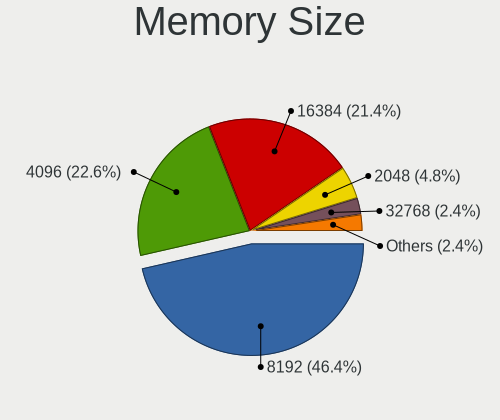

| Size  | Computers | Percent |
|-------|-----------|---------|
| 8192  | 44        | 48.89%  |
| 4096  | 26        | 28.89%  |
| 16384 | 9         | 10%     |
| 2048  | 7         | 7.78%   |
| 32768 | 3         | 3.33%   |
| 1024  | 1         | 1.11%   |

Memory Speed
------------

Memory module speed

| Speed   | Computers | Percent |
|---------|-----------|---------|
| 3200    | 35        | 37.63%  |
| 1600    | 10        | 10.75%  |
| 2667    | 9         | 9.68%   |
| 2400    | 9         | 9.68%   |
| 6400    | 6         | 6.45%   |
| 1333    | 4         | 4.3%    |
| 3266    | 3         | 3.23%   |
| Unknown | 3         | 3.23%   |
| 4800    | 2         | 2.15%   |
| 4266    | 2         | 2.15%   |
| 1800    | 2         | 2.15%   |
| 3866    | 1         | 1.08%   |
| 3600    | 1         | 1.08%   |
| 3400    | 1         | 1.08%   |
| 2666    | 1         | 1.08%   |
| 2133    | 1         | 1.08%   |
| 1867    | 1         | 1.08%   |
| 1334    | 1         | 1.08%   |
| 975     | 1         | 1.08%   |

Printers & scanners
-------------------

Printer Vendor
--------------

Printer device vendors

Zero info for selected period =(

Printer Model
-------------

Printer device models

Zero info for selected period =(

Scanner Vendor
--------------

Scanner device vendors

Zero info for selected period =(

Scanner Model
-------------

Scanner device models

Zero info for selected period =(

Camera
------

Camera Vendor
-------------

Camera device vendors

| Vendor                                 | Computers | Percent |
|----------------------------------------|-----------|---------|
| IMC Networks                           | 16        | 17.78%  |
| Chicony Electronics                    | 13        | 14.44%  |
| Microdia                               | 11        | 12.22%  |
| Acer                                   | 9         | 10%     |
| Sunplus Innovation Technology          | 8         | 8.89%   |
| Realtek Semiconductor                  | 7         | 7.78%   |
| Quanta                                 | 6         | 6.67%   |
| Cheng Uei Precision Industry (Foxlink) | 6         | 6.67%   |
| Syntek                                 | 5         | 5.56%   |
| Logitech                               | 3         | 3.33%   |
| Luxvisions Innotech Limited            | 2         | 2.22%   |
| Suyin                                  | 1         | 1.11%   |
| Sonix Technology                       | 1         | 1.11%   |
| Lenovo                                 | 1         | 1.11%   |
| Alcor Micro                            | 1         | 1.11%   |

Camera Model
------------

Camera device models

| Model                                                                      | Computers | Percent |
|----------------------------------------------------------------------------|-----------|---------|
| Microdia Integrated_Webcam_HD                                              | 7         | 7.78%   |
| IMC Networks USB2.0 HD UVC WebCam                                          | 5         | 5.56%   |
| IMC Networks Integrated Camera                                             | 4         | 4.44%   |
| IMC Networks HP TrueVision HD Camera                                       | 4         | 4.44%   |
| Acer Integrated Camera                                                     | 4         | 4.44%   |
| Syntek Integrated Camera                                                   | 3         | 3.33%   |
| Sunplus XiaoMi USB 2.0 Webcam                                              | 3         | 3.33%   |
| Chicony HP Truevision HD                                                   | 3         | 3.33%   |
| Syntek EasyCamera                                                          | 2         | 2.22%   |
| Sunplus Integrated_Webcam_HD                                               | 2         | 2.22%   |
| Realtek Integrated_Webcam_HD                                               | 2         | 2.22%   |
| Quanta HP Wide Vision HD Camera                                            | 2         | 2.22%   |
| Quanta HP TrueVision HD Camera                                             | 2         | 2.22%   |
| IMC Networks ov9734_azurewave_camera                                       | 2         | 2.22%   |
| Chicony Lenovo EasyCamera                                                  | 2         | 2.22%   |
| Chicony Integrated Camera                                                  | 2         | 2.22%   |
| Cheng Uei Precision Industry (Foxlink) HP Wide Vision HD Integrated Webcam | 2         | 2.22%   |
| Acer SunplusIT Integrated Camera                                           | 2         | 2.22%   |
| Suyin HP TrueVision HD                                                     | 1         | 1.11%   |
| Sunplus WEMISS CM-A1                                                       | 1         | 1.11%   |
| Sunplus Laptop_Integrated_Webcam_FHD                                       | 1         | 1.11%   |
| Sunplus Integrated Webcam                                                  | 1         | 1.11%   |
| Sonix USB2.0 HD UVC WebCam                                                 | 1         | 1.11%   |
| Realtek Lenovo EasyCamera                                                  | 1         | 1.11%   |
| Realtek Integrated Webcam                                                  | 1         | 1.11%   |
| Realtek HP Webcam                                                          | 1         | 1.11%   |
| Realtek HP "Truevision HD" laptop camera                                   | 1         | 1.11%   |
| Realtek EasyCamera                                                         | 1         | 1.11%   |
| Quanta HP True Vision 5MP Camera                                           | 1         | 1.11%   |
| Quanta HD User Facing                                                      | 1         | 1.11%   |
| Microdia USB 2.0 Camera                                                    | 1         | 1.11%   |
| Microdia Laptop_Integrated_Webcam_HD                                       | 1         | 1.11%   |
| Microdia Laptop_Integrated_Webcam_1.3M                                     | 1         | 1.11%   |
| Microdia Dell Laptop Integrated Webcam HD                                  | 1         | 1.11%   |
| Luxvisions Innotech Limited Integrated Camera                              | 1         | 1.11%   |
| Luxvisions Innotech Limited HP TrueVision HD Camera                        | 1         | 1.11%   |
| Logitech Webcam C270                                                       | 1         | 1.11%   |
| Logitech HD Pro Webcam C920                                                | 1         | 1.11%   |
| Logitech C922 Pro Stream Webcam                                            | 1         | 1.11%   |
| Lenovo FHD Webcam Audio                                                    | 1         | 1.11%   |

Security
--------

Fingerprint Vendor
------------------

Fingerprint sensor vendors

| Vendor                             | Computers | Percent |
|------------------------------------|-----------|---------|
| Synaptics                          | 4         | 28.57%  |
| Shenzhen Goodix Technology         | 4         | 28.57%  |
| Validity Sensors                   | 3         | 21.43%  |
| Elan Microelectronics              | 2         | 14.29%  |
| Realtek USB2.0 Finger Print Bridge | 1         | 7.14%   |

Fingerprint Model
-----------------

Fingerprint sensor models

| Model                                                           | Computers | Percent |
|-----------------------------------------------------------------|-----------|---------|
| Shenzhen Goodix  Fingerprint Device                             | 4         | 28.57%  |
| Validity Sensors VFS7500 Touch Fingerprint Sensor               | 2         | 14.29%  |
| Synaptics WBDI                                                  | 2         | 14.29%  |
| Validity Sensors Synaptics WBDI                                 | 1         | 7.14%   |
| Synaptics UWP WBDI                                              | 1         | 7.14%   |
| Synaptics Metallica MOH Touch Fingerprint Reader                | 1         | 7.14%   |
| Realtek USB2.0 Finger Print Bridge FocalTech Fingerprint Device | 1         | 7.14%   |
| Elan fingerprint sensor [FeinTech FPS00200]                     | 1         | 7.14%   |
| Elan ELAN:ARM-M4                                                | 1         | 7.14%   |

Chipcard Vendor
---------------

Chipcard module vendors

| Vendor      | Computers | Percent |
|-------------|-----------|---------|
| Broadcom    | 5         | 83.33%  |
| Alcor Micro | 1         | 16.67%  |

Chipcard Model
--------------

Chipcard module models

| Model                                                                        | Computers | Percent |
|------------------------------------------------------------------------------|-----------|---------|
| Broadcom 5880                                                                | 2         | 33.33%  |
| Broadcom 58200                                                               | 2         | 33.33%  |
| Broadcom BCM5880 Secure Applications Processor with fingerprint swipe sensor | 1         | 16.67%  |
| Alcor Micro AU9540 Smartcard Reader                                          | 1         | 16.67%  |

Unsupported
-----------

Unsupported Devices
-------------------

Total unsupported devices on board

| Total | Computers | Percent |
|-------|-----------|---------|
| 0     | 79        | 64.23%  |
| 1     | 34        | 27.64%  |
| 2     | 8         | 6.5%    |
| 5     | 1         | 0.81%   |
| 3     | 1         | 0.81%   |

Unsupported Device Types
------------------------

Types of unsupported devices

| Type                     | Computers | Percent |
|--------------------------|-----------|---------|
| Net/wireless             | 14        | 25%     |
| Fingerprint reader       | 14        | 25%     |
| Graphics card            | 10        | 17.86%  |
| Chipcard                 | 6         | 10.71%  |
| Bluetooth                | 3         | 5.36%   |
| Multimedia controller    | 2         | 3.57%   |
| Camera                   | 2         | 3.57%   |
| Storage                  | 1         | 1.79%   |
| Network                  | 1         | 1.79%   |
| Net/ethernet             | 1         | 1.79%   |
| Communication controller | 1         | 1.79%   |
| Card reader              | 1         | 1.79%   |

