Linux in India - Hardware Trends
--------------------------------

A project to identify most popular hardware characteristics and track their change
over time based on data collected by Linux users at https://Linux-Hardware.org.

Anyone can contribute to this report by the [hw-probe](https://github.com/linuxhw/hw-probe) tool:

    sudo -E hw-probe -all -upload

This is a report for all computer types. See also reports for [desktops](/Location/India/Desktop/README.md) and [notebooks](/Location/India/Notebook/README.md).

Period: Dec, 2023.

Contents
--------

* [ System ](#system)
  - [ OS                       ](#os)
  - [ OS Family                ](#os-family)
  - [ Kernel                   ](#kernel)
  - [ Kernel Family            ](#kernel-family)
  - [ Kernel Major Ver.        ](#kernel-major-ver)
  - [ Arch                     ](#arch)
  - [ DE                       ](#de)
  - [ Display Server           ](#display-server)
  - [ Display Manager          ](#display-manager)
  - [ OS Lang                  ](#os-lang)
  - [ Boot Mode                ](#boot-mode)
  - [ Filesystem               ](#filesystem)
  - [ Part. scheme             ](#part-scheme)
  - [ Dual Boot with Linux/BSD ](#dual-boot-with-linuxbsd)
  - [ Dual Boot (Win)          ](#dual-boot-win)

* [ Board ](#board)
  - [ Vendor                   ](#vendor)
  - [ Model                    ](#model)
  - [ Model Family             ](#model-family)
  - [ MFG Year                 ](#mfg-year)
  - [ Form Factor              ](#form-factor)
  - [ Secure Boot              ](#secure-boot)
  - [ Coreboot                 ](#coreboot)
  - [ RAM Size                 ](#ram-size)
  - [ RAM Used                 ](#ram-used)
  - [ Total Drives             ](#total-drives)
  - [ Has CD-ROM               ](#has-cd-rom)
  - [ Has Ethernet             ](#has-ethernet)
  - [ Has WiFi                 ](#has-wifi)
  - [ Has Bluetooth            ](#has-bluetooth)

* [ Location ](#location)
  - [ Country                  ](#country)
  - [ City                     ](#city)

* [ Drives ](#drives)
  - [ Drive Vendor             ](#drive-vendor)
  - [ Drive Model              ](#drive-model)
  - [ HDD Vendor               ](#hdd-vendor)
  - [ SSD Vendor               ](#ssd-vendor)
  - [ Drive Kind               ](#drive-kind)
  - [ Drive Connector          ](#drive-connector)
  - [ Drive Size               ](#drive-size)
  - [ Space Total              ](#space-total)
  - [ Space Used               ](#space-used)
  - [ Malfunc. Drives          ](#malfunc-drives)
  - [ Malfunc. Drive Vendor    ](#malfunc-drive-vendor)
  - [ Malfunc. HDD Vendor      ](#malfunc-hdd-vendor)
  - [ Malfunc. Drive Kind      ](#malfunc-drive-kind)
  - [ Failed Drives            ](#failed-drives)
  - [ Failed Drive Vendor      ](#failed-drive-vendor)
  - [ Drive Status             ](#drive-status)

* [ Storage controller ](#storage-controller)
  - [ Storage Vendor           ](#storage-vendor)
  - [ Storage Model            ](#storage-model)
  - [ Storage Kind             ](#storage-kind)

* [ Processor ](#processor)
  - [ CPU Vendor               ](#cpu-vendor)
  - [ CPU Model                ](#cpu-model)
  - [ CPU Model Family         ](#cpu-model-family)
  - [ CPU Cores                ](#cpu-cores)
  - [ CPU Sockets              ](#cpu-sockets)
  - [ CPU Threads              ](#cpu-threads)
  - [ CPU Op-Modes             ](#cpu-op-modes)
  - [ CPU Microcode            ](#cpu-microcode)
  - [ CPU Microarch            ](#cpu-microarch)

* [ Graphics ](#graphics)
  - [ GPU Vendor               ](#gpu-vendor)
  - [ GPU Model                ](#gpu-model)
  - [ GPU Combo                ](#gpu-combo)
  - [ GPU Driver               ](#gpu-driver)
  - [ GPU Memory               ](#gpu-memory)

* [ Monitor ](#monitor)
  - [ Monitor Vendor           ](#monitor-vendor)
  - [ Monitor Model            ](#monitor-model)
  - [ Monitor Resolution       ](#monitor-resolution)
  - [ Monitor Diagonal         ](#monitor-diagonal)
  - [ Monitor Width            ](#monitor-width)
  - [ Aspect Ratio             ](#aspect-ratio)
  - [ Monitor Area             ](#monitor-area)
  - [ Pixel Density            ](#pixel-density)
  - [ Multiple Monitors        ](#multiple-monitors)

* [ Network ](#network)
  - [ Net Controller Vendor    ](#net-controller-vendor)
  - [ Net Controller Model     ](#net-controller-model)
  - [ Wireless Vendor          ](#wireless-vendor)
  - [ Wireless Model           ](#wireless-model)
  - [ Ethernet Vendor          ](#ethernet-vendor)
  - [ Ethernet Model           ](#ethernet-model)
  - [ Net Controller Kind      ](#net-controller-kind)
  - [ Used Controller          ](#used-controller)
  - [ NICs                     ](#nics)
  - [ IPv6                     ](#ipv6)

* [ Bluetooth ](#bluetooth)
  - [ Bluetooth Vendor         ](#bluetooth-vendor)
  - [ Bluetooth Model          ](#bluetooth-model)

* [ Sound ](#sound)
  - [ Sound Vendor             ](#sound-vendor)
  - [ Sound Model              ](#sound-model)

* [ Memory ](#memory)
  - [ Memory Vendor            ](#memory-vendor)
  - [ Memory Model             ](#memory-model)
  - [ Memory Kind              ](#memory-kind)
  - [ Memory Form Factor       ](#memory-form-factor)
  - [ Memory Size              ](#memory-size)
  - [ Memory Speed             ](#memory-speed)

* [ Printers & scanners ](#printers--scanners)
  - [ Printer Vendor           ](#printer-vendor)
  - [ Printer Model            ](#printer-model)
  - [ Scanner Vendor           ](#scanner-vendor)
  - [ Scanner Model            ](#scanner-model)

* [ Camera ](#camera)
  - [ Camera Vendor            ](#camera-vendor)
  - [ Camera Model             ](#camera-model)

* [ Security ](#security)
  - [ Fingerprint Vendor       ](#fingerprint-vendor)
  - [ Fingerprint Model        ](#fingerprint-model)
  - [ Chipcard Vendor          ](#chipcard-vendor)
  - [ Chipcard Model           ](#chipcard-model)

* [ Unsupported ](#unsupported)
  - [ Unsupported Devices      ](#unsupported-devices)
  - [ Unsupported Device Types ](#unsupported-device-types)

System
------

OS
--

Installed operating systems

| Name                         | Computers | Percent |
|------------------------------|-----------|---------|
| Ubuntu 22.04                 | 22        | 17.74%  |
| Fedora 39                    | 16        | 12.9%   |
| Ubuntu 20.04                 | 9         | 7.26%   |
| Arch Rolling                 | 8         | 6.45%   |
| Ubuntu 23.10                 | 6         | 4.84%   |
| Pop!_OS 22.04                | 5         | 4.03%   |
| Debian 12                    | 5         | 4.03%   |
| Zorin 17                     | 4         | 3.23%   |
| OpenMandriva 23.08           | 4         | 3.23%   |
| Kali 2023.4                  | 4         | 3.23%   |
| Xero Rolling                 | 3         | 2.42%   |
| OpenMandriva 5.0             | 3         | 2.42%   |
| Linux Mint 21.2              | 3         | 2.42%   |
| EndeavourOS Rolling          | 3         | 2.42%   |
| Zorin 16                     | 2         | 1.61%   |
| OpenMandriva 23.11           | 2         | 1.61%   |
| Kubuntu 23.10                | 2         | 1.61%   |
| KDE neon 22.04               | 2         | 1.61%   |
| ArcoLinux Rolling            | 2         | 1.61%   |
| Ubuntu Unity 23.10           | 1         | 0.81%   |
| Ubuntu MATE 23.04            | 1         | 0.81%   |
| Ubuntu MATE 22.04            | 1         | 0.81%   |
| Ubuntu MATE 20.04            | 1         | 0.81%   |
| TUXEDO OS 22.04              | 1         | 0.81%   |
| openSUSE Tumbleweed-XXXXXXXX | 1         | 0.81%   |
| OpenMandriva 23.10           | 1         | 0.81%   |
| Nobara 38                    | 1         | 0.81%   |
| LMDE 6                       | 1         | 0.81%   |
| Linux Mint 21                | 1         | 0.81%   |
| Kubuntu 23.04                | 1         | 0.81%   |
| Kubuntu 22.04                | 1         | 0.81%   |
| Kaisen 2.3                   | 1         | 0.81%   |
| Garuda Linux Soaring         | 1         | 0.81%   |
| Fedora 38                    | 1         | 0.81%   |
| Debian 11                    | 1         | 0.81%   |
| Boss 9                       | 1         | 0.81%   |
| blendOS                      | 1         | 0.81%   |
| AlmaLinux 9.3                | 1         | 0.81%   |

OS Family
---------

OS without a version

| Name         | Computers | Percent |
|--------------|-----------|---------|
| Ubuntu       | 37        | 29.84%  |
| Fedora       | 17        | 13.71%  |
| OpenMandriva | 10        | 8.06%   |
| Arch         | 8         | 6.45%   |
| Zorin        | 6         | 4.84%   |
| Debian       | 6         | 4.84%   |
| Pop!_OS      | 5         | 4.03%   |
| Linux Mint   | 4         | 3.23%   |
| Kubuntu      | 4         | 3.23%   |
| Kali         | 4         | 3.23%   |
| Xero         | 3         | 2.42%   |
| Ubuntu MATE  | 3         | 2.42%   |
| EndeavourOS  | 3         | 2.42%   |
| KDE neon     | 2         | 1.61%   |
| ArcoLinux    | 2         | 1.61%   |
| Ubuntu Unity | 1         | 0.81%   |
| TUXEDO OS    | 1         | 0.81%   |
| openSUSE     | 1         | 0.81%   |
| Nobara       | 1         | 0.81%   |
| LMDE         | 1         | 0.81%   |
| Kaisen       | 1         | 0.81%   |
| Garuda Linux | 1         | 0.81%   |
| Boss         | 1         | 0.81%   |
| blendOS      | 1         | 0.81%   |
| AlmaLinux    | 1         | 0.81%   |

Kernel
------

Version of the Linux kernel

| Version                     | Computers | Percent |
|-----------------------------|-----------|---------|
| 5.15.0-91-generic           | 13        | 10.48%  |
| 6.2.0-39-generic            | 10        | 8.06%   |
| 6.2.0-37-generic            | 9         | 7.26%   |
| 6.6.2-desktop-1omv2390      | 5         | 4.03%   |
| 5.15.0-89-generic           | 5         | 4.03%   |
| 6.6.6-200.fc39.x86_64       | 4         | 3.23%   |
| 6.6.4-arch1-1               | 4         | 3.23%   |
| 6.5.0-14-generic            | 4         | 3.23%   |
| 6.5.0-13-generic            | 4         | 3.23%   |
| 6.4.11-desktop-1omv2390     | 4         | 3.23%   |
| 6.6.8-200.fc39.x86_64       | 3         | 2.42%   |
| 6.6.7-arch1-1               | 3         | 2.42%   |
| 6.6.7-200.fc39.x86_64       | 3         | 2.42%   |
| 6.6.4-200.fc39.x86_64       | 3         | 2.42%   |
| 6.5.6-76060506-generic      | 3         | 2.42%   |
| 6.5.0-kali3-amd64           | 3         | 2.42%   |
| 6.5.0-9-generic             | 3         | 2.42%   |
| 6.1.0-16-amd64              | 3         | 2.42%   |
| 6.2.0-34-generic            | 2         | 1.61%   |
| 6.1.0-13-amd64              | 2         | 1.61%   |
| 6.6.8-zen1-1-zen            | 1         | 0.81%   |
| 6.6.8-arch1-1               | 1         | 0.81%   |
| 6.6.7-203.fsync.fc38.x86_64 | 1         | 0.81%   |
| 6.6.6-zen1-1-zen            | 1         | 0.81%   |
| 6.6.6-arch1-1               | 1         | 0.81%   |
| 6.6.6-76060606-generic      | 1         | 0.81%   |
| 6.6.6-2-cachyos             | 1         | 0.81%   |
| 6.6.6-100.fc38.x86_64       | 1         | 0.81%   |
| 6.6.6-1-default             | 1         | 0.81%   |
| 6.6.5-arch1-1               | 1         | 0.81%   |
| 6.6.4-zen1-1-zen            | 1         | 0.81%   |
| 6.6.3-200.fc39.x86_64       | 1         | 0.81%   |
| 6.6.2-201.fc39.x86_64       | 1         | 0.81%   |
| 6.5.5-zen1-1-zen            | 1         | 0.81%   |
| 6.5.5-desktop-1omv2390      | 1         | 0.81%   |
| 6.5.4-76060504-generic      | 1         | 0.81%   |
| 6.5.13-hardened2-1-hardened | 1         | 0.81%   |
| 6.5.11-300.fc39.x86_64      | 1         | 0.81%   |
| 6.5.0-kali2-amd64           | 1         | 0.81%   |
| 6.5.0-1kaisen-amd64         | 1         | 0.81%   |

Kernel Family
-------------

Linux kernel without a distro release

| Version | Computers | Percent |
|---------|-----------|---------|
| 6.2.0   | 24        | 19.35%  |
| 6.5.0   | 18        | 14.52%  |
| 5.15.0  | 18        | 14.52%  |
| 6.6.6   | 10        | 8.06%   |
| 6.6.4   | 8         | 6.45%   |
| 6.6.7   | 7         | 5.65%   |
| 6.6.2   | 6         | 4.84%   |
| 6.1.0   | 6         | 4.84%   |
| 6.6.8   | 5         | 4.03%   |
| 6.4.11  | 4         | 3.23%   |
| 6.5.6   | 3         | 2.42%   |
| 6.5.5   | 2         | 1.61%   |
| 5.10.0  | 2         | 1.61%   |
| 6.6.5   | 1         | 0.81%   |
| 6.6.3   | 1         | 0.81%   |
| 6.5.4   | 1         | 0.81%   |
| 6.5.13  | 1         | 0.81%   |
| 6.5.11  | 1         | 0.81%   |
| 6.1.69  | 1         | 0.81%   |
| 6.1.67  | 1         | 0.81%   |
| 6.1.65  | 1         | 0.81%   |
| 5.4.0   | 1         | 0.81%   |
| 5.19.0  | 1         | 0.81%   |
| 5.14.0  | 1         | 0.81%   |

Kernel Major Ver.
-----------------

Linux kernel major version

| Version | Computers | Percent |
|---------|-----------|---------|
| 6.6     | 38        | 30.65%  |
| 6.5     | 26        | 20.97%  |
| 6.2     | 24        | 19.35%  |
| 5.15    | 18        | 14.52%  |
| 6.1     | 9         | 7.26%   |
| 6.4     | 4         | 3.23%   |
| 5.10    | 2         | 1.61%   |
| 5.4     | 1         | 0.81%   |
| 5.19    | 1         | 0.81%   |
| 5.14    | 1         | 0.81%   |

Arch
----

OS architecture (x86_64, i586, etc.)

| Name   | Computers | Percent |
|--------|-----------|---------|
| x86_64 | 124       | 100%    |

DE
--

Desktop Environment

| Name       | Computers | Percent |
|------------|-----------|---------|
| GNOME      | 71        | 57.26%  |
| KDE5       | 34        | 27.42%  |
| X-Cinnamon | 5         | 4.03%   |
| XFCE       | 3         | 2.42%   |
| MATE       | 3         | 2.42%   |
| Unknown    | 2         | 1.61%   |
| Unity      | 1         | 0.81%   |
| qtile      | 1         | 0.81%   |
| LXDE       | 1         | 0.81%   |
| i3         | 1         | 0.81%   |
| Hyprland   | 1         | 0.81%   |
| bspwm      | 1         | 0.81%   |

Display Server
--------------

X11 or Wayland

| Name    | Computers | Percent |
|---------|-----------|---------|
| Wayland | 63        | 50.81%  |
| X11     | 56        | 45.16%  |
| Tty     | 3         | 2.42%   |
| Unknown | 2         | 1.61%   |

Display Manager
---------------

SDDM, LightDM, etc.

| Name    | Computers | Percent |
|---------|-----------|---------|
| Unknown | 36        | 29.03%  |
| GDM3    | 35        | 28.23%  |
| SDDM    | 22        | 17.74%  |
| GDM     | 17        | 13.71%  |
| LightDM | 14        | 11.29%  |

OS Lang
-------

Language

| Lang  | Computers | Percent |
|-------|-----------|---------|
| en_IN | 78        | 62.9%   |
| en_US | 32        | 25.81%  |
| en_GB | 8         | 6.45%   |
| C     | 6         | 4.84%   |

Boot Mode
---------

EFI or BIOS

| Mode | Computers | Percent |
|------|-----------|---------|
| EFI  | 78        | 62.9%   |
| BIOS | 46        | 37.1%   |

Filesystem
----------

Type of filesystem

| Type    | Computers | Percent |
|---------|-----------|---------|
| Ext4    | 76        | 61.29%  |
| Btrfs   | 21        | 16.94%  |
| Tmpfs   | 20        | 16.13%  |
| Overlay | 5         | 4.03%   |
| Zfs     | 1         | 0.81%   |
| Xfs     | 1         | 0.81%   |

Part. scheme
------------

Scheme of partitioning

| Type    | Computers | Percent |
|---------|-----------|---------|
| GPT     | 82        | 66.13%  |
| Unknown | 34        | 27.42%  |
| MBR     | 8         | 6.45%   |

Dual Boot with Linux/BSD
------------------------

Hosting more than one Linux/BSD

| Dual boot | Computers | Percent |
|-----------|-----------|---------|
| No        | 109       | 87.9%   |
| Yes       | 15        | 12.1%   |

Dual Boot (Win)
---------------

Hosting Linux and Windows

| Dual boot | Computers | Percent |
|-----------|-----------|---------|
| No        | 80        | 64.52%  |
| Yes       | 44        | 35.48%  |

Board
-----

Vendor
------

Motherboard manufacturer

| Name                | Computers | Percent |
|---------------------|-----------|---------|
| Hewlett-Packard     | 32        | 25.81%  |
| Dell                | 23        | 18.55%  |
| Lenovo              | 20        | 16.13%  |
| ASUSTek Computer    | 14        | 11.29%  |
| Gigabyte Technology | 10        | 8.06%   |
| Acer                | 10        | 8.06%   |
| MSI                 | 6         | 4.84%   |
| Infinix             | 2         | 1.61%   |
| Unknown             | 2         | 1.61%   |
| Timi                | 1         | 0.81%   |
| Sony                | 1         | 0.81%   |
| realme              | 1         | 0.81%   |
| Intel               | 1         | 0.81%   |
| BY OEM              | 1         | 0.81%   |

Model
-----

Motherboard model

| Name                                              | Computers | Percent |
|---------------------------------------------------|-----------|---------|
| Unknown                                           | 4         | 3.23%   |
| Dell Vostro 3580                                  | 2         | 1.61%   |
| Dell Vostro 3268                                  | 2         | 1.61%   |
| Dell Inspiron 3558                                | 2         | 1.61%   |
| Timi Mi NoteBook Pro                              | 1         | 0.81%   |
| Sony VPCEH25EN                                    | 1         | 0.81%   |
| realme RMNBXXXX                                   | 1         | 0.81%   |
| MSI Thin GF63 12HW                                | 1         | 0.81%   |
| MSI MS-7E07                                       | 1         | 0.81%   |
| MSI MS-7D82                                       | 1         | 0.81%   |
| MSI MS-7C91                                       | 1         | 0.81%   |
| MSI MS-7B49                                       | 1         | 0.81%   |
| MSI Modern 14 B4MW                                | 1         | 0.81%   |
| Lenovo Yoga 7 16ARP8 83BS                         | 1         | 0.81%   |
| Lenovo V15 G2 ALC Ua 82KD                         | 1         | 0.81%   |
| Lenovo V145-15AST 81MT                            | 1         | 0.81%   |
| Lenovo ThinkPad X13 Gen 2a 20XH0076IG             | 1         | 0.81%   |
| Lenovo ThinkPad X1 Carbon 6th 20KH006JRT          | 1         | 0.81%   |
| Lenovo ThinkPad T480 20L6S29E1T                   | 1         | 0.81%   |
| Lenovo ThinkPad T480 20L6S0U302                   | 1         | 0.81%   |
| Lenovo ThinkPad T14s Gen 2a 20XGCTO1WW            | 1         | 0.81%   |
| Lenovo ThinkPad P14s Gen 4 21K5S00F00             | 1         | 0.81%   |
| Lenovo ThinkPad P1 Gen 3 20TJS1EV01               | 1         | 0.81%   |
| Lenovo ThinkPad L470 20J5S0JM00                   | 1         | 0.81%   |
| Lenovo K14 G2 IRU 21G1                            | 1         | 0.81%   |
| Lenovo IdeaPad Gaming 3 15IHU6 82K1               | 1         | 0.81%   |
| Lenovo IdeaPad Gaming 3 15ACH6 82K2               | 1         | 0.81%   |
| Lenovo IdeaPad 320-15ISK 80XH                     | 1         | 0.81%   |
| Lenovo IdeaPad 130-15IKB 81H7                     | 1         | 0.81%   |
| Lenovo G50-45 80E3                                | 1         | 0.81%   |
| Lenovo E41-25 81FS                                | 1         | 0.81%   |
| Lenovo C340 10102                                 | 1         | 0.81%   |
| Intel H81                                         | 1         | 0.81%   |
| Infinix INBOOK X3 Slim                            | 1         | 0.81%   |
| Infinix INBOOK X1 NEO                             | 1         | 0.81%   |
| HP ZBook Firefly 16 inch G9 Mobile Workstation PC | 1         | 0.81%   |
| HP ZBook Firefly 14 inch G8 Mobile Workstation PC | 1         | 0.81%   |
| HP Victus by Laptop 16-e0xxx                      | 1         | 0.81%   |
| HP Victus by 15.6 inch Gaming Laptop PC           | 1         | 0.81%   |
| HP ProBook 450 G1                                 | 1         | 0.81%   |

Model Family
------------

Motherboard model prefix

| Name              | Computers | Percent |
|-------------------|-----------|---------|
| Lenovo ThinkPad   | 8         | 6.45%   |
| HP Pavilion       | 8         | 6.45%   |
| Dell Vostro       | 7         | 5.65%   |
| Dell Inspiron     | 7         | 5.65%   |
| HP Laptop         | 6         | 4.84%   |
| ASUS VivoBook     | 5         | 4.03%   |
| ASUS ASUS         | 5         | 4.03%   |
| Lenovo IdeaPad    | 4         | 3.23%   |
| Dell OptiPlex     | 4         | 3.23%   |
| Dell Latitude     | 4         | 3.23%   |
| Unknown           | 4         | 3.23%   |
| HP ENVY           | 3         | 2.42%   |
| HP EliteBook      | 3         | 2.42%   |
| Acer Aspire       | 3         | 2.42%   |
| Infinix INBOOK    | 2         | 1.61%   |
| HP ZBook          | 2         | 1.61%   |
| HP Victus         | 2         | 1.61%   |
| HP ProBook        | 2         | 1.61%   |
| ASUS ROG          | 2         | 1.61%   |
| ASUS PRIME        | 2         | 1.61%   |
| Acer Veriton      | 2         | 1.61%   |
| Acer Nitro        | 2         | 1.61%   |
| Timi Mi           | 1         | 0.81%   |
| Sony VPCEH25EN    | 1         | 0.81%   |
| realme RMNBXXXX   | 1         | 0.81%   |
| MSI Thin          | 1         | 0.81%   |
| MSI MS-7E07       | 1         | 0.81%   |
| MSI MS-7D82       | 1         | 0.81%   |
| MSI MS-7C91       | 1         | 0.81%   |
| MSI MS-7B49       | 1         | 0.81%   |
| MSI Modern        | 1         | 0.81%   |
| Lenovo Yoga       | 1         | 0.81%   |
| Lenovo V15        | 1         | 0.81%   |
| Lenovo V145-15AST | 1         | 0.81%   |
| Lenovo K14        | 1         | 0.81%   |
| Lenovo G50-45     | 1         | 0.81%   |
| Lenovo E41-25     | 1         | 0.81%   |
| Lenovo C340       | 1         | 0.81%   |
| Intel H81         | 1         | 0.81%   |
| HP OMEN           | 1         | 0.81%   |

MFG Year
--------

Motherboard manufacture year

| Year    | Computers | Percent |
|---------|-----------|---------|
| 2022    | 20        | 16.13%  |
| 2021    | 19        | 15.32%  |
| 2020    | 15        | 12.1%   |
| 2023    | 13        | 10.48%  |
| 2018    | 13        | 10.48%  |
| 2017    | 9         | 7.26%   |
| 2019    | 8         | 6.45%   |
| 2014    | 6         | 4.84%   |
| 2013    | 5         | 4.03%   |
| 2011    | 4         | 3.23%   |
| 2016    | 3         | 2.42%   |
| 2015    | 3         | 2.42%   |
| 2012    | 2         | 1.61%   |
| 2009    | 2         | 1.61%   |
| 2004    | 1         | 0.81%   |
| Unknown | 1         | 0.81%   |

Form Factor
-----------

Physical design of the computer

| Name        | Computers | Percent |
|-------------|-----------|---------|
| Notebook    | 85        | 68.55%  |
| Desktop     | 32        | 25.81%  |
| Convertible | 5         | 4.03%   |
| All in one  | 2         | 1.61%   |

Secure Boot
-----------

Enabled or disabled

| State    | Computers | Percent |
|----------|-----------|---------|
| Disabled | 108       | 87.1%   |
| Enabled  | 16        | 12.9%   |

Coreboot
--------

Have coreboot on board

| Used | Computers | Percent |
|------|-----------|---------|
| No   | 124       | 100%    |

RAM Size
--------

Total RAM memory

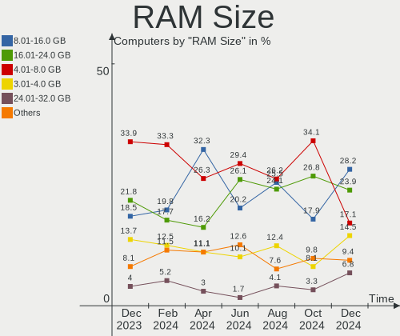

| Size in GB | Computers | Percent |
|------------|-----------|---------|
| 4.01-8.0   | 42        | 33.87%  |
| 16.01-24.0 | 27        | 21.77%  |
| 8.01-16.0  | 23        | 18.55%  |
| 3.01-4.0   | 17        | 13.71%  |
| 32.01-64.0 | 8         | 6.45%   |
| 24.01-32.0 | 5         | 4.03%   |
| 1.01-2.0   | 2         | 1.61%   |

RAM Used
--------

Used RAM memory

| Used GB   | Computers | Percent |
|-----------|-----------|---------|
| 1.01-2.0  | 35        | 28.23%  |
| 2.01-3.0  | 34        | 27.42%  |
| 4.01-8.0  | 26        | 20.97%  |
| 3.01-4.0  | 22        | 17.74%  |
| 8.01-16.0 | 6         | 4.84%   |
| 0.51-1.0  | 1         | 0.81%   |

Total Drives
------------

Number of drives on board

| Drives | Computers | Percent |
|--------|-----------|---------|
| 1      | 81        | 65.32%  |
| 2      | 35        | 28.23%  |
| 3      | 6         | 4.84%   |
| 4      | 2         | 1.61%   |

Has CD-ROM
----------

Has CD-ROM on board

| Presented | Computers | Percent |
|-----------|-----------|---------|
| No        | 94        | 75.81%  |
| Yes       | 30        | 24.19%  |

Has Ethernet
------------

Has Ethernet on board

| Presented | Computers | Percent |
|-----------|-----------|---------|
| Yes       | 101       | 81.45%  |
| No        | 23        | 18.55%  |

Has WiFi
--------

Has WiFi module

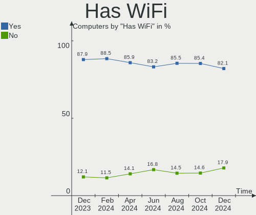

| Presented | Computers | Percent |
|-----------|-----------|---------|
| Yes       | 110       | 88.71%  |
| No        | 14        | 11.29%  |

Has Bluetooth
-------------

Has Bluetooth module

| Presented | Computers | Percent |
|-----------|-----------|---------|
| Yes       | 91        | 73.39%  |
| No        | 33        | 26.61%  |

Location
--------

Country
-------

Geographic location (country)

| Country | Computers | Percent |
|---------|-----------|---------|
| India   | 124       | 100%    |

City
----

Geographic location (city)

| City               | Computers | Percent |
|--------------------|-----------|---------|
| Bengaluru          | 14        | 11.29%  |
| Delhi              | 12        | 9.68%   |
| Kolkata            | 11        | 8.87%   |
| Hyderabad          | 11        | 8.87%   |
| Mumbai             | 9         | 7.26%   |
| Chennai            | 7         | 5.65%   |
| Kochi              | 6         | 4.84%   |
| Pune               | 5         | 4.03%   |
| Ahmedabad          | 5         | 4.03%   |
| Patna              | 4         | 3.23%   |
| Indore             | 3         | 2.42%   |
| Bhopal             | 3         | 2.42%   |
| Thrissur           | 2         | 1.61%   |
| Lucknow            | 2         | 1.61%   |
| Kottayam           | 2         | 1.61%   |
| Jaipur             | 2         | 1.61%   |
| Durgapur           | 2         | 1.61%   |
| Dehradun           | 2         | 1.61%   |
| Coimbatore         | 2         | 1.61%   |
| Chandigarh         | 2         | 1.61%   |
| Visakhapatnam      | 1         | 0.81%   |
| Varanasi           | 1         | 0.81%   |
| Vadodara           | 1         | 0.81%   |
| Thiruvananthapuram | 1         | 0.81%   |
| Satna              | 1         | 0.81%   |
| Sārangarh         | 1         | 0.81%   |
| Sangli             | 1         | 0.81%   |
| Raurkela           | 1         | 0.81%   |
| Narsingpur         | 1         | 0.81%   |
| Nadiad             | 1         | 0.81%   |
| Mangalore          | 1         | 0.81%   |
| Madurai            | 1         | 0.81%   |
| Kozhikode          | 1         | 0.81%   |
| Kanpur             | 1         | 0.81%   |
| Kannur             | 1         | 0.81%   |
| Jalandhar          | 1         | 0.81%   |
| Alwar              | 1         | 0.81%   |
| Aizawl             | 1         | 0.81%   |

Drives
------

Drive Vendor
------------

Hard drive vendors

| Vendor                       | Computers | Drives | Percent |
|------------------------------|-----------|--------|---------|
| Samsung Electronics          | 27        | 29     | 16.17%  |
| WDC                          | 23        | 24     | 13.77%  |
| Seagate                      | 20        | 21     | 11.98%  |
| SanDisk                      | 10        | 13     | 5.99%   |
| Micron Technology            | 9         | 9      | 5.39%   |
| SK hynix                     | 7         | 7      | 4.19%   |
| Crucial                      | 7         | 8      | 4.19%   |
| Toshiba                      | 6         | 6      | 3.59%   |
| Kingston                     | 6         | 6      | 3.59%   |
| Intel                        | 6         | 10     | 3.59%   |
| Micron/Crucial Technology    | 4         | 4      | 2.4%    |
| POWER                        | 3         | 3      | 1.8%    |
| KIOXIA                       | 3         | 3      | 1.8%    |
| China                        | 3         | 3      | 1.8%    |
| Unknown                      | 2         | 2      | 1.2%    |
| SPCC                         | 2         | 2      | 1.2%    |
| Lexar                        | 2         | 2      | 1.2%    |
| Lenovo                       | 2         | 2      | 1.2%    |
| Hitachi                      | 2         | 2      | 1.2%    |
| HGST                         | 2         | 2      | 1.2%    |
| ADATA Technology             | 2         | 2      | 1.2%    |
| Zebronics                    | 1         | 1      | 0.6%    |
| XPG                          | 1         | 1      | 0.6%    |
| UMIS                         | 1         | 1      | 0.6%    |
| Transcend                    | 1         | 1      | 0.6%    |
| Shenzhen Longsys Electronics | 1         | 1      | 0.6%    |
| SCUDA                        | 1         | 1      | 0.6%    |
| Phison Electronics           | 1         | 1      | 0.6%    |
| Phison                       | 1         | 1      | 0.6%    |
| MAS                          | 1         | 1      | 0.6%    |
| Lite-On Technology           | 1         | 1      | 0.6%    |
| KingFast                     | 1         | 1      | 0.6%    |
| JMicron Technology           | 1         | 1      | 0.6%    |
| HS-SSD-E                     | 1         | 1      | 0.6%    |
| Gigabyte Technology          | 1         | 1      | 0.6%    |
| FORESEE                      | 1         | 1      | 0.6%    |
| CONSISTENT                   | 1         | 1      | 0.6%    |
| BIWIN                        | 1         | 1      | 0.6%    |
| A-DATA Technology            | 1         | 1      | 0.6%    |
| Unknown                      | 1         | 1      | 0.6%    |

Drive Model
-----------

Hard drive models

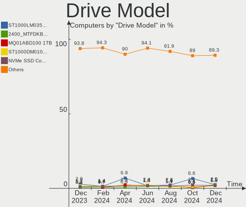

| Model                                               | Computers | Percent |
|-----------------------------------------------------|-----------|---------|
| Seagate ST1000LM035-1RK172 1TB                      | 5         | 2.82%   |
| Seagate ST500LT012-1DG142 500GB                     | 3         | 1.69%   |
| Seagate ST1000DM010-2EP102 1TB                      | 3         | 1.69%   |
| Samsung SSD 980 500GB                               | 3         | 1.69%   |
| Samsung MZALQ512HBLU-00BL2 512GB                    | 3         | 1.69%   |
| Micron/Crucial P2 NVMe PCIe SSD 4TB                 | 3         | 1.69%   |
| Micron 2210_MTFDHBA512QFD 512GB                     | 3         | 1.69%   |
| Crucial CT480BX500SSD1 480GB                        | 3         | 1.69%   |
| Crucial CT240BX500SSD1 240GB                        | 3         | 1.69%   |
| WDC WDS240G2G0B-00EPW0 240GB SSD                    | 2         | 1.13%   |
| WDC WD10SPZX-60Z10T0 1TB                            | 2         | 1.13%   |
| WDC WD10EZEX-00BBHA0 1TB                            | 2         | 1.13%   |
| Toshiba MQ04ABF100 1TB                              | 2         | 1.13%   |
| SK hynix PC801 HFS512GEJ9X101N 512GB                | 2         | 1.13%   |
| Sandisk WD Blue SN570 250GB                         | 2         | 1.13%   |
| SanDisk NVMe SSD Drive 512GB                        | 2         | 1.13%   |
| Samsung NVMe SSD Controller SM981/PM981/PM983 512GB | 2         | 1.13%   |
| Samsung NVMe SSD Controller PM9A1/PM9A3/980PRO 2TB  | 2         | 1.13%   |
| Samsung MZVLQ512HBLU-00B00 512GB                    | 2         | 1.13%   |
| POWER X SS1000 512GB SSD                            | 2         | 1.13%   |
| Micron 2450_MTFDKBA512TFK 512GB                     | 2         | 1.13%   |
| Kingston SNVS500G 500GB                             | 2         | 1.13%   |
| Intel HBRPEKNX0202AHO 32GB                          | 2         | 1.13%   |
| Intel HBRPEKNX0202AH 512GB                          | 2         | 1.13%   |
| China SSD 256GB                                     | 2         | 1.13%   |
| ADATA XPG GAMMIX S70 BLADE 1024GB                   | 2         | 1.13%   |
| Zebronics 2.5SSD128GB                               | 1         | 0.56%   |
| XPG GAMMIX S70 BLADE 2TB                            | 1         | 0.56%   |
| WDC WDS500G2B0C-00PXH0 500GB                        | 1         | 0.56%   |
| WDC WD7500BPVT-60HXZT3 752GB                        | 1         | 0.56%   |
| WDC WD5000LPCX-75VHAT0 500GB                        | 1         | 0.56%   |
| WDC WD5000LPCX-21VHAT0 500GB                        | 1         | 0.56%   |
| WDC WD5000AZLX-75K2TA0 500GB                        | 1         | 0.56%   |
| WDC WD5000AAKX-60U6AA0 500GB                        | 1         | 0.56%   |
| WDC WD5000AAKX-22ERMA0 500GB                        | 1         | 0.56%   |
| WDC WD5000AAKX-08ERMA0 500GB                        | 1         | 0.56%   |
| WDC WD3200AAKS-61L9A0 320GB                         | 1         | 0.56%   |
| WDC WD22PURZ-74B4ZY0 2TB                            | 1         | 0.56%   |
| WDC WD10SPZX-75Z10T3 1TB                            | 1         | 0.56%   |
| WDC WD10SPZX-24Z10 1TB                              | 1         | 0.56%   |

HDD Vendor
----------

Hard disk drive vendors

| Vendor  | Computers | Drives | Percent |
|---------|-----------|--------|---------|
| Seagate | 20        | 21     | 41.67%  |
| WDC     | 19        | 19     | 39.58%  |
| Toshiba | 5         | 5      | 10.42%  |
| Hitachi | 2         | 2      | 4.17%   |
| HGST    | 2         | 2      | 4.17%   |

SSD Vendor
----------

Solid state drive vendors

| Vendor              | Computers | Drives | Percent |
|---------------------|-----------|--------|---------|
| Crucial             | 7         | 8      | 20.59%  |
| Samsung Electronics | 6         | 7      | 17.65%  |
| Kingston            | 4         | 4      | 11.76%  |
| WDC                 | 3         | 3      | 8.82%   |
| China               | 3         | 3      | 8.82%   |
| SPCC                | 2         | 2      | 5.88%   |
| POWER               | 2         | 2      | 5.88%   |
| Intel               | 2         | 3      | 5.88%   |
| Zebronics           | 1         | 1      | 2.94%   |
| SCUDA               | 1         | 1      | 2.94%   |
| Lexar               | 1         | 1      | 2.94%   |
| Gigabyte Technology | 1         | 1      | 2.94%   |
| CONSISTENT          | 1         | 1      | 2.94%   |

Drive Kind
----------

HDD or SSD

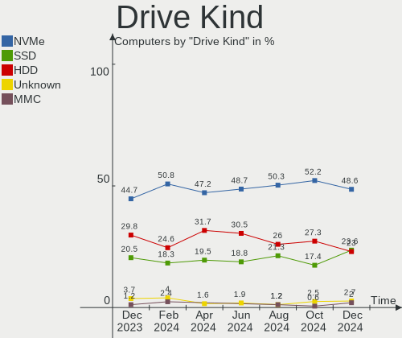

| Kind    | Computers | Drives | Percent |
|---------|-----------|--------|---------|
| NVMe    | 72        | 85     | 44.72%  |
| HDD     | 48        | 49     | 29.81%  |
| SSD     | 33        | 37     | 20.5%   |
| Unknown | 6         | 6      | 3.73%   |
| MMC     | 2         | 2      | 1.24%   |

Drive Connector
---------------

SATA, SAS, NVMe, etc.

| Type | Computers | Drives | Percent |
|------|-----------|--------|---------|
| NVMe | 72        | 85     | 49.32%  |
| SATA | 69        | 89     | 47.26%  |
| SAS  | 3         | 3      | 2.05%   |
| MMC  | 2         | 2      | 1.37%   |

Drive Size
----------

Size of hard drive

| Size in TB | Computers | Drives | Percent |
|------------|-----------|--------|---------|
| 0.01-0.5   | 46        | 54     | 58.97%  |
| 0.51-1.0   | 28        | 28     | 35.9%   |
| 1.01-2.0   | 4         | 4      | 5.13%   |

Space Total
-----------

Amount of disk space available on the file system

| Size in GB     | Computers | Percent |
|----------------|-----------|---------|
| 251-500        | 46        | 37.1%   |
| 101-250        | 29        | 23.39%  |
| 501-1000       | 14        | 11.29%  |
| 1-20           | 9         | 7.26%   |
| 51-100         | 8         | 6.45%   |
| 1001-2000      | 7         | 5.65%   |
| 21-50          | 5         | 4.03%   |
| 2001-3000      | 3         | 2.42%   |
| Unknown        | 2         | 1.61%   |
| More than 3000 | 1         | 0.81%   |

Space Used
----------

Amount of used disk space

| Used GB   | Computers | Percent |
|-----------|-----------|---------|
| 1-20      | 40        | 32.26%  |
| 21-50     | 27        | 21.77%  |
| 101-250   | 22        | 17.74%  |
| 51-100    | 17        | 13.71%  |
| 251-500   | 11        | 8.87%   |
| 501-1000  | 4         | 3.23%   |
| Unknown   | 2         | 1.61%   |
| 1001-2000 | 1         | 0.81%   |

Malfunc. Drives
---------------

Drive models with a malfunction

| Model                            | Computers | Drives | Percent |
|----------------------------------|-----------|--------|---------|
| WDC WD10SPZX-60Z10T0 1TB         | 2         | 2      | 12.5%   |
| Seagate ST500LT012-1DG142 500GB  | 2         | 2      | 12.5%   |
| WDC WDS240G2G0B-00EPW0 240GB SSD | 1         | 1      | 6.25%   |
| WDC WD7500BPVT-60HXZT3 752GB     | 1         | 1      | 6.25%   |
| WDC WD5000LPCX-75VHAT0 500GB     | 1         | 1      | 6.25%   |
| WDC WD5000AAKX-22ERMA0 500GB     | 1         | 1      | 6.25%   |
| WDC WD3200AAKS-61L9A0 320GB      | 1         | 1      | 6.25%   |
| WDC WD10SPZX-24Z10 1TB           | 1         | 1      | 6.25%   |
| WDC WD Green 2.5 480GB           | 1         | 1      | 6.25%   |
| SPCC Solid State Disk 128GB      | 1         | 1      | 6.25%   |
| Seagate ST2000LM007-1R8174 2TB   | 1         | 1      | 6.25%   |
| Seagate ST1000DM010-2EP102 1TB   | 1         | 1      | 6.25%   |
| HGST HTS545050A7E380 500GB       | 1         | 1      | 6.25%   |
| China SSD 256GB                  | 1         | 1      | 6.25%   |

Malfunc. Drive Vendor
---------------------

Vendors of faulty drives

| Vendor  | Computers | Drives | Percent |
|---------|-----------|--------|---------|
| WDC     | 9         | 9      | 56.25%  |
| Seagate | 4         | 4      | 25%     |
| SPCC    | 1         | 1      | 6.25%   |
| HGST    | 1         | 1      | 6.25%   |
| China   | 1         | 1      | 6.25%   |

Malfunc. HDD Vendor
-------------------

Vendors of faulty HDD drives

| Vendor  | Computers | Drives | Percent |
|---------|-----------|--------|---------|
| WDC     | 7         | 7      | 58.33%  |
| Seagate | 4         | 4      | 33.33%  |
| HGST    | 1         | 1      | 8.33%   |

Malfunc. Drive Kind
-------------------

Kinds of faulty drives

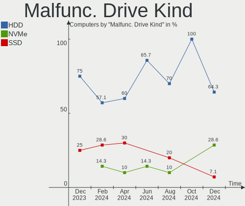

| Kind | Computers | Drives | Percent |
|------|-----------|--------|---------|
| HDD  | 12        | 12     | 75%     |
| SSD  | 4         | 4      | 25%     |

Failed Drives
-------------

Failed drive models

Zero info for selected period =(

Failed Drive Vendor
-------------------

Failed drive vendors

Zero info for selected period =(

Drive Status
------------

Number of failed and malfunc. drives

| Status   | Computers | Drives | Percent |
|----------|-----------|--------|---------|
| Detected | 64        | 95     | 48.85%  |
| Works    | 52        | 68     | 39.69%  |
| Malfunc  | 15        | 16     | 11.45%  |

Storage controller
------------------

Storage Vendor
--------------

Storage controller vendors

| Vendor                       | Computers | Percent |
|------------------------------|-----------|---------|
| Intel                        | 77        | 45.56%  |
| Samsung Electronics          | 21        | 12.43%  |
| AMD                          | 18        | 10.65%  |
| SanDisk                      | 11        | 6.51%   |
| Micron Technology            | 9         | 5.33%   |
| SK hynix                     | 7         | 4.14%   |
| Micron/Crucial Technology    | 4         | 2.37%   |
| ADATA Technology             | 4         | 2.37%   |
| Shenzhen Longsys Electronics | 3         | 1.78%   |
| KIOXIA                       | 3         | 1.78%   |
| Phison Electronics           | 2         | 1.18%   |
| Lenovo                       | 2         | 1.18%   |
| Kingston Technology Company  | 2         | 1.18%   |
| Union Memory (Shenzhen)      | 1         | 0.59%   |
| Transcend                    | 1         | 0.59%   |
| Toshiba America Info Systems | 1         | 0.59%   |
| Nvidia                       | 1         | 0.59%   |
| Lite-On Technology           | 1         | 0.59%   |
| INNOGRIT                     | 1         | 0.59%   |

Storage Model
-------------

Storage controller models

| Model                                                                          | Computers | Percent |
|--------------------------------------------------------------------------------|-----------|---------|
| AMD FCH SATA Controller [AHCI mode]                                            | 15        | 8.11%   |
| Samsung NVMe SSD Controller 980 (DRAM-less)                                    | 13        | 7.03%   |
| Intel Volume Management Device NVMe RAID Controller                            | 10        | 5.41%   |
| Intel 82801 Mobile SATA Controller [RAID mode]                                 | 10        | 5.41%   |
| Intel 8 Series/C220 Series Chipset Family 6-port SATA Controller 1 [AHCI mode] | 6         | 3.24%   |
| Intel Sunrise Point-LP SATA Controller [AHCI mode]                             | 5         | 2.7%    |
| Intel Q170/Q150/B150/H170/H110/Z170/CM236 Chipset SATA Controller [AHCI Mode]  | 5         | 2.7%    |
| Intel 7 Series Chipset Family 6-port SATA Controller [AHCI mode]               | 5         | 2.7%    |
| SanDisk Ultra 3D / WD Blue SN570 NVMe SSD (DRAM-less)                          | 4         | 2.16%   |
| Intel 200 Series PCH SATA controller [AHCI mode]                               | 4         | 2.16%   |
| Samsung NVMe SSD Controller SM981/PM981/PM983                                  | 3         | 1.62%   |
| Samsung NVMe SSD Controller PM9A1/PM9A3/980PRO                                 | 3         | 1.62%   |
| Micron/Crucial P2 [Nick P2] / P3 / P3 Plus NVMe PCIe SSD (DRAM-less)           | 3         | 1.62%   |
| Micron 2210 NVMe SSD [Cobain]                                                  | 3         | 1.62%   |
| Intel Tiger Lake-LP SATA Controller                                            | 3         | 1.62%   |
| Intel Optane NVME SSD H10 with Solid State Storage [Teton Glacier]             | 3         | 1.62%   |
| Intel Alder Lake-P SATA AHCI Controller                                        | 3         | 1.62%   |
| Intel 500 Series Chipset Family SATA AHCI Controller                           | 3         | 1.62%   |
| Intel 400 Series Chipset Family SATA AHCI Controller                           | 3         | 1.62%   |
| AMD 500 Series Chipset SATA Controller                                         | 3         | 1.62%   |
| AMD 400 Series Chipset SATA Controller                                         | 3         | 1.62%   |
| ADATA A Non-Volatile memory controller                                         | 3         | 1.62%   |
| SK hynix Platinum P41/PC801 NVMe Solid State Drive                             | 2         | 1.08%   |
| SK hynix BC901 NVMe Solid State Drive (DRAM-less)                              | 2         | 1.08%   |
| SK hynix BC511 NVMe SSD                                                        | 2         | 1.08%   |
| Shenzhen Longsys Lexar NM620 NVME SSD (DRAM-less)                              | 2         | 1.08%   |
| Sandisk WD PC SN740 NVMe SSD 512GB (DRAM-less)                                 | 2         | 1.08%   |
| Samsung NVMe SSD Controller PM9B1 (DRAM-less)                                  | 2         | 1.08%   |
| Micron 2450 NVMe SSD [HendrixV] (DRAM-less)                                    | 2         | 1.08%   |
| Micron 2300 NVMe SSD [Santana]                                                 | 2         | 1.08%   |
| Kingston Company NV1 NVMe SSD SM2263XT                                         | 2         | 1.08%   |
| Intel Wildcat Point-LP SATA Controller [AHCI Mode]                             | 2         | 1.08%   |
| Intel Comet Lake SATA AHCI Controller                                          | 2         | 1.08%   |
| Intel Cannon Point-LP SATA Controller [AHCI Mode]                              | 2         | 1.08%   |
| Intel Cannon Lake PCH SATA AHCI Controller                                     | 2         | 1.08%   |
| Intel Alder Lake-S PCH SATA Controller [AHCI Mode]                             | 2         | 1.08%   |
| Intel 82801G (ICH7 Family) IDE Controller                                      | 2         | 1.08%   |
| Intel 8 Series SATA Controller 1 [AHCI mode]                                   | 2         | 1.08%   |
| Intel 6 Series/C200 Series Chipset Family 6 port Mobile SATA AHCI Controller   | 2         | 1.08%   |
| Union Memory (Shenzhen) AM630 PCIe 4.0 x4 NVMe SSD Controller                  | 1         | 0.54%   |

Storage Kind
------------

Kind of storage controller (IDE, SATA, NVMe, SAS, ...)

| Kind | Computers | Percent |
|------|-----------|---------|
| SATA | 73        | 42.69%  |
| NVMe | 72        | 42.11%  |
| RAID | 22        | 12.87%  |
| IDE  | 4         | 2.34%   |

Processor
---------

CPU Vendor
----------

Processor vendors

| Vendor | Computers | Percent |
|--------|-----------|---------|
| Intel  | 90        | 72.58%  |
| AMD    | 34        | 27.42%  |

CPU Model
---------

Processor models

| Model                                      | Computers | Percent |
|--------------------------------------------|-----------|---------|
| Intel Core i5-8265U CPU @ 1.60GHz          | 3         | 2.42%   |
| Intel Core i5-1035G1 CPU @ 1.00GHz         | 3         | 2.42%   |
| Intel 12th Gen Core i7-1255U               | 3         | 2.42%   |
| Intel 12th Gen Core i5-12500H              | 3         | 2.42%   |
| Intel 11th Gen Core i3-1115G4 @ 3.00GHz    | 3         | 2.42%   |
| AMD Ryzen 5 4600H with Radeon Graphics     | 3         | 2.42%   |
| AMD Ryzen 3 3250U with Radeon Graphics     | 3         | 2.42%   |
| Intel Core i5-3210M CPU @ 2.50GHz          | 2         | 1.61%   |
| Intel Core i5-10300H CPU @ 2.50GHz         | 2         | 1.61%   |
| Intel Core i3-7100 CPU @ 3.90GHz           | 2         | 1.61%   |
| Intel Core i3-6100 CPU @ 3.70GHz           | 2         | 1.61%   |
| Intel Core i3-6006U CPU @ 2.00GHz          | 2         | 1.61%   |
| Intel Core i3-5005U CPU @ 2.00GHz          | 2         | 1.61%   |
| Intel 12th Gen Core i5-12450H              | 2         | 1.61%   |
| Intel 12th Gen Core i5-1240P               | 2         | 1.61%   |
| Intel 12th Gen Core i5-1235U               | 2         | 1.61%   |
| Intel 11th Gen Core i5-11400 @ 2.60GHz     | 2         | 1.61%   |
| AMD Ryzen 7 PRO 5850U with Radeon Graphics | 2         | 1.61%   |
| AMD Ryzen 7 5700G with Radeon Graphics     | 2         | 1.61%   |
| AMD Ryzen 5 5600H with Radeon Graphics     | 2         | 1.61%   |
| AMD Ryzen 5 4500U with Radeon Graphics     | 2         | 1.61%   |
| Intel Pentium Gold G6405 CPU @ 4.10GHz     | 1         | 0.81%   |
| Intel Pentium Dual CPU E2180 @ 2.00GHz     | 1         | 0.81%   |
| Intel Pentium CPU N3710 @ 1.60GHz          | 1         | 0.81%   |
| Intel Pentium CPU G3240 @ 3.10GHz          | 1         | 0.81%   |
| Intel Pentium CPU B960 @ 2.20GHz           | 1         | 0.81%   |
| Intel Pentium CPU 5405U @ 2.30GHz          | 1         | 0.81%   |
| Intel Core i7-9700 CPU @ 3.00GHz           | 1         | 0.81%   |
| Intel Core i7-8650U CPU @ 1.90GHz          | 1         | 0.81%   |
| Intel Core i7-8565U CPU @ 1.80GHz          | 1         | 0.81%   |
| Intel Core i7-8550U CPU @ 1.80GHz          | 1         | 0.81%   |
| Intel Core i7-10850H CPU @ 2.70GHz         | 1         | 0.81%   |
| Intel Core i7-10510U CPU @ 1.80GHz         | 1         | 0.81%   |
| Intel Core i5-8400 CPU @ 2.80GHz           | 1         | 0.81%   |
| Intel Core i5-8350U CPU @ 1.70GHz          | 1         | 0.81%   |
| Intel Core i5-7500 CPU @ 3.40GHz           | 1         | 0.81%   |
| Intel Core i5-7440HQ CPU @ 2.80GHz         | 1         | 0.81%   |
| Intel Core i5-7400T CPU @ 2.40GHz          | 1         | 0.81%   |
| Intel Core i5-7400 CPU @ 3.00GHz           | 1         | 0.81%   |
| Intel Core i5-7300U CPU @ 2.60GHz          | 1         | 0.81%   |

CPU Model Family
----------------

Processor model prefix

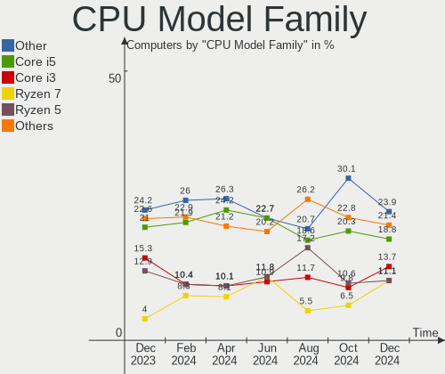

| Model              | Computers | Percent |
|--------------------|-----------|---------|
| Other              | 30        | 24.19%  |
| Intel Core i5      | 26        | 20.97%  |
| Intel Core i3      | 19        | 15.32%  |
| AMD Ryzen 5        | 16        | 12.9%   |
| Intel Core i7      | 6         | 4.84%   |
| AMD Ryzen 7        | 5         | 4.03%   |
| Intel Pentium      | 4         | 3.23%   |
| Intel Core 2 Duo   | 3         | 2.42%   |
| AMD Ryzen 7 PRO    | 3         | 2.42%   |
| AMD Ryzen 3        | 3         | 2.42%   |
| Intel Pentium Gold | 1         | 0.81%   |
| Intel Pentium Dual | 1         | 0.81%   |
| Intel Celeron      | 1         | 0.81%   |
| AMD Ryzen 9        | 1         | 0.81%   |
| AMD Athlon 64      | 1         | 0.81%   |
| AMD A8             | 1         | 0.81%   |
| AMD A6             | 1         | 0.81%   |
| AMD A4             | 1         | 0.81%   |
| AMD A10            | 1         | 0.81%   |

CPU Cores
---------

Number of processor cores

| Number | Computers | Percent |
|--------|-----------|---------|
| 2      | 41        | 33.06%  |
| 4      | 35        | 28.23%  |
| 6      | 19        | 15.32%  |
| 8      | 11        | 8.87%   |
| 12     | 8         | 6.45%   |
| 10     | 7         | 5.65%   |
| 14     | 2         | 1.61%   |
| 1      | 1         | 0.81%   |

CPU Sockets
-----------

Number of sockets

| Number | Computers | Percent |
|--------|-----------|---------|
| 1      | 124       | 100%    |

CPU Threads
-----------

Threads per core (Hyper-Threading)

| Number | Computers | Percent |
|--------|-----------|---------|
| 2      | 94        | 75.81%  |
| 1      | 30        | 24.19%  |

CPU Op-Modes
------------

CPU Operation Modes (32-bit, 64-bit)

| Op mode        | Computers | Percent |
|----------------|-----------|---------|
| 32-bit, 64-bit | 124       | 100%    |

CPU Microcode
-------------

Microcode number

| Number     | Computers | Percent |
|------------|-----------|---------|
| Unknown    | 75        | 60.48%  |
| 0x08108109 | 5         | 4.03%   |
| 0x906e9    | 4         | 3.23%   |
| 0x0a50000d | 4         | 3.23%   |
| 0x906a3    | 2         | 1.61%   |
| 0x806ec    | 2         | 1.61%   |
| 0x306c3    | 2         | 1.61%   |
| 0x306a9    | 2         | 1.61%   |
| 0x0a704103 | 2         | 1.61%   |
| 0x0a50000f | 2         | 1.61%   |
| 0x0a404102 | 2         | 1.61%   |
| 0xa0652    | 1         | 0.81%   |
| 0x906eb    | 1         | 0.81%   |
| 0x906a4    | 1         | 0.81%   |
| 0x90672    | 1         | 0.81%   |
| 0x806ea    | 1         | 0.81%   |
| 0x806c1    | 1         | 0.81%   |
| 0x506e3    | 1         | 0.81%   |
| 0x406e3    | 1         | 0.81%   |
| 0x406c4    | 1         | 0.81%   |
| 0x1067a    | 1         | 0.81%   |
| 0x0a601203 | 1         | 0.81%   |
| 0x0a50000c | 1         | 0.81%   |
| 0x0a404101 | 1         | 0.81%   |
| 0x0a20120e | 1         | 0.81%   |
| 0x0a20120a | 1         | 0.81%   |
| 0x08608103 | 1         | 0.81%   |
| 0x08600109 | 1         | 0.81%   |
| 0x08600106 | 1         | 0.81%   |
| 0x0800820d | 1         | 0.81%   |
| 0x07030105 | 1         | 0.81%   |
| 0x0700010b | 1         | 0.81%   |
| 0x06006705 | 1         | 0.81%   |

CPU Microarch
-------------

Microarchitecture

| Name             | Computers | Percent |
|------------------|-----------|---------|
| KabyLake         | 24        | 19.35%  |
| Alderlake Hybrid | 15        | 12.1%   |
| Unknown          | 13        | 10.48%  |
| Zen 3            | 9         | 7.26%   |
| Haswell          | 8         | 6.45%   |
| Zen+             | 7         | 5.65%   |
| TigerLake        | 7         | 5.65%   |
| Zen 2            | 5         | 4.03%   |
| Skylake          | 5         | 4.03%   |
| IvyBridge        | 5         | 4.03%   |
| CometLake        | 5         | 4.03%   |
| Icelake          | 4         | 3.23%   |
| SandyBridge      | 3         | 2.42%   |
| Penryn           | 3         | 2.42%   |
| Excavator        | 3         | 2.42%   |
| Broadwell        | 2         | 1.61%   |
| Tremont          | 1         | 0.81%   |
| Silvermont       | 1         | 0.81%   |
| Puma             | 1         | 0.81%   |
| K8 Hammer        | 1         | 0.81%   |
| Jaguar           | 1         | 0.81%   |
| Core             | 1         | 0.81%   |

Graphics
--------

GPU Vendor
----------

Vendors of graphics cards

| Vendor | Computers | Percent |
|--------|-----------|---------|
| Intel  | 84        | 56.38%  |
| AMD    | 34        | 22.82%  |
| Nvidia | 31        | 20.81%  |

GPU Model
---------

Graphics card models

| Model                                                                       | Computers | Percent |
|-----------------------------------------------------------------------------|-----------|---------|
| Nvidia TU117M [GeForce GTX 1650 Mobile / Max-Q]                             | 8         | 5.26%   |
| AMD Cezanne [Radeon Vega Series / Radeon Vega Mobile Series]                | 7         | 4.61%   |
| AMD Picasso/Raven 2 [Radeon Vega Series / Radeon Vega Mobile Series]        | 6         | 3.95%   |
| Nvidia GA107M [GeForce RTX 3050 Mobile]                                     | 5         | 3.29%   |
| Intel HD Graphics 630                                                       | 5         | 3.29%   |
| AMD Renoir [Radeon RX Vega 6 (Ryzen 4000/5000 Mobile Series)]               | 5         | 3.29%   |
| Intel Xeon E3-1200 v3/4th Gen Core Processor Integrated Graphics Controller | 4         | 2.63%   |
| Intel WhiskeyLake-U GT2 [UHD Graphics 620]                                  | 4         | 2.63%   |
| Intel TigerLake-LP GT2 [Iris Xe Graphics]                                   | 4         | 2.63%   |
| Intel HD Graphics 620                                                       | 4         | 2.63%   |
| Intel Alder Lake-P GT2 [Iris Xe Graphics]                                   | 4         | 2.63%   |
| Intel 3rd Gen Core processor Graphics Controller                            | 4         | 2.63%   |
| Intel UHD Graphics 620                                                      | 3         | 1.97%   |
| Intel Tiger Lake-LP GT2 [UHD Graphics G4]                                   | 3         | 1.97%   |
| Intel Iris Plus Graphics G1 (Ice Lake)                                      | 3         | 1.97%   |
| Intel CometLake-H GT2 [UHD Graphics]                                        | 3         | 1.97%   |
| Intel CoffeeLake-S GT2 [UHD Graphics 630]                                   | 3         | 1.97%   |
| Intel Alder Lake-UP3 GT2 [Iris Xe Graphics]                                 | 3         | 1.97%   |
| AMD Rembrandt [Radeon 680M]                                                 | 3         | 1.97%   |
| Nvidia GK208B [GeForce GT 730]                                              | 2         | 1.32%   |
| Intel RocketLake-S GT1 [UHD Graphics 730]                                   | 2         | 1.32%   |
| Intel HD Graphics 5500                                                      | 2         | 1.32%   |
| Intel HD Graphics 530                                                       | 2         | 1.32%   |
| Intel HD Graphics 520                                                       | 2         | 1.32%   |
| Intel Haswell-ULT Integrated Graphics Controller                            | 2         | 1.32%   |
| Intel CometLake-U GT2 [UHD Graphics]                                        | 2         | 1.32%   |
| Intel Alder Lake-UP3 GT2 [UHD Graphics]                                     | 2         | 1.32%   |
| Intel Alder Lake-P Integrated Graphics Controller                           | 2         | 1.32%   |
| Intel Alder Lake-P GT1 [UHD Graphics]                                       | 2         | 1.32%   |
| Intel 82945G/GZ Integrated Graphics Controller                              | 2         | 1.32%   |
| Intel 2nd Generation Core Processor Family Integrated Graphics Controller   | 2         | 1.32%   |
| AMD Stoney [Radeon R2/R3/R4/R5 Graphics]                                    | 2         | 1.32%   |
| AMD Phoenix1                                                                | 2         | 1.32%   |
| AMD Navi 22 [Radeon RX 6700/6700 XT/6750 XT / 6800M/6850M XT]               | 2         | 1.32%   |
| Nvidia TU117M [GeForce GTX 1650 Ti Mobile]                                  | 1         | 0.66%   |
| Nvidia TU117GLM [Quadro T2000 Mobile / Max-Q]                               | 1         | 0.66%   |
| Nvidia TU106 [GeForce RTX 2060 Rev. A]                                      | 1         | 0.66%   |
| Nvidia NV36M [GeForce FX Go5700]                                            | 1         | 0.66%   |
| Nvidia GP108M [GeForce MX250]                                               | 1         | 0.66%   |
| Nvidia GP108M [GeForce MX230]                                               | 1         | 0.66%   |

GPU Combo
---------

Combinations of graphics cards

| Name           | Computers | Percent |
|----------------|-----------|---------|
| 1 x Intel      | 69        | 55.65%  |
| 1 x AMD        | 22        | 17.74%  |
| Intel + Nvidia | 15        | 12.1%   |
| AMD + Nvidia   | 10        | 8.06%   |
| 1 x Nvidia     | 6         | 4.84%   |
| 2 x AMD        | 2         | 1.61%   |

GPU Driver
----------

Free vs proprietary

| Driver      | Computers | Percent |
|-------------|-----------|---------|
| Free        | 106       | 85.48%  |
| Proprietary | 17        | 13.71%  |
| Unknown     | 1         | 0.81%   |

GPU Memory
----------

Total video memory

| Size in GB | Computers | Percent |
|------------|-----------|---------|
| Unknown    | 85        | 68.55%  |
| 0.01-0.5   | 16        | 12.9%   |
| 1.01-2.0   | 8         | 6.45%   |
| 3.01-4.0   | 7         | 5.65%   |
| 8.01-16.0  | 3         | 2.42%   |
| 0.51-1.0   | 3         | 2.42%   |
| 7.01-8.0   | 1         | 0.81%   |
| 5.01-6.0   | 1         | 0.81%   |

Monitor
-------

Monitor Vendor
--------------

Monitor vendors

| Vendor                  | Computers | Percent |
|-------------------------|-----------|---------|
| BOE                     | 24        | 16.9%   |
| AU Optronics            | 23        | 16.2%   |
| Samsung Electronics     | 16        | 11.27%  |
| LG Display              | 15        | 10.56%  |
| Chimei Innolux          | 15        | 10.56%  |
| Goldstar                | 10        | 7.04%   |
| Dell                    | 8         | 5.63%   |
| BenQ                    | 6         | 4.23%   |
| Hewlett-Packard         | 4         | 2.82%   |
| PANDA                   | 3         | 2.11%   |
| SGT                     | 2         | 1.41%   |
| Lenovo                  | 2         | 1.41%   |
| Chi Mei Optoelectronics | 2         | 1.41%   |
| Acer                    | 2         | 1.41%   |
| Xiaomi                  | 1         | 0.7%    |
| ViewSonic               | 1         | 0.7%    |
| Unknown                 | 1         | 0.7%    |
| TMX                     | 1         | 0.7%    |
| STD                     | 1         | 0.7%    |
| PZG                     | 1         | 0.7%    |
| MSI                     | 1         | 0.7%    |
| KDC                     | 1         | 0.7%    |
| HJC                     | 1         | 0.7%    |
| Unknown                 | 1         | 0.7%    |

Monitor Model
-------------

Monitor models

| Model                                                                 | Computers | Percent |
|-----------------------------------------------------------------------|-----------|---------|
| BenQ GW2780 BNQ78E6 1920x1080 598x336mm 27.0-inch                     | 4         | 2.76%   |
| AU Optronics LCD Monitor AUO61ED 1920x1080 344x194mm 15.5-inch        | 3         | 2.07%   |
| Samsung Electronics S24F350 SAM0D20 1920x1080 521x293mm 23.5-inch     | 2         | 1.38%   |
| Samsung Electronics LF24T35 SAM707D 1920x1080 528x297mm 23.9-inch     | 2         | 1.38%   |
| PANDA LCD Monitor NCP004D 1920x1080 344x194mm 15.5-inch               | 2         | 1.38%   |
| LG Display LCD Monitor LGD0613 1920x1080 309x174mm 14.0-inch          | 2         | 1.38%   |
| LG Display LCD Monitor LGD039F 1366x768 345x194mm 15.6-inch           | 2         | 1.38%   |
| Dell S2421HN DEL41F1 1920x1080 527x296mm 23.8-inch                    | 2         | 1.38%   |
| Chimei Innolux LCD Monitor CMN15F5 1920x1080 344x193mm 15.5-inch      | 2         | 1.38%   |
| Chimei Innolux LCD Monitor CMN1521 1920x1080 344x193mm 15.5-inch      | 2         | 1.38%   |
| Chimei Innolux LCD Monitor CMN14C3 1366x768 309x173mm 13.9-inch       | 2         | 1.38%   |
| BOE LCD Monitor BOE0827 1366x768 309x174mm 14.0-inch                  | 2         | 1.38%   |
| AU Optronics LCD Monitor AUO38ED 1920x1080 344x193mm 15.5-inch        | 2         | 1.38%   |
| AU Optronics LCD Monitor AUO2992 1920x1080 344x193mm 15.5-inch        | 2         | 1.38%   |
| AU Optronics LCD Monitor AUO23ED 1920x1080 344x193mm 15.5-inch        | 2         | 1.38%   |
| Xiaomi Mi TV XMD0002 1920x1080 708x398mm 32.0-inch                    | 1         | 0.69%   |
| ViewSonic XG2405 VSC0D39 1920x1080 527x296mm 23.8-inch                | 1         | 0.69%   |
| Unknown LCD Monitor FFFF 2288x1287 2550x2550mm 142.0-inch             | 1         | 0.69%   |
| TMX TL156VDXP0101 TMX1561 1920x1080 344x194mm 15.5-inch               | 1         | 0.69%   |
| STD MON-0057 STD2196 1920x1080 480x260mm 21.5-inch                    | 1         | 0.69%   |
| SGT YSD SGT1700 1280x768 360x250mm 17.3-inch                          | 1         | 0.69%   |
| SGT HDMI SGT2383 1280x768 360x250mm 17.3-inch                         | 1         | 0.69%   |
| Samsung Electronics S24R35A SAM729F 1920x1080 527x296mm 23.8-inch     | 1         | 0.69%   |
| Samsung Electronics S22C31x SAM7310 1920x1080 476x267mm 21.5-inch     | 1         | 0.69%   |
| Samsung Electronics S22B370 SAM0899 1920x1080 477x268mm 21.5-inch     | 1         | 0.69%   |
| Samsung Electronics S19B150 SAM0980 1366x768 410x230mm 18.5-inch      | 1         | 0.69%   |
| Samsung Electronics LS27CG51x SAM72FC 2560x1440 597x336mm 27.0-inch   | 1         | 0.69%   |
| Samsung Electronics LCD Monitor SEC5443 1920x1200 367x230mm 17.1-inch | 1         | 0.69%   |
| Samsung Electronics LCD Monitor SDC4852 1366x768 344x194mm 15.5-inch  | 1         | 0.69%   |
| Samsung Electronics LCD Monitor SDC4181 2880x1800 302x189mm 14.0-inch | 1         | 0.69%   |
| Samsung Electronics LCD Monitor SDC416C 1920x1080 344x194mm 15.5-inch | 1         | 0.69%   |
| Samsung Electronics LCD Monitor SDC4166 2880x1800 289x186mm 13.5-inch | 1         | 0.69%   |
| Samsung Electronics LCD Monitor SDC4161 1920x1080 344x194mm 15.5-inch | 1         | 0.69%   |
| Samsung Electronics LC24RG50 SAM0F90 1920x1080 530x300mm 24.0-inch    | 1         | 0.69%   |
| PZG DP PZG2700 1920x1080 600x330mm 27.0-inch                          | 1         | 0.69%   |
| PANDA LCD Monitor NCP004F 1920x1080 309x174mm 14.0-inch               | 1         | 0.69%   |
| MSI MP241X MSI3BA9 1920x1080 527x296mm 23.8-inch                      | 1         | 0.69%   |
| LG Display LCD Monitor LGD40A9 1920x1080 309x174mm 14.0-inch          | 1         | 0.69%   |
| LG Display LCD Monitor LGD076D 1920x1080 355x200mm 16.0-inch          | 1         | 0.69%   |
| LG Display LCD Monitor LGD0696 1920x1200 286x179mm 13.3-inch          | 1         | 0.69%   |

Monitor Resolution
------------------

Monitor screen resolution

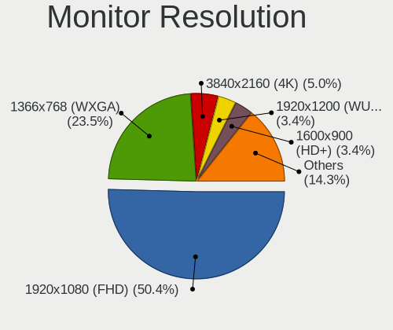

| Resolution         | Computers | Percent |
|--------------------|-----------|---------|
| 1920x1080 (FHD)    | 80        | 60.61%  |
| 1366x768 (WXGA)    | 25        | 18.94%  |
| 1920x1200 (WUXGA)  | 6         | 4.55%   |
| 2560x1440 (QHD)    | 4         | 3.03%   |
| 1600x900 (HD+)     | 3         | 2.27%   |
| 1280x1024 (SXGA)   | 3         | 2.27%   |
| 2880x1800          | 2         | 1.52%   |
| 3840x2160 (4K)     | 1         | 0.76%   |
| 2560x1600          | 1         | 0.76%   |
| 2560x1080          | 1         | 0.76%   |
| 2288x1287          | 1         | 0.76%   |
| 2160x1440          | 1         | 0.76%   |
| 1680x1050 (WSXGA+) | 1         | 0.76%   |
| 1600x1200          | 1         | 0.76%   |
| 1440x900 (WXGA+)   | 1         | 0.76%   |
| 1024x768 (XGA)     | 1         | 0.76%   |

Monitor Diagonal
----------------

Diagonal size in inches

| Inches  | Computers | Percent |
|---------|-----------|---------|
| 15      | 50        | 34.97%  |
| 14      | 21        | 14.69%  |
| 24      | 13        | 9.09%   |
| 13      | 12        | 8.39%   |
| 23      | 9         | 6.29%   |
| 27      | 8         | 5.59%   |
| 21      | 7         | 4.9%    |
| 17      | 4         | 2.8%    |
| 16      | 4         | 2.8%    |
| Unknown | 3         | 2.1%    |
| 26      | 2         | 1.4%    |
| 20      | 2         | 1.4%    |
| 19      | 2         | 1.4%    |
| 18      | 2         | 1.4%    |
| 142     | 1         | 0.7%    |
| 65      | 1         | 0.7%    |
| 31      | 1         | 0.7%    |
| 11      | 1         | 0.7%    |

Monitor Width
-------------

Physical width

| Width in mm    | Computers | Percent |
|----------------|-----------|---------|
| 301-350        | 82        | 58.16%  |
| 501-600        | 30        | 21.28%  |
| 401-500        | 13        | 9.22%   |
| 351-400        | 6         | 4.26%   |
| 201-300        | 4         | 2.84%   |
| Unknown        | 3         | 2.13%   |
| More than 2000 | 1         | 0.71%   |
| 601-700        | 1         | 0.71%   |
| 1001-1500      | 1         | 0.71%   |

Aspect Ratio
------------

Proportional relationship between the width and the height

| Ratio   | Computers | Percent |
|---------|-----------|---------|
| 16/9    | 106       | 84.8%   |
| 16/10   | 9         | 7.2%    |
| 4/3     | 3         | 2.4%    |
| 5/4     | 2         | 1.6%    |
| Unknown | 2         | 1.6%    |
| 3/2     | 1         | 0.8%    |
| 2.00    | 1         | 0.8%    |
| 1.00    | 1         | 0.8%    |

Monitor Area
------------

Area in inch²

| Area in inch² | Computers | Percent |
|----------------|-----------|---------|
| 101-110        | 51        | 36.17%  |
| 81-90          | 31        | 21.99%  |
| 201-250        | 24        | 17.02%  |
| 301-350        | 9         | 6.38%   |
| 151-200        | 6         | 4.26%   |
| 251-300        | 3         | 2.13%   |
| 141-150        | 3         | 2.13%   |
| Unknown        | 3         | 2.13%   |
| More than 1000 | 2         | 1.42%   |
| 131-140        | 2         | 1.42%   |
| 111-120        | 2         | 1.42%   |
| 71-80          | 1         | 0.71%   |
| 51-60          | 1         | 0.71%   |
| 351-500        | 1         | 0.71%   |
| 121-130        | 1         | 0.71%   |
| 91-100         | 1         | 0.71%   |

Pixel Density
-------------

Pixels per inch

| Density       | Computers | Percent |
|---------------|-----------|---------|
| 121-160       | 58        | 42.65%  |
| 51-100        | 40        | 29.41%  |
| 101-120       | 25        | 18.38%  |
| 161-240       | 6         | 4.41%   |
| Unknown       | 3         | 2.21%   |
| More than 240 | 2         | 1.47%   |
| 1-50          | 2         | 1.47%   |

Multiple Monitors
-----------------

Total monitors connected

| Total | Computers | Percent |
|-------|-----------|---------|
| 1     | 98        | 79.03%  |
| 2     | 25        | 20.16%  |
| 0     | 1         | 0.81%   |

Network
-------

Net Controller Vendor
---------------------

Controller vendors

| Vendor                | Computers | Percent |
|-----------------------|-----------|---------|
| Realtek Semiconductor | 88        | 47.06%  |
| Intel                 | 44        | 23.53%  |
| Qualcomm Atheros      | 16        | 8.56%   |
| MediaTek              | 16        | 8.56%   |
| Broadcom              | 4         | 2.14%   |
| Xiaomi                | 2         | 1.07%   |
| TP-Link               | 2         | 1.07%   |
| Ralink Technology     | 2         | 1.07%   |
| Ralink                | 2         | 1.07%   |
| Qualcomm              | 2         | 1.07%   |
| Broadcom Limited      | 2         | 1.07%   |
| Samsung Electronics   | 1         | 0.53%   |
| Nvidia                | 1         | 0.53%   |
| Motorola PCS          | 1         | 0.53%   |
| Google                | 1         | 0.53%   |
| DisplayLink           | 1         | 0.53%   |
| D-Link                | 1         | 0.53%   |
| ASIX Electronics      | 1         | 0.53%   |

Net Controller Model
--------------------

Controller models

| Model                                                             | Computers | Percent |
|-------------------------------------------------------------------|-----------|---------|
| Realtek RTL8111/8168/8411 PCI Express Gigabit Ethernet Controller | 57        | 25.56%  |
| Realtek RTL810xE PCI Express Fast Ethernet controller             | 15        | 6.73%   |
| MediaTek MT7921 802.11ax PCI Express Wireless Network Adapter     | 10        | 4.48%   |
| Intel Alder Lake-P PCH CNVi WiFi                                  | 9         | 4.04%   |
| Realtek RTL8822CE 802.11ac PCIe Wireless Network Adapter          | 7         | 3.14%   |
| Realtek RTL8125 2.5GbE Controller                                 | 6         | 2.69%   |
| Intel Wireless 8265 / 8275                                        | 6         | 2.69%   |
| Realtek RTL8821CE 802.11ac PCIe Wireless Network Adapter          | 5         | 2.24%   |
| Qualcomm Atheros QCA9565 / AR9565 Wireless Network Adapter        | 5         | 2.24%   |
| Qualcomm Atheros QCA9377 802.11ac Wireless Network Adapter        | 5         | 2.24%   |
| Intel Wi-Fi 6 AX201                                               | 5         | 2.24%   |
| Realtek RTL8852AE 802.11ax PCIe Wireless Network Adapter          | 4         | 1.79%   |
| Realtek RTL8188EUS 802.11n Wireless Network Adapter               | 4         | 1.79%   |
| Realtek RTL8723DE Wireless Network Adapter                        | 3         | 1.35%   |
| Qualcomm Atheros AR9485 Wireless Network Adapter                  | 3         | 1.35%   |
| Intel Ethernet Connection (4) I219-LM                             | 3         | 1.35%   |
| Realtek Killer E2600 Gigabit Ethernet Controller                  | 2         | 0.9%    |
| Ralink RT3290 Wireless 802.11n 1T/1R PCIe                         | 2         | 0.9%    |
| Qualcomm Atheros AR9285 Wireless Network Adapter (PCI-Express)    | 2         | 0.9%    |
| MediaTek MT7922 802.11ax PCI Express Wireless Network Adapter     | 2         | 0.9%    |
| MediaTek MT7921K (RZ608) Wi-Fi 6E 80MHz                           | 2         | 0.9%    |
| Intel Wireless 3160                                               | 2         | 0.9%    |
| Intel Wi-Fi 6 AX200                                               | 2         | 0.9%    |
| Intel Ice Lake-LP PCH CNVi WiFi                                   | 2         | 0.9%    |
| Intel Ethernet Controller I225-V                                  | 2         | 0.9%    |
| Intel Ethernet Connection (5) I219-LM                             | 2         | 0.9%    |
| Intel Ethernet Connection (4) I219-V                              | 2         | 0.9%    |
| Intel Comet Lake PCH-LP CNVi WiFi                                 | 2         | 0.9%    |
| Xiaomi Mi/Redmi series (RNDIS)                                    | 1         | 0.45%   |
| Xiaomi Mi/Redmi series (RNDIS + ADB)                              | 1         | 0.45%   |
| TP-Link TL-WN722N v2/v3 [Realtek RTL8188EUS]                      | 1         | 0.45%   |
| TP-Link Archer T2U PLUS [RTL8821AU]                               | 1         | 0.45%   |
| Samsung GT-I9070 (network tethering, USB debugging enabled)       | 1         | 0.45%   |
| Realtek RTL8822BE 802.11a/b/g/n/ac WiFi adapter                   | 1         | 0.45%   |
| Realtek RTL8821CE PCIe 802.11ac Wireless Network Controller       | 1         | 0.45%   |
| Realtek RTL8821AE 802.11ac PCIe Wireless Network Adapter          | 1         | 0.45%   |
| Realtek RTL8723BE PCIe Wireless Network Adapter                   | 1         | 0.45%   |
| Realtek RTL8192EE PCIe Wireless Network Adapter                   | 1         | 0.45%   |
| Realtek RTL8188FTV 802.11b/g/n 1T1R 2.4G WLAN Adapter             | 1         | 0.45%   |
| Realtek RTL8188EE Wireless Network Adapter                        | 1         | 0.45%   |

Wireless Vendor
---------------

Wireless vendors

| Vendor                | Computers | Percent |
|-----------------------|-----------|---------|
| Intel                 | 39        | 34.51%  |
| Realtek Semiconductor | 32        | 28.32%  |
| Qualcomm Atheros      | 16        | 14.16%  |
| MediaTek              | 15        | 13.27%  |
| Broadcom              | 3         | 2.65%   |
| TP-Link               | 2         | 1.77%   |
| Ralink Technology     | 2         | 1.77%   |
| Ralink                | 2         | 1.77%   |
| Qualcomm              | 1         | 0.88%   |
| D-Link                | 1         | 0.88%   |

Wireless Model
--------------

Wireless models

| Model                                                          | Computers | Percent |
|----------------------------------------------------------------|-----------|---------|
| MediaTek MT7921 802.11ax PCI Express Wireless Network Adapter  | 10        | 8.85%   |
| Intel Alder Lake-P PCH CNVi WiFi                               | 9         | 7.96%   |
| Realtek RTL8822CE 802.11ac PCIe Wireless Network Adapter       | 7         | 6.19%   |
| Intel Wireless 8265 / 8275                                     | 6         | 5.31%   |
| Realtek RTL8821CE 802.11ac PCIe Wireless Network Adapter       | 5         | 4.42%   |
| Qualcomm Atheros QCA9565 / AR9565 Wireless Network Adapter     | 5         | 4.42%   |
| Qualcomm Atheros QCA9377 802.11ac Wireless Network Adapter     | 5         | 4.42%   |
| Intel Wi-Fi 6 AX201                                            | 5         | 4.42%   |
| Realtek RTL8852AE 802.11ax PCIe Wireless Network Adapter       | 4         | 3.54%   |
| Realtek RTL8188EUS 802.11n Wireless Network Adapter            | 4         | 3.54%   |
| Realtek RTL8723DE Wireless Network Adapter                     | 3         | 2.65%   |
| Qualcomm Atheros AR9485 Wireless Network Adapter               | 3         | 2.65%   |
| Ralink RT3290 Wireless 802.11n 1T/1R PCIe                      | 2         | 1.77%   |
| Qualcomm Atheros AR9285 Wireless Network Adapter (PCI-Express) | 2         | 1.77%   |
| MediaTek MT7922 802.11ax PCI Express Wireless Network Adapter  | 2         | 1.77%   |
| MediaTek MT7921K (RZ608) Wi-Fi 6E 80MHz                        | 2         | 1.77%   |
| Intel Wireless 3160                                            | 2         | 1.77%   |
| Intel Wi-Fi 6 AX200                                            | 2         | 1.77%   |
| Intel Ice Lake-LP PCH CNVi WiFi                                | 2         | 1.77%   |
| Intel Comet Lake PCH-LP CNVi WiFi                              | 2         | 1.77%   |
| TP-Link TL-WN722N v2/v3 [Realtek RTL8188EUS]                   | 1         | 0.88%   |
| TP-Link Archer T2U PLUS [RTL8821AU]                            | 1         | 0.88%   |
| Realtek RTL8822BE 802.11a/b/g/n/ac WiFi adapter                | 1         | 0.88%   |
| Realtek RTL8821CE PCIe 802.11ac Wireless Network Controller    | 1         | 0.88%   |
| Realtek RTL8821AE 802.11ac PCIe Wireless Network Adapter       | 1         | 0.88%   |
| Realtek RTL8723BE PCIe Wireless Network Adapter                | 1         | 0.88%   |
| Realtek RTL8192EE PCIe Wireless Network Adapter                | 1         | 0.88%   |
| Realtek RTL8188FTV 802.11b/g/n 1T1R 2.4G WLAN Adapter          | 1         | 0.88%   |
| Realtek RTL8188EE Wireless Network Adapter                     | 1         | 0.88%   |
| Realtek Realtek WLAN controller                                | 1         | 0.88%   |
| Realtek 802.11ac NIC                                           | 1         | 0.88%   |
| Ralink MT7610U ("Archer T2U" 2.4G+5G WLAN Adapter              | 1         | 0.88%   |
| Ralink MT7601U Wireless Adapter                                | 1         | 0.88%   |
| Qualcomm QCNFA765 Wireless Network Adapter                     | 1         | 0.88%   |
| Qualcomm Atheros AR9462 Wireless Network Adapter               | 1         | 0.88%   |
| MediaTek Wi-Fi 6E MT7902 Wireless Network Adapter              | 1         | 0.88%   |
| Intel Wireless 8260                                            | 1         | 0.88%   |
| Intel Wireless 7265                                            | 1         | 0.88%   |
| Intel Wi-Fi 6 AX201 160MHz                                     | 1         | 0.88%   |
| Intel Ultimate N WiFi Link 5300                                | 1         | 0.88%   |

Ethernet Vendor
---------------

Ethernet vendors

| Vendor                | Computers | Percent |
|-----------------------|-----------|---------|
| Realtek Semiconductor | 79        | 74.53%  |
| Intel                 | 15        | 14.15%  |
| Xiaomi                | 2         | 1.89%   |
| Broadcom Limited      | 2         | 1.89%   |
| Broadcom              | 2         | 1.89%   |
| Qualcomm              | 1         | 0.94%   |
| Motorola PCS          | 1         | 0.94%   |
| MediaTek              | 1         | 0.94%   |
| Google                | 1         | 0.94%   |
| DisplayLink           | 1         | 0.94%   |
| ASIX Electronics      | 1         | 0.94%   |

Ethernet Model
--------------

Ethernet models

| Model                                                             | Computers | Percent |
|-------------------------------------------------------------------|-----------|---------|
| Realtek RTL8111/8168/8411 PCI Express Gigabit Ethernet Controller | 57        | 52.78%  |
| Realtek RTL810xE PCI Express Fast Ethernet controller             | 15        | 13.89%  |
| Realtek RTL8125 2.5GbE Controller                                 | 6         | 5.56%   |
| Intel Ethernet Connection (4) I219-LM                             | 3         | 2.78%   |
| Realtek Killer E2600 Gigabit Ethernet Controller                  | 2         | 1.85%   |
| Intel Ethernet Controller I225-V                                  | 2         | 1.85%   |
| Intel Ethernet Connection (5) I219-LM                             | 2         | 1.85%   |
| Intel Ethernet Connection (4) I219-V                              | 2         | 1.85%   |
| Xiaomi Mi/Redmi series (RNDIS)                                    | 1         | 0.93%   |
| Xiaomi Mi/Redmi series (RNDIS + ADB)                              | 1         | 0.93%   |
| Realtek RTL8152 Fast Ethernet Adapter                             | 1         | 0.93%   |
| Qualcomm CAPE-MTP _SN:14677F87                                    | 1         | 0.93%   |
| Motorola PCS motorola edge 40                                     | 1         | 0.93%   |
| MediaTek M40Air_EEA                                               | 1         | 0.93%   |
| Intel Ethernet Connection I219-LM                                 | 1         | 0.93%   |
| Intel Ethernet Connection (7) I219-LM                             | 1         | 0.93%   |
| Intel Ethernet Connection (23) I219-V                             | 1         | 0.93%   |
| Intel Ethernet Connection (2) I219-V                              | 1         | 0.93%   |
| Intel Ethernet Connection (14) I219-V                             | 1         | 0.93%   |
| Intel 82579LM Gigabit Network Connection (Lewisville)             | 1         | 0.93%   |
| Google Nexus/Pixel Device (tether)                                | 1         | 0.93%   |
| DisplayLink Dell Universal Dock D6000                             | 1         | 0.93%   |
| Broadcom NetXtreme BCM5788 Gigabit Ethernet                       | 1         | 0.93%   |
| Broadcom NetLink BCM57785 Gigabit Ethernet PCIe                   | 1         | 0.93%   |
| Broadcom Limited NetXtreme BCM5761e Gigabit Ethernet PCIe         | 1         | 0.93%   |
| Broadcom Limited NetXtreme BCM5761 Gigabit Ethernet PCIe          | 1         | 0.93%   |
| ASIX AX88179 Gigabit Ethernet                                     | 1         | 0.93%   |

Net Controller Kind
-------------------

Ethernet, WiFi or modem

| Kind     | Computers | Percent |
|----------|-----------|---------|
| WiFi     | 110       | 51.64%  |
| Ethernet | 101       | 47.42%  |
| Modem    | 2         | 0.94%   |

Used Controller
---------------

Currently used network controller

| Kind     | Computers | Percent |
|----------|-----------|---------|
| WiFi     | 92        | 73.02%  |
| Ethernet | 34        | 26.98%  |

NICs
----

Total network controllers on board

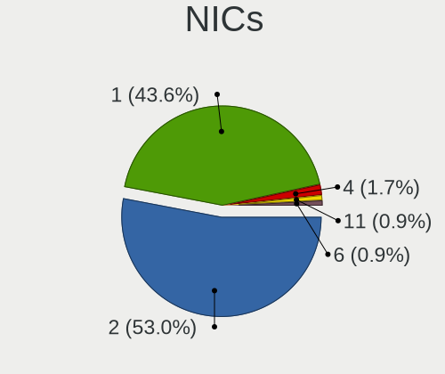

| Total | Computers | Percent |
|-------|-----------|---------|
| 2     | 76        | 61.29%  |
| 1     | 46        | 37.1%   |
| 3     | 1         | 0.81%   |
| 0     | 1         | 0.81%   |

IPv6
----

IPv6 vs IPv4

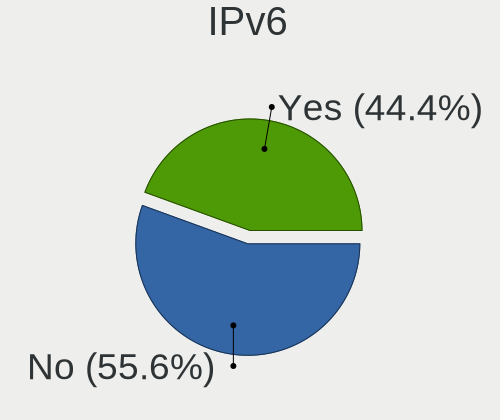

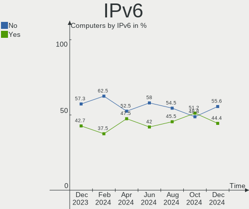

| Used | Computers | Percent |
|------|-----------|---------|
| No   | 71        | 57.26%  |
| Yes  | 53        | 42.74%  |

Bluetooth
---------

Bluetooth Vendor
----------------

Controller vendors

| Vendor                          | Computers | Percent |
|---------------------------------|-----------|---------|
| Intel                           | 35        | 38.46%  |
| Realtek Semiconductor           | 20        | 21.98%  |
| Qualcomm Atheros Communications | 12        | 13.19%  |
| IMC Networks                    | 12        | 13.19%  |
| Lite-On Technology              | 3         | 3.3%    |
| Foxconn / Hon Hai               | 3         | 3.3%    |
| Ralink                          | 2         | 2.2%    |
| MediaTek                        | 2         | 2.2%    |
| USI                             | 1         | 1.1%    |
| Broadcom                        | 1         | 1.1%    |

Bluetooth Model
---------------

Controller models

| Model                                          | Computers | Percent |
|------------------------------------------------|-----------|---------|
| Intel Bluetooth Device                         | 17        | 18.68%  |
| Realtek Bluetooth Radio                        | 15        | 16.48%  |
| IMC Networks Wireless_Device                   | 9         | 9.89%   |
| Qualcomm Atheros  Bluetooth Device             | 8         | 8.79%   |
| Intel Bluetooth wireless interface             | 7         | 7.69%   |
| Intel Bluetooth 9460/9560 Jefferson Peak (JfP) | 7         | 7.69%   |
| Realtek  Bluetooth 4.2 Adapter                 | 3         | 3.3%    |
| IMC Networks Bluetooth Radio                   | 3         | 3.3%    |
| Ralink RT3290 Bluetooth                        | 2         | 2.2%    |
| MediaTek Wireless_Device                       | 2         | 2.2%    |
| Lite-On Wireless_Device                        | 2         | 2.2%    |
| Intel AX200 Bluetooth                          | 2         | 2.2%    |
| USI Bluetooth Device                           | 1         | 1.1%    |
| Realtek RTL8821A Bluetooth                     | 1         | 1.1%    |
| Realtek RTL8723B Bluetooth                     | 1         | 1.1%    |
| Qualcomm Atheros Bluetooth USB Host Controller | 1         | 1.1%    |
| Qualcomm Atheros Bluetooth                     | 1         | 1.1%    |
| Qualcomm Atheros AR3012 Bluetooth              | 1         | 1.1%    |
| Qualcomm Atheros AR3011 Bluetooth              | 1         | 1.1%    |
| Lite-On Bluetooth Device                       | 1         | 1.1%    |
| Intel Wireless-AC 3168 Bluetooth               | 1         | 1.1%    |
| Intel Centrino Bluetooth Wireless Transceiver  | 1         | 1.1%    |
| Foxconn / Hon Hai Wireless_Device              | 1         | 1.1%    |
| Foxconn / Hon Hai Bluetooth Device             | 1         | 1.1%    |
| Foxconn / Hon Hai Bluetooth Adapter            | 1         | 1.1%    |
| Broadcom BCM43142 Bluetooth 4.0                | 1         | 1.1%    |

Sound
-----

Sound Vendor
------------

Sound card vendors

| Vendor                   | Computers | Percent |
|--------------------------|-----------|---------|
| Intel                    | 89        | 56.69%  |
| AMD                      | 33        | 21.02%  |
| Nvidia                   | 22        | 14.01%  |
| C-Media Electronics      | 2         | 1.27%   |
| YSTEK Technology         | 1         | 0.64%   |
| OPPO Electronics         | 1         | 0.64%   |
| Minami Acoustics Limited | 1         | 0.64%   |
| Micro Star International | 1         | 0.64%   |
| JMTek                    | 1         | 0.64%   |
| JBL                      | 1         | 0.64%   |
| GN Netcom                | 1         | 0.64%   |
| DSEA A/S                 | 1         | 0.64%   |
| Corsair                  | 1         | 0.64%   |
| ClearOne Communications  | 1         | 0.64%   |
| ASUSTek Computer         | 1         | 0.64%   |

Sound Model
-----------

Sound card models

| Model                                                                      | Computers | Percent |
|----------------------------------------------------------------------------|-----------|---------|
| AMD Family 17h/19h HD Audio Controller                                     | 24        | 12.18%  |
| Intel Alder Lake PCH-P High Definition Audio Controller                    | 14        | 7.11%   |
| AMD Renoir Radeon High Definition Audio Controller                         | 12        | 6.09%   |
| Intel Sunrise Point-LP HD Audio                                            | 10        | 5.08%   |
| Nvidia TU107 GeForce GTX 1650 High Definition Audio Controller             | 7         | 3.55%   |
| Intel Tiger Lake-LP Smart Sound Technology Audio Controller                | 7         | 3.55%   |
| Intel Xeon E3-1200 v3/4th Gen Core Processor HD Audio Controller           | 6         | 3.05%   |
| Intel 8 Series/C220 Series Chipset High Definition Audio Controller        | 6         | 3.05%   |
| Nvidia Audio device                                                        | 5         | 2.54%   |
| Intel Cannon Point-LP High Definition Audio Controller                     | 5         | 2.54%   |
| Intel 7 Series/C216 Chipset Family High Definition Audio Controller        | 5         | 2.54%   |
| AMD Rembrandt Radeon High Definition Audio Controller                      | 5         | 2.54%   |
| AMD Raven/Raven2/Fenghuang HDMI/DP Audio Controller                        | 5         | 2.54%   |
| Intel 200 Series PCH HD Audio                                              | 4         | 2.03%   |
| Intel 100 Series/C230 Series Chipset Family HD Audio Controller            | 4         | 2.03%   |
| Nvidia GK208 HDMI/DP Audio Controller                                      | 3         | 1.52%   |
| Nvidia GA104 High Definition Audio Controller                              | 3         | 1.52%   |
| Intel Ice Lake-LP Smart Sound Technology Audio Controller                  | 3         | 1.52%   |
| Intel Comet Lake PCH cAVS                                                  | 3         | 1.52%   |
| Intel Cannon Lake PCH cAVS                                                 | 3         | 1.52%   |
| Intel 6 Series/C200 Series Chipset Family High Definition Audio Controller | 3         | 1.52%   |
| AMD Navi 21/23 HDMI/DP Audio Controller                                    | 3         | 1.52%   |
| AMD Kabini HDMI/DP Audio                                                   | 3         | 1.52%   |
| AMD Family 15h (Models 60h-6fh) Audio Controller                           | 3         | 1.52%   |
| Intel Wildcat Point-LP High Definition Audio Controller                    | 2         | 1.02%   |
| Intel Tiger Lake-H HD Audio Controller                                     | 2         | 1.02%   |
| Intel Raptor Lake-P/U/H cAVS                                               | 2         | 1.02%   |
| Intel Haswell-ULT HD Audio Controller                                      | 2         | 1.02%   |
| Intel Comet Lake PCH-LP cAVS                                               | 2         | 1.02%   |
| Intel Broadwell-U Audio Controller                                         | 2         | 1.02%   |
| Intel Alder Lake-S HD Audio Controller                                     | 2         | 1.02%   |
| Intel 82801I (ICH9 Family) HD Audio Controller                             | 2         | 1.02%   |
| Intel 8 Series HD Audio Controller                                         | 2         | 1.02%   |
| AMD Starship/Matisse HD Audio Controller                                   | 2         | 1.02%   |
| AMD High Definition Audio Controller                                       | 2         | 1.02%   |
| AMD FCH Azalia Controller                                                  | 2         | 1.02%   |
| YSTEK Technology USB-UAC AP                                                | 1         | 0.51%   |
| OPPO Electronics RMX2117                                                   | 1         | 0.51%   |
| Nvidia TU106 High Definition Audio Controller                              | 1         | 0.51%   |
| Nvidia nForce3 Audio                                                       | 1         | 0.51%   |

Memory
------

Memory Vendor
-------------

Memory module vendors

| Vendor              | Computers | Percent |
|---------------------|-----------|---------|
| Samsung Electronics | 23        | 26.74%  |
| SK hynix            | 21        | 24.42%  |
| Micron Technology   | 13        | 15.12%  |
| Kingston            | 8         | 9.3%    |
| Crucial             | 6         | 6.98%   |
| G.Skill             | 4         | 4.65%   |
| Corsair             | 4         | 4.65%   |
| A-DATA Technology   | 4         | 4.65%   |
| Unknown             | 1         | 1.16%   |
| Ramaxel Technology  | 1         | 1.16%   |
| Unknown             | 1         | 1.16%   |

Memory Model
------------

Memory module models

| Model                                                            | Computers | Percent |
|------------------------------------------------------------------|-----------|---------|
| Micron RAM 8ATF1G64HZ-3G2R1 8GB SODIMM DDR4 3200MT/s             | 5         | 5.38%   |
| Samsung RAM M471A5244CB0-CTD 4GB SODIMM DDR4 3266MT/s            | 3         | 3.23%   |
| SK hynix RAM HMAA1GS6CJR6N-XN 8GB SODIMM DDR4 3200MT/s           | 2         | 2.15%   |
| SK hynix RAM HMA81GS6DJR8N-XN 8GB SODIMM DDR4 3200MT/s           | 2         | 2.15%   |
| SK hynix RAM HMA81GS6AFR8N-UH 8GB SODIMM DDR4 2667MT/s           | 2         | 2.15%   |
| Samsung RAM M471A1K43EB1-CWE 8GB SODIMM DDR4 3200MT/s            | 2         | 2.15%   |
| Samsung RAM M378A5244CB0-CRC 4GB DIMM DDR4 3066MT/s              | 2         | 2.15%   |
| Micron RAM 4ATF1G64HZ-3G2F1 8GB SODIMM DDR4 3200MT/s             | 2         | 2.15%   |
| Corsair RAM CMK16GX4M1E3200C16 16GB DIMM DDR4 3200MT/s           | 2         | 2.15%   |
| Unknown RAM Module 256MB DIMM DRAM                               | 1         | 1.08%   |
| Unknown RAM Module 1GB DIMM DRAM                                 | 1         | 1.08%   |
| SK hynix RAM Module 32GB SODIMM DDR5 4800MT/s                    | 1         | 1.08%   |
| SK hynix RAM Module 16GB SODIMM DDR4 3200MT/s                    | 1         | 1.08%   |
| SK hynix RAM HMT451U6BFR8A-PB 4096MB DIMM DDR3 1600MT/s          | 1         | 1.08%   |
| SK hynix RAM HMT451S6DFR8A-PB 4GB SODIMM DDR3 1600MT/s           | 1         | 1.08%   |
| SK hynix RAM HMT451S6AFR8A-PB 4096MB SODIMM DDR3 1600MT/s        | 1         | 1.08%   |
| SK hynix RAM HMT425S6AFR6A-PB 2GB SODIMM DDR3 3200MT/s           | 1         | 1.08%   |
| SK hynix RAM HMT351U6CFR8C-PBA 2GB DIMM DDR3 1600MT/s            | 1         | 1.08%   |
| SK hynix RAM HMT351S6CFR8C-H9 4GB SODIMM DDR3 1334MT/s           | 1         | 1.08%   |
| SK hynix RAM HMCG66AGBSA092N 8GB SODIMM DDR5 5600MT/s            | 1         | 1.08%   |
| SK hynix RAM HMAG68EXNSA051N 8GB SODIMM DDR4 3200MT/s            | 1         | 1.08%   |
| SK hynix RAM HMAA2GS6CJR8N-XN 16GB SODIMM DDR4 3200MT/s          | 1         | 1.08%   |
| SK hynix RAM HMA851S6DJR6N-XN 4GB SODIMM DDR4 3200MT/s           | 1         | 1.08%   |
| SK hynix RAM HMA851S6AFR6N-UH 4096MB SODIMM DDR4 2667MT/s        | 1         | 1.08%   |
| SK hynix RAM H9JCNNNCP3MLYR-N6E 2GB Row Of Chips LPDDR5 6400MT/s | 1         | 1.08%   |
| SK hynix RAM H9HCNNNCPMMLXR-NEE 8GB SODIMM LPDDR4 4266MT/s       | 1         | 1.08%   |
| Samsung RAM U6E3S4AA-MGCR 1GB Row Of Chips LPDDR4 4267MT/s       | 1         | 1.08%   |
| Samsung RAM Module 16GB SODIMM DDR4 3200MT/s                     | 1         | 1.08%   |
| Samsung RAM Module 16GB SODIMM DDR4 2667MT/s                     | 1         | 1.08%   |
| Samsung RAM M471B5273DH0-CH9 4096MB SODIMM DDR3 1334MT/s         | 1         | 1.08%   |
| Samsung RAM M471B5273CH0-CF8 4GB SODIMM DDR3 1333MT/s            | 1         | 1.08%   |
| Samsung RAM M471A5244CB0-CWE 4GB Row Of Chips DDR4 3200MT/s      | 1         | 1.08%   |
| Samsung RAM M471A1K43DB1-CWE 8GB SODIMM DDR4 3200MT/s            | 1         | 1.08%   |
| Samsung RAM M471A1K43CB1-CTD 8192MB SODIMM DDR4 2667MT/s         | 1         | 1.08%   |
| Samsung RAM M471A1K43CB1-CRC 8GB SODIMM DDR4 2667MT/s            | 1         | 1.08%   |
| Samsung RAM M471A1G44BB0-CWE 8GB SODIMM DDR4 3200MT/s            | 1         | 1.08%   |
| Samsung RAM M471A1G44AB0-CWE 8GB SODIMM DDR4 3200MT/s            | 1         | 1.08%   |
| Samsung RAM M425R2GA3BB0-CWMOD 16GB SODIMM DDR5 5600MT/s         | 1         | 1.08%   |
| Samsung RAM M425R2GA3BB0-CQKOL 16GB SODIMM DDR5 4800MT/s         | 1         | 1.08%   |
| Samsung RAM M4 70T5663QZ3-CF7 2GB SODIMM DDR2 2048MT/s           | 1         | 1.08%   |

Memory Kind
-----------

Memory module kinds

| Kind   | Computers | Percent |
|--------|-----------|---------|
| DDR4   | 44        | 59.46%  |
| DDR3   | 12        | 16.22%  |
| DDR5   | 8         | 10.81%  |
| LPDDR4 | 6         | 8.11%   |
| LPDDR5 | 2         | 2.7%    |
| SDRAM  | 1         | 1.35%   |
| DRAM   | 1         | 1.35%   |

Memory Form Factor
------------------

Physical design of the memory module

| Name         | Computers | Percent |
|--------------|-----------|---------|
| SODIMM       | 51        | 68.92%  |
| DIMM         | 16        | 21.62%  |
| Row Of Chips | 7         | 9.46%   |

Memory Size
-----------

Memory module size

| Size  | Computers | Percent |
|-------|-----------|---------|
| 8192  | 37        | 46.25%  |
| 4096  | 24        | 30%     |
| 16384 | 13        | 16.25%  |
| 32768 | 2         | 2.5%    |
| 2048  | 2         | 2.5%    |
| 1024  | 1         | 1.25%   |
| 256   | 1         | 1.25%   |

Memory Speed
------------

Memory module speed

| Speed   | Computers | Percent |
|---------|-----------|---------|
| 3200    | 29        | 37.18%  |
| 2667    | 10        | 12.82%  |
| 1600    | 10        | 12.82%  |
| 4800    | 5         | 6.41%   |
| 3266    | 3         | 3.85%   |
| 2400    | 3         | 3.85%   |
| 6400    | 2         | 2.56%   |
| 5600    | 2         | 2.56%   |
| 4267    | 2         | 2.56%   |
| 4266    | 2         | 2.56%   |
| 3066    | 2         | 2.56%   |
| 5200    | 1         | 1.28%   |
| 3866    | 1         | 1.28%   |
| 3733    | 1         | 1.28%   |
| 3666    | 1         | 1.28%   |
| 2048    | 1         | 1.28%   |
| 1334    | 1         | 1.28%   |
| 1333    | 1         | 1.28%   |
| Unknown | 1         | 1.28%   |

Printers & scanners
-------------------

Printer Vendor
--------------

Printer device vendors

Zero info for selected period =(

Printer Model
-------------

Printer device models

Zero info for selected period =(

Scanner Vendor
--------------

Scanner device vendors

Zero info for selected period =(

Scanner Model
-------------

Scanner device models

Zero info for selected period =(

Camera
------

Camera Vendor
-------------

Camera device vendors

| Vendor                                 | Computers | Percent |
|----------------------------------------|-----------|---------|
| Chicony Electronics                    | 14        | 15.38%  |
| IMC Networks                           | 9         | 9.89%   |
| Microdia                               | 8         | 8.79%   |
| Realtek Semiconductor                  | 7         | 7.69%   |
| Quanta                                 | 7         | 7.69%   |
| Luxvisions Innotech Limited            | 7         | 7.69%   |
| Bison Electronics                      | 7         | 7.69%   |
| Sunplus Innovation Technology          | 5         | 5.49%   |
| Sonix Technology                       | 5         | 5.49%   |
| Cheng Uei Precision Industry (Foxlink) | 4         | 4.4%    |
| Syntek                                 | 3         | 3.3%    |
| Suyin                                  | 3         | 3.3%    |
| Logitech                               | 2         | 2.2%    |
| Lite-On Technology                     | 2         | 2.2%    |
| Acer                                   | 2         | 2.2%    |
| Z-Star Microelectronics                | 1         | 1.1%    |
| SunplusIT                              | 1         | 1.1%    |
| Microsoft                              | 1         | 1.1%    |
| Asuscom Network                        | 1         | 1.1%    |
| Arkmicro Technologies                  | 1         | 1.1%    |
| Apple                                  | 1         | 1.1%    |

Camera Model
------------

Camera device models

| Model                                                          | Computers | Percent |
|----------------------------------------------------------------|-----------|---------|
| Sonix USB2.0 HD UVC WebCam                                     | 5         | 5.43%   |
| Realtek Integrated_Webcam_HD                                   | 4         | 4.35%   |
| Quanta ACER HD User Facing                                     | 4         | 4.35%   |
| Microdia Integrated_Webcam_HD                                  | 4         | 4.35%   |
| Luxvisions Innotech Limited HP Wide Vision HD Camera           | 4         | 4.35%   |
| Syntek Integrated Camera                                       | 3         | 3.26%   |
| Microdia USB Camera                                            | 3         | 3.26%   |
| IMC Networks USB2.0 VGA UVC WebCam                             | 3         | 3.26%   |
| Chicony HP HD Camera                                           | 3         | 3.26%   |
| Luxvisions Innotech Limited HP TrueVision HD Camera            | 2         | 2.17%   |
| Logitech Webcam C270                                           | 2         | 2.17%   |
| IMC Networks USB2.0 HD UVC WebCam                              | 2         | 2.17%   |
| IMC Networks Integrated Camera                                 | 2         | 2.17%   |
| Chicony Integrated Camera                                      | 2         | 2.17%   |
| Chicony HP TrueVision HD Camera                                | 2         | 2.17%   |
| Cheng Uei Precision Industry (Foxlink) HP TrueVision HD Camera | 2         | 2.17%   |
| Bison SunplusIT Integrated Camera                              | 2         | 2.17%   |
| Bison Integrated Camera                                        | 2         | 2.17%   |
| Bison EasyCamera                                               | 2         | 2.17%   |
| Z-Star Lenovo USB2.0 UVC Camera                                | 1         | 1.09%   |
| Suyin Sony Visual Communication Camera                         | 1         | 1.09%   |
| Suyin Laptop_Integrated_Webcam_HD                              | 1         | 1.09%   |
| Suyin Integrated_Webcam_HD                                     | 1         | 1.09%   |
| SunplusIT 720p HD Camera                                       | 1         | 1.09%   |
| Sunplus XiaoMi USB 2.0 Webcam                                  | 1         | 1.09%   |
| Sunplus Laptop_Integrated_Webcam_FHD                           | 1         | 1.09%   |
| Sunplus Integrated_Webcam_HD                                   | 1         | 1.09%   |
| Sunplus HP TrueVision HD Camera                                | 1         | 1.09%   |
| Sunplus HD WebCam                                              | 1         | 1.09%   |
| Realtek Integrated Webcam_HD                                   | 1         | 1.09%   |
| Realtek Integrated Camera                                      | 1         | 1.09%   |
| Realtek EasyCamera                                             | 1         | 1.09%   |
| Quanta HP TrueVision HD Camera                                 | 1         | 1.09%   |
| Quanta HP True Vision FHD Camera                               | 1         | 1.09%   |
| Quanta HP True Vision 5MP Camera                               | 1         | 1.09%   |
| Microsoft LifeCam HD-3000                                      | 1         | 1.09%   |
| Microdia Integrated_Webcam_FHD                                 | 1         | 1.09%   |
| Luxvisions Innotech Limited Integrated Camera                  | 1         | 1.09%   |
| Lite-On HP Wide Vision HD Camera                               | 1         | 1.09%   |
| Lite-On HP HD Camera                                           | 1         | 1.09%   |

Security
--------

Fingerprint Vendor
------------------

Fingerprint sensor vendors

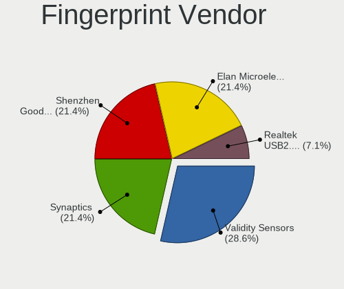

| Vendor                     | Computers | Percent |
|----------------------------|-----------|---------|
| Synaptics                  | 7         | 46.67%  |
| Validity Sensors           | 4         | 26.67%  |
| Elan Microelectronics      | 3         | 20%     |
| Shenzhen Goodix Technology | 1         | 6.67%   |

Fingerprint Model
-----------------

Fingerprint sensor models

| Model                                                    | Computers | Percent |
|----------------------------------------------------------|-----------|---------|
| Validity Sensors VFS495 Fingerprint Reader               | 2         | 13.33%  |
| Synaptics Metallica MIS Touch Fingerprint Reader         | 2         | 13.33%  |
| Synaptics FS7604 Touch Fingerprint Sensor with PurePrint | 2         | 13.33%  |
| Elan ELAN:ARM-M4                                         | 2         | 13.33%  |
| Validity Sensors VFS5011 Fingerprint Reader              | 1         | 6.67%   |
| Validity Sensors VFS101 Fingerprint Reader               | 1         | 6.67%   |
| Synaptics WBDI                                           | 1         | 6.67%   |
| Synaptics UWP WBDI                                       | 1         | 6.67%   |
| Synaptics Prometheus MIS Touch Fingerprint Reader        | 1         | 6.67%   |
| Shenzhen Goodix Fingerprint Reader                       | 1         | 6.67%   |
| Elan ELAN:Fingerprint                                    | 1         | 6.67%   |

Chipcard Vendor
---------------

Chipcard module vendors

| Vendor      | Computers | Percent |
|-------------|-----------|---------|
| Broadcom    | 2         | 66.67%  |
| Alcor Micro | 1         | 33.33%  |

Chipcard Model
--------------

Chipcard module models

| Model                                          | Computers | Percent |
|------------------------------------------------|-----------|---------|
| Broadcom BCM5880 Secure Applications Processor | 1         | 33.33%  |
| Broadcom 5880                                  | 1         | 33.33%  |
| Alcor Micro AU9540 Smartcard Reader            | 1         | 33.33%  |

Unsupported
-----------

Unsupported Devices
-------------------

Total unsupported devices on board

| Total | Computers | Percent |
|-------|-----------|---------|
| 0     | 87        | 70.16%  |
| 1     | 34        | 27.42%  |
| 2     | 3         | 2.42%   |

Unsupported Device Types
------------------------

Types of unsupported devices

| Type                  | Computers | Percent |
|-----------------------|-----------|---------|
| Fingerprint reader    | 15        | 37.5%   |
| Graphics card         | 7         | 17.5%   |
| Multimedia controller | 6         | 15%     |
| Camera                | 4         | 10%     |
| Net/wireless          | 2         | 5%      |
| Chipcard              | 2         | 5%      |
| Storage               | 1         | 2.5%    |
| Sound                 | 1         | 2.5%    |
| Net/ethernet          | 1         | 2.5%    |
| Bluetooth             | 1         | 2.5%    |

