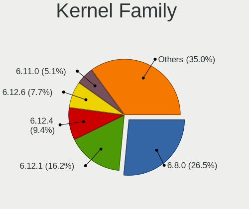
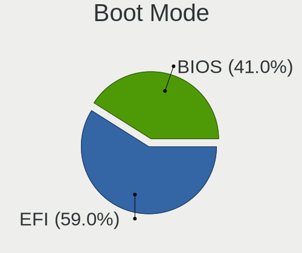
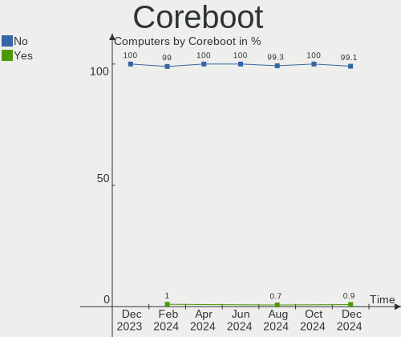
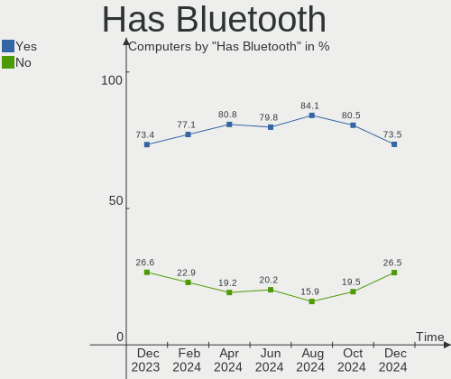
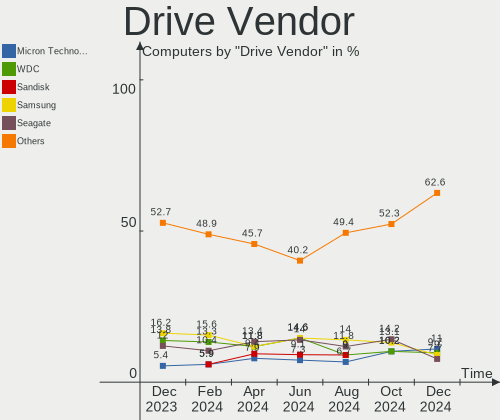
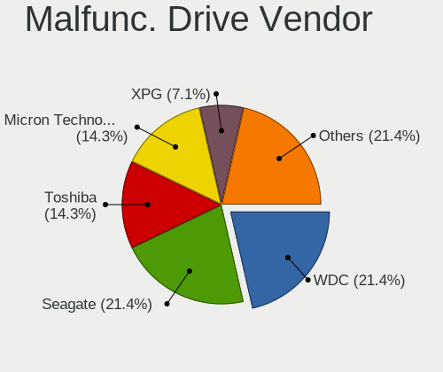
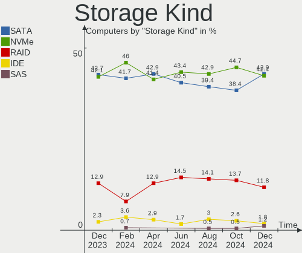
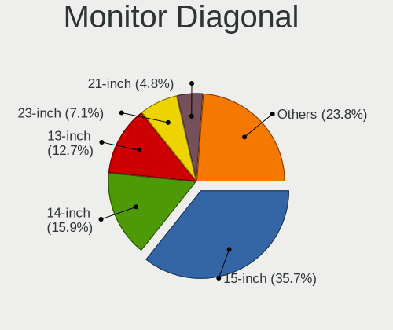
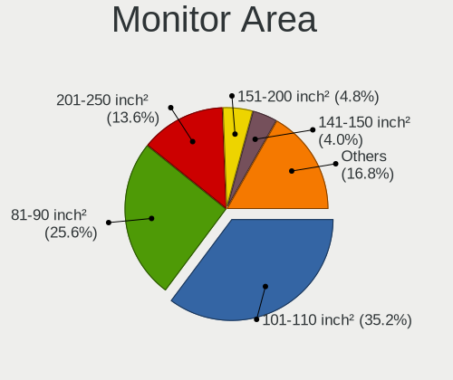
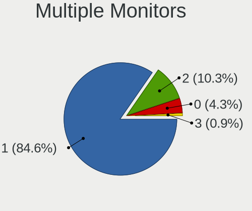

Linux in India - Hardware Trends
--------------------------------

A project to identify most popular hardware characteristics and track their change
over time based on data collected by Linux users at https://Linux-Hardware.org.

Anyone can contribute to this report by the [hw-probe](https://github.com/linuxhw/hw-probe) tool:

    sudo -E hw-probe -all -upload

This is a report for all computer types. See also reports for [desktops](/Location/India/Desktop/README.md) and [notebooks](/Location/India/Notebook/README.md).

Period: Oct, 2022.

Contents
--------

* [ System ](#system)
  - [ OS                       ](#os)
  - [ OS Family                ](#os-family)
  - [ Kernel                   ](#kernel)
  - [ Kernel Family            ](#kernel-family)
  - [ Kernel Major Ver.        ](#kernel-major-ver)
  - [ Arch                     ](#arch)
  - [ DE                       ](#de)
  - [ Display Server           ](#display-server)
  - [ Display Manager          ](#display-manager)
  - [ OS Lang                  ](#os-lang)
  - [ Boot Mode                ](#boot-mode)
  - [ Filesystem               ](#filesystem)
  - [ Part. scheme             ](#part-scheme)
  - [ Dual Boot with Linux/BSD ](#dual-boot-with-linuxbsd)
  - [ Dual Boot (Win)          ](#dual-boot-win)

* [ Board ](#board)
  - [ Vendor                   ](#vendor)
  - [ Model                    ](#model)
  - [ Model Family             ](#model-family)
  - [ MFG Year                 ](#mfg-year)
  - [ Form Factor              ](#form-factor)
  - [ Secure Boot              ](#secure-boot)
  - [ Coreboot                 ](#coreboot)
  - [ RAM Size                 ](#ram-size)
  - [ RAM Used                 ](#ram-used)
  - [ Total Drives             ](#total-drives)
  - [ Has CD-ROM               ](#has-cd-rom)
  - [ Has Ethernet             ](#has-ethernet)
  - [ Has WiFi                 ](#has-wifi)
  - [ Has Bluetooth            ](#has-bluetooth)

* [ Location ](#location)
  - [ Country                  ](#country)
  - [ City                     ](#city)

* [ Drives ](#drives)
  - [ Drive Vendor             ](#drive-vendor)
  - [ Drive Model              ](#drive-model)
  - [ HDD Vendor               ](#hdd-vendor)
  - [ SSD Vendor               ](#ssd-vendor)
  - [ Drive Kind               ](#drive-kind)
  - [ Drive Connector          ](#drive-connector)
  - [ Drive Size               ](#drive-size)
  - [ Space Total              ](#space-total)
  - [ Space Used               ](#space-used)
  - [ Malfunc. Drives          ](#malfunc-drives)
  - [ Malfunc. Drive Vendor    ](#malfunc-drive-vendor)
  - [ Malfunc. HDD Vendor      ](#malfunc-hdd-vendor)
  - [ Malfunc. Drive Kind      ](#malfunc-drive-kind)
  - [ Failed Drives            ](#failed-drives)
  - [ Failed Drive Vendor      ](#failed-drive-vendor)
  - [ Drive Status             ](#drive-status)

* [ Storage controller ](#storage-controller)
  - [ Storage Vendor           ](#storage-vendor)
  - [ Storage Model            ](#storage-model)
  - [ Storage Kind             ](#storage-kind)

* [ Processor ](#processor)
  - [ CPU Vendor               ](#cpu-vendor)
  - [ CPU Model                ](#cpu-model)
  - [ CPU Model Family         ](#cpu-model-family)
  - [ CPU Cores                ](#cpu-cores)
  - [ CPU Sockets              ](#cpu-sockets)
  - [ CPU Threads              ](#cpu-threads)
  - [ CPU Op-Modes             ](#cpu-op-modes)
  - [ CPU Microcode            ](#cpu-microcode)
  - [ CPU Microarch            ](#cpu-microarch)

* [ Graphics ](#graphics)
  - [ GPU Vendor               ](#gpu-vendor)
  - [ GPU Model                ](#gpu-model)
  - [ GPU Combo                ](#gpu-combo)
  - [ GPU Driver               ](#gpu-driver)
  - [ GPU Memory               ](#gpu-memory)

* [ Monitor ](#monitor)
  - [ Monitor Vendor           ](#monitor-vendor)
  - [ Monitor Model            ](#monitor-model)
  - [ Monitor Resolution       ](#monitor-resolution)
  - [ Monitor Diagonal         ](#monitor-diagonal)
  - [ Monitor Width            ](#monitor-width)
  - [ Aspect Ratio             ](#aspect-ratio)
  - [ Monitor Area             ](#monitor-area)
  - [ Pixel Density            ](#pixel-density)
  - [ Multiple Monitors        ](#multiple-monitors)

* [ Network ](#network)
  - [ Net Controller Vendor    ](#net-controller-vendor)
  - [ Net Controller Model     ](#net-controller-model)
  - [ Wireless Vendor          ](#wireless-vendor)
  - [ Wireless Model           ](#wireless-model)
  - [ Ethernet Vendor          ](#ethernet-vendor)
  - [ Ethernet Model           ](#ethernet-model)
  - [ Net Controller Kind      ](#net-controller-kind)
  - [ Used Controller          ](#used-controller)
  - [ NICs                     ](#nics)
  - [ IPv6                     ](#ipv6)

* [ Bluetooth ](#bluetooth)
  - [ Bluetooth Vendor         ](#bluetooth-vendor)
  - [ Bluetooth Model          ](#bluetooth-model)

* [ Sound ](#sound)
  - [ Sound Vendor             ](#sound-vendor)
  - [ Sound Model              ](#sound-model)

* [ Memory ](#memory)
  - [ Memory Vendor            ](#memory-vendor)
  - [ Memory Model             ](#memory-model)
  - [ Memory Kind              ](#memory-kind)
  - [ Memory Form Factor       ](#memory-form-factor)
  - [ Memory Size              ](#memory-size)
  - [ Memory Speed             ](#memory-speed)

* [ Printers & scanners ](#printers--scanners)
  - [ Printer Vendor           ](#printer-vendor)
  - [ Printer Model            ](#printer-model)
  - [ Scanner Vendor           ](#scanner-vendor)
  - [ Scanner Model            ](#scanner-model)

* [ Camera ](#camera)
  - [ Camera Vendor            ](#camera-vendor)
  - [ Camera Model             ](#camera-model)

* [ Security ](#security)
  - [ Fingerprint Vendor       ](#fingerprint-vendor)
  - [ Fingerprint Model        ](#fingerprint-model)
  - [ Chipcard Vendor          ](#chipcard-vendor)
  - [ Chipcard Model           ](#chipcard-model)

* [ Unsupported ](#unsupported)
  - [ Unsupported Devices      ](#unsupported-devices)
  - [ Unsupported Device Types ](#unsupported-device-types)

System
------

OS
--

Installed operating systems

| Name                         | Computers | Percent |
|------------------------------|-----------|---------|
| Ubuntu 22.04                 | 22        | 20.56%  |
| Fedora 36                    | 9         | 8.41%   |
| Ubuntu 20.04                 | 8         | 7.48%   |
| Arch Rolling                 | 7         | 6.54%   |
| Pop!_OS 22.04                | 5         | 4.67%   |
| Kali 2022.3                  | 5         | 4.67%   |
| Zorin 16                     | 4         | 3.74%   |
| OpenMandriva 4.50            | 4         | 3.74%   |
| OpenMandriva 4.3             | 4         | 3.74%   |
| Manjaro 22.0.0               | 3         | 2.8%    |
| KDE neon 20.04               | 3         | 2.8%    |
| Fedora 37                    | 3         | 2.8%    |
| Ubuntu 22.10                 | 2         | 1.87%   |
| Ubuntu 18.04                 | 2         | 1.87%   |
| openSUSE Tumbleweed-XXXXXXXX | 2         | 1.87%   |
| Manjaro                      | 2         | 1.87%   |
| Kubuntu 22.04                | 2         | 1.87%   |
| Garuda Linux Soaring         | 2         | 1.87%   |
| Elementary 6.1               | 2         | 1.87%   |
| ArcoLinux Rolling            | 2         | 1.87%   |
| Ubuntu Budgie 22.10          | 1         | 0.93%   |
| Lubuntu 20.04                | 1         | 0.93%   |
| LMDE 5                       | 1         | 0.93%   |
| Linux Mint 21                | 1         | 0.93%   |
| Linux Mint 20.3              | 1         | 0.93%   |
| Linux Mint 20                | 1         | 0.93%   |
| KDE neon 22.04               | 1         | 0.93%   |
| Gentoo 2.8                   | 1         | 0.93%   |
| Fedora 35                    | 1         | 0.93%   |
| Fedora 32                    | 1         | 0.93%   |
| Endless 4.0.10               | 1         | 0.93%   |
| Clear Linux 37440            | 1         | 0.93%   |
| CentOS 7                     | 1         | 0.93%   |
| Artix                        | 1         | 0.93%   |

OS Family
---------

OS without a version

| Name          | Computers | Percent |
|---------------|-----------|---------|
| Ubuntu        | 34        | 31.78%  |
| Fedora        | 14        | 13.08%  |
| OpenMandriva  | 8         | 7.48%   |
| Arch          | 7         | 6.54%   |
| Pop!_OS       | 5         | 4.67%   |
| Manjaro       | 5         | 4.67%   |
| Kali          | 5         | 4.67%   |
| Zorin         | 4         | 3.74%   |
| KDE neon      | 4         | 3.74%   |
| Linux Mint    | 3         | 2.8%    |
| openSUSE      | 2         | 1.87%   |
| Kubuntu       | 2         | 1.87%   |
| Garuda Linux  | 2         | 1.87%   |
| Elementary    | 2         | 1.87%   |
| ArcoLinux     | 2         | 1.87%   |
| Ubuntu Budgie | 1         | 0.93%   |
| Lubuntu       | 1         | 0.93%   |
| LMDE          | 1         | 0.93%   |
| Gentoo        | 1         | 0.93%   |
| Endless       | 1         | 0.93%   |
| Clear Linux   | 1         | 0.93%   |
| CentOS        | 1         | 0.93%   |
| Artix         | 1         | 0.93%   |

Kernel
------

Version of the Linux kernel

| Version                  | Computers | Percent |
|--------------------------|-----------|---------|
| 5.15.0-50-generic        | 12        | 11.21%  |
| 5.15.0-48-generic        | 12        | 11.21%  |
| 5.15.0-52-generic        | 9         | 8.41%   |
| 5.16.7-desktop-1omv4003  | 4         | 3.74%   |
| 5.4.0-128-generic        | 3         | 2.8%    |
| 5.19.5-desktop-1omv4090  | 3         | 2.8%    |
| 5.19.13-200.fc36.x86_64  | 3         | 2.8%    |
| 5.19.0-76051900-generic  | 3         | 2.8%    |
| 5.19.0-23-generic        | 3         | 2.8%    |
| 5.18.0-kali7-amd64       | 3         | 2.8%    |
| 5.15.74-1-lts            | 3         | 2.8%    |
| 5.15.0-46-generic        | 3         | 2.8%    |
| 6.0.3-1-default          | 2         | 1.87%   |
| 5.19.12-200.fc36.x86_64  | 2         | 1.87%   |
| 5.19.0-kali2-amd64       | 2         | 1.87%   |
| 5.15.71-1-MANJARO        | 2         | 1.87%   |
| 5.15.65-1-MANJARO        | 2         | 1.87%   |
| 6.0.5-arch1-1            | 1         | 0.93%   |
| 6.0.2-zen1-1-zen         | 1         | 0.93%   |
| 6.0.2-arch1-1            | 1         | 0.93%   |
| 6.0.1-arch2-1            | 1         | 0.93%   |
| 6.0.1-1199.native        | 1         | 0.93%   |
| 5.9.10-100.fc32.x86_64   | 1         | 0.93%   |
| 5.4.0-131-generic        | 1         | 0.93%   |
| 5.4.0-126-generic        | 1         | 0.93%   |
| 5.4.0-1074-gke           | 1         | 0.93%   |
| 5.19.4-100.fc35.x86_64   | 1         | 0.93%   |
| 5.19.16-76051916-generic | 1         | 0.93%   |
| 5.19.16-200.fc36.x86_64  | 1         | 0.93%   |
| 5.19.14-300.fc37.x86_64  | 1         | 0.93%   |
| 5.19.14-200.fc36.x86_64  | 1         | 0.93%   |
| 5.19.13-zen1-1-zen       | 1         | 0.93%   |
| 5.19.13-300.fc37.x86_64  | 1         | 0.93%   |
| 5.19.12-artix1-1         | 1         | 0.93%   |
| 5.19.12-arch1-1          | 1         | 0.93%   |
| 5.19.12-300.fc37.x86_64  | 1         | 0.93%   |
| 5.19.11-desktop-2omv4090 | 1         | 0.93%   |
| 5.19.11-arch1-1          | 1         | 0.93%   |
| 5.19.11-200.fc36.x86_64  | 1         | 0.93%   |
| 5.19.0-051900-generic    | 1         | 0.93%   |

Kernel Family
-------------

Linux kernel without a distro release

| Version | Computers | Percent |
|---------|-----------|---------|
| 5.15.0  | 38        | 35.51%  |
| 5.19.0  | 9         | 8.41%   |
| 5.4.0   | 6         | 5.61%   |
| 5.19.13 | 5         | 4.67%   |
| 5.19.12 | 5         | 4.67%   |
| 5.16.7  | 4         | 3.74%   |
| 5.15.74 | 4         | 3.74%   |
| 5.19.5  | 3         | 2.8%    |
| 5.19.11 | 3         | 2.8%    |
| 5.18.0  | 3         | 2.8%    |
| 6.0.3   | 2         | 1.87%   |
| 6.0.2   | 2         | 1.87%   |
| 6.0.1   | 2         | 1.87%   |
| 5.19.16 | 2         | 1.87%   |
| 5.19.14 | 2         | 1.87%   |
| 5.15.71 | 2         | 1.87%   |
| 5.15.65 | 2         | 1.87%   |
| 5.11.0  | 2         | 1.87%   |
| 6.0.5   | 1         | 0.93%   |
| 5.9.10  | 1         | 0.93%   |
| 5.19.4  | 1         | 0.93%   |
| 5.17.5  | 1         | 0.93%   |
| 5.15.72 | 1         | 0.93%   |
| 5.15.69 | 1         | 0.93%   |
| 5.15.60 | 1         | 0.93%   |
| 5.14.0  | 1         | 0.93%   |
| 5.13.0  | 1         | 0.93%   |
| 5.10.0  | 1         | 0.93%   |
| 3.10.0  | 1         | 0.93%   |

Kernel Major Ver.
-----------------

Linux kernel major version

| Version | Computers | Percent |
|---------|-----------|---------|
| 5.15    | 49        | 45.79%  |
| 5.19    | 30        | 28.04%  |
| 6.0     | 7         | 6.54%   |
| 5.4     | 6         | 5.61%   |
| 5.16    | 4         | 3.74%   |
| 5.18    | 3         | 2.8%    |
| 5.11    | 2         | 1.87%   |
| 5.9     | 1         | 0.93%   |
| 5.17    | 1         | 0.93%   |
| 5.14    | 1         | 0.93%   |
| 5.13    | 1         | 0.93%   |
| 5.10    | 1         | 0.93%   |
| 3.10    | 1         | 0.93%   |

Arch
----

OS architecture (x86_64, i586, etc.)

| Name   | Computers | Percent |
|--------|-----------|---------|
| x86_64 | 107       | 100%    |

DE
--

Desktop Environment

| Name          | Computers | Percent |
|---------------|-----------|---------|
| GNOME         | 63        | 58.88%  |
| KDE5          | 20        | 18.69%  |
| X-Cinnamon    | 5         | 4.67%   |
| Unknown       | 4         | 3.74%   |
| XFCE          | 3         | 2.8%    |
| MATE          | 3         | 2.8%    |
| Pantheon      | 2         | 1.87%   |
| i3            | 2         | 1.87%   |
| LXQt          | 1         | 0.93%   |
| GNOME Classic | 1         | 0.93%   |
| Enlightenment | 1         | 0.93%   |
| dwm           | 1         | 0.93%   |
| Budgie        | 1         | 0.93%   |

Display Server
--------------

X11 or Wayland

| Name    | Computers | Percent |
|---------|-----------|---------|
| X11     | 68        | 63.55%  |
| Wayland | 34        | 31.78%  |
| Tty     | 3         | 2.8%    |
| Unknown | 2         | 1.87%   |

Display Manager
---------------

SDDM, LightDM, etc.

| Name    | Computers | Percent |
|---------|-----------|---------|
| Unknown | 34        | 31.78%  |
| GDM3    | 26        | 24.3%   |
| SDDM    | 18        | 16.82%  |
| GDM     | 16        | 14.95%  |
| LightDM | 12        | 11.21%  |
| XDM     | 1         | 0.93%   |

OS Lang
-------

Language

| Lang    | Computers | Percent |
|---------|-----------|---------|
| en_IN   | 60        | 56.07%  |
| en_US   | 41        | 38.32%  |
| C       | 3         | 2.8%    |
| en_GB   | 1         | 0.93%   |
| en_AG   | 1         | 0.93%   |
| Default | 1         | 0.93%   |

Boot Mode
---------

EFI or BIOS

| Mode | Computers | Percent |
|------|-----------|---------|
| EFI  | 62        | 57.94%  |
| BIOS | 45        | 42.06%  |

Filesystem
----------

Type of filesystem

| Type    | Computers | Percent |
|---------|-----------|---------|
| Ext4    | 76        | 71.03%  |
| Btrfs   | 19        | 17.76%  |
| Overlay | 9         | 8.41%   |
| Zfs     | 2         | 1.87%   |
| Xfs     | 1         | 0.93%   |

Part. scheme
------------

Scheme of partitioning

| Type    | Computers | Percent |
|---------|-----------|---------|
| GPT     | 59        | 55.14%  |
| Unknown | 32        | 29.91%  |
| MBR     | 16        | 14.95%  |

Dual Boot with Linux/BSD
------------------------

Hosting more than one Linux/BSD

| Dual boot | Computers | Percent |
|-----------|-----------|---------|
| No        | 98        | 91.59%  |
| Yes       | 9         | 8.41%   |

Dual Boot (Win)
---------------

Hosting Linux and Windows

| Dual boot | Computers | Percent |
|-----------|-----------|---------|
| No        | 72        | 67.29%  |
| Yes       | 35        | 32.71%  |

Board
-----

Vendor
------

Motherboard manufacturer

| Name                | Computers | Percent |
|---------------------|-----------|---------|
| Lenovo              | 27        | 25.23%  |
| Hewlett-Packard     | 21        | 19.63%  |
| Dell                | 20        | 18.69%  |
| ASUSTek Computer    | 13        | 12.15%  |
| MSI                 | 5         | 4.67%   |
| Gigabyte Technology | 5         | 4.67%   |
| Acer                | 5         | 4.67%   |
| Sony                | 2         | 1.87%   |
| Intel               | 2         | 1.87%   |
| Timi                | 1         | 0.93%   |
| MICROMAX            | 1         | 0.93%   |
| LG Electronics      | 1         | 0.93%   |
| HPE                 | 1         | 0.93%   |
| AVITA               | 1         | 0.93%   |
| ASRock              | 1         | 0.93%   |
| Unknown             | 1         | 0.93%   |

Model
-----

Motherboard model

| Name                                        | Computers | Percent |
|---------------------------------------------|-----------|---------|
| Dell Inspiron 3543                          | 2         | 1.87%   |
| Unknown                                     | 2         | 1.87%   |
| Timi Mi NoteBook Pro                        | 1         | 0.93%   |
| Sony VPCEB46FG                              | 1         | 0.93%   |
| Sony VPCEA45FG                              | 1         | 0.93%   |
| MSI Pulse GL66 11UGK                        | 1         | 0.93%   |
| MSI MS-7B87                                 | 1         | 0.93%   |
| MSI MS-7B51                                 | 1         | 0.93%   |
| MSI MS-7A38                                 | 1         | 0.93%   |
| MSI MS-7721                                 | 1         | 0.93%   |
| MICROMAX Canvas Lapbook L1161               | 1         | 0.93%   |
| LG 14Z990-V.AR52A2                          | 1         | 0.93%   |
| Lenovo ThinkPad T490 20RYS07R00             | 1         | 0.93%   |
| Lenovo ThinkPad T460s 20FAS2K13B            | 1         | 0.93%   |
| Lenovo ThinkPad T450s 20BWA0DW00            | 1         | 0.93%   |
| Lenovo ThinkPad L450 20DSS00M01             | 1         | 0.93%   |
| Lenovo ThinkPad E480 20KNS0E200             | 1         | 0.93%   |
| Lenovo ThinkPad E14 Gen 3 20YES00200        | 1         | 0.93%   |
| Lenovo ThinkPad E14 Gen 3 20YDCTO1WW        | 1         | 0.93%   |
| Lenovo ThinkPad E14 Gen 2 20TAS08F00        | 1         | 0.93%   |
| Lenovo ThinkPad E14 Gen 2 20T6S00D00        | 1         | 0.93%   |
| Lenovo ThinkPad E14 20RAS1RA00              | 1         | 0.93%   |
| Lenovo ThinkPad E14 20RAS0KY00              | 1         | 0.93%   |
| Lenovo ThinkCentre neo 50t Gen 3 11SES00500 | 1         | 0.93%   |
| Lenovo ThinkCentre M92p 3237A1Q             | 1         | 0.93%   |
| Lenovo ThinkCentre M73 10B3A0L6IH           | 1         | 0.93%   |
| Lenovo ThinkBook 14-IIL 20SL                | 1         | 0.93%   |
| Lenovo Legion Y7000 2019 1050 81V4          | 1         | 0.93%   |
| Lenovo Legion Y540-15IRH-PG0 81SY           | 1         | 0.93%   |
| Lenovo IdeaPadFlex 5 14IIL05 81X1           | 1         | 0.93%   |
| Lenovo IdeaPadFlex 5 14ALC05 82HU           | 1         | 0.93%   |
| Lenovo IdeaPad S540-15IML D 81NG            | 1         | 0.93%   |
| Lenovo IdeaPad Gaming 3 15ARH05 82EY        | 1         | 0.93%   |
| Lenovo IdeaPad Gaming 3 15ACH6 82K2         | 1         | 0.93%   |
| Lenovo IdeaPad 5 Pro 16ACH6 82L5            | 1         | 0.93%   |
| Lenovo IdeaPad 5 14ARE05 81YM               | 1         | 0.93%   |
| Lenovo IdeaPad 320-15ISK 80XH               | 1         | 0.93%   |
| Lenovo IdeaPad 3 15ADA05 81W1               | 1         | 0.93%   |
| Lenovo G500 20236                           | 1         | 0.93%   |
| Intel DH61BF AAG81311-101                   | 1         | 0.93%   |

Model Family
------------

Motherboard model prefix

| Name               | Computers | Percent |
|--------------------|-----------|---------|
| Lenovo ThinkPad    | 11        | 10.28%  |
| Dell Inspiron      | 9         | 8.41%   |
| Lenovo IdeaPad     | 7         | 6.54%   |
| HP Laptop          | 6         | 5.61%   |
| Dell Vostro        | 6         | 5.61%   |
| HP Pavilion        | 5         | 4.67%   |
| ASUS VivoBook      | 5         | 4.67%   |
| Lenovo ThinkCentre | 3         | 2.8%    |
| HP EliteBook       | 3         | 2.8%    |
| Dell Latitude      | 3         | 2.8%    |
| ASUS ASUS          | 3         | 2.8%    |
| Lenovo Legion      | 2         | 1.87%   |
| Lenovo IdeaPadFlex | 2         | 1.87%   |
| HP ProBook         | 2         | 1.87%   |
| ASUS PRIME         | 2         | 1.87%   |
| Unknown            | 2         | 1.87%   |
| Timi Mi            | 1         | 0.93%   |
| Sony VPCEB46FG     | 1         | 0.93%   |
| Sony VPCEA45FG     | 1         | 0.93%   |
| MSI Pulse          | 1         | 0.93%   |
| MSI MS-7B87        | 1         | 0.93%   |
| MSI MS-7B51        | 1         | 0.93%   |
| MSI MS-7A38        | 1         | 0.93%   |
| MSI MS-7721        | 1         | 0.93%   |
| MICROMAX Canvas    | 1         | 0.93%   |
| LG 14Z990-V.AR52A2 | 1         | 0.93%   |
| Lenovo ThinkBook   | 1         | 0.93%   |
| Lenovo G500        | 1         | 0.93%   |
| Intel DH61BF       | 1         | 0.93%   |
| Intel D945GCNL     | 1         | 0.93%   |
| HPE ML10Gen9       | 1         | 0.93%   |
| HP InsydeH2O       | 1         | 0.93%   |
| HP 255             | 1         | 0.93%   |
| HP 202             | 1         | 0.93%   |
| HP 2000            | 1         | 0.93%   |
| HP 15              | 1         | 0.93%   |
| Gigabyte H97N-WIFI | 1         | 0.93%   |
| Gigabyte H310M     | 1         | 0.93%   |
| Gigabyte G31M-ES2L | 1         | 0.93%   |
| Gigabyte B450M     | 1         | 0.93%   |

MFG Year
--------

Motherboard manufacture year

| Year | Computers | Percent |
|------|-----------|---------|
| 2021 | 18        | 16.82%  |
| 2020 | 14        | 13.08%  |
| 2019 | 11        | 10.28%  |
| 2018 | 10        | 9.35%   |
| 2016 | 8         | 7.48%   |
| 2013 | 7         | 6.54%   |
| 2022 | 6         | 5.61%   |
| 2015 | 6         | 5.61%   |
| 2014 | 6         | 5.61%   |
| 2012 | 6         | 5.61%   |
| 2017 | 5         | 4.67%   |
| 2010 | 4         | 3.74%   |
| 2011 | 3         | 2.8%    |
| 2008 | 2         | 1.87%   |
| 2007 | 1         | 0.93%   |

Form Factor
-----------

Physical design of the computer

| Name        | Computers | Percent |
|-------------|-----------|---------|
| Notebook    | 80        | 74.77%  |
| Desktop     | 22        | 20.56%  |
| Convertible | 4         | 3.74%   |
| Server      | 1         | 0.93%   |

Secure Boot
-----------

Enabled or disabled

| State    | Computers | Percent |
|----------|-----------|---------|
| Disabled | 99        | 92.52%  |
| Enabled  | 8         | 7.48%   |

Coreboot
--------

Have coreboot on board

| Used | Computers | Percent |
|------|-----------|---------|
| No   | 107       | 100%    |

RAM Size
--------

Total RAM memory

| Size in GB | Computers | Percent |
|------------|-----------|---------|
| 4.01-8.0   | 38        | 35.51%  |
| 8.01-16.0  | 25        | 23.36%  |
| 3.01-4.0   | 17        | 15.89%  |
| 16.01-24.0 | 17        | 15.89%  |
| 32.01-64.0 | 6         | 5.61%   |
| 1.01-2.0   | 2         | 1.87%   |
| 24.01-32.0 | 1         | 0.93%   |
| 2.01-3.0   | 1         | 0.93%   |

RAM Used
--------

Used RAM memory

| Used GB    | Computers | Percent |
|------------|-----------|---------|
| 2.01-3.0   | 30        | 28.04%  |
| 3.01-4.0   | 28        | 26.17%  |
| 1.01-2.0   | 22        | 20.56%  |
| 4.01-8.0   | 20        | 18.69%  |
| 8.01-16.0  | 4         | 3.74%   |
| 0.51-1.0   | 2         | 1.87%   |
| 16.01-24.0 | 1         | 0.93%   |

Total Drives
------------

Number of drives on board

| Drives | Computers | Percent |
|--------|-----------|---------|
| 1      | 75        | 70.09%  |
| 2      | 26        | 24.3%   |
| 3      | 5         | 4.67%   |
| 4      | 1         | 0.93%   |

Has CD-ROM
----------

Has CD-ROM on board

| Presented | Computers | Percent |
|-----------|-----------|---------|
| No        | 81        | 75.7%   |
| Yes       | 26        | 24.3%   |

Has Ethernet
------------

Has Ethernet on board

| Presented | Computers | Percent |
|-----------|-----------|---------|
| Yes       | 91        | 85.05%  |
| No        | 16        | 14.95%  |

Has WiFi
--------

Has WiFi module

| Presented | Computers | Percent |
|-----------|-----------|---------|
| Yes       | 92        | 85.98%  |
| No        | 15        | 14.02%  |

Has Bluetooth
-------------

Has Bluetooth module

| Presented | Computers | Percent |
|-----------|-----------|---------|
| Yes       | 79        | 73.83%  |
| No        | 28        | 26.17%  |

Location
--------

Country
-------

Geographic location (country)

| Country | Computers | Percent |
|---------|-----------|---------|
| India   | 107       | 100%    |

City
----

Geographic location (city)

| City          | Computers | Percent |
|---------------|-----------|---------|
| Bengaluru     | 16        | 14.95%  |
| Chennai       | 10        | 9.35%   |
| Hyderabad     | 7         | 6.54%   |
| Mumbai        | 5         | 4.67%   |
| Kolkata       | 5         | 4.67%   |
| Trivandrum    | 4         | 3.74%   |
| Pune          | 4         | 3.74%   |
| Delhi         | 4         | 3.74%   |
| Nagpur        | 3         | 2.8%    |
| Jaipur        | 3         | 2.8%    |
| Indore        | 3         | 2.8%    |
| Ernakulam     | 3         | 2.8%    |
| Vadodara      | 2         | 1.87%   |
| Surat         | 2         | 1.87%   |
| Patna         | 2         | 1.87%   |
| Noida         | 2         | 1.87%   |
| New Delhi     | 2         | 1.87%   |
| Navi Mumbai   | 2         | 1.87%   |
| Bhubaneswar   | 2         | 1.87%   |
| Visakhapatnam | 1         | 0.93%   |
| Udupi         | 1         | 0.93%   |
| Solapur       | 1         | 0.93%   |
| Rajkot        | 1         | 0.93%   |
| Mohali        | 1         | 0.93%   |
| Mallampet     | 1         | 0.93%   |
| Malappuram    | 1         | 0.93%   |
| Ludhiana      | 1         | 0.93%   |
| Lucknow       | 1         | 0.93%   |
| Kondotty      | 1         | 0.93%   |
| Karaikudi     | 1         | 0.93%   |
| Kanpur        | 1         | 0.93%   |
| Kannur        | 1         | 0.93%   |
| Kanchrapara   | 1         | 0.93%   |
| Hosur         | 1         | 0.93%   |
| Haldwani      | 1         | 0.93%   |
| Gurgaon       | 1         | 0.93%   |
| Ghaziabad     | 1         | 0.93%   |
| Gaya          | 1         | 0.93%   |
| Coimbatore    | 1         | 0.93%   |
| Bisrakh       | 1         | 0.93%   |

Drives
------

Drive Vendor
------------

Hard drive vendors

| Vendor                    | Computers | Drives | Percent |
|---------------------------|-----------|--------|---------|
| Seagate                   | 26        | 29     | 18.71%  |
| WDC                       | 22        | 23     | 15.83%  |
| Samsung Electronics       | 17        | 17     | 12.23%  |
| Toshiba                   | 9         | 9      | 6.47%   |
| Intel                     | 9         | 9      | 6.47%   |
| Micron Technology         | 8         | 8      | 5.76%   |
| KIOXIA                    | 8         | 8      | 5.76%   |
| Sandisk                   | 6         | 7      | 4.32%   |
| Kingston                  | 6         | 6      | 4.32%   |
| HGST                      | 6         | 6      | 4.32%   |
| Crucial                   | 6         | 6      | 4.32%   |
| Hitachi                   | 3         | 3      | 2.16%   |
| China                     | 3         | 3      | 2.16%   |
| Gigabyte Technology       | 2         | 2      | 1.44%   |
| Unknown                   | 1         | 2      | 0.72%   |
| Union Memory (Shenzhen)   | 1         | 1      | 0.72%   |
| UMIS                      | 1         | 1      | 0.72%   |
| SK hynix                  | 1         | 1      | 0.72%   |
| Realtek Semiconductor     | 1         | 1      | 0.72%   |
| Micron/Crucial Technology | 1         | 1      | 0.72%   |
| FORESEE                   | 1         | 1      | 0.72%   |
| Unknown                   | 1         | 1      | 0.72%   |

Drive Model
-----------

Hard drive models

| Model                                | Computers | Percent |
|--------------------------------------|-----------|---------|
| Toshiba MQ04ABF100 1TB               | 5         | 3.47%   |
| Seagate ST1000LM035-1RK172 1TB       | 4         | 2.78%   |
| WDC WDS120G2G0A-00JH30 120GB SSD     | 3         | 2.08%   |
| Seagate ST1000LM024 HN-M101MBB 1TB   | 3         | 2.08%   |
| Seagate ST1000DM010-2EP102 1TB       | 3         | 2.08%   |
| WDC WD5000LPVX-75V0TT0 500GB         | 2         | 1.39%   |
| WDC WD10EZEX-21WN4A0 1TB             | 2         | 1.39%   |
| Seagate ST500LT012-9WS142 500GB      | 2         | 1.39%   |
| Seagate ST1000LM049-2GH172 1TB       | 2         | 1.39%   |
| Seagate ST1000LM048-2E7172 1TB       | 2         | 1.39%   |
| Samsung SSD 980 500GB                | 2         | 1.39%   |
| Samsung SSD 870 EVO 500GB            | 2         | 1.39%   |
| Samsung MZVLQ512HBLU-00BH1 512GB     | 2         | 1.39%   |
| Micron 2210_MTFDHBA512QFD 512GB      | 2         | 1.39%   |
| KIOXIA KBG40ZNV512G 512GB            | 2         | 1.39%   |
| KIOXIA KBG40ZNV256G 256GB            | 2         | 1.39%   |
| KIOXIA KBG40ZNS256G NVMe 256GB       | 2         | 1.39%   |
| Kingston SA400S37480G 480GB SSD      | 2         | 1.39%   |
| Kingston SA400S37240G 240GB SSD      | 2         | 1.39%   |
| Intel SSD 660P Series 1024GB         | 2         | 1.39%   |
| HGST HTS721010A9E630 1TB             | 2         | 1.39%   |
| Gigabyte GP-GSTFS31240GNTD 240GB     | 2         | 1.39%   |
| Crucial CT240BX500SSD1 240GB         | 2         | 1.39%   |
| China SSD 256GB                      | 2         | 1.39%   |
| WDC WUH721818ALE6L4 18TB             | 1         | 0.69%   |
| WDC WDS240G2G0B-00EPW0 240GB SSD     | 1         | 0.69%   |
| WDC WDS240G2G0A-00JH30 240GB SSD     | 1         | 0.69%   |
| WDC WDS100T2G0A-00JH30 1TB SSD       | 1         | 0.69%   |
| WDC WD3200BEKT-08PVMT1 320GB         | 1         | 0.69%   |
| WDC WD20EZBX-00AYRA0 2TB             | 1         | 0.69%   |
| WDC WD10SPZX-60Z10T1 1TB             | 1         | 0.69%   |
| WDC WD10SPZX-24Z10 1TB               | 1         | 0.69%   |
| WDC WD10SPZX-08Z10 1TB               | 1         | 0.69%   |
| WDC WD10JPVX-60JC3T1 1TB             | 1         | 0.69%   |
| WDC WD10EZEX-22MFCA0 1TB             | 1         | 0.69%   |
| WDC WD10EZEX-08WN4A1 1TB             | 1         | 0.69%   |
| WDC WD10 JPVX-60JC3T1 1TB            | 1         | 0.69%   |
| WDC PC SN530 SDBPNPZ-512G-1002 512GB | 1         | 0.69%   |
| WDC PC SN530 SDBPMPZ-256G-1001 256GB | 1         | 0.69%   |
| WDC PC SN520 SDAPNUW-512G-1006 512GB | 1         | 0.69%   |

HDD Vendor
----------

Hard disk drive vendors

| Vendor  | Computers | Drives | Percent |
|---------|-----------|--------|---------|
| Seagate | 24        | 27     | 42.86%  |
| WDC     | 14        | 14     | 25%     |
| Toshiba | 9         | 9      | 16.07%  |
| HGST    | 6         | 6      | 10.71%  |
| Hitachi | 3         | 3      | 5.36%   |

SSD Vendor
----------

Solid state drive vendors

| Vendor              | Computers | Drives | Percent |
|---------------------|-----------|--------|---------|
| WDC                 | 6         | 6      | 18.18%  |
| Samsung Electronics | 6         | 6      | 18.18%  |
| Kingston            | 5         | 5      | 15.15%  |
| Crucial             | 4         | 4      | 12.12%  |
| Intel               | 3         | 3      | 9.09%   |
| China               | 3         | 3      | 9.09%   |
| SanDisk             | 2         | 2      | 6.06%   |
| Gigabyte Technology | 2         | 2      | 6.06%   |
| FORESEE             | 1         | 1      | 3.03%   |
| Unknown             | 1         | 1      | 3.03%   |

Drive Kind
----------

HDD or SSD

| Kind    | Computers | Drives | Percent |
|---------|-----------|--------|---------|
| HDD     | 52        | 59     | 39.39%  |
| NVMe    | 46        | 50     | 34.85%  |
| SSD     | 32        | 33     | 24.24%  |
| MMC     | 1         | 2      | 0.76%   |
| Unknown | 1         | 1      | 0.76%   |

Drive Connector
---------------

SATA, SAS, NVMe, etc.

| Type | Computers | Drives | Percent |
|------|-----------|--------|---------|
| SATA | 74        | 89     | 59.2%   |
| NVMe | 46        | 50     | 36.8%   |
| SAS  | 4         | 4      | 3.2%    |
| MMC  | 1         | 2      | 0.8%    |

Drive Size
----------

Size of hard drive

| Size in TB | Computers | Drives | Percent |
|------------|-----------|--------|---------|
| 0.51-1.0   | 38        | 40     | 43.68%  |
| 0.01-0.5   | 37        | 40     | 42.53%  |
| 1.01-2.0   | 4         | 4      | 4.6%    |
| 4.01-10.0  | 3         | 3      | 3.45%   |
| 3.01-4.0   | 2         | 2      | 2.3%    |
| 10.01-20.0 | 2         | 2      | 2.3%    |
| 2.01-3.0   | 1         | 1      | 1.15%   |

Space Total
-----------

Amount of disk space available on the file system

| Size in GB     | Computers | Percent |
|----------------|-----------|---------|
| 101-250        | 28        | 26.17%  |
| 251-500        | 27        | 25.23%  |
| 501-1000       | 20        | 18.69%  |
| 1-20           | 10        | 9.35%   |
| 1001-2000      | 6         | 5.61%   |
| 21-50          | 5         | 4.67%   |
| 51-100         | 5         | 4.67%   |
| More than 3000 | 4         | 3.74%   |
| 2001-3000      | 2         | 1.87%   |

Space Used
----------

Amount of used disk space

| Used GB        | Computers | Percent |
|----------------|-----------|---------|
| 1-20           | 37        | 34.58%  |
| 21-50          | 19        | 17.76%  |
| 101-250        | 15        | 14.02%  |
| 51-100         | 15        | 14.02%  |
| 251-500        | 13        | 12.15%  |
| 501-1000       | 5         | 4.67%   |
| More than 3000 | 2         | 1.87%   |
| 1001-2000      | 1         | 0.93%   |

Malfunc. Drives
---------------

Drive models with a malfunction

| Model                                 | Computers | Drives | Percent |
|---------------------------------------|-----------|--------|---------|
| WDC WD10JPVX-60JC3T1 1TB              | 1         | 1      | 7.69%   |
| WDC WD10EZEX-21WN4A0 1TB              | 1         | 1      | 7.69%   |
| Toshiba MQ01ABD100 1TB                | 1         | 1      | 7.69%   |
| Toshiba MK3265GSXN 320GB              | 1         | 1      | 7.69%   |
| Seagate ST500LT012-9WS142 500GB       | 1         | 1      | 7.69%   |
| Seagate ST500DM005 HD502HJ 500GB      | 1         | 1      | 7.69%   |
| Seagate ST2000DM001-1CH164 2TB        | 1         | 1      | 7.69%   |
| Seagate ST1000LM048-2E7172 1TB        | 1         | 1      | 7.69%   |
| Samsung Electronics SSD 980 500GB     | 1         | 1      | 7.69%   |
| Samsung Electronics SSD 870 EVO 500GB | 1         | 1      | 7.69%   |
| Intel SSDSCKKF256G8H 256GB            | 1         | 1      | 7.69%   |
| Hitachi HTS727550A9E364 500GB         | 1         | 1      | 7.69%   |
| China SSD 256GB                       | 1         | 1      | 7.69%   |

Malfunc. Drive Vendor
---------------------

Vendors of faulty drives

| Vendor              | Computers | Drives | Percent |
|---------------------|-----------|--------|---------|
| Seagate             | 4         | 4      | 30.77%  |
| WDC                 | 2         | 2      | 15.38%  |
| Toshiba             | 2         | 2      | 15.38%  |
| Samsung Electronics | 2         | 2      | 15.38%  |
| Intel               | 1         | 1      | 7.69%   |
| Hitachi             | 1         | 1      | 7.69%   |
| China               | 1         | 1      | 7.69%   |

Malfunc. HDD Vendor
-------------------

Vendors of faulty HDD drives

| Vendor  | Computers | Drives | Percent |
|---------|-----------|--------|---------|
| Seagate | 4         | 4      | 44.44%  |
| WDC     | 2         | 2      | 22.22%  |
| Toshiba | 2         | 2      | 22.22%  |
| Hitachi | 1         | 1      | 11.11%  |

Malfunc. Drive Kind
-------------------

Kinds of faulty drives

| Kind | Computers | Drives | Percent |
|------|-----------|--------|---------|
| HDD  | 9         | 9      | 69.23%  |
| SSD  | 3         | 3      | 23.08%  |
| NVMe | 1         | 1      | 7.69%   |

Failed Drives
-------------

Failed drive models

Zero info for selected period =(

Failed Drive Vendor
-------------------

Failed drive vendors

Zero info for selected period =(

Drive Status
------------

Number of failed and malfunc. drives

| Status   | Computers | Drives | Percent |
|----------|-----------|--------|---------|
| Detected | 52        | 75     | 46.02%  |
| Works    | 49        | 57     | 43.36%  |
| Malfunc  | 12        | 13     | 10.62%  |

Storage controller
------------------

Storage Vendor
--------------

Storage controller vendors

| Vendor                      | Computers | Percent |
|-----------------------------|-----------|---------|
| Intel                       | 76        | 55.07%  |
| AMD                         | 18        | 13.04%  |
| Samsung Electronics         | 11        | 7.97%   |
| SanDisk                     | 8         | 5.8%    |
| Micron Technology           | 8         | 5.8%    |
| KIOXIA                      | 8         | 5.8%    |
| Micron/Crucial Technology   | 3         | 2.17%   |
| Union Memory (Shenzhen)     | 2         | 1.45%   |
| SK hynix                    | 1         | 0.72%   |
| Seagate Technology          | 1         | 0.72%   |
| Realtek Semiconductor       | 1         | 0.72%   |
| Kingston Technology Company | 1         | 0.72%   |

Storage Model
-------------

Storage controller models

| Model                                                                          | Computers | Percent |
|--------------------------------------------------------------------------------|-----------|---------|
| AMD FCH SATA Controller [AHCI mode]                                            | 18        | 11.92%  |
| Intel Sunrise Point-LP SATA Controller [AHCI mode]                             | 10        | 6.62%   |
| Samsung NVMe SSD Controller 980                                                | 9         | 5.96%   |
| Micron Non-Volatile memory controller                                          | 8         | 5.3%    |
| KIOXIA NVMe SSD Controller BG4                                                 | 8         | 5.3%    |
| Intel Volume Management Device NVMe RAID Controller                            | 7         | 4.64%   |
| Intel 82801 Mobile SATA Controller [RAID mode]                                 | 6         | 3.97%   |
| Intel 8 Series SATA Controller 1 [AHCI mode]                                   | 6         | 3.97%   |
| Intel 7 Series Chipset Family 6-port SATA Controller [AHCI mode]               | 6         | 3.97%   |
| Intel Tiger Lake-LP SATA Controller                                            | 4         | 2.65%   |
| Intel Wildcat Point-LP SATA Controller [AHCI Mode]                             | 3         | 1.99%   |
| Intel SSD 660P Series                                                          | 3         | 1.99%   |
| Intel NM10/ICH7 Family SATA Controller [IDE mode]                              | 3         | 1.99%   |
| Intel 400 Series Chipset Family SATA AHCI Controller                           | 3         | 1.99%   |
| Intel 200 Series PCH SATA controller [AHCI mode]                               | 3         | 1.99%   |
| Union Memory (Shenzhen) Non-Volatile memory controller                         | 2         | 1.32%   |
| SanDisk WD Blue SN550 NVMe SSD                                                 | 2         | 1.32%   |
| SanDisk WD Blue SN500 / PC SN520 NVMe SSD                                      | 2         | 1.32%   |
| SanDisk Non-Volatile memory controller                                         | 2         | 1.32%   |
| Intel Q170/Q150/B150/H170/H110/Z170/CM236 Chipset SATA Controller [AHCI Mode]  | 2         | 1.32%   |
| Intel Non-Volatile memory controller                                           | 2         | 1.32%   |
| Intel Ice Lake-LP SATA Controller [AHCI mode]                                  | 2         | 1.32%   |
| Intel Comet Lake SATA AHCI Controller                                          | 2         | 1.32%   |
| Intel Cannon Point-LP SATA Controller [AHCI Mode]                              | 2         | 1.32%   |
| Intel Cannon Lake Mobile PCH SATA AHCI Controller                              | 2         | 1.32%   |
| Intel 82801G (ICH7 Family) IDE Controller                                      | 2         | 1.32%   |
| Intel 8 Series/C220 Series Chipset Family 6-port SATA Controller 1 [AHCI mode] | 2         | 1.32%   |
| Intel 6 Series/C200 Series Chipset Family 6 port Desktop SATA AHCI Controller  | 2         | 1.32%   |
| Intel 500 Series Chipset Family SATA AHCI Controller                           | 2         | 1.32%   |
| Intel 5 Series/3400 Series Chipset 4 port SATA AHCI Controller                 | 2         | 1.32%   |
| AMD 400 Series Chipset SATA Controller                                         | 2         | 1.32%   |
| SK hynix Non-Volatile memory controller                                        | 1         | 0.66%   |
| Seagate Non-Volatile memory controller                                         | 1         | 0.66%   |
| SanDisk WD Blue SN570 NVMe SSD                                                 | 1         | 0.66%   |
| SanDisk WD Black SN750 / PC SN730 NVMe SSD                                     | 1         | 0.66%   |
| Samsung NVMe SSD Controller SM981/PM981/PM983                                  | 1         | 0.66%   |
| Samsung NVMe SSD Controller SM951/PM951                                        | 1         | 0.66%   |
| Realtek Realtek Non-Volatile memory controller                                 | 1         | 0.66%   |
| Micron/Crucial P2 NVMe PCIe SSD                                                | 1         | 0.66%   |
| Micron/Crucial NVMe Controller                                                 | 1         | 0.66%   |

Storage Kind
------------

Kind of storage controller (IDE, SATA, NVMe, SAS, ...)

| Kind | Computers | Percent |
|------|-----------|---------|
| SATA | 79        | 55.63%  |
| NVMe | 46        | 32.39%  |
| RAID | 13        | 9.15%   |
| IDE  | 4         | 2.82%   |

Processor
---------

CPU Vendor
----------

Processor vendors

| Vendor | Computers | Percent |
|--------|-----------|---------|
| Intel  | 80        | 74.77%  |
| AMD    | 27        | 25.23%  |

CPU Model
---------

Processor models

| Model                                   | Computers | Percent |
|-----------------------------------------|-----------|---------|
| Intel 11th Gen Core i5-1135G7 @ 2.40GHz | 4         | 3.74%   |
| AMD Ryzen 7 5800H with Radeon Graphics  | 4         | 3.74%   |
| AMD Ryzen 3 3250U with Radeon Graphics  | 4         | 3.74%   |
| Intel Core i5-8265U CPU @ 1.60GHz       | 3         | 2.8%    |
| Intel Core i5-10210U CPU @ 1.60GHz      | 3         | 2.8%    |
| Intel Core i3-6006U CPU @ 2.00GHz       | 3         | 2.8%    |
| Intel Core i3-4005U CPU @ 1.70GHz       | 3         | 2.8%    |
| Intel Core i7-6600U CPU @ 2.60GHz       | 2         | 1.87%   |
| Intel Core i5-9400F CPU @ 2.90GHz       | 2         | 1.87%   |
| Intel Core i5-9300H CPU @ 2.40GHz       | 2         | 1.87%   |
| Intel Core i5-8250U CPU @ 1.60GHz       | 2         | 1.87%   |
| Intel Core i5-2450M CPU @ 2.50GHz       | 2         | 1.87%   |
| Intel Core i5-10300H CPU @ 2.50GHz      | 2         | 1.87%   |
| Intel Core i3-1005G1 CPU @ 1.20GHz      | 2         | 1.87%   |
| Intel Core i3 CPU M 380 @ 2.53GHz       | 2         | 1.87%   |
| Intel Core 2 Duo CPU E7500 @ 2.93GHz    | 2         | 1.87%   |
| Intel 11th Gen Core i5-11300H @ 3.10GHz | 2         | 1.87%   |
| Intel 11th Gen Core i3-1115G4 @ 3.00GHz | 2         | 1.87%   |
| AMD Ryzen 7 4800H with Radeon Graphics  | 2         | 1.87%   |
| AMD Ryzen 7 4700U with Radeon Graphics  | 2         | 1.87%   |
| Intel Xeon CPU E3-1225 v5 @ 3.30GHz     | 1         | 0.93%   |
| Intel Pentium D CPU 3.00GHz             | 1         | 0.93%   |
| Intel Pentium CPU N3540 @ 2.16GHz       | 1         | 0.93%   |
| Intel Pentium CPU G620 @ 2.60GHz        | 1         | 0.93%   |
| Intel Pentium CPU 2020M @ 2.40GHz       | 1         | 0.93%   |
| Intel Core i9-9900K CPU @ 3.60GHz       | 1         | 0.93%   |
| Intel Core i7-8565U CPU @ 1.80GHz       | 1         | 0.93%   |
| Intel Core i7-8550U CPU @ 1.80GHz       | 1         | 0.93%   |
| Intel Core i7-7500U CPU @ 2.70GHz       | 1         | 0.93%   |
| Intel Core i7-5600U CPU @ 2.60GHz       | 1         | 0.93%   |
| Intel Core i7-4790K CPU @ 4.00GHz       | 1         | 0.93%   |
| Intel Core i7-4600U CPU @ 2.10GHz       | 1         | 0.93%   |
| Intel Core i7-4500U CPU @ 1.80GHz       | 1         | 0.93%   |
| Intel Core i7-10750H CPU @ 2.60GHz      | 1         | 0.93%   |
| Intel Core i7-1065G7 CPU @ 1.30GHz      | 1         | 0.93%   |
| Intel Core i7-10510U CPU @ 1.80GHz      | 1         | 0.93%   |
| Intel Core i5-8350U CPU @ 1.70GHz       | 1         | 0.93%   |
| Intel Core i5-6300U CPU @ 2.40GHz       | 1         | 0.93%   |
| Intel Core i5-5300U CPU @ 2.30GHz       | 1         | 0.93%   |
| Intel Core i5-5200U CPU @ 2.20GHz       | 1         | 0.93%   |

CPU Model Family
----------------

Processor model prefix

| Model            | Computers | Percent |
|------------------|-----------|---------|
| Intel Core i5    | 28        | 26.17%  |
| Intel Core i3    | 17        | 15.89%  |
| Other            | 13        | 12.15%  |
| Intel Core i7    | 12        | 11.21%  |
| AMD Ryzen 7      | 10        | 9.35%   |
| AMD Ryzen 5      | 9         | 8.41%   |
| AMD Ryzen 3      | 5         | 4.67%   |
| Intel Pentium    | 3         | 2.8%    |
| Intel Core 2 Duo | 3         | 2.8%    |
| Intel Xeon       | 1         | 0.93%   |
| Intel Pentium D  | 1         | 0.93%   |
| Intel Core i9    | 1         | 0.93%   |
| Intel Atom       | 1         | 0.93%   |
| AMD E2           | 1         | 0.93%   |
| AMD A6           | 1         | 0.93%   |
| AMD A10          | 1         | 0.93%   |

CPU Cores
---------

Number of processor cores

| Number | Computers | Percent |
|--------|-----------|---------|
| 2      | 48        | 44.86%  |
| 4      | 34        | 31.78%  |
| 8      | 13        | 12.15%  |
| 6      | 9         | 8.41%   |
| 14     | 1         | 0.93%   |
| 12     | 1         | 0.93%   |
| 1      | 1         | 0.93%   |

CPU Sockets
-----------

Number of sockets

| Number | Computers | Percent |
|--------|-----------|---------|
| 1      | 107       | 100%    |

CPU Threads
-----------

Threads per core (Hyper-Threading)

| Number | Computers | Percent |
|--------|-----------|---------|
| 2      | 90        | 84.11%  |
| 1      | 17        | 15.89%  |

CPU Op-Modes
------------

CPU Operation Modes (32-bit, 64-bit)

| Op mode        | Computers | Percent |
|----------------|-----------|---------|
| 32-bit, 64-bit | 107       | 100%    |

CPU Microcode
-------------

Microcode number

| Number     | Computers | Percent |
|------------|-----------|---------|
| Unknown    | 25        | 23.36%  |
| 0x806c1    | 7         | 6.54%   |
| 0x806ec    | 6         | 5.61%   |
| 0x406e3    | 5         | 4.67%   |
| 0x706e5    | 4         | 3.74%   |
| 0x40651    | 4         | 3.74%   |
| 0x306a9    | 4         | 3.74%   |
| 0x0a50000c | 4         | 3.74%   |
| 0xa0652    | 3         | 2.8%    |
| 0x906ea    | 3         | 2.8%    |
| 0x806ea    | 3         | 2.8%    |
| 0x306d4    | 3         | 2.8%    |
| 0x306c3    | 3         | 2.8%    |
| 0x206a7    | 3         | 2.8%    |
| 0x906a3    | 2         | 1.87%   |
| 0x506e3    | 2         | 1.87%   |
| 0x30678    | 2         | 1.87%   |
| 0x20655    | 2         | 1.87%   |
| 0x1067a    | 2         | 1.87%   |
| 0x0a50000d | 2         | 1.87%   |
| 0x08608103 | 2         | 1.87%   |
| 0x08600106 | 2         | 1.87%   |
| 0xf65      | 1         | 0.93%   |
| 0xa0671    | 1         | 0.93%   |
| 0x906e9    | 1         | 0.93%   |
| 0x90675    | 1         | 0.93%   |
| 0x806eb    | 1         | 0.93%   |
| 0x806e9    | 1         | 0.93%   |
| 0x806d1    | 1         | 0.93%   |
| 0x08701013 | 1         | 0.93%   |
| 0x08600103 | 1         | 0.93%   |
| 0x08108109 | 1         | 0.93%   |
| 0x08101016 | 1         | 0.93%   |
| 0x08101007 | 1         | 0.93%   |
| 0x0600611a | 1         | 0.93%   |
| 0x06003106 | 1         | 0.93%   |

CPU Microarch
-------------

Microarchitecture

| Name             | Computers | Percent |
|------------------|-----------|---------|
| KabyLake         | 19        | 17.76%  |
| Haswell          | 10        | 9.35%   |
| TigerLake        | 8         | 7.48%   |
| Skylake          | 8         | 7.48%   |
| Zen+             | 7         | 6.54%   |
| Zen 2            | 7         | 6.54%   |
| Zen 3            | 6         | 5.61%   |
| IvyBridge        | 6         | 5.61%   |
| IceLake          | 6         | 5.61%   |
| SandyBridge      | 5         | 4.67%   |
| Westmere         | 3         | 2.8%    |
| Penryn           | 3         | 2.8%    |
| CometLake        | 3         | 2.8%    |
| Broadwell        | 3         | 2.8%    |
| Alderlake Hybrid | 3         | 2.8%    |
| Zen              | 2         | 1.87%   |
| Silvermont       | 2         | 1.87%   |
| Unknown          | 2         | 1.87%   |
| Steamroller      | 1         | 0.93%   |
| Puma             | 1         | 0.93%   |
| NetBurst         | 1         | 0.93%   |
| Excavator        | 1         | 0.93%   |

Graphics
--------

GPU Vendor
----------

Vendors of graphics cards

| Vendor | Computers | Percent |
|--------|-----------|---------|
| Intel  | 71        | 53.38%  |
| AMD    | 33        | 24.81%  |
| Nvidia | 29        | 21.8%   |

GPU Model
---------

Graphics card models

| Model                                                                                 | Computers | Percent |
|---------------------------------------------------------------------------------------|-----------|---------|
| Intel Haswell-ULT Integrated Graphics Controller                                      | 7         | 5.19%   |
| Intel TigerLake-LP GT2 [Iris Xe Graphics]                                             | 6         | 4.44%   |
| AMD Picasso/Raven 2 [Radeon Vega Series / Radeon Vega Mobile Series]                  | 6         | 4.44%   |
| Intel Skylake GT2 [HD Graphics 520]                                                   | 5         | 3.7%    |
| Intel 2nd Generation Core Processor Family Integrated Graphics Controller             | 5         | 3.7%    |
| AMD Renoir                                                                            | 5         | 3.7%    |
| AMD Cezanne                                                                           | 5         | 3.7%    |
| Intel WhiskeyLake-U GT2 [UHD Graphics 620]                                            | 4         | 2.96%   |
| Intel UHD Graphics 620                                                                | 4         | 2.96%   |
| Intel CometLake-U GT2 [UHD Graphics]                                                  | 4         | 2.96%   |
| Intel 3rd Gen Core processor Graphics Controller                                      | 4         | 2.96%   |
| Nvidia TU117M                                                                         | 3         | 2.22%   |
| Nvidia GK208B [GeForce GT 710]                                                        | 3         | 2.22%   |
| Nvidia GA107M [GeForce RTX 3050 Mobile]                                               | 3         | 2.22%   |
| Intel Iris Plus Graphics G1 (Ice Lake)                                                | 3         | 2.22%   |
| Intel HD Graphics 5500                                                                | 3         | 2.22%   |
| Intel CometLake-H GT2 [UHD Graphics]                                                  | 3         | 2.22%   |
| Nvidia TU117M [GeForce GTX 1650 Mobile / Max-Q]                                       | 2         | 1.48%   |
| Nvidia GT218 [GeForce 210]                                                            | 2         | 1.48%   |
| Nvidia GP108M [GeForce MX250]                                                         | 2         | 1.48%   |
| Nvidia GF117M [GeForce 610M/710M/810M/820M / GT 620M/625M/630M/720M]                  | 2         | 1.48%   |
| Intel Xeon E3-1200 v3/4th Gen Core Processor Integrated Graphics Controller           | 2         | 1.48%   |
| Intel Tiger Lake UHD Graphics                                                         | 2         | 1.48%   |
| Intel Atom Processor Z36xxx/Z37xxx Series Graphics & Display                          | 2         | 1.48%   |
| Intel Alder Lake-P Integrated Graphics Controller                                     | 2         | 1.48%   |
| AMD Topaz XT [Radeon R7 M260/M265 / M340/M360 / M440/M445 / 530/535 / 620/625 Mobile] | 2         | 1.48%   |
| AMD Sun XT [Radeon HD 8670A/8670M/8690M / R5 M330 / M430 / Radeon 520 Mobile]         | 2         | 1.48%   |
| AMD Raven Ridge [Radeon Vega Series / Radeon Vega Mobile Series]                      | 2         | 1.48%   |
| AMD Lucienne                                                                          | 2         | 1.48%   |
| Nvidia GP108M [GeForce MX330]                                                         | 1         | 0.74%   |
| Nvidia GP107M [GeForce GTX 1050 3 GB Max-Q]                                           | 1         | 0.74%   |
| Nvidia GP107 [GeForce GTX 1050 Ti]                                                    | 1         | 0.74%   |
| Nvidia GP106 [GeForce GTX 1060 6GB]                                                   | 1         | 0.74%   |
| Nvidia GP104 [GeForce GTX 1060 6GB]                                                   | 1         | 0.74%   |
| Nvidia GM108M [GeForce MX130]                                                         | 1         | 0.74%   |
| Nvidia GM108M [GeForce 930M]                                                          | 1         | 0.74%   |
| Nvidia GF108M [GeForce GT 620M/630M/635M/640M LE]                                     | 1         | 0.74%   |
| Nvidia GA107M [GeForce RTX 3050 Ti Mobile]                                            | 1         | 0.74%   |
| Nvidia GA106M [GeForce RTX 3060 Mobile / Max-Q]                                       | 1         | 0.74%   |
| Nvidia GA106 [GeForce RTX 3060 Lite Hash Rate]                                        | 1         | 0.74%   |

GPU Combo
---------

Combinations of graphics cards

| Name           | Computers | Percent |
|----------------|-----------|---------|
| 1 x Intel      | 51        | 47.66%  |
| 1 x AMD        | 19        | 17.76%  |
| Intel + Nvidia | 14        | 13.08%  |
| 1 x Nvidia     | 8         | 7.48%   |
| Intel + AMD    | 6         | 5.61%   |
| AMD + Nvidia   | 6         | 5.61%   |
| 2 x AMD        | 2         | 1.87%   |
| 2 x Nvidia     | 1         | 0.93%   |

GPU Driver
----------

Free vs proprietary

| Driver      | Computers | Percent |
|-------------|-----------|---------|
| Free        | 90        | 84.11%  |
| Proprietary | 16        | 14.95%  |
| Unknown     | 1         | 0.93%   |

GPU Memory
----------

Total video memory

| Size in GB | Computers | Percent |
|------------|-----------|---------|
| Unknown    | 70        | 65.42%  |
| 1.01-2.0   | 12        | 11.21%  |
| 0.01-0.5   | 9         | 8.41%   |
| 3.01-4.0   | 7         | 6.54%   |
| 0.51-1.0   | 5         | 4.67%   |
| 7.01-8.0   | 1         | 0.93%   |
| 5.01-6.0   | 1         | 0.93%   |
| 2.01-3.0   | 1         | 0.93%   |
| 8.01-16.0  | 1         | 0.93%   |

Monitor
-------

Monitor Vendor
--------------

Monitor vendors

| Vendor                  | Computers | Percent |
|-------------------------|-----------|---------|
| Chimei Innolux          | 18        | 15.93%  |
| BOE                     | 18        | 15.93%  |
| LG Display              | 15        | 13.27%  |
| AU Optronics            | 14        | 12.39%  |
| Samsung Electronics     | 9         | 7.96%   |
| Dell                    | 9         | 7.96%   |
| PANDA                   | 7         | 6.19%   |
| Goldstar                | 6         | 5.31%   |
| Lenovo                  | 3         | 2.65%   |
| Acer                    | 3         | 2.65%   |
| Sony                    | 2         | 1.77%   |
| Chi Mei Optoelectronics | 2         | 1.77%   |
| BenQ                    | 2         | 1.77%   |
| Unknown                 | 1         | 0.88%   |
| InfoVision              | 1         | 0.88%   |
| Hewlett-Packard         | 1         | 0.88%   |
| CSO                     | 1         | 0.88%   |
| AOC                     | 1         | 0.88%   |

Monitor Model
-------------

Monitor models

| Model                                                                  | Computers | Percent |
|------------------------------------------------------------------------|-----------|---------|
| PANDA LCD Monitor NCP004D 1920x1080 344x194mm 15.5-inch                | 4         | 3.54%   |
| Sony LCD Monitor SNY05FA 1366x768 310x170mm 13.9-inch                  | 2         | 1.77%   |
| Samsung Electronics LCD Monitor SDC4171 2880x1800 302x189mm 14.0-inch  | 2         | 1.77%   |
| Goldstar IPS FULLHD GSM5AB8 1920x1080 480x270mm 21.7-inch              | 2         | 1.77%   |
| Dell S2218H DELD0B8 1920x1080 480x270mm 21.7-inch                      | 2         | 1.77%   |
| Chimei Innolux LCD Monitor CMN15F5 1920x1080 344x193mm 15.5-inch       | 2         | 1.77%   |
| Chimei Innolux LCD Monitor CMN1406 1920x1080 309x173mm 13.9-inch       | 2         | 1.77%   |
| BOE LCD Monitor BOE0700 1920x1080 344x194mm 15.5-inch                  | 2         | 1.77%   |
| AU Optronics LCD Monitor AUO40EC 1366x768 344x193mm 15.5-inch          | 2         | 1.77%   |
| AU Optronics LCD Monitor AUO403D 1920x1080 309x173mm 13.9-inch         | 2         | 1.77%   |
| Unknown LCD Monitor XXX AAA 1920x1080                                  | 1         | 0.88%   |
| Samsung Electronics SyncMaster SAM058D 1600x900 443x249mm 20.0-inch    | 1         | 0.88%   |
| Samsung Electronics S22E385 SAM0DC1 1920x1080 477x268mm 21.5-inch      | 1         | 0.88%   |
| Samsung Electronics LCD Monitor SEC5441 1366x768 344x194mm 15.5-inch   | 1         | 0.88%   |
| Samsung Electronics LCD Monitor SEC3959 1366x768 344x194mm 15.5-inch   | 1         | 0.88%   |
| Samsung Electronics LCD Monitor SEC3350 1366x768 344x193mm 15.5-inch   | 1         | 0.88%   |
| Samsung Electronics LCD Monitor SDC4154 2880x1800 302x189mm 14.0-inch  | 1         | 0.88%   |
| Samsung Electronics LCD Monitor SAM71B5 3840x2160 1020x570mm 46.0-inch | 1         | 0.88%   |
| PANDA LCD Monitor NCP0054 1920x1080 344x194mm 15.5-inch                | 1         | 0.88%   |
| PANDA LCD Monitor NCP004F 1920x1080 309x174mm 14.0-inch                | 1         | 0.88%   |
| PANDA LCD Monitor NCP002D 1920x1080 344x194mm 15.5-inch                | 1         | 0.88%   |
| LG Display LCD Monitor LGD062E 1920x1080 344x194mm 15.5-inch           | 1         | 0.88%   |
| LG Display LCD Monitor LGD0613 1920x1080 309x174mm 14.0-inch           | 1         | 0.88%   |
| LG Display LCD Monitor LGD05FE 1920x1080 344x194mm 15.5-inch           | 1         | 0.88%   |
| LG Display LCD Monitor LGD05FA 1920x1080 309x174mm 14.0-inch           | 1         | 0.88%   |
| LG Display LCD Monitor LGD05E5 1920x1080 344x194mm 15.5-inch           | 1         | 0.88%   |
| LG Display LCD Monitor LGD05B1 1920x1080 309x174mm 14.0-inch           | 1         | 0.88%   |
| LG Display LCD Monitor LGD053C 1920x1080 309x174mm 14.0-inch           | 1         | 0.88%   |
| LG Display LCD Monitor LGD052F 1920x1080 344x194mm 15.5-inch           | 1         | 0.88%   |
| LG Display LCD Monitor LGD0525 1366x768 344x194mm 15.5-inch            | 1         | 0.88%   |
| LG Display LCD Monitor LGD0514 1920x1080 309x174mm 14.0-inch           | 1         | 0.88%   |
| LG Display LCD Monitor LGD046D 1920x1080 309x174mm 14.0-inch           | 1         | 0.88%   |
| LG Display LCD Monitor LGD0454 1366x768 310x174mm 14.0-inch            | 1         | 0.88%   |
| LG Display LCD Monitor LGD0446 1920x1080 309x174mm 14.0-inch           | 1         | 0.88%   |
| LG Display LCD Monitor LGD03AB 1366x768 344x194mm 15.5-inch            | 1         | 0.88%   |
| LG Display LCD Monitor LGD0266 1366x768 344x194mm 15.5-inch            | 1         | 0.88%   |
| Lenovo Q24i-1L LEN66C0 1920x1080 527x296mm 23.8-inch                   | 1         | 0.88%   |
| Lenovo E20-30 LEN62F7 1600x900 432x240mm 19.5-inch                     | 1         | 0.88%   |
| Lenovo E1922s Wide LEN60BD 1366x768 410x230mm 18.5-inch                | 1         | 0.88%   |
| InfoVision LCD Monitor IVO0489 1366x768 256x144mm 11.6-inch            | 1         | 0.88%   |

Monitor Resolution
------------------

Monitor screen resolution

| Resolution         | Computers | Percent |
|--------------------|-----------|---------|
| 1920x1080 (FHD)    | 62        | 56.88%  |
| 1366x768 (WXGA)    | 32        | 29.36%  |
| 1600x900 (HD+)     | 5         | 4.59%   |
| 2880x1800          | 3         | 2.75%   |
| 2560x1440 (QHD)    | 3         | 2.75%   |
| 2560x1600          | 2         | 1.83%   |
| 3840x2160 (4K)     | 1         | 0.92%   |
| 1680x1050 (WSXGA+) | 1         | 0.92%   |

Monitor Diagonal
----------------

Diagonal size in inches

| Inches  | Computers | Percent |
|---------|-----------|---------|
| 15      | 48        | 42.48%  |
| 14      | 23        | 20.35%  |
| 13      | 11        | 9.73%   |
| 21      | 8         | 7.08%   |
| 23      | 5         | 4.42%   |
| 18      | 5         | 4.42%   |
| 24      | 3         | 2.65%   |
| 20      | 2         | 1.77%   |
| 19      | 2         | 1.77%   |
| Unknown | 2         | 1.77%   |
| 46      | 1         | 0.88%   |
| 27      | 1         | 0.88%   |
| 16      | 1         | 0.88%   |
| 12      | 1         | 0.88%   |

Monitor Width
-------------

Physical width

| Width in mm | Computers | Percent |
|-------------|-----------|---------|
| 301-350     | 82        | 72.57%  |
| 401-500     | 17        | 15.04%  |
| 501-600     | 9         | 7.96%   |
| Unknown     | 2         | 1.77%   |
| 351-400     | 1         | 0.88%   |
| 201-300     | 1         | 0.88%   |
| 1001-1500   | 1         | 0.88%   |

Aspect Ratio
------------

Proportional relationship between the width and the height

| Ratio   | Computers | Percent |
|---------|-----------|---------|
| 16/9    | 96        | 93.2%   |
| 16/10   | 5         | 4.85%   |
| Unknown | 2         | 1.94%   |

Monitor Area
------------

Area in inch

| Area in inch | Computers | Percent |
|----------------|-----------|---------|
| 101-110        | 46        | 40.71%  |
| 81-90          | 34        | 30.09%  |
| 201-250        | 15        | 13.27%  |
| 151-200        | 5         | 4.42%   |
| 141-150        | 5         | 4.42%   |
| 91-100         | 2         | 1.77%   |
| Unknown        | 2         | 1.77%   |
| 61-70          | 1         | 0.88%   |
| 301-350        | 1         | 0.88%   |
| 111-120        | 1         | 0.88%   |
| 501-1000       | 1         | 0.88%   |

Pixel Density
-------------

Pixels per inch

| Density       | Computers | Percent |
|---------------|-----------|---------|
| 121-160       | 52        | 46.85%  |
| 101-120       | 31        | 27.93%  |
| 51-100        | 20        | 18.02%  |
| More than 240 | 3         | 2.7%    |
| 161-240       | 3         | 2.7%    |
| Unknown       | 2         | 1.8%    |

Multiple Monitors
-----------------

Total monitors connected

| Total | Computers | Percent |
|-------|-----------|---------|
| 1     | 95        | 88.79%  |
| 2     | 10        | 9.35%   |
| 0     | 2         | 1.87%   |

Network
-------

Net Controller Vendor
---------------------

Controller vendors

| Vendor                   | Computers | Percent |
|--------------------------|-----------|---------|
| Realtek Semiconductor    | 75        | 45.45%  |
| Intel                    | 43        | 26.06%  |
| Qualcomm Atheros         | 21        | 12.73%  |
| MediaTek                 | 6         | 3.64%   |
| Broadcom                 | 5         | 3.03%   |
| TP-Link                  | 2         | 1.21%   |
| Ralink                   | 2         | 1.21%   |
| Qualcomm                 | 2         | 1.21%   |
| Marvell Technology Group | 2         | 1.21%   |
| Xiaomi                   | 1         | 0.61%   |
| Samsung Electronics      | 1         | 0.61%   |
| Ralink Technology        | 1         | 0.61%   |
| OnePlus                  | 1         | 0.61%   |
| Google                   | 1         | 0.61%   |
| D-Link                   | 1         | 0.61%   |
| ASIX Electronics         | 1         | 0.61%   |

Net Controller Model
--------------------

Controller models

| Model                                                                          | Computers | Percent |
|--------------------------------------------------------------------------------|-----------|---------|
| Realtek RTL8111/8168/8411 PCI Express Gigabit Ethernet Controller              | 54        | 28.27%  |
| Realtek RTL810xE PCI Express Fast Ethernet controller                          | 11        | 5.76%   |
| Qualcomm Atheros QCA9377 802.11ac Wireless Network Adapter                     | 9         | 4.71%   |
| Realtek RTL8822CE 802.11ac PCIe Wireless Network Adapter                       | 8         | 4.19%   |
| MediaTek MT7921 802.11ax PCI Express Wireless Network Adapter                  | 6         | 3.14%   |
| Realtek RTL8821CE 802.11ac PCIe Wireless Network Adapter                       | 4         | 2.09%   |
| Qualcomm Atheros AR9285 Wireless Network Adapter (PCI-Express)                 | 4         | 2.09%   |
| Intel Wi-Fi 6 AX201                                                            | 4         | 2.09%   |
| Intel Wi-Fi 6 AX200                                                            | 4         | 2.09%   |
| Intel Comet Lake PCH-LP CNVi WiFi                                              | 4         | 2.09%   |
| Realtek RTL8188EUS 802.11n Wireless Network Adapter                            | 3         | 1.57%   |
| Qualcomm Atheros QCA9565 / AR9565 Wireless Network Adapter                     | 3         | 1.57%   |
| Qualcomm Atheros AR9485 Wireless Network Adapter                               | 3         | 1.57%   |
| Intel Wireless 7265                                                            | 3         | 1.57%   |
| Intel Ethernet Connection I219-LM                                              | 3         | 1.57%   |
| Broadcom BCM43142 802.11b/g/n                                                  | 3         | 1.57%   |
| TP-Link Archer T2U PLUS [RTL8821AU]                                            | 2         | 1.05%   |
| Realtek RTL8852AE 802.11ax PCIe Wireless Network Adapter                       | 2         | 1.05%   |
| Realtek RTL8723BE PCIe Wireless Network Adapter                                | 2         | 1.05%   |
| Marvell Group Yukon Optima 88E8059 [PCIe Gigabit Ethernet Controller with AVB] | 2         | 1.05%   |
| Intel Wireless 8265 / 8275                                                     | 2         | 1.05%   |
| Intel Wireless 8260                                                            | 2         | 1.05%   |
| Intel Ice Lake-LP PCH CNVi WiFi                                                | 2         | 1.05%   |
| Intel Ethernet Connection I218-LM                                              | 2         | 1.05%   |
| Intel Ethernet Connection (3) I218-LM                                          | 2         | 1.05%   |
| Intel Ethernet Connection (2) I219-V                                           | 2         | 1.05%   |
| Intel Cannon Lake PCH CNVi WiFi                                                | 2         | 1.05%   |
| Intel Alder Lake-P PCH CNVi WiFi                                               | 2         | 1.05%   |
| Intel 82579LM Gigabit Network Connection (Lewisville)                          | 2         | 1.05%   |
| Broadcom BCM43228 802.11a/b/g/n                                                | 2         | 1.05%   |
| Xiaomi Mi/Redmi series (RNDIS + ADB)                                           | 1         | 0.52%   |
| TP-Link TL-WN822N Version 4 RTL8192EU                                          | 1         | 0.52%   |
| Samsung Galaxy series, misc. (tethering mode)                                  | 1         | 0.52%   |
| Realtek RTL88x2bu [AC1200 Techkey]                                             | 1         | 0.52%   |
| Realtek RTL8822BE 802.11a/b/g/n/ac WiFi adapter                                | 1         | 0.52%   |
| Realtek RTL8821AE 802.11ac PCIe Wireless Network Adapter                       | 1         | 0.52%   |
| Realtek RTL8812AE 802.11ac PCIe Wireless Network Adapter                       | 1         | 0.52%   |
| Realtek RTL8723DE Wireless Network Adapter                                     | 1         | 0.52%   |
| Realtek Realtek Network controller                                             | 1         | 0.52%   |
| Realtek Killer E2600 Gigabit Ethernet Controller                               | 1         | 0.52%   |

Wireless Vendor
---------------

Wireless vendors

| Vendor                | Computers | Percent |
|-----------------------|-----------|---------|
| Intel                 | 32        | 34.04%  |
| Realtek Semiconductor | 25        | 26.6%   |
| Qualcomm Atheros      | 20        | 21.28%  |
| MediaTek              | 6         | 6.38%   |
| Broadcom              | 5         | 5.32%   |
| TP-Link               | 2         | 2.13%   |
| Ralink                | 2         | 2.13%   |
| Ralink Technology     | 1         | 1.06%   |
| D-Link                | 1         | 1.06%   |

Wireless Model
--------------

Wireless models

| Model                                                          | Computers | Percent |
|----------------------------------------------------------------|-----------|---------|
| Qualcomm Atheros QCA9377 802.11ac Wireless Network Adapter     | 9         | 9.47%   |
| Realtek RTL8822CE 802.11ac PCIe Wireless Network Adapter       | 8         | 8.42%   |
| MediaTek MT7921 802.11ax PCI Express Wireless Network Adapter  | 6         | 6.32%   |
| Realtek RTL8821CE 802.11ac PCIe Wireless Network Adapter       | 4         | 4.21%   |
| Qualcomm Atheros AR9285 Wireless Network Adapter (PCI-Express) | 4         | 4.21%   |
| Intel Wi-Fi 6 AX201                                            | 4         | 4.21%   |
| Intel Wi-Fi 6 AX200                                            | 4         | 4.21%   |
| Intel Comet Lake PCH-LP CNVi WiFi                              | 4         | 4.21%   |
| Realtek RTL8188EUS 802.11n Wireless Network Adapter            | 3         | 3.16%   |
| Qualcomm Atheros QCA9565 / AR9565 Wireless Network Adapter     | 3         | 3.16%   |
| Qualcomm Atheros AR9485 Wireless Network Adapter               | 3         | 3.16%   |
| Intel Wireless 7265                                            | 3         | 3.16%   |
| Broadcom BCM43142 802.11b/g/n                                  | 3         | 3.16%   |
| TP-Link Archer T2U PLUS [RTL8821AU]                            | 2         | 2.11%   |
| Realtek RTL8852AE 802.11ax PCIe Wireless Network Adapter       | 2         | 2.11%   |
| Realtek RTL8723BE PCIe Wireless Network Adapter                | 2         | 2.11%   |
| Intel Wireless 8265 / 8275                                     | 2         | 2.11%   |
| Intel Wireless 8260                                            | 2         | 2.11%   |
| Intel Ice Lake-LP PCH CNVi WiFi                                | 2         | 2.11%   |
| Intel Cannon Lake PCH CNVi WiFi                                | 2         | 2.11%   |
| Intel Alder Lake-P PCH CNVi WiFi                               | 2         | 2.11%   |
| Broadcom BCM43228 802.11a/b/g/n                                | 2         | 2.11%   |
| TP-Link TL-WN822N Version 4 RTL8192EU                          | 1         | 1.05%   |
| Realtek RTL88x2bu [AC1200 Techkey]                             | 1         | 1.05%   |
| Realtek RTL8822BE 802.11a/b/g/n/ac WiFi adapter                | 1         | 1.05%   |
| Realtek RTL8821AE 802.11ac PCIe Wireless Network Adapter       | 1         | 1.05%   |
| Realtek RTL8812AE 802.11ac PCIe Wireless Network Adapter       | 1         | 1.05%   |
| Realtek RTL8723DE Wireless Network Adapter                     | 1         | 1.05%   |
| Realtek Realtek Network controller                             | 1         | 1.05%   |
| Ralink WLAN controller                                         | 1         | 1.05%   |
| Ralink MT7601U Wireless Adapter                                | 1         | 1.05%   |
| Ralink RT3290 Wireless 802.11n 1T/1R PCIe                      | 1         | 1.05%   |
| Qualcomm Atheros QCA6174 802.11ac Wireless Network Adapter     | 1         | 1.05%   |
| Intel Wireless-AC 9260                                         | 1         | 1.05%   |
| Intel Wireless 7260                                            | 1         | 1.05%   |
| Intel Tiger Lake PCH CNVi WiFi                                 | 1         | 1.05%   |
| Intel Comet Lake PCH CNVi WiFi                                 | 1         | 1.05%   |
| Intel Centrino Wireless-N 1000 [Condor Peak]                   | 1         | 1.05%   |
| Intel Centrino Advanced-N 6205 [Taylor Peak]                   | 1         | 1.05%   |
| Intel Cannon Point-LP CNVi [Wireless-AC]                       | 1         | 1.05%   |

Ethernet Vendor
---------------

Ethernet vendors

| Vendor                   | Computers | Percent |
|--------------------------|-----------|---------|
| Realtek Semiconductor    | 66        | 68.75%  |
| Intel                    | 20        | 20.83%  |
| Qualcomm                 | 2         | 2.08%   |
| Marvell Technology Group | 2         | 2.08%   |
| Xiaomi                   | 1         | 1.04%   |
| Samsung Electronics      | 1         | 1.04%   |
| Qualcomm Atheros         | 1         | 1.04%   |
| OnePlus                  | 1         | 1.04%   |
| Google                   | 1         | 1.04%   |
| ASIX Electronics         | 1         | 1.04%   |

Ethernet Model
--------------

Ethernet models

| Model                                                                          | Computers | Percent |
|--------------------------------------------------------------------------------|-----------|---------|
| Realtek RTL8111/8168/8411 PCI Express Gigabit Ethernet Controller              | 54        | 56.25%  |
| Realtek RTL810xE PCI Express Fast Ethernet controller                          | 11        | 11.46%  |
| Intel Ethernet Connection I219-LM                                              | 3         | 3.13%   |
| Marvell Group Yukon Optima 88E8059 [PCIe Gigabit Ethernet Controller with AVB] | 2         | 2.08%   |
| Intel Ethernet Connection I218-LM                                              | 2         | 2.08%   |
| Intel Ethernet Connection (3) I218-LM                                          | 2         | 2.08%   |
| Intel Ethernet Connection (2) I219-V                                           | 2         | 2.08%   |
| Intel 82579LM Gigabit Network Connection (Lewisville)                          | 2         | 2.08%   |
| Xiaomi Mi/Redmi series (RNDIS + ADB)                                           | 1         | 1.04%   |
| Samsung Galaxy series, misc. (tethering mode)                                  | 1         | 1.04%   |
| Realtek Killer E2600 Gigabit Ethernet Controller                               | 1         | 1.04%   |
| Qualcomm SDM845-BERYLLIUM _SN:CD5379A7                                         | 1         | 1.04%   |
| Qualcomm Mobile Router                                                         | 1         | 1.04%   |
| Qualcomm Atheros QCA8172 Fast Ethernet                                         | 1         | 1.04%   |
| OnePlus OnePlus                                                                | 1         | 1.04%   |
| Intel I211 Gigabit Network Connection                                          | 1         | 1.04%   |
| Intel Ethernet Connection I217-V                                               | 1         | 1.04%   |
| Intel Ethernet Connection (7) I219-V                                           | 1         | 1.04%   |
| Intel Ethernet Connection (6) I219-V                                           | 1         | 1.04%   |
| Intel Ethernet Connection (4) I219-LM                                          | 1         | 1.04%   |
| Intel Ethernet Connection (2) I219-LM                                          | 1         | 1.04%   |
| Intel Ethernet Connection (17) I219-V                                          | 1         | 1.04%   |
| Intel Ethernet Connection (14) I219-LM                                         | 1         | 1.04%   |
| Intel Ethernet Connection (13) I219-V                                          | 1         | 1.04%   |
| Google Pixel 6 Pro                                                             | 1         | 1.04%   |
| ASIX AX88179 Gigabit Ethernet                                                  | 1         | 1.04%   |

Net Controller Kind
-------------------

Ethernet, WiFi or modem

| Kind     | Computers | Percent |
|----------|-----------|---------|
| WiFi     | 92        | 50.55%  |
| Ethernet | 90        | 49.45%  |

Used Controller
---------------

Currently used network controller

| Kind     | Computers | Percent |
|----------|-----------|---------|
| WiFi     | 82        | 76.64%  |
| Ethernet | 25        | 23.36%  |

NICs
----

Total network controllers on board

| Total | Computers | Percent |
|-------|-----------|---------|
| 2     | 68        | 63.55%  |
| 1     | 37        | 34.58%  |
| 3     | 1         | 0.93%   |
| 0     | 1         | 0.93%   |

IPv6
----

IPv6 vs IPv4

| Used | Computers | Percent |
|------|-----------|---------|
| No   | 73        | 68.22%  |
| Yes  | 34        | 31.78%  |

Bluetooth
---------

Bluetooth Vendor
----------------

Controller vendors

| Vendor                          | Computers | Percent |
|---------------------------------|-----------|---------|
| Intel                           | 29        | 36.25%  |
| Realtek Semiconductor           | 18        | 22.5%   |
| Qualcomm Atheros Communications | 13        | 16.25%  |
| Foxconn / Hon Hai               | 5         | 6.25%   |
| Cambridge Silicon Radio         | 5         | 6.25%   |
| Broadcom                        | 3         | 3.75%   |
| Lite-On Technology              | 2         | 2.5%    |
| IMC Networks                    | 2         | 2.5%    |
| SINO WEALTH                     | 1         | 1.25%   |
| Ralink                          | 1         | 1.25%   |
| Dell                            | 1         | 1.25%   |

Bluetooth Model
---------------

Controller models

| Model                                                                               | Computers | Percent |
|-------------------------------------------------------------------------------------|-----------|---------|
| Realtek Bluetooth Radio                                                             | 12        | 15%     |
| Intel AX201 Bluetooth                                                               | 9         | 11.25%  |
| Qualcomm Atheros  Bluetooth Device                                                  | 7         | 8.75%   |
| Intel Bluetooth wireless interface                                                  | 7         | 8.75%   |
| Intel Bluetooth 9460/9560 Jefferson Peak (JfP)                                      | 7         | 8.75%   |
| Cambridge Silicon Radio Bluetooth Dongle (HCI mode)                                 | 5         | 6.25%   |
| Realtek  Bluetooth 4.2 Adapter                                                      | 4         | 5%      |
| Intel AX200 Bluetooth                                                               | 4         | 5%      |
| Qualcomm Atheros AR9462 Bluetooth                                                   | 3         | 3.75%   |
| Foxconn / Hon Hai Wireless_Device                                                   | 3         | 3.75%   |
| Broadcom BCM43142 Bluetooth 4.0                                                     | 2         | 2.5%    |
| SINO WEALTH RK Bluetooth Keyboar                                                    | 1         | 1.25%   |
| Realtek RTL8821A Bluetooth                                                          | 1         | 1.25%   |
| Realtek RTL8723B Bluetooth                                                          | 1         | 1.25%   |
| Ralink RT3290 Bluetooth                                                             | 1         | 1.25%   |
| Qualcomm Atheros QCA61x4 Bluetooth 4.0                                              | 1         | 1.25%   |
| Qualcomm Atheros Bluetooth                                                          | 1         | 1.25%   |
| Qualcomm Atheros AR3011 Bluetooth                                                   | 1         | 1.25%   |
| Lite-On Qualcomm Atheros QCA9377 Bluetooth                                          | 1         | 1.25%   |
| Lite-On Bluetooth Device                                                            | 1         | 1.25%   |
| Intel Wireless-AC 9260 Bluetooth Adapter                                            | 1         | 1.25%   |
| Intel Bluetooth Device                                                              | 1         | 1.25%   |
| IMC Networks Wireless_Device                                                        | 1         | 1.25%   |
| IMC Networks Bluetooth Device                                                       | 1         | 1.25%   |
| Foxconn / Hon Hai Foxconn T77H114 BCM2070 [Single-Chip Bluetooth 2.1 + EDR Adapter] | 1         | 1.25%   |
| Foxconn / Hon Hai BCM20702A0                                                        | 1         | 1.25%   |
| Dell Wireless 365 Bluetooth                                                         | 1         | 1.25%   |
| Broadcom HP Portable Bumble Bee                                                     | 1         | 1.25%   |

Sound
-----

Sound Vendor
------------

Sound card vendors

| Vendor                    | Computers | Percent |
|---------------------------|-----------|---------|
| Intel                     | 78        | 59.54%  |
| AMD                       | 32        | 24.43%  |
| Nvidia                    | 19        | 14.5%   |
| Sennheiser Communications | 1         | 0.76%   |
| C-Media Electronics       | 1         | 0.76%   |

Sound Model
-----------

Sound card models

| Model                                                                      | Computers | Percent |
|----------------------------------------------------------------------------|-----------|---------|
| AMD Family 17h/19h HD Audio Controller                                     | 21        | 12.73%  |
| Intel Sunrise Point-LP HD Audio                                            | 11        | 6.67%   |
| AMD Renoir Radeon High Definition Audio Controller                         | 11        | 6.67%   |
| Intel Tiger Lake-LP Smart Sound Technology Audio Controller                | 8         | 4.85%   |
| Intel 7 Series/C216 Chipset Family High Definition Audio Controller        | 8         | 4.85%   |
| AMD Raven/Raven2/Fenghuang HDMI/DP Audio Controller                        | 8         | 4.85%   |
| Intel Haswell-ULT HD Audio Controller                                      | 7         | 4.24%   |
| Intel 8 Series HD Audio Controller                                         | 7         | 4.24%   |
| Nvidia TU107 GeForce GTX 1650 High Definition Audio Controller             | 4         | 2.42%   |
| Intel Ice Lake-LP Smart Sound Technology Audio Controller                  | 4         | 2.42%   |
| Intel Comet Lake PCH-LP cAVS                                               | 4         | 2.42%   |
| Intel Cannon Point-LP High Definition Audio Controller                     | 4         | 2.42%   |
| Nvidia GK208 HDMI/DP Audio Controller                                      | 3         | 1.82%   |
| Nvidia Audio device                                                        | 3         | 1.82%   |
| Intel Wildcat Point-LP High Definition Audio Controller                    | 3         | 1.82%   |
| Intel NM10/ICH7 Family High Definition Audio Controller                    | 3         | 1.82%   |
| Intel Comet Lake PCH cAVS                                                  | 3         | 1.82%   |
| Intel Cannon Lake PCH cAVS                                                 | 3         | 1.82%   |
| Intel Broadwell-U Audio Controller                                         | 3         | 1.82%   |
| Intel 6 Series/C200 Series Chipset Family High Definition Audio Controller | 3         | 1.82%   |
| Intel 5 Series/3400 Series Chipset High Definition Audio                   | 3         | 1.82%   |
| Intel 200 Series PCH HD Audio                                              | 3         | 1.82%   |
| Nvidia High Definition Audio Controller                                    | 2         | 1.21%   |
| Nvidia GP107GL High Definition Audio Controller                            | 2         | 1.21%   |
| Intel Xeon E3-1200 v3/4th Gen Core Processor HD Audio Controller           | 2         | 1.21%   |
| Intel Tiger Lake-H HD Audio Controller                                     | 2         | 1.21%   |
| Intel Alder Lake PCH-P High Definition Audio Controller                    | 2         | 1.21%   |
| Intel 8 Series/C220 Series Chipset High Definition Audio Controller        | 2         | 1.21%   |
| AMD Starship/Matisse HD Audio Controller                                   | 2         | 1.21%   |
| AMD Kabini HDMI/DP Audio                                                   | 2         | 1.21%   |
| AMD FCH Azalia Controller                                                  | 2         | 1.21%   |
| AMD Baffin HDMI/DP Audio [Radeon RX 550 640SP / RX 560/560X]               | 2         | 1.21%   |
| Sennheiser Communications Headset [PC 8]                                   | 1         | 0.61%   |
| Nvidia GP106 High Definition Audio Controller                              | 1         | 0.61%   |
| Nvidia GP104 High Definition Audio Controller                              | 1         | 0.61%   |
| Nvidia GF108 High Definition Audio Controller                              | 1         | 0.61%   |
| Nvidia GA106 High Definition Audio Controller                              | 1         | 0.61%   |
| Nvidia GA104 High Definition Audio Controller                              | 1         | 0.61%   |
| Intel Atom Processor Z36xxx/Z37xxx Series High Definition Audio Controller | 1         | 0.61%   |
| Intel Alder Lake-S HD Audio Controller                                     | 1         | 0.61%   |

Memory
------

Memory Vendor
-------------

Memory module vendors

| Vendor              | Computers | Percent |
|---------------------|-----------|---------|
| SK hynix            | 21        | 24.42%  |
| Samsung Electronics | 19        | 22.09%  |
| Micron Technology   | 12        | 13.95%  |
| Kingston            | 8         | 9.3%    |
| Crucial             | 6         | 6.98%   |
| Transcend           | 5         | 5.81%   |
| Unknown             | 4         | 4.65%   |
| A-DATA Technology   | 4         | 4.65%   |
| Corsair             | 3         | 3.49%   |
| Ramaxel Technology  | 2         | 2.33%   |
| CSX                 | 2         | 2.33%   |

Memory Model
------------

Memory module models

| Model                                                        | Computers | Percent |
|--------------------------------------------------------------|-----------|---------|
| SK hynix RAM HMA81GS6AFR8N-UH 8GB SODIMM DDR4 2667MT/s       | 3         | 3.33%   |
| Micron RAM 4ATF1G64HZ-3G2E1 8GB SODIMM DDR4 3200MT/s         | 3         | 3.33%   |
| SK hynix RAM HMT41GS6BFR8A-PB 8GB SODIMM DDR3 1600MT/s       | 2         | 2.22%   |
| SK hynix RAM HMAA1GS6CJR6N-XN 8192MB SODIMM DDR4 3200MT/s    | 2         | 2.22%   |
| SK hynix RAM HMA851S6DJR6N-XN 4GB SODIMM DDR4 3200MT/s       | 2         | 2.22%   |
| Samsung RAM M471A5244CB0-CTD 4GB SODIMM DDR4 3266MT/s        | 2         | 2.22%   |
| Samsung RAM M471A1K43DB1-CWE 8GB SODIMM DDR4 3200MT/s        | 2         | 2.22%   |
| Samsung RAM M471A1G44AB0-CWE 8GB SODIMM DDR4 3200MT/s        | 2         | 2.22%   |
| Samsung RAM M471A1G44AB0-CWE 8GB Row Of Chips DDR4 3200MT/s  | 2         | 2.22%   |
| Micron RAM 8ATF1G64HZ-3G2J1 8GB SODIMM DDR4 3200MT/s         | 2         | 2.22%   |
| Micron RAM 8ATF1G64HZ-2G3E1 8GB SODIMM DDR4 2400MT/s         | 2         | 2.22%   |
| A-DATA RAM Module 8GB SODIMM DDR4 3200MT/s                   | 2         | 2.22%   |
| Unknown RAM Module 8GB SODIMM DDR4 2133MT/s                  | 1         | 1.11%   |
| Unknown RAM Module 2GB SODIMM DDR3 1333MT/s                  | 1         | 1.11%   |
| Unknown RAM Module 2GB SODIMM DDR3                           | 1         | 1.11%   |
| Unknown RAM Module 2048MB DIMM SDRAM                         | 1         | 1.11%   |
| Transcend RAM TS1GSK64W6H 8GB SODIMM DDR3 1600MT/s           | 1         | 1.11%   |
| Transcend RAM Module 1024MB DIMM DDR2 667MT/s                | 1         | 1.11%   |
| Transcend RAM JM1600KSN-4G 4GB SODIMM DDR3 1600MT/s          | 1         | 1.11%   |
| Transcend RAM JM1333KSH-4G 4GB SODIMM DDR3 1333MT/s          | 1         | 1.11%   |
| Transcend RAM JM1333KLN-2G 2GB DIMM DDR3 1333MT/s            | 1         | 1.11%   |
| SK hynix RAM Module 8192MB SODIMM DDR4 2133MT/s              | 1         | 1.11%   |
| SK hynix RAM Module 4GB SODIMM DDR3 1600MT/s                 | 1         | 1.11%   |
| SK hynix RAM HMT451U6BFR8C-PB 4GB DIMM DDR3 1600MT/s         | 1         | 1.11%   |
| SK hynix RAM HMT451S6AFR8A-PB 4GB SODIMM DDR3 1600MT/s       | 1         | 1.11%   |
| SK hynix RAM HMT41GS6MFR8C-PB 8GB SODIMM DDR3 1600MT/s       | 1         | 1.11%   |
| SK hynix RAM HMT325S6CFR8C-PB 2048MB SODIMM DDR3 1600MT/s    | 1         | 1.11%   |
| SK hynix RAM HMAB2GS6AMR6N-XN 16GB SODIMM DDR4 3200MT/s      | 1         | 1.11%   |
| SK hynix RAM HMAA1GS6CJR6N-XN 8GB Row Of Chips DDR4 3200MT/s | 1         | 1.11%   |
| SK hynix RAM HMA851U6DJR6N-XN 4096MB DIMM DDR4 3200MT/s      | 1         | 1.11%   |
| SK hynix RAM HMA851S6JJR6N-VK 4GB SODIMM DDR4 2667MT/s       | 1         | 1.11%   |
| SK hynix RAM HMA851S6CJR6N-XN 4GB SODIMM DDR4 3200MT/s       | 1         | 1.11%   |
| SK hynix RAM HMA851S6CJR6N-VK 4GB SODIMM DDR4 2667MT/s       | 1         | 1.11%   |
| SK hynix RAM HMA851S6AFR6N-UH 4GB SODIMM DDR4 2667MT/s       | 1         | 1.11%   |
| SK hynix RAM HMA81GS6JJR8N-VK 8GB SODIMM DDR4 2667MT/s       | 1         | 1.11%   |
| Samsung RAM M471B5773DH0-CK0 2048MB SODIMM DDR3 1600MT/s     | 1         | 1.11%   |
| Samsung RAM M471B5773DH0-CH9 2GB SODIMM DDR3 1600MT/s        | 1         | 1.11%   |
| Samsung RAM M471B5273DH0-CK0 4GB SODIMM DDR3 1600MT/s        | 1         | 1.11%   |
| Samsung RAM M471B5173QH0-YK0 4GB SODIMM DDR3 1600MT/s        | 1         | 1.11%   |
| Samsung RAM M471B1G73BH0-YK0 8GB SODIMM DDR3 1600MT/s        | 1         | 1.11%   |

Memory Kind
-----------

Memory module kinds

| Kind   | Computers | Percent |
|--------|-----------|---------|
| DDR4   | 48        | 71.64%  |
| DDR3   | 16        | 23.88%  |
| SDRAM  | 1         | 1.49%   |
| LPDDR4 | 1         | 1.49%   |
| DDR2   | 1         | 1.49%   |

Memory Form Factor
------------------

Physical design of the memory module

| Name         | Computers | Percent |
|--------------|-----------|---------|
| SODIMM       | 51        | 77.27%  |
| DIMM         | 11        | 16.67%  |
| Row Of Chips | 4         | 6.06%   |

Memory Size
-----------

Memory module size

| Size  | Computers | Percent |
|-------|-----------|---------|
| 8192  | 39        | 52%     |
| 4096  | 19        | 25.33%  |
| 2048  | 8         | 10.67%  |
| 16384 | 7         | 9.33%   |
| 1024  | 2         | 2.67%   |

Memory Speed
------------

Memory module speed

| Speed   | Computers | Percent |
|---------|-----------|---------|
| 3200    | 27        | 35.53%  |
| 2667    | 16        | 21.05%  |
| 1600    | 13        | 17.11%  |
| 2400    | 6         | 7.89%   |
| 2133    | 4         | 5.26%   |
| 1333    | 4         | 5.26%   |
| 3266    | 2         | 2.63%   |
| Unknown | 2         | 2.63%   |
| 2800    | 1         | 1.32%   |
| 667     | 1         | 1.32%   |

Printers & scanners
-------------------

Printer Vendor
--------------

Printer device vendors

| Vendor          | Computers | Percent |
|-----------------|-----------|---------|
| Hewlett-Packard | 2         | 66.67%  |
| Canon           | 1         | 33.33%  |

Printer Model
-------------

Printer device models

| Model                  | Computers | Percent |
|------------------------|-----------|---------|
| HP Smart Install       | 1         | 33.33%  |
| HP Ink Tank 310 series | 1         | 33.33%  |
| Canon LBP2900          | 1         | 33.33%  |

Scanner Vendor
--------------

Scanner device vendors

Zero info for selected period =(

Scanner Model
-------------

Scanner device models

Zero info for selected period =(

Camera
------

Camera Vendor
-------------

Camera device vendors

| Vendor                                 | Computers | Percent |
|----------------------------------------|-----------|---------|
| IMC Networks                           | 15        | 17.24%  |
| Chicony Electronics                    | 14        | 16.09%  |
| Microdia                               | 11        | 12.64%  |
| Realtek Semiconductor                  | 7         | 8.05%   |
| Luxvisions Innotech Limited            | 6         | 6.9%    |
| Quanta                                 | 5         | 5.75%   |
| Acer                                   | 5         | 5.75%   |
| Suyin                                  | 3         | 3.45%   |
| Sunplus Innovation Technology          | 3         | 3.45%   |
| Lite-On Technology                     | 3         | 3.45%   |
| Syntek                                 | 2         | 2.3%    |
| Sonix Technology                       | 2         | 2.3%    |
| Logitech                               | 2         | 2.3%    |
| Cheng Uei Precision Industry (Foxlink) | 2         | 2.3%    |
| Samsung Electronics                    | 1         | 1.15%   |
| Primax Electronics                     | 1         | 1.15%   |
| Pixart Imaging                         | 1         | 1.15%   |
| Hewlett-Packard                        | 1         | 1.15%   |
| CVT Electronics.Co.                    | 1         | 1.15%   |
| Apple                                  | 1         | 1.15%   |
| Alcor Micro                            | 1         | 1.15%   |

Camera Model
------------

Camera device models

| Model                                               | Computers | Percent |
|-----------------------------------------------------|-----------|---------|
| IMC Networks Integrated Camera                      | 8         | 9.2%    |
| Microdia Integrated_Webcam_HD                       | 5         | 5.75%   |
| Luxvisions Innotech Limited HP TrueVision HD Camera | 5         | 5.75%   |
| IMC Networks USB2.0 HD UVC WebCam                   | 5         | 5.75%   |
| Chicony Integrated Camera                           | 4         | 4.6%    |
| Acer Integrated Camera                              | 4         | 4.6%    |
| Realtek Integrated_Webcam_HD                        | 3         | 3.45%   |
| Chicony HP TrueVision HD Camera                     | 3         | 3.45%   |
| Syntek Integrated Camera                            | 2         | 2.3%    |
| Sunplus Integrated_Webcam_HD                        | 2         | 2.3%    |
| Sonix USB2.0 HD UVC WebCam                          | 2         | 2.3%    |
| Realtek Integrated Webcam                           | 2         | 2.3%    |
| Quanta HP HD Camera                                 | 2         | 2.3%    |
| Microdia Laptop_Integrated_Webcam_HD                | 2         | 2.3%    |
| Lite-On Integrated Camera                           | 2         | 2.3%    |
| Chicony HD WebCam                                   | 2         | 2.3%    |
| Suyin USB 2.0 Camera                                | 1         | 1.15%   |
| Suyin HP TrueVision HD Integrated Webcam            | 1         | 1.15%   |
| Suyin HP TrueVision HD                              | 1         | 1.15%   |
| Sunplus XiaoMi USB 2.0 Webcam                       | 1         | 1.15%   |
| Samsung Galaxy series, misc. (MTP mode)             | 1         | 1.15%   |
| Realtek Lenovo EasyCamera                           | 1         | 1.15%   |
| Realtek HP Wide Vision FHD Camera                   | 1         | 1.15%   |
| Quanta HP Wide Vision HD Camera                     | 1         | 1.15%   |
| Quanta HD User Facing                               | 1         | 1.15%   |
| Quanta ACER HD User Facing                          | 1         | 1.15%   |
| Primax HP HD Webcam [Fixed]                         | 1         | 1.15%   |
| Pixart Imaging USB_2.0_Webcam                       | 1         | 1.15%   |
| Microdia USB 2.0 Camera                             | 1         | 1.15%   |
| Microdia Integrated Webcam                          | 1         | 1.15%   |
| Microdia Integrated Camera                          | 1         | 1.15%   |
| Microdia 1.3 MPixel Integrated Webcam               | 1         | 1.15%   |
| Luxvisions Innotech Limited Integrated Camera       | 1         | 1.15%   |
| Logitech Webcam C270                                | 1         | 1.15%   |
| Logitech C922 Pro Stream Webcam                     | 1         | 1.15%   |
| Lite-On HP Wide Vision HD Camera                    | 1         | 1.15%   |
| IMC Networks UVC VGA Webcam                         | 1         | 1.15%   |
| IMC Networks USB2.0 VGA UVC WebCam                  | 1         | 1.15%   |
| HP w200                                             | 1         | 1.15%   |
| CVT Electronics.Co. USB Camera                      | 1         | 1.15%   |

Security
--------

Fingerprint Vendor
------------------

Fingerprint sensor vendors

| Vendor                             | Computers | Percent |
|------------------------------------|-----------|---------|
| Validity Sensors                   | 6         | 33.33%  |
| Shenzhen Goodix Technology         | 6         | 33.33%  |
| Synaptics                          | 3         | 16.67%  |
| Elan Microelectronics              | 2         | 11.11%  |
| Realtek USB2.0 Finger Print Bridge | 1         | 5.56%   |

Fingerprint Model
-----------------

Fingerprint sensor models

| Model                                                           | Computers | Percent |
|-----------------------------------------------------------------|-----------|---------|
| Shenzhen Goodix  FingerPrint Device                             | 3         | 16.67%  |
| Shenzhen Goodix Fingerprint Reader                              | 3         | 16.67%  |
| Validity Sensors VFS495 Fingerprint Reader                      | 2         | 11.11%  |
| Validity Sensors VFS7500 Touch Fingerprint Sensor               | 1         | 5.56%   |
| Validity Sensors VFS491                                         | 1         | 5.56%   |
| Validity Sensors Synaptics VFS7552 Touch Fingerprint Sensor     | 1         | 5.56%   |
| Validity Sensors Fingerprint scanner                            | 1         | 5.56%   |
| Synaptics Prometheus MIS Touch Fingerprint Reader               | 1         | 5.56%   |
| Synaptics Metallica MOH Touch Fingerprint Reader                | 1         | 5.56%   |
| Realtek USB2.0 Finger Print Bridge FocalTech Fingerprint Device | 1         | 5.56%   |
| Elan ELAN:Fingerprint                                           | 1         | 5.56%   |
| Elan ELAN:ARM-M4                                                | 1         | 5.56%   |
| Unknown                                                         | 1         | 5.56%   |

Chipcard Vendor
---------------

Chipcard module vendors

| Vendor      | Computers | Percent |
|-------------|-----------|---------|
| Alcor Micro | 2         | 66.67%  |
| Broadcom    | 1         | 33.33%  |

Chipcard Model
--------------

Chipcard module models

| Model                               | Computers | Percent |
|-------------------------------------|-----------|---------|
| Alcor Micro AU9540 Smartcard Reader | 2         | 66.67%  |
| Broadcom 5880                       | 1         | 33.33%  |

Unsupported
-----------

Unsupported Devices
-------------------

Total unsupported devices on board

| Total | Computers | Percent |
|-------|-----------|---------|
| 0     | 76        | 71.03%  |
| 1     | 24        | 22.43%  |
| 2     | 5         | 4.67%   |
| 5     | 1         | 0.93%   |
| 3     | 1         | 0.93%   |

Unsupported Device Types
------------------------

Types of unsupported devices

| Type                     | Computers | Percent |
|--------------------------|-----------|---------|
| Fingerprint reader       | 18        | 42.86%  |
| Bluetooth                | 5         | 11.9%   |
| Net/wireless             | 4         | 9.52%   |
| Camera                   | 4         | 9.52%   |
| Graphics card            | 3         | 7.14%   |
| Communication controller | 3         | 7.14%   |
| Chipcard                 | 3         | 7.14%   |
| Sound                    | 1         | 2.38%   |
| Multimedia controller    | 1         | 2.38%   |

