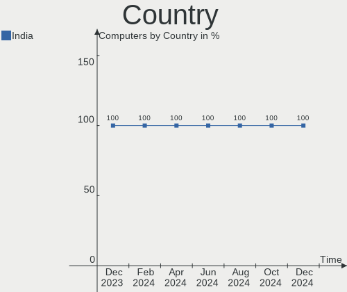
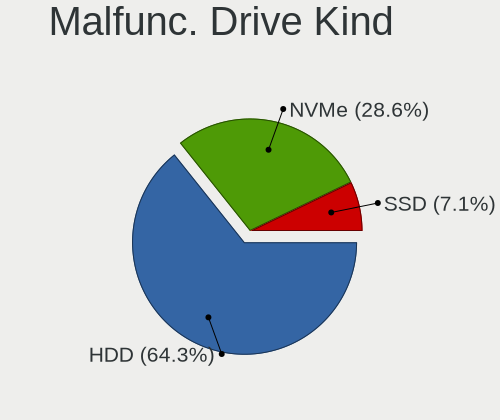
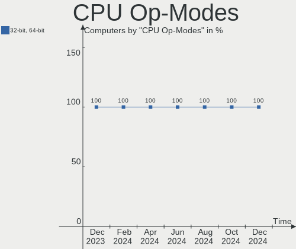
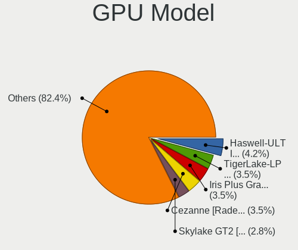
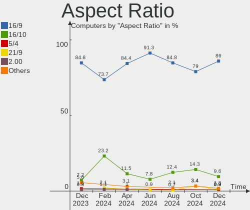
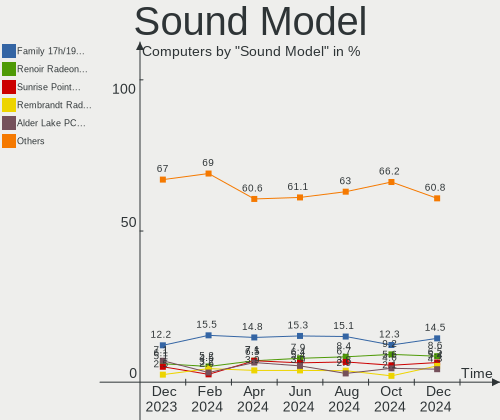
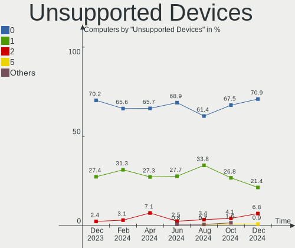

Linux in India - Hardware Trends
--------------------------------

A project to identify most popular hardware characteristics and track their change
over time based on data collected by Linux users at https://Linux-Hardware.org.

Anyone can contribute to this report by the [hw-probe](https://github.com/linuxhw/hw-probe) tool:

    sudo -E hw-probe -all -upload

This is a report for all computer types. See also reports for [desktops](/Location/India/Desktop/README.md) and [notebooks](/Location/India/Notebook/README.md).

Period: Sep, 2022.

Contents
--------

* [ System ](#system)
  - [ OS                       ](#os)
  - [ OS Family                ](#os-family)
  - [ Kernel                   ](#kernel)
  - [ Kernel Family            ](#kernel-family)
  - [ Kernel Major Ver.        ](#kernel-major-ver)
  - [ Arch                     ](#arch)
  - [ DE                       ](#de)
  - [ Display Server           ](#display-server)
  - [ Display Manager          ](#display-manager)
  - [ OS Lang                  ](#os-lang)
  - [ Boot Mode                ](#boot-mode)
  - [ Filesystem               ](#filesystem)
  - [ Part. scheme             ](#part-scheme)
  - [ Dual Boot with Linux/BSD ](#dual-boot-with-linuxbsd)
  - [ Dual Boot (Win)          ](#dual-boot-win)

* [ Board ](#board)
  - [ Vendor                   ](#vendor)
  - [ Model                    ](#model)
  - [ Model Family             ](#model-family)
  - [ MFG Year                 ](#mfg-year)
  - [ Form Factor              ](#form-factor)
  - [ Secure Boot              ](#secure-boot)
  - [ Coreboot                 ](#coreboot)
  - [ RAM Size                 ](#ram-size)
  - [ RAM Used                 ](#ram-used)
  - [ Total Drives             ](#total-drives)
  - [ Has CD-ROM               ](#has-cd-rom)
  - [ Has Ethernet             ](#has-ethernet)
  - [ Has WiFi                 ](#has-wifi)
  - [ Has Bluetooth            ](#has-bluetooth)

* [ Location ](#location)
  - [ Country                  ](#country)
  - [ City                     ](#city)

* [ Drives ](#drives)
  - [ Drive Vendor             ](#drive-vendor)
  - [ Drive Model              ](#drive-model)
  - [ HDD Vendor               ](#hdd-vendor)
  - [ SSD Vendor               ](#ssd-vendor)
  - [ Drive Kind               ](#drive-kind)
  - [ Drive Connector          ](#drive-connector)
  - [ Drive Size               ](#drive-size)
  - [ Space Total              ](#space-total)
  - [ Space Used               ](#space-used)
  - [ Malfunc. Drives          ](#malfunc-drives)
  - [ Malfunc. Drive Vendor    ](#malfunc-drive-vendor)
  - [ Malfunc. HDD Vendor      ](#malfunc-hdd-vendor)
  - [ Malfunc. Drive Kind      ](#malfunc-drive-kind)
  - [ Failed Drives            ](#failed-drives)
  - [ Failed Drive Vendor      ](#failed-drive-vendor)
  - [ Drive Status             ](#drive-status)

* [ Storage controller ](#storage-controller)
  - [ Storage Vendor           ](#storage-vendor)
  - [ Storage Model            ](#storage-model)
  - [ Storage Kind             ](#storage-kind)

* [ Processor ](#processor)
  - [ CPU Vendor               ](#cpu-vendor)
  - [ CPU Model                ](#cpu-model)
  - [ CPU Model Family         ](#cpu-model-family)
  - [ CPU Cores                ](#cpu-cores)
  - [ CPU Sockets              ](#cpu-sockets)
  - [ CPU Threads              ](#cpu-threads)
  - [ CPU Op-Modes             ](#cpu-op-modes)
  - [ CPU Microcode            ](#cpu-microcode)
  - [ CPU Microarch            ](#cpu-microarch)

* [ Graphics ](#graphics)
  - [ GPU Vendor               ](#gpu-vendor)
  - [ GPU Model                ](#gpu-model)
  - [ GPU Combo                ](#gpu-combo)
  - [ GPU Driver               ](#gpu-driver)
  - [ GPU Memory               ](#gpu-memory)

* [ Monitor ](#monitor)
  - [ Monitor Vendor           ](#monitor-vendor)
  - [ Monitor Model            ](#monitor-model)
  - [ Monitor Resolution       ](#monitor-resolution)
  - [ Monitor Diagonal         ](#monitor-diagonal)
  - [ Monitor Width            ](#monitor-width)
  - [ Aspect Ratio             ](#aspect-ratio)
  - [ Monitor Area             ](#monitor-area)
  - [ Pixel Density            ](#pixel-density)
  - [ Multiple Monitors        ](#multiple-monitors)

* [ Network ](#network)
  - [ Net Controller Vendor    ](#net-controller-vendor)
  - [ Net Controller Model     ](#net-controller-model)
  - [ Wireless Vendor          ](#wireless-vendor)
  - [ Wireless Model           ](#wireless-model)
  - [ Ethernet Vendor          ](#ethernet-vendor)
  - [ Ethernet Model           ](#ethernet-model)
  - [ Net Controller Kind      ](#net-controller-kind)
  - [ Used Controller          ](#used-controller)
  - [ NICs                     ](#nics)
  - [ IPv6                     ](#ipv6)

* [ Bluetooth ](#bluetooth)
  - [ Bluetooth Vendor         ](#bluetooth-vendor)
  - [ Bluetooth Model          ](#bluetooth-model)

* [ Sound ](#sound)
  - [ Sound Vendor             ](#sound-vendor)
  - [ Sound Model              ](#sound-model)

* [ Memory ](#memory)
  - [ Memory Vendor            ](#memory-vendor)
  - [ Memory Model             ](#memory-model)
  - [ Memory Kind              ](#memory-kind)
  - [ Memory Form Factor       ](#memory-form-factor)
  - [ Memory Size              ](#memory-size)
  - [ Memory Speed             ](#memory-speed)

* [ Printers & scanners ](#printers--scanners)
  - [ Printer Vendor           ](#printer-vendor)
  - [ Printer Model            ](#printer-model)
  - [ Scanner Vendor           ](#scanner-vendor)
  - [ Scanner Model            ](#scanner-model)

* [ Camera ](#camera)
  - [ Camera Vendor            ](#camera-vendor)
  - [ Camera Model             ](#camera-model)

* [ Security ](#security)
  - [ Fingerprint Vendor       ](#fingerprint-vendor)
  - [ Fingerprint Model        ](#fingerprint-model)
  - [ Chipcard Vendor          ](#chipcard-vendor)
  - [ Chipcard Model           ](#chipcard-model)

* [ Unsupported ](#unsupported)
  - [ Unsupported Devices      ](#unsupported-devices)
  - [ Unsupported Device Types ](#unsupported-device-types)

System
------

OS
--

Installed operating systems

| Name                        | Computers | Percent |
|-----------------------------|-----------|---------|
| Ubuntu 22.04                | 27        | 30.68%  |
| Fedora 36                   | 12        | 13.64%  |
| Pop!_OS 22.04               | 5         | 5.68%   |
| Zorin 16                    | 4         | 4.55%   |
| Nobara 36                   | 4         | 4.55%   |
| Linux Mint 21               | 4         | 4.55%   |
| KDE neon 20.04              | 3         | 3.41%   |
| Debian 11                   | 3         | 3.41%   |
| Arch Rolling                | 3         | 3.41%   |
| Arch                        | 3         | 3.41%   |
| Ubuntu 20.04                | 2         | 2.27%   |
| Ubuntu 18.04                | 2         | 2.27%   |
| OpenMandriva 4.3            | 2         | 2.27%   |
| OpenMandriva 4.2            | 2         | 2.27%   |
| ROSA 12.2                   | 1         | 1.14%   |
| org.kde.Platform 5.15-21.08 | 1         | 1.14%   |
| Linux Mint 20.3             | 1         | 1.14%   |
| Linux Mint 20               | 1         | 1.14%   |
| Kali 2022.3                 | 1         | 1.14%   |
| Kali 2021.2                 | 1         | 1.14%   |
| GNOME OS 43                 | 1         | 1.14%   |
| Fedora 37                   | 1         | 1.14%   |
| EndeavourOS Rolling         | 1         | 1.14%   |
| EndeavourOS                 | 1         | 1.14%   |
| Artix                       | 1         | 1.14%   |
| ArcoLinux Rolling           | 1         | 1.14%   |

OS Family
---------

OS without a version

| Name             | Computers | Percent |
|------------------|-----------|---------|
| Ubuntu           | 31        | 35.23%  |
| Fedora           | 13        | 14.77%  |
| Linux Mint       | 6         | 6.82%   |
| Arch             | 6         | 6.82%   |
| Pop!_OS          | 5         | 5.68%   |
| Zorin            | 4         | 4.55%   |
| OpenMandriva     | 4         | 4.55%   |
| Nobara           | 4         | 4.55%   |
| KDE neon         | 3         | 3.41%   |
| Debian           | 3         | 3.41%   |
| Kali             | 2         | 2.27%   |
| EndeavourOS      | 2         | 2.27%   |
| ROSA             | 1         | 1.14%   |
| org.kde.Platform | 1         | 1.14%   |
| GNOME OS         | 1         | 1.14%   |
| Artix            | 1         | 1.14%   |
| ArcoLinux        | 1         | 1.14%   |

Kernel
------

Version of the Linux kernel

| Version                            | Computers | Percent |
|------------------------------------|-----------|---------|
| 5.15.0-47-generic                  | 14        | 15.91%  |
| 5.15.0-48-generic                  | 9         | 10.23%  |
| 5.15.0-46-generic                  | 6         | 6.82%   |
| 5.19.0-76051900-generic            | 5         | 5.68%   |
| 5.19.8-200.fc36.x86_64             | 4         | 4.55%   |
| 5.19.9-200.fc36.x86_64             | 3         | 3.41%   |
| 5.4.0-124-generic                  | 2         | 2.27%   |
| 5.19.9-201.fsync.fc36.x86_64       | 2         | 2.27%   |
| 5.19.8-201.fsync.fc36.x86_64       | 2         | 2.27%   |
| 5.19.7-arch1-1                     | 2         | 2.27%   |
| 5.19.11-200.fc36.x86_64            | 2         | 2.27%   |
| 5.16.7-desktop-1omv4003            | 2         | 2.27%   |
| 5.15.0-43-generic                  | 2         | 2.27%   |
| 5.15.0-41-generic                  | 2         | 2.27%   |
| 5.10.14-desktop-1omv4002           | 2         | 2.27%   |
| 5.4.0-91-generic                   | 1         | 1.14%   |
| 5.4.0-125-generic                  | 1         | 1.14%   |
| 5.19.9-zen1-1-zen                  | 1         | 1.14%   |
| 5.19.9-arch1-1                     | 1         | 1.14%   |
| 5.19.8-arch1-1                     | 1         | 1.14%   |
| 5.19.5-arch1-1                     | 1         | 1.14%   |
| 5.19.5-051905-generic              | 1         | 1.14%   |
| 5.19.4-zen1-1-zen                  | 1         | 1.14%   |
| 5.19.11-hardened1-1-hardened       | 1         | 1.14%   |
| 5.19.11-300.fc37.x86_64            | 1         | 1.14%   |
| 5.19.10-arch1-1                    | 1         | 1.14%   |
| 5.19.10-201.fsync.fc36.x86_64      | 1         | 1.14%   |
| 5.19.0-1-amd64                     | 1         | 1.14%   |
| 5.18.6-051806-generic              | 1         | 1.14%   |
| 5.18.16                            | 1         | 1.14%   |
| 5.18.0-kali7-amd64                 | 1         | 1.14%   |
| 5.17.8-300.fc36.x86_64             | 1         | 1.14%   |
| 5.17.5-300.fc36.x86_64             | 1         | 1.14%   |
| 5.17.11-generic-2rosa2021.1-x86_64 | 1         | 1.14%   |
| 5.15.68                            | 1         | 1.14%   |
| 5.15.67-1-lts                      | 1         | 1.14%   |
| 5.15.53-1-pve                      | 1         | 1.14%   |
| 5.15.2-051502-generic              | 1         | 1.14%   |
| 5.15.0-1013-raspi                  | 1         | 1.14%   |
| 5.14.0-1052-oem                    | 1         | 1.14%   |

Kernel Family
-------------

Linux kernel without a distro release

| Version | Computers | Percent |
|---------|-----------|---------|
| 5.15.0  | 34        | 38.64%  |
| 5.19.9  | 7         | 7.95%   |
| 5.19.8  | 7         | 7.95%   |
| 5.19.0  | 6         | 6.82%   |
| 5.4.0   | 4         | 4.55%   |
| 5.19.11 | 4         | 4.55%   |
| 5.19.7  | 2         | 2.27%   |
| 5.19.5  | 2         | 2.27%   |
| 5.19.10 | 2         | 2.27%   |
| 5.16.7  | 2         | 2.27%   |
| 5.14.0  | 2         | 2.27%   |
| 5.10.14 | 2         | 2.27%   |
| 5.10.0  | 2         | 2.27%   |
| 5.19.4  | 1         | 1.14%   |
| 5.18.6  | 1         | 1.14%   |
| 5.18.16 | 1         | 1.14%   |
| 5.18.0  | 1         | 1.14%   |
| 5.17.8  | 1         | 1.14%   |
| 5.17.5  | 1         | 1.14%   |
| 5.17.11 | 1         | 1.14%   |
| 5.15.68 | 1         | 1.14%   |
| 5.15.67 | 1         | 1.14%   |
| 5.15.53 | 1         | 1.14%   |
| 5.15.2  | 1         | 1.14%   |
| 5.13.0  | 1         | 1.14%   |

Kernel Major Ver.
-----------------

Linux kernel major version

| Version | Computers | Percent |
|---------|-----------|---------|
| 5.15    | 38        | 43.18%  |
| 5.19    | 31        | 35.23%  |
| 5.4     | 4         | 4.55%   |
| 5.10    | 4         | 4.55%   |
| 5.18    | 3         | 3.41%   |
| 5.17    | 3         | 3.41%   |
| 5.16    | 2         | 2.27%   |
| 5.14    | 2         | 2.27%   |
| 5.13    | 1         | 1.14%   |

Arch
----

OS architecture (x86_64, i586, etc.)

| Name    | Computers | Percent |
|---------|-----------|---------|
| x86_64  | 87        | 98.86%  |
| aarch64 | 1         | 1.14%   |

DE
--

Desktop Environment

| Name       | Computers | Percent |
|------------|-----------|---------|
| GNOME      | 59        | 67.05%  |
| KDE5       | 13        | 14.77%  |
| X-Cinnamon | 5         | 5.68%   |
| Unknown    | 4         | 4.55%   |
| XFCE       | 3         | 3.41%   |
| i3         | 2         | 2.27%   |
| MATE       | 1         | 1.14%   |
| Deepin     | 1         | 1.14%   |

Display Server
--------------

X11 or Wayland

| Name    | Computers | Percent |
|---------|-----------|---------|
| X11     | 49        | 55.68%  |
| Wayland | 35        | 39.77%  |
| Tty     | 3         | 3.41%   |
| Unknown | 1         | 1.14%   |

Display Manager
---------------

SDDM, LightDM, etc.

| Name    | Computers | Percent |
|---------|-----------|---------|
| Unknown | 30        | 34.09%  |
| GDM3    | 26        | 29.55%  |
| SDDM    | 13        | 14.77%  |
| GDM     | 12        | 13.64%  |
| LightDM | 7         | 7.95%   |

OS Lang
-------

Language

| Lang    | Computers | Percent |
|---------|-----------|---------|
| en_IN   | 49        | 55.68%  |
| en_US   | 30        | 34.09%  |
| C       | 4         | 4.55%   |
| en_GB   | 2         | 2.27%   |
| en_AG   | 2         | 2.27%   |
| Unknown | 1         | 1.14%   |

Boot Mode
---------

EFI or BIOS

| Mode | Computers | Percent |
|------|-----------|---------|
| EFI  | 53        | 60.23%  |
| BIOS | 35        | 39.77%  |

Filesystem
----------

Type of filesystem

| Type    | Computers | Percent |
|---------|-----------|---------|
| Ext4    | 65        | 73.86%  |
| Btrfs   | 14        | 15.91%  |
| Overlay | 5         | 5.68%   |
| Xfs     | 3         | 3.41%   |
| Zfs     | 1         | 1.14%   |

Part. scheme
------------

Scheme of partitioning

| Type    | Computers | Percent |
|---------|-----------|---------|
| Unknown | 41        | 46.59%  |
| GPT     | 39        | 44.32%  |
| MBR     | 8         | 9.09%   |

Dual Boot with Linux/BSD
------------------------

Hosting more than one Linux/BSD

| Dual boot | Computers | Percent |
|-----------|-----------|---------|
| No        | 77        | 87.5%   |
| Yes       | 11        | 12.5%   |

Dual Boot (Win)
---------------

Hosting Linux and Windows

| Dual boot | Computers | Percent |
|-----------|-----------|---------|
| No        | 57        | 64.77%  |
| Yes       | 31        | 35.23%  |

Board
-----

Vendor
------

Motherboard manufacturer

| Name                    | Computers | Percent |
|-------------------------|-----------|---------|
| Lenovo                  | 18        | 20.45%  |
| Dell                    | 17        | 19.32%  |
| Hewlett-Packard         | 14        | 15.91%  |
| ASUSTek Computer        | 14        | 15.91%  |
| Acer                    | 8         | 9.09%   |
| Gigabyte Technology     | 6         | 6.82%   |
| MSI                     | 5         | 5.68%   |
| Samsung Electronics     | 1         | 1.14%   |
| Raspberry Pi Foundation | 1         | 1.14%   |
| MiTAC                   | 1         | 1.14%   |
| Intel                   | 1         | 1.14%   |
| Google                  | 1         | 1.14%   |
| Apple                   | 1         | 1.14%   |

Model
-----

Motherboard model

| Name                                     | Computers | Percent |
|------------------------------------------|-----------|---------|
| Samsung 750XED                           | 1         | 1.14%   |
| RPi Raspberry Pi                         | 1         | 1.14%   |
| MSI MS-7C91                              | 1         | 1.14%   |
| MSI MS-7C89                              | 1         | 1.14%   |
| MSI MS-7B87                              | 1         | 1.14%   |
| MSI MS-7B51                              | 1         | 1.14%   |
| MSI MS-7641                              | 1         | 1.14%   |
| MiTAC E210                               | 1         | 1.14%   |
| Lenovo Yoga 7 16IAP7 82QG                | 1         | 1.14%   |
| Lenovo ThinkPad X270 20HMS1QT0E          | 1         | 1.14%   |
| Lenovo ThinkPad X1 Yoga 1st 20FRS20G1R   | 1         | 1.14%   |
| Lenovo ThinkPad X1 Carbon 7th 20QDCTO1WW | 1         | 1.14%   |
| Lenovo ThinkPad E470 20H1004UIG          | 1         | 1.14%   |
| Lenovo ThinkPad E14 Gen 4 21ECCTO1WW     | 1         | 1.14%   |
| Lenovo ThinkCentre M58e 7298A76          | 1         | 1.14%   |
| Lenovo ThinkBook 14 G2 ITL Ub 20VD       | 1         | 1.14%   |
| Lenovo Legion S7 15ACH6 82K8             | 1         | 1.14%   |
| Lenovo IdeaPadFlex 5 14ITL05 82HS        | 1         | 1.14%   |
| Lenovo IdeaPadFlex 10 20324              | 1         | 1.14%   |
| Lenovo IdeaPad S340-14API 81NB           | 1         | 1.14%   |
| Lenovo IdeaPad Gaming 3 15IHU6 82K1      | 1         | 1.14%   |
| Lenovo IdeaPad 130-15IKB 81H7            | 1         | 1.14%   |
| Lenovo G580 20157                        | 1         | 1.14%   |
| Lenovo G560 20042                        | 1         | 1.14%   |
| Lenovo G510 20238                        | 1         | 1.14%   |
| Lenovo G460 20041                        | 1         | 1.14%   |
| Intel DH61BF AAG81311-101                | 1         | 1.14%   |
| HP Pavilion x360 Convertible             | 1         | 1.14%   |
| HP Pavilion Notebook                     | 1         | 1.14%   |
| HP Pavilion Laptop 15-cs1xxx             | 1         | 1.14%   |
| HP Pavilion Laptop 14-dv0xxx             | 1         | 1.14%   |
| HP Pavilion Gaming Laptop 15-ec2xxx      | 1         | 1.14%   |
| HP OMEN Laptop 15-en1xxx                 | 1         | 1.14%   |
| HP Laptop 15-bw0xx                       | 1         | 1.14%   |
| HP Laptop 14s-dr2xxx                     | 1         | 1.14%   |
| HP ENVY x360 Convertible 15-cn0xxx       | 1         | 1.14%   |
| HP ENVY x360 Convertible 13-ay0xxx       | 1         | 1.14%   |
| HP EliteDesk 800 G1 SFF                  | 1         | 1.14%   |
| HP EliteBook 840 G5                      | 1         | 1.14%   |
| HP Compaq Pro 6300 MT                    | 1         | 1.14%   |

Model Family
------------

Motherboard model prefix

| Name               | Computers | Percent |
|--------------------|-----------|---------|
| Dell Inspiron      | 7         | 7.95%   |
| Lenovo ThinkPad    | 5         | 5.68%   |
| HP Pavilion        | 5         | 5.68%   |
| Dell Vostro        | 5         | 5.68%   |
| ASUS ROG           | 5         | 5.68%   |
| Acer Aspire        | 4         | 4.55%   |
| Lenovo IdeaPad     | 3         | 3.41%   |
| Dell Latitude      | 3         | 3.41%   |
| ASUS VivoBook      | 3         | 3.41%   |
| Lenovo IdeaPadFlex | 2         | 2.27%   |
| HP Laptop          | 2         | 2.27%   |
| HP ENVY            | 2         | 2.27%   |
| Dell Precision     | 2         | 2.27%   |
| ASUS TUF           | 2         | 2.27%   |
| ASUS ASUS          | 2         | 2.27%   |
| Acer Nitro         | 2         | 2.27%   |
| Samsung 750XED     | 1         | 1.14%   |
| RPi Raspberry      | 1         | 1.14%   |
| MSI MS-7C91        | 1         | 1.14%   |
| MSI MS-7C89        | 1         | 1.14%   |
| MSI MS-7B87        | 1         | 1.14%   |
| MSI MS-7B51        | 1         | 1.14%   |
| MSI MS-7641        | 1         | 1.14%   |
| MiTAC E210         | 1         | 1.14%   |
| Lenovo Yoga        | 1         | 1.14%   |
| Lenovo ThinkCentre | 1         | 1.14%   |
| Lenovo ThinkBook   | 1         | 1.14%   |
| Lenovo Legion      | 1         | 1.14%   |
| Lenovo G580        | 1         | 1.14%   |
| Lenovo G560        | 1         | 1.14%   |
| Lenovo G510        | 1         | 1.14%   |
| Lenovo G460        | 1         | 1.14%   |
| Intel DH61BF       | 1         | 1.14%   |
| HP OMEN            | 1         | 1.14%   |
| HP EliteDesk       | 1         | 1.14%   |
| HP EliteBook       | 1         | 1.14%   |
| HP Compaq          | 1         | 1.14%   |
| HP 15              | 1         | 1.14%   |
| Google Relm        | 1         | 1.14%   |
| Gigabyte H81M-WW   | 1         | 1.14%   |

MFG Year
--------

Motherboard manufacture year

| Year    | Computers | Percent |
|---------|-----------|---------|
| 2021    | 16        | 18.18%  |
| 2018    | 11        | 12.5%   |
| 2022    | 8         | 9.09%   |
| 2019    | 8         | 9.09%   |
| 2020    | 7         | 7.95%   |
| 2017    | 6         | 6.82%   |
| 2013    | 6         | 6.82%   |
| 2016    | 5         | 5.68%   |
| 2015    | 4         | 4.55%   |
| 2012    | 4         | 4.55%   |
| 2010    | 4         | 4.55%   |
| 2014    | 3         | 3.41%   |
| 2009    | 3         | 3.41%   |
| 2011    | 2         | 2.27%   |
| Unknown | 1         | 1.14%   |

Form Factor
-----------

Physical design of the computer

| Name           | Computers | Percent |
|----------------|-----------|---------|
| Notebook       | 58        | 65.91%  |
| Desktop        | 21        | 23.86%  |
| Convertible    | 8         | 9.09%   |
| System on chip | 1         | 1.14%   |

Secure Boot
-----------

Enabled or disabled

| State    | Computers | Percent |
|----------|-----------|---------|
| Disabled | 79        | 89.77%  |
| Enabled  | 9         | 10.23%  |

Coreboot
--------

Have coreboot on board

| Used | Computers | Percent |
|------|-----------|---------|
| No   | 87        | 98.86%  |
| Yes  | 1         | 1.14%   |

RAM Size
--------

Total RAM memory

| Size in GB  | Computers | Percent |
|-------------|-----------|---------|
| 4.01-8.0    | 27        | 30.68%  |
| 16.01-24.0  | 22        | 25%     |
| 3.01-4.0    | 14        | 15.91%  |
| 8.01-16.0   | 14        | 15.91%  |
| 1.01-2.0    | 5         | 5.68%   |
| 32.01-64.0  | 3         | 3.41%   |
| 64.01-256.0 | 2         | 2.27%   |
| 2.01-3.0    | 1         | 1.14%   |

RAM Used
--------

Used RAM memory

| Used GB    | Computers | Percent |
|------------|-----------|---------|
| 3.01-4.0   | 23        | 26.14%  |
| 1.01-2.0   | 20        | 22.73%  |
| 2.01-3.0   | 18        | 20.45%  |
| 4.01-8.0   | 17        | 19.32%  |
| 8.01-16.0  | 6         | 6.82%   |
| 0.51-1.0   | 3         | 3.41%   |
| 32.01-64.0 | 1         | 1.14%   |

Total Drives
------------

Number of drives on board

| Drives | Computers | Percent |
|--------|-----------|---------|
| 1      | 53        | 60.23%  |
| 2      | 30        | 34.09%  |
| 3      | 3         | 3.41%   |
| 6      | 1         | 1.14%   |
| 4      | 1         | 1.14%   |

Has CD-ROM
----------

Has CD-ROM on board

| Presented | Computers | Percent |
|-----------|-----------|---------|
| No        | 69        | 78.41%  |
| Yes       | 19        | 21.59%  |

Has Ethernet
------------

Has Ethernet on board

| Presented | Computers | Percent |
|-----------|-----------|---------|
| Yes       | 71        | 80.68%  |
| No        | 17        | 19.32%  |

Has WiFi
--------

Has WiFi module

| Presented | Computers | Percent |
|-----------|-----------|---------|
| Yes       | 80        | 90.91%  |
| No        | 8         | 9.09%   |

Has Bluetooth
-------------

Has Bluetooth module

| Presented | Computers | Percent |
|-----------|-----------|---------|
| Yes       | 67        | 76.14%  |
| No        | 21        | 23.86%  |

Location
--------

Country
-------

Geographic location (country)

| Country | Computers | Percent |
|---------|-----------|---------|
| India   | 88        | 100%    |

City
----

Geographic location (city)

| City        | Computers | Percent |
|-------------|-----------|---------|
| Bengaluru   | 12        | 13.64%  |
| Kolkata     | 10        | 11.36%  |
| Mumbai      | 8         | 9.09%   |
| Chennai     | 5         | 5.68%   |
| Jaipur      | 4         | 4.55%   |
| Hyderabad   | 4         | 4.55%   |
| New Delhi   | 3         | 3.41%   |
| Ahmedabad   | 3         | 3.41%   |
| Surat       | 2         | 2.27%   |
| Shimla      | 2         | 2.27%   |
| Pune        | 2         | 2.27%   |
| Nellore     | 2         | 2.27%   |
| Mohali      | 2         | 2.27%   |
| Malappuram  | 2         | 2.27%   |
| Ludhiana    | 2         | 2.27%   |
| Ernakulam   | 2         | 2.27%   |
| Coimbatore  | 2         | 2.27%   |
| Vadodara    | 1         | 1.14%   |
| Udaipur     | 1         | 1.14%   |
| Trivandrum  | 1         | 1.14%   |
| Salem       | 1         | 1.14%   |
| Patna       | 1         | 1.14%   |
| Patiala     | 1         | 1.14%   |
| Panchkula   | 1         | 1.14%   |
| Navi Mumbai | 1         | 1.14%   |
| Mangalore   | 1         | 1.14%   |
| Lucknow     | 1         | 1.14%   |
| Jalpaiguri  | 1         | 1.14%   |
| Jabalpur    | 1         | 1.14%   |
| Guwahati    | 1         | 1.14%   |
| Gurgaon     | 1         | 1.14%   |
| Guna        | 1         | 1.14%   |
| Giridih     | 1         | 1.14%   |
| Ghaziabad   | 1         | 1.14%   |
| Delhi       | 1         | 1.14%   |
| Candolim    | 1         | 1.14%   |
| Bhiwani     | 1         | 1.14%   |
| Alappuzha   | 1         | 1.14%   |

Drives
------

Drive Vendor
------------

Hard drive vendors

| Vendor                    | Computers | Drives | Percent |
|---------------------------|-----------|--------|---------|
| Seagate                   | 26        | 26     | 20.97%  |
| WDC                       | 20        | 23     | 16.13%  |
| Samsung Electronics       | 11        | 13     | 8.87%   |
| Toshiba                   | 8         | 8      | 6.45%   |
| SanDisk                   | 8         | 8      | 6.45%   |
| Micron Technology         | 8         | 8      | 6.45%   |
| Kingston                  | 5         | 5      | 4.03%   |
| Intel                     | 5         | 5      | 4.03%   |
| SK hynix                  | 4         | 4      | 3.23%   |
| Crucial                   | 4         | 5      | 3.23%   |
| HGST                      | 3         | 3      | 2.42%   |
| Unknown                   | 2         | 2      | 1.61%   |
| A-DATA Technology         | 2         | 2      | 1.61%   |
| Unknown                   | 2         | 2      | 1.61%   |
| YS                        | 1         | 1      | 0.81%   |
| XPG                       | 1         | 1      | 0.81%   |
| UMIS                      | 1         | 1      | 0.81%   |
| Transcend                 | 1         | 1      | 0.81%   |
| Simmtronic                | 1         | 1      | 0.81%   |
| Realtek Semiconductor     | 1         | 1      | 0.81%   |
| Micron/Crucial Technology | 1         | 1      | 0.81%   |
| Maxtor                    | 1         | 1      | 0.81%   |
| LITEON                    | 1         | 1      | 0.81%   |
| Lenovo                    | 1         | 1      | 0.81%   |
| KIOXIA                    | 1         | 1      | 0.81%   |
| KESU                      | 1         | 1      | 0.81%   |
| Innodisk                  | 1         | 1      | 0.81%   |
| Hewlett-Packard           | 1         | 1      | 0.81%   |
| Gigabyte Technology       | 1         | 1      | 0.81%   |
| BF9SSD                    | 1         | 1      | 0.81%   |

Drive Model
-----------

Hard drive models

| Model                                 | Computers | Percent |
|---------------------------------------|-----------|---------|
| Seagate ST1000LM035-1RK172 1TB        | 6         | 4.65%   |
| Seagate ST1000DM010-2EP102 1TB        | 6         | 4.65%   |
| Toshiba MQ04ABF100 1TB                | 4         | 3.1%    |
| Toshiba MQ01ABD100 1TB                | 3         | 2.33%   |
| Seagate ST500LT012-1DG142 500GB       | 3         | 2.33%   |
| WDC WD10EZEX-75WN4A1 1TB              | 2         | 1.55%   |
| WDC PC SN530 SDBPMPZ-512G-1101 512GB  | 2         | 1.55%   |
| Seagate ST1000LM049-2GH172 1TB        | 2         | 1.55%   |
| Sandisk WD Blue SN550 NVMe SSD 1024GB | 2         | 1.55%   |
| Samsung MZVLB1T0HBLR-000H1 1TB        | 2         | 1.55%   |
| Micron 2450_MTFDKBA1T0TFK 1TB         | 2         | 1.55%   |
| Unknown                               | 2         | 1.55%   |
| YS SSD 128GB                          | 1         | 0.78%   |
| XPG GAMMIX S11 Pro 512GB              | 1         | 0.78%   |
| WDC WUH721818ALE6L4 18TB              | 1         | 0.78%   |
| WDC WDS480G2G0A-00JH30 480GB SSD      | 1         | 0.78%   |
| WDC WDS250G2B0B-00YS70 250GB SSD      | 1         | 0.78%   |
| WDC WDS240G2G0A-00JH30 240GB SSD      | 1         | 0.78%   |
| WDC WDS120G2G0A-00JH30 120GB SSD      | 1         | 0.78%   |
| WDC WD5000AAKX-00ERMA0 500GB          | 1         | 0.78%   |
| WDC WD5000AAKX-001CA0 500GB           | 1         | 0.78%   |
| WDC WD40PURZ-85AKKY0 4TB              | 1         | 0.78%   |
| WDC WD40EZRZ-22GXCB0 4TB              | 1         | 0.78%   |
| WDC WD3200BEVT-22ZCT0 320GB           | 1         | 0.78%   |
| WDC WD3200BEVT-22A23T0 320GB          | 1         | 0.78%   |
| WDC WD10SPZX-60Z10T0 1TB              | 1         | 0.78%   |
| WDC WD10SPZX-24Z10 1TB                | 1         | 0.78%   |
| WDC WD10JPVX-60JC3T1 1TB              | 1         | 0.78%   |
| WDC WD10JPVX-08JC3T6 1TB              | 1         | 0.78%   |
| WDC WD10EZEX-75WN4A0 1TB              | 1         | 0.78%   |
| WDC WD10EADS-114BB1 1TB               | 1         | 0.78%   |
| WDC PC SN730 SDBQNTY-256G-1001 256GB  | 1         | 0.78%   |
| WDC PC SN530 SDBPNPZ-512G-1002 512GB  | 1         | 0.78%   |
| Unknown MMC Card  32GB                | 1         | 0.78%   |
| Unknown MMC Card  16GB                | 1         | 0.78%   |
| UMIS RPFTJ128PDD2EWX 128GB            | 1         | 0.78%   |
| Transcend TS64GSSD630 64GB            | 1         | 0.78%   |
| Toshiba DT01ACA050 500GB              | 1         | 0.78%   |
| SK hynix SKHynix_HFS001TDE9X084N 1TB  | 1         | 0.78%   |
| SK hynix SHGP31-500GM-2 500GB         | 1         | 0.78%   |

HDD Vendor
----------

Hard disk drive vendors

| Vendor  | Computers | Drives | Percent |
|---------|-----------|--------|---------|
| Seagate | 26        | 26     | 50.98%  |
| WDC     | 13        | 15     | 25.49%  |
| Toshiba | 8         | 8      | 15.69%  |
| HGST    | 3         | 3      | 5.88%   |
| KESU    | 1         | 1      | 1.96%   |

SSD Vendor
----------

Solid state drive vendors

| Vendor              | Computers | Drives | Percent |
|---------------------|-----------|--------|---------|
| WDC                 | 4         | 4      | 15.38%  |
| Crucial             | 4         | 5      | 15.38%  |
| Kingston            | 3         | 3      | 11.54%  |
| SanDisk             | 2         | 2      | 7.69%   |
| Samsung Electronics | 2         | 2      | 7.69%   |
| A-DATA Technology   | 2         | 2      | 7.69%   |
| YS                  | 1         | 1      | 3.85%   |
| Transcend           | 1         | 1      | 3.85%   |
| Maxtor              | 1         | 1      | 3.85%   |
| LITEON              | 1         | 1      | 3.85%   |
| Innodisk            | 1         | 1      | 3.85%   |
| Hewlett-Packard     | 1         | 1      | 3.85%   |
| Gigabyte Technology | 1         | 1      | 3.85%   |
| BF9SSD              | 1         | 1      | 3.85%   |
| Unknown             | 1         | 1      | 3.85%   |

Drive Kind
----------

HDD or SSD

| Kind    | Computers | Drives | Percent |
|---------|-----------|--------|---------|
| HDD     | 46        | 53     | 38.98%  |
| NVMe    | 43        | 46     | 36.44%  |
| SSD     | 25        | 27     | 21.19%  |
| MMC     | 3         | 3      | 2.54%   |
| Unknown | 1         | 1      | 0.85%   |

Drive Connector
---------------

SATA, SAS, NVMe, etc.

| Type | Computers | Drives | Percent |
|------|-----------|--------|---------|
| SATA | 59        | 77     | 54.13%  |
| NVMe | 43        | 46     | 39.45%  |
| SAS  | 4         | 4      | 3.67%   |
| MMC  | 3         | 3      | 2.75%   |

Drive Size
----------

Size of hard drive

| Size in TB | Computers | Drives | Percent |
|------------|-----------|--------|---------|
| 0.51-1.0   | 35        | 39     | 50%     |
| 0.01-0.5   | 30        | 35     | 42.86%  |
| 1.01-2.0   | 2         | 2      | 2.86%   |
| 3.01-4.0   | 1         | 2      | 1.43%   |
| 10.01-20.0 | 1         | 1      | 1.43%   |
| 4.01-10.0  | 1         | 1      | 1.43%   |

Space Total
-----------

Amount of disk space available on the file system

| Size in GB     | Computers | Percent |
|----------------|-----------|---------|
| 251-500        | 24        | 27.27%  |
| 501-1000       | 17        | 19.32%  |
| 101-250        | 16        | 18.18%  |
| 1001-2000      | 10        | 11.36%  |
| 1-20           | 8         | 9.09%   |
| 51-100         | 6         | 6.82%   |
| 21-50          | 5         | 5.68%   |
| More than 3000 | 1         | 1.14%   |
| Unknown        | 1         | 1.14%   |

Space Used
----------

Amount of used disk space

| Used GB        | Computers | Percent |
|----------------|-----------|---------|
| 1-20           | 38        | 43.18%  |
| 21-50          | 13        | 14.77%  |
| 101-250        | 13        | 14.77%  |
| 251-500        | 9         | 10.23%  |
| 51-100         | 8         | 9.09%   |
| 501-1000       | 5         | 5.68%   |
| More than 3000 | 1         | 1.14%   |
| Unknown        | 1         | 1.14%   |

Malfunc. Drives
---------------

Drive models with a malfunction

| Model                                  | Computers | Drives | Percent |
|----------------------------------------|-----------|--------|---------|
| YS SSD 128GB                           | 1         | 1      | 7.69%   |
| WDC WD5000AAKX-00ERMA0 500GB           | 1         | 1      | 7.69%   |
| WDC WD40PURZ-85AKKY0 4TB               | 1         | 1      | 7.69%   |
| WDC WD3200BEVT-22ZCT0 320GB            | 1         | 1      | 7.69%   |
| WDC WD3200BEVT-22A23T0 320GB           | 1         | 1      | 7.69%   |
| WDC WD10SPZX-24Z10 1TB                 | 1         | 1      | 7.69%   |
| WDC WD10EADS-114BB1 1TB                | 1         | 1      | 7.69%   |
| Toshiba MQ01ABD100 1TB                 | 1         | 1      | 7.69%   |
| Seagate ST3250318AS 250GB              | 1         | 1      | 7.69%   |
| LITEON CV3-8D512-41 SATA 512GB SED SSD | 1         | 1      | 7.69%   |
| Lenovo LENSE20512GMSP34MEAT2TA 512GB   | 1         | 1      | 7.69%   |
| Innodisk Corp. - mSATA 3ME4 64GB       | 1         | 1      | 7.69%   |
| A-DATA Technology SU650 120GB SSD      | 1         | 1      | 7.69%   |

Malfunc. Drive Vendor
---------------------

Vendors of faulty drives

| Vendor            | Computers | Drives | Percent |
|-------------------|-----------|--------|---------|
| WDC               | 6         | 6      | 46.15%  |
| YS                | 1         | 1      | 7.69%   |
| Toshiba           | 1         | 1      | 7.69%   |
| Seagate           | 1         | 1      | 7.69%   |
| LITEON            | 1         | 1      | 7.69%   |
| Lenovo            | 1         | 1      | 7.69%   |
| Innodisk          | 1         | 1      | 7.69%   |
| A-DATA Technology | 1         | 1      | 7.69%   |

Malfunc. HDD Vendor
-------------------

Vendors of faulty HDD drives

| Vendor  | Computers | Drives | Percent |
|---------|-----------|--------|---------|
| WDC     | 6         | 6      | 75%     |
| Toshiba | 1         | 1      | 12.5%   |
| Seagate | 1         | 1      | 12.5%   |

Malfunc. Drive Kind
-------------------

Kinds of faulty drives

| Kind | Computers | Drives | Percent |
|------|-----------|--------|---------|
| HDD  | 8         | 8      | 61.54%  |
| SSD  | 4         | 4      | 30.77%  |
| NVMe | 1         | 1      | 7.69%   |

Failed Drives
-------------

Failed drive models

Zero info for selected period =(

Failed Drive Vendor
-------------------

Failed drive vendors

Zero info for selected period =(

Drive Status
------------

Number of failed and malfunc. drives

| Status   | Computers | Drives | Percent |
|----------|-----------|--------|---------|
| Detected | 46        | 62     | 48.42%  |
| Works    | 37        | 55     | 38.95%  |
| Malfunc  | 12        | 13     | 12.63%  |

Storage controller
------------------

Storage Vendor
--------------

Storage controller vendors

| Vendor                      | Computers | Percent |
|-----------------------------|-----------|---------|
| Intel                       | 56        | 50.45%  |
| AMD                         | 15        | 13.51%  |
| Samsung Electronics         | 10        | 9.01%   |
| SanDisk                     | 9         | 8.11%   |
| Micron Technology           | 8         | 7.21%   |
| SK hynix                    | 4         | 3.6%    |
| Kingston Technology Company | 2         | 1.8%    |
| Union Memory (Shenzhen)     | 1         | 0.9%    |
| Realtek Semiconductor       | 1         | 0.9%    |
| Nvidia                      | 1         | 0.9%    |
| Micron/Crucial Technology   | 1         | 0.9%    |
| Lenovo                      | 1         | 0.9%    |
| KIOXIA                      | 1         | 0.9%    |
| ADATA Technology            | 1         | 0.9%    |

Storage Model
-------------

Storage controller models

| Model                                                                          | Computers | Percent |
|--------------------------------------------------------------------------------|-----------|---------|
| Intel Sunrise Point-LP SATA Controller [AHCI mode]                             | 12        | 9.16%   |
| Intel Volume Management Device NVMe RAID Controller                            | 9         | 6.87%   |
| AMD FCH SATA Controller [AHCI mode]                                            | 9         | 6.87%   |
| Micron Non-Volatile memory controller                                          | 8         | 6.11%   |
| Samsung NVMe SSD Controller 980                                                | 7         | 5.34%   |
| Intel Tiger Lake-LP SATA Controller                                            | 5         | 3.82%   |
| Intel SSD 660P Series                                                          | 4         | 3.05%   |
| Intel 82801 Mobile SATA Controller [RAID mode]                                 | 4         | 3.05%   |
| SanDisk Non-Volatile memory controller                                         | 3         | 2.29%   |
| Intel 8 Series/C220 Series Chipset Family 6-port SATA Controller 1 [AHCI mode] | 3         | 2.29%   |
| Intel 8 Series SATA Controller 1 [AHCI mode]                                   | 3         | 2.29%   |
| Intel 5 Series/3400 Series Chipset 4 port SATA AHCI Controller                 | 3         | 2.29%   |
| AMD SB7x0/SB8x0/SB9x0 SATA Controller [IDE mode]                               | 3         | 2.29%   |
| AMD SB7x0/SB8x0/SB9x0 IDE Controller                                           | 3         | 2.29%   |
| AMD 500 Series Chipset SATA Controller                                         | 3         | 2.29%   |
| SK hynix Gold P31 SSD                                                          | 2         | 1.53%   |
| SK hynix BC501 NVMe Solid State Drive                                          | 2         | 1.53%   |
| SanDisk WD Blue SN570 NVMe SSD                                                 | 2         | 1.53%   |
| SanDisk WD Blue SN550 NVMe SSD                                                 | 2         | 1.53%   |
| SanDisk WD Black SN750 / PC SN730 NVMe SSD                                     | 2         | 1.53%   |
| Samsung NVMe SSD Controller SM981/PM981/PM983                                  | 2         | 1.53%   |
| Intel NM10/ICH7 Family SATA Controller [IDE mode]                              | 2         | 1.53%   |
| Intel Cannon Lake PCH SATA AHCI Controller                                     | 2         | 1.53%   |
| Intel Alder Lake-P SATA AHCI Controller                                        | 2         | 1.53%   |
| Intel 400 Series Chipset Family SATA AHCI Controller                           | 2         | 1.53%   |
| Union Memory (Shenzhen) Non-Volatile memory controller                         | 1         | 0.76%   |
| Samsung NVMe SSD Controller PM9A1/PM9A3/980PRO                                 | 1         | 0.76%   |
| Samsung Electronics Non-Volatile memory controller                             | 1         | 0.76%   |
| Realtek Realtek Non-Volatile memory controller                                 | 1         | 0.76%   |
| Nvidia MCP79 AHCI Controller                                                   | 1         | 0.76%   |
| Micron/Crucial P1 NVMe PCIe SSD                                                | 1         | 0.76%   |
| Lenovo Non-Volatile memory controller                                          | 1         | 0.76%   |
| KIOXIA NVMe SSD Controller BG4                                                 | 1         | 0.76%   |
| Kingston Company Company Non-Volatile memory controller                        | 1         | 0.76%   |
| Kingston Company OM3PDP3 NVMe SSD                                              | 1         | 0.76%   |
| Intel Wildcat Point-LP SATA Controller [AHCI Mode]                             | 1         | 0.76%   |
| Intel SATA Controller [RAID mode]                                              | 1         | 0.76%   |
| Intel Non-Volatile memory controller                                           | 1         | 0.76%   |
| Intel NM10/ICH7 Family SATA Controller [AHCI mode]                             | 1         | 0.76%   |
| Intel Ice Lake-LP SATA Controller [AHCI mode]                                  | 1         | 0.76%   |

Storage Kind
------------

Kind of storage controller (IDE, SATA, NVMe, SAS, ...)

| Kind | Computers | Percent |
|------|-----------|---------|
| SATA | 59        | 47.58%  |
| NVMe | 43        | 34.68%  |
| RAID | 14        | 11.29%  |
| IDE  | 8         | 6.45%   |

Processor
---------

CPU Vendor
----------

Processor vendors

| Vendor | Computers | Percent |
|--------|-----------|---------|
| Intel  | 65        | 73.86%  |
| AMD    | 22        | 25%     |
| ARM    | 1         | 1.14%   |

CPU Model
---------

Processor models

| Model                                       | Computers | Percent |
|---------------------------------------------|-----------|---------|
| Intel Core i3-7020U CPU @ 2.30GHz           | 4         | 4.55%   |
| Intel 11th Gen Core i5-1135G7 @ 2.40GHz     | 4         | 4.55%   |
| Intel Core i5-8265U CPU @ 1.60GHz           | 3         | 3.41%   |
| Intel Core i5-6200U CPU @ 2.30GHz           | 3         | 3.41%   |
| Intel 11th Gen Core i3-1115G4 @ 3.00GHz     | 3         | 3.41%   |
| AMD Ryzen 7 5800H with Radeon Graphics      | 3         | 3.41%   |
| Intel Core i5-7200U CPU @ 2.50GHz           | 2         | 2.27%   |
| Intel 11th Gen Core i5-11300H @ 3.10GHz     | 2         | 2.27%   |
| AMD Ryzen 7 6800HS with Radeon Graphics     | 2         | 2.27%   |
| AMD Ryzen 5 3600 6-Core Processor           | 2         | 2.27%   |
| Intel Pentium Dual-Core CPU E5700 @ 3.00GHz | 1         | 1.14%   |
| Intel Pentium CPU P6200 @ 2.13GHz           | 1         | 1.14%   |
| Intel Core i9-9900K CPU @ 3.60GHz           | 1         | 1.14%   |
| Intel Core i7-8750H CPU @ 2.20GHz           | 1         | 1.14%   |
| Intel Core i7-8665U CPU @ 1.90GHz           | 1         | 1.14%   |
| Intel Core i7-8650U CPU @ 1.90GHz           | 1         | 1.14%   |
| Intel Core i7-7500U CPU @ 2.70GHz           | 1         | 1.14%   |
| Intel Core i7-6920HQ CPU @ 2.90GHz          | 1         | 1.14%   |
| Intel Core i7-6600U CPU @ 2.60GHz           | 1         | 1.14%   |
| Intel Core i5-9300H CPU @ 2.40GHz           | 1         | 1.14%   |
| Intel Core i5-8300H CPU @ 2.30GHz           | 1         | 1.14%   |
| Intel Core i5-8250U CPU @ 1.60GHz           | 1         | 1.14%   |
| Intel Core i5-7300HQ CPU @ 2.50GHz          | 1         | 1.14%   |
| Intel Core i5-4670K CPU @ 3.40GHz           | 1         | 1.14%   |
| Intel Core i5-4200U CPU @ 1.60GHz           | 1         | 1.14%   |
| Intel Core i5-4200M CPU @ 2.50GHz           | 1         | 1.14%   |
| Intel Core i5-3470 CPU @ 3.20GHz            | 1         | 1.14%   |
| Intel Core i5-3210M CPU @ 2.50GHz           | 1         | 1.14%   |
| Intel Core i5-1035G1 CPU @ 1.00GHz          | 1         | 1.14%   |
| Intel Core i5-10300H CPU @ 2.50GHz          | 1         | 1.14%   |
| Intel Core i5-10210U CPU @ 1.60GHz          | 1         | 1.14%   |
| Intel Core i3-9100 CPU @ 3.60GHz            | 1         | 1.14%   |
| Intel Core i3-7100U CPU @ 2.40GHz           | 1         | 1.14%   |
| Intel Core i3-6006U CPU @ 2.00GHz           | 1         | 1.14%   |
| Intel Core i3-4130 CPU @ 3.40GHz            | 1         | 1.14%   |
| Intel Core i3-4030U CPU @ 1.90GHz           | 1         | 1.14%   |
| Intel Core i3-4005U CPU @ 1.70GHz           | 1         | 1.14%   |
| Intel Core i3-3220 CPU @ 3.30GHz            | 1         | 1.14%   |
| Intel Core i3-3210 CPU @ 3.20GHz            | 1         | 1.14%   |
| Intel Core i3-10100 CPU @ 3.60GHz           | 1         | 1.14%   |

CPU Model Family
----------------

Processor model prefix

| Model                   | Computers | Percent |
|-------------------------|-----------|---------|
| Intel Core i5           | 20        | 22.73%  |
| Other                   | 16        | 18.18%  |
| Intel Core i3           | 15        | 17.05%  |
| AMD Ryzen 7             | 8         | 9.09%   |
| AMD Ryzen 5             | 8         | 9.09%   |
| Intel Core i7           | 6         | 6.82%   |
| Intel Celeron           | 3         | 3.41%   |
| Intel Core 2 Duo        | 2         | 2.27%   |
| Intel Pentium Dual-Core | 1         | 1.14%   |
| Intel Pentium           | 1         | 1.14%   |
| Intel Core i9           | 1         | 1.14%   |
| Intel Atom              | 1         | 1.14%   |
| AMD Sempron             | 1         | 1.14%   |
| AMD Ryzen 9             | 1         | 1.14%   |
| AMD E2                  | 1         | 1.14%   |
| AMD C-60                | 1         | 1.14%   |
| AMD Athlon II X2        | 1         | 1.14%   |
| AMD A8                  | 1         | 1.14%   |

CPU Cores
---------

Number of processor cores

| Number | Computers | Percent |
|--------|-----------|---------|
| 2      | 38        | 43.18%  |
| 4      | 27        | 30.68%  |
| 8      | 11        | 12.5%   |
| 6      | 7         | 7.95%   |
| 12     | 2         | 2.27%   |
| 14     | 1         | 1.14%   |
| 10     | 1         | 1.14%   |
| 1      | 1         | 1.14%   |

CPU Sockets
-----------

Number of sockets

| Number | Computers | Percent |
|--------|-----------|---------|
| 1      | 88        | 100%    |

CPU Threads
-----------

Threads per core (Hyper-Threading)

| Number | Computers | Percent |
|--------|-----------|---------|
| 2      | 70        | 79.55%  |
| 1      | 18        | 20.45%  |

CPU Op-Modes
------------

CPU Operation Modes (32-bit, 64-bit)

| Op mode        | Computers | Percent |
|----------------|-----------|---------|
| 32-bit, 64-bit | 87        | 98.86%  |
| Unknown        | 1         | 1.14%   |

CPU Microcode
-------------

Microcode number

| Number     | Computers | Percent |
|------------|-----------|---------|
| Unknown    | 25        | 28.41%  |
| 0x806c1    | 6         | 6.82%   |
| 0x406e3    | 5         | 5.68%   |
| 0x0a50000c | 5         | 5.68%   |
| 0x806ec    | 4         | 4.55%   |
| 0x306a9    | 4         | 4.55%   |
| 0x806e9    | 3         | 3.41%   |
| 0x906ea    | 2         | 2.27%   |
| 0x806ea    | 2         | 2.27%   |
| 0x40651    | 2         | 2.27%   |
| 0x20655    | 2         | 2.27%   |
| 0x1067a    | 2         | 2.27%   |
| 0x08108102 | 2         | 2.27%   |
| 0x010000c8 | 2         | 2.27%   |
| 0x906ed    | 1         | 1.14%   |
| 0x906e9    | 1         | 1.14%   |
| 0x906a3    | 1         | 1.14%   |
| 0x806eb    | 1         | 1.14%   |
| 0x806d1    | 1         | 1.14%   |
| 0x706e5    | 1         | 1.14%   |
| 0x506e3    | 1         | 1.14%   |
| 0x306d4    | 1         | 1.14%   |
| 0x306c3    | 1         | 1.14%   |
| 0x30678    | 1         | 1.14%   |
| 0x30661    | 1         | 1.14%   |
| 0x20652    | 1         | 1.14%   |
| 0x10676    | 1         | 1.14%   |
| 0x0a404102 | 1         | 1.14%   |
| 0x0a404101 | 1         | 1.14%   |
| 0x0a201016 | 1         | 1.14%   |
| 0x08701021 | 1         | 1.14%   |
| 0x08600106 | 1         | 1.14%   |
| 0x08600104 | 1         | 1.14%   |
| 0x08108109 | 1         | 1.14%   |
| 0x06001119 | 1         | 1.14%   |
| 0x0500010d | 1         | 1.14%   |

CPU Microarch
-------------

Microarchitecture

| Name             | Computers | Percent |
|------------------|-----------|---------|
| KabyLake         | 21        | 23.86%  |
| TigerLake        | 9         | 10.23%  |
| Zen 3            | 7         | 7.95%   |
| Unknown          | 7         | 7.95%   |
| Skylake          | 6         | 6.82%   |
| Haswell          | 6         | 6.82%   |
| Zen+             | 4         | 4.55%   |
| Zen 2            | 4         | 4.55%   |
| IvyBridge        | 4         | 4.55%   |
| Westmere         | 3         | 3.41%   |
| Penryn           | 3         | 3.41%   |
| Silvermont       | 2         | 2.27%   |
| K10              | 2         | 2.27%   |
| IceLake          | 2         | 2.27%   |
| CometLake        | 2         | 2.27%   |
| Piledriver       | 1         | 1.14%   |
| Excavator        | 1         | 1.14%   |
| Broadwell        | 1         | 1.14%   |
| Bonnell          | 1         | 1.14%   |
| Bobcat           | 1         | 1.14%   |
| Alderlake Hybrid | 1         | 1.14%   |

Graphics
--------

GPU Vendor
----------

Vendors of graphics cards

| Vendor | Computers | Percent |
|--------|-----------|---------|
| Intel  | 61        | 55.96%  |
| Nvidia | 27        | 24.77%  |
| AMD    | 21        | 19.27%  |

GPU Model
---------

Graphics card models

| Model                                                                         | Computers | Percent |
|-------------------------------------------------------------------------------|-----------|---------|
| Intel TigerLake-LP GT2 [Iris Xe Graphics]                                     | 6         | 5.41%   |
| Intel HD Graphics 620                                                         | 6         | 5.41%   |
| Intel Skylake GT2 [HD Graphics 520]                                           | 5         | 4.5%    |
| Intel WhiskeyLake-U GT2 [UHD Graphics 620]                                    | 4         | 3.6%    |
| AMD Cezanne                                                                   | 4         | 3.6%    |
| Nvidia TU117M [GeForce GTX 1650 Mobile / Max-Q]                               | 3         | 2.7%    |
| Intel Tiger Lake UHD Graphics                                                 | 3         | 2.7%    |
| Intel Haswell-ULT Integrated Graphics Controller                              | 3         | 2.7%    |
| Intel Core Processor Integrated Graphics Controller                           | 3         | 2.7%    |
| Intel CoffeeLake-H GT2 [UHD Graphics 630]                                     | 3         | 2.7%    |
| Intel Alder Lake-P Integrated Graphics Controller                             | 3         | 2.7%    |
| AMD Picasso/Raven 2 [Radeon Vega Series / Radeon Vega Mobile Series]          | 3         | 2.7%    |
| Nvidia TU117M                                                                 | 2         | 1.8%    |
| Nvidia GA106M [GeForce RTX 3060 Mobile / Max-Q]                               | 2         | 1.8%    |
| Intel UHD Graphics 620                                                        | 2         | 1.8%    |
| Intel Kaby Lake-U GT2f HD 620 Graphics Controller                             | 2         | 1.8%    |
| Intel 4 Series Chipset Integrated Graphics Controller                         | 2         | 1.8%    |
| AMD Sun XT [Radeon HD 8670A/8670M/8690M / R5 M330 / M430 / Radeon 520 Mobile] | 2         | 1.8%    |
| AMD RS780L [Radeon 3000]                                                      | 2         | 1.8%    |
| AMD Renoir                                                                    | 2         | 1.8%    |
| AMD Rembrandt [Radeon 680M]                                                   | 2         | 1.8%    |
| Nvidia TU116M [GeForce GTX 1660 Ti Mobile]                                    | 1         | 0.9%    |
| Nvidia TU116 [GeForce GTX 1660 Ti]                                            | 1         | 0.9%    |
| Nvidia GP107M [GeForce GTX 1050 Mobile]                                       | 1         | 0.9%    |
| Nvidia GP106M [GeForce GTX 1060 Mobile]                                       | 1         | 0.9%    |
| Nvidia GP106 [GeForce GTX 1060 6GB]                                           | 1         | 0.9%    |
| Nvidia GP104 [GeForce GTX 1070]                                               | 1         | 0.9%    |
| Nvidia GM108M [GeForce MX130]                                                 | 1         | 0.9%    |
| Nvidia GM108M [GeForce 940M]                                                  | 1         | 0.9%    |
| Nvidia GM107GLM [Quadro M2000M]                                               | 1         | 0.9%    |
| Nvidia GM107 [GeForce 940MX]                                                  | 1         | 0.9%    |
| Nvidia GK208B [GeForce GT 710]                                                | 1         | 0.9%    |
| Nvidia GF119 [GeForce GT 610]                                                 | 1         | 0.9%    |
| Nvidia GF117M [GeForce 610M/710M/810M/820M / GT 620M/625M/630M/720M]          | 1         | 0.9%    |
| Nvidia GF108GL [Quadro 600]                                                   | 1         | 0.9%    |
| Nvidia GA107M [GeForce RTX 3050 Ti Mobile]                                    | 1         | 0.9%    |
| Nvidia GA107M [GeForce RTX 3050 Mobile]                                       | 1         | 0.9%    |
| Nvidia GA107M [GeForce RTX 2050]                                              | 1         | 0.9%    |
| Nvidia GA106 [GeForce RTX 3060 Lite Hash Rate]                                | 1         | 0.9%    |
| Nvidia GA104 [GeForce RTX 3060 Ti Lite Hash Rate]                             | 1         | 0.9%    |

GPU Combo
---------

Combinations of graphics cards

| Name           | Computers | Percent |
|----------------|-----------|---------|
| 1 x Intel      | 44        | 50%     |
| Intel + Nvidia | 14        | 15.91%  |
| 1 x AMD        | 11        | 12.5%   |
| 1 x Nvidia     | 7         | 7.95%   |
| AMD + Nvidia   | 5         | 5.68%   |
| Intel + AMD    | 3         | 3.41%   |
| 2 x AMD        | 2         | 2.27%   |
| Other          | 1         | 1.14%   |
| 2 x Nvidia     | 1         | 1.14%   |

GPU Driver
----------

Free vs proprietary

| Driver      | Computers | Percent |
|-------------|-----------|---------|
| Free        | 71        | 80.68%  |
| Proprietary | 16        | 18.18%  |
| Unknown     | 1         | 1.14%   |

GPU Memory
----------

Total video memory

| Size in GB | Computers | Percent |
|------------|-----------|---------|
| Unknown    | 63        | 71.59%  |
| 0.01-0.5   | 9         | 10.23%  |
| 1.01-2.0   | 7         | 7.95%   |
| 5.01-6.0   | 4         | 4.55%   |
| 0.51-1.0   | 2         | 2.27%   |
| 7.01-8.0   | 1         | 1.14%   |
| 3.01-4.0   | 1         | 1.14%   |
| 8.01-16.0  | 1         | 1.14%   |

Monitor
-------

Monitor Vendor
--------------

Monitor vendors

| Vendor              | Computers | Percent |
|---------------------|-----------|---------|
| BOE                 | 17        | 18.68%  |
| Chimei Innolux      | 15        | 16.48%  |
| LG Display          | 12        | 13.19%  |
| AU Optronics        | 11        | 12.09%  |
| Samsung Electronics | 6         | 6.59%   |
| Goldstar            | 4         | 4.4%    |
| Acer                | 4         | 4.4%    |
| InfoVision          | 3         | 3.3%    |
| Dell                | 3         | 3.3%    |
| AOC                 | 3         | 3.3%    |
| Sharp               | 2         | 2.2%    |
| ViewSonic           | 1         | 1.1%    |
| UNK                 | 1         | 1.1%    |
| TMX                 | 1         | 1.1%    |
| Philips             | 1         | 1.1%    |
| PANDA               | 1         | 1.1%    |
| Lenovo              | 1         | 1.1%    |
| Hewlett-Packard     | 1         | 1.1%    |
| Gigabyte Technology | 1         | 1.1%    |
| CSO                 | 1         | 1.1%    |
| BenQ                | 1         | 1.1%    |
| Apple               | 1         | 1.1%    |

Monitor Model
-------------

Monitor models

| Model                                                                 | Computers | Percent |
|-----------------------------------------------------------------------|-----------|---------|
| Chimei Innolux LCD Monitor CMN15F5 1920x1080 344x193mm 15.5-inch      | 2         | 2.2%    |
| Chimei Innolux LCD Monitor CMN1521 1920x1080 344x193mm 15.5-inch      | 2         | 2.2%    |
| AU Optronics LCD Monitor AUO38ED 1920x1080 344x193mm 15.5-inch        | 2         | 2.2%    |
| AU Optronics LCD Monitor AUO22EC 1366x768 344x193mm 15.5-inch         | 2         | 2.2%    |
| ViewSonic LCD Monitor VG2021m-2 1400x1050                             | 1         | 1.1%    |
| UNK Smart TV UNK0030 1920x1080 1150x650mm 52.0-inch                   | 1         | 1.1%    |
| TMX TL140ADXP01 TMX1481 2560x1600 301x188mm 14.0-inch                 | 1         | 1.1%    |
| Sharp LCD Monitor SHP1515 1920x1200 336x210mm 15.6-inch               | 1         | 1.1%    |
| Sharp LCD Monitor SHP14A2 1920x1080 309x174mm 14.0-inch               | 1         | 1.1%    |
| Samsung Electronics SMS16A100 SAM0880 1366x768 344x194mm 15.5-inch    | 1         | 1.1%    |
| Samsung Electronics S22F350 SAM0D1A 1920x1080 477x268mm 21.5-inch     | 1         | 1.1%    |
| Samsung Electronics LCD Monitor SDC4171 2880x1800 302x189mm 14.0-inch | 1         | 1.1%    |
| Samsung Electronics LCD Monitor SDC4159 1920x1080 344x194mm 15.5-inch | 1         | 1.1%    |
| Samsung Electronics LCD Monitor SAM105F 1366x768 575x323mm 26.0-inch  | 1         | 1.1%    |
| Samsung Electronics C49RG9x SAM0F99 3840x1080 1193x336mm 48.8-inch    | 1         | 1.1%    |
| Philips PHL 226E9Q PHLC17D 1920x1080 477x268mm 21.5-inch              | 1         | 1.1%    |
| PANDA LCD Monitor NCP004D 1920x1080 344x194mm 15.5-inch               | 1         | 1.1%    |
| LG Display LP156WH3-TLA2 LGD0210 1366x768 345x194mm 15.6-inch         | 1         | 1.1%    |
| LG Display LCD Monitor LGD06F0 1920x1080 309x174mm 14.0-inch          | 1         | 1.1%    |
| LG Display LCD Monitor LGD068A 1920x1080 309x174mm 14.0-inch          | 1         | 1.1%    |
| LG Display LCD Monitor LGD061E 1920x1080 344x194mm 15.5-inch          | 1         | 1.1%    |
| LG Display LCD Monitor LGD05FE 1920x1080 344x194mm 15.5-inch          | 1         | 1.1%    |
| LG Display LCD Monitor LGD05EE 2560x1440 309x174mm 14.0-inch          | 1         | 1.1%    |
| LG Display LCD Monitor LGD0563 1920x1080 344x194mm 15.5-inch          | 1         | 1.1%    |
| LG Display LCD Monitor LGD0526 1366x768 344x194mm 15.5-inch           | 1         | 1.1%    |
| LG Display LCD Monitor LGD0501 2560x1440 310x174mm 14.0-inch          | 1         | 1.1%    |
| LG Display LCD Monitor LGD04B9 1920x1080 344x194mm 15.5-inch          | 1         | 1.1%    |
| LG Display LCD Monitor LGD0458 1366x768 310x174mm 14.0-inch           | 1         | 1.1%    |
| LG Display LCD Monitor LGD033A 1366x768 344x194mm 15.5-inch           | 1         | 1.1%    |
| Lenovo L1951p Wide LEN0990 1440x900 408x255mm 18.9-inch               | 1         | 1.1%    |
| InfoVision LCD Monitor IVO8584 1920x1080 294x165mm 13.3-inch          | 1         | 1.1%    |
| InfoVision LCD Monitor IVO057F 1920x1080 309x174mm 14.0-inch          | 1         | 1.1%    |
| InfoVision LCD Monitor IVO03FA 1366x768 223x125mm 10.1-inch           | 1         | 1.1%    |
| Hewlett-Packard 19ka HWP3328 1366x768 410x230mm 18.5-inch             | 1         | 1.1%    |
| Goldstar HDR WFHD GSM5B9F 2560x1080 798x334mm 34.1-inch               | 1         | 1.1%    |
| Goldstar HDR QHD GSM5B96 2560x1440 698x392mm 31.5-inch                | 1         | 1.1%    |
| Goldstar FULL HD GSM5B54 1920x1080 480x270mm 21.7-inch                | 1         | 1.1%    |
| Goldstar FHD GSM5BCA 1920x1080 480x270mm 21.7-inch                    | 1         | 1.1%    |
| Gigabyte Technology M28U GBT2800 3840x2160 697x392mm 31.5-inch        | 1         | 1.1%    |
| Dell U2718Q DELA0EC 3840x2160 609x349mm 27.6-inch                     | 1         | 1.1%    |

Monitor Resolution
------------------

Monitor screen resolution

| Resolution        | Computers | Percent |
|-------------------|-----------|---------|
| 1920x1080 (FHD)   | 46        | 51.69%  |
| 1366x768 (WXGA)   | 25        | 28.09%  |
| 2560x1440 (QHD)   | 5         | 5.62%   |
| 2560x1600         | 4         | 4.49%   |
| 3840x2160 (4K)    | 2         | 2.25%   |
| 1440x900 (WXGA+)  | 2         | 2.25%   |
| 3840x1080         | 1         | 1.12%   |
| 2880x1800         | 1         | 1.12%   |
| 2560x1080         | 1         | 1.12%   |
| 1920x1200 (WUXGA) | 1         | 1.12%   |
| 1400x1050         | 1         | 1.12%   |

Monitor Diagonal
----------------

Diagonal size in inches

| Inches  | Computers | Percent |
|---------|-----------|---------|
| 15      | 40        | 43.96%  |
| 14      | 11        | 12.09%  |
| 13      | 11        | 12.09%  |
| 21      | 7         | 7.69%   |
| 18      | 3         | 3.3%    |
| 31      | 2         | 2.2%    |
| 27      | 2         | 2.2%    |
| 19      | 2         | 2.2%    |
| 16      | 2         | 2.2%    |
| 52      | 1         | 1.1%    |
| 48      | 1         | 1.1%    |
| 34      | 1         | 1.1%    |
| 26      | 1         | 1.1%    |
| 24      | 1         | 1.1%    |
| 23      | 1         | 1.1%    |
| 22      | 1         | 1.1%    |
| 12      | 1         | 1.1%    |
| 11      | 1         | 1.1%    |
| 10      | 1         | 1.1%    |
| Unknown | 1         | 1.1%    |

Monitor Width
-------------

Physical width

| Width in mm | Computers | Percent |
|-------------|-----------|---------|
| 301-350     | 63        | 69.23%  |
| 401-500     | 13        | 14.29%  |
| 601-700     | 4         | 4.4%    |
| 201-300     | 4         | 4.4%    |
| 501-600     | 3         | 3.3%    |
| 1001-1500   | 2         | 2.2%    |
| 701-800     | 1         | 1.1%    |
| Unknown     | 1         | 1.1%    |

Aspect Ratio
------------

Proportional relationship between the width and the height

| Ratio   | Computers | Percent |
|---------|-----------|---------|
| 16/9    | 77        | 87.5%   |
| 16/10   | 8         | 9.09%   |
| 32/9    | 1         | 1.14%   |
| 21/9    | 1         | 1.14%   |
| Unknown | 1         | 1.14%   |

Monitor Area
------------

Area in inch

| Area in inch | Computers | Percent |
|----------------|-----------|---------|
| 101-110        | 39        | 42.86%  |
| 81-90          | 21        | 23.08%  |
| 201-250        | 9         | 9.89%   |
| 351-500        | 3         | 3.3%    |
| 151-200        | 3         | 3.3%    |
| 141-150        | 3         | 3.3%    |
| 111-120        | 3         | 3.3%    |
| 301-350        | 2         | 2.2%    |
| More than 1000 | 1         | 1.1%    |
| 71-80          | 1         | 1.1%    |
| 61-70          | 1         | 1.1%    |
| 51-60          | 1         | 1.1%    |
| 41-50          | 1         | 1.1%    |
| 251-300        | 1         | 1.1%    |
| 501-1000       | 1         | 1.1%    |
| Unknown        | 1         | 1.1%    |

Pixel Density
-------------

Pixels per inch

| Density       | Computers | Percent |
|---------------|-----------|---------|
| 121-160       | 37        | 41.11%  |
| 101-120       | 29        | 32.22%  |
| 51-100        | 12        | 13.33%  |
| 161-240       | 9         | 10%     |
| More than 240 | 1         | 1.11%   |
| 1-50          | 1         | 1.11%   |
| Unknown       | 1         | 1.11%   |

Multiple Monitors
-----------------

Total monitors connected

| Total | Computers | Percent |
|-------|-----------|---------|
| 1     | 83        | 94.32%  |
| 2     | 4         | 4.55%   |
| 0     | 1         | 1.14%   |

Network
-------

Net Controller Vendor
---------------------

Controller vendors

| Vendor                   | Computers | Percent |
|--------------------------|-----------|---------|
| Realtek Semiconductor    | 54        | 37.24%  |
| Intel                    | 40        | 27.59%  |
| Qualcomm Atheros         | 20        | 13.79%  |
| MediaTek                 | 6         | 4.14%   |
| Broadcom                 | 5         | 3.45%   |
| D-Link                   | 4         | 2.76%   |
| TP-Link                  | 3         | 2.07%   |
| Xiaomi                   | 2         | 1.38%   |
| OPPO Electronics         | 2         | 1.38%   |
| Samsung Electronics      | 1         | 0.69%   |
| Ralink Technology        | 1         | 0.69%   |
| Ralink                   | 1         | 0.69%   |
| Qualcomm                 | 1         | 0.69%   |
| Nvidia                   | 1         | 0.69%   |
| Motorola PCS             | 1         | 0.69%   |
| Marvell Technology Group | 1         | 0.69%   |
| Huawei Technologies      | 1         | 0.69%   |
| ASIX Electronics         | 1         | 0.69%   |

Net Controller Model
--------------------

Controller models

| Model                                                                | Computers | Percent |
|----------------------------------------------------------------------|-----------|---------|
| Realtek RTL8111/8168/8411 PCI Express Gigabit Ethernet Controller    | 37        | 22.42%  |
| Realtek RTL810xE PCI Express Fast Ethernet controller                | 12        | 7.27%   |
| Qualcomm Atheros QCA9377 802.11ac Wireless Network Adapter           | 9         | 5.45%   |
| Intel Wi-Fi 6 AX201                                                  | 6         | 3.64%   |
| Realtek RTL8822CE 802.11ac PCIe Wireless Network Adapter             | 4         | 2.42%   |
| Intel Wi-Fi 6 AX200                                                  | 4         | 2.42%   |
| Intel Alder Lake-P PCH CNVi WiFi                                     | 4         | 2.42%   |
| Realtek RTL8188FTV 802.11b/g/n 1T1R 2.4G WLAN Adapter                | 3         | 1.82%   |
| MediaTek MT7921 802.11ax PCI Express Wireless Network Adapter        | 3         | 1.82%   |
| Intel Wireless 3165                                                  | 3         | 1.82%   |
| Intel Cannon Point-LP CNVi [Wireless-AC]                             | 3         | 1.82%   |
| D-Link DWA-131 Wireless N Nano Adapter (Rev. E1) [Realtek RTL8192EU] | 3         | 1.82%   |
| Xiaomi Mi/Redmi series (RNDIS)                                       | 2         | 1.21%   |
| Realtek RTL8188EUS 802.11n Wireless Network Adapter                  | 2         | 1.21%   |
| Realtek RTL8125 2.5GbE Controller                                    | 2         | 1.21%   |
| Qualcomm Atheros QCA9565 / AR9565 Wireless Network Adapter           | 2         | 1.21%   |
| Qualcomm Atheros AR9285 Wireless Network Adapter (PCI-Express)       | 2         | 1.21%   |
| Qualcomm Atheros AR8151 v1.0 Gigabit Ethernet                        | 2         | 1.21%   |
| OPPO RMX2117                                                         | 2         | 1.21%   |
| MediaTek WLAN controller                                             | 2         | 1.21%   |
| Intel Wireless 8265 / 8275                                           | 2         | 1.21%   |
| Intel Wireless 8260                                                  | 2         | 1.21%   |
| Intel Wireless 7265                                                  | 2         | 1.21%   |
| Intel Wireless 3160                                                  | 2         | 1.21%   |
| Intel Tiger Lake PCH CNVi WiFi                                       | 2         | 1.21%   |
| Intel Ethernet Controller I225-V                                     | 2         | 1.21%   |
| Intel Cannon Lake PCH CNVi WiFi                                      | 2         | 1.21%   |
| Broadcom BCM43142 802.11b/g/n                                        | 2         | 1.21%   |
| Broadcom BCM4313 802.11bgn Wireless Network Adapter                  | 2         | 1.21%   |
| TP-Link USB 10/100 LAN                                               | 1         | 0.61%   |
| TP-Link Archer T2U PLUS [RTL8821AU]                                  | 1         | 0.61%   |
| TP-Link 802.11ac WLAN Adapter                                        | 1         | 0.61%   |
| Samsung Galaxy series, misc. (tethering mode)                        | 1         | 0.61%   |
| Realtek RTL8852AE 802.11ax PCIe Wireless Network Adapter             | 1         | 0.61%   |
| Realtek RTL8821CE 802.11ac PCIe Wireless Network Adapter             | 1         | 0.61%   |
| Realtek RTL8723DE Wireless Network Adapter                           | 1         | 0.61%   |
| Realtek RTL8723BE PCIe Wireless Network Adapter                      | 1         | 0.61%   |
| Realtek RTL8188EE Wireless Network Adapter                           | 1         | 0.61%   |
| Realtek RTL8188CUS 802.11n WLAN Adapter                              | 1         | 0.61%   |
| Realtek RTL8153 Gigabit Ethernet Adapter                             | 1         | 0.61%   |

Wireless Vendor
---------------

Wireless vendors

| Vendor                | Computers | Percent |
|-----------------------|-----------|---------|
| Intel                 | 35        | 41.67%  |
| Realtek Semiconductor | 15        | 17.86%  |
| Qualcomm Atheros      | 15        | 17.86%  |
| MediaTek              | 6         | 7.14%   |
| Broadcom              | 5         | 5.95%   |
| D-Link                | 4         | 4.76%   |
| TP-Link               | 2         | 2.38%   |
| Ralink Technology     | 1         | 1.19%   |
| Ralink                | 1         | 1.19%   |

Wireless Model
--------------

Wireless models

| Model                                                                | Computers | Percent |
|----------------------------------------------------------------------|-----------|---------|
| Qualcomm Atheros QCA9377 802.11ac Wireless Network Adapter           | 9         | 10.59%  |
| Intel Wi-Fi 6 AX201                                                  | 6         | 7.06%   |
| Realtek RTL8822CE 802.11ac PCIe Wireless Network Adapter             | 4         | 4.71%   |
| Intel Wi-Fi 6 AX200                                                  | 4         | 4.71%   |
| Intel Alder Lake-P PCH CNVi WiFi                                     | 4         | 4.71%   |
| Realtek RTL8188FTV 802.11b/g/n 1T1R 2.4G WLAN Adapter                | 3         | 3.53%   |
| MediaTek MT7921 802.11ax PCI Express Wireless Network Adapter        | 3         | 3.53%   |
| Intel Wireless 3165                                                  | 3         | 3.53%   |
| Intel Cannon Point-LP CNVi [Wireless-AC]                             | 3         | 3.53%   |
| D-Link DWA-131 Wireless N Nano Adapter (Rev. E1) [Realtek RTL8192EU] | 3         | 3.53%   |
| Realtek RTL8188EUS 802.11n Wireless Network Adapter                  | 2         | 2.35%   |
| Qualcomm Atheros QCA9565 / AR9565 Wireless Network Adapter           | 2         | 2.35%   |
| Qualcomm Atheros AR9285 Wireless Network Adapter (PCI-Express)       | 2         | 2.35%   |
| MediaTek WLAN controller                                             | 2         | 2.35%   |
| Intel Wireless 8265 / 8275                                           | 2         | 2.35%   |
| Intel Wireless 8260                                                  | 2         | 2.35%   |
| Intel Wireless 7265                                                  | 2         | 2.35%   |
| Intel Wireless 3160                                                  | 2         | 2.35%   |
| Intel Tiger Lake PCH CNVi WiFi                                       | 2         | 2.35%   |
| Intel Cannon Lake PCH CNVi WiFi                                      | 2         | 2.35%   |
| Broadcom BCM43142 802.11b/g/n                                        | 2         | 2.35%   |
| Broadcom BCM4313 802.11bgn Wireless Network Adapter                  | 2         | 2.35%   |
| TP-Link Archer T2U PLUS [RTL8821AU]                                  | 1         | 1.18%   |
| TP-Link 802.11ac WLAN Adapter                                        | 1         | 1.18%   |
| Realtek RTL8852AE 802.11ax PCIe Wireless Network Adapter             | 1         | 1.18%   |
| Realtek RTL8821CE 802.11ac PCIe Wireless Network Adapter             | 1         | 1.18%   |
| Realtek RTL8723DE Wireless Network Adapter                           | 1         | 1.18%   |
| Realtek RTL8723BE PCIe Wireless Network Adapter                      | 1         | 1.18%   |
| Realtek RTL8188EE Wireless Network Adapter                           | 1         | 1.18%   |
| Realtek RTL8188CUS 802.11n WLAN Adapter                              | 1         | 1.18%   |
| Realtek 802.11ac NIC                                                 | 1         | 1.18%   |
| Ralink MT7601U Wireless Adapter                                      | 1         | 1.18%   |
| Ralink RT3290 Wireless 802.11n 1T/1R PCIe                            | 1         | 1.18%   |
| Qualcomm Atheros QCA6174 802.11ac Wireless Network Adapter           | 1         | 1.18%   |
| Qualcomm Atheros AR9485 Wireless Network Adapter                     | 1         | 1.18%   |
| MediaTek MT7921K (RZ608) Wi-Fi 6E 80MHz                              | 1         | 1.18%   |
| Intel Wi-Fi 6 AX210/AX211/AX411 160MHz                               | 1         | 1.18%   |
| Intel Comet Lake PCH-LP CNVi WiFi                                    | 1         | 1.18%   |
| Intel Centrino Wireless-N 1000 [Condor Peak]                         | 1         | 1.18%   |
| D-Link DWA-123 Wireless N 150 Adapter(rev.A1) [Ralink RT3370]        | 1         | 1.18%   |

Ethernet Vendor
---------------

Ethernet vendors

| Vendor                   | Computers | Percent |
|--------------------------|-----------|---------|
| Realtek Semiconductor    | 51        | 65.38%  |
| Intel                    | 10        | 12.82%  |
| Qualcomm Atheros         | 5         | 6.41%   |
| Xiaomi                   | 2         | 2.56%   |
| OPPO Electronics         | 2         | 2.56%   |
| TP-Link                  | 1         | 1.28%   |
| Samsung Electronics      | 1         | 1.28%   |
| Qualcomm                 | 1         | 1.28%   |
| Nvidia                   | 1         | 1.28%   |
| Motorola PCS             | 1         | 1.28%   |
| Marvell Technology Group | 1         | 1.28%   |
| Huawei Technologies      | 1         | 1.28%   |
| ASIX Electronics         | 1         | 1.28%   |

Ethernet Model
--------------

Ethernet models

| Model                                                             | Computers | Percent |
|-------------------------------------------------------------------|-----------|---------|
| Realtek RTL8111/8168/8411 PCI Express Gigabit Ethernet Controller | 37        | 46.25%  |
| Realtek RTL810xE PCI Express Fast Ethernet controller             | 12        | 15%     |
| Xiaomi Mi/Redmi series (RNDIS)                                    | 2         | 2.5%    |
| Realtek RTL8125 2.5GbE Controller                                 | 2         | 2.5%    |
| Qualcomm Atheros AR8151 v1.0 Gigabit Ethernet                     | 2         | 2.5%    |
| OPPO RMX2117                                                      | 2         | 2.5%    |
| Intel Ethernet Controller I225-V                                  | 2         | 2.5%    |
| TP-Link USB 10/100 LAN                                            | 1         | 1.25%   |
| Samsung Galaxy series, misc. (tethering mode)                     | 1         | 1.25%   |
| Realtek RTL8153 Gigabit Ethernet Adapter                          | 1         | 1.25%   |
| Realtek Killer E2600 Gigabit Ethernet Controller                  | 1         | 1.25%   |
| Qualcomm Mobile Router                                            | 1         | 1.25%   |
| Qualcomm Atheros QCA8172 Fast Ethernet                            | 1         | 1.25%   |
| Qualcomm Atheros Killer E2500 Gigabit Ethernet Controller         | 1         | 1.25%   |
| Qualcomm Atheros AR8162 Fast Ethernet                             | 1         | 1.25%   |
| Nvidia MCP79 Ethernet                                             | 1         | 1.25%   |
| Motorola PCS Moto G (5) Plus                                      | 1         | 1.25%   |
| Marvell Group 88E8057 PCI-E Gigabit Ethernet Controller           | 1         | 1.25%   |
| Intel Ethernet Connection I219-LM                                 | 1         | 1.25%   |
| Intel Ethernet Connection I217-LM                                 | 1         | 1.25%   |
| Intel Ethernet Connection (7) I219-V                              | 1         | 1.25%   |
| Intel Ethernet Connection (4) I219-V                              | 1         | 1.25%   |
| Intel Ethernet Connection (4) I219-LM                             | 1         | 1.25%   |
| Intel Ethernet Connection (2) I219-LM                             | 1         | 1.25%   |
| Intel Ethernet Connection (12) I219-V                             | 1         | 1.25%   |
| Intel 82579LM Gigabit Network Connection (Lewisville)             | 1         | 1.25%   |
| Huawei E353/E3131                                                 | 1         | 1.25%   |
| ASIX AX88772B                                                     | 1         | 1.25%   |

Net Controller Kind
-------------------

Ethernet, WiFi or modem

| Kind     | Computers | Percent |
|----------|-----------|---------|
| WiFi     | 80        | 52.98%  |
| Ethernet | 71        | 47.02%  |

Used Controller
---------------

Currently used network controller

| Kind     | Computers | Percent |
|----------|-----------|---------|
| WiFi     | 67        | 76.14%  |
| Ethernet | 21        | 23.86%  |

NICs
----

Total network controllers on board

| Total | Computers | Percent |
|-------|-----------|---------|
| 2     | 50        | 56.82%  |
| 1     | 34        | 38.64%  |
| 3     | 3         | 3.41%   |
| 0     | 1         | 1.14%   |

IPv6
----

IPv6 vs IPv4

| Used | Computers | Percent |
|------|-----------|---------|
| No   | 61        | 69.32%  |
| Yes  | 27        | 30.68%  |

Bluetooth
---------

Bluetooth Vendor
----------------

Controller vendors

| Vendor                          | Computers | Percent |
|---------------------------------|-----------|---------|
| Intel                           | 32        | 47.76%  |
| Qualcomm Atheros Communications | 10        | 14.93%  |
| Realtek Semiconductor           | 6         | 8.96%   |
| IMC Networks                    | 5         | 7.46%   |
| Lite-On Technology              | 4         | 5.97%   |
| Foxconn / Hon Hai               | 3         | 4.48%   |
| Cambridge Silicon Radio         | 2         | 2.99%   |
| Ralink                          | 1         | 1.49%   |
| MediaTek                        | 1         | 1.49%   |
| Foxconn International           | 1         | 1.49%   |
| Broadcom                        | 1         | 1.49%   |
| Apple                           | 1         | 1.49%   |

Bluetooth Model
---------------

Controller models

| Model                                               | Computers | Percent |
|-----------------------------------------------------|-----------|---------|
| Intel Bluetooth wireless interface                  | 10        | 14.93%  |
| Intel AX201 Bluetooth                               | 10        | 14.93%  |
| Qualcomm Atheros  Bluetooth Device                  | 8         | 11.94%  |
| Realtek Bluetooth Radio                             | 5         | 7.46%   |
| Intel Bluetooth 9460/9560 Jefferson Peak (JfP)      | 5         | 7.46%   |
| Intel AX200 Bluetooth                               | 4         | 5.97%   |
| IMC Networks Wireless_Device                        | 4         | 5.97%   |
| Lite-On Qualcomm Atheros QCA9377 Bluetooth          | 2         | 2.99%   |
| Intel Bluetooth Device                              | 2         | 2.99%   |
| Cambridge Silicon Radio Bluetooth Dongle (HCI mode) | 2         | 2.99%   |
| Realtek  Bluetooth 4.2 Adapter                      | 1         | 1.49%   |
| Ralink RT3290 Bluetooth                             | 1         | 1.49%   |
| Qualcomm Atheros AR9462 Bluetooth                   | 1         | 1.49%   |
| Qualcomm Atheros AR3012 Bluetooth 4.0               | 1         | 1.49%   |
| MediaTek Wireless_Device                            | 1         | 1.49%   |
| Lite-On Bluetooth Radio                             | 1         | 1.49%   |
| Lite-On Bluetooth Device                            | 1         | 1.49%   |
| Intel AX210 Bluetooth                               | 1         | 1.49%   |
| IMC Networks Bluetooth Radio                        | 1         | 1.49%   |
| Foxconn International BCM43142A0 Bluetooth module   | 1         | 1.49%   |
| Foxconn / Hon Hai Wireless_Device                   | 1         | 1.49%   |
| Foxconn / Hon Hai Broadcom Bluetooth 2.1 Device     | 1         | 1.49%   |
| Foxconn / Hon Hai Broadcom BCM20702 Bluetooth       | 1         | 1.49%   |
| Broadcom BCM43142 Bluetooth 4.0                     | 1         | 1.49%   |
| Apple Bluetooth Host Controller                     | 1         | 1.49%   |

Sound
-----

Sound Vendor
------------

Sound card vendors

| Vendor           | Computers | Percent |
|------------------|-----------|---------|
| Intel            | 64        | 58.18%  |
| AMD              | 22        | 20%     |
| Nvidia           | 20        | 18.18%  |
| SteelSeries ApS  | 1         | 0.91%   |
| Plantronics      | 1         | 0.91%   |
| OPPO Electronics | 1         | 0.91%   |
| GN Netcom        | 1         | 0.91%   |

Sound Model
-----------

Sound card models

| Model                                                                      | Computers | Percent |
|----------------------------------------------------------------------------|-----------|---------|
| Intel Sunrise Point-LP HD Audio                                            | 15        | 11.45%  |
| AMD Family 17h/19h HD Audio Controller                                     | 12        | 9.16%   |
| Intel Tiger Lake-LP Smart Sound Technology Audio Controller                | 9         | 6.87%   |
| Intel Cannon Lake PCH cAVS                                                 | 5         | 3.82%   |
| Intel Cannon Point-LP High Definition Audio Controller                     | 4         | 3.05%   |
| Intel Alder Lake PCH-P High Definition Audio Controller                    | 4         | 3.05%   |
| AMD Starship/Matisse HD Audio Controller                                   | 4         | 3.05%   |
| AMD Renoir Radeon High Definition Audio Controller                         | 4         | 3.05%   |
| Nvidia TU107 GeForce GTX 1650 High Definition Audio Controller             | 3         | 2.29%   |
| Nvidia GA106 High Definition Audio Controller                              | 3         | 2.29%   |
| Intel Xeon E3-1200 v3/4th Gen Core Processor HD Audio Controller           | 3         | 2.29%   |
| Intel NM10/ICH7 Family High Definition Audio Controller                    | 3         | 2.29%   |
| Intel Haswell-ULT HD Audio Controller                                      | 3         | 2.29%   |
| Intel 8 Series/C220 Series Chipset High Definition Audio Controller        | 3         | 2.29%   |
| Intel 8 Series HD Audio Controller                                         | 3         | 2.29%   |
| Intel 5 Series/3400 Series Chipset High Definition Audio                   | 3         | 2.29%   |
| AMD SBx00 Azalia (Intel HDA)                                               | 3         | 2.29%   |
| Nvidia TU116 High Definition Audio Controller                              | 2         | 1.53%   |
| Nvidia GP106 High Definition Audio Controller                              | 2         | 1.53%   |
| Nvidia GM107 High Definition Audio Controller [GeForce 940MX]              | 2         | 1.53%   |
| Nvidia Audio device                                                        | 2         | 1.53%   |
| Intel Tiger Lake-H HD Audio Controller                                     | 2         | 1.53%   |
| Intel 7 Series/C216 Chipset Family High Definition Audio Controller        | 2         | 1.53%   |
| Intel 6 Series/C200 Series Chipset Family High Definition Audio Controller | 2         | 1.53%   |
| AMD Rembrandt Radeon High Definition Audio Controller                      | 2         | 1.53%   |
| AMD Raven/Raven2/Fenghuang HDMI/DP Audio Controller                        | 2         | 1.53%   |
| AMD Navi 21/23 HDMI/DP Audio Controller                                    | 2         | 1.53%   |
| SteelSeries ApS SteelSeries Arctis 1 Wireless                              | 1         | 0.76%   |
| Plantronics BT600                                                          | 1         | 0.76%   |
| OPPO Electronics RMX3171                                                   | 1         | 0.76%   |
| Nvidia MCP79 High Definition Audio                                         | 1         | 0.76%   |
| Nvidia GP104 High Definition Audio Controller                              | 1         | 0.76%   |
| Nvidia GK208 HDMI/DP Audio Controller                                      | 1         | 0.76%   |
| Nvidia GF119 HDMI Audio Controller                                         | 1         | 0.76%   |
| Nvidia GF108 High Definition Audio Controller                              | 1         | 0.76%   |
| Nvidia GA104 High Definition Audio Controller                              | 1         | 0.76%   |
| Intel Wildcat Point-LP High Definition Audio Controller                    | 1         | 0.76%   |
| Intel Ice Lake-LP Smart Sound Technology Audio Controller                  | 1         | 0.76%   |
| Intel Comet Lake PCH-V cAVS                                                | 1         | 0.76%   |
| Intel Comet Lake PCH-LP cAVS                                               | 1         | 0.76%   |

Memory
------

Memory Vendor
-------------

Memory module vendors

| Vendor              | Computers | Percent |
|---------------------|-----------|---------|
| Samsung Electronics | 15        | 24.59%  |
| SK hynix            | 13        | 21.31%  |
| Micron Technology   | 10        | 16.39%  |
| Kingston            | 8         | 13.11%  |
| Unknown             | 6         | 9.84%   |
| Crucial             | 2         | 3.28%   |
| A-DATA Technology   | 2         | 3.28%   |
| Team                | 1         | 1.64%   |
| Ramaxel Technology  | 1         | 1.64%   |
| Nanya Technology    | 1         | 1.64%   |
| CSX                 | 1         | 1.64%   |
| ASint Technology    | 1         | 1.64%   |

Memory Model
------------

Memory module models

| Model                                                            | Computers | Percent |
|------------------------------------------------------------------|-----------|---------|
| SK hynix RAM HMT451S6BFR8A-PB 4GB SODIMM DDR3 1600MT/s           | 2         | 2.9%    |
| Samsung RAM M471B5173BH0-YK0 4GB SODIMM DDR3 1600MT/s            | 2         | 2.9%    |
| Samsung RAM M471A5244CB0-CWE 4GB SODIMM DDR4 3200MT/s            | 2         | 2.9%    |
| Samsung RAM M471A5244CB0-CTD 4GB SODIMM DDR4 3266MT/s            | 2         | 2.9%    |
| Samsung RAM M471A1G44AB0-CWE 8GB SODIMM DDR4 3200MT/s            | 2         | 2.9%    |
| Micron RAM 4ATF1G64HZ-3G2E1 8192MB SODIMM DDR4 3200MT/s          | 2         | 2.9%    |
| Kingston RAM KF3200C16D4/16GX 16GB DIMM DDR4 3200MT/s            | 2         | 2.9%    |
| Unknown RAM Module 8GB SODIMM DDR4 2400MT/s                      | 1         | 1.45%   |
| Unknown RAM Module 8GB DIMM 1333MT/s                             | 1         | 1.45%   |
| Unknown RAM Module 4GB DIMM DDR3 1600MT/s                        | 1         | 1.45%   |
| Unknown RAM Module 4GB DIMM 800MT/s                              | 1         | 1.45%   |
| Unknown RAM Module 2GB SODIMM DDR3 1067MT/s                      | 1         | 1.45%   |
| Unknown RAM Module 2048MB DIMM SDRAM 800MT/s                     | 1         | 1.45%   |
| Unknown RAM Module 1024MB DIMM SDRAM 800MT/s                     | 1         | 1.45%   |
| Team RAM TEAMGROUP-SD4-3200 32GB SODIMM DDR4 3200MT/s            | 1         | 1.45%   |
| SK hynix RAM Module 16GB SODIMM DDR4 2400MT/s                    | 1         | 1.45%   |
| SK hynix RAM HMT451S6AFR8A-PB 4GB SODIMM DDR3 1600MT/s           | 1         | 1.45%   |
| SK hynix RAM HMT425U6AFR6C-PB 2GB DIMM DDR3 1600MT/s             | 1         | 1.45%   |
| SK hynix RAM HMT125S6BFR8C-G7 2GB SODIMM DDR3 533MT/s            | 1         | 1.45%   |
| SK hynix RAM HMAA1GS6CJR6N-XN 8GB SODIMM DDR4 3200MT/s           | 1         | 1.45%   |
| SK hynix RAM HMA851S6JJR6N-VK 4GB SODIMM DDR4 2667MT/s           | 1         | 1.45%   |
| SK hynix RAM HMA851S6AFR6N-UH 4GB SODIMM DDR4 2667MT/s           | 1         | 1.45%   |
| SK hynix RAM HMA81GS6JJR8N-VK 8GB SODIMM DDR4 2667MT/s           | 1         | 1.45%   |
| SK hynix RAM HMA81GS6JJR8N-VK 8192MB SODIMM DDR4 2667MT/s        | 1         | 1.45%   |
| SK hynix RAM H9CCNNNCLGALAR-NVD 8GB Row Of Chips LPDDR3 2133MT/s | 1         | 1.45%   |
| SK hynix RAM CT8G4SFRA266.C8FE 8GB SODIMM DDR4 2667MT/s          | 1         | 1.45%   |
| SK hynix RAM 8ATF1G64HZ-2G3H1 8GB SODIMM DDR4 2400MT/s           | 1         | 1.45%   |
| Samsung RAM Module 8GB Row Of Chips LPDDR3 2133MT/s              | 1         | 1.45%   |
| Samsung RAM M471B5673FH0-CH9 2GB SODIMM DDR3 1334MT/s            | 1         | 1.45%   |
| Samsung RAM M471B5173DB0-YK0 4GB SODIMM DDR3 1600MT/s            | 1         | 1.45%   |
| Samsung RAM M471B1G73QH0-YK0 8192MB SODIMM DDR3 1600MT/s         | 1         | 1.45%   |
| Samsung RAM M471B1G73EB0-YK0 8GB SODIMM DDR3 1600MT/s            | 1         | 1.45%   |
| Samsung RAM M471A5244BB0-CWE 4GB SODIMM DDR4 3200MT/s            | 1         | 1.45%   |
| Samsung RAM M471A2K43BB1-CRC 16GB SODIMM DDR4 2400MT/s           | 1         | 1.45%   |
| Samsung RAM M471A1K43DB1-CWE 8192MB SODIMM DDR4 3200MT/s         | 1         | 1.45%   |
| Samsung RAM M471A1G44AB0-CWE 8GB Row Of Chips DDR4 3200MT/s      | 1         | 1.45%   |
| Samsung RAM K4EBE304EE-EGCF 8GB SODIMM LPDDR3 1867MT/s           | 1         | 1.45%   |
| Samsung RAM K4EBE304EE-EGCF 8GB Chip LPDDR3 1867MT/s             | 1         | 1.45%   |
| Ramaxel RAM RMSA3320MR78HAF-3200 8GB SODIMM DDR4 3200MT/s        | 1         | 1.45%   |
| Nanya RAM NT2GC64B88B0NS-CG 2GB SODIMM DDR3 1334MT/s             | 1         | 1.45%   |

Memory Kind
-----------

Memory module kinds

| Kind    | Computers | Percent |
|---------|-----------|---------|
| DDR4    | 30        | 62.5%   |
| DDR3    | 11        | 22.92%  |
| LPDDR3  | 3         | 6.25%   |
| Unknown | 2         | 4.17%   |
| SDRAM   | 1         | 2.08%   |
| LPDDR4  | 1         | 2.08%   |

Memory Form Factor
------------------

Physical design of the memory module

| Name         | Computers | Percent |
|--------------|-----------|---------|
| SODIMM       | 37        | 74%     |
| DIMM         | 8         | 16%     |
| Row Of Chips | 4         | 8%      |
| Chip         | 1         | 2%      |

Memory Size
-----------

Memory module size

| Size  | Computers | Percent |
|-------|-----------|---------|
| 8192  | 24        | 47.06%  |
| 4096  | 13        | 25.49%  |
| 16384 | 6         | 11.76%  |
| 2048  | 6         | 11.76%  |
| 32768 | 1         | 1.96%   |
| 1024  | 1         | 1.96%   |

Memory Speed
------------

Memory module speed

| Speed | Computers | Percent |
|-------|-----------|---------|
| 3200  | 16        | 29.09%  |
| 2667  | 8         | 14.55%  |
| 1600  | 8         | 14.55%  |
| 2400  | 7         | 12.73%  |
| 1333  | 4         | 7.27%   |
| 2133  | 3         | 5.45%   |
| 3266  | 2         | 3.64%   |
| 800   | 2         | 3.64%   |
| 3600  | 1         | 1.82%   |
| 1867  | 1         | 1.82%   |
| 1334  | 1         | 1.82%   |
| 1067  | 1         | 1.82%   |
| 533   | 1         | 1.82%   |

Printers & scanners
-------------------

Printer Vendor
--------------

Printer device vendors

Zero info for selected period =(

Printer Model
-------------

Printer device models

Zero info for selected period =(

Scanner Vendor
--------------

Scanner device vendors

Zero info for selected period =(

Scanner Model
-------------

Scanner device models

Zero info for selected period =(

Camera
------

Camera Vendor
-------------

Camera device vendors

| Vendor                                 | Computers | Percent |
|----------------------------------------|-----------|---------|
| Quanta                                 | 11        | 17.74%  |
| IMC Networks                           | 9         | 14.52%  |
| Realtek Semiconductor                  | 8         | 12.9%   |
| Sunplus Innovation Technology          | 6         | 9.68%   |
| Chicony Electronics                    | 6         | 9.68%   |
| Microdia                               | 4         | 6.45%   |
| Syntek                                 | 3         | 4.84%   |
| Luxvisions Innotech Limited            | 3         | 4.84%   |
| Acer                                   | 3         | 4.84%   |
| Samsung Electronics                    | 2         | 3.23%   |
| Cheng Uei Precision Industry (Foxlink) | 2         | 3.23%   |
| Suyin                                  | 1         | 1.61%   |
| SunplusIT                              | 1         | 1.61%   |
| Sonix Technology                       | 1         | 1.61%   |
| Apple                                  | 1         | 1.61%   |
| Alcor Micro                            | 1         | 1.61%   |

Camera Model
------------

Camera device models

| Model                                                                      | Computers | Percent |
|----------------------------------------------------------------------------|-----------|---------|
| Sunplus Integrated_Webcam_HD                                               | 4         | 6.45%   |
| Microdia Integrated_Webcam_HD                                              | 4         | 6.45%   |
| IMC Networks USB2.0 HD UVC WebCam                                          | 4         | 6.45%   |
| Realtek Integrated_Webcam_HD                                               | 3         | 4.84%   |
| Quanta HP Wide Vision HD Camera                                            | 3         | 4.84%   |
| Quanta HD Webcam                                                           | 3         | 4.84%   |
| Chicony Integrated Camera                                                  | 3         | 4.84%   |
| Syntek Integrated Camera                                                   | 2         | 3.23%   |
| Samsung Galaxy A5 (MTP)                                                    | 2         | 3.23%   |
| Quanta USB2.0 HD UVC WebCam                                                | 2         | 3.23%   |
| IMC Networks Integrated Camera                                             | 2         | 3.23%   |
| Syntek Lenovo EasyCamera                                                   | 1         | 1.61%   |
| Suyin 1.3M WebCam (notebook emachines E730, Acer sub-brand)                | 1         | 1.61%   |
| SunplusIT 720p HD Camera                                                   | 1         | 1.61%   |
| Sunplus Integrated Webcam                                                  | 1         | 1.61%   |
| Sunplus HP TrueVision HD Camera                                            | 1         | 1.61%   |
| Sonix USB2.0 HD UVC WebCam                                                 | 1         | 1.61%   |
| Realtek Integrated Webcam HD                                               | 1         | 1.61%   |
| Realtek Integrated Webcam                                                  | 1         | 1.61%   |
| Realtek HP Truevision HD integrated webcam                                 | 1         | 1.61%   |
| Realtek HP Truevision HD                                                   | 1         | 1.61%   |
| Realtek EasyCamera                                                         | 1         | 1.61%   |
| Quanta HP HD Camera                                                        | 1         | 1.61%   |
| Quanta Chromebook HD Camera                                                | 1         | 1.61%   |
| Quanta ACER HD User Facing                                                 | 1         | 1.61%   |
| Luxvisions Innotech Limited Integrated RGB Camera                          | 1         | 1.61%   |
| Luxvisions Innotech Limited Integrated Camera                              | 1         | 1.61%   |
| Luxvisions Innotech Limited HP TrueVision HD Camera                        | 1         | 1.61%   |
| IMC Networks USB2.0 VGA UVC WebCam                                         | 1         | 1.61%   |
| IMC Networks Lenovo EasyCamera                                             | 1         | 1.61%   |
| IMC Networks HP TrueVision HD Camera                                       | 1         | 1.61%   |
| Chicony HP Wide Vision HD Camera                                           | 1         | 1.61%   |
| Chicony HD User Facing                                                     | 1         | 1.61%   |
| Chicony ACER HD User Facing                                                | 1         | 1.61%   |
| Cheng Uei Precision Industry (Foxlink) HP Wide Vision HD Integrated Webcam | 1         | 1.61%   |
| Cheng Uei Precision Industry (Foxlink) HP Truevision HD                    | 1         | 1.61%   |
| Apple Built-in iSight                                                      | 1         | 1.61%   |
| Alcor Micro ASUS USB2.0 WebCam                                             | 1         | 1.61%   |
| Acer Lenovo Integrated Webcam                                              | 1         | 1.61%   |
| Acer Lenovo EasyCamera                                                     | 1         | 1.61%   |

Security
--------

Fingerprint Vendor
------------------

Fingerprint sensor vendors

| Vendor                             | Computers | Percent |
|------------------------------------|-----------|---------|
| Validity Sensors                   | 4         | 44.44%  |
| Synaptics                          | 3         | 33.33%  |
| Realtek USB2.0 Finger Print Bridge | 1         | 11.11%  |
| Elan Microelectronics              | 1         | 11.11%  |

Fingerprint Model
-----------------

Fingerprint sensor models

| Model                                                                      | Computers | Percent |
|----------------------------------------------------------------------------|-----------|---------|
| Unknown                                                                    | 3         | 33.33%  |
| Validity Sensors VFS5011 Fingerprint Reader                                | 1         | 11.11%  |
| Validity Sensors VFS Fingerprint sensor                                    | 1         | 11.11%  |
| Validity Sensors Synaptics WBDI                                            | 1         | 11.11%  |
| Validity Sensors Synaptics VFS7552 Touch Fingerprint Sensor with PurePrint | 1         | 11.11%  |
| Realtek USB2.0 Finger Print Bridge FocalTech Fingerprint Device            | 1         | 11.11%  |
| Elan ELAN:ARM-M4                                                           | 1         | 11.11%  |

Chipcard Vendor
---------------

Chipcard module vendors

| Vendor      | Computers | Percent |
|-------------|-----------|---------|
| Alcor Micro | 1         | 100%    |

Chipcard Model
--------------

Chipcard module models

| Model                               | Computers | Percent |
|-------------------------------------|-----------|---------|
| Alcor Micro AU9540 Smartcard Reader | 1         | 100%    |

Unsupported
-----------

Unsupported Devices
-------------------

Total unsupported devices on board

| Total | Computers | Percent |
|-------|-----------|---------|
| 0     | 66        | 75%     |
| 1     | 18        | 20.45%  |
| 2     | 3         | 3.41%   |
| 3     | 1         | 1.14%   |

Unsupported Device Types
------------------------

Types of unsupported devices

| Type                     | Computers | Percent |
|--------------------------|-----------|---------|
| Fingerprint reader       | 9         | 34.62%  |
| Graphics card            | 5         | 19.23%  |
| Net/wireless             | 3         | 11.54%  |
| Multimedia controller    | 2         | 7.69%   |
| Camera                   | 2         | 7.69%   |
| Bluetooth                | 2         | 7.69%   |
| Net/ethernet             | 1         | 3.85%   |
| Communication controller | 1         | 3.85%   |
| Card reader              | 1         | 3.85%   |

