Linux in India - Hardware Trends (Desktops)
-------------------------------------------

A project to identify most popular hardware characteristics and track their change
over time based on data collected by Linux users at https://Linux-Hardware.org.

Anyone can contribute to this report by the [hw-probe](https://github.com/linuxhw/hw-probe) tool:

    sudo -E hw-probe -all -upload

Period: Dec, 2025.

Contents
--------

* [ System ](#system)
  - [ OS                       ](#os)
  - [ OS Family                ](#os-family)
  - [ Kernel                   ](#kernel)
  - [ Kernel Family            ](#kernel-family)
  - [ Kernel Major Ver.        ](#kernel-major-ver)
  - [ Arch                     ](#arch)
  - [ DE                       ](#de)
  - [ Display Server           ](#display-server)
  - [ Display Manager          ](#display-manager)
  - [ OS Lang                  ](#os-lang)
  - [ Boot Mode                ](#boot-mode)
  - [ Filesystem               ](#filesystem)
  - [ Part. scheme             ](#part-scheme)
  - [ Dual Boot with Linux/BSD ](#dual-boot-with-linuxbsd)
  - [ Dual Boot (Win)          ](#dual-boot-win)

* [ Board ](#board)
  - [ Vendor                   ](#vendor)
  - [ Model                    ](#model)
  - [ Model Family             ](#model-family)
  - [ MFG Year                 ](#mfg-year)
  - [ Form Factor              ](#form-factor)
  - [ Secure Boot              ](#secure-boot)
  - [ Coreboot                 ](#coreboot)
  - [ RAM Size                 ](#ram-size)
  - [ RAM Used                 ](#ram-used)
  - [ Total Drives             ](#total-drives)
  - [ Has CD-ROM               ](#has-cd-rom)
  - [ Has Ethernet             ](#has-ethernet)
  - [ Has WiFi                 ](#has-wifi)
  - [ Has Bluetooth            ](#has-bluetooth)

* [ Location ](#location)
  - [ Country                  ](#country)
  - [ City                     ](#city)

* [ Drives ](#drives)
  - [ Drive Vendor             ](#drive-vendor)
  - [ Drive Model              ](#drive-model)
  - [ HDD Vendor               ](#hdd-vendor)
  - [ SSD Vendor               ](#ssd-vendor)
  - [ Drive Kind               ](#drive-kind)
  - [ Drive Connector          ](#drive-connector)
  - [ Drive Size               ](#drive-size)
  - [ Space Total              ](#space-total)
  - [ Space Used               ](#space-used)
  - [ Malfunc. Drives          ](#malfunc-drives)
  - [ Malfunc. Drive Vendor    ](#malfunc-drive-vendor)
  - [ Malfunc. HDD Vendor      ](#malfunc-hdd-vendor)
  - [ Malfunc. Drive Kind      ](#malfunc-drive-kind)
  - [ Failed Drives            ](#failed-drives)
  - [ Failed Drive Vendor      ](#failed-drive-vendor)
  - [ Drive Status             ](#drive-status)

* [ Storage controller ](#storage-controller)
  - [ Storage Vendor           ](#storage-vendor)
  - [ Storage Model            ](#storage-model)
  - [ Storage Kind             ](#storage-kind)

* [ Processor ](#processor)
  - [ CPU Vendor               ](#cpu-vendor)
  - [ CPU Model                ](#cpu-model)
  - [ CPU Model Family         ](#cpu-model-family)
  - [ CPU Cores                ](#cpu-cores)
  - [ CPU Sockets              ](#cpu-sockets)
  - [ CPU Threads              ](#cpu-threads)
  - [ CPU Op-Modes             ](#cpu-op-modes)
  - [ CPU Microcode            ](#cpu-microcode)
  - [ CPU Microarch            ](#cpu-microarch)

* [ Graphics ](#graphics)
  - [ GPU Vendor               ](#gpu-vendor)
  - [ GPU Model                ](#gpu-model)
  - [ GPU Combo                ](#gpu-combo)
  - [ GPU Driver               ](#gpu-driver)
  - [ GPU Memory               ](#gpu-memory)

* [ Monitor ](#monitor)
  - [ Monitor Vendor           ](#monitor-vendor)
  - [ Monitor Model            ](#monitor-model)
  - [ Monitor Resolution       ](#monitor-resolution)
  - [ Monitor Diagonal         ](#monitor-diagonal)
  - [ Monitor Width            ](#monitor-width)
  - [ Aspect Ratio             ](#aspect-ratio)
  - [ Monitor Area             ](#monitor-area)
  - [ Pixel Density            ](#pixel-density)
  - [ Multiple Monitors        ](#multiple-monitors)

* [ Network ](#network)
  - [ Net Controller Vendor    ](#net-controller-vendor)
  - [ Net Controller Model     ](#net-controller-model)
  - [ Wireless Vendor          ](#wireless-vendor)
  - [ Wireless Model           ](#wireless-model)
  - [ Ethernet Vendor          ](#ethernet-vendor)
  - [ Ethernet Model           ](#ethernet-model)
  - [ Net Controller Kind      ](#net-controller-kind)
  - [ Used Controller          ](#used-controller)
  - [ NICs                     ](#nics)
  - [ IPv6                     ](#ipv6)

* [ Bluetooth ](#bluetooth)
  - [ Bluetooth Vendor         ](#bluetooth-vendor)
  - [ Bluetooth Model          ](#bluetooth-model)

* [ Sound ](#sound)
  - [ Sound Vendor             ](#sound-vendor)
  - [ Sound Model              ](#sound-model)

* [ Memory ](#memory)
  - [ Memory Vendor            ](#memory-vendor)
  - [ Memory Model             ](#memory-model)
  - [ Memory Kind              ](#memory-kind)
  - [ Memory Form Factor       ](#memory-form-factor)
  - [ Memory Size              ](#memory-size)
  - [ Memory Speed             ](#memory-speed)

* [ Printers & scanners ](#printers--scanners)
  - [ Printer Vendor           ](#printer-vendor)
  - [ Printer Model            ](#printer-model)
  - [ Scanner Vendor           ](#scanner-vendor)
  - [ Scanner Model            ](#scanner-model)

* [ Camera ](#camera)
  - [ Camera Vendor            ](#camera-vendor)
  - [ Camera Model             ](#camera-model)

* [ Security ](#security)
  - [ Fingerprint Vendor       ](#fingerprint-vendor)
  - [ Fingerprint Model        ](#fingerprint-model)
  - [ Chipcard Vendor          ](#chipcard-vendor)
  - [ Chipcard Model           ](#chipcard-model)

* [ Unsupported ](#unsupported)
  - [ Unsupported Devices      ](#unsupported-devices)
  - [ Unsupported Device Types ](#unsupported-device-types)

System
------

OS
--

Installed operating systems

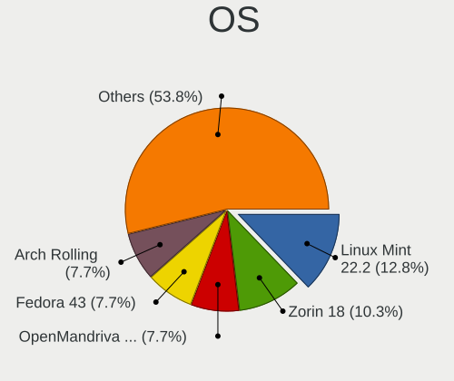

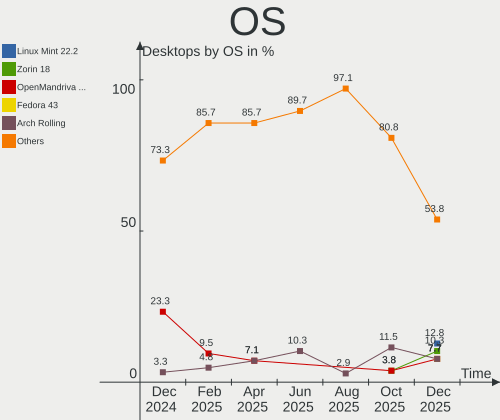

| Name                         | Desktops | Percent |
|------------------------------|----------|---------|
| Linux Mint 22.2              | 5        | 12.82%  |
| Zorin 18                     | 4        | 10.26%  |
| OpenMandriva 24.12           | 3        | 7.69%   |
| Fedora 43                    | 3        | 7.69%   |
| Arch Rolling                 | 3        | 7.69%   |
| Ubuntu 25.10                 | 2        | 5.13%   |
| Ubuntu 24.04                 | 2        | 5.13%   |
| OpenMandriva 25.90           | 2        | 5.13%   |
| Debian 13                    | 2        | 5.13%   |
| Zorin 17                     | 1        | 2.56%   |
| Xubuntu 22.04                | 1        | 2.56%   |
| Ubuntu 25.04                 | 1        | 2.56%   |
| Ubuntu 22.04                 | 1        | 2.56%   |
| Ubuntu 20.04                 | 1        | 2.56%   |
| Pop!_OS 24.04                | 1        | 2.56%   |
| org.kde.Platform 5.15-21.08  | 1        | 2.56%   |
| openSUSE Tumbleweed-XXXXXXXX | 1        | 2.56%   |
| LMDE 7                       | 1        | 2.56%   |
| Kubuntu 25.10                | 1        | 2.56%   |
| CachyOS Rolling              | 1        | 2.56%   |
| Bazzite 43                   | 1        | 2.56%   |
| Anduinos 1.4.1               | 1        | 2.56%   |

OS Family
---------

OS without a version

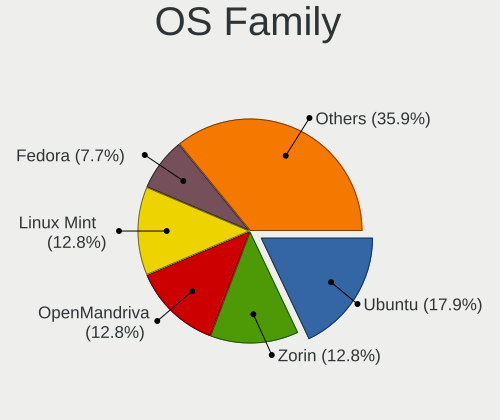

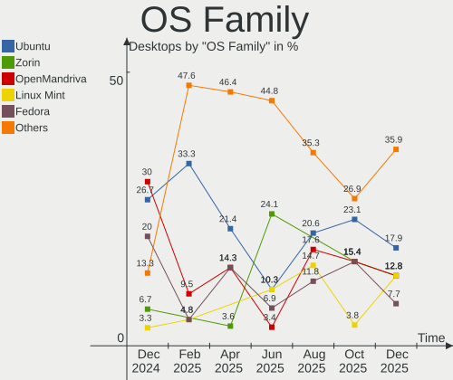

| Name             | Desktops | Percent |
|------------------|----------|---------|
| Ubuntu           | 7        | 17.95%  |
| Zorin            | 5        | 12.82%  |
| OpenMandriva     | 5        | 12.82%  |
| Linux Mint       | 5        | 12.82%  |
| Fedora           | 3        | 7.69%   |
| Arch             | 3        | 7.69%   |
| Debian           | 2        | 5.13%   |
| Xubuntu          | 1        | 2.56%   |
| Pop!_OS          | 1        | 2.56%   |
| org.kde.Platform | 1        | 2.56%   |
| openSUSE         | 1        | 2.56%   |
| LMDE             | 1        | 2.56%   |
| Kubuntu          | 1        | 2.56%   |
| CachyOS          | 1        | 2.56%   |
| Bazzite          | 1        | 2.56%   |
| Anduinos         | 1        | 2.56%   |

Kernel
------

Version of the Linux kernel

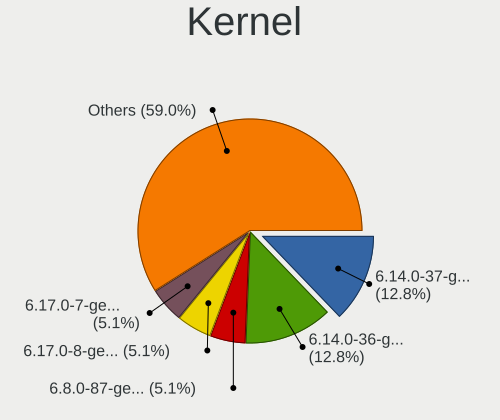

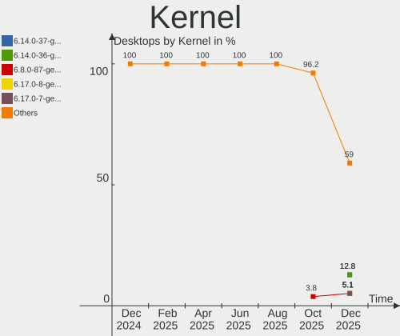

| Version                  | Desktops | Percent |
|--------------------------|----------|---------|
| 6.14.0-37-generic        | 5        | 12.82%  |
| 6.14.0-36-generic        | 5        | 12.82%  |
| 6.8.0-87-generic         | 2        | 5.13%   |
| 6.17.0-8-generic         | 2        | 5.13%   |
| 6.17.0-7-generic         | 2        | 5.13%   |
| 6.14.2-desktop-3omv2590  | 2        | 5.13%   |
| 6.12.6-desktop-1omv2490  | 2        | 5.13%   |
| 6.12.57+deb13-amd64      | 2        | 5.13%   |
| 6.8.0-90-generic         | 1        | 2.56%   |
| 6.18.1-arch1-2           | 1        | 2.56%   |
| 6.18.1-1-default         | 1        | 2.56%   |
| 6.17.9-zen1-1-zen        | 1        | 2.56%   |
| 6.17.9-arch1-1           | 1        | 2.56%   |
| 6.17.9-76061709-generic  | 1        | 2.56%   |
| 6.17.9-300.fc43.x86_64   | 1        | 2.56%   |
| 6.17.8+deb13-amd64       | 1        | 2.56%   |
| 6.17.7-ba19.fc43.x86_64  | 1        | 2.56%   |
| 6.17.7-300.fc43.x86_64   | 1        | 2.56%   |
| 6.17.7-3-cachyos         | 1        | 2.56%   |
| 6.17.10-300.fc43.x86_64  | 1        | 2.56%   |
| 6.17.10-1-liquorix-amd64 | 1        | 2.56%   |
| 6.17.10                  | 1        | 2.56%   |
| 6.14.0-35-generic        | 1        | 2.56%   |
| 6.12.1-desktop-1omv2490  | 1        | 2.56%   |
| 5.15.0-139-generic       | 1        | 2.56%   |

Kernel Family
-------------

Linux kernel without a distro release

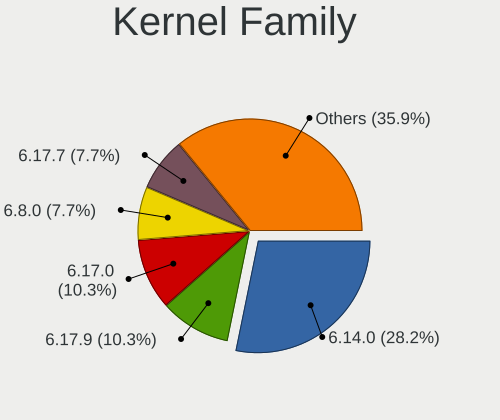

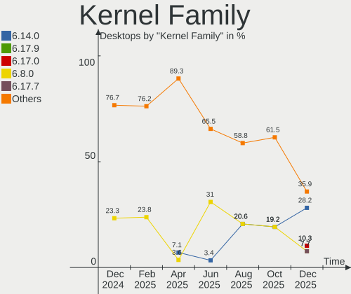

| Version | Desktops | Percent |
|---------|----------|---------|
| 6.14.0  | 11       | 28.21%  |
| 6.17.9  | 4        | 10.26%  |
| 6.17.0  | 4        | 10.26%  |
| 6.8.0   | 3        | 7.69%   |
| 6.17.7  | 3        | 7.69%   |
| 6.17.10 | 3        | 7.69%   |
| 6.18.1  | 2        | 5.13%   |
| 6.14.2  | 2        | 5.13%   |
| 6.12.6  | 2        | 5.13%   |
| 6.12.57 | 2        | 5.13%   |
| 6.17.8  | 1        | 2.56%   |
| 6.12.1  | 1        | 2.56%   |
| 5.15.0  | 1        | 2.56%   |

Kernel Major Ver.
-----------------

Linux kernel major version

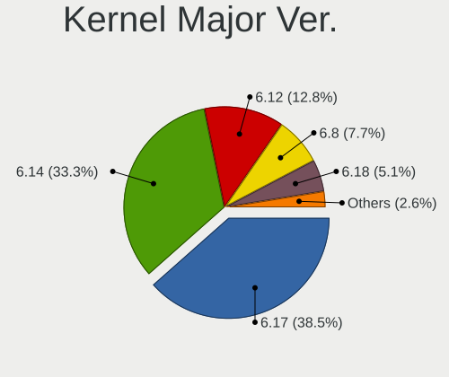

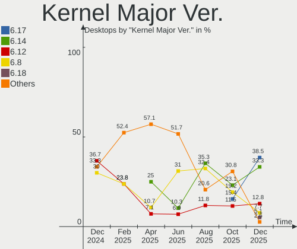

| Version | Desktops | Percent |
|---------|----------|---------|
| 6.17    | 15       | 38.46%  |
| 6.14    | 13       | 33.33%  |
| 6.12    | 5        | 12.82%  |
| 6.8     | 3        | 7.69%   |
| 6.18    | 2        | 5.13%   |
| 5.15    | 1        | 2.56%   |

Arch
----

OS architecture (x86_64, i586, etc.)

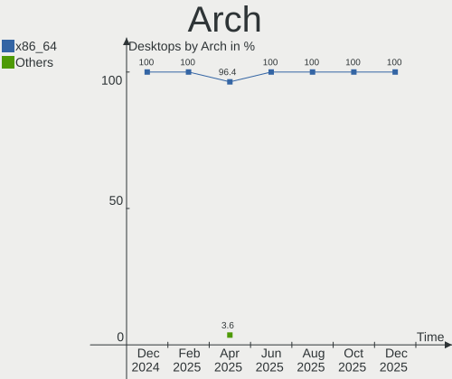

| Name   | Desktops | Percent |
|--------|----------|---------|
| x86_64 | 39       | 100%    |

DE
--

Desktop Environment

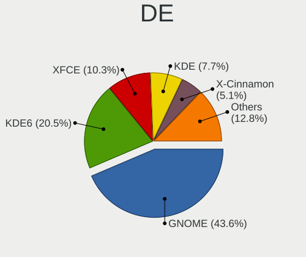

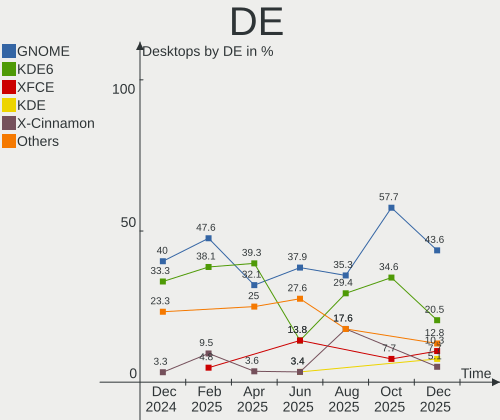

| Name       | Desktops | Percent |
|------------|----------|---------|
| GNOME      | 17       | 43.59%  |
| KDE6       | 8        | 20.51%  |
| XFCE       | 4        | 10.26%  |
| KDE        | 3        | 7.69%   |
| X-Cinnamon | 2        | 5.13%   |
| Niri       | 1        | 2.56%   |
| COSMIC     | 1        | 2.56%   |
| Cinnamon   | 1        | 2.56%   |
| Budgie     | 1        | 2.56%   |
| Unknown    | 1        | 2.56%   |

Display Server
--------------

X11 or Wayland

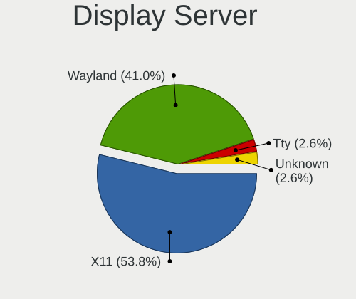

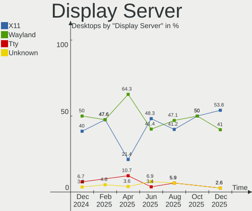

| Name    | Desktops | Percent |
|---------|----------|---------|
| X11     | 21       | 53.85%  |
| Wayland | 16       | 41.03%  |
| Tty     | 1        | 2.56%   |
| Unknown | 1        | 2.56%   |

Display Manager
---------------

SDDM, LightDM, etc.

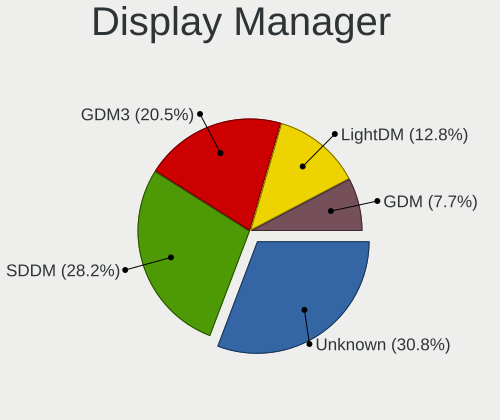

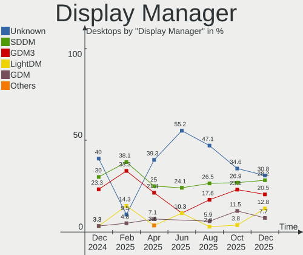

| Name    | Desktops | Percent |
|---------|----------|---------|
| Unknown | 12       | 30.77%  |
| SDDM    | 11       | 28.21%  |
| GDM3    | 8        | 20.51%  |
| LightDM | 5        | 12.82%  |
| GDM     | 3        | 7.69%   |

OS Lang
-------

Language

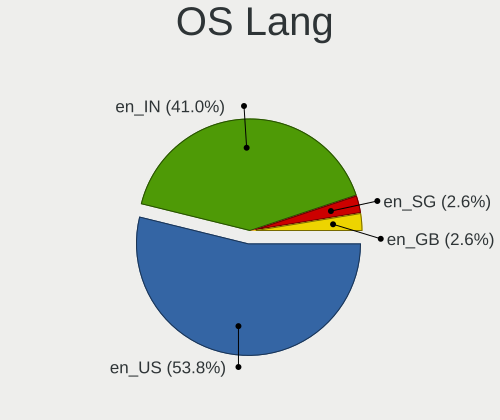

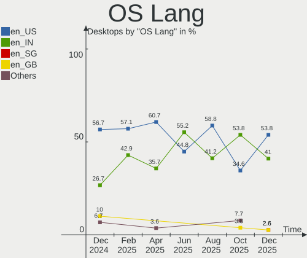

| Lang  | Desktops | Percent |
|-------|----------|---------|
| en_US | 21       | 53.85%  |
| en_IN | 16       | 41.03%  |
| en_SG | 1        | 2.56%   |
| en_GB | 1        | 2.56%   |

Boot Mode
---------

EFI or BIOS

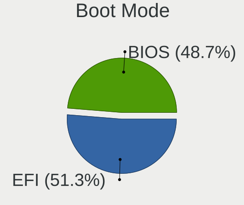

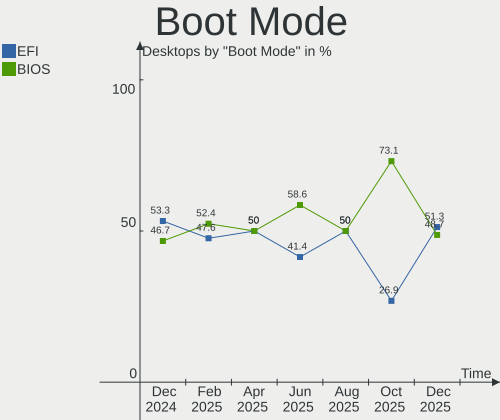

| Mode | Desktops | Percent |
|------|----------|---------|
| EFI  | 20       | 51.28%  |
| BIOS | 19       | 48.72%  |

Filesystem
----------

Type of filesystem

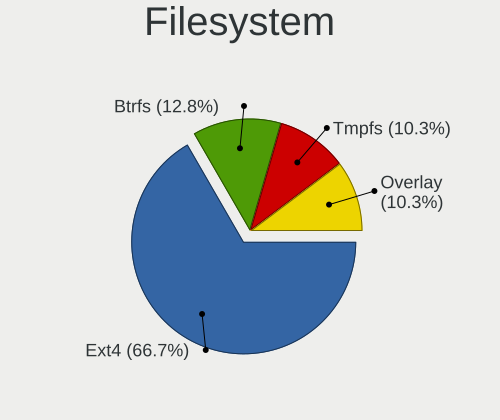

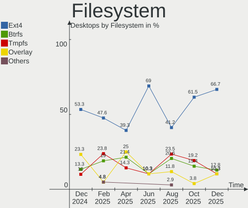

| Type    | Desktops | Percent |
|---------|----------|---------|
| Ext4    | 26       | 66.67%  |
| Btrfs   | 5        | 12.82%  |
| Tmpfs   | 4        | 10.26%  |
| Overlay | 4        | 10.26%  |

Part. scheme
------------

Scheme of partitioning

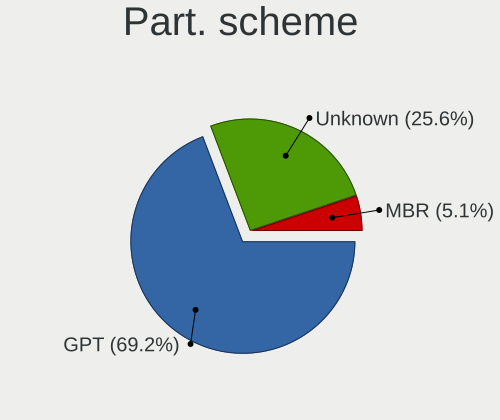

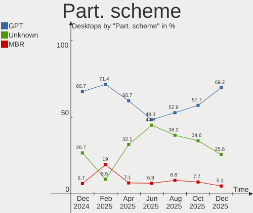

| Type    | Desktops | Percent |
|---------|----------|---------|
| GPT     | 27       | 69.23%  |
| Unknown | 10       | 25.64%  |
| MBR     | 2        | 5.13%   |

Dual Boot with Linux/BSD
------------------------

Hosting more than one Linux/BSD

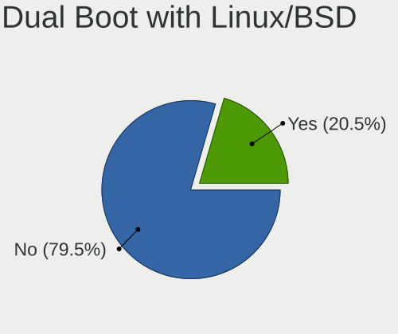

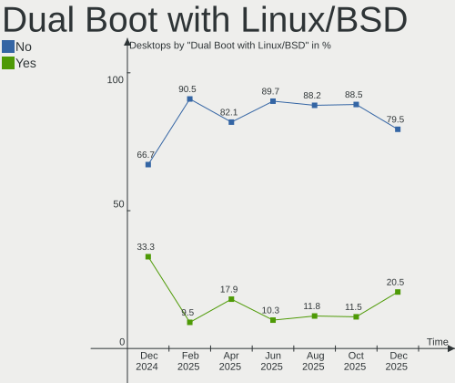

| Dual boot | Desktops | Percent |
|-----------|----------|---------|
| No        | 31       | 79.49%  |
| Yes       | 8        | 20.51%  |

Dual Boot (Win)
---------------

Hosting Linux and Windows

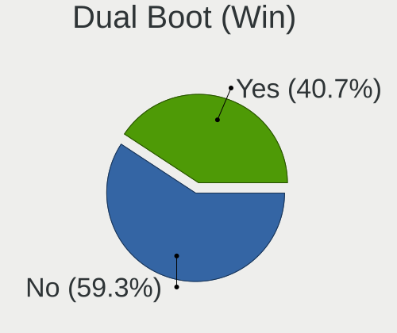

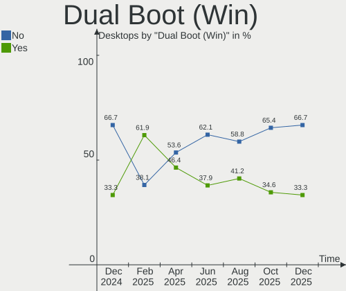

| Dual boot | Desktops | Percent |
|-----------|----------|---------|
| No        | 26       | 66.67%  |
| Yes       | 13       | 33.33%  |

Board
-----

Vendor
------

Motherboard manufacturer

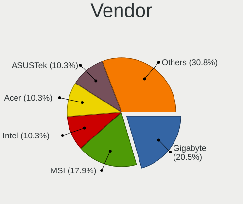

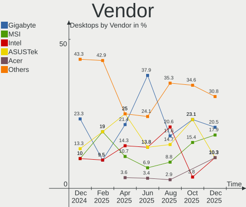

| Name                | Desktops | Percent |
|---------------------|----------|---------|
| Gigabyte Technology | 8        | 20.51%  |
| MSI                 | 7        | 17.95%  |
| Intel               | 4        | 10.26%  |
| ASUSTek Computer    | 4        | 10.26%  |
| Acer                | 4        | 10.26%  |
| ASRock              | 3        | 7.69%   |
| Red Hat             | 2        | 5.13%   |
| Lenovo              | 2        | 5.13%   |
| Dell                | 2        | 5.13%   |
| Hewlett-Packard     | 1        | 2.56%   |
| Fusionstor          | 1        | 2.56%   |
| ECS                 | 1        | 2.56%   |

Model
-----

Motherboard model

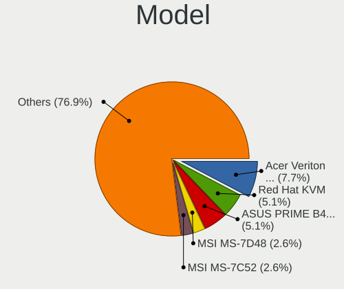

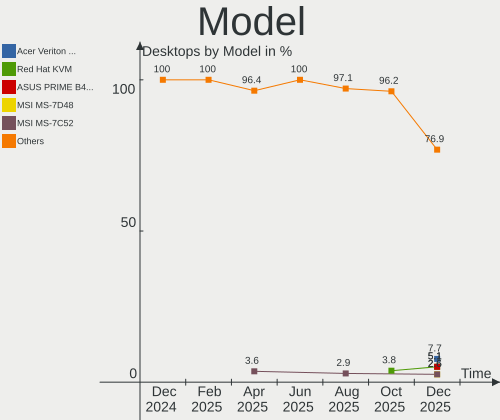

| Name                                | Desktops | Percent |
|-------------------------------------|----------|---------|
| Acer Veriton X4240G                 | 3        | 7.69%   |
| Red Hat KVM                         | 2        | 5.13%   |
| ASUS PRIME B450M-A                  | 2        | 5.13%   |
| MSI MS-7D48                         | 1        | 2.56%   |
| MSI MS-7C52                         | 1        | 2.56%   |
| MSI MS-7C37                         | 1        | 2.56%   |
| MSI MS-7C35                         | 1        | 2.56%   |
| MSI MS-7A38                         | 1        | 2.56%   |
| MSI MS-7A33                         | 1        | 2.56%   |
| MSI MS-7917                         | 1        | 2.56%   |
| Lenovo ThinkCentre M710s 10M8S8FV00 | 1        | 2.56%   |
| Lenovo ThinkCentre M58p 6137BH3     | 1        | 2.56%   |
| Intel MS-0C77F                      | 1        | 2.56%   |
| Intel H61                           | 1        | 2.56%   |
| Intel DG41RQ AAE54511-203           | 1        | 2.56%   |
| Intel cloudstar itx-c246            | 1        | 2.56%   |
| HP Pavilion Desktop PC 570-p0xx     | 1        | 2.56%   |
| Gigabyte Z390 AORUS ELITE           | 1        | 2.56%   |
| Gigabyte H61MS                      | 1        | 2.56%   |
| Gigabyte H61M-S1                    | 1        | 2.56%   |
| Gigabyte H61M-DS2                   | 1        | 2.56%   |
| Gigabyte H270-Gaming 3              | 1        | 2.56%   |
| Gigabyte GA-78LMT-USB3 6.0          | 1        | 2.56%   |
| Gigabyte B550M GAMING X WIFI6       | 1        | 2.56%   |
| Gigabyte B550 AORUS ELITE           | 1        | 2.56%   |
| Fusionstor Invento_i7020            | 1        | 2.56%   |
| ECS H81H3-M4                        | 1        | 2.56%   |
| Dell OptiPlex 7070                  | 1        | 2.56%   |
| Dell OptiPlex 7050                  | 1        | 2.56%   |
| ASUS TUF Gaming Z790-PLUS WIFI D4   | 1        | 2.56%   |
| ASUS B650M-AYW WIFI                 | 1        | 2.56%   |
| ASRock B650M-HDV/M.2                | 1        | 2.56%   |
| ASRock B450M-HDV R4.0               | 1        | 2.56%   |
| ASRock B450 Pro4                    | 1        | 2.56%   |
| Acer Veriton X2680G                 | 1        | 2.56%   |

Model Family
------------

Motherboard model prefix

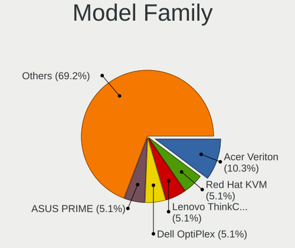

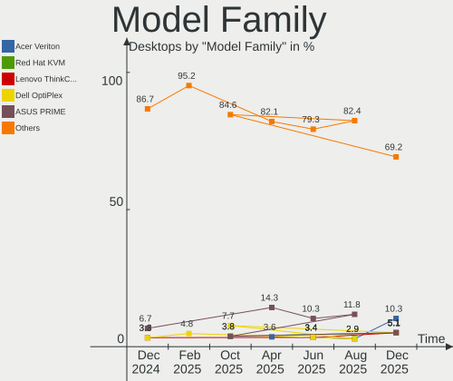

| Name                   | Desktops | Percent |
|------------------------|----------|---------|
| Acer Veriton           | 4        | 10.26%  |
| Red Hat KVM            | 2        | 5.13%   |
| Lenovo ThinkCentre     | 2        | 5.13%   |
| Dell OptiPlex          | 2        | 5.13%   |
| ASUS PRIME             | 2        | 5.13%   |
| MSI MS-7D48            | 1        | 2.56%   |
| MSI MS-7C52            | 1        | 2.56%   |
| MSI MS-7C37            | 1        | 2.56%   |
| MSI MS-7C35            | 1        | 2.56%   |
| MSI MS-7A38            | 1        | 2.56%   |
| MSI MS-7A33            | 1        | 2.56%   |
| MSI MS-7917            | 1        | 2.56%   |
| Intel MS-0C77F         | 1        | 2.56%   |
| Intel H61              | 1        | 2.56%   |
| Intel DG41RQ           | 1        | 2.56%   |
| Intel cloudstar        | 1        | 2.56%   |
| HP Pavilion            | 1        | 2.56%   |
| Gigabyte Z390          | 1        | 2.56%   |
| Gigabyte H61MS         | 1        | 2.56%   |
| Gigabyte H61M-S1       | 1        | 2.56%   |
| Gigabyte H61M-DS2      | 1        | 2.56%   |
| Gigabyte H270-Gaming   | 1        | 2.56%   |
| Gigabyte GA-78LMT-USB3 | 1        | 2.56%   |
| Gigabyte B550M         | 1        | 2.56%   |
| Gigabyte B550          | 1        | 2.56%   |
| Fusionstor Invento     | 1        | 2.56%   |
| ECS H81H3-M4           | 1        | 2.56%   |
| ASUS TUF               | 1        | 2.56%   |
| ASUS B650M-AYW         | 1        | 2.56%   |
| ASRock B650M-HDV       | 1        | 2.56%   |
| ASRock B450M-HDV       | 1        | 2.56%   |
| ASRock B450            | 1        | 2.56%   |

MFG Year
--------

Motherboard manufacture year

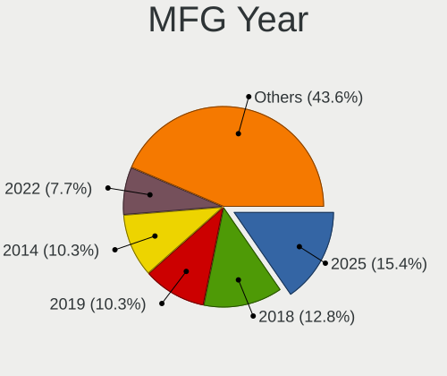

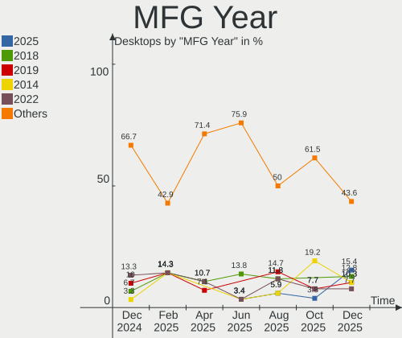

| Year | Desktops | Percent |
|------|----------|---------|
| 2025 | 6        | 15.38%  |
| 2018 | 5        | 12.82%  |
| 2019 | 4        | 10.26%  |
| 2014 | 4        | 10.26%  |
| 2022 | 3        | 7.69%   |
| 2017 | 3        | 7.69%   |
| 2023 | 2        | 5.13%   |
| 2020 | 2        | 5.13%   |
| 2013 | 2        | 5.13%   |
| 2012 | 2        | 5.13%   |
| 2009 | 2        | 5.13%   |
| 2024 | 1        | 2.56%   |
| 2021 | 1        | 2.56%   |
| 2016 | 1        | 2.56%   |
| 2008 | 1        | 2.56%   |

Form Factor
-----------

Physical design of the computer

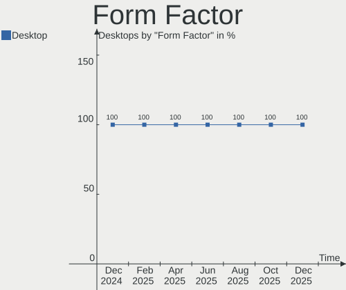

| Name    | Desktops | Percent |
|---------|----------|---------|
| Desktop | 39       | 100%    |

Secure Boot
-----------

Enabled or disabled

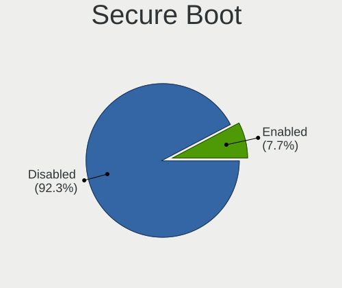

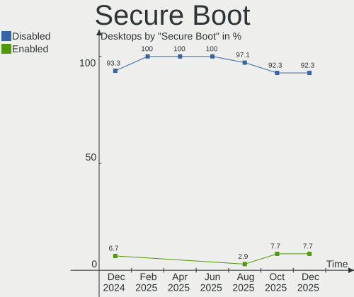

| State    | Desktops | Percent |
|----------|----------|---------|
| Disabled | 36       | 92.31%  |
| Enabled  | 3        | 7.69%   |

Coreboot
--------

Have coreboot on board

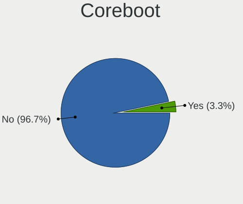

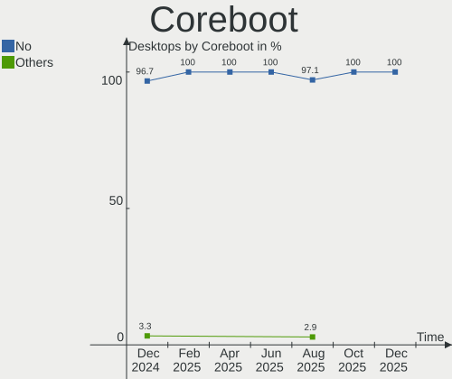

| Used | Desktops | Percent |
|------|----------|---------|
| No   | 39       | 100%    |

RAM Size
--------

Total RAM memory

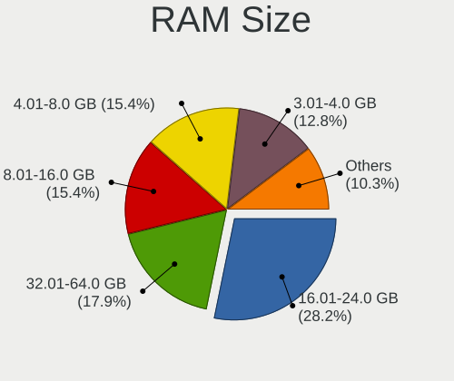

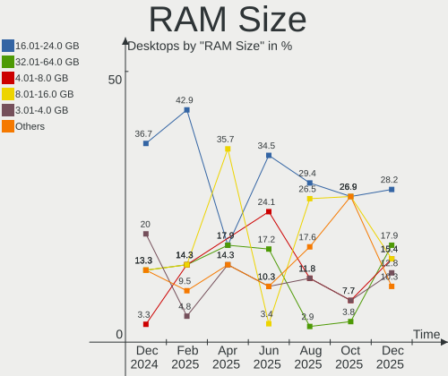

| Size in GB  | Desktops | Percent |
|-------------|----------|---------|
| 16.01-24.0  | 11       | 28.21%  |
| 32.01-64.0  | 7        | 17.95%  |
| 4.01-8.0    | 6        | 15.38%  |
| 8.01-16.0   | 6        | 15.38%  |
| 3.01-4.0    | 5        | 12.82%  |
| 24.01-32.0  | 2        | 5.13%   |
| 64.01-256.0 | 2        | 5.13%   |

RAM Used
--------

Used RAM memory

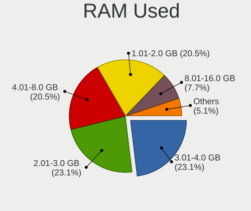

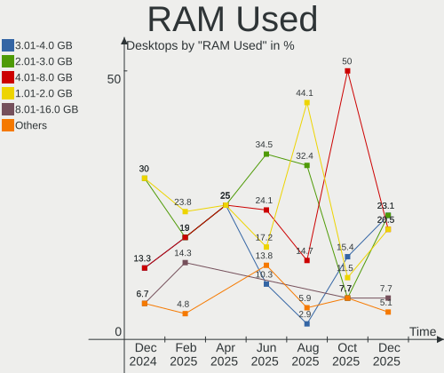

| Used GB    | Desktops | Percent |
|------------|----------|---------|
| 3.01-4.0   | 9        | 23.08%  |
| 2.01-3.0   | 9        | 23.08%  |
| 4.01-8.0   | 8        | 20.51%  |
| 1.01-2.0   | 8        | 20.51%  |
| 8.01-16.0  | 3        | 7.69%   |
| 16.01-24.0 | 1        | 2.56%   |
| 0.51-1.0   | 1        | 2.56%   |

Total Drives
------------

Number of drives on board

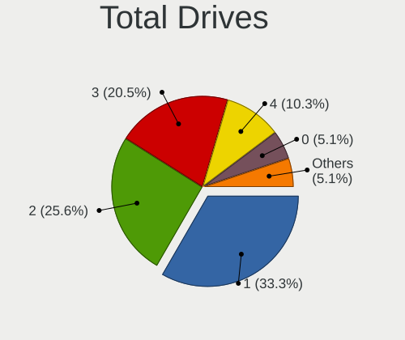

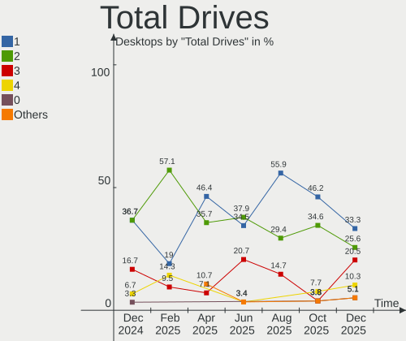

| Drives | Desktops | Percent |
|--------|----------|---------|
| 1      | 13       | 33.33%  |
| 2      | 10       | 25.64%  |
| 3      | 8        | 20.51%  |
| 4      | 4        | 10.26%  |
| 0      | 2        | 5.13%   |
| 6      | 1        | 2.56%   |
| 5      | 1        | 2.56%   |

Has CD-ROM
----------

Has CD-ROM on board

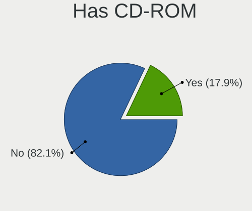

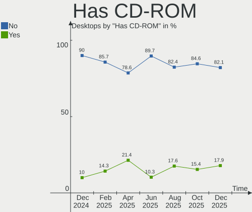

| Presented | Desktops | Percent |
|-----------|----------|---------|
| No        | 32       | 82.05%  |
| Yes       | 7        | 17.95%  |

Has Ethernet
------------

Has Ethernet on board

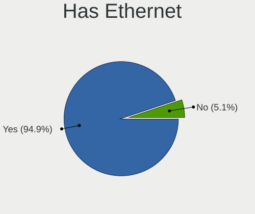

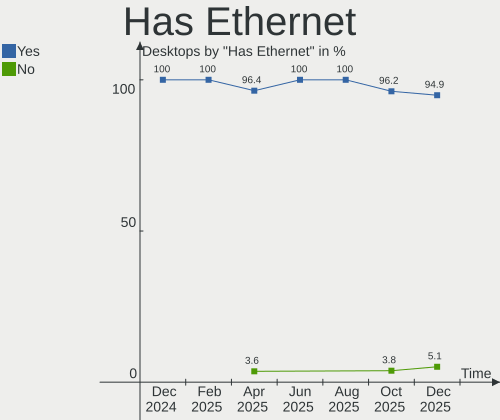

| Presented | Desktops | Percent |
|-----------|----------|---------|
| Yes       | 37       | 94.87%  |
| No        | 2        | 5.13%   |

Has WiFi
--------

Has WiFi module

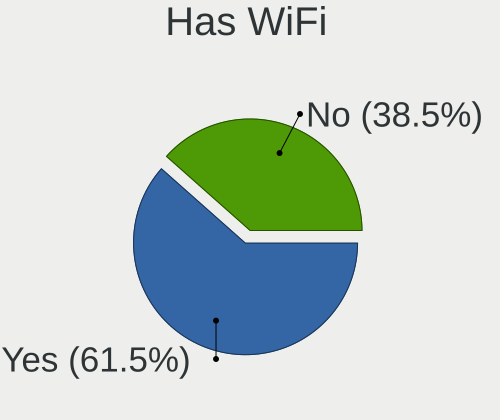

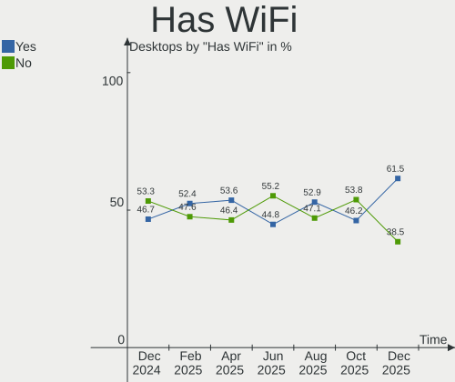

| Presented | Desktops | Percent |
|-----------|----------|---------|
| Yes       | 24       | 61.54%  |
| No        | 15       | 38.46%  |

Has Bluetooth
-------------

Has Bluetooth module

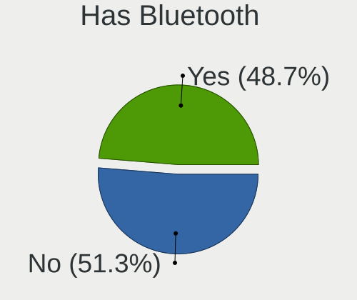

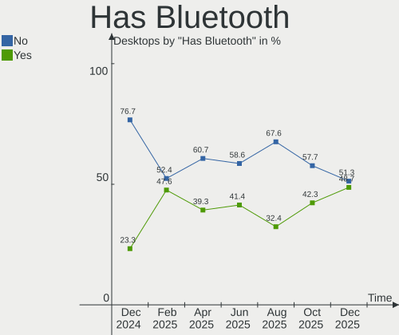

| Presented | Desktops | Percent |
|-----------|----------|---------|
| No        | 20       | 51.28%  |
| Yes       | 19       | 48.72%  |

Location
--------

Country
-------

Geographic location (country)

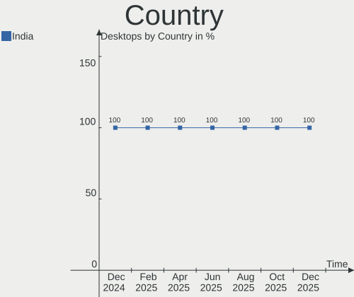

| Country | Desktops | Percent |
|---------|----------|---------|
| India   | 39       | 100%    |

City
----

Geographic location (city)

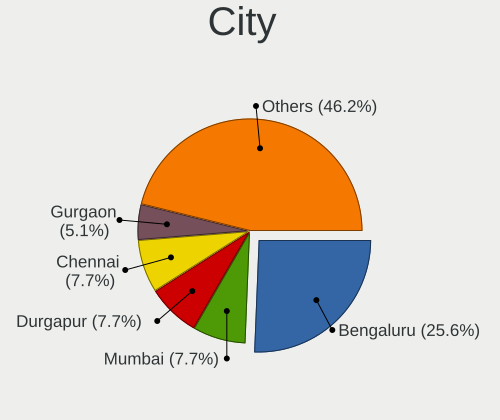

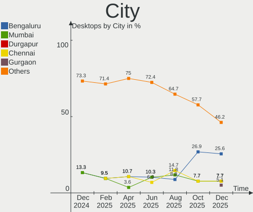

| City          | Desktops | Percent |
|---------------|----------|---------|
| Bengaluru     | 10       | 25.64%  |
| Mumbai        | 3        | 7.69%   |
| Durgapur      | 3        | 7.69%   |
| Chennai       | 3        | 7.69%   |
| Gurgaon       | 2        | 5.13%   |
| Delhi         | 2        | 5.13%   |
| Visakhapatnam | 1        | 2.56%   |
| Raipur        | 1        | 2.56%   |
| Purnia        | 1        | 2.56%   |
| Pune          | 1        | 2.56%   |
| Patna         | 1        | 2.56%   |
| Nagpur        | 1        | 2.56%   |
| Meerut        | 1        | 2.56%   |
| Kolkata       | 1        | 2.56%   |
| Jamshedpur    | 1        | 2.56%   |
| Ghaziabad     | 1        | 2.56%   |
| Dehradun      | 1        | 2.56%   |
| Coimbatore    | 1        | 2.56%   |
| Bhubaneswar   | 1        | 2.56%   |
| Bhopal        | 1        | 2.56%   |
| Bhadrakh      | 1        | 2.56%   |
| Amritsar      | 1        | 2.56%   |

Drives
------

Drive Vendor
------------

Hard drive vendors

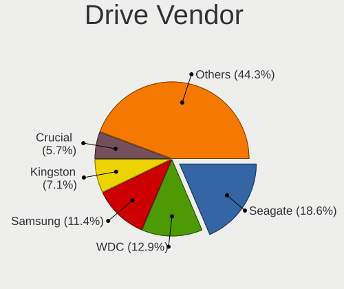

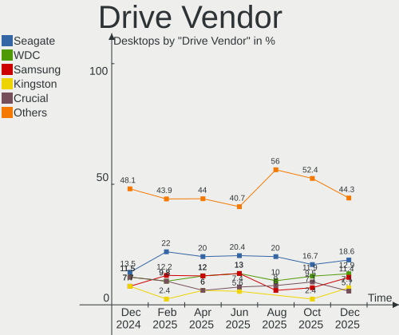

| Vendor                      | Desktops | Drives | Percent |
|-----------------------------|----------|--------|---------|
| Seagate                     | 13       | 19     | 18.57%  |
| WDC                         | 9        | 11     | 12.86%  |
| Samsung Electronics         | 8        | 12     | 11.43%  |
| Kingston                    | 5        | 6      | 7.14%   |
| Crucial                     | 4        | 4      | 5.71%   |
| Silicon Motion              | 3        | 3      | 4.29%   |
| Sandisk                     | 3        | 3      | 4.29%   |
| Micron Technology           | 3        | 3      | 4.29%   |
| BIWIN                       | 3        | 3      | 4.29%   |
| Micron/Crucial Technology   | 2        | 2      | 2.86%   |
| HS-SSD-E100                 | 2        | 2      | 2.86%   |
| EVM                         | 2        | 2      | 2.86%   |
| China                       | 2        | 2      | 2.86%   |
| Unknown                     | 1        | 1      | 1.43%   |
| Toshiba                     | 1        | 1      | 1.43%   |
| SK hynix                    | 1        | 1      | 1.43%   |
| S930P                       | 1        | 1      | 1.43%   |
| Phison Electronics          | 1        | 1      | 1.43%   |
| KIOXIA-EXCERIA              | 1        | 1      | 1.43%   |
| KIOXIA                      | 1        | 1      | 1.43%   |
| Kingston Technology Company | 1        | 2      | 1.43%   |
| Intel                       | 1        | 1      | 1.43%   |
| Hitachi                     | 1        | 1      | 1.43%   |
| Cablet                      | 1        | 1      | 1.43%   |

Drive Model
-----------

Hard drive models

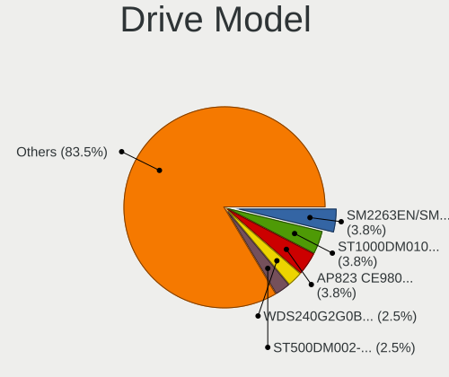

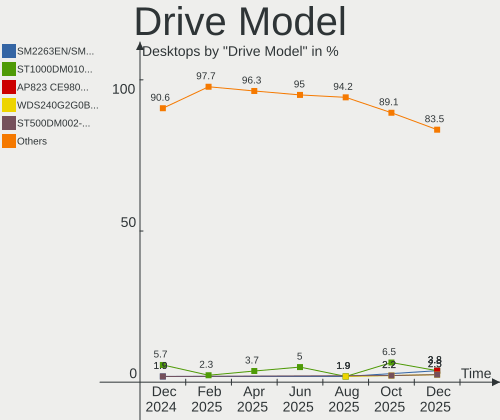

| Model                                                                   | Desktops | Percent |
|-------------------------------------------------------------------------|----------|---------|
| Silicon Motion SM2263EN/SM2263XT SSD Controller 512GB                   | 3        | 3.8%    |
| Seagate ST1000DM010-2EP102 1TB                                          | 3        | 3.8%    |
| BIWIN AP823 CE980TB8900-512G                                            | 3        | 3.8%    |
| WDC WDS240G2G0B-00EPW0 240GB SSD                                        | 2        | 2.53%   |
| Seagate ST500DM002-1BD142 500GB                                         | 2        | 2.53%   |
| Seagate ST3500418AS 500GB                                               | 2        | 2.53%   |
| Samsung NVMe SSD Controller SM981/PM981/PM983 1TB                       | 2        | 2.53%   |
| Kingston SA400S37240G 240GB SSD                                         | 2        | 2.53%   |
| Crucial CT240BX500SSD1 240GB                                            | 2        | 2.53%   |
| WDC WD5000AADS-00S9B0 500GB                                             | 1        | 1.27%   |
| WDC WD20EZRZ-60Z5HB0 2TB                                                | 1        | 1.27%   |
| WDC WD20EZRZ-00Z5HB0 2TB                                                | 1        | 1.27%   |
| WDC WD20EZBX-00AYRA0 2TB                                                | 1        | 1.27%   |
| WDC WD10SPZX-24Z10 1TB                                                  | 1        | 1.27%   |
| WDC WD10PURX-64D85Y0 1TB                                                | 1        | 1.27%   |
| WDC WD10EZEX-00MFCA0 1TB                                                | 1        | 1.27%   |
| WDC WD10EADS-00P6B0 1TB                                                 | 1        | 1.27%   |
| WDC WD1003FBYZ-010FB0 1TB                                               | 1        | 1.27%   |
| Unknown SD/MMC/MS PRO 2GB                                               | 1        | 1.27%   |
| Toshiba HDWD110 1TB                                                     | 1        | 1.27%   |
| SK hynix SKHynix_HFS512GD9TNI-L2B0B 512GB                               | 1        | 1.27%   |
| Seagate ST9500325AS 500GB                                               | 1        | 1.27%   |
| Seagate ST3160212SCE 160GB                                              | 1        | 1.27%   |
| Seagate ST31000524AS 1TB                                                | 1        | 1.27%   |
| Seagate ST2000DM008-2FR102 2TB                                          | 1        | 1.27%   |
| Seagate ST2000DM005-2CW102 2TB                                          | 1        | 1.27%   |
| Seagate ST14000NM001G-2KJ103 14TB                                       | 1        | 1.27%   |
| Seagate ST1000LX015-1U7172-SSHD 1TB                                     | 1        | 1.27%   |
| Seagate ST1000DM003-9YN162 1TB                                          | 1        | 1.27%   |
| Seagate ST1000DM003-1SB102 1TB                                          | 1        | 1.27%   |
| Seagate One Touch Hub 14TB                                              | 1        | 1.27%   |
| Sandisk WD Blue SN550 NVMe SSD 1024GB                                   | 1        | 1.27%   |
| Sandisk WD Black SN850 1TB                                              | 1        | 1.27%   |
| Sandisk WD Black SN770 / PC SN740 256GB / PC SN560 (DRAM-less) NVMe SSD | 1        | 1.27%   |
| Samsung SSD 990 PRO 1TB                                                 | 1        | 1.27%   |
| Samsung SSD 990 EVO Plus 2TB                                            | 1        | 1.27%   |
| Samsung SSD 980 250GB S64BNU0T721673L                                   | 1        | 1.27%   |
| Samsung SSD 980 1TB                                                     | 1        | 1.27%   |
| Samsung SSD 970 EVO Plus 1TB                                            | 1        | 1.27%   |
| Samsung SSD 860 EVO 250GB                                               | 1        | 1.27%   |

HDD Vendor
----------

Hard disk drive vendors

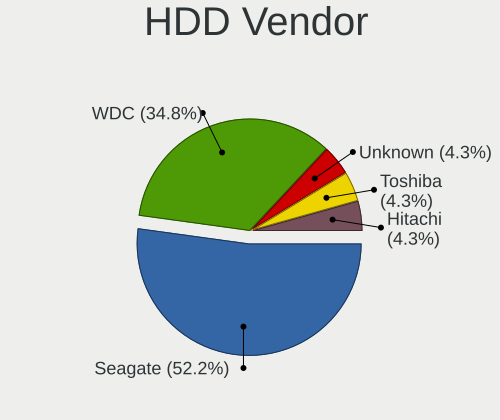

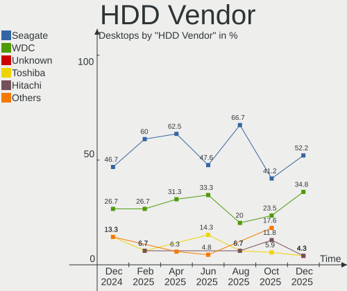

| Vendor  | Desktops | Drives | Percent |
|---------|----------|--------|---------|
| Seagate | 12       | 18     | 52.17%  |
| WDC     | 8        | 9      | 34.78%  |
| Unknown | 1        | 1      | 4.35%   |
| Toshiba | 1        | 1      | 4.35%   |
| Hitachi | 1        | 1      | 4.35%   |

SSD Vendor
----------

Solid state drive vendors

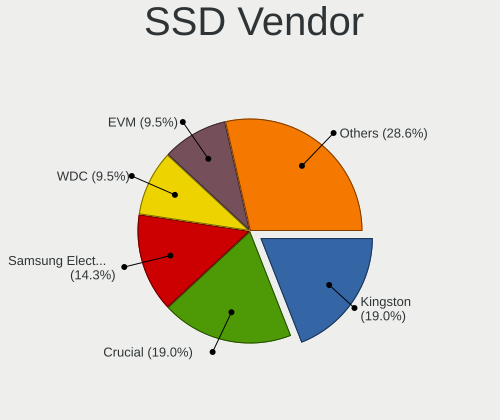

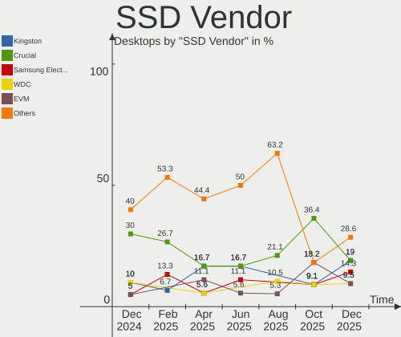

| Vendor              | Desktops | Drives | Percent |
|---------------------|----------|--------|---------|
| Kingston            | 4        | 4      | 19.05%  |
| Crucial             | 4        | 4      | 19.05%  |
| Samsung Electronics | 3        | 3      | 14.29%  |
| WDC                 | 2        | 2      | 9.52%   |
| EVM                 | 2        | 2      | 9.52%   |
| China               | 2        | 2      | 9.52%   |
| S930P               | 1        | 1      | 4.76%   |
| Micron Technology   | 1        | 1      | 4.76%   |
| KIOXIA-EXCERIA      | 1        | 1      | 4.76%   |
| HS-SSD-E100         | 1        | 1      | 4.76%   |

Drive Kind
----------

HDD or SSD

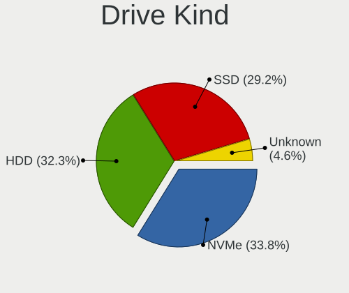

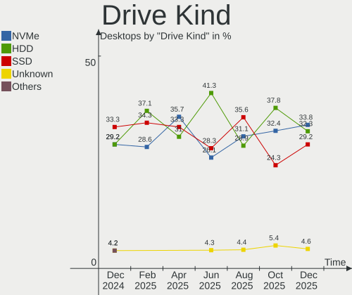

| Kind    | Desktops | Drives | Percent |
|---------|----------|--------|---------|
| NVMe    | 22       | 30     | 33.85%  |
| HDD     | 21       | 30     | 32.31%  |
| SSD     | 19       | 21     | 29.23%  |
| Unknown | 3        | 3      | 4.62%   |

Drive Connector
---------------

SATA, SAS, NVMe, etc.

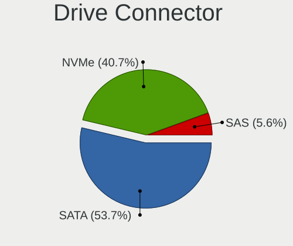

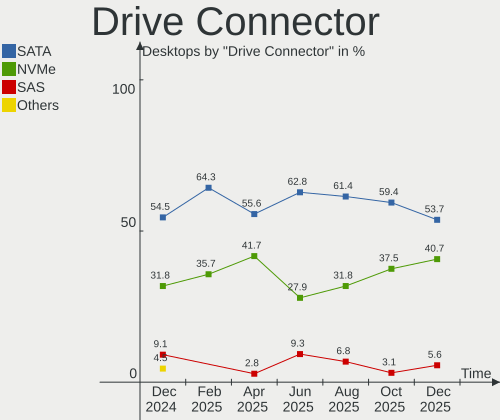

| Type | Desktops | Drives | Percent |
|------|----------|--------|---------|
| SATA | 29       | 51     | 53.7%   |
| NVMe | 22       | 30     | 40.74%  |
| SAS  | 3        | 3      | 5.56%   |

Drive Size
----------

Size of hard drive

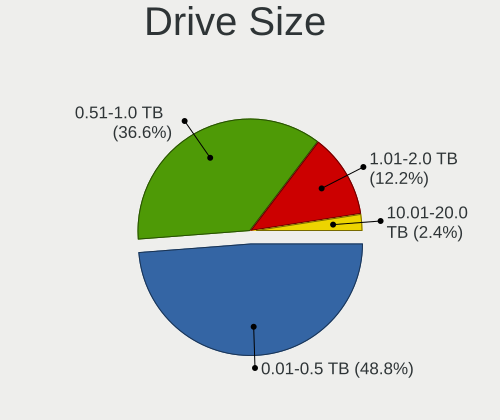

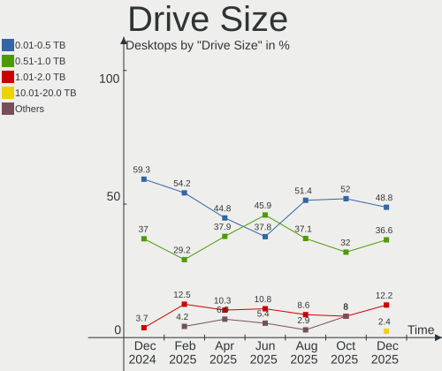

| Size in TB | Desktops | Drives | Percent |
|------------|----------|--------|---------|
| 0.01-0.5   | 20       | 27     | 48.78%  |
| 0.51-1.0   | 15       | 17     | 36.59%  |
| 1.01-2.0   | 5        | 6      | 12.2%   |
| 10.01-20.0 | 1        | 1      | 2.44%   |

Space Total
-----------

Amount of disk space available on the file system

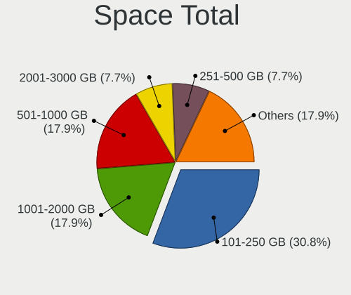

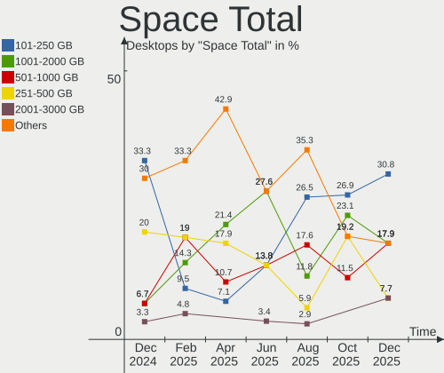

| Size in GB     | Desktops | Percent |
|----------------|----------|---------|
| 101-250        | 12       | 30.77%  |
| 1001-2000      | 7        | 17.95%  |
| 501-1000       | 7        | 17.95%  |
| 251-500        | 3        | 7.69%   |
| 2001-3000      | 3        | 7.69%   |
| Unknown        | 3        | 7.69%   |
| More than 3000 | 2        | 5.13%   |
| 21-50          | 1        | 2.56%   |
| 51-100         | 1        | 2.56%   |

Space Used
----------

Amount of used disk space

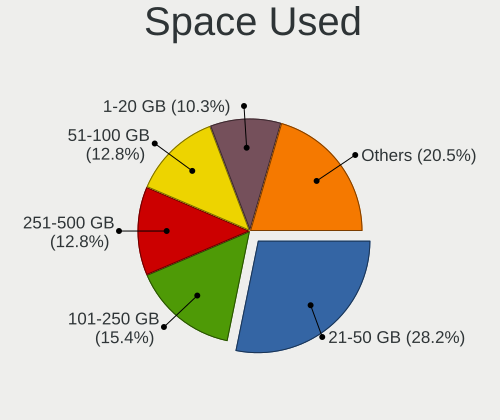

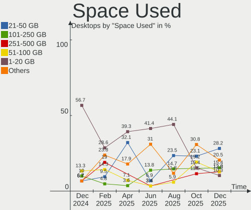

| Used GB   | Desktops | Percent |
|-----------|----------|---------|
| 21-50     | 11       | 28.21%  |
| 101-250   | 6        | 15.38%  |
| 251-500   | 5        | 12.82%  |
| 51-100    | 5        | 12.82%  |
| 1-20      | 4        | 10.26%  |
| 1001-2000 | 3        | 7.69%   |
| Unknown   | 3        | 7.69%   |
| 501-1000  | 2        | 5.13%   |

Malfunc. Drives
---------------

Drive models with a malfunction

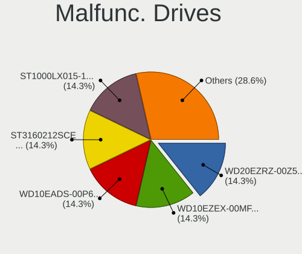

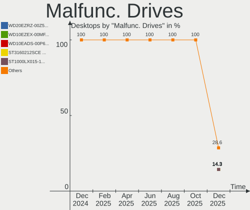

| Model                               | Desktops | Drives | Percent |
|-------------------------------------|----------|--------|---------|
| WDC WD20EZRZ-00Z5HB0 2TB            | 1        | 1      | 14.29%  |
| WDC WD10EZEX-00MFCA0 1TB            | 1        | 1      | 14.29%  |
| WDC WD10EADS-00P6B0 1TB             | 1        | 1      | 14.29%  |
| Seagate ST3160212SCE 160GB          | 1        | 1      | 14.29%  |
| Seagate ST1000LX015-1U7172-SSHD 1TB | 1        | 1      | 14.29%  |
| Seagate ST1000DM003-9YN162 1TB      | 1        | 1      | 14.29%  |
| Hitachi HDS721032CLA362 320GB       | 1        | 1      | 14.29%  |

Malfunc. Drive Vendor
---------------------

Vendors of faulty drives

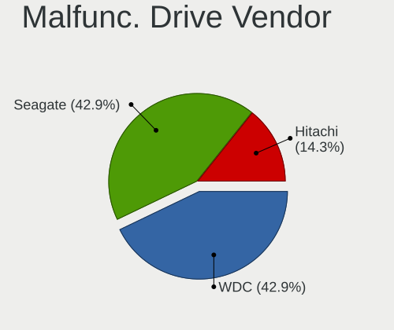

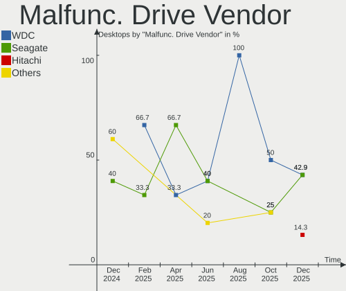

| Vendor  | Desktops | Drives | Percent |
|---------|----------|--------|---------|
| WDC     | 3        | 3      | 42.86%  |
| Seagate | 3        | 3      | 42.86%  |
| Hitachi | 1        | 1      | 14.29%  |

Malfunc. HDD Vendor
-------------------

Vendors of faulty HDD drives

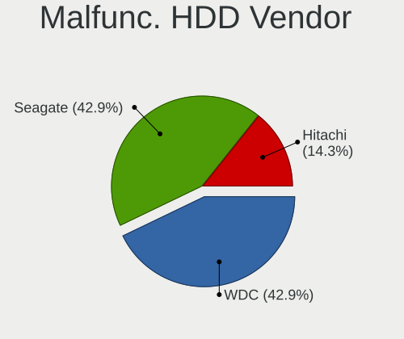

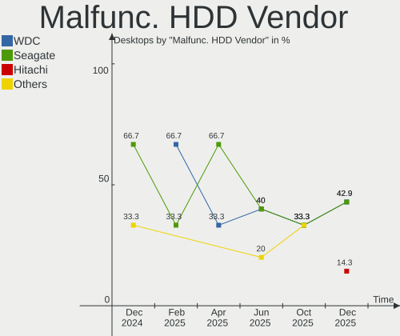

| Vendor  | Desktops | Drives | Percent |
|---------|----------|--------|---------|
| WDC     | 3        | 3      | 42.86%  |
| Seagate | 3        | 3      | 42.86%  |
| Hitachi | 1        | 1      | 14.29%  |

Malfunc. Drive Kind
-------------------

Kinds of faulty drives

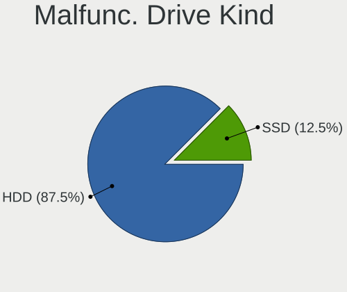

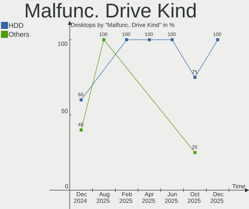

| Kind | Desktops | Drives | Percent |
|------|----------|--------|---------|
| HDD  | 6        | 7      | 100%    |

Failed Drives
-------------

Failed drive models

Zero info for selected period =(

Failed Drive Vendor
-------------------

Failed drive vendors

Zero info for selected period =(

Drive Status
------------

Number of failed and malfunc. drives

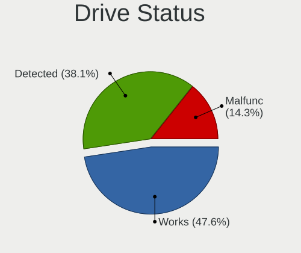

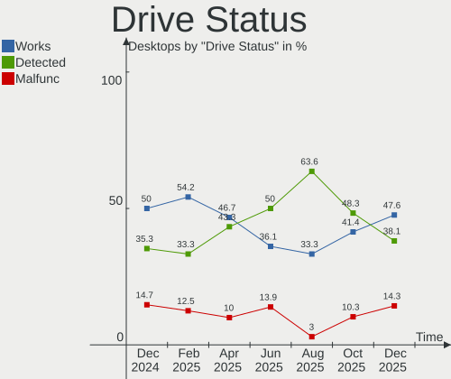

| Status   | Desktops | Drives | Percent |
|----------|----------|--------|---------|
| Works    | 20       | 36     | 47.62%  |
| Detected | 16       | 41     | 38.1%   |
| Malfunc  | 6        | 7      | 14.29%  |

Storage controller
------------------

Storage Vendor
--------------

Storage controller vendors

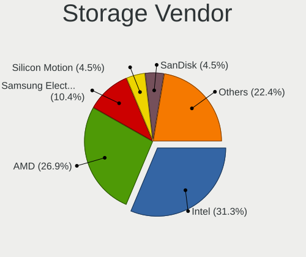

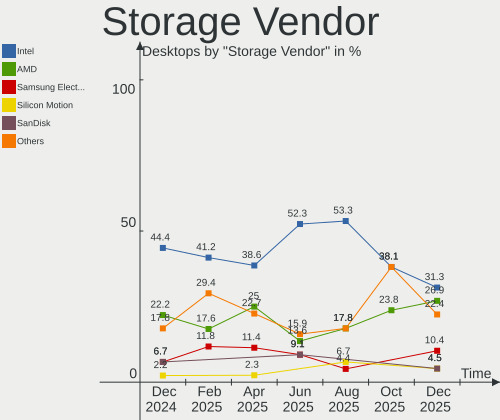

| Vendor                      | Desktops | Percent |
|-----------------------------|----------|---------|
| Intel                       | 21       | 31.34%  |
| AMD                         | 18       | 26.87%  |
| Samsung Electronics         | 7        | 10.45%  |
| Silicon Motion              | 3        | 4.48%   |
| SanDisk                     | 3        | 4.48%   |
| Biwin Storage Technology    | 3        | 4.48%   |
| ASMedia Technology          | 3        | 4.48%   |
| Micron/Crucial Technology   | 2        | 2.99%   |
| Micron Technology           | 2        | 2.99%   |
| Kingston Technology Company | 2        | 2.99%   |
| SK hynix                    | 1        | 1.49%   |
| Phison Electronics          | 1        | 1.49%   |
| KIOXIA                      | 1        | 1.49%   |

Storage Model
-------------

Storage controller models

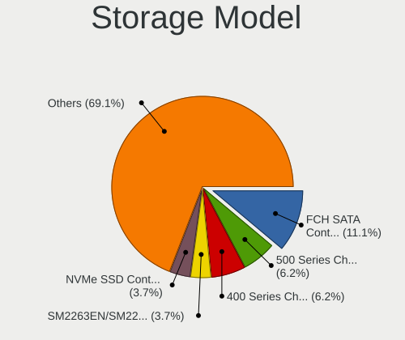

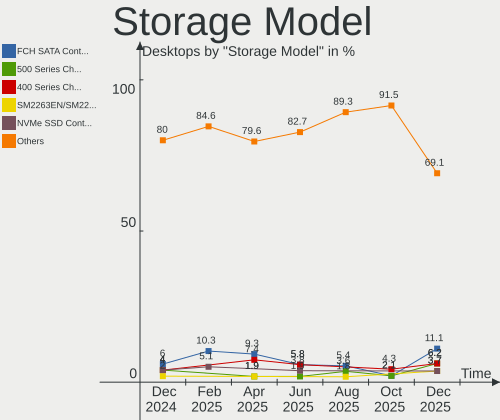

| Model                                                                                   | Desktops | Percent |
|-----------------------------------------------------------------------------------------|----------|---------|
| AMD FCH SATA Controller [AHCI mode]                                                     | 9        | 11.11%  |
| AMD 500 Series Chipset SATA Controller                                                  | 5        | 6.17%   |
| AMD 400 Series Chipset SATA Controller                                                  | 5        | 6.17%   |
| Silicon Motion SM2263EN/SM2263XT (DRAM-less) NVMe SSD Controllers                       | 3        | 3.7%    |
| Samsung NVMe SSD Controller SM981/PM981/PM983                                           | 3        | 3.7%    |
| Intel Cannon Lake PCH SATA AHCI Controller                                              | 3        | 3.7%    |
| Intel 6 Series/C200 Series Chipset Family Desktop SATA Controller (IDE mode, ports 4-5) | 3        | 3.7%    |
| Intel 6 Series/C200 Series Chipset Family Desktop SATA Controller (IDE mode, ports 0-3) | 3        | 3.7%    |
| Biwin Storage FX700 NVMe SSD (DRAM-less)                                                | 3        | 3.7%    |
| ASMedia ASM1061/ASM1062 Serial ATA Controller                                           | 3        | 3.7%    |
| Samsung NVMe SSD Controller 980 (DRAM-less)                                             | 2        | 2.47%   |
| Micron 2550 NVMe SSD (DRAM-less)                                                        | 2        | 2.47%   |
| Kingston Company NV1 NVMe SSD [E13T] (DRAM-less)                                        | 2        | 2.47%   |
| Intel 82801IR/IO/IH (ICH9R/DO/DH) 6 port SATA Controller [AHCI mode]                    | 2        | 2.47%   |
| Intel 6 Series/C200 Series Chipset Family 6 port Desktop SATA AHCI Controller           | 2        | 2.47%   |
| Intel 200 Series PCH SATA controller [AHCI mode]                                        | 2        | 2.47%   |
| AMD 600 Series Chipset SATA Controller                                                  | 2        | 2.47%   |
| AMD 300 Series Chipset SATA Controller                                                  | 2        | 2.47%   |
| SK hynix PC611 NVMe Solid State Drive                                                   | 1        | 1.23%   |
| SanDisk WD SN560/SN740/SN770/SN5000 NVMe SSD                                            | 1        | 1.23%   |
| SanDisk WD PC SN810 / Black SN850 NVMe SSD                                              | 1        | 1.23%   |
| SanDisk Ultra 3D / WD PC SN530, IX SN530, Blue SN550 NVMe SSD (DRAM-less)               | 1        | 1.23%   |
| Samsung NVMe SSD Controller S4LV008[Pascal]                                             | 1        | 1.23%   |
| Samsung NVMe SSD Controller PM9C1a (DRAM-less)                                          | 1        | 1.23%   |
| Phison E16 PCIe4 NVMe Controller                                                        | 1        | 1.23%   |
| Micron/Crucial P2 [Nick P2] / P3 / P3 Plus NVMe PCIe SSD (DRAM-less)                    | 1        | 1.23%   |
| Micron/Crucial P1 NVMe PCIe SSD[Frampton]                                               | 1        | 1.23%   |
| KIOXIA NVMe SSD Controller XG7                                                          | 1        | 1.23%   |
| Kingston Company A2000 NVMe SSD [SM2263EN]                                              | 1        | 1.23%   |
| Intel SSD 670p Series [Keystone Harbor]                                                 | 1        | 1.23%   |
| Intel SATA Controller [RAID mode]                                                       | 1        | 1.23%   |
| Intel RST Volume Management Device Controller                                           | 1        | 1.23%   |
| Intel Raptor Lake SATA AHCI Controller                                                  | 1        | 1.23%   |
| Intel NM10/ICH7 Family SATA Controller [IDE mode]                                       | 1        | 1.23%   |
| Intel Alder Lake-S PCH SATA Controller [AHCI Mode]                                      | 1        | 1.23%   |
| Intel 9 Series Chipset Family SATA Controller [AHCI Mode]                               | 1        | 1.23%   |
| Intel 82801JD/DO (ICH10 Family) SATA AHCI Controller                                    | 1        | 1.23%   |
| Intel 8 Series/C220 Series Chipset Family 6-port SATA Controller 1 [AHCI mode]          | 1        | 1.23%   |
| Intel 500 Series Chipset Family SATA AHCI Controller                                    | 1        | 1.23%   |
| Intel 4 Series Chipset PT IDER Controller                                               | 1        | 1.23%   |

Storage Kind
------------

Kind of storage controller (IDE, SATA, NVMe, SAS, ...)

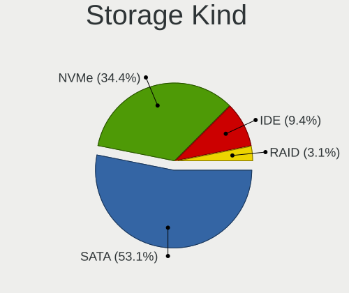

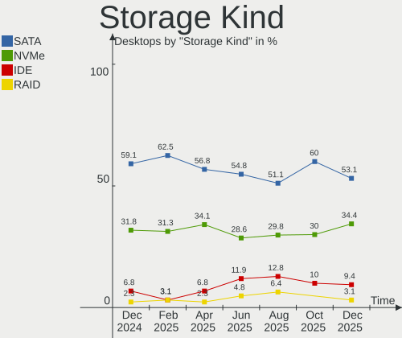

| Kind | Desktops | Percent |
|------|----------|---------|
| SATA | 34       | 53.13%  |
| NVMe | 22       | 34.38%  |
| IDE  | 6        | 9.38%   |
| RAID | 2        | 3.13%   |

Processor
---------

CPU Vendor
----------

Processor vendors

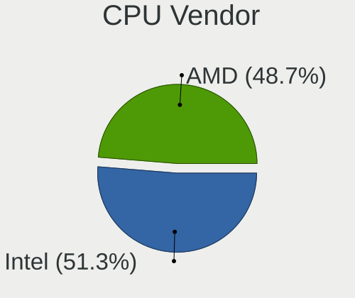

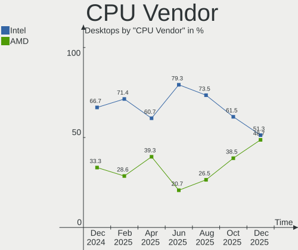

| Vendor | Desktops | Percent |
|--------|----------|---------|
| Intel  | 20       | 51.28%  |
| AMD    | 19       | 48.72%  |

CPU Model
---------

Processor models

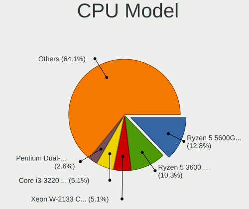

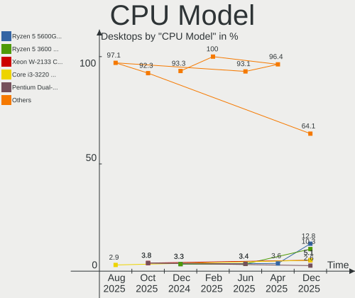

| Model                                          | Desktops | Percent |
|------------------------------------------------|----------|---------|
| AMD Ryzen 5 5600G with Radeon Graphics         | 5        | 12.82%  |
| AMD Ryzen 5 3600 6-Core Processor              | 4        | 10.26%  |
| Intel Xeon W-2133 CPU @ 3.60GHz                | 2        | 5.13%   |
| Intel Core i3-3220 CPU @ 3.30GHz               | 2        | 5.13%   |
| Intel Pentium Dual-Core CPU E5300 @ 2.60GHz    | 1        | 2.56%   |
| Intel Pentium CPU G630 @ 2.70GHz               | 1        | 2.56%   |
| Intel Core i9-9900KF CPU @ 3.60GHz             | 1        | 2.56%   |
| Intel Core i7-9700 CPU @ 3.00GHz               | 1        | 2.56%   |
| Intel Core i7-7700 CPU @ 3.60GHz               | 1        | 2.56%   |
| Intel Core i5-8500 CPU @ 3.00GHz               | 1        | 2.56%   |
| Intel Core i5-4690 CPU @ 3.50GHz               | 1        | 2.56%   |
| Intel Core i5-2400S CPU @ 2.50GHz              | 1        | 2.56%   |
| Intel Core i3-7100T CPU @ 3.40GHz              | 1        | 2.56%   |
| Intel Core i3-6100T CPU @ 3.20GHz              | 1        | 2.56%   |
| Intel Core i3-4150 CPU @ 3.50GHz               | 1        | 2.56%   |
| Intel Core i3-2100 CPU @ 3.10GHz               | 1        | 2.56%   |
| Intel Core i3-10105 CPU @ 3.70GHz              | 1        | 2.56%   |
| Intel Core 2 Duo CPU E8400 @ 3.00GHz           | 1        | 2.56%   |
| Intel 13th Gen Core i5-13600K                  | 1        | 2.56%   |
| Intel 12th Gen Core i5-12400                   | 1        | 2.56%   |
| AMD Ryzen Threadripper PRO 5955WX 16-Cores     | 1        | 2.56%   |
| AMD Ryzen 9 5900X 12-Core Processor            | 1        | 2.56%   |
| AMD Ryzen 7 5700X 8-Core Processor             | 1        | 2.56%   |
| AMD Ryzen 7 3700X 8-Core Processor             | 1        | 2.56%   |
| AMD Ryzen 5 7600X 6-Core Processor             | 1        | 2.56%   |
| AMD Ryzen 5 7600 6-Core Processor              | 1        | 2.56%   |
| AMD Ryzen 5 2400G with Radeon Vega Graphics    | 1        | 2.56%   |
| AMD Ryzen 5 1600 Six-Core Processor            | 1        | 2.56%   |
| AMD FX-6300 Six-Core Processor                 | 1        | 2.56%   |
| AMD A12-9800 RADEON R7, 12 COMPUTE CORES 4C+8G | 1        | 2.56%   |

CPU Model Family
----------------

Processor model prefix

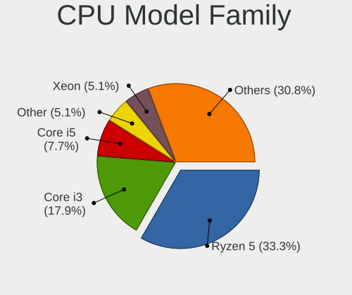

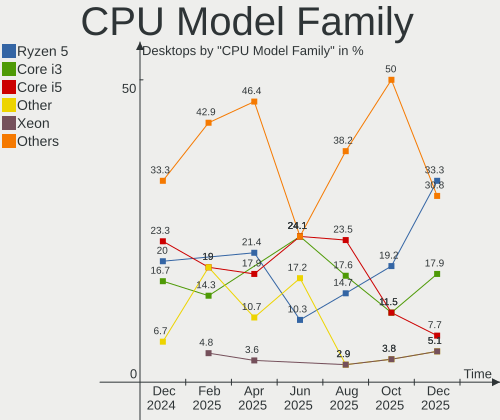

| Model                   | Desktops | Percent |
|-------------------------|----------|---------|
| AMD Ryzen 5             | 13       | 33.33%  |
| Intel Core i3           | 7        | 17.95%  |
| Intel Core i5           | 3        | 7.69%   |
| Other                   | 2        | 5.13%   |
| Intel Xeon              | 2        | 5.13%   |
| Intel Core i7           | 2        | 5.13%   |
| AMD Ryzen 7             | 2        | 5.13%   |
| Intel Pentium Dual-Core | 1        | 2.56%   |
| Intel Pentium           | 1        | 2.56%   |
| Intel Core i9           | 1        | 2.56%   |
| Intel Core 2 Duo        | 1        | 2.56%   |
| AMD Ryzen Threadripper  | 1        | 2.56%   |
| AMD Ryzen 9             | 1        | 2.56%   |
| AMD FX                  | 1        | 2.56%   |
| AMD A12                 | 1        | 2.56%   |

CPU Cores
---------

Number of processor cores

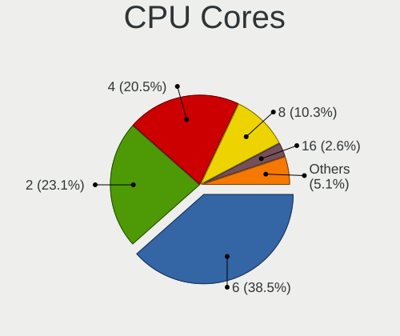

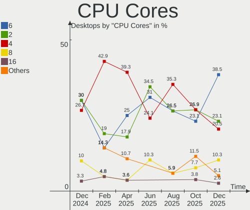

| Number | Desktops | Percent |
|--------|----------|---------|
| 6      | 15       | 38.46%  |
| 2      | 9        | 23.08%  |
| 4      | 8        | 20.51%  |
| 8      | 4        | 10.26%  |
| 16     | 1        | 2.56%   |
| 14     | 1        | 2.56%   |
| 12     | 1        | 2.56%   |

CPU Sockets
-----------

Number of sockets

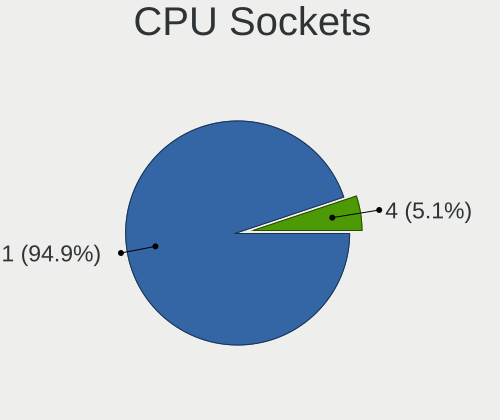

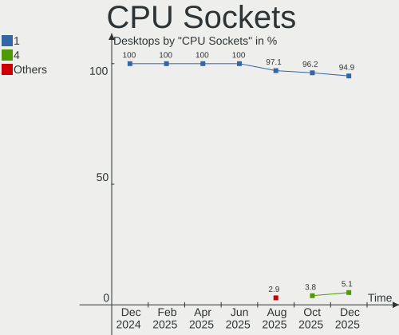

| Number | Desktops | Percent |
|--------|----------|---------|
| 1      | 37       | 94.87%  |
| 4      | 2        | 5.13%   |

CPU Threads
-----------

Threads per core (Hyper-Threading)

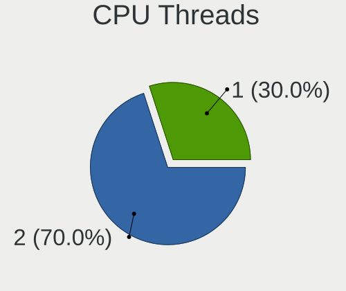

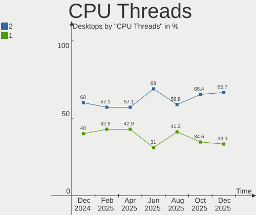

| Number | Desktops | Percent |
|--------|----------|---------|
| 2      | 26       | 66.67%  |
| 1      | 13       | 33.33%  |

CPU Op-Modes
------------

CPU Operation Modes (32-bit, 64-bit)

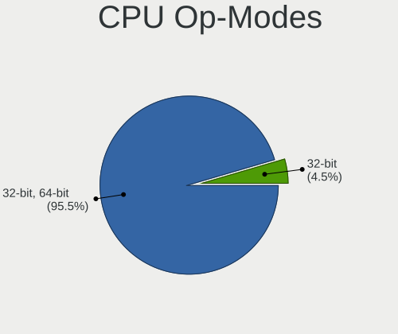

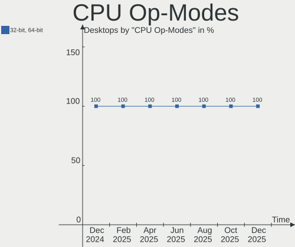

| Op mode        | Desktops | Percent |
|----------------|----------|---------|
| 32-bit, 64-bit | 39       | 100%    |

CPU Microcode
-------------

Microcode number

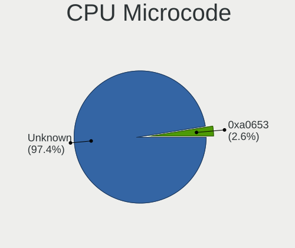

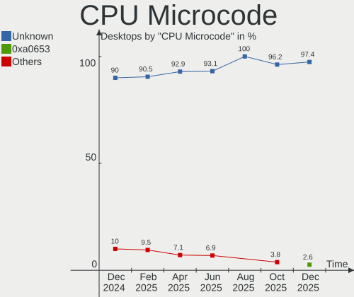

| Number  | Desktops | Percent |
|---------|----------|---------|
| Unknown | 38       | 97.44%  |
| 0xa0653 | 1        | 2.56%   |

CPU Microarch
-------------

Microarchitecture

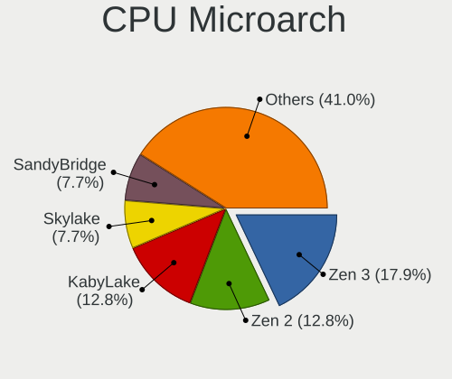

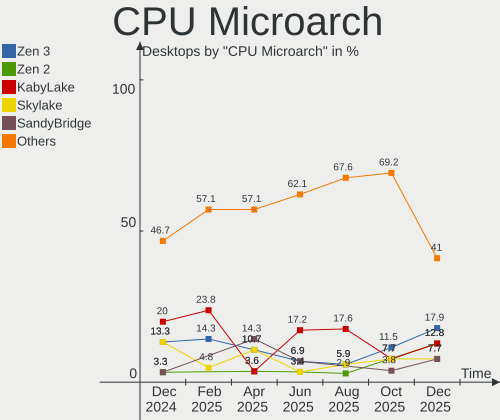

| Name             | Desktops | Percent |
|------------------|----------|---------|
| Zen 3            | 7        | 17.95%  |
| Zen 2            | 5        | 12.82%  |
| KabyLake         | 5        | 12.82%  |
| Skylake          | 3        | 7.69%   |
| SandyBridge      | 3        | 7.69%   |
| Unknown          | 3        | 7.69%   |
| Zen              | 2        | 5.13%   |
| Penryn           | 2        | 5.13%   |
| IvyBridge        | 2        | 5.13%   |
| Haswell          | 2        | 5.13%   |
| Alderlake Hybrid | 2        | 5.13%   |
| Piledriver       | 1        | 2.56%   |
| Excavator        | 1        | 2.56%   |
| CometLake        | 1        | 2.56%   |

Graphics
--------

GPU Vendor
----------

Vendors of graphics cards

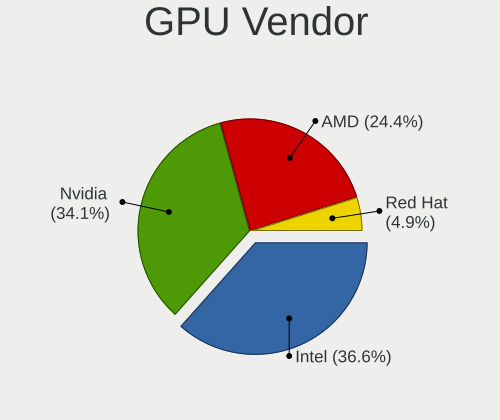

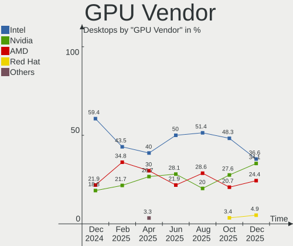

| Vendor  | Desktops | Percent |
|---------|----------|---------|
| Intel   | 15       | 36.59%  |
| Nvidia  | 14       | 34.15%  |
| AMD     | 10       | 24.39%  |
| Red Hat | 2        | 4.88%   |

GPU Model
---------

Graphics card models

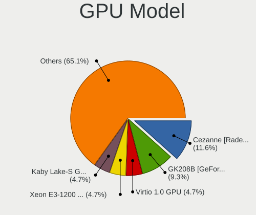

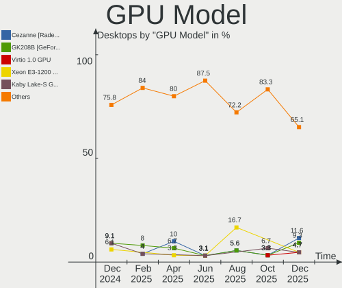

| Model                                                                       | Desktops | Percent |
|-----------------------------------------------------------------------------|----------|---------|
| AMD Cezanne [Radeon Vega Series / Radeon Vega Mobile Series]                | 5        | 11.63%  |
| Nvidia GK208B [GeForce GT 710]                                              | 4        | 9.3%    |
| Red Hat Virtio 1.0 GPU                                                      | 2        | 4.65%   |
| Intel Xeon E3-1200 v2/3rd Gen Core processor Graphics Controller            | 2        | 4.65%   |
| Intel Kaby Lake-S GT2 [HD Graphics 630]                                     | 2        | 4.65%   |
| Intel CoffeeLake-S GT2 [UHD Graphics 630]                                   | 2        | 4.65%   |
| Intel 4 Series Chipset Integrated Graphics Controller                       | 2        | 4.65%   |
| Intel 2nd Generation Core Processor Family Integrated Graphics Controller   | 2        | 4.65%   |
| AMD Raphael                                                                 | 2        | 4.65%   |
| Nvidia TU116 [GeForce GTX 1660]                                             | 1        | 2.33%   |
| Nvidia TU116 [GeForce GTX 1660 SUPER]                                       | 1        | 2.33%   |
| Nvidia TU116 [GeForce GTX 1650 SUPER]                                       | 1        | 2.33%   |
| Nvidia GK208B [GeForce GT 730]                                              | 1        | 2.33%   |
| Nvidia GB203 [GeForce RTX 5080]                                             | 1        | 2.33%   |
| Nvidia GA106 [GeForce RTX 3060 Lite Hash Rate]                              | 1        | 2.33%   |
| Nvidia GA104GL [RTX A4000]                                                  | 1        | 2.33%   |
| Nvidia GA104 [GeForce RTX 3070 Ti]                                          | 1        | 2.33%   |
| Nvidia GA102 [GeForce RTX 3080]                                             | 1        | 2.33%   |
| Nvidia AD106 [GeForce RTX 4060 Ti]                                          | 1        | 2.33%   |
| Intel Xeon E3-1200 v3/4th Gen Core Processor Integrated Graphics Controller | 1        | 2.33%   |
| Intel Skylake-S GT2 [HD Graphics 530]                                       | 1        | 2.33%   |
| Intel CometLake-S GT2 [UHD Graphics 630]                                    | 1        | 2.33%   |
| Intel Alder Lake-S GT1 [UHD Graphics 730]                                   | 1        | 2.33%   |
| Intel 4th Generation Core Processor Family Integrated Graphics Controller   | 1        | 2.33%   |
| AMD Oland PRO [Radeon R7 240/340 / Radeon 520]                              | 1        | 2.33%   |
| AMD Navi 48 [Radeon RX 9070/9070 XT/9070 GRE]                               | 1        | 2.33%   |
| AMD Navi 44 [Radeon RX 9060 XT]                                             | 1        | 2.33%   |
| AMD Navi 33 [Radeon RX 7600/7600 XT/7600M XT/7600S/7700S / PRO W7600]       | 1        | 2.33%   |
| AMD Lexa PRO [Radeon 540/540X/550/550X / RX 540X/550/550X]                  | 1        | 2.33%   |

GPU Combo
---------

Combinations of graphics cards

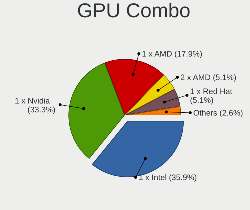

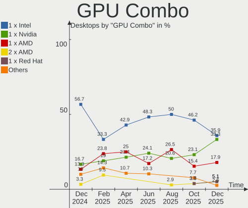

| Name         | Desktops | Percent |
|--------------|----------|---------|
| 1 x Intel    | 14       | 35.9%   |
| 1 x Nvidia   | 13       | 33.33%  |
| 1 x AMD      | 7        | 17.95%  |
| 2 x AMD      | 2        | 5.13%   |
| 1 x Red Hat  | 2        | 5.13%   |
| AMD + Nvidia | 1        | 2.56%   |

GPU Driver
----------

Free vs proprietary

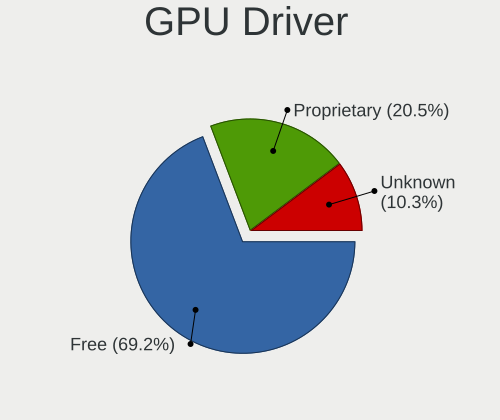

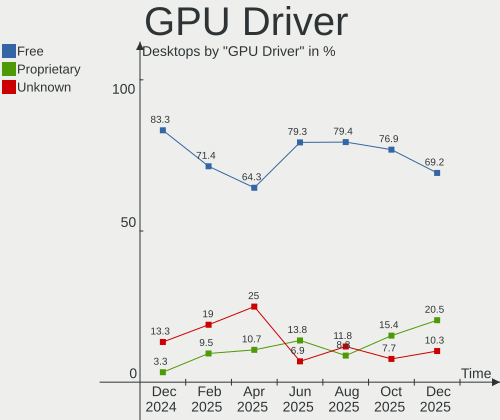

| Driver      | Desktops | Percent |
|-------------|----------|---------|
| Free        | 27       | 69.23%  |
| Proprietary | 8        | 20.51%  |
| Unknown     | 4        | 10.26%  |

GPU Memory
----------

Total video memory

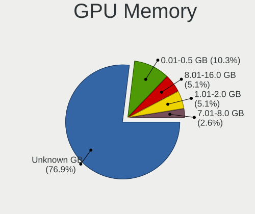

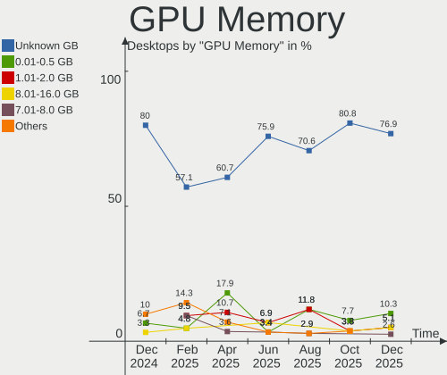

| Size in GB | Desktops | Percent |
|------------|----------|---------|
| Unknown    | 30       | 76.92%  |
| 0.01-0.5   | 4        | 10.26%  |
| 1.01-2.0   | 2        | 5.13%   |
| 8.01-16.0  | 2        | 5.13%   |
| 7.01-8.0   | 1        | 2.56%   |

Monitor
-------

Monitor Vendor
--------------

Monitor vendors

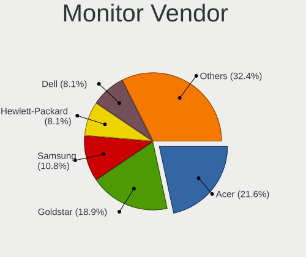

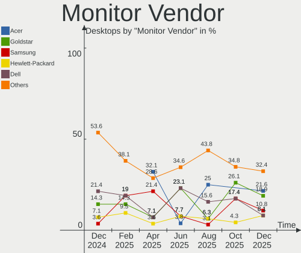

| Vendor              | Desktops | Percent |
|---------------------|----------|---------|
| Acer                | 8        | 21.62%  |
| Goldstar            | 7        | 18.92%  |
| Samsung Electronics | 4        | 10.81%  |
| Hewlett-Packard     | 3        | 8.11%   |
| Dell                | 3        | 8.11%   |
| BenQ                | 3        | 8.11%   |
| RHT                 | 2        | 5.41%   |
| Unknown (XXX)       | 1        | 2.7%    |
| MSI                 | 1        | 2.7%    |
| LLL                 | 1        | 2.7%    |
| Lenovo              | 1        | 2.7%    |
| ITE                 | 1        | 2.7%    |
| IDS                 | 1        | 2.7%    |
| AOC                 | 1        | 2.7%    |

Monitor Model
-------------

Monitor models

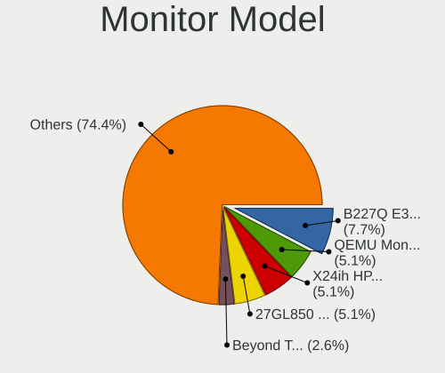

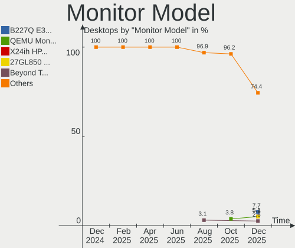

| Model                                                                  | Desktops | Percent |
|------------------------------------------------------------------------|----------|---------|
| Acer B227Q E3 ACR0C6C 1920x1080 479x260mm 21.5-inch                    | 3        | 7.69%   |
| RHT QEMU Monitor RHT1234 2048x1152 325x203mm 15.1-inch                 | 2        | 5.13%   |
| Hewlett-Packard X24ih HPN36DA 1920x1080 527x297mm 23.8-inch            | 2        | 5.13%   |
| Goldstar 27GL850 GSM5B7F 2560x1440 597x336mm 27.0-inch                 | 2        | 5.13%   |
| Unknown (XXX) Beyond TV XXX2851 3840x2160 1209x680mm 54.6-inch         | 1        | 2.56%   |
| Samsung Electronics SyncMaster SAM058C 1600x900 443x249mm 20.0-inch    | 1        | 2.56%   |
| Samsung Electronics S27E360 SAM0C13 1920x1080 598x336mm 27.0-inch      | 1        | 2.56%   |
| Samsung Electronics LCD Monitor SAM7106 1920x1080 1210x680mm 54.6-inch | 1        | 2.56%   |
| Samsung Electronics LCD Monitor SAM0A7A 1920x1080 1060x626mm 48.5-inch | 1        | 2.56%   |
| MSI MD272QP MSI40B1 2560x1440 600x330mm 27.0-inch                      | 1        | 2.56%   |
| LLL LCD Monitor LLL0001 1366x768                                       | 1        | 2.56%   |
| Lenovo Q24i-1L LEN66C0 1920x1080 530x300mm 24.0-inch                   | 1        | 2.56%   |
| ITE DP2VGA V273 ITE6517 1920x1080 600x340mm 27.2-inch                  | 1        | 2.56%   |
| IDS PT-185DW IDS0001 1366x768 340x190mm 15.3-inch                      | 1        | 2.56%   |
| Hewlett-Packard 22y HPN3503 1920x1080 477x268mm 21.5-inch              | 1        | 2.56%   |
| Goldstar ULTRAWIDE GSM77BF 1920x1080 400x334mm 20.5-inch               | 1        | 2.56%   |
| Goldstar ULTRAWIDE GSM77BE 3440x1440 800x334mm 34.1-inch               | 1        | 2.56%   |
| Goldstar ULTRAGEAR GSM5C89 1920x1080 527x296mm 23.8-inch               | 1        | 2.56%   |
| Goldstar Ultra HD GSM5B09 3840x2160 600x340mm 27.2-inch                | 1        | 2.56%   |
| Goldstar HD GSM5ACB 1366x768 410x230mm 18.5-inch                       | 1        | 2.56%   |
| Goldstar FULL HD GSM5B55 1920x1080 480x270mm 21.7-inch                 | 1        | 2.56%   |
| Dell P2419H DELD0DA 1920x1080 527x296mm 23.8-inch                      | 1        | 2.56%   |
| Dell E2218HN DELF09D 1920x1080 476x268mm 21.5-inch                     | 1        | 2.56%   |
| Dell D1920 DEL406D 1366x768 410x230mm 18.5-inch                        | 1        | 2.56%   |
| BenQ GW2790Q BNQ78FD 2560x1440 597x336mm 27.0-inch                     | 1        | 2.56%   |
| BenQ GW2790 BNQ78F8 1920x1080 600x340mm 27.2-inch                      | 1        | 2.56%   |
| BenQ EX2780Q BNQ7F76 2560x1440 597x336mm 27.0-inch                     | 1        | 2.56%   |
| AOC 1970W AOC1970 1366x768 410x230mm 18.5-inch                         | 1        | 2.56%   |
| Acer VG240Y X1 ACR0E8C 1920x1080 527x296mm 23.8-inch                   | 1        | 2.56%   |
| Acer VG240Y S ACR0C07 1920x1080 527x296mm 23.8-inch                    | 1        | 2.56%   |
| Acer VG240Y M3 ACR0C55 1920x1080 527x296mm 23.8-inch                   | 1        | 2.56%   |
| Acer V206HQL ACR032C 1600x900 434x236mm 19.4-inch                      | 1        | 2.56%   |
| Acer HA270 ACR0584 1920x1080 598x336mm 27.0-inch                       | 1        | 2.56%   |
| Acer EK240Y H ACR0C78 1920x1080 532x300mm 24.0-inch                    | 1        | 2.56%   |

Monitor Resolution
------------------

Monitor screen resolution

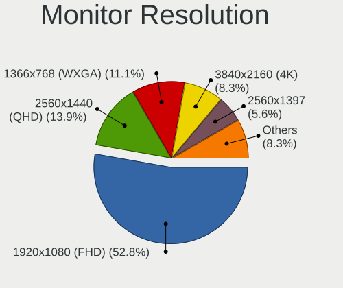

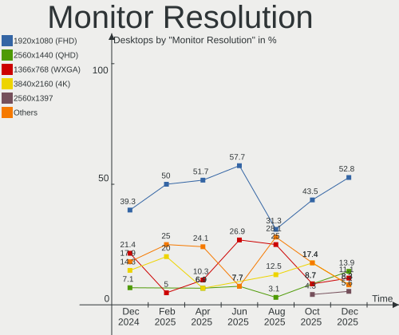

| Resolution      | Desktops | Percent |
|-----------------|----------|---------|
| 1920x1080 (FHD) | 19       | 52.78%  |
| 2560x1440 (QHD) | 5        | 13.89%  |
| 1366x768 (WXGA) | 4        | 11.11%  |
| 3840x2160 (4K)  | 3        | 8.33%   |
| 2560x1397       | 2        | 5.56%   |
| 1600x900 (HD+)  | 2        | 5.56%   |
| 3440x1440       | 1        | 2.78%   |

Monitor Diagonal
----------------

Diagonal size in inches

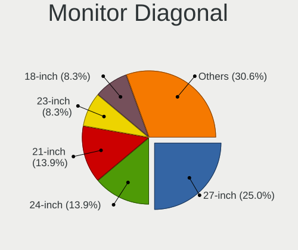

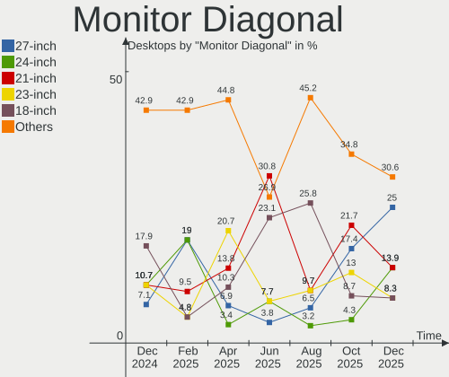

| Inches | Desktops | Percent |
|--------|----------|---------|
| 27     | 9        | 25%     |
| 24     | 5        | 13.89%  |
| 21     | 5        | 13.89%  |
| 23     | 3        | 8.33%   |
| 18     | 3        | 8.33%   |
| 29     | 2        | 5.56%   |
| 63     | 1        | 2.78%   |
| 54     | 1        | 2.78%   |
| 48     | 1        | 2.78%   |
| 39     | 1        | 2.78%   |
| 34     | 1        | 2.78%   |
| 31     | 1        | 2.78%   |
| 20     | 1        | 2.78%   |
| 19     | 1        | 2.78%   |
| 15     | 1        | 2.78%   |

Monitor Width
-------------

Physical width

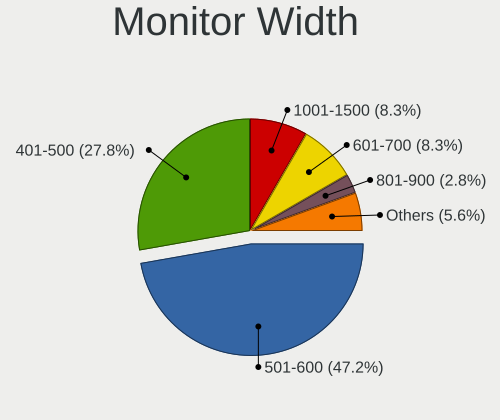

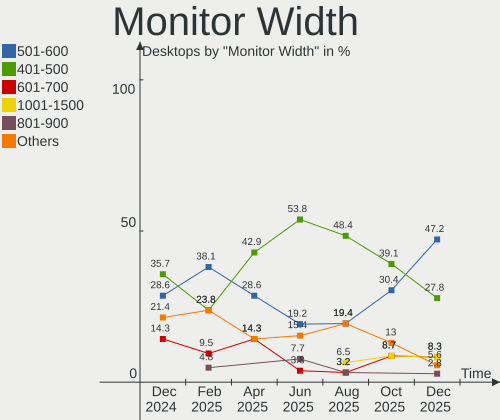

| Width in mm | Desktops | Percent |
|-------------|----------|---------|
| 501-600     | 17       | 47.22%  |
| 401-500     | 10       | 27.78%  |
| 601-700     | 3        | 8.33%   |
| 1001-1500   | 3        | 8.33%   |
| 801-900     | 1        | 2.78%   |
| 701-800     | 1        | 2.78%   |
| 301-350     | 1        | 2.78%   |

Aspect Ratio
------------

Proportional relationship between the width and the height

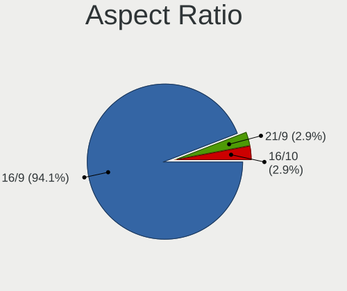

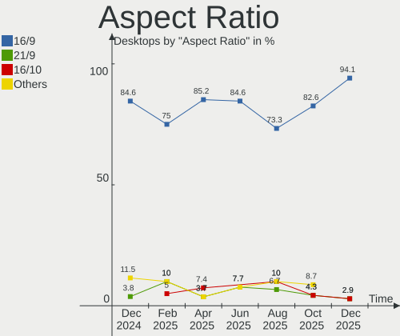

| Ratio | Desktops | Percent |
|-------|----------|---------|
| 16/9  | 32       | 94.12%  |
| 21/9  | 1        | 2.94%   |
| 16/10 | 1        | 2.94%   |

Monitor Area
------------

Area in inch²

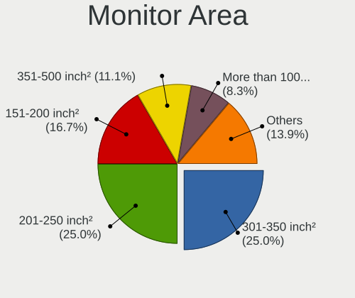

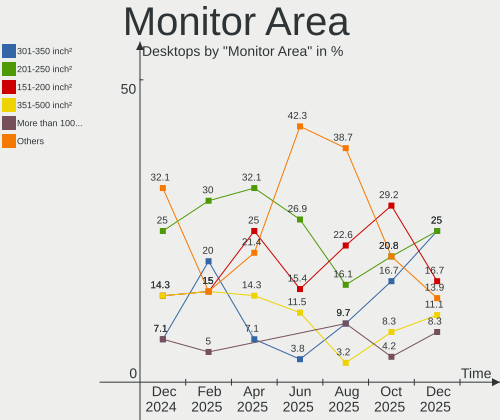

| Area in inch² | Desktops | Percent |
|----------------|----------|---------|
| 301-350        | 9        | 25%     |
| 201-250        | 9        | 25%     |
| 151-200        | 6        | 16.67%  |
| 351-500        | 4        | 11.11%  |
| More than 1000 | 3        | 8.33%   |
| 141-150        | 3        | 8.33%   |
| 501-1000       | 1        | 2.78%   |
| 91-100         | 1        | 2.78%   |

Pixel Density
-------------

Pixels per inch

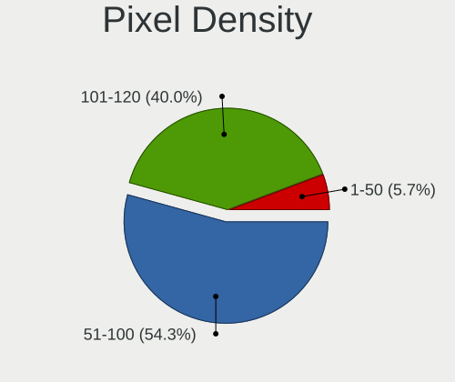

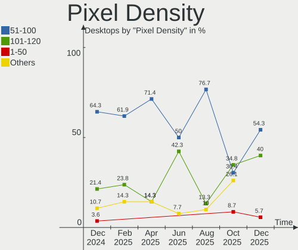

| Density | Desktops | Percent |
|---------|----------|---------|
| 51-100  | 19       | 54.29%  |
| 101-120 | 14       | 40%     |
| 1-50    | 2        | 5.71%   |

Multiple Monitors
-----------------

Total monitors connected

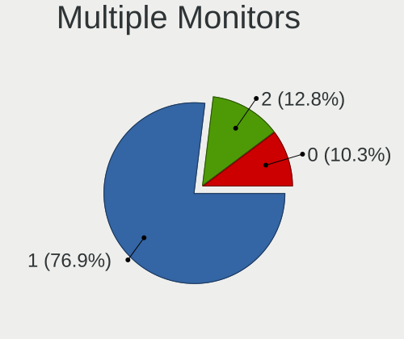

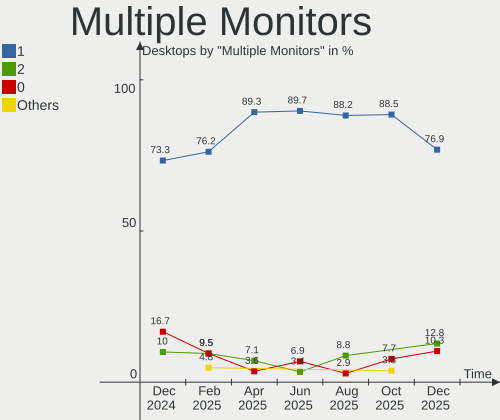

| Total | Desktops | Percent |
|-------|----------|---------|
| 1     | 30       | 76.92%  |
| 2     | 5        | 12.82%  |
| 0     | 4        | 10.26%  |

Network
-------

Net Controller Vendor
---------------------

Controller vendors

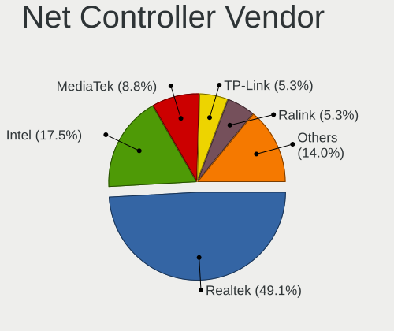

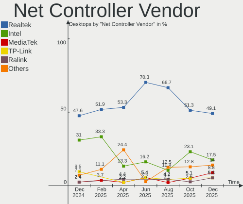

| Vendor                          | Desktops | Percent |
|---------------------------------|----------|---------|
| Realtek Semiconductor           | 28       | 49.12%  |
| Intel                           | 10       | 17.54%  |
| MediaTek                        | 5        | 8.77%   |
| TP-Link                         | 3        | 5.26%   |
| Ralink Technology               | 3        | 5.26%   |
| Qualcomm Atheros                | 2        | 3.51%   |
| Samsung Electronics             | 1        | 1.75%   |
| Qualcomm Atheros Communications | 1        | 1.75%   |
| OPPO Electronics                | 1        | 1.75%   |
| Broadcom                        | 1        | 1.75%   |
| ASIX Electronics                | 1        | 1.75%   |
| Unknown                         | 1        | 1.75%   |

Net Controller Model
--------------------

Controller models

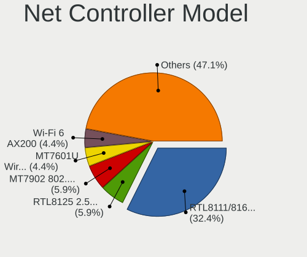

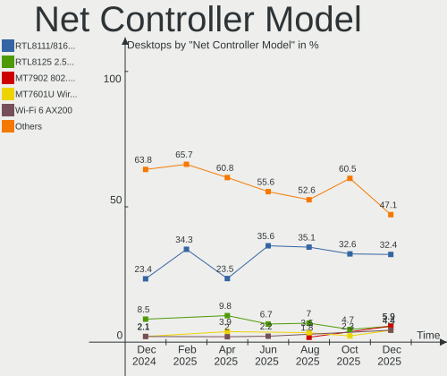

| Model                                                                  | Desktops | Percent |
|------------------------------------------------------------------------|----------|---------|
| Realtek RTL8111/8168/8211/8411 PCI Express Gigabit Ethernet Controller | 22       | 32.35%  |
| Realtek RTL8125 2.5GbE Controller                                      | 4        | 5.88%   |
| MediaTek MT7902 802.11ax PCIe Wireless Network Adapter [Filogic 310]   | 4        | 5.88%   |
| Ralink MT7601U Wireless Adapter                                        | 3        | 4.41%   |
| Intel Wi-Fi 6 AX200                                                    | 3        | 4.41%   |
| Realtek 802.11ac NIC                                                   | 2        | 2.94%   |
| Intel Ethernet Controller I226-V                                       | 2        | 2.94%   |
| Intel Ethernet Connection (7) I219-LM                                  | 2        | 2.94%   |
| TP-Link TL-WN823N v2/v3 [Realtek RTL8192EU]                            | 1        | 1.47%   |
| TP-Link Archer T3U [Realtek RTL8812BU]                                 | 1        | 1.47%   |
| TP-Link AC600 wireless Realtek RTL8811AU [Archer T2U Nano]             | 1        | 1.47%   |
| Samsung Galaxy series, misc. (tethering mode)                          | 1        | 1.47%   |
| Realtek RTL8852BE PCIe 802.11ax Wireless Network Controller            | 1        | 1.47%   |
| Realtek RTL8851BE PCIe 802.11ax Wireless Network Controller            | 1        | 1.47%   |
| Realtek RTL8821CE PCIe 802.11ac Wireless Network Controller            | 1        | 1.47%   |
| Realtek RTL8821CE 802.11ac PCIe Wireless Network Adapter               | 1        | 1.47%   |
| Realtek RTL8188FTV 802.11b/g/n 1T1R 2.4G WLAN Adapter                  | 1        | 1.47%   |
| Realtek RTL8111/8168/8411 PCI Express Gigabit Ethernet Controller      | 1        | 1.47%   |
| Realtek RTL810xE PCI Express Fast Ethernet controller                  | 1        | 1.47%   |
| Qualcomm Atheros Killer E2500 Gigabit Ethernet Controller              | 1        | 1.47%   |
| Qualcomm Atheros Killer E220x Gigabit Ethernet Controller              | 1        | 1.47%   |
| Qualcomm Atheros AR9271 802.11n                                        | 1        | 1.47%   |
| OPPO Ace 3V                                                            | 1        | 1.47%   |
| MediaTek Infinix HOT 50i                                               | 1        | 1.47%   |
| Intel Ethernet Controller X550                                         | 1        | 1.47%   |
| Intel Ethernet Connection (7) I219-V                                   | 1        | 1.47%   |
| Intel Ethernet Connection (5) I219-LM                                  | 1        | 1.47%   |
| Intel Ethernet Connection (14) I219-V                                  | 1        | 1.47%   |
| Intel Dual Band Wireless-AC 3168NGW [Stone Peak]                       | 1        | 1.47%   |
| Intel 82567LM-3 Gigabit Network Connection                             | 1        | 1.47%   |
| Intel 700 Series Chipset CNVi WiFi                                     | 1        | 1.47%   |
| Broadcom BCM4360 802.11ac Dual Band Wireless Network Adapter           | 1        | 1.47%   |
| ASIX AX88179 Gigabit Ethernet                                          | 1        | 1.47%   |
| Unknown                                                                | 1        | 1.47%   |

Wireless Vendor
---------------

Wireless vendors

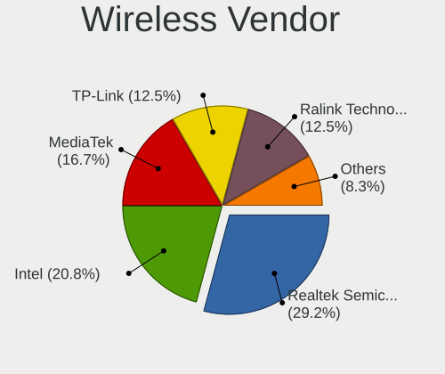

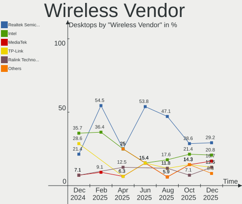

| Vendor                          | Desktops | Percent |
|---------------------------------|----------|---------|
| Realtek Semiconductor           | 7        | 29.17%  |
| Intel                           | 5        | 20.83%  |
| MediaTek                        | 4        | 16.67%  |
| TP-Link                         | 3        | 12.5%   |
| Ralink Technology               | 3        | 12.5%   |
| Qualcomm Atheros Communications | 1        | 4.17%   |
| Broadcom                        | 1        | 4.17%   |

Wireless Model
--------------

Wireless models

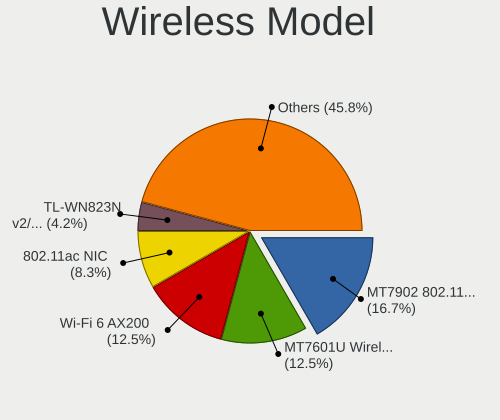

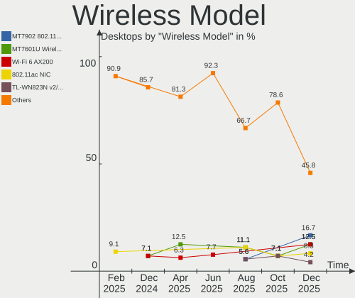

| Model                                                                | Desktops | Percent |
|----------------------------------------------------------------------|----------|---------|
| MediaTek MT7902 802.11ax PCIe Wireless Network Adapter [Filogic 310] | 4        | 16.67%  |
| Ralink MT7601U Wireless Adapter                                      | 3        | 12.5%   |
| Intel Wi-Fi 6 AX200                                                  | 3        | 12.5%   |
| Realtek 802.11ac NIC                                                 | 2        | 8.33%   |
| TP-Link TL-WN823N v2/v3 [Realtek RTL8192EU]                          | 1        | 4.17%   |
| TP-Link Archer T3U [Realtek RTL8812BU]                               | 1        | 4.17%   |
| TP-Link AC600 wireless Realtek RTL8811AU [Archer T2U Nano]           | 1        | 4.17%   |
| Realtek RTL8852BE PCIe 802.11ax Wireless Network Controller          | 1        | 4.17%   |
| Realtek RTL8851BE PCIe 802.11ax Wireless Network Controller          | 1        | 4.17%   |
| Realtek RTL8821CE PCIe 802.11ac Wireless Network Controller          | 1        | 4.17%   |
| Realtek RTL8821CE 802.11ac PCIe Wireless Network Adapter             | 1        | 4.17%   |
| Realtek RTL8188FTV 802.11b/g/n 1T1R 2.4G WLAN Adapter                | 1        | 4.17%   |
| Qualcomm Atheros AR9271 802.11n                                      | 1        | 4.17%   |
| Intel Dual Band Wireless-AC 3168NGW [Stone Peak]                     | 1        | 4.17%   |
| Intel 700 Series Chipset CNVi WiFi                                   | 1        | 4.17%   |
| Broadcom BCM4360 802.11ac Dual Band Wireless Network Adapter         | 1        | 4.17%   |

Ethernet Vendor
---------------

Ethernet vendors

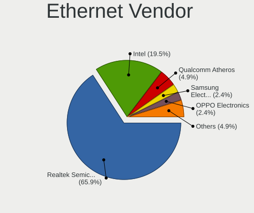

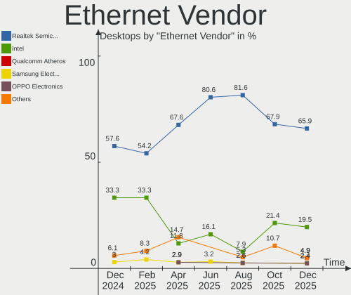

| Vendor                | Desktops | Percent |
|-----------------------|----------|---------|
| Realtek Semiconductor | 27       | 65.85%  |
| Intel                 | 8        | 19.51%  |
| Qualcomm Atheros      | 2        | 4.88%   |
| Samsung Electronics   | 1        | 2.44%   |
| OPPO Electronics      | 1        | 2.44%   |
| MediaTek              | 1        | 2.44%   |
| ASIX Electronics      | 1        | 2.44%   |

Ethernet Model
--------------

Ethernet models

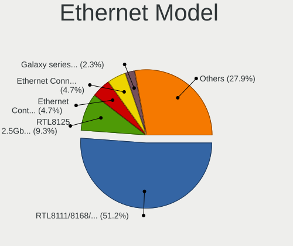

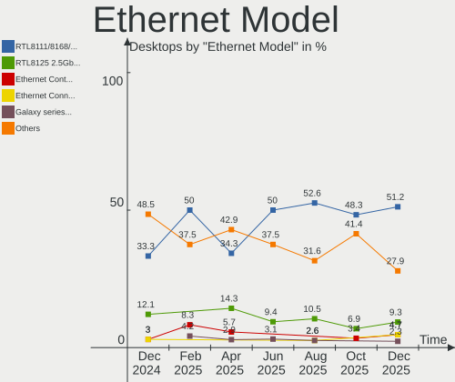

| Model                                                                  | Desktops | Percent |
|------------------------------------------------------------------------|----------|---------|
| Realtek RTL8111/8168/8211/8411 PCI Express Gigabit Ethernet Controller | 22       | 51.16%  |
| Realtek RTL8125 2.5GbE Controller                                      | 4        | 9.3%    |
| Intel Ethernet Controller I226-V                                       | 2        | 4.65%   |
| Intel Ethernet Connection (7) I219-LM                                  | 2        | 4.65%   |
| Samsung Galaxy series, misc. (tethering mode)                          | 1        | 2.33%   |
| Realtek RTL8111/8168/8411 PCI Express Gigabit Ethernet Controller      | 1        | 2.33%   |
| Realtek RTL810xE PCI Express Fast Ethernet controller                  | 1        | 2.33%   |
| Qualcomm Atheros Killer E2500 Gigabit Ethernet Controller              | 1        | 2.33%   |
| Qualcomm Atheros Killer E220x Gigabit Ethernet Controller              | 1        | 2.33%   |
| OPPO Ace 3V                                                            | 1        | 2.33%   |
| MediaTek Infinix HOT 50i                                               | 1        | 2.33%   |
| Intel Ethernet Controller X550                                         | 1        | 2.33%   |
| Intel Ethernet Connection (7) I219-V                                   | 1        | 2.33%   |
| Intel Ethernet Connection (5) I219-LM                                  | 1        | 2.33%   |
| Intel Ethernet Connection (14) I219-V                                  | 1        | 2.33%   |
| Intel 82567LM-3 Gigabit Network Connection                             | 1        | 2.33%   |
| ASIX AX88179 Gigabit Ethernet                                          | 1        | 2.33%   |

Net Controller Kind
-------------------

Ethernet, WiFi or modem

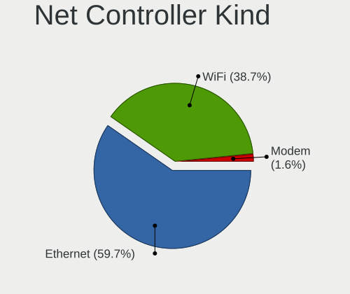

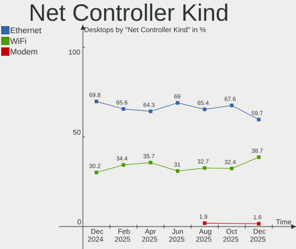

| Kind     | Desktops | Percent |
|----------|----------|---------|
| Ethernet | 37       | 59.68%  |
| WiFi     | 24       | 38.71%  |
| Modem    | 1        | 1.61%   |

Used Controller
---------------

Currently used network controller

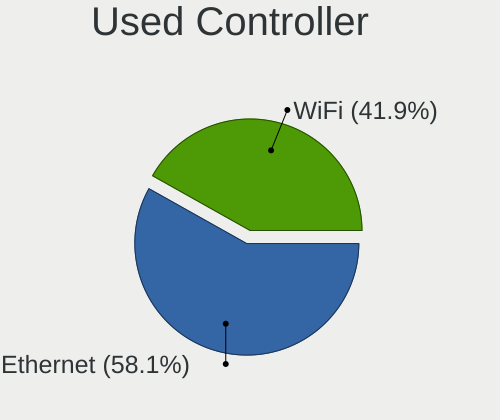

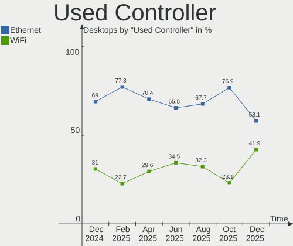

| Kind     | Desktops | Percent |
|----------|----------|---------|
| Ethernet | 25       | 58.14%  |
| WiFi     | 18       | 41.86%  |

NICs
----

Total network controllers on board

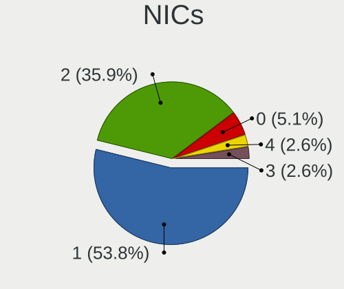

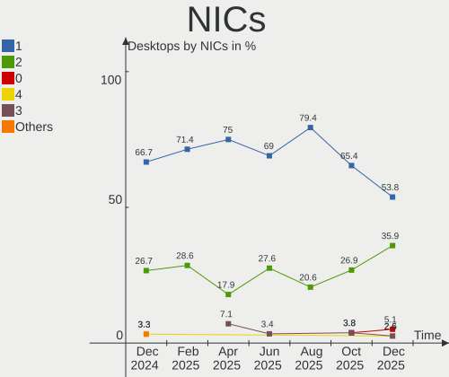

| Total | Desktops | Percent |
|-------|----------|---------|
| 1     | 21       | 53.85%  |
| 2     | 14       | 35.9%   |
| 0     | 2        | 5.13%   |
| 4     | 1        | 2.56%   |
| 3     | 1        | 2.56%   |

IPv6
----

IPv6 vs IPv4

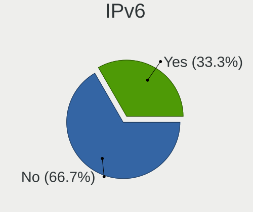

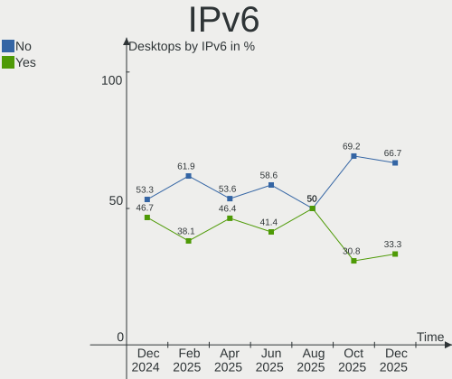

| Used | Desktops | Percent |
|------|----------|---------|
| No   | 26       | 66.67%  |
| Yes  | 13       | 33.33%  |

Bluetooth
---------

Bluetooth Vendor
----------------

Controller vendors

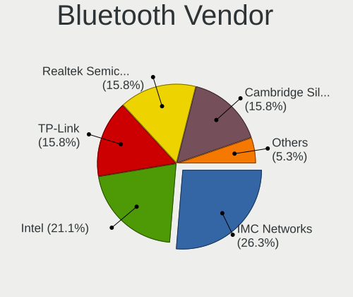

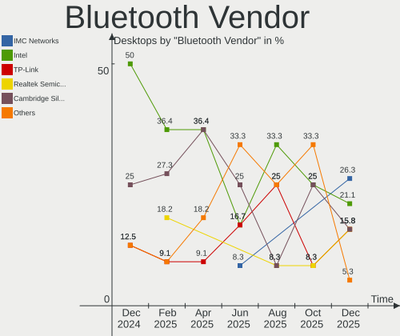

| Vendor                  | Desktops | Percent |
|-------------------------|----------|---------|
| IMC Networks            | 5        | 26.32%  |
| Intel                   | 4        | 21.05%  |
| TP-Link                 | 3        | 15.79%  |
| Realtek Semiconductor   | 3        | 15.79%  |
| Cambridge Silicon Radio | 3        | 15.79%  |
| Actions                 | 1        | 5.26%   |

Bluetooth Model
---------------

Controller models

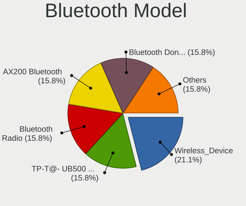

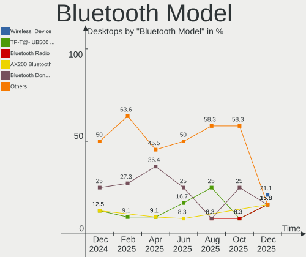

| Model                                               | Desktops | Percent |
|-----------------------------------------------------|----------|---------|
| IMC Networks Wireless_Device                        | 4        | 21.05%  |
| TP-Link TP-T@- UB500 Adapter                        | 3        | 15.79%  |
| Realtek Bluetooth Radio                             | 3        | 15.79%  |
| Intel AX200 Bluetooth                               | 3        | 15.79%  |
| Cambridge Silicon Radio Bluetooth Dongle (HCI mode) | 3        | 15.79%  |
| Intel AX201 Bluetooth                               | 1        | 5.26%   |
| IMC Networks Bluetooth Radio                        | 1        | 5.26%   |
| Actions general adapter                             | 1        | 5.26%   |

Sound
-----

Sound Vendor
------------

Sound card vendors

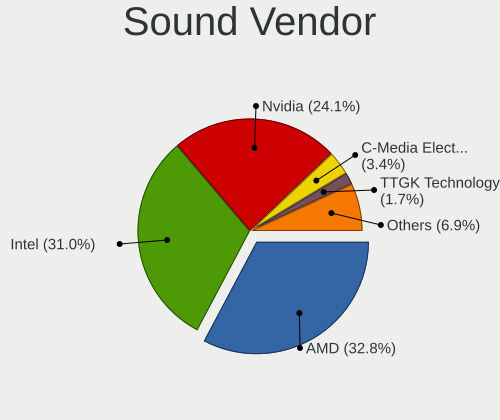

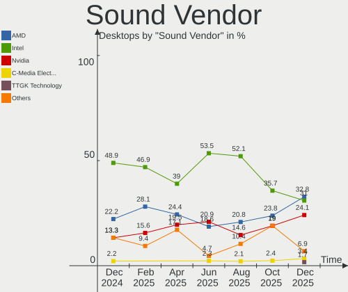

| Vendor                 | Desktops | Percent |
|------------------------|----------|---------|
| AMD                    | 19       | 32.76%  |
| Intel                  | 18       | 31.03%  |
| Nvidia                 | 14       | 24.14%  |
| C-Media Electronics    | 2        | 3.45%   |
| TTGK Technology        | 1        | 1.72%   |
| Razer USA              | 1        | 1.72%   |
| Generalplus Technology | 1        | 1.72%   |
| Creative Technology    | 1        | 1.72%   |
| ASUSTek Computer       | 1        | 1.72%   |

Sound Model
-----------

Sound card models

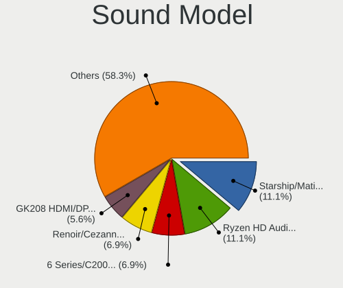

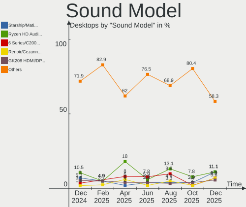

| Model                                                                      | Desktops | Percent |
|----------------------------------------------------------------------------|----------|---------|
| AMD Starship/Matisse HD Audio Controller                                   | 8        | 11.11%  |
| AMD Ryzen HD Audio Controller                                              | 8        | 11.11%  |
| Intel 6 Series/C200 Series Chipset Family High Definition Audio Controller | 5        | 6.94%   |
| AMD Renoir/Cezanne HDMI/DP Audio Controller                                | 5        | 6.94%   |
| Nvidia GK208 HDMI/DP Audio Controller                                      | 4        | 5.56%   |
| Nvidia TU116 High Definition Audio Controller                              | 3        | 4.17%   |
| Intel Cannon Lake PCH cAVS                                                 | 3        | 4.17%   |
| Intel 200 Series PCH HD Audio                                              | 3        | 4.17%   |
| Nvidia GA104 High Definition Audio Controller                              | 2        | 2.78%   |
| Intel Xeon E3-1200 v3/4th Gen Core Processor HD Audio Controller           | 2        | 2.78%   |
| C-Media Electronics USB Audio Device                                       | 2        | 2.78%   |
| AMD Radeon High Definition Audio Controller                                | 2        | 2.78%   |
| AMD Navi 48 HDMI/DP Audio Controller                                       | 2        | 2.78%   |
| TTGK Technology Audiocular D07                                             | 1        | 1.39%   |
| Razer USA Razer Barracuda X 2.4                                            | 1        | 1.39%   |
| Nvidia GF119 HDMI Audio Controller                                         | 1        | 1.39%   |
| Nvidia GB203 High Definition Audio Controller                              | 1        | 1.39%   |
| Nvidia GA106 High Definition Audio Controller                              | 1        | 1.39%   |
| Nvidia GA102 High Definition Audio Controller                              | 1        | 1.39%   |
| Nvidia AD106M High Definition Audio Controller                             | 1        | 1.39%   |
| Intel Smart Sound Technology (SST) Audio Controller                        | 1        | 1.39%   |
| Intel Raptor Lake High Definition Audio Controller                         | 1        | 1.39%   |
| Intel NM10/ICH7 Family High Definition Audio Controller                    | 1        | 1.39%   |
| Intel Alder Lake-S HD Audio Controller                                     | 1        | 1.39%   |
| Intel 9 Series Chipset Family HD Audio Controller                          | 1        | 1.39%   |
| Intel 82801JD/DO (ICH10 Family) HD Audio Controller                        | 1        | 1.39%   |
| Intel 8 Series/C220 Series Chipset High Definition Audio Controller        | 1        | 1.39%   |
| Generalplus Technology USB Audio Device                                    | 1        | 1.39%   |
| Creative Technology Sound BlasterX G6                                      | 1        | 1.39%   |
| ASUSTek Computer USB Audio                                                 | 1        | 1.39%   |
| AMD SBx00 Azalia (Intel HDA)                                               | 1        | 1.39%   |
| AMD Oland/Hainan/Cape Verde/Pitcairn HDMI Audio [Radeon HD 7000 Series]    | 1        | 1.39%   |
| AMD Navi 31 HDMI/DP Audio                                                  | 1        | 1.39%   |
| AMD Family 17h (Models 00h-0fh) HD Audio Controller                        | 1        | 1.39%   |
| AMD Family 15h (Models 60h-6fh) Audio Controller                           | 1        | 1.39%   |
| AMD Baffin HDMI/DP Audio [Radeon RX 550 640SP / RX 560/560X]               | 1        | 1.39%   |

Memory
------

Memory Vendor
-------------

Memory module vendors

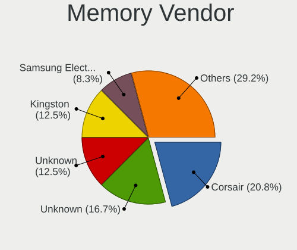

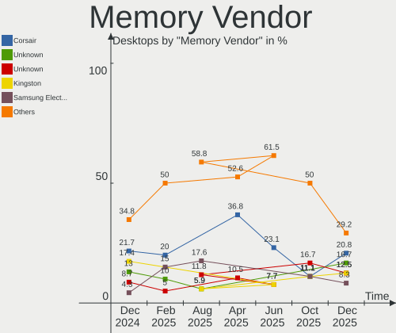

| Vendor              | Desktops | Percent |
|---------------------|----------|---------|
| Corsair             | 5        | 20.83%  |
| Unknown             | 4        | 16.67%  |
| Unknown             | 3        | 12.5%   |
| Kingston            | 3        | 12.5%   |
| Samsung Electronics | 2        | 8.33%   |
| Red Hat             | 2        | 8.33%   |
| Transcend           | 1        | 4.17%   |
| Timetec             | 1        | 4.17%   |
| Crucial             | 1        | 4.17%   |
| Acer                | 1        | 4.17%   |
| A-DATA Technology   | 1        | 4.17%   |

Memory Model
------------

Memory module models

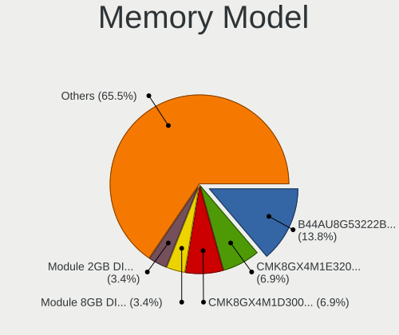

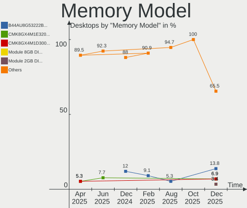

| Model                                                  | Desktops | Percent |
|--------------------------------------------------------|----------|---------|
| Unknown                                                | 4        | 13.79%  |
| Corsair RAM CMK8GX4M1E3200C16 8GB DIMM DDR4 3200MT/s   | 2        | 6.9%    |
| Corsair RAM CMK8GX4M1D3000C16 8GB DIMM DDR4 3600MT/s   | 2        | 6.9%    |
| Unknown RAM Module 8GB DIMM 1600MT/s                   | 1        | 3.45%   |
| Unknown RAM Module 2GB DIMM DDR2 667MT/s               | 1        | 3.45%   |
| Unknown RAM 6 6 6 8GB DIMM DDR4 2667MT/s               | 1        | 3.45%   |
| Transcend RAM JM1333KLH-4G 4GB DIMM DDR3 1333MT/s      | 1        | 3.45%   |
| Timetec RAM U16G-2666 16GB DIMM DDR4 2667MT/s          | 1        | 3.45%   |
| Samsung RAM M378A1K43CB2-CTD 8GB DIMM DDR4 3266MT/s    | 1        | 3.45%   |
| Samsung RAM M378A1K43CB2-CRC 8GB DIMM DDR4 3500MT/s    | 1        | 3.45%   |
| Red Hat RAM Module 8GB DIMM RAM                        | 1        | 3.45%   |
| Red Hat RAM Module 8124MB DIMM RAM                     | 1        | 3.45%   |
| Kingston RAM KHX3600C17D4/16GX 16GB DIMM DDR4 3800MT/s | 1        | 3.45%   |
| Kingston RAM KHX2133C14/8G 8GB DIMM DDR4 2666MT/s      | 1        | 3.45%   |
| Kingston RAM KF3200C16D4/32GX 32GB DIMM DDR4 3933MT/s  | 1        | 3.45%   |
| Crucial RAM CT8G4DFRA266.C8FJ 8GB DIMM DDR4 2800MT/s   | 1        | 3.45%   |
| Crucial RAM CT8G4DFRA266.C8FE 8GiB DIMM DDR4 2933MT/s  | 1        | 3.45%   |
| Corsair RAM CMW8GX4M1Z3600C18 8GB DIMM DDR4 2666MT/s   | 1        | 3.45%   |
| Corsair RAM CMK8GX4M1Z3600C18 8GB DIMM DDR4 3600MT/s   | 1        | 3.45%   |
| Corsair RAM CMK8GX4M1A2400C16 8GB DIMM DDR4 3066MT/s   | 1        | 3.45%   |
| Acer RAM BL.9BWWR.350 16GB DIMM DDR5 4800MT/s          | 1        | 3.45%   |
| A-DATA RAM DDR4 3000 8GB DIMM DDR4 3600MT/s            | 1        | 3.45%   |
| A-DATA RAM DDR4 3000 2OZ 8GB DIMM DDR4 3000MT/s        | 1        | 3.45%   |
| A-DATA RAM AX4U32008G16A-DR30 8GB DIMM DDR4 2933MT/s   | 1        | 3.45%   |

Memory Kind
-----------

Memory module kinds

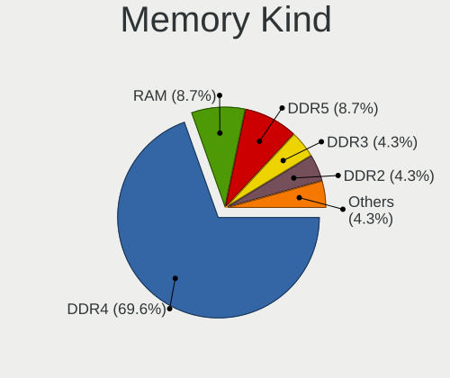

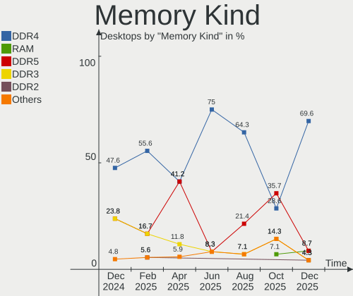

| Kind    | Desktops | Percent |
|---------|----------|---------|
| DDR4    | 16       | 69.57%  |
| RAM     | 2        | 8.7%    |
| DDR5    | 2        | 8.7%    |
| DDR3    | 1        | 4.35%   |
| DDR2    | 1        | 4.35%   |
| Unknown | 1        | 4.35%   |

Memory Form Factor
------------------

Physical design of the memory module

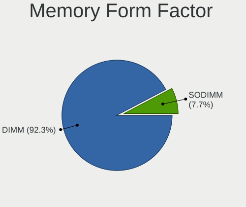

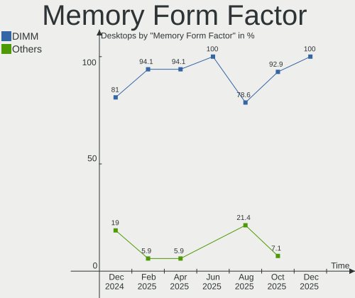

| Name | Desktops | Percent |
|------|----------|---------|
| DIMM | 23       | 100%    |

Memory Size
-----------

Memory module size

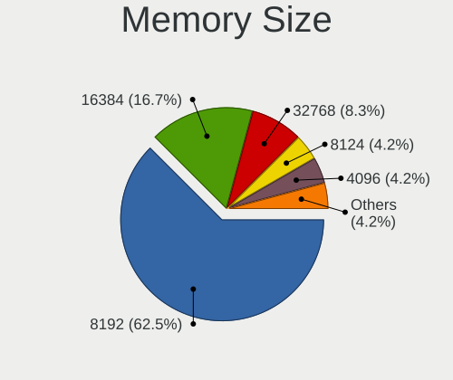

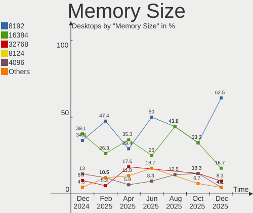

| Size  | Desktops | Percent |
|-------|----------|---------|
| 8192  | 15       | 62.5%   |
| 16384 | 4        | 16.67%  |
| 32768 | 2        | 8.33%   |
| 8124  | 1        | 4.17%   |
| 4096  | 1        | 4.17%   |
| 2048  | 1        | 4.17%   |

Memory Speed
------------

Memory module speed

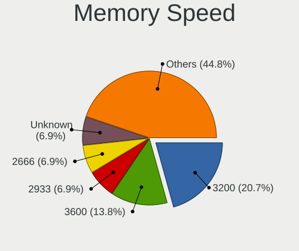

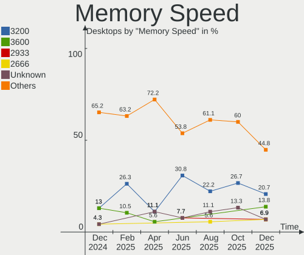

| Speed   | Desktops | Percent |
|---------|----------|---------|
| 3200    | 6        | 20.69%  |
| 3600    | 4        | 13.79%  |
| 2933    | 2        | 6.9%    |
| 2666    | 2        | 6.9%    |
| Unknown | 2        | 6.9%    |
| 6000    | 1        | 3.45%   |
| 4800    | 1        | 3.45%   |
| 3933    | 1        | 3.45%   |
| 3800    | 1        | 3.45%   |
| 3500    | 1        | 3.45%   |
| 3266    | 1        | 3.45%   |
| 3066    | 1        | 3.45%   |
| 3000    | 1        | 3.45%   |
| 2800    | 1        | 3.45%   |
| 2667    | 1        | 3.45%   |
| 1600    | 1        | 3.45%   |
| 1333    | 1        | 3.45%   |
| 667     | 1        | 3.45%   |

Printers & scanners
-------------------

Printer Vendor
--------------

Printer device vendors

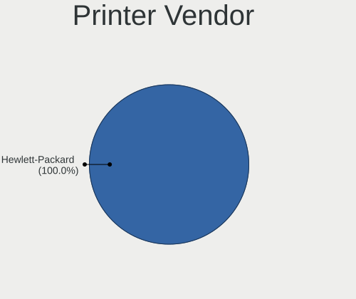

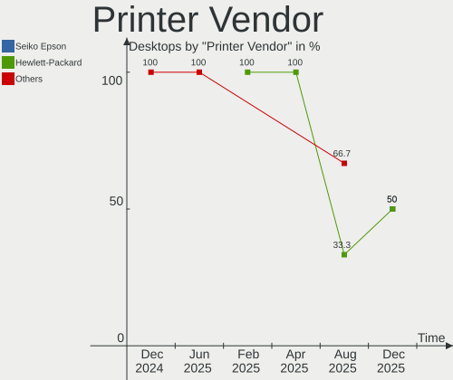

| Vendor          | Desktops | Percent |
|-----------------|----------|---------|
| Seiko Epson     | 1        | 50%     |
| Hewlett-Packard | 1        | 50%     |

Printer Model
-------------

Printer device models

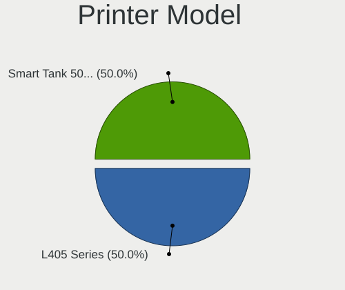

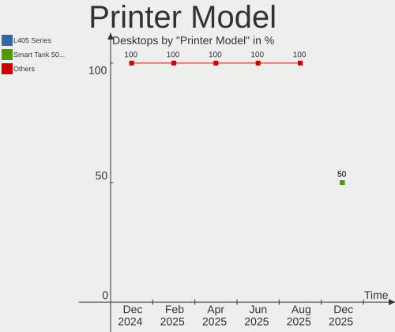

| Model                    | Desktops | Percent |
|--------------------------|----------|---------|
| Seiko Epson L405 Series  | 1        | 50%     |
| HP Smart Tank 500 series | 1        | 50%     |

Scanner Vendor
--------------

Scanner device vendors

Zero info for selected period =(

Scanner Model
-------------

Scanner device models

Zero info for selected period =(

Camera
------

Camera Vendor
-------------

Camera device vendors

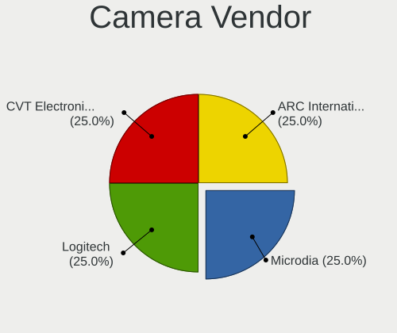

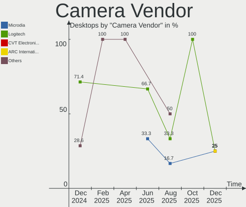

| Vendor              | Desktops | Percent |
|---------------------|----------|---------|
| Microdia            | 1        | 25%     |
| Logitech            | 1        | 25%     |
| CVT Electronics.Co. | 1        | 25%     |
| ARC International   | 1        | 25%     |

Camera Model
------------

Camera device models

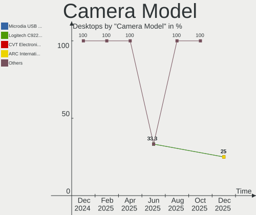

| Model                           | Desktops | Percent |
|---------------------------------|----------|---------|
| Microdia USB 2.0 Camera         | 1        | 25%     |
| Logitech C922 Pro Stream Webcam | 1        | 25%     |
| CVT Electronics.Co. USB Camera  | 1        | 25%     |
| ARC International Camera        | 1        | 25%     |

Security
--------

Fingerprint Vendor
------------------

Fingerprint sensor vendors

Zero info for selected period =(

Fingerprint Model
-----------------

Fingerprint sensor models

Zero info for selected period =(

Chipcard Vendor
---------------

Chipcard module vendors

Zero info for selected period =(

Chipcard Model
--------------

Chipcard module models

Zero info for selected period =(

Unsupported
-----------

Unsupported Devices
-------------------

Total unsupported devices on board

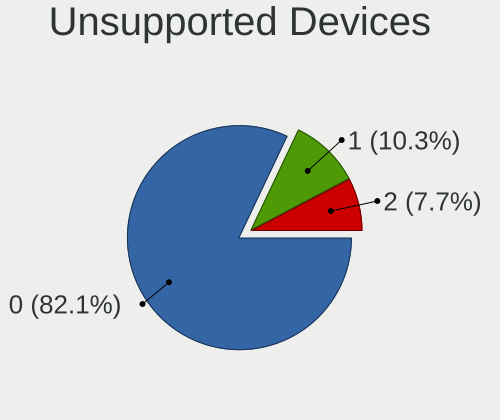

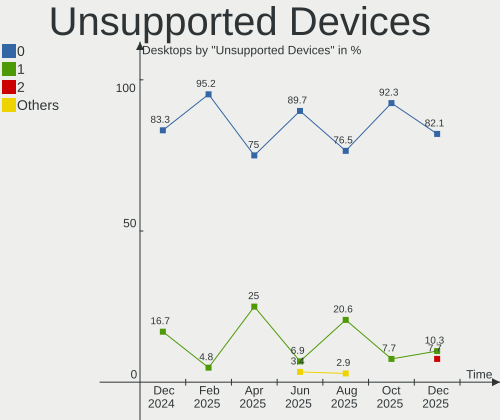

| Total | Desktops | Percent |
|-------|----------|---------|
| 0     | 32       | 82.05%  |
| 1     | 4        | 10.26%  |
| 2     | 3        | 7.69%   |

Unsupported Device Types
------------------------

Types of unsupported devices

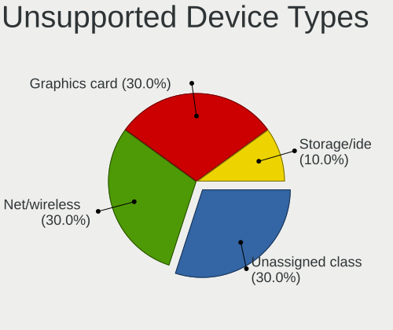

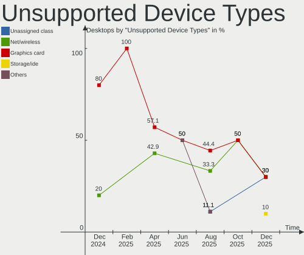

| Type             | Desktops | Percent |
|------------------|----------|---------|
| Unassigned class | 3        | 30%     |
| Net/wireless     | 3        | 30%     |
| Graphics card    | 3        | 30%     |
| Storage/ide      | 1        | 10%     |

