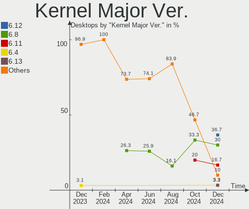
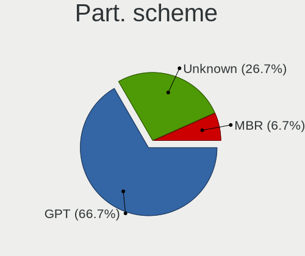
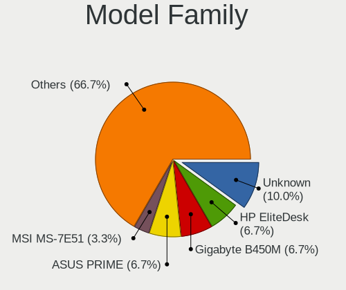
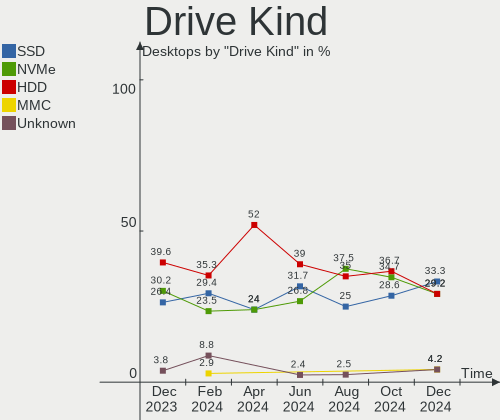
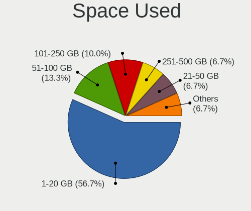
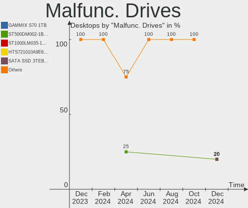
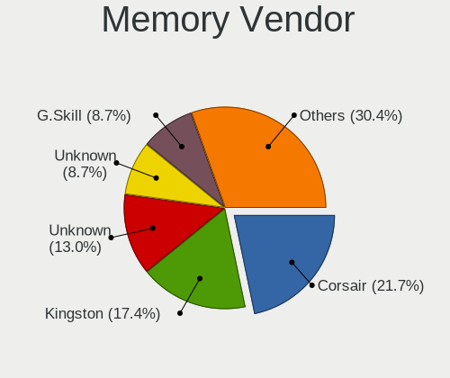
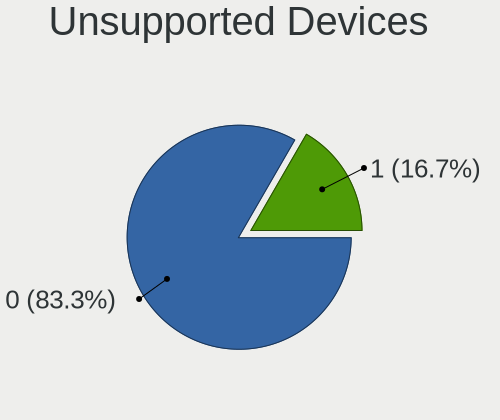

Linux in India - Hardware Trends (Desktops)
-------------------------------------------

A project to identify most popular hardware characteristics and track their change
over time based on data collected by Linux users at https://Linux-Hardware.org.

Anyone can contribute to this report by the [hw-probe](https://github.com/linuxhw/hw-probe) tool:

    sudo -E hw-probe -all -upload

Period: Oct, 2022.

Contents
--------

* [ System ](#system)
  - [ OS                       ](#os)
  - [ OS Family                ](#os-family)
  - [ Kernel                   ](#kernel)
  - [ Kernel Family            ](#kernel-family)
  - [ Kernel Major Ver.        ](#kernel-major-ver)
  - [ Arch                     ](#arch)
  - [ DE                       ](#de)
  - [ Display Server           ](#display-server)
  - [ Display Manager          ](#display-manager)
  - [ OS Lang                  ](#os-lang)
  - [ Boot Mode                ](#boot-mode)
  - [ Filesystem               ](#filesystem)
  - [ Part. scheme             ](#part-scheme)
  - [ Dual Boot with Linux/BSD ](#dual-boot-with-linuxbsd)
  - [ Dual Boot (Win)          ](#dual-boot-win)

* [ Board ](#board)
  - [ Vendor                   ](#vendor)
  - [ Model                    ](#model)
  - [ Model Family             ](#model-family)
  - [ MFG Year                 ](#mfg-year)
  - [ Form Factor              ](#form-factor)
  - [ Secure Boot              ](#secure-boot)
  - [ Coreboot                 ](#coreboot)
  - [ RAM Size                 ](#ram-size)
  - [ RAM Used                 ](#ram-used)
  - [ Total Drives             ](#total-drives)
  - [ Has CD-ROM               ](#has-cd-rom)
  - [ Has Ethernet             ](#has-ethernet)
  - [ Has WiFi                 ](#has-wifi)
  - [ Has Bluetooth            ](#has-bluetooth)

* [ Location ](#location)
  - [ Country                  ](#country)
  - [ City                     ](#city)

* [ Drives ](#drives)
  - [ Drive Vendor             ](#drive-vendor)
  - [ Drive Model              ](#drive-model)
  - [ HDD Vendor               ](#hdd-vendor)
  - [ SSD Vendor               ](#ssd-vendor)
  - [ Drive Kind               ](#drive-kind)
  - [ Drive Connector          ](#drive-connector)
  - [ Drive Size               ](#drive-size)
  - [ Space Total              ](#space-total)
  - [ Space Used               ](#space-used)
  - [ Malfunc. Drives          ](#malfunc-drives)
  - [ Malfunc. Drive Vendor    ](#malfunc-drive-vendor)
  - [ Malfunc. HDD Vendor      ](#malfunc-hdd-vendor)
  - [ Malfunc. Drive Kind      ](#malfunc-drive-kind)
  - [ Failed Drives            ](#failed-drives)
  - [ Failed Drive Vendor      ](#failed-drive-vendor)
  - [ Drive Status             ](#drive-status)

* [ Storage controller ](#storage-controller)
  - [ Storage Vendor           ](#storage-vendor)
  - [ Storage Model            ](#storage-model)
  - [ Storage Kind             ](#storage-kind)

* [ Processor ](#processor)
  - [ CPU Vendor               ](#cpu-vendor)
  - [ CPU Model                ](#cpu-model)
  - [ CPU Model Family         ](#cpu-model-family)
  - [ CPU Cores                ](#cpu-cores)
  - [ CPU Sockets              ](#cpu-sockets)
  - [ CPU Threads              ](#cpu-threads)
  - [ CPU Op-Modes             ](#cpu-op-modes)
  - [ CPU Microcode            ](#cpu-microcode)
  - [ CPU Microarch            ](#cpu-microarch)

* [ Graphics ](#graphics)
  - [ GPU Vendor               ](#gpu-vendor)
  - [ GPU Model                ](#gpu-model)
  - [ GPU Combo                ](#gpu-combo)
  - [ GPU Driver               ](#gpu-driver)
  - [ GPU Memory               ](#gpu-memory)

* [ Monitor ](#monitor)
  - [ Monitor Vendor           ](#monitor-vendor)
  - [ Monitor Model            ](#monitor-model)
  - [ Monitor Resolution       ](#monitor-resolution)
  - [ Monitor Diagonal         ](#monitor-diagonal)
  - [ Monitor Width            ](#monitor-width)
  - [ Aspect Ratio             ](#aspect-ratio)
  - [ Monitor Area             ](#monitor-area)
  - [ Pixel Density            ](#pixel-density)
  - [ Multiple Monitors        ](#multiple-monitors)

* [ Network ](#network)
  - [ Net Controller Vendor    ](#net-controller-vendor)
  - [ Net Controller Model     ](#net-controller-model)
  - [ Wireless Vendor          ](#wireless-vendor)
  - [ Wireless Model           ](#wireless-model)
  - [ Ethernet Vendor          ](#ethernet-vendor)
  - [ Ethernet Model           ](#ethernet-model)
  - [ Net Controller Kind      ](#net-controller-kind)
  - [ Used Controller          ](#used-controller)
  - [ NICs                     ](#nics)
  - [ IPv6                     ](#ipv6)

* [ Bluetooth ](#bluetooth)
  - [ Bluetooth Vendor         ](#bluetooth-vendor)
  - [ Bluetooth Model          ](#bluetooth-model)

* [ Sound ](#sound)
  - [ Sound Vendor             ](#sound-vendor)
  - [ Sound Model              ](#sound-model)

* [ Memory ](#memory)
  - [ Memory Vendor            ](#memory-vendor)
  - [ Memory Model             ](#memory-model)
  - [ Memory Kind              ](#memory-kind)
  - [ Memory Form Factor       ](#memory-form-factor)
  - [ Memory Size              ](#memory-size)
  - [ Memory Speed             ](#memory-speed)

* [ Printers & scanners ](#printers--scanners)
  - [ Printer Vendor           ](#printer-vendor)
  - [ Printer Model            ](#printer-model)
  - [ Scanner Vendor           ](#scanner-vendor)
  - [ Scanner Model            ](#scanner-model)

* [ Camera ](#camera)
  - [ Camera Vendor            ](#camera-vendor)
  - [ Camera Model             ](#camera-model)

* [ Security ](#security)
  - [ Fingerprint Vendor       ](#fingerprint-vendor)
  - [ Fingerprint Model        ](#fingerprint-model)
  - [ Chipcard Vendor          ](#chipcard-vendor)
  - [ Chipcard Model           ](#chipcard-model)

* [ Unsupported ](#unsupported)
  - [ Unsupported Devices      ](#unsupported-devices)
  - [ Unsupported Device Types ](#unsupported-device-types)

System
------

OS
--

Installed operating systems

| Name             | Desktops | Percent |
|------------------|----------|---------|
| Ubuntu 22.04     | 6        | 27.27%  |
| OpenMandriva 4.3 | 3        | 13.64%  |
| Ubuntu 20.04     | 2        | 9.09%   |
| KDE neon 20.04   | 2        | 9.09%   |
| Zorin 16         | 1        | 4.55%   |
| Ubuntu 18.04     | 1        | 4.55%   |
| Pop!_OS 22.04    | 1        | 4.55%   |
| Manjaro          | 1        | 4.55%   |
| Linux Mint 20    | 1        | 4.55%   |
| Fedora 36        | 1        | 4.55%   |
| Endless 4.0.10   | 1        | 4.55%   |
| CentOS 7         | 1        | 4.55%   |
| Arch Rolling     | 1        | 4.55%   |

OS Family
---------

OS without a version

| Name         | Desktops | Percent |
|--------------|----------|---------|
| Ubuntu       | 9        | 40.91%  |
| OpenMandriva | 3        | 13.64%  |
| KDE neon     | 2        | 9.09%   |
| Zorin        | 1        | 4.55%   |
| Pop!_OS      | 1        | 4.55%   |
| Manjaro      | 1        | 4.55%   |
| Linux Mint   | 1        | 4.55%   |
| Fedora       | 1        | 4.55%   |
| Endless      | 1        | 4.55%   |
| CentOS       | 1        | 4.55%   |
| Arch         | 1        | 4.55%   |

Kernel
------

Version of the Linux kernel

| Version                 | Desktops | Percent |
|-------------------------|----------|---------|
| 5.15.0-52-generic       | 4        | 18.18%  |
| 5.16.7-desktop-1omv4003 | 3        | 13.64%  |
| 5.15.0-50-generic       | 3        | 13.64%  |
| 5.4.0-128-generic       | 2        | 9.09%   |
| 5.15.0-46-generic       | 2        | 9.09%   |
| 5.4.0-131-generic       | 1        | 4.55%   |
| 5.19.16-200.fc36.x86_64 | 1        | 4.55%   |
| 5.19.0-76051900-generic | 1        | 4.55%   |
| 5.15.74-1-lts           | 1        | 4.55%   |
| 5.15.65-1-MANJARO       | 1        | 4.55%   |
| 5.15.0-41-generic       | 1        | 4.55%   |
| 5.11.0-35-generic       | 1        | 4.55%   |
| 3.10.0-1160.el7.x86_64  | 1        | 4.55%   |

Kernel Family
-------------

Linux kernel without a distro release

| Version | Desktops | Percent |
|---------|----------|---------|
| 5.15.0  | 10       | 45.45%  |
| 5.4.0   | 3        | 13.64%  |
| 5.16.7  | 3        | 13.64%  |
| 5.19.16 | 1        | 4.55%   |
| 5.19.0  | 1        | 4.55%   |
| 5.15.74 | 1        | 4.55%   |
| 5.15.65 | 1        | 4.55%   |
| 5.11.0  | 1        | 4.55%   |
| 3.10.0  | 1        | 4.55%   |

Kernel Major Ver.
-----------------

Linux kernel major version

| Version | Desktops | Percent |
|---------|----------|---------|
| 5.15    | 12       | 54.55%  |
| 5.4     | 3        | 13.64%  |
| 5.16    | 3        | 13.64%  |
| 5.19    | 2        | 9.09%   |
| 5.11    | 1        | 4.55%   |
| 3.10    | 1        | 4.55%   |

Arch
----

OS architecture (x86_64, i586, etc.)

| Name   | Desktops | Percent |
|--------|----------|---------|
| x86_64 | 22       | 100%    |

DE
--

Desktop Environment

| Name          | Desktops | Percent |
|---------------|----------|---------|
| GNOME         | 12       | 54.55%  |
| KDE5          | 5        | 22.73%  |
| MATE          | 2        | 9.09%   |
| GNOME Classic | 1        | 4.55%   |
| Enlightenment | 1        | 4.55%   |
| dwm           | 1        | 4.55%   |

Display Server
--------------

X11 or Wayland

| Name    | Desktops | Percent |
|---------|----------|---------|
| X11     | 16       | 72.73%  |
| Wayland | 6        | 27.27%  |

Display Manager
---------------

SDDM, LightDM, etc.

| Name    | Desktops | Percent |
|---------|----------|---------|
| Unknown | 9        | 40.91%  |
| GDM3    | 5        | 22.73%  |
| SDDM    | 4        | 18.18%  |
| LightDM | 2        | 9.09%   |
| GDM     | 2        | 9.09%   |

OS Lang
-------

Language

| Lang  | Desktops | Percent |
|-------|----------|---------|
| en_IN | 14       | 63.64%  |
| en_US | 6        | 27.27%  |
| C     | 2        | 9.09%   |

Boot Mode
---------

EFI or BIOS

| Mode | Desktops | Percent |
|------|----------|---------|
| BIOS | 13       | 59.09%  |
| EFI  | 9        | 40.91%  |

Filesystem
----------

Type of filesystem

| Type    | Desktops | Percent |
|---------|----------|---------|
| Ext4    | 15       | 68.18%  |
| Overlay | 4        | 18.18%  |
| Btrfs   | 2        | 9.09%   |
| Xfs     | 1        | 4.55%   |

Part. scheme
------------

Scheme of partitioning

| Type    | Desktops | Percent |
|---------|----------|---------|
| Unknown | 9        | 40.91%  |
| MBR     | 8        | 36.36%  |
| GPT     | 5        | 22.73%  |

Dual Boot with Linux/BSD
------------------------

Hosting more than one Linux/BSD

| Dual boot | Desktops | Percent |
|-----------|----------|---------|
| No        | 19       | 86.36%  |
| Yes       | 3        | 13.64%  |

Dual Boot (Win)
---------------

Hosting Linux and Windows

| Dual boot | Desktops | Percent |
|-----------|----------|---------|
| No        | 18       | 81.82%  |
| Yes       | 4        | 18.18%  |

Board
-----

Vendor
------

Motherboard manufacturer

| Name                | Desktops | Percent |
|---------------------|----------|---------|
| Gigabyte Technology | 5        | 22.73%  |
| MSI                 | 4        | 18.18%  |
| Lenovo              | 3        | 13.64%  |
| Intel               | 2        | 9.09%   |
| Dell                | 2        | 9.09%   |
| ASUSTek Computer    | 2        | 9.09%   |
| Hewlett-Packard     | 1        | 4.55%   |
| ASRock              | 1        | 4.55%   |
| Acer                | 1        | 4.55%   |
| Unknown             | 1        | 4.55%   |

Model
-----

Motherboard model

| Name                                        | Desktops | Percent |
|---------------------------------------------|----------|---------|
| MSI MS-7B87                                 | 1        | 4.55%   |
| MSI MS-7B51                                 | 1        | 4.55%   |
| MSI MS-7A38                                 | 1        | 4.55%   |
| MSI MS-7721                                 | 1        | 4.55%   |
| Lenovo ThinkCentre neo 50t Gen 3 11SES00500 | 1        | 4.55%   |
| Lenovo ThinkCentre M92p 3237A1Q             | 1        | 4.55%   |
| Lenovo ThinkCentre M73 10B3A0L6IH           | 1        | 4.55%   |
| Intel DH61BF AAG81311-101                   | 1        | 4.55%   |
| Intel D945GCNL AAD97184-102                 | 1        | 4.55%   |
| HP 202 G2 MT                                | 1        | 4.55%   |
| Gigabyte H97N-WIFI                          | 1        | 4.55%   |
| Gigabyte H310M S2 2.0                       | 1        | 4.55%   |
| Gigabyte G31M-ES2L                          | 1        | 4.55%   |
| Gigabyte B450M DS3H                         | 1        | 4.55%   |
| Gigabyte B250M-D3H                          | 1        | 4.55%   |
| Dell OptiPlex 5090                          | 1        | 4.55%   |
| Dell Inspiron 560s                          | 1        | 4.55%   |
| ASUS PRIME X570-PRO                         | 1        | 4.55%   |
| ASUS PRIME B365M-C                          | 1        | 4.55%   |
| ASRock H61M-DGS                             | 1        | 4.55%   |
| Acer Veriton M2640G                         | 1        | 4.55%   |
| Unknown                                     | 1        | 4.55%   |

Model Family
------------

Motherboard model prefix

| Name               | Desktops | Percent |
|--------------------|----------|---------|
| Lenovo ThinkCentre | 3        | 13.64%  |
| ASUS PRIME         | 2        | 9.09%   |
| MSI MS-7B87        | 1        | 4.55%   |
| MSI MS-7B51        | 1        | 4.55%   |
| MSI MS-7A38        | 1        | 4.55%   |
| MSI MS-7721        | 1        | 4.55%   |
| Intel DH61BF       | 1        | 4.55%   |
| Intel D945GCNL     | 1        | 4.55%   |
| HP 202             | 1        | 4.55%   |
| Gigabyte H97N-WIFI | 1        | 4.55%   |
| Gigabyte H310M     | 1        | 4.55%   |
| Gigabyte G31M-ES2L | 1        | 4.55%   |
| Gigabyte B450M     | 1        | 4.55%   |
| Gigabyte B250M-D3H | 1        | 4.55%   |
| Dell OptiPlex      | 1        | 4.55%   |
| Dell Inspiron      | 1        | 4.55%   |
| ASRock H61M-DGS    | 1        | 4.55%   |
| Acer Veriton       | 1        | 4.55%   |
| Unknown            | 1        | 4.55%   |

MFG Year
--------

Motherboard manufacture year

| Year | Desktops | Percent |
|------|----------|---------|
| 2018 | 4        | 18.18%  |
| 2022 | 2        | 9.09%   |
| 2020 | 2        | 9.09%   |
| 2017 | 2        | 9.09%   |
| 2016 | 2        | 9.09%   |
| 2014 | 2        | 9.09%   |
| 2012 | 2        | 9.09%   |
| 2019 | 1        | 4.55%   |
| 2015 | 1        | 4.55%   |
| 2013 | 1        | 4.55%   |
| 2010 | 1        | 4.55%   |
| 2008 | 1        | 4.55%   |
| 2007 | 1        | 4.55%   |

Form Factor
-----------

Physical design of the computer

| Name    | Desktops | Percent |
|---------|----------|---------|
| Desktop | 22       | 100%    |

Secure Boot
-----------

Enabled or disabled

| State    | Desktops | Percent |
|----------|----------|---------|
| Disabled | 22       | 100%    |

Coreboot
--------

Have coreboot on board

| Used | Desktops | Percent |
|------|----------|---------|
| No   | 22       | 100%    |

RAM Size
--------

Total RAM memory

| Size in GB | Desktops | Percent |
|------------|----------|---------|
| 3.01-4.0   | 5        | 22.73%  |
| 32.01-64.0 | 4        | 18.18%  |
| 16.01-24.0 | 4        | 18.18%  |
| 8.01-16.0  | 4        | 18.18%  |
| 4.01-8.0   | 3        | 13.64%  |
| 2.01-3.0   | 1        | 4.55%   |
| 1.01-2.0   | 1        | 4.55%   |

RAM Used
--------

Used RAM memory

| Used GB    | Desktops | Percent |
|------------|----------|---------|
| 2.01-3.0   | 8        | 36.36%  |
| 1.01-2.0   | 6        | 27.27%  |
| 3.01-4.0   | 4        | 18.18%  |
| 4.01-8.0   | 1        | 4.55%   |
| 16.01-24.0 | 1        | 4.55%   |
| 8.01-16.0  | 1        | 4.55%   |
| 0.51-1.0   | 1        | 4.55%   |

Total Drives
------------

Number of drives on board

| Drives | Desktops | Percent |
|--------|----------|---------|
| 1      | 11       | 50%     |
| 3      | 5        | 22.73%  |
| 2      | 5        | 22.73%  |
| 4      | 1        | 4.55%   |

Has CD-ROM
----------

Has CD-ROM on board

| Presented | Desktops | Percent |
|-----------|----------|---------|
| No        | 15       | 68.18%  |
| Yes       | 7        | 31.82%  |

Has Ethernet
------------

Has Ethernet on board

| Presented | Desktops | Percent |
|-----------|----------|---------|
| Yes       | 22       | 100%    |

Has WiFi
--------

Has WiFi module

| Presented | Desktops | Percent |
|-----------|----------|---------|
| No        | 12       | 54.55%  |
| Yes       | 10       | 45.45%  |

Has Bluetooth
-------------

Has Bluetooth module

| Presented | Desktops | Percent |
|-----------|----------|---------|
| No        | 15       | 68.18%  |
| Yes       | 7        | 31.82%  |

Location
--------

Country
-------

Geographic location (country)

| Country | Desktops | Percent |
|---------|----------|---------|
| India   | 22       | 100%    |

City
----

Geographic location (city)

| City       | Desktops | Percent |
|------------|----------|---------|
| Bengaluru  | 4        | 18.18%  |
| Trivandrum | 2        | 9.09%   |
| Kolkata    | 2        | 9.09%   |
| Hyderabad  | 2        | 9.09%   |
| Chennai    | 2        | 9.09%   |
| Rajkot     | 1        | 4.55%   |
| Pune       | 1        | 4.55%   |
| Patna      | 1        | 4.55%   |
| Kanpur     | 1        | 4.55%   |
| Jaipur     | 1        | 4.55%   |
| Indore     | 1        | 4.55%   |
| Hosur      | 1        | 4.55%   |
| Ernakulam  | 1        | 4.55%   |
| Coimbatore | 1        | 4.55%   |
| Bhopal     | 1        | 4.55%   |

Drives
------

Drive Vendor
------------

Hard drive vendors

| Vendor              | Desktops | Drives | Percent |
|---------------------|----------|--------|---------|
| Seagate             | 11       | 14     | 30.56%  |
| WDC                 | 8        | 9      | 22.22%  |
| Kingston            | 3        | 3      | 8.33%   |
| HGST                | 3        | 3      | 8.33%   |
| Samsung Electronics | 2        | 2      | 5.56%   |
| Intel               | 2        | 2      | 5.56%   |
| Crucial             | 2        | 2      | 5.56%   |
| Toshiba             | 1        | 1      | 2.78%   |
| Sandisk             | 1        | 1      | 2.78%   |
| Hitachi             | 1        | 1      | 2.78%   |
| Gigabyte Technology | 1        | 1      | 2.78%   |
| China               | 1        | 1      | 2.78%   |

Drive Model
-----------

Hard drive models

| Model                                  | Desktops | Percent |
|----------------------------------------|----------|---------|
| Seagate ST1000DM010-2EP102 1TB         | 3        | 7.69%   |
| WDC WD10EZEX-21WN4A0 1TB               | 2        | 5.13%   |
| Kingston SA400S37240G 240GB SSD        | 2        | 5.13%   |
| Intel SSD 660P Series 1024GB           | 2        | 5.13%   |
| WDC WUH721818ALE6L4 18TB               | 1        | 2.56%   |
| WDC WDS240G2G0A-00JH30 240GB SSD       | 1        | 2.56%   |
| WDC WDS120G2G0A-00JH30 120GB SSD       | 1        | 2.56%   |
| WDC WD20EZBX-00AYRA0 2TB               | 1        | 2.56%   |
| WDC WD10EZEX-22MFCA0 1TB               | 1        | 2.56%   |
| WDC WD10EZEX-08WN4A1 1TB               | 1        | 2.56%   |
| WDC WD10 JPVX-60JC3T1 1TB              | 1        | 2.56%   |
| Toshiba HDWD110 1TB                    | 1        | 2.56%   |
| Seagate ST8000AS0002-1NA17Z 8TB        | 1        | 2.56%   |
| Seagate ST500DM005 HD502HJ 500GB       | 1        | 2.56%   |
| Seagate ST500DM002-1BD142 500GB        | 1        | 2.56%   |
| Seagate ST4000DM004-2CV104 4TB         | 1        | 2.56%   |
| Seagate ST4000DM000-1F2168 4TB         | 1        | 2.56%   |
| Seagate ST3500312CS 500GB              | 1        | 2.56%   |
| Seagate ST2000DM005-2U9102 2TB         | 1        | 2.56%   |
| Seagate ST2000DM001-1CH164 2TB         | 1        | 2.56%   |
| Seagate BUP BL 5TB                     | 1        | 2.56%   |
| Seagate BarraCuda Q5 ZP1000CV30001 1TB | 1        | 2.56%   |
| Sandisk WD Blue SN550 NVMe SSD 1TB     | 1        | 2.56%   |
| Samsung SSD 870 QVO 1TB                | 1        | 2.56%   |
| Samsung SSD 870 EVO 500GB              | 1        | 2.56%   |
| Kingston SV300S37A120G 120GB SSD       | 1        | 2.56%   |
| Hitachi HDS723030ALA640 3TB            | 1        | 2.56%   |
| HGST HUH728080ALE604 8TB               | 1        | 2.56%   |
| HGST HUH721212ALE604 12TB              | 1        | 2.56%   |
| HGST HTS545032A7E380 320GB             | 1        | 2.56%   |
| Gigabyte GP-GSTFS31240GNTD 240GB       | 1        | 2.56%   |
| Crucial CT1000P1SSD8 1TB               | 1        | 2.56%   |
| Crucial CT1000BX500SSD1 1TB            | 1        | 2.56%   |
| China SSD 128GB                        | 1        | 2.56%   |

HDD Vendor
----------

Hard disk drive vendors

| Vendor  | Desktops | Drives | Percent |
|---------|----------|--------|---------|
| Seagate | 10       | 13     | 45.45%  |
| WDC     | 7        | 7      | 31.82%  |
| HGST    | 3        | 3      | 13.64%  |
| Toshiba | 1        | 1      | 4.55%   |
| Hitachi | 1        | 1      | 4.55%   |

SSD Vendor
----------

Solid state drive vendors

| Vendor              | Desktops | Drives | Percent |
|---------------------|----------|--------|---------|
| Kingston            | 3        | 3      | 30%     |
| WDC                 | 2        | 2      | 20%     |
| Samsung Electronics | 2        | 2      | 20%     |
| Gigabyte Technology | 1        | 1      | 10%     |
| Crucial             | 1        | 1      | 10%     |
| China               | 1        | 1      | 10%     |

Drive Kind
----------

HDD or SSD

| Kind | Desktops | Drives | Percent |
|------|----------|--------|---------|
| HDD  | 19       | 25     | 59.38%  |
| SSD  | 9        | 10     | 28.13%  |
| NVMe | 4        | 5      | 12.5%   |

Drive Connector
---------------

SATA, SAS, NVMe, etc.

| Type | Desktops | Drives | Percent |
|------|----------|--------|---------|
| SATA | 22       | 33     | 78.57%  |
| NVMe | 4        | 5      | 14.29%  |
| SAS  | 2        | 2      | 7.14%   |

Drive Size
----------

Size of hard drive

| Size in TB | Desktops | Drives | Percent |
|------------|----------|--------|---------|
| 0.01-0.5   | 11       | 12     | 34.38%  |
| 0.51-1.0   | 10       | 12     | 31.25%  |
| 1.01-2.0   | 3        | 3      | 9.38%   |
| 4.01-10.0  | 3        | 3      | 9.38%   |
| 3.01-4.0   | 2        | 2      | 6.25%   |
| 10.01-20.0 | 2        | 2      | 6.25%   |
| 2.01-3.0   | 1        | 1      | 3.13%   |

Space Total
-----------

Amount of disk space available on the file system

| Size in GB     | Desktops | Percent |
|----------------|----------|---------|
| 501-1000       | 5        | 22.73%  |
| 1-20           | 4        | 18.18%  |
| 251-500        | 3        | 13.64%  |
| 101-250        | 3        | 13.64%  |
| More than 3000 | 2        | 9.09%   |
| 21-50          | 2        | 9.09%   |
| 2001-3000      | 2        | 9.09%   |
| 1001-2000      | 1        | 4.55%   |

Space Used
----------

Amount of used disk space

| Used GB        | Desktops | Percent |
|----------------|----------|---------|
| 1-20           | 10       | 45.45%  |
| More than 3000 | 2        | 9.09%   |
| 251-500        | 2        | 9.09%   |
| 21-50          | 2        | 9.09%   |
| 101-250        | 2        | 9.09%   |
| 501-1000       | 2        | 9.09%   |
| 51-100         | 2        | 9.09%   |

Malfunc. Drives
---------------

Drive models with a malfunction

| Model                            | Desktops | Drives | Percent |
|----------------------------------|----------|--------|---------|
| WDC WD10EZEX-21WN4A0 1TB         | 1        | 1      | 33.33%  |
| Seagate ST500DM005 HD502HJ 500GB | 1        | 1      | 33.33%  |
| Seagate ST2000DM001-1CH164 2TB   | 1        | 1      | 33.33%  |

Malfunc. Drive Vendor
---------------------

Vendors of faulty drives

| Vendor  | Desktops | Drives | Percent |
|---------|----------|--------|---------|
| Seagate | 2        | 2      | 66.67%  |
| WDC     | 1        | 1      | 33.33%  |

Malfunc. HDD Vendor
-------------------

Vendors of faulty HDD drives

| Vendor  | Desktops | Drives | Percent |
|---------|----------|--------|---------|
| Seagate | 2        | 2      | 66.67%  |
| WDC     | 1        | 1      | 33.33%  |

Malfunc. Drive Kind
-------------------

Kinds of faulty drives

| Kind | Desktops | Drives | Percent |
|------|----------|--------|---------|
| HDD  | 3        | 3      | 100%    |

Failed Drives
-------------

Failed drive models

Zero info for selected period =(

Failed Drive Vendor
-------------------

Failed drive vendors

Zero info for selected period =(

Drive Status
------------

Number of failed and malfunc. drives

| Status   | Desktops | Drives | Percent |
|----------|----------|--------|---------|
| Detected | 13       | 29     | 56.52%  |
| Works    | 7        | 8      | 30.43%  |
| Malfunc  | 3        | 3      | 13.04%  |

Storage controller
------------------

Storage Vendor
--------------

Storage controller vendors

| Vendor                    | Desktops | Percent |
|---------------------------|----------|---------|
| Intel                     | 18       | 69.23%  |
| AMD                       | 5        | 19.23%  |
| Seagate Technology        | 1        | 3.85%   |
| SanDisk                   | 1        | 3.85%   |
| Micron/Crucial Technology | 1        | 3.85%   |

Storage Model
-------------

Storage controller models

| Model                                                                          | Desktops | Percent |
|--------------------------------------------------------------------------------|----------|---------|
| AMD FCH SATA Controller [AHCI mode]                                            | 5        | 15.63%  |
| Intel NM10/ICH7 Family SATA Controller [IDE mode]                              | 3        | 9.38%   |
| Intel 200 Series PCH SATA controller [AHCI mode]                               | 3        | 9.38%   |
| Intel SSD 660P Series                                                          | 2        | 6.25%   |
| Intel 82801G (ICH7 Family) IDE Controller                                      | 2        | 6.25%   |
| Intel 8 Series/C220 Series Chipset Family 6-port SATA Controller 1 [AHCI mode] | 2        | 6.25%   |
| Intel 6 Series/C200 Series Chipset Family 6 port Desktop SATA AHCI Controller  | 2        | 6.25%   |
| AMD 400 Series Chipset SATA Controller                                         | 2        | 6.25%   |
| Seagate Non-Volatile memory controller                                         | 1        | 3.13%   |
| SanDisk WD Blue SN550 NVMe SSD                                                 | 1        | 3.13%   |
| Micron/Crucial NVMe Controller                                                 | 1        | 3.13%   |
| Intel Q170/Q150/B150/H170/H110/Z170/CM236 Chipset SATA Controller [AHCI Mode]  | 1        | 3.13%   |
| Intel Cannon Lake PCH SATA AHCI Controller                                     | 1        | 3.13%   |
| Intel Alder Lake-S PCH SATA Controller [AHCI Mode]                             | 1        | 3.13%   |
| Intel 9 Series Chipset Family SATA Controller [AHCI Mode]                      | 1        | 3.13%   |
| Intel 82801JI (ICH10 Family) 4 port SATA IDE Controller #1                     | 1        | 3.13%   |
| Intel 7 Series/C210 Series Chipset Family 6-port SATA Controller [AHCI mode]   | 1        | 3.13%   |
| Intel 500 Series Chipset Family SATA AHCI Controller                           | 1        | 3.13%   |
| AMD 300 Series Chipset SATA Controller                                         | 1        | 3.13%   |

Storage Kind
------------

Kind of storage controller (IDE, SATA, NVMe, SAS, ...)

| Kind | Desktops | Percent |
|------|----------|---------|
| SATA | 18       | 69.23%  |
| NVMe | 4        | 15.38%  |
| IDE  | 4        | 15.38%  |

Processor
---------

CPU Vendor
----------

Processor vendors

| Vendor | Desktops | Percent |
|--------|----------|---------|
| Intel  | 17       | 77.27%  |
| AMD    | 5        | 22.73%  |

CPU Model
---------

Processor models

| Model                                         | Desktops | Percent |
|-----------------------------------------------|----------|---------|
| Intel Core i5-9400F CPU @ 2.90GHz             | 2        | 9.09%   |
| Intel Core 2 Duo CPU E7500 @ 2.93GHz          | 2        | 9.09%   |
| Intel Pentium D CPU 3.00GHz                   | 1        | 4.55%   |
| Intel Pentium CPU G620 @ 2.60GHz              | 1        | 4.55%   |
| Intel Core i9-9900K CPU @ 3.60GHz             | 1        | 4.55%   |
| Intel Core i7-4790K CPU @ 4.00GHz             | 1        | 4.55%   |
| Intel Core i5-4570T CPU @ 2.90GHz             | 1        | 4.55%   |
| Intel Core i5-3470T CPU @ 2.90GHz             | 1        | 4.55%   |
| Intel Core i3-7100 CPU @ 3.90GHz              | 1        | 4.55%   |
| Intel Core i3-6100T CPU @ 3.20GHz             | 1        | 4.55%   |
| Intel Core i3-4150 CPU @ 3.50GHz              | 1        | 4.55%   |
| Intel Core i3-3220 CPU @ 3.30GHz              | 1        | 4.55%   |
| Intel Core 2 Duo CPU E7400 @ 2.80GHz          | 1        | 4.55%   |
| Intel 12th Gen Core i3-12100                  | 1        | 4.55%   |
| Intel 11th Gen Core i7-11700 @ 2.50GHz        | 1        | 4.55%   |
| AMD Ryzen 7 3700X 8-Core Processor            | 1        | 4.55%   |
| AMD Ryzen 5 3500 6-Core Processor             | 1        | 4.55%   |
| AMD Ryzen 5 2600X Six-Core Processor          | 1        | 4.55%   |
| AMD Ryzen 3 2200G with Radeon Vega Graphics   | 1        | 4.55%   |
| AMD A6-7400K Radeon R5, 6 Compute Cores 2C+4G | 1        | 4.55%   |

CPU Model Family
----------------

Processor model prefix

| Model            | Desktops | Percent |
|------------------|----------|---------|
| Intel Core i5    | 4        | 18.18%  |
| Intel Core i3    | 4        | 18.18%  |
| Intel Core 2 Duo | 3        | 13.64%  |
| Other            | 2        | 9.09%   |
| AMD Ryzen 5      | 2        | 9.09%   |
| Intel Pentium D  | 1        | 4.55%   |
| Intel Pentium    | 1        | 4.55%   |
| Intel Core i9    | 1        | 4.55%   |
| Intel Core i7    | 1        | 4.55%   |
| AMD Ryzen 7      | 1        | 4.55%   |
| AMD Ryzen 3      | 1        | 4.55%   |
| AMD A6           | 1        | 4.55%   |

CPU Cores
---------

Number of processor cores

| Number | Desktops | Percent |
|--------|----------|---------|
| 2      | 11       | 50%     |
| 6      | 4        | 18.18%  |
| 8      | 3        | 13.64%  |
| 4      | 3        | 13.64%  |
| 1      | 1        | 4.55%   |

CPU Sockets
-----------

Number of sockets

| Number | Desktops | Percent |
|--------|----------|---------|
| 1      | 22       | 100%    |

CPU Threads
-----------

Threads per core (Hyper-Threading)

| Number | Desktops | Percent |
|--------|----------|---------|
| 2      | 13       | 59.09%  |
| 1      | 9        | 40.91%  |

CPU Op-Modes
------------

CPU Operation Modes (32-bit, 64-bit)

| Op mode        | Desktops | Percent |
|----------------|----------|---------|
| 32-bit, 64-bit | 22       | 100%    |

CPU Microcode
-------------

Microcode number

| Number     | Desktops | Percent |
|------------|----------|---------|
| Unknown    | 5        | 22.73%  |
| 0x306c3    | 3        | 13.64%  |
| 0x306a9    | 2        | 9.09%   |
| 0x1067a    | 2        | 9.09%   |
| 0xf65      | 1        | 4.55%   |
| 0xa0671    | 1        | 4.55%   |
| 0x906ea    | 1        | 4.55%   |
| 0x906e9    | 1        | 4.55%   |
| 0x90675    | 1        | 4.55%   |
| 0x506e3    | 1        | 4.55%   |
| 0x206a7    | 1        | 4.55%   |
| 0x08701013 | 1        | 4.55%   |
| 0x08101016 | 1        | 4.55%   |
| 0x06003106 | 1        | 4.55%   |

CPU Microarch
-------------

Microarchitecture

| Name             | Desktops | Percent |
|------------------|----------|---------|
| KabyLake         | 4        | 18.18%  |
| Penryn           | 3        | 13.64%  |
| Haswell          | 3        | 13.64%  |
| Zen 2            | 2        | 9.09%   |
| IvyBridge        | 2        | 9.09%   |
| Zen+             | 1        | 4.55%   |
| Zen              | 1        | 4.55%   |
| Steamroller      | 1        | 4.55%   |
| Skylake          | 1        | 4.55%   |
| SandyBridge      | 1        | 4.55%   |
| NetBurst         | 1        | 4.55%   |
| Icelake          | 1        | 4.55%   |
| Alderlake Hybrid | 1        | 4.55%   |

Graphics
--------

GPU Vendor
----------

Vendors of graphics cards

| Vendor | Desktops | Percent |
|--------|----------|---------|
| Intel  | 12       | 48%     |
| Nvidia | 9        | 36%     |
| AMD    | 4        | 16%     |

GPU Model
---------

Graphics card models

| Model                                                                       | Desktops | Percent |
|-----------------------------------------------------------------------------|----------|---------|
| Nvidia GK208B [GeForce GT 710]                                              | 3        | 12%     |
| Nvidia GT218 [GeForce 210]                                                  | 2        | 8%      |
| Intel Xeon E3-1200 v3/4th Gen Core Processor Integrated Graphics Controller | 2        | 8%      |
| Nvidia GP107 [GeForce GTX 1050 Ti]                                          | 1        | 4%      |
| Nvidia GP106 [GeForce GTX 1060 6GB]                                         | 1        | 4%      |
| Nvidia GP104 [GeForce GTX 1060 6GB]                                         | 1        | 4%      |
| Nvidia GA106 [GeForce RTX 3060 Lite Hash Rate]                              | 1        | 4%      |
| Intel Xeon E3-1200 v2/3rd Gen Core processor Graphics Controller            | 1        | 4%      |
| Intel VGA compatible controller                                             | 1        | 4%      |
| Intel RocketLake-S GT1 [UHD Graphics 750]                                   | 1        | 4%      |
| Intel HD Graphics 630                                                       | 1        | 4%      |
| Intel HD Graphics 530                                                       | 1        | 4%      |
| Intel 82G33/G31 Express Integrated Graphics Controller                      | 1        | 4%      |
| Intel 82945G/GZ Integrated Graphics Controller                              | 1        | 4%      |
| Intel 4th Generation Core Processor Family Integrated Graphics Controller   | 1        | 4%      |
| Intel 4 Series Chipset Integrated Graphics Controller                       | 1        | 4%      |
| Intel 2nd Generation Core Processor Family Integrated Graphics Controller   | 1        | 4%      |
| AMD Raven Ridge [Radeon Vega Series / Radeon Vega Mobile Series]            | 1        | 4%      |
| AMD Navi 23 [Radeon RX 6600/6600 XT/6600M]                                  | 1        | 4%      |
| AMD Lexa [Radeon 540X/550X/630 / RX 640 / E9171 MCM]                        | 1        | 4%      |
| AMD Kaveri [Radeon R5 Graphics]                                             | 1        | 4%      |

GPU Combo
---------

Combinations of graphics cards

| Name         | Desktops | Percent |
|--------------|----------|---------|
| 1 x Intel    | 10       | 45.45%  |
| 1 x Nvidia   | 7        | 31.82%  |
| Intel + AMD  | 2        | 9.09%   |
| 2 x Nvidia   | 1        | 4.55%   |
| AMD + Nvidia | 1        | 4.55%   |
| 1 x AMD      | 1        | 4.55%   |

GPU Driver
----------

Free vs proprietary

| Driver      | Desktops | Percent |
|-------------|----------|---------|
| Free        | 18       | 81.82%  |
| Proprietary | 4        | 18.18%  |

GPU Memory
----------

Total video memory

| Size in GB | Desktops | Percent |
|------------|----------|---------|
| Unknown    | 12       | 54.55%  |
| 1.01-2.0   | 4        | 18.18%  |
| 3.01-4.0   | 2        | 9.09%   |
| 7.01-8.0   | 1        | 4.55%   |
| 5.01-6.0   | 1        | 4.55%   |
| 8.01-16.0  | 1        | 4.55%   |
| 0.51-1.0   | 1        | 4.55%   |

Monitor
-------

Monitor Vendor
--------------

Monitor vendors

| Vendor              | Desktops | Percent |
|---------------------|----------|---------|
| Dell                | 8        | 40%     |
| Acer                | 3        | 15%     |
| Samsung Electronics | 2        | 10%     |
| Lenovo              | 2        | 10%     |
| Goldstar            | 2        | 10%     |
| Unknown             | 1        | 5%      |
| BenQ                | 1        | 5%      |
| AOC                 | 1        | 5%      |

Monitor Model
-------------

Monitor models

| Model                                                                  | Desktops | Percent |
|------------------------------------------------------------------------|----------|---------|
| Dell S2218H DELD0B8 1920x1080 480x270mm 21.7-inch                      | 2        | 10%     |
| Unknown LCD Monitor XXX AAA 1920x1080                                  | 1        | 5%      |
| Samsung Electronics S22E385 SAM0DC1 1920x1080 477x268mm 21.5-inch      | 1        | 5%      |
| Samsung Electronics LCD Monitor SAM71B5 3840x2160 1020x570mm 46.0-inch | 1        | 5%      |
| Lenovo E20-30 LEN62F7 1600x900 432x240mm 19.5-inch                     | 1        | 5%      |
| Lenovo E1922s Wide LEN60BD 1366x768 410x230mm 18.5-inch                | 1        | 5%      |
| Goldstar ULTRAGEAR GSM5B72 1920x1080 531x298mm 24.0-inch               | 1        | 5%      |
| Goldstar IPS FULLHD GSM5AB8 1920x1080 480x270mm 21.7-inch              | 1        | 5%      |
| Dell SE2219H DELF10F 1920x1080 476x268mm 21.5-inch                     | 1        | 5%      |
| Dell P2419H DELD0D9 1920x1080 527x296mm 23.8-inch                      | 1        | 5%      |
| Dell IN2030M DELF03C 1600x900 443x249mm 20.0-inch                      | 1        | 5%      |
| Dell IN1920 DELF021 1366x768 410x230mm 18.5-inch                       | 1        | 5%      |
| Dell E2420H DELF11B 1920x1080 527x296mm 23.8-inch                      | 1        | 5%      |
| Dell D1918H DEL2004 1366x768 410x230mm 18.5-inch                       | 1        | 5%      |
| BenQ LCD Monitor GW2480 1920x1080                                      | 1        | 5%      |
| AOC 28E850 AOC0CCD 2560x1600 480x270mm 21.7-inch                       | 1        | 5%      |
| Acer VG240Y P ACR0704 1920x1080 527x296mm 23.8-inch                    | 1        | 5%      |
| Acer V196HQL ACR033D 1366x768 410x230mm 18.5-inch                      | 1        | 5%      |
| Acer EB192Q ACR0517 1366x768 410x230mm 18.5-inch                       | 1        | 5%      |

Monitor Resolution
------------------

Monitor screen resolution

| Resolution      | Desktops | Percent |
|-----------------|----------|---------|
| 1920x1080 (FHD) | 11       | 55%     |
| 1366x768 (WXGA) | 5        | 25%     |
| 1600x900 (HD+)  | 2        | 10%     |
| 3840x2160 (4K)  | 1        | 5%      |
| 2560x1440 (QHD) | 1        | 5%      |

Monitor Diagonal
----------------

Diagonal size in inches

| Inches  | Desktops | Percent |
|---------|----------|---------|
| 21      | 6        | 30%     |
| 18      | 5        | 25%     |
| 24      | 2        | 10%     |
| 23      | 2        | 10%     |
| Unknown | 2        | 10%     |
| 46      | 1        | 5%      |
| 20      | 1        | 5%      |
| 19      | 1        | 5%      |

Monitor Width
-------------

Physical width

| Width in mm | Desktops | Percent |
|-------------|----------|---------|
| 401-500     | 13       | 65%     |
| 501-600     | 4        | 20%     |
| Unknown     | 2        | 10%     |
| 1001-1500   | 1        | 5%      |

Aspect Ratio
------------

Proportional relationship between the width and the height

| Ratio   | Desktops | Percent |
|---------|----------|---------|
| 16/9    | 17       | 89.47%  |
| Unknown | 2        | 10.53%  |

Monitor Area
------------

Area in inch²

| Area in inch² | Desktops | Percent |
|----------------|----------|---------|
| 201-250        | 9        | 45%     |
| 141-150        | 5        | 25%     |
| 151-200        | 3        | 15%     |
| Unknown        | 2        | 10%     |
| 501-1000       | 1        | 5%      |

Pixel Density
-------------

Pixels per inch

| Density | Desktops | Percent |
|---------|----------|---------|
| 51-100  | 11       | 57.89%  |
| 101-120 | 5        | 26.32%  |
| Unknown | 2        | 10.53%  |
| 121-160 | 1        | 5.26%   |

Multiple Monitors
-----------------

Total monitors connected

| Total | Desktops | Percent |
|-------|----------|---------|
| 1     | 20       | 90.91%  |
| 2     | 1        | 4.55%   |
| 0     | 1        | 4.55%   |

Network
-------

Net Controller Vendor
---------------------

Controller vendors

| Vendor                | Desktops | Percent |
|-----------------------|----------|---------|
| Realtek Semiconductor | 16       | 55.17%  |
| Intel                 | 8        | 27.59%  |
| TP-Link               | 2        | 6.9%    |
| Ralink Technology     | 1        | 3.45%   |
| Qualcomm Atheros      | 1        | 3.45%   |
| D-Link                | 1        | 3.45%   |

Net Controller Model
--------------------

Controller models

| Model                                                                | Desktops | Percent |
|----------------------------------------------------------------------|----------|---------|
| Realtek RTL8111/8168/8411 PCI Express Gigabit Ethernet Controller    | 14       | 41.18%  |
| TP-Link Archer T2U PLUS [RTL8821AU]                                  | 2        | 5.88%   |
| Intel Ethernet Connection (2) I219-V                                 | 2        | 5.88%   |
| TP-Link TL-WN822N Version 4 RTL8192EU                                | 1        | 2.94%   |
| Realtek RTL88x2bu [AC1200 Techkey]                                   | 1        | 2.94%   |
| Realtek RTL8812AE 802.11ac PCIe Wireless Network Adapter             | 1        | 2.94%   |
| Realtek RTL8188EUS 802.11n Wireless Network Adapter                  | 1        | 2.94%   |
| Realtek RTL810xE PCI Express Fast Ethernet controller                | 1        | 2.94%   |
| Ralink MT7601U Wireless Adapter                                      | 1        | 2.94%   |
| Qualcomm Atheros AR9485 Wireless Network Adapter                     | 1        | 2.94%   |
| Intel Wireless-AC 9260                                               | 1        | 2.94%   |
| Intel Wireless 7260                                                  | 1        | 2.94%   |
| Intel I211 Gigabit Network Connection                                | 1        | 2.94%   |
| Intel Ethernet Connection I217-V                                     | 1        | 2.94%   |
| Intel Ethernet Connection (7) I219-V                                 | 1        | 2.94%   |
| Intel Ethernet Connection (17) I219-V                                | 1        | 2.94%   |
| Intel Ethernet Connection (14) I219-LM                               | 1        | 2.94%   |
| Intel 82579LM Gigabit Network Connection (Lewisville)                | 1        | 2.94%   |
| D-Link DWA-131 Wireless N Nano Adapter (Rev. E1) [Realtek RTL8192EU] | 1        | 2.94%   |

Wireless Vendor
---------------

Wireless vendors

| Vendor                | Desktops | Percent |
|-----------------------|----------|---------|
| Realtek Semiconductor | 3        | 30%     |
| TP-Link               | 2        | 20%     |
| Intel                 | 2        | 20%     |
| Ralink Technology     | 1        | 10%     |
| Qualcomm Atheros      | 1        | 10%     |
| D-Link                | 1        | 10%     |

Wireless Model
--------------

Wireless models

| Model                                                                | Desktops | Percent |
|----------------------------------------------------------------------|----------|---------|
| TP-Link Archer T2U PLUS [RTL8821AU]                                  | 2        | 18.18%  |
| TP-Link TL-WN822N Version 4 RTL8192EU                                | 1        | 9.09%   |
| Realtek RTL88x2bu [AC1200 Techkey]                                   | 1        | 9.09%   |
| Realtek RTL8812AE 802.11ac PCIe Wireless Network Adapter             | 1        | 9.09%   |
| Realtek RTL8188EUS 802.11n Wireless Network Adapter                  | 1        | 9.09%   |
| Ralink MT7601U Wireless Adapter                                      | 1        | 9.09%   |
| Qualcomm Atheros AR9485 Wireless Network Adapter                     | 1        | 9.09%   |
| Intel Wireless-AC 9260                                               | 1        | 9.09%   |
| Intel Wireless 7260                                                  | 1        | 9.09%   |
| D-Link DWA-131 Wireless N Nano Adapter (Rev. E1) [Realtek RTL8192EU] | 1        | 9.09%   |

Ethernet Vendor
---------------

Ethernet vendors

| Vendor                | Desktops | Percent |
|-----------------------|----------|---------|
| Realtek Semiconductor | 15       | 65.22%  |
| Intel                 | 8        | 34.78%  |

Ethernet Model
--------------

Ethernet models

| Model                                                             | Desktops | Percent |
|-------------------------------------------------------------------|----------|---------|
| Realtek RTL8111/8168/8411 PCI Express Gigabit Ethernet Controller | 14       | 60.87%  |
| Intel Ethernet Connection (2) I219-V                              | 2        | 8.7%    |
| Realtek RTL810xE PCI Express Fast Ethernet controller             | 1        | 4.35%   |
| Intel I211 Gigabit Network Connection                             | 1        | 4.35%   |
| Intel Ethernet Connection I217-V                                  | 1        | 4.35%   |
| Intel Ethernet Connection (7) I219-V                              | 1        | 4.35%   |
| Intel Ethernet Connection (17) I219-V                             | 1        | 4.35%   |
| Intel Ethernet Connection (14) I219-LM                            | 1        | 4.35%   |
| Intel 82579LM Gigabit Network Connection (Lewisville)             | 1        | 4.35%   |

Net Controller Kind
-------------------

Ethernet, WiFi or modem

| Kind     | Desktops | Percent |
|----------|----------|---------|
| Ethernet | 22       | 68.75%  |
| WiFi     | 10       | 31.25%  |

Used Controller
---------------

Currently used network controller

| Kind     | Desktops | Percent |
|----------|----------|---------|
| Ethernet | 15       | 68.18%  |
| WiFi     | 7        | 31.82%  |

NICs
----

Total network controllers on board

| Total | Desktops | Percent |
|-------|----------|---------|
| 1     | 17       | 77.27%  |
| 2     | 4        | 18.18%  |
| 3     | 1        | 4.55%   |

IPv6
----

IPv6 vs IPv4

| Used | Desktops | Percent |
|------|----------|---------|
| No   | 17       | 77.27%  |
| Yes  | 5        | 22.73%  |

Bluetooth
---------

Bluetooth Vendor
----------------

Controller vendors

| Vendor                  | Desktops | Percent |
|-------------------------|----------|---------|
| Cambridge Silicon Radio | 5        | 62.5%   |
| Intel                   | 2        | 25%     |
| SINO WEALTH             | 1        | 12.5%   |

Bluetooth Model
---------------

Controller models

| Model                                               | Desktops | Percent |
|-----------------------------------------------------|----------|---------|
| Cambridge Silicon Radio Bluetooth Dongle (HCI mode) | 5        | 62.5%   |
| SINO WEALTH RK Bluetooth Keyboar                    | 1        | 12.5%   |
| Intel Wireless-AC 9260 Bluetooth Adapter            | 1        | 12.5%   |
| Intel Bluetooth wireless interface                  | 1        | 12.5%   |

Sound
-----

Sound Vendor
------------

Sound card vendors

| Vendor              | Desktops | Percent |
|---------------------|----------|---------|
| Intel               | 17       | 50%     |
| Nvidia              | 9        | 26.47%  |
| AMD                 | 7        | 20.59%  |
| C-Media Electronics | 1        | 2.94%   |

Sound Model
-----------

Sound card models

| Model                                                                      | Desktops | Percent |
|----------------------------------------------------------------------------|----------|---------|
| Nvidia GK208 HDMI/DP Audio Controller                                      | 3        | 7.89%   |
| Intel NM10/ICH7 Family High Definition Audio Controller                    | 3        | 7.89%   |
| Intel 200 Series PCH HD Audio                                              | 3        | 7.89%   |
| Nvidia High Definition Audio Controller                                    | 2        | 5.26%   |
| Intel Xeon E3-1200 v3/4th Gen Core Processor HD Audio Controller           | 2        | 5.26%   |
| Intel 8 Series/C220 Series Chipset High Definition Audio Controller        | 2        | 5.26%   |
| Intel 6 Series/C200 Series Chipset Family High Definition Audio Controller | 2        | 5.26%   |
| AMD Starship/Matisse HD Audio Controller                                   | 2        | 5.26%   |
| Nvidia GP107GL High Definition Audio Controller                            | 1        | 2.63%   |
| Nvidia GP106 High Definition Audio Controller                              | 1        | 2.63%   |
| Nvidia GP104 High Definition Audio Controller                              | 1        | 2.63%   |
| Nvidia GA106 High Definition Audio Controller                              | 1        | 2.63%   |
| Intel Tiger Lake-H HD Audio Controller                                     | 1        | 2.63%   |
| Intel Cannon Lake PCH cAVS                                                 | 1        | 2.63%   |
| Intel Alder Lake-S HD Audio Controller                                     | 1        | 2.63%   |
| Intel 9 Series Chipset Family HD Audio Controller                          | 1        | 2.63%   |
| Intel 82801JI (ICH10 Family) HD Audio Controller                           | 1        | 2.63%   |
| Intel 7 Series/C216 Chipset Family High Definition Audio Controller        | 1        | 2.63%   |
| Intel 100 Series/C230 Series Chipset Family HD Audio Controller            | 1        | 2.63%   |
| C-Media Electronics Blue Snowball                                          | 1        | 2.63%   |
| AMD Raven/Raven2/Fenghuang HDMI/DP Audio Controller                        | 1        | 2.63%   |
| AMD Navi 21/23 HDMI/DP Audio Controller                                    | 1        | 2.63%   |
| AMD Kaveri HDMI/DP Audio Controller                                        | 1        | 2.63%   |
| AMD FCH Azalia Controller                                                  | 1        | 2.63%   |
| AMD Family 17h/19h HD Audio Controller                                     | 1        | 2.63%   |
| AMD Family 17h (Models 00h-0fh) HD Audio Controller                        | 1        | 2.63%   |
| AMD Baffin HDMI/DP Audio [Radeon RX 550 640SP / RX 560/560X]               | 1        | 2.63%   |

Memory
------

Memory Vendor
-------------

Memory module vendors

| Vendor              | Desktops | Percent |
|---------------------|----------|---------|
| Corsair             | 3        | 23.08%  |
| Transcend           | 2        | 15.38%  |
| SK hynix            | 2        | 15.38%  |
| Samsung Electronics | 2        | 15.38%  |
| Kingston            | 2        | 15.38%  |
| Unknown             | 1        | 7.69%   |
| Micron Technology   | 1        | 7.69%   |

Memory Model
------------

Memory module models

| Model                                                   | Desktops | Percent |
|---------------------------------------------------------|----------|---------|
| Unknown RAM Module 2048MB DIMM SDRAM                    | 1        | 7.69%   |
| Transcend RAM Module 1024MB DIMM DDR2 667MT/s           | 1        | 7.69%   |
| Transcend RAM JM1333KLN-2G 2GB DIMM DDR3 1333MT/s       | 1        | 7.69%   |
| SK hynix RAM HMT451U6BFR8C-PB 4GB DIMM DDR3 1600MT/s    | 1        | 7.69%   |
| SK hynix RAM HMA851U6DJR6N-XN 4096MB DIMM DDR4 3200MT/s | 1        | 7.69%   |
| Samsung RAM M378B5173DB0-CK0 4GB DIMM DDR3 1600MT/s     | 1        | 7.69%   |
| Samsung RAM M378B2873FH0-CH9 1GB DIMM DDR3 1333MT/s     | 1        | 7.69%   |
| Micron RAM 16ATF2G64AZ-3G2E1 16GB DIMM DDR4 3200MT/s    | 1        | 7.69%   |
| Kingston RAM Module 2048MB DIMM DDR2 667MT/s            | 1        | 7.69%   |
| Kingston RAM 9905713-039.A00G 4096MB DIMM DDR4 3200MT/s | 1        | 7.69%   |
| Corsair RAM CMZ4GX3M1A1600C9 4096MB DIMM DDR3 1600MT/s  | 1        | 7.69%   |
| Corsair RAM CMK8GX4M1D3000C16 8GB DIMM DDR4 3200MT/s    | 1        | 7.69%   |
| Corsair RAM CMK8GX4M1A2400C16 8GB DIMM DDR4 2800MT/s    | 1        | 7.69%   |

Memory Kind
-----------

Memory module kinds

| Kind  | Desktops | Percent |
|-------|----------|---------|
| DDR4  | 4        | 40%     |
| DDR3  | 4        | 40%     |
| SDRAM | 1        | 10%     |
| DDR2  | 1        | 10%     |

Memory Form Factor
------------------

Physical design of the memory module

| Name | Desktops | Percent |
|------|----------|---------|
| DIMM | 10       | 100%    |

Memory Size
-----------

Memory module size

| Size  | Desktops | Percent |
|-------|----------|---------|
| 4096  | 4        | 33.33%  |
| 2048  | 3        | 25%     |
| 8192  | 2        | 16.67%  |
| 1024  | 2        | 16.67%  |
| 16384 | 1        | 8.33%   |

Memory Speed
------------

Memory module speed

| Speed   | Desktops | Percent |
|---------|----------|---------|
| 3200    | 3        | 27.27%  |
| 1600    | 3        | 27.27%  |
| 1333    | 2        | 18.18%  |
| 2800    | 1        | 9.09%   |
| 667     | 1        | 9.09%   |
| Unknown | 1        | 9.09%   |

Printers & scanners
-------------------

Printer Vendor
--------------

Printer device vendors

| Vendor          | Desktops | Percent |
|-----------------|----------|---------|
| Hewlett-Packard | 2        | 100%    |

Printer Model
-------------

Printer device models

| Model                  | Desktops | Percent |
|------------------------|----------|---------|
| HP Smart Install       | 1        | 50%     |
| HP Ink Tank 310 series | 1        | 50%     |

Scanner Vendor
--------------

Scanner device vendors

Zero info for selected period =(

Scanner Model
-------------

Scanner device models

Zero info for selected period =(

Camera
------

Camera Vendor
-------------

Camera device vendors

| Vendor              | Desktops | Percent |
|---------------------|----------|---------|
| Microdia            | 1        | 33.33%  |
| Logitech            | 1        | 33.33%  |
| CVT Electronics.Co. | 1        | 33.33%  |

Camera Model
------------

Camera device models

| Model                           | Desktops | Percent |
|---------------------------------|----------|---------|
| Microdia Integrated Camera      | 1        | 33.33%  |
| Logitech C922 Pro Stream Webcam | 1        | 33.33%  |
| CVT Electronics.Co. USB Camera  | 1        | 33.33%  |

Security
--------

Fingerprint Vendor
------------------

Fingerprint sensor vendors

Zero info for selected period =(

Fingerprint Model
-----------------

Fingerprint sensor models

Zero info for selected period =(

Chipcard Vendor
---------------

Chipcard module vendors

Zero info for selected period =(

Chipcard Model
--------------

Chipcard module models

Zero info for selected period =(

Unsupported
-----------

Unsupported Devices
-------------------

Total unsupported devices on board

| Total | Desktops | Percent |
|-------|----------|---------|
| 0     | 21       | 95.45%  |
| 1     | 1        | 4.55%   |

Unsupported Device Types
------------------------

Types of unsupported devices

| Type         | Desktops | Percent |
|--------------|----------|---------|
| Net/wireless | 1        | 100%    |

