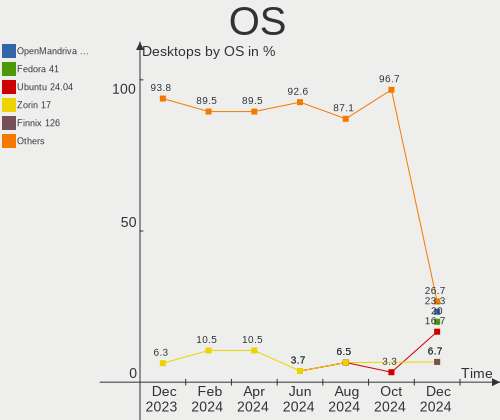
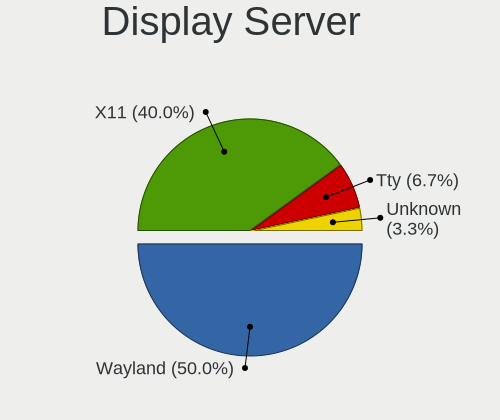
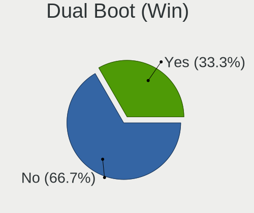
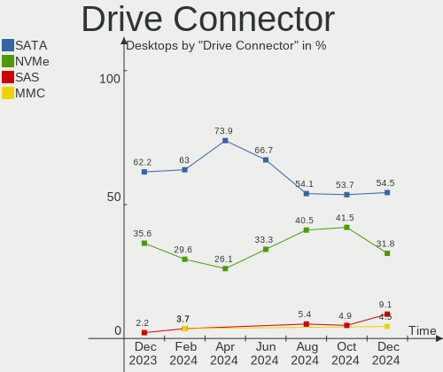
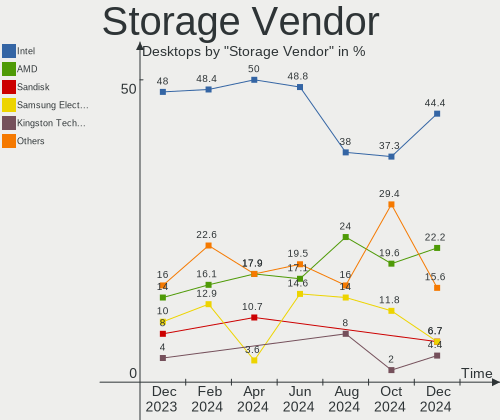
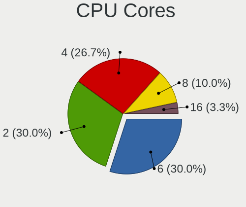
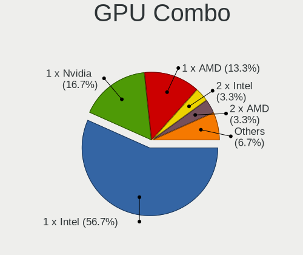
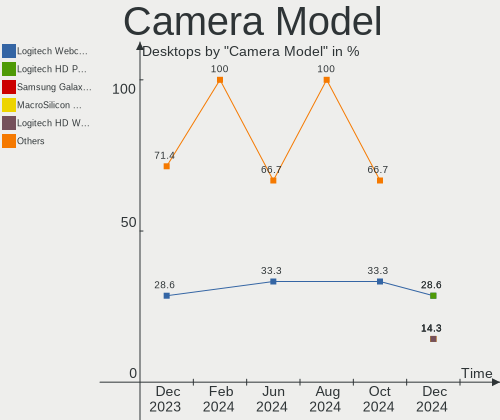
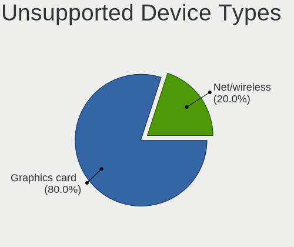

Linux in India - Hardware Trends (Desktops)
-------------------------------------------

A project to identify most popular hardware characteristics and track their change
over time based on data collected by Linux users at https://Linux-Hardware.org.

Anyone can contribute to this report by the [hw-probe](https://github.com/linuxhw/hw-probe) tool:

    sudo -E hw-probe -all -upload

Period: Dec, 2022.

Contents
--------

* [ System ](#system)
  - [ OS                       ](#os)
  - [ OS Family                ](#os-family)
  - [ Kernel                   ](#kernel)
  - [ Kernel Family            ](#kernel-family)
  - [ Kernel Major Ver.        ](#kernel-major-ver)
  - [ Arch                     ](#arch)
  - [ DE                       ](#de)
  - [ Display Server           ](#display-server)
  - [ Display Manager          ](#display-manager)
  - [ OS Lang                  ](#os-lang)
  - [ Boot Mode                ](#boot-mode)
  - [ Filesystem               ](#filesystem)
  - [ Part. scheme             ](#part-scheme)
  - [ Dual Boot with Linux/BSD ](#dual-boot-with-linuxbsd)
  - [ Dual Boot (Win)          ](#dual-boot-win)

* [ Board ](#board)
  - [ Vendor                   ](#vendor)
  - [ Model                    ](#model)
  - [ Model Family             ](#model-family)
  - [ MFG Year                 ](#mfg-year)
  - [ Form Factor              ](#form-factor)
  - [ Secure Boot              ](#secure-boot)
  - [ Coreboot                 ](#coreboot)
  - [ RAM Size                 ](#ram-size)
  - [ RAM Used                 ](#ram-used)
  - [ Total Drives             ](#total-drives)
  - [ Has CD-ROM               ](#has-cd-rom)
  - [ Has Ethernet             ](#has-ethernet)
  - [ Has WiFi                 ](#has-wifi)
  - [ Has Bluetooth            ](#has-bluetooth)

* [ Location ](#location)
  - [ Country                  ](#country)
  - [ City                     ](#city)

* [ Drives ](#drives)
  - [ Drive Vendor             ](#drive-vendor)
  - [ Drive Model              ](#drive-model)
  - [ HDD Vendor               ](#hdd-vendor)
  - [ SSD Vendor               ](#ssd-vendor)
  - [ Drive Kind               ](#drive-kind)
  - [ Drive Connector          ](#drive-connector)
  - [ Drive Size               ](#drive-size)
  - [ Space Total              ](#space-total)
  - [ Space Used               ](#space-used)
  - [ Malfunc. Drives          ](#malfunc-drives)
  - [ Malfunc. Drive Vendor    ](#malfunc-drive-vendor)
  - [ Malfunc. HDD Vendor      ](#malfunc-hdd-vendor)
  - [ Malfunc. Drive Kind      ](#malfunc-drive-kind)
  - [ Failed Drives            ](#failed-drives)
  - [ Failed Drive Vendor      ](#failed-drive-vendor)
  - [ Drive Status             ](#drive-status)

* [ Storage controller ](#storage-controller)
  - [ Storage Vendor           ](#storage-vendor)
  - [ Storage Model            ](#storage-model)
  - [ Storage Kind             ](#storage-kind)

* [ Processor ](#processor)
  - [ CPU Vendor               ](#cpu-vendor)
  - [ CPU Model                ](#cpu-model)
  - [ CPU Model Family         ](#cpu-model-family)
  - [ CPU Cores                ](#cpu-cores)
  - [ CPU Sockets              ](#cpu-sockets)
  - [ CPU Threads              ](#cpu-threads)
  - [ CPU Op-Modes             ](#cpu-op-modes)
  - [ CPU Microcode            ](#cpu-microcode)
  - [ CPU Microarch            ](#cpu-microarch)

* [ Graphics ](#graphics)
  - [ GPU Vendor               ](#gpu-vendor)
  - [ GPU Model                ](#gpu-model)
  - [ GPU Combo                ](#gpu-combo)
  - [ GPU Driver               ](#gpu-driver)
  - [ GPU Memory               ](#gpu-memory)

* [ Monitor ](#monitor)
  - [ Monitor Vendor           ](#monitor-vendor)
  - [ Monitor Model            ](#monitor-model)
  - [ Monitor Resolution       ](#monitor-resolution)
  - [ Monitor Diagonal         ](#monitor-diagonal)
  - [ Monitor Width            ](#monitor-width)
  - [ Aspect Ratio             ](#aspect-ratio)
  - [ Monitor Area             ](#monitor-area)
  - [ Pixel Density            ](#pixel-density)
  - [ Multiple Monitors        ](#multiple-monitors)

* [ Network ](#network)
  - [ Net Controller Vendor    ](#net-controller-vendor)
  - [ Net Controller Model     ](#net-controller-model)
  - [ Wireless Vendor          ](#wireless-vendor)
  - [ Wireless Model           ](#wireless-model)
  - [ Ethernet Vendor          ](#ethernet-vendor)
  - [ Ethernet Model           ](#ethernet-model)
  - [ Net Controller Kind      ](#net-controller-kind)
  - [ Used Controller          ](#used-controller)
  - [ NICs                     ](#nics)
  - [ IPv6                     ](#ipv6)

* [ Bluetooth ](#bluetooth)
  - [ Bluetooth Vendor         ](#bluetooth-vendor)
  - [ Bluetooth Model          ](#bluetooth-model)

* [ Sound ](#sound)
  - [ Sound Vendor             ](#sound-vendor)
  - [ Sound Model              ](#sound-model)

* [ Memory ](#memory)
  - [ Memory Vendor            ](#memory-vendor)
  - [ Memory Model             ](#memory-model)
  - [ Memory Kind              ](#memory-kind)
  - [ Memory Form Factor       ](#memory-form-factor)
  - [ Memory Size              ](#memory-size)
  - [ Memory Speed             ](#memory-speed)

* [ Printers & scanners ](#printers--scanners)
  - [ Printer Vendor           ](#printer-vendor)
  - [ Printer Model            ](#printer-model)
  - [ Scanner Vendor           ](#scanner-vendor)
  - [ Scanner Model            ](#scanner-model)

* [ Camera ](#camera)
  - [ Camera Vendor            ](#camera-vendor)
  - [ Camera Model             ](#camera-model)

* [ Security ](#security)
  - [ Fingerprint Vendor       ](#fingerprint-vendor)
  - [ Fingerprint Model        ](#fingerprint-model)
  - [ Chipcard Vendor          ](#chipcard-vendor)
  - [ Chipcard Model           ](#chipcard-model)

* [ Unsupported ](#unsupported)
  - [ Unsupported Devices      ](#unsupported-devices)
  - [ Unsupported Device Types ](#unsupported-device-types)

System
------

OS
--

Installed operating systems

| Name                 | Desktops | Percent |
|----------------------|----------|---------|
| Ubuntu 22.04         | 4        | 28.57%  |
| Ubuntu 18.04         | 3        | 21.43%  |
| Zorin 16             | 1        | 7.14%   |
| Ubuntu 20.04         | 1        | 7.14%   |
| RHEL 9               | 1        | 7.14%   |
| Garuda Linux Rolling | 1        | 7.14%   |
| EndeavourOS Rolling  | 1        | 7.14%   |
| Debian 11            | 1        | 7.14%   |
| Arch Rolling         | 1        | 7.14%   |

OS Family
---------

OS without a version

| Name         | Desktops | Percent |
|--------------|----------|---------|
| Ubuntu       | 8        | 57.14%  |
| Zorin        | 1        | 7.14%   |
| RHEL         | 1        | 7.14%   |
| Garuda Linux | 1        | 7.14%   |
| EndeavourOS  | 1        | 7.14%   |
| Debian       | 1        | 7.14%   |
| Arch         | 1        | 7.14%   |

Kernel
------

Version of the Linux kernel

| Version                     | Desktops | Percent |
|-----------------------------|----------|---------|
| 5.15.0-56-generic           | 5        | 35.71%  |
| 6.1.1-zen1-1-zen            | 1        | 7.14%   |
| 6.0.11-arch1-1              | 1        | 7.14%   |
| 5.4.0-135-generic           | 1        | 7.14%   |
| 5.4.0-132-generic           | 1        | 7.14%   |
| 5.15.85-1-lts               | 1        | 7.14%   |
| 5.15.0-43-generic           | 1        | 7.14%   |
| 5.14.0-162.6.1.el9_1.x86_64 | 1        | 7.14%   |
| 5.10.0-20-amd64             | 1        | 7.14%   |
| 4.15.0-201-generic          | 1        | 7.14%   |

Kernel Family
-------------

Linux kernel without a distro release

| Version | Desktops | Percent |
|---------|----------|---------|
| 5.15.0  | 6        | 42.86%  |
| 5.4.0   | 2        | 14.29%  |
| 6.1.1   | 1        | 7.14%   |
| 6.0.11  | 1        | 7.14%   |
| 5.15.85 | 1        | 7.14%   |
| 5.14.0  | 1        | 7.14%   |
| 5.10.0  | 1        | 7.14%   |
| 4.15.0  | 1        | 7.14%   |

Kernel Major Ver.
-----------------

Linux kernel major version

| Version | Desktops | Percent |
|---------|----------|---------|
| 5.15    | 7        | 50%     |
| 5.4     | 2        | 14.29%  |
| 6.1     | 1        | 7.14%   |
| 6.0     | 1        | 7.14%   |
| 5.14    | 1        | 7.14%   |
| 5.10    | 1        | 7.14%   |
| 4.15    | 1        | 7.14%   |

Arch
----

OS architecture (x86_64, i586, etc.)

| Name   | Desktops | Percent |
|--------|----------|---------|
| x86_64 | 13       | 92.86%  |
| i686   | 1        | 7.14%   |

DE
--

Desktop Environment

| Name    | Desktops | Percent |
|---------|----------|---------|
| GNOME   | 10       | 71.43%  |
| KDE5    | 2        | 14.29%  |
| XFCE    | 1        | 7.14%   |
| Unknown | 1        | 7.14%   |

Display Server
--------------

X11 or Wayland

| Name    | Desktops | Percent |
|---------|----------|---------|
| X11     | 11       | 78.57%  |
| Wayland | 2        | 14.29%  |
| Tty     | 1        | 7.14%   |

Display Manager
---------------

SDDM, LightDM, etc.

| Name    | Desktops | Percent |
|---------|----------|---------|
| GDM3    | 7        | 50%     |
| Unknown | 4        | 28.57%  |
| GDM     | 2        | 14.29%  |
| LightDM | 1        | 7.14%   |

OS Lang
-------

Language

| Lang  | Desktops | Percent |
|-------|----------|---------|
| en_IN | 11       | 78.57%  |
| en_US | 3        | 21.43%  |

Boot Mode
---------

EFI or BIOS

| Mode | Desktops | Percent |
|------|----------|---------|
| BIOS | 12       | 85.71%  |
| EFI  | 2        | 14.29%  |

Filesystem
----------

Type of filesystem

| Type  | Desktops | Percent |
|-------|----------|---------|
| Ext4  | 11       | 78.57%  |
| Zfs   | 1        | 7.14%   |
| Xfs   | 1        | 7.14%   |
| Btrfs | 1        | 7.14%   |

Part. scheme
------------

Scheme of partitioning

| Type    | Desktops | Percent |
|---------|----------|---------|
| MBR     | 5        | 35.71%  |
| GPT     | 5        | 35.71%  |
| Unknown | 4        | 28.57%  |

Dual Boot with Linux/BSD
------------------------

Hosting more than one Linux/BSD

| Dual boot | Desktops | Percent |
|-----------|----------|---------|
| No        | 12       | 85.71%  |
| Yes       | 2        | 14.29%  |

Dual Boot (Win)
---------------

Hosting Linux and Windows

| Dual boot | Desktops | Percent |
|-----------|----------|---------|
| Yes       | 7        | 50%     |
| No        | 7        | 50%     |

Board
-----

Vendor
------

Motherboard manufacturer

| Name                | Desktops | Percent |
|---------------------|----------|---------|
| Gigabyte Technology | 4        | 28.57%  |
| Intel               | 3        | 21.43%  |
| Dell                | 3        | 21.43%  |
| Lenovo              | 1        | 7.14%   |
| ASUSTek Computer    | 1        | 7.14%   |
| Acer                | 1        | 7.14%   |
| Unknown             | 1        | 7.14%   |

Model
-----

Motherboard model

| Name                      | Desktops | Percent |
|---------------------------|----------|---------|
| Intel H61                 | 2        | 14.29%  |
| Dell Inspiron 3647        | 2        | 14.29%  |
| Lenovo 10TYS00700         | 1        | 7.14%   |
| Intel DH55PJ AAE93812-303 | 1        | 7.14%   |
| Gigabyte H81M-S           | 1        | 7.14%   |
| Gigabyte H310M S2 2.0     | 1        | 7.14%   |
| Gigabyte B75M-D3H         | 1        | 7.14%   |
| Gigabyte AB350-Gaming 3   | 1        | 7.14%   |
| Dell OptiPlex 3040        | 1        | 7.14%   |
| ASUS Z170-DELUXE          | 1        | 7.14%   |
| Acer Veriton Series       | 1        | 7.14%   |
| Unknown                   | 1        | 7.14%   |

Model Family
------------

Motherboard model prefix

| Name                  | Desktops | Percent |
|-----------------------|----------|---------|
| Intel H61             | 2        | 14.29%  |
| Dell Inspiron         | 2        | 14.29%  |
| Lenovo 10TYS00700     | 1        | 7.14%   |
| Intel DH55PJ          | 1        | 7.14%   |
| Gigabyte H81M-S       | 1        | 7.14%   |
| Gigabyte H310M        | 1        | 7.14%   |
| Gigabyte B75M-D3H     | 1        | 7.14%   |
| Gigabyte AB350-Gaming | 1        | 7.14%   |
| Dell OptiPlex         | 1        | 7.14%   |
| ASUS Z170-DELUXE      | 1        | 7.14%   |
| Acer Veriton          | 1        | 7.14%   |
| Unknown               | 1        | 7.14%   |

MFG Year
--------

Motherboard manufacture year

| Year | Desktops | Percent |
|------|----------|---------|
| 2017 | 3        | 21.43%  |
| 2014 | 3        | 21.43%  |
| 2016 | 2        | 14.29%  |
| 2022 | 1        | 7.14%   |
| 2019 | 1        | 7.14%   |
| 2018 | 1        | 7.14%   |
| 2012 | 1        | 7.14%   |
| 2011 | 1        | 7.14%   |
| 2010 | 1        | 7.14%   |

Form Factor
-----------

Physical design of the computer

| Name    | Desktops | Percent |
|---------|----------|---------|
| Desktop | 14       | 100%    |

Secure Boot
-----------

Enabled or disabled

| State    | Desktops | Percent |
|----------|----------|---------|
| Disabled | 14       | 100%    |

Coreboot
--------

Have coreboot on board

| Used | Desktops | Percent |
|------|----------|---------|
| No   | 14       | 100%    |

RAM Size
--------

Total RAM memory

| Size in GB | Desktops | Percent |
|------------|----------|---------|
| 16.01-24.0 | 5        | 35.71%  |
| 3.01-4.0   | 4        | 28.57%  |
| 4.01-8.0   | 2        | 14.29%  |
| 8.01-16.0  | 2        | 14.29%  |
| 1.01-2.0   | 1        | 7.14%   |

RAM Used
--------

Used RAM memory

| Used GB   | Desktops | Percent |
|-----------|----------|---------|
| 2.01-3.0  | 5        | 35.71%  |
| 1.01-2.0  | 4        | 28.57%  |
| 0.51-1.0  | 2        | 14.29%  |
| 4.01-8.0  | 1        | 7.14%   |
| 3.01-4.0  | 1        | 7.14%   |
| 8.01-16.0 | 1        | 7.14%   |

Total Drives
------------

Number of drives on board

| Drives | Desktops | Percent |
|--------|----------|---------|
| 1      | 8        | 57.14%  |
| 2      | 4        | 28.57%  |
| 3      | 2        | 14.29%  |

Has CD-ROM
----------

Has CD-ROM on board

| Presented | Desktops | Percent |
|-----------|----------|---------|
| No        | 11       | 78.57%  |
| Yes       | 3        | 21.43%  |

Has Ethernet
------------

Has Ethernet on board

| Presented | Desktops | Percent |
|-----------|----------|---------|
| Yes       | 14       | 100%    |

Has WiFi
--------

Has WiFi module

| Presented | Desktops | Percent |
|-----------|----------|---------|
| No        | 8        | 57.14%  |
| Yes       | 6        | 42.86%  |

Has Bluetooth
-------------

Has Bluetooth module

| Presented | Desktops | Percent |
|-----------|----------|---------|
| Yes       | 7        | 50%     |
| No        | 7        | 50%     |

Location
--------

Country
-------

Geographic location (country)

| Country | Desktops | Percent |
|---------|----------|---------|
| India   | 14       | 100%    |

City
----

Geographic location (city)

| City          | Desktops | Percent |
|---------------|----------|---------|
| Bengaluru     | 4        | 28.57%  |
| Kolkata       | 2        | 14.29%  |
| Tiruchi       | 1        | 7.14%   |
| Mumbai        | 1        | 7.14%   |
| Kothamangalam | 1        | 7.14%   |
| Kochi         | 1        | 7.14%   |
| Hyderabad     | 1        | 7.14%   |
| Faridabad     | 1        | 7.14%   |
| Delhi         | 1        | 7.14%   |
| Chennai       | 1        | 7.14%   |

Drives
------

Drive Vendor
------------

Hard drive vendors

| Vendor              | Desktops | Drives | Percent |
|---------------------|----------|--------|---------|
| Seagate             | 7        | 7      | 35%     |
| WDC                 | 4        | 5      | 20%     |
| Crucial             | 2        | 2      | 10%     |
| Samsung Electronics | 1        | 1      | 5%      |
| POWER               | 1        | 1      | 5%      |
| Lexar               | 1        | 1      | 5%      |
| Kingston            | 1        | 1      | 5%      |
| Intel               | 1        | 1      | 5%      |
| Hitachi             | 1        | 1      | 5%      |
| DOLGIX              | 1        | 1      | 5%      |

Drive Model
-----------

Hard drive models

| Model                            | Desktops | Percent |
|----------------------------------|----------|---------|
| Seagate ST500DM002-1BD142 500GB  | 3        | 14.29%  |
| WDC WDS250G2B0A-00SM50 250GB SSD | 1        | 4.76%   |
| WDC WD5000AZRX-00A8LB0 500GB     | 1        | 4.76%   |
| WDC WD5000AVCS-632DY1 500GB      | 1        | 4.76%   |
| WDC WD1600AAJS-00M0A0 160GB      | 1        | 4.76%   |
| WDC WD10EZEX-22MFCA0 1TB         | 1        | 4.76%   |
| Seagate ST3802110A 80GB          | 1        | 4.76%   |
| Seagate ST3320613AS 320GB        | 1        | 4.76%   |
| Seagate ST2000LM007-1R8174 2TB   | 1        | 4.76%   |
| Seagate ST1000DM003-1SB102 1TB   | 1        | 4.76%   |
| Samsung SSD 870 QVO 1TB          | 1        | 4.76%   |
| POWER X SS1000-256GB SSD         | 1        | 4.76%   |
| Lexar SSD 240GB                  | 1        | 4.76%   |
| Kingston SA400S37480G 480GB SSD  | 1        | 4.76%   |
| Intel PCIe Data Center SSD 400GB | 1        | 4.76%   |
| Hitachi HDS721616PLA320 160GB    | 1        | 4.76%   |
| DOLGIX GOLD 240GB                | 1        | 4.76%   |
| Crucial CT500MX500SSD1 500GB     | 1        | 4.76%   |
| Crucial CT1000P1SSD8 1TB         | 1        | 4.76%   |

HDD Vendor
----------

Hard disk drive vendors

| Vendor  | Desktops | Drives | Percent |
|---------|----------|--------|---------|
| Seagate | 7        | 7      | 63.64%  |
| WDC     | 3        | 4      | 27.27%  |
| Hitachi | 1        | 1      | 9.09%   |

SSD Vendor
----------

Solid state drive vendors

| Vendor              | Desktops | Drives | Percent |
|---------------------|----------|--------|---------|
| WDC                 | 1        | 1      | 16.67%  |
| Samsung Electronics | 1        | 1      | 16.67%  |
| POWER               | 1        | 1      | 16.67%  |
| Lexar               | 1        | 1      | 16.67%  |
| Kingston            | 1        | 1      | 16.67%  |
| Crucial             | 1        | 1      | 16.67%  |

Drive Kind
----------

HDD or SSD

| Kind    | Desktops | Drives | Percent |
|---------|----------|--------|---------|
| HDD     | 11       | 12     | 55%     |
| SSD     | 6        | 6      | 30%     |
| NVMe    | 2        | 2      | 10%     |
| Unknown | 1        | 1      | 5%      |

Drive Connector
---------------

SATA, SAS, NVMe, etc.

| Type | Desktops | Drives | Percent |
|------|----------|--------|---------|
| SATA | 14       | 19     | 87.5%   |
| NVMe | 2        | 2      | 12.5%   |

Drive Size
----------

Size of hard drive

| Size in TB | Desktops | Drives | Percent |
|------------|----------|--------|---------|
| 0.01-0.5   | 12       | 14     | 80%     |
| 0.51-1.0   | 2        | 3      | 13.33%  |
| 1.01-2.0   | 1        | 1      | 6.67%   |

Space Total
-----------

Amount of disk space available on the file system

| Size in GB | Desktops | Percent |
|------------|----------|---------|
| 101-250    | 6        | 42.86%  |
| 501-1000   | 4        | 28.57%  |
| 251-500    | 1        | 7.14%   |
| 21-50      | 1        | 7.14%   |
| 2001-3000  | 1        | 7.14%   |
| 1-20       | 1        | 7.14%   |

Space Used
----------

Amount of used disk space

| Used GB   | Desktops | Percent |
|-----------|----------|---------|
| 1-20      | 5        | 35.71%  |
| 21-50     | 3        | 21.43%  |
| 101-250   | 3        | 21.43%  |
| 251-500   | 2        | 14.29%  |
| 1001-2000 | 1        | 7.14%   |

Malfunc. Drives
---------------

Drive models with a malfunction

| Model                           | Desktops | Drives | Percent |
|---------------------------------|----------|--------|---------|
| Seagate ST500DM002-1BD142 500GB | 2        | 2      | 100%    |

Malfunc. Drive Vendor
---------------------

Vendors of faulty drives

| Vendor  | Desktops | Drives | Percent |
|---------|----------|--------|---------|
| Seagate | 2        | 2      | 100%    |

Malfunc. HDD Vendor
-------------------

Vendors of faulty HDD drives

| Vendor  | Desktops | Drives | Percent |
|---------|----------|--------|---------|
| Seagate | 2        | 2      | 100%    |

Malfunc. Drive Kind
-------------------

Kinds of faulty drives

| Kind | Desktops | Drives | Percent |
|------|----------|--------|---------|
| HDD  | 2        | 2      | 100%    |

Failed Drives
-------------

Failed drive models

Zero info for selected period =(

Failed Drive Vendor
-------------------

Failed drive vendors

Zero info for selected period =(

Drive Status
------------

Number of failed and malfunc. drives

| Status   | Desktops | Drives | Percent |
|----------|----------|--------|---------|
| Detected | 9        | 13     | 60%     |
| Works    | 4        | 6      | 26.67%  |
| Malfunc  | 2        | 2      | 13.33%  |

Storage controller
------------------

Storage Vendor
--------------

Storage controller vendors

| Vendor                    | Desktops | Percent |
|---------------------------|----------|---------|
| Intel                     | 13       | 81.25%  |
| Micron/Crucial Technology | 1        | 6.25%   |
| ASMedia Technology        | 1        | 6.25%   |
| AMD                       | 1        | 6.25%   |

Storage Model
-------------

Storage controller models

| Model                                                                          | Desktops | Percent |
|--------------------------------------------------------------------------------|----------|---------|
| Intel 8 Series/C220 Series Chipset Family 6-port SATA Controller 1 [AHCI mode] | 3        | 15%     |
| Intel 6 Series/C200 Series Chipset Family 6 port Desktop SATA AHCI Controller  | 3        | 15%     |
| Micron/Crucial P1 NVMe PCIe SSD                                                | 1        | 5%      |
| Intel SATA Controller [RAID mode]                                              | 1        | 5%      |
| Intel Q170/Q150/B150/H170/H110/Z170/CM236 Chipset SATA Controller [AHCI Mode]  | 1        | 5%      |
| Intel PCIe Data Center SSD                                                     | 1        | 5%      |
| Intel NM10/ICH7 Family SATA Controller [IDE mode]                              | 1        | 5%      |
| Intel Cannon Lake PCH SATA AHCI Controller                                     | 1        | 5%      |
| Intel 82801G (ICH7 Family) IDE Controller                                      | 1        | 5%      |
| Intel 7 Series/C210 Series Chipset Family 6-port SATA Controller [AHCI mode]   | 1        | 5%      |
| Intel 5 Series/3400 Series Chipset PT IDER Controller                          | 1        | 5%      |
| Intel 5 Series/3400 Series Chipset 4 port SATA IDE Controller                  | 1        | 5%      |
| Intel 200 Series PCH SATA controller [AHCI mode]                               | 1        | 5%      |
| ASMedia ASM1062 Serial ATA Controller                                          | 1        | 5%      |
| AMD FCH SATA Controller [AHCI mode]                                            | 1        | 5%      |
| AMD 300 Series Chipset SATA Controller                                         | 1        | 5%      |

Storage Kind
------------

Kind of storage controller (IDE, SATA, NVMe, SAS, ...)

| Kind | Desktops | Percent |
|------|----------|---------|
| SATA | 12       | 70.59%  |
| NVMe | 2        | 11.76%  |
| IDE  | 2        | 11.76%  |
| RAID | 1        | 5.88%   |

Processor
---------

CPU Vendor
----------

Processor vendors

| Vendor | Desktops | Percent |
|--------|----------|---------|
| Intel  | 13       | 92.86%  |
| AMD    | 1        | 7.14%   |

CPU Model
---------

Processor models

| Model                                       | Desktops | Percent |
|---------------------------------------------|----------|---------|
| Intel Pentium Dual-Core CPU E6600 @ 3.06GHz | 1        | 7.14%   |
| Intel Pentium CPU G3260 @ 3.30GHz           | 1        | 7.14%   |
| Intel Pentium CPU G3250 @ 3.20GHz           | 1        | 7.14%   |
| Intel Pentium CPU G3240 @ 3.10GHz           | 1        | 7.14%   |
| Intel Core i7-8700 CPU @ 3.20GHz            | 1        | 7.14%   |
| Intel Core i7-3770K CPU @ 3.50GHz           | 1        | 7.14%   |
| Intel Core i5-9400F CPU @ 2.90GHz           | 1        | 7.14%   |
| Intel Core i5-6600K CPU @ 3.50GHz           | 1        | 7.14%   |
| Intel Core i5-3570 CPU @ 3.40GHz            | 1        | 7.14%   |
| Intel Core i3-6100 CPU @ 3.70GHz            | 1        | 7.14%   |
| Intel Core i3-2120 CPU @ 3.30GHz            | 1        | 7.14%   |
| Intel Core i3-2100 CPU @ 3.10GHz            | 1        | 7.14%   |
| Intel Core i3 CPU 540 @ 3.07GHz             | 1        | 7.14%   |
| AMD Ryzen 5 1400 Quad-Core Processor        | 1        | 7.14%   |

CPU Model Family
----------------

Processor model prefix

| Model                   | Desktops | Percent |
|-------------------------|----------|---------|
| Intel Core i3           | 4        | 28.57%  |
| Intel Pentium           | 3        | 21.43%  |
| Intel Core i5           | 3        | 21.43%  |
| Intel Core i7           | 2        | 14.29%  |
| Intel Pentium Dual-Core | 1        | 7.14%   |
| AMD Ryzen 5             | 1        | 7.14%   |

CPU Cores
---------

Number of processor cores

| Number | Desktops | Percent |
|--------|----------|---------|
| 2      | 8        | 57.14%  |
| 4      | 4        | 28.57%  |
| 6      | 2        | 14.29%  |

CPU Sockets
-----------

Number of sockets

| Number | Desktops | Percent |
|--------|----------|---------|
| 1      | 14       | 100%    |

CPU Threads
-----------

Threads per core (Hyper-Threading)

| Number | Desktops | Percent |
|--------|----------|---------|
| 2      | 7        | 50%     |
| 1      | 7        | 50%     |

CPU Op-Modes
------------

CPU Operation Modes (32-bit, 64-bit)

| Op mode        | Desktops | Percent |
|----------------|----------|---------|
| 32-bit, 64-bit | 14       | 100%    |

CPU Microcode
-------------

Microcode number

| Number     | Desktops | Percent |
|------------|----------|---------|
| Unknown    | 5        | 35.71%  |
| 0x306c3    | 2        | 14.29%  |
| 0x906ea    | 1        | 7.14%   |
| 0x506e3    | 1        | 7.14%   |
| 0x306a9    | 1        | 7.14%   |
| 0x206a7    | 1        | 7.14%   |
| 0x20655    | 1        | 7.14%   |
| 0x1067a    | 1        | 7.14%   |
| 0x0800111c | 1        | 7.14%   |

CPU Microarch
-------------

Microarchitecture

| Name        | Desktops | Percent |
|-------------|----------|---------|
| Haswell     | 3        | 21.43%  |
| Skylake     | 2        | 14.29%  |
| SandyBridge | 2        | 14.29%  |
| KabyLake    | 2        | 14.29%  |
| IvyBridge   | 2        | 14.29%  |
| Zen         | 1        | 7.14%   |
| Westmere    | 1        | 7.14%   |
| Penryn      | 1        | 7.14%   |

Graphics
--------

GPU Vendor
----------

Vendors of graphics cards

| Vendor | Desktops | Percent |
|--------|----------|---------|
| Intel  | 10       | 66.67%  |
| Nvidia | 5        | 33.33%  |

GPU Model
---------

Graphics card models

| Model                                                                       | Desktops | Percent |
|-----------------------------------------------------------------------------|----------|---------|
| Nvidia GK208B [GeForce GT 710]                                              | 3        | 20%     |
| Intel Xeon E3-1200 v3/4th Gen Core Processor Integrated Graphics Controller | 2        | 13.33%  |
| Intel HD Graphics 530                                                       | 2        | 13.33%  |
| Intel 2nd Generation Core Processor Family Integrated Graphics Controller   | 2        | 13.33%  |
| Nvidia GP107 [GeForce GTX 1050 Ti]                                          | 1        | 6.67%   |
| Nvidia GK107 [GeForce GT 640]                                               | 1        | 6.67%   |
| Intel Xeon E3-1200 v2/3rd Gen Core processor Graphics Controller            | 1        | 6.67%   |
| Intel Core Processor Integrated Graphics Controller                         | 1        | 6.67%   |
| Intel CoffeeLake-S GT2 [UHD Graphics 630]                                   | 1        | 6.67%   |
| Intel 4 Series Chipset Integrated Graphics Controller                       | 1        | 6.67%   |

GPU Combo
---------

Combinations of graphics cards

| Name           | Desktops | Percent |
|----------------|----------|---------|
| 1 x Intel      | 9        | 64.29%  |
| 1 x Nvidia     | 4        | 28.57%  |
| Intel + Nvidia | 1        | 7.14%   |

GPU Driver
----------

Free vs proprietary

| Driver      | Desktops | Percent |
|-------------|----------|---------|
| Free        | 11       | 78.57%  |
| Proprietary | 2        | 14.29%  |
| Unknown     | 1        | 7.14%   |

GPU Memory
----------

Total video memory

| Size in GB | Desktops | Percent |
|------------|----------|---------|
| Unknown    | 10       | 71.43%  |
| 1.01-2.0   | 3        | 21.43%  |
| 3.01-4.0   | 1        | 7.14%   |

Monitor
-------

Monitor Vendor
--------------

Monitor vendors

| Vendor              | Desktops | Percent |
|---------------------|----------|---------|
| Dell                | 2        | 18.18%  |
| Acer                | 2        | 18.18%  |
| Xiaomi              | 1        | 9.09%   |
| Samsung Electronics | 1        | 9.09%   |
| Lenovo              | 1        | 9.09%   |
| Hewlett-Packard     | 1        | 9.09%   |
| Goldstar            | 1        | 9.09%   |
| BenQ                | 1        | 9.09%   |
| AOC                 | 1        | 9.09%   |

Monitor Model
-------------

Monitor models

| Model                                                            | Desktops | Percent |
|------------------------------------------------------------------|----------|---------|
| Xiaomi Mi TV XMD004A 1920x1080 708x398mm 32.0-inch               | 1        | 9.09%   |
| Samsung Electronics S19F350 SAM0D46 1366x768 410x230mm 18.5-inch | 1        | 9.09%   |
| Lenovo LEN LS1922wA LEN0A14 1366x768 410x230mm 18.5-inch         | 1        | 9.09%   |
| Hewlett-Packard E233 HPN3461 1920x1080 509x286mm 23.0-inch       | 1        | 9.09%   |
| Goldstar FULL HD GSM5B54 1920x1080 480x270mm 21.7-inch           | 1        | 9.09%   |
| Dell S2009W DELA045 1600x900 443x249mm 20.0-inch                 | 1        | 9.09%   |
| Dell E1916HV DELF06C 1366x768 409x230mm 18.5-inch                | 1        | 9.09%   |
| BenQ EW2880U BNQ7963 3840x2160 621x342mm 27.9-inch               | 1        | 9.09%   |
| AOC 1943W AOC1943 1366x768 410x230mm 18.5-inch                   | 1        | 9.09%   |
| Acer V193HQL ACR0127 1366x768 410x230mm 18.5-inch                | 1        | 9.09%   |
| Acer EB321HQU C ACR0507 2560x1440 700x390mm 31.5-inch            | 1        | 9.09%   |

Monitor Resolution
------------------

Monitor screen resolution

| Resolution      | Desktops | Percent |
|-----------------|----------|---------|
| 1366x768 (WXGA) | 5        | 45.45%  |
| 3840x2160 (4K)  | 2        | 18.18%  |
| 1920x1080 (FHD) | 2        | 18.18%  |
| 2560x1440 (QHD) | 1        | 9.09%   |
| 1600x900 (HD+)  | 1        | 9.09%   |

Monitor Diagonal
----------------

Diagonal size in inches

| Inches | Desktops | Percent |
|--------|----------|---------|
| 18     | 5        | 45.45%  |
| 65     | 1        | 9.09%   |
| 31     | 1        | 9.09%   |
| 27     | 1        | 9.09%   |
| 23     | 1        | 9.09%   |
| 21     | 1        | 9.09%   |
| 20     | 1        | 9.09%   |

Monitor Width
-------------

Physical width

| Width in mm | Desktops | Percent |
|-------------|----------|---------|
| 401-500     | 7        | 63.64%  |
| 601-700     | 2        | 18.18%  |
| 501-600     | 1        | 9.09%   |
| 1001-1500   | 1        | 9.09%   |

Aspect Ratio
------------

Proportional relationship between the width and the height

| Ratio | Desktops | Percent |
|-------|----------|---------|
| 16/9  | 11       | 100%    |

Monitor Area
------------

Area in inch²

| Area in inch² | Desktops | Percent |
|----------------|----------|---------|
| 141-150        | 5        | 45.45%  |
| 201-250        | 2        | 18.18%  |
| More than 1000 | 1        | 9.09%   |
| 351-500        | 1        | 9.09%   |
| 301-350        | 1        | 9.09%   |
| 151-200        | 1        | 9.09%   |

Pixel Density
-------------

Pixels per inch

| Density | Desktops | Percent |
|---------|----------|---------|
| 51-100  | 8        | 72.73%  |
| 1-50    | 1        | 9.09%   |
| 121-160 | 1        | 9.09%   |
| 101-120 | 1        | 9.09%   |

Multiple Monitors
-----------------

Total monitors connected

| Total | Desktops | Percent |
|-------|----------|---------|
| 1     | 11       | 78.57%  |
| 0     | 3        | 21.43%  |

Network
-------

Net Controller Vendor
---------------------

Controller vendors

| Vendor                | Desktops | Percent |
|-----------------------|----------|---------|
| Realtek Semiconductor | 12       | 63.16%  |
| Qualcomm Atheros      | 2        | 10.53%  |
| Intel                 | 2        | 10.53%  |
| TP-Link               | 1        | 5.26%   |
| Broadcom              | 1        | 5.26%   |
| ASUSTek Computer      | 1        | 5.26%   |

Net Controller Model
--------------------

Controller models

| Model                                                             | Desktops | Percent |
|-------------------------------------------------------------------|----------|---------|
| Realtek RTL8111/8168/8411 PCI Express Gigabit Ethernet Controller | 9        | 39.13%  |
| Realtek RTL810xE PCI Express Fast Ethernet controller             | 3        | 13.04%  |
| Qualcomm Atheros QCA9565 / AR9565 Wireless Network Adapter        | 2        | 8.7%    |
| TP-Link UE300 10/100/1000 LAN (ethernet mode) [Realtek RTL8153]   | 1        | 4.35%   |
| Realtek RTL8192EU 802.11b/g/n WLAN Adapter                        | 1        | 4.35%   |
| Realtek RTL8192EE PCIe Wireless Network Adapter                   | 1        | 4.35%   |
| Realtek RTL8188EUS 802.11n Wireless Network Adapter               | 1        | 4.35%   |
| Intel I211 Gigabit Network Connection                             | 1        | 4.35%   |
| Intel Ethernet Connection (2) I219-V                              | 1        | 4.35%   |
| Intel 82578DC Gigabit Network Connection                          | 1        | 4.35%   |
| Broadcom BCM4360 802.11ac Wireless Network Adapter                | 1        | 4.35%   |
| ASUS WL-167G v3 802.11n Adapter [Realtek RTL8188SU]               | 1        | 4.35%   |

Wireless Vendor
---------------

Wireless vendors

| Vendor                | Desktops | Percent |
|-----------------------|----------|---------|
| Realtek Semiconductor | 3        | 42.86%  |
| Qualcomm Atheros      | 2        | 28.57%  |
| Broadcom              | 1        | 14.29%  |
| ASUSTek Computer      | 1        | 14.29%  |

Wireless Model
--------------

Wireless models

| Model                                                      | Desktops | Percent |
|------------------------------------------------------------|----------|---------|
| Qualcomm Atheros QCA9565 / AR9565 Wireless Network Adapter | 2        | 28.57%  |
| Realtek RTL8192EU 802.11b/g/n WLAN Adapter                 | 1        | 14.29%  |
| Realtek RTL8192EE PCIe Wireless Network Adapter            | 1        | 14.29%  |
| Realtek RTL8188EUS 802.11n Wireless Network Adapter        | 1        | 14.29%  |
| Broadcom BCM4360 802.11ac Wireless Network Adapter         | 1        | 14.29%  |
| ASUS WL-167G v3 802.11n Adapter [Realtek RTL8188SU]        | 1        | 14.29%  |

Ethernet Vendor
---------------

Ethernet vendors

| Vendor                | Desktops | Percent |
|-----------------------|----------|---------|
| Realtek Semiconductor | 12       | 80%     |
| Intel                 | 2        | 13.33%  |
| TP-Link               | 1        | 6.67%   |

Ethernet Model
--------------

Ethernet models

| Model                                                             | Desktops | Percent |
|-------------------------------------------------------------------|----------|---------|
| Realtek RTL8111/8168/8411 PCI Express Gigabit Ethernet Controller | 9        | 56.25%  |
| Realtek RTL810xE PCI Express Fast Ethernet controller             | 3        | 18.75%  |
| TP-Link UE300 10/100/1000 LAN (ethernet mode) [Realtek RTL8153]   | 1        | 6.25%   |
| Intel I211 Gigabit Network Connection                             | 1        | 6.25%   |
| Intel Ethernet Connection (2) I219-V                              | 1        | 6.25%   |
| Intel 82578DC Gigabit Network Connection                          | 1        | 6.25%   |

Net Controller Kind
-------------------

Ethernet, WiFi or modem

| Kind     | Desktops | Percent |
|----------|----------|---------|
| Ethernet | 14       | 70%     |
| WiFi     | 6        | 30%     |

Used Controller
---------------

Currently used network controller

| Kind     | Desktops | Percent |
|----------|----------|---------|
| Ethernet | 12       | 85.71%  |
| WiFi     | 2        | 14.29%  |

NICs
----

Total network controllers on board

| Total | Desktops | Percent |
|-------|----------|---------|
| 1     | 9        | 64.29%  |
| 2     | 4        | 28.57%  |
| 3     | 1        | 7.14%   |

IPv6
----

IPv6 vs IPv4

| Used | Desktops | Percent |
|------|----------|---------|
| No   | 12       | 85.71%  |
| Yes  | 2        | 14.29%  |

Bluetooth
---------

Bluetooth Vendor
----------------

Controller vendors

| Vendor                          | Desktops | Percent |
|---------------------------------|----------|---------|
| Qualcomm Atheros Communications | 2        | 25%     |
| Cambridge Silicon Radio         | 2        | 25%     |
| TP-Link                         | 1        | 12.5%   |
| Realtek Semiconductor           | 1        | 12.5%   |
| Integrated System Solution      | 1        | 12.5%   |
| ASUSTek Computer                | 1        | 12.5%   |

Bluetooth Model
---------------

Controller models

| Model                                                 | Desktops | Percent |
|-------------------------------------------------------|----------|---------|
| Qualcomm Atheros AR9462 Bluetooth                     | 2        | 25%     |
| Cambridge Silicon Radio Bluetooth Dongle (HCI mode)   | 2        | 25%     |
| TP-Link UB500 Adapter                                 | 1        | 12.5%   |
| Realtek Bluetooth Radio                               | 1        | 12.5%   |
| Integrated System Solution KY-BT100 Bluetooth Adapter | 1        | 12.5%   |
| ASUS Broadcom BCM20702 Single-Chip Bluetooth 4.0 + LE | 1        | 12.5%   |

Sound
-----

Sound Vendor
------------

Sound card vendors

| Vendor | Desktops | Percent |
|--------|----------|---------|
| Intel  | 13       | 68.42%  |
| Nvidia | 5        | 26.32%  |
| AMD    | 1        | 5.26%   |

Sound Model
-----------

Sound card models

| Model                                                                      | Desktops | Percent |
|----------------------------------------------------------------------------|----------|---------|
| Nvidia GK208 HDMI/DP Audio Controller                                      | 3        | 14.29%  |
| Intel 8 Series/C220 Series Chipset High Definition Audio Controller        | 3        | 14.29%  |
| Intel 6 Series/C200 Series Chipset Family High Definition Audio Controller | 3        | 14.29%  |
| Intel Xeon E3-1200 v3/4th Gen Core Processor HD Audio Controller           | 2        | 9.52%   |
| Intel 100 Series/C230 Series Chipset Family HD Audio Controller            | 2        | 9.52%   |
| Nvidia GP107GL High Definition Audio Controller                            | 1        | 4.76%   |
| Nvidia GK107 HDMI Audio Controller                                         | 1        | 4.76%   |
| Intel NM10/ICH7 Family High Definition Audio Controller                    | 1        | 4.76%   |
| Intel Cannon Lake PCH cAVS                                                 | 1        | 4.76%   |
| Intel 7 Series/C216 Chipset Family High Definition Audio Controller        | 1        | 4.76%   |
| Intel 5 Series/3400 Series Chipset High Definition Audio                   | 1        | 4.76%   |
| Intel 200 Series PCH HD Audio                                              | 1        | 4.76%   |
| AMD Family 17h (Models 00h-0fh) HD Audio Controller                        | 1        | 4.76%   |

Memory
------

Memory Vendor
-------------

Memory module vendors

| Vendor              | Desktops | Percent |
|---------------------|----------|---------|
| Kingston            | 4        | 50%     |
| SK hynix            | 2        | 25%     |
| Unknown             | 1        | 12.5%   |
| Samsung Electronics | 1        | 12.5%   |

Memory Model
------------

Memory module models

| Model                                                  | Desktops | Percent |
|--------------------------------------------------------|----------|---------|
| Unknown RAM Module 8GB DIMM DDR3 1333MT/s              | 1        | 12.5%   |
| SK hynix RAM HMT451U6BFR8C-PB 4GB DIMM DDR3 1600MT/s   | 1        | 12.5%   |
| SK hynix RAM HMT41GS6BFR8A-PB 8GB SODIMM DDR3 1600MT/s | 1        | 12.5%   |
| Samsung RAM M378B1G73QH0-CK0 8GB DIMM DDR3 1600MT/s    | 1        | 12.5%   |
| Kingston RAM KHX2400C15/8G 8192MB DIMM DDR4 3400MT/s   | 1        | 12.5%   |
| Kingston RAM ACR16D3LS1KNG/8G 8GB SODIMM DDR3 1600MT/s | 1        | 12.5%   |
| Kingston RAM 9905701-132.A00G 16GB DIMM DDR4 2667MT/s  | 1        | 12.5%   |
| Kingston RAM 9905403-011.A03LF 2GB DIMM DDR3 1333MT/s  | 1        | 12.5%   |

Memory Kind
-----------

Memory module kinds

| Kind | Desktops | Percent |
|------|----------|---------|
| DDR3 | 4        | 66.67%  |
| DDR4 | 2        | 33.33%  |

Memory Form Factor
------------------

Physical design of the memory module

| Name   | Desktops | Percent |
|--------|----------|---------|
| DIMM   | 5        | 83.33%  |
| SODIMM | 1        | 16.67%  |

Memory Size
-----------

Memory module size

| Size  | Desktops | Percent |
|-------|----------|---------|
| 8192  | 4        | 57.14%  |
| 4096  | 2        | 28.57%  |
| 16384 | 1        | 14.29%  |

Memory Speed
------------

Memory module speed

| Speed | Desktops | Percent |
|-------|----------|---------|
| 1600  | 2        | 33.33%  |
| 1333  | 2        | 33.33%  |
| 3400  | 1        | 16.67%  |
| 2667  | 1        | 16.67%  |

Printers & scanners
-------------------

Printer Vendor
--------------

Printer device vendors

Zero info for selected period =(

Printer Model
-------------

Printer device models

Zero info for selected period =(

Scanner Vendor
--------------

Scanner device vendors

Zero info for selected period =(

Scanner Model
-------------

Scanner device models

Zero info for selected period =(

Camera
------

Camera Vendor
-------------

Camera device vendors

| Vendor   | Desktops | Percent |
|----------|----------|---------|
| Logitech | 1        | 50%     |
| Lenovo   | 1        | 50%     |

Camera Model
------------

Camera device models

| Model                   | Desktops | Percent |
|-------------------------|----------|---------|
| Logitech Webcam C270    | 1        | 50%     |
| Lenovo FHD Webcam Audio | 1        | 50%     |

Security
--------

Fingerprint Vendor
------------------

Fingerprint sensor vendors

Zero info for selected period =(

Fingerprint Model
-----------------

Fingerprint sensor models

Zero info for selected period =(

Chipcard Vendor
---------------

Chipcard module vendors

Zero info for selected period =(

Chipcard Model
--------------

Chipcard module models

Zero info for selected period =(

Unsupported
-----------

Unsupported Devices
-------------------

Total unsupported devices on board

| Total | Desktops | Percent |
|-------|----------|---------|
| 0     | 11       | 78.57%  |
| 1     | 2        | 14.29%  |
| 2     | 1        | 7.14%   |

Unsupported Device Types
------------------------

Types of unsupported devices

| Type          | Desktops | Percent |
|---------------|----------|---------|
| Net/wireless  | 2        | 66.67%  |
| Graphics card | 1        | 33.33%  |

