Linux in India - Hardware Trends (Desktops)
-------------------------------------------

A project to identify most popular hardware characteristics and track their change
over time based on data collected by Linux users at https://Linux-Hardware.org.

Anyone can contribute to this report by the [hw-probe](https://github.com/linuxhw/hw-probe) tool:

    sudo -E hw-probe -all -upload

Period: Dec, 2024.

Contents
--------

* [ System ](#system)
  - [ OS                       ](#os)
  - [ OS Family                ](#os-family)
  - [ Kernel                   ](#kernel)
  - [ Kernel Family            ](#kernel-family)
  - [ Kernel Major Ver.        ](#kernel-major-ver)
  - [ Arch                     ](#arch)
  - [ DE                       ](#de)
  - [ Display Server           ](#display-server)
  - [ Display Manager          ](#display-manager)
  - [ OS Lang                  ](#os-lang)
  - [ Boot Mode                ](#boot-mode)
  - [ Filesystem               ](#filesystem)
  - [ Part. scheme             ](#part-scheme)
  - [ Dual Boot with Linux/BSD ](#dual-boot-with-linuxbsd)
  - [ Dual Boot (Win)          ](#dual-boot-win)

* [ Board ](#board)
  - [ Vendor                   ](#vendor)
  - [ Model                    ](#model)
  - [ Model Family             ](#model-family)
  - [ MFG Year                 ](#mfg-year)
  - [ Form Factor              ](#form-factor)
  - [ Secure Boot              ](#secure-boot)
  - [ Coreboot                 ](#coreboot)
  - [ RAM Size                 ](#ram-size)
  - [ RAM Used                 ](#ram-used)
  - [ Total Drives             ](#total-drives)
  - [ Has CD-ROM               ](#has-cd-rom)
  - [ Has Ethernet             ](#has-ethernet)
  - [ Has WiFi                 ](#has-wifi)
  - [ Has Bluetooth            ](#has-bluetooth)

* [ Location ](#location)
  - [ Country                  ](#country)
  - [ City                     ](#city)

* [ Drives ](#drives)
  - [ Drive Vendor             ](#drive-vendor)
  - [ Drive Model              ](#drive-model)
  - [ HDD Vendor               ](#hdd-vendor)
  - [ SSD Vendor               ](#ssd-vendor)
  - [ Drive Kind               ](#drive-kind)
  - [ Drive Connector          ](#drive-connector)
  - [ Drive Size               ](#drive-size)
  - [ Space Total              ](#space-total)
  - [ Space Used               ](#space-used)
  - [ Malfunc. Drives          ](#malfunc-drives)
  - [ Malfunc. Drive Vendor    ](#malfunc-drive-vendor)
  - [ Malfunc. HDD Vendor      ](#malfunc-hdd-vendor)
  - [ Malfunc. Drive Kind      ](#malfunc-drive-kind)
  - [ Failed Drives            ](#failed-drives)
  - [ Failed Drive Vendor      ](#failed-drive-vendor)
  - [ Drive Status             ](#drive-status)

* [ Storage controller ](#storage-controller)
  - [ Storage Vendor           ](#storage-vendor)
  - [ Storage Model            ](#storage-model)
  - [ Storage Kind             ](#storage-kind)

* [ Processor ](#processor)
  - [ CPU Vendor               ](#cpu-vendor)
  - [ CPU Model                ](#cpu-model)
  - [ CPU Model Family         ](#cpu-model-family)
  - [ CPU Cores                ](#cpu-cores)
  - [ CPU Sockets              ](#cpu-sockets)
  - [ CPU Threads              ](#cpu-threads)
  - [ CPU Op-Modes             ](#cpu-op-modes)
  - [ CPU Microcode            ](#cpu-microcode)
  - [ CPU Microarch            ](#cpu-microarch)

* [ Graphics ](#graphics)
  - [ GPU Vendor               ](#gpu-vendor)
  - [ GPU Model                ](#gpu-model)
  - [ GPU Combo                ](#gpu-combo)
  - [ GPU Driver               ](#gpu-driver)
  - [ GPU Memory               ](#gpu-memory)

* [ Monitor ](#monitor)
  - [ Monitor Vendor           ](#monitor-vendor)
  - [ Monitor Model            ](#monitor-model)
  - [ Monitor Resolution       ](#monitor-resolution)
  - [ Monitor Diagonal         ](#monitor-diagonal)
  - [ Monitor Width            ](#monitor-width)
  - [ Aspect Ratio             ](#aspect-ratio)
  - [ Monitor Area             ](#monitor-area)
  - [ Pixel Density            ](#pixel-density)
  - [ Multiple Monitors        ](#multiple-monitors)

* [ Network ](#network)
  - [ Net Controller Vendor    ](#net-controller-vendor)
  - [ Net Controller Model     ](#net-controller-model)
  - [ Wireless Vendor          ](#wireless-vendor)
  - [ Wireless Model           ](#wireless-model)
  - [ Ethernet Vendor          ](#ethernet-vendor)
  - [ Ethernet Model           ](#ethernet-model)
  - [ Net Controller Kind      ](#net-controller-kind)
  - [ Used Controller          ](#used-controller)
  - [ NICs                     ](#nics)
  - [ IPv6                     ](#ipv6)

* [ Bluetooth ](#bluetooth)
  - [ Bluetooth Vendor         ](#bluetooth-vendor)
  - [ Bluetooth Model          ](#bluetooth-model)

* [ Sound ](#sound)
  - [ Sound Vendor             ](#sound-vendor)
  - [ Sound Model              ](#sound-model)

* [ Memory ](#memory)
  - [ Memory Vendor            ](#memory-vendor)
  - [ Memory Model             ](#memory-model)
  - [ Memory Kind              ](#memory-kind)
  - [ Memory Form Factor       ](#memory-form-factor)
  - [ Memory Size              ](#memory-size)
  - [ Memory Speed             ](#memory-speed)

* [ Printers & scanners ](#printers--scanners)
  - [ Printer Vendor           ](#printer-vendor)
  - [ Printer Model            ](#printer-model)
  - [ Scanner Vendor           ](#scanner-vendor)
  - [ Scanner Model            ](#scanner-model)

* [ Camera ](#camera)
  - [ Camera Vendor            ](#camera-vendor)
  - [ Camera Model             ](#camera-model)

* [ Security ](#security)
  - [ Fingerprint Vendor       ](#fingerprint-vendor)
  - [ Fingerprint Model        ](#fingerprint-model)
  - [ Chipcard Vendor          ](#chipcard-vendor)
  - [ Chipcard Model           ](#chipcard-model)

* [ Unsupported ](#unsupported)
  - [ Unsupported Devices      ](#unsupported-devices)
  - [ Unsupported Device Types ](#unsupported-device-types)

System
------

OS
--

Installed operating systems

| Name               | Desktops | Percent |
|--------------------|----------|---------|
| OpenMandriva 24.12 | 7        | 23.33%  |
| Fedora 41          | 6        | 20%     |
| Ubuntu 24.04       | 5        | 16.67%  |
| Zorin 17           | 2        | 6.67%   |
| Finnix 126         | 2        | 6.67%   |
| Ubuntu 24.10       | 1        | 3.33%   |
| Ubuntu 22.04       | 1        | 3.33%   |
| Ubuntu 20.04       | 1        | 3.33%   |
| OpenMandriva 24.07 | 1        | 3.33%   |
| OpenMandriva 23.08 | 1        | 3.33%   |
| Linux Mint 22      | 1        | 3.33%   |
| Guix               | 1        | 3.33%   |
| Arch Rolling       | 1        | 3.33%   |

OS Family
---------

OS without a version

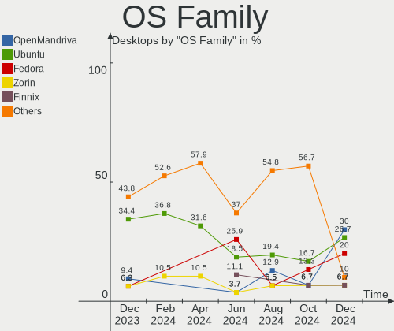

| Name         | Desktops | Percent |
|--------------|----------|---------|
| OpenMandriva | 9        | 30%     |
| Ubuntu       | 8        | 26.67%  |
| Fedora       | 6        | 20%     |
| Zorin        | 2        | 6.67%   |
| Finnix       | 2        | 6.67%   |
| Linux Mint   | 1        | 3.33%   |
| Guix         | 1        | 3.33%   |
| Arch         | 1        | 3.33%   |

Kernel
------

Version of the Linux kernel

| Version                       | Desktops | Percent |
|-------------------------------|----------|---------|
| 6.12.1-desktop-1omv2490       | 5        | 16.67%  |
| 6.8.0-49-generic              | 3        | 10%     |
| 6.8.12-amd64                  | 2        | 6.67%   |
| 6.8.0-51-generic              | 2        | 6.67%   |
| 6.8.0-41-generic              | 2        | 6.67%   |
| 6.12.4-200.fc41.x86_64        | 2        | 6.67%   |
| 6.4.8-desktop-2omv2390        | 1        | 3.33%   |
| 6.13.0-desktop-0.rc1.1omv2490 | 1        | 3.33%   |
| 6.12.6-desktop-1omv2490       | 1        | 3.33%   |
| 6.12.6-200.fc41.x86_64        | 1        | 3.33%   |
| 6.12.1-zen1-1-zen             | 1        | 3.33%   |
| 6.12.0-061200-generic         | 1        | 3.33%   |
| 6.11.4-301.fc41.x86_64        | 1        | 3.33%   |
| 6.11.11-300.fc41.x86_64       | 1        | 3.33%   |
| 6.11.10-gnu                   | 1        | 3.33%   |
| 6.11.10-300.fc41.x86_64       | 1        | 3.33%   |
| 6.11.0-9-generic              | 1        | 3.33%   |
| 6.10.0-desktop-1omv2490       | 1        | 3.33%   |
| 5.4.0-125-generic             | 1        | 3.33%   |
| 5.15.0-43-generic             | 1        | 3.33%   |

Kernel Family
-------------

Linux kernel without a distro release

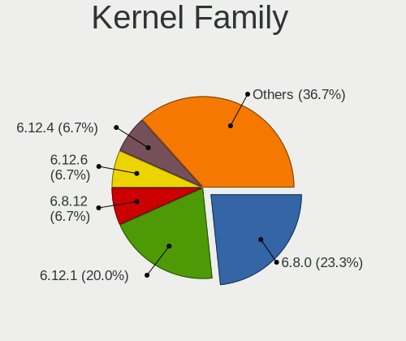

| Version | Desktops | Percent |
|---------|----------|---------|
| 6.8.0   | 7        | 23.33%  |
| 6.12.1  | 6        | 20%     |
| 6.8.12  | 2        | 6.67%   |
| 6.12.6  | 2        | 6.67%   |
| 6.12.4  | 2        | 6.67%   |
| 6.11.10 | 2        | 6.67%   |
| 6.4.8   | 1        | 3.33%   |
| 6.13.0  | 1        | 3.33%   |
| 6.12.0  | 1        | 3.33%   |
| 6.11.4  | 1        | 3.33%   |
| 6.11.11 | 1        | 3.33%   |
| 6.11.0  | 1        | 3.33%   |
| 6.10.0  | 1        | 3.33%   |
| 5.4.0   | 1        | 3.33%   |
| 5.15.0  | 1        | 3.33%   |

Kernel Major Ver.
-----------------

Linux kernel major version

| Version | Desktops | Percent |
|---------|----------|---------|
| 6.12    | 11       | 36.67%  |
| 6.8     | 9        | 30%     |
| 6.11    | 5        | 16.67%  |
| 6.4     | 1        | 3.33%   |
| 6.13    | 1        | 3.33%   |
| 6.10    | 1        | 3.33%   |
| 5.4     | 1        | 3.33%   |
| 5.15    | 1        | 3.33%   |

Arch
----

OS architecture (x86_64, i586, etc.)

| Name   | Desktops | Percent |
|--------|----------|---------|
| x86_64 | 30       | 100%    |

DE
--

Desktop Environment

| Name       | Desktops | Percent |
|------------|----------|---------|
| Unknown    | 13       | 43.33%  |
| GNOME      | 12       | 40%     |
| KDE6       | 3        | 10%     |
| X-Cinnamon | 1        | 3.33%   |
| KDE5       | 1        | 3.33%   |

Display Server
--------------

X11 or Wayland

| Name    | Desktops | Percent |
|---------|----------|---------|
| Wayland | 15       | 50%     |
| X11     | 12       | 40%     |
| Tty     | 2        | 6.67%   |
| Unknown | 1        | 3.33%   |

Display Manager
---------------

SDDM, LightDM, etc.

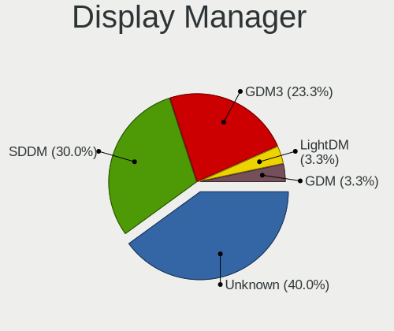

| Name    | Desktops | Percent |
|---------|----------|---------|
| Unknown | 12       | 40%     |
| SDDM    | 9        | 30%     |
| GDM3    | 7        | 23.33%  |
| LightDM | 1        | 3.33%   |
| GDM     | 1        | 3.33%   |

OS Lang
-------

Language

| Lang  | Desktops | Percent |
|-------|----------|---------|
| en_US | 17       | 56.67%  |
| en_IN | 8        | 26.67%  |
| en_GB | 3        | 10%     |
| C     | 2        | 6.67%   |

Boot Mode
---------

EFI or BIOS

| Mode | Desktops | Percent |
|------|----------|---------|
| EFI  | 16       | 53.33%  |
| BIOS | 14       | 46.67%  |

Filesystem
----------

Type of filesystem

| Type    | Desktops | Percent |
|---------|----------|---------|
| Ext4    | 16       | 53.33%  |
| Overlay | 7        | 23.33%  |
| Btrfs   | 4        | 13.33%  |
| Tmpfs   | 3        | 10%     |

Part. scheme
------------

Scheme of partitioning

| Type    | Desktops | Percent |
|---------|----------|---------|
| GPT     | 20       | 66.67%  |
| Unknown | 8        | 26.67%  |
| MBR     | 2        | 6.67%   |

Dual Boot with Linux/BSD
------------------------

Hosting more than one Linux/BSD

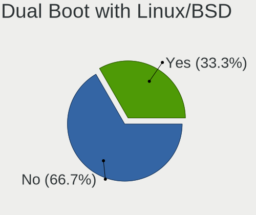

| Dual boot | Desktops | Percent |
|-----------|----------|---------|
| No        | 20       | 66.67%  |
| Yes       | 10       | 33.33%  |

Dual Boot (Win)
---------------

Hosting Linux and Windows

| Dual boot | Desktops | Percent |
|-----------|----------|---------|
| No        | 20       | 66.67%  |
| Yes       | 10       | 33.33%  |

Board
-----

Vendor
------

Motherboard manufacturer

| Name                | Desktops | Percent |
|---------------------|----------|---------|
| Gigabyte Technology | 7        | 23.33%  |
| ASUSTek Computer    | 4        | 13.33%  |
| MSI                 | 3        | 10%     |
| Intel               | 3        | 10%     |
| Unknown             | 3        | 10%     |
| Hewlett-Packard     | 2        | 6.67%   |
| Dell                | 2        | 6.67%   |
| ASRock              | 2        | 6.67%   |
| MITSUBISHI          | 1        | 3.33%   |
| Lenovo              | 1        | 3.33%   |
| Google              | 1        | 3.33%   |
| Biostar             | 1        | 3.33%   |

Model
-----

Motherboard model

| Name                               | Desktops | Percent |
|------------------------------------|----------|---------|
| Unknown                            | 3        | 10%     |
| Gigabyte B450M DS3H                | 2        | 6.67%   |
| ASUS PRIME B650M-R                 | 2        | 6.67%   |
| MSI MS-7E51                        | 1        | 3.33%   |
| MSI MS-7E44                        | 1        | 3.33%   |
| MSI MS-7D95                        | 1        | 3.33%   |
| MITSUBISHI MELSEC WinCPU           | 1        | 3.33%   |
| Lenovo ThinkCentre M900 10FLS13501 | 1        | 3.33%   |
| Intel H110                         | 1        | 3.33%   |
| Intel DZ75ML-45K AAG75008-102      | 1        | 3.33%   |
| Intel D54250WYK H13922-303         | 1        | 3.33%   |
| HP EliteDesk 800 G5 SFF            | 1        | 3.33%   |
| HP EliteDesk 800 G1 DM             | 1        | 3.33%   |
| Google Teemo                       | 1        | 3.33%   |
| Gigabyte X870 AORUS ELITE WIFI7    | 1        | 3.33%   |
| Gigabyte X570S AORUS PRO AX        | 1        | 3.33%   |
| Gigabyte H110M-S2                  | 1        | 3.33%   |
| Gigabyte B365M GAMING HD           | 1        | 3.33%   |
| Gigabyte B250M-D3H                 | 1        | 3.33%   |
| Dell OptiPlex 3050                 | 1        | 3.33%   |
| Dell Inspiron 620s                 | 1        | 3.33%   |
| Biostar H61MLV3                    | 1        | 3.33%   |
| ASUS ROG STRIX B550-F GAMING       | 1        | 3.33%   |
| ASUS H110M-D                       | 1        | 3.33%   |
| ASRock H310CM-HDV/M.2 SE           | 1        | 3.33%   |
| ASRock B650M PG Riptide            | 1        | 3.33%   |

Model Family
------------

Motherboard model prefix

| Name               | Desktops | Percent |
|--------------------|----------|---------|
| Unknown            | 3        | 10%     |
| HP EliteDesk       | 2        | 6.67%   |
| Gigabyte B450M     | 2        | 6.67%   |
| ASUS PRIME         | 2        | 6.67%   |
| MSI MS-7E51        | 1        | 3.33%   |
| MSI MS-7E44        | 1        | 3.33%   |
| MSI MS-7D95        | 1        | 3.33%   |
| MITSUBISHI MELSEC  | 1        | 3.33%   |
| Lenovo ThinkCentre | 1        | 3.33%   |
| Intel H110         | 1        | 3.33%   |
| Intel DZ75ML-45K   | 1        | 3.33%   |
| Intel D54250WYK    | 1        | 3.33%   |
| Google Teemo       | 1        | 3.33%   |
| Gigabyte X870      | 1        | 3.33%   |
| Gigabyte X570S     | 1        | 3.33%   |
| Gigabyte H110M-S2  | 1        | 3.33%   |
| Gigabyte B365M     | 1        | 3.33%   |
| Gigabyte B250M-D3H | 1        | 3.33%   |
| Dell OptiPlex      | 1        | 3.33%   |
| Dell Inspiron      | 1        | 3.33%   |
| Biostar H61MLV3    | 1        | 3.33%   |
| ASUS ROG           | 1        | 3.33%   |
| ASUS H110M-D       | 1        | 3.33%   |
| ASRock H310CM-HDV  | 1        | 3.33%   |
| ASRock B650M       | 1        | 3.33%   |

MFG Year
--------

Motherboard manufacture year

| Year | Desktops | Percent |
|------|----------|---------|
| 2024 | 5        | 16.67%  |
| 2022 | 4        | 13.33%  |
| 2019 | 3        | 10%     |
| 2023 | 2        | 6.67%   |
| 2021 | 2        | 6.67%   |
| 2020 | 2        | 6.67%   |
| 2018 | 2        | 6.67%   |
| 2017 | 2        | 6.67%   |
| 2016 | 2        | 6.67%   |
| 2013 | 2        | 6.67%   |
| 2015 | 1        | 3.33%   |
| 2014 | 1        | 3.33%   |
| 2012 | 1        | 3.33%   |
| 2011 | 1        | 3.33%   |

Form Factor
-----------

Physical design of the computer

| Name    | Desktops | Percent |
|---------|----------|---------|
| Desktop | 30       | 100%    |

Secure Boot
-----------

Enabled or disabled

| State    | Desktops | Percent |
|----------|----------|---------|
| Disabled | 28       | 93.33%  |
| Enabled  | 2        | 6.67%   |

Coreboot
--------

Have coreboot on board

| Used | Desktops | Percent |
|------|----------|---------|
| No   | 29       | 96.67%  |
| Yes  | 1        | 3.33%   |

RAM Size
--------

Total RAM memory

| Size in GB  | Desktops | Percent |
|-------------|----------|---------|
| 16.01-24.0  | 11       | 36.67%  |
| 3.01-4.0    | 6        | 20%     |
| 32.01-64.0  | 4        | 13.33%  |
| 8.01-16.0   | 4        | 13.33%  |
| 24.01-32.0  | 3        | 10%     |
| 4.01-8.0    | 1        | 3.33%   |
| 64.01-256.0 | 1        | 3.33%   |

RAM Used
--------

Used RAM memory

| Used GB    | Desktops | Percent |
|------------|----------|---------|
| 2.01-3.0   | 9        | 30%     |
| 1.01-2.0   | 9        | 30%     |
| 4.01-8.0   | 4        | 13.33%  |
| 3.01-4.0   | 4        | 13.33%  |
| 8.01-16.0  | 2        | 6.67%   |
| 16.01-24.0 | 1        | 3.33%   |
| 0.51-1.0   | 1        | 3.33%   |

Total Drives
------------

Number of drives on board

| Drives | Desktops | Percent |
|--------|----------|---------|
| 2      | 11       | 36.67%  |
| 1      | 11       | 36.67%  |
| 3      | 5        | 16.67%  |
| 4      | 2        | 6.67%   |
| 0      | 1        | 3.33%   |

Has CD-ROM
----------

Has CD-ROM on board

| Presented | Desktops | Percent |
|-----------|----------|---------|
| No        | 27       | 90%     |
| Yes       | 3        | 10%     |

Has Ethernet
------------

Has Ethernet on board

| Presented | Desktops | Percent |
|-----------|----------|---------|
| Yes       | 30       | 100%    |

Has WiFi
--------

Has WiFi module

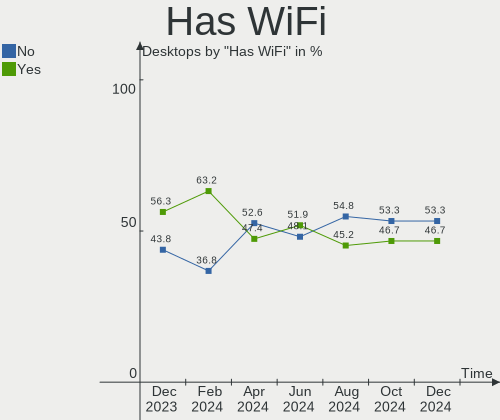

| Presented | Desktops | Percent |
|-----------|----------|---------|
| No        | 16       | 53.33%  |
| Yes       | 14       | 46.67%  |

Has Bluetooth
-------------

Has Bluetooth module

| Presented | Desktops | Percent |
|-----------|----------|---------|
| No        | 23       | 76.67%  |
| Yes       | 7        | 23.33%  |

Location
--------

Country
-------

Geographic location (country)

| Country | Desktops | Percent |
|---------|----------|---------|
| India   | 30       | 100%    |

City
----

Geographic location (city)

| City        | Desktops | Percent |
|-------------|----------|---------|
| Pune        | 6        | 20%     |
| Mumbai      | 4        | 13.33%  |
| Bengaluru   | 4        | 13.33%  |
| Bhubaneswar | 3        | 10%     |
| Warangal    | 1        | 3.33%   |
| Valsad      | 1        | 3.33%   |
| Thane       | 1        | 3.33%   |
| New Delhi   | 1        | 3.33%   |
| Nashik      | 1        | 3.33%   |
| Lucknow     | 1        | 3.33%   |
| Kolkata     | 1        | 3.33%   |
| Kochi       | 1        | 3.33%   |
| Indore      | 1        | 3.33%   |
| Hyderabad   | 1        | 3.33%   |
| Delhi       | 1        | 3.33%   |
| Coimbatore  | 1        | 3.33%   |
| Ahmedabad   | 1        | 3.33%   |

Drives
------

Drive Vendor
------------

Hard drive vendors

| Vendor                    | Desktops | Drives | Percent |
|---------------------------|----------|--------|---------|
| Seagate                   | 7        | 8      | 13.46%  |
| WDC                       | 6        | 6      | 11.54%  |
| Crucial                   | 6        | 6      | 11.54%  |
| Samsung Electronics       | 4        | 5      | 7.69%   |
| Kingston                  | 4        | 4      | 7.69%   |
| Sandisk                   | 3        | 3      | 5.77%   |
| Unknown                   | 2        | 2      | 3.85%   |
| Toshiba                   | 2        | 3      | 3.85%   |
| SPCC                      | 2        | 2      | 3.85%   |
| CT240BX5                  | 2        | 2      | 3.85%   |
| ADATA Technology          | 2        | 2      | 3.85%   |
| XPG                       | 1        | 1      | 1.92%   |
| XFD10S-060GD              | 1        | 1      | 1.92%   |
| Verbatim                  | 1        | 1      | 1.92%   |
| Simm                      | 1        | 1      | 1.92%   |
| Silicon Motion            | 1        | 1      | 1.92%   |
| Micron/Crucial Technology | 1        | 1      | 1.92%   |
| HGST                      | 1        | 1      | 1.92%   |
| Hewlett-Packard           | 1        | 1      | 1.92%   |
| EVM                       | 1        | 1      | 1.92%   |
| China                     | 1        | 1      | 1.92%   |
| 2.5"                      | 1        | 1      | 1.92%   |
| Unknown                   | 1        | 1      | 1.92%   |

Drive Model
-----------

Hard drive models

| Model                                                 | Desktops | Percent |
|-------------------------------------------------------|----------|---------|
| Seagate ST1000DM010-2EP102 1TB                        | 3        | 5.66%   |
| Samsung NVMe SSD Controller SM981/PM981/PM983 512GB   | 2        | 3.77%   |
| Kingston SFYRS1000G 1TB                               | 2        | 3.77%   |
| CT240BX5 00SSD1 240GB                                 | 2        | 3.77%   |
| Crucial CT240BX500SSD1 240GB                          | 2        | 3.77%   |
| XPG GAMMIX S70 1TB                                    | 1        | 1.89%   |
| XFD10S-060GD BKO 64GB SSD                             | 1        | 1.89%   |
| WDC WDS240G2G0A-00JH30 240GB SSD                      | 1        | 1.89%   |
| WDC WD5000LPLX-08ZNTT0 500GB                          | 1        | 1.89%   |
| WDC WD10EZEX-75WN4A0 1TB                              | 1        | 1.89%   |
| WDC WD10EZEX-08WN4A0 1TB                              | 1        | 1.89%   |
| WDC WD10EAVS-00D7B0 1TB                               | 1        | 1.89%   |
| WDC WD Green 2.5 480GB SSD                            | 1        | 1.89%   |
| Verbatim Desktop HDD 3.0 1TB                          | 1        | 1.89%   |
| Unknown MMC Card  128GB                               | 1        | 1.89%   |
| Unknown DG4032  32GB                                  | 1        | 1.89%   |
| Toshiba HDWV110 1TB                                   | 1        | 1.89%   |
| Toshiba DT01ACA100 1TB                                | 1        | 1.89%   |
| SPCC M.2 SSD 1024GB                                   | 1        | 1.89%   |
| SPCC M.2 PCIe SSD 512GB                               | 1        | 1.89%   |
| Simm S930P PRO 2.5 512GB SSD                          | 1        | 1.89%   |
| Silicon Motion SM2263EN/SM2263XT SSD Controller 256GB | 1        | 1.89%   |
| Seagate ST500DM002-1BD142 500GB                       | 1        | 1.89%   |
| Seagate ST3500418AS 500GB                             | 1        | 1.89%   |
| Seagate ST3500413AS 500GB                             | 1        | 1.89%   |
| Seagate ST1000LM035-1RK172 1TB                        | 1        | 1.89%   |
| Seagate Backup+ RD 1TB                                | 1        | 1.89%   |
| Sandisk WD Blue SN580 1TB                             | 1        | 1.89%   |
| Sandisk WD Blue SN550 NVMe SSD 256GB                  | 1        | 1.89%   |
| SanDisk NVMe SSD Drive 1TB                            | 1        | 1.89%   |
| Samsung SSD 990 PRO 2TB                               | 1        | 1.89%   |
| Samsung SSD 850 EVO 120GB                             | 1        | 1.89%   |
| Micron/Crucial CT500P1SSD8 500GB                      | 1        | 1.89%   |
| Kingston SUV400S37120G 120GB SSD                      | 1        | 1.89%   |
| Kingston SA400S37240G 240GB SSD                       | 1        | 1.89%   |
| HGST HTS721010A9E630 1TB                              | 1        | 1.89%   |
| HP SSD S700 500GB                                     | 1        | 1.89%   |
| EVM EVM25/128GB SSD                                   | 1        | 1.89%   |
| Crucial CT480BX500SSD1 480GB                          | 1        | 1.89%   |
| Crucial CT3500SC 500GB SSD                            | 1        | 1.89%   |

HDD Vendor
----------

Hard disk drive vendors

| Vendor   | Desktops | Drives | Percent |
|----------|----------|--------|---------|
| Seagate  | 7        | 7      | 46.67%  |
| WDC      | 4        | 4      | 26.67%  |
| Toshiba  | 2        | 3      | 13.33%  |
| Verbatim | 1        | 1      | 6.67%   |
| HGST     | 1        | 1      | 6.67%   |

SSD Vendor
----------

Solid state drive vendors

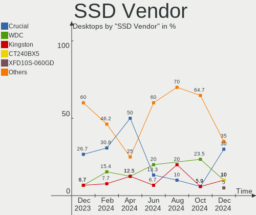

| Vendor              | Desktops | Drives | Percent |
|---------------------|----------|--------|---------|
| Crucial             | 6        | 6      | 30%     |
| WDC                 | 2        | 2      | 10%     |
| Kingston            | 2        | 2      | 10%     |
| CT240BX5            | 2        | 2      | 10%     |
| XFD10S-060GD        | 1        | 1      | 5%      |
| SPCC                | 1        | 1      | 5%      |
| Simm                | 1        | 1      | 5%      |
| Samsung Electronics | 1        | 1      | 5%      |
| Hewlett-Packard     | 1        | 1      | 5%      |
| EVM                 | 1        | 1      | 5%      |
| China               | 1        | 1      | 5%      |
| 2.5"                | 1        | 1      | 5%      |

Drive Kind
----------

HDD or SSD

| Kind    | Desktops | Drives | Percent |
|---------|----------|--------|---------|
| SSD     | 16       | 20     | 33.33%  |
| NVMe    | 14       | 15     | 29.17%  |
| HDD     | 14       | 16     | 29.17%  |
| MMC     | 2        | 2      | 4.17%   |
| Unknown | 2        | 2      | 4.17%   |

Drive Connector
---------------

SATA, SAS, NVMe, etc.

| Type | Desktops | Drives | Percent |
|------|----------|--------|---------|
| SATA | 24       | 34     | 54.55%  |
| NVMe | 14       | 15     | 31.82%  |
| SAS  | 4        | 4      | 9.09%   |
| MMC  | 2        | 2      | 4.55%   |

Drive Size
----------

Size of hard drive

| Size in TB | Desktops | Drives | Percent |
|------------|----------|--------|---------|
| 0.01-0.5   | 16       | 22     | 59.26%  |
| 0.51-1.0   | 10       | 13     | 37.04%  |
| 1.01-2.0   | 1        | 1      | 3.7%    |

Space Total
-----------

Amount of disk space available on the file system

| Size in GB     | Desktops | Percent |
|----------------|----------|---------|
| 101-250        | 10       | 33.33%  |
| 251-500        | 6        | 20%     |
| 1-20           | 6        | 20%     |
| 1001-2000      | 2        | 6.67%   |
| 501-1000       | 2        | 6.67%   |
| More than 3000 | 1        | 3.33%   |
| 21-50          | 1        | 3.33%   |
| 2001-3000      | 1        | 3.33%   |
| 51-100         | 1        | 3.33%   |

Space Used
----------

Amount of used disk space

| Used GB   | Desktops | Percent |
|-----------|----------|---------|
| 1-20      | 17       | 56.67%  |
| 51-100    | 4        | 13.33%  |
| 101-250   | 3        | 10%     |
| 251-500   | 2        | 6.67%   |
| 21-50     | 2        | 6.67%   |
| 1001-2000 | 1        | 3.33%   |
| 501-1000  | 1        | 3.33%   |

Malfunc. Drives
---------------

Drive models with a malfunction

| Model                           | Desktops | Drives | Percent |
|---------------------------------|----------|--------|---------|
| XPG GAMMIX S70 1TB              | 1        | 1      | 20%     |
| Seagate ST500DM002-1BD142 500GB | 1        | 1      | 20%     |
| Seagate ST1000LM035-1RK172 1TB  | 1        | 1      | 20%     |
| HGST HTS721010A9E630 1TB        | 1        | 1      | 20%     |
| 2.5" SATA SSD 3TEB 120GB        | 1        | 1      | 20%     |

Malfunc. Drive Vendor
---------------------

Vendors of faulty drives

| Vendor  | Desktops | Drives | Percent |
|---------|----------|--------|---------|
| Seagate | 2        | 2      | 40%     |
| XPG     | 1        | 1      | 20%     |
| HGST    | 1        | 1      | 20%     |
| 2.5"    | 1        | 1      | 20%     |

Malfunc. HDD Vendor
-------------------

Vendors of faulty HDD drives

| Vendor  | Desktops | Drives | Percent |
|---------|----------|--------|---------|
| Seagate | 2        | 2      | 66.67%  |
| HGST    | 1        | 1      | 33.33%  |

Malfunc. Drive Kind
-------------------

Kinds of faulty drives

| Kind | Desktops | Drives | Percent |
|------|----------|--------|---------|
| HDD  | 3        | 3      | 60%     |
| NVMe | 1        | 1      | 20%     |
| SSD  | 1        | 1      | 20%     |

Failed Drives
-------------

Failed drive models

Zero info for selected period =(

Failed Drive Vendor
-------------------

Failed drive vendors

Zero info for selected period =(

Drive Status
------------

Number of failed and malfunc. drives

| Status   | Desktops | Drives | Percent |
|----------|----------|--------|---------|
| Works    | 17       | 28     | 50%     |
| Detected | 12       | 22     | 35.29%  |
| Malfunc  | 5        | 5      | 14.71%  |

Storage controller
------------------

Storage Vendor
--------------

Storage controller vendors

| Vendor                      | Desktops | Percent |
|-----------------------------|----------|---------|
| Intel                       | 20       | 44.44%  |
| AMD                         | 10       | 22.22%  |
| Sandisk                     | 3        | 6.67%   |
| Samsung Electronics         | 3        | 6.67%   |
| Kingston Technology Company | 2        | 4.44%   |
| ADATA Technology            | 2        | 4.44%   |
| Silicon Motion              | 1        | 2.22%   |
| Phison Electronics          | 1        | 2.22%   |
| Micron/Crucial Technology   | 1        | 2.22%   |
| INNOGRIT                    | 1        | 2.22%   |
| ASMedia Technology          | 1        | 2.22%   |

Storage Model
-------------

Storage controller models

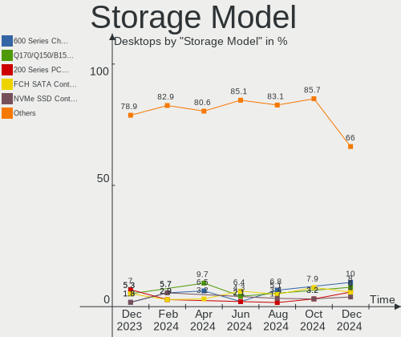

| Model                                                                                   | Desktops | Percent |
|-----------------------------------------------------------------------------------------|----------|---------|
| AMD 600 Series Chipset SATA Controller                                                  | 5        | 10%     |
| Intel Q170/Q150/B150/H170/H110/Z170/CM236 Chipset SATA Controller [AHCI Mode]           | 4        | 8%      |
| Intel 200 Series PCH SATA controller [AHCI mode]                                        | 3        | 6%      |
| AMD FCH SATA Controller [AHCI mode]                                                     | 3        | 6%      |
| Samsung NVMe SSD Controller SM981/PM981/PM983                                           | 2        | 4%      |
| Kingston Company FURY Renegade NVMe SSD + Heatsink [E18]                                | 2        | 4%      |
| Intel Celeron N3350/Pentium N4200/Atom E3900 Series SATA AHCI Controller                | 2        | 4%      |
| Intel 6 Series/C200 Series Chipset Family Desktop SATA Controller (IDE mode, ports 4-5) | 2        | 4%      |
| Intel 6 Series/C200 Series Chipset Family Desktop SATA Controller (IDE mode, ports 0-3) | 2        | 4%      |
| AMD 500 Series Chipset SATA Controller                                                  | 2        | 4%      |
| AMD 400 Series Chipset SATA Controller                                                  | 2        | 4%      |
| Silicon Motion SM2263EN/SM2263XT (DRAM-less) NVMe SSD Controllers                       | 1        | 2%      |
| Sandisk WD Blue SN580 NVMe SSD (DRAM-less)                                              | 1        | 2%      |
| Sandisk WD Black SN850X NVMe SSD                                                        | 1        | 2%      |
| SanDisk Ultra 3D / WD PC SN530, IX SN530, Blue SN550 NVMe SSD (DRAM-less)               | 1        | 2%      |
| Samsung NVMe SSD Controller S4LV008[Pascal]                                             | 1        | 2%      |
| Phison PS5019-E19 PCIe4 NVMe Controller (DRAM-less)                                     | 1        | 2%      |
| Micron/Crucial P1 NVMe PCIe SSD[Frampton2]                                              | 1        | 2%      |
| Intel Sunrise Point-LP SATA Controller [AHCI mode]                                      | 1        | 2%      |
| Intel SATA Controller [RAID mode]                                                       | 1        | 2%      |
| Intel NM10/ICH7 Family SATA Controller [IDE mode]                                       | 1        | 2%      |
| Intel Cannon Lake PCH SATA AHCI Controller                                              | 1        | 2%      |
| Intel Alder Lake-S PCH SATA Controller [AHCI Mode]                                      | 1        | 2%      |
| Intel Alder Lake-N SATA AHCI Controller                                                 | 1        | 2%      |
| Intel 82801G (ICH7 Family) IDE Controller                                               | 1        | 2%      |
| Intel 8 Series/C220 Series Chipset Family 6-port SATA Controller 1 [AHCI mode]          | 1        | 2%      |
| Intel 8 Series SATA Controller 1 [AHCI mode]                                            | 1        | 2%      |
| Intel 7 Series/C210 Series Chipset Family 6-port SATA Controller [AHCI mode]            | 1        | 2%      |
| INNOGRIT NVMe SSD Controller IG5236                                                     | 1        | 2%      |
| ASMedia ASM1064 Serial ATA Controller                                                   | 1        | 2%      |
| ADATA XPG GAMMIXS1 1L, XPG GAMMIX S5, LEGEND 710 / 740, SWORDFISH NVMe SSD (DRAM-less)  | 1        | 2%      |
| ADATA GAMMIX S70 BLADE, PS5 PREMIUM NVMe SSD                                            | 1        | 2%      |

Storage Kind
------------

Kind of storage controller (IDE, SATA, NVMe, SAS, ...)

| Kind | Desktops | Percent |
|------|----------|---------|
| SATA | 26       | 59.09%  |
| NVMe | 14       | 31.82%  |
| IDE  | 3        | 6.82%   |
| RAID | 1        | 2.27%   |

Processor
---------

CPU Vendor
----------

Processor vendors

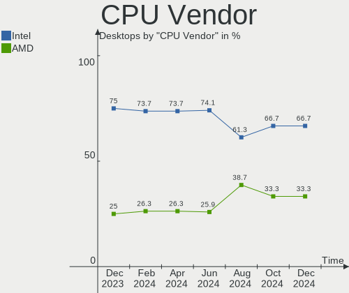

| Vendor | Desktops | Percent |
|--------|----------|---------|
| Intel  | 20       | 66.67%  |
| AMD    | 10       | 33.33%  |

CPU Model
---------

Processor models

| Model                                     | Desktops | Percent |
|-------------------------------------------|----------|---------|
| Intel Core i5-7400 CPU @ 3.00GHz          | 2        | 6.67%   |
| AMD Ryzen 7 9800X3D 8-Core Processor      | 2        | 6.67%   |
| AMD Ryzen 5 8500G w/ Radeon 740M Graphics | 2        | 6.67%   |
| Intel Pentium CPU G2010 @ 2.80GHz         | 1        | 3.33%   |
| Intel N100                                | 1        | 3.33%   |
| Intel Core i7-8550U CPU @ 1.80GHz         | 1        | 3.33%   |
| Intel Core i7-7700T CPU @ 2.90GHz         | 1        | 3.33%   |
| Intel Core i5-9500 CPU @ 3.00GHz          | 1        | 3.33%   |
| Intel Core i5-9400F CPU @ 2.90GHz         | 1        | 3.33%   |
| Intel Core i5-6500T CPU @ 2.50GHz         | 1        | 3.33%   |
| Intel Core i5-6400 CPU @ 2.70GHz          | 1        | 3.33%   |
| Intel Core i5-4250U CPU @ 1.30GHz         | 1        | 3.33%   |
| Intel Core i3-6100T CPU @ 3.20GHz         | 1        | 3.33%   |
| Intel Core i3-6098P CPU @ 3.60GHz         | 1        | 3.33%   |
| Intel Core i3-4170 CPU @ 3.70GHz          | 1        | 3.33%   |
| Intel Core i3-3210 CPU @ 3.20GHz          | 1        | 3.33%   |
| Intel Core i3-2120 CPU @ 3.30GHz          | 1        | 3.33%   |
| Intel Core 2 CPU 6400 @ 2.13GHz           | 1        | 3.33%   |
| Intel Atom Processor E3940 @ 1.60GHz      | 1        | 3.33%   |
| Intel Atom Processor E3930 @ 1.30GHz      | 1        | 3.33%   |
| Intel 12th Gen Core i5-12400F             | 1        | 3.33%   |
| AMD Ryzen 9 5950X 16-Core Processor       | 1        | 3.33%   |
| AMD Ryzen 7 5700X 8-Core Processor        | 1        | 3.33%   |
| AMD Ryzen 5 7600 6-Core Processor         | 1        | 3.33%   |
| AMD Ryzen 5 5600X 6-Core Processor        | 1        | 3.33%   |
| AMD Ryzen 5 5600G with Radeon Graphics    | 1        | 3.33%   |
| AMD Ryzen 5 3600 6-Core Processor         | 1        | 3.33%   |

CPU Model Family
----------------

Processor model prefix

| Model         | Desktops | Percent |
|---------------|----------|---------|
| Intel Core i5 | 7        | 23.33%  |
| AMD Ryzen 5   | 6        | 20%     |
| Intel Core i3 | 5        | 16.67%  |
| AMD Ryzen 7   | 3        | 10%     |
| Other         | 2        | 6.67%   |
| Intel Core i7 | 2        | 6.67%   |
| Intel Atom    | 2        | 6.67%   |
| Intel Pentium | 1        | 3.33%   |
| Intel Core 2  | 1        | 3.33%   |
| AMD Ryzen 9   | 1        | 3.33%   |

CPU Cores
---------

Number of processor cores

| Number | Desktops | Percent |
|--------|----------|---------|
| 6      | 9        | 30%     |
| 2      | 9        | 30%     |
| 4      | 8        | 26.67%  |
| 8      | 3        | 10%     |
| 16     | 1        | 3.33%   |

CPU Sockets
-----------

Number of sockets

| Number | Desktops | Percent |
|--------|----------|---------|
| 1      | 30       | 100%    |

CPU Threads
-----------

Threads per core (Hyper-Threading)

| Number | Desktops | Percent |
|--------|----------|---------|
| 2      | 18       | 60%     |
| 1      | 12       | 40%     |

CPU Op-Modes
------------

CPU Operation Modes (32-bit, 64-bit)

| Op mode        | Desktops | Percent |
|----------------|----------|---------|
| 32-bit, 64-bit | 30       | 100%    |

CPU Microcode
-------------

Microcode number

| Number     | Desktops | Percent |
|------------|----------|---------|
| Unknown    | 27       | 90%     |
| 0xb06e0    | 1        | 3.33%   |
| 0x506ca    | 1        | 3.33%   |
| 0x0a20102b | 1        | 3.33%   |

CPU Microarch
-------------

Microarchitecture

| Name        | Desktops | Percent |
|-------------|----------|---------|
| Unknown     | 7        | 23.33%  |
| KabyLake    | 6        | 20%     |
| Zen 3       | 4        | 13.33%  |
| Skylake     | 4        | 13.33%  |
| IvyBridge   | 2        | 6.67%   |
| Haswell     | 2        | 6.67%   |
| Goldmont    | 2        | 6.67%   |
| Zen 2       | 1        | 3.33%   |
| SandyBridge | 1        | 3.33%   |
| Core        | 1        | 3.33%   |

Graphics
--------

GPU Vendor
----------

Vendors of graphics cards

| Vendor | Desktops | Percent |
|--------|----------|---------|
| Intel  | 19       | 59.38%  |
| AMD    | 7        | 21.88%  |
| Nvidia | 6        | 18.75%  |

GPU Model
---------

Graphics card models

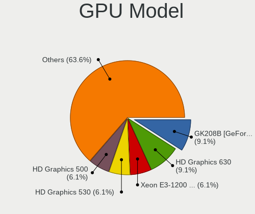

| Model                                                                     | Desktops | Percent |
|---------------------------------------------------------------------------|----------|---------|
| Nvidia GK208B [GeForce GT 710]                                            | 3        | 9.09%   |
| Intel HD Graphics 630                                                     | 3        | 9.09%   |
| Intel Xeon E3-1200 v2/3rd Gen Core processor Graphics Controller          | 2        | 6.06%   |
| Intel HD Graphics 530                                                     | 2        | 6.06%   |
| Intel HD Graphics 500                                                     | 2        | 6.06%   |
| AMD Phoenix2                                                              | 2        | 6.06%   |
| AMD Granite Ridge [Radeon Graphics]                                       | 2        | 6.06%   |
| Nvidia TU117 [GeForce GTX 1650]                                           | 1        | 3.03%   |
| Nvidia GP106 [GeForce GTX 1060 6GB]                                       | 1        | 3.03%   |
| Nvidia AD104 [GeForce RTX 4070 SUPER]                                     | 1        | 3.03%   |
| Intel UHD Graphics 620                                                    | 1        | 3.03%   |
| Intel HD Graphics 510                                                     | 1        | 3.03%   |
| Intel Haswell-ULT Integrated Graphics Controller                          | 1        | 3.03%   |
| Intel DG2 [Arc A750]                                                      | 1        | 3.03%   |
| Intel DG2 [Arc A380]                                                      | 1        | 3.03%   |
| Intel CoffeeLake-S GT2 [UHD Graphics 630]                                 | 1        | 3.03%   |
| Intel Alder Lake-N [UHD Graphics]                                         | 1        | 3.03%   |
| Intel 4th Generation Core Processor Family Integrated Graphics Controller | 1        | 3.03%   |
| Intel 4 Series Chipset Integrated Graphics Controller                     | 1        | 3.03%   |
| Intel 2nd Generation Core Processor Family Integrated Graphics Controller | 1        | 3.03%   |
| AMD Raphael                                                               | 1        | 3.03%   |
| AMD Navi 31 [Radeon RX 7900 XT/7900 XTX/7900 GRE/7900M]                   | 1        | 3.03%   |
| AMD Navi 22 [Radeon RX 6700/6700 XT/6750 XT / 6800M/6850M XT]             | 1        | 3.03%   |
| AMD Ellesmere [Radeon RX 470/480/570/570X/580/580X/590]                   | 1        | 3.03%   |

GPU Combo
---------

Combinations of graphics cards

| Name         | Desktops | Percent |
|--------------|----------|---------|
| 1 x Intel    | 17       | 56.67%  |
| 1 x Nvidia   | 5        | 16.67%  |
| 1 x AMD      | 4        | 13.33%  |
| 2 x Intel    | 1        | 3.33%   |
| 2 x AMD      | 1        | 3.33%   |
| Intel + AMD  | 1        | 3.33%   |
| AMD + Nvidia | 1        | 3.33%   |

GPU Driver
----------

Free vs proprietary

| Driver      | Desktops | Percent |
|-------------|----------|---------|
| Free        | 24       | 80%     |
| Unknown     | 4        | 13.33%  |
| Proprietary | 2        | 6.67%   |

GPU Memory
----------

Total video memory

| Size in GB | Desktops | Percent |
|------------|----------|---------|
| Unknown    | 24       | 80%     |
| 0.01-0.5   | 2        | 6.67%   |
| 5.01-6.0   | 1        | 3.33%   |
| 16.01-24.0 | 1        | 3.33%   |
| 8.01-16.0  | 1        | 3.33%   |
| 0.51-1.0   | 1        | 3.33%   |

Monitor
-------

Monitor Vendor
--------------

Monitor vendors

| Vendor               | Desktops | Percent |
|----------------------|----------|---------|
| Dell                 | 6        | 21.43%  |
| Goldstar             | 4        | 14.29%  |
| BenQ                 | 4        | 14.29%  |
| Lenovo               | 2        | 7.14%   |
| Hewlett-Packard      | 2        | 7.14%   |
| AOC                  | 2        | 7.14%   |
| Unknown              | 1        | 3.57%   |
| TBD                  | 1        | 3.57%   |
| SGT                  | 1        | 3.57%   |
| Sceptre              | 1        | 3.57%   |
| Samsung Electronics  | 1        | 3.57%   |
| Panasonic            | 1        | 3.57%   |
| MSI                  | 1        | 3.57%   |
| Ancor Communications | 1        | 3.57%   |

Monitor Model
-------------

Monitor models

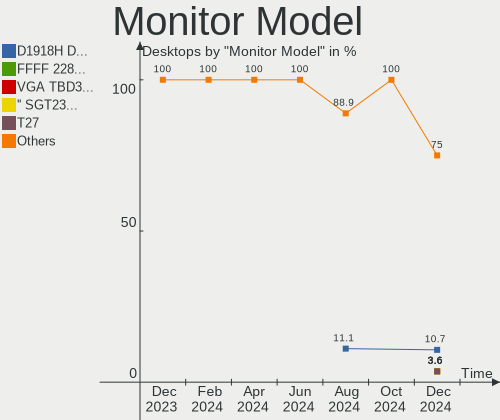

| Model                                                                  | Desktops | Percent |
|------------------------------------------------------------------------|----------|---------|
| Dell D1918H DEL2005 1366x768 410x230mm 18.5-inch                       | 3        | 10.71%  |
| Unknown LCD Monitor FFFF 2288x1287 2550x2550mm 142.0-inch              | 1        | 3.57%   |
| TBD VGA TBD3120 1366x768 344x193mm 15.5-inch                           | 1        | 3.57%   |
| SGT '' SGT2380 1920x1080 530x290mm 23.8-inch                           | 1        | 3.57%   |
| Sceptre LCD Monitor T27                                                | 1        | 3.57%   |
| Samsung Electronics LCD Monitor SAM723F 3840x2160 700x390mm 31.5-inch  | 1        | 3.57%   |
| Panasonic TV MEIA296 1920x1080 698x392mm 31.5-inch                     | 1        | 3.57%   |
| MSI MAG 341C OLED MSI3DD0 3440x1440 800x337mm 34.2-inch                | 1        | 3.57%   |
| Lenovo LEN L22e-20 LEN65DE 1920x1080 476x268mm 21.5-inch               | 1        | 3.57%   |
| Lenovo L24i-40 LEN67A8 1920x1080 527x296mm 23.8-inch                   | 1        | 3.57%   |
| Hewlett-Packard E233 HPN3460 1920x1080 509x286mm 23.0-inch             | 1        | 3.57%   |
| Hewlett-Packard E233 HPN345F 1920x1080 509x286mm 23.0-inch             | 1        | 3.57%   |
| Goldstar ULTRAGEAR GSM7766 2560x1440 697x392mm 31.5-inch               | 1        | 3.57%   |
| Goldstar ULTRAGEAR GSM5BD2 2560x1440 697x392mm 31.5-inch               | 1        | 3.57%   |
| Goldstar HD GSM5ACB 1366x768 410x230mm 18.5-inch                       | 1        | 3.57%   |
| Goldstar 24GL600F GSM5B72 1920x1080 531x298mm 24.0-inch                | 1        | 3.57%   |
| Dell S2421HN DEL41F2 1920x1080 527x296mm 23.8-inch                     | 1        | 3.57%   |
| Dell P2017H DELD095 1600x900 434x236mm 19.4-inch                       | 1        | 3.57%   |
| Dell E1920H DELF116 1366x768 410x230mm 18.5-inch                       | 1        | 3.57%   |
| BenQ GW2780 BNQ78E6 1920x1080 598x336mm 27.0-inch                      | 1        | 3.57%   |
| BenQ GW2480 BNQ78E7 1920x1080 527x296mm 23.8-inch                      | 1        | 3.57%   |
| BenQ GL2023 BNQ78CC 1600x900 430x240mm 19.4-inch                       | 1        | 3.57%   |
| BenQ EW3270U BNQ7950 3840x2160 698x393mm 31.5-inch                     | 1        | 3.57%   |
| AOC T2442e AOC2442 1920x1080 477x268mm 21.5-inch                       | 1        | 3.57%   |
| AOC 2270W AOC2270 1920x1080 477x268mm 21.5-inch                        | 1        | 3.57%   |
| Ancor Communications ASUS PB287Q ACI28A3 3840x2160 621x341mm 27.9-inch | 1        | 3.57%   |

Monitor Resolution
------------------

Monitor screen resolution

| Resolution      | Desktops | Percent |
|-----------------|----------|---------|
| 1920x1080 (FHD) | 11       | 39.29%  |
| 1366x768 (WXGA) | 6        | 21.43%  |
| 3840x2160 (4K)  | 4        | 14.29%  |
| 2560x1440 (QHD) | 2        | 7.14%   |
| 1600x900 (HD+)  | 2        | 7.14%   |
| 3440x1440       | 1        | 3.57%   |
| 2288x1287       | 1        | 3.57%   |
| Unknown         | 1        | 3.57%   |

Monitor Diagonal
----------------

Diagonal size in inches

| Inches  | Desktops | Percent |
|---------|----------|---------|
| 18      | 5        | 17.86%  |
| 23      | 4        | 14.29%  |
| 31      | 3        | 10.71%  |
| 21      | 3        | 10.71%  |
| 27      | 2        | 7.14%   |
| 24      | 2        | 7.14%   |
| 142     | 1        | 3.57%   |
| 84      | 1        | 3.57%   |
| 43      | 1        | 3.57%   |
| 34      | 1        | 3.57%   |
| 26      | 1        | 3.57%   |
| 20      | 1        | 3.57%   |
| 19      | 1        | 3.57%   |
| 15      | 1        | 3.57%   |
| Unknown | 1        | 3.57%   |

Monitor Width
-------------

Physical width

| Width in mm    | Desktops | Percent |
|----------------|----------|---------|
| 401-500        | 10       | 35.71%  |
| 501-600        | 8        | 28.57%  |
| 601-700        | 4        | 14.29%  |
| More than 2000 | 1        | 3.57%   |
| 701-800        | 1        | 3.57%   |
| 301-350        | 1        | 3.57%   |
| 1501-2000      | 1        | 3.57%   |
| 901-1000       | 1        | 3.57%   |
| Unknown        | 1        | 3.57%   |

Aspect Ratio
------------

Proportional relationship between the width and the height

| Ratio   | Desktops | Percent |
|---------|----------|---------|
| 16/9    | 22       | 84.62%  |
| 21/9    | 1        | 3.85%   |
| 2.00    | 1        | 3.85%   |
| 1.00    | 1        | 3.85%   |
| Unknown | 1        | 3.85%   |

Monitor Area
------------

Area in inch

| Area in inch | Desktops | Percent |
|----------------|----------|---------|
| 201-250        | 7        | 25%     |
| 141-150        | 5        | 17.86%  |
| 351-500        | 4        | 14.29%  |
| 151-200        | 4        | 14.29%  |
| More than 1000 | 2        | 7.14%   |
| 301-350        | 2        | 7.14%   |
| 251-300        | 1        | 3.57%   |
| 101-110        | 1        | 3.57%   |
| 501-1000       | 1        | 3.57%   |
| Unknown        | 1        | 3.57%   |

Pixel Density
-------------

Pixels per inch

| Density | Desktops | Percent |
|---------|----------|---------|
| 51-100  | 18       | 64.29%  |
| 101-120 | 6        | 21.43%  |
| 121-160 | 2        | 7.14%   |
| 1-50    | 1        | 3.57%   |
| Unknown | 1        | 3.57%   |

Multiple Monitors
-----------------

Total monitors connected

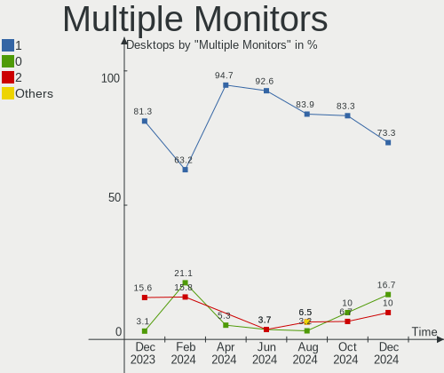

| Total | Desktops | Percent |
|-------|----------|---------|
| 1     | 22       | 73.33%  |
| 0     | 5        | 16.67%  |
| 2     | 3        | 10%     |

Network
-------

Net Controller Vendor
---------------------

Controller vendors

| Vendor                | Desktops | Percent |
|-----------------------|----------|---------|
| Realtek Semiconductor | 20       | 47.62%  |
| Intel                 | 13       | 30.95%  |
| TP-Link               | 4        | 9.52%   |
| Samsung Electronics   | 1        | 2.38%   |
| Ralink Technology     | 1        | 2.38%   |
| Qualcomm Technologies | 1        | 2.38%   |
| Motorola PCS          | 1        | 2.38%   |
| MediaTek              | 1        | 2.38%   |

Net Controller Model
--------------------

Controller models

| Model                                                                  | Desktops | Percent |
|------------------------------------------------------------------------|----------|---------|
| Realtek RTL8111/8168/8211/8411 PCI Express Gigabit Ethernet Controller | 11       | 23.4%   |
| Realtek RTL8125 2.5GbE Controller                                      | 4        | 8.51%   |
| TP-Link 802.11ac NIC                                                   | 3        | 6.38%   |
| Realtek RTL810xE PCI Express Fast Ethernet controller                  | 3        | 6.38%   |
| Intel Ethernet Controller I225-V                                       | 2        | 4.26%   |
| Intel Ethernet Connection (2) I219-V                                   | 2        | 4.26%   |
| TP-Link Archer T2U PLUS [RTL8821AU]                                    | 1        | 2.13%   |
| Samsung GT-I9070 (network tethering, USB debugging enabled)            | 1        | 2.13%   |
| Realtek RTL8188FTV 802.11b/g/n 1T1R 2.4G WLAN Adapter                  | 1        | 2.13%   |
| Realtek RTL8188EUS 802.11n Wireless Network Adapter                    | 1        | 2.13%   |
| Realtek RTL8188CE 802.11b/g/n WiFi Adapter                             | 1        | 2.13%   |
| Realtek RT8126 PCIe Ethernet Controller                                | 1        | 2.13%   |
| Ralink MT7601U Wireless Adapter                                        | 1        | 2.13%   |
| Qualcomm WCN785x Wi-Fi 7(802.11be) 320MHz 2x2 [FastConnect 7800]       | 1        | 2.13%   |
| Motorola PCS moto g84 5G                                               | 1        | 2.13%   |
| MediaTek WLAN controller                                               | 1        | 2.13%   |
| Intel Wireless 7265                                                    | 1        | 2.13%   |
| Intel Wireless 7260                                                    | 1        | 2.13%   |
| Intel Wi-Fi 6E(802.11ax) AX210/AX1675* 2x2 [Typhoon Peak]              | 1        | 2.13%   |
| Intel Wi-Fi 6 AX200                                                    | 1        | 2.13%   |
| Intel Ultimate N WiFi Link 5300                                        | 1        | 2.13%   |
| Intel I210 Gigabit Network Connection                                  | 1        | 2.13%   |
| Intel Ethernet Controller I226-V                                       | 1        | 2.13%   |
| Intel Ethernet Connection I218-V                                       | 1        | 2.13%   |
| Intel Ethernet Connection I217-LM                                      | 1        | 2.13%   |
| Intel Ethernet Connection (7) I219-LM                                  | 1        | 2.13%   |
| Intel Ethernet Connection (2) I219-LM                                  | 1        | 2.13%   |
| Intel 82579V Gigabit Network Connection                                | 1        | 2.13%   |

Wireless Vendor
---------------

Wireless vendors

| Vendor                | Desktops | Percent |
|-----------------------|----------|---------|
| Intel                 | 5        | 35.71%  |
| TP-Link               | 4        | 28.57%  |
| Realtek Semiconductor | 3        | 21.43%  |
| Ralink Technology     | 1        | 7.14%   |
| Qualcomm Technologies | 1        | 7.14%   |

Wireless Model
--------------

Wireless models

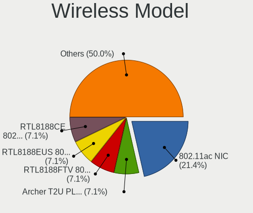

| Model                                                            | Desktops | Percent |
|------------------------------------------------------------------|----------|---------|
| TP-Link 802.11ac NIC                                             | 3        | 21.43%  |
| TP-Link Archer T2U PLUS [RTL8821AU]                              | 1        | 7.14%   |
| Realtek RTL8188FTV 802.11b/g/n 1T1R 2.4G WLAN Adapter            | 1        | 7.14%   |
| Realtek RTL8188EUS 802.11n Wireless Network Adapter              | 1        | 7.14%   |
| Realtek RTL8188CE 802.11b/g/n WiFi Adapter                       | 1        | 7.14%   |
| Ralink MT7601U Wireless Adapter                                  | 1        | 7.14%   |
| Qualcomm WCN785x Wi-Fi 7(802.11be) 320MHz 2x2 [FastConnect 7800] | 1        | 7.14%   |
| Intel Wireless 7265                                              | 1        | 7.14%   |
| Intel Wireless 7260                                              | 1        | 7.14%   |
| Intel Wi-Fi 6E(802.11ax) AX210/AX1675* 2x2 [Typhoon Peak]        | 1        | 7.14%   |
| Intel Wi-Fi 6 AX200                                              | 1        | 7.14%   |
| Intel Ultimate N WiFi Link 5300                                  | 1        | 7.14%   |

Ethernet Vendor
---------------

Ethernet vendors

| Vendor                | Desktops | Percent |
|-----------------------|----------|---------|
| Realtek Semiconductor | 19       | 59.38%  |
| Intel                 | 11       | 34.38%  |
| Motorola PCS          | 1        | 3.13%   |
| MediaTek              | 1        | 3.13%   |

Ethernet Model
--------------

Ethernet models

| Model                                                                  | Desktops | Percent |
|------------------------------------------------------------------------|----------|---------|
| Realtek RTL8111/8168/8211/8411 PCI Express Gigabit Ethernet Controller | 11       | 34.38%  |
| Realtek RTL8125 2.5GbE Controller                                      | 4        | 12.5%   |
| Realtek RTL810xE PCI Express Fast Ethernet controller                  | 3        | 9.38%   |
| Intel Ethernet Controller I225-V                                       | 2        | 6.25%   |
| Intel Ethernet Connection (2) I219-V                                   | 2        | 6.25%   |
| Realtek RT8126 PCIe Ethernet Controller                                | 1        | 3.13%   |
| Motorola PCS moto g84 5G                                               | 1        | 3.13%   |
| MediaTek WLAN controller                                               | 1        | 3.13%   |
| Intel I210 Gigabit Network Connection                                  | 1        | 3.13%   |
| Intel Ethernet Controller I226-V                                       | 1        | 3.13%   |
| Intel Ethernet Connection I218-V                                       | 1        | 3.13%   |
| Intel Ethernet Connection I217-LM                                      | 1        | 3.13%   |
| Intel Ethernet Connection (7) I219-LM                                  | 1        | 3.13%   |
| Intel Ethernet Connection (2) I219-LM                                  | 1        | 3.13%   |
| Intel 82579V Gigabit Network Connection                                | 1        | 3.13%   |

Net Controller Kind
-------------------

Ethernet, WiFi or modem

| Kind     | Desktops | Percent |
|----------|----------|---------|
| Ethernet | 30       | 68.18%  |
| WiFi     | 13       | 29.55%  |
| Modem    | 1        | 2.27%   |

Used Controller
---------------

Currently used network controller

| Kind     | Desktops | Percent |
|----------|----------|---------|
| Ethernet | 20       | 68.97%  |
| WiFi     | 9        | 31.03%  |

NICs
----

Total network controllers on board

| Total | Desktops | Percent |
|-------|----------|---------|
| 1     | 20       | 66.67%  |
| 2     | 8        | 26.67%  |
| 11    | 1        | 3.33%   |
| 4     | 1        | 3.33%   |

IPv6
----

IPv6 vs IPv4

| Used | Desktops | Percent |
|------|----------|---------|
| No   | 16       | 53.33%  |
| Yes  | 14       | 46.67%  |

Bluetooth
---------

Bluetooth Vendor
----------------

Controller vendors

| Vendor                  | Desktops | Percent |
|-------------------------|----------|---------|
| Intel                   | 4        | 50%     |
| Cambridge Silicon Radio | 2        | 25%     |
| TP-Link                 | 1        | 12.5%   |
| Foxconn / Hon Hai       | 1        | 12.5%   |

Bluetooth Model
---------------

Controller models

| Model                                               | Desktops | Percent |
|-----------------------------------------------------|----------|---------|
| Intel Bluetooth wireless interface                  | 2        | 25%     |
| Cambridge Silicon Radio Bluetooth Dongle (HCI mode) | 2        | 25%     |
| TP-Link TP-Link Bluetooth USB Adapter               | 1        | 12.5%   |
| Intel AX210 Bluetooth                               | 1        | 12.5%   |
| Intel AX200 Bluetooth                               | 1        | 12.5%   |
| Foxconn / Hon Hai Wireless_Device                   | 1        | 12.5%   |

Sound
-----

Sound Vendor
------------

Sound card vendors

| Vendor                   | Desktops | Percent |
|--------------------------|----------|---------|
| Intel                    | 22       | 48.89%  |
| AMD                      | 10       | 22.22%  |
| Nvidia                   | 6        | 13.33%  |
| Texas Instruments        | 1        | 2.22%   |
| SteelSeries ApS          | 1        | 2.22%   |
| Sony                     | 1        | 2.22%   |
| Micro Star International | 1        | 2.22%   |
| Kingston Technology      | 1        | 2.22%   |
| Hewlett-Packard          | 1        | 2.22%   |
| C-Media Electronics      | 1        | 2.22%   |

Sound Model
-----------

Sound card models

| Model                                                                      | Desktops | Percent |
|----------------------------------------------------------------------------|----------|---------|
| AMD Family 17h/19h/1ah HD Audio Controller                                 | 6        | 10.53%  |
| AMD Rembrandt Radeon High Definition Audio Controller                      | 5        | 8.77%   |
| Intel 200 Series PCH HD Audio                                              | 4        | 7.02%   |
| Intel 100 Series/C230 Series Chipset Family HD Audio Controller            | 4        | 7.02%   |
| AMD Starship/Matisse HD Audio Controller                                   | 4        | 7.02%   |
| Nvidia GK208 HDMI/DP Audio Controller                                      | 3        | 5.26%   |
| Intel DG2 Audio Controller                                                 | 2        | 3.51%   |
| Intel Celeron N3350/Pentium N4200/Atom E3900 Series Audio Cluster          | 2        | 3.51%   |
| Intel 6 Series/C200 Series Chipset Family High Definition Audio Controller | 2        | 3.51%   |
| Texas Instruments PCM2902 Audio Codec                                      | 1        | 1.75%   |
| SteelSeries ApS SteelSeries Arctis 1 Wireless                              | 1        | 1.75%   |
| Sony Wireless Headset                                                      | 1        | 1.75%   |
| Nvidia TU107 GeForce GTX 1650 High Definition Audio Controller             | 1        | 1.75%   |
| Nvidia GP106 High Definition Audio Controller                              | 1        | 1.75%   |
| Nvidia AD104 High Definition Audio Controller                              | 1        | 1.75%   |
| Micro Star International USB Audio                                         | 1        | 1.75%   |
| Kingston Technology HyperX 7.1 Audio                                       | 1        | 1.75%   |
| Intel Xeon E3-1200 v3/4th Gen Core Processor HD Audio Controller           | 1        | 1.75%   |
| Intel USB PnP Sound Device                                                 | 1        | 1.75%   |
| Intel Sunrise Point-LP HD Audio                                            | 1        | 1.75%   |
| Intel NM10/ICH7 Family High Definition Audio Controller                    | 1        | 1.75%   |
| Intel Haswell-ULT HD Audio Controller                                      | 1        | 1.75%   |
| Intel Cannon Lake PCH cAVS                                                 | 1        | 1.75%   |
| Intel Alder Lake-S HD Audio Controller                                     | 1        | 1.75%   |
| Intel Alder Lake-N PCH High Definition Audio Controller                    | 1        | 1.75%   |
| Intel 8 Series/C220 Series Chipset High Definition Audio Controller        | 1        | 1.75%   |
| Intel 8 Series HD Audio Controller                                         | 1        | 1.75%   |
| Intel 7 Series/C216 Chipset Family High Definition Audio Controller        | 1        | 1.75%   |
| Hewlett-Packard HyperX QuadCast S                                          | 1        | 1.75%   |
| C-Media Electronics CM108 Audio Controller                                 | 1        | 1.75%   |
| AMD Renoir Radeon High Definition Audio Controller                         | 1        | 1.75%   |
| AMD Navi 31 HDMI/DP Audio                                                  | 1        | 1.75%   |
| AMD Navi 21/23 HDMI/DP Audio Controller                                    | 1        | 1.75%   |
| AMD Ellesmere HDMI Audio [Radeon RX 470/480 / 570/580/590]                 | 1        | 1.75%   |

Memory
------

Memory Vendor
-------------

Memory module vendors

| Vendor              | Desktops | Percent |
|---------------------|----------|---------|
| Corsair             | 5        | 21.74%  |
| Kingston            | 4        | 17.39%  |
| Unknown             | 3        | 13.04%  |
| Unknown             | 2        | 8.7%    |
| G.Skill             | 2        | 8.7%    |
| SK hynix            | 1        | 4.35%   |
| Samsung Electronics | 1        | 4.35%   |
| Micron Technology   | 1        | 4.35%   |
| Lexar               | 1        | 4.35%   |
| Inte                | 1        | 4.35%   |
| Crucial             | 1        | 4.35%   |
| A-DATA Technology   | 1        | 4.35%   |

Memory Model
------------

Memory module models

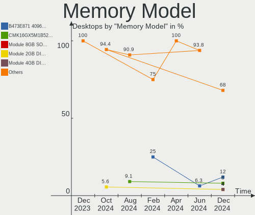

| Model                                                  | Desktops | Percent |
|--------------------------------------------------------|----------|---------|
| Unknown                                                | 3        | 12%     |
| Corsair RAM CMK16GX5M1B5200C40 16GB DIMM DDR5 4800MT/s | 2        | 8%      |
| Unknown RAM Module 8GB SODIMM DDR3 1600MT/s            | 1        | 4%      |
| Unknown RAM Module 2GB DIMM SDRAM                      | 1        | 4%      |
| SK hynix RAM Module 4GB DIMM DDR3 1600MT/s             | 1        | 4%      |
| Samsung RAM M471A1G43DB0-CPB 8GB SODIMM DDR4 3200MT/s  | 1        | 4%      |
| Micron RAM Module 16GB DIMM DDR4 2667MT/s              | 1        | 4%      |
| Lexar RAM LD4AS016G-H3200GST 16GB SODIMM DDR4 3200MT/s | 1        | 4%      |
| Kingston RAM KHX3600C17D4/8GX 8GB DIMM DDR4 3600MT/s   | 1        | 4%      |
| Kingston RAM KHX2133C14/8G 8GB DIMM DDR4 2666MT/s      | 1        | 4%      |
| Kingston RAM 9965684-005.A00G 8GB DIMM DDR4 2400MT/s   | 1        | 4%      |
| Kingston RAM 9905678-027.A00G 8GB DIMM DDR4 2133MT/s   | 1        | 4%      |
| Inte RAM Module 4GB SODIMM DDR3 1600MT/s               | 1        | 4%      |
| G.Skill RAM F5-6000J3040G32G 32GB DIMM DDR5 6000MT/s   | 1        | 4%      |
| G.Skill RAM F4-3200C16-16GVK 16GB DIMM DDR4 3600MT/s   | 1        | 4%      |
| Crucial RAM CT16G4DFS8266.C8FF 16GB DIMM DDR4 2133MT/s | 1        | 4%      |
| Corsair RAM CMK8GX4M1A2400C16 8GB DIMM DDR4 3066MT/s   | 1        | 4%      |
| Corsair RAM CMK32GX5M2E6000C36 16GB DIMM DDR5 4800MT/s | 1        | 4%      |
| Corsair RAM CMK16GX4M1E3200C16 16GB DIMM DDR4 3200MT/s | 1        | 4%      |
| A-DATA RAM DDR4 3200 8GB DIMM DDR4 3600MT/s            | 1        | 4%      |
| A-DATA RAM AX4U32008G16A-SR30 8GB DIMM DDR4 2400MT/s   | 1        | 4%      |
| A-DATA RAM AX4U320016G16A-SR30 16GB DIMM DDR4 2666MT/s | 1        | 4%      |

Memory Kind
-----------

Memory module kinds

| Kind  | Desktops | Percent |
|-------|----------|---------|
| DDR4  | 10       | 47.62%  |
| DDR5  | 5        | 23.81%  |
| DDR3  | 5        | 23.81%  |
| SDRAM | 1        | 4.76%   |

Memory Form Factor
------------------

Physical design of the memory module

| Name   | Desktops | Percent |
|--------|----------|---------|
| DIMM   | 17       | 80.95%  |
| SODIMM | 4        | 19.05%  |

Memory Size
-----------

Memory module size

| Size  | Desktops | Percent |
|-------|----------|---------|
| 16384 | 9        | 39.13%  |
| 8192  | 8        | 34.78%  |
| 4096  | 3        | 13.04%  |
| 32768 | 2        | 8.7%    |
| 2048  | 1        | 4.35%   |

Memory Speed
------------

Memory module speed

| Speed   | Desktops | Percent |
|---------|----------|---------|
| 1600    | 5        | 20.83%  |
| 4800    | 4        | 16.67%  |
| 3600    | 3        | 12.5%   |
| 3200    | 2        | 8.33%   |
| 2666    | 2        | 8.33%   |
| 2400    | 2        | 8.33%   |
| 2133    | 2        | 8.33%   |
| 6000    | 1        | 4.17%   |
| 3066    | 1        | 4.17%   |
| 2667    | 1        | 4.17%   |
| Unknown | 1        | 4.17%   |

Printers & scanners
-------------------

Printer Vendor
--------------

Printer device vendors

| Vendor             | Desktops | Percent |
|--------------------|----------|---------|
| Brother Industries | 1        | 100%    |

Printer Model
-------------

Printer device models

| Model              | Desktops | Percent |
|--------------------|----------|---------|
| Brother DCP-T820DW | 1        | 100%    |

Scanner Vendor
--------------

Scanner device vendors

Zero info for selected period =(

Scanner Model
-------------

Scanner device models

Zero info for selected period =(

Camera
------

Camera Vendor
-------------

Camera device vendors

| Vendor              | Desktops | Percent |
|---------------------|----------|---------|
| Logitech            | 5        | 71.43%  |
| Samsung Electronics | 1        | 14.29%  |
| MacroSilicon        | 1        | 14.29%  |

Camera Model
------------

Camera device models

| Model                                   | Desktops | Percent |
|-----------------------------------------|----------|---------|
| Logitech Webcam C270                    | 2        | 28.57%  |
| Logitech HD Pro Webcam C920             | 2        | 28.57%  |
| Samsung Galaxy series, misc. (MTP mode) | 1        | 14.29%  |
| MacroSilicon C3-1 USB3 Video            | 1        | 14.29%  |
| Logitech HD Webcam C525                 | 1        | 14.29%  |

Security
--------

Fingerprint Vendor
------------------

Fingerprint sensor vendors

Zero info for selected period =(

Fingerprint Model
-----------------

Fingerprint sensor models

Zero info for selected period =(

Chipcard Vendor
---------------

Chipcard module vendors

Zero info for selected period =(

Chipcard Model
--------------

Chipcard module models

Zero info for selected period =(

Unsupported
-----------

Unsupported Devices
-------------------

Total unsupported devices on board

| Total | Desktops | Percent |
|-------|----------|---------|
| 0     | 25       | 83.33%  |
| 1     | 5        | 16.67%  |

Unsupported Device Types
------------------------

Types of unsupported devices

| Type          | Desktops | Percent |
|---------------|----------|---------|
| Graphics card | 4        | 80%     |
| Net/wireless  | 1        | 20%     |

