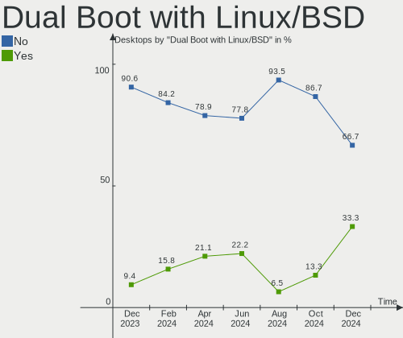
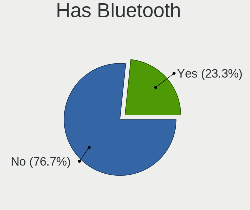
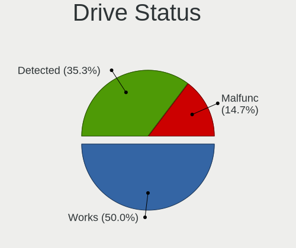
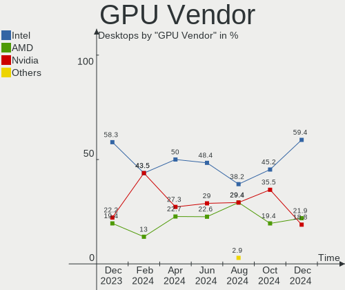
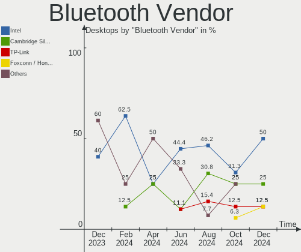
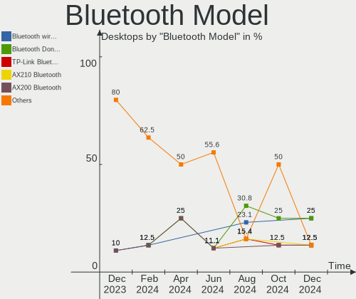
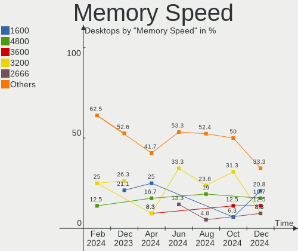

Linux in India - Hardware Trends (Desktops)
-------------------------------------------

A project to identify most popular hardware characteristics and track their change
over time based on data collected by Linux users at https://Linux-Hardware.org.

Anyone can contribute to this report by the [hw-probe](https://github.com/linuxhw/hw-probe) tool:

    sudo -E hw-probe -all -upload

Period: Apr, 2024.

Contents
--------

* [ System ](#system)
  - [ OS                       ](#os)
  - [ OS Family                ](#os-family)
  - [ Kernel                   ](#kernel)
  - [ Kernel Family            ](#kernel-family)
  - [ Kernel Major Ver.        ](#kernel-major-ver)
  - [ Arch                     ](#arch)
  - [ DE                       ](#de)
  - [ Display Server           ](#display-server)
  - [ Display Manager          ](#display-manager)
  - [ OS Lang                  ](#os-lang)
  - [ Boot Mode                ](#boot-mode)
  - [ Filesystem               ](#filesystem)
  - [ Part. scheme             ](#part-scheme)
  - [ Dual Boot with Linux/BSD ](#dual-boot-with-linuxbsd)
  - [ Dual Boot (Win)          ](#dual-boot-win)

* [ Board ](#board)
  - [ Vendor                   ](#vendor)
  - [ Model                    ](#model)
  - [ Model Family             ](#model-family)
  - [ MFG Year                 ](#mfg-year)
  - [ Form Factor              ](#form-factor)
  - [ Secure Boot              ](#secure-boot)
  - [ Coreboot                 ](#coreboot)
  - [ RAM Size                 ](#ram-size)
  - [ RAM Used                 ](#ram-used)
  - [ Total Drives             ](#total-drives)
  - [ Has CD-ROM               ](#has-cd-rom)
  - [ Has Ethernet             ](#has-ethernet)
  - [ Has WiFi                 ](#has-wifi)
  - [ Has Bluetooth            ](#has-bluetooth)

* [ Location ](#location)
  - [ Country                  ](#country)
  - [ City                     ](#city)

* [ Drives ](#drives)
  - [ Drive Vendor             ](#drive-vendor)
  - [ Drive Model              ](#drive-model)
  - [ HDD Vendor               ](#hdd-vendor)
  - [ SSD Vendor               ](#ssd-vendor)
  - [ Drive Kind               ](#drive-kind)
  - [ Drive Connector          ](#drive-connector)
  - [ Drive Size               ](#drive-size)
  - [ Space Total              ](#space-total)
  - [ Space Used               ](#space-used)
  - [ Malfunc. Drives          ](#malfunc-drives)
  - [ Malfunc. Drive Vendor    ](#malfunc-drive-vendor)
  - [ Malfunc. HDD Vendor      ](#malfunc-hdd-vendor)
  - [ Malfunc. Drive Kind      ](#malfunc-drive-kind)
  - [ Failed Drives            ](#failed-drives)
  - [ Failed Drive Vendor      ](#failed-drive-vendor)
  - [ Drive Status             ](#drive-status)

* [ Storage controller ](#storage-controller)
  - [ Storage Vendor           ](#storage-vendor)
  - [ Storage Model            ](#storage-model)
  - [ Storage Kind             ](#storage-kind)

* [ Processor ](#processor)
  - [ CPU Vendor               ](#cpu-vendor)
  - [ CPU Model                ](#cpu-model)
  - [ CPU Model Family         ](#cpu-model-family)
  - [ CPU Cores                ](#cpu-cores)
  - [ CPU Sockets              ](#cpu-sockets)
  - [ CPU Threads              ](#cpu-threads)
  - [ CPU Op-Modes             ](#cpu-op-modes)
  - [ CPU Microcode            ](#cpu-microcode)
  - [ CPU Microarch            ](#cpu-microarch)

* [ Graphics ](#graphics)
  - [ GPU Vendor               ](#gpu-vendor)
  - [ GPU Model                ](#gpu-model)
  - [ GPU Combo                ](#gpu-combo)
  - [ GPU Driver               ](#gpu-driver)
  - [ GPU Memory               ](#gpu-memory)

* [ Monitor ](#monitor)
  - [ Monitor Vendor           ](#monitor-vendor)
  - [ Monitor Model            ](#monitor-model)
  - [ Monitor Resolution       ](#monitor-resolution)
  - [ Monitor Diagonal         ](#monitor-diagonal)
  - [ Monitor Width            ](#monitor-width)
  - [ Aspect Ratio             ](#aspect-ratio)
  - [ Monitor Area             ](#monitor-area)
  - [ Pixel Density            ](#pixel-density)
  - [ Multiple Monitors        ](#multiple-monitors)

* [ Network ](#network)
  - [ Net Controller Vendor    ](#net-controller-vendor)
  - [ Net Controller Model     ](#net-controller-model)
  - [ Wireless Vendor          ](#wireless-vendor)
  - [ Wireless Model           ](#wireless-model)
  - [ Ethernet Vendor          ](#ethernet-vendor)
  - [ Ethernet Model           ](#ethernet-model)
  - [ Net Controller Kind      ](#net-controller-kind)
  - [ Used Controller          ](#used-controller)
  - [ NICs                     ](#nics)
  - [ IPv6                     ](#ipv6)

* [ Bluetooth ](#bluetooth)
  - [ Bluetooth Vendor         ](#bluetooth-vendor)
  - [ Bluetooth Model          ](#bluetooth-model)

* [ Sound ](#sound)
  - [ Sound Vendor             ](#sound-vendor)
  - [ Sound Model              ](#sound-model)

* [ Memory ](#memory)
  - [ Memory Vendor            ](#memory-vendor)
  - [ Memory Model             ](#memory-model)
  - [ Memory Kind              ](#memory-kind)
  - [ Memory Form Factor       ](#memory-form-factor)
  - [ Memory Size              ](#memory-size)
  - [ Memory Speed             ](#memory-speed)

* [ Printers & scanners ](#printers--scanners)
  - [ Printer Vendor           ](#printer-vendor)
  - [ Printer Model            ](#printer-model)
  - [ Scanner Vendor           ](#scanner-vendor)
  - [ Scanner Model            ](#scanner-model)

* [ Camera ](#camera)
  - [ Camera Vendor            ](#camera-vendor)
  - [ Camera Model             ](#camera-model)

* [ Security ](#security)
  - [ Fingerprint Vendor       ](#fingerprint-vendor)
  - [ Fingerprint Model        ](#fingerprint-model)
  - [ Chipcard Vendor          ](#chipcard-vendor)
  - [ Chipcard Model           ](#chipcard-model)

* [ Unsupported ](#unsupported)
  - [ Unsupported Devices      ](#unsupported-devices)
  - [ Unsupported Device Types ](#unsupported-device-types)

System
------

OS
--

Installed operating systems

| Name                         | Desktops | Percent |
|------------------------------|----------|---------|
| ArcoLinux Rolling            | 5        | 26.32%  |
| Ubuntu 22.04                 | 4        | 21.05%  |
| Zorin 17                     | 2        | 10.53%  |
| Ubuntu 20.04                 | 2        | 10.53%  |
| Nobara 39                    | 2        | 10.53%  |
| RHEL 9                       | 1        | 5.26%   |
| openSUSE Tumbleweed-XXXXXXXX | 1        | 5.26%   |
| Manjaro                      | 1        | 5.26%   |
| Arch Rolling                 | 1        | 5.26%   |

OS Family
---------

OS without a version

| Name      | Desktops | Percent |
|-----------|----------|---------|
| Ubuntu    | 6        | 31.58%  |
| ArcoLinux | 5        | 26.32%  |
| Zorin     | 2        | 10.53%  |
| Nobara    | 2        | 10.53%  |
| RHEL      | 1        | 5.26%   |
| openSUSE  | 1        | 5.26%   |
| Manjaro   | 1        | 5.26%   |
| Arch      | 1        | 5.26%   |

Kernel
------

Version of the Linux kernel

| Version                      | Desktops | Percent |
|------------------------------|----------|---------|
| 6.5.0-27-generic             | 3        | 15.79%  |
| 6.8.7-arch1-1                | 2        | 10.53%  |
| 6.7.9-arch1-1                | 2        | 10.53%  |
| 6.5.0-28-generic             | 2        | 10.53%  |
| 6.8.8-zen1-1-zen             | 1        | 5.26%   |
| 6.8.7-1-clear                | 1        | 5.26%   |
| 6.8.1-1-default              | 1        | 5.26%   |
| 6.7.6-201.fsync.fc39.x86_64  | 1        | 5.26%   |
| 6.7.0-204.fsync.fc39.x86_64  | 1        | 5.26%   |
| 6.5.0-26-generic             | 1        | 5.26%   |
| 5.4.270-1-MANJARO            | 1        | 5.26%   |
| 5.15.0-105-generic           | 1        | 5.26%   |
| 5.15.0-101-generic           | 1        | 5.26%   |
| 5.14.0-362.24.1.el9_3.x86_64 | 1        | 5.26%   |

Kernel Family
-------------

Linux kernel without a distro release

| Version | Desktops | Percent |
|---------|----------|---------|
| 6.5.0   | 6        | 31.58%  |
| 6.8.7   | 3        | 15.79%  |
| 6.7.9   | 2        | 10.53%  |
| 5.15.0  | 2        | 10.53%  |
| 6.8.8   | 1        | 5.26%   |
| 6.8.1   | 1        | 5.26%   |
| 6.7.6   | 1        | 5.26%   |
| 6.7.0   | 1        | 5.26%   |
| 5.4.270 | 1        | 5.26%   |
| 5.14.0  | 1        | 5.26%   |

Kernel Major Ver.
-----------------

Linux kernel major version

| Version | Desktops | Percent |
|---------|----------|---------|
| 6.5     | 6        | 31.58%  |
| 6.8     | 5        | 26.32%  |
| 6.7     | 4        | 21.05%  |
| 5.15    | 2        | 10.53%  |
| 5.4     | 1        | 5.26%   |
| 5.14    | 1        | 5.26%   |

Arch
----

OS architecture (x86_64, i586, etc.)

| Name   | Desktops | Percent |
|--------|----------|---------|
| x86_64 | 19       | 100%    |

DE
--

Desktop Environment

| Name     | Desktops | Percent |
|----------|----------|---------|
| GNOME    | 10       | 52.63%  |
| XFCE     | 4        | 21.05%  |
| KDE6     | 2        | 10.53%  |
| KDE5     | 2        | 10.53%  |
| Cinnamon | 1        | 5.26%   |

Display Server
--------------

X11 or Wayland

| Name    | Desktops | Percent |
|---------|----------|---------|
| Wayland | 12       | 63.16%  |
| X11     | 6        | 31.58%  |
| Unknown | 1        | 5.26%   |

Display Manager
---------------

SDDM, LightDM, etc.

| Name    | Desktops | Percent |
|---------|----------|---------|
| SDDM    | 6        | 31.58%  |
| Unknown | 5        | 26.32%  |
| GDM3    | 4        | 21.05%  |
| GDM     | 3        | 15.79%  |
| LightDM | 1        | 5.26%   |

OS Lang
-------

Language

| Lang  | Desktops | Percent |
|-------|----------|---------|
| en_IN | 11       | 57.89%  |
| en_US | 3        | 15.79%  |
| en_GB | 3        | 15.79%  |
| C     | 2        | 10.53%  |

Boot Mode
---------

EFI or BIOS

| Mode | Desktops | Percent |
|------|----------|---------|
| BIOS | 10       | 52.63%  |
| EFI  | 9        | 47.37%  |

Filesystem
----------

Type of filesystem

| Type    | Desktops | Percent |
|---------|----------|---------|
| Ext4    | 8        | 42.11%  |
| Btrfs   | 5        | 26.32%  |
| Tmpfs   | 3        | 15.79%  |
| Overlay | 2        | 10.53%  |
| Xfs     | 1        | 5.26%   |

Part. scheme
------------

Scheme of partitioning

| Type    | Desktops | Percent |
|---------|----------|---------|
| GPT     | 13       | 68.42%  |
| Unknown | 5        | 26.32%  |
| MBR     | 1        | 5.26%   |

Dual Boot with Linux/BSD
------------------------

Hosting more than one Linux/BSD

| Dual boot | Desktops | Percent |
|-----------|----------|---------|
| No        | 15       | 78.95%  |
| Yes       | 4        | 21.05%  |

Dual Boot (Win)
---------------

Hosting Linux and Windows

| Dual boot | Desktops | Percent |
|-----------|----------|---------|
| No        | 14       | 73.68%  |
| Yes       | 5        | 26.32%  |

Board
-----

Vendor
------

Motherboard manufacturer

| Name                | Desktops | Percent |
|---------------------|----------|---------|
| ASUSTek Computer    | 4        | 21.05%  |
| Intel               | 3        | 15.79%  |
| Dell                | 3        | 15.79%  |
| MSI                 | 2        | 10.53%  |
| Gigabyte Technology | 2        | 10.53%  |
| Biostar             | 2        | 10.53%  |
| Hewlett-Packard     | 1        | 5.26%   |
| ASRock              | 1        | 5.26%   |
| Acer                | 1        | 5.26%   |

Model
-----

Motherboard model

| Name                            | Desktops | Percent |
|---------------------------------|----------|---------|
| Intel H61                       | 2        | 10.53%  |
| MSI MS-7D67                     | 1        | 5.26%   |
| MSI MS-7A36                     | 1        | 5.26%   |
| Intel H61S                      | 1        | 5.26%   |
| HP 18E4                         | 1        | 5.26%   |
| Gigabyte H110M-S2               | 1        | 5.26%   |
| Gigabyte B760M D2H              | 1        | 5.26%   |
| Dell OptiPlex 9010              | 1        | 5.26%   |
| Dell OptiPlex 5040              | 1        | 5.26%   |
| Dell OptiPlex 3070              | 1        | 5.26%   |
| Biostar TP43E Combo             | 1        | 5.26%   |
| Biostar H61MLC                  | 1        | 5.26%   |
| ASUS TUF Gaming X670E-PLUS WIFI | 1        | 5.26%   |
| ASUS PRIME H510M-E              | 1        | 5.26%   |
| ASUS M4A88TD-V EVO/USB3         | 1        | 5.26%   |
| ASUS H110M-CS                   | 1        | 5.26%   |
| ASRock B450M-HDV R4.0           | 1        | 5.26%   |
| Acer Veriton M200-H81           | 1        | 5.26%   |

Model Family
------------

Motherboard model prefix

| Name              | Desktops | Percent |
|-------------------|----------|---------|
| Dell OptiPlex     | 3        | 15.79%  |
| Intel H61         | 2        | 10.53%  |
| MSI MS-7D67       | 1        | 5.26%   |
| MSI MS-7A36       | 1        | 5.26%   |
| Intel H61S        | 1        | 5.26%   |
| HP 18E4           | 1        | 5.26%   |
| Gigabyte H110M-S2 | 1        | 5.26%   |
| Gigabyte B760M    | 1        | 5.26%   |
| Biostar TP43E     | 1        | 5.26%   |
| Biostar H61MLC    | 1        | 5.26%   |
| ASUS TUF          | 1        | 5.26%   |
| ASUS PRIME        | 1        | 5.26%   |
| ASUS M4A88TD-V    | 1        | 5.26%   |
| ASUS H110M-CS     | 1        | 5.26%   |
| ASRock B450M-HDV  | 1        | 5.26%   |
| Acer Veriton      | 1        | 5.26%   |

MFG Year
--------

Motherboard manufacture year

| Year | Desktops | Percent |
|------|----------|---------|
| 2022 | 3        | 15.79%  |
| 2019 | 2        | 10.53%  |
| 2018 | 2        | 10.53%  |
| 2017 | 2        | 10.53%  |
| 2016 | 2        | 10.53%  |
| 2014 | 2        | 10.53%  |
| 2010 | 2        | 10.53%  |
| 2023 | 1        | 5.26%   |
| 2021 | 1        | 5.26%   |
| 2013 | 1        | 5.26%   |
| 2011 | 1        | 5.26%   |

Form Factor
-----------

Physical design of the computer

| Name    | Desktops | Percent |
|---------|----------|---------|
| Desktop | 19       | 100%    |

Secure Boot
-----------

Enabled or disabled

| State    | Desktops | Percent |
|----------|----------|---------|
| Disabled | 17       | 89.47%  |
| Enabled  | 2        | 10.53%  |

Coreboot
--------

Have coreboot on board

| Used | Desktops | Percent |
|------|----------|---------|
| No   | 19       | 100%    |

RAM Size
--------

Total RAM memory

| Size in GB  | Desktops | Percent |
|-------------|----------|---------|
| 4.01-8.0    | 5        | 26.32%  |
| 8.01-16.0   | 5        | 26.32%  |
| 3.01-4.0    | 4        | 21.05%  |
| 16.01-24.0  | 3        | 15.79%  |
| 64.01-256.0 | 2        | 10.53%  |

RAM Used
--------

Used RAM memory

| Used GB  | Desktops | Percent |
|----------|----------|---------|
| 2.01-3.0 | 7        | 36.84%  |
| 1.01-2.0 | 6        | 31.58%  |
| 4.01-8.0 | 3        | 15.79%  |
| 0.51-1.0 | 2        | 10.53%  |
| 3.01-4.0 | 1        | 5.26%   |

Total Drives
------------

Number of drives on board

| Drives | Desktops | Percent |
|--------|----------|---------|
| 1      | 10       | 52.63%  |
| 2      | 7        | 36.84%  |
| 3      | 1        | 5.26%   |
| 0      | 1        | 5.26%   |

Has CD-ROM
----------

Has CD-ROM on board

| Presented | Desktops | Percent |
|-----------|----------|---------|
| No        | 13       | 68.42%  |
| Yes       | 6        | 31.58%  |

Has Ethernet
------------

Has Ethernet on board

| Presented | Desktops | Percent |
|-----------|----------|---------|
| Yes       | 19       | 100%    |

Has WiFi
--------

Has WiFi module

| Presented | Desktops | Percent |
|-----------|----------|---------|
| No        | 10       | 52.63%  |
| Yes       | 9        | 47.37%  |

Has Bluetooth
-------------

Has Bluetooth module

| Presented | Desktops | Percent |
|-----------|----------|---------|
| No        | 15       | 78.95%  |
| Yes       | 4        | 21.05%  |

Location
--------

Country
-------

Geographic location (country)

| Country | Desktops | Percent |
|---------|----------|---------|
| India   | 19       | 100%    |

City
----

Geographic location (city)

| City      | Desktops | Percent |
|-----------|----------|---------|
| Kolkata   | 4        | 21.05%  |
| Bengaluru | 4        | 21.05%  |
| Delhi     | 3        | 15.79%  |
| Thrissur  | 2        | 10.53%  |
| Satna     | 1        | 5.26%   |
| Pune      | 1        | 5.26%   |
| Kollam    | 1        | 5.26%   |
| Kochi     | 1        | 5.26%   |
| Indore    | 1        | 5.26%   |
| Hyderabad | 1        | 5.26%   |

Drives
------

Drive Vendor
------------

Hard drive vendors

| Vendor                    | Desktops | Drives | Percent |
|---------------------------|----------|--------|---------|
| Seagate                   | 5        | 5      | 19.23%  |
| WDC                       | 4        | 5      | 15.38%  |
| Crucial                   | 4        | 4      | 15.38%  |
| Toshiba                   | 3        | 3      | 11.54%  |
| Sandisk                   | 3        | 3      | 11.54%  |
| Samsung Electronics       | 1        | 1      | 3.85%   |
| Realtek Semiconductor     | 1        | 1      | 3.85%   |
| Micron/Crucial Technology | 1        | 1      | 3.85%   |
| Maxtor                    | 1        | 1      | 3.85%   |
| Kingston                  | 1        | 1      | 3.85%   |
| Hewlett-Packard           | 1        | 1      | 3.85%   |
| Unknown                   | 1        | 1      | 3.85%   |

Drive Model
-----------

Hard drive models

| Model                               | Desktops | Percent |
|-------------------------------------|----------|---------|
| Toshiba DT01ACA100 1TB              | 2        | 7.41%   |
| WDC WDS120G2G0A-00JH30 120GB SSD    | 1        | 3.7%    |
| WDC WD5000AAKX-22ERMA0 500GB        | 1        | 3.7%    |
| WDC WD20EZBX-00AYRA0 2TB            | 1        | 3.7%    |
| WDC WD10EZRX-00L4HB0 1TB            | 1        | 3.7%    |
| WDC WD10EZEX-22MFCA0 1TB            | 1        | 3.7%    |
| Toshiba DT01ACA050 500GB            | 1        | 3.7%    |
| Seagate ST500DM002-1SB10A 500GB     | 1        | 3.7%    |
| Seagate ST500DM002-1BD142 500GB     | 1        | 3.7%    |
| Seagate ST4000DM004-2CV104 4TB      | 1        | 3.7%    |
| Seagate ST3160815AS 160GB           | 1        | 3.7%    |
| Seagate ST2000DM008-2FR102 2TB      | 1        | 3.7%    |
| Sandisk WD_BLACK SN850X 1000GB      | 1        | 3.7%    |
| Sandisk WD_BLACK SN770 2TB          | 1        | 3.7%    |
| SanDisk NVMe SSD Drive 1TB          | 1        | 3.7%    |
| Samsung MZVL4512HBLU-00BH1 512GB    | 1        | 3.7%    |
| Realtek ADATA SWORDFISH 250GB       | 1        | 3.7%    |
| Micron/Crucial P2 NVMe PCIe SSD 4TB | 1        | 3.7%    |
| Maxtor 6Y120M0 122GB                | 1        | 3.7%    |
| Kingston SA400S37480G 480GB SSD     | 1        | 3.7%    |
| HP SSD S700 500GB                   | 1        | 3.7%    |
| Crucial CT500BX500SSD1 500GB        | 1        | 3.7%    |
| Crucial CT480BX500SSD1 480GB        | 1        | 3.7%    |
| Crucial CT3500SC 500GB SSD          | 1        | 3.7%    |
| Crucial CT1000MX500SSD1 1TB         | 1        | 3.7%    |
| Unknown                             | 1        | 3.7%    |

HDD Vendor
----------

Hard disk drive vendors

| Vendor  | Desktops | Drives | Percent |
|---------|----------|--------|---------|
| Seagate | 5        | 5      | 38.46%  |
| WDC     | 4        | 4      | 30.77%  |
| Toshiba | 3        | 3      | 23.08%  |
| Maxtor  | 1        | 1      | 7.69%   |

SSD Vendor
----------

Solid state drive vendors

| Vendor          | Desktops | Drives | Percent |
|-----------------|----------|--------|---------|
| Crucial         | 4        | 4      | 50%     |
| WDC             | 1        | 1      | 12.5%   |
| Kingston        | 1        | 1      | 12.5%   |
| Hewlett-Packard | 1        | 1      | 12.5%   |
| Unknown         | 1        | 1      | 12.5%   |

Drive Kind
----------

HDD or SSD

| Kind | Desktops | Drives | Percent |
|------|----------|--------|---------|
| HDD  | 13       | 13     | 52%     |
| NVMe | 6        | 6      | 24%     |
| SSD  | 6        | 8      | 24%     |

Drive Connector
---------------

SATA, SAS, NVMe, etc.

| Type | Desktops | Drives | Percent |
|------|----------|--------|---------|
| SATA | 17       | 21     | 73.91%  |
| NVMe | 6        | 6      | 26.09%  |

Drive Size
----------

Size of hard drive

| Size in TB | Desktops | Drives | Percent |
|------------|----------|--------|---------|
| 0.01-0.5   | 11       | 13     | 57.89%  |
| 0.51-1.0   | 5        | 5      | 26.32%  |
| 1.01-2.0   | 2        | 2      | 10.53%  |
| 3.01-4.0   | 1        | 1      | 5.26%   |

Space Total
-----------

Amount of disk space available on the file system

| Size in GB     | Desktops | Percent |
|----------------|----------|---------|
| 251-500        | 4        | 21.05%  |
| 101-250        | 4        | 21.05%  |
| 501-1000       | 4        | 21.05%  |
| 1001-2000      | 2        | 10.53%  |
| 1-20           | 2        | 10.53%  |
| More than 3000 | 1        | 5.26%   |
| 2001-3000      | 1        | 5.26%   |
| 51-100         | 1        | 5.26%   |

Space Used
----------

Amount of used disk space

| Used GB        | Desktops | Percent |
|----------------|----------|---------|
| 21-50          | 6        | 31.58%  |
| 1-20           | 5        | 26.32%  |
| 251-500        | 3        | 15.79%  |
| 101-250        | 2        | 10.53%  |
| 51-100         | 2        | 10.53%  |
| More than 3000 | 1        | 5.26%   |

Malfunc. Drives
---------------

Drive models with a malfunction

| Model                           | Desktops | Drives | Percent |
|---------------------------------|----------|--------|---------|
| WDC WD5000AAKX-22ERMA0 500GB    | 1        | 1      | 25%     |
| Seagate ST500DM002-1BD142 500GB | 1        | 1      | 25%     |
| Seagate ST3160815AS 160GB       | 1        | 1      | 25%     |
| Kingston SA400S37480G 480GB SSD | 1        | 1      | 25%     |

Malfunc. Drive Vendor
---------------------

Vendors of faulty drives

| Vendor   | Desktops | Drives | Percent |
|----------|----------|--------|---------|
| Seagate  | 2        | 2      | 50%     |
| WDC      | 1        | 1      | 25%     |
| Kingston | 1        | 1      | 25%     |

Malfunc. HDD Vendor
-------------------

Vendors of faulty HDD drives

| Vendor  | Desktops | Drives | Percent |
|---------|----------|--------|---------|
| Seagate | 2        | 2      | 66.67%  |
| WDC     | 1        | 1      | 33.33%  |

Malfunc. Drive Kind
-------------------

Kinds of faulty drives

| Kind | Desktops | Drives | Percent |
|------|----------|--------|---------|
| HDD  | 3        | 3      | 75%     |
| SSD  | 1        | 1      | 25%     |

Failed Drives
-------------

Failed drive models

Zero info for selected period =(

Failed Drive Vendor
-------------------

Failed drive vendors

Zero info for selected period =(

Drive Status
------------

Number of failed and malfunc. drives

| Status   | Desktops | Drives | Percent |
|----------|----------|--------|---------|
| Detected | 9        | 11     | 45%     |
| Works    | 7        | 12     | 35%     |
| Malfunc  | 4        | 4      | 20%     |

Storage controller
------------------

Storage Vendor
--------------

Storage controller vendors

| Vendor                    | Desktops | Percent |
|---------------------------|----------|---------|
| Intel                     | 14       | 50%     |
| AMD                       | 5        | 17.86%  |
| Sandisk                   | 3        | 10.71%  |
| VIA Technologies          | 1        | 3.57%   |
| Samsung Electronics       | 1        | 3.57%   |
| Realtek Semiconductor     | 1        | 3.57%   |
| Micron/Crucial Technology | 1        | 3.57%   |
| JMicron Technology        | 1        | 3.57%   |
| ASMedia Technology        | 1        | 3.57%   |

Storage Model
-------------

Storage controller models

| Model                                                                                   | Desktops | Percent |
|-----------------------------------------------------------------------------------------|----------|---------|
| Intel Q170/Q150/B150/H170/H110/Z170/CM236 Chipset SATA Controller [AHCI Mode]           | 3        | 9.68%   |
| Intel 6 Series/C200 Series Chipset Family 6 port Desktop SATA AHCI Controller           | 3        | 9.68%   |
| Sandisk WD Black SN850X NVMe SSD                                                        | 2        | 6.45%   |
| Intel 8 Series/C220 Series Chipset Family 6-port SATA Controller 1 [AHCI mode]          | 2        | 6.45%   |
| AMD 600 Series Chipset SATA Controller                                                  | 2        | 6.45%   |
| VIA VT6415 PATA IDE Host Controller                                                     | 1        | 3.23%   |
| SanDisk WD Black SN770 / PC SN740 256GB / PC SN560 (DRAM-less) NVMe SSD                 | 1        | 3.23%   |
| Samsung NVMe SSD Controller PM9B1 (DRAM-less)                                           | 1        | 3.23%   |
| Realtek RTS5765DL NVMe SSD Controller (DRAM-less)                                       | 1        | 3.23%   |
| Micron/Crucial P2 [Nick P2] / P3 / P3 Plus NVMe PCIe SSD (DRAM-less)                    | 1        | 3.23%   |
| JMicron JMB368 IDE controller                                                           | 1        | 3.23%   |
| Intel SATA Controller [RAID mode]                                                       | 1        | 3.23%   |
| Intel Raptor Lake SATA AHCI Controller                                                  | 1        | 3.23%   |
| Intel Cannon Lake PCH SATA AHCI Controller                                              | 1        | 3.23%   |
| Intel 82801JI (ICH10 Family) SATA AHCI Controller                                       | 1        | 3.23%   |
| Intel 6 Series/C200 Series Chipset Family Desktop SATA Controller (IDE mode, ports 4-5) | 1        | 3.23%   |
| Intel 6 Series/C200 Series Chipset Family Desktop SATA Controller (IDE mode, ports 0-3) | 1        | 3.23%   |
| Intel 500 Series Chipset Family SATA AHCI Controller                                    | 1        | 3.23%   |
| ASMedia ASM1061/ASM1062 Serial ATA Controller                                           | 1        | 3.23%   |
| AMD SB7x0/SB8x0/SB9x0 SATA Controller [IDE mode]                                        | 1        | 3.23%   |
| AMD SB7x0/SB8x0/SB9x0 IDE Controller                                                    | 1        | 3.23%   |
| AMD FCH SATA Controller [AHCI mode]                                                     | 1        | 3.23%   |
| AMD FCH SATA Controller D                                                               | 1        | 3.23%   |
| AMD 400 Series Chipset SATA Controller                                                  | 1        | 3.23%   |

Storage Kind
------------

Kind of storage controller (IDE, SATA, NVMe, SAS, ...)

| Kind | Desktops | Percent |
|------|----------|---------|
| SATA | 17       | 62.96%  |
| NVMe | 6        | 22.22%  |
| IDE  | 3        | 11.11%  |
| RAID | 1        | 3.7%    |

Processor
---------

CPU Vendor
----------

Processor vendors

| Vendor | Desktops | Percent |
|--------|----------|---------|
| Intel  | 14       | 73.68%  |
| AMD    | 5        | 26.32%  |

CPU Model
---------

Processor models

| Model                                       | Desktops | Percent |
|---------------------------------------------|----------|---------|
| Intel Core i3-7100 CPU @ 3.90GHz            | 2        | 10.53%  |
| Intel Core i7-9700 CPU @ 3.00GHz            | 1        | 5.26%   |
| Intel Core i5-6500 CPU @ 3.20GHz            | 1        | 5.26%   |
| Intel Core i5-4570 CPU @ 3.20GHz            | 1        | 5.26%   |
| Intel Core i5-3470S CPU @ 2.90GHz           | 1        | 5.26%   |
| Intel Core i5-3470 CPU @ 3.20GHz            | 1        | 5.26%   |
| Intel Core i5-2320 CPU @ 3.00GHz            | 1        | 5.26%   |
| Intel Core i3-4130 CPU @ 3.40GHz            | 1        | 5.26%   |
| Intel Core i3-3220 CPU @ 3.30GHz            | 1        | 5.26%   |
| Intel Core i3-2100 CPU @ 3.10GHz            | 1        | 5.26%   |
| Intel Core 2 Duo CPU E8500 @ 3.16GHz        | 1        | 5.26%   |
| Intel 12th Gen Core i5-12400                | 1        | 5.26%   |
| Intel 11th Gen Core i5-11400 @ 2.60GHz      | 1        | 5.26%   |
| AMD Ryzen 9 7950X 16-Core Processor         | 1        | 5.26%   |
| AMD Ryzen 9 7900X 12-Core Processor         | 1        | 5.26%   |
| AMD Ryzen 5 4600G with Radeon Graphics      | 1        | 5.26%   |
| AMD Ryzen 5 2400G with Radeon Vega Graphics | 1        | 5.26%   |
| AMD Phenom II X6 1075T Processor            | 1        | 5.26%   |

CPU Model Family
----------------

Processor model prefix

| Model            | Desktops | Percent |
|------------------|----------|---------|
| Intel Core i5    | 5        | 26.32%  |
| Intel Core i3    | 5        | 26.32%  |
| Other            | 2        | 10.53%  |
| AMD Ryzen 9      | 2        | 10.53%  |
| AMD Ryzen 5      | 2        | 10.53%  |
| Intel Core i7    | 1        | 5.26%   |
| Intel Core 2 Duo | 1        | 5.26%   |
| AMD Phenom II X6 | 1        | 5.26%   |

CPU Cores
---------

Number of processor cores

| Number | Desktops | Percent |
|--------|----------|---------|
| 4      | 6        | 31.58%  |
| 2      | 6        | 31.58%  |
| 6      | 4        | 21.05%  |
| 16     | 1        | 5.26%   |
| 12     | 1        | 5.26%   |
| 8      | 1        | 5.26%   |

CPU Sockets
-----------

Number of sockets

| Number | Desktops | Percent |
|--------|----------|---------|
| 1      | 19       | 100%    |

CPU Threads
-----------

Threads per core (Hyper-Threading)

| Number | Desktops | Percent |
|--------|----------|---------|
| 2      | 11       | 57.89%  |
| 1      | 8        | 42.11%  |

CPU Op-Modes
------------

CPU Operation Modes (32-bit, 64-bit)

| Op mode        | Desktops | Percent |
|----------------|----------|---------|
| 32-bit, 64-bit | 19       | 100%    |

CPU Microcode
-------------

Microcode number

| Number     | Desktops | Percent |
|------------|----------|---------|
| Unknown    | 17       | 89.47%  |
| 0x306c3    | 1        | 5.26%   |
| 0x0a601203 | 1        | 5.26%   |

CPU Microarch
-------------

Microarchitecture

| Name        | Desktops | Percent |
|-------------|----------|---------|
| KabyLake    | 3        | 15.79%  |
| IvyBridge   | 3        | 15.79%  |
| Unknown     | 3        | 15.79%  |
| SandyBridge | 2        | 10.53%  |
| Haswell     | 2        | 10.53%  |
| Zen 2       | 1        | 5.26%   |
| Zen         | 1        | 5.26%   |
| Skylake     | 1        | 5.26%   |
| Penryn      | 1        | 5.26%   |
| K10         | 1        | 5.26%   |
| Icelake     | 1        | 5.26%   |

Graphics
--------

GPU Vendor
----------

Vendors of graphics cards

| Vendor | Desktops | Percent |
|--------|----------|---------|
| Intel  | 11       | 50%     |
| Nvidia | 6        | 27.27%  |
| AMD    | 5        | 22.73%  |

GPU Model
---------

Graphics card models

| Model                                                                       | Desktops | Percent |
|-----------------------------------------------------------------------------|----------|---------|
| Nvidia GF119 [GeForce GT 610]                                               | 3        | 13.64%  |
| Intel HD Graphics 630                                                       | 2        | 9.09%   |
| Intel 2nd Generation Core Processor Family Integrated Graphics Controller   | 2        | 9.09%   |
| AMD Raphael                                                                 | 2        | 9.09%   |
| Nvidia TU117 [GeForce GTX 1650]                                             | 1        | 4.55%   |
| Nvidia GA102 [GeForce RTX 3080]                                             | 1        | 4.55%   |
| Nvidia AD104 [GeForce RTX 4070 SUPER]                                       | 1        | 4.55%   |
| Intel Xeon E3-1200 v3/4th Gen Core Processor Integrated Graphics Controller | 1        | 4.55%   |
| Intel Xeon E3-1200 v2/3rd Gen Core processor Graphics Controller            | 1        | 4.55%   |
| Intel RocketLake-S GT1 [UHD Graphics 730]                                   | 1        | 4.55%   |
| Intel HD Graphics 530                                                       | 1        | 4.55%   |
| Intel CoffeeLake-S GT2 [UHD Graphics 630]                                   | 1        | 4.55%   |
| Intel Alder Lake-S GT1 [UHD Graphics 730]                                   | 1        | 4.55%   |
| Intel 4th Generation Core Processor Family Integrated Graphics Controller   | 1        | 4.55%   |
| AMD RS880 [Radeon HD 4250]                                                  | 1        | 4.55%   |
| AMD Renoir [Radeon RX Vega 6 (Ryzen 4000/5000 Mobile Series)]               | 1        | 4.55%   |
| AMD Cypress PRO [Radeon HD 5850]                                            | 1        | 4.55%   |

GPU Combo
---------

Combinations of graphics cards

| Name           | Desktops | Percent |
|----------------|----------|---------|
| 1 x Intel      | 10       | 52.63%  |
| 1 x Nvidia     | 3        | 15.79%  |
| 1 x AMD        | 3        | 15.79%  |
| AMD + Nvidia   | 2        | 10.53%  |
| Intel + Nvidia | 1        | 5.26%   |

GPU Driver
----------

Free vs proprietary

| Driver      | Desktops | Percent |
|-------------|----------|---------|
| Free        | 16       | 84.21%  |
| Proprietary | 2        | 10.53%  |
| Unknown     | 1        | 5.26%   |

GPU Memory
----------

Total video memory

| Size in GB | Desktops | Percent |
|------------|----------|---------|
| Unknown    | 13       | 68.42%  |
| 0.01-0.5   | 2        | 10.53%  |
| 3.01-4.0   | 1        | 5.26%   |
| 1.01-2.0   | 1        | 5.26%   |
| 8.01-16.0  | 1        | 5.26%   |
| 0.51-1.0   | 1        | 5.26%   |

Monitor
-------

Monitor Vendor
--------------

Monitor vendors

| Vendor              | Desktops | Percent |
|---------------------|----------|---------|
| Goldstar            | 5        | 27.78%  |
| Hewlett-Packard     | 2        | 11.11%  |
| BenQ                | 2        | 11.11%  |
| Acer                | 2        | 11.11%  |
| ViewSonic           | 1        | 5.56%   |
| SKY                 | 1        | 5.56%   |
| SGT                 | 1        | 5.56%   |
| Samsung Electronics | 1        | 5.56%   |
| Lenovo              | 1        | 5.56%   |
| Dell                | 1        | 5.56%   |
| ASUSTek Computer    | 1        | 5.56%   |

Monitor Model
-------------

Monitor models

| Model                                                             | Desktops | Percent |
|-------------------------------------------------------------------|----------|---------|
| Goldstar E2042 GSM4ED7 1600x900 443x249mm 20.0-inch               | 2        | 11.11%  |
| ViewSonic VA1903a VSC8A31 1366x768 410x230mm 18.5-inch            | 1        | 5.56%   |
| SKY TV MONITOR SKY0030 3840x2160 1150x650mm 52.0-inch             | 1        | 5.56%   |
| SGT HDMI SGT2383 1280x768 360x250mm 17.3-inch                     | 1        | 5.56%   |
| Samsung Electronics C24F390 SAM0D2D 1920x1080 521x293mm 23.5-inch | 1        | 5.56%   |
| Lenovo LEN T2054pC LEN60D9 1440x900 419x262mm 19.5-inch           | 1        | 5.56%   |
| Hewlett-Packard V192 HWP311E 1366x768 410x230mm 18.5-inch         | 1        | 5.56%   |
| Hewlett-Packard 22fw HPN3542 1920x1080 476x267mm 21.5-inch        | 1        | 5.56%   |
| Goldstar IPS WSXGA GSM5B20 1440x900 419x262mm 19.5-inch           | 1        | 5.56%   |
| Goldstar FULL HD GSM5B55 1920x1080 480x270mm 21.7-inch            | 1        | 5.56%   |
| Goldstar FHD GSM5BC9 1920x1080 480x270mm 21.7-inch                | 1        | 5.56%   |
| Dell E2418HN DELA105 1920x1080 527x296mm 23.8-inch                | 1        | 5.56%   |
| BenQ GW2480L BNQ78F2 1920x1080 527x296mm 23.8-inch                | 1        | 5.56%   |
| BenQ EX2710S BNQ7FA4 1920x1080 600x340mm 27.2-inch                | 1        | 5.56%   |
| ASUSTek Computer VG27AQL1A AUS2705 2560x1440 597x336mm 27.0-inch  | 1        | 5.56%   |
| Acer V196HQL ACR033D 1366x768 410x230mm 18.5-inch                 | 1        | 5.56%   |
| Acer K202HQLA ACR0498 1366x768 434x236mm 19.4-inch                | 1        | 5.56%   |

Monitor Resolution
------------------

Monitor screen resolution

| Resolution         | Desktops | Percent |
|--------------------|----------|---------|
| 1920x1080 (FHD)    | 6        | 33.33%  |
| 1366x768 (WXGA)    | 4        | 22.22%  |
| 3840x2160 (4K)     | 2        | 11.11%  |
| 1600x900 (HD+)     | 2        | 11.11%  |
| 1440x900 (WXGA+)   | 2        | 11.11%  |
| 2560x1440 (QHD)    | 1        | 5.56%   |
| 1680x1050 (WSXGA+) | 1        | 5.56%   |

Monitor Diagonal
----------------

Diagonal size in inches

| Inches | Desktops | Percent |
|--------|----------|---------|
| 21     | 3        | 16.67%  |
| 19     | 3        | 16.67%  |
| 18     | 3        | 16.67%  |
| 27     | 2        | 11.11%  |
| 23     | 2        | 11.11%  |
| 20     | 2        | 11.11%  |
| 52     | 1        | 5.56%   |
| 26     | 1        | 5.56%   |
| 24     | 1        | 5.56%   |

Monitor Width
-------------

Physical width

| Width in mm | Desktops | Percent |
|-------------|----------|---------|
| 401-500     | 11       | 61.11%  |
| 501-600     | 6        | 33.33%  |
| 1001-1500   | 1        | 5.56%   |

Aspect Ratio
------------

Proportional relationship between the width and the height

| Ratio | Desktops | Percent |
|-------|----------|---------|
| 16/9  | 15       | 83.33%  |
| 16/10 | 2        | 11.11%  |
| 2.00  | 1        | 5.56%   |

Monitor Area
------------

Area in inch²

| Area in inch² | Desktops | Percent |
|----------------|----------|---------|
| 151-200        | 6        | 33.33%  |
| 201-250        | 5        | 27.78%  |
| 141-150        | 3        | 16.67%  |
| 301-350        | 2        | 11.11%  |
| More than 1000 | 1        | 5.56%   |
| 251-300        | 1        | 5.56%   |

Pixel Density
-------------

Pixels per inch

| Density | Desktops | Percent |
|---------|----------|---------|
| 51-100  | 14       | 77.78%  |
| 101-120 | 4        | 22.22%  |

Multiple Monitors
-----------------

Total monitors connected

| Total | Desktops | Percent |
|-------|----------|---------|
| 1     | 18       | 94.74%  |
| 0     | 1        | 5.26%   |

Network
-------

Net Controller Vendor
---------------------

Controller vendors

| Vendor                | Desktops | Percent |
|-----------------------|----------|---------|
| Realtek Semiconductor | 15       | 55.56%  |
| Intel                 | 4        | 14.81%  |
| Ralink Technology     | 3        | 11.11%  |
| MediaTek              | 2        | 7.41%   |
| TP-Link               | 1        | 3.7%    |
| Motorola PCS          | 1        | 3.7%    |
| IBM                   | 1        | 3.7%    |

Net Controller Model
--------------------

Controller models

| Model                                                                  | Desktops | Percent |
|------------------------------------------------------------------------|----------|---------|
| Realtek RTL8111/8168/8211/8411 PCI Express Gigabit Ethernet Controller | 8        | 25.81%  |
| Realtek RTL810xE PCI Express Fast Ethernet controller                  | 4        | 12.9%   |
| Realtek RTL8125 2.5GbE Controller                                      | 3        | 9.68%   |
| Ralink MT7601U Wireless Adapter                                        | 3        | 9.68%   |
| TP-Link Archer T2U PLUS [RTL8821AU]                                    | 1        | 3.23%   |
| Realtek RTL8188FTV 802.11b/g/n 1T1R 2.4G WLAN Adapter                  | 1        | 3.23%   |
| Realtek RTL8188EUS 802.11n Wireless Network Adapter                    | 1        | 3.23%   |
| Realtek RTL8153 Gigabit Ethernet Adapter                               | 1        | 3.23%   |
| Motorola PCS moto g(7) power                                           | 1        | 3.23%   |
| MediaTek MT7922 802.11ax PCI Express Wireless Network Adapter          | 1        | 3.23%   |
| MediaTek MT7921K (RZ608) Wi-Fi 6E 80MHz                                | 1        | 3.23%   |
| Intel Wi-Fi 6 AX200                                                    | 1        | 3.23%   |
| Intel Ethernet Connection I217-LM                                      | 1        | 3.23%   |
| Intel Ethernet Connection (2) I219-V                                   | 1        | 3.23%   |
| Intel Ethernet Connection (14) I219-V                                  | 1        | 3.23%   |
| Intel 82579LM Gigabit Network Connection (Lewisville)                  | 1        | 3.23%   |
| IBM Network controller                                                 | 1        | 3.23%   |

Wireless Vendor
---------------

Wireless vendors

| Vendor                | Desktops | Percent |
|-----------------------|----------|---------|
| Ralink Technology     | 3        | 33.33%  |
| Realtek Semiconductor | 2        | 22.22%  |
| MediaTek              | 2        | 22.22%  |
| TP-Link               | 1        | 11.11%  |
| Intel                 | 1        | 11.11%  |

Wireless Model
--------------

Wireless models

| Model                                                         | Desktops | Percent |
|---------------------------------------------------------------|----------|---------|
| Ralink MT7601U Wireless Adapter                               | 3        | 33.33%  |
| TP-Link Archer T2U PLUS [RTL8821AU]                           | 1        | 11.11%  |
| Realtek RTL8188FTV 802.11b/g/n 1T1R 2.4G WLAN Adapter         | 1        | 11.11%  |
| Realtek RTL8188EUS 802.11n Wireless Network Adapter           | 1        | 11.11%  |
| MediaTek MT7922 802.11ax PCI Express Wireless Network Adapter | 1        | 11.11%  |
| MediaTek MT7921K (RZ608) Wi-Fi 6E 80MHz                       | 1        | 11.11%  |
| Intel Wi-Fi 6 AX200                                           | 1        | 11.11%  |

Ethernet Vendor
---------------

Ethernet vendors

| Vendor                | Desktops | Percent |
|-----------------------|----------|---------|
| Realtek Semiconductor | 15       | 75%     |
| Intel                 | 4        | 20%     |
| Motorola PCS          | 1        | 5%      |

Ethernet Model
--------------

Ethernet models

| Model                                                                  | Desktops | Percent |
|------------------------------------------------------------------------|----------|---------|
| Realtek RTL8111/8168/8211/8411 PCI Express Gigabit Ethernet Controller | 8        | 38.1%   |
| Realtek RTL810xE PCI Express Fast Ethernet controller                  | 4        | 19.05%  |
| Realtek RTL8125 2.5GbE Controller                                      | 3        | 14.29%  |
| Realtek RTL8153 Gigabit Ethernet Adapter                               | 1        | 4.76%   |
| Motorola PCS moto g(7) power                                           | 1        | 4.76%   |
| Intel Ethernet Connection I217-LM                                      | 1        | 4.76%   |
| Intel Ethernet Connection (2) I219-V                                   | 1        | 4.76%   |
| Intel Ethernet Connection (14) I219-V                                  | 1        | 4.76%   |
| Intel 82579LM Gigabit Network Connection (Lewisville)                  | 1        | 4.76%   |

Net Controller Kind
-------------------

Ethernet, WiFi or modem

| Kind     | Desktops | Percent |
|----------|----------|---------|
| Ethernet | 19       | 65.52%  |
| WiFi     | 9        | 31.03%  |
| Unknown  | 1        | 3.45%   |

Used Controller
---------------

Currently used network controller

| Kind     | Desktops | Percent |
|----------|----------|---------|
| Ethernet | 14       | 66.67%  |
| WiFi     | 7        | 33.33%  |

NICs
----

Total network controllers on board

| Total | Desktops | Percent |
|-------|----------|---------|
| 1     | 15       | 78.95%  |
| 2     | 4        | 21.05%  |

IPv6
----

IPv6 vs IPv4

| Used | Desktops | Percent |
|------|----------|---------|
| No   | 14       | 73.68%  |
| Yes  | 5        | 26.32%  |

Bluetooth
---------

Bluetooth Vendor
----------------

Controller vendors

| Vendor                  | Desktops | Percent |
|-------------------------|----------|---------|
| MediaTek                | 2        | 50%     |
| Intel                   | 1        | 25%     |
| Cambridge Silicon Radio | 1        | 25%     |

Bluetooth Model
---------------

Controller models

| Model                                               | Desktops | Percent |
|-----------------------------------------------------|----------|---------|
| MediaTek Wireless_Device                            | 2        | 50%     |
| Intel AX200 Bluetooth                               | 1        | 25%     |
| Cambridge Silicon Radio Bluetooth Dongle (HCI mode) | 1        | 25%     |

Sound
-----

Sound Vendor
------------

Sound card vendors

| Vendor                   | Desktops | Percent |
|--------------------------|----------|---------|
| Intel                    | 14       | 50%     |
| Nvidia                   | 6        | 21.43%  |
| AMD                      | 6        | 21.43%  |
| Plantronics              | 1        | 3.57%   |
| Micro Star International | 1        | 3.57%   |

Sound Model
-----------

Sound card models

| Model                                                                      | Desktops | Percent |
|----------------------------------------------------------------------------|----------|---------|
| Intel 6 Series/C200 Series Chipset Family High Definition Audio Controller | 4        | 11.76%  |
| AMD Family 17h/19h HD Audio Controller                                     | 4        | 11.76%  |
| Nvidia GF119 HDMI Audio Controller                                         | 3        | 8.82%   |
| Intel 100 Series/C230 Series Chipset Family HD Audio Controller            | 3        | 8.82%   |
| Intel Xeon E3-1200 v3/4th Gen Core Processor HD Audio Controller           | 2        | 5.88%   |
| Intel 8 Series/C220 Series Chipset High Definition Audio Controller        | 2        | 5.88%   |
| AMD Rembrandt Radeon High Definition Audio Controller                      | 2        | 5.88%   |
| Plantronics Blackwire 3220 Series                                          | 1        | 2.94%   |
| Nvidia TU107 GeForce GTX 1650 High Definition Audio Controller             | 1        | 2.94%   |
| Nvidia GA102 High Definition Audio Controller                              | 1        | 2.94%   |
| Nvidia Audio device                                                        | 1        | 2.94%   |
| Micro Star International USB Audio                                         | 1        | 2.94%   |
| Intel Tiger Lake-H HD Audio Controller                                     | 1        | 2.94%   |
| Intel Raptor Lake High Definition Audio Controller                         | 1        | 2.94%   |
| Intel Cannon Lake PCH cAVS                                                 | 1        | 2.94%   |
| Intel 82801JI (ICH10 Family) HD Audio Controller                           | 1        | 2.94%   |
| Intel 7 Series/C216 Chipset Family High Definition Audio Controller        | 1        | 2.94%   |
| AMD SBx00 Azalia (Intel HDA)                                               | 1        | 2.94%   |
| AMD RS880 HDMI Audio [Radeon HD 4200 Series]                               | 1        | 2.94%   |
| AMD Renoir Radeon High Definition Audio Controller                         | 1        | 2.94%   |
| AMD Cypress HDMI Audio [Radeon HD 5830/5850/5870 / 6850/6870 Rebrand]      | 1        | 2.94%   |

Memory
------

Memory Vendor
-------------

Memory module vendors

| Vendor              | Desktops | Percent |
|---------------------|----------|---------|
| SK hynix            | 3        | 23.08%  |
| Corsair             | 3        | 23.08%  |
| Unknown             | 2        | 15.38%  |
| Samsung Electronics | 2        | 15.38%  |
| A-DATA Technology   | 2        | 15.38%  |
| Kingston            | 1        | 7.69%   |

Memory Model
------------

Memory module models

| Model                                                  | Desktops | Percent |
|--------------------------------------------------------|----------|---------|
| Unknown RAM Module 8GB DIMM DDR3 1600MT/s              | 1        | 7.14%   |
| Unknown RAM Module 4GB DIMM 1333MT/s                   | 1        | 7.14%   |
| Unknown RAM Module 2GB DIMM 1333MT/s                   | 1        | 7.14%   |
| SK hynix RAM HMT351U6CFR8C-H9 4GB DIMM DDR3 1333MT/s   | 1        | 7.14%   |
| SK hynix RAM HMA82GU6CJR8N-VK 16GB DIMM DDR4 2667MT/s  | 1        | 7.14%   |
| SK hynix RAM DMT351E6CFR8C-H9 4GB DIMM DDR3 1333MT/s   | 1        | 7.14%   |
| Samsung RAM M378B5273EB0-CK0 4GB DIMM DDR3 1800MT/s    | 1        | 7.14%   |
| Samsung RAM M378B5173DB0-CK0 4GB DIMM DDR3 1600MT/s    | 1        | 7.14%   |
| Kingston RAM ACR16D3LU1KFG/4G 4GB DIMM DDR3 1600MT/s   | 1        | 7.14%   |
| Corsair RAM CMK8GX4M1E3200C16 8GB DIMM DDR4 3200MT/s   | 1        | 7.14%   |
| Corsair RAM CMK8GX4M1A2400C16 8GB DIMM DDR4 3066MT/s   | 1        | 7.14%   |
| Corsair RAM CMK32GX5M1B5200C40 32GB DIMM DDR5 4800MT/s | 1        | 7.14%   |
| A-DATA RAM DDR4 3200 8GB DIMM DDR4 3600MT/s            | 1        | 7.14%   |
| A-DATA RAM AX5U6000C3032G-BLARB 32GB DIMM 4800MT/s     | 1        | 7.14%   |

Memory Kind
-----------

Memory module kinds

| Kind    | Desktops | Percent |
|---------|----------|---------|
| DDR3    | 5        | 41.67%  |
| DDR4    | 4        | 33.33%  |
| Unknown | 2        | 16.67%  |
| DDR5    | 1        | 8.33%   |

Memory Form Factor
------------------

Physical design of the memory module

| Name | Desktops | Percent |
|------|----------|---------|
| DIMM | 12       | 100%    |

Memory Size
-----------

Memory module size

| Size  | Desktops | Percent |
|-------|----------|---------|
| 8192  | 4        | 30.77%  |
| 4096  | 4        | 30.77%  |
| 32768 | 3        | 23.08%  |
| 16384 | 1        | 7.69%   |
| 2048  | 1        | 7.69%   |

Memory Speed
------------

Memory module speed

| Speed | Desktops | Percent |
|-------|----------|---------|
| 1600  | 3        | 25%     |
| 4800  | 2        | 16.67%  |
| 1333  | 2        | 16.67%  |
| 3600  | 1        | 8.33%   |
| 3200  | 1        | 8.33%   |
| 3066  | 1        | 8.33%   |
| 2667  | 1        | 8.33%   |
| 1800  | 1        | 8.33%   |

Printers & scanners
-------------------

Printer Vendor
--------------

Printer device vendors

Zero info for selected period =(

Printer Model
-------------

Printer device models

Zero info for selected period =(

Scanner Vendor
--------------

Scanner device vendors

| Vendor | Desktops | Percent |
|--------|----------|---------|
| Canon  | 1        | 100%    |

Scanner Model
-------------

Scanner device models

| Model                   | Desktops | Percent |
|-------------------------|----------|---------|
| Canon CanoScan LiDE 110 | 1        | 100%    |

Camera
------

Camera Vendor
-------------

Camera device vendors

Zero info for selected period =(

Camera Model
------------

Camera device models

Zero info for selected period =(

Security
--------

Fingerprint Vendor
------------------

Fingerprint sensor vendors

Zero info for selected period =(

Fingerprint Model
-----------------

Fingerprint sensor models

Zero info for selected period =(

Chipcard Vendor
---------------

Chipcard module vendors

Zero info for selected period =(

Chipcard Model
--------------

Chipcard module models

Zero info for selected period =(

Unsupported
-----------

Unsupported Devices
-------------------

Total unsupported devices on board

| Total | Desktops | Percent |
|-------|----------|---------|
| 0     | 16       | 84.21%  |
| 1     | 2        | 10.53%  |
| 2     | 1        | 5.26%   |

Unsupported Device Types
------------------------

Types of unsupported devices

| Type          | Desktops | Percent |
|---------------|----------|---------|
| Graphics card | 2        | 66.67%  |
| Net/wireless  | 1        | 33.33%  |

