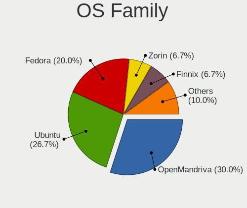
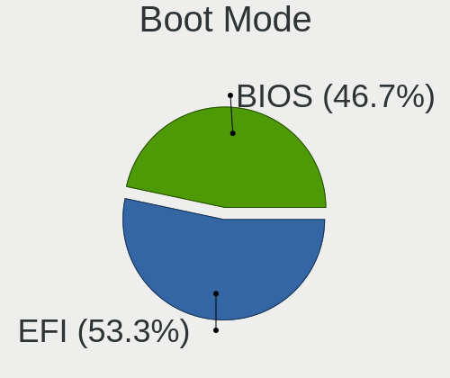
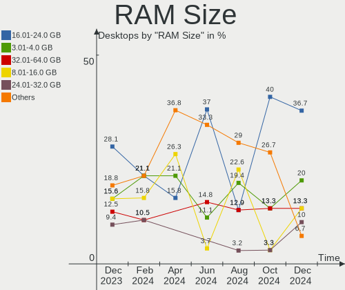
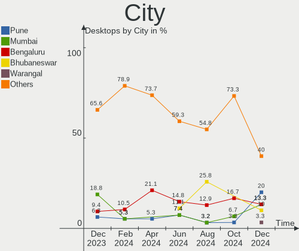
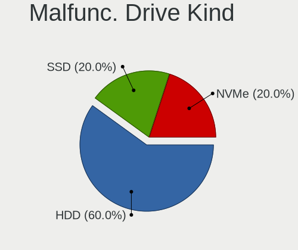
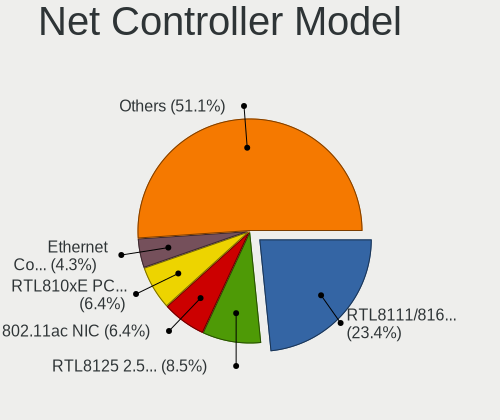
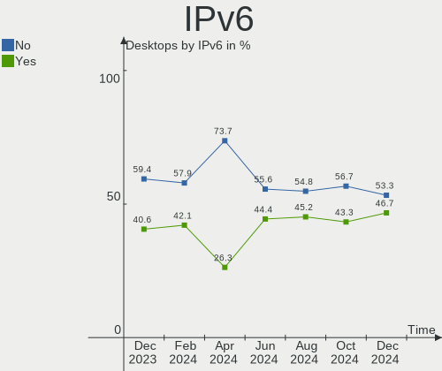
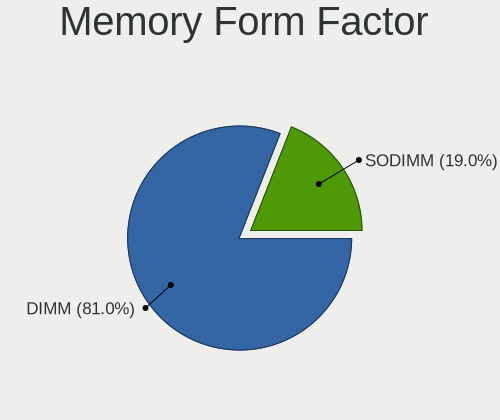

Linux in India - Hardware Trends (Desktops)
-------------------------------------------

A project to identify most popular hardware characteristics and track their change
over time based on data collected by Linux users at https://Linux-Hardware.org.

Anyone can contribute to this report by the [hw-probe](https://github.com/linuxhw/hw-probe) tool:

    sudo -E hw-probe -all -upload

Period: Mar, 2023.

Contents
--------

* [ System ](#system)
  - [ OS                       ](#os)
  - [ OS Family                ](#os-family)
  - [ Kernel                   ](#kernel)
  - [ Kernel Family            ](#kernel-family)
  - [ Kernel Major Ver.        ](#kernel-major-ver)
  - [ Arch                     ](#arch)
  - [ DE                       ](#de)
  - [ Display Server           ](#display-server)
  - [ Display Manager          ](#display-manager)
  - [ OS Lang                  ](#os-lang)
  - [ Boot Mode                ](#boot-mode)
  - [ Filesystem               ](#filesystem)
  - [ Part. scheme             ](#part-scheme)
  - [ Dual Boot with Linux/BSD ](#dual-boot-with-linuxbsd)
  - [ Dual Boot (Win)          ](#dual-boot-win)

* [ Board ](#board)
  - [ Vendor                   ](#vendor)
  - [ Model                    ](#model)
  - [ Model Family             ](#model-family)
  - [ MFG Year                 ](#mfg-year)
  - [ Form Factor              ](#form-factor)
  - [ Secure Boot              ](#secure-boot)
  - [ Coreboot                 ](#coreboot)
  - [ RAM Size                 ](#ram-size)
  - [ RAM Used                 ](#ram-used)
  - [ Total Drives             ](#total-drives)
  - [ Has CD-ROM               ](#has-cd-rom)
  - [ Has Ethernet             ](#has-ethernet)
  - [ Has WiFi                 ](#has-wifi)
  - [ Has Bluetooth            ](#has-bluetooth)

* [ Location ](#location)
  - [ Country                  ](#country)
  - [ City                     ](#city)

* [ Drives ](#drives)
  - [ Drive Vendor             ](#drive-vendor)
  - [ Drive Model              ](#drive-model)
  - [ HDD Vendor               ](#hdd-vendor)
  - [ SSD Vendor               ](#ssd-vendor)
  - [ Drive Kind               ](#drive-kind)
  - [ Drive Connector          ](#drive-connector)
  - [ Drive Size               ](#drive-size)
  - [ Space Total              ](#space-total)
  - [ Space Used               ](#space-used)
  - [ Malfunc. Drives          ](#malfunc-drives)
  - [ Malfunc. Drive Vendor    ](#malfunc-drive-vendor)
  - [ Malfunc. HDD Vendor      ](#malfunc-hdd-vendor)
  - [ Malfunc. Drive Kind      ](#malfunc-drive-kind)
  - [ Failed Drives            ](#failed-drives)
  - [ Failed Drive Vendor      ](#failed-drive-vendor)
  - [ Drive Status             ](#drive-status)

* [ Storage controller ](#storage-controller)
  - [ Storage Vendor           ](#storage-vendor)
  - [ Storage Model            ](#storage-model)
  - [ Storage Kind             ](#storage-kind)

* [ Processor ](#processor)
  - [ CPU Vendor               ](#cpu-vendor)
  - [ CPU Model                ](#cpu-model)
  - [ CPU Model Family         ](#cpu-model-family)
  - [ CPU Cores                ](#cpu-cores)
  - [ CPU Sockets              ](#cpu-sockets)
  - [ CPU Threads              ](#cpu-threads)
  - [ CPU Op-Modes             ](#cpu-op-modes)
  - [ CPU Microcode            ](#cpu-microcode)
  - [ CPU Microarch            ](#cpu-microarch)

* [ Graphics ](#graphics)
  - [ GPU Vendor               ](#gpu-vendor)
  - [ GPU Model                ](#gpu-model)
  - [ GPU Combo                ](#gpu-combo)
  - [ GPU Driver               ](#gpu-driver)
  - [ GPU Memory               ](#gpu-memory)

* [ Monitor ](#monitor)
  - [ Monitor Vendor           ](#monitor-vendor)
  - [ Monitor Model            ](#monitor-model)
  - [ Monitor Resolution       ](#monitor-resolution)
  - [ Monitor Diagonal         ](#monitor-diagonal)
  - [ Monitor Width            ](#monitor-width)
  - [ Aspect Ratio             ](#aspect-ratio)
  - [ Monitor Area             ](#monitor-area)
  - [ Pixel Density            ](#pixel-density)
  - [ Multiple Monitors        ](#multiple-monitors)

* [ Network ](#network)
  - [ Net Controller Vendor    ](#net-controller-vendor)
  - [ Net Controller Model     ](#net-controller-model)
  - [ Wireless Vendor          ](#wireless-vendor)
  - [ Wireless Model           ](#wireless-model)
  - [ Ethernet Vendor          ](#ethernet-vendor)
  - [ Ethernet Model           ](#ethernet-model)
  - [ Net Controller Kind      ](#net-controller-kind)
  - [ Used Controller          ](#used-controller)
  - [ NICs                     ](#nics)
  - [ IPv6                     ](#ipv6)

* [ Bluetooth ](#bluetooth)
  - [ Bluetooth Vendor         ](#bluetooth-vendor)
  - [ Bluetooth Model          ](#bluetooth-model)

* [ Sound ](#sound)
  - [ Sound Vendor             ](#sound-vendor)
  - [ Sound Model              ](#sound-model)

* [ Memory ](#memory)
  - [ Memory Vendor            ](#memory-vendor)
  - [ Memory Model             ](#memory-model)
  - [ Memory Kind              ](#memory-kind)
  - [ Memory Form Factor       ](#memory-form-factor)
  - [ Memory Size              ](#memory-size)
  - [ Memory Speed             ](#memory-speed)

* [ Printers & scanners ](#printers--scanners)
  - [ Printer Vendor           ](#printer-vendor)
  - [ Printer Model            ](#printer-model)
  - [ Scanner Vendor           ](#scanner-vendor)
  - [ Scanner Model            ](#scanner-model)

* [ Camera ](#camera)
  - [ Camera Vendor            ](#camera-vendor)
  - [ Camera Model             ](#camera-model)

* [ Security ](#security)
  - [ Fingerprint Vendor       ](#fingerprint-vendor)
  - [ Fingerprint Model        ](#fingerprint-model)
  - [ Chipcard Vendor          ](#chipcard-vendor)
  - [ Chipcard Model           ](#chipcard-model)

* [ Unsupported ](#unsupported)
  - [ Unsupported Devices      ](#unsupported-devices)
  - [ Unsupported Device Types ](#unsupported-device-types)

System
------

OS
--

Installed operating systems

| Name               | Desktops | Percent |
|--------------------|----------|---------|
| Ubuntu 22.04       | 4        | 14.81%  |
| OpenMandriva 23.03 | 4        | 14.81%  |
| Zorin 16           | 3        | 11.11%  |
| Linux Mint 21.1    | 3        | 11.11%  |
| Pop!_OS 22.04      | 2        | 7.41%   |
| OpenMandriva 23.01 | 2        | 7.41%   |
| ArcoLinux Rolling  | 2        | 7.41%   |
| Arch Rolling       | 2        | 7.41%   |
| Ubuntu 20.04       | 1        | 3.7%    |
| OpenMandriva 4.2   | 1        | 3.7%    |
| Manjaro            | 1        | 3.7%    |
| Kubuntu 22.10      | 1        | 3.7%    |
| Fedora 37          | 1        | 3.7%    |

OS Family
---------

OS without a version

| Name         | Desktops | Percent |
|--------------|----------|---------|
| OpenMandriva | 7        | 25.93%  |
| Ubuntu       | 5        | 18.52%  |
| Zorin        | 3        | 11.11%  |
| Linux Mint   | 3        | 11.11%  |
| Pop!_OS      | 2        | 7.41%   |
| ArcoLinux    | 2        | 7.41%   |
| Arch         | 2        | 7.41%   |
| Manjaro      | 1        | 3.7%    |
| Kubuntu      | 1        | 3.7%    |
| Fedora       | 1        | 3.7%    |

Kernel
------

Version of the Linux kernel

| Version                  | Desktops | Percent |
|--------------------------|----------|---------|
| 5.15.0-67-generic        | 6        | 22.22%  |
| 6.2.6-desktop-1omv2390   | 4        | 14.81%  |
| 6.1.1-desktop-1omv2290   | 2        | 7.41%   |
| 5.19.0-38-generic        | 2        | 7.41%   |
| 6.2.7-x64v1-xanmod1-1    | 1        | 3.7%    |
| 6.2.6-76060206-generic   | 1        | 3.7%    |
| 6.2.2-arch1-1            | 1        | 3.7%    |
| 6.2.1-arch1-1            | 1        | 3.7%    |
| 6.1.19-1-MANJARO         | 1        | 3.7%    |
| 6.1.13-200.fc37.x86_64   | 1        | 3.7%    |
| 6.1.12-zen1-1-zen        | 1        | 3.7%    |
| 6.0.12-76060006-generic  | 1        | 3.7%    |
| 5.4.0-144-generic        | 1        | 3.7%    |
| 5.19.0-35-generic        | 1        | 3.7%    |
| 5.15.0-58-generic        | 1        | 3.7%    |
| 5.15.0-43-generic        | 1        | 3.7%    |
| 5.11.12-desktop-1omv4002 | 1        | 3.7%    |

Kernel Family
-------------

Linux kernel without a distro release

| Version | Desktops | Percent |
|---------|----------|---------|
| 5.15.0  | 8        | 29.63%  |
| 6.2.6   | 5        | 18.52%  |
| 5.19.0  | 3        | 11.11%  |
| 6.1.1   | 2        | 7.41%   |
| 6.2.7   | 1        | 3.7%    |
| 6.2.2   | 1        | 3.7%    |
| 6.2.1   | 1        | 3.7%    |
| 6.1.19  | 1        | 3.7%    |
| 6.1.13  | 1        | 3.7%    |
| 6.1.12  | 1        | 3.7%    |
| 6.0.12  | 1        | 3.7%    |
| 5.4.0   | 1        | 3.7%    |
| 5.11.12 | 1        | 3.7%    |

Kernel Major Ver.
-----------------

Linux kernel major version

| Version | Desktops | Percent |
|---------|----------|---------|
| 6.2     | 8        | 29.63%  |
| 5.15    | 8        | 29.63%  |
| 6.1     | 5        | 18.52%  |
| 5.19    | 3        | 11.11%  |
| 6.0     | 1        | 3.7%    |
| 5.4     | 1        | 3.7%    |
| 5.11    | 1        | 3.7%    |

Arch
----

OS architecture (x86_64, i586, etc.)

| Name   | Desktops | Percent |
|--------|----------|---------|
| x86_64 | 27       | 100%    |

DE
--

Desktop Environment

| Name       | Desktops | Percent |
|------------|----------|---------|
| KDE5       | 11       | 40.74%  |
| GNOME      | 10       | 37.04%  |
| X-Cinnamon | 3        | 11.11%  |
| XFCE       | 2        | 7.41%   |
| i3         | 1        | 3.7%    |

Display Server
--------------

X11 or Wayland

| Name    | Desktops | Percent |
|---------|----------|---------|
| X11     | 23       | 85.19%  |
| Wayland | 3        | 11.11%  |
| Unknown | 1        | 3.7%    |

Display Manager
---------------

SDDM, LightDM, etc.

| Name    | Desktops | Percent |
|---------|----------|---------|
| Unknown | 10       | 37.04%  |
| SDDM    | 9        | 33.33%  |
| GDM3    | 6        | 22.22%  |
| LightDM | 1        | 3.7%    |
| GREETD  | 1        | 3.7%    |

OS Lang
-------

Language

| Lang    | Desktops | Percent |
|---------|----------|---------|
| en_IN   | 15       | 55.56%  |
| en_US   | 10       | 37.04%  |
| en_GB   | 1        | 3.7%    |
| Unknown | 1        | 3.7%    |

Boot Mode
---------

EFI or BIOS

| Mode | Desktops | Percent |
|------|----------|---------|
| EFI  | 14       | 51.85%  |
| BIOS | 13       | 48.15%  |

Filesystem
----------

Type of filesystem

| Type    | Desktops | Percent |
|---------|----------|---------|
| Ext4    | 21       | 77.78%  |
| Btrfs   | 4        | 14.81%  |
| Overlay | 2        | 7.41%   |

Part. scheme
------------

Scheme of partitioning

| Type    | Desktops | Percent |
|---------|----------|---------|
| GPT     | 12       | 44.44%  |
| Unknown | 10       | 37.04%  |
| MBR     | 5        | 18.52%  |

Dual Boot with Linux/BSD
------------------------

Hosting more than one Linux/BSD

| Dual boot | Desktops | Percent |
|-----------|----------|---------|
| No        | 21       | 77.78%  |
| Yes       | 6        | 22.22%  |

Dual Boot (Win)
---------------

Hosting Linux and Windows

| Dual boot | Desktops | Percent |
|-----------|----------|---------|
| No        | 17       | 62.96%  |
| Yes       | 10       | 37.04%  |

Board
-----

Vendor
------

Motherboard manufacturer

| Name                | Desktops | Percent |
|---------------------|----------|---------|
| Gigabyte Technology | 6        | 22.22%  |
| ASUSTek Computer    | 6        | 22.22%  |
| Dell                | 4        | 14.81%  |
| Intel               | 3        | 11.11%  |
| ASRock              | 2        | 7.41%   |
| OEM                 | 1        | 3.7%    |
| MSI                 | 1        | 3.7%    |
| Hewlett-Packard     | 1        | 3.7%    |
| Foxconn             | 1        | 3.7%    |
| Acer                | 1        | 3.7%    |
| Unknown             | 1        | 3.7%    |

Model
-----

Motherboard model

| Name                              | Desktops | Percent |
|-----------------------------------|----------|---------|
| ASUS PRIME H510M-E                | 2        | 7.41%   |
| OEM H110                          | 1        | 3.7%    |
| MSI MS-7A15                       | 1        | 3.7%    |
| Intel H61                         | 1        | 3.7%    |
| Intel H55                         | 1        | 3.7%    |
| Intel G41                         | 1        | 3.7%    |
| HP Desktop Pro PCI MT             | 1        | 3.7%    |
| Gigabyte X470 AORUS GAMING 5 WIFI | 1        | 3.7%    |
| Gigabyte H61MS                    | 1        | 3.7%    |
| Gigabyte H61M-S2P-R3              | 1        | 3.7%    |
| Gigabyte H310M S2 2.0             | 1        | 3.7%    |
| Gigabyte B450M GAMING             | 1        | 3.7%    |
| Gigabyte B450M DS3H               | 1        | 3.7%    |
| Foxconn Veriton Series            | 1        | 3.7%    |
| Dell XPS 8930                     | 1        | 3.7%    |
| Dell Vostro 3800                  | 1        | 3.7%    |
| Dell Precision 3630 Tower         | 1        | 3.7%    |
| Dell ASM100                       | 1        | 3.7%    |
| ASUS TUF Gaming B550-PLUS WIFI II | 1        | 3.7%    |
| ASUS SABERTOOTH 990FX R2.0        | 1        | 3.7%    |
| ASUS ROG CROSSHAIR X670E HERO     | 1        | 3.7%    |
| ASUS P7H55-M LX                   | 1        | 3.7%    |
| ASRock B550M Pro4                 | 1        | 3.7%    |
| ASRock A320M-HDV R4.0             | 1        | 3.7%    |
| Acer Veriton M2640G               | 1        | 3.7%    |
| Unknown                           | 1        | 3.7%    |

Model Family
------------

Motherboard model prefix

| Name                 | Desktops | Percent |
|----------------------|----------|---------|
| Gigabyte B450M       | 2        | 7.41%   |
| ASUS PRIME           | 2        | 7.41%   |
| OEM H110             | 1        | 3.7%    |
| MSI MS-7A15          | 1        | 3.7%    |
| Intel H61            | 1        | 3.7%    |
| Intel H55            | 1        | 3.7%    |
| Intel G41            | 1        | 3.7%    |
| HP Desktop           | 1        | 3.7%    |
| Gigabyte X470        | 1        | 3.7%    |
| Gigabyte H61MS       | 1        | 3.7%    |
| Gigabyte H61M-S2P-R3 | 1        | 3.7%    |
| Gigabyte H310M       | 1        | 3.7%    |
| Foxconn Veriton      | 1        | 3.7%    |
| Dell XPS             | 1        | 3.7%    |
| Dell Vostro          | 1        | 3.7%    |
| Dell Precision       | 1        | 3.7%    |
| Dell ASM100          | 1        | 3.7%    |
| ASUS TUF             | 1        | 3.7%    |
| ASUS SABERTOOTH      | 1        | 3.7%    |
| ASUS ROG             | 1        | 3.7%    |
| ASUS P7H55-M         | 1        | 3.7%    |
| ASRock B550M         | 1        | 3.7%    |
| ASRock A320M-HDV     | 1        | 3.7%    |
| Acer Veriton         | 1        | 3.7%    |
| Unknown              | 1        | 3.7%    |

MFG Year
--------

Motherboard manufacture year

| Year | Desktops | Percent |
|------|----------|---------|
| 2018 | 5        | 18.52%  |
| 2022 | 3        | 11.11%  |
| 2021 | 3        | 11.11%  |
| 2017 | 3        | 11.11%  |
| 2013 | 3        | 11.11%  |
| 2020 | 2        | 7.41%   |
| 2019 | 2        | 7.41%   |
| 2016 | 1        | 3.7%    |
| 2015 | 1        | 3.7%    |
| 2014 | 1        | 3.7%    |
| 2012 | 1        | 3.7%    |
| 2011 | 1        | 3.7%    |
| 2010 | 1        | 3.7%    |

Form Factor
-----------

Physical design of the computer

| Name    | Desktops | Percent |
|---------|----------|---------|
| Desktop | 27       | 100%    |

Secure Boot
-----------

Enabled or disabled

| State    | Desktops | Percent |
|----------|----------|---------|
| Disabled | 26       | 96.3%   |
| Enabled  | 1        | 3.7%    |

Coreboot
--------

Have coreboot on board

| Used | Desktops | Percent |
|------|----------|---------|
| No   | 27       | 100%    |

RAM Size
--------

Total RAM memory

| Size in GB  | Desktops | Percent |
|-------------|----------|---------|
| 3.01-4.0    | 7        | 25.93%  |
| 4.01-8.0    | 6        | 22.22%  |
| 16.01-24.0  | 4        | 14.81%  |
| 8.01-16.0   | 4        | 14.81%  |
| 32.01-64.0  | 2        | 7.41%   |
| 64.01-256.0 | 2        | 7.41%   |
| 24.01-32.0  | 1        | 3.7%    |
| 1.01-2.0    | 1        | 3.7%    |

RAM Used
--------

Used RAM memory

| Used GB   | Desktops | Percent |
|-----------|----------|---------|
| 1.01-2.0  | 11       | 40.74%  |
| 2.01-3.0  | 9        | 33.33%  |
| 3.01-4.0  | 3        | 11.11%  |
| 8.01-16.0 | 2        | 7.41%   |
| 4.01-8.0  | 1        | 3.7%    |
| 0.51-1.0  | 1        | 3.7%    |

Total Drives
------------

Number of drives on board

| Drives | Desktops | Percent |
|--------|----------|---------|
| 1      | 12       | 44.44%  |
| 2      | 8        | 29.63%  |
| 4      | 3        | 11.11%  |
| 3      | 3        | 11.11%  |
| 5      | 1        | 3.7%    |

Has CD-ROM
----------

Has CD-ROM on board

| Presented | Desktops | Percent |
|-----------|----------|---------|
| No        | 23       | 85.19%  |
| Yes       | 4        | 14.81%  |

Has Ethernet
------------

Has Ethernet on board

| Presented | Desktops | Percent |
|-----------|----------|---------|
| Yes       | 26       | 96.3%   |
| No        | 1        | 3.7%    |

Has WiFi
--------

Has WiFi module

| Presented | Desktops | Percent |
|-----------|----------|---------|
| Yes       | 18       | 66.67%  |
| No        | 9        | 33.33%  |

Has Bluetooth
-------------

Has Bluetooth module

| Presented | Desktops | Percent |
|-----------|----------|---------|
| No        | 18       | 66.67%  |
| Yes       | 9        | 33.33%  |

Location
--------

Country
-------

Geographic location (country)

| Country | Desktops | Percent |
|---------|----------|---------|
| India   | 27       | 100%    |

City
----

Geographic location (city)

| City        | Desktops | Percent |
|-------------|----------|---------|
| Chennai     | 4        | 14.81%  |
| Kolkata     | 3        | 11.11%  |
| Jaipur      | 3        | 11.11%  |
| Pune        | 2        | 7.41%   |
| Hyderabad   | 2        | 7.41%   |
| Delhi       | 2        | 7.41%   |
| Bengaluru   | 2        | 7.41%   |
| Vadodara    | 1        | 3.7%    |
| Thiruvarur  | 1        | 3.7%    |
| Salem       | 1        | 3.7%    |
| New Delhi   | 1        | 3.7%    |
| Mangalore   | 1        | 3.7%    |
| Indore      | 1        | 3.7%    |
| Athani      | 1        | 3.7%    |
| Alipur Duar | 1        | 3.7%    |
| Ahmedabad   | 1        | 3.7%    |

Drives
------

Drive Vendor
------------

Hard drive vendors

| Vendor                    | Desktops | Drives | Percent |
|---------------------------|----------|--------|---------|
| WDC                       | 12       | 14     | 26.09%  |
| Seagate                   | 11       | 12     | 23.91%  |
| Crucial                   | 5        | 6      | 10.87%  |
| Toshiba                   | 3        | 4      | 6.52%   |
| Samsung Electronics       | 3        | 4      | 6.52%   |
| Micron/Crucial Technology | 2        | 2      | 4.35%   |
| China                     | 2        | 2      | 4.35%   |
| ADATA Technology          | 2        | 2      | 4.35%   |
| Silicon Motion            | 1        | 1      | 2.17%   |
| Sandisk                   | 1        | 2      | 2.17%   |
| Micron Technology         | 1        | 1      | 2.17%   |
| Kingston                  | 1        | 2      | 2.17%   |
| Gigabyte Technology       | 1        | 1      | 2.17%   |
| Corsair                   | 1        | 1      | 2.17%   |

Drive Model
-----------

Hard drive models

| Model                                               | Desktops | Percent |
|-----------------------------------------------------|----------|---------|
| Seagate ST500DM002-1BD142 500GB                     | 2        | 3.7%    |
| Samsung NVMe SSD Controller SM981/PM981/PM983 250GB | 2        | 3.7%    |
| Crucial CT240BX500SSD1 240GB                        | 2        | 3.7%    |
| WDC WDS480G2G0A-00JH30 480GB SSD                    | 1        | 1.85%   |
| WDC WDS240G2G0A-00JH30 240GB SSD                    | 1        | 1.85%   |
| WDC WDS120G2G0A-00JH30 120GB SSD                    | 1        | 1.85%   |
| WDC WDS100T2G0A-00JH30 1TB SSD                      | 1        | 1.85%   |
| WDC WD5000AAKX-75U6AA0 500GB                        | 1        | 1.85%   |
| WDC WD5000AAKX-00ERMA0 500GB                        | 1        | 1.85%   |
| WDC WD5000AAKX-001CA0 500GB                         | 1        | 1.85%   |
| WDC WD3200AVVS-63L2B0 320GB                         | 1        | 1.85%   |
| WDC WD20PURZ-85GU6Y0 2TB                            | 1        | 1.85%   |
| WDC WD1600BPVT-22JJ5T0 160GB                        | 1        | 1.85%   |
| WDC WD10EZRX-00L4HB0 1TB                            | 1        | 1.85%   |
| WDC WD10EZEX-60WN4A0 1TB                            | 1        | 1.85%   |
| WDC WD10EZEX-21WN4A0 1TB                            | 1        | 1.85%   |
| WDC WD Green 2.5 480GB SSD                          | 1        | 1.85%   |
| Toshiba HDWU110 1TB                                 | 1        | 1.85%   |
| Toshiba HDWD110 1TB                                 | 1        | 1.85%   |
| Toshiba DT01ACA100 1TB                              | 1        | 1.85%   |
| Toshiba DT01ABA200V 2TB                             | 1        | 1.85%   |
| Silicon Motion 256GB NVME EVM                       | 1        | 1.85%   |
| Seagate ST9250315AS 250GB                           | 1        | 1.85%   |
| Seagate ST3500312CS 500GB                           | 1        | 1.85%   |
| Seagate ST3250310AS 250GB                           | 1        | 1.85%   |
| Seagate ST3160310CS 160GB                           | 1        | 1.85%   |
| Seagate ST31000528AS 1TB                            | 1        | 1.85%   |
| Seagate ST2000DM008-2FR102 2TB                      | 1        | 1.85%   |
| Seagate ST2000DM001-1ER164 2TB                      | 1        | 1.85%   |
| Seagate ST1000LX015-1U7172-SSHD 1TB                 | 1        | 1.85%   |
| Seagate ST1000DM010-2EP102 1TB                      | 1        | 1.85%   |
| Seagate Expansion HDD 2TB                           | 1        | 1.85%   |
| Sandisk WD_BLACK SN850X 2000GB                      | 1        | 1.85%   |
| Sandisk WD_BLACK SN770 2TB                          | 1        | 1.85%   |
| Samsung SSD 870 QVO 1TB                             | 1        | 1.85%   |
| Samsung SSD 850 EVO 1TB                             | 1        | 1.85%   |
| Micron/Crucial P2 NVMe PCIe SSD 1TB                 | 1        | 1.85%   |
| Micron/Crucial P1 NVMe PCIe SSD 1TB                 | 1        | 1.85%   |
| Micron CT2000P5SSD8 2TB                             | 1        | 1.85%   |
| Kingston SA400S37240G 240GB SSD                     | 1        | 1.85%   |

HDD Vendor
----------

Hard disk drive vendors

| Vendor  | Desktops | Drives | Percent |
|---------|----------|--------|---------|
| Seagate | 11       | 12     | 47.83%  |
| WDC     | 9        | 9      | 39.13%  |
| Toshiba | 3        | 4      | 13.04%  |

SSD Vendor
----------

Solid state drive vendors

| Vendor              | Desktops | Drives | Percent |
|---------------------|----------|--------|---------|
| Crucial             | 5        | 5      | 31.25%  |
| WDC                 | 4        | 5      | 25%     |
| Samsung Electronics | 2        | 2      | 12.5%   |
| China               | 2        | 2      | 12.5%   |
| Kingston            | 1        | 2      | 6.25%   |
| Gigabyte Technology | 1        | 1      | 6.25%   |
| Corsair             | 1        | 1      | 6.25%   |

Drive Kind
----------

HDD or SSD

| Kind | Desktops | Drives | Percent |
|------|----------|--------|---------|
| HDD  | 20       | 25     | 47.62%  |
| SSD  | 14       | 18     | 33.33%  |
| NVMe | 8        | 11     | 19.05%  |

Drive Connector
---------------

SATA, SAS, NVMe, etc.

| Type | Desktops | Drives | Percent |
|------|----------|--------|---------|
| SATA | 25       | 41     | 71.43%  |
| NVMe | 8        | 11     | 22.86%  |
| SAS  | 2        | 2      | 5.71%   |

Drive Size
----------

Size of hard drive

| Size in TB | Desktops | Drives | Percent |
|------------|----------|--------|---------|
| 0.01-0.5   | 17       | 25     | 50%     |
| 0.51-1.0   | 13       | 13     | 38.24%  |
| 1.01-2.0   | 4        | 5      | 11.76%  |

Space Total
-----------

Amount of disk space available on the file system

| Size in GB | Desktops | Percent |
|------------|----------|---------|
| 251-500    | 7        | 25.93%  |
| 501-1000   | 6        | 22.22%  |
| 101-250    | 5        | 18.52%  |
| 2001-3000  | 3        | 11.11%  |
| 1001-2000  | 2        | 7.41%   |
| 21-50      | 1        | 3.7%    |
| 1-20       | 1        | 3.7%    |
| 51-100     | 1        | 3.7%    |
| Unknown    | 1        | 3.7%    |

Space Used
----------

Amount of used disk space

| Used GB  | Desktops | Percent |
|----------|----------|---------|
| 1-20     | 6        | 22.22%  |
| 21-50    | 5        | 18.52%  |
| 101-250  | 5        | 18.52%  |
| 51-100   | 4        | 14.81%  |
| 251-500  | 3        | 11.11%  |
| 501-1000 | 3        | 11.11%  |
| Unknown  | 1        | 3.7%    |

Malfunc. Drives
---------------

Drive models with a malfunction

| Model                          | Desktops | Drives | Percent |
|--------------------------------|----------|--------|---------|
| WDC WDS100T2G0A-00JH30 1TB SSD | 1        | 1      | 11.11%  |
| WDC WD5000AAKX-75U6AA0 500GB   | 1        | 1      | 11.11%  |
| WDC WD5000AAKX-00ERMA0 500GB   | 1        | 1      | 11.11%  |
| WDC WD5000AAKX-001CA0 500GB    | 1        | 1      | 11.11%  |
| Toshiba DT01ACA100 1TB         | 1        | 1      | 11.11%  |
| Seagate ST9250315AS 250GB      | 1        | 1      | 11.11%  |
| Seagate ST3500312CS 500GB      | 1        | 1      | 11.11%  |
| Seagate ST3160310CS 160GB      | 1        | 1      | 11.11%  |
| Seagate ST31000528AS 1TB       | 1        | 1      | 11.11%  |

Malfunc. Drive Vendor
---------------------

Vendors of faulty drives

| Vendor  | Desktops | Drives | Percent |
|---------|----------|--------|---------|
| WDC     | 4        | 4      | 44.44%  |
| Seagate | 4        | 4      | 44.44%  |
| Toshiba | 1        | 1      | 11.11%  |

Malfunc. HDD Vendor
-------------------

Vendors of faulty HDD drives

| Vendor  | Desktops | Drives | Percent |
|---------|----------|--------|---------|
| Seagate | 4        | 4      | 50%     |
| WDC     | 3        | 3      | 37.5%   |
| Toshiba | 1        | 1      | 12.5%   |

Malfunc. Drive Kind
-------------------

Kinds of faulty drives

| Kind | Desktops | Drives | Percent |
|------|----------|--------|---------|
| HDD  | 7        | 8      | 87.5%   |
| SSD  | 1        | 1      | 12.5%   |

Failed Drives
-------------

Failed drive models

Zero info for selected period =(

Failed Drive Vendor
-------------------

Failed drive vendors

Zero info for selected period =(

Drive Status
------------

Number of failed and malfunc. drives

| Status   | Desktops | Drives | Percent |
|----------|----------|--------|---------|
| Detected | 14       | 27     | 41.18%  |
| Works    | 12       | 18     | 35.29%  |
| Malfunc  | 8        | 9      | 23.53%  |

Storage controller
------------------

Storage Vendor
--------------

Storage controller vendors

| Vendor                    | Desktops | Percent |
|---------------------------|----------|---------|
| Intel                     | 19       | 48.72%  |
| AMD                       | 8        | 20.51%  |
| Micron/Crucial Technology | 3        | 7.69%   |
| Samsung Electronics       | 2        | 5.13%   |
| ASMedia Technology        | 2        | 5.13%   |
| ADATA Technology          | 2        | 5.13%   |
| Silicon Motion            | 1        | 2.56%   |
| SanDisk                   | 1        | 2.56%   |
| Micron Technology         | 1        | 2.56%   |

Storage Model
-------------

Storage controller models

| Model                                                                                   | Desktops | Percent |
|-----------------------------------------------------------------------------------------|----------|---------|
| Intel Q170/Q150/B150/H170/H110/Z170/CM236 Chipset SATA Controller [AHCI Mode]           | 4        | 8.16%   |
| AMD FCH SATA Controller [AHCI mode]                                                     | 4        | 8.16%   |
| Intel 6 Series/C200 Series Chipset Family Desktop SATA Controller (IDE mode, ports 4-5) | 3        | 6.12%   |
| Intel 6 Series/C200 Series Chipset Family Desktop SATA Controller (IDE mode, ports 0-3) | 3        | 6.12%   |
| AMD 400 Series Chipset SATA Controller                                                  | 3        | 6.12%   |
| Samsung NVMe SSD Controller SM981/PM981/PM983                                           | 2        | 4.08%   |
| Micron/Crucial P1 NVMe PCIe SSD                                                         | 2        | 4.08%   |
| Intel NM10/ICH7 Family SATA Controller [IDE mode]                                       | 2        | 4.08%   |
| Intel 82801G (ICH7 Family) IDE Controller                                               | 2        | 4.08%   |
| Intel 8 Series/C220 Series Chipset Family 6-port SATA Controller 1 [AHCI mode]          | 2        | 4.08%   |
| Intel 500 Series Chipset Family SATA AHCI Controller                                    | 2        | 4.08%   |
| ASMedia ASM1062 Serial ATA Controller                                                   | 2        | 4.08%   |
| AMD 500 Series Chipset SATA Controller                                                  | 2        | 4.08%   |
| Silicon Motion SM2263EN/SM2263XT SSD Controller                                         | 1        | 2.04%   |
| Sandisk Western Digital WD Black SN850X NVMe SSD                                        | 1        | 2.04%   |
| SanDisk NVMe Controller                                                                 | 1        | 2.04%   |
| Micron/Crucial P2 NVMe PCIe SSD                                                         | 1        | 2.04%   |
| Micron NVMe Storage Controller                                                          | 1        | 2.04%   |
| Intel SATA Controller [RAID mode]                                                       | 1        | 2.04%   |
| Intel Cannon Lake PCH SATA AHCI Controller                                              | 1        | 2.04%   |
| Intel 6 Series/C200 Series Chipset Family 6 port Desktop SATA AHCI Controller           | 1        | 2.04%   |
| Intel 5 Series/3400 Series Chipset 6 port SATA AHCI Controller                          | 1        | 2.04%   |
| Intel 5 Series/3400 Series Chipset 4 port SATA IDE Controller                           | 1        | 2.04%   |
| Intel 5 Series/3400 Series Chipset 2 port SATA IDE Controller                           | 1        | 2.04%   |
| Intel 200 Series PCH SATA controller [AHCI mode]                                        | 1        | 2.04%   |
| AMD SB7x0/SB8x0/SB9x0 SATA Controller [AHCI mode]                                       | 1        | 2.04%   |
| AMD FCH SATA Controller D                                                               | 1        | 2.04%   |
| ADATA XPG SX8200 Pro PCIe Gen3x4 M.2 2280 Solid State Drive                             | 1        | 2.04%   |
| ADATA A Non-Volatile memory controller                                                  | 1        | 2.04%   |

Storage Kind
------------

Kind of storage controller (IDE, SATA, NVMe, SAS, ...)

| Kind | Desktops | Percent |
|------|----------|---------|
| SATA | 20       | 57.14%  |
| NVMe | 8        | 22.86%  |
| IDE  | 6        | 17.14%  |
| RAID | 1        | 2.86%   |

Processor
---------

CPU Vendor
----------

Processor vendors

| Vendor | Desktops | Percent |
|--------|----------|---------|
| Intel  | 19       | 70.37%  |
| AMD    | 8        | 29.63%  |

CPU Model
---------

Processor models

| Model                                       | Desktops | Percent |
|---------------------------------------------|----------|---------|
| Intel Core i5-3450 CPU @ 3.10GHz            | 2        | 7.41%   |
| Intel Core i3-6100T CPU @ 3.20GHz           | 2        | 7.41%   |
| Intel Core i3 CPU 540 @ 3.07GHz             | 2        | 7.41%   |
| Intel Pentium Dual-Core CPU E6700 @ 3.20GHz | 1        | 3.7%    |
| Intel Pentium Dual CPU E2140 @ 1.60GHz      | 1        | 3.7%    |
| Intel Pentium CPU G4400 @ 3.30GHz           | 1        | 3.7%    |
| Intel Core i7-9700 CPU @ 3.00GHz            | 1        | 3.7%    |
| Intel Core i7-8700K CPU @ 3.70GHz           | 1        | 3.7%    |
| Intel Core i5-9400F CPU @ 2.90GHz           | 1        | 3.7%    |
| Intel Core i5-7500 CPU @ 3.40GHz            | 1        | 3.7%    |
| Intel Core i5-4590T CPU @ 2.00GHz           | 1        | 3.7%    |
| Intel Core i5-10400F CPU @ 2.90GHz          | 1        | 3.7%    |
| Intel Core i3-4130 CPU @ 3.40GHz            | 1        | 3.7%    |
| Intel Core i3-3210 CPU @ 3.20GHz            | 1        | 3.7%    |
| Intel Core i3-2120 CPU @ 3.30GHz            | 1        | 3.7%    |
| Intel Core i3-10105F CPU @ 3.70GHz          | 1        | 3.7%    |
| AMD Ryzen 9 7950X 16-Core Processor         | 1        | 3.7%    |
| AMD Ryzen 7 5700G with Radeon Graphics      | 1        | 3.7%    |
| AMD Ryzen 7 1700 Eight-Core Processor       | 1        | 3.7%    |
| AMD Ryzen 5 5600G with Radeon Graphics      | 1        | 3.7%    |
| AMD Ryzen 5 3600 6-Core Processor           | 1        | 3.7%    |
| AMD Ryzen 5 1600 Six-Core Processor         | 1        | 3.7%    |
| AMD Ryzen 3 1200 Quad-Core Processor        | 1        | 3.7%    |
| AMD FX-8150 Eight-Core Processor            | 1        | 3.7%    |

CPU Model Family
----------------

Processor model prefix

| Model                   | Desktops | Percent |
|-------------------------|----------|---------|
| Intel Core i3           | 8        | 29.63%  |
| Intel Core i5           | 6        | 22.22%  |
| AMD Ryzen 5             | 3        | 11.11%  |
| Intel Core i7           | 2        | 7.41%   |
| AMD Ryzen 7             | 2        | 7.41%   |
| Intel Pentium Dual-Core | 1        | 3.7%    |
| Intel Pentium Dual      | 1        | 3.7%    |
| Intel Pentium           | 1        | 3.7%    |
| AMD Ryzen 9             | 1        | 3.7%    |
| AMD Ryzen 3             | 1        | 3.7%    |
| AMD FX                  | 1        | 3.7%    |

CPU Cores
---------

Number of processor cores

| Number | Desktops | Percent |
|--------|----------|---------|
| 2      | 10       | 37.04%  |
| 4      | 7        | 25.93%  |
| 6      | 5        | 18.52%  |
| 8      | 4        | 14.81%  |
| 16     | 1        | 3.7%    |

CPU Sockets
-----------

Number of sockets

| Number | Desktops | Percent |
|--------|----------|---------|
| 1      | 27       | 100%    |

CPU Threads
-----------

Threads per core (Hyper-Threading)

| Number | Desktops | Percent |
|--------|----------|---------|
| 2      | 17       | 62.96%  |
| 1      | 10       | 37.04%  |

CPU Op-Modes
------------

CPU Operation Modes (32-bit, 64-bit)

| Op mode        | Desktops | Percent |
|----------------|----------|---------|
| 32-bit, 64-bit | 27       | 100%    |

CPU Microcode
-------------

Microcode number

| Number     | Desktops | Percent |
|------------|----------|---------|
| Unknown    | 12       | 44.44%  |
| 0x306a9    | 2        | 7.41%   |
| 0x906ea    | 1        | 3.7%    |
| 0x906e9    | 1        | 3.7%    |
| 0x6fd      | 1        | 3.7%    |
| 0x506e3    | 1        | 3.7%    |
| 0x306c3    | 1        | 3.7%    |
| 0x206a7    | 1        | 3.7%    |
| 0x20655    | 1        | 3.7%    |
| 0x20652    | 1        | 3.7%    |
| 0x0a601203 | 1        | 3.7%    |
| 0x0a50000d | 1        | 3.7%    |
| 0x0a50000c | 1        | 3.7%    |
| 0x08001138 | 1        | 3.7%    |
| 0x0600063e | 1        | 3.7%    |

CPU Microarch
-------------

Microarchitecture

| Name        | Desktops | Percent |
|-------------|----------|---------|
| KabyLake    | 4        | 14.81%  |
| Zen         | 3        | 11.11%  |
| Skylake     | 3        | 11.11%  |
| IvyBridge   | 3        | 11.11%  |
| Zen 3       | 2        | 7.41%   |
| Westmere    | 2        | 7.41%   |
| Haswell     | 2        | 7.41%   |
| CometLake   | 2        | 7.41%   |
| Zen 2       | 1        | 3.7%    |
| SandyBridge | 1        | 3.7%    |
| Penryn      | 1        | 3.7%    |
| Core        | 1        | 3.7%    |
| Bulldozer   | 1        | 3.7%    |
| Unknown     | 1        | 3.7%    |

Graphics
--------

GPU Vendor
----------

Vendors of graphics cards

| Vendor | Desktops | Percent |
|--------|----------|---------|
| Intel  | 15       | 53.57%  |
| Nvidia | 8        | 28.57%  |
| AMD    | 5        | 17.86%  |

GPU Model
---------

Graphics card models

| Model                                                                     | Desktops | Percent |
|---------------------------------------------------------------------------|----------|---------|
| Intel Xeon E3-1200 v2/3rd Gen Core processor Graphics Controller          | 3        | 10.34%  |
| Nvidia TU116 [GeForce GTX 1660 Ti]                                        | 2        | 6.9%    |
| Intel HD Graphics 530                                                     | 2        | 6.9%    |
| Intel Core Processor Integrated Graphics Controller                       | 2        | 6.9%    |
| Intel CoffeeLake-S GT2 [UHD Graphics 630]                                 | 2        | 6.9%    |
| Intel 4 Series Chipset Integrated Graphics Controller                     | 2        | 6.9%    |
| AMD Cezanne [Radeon Vega Series / Radeon Vega Mobile Series]              | 2        | 6.9%    |
| Nvidia TU116 [GeForce GTX 1650 SUPER]                                     | 1        | 3.45%   |
| Nvidia TU106 [GeForce RTX 2070 Rev. A]                                    | 1        | 3.45%   |
| Nvidia GP108 [GeForce GT 1030]                                            | 1        | 3.45%   |
| Nvidia GM107M [GeForce GTX 860M]                                          | 1        | 3.45%   |
| Nvidia GK208B [GeForce GT 710]                                            | 1        | 3.45%   |
| Nvidia GF119 [GeForce GT 610]                                             | 1        | 3.45%   |
| Intel HD Graphics 630                                                     | 1        | 3.45%   |
| Intel HD Graphics 510                                                     | 1        | 3.45%   |
| Intel 4th Generation Core Processor Family Integrated Graphics Controller | 1        | 3.45%   |
| Intel 2nd Generation Core Processor Family Integrated Graphics Controller | 1        | 3.45%   |
| AMD Raphael                                                               | 1        | 3.45%   |
| AMD Navi 23 [Radeon RX 6600/6600 XT/6600M]                                | 1        | 3.45%   |
| AMD Navi 21 [Radeon RX 6800/6800 XT / 6900 XT]                            | 1        | 3.45%   |
| AMD Baffin [Radeon RX 460/560D / Pro 450/455/460/555/555X/560/560X]       | 1        | 3.45%   |

GPU Combo
---------

Combinations of graphics cards

| Name           | Desktops | Percent |
|----------------|----------|---------|
| 1 x Intel      | 14       | 51.85%  |
| 1 x Nvidia     | 7        | 25.93%  |
| 1 x AMD        | 4        | 14.81%  |
| 2 x AMD        | 1        | 3.7%    |
| Intel + Nvidia | 1        | 3.7%    |

GPU Driver
----------

Free vs proprietary

| Driver      | Desktops | Percent |
|-------------|----------|---------|
| Free        | 23       | 85.19%  |
| Proprietary | 4        | 14.81%  |

GPU Memory
----------

Total video memory

| Size in GB | Desktops | Percent |
|------------|----------|---------|
| Unknown    | 18       | 66.67%  |
| 1.01-2.0   | 3        | 11.11%  |
| 0.01-0.5   | 2        | 7.41%   |
| 7.01-8.0   | 1        | 3.7%    |
| 5.01-6.0   | 1        | 3.7%    |
| 3.01-4.0   | 1        | 3.7%    |
| 8.01-16.0  | 1        | 3.7%    |

Monitor
-------

Monitor Vendor
--------------

Monitor vendors

| Vendor               | Desktops | Percent |
|----------------------|----------|---------|
| Samsung Electronics  | 4        | 15.38%  |
| Goldstar             | 4        | 15.38%  |
| Dell                 | 3        | 11.54%  |
| Acer                 | 3        | 11.54%  |
| PZG                  | 2        | 7.69%   |
| Hewlett-Packard      | 2        | 7.69%   |
| BenQ                 | 2        | 7.69%   |
| TXD                  | 1        | 3.85%   |
| Philips              | 1        | 3.85%   |
| MSI                  | 1        | 3.85%   |
| Lenovo Group Limited | 1        | 3.85%   |
| CHO                  | 1        | 3.85%   |
| AOC                  | 1        | 3.85%   |

Monitor Model
-------------

Monitor models

| Model                                                                | Desktops | Percent |
|----------------------------------------------------------------------|----------|---------|
| TXD HDMI TXD7825 1280x800 410x230mm 18.5-inch                        | 1        | 3.7%    |
| Samsung Electronics S27F350 SAM0D23 1920x1080 598x336mm 27.0-inch    | 1        | 3.7%    |
| Samsung Electronics S19C170 SAM0B02 1366x768 410x230mm 18.5-inch     | 1        | 3.7%    |
| Samsung Electronics LS27A80 SAM7183 3840x2160 597x336mm 27.0-inch    | 1        | 3.7%    |
| Samsung Electronics LF22T35 SAM707B 1920x1080 477x268mm 21.5-inch    | 1        | 3.7%    |
| Samsung Electronics LCD Monitor SAM0B32 1366x768 607x345mm 27.5-inch | 1        | 3.7%    |
| PZG VGA PZG1850 1366x768 368x207mm 16.6-inch                         | 1        | 3.7%    |
| PZG HDMI PZGBC32 1920x1080 520x310mm 23.8-inch                       | 1        | 3.7%    |
| Philips 202EL PHLC05C 1600x900 443x249mm 20.0-inch                   | 1        | 3.7%    |
| MSI G27CQ4 MSI3CB0 2560x1440 597x336mm 27.0-inch                     | 1        | 3.7%    |
| Lenovo Group Limited LCD Monitor P24h-2L 2560x1440                   | 1        | 3.7%    |
| Hewlett-Packard V194 HWP3346 1366x768 410x230mm 18.5-inch            | 1        | 3.7%    |
| Hewlett-Packard 22w HPN3430 1920x1080 476x268mm 21.5-inch            | 1        | 3.7%    |
| Goldstar W1943 GSM4BAD 1360x768 406x229mm 18.4-inch                  | 1        | 3.7%    |
| Goldstar ULTRAGEAR GSM5BD3 2560x1440 697x392mm 31.5-inch             | 1        | 3.7%    |
| Goldstar IPS FULLHD GSM5AB6 1920x1080 480x270mm 21.7-inch            | 1        | 3.7%    |
| Goldstar FULL HD GSM5B55 1920x1080 480x270mm 21.7-inch               | 1        | 3.7%    |
| Dell S2240L DELD054 1920x1080 476x267mm 21.5-inch                    | 1        | 3.7%    |
| Dell E2418HN DELA105 1920x1080 527x296mm 23.8-inch                   | 1        | 3.7%    |
| Dell E1914H DELD03A 1366x768 410x230mm 18.5-inch                     | 1        | 3.7%    |
| CHO Smart TV CHO0030 1920x1080 1390x780mm 62.8-inch                  | 1        | 3.7%    |
| BenQ GW2480 BNQ78E7 1920x1080 527x296mm 23.8-inch                    | 1        | 3.7%    |
| BenQ GW2283 BNQ78E9 1920x1080 476x268mm 21.5-inch                    | 1        | 3.7%    |
| AOC 2080W AOC2080 1440x900 419x262mm 19.5-inch                       | 1        | 3.7%    |
| Acer XB271HU ACR0490 2560x1440 598x336mm 27.0-inch                   | 1        | 3.7%    |
| Acer V196HQL ACR033D 1366x768 410x230mm 18.5-inch                    | 1        | 3.7%    |
| Acer QG221Q ACR06F8 1920x1080 476x268mm 21.5-inch                    | 1        | 3.7%    |

Monitor Resolution
------------------

Monitor screen resolution

| Resolution       | Desktops | Percent |
|------------------|----------|---------|
| 1920x1080 (FHD)  | 10       | 38.46%  |
| 1366x768 (WXGA)  | 5        | 19.23%  |
| 3840x2160 (4K)   | 4        | 15.38%  |
| 2560x1440 (QHD)  | 3        | 11.54%  |
| 1600x900 (HD+)   | 2        | 7.69%   |
| 1440x900 (WXGA+) | 1        | 3.85%   |
| 1360x768         | 1        | 3.85%   |

Monitor Diagonal
----------------

Diagonal size in inches

| Inches  | Desktops | Percent |
|---------|----------|---------|
| 21      | 7        | 25.93%  |
| 18      | 5        | 18.52%  |
| 27      | 4        | 14.81%  |
| 24      | 2        | 7.41%   |
| 19      | 2        | 7.41%   |
| 63      | 1        | 3.7%    |
| 40      | 1        | 3.7%    |
| 31      | 1        | 3.7%    |
| 23      | 1        | 3.7%    |
| 20      | 1        | 3.7%    |
| 16      | 1        | 3.7%    |
| Unknown | 1        | 3.7%    |

Monitor Width
-------------

Physical width

| Width in mm | Desktops | Percent |
|-------------|----------|---------|
| 401-500     | 13       | 52%     |
| 501-600     | 7        | 28%     |
| 801-900     | 1        | 4%      |
| 601-700     | 1        | 4%      |
| 351-400     | 1        | 4%      |
| 1001-1500   | 1        | 4%      |
| Unknown     | 1        | 4%      |

Aspect Ratio
------------

Proportional relationship between the width and the height

| Ratio   | Desktops | Percent |
|---------|----------|---------|
| 16/9    | 22       | 88%     |
| 16/10   | 2        | 8%      |
| Unknown | 1        | 4%      |

Monitor Area
------------

Area in inch

| Area in inch | Desktops | Percent |
|----------------|----------|---------|
| 201-250        | 9        | 33.33%  |
| 141-150        | 5        | 18.52%  |
| 301-350        | 4        | 14.81%  |
| 151-200        | 4        | 14.81%  |
| More than 1000 | 1        | 3.7%    |
| 351-500        | 1        | 3.7%    |
| 111-120        | 1        | 3.7%    |
| 501-1000       | 1        | 3.7%    |
| Unknown        | 1        | 3.7%    |

Pixel Density
-------------

Pixels per inch

| Density | Desktops | Percent |
|---------|----------|---------|
| 51-100  | 15       | 55.56%  |
| 101-120 | 9        | 33.33%  |
| 1-50    | 1        | 3.7%    |
| 161-240 | 1        | 3.7%    |
| Unknown | 1        | 3.7%    |

Multiple Monitors
-----------------

Total monitors connected

| Total | Desktops | Percent |
|-------|----------|---------|
| 1     | 22       | 81.48%  |
| 2     | 3        | 11.11%  |
| 0     | 2        | 7.41%   |

Network
-------

Net Controller Vendor
---------------------

Controller vendors

| Vendor                | Desktops | Percent |
|-----------------------|----------|---------|
| Realtek Semiconductor | 22       | 53.66%  |
| Intel                 | 6        | 14.63%  |
| Ralink Technology     | 3        | 7.32%   |
| Qualcomm Atheros      | 3        | 7.32%   |
| TP-Link               | 2        | 4.88%   |
| Xiaomi                | 1        | 2.44%   |
| Samsung Electronics   | 1        | 2.44%   |
| Qualcomm              | 1        | 2.44%   |
| MediaTek              | 1        | 2.44%   |
| Belkin Components     | 1        | 2.44%   |

Net Controller Model
--------------------

Controller models

| Model                                                                   | Desktops | Percent |
|-------------------------------------------------------------------------|----------|---------|
| Realtek RTL8111/8168/8411 PCI Express Gigabit Ethernet Controller       | 15       | 31.25%  |
| Realtek RTL810xE PCI Express Fast Ethernet controller                   | 5        | 10.42%  |
| Ralink MT7601U Wireless Adapter                                         | 3        | 6.25%   |
| Realtek RTL8188FTV 802.11b/g/n 1T1R 2.4G WLAN Adapter                   | 2        | 4.17%   |
| Realtek RTL8188EUS 802.11n Wireless Network Adapter                     | 2        | 4.17%   |
| Qualcomm Atheros AR9485 Wireless Network Adapter                        | 2        | 4.17%   |
| Intel Ethernet Connection (14) I219-V                                   | 2        | 4.17%   |
| Xiaomi Mi/Redmi series (RNDIS)                                          | 1        | 2.08%   |
| TP-Link TL-WN823N v2/v3 [Realtek RTL8192EU]                             | 1        | 2.08%   |
| TP-Link Archer T2U PLUS [RTL8821AU]                                     | 1        | 2.08%   |
| Samsung GT-I9070 (network tethering, USB debugging enabled)             | 1        | 2.08%   |
| Realtek RTL8192EE PCIe Wireless Network Adapter                         | 1        | 2.08%   |
| Realtek RTL8125 2.5GbE Controller                                       | 1        | 2.08%   |
| Qualcomm Fairphone 4 5G                                                 | 1        | 2.08%   |
| Qualcomm Atheros QCA9377 802.11ac Wireless Network Adapter              | 1        | 2.08%   |
| Qualcomm Atheros Killer E2400 Gigabit Ethernet Controller               | 1        | 2.08%   |
| MediaTek MT7921 802.11ax PCI Express Wireless Network Adapter           | 1        | 2.08%   |
| Intel Wireless-AC 9260                                                  | 1        | 2.08%   |
| Intel Wireless 7265                                                     | 1        | 2.08%   |
| Intel Wi-Fi 6 AX210/AX211/AX411 160MHz                                  | 1        | 2.08%   |
| Intel I211 Gigabit Network Connection                                   | 1        | 2.08%   |
| Intel Ethernet Controller I225-V                                        | 1        | 2.08%   |
| Intel Ethernet Connection (7) I219-LM                                   | 1        | 2.08%   |
| Belkin Components F7D1101 v1 Basic Wireless Adapter [Realtek RTL8188SU] | 1        | 2.08%   |

Wireless Vendor
---------------

Wireless vendors

| Vendor                | Desktops | Percent |
|-----------------------|----------|---------|
| Realtek Semiconductor | 5        | 27.78%  |
| Ralink Technology     | 3        | 16.67%  |
| Qualcomm Atheros      | 3        | 16.67%  |
| Intel                 | 3        | 16.67%  |
| TP-Link               | 2        | 11.11%  |
| MediaTek              | 1        | 5.56%   |
| Belkin Components     | 1        | 5.56%   |

Wireless Model
--------------

Wireless models

| Model                                                                   | Desktops | Percent |
|-------------------------------------------------------------------------|----------|---------|
| Ralink MT7601U Wireless Adapter                                         | 3        | 16.67%  |
| Realtek RTL8188FTV 802.11b/g/n 1T1R 2.4G WLAN Adapter                   | 2        | 11.11%  |
| Realtek RTL8188EUS 802.11n Wireless Network Adapter                     | 2        | 11.11%  |
| Qualcomm Atheros AR9485 Wireless Network Adapter                        | 2        | 11.11%  |
| TP-Link TL-WN823N v2/v3 [Realtek RTL8192EU]                             | 1        | 5.56%   |
| TP-Link Archer T2U PLUS [RTL8821AU]                                     | 1        | 5.56%   |
| Realtek RTL8192EE PCIe Wireless Network Adapter                         | 1        | 5.56%   |
| Qualcomm Atheros QCA9377 802.11ac Wireless Network Adapter              | 1        | 5.56%   |
| MediaTek MT7921 802.11ax PCI Express Wireless Network Adapter           | 1        | 5.56%   |
| Intel Wireless-AC 9260                                                  | 1        | 5.56%   |
| Intel Wireless 7265                                                     | 1        | 5.56%   |
| Intel Wi-Fi 6 AX210/AX211/AX411 160MHz                                  | 1        | 5.56%   |
| Belkin Components F7D1101 v1 Basic Wireless Adapter [Realtek RTL8188SU] | 1        | 5.56%   |

Ethernet Vendor
---------------

Ethernet vendors

| Vendor                | Desktops | Percent |
|-----------------------|----------|---------|
| Realtek Semiconductor | 21       | 70%     |
| Intel                 | 5        | 16.67%  |
| Xiaomi                | 1        | 3.33%   |
| Samsung Electronics   | 1        | 3.33%   |
| Qualcomm Atheros      | 1        | 3.33%   |
| Qualcomm              | 1        | 3.33%   |

Ethernet Model
--------------

Ethernet models

| Model                                                             | Desktops | Percent |
|-------------------------------------------------------------------|----------|---------|
| Realtek RTL8111/8168/8411 PCI Express Gigabit Ethernet Controller | 15       | 50%     |
| Realtek RTL810xE PCI Express Fast Ethernet controller             | 5        | 16.67%  |
| Intel Ethernet Connection (14) I219-V                             | 2        | 6.67%   |
| Xiaomi Mi/Redmi series (RNDIS)                                    | 1        | 3.33%   |
| Samsung GT-I9070 (network tethering, USB debugging enabled)       | 1        | 3.33%   |
| Realtek RTL8125 2.5GbE Controller                                 | 1        | 3.33%   |
| Qualcomm Fairphone 4 5G                                           | 1        | 3.33%   |
| Qualcomm Atheros Killer E2400 Gigabit Ethernet Controller         | 1        | 3.33%   |
| Intel I211 Gigabit Network Connection                             | 1        | 3.33%   |
| Intel Ethernet Controller I225-V                                  | 1        | 3.33%   |
| Intel Ethernet Connection (7) I219-LM                             | 1        | 3.33%   |

Net Controller Kind
-------------------

Ethernet, WiFi or modem

| Kind     | Desktops | Percent |
|----------|----------|---------|
| Ethernet | 26       | 59.09%  |
| WiFi     | 18       | 40.91%  |

Used Controller
---------------

Currently used network controller

| Kind     | Desktops | Percent |
|----------|----------|---------|
| Ethernet | 15       | 62.5%   |
| WiFi     | 9        | 37.5%   |

NICs
----

Total network controllers on board

| Total | Desktops | Percent |
|-------|----------|---------|
| 1     | 17       | 62.96%  |
| 2     | 9        | 33.33%  |
| 0     | 1        | 3.7%    |

IPv6
----

IPv6 vs IPv4

| Used | Desktops | Percent |
|------|----------|---------|
| No   | 20       | 74.07%  |
| Yes  | 7        | 25.93%  |

Bluetooth
---------

Bluetooth Vendor
----------------

Controller vendors

| Vendor                          | Desktops | Percent |
|---------------------------------|----------|---------|
| Intel                           | 3        | 33.33%  |
| Cambridge Silicon Radio         | 3        | 33.33%  |
| TP-Link                         | 2        | 22.22%  |
| Qualcomm Atheros Communications | 1        | 11.11%  |

Bluetooth Model
---------------

Controller models

| Model                                               | Desktops | Percent |
|-----------------------------------------------------|----------|---------|
| Cambridge Silicon Radio Bluetooth Dongle (HCI mode) | 3        | 33.33%  |
| TP-Link UB500 Adapter                               | 2        | 22.22%  |
| Qualcomm Atheros  Bluetooth Device                  | 1        | 11.11%  |
| Intel Wireless-AC 9260 Bluetooth Adapter            | 1        | 11.11%  |
| Intel Bluetooth wireless interface                  | 1        | 11.11%  |
| Intel AX210 Bluetooth                               | 1        | 11.11%  |

Sound
-----

Sound Vendor
------------

Sound card vendors

| Vendor           | Desktops | Percent |
|------------------|----------|---------|
| Intel            | 19       | 50%     |
| Nvidia           | 8        | 21.05%  |
| AMD              | 8        | 21.05%  |
| JMTek            | 1        | 2.63%   |
| Hewlett-Packard  | 1        | 2.63%   |
| ASUSTek Computer | 1        | 2.63%   |

Sound Model
-----------

Sound card models

| Model                                                                      | Desktops | Percent |
|----------------------------------------------------------------------------|----------|---------|
| Intel 6 Series/C200 Series Chipset Family High Definition Audio Controller | 4        | 9.09%   |
| Intel 100 Series/C230 Series Chipset Family HD Audio Controller            | 4        | 9.09%   |
| Nvidia TU116 High Definition Audio Controller                              | 3        | 6.82%   |
| AMD Family 17h (Models 00h-0fh) HD Audio Controller                        | 3        | 6.82%   |
| Intel Smart Sound Technology (SST) Audio Controller                        | 2        | 4.55%   |
| Intel NM10/ICH7 Family High Definition Audio Controller                    | 2        | 4.55%   |
| Intel 8 Series/C220 Series Chipset High Definition Audio Controller        | 2        | 4.55%   |
| Intel 5 Series/3400 Series Chipset High Definition Audio                   | 2        | 4.55%   |
| Intel 200 Series PCH HD Audio                                              | 2        | 4.55%   |
| AMD Renoir Radeon High Definition Audio Controller                         | 2        | 4.55%   |
| AMD Navi 21/23 HDMI/DP Audio Controller                                    | 2        | 4.55%   |
| AMD Family 17h/19h HD Audio Controller                                     | 2        | 4.55%   |
| Nvidia TU106 High Definition Audio Controller                              | 1        | 2.27%   |
| Nvidia GP108 High Definition Audio Controller                              | 1        | 2.27%   |
| Nvidia GM107 High Definition Audio Controller [GeForce 940MX]              | 1        | 2.27%   |
| Nvidia GK208 HDMI/DP Audio Controller                                      | 1        | 2.27%   |
| Nvidia GF119 HDMI Audio Controller                                         | 1        | 2.27%   |
| JMTek USB PnP Audio Device                                                 | 1        | 2.27%   |
| Intel Xeon E3-1200 v3/4th Gen Core Processor HD Audio Controller           | 1        | 2.27%   |
| Intel USB PnP Sound Device                                                 | 1        | 2.27%   |
| Intel Cannon Lake PCH cAVS                                                 | 1        | 2.27%   |
| Hewlett-Packard HyperX DuoCast                                             | 1        | 2.27%   |
| ASUSTek Computer USB Audio                                                 | 1        | 2.27%   |
| AMD SBx00 Azalia (Intel HDA)                                               | 1        | 2.27%   |
| AMD Rembrandt Radeon High Definition Audio Controller                      | 1        | 2.27%   |
| AMD Baffin HDMI/DP Audio [Radeon RX 550 640SP / RX 560/560X]               | 1        | 2.27%   |

Memory
------

Memory Vendor
-------------

Memory module vendors

| Vendor            | Desktops | Percent |
|-------------------|----------|---------|
| Unknown           | 3        | 18.75%  |
| SK hynix          | 3        | 18.75%  |
| Kingston          | 3        | 18.75%  |
| Micron Technology | 2        | 12.5%   |
| G.Skill           | 2        | 12.5%   |
| A-DATA Technology | 2        | 12.5%   |
| Corsair           | 1        | 6.25%   |

Memory Model
------------

Memory module models

| Model                                                 | Desktops | Percent |
|-------------------------------------------------------|----------|---------|
| Unknown RAM ZSP---ZSP 4GB DIMM DDR3 1333MT/s          | 1        | 5.88%   |
| Unknown RAM Module 4GB DIMM SDRAM                     | 1        | 5.88%   |
| Unknown RAM Module 2048MB DIMM SDRAM                  | 1        | 5.88%   |
| SK hynix RAM HMT351U6EFR8C-PB 4GB DIMM DDR3 1800MT/s  | 1        | 5.88%   |
| SK hynix RAM HMT351U6CFR8C-PB 4GB DIMM DDR3 1800MT/s  | 1        | 5.88%   |
| SK hynix RAM HMA82GU6DJR8N-VK 16GB DIMM DDR4 2666MT/s | 1        | 5.88%   |
| Micron RAM Module 4GB DIMM DDR3                       | 1        | 5.88%   |
| Micron RAM 16JTF51264AZ-1G4M1 4GB DIMM DDR3 1333MT/s  | 1        | 5.88%   |
| Kingston RAM KF3600C17D4/8GX 8GB DIMM DDR4 3600MT/s   | 1        | 5.88%   |
| Kingston RAM 99U5471-034.A00LF 4GB DIMM DDR3          | 1        | 5.88%   |
| Kingston RAM 9905678-024.A00G 4GB DIMM DDR4 2133MT/s  | 1        | 5.88%   |
| G.Skill RAM F5-5600J3636D32G 32GB DIMM DDR5 4800MT/s  | 1        | 5.88%   |
| G.Skill RAM F4-3200C16-8GVKB 8GB DIMM DDR4 3866MT/s   | 1        | 5.88%   |
| G.Skill RAM F4-3000C16-8GVRB 8GB DIMM DDR4 3200MT/s   | 1        | 5.88%   |
| Corsair RAM CMZ8GX3M1A1600C10 8GB DIMM DDR3 1600MT/s  | 1        | 5.88%   |
| A-DATA RAM Module 8GB DIMM DDR4 2400MT/s              | 1        | 5.88%   |
| A-DATA RAM DDR4 3200 8GB DIMM DDR4 3400MT/s           | 1        | 5.88%   |

Memory Kind
-----------

Memory module kinds

| Kind  | Desktops | Percent |
|-------|----------|---------|
| DDR4  | 6        | 42.86%  |
| DDR3  | 5        | 35.71%  |
| SDRAM | 2        | 14.29%  |
| DDR5  | 1        | 7.14%   |

Memory Form Factor
------------------

Physical design of the memory module

| Name | Desktops | Percent |
|------|----------|---------|
| DIMM | 14       | 100%    |

Memory Size
-----------

Memory module size

| Size  | Desktops | Percent |
|-------|----------|---------|
| 4096  | 6        | 42.86%  |
| 8192  | 4        | 28.57%  |
| 32768 | 2        | 14.29%  |
| 16384 | 1        | 7.14%   |
| 2048  | 1        | 7.14%   |

Memory Speed
------------

Memory module speed

| Speed   | Desktops | Percent |
|---------|----------|---------|
| Unknown | 3        | 18.75%  |
| 1800    | 2        | 12.5%   |
| 1600    | 2        | 12.5%   |
| 4800    | 1        | 6.25%   |
| 3866    | 1        | 6.25%   |
| 3600    | 1        | 6.25%   |
| 3400    | 1        | 6.25%   |
| 3200    | 1        | 6.25%   |
| 2666    | 1        | 6.25%   |
| 2400    | 1        | 6.25%   |
| 2133    | 1        | 6.25%   |
| 1333    | 1        | 6.25%   |

Printers & scanners
-------------------

Printer Vendor
--------------

Printer device vendors

Zero info for selected period =(

Printer Model
-------------

Printer device models

Zero info for selected period =(

Scanner Vendor
--------------

Scanner device vendors

Zero info for selected period =(

Scanner Model
-------------

Scanner device models

Zero info for selected period =(

Camera
------

Camera Vendor
-------------

Camera device vendors

| Vendor   | Desktops | Percent |
|----------|----------|---------|
| Logitech | 2        | 66.67%  |
| Lenovo   | 1        | 33.33%  |

Camera Model
------------

Camera device models

| Model                           | Desktops | Percent |
|---------------------------------|----------|---------|
| Logitech Webcam C270            | 1        | 33.33%  |
| Logitech C922 Pro Stream Webcam | 1        | 33.33%  |
| Lenovo FHD Webcam Audio         | 1        | 33.33%  |

Security
--------

Fingerprint Vendor
------------------

Fingerprint sensor vendors

| Vendor                | Desktops | Percent |
|-----------------------|----------|---------|
| Elan Microelectronics | 1        | 100%    |

Fingerprint Model
-----------------

Fingerprint sensor models

| Model                                       | Desktops | Percent |
|---------------------------------------------|----------|---------|
| Elan fingerprint sensor [FeinTech FPS00200] | 1        | 100%    |

Chipcard Vendor
---------------

Chipcard module vendors

Zero info for selected period =(

Chipcard Model
--------------

Chipcard module models

Zero info for selected period =(

Unsupported
-----------

Unsupported Devices
-------------------

Total unsupported devices on board

| Total | Desktops | Percent |
|-------|----------|---------|
| 0     | 24       | 88.89%  |
| 1     | 3        | 11.11%  |

Unsupported Device Types
------------------------

Types of unsupported devices

| Type               | Desktops | Percent |
|--------------------|----------|---------|
| Net/wireless       | 2        | 66.67%  |
| Fingerprint reader | 1        | 33.33%  |

