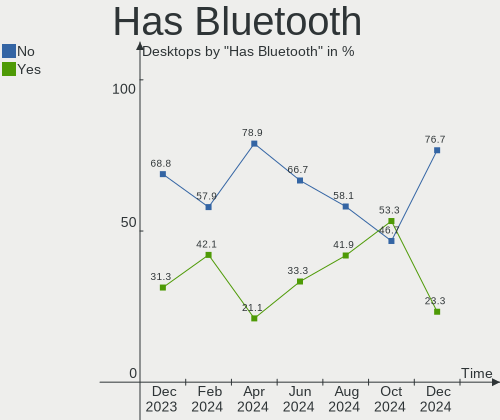
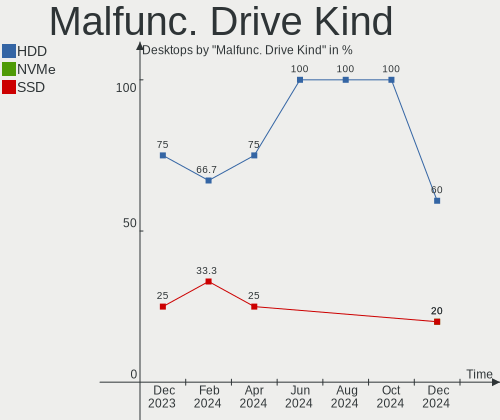
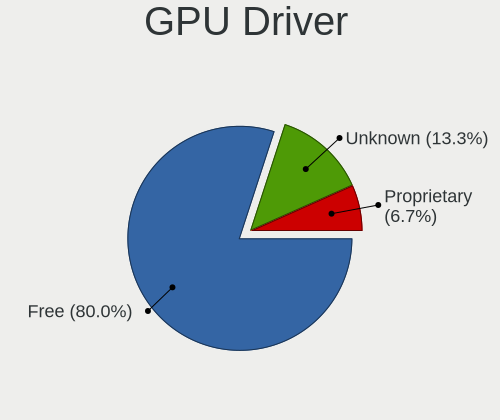
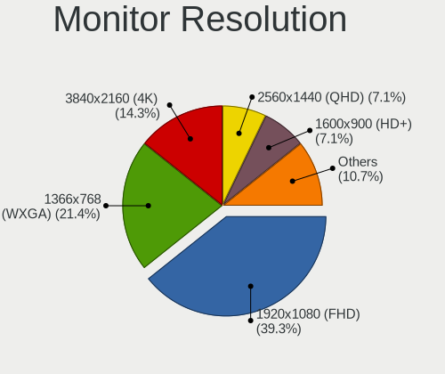
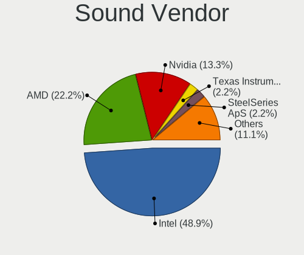

Linux in India - Hardware Trends (Desktops)
-------------------------------------------

A project to identify most popular hardware characteristics and track their change
over time based on data collected by Linux users at https://Linux-Hardware.org.

Anyone can contribute to this report by the [hw-probe](https://github.com/linuxhw/hw-probe) tool:

    sudo -E hw-probe -all -upload

Period: Aug, 2023.

Contents
--------

* [ System ](#system)
  - [ OS                       ](#os)
  - [ OS Family                ](#os-family)
  - [ Kernel                   ](#kernel)
  - [ Kernel Family            ](#kernel-family)
  - [ Kernel Major Ver.        ](#kernel-major-ver)
  - [ Arch                     ](#arch)
  - [ DE                       ](#de)
  - [ Display Server           ](#display-server)
  - [ Display Manager          ](#display-manager)
  - [ OS Lang                  ](#os-lang)
  - [ Boot Mode                ](#boot-mode)
  - [ Filesystem               ](#filesystem)
  - [ Part. scheme             ](#part-scheme)
  - [ Dual Boot with Linux/BSD ](#dual-boot-with-linuxbsd)
  - [ Dual Boot (Win)          ](#dual-boot-win)

* [ Board ](#board)
  - [ Vendor                   ](#vendor)
  - [ Model                    ](#model)
  - [ Model Family             ](#model-family)
  - [ MFG Year                 ](#mfg-year)
  - [ Form Factor              ](#form-factor)
  - [ Secure Boot              ](#secure-boot)
  - [ Coreboot                 ](#coreboot)
  - [ RAM Size                 ](#ram-size)
  - [ RAM Used                 ](#ram-used)
  - [ Total Drives             ](#total-drives)
  - [ Has CD-ROM               ](#has-cd-rom)
  - [ Has Ethernet             ](#has-ethernet)
  - [ Has WiFi                 ](#has-wifi)
  - [ Has Bluetooth            ](#has-bluetooth)

* [ Location ](#location)
  - [ Country                  ](#country)
  - [ City                     ](#city)

* [ Drives ](#drives)
  - [ Drive Vendor             ](#drive-vendor)
  - [ Drive Model              ](#drive-model)
  - [ HDD Vendor               ](#hdd-vendor)
  - [ SSD Vendor               ](#ssd-vendor)
  - [ Drive Kind               ](#drive-kind)
  - [ Drive Connector          ](#drive-connector)
  - [ Drive Size               ](#drive-size)
  - [ Space Total              ](#space-total)
  - [ Space Used               ](#space-used)
  - [ Malfunc. Drives          ](#malfunc-drives)
  - [ Malfunc. Drive Vendor    ](#malfunc-drive-vendor)
  - [ Malfunc. HDD Vendor      ](#malfunc-hdd-vendor)
  - [ Malfunc. Drive Kind      ](#malfunc-drive-kind)
  - [ Failed Drives            ](#failed-drives)
  - [ Failed Drive Vendor      ](#failed-drive-vendor)
  - [ Drive Status             ](#drive-status)

* [ Storage controller ](#storage-controller)
  - [ Storage Vendor           ](#storage-vendor)
  - [ Storage Model            ](#storage-model)
  - [ Storage Kind             ](#storage-kind)

* [ Processor ](#processor)
  - [ CPU Vendor               ](#cpu-vendor)
  - [ CPU Model                ](#cpu-model)
  - [ CPU Model Family         ](#cpu-model-family)
  - [ CPU Cores                ](#cpu-cores)
  - [ CPU Sockets              ](#cpu-sockets)
  - [ CPU Threads              ](#cpu-threads)
  - [ CPU Op-Modes             ](#cpu-op-modes)
  - [ CPU Microcode            ](#cpu-microcode)
  - [ CPU Microarch            ](#cpu-microarch)

* [ Graphics ](#graphics)
  - [ GPU Vendor               ](#gpu-vendor)
  - [ GPU Model                ](#gpu-model)
  - [ GPU Combo                ](#gpu-combo)
  - [ GPU Driver               ](#gpu-driver)
  - [ GPU Memory               ](#gpu-memory)

* [ Monitor ](#monitor)
  - [ Monitor Vendor           ](#monitor-vendor)
  - [ Monitor Model            ](#monitor-model)
  - [ Monitor Resolution       ](#monitor-resolution)
  - [ Monitor Diagonal         ](#monitor-diagonal)
  - [ Monitor Width            ](#monitor-width)
  - [ Aspect Ratio             ](#aspect-ratio)
  - [ Monitor Area             ](#monitor-area)
  - [ Pixel Density            ](#pixel-density)
  - [ Multiple Monitors        ](#multiple-monitors)

* [ Network ](#network)
  - [ Net Controller Vendor    ](#net-controller-vendor)
  - [ Net Controller Model     ](#net-controller-model)
  - [ Wireless Vendor          ](#wireless-vendor)
  - [ Wireless Model           ](#wireless-model)
  - [ Ethernet Vendor          ](#ethernet-vendor)
  - [ Ethernet Model           ](#ethernet-model)
  - [ Net Controller Kind      ](#net-controller-kind)
  - [ Used Controller          ](#used-controller)
  - [ NICs                     ](#nics)
  - [ IPv6                     ](#ipv6)

* [ Bluetooth ](#bluetooth)
  - [ Bluetooth Vendor         ](#bluetooth-vendor)
  - [ Bluetooth Model          ](#bluetooth-model)

* [ Sound ](#sound)
  - [ Sound Vendor             ](#sound-vendor)
  - [ Sound Model              ](#sound-model)

* [ Memory ](#memory)
  - [ Memory Vendor            ](#memory-vendor)
  - [ Memory Model             ](#memory-model)
  - [ Memory Kind              ](#memory-kind)
  - [ Memory Form Factor       ](#memory-form-factor)
  - [ Memory Size              ](#memory-size)
  - [ Memory Speed             ](#memory-speed)

* [ Printers & scanners ](#printers--scanners)
  - [ Printer Vendor           ](#printer-vendor)
  - [ Printer Model            ](#printer-model)
  - [ Scanner Vendor           ](#scanner-vendor)
  - [ Scanner Model            ](#scanner-model)

* [ Camera ](#camera)
  - [ Camera Vendor            ](#camera-vendor)
  - [ Camera Model             ](#camera-model)

* [ Security ](#security)
  - [ Fingerprint Vendor       ](#fingerprint-vendor)
  - [ Fingerprint Model        ](#fingerprint-model)
  - [ Chipcard Vendor          ](#chipcard-vendor)
  - [ Chipcard Model           ](#chipcard-model)

* [ Unsupported ](#unsupported)
  - [ Unsupported Devices      ](#unsupported-devices)
  - [ Unsupported Device Types ](#unsupported-device-types)

System
------

OS
--

Installed operating systems

| Name                | Desktops | Percent |
|---------------------|----------|---------|
| Ubuntu 22.04        | 5        | 20%     |
| Zorin 16            | 3        | 12%     |
| Ubuntu 23.04        | 2        | 8%      |
| Ubuntu 20.04        | 2        | 8%      |
| Fedora 38           | 2        | 8%      |
| Debian 12           | 2        | 8%      |
| Parrot 5.3          | 1        | 4%      |
| OpenMandriva 23.08  | 1        | 4%      |
| MX 23               | 1        | 4%      |
| MX 21               | 1        | 4%      |
| Linux Mint 21.1     | 1        | 4%      |
| KDE neon 22.04      | 1        | 4%      |
| EndeavourOS Rolling | 1        | 4%      |
| blendOS             | 1        | 4%      |
| Arch Rolling        | 1        | 4%      |

OS Family
---------

OS without a version

| Name         | Desktops | Percent |
|--------------|----------|---------|
| Ubuntu       | 9        | 36%     |
| Zorin        | 3        | 12%     |
| MX           | 2        | 8%      |
| Fedora       | 2        | 8%      |
| Debian       | 2        | 8%      |
| Parrot       | 1        | 4%      |
| OpenMandriva | 1        | 4%      |
| Linux Mint   | 1        | 4%      |
| KDE neon     | 1        | 4%      |
| EndeavourOS  | 1        | 4%      |
| blendOS      | 1        | 4%      |
| Arch         | 1        | 4%      |

Kernel
------

Version of the Linux kernel

| Version                 | Desktops | Percent |
|-------------------------|----------|---------|
| 6.2.0-26-generic        | 4        | 16%     |
| 6.1.0-10-amd64          | 2        | 8%      |
| 5.15.0-79-generic       | 2        | 8%      |
| 6.4.8-arch1-1           | 1        | 4%      |
| 6.4.7-200.fc38.x86_64   | 1        | 4%      |
| 6.4.11-desktop-1omv2390 | 1        | 4%      |
| 6.3.9-zen1-1-zen        | 1        | 4%      |
| 6.2.9-300.fc38.x86_64   | 1        | 4%      |
| 6.2.16-8-pve            | 1        | 4%      |
| 6.2.0-27-generic        | 1        | 4%      |
| 6.2.0-20-generic        | 1        | 4%      |
| 6.1.39-1-lts            | 1        | 4%      |
| 6.1.0-1parrot1-amd64    | 1        | 4%      |
| 6.0.0-6mx-amd64         | 1        | 4%      |
| 5.4.0-156-generic       | 1        | 4%      |
| 5.19.0-50-generic       | 1        | 4%      |
| 5.19.0-32-generic       | 1        | 4%      |
| 5.15.0-82-generic       | 1        | 4%      |
| 5.15.0-78-generic       | 1        | 4%      |
| 5.15.0-76-generic       | 1        | 4%      |

Kernel Family
-------------

Linux kernel without a distro release

| Version | Desktops | Percent |
|---------|----------|---------|
| 6.2.0   | 6        | 24%     |
| 5.15.0  | 5        | 20%     |
| 6.1.0   | 3        | 12%     |
| 5.19.0  | 2        | 8%      |
| 6.4.8   | 1        | 4%      |
| 6.4.7   | 1        | 4%      |
| 6.4.11  | 1        | 4%      |
| 6.3.9   | 1        | 4%      |
| 6.2.9   | 1        | 4%      |
| 6.2.16  | 1        | 4%      |
| 6.1.39  | 1        | 4%      |
| 6.0.0   | 1        | 4%      |
| 5.4.0   | 1        | 4%      |

Kernel Major Ver.
-----------------

Linux kernel major version

| Version | Desktops | Percent |
|---------|----------|---------|
| 6.2     | 8        | 32%     |
| 5.15    | 5        | 20%     |
| 6.1     | 4        | 16%     |
| 6.4     | 3        | 12%     |
| 5.19    | 2        | 8%      |
| 6.3     | 1        | 4%      |
| 6.0     | 1        | 4%      |
| 5.4     | 1        | 4%      |

Arch
----

OS architecture (x86_64, i586, etc.)

| Name   | Desktops | Percent |
|--------|----------|---------|
| x86_64 | 25       | 100%    |

DE
--

Desktop Environment

| Name       | Desktops | Percent |
|------------|----------|---------|
| GNOME      | 14       | 56%     |
| KDE5       | 7        | 28%     |
| X-Cinnamon | 1        | 4%      |
| MATE       | 1        | 4%      |
| LXDE       | 1        | 4%      |
| Unknown    | 1        | 4%      |

Display Server
--------------

X11 or Wayland

| Name    | Desktops | Percent |
|---------|----------|---------|
| X11     | 15       | 60%     |
| Wayland | 8        | 32%     |
| Tty     | 1        | 4%      |
| Unknown | 1        | 4%      |

Display Manager
---------------

SDDM, LightDM, etc.

| Name    | Desktops | Percent |
|---------|----------|---------|
| Unknown | 9        | 36%     |
| GDM3    | 6        | 24%     |
| SDDM    | 5        | 20%     |
| GDM     | 3        | 12%     |
| LightDM | 2        | 8%      |

OS Lang
-------

Language

| Lang  | Desktops | Percent |
|-------|----------|---------|
| en_IN | 16       | 64%     |
| en_US | 8        | 32%     |
| C     | 1        | 4%      |

Boot Mode
---------

EFI or BIOS

| Mode | Desktops | Percent |
|------|----------|---------|
| EFI  | 15       | 60%     |
| BIOS | 10       | 40%     |

Filesystem
----------

Type of filesystem

| Type  | Desktops | Percent |
|-------|----------|---------|
| Ext4  | 15       | 60%     |
| Tmpfs | 4        | 16%     |
| Btrfs | 4        | 16%     |
| Zfs   | 1        | 4%      |
| Xfs   | 1        | 4%      |

Part. scheme
------------

Scheme of partitioning

| Type    | Desktops | Percent |
|---------|----------|---------|
| GPT     | 15       | 60%     |
| Unknown | 8        | 32%     |
| MBR     | 2        | 8%      |

Dual Boot with Linux/BSD
------------------------

Hosting more than one Linux/BSD

| Dual boot | Desktops | Percent |
|-----------|----------|---------|
| No        | 22       | 88%     |
| Yes       | 3        | 12%     |

Dual Boot (Win)
---------------

Hosting Linux and Windows

| Dual boot | Desktops | Percent |
|-----------|----------|---------|
| No        | 16       | 64%     |
| Yes       | 9        | 36%     |

Board
-----

Vendor
------

Motherboard manufacturer

| Name                | Desktops | Percent |
|---------------------|----------|---------|
| Gigabyte Technology | 4        | 16%     |
| ASUSTek Computer    | 4        | 16%     |
| Intel               | 3        | 12%     |
| Dell                | 3        | 12%     |
| ASRock              | 3        | 12%     |
| OEM                 | 2        | 8%      |
| Lenovo              | 2        | 8%      |
| Hewlett-Packard     | 1        | 4%      |
| Foxconn             | 1        | 4%      |
| ASRockRack          | 1        | 4%      |
| Unknown             | 1        | 4%      |

Model
-----

Motherboard model

| Name                                 | Desktops | Percent |
|--------------------------------------|----------|---------|
| OEM Intel H81                        | 2        | 8%      |
| ASUS ROG STRIX B550-F GAMING WIFI II | 2        | 8%      |
| Lenovo ThinkCentre M79 10CTS07800    | 1        | 4%      |
| Lenovo ThinkCentre M58p 7220AR1      | 1        | 4%      |
| Intel H61                            | 1        | 4%      |
| Intel DG41RQ AAE54511-203            | 1        | 4%      |
| Intel DB85FL AAG89861-201            | 1        | 4%      |
| HP Compaq Pro 6300 MT                | 1        | 4%      |
| Gigabyte H110M-S2                    | 1        | 4%      |
| Gigabyte B550M DS3H AC               | 1        | 4%      |
| Gigabyte B550M DS3H                  | 1        | 4%      |
| Gigabyte B450M DS3H WIFI             | 1        | 4%      |
| Foxconn G31MXP FAB:1.1               | 1        | 4%      |
| Dell Vostro 3710                     | 1        | 4%      |
| Dell OptiPlex Micro Plus 7010        | 1        | 4%      |
| Dell Inspiron 3891                   | 1        | 4%      |
| ASUS Z170 PRO GAMING                 | 1        | 4%      |
| ASUS PRIME X670-P WIFI               | 1        | 4%      |
| ASRockRack EP2C612D16C-4L            | 1        | 4%      |
| ASRock B650 PG Lightning             | 1        | 4%      |
| ASRock B450M Pro4                    | 1        | 4%      |
| ASRock B450 Steel Legend             | 1        | 4%      |
| Unknown                              | 1        | 4%      |

Model Family
------------

Motherboard model prefix

| Name                      | Desktops | Percent |
|---------------------------|----------|---------|
| OEM Intel                 | 2        | 8%      |
| Lenovo ThinkCentre        | 2        | 8%      |
| Gigabyte B550M            | 2        | 8%      |
| ASUS ROG                  | 2        | 8%      |
| Intel H61                 | 1        | 4%      |
| Intel DG41RQ              | 1        | 4%      |
| Intel DB85FL              | 1        | 4%      |
| HP Compaq                 | 1        | 4%      |
| Gigabyte H110M-S2         | 1        | 4%      |
| Gigabyte B450M            | 1        | 4%      |
| Foxconn G31MXP            | 1        | 4%      |
| Dell Vostro               | 1        | 4%      |
| Dell OptiPlex             | 1        | 4%      |
| Dell Inspiron             | 1        | 4%      |
| ASUS Z170                 | 1        | 4%      |
| ASUS PRIME                | 1        | 4%      |
| ASRockRack EP2C612D16C-4L | 1        | 4%      |
| ASRock B650               | 1        | 4%      |
| ASRock B450M              | 1        | 4%      |
| ASRock B450               | 1        | 4%      |
| Unknown                   | 1        | 4%      |

MFG Year
--------

Motherboard manufacture year

| Year | Desktops | Percent |
|------|----------|---------|
| 2021 | 4        | 16%     |
| 2023 | 3        | 12%     |
| 2016 | 3        | 12%     |
| 2022 | 2        | 8%      |
| 2019 | 2        | 8%      |
| 2018 | 2        | 8%      |
| 2015 | 2        | 8%      |
| 2009 | 2        | 8%      |
| 2020 | 1        | 4%      |
| 2017 | 1        | 4%      |
| 2013 | 1        | 4%      |
| 2012 | 1        | 4%      |
| 2008 | 1        | 4%      |

Form Factor
-----------

Physical design of the computer

| Name    | Desktops | Percent |
|---------|----------|---------|
| Desktop | 25       | 100%    |

Secure Boot
-----------

Enabled or disabled

| State    | Desktops | Percent |
|----------|----------|---------|
| Disabled | 23       | 92%     |
| Enabled  | 2        | 8%      |

Coreboot
--------

Have coreboot on board

| Used | Desktops | Percent |
|------|----------|---------|
| No   | 25       | 100%    |

RAM Size
--------

Total RAM memory

| Size in GB      | Desktops | Percent |
|-----------------|----------|---------|
| 16.01-24.0      | 6        | 24%     |
| 4.01-8.0        | 5        | 20%     |
| 32.01-64.0      | 4        | 16%     |
| 8.01-16.0       | 4        | 16%     |
| 3.01-4.0        | 2        | 8%      |
| 24.01-32.0      | 2        | 8%      |
| More than 256.0 | 1        | 4%      |
| 1.01-2.0        | 1        | 4%      |

RAM Used
--------

Used RAM memory

| Used GB   | Desktops | Percent |
|-----------|----------|---------|
| 4.01-8.0  | 8        | 32%     |
| 3.01-4.0  | 6        | 24%     |
| 2.01-3.0  | 6        | 24%     |
| 1.01-2.0  | 3        | 12%     |
| 8.01-16.0 | 1        | 4%      |
| 0.51-1.0  | 1        | 4%      |

Total Drives
------------

Number of drives on board

| Drives | Desktops | Percent |
|--------|----------|---------|
| 1      | 10       | 40%     |
| 2      | 9        | 36%     |
| 3      | 3        | 12%     |
| 19     | 1        | 4%      |
| 6      | 1        | 4%      |
| 5      | 1        | 4%      |

Has CD-ROM
----------

Has CD-ROM on board

| Presented | Desktops | Percent |
|-----------|----------|---------|
| No        | 21       | 84%     |
| Yes       | 4        | 16%     |

Has Ethernet
------------

Has Ethernet on board

| Presented | Desktops | Percent |
|-----------|----------|---------|
| Yes       | 25       | 100%    |

Has WiFi
--------

Has WiFi module

| Presented | Desktops | Percent |
|-----------|----------|---------|
| Yes       | 17       | 68%     |
| No        | 8        | 32%     |

Has Bluetooth
-------------

Has Bluetooth module

| Presented | Desktops | Percent |
|-----------|----------|---------|
| No        | 15       | 60%     |
| Yes       | 10       | 40%     |

Location
--------

Country
-------

Geographic location (country)

| Country | Desktops | Percent |
|---------|----------|---------|
| India   | 25       | 100%    |

City
----

Geographic location (city)

| City       | Desktops | Percent |
|------------|----------|---------|
| Bengaluru  | 5        | 20%     |
| Hyderabad  | 4        | 16%     |
| Delhi      | 2        | 8%      |
| Chennai    | 2        | 8%      |
| Trivandrum | 1        | 4%      |
| Siliguri   | 1        | 4%      |
| Rajkot     | 1        | 4%      |
| Pune       | 1        | 4%      |
| Mumbai     | 1        | 4%      |
| Lucknow    | 1        | 4%      |
| Kalyan     | 1        | 4%      |
| Kalwara    | 1        | 4%      |
| Dombivali  | 1        | 4%      |
| Coimbatore | 1        | 4%      |
| Chandigarh | 1        | 4%      |
| Ahmedabad  | 1        | 4%      |

Drives
------

Drive Vendor
------------

Hard drive vendors

| Vendor                      | Desktops | Drives | Percent |
|-----------------------------|----------|--------|---------|
| Seagate                     | 8        | 13     | 16.67%  |
| Crucial                     | 6        | 10     | 12.5%   |
| WDC                         | 5        | 7      | 10.42%  |
| Sandisk                     | 4        | 7      | 8.33%   |
| Samsung Electronics         | 4        | 5      | 8.33%   |
| Hitachi                     | 3        | 3      | 6.25%   |
| XPG                         | 2        | 2      | 4.17%   |
| China                       | 2        | 3      | 4.17%   |
| ADATA Technology            | 2        | 2      | 4.17%   |
| Zebronics                   | 1        | 1      | 2.08%   |
| Toshiba                     | 1        | 1      | 2.08%   |
| SK hynix                    | 1        | 1      | 2.08%   |
| Phison Electronics          | 1        | 1      | 2.08%   |
| Micron/Crucial Technology   | 1        | 2      | 2.08%   |
| Maxtor                      | 1        | 1      | 2.08%   |
| MAXIO Technology (Hangzhou) | 1        | 1      | 2.08%   |
| Kingston                    | 1        | 1      | 2.08%   |
| HGST                        | 1        | 6      | 2.08%   |
| Hewlett-Packard             | 1        | 1      | 2.08%   |
| EVM                         | 1        | 1      | 2.08%   |
| A-DATA Technology           | 1        | 1      | 2.08%   |

Drive Model
-----------

Hard drive models

| Model                                               | Desktops | Percent |
|-----------------------------------------------------|----------|---------|
| Seagate ST1000DM010-2EP102 1TB                      | 3        | 5.36%   |
| ADATA XPG GAMMIX S70 BLADE 1024GB                   | 2        | 3.57%   |
| Zebronics ZEB-SD13 128GB SSD                        | 1        | 1.79%   |
| XPG GAMMIX S70 BLADE 512GB                          | 1        | 1.79%   |
| XPG GAMMIX S5 256GB                                 | 1        | 1.79%   |
| WDC WDS480G2G0B-00EPW0 480GB SSD                    | 1        | 1.79%   |
| WDC WDS250G2B0A-00SM50 250GB SSD                    | 1        | 1.79%   |
| WDC WDS240G2G0A-00JH30 240GB SSD                    | 1        | 1.79%   |
| WDC WD5000AAKX-60U6AA0 500GB                        | 1        | 1.79%   |
| WDC WD20EZBX-00AYRA0 2TB                            | 1        | 1.79%   |
| WDC WD1600BEKT-60A25T1 160GB                        | 1        | 1.79%   |
| WDC WD1600AAJS-00B4A0 160GB                         | 1        | 1.79%   |
| Toshiba DT01ACA100 1TB                              | 1        | 1.79%   |
| SK hynix BC901 NVMe 256GB                           | 1        | 1.79%   |
| Seagate ST500DM002-1BD142 500GB                     | 1        | 1.79%   |
| Seagate ST3500312CS 500GB                           | 1        | 1.79%   |
| Seagate ST3160316CS 160GB                           | 1        | 1.79%   |
| Seagate ST2000DM008-2FR102 2TB                      | 1        | 1.79%   |
| Seagate ST2000DM005-2CW102 2TB                      | 1        | 1.79%   |
| Seagate ST1000DM003-1CH162 1TB                      | 1        | 1.79%   |
| Seagate BUP Portable 5TB                            | 1        | 1.79%   |
| Sandisk WDC WDS500G2B0C-00PXH0 500GB                | 1        | 1.79%   |
| Sandisk WD Blue SN570 500GB                         | 1        | 1.79%   |
| Sandisk WD Blue SN570 1TB                           | 1        | 1.79%   |
| SanDisk NVMe SSD Drive 1TB                          | 1        | 1.79%   |
| Samsung SSD 980 500GB S64DNX0T451494T               | 1        | 1.79%   |
| Samsung SSD 980 500GB                               | 1        | 1.79%   |
| Samsung SSD 860 EVO 1TB                             | 1        | 1.79%   |
| Samsung SSD 850 PRO 256GB                           | 1        | 1.79%   |
| Samsung NVMe SSD Controller SM981/PM981/PM983 500GB | 1        | 1.79%   |
| Phison E12 NVMe Controller 256GB                    | 1        | 1.79%   |
| Micron/Crucial P2 NVMe PCIe SSD 1TB                 | 1        | 1.79%   |
| Maxtor Z1 SSD 240GB                                 | 1        | 1.79%   |
| MAXIO (Hangzhou) NVMe SSD Controller MAP1202 1024GB | 1        | 1.79%   |
| Kingston SA400S37120G 120GB SSD                     | 1        | 1.79%   |
| Hitachi HDT721032SLA360 320GB                       | 1        | 1.79%   |
| Hitachi HDS721032CLA362 320GB                       | 1        | 1.79%   |
| Hitachi HDS721010CLA332 1TB                         | 1        | 1.79%   |
| HGST HUH721008ALE604 8TB                            | 1        | 1.79%   |
| HGST HUH721008AL 8TB                                | 1        | 1.79%   |

HDD Vendor
----------

Hard disk drive vendors

| Vendor  | Desktops | Drives | Percent |
|---------|----------|--------|---------|
| Seagate | 8        | 13     | 47.06%  |
| WDC     | 4        | 4      | 23.53%  |
| Hitachi | 3        | 3      | 17.65%  |
| Toshiba | 1        | 1      | 5.88%   |
| HGST    | 1        | 6      | 5.88%   |

SSD Vendor
----------

Solid state drive vendors

| Vendor              | Desktops | Drives | Percent |
|---------------------|----------|--------|---------|
| Crucial             | 4        | 5      | 28.57%  |
| Samsung Electronics | 2        | 2      | 14.29%  |
| China               | 2        | 3      | 14.29%  |
| Zebronics           | 1        | 1      | 7.14%   |
| WDC                 | 1        | 3      | 7.14%   |
| Maxtor              | 1        | 1      | 7.14%   |
| Kingston            | 1        | 1      | 7.14%   |
| EVM                 | 1        | 1      | 7.14%   |
| A-DATA Technology   | 1        | 1      | 7.14%   |

Drive Kind
----------

HDD or SSD

| Kind | Desktops | Drives | Percent |
|------|----------|--------|---------|
| NVMe | 14       | 25     | 36.84%  |
| HDD  | 13       | 27     | 34.21%  |
| SSD  | 11       | 18     | 28.95%  |

Drive Connector
---------------

SATA, SAS, NVMe, etc.

| Type | Desktops | Drives | Percent |
|------|----------|--------|---------|
| SATA | 20       | 44     | 57.14%  |
| NVMe | 14       | 25     | 40%     |
| SAS  | 1        | 1      | 2.86%   |

Drive Size
----------

Size of hard drive

| Size in TB | Desktops | Drives | Percent |
|------------|----------|--------|---------|
| 0.01-0.5   | 14       | 25     | 56%     |
| 0.51-1.0   | 7        | 8      | 28%     |
| 1.01-2.0   | 2        | 5      | 8%      |
| 4.01-10.0  | 2        | 7      | 8%      |

Space Total
-----------

Amount of disk space available on the file system

| Size in GB     | Desktops | Percent |
|----------------|----------|---------|
| 101-250        | 11       | 44%     |
| 251-500        | 4        | 16%     |
| More than 3000 | 3        | 12%     |
| 501-1000       | 3        | 12%     |
| 1001-2000      | 2        | 8%      |
| 21-50          | 1        | 4%      |
| 51-100         | 1        | 4%      |

Space Used
----------

Amount of used disk space

| Used GB   | Desktops | Percent |
|-----------|----------|---------|
| 1-20      | 9        | 36%     |
| 21-50     | 4        | 16%     |
| 51-100    | 4        | 16%     |
| 501-1000  | 3        | 12%     |
| 251-500   | 2        | 8%      |
| 2001-3000 | 1        | 4%      |
| 101-250   | 1        | 4%      |
| 1001-2000 | 1        | 4%      |

Malfunc. Drives
---------------

Drive models with a malfunction

| Model                                                          | Desktops | Drives | Percent |
|----------------------------------------------------------------|----------|--------|---------|
| Seagate ST1000DM003-1CH162 1TB                                 | 1        | 1      | 25%     |
| MAXIO Technology (Hangzhou) NVMe SSD Controller MAP1202 1024GB | 1        | 1      | 25%     |
| Hitachi HDS721032CLA362 320GB                                  | 1        | 1      | 25%     |
| Hitachi HDS721010CLA332 1TB                                    | 1        | 1      | 25%     |

Malfunc. Drive Vendor
---------------------

Vendors of faulty drives

| Vendor                      | Desktops | Drives | Percent |
|-----------------------------|----------|--------|---------|
| Hitachi                     | 2        | 2      | 50%     |
| Seagate                     | 1        | 1      | 25%     |
| MAXIO Technology (Hangzhou) | 1        | 1      | 25%     |

Malfunc. HDD Vendor
-------------------

Vendors of faulty HDD drives

| Vendor  | Desktops | Drives | Percent |
|---------|----------|--------|---------|
| Hitachi | 2        | 2      | 66.67%  |
| Seagate | 1        | 1      | 33.33%  |

Malfunc. Drive Kind
-------------------

Kinds of faulty drives

| Kind | Desktops | Drives | Percent |
|------|----------|--------|---------|
| HDD  | 3        | 3      | 75%     |
| NVMe | 1        | 1      | 25%     |

Failed Drives
-------------

Failed drive models

Zero info for selected period =(

Failed Drive Vendor
-------------------

Failed drive vendors

Zero info for selected period =(

Drive Status
------------

Number of failed and malfunc. drives

| Status   | Desktops | Drives | Percent |
|----------|----------|--------|---------|
| Detected | 13       | 32     | 46.43%  |
| Works    | 11       | 34     | 39.29%  |
| Malfunc  | 4        | 4      | 14.29%  |

Storage controller
------------------

Storage Vendor
--------------

Storage controller vendors

| Vendor                      | Desktops | Percent |
|-----------------------------|----------|---------|
| Intel                       | 15       | 34.88%  |
| AMD                         | 10       | 23.26%  |
| SanDisk                     | 4        | 9.3%    |
| ADATA Technology            | 4        | 9.3%    |
| Micron/Crucial Technology   | 3        | 6.98%   |
| Samsung Electronics         | 2        | 4.65%   |
| SK hynix                    | 1        | 2.33%   |
| Silicon Motion              | 1        | 2.33%   |
| Phison Electronics          | 1        | 2.33%   |
| MAXIO Technology (Hangzhou) | 1        | 2.33%   |
| ASMedia Technology          | 1        | 2.33%   |

Storage Model
-------------

Storage controller models

| Model                                                                          | Desktops | Percent |
|--------------------------------------------------------------------------------|----------|---------|
| AMD FCH SATA Controller [AHCI mode]                                            | 4        | 8.33%   |
| AMD 500 Series Chipset SATA Controller                                         | 4        | 8.33%   |
| Micron/Crucial P2 [Nick P2] / P3 / P3 Plus NVMe PCIe SSD (DRAM-less)           | 3        | 6.25%   |
| Intel Q170/Q150/B150/H170/H110/Z170/CM236 Chipset SATA Controller [AHCI Mode]  | 3        | 6.25%   |
| Intel 8 Series/C220 Series Chipset Family 6-port SATA Controller 1 [AHCI mode] | 3        | 6.25%   |
| AMD 400 Series Chipset SATA Controller                                         | 3        | 6.25%   |
| ADATA A Non-Volatile memory controller                                         | 3        | 6.25%   |
| SanDisk WD Blue SN570 NVMe SSD 1TB                                             | 2        | 4.17%   |
| Intel NM10/ICH7 Family SATA Controller [IDE mode]                              | 2        | 4.17%   |
| Intel Alder Lake-S PCH SATA Controller [AHCI Mode]                             | 2        | 4.17%   |
| Intel 82801G (ICH7 Family) IDE Controller                                      | 2        | 4.17%   |
| SK hynix BC901 NVMe Solid State Drive (DRAM-less)                              | 1        | 2.08%   |
| Silicon Motion SM2263EN/SM2263XT (DRAM-less) NVMe SSD Controllers              | 1        | 2.08%   |
| SanDisk WD Green SN350 NVMe SSD 240GB (DRAM-less)                              | 1        | 2.08%   |
| SanDisk WD Black SN770 / PC SN740 256GB / PC SN560 (DRAM-less) NVMe SSD        | 1        | 2.08%   |
| Samsung NVMe SSD Controller SM981/PM981/PM983                                  | 1        | 2.08%   |
| Samsung NVMe SSD Controller 980                                                | 1        | 2.08%   |
| Phison E12 NVMe Controller                                                     | 1        | 2.08%   |
| MAXIO (Hangzhou) NVMe SSD Controller MAP1202                                   | 1        | 2.08%   |
| Intel C610/X99 series chipset sSATA Controller [AHCI mode]                     | 1        | 2.08%   |
| Intel C610/X99 series chipset 6-Port SATA Controller [AHCI mode]               | 1        | 2.08%   |
| Intel 82801JD/DO (ICH10 Family) SATA AHCI Controller                           | 1        | 2.08%   |
| Intel 7 Series/C210 Series Chipset Family 6-port SATA Controller [AHCI mode]   | 1        | 2.08%   |
| Intel 6 Series/C200 Series Chipset Family 6 port Desktop SATA AHCI Controller  | 1        | 2.08%   |
| Intel 500 Series Chipset Family SATA AHCI Controller                           | 1        | 2.08%   |
| Intel 4 Series Chipset PT IDER Controller                                      | 1        | 2.08%   |
| ASMedia ASM1062 Serial ATA Controller                                          | 1        | 2.08%   |
| ADATA ADATA XPG GAMMIXS1 1L Media (256 GB SSD)                                 | 1        | 2.08%   |

Storage Kind
------------

Kind of storage controller (IDE, SATA, NVMe, SAS, ...)

| Kind | Desktops | Percent |
|------|----------|---------|
| SATA | 23       | 57.5%   |
| NVMe | 14       | 35%     |
| IDE  | 3        | 7.5%    |

Processor
---------

CPU Vendor
----------

Processor vendors

| Vendor | Desktops | Percent |
|--------|----------|---------|
| Intel  | 15       | 60%     |
| AMD    | 10       | 40%     |

CPU Model
---------

Processor models

| Model                                        | Desktops | Percent |
|----------------------------------------------|----------|---------|
| AMD Ryzen 5 5600G with Radeon Graphics       | 2        | 8%      |
| Intel Xeon CPU E5-2670 v3 @ 2.30GHz          | 1        | 4%      |
| Intel Core i5-6600K CPU @ 3.50GHz            | 1        | 4%      |
| Intel Core i5-6500T CPU @ 2.50GHz            | 1        | 4%      |
| Intel Core i5-4590 CPU @ 3.30GHz             | 1        | 4%      |
| Intel Core i5-4440S CPU @ 2.80GHz            | 1        | 4%      |
| Intel Core i5-4440 CPU @ 3.10GHz             | 1        | 4%      |
| Intel Core i5-3470 CPU @ 3.20GHz             | 1        | 4%      |
| Intel Core i3-6100 CPU @ 3.70GHz             | 1        | 4%      |
| Intel Core i3-2120 CPU @ 3.30GHz             | 1        | 4%      |
| Intel Core 2 Quad CPU Q9550 @ 2.83GHz        | 1        | 4%      |
| Intel Core 2 Quad CPU Q8400 @ 2.66GHz        | 1        | 4%      |
| Intel Core 2 Duo CPU E8400 @ 3.00GHz         | 1        | 4%      |
| Intel 13th Gen Core i9-13900                 | 1        | 4%      |
| Intel 12th Gen Core i7-12700                 | 1        | 4%      |
| Intel 11th Gen Core i7-11700F @ 2.50GHz      | 1        | 4%      |
| AMD Ryzen 9 7900X 12-Core Processor          | 1        | 4%      |
| AMD Ryzen 9 5900X 12-Core Processor          | 1        | 4%      |
| AMD Ryzen 7 5700G with Radeon Graphics       | 1        | 4%      |
| AMD Ryzen 5 7600 6-Core Processor            | 1        | 4%      |
| AMD Ryzen 5 3600 6-Core Processor            | 1        | 4%      |
| AMD Ryzen 5 3500 6-Core Processor            | 1        | 4%      |
| AMD Ryzen 3 PRO 4350G with Radeon Graphics   | 1        | 4%      |
| AMD A10 PRO-7800B R7, 12 Compute Cores 4C+8G | 1        | 4%      |

CPU Model Family
----------------

Processor model prefix

| Model             | Desktops | Percent |
|-------------------|----------|---------|
| Intel Core i5     | 6        | 24%     |
| AMD Ryzen 5       | 5        | 20%     |
| Other             | 3        | 12%     |
| Intel Core i3     | 2        | 8%      |
| Intel Core 2 Quad | 2        | 8%      |
| AMD Ryzen 9       | 2        | 8%      |
| Intel Xeon        | 1        | 4%      |
| Intel Core 2 Duo  | 1        | 4%      |
| AMD Ryzen 7       | 1        | 4%      |
| AMD Ryzen 3 PRO   | 1        | 4%      |
| AMD A10           | 1        | 4%      |

CPU Cores
---------

Number of processor cores

| Number | Desktops | Percent |
|--------|----------|---------|
| 4      | 9        | 36%     |
| 6      | 5        | 20%     |
| 2      | 4        | 16%     |
| 12     | 3        | 12%     |
| 24     | 2        | 8%      |
| 8      | 2        | 8%      |

CPU Sockets
-----------

Number of sockets

| Number | Desktops | Percent |
|--------|----------|---------|
| 1      | 24       | 96%     |
| 2      | 1        | 4%      |

CPU Threads
-----------

Threads per core (Hyper-Threading)

| Number | Desktops | Percent |
|--------|----------|---------|
| 2      | 13       | 52%     |
| 1      | 12       | 48%     |

CPU Op-Modes
------------

CPU Operation Modes (32-bit, 64-bit)

| Op mode        | Desktops | Percent |
|----------------|----------|---------|
| 32-bit, 64-bit | 25       | 100%    |

CPU Microcode
-------------

Microcode number

| Number     | Desktops | Percent |
|------------|----------|---------|
| Unknown    | 10       | 40%     |
| 0x306c3    | 2        | 8%      |
| 0x1067a    | 2        | 8%      |
| 0x08701021 | 2        | 8%      |
| 0xb0671    | 1        | 4%      |
| 0x506e3    | 1        | 4%      |
| 0x306a9    | 1        | 4%      |
| 0x206a7    | 1        | 4%      |
| 0x0a601203 | 1        | 4%      |
| 0x0a50000d | 1        | 4%      |
| 0x0a50000c | 1        | 4%      |
| 0x0a20120a | 1        | 4%      |
| 0x08600109 | 1        | 4%      |

CPU Microarch
-------------

Microarchitecture

| Name             | Desktops | Percent |
|------------------|----------|---------|
| Zen 3            | 4        | 16%     |
| Haswell          | 4        | 16%     |
| Zen 2            | 3        | 12%     |
| Skylake          | 3        | 12%     |
| Penryn           | 3        | 12%     |
| Unknown          | 3        | 12%     |
| Alderlake Hybrid | 2        | 8%      |
| Steamroller      | 1        | 4%      |
| SandyBridge      | 1        | 4%      |
| IvyBridge        | 1        | 4%      |

Graphics
--------

GPU Vendor
----------

Vendors of graphics cards

| Vendor            | Desktops | Percent |
|-------------------|----------|---------|
| Intel             | 10       | 38.46%  |
| AMD               | 9        | 34.62%  |
| Nvidia            | 6        | 23.08%  |
| ASPEED Technology | 1        | 3.85%   |

GPU Model
---------

Graphics card models

| Model                                                                       | Desktops | Percent |
|-----------------------------------------------------------------------------|----------|---------|
| AMD Cezanne [Radeon Vega Series / Radeon Vega Mobile Series]                | 3        | 10.71%  |
| Nvidia GP108 [GeForce GT 1030]                                              | 2        | 7.14%   |
| Intel Xeon E3-1200 v3/4th Gen Core Processor Integrated Graphics Controller | 2        | 7.14%   |
| Intel HD Graphics 530                                                       | 2        | 7.14%   |
| AMD Raphael                                                                 | 2        | 7.14%   |
| Nvidia TU106 [GeForce RTX 2070 Rev. A]                                      | 1        | 3.57%   |
| Nvidia TU106 [GeForce GTX 1650]                                             | 1        | 3.57%   |
| Nvidia GT218 [GeForce 310]                                                  | 1        | 3.57%   |
| Nvidia GP107 [GeForce GTX 1050 Ti]                                          | 1        | 3.57%   |
| Nvidia GA102GL [RTX A6000]                                                  | 1        | 3.57%   |
| Intel Xeon E3-1200 v2/3rd Gen Core processor Graphics Controller            | 1        | 3.57%   |
| Intel Raptor Lake-S GT1 [UHD Graphics 770]                                  | 1        | 3.57%   |
| Intel AlderLake-S GT1                                                       | 1        | 3.57%   |
| Intel 82G33/G31 Express Integrated Graphics Controller                      | 1        | 3.57%   |
| Intel 4 Series Chipset Integrated Graphics Controller                       | 1        | 3.57%   |
| Intel 2nd Generation Core Processor Family Integrated Graphics Controller   | 1        | 3.57%   |
| ASPEED Technology ASPEED Graphics Family                                    | 1        | 3.57%   |
| AMD Renoir                                                                  | 1        | 3.57%   |
| AMD Navi 23 [Radeon RX 6650 XT / 6700S / 6800S]                             | 1        | 3.57%   |
| AMD Navi 22 [Radeon RX 6700/6700 XT/6750 XT / 6800M/6850M XT]               | 1        | 3.57%   |
| AMD Kaveri [Radeon R7 Graphics]                                             | 1        | 3.57%   |
| AMD Ellesmere [Radeon RX 470/480/570/570X/580/580X/590]                     | 1        | 3.57%   |

GPU Combo
---------

Combinations of graphics cards

| Name         | Desktops | Percent |
|--------------|----------|---------|
| 1 x Intel    | 10       | 40%     |
| 1 x AMD      | 7        | 28%     |
| 1 x Nvidia   | 4        | 16%     |
| 2 x Nvidia   | 1        | 4%      |
| 2 x AMD      | 1        | 4%      |
| 1 x ASPEED   | 1        | 4%      |
| AMD + Nvidia | 1        | 4%      |

GPU Driver
----------

Free vs proprietary

| Driver      | Desktops | Percent |
|-------------|----------|---------|
| Free        | 22       | 88%     |
| Proprietary | 3        | 12%     |

GPU Memory
----------

Total video memory

| Size in GB | Desktops | Percent |
|------------|----------|---------|
| Unknown    | 14       | 56%     |
| 1.01-2.0   | 3        | 12%     |
| 0.01-0.5   | 3        | 12%     |
| 7.01-8.0   | 2        | 8%      |
| 3.01-4.0   | 2        | 8%      |
| 8.01-16.0  | 1        | 4%      |

Monitor
-------

Monitor Vendor
--------------

Monitor vendors

| Vendor              | Desktops | Percent |
|---------------------|----------|---------|
| Dell                | 6        | 22.22%  |
| Goldstar            | 4        | 14.81%  |
| BenQ                | 4        | 14.81%  |
| Hewlett-Packard     | 3        | 11.11%  |
| Samsung Electronics | 2        | 7.41%   |
| Lenovo              | 2        | 7.41%   |
| ViewSonic           | 1        | 3.7%    |
| Sony                | 1        | 3.7%    |
| SKY                 | 1        | 3.7%    |
| SGT                 | 1        | 3.7%    |
| NCS                 | 1        | 3.7%    |
| Acer                | 1        | 3.7%    |

Monitor Model
-------------

Monitor models

| Model                                                                 | Desktops | Percent |
|-----------------------------------------------------------------------|----------|---------|
| BenQ GW2283 BNQ78E9 1920x1080 476x268mm 21.5-inch                     | 2        | 6.67%   |
| ViewSonic TD1630-3 VSCC234 1366x768 344x193mm 15.5-inch               | 1        | 3.33%   |
| Sony TV SNYE303 1920x1080                                             | 1        | 3.33%   |
| SKY TV Monitor SKY0030 1920x1080 708x398mm 32.0-inch                  | 1        | 3.33%   |
| SGT '' SGT2380 1920x1080 531x289mm 23.8-inch                          | 1        | 3.33%   |
| Samsung Electronics S22D390 SAM0B63 1920x1080 477x268mm 21.5-inch     | 1        | 3.33%   |
| Samsung Electronics LCD Monitor SAM7103 3840x2160 700x390mm 31.5-inch | 1        | 3.33%   |
| NCS LCD Monitor NCS2275 1920x1080 256x192mm 12.6-inch                 | 1        | 3.33%   |
| Lenovo LT2252p Wide LEN0A0C 1680x1050 474x296mm 22.0-inch             | 1        | 3.33%   |
| Lenovo LEN L174 LEN240B 1280x1024 340x270mm 17.1-inch                 | 1        | 3.33%   |
| Hewlett-Packard Z24nf G2 HPN347E 1920x1080 527x296mm 23.8-inch        | 1        | 3.33%   |
| Hewlett-Packard LV1911 HWP3005 1366x768 410x230mm 18.5-inch           | 1        | 3.33%   |
| Hewlett-Packard 27fw HPN3608 1920x1080 598x336mm 27.0-inch            | 1        | 3.33%   |
| Hewlett-Packard 22es HWP331B 1920x1080 476x268mm 21.5-inch            | 1        | 3.33%   |
| Goldstar ULTRAWIDE GSM5C0C 2560x1080 601x254mm 25.7-inch              | 1        | 3.33%   |
| Goldstar ULTRAGEAR GSM5BB4 2560x1440 597x336mm 27.0-inch              | 1        | 3.33%   |
| Goldstar ULTRAGEAR GSM5B70 3840x2160 621x341mm 27.9-inch              | 1        | 3.33%   |
| Goldstar IPS QHD GSM5BC3 2560x1440 527x296mm 23.8-inch                | 1        | 3.33%   |
| Goldstar 27GL650F GSM5B71 1920x1080 530x300mm 24.0-inch               | 1        | 3.33%   |
| Dell ST2320L DELF024 1920x1080 509x286mm 23.0-inch                    | 1        | 3.33%   |
| Dell S2421HN DEL41F1 1920x1080 527x296mm 23.8-inch                    | 1        | 3.33%   |
| Dell S2417DG DELA0E7 2560x1440 527x296mm 23.8-inch                    | 1        | 3.33%   |
| Dell P2419H DELD0DA 1920x1080 527x296mm 23.8-inch                     | 1        | 3.33%   |
| Dell E2218HN DELF09E 1920x1080 476x268mm 21.5-inch                    | 1        | 3.33%   |
| Dell E2218HN DELF09D 1920x1080 476x268mm 21.5-inch                    | 1        | 3.33%   |
| Dell E1916HV DELF06C 1366x768 409x230mm 18.5-inch                     | 1        | 3.33%   |
| BenQ GW2270 BNQ78DB 1920x1080 476x268mm 21.5-inch                     | 1        | 3.33%   |
| BenQ G2412HD BNQ783B 1920x1080 521x293mm 23.5-inch                    | 1        | 3.33%   |
| Acer KG241Q S ACR074D 1920x1080 520x290mm 23.4-inch                   | 1        | 3.33%   |

Monitor Resolution
------------------

Monitor screen resolution

| Resolution         | Desktops | Percent |
|--------------------|----------|---------|
| 1920x1080 (FHD)    | 17       | 58.62%  |
| 3840x2160 (4K)     | 3        | 10.34%  |
| 2560x1440 (QHD)    | 3        | 10.34%  |
| 1366x768 (WXGA)    | 3        | 10.34%  |
| 2560x1080          | 1        | 3.45%   |
| 1680x1050 (WSXGA+) | 1        | 3.45%   |
| 1280x1024 (SXGA)   | 1        | 3.45%   |

Monitor Diagonal
----------------

Diagonal size in inches

| Inches  | Desktops | Percent |
|---------|----------|---------|
| 21      | 6        | 20.69%  |
| 23      | 5        | 17.24%  |
| 24      | 4        | 13.79%  |
| 27      | 3        | 10.34%  |
| 18      | 2        | 6.9%    |
| 43      | 1        | 3.45%   |
| 32      | 1        | 3.45%   |
| 26      | 1        | 3.45%   |
| 25      | 1        | 3.45%   |
| 22      | 1        | 3.45%   |
| 17      | 1        | 3.45%   |
| 15      | 1        | 3.45%   |
| 12      | 1        | 3.45%   |
| Unknown | 1        | 3.45%   |

Monitor Width
-------------

Physical width

| Width in mm | Desktops | Percent |
|-------------|----------|---------|
| 501-600     | 10       | 35.71%  |
| 401-500     | 10       | 35.71%  |
| 601-700     | 2        | 7.14%   |
| 301-350     | 2        | 7.14%   |
| 701-800     | 1        | 3.57%   |
| 201-300     | 1        | 3.57%   |
| 901-1000    | 1        | 3.57%   |
| Unknown     | 1        | 3.57%   |

Aspect Ratio
------------

Proportional relationship between the width and the height

| Ratio | Desktops | Percent |
|-------|----------|---------|
| 16/9  | 20       | 80%     |
| 5/4   | 1        | 4%      |
| 4/3   | 1        | 4%      |
| 21/9  | 1        | 4%      |
| 2.00  | 1        | 4%      |
| 16/10 | 1        | 4%      |

Monitor Area
------------

Area in inch

| Area in inch | Desktops | Percent |
|----------------|----------|---------|
| 201-250        | 13       | 50%     |
| 301-350        | 3        | 11.54%  |
| 141-150        | 3        | 11.54%  |
| 71-80          | 1        | 3.85%   |
| 351-500        | 1        | 3.85%   |
| 251-300        | 1        | 3.85%   |
| 151-200        | 1        | 3.85%   |
| 101-110        | 1        | 3.85%   |
| 501-1000       | 1        | 3.85%   |
| Unknown        | 1        | 3.85%   |

Pixel Density
-------------

Pixels per inch

| Density | Desktops | Percent |
|---------|----------|---------|
| 51-100  | 14       | 48.28%  |
| 101-120 | 10       | 34.48%  |
| 121-160 | 3        | 10.34%  |
| 161-240 | 1        | 3.45%   |
| Unknown | 1        | 3.45%   |

Multiple Monitors
-----------------

Total monitors connected

| Total | Desktops | Percent |
|-------|----------|---------|
| 1     | 21       | 84%     |
| 2     | 4        | 16%     |

Network
-------

Net Controller Vendor
---------------------

Controller vendors

| Vendor                | Desktops | Percent |
|-----------------------|----------|---------|
| Realtek Semiconductor | 18       | 47.37%  |
| Intel                 | 11       | 28.95%  |
| TP-Link               | 4        | 10.53%  |
| MediaTek              | 2        | 5.26%   |
| Samsung Electronics   | 1        | 2.63%   |
| Ralink Technology     | 1        | 2.63%   |
| D-Link                | 1        | 2.63%   |

Net Controller Model
--------------------

Controller models

| Model                                                                       | Desktops | Percent |
|-----------------------------------------------------------------------------|----------|---------|
| Realtek RTL8111/8168/8411 PCI Express Gigabit Ethernet Controller           | 11       | 23.91%  |
| Realtek RTL810xE PCI Express Fast Ethernet controller                       | 4        | 8.7%    |
| Realtek RTL8188EUS 802.11n Wireless Network Adapter                         | 3        | 6.52%   |
| TP-Link Archer T3U [Realtek RTL8812BU]                                      | 2        | 4.35%   |
| TP-Link 802.11ac NIC                                                        | 2        | 4.35%   |
| Realtek RTL8821CE 802.11ac PCIe Wireless Network Adapter                    | 2        | 4.35%   |
| Realtek RTL8125 2.5GbE Controller                                           | 2        | 4.35%   |
| MediaTek MT7921K (RZ608) Wi-Fi 6E 80MHz                                     | 2        | 4.35%   |
| Intel Ethernet Controller I225-V                                            | 2        | 4.35%   |
| Samsung Galaxy series, misc. (tethering mode)                               | 1        | 2.17%   |
| Realtek RTL8852BE PCIe 802.11ax Wireless Network Controller                 | 1        | 2.17%   |
| Realtek RTL8723BU 802.11b/g/n WLAN Adapter                                  | 1        | 2.17%   |
| Ralink MT7601U Wireless Adapter                                             | 1        | 2.17%   |
| Intel Wi-Fi 6 AX210/AX211/AX411 160MHz                                      | 1        | 2.17%   |
| Intel Tiger Lake PCH CNVi WiFi                                              | 1        | 2.17%   |
| Intel I210 Gigabit Network Connection                                       | 1        | 2.17%   |
| Intel Ethernet Controller X550                                              | 1        | 2.17%   |
| Intel Ethernet Connection I217-V                                            | 1        | 2.17%   |
| Intel Ethernet Connection (2) I219-V                                        | 1        | 2.17%   |
| Intel Ethernet Connection (17) I219-LM                                      | 1        | 2.17%   |
| Intel Dual Band Wireless-AC 3168NGW [Stone Peak]                            | 1        | 2.17%   |
| Intel Alder Lake-S PCH CNVi WiFi                                            | 1        | 2.17%   |
| Intel 82579LM Gigabit Network Connection (Lewisville)                       | 1        | 2.17%   |
| Intel 82567LM-3 Gigabit Network Connection                                  | 1        | 2.17%   |
| D-Link DWA-131 802.11n Wireless N Nano Adapter (rev.B1) [Realtek RTL8192CU] | 1        | 2.17%   |

Wireless Vendor
---------------

Wireless vendors

| Vendor                | Desktops | Percent |
|-----------------------|----------|---------|
| Realtek Semiconductor | 7        | 36.84%  |
| TP-Link               | 4        | 21.05%  |
| Intel                 | 4        | 21.05%  |
| MediaTek              | 2        | 10.53%  |
| Ralink Technology     | 1        | 5.26%   |
| D-Link                | 1        | 5.26%   |

Wireless Model
--------------

Wireless models

| Model                                                                       | Desktops | Percent |
|-----------------------------------------------------------------------------|----------|---------|
| Realtek RTL8188EUS 802.11n Wireless Network Adapter                         | 3        | 15.79%  |
| TP-Link Archer T3U [Realtek RTL8812BU]                                      | 2        | 10.53%  |
| TP-Link 802.11ac NIC                                                        | 2        | 10.53%  |
| Realtek RTL8821CE 802.11ac PCIe Wireless Network Adapter                    | 2        | 10.53%  |
| MediaTek MT7921K (RZ608) Wi-Fi 6E 80MHz                                     | 2        | 10.53%  |
| Realtek RTL8852BE PCIe 802.11ax Wireless Network Controller                 | 1        | 5.26%   |
| Realtek RTL8723BU 802.11b/g/n WLAN Adapter                                  | 1        | 5.26%   |
| Ralink MT7601U Wireless Adapter                                             | 1        | 5.26%   |
| Intel Wi-Fi 6 AX210/AX211/AX411 160MHz                                      | 1        | 5.26%   |
| Intel Tiger Lake PCH CNVi WiFi                                              | 1        | 5.26%   |
| Intel Dual Band Wireless-AC 3168NGW [Stone Peak]                            | 1        | 5.26%   |
| Intel Alder Lake-S PCH CNVi WiFi                                            | 1        | 5.26%   |
| D-Link DWA-131 802.11n Wireless N Nano Adapter (rev.B1) [Realtek RTL8192CU] | 1        | 5.26%   |

Ethernet Vendor
---------------

Ethernet vendors

| Vendor                | Desktops | Percent |
|-----------------------|----------|---------|
| Realtek Semiconductor | 17       | 65.38%  |
| Intel                 | 8        | 30.77%  |
| Samsung Electronics   | 1        | 3.85%   |

Ethernet Model
--------------

Ethernet models

| Model                                                             | Desktops | Percent |
|-------------------------------------------------------------------|----------|---------|
| Realtek RTL8111/8168/8411 PCI Express Gigabit Ethernet Controller | 11       | 40.74%  |
| Realtek RTL810xE PCI Express Fast Ethernet controller             | 4        | 14.81%  |
| Realtek RTL8125 2.5GbE Controller                                 | 2        | 7.41%   |
| Intel Ethernet Controller I225-V                                  | 2        | 7.41%   |
| Samsung Galaxy series, misc. (tethering mode)                     | 1        | 3.7%    |
| Intel I210 Gigabit Network Connection                             | 1        | 3.7%    |
| Intel Ethernet Controller X550                                    | 1        | 3.7%    |
| Intel Ethernet Connection I217-V                                  | 1        | 3.7%    |
| Intel Ethernet Connection (2) I219-V                              | 1        | 3.7%    |
| Intel Ethernet Connection (17) I219-LM                            | 1        | 3.7%    |
| Intel 82579LM Gigabit Network Connection (Lewisville)             | 1        | 3.7%    |
| Intel 82567LM-3 Gigabit Network Connection                        | 1        | 3.7%    |

Net Controller Kind
-------------------

Ethernet, WiFi or modem

| Kind     | Desktops | Percent |
|----------|----------|---------|
| Ethernet | 25       | 59.52%  |
| WiFi     | 17       | 40.48%  |

Used Controller
---------------

Currently used network controller

| Kind     | Desktops | Percent |
|----------|----------|---------|
| Ethernet | 15       | 60%     |
| WiFi     | 10       | 40%     |

NICs
----

Total network controllers on board

| Total | Desktops | Percent |
|-------|----------|---------|
| 1     | 15       | 60%     |
| 2     | 9        | 36%     |
| 6     | 1        | 4%      |

IPv6
----

IPv6 vs IPv4

| Used | Desktops | Percent |
|------|----------|---------|
| No   | 19       | 76%     |
| Yes  | 6        | 24%     |

Bluetooth
---------

Bluetooth Vendor
----------------

Controller vendors

| Vendor                | Desktops | Percent |
|-----------------------|----------|---------|
| Intel                 | 4        | 40%     |
| MediaTek              | 2        | 20%     |
| IMC Networks          | 2        | 20%     |
| TP-Link               | 1        | 10%     |
| Realtek Semiconductor | 1        | 10%     |

Bluetooth Model
---------------

Controller models

| Model                        | Desktops | Percent |
|------------------------------|----------|---------|
| MediaTek Wireless_Device     | 2        | 20%     |
| Intel Bluetooth Device       | 2        | 20%     |
| IMC Networks Bluetooth Radio | 2        | 20%     |
| TP-Link UB5A Adapter         | 1        | 10%     |
| Realtek Bluetooth Radio      | 1        | 10%     |
| Intel AX210 Bluetooth        | 1        | 10%     |
| Intel AX201 Bluetooth        | 1        | 10%     |

Sound
-----

Sound Vendor
------------

Sound card vendors

| Vendor              | Desktops | Percent |
|---------------------|----------|---------|
| Intel               | 14       | 42.42%  |
| AMD                 | 10       | 30.3%   |
| Nvidia              | 6        | 18.18%  |
| Plantronics         | 1        | 3.03%   |
| Kingston Technology | 1        | 3.03%   |
| C-Media Electronics | 1        | 3.03%   |

Sound Model
-----------

Sound card models

| Model                                                                      | Desktops | Percent |
|----------------------------------------------------------------------------|----------|---------|
| AMD Family 17h/19h HD Audio Controller                                     | 6        | 12.77%  |
| AMD Renoir Radeon High Definition Audio Controller                         | 4        | 8.51%   |
| Intel 8 Series/C220 Series Chipset High Definition Audio Controller        | 3        | 6.38%   |
| Intel 100 Series/C230 Series Chipset Family HD Audio Controller            | 3        | 6.38%   |
| AMD Starship/Matisse HD Audio Controller                                   | 3        | 6.38%   |
| Nvidia TU106 High Definition Audio Controller                              | 2        | 4.26%   |
| Nvidia GP108 High Definition Audio Controller                              | 2        | 4.26%   |
| Intel Xeon E3-1200 v3/4th Gen Core Processor HD Audio Controller           | 2        | 4.26%   |
| Intel NM10/ICH7 Family High Definition Audio Controller                    | 2        | 4.26%   |
| Intel Alder Lake-S HD Audio Controller                                     | 2        | 4.26%   |
| AMD Rembrandt Radeon High Definition Audio Controller                      | 2        | 4.26%   |
| AMD Navi 21/23 HDMI/DP Audio Controller                                    | 2        | 4.26%   |
| Plantronics C320-M                                                         | 1        | 2.13%   |
| Nvidia High Definition Audio Controller                                    | 1        | 2.13%   |
| Nvidia GP107GL High Definition Audio Controller                            | 1        | 2.13%   |
| Nvidia GA102 High Definition Audio Controller                              | 1        | 2.13%   |
| Kingston Technology HyperX 7.1 Audio                                       | 1        | 2.13%   |
| Intel USB2.0 Device                                                        | 1        | 2.13%   |
| Intel Tiger Lake-H HD Audio Controller                                     | 1        | 2.13%   |
| Intel 82801JD/DO (ICH10 Family) HD Audio Controller                        | 1        | 2.13%   |
| Intel 7 Series/C216 Chipset Family High Definition Audio Controller        | 1        | 2.13%   |
| Intel 6 Series/C200 Series Chipset Family High Definition Audio Controller | 1        | 2.13%   |
| C-Media Electronics Cmedia Audio                                           | 1        | 2.13%   |
| AMD Kaveri HDMI/DP Audio Controller                                        | 1        | 2.13%   |
| AMD FCH Azalia Controller                                                  | 1        | 2.13%   |
| AMD Ellesmere HDMI Audio [Radeon RX 470/480 / 570/580/590]                 | 1        | 2.13%   |

Memory
------

Memory Vendor
-------------

Memory module vendors

| Vendor            | Desktops | Percent |
|-------------------|----------|---------|
| G.Skill           | 3        | 23.08%  |
| Kingston          | 2        | 15.38%  |
| Unknown           | 1        | 7.69%   |
| Transcend         | 1        | 7.69%   |
| SK hynix          | 1        | 7.69%   |
| Micron Technology | 1        | 7.69%   |
| CSX               | 1        | 7.69%   |
| Corsair           | 1        | 7.69%   |
| A-DATA Technology | 1        | 7.69%   |
| Unknown           | 1        | 7.69%   |

Memory Model
------------

Memory module models

| Model                                                  | Desktops | Percent |
|--------------------------------------------------------|----------|---------|
| Unknown RAM Module 2GB DIMM DDR2 1067MT/s              | 1        | 7.14%   |
| Transcend RAM TS1GLK64W6H 8GB DIMM DDR3 1600MT/s       | 1        | 7.14%   |
| Transcend RAM JM1600KLH-8G 8GB DIMM DDR3 1600MT/s      | 1        | 7.14%   |
| SK hynix RAM HMCG88MEBSA092N 32GB SODIMM DDR5 4800MT/s | 1        | 7.14%   |
| Micron RAM 36ASF2G72PZ-2G1A2 16GB RIMM DDR4 2133MT/s   | 1        | 7.14%   |
| Kingston RAM KHX2133C14/16G 16GB DIMM DDR4 2176MT/s    | 1        | 7.14%   |
| Kingston RAM K9CXF2-MIF 8GB DIMM DDR4 3200MT/s         | 1        | 7.14%   |
| G.Skill RAM F5-6000J3636F16G 16GB DIMM DDR5 6400MT/s   | 1        | 7.14%   |
| G.Skill RAM F4-3600C18-16GVK 16GB DIMM DDR4 3733MT/s   | 1        | 7.14%   |
| G.Skill RAM F4-3200C16-8GVKB 8192MB DIMM DDR4 3866MT/s | 1        | 7.14%   |
| CSX RAM V01L3LF4GB26826816 4GB DIMM DDR3 1333MT/s      | 1        | 7.14%   |
| Corsair RAM CMK8GX4M1A2400C16 8GB DIMM DDR4 2800MT/s   | 1        | 7.14%   |
| A-DATA RAM DDR4 3200 8GB DIMM DDR4 3600MT/s            | 1        | 7.14%   |
| Unknown                                                | 1        | 7.14%   |

Memory Kind
-----------

Memory module kinds

| Kind    | Desktops | Percent |
|---------|----------|---------|
| DDR4    | 7        | 53.85%  |
| DDR5    | 2        | 15.38%  |
| DDR3    | 2        | 15.38%  |
| DDR2    | 1        | 7.69%   |
| Unknown | 1        | 7.69%   |

Memory Form Factor
------------------

Physical design of the memory module

| Name   | Desktops | Percent |
|--------|----------|---------|
| DIMM   | 11       | 84.62%  |
| SODIMM | 1        | 7.69%   |
| RIMM   | 1        | 7.69%   |

Memory Size
-----------

Memory module size

| Size  | Desktops | Percent |
|-------|----------|---------|
| 16384 | 4        | 30.77%  |
| 8192  | 4        | 30.77%  |
| 32768 | 2        | 15.38%  |
| 2048  | 2        | 15.38%  |
| 4096  | 1        | 7.69%   |

Memory Speed
------------

Memory module speed

| Speed | Desktops | Percent |
|-------|----------|---------|
| 25834 | 1        | 7.69%   |
| 6400  | 1        | 7.69%   |
| 4800  | 1        | 7.69%   |
| 3866  | 1        | 7.69%   |
| 3733  | 1        | 7.69%   |
| 3600  | 1        | 7.69%   |
| 3200  | 1        | 7.69%   |
| 2800  | 1        | 7.69%   |
| 2176  | 1        | 7.69%   |
| 2133  | 1        | 7.69%   |
| 1600  | 1        | 7.69%   |
| 1333  | 1        | 7.69%   |
| 1067  | 1        | 7.69%   |

Printers & scanners
-------------------

Printer Vendor
--------------

Printer device vendors

Zero info for selected period =(

Printer Model
-------------

Printer device models

Zero info for selected period =(

Scanner Vendor
--------------

Scanner device vendors

Zero info for selected period =(

Scanner Model
-------------

Scanner device models

Zero info for selected period =(

Camera
------

Camera Vendor
-------------

Camera device vendors

| Vendor          | Desktops | Percent |
|-----------------|----------|---------|
| Unknown         | 1        | 16.67%  |
| Microdia        | 1        | 16.67%  |
| MacroSilicon    | 1        | 16.67%  |
| Logitech        | 1        | 16.67%  |
| Hewlett-Packard | 1        | 16.67%  |
| Unknown         | 1        | 16.67%  |

Camera Model
------------

Camera device models

| Model                   | Desktops | Percent |
|-------------------------|----------|---------|
| Unknown HD camera       | 1        | 16.67%  |
| Microdia USB 2.0 Camera | 1        | 16.67%  |
| MacroSilicon USB Video  | 1        | 16.67%  |
| Logitech Webcam C270    | 1        | 16.67%  |
| HP W100                 | 1        | 16.67%  |
| Unknown                 | 1        | 16.67%  |

Security
--------

Fingerprint Vendor
------------------

Fingerprint sensor vendors

Zero info for selected period =(

Fingerprint Model
-----------------

Fingerprint sensor models

Zero info for selected period =(

Chipcard Vendor
---------------

Chipcard module vendors

Zero info for selected period =(

Chipcard Model
--------------

Chipcard module models

Zero info for selected period =(

Unsupported
-----------

Unsupported Devices
-------------------

Total unsupported devices on board

| Total | Desktops | Percent |
|-------|----------|---------|
| 0     | 21       | 84%     |
| 1     | 3        | 12%     |
| 2     | 1        | 4%      |

Unsupported Device Types
------------------------

Types of unsupported devices

| Type                     | Desktops | Percent |
|--------------------------|----------|---------|
| Net/wireless             | 3        | 60%     |
| Unassigned class         | 1        | 20%     |
| Communication controller | 1        | 20%     |

