Linux in India - Hardware Trends (Desktops)
-------------------------------------------

A project to identify most popular hardware characteristics and track their change
over time based on data collected by Linux users at https://Linux-Hardware.org.

Anyone can contribute to this report by the [hw-probe](https://github.com/linuxhw/hw-probe) tool:

    sudo -E hw-probe -all -upload

Period: Jun, 2023.

Contents
--------

* [ System ](#system)
  - [ OS                       ](#os)
  - [ OS Family                ](#os-family)
  - [ Kernel                   ](#kernel)
  - [ Kernel Family            ](#kernel-family)
  - [ Kernel Major Ver.        ](#kernel-major-ver)
  - [ Arch                     ](#arch)
  - [ DE                       ](#de)
  - [ Display Server           ](#display-server)
  - [ Display Manager          ](#display-manager)
  - [ OS Lang                  ](#os-lang)
  - [ Boot Mode                ](#boot-mode)
  - [ Filesystem               ](#filesystem)
  - [ Part. scheme             ](#part-scheme)
  - [ Dual Boot with Linux/BSD ](#dual-boot-with-linuxbsd)
  - [ Dual Boot (Win)          ](#dual-boot-win)

* [ Board ](#board)
  - [ Vendor                   ](#vendor)
  - [ Model                    ](#model)
  - [ Model Family             ](#model-family)
  - [ MFG Year                 ](#mfg-year)
  - [ Form Factor              ](#form-factor)
  - [ Secure Boot              ](#secure-boot)
  - [ Coreboot                 ](#coreboot)
  - [ RAM Size                 ](#ram-size)
  - [ RAM Used                 ](#ram-used)
  - [ Total Drives             ](#total-drives)
  - [ Has CD-ROM               ](#has-cd-rom)
  - [ Has Ethernet             ](#has-ethernet)
  - [ Has WiFi                 ](#has-wifi)
  - [ Has Bluetooth            ](#has-bluetooth)

* [ Location ](#location)
  - [ Country                  ](#country)
  - [ City                     ](#city)

* [ Drives ](#drives)
  - [ Drive Vendor             ](#drive-vendor)
  - [ Drive Model              ](#drive-model)
  - [ HDD Vendor               ](#hdd-vendor)
  - [ SSD Vendor               ](#ssd-vendor)
  - [ Drive Kind               ](#drive-kind)
  - [ Drive Connector          ](#drive-connector)
  - [ Drive Size               ](#drive-size)
  - [ Space Total              ](#space-total)
  - [ Space Used               ](#space-used)
  - [ Malfunc. Drives          ](#malfunc-drives)
  - [ Malfunc. Drive Vendor    ](#malfunc-drive-vendor)
  - [ Malfunc. HDD Vendor      ](#malfunc-hdd-vendor)
  - [ Malfunc. Drive Kind      ](#malfunc-drive-kind)
  - [ Failed Drives            ](#failed-drives)
  - [ Failed Drive Vendor      ](#failed-drive-vendor)
  - [ Drive Status             ](#drive-status)

* [ Storage controller ](#storage-controller)
  - [ Storage Vendor           ](#storage-vendor)
  - [ Storage Model            ](#storage-model)
  - [ Storage Kind             ](#storage-kind)

* [ Processor ](#processor)
  - [ CPU Vendor               ](#cpu-vendor)
  - [ CPU Model                ](#cpu-model)
  - [ CPU Model Family         ](#cpu-model-family)
  - [ CPU Cores                ](#cpu-cores)
  - [ CPU Sockets              ](#cpu-sockets)
  - [ CPU Threads              ](#cpu-threads)
  - [ CPU Op-Modes             ](#cpu-op-modes)
  - [ CPU Microcode            ](#cpu-microcode)
  - [ CPU Microarch            ](#cpu-microarch)

* [ Graphics ](#graphics)
  - [ GPU Vendor               ](#gpu-vendor)
  - [ GPU Model                ](#gpu-model)
  - [ GPU Combo                ](#gpu-combo)
  - [ GPU Driver               ](#gpu-driver)
  - [ GPU Memory               ](#gpu-memory)

* [ Monitor ](#monitor)
  - [ Monitor Vendor           ](#monitor-vendor)
  - [ Monitor Model            ](#monitor-model)
  - [ Monitor Resolution       ](#monitor-resolution)
  - [ Monitor Diagonal         ](#monitor-diagonal)
  - [ Monitor Width            ](#monitor-width)
  - [ Aspect Ratio             ](#aspect-ratio)
  - [ Monitor Area             ](#monitor-area)
  - [ Pixel Density            ](#pixel-density)
  - [ Multiple Monitors        ](#multiple-monitors)

* [ Network ](#network)
  - [ Net Controller Vendor    ](#net-controller-vendor)
  - [ Net Controller Model     ](#net-controller-model)
  - [ Wireless Vendor          ](#wireless-vendor)
  - [ Wireless Model           ](#wireless-model)
  - [ Ethernet Vendor          ](#ethernet-vendor)
  - [ Ethernet Model           ](#ethernet-model)
  - [ Net Controller Kind      ](#net-controller-kind)
  - [ Used Controller          ](#used-controller)
  - [ NICs                     ](#nics)
  - [ IPv6                     ](#ipv6)

* [ Bluetooth ](#bluetooth)
  - [ Bluetooth Vendor         ](#bluetooth-vendor)
  - [ Bluetooth Model          ](#bluetooth-model)

* [ Sound ](#sound)
  - [ Sound Vendor             ](#sound-vendor)
  - [ Sound Model              ](#sound-model)

* [ Memory ](#memory)
  - [ Memory Vendor            ](#memory-vendor)
  - [ Memory Model             ](#memory-model)
  - [ Memory Kind              ](#memory-kind)
  - [ Memory Form Factor       ](#memory-form-factor)
  - [ Memory Size              ](#memory-size)
  - [ Memory Speed             ](#memory-speed)

* [ Printers & scanners ](#printers--scanners)
  - [ Printer Vendor           ](#printer-vendor)
  - [ Printer Model            ](#printer-model)
  - [ Scanner Vendor           ](#scanner-vendor)
  - [ Scanner Model            ](#scanner-model)

* [ Camera ](#camera)
  - [ Camera Vendor            ](#camera-vendor)
  - [ Camera Model             ](#camera-model)

* [ Security ](#security)
  - [ Fingerprint Vendor       ](#fingerprint-vendor)
  - [ Fingerprint Model        ](#fingerprint-model)
  - [ Chipcard Vendor          ](#chipcard-vendor)
  - [ Chipcard Model           ](#chipcard-model)

* [ Unsupported ](#unsupported)
  - [ Unsupported Devices      ](#unsupported-devices)
  - [ Unsupported Device Types ](#unsupported-device-types)

System
------

OS
--

Installed operating systems

| Name               | Desktops | Percent |
|--------------------|----------|---------|
| Ubuntu 22.04       | 3        | 15.79%  |
| Linux Mint 21.1    | 3        | 15.79%  |
| Xubuntu 22.04      | 2        | 10.53%  |
| OpenMandriva 23.03 | 2        | 10.53%  |
| Arch Rolling       | 2        | 10.53%  |
| Ubuntu 23.04       | 1        | 5.26%   |
| Ubuntu 18.04       | 1        | 5.26%   |
| KDE neon 22.04     | 1        | 5.26%   |
| Kali 2023.2        | 1        | 5.26%   |
| Fedora 38          | 1        | 5.26%   |
| Debian 12          | 1        | 5.26%   |
| ArcoLinux Rolling  | 1        | 5.26%   |

OS Family
---------

OS without a version

| Name         | Desktops | Percent |
|--------------|----------|---------|
| Ubuntu       | 5        | 26.32%  |
| Linux Mint   | 3        | 15.79%  |
| Xubuntu      | 2        | 10.53%  |
| OpenMandriva | 2        | 10.53%  |
| Arch         | 2        | 10.53%  |
| KDE neon     | 1        | 5.26%   |
| Kali         | 1        | 5.26%   |
| Fedora       | 1        | 5.26%   |
| Debian       | 1        | 5.26%   |
| ArcoLinux    | 1        | 5.26%   |

Kernel
------

Version of the Linux kernel

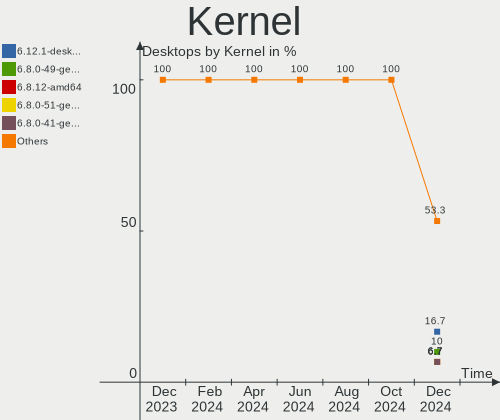

| Version                | Desktops | Percent |
|------------------------|----------|---------|
| 5.19.0-43-generic      | 4        | 21.05%  |
| 5.15.0-73-generic      | 3        | 15.79%  |
| 6.2.6-desktop-1omv2390 | 2        | 10.53%  |
| 6.3.9-arch1-1          | 1        | 5.26%   |
| 6.3.8-arch1-1          | 1        | 5.26%   |
| 6.3.8-200.fc38.x86_64  | 1        | 5.26%   |
| 6.3.7-arch1-1          | 1        | 5.26%   |
| 6.2.0-20-generic       | 1        | 5.26%   |
| 6.1.0-kali9-amd64      | 1        | 5.26%   |
| 6.1.0-9-amd64          | 1        | 5.26%   |
| 5.4.0-150-generic      | 1        | 5.26%   |
| 5.19.0-45-generic      | 1        | 5.26%   |
| 5.15.0-75-generic      | 1        | 5.26%   |

Kernel Family
-------------

Linux kernel without a distro release

| Version | Desktops | Percent |
|---------|----------|---------|
| 5.19.0  | 5        | 26.32%  |
| 5.15.0  | 4        | 21.05%  |
| 6.3.8   | 2        | 10.53%  |
| 6.2.6   | 2        | 10.53%  |
| 6.1.0   | 2        | 10.53%  |
| 6.3.9   | 1        | 5.26%   |
| 6.3.7   | 1        | 5.26%   |
| 6.2.0   | 1        | 5.26%   |
| 5.4.0   | 1        | 5.26%   |

Kernel Major Ver.
-----------------

Linux kernel major version

| Version | Desktops | Percent |
|---------|----------|---------|
| 5.19    | 5        | 26.32%  |
| 6.3     | 4        | 21.05%  |
| 5.15    | 4        | 21.05%  |
| 6.2     | 3        | 15.79%  |
| 6.1     | 2        | 10.53%  |
| 5.4     | 1        | 5.26%   |

Arch
----

OS architecture (x86_64, i586, etc.)

| Name   | Desktops | Percent |
|--------|----------|---------|
| x86_64 | 19       | 100%    |

DE
--

Desktop Environment

| Name       | Desktops | Percent |
|------------|----------|---------|
| GNOME      | 9        | 47.37%  |
| KDE5       | 5        | 26.32%  |
| XFCE       | 3        | 15.79%  |
| X-Cinnamon | 2        | 10.53%  |

Display Server
--------------

X11 or Wayland

| Name    | Desktops | Percent |
|---------|----------|---------|
| X11     | 14       | 73.68%  |
| Wayland | 5        | 26.32%  |

Display Manager
---------------

SDDM, LightDM, etc.

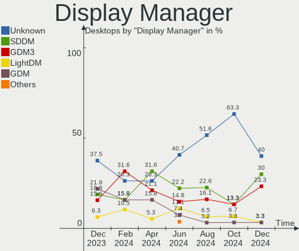

| Name    | Desktops | Percent |
|---------|----------|---------|
| SDDM    | 5        | 26.32%  |
| Unknown | 5        | 26.32%  |
| GDM3    | 4        | 21.05%  |
| LightDM | 3        | 15.79%  |
| GDM     | 2        | 10.53%  |

OS Lang
-------

Language

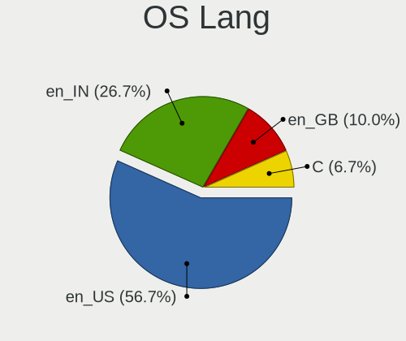

| Lang  | Desktops | Percent |
|-------|----------|---------|
| en_IN | 13       | 68.42%  |
| en_US | 4        | 21.05%  |
| en_GB | 1        | 5.26%   |
| en_DK | 1        | 5.26%   |

Boot Mode
---------

EFI or BIOS

| Mode | Desktops | Percent |
|------|----------|---------|
| BIOS | 10       | 52.63%  |
| EFI  | 9        | 47.37%  |

Filesystem
----------

Type of filesystem

| Type    | Desktops | Percent |
|---------|----------|---------|
| Ext4    | 12       | 63.16%  |
| Tmpfs   | 3        | 15.79%  |
| Btrfs   | 2        | 10.53%  |
| Overlay | 1        | 5.26%   |
| Ext3    | 1        | 5.26%   |

Part. scheme
------------

Scheme of partitioning

| Type    | Desktops | Percent |
|---------|----------|---------|
| GPT     | 11       | 57.89%  |
| Unknown | 5        | 26.32%  |
| MBR     | 3        | 15.79%  |

Dual Boot with Linux/BSD
------------------------

Hosting more than one Linux/BSD

| Dual boot | Desktops | Percent |
|-----------|----------|---------|
| No        | 14       | 73.68%  |
| Yes       | 5        | 26.32%  |

Dual Boot (Win)
---------------

Hosting Linux and Windows

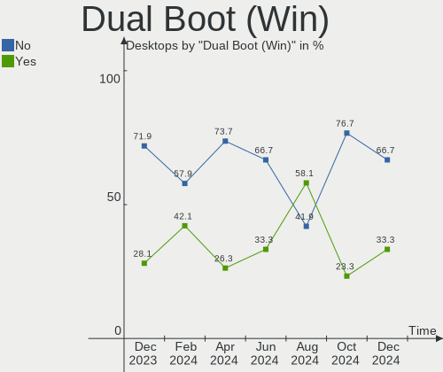

| Dual boot | Desktops | Percent |
|-----------|----------|---------|
| No        | 10       | 52.63%  |
| Yes       | 9        | 47.37%  |

Board
-----

Vendor
------

Motherboard manufacturer

| Name                | Desktops | Percent |
|---------------------|----------|---------|
| ASUSTek Computer    | 5        | 26.32%  |
| Gigabyte Technology | 4        | 21.05%  |
| Intel               | 2        | 10.53%  |
| Hewlett-Packard     | 2        | 10.53%  |
| Unknown             | 2        | 10.53%  |
| POWERX              | 1        | 5.26%   |
| OEM                 | 1        | 5.26%   |
| Dell                | 1        | 5.26%   |
| BY OEM              | 1        | 5.26%   |

Model
-----

Motherboard model

| Name                                 | Desktops | Percent |
|--------------------------------------|----------|---------|
| Unknown                              | 2        | 10.53%  |
| POWERX G41                           | 1        | 5.26%   |
| OEM Intel H81                        | 1        | 5.26%   |
| Intel H61                            | 1        | 5.26%   |
| Intel DH55TC AAE70932-302            | 1        | 5.26%   |
| HP Compaq Pro 6300 SFF               | 1        | 5.26%   |
| HP Compaq Elite 8300 SFF             | 1        | 5.26%   |
| Gigabyte H310M S2 2.0                | 1        | 5.26%   |
| Gigabyte H310M H                     | 1        | 5.26%   |
| Gigabyte B75M-D3H                    | 1        | 5.26%   |
| Gigabyte B250M-D3H                   | 1        | 5.26%   |
| Dell OptiPlex 7000                   | 1        | 5.26%   |
| BY OEM ZRD1103                       | 1        | 5.26%   |
| ASUS TUF Gaming B550-PLUS WIFI II    | 1        | 5.26%   |
| ASUS ROG STRIX Z690-A GAMING WIFI    | 1        | 5.26%   |
| ASUS ROG STRIX B550-F GAMING WIFI II | 1        | 5.26%   |
| ASUS ROG STRIX B450-F GAMING         | 1        | 5.26%   |
| ASUS H61M-CS                         | 1        | 5.26%   |

Model Family
------------

Motherboard model prefix

| Name               | Desktops | Percent |
|--------------------|----------|---------|
| ASUS ROG           | 3        | 15.79%  |
| HP Compaq          | 2        | 10.53%  |
| Gigabyte H310M     | 2        | 10.53%  |
| Unknown            | 2        | 10.53%  |
| POWERX G41         | 1        | 5.26%   |
| OEM Intel          | 1        | 5.26%   |
| Intel H61          | 1        | 5.26%   |
| Intel DH55TC       | 1        | 5.26%   |
| Gigabyte B75M-D3H  | 1        | 5.26%   |
| Gigabyte B250M-D3H | 1        | 5.26%   |
| Dell OptiPlex      | 1        | 5.26%   |
| BY OEM ZRD1103     | 1        | 5.26%   |
| ASUS TUF           | 1        | 5.26%   |
| ASUS H61M-CS       | 1        | 5.26%   |

MFG Year
--------

Motherboard manufacture year

| Year | Desktops | Percent |
|------|----------|---------|
| 2021 | 4        | 21.05%  |
| 2022 | 3        | 15.79%  |
| 2018 | 3        | 15.79%  |
| 2012 | 3        | 15.79%  |
| 2016 | 2        | 10.53%  |
| 2019 | 1        | 5.26%   |
| 2017 | 1        | 5.26%   |
| 2014 | 1        | 5.26%   |
| 2010 | 1        | 5.26%   |

Form Factor
-----------

Physical design of the computer

| Name    | Desktops | Percent |
|---------|----------|---------|
| Desktop | 19       | 100%    |

Secure Boot
-----------

Enabled or disabled

| State    | Desktops | Percent |
|----------|----------|---------|
| Disabled | 19       | 100%    |

Coreboot
--------

Have coreboot on board

| Used | Desktops | Percent |
|------|----------|---------|
| No   | 19       | 100%    |

RAM Size
--------

Total RAM memory

| Size in GB  | Desktops | Percent |
|-------------|----------|---------|
| 3.01-4.0    | 5        | 26.32%  |
| 8.01-16.0   | 5        | 26.32%  |
| 4.01-8.0    | 3        | 15.79%  |
| 16.01-24.0  | 3        | 15.79%  |
| 32.01-64.0  | 2        | 10.53%  |
| 64.01-256.0 | 1        | 5.26%   |

RAM Used
--------

Used RAM memory

| Used GB    | Desktops | Percent |
|------------|----------|---------|
| 1.01-2.0   | 8        | 42.11%  |
| 2.01-3.0   | 6        | 31.58%  |
| 3.01-4.0   | 2        | 10.53%  |
| 4.01-8.0   | 1        | 5.26%   |
| 16.01-24.0 | 1        | 5.26%   |
| 0.51-1.0   | 1        | 5.26%   |

Total Drives
------------

Number of drives on board

| Drives | Desktops | Percent |
|--------|----------|---------|
| 2      | 8        | 42.11%  |
| 1      | 6        | 31.58%  |
| 3      | 4        | 21.05%  |
| 4      | 1        | 5.26%   |

Has CD-ROM
----------

Has CD-ROM on board

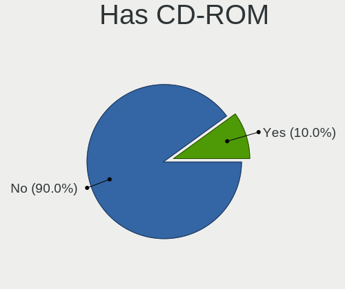

| Presented | Desktops | Percent |
|-----------|----------|---------|
| No        | 18       | 94.74%  |
| Yes       | 1        | 5.26%   |

Has Ethernet
------------

Has Ethernet on board

| Presented | Desktops | Percent |
|-----------|----------|---------|
| Yes       | 19       | 100%    |

Has WiFi
--------

Has WiFi module

| Presented | Desktops | Percent |
|-----------|----------|---------|
| Yes       | 14       | 73.68%  |
| No        | 5        | 26.32%  |

Has Bluetooth
-------------

Has Bluetooth module

| Presented | Desktops | Percent |
|-----------|----------|---------|
| No        | 10       | 52.63%  |
| Yes       | 9        | 47.37%  |

Location
--------

Country
-------

Geographic location (country)

| Country | Desktops | Percent |
|---------|----------|---------|
| India   | 19       | 100%    |

City
----

Geographic location (city)

| City       | Desktops | Percent |
|------------|----------|---------|
| Hyderabad  | 3        | 15.79%  |
| Kochi      | 2        | 10.53%  |
| Jaipur     | 2        | 10.53%  |
| Chennai    | 2        | 10.53%  |
| Raipur     | 1        | 5.26%   |
| Mumbai     | 1        | 5.26%   |
| Mangalore  | 1        | 5.26%   |
| Kolkata    | 1        | 5.26%   |
| Indore     | 1        | 5.26%   |
| Hamirpur   | 1        | 5.26%   |
| Delhi      | 1        | 5.26%   |
| Chinchvad  | 1        | 5.26%   |
| Chandigarh | 1        | 5.26%   |
| Ahmedabad  | 1        | 5.26%   |

Drives
------

Drive Vendor
------------

Hard drive vendors

| Vendor                      | Desktops | Drives | Percent |
|-----------------------------|----------|--------|---------|
| Seagate                     | 7        | 7      | 19.44%  |
| WDC                         | 5        | 6      | 13.89%  |
| Crucial                     | 4        | 4      | 11.11%  |
| Toshiba                     | 2        | 3      | 5.56%   |
| Samsung Electronics         | 2        | 2      | 5.56%   |
| Kingston                    | 2        | 2      | 5.56%   |
| HGST                        | 2        | 2      | 5.56%   |
| Zebronics                   | 1        | 1      | 2.78%   |
| Unknown (690)               | 1        | 1      | 2.78%   |
| SPCC                        | 1        | 1      | 2.78%   |
| SK hynix                    | 1        | 1      | 2.78%   |
| SCUDA                       | 1        | 1      | 2.78%   |
| Sandisk                     | 1        | 1      | 2.78%   |
| Phison Electronics          | 1        | 1      | 2.78%   |
| Micron/Crucial Technology   | 1        | 1      | 2.78%   |
| Kingston Technology Company | 1        | 1      | 2.78%   |
| Gigabyte Technology         | 1        | 1      | 2.78%   |
| China                       | 1        | 1      | 2.78%   |
| ADATA Technology            | 1        | 1      | 2.78%   |

Drive Model
-----------

Hard drive models

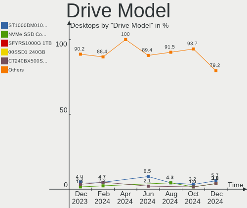

| Model                                | Desktops | Percent |
|--------------------------------------|----------|---------|
| Zebronics ZEB-SD12 120GB             | 1        | 2.63%   |
| WDC WDS480G2G0A-00JH30 480GB SSD     | 1        | 2.63%   |
| WDC WD3200AAKS-61L9A0 320GB          | 1        | 2.63%   |
| WDC WD3200AAJS-60Z0A0 320GB          | 1        | 2.63%   |
| WDC WD10SPZX-24Z10 1TB               | 1        | 2.63%   |
| WDC WD10EZEX-00RKKA0 1TB             | 1        | 2.63%   |
| WDC WD Green 2.5 240GB               | 1        | 2.63%   |
| Unknown (690) NEO SATA 128GB SSD     | 1        | 2.63%   |
| Toshiba MQ01ABD100 1TB               | 1        | 2.63%   |
| Toshiba HDWD110 1TB                  | 1        | 2.63%   |
| Toshiba DT01ABA200V 2TB              | 1        | 2.63%   |
| SPCC Solid State Disk 128GB          | 1        | 2.63%   |
| SK hynix PC801 NVMe 1TB              | 1        | 2.63%   |
| Seagate ST9160314AS 160GB            | 1        | 2.63%   |
| Seagate ST500DM002-1BD142 500GB      | 1        | 2.63%   |
| Seagate ST4000DM004-2U9104 4TB       | 1        | 2.63%   |
| Seagate ST4000DM000-2AE166 4TB       | 1        | 2.63%   |
| Seagate ST3500414CS 500GB            | 1        | 2.63%   |
| Seagate ST1000LX015-1U7172-SSHD 1TB  | 1        | 2.63%   |
| Seagate ST1000DM010-2EP102 1TB       | 1        | 2.63%   |
| SCUDA 512GB SATA SSD                 | 1        | 2.63%   |
| Sandisk WDC WDS500G2B0C-00PXH0 500GB | 1        | 2.63%   |
| Samsung SSD 860 EVO 250GB            | 1        | 2.63%   |
| Samsung SP0842N 80GB                 | 1        | 2.63%   |
| Phison E12 NVMe Controller 1TB       | 1        | 2.63%   |
| Micron/Crucial P2 NVMe PCIe SSD 4TB  | 1        | 2.63%   |
| Kingston Company SNV2S2000G 2TB      | 1        | 2.63%   |
| Kingston SQ500S37240G 240GB SSD      | 1        | 2.63%   |
| Kingston SNV2S500G 500GB             | 1        | 2.63%   |
| HGST HTS545050A7E680 500GB           | 1        | 2.63%   |
| HGST HTS541010B7E610 1TB             | 1        | 2.63%   |
| Gigabyte GP-GSTFS31120GNTD 120GB SSD | 1        | 2.63%   |
| Crucial CT500MX500SSD1 500GB         | 1        | 2.63%   |
| Crucial CT256MX100SSD1 256GB         | 1        | 2.63%   |
| Crucial CT240BX500SSD1 240GB         | 1        | 2.63%   |
| Crucial CT1000P3SSD8 1TB             | 1        | 2.63%   |
| China SSD 128GB                      | 1        | 2.63%   |
| ADATA LEGEND 840 512GB               | 1        | 2.63%   |

HDD Vendor
----------

Hard disk drive vendors

| Vendor              | Desktops | Drives | Percent |
|---------------------|----------|--------|---------|
| Seagate             | 7        | 7      | 43.75%  |
| WDC                 | 4        | 4      | 25%     |
| Toshiba             | 2        | 3      | 12.5%   |
| HGST                | 2        | 2      | 12.5%   |
| Samsung Electronics | 1        | 1      | 6.25%   |

SSD Vendor
----------

Solid state drive vendors

| Vendor              | Desktops | Drives | Percent |
|---------------------|----------|--------|---------|
| Crucial             | 3        | 3      | 23.08%  |
| WDC                 | 2        | 2      | 15.38%  |
| Zebronics           | 1        | 1      | 7.69%   |
| Unknown (690)       | 1        | 1      | 7.69%   |
| SPCC                | 1        | 1      | 7.69%   |
| SCUDA               | 1        | 1      | 7.69%   |
| Samsung Electronics | 1        | 1      | 7.69%   |
| Kingston            | 1        | 1      | 7.69%   |
| Gigabyte Technology | 1        | 1      | 7.69%   |
| China               | 1        | 1      | 7.69%   |

Drive Kind
----------

HDD or SSD

| Kind | Desktops | Drives | Percent |
|------|----------|--------|---------|
| HDD  | 15       | 17     | 44.12%  |
| SSD  | 13       | 13     | 38.24%  |
| NVMe | 6        | 8      | 17.65%  |

Drive Connector
---------------

SATA, SAS, NVMe, etc.

| Type | Desktops | Drives | Percent |
|------|----------|--------|---------|
| SATA | 18       | 30     | 75%     |
| NVMe | 6        | 8      | 25%     |

Drive Size
----------

Size of hard drive

| Size in TB | Desktops | Drives | Percent |
|------------|----------|--------|---------|
| 0.01-0.5   | 14       | 19     | 56%     |
| 0.51-1.0   | 8        | 8      | 32%     |
| 3.01-4.0   | 2        | 2      | 8%      |
| 1.01-2.0   | 1        | 1      | 4%      |

Space Total
-----------

Amount of disk space available on the file system

| Size in GB     | Desktops | Percent |
|----------------|----------|---------|
| 101-250        | 4        | 21.05%  |
| 501-1000       | 4        | 21.05%  |
| 1001-2000      | 3        | 15.79%  |
| 51-100         | 3        | 15.79%  |
| More than 3000 | 2        | 10.53%  |
| 251-500        | 2        | 10.53%  |
| 1-20           | 1        | 5.26%   |

Space Used
----------

Amount of used disk space

| Used GB   | Desktops | Percent |
|-----------|----------|---------|
| 1-20      | 6        | 31.58%  |
| 21-50     | 4        | 21.05%  |
| 251-500   | 3        | 15.79%  |
| 101-250   | 2        | 10.53%  |
| 51-100    | 2        | 10.53%  |
| 2001-3000 | 1        | 5.26%   |
| 1001-2000 | 1        | 5.26%   |

Malfunc. Drives
---------------

Drive models with a malfunction

| Model                           | Desktops | Drives | Percent |
|---------------------------------|----------|--------|---------|
| WDC WD3200AAKS-61L9A0 320GB     | 1        | 1      | 20%     |
| SPCC Solid State Disk 128GB     | 1        | 1      | 20%     |
| Seagate ST9160314AS 160GB       | 1        | 1      | 20%     |
| Seagate ST500DM002-1BD142 500GB | 1        | 1      | 20%     |
| Seagate ST3500414CS 500GB       | 1        | 1      | 20%     |

Malfunc. Drive Vendor
---------------------

Vendors of faulty drives

| Vendor  | Desktops | Drives | Percent |
|---------|----------|--------|---------|
| Seagate | 3        | 3      | 60%     |
| WDC     | 1        | 1      | 20%     |
| SPCC    | 1        | 1      | 20%     |

Malfunc. HDD Vendor
-------------------

Vendors of faulty HDD drives

| Vendor  | Desktops | Drives | Percent |
|---------|----------|--------|---------|
| Seagate | 3        | 3      | 75%     |
| WDC     | 1        | 1      | 25%     |

Malfunc. Drive Kind
-------------------

Kinds of faulty drives

| Kind | Desktops | Drives | Percent |
|------|----------|--------|---------|
| HDD  | 4        | 4      | 80%     |
| SSD  | 1        | 1      | 20%     |

Failed Drives
-------------

Failed drive models

Zero info for selected period =(

Failed Drive Vendor
-------------------

Failed drive vendors

Zero info for selected period =(

Drive Status
------------

Number of failed and malfunc. drives

| Status   | Desktops | Drives | Percent |
|----------|----------|--------|---------|
| Detected | 10       | 18     | 47.62%  |
| Works    | 7        | 15     | 33.33%  |
| Malfunc  | 4        | 5      | 19.05%  |

Storage controller
------------------

Storage Vendor
--------------

Storage controller vendors

| Vendor                      | Desktops | Percent |
|-----------------------------|----------|---------|
| Intel                       | 16       | 59.26%  |
| AMD                         | 3        | 11.11%  |
| Micron/Crucial Technology   | 2        | 7.41%   |
| SK hynix                    | 1        | 3.7%    |
| SanDisk                     | 1        | 3.7%    |
| Phison Electronics          | 1        | 3.7%    |
| Kingston Technology Company | 1        | 3.7%    |
| ASMedia Technology          | 1        | 3.7%    |
| ADATA Technology            | 1        | 3.7%    |

Storage Model
-------------

Storage controller models

| Model                                                                          | Desktops | Percent |
|--------------------------------------------------------------------------------|----------|---------|
| Intel NM10/ICH7 Family SATA Controller [IDE mode]                              | 3        | 9.09%   |
| Intel 82801G (ICH7 Family) IDE Controller                                      | 3        | 9.09%   |
| Intel 7 Series/C210 Series Chipset Family 6-port SATA Controller [AHCI mode]   | 3        | 9.09%   |
| Micron/Crucial P2 NVMe PCIe SSD                                                | 2        | 6.06%   |
| Intel Alder Lake-S PCH SATA Controller [AHCI Mode]                             | 2        | 6.06%   |
| Intel 6 Series/C200 Series Chipset Family 6 port Desktop SATA AHCI Controller  | 2        | 6.06%   |
| Intel 200 Series PCH SATA controller [AHCI mode]                               | 2        | 6.06%   |
| AMD 500 Series Chipset SATA Controller                                         | 2        | 6.06%   |
| SK hynix Platinum P41/PC801 NVMe Solid State Drive                             | 1        | 3.03%   |
| SanDisk Non-Volatile memory controller                                         | 1        | 3.03%   |
| Phison E12 NVMe Controller                                                     | 1        | 3.03%   |
| Kingston Company Company Non-Volatile memory controller                        | 1        | 3.03%   |
| Intel Volume Management Device NVMe RAID Controller Intel Corporation          | 1        | 3.03%   |
| Intel Q170/Q150/B150/H170/H110/Z170/CM236 Chipset SATA Controller [AHCI Mode]  | 1        | 3.03%   |
| Intel Cannon Lake PCH SATA AHCI Controller                                     | 1        | 3.03%   |
| Intel 8 Series/C220 Series Chipset Family 6-port SATA Controller 1 [AHCI mode] | 1        | 3.03%   |
| Intel 5 Series/3400 Series Chipset PT IDER Controller                          | 1        | 3.03%   |
| Intel 5 Series/3400 Series Chipset 6 port SATA AHCI Controller                 | 1        | 3.03%   |
| ASMedia ASM1062 Serial ATA Controller                                          | 1        | 3.03%   |
| AMD FCH SATA Controller [AHCI mode]                                            | 1        | 3.03%   |
| AMD 400 Series Chipset SATA Controller                                         | 1        | 3.03%   |
| ADATA A Non-Volatile memory controller                                         | 1        | 3.03%   |

Storage Kind
------------

Kind of storage controller (IDE, SATA, NVMe, SAS, ...)

| Kind | Desktops | Percent |
|------|----------|---------|
| SATA | 16       | 59.26%  |
| NVMe | 6        | 22.22%  |
| IDE  | 4        | 14.81%  |
| RAID | 1        | 3.7%    |

Processor
---------

CPU Vendor
----------

Processor vendors

| Vendor | Desktops | Percent |
|--------|----------|---------|
| Intel  | 16       | 84.21%  |
| AMD    | 3        | 15.79%  |

CPU Model
---------

Processor models

| Model                                  | Desktops | Percent |
|----------------------------------------|----------|---------|
| AMD Ryzen 7 5700G with Radeon Graphics | 2        | 10.53%  |
| Intel Pentium CPU G3240 @ 3.10GHz      | 1        | 5.26%   |
| Intel Pentium CPU G2030 @ 3.00GHz      | 1        | 5.26%   |
| Intel Core i7-3770 CPU @ 3.40GHz       | 1        | 5.26%   |
| Intel Core i7 CPU 870 @ 2.93GHz        | 1        | 5.26%   |
| Intel Core i5-7400 CPU @ 3.00GHz       | 1        | 5.26%   |
| Intel Core i5-6500 CPU @ 3.20GHz       | 1        | 5.26%   |
| Intel Core i5-3570 CPU @ 3.40GHz       | 1        | 5.26%   |
| Intel Core i5-3470 CPU @ 3.20GHz       | 1        | 5.26%   |
| Intel Core i3-9100F CPU @ 3.60GHz      | 1        | 5.26%   |
| Intel Core i3-8100 CPU @ 3.60GHz       | 1        | 5.26%   |
| Intel Core i3-2120 CPU @ 3.30GHz       | 1        | 5.26%   |
| Intel Core 2 Quad CPU Q6600 @ 2.40GHz  | 1        | 5.26%   |
| Intel Core 2 Duo CPU E8500 @ 3.16GHz   | 1        | 5.26%   |
| Intel Core 2 Duo CPU E6550 @ 2.33GHz   | 1        | 5.26%   |
| Intel 13th Gen Core i7-13700KF         | 1        | 5.26%   |
| Intel 12th Gen Core i5-12500T          | 1        | 5.26%   |
| AMD Ryzen 7 2700X Eight-Core Processor | 1        | 5.26%   |

CPU Model Family
----------------

Processor model prefix

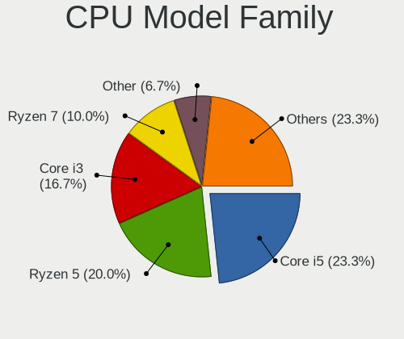

| Model             | Desktops | Percent |
|-------------------|----------|---------|
| Intel Core i5     | 4        | 21.05%  |
| Intel Core i3     | 3        | 15.79%  |
| AMD Ryzen 7       | 3        | 15.79%  |
| Other             | 2        | 10.53%  |
| Intel Pentium     | 2        | 10.53%  |
| Intel Core i7     | 2        | 10.53%  |
| Intel Core 2 Duo  | 2        | 10.53%  |
| Intel Core 2 Quad | 1        | 5.26%   |

CPU Cores
---------

Number of processor cores

| Number | Desktops | Percent |
|--------|----------|---------|
| 4      | 8        | 42.11%  |
| 2      | 5        | 26.32%  |
| 8      | 3        | 15.79%  |
| 16     | 1        | 5.26%   |
| 6      | 1        | 5.26%   |
| 1      | 1        | 5.26%   |

CPU Sockets
-----------

Number of sockets

| Number | Desktops | Percent |
|--------|----------|---------|
| 1      | 19       | 100%    |

CPU Threads
-----------

Threads per core (Hyper-Threading)

| Number | Desktops | Percent |
|--------|----------|---------|
| 1      | 12       | 63.16%  |
| 2      | 7        | 36.84%  |

CPU Op-Modes
------------

CPU Operation Modes (32-bit, 64-bit)

| Op mode        | Desktops | Percent |
|----------------|----------|---------|
| 32-bit, 64-bit | 19       | 100%    |

CPU Microcode
-------------

Microcode number

| Number     | Desktops | Percent |
|------------|----------|---------|
| Unknown    | 10       | 52.63%  |
| 0x306a9    | 2        | 10.53%  |
| 0xb0671    | 1        | 5.26%   |
| 0x906e9    | 1        | 5.26%   |
| 0x90675    | 1        | 5.26%   |
| 0x506e3    | 1        | 5.26%   |
| 0x10676    | 1        | 5.26%   |
| 0x0a50000d | 1        | 5.26%   |
| 0x0800820d | 1        | 5.26%   |

CPU Microarch
-------------

Microarchitecture

| Name             | Desktops | Percent |
|------------------|----------|---------|
| IvyBridge        | 4        | 21.05%  |
| KabyLake         | 3        | 15.79%  |
| Zen 3            | 2        | 10.53%  |
| Core             | 2        | 10.53%  |
| Zen+             | 1        | 5.26%   |
| Skylake          | 1        | 5.26%   |
| SandyBridge      | 1        | 5.26%   |
| Penryn           | 1        | 5.26%   |
| Nehalem          | 1        | 5.26%   |
| Haswell          | 1        | 5.26%   |
| Alderlake Hybrid | 1        | 5.26%   |
| Unknown          | 1        | 5.26%   |

Graphics
--------

GPU Vendor
----------

Vendors of graphics cards

| Vendor | Desktops | Percent |
|--------|----------|---------|
| Nvidia | 10       | 45.45%  |
| Intel  | 10       | 45.45%  |
| AMD    | 2        | 9.09%   |

GPU Model
---------

Graphics card models

| Model                                                                       | Desktops | Percent |
|-----------------------------------------------------------------------------|----------|---------|
| Nvidia GK208B [GeForce GT 710]                                              | 3        | 13.64%  |
| Nvidia GK208B [GeForce GT 730]                                              | 2        | 9.09%   |
| Nvidia G98 [GeForce 8400 GS Rev. 2]                                         | 2        | 9.09%   |
| Intel Xeon E3-1200 v2/3rd Gen Core processor Graphics Controller            | 2        | 9.09%   |
| AMD Cezanne [Radeon Vega Series / Radeon Vega Mobile Series]                | 2        | 9.09%   |
| Nvidia TU106 [GeForce RTX 2060 Rev. A]                                      | 1        | 4.55%   |
| Nvidia GM107 [GeForce GTX 750 Ti]                                           | 1        | 4.55%   |
| Nvidia AD102 [GeForce RTX 4090]                                             | 1        | 4.55%   |
| Intel Xeon E3-1200 v3/4th Gen Core Processor Integrated Graphics Controller | 1        | 4.55%   |
| Intel IvyBridge GT2 [HD Graphics 4000]                                      | 1        | 4.55%   |
| Intel HD Graphics 630                                                       | 1        | 4.55%   |
| Intel CoffeeLake-S GT2 [UHD Graphics 630]                                   | 1        | 4.55%   |
| Intel Alder Lake-S GT1 [UHD Graphics 770]                                   | 1        | 4.55%   |
| Intel 82G33/G31 Express Integrated Graphics Controller                      | 1        | 4.55%   |
| Intel 4 Series Chipset Integrated Graphics Controller                       | 1        | 4.55%   |
| Intel 2nd Generation Core Processor Family Integrated Graphics Controller   | 1        | 4.55%   |

GPU Combo
---------

Combinations of graphics cards

| Name           | Desktops | Percent |
|----------------|----------|---------|
| 1 x Nvidia     | 8        | 42.11%  |
| 1 x Intel      | 7        | 36.84%  |
| Intel + Nvidia | 2        | 10.53%  |
| 1 x AMD        | 2        | 10.53%  |

GPU Driver
----------

Free vs proprietary

| Driver      | Desktops | Percent |
|-------------|----------|---------|
| Free        | 15       | 78.95%  |
| Proprietary | 3        | 15.79%  |
| Unknown     | 1        | 5.26%   |

GPU Memory
----------

Total video memory

| Size in GB | Desktops | Percent |
|------------|----------|---------|
| Unknown    | 12       | 63.16%  |
| 3.01-4.0   | 2        | 10.53%  |
| 0.01-0.5   | 2        | 10.53%  |
| 5.01-6.0   | 1        | 5.26%   |
| 16.01-24.0 | 1        | 5.26%   |
| 1.01-2.0   | 1        | 5.26%   |

Monitor
-------

Monitor Vendor
--------------

Monitor vendors

| Vendor              | Desktops | Percent |
|---------------------|----------|---------|
| Dell                | 4        | 21.05%  |
| BenQ                | 4        | 21.05%  |
| Samsung Electronics | 2        | 10.53%  |
| Goldstar            | 2        | 10.53%  |
| SGT                 | 1        | 5.26%   |
| MSI                 | 1        | 5.26%   |
| LG Electronics      | 1        | 5.26%   |
| Lenovo              | 1        | 5.26%   |
| Hewlett-Packard     | 1        | 5.26%   |
| ASUSTek Computer    | 1        | 5.26%   |
| Acer                | 1        | 5.26%   |

Monitor Model
-------------

Monitor models

| Model                                                             | Desktops | Percent |
|-------------------------------------------------------------------|----------|---------|
| Dell D1918H DEL2005 1366x768 410x230mm 18.5-inch                  | 2        | 10%     |
| SGT VGA SGT2383 1366x768 410x260mm 19.1-inch                      | 1        | 5%      |
| Samsung Electronics SMB1930N SAM0632 1366x768 410x230mm 18.5-inch | 1        | 5%      |
| Samsung Electronics C24F390 SAM0D2C 1920x1080 521x293mm 23.5-inch | 1        | 5%      |
| MSI G27CQ4 MSI3CB0 2560x1440 597x336mm 27.0-inch                  | 1        | 5%      |
| LG Electronics LCD Monitor LG FULL HD 1920x1080                   | 1        | 5%      |
| Lenovo LT2252p Wide LEN0A0C 1680x1050 470x300mm 22.0-inch         | 1        | 5%      |
| Hewlett-Packard 27fw HPN3608 1920x1080 598x336mm 27.0-inch        | 1        | 5%      |
| Goldstar Ultra HD GSM5B09 3840x2160 600x340mm 27.2-inch           | 1        | 5%      |
| Goldstar IPS FULLHD GSM5AB6 1920x1080 480x270mm 21.7-inch         | 1        | 5%      |
| Goldstar E2241 GSM5819 1920x1080 477x268mm 21.5-inch              | 1        | 5%      |
| Dell E190S DELA04B 1280x1024 376x301mm 19.0-inch                  | 1        | 5%      |
| Dell 2208WFP DEL403C 1680x1050 473x296mm 22.0-inch                | 1        | 5%      |
| BenQ VL2040Z BNQ7B31 1600x900 434x236mm 19.4-inch                 | 1        | 5%      |
| BenQ GW2480 BNQ78E7 1920x1080 527x296mm 23.8-inch                 | 1        | 5%      |
| BenQ GW2283 BNQ78E9 1920x1080 476x268mm 21.5-inch                 | 1        | 5%      |
| BenQ EW2775ZH BNQ7944 1920x1080 600x340mm 27.2-inch               | 1        | 5%      |
| ASUSTek Computer VZ27A AUS27A9 2560x1440 600x340mm 27.2-inch      | 1        | 5%      |
| Acer K202HQLA ACR0498 1366x768 430x240mm 19.4-inch                | 1        | 5%      |

Monitor Resolution
------------------

Monitor screen resolution

| Resolution         | Desktops | Percent |
|--------------------|----------|---------|
| 1920x1080 (FHD)    | 7        | 36.84%  |
| 1366x768 (WXGA)    | 4        | 21.05%  |
| 1680x1050 (WSXGA+) | 3        | 15.79%  |
| 3840x2160 (4K)     | 2        | 10.53%  |
| 2560x1440 (QHD)    | 1        | 5.26%   |
| 1600x900 (HD+)     | 1        | 5.26%   |
| 1280x1024 (SXGA)   | 1        | 5.26%   |

Monitor Diagonal
----------------

Diagonal size in inches

| Inches  | Desktops | Percent |
|---------|----------|---------|
| 27      | 4        | 22.22%  |
| 19      | 3        | 16.67%  |
| 18      | 3        | 16.67%  |
| 22      | 2        | 11.11%  |
| 21      | 2        | 11.11%  |
| 26      | 1        | 5.56%   |
| 24      | 1        | 5.56%   |
| 23      | 1        | 5.56%   |
| Unknown | 1        | 5.56%   |

Monitor Width
-------------

Physical width

| Width in mm | Desktops | Percent |
|-------------|----------|---------|
| 401-500     | 9        | 50%     |
| 501-600     | 7        | 38.89%  |
| 351-400     | 1        | 5.56%   |
| Unknown     | 1        | 5.56%   |

Aspect Ratio
------------

Proportional relationship between the width and the height

| Ratio   | Desktops | Percent |
|---------|----------|---------|
| 16/9    | 12       | 66.67%  |
| 16/10   | 3        | 16.67%  |
| 5/4     | 1        | 5.56%   |
| 2.00    | 1        | 5.56%   |
| Unknown | 1        | 5.56%   |

Monitor Area
------------

Area in inch²

| Area in inch² | Desktops | Percent |
|----------------|----------|---------|
| 201-250        | 6        | 33.33%  |
| 301-350        | 4        | 22.22%  |
| 151-200        | 3        | 16.67%  |
| 141-150        | 3        | 16.67%  |
| 251-300        | 1        | 5.56%   |
| Unknown        | 1        | 5.56%   |

Pixel Density
-------------

Pixels per inch

| Density | Desktops | Percent |
|---------|----------|---------|
| 51-100  | 12       | 70.59%  |
| 101-120 | 4        | 23.53%  |
| Unknown | 1        | 5.88%   |

Multiple Monitors
-----------------

Total monitors connected

| Total | Desktops | Percent |
|-------|----------|---------|
| 1     | 15       | 78.95%  |
| 2     | 2        | 10.53%  |
| 3     | 1        | 5.26%   |
| 0     | 1        | 5.26%   |

Network
-------

Net Controller Vendor
---------------------

Controller vendors

| Vendor                | Desktops | Percent |
|-----------------------|----------|---------|
| Realtek Semiconductor | 14       | 43.75%  |
| Intel                 | 8        | 25%     |
| Ralink Technology     | 3        | 9.38%   |
| MediaTek              | 2        | 6.25%   |
| TP-Link               | 1        | 3.13%   |
| Samsung Electronics   | 1        | 3.13%   |
| Qualcomm Atheros      | 1        | 3.13%   |
| NetGear               | 1        | 3.13%   |
| Motorola PCS          | 1        | 3.13%   |

Net Controller Model
--------------------

Controller models

| Model                                                                                         | Desktops | Percent |
|-----------------------------------------------------------------------------------------------|----------|---------|
| Realtek RTL810xE PCI Express Fast Ethernet controller                                         | 6        | 16.22%  |
| Realtek RTL8111/8168/8411 PCI Express Gigabit Ethernet Controller                             | 4        | 10.81%  |
| Ralink MT7601U Wireless Adapter                                                               | 3        | 8.11%   |
| Realtek RTL8188FTV 802.11b/g/n 1T1R 2.4G WLAN Adapter                                         | 2        | 5.41%   |
| Intel Ethernet Controller I225-V                                                              | 2        | 5.41%   |
| Intel Alder Lake-S PCH CNVi WiFi                                                              | 2        | 5.41%   |
| Intel 82579LM Gigabit Network Connection (Lewisville)                                         | 2        | 5.41%   |
| TP-Link TL-WN823N v2/v3 [Realtek RTL8192EU]                                                   | 1        | 2.7%    |
| Samsung GT-I9070 (network tethering, USB debugging enabled)                                   | 1        | 2.7%    |
| Realtek RTL8192EU 802.11b/g/n WLAN Adapter                                                    | 1        | 2.7%    |
| Realtek RTL8188ETV Wireless LAN 802.11n Network Adapter                                       | 1        | 2.7%    |
| Realtek RTL8125 2.5GbE Controller                                                             | 1        | 2.7%    |
| Realtek Realtek 8812AU/8821AU 802.11ac WLAN Adapter [USB Wireless Dual-Band Adapter 2.4/5Ghz] | 1        | 2.7%    |
| Realtek 802.11n WLAN Adapter                                                                  | 1        | 2.7%    |
| Qualcomm Atheros AR9227 Wireless Network Adapter                                              | 1        | 2.7%    |
| NetGear WNA1100 Wireless-N 150 [Atheros AR9271]                                               | 1        | 2.7%    |
| Motorola PCS moto g(30)                                                                       | 1        | 2.7%    |
| MediaTek MT7921K (RZ608) Wi-Fi 6E 80MHz                                                       | 1        | 2.7%    |
| MediaTek MT7921 802.11ax PCI Express Wireless Network Adapter                                 | 1        | 2.7%    |
| Intel I211 Gigabit Network Connection                                                         | 1        | 2.7%    |
| Intel Ethernet Connection (2) I219-V                                                          | 1        | 2.7%    |
| Intel Ethernet Connection (17) I219-LM                                                        | 1        | 2.7%    |
| Intel 82578DC Gigabit Network Connection                                                      | 1        | 2.7%    |

Wireless Vendor
---------------

Wireless vendors

| Vendor                | Desktops | Percent |
|-----------------------|----------|---------|
| Realtek Semiconductor | 5        | 33.33%  |
| Ralink Technology     | 3        | 20%     |
| MediaTek              | 2        | 13.33%  |
| Intel                 | 2        | 13.33%  |
| TP-Link               | 1        | 6.67%   |
| Qualcomm Atheros      | 1        | 6.67%   |
| NetGear               | 1        | 6.67%   |

Wireless Model
--------------

Wireless models

| Model                                                                                         | Desktops | Percent |
|-----------------------------------------------------------------------------------------------|----------|---------|
| Ralink MT7601U Wireless Adapter                                                               | 3        | 18.75%  |
| Realtek RTL8188FTV 802.11b/g/n 1T1R 2.4G WLAN Adapter                                         | 2        | 12.5%   |
| Intel Alder Lake-S PCH CNVi WiFi                                                              | 2        | 12.5%   |
| TP-Link TL-WN823N v2/v3 [Realtek RTL8192EU]                                                   | 1        | 6.25%   |
| Realtek RTL8192EU 802.11b/g/n WLAN Adapter                                                    | 1        | 6.25%   |
| Realtek RTL8188ETV Wireless LAN 802.11n Network Adapter                                       | 1        | 6.25%   |
| Realtek Realtek 8812AU/8821AU 802.11ac WLAN Adapter [USB Wireless Dual-Band Adapter 2.4/5Ghz] | 1        | 6.25%   |
| Realtek 802.11n WLAN Adapter                                                                  | 1        | 6.25%   |
| Qualcomm Atheros AR9227 Wireless Network Adapter                                              | 1        | 6.25%   |
| NetGear WNA1100 Wireless-N 150 [Atheros AR9271]                                               | 1        | 6.25%   |
| MediaTek MT7921K (RZ608) Wi-Fi 6E 80MHz                                                       | 1        | 6.25%   |
| MediaTek MT7921 802.11ax PCI Express Wireless Network Adapter                                 | 1        | 6.25%   |

Ethernet Vendor
---------------

Ethernet vendors

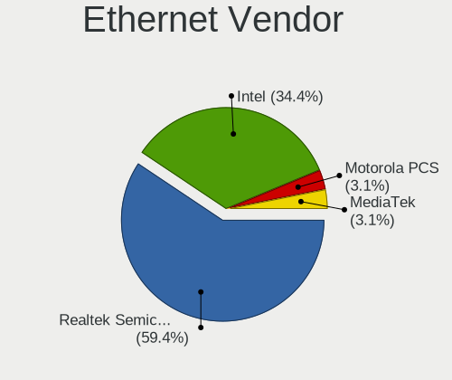

| Vendor                | Desktops | Percent |
|-----------------------|----------|---------|
| Realtek Semiconductor | 11       | 55%     |
| Intel                 | 8        | 40%     |
| Motorola PCS          | 1        | 5%      |

Ethernet Model
--------------

Ethernet models

| Model                                                             | Desktops | Percent |
|-------------------------------------------------------------------|----------|---------|
| Realtek RTL810xE PCI Express Fast Ethernet controller             | 6        | 30%     |
| Realtek RTL8111/8168/8411 PCI Express Gigabit Ethernet Controller | 4        | 20%     |
| Intel Ethernet Controller I225-V                                  | 2        | 10%     |
| Intel 82579LM Gigabit Network Connection (Lewisville)             | 2        | 10%     |
| Realtek RTL8125 2.5GbE Controller                                 | 1        | 5%      |
| Motorola PCS moto g(30)                                           | 1        | 5%      |
| Intel I211 Gigabit Network Connection                             | 1        | 5%      |
| Intel Ethernet Connection (2) I219-V                              | 1        | 5%      |
| Intel Ethernet Connection (17) I219-LM                            | 1        | 5%      |
| Intel 82578DC Gigabit Network Connection                          | 1        | 5%      |

Net Controller Kind
-------------------

Ethernet, WiFi or modem

| Kind     | Desktops | Percent |
|----------|----------|---------|
| Ethernet | 19       | 55.88%  |
| WiFi     | 14       | 41.18%  |
| Modem    | 1        | 2.94%   |

Used Controller
---------------

Currently used network controller

| Kind     | Desktops | Percent |
|----------|----------|---------|
| WiFi     | 10       | 52.63%  |
| Ethernet | 9        | 47.37%  |

NICs
----

Total network controllers on board

| Total | Desktops | Percent |
|-------|----------|---------|
| 1     | 14       | 73.68%  |
| 2     | 5        | 26.32%  |

IPv6
----

IPv6 vs IPv4

| Used | Desktops | Percent |
|------|----------|---------|
| Yes  | 11       | 57.89%  |
| No   | 8        | 42.11%  |

Bluetooth
---------

Bluetooth Vendor
----------------

Controller vendors

| Vendor                  | Desktops | Percent |
|-------------------------|----------|---------|
| Cambridge Silicon Radio | 3        | 33.33%  |
| TP-Link                 | 2        | 22.22%  |
| Intel                   | 2        | 22.22%  |
| MediaTek                | 1        | 11.11%  |
| IMC Networks            | 1        | 11.11%  |

Bluetooth Model
---------------

Controller models

| Model                                               | Desktops | Percent |
|-----------------------------------------------------|----------|---------|
| Cambridge Silicon Radio Bluetooth Dongle (HCI mode) | 3        | 33.33%  |
| TP-Link UB500 Adapter                               | 2        | 22.22%  |
| Intel Bluetooth Device                              | 2        | 22.22%  |
| MediaTek Wireless_Device                            | 1        | 11.11%  |
| IMC Networks Wireless_Device                        | 1        | 11.11%  |

Sound
-----

Sound Vendor
------------

Sound card vendors

| Vendor           | Desktops | Percent |
|------------------|----------|---------|
| Intel            | 16       | 51.61%  |
| Nvidia           | 8        | 25.81%  |
| AMD              | 3        | 9.68%   |
| GN Netcom        | 2        | 6.45%   |
| Logitech         | 1        | 3.23%   |
| ASUSTek Computer | 1        | 3.23%   |

Sound Model
-----------

Sound card models

| Model                                                                      | Desktops | Percent |
|----------------------------------------------------------------------------|----------|---------|
| Nvidia GK208 HDMI/DP Audio Controller                                      | 4        | 11.76%  |
| Intel NM10/ICH7 Family High Definition Audio Controller                    | 3        | 8.82%   |
| Intel 7 Series/C216 Chipset Family High Definition Audio Controller        | 3        | 8.82%   |
| Intel Alder Lake-S HD Audio Controller                                     | 2        | 5.88%   |
| Intel 6 Series/C200 Series Chipset Family High Definition Audio Controller | 2        | 5.88%   |
| Intel 200 Series PCH HD Audio                                              | 2        | 5.88%   |
| AMD Renoir Radeon High Definition Audio Controller                         | 2        | 5.88%   |
| AMD Family 17h/19h HD Audio Controller                                     | 2        | 5.88%   |
| Nvidia TU106 High Definition Audio Controller                              | 1        | 2.94%   |
| Nvidia GM107 High Definition Audio Controller [GeForce 940MX]              | 1        | 2.94%   |
| Nvidia GF119 HDMI Audio Controller                                         | 1        | 2.94%   |
| Nvidia AD102 High Definition Audio Controller                              | 1        | 2.94%   |
| Logitech Headset H340                                                      | 1        | 2.94%   |
| Intel Xeon E3-1200 v3/4th Gen Core Processor HD Audio Controller           | 1        | 2.94%   |
| Intel Cannon Lake PCH cAVS                                                 | 1        | 2.94%   |
| Intel 8 Series/C220 Series Chipset High Definition Audio Controller        | 1        | 2.94%   |
| Intel 5 Series/3400 Series Chipset High Definition Audio                   | 1        | 2.94%   |
| Intel 100 Series/C230 Series Chipset Family HD Audio Controller            | 1        | 2.94%   |
| GN Netcom Jabra Link 370                                                   | 1        | 2.94%   |
| GN Netcom Jabra EVOLVE 20                                                  | 1        | 2.94%   |
| ASUSTek Computer USB Audio                                                 | 1        | 2.94%   |
| AMD Family 17h (Models 00h-0fh) HD Audio Controller                        | 1        | 2.94%   |

Memory
------

Memory Vendor
-------------

Memory module vendors

| Vendor                       | Desktops | Percent |
|------------------------------|----------|---------|
| Kingston                     | 6        | 35.29%  |
| Unknown                      | 3        | 17.65%  |
| Corsair                      | 2        | 11.76%  |
| Unknown                      | 2        | 11.76%  |
| Transcend                    | 1        | 5.88%   |
| SK hynix                     | 1        | 5.88%   |
| Samsung Electronics          | 1        | 5.88%   |
| Patriot Memory (PDP Systems) | 1        | 5.88%   |

Memory Model
------------

Memory module models

| Model                                                                   | Desktops | Percent |
|-------------------------------------------------------------------------|----------|---------|
| Unknown                                                                 | 2        | 11.76%  |
| Unknown RAM Module 8GB DIMM DDR3 1600MT/s                               | 1        | 5.88%   |
| Unknown RAM Module 4GB DIMM SDRAM                                       | 1        | 5.88%   |
| Unknown RAM Module 2GB DIMM SDRAM                                       | 1        | 5.88%   |
| Transcend RAM TS1GLK64W6H 8GB DIMM DDR3 1600MT/s                        | 1        | 5.88%   |
| SK hynix RAM HMT351U6CFR8C-PBA 2GB DIMM DDR3 1600MT/s                   | 1        | 5.88%   |
| Samsung RAM M378B5673FH0-CF8 2GB DIMM DDR3 1067MT/s                     | 1        | 5.88%   |
| Patriot Memory (PDP Systems) RAM 3000 C16 Series 8GB DIMM DDR4 2400MT/s | 1        | 5.88%   |
| Kingston RAM KHX2666C16/8G 8GB DIMM DDR4 3466MT/s                       | 1        | 5.88%   |
| Kingston RAM KF548C38-32 32GB DIMM DDR5 4800MT/s                        | 1        | 5.88%   |
| Kingston RAM K1CXP8-HYC 16GB SODIMM DDR4 3200MT/s                       | 1        | 5.88%   |
| Kingston RAM 99P5471-049.A00LF 4GB DIMM DDR3                            | 1        | 5.88%   |
| Kingston RAM 9905584-015.A00LF 4GB DIMM DDR3 1600MT/s                   | 1        | 5.88%   |
| Kingston RAM 9905403-006.A01LF 2GB DIMM DDR3 1067MT/s                   | 1        | 5.88%   |
| Corsair RAM CMK16GX4M2A2400C16 8GB DIMM DDR4 2933MT/s                   | 1        | 5.88%   |
| Corsair RAM CMK16GX4M1D3000C16 16GB DIMM DDR4 3000MT/s                  | 1        | 5.88%   |

Memory Kind
-----------

Memory module kinds

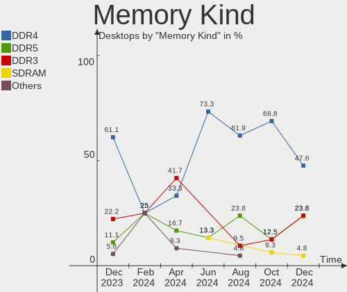

| Kind  | Desktops | Percent |
|-------|----------|---------|
| DDR4  | 5        | 38.46%  |
| DDR3  | 5        | 38.46%  |
| SDRAM | 2        | 15.38%  |
| DDR5  | 1        | 7.69%   |

Memory Form Factor
------------------

Physical design of the memory module

| Name   | Desktops | Percent |
|--------|----------|---------|
| DIMM   | 12       | 92.31%  |
| SODIMM | 1        | 7.69%   |

Memory Size
-----------

Memory module size

| Size  | Desktops | Percent |
|-------|----------|---------|
| 4096  | 5        | 33.33%  |
| 8192  | 4        | 26.67%  |
| 16384 | 3        | 20%     |
| 2048  | 2        | 13.33%  |
| 32768 | 1        | 6.67%   |

Memory Speed
------------

Memory module speed

| Speed   | Desktops | Percent |
|---------|----------|---------|
| 1600    | 3        | 21.43%  |
| Unknown | 3        | 21.43%  |
| 4800    | 1        | 7.14%   |
| 3466    | 1        | 7.14%   |
| 3200    | 1        | 7.14%   |
| 3000    | 1        | 7.14%   |
| 2933    | 1        | 7.14%   |
| 2400    | 1        | 7.14%   |
| 2133    | 1        | 7.14%   |
| 1067    | 1        | 7.14%   |

Printers & scanners
-------------------

Printer Vendor
--------------

Printer device vendors

Zero info for selected period =(

Printer Model
-------------

Printer device models

Zero info for selected period =(

Scanner Vendor
--------------

Scanner device vendors

Zero info for selected period =(

Scanner Model
-------------

Scanner device models

Zero info for selected period =(

Camera
------

Camera Vendor
-------------

Camera device vendors

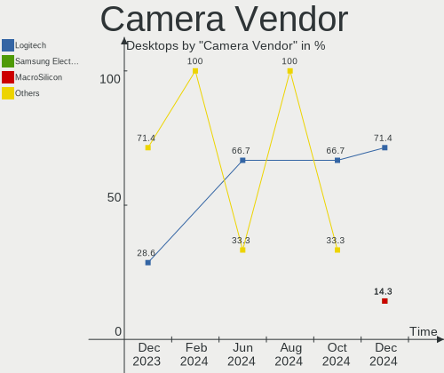

| Vendor   | Desktops | Percent |
|----------|----------|---------|
| Logitech | 3        | 50%     |
| Unknown  | 1        | 16.67%  |
| Microdia | 1        | 16.67%  |
| Lenovo   | 1        | 16.67%  |

Camera Model
------------

Camera device models

| Model                         | Desktops | Percent |
|-------------------------------|----------|---------|
| Logitech Webcam C270          | 2        | 33.33%  |
| Unknown HD camera             | 1        | 16.67%  |
| Microdia Integrated Camera    | 1        | 16.67%  |
| Logitech BRIO Ultra HD Webcam | 1        | 16.67%  |
| Lenovo FHD Webcam Audio       | 1        | 16.67%  |

Security
--------

Fingerprint Vendor
------------------

Fingerprint sensor vendors

Zero info for selected period =(

Fingerprint Model
-----------------

Fingerprint sensor models

Zero info for selected period =(

Chipcard Vendor
---------------

Chipcard module vendors

Zero info for selected period =(

Chipcard Model
--------------

Chipcard module models

Zero info for selected period =(

Unsupported
-----------

Unsupported Devices
-------------------

Total unsupported devices on board

| Total | Desktops | Percent |
|-------|----------|---------|
| 0     | 15       | 78.95%  |
| 1     | 3        | 15.79%  |
| 4     | 1        | 5.26%   |

Unsupported Device Types
------------------------

Types of unsupported devices

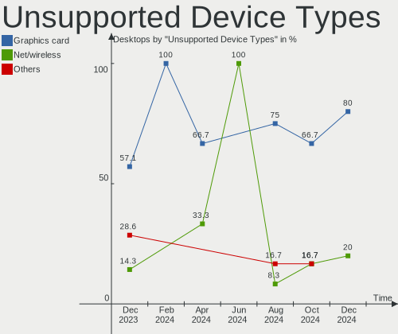

| Type                     | Desktops | Percent |
|--------------------------|----------|---------|
| Net/wireless             | 2        | 28.57%  |
| Graphics card            | 2        | 28.57%  |
| Network                  | 1        | 14.29%  |
| Net/ethernet             | 1        | 14.29%  |
| Communication controller | 1        | 14.29%  |

