Linux in India - Hardware Trends (Desktops)
-------------------------------------------

A project to identify most popular hardware characteristics and track their change
over time based on data collected by Linux users at https://Linux-Hardware.org.

Anyone can contribute to this report by the [hw-probe](https://github.com/linuxhw/hw-probe) tool:

    sudo -E hw-probe -all -upload

Period: Feb, 2023.

Contents
--------

* [ System ](#system)
  - [ OS                       ](#os)
  - [ OS Family                ](#os-family)
  - [ Kernel                   ](#kernel)
  - [ Kernel Family            ](#kernel-family)
  - [ Kernel Major Ver.        ](#kernel-major-ver)
  - [ Arch                     ](#arch)
  - [ DE                       ](#de)
  - [ Display Server           ](#display-server)
  - [ Display Manager          ](#display-manager)
  - [ OS Lang                  ](#os-lang)
  - [ Boot Mode                ](#boot-mode)
  - [ Filesystem               ](#filesystem)
  - [ Part. scheme             ](#part-scheme)
  - [ Dual Boot with Linux/BSD ](#dual-boot-with-linuxbsd)
  - [ Dual Boot (Win)          ](#dual-boot-win)

* [ Board ](#board)
  - [ Vendor                   ](#vendor)
  - [ Model                    ](#model)
  - [ Model Family             ](#model-family)
  - [ MFG Year                 ](#mfg-year)
  - [ Form Factor              ](#form-factor)
  - [ Secure Boot              ](#secure-boot)
  - [ Coreboot                 ](#coreboot)
  - [ RAM Size                 ](#ram-size)
  - [ RAM Used                 ](#ram-used)
  - [ Total Drives             ](#total-drives)
  - [ Has CD-ROM               ](#has-cd-rom)
  - [ Has Ethernet             ](#has-ethernet)
  - [ Has WiFi                 ](#has-wifi)
  - [ Has Bluetooth            ](#has-bluetooth)

* [ Location ](#location)
  - [ Country                  ](#country)
  - [ City                     ](#city)

* [ Drives ](#drives)
  - [ Drive Vendor             ](#drive-vendor)
  - [ Drive Model              ](#drive-model)
  - [ HDD Vendor               ](#hdd-vendor)
  - [ SSD Vendor               ](#ssd-vendor)
  - [ Drive Kind               ](#drive-kind)
  - [ Drive Connector          ](#drive-connector)
  - [ Drive Size               ](#drive-size)
  - [ Space Total              ](#space-total)
  - [ Space Used               ](#space-used)
  - [ Malfunc. Drives          ](#malfunc-drives)
  - [ Malfunc. Drive Vendor    ](#malfunc-drive-vendor)
  - [ Malfunc. HDD Vendor      ](#malfunc-hdd-vendor)
  - [ Malfunc. Drive Kind      ](#malfunc-drive-kind)
  - [ Failed Drives            ](#failed-drives)
  - [ Failed Drive Vendor      ](#failed-drive-vendor)
  - [ Drive Status             ](#drive-status)

* [ Storage controller ](#storage-controller)
  - [ Storage Vendor           ](#storage-vendor)
  - [ Storage Model            ](#storage-model)
  - [ Storage Kind             ](#storage-kind)

* [ Processor ](#processor)
  - [ CPU Vendor               ](#cpu-vendor)
  - [ CPU Model                ](#cpu-model)
  - [ CPU Model Family         ](#cpu-model-family)
  - [ CPU Cores                ](#cpu-cores)
  - [ CPU Sockets              ](#cpu-sockets)
  - [ CPU Threads              ](#cpu-threads)
  - [ CPU Op-Modes             ](#cpu-op-modes)
  - [ CPU Microcode            ](#cpu-microcode)
  - [ CPU Microarch            ](#cpu-microarch)

* [ Graphics ](#graphics)
  - [ GPU Vendor               ](#gpu-vendor)
  - [ GPU Model                ](#gpu-model)
  - [ GPU Combo                ](#gpu-combo)
  - [ GPU Driver               ](#gpu-driver)
  - [ GPU Memory               ](#gpu-memory)

* [ Monitor ](#monitor)
  - [ Monitor Vendor           ](#monitor-vendor)
  - [ Monitor Model            ](#monitor-model)
  - [ Monitor Resolution       ](#monitor-resolution)
  - [ Monitor Diagonal         ](#monitor-diagonal)
  - [ Monitor Width            ](#monitor-width)
  - [ Aspect Ratio             ](#aspect-ratio)
  - [ Monitor Area             ](#monitor-area)
  - [ Pixel Density            ](#pixel-density)
  - [ Multiple Monitors        ](#multiple-monitors)

* [ Network ](#network)
  - [ Net Controller Vendor    ](#net-controller-vendor)
  - [ Net Controller Model     ](#net-controller-model)
  - [ Wireless Vendor          ](#wireless-vendor)
  - [ Wireless Model           ](#wireless-model)
  - [ Ethernet Vendor          ](#ethernet-vendor)
  - [ Ethernet Model           ](#ethernet-model)
  - [ Net Controller Kind      ](#net-controller-kind)
  - [ Used Controller          ](#used-controller)
  - [ NICs                     ](#nics)
  - [ IPv6                     ](#ipv6)

* [ Bluetooth ](#bluetooth)
  - [ Bluetooth Vendor         ](#bluetooth-vendor)
  - [ Bluetooth Model          ](#bluetooth-model)

* [ Sound ](#sound)
  - [ Sound Vendor             ](#sound-vendor)
  - [ Sound Model              ](#sound-model)

* [ Memory ](#memory)
  - [ Memory Vendor            ](#memory-vendor)
  - [ Memory Model             ](#memory-model)
  - [ Memory Kind              ](#memory-kind)
  - [ Memory Form Factor       ](#memory-form-factor)
  - [ Memory Size              ](#memory-size)
  - [ Memory Speed             ](#memory-speed)

* [ Printers & scanners ](#printers--scanners)
  - [ Printer Vendor           ](#printer-vendor)
  - [ Printer Model            ](#printer-model)
  - [ Scanner Vendor           ](#scanner-vendor)
  - [ Scanner Model            ](#scanner-model)

* [ Camera ](#camera)
  - [ Camera Vendor            ](#camera-vendor)
  - [ Camera Model             ](#camera-model)

* [ Security ](#security)
  - [ Fingerprint Vendor       ](#fingerprint-vendor)
  - [ Fingerprint Model        ](#fingerprint-model)
  - [ Chipcard Vendor          ](#chipcard-vendor)
  - [ Chipcard Model           ](#chipcard-model)

* [ Unsupported ](#unsupported)
  - [ Unsupported Devices      ](#unsupported-devices)
  - [ Unsupported Device Types ](#unsupported-device-types)

System
------

OS
--

Installed operating systems

| Name                | Desktops | Percent |
|---------------------|----------|---------|
| Ubuntu 22.04        | 5        | 22.73%  |
| OpenMandriva 23.01  | 3        | 13.64%  |
| Manjaro             | 2        | 9.09%   |
| Fedora 37           | 2        | 9.09%   |
| Zorin 15            | 1        | 4.55%   |
| Ubuntu 22.10        | 1        | 4.55%   |
| RHEL 9              | 1        | 4.55%   |
| KDE neon 22.04      | 1        | 4.55%   |
| Fedora 36           | 1        | 4.55%   |
| EndeavourOS Rolling | 1        | 4.55%   |
| Debian 11           | 1        | 4.55%   |
| Debian              | 1        | 4.55%   |
| ArcoLinux Rolling   | 1        | 4.55%   |
| Arch Rolling        | 1        | 4.55%   |

OS Family
---------

OS without a version

| Name         | Desktops | Percent |
|--------------|----------|---------|
| Ubuntu       | 6        | 27.27%  |
| OpenMandriva | 3        | 13.64%  |
| Fedora       | 3        | 13.64%  |
| Manjaro      | 2        | 9.09%   |
| Debian       | 2        | 9.09%   |
| Zorin        | 1        | 4.55%   |
| RHEL         | 1        | 4.55%   |
| KDE neon     | 1        | 4.55%   |
| EndeavourOS  | 1        | 4.55%   |
| ArcoLinux    | 1        | 4.55%   |
| Arch         | 1        | 4.55%   |

Kernel
------

Version of the Linux kernel

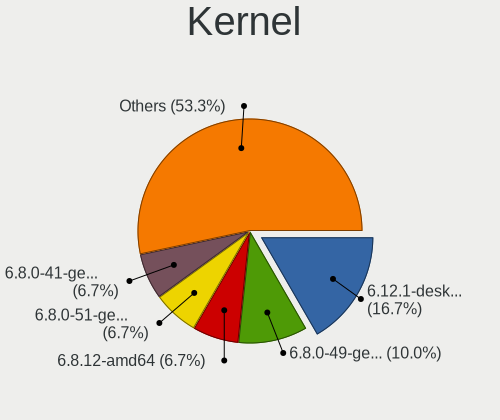

| Version                     | Desktops | Percent |
|-----------------------------|----------|---------|
| 5.19.0-32-generic           | 4        | 18.18%  |
| 6.1.4-desktop-1omv2301      | 2        | 9.09%   |
| 5.15.0-60-generic           | 2        | 9.09%   |
| 6.2.1-arch1-1               | 1        | 4.55%   |
| 6.1.8-zen1-1-zen            | 1        | 4.55%   |
| 6.1.13-200.fc37.x86_64      | 1        | 4.55%   |
| 6.1.12-200.fc37.x86_64      | 1        | 4.55%   |
| 6.1.1-desktop-1omv2290      | 1        | 4.55%   |
| 6.1.0-3-amd64               | 1        | 4.55%   |
| 6.0.9                       | 1        | 4.55%   |
| 6.0.6-1-MANJARO             | 1        | 4.55%   |
| 5.4.0-137-generic           | 1        | 4.55%   |
| 5.19.0-31-generic           | 1        | 4.55%   |
| 5.15.94-1-lts               | 1        | 4.55%   |
| 5.15.81-1-MANJARO           | 1        | 4.55%   |
| 5.14.0-162.6.1.el9_1.x86_64 | 1        | 4.55%   |
| 5.10.0-21-amd64             | 1        | 4.55%   |

Kernel Family
-------------

Linux kernel without a distro release

| Version | Desktops | Percent |
|---------|----------|---------|
| 5.19.0  | 5        | 22.73%  |
| 6.1.4   | 2        | 9.09%   |
| 5.15.0  | 2        | 9.09%   |
| 6.2.1   | 1        | 4.55%   |
| 6.1.8   | 1        | 4.55%   |
| 6.1.13  | 1        | 4.55%   |
| 6.1.12  | 1        | 4.55%   |
| 6.1.1   | 1        | 4.55%   |
| 6.1.0   | 1        | 4.55%   |
| 6.0.9   | 1        | 4.55%   |
| 6.0.6   | 1        | 4.55%   |
| 5.4.0   | 1        | 4.55%   |
| 5.15.94 | 1        | 4.55%   |
| 5.15.81 | 1        | 4.55%   |
| 5.14.0  | 1        | 4.55%   |
| 5.10.0  | 1        | 4.55%   |

Kernel Major Ver.
-----------------

Linux kernel major version

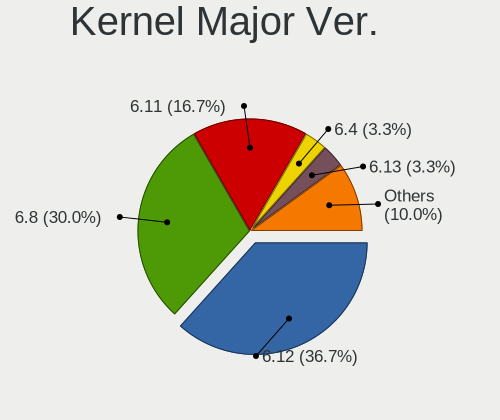

| Version | Desktops | Percent |
|---------|----------|---------|
| 6.1     | 7        | 31.82%  |
| 5.19    | 5        | 22.73%  |
| 5.15    | 4        | 18.18%  |
| 6.0     | 2        | 9.09%   |
| 6.2     | 1        | 4.55%   |
| 5.4     | 1        | 4.55%   |
| 5.14    | 1        | 4.55%   |
| 5.10    | 1        | 4.55%   |

Arch
----

OS architecture (x86_64, i586, etc.)

| Name   | Desktops | Percent |
|--------|----------|---------|
| x86_64 | 21       | 95.45%  |
| i686   | 1        | 4.55%   |

DE
--

Desktop Environment

| Name       | Desktops | Percent |
|------------|----------|---------|
| GNOME      | 11       | 50%     |
| KDE5       | 8        | 36.36%  |
| XFCE       | 1        | 4.55%   |
| X-Cinnamon | 1        | 4.55%   |
| i3         | 1        | 4.55%   |

Display Server
--------------

X11 or Wayland

| Name    | Desktops | Percent |
|---------|----------|---------|
| X11     | 11       | 50%     |
| Wayland | 11       | 50%     |

Display Manager
---------------

SDDM, LightDM, etc.

| Name    | Desktops | Percent |
|---------|----------|---------|
| GDM3    | 6        | 27.27%  |
| Unknown | 6        | 27.27%  |
| SDDM    | 5        | 22.73%  |
| GDM     | 3        | 13.64%  |
| LightDM | 2        | 9.09%   |

OS Lang
-------

Language

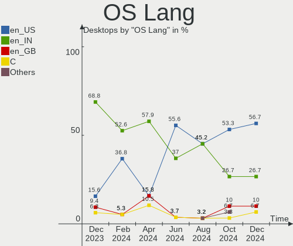

| Lang  | Desktops | Percent |
|-------|----------|---------|
| en_IN | 13       | 59.09%  |
| en_US | 8        | 36.36%  |
| en_GB | 1        | 4.55%   |

Boot Mode
---------

EFI or BIOS

| Mode | Desktops | Percent |
|------|----------|---------|
| BIOS | 13       | 59.09%  |
| EFI  | 9        | 40.91%  |

Filesystem
----------

Type of filesystem

| Type    | Desktops | Percent |
|---------|----------|---------|
| Ext4    | 16       | 72.73%  |
| Btrfs   | 3        | 13.64%  |
| Zfs     | 1        | 4.55%   |
| Xfs     | 1        | 4.55%   |
| Overlay | 1        | 4.55%   |

Part. scheme
------------

Scheme of partitioning

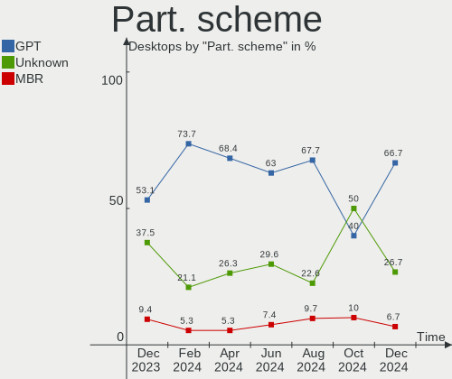

| Type    | Desktops | Percent |
|---------|----------|---------|
| GPT     | 12       | 54.55%  |
| Unknown | 7        | 31.82%  |
| MBR     | 3        | 13.64%  |

Dual Boot with Linux/BSD
------------------------

Hosting more than one Linux/BSD

| Dual boot | Desktops | Percent |
|-----------|----------|---------|
| No        | 18       | 81.82%  |
| Yes       | 4        | 18.18%  |

Dual Boot (Win)
---------------

Hosting Linux and Windows

| Dual boot | Desktops | Percent |
|-----------|----------|---------|
| No        | 17       | 77.27%  |
| Yes       | 5        | 22.73%  |

Board
-----

Vendor
------

Motherboard manufacturer

| Name                | Desktops | Percent |
|---------------------|----------|---------|
| Gigabyte Technology | 12       | 54.55%  |
| Intel               | 2        | 9.09%   |
| Acer                | 2        | 9.09%   |
| MSI                 | 1        | 4.55%   |
| Lenovo              | 1        | 4.55%   |
| Dell                | 1        | 4.55%   |
| ASUSTek Computer    | 1        | 4.55%   |
| ASRock              | 1        | 4.55%   |
| Unknown             | 1        | 4.55%   |

Model
-----

Motherboard model

| Name                                | Desktops | Percent |
|-------------------------------------|----------|---------|
| Gigabyte H310M S2 2.0               | 4        | 18.18%  |
| MSI MS-7B79                         | 1        | 4.55%   |
| Lenovo ThinkCentre M710t 10MAA021IH | 1        | 4.55%   |
| Intel DB85FL AAG89861-203           | 1        | 4.55%   |
| Intel D945GCPE AAD97209-201         | 1        | 4.55%   |
| Gigabyte Z690M AORUS ELITE AX DDR4  | 1        | 4.55%   |
| Gigabyte H61MS                      | 1        | 4.55%   |
| Gigabyte H510M S2                   | 1        | 4.55%   |
| Gigabyte H510M H                    | 1        | 4.55%   |
| Gigabyte H410M S2 V3                | 1        | 4.55%   |
| Gigabyte H310M H                    | 1        | 4.55%   |
| Gigabyte B660M AORUS PRO AX DDR4    | 1        | 4.55%   |
| Gigabyte B450M DS3H WIFI            | 1        | 4.55%   |
| Dell OptiPlex 780                   | 1        | 4.55%   |
| ASUS Z170-DELUXE                    | 1        | 4.55%   |
| ASRock B550M Steel Legend           | 1        | 4.55%   |
| Acer Veriton M200-H410              | 1        | 4.55%   |
| Acer G43T-AM3                       | 1        | 4.55%   |
| Unknown                             | 1        | 4.55%   |

Model Family
------------

Motherboard model prefix

| Name               | Desktops | Percent |
|--------------------|----------|---------|
| Gigabyte H310M     | 5        | 22.73%  |
| Gigabyte H510M     | 2        | 9.09%   |
| MSI MS-7B79        | 1        | 4.55%   |
| Lenovo ThinkCentre | 1        | 4.55%   |
| Intel DB85FL       | 1        | 4.55%   |
| Intel D945GCPE     | 1        | 4.55%   |
| Gigabyte Z690M     | 1        | 4.55%   |
| Gigabyte H61MS     | 1        | 4.55%   |
| Gigabyte H410M     | 1        | 4.55%   |
| Gigabyte B660M     | 1        | 4.55%   |
| Gigabyte B450M     | 1        | 4.55%   |
| Dell OptiPlex      | 1        | 4.55%   |
| ASUS Z170-DELUXE   | 1        | 4.55%   |
| ASRock B550M       | 1        | 4.55%   |
| Acer Veriton       | 1        | 4.55%   |
| Acer G43T-AM3      | 1        | 4.55%   |
| Unknown            | 1        | 4.55%   |

MFG Year
--------

Motherboard manufacture year

| Year | Desktops | Percent |
|------|----------|---------|
| 2021 | 6        | 27.27%  |
| 2018 | 6        | 27.27%  |
| 2013 | 2        | 9.09%   |
| 2023 | 1        | 4.55%   |
| 2020 | 1        | 4.55%   |
| 2019 | 1        | 4.55%   |
| 2017 | 1        | 4.55%   |
| 2016 | 1        | 4.55%   |
| 2012 | 1        | 4.55%   |
| 2010 | 1        | 4.55%   |
| 2007 | 1        | 4.55%   |

Form Factor
-----------

Physical design of the computer

| Name    | Desktops | Percent |
|---------|----------|---------|
| Desktop | 22       | 100%    |

Secure Boot
-----------

Enabled or disabled

| State    | Desktops | Percent |
|----------|----------|---------|
| Disabled | 20       | 90.91%  |
| Enabled  | 2        | 9.09%   |

Coreboot
--------

Have coreboot on board

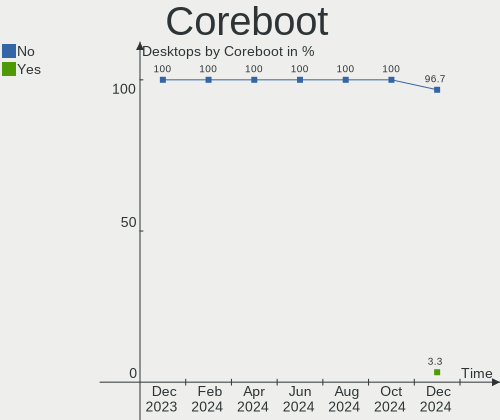

| Used | Desktops | Percent |
|------|----------|---------|
| No   | 21       | 95.45%  |
| Yes  | 1        | 4.55%   |

RAM Size
--------

Total RAM memory

| Size in GB | Desktops | Percent |
|------------|----------|---------|
| 16.01-24.0 | 6        | 27.27%  |
| 4.01-8.0   | 5        | 22.73%  |
| 3.01-4.0   | 4        | 18.18%  |
| 8.01-16.0  | 4        | 18.18%  |
| 32.01-64.0 | 1        | 4.55%   |
| 2.01-3.0   | 1        | 4.55%   |
| 1.01-2.0   | 1        | 4.55%   |

RAM Used
--------

Used RAM memory

| Used GB   | Desktops | Percent |
|-----------|----------|---------|
| 2.01-3.0  | 7        | 31.82%  |
| 1.01-2.0  | 6        | 27.27%  |
| 4.01-8.0  | 4        | 18.18%  |
| 3.01-4.0  | 3        | 13.64%  |
| 8.01-16.0 | 1        | 4.55%   |
| 0.51-1.0  | 1        | 4.55%   |

Total Drives
------------

Number of drives on board

| Drives | Desktops | Percent |
|--------|----------|---------|
| 2      | 9        | 40.91%  |
| 1      | 9        | 40.91%  |
| 5      | 2        | 9.09%   |
| 3      | 2        | 9.09%   |

Has CD-ROM
----------

Has CD-ROM on board

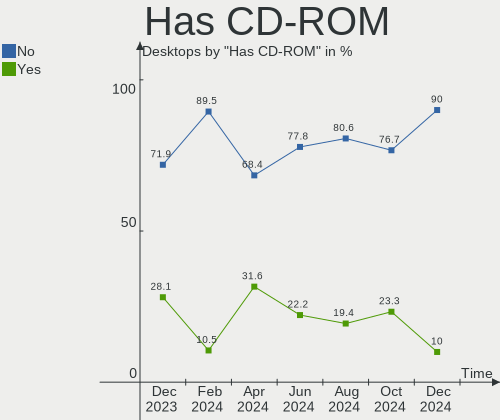

| Presented | Desktops | Percent |
|-----------|----------|---------|
| No        | 21       | 95.45%  |
| Yes       | 1        | 4.55%   |

Has Ethernet
------------

Has Ethernet on board

| Presented | Desktops | Percent |
|-----------|----------|---------|
| Yes       | 22       | 100%    |

Has WiFi
--------

Has WiFi module

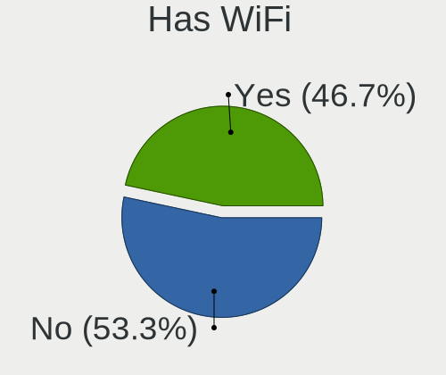

| Presented | Desktops | Percent |
|-----------|----------|---------|
| Yes       | 11       | 50%     |
| No        | 11       | 50%     |

Has Bluetooth
-------------

Has Bluetooth module

| Presented | Desktops | Percent |
|-----------|----------|---------|
| No        | 14       | 63.64%  |
| Yes       | 8        | 36.36%  |

Location
--------

Country
-------

Geographic location (country)

| Country | Desktops | Percent |
|---------|----------|---------|
| India   | 22       | 100%    |

City
----

Geographic location (city)

| City        | Desktops | Percent |
|-------------|----------|---------|
| Kolkata     | 2        | 9.09%   |
| Indore      | 2        | 9.09%   |
| Hyderabad   | 2        | 9.09%   |
| Delhi       | 2        | 9.09%   |
| Bengaluru   | 2        | 9.09%   |
| Tirunelveli | 1        | 4.55%   |
| Thrissur    | 1        | 4.55%   |
| Pune        | 1        | 4.55%   |
| Nellore     | 1        | 4.55%   |
| Navi Mumbai | 1        | 4.55%   |
| Mumbai      | 1        | 4.55%   |
| Marthandam  | 1        | 4.55%   |
| Kochi       | 1        | 4.55%   |
| Kanpur      | 1        | 4.55%   |
| Dombivali   | 1        | 4.55%   |
| Chennai     | 1        | 4.55%   |
| Bhubaneswar | 1        | 4.55%   |

Drives
------

Drive Vendor
------------

Hard drive vendors

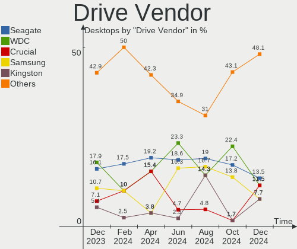

| Vendor              | Desktops | Drives | Percent |
|---------------------|----------|--------|---------|
| Seagate             | 8        | 9      | 20%     |
| WDC                 | 7        | 8      | 17.5%   |
| Toshiba             | 3        | 3      | 7.5%    |
| Crucial             | 3        | 3      | 7.5%    |
| China               | 3        | 3      | 7.5%    |
| Sandisk             | 2        | 2      | 5%      |
| Samsung Electronics | 2        | 2      | 5%      |
| Kingston            | 2        | 3      | 5%      |
| Gigabyte Technology | 2        | 2      | 5%      |
| Team                | 1        | 1      | 2.5%    |
| Pioneer             | 1        | 1      | 2.5%    |
| LITEONIT            | 1        | 1      | 2.5%    |
| KingSpec            | 1        | 1      | 2.5%    |
| Intel               | 1        | 1      | 2.5%    |
| HGST                | 1        | 1      | 2.5%    |
| ADATA Technology    | 1        | 1      | 2.5%    |
| Unknown             | 1        | 1      | 2.5%    |

Drive Model
-----------

Hard drive models

| Model                                 | Desktops | Percent |
|---------------------------------------|----------|---------|
| WDC WD10EZEX-00BBHA0 1TB              | 2        | 4.65%   |
| Seagate ST1000DM010-2EP102 1TB        | 2        | 4.65%   |
| Crucial CT240BX500SSD1 240GB          | 2        | 4.65%   |
| WDC WD5000AAKX-60U6AA0 500GB          | 1        | 2.33%   |
| WDC WD3200AAJS-00L7A0 320GB           | 1        | 2.33%   |
| WDC WD10JPVX-08JC3T5 1TB              | 1        | 2.33%   |
| WDC WD10EZEX-22MFCA0 1TB              | 1        | 2.33%   |
| WDC WD10EZEX-21WN4A0 1TB              | 1        | 2.33%   |
| WDC WD10EALX-759BA1 1TB               | 1        | 2.33%   |
| Toshiba HDWD110 1TB                   | 1        | 2.33%   |
| Toshiba DT01ACA100 1TB                | 1        | 2.33%   |
| Toshiba DT01ACA050 500GB              | 1        | 2.33%   |
| Team TM8FPD001T 1TB                   | 1        | 2.33%   |
| Seagate ST500LM021-1KJ152 500GB       | 1        | 2.33%   |
| Seagate ST3750640NS 752GB             | 1        | 2.33%   |
| Seagate ST3500413AS 500GB             | 1        | 2.33%   |
| Seagate ST3160215AS 160GB             | 1        | 2.33%   |
| Seagate ST3160212ACE 160GB            | 1        | 2.33%   |
| Seagate ST2000DM005-2CW102 2TB        | 1        | 2.33%   |
| Seagate ST1000DM003-1ER1 1TB          | 1        | 2.33%   |
| Sandisk WD_BLACK SN750 SE 1TB         | 1        | 2.33%   |
| SanDisk SD7TB3Q-256G-1006 256GB SSD   | 1        | 2.33%   |
| Samsung SSD 860 EVO 250GB             | 1        | 2.33%   |
| Samsung SSD 860 EVO 1TB               | 1        | 2.33%   |
| Pioneer APS-SL3N-120 120GB SSD        | 1        | 2.33%   |
| LITEONIT LCS-128M6S 2.5 7mm 128GB SSD | 1        | 2.33%   |
| Kingston SNVS250G 250GB               | 1        | 2.33%   |
| Kingston SNVS2000G 2TB                | 1        | 2.33%   |
| Kingston SA400S37120G 120GB SSD       | 1        | 2.33%   |
| KingSpec P4-120 120GB SSD             | 1        | 2.33%   |
| Intel PCIe Data Center SSD 400GB      | 1        | 2.33%   |
| HGST HTS545050A7E680 500GB            | 1        | 2.33%   |
| Gigabyte GP-GSTFS31240GNTD 240GB SSD  | 1        | 2.33%   |
| Gigabyte GP-GSTFS31120GNTD 120GB SSD  | 1        | 2.33%   |
| Crucial CT500MX500SSD1 500GB          | 1        | 2.33%   |
| China SSD 256GB                       | 1        | 2.33%   |
| China SSD 120GB                       | 1        | 2.33%   |
| China SATA3 128GB SSD                 | 1        | 2.33%   |
| ADATA XPG GAMMIX S5 1024GB            | 1        | 2.33%   |
| Unknown                               | 1        | 2.33%   |

HDD Vendor
----------

Hard disk drive vendors

| Vendor  | Desktops | Drives | Percent |
|---------|----------|--------|---------|
| Seagate | 8        | 9      | 42.11%  |
| WDC     | 7        | 8      | 36.84%  |
| Toshiba | 3        | 3      | 15.79%  |
| HGST    | 1        | 1      | 5.26%   |

SSD Vendor
----------

Solid state drive vendors

| Vendor              | Desktops | Drives | Percent |
|---------------------|----------|--------|---------|
| Crucial             | 3        | 3      | 18.75%  |
| China               | 3        | 3      | 18.75%  |
| Samsung Electronics | 2        | 2      | 12.5%   |
| Gigabyte Technology | 2        | 2      | 12.5%   |
| SanDisk             | 1        | 1      | 6.25%   |
| Pioneer             | 1        | 1      | 6.25%   |
| LITEONIT            | 1        | 1      | 6.25%   |
| Kingston            | 1        | 1      | 6.25%   |
| KingSpec            | 1        | 1      | 6.25%   |
| Unknown             | 1        | 1      | 6.25%   |

Drive Kind
----------

HDD or SSD

| Kind | Desktops | Drives | Percent |
|------|----------|--------|---------|
| HDD  | 17       | 21     | 50%     |
| SSD  | 12       | 16     | 35.29%  |
| NVMe | 5        | 6      | 14.71%  |

Drive Connector
---------------

SATA, SAS, NVMe, etc.

| Type | Desktops | Drives | Percent |
|------|----------|--------|---------|
| SATA | 19       | 37     | 79.17%  |
| NVMe | 5        | 6      | 20.83%  |

Drive Size
----------

Size of hard drive

| Size in TB | Desktops | Drives | Percent |
|------------|----------|--------|---------|
| 0.01-0.5   | 17       | 23     | 58.62%  |
| 0.51-1.0   | 11       | 13     | 37.93%  |
| 1.01-2.0   | 1        | 1      | 3.45%   |

Space Total
-----------

Amount of disk space available on the file system

| Size in GB | Desktops | Percent |
|------------|----------|---------|
| 501-1000   | 8        | 36.36%  |
| 101-250    | 6        | 27.27%  |
| 251-500    | 3        | 13.64%  |
| 21-50      | 2        | 9.09%   |
| 2001-3000  | 1        | 4.55%   |
| 1001-2000  | 1        | 4.55%   |
| 51-100     | 1        | 4.55%   |

Space Used
----------

Amount of used disk space

| Used GB   | Desktops | Percent |
|-----------|----------|---------|
| 1-20      | 7        | 31.82%  |
| 21-50     | 4        | 18.18%  |
| 101-250   | 3        | 13.64%  |
| 501-1000  | 3        | 13.64%  |
| 51-100    | 3        | 13.64%  |
| 251-500   | 1        | 4.55%   |
| 1001-2000 | 1        | 4.55%   |

Malfunc. Drives
---------------

Drive models with a malfunction

| Model                      | Desktops | Drives | Percent |
|----------------------------|----------|--------|---------|
| WDC WD10JPVX-08JC3T5 1TB   | 1        | 1      | 25%     |
| Toshiba DT01ACA100 1TB     | 1        | 1      | 25%     |
| Seagate ST3160215AS 160GB  | 1        | 1      | 25%     |
| HGST HTS545050A7E680 500GB | 1        | 1      | 25%     |

Malfunc. Drive Vendor
---------------------

Vendors of faulty drives

| Vendor  | Desktops | Drives | Percent |
|---------|----------|--------|---------|
| WDC     | 1        | 1      | 25%     |
| Toshiba | 1        | 1      | 25%     |
| Seagate | 1        | 1      | 25%     |
| HGST    | 1        | 1      | 25%     |

Malfunc. HDD Vendor
-------------------

Vendors of faulty HDD drives

| Vendor  | Desktops | Drives | Percent |
|---------|----------|--------|---------|
| WDC     | 1        | 1      | 25%     |
| Toshiba | 1        | 1      | 25%     |
| Seagate | 1        | 1      | 25%     |
| HGST    | 1        | 1      | 25%     |

Malfunc. Drive Kind
-------------------

Kinds of faulty drives

| Kind | Desktops | Drives | Percent |
|------|----------|--------|---------|
| HDD  | 3        | 4      | 100%    |

Failed Drives
-------------

Failed drive models

Zero info for selected period =(

Failed Drive Vendor
-------------------

Failed drive vendors

Zero info for selected period =(

Drive Status
------------

Number of failed and malfunc. drives

| Status   | Desktops | Drives | Percent |
|----------|----------|--------|---------|
| Detected | 13       | 24     | 54.17%  |
| Works    | 8        | 15     | 33.33%  |
| Malfunc  | 3        | 4      | 12.5%   |

Storage controller
------------------

Storage Vendor
--------------

Storage controller vendors

| Vendor                      | Desktops | Percent |
|-----------------------------|----------|---------|
| Intel                       | 19       | 70.37%  |
| AMD                         | 3        | 11.11%  |
| SanDisk                     | 1        | 3.7%    |
| Realtek Semiconductor       | 1        | 3.7%    |
| Kingston Technology Company | 1        | 3.7%    |
| ASMedia Technology          | 1        | 3.7%    |
| ADATA Technology            | 1        | 3.7%    |

Storage Model
-------------

Storage controller models

| Model                                                                                   | Desktops | Percent |
|-----------------------------------------------------------------------------------------|----------|---------|
| Intel 200 Series PCH SATA controller [AHCI mode]                                        | 5        | 15.63%  |
| Intel 500 Series Chipset Family SATA AHCI Controller                                    | 3        | 9.38%   |
| Intel SATA Controller [RAID mode]                                                       | 2        | 6.25%   |
| Intel NM10/ICH7 Family SATA Controller [IDE mode]                                       | 2        | 6.25%   |
| Intel Alder Lake-S PCH SATA Controller [AHCI Mode]                                      | 2        | 6.25%   |
| AMD FCH SATA Controller [AHCI mode]                                                     | 2        | 6.25%   |
| AMD 400 Series Chipset SATA Controller                                                  | 2        | 6.25%   |
| SanDisk Non-Volatile memory controller                                                  | 1        | 3.13%   |
| Realtek Realtek Non-Volatile memory controller                                          | 1        | 3.13%   |
| Kingston Company Company Non-Volatile memory controller                                 | 1        | 3.13%   |
| Intel PCIe Data Center SSD                                                              | 1        | 3.13%   |
| Intel Cannon Lake PCH SATA AHCI Controller                                              | 1        | 3.13%   |
| Intel 82801JI (ICH10 Family) SATA AHCI Controller                                       | 1        | 3.13%   |
| Intel 82801G (ICH7 Family) IDE Controller                                               | 1        | 3.13%   |
| Intel 8 Series/C220 Series Chipset Family 6-port SATA Controller 1 [AHCI mode]          | 1        | 3.13%   |
| Intel 6 Series/C200 Series Chipset Family Desktop SATA Controller (IDE mode, ports 4-5) | 1        | 3.13%   |
| Intel 6 Series/C200 Series Chipset Family Desktop SATA Controller (IDE mode, ports 0-3) | 1        | 3.13%   |
| Intel 400 Series Chipset Family SATA AHCI Controller                                    | 1        | 3.13%   |
| ASMedia ASM1062 Serial ATA Controller                                                   | 1        | 3.13%   |
| AMD 500 Series Chipset SATA Controller                                                  | 1        | 3.13%   |
| ADATA ADATA XPG GAMMIXS1 1L Media                                                       | 1        | 3.13%   |

Storage Kind
------------

Kind of storage controller (IDE, SATA, NVMe, SAS, ...)

| Kind | Desktops | Percent |
|------|----------|---------|
| SATA | 18       | 64.29%  |
| NVMe | 5        | 17.86%  |
| IDE  | 3        | 10.71%  |
| RAID | 2        | 7.14%   |

Processor
---------

CPU Vendor
----------

Processor vendors

| Vendor | Desktops | Percent |
|--------|----------|---------|
| Intel  | 19       | 86.36%  |
| AMD    | 3        | 13.64%  |

CPU Model
---------

Processor models

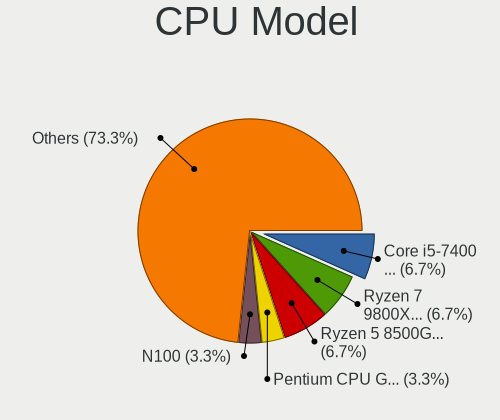

| Model                                       | Desktops | Percent |
|---------------------------------------------|----------|---------|
| Intel Core i3-9100F CPU @ 3.60GHz           | 3        | 13.64%  |
| Intel Pentium Dual-Core CPU E6700 @ 3.20GHz | 1        | 4.55%   |
| Intel Pentium CPU G4400 @ 3.30GHz           | 1        | 4.55%   |
| Intel Pentium 4 CPU 3.00GHz                 | 1        | 4.55%   |
| Intel Core i5-9400F CPU @ 2.90GHz           | 1        | 4.55%   |
| Intel Core i5-6600K CPU @ 3.50GHz           | 1        | 4.55%   |
| Intel Core i5-4440 CPU @ 3.10GHz            | 1        | 4.55%   |
| Intel Core i5-10400F CPU @ 2.90GHz          | 1        | 4.55%   |
| Intel Core i5-10400 CPU @ 2.90GHz           | 1        | 4.55%   |
| Intel Core i3-8100 CPU @ 3.60GHz            | 1        | 4.55%   |
| Intel Core i3-3210 CPU @ 3.20GHz            | 1        | 4.55%   |
| Intel Core i3-10100 CPU @ 3.60GHz           | 1        | 4.55%   |
| Intel Core 2 Duo CPU E7500 @ 2.93GHz        | 1        | 4.55%   |
| Intel Core 2 CPU 4400 @ 2.00GHz             | 1        | 4.55%   |
| Intel 12th Gen Core i7-12700                | 1        | 4.55%   |
| Intel 12th Gen Core i3-12100F               | 1        | 4.55%   |
| Intel 11th Gen Core i7-11700F @ 2.50GHz     | 1        | 4.55%   |
| AMD Ryzen 7 5700X 8-Core Processor          | 1        | 4.55%   |
| AMD Ryzen 5 3400G with Radeon Vega Graphics | 1        | 4.55%   |
| AMD Ryzen 5 2600X Six-Core Processor        | 1        | 4.55%   |

CPU Model Family
----------------

Processor model prefix

| Model                   | Desktops | Percent |
|-------------------------|----------|---------|
| Intel Core i3           | 6        | 27.27%  |
| Intel Core i5           | 5        | 22.73%  |
| Other                   | 3        | 13.64%  |
| AMD Ryzen 5             | 2        | 9.09%   |
| Intel Pentium Dual-Core | 1        | 4.55%   |
| Intel Pentium 4         | 1        | 4.55%   |
| Intel Pentium           | 1        | 4.55%   |
| Intel Core 2 Duo        | 1        | 4.55%   |
| Intel Core 2            | 1        | 4.55%   |
| AMD Ryzen 7             | 1        | 4.55%   |

CPU Cores
---------

Number of processor cores

| Number | Desktops | Percent |
|--------|----------|---------|
| 4      | 9        | 40.91%  |
| 2      | 5        | 22.73%  |
| 6      | 4        | 18.18%  |
| 8      | 2        | 9.09%   |
| 12     | 1        | 4.55%   |
| 1      | 1        | 4.55%   |

CPU Sockets
-----------

Number of sockets

| Number | Desktops | Percent |
|--------|----------|---------|
| 1      | 22       | 100%    |

CPU Threads
-----------

Threads per core (Hyper-Threading)

| Number | Desktops | Percent |
|--------|----------|---------|
| 1      | 12       | 54.55%  |
| 2      | 10       | 45.45%  |

CPU Op-Modes
------------

CPU Operation Modes (32-bit, 64-bit)

| Op mode        | Desktops | Percent |
|----------------|----------|---------|
| 32-bit, 64-bit | 21       | 95.45%  |
| 32-bit         | 1        | 4.55%   |

CPU Microcode
-------------

Microcode number

| Number     | Desktops | Percent |
|------------|----------|---------|
| Unknown    | 8        | 36.36%  |
| 0x906ea    | 3        | 13.64%  |
| 0xa0653    | 2        | 9.09%   |
| 0xf34      | 1        | 4.55%   |
| 0xa0671    | 1        | 4.55%   |
| 0x906eb    | 1        | 4.55%   |
| 0x6f2      | 1        | 4.55%   |
| 0x306c3    | 1        | 4.55%   |
| 0x1067a    | 1        | 4.55%   |
| 0x0a201205 | 1        | 4.55%   |
| 0x08108109 | 1        | 4.55%   |
| 0x0800820d | 1        | 4.55%   |

CPU Microarch
-------------

Microarchitecture

| Name      | Desktops | Percent |
|-----------|----------|---------|
| KabyLake  | 5        | 22.73%  |
| CometLake | 3        | 13.64%  |
| Zen+      | 2        | 9.09%   |
| Skylake   | 2        | 9.09%   |
| Penryn    | 2        | 9.09%   |
| Unknown   | 2        | 9.09%   |
| Zen 3     | 1        | 4.55%   |
| NetBurst  | 1        | 4.55%   |
| IvyBridge | 1        | 4.55%   |
| Icelake   | 1        | 4.55%   |
| Haswell   | 1        | 4.55%   |
| Core      | 1        | 4.55%   |

Graphics
--------

GPU Vendor
----------

Vendors of graphics cards

| Vendor | Desktops | Percent |
|--------|----------|---------|
| Nvidia | 12       | 54.55%  |
| Intel  | 9        | 40.91%  |
| AMD    | 1        | 4.55%   |

GPU Model
---------

Graphics card models

| Model                                                                | Desktops | Percent |
|----------------------------------------------------------------------|----------|---------|
| Nvidia GK208B [GeForce GT 710]                                       | 5        | 22.73%  |
| Intel 4 Series Chipset Integrated Graphics Controller                | 3        | 13.64%  |
| Nvidia TU117GL [T400 4GB]                                            | 1        | 4.55%   |
| Nvidia TU116 [GeForce GTX 1660 SUPER]                                | 1        | 4.55%   |
| Nvidia GT218 [GeForce G210]                                          | 1        | 4.55%   |
| Nvidia GP108 [GeForce GT 1030]                                       | 1        | 4.55%   |
| Nvidia GP104 [GeForce GTX 1070 Ti]                                   | 1        | 4.55%   |
| Nvidia GF119 [GeForce GT 610]                                        | 1        | 4.55%   |
| Nvidia GA106 [GeForce RTX 3060 Lite Hash Rate]                       | 1        | 4.55%   |
| Intel Xeon E3-1200 v2/3rd Gen Core processor Graphics Controller     | 1        | 4.55%   |
| Intel HD Graphics 530                                                | 1        | 4.55%   |
| Intel HD Graphics 510                                                | 1        | 4.55%   |
| Intel CometLake-S GT2 [UHD Graphics 630]                             | 1        | 4.55%   |
| Intel AlderLake-S GT1                                                | 1        | 4.55%   |
| Intel 82945G/GZ Integrated Graphics Controller                       | 1        | 4.55%   |
| AMD Picasso/Raven 2 [Radeon Vega Series / Radeon Vega Mobile Series] | 1        | 4.55%   |

GPU Combo
---------

Combinations of graphics cards

| Name       | Desktops | Percent |
|------------|----------|---------|
| 1 x Nvidia | 12       | 54.55%  |
| 1 x Intel  | 8        | 36.36%  |
| 2 x Intel  | 1        | 4.55%   |
| 1 x AMD    | 1        | 4.55%   |

GPU Driver
----------

Free vs proprietary

| Driver      | Desktops | Percent |
|-------------|----------|---------|
| Free        | 18       | 81.82%  |
| Proprietary | 3        | 13.64%  |
| Unknown     | 1        | 4.55%   |

GPU Memory
----------

Total video memory

| Size in GB | Desktops | Percent |
|------------|----------|---------|
| Unknown    | 13       | 59.09%  |
| 1.01-2.0   | 6        | 27.27%  |
| 7.01-8.0   | 1        | 4.55%   |
| 3.01-4.0   | 1        | 4.55%   |
| 8.01-16.0  | 1        | 4.55%   |

Monitor
-------

Monitor Vendor
--------------

Monitor vendors

| Vendor              | Desktops | Percent |
|---------------------|----------|---------|
| Samsung Electronics | 3        | 14.29%  |
| Lenovo              | 3        | 14.29%  |
| Goldstar            | 3        | 14.29%  |
| Dell                | 3        | 14.29%  |
| BenQ                | 3        | 14.29%  |
| Acer                | 3        | 14.29%  |
| Panasonic           | 1        | 4.76%   |
| LG Electronics      | 1        | 4.76%   |
| Haier               | 1        | 4.76%   |

Monitor Model
-------------

Monitor models

| Model                                                                | Desktops | Percent |
|----------------------------------------------------------------------|----------|---------|
| Samsung Electronics SMB2030 SAM063C 1600x900 443x249mm 20.0-inch     | 1        | 4.55%   |
| Samsung Electronics SMB1930N SAM0632 1366x768 410x230mm 18.5-inch    | 1        | 4.55%   |
| Samsung Electronics LCD Monitor SAM0C3C 1366x768 609x347mm 27.6-inch | 1        | 4.55%   |
| Panasonic TV MEIC312 1920x1080 698x392mm 31.5-inch                   | 1        | 4.55%   |
| LG Electronics LCD Monitor E2260 1920x1080                           | 1        | 4.55%   |
| Lenovo LEN LT2252pwA LEN0A0C 1680x1050 474x296mm 22.0-inch           | 1        | 4.55%   |
| Lenovo LEN E2054A LEN60DF 1440x900 419x262mm 19.5-inch               | 1        | 4.55%   |
| Lenovo D22e-20 LEN66D2 1920x1080 478x260mm 21.4-inch                 | 1        | 4.55%   |
| Haier LED39C800F HAI17FC 1920x1080 1150x650mm 52.0-inch              | 1        | 4.55%   |
| Goldstar MP59G GSM5B34 1920x1080 480x270mm 21.7-inch                 | 1        | 4.55%   |
| Goldstar IPS FULLHD GSM5AB6 1920x1080 480x270mm 21.7-inch            | 1        | 4.55%   |
| Goldstar HD GSM5ACD 1366x768 410x230mm 18.5-inch                     | 1        | 4.55%   |
| Dell S2240L DELD054 1920x1080 476x267mm 21.5-inch                    | 1        | 4.55%   |
| Dell E1916HV DELF06C 1366x768 409x230mm 18.5-inch                    | 1        | 4.55%   |
| Dell D1918H DEL2005 1366x768 410x230mm 18.5-inch                     | 1        | 4.55%   |
| BenQ GW2283 BNQ78E9 1920x1080 476x268mm 21.5-inch                    | 1        | 4.55%   |
| BenQ EX2710S BNQ7FA4 1920x1080 600x340mm 27.2-inch                   | 1        | 4.55%   |
| BenQ EW2880U BNQ7963 3840x2160 621x342mm 27.9-inch                   | 1        | 4.55%   |
| Acer V226HQL ACR0335 1920x1080 477x268mm 21.5-inch                   | 1        | 4.55%   |
| Acer V196HQL ACR032A 1366x768 410x230mm 18.5-inch                    | 1        | 4.55%   |
| Acer HA270 ACR0584 1920x1080 598x336mm 27.0-inch                     | 1        | 4.55%   |
| Acer EB192Q ACR0517 1366x768 410x230mm 18.5-inch                     | 1        | 4.55%   |

Monitor Resolution
------------------

Monitor screen resolution

| Resolution         | Desktops | Percent |
|--------------------|----------|---------|
| 1920x1080 (FHD)    | 9        | 47.37%  |
| 1366x768 (WXGA)    | 6        | 31.58%  |
| 3840x2160 (4K)     | 1        | 5.26%   |
| 1680x1050 (WSXGA+) | 1        | 5.26%   |
| 1600x900 (HD+)     | 1        | 5.26%   |
| 1440x900 (WXGA+)   | 1        | 5.26%   |

Monitor Diagonal
----------------

Diagonal size in inches

| Inches  | Desktops | Percent |
|---------|----------|---------|
| 21      | 5        | 26.32%  |
| 18      | 5        | 26.32%  |
| 31      | 2        | 10.53%  |
| 27      | 2        | 10.53%  |
| 52      | 1        | 5.26%   |
| 22      | 1        | 5.26%   |
| 20      | 1        | 5.26%   |
| 19      | 1        | 5.26%   |
| Unknown | 1        | 5.26%   |

Monitor Width
-------------

Physical width

| Width in mm | Desktops | Percent |
|-------------|----------|---------|
| 401-500     | 13       | 68.42%  |
| 601-700     | 3        | 15.79%  |
| 501-600     | 1        | 5.26%   |
| 1001-1500   | 1        | 5.26%   |
| Unknown     | 1        | 5.26%   |

Aspect Ratio
------------

Proportional relationship between the width and the height

| Ratio   | Desktops | Percent |
|---------|----------|---------|
| 16/9    | 16       | 84.21%  |
| 16/10   | 2        | 10.53%  |
| Unknown | 1        | 5.26%   |

Monitor Area
------------

Area in inch²

| Area in inch² | Desktops | Percent |
|----------------|----------|---------|
| 201-250        | 6        | 30%     |
| 141-150        | 5        | 25%     |
| 151-200        | 3        | 15%     |
| 351-500        | 2        | 10%     |
| 301-350        | 2        | 10%     |
| More than 1000 | 1        | 5%      |
| Unknown        | 1        | 5%      |

Pixel Density
-------------

Pixels per inch

| Density | Desktops | Percent |
|---------|----------|---------|
| 51-100  | 10       | 52.63%  |
| 101-120 | 5        | 26.32%  |
| 1-50    | 2        | 10.53%  |
| 121-160 | 1        | 5.26%   |
| Unknown | 1        | 5.26%   |

Multiple Monitors
-----------------

Total monitors connected

| Total | Desktops | Percent |
|-------|----------|---------|
| 1     | 18       | 81.82%  |
| 2     | 2        | 9.09%   |
| 0     | 2        | 9.09%   |

Network
-------

Net Controller Vendor
---------------------

Controller vendors

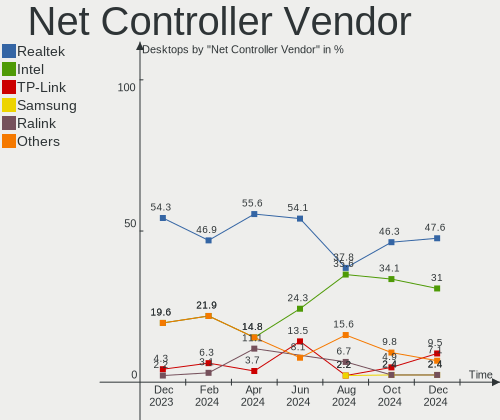

| Vendor                | Desktops | Percent |
|-----------------------|----------|---------|
| Realtek Semiconductor | 18       | 58.06%  |
| Intel                 | 6        | 19.35%  |
| Xiaomi                | 2        | 6.45%   |
| OPPO                  | 2        | 6.45%   |
| TP-Link               | 1        | 3.23%   |
| Ralink Technology     | 1        | 3.23%   |
| D-Link                | 1        | 3.23%   |

Net Controller Model
--------------------

Controller models

| Model                                                             | Desktops | Percent |
|-------------------------------------------------------------------|----------|---------|
| Realtek RTL8111/8168/8411 PCI Express Gigabit Ethernet Controller | 14       | 36.84%  |
| Xiaomi Mi/Redmi series (RNDIS)                                    | 2        | 5.26%   |
| Realtek RTL810xE PCI Express Fast Ethernet controller             | 2        | 5.26%   |
| Realtek 802.11n WLAN Adapter                                      | 2        | 5.26%   |
| OPPO CPH1923                                                      | 2        | 5.26%   |
| Intel Ethernet Controller I225-V                                  | 2        | 5.26%   |
| TP-Link TL-WN823N v2/v3 [Realtek RTL8192EU]                       | 1        | 2.63%   |
| Realtek RTL8812AE 802.11ac PCIe Wireless Network Adapter          | 1        | 2.63%   |
| Realtek RTL8192EU 802.11b/g/n WLAN Adapter                        | 1        | 2.63%   |
| Realtek RTL8125 2.5GbE Controller                                 | 1        | 2.63%   |
| Realtek 802.11ac NIC                                              | 1        | 2.63%   |
| Ralink MT7601U Wireless Adapter                                   | 1        | 2.63%   |
| Intel Wi-Fi 6 AX200                                               | 1        | 2.63%   |
| Intel I211 Gigabit Network Connection                             | 1        | 2.63%   |
| Intel Ethernet Connection I217-V                                  | 1        | 2.63%   |
| Intel Ethernet Connection (2) I219-V                              | 1        | 2.63%   |
| Intel Dual Band Wireless-AC 3168NGW [Stone Peak]                  | 1        | 2.63%   |
| Intel Alder Lake-S PCH CNVi WiFi                                  | 1        | 2.63%   |
| Intel 82567LM-3 Gigabit Network Connection                        | 1        | 2.63%   |
| D-Link 802.11ac NIC                                               | 1        | 2.63%   |

Wireless Vendor
---------------

Wireless vendors

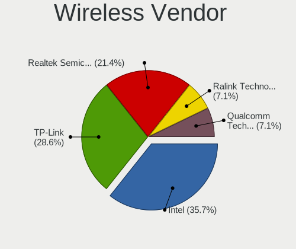

| Vendor                | Desktops | Percent |
|-----------------------|----------|---------|
| Realtek Semiconductor | 5        | 45.45%  |
| Intel                 | 3        | 27.27%  |
| TP-Link               | 1        | 9.09%   |
| Ralink Technology     | 1        | 9.09%   |
| D-Link                | 1        | 9.09%   |

Wireless Model
--------------

Wireless models

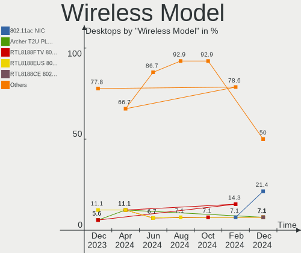

| Model                                                    | Desktops | Percent |
|----------------------------------------------------------|----------|---------|
| Realtek 802.11n WLAN Adapter                             | 2        | 18.18%  |
| TP-Link TL-WN823N v2/v3 [Realtek RTL8192EU]              | 1        | 9.09%   |
| Realtek RTL8812AE 802.11ac PCIe Wireless Network Adapter | 1        | 9.09%   |
| Realtek RTL8192EU 802.11b/g/n WLAN Adapter               | 1        | 9.09%   |
| Realtek 802.11ac NIC                                     | 1        | 9.09%   |
| Ralink MT7601U Wireless Adapter                          | 1        | 9.09%   |
| Intel Wi-Fi 6 AX200                                      | 1        | 9.09%   |
| Intel Dual Band Wireless-AC 3168NGW [Stone Peak]         | 1        | 9.09%   |
| Intel Alder Lake-S PCH CNVi WiFi                         | 1        | 9.09%   |
| D-Link 802.11ac NIC                                      | 1        | 9.09%   |

Ethernet Vendor
---------------

Ethernet vendors

| Vendor                | Desktops | Percent |
|-----------------------|----------|---------|
| Realtek Semiconductor | 17       | 65.38%  |
| Intel                 | 5        | 19.23%  |
| Xiaomi                | 2        | 7.69%   |
| OPPO                  | 2        | 7.69%   |

Ethernet Model
--------------

Ethernet models

| Model                                                             | Desktops | Percent |
|-------------------------------------------------------------------|----------|---------|
| Realtek RTL8111/8168/8411 PCI Express Gigabit Ethernet Controller | 14       | 51.85%  |
| Xiaomi Mi/Redmi series (RNDIS)                                    | 2        | 7.41%   |
| Realtek RTL810xE PCI Express Fast Ethernet controller             | 2        | 7.41%   |
| OPPO CPH1923                                                      | 2        | 7.41%   |
| Intel Ethernet Controller I225-V                                  | 2        | 7.41%   |
| Realtek RTL8125 2.5GbE Controller                                 | 1        | 3.7%    |
| Intel I211 Gigabit Network Connection                             | 1        | 3.7%    |
| Intel Ethernet Connection I217-V                                  | 1        | 3.7%    |
| Intel Ethernet Connection (2) I219-V                              | 1        | 3.7%    |
| Intel 82567LM-3 Gigabit Network Connection                        | 1        | 3.7%    |

Net Controller Kind
-------------------

Ethernet, WiFi or modem

| Kind     | Desktops | Percent |
|----------|----------|---------|
| Ethernet | 22       | 66.67%  |
| WiFi     | 11       | 33.33%  |

Used Controller
---------------

Currently used network controller

| Kind     | Desktops | Percent |
|----------|----------|---------|
| Ethernet | 19       | 90.48%  |
| WiFi     | 2        | 9.52%   |

NICs
----

Total network controllers on board

| Total | Desktops | Percent |
|-------|----------|---------|
| 1     | 17       | 77.27%  |
| 2     | 5        | 22.73%  |

IPv6
----

IPv6 vs IPv4

| Used | Desktops | Percent |
|------|----------|---------|
| No   | 15       | 68.18%  |
| Yes  | 7        | 31.82%  |

Bluetooth
---------

Bluetooth Vendor
----------------

Controller vendors

| Vendor                  | Desktops | Percent |
|-------------------------|----------|---------|
| Cambridge Silicon Radio | 4        | 50%     |
| Intel                   | 3        | 37.5%   |
| TP-Link                 | 1        | 12.5%   |

Bluetooth Model
---------------

Controller models

| Model                                               | Desktops | Percent |
|-----------------------------------------------------|----------|---------|
| Cambridge Silicon Radio Bluetooth Dongle (HCI mode) | 4        | 50%     |
| TP-Link TPuLink UB500 Adapter                       | 1        | 12.5%   |
| Intel Wireless-AC 3168 Bluetooth                    | 1        | 12.5%   |
| Intel AX201 Bluetooth                               | 1        | 12.5%   |
| Intel AX200 Bluetooth                               | 1        | 12.5%   |

Sound
-----

Sound Vendor
------------

Sound card vendors

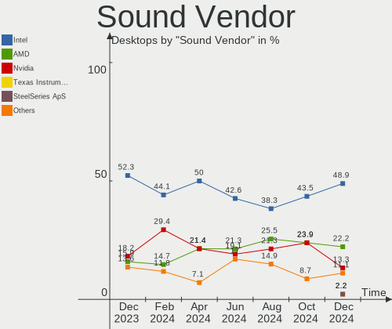

| Vendor              | Desktops | Percent |
|---------------------|----------|---------|
| Intel               | 19       | 50%     |
| Nvidia              | 12       | 31.58%  |
| AMD                 | 3        | 7.89%   |
| C-Media Electronics | 2        | 5.26%   |
| Nektar              | 1        | 2.63%   |
| Focusrite-Novation  | 1        | 2.63%   |

Sound Model
-----------

Sound card models

| Model                                                                      | Desktops | Percent |
|----------------------------------------------------------------------------|----------|---------|
| Nvidia GK208 HDMI/DP Audio Controller                                      | 5        | 12.82%  |
| Intel 200 Series PCH HD Audio                                              | 5        | 12.82%  |
| Intel NM10/ICH7 Family High Definition Audio Controller                    | 2        | 5.13%   |
| Intel Audio device                                                         | 2        | 5.13%   |
| Intel Alder Lake-S HD Audio Controller                                     | 2        | 5.13%   |
| Nvidia TU116 High Definition Audio Controller                              | 1        | 2.56%   |
| Nvidia TU107 GeForce GTX 1650 High Definition Audio Controller             | 1        | 2.56%   |
| Nvidia High Definition Audio Controller                                    | 1        | 2.56%   |
| Nvidia GP108 High Definition Audio Controller                              | 1        | 2.56%   |
| Nvidia GP104 High Definition Audio Controller                              | 1        | 2.56%   |
| Nvidia GF119 HDMI Audio Controller                                         | 1        | 2.56%   |
| Nvidia GA106 High Definition Audio Controller                              | 1        | 2.56%   |
| Nektar Impact LX61+                                                        | 1        | 2.56%   |
| Intel Tiger Lake-H HD Audio Controller                                     | 1        | 2.56%   |
| Intel Comet Lake PCH-V cAVS                                                | 1        | 2.56%   |
| Intel Cannon Lake PCH cAVS                                                 | 1        | 2.56%   |
| Intel 82801JI (ICH10 Family) HD Audio Controller                           | 1        | 2.56%   |
| Intel 82801JD/DO (ICH10 Family) HD Audio Controller                        | 1        | 2.56%   |
| Intel 8 Series/C220 Series Chipset High Definition Audio Controller        | 1        | 2.56%   |
| Intel 6 Series/C200 Series Chipset Family High Definition Audio Controller | 1        | 2.56%   |
| Intel 100 Series/C230 Series Chipset Family HD Audio Controller            | 1        | 2.56%   |
| Focusrite-Novation Focusrite Scarlett 2i2                                  | 1        | 2.56%   |
| C-Media Electronics USB Audio Device                                       | 1        | 2.56%   |
| C-Media Electronics boAt IM-1000D                                          | 1        | 2.56%   |
| AMD Starship/Matisse HD Audio Controller                                   | 1        | 2.56%   |
| AMD Raven/Raven2/Fenghuang HDMI/DP Audio Controller                        | 1        | 2.56%   |
| AMD Family 17h/19h HD Audio Controller                                     | 1        | 2.56%   |
| AMD Family 17h (Models 00h-0fh) HD Audio Controller                        | 1        | 2.56%   |

Memory
------

Memory Vendor
-------------

Memory module vendors

| Vendor            | Desktops | Percent |
|-------------------|----------|---------|
| Unknown           | 2        | 16.67%  |
| G.Skill           | 2        | 16.67%  |
| Crucial           | 2        | 16.67%  |
| Team              | 1        | 8.33%   |
| SK hynix          | 1        | 8.33%   |
| Kingston          | 1        | 8.33%   |
| CSX               | 1        | 8.33%   |
| Corsair           | 1        | 8.33%   |
| A-DATA Technology | 1        | 8.33%   |

Memory Model
------------

Memory module models

| Model                                                 | Desktops | Percent |
|-------------------------------------------------------|----------|---------|
| Unknown RAM Module 2GB DIMM DDR3 1333MT/s             | 1        | 8.33%   |
| Unknown RAM Module 1GB DIMM DDR2 667MT/s              | 1        | 8.33%   |
| Team RAM TEAMGROUP-UD4-3600 8GB DIMM DDR4 3600MT/s    | 1        | 8.33%   |
| SK hynix RAM AARVEX TECHNOLOGY 8GB DIMM DDR4 2400MT/s | 1        | 8.33%   |
| Kingston RAM 99P5471-004.A01LF 4GB DIMM DDR3 1333MT/s | 1        | 8.33%   |
| G.Skill RAM F4-3200C16-8GVKB 8GB DIMM DDR4 3866MT/s   | 1        | 8.33%   |
| G.Skill RAM F4-3200C16-8GVGB 8GB DIMM DDR4 3200MT/s   | 1        | 8.33%   |
| CSX RAM V01D3LF2GB26818813 2GB DIMM DDR3 1333MT/s     | 1        | 8.33%   |
| Crucial RAM CB8GU2666.C8JT 8GB DIMM DDR4 2666MT/s     | 1        | 8.33%   |
| Crucial RAM CB8GU2400.C8JT 8GB DIMM DDR4 2400MT/s     | 1        | 8.33%   |
| Corsair RAM CMK8GX4M1A2400C16 8GB DIMM DDR4 2800MT/s  | 1        | 8.33%   |
| A-DATA RAM Module 2GB DIMM DDR2 667MT/s               | 1        | 8.33%   |

Memory Kind
-----------

Memory module kinds

| Kind | Desktops | Percent |
|------|----------|---------|
| DDR4 | 7        | 70%     |
| DDR3 | 2        | 20%     |
| DDR2 | 1        | 10%     |

Memory Form Factor
------------------

Physical design of the memory module

| Name | Desktops | Percent |
|------|----------|---------|
| DIMM | 10       | 100%    |

Memory Size
-----------

Memory module size

| Size  | Desktops | Percent |
|-------|----------|---------|
| 8192  | 6        | 54.55%  |
| 2048  | 2        | 18.18%  |
| 32768 | 1        | 9.09%   |
| 4096  | 1        | 9.09%   |
| 1024  | 1        | 9.09%   |

Memory Speed
------------

Memory module speed

| Speed | Desktops | Percent |
|-------|----------|---------|
| 2400  | 2        | 20%     |
| 1333  | 2        | 20%     |
| 3866  | 1        | 10%     |
| 3600  | 1        | 10%     |
| 3200  | 1        | 10%     |
| 2800  | 1        | 10%     |
| 2666  | 1        | 10%     |
| 667   | 1        | 10%     |

Printers & scanners
-------------------

Printer Vendor
--------------

Printer device vendors

| Vendor      | Desktops | Percent |
|-------------|----------|---------|
| Seiko Epson | 1        | 100%    |

Printer Model
-------------

Printer device models

| Model                    | Desktops | Percent |
|--------------------------|----------|---------|
| Seiko Epson L3110 Series | 1        | 100%    |

Scanner Vendor
--------------

Scanner device vendors

Zero info for selected period =(

Scanner Model
-------------

Scanner device models

Zero info for selected period =(

Camera
------

Camera Vendor
-------------

Camera device vendors

| Vendor       | Desktops | Percent |
|--------------|----------|---------|
| Unknown      | 2        | 50%     |
| Logitech     | 1        | 25%     |
| IMC Networks | 1        | 25%     |

Camera Model
------------

Camera device models

| Model                   | Desktops | Percent |
|-------------------------|----------|---------|
| Unknown HD camera       | 2        | 50%     |
| Logitech Webcam C170    | 1        | 25%     |
| IMC Networks XHC Camera | 1        | 25%     |

Security
--------

Fingerprint Vendor
------------------

Fingerprint sensor vendors

Zero info for selected period =(

Fingerprint Model
-----------------

Fingerprint sensor models

Zero info for selected period =(

Chipcard Vendor
---------------

Chipcard module vendors

Zero info for selected period =(

Chipcard Model
--------------

Chipcard module models

Zero info for selected period =(

Unsupported
-----------

Unsupported Devices
-------------------

Total unsupported devices on board

| Total | Desktops | Percent |
|-------|----------|---------|
| 0     | 19       | 86.36%  |
| 1     | 3        | 13.64%  |

Unsupported Device Types
------------------------

Types of unsupported devices

| Type          | Desktops | Percent |
|---------------|----------|---------|
| Graphics card | 2        | 66.67%  |
| Net/wireless  | 1        | 33.33%  |

