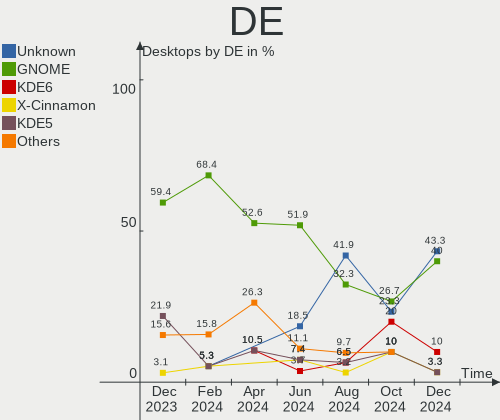
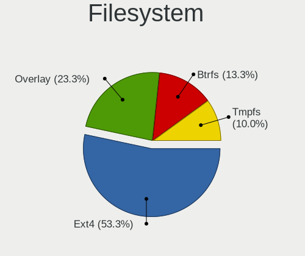
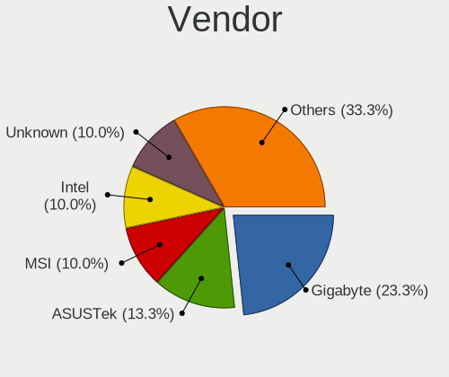
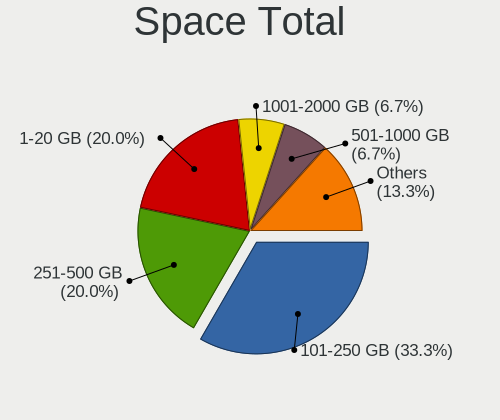
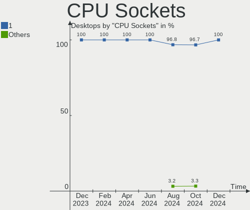
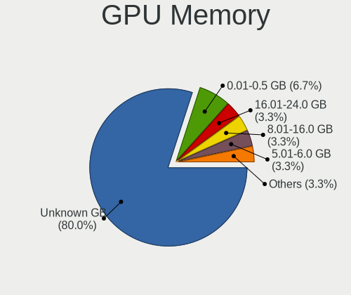
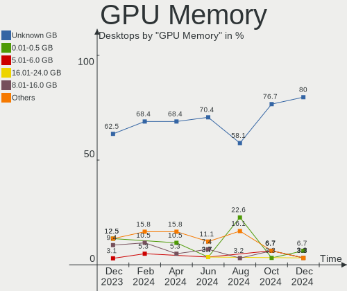
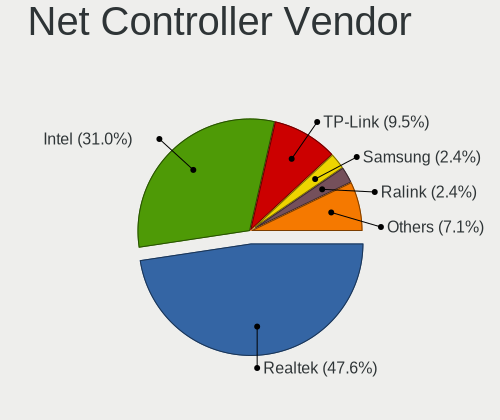
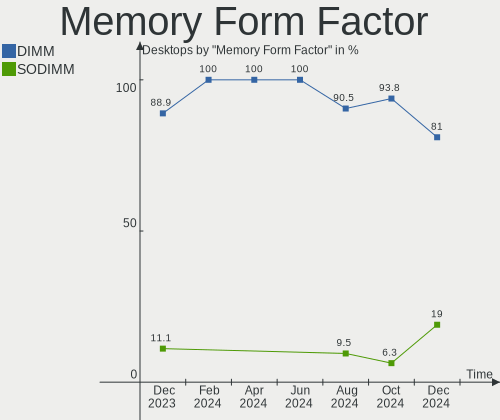

Linux in India - Hardware Trends (Desktops)
-------------------------------------------

A project to identify most popular hardware characteristics and track their change
over time based on data collected by Linux users at https://Linux-Hardware.org.

Anyone can contribute to this report by the [hw-probe](https://github.com/linuxhw/hw-probe) tool:

    sudo -E hw-probe -all -upload

Period: Jan, 2023.

Contents
--------

* [ System ](#system)
  - [ OS                       ](#os)
  - [ OS Family                ](#os-family)
  - [ Kernel                   ](#kernel)
  - [ Kernel Family            ](#kernel-family)
  - [ Kernel Major Ver.        ](#kernel-major-ver)
  - [ Arch                     ](#arch)
  - [ DE                       ](#de)
  - [ Display Server           ](#display-server)
  - [ Display Manager          ](#display-manager)
  - [ OS Lang                  ](#os-lang)
  - [ Boot Mode                ](#boot-mode)
  - [ Filesystem               ](#filesystem)
  - [ Part. scheme             ](#part-scheme)
  - [ Dual Boot with Linux/BSD ](#dual-boot-with-linuxbsd)
  - [ Dual Boot (Win)          ](#dual-boot-win)

* [ Board ](#board)
  - [ Vendor                   ](#vendor)
  - [ Model                    ](#model)
  - [ Model Family             ](#model-family)
  - [ MFG Year                 ](#mfg-year)
  - [ Form Factor              ](#form-factor)
  - [ Secure Boot              ](#secure-boot)
  - [ Coreboot                 ](#coreboot)
  - [ RAM Size                 ](#ram-size)
  - [ RAM Used                 ](#ram-used)
  - [ Total Drives             ](#total-drives)
  - [ Has CD-ROM               ](#has-cd-rom)
  - [ Has Ethernet             ](#has-ethernet)
  - [ Has WiFi                 ](#has-wifi)
  - [ Has Bluetooth            ](#has-bluetooth)

* [ Location ](#location)
  - [ Country                  ](#country)
  - [ City                     ](#city)

* [ Drives ](#drives)
  - [ Drive Vendor             ](#drive-vendor)
  - [ Drive Model              ](#drive-model)
  - [ HDD Vendor               ](#hdd-vendor)
  - [ SSD Vendor               ](#ssd-vendor)
  - [ Drive Kind               ](#drive-kind)
  - [ Drive Connector          ](#drive-connector)
  - [ Drive Size               ](#drive-size)
  - [ Space Total              ](#space-total)
  - [ Space Used               ](#space-used)
  - [ Malfunc. Drives          ](#malfunc-drives)
  - [ Malfunc. Drive Vendor    ](#malfunc-drive-vendor)
  - [ Malfunc. HDD Vendor      ](#malfunc-hdd-vendor)
  - [ Malfunc. Drive Kind      ](#malfunc-drive-kind)
  - [ Failed Drives            ](#failed-drives)
  - [ Failed Drive Vendor      ](#failed-drive-vendor)
  - [ Drive Status             ](#drive-status)

* [ Storage controller ](#storage-controller)
  - [ Storage Vendor           ](#storage-vendor)
  - [ Storage Model            ](#storage-model)
  - [ Storage Kind             ](#storage-kind)

* [ Processor ](#processor)
  - [ CPU Vendor               ](#cpu-vendor)
  - [ CPU Model                ](#cpu-model)
  - [ CPU Model Family         ](#cpu-model-family)
  - [ CPU Cores                ](#cpu-cores)
  - [ CPU Sockets              ](#cpu-sockets)
  - [ CPU Threads              ](#cpu-threads)
  - [ CPU Op-Modes             ](#cpu-op-modes)
  - [ CPU Microcode            ](#cpu-microcode)
  - [ CPU Microarch            ](#cpu-microarch)

* [ Graphics ](#graphics)
  - [ GPU Vendor               ](#gpu-vendor)
  - [ GPU Model                ](#gpu-model)
  - [ GPU Combo                ](#gpu-combo)
  - [ GPU Driver               ](#gpu-driver)
  - [ GPU Memory               ](#gpu-memory)

* [ Monitor ](#monitor)
  - [ Monitor Vendor           ](#monitor-vendor)
  - [ Monitor Model            ](#monitor-model)
  - [ Monitor Resolution       ](#monitor-resolution)
  - [ Monitor Diagonal         ](#monitor-diagonal)
  - [ Monitor Width            ](#monitor-width)
  - [ Aspect Ratio             ](#aspect-ratio)
  - [ Monitor Area             ](#monitor-area)
  - [ Pixel Density            ](#pixel-density)
  - [ Multiple Monitors        ](#multiple-monitors)

* [ Network ](#network)
  - [ Net Controller Vendor    ](#net-controller-vendor)
  - [ Net Controller Model     ](#net-controller-model)
  - [ Wireless Vendor          ](#wireless-vendor)
  - [ Wireless Model           ](#wireless-model)
  - [ Ethernet Vendor          ](#ethernet-vendor)
  - [ Ethernet Model           ](#ethernet-model)
  - [ Net Controller Kind      ](#net-controller-kind)
  - [ Used Controller          ](#used-controller)
  - [ NICs                     ](#nics)
  - [ IPv6                     ](#ipv6)

* [ Bluetooth ](#bluetooth)
  - [ Bluetooth Vendor         ](#bluetooth-vendor)
  - [ Bluetooth Model          ](#bluetooth-model)

* [ Sound ](#sound)
  - [ Sound Vendor             ](#sound-vendor)
  - [ Sound Model              ](#sound-model)

* [ Memory ](#memory)
  - [ Memory Vendor            ](#memory-vendor)
  - [ Memory Model             ](#memory-model)
  - [ Memory Kind              ](#memory-kind)
  - [ Memory Form Factor       ](#memory-form-factor)
  - [ Memory Size              ](#memory-size)
  - [ Memory Speed             ](#memory-speed)

* [ Printers & scanners ](#printers--scanners)
  - [ Printer Vendor           ](#printer-vendor)
  - [ Printer Model            ](#printer-model)
  - [ Scanner Vendor           ](#scanner-vendor)
  - [ Scanner Model            ](#scanner-model)

* [ Camera ](#camera)
  - [ Camera Vendor            ](#camera-vendor)
  - [ Camera Model             ](#camera-model)

* [ Security ](#security)
  - [ Fingerprint Vendor       ](#fingerprint-vendor)
  - [ Fingerprint Model        ](#fingerprint-model)
  - [ Chipcard Vendor          ](#chipcard-vendor)
  - [ Chipcard Model           ](#chipcard-model)

* [ Unsupported ](#unsupported)
  - [ Unsupported Devices      ](#unsupported-devices)
  - [ Unsupported Device Types ](#unsupported-device-types)

System
------

OS
--

Installed operating systems

| Name                 | Desktops | Percent |
|----------------------|----------|---------|
| Ubuntu 22.04         | 5        | 25%     |
| KDE neon 22.04       | 4        | 20%     |
| OpenMandriva 23.01   | 2        | 10%     |
| Debian 11            | 2        | 10%     |
| Ubuntu 22.10         | 1        | 5%      |
| Ubuntu 18.04         | 1        | 5%      |
| OpenMandriva 4.50    | 1        | 5%      |
| Garuda Linux Soaring | 1        | 5%      |
| Fedora 28            | 1        | 5%      |
| CentOS 7             | 1        | 5%      |
| ArcoLinux Rolling    | 1        | 5%      |

OS Family
---------

OS without a version

| Name         | Desktops | Percent |
|--------------|----------|---------|
| Ubuntu       | 7        | 35%     |
| KDE neon     | 4        | 20%     |
| OpenMandriva | 3        | 15%     |
| Debian       | 2        | 10%     |
| Garuda Linux | 1        | 5%      |
| Fedora       | 1        | 5%      |
| CentOS       | 1        | 5%      |
| ArcoLinux    | 1        | 5%      |

Kernel
------

Version of the Linux kernel

| Version                     | Desktops | Percent |
|-----------------------------|----------|---------|
| 5.15.0-58-generic           | 3        | 15%     |
| 5.15.0-57-generic           | 3        | 15%     |
| 6.1.1-desktop-1omv2290      | 2        | 10%     |
| 5.15.0-56-generic           | 2        | 10%     |
| 6.1.4-arch1-1               | 1        | 5%      |
| 6.1.3-zen1-1-zen            | 1        | 5%      |
| 6.1.0-1-pve                 | 1        | 5%      |
| 5.4.0-135-generic           | 1        | 5%      |
| 5.19.12-desktop-2omv4090    | 1        | 5%      |
| 5.19.0-29-generic           | 1        | 5%      |
| 5.15.0-43-generic           | 1        | 5%      |
| 5.10.0-20-amd64             | 1        | 5%      |
| 5.0.16-100.fc28.x86_64      | 1        | 5%      |
| 3.10.0-1160.81.1.el7.x86_64 | 1        | 5%      |

Kernel Family
-------------

Linux kernel without a distro release

| Version | Desktops | Percent |
|---------|----------|---------|
| 5.15.0  | 9        | 45%     |
| 6.1.1   | 2        | 10%     |
| 6.1.4   | 1        | 5%      |
| 6.1.3   | 1        | 5%      |
| 6.1.0   | 1        | 5%      |
| 5.4.0   | 1        | 5%      |
| 5.19.12 | 1        | 5%      |
| 5.19.0  | 1        | 5%      |
| 5.10.0  | 1        | 5%      |
| 5.0.16  | 1        | 5%      |
| 3.10.0  | 1        | 5%      |

Kernel Major Ver.
-----------------

Linux kernel major version

| Version | Desktops | Percent |
|---------|----------|---------|
| 5.15    | 9        | 45%     |
| 6.1     | 5        | 25%     |
| 5.19    | 2        | 10%     |
| 5.4     | 1        | 5%      |
| 5.10    | 1        | 5%      |
| 5.0     | 1        | 5%      |
| 3.10    | 1        | 5%      |

Arch
----

OS architecture (x86_64, i586, etc.)

| Name   | Desktops | Percent |
|--------|----------|---------|
| x86_64 | 20       | 100%    |

DE
--

Desktop Environment

| Name          | Desktops | Percent |
|---------------|----------|---------|
| GNOME         | 9        | 45%     |
| KDE5          | 7        | 35%     |
| X-Cinnamon    | 1        | 5%      |
| i3            | 1        | 5%      |
| GNOME Classic | 1        | 5%      |
| Unknown       | 1        | 5%      |

Display Server
--------------

X11 or Wayland

| Name    | Desktops | Percent |
|---------|----------|---------|
| X11     | 14       | 70%     |
| Wayland | 5        | 25%     |
| Tty     | 1        | 5%      |

Display Manager
---------------

SDDM, LightDM, etc.

| Name    | Desktops | Percent |
|---------|----------|---------|
| GDM3    | 7        | 35%     |
| SDDM    | 5        | 25%     |
| Unknown | 5        | 25%     |
| GDM     | 2        | 10%     |
| LightDM | 1        | 5%      |

OS Lang
-------

Language

| Lang    | Desktops | Percent |
|---------|----------|---------|
| en_US   | 8        | 40%     |
| en_IN   | 8        | 40%     |
| ta_LK   | 1        | 5%      |
| en_GB   | 1        | 5%      |
| C       | 1        | 5%      |
| Unknown | 1        | 5%      |

Boot Mode
---------

EFI or BIOS

| Mode | Desktops | Percent |
|------|----------|---------|
| BIOS | 11       | 55%     |
| EFI  | 9        | 45%     |

Filesystem
----------

Type of filesystem

| Type    | Desktops | Percent |
|---------|----------|---------|
| Ext4    | 13       | 65%     |
| Overlay | 4        | 20%     |
| Xfs     | 1        | 5%      |
| Ext2    | 1        | 5%      |
| Btrfs   | 1        | 5%      |

Part. scheme
------------

Scheme of partitioning

| Type    | Desktops | Percent |
|---------|----------|---------|
| GPT     | 14       | 70%     |
| Unknown | 4        | 20%     |
| MBR     | 2        | 10%     |

Dual Boot with Linux/BSD
------------------------

Hosting more than one Linux/BSD

| Dual boot | Desktops | Percent |
|-----------|----------|---------|
| No        | 12       | 60%     |
| Yes       | 8        | 40%     |

Dual Boot (Win)
---------------

Hosting Linux and Windows

| Dual boot | Desktops | Percent |
|-----------|----------|---------|
| No        | 11       | 55%     |
| Yes       | 9        | 45%     |

Board
-----

Vendor
------

Motherboard manufacturer

| Name                | Desktops | Percent |
|---------------------|----------|---------|
| Gigabyte Technology | 6        | 30%     |
| ASUSTek Computer    | 5        | 25%     |
| MSI                 | 3        | 15%     |
| ASRock              | 2        | 10%     |
| Lenovo              | 1        | 5%      |
| Intel               | 1        | 5%      |
| Hewlett-Packard     | 1        | 5%      |
| Acer                | 1        | 5%      |

Model
-----

Motherboard model

| Name                           | Desktops | Percent |
|--------------------------------|----------|---------|
| MSI MS-7D75                    | 1        | 5%      |
| MSI MS-7D23                    | 1        | 5%      |
| MSI MS-7B79                    | 1        | 5%      |
| Lenovo S510 10KXA007IH         | 1        | 5%      |
| Intel DH61WW AAG23116-302      | 1        | 5%      |
| HP 18-1206in                   | 1        | 5%      |
| Gigabyte X570S UD              | 1        | 5%      |
| Gigabyte H81M-S                | 1        | 5%      |
| Gigabyte H61MS                 | 1        | 5%      |
| Gigabyte H310M H               | 1        | 5%      |
| Gigabyte GA-78LMT-USB3 6.0     | 1        | 5%      |
| Gigabyte 970A-DS3              | 1        | 5%      |
| ASUS Z170-DELUXE               | 1        | 5%      |
| ASUS TUF Gaming B650-PLUS WIFI | 1        | 5%      |
| ASUS ROG STRIX B550-I GAMING   | 1        | 5%      |
| ASUS PRIME Z790M-PLUS D4       | 1        | 5%      |
| ASUS PRIME H410M-E             | 1        | 5%      |
| ASRock J3455B-ITX              | 1        | 5%      |
| ASRock B550 Extreme4           | 1        | 5%      |
| Acer Veriton M2640G            | 1        | 5%      |

Model Family
------------

Motherboard model prefix

| Name                   | Desktops | Percent |
|------------------------|----------|---------|
| ASUS PRIME             | 2        | 10%     |
| MSI MS-7D75            | 1        | 5%      |
| MSI MS-7D23            | 1        | 5%      |
| MSI MS-7B79            | 1        | 5%      |
| Lenovo S510            | 1        | 5%      |
| Intel DH61WW           | 1        | 5%      |
| HP 18-1206in           | 1        | 5%      |
| Gigabyte X570S         | 1        | 5%      |
| Gigabyte H81M-S        | 1        | 5%      |
| Gigabyte H61MS         | 1        | 5%      |
| Gigabyte H310M         | 1        | 5%      |
| Gigabyte GA-78LMT-USB3 | 1        | 5%      |
| Gigabyte 970A-DS3      | 1        | 5%      |
| ASUS Z170-DELUXE       | 1        | 5%      |
| ASUS TUF               | 1        | 5%      |
| ASUS ROG               | 1        | 5%      |
| ASRock J3455B-ITX      | 1        | 5%      |
| ASRock B550            | 1        | 5%      |
| Acer Veriton           | 1        | 5%      |

MFG Year
--------

Motherboard manufacture year

| Year | Desktops | Percent |
|------|----------|---------|
| 2022 | 3        | 15%     |
| 2020 | 3        | 15%     |
| 2016 | 3        | 15%     |
| 2014 | 3        | 15%     |
| 2021 | 2        | 10%     |
| 2018 | 2        | 10%     |
| 2013 | 2        | 10%     |
| 2017 | 1        | 5%      |
| 2012 | 1        | 5%      |

Form Factor
-----------

Physical design of the computer

| Name    | Desktops | Percent |
|---------|----------|---------|
| Desktop | 20       | 100%    |

Secure Boot
-----------

Enabled or disabled

| State    | Desktops | Percent |
|----------|----------|---------|
| Disabled | 20       | 100%    |

Coreboot
--------

Have coreboot on board

| Used | Desktops | Percent |
|------|----------|---------|
| No   | 20       | 100%    |

RAM Size
--------

Total RAM memory

| Size in GB  | Desktops | Percent |
|-------------|----------|---------|
| 4.01-8.0    | 6        | 30%     |
| 64.01-256.0 | 4        | 20%     |
| 16.01-24.0  | 4        | 20%     |
| 3.01-4.0    | 2        | 10%     |
| 8.01-16.0   | 2        | 10%     |
| 32.01-64.0  | 1        | 5%      |
| 1.01-2.0    | 1        | 5%      |

RAM Used
--------

Used RAM memory

| Used GB   | Desktops | Percent |
|-----------|----------|---------|
| 2.01-3.0  | 8        | 40%     |
| 1.01-2.0  | 5        | 25%     |
| 4.01-8.0  | 3        | 15%     |
| 3.01-4.0  | 2        | 10%     |
| 8.01-16.0 | 1        | 5%      |
| 0.51-1.0  | 1        | 5%      |

Total Drives
------------

Number of drives on board

| Drives | Desktops | Percent |
|--------|----------|---------|
| 2      | 9        | 45%     |
| 1      | 4        | 20%     |
| 3      | 3        | 15%     |
| 7      | 1        | 5%      |
| 6      | 1        | 5%      |
| 5      | 1        | 5%      |
| 4      | 1        | 5%      |

Has CD-ROM
----------

Has CD-ROM on board

| Presented | Desktops | Percent |
|-----------|----------|---------|
| No        | 13       | 65%     |
| Yes       | 7        | 35%     |

Has Ethernet
------------

Has Ethernet on board

| Presented | Desktops | Percent |
|-----------|----------|---------|
| Yes       | 20       | 100%    |

Has WiFi
--------

Has WiFi module

| Presented | Desktops | Percent |
|-----------|----------|---------|
| Yes       | 10       | 50%     |
| No        | 10       | 50%     |

Has Bluetooth
-------------

Has Bluetooth module

| Presented | Desktops | Percent |
|-----------|----------|---------|
| No        | 11       | 55%     |
| Yes       | 9        | 45%     |

Location
--------

Country
-------

Geographic location (country)

| Country | Desktops | Percent |
|---------|----------|---------|
| India   | 20       | 100%    |

City
----

Geographic location (city)

| City           | Desktops | Percent |
|----------------|----------|---------|
| Bengaluru      | 4        | 20%     |
| Mumbai         | 2        | 10%     |
| Kolkata        | 2        | 10%     |
| Vadodara       | 1        | 5%      |
| Tiruchi        | 1        | 5%      |
| Ramanathapuram | 1        | 5%      |
| New Delhi      | 1        | 5%      |
| Narsingpur     | 1        | 5%      |
| Jalgaon        | 1        | 5%      |
| Indore         | 1        | 5%      |
| Gyanpur        | 1        | 5%      |
| Guwahati       | 1        | 5%      |
| Delhi          | 1        | 5%      |
| Chennai        | 1        | 5%      |
| Barasat        | 1        | 5%      |

Drives
------

Drive Vendor
------------

Hard drive vendors

| Vendor                      | Desktops | Drives | Percent |
|-----------------------------|----------|--------|---------|
| WDC                         | 11       | 14     | 27.5%   |
| Seagate                     | 6        | 13     | 15%     |
| Crucial                     | 6        | 9      | 15%     |
| Toshiba                     | 3        | 3      | 7.5%    |
| Sandisk                     | 3        | 3      | 7.5%    |
| Samsung Electronics         | 2        | 2      | 5%      |
| Kingston                    | 2        | 2      | 5%      |
| Intel                       | 2        | 2      | 5%      |
| Micron/Crucial Technology   | 1        | 1      | 2.5%    |
| Maxtor                      | 1        | 1      | 2.5%    |
| Kingston Technology Company | 1        | 1      | 2.5%    |
| FRONTECH                    | 1        | 1      | 2.5%    |
| ADATA Technology            | 1        | 1      | 2.5%    |

Drive Model
-----------

Hard drive models

| Model                                 | Desktops | Percent |
|---------------------------------------|----------|---------|
| WDC WD10EZEX-75WN4A1 1TB              | 2        | 4.26%   |
| Seagate ST3500418AS 500GB             | 2        | 4.26%   |
| Seagate ST1000DM010-2EP102 1TB        | 2        | 4.26%   |
| Crucial CT240BX500SSD1 240GB          | 2        | 4.26%   |
| WDC WDS100T2G0A-00JH30 1TB SSD        | 1        | 2.13%   |
| WDC WD5000LPLX-08ZNTT0 500GB          | 1        | 2.13%   |
| WDC WD5000AVCS-632DY1 500GB           | 1        | 2.13%   |
| WDC WD5000AAKX-60U6AA0 500GB          | 1        | 2.13%   |
| WDC WD20EZBX-00AYRA0 2TB              | 1        | 2.13%   |
| WDC WD10EZRX-00L4HB0 1TB              | 1        | 2.13%   |
| WDC WD10EZEX-75WN4A0 1TB              | 1        | 2.13%   |
| WDC WD10EZEX-21WN4A0 1TB              | 1        | 2.13%   |
| WDC WD10EZEX-00MFCA0 1TB              | 1        | 2.13%   |
| WDC WD10EZEX-00BBHA0 1TB              | 1        | 2.13%   |
| WDC WD10EARS-00Y5B1 1TB               | 1        | 2.13%   |
| WDC WD10EALX-759BA1 1TB               | 1        | 2.13%   |
| Toshiba MQ04ABF100 1TB                | 1        | 2.13%   |
| Toshiba HDWT840 4TB                   | 1        | 2.13%   |
| Toshiba DT01ACA100 1TB                | 1        | 2.13%   |
| Seagate ST500DM002-1BD142 500GB       | 1        | 2.13%   |
| Seagate ST2000LM007-1R8174 2TB        | 1        | 2.13%   |
| Seagate ST16000NM001G-2KK103 16TB     | 1        | 2.13%   |
| Seagate ST16000NM000J-2TW103 16TB     | 1        | 2.13%   |
| Seagate ST1000DM003-1ER162 1TB        | 1        | 2.13%   |
| Seagate Expansion HDD 5TB             | 1        | 2.13%   |
| Sandisk WD Blue SN570 500GB           | 1        | 2.13%   |
| Sandisk WD Blue SN570 1TB             | 1        | 2.13%   |
| SanDisk NVMe SSD Drive 2TB            | 1        | 2.13%   |
| Samsung SSD 980 250GB                 | 1        | 2.13%   |
| Samsung SSD 970 EVO Plus 250GB        | 1        | 2.13%   |
| Micron/Crucial P2 NVMe PCIe SSD 500GB | 1        | 2.13%   |
| Maxtor Z1 SSD 240GB                   | 1        | 2.13%   |
| Kingston Company A2000 NVMe SSD 1TB   | 1        | 2.13%   |
| Kingston SUV400S37120G 120GB SSD      | 1        | 2.13%   |
| Kingston SA400S37120G 120GB SSD       | 1        | 2.13%   |
| Intel SSDPEKNU512GZH 512GB            | 1        | 2.13%   |
| Intel PCIe Data Center SSD 400GB      | 1        | 2.13%   |
| FRONTECH SSD 128G                     | 1        | 2.13%   |
| Crucial CT500P2SSD8 500GB             | 1        | 2.13%   |
| Crucial CT500MX500SSD1 500GB          | 1        | 2.13%   |

HDD Vendor
----------

Hard disk drive vendors

| Vendor  | Desktops | Drives | Percent |
|---------|----------|--------|---------|
| WDC     | 11       | 13     | 55%     |
| Seagate | 6        | 13     | 30%     |
| Toshiba | 3        | 3      | 15%     |

SSD Vendor
----------

Solid state drive vendors

| Vendor   | Desktops | Drives | Percent |
|----------|----------|--------|---------|
| Crucial  | 5        | 8      | 50%     |
| Kingston | 2        | 2      | 20%     |
| WDC      | 1        | 1      | 10%     |
| Maxtor   | 1        | 1      | 10%     |
| FRONTECH | 1        | 1      | 10%     |

Drive Kind
----------

HDD or SSD

| Kind | Desktops | Drives | Percent |
|------|----------|--------|---------|
| HDD  | 18       | 29     | 48.65%  |
| SSD  | 10       | 13     | 27.03%  |
| NVMe | 9        | 11     | 24.32%  |

Drive Connector
---------------

SATA, SAS, NVMe, etc.

| Type | Desktops | Drives | Percent |
|------|----------|--------|---------|
| SATA | 20       | 41     | 66.67%  |
| NVMe | 9        | 11     | 30%     |
| SAS  | 1        | 1      | 3.33%   |

Drive Size
----------

Size of hard drive

| Size in TB | Desktops | Drives | Percent |
|------------|----------|--------|---------|
| 0.01-0.5   | 13       | 14     | 43.33%  |
| 0.51-1.0   | 12       | 20     | 40%     |
| 1.01-2.0   | 2        | 2      | 6.67%   |
| 3.01-4.0   | 1        | 1      | 3.33%   |
| 10.01-20.0 | 1        | 4      | 3.33%   |
| 4.01-10.0  | 1        | 1      | 3.33%   |

Space Total
-----------

Amount of disk space available on the file system

| Size in GB     | Desktops | Percent |
|----------------|----------|---------|
| 501-1000       | 5        | 25%     |
| More than 3000 | 3        | 15%     |
| 101-250        | 3        | 15%     |
| 251-500        | 2        | 10%     |
| 1001-2000      | 2        | 10%     |
| 1-20           | 2        | 10%     |
| 51-100         | 2        | 10%     |
| 21-50          | 1        | 5%      |

Space Used
----------

Amount of used disk space

| Used GB        | Desktops | Percent |
|----------------|----------|---------|
| 1-20           | 8        | 40%     |
| 251-500        | 3        | 15%     |
| 101-250        | 3        | 15%     |
| 21-50          | 2        | 10%     |
| 1001-2000      | 2        | 10%     |
| More than 3000 | 1        | 5%      |
| 2001-3000      | 1        | 5%      |

Malfunc. Drives
---------------

Drive models with a malfunction

| Model                             | Desktops | Drives | Percent |
|-----------------------------------|----------|--------|---------|
| WDC WD10EZRX-00L4HB0 1TB          | 1        | 1      | 25%     |
| Toshiba DT01ACA100 1TB            | 1        | 1      | 25%     |
| Seagate ST3500418AS 500GB         | 1        | 1      | 25%     |
| Seagate ST16000NM001G-2KK103 16TB | 1        | 1      | 25%     |

Malfunc. Drive Vendor
---------------------

Vendors of faulty drives

| Vendor  | Desktops | Drives | Percent |
|---------|----------|--------|---------|
| Seagate | 2        | 2      | 50%     |
| WDC     | 1        | 1      | 25%     |
| Toshiba | 1        | 1      | 25%     |

Malfunc. HDD Vendor
-------------------

Vendors of faulty HDD drives

| Vendor  | Desktops | Drives | Percent |
|---------|----------|--------|---------|
| Seagate | 2        | 2      | 50%     |
| WDC     | 1        | 1      | 25%     |
| Toshiba | 1        | 1      | 25%     |

Malfunc. Drive Kind
-------------------

Kinds of faulty drives

| Kind | Desktops | Drives | Percent |
|------|----------|--------|---------|
| HDD  | 4        | 4      | 100%    |

Failed Drives
-------------

Failed drive models

Zero info for selected period =(

Failed Drive Vendor
-------------------

Failed drive vendors

Zero info for selected period =(

Drive Status
------------

Number of failed and malfunc. drives

| Status   | Desktops | Drives | Percent |
|----------|----------|--------|---------|
| Detected | 11       | 26     | 42.31%  |
| Works    | 11       | 23     | 42.31%  |
| Malfunc  | 4        | 4      | 15.38%  |

Storage controller
------------------

Storage Vendor
--------------

Storage controller vendors

| Vendor                      | Desktops | Percent |
|-----------------------------|----------|---------|
| Intel                       | 12       | 37.5%   |
| AMD                         | 9        | 28.13%  |
| Sandisk                     | 3        | 9.38%   |
| Samsung Electronics         | 2        | 6.25%   |
| Micron/Crucial Technology   | 2        | 6.25%   |
| ASMedia Technology          | 2        | 6.25%   |
| Kingston Technology Company | 1        | 3.13%   |
| ADATA Technology            | 1        | 3.13%   |

Storage Model
-------------

Storage controller models

| Model                                                                                   | Desktops | Percent |
|-----------------------------------------------------------------------------------------|----------|---------|
| AMD FCH SATA Controller [AHCI mode]                                                     | 3        | 8.11%   |
| SanDisk WD Blue SN570 NVMe SSD                                                          | 2        | 5.41%   |
| Micron/Crucial P2 NVMe PCIe SSD                                                         | 2        | 5.41%   |
| Intel Q170/Q150/B150/H170/H110/Z170/CM236 Chipset SATA Controller [AHCI Mode]           | 2        | 5.41%   |
| ASMedia ASM1062 Serial ATA Controller                                                   | 2        | 5.41%   |
| AMD SB7x0/SB8x0/SB9x0 SATA Controller [AHCI mode]                                       | 2        | 5.41%   |
| AMD SATA controller                                                                     | 2        | 5.41%   |
| AMD 500 Series Chipset SATA Controller                                                  | 2        | 5.41%   |
| Sandisk Non-Volatile memory controller                                                  | 1        | 2.7%    |
| Samsung NVMe SSD Controller SM981/PM981/PM983                                           | 1        | 2.7%    |
| Samsung NVMe SSD Controller 980                                                         | 1        | 2.7%    |
| Kingston Company A2000 NVMe SSD                                                         | 1        | 2.7%    |
| Intel Volume Management Device NVMe RAID Controller Intel Corporation                   | 1        | 2.7%    |
| Intel SATA Controller [RAID mode]                                                       | 1        | 2.7%    |
| Intel SATA controller                                                                   | 1        | 2.7%    |
| Intel PCIe Data Center SSD                                                              | 1        | 2.7%    |
| Intel Non-Volatile memory controller                                                    | 1        | 2.7%    |
| Intel Celeron N3350/Pentium N4200/Atom E3900 Series SATA AHCI Controller                | 1        | 2.7%    |
| Intel Cannon Lake PCH SATA AHCI Controller                                              | 1        | 2.7%    |
| Intel 8 Series/C220 Series Chipset Family 6-port SATA Controller 1 [AHCI mode]          | 1        | 2.7%    |
| Intel 6 Series/C200 Series Chipset Family Desktop SATA Controller (IDE mode, ports 4-5) | 1        | 2.7%    |
| Intel 6 Series/C200 Series Chipset Family Desktop SATA Controller (IDE mode, ports 0-3) | 1        | 2.7%    |
| Intel 6 Series/C200 Series Chipset Family 6 port Desktop SATA AHCI Controller           | 1        | 2.7%    |
| Intel 500 Series Chipset Family SATA AHCI Controller                                    | 1        | 2.7%    |
| Intel 400 Series Chipset Family SATA AHCI Controller                                    | 1        | 2.7%    |
| AMD SB7x0/SB8x0/SB9x0 IDE Controller                                                    | 1        | 2.7%    |
| AMD 400 Series Chipset SATA Controller                                                  | 1        | 2.7%    |
| ADATA XPG SX8200 Pro PCIe Gen3x4 M.2 2280 Solid State Drive                             | 1        | 2.7%    |

Storage Kind
------------

Kind of storage controller (IDE, SATA, NVMe, SAS, ...)

| Kind | Desktops | Percent |
|------|----------|---------|
| SATA | 19       | 59.38%  |
| NVMe | 9        | 28.13%  |
| RAID | 2        | 6.25%   |
| IDE  | 2        | 6.25%   |

Processor
---------

CPU Vendor
----------

Processor vendors

| Vendor | Desktops | Percent |
|--------|----------|---------|
| Intel  | 11       | 55%     |
| AMD    | 9        | 45%     |

CPU Model
---------

Processor models

| Model                                   | Desktops | Percent |
|-----------------------------------------|----------|---------|
| Intel Core i9-10900K CPU @ 3.70GHz      | 1        | 5%      |
| Intel Core i5-6600K CPU @ 3.50GHz       | 1        | 5%      |
| Intel Core i5-6400 CPU @ 2.70GHz        | 1        | 5%      |
| Intel Core i5-4460 CPU @ 3.20GHz        | 1        | 5%      |
| Intel Core i3-9100 CPU @ 3.60GHz        | 1        | 5%      |
| Intel Core i3-6100T CPU @ 3.20GHz       | 1        | 5%      |
| Intel Core i3-3210 CPU @ 3.20GHz        | 1        | 5%      |
| Intel Core i3-2100 CPU @ 3.10GHz        | 1        | 5%      |
| Intel Core i3-10105F CPU @ 3.70GHz      | 1        | 5%      |
| Intel Celeron CPU J3455 @ 1.50GHz       | 1        | 5%      |
| Intel 13th Gen Core i5-13600K           | 1        | 5%      |
| AMD Ryzen 9 7950X 16-Core Processor     | 1        | 5%      |
| AMD Ryzen 9 7900X 12-Core Processor     | 1        | 5%      |
| AMD Ryzen 9 5950X 16-Core Processor     | 1        | 5%      |
| AMD Ryzen 9 3950X 16-Core Processor     | 1        | 5%      |
| AMD Ryzen 7 2700 Eight-Core Processor   | 1        | 5%      |
| AMD Ryzen 5 5600X 6-Core Processor      | 1        | 5%      |
| AMD FX-8320 Eight-Core Processor        | 1        | 5%      |
| AMD FX-6300 Six-Core Processor          | 1        | 5%      |
| AMD E1-1500 APU with Radeon HD Graphics | 1        | 5%      |

CPU Model Family
----------------

Processor model prefix

| Model         | Desktops | Percent |
|---------------|----------|---------|
| Intel Core i3 | 5        | 25%     |
| AMD Ryzen 9   | 4        | 20%     |
| Intel Core i5 | 3        | 15%     |
| AMD FX        | 2        | 10%     |
| Other         | 1        | 5%      |
| Intel Core i9 | 1        | 5%      |
| Intel Celeron | 1        | 5%      |
| AMD Ryzen 7   | 1        | 5%      |
| AMD Ryzen 5   | 1        | 5%      |
| AMD E1        | 1        | 5%      |

CPU Cores
---------

Number of processor cores

| Number | Desktops | Percent |
|--------|----------|---------|
| 4      | 7        | 35%     |
| 2      | 4        | 20%     |
| 16     | 3        | 15%     |
| 14     | 1        | 5%      |
| 12     | 1        | 5%      |
| 10     | 1        | 5%      |
| 8      | 1        | 5%      |
| 6      | 1        | 5%      |
| 3      | 1        | 5%      |

CPU Sockets
-----------

Number of sockets

| Number | Desktops | Percent |
|--------|----------|---------|
| 1      | 20       | 100%    |

CPU Threads
-----------

Threads per core (Hyper-Threading)

| Number | Desktops | Percent |
|--------|----------|---------|
| 2      | 14       | 70%     |
| 1      | 6        | 30%     |

CPU Op-Modes
------------

CPU Operation Modes (32-bit, 64-bit)

| Op mode        | Desktops | Percent |
|----------------|----------|---------|
| 32-bit, 64-bit | 20       | 100%    |

CPU Microcode
-------------

Microcode number

| Number     | Desktops | Percent |
|------------|----------|---------|
| Unknown    | 8        | 40%     |
| 0xb0671    | 1        | 5%      |
| 0xa0655    | 1        | 5%      |
| 0x906eb    | 1        | 5%      |
| 0x506e3    | 1        | 5%      |
| 0x506c9    | 1        | 5%      |
| 0x306a9    | 1        | 5%      |
| 0x0a601203 | 1        | 5%      |
| 0x0a201205 | 1        | 5%      |
| 0x08701021 | 1        | 5%      |
| 0x08008206 | 1        | 5%      |
| 0x06000852 | 1        | 5%      |
| 0x06000822 | 1        | 5%      |

CPU Microarch
-------------

Microarchitecture

| Name             | Desktops | Percent |
|------------------|----------|---------|
| Skylake          | 3        | 15%     |
| Zen 3            | 2        | 10%     |
| Piledriver       | 2        | 10%     |
| CometLake        | 2        | 10%     |
| Unknown          | 2        | 10%     |
| Zen+             | 1        | 5%      |
| Zen 2            | 1        | 5%      |
| SandyBridge      | 1        | 5%      |
| KabyLake         | 1        | 5%      |
| IvyBridge        | 1        | 5%      |
| Haswell          | 1        | 5%      |
| Goldmont         | 1        | 5%      |
| Bobcat           | 1        | 5%      |
| Alderlake Hybrid | 1        | 5%      |

Graphics
--------

GPU Vendor
----------

Vendors of graphics cards

| Vendor | Desktops | Percent |
|--------|----------|---------|
| Intel  | 9        | 42.86%  |
| Nvidia | 7        | 33.33%  |
| AMD    | 5        | 23.81%  |

GPU Model
---------

Graphics card models

| Model                                                                       | Desktops | Percent |
|-----------------------------------------------------------------------------|----------|---------|
| Intel HD Graphics 530                                                       | 3        | 13.64%  |
| Nvidia GK208B [GeForce GT 710]                                              | 2        | 9.09%   |
| Nvidia TU116 [GeForce GTX 1660 Ti]                                          | 1        | 4.55%   |
| Nvidia GT218 [GeForce G210]                                                 | 1        | 4.55%   |
| Nvidia GP108 [GeForce GT 1030]                                              | 1        | 4.55%   |
| Nvidia GF108 [GeForce GT 730]                                               | 1        | 4.55%   |
| Nvidia GA104 [GeForce RTX 3060 Ti Lite Hash Rate]                           | 1        | 4.55%   |
| Intel Xeon E3-1200 v3/4th Gen Core Processor Integrated Graphics Controller | 1        | 4.55%   |
| Intel Xeon E3-1200 v2/3rd Gen Core processor Graphics Controller            | 1        | 4.55%   |
| Intel HD Graphics 500                                                       | 1        | 4.55%   |
| Intel CometLake-S GT2 [UHD Graphics 630]                                    | 1        | 4.55%   |
| Intel CoffeeLake-S GT2 [UHD Graphics 630]                                   | 1        | 4.55%   |
| Intel 2nd Generation Core Processor Family Integrated Graphics Controller   | 1        | 4.55%   |
| AMD Wrestler [Radeon HD 7310]                                               | 1        | 4.55%   |
| AMD Turks LE [Radeon HD 5570/6510/7510/8510]                                | 1        | 4.55%   |
| AMD Raphael                                                                 | 1        | 4.55%   |
| AMD Navi 22 [Radeon RX 6700/6700 XT/6750 XT / 6800M]                        | 1        | 4.55%   |
| AMD Lexa PRO [Radeon 540/540X/550/550X / RX 540X/550/550X]                  | 1        | 4.55%   |
| AMD Ellesmere [Radeon RX 470/480/570/570X/580/580X/590]                     | 1        | 4.55%   |

GPU Combo
---------

Combinations of graphics cards

| Name           | Desktops | Percent |
|----------------|----------|---------|
| 1 x Intel      | 8        | 40%     |
| 1 x Nvidia     | 6        | 30%     |
| 1 x AMD        | 4        | 20%     |
| 2 x AMD        | 1        | 5%      |
| Intel + Nvidia | 1        | 5%      |

GPU Driver
----------

Free vs proprietary

| Driver      | Desktops | Percent |
|-------------|----------|---------|
| Free        | 14       | 70%     |
| Proprietary | 4        | 20%     |
| Unknown     | 2        | 10%     |

GPU Memory
----------

Total video memory

| Size in GB | Desktops | Percent |
|------------|----------|---------|
| Unknown    | 12       | 60%     |
| 3.01-4.0   | 2        | 10%     |
| 1.01-2.0   | 2        | 10%     |
| 0.51-1.0   | 2        | 10%     |
| 5.01-6.0   | 1        | 5%      |
| 8.01-16.0  | 1        | 5%      |

Monitor
-------

Monitor Vendor
--------------

Monitor vendors

| Vendor              | Desktops | Percent |
|---------------------|----------|---------|
| Goldstar            | 4        | 22.22%  |
| Samsung Electronics | 2        | 11.11%  |
| Hewlett-Packard     | 2        | 11.11%  |
| BenQ                | 2        | 11.11%  |
| Skyworth            | 1        | 5.56%   |
| Philips             | 1        | 5.56%   |
| Lenovo              | 1        | 5.56%   |
| Gigabyte Technology | 1        | 5.56%   |
| Dell                | 1        | 5.56%   |
| AOC                 | 1        | 5.56%   |
| Acer                | 1        | 5.56%   |
| Unknown             | 1        | 5.56%   |

Monitor Model
-------------

Monitor models

| Model                                                              | Desktops | Percent |
|--------------------------------------------------------------------|----------|---------|
| Skyworth UHD SII9687 1920x540 708x398mm 32.0-inch                  | 1        | 5.56%   |
| Samsung Electronics LC27G5xT SAM707A 2560x1440 597x336mm 27.0-inch | 1        | 5.56%   |
| Samsung Electronics C27F390 SAM0D32 1920x1080 598x336mm 27.0-inch  | 1        | 5.56%   |
| Philips PHL 226E9Q PHLC17D 1920x1080 477x268mm 21.5-inch           | 1        | 5.56%   |
| Lenovo LEN E2054A LEN60DF 1440x900 419x262mm 19.5-inch             | 1        | 5.56%   |
| Hewlett-Packard Compaq W185q HWP284F 1366x768 410x230mm 18.5-inch  | 1        | 5.56%   |
| Hewlett-Packard All in One HWP410E 1366x768 410x230mm 18.5-inch    | 1        | 5.56%   |
| Goldstar IPS FULLHD GSM5AB8 1920x1080 480x270mm 21.7-inch          | 1        | 5.56%   |
| Goldstar IPS FULLHD GSM5AB6 1920x1080 480x270mm 21.7-inch          | 1        | 5.56%   |
| Goldstar HDR 4K GSM7707 3840x2160 600x340mm 27.2-inch              | 1        | 5.56%   |
| Goldstar E1942 GSM4C09 1366x768 410x230mm 18.5-inch                | 1        | 5.56%   |
| Gigabyte Technology G27F GBT2708 1920x1080 599x335mm 27.0-inch     | 1        | 5.56%   |
| Dell D1918H DEL2005 1366x768 410x230mm 18.5-inch                   | 1        | 5.56%   |
| BenQ GW2283 BNQ78E9 1920x1080 476x268mm 21.5-inch                  | 1        | 5.56%   |
| BenQ EW2880U BNQ7963 3840x2160 621x342mm 27.9-inch                 | 1        | 5.56%   |
| AOC 1970W AOC1970 1366x768 410x230mm 18.5-inch                     | 1        | 5.56%   |
| Acer V196HQL ACR033D 1366x768 410x230mm 18.5-inch                  | 1        | 5.56%   |
| Unknown                                                            | 1        | 5.56%   |

Monitor Resolution
------------------

Monitor screen resolution

| Resolution       | Desktops | Percent |
|------------------|----------|---------|
| 1920x1080 (FHD)  | 6        | 33.33%  |
| 1366x768 (WXGA)  | 6        | 33.33%  |
| 3840x2160 (4K)   | 2        | 11.11%  |
| 2560x1440 (QHD)  | 1        | 5.56%   |
| 1920x540         | 1        | 5.56%   |
| 1440x900 (WXGA+) | 1        | 5.56%   |
| 1280x720 (HD)    | 1        | 5.56%   |

Monitor Diagonal
----------------

Diagonal size in inches

| Inches  | Desktops | Percent |
|---------|----------|---------|
| 18      | 6        | 33.33%  |
| 21      | 4        | 22.22%  |
| 27      | 3        | 16.67%  |
| 40      | 1        | 5.56%   |
| 32      | 1        | 5.56%   |
| 31      | 1        | 5.56%   |
| 19      | 1        | 5.56%   |
| Unknown | 1        | 5.56%   |

Monitor Width
-------------

Physical width

| Width in mm | Desktops | Percent |
|-------------|----------|---------|
| 401-500     | 11       | 61.11%  |
| 601-700     | 2        | 11.11%  |
| 501-600     | 2        | 11.11%  |
| 801-900     | 1        | 5.56%   |
| 701-800     | 1        | 5.56%   |
| Unknown     | 1        | 5.56%   |

Aspect Ratio
------------

Proportional relationship between the width and the height

| Ratio   | Desktops | Percent |
|---------|----------|---------|
| 16/9    | 16       | 88.89%  |
| 16/10   | 1        | 5.56%   |
| Unknown | 1        | 5.56%   |

Monitor Area
------------

Area in inch²

| Area in inch² | Desktops | Percent |
|----------------|----------|---------|
| 141-150        | 6        | 33.33%  |
| 201-250        | 4        | 22.22%  |
| 301-350        | 3        | 16.67%  |
| 351-500        | 2        | 11.11%  |
| 151-200        | 1        | 5.56%   |
| 501-1000       | 1        | 5.56%   |
| Unknown        | 1        | 5.56%   |

Pixel Density
-------------

Pixels per inch

| Density | Desktops | Percent |
|---------|----------|---------|
| 51-100  | 11       | 61.11%  |
| 101-120 | 4        | 22.22%  |
| 161-240 | 1        | 5.56%   |
| 121-160 | 1        | 5.56%   |
| Unknown | 1        | 5.56%   |

Multiple Monitors
-----------------

Total monitors connected

| Total | Desktops | Percent |
|-------|----------|---------|
| 1     | 18       | 90%     |
| 0     | 2        | 10%     |

Network
-------

Net Controller Vendor
---------------------

Controller vendors

| Vendor                | Desktops | Percent |
|-----------------------|----------|---------|
| Realtek Semiconductor | 16       | 53.33%  |
| Intel                 | 4        | 13.33%  |
| Qualcomm Atheros      | 2        | 6.67%   |
| MediaTek              | 2        | 6.67%   |
| Xiaomi                | 1        | 3.33%   |
| TP-Link               | 1        | 3.33%   |
| Qualcomm              | 1        | 3.33%   |
| D-Link                | 1        | 3.33%   |
| Broadcom              | 1        | 3.33%   |
| ASIX Electronics      | 1        | 3.33%   |

Net Controller Model
--------------------

Controller models

| Model                                                                | Desktops | Percent |
|----------------------------------------------------------------------|----------|---------|
| Realtek RTL8111/8168/8411 PCI Express Gigabit Ethernet Controller    | 11       | 32.35%  |
| Realtek RTL8125 2.5GbE Controller                                    | 4        | 11.76%  |
| Qualcomm Atheros AR9485 Wireless Network Adapter                     | 2        | 5.88%   |
| Xiaomi Mi/Redmi series (RNDIS)                                       | 1        | 2.94%   |
| TP-Link TL-WN823N v2/v3 [Realtek RTL8192EU]                          | 1        | 2.94%   |
| Realtek RTL8188EE Wireless Network Adapter                           | 1        | 2.94%   |
| Realtek RTL810xE PCI Express Fast Ethernet controller                | 1        | 2.94%   |
| Qualcomm FP3                                                         | 1        | 2.94%   |
| MediaTek MT7922 802.11ax PCI Express Wireless Network Adapter        | 1        | 2.94%   |
| MediaTek MT7921 802.11ax PCI Express Wireless Network Adapter        | 1        | 2.94%   |
| Intel Wi-Fi 6 AX210/AX211/AX411 160MHz                               | 1        | 2.94%   |
| Intel Wi-Fi 6 AX200                                                  | 1        | 2.94%   |
| Intel I211 Gigabit Network Connection                                | 1        | 2.94%   |
| Intel Ethernet Controller I225-V                                     | 1        | 2.94%   |
| Intel Ethernet controller                                            | 1        | 2.94%   |
| Intel Ethernet Connection (2) I219-V                                 | 1        | 2.94%   |
| Intel 82579V Gigabit Network Connection                              | 1        | 2.94%   |
| D-Link DWA-131 Wireless N Nano Adapter (Rev. E1) [Realtek RTL8192EU] | 1        | 2.94%   |
| Broadcom BCM4360 802.11ac Wireless Network Adapter                   | 1        | 2.94%   |
| ASIX AX88179 Gigabit Ethernet                                        | 1        | 2.94%   |

Wireless Vendor
---------------

Wireless vendors

| Vendor                | Desktops | Percent |
|-----------------------|----------|---------|
| Qualcomm Atheros      | 2        | 20%     |
| MediaTek              | 2        | 20%     |
| Intel                 | 2        | 20%     |
| TP-Link               | 1        | 10%     |
| Realtek Semiconductor | 1        | 10%     |
| D-Link                | 1        | 10%     |
| Broadcom              | 1        | 10%     |

Wireless Model
--------------

Wireless models

| Model                                                                | Desktops | Percent |
|----------------------------------------------------------------------|----------|---------|
| Qualcomm Atheros AR9485 Wireless Network Adapter                     | 2        | 20%     |
| TP-Link TL-WN823N v2/v3 [Realtek RTL8192EU]                          | 1        | 10%     |
| Realtek RTL8188EE Wireless Network Adapter                           | 1        | 10%     |
| MediaTek MT7922 802.11ax PCI Express Wireless Network Adapter        | 1        | 10%     |
| MediaTek MT7921 802.11ax PCI Express Wireless Network Adapter        | 1        | 10%     |
| Intel Wi-Fi 6 AX210/AX211/AX411 160MHz                               | 1        | 10%     |
| Intel Wi-Fi 6 AX200                                                  | 1        | 10%     |
| D-Link DWA-131 Wireless N Nano Adapter (Rev. E1) [Realtek RTL8192EU] | 1        | 10%     |
| Broadcom BCM4360 802.11ac Wireless Network Adapter                   | 1        | 10%     |

Ethernet Vendor
---------------

Ethernet vendors

| Vendor                | Desktops | Percent |
|-----------------------|----------|---------|
| Realtek Semiconductor | 16       | 69.57%  |
| Intel                 | 4        | 17.39%  |
| Xiaomi                | 1        | 4.35%   |
| Qualcomm              | 1        | 4.35%   |
| ASIX Electronics      | 1        | 4.35%   |

Ethernet Model
--------------

Ethernet models

| Model                                                             | Desktops | Percent |
|-------------------------------------------------------------------|----------|---------|
| Realtek RTL8111/8168/8411 PCI Express Gigabit Ethernet Controller | 11       | 45.83%  |
| Realtek RTL8125 2.5GbE Controller                                 | 4        | 16.67%  |
| Xiaomi Mi/Redmi series (RNDIS)                                    | 1        | 4.17%   |
| Realtek RTL810xE PCI Express Fast Ethernet controller             | 1        | 4.17%   |
| Qualcomm FP3                                                      | 1        | 4.17%   |
| Intel I211 Gigabit Network Connection                             | 1        | 4.17%   |
| Intel Ethernet Controller I225-V                                  | 1        | 4.17%   |
| Intel Ethernet controller                                         | 1        | 4.17%   |
| Intel Ethernet Connection (2) I219-V                              | 1        | 4.17%   |
| Intel 82579V Gigabit Network Connection                           | 1        | 4.17%   |
| ASIX AX88179 Gigabit Ethernet                                     | 1        | 4.17%   |

Net Controller Kind
-------------------

Ethernet, WiFi or modem

| Kind     | Desktops | Percent |
|----------|----------|---------|
| Ethernet | 20       | 66.67%  |
| WiFi     | 10       | 33.33%  |

Used Controller
---------------

Currently used network controller

| Kind     | Desktops | Percent |
|----------|----------|---------|
| Ethernet | 14       | 66.67%  |
| WiFi     | 7        | 33.33%  |

NICs
----

Total network controllers on board

| Total | Desktops | Percent |
|-------|----------|---------|
| 1     | 12       | 60%     |
| 2     | 7        | 35%     |
| 3     | 1        | 5%      |

IPv6
----

IPv6 vs IPv4

| Used | Desktops | Percent |
|------|----------|---------|
| No   | 14       | 70%     |
| Yes  | 6        | 30%     |

Bluetooth
---------

Bluetooth Vendor
----------------

Controller vendors

| Vendor                  | Desktops | Percent |
|-------------------------|----------|---------|
| Cambridge Silicon Radio | 5        | 50%     |
| Intel                   | 2        | 20%     |
| TP-Link                 | 1        | 10%     |
| IMC Networks            | 1        | 10%     |
| ASUSTek Computer        | 1        | 10%     |

Bluetooth Model
---------------

Controller models

| Model                                                 | Desktops | Percent |
|-------------------------------------------------------|----------|---------|
| Cambridge Silicon Radio Bluetooth Dongle (HCI mode)   | 5        | 50%     |
| TP-Link TPuLink UB500 Adapter                         | 1        | 10%     |
| Intel AX210 Bluetooth                                 | 1        | 10%     |
| Intel AX200 Bluetooth                                 | 1        | 10%     |
| IMC Networks Wireless_Device                          | 1        | 10%     |
| ASUS Broadcom BCM20702 Single-Chip Bluetooth 4.0 + LE | 1        | 10%     |

Sound
-----

Sound Vendor
------------

Sound card vendors

| Vendor                   | Desktops | Percent |
|--------------------------|----------|---------|
| Intel                    | 11       | 36.67%  |
| AMD                      | 9        | 30%     |
| Nvidia                   | 7        | 23.33%  |
| Micro Star International | 1        | 3.33%   |
| Creative Labs            | 1        | 3.33%   |
| C-Media Electronics      | 1        | 3.33%   |

Sound Model
-----------

Sound card models

| Model                                                                      | Desktops | Percent |
|----------------------------------------------------------------------------|----------|---------|
| Intel 100 Series/C230 Series Chipset Family HD Audio Controller            | 3        | 8.33%   |
| AMD Starship/Matisse HD Audio Controller                                   | 3        | 8.33%   |
| Nvidia GK208 HDMI/DP Audio Controller                                      | 2        | 5.56%   |
| Intel Audio device                                                         | 2        | 5.56%   |
| Intel 6 Series/C200 Series Chipset Family High Definition Audio Controller | 2        | 5.56%   |
| AMD SBx00 Azalia (Intel HDA)                                               | 2        | 5.56%   |
| AMD Family 17h/19h HD Audio Controller                                     | 2        | 5.56%   |
| Nvidia TU116 High Definition Audio Controller                              | 1        | 2.78%   |
| Nvidia High Definition Audio Controller                                    | 1        | 2.78%   |
| Nvidia GP108 High Definition Audio Controller                              | 1        | 2.78%   |
| Nvidia GF108 High Definition Audio Controller                              | 1        | 2.78%   |
| Nvidia GA104 High Definition Audio Controller                              | 1        | 2.78%   |
| Micro Star International USB Audio                                         | 1        | 2.78%   |
| Intel Xeon E3-1200 v3/4th Gen Core Processor HD Audio Controller           | 1        | 2.78%   |
| Intel Comet Lake PCH-V cAVS                                                | 1        | 2.78%   |
| Intel Celeron N3350/Pentium N4200/Atom E3900 Series Audio Cluster          | 1        | 2.78%   |
| Intel Cannon Lake PCH cAVS                                                 | 1        | 2.78%   |
| Intel 8 Series/C220 Series Chipset High Definition Audio Controller        | 1        | 2.78%   |
| Creative Labs EMU10k2/CA0100/CA0102/CA10200 [Sound Blaster Audigy Series]  | 1        | 2.78%   |
| C-Media Electronics boAt IM-1000D                                          | 1        | 2.78%   |
| AMD Turks HDMI Audio [Radeon HD 6500/6600 / 6700M Series]                  | 1        | 2.78%   |
| AMD Rembrandt Radeon High Definition Audio Controller                      | 1        | 2.78%   |
| AMD Navi 21/23 HDMI/DP Audio Controller                                    | 1        | 2.78%   |
| AMD FCH Azalia Controller                                                  | 1        | 2.78%   |
| AMD Family 17h (Models 00h-0fh) HD Audio Controller                        | 1        | 2.78%   |
| AMD Ellesmere HDMI Audio [Radeon RX 470/480 / 570/580/590]                 | 1        | 2.78%   |
| AMD Baffin HDMI/DP Audio [Radeon RX 550 640SP / RX 560/560X]               | 1        | 2.78%   |

Memory
------

Memory Vendor
-------------

Memory module vendors

| Vendor              | Desktops | Percent |
|---------------------|----------|---------|
| Corsair             | 4        | 28.57%  |
| Crucial             | 3        | 21.43%  |
| Unknown             | 2        | 14.29%  |
| SK hynix            | 1        | 7.14%   |
| Samsung Electronics | 1        | 7.14%   |
| Kingston            | 1        | 7.14%   |
| CSX                 | 1        | 7.14%   |
| Unknown             | 1        | 7.14%   |

Memory Model
------------

Memory module models

| Model                                                     | Desktops | Percent |
|-----------------------------------------------------------|----------|---------|
| Unknown RAM Module 8GB DIMM                               | 1        | 6.67%   |
| Unknown RAM Module 4GB DIMM                               | 1        | 6.67%   |
| Unknown RAM Module 2GB DIMM DDR3 1333MT/s                 | 1        | 6.67%   |
| SK hynix RAM HMT451S6AFR8A-PB 4096MB SODIMM DDR3 1600MT/s | 1        | 6.67%   |
| Samsung RAM M471B5173DB0-YK0 4GB SODIMM DDR3 1600MT/s     | 1        | 6.67%   |
| Kingston RAM KHX1866C10D3/ 8GB DIMM DDR3 1866MT/s         | 1        | 6.67%   |
| CSX RAM V01D3LF2GB26818813 2GB DIMM DDR3 1333MT/s         | 1        | 6.67%   |
| Crucial RAM CT32G4DFD8266.C16FE 32GB DIMM DDR4 2667MT/s   | 1        | 6.67%   |
| Crucial RAM CB8GU2400.C8ET 8GB DIMM DDR4 2400MT/s         | 1        | 6.67%   |
| Crucial RAM CB16GU2666.C8ET 16GB DIMM DDR4 2666MT/s       | 1        | 6.67%   |
| Corsair RAM CMZ8GX3M1A160 8GB DIMM DDR3 1600MT/s          | 1        | 6.67%   |
| Corsair RAM CMK8GX4M1A2400C16 8GB DIMM DDR4 2800MT/s      | 1        | 6.67%   |
| Corsair RAM CMK16GX4M1Z3600C18 16GB DIMM DDR4 3600MT/s    | 1        | 6.67%   |
| Corsair RAM CMK16GX4M1E3200C16 16GB DIMM DDR4 3200MT/s    | 1        | 6.67%   |
| Unknown                                                   | 1        | 6.67%   |

Memory Kind
-----------

Memory module kinds

| Kind    | Desktops | Percent |
|---------|----------|---------|
| DDR4    | 6        | 54.55%  |
| DDR3    | 3        | 27.27%  |
| DDR5    | 1        | 9.09%   |
| Unknown | 1        | 9.09%   |

Memory Form Factor
------------------

Physical design of the memory module

| Name   | Desktops | Percent |
|--------|----------|---------|
| DIMM   | 10       | 90.91%  |
| SODIMM | 1        | 9.09%   |

Memory Size
-----------

Memory module size

| Size  | Desktops | Percent |
|-------|----------|---------|
| 16384 | 4        | 33.33%  |
| 8192  | 4        | 33.33%  |
| 4096  | 2        | 16.67%  |
| 32768 | 1        | 8.33%   |
| 2048  | 1        | 8.33%   |

Memory Speed
------------

Memory module speed

| Speed   | Desktops | Percent |
|---------|----------|---------|
| 1600    | 2        | 16.67%  |
| 6000    | 1        | 8.33%   |
| 3600    | 1        | 8.33%   |
| 3200    | 1        | 8.33%   |
| 2800    | 1        | 8.33%   |
| 2667    | 1        | 8.33%   |
| 2666    | 1        | 8.33%   |
| 2400    | 1        | 8.33%   |
| 1866    | 1        | 8.33%   |
| 1333    | 1        | 8.33%   |
| Unknown | 1        | 8.33%   |

Printers & scanners
-------------------

Printer Vendor
--------------

Printer device vendors

Zero info for selected period =(

Printer Model
-------------

Printer device models

Zero info for selected period =(

Scanner Vendor
--------------

Scanner device vendors

Zero info for selected period =(

Scanner Model
-------------

Scanner device models

Zero info for selected period =(

Camera
------

Camera Vendor
-------------

Camera device vendors

| Vendor                      | Desktops | Percent |
|-----------------------------|----------|---------|
| Logitech                    | 3        | 60%     |
| Realtek Semiconductor       | 1        | 20%     |
| KYE Systems (Mouse Systems) | 1        | 20%     |

Camera Model
------------

Camera device models

| Model                                      | Desktops | Percent |
|--------------------------------------------|----------|---------|
| Logitech Webcam C270                       | 2        | 40%     |
| Realtek HP 1.0MP High Definition Webcam    | 1        | 20%     |
| Logitech C505e HD Webcam                   | 1        | 20%     |
| KYE Systems (Mouse Systems) PC-LM1E Camera | 1        | 20%     |

Security
--------

Fingerprint Vendor
------------------

Fingerprint sensor vendors

Zero info for selected period =(

Fingerprint Model
-----------------

Fingerprint sensor models

Zero info for selected period =(

Chipcard Vendor
---------------

Chipcard module vendors

Zero info for selected period =(

Chipcard Model
--------------

Chipcard module models

Zero info for selected period =(

Unsupported
-----------

Unsupported Devices
-------------------

Total unsupported devices on board

| Total | Desktops | Percent |
|-------|----------|---------|
| 0     | 17       | 85%     |
| 2     | 2        | 10%     |
| 1     | 1        | 5%      |

Unsupported Device Types
------------------------

Types of unsupported devices

| Type                     | Desktops | Percent |
|--------------------------|----------|---------|
| Graphics card            | 3        | 75%     |
| Communication controller | 1        | 25%     |

