Linux in India - Hardware Trends (Desktops)
-------------------------------------------

A project to identify most popular hardware characteristics and track their change
over time based on data collected by Linux users at https://Linux-Hardware.org.

Anyone can contribute to this report by the [hw-probe](https://github.com/linuxhw/hw-probe) tool:

    sudo -E hw-probe -all -upload

Period: Aug, 2022.

Contents
--------

* [ System ](#system)
  - [ OS                       ](#os)
  - [ OS Family                ](#os-family)
  - [ Kernel                   ](#kernel)
  - [ Kernel Family            ](#kernel-family)
  - [ Kernel Major Ver.        ](#kernel-major-ver)
  - [ Arch                     ](#arch)
  - [ DE                       ](#de)
  - [ Display Server           ](#display-server)
  - [ Display Manager          ](#display-manager)
  - [ OS Lang                  ](#os-lang)
  - [ Boot Mode                ](#boot-mode)
  - [ Filesystem               ](#filesystem)
  - [ Part. scheme             ](#part-scheme)
  - [ Dual Boot with Linux/BSD ](#dual-boot-with-linuxbsd)
  - [ Dual Boot (Win)          ](#dual-boot-win)

* [ Board ](#board)
  - [ Vendor                   ](#vendor)
  - [ Model                    ](#model)
  - [ Model Family             ](#model-family)
  - [ MFG Year                 ](#mfg-year)
  - [ Form Factor              ](#form-factor)
  - [ Secure Boot              ](#secure-boot)
  - [ Coreboot                 ](#coreboot)
  - [ RAM Size                 ](#ram-size)
  - [ RAM Used                 ](#ram-used)
  - [ Total Drives             ](#total-drives)
  - [ Has CD-ROM               ](#has-cd-rom)
  - [ Has Ethernet             ](#has-ethernet)
  - [ Has WiFi                 ](#has-wifi)
  - [ Has Bluetooth            ](#has-bluetooth)

* [ Location ](#location)
  - [ Country                  ](#country)
  - [ City                     ](#city)

* [ Drives ](#drives)
  - [ Drive Vendor             ](#drive-vendor)
  - [ Drive Model              ](#drive-model)
  - [ HDD Vendor               ](#hdd-vendor)
  - [ SSD Vendor               ](#ssd-vendor)
  - [ Drive Kind               ](#drive-kind)
  - [ Drive Connector          ](#drive-connector)
  - [ Drive Size               ](#drive-size)
  - [ Space Total              ](#space-total)
  - [ Space Used               ](#space-used)
  - [ Malfunc. Drives          ](#malfunc-drives)
  - [ Malfunc. Drive Vendor    ](#malfunc-drive-vendor)
  - [ Malfunc. HDD Vendor      ](#malfunc-hdd-vendor)
  - [ Malfunc. Drive Kind      ](#malfunc-drive-kind)
  - [ Failed Drives            ](#failed-drives)
  - [ Failed Drive Vendor      ](#failed-drive-vendor)
  - [ Drive Status             ](#drive-status)

* [ Storage controller ](#storage-controller)
  - [ Storage Vendor           ](#storage-vendor)
  - [ Storage Model            ](#storage-model)
  - [ Storage Kind             ](#storage-kind)

* [ Processor ](#processor)
  - [ CPU Vendor               ](#cpu-vendor)
  - [ CPU Model                ](#cpu-model)
  - [ CPU Model Family         ](#cpu-model-family)
  - [ CPU Cores                ](#cpu-cores)
  - [ CPU Sockets              ](#cpu-sockets)
  - [ CPU Threads              ](#cpu-threads)
  - [ CPU Op-Modes             ](#cpu-op-modes)
  - [ CPU Microcode            ](#cpu-microcode)
  - [ CPU Microarch            ](#cpu-microarch)

* [ Graphics ](#graphics)
  - [ GPU Vendor               ](#gpu-vendor)
  - [ GPU Model                ](#gpu-model)
  - [ GPU Combo                ](#gpu-combo)
  - [ GPU Driver               ](#gpu-driver)
  - [ GPU Memory               ](#gpu-memory)

* [ Monitor ](#monitor)
  - [ Monitor Vendor           ](#monitor-vendor)
  - [ Monitor Model            ](#monitor-model)
  - [ Monitor Resolution       ](#monitor-resolution)
  - [ Monitor Diagonal         ](#monitor-diagonal)
  - [ Monitor Width            ](#monitor-width)
  - [ Aspect Ratio             ](#aspect-ratio)
  - [ Monitor Area             ](#monitor-area)
  - [ Pixel Density            ](#pixel-density)
  - [ Multiple Monitors        ](#multiple-monitors)

* [ Network ](#network)
  - [ Net Controller Vendor    ](#net-controller-vendor)
  - [ Net Controller Model     ](#net-controller-model)
  - [ Wireless Vendor          ](#wireless-vendor)
  - [ Wireless Model           ](#wireless-model)
  - [ Ethernet Vendor          ](#ethernet-vendor)
  - [ Ethernet Model           ](#ethernet-model)
  - [ Net Controller Kind      ](#net-controller-kind)
  - [ Used Controller          ](#used-controller)
  - [ NICs                     ](#nics)
  - [ IPv6                     ](#ipv6)

* [ Bluetooth ](#bluetooth)
  - [ Bluetooth Vendor         ](#bluetooth-vendor)
  - [ Bluetooth Model          ](#bluetooth-model)

* [ Sound ](#sound)
  - [ Sound Vendor             ](#sound-vendor)
  - [ Sound Model              ](#sound-model)

* [ Memory ](#memory)
  - [ Memory Vendor            ](#memory-vendor)
  - [ Memory Model             ](#memory-model)
  - [ Memory Kind              ](#memory-kind)
  - [ Memory Form Factor       ](#memory-form-factor)
  - [ Memory Size              ](#memory-size)
  - [ Memory Speed             ](#memory-speed)

* [ Printers & scanners ](#printers--scanners)
  - [ Printer Vendor           ](#printer-vendor)
  - [ Printer Model            ](#printer-model)
  - [ Scanner Vendor           ](#scanner-vendor)
  - [ Scanner Model            ](#scanner-model)

* [ Camera ](#camera)
  - [ Camera Vendor            ](#camera-vendor)
  - [ Camera Model             ](#camera-model)

* [ Security ](#security)
  - [ Fingerprint Vendor       ](#fingerprint-vendor)
  - [ Fingerprint Model        ](#fingerprint-model)
  - [ Chipcard Vendor          ](#chipcard-vendor)
  - [ Chipcard Model           ](#chipcard-model)

* [ Unsupported ](#unsupported)
  - [ Unsupported Devices      ](#unsupported-devices)
  - [ Unsupported Device Types ](#unsupported-device-types)

System
------

OS
--

Installed operating systems

| Name                   | Desktops | Percent |
|------------------------|----------|---------|
| Zorin 16               | 3        | 13.64%  |
| Ubuntu 22.04           | 3        | 13.64%  |
| Ubuntu 20.04           | 3        | 13.64%  |
| OpenMandriva 4.3       | 3        | 13.64%  |
| Fedora 36              | 2        | 9.09%   |
| Pop!_OS 22.04          | 1        | 4.55%   |
| Manjaro 21.3.6         | 1        | 4.55%   |
| Manjaro                | 1        | 4.55%   |
| Lubuntu 16.04          | 1        | 4.55%   |
| Kubuntu 22.04          | 1        | 4.55%   |
| Endless 3.3.16-nexthw1 | 1        | 4.55%   |
| Debian 11-updates      | 1        | 4.55%   |
| Arch Rolling           | 1        | 4.55%   |

OS Family
---------

OS without a version

| Name         | Desktops | Percent |
|--------------|----------|---------|
| Ubuntu       | 6        | 27.27%  |
| Zorin        | 3        | 13.64%  |
| OpenMandriva | 3        | 13.64%  |
| Manjaro      | 2        | 9.09%   |
| Fedora       | 2        | 9.09%   |
| Pop!_OS      | 1        | 4.55%   |
| Lubuntu      | 1        | 4.55%   |
| Kubuntu      | 1        | 4.55%   |
| Endless      | 1        | 4.55%   |
| Debian       | 1        | 4.55%   |
| Arch         | 1        | 4.55%   |

Kernel
------

Version of the Linux kernel

| Version                  | Desktops | Percent |
|--------------------------|----------|---------|
| 5.15.0-46-generic        | 4        | 18.18%  |
| 5.16.7-desktop-1omv4003  | 3        | 13.64%  |
| 5.15.0-43-generic        | 2        | 9.09%   |
| 5.19.3-arch1-1           | 1        | 4.55%   |
| 5.18.18-200.fc36.x86_64  | 1        | 4.55%   |
| 5.18.15-200.fc36.x86_64  | 1        | 4.55%   |
| 5.18.10-76051810-generic | 1        | 4.55%   |
| 5.18.0-3-amd64           | 1        | 4.55%   |
| 5.15.60-1-MANJARO        | 1        | 4.55%   |
| 5.15.59-1-MANJARO        | 1        | 4.55%   |
| 5.15.0-47-generic        | 1        | 4.55%   |
| 5.15.0-41-generic        | 1        | 4.55%   |
| 5.14.0-1024-oem          | 1        | 4.55%   |
| 5.13.0-30-generic        | 1        | 4.55%   |
| 4.15.0-142-generic       | 1        | 4.55%   |
| 4.15.0-12-generic        | 1        | 4.55%   |

Kernel Family
-------------

Linux kernel without a distro release

| Version | Desktops | Percent |
|---------|----------|---------|
| 5.15.0  | 8        | 36.36%  |
| 5.16.7  | 3        | 13.64%  |
| 4.15.0  | 2        | 9.09%   |
| 5.19.3  | 1        | 4.55%   |
| 5.18.18 | 1        | 4.55%   |
| 5.18.15 | 1        | 4.55%   |
| 5.18.10 | 1        | 4.55%   |
| 5.18.0  | 1        | 4.55%   |
| 5.15.60 | 1        | 4.55%   |
| 5.15.59 | 1        | 4.55%   |
| 5.14.0  | 1        | 4.55%   |
| 5.13.0  | 1        | 4.55%   |

Kernel Major Ver.
-----------------

Linux kernel major version

| Version | Desktops | Percent |
|---------|----------|---------|
| 5.15    | 10       | 45.45%  |
| 5.18    | 4        | 18.18%  |
| 5.16    | 3        | 13.64%  |
| 4.15    | 2        | 9.09%   |
| 5.19    | 1        | 4.55%   |
| 5.14    | 1        | 4.55%   |
| 5.13    | 1        | 4.55%   |

Arch
----

OS architecture (x86_64, i586, etc.)

| Name   | Desktops | Percent |
|--------|----------|---------|
| x86_64 | 22       | 100%    |

DE
--

Desktop Environment

| Name    | Desktops | Percent |
|---------|----------|---------|
| GNOME   | 11       | 50%     |
| KDE5    | 6        | 27.27%  |
| XFCE    | 3        | 13.64%  |
| MATE    | 1        | 4.55%   |
| Unknown | 1        | 4.55%   |

Display Server
--------------

X11 or Wayland

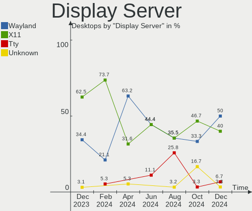

| Name    | Desktops | Percent |
|---------|----------|---------|
| X11     | 17       | 77.27%  |
| Wayland | 5        | 22.73%  |

Display Manager
---------------

SDDM, LightDM, etc.

| Name    | Desktops | Percent |
|---------|----------|---------|
| GDM3    | 7        | 31.82%  |
| SDDM    | 6        | 27.27%  |
| Unknown | 6        | 27.27%  |
| LightDM | 3        | 13.64%  |

OS Lang
-------

Language

| Lang  | Desktops | Percent |
|-------|----------|---------|
| en_IN | 13       | 59.09%  |
| en_US | 9        | 40.91%  |

Boot Mode
---------

EFI or BIOS

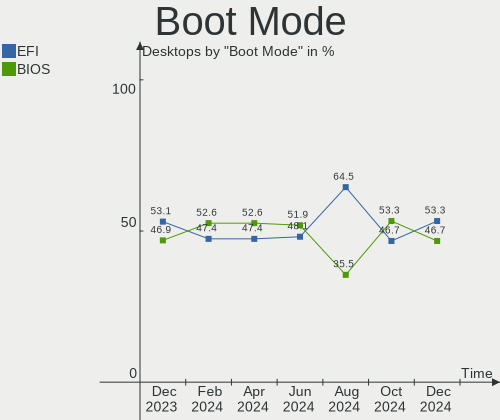

| Mode | Desktops | Percent |
|------|----------|---------|
| BIOS | 11       | 50%     |
| EFI  | 11       | 50%     |

Filesystem
----------

Type of filesystem

| Type    | Desktops | Percent |
|---------|----------|---------|
| Ext4    | 13       | 59.09%  |
| Btrfs   | 5        | 22.73%  |
| Overlay | 4        | 18.18%  |

Part. scheme
------------

Scheme of partitioning

| Type    | Desktops | Percent |
|---------|----------|---------|
| Unknown | 13       | 59.09%  |
| GPT     | 6        | 27.27%  |
| MBR     | 3        | 13.64%  |

Dual Boot with Linux/BSD
------------------------

Hosting more than one Linux/BSD

| Dual boot | Desktops | Percent |
|-----------|----------|---------|
| No        | 18       | 81.82%  |
| Yes       | 4        | 18.18%  |

Dual Boot (Win)
---------------

Hosting Linux and Windows

| Dual boot | Desktops | Percent |
|-----------|----------|---------|
| No        | 14       | 63.64%  |
| Yes       | 8        | 36.36%  |

Board
-----

Vendor
------

Motherboard manufacturer

| Name                | Desktops | Percent |
|---------------------|----------|---------|
| Gigabyte Technology | 7        | 31.82%  |
| ASUSTek Computer    | 4        | 18.18%  |
| MSI                 | 2        | 9.09%   |
| ASRock              | 2        | 9.09%   |
| WIPRO               | 1        | 4.55%   |
| OEM                 | 1        | 4.55%   |
| LORD ELECTRONICS    | 1        | 4.55%   |
| Intel               | 1        | 4.55%   |
| Hewlett-Packard     | 1        | 4.55%   |
| Dell                | 1        | 4.55%   |
| Unknown             | 1        | 4.55%   |

Model
-----

Motherboard model

| Name                          | Desktops | Percent |
|-------------------------------|----------|---------|
| Gigabyte H410M S2 V2          | 2        | 9.09%   |
| Gigabyte H110M-S2             | 2        | 9.09%   |
| WIPRO G31T-M                  | 1        | 4.55%   |
| OEM Intel H81                 | 1        | 4.55%   |
| MSI MS-7C13                   | 1        | 4.55%   |
| MSI MS-7A15                   | 1        | 4.55%   |
| LORD ELECTRONICS GM965 Series | 1        | 4.55%   |
| Intel H61                     | 1        | 4.55%   |
| HP Z4 G4 Workstation          | 1        | 4.55%   |
| Gigabyte H81M-S               | 1        | 4.55%   |
| Gigabyte H61MS                | 1        | 4.55%   |
| Gigabyte B360M GAMING HD      | 1        | 4.55%   |
| Dell OptiPlex 3020M           | 1        | 4.55%   |
| ASUS PRIME B365M-C            | 1        | 4.55%   |
| ASUS P7H55-M LX               | 1        | 4.55%   |
| ASUS H110M-CS                 | 1        | 4.55%   |
| ASUS ASUSPRO D340MC-C_D340MC  | 1        | 4.55%   |
| ASRock G41M-VS3               | 1        | 4.55%   |
| ASRock B450M Steel Legend     | 1        | 4.55%   |
| Unknown                       | 1        | 4.55%   |

Model Family
------------

Motherboard model prefix

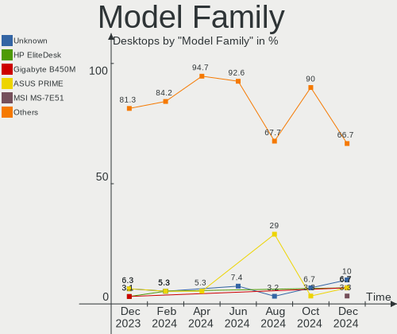

| Name                   | Desktops | Percent |
|------------------------|----------|---------|
| Gigabyte H410M         | 2        | 9.09%   |
| Gigabyte H110M-S2      | 2        | 9.09%   |
| WIPRO G31T-M           | 1        | 4.55%   |
| OEM Intel              | 1        | 4.55%   |
| MSI MS-7C13            | 1        | 4.55%   |
| MSI MS-7A15            | 1        | 4.55%   |
| LORD ELECTRONICS GM965 | 1        | 4.55%   |
| Intel H61              | 1        | 4.55%   |
| HP Z4                  | 1        | 4.55%   |
| Gigabyte H81M-S        | 1        | 4.55%   |
| Gigabyte H61MS         | 1        | 4.55%   |
| Gigabyte B360M         | 1        | 4.55%   |
| Dell OptiPlex          | 1        | 4.55%   |
| ASUS PRIME             | 1        | 4.55%   |
| ASUS P7H55-M           | 1        | 4.55%   |
| ASUS H110M-CS          | 1        | 4.55%   |
| ASUS ASUSPRO           | 1        | 4.55%   |
| ASRock G41M-VS3        | 1        | 4.55%   |
| ASRock B450M           | 1        | 4.55%   |
| Unknown                | 1        | 4.55%   |

MFG Year
--------

Motherboard manufacture year

| Year | Desktops | Percent |
|------|----------|---------|
| 2016 | 5        | 22.73%  |
| 2019 | 4        | 18.18%  |
| 2014 | 3        | 13.64%  |
| 2021 | 2        | 9.09%   |
| 2018 | 2        | 9.09%   |
| 2010 | 2        | 9.09%   |
| 2020 | 1        | 4.55%   |
| 2017 | 1        | 4.55%   |
| 2013 | 1        | 4.55%   |
| 2008 | 1        | 4.55%   |

Form Factor
-----------

Physical design of the computer

| Name    | Desktops | Percent |
|---------|----------|---------|
| Desktop | 22       | 100%    |

Secure Boot
-----------

Enabled or disabled

| State    | Desktops | Percent |
|----------|----------|---------|
| Disabled | 21       | 95.45%  |
| Enabled  | 1        | 4.55%   |

Coreboot
--------

Have coreboot on board

| Used | Desktops | Percent |
|------|----------|---------|
| No   | 22       | 100%    |

RAM Size
--------

Total RAM memory

| Size in GB | Desktops | Percent |
|------------|----------|---------|
| 3.01-4.0   | 7        | 31.82%  |
| 4.01-8.0   | 4        | 18.18%  |
| 16.01-24.0 | 4        | 18.18%  |
| 8.01-16.0  | 3        | 13.64%  |
| 32.01-64.0 | 2        | 9.09%   |
| 2.01-3.0   | 1        | 4.55%   |
| 0.51-1.0   | 1        | 4.55%   |

RAM Used
--------

Used RAM memory

| Used GB  | Desktops | Percent |
|----------|----------|---------|
| 1.01-2.0 | 10       | 45.45%  |
| 2.01-3.0 | 6        | 27.27%  |
| 4.01-8.0 | 3        | 13.64%  |
| 3.01-4.0 | 2        | 9.09%   |
| 0.51-1.0 | 1        | 4.55%   |

Total Drives
------------

Number of drives on board

| Drives | Desktops | Percent |
|--------|----------|---------|
| 1      | 13       | 59.09%  |
| 2      | 5        | 22.73%  |
| 3      | 4        | 18.18%  |

Has CD-ROM
----------

Has CD-ROM on board

| Presented | Desktops | Percent |
|-----------|----------|---------|
| No        | 14       | 63.64%  |
| Yes       | 8        | 36.36%  |

Has Ethernet
------------

Has Ethernet on board

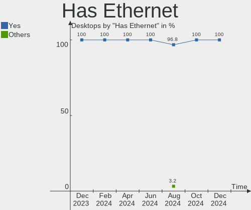

| Presented | Desktops | Percent |
|-----------|----------|---------|
| Yes       | 21       | 95.45%  |
| No        | 1        | 4.55%   |

Has WiFi
--------

Has WiFi module

| Presented | Desktops | Percent |
|-----------|----------|---------|
| Yes       | 13       | 59.09%  |
| No        | 9        | 40.91%  |

Has Bluetooth
-------------

Has Bluetooth module

| Presented | Desktops | Percent |
|-----------|----------|---------|
| No        | 16       | 72.73%  |
| Yes       | 6        | 27.27%  |

Location
--------

Country
-------

Geographic location (country)

| Country | Desktops | Percent |
|---------|----------|---------|
| India   | 22       | 100%    |

City
----

Geographic location (city)

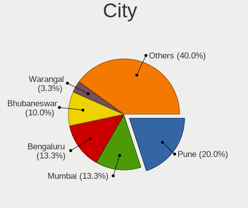

| City        | Desktops | Percent |
|-------------|----------|---------|
| Mumbai      | 2        | 9.09%   |
| Vijayawada  | 1        | 4.55%   |
| Shillong    | 1        | 4.55%   |
| Samastipur  | 1        | 4.55%   |
| Pune        | 1        | 4.55%   |
| Nilambur    | 1        | 4.55%   |
| Navi Mumbai | 1        | 4.55%   |
| Murshidabad | 1        | 4.55%   |
| Kolkata     | 1        | 4.55%   |
| Indore      | 1        | 4.55%   |
| Hyderabad   | 1        | 4.55%   |
| Hajipur     | 1        | 4.55%   |
| Gurgaon     | 1        | 4.55%   |
| Ernakulam   | 1        | 4.55%   |
| Delhi       | 1        | 4.55%   |
| Dehradun    | 1        | 4.55%   |
| Chunchura   | 1        | 4.55%   |
| Chennai     | 1        | 4.55%   |
| Bengaluru   | 1        | 4.55%   |
| Ashti       | 1        | 4.55%   |
| Alwal       | 1        | 4.55%   |

Drives
------

Drive Vendor
------------

Hard drive vendors

| Vendor                | Desktops | Drives | Percent |
|-----------------------|----------|--------|---------|
| Seagate               | 9        | 10     | 29.03%  |
| WDC                   | 8        | 11     | 25.81%  |
| Crucial               | 2        | 2      | 6.45%   |
| Toshiba               | 1        | 1      | 3.23%   |
| SPCC                  | 1        | 1      | 3.23%   |
| SanDisk               | 1        | 1      | 3.23%   |
| Samsung Electronics   | 1        | 1      | 3.23%   |
| Realtek Semiconductor | 1        | 1      | 3.23%   |
| POWER                 | 1        | 1      | 3.23%   |
| Maxtor                | 1        | 1      | 3.23%   |
| KIOXIA-EXCERIA        | 1        | 1      | 3.23%   |
| Kingston              | 1        | 1      | 3.23%   |
| Hitachi               | 1        | 1      | 3.23%   |
| Gigabyte Technology   | 1        | 1      | 3.23%   |
| Unknown               | 1        | 1      | 3.23%   |

Drive Model
-----------

Hard drive models

| Model                             | Desktops | Percent |
|-----------------------------------|----------|---------|
| Seagate ST1000DM010-2EP102 1TB    | 4        | 11.76%  |
| WDC WDS240G2G0A-00JH30 240GB SSD  | 1        | 2.94%   |
| WDC WDS120G2G0A-00JH30 120GB SSD  | 1        | 2.94%   |
| WDC WD5000AUDX-61WNHY0 500GB      | 1        | 2.94%   |
| WDC WD3200AAKS-61L9A0 320GB       | 1        | 2.94%   |
| WDC WD20PURZ-85GU6Y0 2TB          | 1        | 2.94%   |
| WDC WD20EZWX-60F5KA0 2TB          | 1        | 2.94%   |
| WDC WD1600AAJS-22L7A0 160GB       | 1        | 2.94%   |
| WDC WD10EZEX-60WN4A0 1TB          | 1        | 2.94%   |
| WDC WD10EZEX-35WN4A0 1TB          | 1        | 2.94%   |
| WDC WD10EZEX-22MFCA0 1TB          | 1        | 2.94%   |
| Toshiba DT01ACA100 1TB            | 1        | 2.94%   |
| SPCC Solid State Disk 128GB       | 1        | 2.94%   |
| Seagate ST500DM002-1BD142 500GB   | 1        | 2.94%   |
| Seagate ST4000DM004-2CV104 4TB    | 1        | 2.94%   |
| Seagate ST3160215AS 160GB         | 1        | 2.94%   |
| Seagate ST1000DM003-1ER162 1TB    | 1        | 2.94%   |
| Seagate ST1000DM003-1CH162 1TB    | 1        | 2.94%   |
| Seagate BUP BL 4TB                | 1        | 2.94%   |
| SanDisk SDSSDA120G 120GB          | 1        | 2.94%   |
| Samsung SSD 870 QVO 1TB           | 1        | 2.94%   |
| Realtek NVMe SSD Drive 256GB      | 1        | 2.94%   |
| POWER X SS1000-256GB              | 1        | 2.94%   |
| Maxtor Z1 SSD 240GB               | 1        | 2.94%   |
| KIOXIA-EXCERIA SATA SSD 240GB     | 1        | 2.94%   |
| Kingston SA400M8240G 240GB SSD    | 1        | 2.94%   |
| Hitachi HDS721616PLA380 160GB     | 1        | 2.94%   |
| Gigabyte GP-GSM2NE3256GNTD 256GB  | 1        | 2.94%   |
| Crucial CTB5014DXZ11048 500GB SSD | 1        | 2.94%   |
| Crucial CT240BX500SSD1 240GB      | 1        | 2.94%   |
| Unknown                           | 1        | 2.94%   |

HDD Vendor
----------

Hard disk drive vendors

| Vendor  | Desktops | Drives | Percent |
|---------|----------|--------|---------|
| Seagate | 9        | 10     | 47.37%  |
| WDC     | 8        | 9      | 42.11%  |
| Toshiba | 1        | 1      | 5.26%   |
| Hitachi | 1        | 1      | 5.26%   |

SSD Vendor
----------

Solid state drive vendors

| Vendor              | Desktops | Drives | Percent |
|---------------------|----------|--------|---------|
| WDC                 | 2        | 2      | 20%     |
| Crucial             | 2        | 2      | 20%     |
| SPCC                | 1        | 1      | 10%     |
| SanDisk             | 1        | 1      | 10%     |
| Samsung Electronics | 1        | 1      | 10%     |
| Maxtor              | 1        | 1      | 10%     |
| KIOXIA-EXCERIA      | 1        | 1      | 10%     |
| Kingston            | 1        | 1      | 10%     |

Drive Kind
----------

HDD or SSD

| Kind    | Desktops | Drives | Percent |
|---------|----------|--------|---------|
| HDD     | 17       | 21     | 54.84%  |
| SSD     | 10       | 10     | 32.26%  |
| NVMe    | 2        | 2      | 6.45%   |
| Unknown | 2        | 2      | 6.45%   |

Drive Connector
---------------

SATA, SAS, NVMe, etc.

| Type | Desktops | Drives | Percent |
|------|----------|--------|---------|
| SATA | 22       | 32     | 88%     |
| NVMe | 2        | 2      | 8%      |
| SAS  | 1        | 1      | 4%      |

Drive Size
----------

Size of hard drive

| Size in TB | Desktops | Drives | Percent |
|------------|----------|--------|---------|
| 0.01-0.5   | 13       | 15     | 50%     |
| 0.51-1.0   | 10       | 12     | 38.46%  |
| 1.01-2.0   | 2        | 2      | 7.69%   |
| 3.01-4.0   | 1        | 2      | 3.85%   |

Space Total
-----------

Amount of disk space available on the file system

| Size in GB     | Desktops | Percent |
|----------------|----------|---------|
| 101-250        | 6        | 27.27%  |
| 251-500        | 4        | 18.18%  |
| 21-50          | 3        | 13.64%  |
| 1001-2000      | 3        | 13.64%  |
| 501-1000       | 3        | 13.64%  |
| 1-20           | 2        | 9.09%   |
| More than 3000 | 1        | 4.55%   |

Space Used
----------

Amount of used disk space

| Used GB        | Desktops | Percent |
|----------------|----------|---------|
| 1-20           | 10       | 45.45%  |
| 21-50          | 4        | 18.18%  |
| 101-250        | 4        | 18.18%  |
| 251-500        | 2        | 9.09%   |
| More than 3000 | 1        | 4.55%   |
| 501-1000       | 1        | 4.55%   |

Malfunc. Drives
---------------

Drive models with a malfunction

| Model                           | Desktops | Drives | Percent |
|---------------------------------|----------|--------|---------|
| WDC WD3200AAKS-61L9A0 320GB     | 1        | 1      | 25%     |
| WDC WD1600AAJS-22L7A0 160GB     | 1        | 1      | 25%     |
| Seagate ST500DM002-1BD142 500GB | 1        | 1      | 25%     |
| Seagate ST1000DM003-1ER162 1TB  | 1        | 1      | 25%     |

Malfunc. Drive Vendor
---------------------

Vendors of faulty drives

| Vendor  | Desktops | Drives | Percent |
|---------|----------|--------|---------|
| WDC     | 2        | 2      | 50%     |
| Seagate | 2        | 2      | 50%     |

Malfunc. HDD Vendor
-------------------

Vendors of faulty HDD drives

| Vendor  | Desktops | Drives | Percent |
|---------|----------|--------|---------|
| WDC     | 2        | 2      | 50%     |
| Seagate | 2        | 2      | 50%     |

Malfunc. Drive Kind
-------------------

Kinds of faulty drives

| Kind | Desktops | Drives | Percent |
|------|----------|--------|---------|
| HDD  | 4        | 4      | 100%    |

Failed Drives
-------------

Failed drive models

Zero info for selected period =(

Failed Drive Vendor
-------------------

Failed drive vendors

Zero info for selected period =(

Drive Status
------------

Number of failed and malfunc. drives

| Status   | Desktops | Drives | Percent |
|----------|----------|--------|---------|
| Detected | 13       | 18     | 54.17%  |
| Works    | 7        | 13     | 29.17%  |
| Malfunc  | 4        | 4      | 16.67%  |

Storage controller
------------------

Storage Vendor
--------------

Storage controller vendors

| Vendor                | Desktops | Percent |
|-----------------------|----------|---------|
| Intel                 | 21       | 87.5%   |
| Realtek Semiconductor | 1        | 4.17%   |
| Phison Electronics    | 1        | 4.17%   |
| AMD                   | 1        | 4.17%   |

Storage Model
-------------

Storage controller models

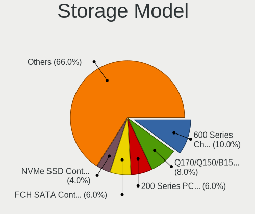

| Model                                                                                   | Desktops | Percent |
|-----------------------------------------------------------------------------------------|----------|---------|
| Intel Q170/Q150/B150/H170/H110/Z170/CM236 Chipset SATA Controller [AHCI Mode]           | 4        | 13.33%  |
| Intel 82801G (ICH7 Family) IDE Controller                                               | 4        | 13.33%  |
| Intel NM10/ICH7 Family SATA Controller [IDE mode]                                       | 3        | 10%     |
| Intel 8 Series/C220 Series Chipset Family 6-port SATA Controller 1 [AHCI mode]          | 3        | 10%     |
| Intel 200 Series PCH SATA controller [AHCI mode]                                        | 3        | 10%     |
| Intel Comet Lake SATA AHCI Controller                                                   | 2        | 6.67%   |
| Realtek Realtek Non-Volatile memory controller                                          | 1        | 3.33%   |
| Phison PS5013 E13 NVMe Controller                                                       | 1        | 3.33%   |
| Intel Cannon Lake PCH SATA AHCI Controller                                              | 1        | 3.33%   |
| Intel C600/X79 series chipset SATA RAID Controller                                      | 1        | 3.33%   |
| Intel 82801GBM/GHM (ICH7-M Family) SATA Controller [IDE mode]                           | 1        | 3.33%   |
| Intel 6 Series/C200 Series Chipset Family Desktop SATA Controller (IDE mode, ports 4-5) | 1        | 3.33%   |
| Intel 6 Series/C200 Series Chipset Family Desktop SATA Controller (IDE mode, ports 0-3) | 1        | 3.33%   |
| Intel 6 Series/C200 Series Chipset Family 6 port Desktop SATA AHCI Controller           | 1        | 3.33%   |
| Intel 5 Series/3400 Series Chipset 4 port SATA IDE Controller                           | 1        | 3.33%   |
| Intel 5 Series/3400 Series Chipset 2 port SATA IDE Controller                           | 1        | 3.33%   |
| AMD 400 Series Chipset SATA Controller                                                  | 1        | 3.33%   |

Storage Kind
------------

Kind of storage controller (IDE, SATA, NVMe, SAS, ...)

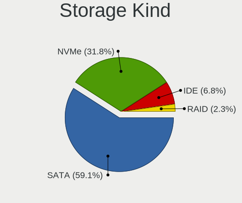

| Kind | Desktops | Percent |
|------|----------|---------|
| SATA | 15       | 62.5%   |
| IDE  | 6        | 25%     |
| NVMe | 2        | 8.33%   |
| RAID | 1        | 4.17%   |

Processor
---------

CPU Vendor
----------

Processor vendors

| Vendor | Desktops | Percent |
|--------|----------|---------|
| Intel  | 21       | 95.45%  |
| AMD    | 1        | 4.55%   |

CPU Model
---------

Processor models

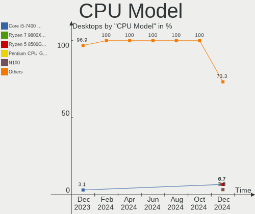

| Model                                       | Desktops | Percent |
|---------------------------------------------|----------|---------|
| Intel Core i5-9400F CPU @ 2.90GHz           | 2        | 9.09%   |
| Intel Xeon W-2133 CPU @ 3.60GHz             | 1        | 4.55%   |
| Intel Pentium Gold G6405 CPU @ 4.10GHz      | 1        | 4.55%   |
| Intel Pentium Dual-Core CPU E5800 @ 3.20GHz | 1        | 4.55%   |
| Intel Pentium Dual-Core CPU E5700 @ 3.00GHz | 1        | 4.55%   |
| Intel Pentium Dual CPU E2200 @ 2.20GHz      | 1        | 4.55%   |
| Intel Pentium CPU G4400 @ 3.30GHz           | 1        | 4.55%   |
| Intel Pentium CPU G3240 @ 3.10GHz           | 1        | 4.55%   |
| Intel Core i7-4790S CPU @ 3.20GHz           | 1        | 4.55%   |
| Intel Core i5-6600K CPU @ 3.50GHz           | 1        | 4.55%   |
| Intel Core i5-3570 CPU @ 3.40GHz            | 1        | 4.55%   |
| Intel Core i5-3470 CPU @ 3.20GHz            | 1        | 4.55%   |
| Intel Core i3-9100F CPU @ 3.60GHz           | 1        | 4.55%   |
| Intel Core i3-9100 CPU @ 3.60GHz            | 1        | 4.55%   |
| Intel Core i3-6100 CPU @ 3.70GHz            | 1        | 4.55%   |
| Intel Core i3-6098P CPU @ 3.60GHz           | 1        | 4.55%   |
| Intel Core i3-4130 CPU @ 3.40GHz            | 1        | 4.55%   |
| Intel Core i3-10100F CPU @ 3.60GHz          | 1        | 4.55%   |
| Intel Core i3 CPU 540 @ 3.07GHz             | 1        | 4.55%   |
| Intel Core 2 Duo CPU E7500 @ 2.93GHz        | 1        | 4.55%   |
| AMD Athlon 3000G with Radeon Vega Graphics  | 1        | 4.55%   |

CPU Model Family
----------------

Processor model prefix

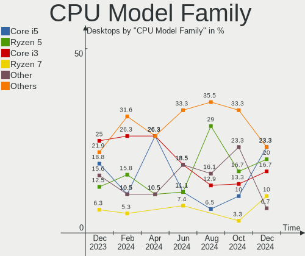

| Model                   | Desktops | Percent |
|-------------------------|----------|---------|
| Intel Core i3           | 7        | 31.82%  |
| Intel Core i5           | 5        | 22.73%  |
| Intel Pentium Dual-Core | 2        | 9.09%   |
| Intel Pentium           | 2        | 9.09%   |
| Intel Xeon              | 1        | 4.55%   |
| Intel Pentium Gold      | 1        | 4.55%   |
| Intel Pentium Dual      | 1        | 4.55%   |
| Intel Core i7           | 1        | 4.55%   |
| Intel Core 2 Duo        | 1        | 4.55%   |
| AMD Athlon              | 1        | 4.55%   |

CPU Cores
---------

Number of processor cores

| Number | Desktops | Percent |
|--------|----------|---------|
| 2      | 12       | 54.55%  |
| 4      | 7        | 31.82%  |
| 6      | 3        | 13.64%  |

CPU Sockets
-----------

Number of sockets

| Number | Desktops | Percent |
|--------|----------|---------|
| 1      | 22       | 100%    |

CPU Threads
-----------

Threads per core (Hyper-Threading)

| Number | Desktops | Percent |
|--------|----------|---------|
| 1      | 13       | 59.09%  |
| 2      | 9        | 40.91%  |

CPU Op-Modes
------------

CPU Operation Modes (32-bit, 64-bit)

| Op mode        | Desktops | Percent |
|----------------|----------|---------|
| 32-bit, 64-bit | 22       | 100%    |

CPU Microcode
-------------

Microcode number

| Number     | Desktops | Percent |
|------------|----------|---------|
| Unknown    | 7        | 31.82%  |
| 0x506e3    | 3        | 13.64%  |
| 0x906eb    | 2        | 9.09%   |
| 0x306c3    | 2        | 9.09%   |
| 0x1067a    | 2        | 9.09%   |
| 0xa0653    | 1        | 4.55%   |
| 0x6fd      | 1        | 4.55%   |
| 0x50654    | 1        | 4.55%   |
| 0x306a9    | 1        | 4.55%   |
| 0x20655    | 1        | 4.55%   |
| 0x08101016 | 1        | 4.55%   |

CPU Microarch
-------------

Microarchitecture

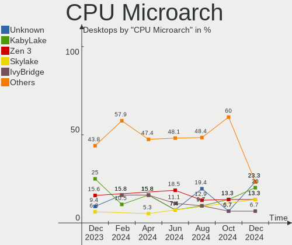

| Name      | Desktops | Percent |
|-----------|----------|---------|
| Skylake   | 5        | 22.73%  |
| KabyLake  | 4        | 18.18%  |
| Penryn    | 3        | 13.64%  |
| Haswell   | 3        | 13.64%  |
| IvyBridge | 2        | 9.09%   |
| CometLake | 2        | 9.09%   |
| Zen       | 1        | 4.55%   |
| Westmere  | 1        | 4.55%   |
| Core      | 1        | 4.55%   |

Graphics
--------

GPU Vendor
----------

Vendors of graphics cards

| Vendor | Desktops | Percent |
|--------|----------|---------|
| Intel  | 14       | 63.64%  |
| Nvidia | 7        | 31.82%  |
| AMD    | 1        | 4.55%   |

GPU Model
---------

Graphics card models

| Model                                                                       | Desktops | Percent |
|-----------------------------------------------------------------------------|----------|---------|
| Nvidia GP107 [GeForce GTX 1050 Ti]                                          | 3        | 13.04%  |
| Intel Xeon E3-1200 v3/4th Gen Core Processor Integrated Graphics Controller | 2        | 8.7%    |
| Intel Xeon E3-1200 v2/3rd Gen Core processor Graphics Controller            | 2        | 8.7%    |
| Nvidia TU116 [GeForce GTX 1660]                                             | 1        | 4.35%   |
| Nvidia TU104GL [Quadro RTX 4000]                                            | 1        | 4.35%   |
| Nvidia GM107 [GeForce GTX 750 Ti]                                           | 1        | 4.35%   |
| Nvidia GK208B [GeForce GT 710]                                              | 1        | 4.35%   |
| Intel Mobile GM965/GL960 Integrated Graphics Controller (secondary)         | 1        | 4.35%   |
| Intel Mobile GM965/GL960 Integrated Graphics Controller (primary)           | 1        | 4.35%   |
| Intel HD Graphics 530                                                       | 1        | 4.35%   |
| Intel HD Graphics 510                                                       | 1        | 4.35%   |
| Intel Core Processor Integrated Graphics Controller                         | 1        | 4.35%   |
| Intel CometLake-S GT1 [UHD Graphics 610]                                    | 1        | 4.35%   |
| Intel CoffeeLake-S GT2 [UHD Graphics 630]                                   | 1        | 4.35%   |
| Intel 82G33/G31 Express Integrated Graphics Controller                      | 1        | 4.35%   |
| Intel 82945G/GZ Integrated Graphics Controller                              | 1        | 4.35%   |
| Intel 4th Generation Core Processor Family Integrated Graphics Controller   | 1        | 4.35%   |
| Intel 4 Series Chipset Integrated Graphics Controller                       | 1        | 4.35%   |
| AMD Raven Ridge [Radeon Vega Series / Radeon Vega Mobile Series]            | 1        | 4.35%   |

GPU Combo
---------

Combinations of graphics cards

| Name       | Desktops | Percent |
|------------|----------|---------|
| 1 x Intel  | 14       | 63.64%  |
| 1 x Nvidia | 7        | 31.82%  |
| 1 x AMD    | 1        | 4.55%   |

GPU Driver
----------

Free vs proprietary

| Driver      | Desktops | Percent |
|-------------|----------|---------|
| Free        | 18       | 81.82%  |
| Proprietary | 4        | 18.18%  |

GPU Memory
----------

Total video memory

| Size in GB | Desktops | Percent |
|------------|----------|---------|
| Unknown    | 16       | 72.73%  |
| 3.01-4.0   | 3        | 13.64%  |
| 5.01-6.0   | 1        | 4.55%   |
| 1.01-2.0   | 1        | 4.55%   |
| 0.51-1.0   | 1        | 4.55%   |

Monitor
-------

Monitor Vendor
--------------

Monitor vendors

| Vendor              | Desktops | Percent |
|---------------------|----------|---------|
| Dell                | 5        | 22.73%  |
| Acer                | 4        | 18.18%  |
| Goldstar            | 3        | 13.64%  |
| BenQ                | 3        | 13.64%  |
| Xiaomi              | 1        | 4.55%   |
| ViewSonic           | 1        | 4.55%   |
| SGT                 | 1        | 4.55%   |
| Samsung Electronics | 1        | 4.55%   |
| Philips             | 1        | 4.55%   |
| HCL                 | 1        | 4.55%   |
| AOpen               | 1        | 4.55%   |

Monitor Model
-------------

Monitor models

| Model                                                            | Desktops | Percent |
|------------------------------------------------------------------|----------|---------|
| Dell S2218H DELD0B7 1920x1080 476x268mm 21.5-inch                | 2        | 9.09%   |
| Xiaomi Mi TV XMD004A 1440x900 708x398mm 32.0-inch                | 1        | 4.55%   |
| ViewSonic VA2248 SERIES VSC0E28 1920x1080 477x268mm 21.5-inch    | 1        | 4.55%   |
| SGT VGA SGT2383 1366x768 410x260mm 19.1-inch                     | 1        | 4.55%   |
| Samsung Electronics S19F350 SAM0D46 1366x768 410x230mm 18.5-inch | 1        | 4.55%   |
| Philips 202EL PHLC05C 1600x900 443x249mm 20.0-inch               | 1        | 4.55%   |
| HCL HCM5LFAN21 HCM0521 1024x768 304x228mm 15.0-inch              | 1        | 4.55%   |
| Goldstar ULTRAWIDE GSM76F9 2560x1080 531x298mm 24.0-inch         | 1        | 4.55%   |
| Goldstar StudioWorks 5 52V GSM3AF6 1024x768 260x195mm 12.8-inch  | 1        | 4.55%   |
| Goldstar IPS WSXGA GSM5B01 1440x900 419x262mm 19.5-inch          | 1        | 4.55%   |
| Dell SE2219HX DELF10E 1920x1080 476x268mm 21.5-inch              | 1        | 4.55%   |
| Dell IN2030M DELF03C 1600x900 443x249mm 20.0-inch                | 1        | 4.55%   |
| Dell E2014H DELD03B 1600x900 432x240mm 19.5-inch                 | 1        | 4.55%   |
| BenQ VZ2350 BNQ7B36 1920x1080 509x286mm 23.0-inch                | 1        | 4.55%   |
| BenQ LCD Monitor GW2480 1920x1080                                | 1        | 4.55%   |
| BenQ GW2283 BNQ78E9 1920x1080 480x270mm 21.7-inch                | 1        | 4.55%   |
| AOpen 20CH1Q AOP06A5 1366x768 434x236mm 19.4-inch                | 1        | 4.55%   |
| Acer KG241Q S ACR074D 1920x1080 521x293mm 23.5-inch              | 1        | 4.55%   |
| Acer K202HQL ACR03E0 1366x768 434x236mm 19.4-inch                | 1        | 4.55%   |
| Acer HA240Y ACR0583 1920x1080 527x296mm 23.8-inch                | 1        | 4.55%   |
| Acer B227Q D ACR0895 1920x1080 476x268mm 21.5-inch               | 1        | 4.55%   |

Monitor Resolution
------------------

Monitor screen resolution

| Resolution       | Desktops | Percent |
|------------------|----------|---------|
| 1920x1080 (FHD)  | 9        | 42.86%  |
| 1600x900 (HD+)   | 4        | 19.05%  |
| 1366x768 (WXGA)  | 3        | 14.29%  |
| 1024x768 (XGA)   | 2        | 9.52%   |
| 3840x2160 (4K)   | 1        | 4.76%   |
| 2560x1080        | 1        | 4.76%   |
| 1440x900 (WXGA+) | 1        | 4.76%   |

Monitor Diagonal
----------------

Diagonal size in inches

| Inches  | Desktops | Percent |
|---------|----------|---------|
| 21      | 6        | 28.57%  |
| 19      | 5        | 23.81%  |
| 20      | 2        | 9.52%   |
| 65      | 1        | 4.76%   |
| 34      | 1        | 4.76%   |
| 24      | 1        | 4.76%   |
| 23      | 1        | 4.76%   |
| 18      | 1        | 4.76%   |
| 15      | 1        | 4.76%   |
| 12      | 1        | 4.76%   |
| Unknown | 1        | 4.76%   |

Monitor Width
-------------

Physical width

| Width in mm | Desktops | Percent |
|-------------|----------|---------|
| 401-500     | 14       | 66.67%  |
| 501-600     | 2        | 9.52%   |
| 701-800     | 1        | 4.76%   |
| 301-350     | 1        | 4.76%   |
| 201-300     | 1        | 4.76%   |
| 1001-1500   | 1        | 4.76%   |
| Unknown     | 1        | 4.76%   |

Aspect Ratio
------------

Proportional relationship between the width and the height

| Ratio   | Desktops | Percent |
|---------|----------|---------|
| 16/9    | 15       | 71.43%  |
| 4/3     | 2        | 9.52%   |
| 16/10   | 2        | 9.52%   |
| 21/9    | 1        | 4.76%   |
| Unknown | 1        | 4.76%   |

Monitor Area
------------

Area in inch²

| Area in inch² | Desktops | Percent |
|----------------|----------|---------|
| 151-200        | 10       | 47.62%  |
| 201-250        | 5        | 23.81%  |
| More than 1000 | 1        | 4.76%   |
| 71-80          | 1        | 4.76%   |
| 351-500        | 1        | 4.76%   |
| 141-150        | 1        | 4.76%   |
| 101-110        | 1        | 4.76%   |
| Unknown        | 1        | 4.76%   |

Pixel Density
-------------

Pixels per inch

| Density | Desktops | Percent |
|---------|----------|---------|
| 51-100  | 13       | 61.9%   |
| 101-120 | 6        | 28.57%  |
| 1-50    | 1        | 4.76%   |
| Unknown | 1        | 4.76%   |

Multiple Monitors
-----------------

Total monitors connected

| Total | Desktops | Percent |
|-------|----------|---------|
| 1     | 20       | 90.91%  |
| 2     | 1        | 4.55%   |
| 0     | 1        | 4.55%   |

Network
-------

Net Controller Vendor
---------------------

Controller vendors

| Vendor                          | Desktops | Percent |
|---------------------------------|----------|---------|
| Realtek Semiconductor           | 18       | 56.25%  |
| Intel                           | 4        | 12.5%   |
| Ralink Technology               | 3        | 9.38%   |
| Xiaomi                          | 2        | 6.25%   |
| TP-Link                         | 1        | 3.13%   |
| Samsung Electronics             | 1        | 3.13%   |
| Qualcomm Atheros Communications | 1        | 3.13%   |
| Qualcomm Atheros                | 1        | 3.13%   |
| OnePlus Technology (Shenzhen)   | 1        | 3.13%   |

Net Controller Model
--------------------

Controller models

| Model                                                             | Desktops | Percent |
|-------------------------------------------------------------------|----------|---------|
| Realtek RTL8111/8168/8411 PCI Express Gigabit Ethernet Controller | 12       | 30.77%  |
| Realtek RTL810xE PCI Express Fast Ethernet controller             | 4        | 10.26%  |
| Realtek RTL8188FTV 802.11b/g/n 1T1R 2.4G WLAN Adapter             | 3        | 7.69%   |
| Ralink MT7601U Wireless Adapter                                   | 3        | 7.69%   |
| Xiaomi Mi/Redmi series (RNDIS)                                    | 2        | 5.13%   |
| Realtek RTL8188EUS 802.11n Wireless Network Adapter               | 2        | 5.13%   |
| Realtek RTL8188EE Wireless Network Adapter                        | 2        | 5.13%   |
| Intel Ethernet Connection (11) I219-V                             | 2        | 5.13%   |
| TP-Link TL-WN823N v2/v3 [Realtek RTL8192EU]                       | 1        | 2.56%   |
| Samsung GT-I9070 (network tethering, USB debugging enabled)       | 1        | 2.56%   |
| Realtek RTL88x2bu [AC1200 Techkey]                                | 1        | 2.56%   |
| Qualcomm Atheros AR9271 802.11n                                   | 1        | 2.56%   |
| Qualcomm Atheros AR8152 v2.0 Fast Ethernet                        | 1        | 2.56%   |
| OnePlus (Shenzhen) OnePlus                                        | 1        | 2.56%   |
| Intel I210 Gigabit Network Connection                             | 1        | 2.56%   |
| Intel Ethernet Connection (2) I219-V                              | 1        | 2.56%   |
| Intel Ethernet Connection (2) I219-LM                             | 1        | 2.56%   |

Wireless Vendor
---------------

Wireless vendors

| Vendor                          | Desktops | Percent |
|---------------------------------|----------|---------|
| Realtek Semiconductor           | 8        | 61.54%  |
| Ralink Technology               | 3        | 23.08%  |
| TP-Link                         | 1        | 7.69%   |
| Qualcomm Atheros Communications | 1        | 7.69%   |

Wireless Model
--------------

Wireless models

| Model                                                 | Desktops | Percent |
|-------------------------------------------------------|----------|---------|
| Realtek RTL8188FTV 802.11b/g/n 1T1R 2.4G WLAN Adapter | 3        | 23.08%  |
| Ralink MT7601U Wireless Adapter                       | 3        | 23.08%  |
| Realtek RTL8188EUS 802.11n Wireless Network Adapter   | 2        | 15.38%  |
| Realtek RTL8188EE Wireless Network Adapter            | 2        | 15.38%  |
| TP-Link TL-WN823N v2/v3 [Realtek RTL8192EU]           | 1        | 7.69%   |
| Realtek RTL88x2bu [AC1200 Techkey]                    | 1        | 7.69%   |
| Qualcomm Atheros AR9271 802.11n                       | 1        | 7.69%   |

Ethernet Vendor
---------------

Ethernet vendors

| Vendor                        | Desktops | Percent |
|-------------------------------|----------|---------|
| Realtek Semiconductor         | 16       | 64%     |
| Intel                         | 4        | 16%     |
| Xiaomi                        | 2        | 8%      |
| Samsung Electronics           | 1        | 4%      |
| Qualcomm Atheros              | 1        | 4%      |
| OnePlus Technology (Shenzhen) | 1        | 4%      |

Ethernet Model
--------------

Ethernet models

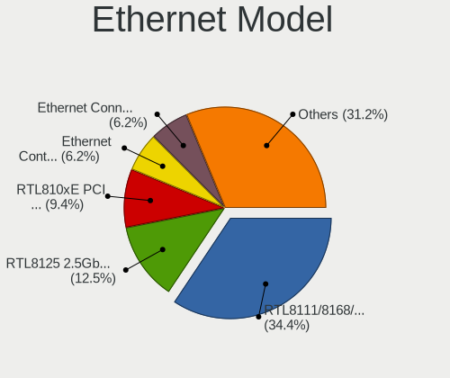

| Model                                                             | Desktops | Percent |
|-------------------------------------------------------------------|----------|---------|
| Realtek RTL8111/8168/8411 PCI Express Gigabit Ethernet Controller | 12       | 46.15%  |
| Realtek RTL810xE PCI Express Fast Ethernet controller             | 4        | 15.38%  |
| Xiaomi Mi/Redmi series (RNDIS)                                    | 2        | 7.69%   |
| Intel Ethernet Connection (11) I219-V                             | 2        | 7.69%   |
| Samsung GT-I9070 (network tethering, USB debugging enabled)       | 1        | 3.85%   |
| Qualcomm Atheros AR8152 v2.0 Fast Ethernet                        | 1        | 3.85%   |
| OnePlus (Shenzhen) OnePlus                                        | 1        | 3.85%   |
| Intel I210 Gigabit Network Connection                             | 1        | 3.85%   |
| Intel Ethernet Connection (2) I219-V                              | 1        | 3.85%   |
| Intel Ethernet Connection (2) I219-LM                             | 1        | 3.85%   |

Net Controller Kind
-------------------

Ethernet, WiFi or modem

| Kind     | Desktops | Percent |
|----------|----------|---------|
| Ethernet | 21       | 61.76%  |
| WiFi     | 13       | 38.24%  |

Used Controller
---------------

Currently used network controller

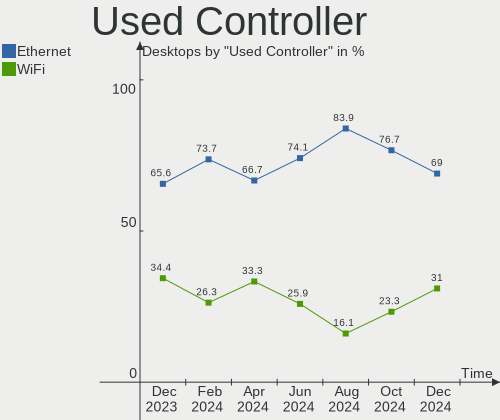

| Kind     | Desktops | Percent |
|----------|----------|---------|
| Ethernet | 12       | 66.67%  |
| WiFi     | 6        | 33.33%  |

NICs
----

Total network controllers on board

| Total | Desktops | Percent |
|-------|----------|---------|
| 1     | 18       | 81.82%  |
| 2     | 3        | 13.64%  |
| 0     | 1        | 4.55%   |

IPv6
----

IPv6 vs IPv4

| Used | Desktops | Percent |
|------|----------|---------|
| No   | 16       | 72.73%  |
| Yes  | 6        | 27.27%  |

Bluetooth
---------

Bluetooth Vendor
----------------

Controller vendors

| Vendor                  | Desktops | Percent |
|-------------------------|----------|---------|
| Cambridge Silicon Radio | 5        | 83.33%  |
| Realtek Semiconductor   | 1        | 16.67%  |

Bluetooth Model
---------------

Controller models

| Model                                               | Desktops | Percent |
|-----------------------------------------------------|----------|---------|
| Cambridge Silicon Radio Bluetooth Dongle (HCI mode) | 5        | 83.33%  |
| Realtek Bluetooth Radio                             | 1        | 16.67%  |

Sound
-----

Sound Vendor
------------

Sound card vendors

| Vendor                | Desktops | Percent |
|-----------------------|----------|---------|
| Intel                 | 21       | 67.74%  |
| Nvidia                | 7        | 22.58%  |
| Realtek Semiconductor | 1        | 3.23%   |
| JMTek                 | 1        | 3.23%   |
| AMD                   | 1        | 3.23%   |

Sound Model
-----------

Sound card models

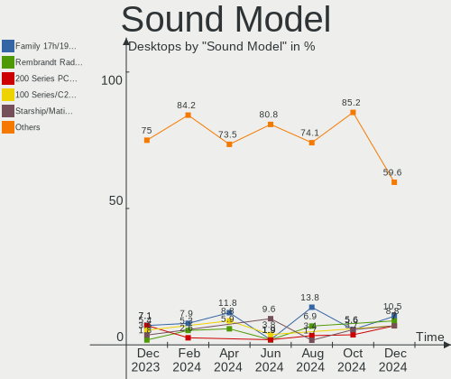

| Model                                                                      | Desktops | Percent |
|----------------------------------------------------------------------------|----------|---------|
| Intel NM10/ICH7 Family High Definition Audio Controller                    | 4        | 11.11%  |
| Intel 200 Series PCH HD Audio                                              | 4        | 11.11%  |
| Intel 100 Series/C230 Series Chipset Family HD Audio Controller            | 4        | 11.11%  |
| Nvidia GP107GL High Definition Audio Controller                            | 3        | 8.33%   |
| Intel Xeon E3-1200 v3/4th Gen Core Processor HD Audio Controller           | 3        | 8.33%   |
| Intel 8 Series/C220 Series Chipset High Definition Audio Controller        | 3        | 8.33%   |
| Intel Comet Lake PCH cAVS                                                  | 2        | 5.56%   |
| Intel 6 Series/C200 Series Chipset Family High Definition Audio Controller | 2        | 5.56%   |
| Realtek Semiconductor USB Audio                                            | 1        | 2.78%   |
| Nvidia TU116 High Definition Audio Controller                              | 1        | 2.78%   |
| Nvidia TU104 HD Audio Controller                                           | 1        | 2.78%   |
| Nvidia GM107 High Definition Audio Controller [GeForce 940MX]              | 1        | 2.78%   |
| Nvidia GK208 HDMI/DP Audio Controller                                      | 1        | 2.78%   |
| JMTek USB PnP Audio Device                                                 | 1        | 2.78%   |
| Intel USB PnP Sound Device                                                 | 1        | 2.78%   |
| Intel Cannon Lake PCH cAVS                                                 | 1        | 2.78%   |
| Intel 5 Series/3400 Series Chipset High Definition Audio                   | 1        | 2.78%   |
| AMD Raven/Raven2/Fenghuang HDMI/DP Audio Controller                        | 1        | 2.78%   |
| AMD Family 17h/19h HD Audio Controller                                     | 1        | 2.78%   |

Memory
------

Memory Vendor
-------------

Memory module vendors

| Vendor              | Desktops | Percent |
|---------------------|----------|---------|
| Unknown             | 2        | 20%     |
| A-DATA Technology   | 2        | 20%     |
| Transcend           | 1        | 10%     |
| SK hynix            | 1        | 10%     |
| Samsung Electronics | 1        | 10%     |
| Kingston            | 1        | 10%     |
| Crucial             | 1        | 10%     |
| Corsair             | 1        | 10%     |

Memory Model
------------

Memory module models

| Model                                                   | Desktops | Percent |
|---------------------------------------------------------|----------|---------|
| Unknown RAM Module 4GB DIMM DDR 1333MT/s                | 1        | 10%     |
| Unknown RAM Module 1GB DIMM DDR2                        | 1        | 10%     |
| Transcend RAM JM2666HLD-4G 4GB DIMM DDR4 2400MT/s       | 1        | 10%     |
| SK hynix RAM HMT351U6CFR8C-PBA 2GB DIMM DDR3 1600MT/s   | 1        | 10%     |
| Samsung RAM M378B5173EB0-YK0 4GB DIMM DDR3 1600MT/s     | 1        | 10%     |
| Kingston RAM KHX2400C15/8G 8GB DIMM DDR4 2933MT/s       | 1        | 10%     |
| Crucial RAM CT51264BA160B.C16F 4GB DIMM DDR3 1600MT/s   | 1        | 10%     |
| Corsair RAM CMV8GX4M1A2666C18 8192MB DIMM DDR4 2667MT/s | 1        | 10%     |
| A-DATA RAM Module 8GB DIMM DDR4 2666MT/s                | 1        | 10%     |
| A-DATA RAM DDR4 3200 2OZ 16GB DIMM DDR4 2667MT/s        | 1        | 10%     |

Memory Kind
-----------

Memory module kinds

| Kind | Desktops | Percent |
|------|----------|---------|
| DDR4 | 5        | 50%     |
| DDR3 | 3        | 30%     |
| DDR2 | 1        | 10%     |
| DDR  | 1        | 10%     |

Memory Form Factor
------------------

Physical design of the memory module

| Name | Desktops | Percent |
|------|----------|---------|
| DIMM | 10       | 100%    |

Memory Size
-----------

Memory module size

| Size  | Desktops | Percent |
|-------|----------|---------|
| 4096  | 5        | 50%     |
| 8192  | 3        | 30%     |
| 16384 | 1        | 10%     |
| 1024  | 1        | 10%     |

Memory Speed
------------

Memory module speed

| Speed   | Desktops | Percent |
|---------|----------|---------|
| 1600    | 3        | 30%     |
| 2667    | 2        | 20%     |
| 2933    | 1        | 10%     |
| 2666    | 1        | 10%     |
| 2400    | 1        | 10%     |
| 1333    | 1        | 10%     |
| Unknown | 1        | 10%     |

Printers & scanners
-------------------

Printer Vendor
--------------

Printer device vendors

| Vendor          | Desktops | Percent |
|-----------------|----------|---------|
| Seiko Epson     | 1        | 50%     |
| Hewlett-Packard | 1        | 50%     |

Printer Model
-------------

Printer device models

| Model                    | Desktops | Percent |
|--------------------------|----------|---------|
| Seiko Epson L3200 Series | 1        | 50%     |
| HP LaserJet 1020         | 1        | 50%     |

Scanner Vendor
--------------

Scanner device vendors

Zero info for selected period =(

Scanner Model
-------------

Scanner device models

Zero info for selected period =(

Camera
------

Camera Vendor
-------------

Camera device vendors

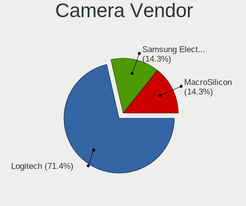

| Vendor              | Desktops | Percent |
|---------------------|----------|---------|
| Logitech            | 2        | 33.33%  |
| Microdia            | 1        | 16.67%  |
| MacroSilicon        | 1        | 16.67%  |
| Lenovo              | 1        | 16.67%  |
| Chicony Electronics | 1        | 16.67%  |

Camera Model
------------

Camera device models

| Model                           | Desktops | Percent |
|---------------------------------|----------|---------|
| Microdia USB 2.0 Camera         | 1        | 16.67%  |
| MacroSilicon USB Video          | 1        | 16.67%  |
| Logitech Webcam C270            | 1        | 16.67%  |
| Logitech C922 Pro Stream Webcam | 1        | 16.67%  |
| Lenovo FHD Webcam Audio         | 1        | 16.67%  |
| Chicony FHD User Facing         | 1        | 16.67%  |

Security
--------

Fingerprint Vendor
------------------

Fingerprint sensor vendors

Zero info for selected period =(

Fingerprint Model
-----------------

Fingerprint sensor models

Zero info for selected period =(

Chipcard Vendor
---------------

Chipcard module vendors

Zero info for selected period =(

Chipcard Model
--------------

Chipcard module models

Zero info for selected period =(

Unsupported
-----------

Unsupported Devices
-------------------

Total unsupported devices on board

| Total | Desktops | Percent |
|-------|----------|---------|
| 0     | 21       | 95.45%  |
| 2     | 1        | 4.55%   |

Unsupported Device Types
------------------------

Types of unsupported devices

| Type         | Desktops | Percent |
|--------------|----------|---------|
| Network      | 1        | 50%     |
| Net/wireless | 1        | 50%     |

