Linux in India - Hardware Trends (Desktops)
-------------------------------------------

A project to identify most popular hardware characteristics and track their change
over time based on data collected by Linux users at https://Linux-Hardware.org.

Anyone can contribute to this report by the [hw-probe](https://github.com/linuxhw/hw-probe) tool:

    sudo -E hw-probe -all -upload

Period: Dec, 2023.

Contents
--------

* [ System ](#system)
  - [ OS                       ](#os)
  - [ OS Family                ](#os-family)
  - [ Kernel                   ](#kernel)
  - [ Kernel Family            ](#kernel-family)
  - [ Kernel Major Ver.        ](#kernel-major-ver)
  - [ Arch                     ](#arch)
  - [ DE                       ](#de)
  - [ Display Server           ](#display-server)
  - [ Display Manager          ](#display-manager)
  - [ OS Lang                  ](#os-lang)
  - [ Boot Mode                ](#boot-mode)
  - [ Filesystem               ](#filesystem)
  - [ Part. scheme             ](#part-scheme)
  - [ Dual Boot with Linux/BSD ](#dual-boot-with-linuxbsd)
  - [ Dual Boot (Win)          ](#dual-boot-win)

* [ Board ](#board)
  - [ Vendor                   ](#vendor)
  - [ Model                    ](#model)
  - [ Model Family             ](#model-family)
  - [ MFG Year                 ](#mfg-year)
  - [ Form Factor              ](#form-factor)
  - [ Secure Boot              ](#secure-boot)
  - [ Coreboot                 ](#coreboot)
  - [ RAM Size                 ](#ram-size)
  - [ RAM Used                 ](#ram-used)
  - [ Total Drives             ](#total-drives)
  - [ Has CD-ROM               ](#has-cd-rom)
  - [ Has Ethernet             ](#has-ethernet)
  - [ Has WiFi                 ](#has-wifi)
  - [ Has Bluetooth            ](#has-bluetooth)

* [ Location ](#location)
  - [ Country                  ](#country)
  - [ City                     ](#city)

* [ Drives ](#drives)
  - [ Drive Vendor             ](#drive-vendor)
  - [ Drive Model              ](#drive-model)
  - [ HDD Vendor               ](#hdd-vendor)
  - [ SSD Vendor               ](#ssd-vendor)
  - [ Drive Kind               ](#drive-kind)
  - [ Drive Connector          ](#drive-connector)
  - [ Drive Size               ](#drive-size)
  - [ Space Total              ](#space-total)
  - [ Space Used               ](#space-used)
  - [ Malfunc. Drives          ](#malfunc-drives)
  - [ Malfunc. Drive Vendor    ](#malfunc-drive-vendor)
  - [ Malfunc. HDD Vendor      ](#malfunc-hdd-vendor)
  - [ Malfunc. Drive Kind      ](#malfunc-drive-kind)
  - [ Failed Drives            ](#failed-drives)
  - [ Failed Drive Vendor      ](#failed-drive-vendor)
  - [ Drive Status             ](#drive-status)

* [ Storage controller ](#storage-controller)
  - [ Storage Vendor           ](#storage-vendor)
  - [ Storage Model            ](#storage-model)
  - [ Storage Kind             ](#storage-kind)

* [ Processor ](#processor)
  - [ CPU Vendor               ](#cpu-vendor)
  - [ CPU Model                ](#cpu-model)
  - [ CPU Model Family         ](#cpu-model-family)
  - [ CPU Cores                ](#cpu-cores)
  - [ CPU Sockets              ](#cpu-sockets)
  - [ CPU Threads              ](#cpu-threads)
  - [ CPU Op-Modes             ](#cpu-op-modes)
  - [ CPU Microcode            ](#cpu-microcode)
  - [ CPU Microarch            ](#cpu-microarch)

* [ Graphics ](#graphics)
  - [ GPU Vendor               ](#gpu-vendor)
  - [ GPU Model                ](#gpu-model)
  - [ GPU Combo                ](#gpu-combo)
  - [ GPU Driver               ](#gpu-driver)
  - [ GPU Memory               ](#gpu-memory)

* [ Monitor ](#monitor)
  - [ Monitor Vendor           ](#monitor-vendor)
  - [ Monitor Model            ](#monitor-model)
  - [ Monitor Resolution       ](#monitor-resolution)
  - [ Monitor Diagonal         ](#monitor-diagonal)
  - [ Monitor Width            ](#monitor-width)
  - [ Aspect Ratio             ](#aspect-ratio)
  - [ Monitor Area             ](#monitor-area)
  - [ Pixel Density            ](#pixel-density)
  - [ Multiple Monitors        ](#multiple-monitors)

* [ Network ](#network)
  - [ Net Controller Vendor    ](#net-controller-vendor)
  - [ Net Controller Model     ](#net-controller-model)
  - [ Wireless Vendor          ](#wireless-vendor)
  - [ Wireless Model           ](#wireless-model)
  - [ Ethernet Vendor          ](#ethernet-vendor)
  - [ Ethernet Model           ](#ethernet-model)
  - [ Net Controller Kind      ](#net-controller-kind)
  - [ Used Controller          ](#used-controller)
  - [ NICs                     ](#nics)
  - [ IPv6                     ](#ipv6)

* [ Bluetooth ](#bluetooth)
  - [ Bluetooth Vendor         ](#bluetooth-vendor)
  - [ Bluetooth Model          ](#bluetooth-model)

* [ Sound ](#sound)
  - [ Sound Vendor             ](#sound-vendor)
  - [ Sound Model              ](#sound-model)

* [ Memory ](#memory)
  - [ Memory Vendor            ](#memory-vendor)
  - [ Memory Model             ](#memory-model)
  - [ Memory Kind              ](#memory-kind)
  - [ Memory Form Factor       ](#memory-form-factor)
  - [ Memory Size              ](#memory-size)
  - [ Memory Speed             ](#memory-speed)

* [ Printers & scanners ](#printers--scanners)
  - [ Printer Vendor           ](#printer-vendor)
  - [ Printer Model            ](#printer-model)
  - [ Scanner Vendor           ](#scanner-vendor)
  - [ Scanner Model            ](#scanner-model)

* [ Camera ](#camera)
  - [ Camera Vendor            ](#camera-vendor)
  - [ Camera Model             ](#camera-model)

* [ Security ](#security)
  - [ Fingerprint Vendor       ](#fingerprint-vendor)
  - [ Fingerprint Model        ](#fingerprint-model)
  - [ Chipcard Vendor          ](#chipcard-vendor)
  - [ Chipcard Model           ](#chipcard-model)

* [ Unsupported ](#unsupported)
  - [ Unsupported Devices      ](#unsupported-devices)
  - [ Unsupported Device Types ](#unsupported-device-types)

System
------

OS
--

Installed operating systems

| Name                 | Desktops | Percent |
|----------------------|----------|---------|
| Ubuntu 20.04         | 6        | 18.75%  |
| Ubuntu 22.04         | 4        | 12.5%   |
| Zorin 17             | 2        | 6.25%   |
| Pop!_OS 22.04        | 2        | 6.25%   |
| Fedora 39            | 2        | 6.25%   |
| ArcoLinux Rolling    | 2        | 6.25%   |
| Arch Rolling         | 2        | 6.25%   |
| Ubuntu Unity 23.10   | 1        | 3.13%   |
| Ubuntu 23.10         | 1        | 3.13%   |
| TUXEDO OS 22.04      | 1        | 3.13%   |
| OpenMandriva 5.0     | 1        | 3.13%   |
| OpenMandriva 23.11   | 1        | 3.13%   |
| OpenMandriva 23.08   | 1        | 3.13%   |
| Linux Mint 21.2      | 1        | 3.13%   |
| KDE neon 22.04       | 1        | 3.13%   |
| Kali 2023.4          | 1        | 3.13%   |
| Garuda Linux Soaring | 1        | 3.13%   |
| EndeavourOS Rolling  | 1        | 3.13%   |
| Debian 11            | 1        | 3.13%   |

OS Family
---------

OS without a version

| Name         | Desktops | Percent |
|--------------|----------|---------|
| Ubuntu       | 11       | 34.38%  |
| OpenMandriva | 3        | 9.38%   |
| Zorin        | 2        | 6.25%   |
| Pop!_OS      | 2        | 6.25%   |
| Fedora       | 2        | 6.25%   |
| ArcoLinux    | 2        | 6.25%   |
| Arch         | 2        | 6.25%   |
| Ubuntu Unity | 1        | 3.13%   |
| TUXEDO OS    | 1        | 3.13%   |
| Linux Mint   | 1        | 3.13%   |
| KDE neon     | 1        | 3.13%   |
| Kali         | 1        | 3.13%   |
| Garuda Linux | 1        | 3.13%   |
| EndeavourOS  | 1        | 3.13%   |
| Debian       | 1        | 3.13%   |

Kernel
------

Version of the Linux kernel

| Version                 | Desktops | Percent |
|-------------------------|----------|---------|
| 5.15.0-91-generic       | 7        | 21.88%  |
| 6.2.0-39-generic        | 4        | 12.5%   |
| 6.6.2-desktop-1omv2390  | 2        | 6.25%   |
| 6.5.6-76060506-generic  | 2        | 6.25%   |
| 6.6.8-zen1-1-zen        | 1        | 3.13%   |
| 6.6.7-arch1-1           | 1        | 3.13%   |
| 6.6.7-200.fc39.x86_64   | 1        | 3.13%   |
| 6.6.6-2-cachyos         | 1        | 3.13%   |
| 6.6.4-zen1-1-zen        | 1        | 3.13%   |
| 6.6.4-arch1-1           | 1        | 3.13%   |
| 6.6.2-201.fc39.x86_64   | 1        | 3.13%   |
| 6.5.0-kali3-amd64       | 1        | 3.13%   |
| 6.5.0-14-generic        | 1        | 3.13%   |
| 6.5.0-13-generic        | 1        | 3.13%   |
| 6.5.0-10010-tuxedo      | 1        | 3.13%   |
| 6.4.11-desktop-1omv2390 | 1        | 3.13%   |
| 6.2.0-34-generic        | 1        | 3.13%   |
| 6.1.65-1-lts            | 1        | 3.13%   |
| 5.19.0-32-generic       | 1        | 3.13%   |
| 5.15.0-89-generic       | 1        | 3.13%   |
| 5.10.0-20-amd64         | 1        | 3.13%   |

Kernel Family
-------------

Linux kernel without a distro release

| Version | Desktops | Percent |
|---------|----------|---------|
| 5.15.0  | 8        | 25%     |
| 6.2.0   | 5        | 15.63%  |
| 6.5.0   | 4        | 12.5%   |
| 6.6.2   | 3        | 9.38%   |
| 6.6.7   | 2        | 6.25%   |
| 6.6.4   | 2        | 6.25%   |
| 6.5.6   | 2        | 6.25%   |
| 6.6.8   | 1        | 3.13%   |
| 6.6.6   | 1        | 3.13%   |
| 6.4.11  | 1        | 3.13%   |
| 6.1.65  | 1        | 3.13%   |
| 5.19.0  | 1        | 3.13%   |
| 5.10.0  | 1        | 3.13%   |

Kernel Major Ver.
-----------------

Linux kernel major version

| Version | Desktops | Percent |
|---------|----------|---------|
| 6.6     | 9        | 28.13%  |
| 5.15    | 8        | 25%     |
| 6.5     | 6        | 18.75%  |
| 6.2     | 5        | 15.63%  |
| 6.4     | 1        | 3.13%   |
| 6.1     | 1        | 3.13%   |
| 5.19    | 1        | 3.13%   |
| 5.10    | 1        | 3.13%   |

Arch
----

OS architecture (x86_64, i586, etc.)

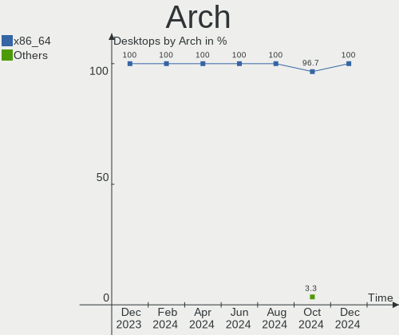

| Name   | Desktops | Percent |
|--------|----------|---------|
| x86_64 | 32       | 100%    |

DE
--

Desktop Environment

| Name       | Desktops | Percent |
|------------|----------|---------|
| GNOME      | 19       | 59.38%  |
| KDE5       | 7        | 21.88%  |
| XFCE       | 1        | 3.13%   |
| X-Cinnamon | 1        | 3.13%   |
| Unity      | 1        | 3.13%   |
| LXDE       | 1        | 3.13%   |
| Hyprland   | 1        | 3.13%   |
| bspwm      | 1        | 3.13%   |

Display Server
--------------

X11 or Wayland

| Name    | Desktops | Percent |
|---------|----------|---------|
| X11     | 20       | 62.5%   |
| Wayland | 11       | 34.38%  |
| Unknown | 1        | 3.13%   |

Display Manager
---------------

SDDM, LightDM, etc.

| Name    | Desktops | Percent |
|---------|----------|---------|
| Unknown | 12       | 37.5%   |
| GDM     | 7        | 21.88%  |
| SDDM    | 6        | 18.75%  |
| GDM3    | 5        | 15.63%  |
| LightDM | 2        | 6.25%   |

OS Lang
-------

Language

| Lang  | Desktops | Percent |
|-------|----------|---------|
| en_IN | 22       | 68.75%  |
| en_US | 5        | 15.63%  |
| en_GB | 3        | 9.38%   |
| C     | 2        | 6.25%   |

Boot Mode
---------

EFI or BIOS

| Mode | Desktops | Percent |
|------|----------|---------|
| EFI  | 17       | 53.13%  |
| BIOS | 15       | 46.88%  |

Filesystem
----------

Type of filesystem

| Type  | Desktops | Percent |
|-------|----------|---------|
| Ext4  | 24       | 75%     |
| Btrfs | 4        | 12.5%   |
| Tmpfs | 3        | 9.38%   |
| Zfs   | 1        | 3.13%   |

Part. scheme
------------

Scheme of partitioning

| Type    | Desktops | Percent |
|---------|----------|---------|
| GPT     | 17       | 53.13%  |
| Unknown | 12       | 37.5%   |
| MBR     | 3        | 9.38%   |

Dual Boot with Linux/BSD
------------------------

Hosting more than one Linux/BSD

| Dual boot | Desktops | Percent |
|-----------|----------|---------|
| No        | 29       | 90.63%  |
| Yes       | 3        | 9.38%   |

Dual Boot (Win)
---------------

Hosting Linux and Windows

| Dual boot | Desktops | Percent |
|-----------|----------|---------|
| No        | 23       | 71.88%  |
| Yes       | 9        | 28.13%  |

Board
-----

Vendor
------

Motherboard manufacturer

| Name                | Desktops | Percent |
|---------------------|----------|---------|
| Gigabyte Technology | 10       | 31.25%  |
| Dell                | 7        | 21.88%  |
| MSI                 | 4        | 12.5%   |
| ASUSTek Computer    | 3        | 9.38%   |
| Acer                | 3        | 9.38%   |
| Unknown             | 2        | 6.25%   |
| Intel               | 1        | 3.13%   |
| Hewlett-Packard     | 1        | 3.13%   |
| BY OEM              | 1        | 3.13%   |

Model
-----

Motherboard model

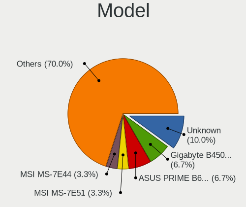

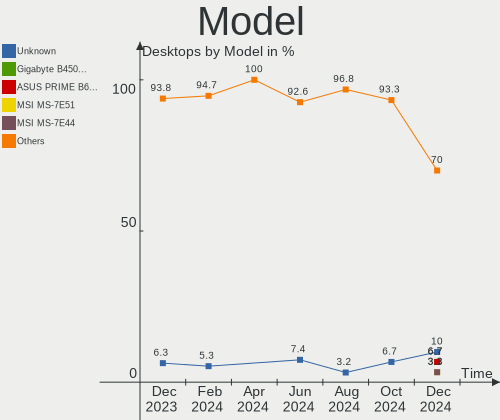

| Name                                 | Desktops | Percent |
|--------------------------------------|----------|---------|
| Dell Vostro 3268                     | 2        | 6.25%   |
| Unknown                              | 2        | 6.25%   |
| MSI MS-7E07                          | 1        | 3.13%   |
| MSI MS-7D82                          | 1        | 3.13%   |
| MSI MS-7C91                          | 1        | 3.13%   |
| MSI MS-7B49                          | 1        | 3.13%   |
| Intel H81                            | 1        | 3.13%   |
| HP EliteDesk 800 G3 SFF              | 1        | 3.13%   |
| Gigabyte Z690 UD                     | 1        | 3.13%   |
| Gigabyte H81M-S                      | 1        | 3.13%   |
| Gigabyte H510M H                     | 1        | 3.13%   |
| Gigabyte B85-HD3-A                   | 1        | 3.13%   |
| Gigabyte B660M DS3H AX DDR4          | 1        | 3.13%   |
| Gigabyte B650M DS3H                  | 1        | 3.13%   |
| Gigabyte B550 AORUS ELITE AX V2      | 1        | 3.13%   |
| Gigabyte B450M DS3H V2               | 1        | 3.13%   |
| Gigabyte B450 AORUS ELITE            | 1        | 3.13%   |
| Gigabyte B250M-DS3H                  | 1        | 3.13%   |
| Dell Vostro 3250                     | 1        | 3.13%   |
| Dell OptiPlex 7070                   | 1        | 3.13%   |
| Dell OptiPlex 3070                   | 1        | 3.13%   |
| Dell OptiPlex 3060                   | 1        | 3.13%   |
| Dell OptiPlex 3020                   | 1        | 3.13%   |
| BY OEM B365                          | 1        | 3.13%   |
| ASUS ROG STRIX B550-F GAMING WIFI II | 1        | 3.13%   |
| ASUS PRIME H510M-E                   | 1        | 3.13%   |
| ASUS PRIME B450M-A II                | 1        | 3.13%   |
| Acer Veriton M200-H81                | 1        | 3.13%   |
| Acer Veriton M200-H410               | 1        | 3.13%   |
| Acer Aspire 1510                     | 1        | 3.13%   |

Model Family
------------

Motherboard model prefix

| Name                | Desktops | Percent |
|---------------------|----------|---------|
| Dell OptiPlex       | 4        | 12.5%   |
| Dell Vostro         | 3        | 9.38%   |
| ASUS PRIME          | 2        | 6.25%   |
| Acer Veriton        | 2        | 6.25%   |
| Unknown             | 2        | 6.25%   |
| MSI MS-7E07         | 1        | 3.13%   |
| MSI MS-7D82         | 1        | 3.13%   |
| MSI MS-7C91         | 1        | 3.13%   |
| MSI MS-7B49         | 1        | 3.13%   |
| Intel H81           | 1        | 3.13%   |
| HP EliteDesk        | 1        | 3.13%   |
| Gigabyte Z690       | 1        | 3.13%   |
| Gigabyte H81M-S     | 1        | 3.13%   |
| Gigabyte H510M      | 1        | 3.13%   |
| Gigabyte B85-HD3-A  | 1        | 3.13%   |
| Gigabyte B660M      | 1        | 3.13%   |
| Gigabyte B650M      | 1        | 3.13%   |
| Gigabyte B550       | 1        | 3.13%   |
| Gigabyte B450M      | 1        | 3.13%   |
| Gigabyte B450       | 1        | 3.13%   |
| Gigabyte B250M-DS3H | 1        | 3.13%   |
| BY OEM B365         | 1        | 3.13%   |
| ASUS ROG            | 1        | 3.13%   |
| Acer Aspire         | 1        | 3.13%   |

MFG Year
--------

Motherboard manufacture year

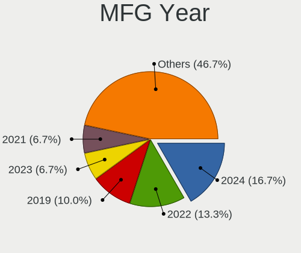

| Year    | Desktops | Percent |
|---------|----------|---------|
| 2021    | 6        | 18.75%  |
| 2020    | 4        | 12.5%   |
| 2017    | 4        | 12.5%   |
| 2014    | 4        | 12.5%   |
| 2023    | 3        | 9.38%   |
| 2022    | 3        | 9.38%   |
| 2019    | 2        | 6.25%   |
| 2016    | 2        | 6.25%   |
| 2018    | 1        | 3.13%   |
| 2015    | 1        | 3.13%   |
| 2004    | 1        | 3.13%   |
| Unknown | 1        | 3.13%   |

Form Factor
-----------

Physical design of the computer

| Name    | Desktops | Percent |
|---------|----------|---------|
| Desktop | 32       | 100%    |

Secure Boot
-----------

Enabled or disabled

| State    | Desktops | Percent |
|----------|----------|---------|
| Disabled | 31       | 96.88%  |
| Enabled  | 1        | 3.13%   |

Coreboot
--------

Have coreboot on board

| Used | Desktops | Percent |
|------|----------|---------|
| No   | 32       | 100%    |

RAM Size
--------

Total RAM memory

| Size in GB | Desktops | Percent |
|------------|----------|---------|
| 16.01-24.0 | 9        | 28.13%  |
| 4.01-8.0   | 5        | 15.63%  |
| 3.01-4.0   | 5        | 15.63%  |
| 8.01-16.0  | 5        | 15.63%  |
| 32.01-64.0 | 4        | 12.5%   |
| 24.01-32.0 | 3        | 9.38%   |
| 1.01-2.0   | 1        | 3.13%   |

RAM Used
--------

Used RAM memory

| Used GB   | Desktops | Percent |
|-----------|----------|---------|
| 2.01-3.0  | 8        | 25%     |
| 1.01-2.0  | 8        | 25%     |
| 3.01-4.0  | 7        | 21.88%  |
| 4.01-8.0  | 6        | 18.75%  |
| 8.01-16.0 | 2        | 6.25%   |
| 0.51-1.0  | 1        | 3.13%   |

Total Drives
------------

Number of drives on board

| Drives | Desktops | Percent |
|--------|----------|---------|
| 1      | 13       | 40.63%  |
| 2      | 11       | 34.38%  |
| 3      | 6        | 18.75%  |
| 4      | 2        | 6.25%   |

Has CD-ROM
----------

Has CD-ROM on board

| Presented | Desktops | Percent |
|-----------|----------|---------|
| No        | 23       | 71.88%  |
| Yes       | 9        | 28.13%  |

Has Ethernet
------------

Has Ethernet on board

| Presented | Desktops | Percent |
|-----------|----------|---------|
| Yes       | 32       | 100%    |

Has WiFi
--------

Has WiFi module

| Presented | Desktops | Percent |
|-----------|----------|---------|
| Yes       | 18       | 56.25%  |
| No        | 14       | 43.75%  |

Has Bluetooth
-------------

Has Bluetooth module

| Presented | Desktops | Percent |
|-----------|----------|---------|
| No        | 22       | 68.75%  |
| Yes       | 10       | 31.25%  |

Location
--------

Country
-------

Geographic location (country)

| Country | Desktops | Percent |
|---------|----------|---------|
| India   | 32       | 100%    |

City
----

Geographic location (city)

| City      | Desktops | Percent |
|-----------|----------|---------|
| Kolkata   | 7        | 21.88%  |
| Mumbai    | 6        | 18.75%  |
| Hyderabad | 3        | 9.38%   |
| Bengaluru | 3        | 9.38%   |
| Pune      | 2        | 6.25%   |
| Kochi     | 2        | 6.25%   |
| Delhi     | 2        | 6.25%   |
| Nadiad    | 1        | 3.13%   |
| Lucknow   | 1        | 3.13%   |
| Kozhikode | 1        | 3.13%   |
| Indore    | 1        | 3.13%   |
| Durgapur  | 1        | 3.13%   |
| Chennai   | 1        | 3.13%   |
| Ahmedabad | 1        | 3.13%   |

Drives
------

Drive Vendor
------------

Hard drive vendors

| Vendor                    | Desktops | Drives | Percent |
|---------------------------|----------|--------|---------|
| WDC                       | 10       | 11     | 17.86%  |
| Seagate                   | 9        | 10     | 16.07%  |
| Samsung Electronics       | 6        | 7      | 10.71%  |
| SanDisk                   | 4        | 5      | 7.14%   |
| Crucial                   | 4        | 5      | 7.14%   |
| POWER                     | 3        | 3      | 5.36%   |
| Kingston                  | 3        | 3      | 5.36%   |
| SPCC                      | 2        | 2      | 3.57%   |
| Micron/Crucial Technology | 2        | 2      | 3.57%   |
| Hitachi                   | 2        | 2      | 3.57%   |
| ADATA Technology          | 2        | 2      | 3.57%   |
| XPG                       | 1        | 1      | 1.79%   |
| Phison Electronics        | 1        | 1      | 1.79%   |
| Lite-On Technology        | 1        | 1      | 1.79%   |
| Intel                     | 1        | 2      | 1.79%   |
| HS-SSD-E                  | 1        | 1      | 1.79%   |
| HGST                      | 1        | 1      | 1.79%   |
| Gigabyte Technology       | 1        | 1      | 1.79%   |
| CONSISTENT                | 1        | 1      | 1.79%   |
| China                     | 1        | 1      | 1.79%   |

Drive Model
-----------

Hard drive models

| Model                                               | Desktops | Percent |
|-----------------------------------------------------|----------|---------|
| Seagate ST1000DM010-2EP102 1TB                      | 3        | 4.92%   |
| Samsung SSD 980 500GB                               | 3        | 4.92%   |
| WDC WD10EZEX-00BBHA0 1TB                            | 2        | 3.28%   |
| POWER X SS1000 512GB SSD                            | 2        | 3.28%   |
| Micron/Crucial P2 NVMe PCIe SSD 4TB                 | 2        | 3.28%   |
| Kingston SNVS500G 500GB                             | 2        | 3.28%   |
| Crucial CT480BX500SSD1 480GB                        | 2        | 3.28%   |
| Crucial CT240BX500SSD1 240GB                        | 2        | 3.28%   |
| ADATA XPG GAMMIX S70 BLADE 1024GB                   | 2        | 3.28%   |
| XPG GAMMIX S70 BLADE 2TB                            | 1        | 1.64%   |
| WDC WDS500G2B0C-00PXH0 500GB                        | 1        | 1.64%   |
| WDC WDS240G2G0B-00EPW0 240GB SSD                    | 1        | 1.64%   |
| WDC WD5000AZLX-75K2TA0 500GB                        | 1        | 1.64%   |
| WDC WD5000AAKX-60U6AA0 500GB                        | 1        | 1.64%   |
| WDC WD5000AAKX-22ERMA0 500GB                        | 1        | 1.64%   |
| WDC WD3200AAKS-61L9A0 320GB                         | 1        | 1.64%   |
| WDC WD22PURZ-74B4ZY0 2TB                            | 1        | 1.64%   |
| WDC WD10EZRZ-00HTKB0 1TB                            | 1        | 1.64%   |
| WDC WD10EZEX-22MFCA0 1TB                            | 1        | 1.64%   |
| SPCC Solid State Disk 512GB                         | 1        | 1.64%   |
| SPCC Solid State Disk 128GB                         | 1        | 1.64%   |
| Seagate ST500LM021-1KJ152 500GB                     | 1        | 1.64%   |
| Seagate ST3500414CS 500GB                           | 1        | 1.64%   |
| Seagate ST3500312CS 500GB                           | 1        | 1.64%   |
| Seagate ST3250310SV 250GB                           | 1        | 1.64%   |
| Seagate ST31000524AS 1TB                            | 1        | 1.64%   |
| Seagate ST2000DM008-2UB102 2TB                      | 1        | 1.64%   |
| Seagate ST1000DM003-1ER162 1TB                      | 1        | 1.64%   |
| Sandisk WDC WDS500G2B0C-00PXH0 500GB                | 1        | 1.64%   |
| Sandisk WD Blue SN580 2TB                           | 1        | 1.64%   |
| Sandisk WD Blue SN570 250GB                         | 1        | 1.64%   |
| Sandisk WD Blue SN570 1TB                           | 1        | 1.64%   |
| SanDisk NVMe SSD Drive 2TB                          | 1        | 1.64%   |
| Samsung SSD 990 PRO 1TB                             | 1        | 1.64%   |
| Samsung SSD 980 250GB                               | 1        | 1.64%   |
| Samsung SSD 870 EVO 250GB                           | 1        | 1.64%   |
| Samsung NVMe SSD Controller SM981/PM981/PM983 512GB | 1        | 1.64%   |
| POWER X SS1000-128GB                                | 1        | 1.64%   |
| Phison E16 PCIe4 NVMe Controller 2TB                | 1        | 1.64%   |
| Lite-On M8Pe Series NVMe SSD 512GB                  | 1        | 1.64%   |

HDD Vendor
----------

Hard disk drive vendors

| Vendor  | Desktops | Drives | Percent |
|---------|----------|--------|---------|
| WDC     | 9        | 9      | 42.86%  |
| Seagate | 9        | 10     | 42.86%  |
| Hitachi | 2        | 2      | 9.52%   |
| HGST    | 1        | 1      | 4.76%   |

SSD Vendor
----------

Solid state drive vendors

| Vendor              | Desktops | Drives | Percent |
|---------------------|----------|--------|---------|
| Crucial             | 4        | 5      | 26.67%  |
| SPCC                | 2        | 2      | 13.33%  |
| POWER               | 2        | 2      | 13.33%  |
| WDC                 | 1        | 1      | 6.67%   |
| Samsung Electronics | 1        | 1      | 6.67%   |
| Kingston            | 1        | 1      | 6.67%   |
| Intel               | 1        | 2      | 6.67%   |
| Gigabyte Technology | 1        | 1      | 6.67%   |
| CONSISTENT          | 1        | 1      | 6.67%   |
| China               | 1        | 1      | 6.67%   |

Drive Kind
----------

HDD or SSD

| Kind    | Desktops | Drives | Percent |
|---------|----------|--------|---------|
| HDD     | 21       | 22     | 39.62%  |
| NVMe    | 16       | 21     | 30.19%  |
| SSD     | 14       | 17     | 26.42%  |
| Unknown | 2        | 2      | 3.77%   |

Drive Connector
---------------

SATA, SAS, NVMe, etc.

| Type | Desktops | Drives | Percent |
|------|----------|--------|---------|
| SATA | 28       | 40     | 62.22%  |
| NVMe | 16       | 21     | 35.56%  |
| SAS  | 1        | 1      | 2.22%   |

Drive Size
----------

Size of hard drive

| Size in TB | Desktops | Drives | Percent |
|------------|----------|--------|---------|
| 0.01-0.5   | 18       | 24     | 54.55%  |
| 0.51-1.0   | 13       | 13     | 39.39%  |
| 1.01-2.0   | 2        | 2      | 6.06%   |

Space Total
-----------

Amount of disk space available on the file system

| Size in GB     | Desktops | Percent |
|----------------|----------|---------|
| 101-250        | 9        | 28.13%  |
| 501-1000       | 5        | 15.63%  |
| 51-100         | 5        | 15.63%  |
| 251-500        | 4        | 12.5%   |
| 1001-2000      | 3        | 9.38%   |
| 2001-3000      | 2        | 6.25%   |
| More than 3000 | 1        | 3.13%   |
| 21-50          | 1        | 3.13%   |
| 1-20           | 1        | 3.13%   |
| Unknown        | 1        | 3.13%   |

Space Used
----------

Amount of used disk space

| Used GB  | Desktops | Percent |
|----------|----------|---------|
| 1-20     | 12       | 37.5%   |
| 21-50    | 6        | 18.75%  |
| 251-500  | 4        | 12.5%   |
| 101-250  | 3        | 9.38%   |
| 501-1000 | 3        | 9.38%   |
| 51-100   | 3        | 9.38%   |
| Unknown  | 1        | 3.13%   |

Malfunc. Drives
---------------

Drive models with a malfunction

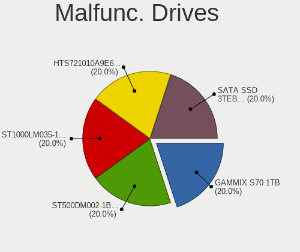

| Model                          | Desktops | Drives | Percent |
|--------------------------------|----------|--------|---------|
| WDC WD5000AAKX-22ERMA0 500GB   | 1        | 1      | 25%     |
| WDC WD3200AAKS-61L9A0 320GB    | 1        | 1      | 25%     |
| SPCC Solid State Disk 128GB    | 1        | 1      | 25%     |
| Seagate ST1000DM010-2EP102 1TB | 1        | 1      | 25%     |

Malfunc. Drive Vendor
---------------------

Vendors of faulty drives

| Vendor  | Desktops | Drives | Percent |
|---------|----------|--------|---------|
| WDC     | 2        | 2      | 50%     |
| SPCC    | 1        | 1      | 25%     |
| Seagate | 1        | 1      | 25%     |

Malfunc. HDD Vendor
-------------------

Vendors of faulty HDD drives

| Vendor  | Desktops | Drives | Percent |
|---------|----------|--------|---------|
| WDC     | 2        | 2      | 66.67%  |
| Seagate | 1        | 1      | 33.33%  |

Malfunc. Drive Kind
-------------------

Kinds of faulty drives

| Kind | Desktops | Drives | Percent |
|------|----------|--------|---------|
| HDD  | 3        | 3      | 75%     |
| SSD  | 1        | 1      | 25%     |

Failed Drives
-------------

Failed drive models

Zero info for selected period =(

Failed Drive Vendor
-------------------

Failed drive vendors

Zero info for selected period =(

Drive Status
------------

Number of failed and malfunc. drives

| Status   | Desktops | Drives | Percent |
|----------|----------|--------|---------|
| Detected | 17       | 35     | 51.52%  |
| Works    | 13       | 23     | 39.39%  |
| Malfunc  | 3        | 4      | 9.09%   |

Storage controller
------------------

Storage Vendor
--------------

Storage controller vendors

| Vendor                      | Desktops | Percent |
|-----------------------------|----------|---------|
| Intel                       | 24       | 48%     |
| AMD                         | 7        | 14%     |
| Samsung Electronics         | 5        | 10%     |
| SanDisk                     | 4        | 8%      |
| ADATA Technology            | 3        | 6%      |
| Micron/Crucial Technology   | 2        | 4%      |
| Kingston Technology Company | 2        | 4%      |
| Phison Electronics          | 1        | 2%      |
| Nvidia                      | 1        | 2%      |
| Lite-On Technology          | 1        | 2%      |

Storage Model
-------------

Storage controller models

| Model                                                                          | Desktops | Percent |
|--------------------------------------------------------------------------------|----------|---------|
| Intel 8 Series/C220 Series Chipset Family 6-port SATA Controller 1 [AHCI mode] | 5        | 8.77%   |
| Samsung NVMe SSD Controller 980 (DRAM-less)                                    | 4        | 7.02%   |
| Intel 200 Series PCH SATA controller [AHCI mode]                               | 4        | 7.02%   |
| AMD FCH SATA Controller [AHCI mode]                                            | 4        | 7.02%   |
| Intel Q170/Q150/B150/H170/H110/Z170/CM236 Chipset SATA Controller [AHCI Mode]  | 3        | 5.26%   |
| Intel 500 Series Chipset Family SATA AHCI Controller                           | 3        | 5.26%   |
| AMD 500 Series Chipset SATA Controller                                         | 3        | 5.26%   |
| AMD 400 Series Chipset SATA Controller                                         | 3        | 5.26%   |
| ADATA A Non-Volatile memory controller                                         | 3        | 5.26%   |
| SanDisk Ultra 3D / WD Blue SN570 NVMe SSD (DRAM-less)                          | 2        | 3.51%   |
| Micron/Crucial P2 [Nick P2] / P3 / P3 Plus NVMe PCIe SSD (DRAM-less)           | 2        | 3.51%   |
| Kingston Company NV1 NVMe SSD SM2263XT                                         | 2        | 3.51%   |
| Intel Cannon Lake PCH SATA AHCI Controller                                     | 2        | 3.51%   |
| Intel Alder Lake-S PCH SATA Controller [AHCI Mode]                             | 2        | 3.51%   |
| Intel 82801G (ICH7 Family) IDE Controller                                      | 2        | 3.51%   |
| SanDisk WD Green SN350 240GB (DRAM-less) / SN560E NVMe SSD                     | 1        | 1.75%   |
| Sandisk WD Blue SN580 NVMe SSD (DRAM-less)                                     | 1        | 1.75%   |
| Sandisk WD Black SN850X NVMe SSD                                               | 1        | 1.75%   |
| Samsung NVMe SSD Controller SM981/PM981/PM983                                  | 1        | 1.75%   |
| Samsung NVMe SSD Controller S4LV008[Pascal]                                    | 1        | 1.75%   |
| Phison E16 PCIe4 NVMe Controller                                               | 1        | 1.75%   |
| Nvidia nForce3 IDE                                                             | 1        | 1.75%   |
| Lite-On M8Pe Series NVMe SSD                                                   | 1        | 1.75%   |
| Intel SATA Controller [RAID mode]                                              | 1        | 1.75%   |
| Intel NM10/ICH7 Family SATA Controller [IDE mode]                              | 1        | 1.75%   |
| Intel 82801GBM/GHM (ICH7-M Family) SATA Controller [IDE mode]                  | 1        | 1.75%   |
| Intel 700 Series Chipset Family SATA AHCI Controller                           | 1        | 1.75%   |
| Intel 400 Series Chipset Family SATA AHCI Controller                           | 1        | 1.75%   |

Storage Kind
------------

Kind of storage controller (IDE, SATA, NVMe, SAS, ...)

| Kind | Desktops | Percent |
|------|----------|---------|
| SATA | 28       | 58.33%  |
| NVMe | 16       | 33.33%  |
| IDE  | 3        | 6.25%   |
| RAID | 1        | 2.08%   |

Processor
---------

CPU Vendor
----------

Processor vendors

| Vendor | Desktops | Percent |
|--------|----------|---------|
| Intel  | 24       | 75%     |
| AMD    | 8        | 25%     |

CPU Model
---------

Processor models

| Model                                  | Desktops | Percent |
|----------------------------------------|----------|---------|
| Intel Core i3-7100 CPU @ 3.90GHz       | 2        | 6.25%   |
| Intel Core i3-6100 CPU @ 3.70GHz       | 2        | 6.25%   |
| Intel 11th Gen Core i5-11400 @ 2.60GHz | 2        | 6.25%   |
| AMD Ryzen 7 5700G with Radeon Graphics | 2        | 6.25%   |
| Intel Pentium Gold G6405 CPU @ 4.10GHz | 1        | 3.13%   |
| Intel Pentium Dual CPU E2180 @ 2.00GHz | 1        | 3.13%   |
| Intel Pentium CPU G3240 @ 3.10GHz      | 1        | 3.13%   |
| Intel Core i7-9700 CPU @ 3.00GHz       | 1        | 3.13%   |
| Intel Core i5-8400 CPU @ 2.80GHz       | 1        | 3.13%   |
| Intel Core i5-7500 CPU @ 3.40GHz       | 1        | 3.13%   |
| Intel Core i5-7400 CPU @ 3.00GHz       | 1        | 3.13%   |
| Intel Core i5-4570 CPU @ 3.20GHz       | 1        | 3.13%   |
| Intel Core i5-4460 CPU @ 3.20GHz       | 1        | 3.13%   |
| Intel Core i5-4440S CPU @ 2.80GHz      | 1        | 3.13%   |
| Intel Core i3-9100T CPU @ 3.10GHz      | 1        | 3.13%   |
| Intel Core i3-8100T CPU @ 3.10GHz      | 1        | 3.13%   |
| Intel Core i3-4130 CPU @ 3.40GHz       | 1        | 3.13%   |
| Intel Core i3-10105F CPU @ 3.70GHz     | 1        | 3.13%   |
| Intel Core 2 Duo CPU E7500 @ 2.93GHz   | 1        | 3.13%   |
| Intel 13th Gen Core i5-13600K          | 1        | 3.13%   |
| Intel 12th Gen Core i7-12700           | 1        | 3.13%   |
| Intel 12th Gen Core i5-12400           | 1        | 3.13%   |
| AMD Ryzen 9 5900X 12-Core Processor    | 1        | 3.13%   |
| AMD Ryzen 5 7600 6-Core Processor      | 1        | 3.13%   |
| AMD Ryzen 5 5600X 6-Core Processor     | 1        | 3.13%   |
| AMD Ryzen 5 5600G with Radeon Graphics | 1        | 3.13%   |
| AMD Ryzen 5 2600 Six-Core Processor    | 1        | 3.13%   |
| AMD Athlon 64 Processor 3000+          | 1        | 3.13%   |

CPU Model Family
----------------

Processor model prefix

| Model              | Desktops | Percent |
|--------------------|----------|---------|
| Intel Core i3      | 8        | 25%     |
| Intel Core i5      | 6        | 18.75%  |
| Other              | 5        | 15.63%  |
| AMD Ryzen 5        | 4        | 12.5%   |
| AMD Ryzen 7        | 2        | 6.25%   |
| Intel Pentium Gold | 1        | 3.13%   |
| Intel Pentium Dual | 1        | 3.13%   |
| Intel Pentium      | 1        | 3.13%   |
| Intel Core i7      | 1        | 3.13%   |
| Intel Core 2 Duo   | 1        | 3.13%   |
| AMD Ryzen 9        | 1        | 3.13%   |
| AMD Athlon 64      | 1        | 3.13%   |

CPU Cores
---------

Number of processor cores

| Number | Desktops | Percent |
|--------|----------|---------|
| 2      | 9        | 28.13%  |
| 6      | 8        | 25%     |
| 4      | 8        | 25%     |
| 8      | 3        | 9.38%   |
| 12     | 2        | 6.25%   |
| 14     | 1        | 3.13%   |
| 1      | 1        | 3.13%   |

CPU Sockets
-----------

Number of sockets

| Number | Desktops | Percent |
|--------|----------|---------|
| 1      | 32       | 100%    |

CPU Threads
-----------

Threads per core (Hyper-Threading)

| Number | Desktops | Percent |
|--------|----------|---------|
| 2      | 18       | 56.25%  |
| 1      | 14       | 43.75%  |

CPU Op-Modes
------------

CPU Operation Modes (32-bit, 64-bit)

| Op mode        | Desktops | Percent |
|----------------|----------|---------|
| 32-bit, 64-bit | 32       | 100%    |

CPU Microcode
-------------

Microcode number

| Number     | Desktops | Percent |
|------------|----------|---------|
| Unknown    | 17       | 53.13%  |
| 0x906e9    | 2        | 6.25%   |
| 0x306c3    | 2        | 6.25%   |
| 0x0a50000f | 2        | 6.25%   |
| 0x906eb    | 1        | 3.13%   |
| 0x90672    | 1        | 3.13%   |
| 0x506e3    | 1        | 3.13%   |
| 0x1067a    | 1        | 3.13%   |
| 0x0a601203 | 1        | 3.13%   |
| 0x0a50000d | 1        | 3.13%   |
| 0x0a20120e | 1        | 3.13%   |
| 0x0a20120a | 1        | 3.13%   |
| 0x0800820d | 1        | 3.13%   |

CPU Microarch
-------------

Microarchitecture

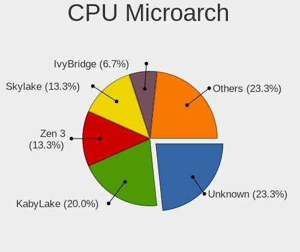

| Name             | Desktops | Percent |
|------------------|----------|---------|
| KabyLake         | 8        | 25%     |
| Zen 3            | 5        | 15.63%  |
| Haswell          | 5        | 15.63%  |
| Unknown          | 3        | 9.38%   |
| Skylake          | 2        | 6.25%   |
| CometLake        | 2        | 6.25%   |
| Alderlake Hybrid | 2        | 6.25%   |
| Zen+             | 1        | 3.13%   |
| Penryn           | 1        | 3.13%   |
| K8 Hammer        | 1        | 3.13%   |
| Icelake          | 1        | 3.13%   |
| Core             | 1        | 3.13%   |

Graphics
--------

GPU Vendor
----------

Vendors of graphics cards

| Vendor | Desktops | Percent |
|--------|----------|---------|
| Intel  | 21       | 58.33%  |
| Nvidia | 8        | 22.22%  |
| AMD    | 7        | 19.44%  |

GPU Model
---------

Graphics card models

| Model                                                                       | Desktops | Percent |
|-----------------------------------------------------------------------------|----------|---------|
| Intel Xeon E3-1200 v3/4th Gen Core Processor Integrated Graphics Controller | 4        | 11.11%  |
| Intel HD Graphics 630                                                       | 3        | 8.33%   |
| Intel CoffeeLake-S GT2 [UHD Graphics 630]                                   | 3        | 8.33%   |
| AMD Cezanne [Radeon Vega Series / Radeon Vega Mobile Series]                | 3        | 8.33%   |
| Nvidia GK208B [GeForce GT 730]                                              | 2        | 5.56%   |
| Intel RocketLake-S GT1 [UHD Graphics 730]                                   | 2        | 5.56%   |
| Intel HD Graphics 530                                                       | 2        | 5.56%   |
| Intel 82945G/GZ Integrated Graphics Controller                              | 2        | 5.56%   |
| AMD Navi 22 [Radeon RX 6700/6700 XT/6750 XT / 6800M/6850M XT]               | 2        | 5.56%   |
| Nvidia TU106 [GeForce RTX 2060 Rev. A]                                      | 1        | 2.78%   |
| Nvidia NV36M [GeForce FX Go5700]                                            | 1        | 2.78%   |
| Nvidia GM206 [GeForce GTX 950]                                              | 1        | 2.78%   |
| Nvidia GK208B [GeForce GT 710]                                              | 1        | 2.78%   |
| Nvidia GA104 [GeForce RTX 3070 Ti]                                          | 1        | 2.78%   |
| Nvidia GA104 [GeForce RTX 3060]                                             | 1        | 2.78%   |
| Intel Raptor Lake-S GT1 [UHD Graphics 770]                                  | 1        | 2.78%   |
| Intel CometLake-S GT1 [UHD Graphics 610]                                    | 1        | 2.78%   |
| Intel AlderLake-S GT1                                                       | 1        | 2.78%   |
| Intel Alder Lake-S GT1 [UHD Graphics 730]                                   | 1        | 2.78%   |
| Intel 4th Generation Core Processor Family Integrated Graphics Controller   | 1        | 2.78%   |
| AMD Raphael                                                                 | 1        | 2.78%   |
| AMD Navi 23 [Radeon RX 6650 XT / 6700S / 6800S]                             | 1        | 2.78%   |

GPU Combo
---------

Combinations of graphics cards

| Name           | Desktops | Percent |
|----------------|----------|---------|
| 1 x Intel      | 19       | 59.38%  |
| 1 x AMD        | 5        | 15.63%  |
| 1 x Nvidia     | 4        | 12.5%   |
| Intel + Nvidia | 2        | 6.25%   |
| AMD + Nvidia   | 2        | 6.25%   |

GPU Driver
----------

Free vs proprietary

| Driver      | Desktops | Percent |
|-------------|----------|---------|
| Free        | 27       | 84.38%  |
| Proprietary | 5        | 15.63%  |

GPU Memory
----------

Total video memory

| Size in GB | Desktops | Percent |
|------------|----------|---------|
| Unknown    | 20       | 62.5%   |
| 0.01-0.5   | 4        | 12.5%   |
| 8.01-16.0  | 3        | 9.38%   |
| 1.01-2.0   | 2        | 6.25%   |
| 7.01-8.0   | 1        | 3.13%   |
| 5.01-6.0   | 1        | 3.13%   |
| 3.01-4.0   | 1        | 3.13%   |

Monitor
-------

Monitor Vendor
--------------

Monitor vendors

| Vendor              | Desktops | Percent |
|---------------------|----------|---------|
| Samsung Electronics | 6        | 19.35%  |
| Goldstar            | 5        | 16.13%  |
| Dell                | 4        | 12.9%   |
| BenQ                | 4        | 12.9%   |
| Hewlett-Packard     | 2        | 6.45%   |
| Acer                | 2        | 6.45%   |
| Xiaomi              | 1        | 3.23%   |
| ViewSonic           | 1        | 3.23%   |
| SGT                 | 1        | 3.23%   |
| PZG                 | 1        | 3.23%   |
| MSI                 | 1        | 3.23%   |
| Lenovo              | 1        | 3.23%   |
| AU Optronics        | 1        | 3.23%   |
| Unknown             | 1        | 3.23%   |

Monitor Model
-------------

Monitor models

| Model                                                               | Desktops | Percent |
|---------------------------------------------------------------------|----------|---------|
| BenQ GW2780 BNQ78E6 1920x1080 598x336mm 27.0-inch                   | 3        | 8.82%   |
| Xiaomi Mi TV XMD0002 1920x1080 708x398mm 32.0-inch                  | 1        | 2.94%   |
| ViewSonic XG2405 VSC0D39 1920x1080 527x296mm 23.8-inch              | 1        | 2.94%   |
| SGT HDMI SGT2383 1280x768 360x250mm 17.3-inch                       | 1        | 2.94%   |
| Samsung Electronics S24R35A SAM729F 1920x1080 527x296mm 23.8-inch   | 1        | 2.94%   |
| Samsung Electronics S22C31x SAM7310 1920x1080 476x267mm 21.5-inch   | 1        | 2.94%   |
| Samsung Electronics S19B150 SAM0980 1366x768 410x230mm 18.5-inch    | 1        | 2.94%   |
| Samsung Electronics LS27CG51x SAM72FC 2560x1440 597x336mm 27.0-inch | 1        | 2.94%   |
| Samsung Electronics LF24T35 SAM707D 1920x1080 528x297mm 23.9-inch   | 1        | 2.94%   |
| Samsung Electronics LC24RG50 SAM0F90 1920x1080 530x300mm 24.0-inch  | 1        | 2.94%   |
| PZG DP PZG2700 1920x1080 600x330mm 27.0-inch                        | 1        | 2.94%   |
| MSI MP241X MSI3BA9 1920x1080 527x296mm 23.8-inch                    | 1        | 2.94%   |
| Lenovo E1922 Wide LEN60B8 1366x768 410x230mm 18.5-inch              | 1        | 2.94%   |
| Hewlett-Packard Z24nf G2 HPN347E 1920x1080 527x296mm 23.8-inch      | 1        | 2.94%   |
| Hewlett-Packard L1706 HWP265C 1280x1024 337x270mm 17.0-inch         | 1        | 2.94%   |
| Hewlett-Packard 22es HWP331B 1920x1080 476x268mm 21.5-inch          | 1        | 2.94%   |
| Goldstar ULTRAGEAR GSM5BB4 2560x1440 597x336mm 27.0-inch            | 1        | 2.94%   |
| Goldstar ULTRAGEAR GSM5BB3 2560x1440 597x336mm 27.0-inch            | 1        | 2.94%   |
| Goldstar ULTRAGEAR GSM5B72 1920x1080 531x298mm 24.0-inch            | 1        | 2.94%   |
| Goldstar HDR QHD GSM5B96 2560x1440 698x392mm 31.5-inch              | 1        | 2.94%   |
| Goldstar E2060 GSM4EBF 1600x900 443x249mm 20.0-inch                 | 1        | 2.94%   |
| Goldstar E2042 GSM4ED7 1600x900 443x249mm 20.0-inch                 | 1        | 2.94%   |
| Dell S2421HN DEL41F2 1920x1080 527x296mm 23.8-inch                  | 1        | 2.94%   |
| Dell S2421HN DEL41F1 1920x1080 527x296mm 23.8-inch                  | 1        | 2.94%   |
| Dell E2421HN DELF129 1920x1080 527x296mm 23.8-inch                  | 1        | 2.94%   |
| Dell E2421HN DELF128 1920x1080 530x300mm 24.0-inch                  | 1        | 2.94%   |
| Dell AW2521HFL DELA17C 1920x1080 544x303mm 24.5-inch                | 1        | 2.94%   |
| BenQ GW2480 BNQ78E7 1920x1080 527x296mm 23.8-inch                   | 1        | 2.94%   |
| AU Optronics LCD Monitor AUO0F06 1024x768 304x230mm 15.0-inch       | 1        | 2.94%   |
| Acer XV270 P ACR0740 1920x1080 598x336mm 27.0-inch                  | 1        | 2.94%   |
| Acer EK240Y H ACR0C78 1920x1080 532x300mm 24.0-inch                 | 1        | 2.94%   |
| Unknown                                                             | 1        | 2.94%   |

Monitor Resolution
------------------

Monitor screen resolution

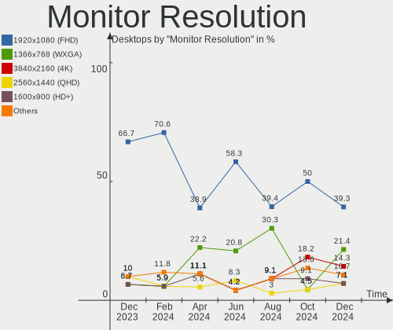

| Resolution         | Desktops | Percent |
|--------------------|----------|---------|
| 1920x1080 (FHD)    | 19       | 63.33%  |
| 2560x1440 (QHD)    | 3        | 10%     |
| 1600x900 (HD+)     | 2        | 6.67%   |
| 1366x768 (WXGA)    | 2        | 6.67%   |
| 1680x1050 (WSXGA+) | 1        | 3.33%   |
| 1440x900 (WXGA+)   | 1        | 3.33%   |
| 1280x1024 (SXGA)   | 1        | 3.33%   |
| 1024x768 (XGA)     | 1        | 3.33%   |

Monitor Diagonal
----------------

Diagonal size in inches

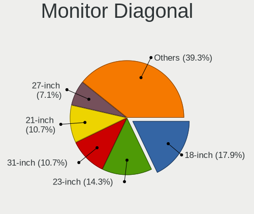

| Inches  | Desktops | Percent |
|---------|----------|---------|
| 24      | 10       | 31.25%  |
| 27      | 7        | 21.88%  |
| 23      | 4        | 12.5%   |
| 20      | 2        | 6.25%   |
| 18      | 2        | 6.25%   |
| 65      | 1        | 3.13%   |
| 31      | 1        | 3.13%   |
| 26      | 1        | 3.13%   |
| 21      | 1        | 3.13%   |
| 17      | 1        | 3.13%   |
| 15      | 1        | 3.13%   |
| Unknown | 1        | 3.13%   |

Monitor Width
-------------

Physical width

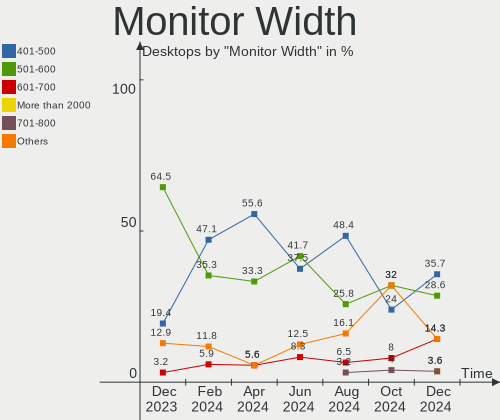

| Width in mm | Desktops | Percent |
|-------------|----------|---------|
| 501-600     | 20       | 64.52%  |
| 401-500     | 6        | 19.35%  |
| 301-350     | 2        | 6.45%   |
| 601-700     | 1        | 3.23%   |
| 1001-1500   | 1        | 3.23%   |
| Unknown     | 1        | 3.23%   |

Aspect Ratio
------------

Proportional relationship between the width and the height

| Ratio   | Desktops | Percent |
|---------|----------|---------|
| 16/9    | 25       | 86.21%  |
| 5/4     | 1        | 3.45%   |
| 4/3     | 1        | 3.45%   |
| 2.00    | 1        | 3.45%   |
| Unknown | 1        | 3.45%   |

Monitor Area
------------

Area in inch

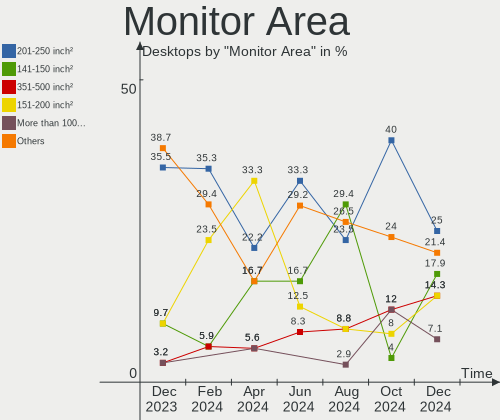

| Area in inch | Desktops | Percent |
|----------------|----------|---------|
| 201-250        | 11       | 35.48%  |
| 301-350        | 7        | 22.58%  |
| 251-300        | 3        | 9.68%   |
| 151-200        | 3        | 9.68%   |
| 141-150        | 3        | 9.68%   |
| More than 1000 | 1        | 3.23%   |
| 351-500        | 1        | 3.23%   |
| 101-110        | 1        | 3.23%   |
| Unknown        | 1        | 3.23%   |

Pixel Density
-------------

Pixels per inch

| Density | Desktops | Percent |
|---------|----------|---------|
| 51-100  | 25       | 83.33%  |
| 101-120 | 3        | 10%     |
| 1-50    | 1        | 3.33%   |
| Unknown | 1        | 3.33%   |

Multiple Monitors
-----------------

Total monitors connected

| Total | Desktops | Percent |
|-------|----------|---------|
| 1     | 26       | 81.25%  |
| 2     | 5        | 15.63%  |
| 0     | 1        | 3.13%   |

Network
-------

Net Controller Vendor
---------------------

Controller vendors

| Vendor                | Desktops | Percent |
|-----------------------|----------|---------|
| Realtek Semiconductor | 25       | 54.35%  |
| Intel                 | 9        | 19.57%  |
| Qualcomm Atheros      | 3        | 6.52%   |
| TP-Link               | 2        | 4.35%   |
| MediaTek              | 2        | 4.35%   |
| Xiaomi                | 1        | 2.17%   |
| Ralink Technology     | 1        | 2.17%   |
| Qualcomm              | 1        | 2.17%   |
| Nvidia                | 1        | 2.17%   |
| Broadcom              | 1        | 2.17%   |

Net Controller Model
--------------------

Controller models

| Model                                                             | Desktops | Percent |
|-------------------------------------------------------------------|----------|---------|
| Realtek RTL8111/8168/8411 PCI Express Gigabit Ethernet Controller | 18       | 33.33%  |
| Realtek RTL8125 2.5GbE Controller                                 | 5        | 9.26%   |
| Realtek RTL810xE PCI Express Fast Ethernet controller             | 3        | 5.56%   |
| Qualcomm Atheros QCA9565 / AR9565 Wireless Network Adapter        | 3        | 5.56%   |
| Realtek RTL8188EUS 802.11n Wireless Network Adapter               | 2        | 3.7%    |
| MediaTek MT7921K (RZ608) Wi-Fi 6E 80MHz                           | 2        | 3.7%    |
| Intel Ethernet Controller I225-V                                  | 2        | 3.7%    |
| Xiaomi Mi/Redmi series (RNDIS + ADB)                              | 1        | 1.85%   |
| TP-Link TL-WN722N v2/v3 [Realtek RTL8188EUS]                      | 1        | 1.85%   |
| TP-Link Archer T2U PLUS [RTL8821AU]                               | 1        | 1.85%   |
| Realtek RTL8821CE PCIe 802.11ac Wireless Network Controller       | 1        | 1.85%   |
| Realtek RTL8192EE PCIe Wireless Network Adapter                   | 1        | 1.85%   |
| Realtek RTL8188FTV 802.11b/g/n 1T1R 2.4G WLAN Adapter             | 1        | 1.85%   |
| Ralink MT7610U ("Archer T2U" 2.4G+5G WLAN Adapter                 | 1        | 1.85%   |
| Qualcomm CAPE-MTP _SN:14677F87                                    | 1        | 1.85%   |
| Nvidia nForce3 Audio                                              | 1        | 1.85%   |
| Intel Wireless 7265                                               | 1        | 1.85%   |
| Intel Wi-Fi 6 AX200                                               | 1        | 1.85%   |
| Intel Ethernet Connection (7) I219-LM                             | 1        | 1.85%   |
| Intel Ethernet Connection (5) I219-LM                             | 1        | 1.85%   |
| Intel Ethernet Connection (2) I219-V                              | 1        | 1.85%   |
| Intel Ethernet Connection (14) I219-V                             | 1        | 1.85%   |
| Intel Cannon Lake PCH CNVi WiFi                                   | 1        | 1.85%   |
| Intel Alder Lake-S PCH CNVi WiFi                                  | 1        | 1.85%   |
| Broadcom NetXtreme BCM5788 Gigabit Ethernet                       | 1        | 1.85%   |
| Broadcom BCM4306 802.11b/g Wireless LAN Controller                | 1        | 1.85%   |

Wireless Vendor
---------------

Wireless vendors

| Vendor                | Desktops | Percent |
|-----------------------|----------|---------|
| Realtek Semiconductor | 5        | 27.78%  |
| Intel                 | 4        | 22.22%  |
| Qualcomm Atheros      | 3        | 16.67%  |
| TP-Link               | 2        | 11.11%  |
| MediaTek              | 2        | 11.11%  |
| Ralink Technology     | 1        | 5.56%   |
| Broadcom              | 1        | 5.56%   |

Wireless Model
--------------

Wireless models

| Model                                                       | Desktops | Percent |
|-------------------------------------------------------------|----------|---------|
| Qualcomm Atheros QCA9565 / AR9565 Wireless Network Adapter  | 3        | 16.67%  |
| Realtek RTL8188EUS 802.11n Wireless Network Adapter         | 2        | 11.11%  |
| MediaTek MT7921K (RZ608) Wi-Fi 6E 80MHz                     | 2        | 11.11%  |
| TP-Link TL-WN722N v2/v3 [Realtek RTL8188EUS]                | 1        | 5.56%   |
| TP-Link Archer T2U PLUS [RTL8821AU]                         | 1        | 5.56%   |
| Realtek RTL8821CE PCIe 802.11ac Wireless Network Controller | 1        | 5.56%   |
| Realtek RTL8192EE PCIe Wireless Network Adapter             | 1        | 5.56%   |
| Realtek RTL8188FTV 802.11b/g/n 1T1R 2.4G WLAN Adapter       | 1        | 5.56%   |
| Ralink MT7610U ("Archer T2U" 2.4G+5G WLAN Adapter           | 1        | 5.56%   |
| Intel Wireless 7265                                         | 1        | 5.56%   |
| Intel Wi-Fi 6 AX200                                         | 1        | 5.56%   |
| Intel Cannon Lake PCH CNVi WiFi                             | 1        | 5.56%   |
| Intel Alder Lake-S PCH CNVi WiFi                            | 1        | 5.56%   |
| Broadcom BCM4306 802.11b/g Wireless LAN Controller          | 1        | 5.56%   |

Ethernet Vendor
---------------

Ethernet vendors

| Vendor                | Desktops | Percent |
|-----------------------|----------|---------|
| Realtek Semiconductor | 25       | 73.53%  |
| Intel                 | 6        | 17.65%  |
| Xiaomi                | 1        | 2.94%   |
| Qualcomm              | 1        | 2.94%   |
| Broadcom              | 1        | 2.94%   |

Ethernet Model
--------------

Ethernet models

| Model                                                             | Desktops | Percent |
|-------------------------------------------------------------------|----------|---------|
| Realtek RTL8111/8168/8411 PCI Express Gigabit Ethernet Controller | 18       | 51.43%  |
| Realtek RTL8125 2.5GbE Controller                                 | 5        | 14.29%  |
| Realtek RTL810xE PCI Express Fast Ethernet controller             | 3        | 8.57%   |
| Intel Ethernet Controller I225-V                                  | 2        | 5.71%   |
| Xiaomi Mi/Redmi series (RNDIS + ADB)                              | 1        | 2.86%   |
| Qualcomm CAPE-MTP _SN:14677F87                                    | 1        | 2.86%   |
| Intel Ethernet Connection (7) I219-LM                             | 1        | 2.86%   |
| Intel Ethernet Connection (5) I219-LM                             | 1        | 2.86%   |
| Intel Ethernet Connection (2) I219-V                              | 1        | 2.86%   |
| Intel Ethernet Connection (14) I219-V                             | 1        | 2.86%   |
| Broadcom NetXtreme BCM5788 Gigabit Ethernet                       | 1        | 2.86%   |

Net Controller Kind
-------------------

Ethernet, WiFi or modem

| Kind     | Desktops | Percent |
|----------|----------|---------|
| Ethernet | 32       | 62.75%  |
| WiFi     | 18       | 35.29%  |
| Modem    | 1        | 1.96%   |

Used Controller
---------------

Currently used network controller

| Kind     | Desktops | Percent |
|----------|----------|---------|
| Ethernet | 21       | 65.63%  |
| WiFi     | 11       | 34.38%  |

NICs
----

Total network controllers on board

| Total | Desktops | Percent |
|-------|----------|---------|
| 1     | 20       | 62.5%   |
| 2     | 11       | 34.38%  |
| 3     | 1        | 3.13%   |

IPv6
----

IPv6 vs IPv4

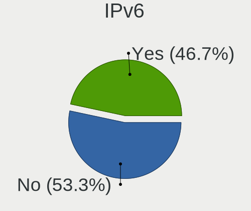

| Used | Desktops | Percent |
|------|----------|---------|
| No   | 19       | 59.38%  |
| Yes  | 13       | 40.63%  |

Bluetooth
---------

Bluetooth Vendor
----------------

Controller vendors

| Vendor                          | Desktops | Percent |
|---------------------------------|----------|---------|
| Intel                           | 4        | 40%     |
| Qualcomm Atheros Communications | 3        | 30%     |
| MediaTek                        | 2        | 20%     |
| Realtek Semiconductor           | 1        | 10%     |

Bluetooth Model
---------------

Controller models

| Model                                          | Desktops | Percent |
|------------------------------------------------|----------|---------|
| Qualcomm Atheros  Bluetooth Device             | 3        | 30%     |
| MediaTek Wireless_Device                       | 2        | 20%     |
| Realtek Bluetooth Radio                        | 1        | 10%     |
| Intel Bluetooth wireless interface             | 1        | 10%     |
| Intel Bluetooth Device                         | 1        | 10%     |
| Intel Bluetooth 9460/9560 Jefferson Peak (JfP) | 1        | 10%     |
| Intel AX200 Bluetooth                          | 1        | 10%     |

Sound
-----

Sound Vendor
------------

Sound card vendors

| Vendor                   | Desktops | Percent |
|--------------------------|----------|---------|
| Intel                    | 23       | 52.27%  |
| Nvidia                   | 8        | 18.18%  |
| AMD                      | 7        | 15.91%  |
| OPPO Electronics         | 1        | 2.27%   |
| Minami Acoustics Limited | 1        | 2.27%   |
| Micro Star International | 1        | 2.27%   |
| JBL                      | 1        | 2.27%   |
| GN Netcom                | 1        | 2.27%   |
| Corsair                  | 1        | 2.27%   |

Sound Model
-----------

Sound card models

| Model                                                               | Desktops | Percent |
|---------------------------------------------------------------------|----------|---------|
| Intel Xeon E3-1200 v3/4th Gen Core Processor HD Audio Controller    | 5        | 8.93%   |
| Intel 8 Series/C220 Series Chipset High Definition Audio Controller | 5        | 8.93%   |
| Intel 200 Series PCH HD Audio                                       | 4        | 7.14%   |
| AMD Family 17h/19h HD Audio Controller                              | 4        | 7.14%   |
| Nvidia GK208 HDMI/DP Audio Controller                               | 3        | 5.36%   |
| Intel Cannon Lake PCH cAVS                                          | 3        | 5.36%   |
| Intel 100 Series/C230 Series Chipset Family HD Audio Controller     | 3        | 5.36%   |
| AMD Renoir Radeon High Definition Audio Controller                  | 3        | 5.36%   |
| AMD Navi 21/23 HDMI/DP Audio Controller                             | 3        | 5.36%   |
| Nvidia GA104 High Definition Audio Controller                       | 2        | 3.57%   |
| Intel Tiger Lake-H HD Audio Controller                              | 2        | 3.57%   |
| Intel Alder Lake-S HD Audio Controller                              | 2        | 3.57%   |
| AMD Starship/Matisse HD Audio Controller                            | 2        | 3.57%   |
| OPPO Electronics RMX2117                                            | 1        | 1.79%   |
| Nvidia TU106 High Definition Audio Controller                       | 1        | 1.79%   |
| Nvidia nForce3 Audio                                                | 1        | 1.79%   |
| Nvidia GM206 High Definition Audio Controller                       | 1        | 1.79%   |
| Minami Acoustics Limited JBL Commercial CSUM06                      | 1        | 1.79%   |
| Micro Star International USB Audio                                  | 1        | 1.79%   |
| JBL Commercial CSDM04                                               | 1        | 1.79%   |
| Intel Smart Sound Technology (SST) Audio Controller                 | 1        | 1.79%   |
| Intel NM10/ICH7 Family High Definition Audio Controller             | 1        | 1.79%   |
| Intel Comet Lake PCH-V cAVS                                         | 1        | 1.79%   |
| Intel 700 Series Chipset Family Precise Touch and Stylus Port #1    | 1        | 1.79%   |
| GN Netcom Jabra BIZ 2400 II                                         | 1        | 1.79%   |
| Corsair HS60 PRO Surround USB Sound Adapter                         | 1        | 1.79%   |
| AMD Rembrandt Radeon High Definition Audio Controller               | 1        | 1.79%   |
| AMD Family 17h (Models 00h-0fh) HD Audio Controller                 | 1        | 1.79%   |

Memory
------

Memory Vendor
-------------

Memory module vendors

| Vendor              | Desktops | Percent |
|---------------------|----------|---------|
| G.Skill             | 4        | 20%     |
| Corsair             | 4        | 20%     |
| Samsung Electronics | 3        | 15%     |
| Kingston            | 3        | 15%     |
| SK hynix            | 2        | 10%     |
| Crucial             | 2        | 10%     |
| Unknown             | 1        | 5%      |
| Micron Technology   | 1        | 5%      |

Memory Model
------------

Memory module models

| Model                                                   | Desktops | Percent |
|---------------------------------------------------------|----------|---------|
| Samsung RAM M378A5244CB0-CRC 4GB DIMM DDR4 3066MT/s     | 2        | 9.09%   |
| Corsair RAM CMK16GX4M1E3200C16 16GB DIMM DDR4 3200MT/s  | 2        | 9.09%   |
| Unknown RAM Module 256MB DIMM DRAM                      | 1        | 4.55%   |
| Unknown RAM Module 1GB DIMM DRAM                        | 1        | 4.55%   |
| SK hynix RAM HMT451U6BFR8A-PB 4096MB DIMM DDR3 1600MT/s | 1        | 4.55%   |
| SK hynix RAM HMT351U6CFR8C-PBA 2GB DIMM DDR3 1600MT/s   | 1        | 4.55%   |
| Samsung RAM M378B5173DB0-CK0 4GB DIMM DDR3 1600MT/s     | 1        | 4.55%   |
| Micron RAM 8ATF1G64HZ-3G2R1 8GB SODIMM DDR4 3200MT/s    | 1        | 4.55%   |
| Kingston RAM KHYXPX-MIE 8GB SODIMM DDR4 2667MT/s        | 1        | 4.55%   |
| Kingston RAM KF552C40-16 16GB DIMM DDR5 5200MT/s        | 1        | 4.55%   |
| Kingston RAM ACR16D3LU1KFG/4G 4GB DIMM DDR3 1600MT/s    | 1        | 4.55%   |
| G.Skill RAM F5-6000J3040F16G 16GB DIMM DDR5 4800MT/s    | 1        | 4.55%   |
| G.Skill RAM F4-3600C19-8GVRB 8GB DIMM DDR4 3666MT/s     | 1        | 4.55%   |
| G.Skill RAM F4-3600C18-16GVK 16GB DIMM DDR4 3733MT/s    | 1        | 4.55%   |
| G.Skill RAM F4-3200C16-8GVKB 8GB DIMM DDR4 3866MT/s     | 1        | 4.55%   |
| Crucial RAM CT8G4DFRA32A.M4FB 8GB DIMM DDR4 3200MT/s    | 1        | 4.55%   |
| Crucial RAM CB8GS2400.C8JT 8192MB SODIMM DDR4 2400MT/s  | 1        | 4.55%   |
| Corsair RAM CMZ8GX3M1A1600C10 8GB DIMM DDR3 1600MT/s    | 1        | 4.55%   |
| Corsair RAM CMZ4GX3M1A1600C9 4GB DIMM DDR3 1600MT/s     | 1        | 4.55%   |
| Corsair RAM CMK8GX4M1E3200C16 8GB DIMM DDR4 3200MT/s    | 1        | 4.55%   |

Memory Kind
-----------

Memory module kinds

| Kind | Desktops | Percent |
|------|----------|---------|
| DDR4 | 11       | 61.11%  |
| DDR3 | 4        | 22.22%  |
| DDR5 | 2        | 11.11%  |
| DRAM | 1        | 5.56%   |

Memory Form Factor
------------------

Physical design of the memory module

| Name   | Desktops | Percent |
|--------|----------|---------|
| DIMM   | 16       | 88.89%  |
| SODIMM | 2        | 11.11%  |

Memory Size
-----------

Memory module size

| Size  | Desktops | Percent |
|-------|----------|---------|
| 8192  | 7        | 35%     |
| 4096  | 6        | 30%     |
| 16384 | 5        | 25%     |
| 1024  | 1        | 5%      |
| 256   | 1        | 5%      |

Memory Speed
------------

Memory module speed

| Speed   | Desktops | Percent |
|---------|----------|---------|
| 3200    | 5        | 26.32%  |
| 1600    | 4        | 21.05%  |
| 3066    | 2        | 10.53%  |
| 5200    | 1        | 5.26%   |
| 4800    | 1        | 5.26%   |
| 3866    | 1        | 5.26%   |
| 3733    | 1        | 5.26%   |
| 3666    | 1        | 5.26%   |
| 2667    | 1        | 5.26%   |
| 2400    | 1        | 5.26%   |
| Unknown | 1        | 5.26%   |

Printers & scanners
-------------------

Printer Vendor
--------------

Printer device vendors

Zero info for selected period =(

Printer Model
-------------

Printer device models

Zero info for selected period =(

Scanner Vendor
--------------

Scanner device vendors

Zero info for selected period =(

Scanner Model
-------------

Scanner device models

Zero info for selected period =(

Camera
------

Camera Vendor
-------------

Camera device vendors

| Vendor                | Desktops | Percent |
|-----------------------|----------|---------|
| Logitech              | 2        | 28.57%  |
| Microsoft             | 1        | 14.29%  |
| Microdia              | 1        | 14.29%  |
| Asuscom Network       | 1        | 14.29%  |
| Arkmicro Technologies | 1        | 14.29%  |
| Apple                 | 1        | 14.29%  |

Camera Model
------------

Camera device models

| Model                     | Desktops | Percent |
|---------------------------|----------|---------|
| Logitech Webcam C270      | 2        | 28.57%  |
| Microsoft LifeCam HD-3000 | 1        | 14.29%  |
| Microdia USB Camera       | 1        | 14.29%  |
| Asuscom Network w300      | 1        | 14.29%  |
| Arkmicro Webcam Carrefour | 1        | 14.29%  |
| Apple iPhone 5/5C/5S/6/SE | 1        | 14.29%  |

Security
--------

Fingerprint Vendor
------------------

Fingerprint sensor vendors

Zero info for selected period =(

Fingerprint Model
-----------------

Fingerprint sensor models

Zero info for selected period =(

Chipcard Vendor
---------------

Chipcard module vendors

Zero info for selected period =(

Chipcard Model
--------------

Chipcard module models

Zero info for selected period =(

Unsupported
-----------

Unsupported Devices
-------------------

Total unsupported devices on board

| Total | Desktops | Percent |
|-------|----------|---------|
| 0     | 26       | 81.25%  |
| 1     | 5        | 15.63%  |
| 2     | 1        | 3.13%   |

Unsupported Device Types
------------------------

Types of unsupported devices

| Type          | Desktops | Percent |
|---------------|----------|---------|
| Graphics card | 4        | 57.14%  |
| Sound         | 1        | 14.29%  |
| Net/wireless  | 1        | 14.29%  |
| Net/ethernet  | 1        | 14.29%  |

