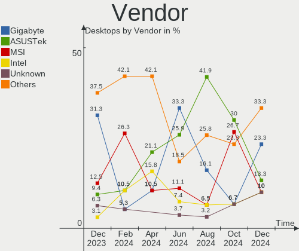
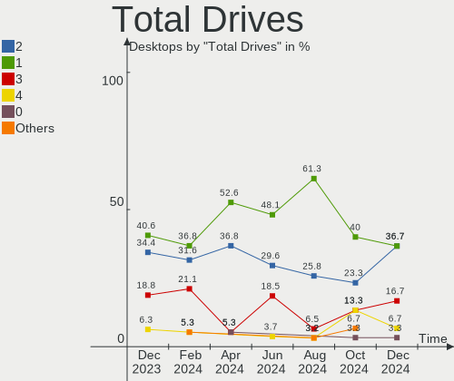
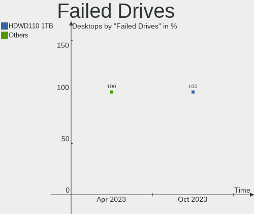
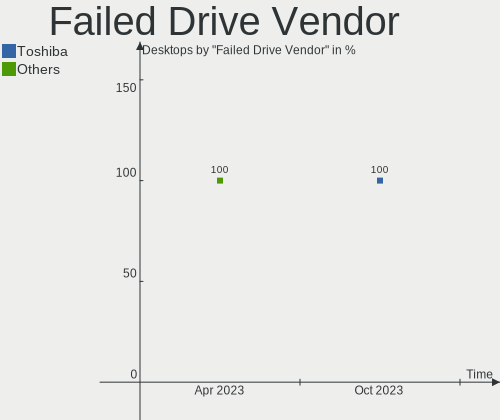
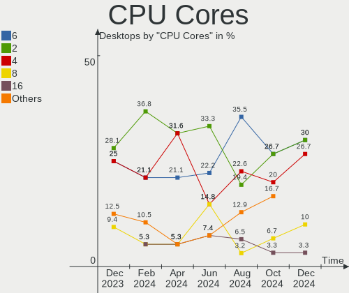
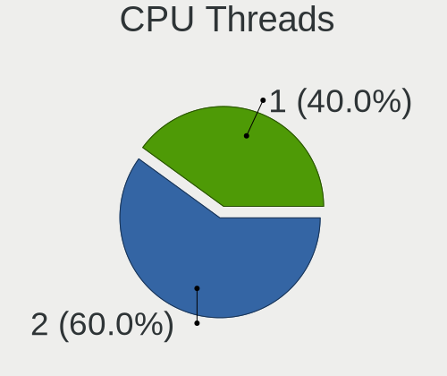
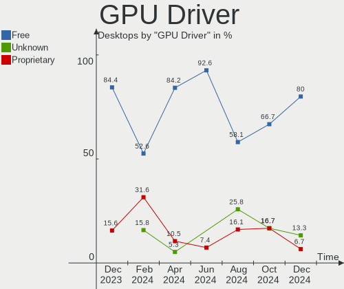
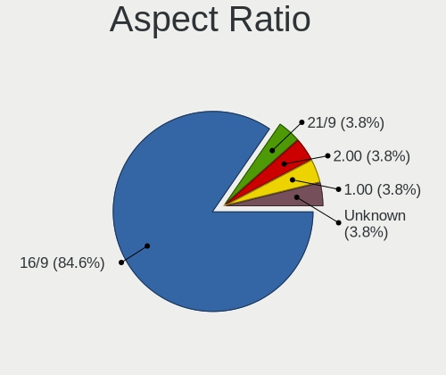
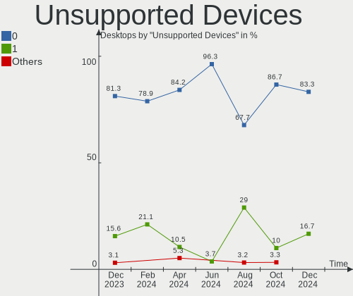

Linux in India - Hardware Trends (Desktops)
-------------------------------------------

A project to identify most popular hardware characteristics and track their change
over time based on data collected by Linux users at https://Linux-Hardware.org.

Anyone can contribute to this report by the [hw-probe](https://github.com/linuxhw/hw-probe) tool:

    sudo -E hw-probe -all -upload

Period: Apr, 2023.

Contents
--------

* [ System ](#system)
  - [ OS                       ](#os)
  - [ OS Family                ](#os-family)
  - [ Kernel                   ](#kernel)
  - [ Kernel Family            ](#kernel-family)
  - [ Kernel Major Ver.        ](#kernel-major-ver)
  - [ Arch                     ](#arch)
  - [ DE                       ](#de)
  - [ Display Server           ](#display-server)
  - [ Display Manager          ](#display-manager)
  - [ OS Lang                  ](#os-lang)
  - [ Boot Mode                ](#boot-mode)
  - [ Filesystem               ](#filesystem)
  - [ Part. scheme             ](#part-scheme)
  - [ Dual Boot with Linux/BSD ](#dual-boot-with-linuxbsd)
  - [ Dual Boot (Win)          ](#dual-boot-win)

* [ Board ](#board)
  - [ Vendor                   ](#vendor)
  - [ Model                    ](#model)
  - [ Model Family             ](#model-family)
  - [ MFG Year                 ](#mfg-year)
  - [ Form Factor              ](#form-factor)
  - [ Secure Boot              ](#secure-boot)
  - [ Coreboot                 ](#coreboot)
  - [ RAM Size                 ](#ram-size)
  - [ RAM Used                 ](#ram-used)
  - [ Total Drives             ](#total-drives)
  - [ Has CD-ROM               ](#has-cd-rom)
  - [ Has Ethernet             ](#has-ethernet)
  - [ Has WiFi                 ](#has-wifi)
  - [ Has Bluetooth            ](#has-bluetooth)

* [ Location ](#location)
  - [ Country                  ](#country)
  - [ City                     ](#city)

* [ Drives ](#drives)
  - [ Drive Vendor             ](#drive-vendor)
  - [ Drive Model              ](#drive-model)
  - [ HDD Vendor               ](#hdd-vendor)
  - [ SSD Vendor               ](#ssd-vendor)
  - [ Drive Kind               ](#drive-kind)
  - [ Drive Connector          ](#drive-connector)
  - [ Drive Size               ](#drive-size)
  - [ Space Total              ](#space-total)
  - [ Space Used               ](#space-used)
  - [ Malfunc. Drives          ](#malfunc-drives)
  - [ Malfunc. Drive Vendor    ](#malfunc-drive-vendor)
  - [ Malfunc. HDD Vendor      ](#malfunc-hdd-vendor)
  - [ Malfunc. Drive Kind      ](#malfunc-drive-kind)
  - [ Failed Drives            ](#failed-drives)
  - [ Failed Drive Vendor      ](#failed-drive-vendor)
  - [ Drive Status             ](#drive-status)

* [ Storage controller ](#storage-controller)
  - [ Storage Vendor           ](#storage-vendor)
  - [ Storage Model            ](#storage-model)
  - [ Storage Kind             ](#storage-kind)

* [ Processor ](#processor)
  - [ CPU Vendor               ](#cpu-vendor)
  - [ CPU Model                ](#cpu-model)
  - [ CPU Model Family         ](#cpu-model-family)
  - [ CPU Cores                ](#cpu-cores)
  - [ CPU Sockets              ](#cpu-sockets)
  - [ CPU Threads              ](#cpu-threads)
  - [ CPU Op-Modes             ](#cpu-op-modes)
  - [ CPU Microcode            ](#cpu-microcode)
  - [ CPU Microarch            ](#cpu-microarch)

* [ Graphics ](#graphics)
  - [ GPU Vendor               ](#gpu-vendor)
  - [ GPU Model                ](#gpu-model)
  - [ GPU Combo                ](#gpu-combo)
  - [ GPU Driver               ](#gpu-driver)
  - [ GPU Memory               ](#gpu-memory)

* [ Monitor ](#monitor)
  - [ Monitor Vendor           ](#monitor-vendor)
  - [ Monitor Model            ](#monitor-model)
  - [ Monitor Resolution       ](#monitor-resolution)
  - [ Monitor Diagonal         ](#monitor-diagonal)
  - [ Monitor Width            ](#monitor-width)
  - [ Aspect Ratio             ](#aspect-ratio)
  - [ Monitor Area             ](#monitor-area)
  - [ Pixel Density            ](#pixel-density)
  - [ Multiple Monitors        ](#multiple-monitors)

* [ Network ](#network)
  - [ Net Controller Vendor    ](#net-controller-vendor)
  - [ Net Controller Model     ](#net-controller-model)
  - [ Wireless Vendor          ](#wireless-vendor)
  - [ Wireless Model           ](#wireless-model)
  - [ Ethernet Vendor          ](#ethernet-vendor)
  - [ Ethernet Model           ](#ethernet-model)
  - [ Net Controller Kind      ](#net-controller-kind)
  - [ Used Controller          ](#used-controller)
  - [ NICs                     ](#nics)
  - [ IPv6                     ](#ipv6)

* [ Bluetooth ](#bluetooth)
  - [ Bluetooth Vendor         ](#bluetooth-vendor)
  - [ Bluetooth Model          ](#bluetooth-model)

* [ Sound ](#sound)
  - [ Sound Vendor             ](#sound-vendor)
  - [ Sound Model              ](#sound-model)

* [ Memory ](#memory)
  - [ Memory Vendor            ](#memory-vendor)
  - [ Memory Model             ](#memory-model)
  - [ Memory Kind              ](#memory-kind)
  - [ Memory Form Factor       ](#memory-form-factor)
  - [ Memory Size              ](#memory-size)
  - [ Memory Speed             ](#memory-speed)

* [ Printers & scanners ](#printers--scanners)
  - [ Printer Vendor           ](#printer-vendor)
  - [ Printer Model            ](#printer-model)
  - [ Scanner Vendor           ](#scanner-vendor)
  - [ Scanner Model            ](#scanner-model)

* [ Camera ](#camera)
  - [ Camera Vendor            ](#camera-vendor)
  - [ Camera Model             ](#camera-model)

* [ Security ](#security)
  - [ Fingerprint Vendor       ](#fingerprint-vendor)
  - [ Fingerprint Model        ](#fingerprint-model)
  - [ Chipcard Vendor          ](#chipcard-vendor)
  - [ Chipcard Model           ](#chipcard-model)

* [ Unsupported ](#unsupported)
  - [ Unsupported Devices      ](#unsupported-devices)
  - [ Unsupported Device Types ](#unsupported-device-types)

System
------

OS
--

Installed operating systems

| Name                | Desktops | Percent |
|---------------------|----------|---------|
| Ubuntu 22.04        | 5        | 19.23%  |
| OpenMandriva 23.03  | 3        | 11.54%  |
| KDE neon 22.04      | 2        | 7.69%   |
| Debian 11           | 2        | 7.69%   |
| Zorin 16            | 1        | 3.85%   |
| Ubuntu 23.04        | 1        | 3.85%   |
| Ubuntu 20.04        | 1        | 3.85%   |
| Parrot 5.2          | 1        | 3.85%   |
| OpenMandriva 4.3    | 1        | 3.85%   |
| Manjaro 22.1.0      | 1        | 3.85%   |
| Manjaro             | 1        | 3.85%   |
| Linux Mint 21.1     | 1        | 3.85%   |
| Kali 2023.1         | 1        | 3.85%   |
| Fedora 37           | 1        | 3.85%   |
| EndeavourOS Rolling | 1        | 3.85%   |
| Elementary 7        | 1        | 3.85%   |
| CentOS 8            | 1        | 3.85%   |
| ArcoLinux Rolling   | 1        | 3.85%   |

OS Family
---------

OS without a version

| Name         | Desktops | Percent |
|--------------|----------|---------|
| Ubuntu       | 7        | 26.92%  |
| OpenMandriva | 4        | 15.38%  |
| Manjaro      | 2        | 7.69%   |
| KDE neon     | 2        | 7.69%   |
| Debian       | 2        | 7.69%   |
| Zorin        | 1        | 3.85%   |
| Parrot       | 1        | 3.85%   |
| Linux Mint   | 1        | 3.85%   |
| Kali         | 1        | 3.85%   |
| Fedora       | 1        | 3.85%   |
| EndeavourOS  | 1        | 3.85%   |
| Elementary   | 1        | 3.85%   |
| CentOS       | 1        | 3.85%   |
| ArcoLinux    | 1        | 3.85%   |

Kernel
------

Version of the Linux kernel

| Version                     | Desktops | Percent |
|-----------------------------|----------|---------|
| 5.19.0-38-generic           | 5        | 19.23%  |
| 6.2.6-desktop-1omv2390      | 3        | 11.54%  |
| 6.2.8-zen1-1-zen            | 1        | 3.85%   |
| 6.2.8-200.fc37.x86_64       | 1        | 3.85%   |
| 6.2.0-20-generic            | 1        | 3.85%   |
| 6.2.0-060200-generic        | 1        | 3.85%   |
| 6.1.23-1-MANJARO            | 1        | 3.85%   |
| 6.1.23-1-lts                | 1        | 3.85%   |
| 6.1.0-kali5-amd64           | 1        | 3.85%   |
| 6.1.0-0.deb11.5-amd64       | 1        | 3.85%   |
| 6.0.6-1-MANJARO             | 1        | 3.85%   |
| 6.0.0-12parrot1-amd64       | 1        | 3.85%   |
| 5.19.0-41-generic           | 1        | 3.85%   |
| 5.19.0-40-generic           | 1        | 3.85%   |
| 5.16.7-desktop-1omv4003     | 1        | 3.85%   |
| 5.15.0-71-generic           | 1        | 3.85%   |
| 5.15.0-70-generic           | 1        | 3.85%   |
| 5.15.0-69-generic           | 1        | 3.85%   |
| 5.10.0-20-amd64             | 1        | 3.85%   |
| 4.18.0-348.7.1.el8_5.x86_64 | 1        | 3.85%   |

Kernel Family
-------------

Linux kernel without a distro release

| Version | Desktops | Percent |
|---------|----------|---------|
| 5.19.0  | 7        | 26.92%  |
| 6.2.6   | 3        | 11.54%  |
| 5.15.0  | 3        | 11.54%  |
| 6.2.8   | 2        | 7.69%   |
| 6.2.0   | 2        | 7.69%   |
| 6.1.23  | 2        | 7.69%   |
| 6.1.0   | 2        | 7.69%   |
| 6.0.6   | 1        | 3.85%   |
| 6.0.0   | 1        | 3.85%   |
| 5.16.7  | 1        | 3.85%   |
| 5.10.0  | 1        | 3.85%   |
| 4.18.0  | 1        | 3.85%   |

Kernel Major Ver.
-----------------

Linux kernel major version

| Version | Desktops | Percent |
|---------|----------|---------|
| 6.2     | 7        | 26.92%  |
| 5.19    | 7        | 26.92%  |
| 6.1     | 4        | 15.38%  |
| 5.15    | 3        | 11.54%  |
| 6.0     | 2        | 7.69%   |
| 5.16    | 1        | 3.85%   |
| 5.10    | 1        | 3.85%   |
| 4.18    | 1        | 3.85%   |

Arch
----

OS architecture (x86_64, i586, etc.)

| Name   | Desktops | Percent |
|--------|----------|---------|
| x86_64 | 26       | 100%    |

DE
--

Desktop Environment

| Name       | Desktops | Percent |
|------------|----------|---------|
| GNOME      | 11       | 42.31%  |
| KDE5       | 10       | 38.46%  |
| XFCE       | 1        | 3.85%   |
| X-Cinnamon | 1        | 3.85%   |
| Pantheon   | 1        | 3.85%   |
| MATE       | 1        | 3.85%   |
| dwm        | 1        | 3.85%   |

Display Server
--------------

X11 or Wayland

| Name    | Desktops | Percent |
|---------|----------|---------|
| X11     | 21       | 80.77%  |
| Wayland | 5        | 19.23%  |

Display Manager
---------------

SDDM, LightDM, etc.

| Name    | Desktops | Percent |
|---------|----------|---------|
| SDDM    | 8        | 30.77%  |
| GDM3    | 8        | 30.77%  |
| Unknown | 8        | 30.77%  |
| LightDM | 1        | 3.85%   |
| GDM     | 1        | 3.85%   |

OS Lang
-------

Language

| Lang  | Desktops | Percent |
|-------|----------|---------|
| en_IN | 20       | 76.92%  |
| en_US | 6        | 23.08%  |

Boot Mode
---------

EFI or BIOS

| Mode | Desktops | Percent |
|------|----------|---------|
| BIOS | 13       | 50%     |
| EFI  | 13       | 50%     |

Filesystem
----------

Type of filesystem

| Type    | Desktops | Percent |
|---------|----------|---------|
| Ext4    | 18       | 69.23%  |
| Btrfs   | 3        | 11.54%  |
| Tmpfs   | 2        | 7.69%   |
| Overlay | 2        | 7.69%   |
| Xfs     | 1        | 3.85%   |

Part. scheme
------------

Scheme of partitioning

| Type    | Desktops | Percent |
|---------|----------|---------|
| GPT     | 14       | 53.85%  |
| Unknown | 8        | 30.77%  |
| MBR     | 4        | 15.38%  |

Dual Boot with Linux/BSD
------------------------

Hosting more than one Linux/BSD

| Dual boot | Desktops | Percent |
|-----------|----------|---------|
| No        | 25       | 96.15%  |
| Yes       | 1        | 3.85%   |

Dual Boot (Win)
---------------

Hosting Linux and Windows

| Dual boot | Desktops | Percent |
|-----------|----------|---------|
| No        | 15       | 57.69%  |
| Yes       | 11       | 42.31%  |

Board
-----

Vendor
------

Motherboard manufacturer

| Name                | Desktops | Percent |
|---------------------|----------|---------|
| MSI                 | 7        | 26.92%  |
| Gigabyte Technology | 6        | 23.08%  |
| ASUSTek Computer    | 4        | 15.38%  |
| Unknown             | 3        | 11.54%  |
| Dell                | 2        | 7.69%   |
| ASRock              | 2        | 7.69%   |
| Hewlett-Packard     | 1        | 3.85%   |
| Foxconn             | 1        | 3.85%   |

Model
-----

Motherboard model

| Name                                 | Desktops | Percent |
|--------------------------------------|----------|---------|
| Unknown                              | 3        | 11.54%  |
| Gigabyte H110M-S2                    | 2        | 7.69%   |
| MSI Pro 3090 MT                      | 1        | 3.85%   |
| MSI MS-7C83                          | 1        | 3.85%   |
| MSI MS-7B79                          | 1        | 3.85%   |
| MSI MS-7B09                          | 1        | 3.85%   |
| MSI MS-7A36                          | 1        | 3.85%   |
| MSI MS-7A33                          | 1        | 3.85%   |
| MSI MS-7623                          | 1        | 3.85%   |
| HP Compaq 8200 Elite SFF PC          | 1        | 3.85%   |
| Gigabyte H81M-S                      | 1        | 3.85%   |
| Gigabyte GA-78LMT-USB3 6.0           | 1        | 3.85%   |
| Gigabyte GA-78LMT-S2PT               | 1        | 3.85%   |
| Gigabyte B75M-D3H                    | 1        | 3.85%   |
| Foxconn A76GMV                       | 1        | 3.85%   |
| Dell OptiPlex 780                    | 1        | 3.85%   |
| Dell Inspiron 3250                   | 1        | 3.85%   |
| ASUS TUF Gaming X570-PLUS            | 1        | 3.85%   |
| ASUS ROG STRIX B550-F GAMING WIFI II | 1        | 3.85%   |
| ASUS PRIME B450M-A                   | 1        | 3.85%   |
| ASUS EX-B560M-V5                     | 1        | 3.85%   |
| ASRock B450 Steel Legend             | 1        | 3.85%   |
| ASRock A320M-HDV R4.0                | 1        | 3.85%   |

Model Family
------------

Motherboard model prefix

| Name                   | Desktops | Percent |
|------------------------|----------|---------|
| Unknown                | 3        | 11.54%  |
| Gigabyte H110M-S2      | 2        | 7.69%   |
| MSI Pro                | 1        | 3.85%   |
| MSI MS-7C83            | 1        | 3.85%   |
| MSI MS-7B79            | 1        | 3.85%   |
| MSI MS-7B09            | 1        | 3.85%   |
| MSI MS-7A36            | 1        | 3.85%   |
| MSI MS-7A33            | 1        | 3.85%   |
| MSI MS-7623            | 1        | 3.85%   |
| HP Compaq              | 1        | 3.85%   |
| Gigabyte H81M-S        | 1        | 3.85%   |
| Gigabyte GA-78LMT-USB3 | 1        | 3.85%   |
| Gigabyte GA-78LMT-S2PT | 1        | 3.85%   |
| Gigabyte B75M-D3H      | 1        | 3.85%   |
| Foxconn A76GMV         | 1        | 3.85%   |
| Dell OptiPlex          | 1        | 3.85%   |
| Dell Inspiron          | 1        | 3.85%   |
| ASUS TUF               | 1        | 3.85%   |
| ASUS ROG               | 1        | 3.85%   |
| ASUS PRIME             | 1        | 3.85%   |
| ASUS EX-B560M-V5       | 1        | 3.85%   |
| ASRock B450            | 1        | 3.85%   |
| ASRock A320M-HDV       | 1        | 3.85%   |

MFG Year
--------

Motherboard manufacture year

| Year | Desktops | Percent |
|------|----------|---------|
| 2018 | 5        | 19.23%  |
| 2020 | 4        | 15.38%  |
| 2010 | 4        | 15.38%  |
| 2021 | 2        | 7.69%   |
| 2019 | 2        | 7.69%   |
| 2017 | 2        | 7.69%   |
| 2016 | 2        | 7.69%   |
| 2014 | 2        | 7.69%   |
| 2012 | 2        | 7.69%   |
| 2011 | 1        | 3.85%   |

Form Factor
-----------

Physical design of the computer

| Name    | Desktops | Percent |
|---------|----------|---------|
| Desktop | 26       | 100%    |

Secure Boot
-----------

Enabled or disabled

| State    | Desktops | Percent |
|----------|----------|---------|
| Disabled | 26       | 100%    |

Coreboot
--------

Have coreboot on board

| Used | Desktops | Percent |
|------|----------|---------|
| No   | 26       | 100%    |

RAM Size
--------

Total RAM memory

| Size in GB | Desktops | Percent |
|------------|----------|---------|
| 8.01-16.0  | 7        | 26.92%  |
| 3.01-4.0   | 6        | 23.08%  |
| 16.01-24.0 | 5        | 19.23%  |
| 4.01-8.0   | 4        | 15.38%  |
| 32.01-64.0 | 4        | 15.38%  |

RAM Used
--------

Used RAM memory

| Used GB   | Desktops | Percent |
|-----------|----------|---------|
| 3.01-4.0  | 7        | 26.92%  |
| 2.01-3.0  | 7        | 26.92%  |
| 1.01-2.0  | 7        | 26.92%  |
| 4.01-8.0  | 2        | 7.69%   |
| 8.01-16.0 | 2        | 7.69%   |
| 0.51-1.0  | 1        | 3.85%   |

Total Drives
------------

Number of drives on board

| Drives | Desktops | Percent |
|--------|----------|---------|
| 2      | 11       | 42.31%  |
| 1      | 8        | 30.77%  |
| 3      | 5        | 19.23%  |
| 4      | 2        | 7.69%   |

Has CD-ROM
----------

Has CD-ROM on board

| Presented | Desktops | Percent |
|-----------|----------|---------|
| No        | 21       | 80.77%  |
| Yes       | 5        | 19.23%  |

Has Ethernet
------------

Has Ethernet on board

| Presented | Desktops | Percent |
|-----------|----------|---------|
| Yes       | 26       | 100%    |

Has WiFi
--------

Has WiFi module

| Presented | Desktops | Percent |
|-----------|----------|---------|
| Yes       | 14       | 53.85%  |
| No        | 12       | 46.15%  |

Has Bluetooth
-------------

Has Bluetooth module

| Presented | Desktops | Percent |
|-----------|----------|---------|
| No        | 15       | 57.69%  |
| Yes       | 11       | 42.31%  |

Location
--------

Country
-------

Geographic location (country)

| Country | Desktops | Percent |
|---------|----------|---------|
| India   | 26       | 100%    |

City
----

Geographic location (city)

| City          | Desktops | Percent |
|---------------|----------|---------|
| Hyderabad     | 3        | 11.54%  |
| Bengaluru     | 3        | 11.54%  |
| Indore        | 2        | 7.69%   |
| Delhi         | 2        | 7.69%   |
| Chennai       | 2        | 7.69%   |
| Ahmedabad     | 2        | 7.69%   |
| Visakhapatnam | 1        | 3.85%   |
| Vijayawada    | 1        | 3.85%   |
| Patna         | 1        | 3.85%   |
| Navi Mumbai   | 1        | 3.85%   |
| Mysore        | 1        | 3.85%   |
| Mumbai        | 1        | 3.85%   |
| Lucknow       | 1        | 3.85%   |
| Kolkata       | 1        | 3.85%   |
| Kochi         | 1        | 3.85%   |
| Howrah        | 1        | 3.85%   |
| Gurgaon       | 1        | 3.85%   |
| Chandigarh    | 1        | 3.85%   |

Drives
------

Drive Vendor
------------

Hard drive vendors

| Vendor                | Desktops | Drives | Percent |
|-----------------------|----------|--------|---------|
| Seagate               | 19       | 20     | 38.78%  |
| WDC                   | 6        | 9      | 12.24%  |
| Samsung Electronics   | 4        | 4      | 8.16%   |
| Crucial               | 4        | 5      | 8.16%   |
| HGST                  | 2        | 2      | 4.08%   |
| A-DATA Technology     | 2        | 2      | 4.08%   |
| XPG                   | 1        | 1      | 2.04%   |
| Toshiba               | 1        | 1      | 2.04%   |
| Realtek Semiconductor | 1        | 1      | 2.04%   |
| PNY                   | 1        | 1      | 2.04%   |
| Maxtor                | 1        | 1      | 2.04%   |
| LITEONIT              | 1        | 1      | 2.04%   |
| Intel                 | 1        | 1      | 2.04%   |
| HS-SSD-E100           | 1        | 2      | 2.04%   |
| Hitachi               | 1        | 1      | 2.04%   |
| Gigabyte Technology   | 1        | 1      | 2.04%   |
| Acer                  | 1        | 1      | 2.04%   |
| Unknown               | 1        | 1      | 2.04%   |

Drive Model
-----------

Hard drive models

| Model                                    | Desktops | Percent |
|------------------------------------------|----------|---------|
| WDC WDS240G2G0A-00JH30 240GB SSD         | 3        | 5.45%   |
| Seagate ST1000LM024 HN-M101MBB 1TB       | 2        | 3.64%   |
| Seagate ST1000DM010-2EP102 1TB           | 2        | 3.64%   |
| Samsung SSD 860 EVO 250GB                | 2        | 3.64%   |
| Crucial CT240BX500SSD1 240GB             | 2        | 3.64%   |
| A-DATA SU650 240GB SSD                   | 2        | 3.64%   |
| XPG GAMMIX S70 BLADE 512GB               | 1        | 1.82%   |
| WDC WD5000AAKX-603CA0 500GB              | 1        | 1.82%   |
| WDC WD5000AAKX-001CA0 500GB              | 1        | 1.82%   |
| WDC WD3200AAJS-22L7A0 320GB              | 1        | 1.82%   |
| WDC WD20EZAZ-00GGJB0 2TB                 | 1        | 1.82%   |
| WDC WD10EZEX-75WN4A0 1TB                 | 1        | 1.82%   |
| WDC WD Green 2.5 240GB                   | 1        | 1.82%   |
| Toshiba DT01ACA050 500GB                 | 1        | 1.82%   |
| Seagate ST9320325AS 320GB                | 1        | 1.82%   |
| Seagate ST9160314AS 160GB                | 1        | 1.82%   |
| Seagate ST500LM012 HN-M500MBB 500GB      | 1        | 1.82%   |
| Seagate ST500DM002-1SB10A 500GB          | 1        | 1.82%   |
| Seagate ST500DM002-1BD142 500GB          | 1        | 1.82%   |
| Seagate ST4000DM004-2CV104 4TB           | 1        | 1.82%   |
| Seagate ST380215AS 80GB                  | 1        | 1.82%   |
| Seagate ST3802110A 80GB                  | 1        | 1.82%   |
| Seagate ST3750640NS 752GB                | 1        | 1.82%   |
| Seagate ST3500418AS 500GB                | 1        | 1.82%   |
| Seagate ST3500414CS 500GB                | 1        | 1.82%   |
| Seagate ST3500413AS 500GB                | 1        | 1.82%   |
| Seagate ST3160212ACE 160GB               | 1        | 1.82%   |
| Seagate ST31000528AS 1TB                 | 1        | 1.82%   |
| Seagate ST2000DL003-9VT166 2TB           | 1        | 1.82%   |
| Seagate BarraCuda SSD ZA500CM10002 500GB | 1        | 1.82%   |
| Samsung SSD 970 EVO Plus 250GB           | 1        | 1.82%   |
| Samsung SSD 860 EVO M.2 250GB            | 1        | 1.82%   |
| Realtek ADATA SX6000PNP 1024GB           | 1        | 1.82%   |
| PNY CS900 120GB SSD                      | 1        | 1.82%   |
| Maxtor Z1 SSD 240GB                      | 1        | 1.82%   |
| LITEONIT LCS-128M6S 2.5 7mm 128GB SSD    | 1        | 1.82%   |
| Intel SSD 660P Series 512GB              | 1        | 1.82%   |
| HS-SSD-E100 SSD 256G                     | 1        | 1.82%   |
| HS-SSD-E100 256G                         | 1        | 1.82%   |
| Hitachi HDS721680PLA380 82GB             | 1        | 1.82%   |

HDD Vendor
----------

Hard disk drive vendors

| Vendor  | Desktops | Drives | Percent |
|---------|----------|--------|---------|
| Seagate | 18       | 19     | 69.23%  |
| WDC     | 4        | 5      | 15.38%  |
| HGST    | 2        | 2      | 7.69%   |
| Toshiba | 1        | 1      | 3.85%   |
| Hitachi | 1        | 1      | 3.85%   |

SSD Vendor
----------

Solid state drive vendors

| Vendor              | Desktops | Drives | Percent |
|---------------------|----------|--------|---------|
| WDC                 | 4        | 4      | 21.05%  |
| Crucial             | 4        | 5      | 21.05%  |
| Samsung Electronics | 3        | 3      | 15.79%  |
| A-DATA Technology   | 2        | 2      | 10.53%  |
| Seagate             | 1        | 1      | 5.26%   |
| PNY                 | 1        | 1      | 5.26%   |
| Maxtor              | 1        | 1      | 5.26%   |
| LITEONIT            | 1        | 1      | 5.26%   |
| HS-SSD-E100         | 1        | 1      | 5.26%   |
| Gigabyte Technology | 1        | 1      | 5.26%   |

Drive Kind
----------

HDD or SSD

| Kind    | Desktops | Drives | Percent |
|---------|----------|--------|---------|
| HDD     | 20       | 28     | 46.51%  |
| SSD     | 16       | 20     | 37.21%  |
| NVMe    | 5        | 5      | 11.63%  |
| Unknown | 2        | 2      | 4.65%   |

Drive Connector
---------------

SATA, SAS, NVMe, etc.

| Type | Desktops | Drives | Percent |
|------|----------|--------|---------|
| SATA | 25       | 50     | 83.33%  |
| NVMe | 5        | 5      | 16.67%  |

Drive Size
----------

Size of hard drive

| Size in TB | Desktops | Drives | Percent |
|------------|----------|--------|---------|
| 0.01-0.5   | 21       | 37     | 65.63%  |
| 0.51-1.0   | 8        | 8      | 25%     |
| 1.01-2.0   | 2        | 2      | 6.25%   |
| 3.01-4.0   | 1        | 1      | 3.13%   |

Space Total
-----------

Amount of disk space available on the file system

| Size in GB     | Desktops | Percent |
|----------------|----------|---------|
| 101-250        | 10       | 38.46%  |
| 251-500        | 4        | 15.38%  |
| 21-50          | 3        | 11.54%  |
| 501-1000       | 3        | 11.54%  |
| 1001-2000      | 2        | 7.69%   |
| 51-100         | 2        | 7.69%   |
| More than 3000 | 1        | 3.85%   |
| 1-20           | 1        | 3.85%   |

Space Used
----------

Amount of used disk space

| Used GB   | Desktops | Percent |
|-----------|----------|---------|
| 1-20      | 9        | 34.62%  |
| 101-250   | 6        | 23.08%  |
| 251-500   | 4        | 15.38%  |
| 21-50     | 3        | 11.54%  |
| 51-100    | 2        | 7.69%   |
| 1001-2000 | 1        | 3.85%   |
| 501-1000  | 1        | 3.85%   |

Malfunc. Drives
---------------

Drive models with a malfunction

| Model                               | Desktops | Drives | Percent |
|-------------------------------------|----------|--------|---------|
| Seagate ST1000LM024 HN-M101MBB 1TB  | 2        | 2      | 20%     |
| WDC WD3200AAJS-22L7A0 320GB         | 1        | 1      | 10%     |
| Seagate ST9160314AS 160GB           | 1        | 1      | 10%     |
| Seagate ST500LM012 HN-M500MBB 500GB | 1        | 1      | 10%     |
| Seagate ST380215AS 80GB             | 1        | 1      | 10%     |
| Seagate ST3802110A 80GB             | 1        | 1      | 10%     |
| Seagate ST2000DL003-9VT166 2TB      | 1        | 1      | 10%     |
| Hitachi HDS721680PLA380 82GB        | 1        | 1      | 10%     |
| HGST HTS545050A7E680 500GB          | 1        | 1      | 10%     |

Malfunc. Drive Vendor
---------------------

Vendors of faulty drives

| Vendor  | Desktops | Drives | Percent |
|---------|----------|--------|---------|
| Seagate | 6        | 7      | 66.67%  |
| WDC     | 1        | 1      | 11.11%  |
| Hitachi | 1        | 1      | 11.11%  |
| HGST    | 1        | 1      | 11.11%  |

Malfunc. HDD Vendor
-------------------

Vendors of faulty HDD drives

| Vendor  | Desktops | Drives | Percent |
|---------|----------|--------|---------|
| Seagate | 6        | 7      | 66.67%  |
| WDC     | 1        | 1      | 11.11%  |
| Hitachi | 1        | 1      | 11.11%  |
| HGST    | 1        | 1      | 11.11%  |

Malfunc. Drive Kind
-------------------

Kinds of faulty drives

| Kind | Desktops | Drives | Percent |
|------|----------|--------|---------|
| HDD  | 9        | 10     | 100%    |

Failed Drives
-------------

Failed drive models

| Model                       | Desktops | Drives | Percent |
|-----------------------------|----------|--------|---------|
| WDC WD5000AAKX-001CA0 500GB | 1        | 1      | 100%    |

Failed Drive Vendor
-------------------

Failed drive vendors

| Vendor | Desktops | Drives | Percent |
|--------|----------|--------|---------|
| WDC    | 1        | 1      | 100%    |

Drive Status
------------

Number of failed and malfunc. drives

| Status   | Desktops | Drives | Percent |
|----------|----------|--------|---------|
| Works    | 13       | 22     | 38.24%  |
| Detected | 11       | 22     | 32.35%  |
| Malfunc  | 9        | 10     | 26.47%  |
| Failed   | 1        | 1      | 2.94%   |

Storage controller
------------------

Storage Vendor
--------------

Storage controller vendors

| Vendor                | Desktops | Percent |
|-----------------------|----------|---------|
| Intel                 | 13       | 41.94%  |
| AMD                   | 13       | 41.94%  |
| Samsung Electronics   | 1        | 3.23%   |
| Realtek Semiconductor | 1        | 3.23%   |
| INNOGRIT              | 1        | 3.23%   |
| ASMedia Technology    | 1        | 3.23%   |
| ADATA Technology      | 1        | 3.23%   |

Storage Model
-------------

Storage controller models

| Model                                                                          | Desktops | Percent |
|--------------------------------------------------------------------------------|----------|---------|
| AMD FCH SATA Controller [AHCI mode]                                            | 8        | 17.78%  |
| AMD SB7x0/SB8x0/SB9x0 SATA Controller [IDE mode]                               | 4        | 8.89%   |
| AMD SB7x0/SB8x0/SB9x0 IDE Controller                                           | 4        | 8.89%   |
| Intel Q170/Q150/B150/H170/H110/Z170/CM236 Chipset SATA Controller [AHCI Mode]  | 3        | 6.67%   |
| AMD 400 Series Chipset SATA Controller                                         | 3        | 6.67%   |
| Intel NM10/ICH7 Family SATA Controller [IDE mode]                              | 2        | 4.44%   |
| Intel 82801G (ICH7 Family) IDE Controller                                      | 2        | 4.44%   |
| Intel 6 Series/C200 Series Chipset Family 6 port Desktop SATA AHCI Controller  | 2        | 4.44%   |
| AMD FCH SATA Controller D                                                      | 2        | 4.44%   |
| Samsung NVMe SSD Controller SM981/PM981/PM983                                  | 1        | 2.22%   |
| Realtek NVMe Controller                                                        | 1        | 2.22%   |
| Intel SSD 660P Series                                                          | 1        | 2.22%   |
| Intel SATA Controller [RAID mode]                                              | 1        | 2.22%   |
| Intel 82801JI (ICH10 Family) 4 port SATA IDE Controller #1                     | 1        | 2.22%   |
| Intel 8 Series/C220 Series Chipset Family 6-port SATA Controller 1 [AHCI mode] | 1        | 2.22%   |
| Intel 7 Series/C210 Series Chipset Family 6-port SATA Controller [AHCI mode]   | 1        | 2.22%   |
| Intel 500 Series Chipset Family SATA AHCI Controller                           | 1        | 2.22%   |
| Intel 400 Series Chipset Family SATA AHCI Controller                           | 1        | 2.22%   |
| INNOGRIT Non-Volatile memory controller                                        | 1        | 2.22%   |
| ASMedia ASM1062 Serial ATA Controller                                          | 1        | 2.22%   |
| AMD X399 Series Chipset SATA Controller                                        | 1        | 2.22%   |
| AMD X370 Series Chipset SATA Controller                                        | 1        | 2.22%   |
| AMD 500 Series Chipset SATA Controller                                         | 1        | 2.22%   |
| ADATA A Non-Volatile memory controller                                         | 1        | 2.22%   |

Storage Kind
------------

Kind of storage controller (IDE, SATA, NVMe, SAS, ...)

| Kind | Desktops | Percent |
|------|----------|---------|
| SATA | 22       | 62.86%  |
| IDE  | 7        | 20%     |
| NVMe | 5        | 14.29%  |
| RAID | 1        | 2.86%   |

Processor
---------

CPU Vendor
----------

Processor vendors

| Vendor | Desktops | Percent |
|--------|----------|---------|
| Intel  | 13       | 50%     |
| AMD    | 13       | 50%     |

CPU Model
---------

Processor models

| Model                                           | Desktops | Percent |
|-------------------------------------------------|----------|---------|
| Intel Core 2 Duo CPU E7500 @ 2.93GHz            | 2        | 7.69%   |
| AMD Sempron 145 Processor                       | 2        | 7.69%   |
| AMD Ryzen 5 2400G with Radeon Vega Graphics     | 2        | 7.69%   |
| Intel Pentium CPU G4400 @ 3.30GHz               | 1        | 3.85%   |
| Intel Pentium 4 CPU 3.40GHz                     | 1        | 3.85%   |
| Intel Core i7-10700F CPU @ 2.90GHz              | 1        | 3.85%   |
| Intel Core i5-7400 CPU @ 3.00GHz                | 1        | 3.85%   |
| Intel Core i5-4430 CPU @ 3.00GHz                | 1        | 3.85%   |
| Intel Core i5-3570 CPU @ 3.40GHz                | 1        | 3.85%   |
| Intel Core i5-2500 CPU @ 3.30GHz                | 1        | 3.85%   |
| Intel Core i5-2400 CPU @ 3.10GHz                | 1        | 3.85%   |
| Intel Core i3-6100 CPU @ 3.70GHz                | 1        | 3.85%   |
| Intel Core 2 Duo CPU E8400 @ 3.00GHz            | 1        | 3.85%   |
| Intel 11th Gen Core i5-11400 @ 2.60GHz          | 1        | 3.85%   |
| AMD Ryzen Threadripper 2970WX 24-Core Processor | 1        | 3.85%   |
| AMD Ryzen 9 5900X 12-Core Processor             | 1        | 3.85%   |
| AMD Ryzen 5 3600 6-Core Processor               | 1        | 3.85%   |
| AMD Ryzen 5 3400G with Radeon Vega Graphics     | 1        | 3.85%   |
| AMD Ryzen 5 2600X Six-Core Processor            | 1        | 3.85%   |
| AMD Ryzen 5 1600 Six-Core Processor             | 1        | 3.85%   |
| AMD Ryzen 3 3200G with Radeon Vega Graphics     | 1        | 3.85%   |
| AMD Phenom II X6 1090T Processor                | 1        | 3.85%   |
| AMD FX-4300 Quad-Core Processor                 | 1        | 3.85%   |

CPU Model Family
----------------

Processor model prefix

| Model                  | Desktops | Percent |
|------------------------|----------|---------|
| AMD Ryzen 5            | 6        | 23.08%  |
| Intel Core i5          | 5        | 19.23%  |
| Intel Core 2 Duo       | 3        | 11.54%  |
| AMD Sempron            | 2        | 7.69%   |
| Other                  | 1        | 3.85%   |
| Intel Pentium 4        | 1        | 3.85%   |
| Intel Pentium          | 1        | 3.85%   |
| Intel Core i7          | 1        | 3.85%   |
| Intel Core i3          | 1        | 3.85%   |
| AMD Ryzen Threadripper | 1        | 3.85%   |
| AMD Ryzen 9            | 1        | 3.85%   |
| AMD Ryzen 3            | 1        | 3.85%   |
| AMD Phenom II X6       | 1        | 3.85%   |
| AMD FX                 | 1        | 3.85%   |

CPU Cores
---------

Number of processor cores

| Number | Desktops | Percent |
|--------|----------|---------|
| 4      | 9        | 34.62%  |
| 2      | 6        | 23.08%  |
| 6      | 4        | 15.38%  |
| 1      | 3        | 11.54%  |
| 8      | 2        | 7.69%   |
| 24     | 1        | 3.85%   |
| 12     | 1        | 3.85%   |

CPU Sockets
-----------

Number of sockets

| Number | Desktops | Percent |
|--------|----------|---------|
| 1      | 26       | 100%    |

CPU Threads
-----------

Threads per core (Hyper-Threading)

| Number | Desktops | Percent |
|--------|----------|---------|
| 2      | 13       | 50%     |
| 1      | 13       | 50%     |

CPU Op-Modes
------------

CPU Operation Modes (32-bit, 64-bit)

| Op mode        | Desktops | Percent |
|----------------|----------|---------|
| 32-bit, 64-bit | 26       | 100%    |

CPU Microcode
-------------

Microcode number

| Number     | Desktops | Percent |
|------------|----------|---------|
| Unknown    | 7        | 26.92%  |
| 0x506e3    | 2        | 7.69%   |
| 0x0800820d | 2        | 7.69%   |
| 0x010000c8 | 2        | 7.69%   |
| 0xf65      | 1        | 3.85%   |
| 0xa0671    | 1        | 3.85%   |
| 0xa0655    | 1        | 3.85%   |
| 0x306c3    | 1        | 3.85%   |
| 0x206a7    | 1        | 3.85%   |
| 0x0a201205 | 1        | 3.85%   |
| 0x08701013 | 1        | 3.85%   |
| 0x08108109 | 1        | 3.85%   |
| 0x08101016 | 1        | 3.85%   |
| 0x0810100b | 1        | 3.85%   |
| 0x08001138 | 1        | 3.85%   |
| 0x0600081c | 1        | 3.85%   |
| 0x010000bf | 1        | 3.85%   |

CPU Microarch
-------------

Microarchitecture

| Name        | Desktops | Percent |
|-------------|----------|---------|
| Zen+        | 4        | 15.38%  |
| Zen         | 3        | 11.54%  |
| Penryn      | 3        | 11.54%  |
| K10         | 3        | 11.54%  |
| Skylake     | 2        | 7.69%   |
| SandyBridge | 2        | 7.69%   |
| Zen 3       | 1        | 3.85%   |
| Zen 2       | 1        | 3.85%   |
| Piledriver  | 1        | 3.85%   |
| NetBurst    | 1        | 3.85%   |
| KabyLake    | 1        | 3.85%   |
| IvyBridge   | 1        | 3.85%   |
| Icelake     | 1        | 3.85%   |
| Haswell     | 1        | 3.85%   |
| CometLake   | 1        | 3.85%   |

Graphics
--------

GPU Vendor
----------

Vendors of graphics cards

| Vendor | Desktops | Percent |
|--------|----------|---------|
| Nvidia | 11       | 39.29%  |
| Intel  | 9        | 32.14%  |
| AMD    | 8        | 28.57%  |

GPU Model
---------

Graphics card models

| Model                                                                       | Desktops | Percent |
|-----------------------------------------------------------------------------|----------|---------|
| Intel 4 Series Chipset Integrated Graphics Controller                       | 3        | 10.71%  |
| AMD RS780L [Radeon 3000]                                                    | 3        | 10.71%  |
| Nvidia GK208B [GeForce GT 710]                                              | 2        | 7.14%   |
| Nvidia GF119 [GeForce GT 610]                                               | 2        | 7.14%   |
| AMD Raven Ridge [Radeon Vega Series / Radeon Vega Mobile Series]            | 2        | 7.14%   |
| AMD Picasso/Raven 2 [Radeon Vega Series / Radeon Vega Mobile Series]        | 2        | 7.14%   |
| Nvidia TU117GLM [Quadro T400 Mobile]                                        | 1        | 3.57%   |
| Nvidia TU117 [GeForce GTX 1650]                                             | 1        | 3.57%   |
| Nvidia TU116 [GeForce GTX 1660 SUPER]                                       | 1        | 3.57%   |
| Nvidia GP104 [GeForce GTX 1070 Ti]                                          | 1        | 3.57%   |
| Nvidia GP102 [GeForce GTX 1080 Ti]                                          | 1        | 3.57%   |
| Nvidia GM107 [GeForce GTX 750 Ti]                                           | 1        | 3.57%   |
| Nvidia GK208B [GeForce GT 730]                                              | 1        | 3.57%   |
| Intel Xeon E3-1200 v3/4th Gen Core Processor Integrated Graphics Controller | 1        | 3.57%   |
| Intel Xeon E3-1200 v2/3rd Gen Core processor Graphics Controller            | 1        | 3.57%   |
| Intel HD Graphics 530                                                       | 1        | 3.57%   |
| Intel HD Graphics 510                                                       | 1        | 3.57%   |
| Intel 82G33/G31 Express Integrated Graphics Controller                      | 1        | 3.57%   |
| Intel 2nd Generation Core Processor Family Integrated Graphics Controller   | 1        | 3.57%   |
| AMD Ellesmere [Radeon RX 470/480/570/570X/580/580X/590]                     | 1        | 3.57%   |

GPU Combo
---------

Combinations of graphics cards

| Name           | Desktops | Percent |
|----------------|----------|---------|
| 1 x Nvidia     | 9        | 34.62%  |
| 1 x AMD        | 8        | 30.77%  |
| 1 x Intel      | 7        | 26.92%  |
| Intel + Nvidia | 2        | 7.69%   |

GPU Driver
----------

Free vs proprietary

| Driver      | Desktops | Percent |
|-------------|----------|---------|
| Free        | 20       | 76.92%  |
| Proprietary | 5        | 19.23%  |
| Unknown     | 1        | 3.85%   |

GPU Memory
----------

Total video memory

| Size in GB | Desktops | Percent |
|------------|----------|---------|
| Unknown    | 12       | 46.15%  |
| 1.01-2.0   | 8        | 30.77%  |
| 7.01-8.0   | 1        | 3.85%   |
| 5.01-6.0   | 1        | 3.85%   |
| 3.01-4.0   | 1        | 3.85%   |
| 8.01-16.0  | 1        | 3.85%   |
| 0.51-1.0   | 1        | 3.85%   |
| 0.01-0.5   | 1        | 3.85%   |

Monitor
-------

Monitor Vendor
--------------

Monitor vendors

| Vendor          | Desktops | Percent |
|-----------------|----------|---------|
| Dell            | 5        | 20%     |
| Acer            | 5        | 20%     |
| Lenovo          | 2        | 8%      |
| HPN             | 2        | 8%      |
| Hewlett-Packard | 2        | 8%      |
| Goldstar        | 2        | 8%      |
| BenQ            | 2        | 8%      |
| WIP             | 1        | 4%      |
| Sony            | 1        | 4%      |
| SKY             | 1        | 4%      |
| HJW             | 1        | 4%      |
| AOC             | 1        | 4%      |

Monitor Model
-------------

Monitor models

| Model                                                            | Desktops | Percent |
|------------------------------------------------------------------|----------|---------|
| WIP WLA180 WIPC180 1366x768 410x230mm 18.5-inch                  | 1        | 4%      |
| Sony LCD Monitor TV  *00 3840x2160                               | 1        | 4%      |
| SKY TV MONITOR SKY0030 3840x2160 708x398mm 32.0-inch             | 1        | 4%      |
| Lenovo Q24i-1L LEN66C0 1920x1080 527x296mm 23.8-inch             | 1        | 4%      |
| Lenovo LEN LT2252pwA LEN0A0C 1680x1050 474x296mm 22.0-inch       | 1        | 4%      |
| HPN LCD Monitor HP Z24nf G2 1920x1080                            | 1        | 4%      |
| HPN LCD Monitor HP E243 1920x1080                                | 1        | 4%      |
| HJW MACROSILICON HJW9291 1280x960 530x290mm 23.8-inch            | 1        | 4%      |
| Hewlett-Packard V194 HWP3346 1366x768 410x230mm 18.5-inch        | 1        | 4%      |
| Hewlett-Packard Compaq F191 HWP3177 1366x768 410x230mm 18.5-inch | 1        | 4%      |
| Goldstar IPS FULLHD GSM5AB8 1920x1080 480x270mm 21.7-inch        | 1        | 4%      |
| Goldstar HDR 4K GSM7707 3840x2160 600x340mm 27.2-inch            | 1        | 4%      |
| Dell S2721HN DEL41F8 1920x1080 598x336mm 27.0-inch               | 1        | 4%      |
| Dell S2422HG DELA1BF 1920x1080 521x293mm 23.5-inch               | 1        | 4%      |
| Dell S2218H DELD0B7 1920x1080 476x268mm 21.5-inch                | 1        | 4%      |
| Dell E2214H DELA09D 1920x1080 477x268mm 21.5-inch                | 1        | 4%      |
| Dell E1916HV DELF06C 1366x768 409x230mm 18.5-inch                | 1        | 4%      |
| BenQ GW2480 BNQ78E7 1920x1080 527x296mm 23.8-inch                | 1        | 4%      |
| BenQ GW2283 BNQ78E9 1920x1080 476x268mm 21.5-inch                | 1        | 4%      |
| AOC 2236 AOC2236 1920x1080 477x268mm 21.5-inch                   | 1        | 4%      |
| Acer V206HQLB ACR051A 1366x768 434x236mm 19.4-inch               | 1        | 4%      |
| Acer P166HQL ACR0276 1366x768 344x194mm 15.5-inch                | 1        | 4%      |
| Acer LCD Monitor X34 P 3440x1440                                 | 1        | 4%      |
| Acer HA240Y ACR0583 1920x1080 527x296mm 23.8-inch                | 1        | 4%      |
| Acer H193HQV ACR01B8 1366x768 410x230mm 18.5-inch                | 1        | 4%      |

Monitor Resolution
------------------

Monitor screen resolution

| Resolution         | Desktops | Percent |
|--------------------|----------|---------|
| 1920x1080 (FHD)    | 11       | 45.83%  |
| 1366x768 (WXGA)    | 7        | 29.17%  |
| 3840x2160 (4K)     | 3        | 12.5%   |
| 3440x1440          | 1        | 4.17%   |
| 1680x1050 (WSXGA+) | 1        | 4.17%   |
| 1280x960           | 1        | 4.17%   |

Monitor Diagonal
----------------

Diagonal size in inches

| Inches  | Desktops | Percent |
|---------|----------|---------|
| 18      | 6        | 26.09%  |
| 21      | 5        | 21.74%  |
| Unknown | 4        | 17.39%  |
| 27      | 2        | 8.7%    |
| 24      | 2        | 8.7%    |
| 32      | 1        | 4.35%   |
| 23      | 1        | 4.35%   |
| 22      | 1        | 4.35%   |
| 19      | 1        | 4.35%   |

Monitor Width
-------------

Physical width

| Width in mm | Desktops | Percent |
|-------------|----------|---------|
| 401-500     | 13       | 56.52%  |
| 501-600     | 5        | 21.74%  |
| Unknown     | 4        | 17.39%  |
| 701-800     | 1        | 4.35%   |

Aspect Ratio
------------

Proportional relationship between the width and the height

| Ratio   | Desktops | Percent |
|---------|----------|---------|
| 16/9    | 18       | 78.26%  |
| Unknown | 4        | 17.39%  |
| 16/10   | 1        | 4.35%   |

Monitor Area
------------

Area in inch

| Area in inch | Desktops | Percent |
|----------------|----------|---------|
| 201-250        | 7        | 30.43%  |
| 141-150        | 6        | 26.09%  |
| Unknown        | 4        | 17.39%  |
| 151-200        | 3        | 13.04%  |
| 301-350        | 2        | 8.7%    |
| 351-500        | 1        | 4.35%   |

Pixel Density
-------------

Pixels per inch

| Density | Desktops | Percent |
|---------|----------|---------|
| 51-100  | 13       | 56.52%  |
| 101-120 | 5        | 21.74%  |
| Unknown | 4        | 17.39%  |
| 161-240 | 1        | 4.35%   |

Multiple Monitors
-----------------

Total monitors connected

| Total | Desktops | Percent |
|-------|----------|---------|
| 1     | 22       | 84.62%  |
| 2     | 2        | 7.69%   |
| 0     | 2        | 7.69%   |

Network
-------

Net Controller Vendor
---------------------

Controller vendors

| Vendor                | Desktops | Percent |
|-----------------------|----------|---------|
| Realtek Semiconductor | 20       | 47.62%  |
| Intel                 | 6        | 14.29%  |
| TP-Link               | 4        | 9.52%   |
| Qualcomm Atheros      | 4        | 9.52%   |
| Xiaomi                | 3        | 7.14%   |
| Ralink Technology     | 2        | 4.76%   |
| Samsung Electronics   | 1        | 2.38%   |
| MediaTek              | 1        | 2.38%   |
| D-Link                | 1        | 2.38%   |

Net Controller Model
--------------------

Controller models

| Model                                                                       | Desktops | Percent |
|-----------------------------------------------------------------------------|----------|---------|
| Realtek RTL8111/8168/8411 PCI Express Gigabit Ethernet Controller           | 17       | 37.78%  |
| Xiaomi Mi/Redmi series (RNDIS)                                              | 3        | 6.67%   |
| TP-Link TL-WN823N v2/v3 [Realtek RTL8192EU]                                 | 3        | 6.67%   |
| Realtek RTL810xE PCI Express Fast Ethernet controller                       | 3        | 6.67%   |
| Ralink MT7601U Wireless Adapter                                             | 2        | 4.44%   |
| TP-Link AC600 wireless Realtek RTL8811AU [Archer T2U Nano]                  | 1        | 2.22%   |
| Samsung Galaxy series, misc. (tethering mode)                               | 1        | 2.22%   |
| Realtek RTL8188EUS 802.11n Wireless Network Adapter                         | 1        | 2.22%   |
| Realtek 802.11ac NIC                                                        | 1        | 2.22%   |
| Qualcomm Atheros QCA9565 / AR9565 Wireless Network Adapter                  | 1        | 2.22%   |
| Qualcomm Atheros AR9227 Wireless Network Adapter                            | 1        | 2.22%   |
| Qualcomm Atheros AR8161 Gigabit Ethernet                                    | 1        | 2.22%   |
| Qualcomm Atheros AR8131 Gigabit Ethernet                                    | 1        | 2.22%   |
| MediaTek MT7921K (RZ608) Wi-Fi 6E 80MHz                                     | 1        | 2.22%   |
| Intel Wireless-AC 9260                                                      | 1        | 2.22%   |
| Intel Wireless 8265 / 8275                                                  | 1        | 2.22%   |
| Intel I211 Gigabit Network Connection                                       | 1        | 2.22%   |
| Intel Ethernet Controller I225-V                                            | 1        | 2.22%   |
| Intel Dual Band Wireless-AC 3168NGW [Stone Peak]                            | 1        | 2.22%   |
| Intel 82579LM Gigabit Network Connection (Lewisville)                       | 1        | 2.22%   |
| Intel 82567LM-3 Gigabit Network Connection                                  | 1        | 2.22%   |
| D-Link DWA-131 802.11n Wireless N Nano Adapter (rev.B1) [Realtek RTL8192CU] | 1        | 2.22%   |

Wireless Vendor
---------------

Wireless vendors

| Vendor                | Desktops | Percent |
|-----------------------|----------|---------|
| TP-Link               | 4        | 26.67%  |
| Intel                 | 3        | 20%     |
| Realtek Semiconductor | 2        | 13.33%  |
| Ralink Technology     | 2        | 13.33%  |
| Qualcomm Atheros      | 2        | 13.33%  |
| MediaTek              | 1        | 6.67%   |
| D-Link                | 1        | 6.67%   |

Wireless Model
--------------

Wireless models

| Model                                                                       | Desktops | Percent |
|-----------------------------------------------------------------------------|----------|---------|
| TP-Link TL-WN823N v2/v3 [Realtek RTL8192EU]                                 | 3        | 20%     |
| Ralink MT7601U Wireless Adapter                                             | 2        | 13.33%  |
| TP-Link AC600 wireless Realtek RTL8811AU [Archer T2U Nano]                  | 1        | 6.67%   |
| Realtek RTL8188EUS 802.11n Wireless Network Adapter                         | 1        | 6.67%   |
| Realtek 802.11ac NIC                                                        | 1        | 6.67%   |
| Qualcomm Atheros QCA9565 / AR9565 Wireless Network Adapter                  | 1        | 6.67%   |
| Qualcomm Atheros AR9227 Wireless Network Adapter                            | 1        | 6.67%   |
| MediaTek MT7921K (RZ608) Wi-Fi 6E 80MHz                                     | 1        | 6.67%   |
| Intel Wireless-AC 9260                                                      | 1        | 6.67%   |
| Intel Wireless 8265 / 8275                                                  | 1        | 6.67%   |
| Intel Dual Band Wireless-AC 3168NGW [Stone Peak]                            | 1        | 6.67%   |
| D-Link DWA-131 802.11n Wireless N Nano Adapter (rev.B1) [Realtek RTL8192CU] | 1        | 6.67%   |

Ethernet Vendor
---------------

Ethernet vendors

| Vendor                | Desktops | Percent |
|-----------------------|----------|---------|
| Realtek Semiconductor | 20       | 66.67%  |
| Intel                 | 4        | 13.33%  |
| Xiaomi                | 3        | 10%     |
| Qualcomm Atheros      | 2        | 6.67%   |
| Samsung Electronics   | 1        | 3.33%   |

Ethernet Model
--------------

Ethernet models

| Model                                                             | Desktops | Percent |
|-------------------------------------------------------------------|----------|---------|
| Realtek RTL8111/8168/8411 PCI Express Gigabit Ethernet Controller | 17       | 56.67%  |
| Xiaomi Mi/Redmi series (RNDIS)                                    | 3        | 10%     |
| Realtek RTL810xE PCI Express Fast Ethernet controller             | 3        | 10%     |
| Samsung Galaxy series, misc. (tethering mode)                     | 1        | 3.33%   |
| Qualcomm Atheros AR8161 Gigabit Ethernet                          | 1        | 3.33%   |
| Qualcomm Atheros AR8131 Gigabit Ethernet                          | 1        | 3.33%   |
| Intel I211 Gigabit Network Connection                             | 1        | 3.33%   |
| Intel Ethernet Controller I225-V                                  | 1        | 3.33%   |
| Intel 82579LM Gigabit Network Connection (Lewisville)             | 1        | 3.33%   |
| Intel 82567LM-3 Gigabit Network Connection                        | 1        | 3.33%   |

Net Controller Kind
-------------------

Ethernet, WiFi or modem

| Kind     | Desktops | Percent |
|----------|----------|---------|
| Ethernet | 26       | 65%     |
| WiFi     | 14       | 35%     |

Used Controller
---------------

Currently used network controller

| Kind     | Desktops | Percent |
|----------|----------|---------|
| Ethernet | 18       | 72%     |
| WiFi     | 7        | 28%     |

NICs
----

Total network controllers on board

| Total | Desktops | Percent |
|-------|----------|---------|
| 1     | 20       | 76.92%  |
| 2     | 6        | 23.08%  |

IPv6
----

IPv6 vs IPv4

| Used | Desktops | Percent |
|------|----------|---------|
| No   | 14       | 53.85%  |
| Yes  | 12       | 46.15%  |

Bluetooth
---------

Bluetooth Vendor
----------------

Controller vendors

| Vendor                          | Desktops | Percent |
|---------------------------------|----------|---------|
| Cambridge Silicon Radio         | 5        | 45.45%  |
| TP-Link                         | 2        | 18.18%  |
| Intel                           | 2        | 18.18%  |
| Qualcomm Atheros Communications | 1        | 9.09%   |
| MediaTek                        | 1        | 9.09%   |

Bluetooth Model
---------------

Controller models

| Model                                               | Desktops | Percent |
|-----------------------------------------------------|----------|---------|
| Cambridge Silicon Radio Bluetooth Dongle (HCI mode) | 5        | 45.45%  |
| TP-Link UB500 Adapter                               | 2        | 18.18%  |
| Qualcomm Atheros  Bluetooth Device                  | 1        | 9.09%   |
| MediaTek Wireless_Device                            | 1        | 9.09%   |
| Intel Wireless-AC 9260 Bluetooth Adapter            | 1        | 9.09%   |
| Intel Wireless-AC 3168 Bluetooth                    | 1        | 9.09%   |

Sound
-----

Sound Vendor
------------

Sound card vendors

| Vendor                 | Desktops | Percent |
|------------------------|----------|---------|
| Intel                  | 13       | 30.95%  |
| AMD                    | 13       | 30.95%  |
| Nvidia                 | 11       | 26.19%  |
| C-Media Electronics    | 2        | 4.76%   |
| Logitech               | 1        | 2.38%   |
| GN Netcom              | 1        | 2.38%   |
| Generalplus Technology | 1        | 2.38%   |

Sound Model
-----------

Sound card models

| Model                                                                      | Desktops | Percent |
|----------------------------------------------------------------------------|----------|---------|
| AMD SBx00 Azalia (Intel HDA)                                               | 4        | 8.16%   |
| AMD Raven/Raven2/Fenghuang HDMI/DP Audio Controller                        | 4        | 8.16%   |
| AMD Family 17h/19h HD Audio Controller                                     | 4        | 8.16%   |
| Nvidia GK208 HDMI/DP Audio Controller                                      | 3        | 6.12%   |
| Intel 100 Series/C230 Series Chipset Family HD Audio Controller            | 3        | 6.12%   |
| AMD Family 17h (Models 00h-0fh) HD Audio Controller                        | 3        | 6.12%   |
| Nvidia TU107 GeForce GTX 1650 High Definition Audio Controller             | 2        | 4.08%   |
| Nvidia GF119 HDMI Audio Controller                                         | 2        | 4.08%   |
| Intel NM10/ICH7 Family High Definition Audio Controller                    | 2        | 4.08%   |
| Intel 6 Series/C200 Series Chipset Family High Definition Audio Controller | 2        | 4.08%   |
| C-Media Electronics USB Audio Device                                       | 2        | 4.08%   |
| AMD Starship/Matisse HD Audio Controller                                   | 2        | 4.08%   |
| Nvidia TU116 High Definition Audio Controller                              | 1        | 2.04%   |
| Nvidia GP104 High Definition Audio Controller                              | 1        | 2.04%   |
| Nvidia GP102 HDMI Audio Controller                                         | 1        | 2.04%   |
| Nvidia GM107 High Definition Audio Controller [GeForce 940MX]              | 1        | 2.04%   |
| Logitech Headset H340                                                      | 1        | 2.04%   |
| Intel Xeon E3-1200 v3/4th Gen Core Processor HD Audio Controller           | 1        | 2.04%   |
| Intel Tiger Lake-H HD Audio Controller                                     | 1        | 2.04%   |
| Intel Comet Lake PCH-V cAVS                                                | 1        | 2.04%   |
| Intel 82801JI (ICH10 Family) HD Audio Controller                           | 1        | 2.04%   |
| Intel 82801JD/DO (ICH10 Family) HD Audio Controller                        | 1        | 2.04%   |
| Intel 8 Series/C220 Series Chipset High Definition Audio Controller        | 1        | 2.04%   |
| Intel 7 Series/C216 Chipset Family High Definition Audio Controller        | 1        | 2.04%   |
| GN Netcom Jabra BIZ 2400 II                                                | 1        | 2.04%   |
| Generalplus Technology USB Audio Device                                    | 1        | 2.04%   |
| AMD RS780 HDMI Audio [Radeon 3000/3100 / HD 3200/3300]                     | 1        | 2.04%   |
| AMD Ellesmere HDMI Audio [Radeon RX 470/480 / 570/580/590]                 | 1        | 2.04%   |

Memory
------

Memory Vendor
-------------

Memory module vendors

| Vendor              | Desktops | Percent |
|---------------------|----------|---------|
| Unknown             | 4        | 17.39%  |
| G.Skill             | 4        | 17.39%  |
| Corsair             | 4        | 17.39%  |
| SK hynix            | 3        | 13.04%  |
| Unknown             | 2        | 8.7%    |
| Transcend           | 1        | 4.35%   |
| Samsung Electronics | 1        | 4.35%   |
| Ramos Technology    | 1        | 4.35%   |
| Micron Technology   | 1        | 4.35%   |
| CSX                 | 1        | 4.35%   |
| A-DATA Technology   | 1        | 4.35%   |

Memory Model
------------

Memory module models

| Model                                                  | Desktops | Percent |
|--------------------------------------------------------|----------|---------|
| Unknown RAM Module 8GB DIMM 1600MT/s                   | 2        | 8%      |
| Corsair RAM CMK8GX4M1D3000C16 8GB DIMM DDR4 3200MT/s   | 2        | 8%      |
| Unknown                                                | 2        | 8%      |
| Unknown RAM Module 4GB DIMM SDRAM                      | 1        | 4%      |
| Unknown RAM Module 4GB DIMM DDR3 1333MT/s              | 1        | 4%      |
| Unknown RAM Module 4GB DIMM 1600MT/s                   | 1        | 4%      |
| Transcend RAM TS1GLK64W6H 8GB DIMM DDR3 1600MT/s       | 1        | 4%      |
| SK hynix RAM HMT125U6TFR8C-H9 2GB DIMM DDR3 1333MT/s   | 1        | 4%      |
| SK hynix RAM DMT451E6BFR8C-PB 4GB DIMM DDR3 1600MT/s   | 1        | 4%      |
| SK hynix RAM DMT351E6CFR8C-H9 4GB DIMM DDR3 1333MT/s   | 1        | 4%      |
| Samsung RAM M378B1G73QH0-CK0 8GB DIMM DDR3 1600MT/s    | 1        | 4%      |
| Ramos RAM EMB2GB481CL4-13HA 2GB DIMM 1227MT/s          | 1        | 4%      |
| Micron RAM 8KTF51264AZ-1G6P1 4GB DIMM DDR3 1600MT/s    | 1        | 4%      |
| G.Skill RAM F4-3600C18-16GVK 16GB DIMM DDR4 3733MT/s   | 1        | 4%      |
| G.Skill RAM F4-3200C16-8GVGB 8GB DIMM DDR4 3200MT/s    | 1        | 4%      |
| G.Skill RAM F4-3200C16-16GTZR 16GB DIMM DDR4 3333MT/s  | 1        | 4%      |
| G.Skill RAM F4-3000C16-8GVRB 8GB DIMM DDR4 3200MT/s    | 1        | 4%      |
| G.Skill RAM F4-3000C16-8GTZR 8GB DIMM DDR4 3200MT/s    | 1        | 4%      |
| CSX RAM V01D3L82GB26826813 2GB DIMM 1066MT/s           | 1        | 4%      |
| Corsair RAM CMK8GX4M1A2400C16 8GB DIMM DDR4 2800MT/s   | 1        | 4%      |
| Corsair RAM CMK16GX4M1E3200C16 16GB DIMM DDR4 3200MT/s | 1        | 4%      |
| A-DATA RAM Module 16GB DIMM DDR4 2667MT/s              | 1        | 4%      |

Memory Kind
-----------

Memory module kinds

| Kind    | Desktops | Percent |
|---------|----------|---------|
| DDR4    | 9        | 42.86%  |
| DDR3    | 6        | 28.57%  |
| Unknown | 4        | 19.05%  |
| SDRAM   | 2        | 9.52%   |

Memory Form Factor
------------------

Physical design of the memory module

| Name | Desktops | Percent |
|------|----------|---------|
| DIMM | 19       | 100%    |

Memory Size
-----------

Memory module size

| Size  | Desktops | Percent |
|-------|----------|---------|
| 8192  | 10       | 45.45%  |
| 4096  | 5        | 22.73%  |
| 16384 | 4        | 18.18%  |
| 2048  | 3        | 13.64%  |

Memory Speed
------------

Memory module speed

| Speed   | Desktops | Percent |
|---------|----------|---------|
| 1600    | 6        | 27.27%  |
| 3200    | 5        | 22.73%  |
| 1333    | 3        | 13.64%  |
| 3733    | 1        | 4.55%   |
| 3333    | 1        | 4.55%   |
| 2800    | 1        | 4.55%   |
| 2667    | 1        | 4.55%   |
| 1227    | 1        | 4.55%   |
| 1066    | 1        | 4.55%   |
| 533     | 1        | 4.55%   |
| Unknown | 1        | 4.55%   |

Printers & scanners
-------------------

Printer Vendor
--------------

Printer device vendors

Zero info for selected period =(

Printer Model
-------------

Printer device models

Zero info for selected period =(

Scanner Vendor
--------------

Scanner device vendors

Zero info for selected period =(

Scanner Model
-------------

Scanner device models

Zero info for selected period =(

Camera
------

Camera Vendor
-------------

Camera device vendors

| Vendor              | Desktops | Percent |
|---------------------|----------|---------|
| Logitech            | 5        | 71.43%  |
| Samsung Electronics | 1        | 14.29%  |
| Microdia            | 1        | 14.29%  |

Camera Model
------------

Camera device models

| Model                                   | Desktops | Percent |
|-----------------------------------------|----------|---------|
| Logitech Webcam C270                    | 5        | 71.43%  |
| Samsung Galaxy series, misc. (MTP mode) | 1        | 14.29%  |
| Microdia USB 2.0 Camera                 | 1        | 14.29%  |

Security
--------

Fingerprint Vendor
------------------

Fingerprint sensor vendors

Zero info for selected period =(

Fingerprint Model
-----------------

Fingerprint sensor models

Zero info for selected period =(

Chipcard Vendor
---------------

Chipcard module vendors

Zero info for selected period =(

Chipcard Model
--------------

Chipcard module models

Zero info for selected period =(

Unsupported
-----------

Unsupported Devices
-------------------

Total unsupported devices on board

| Total | Desktops | Percent |
|-------|----------|---------|
| 0     | 24       | 92.31%  |
| 2     | 1        | 3.85%   |
| 1     | 1        | 3.85%   |

Unsupported Device Types
------------------------

Types of unsupported devices

| Type          | Desktops | Percent |
|---------------|----------|---------|
| Net/wireless  | 1        | 50%     |
| Graphics card | 1        | 50%     |

