Linux in India - Hardware Trends (Desktops)
-------------------------------------------

A project to identify most popular hardware characteristics and track their change
over time based on data collected by Linux users at https://Linux-Hardware.org.

Anyone can contribute to this report by the [hw-probe](https://github.com/linuxhw/hw-probe) tool:

    sudo -E hw-probe -all -upload

Period: Jul, 2023.

Contents
--------

* [ System ](#system)
  - [ OS                       ](#os)
  - [ OS Family                ](#os-family)
  - [ Kernel                   ](#kernel)
  - [ Kernel Family            ](#kernel-family)
  - [ Kernel Major Ver.        ](#kernel-major-ver)
  - [ Arch                     ](#arch)
  - [ DE                       ](#de)
  - [ Display Server           ](#display-server)
  - [ Display Manager          ](#display-manager)
  - [ OS Lang                  ](#os-lang)
  - [ Boot Mode                ](#boot-mode)
  - [ Filesystem               ](#filesystem)
  - [ Part. scheme             ](#part-scheme)
  - [ Dual Boot with Linux/BSD ](#dual-boot-with-linuxbsd)
  - [ Dual Boot (Win)          ](#dual-boot-win)

* [ Board ](#board)
  - [ Vendor                   ](#vendor)
  - [ Model                    ](#model)
  - [ Model Family             ](#model-family)
  - [ MFG Year                 ](#mfg-year)
  - [ Form Factor              ](#form-factor)
  - [ Secure Boot              ](#secure-boot)
  - [ Coreboot                 ](#coreboot)
  - [ RAM Size                 ](#ram-size)
  - [ RAM Used                 ](#ram-used)
  - [ Total Drives             ](#total-drives)
  - [ Has CD-ROM               ](#has-cd-rom)
  - [ Has Ethernet             ](#has-ethernet)
  - [ Has WiFi                 ](#has-wifi)
  - [ Has Bluetooth            ](#has-bluetooth)

* [ Location ](#location)
  - [ Country                  ](#country)
  - [ City                     ](#city)

* [ Drives ](#drives)
  - [ Drive Vendor             ](#drive-vendor)
  - [ Drive Model              ](#drive-model)
  - [ HDD Vendor               ](#hdd-vendor)
  - [ SSD Vendor               ](#ssd-vendor)
  - [ Drive Kind               ](#drive-kind)
  - [ Drive Connector          ](#drive-connector)
  - [ Drive Size               ](#drive-size)
  - [ Space Total              ](#space-total)
  - [ Space Used               ](#space-used)
  - [ Malfunc. Drives          ](#malfunc-drives)
  - [ Malfunc. Drive Vendor    ](#malfunc-drive-vendor)
  - [ Malfunc. HDD Vendor      ](#malfunc-hdd-vendor)
  - [ Malfunc. Drive Kind      ](#malfunc-drive-kind)
  - [ Failed Drives            ](#failed-drives)
  - [ Failed Drive Vendor      ](#failed-drive-vendor)
  - [ Drive Status             ](#drive-status)

* [ Storage controller ](#storage-controller)
  - [ Storage Vendor           ](#storage-vendor)
  - [ Storage Model            ](#storage-model)
  - [ Storage Kind             ](#storage-kind)

* [ Processor ](#processor)
  - [ CPU Vendor               ](#cpu-vendor)
  - [ CPU Model                ](#cpu-model)
  - [ CPU Model Family         ](#cpu-model-family)
  - [ CPU Cores                ](#cpu-cores)
  - [ CPU Sockets              ](#cpu-sockets)
  - [ CPU Threads              ](#cpu-threads)
  - [ CPU Op-Modes             ](#cpu-op-modes)
  - [ CPU Microcode            ](#cpu-microcode)
  - [ CPU Microarch            ](#cpu-microarch)

* [ Graphics ](#graphics)
  - [ GPU Vendor               ](#gpu-vendor)
  - [ GPU Model                ](#gpu-model)
  - [ GPU Combo                ](#gpu-combo)
  - [ GPU Driver               ](#gpu-driver)
  - [ GPU Memory               ](#gpu-memory)

* [ Monitor ](#monitor)
  - [ Monitor Vendor           ](#monitor-vendor)
  - [ Monitor Model            ](#monitor-model)
  - [ Monitor Resolution       ](#monitor-resolution)
  - [ Monitor Diagonal         ](#monitor-diagonal)
  - [ Monitor Width            ](#monitor-width)
  - [ Aspect Ratio             ](#aspect-ratio)
  - [ Monitor Area             ](#monitor-area)
  - [ Pixel Density            ](#pixel-density)
  - [ Multiple Monitors        ](#multiple-monitors)

* [ Network ](#network)
  - [ Net Controller Vendor    ](#net-controller-vendor)
  - [ Net Controller Model     ](#net-controller-model)
  - [ Wireless Vendor          ](#wireless-vendor)
  - [ Wireless Model           ](#wireless-model)
  - [ Ethernet Vendor          ](#ethernet-vendor)
  - [ Ethernet Model           ](#ethernet-model)
  - [ Net Controller Kind      ](#net-controller-kind)
  - [ Used Controller          ](#used-controller)
  - [ NICs                     ](#nics)
  - [ IPv6                     ](#ipv6)

* [ Bluetooth ](#bluetooth)
  - [ Bluetooth Vendor         ](#bluetooth-vendor)
  - [ Bluetooth Model          ](#bluetooth-model)

* [ Sound ](#sound)
  - [ Sound Vendor             ](#sound-vendor)
  - [ Sound Model              ](#sound-model)

* [ Memory ](#memory)
  - [ Memory Vendor            ](#memory-vendor)
  - [ Memory Model             ](#memory-model)
  - [ Memory Kind              ](#memory-kind)
  - [ Memory Form Factor       ](#memory-form-factor)
  - [ Memory Size              ](#memory-size)
  - [ Memory Speed             ](#memory-speed)

* [ Printers & scanners ](#printers--scanners)
  - [ Printer Vendor           ](#printer-vendor)
  - [ Printer Model            ](#printer-model)
  - [ Scanner Vendor           ](#scanner-vendor)
  - [ Scanner Model            ](#scanner-model)

* [ Camera ](#camera)
  - [ Camera Vendor            ](#camera-vendor)
  - [ Camera Model             ](#camera-model)

* [ Security ](#security)
  - [ Fingerprint Vendor       ](#fingerprint-vendor)
  - [ Fingerprint Model        ](#fingerprint-model)
  - [ Chipcard Vendor          ](#chipcard-vendor)
  - [ Chipcard Model           ](#chipcard-model)

* [ Unsupported ](#unsupported)
  - [ Unsupported Devices      ](#unsupported-devices)
  - [ Unsupported Device Types ](#unsupported-device-types)

System
------

OS
--

Installed operating systems

| Name               | Desktops | Percent |
|--------------------|----------|---------|
| Ubuntu 23.04       | 3        | 11.11%  |
| Ubuntu 22.04       | 3        | 11.11%  |
| Fedora 38          | 3        | 11.11%  |
| Xero Rolling       | 2        | 7.41%   |
| Ubuntu 20.04       | 2        | 7.41%   |
| CachyOS Rolling    | 2        | 7.41%   |
| ArcoLinux Rolling  | 2        | 7.41%   |
| Zorin 16           | 1        | 3.7%    |
| Ubuntu 22.10       | 1        | 3.7%    |
| OpenMandriva 4.3   | 1        | 3.7%    |
| OpenMandriva 23.06 | 1        | 3.7%    |
| Manjaro            | 1        | 3.7%    |
| Liya Rolling       | 1        | 3.7%    |
| Linux Mint 21.2    | 1        | 3.7%    |
| Kali 2023.2        | 1        | 3.7%    |
| Fedora 37          | 1        | 3.7%    |
| Elementary 7       | 1        | 3.7%    |

OS Family
---------

OS without a version

| Name         | Desktops | Percent |
|--------------|----------|---------|
| Ubuntu       | 9        | 33.33%  |
| Fedora       | 4        | 14.81%  |
| Xero         | 2        | 7.41%   |
| OpenMandriva | 2        | 7.41%   |
| CachyOS      | 2        | 7.41%   |
| ArcoLinux    | 2        | 7.41%   |
| Zorin        | 1        | 3.7%    |
| Manjaro      | 1        | 3.7%    |
| Liya         | 1        | 3.7%    |
| Linux Mint   | 1        | 3.7%    |
| Kali         | 1        | 3.7%    |
| Elementary   | 1        | 3.7%    |

Kernel
------

Version of the Linux kernel

| Version                 | Desktops | Percent |
|-------------------------|----------|---------|
| 5.19.0-46-generic       | 3        | 11.11%  |
| 6.2.0-25-generic        | 2        | 7.41%   |
| 5.15.0-78-generic       | 2        | 7.41%   |
| 5.15.0-76-generic       | 2        | 7.41%   |
| 6.4.7-arch1-1           | 1        | 3.7%    |
| 6.4.2-zen1-1-zen        | 1        | 3.7%    |
| 6.4.2-3-MANJARO         | 1        | 3.7%    |
| 6.4.2-2-cachyos         | 1        | 3.7%    |
| 6.4.1-arch2-1           | 1        | 3.7%    |
| 6.4.0-1-mainline        | 1        | 3.7%    |
| 6.3.9-zen1-1-zen        | 1        | 3.7%    |
| 6.3.8-arch1-1           | 1        | 3.7%    |
| 6.3.8-200.fc38.x86_64   | 1        | 3.7%    |
| 6.3.11-200.fc38.x86_64  | 1        | 3.7%    |
| 6.2.9-300.fc38.x86_64   | 1        | 3.7%    |
| 6.2.6-desktop-1omv2390  | 1        | 3.7%    |
| 6.2.10-200.fc37.x86_64  | 1        | 3.7%    |
| 6.2.0-24-generic        | 1        | 3.7%    |
| 6.1.0-1015-oem          | 1        | 3.7%    |
| 5.16.7-desktop-1omv4003 | 1        | 3.7%    |
| 5.15.0-58-generic       | 1        | 3.7%    |
| 5.14.0-kali4-amd64      | 1        | 3.7%    |

Kernel Family
-------------

Linux kernel without a distro release

| Version | Desktops | Percent |
|---------|----------|---------|
| 5.15.0  | 5        | 18.52%  |
| 6.4.2   | 3        | 11.11%  |
| 6.2.0   | 3        | 11.11%  |
| 5.19.0  | 3        | 11.11%  |
| 6.3.8   | 2        | 7.41%   |
| 6.4.7   | 1        | 3.7%    |
| 6.4.1   | 1        | 3.7%    |
| 6.4.0   | 1        | 3.7%    |
| 6.3.9   | 1        | 3.7%    |
| 6.3.11  | 1        | 3.7%    |
| 6.2.9   | 1        | 3.7%    |
| 6.2.6   | 1        | 3.7%    |
| 6.2.10  | 1        | 3.7%    |
| 6.1.0   | 1        | 3.7%    |
| 5.16.7  | 1        | 3.7%    |
| 5.14.0  | 1        | 3.7%    |

Kernel Major Ver.
-----------------

Linux kernel major version

| Version | Desktops | Percent |
|---------|----------|---------|
| 6.4     | 6        | 22.22%  |
| 6.2     | 6        | 22.22%  |
| 5.15    | 5        | 18.52%  |
| 6.3     | 4        | 14.81%  |
| 5.19    | 3        | 11.11%  |
| 6.1     | 1        | 3.7%    |
| 5.16    | 1        | 3.7%    |
| 5.14    | 1        | 3.7%    |

Arch
----

OS architecture (x86_64, i586, etc.)

| Name   | Desktops | Percent |
|--------|----------|---------|
| x86_64 | 27       | 100%    |

DE
--

Desktop Environment

| Name       | Desktops | Percent |
|------------|----------|---------|
| GNOME      | 14       | 51.85%  |
| KDE5       | 5        | 18.52%  |
| XFCE       | 3        | 11.11%  |
| X-Cinnamon | 2        | 7.41%   |
| Pantheon   | 1        | 3.7%    |
| Cinnamon   | 1        | 3.7%    |
| Unknown    | 1        | 3.7%    |

Display Server
--------------

X11 or Wayland

| Name    | Desktops | Percent |
|---------|----------|---------|
| X11     | 16       | 59.26%  |
| Wayland | 9        | 33.33%  |
| Unknown | 2        | 7.41%   |

Display Manager
---------------

SDDM, LightDM, etc.

| Name    | Desktops | Percent |
|---------|----------|---------|
| Unknown | 8        | 29.63%  |
| GDM3    | 6        | 22.22%  |
| SDDM    | 5        | 18.52%  |
| LightDM | 5        | 18.52%  |
| GDM     | 3        | 11.11%  |

OS Lang
-------

Language

| Lang  | Desktops | Percent |
|-------|----------|---------|
| en_IN | 19       | 70.37%  |
| en_US | 7        | 25.93%  |
| C     | 1        | 3.7%    |

Boot Mode
---------

EFI or BIOS

| Mode | Desktops | Percent |
|------|----------|---------|
| BIOS | 16       | 59.26%  |
| EFI  | 11       | 40.74%  |

Filesystem
----------

Type of filesystem

| Type    | Desktops | Percent |
|---------|----------|---------|
| Ext4    | 11       | 40.74%  |
| Tmpfs   | 6        | 22.22%  |
| Btrfs   | 6        | 22.22%  |
| Xfs     | 2        | 7.41%   |
| Overlay | 2        | 7.41%   |

Part. scheme
------------

Scheme of partitioning

| Type    | Desktops | Percent |
|---------|----------|---------|
| GPT     | 17       | 62.96%  |
| Unknown | 7        | 25.93%  |
| MBR     | 3        | 11.11%  |

Dual Boot with Linux/BSD
------------------------

Hosting more than one Linux/BSD

| Dual boot | Desktops | Percent |
|-----------|----------|---------|
| No        | 22       | 81.48%  |
| Yes       | 5        | 18.52%  |

Dual Boot (Win)
---------------

Hosting Linux and Windows

| Dual boot | Desktops | Percent |
|-----------|----------|---------|
| No        | 16       | 59.26%  |
| Yes       | 11       | 40.74%  |

Board
-----

Vendor
------

Motherboard manufacturer

| Name                | Desktops | Percent |
|---------------------|----------|---------|
| Gigabyte Technology | 9        | 33.33%  |
| ASUSTek Computer    | 4        | 14.81%  |
| MSI                 | 2        | 7.41%   |
| Lenovo              | 2        | 7.41%   |
| Intel               | 2        | 7.41%   |
| Hewlett-Packard     | 2        | 7.41%   |
| Dell                | 2        | 7.41%   |
| ASRock              | 2        | 7.41%   |
| POWERX              | 1        | 3.7%    |
| Unknown             | 1        | 3.7%    |

Model
-----

Motherboard model

| Name                                 | Desktops | Percent |
|--------------------------------------|----------|---------|
| Gigabyte H61M-DS2                    | 2        | 7.41%   |
| POWERX G41                           | 1        | 3.7%    |
| MSI MS-7D22                          | 1        | 3.7%    |
| MSI MS-7923                          | 1        | 3.7%    |
| Lenovo ThinkCentre M920t 10SGS0K600  | 1        | 3.7%    |
| Lenovo ThinkCentre M910s 10MLS05C00  | 1        | 3.7%    |
| Intel H61                            | 1        | 3.7%    |
| Intel DH61BF AAG81311-102            | 1        | 3.7%    |
| HP ProDesk 600 G5 PCI MT             | 1        | 3.7%    |
| HP Compaq Pro 6300 MT                | 1        | 3.7%    |
| Gigabyte Z270X-Gaming 5              | 1        | 3.7%    |
| Gigabyte H61MS                       | 1        | 3.7%    |
| Gigabyte GA-H61M-S                   | 1        | 3.7%    |
| Gigabyte B550 GAMING X               | 1        | 3.7%    |
| Gigabyte B460MDS3HAC                 | 1        | 3.7%    |
| Gigabyte B365M DS3H WIFI             | 1        | 3.7%    |
| Gigabyte A320M-H                     | 1        | 3.7%    |
| Dell Vostro 270s                     | 1        | 3.7%    |
| Dell OptiPlex 790                    | 1        | 3.7%    |
| ASUS ROG STRIX B550-F GAMING WIFI II | 1        | 3.7%    |
| ASUS PRIME Z690-P D4                 | 1        | 3.7%    |
| ASUS PRIME H310M-E R2.0              | 1        | 3.7%    |
| ASUS P7H55-M LX                      | 1        | 3.7%    |
| ASRock B650 PG Lightning             | 1        | 3.7%    |
| ASRock B150M Pro4/Hyper              | 1        | 3.7%    |
| Unknown                              | 1        | 3.7%    |

Model Family
------------

Motherboard model prefix

| Name                  | Desktops | Percent |
|-----------------------|----------|---------|
| Lenovo ThinkCentre    | 2        | 7.41%   |
| Gigabyte H61M-DS2     | 2        | 7.41%   |
| ASUS PRIME            | 2        | 7.41%   |
| POWERX G41            | 1        | 3.7%    |
| MSI MS-7D22           | 1        | 3.7%    |
| MSI MS-7923           | 1        | 3.7%    |
| Intel H61             | 1        | 3.7%    |
| Intel DH61BF          | 1        | 3.7%    |
| HP ProDesk            | 1        | 3.7%    |
| HP Compaq             | 1        | 3.7%    |
| Gigabyte Z270X-Gaming | 1        | 3.7%    |
| Gigabyte H61MS        | 1        | 3.7%    |
| Gigabyte GA-H61M-S    | 1        | 3.7%    |
| Gigabyte B550         | 1        | 3.7%    |
| Gigabyte B460MDS3HAC  | 1        | 3.7%    |
| Gigabyte B365M        | 1        | 3.7%    |
| Gigabyte A320M-H      | 1        | 3.7%    |
| Dell Vostro           | 1        | 3.7%    |
| Dell OptiPlex         | 1        | 3.7%    |
| ASUS ROG              | 1        | 3.7%    |
| ASUS P7H55-M          | 1        | 3.7%    |
| ASRock B650           | 1        | 3.7%    |
| ASRock B150M          | 1        | 3.7%    |
| Unknown               | 1        | 3.7%    |

MFG Year
--------

Motherboard manufacture year

| Year | Desktops | Percent |
|------|----------|---------|
| 2021 | 5        | 18.52%  |
| 2012 | 4        | 14.81%  |
| 2020 | 3        | 11.11%  |
| 2018 | 3        | 11.11%  |
| 2017 | 3        | 11.11%  |
| 2013 | 2        | 7.41%   |
| 2023 | 1        | 3.7%    |
| 2022 | 1        | 3.7%    |
| 2019 | 1        | 3.7%    |
| 2016 | 1        | 3.7%    |
| 2015 | 1        | 3.7%    |
| 2011 | 1        | 3.7%    |
| 2010 | 1        | 3.7%    |

Form Factor
-----------

Physical design of the computer

| Name    | Desktops | Percent |
|---------|----------|---------|
| Desktop | 27       | 100%    |

Secure Boot
-----------

Enabled or disabled

| State    | Desktops | Percent |
|----------|----------|---------|
| Disabled | 27       | 100%    |

Coreboot
--------

Have coreboot on board

| Used | Desktops | Percent |
|------|----------|---------|
| No   | 27       | 100%    |

RAM Size
--------

Total RAM memory

| Size in GB | Desktops | Percent |
|------------|----------|---------|
| 4.01-8.0   | 7        | 25.93%  |
| 32.01-64.0 | 5        | 18.52%  |
| 3.01-4.0   | 4        | 14.81%  |
| 16.01-24.0 | 4        | 14.81%  |
| 8.01-16.0  | 4        | 14.81%  |
| 1.01-2.0   | 2        | 7.41%   |
| 24.01-32.0 | 1        | 3.7%    |

RAM Used
--------

Used RAM memory

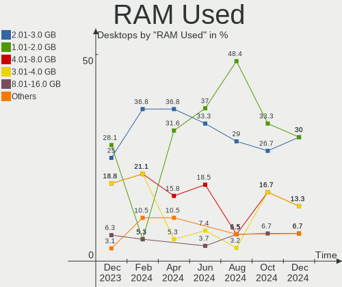

| Used GB   | Desktops | Percent |
|-----------|----------|---------|
| 1.01-2.0  | 8        | 29.63%  |
| 3.01-4.0  | 6        | 22.22%  |
| 2.01-3.0  | 5        | 18.52%  |
| 4.01-8.0  | 4        | 14.81%  |
| 8.01-16.0 | 2        | 7.41%   |
| 0.51-1.0  | 1        | 3.7%    |
| 0.01-0.5  | 1        | 3.7%    |

Total Drives
------------

Number of drives on board

| Drives | Desktops | Percent |
|--------|----------|---------|
| 1      | 12       | 44.44%  |
| 2      | 10       | 37.04%  |
| 3      | 4        | 14.81%  |
| 5      | 1        | 3.7%    |

Has CD-ROM
----------

Has CD-ROM on board

| Presented | Desktops | Percent |
|-----------|----------|---------|
| No        | 21       | 77.78%  |
| Yes       | 6        | 22.22%  |

Has Ethernet
------------

Has Ethernet on board

| Presented | Desktops | Percent |
|-----------|----------|---------|
| Yes       | 26       | 96.3%   |
| No        | 1        | 3.7%    |

Has WiFi
--------

Has WiFi module

| Presented | Desktops | Percent |
|-----------|----------|---------|
| Yes       | 15       | 55.56%  |
| No        | 12       | 44.44%  |

Has Bluetooth
-------------

Has Bluetooth module

| Presented | Desktops | Percent |
|-----------|----------|---------|
| No        | 18       | 66.67%  |
| Yes       | 9        | 33.33%  |

Location
--------

Country
-------

Geographic location (country)

| Country | Desktops | Percent |
|---------|----------|---------|
| India   | 27       | 100%    |

City
----

Geographic location (city)

| City          | Desktops | Percent |
|---------------|----------|---------|
| Surat         | 3        | 11.11%  |
| Hyderabad     | 3        | 11.11%  |
| Delhi         | 3        | 11.11%  |
| Chennai       | 3        | 11.11%  |
| Mangalore     | 2        | 7.41%   |
| Vijayawada    | 1        | 3.7%    |
| Pune          | 1        | 3.7%    |
| Mumbai        | 1        | 3.7%    |
| Kishanganj    | 1        | 3.7%    |
| Kanpur        | 1        | 3.7%    |
| Kalwara       | 1        | 3.7%    |
| Jaipur        | 1        | 3.7%    |
| Guwahati      | 1        | 3.7%    |
| Greater Noida | 1        | 3.7%    |
| Chandigarh    | 1        | 3.7%    |
| Bhopal        | 1        | 3.7%    |
| Bengaluru     | 1        | 3.7%    |
| Ahmedabad     | 1        | 3.7%    |

Drives
------

Drive Vendor
------------

Hard drive vendors

| Vendor                      | Desktops | Drives | Percent |
|-----------------------------|----------|--------|---------|
| Seagate                     | 10       | 11     | 22.22%  |
| WDC                         | 9        | 11     | 20%     |
| Samsung Electronics         | 5        | 5      | 11.11%  |
| Crucial                     | 4        | 4      | 8.89%   |
| Toshiba                     | 3        | 3      | 6.67%   |
| ADATA Technology            | 3        | 3      | 6.67%   |
| Kingston Technology Company | 2        | 2      | 4.44%   |
| Kingston                    | 2        | 2      | 4.44%   |
| Silicon Motion              | 1        | 1      | 2.22%   |
| Sandisk                     | 1        | 1      | 2.22%   |
| PNY                         | 1        | 1      | 2.22%   |
| Micron/Crucial Technology   | 1        | 1      | 2.22%   |
| Gigabyte Technology         | 1        | 1      | 2.22%   |
| Acer                        | 1        | 1      | 2.22%   |
| A-DATA Technology           | 1        | 1      | 2.22%   |

Drive Model
-----------

Hard drive models

| Model                                                 | Desktops | Percent |
|-------------------------------------------------------|----------|---------|
| Seagate ST1000DM010-2EP102 1TB                        | 4        | 8.51%   |
| WDC WD10EZEX-08WN4A0 1TB                              | 2        | 4.26%   |
| Seagate ST500DM002-1BD142 500GB                       | 2        | 4.26%   |
| Kingston Company A2000 NVMe SSD 1TB                   | 2        | 4.26%   |
| Crucial CT240BX500SSD1 240GB                          | 2        | 4.26%   |
| ADATA XPG GAMMIX S70 BLADE 1024GB                     | 2        | 4.26%   |
| WDC WDS240G2G0B-00EPW0 240GB SSD                      | 1        | 2.13%   |
| WDC WDS240G2G0A-00JH30 240GB SSD                      | 1        | 2.13%   |
| WDC WD5000AAKX-753CA1 500GB                           | 1        | 2.13%   |
| WDC WD20EZAZ-00L9GB0 2TB                              | 1        | 2.13%   |
| WDC WD1200BEVS-75RST0 120GB                           | 1        | 2.13%   |
| WDC WD10JPVX-75JC3T0 1TB                              | 1        | 2.13%   |
| WDC WD10EZRX-00L4HB0 1TB                              | 1        | 2.13%   |
| WDC WD10EZEX-75WN4A0 1TB                              | 1        | 2.13%   |
| WDC WD10EADS-114BB1 1TB                               | 1        | 2.13%   |
| Toshiba HDWD110 1TB                                   | 1        | 2.13%   |
| Toshiba DT01ACA100 1TB                                | 1        | 2.13%   |
| Toshiba DT01ABA050V 500GB                             | 1        | 2.13%   |
| Silicon Motion SM2263EN/SM2263XT SSD Controller 500GB | 1        | 2.13%   |
| Seagate ST3500312CS 500GB                             | 1        | 2.13%   |
| Seagate ST1000DM003-1SB102 1TB                        | 1        | 2.13%   |
| Seagate ST1000DM003-1ER162 1TB                        | 1        | 2.13%   |
| Seagate ST1000DM003-1CH162 1TB                        | 1        | 2.13%   |
| Sandisk WDC WDS500G2B0C-00PXH0 500GB                  | 1        | 2.13%   |
| Samsung SSD 980 250GB                                 | 1        | 2.13%   |
| Samsung SSD 850 EVO 500GB                             | 1        | 2.13%   |
| Samsung SSD 850 EVO 250GB                             | 1        | 2.13%   |
| Samsung SP0842N 80GB                                  | 1        | 2.13%   |
| Samsung HD503HI 500GB                                 | 1        | 2.13%   |
| PNY CS900 120GB SSD                                   | 1        | 2.13%   |
| Micron/Crucial P2 NVMe PCIe SSD 1TB                   | 1        | 2.13%   |
| Kingston SQ500S37240G 240GB SSD                       | 1        | 2.13%   |
| Kingston SA400S37240G 240GB SSD                       | 1        | 2.13%   |
| Gigabyte GP-GSTFS31120GNTD 120GB                      | 1        | 2.13%   |
| Crucial CT256MX100SSD1 256GB                          | 1        | 2.13%   |
| Crucial CT1000P2SSD8 1TB                              | 1        | 2.13%   |
| ADATA XPG GAMMIX S5 256GB                             | 1        | 2.13%   |
| Acer SSD SA100 240GB                                  | 1        | 2.13%   |
| A-DATA SU650 480GB SSD                                | 1        | 2.13%   |

HDD Vendor
----------

Hard disk drive vendors

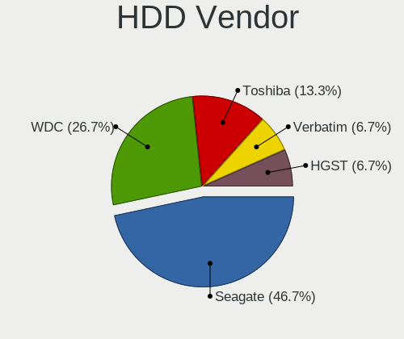

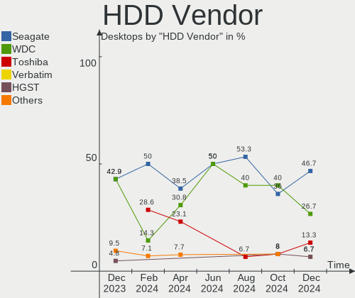

| Vendor              | Desktops | Drives | Percent |
|---------------------|----------|--------|---------|
| Seagate             | 10       | 11     | 43.48%  |
| WDC                 | 8        | 9      | 34.78%  |
| Toshiba             | 3        | 3      | 13.04%  |
| Samsung Electronics | 2        | 2      | 8.7%    |

SSD Vendor
----------

Solid state drive vendors

| Vendor              | Desktops | Drives | Percent |
|---------------------|----------|--------|---------|
| Crucial             | 3        | 3      | 23.08%  |
| WDC                 | 2        | 2      | 15.38%  |
| Samsung Electronics | 2        | 2      | 15.38%  |
| Kingston            | 2        | 2      | 15.38%  |
| PNY                 | 1        | 1      | 7.69%   |
| Gigabyte Technology | 1        | 1      | 7.69%   |
| Acer                | 1        | 1      | 7.69%   |
| A-DATA Technology   | 1        | 1      | 7.69%   |

Drive Kind
----------

HDD or SSD

| Kind | Desktops | Drives | Percent |
|------|----------|--------|---------|
| HDD  | 20       | 25     | 47.62%  |
| SSD  | 13       | 13     | 30.95%  |
| NVMe | 9        | 10     | 21.43%  |

Drive Connector
---------------

SATA, SAS, NVMe, etc.

| Type | Desktops | Drives | Percent |
|------|----------|--------|---------|
| SATA | 26       | 38     | 74.29%  |
| NVMe | 9        | 10     | 25.71%  |

Drive Size
----------

Size of hard drive

| Size in TB | Desktops | Drives | Percent |
|------------|----------|--------|---------|
| 0.01-0.5   | 18       | 22     | 56.25%  |
| 0.51-1.0   | 13       | 15     | 40.63%  |
| 1.01-2.0   | 1        | 1      | 3.13%   |

Space Total
-----------

Amount of disk space available on the file system

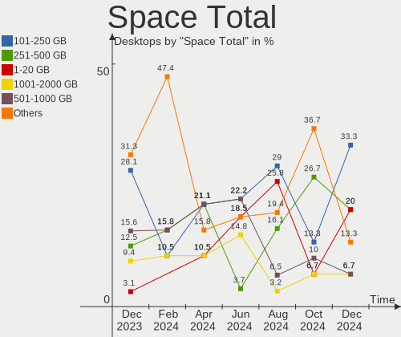

| Size in GB     | Desktops | Percent |
|----------------|----------|---------|
| 101-250        | 8        | 29.63%  |
| 251-500        | 7        | 25.93%  |
| 501-1000       | 7        | 25.93%  |
| More than 3000 | 2        | 7.41%   |
| 21-50          | 1        | 3.7%    |
| 2001-3000      | 1        | 3.7%    |
| 1001-2000      | 1        | 3.7%    |

Space Used
----------

Amount of used disk space

| Used GB   | Desktops | Percent |
|-----------|----------|---------|
| 1-20      | 9        | 33.33%  |
| 21-50     | 7        | 25.93%  |
| 251-500   | 4        | 14.81%  |
| 501-1000  | 3        | 11.11%  |
| 101-250   | 2        | 7.41%   |
| 1001-2000 | 1        | 3.7%    |
| 51-100    | 1        | 3.7%    |

Malfunc. Drives
---------------

Drive models with a malfunction

| Model                             | Desktops | Drives | Percent |
|-----------------------------------|----------|--------|---------|
| Samsung Electronics HD503HI 500GB | 1        | 1      | 50%     |
| A-DATA Technology SU650 480GB SSD | 1        | 1      | 50%     |

Malfunc. Drive Vendor
---------------------

Vendors of faulty drives

| Vendor              | Desktops | Drives | Percent |
|---------------------|----------|--------|---------|
| Samsung Electronics | 1        | 1      | 50%     |
| A-DATA Technology   | 1        | 1      | 50%     |

Malfunc. HDD Vendor
-------------------

Vendors of faulty HDD drives

| Vendor              | Desktops | Drives | Percent |
|---------------------|----------|--------|---------|
| Samsung Electronics | 1        | 1      | 100%    |

Malfunc. Drive Kind
-------------------

Kinds of faulty drives

| Kind | Desktops | Drives | Percent |
|------|----------|--------|---------|
| SSD  | 1        | 1      | 50%     |
| HDD  | 1        | 1      | 50%     |

Failed Drives
-------------

Failed drive models

Zero info for selected period =(

Failed Drive Vendor
-------------------

Failed drive vendors

Zero info for selected period =(

Drive Status
------------

Number of failed and malfunc. drives

| Status   | Desktops | Drives | Percent |
|----------|----------|--------|---------|
| Detected | 14       | 27     | 50%     |
| Works    | 12       | 19     | 42.86%  |
| Malfunc  | 2        | 2      | 7.14%   |

Storage controller
------------------

Storage Vendor
--------------

Storage controller vendors

| Vendor                      | Desktops | Percent |
|-----------------------------|----------|---------|
| Intel                       | 23       | 62.16%  |
| AMD                         | 4        | 10.81%  |
| ADATA Technology            | 3        | 8.11%   |
| Micron/Crucial Technology   | 2        | 5.41%   |
| Kingston Technology Company | 2        | 5.41%   |
| Silicon Motion              | 1        | 2.7%    |
| SanDisk                     | 1        | 2.7%    |
| Samsung Electronics         | 1        | 2.7%    |

Storage Model
-------------

Storage controller models

| Model                                                                                   | Desktops | Percent |
|-----------------------------------------------------------------------------------------|----------|---------|
| Intel 6 Series/C200 Series Chipset Family Desktop SATA Controller (IDE mode, ports 4-5) | 4        | 8.7%    |
| Intel 6 Series/C200 Series Chipset Family Desktop SATA Controller (IDE mode, ports 0-3) | 4        | 8.7%    |
| Intel 200 Series PCH SATA controller [AHCI mode]                                        | 4        | 8.7%    |
| Intel 6 Series/C200 Series Chipset Family 6 port Desktop SATA AHCI Controller           | 3        | 6.52%   |
| Micron/Crucial P2 [Nick P2] / P3 / P3 Plus NVMe PCIe SSD (DRAM-less)                    | 2        | 4.35%   |
| Kingston Company A2000 NVMe SSD                                                         | 2        | 4.35%   |
| Intel NM10/ICH7 Family SATA Controller [IDE mode]                                       | 2        | 4.35%   |
| Intel Cannon Lake PCH SATA AHCI Controller                                              | 2        | 4.35%   |
| Intel 82801G (ICH7 Family) IDE Controller                                               | 2        | 4.35%   |
| Intel 7 Series/C210 Series Chipset Family 6-port SATA Controller [AHCI mode]            | 2        | 4.35%   |
| AMD FCH SATA Controller [AHCI mode]                                                     | 2        | 4.35%   |
| AMD 500 Series Chipset SATA Controller                                                  | 2        | 4.35%   |
| ADATA A Non-Volatile memory controller                                                  | 2        | 4.35%   |
| Silicon Motion SM2263EN/SM2263XT (DRAM-less) NVMe SSD Controllers                       | 1        | 2.17%   |
| SanDisk WD Green SN350 NVMe SSD 240GB (DRAM-less)                                       | 1        | 2.17%   |
| Samsung NVMe SSD Controller 980                                                         | 1        | 2.17%   |
| Intel Volume Management Device NVMe RAID Controller                                     | 1        | 2.17%   |
| Intel Q170/Q150/B150/H170/H110/Z170/CM236 Chipset SATA Controller [AHCI Mode]           | 1        | 2.17%   |
| Intel Alder Lake-S PCH SATA Controller [AHCI Mode]                                      | 1        | 2.17%   |
| Intel 9 Series Chipset Family SATA Controller [AHCI Mode]                               | 1        | 2.17%   |
| Intel 500 Series Chipset Family SATA AHCI Controller                                    | 1        | 2.17%   |
| Intel 5 Series/3400 Series Chipset 4 port SATA IDE Controller                           | 1        | 2.17%   |
| Intel 5 Series/3400 Series Chipset 2 port SATA IDE Controller                           | 1        | 2.17%   |
| Intel 400 Series Chipset Family SATA AHCI Controller                                    | 1        | 2.17%   |
| AMD FCH SATA Controller D                                                               | 1        | 2.17%   |
| ADATA ADATA XPG GAMMIXS1 1L Media (256 GB SSD)                                          | 1        | 2.17%   |

Storage Kind
------------

Kind of storage controller (IDE, SATA, NVMe, SAS, ...)

| Kind | Desktops | Percent |
|------|----------|---------|
| SATA | 20       | 54.05%  |
| NVMe | 9        | 24.32%  |
| IDE  | 7        | 18.92%  |
| RAID | 1        | 2.7%    |

Processor
---------

CPU Vendor
----------

Processor vendors

| Vendor | Desktops | Percent |
|--------|----------|---------|
| Intel  | 23       | 85.19%  |
| AMD    | 4        | 14.81%  |

CPU Model
---------

Processor models

| Model                                       | Desktops | Percent |
|---------------------------------------------|----------|---------|
| Intel Core i3-3220 CPU @ 3.30GHz            | 3        | 11.11%  |
| Intel Core i7-9700 CPU @ 3.00GHz            | 2        | 7.41%   |
| Intel Pentium CPU G2030 @ 3.00GHz           | 1        | 3.7%    |
| Intel Pentium CPU G2020 @ 2.90GHz           | 1        | 3.7%    |
| Intel Core i7-8700 CPU @ 3.20GHz            | 1        | 3.7%    |
| Intel Core i7-7700K CPU @ 4.20GHz           | 1        | 3.7%    |
| Intel Core i7-3770S CPU @ 3.10GHz           | 1        | 3.7%    |
| Intel Core i7-10700F CPU @ 2.90GHz          | 1        | 3.7%    |
| Intel Core i5-7500 CPU @ 3.40GHz            | 1        | 3.7%    |
| Intel Core i5-3470 CPU @ 3.20GHz            | 1        | 3.7%    |
| Intel Core i5-2500 CPU @ 3.30GHz            | 1        | 3.7%    |
| Intel Core i3-9100F CPU @ 3.60GHz           | 1        | 3.7%    |
| Intel Core i3-7100 CPU @ 3.90GHz            | 1        | 3.7%    |
| Intel Core i3-4340 CPU @ 3.60GHz            | 1        | 3.7%    |
| Intel Core i3-2100 CPU @ 3.10GHz            | 1        | 3.7%    |
| Intel Core i3 CPU 540 @ 3.07GHz             | 1        | 3.7%    |
| Intel Core 2 Quad CPU Q6600 @ 2.40GHz       | 1        | 3.7%    |
| Intel Core 2 Duo CPU E8500 @ 3.16GHz        | 1        | 3.7%    |
| Intel 12th Gen Core i7-12700                | 1        | 3.7%    |
| Intel 11th Gen Core i5-11400 @ 2.60GHz      | 1        | 3.7%    |
| AMD Ryzen 7 5700G with Radeon Graphics      | 1        | 3.7%    |
| AMD Ryzen 5 7600 6-Core Processor           | 1        | 3.7%    |
| AMD Ryzen 3 3200G with Radeon Vega Graphics | 1        | 3.7%    |
| AMD Ryzen 3 3100 4-Core Processor           | 1        | 3.7%    |

CPU Model Family
----------------

Processor model prefix

| Model             | Desktops | Percent |
|-------------------|----------|---------|
| Intel Core i3     | 8        | 29.63%  |
| Intel Core i7     | 6        | 22.22%  |
| Intel Core i5     | 3        | 11.11%  |
| Other             | 2        | 7.41%   |
| Intel Pentium     | 2        | 7.41%   |
| AMD Ryzen 3       | 2        | 7.41%   |
| Intel Core 2 Quad | 1        | 3.7%    |
| Intel Core 2 Duo  | 1        | 3.7%    |
| AMD Ryzen 7       | 1        | 3.7%    |
| AMD Ryzen 5       | 1        | 3.7%    |

CPU Cores
---------

Number of processor cores

| Number | Desktops | Percent |
|--------|----------|---------|
| 2      | 10       | 37.04%  |
| 4      | 9        | 33.33%  |
| 8      | 4        | 14.81%  |
| 6      | 3        | 11.11%  |
| 12     | 1        | 3.7%    |

CPU Sockets
-----------

Number of sockets

| Number | Desktops | Percent |
|--------|----------|---------|
| 1      | 27       | 100%    |

CPU Threads
-----------

Threads per core (Hyper-Threading)

| Number | Desktops | Percent |
|--------|----------|---------|
| 2      | 16       | 59.26%  |
| 1      | 11       | 40.74%  |

CPU Op-Modes
------------

CPU Operation Modes (32-bit, 64-bit)

| Op mode        | Desktops | Percent |
|----------------|----------|---------|
| 32-bit, 64-bit | 27       | 100%    |

CPU Microcode
-------------

Microcode number

| Number     | Desktops | Percent |
|------------|----------|---------|
| Unknown    | 17       | 62.96%  |
| 0x906ea    | 2        | 7.41%   |
| 0x306a9    | 2        | 7.41%   |
| 0x20655    | 1        | 3.7%    |
| 0x10676    | 1        | 3.7%    |
| 0x0a601203 | 1        | 3.7%    |
| 0x0a50000c | 1        | 3.7%    |
| 0x08701030 | 1        | 3.7%    |
| 0x08108109 | 1        | 3.7%    |

CPU Microarch
-------------

Microarchitecture

| Name        | Desktops | Percent |
|-------------|----------|---------|
| KabyLake    | 7        | 25.93%  |
| IvyBridge   | 7        | 25.93%  |
| SandyBridge | 2        | 7.41%   |
| Unknown     | 2        | 7.41%   |
| Zen+        | 1        | 3.7%    |
| Zen 3       | 1        | 3.7%    |
| Zen 2       | 1        | 3.7%    |
| Westmere    | 1        | 3.7%    |
| Penryn      | 1        | 3.7%    |
| Icelake     | 1        | 3.7%    |
| Haswell     | 1        | 3.7%    |
| Core        | 1        | 3.7%    |
| CometLake   | 1        | 3.7%    |

Graphics
--------

GPU Vendor
----------

Vendors of graphics cards

| Vendor | Desktops | Percent |
|--------|----------|---------|
| Intel  | 19       | 67.86%  |
| Nvidia | 6        | 21.43%  |
| AMD    | 3        | 10.71%  |

GPU Model
---------

Graphics card models

| Model                                                                       | Desktops | Percent |
|-----------------------------------------------------------------------------|----------|---------|
| Intel Xeon E3-1200 v2/3rd Gen Core processor Graphics Controller            | 6        | 20.69%  |
| Intel HD Graphics 630                                                       | 3        | 10.34%  |
| Intel CoffeeLake-S GT2 [UHD Graphics 630]                                   | 3        | 10.34%  |
| Nvidia GK208B [GeForce GT 730]                                              | 2        | 6.9%    |
| Intel 2nd Generation Core Processor Family Integrated Graphics Controller   | 2        | 6.9%    |
| Nvidia TU116 [GeForce GTX 1660 SUPER]                                       | 1        | 3.45%   |
| Nvidia GK208B [GeForce GT 710]                                              | 1        | 3.45%   |
| Nvidia GF108 [GeForce GT 630]                                               | 1        | 3.45%   |
| Nvidia GA104 [GeForce RTX 3060 Ti]                                          | 1        | 3.45%   |
| Intel Xeon E3-1200 v3/4th Gen Core Processor Integrated Graphics Controller | 1        | 3.45%   |
| Intel RocketLake-S GT1 [UHD Graphics 730]                                   | 1        | 3.45%   |
| Intel Core Processor Integrated Graphics Controller                         | 1        | 3.45%   |
| Intel AlderLake-S GT1                                                       | 1        | 3.45%   |
| Intel 4 Series Chipset Integrated Graphics Controller                       | 1        | 3.45%   |
| AMD Raphael                                                                 | 1        | 3.45%   |
| AMD Picasso/Raven 2 [Radeon Vega Series / Radeon Vega Mobile Series]        | 1        | 3.45%   |
| AMD Navi 22 [Radeon RX 6700/6700 XT/6750 XT / 6800M/6850M XT]               | 1        | 3.45%   |
| AMD Cezanne [Radeon Vega Series / Radeon Vega Mobile Series]                | 1        | 3.45%   |

GPU Combo
---------

Combinations of graphics cards

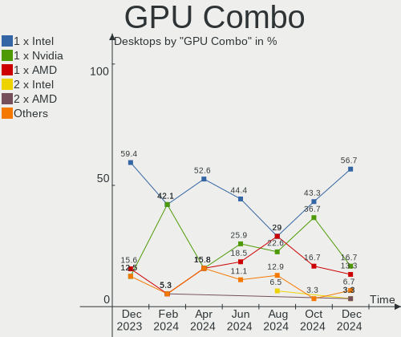

| Name           | Desktops | Percent |
|----------------|----------|---------|
| 1 x Intel      | 18       | 66.67%  |
| 1 x Nvidia     | 5        | 18.52%  |
| 1 x AMD        | 2        | 7.41%   |
| 2 x AMD        | 1        | 3.7%    |
| Intel + Nvidia | 1        | 3.7%    |

GPU Driver
----------

Free vs proprietary

| Driver      | Desktops | Percent |
|-------------|----------|---------|
| Free        | 22       | 81.48%  |
| Proprietary | 4        | 14.81%  |
| Unknown     | 1        | 3.7%    |

GPU Memory
----------

Total video memory

| Size in GB | Desktops | Percent |
|------------|----------|---------|
| Unknown    | 20       | 74.07%  |
| 1.01-2.0   | 4        | 14.81%  |
| 7.01-8.0   | 1        | 3.7%    |
| 5.01-6.0   | 1        | 3.7%    |
| 8.01-16.0  | 1        | 3.7%    |

Monitor
-------

Monitor Vendor
--------------

Monitor vendors

| Vendor              | Desktops | Percent |
|---------------------|----------|---------|
| Samsung Electronics | 6        | 24%     |
| Hewlett-Packard     | 4        | 16%     |
| Goldstar            | 4        | 16%     |
| Philips             | 3        | 12%     |
| Lenovo              | 2        | 8%      |
| Dell                | 2        | 8%      |
| RTK                 | 1        | 4%      |
| LG Electronics      | 1        | 4%      |
| Hitachi             | 1        | 4%      |
| BenQ                | 1        | 4%      |

Monitor Model
-------------

Monitor models

| Model                                                              | Desktops | Percent |
|--------------------------------------------------------------------|----------|---------|
| Samsung Electronics SMB2030 SAM063D 1600x900 443x249mm 20.0-inch   | 1        | 4%      |
| Samsung Electronics S24R35A SAM72A0 1920x1080 527x296mm 23.8-inch  | 1        | 4%      |
| Samsung Electronics S24C350 SAM0A3B 1920x1080 521x293mm 23.5-inch  | 1        | 4%      |
| Samsung Electronics S22B370 SAM0899 1920x1080 477x268mm 21.5-inch  | 1        | 4%      |
| Samsung Electronics LF22T35 SAM707C 1920x1080 477x268mm 21.5-inch  | 1        | 4%      |
| Samsung Electronics LC27G5xT SAM707A 2560x1440 597x336mm 27.0-inch | 1        | 4%      |
| RTK LCD Monitor RTK1D1A 1920x1080 1020x570mm 46.0-inch             | 1        | 4%      |
| Philips PHL 223V7 PHLC154 1920x1080 480x270mm 21.7-inch            | 1        | 4%      |
| Philips 226V4 PHLC0B1 1920x1080 477x268mm 21.5-inch                | 1        | 4%      |
| Philips 202EL PHLC05C 1600x900 443x249mm 20.0-inch                 | 1        | 4%      |
| LG Electronics LCD Monitor LG FULL HD 1920x1080                    | 1        | 4%      |
| Lenovo LI2215sD LEN65CC 1920x1080 476x267mm 21.5-inch              | 1        | 4%      |
| Lenovo LEN T24i-10 LEN61CE 1920x1080 527x296mm 23.8-inch           | 1        | 4%      |
| Hitachi HDMI HEC0029 1920x1080 1152x648mm 52.0-inch                | 1        | 4%      |
| Hewlett-Packard P224 HPN361F 1920x1080 527x296mm 23.8-inch         | 1        | 4%      |
| Hewlett-Packard LV1911 HWP3005 1366x768 410x230mm 18.5-inch        | 1        | 4%      |
| Hewlett-Packard E223 HPN345B 1920x1080 476x268mm 21.5-inch         | 1        | 4%      |
| Hewlett-Packard 27fw HPN3608 1920x1080 598x336mm 27.0-inch         | 1        | 4%      |
| Goldstar ULTRAWIDE GSM59F1 2560x1080 673x284mm 28.8-inch           | 1        | 4%      |
| Goldstar ULTRAGEAR GSM5BB4 2560x1440 597x336mm 27.0-inch           | 1        | 4%      |
| Goldstar QHD GSM772A 2560x1440 697x392mm 31.5-inch                 | 1        | 4%      |
| Goldstar 19M35 GSM4C24 1366x768 410x230mm 18.5-inch                | 1        | 4%      |
| Dell E1914H DELD03A 1366x768 410x230mm 18.5-inch                   | 1        | 4%      |
| Dell E190S DELA04B 1280x1024 376x301mm 19.0-inch                   | 1        | 4%      |
| BenQ G2412HD BNQ783B 1920x1080 521x293mm 23.5-inch                 | 1        | 4%      |

Monitor Resolution
------------------

Monitor screen resolution

| Resolution       | Desktops | Percent |
|------------------|----------|---------|
| 1920x1080 (FHD)  | 14       | 58.33%  |
| 2560x1440 (QHD)  | 3        | 12.5%   |
| 1366x768 (WXGA)  | 3        | 12.5%   |
| 1600x900 (HD+)   | 2        | 8.33%   |
| 2560x1080        | 1        | 4.17%   |
| 1280x1024 (SXGA) | 1        | 4.17%   |

Monitor Diagonal
----------------

Diagonal size in inches

| Inches  | Desktops | Percent |
|---------|----------|---------|
| 21      | 6        | 24%     |
| 23      | 4        | 16%     |
| 18      | 3        | 12%     |
| 31      | 2        | 8%      |
| 27      | 2        | 8%      |
| 20      | 2        | 8%      |
| 52      | 1        | 4%      |
| 46      | 1        | 4%      |
| 34      | 1        | 4%      |
| 24      | 1        | 4%      |
| 19      | 1        | 4%      |
| Unknown | 1        | 4%      |

Monitor Width
-------------

Physical width

| Width in mm | Desktops | Percent |
|-------------|----------|---------|
| 401-500     | 11       | 44%     |
| 501-600     | 7        | 28%     |
| 601-700     | 2        | 8%      |
| 1001-1500   | 2        | 8%      |
| 701-800     | 1        | 4%      |
| 351-400     | 1        | 4%      |
| Unknown     | 1        | 4%      |

Aspect Ratio
------------

Proportional relationship between the width and the height

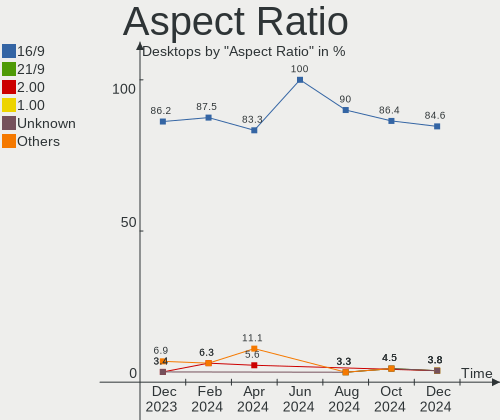

| Ratio   | Desktops | Percent |
|---------|----------|---------|
| 16/9    | 21       | 87.5%   |
| 5/4     | 1        | 4.17%   |
| 21/9    | 1        | 4.17%   |
| Unknown | 1        | 4.17%   |

Monitor Area
------------

Area in inch

| Area in inch | Desktops | Percent |
|----------------|----------|---------|
| 201-250        | 9        | 36%     |
| 151-200        | 5        | 20%     |
| 351-500        | 3        | 12%     |
| 141-150        | 3        | 12%     |
| 301-350        | 2        | 8%      |
| More than 1000 | 1        | 4%      |
| 501-1000       | 1        | 4%      |
| Unknown        | 1        | 4%      |

Pixel Density
-------------

Pixels per inch

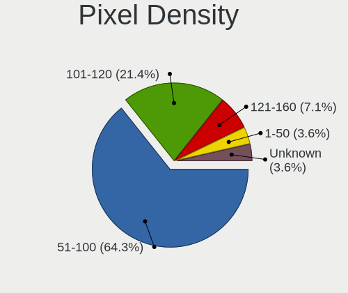

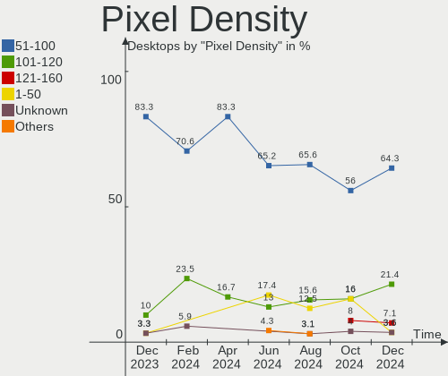

| Density | Desktops | Percent |
|---------|----------|---------|
| 51-100  | 15       | 60%     |
| 101-120 | 7        | 28%     |
| 1-50    | 2        | 8%      |
| Unknown | 1        | 4%      |

Multiple Monitors
-----------------

Total monitors connected

| Total | Desktops | Percent |
|-------|----------|---------|
| 1     | 24       | 88.89%  |
| 0     | 2        | 7.41%   |
| 2     | 1        | 3.7%    |

Network
-------

Net Controller Vendor
---------------------

Controller vendors

| Vendor                | Desktops | Percent |
|-----------------------|----------|---------|
| Realtek Semiconductor | 18       | 42.86%  |
| Intel                 | 11       | 26.19%  |
| TP-Link               | 3        | 7.14%   |
| Ralink Technology     | 3        | 7.14%   |
| Qualcomm Atheros      | 2        | 4.76%   |
| Qualcomm              | 2        | 4.76%   |
| Xiaomi                | 1        | 2.38%   |
| NetGear               | 1        | 2.38%   |
| MediaTek              | 1        | 2.38%   |

Net Controller Model
--------------------

Controller models

| Model                                                             | Desktops | Percent |
|-------------------------------------------------------------------|----------|---------|
| Realtek RTL8111/8168/8411 PCI Express Gigabit Ethernet Controller | 12       | 26.67%  |
| TP-Link TL-WN823N v2/v3 [Realtek RTL8192EU]                       | 3        | 6.67%   |
| Realtek RTL810xE PCI Express Fast Ethernet controller             | 3        | 6.67%   |
| Ralink MT7601U Wireless Adapter                                   | 3        | 6.67%   |
| Realtek RTL8188FTV 802.11b/g/n 1T1R 2.4G WLAN Adapter             | 2        | 4.44%   |
| Realtek RTL8125 2.5GbE Controller                                 | 2        | 4.44%   |
| Intel Ethernet Connection (7) I219-LM                             | 2        | 4.44%   |
| Intel Ethernet Connection (2) I219-V                              | 2        | 4.44%   |
| Intel 82579LM Gigabit Network Connection (Lewisville)             | 2        | 4.44%   |
| Xiaomi Mi/Redmi series (RNDIS + ADB)                              | 1        | 2.22%   |
| Realtek RTL8192EE PCIe Wireless Network Adapter                   | 1        | 2.22%   |
| Qualcomm SM6150-IDP _SN:488AC473                                  | 1        | 2.22%   |
| Qualcomm Redmi Note 8                                             | 1        | 2.22%   |
| Qualcomm Atheros Killer E2500 Gigabit Ethernet Controller         | 1        | 2.22%   |
| Qualcomm Atheros AR9485 Wireless Network Adapter                  | 1        | 2.22%   |
| NetGear WNA1000M 802.11bgn [Realtek RTL8188CUS]                   | 1        | 2.22%   |
| MediaTek MT7921K (RZ608) Wi-Fi 6E 80MHz                           | 1        | 2.22%   |
| Intel Wireless-AC 9260                                            | 1        | 2.22%   |
| Intel Wi-Fi 6 AX210/AX211/AX411 160MHz                            | 1        | 2.22%   |
| Intel Ethernet Controller I225-V                                  | 1        | 2.22%   |
| Intel Ethernet Connection (10) I219-V                             | 1        | 2.22%   |
| Intel Dual Band Wireless-AC 3168NGW [Stone Peak]                  | 1        | 2.22%   |
| Intel Centrino Advanced-N 6205 [Taylor Peak]                      | 1        | 2.22%   |

Wireless Vendor
---------------

Wireless vendors

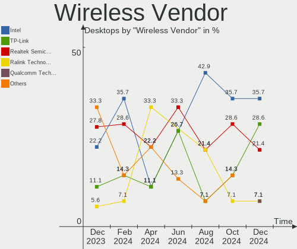

| Vendor                | Desktops | Percent |
|-----------------------|----------|---------|
| Intel                 | 4        | 25%     |
| TP-Link               | 3        | 18.75%  |
| Realtek Semiconductor | 3        | 18.75%  |
| Ralink Technology     | 3        | 18.75%  |
| Qualcomm Atheros      | 1        | 6.25%   |
| NetGear               | 1        | 6.25%   |
| MediaTek              | 1        | 6.25%   |

Wireless Model
--------------

Wireless models

| Model                                                 | Desktops | Percent |
|-------------------------------------------------------|----------|---------|
| TP-Link TL-WN823N v2/v3 [Realtek RTL8192EU]           | 3        | 18.75%  |
| Ralink MT7601U Wireless Adapter                       | 3        | 18.75%  |
| Realtek RTL8188FTV 802.11b/g/n 1T1R 2.4G WLAN Adapter | 2        | 12.5%   |
| Realtek RTL8192EE PCIe Wireless Network Adapter       | 1        | 6.25%   |
| Qualcomm Atheros AR9485 Wireless Network Adapter      | 1        | 6.25%   |
| NetGear WNA1000M 802.11bgn [Realtek RTL8188CUS]       | 1        | 6.25%   |
| MediaTek MT7921K (RZ608) Wi-Fi 6E 80MHz               | 1        | 6.25%   |
| Intel Wireless-AC 9260                                | 1        | 6.25%   |
| Intel Wi-Fi 6 AX210/AX211/AX411 160MHz                | 1        | 6.25%   |
| Intel Dual Band Wireless-AC 3168NGW [Stone Peak]      | 1        | 6.25%   |
| Intel Centrino Advanced-N 6205 [Taylor Peak]          | 1        | 6.25%   |

Ethernet Vendor
---------------

Ethernet vendors

| Vendor                | Desktops | Percent |
|-----------------------|----------|---------|
| Realtek Semiconductor | 17       | 58.62%  |
| Intel                 | 8        | 27.59%  |
| Qualcomm              | 2        | 6.9%    |
| Xiaomi                | 1        | 3.45%   |
| Qualcomm Atheros      | 1        | 3.45%   |

Ethernet Model
--------------

Ethernet models

| Model                                                             | Desktops | Percent |
|-------------------------------------------------------------------|----------|---------|
| Realtek RTL8111/8168/8411 PCI Express Gigabit Ethernet Controller | 12       | 41.38%  |
| Realtek RTL810xE PCI Express Fast Ethernet controller             | 3        | 10.34%  |
| Realtek RTL8125 2.5GbE Controller                                 | 2        | 6.9%    |
| Intel Ethernet Connection (7) I219-LM                             | 2        | 6.9%    |
| Intel Ethernet Connection (2) I219-V                              | 2        | 6.9%    |
| Intel 82579LM Gigabit Network Connection (Lewisville)             | 2        | 6.9%    |
| Xiaomi Mi/Redmi series (RNDIS + ADB)                              | 1        | 3.45%   |
| Qualcomm SM6150-IDP _SN:488AC473                                  | 1        | 3.45%   |
| Qualcomm Redmi Note 8                                             | 1        | 3.45%   |
| Qualcomm Atheros Killer E2500 Gigabit Ethernet Controller         | 1        | 3.45%   |
| Intel Ethernet Controller I225-V                                  | 1        | 3.45%   |
| Intel Ethernet Connection (10) I219-V                             | 1        | 3.45%   |

Net Controller Kind
-------------------

Ethernet, WiFi or modem

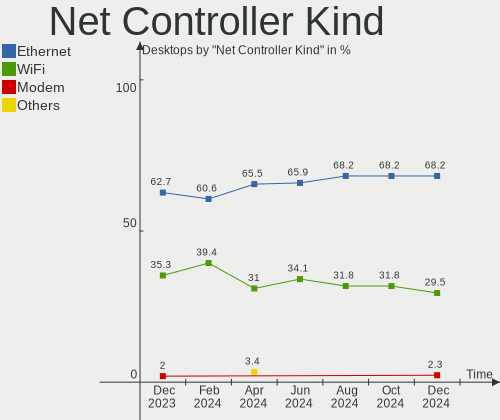

| Kind     | Desktops | Percent |
|----------|----------|---------|
| Ethernet | 26       | 63.41%  |
| WiFi     | 15       | 36.59%  |

Used Controller
---------------

Currently used network controller

| Kind     | Desktops | Percent |
|----------|----------|---------|
| Ethernet | 16       | 64%     |
| WiFi     | 9        | 36%     |

NICs
----

Total network controllers on board

| Total | Desktops | Percent |
|-------|----------|---------|
| 1     | 16       | 59.26%  |
| 2     | 9        | 33.33%  |
| 0     | 2        | 7.41%   |

IPv6
----

IPv6 vs IPv4

| Used | Desktops | Percent |
|------|----------|---------|
| No   | 20       | 74.07%  |
| Yes  | 7        | 25.93%  |

Bluetooth
---------

Bluetooth Vendor
----------------

Controller vendors

| Vendor                  | Desktops | Percent |
|-------------------------|----------|---------|
| Intel                   | 3        | 33.33%  |
| Cambridge Silicon Radio | 3        | 33.33%  |
| TP-Link                 | 2        | 22.22%  |
| MediaTek                | 1        | 11.11%  |

Bluetooth Model
---------------

Controller models

| Model                                               | Desktops | Percent |
|-----------------------------------------------------|----------|---------|
| Cambridge Silicon Radio Bluetooth Dongle (HCI mode) | 3        | 33.33%  |
| TP-Link UB500 Adapter                               | 2        | 22.22%  |
| MediaTek Wireless_Device                            | 1        | 11.11%  |
| Intel Wireless-AC 9260 Bluetooth Adapter            | 1        | 11.11%  |
| Intel Wireless-AC 3168 Bluetooth                    | 1        | 11.11%  |
| Intel AX210 Bluetooth                               | 1        | 11.11%  |

Sound
-----

Sound Vendor
------------

Sound card vendors

| Vendor            | Desktops | Percent |
|-------------------|----------|---------|
| Intel             | 23       | 60.53%  |
| Nvidia            | 6        | 15.79%  |
| AMD               | 4        | 10.53%  |
| Texas Instruments | 1        | 2.63%   |
| Logitech          | 1        | 2.63%   |
| Jieli Technology  | 1        | 2.63%   |
| GYROCOM C&C       | 1        | 2.63%   |
| GN Netcom         | 1        | 2.63%   |

Sound Model
-----------

Sound card models

| Model                                                                      | Desktops | Percent |
|----------------------------------------------------------------------------|----------|---------|
| Intel 6 Series/C200 Series Chipset Family High Definition Audio Controller | 7        | 16.28%  |
| Intel 200 Series PCH HD Audio                                              | 4        | 9.3%    |
| Nvidia GK208 HDMI/DP Audio Controller                                      | 3        | 6.98%   |
| AMD Family 17h/19h HD Audio Controller                                     | 3        | 6.98%   |
| Intel NM10/ICH7 Family High Definition Audio Controller                    | 2        | 4.65%   |
| Intel Cannon Lake PCH cAVS                                                 | 2        | 4.65%   |
| Intel 7 Series/C216 Chipset Family High Definition Audio Controller        | 2        | 4.65%   |
| Texas Instruments PCM2902 Audio Codec                                      | 1        | 2.33%   |
| Nvidia TU116 High Definition Audio Controller                              | 1        | 2.33%   |
| Nvidia GF108 High Definition Audio Controller                              | 1        | 2.33%   |
| Nvidia GA104 High Definition Audio Controller                              | 1        | 2.33%   |
| Logitech Headset H340                                                      | 1        | 2.33%   |
| Jieli Technology MK-01                                                     | 1        | 2.33%   |
| Intel Xeon E3-1200 v3/4th Gen Core Processor HD Audio Controller           | 1        | 2.33%   |
| Intel Tiger Lake-H HD Audio Controller                                     | 1        | 2.33%   |
| Intel Comet Lake PCH-V cAVS                                                | 1        | 2.33%   |
| Intel Alder Lake-S HD Audio Controller                                     | 1        | 2.33%   |
| Intel 9 Series Chipset Family HD Audio Controller                          | 1        | 2.33%   |
| Intel 5 Series/3400 Series Chipset High Definition Audio                   | 1        | 2.33%   |
| Intel 100 Series/C230 Series Chipset Family HD Audio Controller            | 1        | 2.33%   |
| GYROCOM C&C Fiio E10                                                       | 1        | 2.33%   |
| GN Netcom Jabra EVOLVE 20 SE                                               | 1        | 2.33%   |
| AMD Starship/Matisse HD Audio Controller                                   | 1        | 2.33%   |
| AMD Renoir Radeon High Definition Audio Controller                         | 1        | 2.33%   |
| AMD Rembrandt Radeon High Definition Audio Controller                      | 1        | 2.33%   |
| AMD Raven/Raven2/Fenghuang HDMI/DP Audio Controller                        | 1        | 2.33%   |
| AMD Navi 21/23 HDMI/DP Audio Controller                                    | 1        | 2.33%   |

Memory
------

Memory Vendor
-------------

Memory module vendors

| Vendor              | Desktops | Percent |
|---------------------|----------|---------|
| SK hynix            | 3        | 20%     |
| Unknown             | 2        | 13.33%  |
| Samsung Electronics | 2        | 13.33%  |
| Nanya Technology    | 2        | 13.33%  |
| Corsair             | 2        | 13.33%  |
| A-DATA Technology   | 2        | 13.33%  |
| G.Skill             | 1        | 6.67%   |
| Crucial             | 1        | 6.67%   |

Memory Model
------------

Memory module models

| Model                                                   | Desktops | Percent |
|---------------------------------------------------------|----------|---------|
| A-DATA RAM DDR4 3200 16GB DIMM DDR4 3600MT/s            | 2        | 13.33%  |
| Unknown RAM Module 4GB DIMM SDRAM                       | 1        | 6.67%   |
| Unknown RAM Module 16GB DIMM DDR4 2400MT/s              | 1        | 6.67%   |
| SK hynix RAM HMT425U6AFR6C-PB 2GB DIMM DDR3 1600MT/s    | 1        | 6.67%   |
| SK hynix RAM DMT325U6BFR8C-H9 2GB DIMM DDR3 1333MT/s    | 1        | 6.67%   |
| SK hynix RAM DDR3 1600 8G 8GB DIMM DDR3 1333MT/s        | 1        | 6.67%   |
| Samsung RAM Module 16GB DIMM DDR4 2667MT/s              | 1        | 6.67%   |
| Samsung RAM M378A2K43CB1-CTD 16384MB DIMM DDR4 3200MT/s | 1        | 6.67%   |
| Nanya RAM NT2GC64B88G0NF-DI 2GB DIMM DDR3 1600MT/s      | 1        | 6.67%   |
| Nanya RAM NT2GC64B88B0NF-CG 2GB DIMM DDR3 1333MT/s      | 1        | 6.67%   |
| G.Skill RAM F5-6000J3636F16G 16GB DIMM DDR5 6400MT/s    | 1        | 6.67%   |
| Crucial RAM CB16GU2666.C8ET 16GB DIMM DDR4 2667MT/s     | 1        | 6.67%   |
| Corsair RAM CMK8GX4M1D3000C16 8GB DIMM DDR4 3200MT/s    | 1        | 6.67%   |
| Corsair RAM CMK16GX4M1D3000C16 16GB DIMM DDR4 3000MT/s  | 1        | 6.67%   |

Memory Kind
-----------

Memory module kinds

| Kind  | Desktops | Percent |
|-------|----------|---------|
| DDR4  | 7        | 58.33%  |
| DDR3  | 3        | 25%     |
| SDRAM | 1        | 8.33%   |
| DDR5  | 1        | 8.33%   |

Memory Form Factor
------------------

Physical design of the memory module

| Name | Desktops | Percent |
|------|----------|---------|
| DIMM | 12       | 100%    |

Memory Size
-----------

Memory module size

| Size  | Desktops | Percent |
|-------|----------|---------|
| 16384 | 5        | 38.46%  |
| 2048  | 3        | 23.08%  |
| 32768 | 2        | 15.38%  |
| 8192  | 2        | 15.38%  |
| 4096  | 1        | 7.69%   |

Memory Speed
------------

Memory module speed

| Speed   | Desktops | Percent |
|---------|----------|---------|
| 3600    | 2        | 15.38%  |
| 3200    | 2        | 15.38%  |
| 2667    | 2        | 15.38%  |
| 1333    | 2        | 15.38%  |
| 6400    | 1        | 7.69%   |
| 3000    | 1        | 7.69%   |
| 2400    | 1        | 7.69%   |
| 1600    | 1        | 7.69%   |
| Unknown | 1        | 7.69%   |

Printers & scanners
-------------------

Printer Vendor
--------------

Printer device vendors

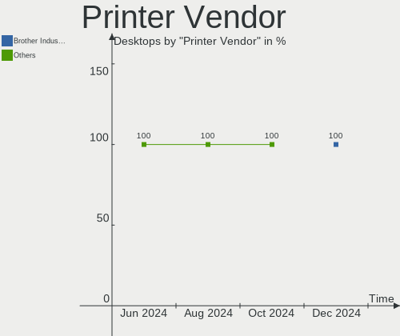

| Vendor             | Desktops | Percent |
|--------------------|----------|---------|
| Brother Industries | 1        | 100%    |

Printer Model
-------------

Printer device models

| Model              | Desktops | Percent |
|--------------------|----------|---------|
| Brother DCP-L2520D | 1        | 100%    |

Scanner Vendor
--------------

Scanner device vendors

Zero info for selected period =(

Scanner Model
-------------

Scanner device models

Zero info for selected period =(

Camera
------

Camera Vendor
-------------

Camera device vendors

| Vendor   | Desktops | Percent |
|----------|----------|---------|
| Logitech | 2        | 100%    |

Camera Model
------------

Camera device models

| Model                | Desktops | Percent |
|----------------------|----------|---------|
| Logitech Webcam C270 | 2        | 100%    |

Security
--------

Fingerprint Vendor
------------------

Fingerprint sensor vendors

Zero info for selected period =(

Fingerprint Model
-----------------

Fingerprint sensor models

Zero info for selected period =(

Chipcard Vendor
---------------

Chipcard module vendors

Zero info for selected period =(

Chipcard Model
--------------

Chipcard module models

Zero info for selected period =(

Unsupported
-----------

Unsupported Devices
-------------------

Total unsupported devices on board

| Total | Desktops | Percent |
|-------|----------|---------|
| 0     | 25       | 92.59%  |
| 1     | 2        | 7.41%   |

Unsupported Device Types
------------------------

Types of unsupported devices

| Type          | Desktops | Percent |
|---------------|----------|---------|
| Net/wireless  | 1        | 50%     |
| Graphics card | 1        | 50%     |

