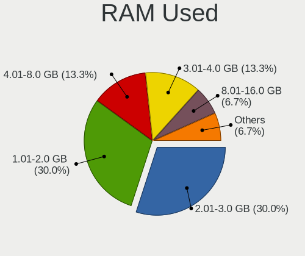
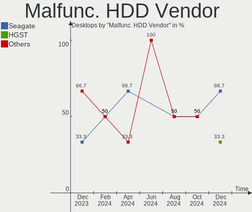
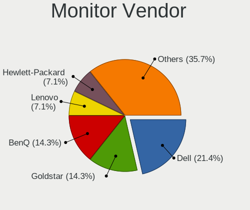
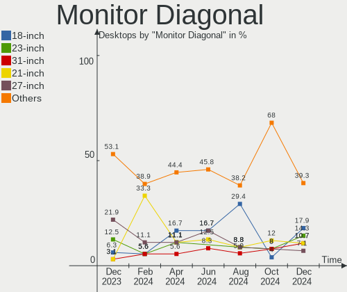
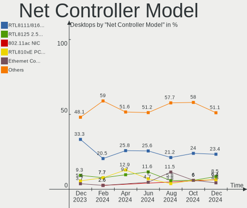
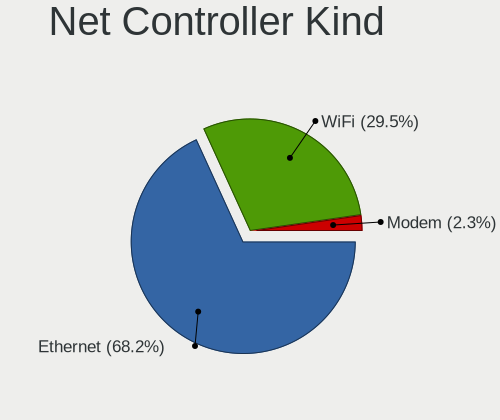
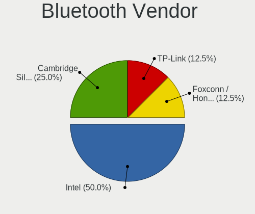
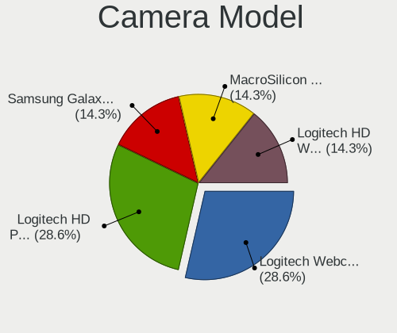

Linux in India - Hardware Trends (Desktops)
-------------------------------------------

A project to identify most popular hardware characteristics and track their change
over time based on data collected by Linux users at https://Linux-Hardware.org.

Anyone can contribute to this report by the [hw-probe](https://github.com/linuxhw/hw-probe) tool:

    sudo -E hw-probe -all -upload

Period: Nov, 2023.

Contents
--------

* [ System ](#system)
  - [ OS                       ](#os)
  - [ OS Family                ](#os-family)
  - [ Kernel                   ](#kernel)
  - [ Kernel Family            ](#kernel-family)
  - [ Kernel Major Ver.        ](#kernel-major-ver)
  - [ Arch                     ](#arch)
  - [ DE                       ](#de)
  - [ Display Server           ](#display-server)
  - [ Display Manager          ](#display-manager)
  - [ OS Lang                  ](#os-lang)
  - [ Boot Mode                ](#boot-mode)
  - [ Filesystem               ](#filesystem)
  - [ Part. scheme             ](#part-scheme)
  - [ Dual Boot with Linux/BSD ](#dual-boot-with-linuxbsd)
  - [ Dual Boot (Win)          ](#dual-boot-win)

* [ Board ](#board)
  - [ Vendor                   ](#vendor)
  - [ Model                    ](#model)
  - [ Model Family             ](#model-family)
  - [ MFG Year                 ](#mfg-year)
  - [ Form Factor              ](#form-factor)
  - [ Secure Boot              ](#secure-boot)
  - [ Coreboot                 ](#coreboot)
  - [ RAM Size                 ](#ram-size)
  - [ RAM Used                 ](#ram-used)
  - [ Total Drives             ](#total-drives)
  - [ Has CD-ROM               ](#has-cd-rom)
  - [ Has Ethernet             ](#has-ethernet)
  - [ Has WiFi                 ](#has-wifi)
  - [ Has Bluetooth            ](#has-bluetooth)

* [ Location ](#location)
  - [ Country                  ](#country)
  - [ City                     ](#city)

* [ Drives ](#drives)
  - [ Drive Vendor             ](#drive-vendor)
  - [ Drive Model              ](#drive-model)
  - [ HDD Vendor               ](#hdd-vendor)
  - [ SSD Vendor               ](#ssd-vendor)
  - [ Drive Kind               ](#drive-kind)
  - [ Drive Connector          ](#drive-connector)
  - [ Drive Size               ](#drive-size)
  - [ Space Total              ](#space-total)
  - [ Space Used               ](#space-used)
  - [ Malfunc. Drives          ](#malfunc-drives)
  - [ Malfunc. Drive Vendor    ](#malfunc-drive-vendor)
  - [ Malfunc. HDD Vendor      ](#malfunc-hdd-vendor)
  - [ Malfunc. Drive Kind      ](#malfunc-drive-kind)
  - [ Failed Drives            ](#failed-drives)
  - [ Failed Drive Vendor      ](#failed-drive-vendor)
  - [ Drive Status             ](#drive-status)

* [ Storage controller ](#storage-controller)
  - [ Storage Vendor           ](#storage-vendor)
  - [ Storage Model            ](#storage-model)
  - [ Storage Kind             ](#storage-kind)

* [ Processor ](#processor)
  - [ CPU Vendor               ](#cpu-vendor)
  - [ CPU Model                ](#cpu-model)
  - [ CPU Model Family         ](#cpu-model-family)
  - [ CPU Cores                ](#cpu-cores)
  - [ CPU Sockets              ](#cpu-sockets)
  - [ CPU Threads              ](#cpu-threads)
  - [ CPU Op-Modes             ](#cpu-op-modes)
  - [ CPU Microcode            ](#cpu-microcode)
  - [ CPU Microarch            ](#cpu-microarch)

* [ Graphics ](#graphics)
  - [ GPU Vendor               ](#gpu-vendor)
  - [ GPU Model                ](#gpu-model)
  - [ GPU Combo                ](#gpu-combo)
  - [ GPU Driver               ](#gpu-driver)
  - [ GPU Memory               ](#gpu-memory)

* [ Monitor ](#monitor)
  - [ Monitor Vendor           ](#monitor-vendor)
  - [ Monitor Model            ](#monitor-model)
  - [ Monitor Resolution       ](#monitor-resolution)
  - [ Monitor Diagonal         ](#monitor-diagonal)
  - [ Monitor Width            ](#monitor-width)
  - [ Aspect Ratio             ](#aspect-ratio)
  - [ Monitor Area             ](#monitor-area)
  - [ Pixel Density            ](#pixel-density)
  - [ Multiple Monitors        ](#multiple-monitors)

* [ Network ](#network)
  - [ Net Controller Vendor    ](#net-controller-vendor)
  - [ Net Controller Model     ](#net-controller-model)
  - [ Wireless Vendor          ](#wireless-vendor)
  - [ Wireless Model           ](#wireless-model)
  - [ Ethernet Vendor          ](#ethernet-vendor)
  - [ Ethernet Model           ](#ethernet-model)
  - [ Net Controller Kind      ](#net-controller-kind)
  - [ Used Controller          ](#used-controller)
  - [ NICs                     ](#nics)
  - [ IPv6                     ](#ipv6)

* [ Bluetooth ](#bluetooth)
  - [ Bluetooth Vendor         ](#bluetooth-vendor)
  - [ Bluetooth Model          ](#bluetooth-model)

* [ Sound ](#sound)
  - [ Sound Vendor             ](#sound-vendor)
  - [ Sound Model              ](#sound-model)

* [ Memory ](#memory)
  - [ Memory Vendor            ](#memory-vendor)
  - [ Memory Model             ](#memory-model)
  - [ Memory Kind              ](#memory-kind)
  - [ Memory Form Factor       ](#memory-form-factor)
  - [ Memory Size              ](#memory-size)
  - [ Memory Speed             ](#memory-speed)

* [ Printers & scanners ](#printers--scanners)
  - [ Printer Vendor           ](#printer-vendor)
  - [ Printer Model            ](#printer-model)
  - [ Scanner Vendor           ](#scanner-vendor)
  - [ Scanner Model            ](#scanner-model)

* [ Camera ](#camera)
  - [ Camera Vendor            ](#camera-vendor)
  - [ Camera Model             ](#camera-model)

* [ Security ](#security)
  - [ Fingerprint Vendor       ](#fingerprint-vendor)
  - [ Fingerprint Model        ](#fingerprint-model)
  - [ Chipcard Vendor          ](#chipcard-vendor)
  - [ Chipcard Model           ](#chipcard-model)

* [ Unsupported ](#unsupported)
  - [ Unsupported Devices      ](#unsupported-devices)
  - [ Unsupported Device Types ](#unsupported-device-types)

System
------

OS
--

Installed operating systems

| Name                | Desktops | Percent |
|---------------------|----------|---------|
| Arch Rolling        | 4        | 19.05%  |
| Ubuntu 22.04        | 3        | 14.29%  |
| Zorin 16            | 1        | 4.76%   |
| Xero Rolling        | 1        | 4.76%   |
| Ubuntu 20.04        | 1        | 4.76%   |
| Oracle Linux 9.3    | 1        | 4.76%   |
| OpenMandriva 5.0    | 1        | 4.76%   |
| OpenMandriva 23.08  | 1        | 4.76%   |
| Nobara 38           | 1        | 4.76%   |
| LMDE 6              | 1        | 4.76%   |
| Linux Mint 21.2     | 1        | 4.76%   |
| Kubuntu 23.10       | 1        | 4.76%   |
| Kali 2023.3         | 1        | 4.76%   |
| Fedora 39           | 1        | 4.76%   |
| EndeavourOS Rolling | 1        | 4.76%   |
| Debian 12           | 1        | 4.76%   |

OS Family
---------

OS without a version

| Name         | Desktops | Percent |
|--------------|----------|---------|
| Ubuntu       | 4        | 19.05%  |
| Arch         | 4        | 19.05%  |
| OpenMandriva | 2        | 9.52%   |
| Zorin        | 1        | 4.76%   |
| Xero         | 1        | 4.76%   |
| Oracle Linux | 1        | 4.76%   |
| Nobara       | 1        | 4.76%   |
| LMDE         | 1        | 4.76%   |
| Linux Mint   | 1        | 4.76%   |
| Kubuntu      | 1        | 4.76%   |
| Kali         | 1        | 4.76%   |
| Fedora       | 1        | 4.76%   |
| EndeavourOS  | 1        | 4.76%   |
| Debian       | 1        | 4.76%   |

Kernel
------

Version of the Linux kernel

| Version                             | Desktops | Percent |
|-------------------------------------|----------|---------|
| 6.6.1-zen1-1-zen                    | 2        | 9.52%   |
| 6.2.0-36-generic                    | 2        | 9.52%   |
| 6.1.0-13-amd64                      | 2        | 9.52%   |
| 5.15.0-88-generic                   | 2        | 9.52%   |
| 6.7.0-0.rc1.315.vanilla.fc39.x86_64 | 1        | 4.76%   |
| 6.6.2-desktop-1omv2390              | 1        | 4.76%   |
| 6.6.2-arch1-1                       | 1        | 4.76%   |
| 6.5.9-zen2-1-zen                    | 1        | 4.76%   |
| 6.5.9-arch2-1                       | 1        | 4.76%   |
| 6.5.9-201.fsync.fc38.x86_64         | 1        | 4.76%   |
| 6.5.0-kali3-amd64                   | 1        | 4.76%   |
| 6.5.0-9-generic                     | 1        | 4.76%   |
| 6.4.11-desktop-1omv2390             | 1        | 4.76%   |
| 6.2.0-37-generic                    | 1        | 4.76%   |
| 6.1.58-1-lts                        | 1        | 4.76%   |
| 5.4.0-166-generic                   | 1        | 4.76%   |
| 5.15.0-200.131.27.el9uek.x86_64     | 1        | 4.76%   |

Kernel Family
-------------

Linux kernel without a distro release

| Version | Desktops | Percent |
|---------|----------|---------|
| 6.5.9   | 3        | 14.29%  |
| 6.2.0   | 3        | 14.29%  |
| 5.15.0  | 3        | 14.29%  |
| 6.6.2   | 2        | 9.52%   |
| 6.6.1   | 2        | 9.52%   |
| 6.5.0   | 2        | 9.52%   |
| 6.1.0   | 2        | 9.52%   |
| 6.7.0   | 1        | 4.76%   |
| 6.4.11  | 1        | 4.76%   |
| 6.1.58  | 1        | 4.76%   |
| 5.4.0   | 1        | 4.76%   |

Kernel Major Ver.
-----------------

Linux kernel major version

| Version | Desktops | Percent |
|---------|----------|---------|
| 6.5     | 5        | 23.81%  |
| 6.6     | 4        | 19.05%  |
| 6.2     | 3        | 14.29%  |
| 6.1     | 3        | 14.29%  |
| 5.15    | 3        | 14.29%  |
| 6.7     | 1        | 4.76%   |
| 6.4     | 1        | 4.76%   |
| 5.4     | 1        | 4.76%   |

Arch
----

OS architecture (x86_64, i586, etc.)

| Name   | Desktops | Percent |
|--------|----------|---------|
| x86_64 | 21       | 100%    |

DE
--

Desktop Environment

| Name       | Desktops | Percent |
|------------|----------|---------|
| GNOME      | 10       | 47.62%  |
| KDE5       | 8        | 38.1%   |
| X-Cinnamon | 2        | 9.52%   |
| i3         | 1        | 4.76%   |

Display Server
--------------

X11 or Wayland

| Name    | Desktops | Percent |
|---------|----------|---------|
| X11     | 11       | 52.38%  |
| Wayland | 9        | 42.86%  |
| Unknown | 1        | 4.76%   |

Display Manager
---------------

SDDM, LightDM, etc.

| Name    | Desktops | Percent |
|---------|----------|---------|
| SDDM    | 6        | 28.57%  |
| GDM     | 5        | 23.81%  |
| Unknown | 4        | 19.05%  |
| LightDM | 3        | 14.29%  |
| GDM3    | 3        | 14.29%  |

OS Lang
-------

Language

| Lang    | Desktops | Percent |
|---------|----------|---------|
| en_IN   | 13       | 61.9%   |
| en_US   | 7        | 33.33%  |
| Unknown | 1        | 4.76%   |

Boot Mode
---------

EFI or BIOS

| Mode | Desktops | Percent |
|------|----------|---------|
| EFI  | 15       | 71.43%  |
| BIOS | 6        | 28.57%  |

Filesystem
----------

Type of filesystem

| Type    | Desktops | Percent |
|---------|----------|---------|
| Ext4    | 14       | 66.67%  |
| Btrfs   | 3        | 14.29%  |
| Xfs     | 2        | 9.52%   |
| XXXXX   | 1        | 4.76%   |
| Overlay | 1        | 4.76%   |

Part. scheme
------------

Scheme of partitioning

| Type    | Desktops | Percent |
|---------|----------|---------|
| GPT     | 14       | 66.67%  |
| Unknown | 4        | 19.05%  |
| MBR     | 3        | 14.29%  |

Dual Boot with Linux/BSD
------------------------

Hosting more than one Linux/BSD

| Dual boot | Desktops | Percent |
|-----------|----------|---------|
| No        | 18       | 85.71%  |
| Yes       | 3        | 14.29%  |

Dual Boot (Win)
---------------

Hosting Linux and Windows

| Dual boot | Desktops | Percent |
|-----------|----------|---------|
| No        | 12       | 57.14%  |
| Yes       | 9        | 42.86%  |

Board
-----

Vendor
------

Motherboard manufacturer

| Name                | Desktops | Percent |
|---------------------|----------|---------|
| Gigabyte Technology | 6        | 28.57%  |
| ASRock              | 4        | 19.05%  |
| MSI                 | 3        | 14.29%  |
| ASUSTek Computer    | 3        | 14.29%  |
| Dell                | 2        | 9.52%   |
| ZX                  | 1        | 4.76%   |
| Intel               | 1        | 4.76%   |
| Hewlett-Packard     | 1        | 4.76%   |

Model
-----

Motherboard model

| Name                           | Desktops | Percent |
|--------------------------------|----------|---------|
| ZX H610ITX                     | 1        | 4.76%   |
| MSI MS-7D42                    | 1        | 4.76%   |
| MSI MS-7C37                    | 1        | 4.76%   |
| MSI MS-7788                    | 1        | 4.76%   |
| Intel DG41RQ AAE54511-203      | 1        | 4.76%   |
| HP Z240 SFF Workstation        | 1        | 4.76%   |
| Gigabyte H510M H               | 1        | 4.76%   |
| Gigabyte B660M DS3H AX DDR4    | 1        | 4.76%   |
| Gigabyte B650M K               | 1        | 4.76%   |
| Gigabyte B450 AORUS ELITE      | 1        | 4.76%   |
| Gigabyte A520M K V2            | 1        | 4.76%   |
| Gigabyte A320M-S2H             | 1        | 4.76%   |
| Dell Vostro 3268               | 1        | 4.76%   |
| Dell OptiPlex 7070             | 1        | 4.76%   |
| ASUS ProArt X670E-CREATOR WIFI | 1        | 4.76%   |
| ASUS PRIME B450M-A             | 1        | 4.76%   |
| ASUS All Series                | 1        | 4.76%   |
| ASRock H61M-VS                 | 1        | 4.76%   |
| ASRock B550M Steel Legend      | 1        | 4.76%   |
| ASRock B550M Pro4              | 1        | 4.76%   |
| ASRock B450M-HDV R4.0          | 1        | 4.76%   |

Model Family
------------

Motherboard model prefix

| Name               | Desktops | Percent |
|--------------------|----------|---------|
| ASRock B550M       | 2        | 9.52%   |
| ZX H610ITX         | 1        | 4.76%   |
| MSI MS-7D42        | 1        | 4.76%   |
| MSI MS-7C37        | 1        | 4.76%   |
| MSI MS-7788        | 1        | 4.76%   |
| Intel DG41RQ       | 1        | 4.76%   |
| HP Z240            | 1        | 4.76%   |
| Gigabyte H510M     | 1        | 4.76%   |
| Gigabyte B660M     | 1        | 4.76%   |
| Gigabyte B650M     | 1        | 4.76%   |
| Gigabyte B450      | 1        | 4.76%   |
| Gigabyte A520M     | 1        | 4.76%   |
| Gigabyte A320M-S2H | 1        | 4.76%   |
| Dell Vostro        | 1        | 4.76%   |
| Dell OptiPlex      | 1        | 4.76%   |
| ASUS ProArt        | 1        | 4.76%   |
| ASUS PRIME         | 1        | 4.76%   |
| ASUS All           | 1        | 4.76%   |
| ASRock H61M-VS     | 1        | 4.76%   |
| ASRock B450M-HDV   | 1        | 4.76%   |

MFG Year
--------

Motherboard manufacture year

| Year | Desktops | Percent |
|------|----------|---------|
| 2023 | 3        | 14.29%  |
| 2022 | 3        | 14.29%  |
| 2018 | 3        | 14.29%  |
| 2021 | 2        | 9.52%   |
| 2020 | 2        | 9.52%   |
| 2017 | 2        | 9.52%   |
| 2019 | 1        | 4.76%   |
| 2016 | 1        | 4.76%   |
| 2014 | 1        | 4.76%   |
| 2012 | 1        | 4.76%   |
| 2011 | 1        | 4.76%   |
| 2009 | 1        | 4.76%   |

Form Factor
-----------

Physical design of the computer

| Name    | Desktops | Percent |
|---------|----------|---------|
| Desktop | 21       | 100%    |

Secure Boot
-----------

Enabled or disabled

| State    | Desktops | Percent |
|----------|----------|---------|
| Disabled | 20       | 95.24%  |
| Enabled  | 1        | 4.76%   |

Coreboot
--------

Have coreboot on board

| Used | Desktops | Percent |
|------|----------|---------|
| No   | 21       | 100%    |

RAM Size
--------

Total RAM memory

| Size in GB  | Desktops | Percent |
|-------------|----------|---------|
| 8.01-16.0   | 6        | 28.57%  |
| 32.01-64.0  | 4        | 19.05%  |
| 64.01-256.0 | 4        | 19.05%  |
| 16.01-24.0  | 3        | 14.29%  |
| 4.01-8.0    | 1        | 4.76%   |
| 3.01-4.0    | 1        | 4.76%   |
| 24.01-32.0  | 1        | 4.76%   |
| 2.01-3.0    | 1        | 4.76%   |

RAM Used
--------

Used RAM memory

| Used GB   | Desktops | Percent |
|-----------|----------|---------|
| 4.01-8.0  | 6        | 28.57%  |
| 2.01-3.0  | 6        | 28.57%  |
| 3.01-4.0  | 5        | 23.81%  |
| 1.01-2.0  | 3        | 14.29%  |
| 8.01-16.0 | 1        | 4.76%   |

Total Drives
------------

Number of drives on board

| Drives | Desktops | Percent |
|--------|----------|---------|
| 3      | 8        | 38.1%   |
| 2      | 6        | 28.57%  |
| 1      | 6        | 28.57%  |
| 4      | 1        | 4.76%   |

Has CD-ROM
----------

Has CD-ROM on board

| Presented | Desktops | Percent |
|-----------|----------|---------|
| No        | 19       | 90.48%  |
| Yes       | 2        | 9.52%   |

Has Ethernet
------------

Has Ethernet on board

| Presented | Desktops | Percent |
|-----------|----------|---------|
| Yes       | 21       | 100%    |

Has WiFi
--------

Has WiFi module

| Presented | Desktops | Percent |
|-----------|----------|---------|
| No        | 11       | 52.38%  |
| Yes       | 10       | 47.62%  |

Has Bluetooth
-------------

Has Bluetooth module

| Presented | Desktops | Percent |
|-----------|----------|---------|
| No        | 11       | 52.38%  |
| Yes       | 10       | 47.62%  |

Location
--------

Country
-------

Geographic location (country)

| Country | Desktops | Percent |
|---------|----------|---------|
| India   | 21       | 100%    |

City
----

Geographic location (city)

| City          | Desktops | Percent |
|---------------|----------|---------|
| Bengaluru     | 6        | 28.57%  |
| Delhi         | 3        | 14.29%  |
| Kolkata       | 2        | 9.52%   |
| Hyderabad     | 2        | 9.52%   |
| Trivandrum    | 1        | 4.76%   |
| Satna         | 1        | 4.76%   |
| Pune          | 1        | 4.76%   |
| Mangalore     | 1        | 4.76%   |
| Kottayam      | 1        | 4.76%   |
| Kanniyakumari | 1        | 4.76%   |
| Chhindwara    | 1        | 4.76%   |
| Chennai       | 1        | 4.76%   |

Drives
------

Drive Vendor
------------

Hard drive vendors

| Vendor                      | Desktops | Drives | Percent |
|-----------------------------|----------|--------|---------|
| WDC                         | 10       | 11     | 22.73%  |
| Seagate                     | 9        | 10     | 20.45%  |
| Samsung Electronics         | 5        | 7      | 11.36%  |
| Crucial                     | 4        | 4      | 9.09%   |
| Micron/Crucial Technology   | 3        | 3      | 6.82%   |
| Sandisk                     | 2        | 2      | 4.55%   |
| Kingston                    | 2        | 2      | 4.55%   |
| Transcend                   | 1        | 1      | 2.27%   |
| Toshiba                     | 1        | 1      | 2.27%   |
| SPCC                        | 1        | 1      | 2.27%   |
| Realtek Semiconductor       | 1        | 1      | 2.27%   |
| Kingston Technology Company | 1        | 1      | 2.27%   |
| Kimtigo                     | 1        | 1      | 2.27%   |
| Hikvision                   | 1        | 1      | 2.27%   |
| Gigabyte Technology         | 1        | 1      | 2.27%   |
| ADATA Technology            | 1        | 1      | 2.27%   |

Drive Model
-----------

Hard drive models

| Model                                 | Desktops | Percent |
|---------------------------------------|----------|---------|
| Seagate ST500DM002-1SB10A 500GB       | 2        | 4.17%   |
| Seagate ST500DM002-1BD142 500GB       | 2        | 4.17%   |
| Micron/Crucial P2 NVMe PCIe SSD 1TB   | 2        | 4.17%   |
| Crucial CT1000MX500SSD1 1TB           | 2        | 4.17%   |
| WDC WDS480G2G0B-00EPW0 480GB SSD      | 1        | 2.08%   |
| WDC WDS120G2G0A-00JH30 120GB SSD      | 1        | 2.08%   |
| WDC WD5000AAKX-00ERMA0 500GB          | 1        | 2.08%   |
| WDC WD40EZRZ-00GXCB0 4TB              | 1        | 2.08%   |
| WDC WD30EZRZ-00Z5HB0 3TB              | 1        | 2.08%   |
| WDC WD2500BEVS-11VAT0 250GB           | 1        | 2.08%   |
| WDC WD20PURZ-85AKKY0 2TB              | 1        | 2.08%   |
| WDC WD20EZBX-00AYRA0 2TB              | 1        | 2.08%   |
| WDC WD10EZEX-75WN4A0 1TB              | 1        | 2.08%   |
| WDC WD10EZEX-60WN4A2 1TB              | 1        | 2.08%   |
| WDC WD10EZEX-08WN4A0 1TB              | 1        | 2.08%   |
| Transcend TS256GSSD370 256GB          | 1        | 2.08%   |
| Toshiba MQ04ABF1 1TB                  | 1        | 2.08%   |
| SPCC M.2 PCIe SSD 1TB                 | 1        | 2.08%   |
| Seagate ST9250315AS 250GB             | 1        | 2.08%   |
| Seagate ST380215A 80GB                | 1        | 2.08%   |
| Seagate ST3320813AS 320GB             | 1        | 2.08%   |
| Seagate ST3250312AS 250GB             | 1        | 2.08%   |
| Seagate ST1000LM035-1RK172 1TB        | 1        | 2.08%   |
| Seagate ST1000DM010-2EP102 1TB        | 1        | 2.08%   |
| Sandisk WD Blue SN570 500GB           | 1        | 2.08%   |
| Sandisk WD Blue SN570 250GB           | 1        | 2.08%   |
| Samsung SSD 980 500GB                 | 1        | 2.08%   |
| Samsung SSD 860 EVO 500GB             | 1        | 2.08%   |
| Samsung SSD 860 EVO 250GB             | 1        | 2.08%   |
| Samsung SSD 860 EVO 1TB               | 1        | 2.08%   |
| Samsung SSD 860 250GB                 | 1        | 2.08%   |
| Samsung SSD 850 EVO 250GB             | 1        | 2.08%   |
| Samsung MZ7LN256HMJP-000L7 256GB SSD  | 1        | 2.08%   |
| Realtek ADATA SWORDFISH 2TB           | 1        | 2.08%   |
| Micron/Crucial P1 NVMe PCIe SSD 1TB   | 1        | 2.08%   |
| Kingston Company A2000 NVMe SSD 250GB | 1        | 2.08%   |
| Kingston SQ500S37480G 480GB SSD       | 1        | 2.08%   |
| Kingston SA400S37240G 240GB SSD       | 1        | 2.08%   |
| Kimtigo SSD 1TB                       | 1        | 2.08%   |
| Hikvision HS-SSD-C100 120GB           | 1        | 2.08%   |

HDD Vendor
----------

Hard disk drive vendors

| Vendor  | Desktops | Drives | Percent |
|---------|----------|--------|---------|
| WDC     | 9        | 9      | 47.37%  |
| Seagate | 9        | 10     | 47.37%  |
| Toshiba | 1        | 1      | 5.26%   |

SSD Vendor
----------

Solid state drive vendors

| Vendor              | Desktops | Drives | Percent |
|---------------------|----------|--------|---------|
| Samsung Electronics | 4        | 6      | 30.77%  |
| Crucial             | 3        | 3      | 23.08%  |
| WDC                 | 2        | 2      | 15.38%  |
| Kingston            | 2        | 2      | 15.38%  |
| Transcend           | 1        | 1      | 7.69%   |
| Hikvision           | 1        | 1      | 7.69%   |

Drive Kind
----------

HDD or SSD

| Kind | Desktops | Drives | Percent |
|------|----------|--------|---------|
| HDD  | 17       | 20     | 43.59%  |
| SSD  | 12       | 15     | 30.77%  |
| NVMe | 10       | 13     | 25.64%  |

Drive Connector
---------------

SATA, SAS, NVMe, etc.

| Type | Desktops | Drives | Percent |
|------|----------|--------|---------|
| SATA | 19       | 35     | 65.52%  |
| NVMe | 10       | 13     | 34.48%  |

Drive Size
----------

Size of hard drive

| Size in TB | Desktops | Drives | Percent |
|------------|----------|--------|---------|
| 0.01-0.5   | 14       | 21     | 53.85%  |
| 0.51-1.0   | 8        | 10     | 30.77%  |
| 1.01-2.0   | 2        | 2      | 7.69%   |
| 3.01-4.0   | 1        | 1      | 3.85%   |
| 2.01-3.0   | 1        | 1      | 3.85%   |

Space Total
-----------

Amount of disk space available on the file system

| Size in GB     | Desktops | Percent |
|----------------|----------|---------|
| 501-1000       | 5        | 23.81%  |
| 101-250        | 4        | 19.05%  |
| 251-500        | 3        | 14.29%  |
| 1001-2000      | 3        | 14.29%  |
| 2001-3000      | 2        | 9.52%   |
| 1-20           | 2        | 9.52%   |
| More than 3000 | 1        | 4.76%   |
| 21-50          | 1        | 4.76%   |

Space Used
----------

Amount of used disk space

| Used GB   | Desktops | Percent |
|-----------|----------|---------|
| 251-500   | 6        | 28.57%  |
| 1-20      | 5        | 23.81%  |
| 51-100    | 4        | 19.05%  |
| 1001-2000 | 3        | 14.29%  |
| 21-50     | 2        | 9.52%   |
| 501-1000  | 1        | 4.76%   |

Malfunc. Drives
---------------

Drive models with a malfunction

| Model                            | Desktops | Drives | Percent |
|----------------------------------|----------|--------|---------|
| WDC WDS120G2G0A-00JH30 120GB SSD | 1        | 1      | 11.11%  |
| WDC WD5000AAKX-00ERMA0 500GB     | 1        | 1      | 11.11%  |
| WDC WD2500BEVS-11VAT0 250GB      | 1        | 1      | 11.11%  |
| WDC WD20PURZ-85AKKY0 2TB         | 1        | 1      | 11.11%  |
| WDC WD10EZEX-08WN4A0 1TB         | 1        | 1      | 11.11%  |
| Seagate ST9250315AS 250GB        | 1        | 1      | 11.11%  |
| Seagate ST500DM002-1BD142 500GB  | 1        | 1      | 11.11%  |
| Seagate ST380215A 80GB           | 1        | 1      | 11.11%  |
| Seagate ST3320813AS 320GB        | 1        | 1      | 11.11%  |

Malfunc. Drive Vendor
---------------------

Vendors of faulty drives

| Vendor  | Desktops | Drives | Percent |
|---------|----------|--------|---------|
| WDC     | 5        | 5      | 55.56%  |
| Seagate | 4        | 4      | 44.44%  |

Malfunc. HDD Vendor
-------------------

Vendors of faulty HDD drives

| Vendor  | Desktops | Drives | Percent |
|---------|----------|--------|---------|
| WDC     | 4        | 4      | 50%     |
| Seagate | 4        | 4      | 50%     |

Malfunc. Drive Kind
-------------------

Kinds of faulty drives

| Kind | Desktops | Drives | Percent |
|------|----------|--------|---------|
| HDD  | 6        | 8      | 85.71%  |
| SSD  | 1        | 1      | 14.29%  |

Failed Drives
-------------

Failed drive models

Zero info for selected period =(

Failed Drive Vendor
-------------------

Failed drive vendors

Zero info for selected period =(

Drive Status
------------

Number of failed and malfunc. drives

| Status   | Desktops | Drives | Percent |
|----------|----------|--------|---------|
| Works    | 16       | 29     | 59.26%  |
| Malfunc  | 7        | 9      | 25.93%  |
| Detected | 4        | 10     | 14.81%  |

Storage controller
------------------

Storage Vendor
--------------

Storage controller vendors

| Vendor                      | Desktops | Percent |
|-----------------------------|----------|---------|
| Intel                       | 12       | 33.33%  |
| AMD                         | 10       | 27.78%  |
| Micron/Crucial Technology   | 4        | 11.11%  |
| SanDisk                     | 2        | 5.56%   |
| ASMedia Technology          | 2        | 5.56%   |
| ShenZhen TIGO Semiconductor | 1        | 2.78%   |
| Samsung Electronics         | 1        | 2.78%   |
| Realtek Semiconductor       | 1        | 2.78%   |
| Phison Electronics          | 1        | 2.78%   |
| Kingston Technology Company | 1        | 2.78%   |
| ADATA Technology            | 1        | 2.78%   |

Storage Model
-------------

Storage controller models

| Model                                                                                   | Desktops | Percent |
|-----------------------------------------------------------------------------------------|----------|---------|
| AMD FCH SATA Controller [AHCI mode]                                                     | 6        | 13.95%  |
| Micron/Crucial P2 [Nick P2] / P3 / P3 Plus NVMe PCIe SSD (DRAM-less)                    | 3        | 6.98%   |
| Intel Alder Lake-S PCH SATA Controller [AHCI Mode]                                      | 3        | 6.98%   |
| AMD 500 Series Chipset SATA Controller                                                  | 3        | 6.98%   |
| AMD 400 Series Chipset SATA Controller                                                  | 3        | 6.98%   |
| SanDisk Ultra 3D / WD Blue SN570 NVMe SSD (DRAM-less)                                   | 2        | 4.65%   |
| Intel Q170/Q150/B150/H170/H110/Z170/CM236 Chipset SATA Controller [AHCI Mode]           | 2        | 4.65%   |
| Intel 6 Series/C200 Series Chipset Family Desktop SATA Controller (IDE mode, ports 4-5) | 2        | 4.65%   |
| Intel 6 Series/C200 Series Chipset Family Desktop SATA Controller (IDE mode, ports 0-3) | 2        | 4.65%   |
| ASMedia ASM1062 Serial ATA Controller                                                   | 2        | 4.65%   |
| ShenZhen TIGO kimtigo NVMe SSD (DRAM-less)                                              | 1        | 2.33%   |
| Samsung NVMe SSD Controller 980 (DRAM-less)                                             | 1        | 2.33%   |
| Realtek RTS5765DL NVMe SSD Controller (DRAM-less)                                       | 1        | 2.33%   |
| Phison PS5013-E13 PCIe3 NVMe Controller (DRAM-less)                                     | 1        | 2.33%   |
| Phison E12 NVMe Controller                                                              | 1        | 2.33%   |
| Micron/Crucial P1 NVMe PCIe SSD[Frampton]                                               | 1        | 2.33%   |
| Kingston Company A2000 NVMe SSD SM2263EN                                                | 1        | 2.33%   |
| Intel Sunrise Point-LP SATA Controller [AHCI mode]                                      | 1        | 2.33%   |
| Intel NM10/ICH7 Family SATA Controller [IDE mode]                                       | 1        | 2.33%   |
| Intel Cannon Lake PCH SATA AHCI Controller                                              | 1        | 2.33%   |
| Intel 9 Series Chipset Family SATA Controller [AHCI Mode]                               | 1        | 2.33%   |
| Intel 82801G (ICH7 Family) IDE Controller                                               | 1        | 2.33%   |
| Intel 500 Series Chipset Family SATA AHCI Controller                                    | 1        | 2.33%   |
| AMD FCH SATA Controller D                                                               | 1        | 2.33%   |
| ADATA XPG SX8200 Pro PCIe Gen3x4 M.2 2280 Solid State Drive                             | 1        | 2.33%   |

Storage Kind
------------

Kind of storage controller (IDE, SATA, NVMe, SAS, ...)

| Kind | Desktops | Percent |
|------|----------|---------|
| SATA | 19       | 59.38%  |
| NVMe | 10       | 31.25%  |
| IDE  | 3        | 9.38%   |

Processor
---------

CPU Vendor
----------

Processor vendors

| Vendor | Desktops | Percent |
|--------|----------|---------|
| Intel  | 11       | 52.38%  |
| AMD    | 10       | 47.62%  |

CPU Model
---------

Processor models

| Model                                       | Desktops | Percent |
|---------------------------------------------|----------|---------|
| AMD Ryzen 5 5600G with Radeon Graphics      | 3        | 14.29%  |
| AMD Ryzen 9 7950X 16-Core Processor         | 2        | 9.52%   |
| Intel Pentium Dual CPU E2140 @ 1.60GHz      | 1        | 4.76%   |
| Intel Core i7-9700 CPU @ 3.00GHz            | 1        | 4.76%   |
| Intel Core i7-6700 CPU @ 3.40GHz            | 1        | 4.76%   |
| Intel Core i5-7600K CPU @ 3.80GHz           | 1        | 4.76%   |
| Intel Core i5-4440 CPU @ 3.10GHz            | 1        | 4.76%   |
| Intel Core i5-3550 CPU @ 3.30GHz            | 1        | 4.76%   |
| Intel Core i5-10400 CPU @ 2.90GHz           | 1        | 4.76%   |
| Intel Core i3-2120 CPU @ 3.30GHz            | 1        | 4.76%   |
| Intel 12th Gen Core i9-12900K               | 1        | 4.76%   |
| Intel 12th Gen Core i7-12700                | 1        | 4.76%   |
| Intel 12th Gen Core i5-12400F               | 1        | 4.76%   |
| AMD Ryzen 7 3700X 8-Core Processor          | 1        | 4.76%   |
| AMD Ryzen 5 4600G with Radeon Graphics      | 1        | 4.76%   |
| AMD Ryzen 5 3600X 6-Core Processor          | 1        | 4.76%   |
| AMD Ryzen 5 3600 6-Core Processor           | 1        | 4.76%   |
| AMD Ryzen 3 2200G with Radeon Vega Graphics | 1        | 4.76%   |

CPU Model Family
----------------

Processor model prefix

| Model              | Desktops | Percent |
|--------------------|----------|---------|
| AMD Ryzen 5        | 6        | 28.57%  |
| Intel Core i5      | 4        | 19.05%  |
| Other              | 3        | 14.29%  |
| Intel Core i7      | 2        | 9.52%   |
| AMD Ryzen 9        | 2        | 9.52%   |
| Intel Pentium Dual | 1        | 4.76%   |
| Intel Core i3      | 1        | 4.76%   |
| AMD Ryzen 7        | 1        | 4.76%   |
| AMD Ryzen 3        | 1        | 4.76%   |

CPU Cores
---------

Number of processor cores

| Number | Desktops | Percent |
|--------|----------|---------|
| 6      | 8        | 38.1%   |
| 4      | 5        | 23.81%  |
| 16     | 3        | 14.29%  |
| 8      | 2        | 9.52%   |
| 12     | 1        | 4.76%   |
| 2      | 1        | 4.76%   |
| 1      | 1        | 4.76%   |

CPU Sockets
-----------

Number of sockets

| Number | Desktops | Percent |
|--------|----------|---------|
| 1      | 21       | 100%    |

CPU Threads
-----------

Threads per core (Hyper-Threading)

| Number | Desktops | Percent |
|--------|----------|---------|
| 2      | 14       | 66.67%  |
| 1      | 7        | 33.33%  |

CPU Op-Modes
------------

CPU Operation Modes (32-bit, 64-bit)

| Op mode        | Desktops | Percent |
|----------------|----------|---------|
| 32-bit, 64-bit | 21       | 100%    |

CPU Microcode
-------------

Microcode number

| Number     | Desktops | Percent |
|------------|----------|---------|
| Unknown    | 5        | 23.81%  |
| 0x90672    | 2        | 9.52%   |
| 0x0a601206 | 2        | 9.52%   |
| 0x0a50000c | 2        | 9.52%   |
| 0x08701021 | 2        | 9.52%   |
| 0xa0655    | 1        | 4.76%   |
| 0x906e9    | 1        | 4.76%   |
| 0x306c3    | 1        | 4.76%   |
| 0x306a9    | 1        | 4.76%   |
| 0x0a50000d | 1        | 4.76%   |
| 0x08701030 | 1        | 4.76%   |
| 0x08600106 | 1        | 4.76%   |
| 0x0810100b | 1        | 4.76%   |

CPU Microarch
-------------

Microarchitecture

| Name             | Desktops | Percent |
|------------------|----------|---------|
| Zen 2            | 4        | 19.05%  |
| Unknown          | 4        | 19.05%  |
| Zen 3            | 3        | 14.29%  |
| KabyLake         | 2        | 9.52%   |
| Zen              | 1        | 4.76%   |
| Skylake          | 1        | 4.76%   |
| SandyBridge      | 1        | 4.76%   |
| IvyBridge        | 1        | 4.76%   |
| Haswell          | 1        | 4.76%   |
| Core             | 1        | 4.76%   |
| CometLake        | 1        | 4.76%   |
| Alderlake Hybrid | 1        | 4.76%   |

Graphics
--------

GPU Vendor
----------

Vendors of graphics cards

| Vendor | Desktops | Percent |
|--------|----------|---------|
| Intel  | 9        | 39.13%  |
| Nvidia | 7        | 30.43%  |
| AMD    | 7        | 30.43%  |

GPU Model
---------

Graphics card models

| Model                                                                     | Desktops | Percent |
|---------------------------------------------------------------------------|----------|---------|
| Nvidia GA106 [GeForce RTX 3060 Lite Hash Rate]                            | 2        | 8.33%   |
| Intel AlderLake-S GT1                                                     | 2        | 8.33%   |
| AMD Raphael                                                               | 2        | 8.33%   |
| AMD Ellesmere [Radeon RX 470/480/570/570X/580/580X/590]                   | 2        | 8.33%   |
| AMD Cezanne [Radeon Vega Series / Radeon Vega Mobile Series]              | 2        | 8.33%   |
| Nvidia GP107 [GeForce GTX 1050 Ti]                                        | 1        | 4.17%   |
| Nvidia GM206 [GeForce GTX 960]                                            | 1        | 4.17%   |
| Nvidia GK208 [GeForce GT 710]                                             | 1        | 4.17%   |
| Nvidia GA104 [GeForce RTX 3060]                                           | 1        | 4.17%   |
| Nvidia GA102 [GeForce RTX 3080 Ti]                                        | 1        | 4.17%   |
| Intel UHD Graphics 620                                                    | 1        | 4.17%   |
| Intel HD Graphics 630                                                     | 1        | 4.17%   |
| Intel HD Graphics 530                                                     | 1        | 4.17%   |
| Intel CometLake-S GT2 [UHD Graphics 630]                                  | 1        | 4.17%   |
| Intel CoffeeLake-S GT2 [UHD Graphics 630]                                 | 1        | 4.17%   |
| Intel 4 Series Chipset Integrated Graphics Controller                     | 1        | 4.17%   |
| Intel 2nd Generation Core Processor Family Integrated Graphics Controller | 1        | 4.17%   |
| AMD Renoir [Radeon RX Vega 6 (Ryzen 4000/5000 Mobile Series)]             | 1        | 4.17%   |
| AMD Raven Ridge [Radeon Vega Series / Radeon Vega Mobile Series]          | 1        | 4.17%   |

GPU Combo
---------

Combinations of graphics cards

| Name         | Desktops | Percent |
|--------------|----------|---------|
| 1 x Intel    | 8        | 38.1%   |
| 1 x Nvidia   | 6        | 28.57%  |
| 1 x AMD      | 5        | 23.81%  |
| 2 x AMD      | 1        | 4.76%   |
| AMD + Nvidia | 1        | 4.76%   |

GPU Driver
----------

Free vs proprietary

| Driver      | Desktops | Percent |
|-------------|----------|---------|
| Free        | 16       | 76.19%  |
| Proprietary | 4        | 19.05%  |
| Unknown     | 1        | 4.76%   |

GPU Memory
----------

Total video memory

| Size in GB | Desktops | Percent |
|------------|----------|---------|
| Unknown    | 10       | 47.62%  |
| 3.01-4.0   | 3        | 14.29%  |
| 0.01-0.5   | 3        | 14.29%  |
| 0.51-1.0   | 2        | 9.52%   |
| 7.01-8.0   | 1        | 4.76%   |
| 1.01-2.0   | 1        | 4.76%   |
| 8.01-16.0  | 1        | 4.76%   |

Monitor
-------

Monitor Vendor
--------------

Monitor vendors

| Vendor              | Desktops | Percent |
|---------------------|----------|---------|
| Goldstar            | 5        | 22.73%  |
| BenQ                | 5        | 22.73%  |
| Acer                | 3        | 13.64%  |
| Sony                | 2        | 9.09%   |
| Samsung Electronics | 2        | 9.09%   |
| Dell                | 2        | 9.09%   |
| LG Display          | 1        | 4.55%   |
| Lenovo              | 1        | 4.55%   |
| AOC                 | 1        | 4.55%   |

Monitor Model
-------------

Monitor models

| Model                                                                | Desktops | Percent |
|----------------------------------------------------------------------|----------|---------|
| Sony TV SNY5803 1360x768                                             | 1        | 4.35%   |
| Sony TV SNY5304 1600x900                                             | 1        | 4.35%   |
| Samsung Electronics SyncMaster SAM0526 1920x1080 510x287mm 23.0-inch | 1        | 4.35%   |
| Samsung Electronics S32B80P SAM71F1 3840x2160 700x400mm 31.7-inch    | 1        | 4.35%   |
| LG Display LCD Monitor LGD0573 1920x1080 344x194mm 15.5-inch         | 1        | 4.35%   |
| Lenovo LEN LT1913pA LEN60AA 1280x1024 376x301mm 19.0-inch            | 1        | 4.35%   |
| Goldstar W1943 GSM4BAD 1360x768 406x229mm 18.4-inch                  | 1        | 4.35%   |
| Goldstar ULTRAWIDE GSM59F1 2560x1080 798x334mm 34.1-inch             | 1        | 4.35%   |
| Goldstar Ultra HD GSM5B08 3840x2160 600x340mm 27.2-inch              | 1        | 4.35%   |
| Goldstar E2060 GSM4EBF 1600x900 443x249mm 20.0-inch                  | 1        | 4.35%   |
| Goldstar 27GK750F GSM770D 1920x1080 531x298mm 24.0-inch              | 1        | 4.35%   |
| Dell SE2422H DEL424A 1920x1080 527x296mm 23.8-inch                   | 1        | 4.35%   |
| Dell E1916HV DELF06C 1366x768 409x230mm 18.5-inch                    | 1        | 4.35%   |
| BenQ LCD BNQ8024 2560x1440 597x336mm 27.0-inch                       | 1        | 4.35%   |
| BenQ GW2760HS BNQ78CA 1920x1080 600x340mm 27.2-inch                  | 1        | 4.35%   |
| BenQ GW2480 BNQ78E7 1920x1080 527x296mm 23.8-inch                    | 1        | 4.35%   |
| BenQ GW2283 BNQ78E9 1920x1080 476x268mm 21.5-inch                    | 1        | 4.35%   |
| BenQ EX2710S BNQ7FA4 1920x1080 600x340mm 27.2-inch                   | 1        | 4.35%   |
| AOC 2260WG5 AOC2260 1920x1080 477x268mm 21.5-inch                    | 1        | 4.35%   |
| Acer V246HL ACR032E 1920x1080 531x299mm 24.0-inch                    | 1        | 4.35%   |
| Acer QG241Y H ACR0ADB 1920x1080 527x296mm 23.8-inch                  | 1        | 4.35%   |
| Acer QG221Q ACR06F8 1920x1080 480x270mm 21.7-inch                    | 1        | 4.35%   |
| Acer ED320QR S ACR0805 1920x1080 698x393mm 31.5-inch                 | 1        | 4.35%   |

Monitor Resolution
------------------

Monitor screen resolution

| Resolution       | Desktops | Percent |
|------------------|----------|---------|
| 1920x1080 (FHD)  | 11       | 52.38%  |
| 3840x2160 (4K)   | 2        | 9.52%   |
| 1600x900 (HD+)   | 2        | 9.52%   |
| 1360x768         | 2        | 9.52%   |
| 2560x1440 (QHD)  | 1        | 4.76%   |
| 2560x1080        | 1        | 4.76%   |
| 1366x768 (WXGA)  | 1        | 4.76%   |
| 1280x1024 (SXGA) | 1        | 4.76%   |

Monitor Diagonal
----------------

Diagonal size in inches

| Inches | Desktops | Percent |
|--------|----------|---------|
| 27     | 4        | 17.39%  |
| 24     | 4        | 17.39%  |
| 72     | 2        | 8.7%    |
| 31     | 2        | 8.7%    |
| 23     | 2        | 8.7%    |
| 21     | 2        | 8.7%    |
| 18     | 2        | 8.7%    |
| 34     | 1        | 4.35%   |
| 22     | 1        | 4.35%   |
| 20     | 1        | 4.35%   |
| 19     | 1        | 4.35%   |
| 15     | 1        | 4.35%   |

Monitor Width
-------------

Physical width

| Width in mm | Desktops | Percent |
|-------------|----------|---------|
| 501-600     | 9        | 40.91%  |
| 401-500     | 6        | 27.27%  |
| 601-700     | 2        | 9.09%   |
| 1501-2000   | 2        | 9.09%   |
| 701-800     | 1        | 4.55%   |
| 351-400     | 1        | 4.55%   |
| 301-350     | 1        | 4.55%   |

Aspect Ratio
------------

Proportional relationship between the width and the height

| Ratio | Desktops | Percent |
|-------|----------|---------|
| 16/9  | 18       | 85.71%  |
| 5/4   | 1        | 4.76%   |
| 21/9  | 1        | 4.76%   |
| 16/10 | 1        | 4.76%   |

Monitor Area
------------

Area in inch²

| Area in inch² | Desktops | Percent |
|----------------|----------|---------|
| 201-250        | 8        | 36.36%  |
| 301-350        | 4        | 18.18%  |
| 351-500        | 3        | 13.64%  |
| More than 1000 | 2        | 9.09%   |
| 151-200        | 2        | 9.09%   |
| 141-150        | 2        | 9.09%   |
| 101-110        | 1        | 4.55%   |

Pixel Density
-------------

Pixels per inch

| Density | Desktops | Percent |
|---------|----------|---------|
| 51-100  | 13       | 61.9%   |
| 101-120 | 3        | 14.29%  |
| 1-50    | 2        | 9.52%   |
| 121-160 | 2        | 9.52%   |
| 161-240 | 1        | 4.76%   |

Multiple Monitors
-----------------

Total monitors connected

| Total | Desktops | Percent |
|-------|----------|---------|
| 1     | 17       | 80.95%  |
| 2     | 3        | 14.29%  |
| 0     | 1        | 4.76%   |

Network
-------

Net Controller Vendor
---------------------

Controller vendors

| Vendor                | Desktops | Percent |
|-----------------------|----------|---------|
| Realtek Semiconductor | 16       | 44.44%  |
| Intel                 | 10       | 27.78%  |
| MediaTek              | 3        | 8.33%   |
| TP-Link               | 2        | 5.56%   |
| OPPO Electronics      | 2        | 5.56%   |
| Ralink Technology     | 1        | 2.78%   |
| Qualcomm Atheros      | 1        | 2.78%   |
| Aquantia              | 1        | 2.78%   |

Net Controller Model
--------------------

Controller models

| Model                                                               | Desktops | Percent |
|---------------------------------------------------------------------|----------|---------|
| Realtek RTL8111/8168/8411 PCI Express Gigabit Ethernet Controller   | 10       | 26.32%  |
| Realtek RTL8125 2.5GbE Controller                                   | 4        | 10.53%  |
| Realtek RTL810xE PCI Express Fast Ethernet controller               | 2        | 5.26%   |
| OPPO RMX3623                                                        | 2        | 5.26%   |
| TP-Link Archer T2U PLUS [RTL8821AU]                                 | 1        | 2.63%   |
| TP-Link AC600 wireless Realtek RTL8811AU [Archer T2U Nano]          | 1        | 2.63%   |
| Realtek RTL8852BE PCIe 802.11ax Wireless Network Controller         | 1        | 2.63%   |
| Ralink MT7601U Wireless Adapter                                     | 1        | 2.63%   |
| Qualcomm Atheros QCA9565 / AR9565 Wireless Network Adapter          | 1        | 2.63%   |
| MediaTek X55                                                        | 1        | 2.63%   |
| MediaTek MT7922 802.11ax PCI Express Wireless Network Adapter       | 1        | 2.63%   |
| MediaTek MT7921K (RZ608) Wi-Fi 6E 80MHz                             | 1        | 2.63%   |
| Intel Wireless 8265 / 8275                                          | 1        | 2.63%   |
| Intel Wireless 7265                                                 | 1        | 2.63%   |
| Intel Wi-Fi 6 AX210/AX211/AX411 160MHz                              | 1        | 2.63%   |
| Intel Wi-Fi 6 AX200                                                 | 1        | 2.63%   |
| Intel Ethernet Controller X710 for 10GbE SFP+                       | 1        | 2.63%   |
| Intel Ethernet Controller I226-V                                    | 1        | 2.63%   |
| Intel Ethernet Controller I225-V                                    | 1        | 2.63%   |
| Intel Ethernet Connection (7) I219-LM                               | 1        | 2.63%   |
| Intel Ethernet Connection (2) I219-LM                               | 1        | 2.63%   |
| Intel Ethernet Connection (2) I218-V                                | 1        | 2.63%   |
| Intel Alder Lake-S PCH CNVi WiFi                                    | 1        | 2.63%   |
| Aquantia AQC113CS NBase-T/IEEE 802.3bz Ethernet Controller [AQtion] | 1        | 2.63%   |

Wireless Vendor
---------------

Wireless vendors

| Vendor            | Desktops | Percent |
|-------------------|----------|---------|
| Intel             | 5        | 45.45%  |
| TP-Link           | 2        | 18.18%  |
| MediaTek          | 2        | 18.18%  |
| Ralink Technology | 1        | 9.09%   |
| Qualcomm Atheros  | 1        | 9.09%   |

Wireless Model
--------------

Wireless models

| Model                                                         | Desktops | Percent |
|---------------------------------------------------------------|----------|---------|
| TP-Link Archer T2U PLUS [RTL8821AU]                           | 1        | 9.09%   |
| TP-Link AC600 wireless Realtek RTL8811AU [Archer T2U Nano]    | 1        | 9.09%   |
| Ralink MT7601U Wireless Adapter                               | 1        | 9.09%   |
| Qualcomm Atheros QCA9565 / AR9565 Wireless Network Adapter    | 1        | 9.09%   |
| MediaTek MT7922 802.11ax PCI Express Wireless Network Adapter | 1        | 9.09%   |
| MediaTek MT7921K (RZ608) Wi-Fi 6E 80MHz                       | 1        | 9.09%   |
| Intel Wireless 8265 / 8275                                    | 1        | 9.09%   |
| Intel Wireless 7265                                           | 1        | 9.09%   |
| Intel Wi-Fi 6 AX210/AX211/AX411 160MHz                        | 1        | 9.09%   |
| Intel Wi-Fi 6 AX200                                           | 1        | 9.09%   |
| Intel Alder Lake-S PCH CNVi WiFi                              | 1        | 9.09%   |

Ethernet Vendor
---------------

Ethernet vendors

| Vendor                | Desktops | Percent |
|-----------------------|----------|---------|
| Realtek Semiconductor | 16       | 64%     |
| Intel                 | 5        | 20%     |
| OPPO Electronics      | 2        | 8%      |
| MediaTek              | 1        | 4%      |
| Aquantia              | 1        | 4%      |

Ethernet Model
--------------

Ethernet models

| Model                                                               | Desktops | Percent |
|---------------------------------------------------------------------|----------|---------|
| Realtek RTL8111/8168/8411 PCI Express Gigabit Ethernet Controller   | 10       | 37.04%  |
| Realtek RTL8125 2.5GbE Controller                                   | 4        | 14.81%  |
| Realtek RTL810xE PCI Express Fast Ethernet controller               | 2        | 7.41%   |
| OPPO RMX3623                                                        | 2        | 7.41%   |
| Realtek RTL8852BE PCIe 802.11ax Wireless Network Controller         | 1        | 3.7%    |
| MediaTek X55                                                        | 1        | 3.7%    |
| Intel Ethernet Controller X710 for 10GbE SFP+                       | 1        | 3.7%    |
| Intel Ethernet Controller I226-V                                    | 1        | 3.7%    |
| Intel Ethernet Controller I225-V                                    | 1        | 3.7%    |
| Intel Ethernet Connection (7) I219-LM                               | 1        | 3.7%    |
| Intel Ethernet Connection (2) I219-LM                               | 1        | 3.7%    |
| Intel Ethernet Connection (2) I218-V                                | 1        | 3.7%    |
| Aquantia AQC113CS NBase-T/IEEE 802.3bz Ethernet Controller [AQtion] | 1        | 3.7%    |

Net Controller Kind
-------------------

Ethernet, WiFi or modem

| Kind     | Desktops | Percent |
|----------|----------|---------|
| Ethernet | 21       | 65.63%  |
| WiFi     | 11       | 34.38%  |

Used Controller
---------------

Currently used network controller

| Kind     | Desktops | Percent |
|----------|----------|---------|
| Ethernet | 15       | 71.43%  |
| WiFi     | 6        | 28.57%  |

NICs
----

Total network controllers on board

| Total | Desktops | Percent |
|-------|----------|---------|
| 1     | 12       | 57.14%  |
| 2     | 7        | 33.33%  |
| 10    | 1        | 4.76%   |
| 3     | 1        | 4.76%   |

IPv6
----

IPv6 vs IPv4

| Used | Desktops | Percent |
|------|----------|---------|
| No   | 16       | 76.19%  |
| Yes  | 5        | 23.81%  |

Bluetooth
---------

Bluetooth Vendor
----------------

Controller vendors

| Vendor                          | Desktops | Percent |
|---------------------------------|----------|---------|
| Intel                           | 5        | 45.45%  |
| TP-Link                         | 2        | 18.18%  |
| Qualcomm Atheros Communications | 1        | 9.09%   |
| MediaTek                        | 1        | 9.09%   |
| IMC Networks                    | 1        | 9.09%   |
| Foxconn / Hon Hai               | 1        | 9.09%   |

Bluetooth Model
---------------

Controller models

| Model                              | Desktops | Percent |
|------------------------------------|----------|---------|
| TP-Link TP-Cdj+ UB5A Adapter       | 2        | 18.18%  |
| Intel Bluetooth wireless interface | 2        | 18.18%  |
| Qualcomm Atheros  Bluetooth Device | 1        | 9.09%   |
| MediaTek Wireless_Device           | 1        | 9.09%   |
| Intel Bluetooth Device             | 1        | 9.09%   |
| Intel AX210 Bluetooth              | 1        | 9.09%   |
| Intel AX200 Bluetooth              | 1        | 9.09%   |
| IMC Networks Bluetooth Radio       | 1        | 9.09%   |
| Foxconn / Hon Hai Wireless_Device  | 1        | 9.09%   |

Sound
-----

Sound Vendor
------------

Sound card vendors

| Vendor              | Desktops | Percent |
|---------------------|----------|---------|
| Intel               | 12       | 38.71%  |
| AMD                 | 10       | 32.26%  |
| Nvidia              | 7        | 22.58%  |
| DSEA A/S            | 1        | 3.23%   |
| C-Media Electronics | 1        | 3.23%   |

Sound Model
-----------

Sound card models

| Model                                                                      | Desktops | Percent |
|----------------------------------------------------------------------------|----------|---------|
| AMD Family 17h/19h HD Audio Controller                                     | 7        | 17.5%   |
| AMD Renoir Radeon High Definition Audio Controller                         | 4        | 10%     |
| Intel Alder Lake-S HD Audio Controller                                     | 3        | 7.5%    |
| AMD Starship/Matisse HD Audio Controller                                   | 3        | 7.5%    |
| Nvidia GA106 High Definition Audio Controller                              | 2        | 5%      |
| Intel 6 Series/C200 Series Chipset Family High Definition Audio Controller | 2        | 5%      |
| Intel 100 Series/C230 Series Chipset Family HD Audio Controller            | 2        | 5%      |
| AMD Rembrandt Radeon High Definition Audio Controller                      | 2        | 5%      |
| AMD Ellesmere HDMI Audio [Radeon RX 470/480 / 570/580/590]                 | 2        | 5%      |
| Nvidia GP107GL High Definition Audio Controller                            | 1        | 2.5%    |
| Nvidia GM206 High Definition Audio Controller                              | 1        | 2.5%    |
| Nvidia GF119 HDMI Audio Controller                                         | 1        | 2.5%    |
| Nvidia GA104 High Definition Audio Controller                              | 1        | 2.5%    |
| Nvidia GA102 High Definition Audio Controller                              | 1        | 2.5%    |
| Intel Sunrise Point-LP HD Audio                                            | 1        | 2.5%    |
| Intel Smart Sound Technology (SST) Audio Controller                        | 1        | 2.5%    |
| Intel NM10/ICH7 Family High Definition Audio Controller                    | 1        | 2.5%    |
| Intel Cannon Lake PCH cAVS                                                 | 1        | 2.5%    |
| Intel 9 Series Chipset Family HD Audio Controller                          | 1        | 2.5%    |
| DSEA A/S SP 20 for Lync                                                    | 1        | 2.5%    |
| C-Media Electronics boAt IM-1000D                                          | 1        | 2.5%    |
| AMD Raven/Raven2/Fenghuang HDMI/DP Audio Controller                        | 1        | 2.5%    |

Memory
------

Memory Vendor
-------------

Memory module vendors

| Vendor                             | Desktops | Percent |
|------------------------------------|----------|---------|
| Corsair                            | 6        | 27.27%  |
| SK hynix                           | 3        | 13.64%  |
| Unknown                            | 2        | 9.09%   |
| Samsung Electronics                | 2        | 9.09%   |
| Kingston                           | 2        | 9.09%   |
| G.Skill                            | 2        | 9.09%   |
| Crucial                            | 2        | 9.09%   |
| A-DATA Technology                  | 2        | 9.09%   |
| Kimtigo Semiconductor (HK) Limited | 1        | 4.55%   |

Memory Model
------------

Memory module models

| Model                                                               | Desktops | Percent |
|---------------------------------------------------------------------|----------|---------|
| Crucial RAM CT8G4DFRA32A.M4FE 8GB DIMM DDR4 3200MT/s                | 2        | 8%      |
| Corsair RAM CMK16GX4M1E3200C16 16GB DIMM DDR4 3200MT/s              | 2        | 8%      |
| Unknown RAM V02D4L84GB5285282400 4096MB DIMM DDR4 2400MT/s          | 1        | 4%      |
| Unknown RAM Module 2GB DIMM DDR2 667MT/s                            | 1        | 4%      |
| Unknown RAM Module 1GB DIMM DDR2 667MT/s                            | 1        | 4%      |
| SK hynix RAM Module 16GB DIMM DDR4 2133MT/s                         | 1        | 4%      |
| SK hynix RAM HMT41GU6BFR8A-PB 8GB DIMM DDR3 2000MT/s                | 1        | 4%      |
| SK hynix RAM HMT351U6EFR8C-PBC 8GB DIMM DDR3 1067MT/s               | 1        | 4%      |
| SK hynix RAM DMT351U6CFR8C-H9 4GB DIMM DDR3 1333MT/s                | 1        | 4%      |
| Samsung RAM Module 16GB DIMM DDR4 2133MT/s                          | 1        | 4%      |
| Samsung RAM M471A1K43CB1-CRC 8GB SODIMM DDR4 2667MT/s               | 1        | 4%      |
| Kingston RAM Module 16GB DIMM DDR4 2133MT/s                         | 1        | 4%      |
| Kingston RAM KF3600C17D4/8GX 8GB DIMM DDR4 3600MT/s                 | 1        | 4%      |
| Kimtigo (HK) Limited RAM KTB900D4S16-32GB 32GB SODIMM DDR4 3200MT/s | 1        | 4%      |
| G.Skill RAM F4-3600C18-16GTZN 16GB DIMM DDR4 3666MT/s               | 1        | 4%      |
| G.Skill RAM F4-3200C16-16GVK 16GB DIMM DDR4 3600MT/s                | 1        | 4%      |
| Corsair RAM CMZ8GX3M1A1600C10 8GB DIMM DDR3 1600MT/s                | 1        | 4%      |
| Corsair RAM CMK8GX4M1E3200C16 8GB DIMM DDR4 3200MT/s                | 1        | 4%      |
| Corsair RAM CMK8GX4M1D3000C16 8GB DIMM DDR4 3200MT/s                | 1        | 4%      |
| Corsair RAM CMK8GX4M1A2400C16 8GB DIMM DDR4 2800MT/s                | 1        | 4%      |
| Corsair RAM CMK64GX5M2B6000C40 32GB DIMM DDR5 6000MT/s              | 1        | 4%      |
| A-DATA RAM Module 4GB SODIMM DDR4 2400MT/s                          | 1        | 4%      |
| A-DATA RAM DDR4 3200 8GB DIMM DDR4 3600MT/s                         | 1        | 4%      |

Memory Kind
-----------

Memory module kinds

| Kind | Desktops | Percent |
|------|----------|---------|
| DDR4 | 13       | 72.22%  |
| DDR3 | 3        | 16.67%  |
| DDR5 | 1        | 5.56%   |
| DDR2 | 1        | 5.56%   |

Memory Form Factor
------------------

Physical design of the memory module

| Name   | Desktops | Percent |
|--------|----------|---------|
| DIMM   | 16       | 88.89%  |
| SODIMM | 2        | 11.11%  |

Memory Size
-----------

Memory module size

| Size  | Desktops | Percent |
|-------|----------|---------|
| 8192  | 9        | 40.91%  |
| 16384 | 5        | 22.73%  |
| 32768 | 3        | 13.64%  |
| 4096  | 3        | 13.64%  |
| 2048  | 1        | 4.55%   |
| 1024  | 1        | 4.55%   |

Memory Speed
------------

Memory module speed

| Speed | Desktops | Percent |
|-------|----------|---------|
| 3200  | 6        | 28.57%  |
| 3600  | 3        | 14.29%  |
| 2400  | 2        | 9.52%   |
| 6000  | 1        | 4.76%   |
| 3666  | 1        | 4.76%   |
| 2800  | 1        | 4.76%   |
| 2667  | 1        | 4.76%   |
| 2133  | 1        | 4.76%   |
| 2000  | 1        | 4.76%   |
| 1600  | 1        | 4.76%   |
| 1333  | 1        | 4.76%   |
| 1067  | 1        | 4.76%   |
| 667   | 1        | 4.76%   |

Printers & scanners
-------------------

Printer Vendor
--------------

Printer device vendors

Zero info for selected period =(

Printer Model
-------------

Printer device models

Zero info for selected period =(

Scanner Vendor
--------------

Scanner device vendors

Zero info for selected period =(

Scanner Model
-------------

Scanner device models

Zero info for selected period =(

Camera
------

Camera Vendor
-------------

Camera device vendors

| Vendor           | Desktops | Percent |
|------------------|----------|---------|
| Polycom          | 1        | 25%     |
| OPPO Electronics | 1        | 25%     |
| Logitech         | 1        | 25%     |
| IMC Networks     | 1        | 25%     |

Camera Model
------------

Camera device models

| Model                         | Desktops | Percent |
|-------------------------------|----------|---------|
| Polycom Poly Studio P5 webcam | 1        | 25%     |
| OPPO WAIPIO-MTP _SN:2B7F7E2C  | 1        | 25%     |
| Logitech Webcam C270          | 1        | 25%     |
| IMC Networks VGA UVC WebCam   | 1        | 25%     |

Security
--------

Fingerprint Vendor
------------------

Fingerprint sensor vendors

Zero info for selected period =(

Fingerprint Model
-----------------

Fingerprint sensor models

Zero info for selected period =(

Chipcard Vendor
---------------

Chipcard module vendors

Zero info for selected period =(

Chipcard Model
--------------

Chipcard module models

Zero info for selected period =(

Unsupported
-----------

Unsupported Devices
-------------------

Total unsupported devices on board

| Total | Desktops | Percent |
|-------|----------|---------|
| 0     | 18       | 85.71%  |
| 4     | 1        | 4.76%   |
| 2     | 1        | 4.76%   |
| 1     | 1        | 4.76%   |

Unsupported Device Types
------------------------

Types of unsupported devices

| Type                     | Desktops | Percent |
|--------------------------|----------|---------|
| Net/wireless             | 2        | 33.33%  |
| Graphics card            | 2        | 33.33%  |
| Net/ethernet             | 1        | 16.67%  |
| Communication controller | 1        | 16.67%  |

