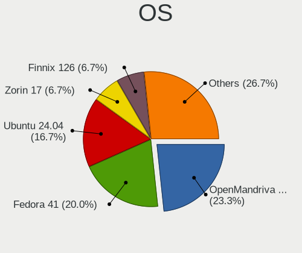
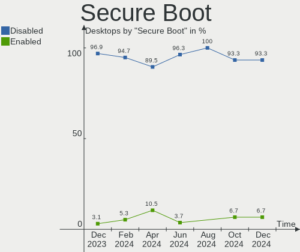
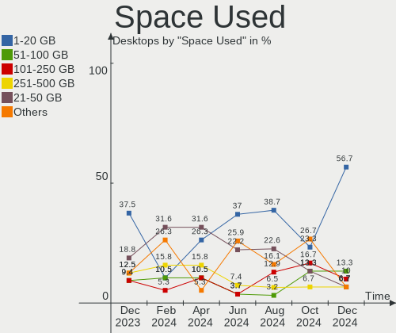
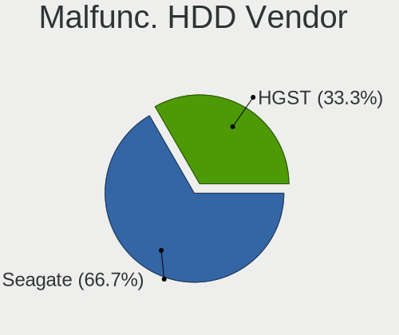
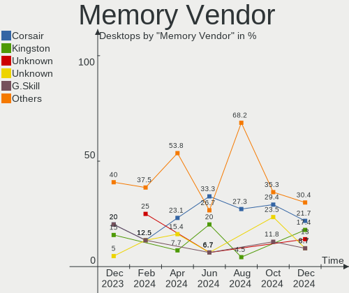

Linux in India - Hardware Trends (Desktops)
-------------------------------------------

A project to identify most popular hardware characteristics and track their change
over time based on data collected by Linux users at https://Linux-Hardware.org.

Anyone can contribute to this report by the [hw-probe](https://github.com/linuxhw/hw-probe) tool:

    sudo -E hw-probe -all -upload

Period: Sep, 2023.

Contents
--------

* [ System ](#system)
  - [ OS                       ](#os)
  - [ OS Family                ](#os-family)
  - [ Kernel                   ](#kernel)
  - [ Kernel Family            ](#kernel-family)
  - [ Kernel Major Ver.        ](#kernel-major-ver)
  - [ Arch                     ](#arch)
  - [ DE                       ](#de)
  - [ Display Server           ](#display-server)
  - [ Display Manager          ](#display-manager)
  - [ OS Lang                  ](#os-lang)
  - [ Boot Mode                ](#boot-mode)
  - [ Filesystem               ](#filesystem)
  - [ Part. scheme             ](#part-scheme)
  - [ Dual Boot with Linux/BSD ](#dual-boot-with-linuxbsd)
  - [ Dual Boot (Win)          ](#dual-boot-win)

* [ Board ](#board)
  - [ Vendor                   ](#vendor)
  - [ Model                    ](#model)
  - [ Model Family             ](#model-family)
  - [ MFG Year                 ](#mfg-year)
  - [ Form Factor              ](#form-factor)
  - [ Secure Boot              ](#secure-boot)
  - [ Coreboot                 ](#coreboot)
  - [ RAM Size                 ](#ram-size)
  - [ RAM Used                 ](#ram-used)
  - [ Total Drives             ](#total-drives)
  - [ Has CD-ROM               ](#has-cd-rom)
  - [ Has Ethernet             ](#has-ethernet)
  - [ Has WiFi                 ](#has-wifi)
  - [ Has Bluetooth            ](#has-bluetooth)

* [ Location ](#location)
  - [ Country                  ](#country)
  - [ City                     ](#city)

* [ Drives ](#drives)
  - [ Drive Vendor             ](#drive-vendor)
  - [ Drive Model              ](#drive-model)
  - [ HDD Vendor               ](#hdd-vendor)
  - [ SSD Vendor               ](#ssd-vendor)
  - [ Drive Kind               ](#drive-kind)
  - [ Drive Connector          ](#drive-connector)
  - [ Drive Size               ](#drive-size)
  - [ Space Total              ](#space-total)
  - [ Space Used               ](#space-used)
  - [ Malfunc. Drives          ](#malfunc-drives)
  - [ Malfunc. Drive Vendor    ](#malfunc-drive-vendor)
  - [ Malfunc. HDD Vendor      ](#malfunc-hdd-vendor)
  - [ Malfunc. Drive Kind      ](#malfunc-drive-kind)
  - [ Failed Drives            ](#failed-drives)
  - [ Failed Drive Vendor      ](#failed-drive-vendor)
  - [ Drive Status             ](#drive-status)

* [ Storage controller ](#storage-controller)
  - [ Storage Vendor           ](#storage-vendor)
  - [ Storage Model            ](#storage-model)
  - [ Storage Kind             ](#storage-kind)

* [ Processor ](#processor)
  - [ CPU Vendor               ](#cpu-vendor)
  - [ CPU Model                ](#cpu-model)
  - [ CPU Model Family         ](#cpu-model-family)
  - [ CPU Cores                ](#cpu-cores)
  - [ CPU Sockets              ](#cpu-sockets)
  - [ CPU Threads              ](#cpu-threads)
  - [ CPU Op-Modes             ](#cpu-op-modes)
  - [ CPU Microcode            ](#cpu-microcode)
  - [ CPU Microarch            ](#cpu-microarch)

* [ Graphics ](#graphics)
  - [ GPU Vendor               ](#gpu-vendor)
  - [ GPU Model                ](#gpu-model)
  - [ GPU Combo                ](#gpu-combo)
  - [ GPU Driver               ](#gpu-driver)
  - [ GPU Memory               ](#gpu-memory)

* [ Monitor ](#monitor)
  - [ Monitor Vendor           ](#monitor-vendor)
  - [ Monitor Model            ](#monitor-model)
  - [ Monitor Resolution       ](#monitor-resolution)
  - [ Monitor Diagonal         ](#monitor-diagonal)
  - [ Monitor Width            ](#monitor-width)
  - [ Aspect Ratio             ](#aspect-ratio)
  - [ Monitor Area             ](#monitor-area)
  - [ Pixel Density            ](#pixel-density)
  - [ Multiple Monitors        ](#multiple-monitors)

* [ Network ](#network)
  - [ Net Controller Vendor    ](#net-controller-vendor)
  - [ Net Controller Model     ](#net-controller-model)
  - [ Wireless Vendor          ](#wireless-vendor)
  - [ Wireless Model           ](#wireless-model)
  - [ Ethernet Vendor          ](#ethernet-vendor)
  - [ Ethernet Model           ](#ethernet-model)
  - [ Net Controller Kind      ](#net-controller-kind)
  - [ Used Controller          ](#used-controller)
  - [ NICs                     ](#nics)
  - [ IPv6                     ](#ipv6)

* [ Bluetooth ](#bluetooth)
  - [ Bluetooth Vendor         ](#bluetooth-vendor)
  - [ Bluetooth Model          ](#bluetooth-model)

* [ Sound ](#sound)
  - [ Sound Vendor             ](#sound-vendor)
  - [ Sound Model              ](#sound-model)

* [ Memory ](#memory)
  - [ Memory Vendor            ](#memory-vendor)
  - [ Memory Model             ](#memory-model)
  - [ Memory Kind              ](#memory-kind)
  - [ Memory Form Factor       ](#memory-form-factor)
  - [ Memory Size              ](#memory-size)
  - [ Memory Speed             ](#memory-speed)

* [ Printers & scanners ](#printers--scanners)
  - [ Printer Vendor           ](#printer-vendor)
  - [ Printer Model            ](#printer-model)
  - [ Scanner Vendor           ](#scanner-vendor)
  - [ Scanner Model            ](#scanner-model)

* [ Camera ](#camera)
  - [ Camera Vendor            ](#camera-vendor)
  - [ Camera Model             ](#camera-model)

* [ Security ](#security)
  - [ Fingerprint Vendor       ](#fingerprint-vendor)
  - [ Fingerprint Model        ](#fingerprint-model)
  - [ Chipcard Vendor          ](#chipcard-vendor)
  - [ Chipcard Model           ](#chipcard-model)

* [ Unsupported ](#unsupported)
  - [ Unsupported Devices      ](#unsupported-devices)
  - [ Unsupported Device Types ](#unsupported-device-types)

System
------

OS
--

Installed operating systems

| Name               | Desktops | Percent |
|--------------------|----------|---------|
| Ubuntu 22.04       | 5        | 19.23%  |
| OpenMandriva 23.08 | 4        | 15.38%  |
| Zorin 16           | 3        | 11.54%  |
| Debian 12          | 3        | 11.54%  |
| Ubuntu Unity 23.04 | 1        | 3.85%   |
| Ubuntu 18.04       | 1        | 3.85%   |
| Rocky Linux 8.7    | 1        | 3.85%   |
| LMDE 5             | 1        | 3.85%   |
| Fedora 38          | 1        | 3.85%   |
| Fedora 37          | 1        | 3.85%   |
| Endless 5.0.5      | 1        | 3.85%   |
| ArcoLinux Rolling  | 1        | 3.85%   |
| Archcraft Rolling  | 1        | 3.85%   |
| Arch Rolling       | 1        | 3.85%   |
| antiX 22           | 1        | 3.85%   |

OS Family
---------

OS without a version

| Name         | Desktops | Percent |
|--------------|----------|---------|
| Ubuntu       | 6        | 23.08%  |
| OpenMandriva | 4        | 15.38%  |
| Zorin        | 3        | 11.54%  |
| Debian       | 3        | 11.54%  |
| Fedora       | 2        | 7.69%   |
| Ubuntu Unity | 1        | 3.85%   |
| Rocky Linux  | 1        | 3.85%   |
| LMDE         | 1        | 3.85%   |
| Endless      | 1        | 3.85%   |
| ArcoLinux    | 1        | 3.85%   |
| Archcraft    | 1        | 3.85%   |
| Arch         | 1        | 3.85%   |
| antiX        | 1        | 3.85%   |

Kernel
------

Version of the Linux kernel

| Version                      | Desktops | Percent |
|------------------------------|----------|---------|
| 6.4.8-desktop-2omv2390       | 2        | 7.69%   |
| 6.4.12-arch1-1               | 2        | 7.69%   |
| 6.4.11-desktop-1omv2390      | 2        | 7.69%   |
| 6.2.0-32-generic             | 2        | 7.69%   |
| 6.1.0-10-amd64               | 2        | 7.69%   |
| 5.15.0-84-generic            | 2        | 7.69%   |
| 5.15.0-83-generic            | 2        | 7.69%   |
| 6.4.15-100.fc37.x86_64       | 1        | 3.85%   |
| 6.4.11-arch1-1               | 1        | 3.85%   |
| 6.2.14-300.fc38.x86_64       | 1        | 3.85%   |
| 6.2.0-31-generic             | 1        | 3.85%   |
| 6.2.0-26-generic             | 1        | 3.85%   |
| 6.1.0-12-amd64               | 1        | 3.85%   |
| 6.1.0-0.deb11.9-rt-amd64     | 1        | 3.85%   |
| 5.4.0-150-generic            | 1        | 3.85%   |
| 5.15.0-82-generic            | 1        | 3.85%   |
| 5.15.0-47-generic            | 1        | 3.85%   |
| 5.10.0-25-amd64              | 1        | 3.85%   |
| 4.18.0-425.19.2.el8_7.x86_64 | 1        | 3.85%   |

Kernel Family
-------------

Linux kernel without a distro release

| Version | Desktops | Percent |
|---------|----------|---------|
| 5.15.0  | 6        | 23.08%  |
| 6.2.0   | 4        | 15.38%  |
| 6.1.0   | 4        | 15.38%  |
| 6.4.11  | 3        | 11.54%  |
| 6.4.8   | 2        | 7.69%   |
| 6.4.12  | 2        | 7.69%   |
| 6.4.15  | 1        | 3.85%   |
| 6.2.14  | 1        | 3.85%   |
| 5.4.0   | 1        | 3.85%   |
| 5.10.0  | 1        | 3.85%   |
| 4.18.0  | 1        | 3.85%   |

Kernel Major Ver.
-----------------

Linux kernel major version

| Version | Desktops | Percent |
|---------|----------|---------|
| 6.4     | 8        | 30.77%  |
| 5.15    | 6        | 23.08%  |
| 6.2     | 5        | 19.23%  |
| 6.1     | 4        | 15.38%  |
| 5.4     | 1        | 3.85%   |
| 5.10    | 1        | 3.85%   |
| 4.18    | 1        | 3.85%   |

Arch
----

OS architecture (x86_64, i586, etc.)

| Name   | Desktops | Percent |
|--------|----------|---------|
| x86_64 | 26       | 100%    |

DE
--

Desktop Environment

| Name          | Desktops | Percent |
|---------------|----------|---------|
| GNOME         | 11       | 42.31%  |
| KDE5          | 6        | 23.08%  |
| XFCE          | 3        | 11.54%  |
| X-Cinnamon    | 1        | 3.85%   |
| Unity         | 1        | 3.85%   |
| icewm         | 1        | 3.85%   |
| Enlightenment | 1        | 3.85%   |
| dwm           | 1        | 3.85%   |
| Unknown       | 1        | 3.85%   |

Display Server
--------------

X11 or Wayland

| Name    | Desktops | Percent |
|---------|----------|---------|
| X11     | 17       | 65.38%  |
| Wayland | 9        | 34.62%  |

Display Manager
---------------

SDDM, LightDM, etc.

| Name    | Desktops | Percent |
|---------|----------|---------|
| Unknown | 11       | 42.31%  |
| SDDM    | 7        | 26.92%  |
| GDM3    | 5        | 19.23%  |
| LightDM | 2        | 7.69%   |
| GDM     | 1        | 3.85%   |

OS Lang
-------

Language

| Lang    | Desktops | Percent |
|---------|----------|---------|
| en_IN   | 15       | 57.69%  |
| en_US   | 9        | 34.62%  |
| C       | 1        | 3.85%   |
| Unknown | 1        | 3.85%   |

Boot Mode
---------

EFI or BIOS

| Mode | Desktops | Percent |
|------|----------|---------|
| BIOS | 16       | 61.54%  |
| EFI  | 10       | 38.46%  |

Filesystem
----------

Type of filesystem

| Type    | Desktops | Percent |
|---------|----------|---------|
| Ext4    | 16       | 61.54%  |
| Tmpfs   | 3        | 11.54%  |
| Btrfs   | 3        | 11.54%  |
| Overlay | 2        | 7.69%   |
| Zfs     | 1        | 3.85%   |
| Xfs     | 1        | 3.85%   |

Part. scheme
------------

Scheme of partitioning

| Type    | Desktops | Percent |
|---------|----------|---------|
| GPT     | 15       | 57.69%  |
| Unknown | 9        | 34.62%  |
| MBR     | 2        | 7.69%   |

Dual Boot with Linux/BSD
------------------------

Hosting more than one Linux/BSD

| Dual boot | Desktops | Percent |
|-----------|----------|---------|
| No        | 18       | 69.23%  |
| Yes       | 8        | 30.77%  |

Dual Boot (Win)
---------------

Hosting Linux and Windows

| Dual boot | Desktops | Percent |
|-----------|----------|---------|
| No        | 15       | 57.69%  |
| Yes       | 11       | 42.31%  |

Board
-----

Vendor
------

Motherboard manufacturer

| Name                | Desktops | Percent |
|---------------------|----------|---------|
| Intel               | 7        | 26.92%  |
| Gigabyte Technology | 5        | 19.23%  |
| ASUSTek Computer    | 4        | 15.38%  |
| MSI                 | 3        | 11.54%  |
| Lenovo              | 2        | 7.69%   |
| Pegatron            | 1        | 3.85%   |
| Hewlett-Packard     | 1        | 3.85%   |
| Dell                | 1        | 3.85%   |
| ASRock              | 1        | 3.85%   |
| Unknown             | 1        | 3.85%   |

Model
-----

Motherboard model

| Name                                 | Desktops | Percent |
|--------------------------------------|----------|---------|
| Intel H81                            | 2        | 7.69%   |
| Intel H61                            | 2        | 7.69%   |
| Pegatron AU930AA-ACJ p6270in         | 1        | 3.85%   |
| MSI MS-7C75                          | 1        | 3.85%   |
| MSI MS-7B51                          | 1        | 3.85%   |
| MSI MS-7A70                          | 1        | 3.85%   |
| Lenovo H410                          | 1        | 3.85%   |
| Lenovo H320 10044                    | 1        | 3.85%   |
| Intel DZ68PL AAG42750-301            | 1        | 3.85%   |
| Intel DG31PR AAD97573-206            | 1        | 3.85%   |
| Intel DB85FL AAG89861-201            | 1        | 3.85%   |
| HP Desktop Pro PCI MT                | 1        | 3.85%   |
| Gigabyte Z790 AERO G                 | 1        | 3.85%   |
| Gigabyte X570 AORUS ELITE WIFI       | 1        | 3.85%   |
| Gigabyte H310M S2 2.0                | 1        | 3.85%   |
| Gigabyte H110M-H                     | 1        | 3.85%   |
| Gigabyte B450M DS3H V2               | 1        | 3.85%   |
| Dell OptiPlex 330                    | 1        | 3.85%   |
| ASUS TUF B450-PLUS GAMING            | 1        | 3.85%   |
| ASUS ROG STRIX B550-F GAMING WIFI II | 1        | 3.85%   |
| ASUS PRIME H310M-E R2.0              | 1        | 3.85%   |
| ASUS F1A55-M LX PLUS                 | 1        | 3.85%   |
| ASRock B150M Pro4/Hyper              | 1        | 3.85%   |
| Unknown                              | 1        | 3.85%   |

Model Family
------------

Motherboard model prefix

| Name                 | Desktops | Percent |
|----------------------|----------|---------|
| Intel H81            | 2        | 7.69%   |
| Intel H61            | 2        | 7.69%   |
| Pegatron AU930AA-ACJ | 1        | 3.85%   |
| MSI MS-7C75          | 1        | 3.85%   |
| MSI MS-7B51          | 1        | 3.85%   |
| MSI MS-7A70          | 1        | 3.85%   |
| Lenovo H410          | 1        | 3.85%   |
| Lenovo H320          | 1        | 3.85%   |
| Intel DZ68PL         | 1        | 3.85%   |
| Intel DG31PR         | 1        | 3.85%   |
| Intel DB85FL         | 1        | 3.85%   |
| HP Desktop           | 1        | 3.85%   |
| Gigabyte Z790        | 1        | 3.85%   |
| Gigabyte X570        | 1        | 3.85%   |
| Gigabyte H310M       | 1        | 3.85%   |
| Gigabyte H110M-H     | 1        | 3.85%   |
| Gigabyte B450M       | 1        | 3.85%   |
| Dell OptiPlex        | 1        | 3.85%   |
| ASUS TUF             | 1        | 3.85%   |
| ASUS ROG             | 1        | 3.85%   |
| ASUS PRIME           | 1        | 3.85%   |
| ASUS F1A55-M         | 1        | 3.85%   |
| ASRock B150M         | 1        | 3.85%   |
| Unknown              | 1        | 3.85%   |

MFG Year
--------

Motherboard manufacture year

| Year | Desktops | Percent |
|------|----------|---------|
| 2019 | 4        | 15.38%  |
| 2018 | 4        | 15.38%  |
| 2017 | 3        | 11.54%  |
| 2016 | 3        | 11.54%  |
| 2011 | 3        | 11.54%  |
| 2020 | 2        | 7.69%   |
| 2022 | 1        | 3.85%   |
| 2021 | 1        | 3.85%   |
| 2013 | 1        | 3.85%   |
| 2010 | 1        | 3.85%   |
| 2009 | 1        | 3.85%   |
| 2008 | 1        | 3.85%   |
| 2007 | 1        | 3.85%   |

Form Factor
-----------

Physical design of the computer

| Name    | Desktops | Percent |
|---------|----------|---------|
| Desktop | 26       | 100%    |

Secure Boot
-----------

Enabled or disabled

| State    | Desktops | Percent |
|----------|----------|---------|
| Disabled | 26       | 100%    |

Coreboot
--------

Have coreboot on board

| Used | Desktops | Percent |
|------|----------|---------|
| No   | 26       | 100%    |

RAM Size
--------

Total RAM memory

| Size in GB  | Desktops | Percent |
|-------------|----------|---------|
| 4.01-8.0    | 6        | 23.08%  |
| 16.01-24.0  | 5        | 19.23%  |
| 3.01-4.0    | 4        | 15.38%  |
| 32.01-64.0  | 3        | 11.54%  |
| 64.01-256.0 | 3        | 11.54%  |
| 8.01-16.0   | 3        | 11.54%  |
| 2.01-3.0    | 1        | 3.85%   |
| 1.01-2.0    | 1        | 3.85%   |

RAM Used
--------

Used RAM memory

| Used GB   | Desktops | Percent |
|-----------|----------|---------|
| 1.01-2.0  | 6        | 23.08%  |
| 4.01-8.0  | 5        | 19.23%  |
| 3.01-4.0  | 5        | 19.23%  |
| 2.01-3.0  | 5        | 19.23%  |
| 0.51-1.0  | 3        | 11.54%  |
| 8.01-16.0 | 2        | 7.69%   |

Total Drives
------------

Number of drives on board

| Drives | Desktops | Percent |
|--------|----------|---------|
| 2      | 10       | 38.46%  |
| 1      | 7        | 26.92%  |
| 3      | 4        | 15.38%  |
| 5      | 3        | 11.54%  |
| 4      | 2        | 7.69%   |

Has CD-ROM
----------

Has CD-ROM on board

| Presented | Desktops | Percent |
|-----------|----------|---------|
| No        | 22       | 84.62%  |
| Yes       | 4        | 15.38%  |

Has Ethernet
------------

Has Ethernet on board

| Presented | Desktops | Percent |
|-----------|----------|---------|
| Yes       | 25       | 96.15%  |
| No        | 1        | 3.85%   |

Has WiFi
--------

Has WiFi module

| Presented | Desktops | Percent |
|-----------|----------|---------|
| Yes       | 13       | 50%     |
| No        | 13       | 50%     |

Has Bluetooth
-------------

Has Bluetooth module

| Presented | Desktops | Percent |
|-----------|----------|---------|
| No        | 17       | 65.38%  |
| Yes       | 9        | 34.62%  |

Location
--------

Country
-------

Geographic location (country)

| Country | Desktops | Percent |
|---------|----------|---------|
| India   | 26       | 100%    |

City
----

Geographic location (city)

| City          | Desktops | Percent |
|---------------|----------|---------|
| Bengaluru     | 6        | 23.08%  |
| Hyderabad     | 5        | 19.23%  |
| Mumbai        | 3        | 11.54%  |
| Vijayawada    | 1        | 3.85%   |
| Tirunelveli   | 1        | 3.85%   |
| Thoothukudi   | 1        | 3.85%   |
| Surat         | 1        | 3.85%   |
| Pune          | 1        | 3.85%   |
| Mysore        | 1        | 3.85%   |
| Kolkata       | 1        | 3.85%   |
| Indore        | 1        | 3.85%   |
| Greater Noida | 1        | 3.85%   |
| Chennai       | 1        | 3.85%   |
| Asansol       | 1        | 3.85%   |
| Amritsar      | 1        | 3.85%   |

Drives
------

Drive Vendor
------------

Hard drive vendors

| Vendor                      | Desktops | Drives | Percent |
|-----------------------------|----------|--------|---------|
| Seagate                     | 12       | 15     | 21.43%  |
| WDC                         | 10       | 11     | 17.86%  |
| Samsung Electronics         | 4        | 7      | 7.14%   |
| Crucial                     | 4        | 5      | 7.14%   |
| Kingston                    | 3        | 3      | 5.36%   |
| Silicon Motion              | 2        | 2      | 3.57%   |
| SanDisk                     | 2        | 2      | 3.57%   |
| Intel                       | 2        | 2      | 3.57%   |
| Unknown                     | 2        | 2      | 3.57%   |
| Zebronics                   | 1        | 1      | 1.79%   |
| XPG                         | 1        | 1      | 1.79%   |
| Unknown                     | 1        | 1      | 1.79%   |
| Marvell Technology Group    | 1        | 1      | 1.79%   |
| Lexar                       | 1        | 1      | 1.79%   |
| Kingston Technology Company | 1        | 1      | 1.79%   |
| HS-SSD-E100                 | 1        | 1      | 1.79%   |
| HS-SSD-C100                 | 1        | 1      | 1.79%   |
| Hitachi                     | 1        | 1      | 1.79%   |
| HGST                        | 1        | 1      | 1.79%   |
| Hewlett-Packard             | 1        | 1      | 1.79%   |
| Gigabyte Technology         | 1        | 1      | 1.79%   |
| EVM                         | 1        | 1      | 1.79%   |
| CONSISTENT                  | 1        | 1      | 1.79%   |
| China                       | 1        | 1      | 1.79%   |

Drive Model
-----------

Hard drive models

| Model                                                     | Desktops | Percent |
|-----------------------------------------------------------|----------|---------|
| Kingston SA400S37120G 120GB SSD                           | 3        | 4.76%   |
| WDC WD10EZEX-60WN4A0 1TB                                  | 2        | 3.17%   |
| Seagate ST3500312CS 500GB                                 | 2        | 3.17%   |
| Seagate ST1000DM010-2EP102 1TB                            | 2        | 3.17%   |
| Unknown                                                   | 2        | 3.17%   |
| Zebronics 2.5SSD128GB                                     | 1        | 1.59%   |
| XPG GAMMIX S70 BLADE 512GB                                | 1        | 1.59%   |
| WDC WUH721818ALE6L4 18TB                                  | 1        | 1.59%   |
| WDC WD5000AAKX-753CA1 500GB                               | 1        | 1.59%   |
| WDC WD5000AAKX-60U6AA0 500GB                              | 1        | 1.59%   |
| WDC WD20EZRX-00D8PB0 2TB                                  | 1        | 1.59%   |
| WDC WD1600AAJS-00B4A0 160GB                               | 1        | 1.59%   |
| WDC WD10EZRZ-00HTKB0 1TB                                  | 1        | 1.59%   |
| WDC WD10EZRX-00A8LB0 1TB                                  | 1        | 1.59%   |
| WDC WD10EARX-00N0YB0 1TB                                  | 1        | 1.59%   |
| WDC WD Blue SA510 2.5 500GB                               | 1        | 1.59%   |
| Unknown BFDT50S 500GB                                     | 1        | 1.59%   |
| Silicon Motion SM2263EN/SM2263XT SSD Controller 512GB     | 1        | 1.59%   |
| Silicon Motion AAR240GS112521030 240GB SSD                | 1        | 1.59%   |
| Seagate ST8000VN004-2M2101 8TB                            | 1        | 1.59%   |
| Seagate ST3500414CS 500GB                                 | 1        | 1.59%   |
| Seagate ST3360320AS 360GB                                 | 1        | 1.59%   |
| Seagate ST32000542AS 2TB                                  | 1        | 1.59%   |
| Seagate ST3160815AS 160GB                                 | 1        | 1.59%   |
| Seagate ST2000DM001-1CH164 2TB                            | 1        | 1.59%   |
| Seagate ST1000VM002-1CT162 1TB                            | 1        | 1.59%   |
| Seagate ST1000LX015-1U7172 1TB                            | 1        | 1.59%   |
| Seagate ST1000DM003-1ER162 1TB                            | 1        | 1.59%   |
| Seagate Backup+ Hub BK 8TB                                | 1        | 1.59%   |
| SanDisk X600 M.2 2280 SATA 128GB SSD                      | 1        | 1.59%   |
| SanDisk NVMe SSD Drive 1TB                                | 1        | 1.59%   |
| Samsung SSD 990 PRO 1TB S6Z1NF0W654280Z                   | 1        | 1.59%   |
| Samsung SSD 990 PRO 1TB                                   | 1        | 1.59%   |
| Samsung SSD 970 EVO Plus 1TB S4EWNX0W611806X              | 1        | 1.59%   |
| Samsung SSD 970 EVO Plus 1TB                              | 1        | 1.59%   |
| Samsung SSD 870 EVO 1TB                                   | 1        | 1.59%   |
| Samsung NVMe SSD Controller SM981/PM981/PM983 256GB       | 1        | 1.59%   |
| Samsung HD253GJ 250GB                                     | 1        | 1.59%   |
| Marvell Group 88NR2241 Non-Volatile memory controller 2TB | 1        | 1.59%   |
| Lexar SSD 240GB                                           | 1        | 1.59%   |

HDD Vendor
----------

Hard disk drive vendors

| Vendor              | Desktops | Drives | Percent |
|---------------------|----------|--------|---------|
| Seagate             | 12       | 15     | 48%     |
| WDC                 | 9        | 10     | 36%     |
| Unknown             | 1        | 1      | 4%      |
| Samsung Electronics | 1        | 1      | 4%      |
| Hitachi             | 1        | 1      | 4%      |
| HGST                | 1        | 1      | 4%      |

SSD Vendor
----------

Solid state drive vendors

| Vendor              | Desktops | Drives | Percent |
|---------------------|----------|--------|---------|
| Kingston            | 3        | 3      | 16.67%  |
| Crucial             | 3        | 4      | 16.67%  |
| Zebronics           | 1        | 1      | 5.56%   |
| WDC                 | 1        | 1      | 5.56%   |
| Silicon Motion      | 1        | 1      | 5.56%   |
| SanDisk             | 1        | 1      | 5.56%   |
| Samsung Electronics | 1        | 1      | 5.56%   |
| Lexar               | 1        | 1      | 5.56%   |
| Intel               | 1        | 1      | 5.56%   |
| HS-SSD-C100         | 1        | 1      | 5.56%   |
| Hewlett-Packard     | 1        | 1      | 5.56%   |
| Gigabyte Technology | 1        | 1      | 5.56%   |
| CONSISTENT          | 1        | 1      | 5.56%   |
| China               | 1        | 1      | 5.56%   |

Drive Kind
----------

HDD or SSD

| Kind    | Desktops | Drives | Percent |
|---------|----------|--------|---------|
| HDD     | 21       | 29     | 46.67%  |
| SSD     | 14       | 19     | 31.11%  |
| NVMe    | 6        | 12     | 13.33%  |
| Unknown | 4        | 4      | 8.89%   |

Drive Connector
---------------

SATA, SAS, NVMe, etc.

| Type | Desktops | Drives | Percent |
|------|----------|--------|---------|
| SATA | 24       | 50     | 75%     |
| NVMe | 6        | 12     | 18.75%  |
| SAS  | 2        | 2      | 6.25%   |

Drive Size
----------

Size of hard drive

| Size in TB | Desktops | Drives | Percent |
|------------|----------|--------|---------|
| 0.01-0.5   | 19       | 28     | 54.29%  |
| 0.51-1.0   | 10       | 13     | 28.57%  |
| 4.01-10.0  | 3        | 3      | 8.57%   |
| 1.01-2.0   | 2        | 3      | 5.71%   |
| 10.01-20.0 | 1        | 1      | 2.86%   |

Space Total
-----------

Amount of disk space available on the file system

| Size in GB | Desktops | Percent |
|------------|----------|---------|
| 101-250    | 7        | 26.92%  |
| 51-100     | 5        | 19.23%  |
| 501-1000   | 4        | 15.38%  |
| 1001-2000  | 3        | 11.54%  |
| 251-500    | 2        | 7.69%   |
| 2001-3000  | 2        | 7.69%   |
| 21-50      | 1        | 3.85%   |
| 1-20       | 1        | 3.85%   |
| Unknown    | 1        | 3.85%   |

Space Used
----------

Amount of used disk space

| Used GB   | Desktops | Percent |
|-----------|----------|---------|
| 1-20      | 7        | 26.92%  |
| 21-50     | 5        | 19.23%  |
| 51-100    | 5        | 19.23%  |
| 251-500   | 3        | 11.54%  |
| 101-250   | 3        | 11.54%  |
| 1001-2000 | 2        | 7.69%   |
| Unknown   | 1        | 3.85%   |

Malfunc. Drives
---------------

Drive models with a malfunction

| Model                               | Desktops | Drives | Percent |
|-------------------------------------|----------|--------|---------|
| WDC WD5000AAKX-60U6AA0 500GB        | 1        | 1      | 16.67%  |
| WDC WD10EARX-00N0YB0 1TB            | 1        | 1      | 16.67%  |
| Seagate ST3500312CS 500GB           | 1        | 1      | 16.67%  |
| Seagate ST1000DM003-1ER162 1TB      | 1        | 1      | 16.67%  |
| Samsung Electronics SSD 870 EVO 1TB | 1        | 1      | 16.67%  |
| Hitachi HDS721050CLA660 500GB       | 1        | 1      | 16.67%  |

Malfunc. Drive Vendor
---------------------

Vendors of faulty drives

| Vendor              | Desktops | Drives | Percent |
|---------------------|----------|--------|---------|
| WDC                 | 2        | 2      | 33.33%  |
| Seagate             | 2        | 2      | 33.33%  |
| Samsung Electronics | 1        | 1      | 16.67%  |
| Hitachi             | 1        | 1      | 16.67%  |

Malfunc. HDD Vendor
-------------------

Vendors of faulty HDD drives

| Vendor  | Desktops | Drives | Percent |
|---------|----------|--------|---------|
| WDC     | 2        | 2      | 40%     |
| Seagate | 2        | 2      | 40%     |
| Hitachi | 1        | 1      | 20%     |

Malfunc. Drive Kind
-------------------

Kinds of faulty drives

| Kind | Desktops | Drives | Percent |
|------|----------|--------|---------|
| HDD  | 4        | 5      | 80%     |
| SSD  | 1        | 1      | 20%     |

Failed Drives
-------------

Failed drive models

Zero info for selected period =(

Failed Drive Vendor
-------------------

Failed drive vendors

Zero info for selected period =(

Drive Status
------------

Number of failed and malfunc. drives

| Status   | Desktops | Drives | Percent |
|----------|----------|--------|---------|
| Detected | 15       | 33     | 48.39%  |
| Works    | 11       | 25     | 35.48%  |
| Malfunc  | 5        | 6      | 16.13%  |

Storage controller
------------------

Storage Vendor
--------------

Storage controller vendors

| Vendor                      | Desktops | Percent |
|-----------------------------|----------|---------|
| Intel                       | 21       | 61.76%  |
| AMD                         | 5        | 14.71%  |
| Samsung Electronics         | 2        | 5.88%   |
| Silicon Motion              | 1        | 2.94%   |
| SanDisk                     | 1        | 2.94%   |
| Micron/Crucial Technology   | 1        | 2.94%   |
| Marvell Technology Group    | 1        | 2.94%   |
| Kingston Technology Company | 1        | 2.94%   |
| ADATA Technology            | 1        | 2.94%   |

Storage Model
-------------

Storage controller models

| Model                                                                          | Desktops | Percent |
|--------------------------------------------------------------------------------|----------|---------|
| Intel 82801G (ICH7 Family) IDE Controller                                      | 4        | 9.3%    |
| Intel Q170/Q150/B150/H170/H110/Z170/CM236 Chipset SATA Controller [AHCI Mode]  | 3        | 6.98%   |
| Intel NM10/ICH7 Family SATA Controller [IDE mode]                              | 3        | 6.98%   |
| Intel 8 Series/C220 Series Chipset Family 6-port SATA Controller 1 [AHCI mode] | 3        | 6.98%   |
| Intel 6 Series/C200 Series Chipset Family 6 port Desktop SATA AHCI Controller  | 3        | 6.98%   |
| Intel 200 Series PCH SATA controller [AHCI mode]                               | 3        | 6.98%   |
| Samsung NVMe SSD Controller SM981/PM981/PM983                                  | 2        | 4.65%   |
| AMD FCH SATA Controller [AHCI mode]                                            | 2        | 4.65%   |
| AMD 400 Series Chipset SATA Controller                                         | 2        | 4.65%   |
| Silicon Motion SM2263EN/SM2263XT (DRAM-less) NVMe SSD Controllers              | 1        | 2.33%   |
| SanDisk PC SN735 NVMe SSD (DRAM-less)                                          | 1        | 2.33%   |
| Samsung NVMe SSD Controller S4LV008[Pascal]                                    | 1        | 2.33%   |
| Micron/Crucial Non-Volatile memory controller                                  | 1        | 2.33%   |
| Marvell Group 88NR2241 Non-Volatile memory controller                          | 1        | 2.33%   |
| Kingston Company A2000 NVMe SSD                                                | 1        | 2.33%   |
| Intel SSD 660P Series                                                          | 1        | 2.33%   |
| Intel NM10/ICH7 Family SATA Controller [AHCI mode]                             | 1        | 2.33%   |
| Intel Comet Lake PCH-H RAID                                                    | 1        | 2.33%   |
| Intel Cannon Lake PCH SATA AHCI Controller                                     | 1        | 2.33%   |
| Intel 82801JI (ICH10 Family) 4 port SATA IDE Controller #1                     | 1        | 2.33%   |
| Intel 700 Series Chipset Family SATA AHCI Controller                           | 1        | 2.33%   |
| Intel 5 Series/3400 Series Chipset 4 port SATA IDE Controller                  | 1        | 2.33%   |
| Intel 5 Series/3400 Series Chipset 2 port SATA IDE Controller                  | 1        | 2.33%   |
| AMD FCH SATA Controller [IDE mode]                                             | 1        | 2.33%   |
| AMD FCH IDE Controller                                                         | 1        | 2.33%   |
| AMD 500 Series Chipset SATA Controller                                         | 1        | 2.33%   |
| ADATA A Non-Volatile memory controller                                         | 1        | 2.33%   |

Storage Kind
------------

Kind of storage controller (IDE, SATA, NVMe, SAS, ...)

| Kind | Desktops | Percent |
|------|----------|---------|
| SATA | 20       | 58.82%  |
| IDE  | 7        | 20.59%  |
| NVMe | 6        | 17.65%  |
| RAID | 1        | 2.94%   |

Processor
---------

CPU Vendor
----------

Processor vendors

| Vendor | Desktops | Percent |
|--------|----------|---------|
| Intel  | 21       | 80.77%  |
| AMD    | 5        | 19.23%  |

CPU Model
---------

Processor models

| Model                                       | Desktops | Percent |
|---------------------------------------------|----------|---------|
| Intel Pentium Dual-Core CPU E5800 @ 3.20GHz | 2        | 7.69%   |
| Intel Core i5-7500 CPU @ 3.40GHz            | 2        | 7.69%   |
| AMD Ryzen 9 5900X 12-Core Processor         | 2        | 7.69%   |
| Intel Pentium Dual CPU E2180 @ 2.00GHz      | 1        | 3.85%   |
| Intel Pentium CPU G4400 @ 3.30GHz           | 1        | 3.85%   |
| Intel Core i9-9900K CPU @ 3.60GHz           | 1        | 3.85%   |
| Intel Core i7-7700 CPU @ 3.60GHz            | 1        | 3.85%   |
| Intel Core i7-10700 CPU @ 2.90GHz           | 1        | 3.85%   |
| Intel Core i5-9400F CPU @ 2.90GHz           | 1        | 3.85%   |
| Intel Core i5-4440 CPU @ 3.10GHz            | 1        | 3.85%   |
| Intel Core i5-2500 CPU @ 3.30GHz            | 1        | 3.85%   |
| Intel Core i5-2400 CPU @ 3.10GHz            | 1        | 3.85%   |
| Intel Core i3-9100F CPU @ 3.60GHz           | 1        | 3.85%   |
| Intel Core i3-4170 CPU @ 3.70GHz            | 1        | 3.85%   |
| Intel Core i3-4150 CPU @ 3.50GHz            | 1        | 3.85%   |
| Intel Core i3-3220 CPU @ 3.30GHz            | 1        | 3.85%   |
| Intel Core i3 CPU 540 @ 3.07GHz             | 1        | 3.85%   |
| Intel Core 2 Duo CPU E7500 @ 2.93GHz        | 1        | 3.85%   |
| Intel Core 2 Duo CPU E4500 @ 2.20GHz        | 1        | 3.85%   |
| Intel 13th Gen Core i9-13900K               | 1        | 3.85%   |
| AMD Ryzen 7 3700X 8-Core Processor          | 1        | 3.85%   |
| AMD Ryzen 5 3600 6-Core Processor           | 1        | 3.85%   |
| AMD A4-3400 APU with Radeon HD Graphics     | 1        | 3.85%   |

CPU Model Family
----------------

Processor model prefix

| Model                   | Desktops | Percent |
|-------------------------|----------|---------|
| Intel Core i5           | 6        | 23.08%  |
| Intel Core i3           | 5        | 19.23%  |
| Intel Pentium Dual-Core | 2        | 7.69%   |
| Intel Core i7           | 2        | 7.69%   |
| Intel Core 2 Duo        | 2        | 7.69%   |
| AMD Ryzen 9             | 2        | 7.69%   |
| Other                   | 1        | 3.85%   |
| Intel Pentium Dual      | 1        | 3.85%   |
| Intel Pentium           | 1        | 3.85%   |
| Intel Core i9           | 1        | 3.85%   |
| AMD Ryzen 7             | 1        | 3.85%   |
| AMD Ryzen 5             | 1        | 3.85%   |
| AMD A4                  | 1        | 3.85%   |

CPU Cores
---------

Number of processor cores

| Number | Desktops | Percent |
|--------|----------|---------|
| 2      | 10       | 38.46%  |
| 4      | 7        | 26.92%  |
| 8      | 3        | 11.54%  |
| 12     | 2        | 7.69%   |
| 6      | 2        | 7.69%   |
| 24     | 1        | 3.85%   |
| 1      | 1        | 3.85%   |

CPU Sockets
-----------

Number of sockets

| Number | Desktops | Percent |
|--------|----------|---------|
| 1      | 26       | 100%    |

CPU Threads
-----------

Threads per core (Hyper-Threading)

| Number | Desktops | Percent |
|--------|----------|---------|
| 1      | 14       | 53.85%  |
| 2      | 12       | 46.15%  |

CPU Op-Modes
------------

CPU Operation Modes (32-bit, 64-bit)

| Op mode        | Desktops | Percent |
|----------------|----------|---------|
| 32-bit, 64-bit | 26       | 100%    |

CPU Microcode
-------------

Microcode number

| Number     | Desktops | Percent |
|------------|----------|---------|
| Unknown    | 13       | 50%     |
| 0x206a7    | 2        | 7.69%   |
| 0x1067a    | 2        | 7.69%   |
| 0xb0671    | 1        | 3.85%   |
| 0x906eb    | 1        | 3.85%   |
| 0x306c3    | 1        | 3.85%   |
| 0x20652    | 1        | 3.85%   |
| 0x0a20120a | 1        | 3.85%   |
| 0x0a201016 | 1        | 3.85%   |
| 0x08701030 | 1        | 3.85%   |
| 0x08701021 | 1        | 3.85%   |
| 0x03000027 | 1        | 3.85%   |

CPU Microarch
-------------

Microarchitecture

| Name             | Desktops | Percent |
|------------------|----------|---------|
| KabyLake         | 6        | 23.08%  |
| Penryn           | 3        | 11.54%  |
| Haswell          | 3        | 11.54%  |
| Zen 3            | 2        | 7.69%   |
| Zen 2            | 2        | 7.69%   |
| SandyBridge      | 2        | 7.69%   |
| Core             | 2        | 7.69%   |
| Westmere         | 1        | 3.85%   |
| Skylake          | 1        | 3.85%   |
| K10 Llano        | 1        | 3.85%   |
| IvyBridge        | 1        | 3.85%   |
| CometLake        | 1        | 3.85%   |
| Alderlake Hybrid | 1        | 3.85%   |

Graphics
--------

GPU Vendor
----------

Vendors of graphics cards

| Vendor | Desktops | Percent |
|--------|----------|---------|
| Nvidia | 13       | 46.43%  |
| Intel  | 12       | 42.86%  |
| AMD    | 3        | 10.71%  |

GPU Model
---------

Graphics card models

| Model                                                                       | Desktops | Percent |
|-----------------------------------------------------------------------------|----------|---------|
| Nvidia GM107 [GeForce GTX 750 Ti]                                           | 2        | 7.14%   |
| Nvidia GA102 [GeForce RTX 3090]                                             | 2        | 7.14%   |
| Intel HD Graphics 630                                                       | 2        | 7.14%   |
| Intel 82G33/G31 Express Integrated Graphics Controller                      | 2        | 7.14%   |
| Intel 4th Generation Core Processor Family Integrated Graphics Controller   | 2        | 7.14%   |
| Nvidia TU117 [GeForce GTX 1650]                                             | 1        | 3.57%   |
| Nvidia TU116 [GeForce GTX 1660]                                             | 1        | 3.57%   |
| Nvidia GT218 [GeForce G210]                                                 | 1        | 3.57%   |
| Nvidia GT218 [GeForce 210]                                                  | 1        | 3.57%   |
| Nvidia GT216 [GeForce GT 220]                                               | 1        | 3.57%   |
| Nvidia GK208B [GeForce GT 710]                                              | 1        | 3.57%   |
| Nvidia GF119 [GeForce GT 610]                                               | 1        | 3.57%   |
| Nvidia GF108 [GeForce GT 730]                                               | 1        | 3.57%   |
| Nvidia AD103 [GeForce RTX 4080]                                             | 1        | 3.57%   |
| Intel Xeon E3-1200 v3/4th Gen Core Processor Integrated Graphics Controller | 1        | 3.57%   |
| Intel Xeon E3-1200 v2/3rd Gen Core processor Graphics Controller            | 1        | 3.57%   |
| Intel Raptor Lake-S GT1 [UHD Graphics 770]                                  | 1        | 3.57%   |
| Intel HD Graphics 510                                                       | 1        | 3.57%   |
| Intel Core Processor Integrated Graphics Controller                         | 1        | 3.57%   |
| Intel 2nd Generation Core Processor Family Integrated Graphics Controller   | 1        | 3.57%   |
| AMD SuperSumo [Radeon HD 6410D]                                             | 1        | 3.57%   |
| AMD Navi 23 [Radeon RX 6650 XT / 6700S / 6800S]                             | 1        | 3.57%   |
| AMD Navi 22 [Radeon RX 6700/6700 XT/6750 XT / 6800M/6850M XT]               | 1        | 3.57%   |

GPU Combo
---------

Combinations of graphics cards

| Name           | Desktops | Percent |
|----------------|----------|---------|
| 1 x Nvidia     | 11       | 42.31%  |
| 1 x Intel      | 9        | 34.62%  |
| 1 x AMD        | 3        | 11.54%  |
| Intel + Nvidia | 2        | 7.69%   |
| 2 x Intel      | 1        | 3.85%   |

GPU Driver
----------

Free vs proprietary

| Driver      | Desktops | Percent |
|-------------|----------|---------|
| Free        | 21       | 80.77%  |
| Proprietary | 5        | 19.23%  |

GPU Memory
----------

Total video memory

| Size in GB | Desktops | Percent |
|------------|----------|---------|
| Unknown    | 14       | 53.85%  |
| 16.01-24.0 | 2        | 7.69%   |
| 1.01-2.0   | 2        | 7.69%   |
| 8.01-16.0  | 2        | 7.69%   |
| 0.51-1.0   | 2        | 7.69%   |
| 7.01-8.0   | 1        | 3.85%   |
| 5.01-6.0   | 1        | 3.85%   |
| 3.01-4.0   | 1        | 3.85%   |
| 0.01-0.5   | 1        | 3.85%   |

Monitor
-------

Monitor Vendor
--------------

Monitor vendors

| Vendor              | Desktops | Percent |
|---------------------|----------|---------|
| Goldstar            | 8        | 33.33%  |
| BenQ                | 5        | 20.83%  |
| Hewlett-Packard     | 2        | 8.33%   |
| Dell                | 2        | 8.33%   |
| ViewSonic           | 1        | 4.17%   |
| STD                 | 1        | 4.17%   |
| Samsung Electronics | 1        | 4.17%   |
| MSI                 | 1        | 4.17%   |
| Lenovo              | 1        | 4.17%   |
| HCL                 | 1        | 4.17%   |
| Acer                | 1        | 4.17%   |

Monitor Model
-------------

Monitor models

| Model                                                             | Desktops | Percent |
|-------------------------------------------------------------------|----------|---------|
| ViewSonic VA2232-FHD VSC263B 1920x1080 476x268mm 21.5-inch        | 1        | 4%      |
| STD 1600-20 STDCCAC 1600x900 447x241mm 20.0-inch                  | 1        | 4%      |
| Samsung Electronics S22B370 SAM0899 1920x1080 477x268mm 21.5-inch | 1        | 4%      |
| MSI MD241P MSI30A5 1920x1080 527x296mm 23.8-inch                  | 1        | 4%      |
| Lenovo LEN L2060wA LEN114A 1600x900 443x249mm 20.0-inch           | 1        | 4%      |
| Hewlett-Packard Z24nf G2 HPN347E 1920x1080 527x296mm 23.8-inch    | 1        | 4%      |
| Hewlett-Packard V194 HWP3346 1366x768 410x230mm 18.5-inch         | 1        | 4%      |
| Hewlett-Packard 22er HWP331B 1920x1080 476x268mm 21.5-inch        | 1        | 4%      |
| HCL HCM7LFAT21 HCM782A 1280x1024 340x270mm 17.1-inch              | 1        | 4%      |
| Goldstar ULTRAWIDE GSM59F1 2560x1080 673x284mm 28.8-inch          | 1        | 4%      |
| Goldstar TV GSM9CF5 1360x768 700x392mm 31.6-inch                  | 1        | 4%      |
| Goldstar LG ULTRAGEAR GSM5BB4 2560x1440 600x340mm 27.2-inch       | 1        | 4%      |
| Goldstar LG HDR 4K GSM774F 3840x2160 700x400mm 31.7-inch          | 1        | 4%      |
| Goldstar HDR WFHD GSM7714 2560x1080 798x334mm 34.1-inch           | 1        | 4%      |
| Goldstar HD GSM5ACD 1366x768 410x230mm 18.5-inch                  | 1        | 4%      |
| Goldstar HD GSM5ACB 1366x768 410x230mm 18.5-inch                  | 1        | 4%      |
| Goldstar FULL HD GSM5B55 1920x1080 480x270mm 21.7-inch            | 1        | 4%      |
| Dell E2421HN DELF129 1920x1080 530x300mm 24.0-inch                | 1        | 4%      |
| Dell E198WFP DELF005 1440x900 408x255mm 18.9-inch                 | 1        | 4%      |
| BenQ LCD Monitor GW2780 1920x1080                                 | 1        | 4%      |
| BenQ G702AD BNQ7846 1280x1024 338x270mm 17.0-inch                 | 1        | 4%      |
| BenQ G2412HD BNQ783B 1920x1080 521x293mm 23.5-inch                | 1        | 4%      |
| BenQ EX2780Q BNQ7F76 2560x1440 597x336mm 27.0-inch                | 1        | 4%      |
| BenQ EW2880U BNQ7963 3840x2160 621x342mm 27.9-inch                | 1        | 4%      |
| Acer V206HQLB ACR051A 1366x768 434x236mm 19.4-inch                | 1        | 4%      |

Monitor Resolution
------------------

Monitor screen resolution

| Resolution       | Desktops | Percent |
|------------------|----------|---------|
| 1920x1080 (FHD)  | 7        | 29.17%  |
| 1366x768 (WXGA)  | 4        | 16.67%  |
| 3840x2160 (4K)   | 3        | 12.5%   |
| 2560x1440 (QHD)  | 2        | 8.33%   |
| 2560x1080        | 2        | 8.33%   |
| 1600x900 (HD+)   | 2        | 8.33%   |
| 1280x1024 (SXGA) | 2        | 8.33%   |
| 1440x900 (WXGA+) | 1        | 4.17%   |
| 1360x768         | 1        | 4.17%   |

Monitor Diagonal
----------------

Diagonal size in inches

| Inches  | Desktops | Percent |
|---------|----------|---------|
| 27      | 3        | 12%     |
| 23      | 3        | 12%     |
| 21      | 3        | 12%     |
| 18      | 3        | 12%     |
| 34      | 2        | 8%      |
| 31      | 2        | 8%      |
| 24      | 2        | 8%      |
| 20      | 2        | 8%      |
| 19      | 2        | 8%      |
| 17      | 2        | 8%      |
| Unknown | 1        | 4%      |

Monitor Width
-------------

Physical width

| Width in mm | Desktops | Percent |
|-------------|----------|---------|
| 401-500     | 11       | 44%     |
| 501-600     | 6        | 24%     |
| 601-700     | 3        | 12%     |
| 701-800     | 2        | 8%      |
| 301-350     | 2        | 8%      |
| Unknown     | 1        | 4%      |

Aspect Ratio
------------

Proportional relationship between the width and the height

| Ratio   | Desktops | Percent |
|---------|----------|---------|
| 16/9    | 18       | 75%     |
| 5/4     | 2        | 8.33%   |
| 21/9    | 2        | 8.33%   |
| 16/10   | 1        | 4.17%   |
| Unknown | 1        | 4.17%   |

Monitor Area
------------

Area in inch

| Area in inch | Desktops | Percent |
|----------------|----------|---------|
| 201-250        | 6        | 25%     |
| 151-200        | 5        | 20.83%  |
| 141-150        | 5        | 20.83%  |
| 351-500        | 4        | 16.67%  |
| 301-350        | 3        | 12.5%   |
| Unknown        | 1        | 4.17%   |

Pixel Density
-------------

Pixels per inch

| Density | Desktops | Percent |
|---------|----------|---------|
| 51-100  | 15       | 62.5%   |
| 101-120 | 5        | 20.83%  |
| 121-160 | 2        | 8.33%   |
| 1-50    | 1        | 4.17%   |
| Unknown | 1        | 4.17%   |

Multiple Monitors
-----------------

Total monitors connected

| Total | Desktops | Percent |
|-------|----------|---------|
| 1     | 24       | 92.31%  |
| 2     | 2        | 7.69%   |

Network
-------

Net Controller Vendor
---------------------

Controller vendors

| Vendor                    | Desktops | Percent |
|---------------------------|----------|---------|
| Realtek Semiconductor     | 16       | 47.06%  |
| Intel                     | 9        | 26.47%  |
| Ralink Technology         | 2        | 5.88%   |
| TP-Link                   | 1        | 2.94%   |
| Spreadtrum Communications | 1        | 2.94%   |
| Ralink                    | 1        | 2.94%   |
| MediaTek                  | 1        | 2.94%   |
| D-Link                    | 1        | 2.94%   |
| Broadcom Limited          | 1        | 2.94%   |
| ASIX Electronics          | 1        | 2.94%   |

Net Controller Model
--------------------

Controller models

| Model                                                             | Desktops | Percent |
|-------------------------------------------------------------------|----------|---------|
| Realtek RTL8111/8168/8411 PCI Express Gigabit Ethernet Controller | 9        | 22.5%   |
| Realtek RTL810xE PCI Express Fast Ethernet controller             | 6        | 15%     |
| Realtek RTL8188FTV 802.11b/g/n 1T1R 2.4G WLAN Adapter             | 3        | 7.5%    |
| Ralink MT7601U Wireless Adapter                                   | 2        | 5%      |
| Intel Ethernet Controller I225-V                                  | 2        | 5%      |
| TP-Link Archer T3U [Realtek RTL8812BU]                            | 1        | 2.5%    |
| Spreadtrum realme Phone                                           | 1        | 2.5%    |
| Realtek RTL8188EUS 802.11n Wireless Network Adapter               | 1        | 2.5%    |
| Realtek RTL8125 2.5GbE Controller                                 | 1        | 2.5%    |
| Ralink RT2790 Wireless 802.11n 1T/2R PCIe                         | 1        | 2.5%    |
| MediaTek MT7921K (RZ608) Wi-Fi 6E 80MHz                           | 1        | 2.5%    |
| Intel Wireless-AC 9260                                            | 1        | 2.5%    |
| Intel Wi-Fi 6 AX200                                               | 1        | 2.5%    |
| Intel I211 Gigabit Network Connection                             | 1        | 2.5%    |
| Intel Ethernet Connection I217-V                                  | 1        | 2.5%    |
| Intel Ethernet Connection (7) I219-V                              | 1        | 2.5%    |
| Intel Ethernet Connection (2) I219-V                              | 1        | 2.5%    |
| Intel 82579V Gigabit Network Connection                           | 1        | 2.5%    |
| Intel 82578DC Gigabit Network Connection                          | 1        | 2.5%    |
| Intel 700 Series Chipset Family Wi-Fi                             | 1        | 2.5%    |
| D-Link WLAN controller                                            | 1        | 2.5%    |
| Broadcom Limited NetLink BCM5787 Gigabit Ethernet PCI Express     | 1        | 2.5%    |
| ASIX AX88179 Gigabit Ethernet                                     | 1        | 2.5%    |

Wireless Vendor
---------------

Wireless vendors

| Vendor                | Desktops | Percent |
|-----------------------|----------|---------|
| Realtek Semiconductor | 4        | 30.77%  |
| Intel                 | 3        | 23.08%  |
| Ralink Technology     | 2        | 15.38%  |
| TP-Link               | 1        | 7.69%   |
| Ralink                | 1        | 7.69%   |
| MediaTek              | 1        | 7.69%   |
| D-Link                | 1        | 7.69%   |

Wireless Model
--------------

Wireless models

| Model                                                 | Desktops | Percent |
|-------------------------------------------------------|----------|---------|
| Realtek RTL8188FTV 802.11b/g/n 1T1R 2.4G WLAN Adapter | 3        | 23.08%  |
| Ralink MT7601U Wireless Adapter                       | 2        | 15.38%  |
| TP-Link Archer T3U [Realtek RTL8812BU]                | 1        | 7.69%   |
| Realtek RTL8188EUS 802.11n Wireless Network Adapter   | 1        | 7.69%   |
| Ralink RT2790 Wireless 802.11n 1T/2R PCIe             | 1        | 7.69%   |
| MediaTek MT7921K (RZ608) Wi-Fi 6E 80MHz               | 1        | 7.69%   |
| Intel Wireless-AC 9260                                | 1        | 7.69%   |
| Intel Wi-Fi 6 AX200                                   | 1        | 7.69%   |
| Intel 700 Series Chipset Family Wi-Fi                 | 1        | 7.69%   |
| D-Link WLAN controller                                | 1        | 7.69%   |

Ethernet Vendor
---------------

Ethernet vendors

| Vendor                    | Desktops | Percent |
|---------------------------|----------|---------|
| Realtek Semiconductor     | 16       | 59.26%  |
| Intel                     | 8        | 29.63%  |
| Spreadtrum Communications | 1        | 3.7%    |
| Broadcom Limited          | 1        | 3.7%    |
| ASIX Electronics          | 1        | 3.7%    |

Ethernet Model
--------------

Ethernet models

| Model                                                             | Desktops | Percent |
|-------------------------------------------------------------------|----------|---------|
| Realtek RTL8111/8168/8411 PCI Express Gigabit Ethernet Controller | 9        | 33.33%  |
| Realtek RTL810xE PCI Express Fast Ethernet controller             | 6        | 22.22%  |
| Intel Ethernet Controller I225-V                                  | 2        | 7.41%   |
| Spreadtrum realme Phone                                           | 1        | 3.7%    |
| Realtek RTL8125 2.5GbE Controller                                 | 1        | 3.7%    |
| Intel I211 Gigabit Network Connection                             | 1        | 3.7%    |
| Intel Ethernet Connection I217-V                                  | 1        | 3.7%    |
| Intel Ethernet Connection (7) I219-V                              | 1        | 3.7%    |
| Intel Ethernet Connection (2) I219-V                              | 1        | 3.7%    |
| Intel 82579V Gigabit Network Connection                           | 1        | 3.7%    |
| Intel 82578DC Gigabit Network Connection                          | 1        | 3.7%    |
| Broadcom Limited NetLink BCM5787 Gigabit Ethernet PCI Express     | 1        | 3.7%    |
| ASIX AX88179 Gigabit Ethernet                                     | 1        | 3.7%    |

Net Controller Kind
-------------------

Ethernet, WiFi or modem

| Kind     | Desktops | Percent |
|----------|----------|---------|
| Ethernet | 25       | 65.79%  |
| WiFi     | 13       | 34.21%  |

Used Controller
---------------

Currently used network controller

| Kind     | Desktops | Percent |
|----------|----------|---------|
| Ethernet | 15       | 57.69%  |
| WiFi     | 11       | 42.31%  |

NICs
----

Total network controllers on board

| Total | Desktops | Percent |
|-------|----------|---------|
| 1     | 22       | 84.62%  |
| 2     | 4        | 15.38%  |

IPv6
----

IPv6 vs IPv4

| Used | Desktops | Percent |
|------|----------|---------|
| Yes  | 13       | 50%     |
| No   | 13       | 50%     |

Bluetooth
---------

Bluetooth Vendor
----------------

Controller vendors

| Vendor                  | Desktops | Percent |
|-------------------------|----------|---------|
| Cambridge Silicon Radio | 5        | 55.56%  |
| Intel                   | 3        | 33.33%  |
| MediaTek                | 1        | 11.11%  |

Bluetooth Model
---------------

Controller models

| Model                                               | Desktops | Percent |
|-----------------------------------------------------|----------|---------|
| Cambridge Silicon Radio Bluetooth Dongle (HCI mode) | 5        | 55.56%  |
| MediaTek Wireless_Device                            | 1        | 11.11%  |
| Intel Wireless-AC 9260 Bluetooth Adapter            | 1        | 11.11%  |
| Intel Bluetooth Device                              | 1        | 11.11%  |
| Intel AX200 Bluetooth                               | 1        | 11.11%  |

Sound
-----

Sound Vendor
------------

Sound card vendors

| Vendor              | Desktops | Percent |
|---------------------|----------|---------|
| Intel               | 21       | 47.73%  |
| Nvidia              | 13       | 29.55%  |
| AMD                 | 4        | 9.09%   |
| Texas Instruments   | 1        | 2.27%   |
| GN Netcom           | 1        | 2.27%   |
| Creative Technology | 1        | 2.27%   |
| Creative Labs       | 1        | 2.27%   |
| C-Media Electronics | 1        | 2.27%   |
| ASUSTek Computer    | 1        | 2.27%   |

Sound Model
-----------

Sound card models

| Model                                                                      | Desktops | Percent |
|----------------------------------------------------------------------------|----------|---------|
| Intel NM10/ICH7 Family High Definition Audio Controller                    | 4        | 8.16%   |
| AMD Starship/Matisse HD Audio Controller                                   | 4        | 8.16%   |
| Intel Xeon E3-1200 v3/4th Gen Core Processor HD Audio Controller           | 3        | 6.12%   |
| Intel 8 Series/C220 Series Chipset High Definition Audio Controller        | 3        | 6.12%   |
| Intel 6 Series/C200 Series Chipset Family High Definition Audio Controller | 3        | 6.12%   |
| Intel 200 Series PCH HD Audio                                              | 3        | 6.12%   |
| Intel 100 Series/C230 Series Chipset Family HD Audio Controller            | 3        | 6.12%   |
| Nvidia High Definition Audio Controller                                    | 2        | 4.08%   |
| Nvidia GM107 High Definition Audio Controller [GeForce 940MX]              | 2        | 4.08%   |
| Nvidia GA102 High Definition Audio Controller                              | 2        | 4.08%   |
| AMD Navi 21/23 HDMI/DP Audio Controller                                    | 2        | 4.08%   |
| Texas Instruments PCM2902 Audio Codec                                      | 1        | 2.04%   |
| Nvidia TU116 High Definition Audio Controller                              | 1        | 2.04%   |
| Nvidia TU107 GeForce GTX 1650 High Definition Audio Controller             | 1        | 2.04%   |
| Nvidia GT216 HDMI Audio Controller                                         | 1        | 2.04%   |
| Nvidia GK208 HDMI/DP Audio Controller                                      | 1        | 2.04%   |
| Nvidia GF119 HDMI Audio Controller                                         | 1        | 2.04%   |
| Nvidia GF108 High Definition Audio Controller                              | 1        | 2.04%   |
| Nvidia Audio device                                                        | 1        | 2.04%   |
| Intel Comet Lake PCH cAVS                                                  | 1        | 2.04%   |
| Intel Cannon Lake PCH cAVS                                                 | 1        | 2.04%   |
| Intel 82801JI (ICH10 Family) HD Audio Controller                           | 1        | 2.04%   |
| Intel 700 Series Chipset Family Precise Touch and Stylus Port #1           | 1        | 2.04%   |
| Intel 5 Series/3400 Series Chipset High Definition Audio                   | 1        | 2.04%   |
| GN Netcom Jabra BIZ 2400 II                                                | 1        | 2.04%   |
| Creative Technology Sound Blaster Play! 4                                  | 1        | 2.04%   |
| Creative Labs EMU10k1X / CA0103 [SB Live! OEM / SB 5.1 / Ectiva 5.1]       | 1        | 2.04%   |
| C-Media Electronics CMI8738/CMI8768 PCI Audio                              | 1        | 2.04%   |
| ASUSTek Computer Xonar U3 sound card                                       | 1        | 2.04%   |

Memory
------

Memory Vendor
-------------

Memory module vendors

| Vendor              | Desktops | Percent |
|---------------------|----------|---------|
| SK hynix            | 4        | 23.53%  |
| Samsung Electronics | 3        | 17.65%  |
| Corsair             | 3        | 17.65%  |
| Unknown             | 2        | 11.76%  |
| Kingston            | 1        | 5.88%   |
| G.Skill             | 1        | 5.88%   |
| Crucial             | 1        | 5.88%   |
| A-DATA Technology   | 1        | 5.88%   |
| Unknown             | 1        | 5.88%   |

Memory Model
------------

Memory module models

| Model                                                  | Desktops | Percent |
|--------------------------------------------------------|----------|---------|
| Unknown RAM Module 4GB DIMM SDRAM 400MT/s              | 1        | 5.56%   |
| Unknown RAM Module 4GB DIMM DDR3 1333MT/s              | 1        | 5.56%   |
| SK hynix RAM HYMP512U64CP8-S6 1GB DIMM DDR2 800MT/s    | 1        | 5.56%   |
| SK hynix RAM HYMP125U64CP8-S6 2GB DIMM DDR2 49926MT/s  | 1        | 5.56%   |
| SK hynix RAM HMT451U6BFR8A-PB 4GB DIMM DDR3 1600MT/s   | 1        | 5.56%   |
| SK hynix RAM HMT41GU6DFR8A-PB 8GB DIMM DDR3            | 1        | 5.56%   |
| SK hynix RAM HMT125U6TFR8C-H9 2GB DIMM 1333MT/s        | 1        | 5.56%   |
| Samsung RAM M378B5273DH0-CH9 4GB DIMM DDR3 2133MT/s    | 1        | 5.56%   |
| Samsung RAM M378B1G73AH0-K0 4GB DIMM DDR3              | 1        | 5.56%   |
| Samsung RAM K4A8G045WD-BCWE 16GB DIMM DDR4 2400MT/s    | 1        | 5.56%   |
| Kingston RAM KF3600C16D4/16GX 16GB DIMM DDR4 3600MT/s  | 1        | 5.56%   |
| G.Skill RAM F4-3600C18-16GVK 16GB DIMM DDR4 3733MT/s   | 1        | 5.56%   |
| Crucial RAM CT8G4DFRA32A.C8FN 8GB DIMM DDR4 3200MT/s   | 1        | 5.56%   |
| Corsair RAM CMK64GX5M2B6000C40 32GB DIMM DDR5 6000MT/s | 1        | 5.56%   |
| Corsair RAM CMK16GX4M1Z3600C18 16GB DIMM DDR4 3600MT/s | 1        | 5.56%   |
| Corsair RAM CMK16GX4M1D3000C16 16GB DIMM DDR4 3000MT/s | 1        | 5.56%   |
| A-DATA RAM DDR4 2666 2OZ 16GB DIMM DDR4 3200MT/s       | 1        | 5.56%   |
| Unknown                                                | 1        | 5.56%   |

Memory Kind
-----------

Memory module kinds

| Kind  | Desktops | Percent |
|-------|----------|---------|
| DDR4  | 7        | 50%     |
| DDR3  | 3        | 21.43%  |
| SDRAM | 2        | 14.29%  |
| DDR5  | 1        | 7.14%   |
| DDR2  | 1        | 7.14%   |

Memory Form Factor
------------------

Physical design of the memory module

| Name | Desktops | Percent |
|------|----------|---------|
| DIMM | 14       | 100%    |

Memory Size
-----------

Memory module size

| Size  | Desktops | Percent |
|-------|----------|---------|
| 16384 | 6        | 37.5%   |
| 4096  | 3        | 18.75%  |
| 2048  | 3        | 18.75%  |
| 8192  | 2        | 12.5%   |
| 32768 | 1        | 6.25%   |
| 1024  | 1        | 6.25%   |

Memory Speed
------------

Memory module speed

| Speed | Desktops | Percent |
|-------|----------|---------|
| 3600  | 2        | 12.5%   |
| 3200  | 2        | 12.5%   |
| 1333  | 2        | 12.5%   |
| 49926 | 1        | 6.25%   |
| 6000  | 1        | 6.25%   |
| 3733  | 1        | 6.25%   |
| 3000  | 1        | 6.25%   |
| 2400  | 1        | 6.25%   |
| 2133  | 1        | 6.25%   |
| 1648  | 1        | 6.25%   |
| 1600  | 1        | 6.25%   |
| 800   | 1        | 6.25%   |
| 400   | 1        | 6.25%   |

Printers & scanners
-------------------

Printer Vendor
--------------

Printer device vendors

| Vendor | Desktops | Percent |
|--------|----------|---------|
| Canon  | 1        | 100%    |

Printer Model
-------------

Printer device models

| Model                     | Desktops | Percent |
|---------------------------|----------|---------|
| Canon PIXMA MG2500 Series | 1        | 100%    |

Scanner Vendor
--------------

Scanner device vendors

Zero info for selected period =(

Scanner Model
-------------

Scanner device models

Zero info for selected period =(

Camera
------

Camera Vendor
-------------

Camera device vendors

| Vendor   | Desktops | Percent |
|----------|----------|---------|
| Logitech | 1        | 100%    |

Camera Model
------------

Camera device models

| Model                | Desktops | Percent |
|----------------------|----------|---------|
| Logitech Webcam C270 | 1        | 100%    |

Security
--------

Fingerprint Vendor
------------------

Fingerprint sensor vendors

Zero info for selected period =(

Fingerprint Model
-----------------

Fingerprint sensor models

Zero info for selected period =(

Chipcard Vendor
---------------

Chipcard module vendors

Zero info for selected period =(

Chipcard Model
--------------

Chipcard module models

Zero info for selected period =(

Unsupported
-----------

Unsupported Devices
-------------------

Total unsupported devices on board

| Total | Desktops | Percent |
|-------|----------|---------|
| 0     | 23       | 88.46%  |
| 1     | 3        | 11.54%  |

Unsupported Device Types
------------------------

Types of unsupported devices

| Type          | Desktops | Percent |
|---------------|----------|---------|
| Graphics card | 2        | 66.67%  |
| Net/wireless  | 1        | 33.33%  |

