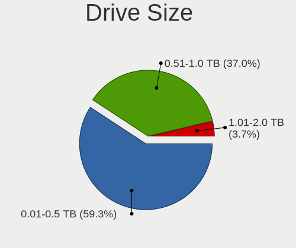
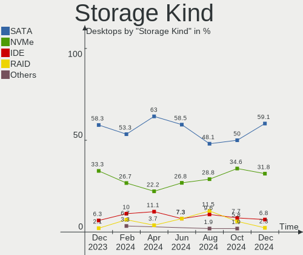
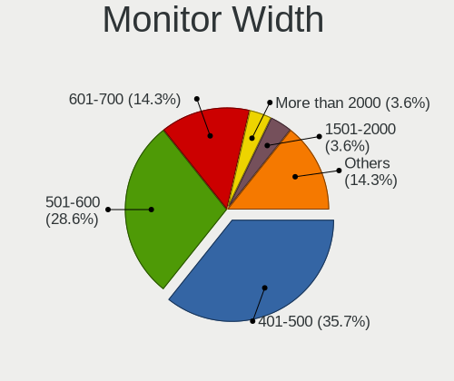
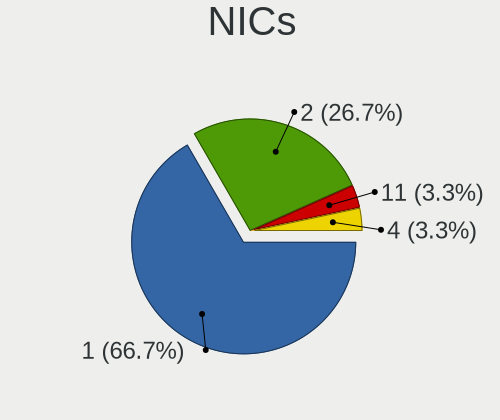

Linux in India - Hardware Trends (Desktops)
-------------------------------------------

A project to identify most popular hardware characteristics and track their change
over time based on data collected by Linux users at https://Linux-Hardware.org.

Anyone can contribute to this report by the [hw-probe](https://github.com/linuxhw/hw-probe) tool:

    sudo -E hw-probe -all -upload

Period: May, 2023.

Contents
--------

* [ System ](#system)
  - [ OS                       ](#os)
  - [ OS Family                ](#os-family)
  - [ Kernel                   ](#kernel)
  - [ Kernel Family            ](#kernel-family)
  - [ Kernel Major Ver.        ](#kernel-major-ver)
  - [ Arch                     ](#arch)
  - [ DE                       ](#de)
  - [ Display Server           ](#display-server)
  - [ Display Manager          ](#display-manager)
  - [ OS Lang                  ](#os-lang)
  - [ Boot Mode                ](#boot-mode)
  - [ Filesystem               ](#filesystem)
  - [ Part. scheme             ](#part-scheme)
  - [ Dual Boot with Linux/BSD ](#dual-boot-with-linuxbsd)
  - [ Dual Boot (Win)          ](#dual-boot-win)

* [ Board ](#board)
  - [ Vendor                   ](#vendor)
  - [ Model                    ](#model)
  - [ Model Family             ](#model-family)
  - [ MFG Year                 ](#mfg-year)
  - [ Form Factor              ](#form-factor)
  - [ Secure Boot              ](#secure-boot)
  - [ Coreboot                 ](#coreboot)
  - [ RAM Size                 ](#ram-size)
  - [ RAM Used                 ](#ram-used)
  - [ Total Drives             ](#total-drives)
  - [ Has CD-ROM               ](#has-cd-rom)
  - [ Has Ethernet             ](#has-ethernet)
  - [ Has WiFi                 ](#has-wifi)
  - [ Has Bluetooth            ](#has-bluetooth)

* [ Location ](#location)
  - [ Country                  ](#country)
  - [ City                     ](#city)

* [ Drives ](#drives)
  - [ Drive Vendor             ](#drive-vendor)
  - [ Drive Model              ](#drive-model)
  - [ HDD Vendor               ](#hdd-vendor)
  - [ SSD Vendor               ](#ssd-vendor)
  - [ Drive Kind               ](#drive-kind)
  - [ Drive Connector          ](#drive-connector)
  - [ Drive Size               ](#drive-size)
  - [ Space Total              ](#space-total)
  - [ Space Used               ](#space-used)
  - [ Malfunc. Drives          ](#malfunc-drives)
  - [ Malfunc. Drive Vendor    ](#malfunc-drive-vendor)
  - [ Malfunc. HDD Vendor      ](#malfunc-hdd-vendor)
  - [ Malfunc. Drive Kind      ](#malfunc-drive-kind)
  - [ Failed Drives            ](#failed-drives)
  - [ Failed Drive Vendor      ](#failed-drive-vendor)
  - [ Drive Status             ](#drive-status)

* [ Storage controller ](#storage-controller)
  - [ Storage Vendor           ](#storage-vendor)
  - [ Storage Model            ](#storage-model)
  - [ Storage Kind             ](#storage-kind)

* [ Processor ](#processor)
  - [ CPU Vendor               ](#cpu-vendor)
  - [ CPU Model                ](#cpu-model)
  - [ CPU Model Family         ](#cpu-model-family)
  - [ CPU Cores                ](#cpu-cores)
  - [ CPU Sockets              ](#cpu-sockets)
  - [ CPU Threads              ](#cpu-threads)
  - [ CPU Op-Modes             ](#cpu-op-modes)
  - [ CPU Microcode            ](#cpu-microcode)
  - [ CPU Microarch            ](#cpu-microarch)

* [ Graphics ](#graphics)
  - [ GPU Vendor               ](#gpu-vendor)
  - [ GPU Model                ](#gpu-model)
  - [ GPU Combo                ](#gpu-combo)
  - [ GPU Driver               ](#gpu-driver)
  - [ GPU Memory               ](#gpu-memory)

* [ Monitor ](#monitor)
  - [ Monitor Vendor           ](#monitor-vendor)
  - [ Monitor Model            ](#monitor-model)
  - [ Monitor Resolution       ](#monitor-resolution)
  - [ Monitor Diagonal         ](#monitor-diagonal)
  - [ Monitor Width            ](#monitor-width)
  - [ Aspect Ratio             ](#aspect-ratio)
  - [ Monitor Area             ](#monitor-area)
  - [ Pixel Density            ](#pixel-density)
  - [ Multiple Monitors        ](#multiple-monitors)

* [ Network ](#network)
  - [ Net Controller Vendor    ](#net-controller-vendor)
  - [ Net Controller Model     ](#net-controller-model)
  - [ Wireless Vendor          ](#wireless-vendor)
  - [ Wireless Model           ](#wireless-model)
  - [ Ethernet Vendor          ](#ethernet-vendor)
  - [ Ethernet Model           ](#ethernet-model)
  - [ Net Controller Kind      ](#net-controller-kind)
  - [ Used Controller          ](#used-controller)
  - [ NICs                     ](#nics)
  - [ IPv6                     ](#ipv6)

* [ Bluetooth ](#bluetooth)
  - [ Bluetooth Vendor         ](#bluetooth-vendor)
  - [ Bluetooth Model          ](#bluetooth-model)

* [ Sound ](#sound)
  - [ Sound Vendor             ](#sound-vendor)
  - [ Sound Model              ](#sound-model)

* [ Memory ](#memory)
  - [ Memory Vendor            ](#memory-vendor)
  - [ Memory Model             ](#memory-model)
  - [ Memory Kind              ](#memory-kind)
  - [ Memory Form Factor       ](#memory-form-factor)
  - [ Memory Size              ](#memory-size)
  - [ Memory Speed             ](#memory-speed)

* [ Printers & scanners ](#printers--scanners)
  - [ Printer Vendor           ](#printer-vendor)
  - [ Printer Model            ](#printer-model)
  - [ Scanner Vendor           ](#scanner-vendor)
  - [ Scanner Model            ](#scanner-model)

* [ Camera ](#camera)
  - [ Camera Vendor            ](#camera-vendor)
  - [ Camera Model             ](#camera-model)

* [ Security ](#security)
  - [ Fingerprint Vendor       ](#fingerprint-vendor)
  - [ Fingerprint Model        ](#fingerprint-model)
  - [ Chipcard Vendor          ](#chipcard-vendor)
  - [ Chipcard Model           ](#chipcard-model)

* [ Unsupported ](#unsupported)
  - [ Unsupported Devices      ](#unsupported-devices)
  - [ Unsupported Device Types ](#unsupported-device-types)

System
------

OS
--

Installed operating systems

| Name                | Desktops | Percent |
|---------------------|----------|---------|
| Ubuntu 22.04        | 6        | 21.43%  |
| Ubuntu 20.04        | 3        | 10.71%  |
| OpenMandriva 23.03  | 3        | 10.71%  |
| ArcoLinux Rolling   | 2        | 7.14%   |
| Zorin 16            | 1        | 3.57%   |
| Ubuntu 23.04        | 1        | 3.57%   |
| Ubuntu 21.04        | 1        | 3.57%   |
| Pop!_OS 22.04       | 1        | 3.57%   |
| NixOS 23.11         | 1        | 3.57%   |
| Linux Mint 21.1     | 1        | 3.57%   |
| Kubuntu 23.04       | 1        | 3.57%   |
| Kali 2023.1         | 1        | 3.57%   |
| Fedora 38           | 1        | 3.57%   |
| EndeavourOS Rolling | 1        | 3.57%   |
| Elementary 7        | 1        | 3.57%   |
| Debian 12           | 1        | 3.57%   |
| Debian 11           | 1        | 3.57%   |
| Artix Rolling       | 1        | 3.57%   |

OS Family
---------

OS without a version

| Name         | Desktops | Percent |
|--------------|----------|---------|
| Ubuntu       | 11       | 39.29%  |
| OpenMandriva | 3        | 10.71%  |
| Debian       | 2        | 7.14%   |
| ArcoLinux    | 2        | 7.14%   |
| Zorin        | 1        | 3.57%   |
| Pop!_OS      | 1        | 3.57%   |
| NixOS        | 1        | 3.57%   |
| Linux Mint   | 1        | 3.57%   |
| Kubuntu      | 1        | 3.57%   |
| Kali         | 1        | 3.57%   |
| Fedora       | 1        | 3.57%   |
| EndeavourOS  | 1        | 3.57%   |
| Elementary   | 1        | 3.57%   |
| Artix        | 1        | 3.57%   |

Kernel
------

Version of the Linux kernel

| Version                 | Desktops | Percent |
|-------------------------|----------|---------|
| 5.19.0-41-generic       | 4        | 14.29%  |
| 6.2.6-desktop-1omv2390  | 3        | 10.71%  |
| 5.15.0-72-generic       | 3        | 10.71%  |
| 6.2.0-20-generic        | 2        | 7.14%   |
| 6.3.3                   | 1        | 3.57%   |
| 6.3.2-zen1-1-zen        | 1        | 3.57%   |
| 6.3.1-zen2-1-zen        | 1        | 3.57%   |
| 6.2.15-300.fc38.x86_64  | 1        | 3.57%   |
| 6.2.13-artix1-1         | 1        | 3.57%   |
| 6.2.10-x64v1-xanmod1-1  | 1        | 3.57%   |
| 6.1.0-kali7-686-pae     | 1        | 3.57%   |
| 6.1.0-7-amd64           | 1        | 3.57%   |
| 6.0.12-76060006-generic | 1        | 3.57%   |
| 5.19.0-42-generic       | 1        | 3.57%   |
| 5.15.0-71-generic       | 1        | 3.57%   |
| 5.15.0-69-generic       | 1        | 3.57%   |
| 5.15.0-67-generic       | 1        | 3.57%   |
| 5.15.0-58-generic       | 1        | 3.57%   |
| 5.11.0-49-generic       | 1        | 3.57%   |
| 5.10.0-23-amd64         | 1        | 3.57%   |

Kernel Family
-------------

Linux kernel without a distro release

| Version | Desktops | Percent |
|---------|----------|---------|
| 5.15.0  | 7        | 25%     |
| 5.19.0  | 5        | 17.86%  |
| 6.2.6   | 3        | 10.71%  |
| 6.2.0   | 2        | 7.14%   |
| 6.1.0   | 2        | 7.14%   |
| 6.3.3   | 1        | 3.57%   |
| 6.3.2   | 1        | 3.57%   |
| 6.3.1   | 1        | 3.57%   |
| 6.2.15  | 1        | 3.57%   |
| 6.2.13  | 1        | 3.57%   |
| 6.2.10  | 1        | 3.57%   |
| 6.0.12  | 1        | 3.57%   |
| 5.11.0  | 1        | 3.57%   |
| 5.10.0  | 1        | 3.57%   |

Kernel Major Ver.
-----------------

Linux kernel major version

| Version | Desktops | Percent |
|---------|----------|---------|
| 6.2     | 8        | 28.57%  |
| 5.15    | 7        | 25%     |
| 5.19    | 5        | 17.86%  |
| 6.3     | 3        | 10.71%  |
| 6.1     | 2        | 7.14%   |
| 6.0     | 1        | 3.57%   |
| 5.11    | 1        | 3.57%   |
| 5.10    | 1        | 3.57%   |

Arch
----

OS architecture (x86_64, i586, etc.)

| Name   | Desktops | Percent |
|--------|----------|---------|
| x86_64 | 27       | 96.43%  |
| i686   | 1        | 3.57%   |

DE
--

Desktop Environment

| Name     | Desktops | Percent |
|----------|----------|---------|
| GNOME    | 13       | 46.43%  |
| KDE5     | 7        | 25%     |
| XFCE     | 3        | 10.71%  |
| Unknown  | 2        | 7.14%   |
| Pantheon | 1        | 3.57%   |
| MATE     | 1        | 3.57%   |
| bspwm    | 1        | 3.57%   |

Display Server
--------------

X11 or Wayland

| Name    | Desktops | Percent |
|---------|----------|---------|
| X11     | 22       | 78.57%  |
| Wayland | 5        | 17.86%  |
| Tty     | 1        | 3.57%   |

Display Manager
---------------

SDDM, LightDM, etc.

| Name    | Desktops | Percent |
|---------|----------|---------|
| GDM3    | 10       | 35.71%  |
| SDDM    | 6        | 21.43%  |
| Unknown | 5        | 17.86%  |
| LightDM | 3        | 10.71%  |
| GDM     | 3        | 10.71%  |
| SLiM    | 1        | 3.57%   |

OS Lang
-------

Language

| Lang  | Desktops | Percent |
|-------|----------|---------|
| en_IN | 16       | 57.14%  |
| en_US | 12       | 42.86%  |

Boot Mode
---------

EFI or BIOS

| Mode | Desktops | Percent |
|------|----------|---------|
| EFI  | 16       | 57.14%  |
| BIOS | 12       | 42.86%  |

Filesystem
----------

Type of filesystem

| Type    | Desktops | Percent |
|---------|----------|---------|
| Ext4    | 18       | 64.29%  |
| Tmpfs   | 7        | 25%     |
| Overlay | 2        | 7.14%   |
| Xfs     | 1        | 3.57%   |

Part. scheme
------------

Scheme of partitioning

| Type    | Desktops | Percent |
|---------|----------|---------|
| GPT     | 20       | 71.43%  |
| Unknown | 5        | 17.86%  |
| MBR     | 3        | 10.71%  |

Dual Boot with Linux/BSD
------------------------

Hosting more than one Linux/BSD

| Dual boot | Desktops | Percent |
|-----------|----------|---------|
| No        | 23       | 82.14%  |
| Yes       | 5        | 17.86%  |

Dual Boot (Win)
---------------

Hosting Linux and Windows

| Dual boot | Desktops | Percent |
|-----------|----------|---------|
| No        | 16       | 57.14%  |
| Yes       | 12       | 42.86%  |

Board
-----

Vendor
------

Motherboard manufacturer

| Name                | Desktops | Percent |
|---------------------|----------|---------|
| ASUSTek Computer    | 6        | 21.43%  |
| MSI                 | 5        | 17.86%  |
| Lenovo              | 4        | 14.29%  |
| Hewlett-Packard     | 4        | 14.29%  |
| Gigabyte Technology | 4        | 14.29%  |
| Unknown             | 2        | 7.14%   |
| Intel               | 1        | 3.57%   |
| Fujitsu             | 1        | 3.57%   |
| Dell                | 1        | 3.57%   |

Model
-----

Motherboard model

| Name                                        | Desktops | Percent |
|---------------------------------------------|----------|---------|
| Gigabyte H410M H                            | 2        | 7.14%   |
| ASUS P8H61-M LX3 R2.0                       | 2        | 7.14%   |
| Unknown                                     | 2        | 7.14%   |
| MSI MS-7D89                                 | 1        | 3.57%   |
| MSI MS-7D32                                 | 1        | 3.57%   |
| MSI MS-7B79                                 | 1        | 3.57%   |
| MSI MS-7A38                                 | 1        | 3.57%   |
| MSI MS-7A15                                 | 1        | 3.57%   |
| Lenovo ThinkCentre neo 50t Gen 3 11SES00G00 | 1        | 3.57%   |
| Lenovo ThinkCentre M93p 10AAS1CB01          | 1        | 3.57%   |
| Lenovo ThinkCentre M70t 11EVS05600          | 1        | 3.57%   |
| Lenovo IdeaCentre 510S-08IKL 90GB00E3IN     | 1        | 3.57%   |
| Intel DH61BF AAG81311-102                   | 1        | 3.57%   |
| HP ProDesk 400 G6 MT                        | 1        | 3.57%   |
| HP Desktop Pro A G3                         | 1        | 3.57%   |
| HP Compaq Pro 6300 MT                       | 1        | 3.57%   |
| HP Compaq Elite 8300 SFF                    | 1        | 3.57%   |
| Gigabyte H310M S2                           | 1        | 3.57%   |
| Gigabyte B450M DS3H                         | 1        | 3.57%   |
| Fujitsu FMVD04014                           | 1        | 3.57%   |
| Dell OptiPlex 3040                          | 1        | 3.57%   |
| ASUS TUF Gaming X570-PLUS                   | 1        | 3.57%   |
| ASUS SABERTOOTH 990FX R2.0                  | 1        | 3.57%   |
| ASUS PRIME B250M-A                          | 1        | 3.57%   |
| ASUS H110M-K                                | 1        | 3.57%   |

Model Family
------------

Motherboard model prefix

| Name               | Desktops | Percent |
|--------------------|----------|---------|
| Lenovo ThinkCentre | 3        | 10.71%  |
| HP Compaq          | 2        | 7.14%   |
| Gigabyte H410M     | 2        | 7.14%   |
| ASUS P8H61-M       | 2        | 7.14%   |
| Unknown            | 2        | 7.14%   |
| MSI MS-7D89        | 1        | 3.57%   |
| MSI MS-7D32        | 1        | 3.57%   |
| MSI MS-7B79        | 1        | 3.57%   |
| MSI MS-7A38        | 1        | 3.57%   |
| MSI MS-7A15        | 1        | 3.57%   |
| Lenovo IdeaCentre  | 1        | 3.57%   |
| Intel DH61BF       | 1        | 3.57%   |
| HP ProDesk         | 1        | 3.57%   |
| HP Desktop         | 1        | 3.57%   |
| Gigabyte H310M     | 1        | 3.57%   |
| Gigabyte B450M     | 1        | 3.57%   |
| Fujitsu FMVD04014  | 1        | 3.57%   |
| Dell OptiPlex      | 1        | 3.57%   |
| ASUS TUF           | 1        | 3.57%   |
| ASUS SABERTOOTH    | 1        | 3.57%   |
| ASUS PRIME         | 1        | 3.57%   |
| ASUS H110M-K       | 1        | 3.57%   |

MFG Year
--------

Motherboard manufacture year

| Year | Desktops | Percent |
|------|----------|---------|
| 2012 | 5        | 17.86%  |
| 2019 | 4        | 14.29%  |
| 2018 | 4        | 14.29%  |
| 2022 | 3        | 10.71%  |
| 2020 | 3        | 10.71%  |
| 2021 | 2        | 7.14%   |
| 2016 | 2        | 7.14%   |
| 2013 | 2        | 7.14%   |
| 2017 | 1        | 3.57%   |
| 2015 | 1        | 3.57%   |
| 2014 | 1        | 3.57%   |

Form Factor
-----------

Physical design of the computer

| Name    | Desktops | Percent |
|---------|----------|---------|
| Desktop | 28       | 100%    |

Secure Boot
-----------

Enabled or disabled

| State    | Desktops | Percent |
|----------|----------|---------|
| Disabled | 26       | 92.86%  |
| Enabled  | 2        | 7.14%   |

Coreboot
--------

Have coreboot on board

| Used | Desktops | Percent |
|------|----------|---------|
| No   | 28       | 100%    |

RAM Size
--------

Total RAM memory

| Size in GB  | Desktops | Percent |
|-------------|----------|---------|
| 16.01-24.0  | 11       | 39.29%  |
| 8.01-16.0   | 8        | 28.57%  |
| 4.01-8.0    | 3        | 10.71%  |
| 32.01-64.0  | 2        | 7.14%   |
| 3.01-4.0    | 2        | 7.14%   |
| 24.01-32.0  | 1        | 3.57%   |
| 64.01-256.0 | 1        | 3.57%   |

RAM Used
--------

Used RAM memory

| Used GB  | Desktops | Percent |
|----------|----------|---------|
| 2.01-3.0 | 11       | 39.29%  |
| 3.01-4.0 | 6        | 21.43%  |
| 4.01-8.0 | 4        | 14.29%  |
| 1.01-2.0 | 4        | 14.29%  |
| 0.51-1.0 | 3        | 10.71%  |

Total Drives
------------

Number of drives on board

| Drives | Desktops | Percent |
|--------|----------|---------|
| 1      | 14       | 50%     |
| 2      | 7        | 25%     |
| 3      | 6        | 21.43%  |
| 4      | 1        | 3.57%   |

Has CD-ROM
----------

Has CD-ROM on board

| Presented | Desktops | Percent |
|-----------|----------|---------|
| No        | 23       | 82.14%  |
| Yes       | 5        | 17.86%  |

Has Ethernet
------------

Has Ethernet on board

| Presented | Desktops | Percent |
|-----------|----------|---------|
| Yes       | 28       | 100%    |

Has WiFi
--------

Has WiFi module

| Presented | Desktops | Percent |
|-----------|----------|---------|
| No        | 17       | 60.71%  |
| Yes       | 11       | 39.29%  |

Has Bluetooth
-------------

Has Bluetooth module

| Presented | Desktops | Percent |
|-----------|----------|---------|
| No        | 20       | 71.43%  |
| Yes       | 8        | 28.57%  |

Location
--------

Country
-------

Geographic location (country)

| Country | Desktops | Percent |
|---------|----------|---------|
| India   | 28       | 100%    |

City
----

Geographic location (city)

| City       | Desktops | Percent |
|------------|----------|---------|
| Hyderabad  | 3        | 10.71%  |
| Delhi      | 3        | 10.71%  |
| Surat      | 2        | 7.14%   |
| Pune       | 2        | 7.14%   |
| Mumbai     | 2        | 7.14%   |
| Lucknow    | 2        | 7.14%   |
| Kalwara    | 2        | 7.14%   |
| Coimbatore | 2        | 7.14%   |
| Thrissur   | 1        | 3.57%   |
| New Delhi  | 1        | 3.57%   |
| Nashik     | 1        | 3.57%   |
| Kolkata    | 1        | 3.57%   |
| Kochi      | 1        | 3.57%   |
| Jaipur     | 1        | 3.57%   |
| Hubli      | 1        | 3.57%   |
| Faridabad  | 1        | 3.57%   |
| Bhopal     | 1        | 3.57%   |
| Bengaluru  | 1        | 3.57%   |

Drives
------

Drive Vendor
------------

Hard drive vendors

| Vendor              | Desktops | Drives | Percent |
|---------------------|----------|--------|---------|
| WDC                 | 9        | 15     | 20.93%  |
| Seagate             | 7        | 11     | 16.28%  |
| Samsung Electronics | 4        | 4      | 9.3%    |
| Crucial             | 4        | 4      | 9.3%    |
| Toshiba             | 3        | 4      | 6.98%   |
| Kingston            | 2        | 2      | 4.65%   |
| Gigabyte Technology | 2        | 2      | 4.65%   |
| China               | 2        | 2      | 4.65%   |
| Unknown             | 2        | 2      | 4.65%   |
| Transcend           | 1        | 1      | 2.33%   |
| SPCC                | 1        | 2      | 2.33%   |
| Self                | 1        | 1      | 2.33%   |
| Sandisk             | 1        | 1      | 2.33%   |
| Intel               | 1        | 1      | 2.33%   |
| HGST                | 1        | 1      | 2.33%   |
| ADATA Technology    | 1        | 2      | 2.33%   |
| A-DATA Technology   | 1        | 1      | 2.33%   |

Drive Model
-----------

Hard drive models

| Model                                               | Desktops | Percent |
|-----------------------------------------------------|----------|---------|
| Crucial CT240BX500SSD1 240GB                        | 3        | 5.56%   |
| WDC WDS240G2G0A-00JH30 240GB SSD                    | 2        | 3.7%    |
| WDC WD10EZEX-08WN4A0 1TB                            | 2        | 3.7%    |
| Toshiba DT01ACA100 1TB                              | 2        | 3.7%    |
| Seagate ST500DM002-1BD142 500GB                     | 2        | 3.7%    |
| Samsung NVMe SSD Controller SM981/PM981/PM983 256GB | 2        | 3.7%    |
| Kingston SA400S37240G 240GB SSD                     | 2        | 3.7%    |
| Unknown                                             | 2        | 3.7%    |
| WDC WDS240G2G0C-00AJM0 240GB                        | 1        | 1.85%   |
| WDC WDS120G2G0A-00JH30 120GB SSD                    | 1        | 1.85%   |
| WDC WD5000AAKX-60U6AA0 500GB                        | 1        | 1.85%   |
| WDC WD5000AAKX-22ERMA0 500GB                        | 1        | 1.85%   |
| WDC WD40EDAZ-11SLVB0 4TB                            | 1        | 1.85%   |
| WDC WD10EZRX-00A8LB0 1TB                            | 1        | 1.85%   |
| WDC WD10EZEX-35WN4A0 1TB                            | 1        | 1.85%   |
| WDC WD10EZEX-22MFCA0 1TB                            | 1        | 1.85%   |
| WDC WD10EZEX-08M2NA0 1TB                            | 1        | 1.85%   |
| WDC WD Green 2.5 1000GB SSD                         | 1        | 1.85%   |
| Transcend TS256GMTE110S 256GB                       | 1        | 1.85%   |
| Toshiba HDWU110 1TB                                 | 1        | 1.85%   |
| Toshiba DT01ABA200V 2TB                             | 1        | 1.85%   |
| SPCC Solid State Disk 128GB                         | 1        | 1.85%   |
| SPCC M.2 PCIe SSD 256GB                             | 1        | 1.85%   |
| Self Reliant 128GB SSD                              | 1        | 1.85%   |
| Seagate ST9160821AS 160GB                           | 1        | 1.85%   |
| Seagate ST4000VN008-2DR166 4TB                      | 1        | 1.85%   |
| Seagate ST3250318AS 250GB                           | 1        | 1.85%   |
| Seagate ST3160212ACE 160GB                          | 1        | 1.85%   |
| Seagate ST2000DM001-1ER164 2TB                      | 1        | 1.85%   |
| Seagate ST1000DM003-1SB10C 1TB                      | 1        | 1.85%   |
| Seagate ST1000DM003-1CH162 1TB                      | 1        | 1.85%   |
| Seagate BUP Slim BK 2TB                             | 1        | 1.85%   |
| Sandisk WD Blue SN570 1TB                           | 1        | 1.85%   |
| Samsung SSD 860 EVO 250GB                           | 1        | 1.85%   |
| Samsung SSD 850 EVO M.2 250GB                       | 1        | 1.85%   |
| Intel SSDSC2BW240A3L 240GB                          | 1        | 1.85%   |
| HGST HTS545050A7E680 500GB                          | 1        | 1.85%   |
| Gigabyte GP-GSTFS31256GTND 256GB SSD                | 1        | 1.85%   |
| Gigabyte GP-GSTFS31240GNTD 240GB SSD                | 1        | 1.85%   |
| Crucial CT500P5PSSD8 500GB                          | 1        | 1.85%   |

HDD Vendor
----------

Hard disk drive vendors

| Vendor  | Desktops | Drives | Percent |
|---------|----------|--------|---------|
| WDC     | 8        | 10     | 42.11%  |
| Seagate | 7        | 11     | 36.84%  |
| Toshiba | 3        | 4      | 15.79%  |
| HGST    | 1        | 1      | 5.26%   |

SSD Vendor
----------

Solid state drive vendors

| Vendor              | Desktops | Drives | Percent |
|---------------------|----------|--------|---------|
| WDC                 | 4        | 4      | 20%     |
| Crucial             | 3        | 3      | 15%     |
| Samsung Electronics | 2        | 2      | 10%     |
| Kingston            | 2        | 2      | 10%     |
| Gigabyte Technology | 2        | 2      | 10%     |
| China               | 2        | 2      | 10%     |
| SPCC                | 1        | 1      | 5%      |
| Self                | 1        | 1      | 5%      |
| Intel               | 1        | 1      | 5%      |
| A-DATA Technology   | 1        | 1      | 5%      |
| Unknown             | 1        | 1      | 5%      |

Drive Kind
----------

HDD or SSD

| Kind    | Desktops | Drives | Percent |
|---------|----------|--------|---------|
| HDD     | 17       | 26     | 42.5%   |
| SSD     | 14       | 20     | 35%     |
| NVMe    | 8        | 9      | 20%     |
| Unknown | 1        | 1      | 2.5%    |

Drive Connector
---------------

SATA, SAS, NVMe, etc.

| Type | Desktops | Drives | Percent |
|------|----------|--------|---------|
| SATA | 25       | 46     | 73.53%  |
| NVMe | 8        | 9      | 23.53%  |
| SAS  | 1        | 1      | 2.94%   |

Drive Size
----------

Size of hard drive

| Size in TB | Desktops | Drives | Percent |
|------------|----------|--------|---------|
| 0.01-0.5   | 18       | 27     | 52.94%  |
| 0.51-1.0   | 12       | 14     | 35.29%  |
| 3.01-4.0   | 2        | 2      | 5.88%   |
| 1.01-2.0   | 2        | 3      | 5.88%   |

Space Total
-----------

Amount of disk space available on the file system

| Size in GB     | Desktops | Percent |
|----------------|----------|---------|
| 251-500        | 11       | 39.29%  |
| 101-250        | 7        | 25%     |
| 501-1000       | 4        | 14.29%  |
| 1001-2000      | 2        | 7.14%   |
| 1-20           | 2        | 7.14%   |
| More than 3000 | 1        | 3.57%   |
| 51-100         | 1        | 3.57%   |

Space Used
----------

Amount of used disk space

| Used GB   | Desktops | Percent |
|-----------|----------|---------|
| 1-20      | 13       | 46.43%  |
| 251-500   | 4        | 14.29%  |
| 21-50     | 4        | 14.29%  |
| 51-100    | 3        | 10.71%  |
| 101-250   | 2        | 7.14%   |
| 1001-2000 | 1        | 3.57%   |
| 501-1000  | 1        | 3.57%   |

Malfunc. Drives
---------------

Drive models with a malfunction

| Model                        | Desktops | Drives | Percent |
|------------------------------|----------|--------|---------|
| WDC WD5000AAKX-22ERMA0 500GB | 1        | 1      | 25%     |
| Seagate ST9160821AS 160GB    | 1        | 1      | 25%     |
| Seagate ST3250318AS 250GB    | 1        | 1      | 25%     |
| HGST HTS545050A7E680 500GB   | 1        | 1      | 25%     |

Malfunc. Drive Vendor
---------------------

Vendors of faulty drives

| Vendor  | Desktops | Drives | Percent |
|---------|----------|--------|---------|
| Seagate | 2        | 2      | 50%     |
| WDC     | 1        | 1      | 25%     |
| HGST    | 1        | 1      | 25%     |

Malfunc. HDD Vendor
-------------------

Vendors of faulty HDD drives

| Vendor  | Desktops | Drives | Percent |
|---------|----------|--------|---------|
| Seagate | 2        | 2      | 50%     |
| WDC     | 1        | 1      | 25%     |
| HGST    | 1        | 1      | 25%     |

Malfunc. Drive Kind
-------------------

Kinds of faulty drives

| Kind | Desktops | Drives | Percent |
|------|----------|--------|---------|
| HDD  | 4        | 4      | 100%    |

Failed Drives
-------------

Failed drive models

Zero info for selected period =(

Failed Drive Vendor
-------------------

Failed drive vendors

Zero info for selected period =(

Drive Status
------------

Number of failed and malfunc. drives

| Status   | Desktops | Drives | Percent |
|----------|----------|--------|---------|
| Detected | 14       | 29     | 45.16%  |
| Works    | 13       | 23     | 41.94%  |
| Malfunc  | 4        | 4      | 12.9%   |

Storage controller
------------------

Storage Vendor
--------------

Storage controller vendors

| Vendor                       | Desktops | Percent |
|------------------------------|----------|---------|
| Intel                        | 22       | 57.89%  |
| AMD                          | 6        | 15.79%  |
| SanDisk                      | 2        | 5.26%   |
| Samsung Electronics          | 2        | 5.26%   |
| ASMedia Technology           | 2        | 5.26%   |
| Silicon Motion               | 1        | 2.63%   |
| Shenzhen Longsys Electronics | 1        | 2.63%   |
| Micron/Crucial Technology    | 1        | 2.63%   |
| ADATA Technology             | 1        | 2.63%   |

Storage Model
-------------

Storage controller models

| Model                                                                                   | Desktops | Percent |
|-----------------------------------------------------------------------------------------|----------|---------|
| AMD FCH SATA Controller [AHCI mode]                                                     | 4        | 9.3%    |
| Intel Q170/Q150/B150/H170/H110/Z170/CM236 Chipset SATA Controller [AHCI Mode]           | 3        | 6.98%   |
| Intel 7 Series/C210 Series Chipset Family 6-port SATA Controller [AHCI mode]            | 3        | 6.98%   |
| AMD 400 Series Chipset SATA Controller                                                  | 3        | 6.98%   |
| Samsung NVMe SSD Controller SM981/PM981/PM983                                           | 2        | 4.65%   |
| Intel Cannon Lake PCH SATA AHCI Controller                                              | 2        | 4.65%   |
| Intel Alder Lake-S PCH SATA Controller [AHCI Mode]                                      | 2        | 4.65%   |
| Intel 6 Series/C200 Series Chipset Family 6 port Desktop SATA AHCI Controller           | 2        | 4.65%   |
| Intel 400 Series Chipset Family SATA AHCI Controller                                    | 2        | 4.65%   |
| ASMedia ASM1062 Serial ATA Controller                                                   | 2        | 4.65%   |
| Silicon Motion SM2263EN/SM2263XT SSD Controller                                         | 1        | 2.33%   |
| Shenzhen Longsys SM2263EN/SM2263XT-based OEM SSD                                        | 1        | 2.33%   |
| SanDisk WD Blue SN570 NVMe SSD 1TB                                                      | 1        | 2.33%   |
| SanDisk Non-Volatile memory controller                                                  | 1        | 2.33%   |
| Micron/Crucial P5 Plus NVMe PCIe SSD                                                    | 1        | 2.33%   |
| Intel SATA Controller [RAID mode]                                                       | 1        | 2.33%   |
| Intel NM10/ICH7 Family SATA Controller [IDE mode]                                       | 1        | 2.33%   |
| Intel Jasper Lake SATA AHCI Controller                                                  | 1        | 2.33%   |
| Intel Comet Lake SATA AHCI Controller                                                   | 1        | 2.33%   |
| Intel 82801G (ICH7 Family) IDE Controller                                               | 1        | 2.33%   |
| Intel 8 Series/C220 Series Chipset Family 6-port SATA Controller 1 [AHCI mode]          | 1        | 2.33%   |
| Intel 700 Series Chipset Family SATA AHCI Controller                                    | 1        | 2.33%   |
| Intel 6 Series/C200 Series Chipset Family Desktop SATA Controller (IDE mode, ports 4-5) | 1        | 2.33%   |
| Intel 6 Series/C200 Series Chipset Family Desktop SATA Controller (IDE mode, ports 0-3) | 1        | 2.33%   |
| Intel 200 Series PCH SATA controller [AHCI mode]                                        | 1        | 2.33%   |
| AMD SB7x0/SB8x0/SB9x0 SATA Controller [AHCI mode]                                       | 1        | 2.33%   |
| ADATA ADATA XPG GAMMIXS1 1L Media                                                       | 1        | 2.33%   |
| ADATA A Non-Volatile memory controller                                                  | 1        | 2.33%   |

Storage Kind
------------

Kind of storage controller (IDE, SATA, NVMe, SAS, ...)

| Kind | Desktops | Percent |
|------|----------|---------|
| SATA | 25       | 69.44%  |
| NVMe | 8        | 22.22%  |
| IDE  | 2        | 5.56%   |
| RAID | 1        | 2.78%   |

Processor
---------

CPU Vendor
----------

Processor vendors

| Vendor | Desktops | Percent |
|--------|----------|---------|
| Intel  | 22       | 78.57%  |
| AMD    | 6        | 21.43%  |

CPU Model
---------

Processor models

| Model                                           | Desktops | Percent |
|-------------------------------------------------|----------|---------|
| Intel Core i5-3470 CPU @ 3.20GHz                | 3        | 10.71%  |
| Intel Core i3-6098P CPU @ 3.60GHz               | 2        | 7.14%   |
| Intel Core i3-10100 CPU @ 3.60GHz               | 2        | 7.14%   |
| Intel Pentium CPU G620 @ 2.60GHz                | 1        | 3.57%   |
| Intel Pentium 4 CPU 3.40GHz                     | 1        | 3.57%   |
| Intel Core i7-9700 CPU @ 3.00GHz                | 1        | 3.57%   |
| Intel Core i7-3770 CPU @ 3.40GHz                | 1        | 3.57%   |
| Intel Core i5-8400 CPU @ 2.80GHz                | 1        | 3.57%   |
| Intel Core i5-7400 CPU @ 3.00GHz                | 1        | 3.57%   |
| Intel Core i5-4570T CPU @ 2.90GHz               | 1        | 3.57%   |
| Intel Core i5-10500 CPU @ 3.10GHz               | 1        | 3.57%   |
| Intel Core i3-7100 CPU @ 3.90GHz                | 1        | 3.57%   |
| Intel Core i3-6100T CPU @ 3.20GHz               | 1        | 3.57%   |
| Intel Core i3-3220 CPU @ 3.30GHz                | 1        | 3.57%   |
| Intel Celeron N5105 @ 2.00GHz                   | 1        | 3.57%   |
| Intel 13th Gen Core i7-13700K                   | 1        | 3.57%   |
| Intel 12th Gen Core i7-12700                    | 1        | 3.57%   |
| Intel 12th Gen Core i5-12400F                   | 1        | 3.57%   |
| AMD Ryzen 5 3600 6-Core Processor               | 1        | 3.57%   |
| AMD Ryzen 5 3500 6-Core Processor               | 1        | 3.57%   |
| AMD Ryzen 5 3400G with Radeon Vega Graphics     | 1        | 3.57%   |
| AMD Ryzen 5 2600X Six-Core Processor            | 1        | 3.57%   |
| AMD Ryzen 3 PRO 3200G with Radeon Vega Graphics | 1        | 3.57%   |
| AMD FX-8150 Eight-Core Processor                | 1        | 3.57%   |

CPU Model Family
----------------

Processor model prefix

| Model           | Desktops | Percent |
|-----------------|----------|---------|
| Intel Core i5   | 7        | 25%     |
| Intel Core i3   | 7        | 25%     |
| AMD Ryzen 5     | 4        | 14.29%  |
| Other           | 3        | 10.71%  |
| Intel Core i7   | 2        | 7.14%   |
| Intel Pentium 4 | 1        | 3.57%   |
| Intel Pentium   | 1        | 3.57%   |
| Intel Celeron   | 1        | 3.57%   |
| AMD Ryzen 3 PRO | 1        | 3.57%   |
| AMD FX          | 1        | 3.57%   |

CPU Cores
---------

Number of processor cores

| Number | Desktops | Percent |
|--------|----------|---------|
| 4      | 11       | 39.29%  |
| 2      | 7        | 25%     |
| 6      | 6        | 21.43%  |
| 16     | 1        | 3.57%   |
| 12     | 1        | 3.57%   |
| 8      | 1        | 3.57%   |
| 1      | 1        | 3.57%   |

CPU Sockets
-----------

Number of sockets

| Number | Desktops | Percent |
|--------|----------|---------|
| 1      | 28       | 100%    |

CPU Threads
-----------

Threads per core (Hyper-Threading)

| Number | Desktops | Percent |
|--------|----------|---------|
| 2      | 16       | 57.14%  |
| 1      | 12       | 42.86%  |

CPU Op-Modes
------------

CPU Operation Modes (32-bit, 64-bit)

| Op mode        | Desktops | Percent |
|----------------|----------|---------|
| 32-bit, 64-bit | 28       | 100%    |

CPU Microcode
-------------

Microcode number

| Number     | Desktops | Percent |
|------------|----------|---------|
| Unknown    | 10       | 35.71%  |
| 0x306a9    | 3        | 10.71%  |
| 0x90672    | 2        | 7.14%   |
| 0x506e3    | 2        | 7.14%   |
| 0xf65      | 1        | 3.57%   |
| 0xb0671    | 1        | 3.57%   |
| 0xa0653    | 1        | 3.57%   |
| 0x906e9    | 1        | 3.57%   |
| 0x906c0    | 1        | 3.57%   |
| 0x306c3    | 1        | 3.57%   |
| 0x08701021 | 1        | 3.57%   |
| 0x08701013 | 1        | 3.57%   |
| 0x08108109 | 1        | 3.57%   |
| 0x0800820d | 1        | 3.57%   |
| 0x0600063d | 1        | 3.57%   |

CPU Microarch
-------------

Microarchitecture

| Name             | Desktops | Percent |
|------------------|----------|---------|
| IvyBridge        | 5        | 17.86%  |
| KabyLake         | 4        | 14.29%  |
| Zen+             | 3        | 10.71%  |
| Skylake          | 3        | 10.71%  |
| CometLake        | 3        | 10.71%  |
| Zen 2            | 2        | 7.14%   |
| Alderlake Hybrid | 2        | 7.14%   |
| Tremont          | 1        | 3.57%   |
| SandyBridge      | 1        | 3.57%   |
| NetBurst         | 1        | 3.57%   |
| Haswell          | 1        | 3.57%   |
| Bulldozer        | 1        | 3.57%   |
| Unknown          | 1        | 3.57%   |

Graphics
--------

GPU Vendor
----------

Vendors of graphics cards

| Vendor | Desktops | Percent |
|--------|----------|---------|
| Intel  | 18       | 58.06%  |
| Nvidia | 7        | 22.58%  |
| AMD    | 6        | 19.35%  |

GPU Model
---------

Graphics card models

| Model                                                                       | Desktops | Percent |
|-----------------------------------------------------------------------------|----------|---------|
| Intel Xeon E3-1200 v2/3rd Gen Core processor Graphics Controller            | 3        | 9.68%   |
| Intel HD Graphics 630                                                       | 2        | 6.45%   |
| Intel HD Graphics 510                                                       | 2        | 6.45%   |
| Intel CometLake-S GT2 [UHD Graphics 630]                                    | 2        | 6.45%   |
| Nvidia TU117 [GeForce GTX 1630]                                             | 1        | 3.23%   |
| Nvidia TU116 [GeForce GTX 1660 SUPER]                                       | 1        | 3.23%   |
| Nvidia TU116 [GeForce GTX 1650 SUPER]                                       | 1        | 3.23%   |
| Nvidia GP108 [GeForce GT 1030]                                              | 1        | 3.23%   |
| Nvidia GP107 [GeForce GTX 1050 Ti]                                          | 1        | 3.23%   |
| Nvidia GP104 [GeForce GTX 1070 Ti]                                          | 1        | 3.23%   |
| Nvidia AD102 [GeForce RTX 4090]                                             | 1        | 3.23%   |
| Intel Xeon E3-1200 v3/4th Gen Core Processor Integrated Graphics Controller | 1        | 3.23%   |
| Intel Raptor Lake-S GT1 [UHD Graphics 770]                                  | 1        | 3.23%   |
| Intel JasperLake [UHD Graphics]                                             | 1        | 3.23%   |
| Intel IvyBridge GT2 [HD Graphics 4000]                                      | 1        | 3.23%   |
| Intel HD Graphics 530                                                       | 1        | 3.23%   |
| Intel CoffeeLake-S GT2 [UHD Graphics 630]                                   | 1        | 3.23%   |
| Intel AlderLake-S GT1                                                       | 1        | 3.23%   |
| Intel 82G33/G31 Express Integrated Graphics Controller                      | 1        | 3.23%   |
| Intel 2nd Generation Core Processor Family Integrated Graphics Controller   | 1        | 3.23%   |
| AMD Picasso/Raven 2 [Radeon Vega Series / Radeon Vega Mobile Series]        | 1        | 3.23%   |
| AMD Park [Mobility Radeon HD 5430]                                          | 1        | 3.23%   |
| AMD Navi 22 [Radeon RX 6700/6700 XT/6750 XT / 6800M/6850M XT]               | 1        | 3.23%   |
| AMD Cedar [Radeon HD 5000/6000/7350/8350 Series]                            | 1        | 3.23%   |
| AMD Baffin [Radeon RX 550 640SP / RX 560/560X]                              | 1        | 3.23%   |
| AMD Baffin [Radeon RX 460/560D / Pro 450/455/460/555/555X/560/560X]         | 1        | 3.23%   |

GPU Combo
---------

Combinations of graphics cards

| Name        | Desktops | Percent |
|-------------|----------|---------|
| 1 x Intel   | 15       | 53.57%  |
| 1 x Nvidia  | 7        | 25%     |
| 1 x AMD     | 5        | 17.86%  |
| Intel + AMD | 1        | 3.57%   |

GPU Driver
----------

Free vs proprietary

| Driver      | Desktops | Percent |
|-------------|----------|---------|
| Free        | 20       | 71.43%  |
| Proprietary | 5        | 17.86%  |
| Unknown     | 3        | 10.71%  |

GPU Memory
----------

Total video memory

| Size in GB | Desktops | Percent |
|------------|----------|---------|
| Unknown    | 22       | 78.57%  |
| 3.01-4.0   | 2        | 7.14%   |
| 7.01-8.0   | 1        | 3.57%   |
| 16.01-24.0 | 1        | 3.57%   |
| 1.01-2.0   | 1        | 3.57%   |
| 8.01-16.0  | 1        | 3.57%   |

Monitor
-------

Monitor Vendor
--------------

Monitor vendors

| Vendor              | Desktops | Percent |
|---------------------|----------|---------|
| Lenovo              | 5        | 21.74%  |
| Samsung Electronics | 3        | 13.04%  |
| Hewlett-Packard     | 2        | 8.7%    |
| Goldstar            | 2        | 8.7%    |
| Acer                | 2        | 8.7%    |
| YSD                 | 1        | 4.35%   |
| ViewSonic           | 1        | 4.35%   |
| Unknown             | 1        | 4.35%   |
| SGT                 | 1        | 4.35%   |
| PZG                 | 1        | 4.35%   |
| Pioneer             | 1        | 4.35%   |
| Gigabyte Technology | 1        | 4.35%   |
| Dell                | 1        | 4.35%   |
| ASUSTek Computer    | 1        | 4.35%   |

Monitor Model
-------------

Monitor models

| Model                                                             | Desktops | Percent |
|-------------------------------------------------------------------|----------|---------|
| YSD HDMI YSD0190 1440x900 368x207mm 16.6-inch                     | 1        | 4.35%   |
| ViewSonic XG2405 VSC0D39 1920x1080 527x296mm 23.8-inch            | 1        | 4.35%   |
| Unknown LCD Monitor Dell D1918H 1366x768                          | 1        | 4.35%   |
| SGT VGA SGT2383 1366x768 410x260mm 19.1-inch                      | 1        | 4.35%   |
| Samsung Electronics U32R59x SAM0F96 3840x2160 697x392mm 31.5-inch | 1        | 4.35%   |
| Samsung Electronics S22C330 SAM0A6D 1920x1080 477x268mm 21.5-inch | 1        | 4.35%   |
| Samsung Electronics LF22T35 SAM707C 1920x1080 477x268mm 21.5-inch | 1        | 4.35%   |
| PZG HDMI PZGBC32 1920x1080 520x310mm 23.8-inch                    | 1        | 4.35%   |
| Pioneer AV Receiver PIO1147 3840x2160                             | 1        | 4.35%   |
| Lenovo LI2215sD LEN65CC 1920x1080 476x267mm 21.5-inch             | 1        | 4.35%   |
| Lenovo LEN L22e-20 LEN65DE 1920x1080 476x268mm 21.5-inch          | 1        | 4.35%   |
| Lenovo LEN E2054A LEN60DF 1440x900 419x262mm 19.5-inch            | 1        | 4.35%   |
| Lenovo L197 Wide LEN1152 1440x900 410x257mm 19.1-inch             | 1        | 4.35%   |
| Lenovo D22e-20 LEN66D2 1920x1080 478x260mm 21.4-inch              | 1        | 4.35%   |
| Hewlett-Packard P191 HWP3054 1366x768 410x230mm 18.5-inch         | 1        | 4.35%   |
| Hewlett-Packard LV1911 HWP3005 1366x768 410x230mm 18.5-inch       | 1        | 4.35%   |
| Goldstar FULL HD GSM5B55 1920x1080 480x270mm 21.7-inch            | 1        | 4.35%   |
| Goldstar 23M45 GSM5A42 1920x1080 510x290mm 23.1-inch              | 1        | 4.35%   |
| Gigabyte Technology G24F GBT2402 1920x1080 527x296mm 23.8-inch    | 1        | 4.35%   |
| Dell E2720HS DELA15E 1920x1080 600x340mm 27.2-inch                | 1        | 4.35%   |
| ASUSTek Computer VG258 AUS25A3 1920x1080 544x303mm 24.5-inch      | 1        | 4.35%   |
| Acer V206HQL ACR0334 1600x900 432x240mm 19.5-inch                 | 1        | 4.35%   |
| Acer V193HQL ACR0127 1366x768 410x230mm 18.5-inch                 | 1        | 4.35%   |

Monitor Resolution
------------------

Monitor screen resolution

| Resolution         | Desktops | Percent |
|--------------------|----------|---------|
| 1920x1080 (FHD)    | 11       | 47.83%  |
| 1366x768 (WXGA)    | 4        | 17.39%  |
| 3840x2160 (4K)     | 3        | 13.04%  |
| 1440x900 (WXGA+)   | 3        | 13.04%  |
| 1680x1050 (WSXGA+) | 1        | 4.35%   |
| 1600x900 (HD+)     | 1        | 4.35%   |

Monitor Diagonal
----------------

Diagonal size in inches

| Inches  | Desktops | Percent |
|---------|----------|---------|
| 21      | 6        | 26.09%  |
| 23      | 3        | 13.04%  |
| 19      | 3        | 13.04%  |
| 18      | 3        | 13.04%  |
| 24      | 2        | 8.7%    |
| Unknown | 2        | 8.7%    |
| 31      | 1        | 4.35%   |
| 27      | 1        | 4.35%   |
| 26      | 1        | 4.35%   |
| 16      | 1        | 4.35%   |

Monitor Width
-------------

Physical width

| Width in mm | Desktops | Percent |
|-------------|----------|---------|
| 401-500     | 12       | 52.17%  |
| 501-600     | 7        | 30.43%  |
| Unknown     | 2        | 8.7%    |
| 601-700     | 1        | 4.35%   |
| 351-400     | 1        | 4.35%   |

Aspect Ratio
------------

Proportional relationship between the width and the height

| Ratio   | Desktops | Percent |
|---------|----------|---------|
| 16/9    | 19       | 82.61%  |
| 16/10   | 2        | 8.7%    |
| 2.00    | 1        | 4.35%   |
| Unknown | 1        | 4.35%   |

Monitor Area
------------

Area in inch

| Area in inch | Desktops | Percent |
|----------------|----------|---------|
| 151-200        | 7        | 30.43%  |
| 201-250        | 6        | 26.09%  |
| 141-150        | 3        | 13.04%  |
| 251-300        | 2        | 8.7%    |
| Unknown        | 2        | 8.7%    |
| 351-500        | 1        | 4.35%   |
| 301-350        | 1        | 4.35%   |
| 111-120        | 1        | 4.35%   |

Pixel Density
-------------

Pixels per inch

| Density | Desktops | Percent |
|---------|----------|---------|
| 51-100  | 13       | 56.52%  |
| 101-120 | 7        | 30.43%  |
| Unknown | 2        | 8.7%    |
| 121-160 | 1        | 4.35%   |

Multiple Monitors
-----------------

Total monitors connected

| Total | Desktops | Percent |
|-------|----------|---------|
| 1     | 25       | 89.29%  |
| 0     | 3        | 10.71%  |

Network
-------

Net Controller Vendor
---------------------

Controller vendors

| Vendor                | Desktops | Percent |
|-----------------------|----------|---------|
| Realtek Semiconductor | 21       | 53.85%  |
| Intel                 | 11       | 28.21%  |
| Xiaomi                | 1        | 2.56%   |
| TP-Link               | 1        | 2.56%   |
| Samsung Electronics   | 1        | 2.56%   |
| Ralink Technology     | 1        | 2.56%   |
| Qualcomm              | 1        | 2.56%   |
| D-Link                | 1        | 2.56%   |
| ASIX Electronics      | 1        | 2.56%   |

Net Controller Model
--------------------

Controller models

| Model                                                                | Desktops | Percent |
|----------------------------------------------------------------------|----------|---------|
| Realtek RTL8111/8168/8411 PCI Express Gigabit Ethernet Controller    | 18       | 40.91%  |
| Realtek RTL8188FTV 802.11b/g/n 1T1R 2.4G WLAN Adapter                | 2        | 4.55%   |
| Intel Ethernet Controller I226-V                                     | 2        | 4.55%   |
| Intel 82579LM Gigabit Network Connection (Lewisville)                | 2        | 4.55%   |
| Xiaomi Mi/Redmi series (RNDIS)                                       | 1        | 2.27%   |
| TP-Link Archer T2U PLUS [RTL8821AU]                                  | 1        | 2.27%   |
| Samsung Galaxy series, misc. (tethering mode)                        | 1        | 2.27%   |
| Realtek RTL88x2bu [AC1200 Techkey]                                   | 1        | 2.27%   |
| Realtek RTL8188EUS 802.11n Wireless Network Adapter                  | 1        | 2.27%   |
| Realtek RTL810xE PCI Express Fast Ethernet controller                | 1        | 2.27%   |
| Ralink RT5370 Wireless Adapter                                       | 1        | 2.27%   |
| Qualcomm Fairphone 4 5G                                              | 1        | 2.27%   |
| Intel Wireless 7260                                                  | 1        | 2.27%   |
| Intel Wi-Fi 6 AX210/AX211/AX411 160MHz                               | 1        | 2.27%   |
| Intel Ethernet Controller I225-V                                     | 1        | 2.27%   |
| Intel Ethernet Connection I217-LM                                    | 1        | 2.27%   |
| Intel Ethernet Connection (17) I219-V                                | 1        | 2.27%   |
| Intel Ethernet Connection (11) I219-V                                | 1        | 2.27%   |
| Intel Dual Band Wireless-AC 3165 Plus Bluetooth                      | 1        | 2.27%   |
| Intel Centrino Wireless-N 2230                                       | 1        | 2.27%   |
| Intel Alder Lake-S PCH CNVi WiFi                                     | 1        | 2.27%   |
| Intel 700 Series Chipset Family Wi-Fi                                | 1        | 2.27%   |
| D-Link DWA-131 Wireless N Nano Adapter (Rev. E1) [Realtek RTL8192EU] | 1        | 2.27%   |
| ASIX AX88179 Gigabit Ethernet                                        | 1        | 2.27%   |

Wireless Vendor
---------------

Wireless vendors

| Vendor                | Desktops | Percent |
|-----------------------|----------|---------|
| Intel                 | 5        | 45.45%  |
| Realtek Semiconductor | 4        | 36.36%  |
| Ralink Technology     | 1        | 9.09%   |
| D-Link                | 1        | 9.09%   |

Wireless Model
--------------

Wireless models

| Model                                                                | Desktops | Percent |
|----------------------------------------------------------------------|----------|---------|
| Realtek RTL8188FTV 802.11b/g/n 1T1R 2.4G WLAN Adapter                | 2        | 16.67%  |
| Realtek RTL88x2bu [AC1200 Techkey]                                   | 1        | 8.33%   |
| Realtek RTL8188EUS 802.11n Wireless Network Adapter                  | 1        | 8.33%   |
| Ralink RT5370 Wireless Adapter                                       | 1        | 8.33%   |
| Intel Wireless 7260                                                  | 1        | 8.33%   |
| Intel Wi-Fi 6 AX210/AX211/AX411 160MHz                               | 1        | 8.33%   |
| Intel Dual Band Wireless-AC 3165 Plus Bluetooth                      | 1        | 8.33%   |
| Intel Centrino Wireless-N 2230                                       | 1        | 8.33%   |
| Intel Alder Lake-S PCH CNVi WiFi                                     | 1        | 8.33%   |
| Intel 700 Series Chipset Family Wi-Fi                                | 1        | 8.33%   |
| D-Link DWA-131 Wireless N Nano Adapter (Rev. E1) [Realtek RTL8192EU] | 1        | 8.33%   |

Ethernet Vendor
---------------

Ethernet vendors

| Vendor                | Desktops | Percent |
|-----------------------|----------|---------|
| Realtek Semiconductor | 19       | 59.38%  |
| Intel                 | 8        | 25%     |
| Xiaomi                | 1        | 3.13%   |
| TP-Link               | 1        | 3.13%   |
| Samsung Electronics   | 1        | 3.13%   |
| Qualcomm              | 1        | 3.13%   |
| ASIX Electronics      | 1        | 3.13%   |

Ethernet Model
--------------

Ethernet models

| Model                                                             | Desktops | Percent |
|-------------------------------------------------------------------|----------|---------|
| Realtek RTL8111/8168/8411 PCI Express Gigabit Ethernet Controller | 18       | 56.25%  |
| Intel Ethernet Controller I226-V                                  | 2        | 6.25%   |
| Intel 82579LM Gigabit Network Connection (Lewisville)             | 2        | 6.25%   |
| Xiaomi Mi/Redmi series (RNDIS)                                    | 1        | 3.13%   |
| TP-Link Archer T2U PLUS [RTL8821AU]                               | 1        | 3.13%   |
| Samsung Galaxy series, misc. (tethering mode)                     | 1        | 3.13%   |
| Realtek RTL810xE PCI Express Fast Ethernet controller             | 1        | 3.13%   |
| Qualcomm Fairphone 4 5G                                           | 1        | 3.13%   |
| Intel Ethernet Controller I225-V                                  | 1        | 3.13%   |
| Intel Ethernet Connection I217-LM                                 | 1        | 3.13%   |
| Intel Ethernet Connection (17) I219-V                             | 1        | 3.13%   |
| Intel Ethernet Connection (11) I219-V                             | 1        | 3.13%   |
| ASIX AX88179 Gigabit Ethernet                                     | 1        | 3.13%   |

Net Controller Kind
-------------------

Ethernet, WiFi or modem

| Kind     | Desktops | Percent |
|----------|----------|---------|
| Ethernet | 28       | 71.79%  |
| WiFi     | 11       | 28.21%  |

Used Controller
---------------

Currently used network controller

| Kind     | Desktops | Percent |
|----------|----------|---------|
| Ethernet | 22       | 84.62%  |
| WiFi     | 4        | 15.38%  |

NICs
----

Total network controllers on board

| Total | Desktops | Percent |
|-------|----------|---------|
| 1     | 21       | 75%     |
| 2     | 4        | 14.29%  |
| 4     | 1        | 3.57%   |
| 3     | 1        | 3.57%   |
| 0     | 1        | 3.57%   |

IPv6
----

IPv6 vs IPv4

| Used | Desktops | Percent |
|------|----------|---------|
| Yes  | 14       | 50%     |
| No   | 14       | 50%     |

Bluetooth
---------

Bluetooth Vendor
----------------

Controller vendors

| Vendor                  | Desktops | Percent |
|-------------------------|----------|---------|
| Intel                   | 4        | 50%     |
| Cambridge Silicon Radio | 3        | 37.5%   |
| Broadcom                | 1        | 12.5%   |

Bluetooth Model
---------------

Controller models

| Model                                               | Desktops | Percent |
|-----------------------------------------------------|----------|---------|
| Cambridge Silicon Radio Bluetooth Dongle (HCI mode) | 3        | 33.33%  |
| Intel Bluetooth wireless interface                  | 2        | 22.22%  |
| Intel Bluetooth Device                              | 2        | 22.22%  |
| Intel AX210 Bluetooth                               | 1        | 11.11%  |
| Broadcom Bluetooth 3.0 Device                       | 1        | 11.11%  |

Sound
-----

Sound Vendor
------------

Sound card vendors

| Vendor                   | Desktops | Percent |
|--------------------------|----------|---------|
| Intel                    | 21       | 52.5%   |
| AMD                      | 9        | 22.5%   |
| Nvidia                   | 7        | 17.5%   |
| Micro Star International | 2        | 5%      |
| Corsair                  | 1        | 2.5%    |

Sound Model
-----------

Sound card models

| Model                                                                      | Desktops | Percent |
|----------------------------------------------------------------------------|----------|---------|
| Intel 7 Series/C216 Chipset Family High Definition Audio Controller        | 3        | 6.82%   |
| Intel 6 Series/C200 Series Chipset Family High Definition Audio Controller | 3        | 6.82%   |
| Intel 100 Series/C230 Series Chipset Family HD Audio Controller            | 3        | 6.82%   |
| Nvidia TU116 High Definition Audio Controller                              | 2        | 4.55%   |
| Micro Star International USB Audio                                         | 2        | 4.55%   |
| Intel Comet Lake PCH-V cAVS                                                | 2        | 4.55%   |
| Intel Alder Lake-S HD Audio Controller                                     | 2        | 4.55%   |
| Intel 200 Series PCH HD Audio                                              | 2        | 4.55%   |
| AMD Starship/Matisse HD Audio Controller                                   | 2        | 4.55%   |
| AMD Family 17h/19h HD Audio Controller                                     | 2        | 4.55%   |
| AMD Cedar HDMI Audio [Radeon HD 5400/6300/7300 Series]                     | 2        | 4.55%   |
| AMD Baffin HDMI/DP Audio [Radeon RX 550 640SP / RX 560/560X]               | 2        | 4.55%   |
| Nvidia TU107 GeForce GTX 1650 High Definition Audio Controller             | 1        | 2.27%   |
| Nvidia GP108 High Definition Audio Controller                              | 1        | 2.27%   |
| Nvidia GP107GL High Definition Audio Controller                            | 1        | 2.27%   |
| Nvidia GP104 High Definition Audio Controller                              | 1        | 2.27%   |
| Nvidia AD102 High Definition Audio Controller                              | 1        | 2.27%   |
| Intel Xeon E3-1200 v3/4th Gen Core Processor HD Audio Controller           | 1        | 2.27%   |
| Intel NM10/ICH7 Family High Definition Audio Controller                    | 1        | 2.27%   |
| Intel Jasper Lake HD Audio                                                 | 1        | 2.27%   |
| Intel Comet Lake PCH cAVS                                                  | 1        | 2.27%   |
| Intel Cannon Lake PCH cAVS                                                 | 1        | 2.27%   |
| Intel 8 Series/C220 Series Chipset High Definition Audio Controller        | 1        | 2.27%   |
| Intel 700 Series Chipset Family Precise Touch and Stylus Port #1           | 1        | 2.27%   |
| Corsair HS60 PRO Surround USB Sound Adapter                                | 1        | 2.27%   |
| AMD SBx00 Azalia (Intel HDA)                                               | 1        | 2.27%   |
| AMD Raven/Raven2/Fenghuang HDMI/DP Audio Controller                        | 1        | 2.27%   |
| AMD Navi 21/23 HDMI/DP Audio Controller                                    | 1        | 2.27%   |
| AMD Family 17h (Models 00h-0fh) HD Audio Controller                        | 1        | 2.27%   |

Memory
------

Memory Vendor
-------------

Memory module vendors

| Vendor              | Desktops | Percent |
|---------------------|----------|---------|
| Samsung Electronics | 4        | 19.05%  |
| Corsair             | 4        | 19.05%  |
| Kingston            | 3        | 14.29%  |
| Crucial             | 3        | 14.29%  |
| G.Skill             | 2        | 9.52%   |
| A-DATA Technology   | 2        | 9.52%   |
| Unknown             | 1        | 4.76%   |
| SK hynix            | 1        | 4.76%   |
| OM Nanotech         | 1        | 4.76%   |

Memory Model
------------

Memory module models

| Model                                                          | Desktops | Percent |
|----------------------------------------------------------------|----------|---------|
| Samsung RAM M471B5173QH0-YK0 4GB SODIMM DDR3 1600MT/s          | 2        | 8.7%    |
| Unknown RAM Module 8GB DIMM DDR3 1600MT/s                      | 1        | 4.35%   |
| SK hynix RAM HMT351S6EFR8A-PB 4GB SODIMM DDR3 1600MT/s         | 1        | 4.35%   |
| Samsung RAM Module 4GB DIMM DDR4 2667MT/s                      | 1        | 4.35%   |
| Samsung RAM M471B1G73DB0-YK0 8GB SODIMM DDR3 1600MT/s          | 1        | 4.35%   |
| Samsung RAM M378A1K43EB2-CWE 8GB DIMM DDR4 3200MT/s            | 1        | 4.35%   |
| OM Nanotech RAM V1D4S816GB2G82G83200 16GB SODIMM DDR4 3200MT/s | 1        | 4.35%   |
| Kingston RAM KHX2133C14D4/4G 4GB DIMM DDR4 2933MT/s            | 1        | 4.35%   |
| Kingston RAM KHX2133C14/8G 8GB DIMM DDR4 2400MT/s              | 1        | 4.35%   |
| Kingston RAM 9905678-041.A00G 4GB DIMM DDR4 2400MT/s           | 1        | 4.35%   |
| Kingston RAM 9905625-062.A00G 8GB DIMM DDR4 2400MT/s           | 1        | 4.35%   |
| G.Skill RAM F4-3200C16-8GVGB 8GB DIMM DDR4 3200MT/s            | 1        | 4.35%   |
| G.Skill RAM F4-3200C16-16GVK 16384MB DIMM DDR4 3600MT/s        | 1        | 4.35%   |
| Crucial RAM CT51264BD186DJ.M8F 4GB DIMM DDR3 1600MT/s          | 1        | 4.35%   |
| Crucial RAM CT16G4DFD8266.M16FE 16GB DIMM DDR4 2667MT/s        | 1        | 4.35%   |
| Crucial RAM CB8GU2400.C8NT 8GB DIMM DDR4 2133MT/s              | 1        | 4.35%   |
| Corsair RAM CMT32GX5M2X6000C36 16GB DIMM DDR5 4800MT/s         | 1        | 4.35%   |
| Corsair RAM CMK8GX4M1E3200C16 8GB DIMM DDR4 3200MT/s           | 1        | 4.35%   |
| Corsair RAM CMK8GX4M1A2400C16 8GB DIMM DDR4 2800MT/s           | 1        | 4.35%   |
| Corsair RAM CMK16GX4M1E3200C16 16GB DIMM DDR4 3200MT/s         | 1        | 4.35%   |
| A-DATA RAM DDR4 3200 8GB DIMM DDR4 3600MT/s                    | 1        | 4.35%   |
| A-DATA RAM DDR4 3000 16GB DIMM DDR4 3600MT/s                   | 1        | 4.35%   |

Memory Kind
-----------

Memory module kinds

| Kind | Desktops | Percent |
|------|----------|---------|
| DDR4 | 13       | 76.47%  |
| DDR3 | 3        | 17.65%  |
| DDR5 | 1        | 5.88%   |

Memory Form Factor
------------------

Physical design of the memory module

| Name   | Desktops | Percent |
|--------|----------|---------|
| DIMM   | 14       | 82.35%  |
| SODIMM | 3        | 17.65%  |

Memory Size
-----------

Memory module size

| Size  | Desktops | Percent |
|-------|----------|---------|
| 8192  | 8        | 38.1%   |
| 16384 | 6        | 28.57%  |
| 4096  | 6        | 28.57%  |
| 32768 | 1        | 4.76%   |

Memory Speed
------------

Memory module speed

| Speed | Desktops | Percent |
|-------|----------|---------|
| 3200  | 5        | 26.32%  |
| 3600  | 3        | 15.79%  |
| 2400  | 3        | 15.79%  |
| 1600  | 3        | 15.79%  |
| 4800  | 1        | 5.26%   |
| 2933  | 1        | 5.26%   |
| 2800  | 1        | 5.26%   |
| 2667  | 1        | 5.26%   |
| 2133  | 1        | 5.26%   |

Printers & scanners
-------------------

Printer Vendor
--------------

Printer device vendors

Zero info for selected period =(

Printer Model
-------------

Printer device models

Zero info for selected period =(

Scanner Vendor
--------------

Scanner device vendors

Zero info for selected period =(

Scanner Model
-------------

Scanner device models

Zero info for selected period =(

Camera
------

Camera Vendor
-------------

Camera device vendors

Zero info for selected period =(

Camera Model
------------

Camera device models

Zero info for selected period =(

Security
--------

Fingerprint Vendor
------------------

Fingerprint sensor vendors

Zero info for selected period =(

Fingerprint Model
-----------------

Fingerprint sensor models

Zero info for selected period =(

Chipcard Vendor
---------------

Chipcard module vendors

Zero info for selected period =(

Chipcard Model
--------------

Chipcard module models

Zero info for selected period =(

Unsupported
-----------

Unsupported Devices
-------------------

Total unsupported devices on board

| Total | Desktops | Percent |
|-------|----------|---------|
| 0     | 22       | 78.57%  |
| 1     | 3        | 10.71%  |
| 2     | 2        | 7.14%   |
| 4     | 1        | 3.57%   |

Unsupported Device Types
------------------------

Types of unsupported devices

| Type                     | Desktops | Percent |
|--------------------------|----------|---------|
| Net/wireless             | 4        | 40%     |
| Graphics card            | 4        | 40%     |
| Sound                    | 1        | 10%     |
| Communication controller | 1        | 10%     |

