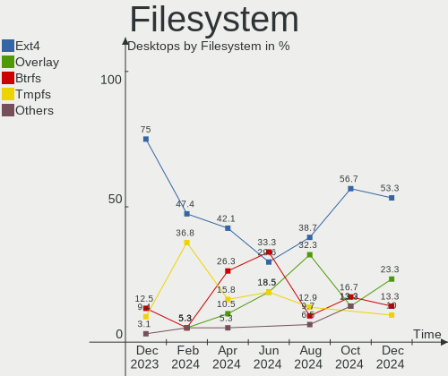
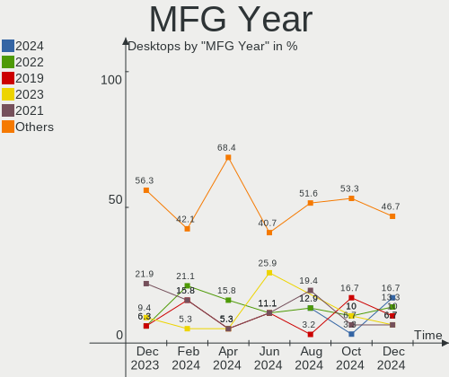
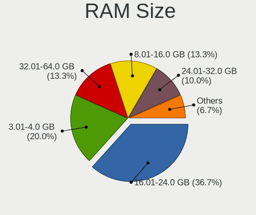
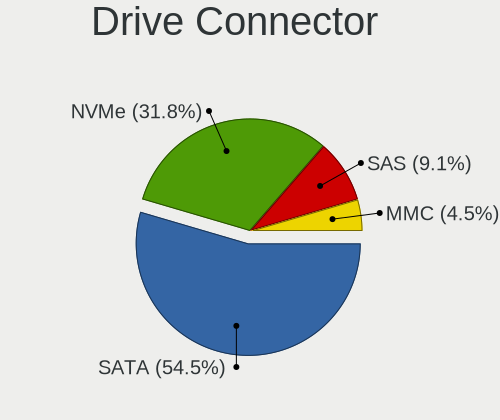
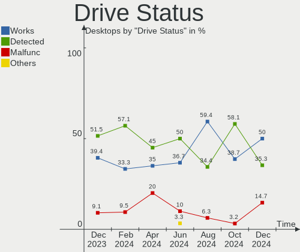
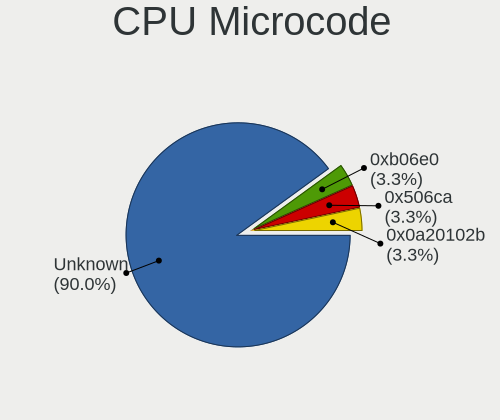
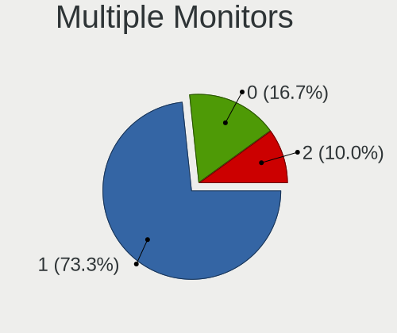
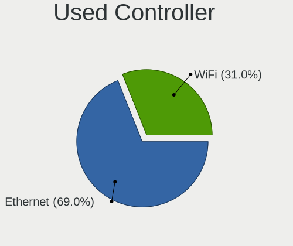
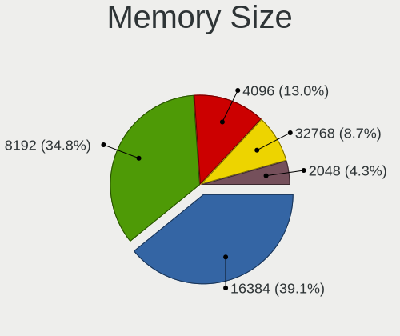
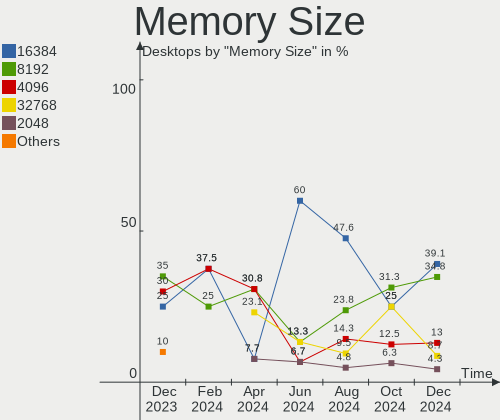

Linux in India - Hardware Trends (Desktops)
-------------------------------------------

A project to identify most popular hardware characteristics and track their change
over time based on data collected by Linux users at https://Linux-Hardware.org.

Anyone can contribute to this report by the [hw-probe](https://github.com/linuxhw/hw-probe) tool:

    sudo -E hw-probe -all -upload

Period: Oct, 2023.

Contents
--------

* [ System ](#system)
  - [ OS                       ](#os)
  - [ OS Family                ](#os-family)
  - [ Kernel                   ](#kernel)
  - [ Kernel Family            ](#kernel-family)
  - [ Kernel Major Ver.        ](#kernel-major-ver)
  - [ Arch                     ](#arch)
  - [ DE                       ](#de)
  - [ Display Server           ](#display-server)
  - [ Display Manager          ](#display-manager)
  - [ OS Lang                  ](#os-lang)
  - [ Boot Mode                ](#boot-mode)
  - [ Filesystem               ](#filesystem)
  - [ Part. scheme             ](#part-scheme)
  - [ Dual Boot with Linux/BSD ](#dual-boot-with-linuxbsd)
  - [ Dual Boot (Win)          ](#dual-boot-win)

* [ Board ](#board)
  - [ Vendor                   ](#vendor)
  - [ Model                    ](#model)
  - [ Model Family             ](#model-family)
  - [ MFG Year                 ](#mfg-year)
  - [ Form Factor              ](#form-factor)
  - [ Secure Boot              ](#secure-boot)
  - [ Coreboot                 ](#coreboot)
  - [ RAM Size                 ](#ram-size)
  - [ RAM Used                 ](#ram-used)
  - [ Total Drives             ](#total-drives)
  - [ Has CD-ROM               ](#has-cd-rom)
  - [ Has Ethernet             ](#has-ethernet)
  - [ Has WiFi                 ](#has-wifi)
  - [ Has Bluetooth            ](#has-bluetooth)

* [ Location ](#location)
  - [ Country                  ](#country)
  - [ City                     ](#city)

* [ Drives ](#drives)
  - [ Drive Vendor             ](#drive-vendor)
  - [ Drive Model              ](#drive-model)
  - [ HDD Vendor               ](#hdd-vendor)
  - [ SSD Vendor               ](#ssd-vendor)
  - [ Drive Kind               ](#drive-kind)
  - [ Drive Connector          ](#drive-connector)
  - [ Drive Size               ](#drive-size)
  - [ Space Total              ](#space-total)
  - [ Space Used               ](#space-used)
  - [ Malfunc. Drives          ](#malfunc-drives)
  - [ Malfunc. Drive Vendor    ](#malfunc-drive-vendor)
  - [ Malfunc. HDD Vendor      ](#malfunc-hdd-vendor)
  - [ Malfunc. Drive Kind      ](#malfunc-drive-kind)
  - [ Failed Drives            ](#failed-drives)
  - [ Failed Drive Vendor      ](#failed-drive-vendor)
  - [ Drive Status             ](#drive-status)

* [ Storage controller ](#storage-controller)
  - [ Storage Vendor           ](#storage-vendor)
  - [ Storage Model            ](#storage-model)
  - [ Storage Kind             ](#storage-kind)

* [ Processor ](#processor)
  - [ CPU Vendor               ](#cpu-vendor)
  - [ CPU Model                ](#cpu-model)
  - [ CPU Model Family         ](#cpu-model-family)
  - [ CPU Cores                ](#cpu-cores)
  - [ CPU Sockets              ](#cpu-sockets)
  - [ CPU Threads              ](#cpu-threads)
  - [ CPU Op-Modes             ](#cpu-op-modes)
  - [ CPU Microcode            ](#cpu-microcode)
  - [ CPU Microarch            ](#cpu-microarch)

* [ Graphics ](#graphics)
  - [ GPU Vendor               ](#gpu-vendor)
  - [ GPU Model                ](#gpu-model)
  - [ GPU Combo                ](#gpu-combo)
  - [ GPU Driver               ](#gpu-driver)
  - [ GPU Memory               ](#gpu-memory)

* [ Monitor ](#monitor)
  - [ Monitor Vendor           ](#monitor-vendor)
  - [ Monitor Model            ](#monitor-model)
  - [ Monitor Resolution       ](#monitor-resolution)
  - [ Monitor Diagonal         ](#monitor-diagonal)
  - [ Monitor Width            ](#monitor-width)
  - [ Aspect Ratio             ](#aspect-ratio)
  - [ Monitor Area             ](#monitor-area)
  - [ Pixel Density            ](#pixel-density)
  - [ Multiple Monitors        ](#multiple-monitors)

* [ Network ](#network)
  - [ Net Controller Vendor    ](#net-controller-vendor)
  - [ Net Controller Model     ](#net-controller-model)
  - [ Wireless Vendor          ](#wireless-vendor)
  - [ Wireless Model           ](#wireless-model)
  - [ Ethernet Vendor          ](#ethernet-vendor)
  - [ Ethernet Model           ](#ethernet-model)
  - [ Net Controller Kind      ](#net-controller-kind)
  - [ Used Controller          ](#used-controller)
  - [ NICs                     ](#nics)
  - [ IPv6                     ](#ipv6)

* [ Bluetooth ](#bluetooth)
  - [ Bluetooth Vendor         ](#bluetooth-vendor)
  - [ Bluetooth Model          ](#bluetooth-model)

* [ Sound ](#sound)
  - [ Sound Vendor             ](#sound-vendor)
  - [ Sound Model              ](#sound-model)

* [ Memory ](#memory)
  - [ Memory Vendor            ](#memory-vendor)
  - [ Memory Model             ](#memory-model)
  - [ Memory Kind              ](#memory-kind)
  - [ Memory Form Factor       ](#memory-form-factor)
  - [ Memory Size              ](#memory-size)
  - [ Memory Speed             ](#memory-speed)

* [ Printers & scanners ](#printers--scanners)
  - [ Printer Vendor           ](#printer-vendor)
  - [ Printer Model            ](#printer-model)
  - [ Scanner Vendor           ](#scanner-vendor)
  - [ Scanner Model            ](#scanner-model)

* [ Camera ](#camera)
  - [ Camera Vendor            ](#camera-vendor)
  - [ Camera Model             ](#camera-model)

* [ Security ](#security)
  - [ Fingerprint Vendor       ](#fingerprint-vendor)
  - [ Fingerprint Model        ](#fingerprint-model)
  - [ Chipcard Vendor          ](#chipcard-vendor)
  - [ Chipcard Model           ](#chipcard-model)

* [ Unsupported ](#unsupported)
  - [ Unsupported Devices      ](#unsupported-devices)
  - [ Unsupported Device Types ](#unsupported-device-types)

System
------

OS
--

Installed operating systems

| Name               | Desktops | Percent |
|--------------------|----------|---------|
| Ubuntu 22.04       | 6        | 23.08%  |
| Ubuntu 23.04       | 4        | 15.38%  |
| Zorin 16           | 2        | 7.69%   |
| OpenMandriva 23.08 | 2        | 7.69%   |
| Fedora 38          | 2        | 7.69%   |
| ArcoLinux Rolling  | 2        | 7.69%   |
| Ubuntu 23.10       | 1        | 3.85%   |
| Pop!_OS 22.04      | 1        | 3.85%   |
| OpenMandriva 23.10 | 1        | 3.85%   |
| Nobara 38          | 1        | 3.85%   |
| MX 23              | 1        | 3.85%   |
| Lubuntu 23.04      | 1        | 3.85%   |
| LMDE 6             | 1        | 3.85%   |
| Arch Rolling       | 1        | 3.85%   |

OS Family
---------

OS without a version

| Name         | Desktops | Percent |
|--------------|----------|---------|
| Ubuntu       | 11       | 42.31%  |
| OpenMandriva | 3        | 11.54%  |
| Zorin        | 2        | 7.69%   |
| Fedora       | 2        | 7.69%   |
| ArcoLinux    | 2        | 7.69%   |
| Pop!_OS      | 1        | 3.85%   |
| Nobara       | 1        | 3.85%   |
| MX           | 1        | 3.85%   |
| Lubuntu      | 1        | 3.85%   |
| LMDE         | 1        | 3.85%   |
| Arch         | 1        | 3.85%   |

Kernel
------

Version of the Linux kernel

| Version                     | Desktops | Percent |
|-----------------------------|----------|---------|
| 6.2.0-34-generic            | 5        | 19.23%  |
| 6.2.0-35-generic            | 3        | 11.54%  |
| 6.5.5-200.fc38.x86_64       | 2        | 7.69%   |
| 6.5.0-9-generic             | 2        | 7.69%   |
| 6.1.0-13-amd64              | 2        | 7.69%   |
| 6.5.9-arch2-1               | 1        | 3.85%   |
| 6.5.9-200.fsync.fc38.x86_64 | 1        | 3.85%   |
| 6.5.8-zen1-1-zen            | 1        | 3.85%   |
| 6.5.7-zen2-1-zen            | 1        | 3.85%   |
| 6.5.5-desktop-1omv2390      | 1        | 3.85%   |
| 6.5.4-76060504-generic      | 1        | 3.85%   |
| 6.4.8-desktop-2omv2390      | 1        | 3.85%   |
| 6.4.11-desktop-1omv2390     | 1        | 3.85%   |
| 6.2.0-33-generic            | 1        | 3.85%   |
| 6.2.0-26-generic            | 1        | 3.85%   |
| 5.15.0-86-generic           | 1        | 3.85%   |
| 5.15.0-84-generic           | 1        | 3.85%   |

Kernel Family
-------------

Linux kernel without a distro release

| Version | Desktops | Percent |
|---------|----------|---------|
| 6.2.0   | 10       | 38.46%  |
| 6.5.5   | 3        | 11.54%  |
| 6.5.9   | 2        | 7.69%   |
| 6.5.0   | 2        | 7.69%   |
| 6.1.0   | 2        | 7.69%   |
| 5.15.0  | 2        | 7.69%   |
| 6.5.8   | 1        | 3.85%   |
| 6.5.7   | 1        | 3.85%   |
| 6.5.4   | 1        | 3.85%   |
| 6.4.8   | 1        | 3.85%   |
| 6.4.11  | 1        | 3.85%   |

Kernel Major Ver.
-----------------

Linux kernel major version

| Version | Desktops | Percent |
|---------|----------|---------|
| 6.5     | 10       | 38.46%  |
| 6.2     | 10       | 38.46%  |
| 6.4     | 2        | 7.69%   |
| 6.1     | 2        | 7.69%   |
| 5.15    | 2        | 7.69%   |

Arch
----

OS architecture (x86_64, i586, etc.)

| Name   | Desktops | Percent |
|--------|----------|---------|
| x86_64 | 26       | 100%    |

DE
--

Desktop Environment

| Name          | Desktops | Percent |
|---------------|----------|---------|
| GNOME         | 13       | 50%     |
| KDE5          | 6        | 23.08%  |
| X-Cinnamon    | 2        | 7.69%   |
| GNOME Classic | 2        | 7.69%   |
| XFCE          | 1        | 3.85%   |
| LXQt          | 1        | 3.85%   |
| i3            | 1        | 3.85%   |

Display Server
--------------

X11 or Wayland

| Name    | Desktops | Percent |
|---------|----------|---------|
| X11     | 13       | 50%     |
| Wayland | 13       | 50%     |

Display Manager
---------------

SDDM, LightDM, etc.

| Name    | Desktops | Percent |
|---------|----------|---------|
| GDM3    | 11       | 42.31%  |
| SDDM    | 7        | 26.92%  |
| Unknown | 5        | 19.23%  |
| LightDM | 3        | 11.54%  |

OS Lang
-------

Language

| Lang  | Desktops | Percent |
|-------|----------|---------|
| en_IN | 14       | 53.85%  |
| en_US | 12       | 46.15%  |

Boot Mode
---------

EFI or BIOS

| Mode | Desktops | Percent |
|------|----------|---------|
| EFI  | 15       | 57.69%  |
| BIOS | 11       | 42.31%  |

Filesystem
----------

Type of filesystem

| Type    | Desktops | Percent |
|---------|----------|---------|
| Ext4    | 14       | 53.85%  |
| Tmpfs   | 6        | 23.08%  |
| Btrfs   | 4        | 15.38%  |
| Overlay | 2        | 7.69%   |

Part. scheme
------------

Scheme of partitioning

| Type    | Desktops | Percent |
|---------|----------|---------|
| GPT     | 19       | 73.08%  |
| Unknown | 5        | 19.23%  |
| MBR     | 2        | 7.69%   |

Dual Boot with Linux/BSD
------------------------

Hosting more than one Linux/BSD

| Dual boot | Desktops | Percent |
|-----------|----------|---------|
| No        | 21       | 80.77%  |
| Yes       | 5        | 19.23%  |

Dual Boot (Win)
---------------

Hosting Linux and Windows

| Dual boot | Desktops | Percent |
|-----------|----------|---------|
| Yes       | 13       | 50%     |
| No        | 13       | 50%     |

Board
-----

Vendor
------

Motherboard manufacturer

| Name                | Desktops | Percent |
|---------------------|----------|---------|
| Gigabyte Technology | 8        | 30.77%  |
| Intel               | 5        | 19.23%  |
| ASUSTek Computer    | 5        | 19.23%  |
| ASRock              | 2        | 7.69%   |
| MSI                 | 1        | 3.85%   |
| Hewlett-Packard     | 1        | 3.85%   |
| Google              | 1        | 3.85%   |
| Fujitsu             | 1        | 3.85%   |
| ECS                 | 1        | 3.85%   |
| Dell                | 1        | 3.85%   |

Model
-----

Motherboard model

| Name                           | Desktops | Percent |
|--------------------------------|----------|---------|
| Gigabyte F2A55M-DS2            | 2        | 7.69%   |
| MSI MS-7B87                    | 1        | 3.85%   |
| Intel H81                      | 1        | 3.85%   |
| Intel H61                      | 1        | 3.85%   |
| Intel DH77KC AAG39641-401      | 1        | 3.85%   |
| Intel DG31PR AAD97573-206      | 1        | 3.85%   |
| Intel DB85FL AAG89861-201      | 1        | 3.85%   |
| HP ProDesk 400 G2 MT (TPM DP)  | 1        | 3.85%   |
| Google Teemo                   | 1        | 3.85%   |
| Gigabyte H81M-S                | 1        | 3.85%   |
| Gigabyte H510M H               | 1        | 3.85%   |
| Gigabyte GA-78LMT-S2 R2        | 1        | 3.85%   |
| Gigabyte B75M-D3H              | 1        | 3.85%   |
| Gigabyte B660M DS3H AX DDR4    | 1        | 3.85%   |
| Gigabyte B550M DS3H            | 1        | 3.85%   |
| Fujitsu ESPRIMO E500           | 1        | 3.85%   |
| ECS H81H3-M3S                  | 1        | 3.85%   |
| Dell Vostro 3800               | 1        | 3.85%   |
| ASUS TUF Gaming Z790-PLUS WIFI | 1        | 3.85%   |
| ASUS ROG STRIX X470-F GAMING   | 1        | 3.85%   |
| ASUS PRIME B650M-A WIFI        | 1        | 3.85%   |
| ASUS PRIME B450M-A             | 1        | 3.85%   |
| ASUS P7H55-M LX                | 1        | 3.85%   |
| ASRock B550M-ITX/ac            | 1        | 3.85%   |
| ASRock B450M-HDV R4.0          | 1        | 3.85%   |

Model Family
------------

Motherboard model prefix

| Name                 | Desktops | Percent |
|----------------------|----------|---------|
| Gigabyte F2A55M-DS2  | 2        | 7.69%   |
| ASUS PRIME           | 2        | 7.69%   |
| MSI MS-7B87          | 1        | 3.85%   |
| Intel H81            | 1        | 3.85%   |
| Intel H61            | 1        | 3.85%   |
| Intel DH77KC         | 1        | 3.85%   |
| Intel DG31PR         | 1        | 3.85%   |
| Intel DB85FL         | 1        | 3.85%   |
| HP ProDesk           | 1        | 3.85%   |
| Google Teemo         | 1        | 3.85%   |
| Gigabyte H81M-S      | 1        | 3.85%   |
| Gigabyte H510M       | 1        | 3.85%   |
| Gigabyte GA-78LMT-S2 | 1        | 3.85%   |
| Gigabyte B75M-D3H    | 1        | 3.85%   |
| Gigabyte B660M       | 1        | 3.85%   |
| Gigabyte B550M       | 1        | 3.85%   |
| Fujitsu ESPRIMO      | 1        | 3.85%   |
| ECS H81H3-M3S        | 1        | 3.85%   |
| Dell Vostro          | 1        | 3.85%   |
| ASUS TUF             | 1        | 3.85%   |
| ASUS ROG             | 1        | 3.85%   |
| ASUS P7H55-M         | 1        | 3.85%   |
| ASRock B550M-ITX     | 1        | 3.85%   |
| ASRock B450M-HDV     | 1        | 3.85%   |

MFG Year
--------

Motherboard manufacture year

| Year | Desktops | Percent |
|------|----------|---------|
| 2012 | 5        | 19.23%  |
| 2018 | 4        | 15.38%  |
| 2022 | 3        | 11.54%  |
| 2014 | 3        | 11.54%  |
| 2023 | 2        | 7.69%   |
| 2017 | 2        | 7.69%   |
| 2013 | 2        | 7.69%   |
| 2021 | 1        | 3.85%   |
| 2020 | 1        | 3.85%   |
| 2019 | 1        | 3.85%   |
| 2010 | 1        | 3.85%   |
| 2008 | 1        | 3.85%   |

Form Factor
-----------

Physical design of the computer

| Name    | Desktops | Percent |
|---------|----------|---------|
| Desktop | 26       | 100%    |

Secure Boot
-----------

Enabled or disabled

| State    | Desktops | Percent |
|----------|----------|---------|
| Disabled | 26       | 100%    |

Coreboot
--------

Have coreboot on board

| Used | Desktops | Percent |
|------|----------|---------|
| No   | 25       | 96.15%  |
| Yes  | 1        | 3.85%   |

RAM Size
--------

Total RAM memory

| Size in GB | Desktops | Percent |
|------------|----------|---------|
| 4.01-8.0   | 6        | 23.08%  |
| 16.01-24.0 | 6        | 23.08%  |
| 8.01-16.0  | 6        | 23.08%  |
| 3.01-4.0   | 5        | 19.23%  |
| 32.01-64.0 | 2        | 7.69%   |
| 24.01-32.0 | 1        | 3.85%   |

RAM Used
--------

Used RAM memory

| Used GB  | Desktops | Percent |
|----------|----------|---------|
| 1.01-2.0 | 9        | 34.62%  |
| 3.01-4.0 | 8        | 30.77%  |
| 2.01-3.0 | 6        | 23.08%  |
| 4.01-8.0 | 3        | 11.54%  |

Total Drives
------------

Number of drives on board

| Drives | Desktops | Percent |
|--------|----------|---------|
| 1      | 11       | 42.31%  |
| 2      | 9        | 34.62%  |
| 3      | 4        | 15.38%  |
| 4      | 2        | 7.69%   |

Has CD-ROM
----------

Has CD-ROM on board

| Presented | Desktops | Percent |
|-----------|----------|---------|
| No        | 21       | 80.77%  |
| Yes       | 5        | 19.23%  |

Has Ethernet
------------

Has Ethernet on board

| Presented | Desktops | Percent |
|-----------|----------|---------|
| Yes       | 24       | 92.31%  |
| No        | 2        | 7.69%   |

Has WiFi
--------

Has WiFi module

| Presented | Desktops | Percent |
|-----------|----------|---------|
| Yes       | 17       | 65.38%  |
| No        | 9        | 34.62%  |

Has Bluetooth
-------------

Has Bluetooth module

| Presented | Desktops | Percent |
|-----------|----------|---------|
| No        | 14       | 53.85%  |
| Yes       | 12       | 46.15%  |

Location
--------

Country
-------

Geographic location (country)

| Country | Desktops | Percent |
|---------|----------|---------|
| India   | 26       | 100%    |

City
----

Geographic location (city)

| City       | Desktops | Percent |
|------------|----------|---------|
| Kolkata    | 4        | 15.38%  |
| Hyderabad  | 3        | 11.54%  |
| Delhi      | 3        | 11.54%  |
| Pune       | 2        | 7.69%   |
| Mumbai     | 2        | 7.69%   |
| Bengaluru  | 2        | 7.69%   |
| Trivandrum | 1        | 3.85%   |
| Satna      | 1        | 3.85%   |
| Patna      | 1        | 3.85%   |
| Madurai    | 1        | 3.85%   |
| Indore     | 1        | 3.85%   |
| Hamirpur   | 1        | 3.85%   |
| Chapra     | 1        | 3.85%   |
| Bhopal     | 1        | 3.85%   |
| Asansol    | 1        | 3.85%   |
| Ahmedabad  | 1        | 3.85%   |

Drives
------

Drive Vendor
------------

Hard drive vendors

| Vendor                    | Desktops | Drives | Percent |
|---------------------------|----------|--------|---------|
| WDC                       | 13       | 15     | 28.26%  |
| Seagate                   | 7        | 8      | 15.22%  |
| Sandisk                   | 3        | 3      | 6.52%   |
| Samsung Electronics       | 3        | 3      | 6.52%   |
| Kingston                  | 2        | 2      | 4.35%   |
| Intel                     | 2        | 2      | 4.35%   |
| Crucial                   | 2        | 2      | 4.35%   |
| A-DATA Technology         | 2        | 2      | 4.35%   |
| XPG                       | 1        | 1      | 2.17%   |
| Unknown                   | 1        | 1      | 2.17%   |
| Toshiba                   | 1        | 1      | 2.17%   |
| Realtek Semiconductor     | 1        | 1      | 2.17%   |
| POWER                     | 1        | 1      | 2.17%   |
| Micron/Crucial Technology | 1        | 1      | 2.17%   |
| Matrix                    | 1        | 1      | 2.17%   |
| General                   | 1        | 1      | 2.17%   |
| Gamers                    | 1        | 1      | 2.17%   |
| EVM                       | 1        | 1      | 2.17%   |
| China                     | 1        | 1      | 2.17%   |
| Unknown                   | 1        | 1      | 2.17%   |

Drive Model
-----------

Hard drive models

| Model                                             | Desktops | Percent |
|---------------------------------------------------|----------|---------|
| Seagate ST1000DM010-2EP102 1TB                    | 3        | 6.12%   |
| WDC WDS120G2G0A-00JH30 120GB SSD                  | 2        | 4.08%   |
| WDC WD10EZEX-08WN4A0 1TB                          | 2        | 4.08%   |
| Intel SSDPEKNW512G8 512GB                         | 2        | 4.08%   |
| XPG GAMMIX S70 BLADE 2TB                          | 1        | 2.04%   |
| WDC WDS480G2G0B-00EPW0 480GB SSD                  | 1        | 2.04%   |
| WDC WD5000AAKX-75U6AA0 500GB                      | 1        | 2.04%   |
| WDC WD5000AAKX-08ANVA0 500GB                      | 1        | 2.04%   |
| WDC WD3200BUDT-63DPZY0 320GB                      | 1        | 2.04%   |
| WDC WD30EZRX-00AZ6B0 3TB                          | 1        | 2.04%   |
| WDC WD20PURZ-85AKKY0 2TB                          | 1        | 2.04%   |
| WDC WD20EZBX-00AYRA0 2TB                          | 1        | 2.04%   |
| WDC WD1600AAJS-00B4A0 160GB                       | 1        | 2.04%   |
| WDC WD10EZRZ-00HTKB0 1TB                          | 1        | 2.04%   |
| WDC WD10EZEX-60WN4A2 1TB                          | 1        | 2.04%   |
| WDC WD Green 2.5 240GB                            | 1        | 2.04%   |
| Unknown SD/MMC/MS PRO 16GB                        | 1        | 2.04%   |
| Toshiba HDWD110 1TB                               | 1        | 2.04%   |
| Seagate ST500DM002-1BD142 500GB                   | 1        | 2.04%   |
| Seagate ST3500414CS 500GB                         | 1        | 2.04%   |
| Seagate ST3250312AS 250GB                         | 1        | 2.04%   |
| Seagate ST2000DM005-2CW102 2TB                    | 1        | 2.04%   |
| Seagate ST1000LM035-1RK172 1TB                    | 1        | 2.04%   |
| Sandisk WD Blue SN570 500GB                       | 1        | 2.04%   |
| Sandisk WD Blue SN570 250GB                       | 1        | 2.04%   |
| SanDisk NVMe SSD Drive 2TB                        | 1        | 2.04%   |
| Samsung SSD 990 PRO 1TB                           | 1        | 2.04%   |
| Samsung SSD 850 EVO 250GB                         | 1        | 2.04%   |
| Samsung NVMe SSD Controller SM981/PM981/PM983 1TB | 1        | 2.04%   |
| Realtek ADATA SWORDFISH 500GB                     | 1        | 2.04%   |
| POWER X MS2242 512GB SSD                          | 1        | 2.04%   |
| Micron/Crucial P2 NVMe PCIe SSD 500GB             | 1        | 2.04%   |
| Matrix SSD 128GB                                  | 1        | 2.04%   |
| Kingston SA400S37240G 240GB SSD                   | 1        | 2.04%   |
| Kingston SA400S37120G 120GB SSD                   | 1        | 2.04%   |
| General Generic PCIE 256GB                        | 1        | 2.04%   |
| Gamers Choice 128GB SSD                           | 1        | 2.04%   |
| EVM 512GB SSD                                     | 1        | 2.04%   |
| Crucial CT1000MX500SSD1 1TB                       | 1        | 2.04%   |
| Crucial CT1000BX500SSD1 1TB                       | 1        | 2.04%   |

HDD Vendor
----------

Hard disk drive vendors

| Vendor  | Desktops | Drives | Percent |
|---------|----------|--------|---------|
| WDC     | 11       | 11     | 52.38%  |
| Seagate | 7        | 8      | 33.33%  |
| Unknown | 1        | 1      | 4.76%   |
| Toshiba | 1        | 1      | 4.76%   |
| Unknown | 1        | 1      | 4.76%   |

SSD Vendor
----------

Solid state drive vendors

| Vendor              | Desktops | Drives | Percent |
|---------------------|----------|--------|---------|
| WDC                 | 4        | 4      | 26.67%  |
| Kingston            | 2        | 2      | 13.33%  |
| Crucial             | 2        | 2      | 13.33%  |
| Samsung Electronics | 1        | 1      | 6.67%   |
| POWER               | 1        | 1      | 6.67%   |
| Matrix              | 1        | 1      | 6.67%   |
| Gamers              | 1        | 1      | 6.67%   |
| EVM                 | 1        | 1      | 6.67%   |
| China               | 1        | 1      | 6.67%   |
| A-DATA Technology   | 1        | 1      | 6.67%   |

Drive Kind
----------

HDD or SSD

| Kind    | Desktops | Drives | Percent |
|---------|----------|--------|---------|
| HDD     | 19       | 22     | 46.34%  |
| SSD     | 13       | 15     | 31.71%  |
| NVMe    | 8        | 11     | 19.51%  |
| Unknown | 1        | 1      | 2.44%   |

Drive Connector
---------------

SATA, SAS, NVMe, etc.

| Type | Desktops | Drives | Percent |
|------|----------|--------|---------|
| SATA | 23       | 36     | 69.7%   |
| NVMe | 8        | 11     | 24.24%  |
| SAS  | 2        | 2      | 6.06%   |

Drive Size
----------

Size of hard drive

| Size in TB | Desktops | Drives | Percent |
|------------|----------|--------|---------|
| 0.01-0.5   | 15       | 20     | 50%     |
| 0.51-1.0   | 11       | 13     | 36.67%  |
| 1.01-2.0   | 3        | 3      | 10%     |
| 2.01-3.0   | 1        | 1      | 3.33%   |

Space Total
-----------

Amount of disk space available on the file system

| Size in GB | Desktops | Percent |
|------------|----------|---------|
| 251-500    | 8        | 30.77%  |
| 101-250    | 5        | 19.23%  |
| 1001-2000  | 4        | 15.38%  |
| 501-1000   | 3        | 11.54%  |
| 51-100     | 3        | 11.54%  |
| 1-20       | 2        | 7.69%   |
| 2001-3000  | 1        | 3.85%   |

Space Used
----------

Amount of used disk space

| Used GB   | Desktops | Percent |
|-----------|----------|---------|
| 1-20      | 9        | 34.62%  |
| 21-50     | 5        | 19.23%  |
| 251-500   | 4        | 15.38%  |
| 51-100    | 4        | 15.38%  |
| 101-250   | 3        | 11.54%  |
| 1001-2000 | 1        | 3.85%   |

Malfunc. Drives
---------------

Drive models with a malfunction

| Model                          | Desktops | Drives | Percent |
|--------------------------------|----------|--------|---------|
| WDC WD5000AAKX-75U6AA0 500GB   | 1        | 1      | 16.67%  |
| WDC WD20PURZ-85AKKY0 2TB       | 1        | 1      | 16.67%  |
| WDC WD10EZRZ-00HTKB0 1TB       | 1        | 1      | 16.67%  |
| WDC WD Green 2.5 240GB         | 1        | 1      | 16.67%  |
| Seagate ST1000DM010-2EP102 1TB | 1        | 1      | 16.67%  |
| Gamers Choice 128GB SSD        | 1        | 1      | 16.67%  |

Malfunc. Drive Vendor
---------------------

Vendors of faulty drives

| Vendor  | Desktops | Drives | Percent |
|---------|----------|--------|---------|
| WDC     | 4        | 4      | 66.67%  |
| Seagate | 1        | 1      | 16.67%  |
| Gamers  | 1        | 1      | 16.67%  |

Malfunc. HDD Vendor
-------------------

Vendors of faulty HDD drives

| Vendor  | Desktops | Drives | Percent |
|---------|----------|--------|---------|
| WDC     | 3        | 3      | 75%     |
| Seagate | 1        | 1      | 25%     |

Malfunc. Drive Kind
-------------------

Kinds of faulty drives

| Kind | Desktops | Drives | Percent |
|------|----------|--------|---------|
| HDD  | 4        | 4      | 66.67%  |
| SSD  | 2        | 2      | 33.33%  |

Failed Drives
-------------

Failed drive models

| Model               | Desktops | Drives | Percent |
|---------------------|----------|--------|---------|
| Toshiba HDWD110 1TB | 1        | 1      | 100%    |

Failed Drive Vendor
-------------------

Failed drive vendors

| Vendor  | Desktops | Drives | Percent |
|---------|----------|--------|---------|
| Toshiba | 1        | 1      | 100%    |

Drive Status
------------

Number of failed and malfunc. drives

| Status   | Desktops | Drives | Percent |
|----------|----------|--------|---------|
| Detected | 13       | 21     | 39.39%  |
| Works    | 13       | 21     | 39.39%  |
| Malfunc  | 6        | 6      | 18.18%  |
| Failed   | 1        | 1      | 3.03%   |

Storage controller
------------------

Storage Vendor
--------------

Storage controller vendors

| Vendor                    | Desktops | Percent |
|---------------------------|----------|---------|
| Intel                     | 18       | 50%     |
| AMD                       | 10       | 27.78%  |
| SanDisk                   | 3        | 8.33%   |
| Samsung Electronics       | 2        | 5.56%   |
| Realtek Semiconductor     | 1        | 2.78%   |
| Micron/Crucial Technology | 1        | 2.78%   |
| ADATA Technology          | 1        | 2.78%   |

Storage Model
-------------

Storage controller models

| Model                                                                          | Desktops | Percent |
|--------------------------------------------------------------------------------|----------|---------|
| Intel 8 Series/C220 Series Chipset Family 6-port SATA Controller 1 [AHCI mode] | 6        | 12.5%   |
| AMD FCH SATA Controller [AHCI mode]                                            | 5        | 10.42%  |
| AMD 400 Series Chipset SATA Controller                                         | 4        | 8.33%   |
| SanDisk Ultra 3D / WD Blue SN570 NVMe SSD (DRAM-less)                          | 2        | 4.17%   |
| Intel SSD 660P Series                                                          | 2        | 4.17%   |
| Intel 6 Series/C200 Series Chipset Family 6 port Desktop SATA AHCI Controller  | 2        | 4.17%   |
| AMD FCH SATA Controller [IDE mode]                                             | 2        | 4.17%   |
| AMD FCH IDE Controller                                                         | 2        | 4.17%   |
| AMD 500 Series Chipset SATA Controller                                         | 2        | 4.17%   |
| SanDisk WD Blue SN570 NVMe SSD 2TB                                             | 1        | 2.08%   |
| Samsung NVMe SSD Controller SM981/PM981/PM983                                  | 1        | 2.08%   |
| Samsung NVMe SSD Controller S4LV008[Pascal]                                    | 1        | 2.08%   |
| Realtek RTS5765DL NVMe SSD Controller (DRAM-less)                              | 1        | 2.08%   |
| Micron/Crucial P2 [Nick P2] / P3 / P3 Plus NVMe PCIe SSD (DRAM-less)           | 1        | 2.08%   |
| Intel Volume Management Device NVMe RAID Controller Intel Corporation          | 1        | 2.08%   |
| Intel Sunrise Point-LP SATA Controller [AHCI mode]                             | 1        | 2.08%   |
| Intel NM10/ICH7 Family SATA Controller [IDE mode]                              | 1        | 2.08%   |
| Intel Alder Lake-S PCH SATA Controller [AHCI Mode]                             | 1        | 2.08%   |
| Intel 82801G (ICH7 Family) IDE Controller                                      | 1        | 2.08%   |
| Intel 700 Series Chipset Family SATA AHCI Controller                           | 1        | 2.08%   |
| Intel 7 Series/C210 Series Chipset Family 6-port SATA Controller [AHCI mode]   | 1        | 2.08%   |
| Intel 7 Series/C210 Series Chipset Family 4-port SATA Controller [IDE mode]    | 1        | 2.08%   |
| Intel 7 Series/C210 Series Chipset Family 2-port SATA Controller [IDE mode]    | 1        | 2.08%   |
| Intel 500 Series Chipset Family SATA AHCI Controller                           | 1        | 2.08%   |
| Intel 5 Series/3400 Series Chipset 4 port SATA IDE Controller                  | 1        | 2.08%   |
| Intel 5 Series/3400 Series Chipset 2 port SATA IDE Controller                  | 1        | 2.08%   |
| AMD SB7x0/SB8x0/SB9x0 SATA Controller [IDE mode]                               | 1        | 2.08%   |
| AMD SB7x0/SB8x0/SB9x0 IDE Controller                                           | 1        | 2.08%   |
| ADATA ADATA XPG GAMMIXS1 1L Media (256 GB SSD)                                 | 1        | 2.08%   |
| ADATA A Non-Volatile memory controller                                         | 1        | 2.08%   |

Storage Kind
------------

Kind of storage controller (IDE, SATA, NVMe, SAS, ...)

| Kind | Desktops | Percent |
|------|----------|---------|
| SATA | 23       | 60.53%  |
| NVMe | 8        | 21.05%  |
| IDE  | 6        | 15.79%  |
| RAID | 1        | 2.63%   |

Processor
---------

CPU Vendor
----------

Processor vendors

| Vendor | Desktops | Percent |
|--------|----------|---------|
| Intel  | 16       | 61.54%  |
| AMD    | 10       | 38.46%  |

CPU Model
---------

Processor models

| Model                                   | Desktops | Percent |
|-----------------------------------------|----------|---------|
| Intel Core i5-4440 CPU @ 3.10GHz        | 2        | 7.69%   |
| Intel Core i3-4130 CPU @ 3.40GHz        | 2        | 7.69%   |
| AMD A4-4000 APU with Radeon HD Graphics | 2        | 7.69%   |
| Intel Pentium Dual CPU E2180 @ 2.00GHz  | 1        | 3.85%   |
| Intel Pentium CPU G3240 @ 3.10GHz       | 1        | 3.85%   |
| Intel Core i7-8550U CPU @ 1.80GHz       | 1        | 3.85%   |
| Intel Core i7-3770 CPU @ 3.40GHz        | 1        | 3.85%   |
| Intel Core i7-2600 CPU @ 3.40GHz        | 1        | 3.85%   |
| Intel Core i5-4590 CPU @ 3.30GHz        | 1        | 3.85%   |
| Intel Core i5-2400 CPU @ 3.10GHz        | 1        | 3.85%   |
| Intel Core i5-10400 CPU @ 2.90GHz       | 1        | 3.85%   |
| Intel Core i3-3220 CPU @ 3.30GHz        | 1        | 3.85%   |
| Intel Core i3 CPU 540 @ 3.07GHz         | 1        | 3.85%   |
| Intel 13th Gen Core i9-13900K           | 1        | 3.85%   |
| Intel 12th Gen Core i5-12400F           | 1        | 3.85%   |
| AMD Ryzen 7 5700X 8-Core Processor      | 1        | 3.85%   |
| AMD Ryzen 7 2700X Eight-Core Processor  | 1        | 3.85%   |
| AMD Ryzen 5 7600X 6-Core Processor      | 1        | 3.85%   |
| AMD Ryzen 5 5600G with Radeon Graphics  | 1        | 3.85%   |
| AMD Ryzen 5 4600G with Radeon Graphics  | 1        | 3.85%   |
| AMD Ryzen 5 3600X 6-Core Processor      | 1        | 3.85%   |
| AMD Ryzen 5 2600X Six-Core Processor    | 1        | 3.85%   |
| AMD FX-6300 Six-Core Processor          | 1        | 3.85%   |

CPU Model Family
----------------

Processor model prefix

| Model              | Desktops | Percent |
|--------------------|----------|---------|
| Intel Core i5      | 5        | 19.23%  |
| AMD Ryzen 5        | 5        | 19.23%  |
| Intel Core i3      | 4        | 15.38%  |
| Intel Core i7      | 3        | 11.54%  |
| Other              | 2        | 7.69%   |
| AMD Ryzen 7        | 2        | 7.69%   |
| AMD A4             | 2        | 7.69%   |
| Intel Pentium Dual | 1        | 3.85%   |
| Intel Pentium      | 1        | 3.85%   |
| AMD FX             | 1        | 3.85%   |

CPU Cores
---------

Number of processor cores

| Number | Desktops | Percent |
|--------|----------|---------|
| 6      | 7        | 26.92%  |
| 4      | 7        | 26.92%  |
| 2      | 5        | 19.23%  |
| 1      | 3        | 11.54%  |
| 8      | 2        | 7.69%   |
| 24     | 1        | 3.85%   |
| 3      | 1        | 3.85%   |

CPU Sockets
-----------

Number of sockets

| Number | Desktops | Percent |
|--------|----------|---------|
| 1      | 26       | 100%    |

CPU Threads
-----------

Threads per core (Hyper-Threading)

| Number | Desktops | Percent |
|--------|----------|---------|
| 2      | 20       | 76.92%  |
| 1      | 6        | 23.08%  |

CPU Op-Modes
------------

CPU Operation Modes (32-bit, 64-bit)

| Op mode        | Desktops | Percent |
|----------------|----------|---------|
| 32-bit, 64-bit | 26       | 100%    |

CPU Microcode
-------------

Microcode number

| Number     | Desktops | Percent |
|------------|----------|---------|
| Unknown    | 13       | 50%     |
| 0x06001119 | 2        | 7.69%   |
| 0xb0671    | 1        | 3.85%   |
| 0xa0655    | 1        | 3.85%   |
| 0x6fd      | 1        | 3.85%   |
| 0x306c3    | 1        | 3.85%   |
| 0x20655    | 1        | 3.85%   |
| 0x0a601203 | 1        | 3.85%   |
| 0x0a50000f | 1        | 3.85%   |
| 0x0a20120a | 1        | 3.85%   |
| 0x08701030 | 1        | 3.85%   |
| 0x08600106 | 1        | 3.85%   |
| 0x06000822 | 1        | 3.85%   |

CPU Microarch
-------------

Microarchitecture

| Name             | Desktops | Percent |
|------------------|----------|---------|
| Haswell          | 6        | 23.08%  |
| Piledriver       | 3        | 11.54%  |
| Zen+             | 2        | 7.69%   |
| Zen 3            | 2        | 7.69%   |
| Zen 2            | 2        | 7.69%   |
| SandyBridge      | 2        | 7.69%   |
| IvyBridge        | 2        | 7.69%   |
| Unknown          | 2        | 7.69%   |
| Westmere         | 1        | 3.85%   |
| KabyLake         | 1        | 3.85%   |
| Core             | 1        | 3.85%   |
| CometLake        | 1        | 3.85%   |
| Alderlake Hybrid | 1        | 3.85%   |

Graphics
--------

GPU Vendor
----------

Vendors of graphics cards

| Vendor | Desktops | Percent |
|--------|----------|---------|
| Nvidia | 12       | 44.44%  |
| Intel  | 10       | 37.04%  |
| AMD    | 5        | 18.52%  |

GPU Model
---------

Graphics card models

| Model                                                                       | Desktops | Percent |
|-----------------------------------------------------------------------------|----------|---------|
| Intel Xeon E3-1200 v3/4th Gen Core Processor Integrated Graphics Controller | 4        | 14.29%  |
| Nvidia GF119 [GeForce GT 610]                                               | 3        | 10.71%  |
| Nvidia GK208B [GeForce GT 710]                                              | 2        | 7.14%   |
| Intel 4th Generation Core Processor Family Integrated Graphics Controller   | 2        | 7.14%   |
| AMD Ellesmere [Radeon RX 470/480/570/570X/580/580X/590]                     | 2        | 7.14%   |
| Nvidia TU116 [GeForce GTX 1660 Ti]                                          | 1        | 3.57%   |
| Nvidia GP107 [GeForce GTX 1050 Ti]                                          | 1        | 3.57%   |
| Nvidia GP106 [GeForce GTX 1060 6GB]                                         | 1        | 3.57%   |
| Nvidia GF108 [GeForce GT 730]                                               | 1        | 3.57%   |
| Nvidia GA106 [RTX A2000]                                                    | 1        | 3.57%   |
| Nvidia GA106 [GeForce RTX 3060 Lite Hash Rate]                              | 1        | 3.57%   |
| Nvidia AD106 [GeForce RTX 4060 Ti]                                          | 1        | 3.57%   |
| Intel Xeon E3-1200 v2/3rd Gen Core processor Graphics Controller            | 1        | 3.57%   |
| Intel UHD Graphics 620                                                      | 1        | 3.57%   |
| Intel Core Processor Integrated Graphics Controller                         | 1        | 3.57%   |
| Intel CometLake-S GT2 [UHD Graphics 630]                                    | 1        | 3.57%   |
| AMD RS780L [Radeon 3000]                                                    | 1        | 3.57%   |
| AMD Renoir [Radeon RX Vega 6 (Ryzen 4000/5000 Mobile Series)]               | 1        | 3.57%   |
| AMD Raphael                                                                 | 1        | 3.57%   |
| AMD Cezanne [Radeon Vega Series / Radeon Vega Mobile Series]                | 1        | 3.57%   |

GPU Combo
---------

Combinations of graphics cards

| Name         | Desktops | Percent |
|--------------|----------|---------|
| 1 x Nvidia   | 11       | 42.31%  |
| 1 x Intel    | 10       | 38.46%  |
| 1 x AMD      | 3        | 11.54%  |
| 2 x AMD      | 1        | 3.85%   |
| AMD + Nvidia | 1        | 3.85%   |

GPU Driver
----------

Free vs proprietary

| Driver      | Desktops | Percent |
|-------------|----------|---------|
| Free        | 20       | 76.92%  |
| Proprietary | 6        | 23.08%  |

GPU Memory
----------

Total video memory

| Size in GB | Desktops | Percent |
|------------|----------|---------|
| Unknown    | 17       | 65.38%  |
| 1.01-2.0   | 3        | 11.54%  |
| 0.01-0.5   | 3        | 11.54%  |
| 7.01-8.0   | 1        | 3.85%   |
| 5.01-6.0   | 1        | 3.85%   |
| 3.01-4.0   | 1        | 3.85%   |

Monitor
-------

Monitor Vendor
--------------

Monitor vendors

| Vendor              | Desktops | Percent |
|---------------------|----------|---------|
| Goldstar            | 4        | 14.29%  |
| Dell                | 4        | 14.29%  |
| Hewlett-Packard     | 3        | 10.71%  |
| Acer                | 3        | 10.71%  |
| Samsung Electronics | 2        | 7.14%   |
| BenQ                | 2        | 7.14%   |
| ___                 | 1        | 3.57%   |
| Sony                | 1        | 3.57%   |
| Philips             | 1        | 3.57%   |
| Panasonic           | 1        | 3.57%   |
| Lenovo              | 1        | 3.57%   |
| JRY                 | 1        | 3.57%   |
| InnoLux Display     | 1        | 3.57%   |
| Gigabyte Technology | 1        | 3.57%   |
| Fujitsu Siemens     | 1        | 3.57%   |
| Unknown             | 1        | 3.57%   |

Monitor Model
-------------

Monitor models

| Model                                                             | Desktops | Percent |
|-------------------------------------------------------------------|----------|---------|
| Hewlett-Packard 20fi HWP306F 1600x900 443x249mm 20.0-inch         | 2        | 7.14%   |
| ___ AAA ___0309 1680x1050                                         | 1        | 3.57%   |
| Sony TV SNY5304 1600x900                                          | 1        | 3.57%   |
| Samsung Electronics S27D590 SAM0BE9 1920x1080 598x336mm 27.0-inch | 1        | 3.57%   |
| Samsung Electronics C24F390 SAM0D2D 1920x1080 521x293mm 23.5-inch | 1        | 3.57%   |
| Philips 202EL PHLC05C 1600x900 443x249mm 20.0-inch                | 1        | 3.57%   |
| Panasonic TV MEIA296 1920x1080 698x392mm 31.5-inch                | 1        | 3.57%   |
| Lenovo S22e-20 LEN62C6 1920x1080 476x268mm 21.5-inch              | 1        | 3.57%   |
| JRY Analog JRY1950 1600x900 368x207mm 16.6-inch                   | 1        | 3.57%   |
| InnoLux Display LE1922 INL1922 1440x900 410x257mm 19.1-inch       | 1        | 3.57%   |
| Hewlett-Packard 22kd HWP332C 1920x1080 477x268mm 21.5-inch        | 1        | 3.57%   |
| Goldstar LG ULTRAGEAR GSM5B72 1920x1080 530x300mm 24.0-inch       | 1        | 3.57%   |
| Goldstar HD GSM5ACB 1366x768 410x230mm 18.5-inch                  | 1        | 3.57%   |
| Goldstar FULL HD GSM5B55 1920x1080 480x270mm 21.7-inch            | 1        | 3.57%   |
| Goldstar 24GL600F GSM5B73 1920x1080 531x298mm 24.0-inch           | 1        | 3.57%   |
| Gigabyte Technology G27F 2 GBT271B 1920x1080 597x336mm 27.0-inch  | 1        | 3.57%   |
| Fujitsu Siemens SL27T-1 LED FUS07E6 1920x1080 598x336mm 27.0-inch | 1        | 3.57%   |
| Dell U3219Q DELA124 3840x2160 697x392mm 31.5-inch                 | 1        | 3.57%   |
| Dell SE2422H DEL424A 1920x1080 527x296mm 23.8-inch                | 1        | 3.57%   |
| Dell E1916HV DELF06C 1366x768 409x230mm 18.5-inch                 | 1        | 3.57%   |
| Dell E1914H DELD03A 1366x768 410x230mm 18.5-inch                  | 1        | 3.57%   |
| BenQ G2412HD BNQ783B 1920x1080 521x293mm 23.5-inch                | 1        | 3.57%   |
| BenQ EX2710S BNQ7FA4 1920x1080 600x340mm 27.2-inch                | 1        | 3.57%   |
| Acer VG240Y P ACR0704 1920x1080 527x296mm 23.8-inch               | 1        | 3.57%   |
| Acer V246HL ACR032E 1920x1080 531x299mm 24.0-inch                 | 1        | 3.57%   |
| Acer HA270 ACR0584 1920x1080 598x336mm 27.0-inch                  | 1        | 3.57%   |
| Unknown                                                           | 1        | 3.57%   |

Monitor Resolution
------------------

Monitor screen resolution

| Resolution         | Desktops | Percent |
|--------------------|----------|---------|
| 1920x1080 (FHD)    | 15       | 53.57%  |
| 1600x900 (HD+)     | 5        | 17.86%  |
| 3840x2160 (4K)     | 3        | 10.71%  |
| 1366x768 (WXGA)    | 3        | 10.71%  |
| 1680x1050 (WSXGA+) | 1        | 3.57%   |
| 1440x900 (WXGA+)   | 1        | 3.57%   |

Monitor Diagonal
----------------

Diagonal size in inches

| Inches | Desktops | Percent |
|--------|----------|---------|
| 27     | 5        | 17.86%  |
| 24     | 5        | 17.86%  |
| 21     | 3        | 10.71%  |
| 20     | 3        | 10.71%  |
| 18     | 3        | 10.71%  |
| 31     | 2        | 7.14%   |
| 23     | 2        | 7.14%   |
| 19     | 2        | 7.14%   |
| 84     | 1        | 3.57%   |
| 72     | 1        | 3.57%   |
| 61     | 1        | 3.57%   |

Monitor Width
-------------

Physical width

| Width in mm | Desktops | Percent |
|-------------|----------|---------|
| 501-600     | 12       | 44.44%  |
| 401-500     | 10       | 37.04%  |
| 601-700     | 2        | 7.41%   |
| 1501-2000   | 2        | 7.41%   |
| 1001-1500   | 1        | 3.7%    |

Aspect Ratio
------------

Proportional relationship between the width and the height

| Ratio | Desktops | Percent |
|-------|----------|---------|
| 16/9  | 24       | 96%     |
| 16/10 | 1        | 4%      |

Monitor Area
------------

Area in inch

| Area in inch | Desktops | Percent |
|----------------|----------|---------|
| 201-250        | 8        | 28.57%  |
| 151-200        | 7        | 25%     |
| 301-350        | 5        | 17.86%  |
| More than 1000 | 3        | 10.71%  |
| 141-150        | 3        | 10.71%  |
| 351-500        | 2        | 7.14%   |

Pixel Density
-------------

Pixels per inch

| Density | Desktops | Percent |
|---------|----------|---------|
| 51-100  | 21       | 77.78%  |
| 101-120 | 3        | 11.11%  |
| 1-50    | 2        | 7.41%   |
| 121-160 | 1        | 3.7%    |

Multiple Monitors
-----------------

Total monitors connected

| Total | Desktops | Percent |
|-------|----------|---------|
| 1     | 22       | 84.62%  |
| 2     | 3        | 11.54%  |
| 0     | 1        | 3.85%   |

Network
-------

Net Controller Vendor
---------------------

Controller vendors

| Vendor                          | Desktops | Percent |
|---------------------------------|----------|---------|
| Realtek Semiconductor           | 21       | 53.85%  |
| Intel                           | 7        | 17.95%  |
| TP-Link                         | 3        | 7.69%   |
| Ralink Technology               | 2        | 5.13%   |
| Qualcomm Atheros Communications | 1        | 2.56%   |
| Qualcomm Atheros                | 1        | 2.56%   |
| QinHeng Electronics             | 1        | 2.56%   |
| OPPO Electronics                | 1        | 2.56%   |
| Motorola PCS                    | 1        | 2.56%   |
| MediaTek                        | 1        | 2.56%   |

Net Controller Model
--------------------

Controller models

| Model                                                             | Desktops | Percent |
|-------------------------------------------------------------------|----------|---------|
| Realtek RTL8111/8168/8411 PCI Express Gigabit Ethernet Controller | 16       | 35.56%  |
| Realtek RTL8188EUS 802.11n Wireless Network Adapter               | 2        | 4.44%   |
| Realtek RTL8125 2.5GbE Controller                                 | 2        | 4.44%   |
| Realtek RTL810xE PCI Express Fast Ethernet controller             | 2        | 4.44%   |
| Intel Wireless 7265                                               | 2        | 4.44%   |
| TP-Link TL-WN823N v2/v3 [Realtek RTL8192EU]                       | 1        | 2.22%   |
| TP-Link TL-WN821N v5/v6 [RTL8192EU]                               | 1        | 2.22%   |
| TP-Link Archer T3U [Realtek RTL8812BU]                            | 1        | 2.22%   |
| Realtek RTL88x2bu [AC1200 Techkey]                                | 1        | 2.22%   |
| Realtek RTL8852BE PCIe 802.11ax Wireless Network Controller       | 1        | 2.22%   |
| Realtek RTL8188FTV 802.11b/g/n 1T1R 2.4G WLAN Adapter             | 1        | 2.22%   |
| Realtek 802.11n WLAN Adapter                                      | 1        | 2.22%   |
| Ralink RT5370 Wireless Adapter                                    | 1        | 2.22%   |
| Ralink MT7601U Wireless Adapter                                   | 1        | 2.22%   |
| Qualcomm Atheros AR9271 802.11n                                   | 1        | 2.22%   |
| Qualcomm Atheros AR9485 Wireless Network Adapter                  | 1        | 2.22%   |
| QinHeng UsbMonitor                                                | 1        | 2.22%   |
| OPPO RMX2027                                                      | 1        | 2.22%   |
| Motorola PCS motorola one macro                                   | 1        | 2.22%   |
| MediaTek MT7921K (RZ608) Wi-Fi 6E 80MHz                           | 1        | 2.22%   |
| Intel I211 Gigabit Network Connection                             | 1        | 2.22%   |
| Intel Ethernet Controller I226-V                                  | 1        | 2.22%   |
| Intel Ethernet Connection I217-V                                  | 1        | 2.22%   |
| Intel Dual Band Wireless-AC 3168NGW [Stone Peak]                  | 1        | 2.22%   |
| Intel 82579V Gigabit Network Connection                           | 1        | 2.22%   |
| Intel 700 Series Chipset Family Wi-Fi                             | 1        | 2.22%   |

Wireless Vendor
---------------

Wireless vendors

| Vendor                          | Desktops | Percent |
|---------------------------------|----------|---------|
| Realtek Semiconductor           | 6        | 33.33%  |
| Intel                           | 4        | 22.22%  |
| TP-Link                         | 3        | 16.67%  |
| Ralink Technology               | 2        | 11.11%  |
| Qualcomm Atheros Communications | 1        | 5.56%   |
| Qualcomm Atheros                | 1        | 5.56%   |
| MediaTek                        | 1        | 5.56%   |

Wireless Model
--------------

Wireless models

| Model                                                       | Desktops | Percent |
|-------------------------------------------------------------|----------|---------|
| Realtek RTL8188EUS 802.11n Wireless Network Adapter         | 2        | 11.11%  |
| Intel Wireless 7265                                         | 2        | 11.11%  |
| TP-Link TL-WN823N v2/v3 [Realtek RTL8192EU]                 | 1        | 5.56%   |
| TP-Link TL-WN821N v5/v6 [RTL8192EU]                         | 1        | 5.56%   |
| TP-Link Archer T3U [Realtek RTL8812BU]                      | 1        | 5.56%   |
| Realtek RTL88x2bu [AC1200 Techkey]                          | 1        | 5.56%   |
| Realtek RTL8852BE PCIe 802.11ax Wireless Network Controller | 1        | 5.56%   |
| Realtek RTL8188FTV 802.11b/g/n 1T1R 2.4G WLAN Adapter       | 1        | 5.56%   |
| Realtek 802.11n WLAN Adapter                                | 1        | 5.56%   |
| Ralink RT5370 Wireless Adapter                              | 1        | 5.56%   |
| Ralink MT7601U Wireless Adapter                             | 1        | 5.56%   |
| Qualcomm Atheros AR9271 802.11n                             | 1        | 5.56%   |
| Qualcomm Atheros AR9485 Wireless Network Adapter            | 1        | 5.56%   |
| MediaTek MT7921K (RZ608) Wi-Fi 6E 80MHz                     | 1        | 5.56%   |
| Intel Dual Band Wireless-AC 3168NGW [Stone Peak]            | 1        | 5.56%   |
| Intel 700 Series Chipset Family Wi-Fi                       | 1        | 5.56%   |

Ethernet Vendor
---------------

Ethernet vendors

| Vendor                | Desktops | Percent |
|-----------------------|----------|---------|
| Realtek Semiconductor | 20       | 76.92%  |
| Intel                 | 4        | 15.38%  |
| OPPO Electronics      | 1        | 3.85%   |
| Motorola PCS          | 1        | 3.85%   |

Ethernet Model
--------------

Ethernet models

| Model                                                             | Desktops | Percent |
|-------------------------------------------------------------------|----------|---------|
| Realtek RTL8111/8168/8411 PCI Express Gigabit Ethernet Controller | 16       | 61.54%  |
| Realtek RTL8125 2.5GbE Controller                                 | 2        | 7.69%   |
| Realtek RTL810xE PCI Express Fast Ethernet controller             | 2        | 7.69%   |
| OPPO RMX2027                                                      | 1        | 3.85%   |
| Motorola PCS motorola one macro                                   | 1        | 3.85%   |
| Intel I211 Gigabit Network Connection                             | 1        | 3.85%   |
| Intel Ethernet Controller I226-V                                  | 1        | 3.85%   |
| Intel Ethernet Connection I217-V                                  | 1        | 3.85%   |
| Intel 82579V Gigabit Network Connection                           | 1        | 3.85%   |

Net Controller Kind
-------------------

Ethernet, WiFi or modem

| Kind     | Desktops | Percent |
|----------|----------|---------|
| Ethernet | 24       | 57.14%  |
| WiFi     | 17       | 40.48%  |
| Modem    | 1        | 2.38%   |

Used Controller
---------------

Currently used network controller

| Kind     | Desktops | Percent |
|----------|----------|---------|
| Ethernet | 18       | 60%     |
| WiFi     | 12       | 40%     |

NICs
----

Total network controllers on board

| Total | Desktops | Percent |
|-------|----------|---------|
| 1     | 16       | 61.54%  |
| 2     | 8        | 30.77%  |
| 0     | 2        | 7.69%   |

IPv6
----

IPv6 vs IPv4

| Used | Desktops | Percent |
|------|----------|---------|
| No   | 15       | 57.69%  |
| Yes  | 11       | 42.31%  |

Bluetooth
---------

Bluetooth Vendor
----------------

Controller vendors

| Vendor                  | Desktops | Percent |
|-------------------------|----------|---------|
| Intel                   | 4        | 33.33%  |
| TP-Link                 | 2        | 16.67%  |
| Cambridge Silicon Radio | 2        | 16.67%  |
| MediaTek                | 1        | 8.33%   |
| IMC Networks            | 1        | 8.33%   |
| Broadcom                | 1        | 8.33%   |
| Unknown                 | 1        | 8.33%   |

Bluetooth Model
---------------

Controller models

| Model                                               | Desktops | Percent |
|-----------------------------------------------------|----------|---------|
| TP-Link UB500 Adapter                               | 2        | 16.67%  |
| Intel Bluetooth wireless interface                  | 2        | 16.67%  |
| Cambridge Silicon Radio Bluetooth Dongle (HCI mode) | 2        | 16.67%  |
| MediaTek Wireless_Device                            | 1        | 8.33%   |
| Intel Wireless-AC 3168 Bluetooth                    | 1        | 8.33%   |
| Intel Bluetooth Device                              | 1        | 8.33%   |
| IMC Networks Bluetooth Radio                        | 1        | 8.33%   |
| Broadcom BCM2045 Bluetooth                          | 1        | 8.33%   |
| Unknown                                             | 1        | 8.33%   |

Sound
-----

Sound Vendor
------------

Sound card vendors

| Vendor            | Desktops | Percent |
|-------------------|----------|---------|
| Intel             | 16       | 36.36%  |
| Nvidia            | 12       | 27.27%  |
| AMD               | 10       | 22.73%  |
| Texas Instruments | 1        | 2.27%   |
| SteelSeries ApS   | 1        | 2.27%   |
| OPPO Electronics  | 1        | 2.27%   |
| GN Netcom         | 1        | 2.27%   |
| Dell              | 1        | 2.27%   |
| Creative Labs     | 1        | 2.27%   |

Sound Model
-----------

Sound card models

| Model                                                                      | Desktops | Percent |
|----------------------------------------------------------------------------|----------|---------|
| Intel Xeon E3-1200 v3/4th Gen Core Processor HD Audio Controller           | 6        | 10.71%  |
| Intel 8 Series/C220 Series Chipset High Definition Audio Controller        | 6        | 10.71%  |
| Nvidia GF119 HDMI Audio Controller                                         | 3        | 5.36%   |
| AMD Family 17h/19h HD Audio Controller                                     | 3        | 5.36%   |
| Nvidia GK208 HDMI/DP Audio Controller                                      | 2        | 3.57%   |
| Nvidia GA106 High Definition Audio Controller                              | 2        | 3.57%   |
| Intel 7 Series/C216 Chipset Family High Definition Audio Controller        | 2        | 3.57%   |
| Intel 6 Series/C200 Series Chipset Family High Definition Audio Controller | 2        | 3.57%   |
| AMD Starship/Matisse HD Audio Controller                                   | 2        | 3.57%   |
| AMD Renoir Radeon High Definition Audio Controller                         | 2        | 3.57%   |
| AMD FCH Azalia Controller                                                  | 2        | 3.57%   |
| AMD Family 17h (Models 00h-0fh) HD Audio Controller                        | 2        | 3.57%   |
| AMD Ellesmere HDMI Audio [Radeon RX 470/480 / 570/580/590]                 | 2        | 3.57%   |
| Texas Instruments PCM2906C Audio CODEC                                     | 1        | 1.79%   |
| Texas Instruments PCM2904 Audio Codec                                      | 1        | 1.79%   |
| SteelSeries ApS SteelSeries Arctis 5                                       | 1        | 1.79%   |
| OPPO Electronics CPH1909                                                   | 1        | 1.79%   |
| Nvidia TU116 High Definition Audio Controller                              | 1        | 1.79%   |
| Nvidia GP107GL High Definition Audio Controller                            | 1        | 1.79%   |
| Nvidia GP106 High Definition Audio Controller                              | 1        | 1.79%   |
| Nvidia GF108 High Definition Audio Controller                              | 1        | 1.79%   |
| Nvidia Audio device                                                        | 1        | 1.79%   |
| Intel Sunrise Point-LP HD Audio                                            | 1        | 1.79%   |
| Intel Smart Sound Technology (SST) Audio Controller                        | 1        | 1.79%   |
| Intel NM10/ICH7 Family High Definition Audio Controller                    | 1        | 1.79%   |
| Intel Alder Lake-S HD Audio Controller                                     | 1        | 1.79%   |
| Intel 700 Series Chipset Family Precise Touch and Stylus Port #1           | 1        | 1.79%   |
| Intel 5 Series/3400 Series Chipset High Definition Audio                   | 1        | 1.79%   |
| GN Netcom Jabra EVOLVE 20 SE MS                                            | 1        | 1.79%   |
| Dell HR024 Audio Receiver                                                  | 1        | 1.79%   |
| Creative Labs CA0106/CA0111 [SB Live!/Audigy/X-Fi Series]                  | 1        | 1.79%   |
| AMD SBx00 Azalia (Intel HDA)                                               | 1        | 1.79%   |
| AMD Rembrandt Radeon High Definition Audio Controller                      | 1        | 1.79%   |

Memory
------

Memory Vendor
-------------

Memory module vendors

| Vendor              | Desktops | Percent |
|---------------------|----------|---------|
| Unknown             | 3        | 17.65%  |
| SK hynix            | 3        | 17.65%  |
| Corsair             | 2        | 11.76%  |
| A-DATA Technology   | 2        | 11.76%  |
| ZION                | 1        | 5.88%   |
| Samsung Electronics | 1        | 5.88%   |
| Nanya Technology    | 1        | 5.88%   |
| Kingston            | 1        | 5.88%   |
| G.Skill             | 1        | 5.88%   |
| CSX                 | 1        | 5.88%   |
| Acer                | 1        | 5.88%   |

Memory Model
------------

Memory module models

| Model                                                   | Desktops | Percent |
|---------------------------------------------------------|----------|---------|
| ZION RAM ZION4GBDDR3PC1600 4GB DIMM DDR3 1600MT/s       | 1        | 5.26%   |
| Unknown RAM Module 8GB DIMM DDR3 1600MT/s               | 1        | 5.26%   |
| Unknown RAM Module 8GB DIMM 1600MT/s                    | 1        | 5.26%   |
| Unknown RAM Module 4GB DIMM 1600MT/s                    | 1        | 5.26%   |
| Unknown RAM Module 2GB DIMM DDR 667MT/s                 | 1        | 5.26%   |
| SK hynix RAM HMT351U6EFR8C-PBC 8GB DIMM DDR3            | 1        | 5.26%   |
| SK hynix RAM HMT351U6EFR8C-PB 4GB DIMM DDR3 1800MT/s    | 1        | 5.26%   |
| SK hynix RAM HMA81GS6AFR8N-UH 8GB SODIMM DDR4 2400MT/s  | 1        | 5.26%   |
| Samsung RAM M378B5173EB0-YK0 4GB DIMM DDR3 1600MT/s     | 1        | 5.26%   |
| Nanya RAM NT2GC64B88G0NF-CG 2GB DIMM DDR3 1333MT/s      | 1        | 5.26%   |
| Kingston RAM 99U5584-014.A00LF 4GB DIMM DDR3 1600MT/s   | 1        | 5.26%   |
| Kingston RAM 99P5474-013.A00LF 4GB DIMM DDR3 1600MT/s   | 1        | 5.26%   |
| G.Skill RAM F4-3600C18-16GVK 16GB DIMM DDR4 3733MT/s    | 1        | 5.26%   |
| CSX RAM V01D3L82GB26826813 2GB DIMM DDR3 1333MT/s       | 1        | 5.26%   |
| Corsair RAM CMK8GX4M1A2400C16 8GB DIMM DDR4 2800MT/s    | 1        | 5.26%   |
| Corsair RAM CMK16GX4M1E3200C16 16GB DIMM DDR4 3200MT/s  | 1        | 5.26%   |
| Acer RAM BL.9BWWR.366 16GB DIMM DDR5 4000MT/s           | 1        | 5.26%   |
| A-DATA RAM DDR4 3200 8GB DIMM DDR4 3600MT/s             | 1        | 5.26%   |
| A-DATA RAM AX5U5200C3816G-BLARW 16GB DIMM DDR5 4800MT/s | 1        | 5.26%   |

Memory Kind
-----------

Memory module kinds

| Kind    | Desktops | Percent |
|---------|----------|---------|
| DDR3    | 6        | 37.5%   |
| DDR4    | 5        | 31.25%  |
| DDR5    | 2        | 12.5%   |
| SDRAM   | 1        | 6.25%   |
| DDR     | 1        | 6.25%   |
| Unknown | 1        | 6.25%   |

Memory Form Factor
------------------

Physical design of the memory module

| Name   | Desktops | Percent |
|--------|----------|---------|
| DIMM   | 14       | 93.33%  |
| SODIMM | 1        | 6.67%   |

Memory Size
-----------

Memory module size

| Size  | Desktops | Percent |
|-------|----------|---------|
| 8192  | 5        | 27.78%  |
| 4096  | 5        | 27.78%  |
| 16384 | 4        | 22.22%  |
| 2048  | 3        | 16.67%  |
| 32768 | 1        | 5.56%   |

Memory Speed
------------

Memory module speed

| Speed   | Desktops | Percent |
|---------|----------|---------|
| 1600    | 5        | 29.41%  |
| 1333    | 2        | 11.76%  |
| 4800    | 1        | 5.88%   |
| 4000    | 1        | 5.88%   |
| 3733    | 1        | 5.88%   |
| 3600    | 1        | 5.88%   |
| 3200    | 1        | 5.88%   |
| 2800    | 1        | 5.88%   |
| 2400    | 1        | 5.88%   |
| 1800    | 1        | 5.88%   |
| 667     | 1        | 5.88%   |
| Unknown | 1        | 5.88%   |

Printers & scanners
-------------------

Printer Vendor
--------------

Printer device vendors

| Vendor          | Desktops | Percent |
|-----------------|----------|---------|
| Seiko Epson     | 1        | 50%     |
| Hewlett-Packard | 1        | 50%     |

Printer Model
-------------

Printer device models

| Model                    | Desktops | Percent |
|--------------------------|----------|---------|
| Seiko Epson L6160 Series | 1        | 50%     |
| HP LaserJet P1102        | 1        | 50%     |

Scanner Vendor
--------------

Scanner device vendors

Zero info for selected period =(

Scanner Model
-------------

Scanner device models

Zero info for selected period =(

Camera
------

Camera Vendor
-------------

Camera device vendors

| Vendor            | Desktops | Percent |
|-------------------|----------|---------|
| Logitech          | 2        | 40%     |
| Microdia          | 1        | 20%     |
| Hewlett-Packard   | 1        | 20%     |
| ARC International | 1        | 20%     |

Camera Model
------------

Camera device models

| Model                       | Desktops | Percent |
|-----------------------------|----------|---------|
| Microdia Integrated Camera  | 1        | 20%     |
| Logitech Webcam C270        | 1        | 20%     |
| Logitech HD Pro Webcam C920 | 1        | 20%     |
| HP W100                     | 1        | 20%     |
| ARC International Camera    | 1        | 20%     |

Security
--------

Fingerprint Vendor
------------------

Fingerprint sensor vendors

Zero info for selected period =(

Fingerprint Model
-----------------

Fingerprint sensor models

Zero info for selected period =(

Chipcard Vendor
---------------

Chipcard module vendors

Zero info for selected period =(

Chipcard Model
--------------

Chipcard module models

Zero info for selected period =(

Unsupported
-----------

Unsupported Devices
-------------------

Total unsupported devices on board

| Total | Desktops | Percent |
|-------|----------|---------|
| 0     | 24       | 92.31%  |
| 2     | 1        | 3.85%   |
| 1     | 1        | 3.85%   |

Unsupported Device Types
------------------------

Types of unsupported devices

| Type    | Desktops | Percent |
|---------|----------|---------|
| Sound   | 1        | 50%     |
| Network | 1        | 50%     |

