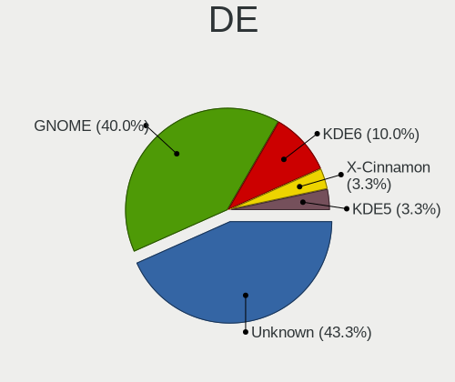
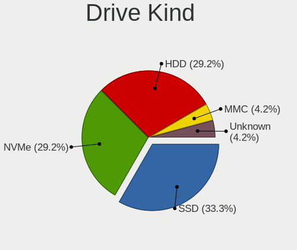
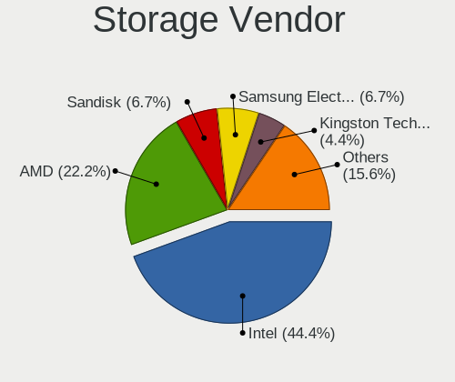
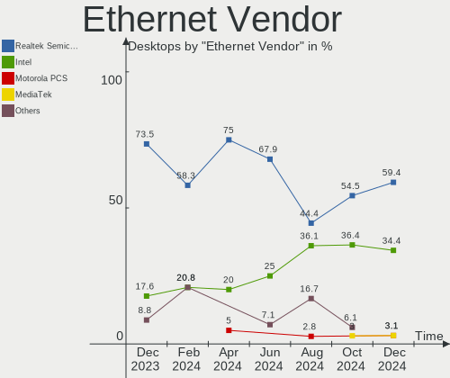
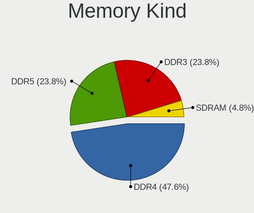
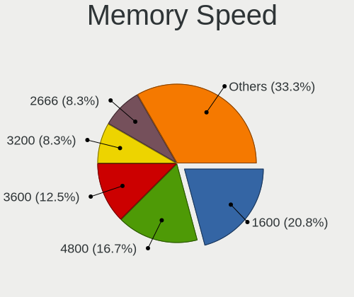
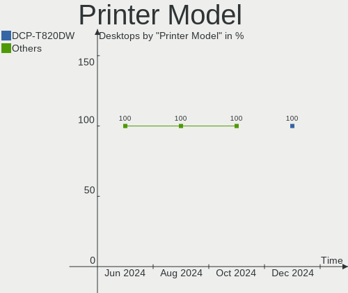

Linux in India - Hardware Trends (Desktops)
-------------------------------------------

A project to identify most popular hardware characteristics and track their change
over time based on data collected by Linux users at https://Linux-Hardware.org.

Anyone can contribute to this report by the [hw-probe](https://github.com/linuxhw/hw-probe) tool:

    sudo -E hw-probe -all -upload

Period: Jan, 2024.

Contents
--------

* [ System ](#system)
  - [ OS                       ](#os)
  - [ OS Family                ](#os-family)
  - [ Kernel                   ](#kernel)
  - [ Kernel Family            ](#kernel-family)
  - [ Kernel Major Ver.        ](#kernel-major-ver)
  - [ Arch                     ](#arch)
  - [ DE                       ](#de)
  - [ Display Server           ](#display-server)
  - [ Display Manager          ](#display-manager)
  - [ OS Lang                  ](#os-lang)
  - [ Boot Mode                ](#boot-mode)
  - [ Filesystem               ](#filesystem)
  - [ Part. scheme             ](#part-scheme)
  - [ Dual Boot with Linux/BSD ](#dual-boot-with-linuxbsd)
  - [ Dual Boot (Win)          ](#dual-boot-win)

* [ Board ](#board)
  - [ Vendor                   ](#vendor)
  - [ Model                    ](#model)
  - [ Model Family             ](#model-family)
  - [ MFG Year                 ](#mfg-year)
  - [ Form Factor              ](#form-factor)
  - [ Secure Boot              ](#secure-boot)
  - [ Coreboot                 ](#coreboot)
  - [ RAM Size                 ](#ram-size)
  - [ RAM Used                 ](#ram-used)
  - [ Total Drives             ](#total-drives)
  - [ Has CD-ROM               ](#has-cd-rom)
  - [ Has Ethernet             ](#has-ethernet)
  - [ Has WiFi                 ](#has-wifi)
  - [ Has Bluetooth            ](#has-bluetooth)

* [ Location ](#location)
  - [ Country                  ](#country)
  - [ City                     ](#city)

* [ Drives ](#drives)
  - [ Drive Vendor             ](#drive-vendor)
  - [ Drive Model              ](#drive-model)
  - [ HDD Vendor               ](#hdd-vendor)
  - [ SSD Vendor               ](#ssd-vendor)
  - [ Drive Kind               ](#drive-kind)
  - [ Drive Connector          ](#drive-connector)
  - [ Drive Size               ](#drive-size)
  - [ Space Total              ](#space-total)
  - [ Space Used               ](#space-used)
  - [ Malfunc. Drives          ](#malfunc-drives)
  - [ Malfunc. Drive Vendor    ](#malfunc-drive-vendor)
  - [ Malfunc. HDD Vendor      ](#malfunc-hdd-vendor)
  - [ Malfunc. Drive Kind      ](#malfunc-drive-kind)
  - [ Failed Drives            ](#failed-drives)
  - [ Failed Drive Vendor      ](#failed-drive-vendor)
  - [ Drive Status             ](#drive-status)

* [ Storage controller ](#storage-controller)
  - [ Storage Vendor           ](#storage-vendor)
  - [ Storage Model            ](#storage-model)
  - [ Storage Kind             ](#storage-kind)

* [ Processor ](#processor)
  - [ CPU Vendor               ](#cpu-vendor)
  - [ CPU Model                ](#cpu-model)
  - [ CPU Model Family         ](#cpu-model-family)
  - [ CPU Cores                ](#cpu-cores)
  - [ CPU Sockets              ](#cpu-sockets)
  - [ CPU Threads              ](#cpu-threads)
  - [ CPU Op-Modes             ](#cpu-op-modes)
  - [ CPU Microcode            ](#cpu-microcode)
  - [ CPU Microarch            ](#cpu-microarch)

* [ Graphics ](#graphics)
  - [ GPU Vendor               ](#gpu-vendor)
  - [ GPU Model                ](#gpu-model)
  - [ GPU Combo                ](#gpu-combo)
  - [ GPU Driver               ](#gpu-driver)
  - [ GPU Memory               ](#gpu-memory)

* [ Monitor ](#monitor)
  - [ Monitor Vendor           ](#monitor-vendor)
  - [ Monitor Model            ](#monitor-model)
  - [ Monitor Resolution       ](#monitor-resolution)
  - [ Monitor Diagonal         ](#monitor-diagonal)
  - [ Monitor Width            ](#monitor-width)
  - [ Aspect Ratio             ](#aspect-ratio)
  - [ Monitor Area             ](#monitor-area)
  - [ Pixel Density            ](#pixel-density)
  - [ Multiple Monitors        ](#multiple-monitors)

* [ Network ](#network)
  - [ Net Controller Vendor    ](#net-controller-vendor)
  - [ Net Controller Model     ](#net-controller-model)
  - [ Wireless Vendor          ](#wireless-vendor)
  - [ Wireless Model           ](#wireless-model)
  - [ Ethernet Vendor          ](#ethernet-vendor)
  - [ Ethernet Model           ](#ethernet-model)
  - [ Net Controller Kind      ](#net-controller-kind)
  - [ Used Controller          ](#used-controller)
  - [ NICs                     ](#nics)
  - [ IPv6                     ](#ipv6)

* [ Bluetooth ](#bluetooth)
  - [ Bluetooth Vendor         ](#bluetooth-vendor)
  - [ Bluetooth Model          ](#bluetooth-model)

* [ Sound ](#sound)
  - [ Sound Vendor             ](#sound-vendor)
  - [ Sound Model              ](#sound-model)

* [ Memory ](#memory)
  - [ Memory Vendor            ](#memory-vendor)
  - [ Memory Model             ](#memory-model)
  - [ Memory Kind              ](#memory-kind)
  - [ Memory Form Factor       ](#memory-form-factor)
  - [ Memory Size              ](#memory-size)
  - [ Memory Speed             ](#memory-speed)

* [ Printers & scanners ](#printers--scanners)
  - [ Printer Vendor           ](#printer-vendor)
  - [ Printer Model            ](#printer-model)
  - [ Scanner Vendor           ](#scanner-vendor)
  - [ Scanner Model            ](#scanner-model)

* [ Camera ](#camera)
  - [ Camera Vendor            ](#camera-vendor)
  - [ Camera Model             ](#camera-model)

* [ Security ](#security)
  - [ Fingerprint Vendor       ](#fingerprint-vendor)
  - [ Fingerprint Model        ](#fingerprint-model)
  - [ Chipcard Vendor          ](#chipcard-vendor)
  - [ Chipcard Model           ](#chipcard-model)

* [ Unsupported ](#unsupported)
  - [ Unsupported Devices      ](#unsupported-devices)
  - [ Unsupported Device Types ](#unsupported-device-types)

System
------

OS
--

Installed operating systems

| Name                | Desktops | Percent |
|---------------------|----------|---------|
| Ubuntu 22.04        | 4        | 19.05%  |
| Zorin 17            | 2        | 9.52%   |
| Ubuntu 23.10        | 2        | 9.52%   |
| KDE neon 22.04      | 2        | 9.52%   |
| Debian 12           | 2        | 9.52%   |
| Zorin 16            | 1        | 4.76%   |
| Ubuntu 20.04        | 1        | 4.76%   |
| Pop!_OS 22.04       | 1        | 4.76%   |
| OpenMandriva 23.08  | 1        | 4.76%   |
| Linux Mint 21.3     | 1        | 4.76%   |
| Linux Mint 21.2     | 1        | 4.76%   |
| Fedora 39           | 1        | 4.76%   |
| EndeavourOS Rolling | 1        | 4.76%   |
| Arch Rolling        | 1        | 4.76%   |

OS Family
---------

OS without a version

| Name         | Desktops | Percent |
|--------------|----------|---------|
| Ubuntu       | 7        | 33.33%  |
| Zorin        | 3        | 14.29%  |
| Linux Mint   | 2        | 9.52%   |
| KDE neon     | 2        | 9.52%   |
| Debian       | 2        | 9.52%   |
| Pop!_OS      | 1        | 4.76%   |
| OpenMandriva | 1        | 4.76%   |
| Fedora       | 1        | 4.76%   |
| EndeavourOS  | 1        | 4.76%   |
| Arch         | 1        | 4.76%   |

Kernel
------

Version of the Linux kernel

| Version                 | Desktops | Percent |
|-------------------------|----------|---------|
| 6.2.0-39-generic        | 5        | 23.81%  |
| 6.5.0-14-generic        | 4        | 19.05%  |
| 5.15.0-91-generic       | 3        | 14.29%  |
| 6.7.0-arch3-1           | 1        | 4.76%   |
| 6.6.9-060609-generic    | 1        | 4.76%   |
| 6.6.6-76060606-generic  | 1        | 4.76%   |
| 6.6.11-200.fc39.x86_64  | 1        | 4.76%   |
| 6.6.11-1-lts            | 1        | 4.76%   |
| 6.4.11-desktop-1omv2390 | 1        | 4.76%   |
| 6.1.0-15-amd64          | 1        | 4.76%   |
| 6.1.0-13-amd64          | 1        | 4.76%   |
| 5.15.0-75-generic       | 1        | 4.76%   |

Kernel Family
-------------

Linux kernel without a distro release

| Version | Desktops | Percent |
|---------|----------|---------|
| 6.2.0   | 5        | 23.81%  |
| 6.5.0   | 4        | 19.05%  |
| 5.15.0  | 4        | 19.05%  |
| 6.6.11  | 2        | 9.52%   |
| 6.1.0   | 2        | 9.52%   |
| 6.7.0   | 1        | 4.76%   |
| 6.6.9   | 1        | 4.76%   |
| 6.6.6   | 1        | 4.76%   |
| 6.4.11  | 1        | 4.76%   |

Kernel Major Ver.
-----------------

Linux kernel major version

| Version | Desktops | Percent |
|---------|----------|---------|
| 6.2     | 5        | 23.81%  |
| 6.6     | 4        | 19.05%  |
| 6.5     | 4        | 19.05%  |
| 5.15    | 4        | 19.05%  |
| 6.1     | 2        | 9.52%   |
| 6.7     | 1        | 4.76%   |
| 6.4     | 1        | 4.76%   |

Arch
----

OS architecture (x86_64, i586, etc.)

| Name   | Desktops | Percent |
|--------|----------|---------|
| x86_64 | 21       | 100%    |

DE
--

Desktop Environment

| Name          | Desktops | Percent |
|---------------|----------|---------|
| GNOME         | 11       | 52.38%  |
| KDE5          | 4        | 19.05%  |
| X-Cinnamon    | 2        | 9.52%   |
| XFCE          | 1        | 4.76%   |
| KDE6          | 1        | 4.76%   |
| GNOME Classic | 1        | 4.76%   |
| Unknown       | 1        | 4.76%   |

Display Server
--------------

X11 or Wayland

| Name    | Desktops | Percent |
|---------|----------|---------|
| X11     | 13       | 61.9%   |
| Wayland | 8        | 38.1%   |

Display Manager
---------------

SDDM, LightDM, etc.

| Name    | Desktops | Percent |
|---------|----------|---------|
| Unknown | 10       | 47.62%  |
| GDM3    | 7        | 33.33%  |
| LightDM | 2        | 9.52%   |
| SDDM    | 1        | 4.76%   |
| GDM     | 1        | 4.76%   |

OS Lang
-------

Language

| Lang    | Desktops | Percent |
|---------|----------|---------|
| en_IN   | 12       | 57.14%  |
| en_US   | 6        | 28.57%  |
| en_GB   | 1        | 4.76%   |
| C       | 1        | 4.76%   |
| Unknown | 1        | 4.76%   |

Boot Mode
---------

EFI or BIOS

| Mode | Desktops | Percent |
|------|----------|---------|
| BIOS | 13       | 61.9%   |
| EFI  | 8        | 38.1%   |

Filesystem
----------

Type of filesystem

| Type    | Desktops | Percent |
|---------|----------|---------|
| Ext4    | 14       | 66.67%  |
| Tmpfs   | 4        | 19.05%  |
| Xfs     | 1        | 4.76%   |
| Overlay | 1        | 4.76%   |
| Btrfs   | 1        | 4.76%   |

Part. scheme
------------

Scheme of partitioning

| Type    | Desktops | Percent |
|---------|----------|---------|
| GPT     | 10       | 47.62%  |
| Unknown | 9        | 42.86%  |
| MBR     | 2        | 9.52%   |

Dual Boot with Linux/BSD
------------------------

Hosting more than one Linux/BSD

| Dual boot | Desktops | Percent |
|-----------|----------|---------|
| No        | 18       | 85.71%  |
| Yes       | 3        | 14.29%  |

Dual Boot (Win)
---------------

Hosting Linux and Windows

| Dual boot | Desktops | Percent |
|-----------|----------|---------|
| No        | 14       | 66.67%  |
| Yes       | 7        | 33.33%  |

Board
-----

Vendor
------

Motherboard manufacturer

| Name                | Desktops | Percent |
|---------------------|----------|---------|
| Gigabyte Technology | 9        | 42.86%  |
| Dell                | 4        | 19.05%  |
| ASUSTek Computer    | 3        | 14.29%  |
| Intel               | 2        | 9.52%   |
| MSI                 | 1        | 4.76%   |
| Lenovo              | 1        | 4.76%   |
| Google              | 1        | 4.76%   |

Model
-----

Motherboard model

| Name                            | Desktops | Percent |
|---------------------------------|----------|---------|
| MSI MS-7850                     | 1        | 4.76%   |
| Lenovo ThinkCentre M71e 3156PT5 | 1        | 4.76%   |
| Intel H61/B75                   | 1        | 4.76%   |
| Intel H55                       | 1        | 4.76%   |
| Google Kench                    | 1        | 4.76%   |
| Gigabyte Z87X-UD3H              | 1        | 4.76%   |
| Gigabyte H61M-S1                | 1        | 4.76%   |
| Gigabyte H610M H DDR4           | 1        | 4.76%   |
| Gigabyte H370 WIFI              | 1        | 4.76%   |
| Gigabyte F2A55M-DS2             | 1        | 4.76%   |
| Gigabyte B560M H                | 1        | 4.76%   |
| Gigabyte B450M S2H              | 1        | 4.76%   |
| Gigabyte B450M DS3H V2          | 1        | 4.76%   |
| Gigabyte B250M-DS3H             | 1        | 4.76%   |
| Dell Vostro 3268                | 1        | 4.76%   |
| Dell OptiPlex 7050              | 1        | 4.76%   |
| Dell OptiPlex 3046              | 1        | 4.76%   |
| Dell Inspiron 3891              | 1        | 4.76%   |
| ASUS ROG STRIX X570-E GAMING    | 1        | 4.76%   |
| ASUS PRIME X570-P               | 1        | 4.76%   |
| ASUS All Series                 | 1        | 4.76%   |

Model Family
------------

Motherboard model prefix

| Name                | Desktops | Percent |
|---------------------|----------|---------|
| Gigabyte B450M      | 2        | 9.52%   |
| Dell OptiPlex       | 2        | 9.52%   |
| MSI MS-7850         | 1        | 4.76%   |
| Lenovo ThinkCentre  | 1        | 4.76%   |
| Intel H61           | 1        | 4.76%   |
| Intel H55           | 1        | 4.76%   |
| Google Kench        | 1        | 4.76%   |
| Gigabyte Z87X-UD3H  | 1        | 4.76%   |
| Gigabyte H61M-S1    | 1        | 4.76%   |
| Gigabyte H610M      | 1        | 4.76%   |
| Gigabyte H370       | 1        | 4.76%   |
| Gigabyte F2A55M-DS2 | 1        | 4.76%   |
| Gigabyte B560M      | 1        | 4.76%   |
| Gigabyte B250M-DS3H | 1        | 4.76%   |
| Dell Vostro         | 1        | 4.76%   |
| Dell Inspiron       | 1        | 4.76%   |
| ASUS ROG            | 1        | 4.76%   |
| ASUS PRIME          | 1        | 4.76%   |
| ASUS All            | 1        | 4.76%   |

MFG Year
--------

Motherboard manufacture year

| Year | Desktops | Percent |
|------|----------|---------|
| 2021 | 3        | 14.29%  |
| 2023 | 2        | 9.52%   |
| 2019 | 2        | 9.52%   |
| 2018 | 2        | 9.52%   |
| 2017 | 2        | 9.52%   |
| 2016 | 2        | 9.52%   |
| 2014 | 2        | 9.52%   |
| 2012 | 2        | 9.52%   |
| 2022 | 1        | 4.76%   |
| 2020 | 1        | 4.76%   |
| 2013 | 1        | 4.76%   |
| 2011 | 1        | 4.76%   |

Form Factor
-----------

Physical design of the computer

| Name    | Desktops | Percent |
|---------|----------|---------|
| Desktop | 21       | 100%    |

Secure Boot
-----------

Enabled or disabled

| State    | Desktops | Percent |
|----------|----------|---------|
| Disabled | 21       | 100%    |

Coreboot
--------

Have coreboot on board

| Used | Desktops | Percent |
|------|----------|---------|
| No   | 20       | 95.24%  |
| Yes  | 1        | 4.76%   |

RAM Size
--------

Total RAM memory

| Size in GB  | Desktops | Percent |
|-------------|----------|---------|
| 16.01-24.0  | 8        | 38.1%   |
| 32.01-64.0  | 5        | 23.81%  |
| 4.01-8.0    | 3        | 14.29%  |
| 3.01-4.0    | 2        | 9.52%   |
| 2.01-3.0    | 1        | 4.76%   |
| 64.01-256.0 | 1        | 4.76%   |
| 8.01-16.0   | 1        | 4.76%   |

RAM Used
--------

Used RAM memory

| Used GB   | Desktops | Percent |
|-----------|----------|---------|
| 4.01-8.0  | 7        | 33.33%  |
| 2.01-3.0  | 7        | 33.33%  |
| 3.01-4.0  | 3        | 14.29%  |
| 1.01-2.0  | 3        | 14.29%  |
| 8.01-16.0 | 1        | 4.76%   |

Total Drives
------------

Number of drives on board

| Drives | Desktops | Percent |
|--------|----------|---------|
| 2      | 8        | 38.1%   |
| 1      | 8        | 38.1%   |
| 3      | 3        | 14.29%  |
| 6      | 1        | 4.76%   |
| 4      | 1        | 4.76%   |

Has CD-ROM
----------

Has CD-ROM on board

| Presented | Desktops | Percent |
|-----------|----------|---------|
| No        | 14       | 66.67%  |
| Yes       | 7        | 33.33%  |

Has Ethernet
------------

Has Ethernet on board

| Presented | Desktops | Percent |
|-----------|----------|---------|
| Yes       | 20       | 95.24%  |
| No        | 1        | 4.76%   |

Has WiFi
--------

Has WiFi module

| Presented | Desktops | Percent |
|-----------|----------|---------|
| Yes       | 17       | 80.95%  |
| No        | 4        | 19.05%  |

Has Bluetooth
-------------

Has Bluetooth module

| Presented | Desktops | Percent |
|-----------|----------|---------|
| No        | 11       | 52.38%  |
| Yes       | 10       | 47.62%  |

Location
--------

Country
-------

Geographic location (country)

| Country | Desktops | Percent |
|---------|----------|---------|
| India   | 21       | 100%    |

City
----

Geographic location (city)

| City          | Desktops | Percent |
|---------------|----------|---------|
| Kolkata       | 3        | 14.29%  |
| Chennai       | 3        | 14.29%  |
| Bengaluru     | 3        | 14.29%  |
| Trivandrum    | 2        | 9.52%   |
| Mumbai        | 2        | 9.52%   |
| Hyderabad     | 2        | 9.52%   |
| Visakhapatnam | 1        | 4.76%   |
| Panipat       | 1        | 4.76%   |
| Ludhiana      | 1        | 4.76%   |
| Kochi         | 1        | 4.76%   |
| Delhi         | 1        | 4.76%   |
| Ahmedabad     | 1        | 4.76%   |

Drives
------

Drive Vendor
------------

Hard drive vendors

| Vendor              | Desktops | Drives | Percent |
|---------------------|----------|--------|---------|
| WDC                 | 9        | 10     | 24.32%  |
| Seagate             | 8        | 12     | 21.62%  |
| Crucial             | 5        | 5      | 13.51%  |
| Samsung Electronics | 4        | 4      | 10.81%  |
| Unknown             | 2        | 2      | 5.41%   |
| SanDisk             | 2        | 2      | 5.41%   |
| Kingston            | 2        | 3      | 5.41%   |
| Silicon Motion      | 1        | 1      | 2.7%    |
| Seagate Technology  | 1        | 1      | 2.7%    |
| PNY                 | 1        | 1      | 2.7%    |
| China               | 1        | 1      | 2.7%    |
| Cablet              | 1        | 1      | 2.7%    |

Drive Model
-----------

Hard drive models

| Model                                                 | Desktops | Percent |
|-------------------------------------------------------|----------|---------|
| WDC WD10EZEX-08WN4A0 1TB                              | 2        | 4.65%   |
| Seagate ST500DM002-1BD142 500GB                       | 2        | 4.65%   |
| Seagate ST1000LM035-1RK172 1TB                        | 2        | 4.65%   |
| Seagate ST1000DM010-2EP102 1TB                        | 2        | 4.65%   |
| Crucial CT1000MX500SSD1 1TB                           | 2        | 4.65%   |
| WDC WDS240G2G0A 240GB SSD                             | 1        | 2.33%   |
| WDC WD2500LPCX-24C6HT0 250GB                          | 1        | 2.33%   |
| WDC WD20EZRZ-00Z5HB0 2TB                              | 1        | 2.33%   |
| WDC WD10EZRX-00L4HB0 1TB                              | 1        | 2.33%   |
| WDC WD10EZRX-00A8LB0 1TB                              | 1        | 2.33%   |
| WDC WD10EZEX-75WN4A1 1TB                              | 1        | 2.33%   |
| WDC WD10EZEX-75WN4A0 1TB                              | 1        | 2.33%   |
| WDC WD10EZEX-00WN4A0 1TB                              | 1        | 2.33%   |
| Unknown NVMe SSD Drive 2TB                            | 1        | 2.33%   |
| Unknown BFDT50S 499GB                                 | 1        | 2.33%   |
| Silicon Motion SM2263EN/SM2263XT SSD Controller 128GB | 1        | 2.33%   |
| Seagate FireCuda 520 SSD 500GB                        | 1        | 2.33%   |
| Seagate ST9500325AS 500GB                             | 1        | 2.33%   |
| Seagate ST4000DM005-2DP166 4TB                        | 1        | 2.33%   |
| Seagate ST3500414CS 500GB                             | 1        | 2.33%   |
| Seagate ST3250310SV 250GB                             | 1        | 2.33%   |
| Seagate ST31000524AS 1TB                              | 1        | 2.33%   |
| Seagate Expansion Desk 8TB                            | 1        | 2.33%   |
| Sandisk WD Blue SN570 250GB                           | 1        | 2.33%   |
| SanDisk NVMe SSD Drive 500GB                          | 1        | 2.33%   |
| Samsung SSD 870 QVO 1TB                               | 1        | 2.33%   |
| Samsung SSD 850 PRO 256GB                             | 1        | 2.33%   |
| Samsung SSD 850 EVO 250GB                             | 1        | 2.33%   |
| Samsung NVMe SSD Controller SM981/PM981/PM983 1TB     | 1        | 2.33%   |
| PNY SSD2SC240G5LC726B104-298 240GB                    | 1        | 2.33%   |
| Kingston SUV400S37120G 120GB SSD                      | 1        | 2.33%   |
| Kingston SNV2S500G 500GB                              | 1        | 2.33%   |
| Kingston SA400S37240G 240GB SSD                       | 1        | 2.33%   |
| Crucial CT500MX500SSD1 500GB                          | 1        | 2.33%   |
| Crucial CT120BX500SSD1 120GB                          | 1        | 2.33%   |
| Crucial CT1000BX500SSD1 1TB                           | 1        | 2.33%   |
| China SATA SSD 512GB                                  | 1        | 2.33%   |
| Cablet MD202 250GB                                    | 1        | 2.33%   |

HDD Vendor
----------

Hard disk drive vendors

| Vendor  | Desktops | Drives | Percent |
|---------|----------|--------|---------|
| WDC     | 8        | 9      | 47.06%  |
| Seagate | 8        | 12     | 47.06%  |
| Unknown | 1        | 1      | 5.88%   |

SSD Vendor
----------

Solid state drive vendors

| Vendor              | Desktops | Drives | Percent |
|---------------------|----------|--------|---------|
| Crucial             | 5        | 5      | 41.67%  |
| Samsung Electronics | 3        | 3      | 25%     |
| WDC                 | 1        | 1      | 8.33%   |
| PNY                 | 1        | 1      | 8.33%   |
| Kingston            | 1        | 2      | 8.33%   |
| China               | 1        | 1      | 8.33%   |

Drive Kind
----------

HDD or SSD

| Kind    | Desktops | Drives | Percent |
|---------|----------|--------|---------|
| HDD     | 14       | 22     | 46.67%  |
| SSD     | 9        | 13     | 30%     |
| NVMe    | 6        | 7      | 20%     |
| Unknown | 1        | 1      | 3.33%   |

Drive Connector
---------------

SATA, SAS, NVMe, etc.

| Type | Desktops | Drives | Percent |
|------|----------|--------|---------|
| SATA | 18       | 34     | 69.23%  |
| NVMe | 6        | 7      | 23.08%  |
| SAS  | 2        | 2      | 7.69%   |

Drive Size
----------

Size of hard drive

| Size in TB | Desktops | Drives | Percent |
|------------|----------|--------|---------|
| 0.51-1.0   | 11       | 17     | 44%     |
| 0.01-0.5   | 11       | 15     | 44%     |
| 3.01-4.0   | 1        | 1      | 4%      |
| 1.01-2.0   | 1        | 1      | 4%      |
| 4.01-10.0  | 1        | 1      | 4%      |

Space Total
-----------

Amount of disk space available on the file system

| Size in GB     | Desktops | Percent |
|----------------|----------|---------|
| 1001-2000      | 5        | 23.81%  |
| 501-1000       | 5        | 23.81%  |
| 251-500        | 3        | 14.29%  |
| 101-250        | 3        | 14.29%  |
| More than 3000 | 2        | 9.52%   |
| 51-100         | 2        | 9.52%   |
| Unknown        | 1        | 4.76%   |

Space Used
----------

Amount of used disk space

| Used GB   | Desktops | Percent |
|-----------|----------|---------|
| 51-100    | 6        | 28.57%  |
| 1-20      | 5        | 23.81%  |
| 21-50     | 3        | 14.29%  |
| 101-250   | 2        | 9.52%   |
| 501-1000  | 2        | 9.52%   |
| 251-500   | 1        | 4.76%   |
| 2001-3000 | 1        | 4.76%   |
| Unknown   | 1        | 4.76%   |

Malfunc. Drives
---------------

Drive models with a malfunction

| Model                    | Desktops | Drives | Percent |
|--------------------------|----------|--------|---------|
| WDC WD20EZRZ-00Z5HB0 2TB | 1        | 1      | 50%     |
| Seagate ST31000524AS 1TB | 1        | 1      | 50%     |

Malfunc. Drive Vendor
---------------------

Vendors of faulty drives

| Vendor  | Desktops | Drives | Percent |
|---------|----------|--------|---------|
| WDC     | 1        | 1      | 50%     |
| Seagate | 1        | 1      | 50%     |

Malfunc. HDD Vendor
-------------------

Vendors of faulty HDD drives

| Vendor  | Desktops | Drives | Percent |
|---------|----------|--------|---------|
| WDC     | 1        | 1      | 50%     |
| Seagate | 1        | 1      | 50%     |

Malfunc. Drive Kind
-------------------

Kinds of faulty drives

| Kind | Desktops | Drives | Percent |
|------|----------|--------|---------|
| HDD  | 2        | 2      | 100%    |

Failed Drives
-------------

Failed drive models

Zero info for selected period =(

Failed Drive Vendor
-------------------

Failed drive vendors

Zero info for selected period =(

Drive Status
------------

Number of failed and malfunc. drives

| Status   | Desktops | Drives | Percent |
|----------|----------|--------|---------|
| Detected | 14       | 28     | 60.87%  |
| Works    | 7        | 13     | 30.43%  |
| Malfunc  | 2        | 2      | 8.7%    |

Storage controller
------------------

Storage Vendor
--------------

Storage controller vendors

| Vendor                      | Desktops | Percent |
|-----------------------------|----------|---------|
| Intel                       | 16       | 55.17%  |
| AMD                         | 5        | 17.24%  |
| SanDisk                     | 2        | 6.9%    |
| Silicon Motion              | 1        | 3.45%   |
| Seagate Technology          | 1        | 3.45%   |
| Samsung Electronics         | 1        | 3.45%   |
| Nextorage                   | 1        | 3.45%   |
| Marvell Technology Group    | 1        | 3.45%   |
| Kingston Technology Company | 1        | 3.45%   |

Storage Model
-------------

Storage controller models

| Model                                                                                   | Desktops | Percent |
|-----------------------------------------------------------------------------------------|----------|---------|
| AMD FCH SATA Controller [AHCI mode]                                                     | 3        | 8.82%   |
| SanDisk Ultra 3D / WD Blue SN570 NVMe SSD (DRAM-less)                                   | 2        | 5.88%   |
| Intel Q170/Q150/B150/H170/H110/Z170/CM236 Chipset SATA Controller [AHCI Mode]           | 2        | 5.88%   |
| Intel 6 Series/C200 Series Chipset Family 6 port Desktop SATA AHCI Controller           | 2        | 5.88%   |
| Intel 500 Series Chipset Family SATA AHCI Controller                                    | 2        | 5.88%   |
| Intel 200 Series PCH SATA controller [AHCI mode]                                        | 2        | 5.88%   |
| AMD 400 Series Chipset SATA Controller                                                  | 2        | 5.88%   |
| Silicon Motion SM2263EN/SM2263XT (DRAM-less) NVMe SSD Controllers                       | 1        | 2.94%   |
| Seagate FireCuda 520/IronWolf 525 SSD                                                   | 1        | 2.94%   |
| Samsung NVMe SSD Controller SM981/PM981/PM983                                           | 1        | 2.94%   |
| Nextorage NE1N NVMe SSD                                                                 | 1        | 2.94%   |
| Marvell Group 88SE9172 SATA 6Gb/s Controller                                            | 1        | 2.94%   |
| Kingston Company NV2 NVMe SSD E21T (DRAM-less)                                          | 1        | 2.94%   |
| Intel Sunrise Point-LP SATA Controller [AHCI mode]                                      | 1        | 2.94%   |
| Intel Cannon Lake PCH SATA AHCI Controller                                              | 1        | 2.94%   |
| Intel C610/X99 series chipset sSATA Controller [AHCI mode]                              | 1        | 2.94%   |
| Intel C610/X99 series chipset 6-Port SATA Controller [AHCI mode]                        | 1        | 2.94%   |
| Intel Alder Lake-S PCH SATA Controller [AHCI Mode]                                      | 1        | 2.94%   |
| Intel 9 Series Chipset Family SATA Controller [AHCI Mode]                               | 1        | 2.94%   |
| Intel 8 Series/C220 Series Chipset Family 6-port SATA Controller 1 [AHCI mode]          | 1        | 2.94%   |
| Intel 6 Series/C200 Series Chipset Family Desktop SATA Controller (IDE mode, ports 4-5) | 1        | 2.94%   |
| Intel 6 Series/C200 Series Chipset Family Desktop SATA Controller (IDE mode, ports 0-3) | 1        | 2.94%   |
| Intel 5 Series/3400 Series Chipset 4 port SATA IDE Controller                           | 1        | 2.94%   |
| Intel 5 Series/3400 Series Chipset 2 port SATA IDE Controller                           | 1        | 2.94%   |
| AMD FCH SATA Controller [IDE mode]                                                      | 1        | 2.94%   |
| AMD FCH IDE Controller                                                                  | 1        | 2.94%   |

Storage Kind
------------

Kind of storage controller (IDE, SATA, NVMe, SAS, ...)

| Kind | Desktops | Percent |
|------|----------|---------|
| SATA | 19       | 67.86%  |
| NVMe | 6        | 21.43%  |
| IDE  | 3        | 10.71%  |

Processor
---------

CPU Vendor
----------

Processor vendors

| Vendor | Desktops | Percent |
|--------|----------|---------|
| Intel  | 16       | 76.19%  |
| AMD    | 5        | 23.81%  |

CPU Model
---------

Processor models

| Model                                      | Desktops | Percent |
|--------------------------------------------|----------|---------|
| Intel Pentium CPU G2030 @ 3.00GHz          | 1        | 4.76%   |
| Intel Core i7-8650U CPU @ 1.90GHz          | 1        | 4.76%   |
| Intel Core i7-6850K CPU @ 3.60GHz          | 1        | 4.76%   |
| Intel Core i7-4790K CPU @ 4.00GHz          | 1        | 4.76%   |
| Intel Core i5-7600K CPU @ 3.80GHz          | 1        | 4.76%   |
| Intel Core i5-7400 CPU @ 3.00GHz           | 1        | 4.76%   |
| Intel Core i5-6500 CPU @ 3.20GHz           | 1        | 4.76%   |
| Intel Core i5-4670 CPU @ 3.40GHz           | 1        | 4.76%   |
| Intel Core i5-2400S CPU @ 2.50GHz          | 1        | 4.76%   |
| Intel Core i3-8100 CPU @ 3.60GHz           | 1        | 4.76%   |
| Intel Core i3-6100 CPU @ 3.70GHz           | 1        | 4.76%   |
| Intel Core i3-2120 CPU @ 3.30GHz           | 1        | 4.76%   |
| Intel Core i3 CPU 530 @ 2.93GHz            | 1        | 4.76%   |
| Intel 12th Gen Core i3-12100F              | 1        | 4.76%   |
| Intel 11th Gen Core i7-11700F @ 2.50GHz    | 1        | 4.76%   |
| Intel 11th Gen Core i5-11400 @ 2.60GHz     | 1        | 4.76%   |
| AMD Ryzen 7 5800X 8-Core Processor         | 1        | 4.76%   |
| AMD Ryzen 5 PRO 4650G with Radeon Graphics | 1        | 4.76%   |
| AMD Ryzen 5 5600G with Radeon Graphics     | 1        | 4.76%   |
| AMD Ryzen 5 3600X 6-Core Processor         | 1        | 4.76%   |
| AMD A4-4000 APU with Radeon HD Graphics    | 1        | 4.76%   |

CPU Model Family
----------------

Processor model prefix

| Model           | Desktops | Percent |
|-----------------|----------|---------|
| Intel Core i5   | 5        | 23.81%  |
| Intel Core i3   | 4        | 19.05%  |
| Other           | 3        | 14.29%  |
| Intel Core i7   | 3        | 14.29%  |
| AMD Ryzen 5     | 2        | 9.52%   |
| Intel Pentium   | 1        | 4.76%   |
| AMD Ryzen 7     | 1        | 4.76%   |
| AMD Ryzen 5 PRO | 1        | 4.76%   |
| AMD A4          | 1        | 4.76%   |

CPU Cores
---------

Number of processor cores

| Number | Desktops | Percent |
|--------|----------|---------|
| 4      | 9        | 42.86%  |
| 6      | 5        | 23.81%  |
| 2      | 4        | 19.05%  |
| 8      | 2        | 9.52%   |
| 1      | 1        | 4.76%   |

CPU Sockets
-----------

Number of sockets

| Number | Desktops | Percent |
|--------|----------|---------|
| 1      | 21       | 100%    |

CPU Threads
-----------

Threads per core (Hyper-Threading)

| Number | Desktops | Percent |
|--------|----------|---------|
| 2      | 14       | 66.67%  |
| 1      | 7        | 33.33%  |

CPU Op-Modes
------------

CPU Operation Modes (32-bit, 64-bit)

| Op mode        | Desktops | Percent |
|----------------|----------|---------|
| 32-bit, 64-bit | 21       | 100%    |

CPU Microcode
-------------

Microcode number

| Number     | Desktops | Percent |
|------------|----------|---------|
| Unknown    | 16       | 76.19%  |
| 0x906e9    | 1        | 4.76%   |
| 0x806ea    | 1        | 4.76%   |
| 0x206a7    | 1        | 4.76%   |
| 0x0a50000d | 1        | 4.76%   |
| 0x06001119 | 1        | 4.76%   |

CPU Microarch
-------------

Microarchitecture

| Name        | Desktops | Percent |
|-------------|----------|---------|
| KabyLake    | 4        | 19.05%  |
| Unknown     | 3        | 14.29%  |
| Zen 3       | 2        | 9.52%   |
| Zen 2       | 2        | 9.52%   |
| Skylake     | 2        | 9.52%   |
| SandyBridge | 2        | 9.52%   |
| Haswell     | 2        | 9.52%   |
| Westmere    | 1        | 4.76%   |
| Piledriver  | 1        | 4.76%   |
| IvyBridge   | 1        | 4.76%   |
| Broadwell   | 1        | 4.76%   |

Graphics
--------

GPU Vendor
----------

Vendors of graphics cards

| Vendor | Desktops | Percent |
|--------|----------|---------|
| Intel  | 11       | 50%     |
| Nvidia | 7        | 31.82%  |
| AMD    | 4        | 18.18%  |

GPU Model
---------

Graphics card models

| Model                                                                       | Desktops | Percent |
|-----------------------------------------------------------------------------|----------|---------|
| Intel Xeon E3-1200 v3/4th Gen Core Processor Integrated Graphics Controller | 2        | 9.09%   |
| Intel HD Graphics 530                                                       | 2        | 9.09%   |
| Intel 2nd Generation Core Processor Family Integrated Graphics Controller   | 2        | 9.09%   |
| Nvidia TU106 [GeForce RTX 2060 SUPER]                                       | 1        | 4.55%   |
| Nvidia GP108 [GeForce GT 1030]                                              | 1        | 4.55%   |
| Nvidia GP104 [GeForce GTX 1080]                                             | 1        | 4.55%   |
| Nvidia GK208B [GeForce GT 710]                                              | 1        | 4.55%   |
| Nvidia GF119 [GeForce GT 610]                                               | 1        | 4.55%   |
| Nvidia GA106 [GeForce RTX 3060 Lite Hash Rate]                              | 1        | 4.55%   |
| Nvidia GA104 [GeForce RTX 3070]                                             | 1        | 4.55%   |
| Intel Xeon E3-1200 v2/3rd Gen Core processor Graphics Controller            | 1        | 4.55%   |
| Intel UHD Graphics 620                                                      | 1        | 4.55%   |
| Intel RocketLake-S GT1 [UHD Graphics 730]                                   | 1        | 4.55%   |
| Intel HD Graphics 630                                                       | 1        | 4.55%   |
| Intel Core Processor Integrated Graphics Controller                         | 1        | 4.55%   |
| AMD Renoir [Radeon RX Vega 6 (Ryzen 4000/5000 Mobile Series)]               | 1        | 4.55%   |
| AMD Navi 23 [Radeon RX 6600/6600 XT/6600M]                                  | 1        | 4.55%   |
| AMD Cezanne [Radeon Vega Series / Radeon Vega Mobile Series]                | 1        | 4.55%   |
| AMD Baffin [Radeon RX 460/560D / Pro 450/455/460/555/555X/560/560X]         | 1        | 4.55%   |

GPU Combo
---------

Combinations of graphics cards

| Name        | Desktops | Percent |
|-------------|----------|---------|
| 1 x Intel   | 10       | 47.62%  |
| 1 x Nvidia  | 7        | 33.33%  |
| 1 x AMD     | 3        | 14.29%  |
| Intel + AMD | 1        | 4.76%   |

GPU Driver
----------

Free vs proprietary

| Driver      | Desktops | Percent |
|-------------|----------|---------|
| Free        | 15       | 71.43%  |
| Proprietary | 5        | 23.81%  |
| Unknown     | 1        | 4.76%   |

GPU Memory
----------

Total video memory

| Size in GB | Desktops | Percent |
|------------|----------|---------|
| Unknown    | 15       | 71.43%  |
| 7.01-8.0   | 2        | 9.52%   |
| 1.01-2.0   | 2        | 9.52%   |
| 8.01-16.0  | 1        | 4.76%   |
| 0.01-0.5   | 1        | 4.76%   |

Monitor
-------

Monitor Vendor
--------------

Monitor vendors

| Vendor              | Desktops | Percent |
|---------------------|----------|---------|
| Dell                | 5        | 22.73%  |
| Samsung Electronics | 4        | 18.18%  |
| BenQ                | 3        | 13.64%  |
| Acer                | 3        | 13.64%  |
| Goldstar            | 2        | 9.09%   |
| Sony                | 1        | 4.55%   |
| SGT                 | 1        | 4.55%   |
| Panasonic           | 1        | 4.55%   |
| MSI                 | 1        | 4.55%   |
| AOC                 | 1        | 4.55%   |

Monitor Model
-------------

Monitor models

| Model                                                             | Desktops | Percent |
|-------------------------------------------------------------------|----------|---------|
| Sony TV *00 SNY7E04 3840x2160 1660x934mm 75.0-inch                | 1        | 4.55%   |
| SGT YSD SGT1900 1440x900 600x300mm 26.4-inch                      | 1        | 4.55%   |
| Samsung Electronics S22F350 SAM0D1B 1920x1080 477x268mm 21.5-inch | 1        | 4.55%   |
| Samsung Electronics S22F350 SAM0D1A 1920x1080 477x268mm 21.5-inch | 1        | 4.55%   |
| Samsung Electronics S19F350 SAM0D46 1366x768 410x230mm 18.5-inch  | 1        | 4.55%   |
| Samsung Electronics LCD Monitor LS24A600N 2560x1440               | 1        | 4.55%   |
| Panasonic LCD Monitor TV 3840x2160                                | 1        | 4.55%   |
| MSI MP273 MSI30B4 1920x1080 600x330mm 27.0-inch                   | 1        | 4.55%   |
| Goldstar ULTRAWIDE GSM59F1 2560x1080 673x284mm 28.8-inch          | 1        | 4.55%   |
| Goldstar IPS QHD GSM5BC3 2560x1440 527x296mm 23.8-inch            | 1        | 4.55%   |
| Dell SE2422H DEL424A 1920x1080 527x296mm 23.8-inch                | 1        | 4.55%   |
| Dell P2419H DELD0DA 1920x1080 527x296mm 23.8-inch                 | 1        | 4.55%   |
| Dell P2217H DELA0D9 1920x1080 476x267mm 21.5-inch                 | 1        | 4.55%   |
| Dell E1916HV DELF06C 1366x768 409x230mm 18.5-inch                 | 1        | 4.55%   |
| Dell E1916He DELF067 1366x768 410x230mm 18.5-inch                 | 1        | 4.55%   |
| BenQ GW2480L BNQ78F2 1920x1080 527x296mm 23.8-inch                | 1        | 4.55%   |
| BenQ GW2480 BNQ78E7 1920x1080 527x296mm 23.8-inch                 | 1        | 4.55%   |
| BenQ E2200HD BNQ790C 1920x1080 477x268mm 21.5-inch                | 1        | 4.55%   |
| AOC 1943W AOC1943 1366x768 410x230mm 18.5-inch                    | 1        | 4.55%   |
| Acer P196HQL ACR019C 1366x768 410x230mm 18.5-inch                 | 1        | 4.55%   |
| Acer EK240Y ACR0758 1920x1080 527x296mm 23.8-inch                 | 1        | 4.55%   |
| Acer EB321HQU C ACR0507 2560x1440 699x393mm 31.6-inch             | 1        | 4.55%   |

Monitor Resolution
------------------

Monitor screen resolution

| Resolution       | Desktops | Percent |
|------------------|----------|---------|
| 1920x1080 (FHD)  | 10       | 45.45%  |
| 1366x768 (WXGA)  | 5        | 22.73%  |
| 2560x1440 (QHD)  | 3        | 13.64%  |
| 3840x2160 (4K)   | 2        | 9.09%   |
| 2560x1080        | 1        | 4.55%   |
| 1440x900 (WXGA+) | 1        | 4.55%   |

Monitor Diagonal
----------------

Diagonal size in inches

| Inches  | Desktops | Percent |
|---------|----------|---------|
| 18      | 5        | 22.73%  |
| 24      | 4        | 18.18%  |
| 21      | 4        | 18.18%  |
| 23      | 2        | 9.09%   |
| Unknown | 2        | 9.09%   |
| 75      | 1        | 4.55%   |
| 34      | 1        | 4.55%   |
| 31      | 1        | 4.55%   |
| 27      | 1        | 4.55%   |
| 26      | 1        | 4.55%   |

Monitor Width
-------------

Physical width

| Width in mm | Desktops | Percent |
|-------------|----------|---------|
| 401-500     | 9        | 42.86%  |
| 501-600     | 7        | 33.33%  |
| Unknown     | 2        | 9.52%   |
| 701-800     | 1        | 4.76%   |
| 601-700     | 1        | 4.76%   |
| 1501-2000   | 1        | 4.76%   |

Aspect Ratio
------------

Proportional relationship between the width and the height

| Ratio   | Desktops | Percent |
|---------|----------|---------|
| 16/9    | 16       | 80%     |
| Unknown | 2        | 10%     |
| 21/9    | 1        | 5%      |
| 2.00    | 1        | 5%      |

Monitor Area
------------

Area in inch²

| Area in inch² | Desktops | Percent |
|----------------|----------|---------|
| 201-250        | 8        | 38.1%   |
| 141-150        | 5        | 23.81%  |
| 351-500        | 2        | 9.52%   |
| Unknown        | 2        | 9.52%   |
| More than 1000 | 1        | 4.76%   |
| 301-350        | 1        | 4.76%   |
| 251-300        | 1        | 4.76%   |
| 151-200        | 1        | 4.76%   |

Pixel Density
-------------

Pixels per inch

| Density | Desktops | Percent |
|---------|----------|---------|
| 51-100  | 14       | 66.67%  |
| 101-120 | 4        | 19.05%  |
| Unknown | 2        | 9.52%   |
| 121-160 | 1        | 4.76%   |

Multiple Monitors
-----------------

Total monitors connected

| Total | Desktops | Percent |
|-------|----------|---------|
| 1     | 17       | 80.95%  |
| 2     | 3        | 14.29%  |
| 0     | 1        | 4.76%   |

Network
-------

Net Controller Vendor
---------------------

Controller vendors

| Vendor                | Desktops | Percent |
|-----------------------|----------|---------|
| Realtek Semiconductor | 18       | 52.94%  |
| Intel                 | 8        | 23.53%  |
| TP-Link               | 4        | 11.76%  |
| Ralink Technology     | 1        | 2.94%   |
| Qualcomm Atheros      | 1        | 2.94%   |
| Qualcomm              | 1        | 2.94%   |
| Broadcom              | 1        | 2.94%   |

Net Controller Model
--------------------

Controller models

| Model                                                                  | Desktops | Percent |
|------------------------------------------------------------------------|----------|---------|
| Realtek RTL8111/8168/8211/8411 PCI Express Gigabit Ethernet Controller | 13       | 30.23%  |
| Realtek RTL8188EUS 802.11n Wireless Network Adapter                    | 5        | 11.63%  |
| Intel I211 Gigabit Network Connection                                  | 3        | 6.98%   |
| Realtek RTL810xE PCI Express Fast Ethernet controller                  | 2        | 4.65%   |
| Intel Wi-Fi 6 AX200                                                    | 2        | 4.65%   |
| TP-Link UE300 10/100/1000 LAN (ethernet mode) [Realtek RTL8153]        | 1        | 2.33%   |
| TP-Link TL-WN822N Version 4 RTL8192EU                                  | 1        | 2.33%   |
| TP-Link RTL8812AU Archer T4U 802.11ac                                  | 1        | 2.33%   |
| TP-Link Archer T4U ver.3                                               | 1        | 2.33%   |
| TP-Link 802.11ac WLAN Adapter                                          | 1        | 2.33%   |
| Realtek RTL8723BU 802.11b/g/n WLAN Adapter                             | 1        | 2.33%   |
| Realtek RTL8125 2.5GbE Controller                                      | 1        | 2.33%   |
| Ralink MT7601U Wireless Adapter                                        | 1        | 2.33%   |
| Qualcomm Redmi 9T                                                      | 1        | 2.33%   |
| Qualcomm Atheros QCA9565 / AR9565 Wireless Network Adapter             | 1        | 2.33%   |
| Intel Wireless 7265                                                    | 1        | 2.33%   |
| Intel Tiger Lake PCH CNVi WiFi                                         | 1        | 2.33%   |
| Intel Ethernet Connection I217-V                                       | 1        | 2.33%   |
| Intel Ethernet Connection (7) I219-V                                   | 1        | 2.33%   |
| Intel Ethernet Connection (5) I219-LM                                  | 1        | 2.33%   |
| Intel Ethernet Connection (2) I218-V                                   | 1        | 2.33%   |
| Intel Cannon Lake PCH CNVi WiFi                                        | 1        | 2.33%   |
| Broadcom BCM4360 802.11ac Dual Band Wireless Network Adapter           | 1        | 2.33%   |

Wireless Vendor
---------------

Wireless vendors

| Vendor                | Desktops | Percent |
|-----------------------|----------|---------|
| Realtek Semiconductor | 6        | 33.33%  |
| Intel                 | 5        | 27.78%  |
| TP-Link               | 4        | 22.22%  |
| Ralink Technology     | 1        | 5.56%   |
| Qualcomm Atheros      | 1        | 5.56%   |
| Broadcom              | 1        | 5.56%   |

Wireless Model
--------------

Wireless models

| Model                                                        | Desktops | Percent |
|--------------------------------------------------------------|----------|---------|
| Realtek RTL8188EUS 802.11n Wireless Network Adapter          | 5        | 27.78%  |
| Intel Wi-Fi 6 AX200                                          | 2        | 11.11%  |
| TP-Link TL-WN822N Version 4 RTL8192EU                        | 1        | 5.56%   |
| TP-Link RTL8812AU Archer T4U 802.11ac                        | 1        | 5.56%   |
| TP-Link Archer T4U ver.3                                     | 1        | 5.56%   |
| TP-Link 802.11ac WLAN Adapter                                | 1        | 5.56%   |
| Realtek RTL8723BU 802.11b/g/n WLAN Adapter                   | 1        | 5.56%   |
| Ralink MT7601U Wireless Adapter                              | 1        | 5.56%   |
| Qualcomm Atheros QCA9565 / AR9565 Wireless Network Adapter   | 1        | 5.56%   |
| Intel Wireless 7265                                          | 1        | 5.56%   |
| Intel Tiger Lake PCH CNVi WiFi                               | 1        | 5.56%   |
| Intel Cannon Lake PCH CNVi WiFi                              | 1        | 5.56%   |
| Broadcom BCM4360 802.11ac Dual Band Wireless Network Adapter | 1        | 5.56%   |

Ethernet Vendor
---------------

Ethernet vendors

| Vendor                | Desktops | Percent |
|-----------------------|----------|---------|
| Realtek Semiconductor | 16       | 69.57%  |
| Intel                 | 5        | 21.74%  |
| TP-Link               | 1        | 4.35%   |
| Qualcomm              | 1        | 4.35%   |

Ethernet Model
--------------

Ethernet models

| Model                                                                  | Desktops | Percent |
|------------------------------------------------------------------------|----------|---------|
| Realtek RTL8111/8168/8211/8411 PCI Express Gigabit Ethernet Controller | 13       | 52%     |
| Intel I211 Gigabit Network Connection                                  | 3        | 12%     |
| Realtek RTL810xE PCI Express Fast Ethernet controller                  | 2        | 8%      |
| TP-Link UE300 10/100/1000 LAN (ethernet mode) [Realtek RTL8153]        | 1        | 4%      |
| Realtek RTL8125 2.5GbE Controller                                      | 1        | 4%      |
| Qualcomm Redmi 9T                                                      | 1        | 4%      |
| Intel Ethernet Connection I217-V                                       | 1        | 4%      |
| Intel Ethernet Connection (7) I219-V                                   | 1        | 4%      |
| Intel Ethernet Connection (5) I219-LM                                  | 1        | 4%      |
| Intel Ethernet Connection (2) I218-V                                   | 1        | 4%      |

Net Controller Kind
-------------------

Ethernet, WiFi or modem

| Kind     | Desktops | Percent |
|----------|----------|---------|
| Ethernet | 20       | 54.05%  |
| WiFi     | 17       | 45.95%  |

Used Controller
---------------

Currently used network controller

| Kind     | Desktops | Percent |
|----------|----------|---------|
| WiFi     | 12       | 57.14%  |
| Ethernet | 9        | 42.86%  |

NICs
----

Total network controllers on board

| Total | Desktops | Percent |
|-------|----------|---------|
| 1     | 13       | 61.9%   |
| 2     | 4        | 19.05%  |
| 3     | 3        | 14.29%  |
| 0     | 1        | 4.76%   |

IPv6
----

IPv6 vs IPv4

| Used | Desktops | Percent |
|------|----------|---------|
| No   | 16       | 76.19%  |
| Yes  | 5        | 23.81%  |

Bluetooth
---------

Bluetooth Vendor
----------------

Controller vendors

| Vendor                          | Desktops | Percent |
|---------------------------------|----------|---------|
| Intel                           | 4        | 40%     |
| Cambridge Silicon Radio         | 2        | 20%     |
| TP-Link                         | 1        | 10%     |
| Qualcomm Atheros Communications | 1        | 10%     |
| Broadcom                        | 1        | 10%     |
| ASUSTek Computer                | 1        | 10%     |

Bluetooth Model
---------------

Controller models

| Model                                                 | Desktops | Percent |
|-------------------------------------------------------|----------|---------|
| Cambridge Silicon Radio Bluetooth Dongle (HCI mode)   | 2        | 20%     |
| TP-Link UB500 Adapter                                 | 1        | 10%     |
| Qualcomm Atheros  Bluetooth Device                    | 1        | 10%     |
| Intel Bluetooth wireless interface                    | 1        | 10%     |
| Intel Bluetooth 9460/9560 Jefferson Peak (JfP)        | 1        | 10%     |
| Intel AX201 Bluetooth                                 | 1        | 10%     |
| Intel AX200 Bluetooth                                 | 1        | 10%     |
| Broadcom BCM2045 Bluetooth                            | 1        | 10%     |
| ASUS Broadcom BCM20702 Single-Chip Bluetooth 4.0 + LE | 1        | 10%     |

Sound
-----

Sound Vendor
------------

Sound card vendors

| Vendor                                       | Desktops | Percent |
|----------------------------------------------|----------|---------|
| Intel                                        | 16       | 42.11%  |
| Nvidia                                       | 7        | 18.42%  |
| AMD                                          | 7        | 18.42%  |
| Zoran Co. Personal Media Division (Nogatech) | 1        | 2.63%   |
| Tenx Technology                              | 1        | 2.63%   |
| Samson Technologies                          | 1        | 2.63%   |
| Nordic Semiconductor ASA                     | 1        | 2.63%   |
| M-Audio                                      | 1        | 2.63%   |
| Creative Labs                                | 1        | 2.63%   |
| Cambridge Audio                              | 1        | 2.63%   |
| C-Media Electronics                          | 1        | 2.63%   |

Sound Model
-----------

Sound card models

| Model                                                                                           | Desktops | Percent |
|-------------------------------------------------------------------------------------------------|----------|---------|
| Intel 6 Series/C200 Series Chipset Family High Definition Audio Controller                      | 3        | 7.14%   |
| Intel Xeon E3-1200 v3/4th Gen Core Processor HD Audio Controller                                | 2        | 4.76%   |
| Intel Tiger Lake-H HD Audio Controller                                                          | 2        | 4.76%   |
| Intel 200 Series PCH HD Audio                                                                   | 2        | 4.76%   |
| Intel 100 Series/C230 Series Chipset Family HD Audio Controller                                 | 2        | 4.76%   |
| AMD Starship/Matisse HD Audio Controller                                                        | 2        | 4.76%   |
| AMD Renoir Radeon High Definition Audio Controller                                              | 2        | 4.76%   |
| AMD Family 17h/19h HD Audio Controller                                                          | 2        | 4.76%   |
| Zoran Co. Personal Media Division (Nogatech) USB Audio and HID                                  | 1        | 2.38%   |
| Tenx Technology USB AUDIO                                                                       | 1        | 2.38%   |
| Samson Technologies Q2U handheld mic with XLR                                                   | 1        | 2.38%   |
| Nvidia TU106 High Definition Audio Controller                                                   | 1        | 2.38%   |
| Nvidia GP108 High Definition Audio Controller                                                   | 1        | 2.38%   |
| Nvidia GP104 High Definition Audio Controller                                                   | 1        | 2.38%   |
| Nvidia GK208 HDMI/DP Audio Controller                                                           | 1        | 2.38%   |
| Nvidia GF119 HDMI Audio Controller                                                              | 1        | 2.38%   |
| Nvidia GA106 High Definition Audio Controller                                                   | 1        | 2.38%   |
| Nvidia GA104 High Definition Audio Controller                                                   | 1        | 2.38%   |
| Nordic Semiconductor ASA USB Composite Device                                                   | 1        | 2.38%   |
| M-Audio M-Track Plus                                                                            | 1        | 2.38%   |
| Intel Sunrise Point-LP HD Audio                                                                 | 1        | 2.38%   |
| Intel Cannon Lake PCH cAVS                                                                      | 1        | 2.38%   |
| Intel C610/X99 series chipset HD Audio Controller                                               | 1        | 2.38%   |
| Intel Alder Lake-S HD Audio Controller                                                          | 1        | 2.38%   |
| Intel 9 Series Chipset Family HD Audio Controller                                               | 1        | 2.38%   |
| Intel 8 Series/C220 Series Chipset High Definition Audio Controller                             | 1        | 2.38%   |
| Intel 5 Series/3400 Series Chipset High Definition Audio                                        | 1        | 2.38%   |
| Creative Labs CA0132 Sound Core3D [Sound Blaster Recon3D / Z-Series / Sound BlasterX AE-5 Plus] | 1        | 2.38%   |
| Cambridge Audio DacMagic Plus                                                                   | 1        | 2.38%   |
| C-Media Electronics Cmedia Audio                                                                | 1        | 2.38%   |
| AMD Navi 21/23 HDMI/DP Audio Controller                                                         | 1        | 2.38%   |
| AMD FCH Azalia Controller                                                                       | 1        | 2.38%   |
| AMD Baffin HDMI/DP Audio [Radeon RX 550 640SP / RX 560/560X]                                    | 1        | 2.38%   |

Memory
------

Memory Vendor
-------------

Memory module vendors

| Vendor              | Desktops | Percent |
|---------------------|----------|---------|
| SK hynix            | 2        | 25%     |
| Corsair             | 2        | 25%     |
| Samsung Electronics | 1        | 12.5%   |
| Kingston            | 1        | 12.5%   |
| Crucial             | 1        | 12.5%   |
| Unknown             | 1        | 12.5%   |

Memory Model
------------

Memory module models

| Model                                                    | Desktops | Percent |
|----------------------------------------------------------|----------|---------|
| Corsair RAM CMK16GX4M1E3200C16 16GB DIMM DDR4 3200MT/s   | 2        | 18.18%  |
| SK hynix RAM HMT41GU6BFR8A-PBT 8192MB DIMM DDR3 1333MT/s | 1        | 9.09%   |
| SK hynix RAM HMT41GU6AFR8A-PB 8192MB DIMM DDR3 1333MT/s  | 1        | 9.09%   |
| SK hynix RAM HMA41GU6AFR8N-TF 8GB DIMM DDR4 2465MT/s     | 1        | 9.09%   |
| Samsung RAM M471A1K43DB1-CTD 8GB SODIMM DDR4 2667MT/s    | 1        | 9.09%   |
| Kingston RAM KHX1866C10D3/8G 8GB DIMM DDR3 2133MT/s      | 1        | 9.09%   |
| Kingston RAM KHX1600C10D3/8GX 8GB DIMM DDR3 1600MT/s     | 1        | 9.09%   |
| Crucial RAM CB8GU2400.C8ET 8GB DIMM DDR4 2400MT/s        | 1        | 9.09%   |
| Crucial RAM BL8G26C16U4B.8FD 8GB DIMM DDR4 2667MT/s      | 1        | 9.09%   |
| Unknown                                                  | 1        | 9.09%   |

Memory Kind
-----------

Memory module kinds

| Kind | Desktops | Percent |
|------|----------|---------|
| DDR4 | 6        | 75%     |
| DDR3 | 2        | 25%     |

Memory Form Factor
------------------

Physical design of the memory module

| Name   | Desktops | Percent |
|--------|----------|---------|
| DIMM   | 7        | 87.5%   |
| SODIMM | 1        | 12.5%   |

Memory Size
-----------

Memory module size

| Size  | Desktops | Percent |
|-------|----------|---------|
| 8192  | 6        | 75%     |
| 16384 | 2        | 25%     |

Memory Speed
------------

Memory module speed

| Speed | Desktops | Percent |
|-------|----------|---------|
| 3200  | 2        | 20%     |
| 2667  | 2        | 20%     |
| 2666  | 1        | 10%     |
| 2465  | 1        | 10%     |
| 2400  | 1        | 10%     |
| 2133  | 1        | 10%     |
| 1600  | 1        | 10%     |
| 1333  | 1        | 10%     |

Printers & scanners
-------------------

Printer Vendor
--------------

Printer device vendors

| Vendor      | Desktops | Percent |
|-------------|----------|---------|
| Seiko Epson | 1        | 100%    |

Printer Model
-------------

Printer device models

| Model                                                                 | Desktops | Percent |
|-----------------------------------------------------------------------|----------|---------|
| Seiko Epson ME OFFICE 620F Series/Stylus Office BX305F/BX305FW/TX320F | 1        | 100%    |

Scanner Vendor
--------------

Scanner device vendors

Zero info for selected period =(

Scanner Model
-------------

Scanner device models

Zero info for selected period =(

Camera
------

Camera Vendor
-------------

Camera device vendors

| Vendor       | Desktops | Percent |
|--------------|----------|---------|
| Logitech     | 2        | 66.67%  |
| MacroSilicon | 1        | 33.33%  |

Camera Model
------------

Camera device models

| Model                           | Desktops | Percent |
|---------------------------------|----------|---------|
| MacroSilicon USB3. 0 capture    | 1        | 33.33%  |
| Logitech HD Pro Webcam C920     | 1        | 33.33%  |
| Logitech C922 Pro Stream Webcam | 1        | 33.33%  |

Security
--------

Fingerprint Vendor
------------------

Fingerprint sensor vendors

Zero info for selected period =(

Fingerprint Model
-----------------

Fingerprint sensor models

Zero info for selected period =(

Chipcard Vendor
---------------

Chipcard module vendors

Zero info for selected period =(

Chipcard Model
--------------

Chipcard module models

Zero info for selected period =(

Unsupported
-----------

Unsupported Devices
-------------------

Total unsupported devices on board

| Total | Desktops | Percent |
|-------|----------|---------|
| 0     | 17       | 80.95%  |
| 1     | 3        | 14.29%  |
| 2     | 1        | 4.76%   |

Unsupported Device Types
------------------------

Types of unsupported devices

| Type             | Desktops | Percent |
|------------------|----------|---------|
| Net/wireless     | 2        | 40%     |
| Unassigned class | 1        | 20%     |
| Net/ethernet     | 1        | 20%     |
| Graphics card    | 1        | 20%     |

