Linux in India - Hardware Trends (Notebooks)
--------------------------------------------

A project to identify most popular hardware characteristics and track their change
over time based on data collected by Linux users at https://Linux-Hardware.org.

Anyone can contribute to this report by the [hw-probe](https://github.com/linuxhw/hw-probe) tool:

    sudo -E hw-probe -all -upload

Period: Dec, 2025.

Contents
--------

* [ System ](#system)
  - [ OS                       ](#os)
  - [ OS Family                ](#os-family)
  - [ Kernel                   ](#kernel)
  - [ Kernel Family            ](#kernel-family)
  - [ Kernel Major Ver.        ](#kernel-major-ver)
  - [ Arch                     ](#arch)
  - [ DE                       ](#de)
  - [ Display Server           ](#display-server)
  - [ Display Manager          ](#display-manager)
  - [ OS Lang                  ](#os-lang)
  - [ Boot Mode                ](#boot-mode)
  - [ Filesystem               ](#filesystem)
  - [ Part. scheme             ](#part-scheme)
  - [ Dual Boot with Linux/BSD ](#dual-boot-with-linuxbsd)
  - [ Dual Boot (Win)          ](#dual-boot-win)

* [ Board ](#board)
  - [ Vendor                   ](#vendor)
  - [ Model                    ](#model)
  - [ Model Family             ](#model-family)
  - [ MFG Year                 ](#mfg-year)
  - [ Form Factor              ](#form-factor)
  - [ Secure Boot              ](#secure-boot)
  - [ Coreboot                 ](#coreboot)
  - [ RAM Size                 ](#ram-size)
  - [ RAM Used                 ](#ram-used)
  - [ Total Drives             ](#total-drives)
  - [ Has CD-ROM               ](#has-cd-rom)
  - [ Has Ethernet             ](#has-ethernet)
  - [ Has WiFi                 ](#has-wifi)
  - [ Has Bluetooth            ](#has-bluetooth)

* [ Location ](#location)
  - [ Country                  ](#country)
  - [ City                     ](#city)

* [ Drives ](#drives)
  - [ Drive Vendor             ](#drive-vendor)
  - [ Drive Model              ](#drive-model)
  - [ HDD Vendor               ](#hdd-vendor)
  - [ SSD Vendor               ](#ssd-vendor)
  - [ Drive Kind               ](#drive-kind)
  - [ Drive Connector          ](#drive-connector)
  - [ Drive Size               ](#drive-size)
  - [ Space Total              ](#space-total)
  - [ Space Used               ](#space-used)
  - [ Malfunc. Drives          ](#malfunc-drives)
  - [ Malfunc. Drive Vendor    ](#malfunc-drive-vendor)
  - [ Malfunc. HDD Vendor      ](#malfunc-hdd-vendor)
  - [ Malfunc. Drive Kind      ](#malfunc-drive-kind)
  - [ Failed Drives            ](#failed-drives)
  - [ Failed Drive Vendor      ](#failed-drive-vendor)
  - [ Drive Status             ](#drive-status)

* [ Storage controller ](#storage-controller)
  - [ Storage Vendor           ](#storage-vendor)
  - [ Storage Model            ](#storage-model)
  - [ Storage Kind             ](#storage-kind)

* [ Processor ](#processor)
  - [ CPU Vendor               ](#cpu-vendor)
  - [ CPU Model                ](#cpu-model)
  - [ CPU Model Family         ](#cpu-model-family)
  - [ CPU Cores                ](#cpu-cores)
  - [ CPU Sockets              ](#cpu-sockets)
  - [ CPU Threads              ](#cpu-threads)
  - [ CPU Op-Modes             ](#cpu-op-modes)
  - [ CPU Microcode            ](#cpu-microcode)
  - [ CPU Microarch            ](#cpu-microarch)

* [ Graphics ](#graphics)
  - [ GPU Vendor               ](#gpu-vendor)
  - [ GPU Model                ](#gpu-model)
  - [ GPU Combo                ](#gpu-combo)
  - [ GPU Driver               ](#gpu-driver)
  - [ GPU Memory               ](#gpu-memory)

* [ Monitor ](#monitor)
  - [ Monitor Vendor           ](#monitor-vendor)
  - [ Monitor Model            ](#monitor-model)
  - [ Monitor Resolution       ](#monitor-resolution)
  - [ Monitor Diagonal         ](#monitor-diagonal)
  - [ Monitor Width            ](#monitor-width)
  - [ Aspect Ratio             ](#aspect-ratio)
  - [ Monitor Area             ](#monitor-area)
  - [ Pixel Density            ](#pixel-density)
  - [ Multiple Monitors        ](#multiple-monitors)

* [ Network ](#network)
  - [ Net Controller Vendor    ](#net-controller-vendor)
  - [ Net Controller Model     ](#net-controller-model)
  - [ Wireless Vendor          ](#wireless-vendor)
  - [ Wireless Model           ](#wireless-model)
  - [ Ethernet Vendor          ](#ethernet-vendor)
  - [ Ethernet Model           ](#ethernet-model)
  - [ Net Controller Kind      ](#net-controller-kind)
  - [ Used Controller          ](#used-controller)
  - [ NICs                     ](#nics)
  - [ IPv6                     ](#ipv6)

* [ Bluetooth ](#bluetooth)
  - [ Bluetooth Vendor         ](#bluetooth-vendor)
  - [ Bluetooth Model          ](#bluetooth-model)

* [ Sound ](#sound)
  - [ Sound Vendor             ](#sound-vendor)
  - [ Sound Model              ](#sound-model)

* [ Memory ](#memory)
  - [ Memory Vendor            ](#memory-vendor)
  - [ Memory Model             ](#memory-model)
  - [ Memory Kind              ](#memory-kind)
  - [ Memory Form Factor       ](#memory-form-factor)
  - [ Memory Size              ](#memory-size)
  - [ Memory Speed             ](#memory-speed)

* [ Printers & scanners ](#printers--scanners)
  - [ Printer Vendor           ](#printer-vendor)
  - [ Printer Model            ](#printer-model)
  - [ Scanner Vendor           ](#scanner-vendor)
  - [ Scanner Model            ](#scanner-model)

* [ Camera ](#camera)
  - [ Camera Vendor            ](#camera-vendor)
  - [ Camera Model             ](#camera-model)

* [ Security ](#security)
  - [ Fingerprint Vendor       ](#fingerprint-vendor)
  - [ Fingerprint Model        ](#fingerprint-model)
  - [ Chipcard Vendor          ](#chipcard-vendor)
  - [ Chipcard Model           ](#chipcard-model)

* [ Unsupported ](#unsupported)
  - [ Unsupported Devices      ](#unsupported-devices)
  - [ Unsupported Device Types ](#unsupported-device-types)

System
------

OS
--

Installed operating systems

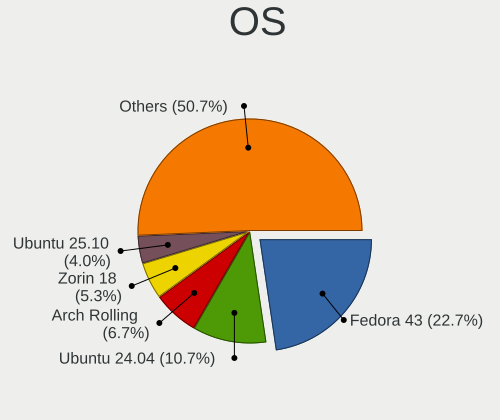

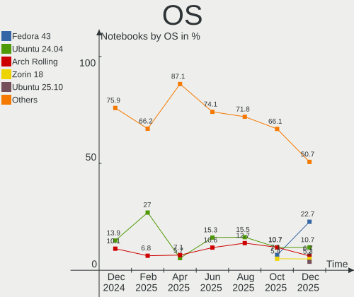

| Name                         | Notebooks | Percent |
|------------------------------|-----------|---------|
| Fedora 43                    | 17        | 22.67%  |
| Ubuntu 24.04                 | 8         | 10.67%  |
| Arch Rolling                 | 5         | 6.67%   |
| Zorin 18                     | 4         | 5.33%   |
| Ubuntu 25.10                 | 3         | 4%      |
| Ubuntu 22.04                 | 3         | 4%      |
| Linux Mint 22.2              | 3         | 4%      |
| SteamOS 3.7.7                | 2         | 2.67%   |
| Pop!_OS 24.04                | 2         | 2.67%   |
| OpenMandriva 25.11           | 2         | 2.67%   |
| Fedora 42                    | 2         | 2.67%   |
| Debian 13                    | 2         | 2.67%   |
| CachyOS Rolling              | 2         | 2.67%   |
| Zorin 17                     | 1         | 1.33%   |
| Ultramarine 43               | 1         | 1.33%   |
| Ubuntu MATE 24.04            | 1         | 1.33%   |
| Ubuntu 20.04                 | 1         | 1.33%   |
| SteamOS 3.7.17               | 1         | 1.33%   |
| Parrot 7.0                   | 1         | 1.33%   |
| openSUSE Tumbleweed-XXXXXXXX | 1         | 1.33%   |
| OpenMandriva 6.0             | 1         | 1.33%   |
| OpenMandriva 25.90           | 1         | 1.33%   |
| Nobara 42                    | 1         | 1.33%   |
| NixOS 25.11                  | 1         | 1.33%   |
| MX 25                        | 1         | 1.33%   |
| Lubuntu 24.04                | 1         | 1.33%   |
| Kubuntu 25.10                | 1         | 1.33%   |
| Kali 2025.4                  | 1         | 1.33%   |
| Gentoo 2.18                  | 1         | 1.33%   |
| Elementary 8                 | 1         | 1.33%   |
| Debian 12                    | 1         | 1.33%   |
| CachyOS                      | 1         | 1.33%   |
| Anduinos 1.4.1               | 1         | 1.33%   |

OS Family
---------

OS without a version

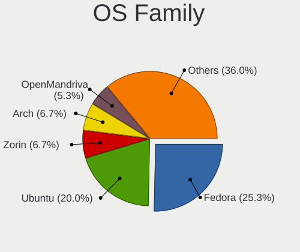

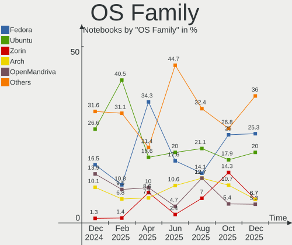

| Name         | Notebooks | Percent |
|--------------|-----------|---------|
| Fedora       | 19        | 25.33%  |
| Ubuntu       | 15        | 20%     |
| Zorin        | 5         | 6.67%   |
| Arch         | 5         | 6.67%   |
| OpenMandriva | 4         | 5.33%   |
| SteamOS      | 3         | 4%      |
| Linux Mint   | 3         | 4%      |
| Debian       | 3         | 4%      |
| CachyOS      | 3         | 4%      |
| Pop!_OS      | 2         | 2.67%   |
| Ultramarine  | 1         | 1.33%   |
| Ubuntu MATE  | 1         | 1.33%   |
| Parrot       | 1         | 1.33%   |
| openSUSE     | 1         | 1.33%   |
| Nobara       | 1         | 1.33%   |
| NixOS        | 1         | 1.33%   |
| MX           | 1         | 1.33%   |
| Lubuntu      | 1         | 1.33%   |
| Kubuntu      | 1         | 1.33%   |
| Kali         | 1         | 1.33%   |
| Gentoo       | 1         | 1.33%   |
| Elementary   | 1         | 1.33%   |
| Anduinos     | 1         | 1.33%   |

Kernel
------

Version of the Linux kernel

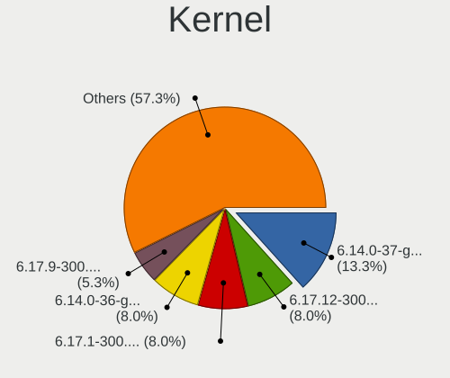

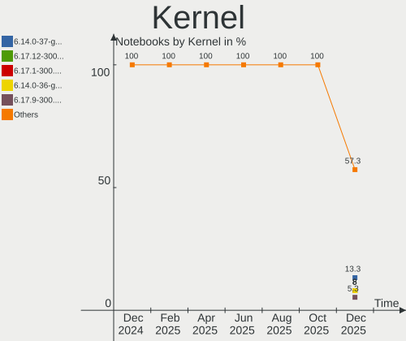

| Version                                     | Notebooks | Percent |
|---------------------------------------------|-----------|---------|
| 6.14.0-37-generic                           | 10        | 13.33%  |
| 6.17.12-300.fc43.x86_64                     | 6         | 8%      |
| 6.17.1-300.fc43.x86_64                      | 6         | 8%      |
| 6.14.0-36-generic                           | 6         | 8%      |
| 6.17.9-300.fc43.x86_64                      | 4         | 5.33%   |
| 6.12.57+deb13-amd64                         | 4         | 5.33%   |
| 6.8.0-87-generic                            | 3         | 4%      |
| 6.17.9-arch1-1                              | 3         | 4%      |
| 6.8.0-90-generic                            | 2         | 2.67%   |
| 6.17.9-76061709-generic                     | 2         | 2.67%   |
| 6.17.0-8-generic                            | 2         | 2.67%   |
| 6.14.2-desktop-3omv2590                     | 2         | 2.67%   |
| 6.5.0-14-generic                            | 1         | 1.33%   |
| 6.18.2-cachyos1.fc43.x86_64                 | 1         | 1.33%   |
| 6.18.1-1-cachyos-bore                       | 1         | 1.33%   |
| 6.18.0-zen1-1-zen                           | 1         | 1.33%   |
| 6.18.0-desktop-1omv2590                     | 1         | 1.33%   |
| 6.18.0-5-cachyos                            | 1         | 1.33%   |
| 6.18.0-2-default                            | 1         | 1.33%   |
| 6.17.9-2-cachyos                            | 1         | 1.33%   |
| 6.17.8-200.fc42.x86_64                      | 1         | 1.33%   |
| 6.17.7-desktop-1omv2590                     | 1         | 1.33%   |
| 6.17.5-gentoo-x86_64                        | 1         | 1.33%   |
| 6.17.13-200.fc42.x86_64                     | 1         | 1.33%   |
| 6.17.10-300.fc43.x86_64                     | 1         | 1.33%   |
| 6.17.10+kali-amd64                          | 1         | 1.33%   |
| 6.17.0-7-generic                            | 1         | 1.33%   |
| 6.17.0-6-generic                            | 1         | 1.33%   |
| 6.17.0-1005-aws                             | 1         | 1.33%   |
| 6.15.6-201.nobara.fc42.x86_64               | 1         | 1.33%   |
| 6.12.63                                     | 1         | 1.33%   |
| 6.12.61-1-lts                               | 1         | 1.33%   |
| 6.11.11-valve26-1-neptune-611-gb3afa9aa9ae7 | 1         | 1.33%   |
| 6.11.11-valve24-2-neptune-611-gfd0dd251480d | 1         | 1.33%   |
| 6.11.11-valve14-1-neptune-611-g96885212a919 | 1         | 1.33%   |
| 6.1.0-41-amd64                              | 1         | 1.33%   |
| 5.15.0-139-generic                          | 1         | 1.33%   |

Kernel Family
-------------

Linux kernel without a distro release

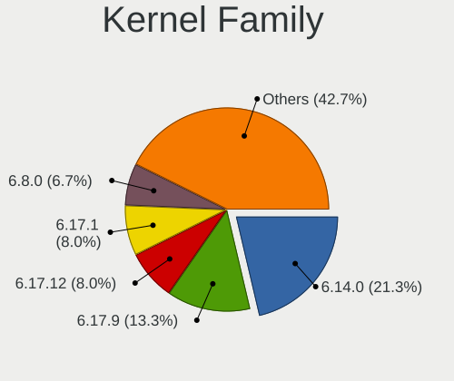

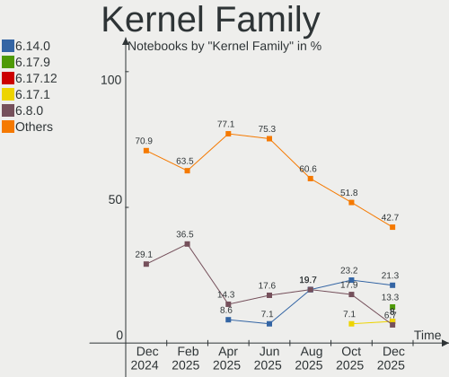

| Version | Notebooks | Percent |
|---------|-----------|---------|
| 6.14.0  | 16        | 21.33%  |
| 6.17.9  | 10        | 13.33%  |
| 6.17.12 | 6         | 8%      |
| 6.17.1  | 6         | 8%      |
| 6.8.0   | 5         | 6.67%   |
| 6.17.0  | 5         | 6.67%   |
| 6.18.0  | 4         | 5.33%   |
| 6.12.57 | 4         | 5.33%   |
| 6.11.11 | 3         | 4%      |
| 6.17.10 | 2         | 2.67%   |
| 6.14.2  | 2         | 2.67%   |
| 6.5.0   | 1         | 1.33%   |
| 6.18.2  | 1         | 1.33%   |
| 6.18.1  | 1         | 1.33%   |
| 6.17.8  | 1         | 1.33%   |
| 6.17.7  | 1         | 1.33%   |
| 6.17.5  | 1         | 1.33%   |
| 6.17.13 | 1         | 1.33%   |
| 6.15.6  | 1         | 1.33%   |
| 6.12.63 | 1         | 1.33%   |
| 6.12.61 | 1         | 1.33%   |
| 6.1.0   | 1         | 1.33%   |
| 5.15.0  | 1         | 1.33%   |

Kernel Major Ver.
-----------------

Linux kernel major version

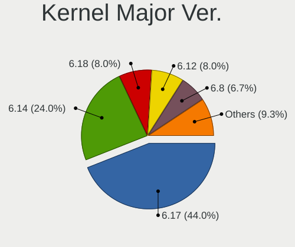

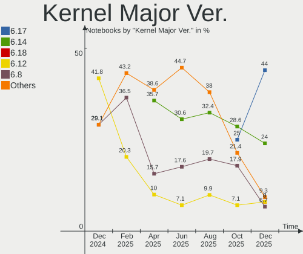

| Version | Notebooks | Percent |
|---------|-----------|---------|
| 6.17    | 33        | 44%     |
| 6.14    | 18        | 24%     |
| 6.18    | 6         | 8%      |
| 6.12    | 6         | 8%      |
| 6.8     | 5         | 6.67%   |
| 6.11    | 3         | 4%      |
| 6.5     | 1         | 1.33%   |
| 6.15    | 1         | 1.33%   |
| 6.1     | 1         | 1.33%   |
| 5.15    | 1         | 1.33%   |

Arch
----

OS architecture (x86_64, i586, etc.)

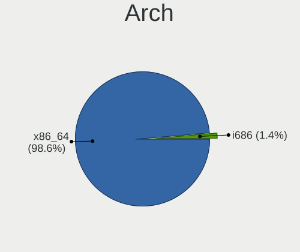

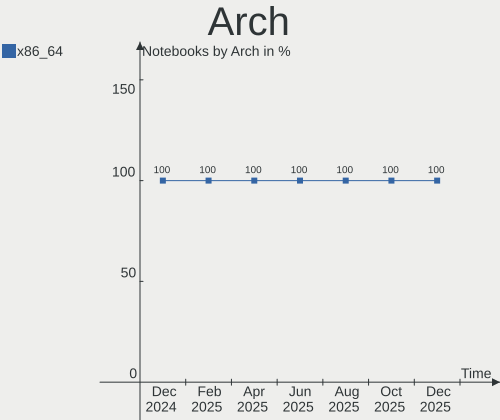

| Name   | Notebooks | Percent |
|--------|-----------|---------|
| x86_64 | 75        | 100%    |

DE
--

Desktop Environment

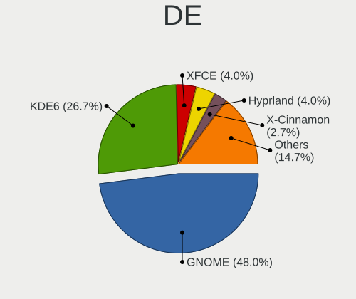

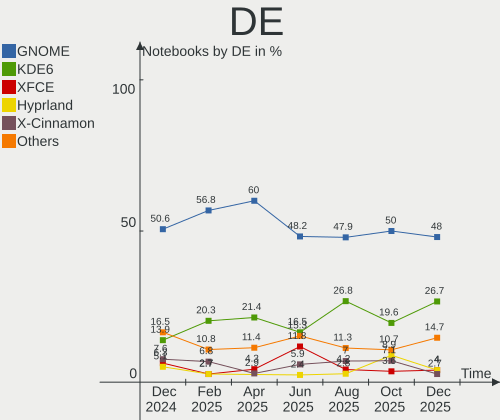

| Name       | Notebooks | Percent |
|------------|-----------|---------|
| GNOME      | 36        | 48%     |
| KDE6       | 20        | 26.67%  |
| XFCE       | 3         | 4%      |
| Hyprland   | 3         | 4%      |
| X-Cinnamon | 2         | 2.67%   |
| COSMIC     | 2         | 2.67%   |
| Unknown    | 2         | 2.67%   |
| Pantheon   | 1         | 1.33%   |
| MATE       | 1         | 1.33%   |
| LXQt       | 1         | 1.33%   |
| LXDE       | 1         | 1.33%   |
| KDE4       | 1         | 1.33%   |
| KDE        | 1         | 1.33%   |
| i3         | 1         | 1.33%   |

Display Server
--------------

X11 or Wayland

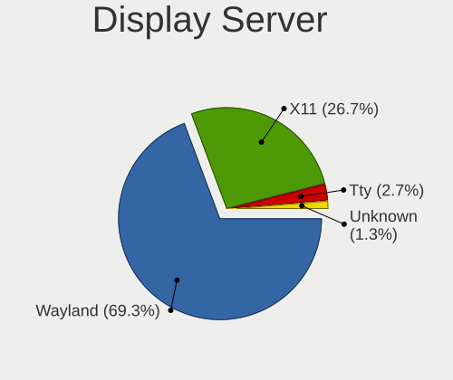

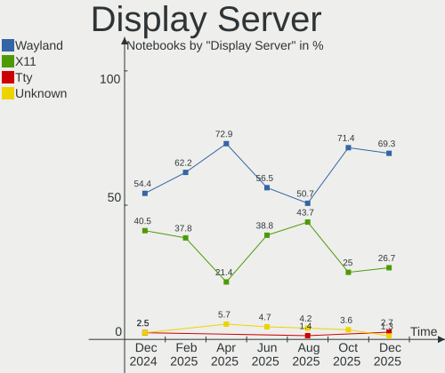

| Name    | Notebooks | Percent |
|---------|-----------|---------|
| Wayland | 52        | 69.33%  |
| X11     | 20        | 26.67%  |
| Tty     | 2         | 2.67%   |
| Unknown | 1         | 1.33%   |

Display Manager
---------------

SDDM, LightDM, etc.

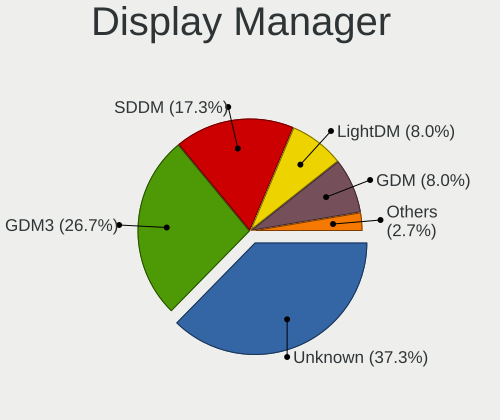

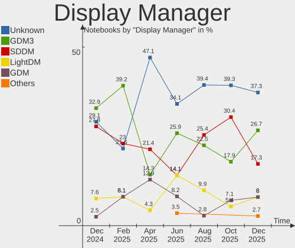

| Name           | Notebooks | Percent |
|----------------|-----------|---------|
| Unknown        | 28        | 37.33%  |
| GDM3           | 20        | 26.67%  |
| SDDM           | 13        | 17.33%  |
| LightDM        | 6         | 8%      |
| GDM            | 6         | 8%      |
| Ly             | 1         | 1.33%   |
| COSMIC-GREETER | 1         | 1.33%   |

OS Lang
-------

Language

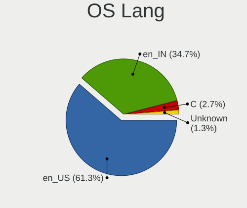

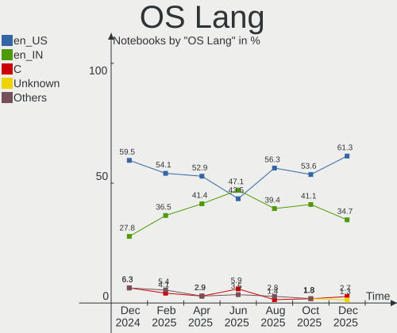

| Lang    | Notebooks | Percent |
|---------|-----------|---------|
| en_US   | 46        | 61.33%  |
| en_IN   | 26        | 34.67%  |
| C       | 2         | 2.67%   |
| Unknown | 1         | 1.33%   |

Boot Mode
---------

EFI or BIOS

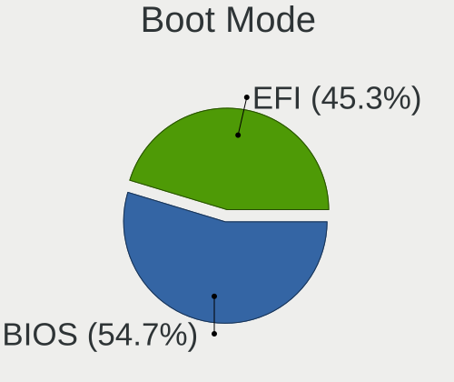

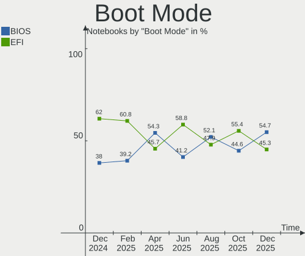

| Mode | Notebooks | Percent |
|------|-----------|---------|
| BIOS | 41        | 54.67%  |
| EFI  | 34        | 45.33%  |

Filesystem
----------

Type of filesystem

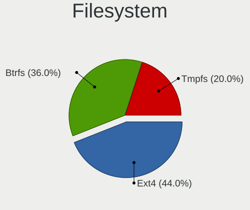

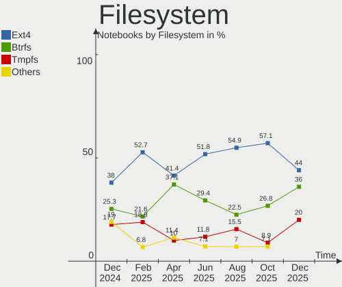

| Type  | Notebooks | Percent |
|-------|-----------|---------|
| Ext4  | 33        | 44%     |
| Btrfs | 27        | 36%     |
| Tmpfs | 15        | 20%     |

Part. scheme
------------

Scheme of partitioning

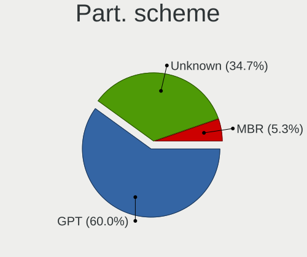

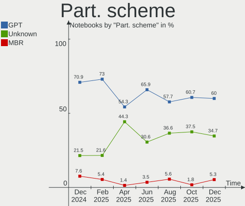

| Type    | Notebooks | Percent |
|---------|-----------|---------|
| GPT     | 45        | 60%     |
| Unknown | 26        | 34.67%  |
| MBR     | 4         | 5.33%   |

Dual Boot with Linux/BSD
------------------------

Hosting more than one Linux/BSD

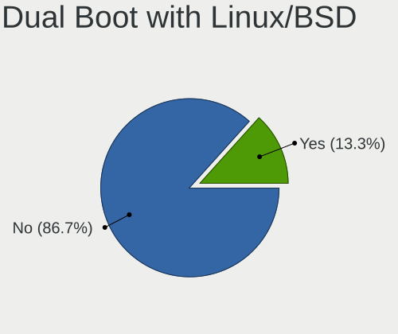

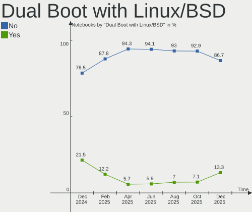

| Dual boot | Notebooks | Percent |
|-----------|-----------|---------|
| No        | 65        | 86.67%  |
| Yes       | 10        | 13.33%  |

Dual Boot (Win)
---------------

Hosting Linux and Windows

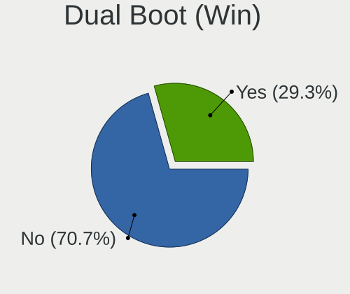

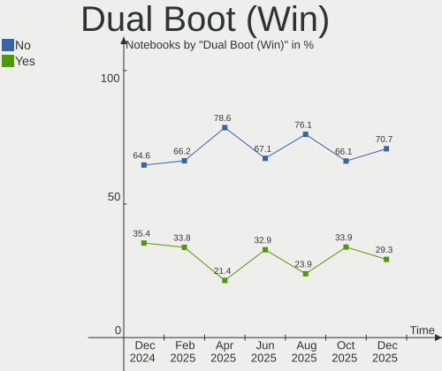

| Dual boot | Notebooks | Percent |
|-----------|-----------|---------|
| No        | 53        | 70.67%  |
| Yes       | 22        | 29.33%  |

Board
-----

Vendor
------

Motherboard manufacturer

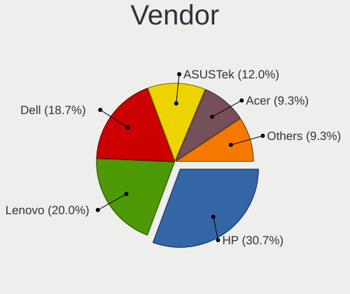

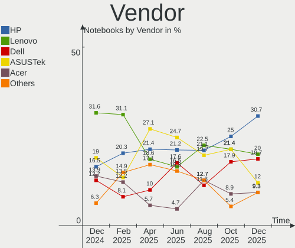

| Name                 | Notebooks | Percent |
|----------------------|-----------|---------|
| Hewlett-Packard      | 23        | 30.67%  |
| Lenovo               | 15        | 20%     |
| Dell                 | 14        | 18.67%  |
| ASUSTek Computer     | 9         | 12%     |
| Acer                 | 7         | 9.33%   |
| Infinix              | 2         | 2.67%   |
| Valve                | 1         | 1.33%   |
| TECNO Mobile Limited | 1         | 1.33%   |
| Samsung Electronics  | 1         | 1.33%   |
| MSI                  | 1         | 1.33%   |
| Alienware            | 1         | 1.33%   |

Model
-----

Motherboard model

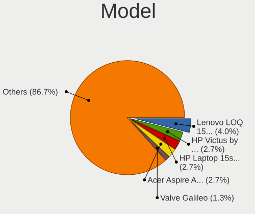

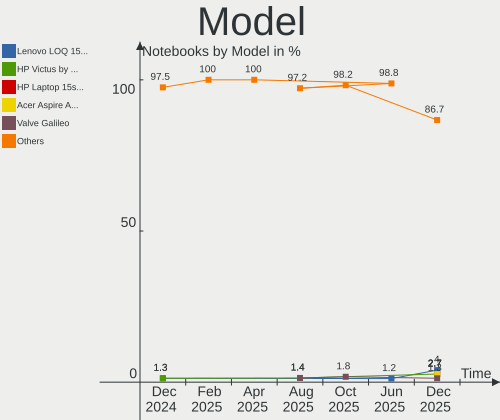

| Name                                       | Notebooks | Percent |
|--------------------------------------------|-----------|---------|
| Lenovo LOQ 15IRX9 83DV                     | 3         | 4%      |
| HP Victus by Gaming Laptop 15-fb0xxx       | 2         | 2.67%   |
| HP Laptop 15s-eq2xxx                       | 2         | 2.67%   |
| Acer Aspire A515-57G                       | 2         | 2.67%   |
| Valve Galileo                              | 1         | 1.33%   |
| TECNO Mobile Limited MEGABOOK T1 TGL       | 1         | 1.33%   |
| Samsung 750XGK                             | 1         | 1.33%   |
| MSI GF75 Thin 9SCXR                        | 1         | 1.33%   |
| Lenovo V15 G2 IJL 82QY                     | 1         | 1.33%   |
| Lenovo ThinkPad X1 Carbon Gen 8 20UAS75T0R | 1         | 1.33%   |
| Lenovo ThinkPad T560 20FJS3GD00            | 1         | 1.33%   |
| Lenovo ThinkPad T14 Gen 6 21QDCTO1WW       | 1         | 1.33%   |
| Lenovo ThinkPad E590 20NB001LUS            | 1         | 1.33%   |
| Lenovo ThinkPad E14 Gen 5 21JKS0X900       | 1         | 1.33%   |
| Lenovo LOQ 15AHP9 83DX                     | 1         | 1.33%   |
| Lenovo IdeaPad Gaming 3 15ACH6 82K2        | 1         | 1.33%   |
| Lenovo IdeaPad 320-15ISK 80XH              | 1         | 1.33%   |
| Lenovo G50-70 20351                        | 1         | 1.33%   |
| Lenovo Flex 2-14 20404                     | 1         | 1.33%   |
| Lenovo B490 20207                          | 1         | 1.33%   |
| Infinix INBOOK Y1 PLUS NEO                 | 1         | 1.33%   |
| Infinix INBOOK X1 NEO                      | 1         | 1.33%   |
| HP Victus by Gaming Laptop 15-fa1xxx       | 1         | 1.33%   |
| HP ProBook 640 G5                          | 1         | 1.33%   |
| HP Pavilion Notebook 15-bc5xxx             | 1         | 1.33%   |
| HP Pavilion Laptop 14-ce0xxx               | 1         | 1.33%   |
| HP Pavilion Gaming Laptop                  | 1         | 1.33%   |
| HP Pavilion dv6                            | 1         | 1.33%   |
| HP Pavilion 15                             | 1         | 1.33%   |
| HP OMEN by Gaming Laptop 16-xd0xxx         | 1         | 1.33%   |
| HP Laptop 15s-fq2xxx                       | 1         | 1.33%   |
| HP Laptop 15q-by0xx                        | 1         | 1.33%   |
| HP Laptop 15-fd0xxx                        | 1         | 1.33%   |
| HP Laptop 15-fc0xxx                        | 1         | 1.33%   |
| HP Laptop 15-da0xxx                        | 1         | 1.33%   |
| HP Laptop 14s-cf3xxx                       | 1         | 1.33%   |
| HP 250R 15.6 inch G9 Notebook PC           | 1         | 1.33%   |
| HP 250 G3                                  | 1         | 1.33%   |
| HP 247 G8                                  | 1         | 1.33%   |
| HP 245 G3                                  | 1         | 1.33%   |

Model Family
------------

Motherboard model prefix

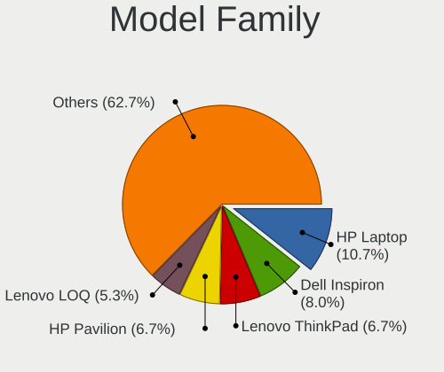

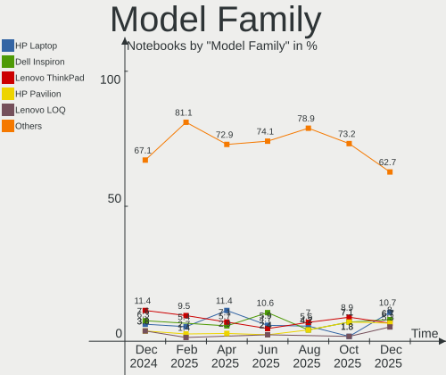

| Name                          | Notebooks | Percent |
|-------------------------------|-----------|---------|
| HP Laptop                     | 8         | 10.67%  |
| Dell Inspiron                 | 6         | 8%      |
| Lenovo ThinkPad               | 5         | 6.67%   |
| HP Pavilion                   | 5         | 6.67%   |
| Lenovo LOQ                    | 4         | 5.33%   |
| Acer Aspire                   | 4         | 5.33%   |
| HP Victus                     | 3         | 4%      |
| Dell Latitude                 | 3         | 4%      |
| ASUS ASUS                     | 3         | 4%      |
| Lenovo IdeaPad                | 2         | 2.67%   |
| Infinix INBOOK                | 2         | 2.67%   |
| ASUS VivoBook                 | 2         | 2.67%   |
| ASUS ROG                      | 2         | 2.67%   |
| Valve Galileo                 | 1         | 1.33%   |
| TECNO Mobile Limited MEGABOOK | 1         | 1.33%   |
| Samsung 750XGK                | 1         | 1.33%   |
| MSI GF75                      | 1         | 1.33%   |
| Lenovo V15                    | 1         | 1.33%   |
| Lenovo G50-70                 | 1         | 1.33%   |
| Lenovo Flex                   | 1         | 1.33%   |
| Lenovo B490                   | 1         | 1.33%   |
| HP ProBook                    | 1         | 1.33%   |
| HP OMEN                       | 1         | 1.33%   |
| HP 250R                       | 1         | 1.33%   |
| HP 250                        | 1         | 1.33%   |
| HP 247                        | 1         | 1.33%   |
| HP 245                        | 1         | 1.33%   |
| HP 15                         | 1         | 1.33%   |
| Dell XPS                      | 1         | 1.33%   |
| Dell Vostro                   | 1         | 1.33%   |
| Dell Precision                | 1         | 1.33%   |
| Dell G3                       | 1         | 1.33%   |
| Dell G15                      | 1         | 1.33%   |
| ASUS X540YA                   | 1         | 1.33%   |
| ASUS UX21E                    | 1         | 1.33%   |
| Alienware 16X                 | 1         | 1.33%   |
| Acer Swift                    | 1         | 1.33%   |
| Acer Nitro                    | 1         | 1.33%   |
| Acer 4250s                    | 1         | 1.33%   |

MFG Year
--------

Motherboard manufacture year

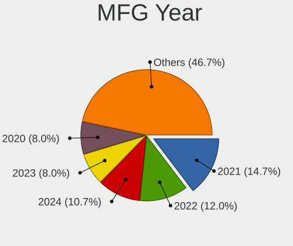

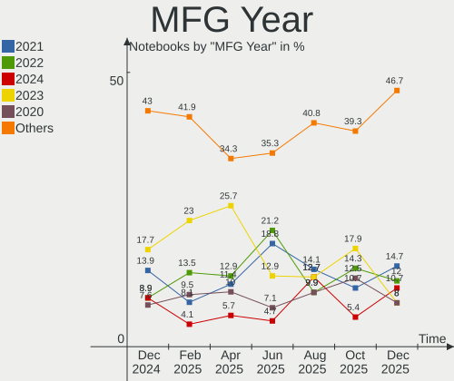

| Year | Notebooks | Percent |
|------|-----------|---------|
| 2021 | 11        | 14.67%  |
| 2022 | 9         | 12%     |
| 2024 | 8         | 10.67%  |
| 2023 | 6         | 8%      |
| 2020 | 6         | 8%      |
| 2019 | 6         | 8%      |
| 2018 | 6         | 8%      |
| 2013 | 5         | 6.67%   |
| 2016 | 4         | 5.33%   |
| 2014 | 4         | 5.33%   |
| 2025 | 3         | 4%      |
| 2017 | 3         | 4%      |
| 2011 | 2         | 2.67%   |
| 2012 | 1         | 1.33%   |
| 2008 | 1         | 1.33%   |

Form Factor
-----------

Physical design of the computer

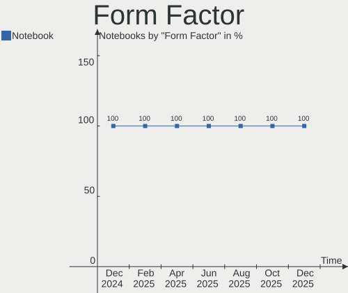

| Name     | Notebooks | Percent |
|----------|-----------|---------|
| Notebook | 75        | 100%    |

Secure Boot
-----------

Enabled or disabled

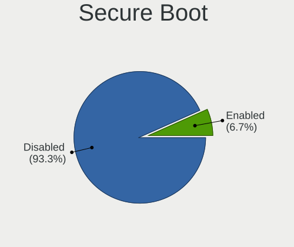

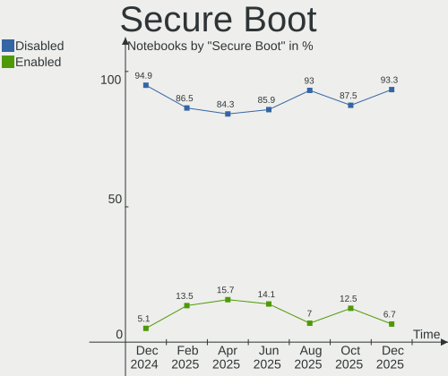

| State    | Notebooks | Percent |
|----------|-----------|---------|
| Disabled | 70        | 93.33%  |
| Enabled  | 5         | 6.67%   |

Coreboot
--------

Have coreboot on board

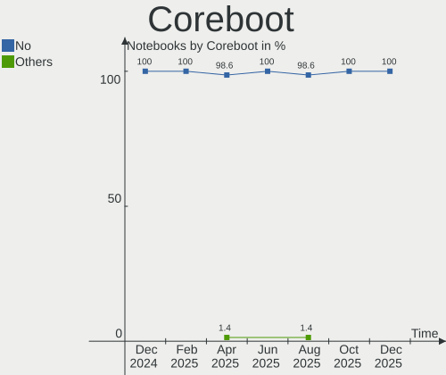

| Used | Notebooks | Percent |
|------|-----------|---------|
| No   | 75        | 100%    |

RAM Size
--------

Total RAM memory

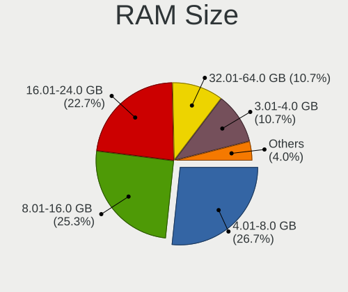

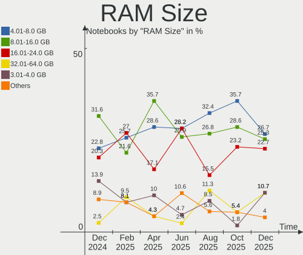

| Size in GB | Notebooks | Percent |
|------------|-----------|---------|
| 4.01-8.0   | 20        | 26.67%  |
| 8.01-16.0  | 19        | 25.33%  |
| 16.01-24.0 | 17        | 22.67%  |
| 32.01-64.0 | 8         | 10.67%  |
| 3.01-4.0   | 8         | 10.67%  |
| 24.01-32.0 | 3         | 4%      |

RAM Used
--------

Used RAM memory

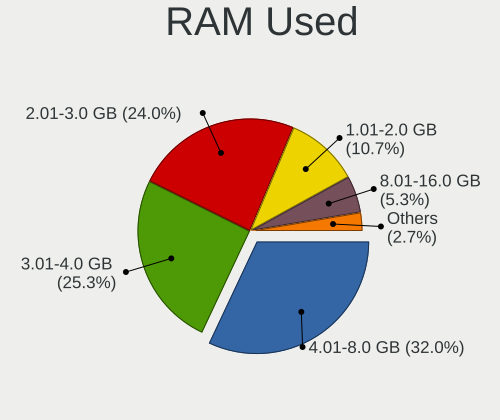

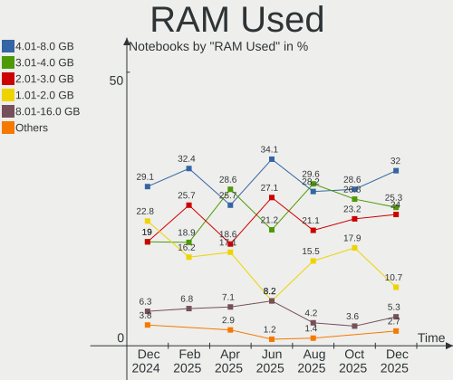

| Used GB   | Notebooks | Percent |
|-----------|-----------|---------|
| 4.01-8.0  | 24        | 32%     |
| 3.01-4.0  | 19        | 25.33%  |
| 2.01-3.0  | 18        | 24%     |
| 1.01-2.0  | 8         | 10.67%  |
| 8.01-16.0 | 4         | 5.33%   |
| 0.51-1.0  | 2         | 2.67%   |

Total Drives
------------

Number of drives on board

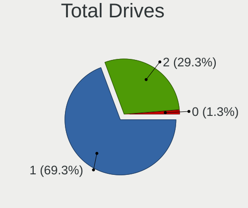

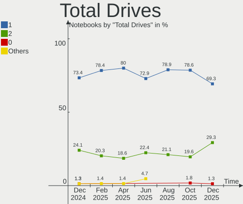

| Drives | Notebooks | Percent |
|--------|-----------|---------|
| 1      | 52        | 69.33%  |
| 2      | 22        | 29.33%  |
| 0      | 1         | 1.33%   |

Has CD-ROM
----------

Has CD-ROM on board

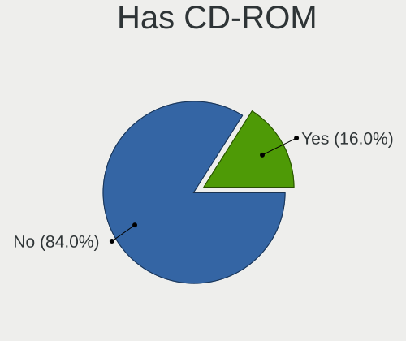

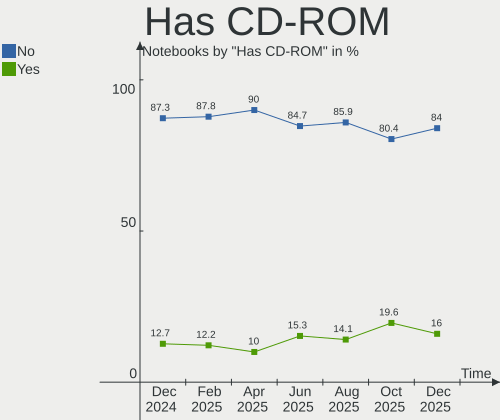

| Presented | Notebooks | Percent |
|-----------|-----------|---------|
| No        | 63        | 84%     |
| Yes       | 12        | 16%     |

Has Ethernet
------------

Has Ethernet on board

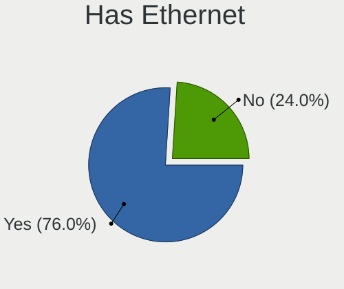

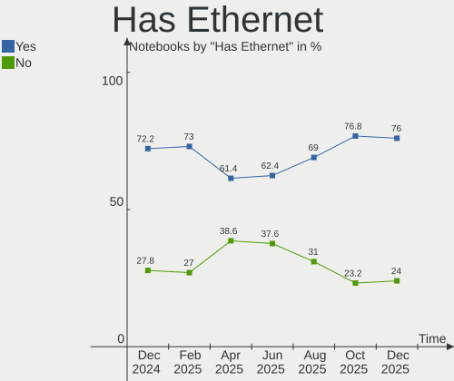

| Presented | Notebooks | Percent |
|-----------|-----------|---------|
| Yes       | 57        | 76%     |
| No        | 18        | 24%     |

Has WiFi
--------

Has WiFi module

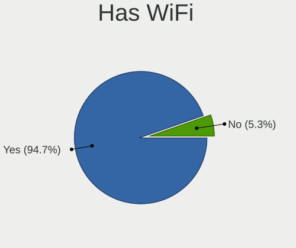

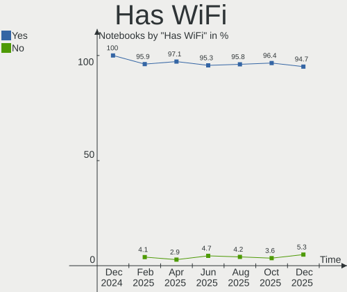

| Presented | Notebooks | Percent |
|-----------|-----------|---------|
| Yes       | 71        | 94.67%  |
| No        | 4         | 5.33%   |

Has Bluetooth
-------------

Has Bluetooth module

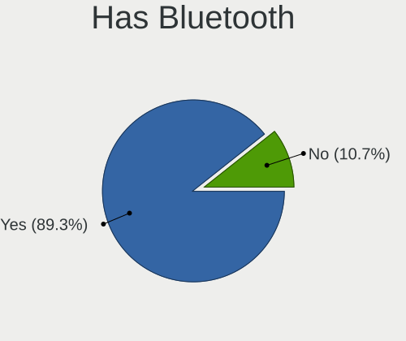

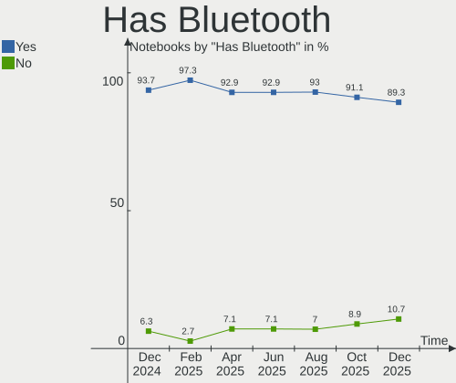

| Presented | Notebooks | Percent |
|-----------|-----------|---------|
| Yes       | 67        | 89.33%  |
| No        | 8         | 10.67%  |

Location
--------

Country
-------

Geographic location (country)

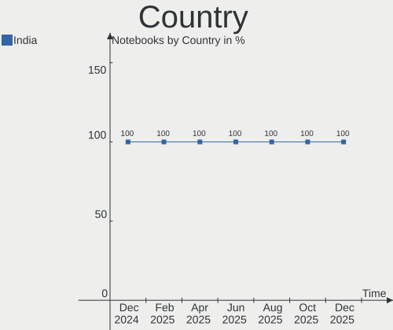

| Country | Notebooks | Percent |
|---------|-----------|---------|
| India   | 75        | 100%    |

City
----

Geographic location (city)

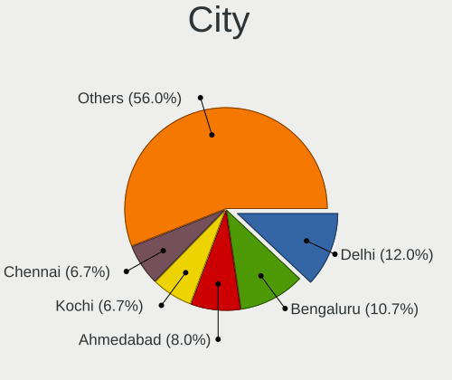

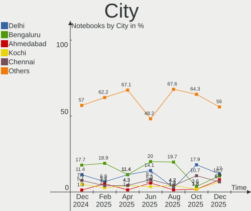

| City             | Notebooks | Percent |
|------------------|-----------|---------|
| Delhi            | 9         | 12%     |
| Bengaluru        | 8         | 10.67%  |
| Ahmedabad        | 6         | 8%      |
| Kochi            | 5         | 6.67%   |
| Chennai          | 5         | 6.67%   |
| Hyderabad        | 4         | 5.33%   |
| Bhubaneswar      | 3         | 4%      |
| Pune             | 2         | 2.67%   |
| Mumbai           | 2         | 2.67%   |
| Lucknow          | 2         | 2.67%   |
| Kolkata          | 2         | 2.67%   |
| Indore           | 2         | 2.67%   |
| Vadodara         | 1         | 1.33%   |
| Tonk             | 1         | 1.33%   |
| Thrissur         | 1         | 1.33%   |
| Thiruthani       | 1         | 1.33%   |
| Salem            | 1         | 1.33%   |
| New Delhi        | 1         | 1.33%   |
| Morādābād     | 1         | 1.33%   |
| Mansarovar       | 1         | 1.33%   |
| Malda            | 1         | 1.33%   |
| Kozhikode        | 1         | 1.33%   |
| Kota             | 1         | 1.33%   |
| Kanpur           | 1         | 1.33%   |
| Jaunpur          | 1         | 1.33%   |
| Jabalpur         | 1         | 1.33%   |
| Guwahati         | 1         | 1.33%   |
| Gurgaon          | 1         | 1.33%   |
| Guntur           | 1         | 1.33%   |
| Greater Noida    | 1         | 1.33%   |
| Electronics City | 1         | 1.33%   |
| Chandigarh       | 1         | 1.33%   |
| Bhilwara         | 1         | 1.33%   |
| Anchal           | 1         | 1.33%   |
| Amritsar         | 1         | 1.33%   |
| Agra             | 1         | 1.33%   |
| Agartala         | 1         | 1.33%   |

Drives
------

Drive Vendor
------------

Hard drive vendors

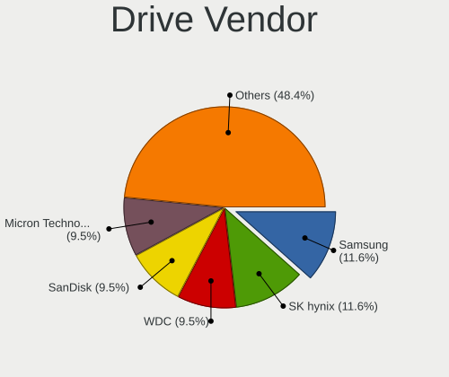

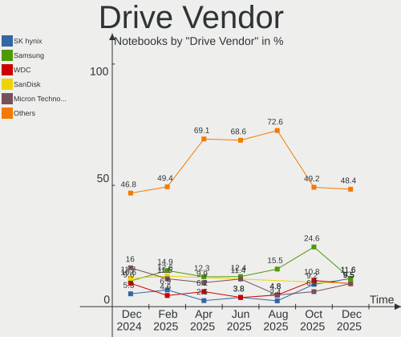

| Vendor                         | Notebooks | Drives | Percent |
|--------------------------------|-----------|--------|---------|
| SK hynix                       | 11        | 11     | 11.58%  |
| Samsung Electronics            | 11        | 11     | 11.58%  |
| WDC                            | 9         | 9      | 9.47%   |
| SanDisk                        | 9         | 10     | 9.47%   |
| Micron Technology              | 9         | 9      | 9.47%   |
| Seagate                        | 7         | 7      | 7.37%   |
| Toshiba                        | 5         | 5      | 5.26%   |
| HGST                           | 5         | 5      | 5.26%   |
| Intel                          | 4         | 5      | 4.21%   |
| CONSISTENT                     | 3         | 3      | 3.16%   |
| Silicon Motion                 | 2         | 2      | 2.11%   |
| Kingston                       | 2         | 2      | 2.11%   |
| FORESEE                        | 2         | 2      | 2.11%   |
| Crucial                        | 2         | 2      | 2.11%   |
| Unknown                        | 1         | 1      | 1.05%   |
| Solid State Storage Technology | 1         | 1      | 1.05%   |
| Simm                           | 1         | 1      | 1.05%   |
| Shenzhen Longsys Electronics   | 1         | 1      | 1.05%   |
| Realtek Semiconductor          | 1         | 1      | 1.05%   |
| Realtek                        | 1         | 1      | 1.05%   |
| Phison Electronics             | 1         | 1      | 1.05%   |
| Micron/Crucial Technology      | 1         | 1      | 1.05%   |
| MAXIO Technology (Hangzhou)    | 1         | 1      | 1.05%   |
| JMicron Technology             | 1         | 1      | 1.05%   |
| HS-SSD-E100                    | 1         | 1      | 1.05%   |
| ADATA Technology               | 1         | 1      | 1.05%   |
| A-DATA Technology              | 1         | 1      | 1.05%   |
| Unknown                        | 1         | 1      | 1.05%   |

Drive Model
-----------

Hard drive models

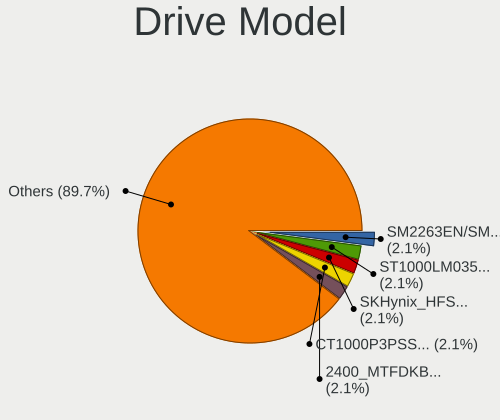

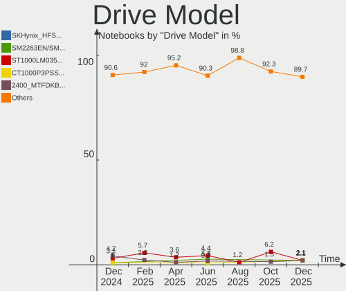

| Model                                                   | Notebooks | Percent |
|---------------------------------------------------------|-----------|---------|
| SK hynix SKHynix_HFS001TEJ4X112N 1024GB                 | 2         | 2.06%   |
| Silicon Motion SM2263EN/SM2263XT SSD Controller 512GB   | 2         | 2.06%   |
| Seagate ST1000LM035-1RK172 1TB                          | 2         | 2.06%   |
| Micron CT1000P3PSSD8 1TB                                | 2         | 2.06%   |
| Micron 2400_MTFDKBA512QFM 512GB                         | 2         | 2.06%   |
| Intel SSDPEKNU512GZH 512GB                              | 2         | 2.06%   |
| HGST HTS545050A7E680 500GB                              | 2         | 2.06%   |
| HGST HTS541010B7E610 1TB                                | 2         | 2.06%   |
| Crucial CT240BX500SSD1 240GB                            | 2         | 2.06%   |
| WDC WDS500G2B0A-00SM50 500GB                            | 1         | 1.03%   |
| WDC WDS240G2G0A-00JH30 240GB SSD                        | 1         | 1.03%   |
| WDC WD5000LPVX-22V0TT0 500GB                            | 1         | 1.03%   |
| WDC WD10SPZX-60Z10T0 1TB                                | 1         | 1.03%   |
| WDC WD10SPZX-21Z10T0 1TB                                | 1         | 1.03%   |
| WDC WD10SPCX-60KHST0 1TB                                | 1         | 1.03%   |
| WDC WD Blue SA510 2.5 250GB                             | 1         | 1.03%   |
| WDC WD Blue SA510 2.5 1000GB SSD                        | 1         | 1.03%   |
| WDC PC SN530 SDBPTPZ-1T00-1002 1TB                      | 1         | 1.03%   |
| Unknown MMC Card  250GB                                 | 1         | 1.03%   |
| Toshiba MQ04ABF100 1TB                                  | 1         | 1.03%   |
| Toshiba MQ01ACF050 500GB                                | 1         | 1.03%   |
| Toshiba MK5059GSXP 500GB                                | 1         | 1.03%   |
| Toshiba KXG50ZNV256G NVMe 256GB                         | 1         | 1.03%   |
| Toshiba KSG60ZMV256G M.2 2280 256GB SSD                 | 1         | 1.03%   |
| Solid State Storage SSSTC CL4-8D512 512GB               | 1         | 1.03%   |
| SK hynix SKHynix_HFS512GEM9X169N 512GB                  | 1         | 1.03%   |
| SK hynix SKHynix_HFS512GD9TNI-L2B0B 512GB               | 1         | 1.03%   |
| SK hynix SKHynix_HFS256GEJ4X112N 256GB                  | 1         | 1.03%   |
| SK hynix SC311 SATA 128GB SSD                           | 1         | 1.03%   |
| SK hynix PC711 HFS512GDE9X073N 512GB                    | 1         | 1.03%   |
| SK hynix BC901 NVMe Solid State Drive (DRAM-less) 512GB | 1         | 1.03%   |
| SK hynix BC901 HFS512GEJ9X108N 512GB                    | 1         | 1.03%   |
| SK hynix BC711 NVMe 512GB                               | 1         | 1.03%   |
| SK hynix BC501 NVMe Solid State Drive 512GB             | 1         | 1.03%   |
| Simm S970P PRO NVMe 256GB                               | 1         | 1.03%   |
| Shenzhen Longsys FORESEE XP1000F001T 1TB                | 1         | 1.03%   |
| Seagate ST9500423AS 500GB                               | 1         | 1.03%   |
| Seagate ST500LT012-1DG142 500GB                         | 1         | 1.03%   |
| Seagate ST320LM001 HN-M320MBB 320GB                     | 1         | 1.03%   |
| Seagate ST2000LM007-1R8174 2TB                          | 1         | 1.03%   |

HDD Vendor
----------

Hard disk drive vendors

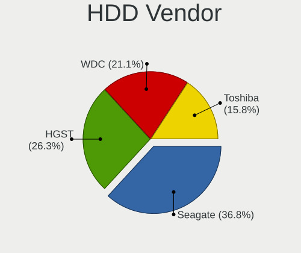

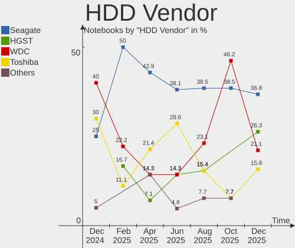

| Vendor  | Notebooks | Drives | Percent |
|---------|-----------|--------|---------|
| Seagate | 7         | 7      | 36.84%  |
| HGST    | 5         | 5      | 26.32%  |
| WDC     | 4         | 4      | 21.05%  |
| Toshiba | 3         | 3      | 15.79%  |

SSD Vendor
----------

Solid state drive vendors

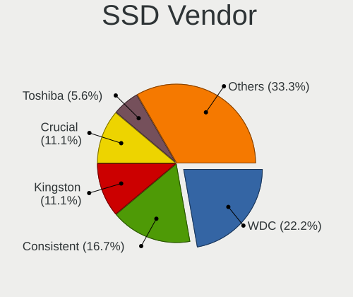

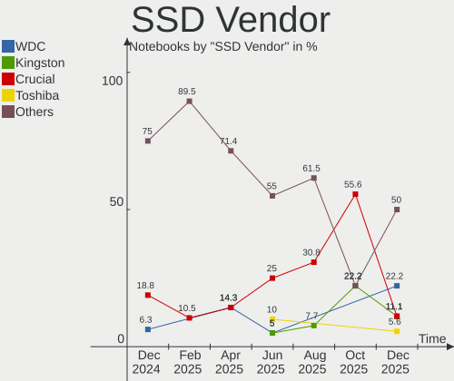

| Vendor              | Notebooks | Drives | Percent |
|---------------------|-----------|--------|---------|
| WDC                 | 4         | 4      | 22.22%  |
| Consistent          | 3         | 3      | 16.67%  |
| Kingston            | 2         | 2      | 11.11%  |
| Crucial             | 2         | 2      | 11.11%  |
| Toshiba             | 1         | 1      | 5.56%   |
| SK hynix            | 1         | 1      | 5.56%   |
| SanDisk             | 1         | 1      | 5.56%   |
| Samsung Electronics | 1         | 1      | 5.56%   |
| HS-SSD-E100         | 1         | 1      | 5.56%   |
| FORESEE             | 1         | 1      | 5.56%   |
| A-DATA Technology   | 1         | 1      | 5.56%   |

Drive Kind
----------

HDD or SSD

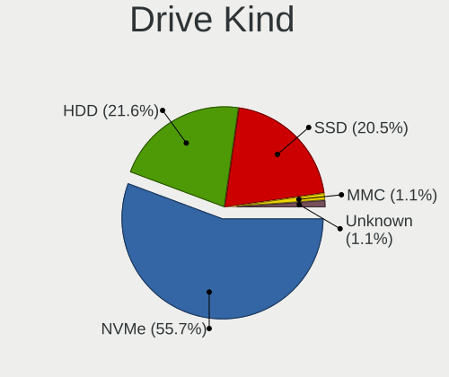

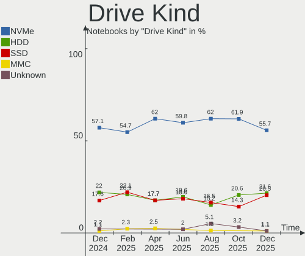

| Kind    | Notebooks | Drives | Percent |
|---------|-----------|--------|---------|
| NVMe    | 49        | 57     | 55.68%  |
| HDD     | 19        | 19     | 21.59%  |
| SSD     | 18        | 18     | 20.45%  |
| MMC     | 1         | 2      | 1.14%   |
| Unknown | 1         | 1      | 1.14%   |

Drive Connector
---------------

SATA, SAS, NVMe, etc.

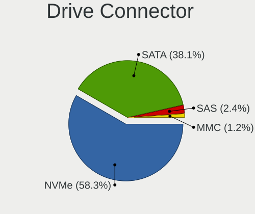

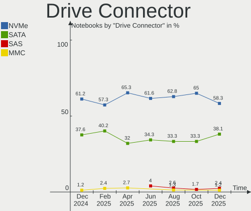

| Type | Notebooks | Drives | Percent |
|------|-----------|--------|---------|
| NVMe | 49        | 56     | 58.33%  |
| SATA | 32        | 37     | 38.1%   |
| SAS  | 2         | 2      | 2.38%   |
| MMC  | 1         | 2      | 1.19%   |

Drive Size
----------

Size of hard drive

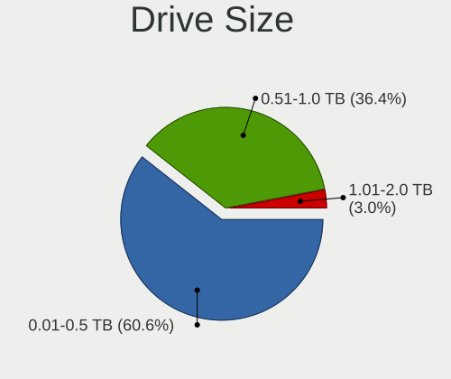

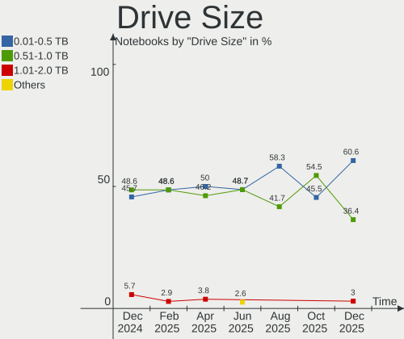

| Size in TB | Notebooks | Drives | Percent |
|------------|-----------|--------|---------|
| 0.01-0.5   | 20        | 24     | 60.61%  |
| 0.51-1.0   | 12        | 12     | 36.36%  |
| 1.01-2.0   | 1         | 1      | 3.03%   |

Space Total
-----------

Amount of disk space available on the file system

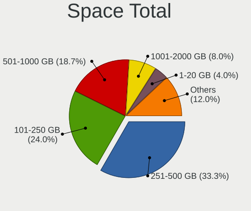

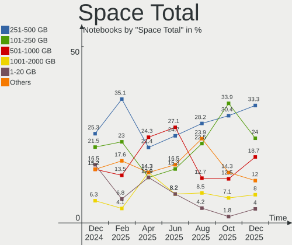

| Size in GB     | Notebooks | Percent |
|----------------|-----------|---------|
| 251-500        | 25        | 33.33%  |
| 101-250        | 18        | 24%     |
| 501-1000       | 14        | 18.67%  |
| 1001-2000      | 6         | 8%      |
| 1-20           | 3         | 4%      |
| Unknown        | 3         | 4%      |
| 21-50          | 2         | 2.67%   |
| 51-100         | 2         | 2.67%   |
| More than 3000 | 1         | 1.33%   |
| 2001-3000      | 1         | 1.33%   |

Space Used
----------

Amount of used disk space

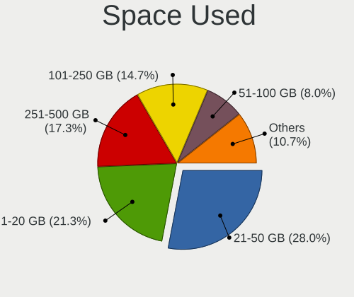

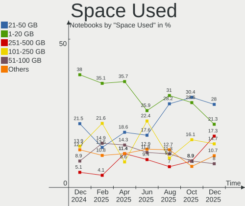

| Used GB  | Notebooks | Percent |
|----------|-----------|---------|
| 21-50    | 21        | 28%     |
| 1-20     | 16        | 21.33%  |
| 251-500  | 13        | 17.33%  |
| 101-250  | 11        | 14.67%  |
| 51-100   | 6         | 8%      |
| 501-1000 | 5         | 6.67%   |
| Unknown  | 3         | 4%      |

Malfunc. Drives
---------------

Drive models with a malfunction

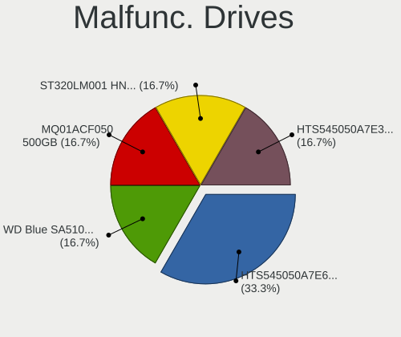

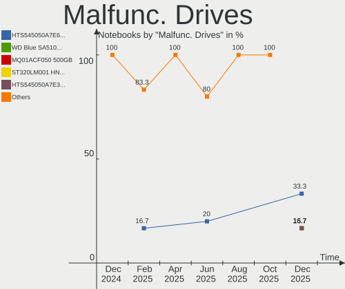

| Model                               | Notebooks | Drives | Percent |
|-------------------------------------|-----------|--------|---------|
| HGST HTS545050A7E680 500GB          | 2         | 2      | 33.33%  |
| WDC WD Blue SA510 2.5 250GB         | 1         | 1      | 16.67%  |
| Toshiba MQ01ACF050 500GB            | 1         | 1      | 16.67%  |
| Seagate ST320LM001 HN-M320MBB 320GB | 1         | 1      | 16.67%  |
| HGST HTS545050A7E380 500GB          | 1         | 1      | 16.67%  |

Malfunc. Drive Vendor
---------------------

Vendors of faulty drives

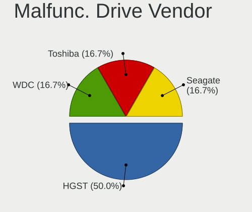

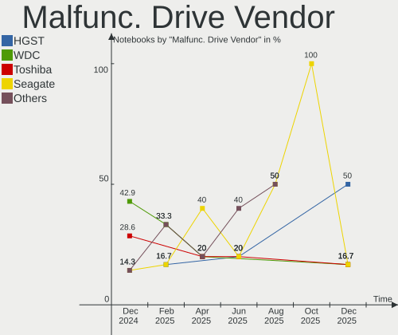

| Vendor  | Notebooks | Drives | Percent |
|---------|-----------|--------|---------|
| HGST    | 3         | 3      | 50%     |
| WDC     | 1         | 1      | 16.67%  |
| Toshiba | 1         | 1      | 16.67%  |
| Seagate | 1         | 1      | 16.67%  |

Malfunc. HDD Vendor
-------------------

Vendors of faulty HDD drives

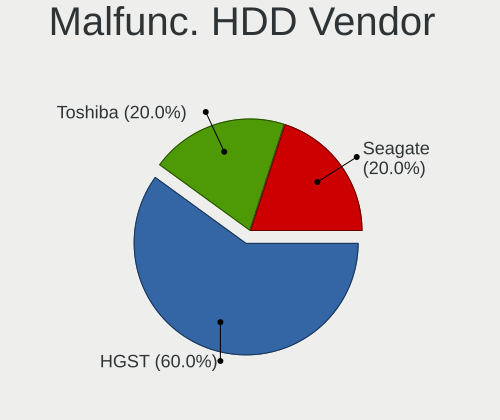

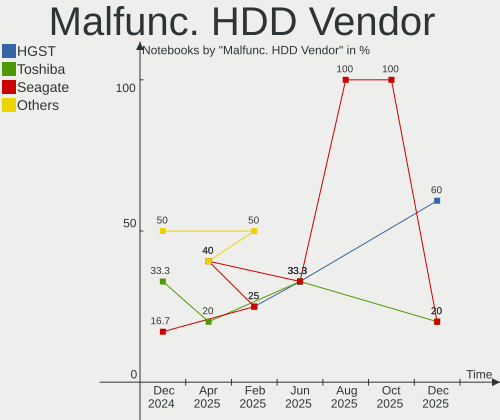

| Vendor  | Notebooks | Drives | Percent |
|---------|-----------|--------|---------|
| HGST    | 3         | 3      | 60%     |
| Toshiba | 1         | 1      | 20%     |
| Seagate | 1         | 1      | 20%     |

Malfunc. Drive Kind
-------------------

Kinds of faulty drives

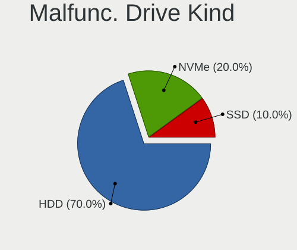

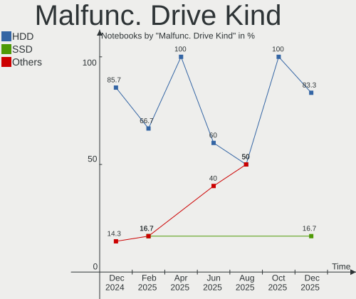

| Kind | Notebooks | Drives | Percent |
|------|-----------|--------|---------|
| HDD  | 5         | 5      | 83.33%  |
| SSD  | 1         | 1      | 16.67%  |

Failed Drives
-------------

Failed drive models

Zero info for selected period =(

Failed Drive Vendor
-------------------

Failed drive vendors

Zero info for selected period =(

Drive Status
------------

Number of failed and malfunc. drives

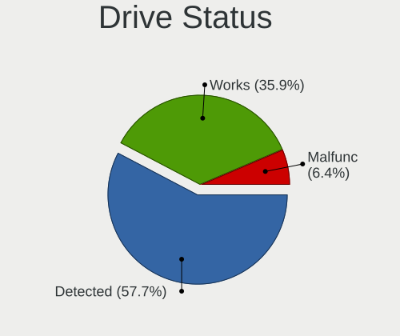

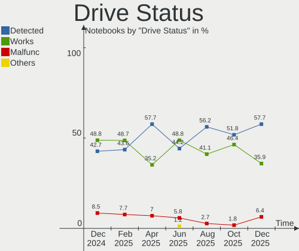

| Status   | Notebooks | Drives | Percent |
|----------|-----------|--------|---------|
| Detected | 45        | 58     | 57.69%  |
| Works    | 28        | 33     | 35.9%   |
| Malfunc  | 5         | 6      | 6.41%   |

Storage controller
------------------

Storage Vendor
--------------

Storage controller vendors

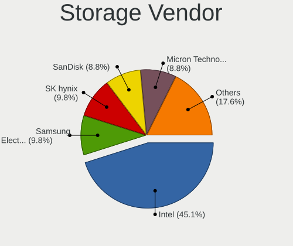

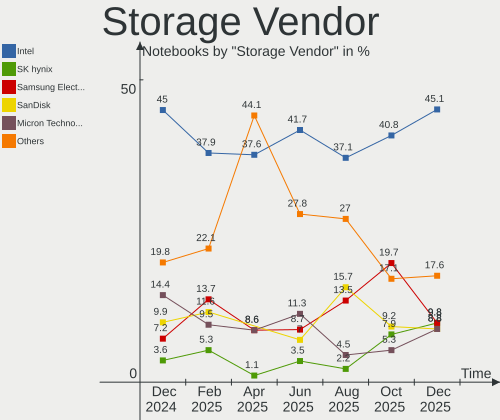

| Vendor                         | Notebooks | Percent |
|--------------------------------|-----------|---------|
| Intel                          | 46        | 45.1%   |
| SK hynix                       | 10        | 9.8%    |
| Samsung Electronics            | 10        | 9.8%    |
| SanDisk                        | 9         | 8.82%   |
| Micron Technology              | 9         | 8.82%   |
| AMD                            | 6         | 5.88%   |
| Silicon Motion                 | 2         | 1.96%   |
| Shenzhen Longsys Electronics   | 2         | 1.96%   |
| Toshiba America Info Systems   | 1         | 0.98%   |
| Solid State Storage Technology | 1         | 0.98%   |
| Realtek Semiconductor          | 1         | 0.98%   |
| Phison Electronics             | 1         | 0.98%   |
| Micron/Crucial Technology      | 1         | 0.98%   |
| MAXIO Technology (Hangzhou)    | 1         | 0.98%   |
| Hosin Global Electronics       | 1         | 0.98%   |
| ADATA Technology               | 1         | 0.98%   |

Storage Model
-------------

Storage controller models

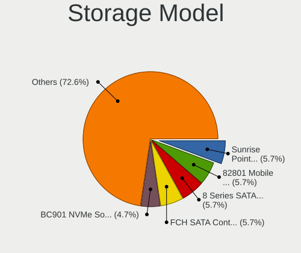

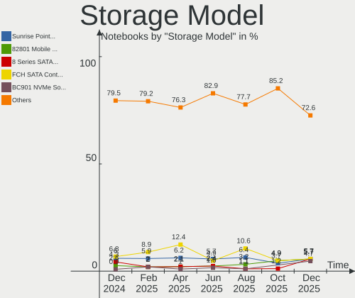

| Model                                                                                                              | Notebooks | Percent |
|--------------------------------------------------------------------------------------------------------------------|-----------|---------|
| Intel Sunrise Point-LP SATA Controller [AHCI mode]                                                                 | 6         | 5.66%   |
| Intel 82801 Mobile SATA Controller [RAID mode]                                                                     | 6         | 5.66%   |
| Intel 8 Series SATA Controller 1 [AHCI mode]                                                                       | 6         | 5.66%   |
| AMD FCH SATA Controller [AHCI mode]                                                                                | 6         | 5.66%   |
| SK hynix BC901 NVMe Solid State Drive (DRAM-less)                                                                  | 5         | 4.72%   |
| SanDisk WD SN560/SN740/SN770/SN5000 NVMe SSD                                                                       | 4         | 3.77%   |
| Intel Volume Management Device NVMe RAID Controller                                                                | 4         | 3.77%   |
| Samsung NVMe SSD Controller PM9B1 (DRAM-less)                                                                      | 3         | 2.83%   |
| Samsung NVMe SSD Controller 980 (DRAM-less)                                                                        | 3         | 2.83%   |
| Micron 2400 NVMe SSD (DRAM-less)                                                                                   | 3         | 2.83%   |
| Intel Tiger Lake-LP SATA Controller                                                                                | 3         | 2.83%   |
| Intel SSD 670p Series [Keystone Harbor]                                                                            | 3         | 2.83%   |
| Intel SATA controller                                                                                              | 3         | 2.83%   |
| Intel Jasper Lake SATA AHCI Controller                                                                             | 3         | 2.83%   |
| Intel Alder Lake-P SATA AHCI Controller                                                                            | 3         | 2.83%   |
| SK hynix Gold P31/BC711/PC711 NVMe Solid State Drive                                                               | 2         | 1.89%   |
| Silicon Motion SM2263EN/SM2263XT (DRAM-less) NVMe SSD Controllers                                                  | 2         | 1.89%   |
| Shenzhen Longsys FORESEE XP1000 / Lexar Professional CFexpress Type B Gold series, NM620 PCIe NVME SSD (DRAM-less) | 2         | 1.89%   |
| Sandisk WD PC SN740 NVMe SSD 512GB (DRAM-less)                                                                     | 2         | 1.89%   |
| SanDisk IX SN530 NVMe SSD / microSD Express Card (DRAM-less)                                                       | 2         | 1.89%   |
| Samsung NVMe SSD Controller PM9C1a (DRAM-less)                                                                     | 2         | 1.89%   |
| Micron 2550 NVMe SSD (DRAM-less)                                                                                   | 2         | 1.89%   |
| Intel Volume Management Device NVMe RAID Controller Intel Corporation                                              | 2         | 1.89%   |
| Intel Cannon Point-LP SATA Controller [AHCI Mode]                                                                  | 2         | 1.89%   |
| Intel 7 Series Chipset Family 6-port SATA Controller [AHCI mode]                                                   | 2         | 1.89%   |
| Intel 6 Series/C200 Series Chipset Family 6 port Mobile SATA AHCI Controller                                       | 2         | 1.89%   |
| Toshiba America Info Systems XG5 NVMe SSD Controller                                                               | 1         | 0.94%   |
| Solid State Storage CL4-8D512 NVMe SSD M.2 (DRAM-less)                                                             | 1         | 0.94%   |
| SK hynix PVC10 NVMe Solid State Drive (DRAM-less)                                                                  | 1         | 0.94%   |
| SK hynix PC611 NVMe Solid State Drive                                                                              | 1         | 0.94%   |
| SK hynix BC501 NVMe Solid State Drive                                                                              | 1         | 0.94%   |
| Sandisk WD_BLACK SN7100/WD PC SN7100S M.2 2280 NVMe SSD (DRAM-less)                                                | 1         | 0.94%   |
| SanDisk Ultra 3D / WD Blue SN570 NVMe SSD (DRAM-less)                                                              | 1         | 0.94%   |
| Samsung NVMe SSD Controller SM981/PM981/PM983                                                                      | 1         | 0.94%   |
| Samsung NVMe SSD Controller PM9A1/PM9A3/980PRO                                                                     | 1         | 0.94%   |
| Realtek RTS5770DL NVMe SSD Controller (DRAM-less)                                                                  | 1         | 0.94%   |
| Phison PS5013-E13 PCIe3 NVMe Controller (DRAM-less)                                                                | 1         | 0.94%   |
| Micron/Crucial P2 [Nick P2] / P3 / P3 Plus NVMe PCIe SSD (DRAM-less)                                               | 1         | 0.94%   |
| Micron 3400 NVMe SSD [Hendrix]                                                                                     | 1         | 0.94%   |
| Micron 2500 NVMe SSD (DRAM-less)                                                                                   | 1         | 0.94%   |

Storage Kind
------------

Kind of storage controller (IDE, SATA, NVMe, SAS, ...)

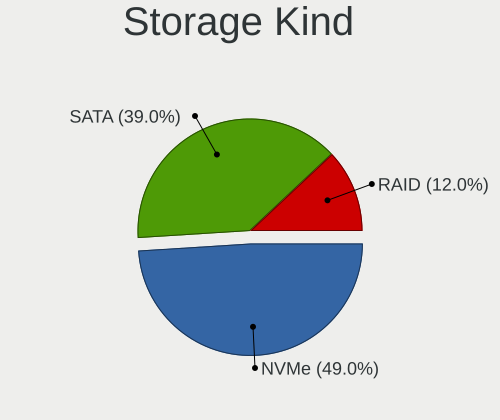

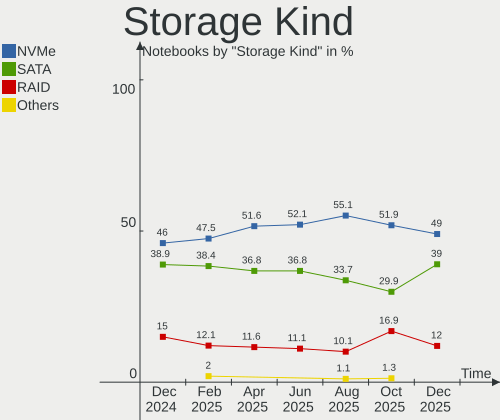

| Kind | Notebooks | Percent |
|------|-----------|---------|
| NVMe | 49        | 49%     |
| SATA | 39        | 39%     |
| RAID | 12        | 12%     |

Processor
---------

CPU Vendor
----------

Processor vendors

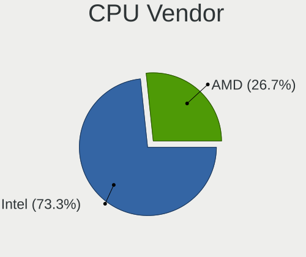

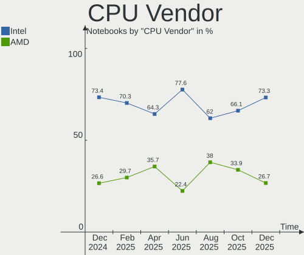

| Vendor | Notebooks | Percent |
|--------|-----------|---------|
| Intel  | 55        | 73.33%  |
| AMD    | 20        | 26.67%  |

CPU Model
---------

Processor models

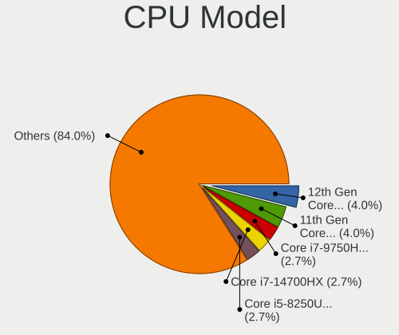

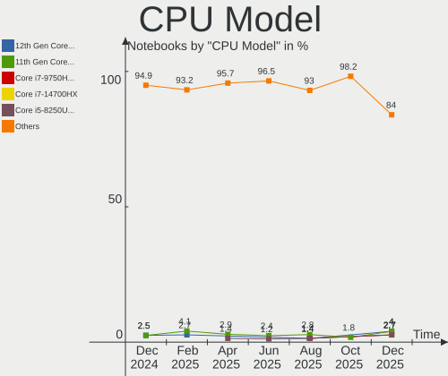

| Model                                         | Notebooks | Percent |
|-----------------------------------------------|-----------|---------|
| Intel 12th Gen Core i5-1240P                  | 3         | 4%      |
| Intel 11th Gen Core i5-1135G7 @ 2.40GHz       | 3         | 4%      |
| Intel Core i7-9750H CPU @ 2.60GHz             | 2         | 2.67%   |
| Intel Core i7-14700HX                         | 2         | 2.67%   |
| Intel Core i5-8250U CPU @ 1.60GHz             | 2         | 2.67%   |
| Intel Core i5-4210U CPU @ 1.70GHz             | 2         | 2.67%   |
| Intel Core i3-4005U CPU @ 1.70GHz             | 2         | 2.67%   |
| Intel Celeron N5100 @ 1.10GHz                 | 2         | 2.67%   |
| AMD Ryzen 5 5600H with Radeon Graphics        | 2         | 2.67%   |
| AMD Ryzen 5 3500U with Radeon Vega Mobile Gfx | 2         | 2.67%   |
| AMD Ryzen 3 5300U with Radeon Graphics        | 2         | 2.67%   |
| Intel Core Ultra 9 275HX                      | 1         | 1.33%   |
| Intel Core Ultra 7 255H                       | 1         | 1.33%   |
| Intel Core Ultra 5 225U                       | 1         | 1.33%   |
| Intel Core i7-8850H CPU @ 2.60GHz             | 1         | 1.33%   |
| Intel Core i7-8565U CPU @ 1.80GHz             | 1         | 1.33%   |
| Intel Core i7-8550U CPU @ 1.80GHz             | 1         | 1.33%   |
| Intel Core i7-7600U CPU @ 2.80GHz             | 1         | 1.33%   |
| Intel Core i5-9300H CPU @ 2.40GHz             | 1         | 1.33%   |
| Intel Core i5-8365U CPU @ 1.60GHz             | 1         | 1.33%   |
| Intel Core i5-8300H CPU @ 2.30GHz             | 1         | 1.33%   |
| Intel Core i5-7200U CPU @ 2.50GHz             | 1         | 1.33%   |
| Intel Core i5-6300U CPU @ 2.40GHz             | 1         | 1.33%   |
| Intel Core i5-4200U CPU @ 1.60GHz             | 1         | 1.33%   |
| Intel Core i5-3337U CPU @ 1.80GHz             | 1         | 1.33%   |
| Intel Core i5-2520M CPU @ 2.50GHz             | 1         | 1.33%   |
| Intel Core i5-2467M CPU @ 1.60GHz             | 1         | 1.33%   |
| Intel Core i5-10310U CPU @ 1.70GHz            | 1         | 1.33%   |
| Intel Core i3-7100U CPU @ 2.40GHz             | 1         | 1.33%   |
| Intel Core i3-7020U CPU @ 2.30GHz             | 1         | 1.33%   |
| Intel Core i3-6006U CPU @ 2.00GHz             | 1         | 1.33%   |
| Intel Core i3-4010U CPU @ 1.70GHz             | 1         | 1.33%   |
| Intel Core i3-3110M CPU @ 2.40GHz             | 1         | 1.33%   |
| Intel Core i3-1005G1 CPU @ 1.20GHz            | 1         | 1.33%   |
| Intel Core 5 120U                             | 1         | 1.33%   |
| Intel Core 2 Duo CPU T6600 @ 2.20GHz          | 1         | 1.33%   |
| Intel Celeron N4500 @ 1.10GHz                 | 1         | 1.33%   |
| Intel 13th Gen Core i5-13450HX                | 1         | 1.33%   |
| Intel 13th Gen Core i5-1335U                  | 1         | 1.33%   |
| Intel 13th Gen Core i3-1315U                  | 1         | 1.33%   |

CPU Model Family
----------------

Processor model prefix

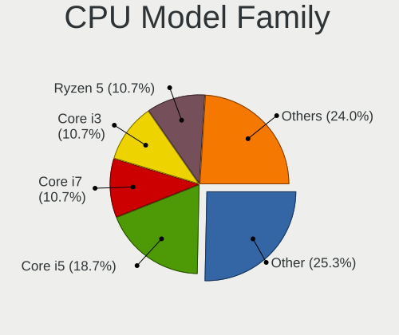

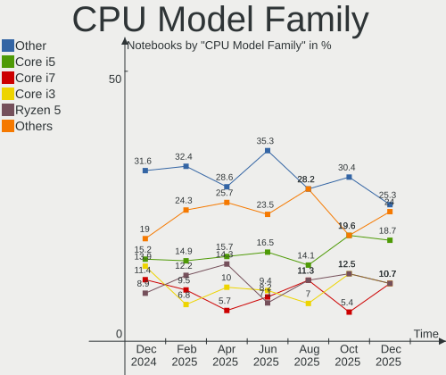

| Model            | Notebooks | Percent |
|------------------|-----------|---------|
| Other            | 19        | 25.33%  |
| Intel Core i5    | 14        | 18.67%  |
| Intel Core i7    | 8         | 10.67%  |
| Intel Core i3    | 8         | 10.67%  |
| AMD Ryzen 5      | 8         | 10.67%  |
| Intel Core       | 4         | 5.33%   |
| Intel Celeron    | 3         | 4%      |
| AMD Ryzen 7      | 3         | 4%      |
| AMD Ryzen 3      | 3         | 4%      |
| Intel Core 2 Duo | 1         | 1.33%   |
| AMD Ryzen 9      | 1         | 1.33%   |
| AMD E2           | 1         | 1.33%   |
| AMD E1           | 1         | 1.33%   |
| AMD A4           | 1         | 1.33%   |

CPU Cores
---------

Number of processor cores

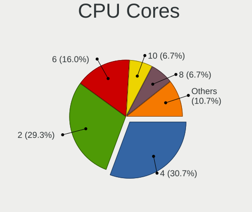

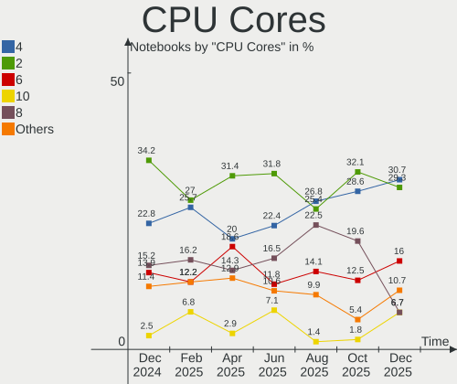

| Number | Notebooks | Percent |
|--------|-----------|---------|
| 4      | 23        | 30.67%  |
| 2      | 22        | 29.33%  |
| 6      | 12        | 16%     |
| 10     | 5         | 6.67%   |
| 8      | 5         | 6.67%   |
| 12     | 4         | 5.33%   |
| 20     | 2         | 2.67%   |
| 24     | 1         | 1.33%   |
| 16     | 1         | 1.33%   |

CPU Sockets
-----------

Number of sockets

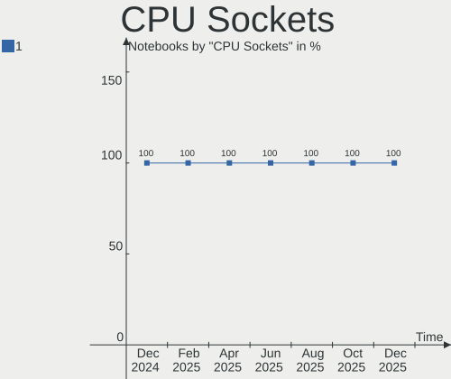

| Number | Notebooks | Percent |
|--------|-----------|---------|
| 1      | 75        | 100%    |

CPU Threads
-----------

Threads per core (Hyper-Threading)

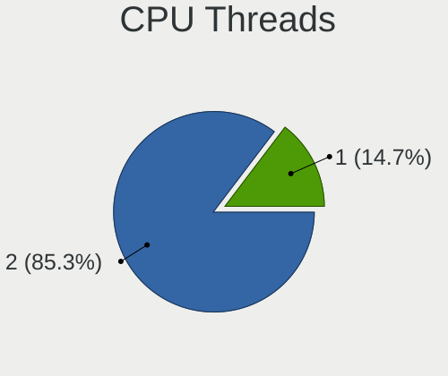

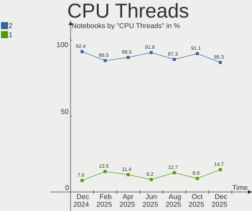

| Number | Notebooks | Percent |
|--------|-----------|---------|
| 2      | 64        | 85.33%  |
| 1      | 11        | 14.67%  |

CPU Op-Modes
------------

CPU Operation Modes (32-bit, 64-bit)

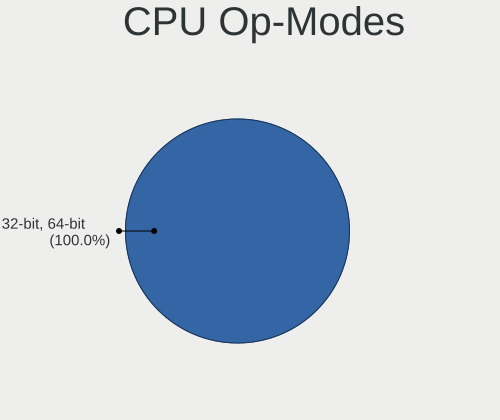

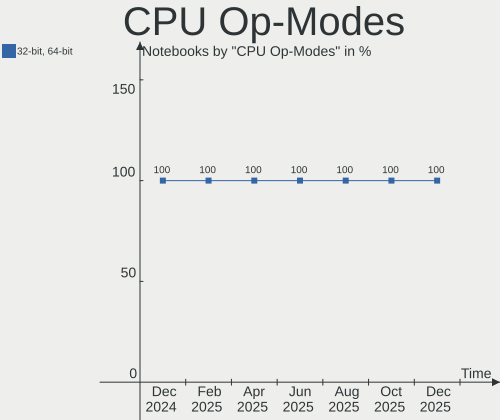

| Op mode        | Notebooks | Percent |
|----------------|-----------|---------|
| 32-bit, 64-bit | 75        | 100%    |

CPU Microcode
-------------

Microcode number

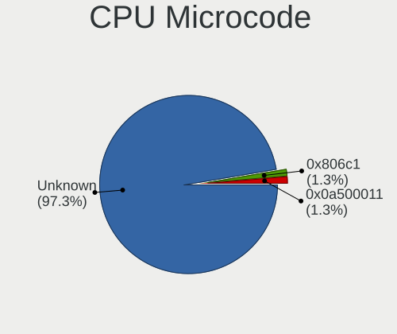

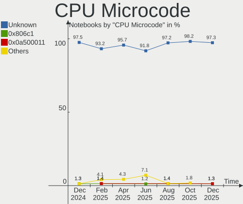

| Number     | Notebooks | Percent |
|------------|-----------|---------|
| Unknown    | 73        | 97.33%  |
| 0x806c1    | 1         | 1.33%   |
| 0x0a500011 | 1         | 1.33%   |

CPU Microarch
-------------

Microarchitecture

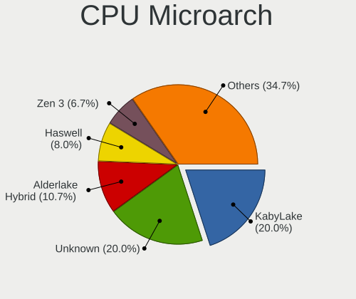

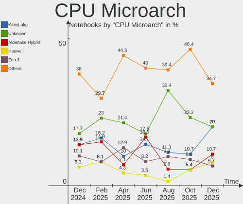

| Name             | Notebooks | Percent |
|------------------|-----------|---------|
| KabyLake         | 15        | 20%     |
| Unknown          | 15        | 20%     |
| Alderlake Hybrid | 8         | 10.67%  |
| Haswell          | 6         | 8%      |
| Zen 3            | 5         | 6.67%   |
| TigerLake        | 5         | 6.67%   |
| Tremont          | 3         | 4%      |
| Zen+             | 2         | 2.67%   |
| Zen 2            | 2         | 2.67%   |
| Skylake          | 2         | 2.67%   |
| SandyBridge      | 2         | 2.67%   |
| Puma             | 2         | 2.67%   |
| IvyBridge        | 2         | 2.67%   |
| Icelake          | 2         | 2.67%   |
| Penryn           | 1         | 1.33%   |
| Lunarlake Hybrid | 1         | 1.33%   |
| K10 Llano        | 1         | 1.33%   |
| Excavator        | 1         | 1.33%   |

Graphics
--------

GPU Vendor
----------

Vendors of graphics cards

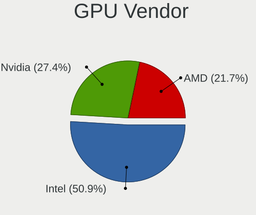

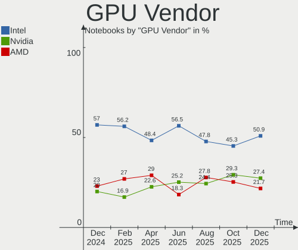

| Vendor | Notebooks | Percent |
|--------|-----------|---------|
| Intel  | 54        | 50.94%  |
| Nvidia | 29        | 27.36%  |
| AMD    | 23        | 21.7%   |

GPU Model
---------

Graphics card models

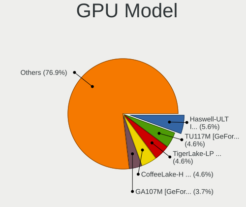

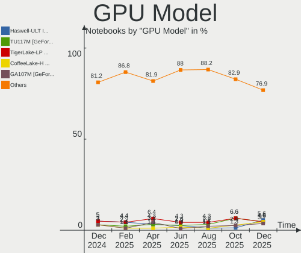

| Model                                                                         | Notebooks | Percent |
|-------------------------------------------------------------------------------|-----------|---------|
| Intel Haswell-ULT Integrated Graphics Controller                              | 6         | 5.56%   |
| Nvidia TU117M [GeForce GTX 1650 Mobile / Max-Q]                               | 5         | 4.63%   |
| Intel TigerLake-LP GT2 [Iris Xe Graphics]                                     | 5         | 4.63%   |
| Intel CoffeeLake-H GT2 [UHD Graphics 630]                                     | 5         | 4.63%   |
| Nvidia GA107M [GeForce RTX 3050 Mobile]                                       | 4         | 3.7%    |
| AMD Cezanne [Radeon Vega Series / Radeon Vega Mobile Series]                  | 4         | 3.7%    |
| Nvidia AD107M [GeForce RTX 4060 Max-Q / Mobile]                               | 3         | 2.78%   |
| Intel Raptor Lake-S UHD Graphics                                              | 3         | 2.78%   |
| Intel Kaby Lake-U GT2 [HD Graphics 620]                                       | 3         | 2.78%   |
| Intel Kaby Lake-R GT2 [UHD Graphics 620]                                      | 3         | 2.78%   |
| Intel JasperLake [UHD Graphics]                                               | 3         | 2.78%   |
| Intel Alder Lake-P GT2 [Iris Xe Graphics]                                     | 3         | 2.78%   |
| AMD Lucienne                                                                  | 3         | 2.78%   |
| Nvidia GM108M [GeForce MX130]                                                 | 2         | 1.85%   |
| Nvidia GF117M [GeForce 610M/710M/810M/820M / GT 620M/625M/630M/720M]          | 2         | 1.85%   |
| Nvidia GA107M [GeForce RTX 2050]                                              | 2         | 1.85%   |
| Nvidia GA107 [GeForce RTX 2050]                                               | 2         | 1.85%   |
| Intel WhiskeyLake-U GT2 [UHD Graphics 620]                                    | 2         | 1.85%   |
| Intel TigerLake-H GT1 [UHD Graphics]                                          | 2         | 1.85%   |
| Intel 3rd Gen Core processor Graphics Controller                              | 2         | 1.85%   |
| Intel 2nd Generation Core Processor Family Integrated Graphics Controller     | 2         | 1.85%   |
| AMD Sun XT [Radeon HD 8670A/8670M/8690M / R5 M330 / M430 / Radeon 520 Mobile] | 2         | 1.85%   |
| AMD Renoir [Radeon Vega Series / Radeon Vega Mobile Series]                   | 2         | 1.85%   |
| AMD Picasso/Raven 2 [Radeon Vega Series / Radeon Vega Mobile Series]          | 2         | 1.85%   |
| AMD Mullins [Radeon R2 Graphics]                                              | 2         | 1.85%   |
| Nvidia GP108M [GeForce MX330]                                                 | 1         | 0.93%   |
| Nvidia GP107M [GeForce GTX 1050 Mobile]                                       | 1         | 0.93%   |
| Nvidia GP107M [GeForce GTX 1050 3 GB Max-Q]                                   | 1         | 0.93%   |
| Nvidia GP107GLM [Quadro P600 Mobile]                                          | 1         | 0.93%   |
| Nvidia GM108M [GeForce 940MX]                                                 | 1         | 0.93%   |
| Nvidia GB206M [GeForce RTX 5060 Max-Q / Mobile]                               | 1         | 0.93%   |
| Nvidia GA107BM / GN20-P0-R-K2 [GeForce RTX 3050 6GB Laptop GPU]               | 1         | 0.93%   |
| Nvidia GA104 [Geforce RTX 3070 Ti Laptop GPU]                                 | 1         | 0.93%   |
| Nvidia AD107M [GeForce RTX 4050 Max-Q / Mobile]                               | 1         | 0.93%   |
| Intel Skylake-U GT2 [HD Graphics 520]                                         | 1         | 0.93%   |
| Intel Raptor Lake-U [Intel Graphics]                                          | 1         | 0.93%   |
| Intel Raptor Lake-P [UHD Graphics]                                            | 1         | 0.93%   |
| Intel Raptor Lake-P [Iris Xe Graphics]                                        | 1         | 0.93%   |
| Intel Mobile 4 Series Chipset Integrated Graphics Controller                  | 1         | 0.93%   |
| Intel Iris Plus Graphics G1 (Ice Lake)                                        | 1         | 0.93%   |

GPU Combo
---------

Combinations of graphics cards

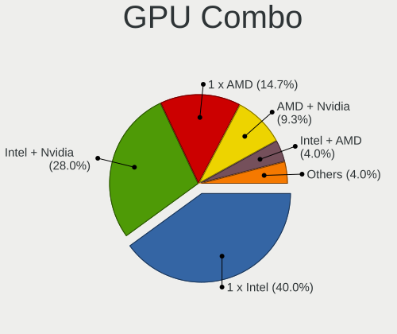

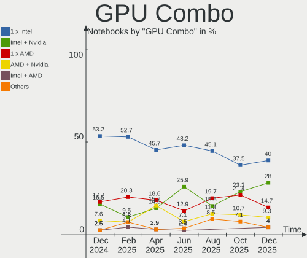

| Name           | Notebooks | Percent |
|----------------|-----------|---------|
| 1 x Intel      | 30        | 40%     |
| Intel + Nvidia | 21        | 28%     |
| 1 x AMD        | 11        | 14.67%  |
| AMD + Nvidia   | 7         | 9.33%   |
| Intel + AMD    | 3         | 4%      |
| 2 x AMD        | 2         | 2.67%   |
| 1 x Nvidia     | 1         | 1.33%   |

GPU Driver
----------

Free vs proprietary

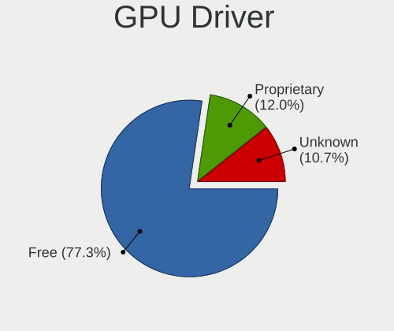

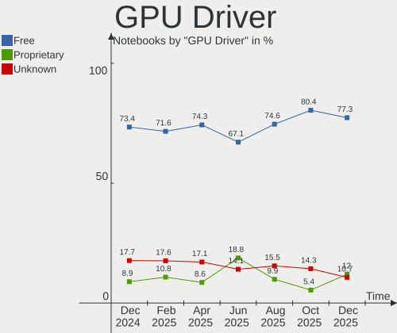

| Driver      | Notebooks | Percent |
|-------------|-----------|---------|
| Free        | 58        | 77.33%  |
| Proprietary | 9         | 12%     |
| Unknown     | 8         | 10.67%  |

GPU Memory
----------

Total video memory

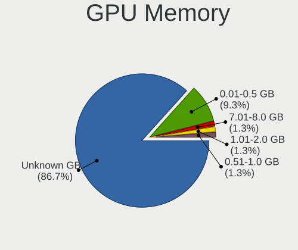

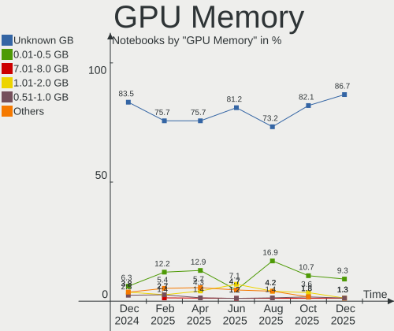

| Size in GB | Notebooks | Percent |
|------------|-----------|---------|
| Unknown    | 65        | 86.67%  |
| 0.01-0.5   | 7         | 9.33%   |
| 7.01-8.0   | 1         | 1.33%   |
| 1.01-2.0   | 1         | 1.33%   |
| 0.51-1.0   | 1         | 1.33%   |

Monitor
-------

Monitor Vendor
--------------

Monitor vendors

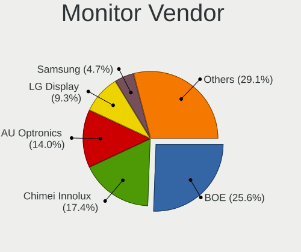

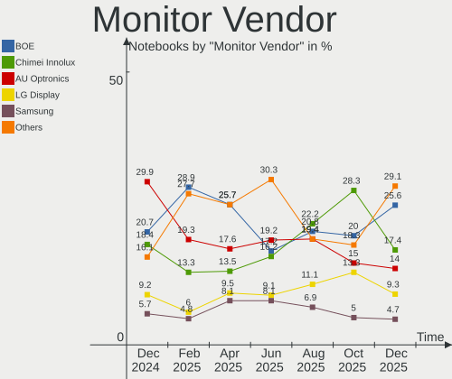

| Vendor              | Notebooks | Percent |
|---------------------|-----------|---------|
| BOE                 | 22        | 25.58%  |
| Chimei Innolux      | 15        | 17.44%  |
| AU Optronics        | 12        | 13.95%  |
| LG Display          | 8         | 9.3%    |
| Samsung Electronics | 4         | 4.65%   |
| Lenovo              | 3         | 3.49%   |
| Sharp               | 2         | 2.33%   |
| MSI                 | 2         | 2.33%   |
| HKC                 | 2         | 2.33%   |
| Dell                | 2         | 2.33%   |
| CSW                 | 2         | 2.33%   |
| BenQ                | 2         | 2.33%   |
| Acer                | 2         | 2.33%   |
| Valve               | 1         | 1.16%   |
| Unknown (XXX)       | 1         | 1.16%   |
| Unknown             | 1         | 1.16%   |
| PANDA               | 1         | 1.16%   |
| KDC                 | 1         | 1.16%   |
| Goldstar            | 1         | 1.16%   |
| CSOT                | 1         | 1.16%   |
| CPT                 | 1         | 1.16%   |

Monitor Model
-------------

Monitor models

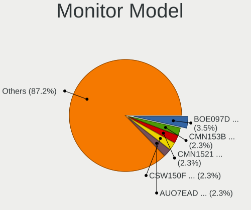

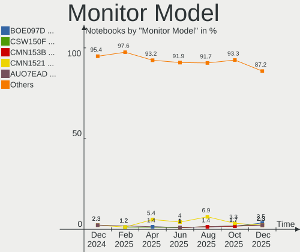

| Model                                                                 | Notebooks | Percent |
|-----------------------------------------------------------------------|-----------|---------|
| BOE LCD Monitor BOE097D 1920x1080 344x194mm 15.5-inch                 | 3         | 3.49%   |
| CSW LCD Monitor CSW150F 1920x1080 344x193mm 15.5-inch                 | 2         | 2.33%   |
| Chimei Innolux LCD Monitor CMN153B 1920x1080 344x193mm 15.5-inch      | 2         | 2.33%   |
| Chimei Innolux LCD Monitor CMN1521 1920x1080 344x193mm 15.5-inch      | 2         | 2.33%   |
| AU Optronics LCD Monitor AUO7EAD 1920x1080 344x193mm 15.5-inch        | 2         | 2.33%   |
| Valve ANX7530 U VLV3003 800x1280 100x160mm 7.4-inch                   | 1         | 1.16%   |
| Unknown LCD Monitor FFFF 2288x1287 2550x2550mm 142.0-inch             | 1         | 1.16%   |
| Unknown (XXX) Beyond TV XXX2851 3840x2160 1209x680mm 54.6-inch        | 1         | 1.16%   |
| Sharp LQ134R1JW51 SHP151B 3840x2400 288x180mm 13.4-inch               | 1         | 1.16%   |
| Sharp LCD Monitor SHP148B 3840x2160 294x165mm 13.3-inch               | 1         | 1.16%   |
| Samsung Electronics LCD Monitor SEC5441 1280x800 331x207mm 15.4-inch  | 1         | 1.16%   |
| Samsung Electronics LCD Monitor SEC454C 1366x768 309x174mm 14.0-inch  | 1         | 1.16%   |
| Samsung Electronics LCD Monitor SDC4651 1366x768 344x194mm 15.5-inch  | 1         | 1.16%   |
| Samsung Electronics LCD Monitor SDC419D 2880x1800 302x189mm 14.0-inch | 1         | 1.16%   |
| PANDA LCD Monitor NCP0029 1920x1080 344x194mm 15.5-inch               | 1         | 1.16%   |
| MSI MP273QP MSI30B6 2560x1440 600x330mm 27.0-inch                     | 1         | 1.16%   |
| MSI G274QPF E2 MSI8CC2 2560x1440 597x336mm 27.0-inch                  | 1         | 1.16%   |
| LG Display LP156WH2-TLQ1 LGD021B 1366x768 344x194mm 15.5-inch         | 1         | 1.16%   |
| LG Display LCD Monitor LGD0739 1920x1080 344x194mm 15.5-inch          | 1         | 1.16%   |
| LG Display LCD Monitor LGD05EE 2560x1440 309x174mm 14.0-inch          | 1         | 1.16%   |
| LG Display LCD Monitor LGD053F 1920x1080 344x194mm 15.5-inch          | 1         | 1.16%   |
| LG Display LCD Monitor LGD046B 1366x768 344x194mm 15.5-inch           | 1         | 1.16%   |
| LG Display LCD Monitor LGD0446 1920x1080 309x174mm 14.0-inch          | 1         | 1.16%   |
| LG Display LCD Monitor LGD03E5 1366x768 310x170mm 13.9-inch           | 1         | 1.16%   |
| LG Display LCD Monitor LGD03AB 1366x768 344x194mm 15.5-inch           | 1         | 1.16%   |
| Lenovo Q24i-1L LEN66C0 1920x1080 530x300mm 24.0-inch                  | 1         | 1.16%   |
| Lenovo LCD Monitor LEN9052 1920x1080 344x194mm 15.5-inch              | 1         | 1.16%   |
| Lenovo LCD Monitor LEN40BA 1920x1080 344x194mm 15.5-inch              | 1         | 1.16%   |
| KDC LCD Monitor KDC0422 1920x1080 309x174mm 14.0-inch                 | 1         | 1.16%   |
| HKC LCD Monitor HKC3D05 1920x1080 344x194mm 15.5-inch                 | 1         | 1.16%   |
| HKC LCD Monitor HKC36BB 1366x768 309x174mm 14.0-inch                  | 1         | 1.16%   |
| Goldstar HDR QHD GSM5B95 2560x1440 698x392mm 31.5-inch                | 1         | 1.16%   |
| Dell S2721HN DEL41F7 1920x1080 598x336mm 27.0-inch                    | 1         | 1.16%   |
| Dell P2425HE DELA26A 1920x1080 527x296mm 23.8-inch                    | 1         | 1.16%   |
| CSOT SNF601BS1-3 CSO1514 1920x1080 344x193mm 15.5-inch                | 1         | 1.16%   |
| CPT P116NWR1 R2 COR0489 1366x768 256x144mm 11.6-inch                  | 1         | 1.16%   |
| Chimei Innolux LCD Monitor CMN1629 1920x1080 355x199mm 16.0-inch      | 1         | 1.16%   |
| Chimei Innolux LCD Monitor CMN1618 1920x1200 344x215mm 16.0-inch      | 1         | 1.16%   |
| Chimei Innolux LCD Monitor CMN15E8 1920x1080 344x193mm 15.5-inch      | 1         | 1.16%   |
| Chimei Innolux LCD Monitor CMN15E7 1920x1080 344x193mm 15.5-inch      | 1         | 1.16%   |

Monitor Resolution
------------------

Monitor screen resolution

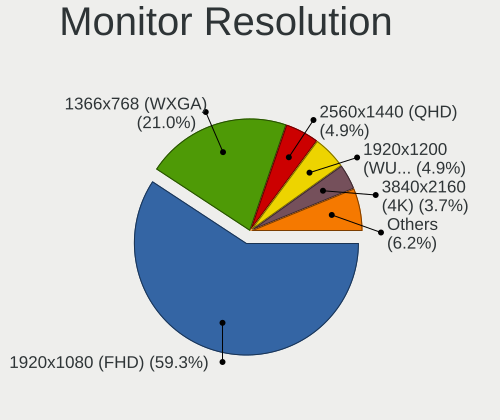

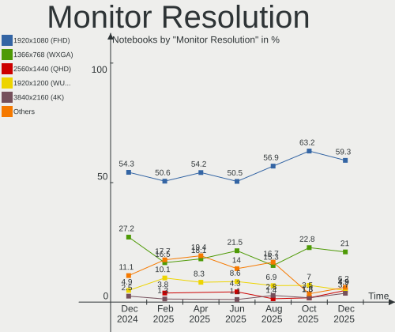

| Resolution        | Notebooks | Percent |
|-------------------|-----------|---------|
| 1920x1080 (FHD)   | 48        | 59.26%  |
| 1366x768 (WXGA)   | 17        | 20.99%  |
| 2560x1440 (QHD)   | 4         | 4.94%   |
| 1920x1200 (WUXGA) | 4         | 4.94%   |
| 3840x2160 (4K)    | 3         | 3.7%    |
| 800x1280          | 1         | 1.23%   |
| 3840x2400         | 1         | 1.23%   |
| 2880x1800         | 1         | 1.23%   |
| 2560x1600         | 1         | 1.23%   |
| 2288x1287         | 1         | 1.23%   |

Monitor Diagonal
----------------

Diagonal size in inches

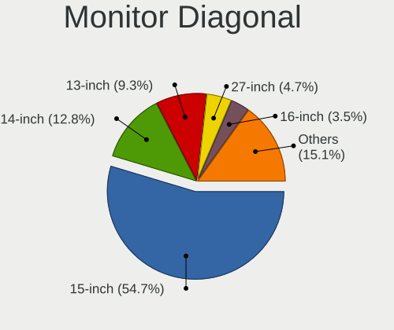

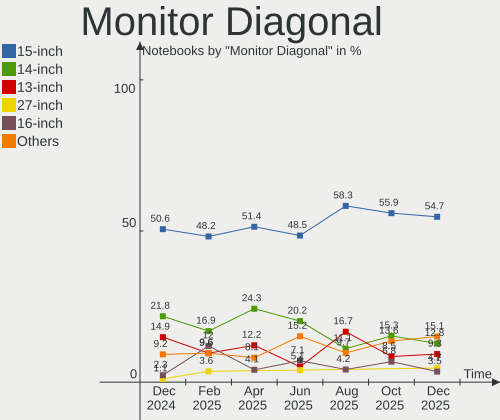

| Inches | Notebooks | Percent |
|--------|-----------|---------|
| 15     | 47        | 54.65%  |
| 14     | 11        | 12.79%  |
| 13     | 8         | 9.3%    |
| 27     | 4         | 4.65%   |
| 16     | 3         | 3.49%   |
| 24     | 2         | 2.33%   |
| 23     | 2         | 2.33%   |
| 17     | 2         | 2.33%   |
| 142    | 1         | 1.16%   |
| 63     | 1         | 1.16%   |
| 31     | 1         | 1.16%   |
| 21     | 1         | 1.16%   |
| 12     | 1         | 1.16%   |
| 11     | 1         | 1.16%   |
| 7      | 1         | 1.16%   |

Monitor Width
-------------

Physical width

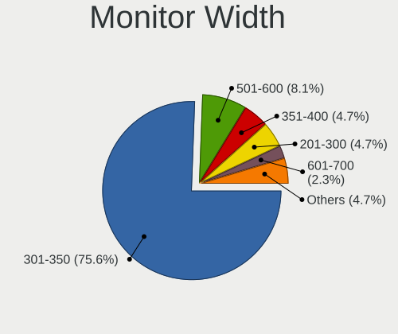

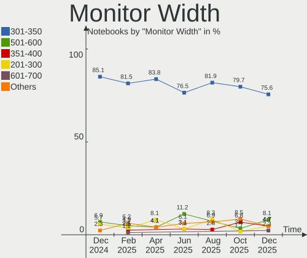

| Width in mm    | Notebooks | Percent |
|----------------|-----------|---------|
| 301-350        | 65        | 75.58%  |
| 501-600        | 7         | 8.14%   |
| 351-400        | 4         | 4.65%   |
| 201-300        | 4         | 4.65%   |
| 601-700        | 2         | 2.33%   |
| More than 2000 | 1         | 1.16%   |
| 401-500        | 1         | 1.16%   |
| 1001-1500      | 1         | 1.16%   |
| 1-100          | 1         | 1.16%   |

Aspect Ratio
------------

Proportional relationship between the width and the height

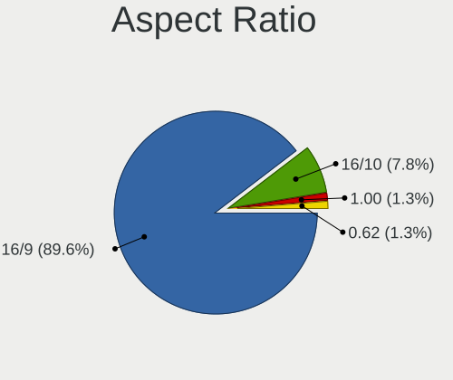

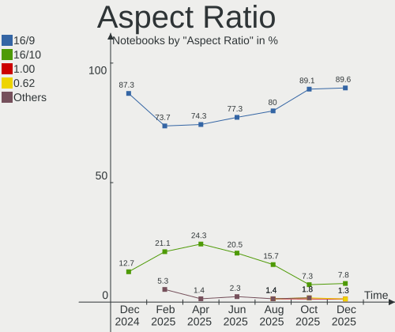

| Ratio | Notebooks | Percent |
|-------|-----------|---------|
| 16/9  | 69        | 89.61%  |
| 16/10 | 6         | 7.79%   |
| 1.00  | 1         | 1.3%    |
| 0.62  | 1         | 1.3%    |

Monitor Area
------------

Area in inch²

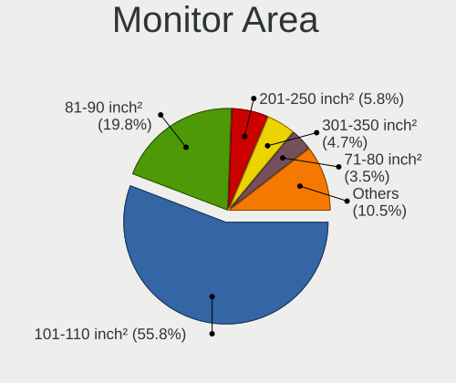

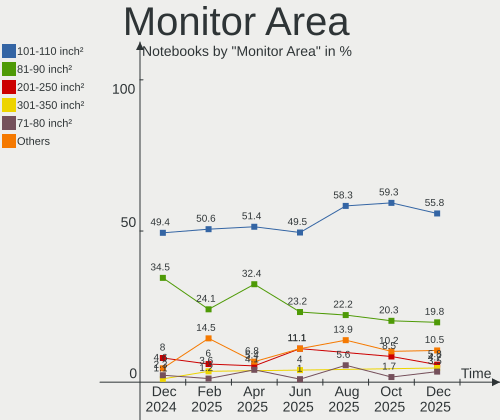

| Area in inch² | Notebooks | Percent |
|----------------|-----------|---------|
| 101-110        | 48        | 55.81%  |
| 81-90          | 17        | 19.77%  |
| 201-250        | 5         | 5.81%   |
| 301-350        | 4         | 4.65%   |
| 71-80          | 3         | 3.49%   |
| More than 1000 | 2         | 2.33%   |
| 121-130        | 2         | 2.33%   |
| 111-120        | 2         | 2.33%   |
| 51-60          | 1         | 1.16%   |
| 351-500        | 1         | 1.16%   |
| 1-40           | 1         | 1.16%   |

Pixel Density
-------------

Pixels per inch

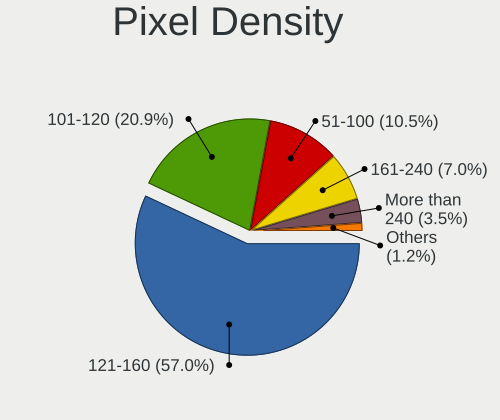

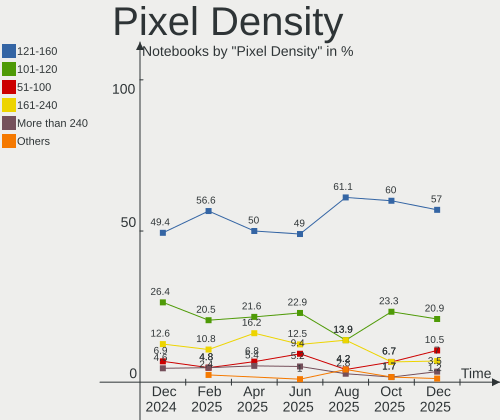

| Density       | Notebooks | Percent |
|---------------|-----------|---------|
| 121-160       | 49        | 56.98%  |
| 101-120       | 18        | 20.93%  |
| 51-100        | 9         | 10.47%  |
| 161-240       | 6         | 6.98%   |
| More than 240 | 3         | 3.49%   |
| 1-50          | 1         | 1.16%   |

Multiple Monitors
-----------------

Total monitors connected

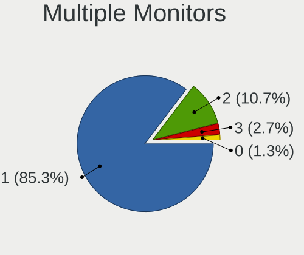

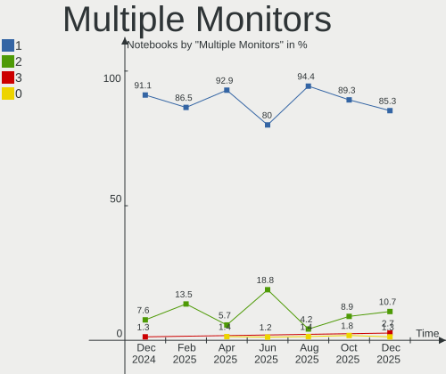

| Total | Notebooks | Percent |
|-------|-----------|---------|
| 1     | 64        | 85.33%  |
| 2     | 8         | 10.67%  |
| 3     | 2         | 2.67%   |
| 0     | 1         | 1.33%   |

Network
-------

Net Controller Vendor
---------------------

Controller vendors

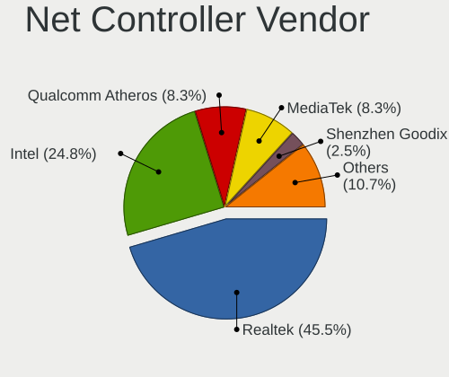

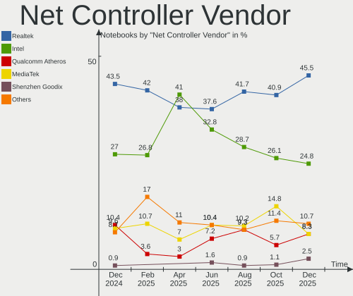

| Vendor                     | Notebooks | Percent |
|----------------------------|-----------|---------|
| Realtek Semiconductor      | 55        | 45.45%  |
| Intel                      | 30        | 24.79%  |
| Qualcomm Atheros           | 10        | 8.26%   |
| MediaTek                   | 10        | 8.26%   |
| Shenzhen Goodix Technology | 3         | 2.48%   |
| Broadcom                   | 3         | 2.48%   |
| TP-Link                    | 2         | 1.65%   |
| Ralink                     | 2         | 1.65%   |
| Samsung Electronics        | 1         | 0.83%   |
| Qualcomm                   | 1         | 0.83%   |
| OPPO Electronics           | 1         | 0.83%   |
| DisplayLink                | 1         | 0.83%   |
| ASIX Electronics           | 1         | 0.83%   |
| AMTelecom                  | 1         | 0.83%   |

Net Controller Model
--------------------

Controller models

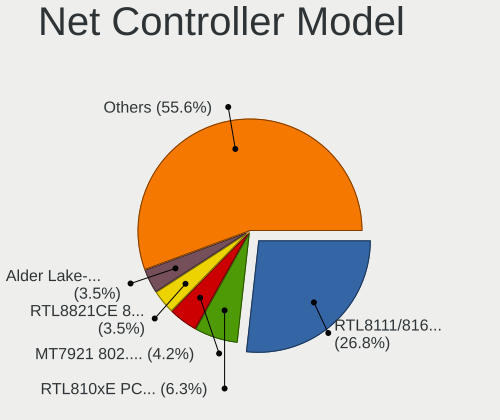

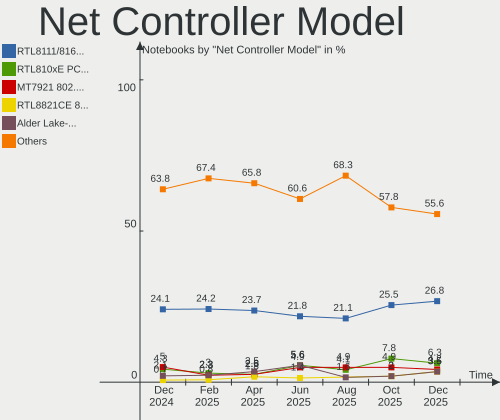

| Model                                                                           | Notebooks | Percent |
|---------------------------------------------------------------------------------|-----------|---------|
| Realtek RTL8111/8168/8211/8411 PCI Express Gigabit Ethernet Controller          | 38        | 26.76%  |
| Realtek RTL810xE PCI Express Fast Ethernet controller                           | 9         | 6.34%   |
| MediaTek MT7921 802.11ax PCIe Wireless Network Adapter [Filogic 330]            | 6         | 4.23%   |
| Realtek RTL8821CE 802.11ac PCIe Wireless Network Adapter                        | 5         | 3.52%   |
| Intel Alder Lake-P PCH CNVi WiFi                                                | 5         | 3.52%   |
| Realtek RTL8852BE PCIe 802.11ax Wireless Network Controller                     | 4         | 2.82%   |
| Qualcomm Atheros QCA9565 / AR9565 Wireless Network Adapter                      | 4         | 2.82%   |
| Intel Cannon Lake PCH CNVi WiFi                                                 | 4         | 2.82%   |
| Shenzhen Goodix Fingerprint Reader                                              | 3         | 2.11%   |
| Realtek RTL8723BE PCIe Wireless Network Adapter                                 | 3         | 2.11%   |
| Qualcomm Atheros QCA9377 802.11ac Wireless Network Adapter                      | 3         | 2.11%   |
| Intel Wi-Fi 6 AX201                                                             | 3         | 2.11%   |
| TP-Link Archer T2U PLUS [RTL8821AU]                                             | 2         | 1.41%   |
| Realtek RTL8852BE PCIe 802.11ax Wireless Network Controller [1T1R]              | 2         | 1.41%   |
| Realtek RTL8723DE Wireless Network Adapter                                      | 2         | 1.41%   |
| Ralink RT3290 Wireless 802.11n 1T/1R PCIe                                       | 2         | 1.41%   |
| Qualcomm Atheros QCA6174 802.11ac Wireless Network Adapter                      | 2         | 1.41%   |
| MediaTek MT7922 802.11ax PCI Express Wireless Network Adapter                   | 2         | 1.41%   |
| Intel Wireless 3165                                                             | 2         | 1.41%   |
| Intel Raptor Lake PCH CNVi WiFi                                                 | 2         | 1.41%   |
| Intel Jasper Lake PCH CNVi WiFi                                                 | 2         | 1.41%   |
| Intel Arrow Lake CNVi WiFi                                                      | 2         | 1.41%   |
| Samsung Galaxy series, misc. (tethering mode)                                   | 1         | 0.7%    |
| Realtek RTL8852AE 802.11ax PCIe Wireless Network Adapter                        | 1         | 0.7%    |
| Realtek RTL8822CE 802.11ac PCIe Wireless Network Adapter                        | 1         | 0.7%    |
| Realtek RTL8822BE 802.11a/b/g/n/ac WiFi adapter                                 | 1         | 0.7%    |
| Realtek RTL8192EU 802.11b/g/n WLAN Adapter                                      | 1         | 0.7%    |
| Realtek Killer E2600 GbE Controller                                             | 1         | 0.7%    |
| Realtek 802.11ac NIC                                                            | 1         | 0.7%    |
| Qualcomm QCNFA765 Wireless Network Adapter                                      | 1         | 0.7%    |
| Qualcomm Atheros AR9485 Wireless Network Adapter                                | 1         | 0.7%    |
| OPPO Ace 3V                                                                     | 1         | 0.7%    |
| MediaTek MT7925 802.11be 160MHz 2x2 PCIe Wireless Network Adapter [Filogic 360] | 1         | 0.7%    |
| MediaTek MT7902 802.11ax PCIe Wireless Network Adapter [Filogic 310]            | 1         | 0.7%    |
| Intel Wireless 8265 / 8275                                                      | 1         | 0.7%    |
| Intel Wireless 8260                                                             | 1         | 0.7%    |
| Intel Wireless 7265                                                             | 1         | 0.7%    |
| Intel Wi-Fi 6 AX200                                                             | 1         | 0.7%    |
| Intel Wi-Fi 5(802.11ac) Wireless-AC 9x6x [Thunder Peak]                         | 1         | 0.7%    |
| Intel Tiger Lake PCH CNVi WiFi                                                  | 1         | 0.7%    |

Wireless Vendor
---------------

Wireless vendors

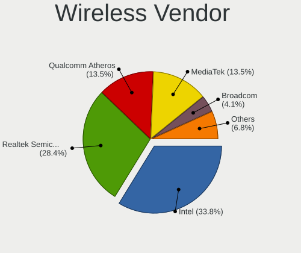

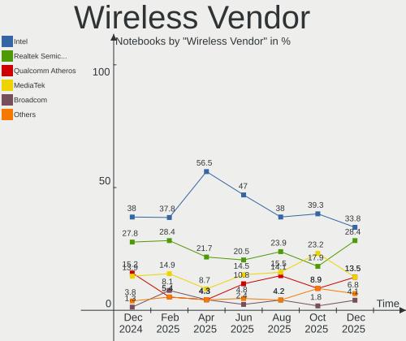

| Vendor                | Notebooks | Percent |
|-----------------------|-----------|---------|
| Intel                 | 25        | 33.78%  |
| Realtek Semiconductor | 21        | 28.38%  |
| Qualcomm Atheros      | 10        | 13.51%  |
| MediaTek              | 10        | 13.51%  |
| Broadcom              | 3         | 4.05%   |
| TP-Link               | 2         | 2.7%    |
| Ralink                | 2         | 2.7%    |
| Qualcomm              | 1         | 1.35%   |

Wireless Model
--------------

Wireless models

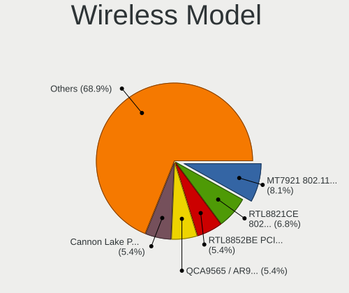

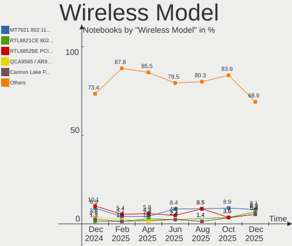

| Model                                                                           | Notebooks | Percent |
|---------------------------------------------------------------------------------|-----------|---------|
| MediaTek MT7921 802.11ax PCIe Wireless Network Adapter [Filogic 330]            | 6         | 8.11%   |
| Realtek RTL8821CE 802.11ac PCIe Wireless Network Adapter                        | 5         | 6.76%   |
| Realtek RTL8852BE PCIe 802.11ax Wireless Network Controller                     | 4         | 5.41%   |
| Qualcomm Atheros QCA9565 / AR9565 Wireless Network Adapter                      | 4         | 5.41%   |
| Intel Cannon Lake PCH CNVi WiFi                                                 | 4         | 5.41%   |
| Realtek RTL8723BE PCIe Wireless Network Adapter                                 | 3         | 4.05%   |
| Qualcomm Atheros QCA9377 802.11ac Wireless Network Adapter                      | 3         | 4.05%   |
| Intel Wi-Fi 6 AX201                                                             | 3         | 4.05%   |
| Intel Alder Lake-P PCH CNVi WiFi                                                | 3         | 4.05%   |
| TP-Link Archer T2U PLUS [RTL8821AU]                                             | 2         | 2.7%    |
| Realtek RTL8852BE PCIe 802.11ax Wireless Network Controller [1T1R]              | 2         | 2.7%    |
| Realtek RTL8723DE Wireless Network Adapter                                      | 2         | 2.7%    |
| Ralink RT3290 Wireless 802.11n 1T/1R PCIe                                       | 2         | 2.7%    |
| Qualcomm Atheros QCA6174 802.11ac Wireless Network Adapter                      | 2         | 2.7%    |
| MediaTek MT7922 802.11ax PCI Express Wireless Network Adapter                   | 2         | 2.7%    |
| Intel Wireless 3165                                                             | 2         | 2.7%    |
| Intel Jasper Lake PCH CNVi WiFi                                                 | 2         | 2.7%    |
| Realtek RTL8852AE 802.11ax PCIe Wireless Network Adapter                        | 1         | 1.35%   |
| Realtek RTL8822CE 802.11ac PCIe Wireless Network Adapter                        | 1         | 1.35%   |
| Realtek RTL8822BE 802.11a/b/g/n/ac WiFi adapter                                 | 1         | 1.35%   |
| Realtek RTL8192EU 802.11b/g/n WLAN Adapter                                      | 1         | 1.35%   |
| Realtek 802.11ac NIC                                                            | 1         | 1.35%   |
| Qualcomm QCNFA765 Wireless Network Adapter                                      | 1         | 1.35%   |
| Qualcomm Atheros AR9485 Wireless Network Adapter                                | 1         | 1.35%   |
| MediaTek MT7925 802.11be 160MHz 2x2 PCIe Wireless Network Adapter [Filogic 360] | 1         | 1.35%   |
| MediaTek MT7902 802.11ax PCIe Wireless Network Adapter [Filogic 310]            | 1         | 1.35%   |
| Intel Wireless 8265 / 8275                                                      | 1         | 1.35%   |
| Intel Wireless 8260                                                             | 1         | 1.35%   |
| Intel Wireless 7265                                                             | 1         | 1.35%   |
| Intel Wi-Fi 6 AX200                                                             | 1         | 1.35%   |
| Intel Wi-Fi 5(802.11ac) Wireless-AC 9x6x [Thunder Peak]                         | 1         | 1.35%   |
| Intel Tiger Lake PCH CNVi WiFi                                                  | 1         | 1.35%   |
| Intel Raptor Lake PCH CNVi WiFi                                                 | 1         | 1.35%   |
| Intel Comet Lake PCH-LP CNVi WiFi                                               | 1         | 1.35%   |
| Intel Cannon Point-LP CNVi [Wireless-AC]                                        | 1         | 1.35%   |
| Intel Arrow Lake CNVi WiFi                                                      | 1         | 1.35%   |
| Intel 700 Series Chipset CNVi WiFi                                              | 1         | 1.35%   |
| Broadcom BCM43142 802.11b/g/n                                                   | 1         | 1.35%   |
| Broadcom BCM4313 802.11bgn Wireless Network Adapter                             | 1         | 1.35%   |
| Broadcom BCM4312 802.11b/g LP-PHY                                               | 1         | 1.35%   |

Ethernet Vendor
---------------

Ethernet vendors

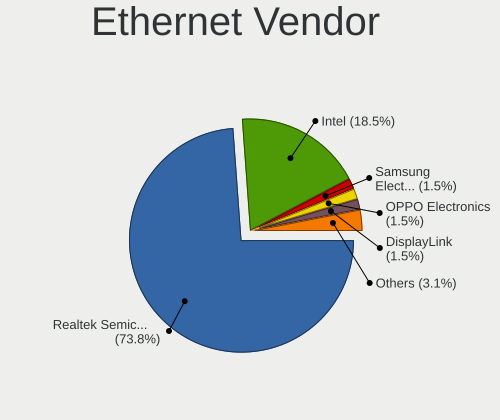

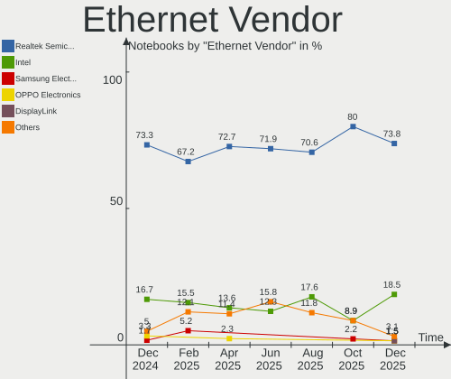

| Vendor                | Notebooks | Percent |
|-----------------------|-----------|---------|
| Realtek Semiconductor | 48        | 73.85%  |
| Intel                 | 12        | 18.46%  |
| Samsung Electronics   | 1         | 1.54%   |
| OPPO Electronics      | 1         | 1.54%   |
| DisplayLink           | 1         | 1.54%   |
| ASIX Electronics      | 1         | 1.54%   |
| AMTelecom             | 1         | 1.54%   |

Ethernet Model
--------------

Ethernet models

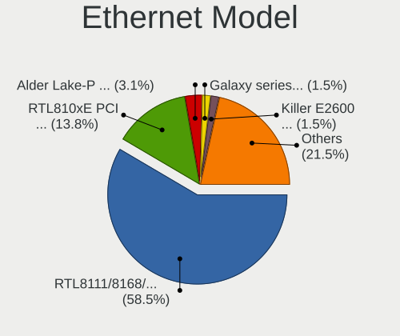

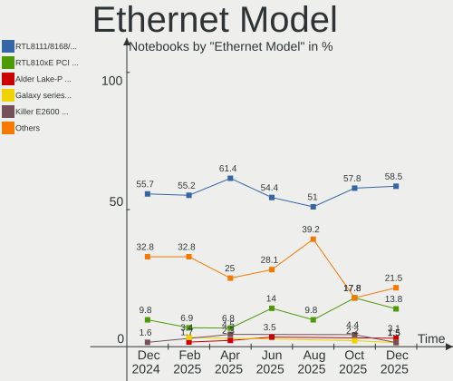

| Model                                                                  | Notebooks | Percent |
|------------------------------------------------------------------------|-----------|---------|
| Realtek RTL8111/8168/8211/8411 PCI Express Gigabit Ethernet Controller | 38        | 58.46%  |
| Realtek RTL810xE PCI Express Fast Ethernet controller                  | 9         | 13.85%  |
| Intel Alder Lake-P PCH CNVi WiFi                                       | 2         | 3.08%   |
| Samsung Galaxy series, misc. (tethering mode)                          | 1         | 1.54%   |
| Realtek Killer E2600 GbE Controller                                    | 1         | 1.54%   |
| OPPO Ace 3V                                                            | 1         | 1.54%   |
| Intel Raptor Lake PCH CNVi WiFi                                        | 1         | 1.54%   |
| Intel Ethernet Connection I219-LM                                      | 1         | 1.54%   |
| Intel Ethernet Connection (6) I219-LM                                  | 1         | 1.54%   |
| Intel Ethernet Connection (4) I219-LM                                  | 1         | 1.54%   |
| Intel Ethernet Connection (24) I219-V                                  | 1         | 1.54%   |
| Intel Ethernet Connection (23) I219-V                                  | 1         | 1.54%   |
| Intel Ethernet Connection (13) I219-LM                                 | 1         | 1.54%   |
| Intel Ethernet Connection (10) I219-LM                                 | 1         | 1.54%   |
| Intel Arrow Lake CNVi WiFi                                             | 1         | 1.54%   |
| Intel 82579LM Gigabit Network Connection (Lewisville)                  | 1         | 1.54%   |
| DisplayLink Dell Universal Dock D6000                                  | 1         | 1.54%   |
| ASIX AX88179 Gigabit Ethernet                                          | 1         | 1.54%   |
| AMTelecom JMR1140 [Jiofi]                                              | 1         | 1.54%   |

Net Controller Kind
-------------------

Ethernet, WiFi or modem

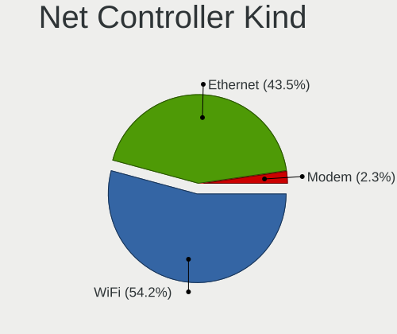

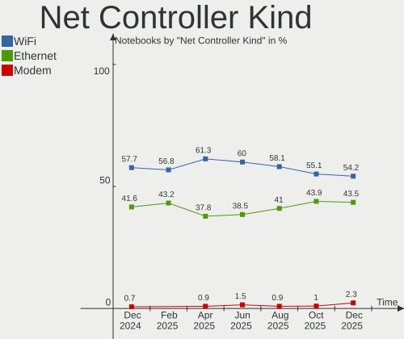

| Kind     | Notebooks | Percent |
|----------|-----------|---------|
| WiFi     | 71        | 54.2%   |
| Ethernet | 57        | 43.51%  |
| Modem    | 3         | 2.29%   |

Used Controller
---------------

Currently used network controller

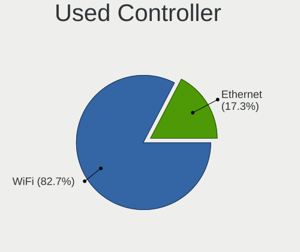

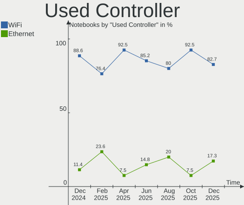

| Kind     | Notebooks | Percent |
|----------|-----------|---------|
| WiFi     | 62        | 82.67%  |
| Ethernet | 13        | 17.33%  |

NICs
----

Total network controllers on board

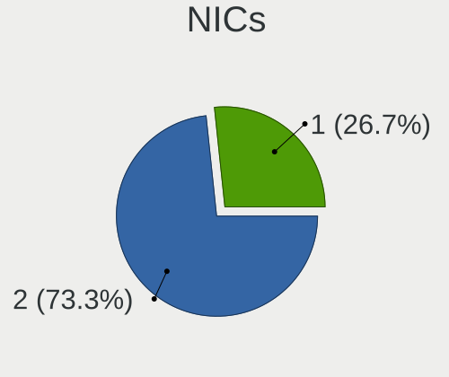

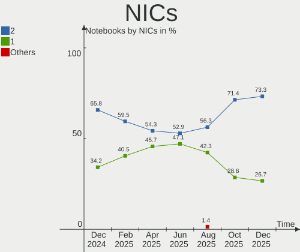

| Total | Notebooks | Percent |
|-------|-----------|---------|
| 2     | 55        | 73.33%  |
| 1     | 20        | 26.67%  |

IPv6
----

IPv6 vs IPv4

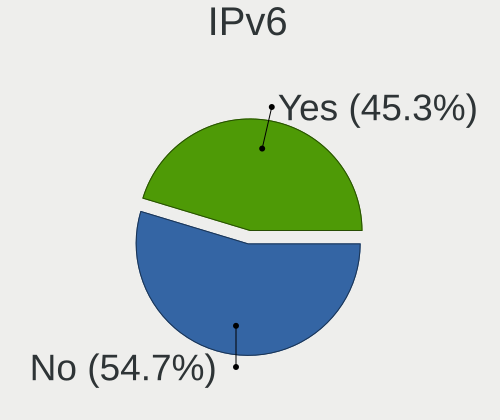

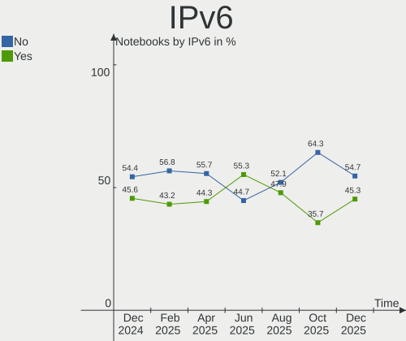

| Used | Notebooks | Percent |
|------|-----------|---------|
| No   | 41        | 54.67%  |
| Yes  | 34        | 45.33%  |

Bluetooth
---------

Bluetooth Vendor
----------------

Controller vendors

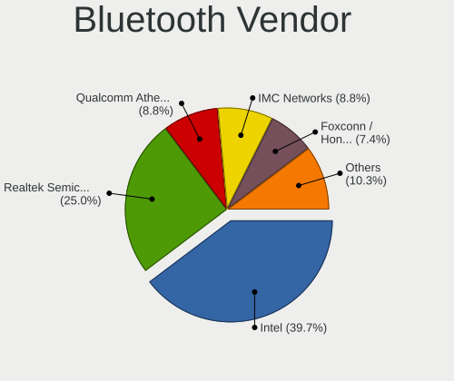

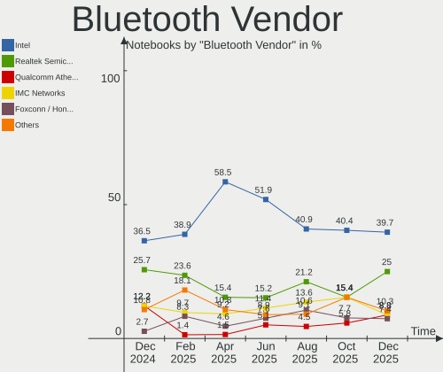

| Vendor                          | Notebooks | Percent |
|---------------------------------|-----------|---------|
| Intel                           | 27        | 39.71%  |
| Realtek Semiconductor           | 17        | 25%     |
| Qualcomm Atheros Communications | 6         | 8.82%   |
| IMC Networks                    | 6         | 8.82%   |
| Foxconn / Hon Hai               | 5         | 7.35%   |
| Ralink                          | 2         | 2.94%   |
| Lite-On Technology              | 2         | 2.94%   |
| MediaTek                        | 1         | 1.47%   |
| Chicony Electronics             | 1         | 1.47%   |
| AICSemi                         | 1         | 1.47%   |

Bluetooth Model
---------------

Controller models

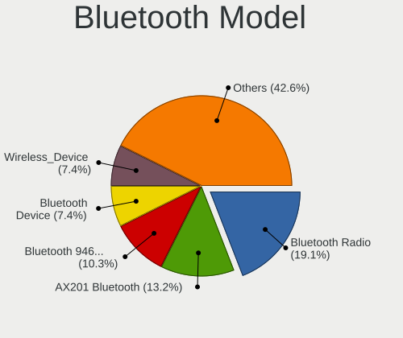

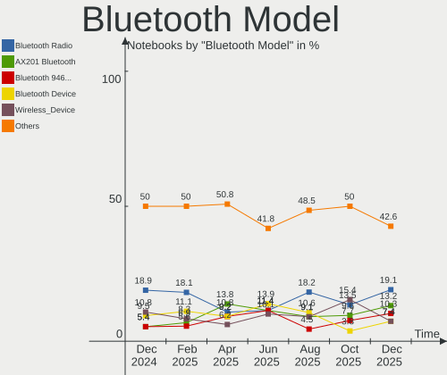

| Model                                             | Notebooks | Percent |
|---------------------------------------------------|-----------|---------|
| Realtek Bluetooth Radio                           | 13        | 19.12%  |
| Intel AX201 Bluetooth                             | 9         | 13.24%  |
| Intel Bluetooth 9460/9560 Jefferson Peak (JfP)    | 7         | 10.29%  |
| Intel Bluetooth Device                            | 5         | 7.35%   |
| IMC Networks Wireless_Device                      | 5         | 7.35%   |
| Realtek  Bluetooth 4.2 Adapter                    | 4         | 5.88%   |
| Intel Bluetooth wireless interface                | 4         | 5.88%   |
| Qualcomm Atheros  Bluetooth Device                | 3         | 4.41%   |
| Ralink RT3290 Bluetooth                           | 2         | 2.94%   |
| Qualcomm Atheros AR9462 Bluetooth                 | 2         | 2.94%   |
| Foxconn / Hon Hai Wireless_Device                 | 2         | 2.94%   |
| Foxconn / Hon Hai MediaTek Bluetooth Adapter      | 2         | 2.94%   |
| Qualcomm Atheros AR3012 Bluetooth 4.0             | 1         | 1.47%   |
| MediaTek Wireless_Device                          | 1         | 1.47%   |
| Lite-On Qualcomm Atheros QCA9377 Bluetooth        | 1         | 1.47%   |
| Lite-On Bluetooth Device                          | 1         | 1.47%   |
| Intel Wireless-AC 9260 Bluetooth Adapter          | 1         | 1.47%   |
| Intel AX200 Bluetooth                             | 1         | 1.47%   |
| IMC Networks Atheros AR3012 Bluetooth 4.0 Adapter | 1         | 1.47%   |
| Foxconn / Hon Hai Bluetooth Device                | 1         | 1.47%   |
| Chicony Bluetooth (RTL8723BE)                     | 1         | 1.47%   |
| AICSemi AIC 8800D80                               | 1         | 1.47%   |

Sound
-----

Sound Vendor
------------

Sound card vendors

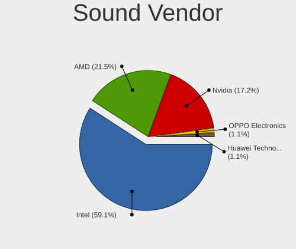

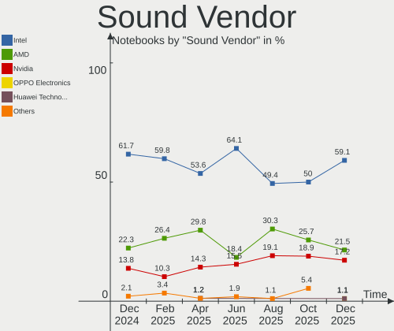

| Vendor              | Notebooks | Percent |
|---------------------|-----------|---------|
| Intel               | 55        | 59.14%  |
| AMD                 | 20        | 21.51%  |
| Nvidia              | 16        | 17.2%   |
| OPPO Electronics    | 1         | 1.08%   |
| Huawei Technologies | 1         | 1.08%   |

Sound Model
-----------

Sound card models

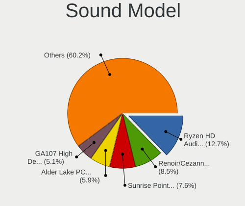

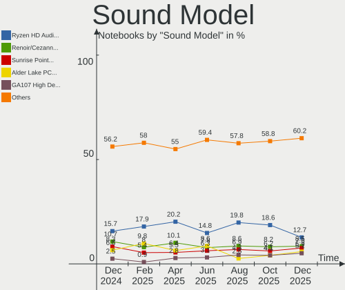

| Model                                                                      | Notebooks | Percent |
|----------------------------------------------------------------------------|-----------|---------|
| AMD Ryzen HD Audio Controller                                              | 15        | 12.71%  |
| AMD Renoir/Cezanne HDMI/DP Audio Controller                                | 10        | 8.47%   |
| Intel Sunrise Point-LP HD Audio                                            | 9         | 7.63%   |
| Intel Alder Lake PCH-P High Definition Audio Controller                    | 7         | 5.93%   |
| Nvidia GA107 High Definition Audio Controller                              | 6         | 5.08%   |
| Intel Haswell-ULT HD Audio Controller                                      | 6         | 5.08%   |
| Intel 8 Series HD Audio Controller                                         | 6         | 5.08%   |
| Intel Tiger Lake-LP Smart Sound Technology Audio Controller                | 5         | 4.24%   |
| Intel Cannon Lake PCH cAVS                                                 | 5         | 4.24%   |
| Nvidia AD107 High Definition Audio Controller                              | 4         | 3.39%   |
| Intel Raptor Lake-P/U/H cAVS                                               | 3         | 2.54%   |
| Intel Raptor Lake High Definition Audio Controller                         | 3         | 2.54%   |
| Intel Jasper Lake HD Audio                                                 | 3         | 2.54%   |
| AMD Radeon High Definition Audio Controller                                | 3         | 2.54%   |
| AMD FCH Azalia Controller                                                  | 3         | 2.54%   |
| Nvidia TU107 GeForce GTX 1650 High Definition Audio Controller             | 2         | 1.69%   |
| Nvidia GP107GL High Definition Audio Controller                            | 2         | 1.69%   |
| Intel Tiger Lake-H HD Audio Controller                                     | 2         | 1.69%   |
| Intel Cannon Point-LP High Definition Audio Controller                     | 2         | 1.69%   |
| Intel Arrow Lake cAVS                                                      | 2         | 1.69%   |
| Intel 7 Series/C216 Chipset Family High Definition Audio Controller        | 2         | 1.69%   |
| Intel 6 Series/C200 Series Chipset Family High Definition Audio Controller | 2         | 1.69%   |
| AMD Raven/Raven2/Fenghuang HDMI/DP Audio Controller                        | 2         | 1.69%   |
| AMD Kabini HDMI/DP Audio                                                   | 2         | 1.69%   |
| OPPO Electronics MH148                                                     | 1         | 0.85%   |
| Nvidia GB206 High Definition Audio Controller                              | 1         | 0.85%   |
| Nvidia GA104 High Definition Audio Controller                              | 1         | 0.85%   |
| Intel Ice Lake-LP Smart Sound Technology Audio Controller                  | 1         | 0.85%   |
| Intel Comet Lake PCH-LP cAVS                                               | 1         | 0.85%   |
| Intel 82801I (ICH9 Family) HD Audio Controller                             | 1         | 0.85%   |
| Intel 800 Series ACE (Audio Context Engine)                                | 1         | 0.85%   |
| Huawei Technologies USB-Audio-1.0                                          | 1         | 0.85%   |
| AMD Navi 21/23 HDMI/DP Audio Controller                                    | 1         | 0.85%   |
| AMD High Definition Audio Controller                                       | 1         | 0.85%   |
| AMD Family 15h (Models 60h-6fh) Audio Controller                           | 1         | 0.85%   |
| AMD BeaverCreek HDMI Audio [Radeon HD 6500D and 6400G-6600G series]        | 1         | 0.85%   |

Memory
------

Memory Vendor
-------------

Memory module vendors

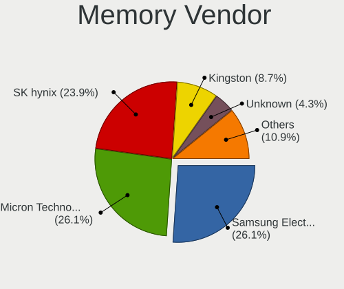

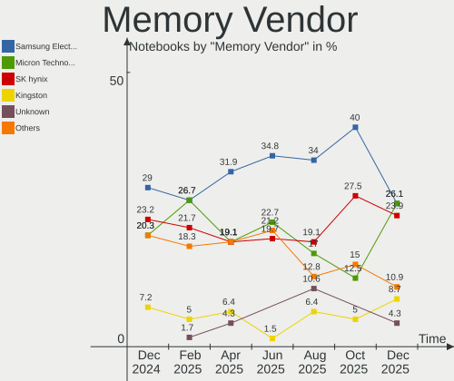

| Vendor              | Notebooks | Percent |
|---------------------|-----------|---------|
| Samsung Electronics | 12        | 26.09%  |
| Micron Technology   | 12        | 26.09%  |
| SK hynix            | 11        | 23.91%  |
| Kingston            | 4         | 8.7%    |
| Unknown             | 2         | 4.35%   |
| Unknown (0x0080)    | 1         | 2.17%   |
| Ramaxel Technology  | 1         | 2.17%   |
| Nanya Technology    | 1         | 2.17%   |
| Crucial             | 1         | 2.17%   |
| A-DATA Technology   | 1         | 2.17%   |

Memory Model
------------

Memory module models

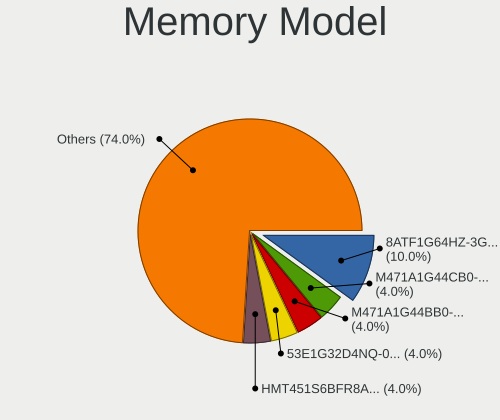

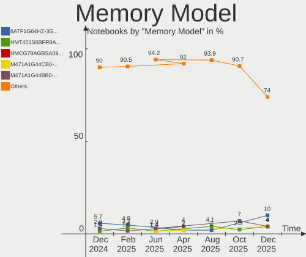

| Model                                                           | Notebooks | Percent |
|-----------------------------------------------------------------|-----------|---------|
| Micron RAM 8ATF1G64HZ-3G2R1 8GB SODIMM DDR4 3200MT/s            | 5         | 10%     |
| SK hynix RAM HMT451S6BFR8A-PB 4GB SODIMM DDR3 1600MT/s          | 2         | 4%      |
| SK hynix RAM HMCG78AGBSA092N 16GB SODIMM DDR5 5600MT/s          | 2         | 4%      |
| Samsung RAM M471A1G44CB0-CWE 8GB SODIMM DDR4 3200MT/s           | 2         | 4%      |
| Samsung RAM M471A1G44BB0-CWE 8GB SODIMM DDR4 3200MT/s           | 2         | 4%      |
| Samsung RAM 53E1G32D4NQ-046WTE 4GB Row Of Chips LPDDR4 3200MT/s | 2         | 4%      |
| Micron RAM 4ATF1G64HZ-3G2F1 8GB SODIMM DDR4 3200MT/s            | 2         | 4%      |
| Unknown                                                         | 2         | 4%      |
| Unknown (0x0080) RAM Module 16GB SODIMM DDR4 3200MT/s           | 1         | 2%      |
| SK hynix RAM HMT451S6AFR8A-PB 4GB SODIMM DDR3 1600MT/s          | 1         | 2%      |
| SK hynix RAM HMCG78AGBSA095N 16GB SODIMM DDR5 5600MT/s          | 1         | 2%      |
| SK hynix RAM HMAA1GS6CJR6N-XN 8GB SODIMM DDR4 3200MT/s          | 1         | 2%      |
| SK hynix RAM HMA851S6DJR6N-XN 4GB SODIMM DDR4 3200MT/s          | 1         | 2%      |
| SK hynix RAM HMA851S6CJR6N-UH 4GB SODIMM DDR4 2400MT/s          | 1         | 2%      |
| SK hynix RAM HMA81GS6DJR8N-VK 8GB SODIMM DDR4 2667MT/s          | 1         | 2%      |
| SK hynix RAM HMA81GS6AFR8N-VK 8GB SODIMM DDR4 2667MT/s          | 1         | 2%      |
| SK hynix RAM HMA81GS6AFR8N-UH 8GB SODIMM DDR4 3200MT/s          | 1         | 2%      |
| SK hynix RAM HMA81GS6AFR8N-UH 8GB SODIMM DDR4 2667MT/s          | 1         | 2%      |
| Samsung RAM UBE3D4AA-MGCL 2GB Row Of Chips LPDDR4 4267MT/s      | 1         | 2%      |
| Samsung RAM M471A5244CB0-CRC 4GB SODIMM DDR4 2667MT/s           | 1         | 2%      |
| Samsung RAM M471A1K43EB1-CWE 8GB SODIMM DDR4 3200MT/s           | 1         | 2%      |
| Samsung RAM M471A1K43BB1-CRC 8GB SODIMM DDR4 2667MT/s           | 1         | 2%      |
| Samsung RAM M471A1G44AB0-CWE 8GiB SODIMM DDR4 3200MT/s          | 1         | 2%      |
| Samsung RAM K4EBE304EB-EGCG 8GB Row Of Chips LPDDR3 2133MT/s    | 1         | 2%      |
| Ramaxel RAM RMT3160ME68FAF1600 8GB SODIMM DDR3 1600MT/s         | 1         | 2%      |
| Nanya RAM NT8GA64D88CX3S-JR 8GB SODIMM DDR4 3200MT/s            | 1         | 2%      |
| Micron RAM MTC8C1084S1SC56BD1 16GB SODIMM DDR5 5600MT/s         | 1         | 2%      |
| Micron RAM MTC4C10163S1SC56BD1 8GB SODIMM DDR5 5600MT/s         | 1         | 2%      |
| Micron RAM MT53E1G32D2NP-046 8GB SODIMM LPDDR4 4266MT/s         | 1         | 2%      |
| Micron RAM CB16GS3200.C8FT 16GB SODIMM DDR4 3200MT/s            | 1         | 2%      |
| Micron RAM 8ATF1G64HZ-2G6D1 8GB SODIMM DDR4 2667MT/s            | 1         | 2%      |
| Micron RAM 4ATF51264HZ-2G3B1 4GB SODIMM DDR4 3200MT/s           | 1         | 2%      |
| Kingston RAM KCDT82-MIE 4GB SODIMM DDR4 3200MT/s                | 1         | 2%      |
| Kingston RAM HP32D4S2S8MR-8 8GB SODIMM DDR4 3200MT/s            | 1         | 2%      |
| Kingston RAM HP16D3LS1KBG/4G 4GB SODIMM DDR3 1600MT/s           | 1         | 2%      |
| Kingston RAM 9905428-427.A00LF 8GB SODIMM DDR3 1600MT/s         | 1         | 2%      |
| Kingston RAM 9905428-123.A00LF 8GB SODIMM DDR3 1600MT/s         | 1         | 2%      |
| Crucial RAM CB8GS2666.C8JT 8GB SODIMM DDR4 2667MT/s             | 1         | 2%      |
| A-DATA RAM AD73I1C1674EV 4GB SODIMM DDR3 1334MT/s               | 1         | 2%      |

Memory Kind
-----------

Memory module kinds

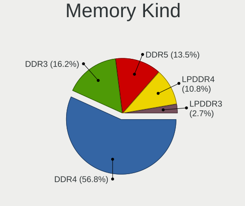

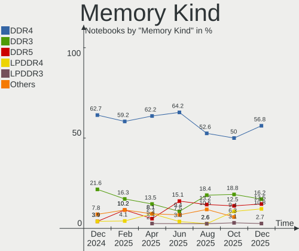

| Kind   | Notebooks | Percent |
|--------|-----------|---------|
| DDR4   | 21        | 56.76%  |
| DDR3   | 6         | 16.22%  |
| DDR5   | 5         | 13.51%  |
| LPDDR4 | 4         | 10.81%  |
| LPDDR3 | 1         | 2.7%    |

Memory Form Factor
------------------

Physical design of the memory module

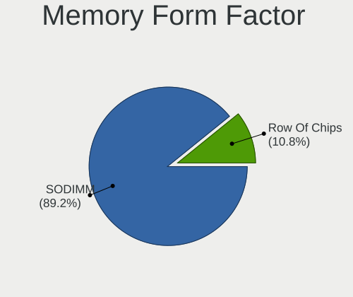

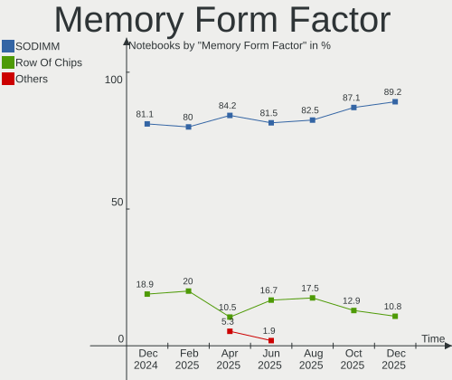

| Name         | Notebooks | Percent |
|--------------|-----------|---------|
| SODIMM       | 33        | 89.19%  |
| Row Of Chips | 4         | 10.81%  |

Memory Size
-----------

Memory module size

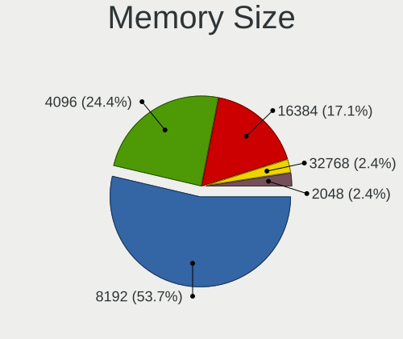

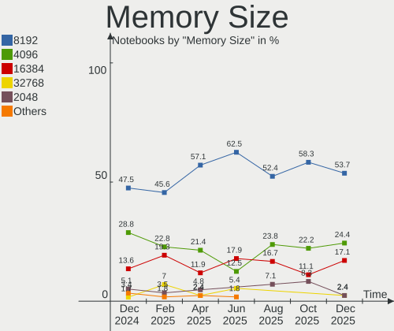

| Size  | Notebooks | Percent |
|-------|-----------|---------|
| 8192  | 22        | 53.66%  |
| 4096  | 10        | 24.39%  |
| 16384 | 7         | 17.07%  |
| 32768 | 1         | 2.44%   |
| 2048  | 1         | 2.44%   |

Memory Speed
------------

Memory module speed

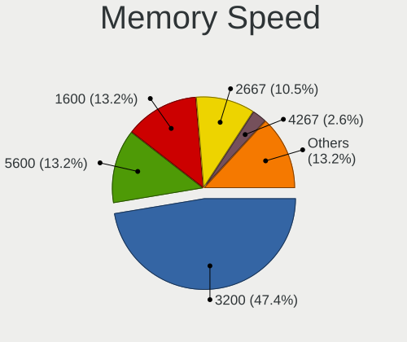

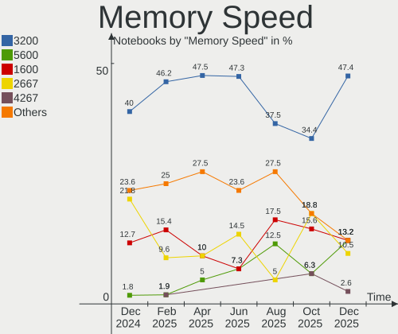

| Speed | Notebooks | Percent |
|-------|-----------|---------|
| 3200  | 18        | 47.37%  |
| 5600  | 5         | 13.16%  |
| 1600  | 5         | 13.16%  |
| 2667  | 4         | 10.53%  |
| 4267  | 1         | 2.63%   |
| 4266  | 1         | 2.63%   |
| 2400  | 1         | 2.63%   |
| 2133  | 1         | 2.63%   |
| 1334  | 1         | 2.63%   |
| 667   | 1         | 2.63%   |

Printers & scanners
-------------------

Printer Vendor
--------------

Printer device vendors

Zero info for selected period =(

Printer Model
-------------

Printer device models

Zero info for selected period =(

Scanner Vendor
--------------

Scanner device vendors

Zero info for selected period =(

Scanner Model
-------------

Scanner device models

Zero info for selected period =(

Camera
------

Camera Vendor
-------------

Camera device vendors

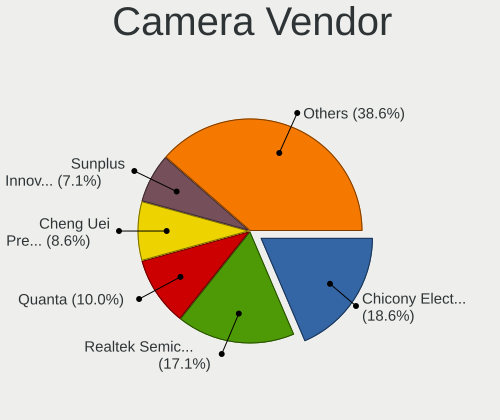

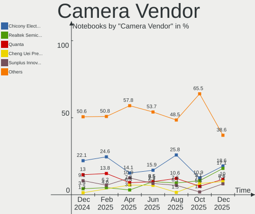

| Vendor                                 | Notebooks | Percent |
|----------------------------------------|-----------|---------|
| Chicony Electronics                    | 13        | 18.57%  |
| Realtek Semiconductor                  | 12        | 17.14%  |
| Quanta                                 | 7         | 10%     |
| Cheng Uei Precision Industry (Foxlink) | 6         | 8.57%   |
| Sunplus Innovation Technology          | 5         | 7.14%   |
| IMC Networks                           | 5         | 7.14%   |
| Luxvisions Innotech Limited            | 4         | 5.71%   |
| Bison Electronics                      | 4         | 5.71%   |
| Microdia                               | 3         | 4.29%   |
| Suyin                                  | 2         | 2.86%   |
| Sonix Technology                       | 2         | 2.86%   |
| ShineTech                              | 2         | 2.86%   |
| Syntek                                 | 1         | 1.43%   |
| SunplusIT                              | 1         | 1.43%   |
| Lenovo                                 | 1         | 1.43%   |
| Jiangxi Shinetech Optical              | 1         | 1.43%   |
| Foxlink                                | 1         | 1.43%   |

Camera Model
------------

Camera device models

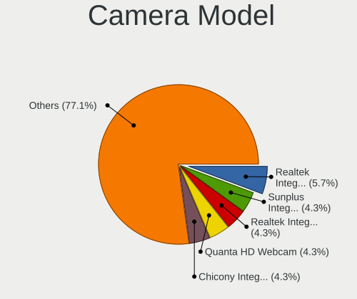

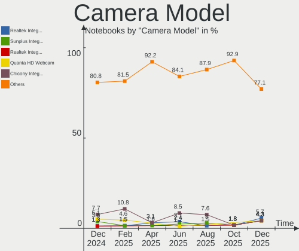

| Model                                                          | Notebooks | Percent |
|----------------------------------------------------------------|-----------|---------|
| Realtek Integrated_Webcam_HD                                   | 4         | 5.71%   |
| Sunplus Integrated_Webcam_HD                                   | 3         | 4.29%   |
| Realtek Integrated Webcam                                      | 3         | 4.29%   |
| Quanta HD Webcam                                               | 3         | 4.29%   |
| Chicony Integrated Camera                                      | 3         | 4.29%   |
| Chicony HP Wide Vision HD Camera                               | 3         | 4.29%   |
| Cheng Uei Precision Industry (Foxlink) Webcam                  | 3         | 4.29%   |
| Sonix USB2.0 HD UVC WebCam                                     | 2         | 2.86%   |
| Quanta HP True Vision FHD Camera                               | 2         | 2.86%   |
| Microdia USB 2.0 Camera                                        | 2         | 2.86%   |
| Luxvisions Innotech Limited Integrated Camera                  | 2         | 2.86%   |
| IMC Networks USB2.0 HD UVC WebCam                              | 2         | 2.86%   |
| IMC Networks Integrated Camera                                 | 2         | 2.86%   |
| Chicony HP TrueVision HD Camera                                | 2         | 2.86%   |
| Cheng Uei Precision Industry (Foxlink) HP TrueVision HD Camera | 2         | 2.86%   |
| Syntek Integrated Camera                                       | 1         | 1.43%   |
| Suyin UVC 0.3M Webcam                                          | 1         | 1.43%   |
| Suyin HP Truevision HD                                         | 1         | 1.43%   |
| SunplusIT USB Camera                                           | 1         | 1.43%   |
| Sunplus Laptop_Integrated_Webcam_HD                            | 1         | 1.43%   |
| Sunplus HP TrueVision HD Camera                                | 1         | 1.43%   |
| ShineTech USB2.0 HD UVC WebCam                                 | 1         | 1.43%   |
| Shinetech USB2.0 FHD UVC WebCam                                | 1         | 1.43%   |
| Realtek Lenovo EasyCamera                                      | 1         | 1.43%   |
| Realtek Integrated_Webcam_FHD                                  | 1         | 1.43%   |
| Realtek Integrated Webcam HD                                   | 1         | 1.43%   |
| Realtek HD WebCam                                              | 1         | 1.43%   |
| Realtek EasyCamera                                             | 1         | 1.43%   |
| Quanta HP Wide Vision HD Camera                                | 1         | 1.43%   |
| Quanta HP TrueVision HD Camera                                 | 1         | 1.43%   |
| Microdia Integrated_Webcam_HD                                  | 1         | 1.43%   |
| Luxvisions Innotech Limited HP Wide Vision HD Camera           | 1         | 1.43%   |
| Luxvisions Innotech Limited HP TrueVision HD Camera            | 1         | 1.43%   |
| Lenovo Lenovo FHD Webcam Audio                                 | 1         | 1.43%   |
| Jiangxi Shinetech Optical 720p HD Camera                       | 1         | 1.43%   |
| IMC Networks USB2.0 VGA UVC WebCam                             | 1         | 1.43%   |
| Foxlink HP True Vision FHD Camera                              | 1         | 1.43%   |
| Chicony Integrated Camera (1280x720@30)                        | 1         | 1.43%   |
| Chicony HP Wide Vision HD                                      | 1         | 1.43%   |
| Chicony HP HD Camera                                           | 1         | 1.43%   |

Security
--------

Fingerprint Vendor
------------------

Fingerprint sensor vendors

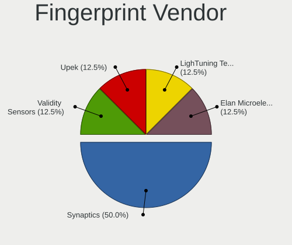

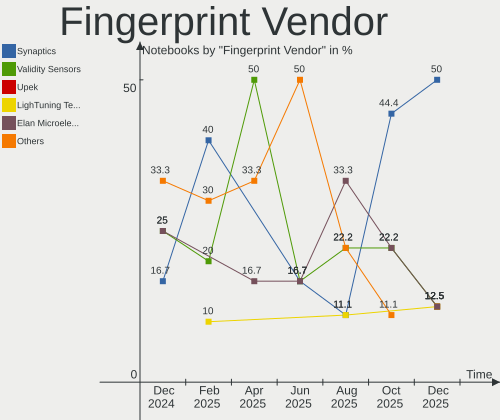

| Vendor                | Notebooks | Percent |
|-----------------------|-----------|---------|
| Synaptics             | 4         | 50%     |
| Validity Sensors      | 1         | 12.5%   |
| Upek                  | 1         | 12.5%   |
| LighTuning Technology | 1         | 12.5%   |
| Elan Microelectronics | 1         | 12.5%   |

Fingerprint Model
-----------------

Fingerprint sensor models

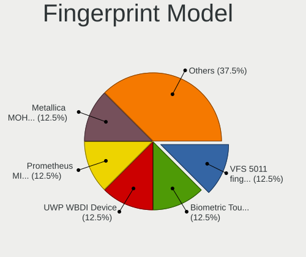

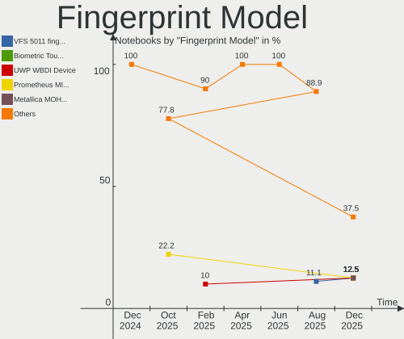

| Model                                                  | Notebooks | Percent |
|--------------------------------------------------------|-----------|---------|
| Validity Sensors VFS 5011 fingerprint sensor           | 1         | 12.5%   |
| Upek Biometric Touchchip/Touchstrip Fingerprint Sensor | 1         | 12.5%   |
| Synaptics UWP WBDI Device                              | 1         | 12.5%   |
| Synaptics Prometheus MIS Touch Fingerprint Reader      | 1         | 12.5%   |
| Synaptics Metallica MOH Touch Fingerprint Reader       | 1         | 12.5%   |
| Synaptics Fingerprint reader [HP G6]                   | 1         | 12.5%   |
| LighTuning EgisTec Touch Fingerprint Sensor            | 1         | 12.5%   |
| Elan ELAN:ARM-M4                                       | 1         | 12.5%   |

Chipcard Vendor
---------------

Chipcard module vendors

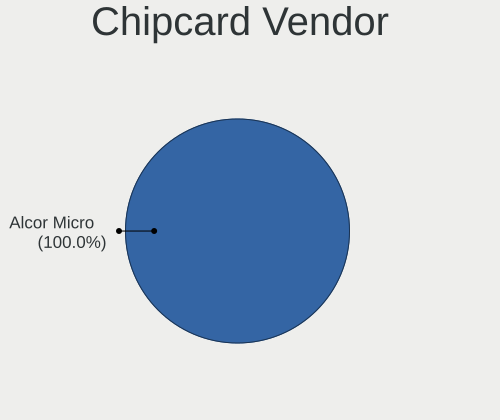

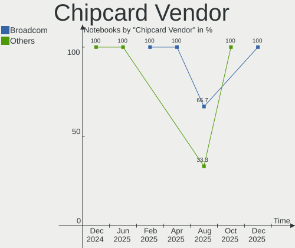

| Vendor   | Notebooks | Percent |
|----------|-----------|---------|
| Broadcom | 2         | 100%    |

Chipcard Model
--------------

Chipcard module models

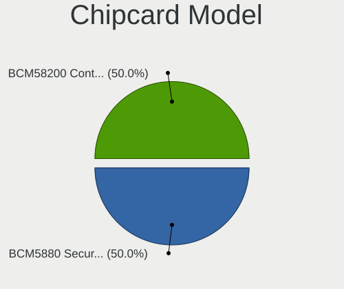

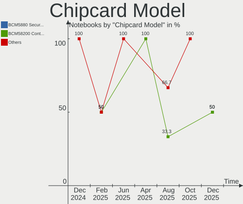

| Model                                                                       | Notebooks | Percent |
|-----------------------------------------------------------------------------|-----------|---------|
| Broadcom BCM5880 Secure Applications Processor                              | 1         | 50%     |
| Broadcom BCM58200 ControlVault 3 (FingerPrint sensor + Contacted SmartCard) | 1         | 50%     |

Unsupported
-----------

Unsupported Devices
-------------------

Total unsupported devices on board

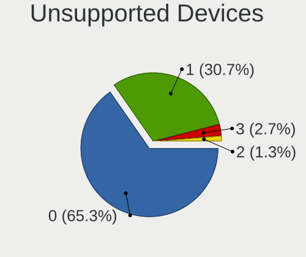

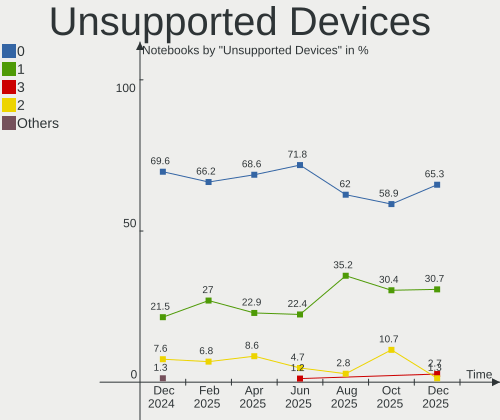

| Total | Notebooks | Percent |
|-------|-----------|---------|
| 0     | 49        | 65.33%  |
| 1     | 23        | 30.67%  |
| 3     | 2         | 2.67%   |
| 2     | 1         | 1.33%   |

Unsupported Device Types
------------------------

Types of unsupported devices

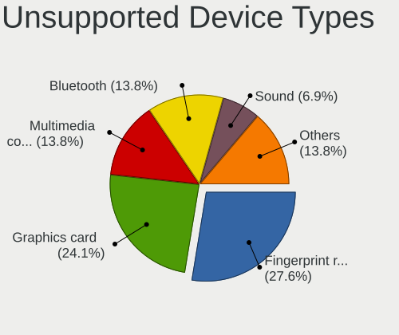

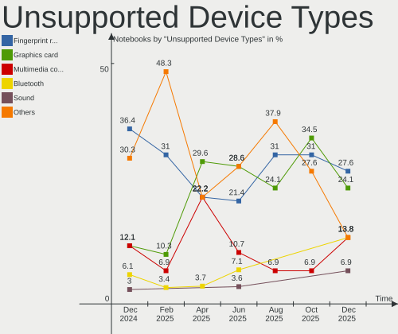

| Type                  | Notebooks | Percent |
|-----------------------|-----------|---------|
| Fingerprint reader    | 8         | 27.59%  |
| Graphics card         | 7         | 24.14%  |
| Multimedia controller | 4         | 13.79%  |
| Bluetooth             | 4         | 13.79%  |
| Sound                 | 2         | 6.9%    |
| Chipcard              | 2         | 6.9%    |
| Storage/raid          | 1         | 3.45%   |
| Net/wireless          | 1         | 3.45%   |

