Linux in India - Hardware Trends (Notebooks)
--------------------------------------------

A project to identify most popular hardware characteristics and track their change
over time based on data collected by Linux users at https://Linux-Hardware.org.

Anyone can contribute to this report by the [hw-probe](https://github.com/linuxhw/hw-probe) tool:

    sudo -E hw-probe -all -upload

Period: Jun, 2023.

Contents
--------

* [ System ](#system)
  - [ OS                       ](#os)
  - [ OS Family                ](#os-family)
  - [ Kernel                   ](#kernel)
  - [ Kernel Family            ](#kernel-family)
  - [ Kernel Major Ver.        ](#kernel-major-ver)
  - [ Arch                     ](#arch)
  - [ DE                       ](#de)
  - [ Display Server           ](#display-server)
  - [ Display Manager          ](#display-manager)
  - [ OS Lang                  ](#os-lang)
  - [ Boot Mode                ](#boot-mode)
  - [ Filesystem               ](#filesystem)
  - [ Part. scheme             ](#part-scheme)
  - [ Dual Boot with Linux/BSD ](#dual-boot-with-linuxbsd)
  - [ Dual Boot (Win)          ](#dual-boot-win)

* [ Board ](#board)
  - [ Vendor                   ](#vendor)
  - [ Model                    ](#model)
  - [ Model Family             ](#model-family)
  - [ MFG Year                 ](#mfg-year)
  - [ Form Factor              ](#form-factor)
  - [ Secure Boot              ](#secure-boot)
  - [ Coreboot                 ](#coreboot)
  - [ RAM Size                 ](#ram-size)
  - [ RAM Used                 ](#ram-used)
  - [ Total Drives             ](#total-drives)
  - [ Has CD-ROM               ](#has-cd-rom)
  - [ Has Ethernet             ](#has-ethernet)
  - [ Has WiFi                 ](#has-wifi)
  - [ Has Bluetooth            ](#has-bluetooth)

* [ Location ](#location)
  - [ Country                  ](#country)
  - [ City                     ](#city)

* [ Drives ](#drives)
  - [ Drive Vendor             ](#drive-vendor)
  - [ Drive Model              ](#drive-model)
  - [ HDD Vendor               ](#hdd-vendor)
  - [ SSD Vendor               ](#ssd-vendor)
  - [ Drive Kind               ](#drive-kind)
  - [ Drive Connector          ](#drive-connector)
  - [ Drive Size               ](#drive-size)
  - [ Space Total              ](#space-total)
  - [ Space Used               ](#space-used)
  - [ Malfunc. Drives          ](#malfunc-drives)
  - [ Malfunc. Drive Vendor    ](#malfunc-drive-vendor)
  - [ Malfunc. HDD Vendor      ](#malfunc-hdd-vendor)
  - [ Malfunc. Drive Kind      ](#malfunc-drive-kind)
  - [ Failed Drives            ](#failed-drives)
  - [ Failed Drive Vendor      ](#failed-drive-vendor)
  - [ Drive Status             ](#drive-status)

* [ Storage controller ](#storage-controller)
  - [ Storage Vendor           ](#storage-vendor)
  - [ Storage Model            ](#storage-model)
  - [ Storage Kind             ](#storage-kind)

* [ Processor ](#processor)
  - [ CPU Vendor               ](#cpu-vendor)
  - [ CPU Model                ](#cpu-model)
  - [ CPU Model Family         ](#cpu-model-family)
  - [ CPU Cores                ](#cpu-cores)
  - [ CPU Sockets              ](#cpu-sockets)
  - [ CPU Threads              ](#cpu-threads)
  - [ CPU Op-Modes             ](#cpu-op-modes)
  - [ CPU Microcode            ](#cpu-microcode)
  - [ CPU Microarch            ](#cpu-microarch)

* [ Graphics ](#graphics)
  - [ GPU Vendor               ](#gpu-vendor)
  - [ GPU Model                ](#gpu-model)
  - [ GPU Combo                ](#gpu-combo)
  - [ GPU Driver               ](#gpu-driver)
  - [ GPU Memory               ](#gpu-memory)

* [ Monitor ](#monitor)
  - [ Monitor Vendor           ](#monitor-vendor)
  - [ Monitor Model            ](#monitor-model)
  - [ Monitor Resolution       ](#monitor-resolution)
  - [ Monitor Diagonal         ](#monitor-diagonal)
  - [ Monitor Width            ](#monitor-width)
  - [ Aspect Ratio             ](#aspect-ratio)
  - [ Monitor Area             ](#monitor-area)
  - [ Pixel Density            ](#pixel-density)
  - [ Multiple Monitors        ](#multiple-monitors)

* [ Network ](#network)
  - [ Net Controller Vendor    ](#net-controller-vendor)
  - [ Net Controller Model     ](#net-controller-model)
  - [ Wireless Vendor          ](#wireless-vendor)
  - [ Wireless Model           ](#wireless-model)
  - [ Ethernet Vendor          ](#ethernet-vendor)
  - [ Ethernet Model           ](#ethernet-model)
  - [ Net Controller Kind      ](#net-controller-kind)
  - [ Used Controller          ](#used-controller)
  - [ NICs                     ](#nics)
  - [ IPv6                     ](#ipv6)

* [ Bluetooth ](#bluetooth)
  - [ Bluetooth Vendor         ](#bluetooth-vendor)
  - [ Bluetooth Model          ](#bluetooth-model)

* [ Sound ](#sound)
  - [ Sound Vendor             ](#sound-vendor)
  - [ Sound Model              ](#sound-model)

* [ Memory ](#memory)
  - [ Memory Vendor            ](#memory-vendor)
  - [ Memory Model             ](#memory-model)
  - [ Memory Kind              ](#memory-kind)
  - [ Memory Form Factor       ](#memory-form-factor)
  - [ Memory Size              ](#memory-size)
  - [ Memory Speed             ](#memory-speed)

* [ Printers & scanners ](#printers--scanners)
  - [ Printer Vendor           ](#printer-vendor)
  - [ Printer Model            ](#printer-model)
  - [ Scanner Vendor           ](#scanner-vendor)
  - [ Scanner Model            ](#scanner-model)

* [ Camera ](#camera)
  - [ Camera Vendor            ](#camera-vendor)
  - [ Camera Model             ](#camera-model)

* [ Security ](#security)
  - [ Fingerprint Vendor       ](#fingerprint-vendor)
  - [ Fingerprint Model        ](#fingerprint-model)
  - [ Chipcard Vendor          ](#chipcard-vendor)
  - [ Chipcard Model           ](#chipcard-model)

* [ Unsupported ](#unsupported)
  - [ Unsupported Devices      ](#unsupported-devices)
  - [ Unsupported Device Types ](#unsupported-device-types)

System
------

OS
--

Installed operating systems

| Name                         | Notebooks | Percent |
|------------------------------|-----------|---------|
| Ubuntu 22.04                 | 19        | 21.59%  |
| Fedora 38                    | 14        | 15.91%  |
| ArcoLinux Rolling            | 8         | 9.09%   |
| Linux Mint 21.1              | 7         | 7.95%   |
| Pop!_OS 22.04                | 5         | 5.68%   |
| Ubuntu 20.04                 | 4         | 4.55%   |
| OpenMandriva 23.06           | 3         | 3.41%   |
| OpenMandriva 23.03           | 3         | 3.41%   |
| Kali 2023.2                  | 3         | 3.41%   |
| Zorin 16                     | 2         | 2.27%   |
| Ubuntu 23.04                 | 2         | 2.27%   |
| Debian 11                    | 2         | 2.27%   |
| Ubuntu Unity 20.04           | 1         | 1.14%   |
| Ubuntu Budgie 23.04          | 1         | 1.14%   |
| Ubuntu 22.10                 | 1         | 1.14%   |
| SteamOS 3.4.8                | 1         | 1.14%   |
| Parrot 5.3                   | 1         | 1.14%   |
| org.kde.Platform 5.15-21.08  | 1         | 1.14%   |
| openSUSE Tumbleweed-XXXXXXXX | 1         | 1.14%   |
| openSUSE Leap-15.4           | 1         | 1.14%   |
| NixOS 23.05                  | 1         | 1.14%   |
| Manjaro                      | 1         | 1.14%   |
| Linux Lite 6.4               | 1         | 1.14%   |
| KDE neon 22.04               | 1         | 1.14%   |
| Kali 2022.2                  | 1         | 1.14%   |
| EndeavourOS Rolling          | 1         | 1.14%   |
| Debian 12                    | 1         | 1.14%   |
| Arch Rolling                 | 1         | 1.14%   |

OS Family
---------

OS without a version

| Name             | Notebooks | Percent |
|------------------|-----------|---------|
| Ubuntu           | 26        | 29.55%  |
| Fedora           | 14        | 15.91%  |
| ArcoLinux        | 8         | 9.09%   |
| Linux Mint       | 7         | 7.95%   |
| OpenMandriva     | 6         | 6.82%   |
| Pop!_OS          | 5         | 5.68%   |
| Kali             | 4         | 4.55%   |
| Debian           | 3         | 3.41%   |
| Zorin            | 2         | 2.27%   |
| openSUSE         | 2         | 2.27%   |
| Ubuntu Unity     | 1         | 1.14%   |
| Ubuntu Budgie    | 1         | 1.14%   |
| SteamOS          | 1         | 1.14%   |
| Parrot           | 1         | 1.14%   |
| org.kde.Platform | 1         | 1.14%   |
| NixOS            | 1         | 1.14%   |
| Manjaro          | 1         | 1.14%   |
| Linux Lite       | 1         | 1.14%   |
| KDE neon         | 1         | 1.14%   |
| EndeavourOS      | 1         | 1.14%   |
| Arch             | 1         | 1.14%   |

Kernel
------

Version of the Linux kernel

| Version                  | Notebooks | Percent |
|--------------------------|-----------|---------|
| 5.19.0-45-generic        | 11        | 12.5%   |
| 5.19.0-43-generic        | 8         | 9.09%   |
| 6.2.6-76060206-generic   | 5         | 5.68%   |
| 5.15.0-73-generic        | 5         | 5.68%   |
| 6.3.8-200.fc38.x86_64    | 4         | 4.55%   |
| 6.3.6-200.fc38.x86_64    | 4         | 4.55%   |
| 6.3.5-desktop-3omv2390   | 3         | 3.41%   |
| 6.3.5-200.fc38.x86_64    | 3         | 3.41%   |
| 6.2.6-desktop-1omv2390   | 3         | 3.41%   |
| 6.1.0-kali9-amd64        | 3         | 3.41%   |
| 5.15.0-75-generic        | 3         | 3.41%   |
| 5.15.0-72-generic        | 3         | 3.41%   |
| 6.3.9-arch1-1            | 2         | 2.27%   |
| 6.3.7-arch1-1            | 2         | 2.27%   |
| 6.2.9-300.fc38.x86_64    | 2         | 2.27%   |
| 6.2.0-20-generic         | 2         | 2.27%   |
| 5.15.0-56-generic        | 2         | 2.27%   |
| 6.3.9-1-default          | 1         | 1.14%   |
| 6.3.8-zen1-1-zen         | 1         | 1.14%   |
| 6.3.8-arch1-1            | 1         | 1.14%   |
| 6.3.7-060307-generic     | 1         | 1.14%   |
| 6.3.5-lp154.6-default    | 1         | 1.14%   |
| 6.3.5-arch1-1            | 1         | 1.14%   |
| 6.3.5-2-MANJARO          | 1         | 1.14%   |
| 6.2.15-300.fc38.x86_64   | 1         | 1.14%   |
| 6.2.0-23-generic         | 1         | 1.14%   |
| 6.1.8-arch1-1            | 1         | 1.14%   |
| 6.1.35-1-lts             | 1         | 1.14%   |
| 6.1.35                   | 1         | 1.14%   |
| 6.1.34                   | 1         | 1.14%   |
| 6.1.33-1-lts             | 1         | 1.14%   |
| 6.1.0-9-amd64            | 1         | 1.14%   |
| 6.1.0-1parrot1-amd64     | 1         | 1.14%   |
| 5.19.0-42-generic        | 1         | 1.14%   |
| 5.19.0-32-generic        | 1         | 1.14%   |
| 5.16.0-kali7-amd64       | 1         | 1.14%   |
| 5.15.108-1-pve           | 1         | 1.14%   |
| 5.15.0-76-generic        | 1         | 1.14%   |
| 5.13.0-valve36-1-neptune | 1         | 1.14%   |
| 5.10.0-23-amd64          | 1         | 1.14%   |

Kernel Family
-------------

Linux kernel without a distro release

| Version  | Notebooks | Percent |
|----------|-----------|---------|
| 5.19.0   | 21        | 23.86%  |
| 5.15.0   | 14        | 15.91%  |
| 6.3.5    | 9         | 10.23%  |
| 6.2.6    | 8         | 9.09%   |
| 6.3.8    | 6         | 6.82%   |
| 6.1.0    | 5         | 5.68%   |
| 6.3.6    | 4         | 4.55%   |
| 6.3.9    | 3         | 3.41%   |
| 6.3.7    | 3         | 3.41%   |
| 6.2.0    | 3         | 3.41%   |
| 6.2.9    | 2         | 2.27%   |
| 6.1.35   | 2         | 2.27%   |
| 6.2.15   | 1         | 1.14%   |
| 6.1.8    | 1         | 1.14%   |
| 6.1.34   | 1         | 1.14%   |
| 6.1.33   | 1         | 1.14%   |
| 5.16.0   | 1         | 1.14%   |
| 5.15.108 | 1         | 1.14%   |
| 5.13.0   | 1         | 1.14%   |
| 5.10.0   | 1         | 1.14%   |

Kernel Major Ver.
-----------------

Linux kernel major version

| Version | Notebooks | Percent |
|---------|-----------|---------|
| 6.3     | 25        | 28.41%  |
| 5.19    | 21        | 23.86%  |
| 5.15    | 15        | 17.05%  |
| 6.2     | 14        | 15.91%  |
| 6.1     | 10        | 11.36%  |
| 5.16    | 1         | 1.14%   |
| 5.13    | 1         | 1.14%   |
| 5.10    | 1         | 1.14%   |

Arch
----

OS architecture (x86_64, i586, etc.)

| Name   | Notebooks | Percent |
|--------|-----------|---------|
| x86_64 | 88        | 100%    |

DE
--

Desktop Environment

| Name       | Notebooks | Percent |
|------------|-----------|---------|
| GNOME      | 50        | 56.82%  |
| KDE5       | 18        | 20.45%  |
| XFCE       | 7         | 7.95%   |
| X-Cinnamon | 6         | 6.82%   |
| i3         | 2         | 2.27%   |
| Unity      | 1         | 1.14%   |
| MATE       | 1         | 1.14%   |
| LXQt       | 1         | 1.14%   |
| awesome    | 1         | 1.14%   |
| Unknown    | 1         | 1.14%   |

Display Server
--------------

X11 or Wayland

| Name    | Notebooks | Percent |
|---------|-----------|---------|
| X11     | 51        | 57.95%  |
| Wayland | 36        | 40.91%  |
| Unknown | 1         | 1.14%   |

Display Manager
---------------

SDDM, LightDM, etc.

| Name    | Notebooks | Percent |
|---------|-----------|---------|
| GDM3    | 29        | 32.95%  |
| Unknown | 21        | 23.86%  |
| SDDM    | 18        | 20.45%  |
| LightDM | 12        | 13.64%  |
| GDM     | 8         | 9.09%   |

OS Lang
-------

Language

| Lang  | Notebooks | Percent |
|-------|-----------|---------|
| en_IN | 55        | 62.5%   |
| en_US | 28        | 31.82%  |
| en_GB | 4         | 4.55%   |
| C     | 1         | 1.14%   |

Boot Mode
---------

EFI or BIOS

| Mode | Notebooks | Percent |
|------|-----------|---------|
| EFI  | 59        | 67.05%  |
| BIOS | 29        | 32.95%  |

Filesystem
----------

Type of filesystem

| Type    | Notebooks | Percent |
|---------|-----------|---------|
| Ext4    | 48        | 54.55%  |
| Btrfs   | 20        | 22.73%  |
| Tmpfs   | 14        | 15.91%  |
| Overlay | 3         | 3.41%   |
| F2fs    | 3         | 3.41%   |

Part. scheme
------------

Scheme of partitioning

| Type    | Notebooks | Percent |
|---------|-----------|---------|
| GPT     | 60        | 68.18%  |
| Unknown | 20        | 22.73%  |
| MBR     | 8         | 9.09%   |

Dual Boot with Linux/BSD
------------------------

Hosting more than one Linux/BSD

| Dual boot | Notebooks | Percent |
|-----------|-----------|---------|
| No        | 73        | 82.95%  |
| Yes       | 15        | 17.05%  |

Dual Boot (Win)
---------------

Hosting Linux and Windows

| Dual boot | Notebooks | Percent |
|-----------|-----------|---------|
| No        | 55        | 62.5%   |
| Yes       | 33        | 37.5%   |

Board
-----

Vendor
------

Motherboard manufacturer

| Name             | Notebooks | Percent |
|------------------|-----------|---------|
| Dell             | 21        | 23.86%  |
| Lenovo           | 19        | 21.59%  |
| Hewlett-Packard  | 16        | 18.18%  |
| ASUSTek Computer | 16        | 18.18%  |
| Acer             | 9         | 10.23%  |
| MSI              | 2         | 2.27%   |
| Valve            | 1         | 1.14%   |
| Timi             | 1         | 1.14%   |
| Sony             | 1         | 1.14%   |
| HONOR            | 1         | 1.14%   |
| AVITA            | 1         | 1.14%   |

Model
-----

Motherboard model

| Name                                 | Notebooks | Percent |
|--------------------------------------|-----------|---------|
| HP Pavilion Laptop 14-ec1xxx         | 3         | 3.41%   |
| MSI Bravo 15 B5DD                    | 2         | 2.27%   |
| Lenovo IdeaPad 3 14ITL6 82H7         | 2         | 2.27%   |
| Lenovo E41-25 81FS                   | 2         | 2.27%   |
| Dell Inspiron 1545                   | 2         | 2.27%   |
| ASUS TUF Gaming FX505DT_FX505DT      | 2         | 2.27%   |
| Valve Jupiter                        | 1         | 1.14%   |
| Timi RedmiBook 15                    | 1         | 1.14%   |
| Sony VPCEH25EN                       | 1         | 1.14%   |
| Lenovo Yoga S740-14IIL 81RS          | 1         | 1.14%   |
| Lenovo V15 G2 ITL Ua 82KB            | 1         | 1.14%   |
| Lenovo ThinkPad T460s 20F9005BUS     | 1         | 1.14%   |
| Lenovo ThinkPad T450 20BUS0LW02      | 1         | 1.14%   |
| Lenovo ThinkPad E15 Gen 2 20TDCTO1WW | 1         | 1.14%   |
| Lenovo ThinkPad E14 Gen 4 21E3S06300 | 1         | 1.14%   |
| Lenovo ThinkPad E14 Gen 2 20TAS0AJ00 | 1         | 1.14%   |
| Lenovo ThinkBook 15 G3 ACL 21A4      | 1         | 1.14%   |
| Lenovo ThinkBook 14p Gen 3 21EJ      | 1         | 1.14%   |
| Lenovo IdeaPad Y510P 20217           | 1         | 1.14%   |
| Lenovo IdeaPad S540-15IWL            | 1         | 1.14%   |
| Lenovo IdeaPad S340-15IIL 81WL       | 1         | 1.14%   |
| Lenovo IdeaPad 5 15IAL7 82SF         | 1         | 1.14%   |
| Lenovo G500s 20245                   | 1         | 1.14%   |
| Lenovo E41-55 82FJ                   | 1         | 1.14%   |
| HONOR BRN-FXX                        | 1         | 1.14%   |
| HP ProBook 440 G4                    | 1         | 1.14%   |
| HP ProBook 430 G4                    | 1         | 1.14%   |
| HP Pavilion Laptop 15-eh2xxx         | 1         | 1.14%   |
| HP Pavilion Laptop 15-eg3xxx         | 1         | 1.14%   |
| HP Pavilion Gaming Laptop 15-ec2xxx  | 1         | 1.14%   |
| HP Pavilion g6                       | 1         | 1.14%   |
| HP Laptop 15s-eq2xxx                 | 1         | 1.14%   |
| HP Laptop 15-db0xxx                  | 1         | 1.14%   |
| HP Laptop 14s-dq2xxx                 | 1         | 1.14%   |
| HP G42                               | 1         | 1.14%   |
| HP EliteBook 2540p                   | 1         | 1.14%   |
| HP 250 G6 Notebook PC                | 1         | 1.14%   |
| HP 15                                | 1         | 1.14%   |
| Dell XPS 17 9710                     | 1         | 1.14%   |
| Dell Vostro 3420                     | 1         | 1.14%   |

Model Family
------------

Motherboard model prefix

| Name             | Notebooks | Percent |
|------------------|-----------|---------|
| Dell Inspiron    | 9         | 10.23%  |
| HP Pavilion      | 7         | 7.95%   |
| Acer Aspire      | 7         | 7.95%   |
| Lenovo IdeaPad   | 6         | 6.82%   |
| ASUS VivoBook    | 6         | 6.82%   |
| Lenovo ThinkPad  | 5         | 5.68%   |
| ASUS ASUS        | 4         | 4.55%   |
| HP Laptop        | 3         | 3.41%   |
| Dell Vostro      | 3         | 3.41%   |
| Dell Precision   | 3         | 3.41%   |
| Dell Latitude    | 3         | 3.41%   |
| ASUS TUF         | 3         | 3.41%   |
| MSI Bravo        | 2         | 2.27%   |
| Lenovo ThinkBook | 2         | 2.27%   |
| Lenovo E41-25    | 2         | 2.27%   |
| HP ProBook       | 2         | 2.27%   |
| ASUS ROG         | 2         | 2.27%   |
| Valve Jupiter    | 1         | 1.14%   |
| Timi RedmiBook   | 1         | 1.14%   |
| Sony VPCEH25EN   | 1         | 1.14%   |
| Lenovo Yoga      | 1         | 1.14%   |
| Lenovo V15       | 1         | 1.14%   |
| Lenovo G500s     | 1         | 1.14%   |
| Lenovo E41-55    | 1         | 1.14%   |
| HONOR BRN-FXX    | 1         | 1.14%   |
| HP G42           | 1         | 1.14%   |
| HP EliteBook     | 1         | 1.14%   |
| HP 250           | 1         | 1.14%   |
| HP 15            | 1         | 1.14%   |
| Dell XPS         | 1         | 1.14%   |
| Dell G5          | 1         | 1.14%   |
| Dell G15         | 1         | 1.14%   |
| AVITA NS14A8     | 1         | 1.14%   |
| ASUS ZenBook     | 1         | 1.14%   |
| Acer Swift       | 1         | 1.14%   |
| Acer Nitro       | 1         | 1.14%   |

MFG Year
--------

Motherboard manufacture year

| Year | Notebooks | Percent |
|------|-----------|---------|
| 2021 | 21        | 23.86%  |
| 2022 | 12        | 13.64%  |
| 2020 | 9         | 10.23%  |
| 2016 | 9         | 10.23%  |
| 2019 | 7         | 7.95%   |
| 2023 | 5         | 5.68%   |
| 2018 | 5         | 5.68%   |
| 2013 | 3         | 3.41%   |
| 2011 | 3         | 3.41%   |
| 2010 | 3         | 3.41%   |
| 2015 | 2         | 2.27%   |
| 2014 | 2         | 2.27%   |
| 2012 | 2         | 2.27%   |
| 2009 | 2         | 2.27%   |
| 2008 | 2         | 2.27%   |
| 2017 | 1         | 1.14%   |

Form Factor
-----------

Physical design of the computer

| Name     | Notebooks | Percent |
|----------|-----------|---------|
| Notebook | 88        | 100%    |

Secure Boot
-----------

Enabled or disabled

| State    | Notebooks | Percent |
|----------|-----------|---------|
| Disabled | 79        | 89.77%  |
| Enabled  | 9         | 10.23%  |

Coreboot
--------

Have coreboot on board

| Used | Notebooks | Percent |
|------|-----------|---------|
| No   | 88        | 100%    |

RAM Size
--------

Total RAM memory

| Size in GB  | Notebooks | Percent |
|-------------|-----------|---------|
| 4.01-8.0    | 32        | 36.36%  |
| 8.01-16.0   | 27        | 30.68%  |
| 3.01-4.0    | 14        | 15.91%  |
| 16.01-24.0  | 13        | 14.77%  |
| 32.01-64.0  | 1         | 1.14%   |
| 64.01-256.0 | 1         | 1.14%   |

RAM Used
--------

Used RAM memory

| Used GB   | Notebooks | Percent |
|-----------|-----------|---------|
| 4.01-8.0  | 24        | 27.27%  |
| 2.01-3.0  | 21        | 23.86%  |
| 1.01-2.0  | 20        | 22.73%  |
| 3.01-4.0  | 17        | 19.32%  |
| 8.01-16.0 | 4         | 4.55%   |
| 0.51-1.0  | 2         | 2.27%   |

Total Drives
------------

Number of drives on board

| Drives | Notebooks | Percent |
|--------|-----------|---------|
| 1      | 64        | 72.73%  |
| 2      | 24        | 27.27%  |

Has CD-ROM
----------

Has CD-ROM on board

| Presented | Notebooks | Percent |
|-----------|-----------|---------|
| No        | 69        | 78.41%  |
| Yes       | 19        | 21.59%  |

Has Ethernet
------------

Has Ethernet on board

| Presented | Notebooks | Percent |
|-----------|-----------|---------|
| Yes       | 61        | 69.32%  |
| No        | 27        | 30.68%  |

Has WiFi
--------

Has WiFi module

| Presented | Notebooks | Percent |
|-----------|-----------|---------|
| Yes       | 87        | 98.86%  |
| No        | 1         | 1.14%   |

Has Bluetooth
-------------

Has Bluetooth module

| Presented | Notebooks | Percent |
|-----------|-----------|---------|
| Yes       | 82        | 93.18%  |
| No        | 6         | 6.82%   |

Location
--------

Country
-------

Geographic location (country)

| Country | Notebooks | Percent |
|---------|-----------|---------|
| India   | 88        | 100%    |

City
----

Geographic location (city)

| City          | Notebooks | Percent |
|---------------|-----------|---------|
| Delhi         | 13        | 14.77%  |
| Bengaluru     | 10        | 11.36%  |
| Hyderabad     | 9         | 10.23%  |
| Mumbai        | 8         | 9.09%   |
| Chennai       | 7         | 7.95%   |
| Lucknow       | 6         | 6.82%   |
| Pune          | 3         | 3.41%   |
| Ahmedabad     | 3         | 3.41%   |
| Navi Mumbai   | 2         | 2.27%   |
| Kolkata       | 2         | 2.27%   |
| Jaipur        | 2         | 2.27%   |
| Guwahati      | 2         | 2.27%   |
| Bhopal        | 2         | 2.27%   |
| Visakhapatnam | 1         | 1.14%   |
| Vellore       | 1         | 1.14%   |
| Thrissur      | 1         | 1.14%   |
| Surat         | 1         | 1.14%   |
| Ranaghat      | 1         | 1.14%   |
| Patna         | 1         | 1.14%   |
| Nagpur        | 1         | 1.14%   |
| Mysore        | 1         | 1.14%   |
| Malappuram    | 1         | 1.14%   |
| Madurai       | 1         | 1.14%   |
| Kuttippuram   | 1         | 1.14%   |
| Kollam        | 1         | 1.14%   |
| Kochi         | 1         | 1.14%   |
| Durgapur      | 1         | 1.14%   |
| Dehradun      | 1         | 1.14%   |
| Coimbatore    | 1         | 1.14%   |
| Chhindwara    | 1         | 1.14%   |
| Chandigarh    | 1         | 1.14%   |
| Badlapur      | 1         | 1.14%   |

Drives
------

Drive Vendor
------------

Hard drive vendors

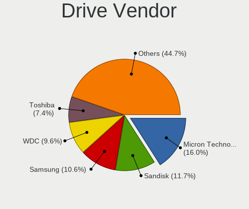

| Vendor                      | Notebooks | Drives | Percent |
|-----------------------------|-----------|--------|---------|
| Samsung Electronics         | 16        | 16     | 14.55%  |
| WDC                         | 12        | 12     | 10.91%  |
| Micron Technology           | 10        | 10     | 9.09%   |
| SK hynix                    | 9         | 10     | 8.18%   |
| Seagate                     | 9         | 9      | 8.18%   |
| Intel                       | 8         | 8      | 7.27%   |
| Sandisk                     | 7         | 7      | 6.36%   |
| Toshiba                     | 6         | 6      | 5.45%   |
| Kingston                    | 4         | 4      | 3.64%   |
| Crucial                     | 4         | 4      | 3.64%   |
| Unknown                     | 3         | 3      | 2.73%   |
| KIOXIA                      | 3         | 3      | 2.73%   |
| UMIS                        | 2         | 2      | 1.82%   |
| Kingston Technology Company | 2         | 2      | 1.82%   |
| FORESEE                     | 2         | 2      | 1.82%   |
| Acer                        | 2         | 2      | 1.82%   |
| Union Memory (Shenzhen)     | 1         | 1      | 0.91%   |
| StoreJet                    | 1         | 1      | 0.91%   |
| Solid State Storage         | 1         | 1      | 0.91%   |
| POWER                       | 1         | 1      | 0.91%   |
| PNY                         | 1         | 1      | 0.91%   |
| NFORCE                      | 1         | 1      | 0.91%   |
| KingFast                    | 1         | 1      | 0.91%   |
| HGST                        | 1         | 1      | 0.91%   |
| Fujitsu                     | 1         | 1      | 0.91%   |
| China                       | 1         | 1      | 0.91%   |
| Unknown                     | 1         | 1      | 0.91%   |

Drive Model
-----------

Hard drive models

| Model                                              | Notebooks | Percent |
|----------------------------------------------------|-----------|---------|
| Micron 2450_MTFDKBA512TFK 512GB                    | 4         | 3.6%    |
| Seagate ST1000LM035-1RK172 1TB                     | 3         | 2.7%    |
| WDC WD10SPZX-60Z10T0 1TB                           | 2         | 1.8%    |
| UMIS RPJTJ256MEE1OWX 256GB                         | 2         | 1.8%    |
| Toshiba MQ04ABF100 1TB                             | 2         | 1.8%    |
| Seagate ST1000LM024 HN-M101MBB 1TB                 | 2         | 1.8%    |
| Sandisk WD Blue SN550 NVMe SSD 1TB                 | 2         | 1.8%    |
| Samsung SSD 980 500GB                              | 2         | 1.8%    |
| Samsung NVMe SSD Controller PM9A1/PM9A3/980PRO 2TB | 2         | 1.8%    |
| Micron 2200V_MTFDHBA512TCK 512GB                   | 2         | 1.8%    |
| Intel SSDPEKNU512GZH 512GB                         | 2         | 1.8%    |
| Intel SSD 660P Series 512GB                        | 2         | 1.8%    |
| Crucial CT480BX500SSD1 480GB                       | 2         | 1.8%    |
| Acer SSD RE100 2.5 256GB                           | 2         | 1.8%    |
| WDC WDS480G2G0A-00JH30 480GB SSD                   | 1         | 0.9%    |
| WDC WD5000LPVX-60V0TT0 500GB                       | 1         | 0.9%    |
| WDC WD5000LPCX-24VHAT0 500GB                       | 1         | 0.9%    |
| WDC WD5000BPVT-75HXZT1 500GB                       | 1         | 0.9%    |
| WDC WD10SPZX-24Z10 1TB                             | 1         | 0.9%    |
| WDC WD10SPZX-22Z10T0 1TB                           | 1         | 0.9%    |
| WDC WD10JPVX-75JC3T0 1TB                           | 1         | 0.9%    |
| WDC WD10JPVX-08JC3T5 1TB                           | 1         | 0.9%    |
| WDC WD Green 2.5 480GB SSD                         | 1         | 0.9%    |
| WDC SSC-D0256SC-2100 256GB SSD                     | 1         | 0.9%    |
| Unknown SS32G  32GB                                | 1         | 0.9%    |
| Unknown MMC Card  64GB                             | 1         | 0.9%    |
| Unknown MMC Card  512GB                            | 1         | 0.9%    |
| Union Memory (Shenzhen) UMIS RPJTJ512MGE1QDQ 512GB | 1         | 0.9%    |
| Toshiba THNSNJ512GDNU A 512GB SSD                  | 1         | 0.9%    |
| Toshiba MQ01ABF050 500GB                           | 1         | 0.9%    |
| Toshiba MQ01ABD050V 500GB                          | 1         | 0.9%    |
| Toshiba MQ01ABD050 500GB                           | 1         | 0.9%    |
| StoreJet Disk 480GB                                | 1         | 0.9%    |
| Solid State Storage CL1-3D256-Q11 NVMe SSSTC 256GB | 1         | 0.9%    |
| SK hynix SKHynix_HFM512GD3HX015N 512GB             | 1         | 0.9%    |
| SK hynix PC711 NVMe 1TB                            | 1         | 0.9%    |
| SK hynix PC601 SED NVMe 512GB                      | 1         | 0.9%    |
| SK hynix HFM512GD3JX013N 512GB                     | 1         | 0.9%    |
| SK hynix BC711 NVMe 512GB                          | 1         | 0.9%    |
| SK hynix BC711 HFM512GD3JX013N 512GB               | 1         | 0.9%    |

HDD Vendor
----------

Hard disk drive vendors

| Vendor   | Notebooks | Drives | Percent |
|----------|-----------|--------|---------|
| WDC      | 9         | 9      | 34.62%  |
| Seagate  | 9         | 9      | 34.62%  |
| Toshiba  | 5         | 5      | 19.23%  |
| StoreJet | 1         | 1      | 3.85%   |
| HGST     | 1         | 1      | 3.85%   |
| Fujitsu  | 1         | 1      | 3.85%   |

SSD Vendor
----------

Solid state drive vendors

| Vendor              | Notebooks | Drives | Percent |
|---------------------|-----------|--------|---------|
| Crucial             | 4         | 4      | 19.05%  |
| WDC                 | 3         | 3      | 14.29%  |
| Samsung Electronics | 3         | 3      | 14.29%  |
| Kingston            | 3         | 3      | 14.29%  |
| FORESEE             | 2         | 2      | 9.52%   |
| Acer                | 2         | 2      | 9.52%   |
| Toshiba             | 1         | 1      | 4.76%   |
| PNY                 | 1         | 1      | 4.76%   |
| Intel               | 1         | 1      | 4.76%   |
| China               | 1         | 1      | 4.76%   |

Drive Kind
----------

HDD or SSD

| Kind    | Notebooks | Drives | Percent |
|---------|-----------|--------|---------|
| NVMe    | 53        | 57     | 50%     |
| HDD     | 26        | 26     | 24.53%  |
| SSD     | 21        | 21     | 19.81%  |
| MMC     | 3         | 3      | 2.83%   |
| Unknown | 3         | 4      | 2.83%   |

Drive Connector
---------------

SATA, SAS, NVMe, etc.

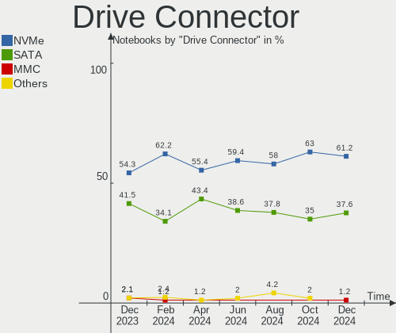

| Type | Notebooks | Drives | Percent |
|------|-----------|--------|---------|
| NVMe | 53        | 57     | 53%     |
| SATA | 41        | 48     | 41%     |
| SAS  | 3         | 3      | 3%      |
| MMC  | 3         | 3      | 3%      |

Drive Size
----------

Size of hard drive

| Size in TB | Notebooks | Drives | Percent |
|------------|-----------|--------|---------|
| 0.01-0.5   | 29        | 31     | 64.44%  |
| 0.51-1.0   | 15        | 15     | 33.33%  |
| 1.01-2.0   | 1         | 1      | 2.22%   |

Space Total
-----------

Amount of disk space available on the file system

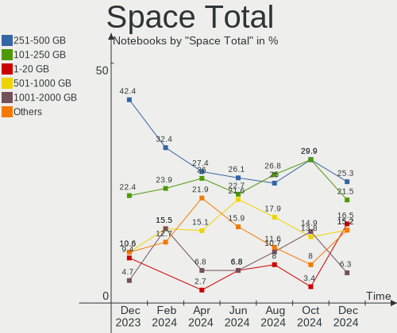

| Size in GB | Notebooks | Percent |
|------------|-----------|---------|
| 251-500    | 39        | 44.32%  |
| 101-250    | 19        | 21.59%  |
| 501-1000   | 11        | 12.5%   |
| 51-100     | 8         | 9.09%   |
| 1001-2000  | 4         | 4.55%   |
| 1-20       | 3         | 3.41%   |
| 21-50      | 2         | 2.27%   |
| 2001-3000  | 2         | 2.27%   |

Space Used
----------

Amount of used disk space

| Used GB   | Notebooks | Percent |
|-----------|-----------|---------|
| 1-20      | 26        | 29.55%  |
| 101-250   | 19        | 21.59%  |
| 21-50     | 18        | 20.45%  |
| 51-100    | 13        | 14.77%  |
| 251-500   | 10        | 11.36%  |
| 1001-2000 | 1         | 1.14%   |
| 501-1000  | 1         | 1.14%   |

Malfunc. Drives
---------------

Drive models with a malfunction

| Model                                | Notebooks | Drives | Percent |
|--------------------------------------|-----------|--------|---------|
| WDC WD5000BPVT-75HXZT1 500GB         | 1         | 1      | 16.67%  |
| SK hynix BC711 HFM512GD3JX013N 512GB | 1         | 1      | 16.67%  |
| Seagate ST9320320AS 320GB            | 1         | 1      | 16.67%  |
| Seagate ST1000LM035-1RK172 1TB       | 1         | 1      | 16.67%  |
| Intel SSDSA1M160G2LE 160GB           | 1         | 1      | 16.67%  |
| HGST HTS545050A7E660 500GB           | 1         | 1      | 16.67%  |

Malfunc. Drive Vendor
---------------------

Vendors of faulty drives

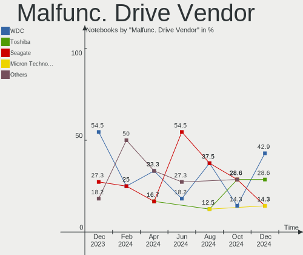

| Vendor   | Notebooks | Drives | Percent |
|----------|-----------|--------|---------|
| Seagate  | 2         | 2      | 33.33%  |
| WDC      | 1         | 1      | 16.67%  |
| SK hynix | 1         | 1      | 16.67%  |
| Intel    | 1         | 1      | 16.67%  |
| HGST     | 1         | 1      | 16.67%  |

Malfunc. HDD Vendor
-------------------

Vendors of faulty HDD drives

| Vendor  | Notebooks | Drives | Percent |
|---------|-----------|--------|---------|
| Seagate | 2         | 2      | 50%     |
| WDC     | 1         | 1      | 25%     |
| HGST    | 1         | 1      | 25%     |

Malfunc. Drive Kind
-------------------

Kinds of faulty drives

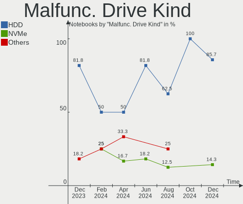

| Kind | Notebooks | Drives | Percent |
|------|-----------|--------|---------|
| HDD  | 4         | 4      | 66.67%  |
| NVMe | 1         | 1      | 16.67%  |
| SSD  | 1         | 1      | 16.67%  |

Failed Drives
-------------

Failed drive models

Zero info for selected period =(

Failed Drive Vendor
-------------------

Failed drive vendors

Zero info for selected period =(

Drive Status
------------

Number of failed and malfunc. drives

| Status   | Notebooks | Drives | Percent |
|----------|-----------|--------|---------|
| Works    | 51        | 59     | 55.43%  |
| Detected | 35        | 46     | 38.04%  |
| Malfunc  | 6         | 6      | 6.52%   |

Storage controller
------------------

Storage Vendor
--------------

Storage controller vendors

| Vendor                         | Notebooks | Percent |
|--------------------------------|-----------|---------|
| Intel                          | 55        | 47.83%  |
| Samsung Electronics            | 13        | 11.3%   |
| AMD                            | 11        | 9.57%   |
| Micron Technology              | 10        | 8.7%    |
| SK hynix                       | 9         | 7.83%   |
| SanDisk                        | 7         | 6.09%   |
| Union Memory (Shenzhen)        | 3         | 2.61%   |
| KIOXIA                         | 3         | 2.61%   |
| Kingston Technology Company    | 3         | 2.61%   |
| Solid State Storage Technology | 1         | 0.87%   |

Storage Model
-------------

Storage controller models

| Model                                                                        | Notebooks | Percent |
|------------------------------------------------------------------------------|-----------|---------|
| AMD FCH SATA Controller [AHCI mode]                                          | 10        | 8.26%   |
| Intel Volume Management Device NVMe RAID Controller                          | 8         | 6.61%   |
| Intel Sunrise Point-LP SATA Controller [AHCI mode]                           | 8         | 6.61%   |
| Samsung NVMe SSD Controller 980                                              | 7         | 5.79%   |
| SK hynix Gold P31/BC711/PC711 NVMe Solid State Drive                         | 5         | 4.13%   |
| Intel Tiger Lake-LP SATA Controller                                          | 5         | 4.13%   |
| Micron 2450 NVMe SSD (DRAM-less)                                             | 4         | 3.31%   |
| Intel Wildcat Point-LP SATA Controller [AHCI Mode]                           | 4         | 3.31%   |
| Intel Non-Volatile memory controller                                         | 4         | 3.31%   |
| Intel 82801 Mobile SATA Controller [RAID mode]                               | 4         | 3.31%   |
| Samsung NVMe SSD Controller PM9A1/PM9A3/980PRO                               | 3         | 2.48%   |
| Micron 2200S NVMe SSD                                                        | 3         | 2.48%   |
| Intel SSD 660P Series                                                        | 3         | 2.48%   |
| Intel 82801IBM/IEM (ICH9M/ICH9M-E) 4 port SATA Controller [AHCI mode]        | 3         | 2.48%   |
| Union Memory (Shenzhen) Non-Volatile memory controller                       | 2         | 1.65%   |
| SK hynix BC511 NVMe SSD                                                      | 2         | 1.65%   |
| SanDisk WD Blue SN550 NVMe SSD                                               | 2         | 1.65%   |
| Samsung NVMe SSD Controller SM981/PM981/PM983                                | 2         | 1.65%   |
| Micron NVMe Storage Controller                                               | 2         | 1.65%   |
| KIOXIA Non-Volatile memory controller                                        | 2         | 1.65%   |
| Intel Ice Lake-LP SATA Controller [AHCI mode]                                | 2         | 1.65%   |
| Intel Comet Lake SATA AHCI Controller                                        | 2         | 1.65%   |
| Intel Cannon Lake Mobile PCH SATA AHCI Controller                            | 2         | 1.65%   |
| Intel Alder Lake-P SATA AHCI Controller                                      | 2         | 1.65%   |
| Intel 7 Series Chipset Family 6-port SATA Controller [AHCI mode]             | 2         | 1.65%   |
| Intel 6 Series/C200 Series Chipset Family 6 port Mobile SATA AHCI Controller | 2         | 1.65%   |
| Intel 5 Series/3400 Series Chipset 6 port SATA AHCI Controller               | 2         | 1.65%   |
| Union Memory (Shenzhen) AM630 PCIe 4.0 x4 NVMe SSD Controller                | 1         | 0.83%   |
| Solid State Storage CL1-3D256-Q11 NVMe SSD M.2                               | 1         | 0.83%   |
| SK hynix Non-Volatile memory controller                                      | 1         | 0.83%   |
| SK hynix BC501 NVMe Solid State Drive                                        | 1         | 0.83%   |
| SanDisk WD Black SN770 NVMe SSD                                              | 1         | 0.83%   |
| SanDisk WD Black SN750 / PC SN730 NVMe SSD                                   | 1         | 0.83%   |
| Sandisk PC SN740 NVMe SSD                                                    | 1         | 0.83%   |
| SanDisk PC SN530 NVMe SSD (DRAM-less)                                        | 1         | 0.83%   |
| SanDisk Non-Volatile memory controller                                       | 1         | 0.83%   |
| Samsung NVMe SSD Controller PM9B1                                            | 1         | 0.83%   |
| Micron NVMe Controller                                                       | 1         | 0.83%   |
| KIOXIA NVMe SSD Controller BG4                                               | 1         | 0.83%   |
| Kingston Company SNVS2000G [NV1 NVMe PCIe SSD 2TB]                           | 1         | 0.83%   |

Storage Kind
------------

Kind of storage controller (IDE, SATA, NVMe, SAS, ...)

| Kind | Notebooks | Percent |
|------|-----------|---------|
| NVMe | 53        | 44.92%  |
| SATA | 51        | 43.22%  |
| RAID | 14        | 11.86%  |

Processor
---------

CPU Vendor
----------

Processor vendors

| Vendor | Notebooks | Percent |
|--------|-----------|---------|
| Intel  | 60        | 68.18%  |
| AMD    | 28        | 31.82%  |

CPU Model
---------

Processor models

| Model                                         | Notebooks | Percent |
|-----------------------------------------------|-----------|---------|
| Intel 11th Gen Core i3-1115G4 @ 3.00GHz       | 6         | 6.82%   |
| Intel Core i5-7200U CPU @ 2.50GHz             | 4         | 4.55%   |
| AMD Ryzen 5 5600H with Radeon Graphics        | 4         | 4.55%   |
| Intel 12th Gen Core i5-1235U                  | 3         | 3.41%   |
| Intel 11th Gen Core i5-1135G7 @ 2.40GHz       | 3         | 3.41%   |
| AMD Ryzen 7 6800H with Radeon Graphics        | 3         | 3.41%   |
| AMD Ryzen 5 5625U with Radeon Graphics        | 3         | 3.41%   |
| AMD Ryzen 5 3550H with Radeon Vega Mobile Gfx | 3         | 3.41%   |
| Intel Core i5-5200U CPU @ 2.20GHz             | 2         | 2.27%   |
| Intel Core i5-1035G1 CPU @ 1.00GHz            | 2         | 2.27%   |
| Intel Core i5-10210U CPU @ 1.60GHz            | 2         | 2.27%   |
| Intel Core i3-6006U CPU @ 2.00GHz             | 2         | 2.27%   |
| Intel Core 2 Duo CPU P8700 @ 2.53GHz          | 2         | 2.27%   |
| AMD PRO A4-4350B R4, 5 COMPUTE CORES 2C+3G    | 2         | 2.27%   |
| Intel Core i7-9850H CPU @ 2.60GHz             | 1         | 1.14%   |
| Intel Core i7-9750H CPU @ 2.60GHz             | 1         | 1.14%   |
| Intel Core i7-7500U CPU @ 2.70GHz             | 1         | 1.14%   |
| Intel Core i7-6600U CPU @ 2.60GHz             | 1         | 1.14%   |
| Intel Core i7-4700MQ CPU @ 2.40GHz            | 1         | 1.14%   |
| Intel Core i7-3520M CPU @ 2.90GHz             | 1         | 1.14%   |
| Intel Core i7-1065G7 CPU @ 1.30GHz            | 1         | 1.14%   |
| Intel Core i7 CPU L 640 @ 2.13GHz             | 1         | 1.14%   |
| Intel Core i5-8265U CPU @ 1.60GHz             | 1         | 1.14%   |
| Intel Core i5-8250U CPU @ 1.60GHz             | 1         | 1.14%   |
| Intel Core i5-5300U CPU @ 2.30GHz             | 1         | 1.14%   |
| Intel Core i5-2450M CPU @ 2.50GHz             | 1         | 1.14%   |
| Intel Core i5-10300H CPU @ 2.50GHz            | 1         | 1.14%   |
| Intel Core i3-N305                            | 1         | 1.14%   |
| Intel Core i3-5005U CPU @ 2.00GHz             | 1         | 1.14%   |
| Intel Core i3-4005U CPU @ 1.70GHz             | 1         | 1.14%   |
| Intel Core i3-3120M CPU @ 2.50GHz             | 1         | 1.14%   |
| Intel Core i3-3110M CPU @ 2.40GHz             | 1         | 1.14%   |
| Intel Core i3-2350M CPU @ 2.30GHz             | 1         | 1.14%   |
| Intel Core i3-2330M CPU @ 2.20GHz             | 1         | 1.14%   |
| Intel Core i3-10110U CPU @ 2.10GHz            | 1         | 1.14%   |
| Intel Core i3 CPU M 380 @ 2.53GHz             | 1         | 1.14%   |
| Intel Core 2 Duo CPU T9600 @ 2.80GHz          | 1         | 1.14%   |
| Intel Core 2 Duo CPU T6570 @ 2.10GHz          | 1         | 1.14%   |
| Intel Celeron CPU N3050 @ 1.60GHz             | 1         | 1.14%   |
| Intel 13th Gen Core i5-13500H                 | 1         | 1.14%   |

CPU Model Family
----------------

Processor model prefix

| Model            | Notebooks | Percent |
|------------------|-----------|---------|
| Other            | 24        | 27.27%  |
| Intel Core i5    | 15        | 17.05%  |
| AMD Ryzen 5      | 14        | 15.91%  |
| Intel Core i3    | 11        | 12.5%   |
| Intel Core i7    | 8         | 9.09%   |
| AMD Ryzen 7      | 6         | 6.82%   |
| Intel Core 2 Duo | 4         | 4.55%   |
| AMD Ryzen 3      | 3         | 3.41%   |
| Intel Celeron    | 1         | 1.14%   |
| AMD Phenom II    | 1         | 1.14%   |
| AMD A8           | 1         | 1.14%   |

CPU Cores
---------

Number of processor cores

| Number | Notebooks | Percent |
|--------|-----------|---------|
| 2      | 38        | 43.18%  |
| 4      | 20        | 22.73%  |
| 6      | 13        | 14.77%  |
| 8      | 10        | 11.36%  |
| 12     | 4         | 4.55%   |
| 10     | 3         | 3.41%   |

CPU Sockets
-----------

Number of sockets

| Number | Notebooks | Percent |
|--------|-----------|---------|
| 1      | 88        | 100%    |

CPU Threads
-----------

Threads per core (Hyper-Threading)

| Number | Notebooks | Percent |
|--------|-----------|---------|
| 2      | 73        | 82.95%  |
| 1      | 15        | 17.05%  |

CPU Op-Modes
------------

CPU Operation Modes (32-bit, 64-bit)

| Op mode        | Notebooks | Percent |
|----------------|-----------|---------|
| 32-bit, 64-bit | 88        | 100%    |

CPU Microcode
-------------

Microcode number

| Number     | Notebooks | Percent |
|------------|-----------|---------|
| Unknown    | 42        | 47.73%  |
| 0x0a50000d | 4         | 4.55%   |
| 0x0a50000c | 4         | 4.55%   |
| 0x806c1    | 3         | 3.41%   |
| 0x08108102 | 3         | 3.41%   |
| 0x906a4    | 2         | 2.27%   |
| 0x806ec    | 2         | 2.27%   |
| 0x806c2    | 2         | 2.27%   |
| 0x706e5    | 2         | 2.27%   |
| 0x406e3    | 2         | 2.27%   |
| 0x206a7    | 2         | 2.27%   |
| 0x0a404102 | 2         | 2.27%   |
| 0x08600106 | 2         | 2.27%   |
| 0x08108109 | 2         | 2.27%   |
| 0x06006705 | 2         | 2.27%   |
| 0xb06a2    | 1         | 1.14%   |
| 0x906ed    | 1         | 1.14%   |
| 0x906a3    | 1         | 1.14%   |
| 0x806eb    | 1         | 1.14%   |
| 0x806d1    | 1         | 1.14%   |
| 0x40651    | 1         | 1.14%   |
| 0x306d4    | 1         | 1.14%   |
| 0x306a9    | 1         | 1.14%   |
| 0x0a404101 | 1         | 1.14%   |
| 0x08608103 | 1         | 1.14%   |
| 0x0810100b | 1         | 1.14%   |
| 0x010000c8 | 1         | 1.14%   |

CPU Microarch
-------------

Microarchitecture

| Name             | Notebooks | Percent |
|------------------|-----------|---------|
| KabyLake         | 12        | 13.64%  |
| Unknown          | 10        | 11.36%  |
| Zen 3            | 9         | 10.23%  |
| TigerLake        | 9         | 10.23%  |
| Alderlake Hybrid | 7         | 7.95%   |
| Zen+             | 5         | 5.68%   |
| IceLake          | 5         | 5.68%   |
| Penryn           | 4         | 4.55%   |
| Broadwell        | 4         | 4.55%   |
| Skylake          | 3         | 3.41%   |
| SandyBridge      | 3         | 3.41%   |
| IvyBridge        | 3         | 3.41%   |
| Zen 2            | 2         | 2.27%   |
| Zen              | 2         | 2.27%   |
| Westmere         | 2         | 2.27%   |
| Haswell          | 2         | 2.27%   |
| Excavator        | 2         | 2.27%   |
| Silvermont       | 1         | 1.14%   |
| Puma             | 1         | 1.14%   |
| K10              | 1         | 1.14%   |
| CometLake        | 1         | 1.14%   |

Graphics
--------

GPU Vendor
----------

Vendors of graphics cards

| Vendor | Notebooks | Percent |
|--------|-----------|---------|
| Intel  | 58        | 50.43%  |
| AMD    | 30        | 26.09%  |
| Nvidia | 27        | 23.48%  |

GPU Model
---------

Graphics card models

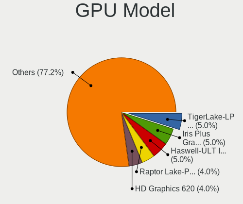

| Model                                                                     | Notebooks | Percent |
|---------------------------------------------------------------------------|-----------|---------|
| Nvidia TU117M [GeForce GTX 1650 Mobile / Max-Q]                           | 6         | 5%      |
| Intel Tiger Lake-LP GT2 [UHD Graphics G4]                                 | 6         | 5%      |
| Intel HD Graphics 620                                                     | 5         | 4.17%   |
| AMD Picasso/Raven 2 [Radeon Vega Series / Radeon Vega Mobile Series]      | 5         | 4.17%   |
| AMD Cezanne [Radeon Vega Series / Radeon Vega Mobile Series]              | 5         | 4.17%   |
| Intel HD Graphics 5500                                                    | 4         | 3.33%   |
| AMD Barcelo                                                               | 4         | 3.33%   |
| Nvidia GP108M [GeForce MX250]                                             | 3         | 2.5%    |
| Intel TigerLake-LP GT2 [Iris Xe Graphics]                                 | 3         | 2.5%    |
| Intel TigerLake-H GT1 [UHD Graphics]                                      | 3         | 2.5%    |
| Intel Skylake GT2 [HD Graphics 520]                                       | 3         | 2.5%    |
| Intel Mobile 4 Series Chipset Integrated Graphics Controller              | 3         | 2.5%    |
| Intel CometLake-U GT2 [UHD Graphics]                                      | 3         | 2.5%    |
| Intel Alder Lake-UP3 GT2 [Iris Xe Graphics]                               | 3         | 2.5%    |
| Intel 3rd Gen Core processor Graphics Controller                          | 3         | 2.5%    |
| AMD Rembrandt [Radeon 680M]                                               | 3         | 2.5%    |
| Nvidia GF117M [GeForce 610M/710M/810M/820M / GT 620M/625M/630M/720M]      | 2         | 1.67%   |
| Nvidia GA107M [GeForce RTX 3050 Ti Mobile]                                | 2         | 1.67%   |
| Nvidia GA107M [GeForce RTX 3050 Mobile]                                   | 2         | 1.67%   |
| Intel Raptor Lake-P [Iris Xe Graphics]                                    | 2         | 1.67%   |
| Intel Iris Plus Graphics G1 (Ice Lake)                                    | 2         | 1.67%   |
| Intel Core Processor Integrated Graphics Controller                       | 2         | 1.67%   |
| Intel CoffeeLake-H GT2 [UHD Graphics 630]                                 | 2         | 1.67%   |
| Intel Alder Lake-P Integrated Graphics Controller                         | 2         | 1.67%   |
| Intel 2nd Generation Core Processor Family Integrated Graphics Controller | 2         | 1.67%   |
| AMD Stoney [Radeon R2/R3/R4/R5 Graphics]                                  | 2         | 1.67%   |
| AMD Renoir                                                                | 2         | 1.67%   |
| AMD Raven Ridge [Radeon Vega Series / Radeon Vega Mobile Series]          | 2         | 1.67%   |
| AMD Navi 14 [Radeon RX 5500/5500M / Pro 5500M]                            | 2         | 1.67%   |
| AMD Lucienne                                                              | 2         | 1.67%   |
| AMD Baffin [Radeon RX 460/560D / Pro 450/455/460/555/555X/560/560X]       | 2         | 1.67%   |
| Nvidia TU117M                                                             | 1         | 0.83%   |
| Nvidia TU117GLM [Quadro T1000 Mobile]                                     | 1         | 0.83%   |
| Nvidia GP108M [GeForce MX330]                                             | 1         | 0.83%   |
| Nvidia GM108M [GeForce MX130]                                             | 1         | 0.83%   |
| Nvidia GM108M [GeForce 940MX]                                             | 1         | 0.83%   |
| Nvidia GK208BM [GeForce 920M]                                             | 1         | 0.83%   |
| Nvidia GK107M [GeForce GT 755M]                                           | 1         | 0.83%   |
| Nvidia GF119M [NVS 4200M]                                                 | 1         | 0.83%   |
| Nvidia GF119M [GeForce 410M]                                              | 1         | 0.83%   |

GPU Combo
---------

Combinations of graphics cards

| Name           | Notebooks | Percent |
|----------------|-----------|---------|
| 1 x Intel      | 36        | 40.91%  |
| Intel + Nvidia | 18        | 20.45%  |
| 1 x AMD        | 16        | 18.18%  |
| AMD + Nvidia   | 7         | 7.95%   |
| 2 x AMD        | 5         | 5.68%   |
| 2 x Intel      | 2         | 2.27%   |
| 1 x Nvidia     | 2         | 2.27%   |
| Intel + AMD    | 2         | 2.27%   |

GPU Driver
----------

Free vs proprietary

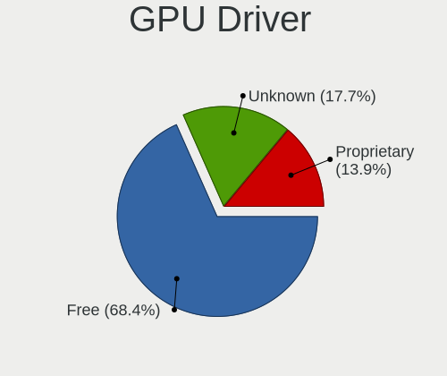

| Driver      | Notebooks | Percent |
|-------------|-----------|---------|
| Free        | 72        | 81.82%  |
| Proprietary | 16        | 18.18%  |

GPU Memory
----------

Total video memory

| Size in GB | Notebooks | Percent |
|------------|-----------|---------|
| Unknown    | 58        | 65.91%  |
| 0.01-0.5   | 13        | 14.77%  |
| 3.01-4.0   | 6         | 6.82%   |
| 1.01-2.0   | 6         | 6.82%   |
| 0.51-1.0   | 4         | 4.55%   |
| 5.01-6.0   | 1         | 1.14%   |

Monitor
-------

Monitor Vendor
--------------

Monitor vendors

| Vendor              | Notebooks | Percent |
|---------------------|-----------|---------|
| Chimei Innolux      | 21        | 22.34%  |
| BOE                 | 21        | 22.34%  |
| AU Optronics        | 17        | 18.09%  |
| LG Display          | 10        | 10.64%  |
| Samsung Electronics | 8         | 8.51%   |
| PANDA               | 5         | 5.32%   |
| Dell                | 3         | 3.19%   |
| Sharp               | 2         | 2.13%   |
| Valve               | 1         | 1.06%   |
| Sony                | 1         | 1.06%   |
| RTK                 | 1         | 1.06%   |
| InnoLux Display     | 1         | 1.06%   |
| Goldstar            | 1         | 1.06%   |
| AOC                 | 1         | 1.06%   |
| Acer                | 1         | 1.06%   |

Monitor Model
-------------

Monitor models

| Model                                                                 | Notebooks | Percent |
|-----------------------------------------------------------------------|-----------|---------|
| PANDA LCD Monitor NCP0036 1920x1080 344x194mm 15.5-inch               | 3         | 3.19%   |
| Chimei Innolux LCD Monitor CMN153C 1920x1080 344x193mm 15.5-inch      | 3         | 3.19%   |
| Dell D2015H DELF063 1920x1080 435x239mm 19.5-inch                     | 2         | 2.13%   |
| Chimei Innolux LCD Monitor CMN15F5 1920x1080 344x193mm 15.5-inch      | 2         | 2.13%   |
| Chimei Innolux LCD Monitor CMN1521 1920x1080 344x193mm 15.5-inch      | 2         | 2.13%   |
| Chimei Innolux LCD Monitor CMN14E5 1920x1080 309x173mm 13.9-inch      | 2         | 2.13%   |
| Chimei Innolux LCD Monitor CMN14D4 1920x1080 309x173mm 13.9-inch      | 2         | 2.13%   |
| Chimei Innolux LCD Monitor CMN140A 1920x1080 309x173mm 13.9-inch      | 2         | 2.13%   |
| BOE LCD Monitor BOE0672 1366x768 344x194mm 15.5-inch                  | 2         | 2.13%   |
| AU Optronics LCD Monitor AUOC19E 1920x1080 309x174mm 14.0-inch        | 2         | 2.13%   |
| AU Optronics LCD Monitor AUO2E3C 1366x768 309x173mm 13.9-inch         | 2         | 2.13%   |
| Valve ANX7530 U VLV3001 800x1280 100x150mm 7.1-inch                   | 1         | 1.06%   |
| Sony TV SNY4402 1360x768                                              | 1         | 1.06%   |
| Sharp LCD Monitor SHP1517 3840x2400 366x229mm 17.0-inch               | 1         | 1.06%   |
| Sharp LCD Monitor SHP14BA 1920x1080 344x194mm 15.5-inch               | 1         | 1.06%   |
| Samsung Electronics LF24T35 SAM707D 1920x1080 530x300mm 24.0-inch     | 1         | 1.06%   |
| Samsung Electronics LCD Monitor SEC5742 1366x768 309x174mm 14.0-inch  | 1         | 1.06%   |
| Samsung Electronics LCD Monitor SEC5443 1920x1200 367x230mm 17.1-inch | 1         | 1.06%   |
| Samsung Electronics LCD Monitor SEC5441 1366x768 293x165mm 13.2-inch  | 1         | 1.06%   |
| Samsung Electronics LCD Monitor SDC4181 2880x1800 302x189mm 14.0-inch | 1         | 1.06%   |
| Samsung Electronics LCD Monitor SDC4171 2880x1800 302x189mm 14.0-inch | 1         | 1.06%   |
| Samsung Electronics LCD Monitor SDC354A 1366x768 344x194mm 15.5-inch  | 1         | 1.06%   |
| Samsung Electronics LCD Monitor SDC314D 1366x768 309x174mm 14.0-inch  | 1         | 1.06%   |
| RTK LCD Monitor RTK1D1A 1920x1080 1020x570mm 46.0-inch                | 1         | 1.06%   |
| PANDA LCD Monitor NCP004D 1920x1080 344x194mm 15.5-inch               | 1         | 1.06%   |
| PANDA LCD Monitor NCP002D 1920x1080 344x194mm 15.5-inch               | 1         | 1.06%   |
| LG Display LCD Monitor LGD06B3 1920x1200 336x210mm 15.6-inch          | 1         | 1.06%   |
| LG Display LCD Monitor LGD05F2 1920x1080 344x194mm 15.5-inch          | 1         | 1.06%   |
| LG Display LCD Monitor LGD05E5 1920x1080 344x194mm 15.5-inch          | 1         | 1.06%   |
| LG Display LCD Monitor LGD05D8 1920x1080 344x194mm 15.5-inch          | 1         | 1.06%   |
| LG Display LCD Monitor LGD0526 1366x768 344x194mm 15.5-inch           | 1         | 1.06%   |
| LG Display LCD Monitor LGD04BE 1366x768 344x194mm 15.5-inch           | 1         | 1.06%   |
| LG Display LCD Monitor LGD049A 2560x1440 310x174mm 14.0-inch          | 1         | 1.06%   |
| LG Display LCD Monitor LGD0456 1366x768 344x194mm 15.5-inch           | 1         | 1.06%   |
| LG Display LCD Monitor LGD02EB 1366x768 309x174mm 14.0-inch           | 1         | 1.06%   |
| LG Display LCD Monitor LGD0215 1920x1080 345x194mm 15.6-inch          | 1         | 1.06%   |
| InnoLux Display LCD Monitor INL0006 1366x768 344x194mm 15.5-inch      | 1         | 1.06%   |
| Goldstar HDR 4K GSM7750 3840x2160 697x392mm 31.5-inch                 | 1         | 1.06%   |
| Dell E2418HN DELA105 1920x1080 527x296mm 23.8-inch                    | 1         | 1.06%   |
| Chimei Innolux LCD Monitor CMN1618 1920x1200 344x215mm 16.0-inch      | 1         | 1.06%   |

Monitor Resolution
------------------

Monitor screen resolution

| Resolution        | Notebooks | Percent |
|-------------------|-----------|---------|
| 1920x1080 (FHD)   | 51        | 56.67%  |
| 1366x768 (WXGA)   | 25        | 27.78%  |
| 1920x1200 (WUXGA) | 4         | 4.44%   |
| 2880x1800         | 2         | 2.22%   |
| 2560x1440 (QHD)   | 2         | 2.22%   |
| 800x1280          | 1         | 1.11%   |
| 3840x2400         | 1         | 1.11%   |
| 3840x2160 (4K)    | 1         | 1.11%   |
| 2240x1400         | 1         | 1.11%   |
| 1360x768          | 1         | 1.11%   |
| 1280x800 (WXGA)   | 1         | 1.11%   |

Monitor Diagonal
----------------

Diagonal size in inches

| Inches | Notebooks | Percent |
|--------|-----------|---------|
| 15     | 49        | 52.13%  |
| 14     | 17        | 18.09%  |
| 13     | 12        | 12.77%  |
| 31     | 2         | 2.13%   |
| 24     | 2         | 2.13%   |
| 19     | 2         | 2.13%   |
| 17     | 2         | 2.13%   |
| 16     | 2         | 2.13%   |
| 72     | 1         | 1.06%   |
| 46     | 1         | 1.06%   |
| 21     | 1         | 1.06%   |
| 12     | 1         | 1.06%   |
| 11     | 1         | 1.06%   |
| 7      | 1         | 1.06%   |

Monitor Width
-------------

Physical width

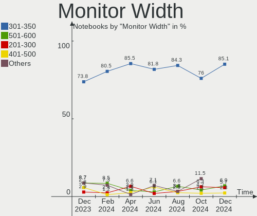

| Width in mm | Notebooks | Percent |
|-------------|-----------|---------|
| 301-350     | 77        | 81.91%  |
| 201-300     | 4         | 4.26%   |
| 401-500     | 3         | 3.19%   |
| 351-400     | 3         | 3.19%   |
| 601-700     | 2         | 2.13%   |
| 501-600     | 2         | 2.13%   |
| 1501-2000   | 1         | 1.06%   |
| 1001-1500   | 1         | 1.06%   |
| 1-100       | 1         | 1.06%   |

Aspect Ratio
------------

Proportional relationship between the width and the height

| Ratio | Notebooks | Percent |
|-------|-----------|---------|
| 16/9  | 78        | 88.64%  |
| 16/10 | 9         | 10.23%  |
| 0.67  | 1         | 1.14%   |

Monitor Area
------------

Area in inch

| Area in inch | Notebooks | Percent |
|----------------|-----------|---------|
| 101-110        | 49        | 52.13%  |
| 81-90          | 27        | 28.72%  |
| 151-200        | 3         | 3.19%   |
| 71-80          | 2         | 2.13%   |
| 351-500        | 2         | 2.13%   |
| 201-250        | 2         | 2.13%   |
| 111-120        | 2         | 2.13%   |
| More than 1000 | 1         | 1.06%   |
| 61-70          | 1         | 1.06%   |
| 51-60          | 1         | 1.06%   |
| 1-40           | 1         | 1.06%   |
| 131-140        | 1         | 1.06%   |
| 121-130        | 1         | 1.06%   |
| 501-1000       | 1         | 1.06%   |

Pixel Density
-------------

Pixels per inch

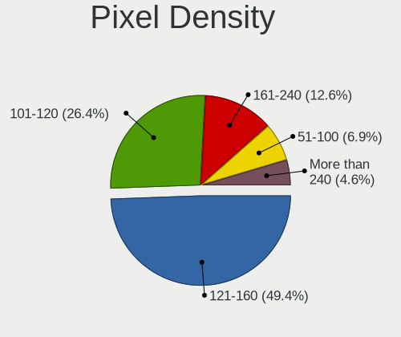

| Density       | Notebooks | Percent |
|---------------|-----------|---------|
| 121-160       | 54        | 57.45%  |
| 101-120       | 27        | 28.72%  |
| 161-240       | 4         | 4.26%   |
| 51-100        | 4         | 4.26%   |
| More than 240 | 3         | 3.19%   |
| 1-50          | 2         | 2.13%   |

Multiple Monitors
-----------------

Total monitors connected

| Total | Notebooks | Percent |
|-------|-----------|---------|
| 1     | 80        | 90.91%  |
| 2     | 7         | 7.95%   |
| 0     | 1         | 1.14%   |

Network
-------

Net Controller Vendor
---------------------

Controller vendors

| Vendor                          | Notebooks | Percent |
|---------------------------------|-----------|---------|
| Realtek Semiconductor           | 54        | 38.03%  |
| Intel                           | 43        | 30.28%  |
| Qualcomm Atheros                | 15        | 10.56%  |
| MediaTek                        | 9         | 6.34%   |
| Broadcom                        | 5         | 3.52%   |
| Samsung Electronics             | 4         | 2.82%   |
| Xiaomi                          | 2         | 1.41%   |
| Qualcomm                        | 2         | 1.41%   |
| vivo                            | 1         | 0.7%    |
| Ralink                          | 1         | 0.7%    |
| Qualcomm Atheros Communications | 1         | 0.7%    |
| QinHeng Electronics             | 1         | 0.7%    |
| Espressif                       | 1         | 0.7%    |
| D-Link                          | 1         | 0.7%    |
| Broadcom Limited                | 1         | 0.7%    |
| ASIX Electronics                | 1         | 0.7%    |

Net Controller Model
--------------------

Controller models

| Model                                                             | Notebooks | Percent |
|-------------------------------------------------------------------|-----------|---------|
| Realtek RTL8111/8168/8411 PCI Express Gigabit Ethernet Controller | 37        | 23.42%  |
| Realtek RTL810xE PCI Express Fast Ethernet controller             | 7         | 4.43%   |
| Qualcomm Atheros QCA9377 802.11ac Wireless Network Adapter        | 7         | 4.43%   |
| Intel Wi-Fi 6 AX201                                               | 7         | 4.43%   |
| Realtek RTL8822CE 802.11ac PCIe Wireless Network Adapter          | 6         | 3.8%    |
| MediaTek MT7921 802.11ax PCI Express Wireless Network Adapter     | 6         | 3.8%    |
| Intel Alder Lake-P PCH CNVi WiFi                                  | 5         | 3.16%   |
| Realtek RTL8852BE PCIe 802.11ax Wireless Network Controller       | 4         | 2.53%   |
| Realtek RTL8821CE 802.11ac PCIe Wireless Network Adapter          | 4         | 2.53%   |
| Intel Tiger Lake PCH CNVi WiFi                                    | 3         | 1.9%    |
| Intel Ice Lake-LP PCH CNVi WiFi                                   | 3         | 1.9%    |
| Xiaomi Mi/Redmi series (RNDIS + ADB)                              | 2         | 1.27%   |
| Samsung GT-I9070 (network tethering, USB debugging enabled)       | 2         | 1.27%   |
| Samsung Galaxy series, misc. (tethering mode)                     | 2         | 1.27%   |
| Qualcomm Nokia G400 5G                                            | 2         | 1.27%   |
| Qualcomm Atheros QCA9565 / AR9565 Wireless Network Adapter        | 2         | 1.27%   |
| Qualcomm Atheros AR9285 Wireless Network Adapter (PCI-Express)    | 2         | 1.27%   |
| MediaTek MT7921K (RZ608) Wi-Fi 6E 80MHz                           | 2         | 1.27%   |
| Intel Wireless 8265 / 8275                                        | 2         | 1.27%   |
| Intel Wireless 7265                                               | 2         | 1.27%   |
| Intel Wi-Fi 6 AX200                                               | 2         | 1.27%   |
| Intel Ethernet Connection (16) I219-V                             | 2         | 1.27%   |
| Intel Dual Band Wireless-AC 3168NGW [Stone Peak]                  | 2         | 1.27%   |
| Intel Comet Lake PCH-LP CNVi WiFi                                 | 2         | 1.27%   |
| Intel 82579LM Gigabit Network Connection (Lewisville)             | 2         | 1.27%   |
| Broadcom BCM43142 802.11b/g/n                                     | 2         | 1.27%   |
| Broadcom BCM4313 802.11bgn Wireless Network Adapter               | 2         | 1.27%   |
| vivo 1820                                                         | 1         | 0.63%   |
| Realtek RTL8852AE 802.11ax PCIe Wireless Network Adapter          | 1         | 0.63%   |
| Realtek RTL8723DE Wireless Network Adapter                        | 1         | 0.63%   |
| Realtek RTL8125 2.5GbE Controller                                 | 1         | 0.63%   |
| Ralink RT3290 Wireless 802.11n 1T/1R PCIe                         | 1         | 0.63%   |
| Qualcomm Atheros QCA8172 Fast Ethernet                            | 1         | 0.63%   |
| Qualcomm Atheros QCA8171 Gigabit Ethernet                         | 1         | 0.63%   |
| Qualcomm Atheros QCA6174 802.11ac Wireless Network Adapter        | 1         | 0.63%   |
| Qualcomm Atheros AR9271 802.11n                                   | 1         | 0.63%   |
| Qualcomm Atheros AR9485 Wireless Network Adapter                  | 1         | 0.63%   |
| Qualcomm Atheros AR9462 Wireless Network Adapter                  | 1         | 0.63%   |
| QinHeng USB Single Serial                                         | 1         | 0.63%   |
| MediaTek MT7922 802.11ax PCI Express Wireless Network Adapter     | 1         | 0.63%   |

Wireless Vendor
---------------

Wireless vendors

| Vendor                          | Notebooks | Percent |
|---------------------------------|-----------|---------|
| Intel                           | 43        | 48.31%  |
| Realtek Semiconductor           | 16        | 17.98%  |
| Qualcomm Atheros                | 14        | 15.73%  |
| MediaTek                        | 9         | 10.11%  |
| Broadcom                        | 4         | 4.49%   |
| Ralink                          | 1         | 1.12%   |
| Qualcomm Atheros Communications | 1         | 1.12%   |
| D-Link                          | 1         | 1.12%   |

Wireless Model
--------------

Wireless models

| Model                                                          | Notebooks | Percent |
|----------------------------------------------------------------|-----------|---------|
| Qualcomm Atheros QCA9377 802.11ac Wireless Network Adapter     | 7         | 7.87%   |
| Intel Wi-Fi 6 AX201                                            | 7         | 7.87%   |
| Realtek RTL8822CE 802.11ac PCIe Wireless Network Adapter       | 6         | 6.74%   |
| MediaTek MT7921 802.11ax PCI Express Wireless Network Adapter  | 6         | 6.74%   |
| Intel Alder Lake-P PCH CNVi WiFi                               | 5         | 5.62%   |
| Realtek RTL8852BE PCIe 802.11ax Wireless Network Controller    | 4         | 4.49%   |
| Realtek RTL8821CE 802.11ac PCIe Wireless Network Adapter       | 4         | 4.49%   |
| Intel Tiger Lake PCH CNVi WiFi                                 | 3         | 3.37%   |
| Intel Ice Lake-LP PCH CNVi WiFi                                | 3         | 3.37%   |
| Qualcomm Atheros QCA9565 / AR9565 Wireless Network Adapter     | 2         | 2.25%   |
| Qualcomm Atheros AR9285 Wireless Network Adapter (PCI-Express) | 2         | 2.25%   |
| MediaTek MT7921K (RZ608) Wi-Fi 6E 80MHz                        | 2         | 2.25%   |
| Intel Wireless 8265 / 8275                                     | 2         | 2.25%   |
| Intel Wireless 7265                                            | 2         | 2.25%   |
| Intel Wi-Fi 6 AX200                                            | 2         | 2.25%   |
| Intel Dual Band Wireless-AC 3168NGW [Stone Peak]               | 2         | 2.25%   |
| Intel Comet Lake PCH-LP CNVi WiFi                              | 2         | 2.25%   |
| Broadcom BCM43142 802.11b/g/n                                  | 2         | 2.25%   |
| Broadcom BCM4313 802.11bgn Wireless Network Adapter            | 2         | 2.25%   |
| Realtek RTL8852AE 802.11ax PCIe Wireless Network Adapter       | 1         | 1.12%   |
| Realtek RTL8723DE Wireless Network Adapter                     | 1         | 1.12%   |
| Ralink RT3290 Wireless 802.11n 1T/1R PCIe                      | 1         | 1.12%   |
| Qualcomm Atheros QCA6174 802.11ac Wireless Network Adapter     | 1         | 1.12%   |
| Qualcomm Atheros AR9271 802.11n                                | 1         | 1.12%   |
| Qualcomm Atheros AR9485 Wireless Network Adapter               | 1         | 1.12%   |
| Qualcomm Atheros AR9462 Wireless Network Adapter               | 1         | 1.12%   |
| MediaTek MT7922 802.11ax PCI Express Wireless Network Adapter  | 1         | 1.12%   |
| Intel Wireless-AC 9260                                         | 1         | 1.12%   |
| Intel Wireless 8260                                            | 1         | 1.12%   |
| Intel Wireless 3165                                            | 1         | 1.12%   |
| Intel Wireless 3160                                            | 1         | 1.12%   |
| Intel Wi-Fi 6 AX210/AX211/AX411 160MHz                         | 1         | 1.12%   |
| Intel Ultimate N WiFi Link 5300                                | 1         | 1.12%   |
| Intel Centrino Wireless-N 135                                  | 1         | 1.12%   |
| Intel Centrino Wireless-N 1000 [Condor Peak]                   | 1         | 1.12%   |
| Intel Centrino Ultimate-N 6300                                 | 1         | 1.12%   |
| Intel Centrino Advanced-N 6200                                 | 1         | 1.12%   |
| Intel Centrino Advanced-N + WiMAX 6250 [Kilmer Peak]           | 1         | 1.12%   |
| Intel Cannon Point-LP CNVi [Wireless-AC]                       | 1         | 1.12%   |
| Intel Cannon Lake PCH CNVi WiFi                                | 1         | 1.12%   |

Ethernet Vendor
---------------

Ethernet vendors

| Vendor                | Notebooks | Percent |
|-----------------------|-----------|---------|
| Realtek Semiconductor | 45        | 70.31%  |
| Intel                 | 7         | 10.94%  |
| Xiaomi                | 2         | 3.13%   |
| Samsung Electronics   | 2         | 3.13%   |
| Qualcomm Atheros      | 2         | 3.13%   |
| Qualcomm              | 2         | 3.13%   |
| vivo                  | 1         | 1.56%   |
| Broadcom Limited      | 1         | 1.56%   |
| Broadcom              | 1         | 1.56%   |
| ASIX Electronics      | 1         | 1.56%   |

Ethernet Model
--------------

Ethernet models

| Model                                                             | Notebooks | Percent |
|-------------------------------------------------------------------|-----------|---------|
| Realtek RTL8111/8168/8411 PCI Express Gigabit Ethernet Controller | 37        | 56.92%  |
| Realtek RTL810xE PCI Express Fast Ethernet controller             | 7         | 10.77%  |
| Xiaomi Mi/Redmi series (RNDIS + ADB)                              | 2         | 3.08%   |
| Samsung Galaxy series, misc. (tethering mode)                     | 2         | 3.08%   |
| Qualcomm Nokia G400 5G                                            | 2         | 3.08%   |
| Intel Ethernet Connection (16) I219-V                             | 2         | 3.08%   |
| Intel 82579LM Gigabit Network Connection (Lewisville)             | 2         | 3.08%   |
| vivo 1820                                                         | 1         | 1.54%   |
| Realtek RTL8125 2.5GbE Controller                                 | 1         | 1.54%   |
| Qualcomm Atheros QCA8172 Fast Ethernet                            | 1         | 1.54%   |
| Qualcomm Atheros QCA8171 Gigabit Ethernet                         | 1         | 1.54%   |
| Intel WiMAX Connection 2400m                                      | 1         | 1.54%   |
| Intel Ethernet Connection I219-LM                                 | 1         | 1.54%   |
| Intel Ethernet Connection (3) I218-LM                             | 1         | 1.54%   |
| Intel 82577LM Gigabit Network Connection                          | 1         | 1.54%   |
| Broadcom NetXtreme BCM57762 Gigabit Ethernet PCIe                 | 1         | 1.54%   |
| Broadcom Limited NetXtreme BCM5761e Gigabit Ethernet PCIe         | 1         | 1.54%   |
| ASIX AX88179 Gigabit Ethernet                                     | 1         | 1.54%   |

Net Controller Kind
-------------------

Ethernet, WiFi or modem

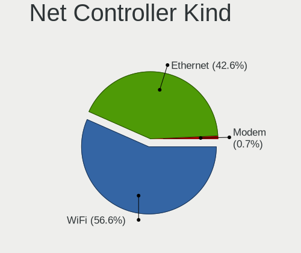

| Kind     | Notebooks | Percent |
|----------|-----------|---------|
| WiFi     | 87        | 57.24%  |
| Ethernet | 61        | 40.13%  |
| Modem    | 4         | 2.63%   |

Used Controller
---------------

Currently used network controller

| Kind     | Notebooks | Percent |
|----------|-----------|---------|
| WiFi     | 77        | 93.9%   |
| Ethernet | 5         | 6.1%    |

NICs
----

Total network controllers on board

| Total | Notebooks | Percent |
|-------|-----------|---------|
| 2     | 56        | 63.64%  |
| 1     | 31        | 35.23%  |
| 0     | 1         | 1.14%   |

IPv6
----

IPv6 vs IPv4

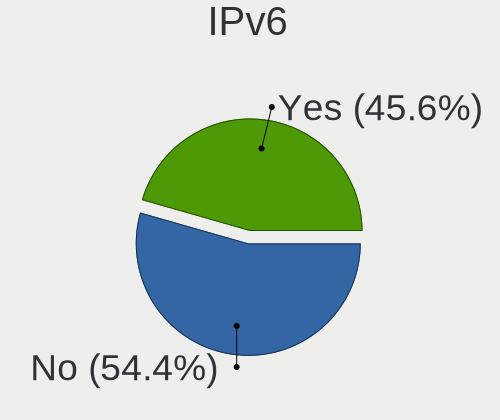

| Used | Notebooks | Percent |
|------|-----------|---------|
| Yes  | 45        | 51.14%  |
| No   | 43        | 48.86%  |

Bluetooth
---------

Bluetooth Vendor
----------------

Controller vendors

| Vendor                          | Notebooks | Percent |
|---------------------------------|-----------|---------|
| Intel                           | 37        | 45.12%  |
| Realtek Semiconductor           | 13        | 15.85%  |
| IMC Networks                    | 12        | 14.63%  |
| Qualcomm Atheros Communications | 6         | 7.32%   |
| Lite-On Technology              | 5         | 6.1%    |
| Broadcom                        | 3         | 3.66%   |
| MediaTek                        | 2         | 2.44%   |
| Ralink                          | 1         | 1.22%   |
| Hewlett-Packard                 | 1         | 1.22%   |
| Foxconn / Hon Hai               | 1         | 1.22%   |
| Dell                            | 1         | 1.22%   |

Bluetooth Model
---------------

Controller models

| Model                                                | Notebooks | Percent |
|------------------------------------------------------|-----------|---------|
| Realtek Bluetooth Radio                              | 12        | 14.63%  |
| Intel AX201 Bluetooth                                | 12        | 14.63%  |
| Intel Bluetooth 9460/9560 Jefferson Peak (JfP)       | 10        | 12.2%   |
| Intel Bluetooth wireless interface                   | 6         | 7.32%   |
| IMC Networks Wireless_Device                         | 5         | 6.1%    |
| IMC Networks Bluetooth Radio                         | 4         | 4.88%   |
| Qualcomm Atheros  Bluetooth Device                   | 3         | 3.66%   |
| Lite-On Qualcomm Atheros QCA9377 Bluetooth           | 3         | 3.66%   |
| IMC Networks Bluetooth Device                        | 3         | 3.66%   |
| MediaTek Wireless_Device                             | 2         | 2.44%   |
| Intel Wireless-AC 3168 Bluetooth                     | 2         | 2.44%   |
| Intel Bluetooth Device                               | 2         | 2.44%   |
| Intel AX200 Bluetooth                                | 2         | 2.44%   |
| Broadcom BCM43142 Bluetooth 4.0                      | 2         | 2.44%   |
| Realtek  Bluetooth 4.2 Adapter                       | 1         | 1.22%   |
| Ralink RT3290 Bluetooth                              | 1         | 1.22%   |
| Qualcomm Atheros Dell Wireless 1802 Bluetooth 4.0 LE | 1         | 1.22%   |
| Qualcomm Atheros AR3012 Bluetooth 4.0                | 1         | 1.22%   |
| Qualcomm Atheros AR3011 Bluetooth                    | 1         | 1.22%   |
| Lite-On Wireless_Device                              | 1         | 1.22%   |
| Lite-On Bluetooth Device                             | 1         | 1.22%   |
| Intel Wireless-AC 9260 Bluetooth Adapter             | 1         | 1.22%   |
| Intel Centrino Bluetooth Wireless Transceiver        | 1         | 1.22%   |
| Intel AX210 Bluetooth                                | 1         | 1.22%   |
| HP Broadcom 2070 Bluetooth Combo                     | 1         | 1.22%   |
| Foxconn / Hon Hai Wireless_Device                    | 1         | 1.22%   |
| Dell Wireless 360 Bluetooth                          | 1         | 1.22%   |
| Broadcom HP Portable Valentine                       | 1         | 1.22%   |

Sound
-----

Sound Vendor
------------

Sound card vendors

| Vendor           | Notebooks | Percent |
|------------------|-----------|---------|
| Intel            | 60        | 58.25%  |
| AMD              | 27        | 26.21%  |
| Nvidia           | 15        | 14.56%  |
| ASUSTek Computer | 1         | 0.97%   |

Sound Model
-----------

Sound card models

| Model                                                                                             | Notebooks | Percent |
|---------------------------------------------------------------------------------------------------|-----------|---------|
| AMD Family 17h/19h HD Audio Controller                                                            | 22        | 16.42%  |
| AMD Renoir Radeon High Definition Audio Controller                                                | 12        | 8.96%   |
| Intel Tiger Lake-LP Smart Sound Technology Audio Controller                                       | 9         | 6.72%   |
| Intel Sunrise Point-LP HD Audio                                                                   | 9         | 6.72%   |
| Intel Alder Lake PCH-P High Definition Audio Controller                                           | 7         | 5.22%   |
| Nvidia TU107 GeForce GTX 1650 High Definition Audio Controller                                    | 5         | 3.73%   |
| AMD Raven/Raven2/Fenghuang HDMI/DP Audio Controller                                               | 5         | 3.73%   |
| Nvidia Audio device                                                                               | 4         | 2.99%   |
| Intel Wildcat Point-LP High Definition Audio Controller                                           | 4         | 2.99%   |
| Intel Broadwell-U Audio Controller                                                                | 4         | 2.99%   |
| Intel 82801I (ICH9 Family) HD Audio Controller                                                    | 4         | 2.99%   |
| Intel Tiger Lake-H HD Audio Controller                                                            | 3         | 2.24%   |
| Intel Ice Lake-LP Smart Sound Technology Audio Controller                                         | 3         | 2.24%   |
| Intel Comet Lake PCH-LP cAVS                                                                      | 3         | 2.24%   |
| Intel 7 Series/C216 Chipset Family High Definition Audio Controller                               | 3         | 2.24%   |
| Intel 6 Series/C200 Series Chipset Family High Definition Audio Controller                        | 3         | 2.24%   |
| AMD Navi 10 HDMI Audio                                                                            | 3         | 2.24%   |
| Nvidia GF119 HDMI Audio Controller                                                                | 2         | 1.49%   |
| Intel Cannon Lake PCH cAVS                                                                        | 2         | 1.49%   |
| Intel Alder Lake-U cAVS (Audio, Voice, Speech)                                                    | 2         | 1.49%   |
| Intel 5 Series/3400 Series Chipset High Definition Audio                                          | 2         | 1.49%   |
| AMD Rembrandt Radeon High Definition Audio Controller                                             | 2         | 1.49%   |
| AMD High Definition Audio Controller                                                              | 2         | 1.49%   |
| AMD Family 15h (Models 60h-6fh) Audio Controller                                                  | 2         | 1.49%   |
| Nvidia GK208 HDMI/DP Audio Controller                                                             | 1         | 0.75%   |
| Nvidia GK107 HDMI Audio Controller                                                                | 1         | 0.75%   |
| Nvidia GF108 High Definition Audio Controller                                                     | 1         | 0.75%   |
| Nvidia GA106 High Definition Audio Controller                                                     | 1         | 0.75%   |
| Intel Xeon E3-1200 v3/4th Gen Core Processor HD Audio Controller                                  | 1         | 0.75%   |
| Intel Haswell-ULT HD Audio Controller                                                             | 1         | 0.75%   |
| Intel Comet Lake PCH cAVS                                                                         | 1         | 0.75%   |
| Intel Cannon Point-LP High Definition Audio Controller                                            | 1         | 0.75%   |
| Intel Atom/Celeron/Pentium Processor x5-E8000/J3xxx/N3xxx Series High Definition Audio Controller | 1         | 0.75%   |
| Intel Alder Lake-N HD Graphics SGPC                                                               | 1         | 0.75%   |
| Intel 8 Series/C220 Series Chipset High Definition Audio Controller                               | 1         | 0.75%   |
| Intel 8 Series HD Audio Controller                                                                | 1         | 0.75%   |
| ASUSTek Computer C-Media Audio                                                                    | 1         | 0.75%   |
| AMD SBx00 Azalia (Intel HDA)                                                                      | 1         | 0.75%   |
| AMD RS880 HDMI Audio [Radeon HD 4200 Series]                                                      | 1         | 0.75%   |
| AMD Kabini HDMI/DP Audio                                                                          | 1         | 0.75%   |

Memory
------

Memory Vendor
-------------

Memory module vendors

| Vendor              | Notebooks | Percent |
|---------------------|-----------|---------|
| Samsung Electronics | 22        | 28.95%  |
| SK hynix            | 19        | 25%     |
| Micron Technology   | 18        | 23.68%  |
| Crucial             | 6         | 7.89%   |
| Ramaxel Technology  | 4         | 5.26%   |
| Nanya Technology    | 2         | 2.63%   |
| Kingston            | 2         | 2.63%   |
| G.Skill             | 1         | 1.32%   |
| Elpida              | 1         | 1.32%   |
| A-DATA Technology   | 1         | 1.32%   |

Memory Model
------------

Memory module models

| Model                                                            | Notebooks | Percent |
|------------------------------------------------------------------|-----------|---------|
| Samsung RAM M471A1G44AB0-CWE 8GB SODIMM DDR4 3200MT/s            | 5         | 6.33%   |
| SK hynix RAM HMAA1GS6CJR6N-XN 8GB SODIMM DDR4 3200MT/s           | 4         | 5.06%   |
| Samsung RAM M471A1K43EB1-CWE 8GB SODIMM DDR4 3200MT/s            | 4         | 5.06%   |
| Micron RAM 8ATF1G64HZ-3G2R1 8GB SODIMM DDR4 3200MT/s             | 4         | 5.06%   |
| SK hynix RAM HMT451S6BFR8A-PB 4GB SODIMM DDR3 1600MT/s           | 3         | 3.8%    |
| SK hynix RAM HYMP125S64CP8-S6 2GB SODIMM DDR 800MT/s             | 2         | 2.53%   |
| Samsung RAM M4 70T5663RZ3-CF7 2GB SODIMM DDR 975MT/s             | 2         | 2.53%   |
| Micron RAM Module 8GB SODIMM DDR4 3200MT/s                       | 2         | 2.53%   |
| Micron RAM 8ATF1G64HZ-3G2J1 8GB SODIMM DDR4 3200MT/s             | 2         | 2.53%   |
| Micron RAM 4ATF51264HZ-2G3B1 4GB SODIMM DDR4 2400MT/s            | 2         | 2.53%   |
| Micron RAM 4ATF1G64HZ-3G2F1 8GB SODIMM DDR4 3200MT/s             | 2         | 2.53%   |
| SK hynix RAM HMT41GS6BFR8A-PB 8GB SODIMM DDR3 1600MT/s           | 1         | 1.27%   |
| SK hynix RAM HMT351S6CFR8C-H9 4GB SODIMM DDR3 1334MT/s           | 1         | 1.27%   |
| SK hynix RAM HMT325S6BFR8C-H9 2GB SODIMM DDR3 1600MT/s           | 1         | 1.27%   |
| SK hynix RAM HMA851S6DJR6N-XN 4GB SODIMM DDR4 3200MT/s           | 1         | 1.27%   |
| SK hynix RAM HMA851S6DJR6N-XN 4GB Row Of Chips DDR4 3200MT/s     | 1         | 1.27%   |
| SK hynix RAM HMA851S6DJR6N-VK 4GB SODIMM DDR4 2667MT/s           | 1         | 1.27%   |
| SK hynix RAM HMA81GS6JJR8N-VK 8GB SODIMM DDR4 2667MT/s           | 1         | 1.27%   |
| SK hynix RAM HMA81GS6DJR8N-XN 8GB SODIMM DDR4 3200MT/s           | 1         | 1.27%   |
| SK hynix RAM HMA81GS6CJR8N-XN 8GB SODIMM DDR4 3200MT/s           | 1         | 1.27%   |
| SK hynix RAM HMA81GS6AFR8N-UH 8GB SODIMM DDR4 2667MT/s           | 1         | 1.27%   |
| SK hynix RAM H9JCNNNCP3MLYR-N6E 2GB Row Of Chips LPDDR5 6400MT/s | 1         | 1.27%   |
| Samsung RAM M471B5273DH0-CH9 4GB SODIMM DDR3 1334MT/s            | 1         | 1.27%   |
| Samsung RAM M471B5173EB0-YK0 4096MB SODIMM DDR3 1600MT/s         | 1         | 1.27%   |
| Samsung RAM M471A5244CB0-CWE 4GB Row Of Chips DDR4 3200MT/s      | 1         | 1.27%   |
| Samsung RAM M471A5244CB0-CTD 4GB SODIMM DDR4 3266MT/s            | 1         | 1.27%   |
| Samsung RAM M471A5244CB0-CTD 4GB Row Of Chips DDR4 2667MT/s      | 1         | 1.27%   |
| Samsung RAM M471A5244BB0-CRC 4GB SODIMM DDR4 2667MT/s            | 1         | 1.27%   |
| Samsung RAM M471A5244BB0-CPB 4GB SODIMM DDR4 2400MT/s            | 1         | 1.27%   |
| Samsung RAM M471A2K43DB1-CWE 16GB SODIMM DDR4 3200MT/s           | 1         | 1.27%   |
| Samsung RAM M471A1G44AB0-CWE 8GB Row Of Chips DDR4 3200MT/s      | 1         | 1.27%   |
| Samsung RAM M425R1GB4BB0-CQKOL 8GB SODIMM DDR5 4800MT/s          | 1         | 1.27%   |
| Samsung RAM K4U6E3S4AA-MGCL 4GB Row Of Chips LPDDR4 4267MT/s     | 1         | 1.27%   |
| Ramaxel RAM RMSA3320KE78HAF-3200 8GB SODIMM DDR4 3200MT/s        | 1         | 1.27%   |
| Ramaxel RAM RMSA3310MB96HAF-3200 8GB SODIMM DDR4 3200MT/s        | 1         | 1.27%   |
| Ramaxel RAM RMSA3270ME86H9F-2666 4GB SODIMM DDR4 2667MT/s        | 1         | 1.27%   |
| Ramaxel RAM RMSA3260MF68H9F-2666 4GB SODIMM DDR4 2400MT/s        | 1         | 1.27%   |
| Nanya RAM NT4GC64B8HG0NS-DI 4GB SODIMM DDR3 1600MT/s             | 1         | 1.27%   |
| Nanya RAM NT2GC64B88G0NS-CG 2GB SODIMM DDR3 1600MT/s             | 1         | 1.27%   |
| Micron RAM MTC4C10163S1SC48BA1 8GB SODIMM DDR5 4800MT/s          | 1         | 1.27%   |

Memory Kind
-----------

Memory module kinds

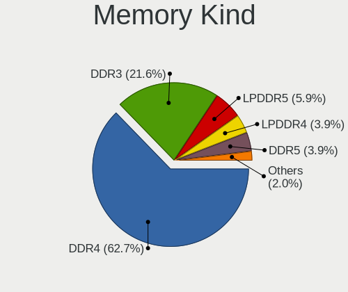

| Kind   | Notebooks | Percent |
|--------|-----------|---------|
| DDR4   | 42        | 70%     |
| DDR3   | 10        | 16.67%  |
| LPDDR4 | 3         | 5%      |
| DDR5   | 2         | 3.33%   |
| DDR2   | 2         | 3.33%   |
| LPDDR5 | 1         | 1.67%   |

Memory Form Factor
------------------

Physical design of the memory module

| Name         | Notebooks | Percent |
|--------------|-----------|---------|
| SODIMM       | 55        | 85.94%  |
| Row Of Chips | 9         | 14.06%  |

Memory Size
-----------

Memory module size

| Size  | Notebooks | Percent |
|-------|-----------|---------|
| 8192  | 38        | 60.32%  |
| 4096  | 18        | 28.57%  |
| 2048  | 5         | 7.94%   |
| 16384 | 2         | 3.17%   |

Memory Speed
------------

Memory module speed

| Speed | Notebooks | Percent |
|-------|-----------|---------|
| 3200  | 29        | 46.77%  |
| 2667  | 8         | 12.9%   |
| 1600  | 8         | 12.9%   |
| 2400  | 5         | 8.06%   |
| 1334  | 3         | 4.84%   |
| 4800  | 2         | 3.23%   |
| 4267  | 2         | 3.23%   |
| 975   | 2         | 3.23%   |
| 6400  | 1         | 1.61%   |
| 3733  | 1         | 1.61%   |
| 3266  | 1         | 1.61%   |

Printers & scanners
-------------------

Printer Vendor
--------------

Printer device vendors

Zero info for selected period =(

Printer Model
-------------

Printer device models

Zero info for selected period =(

Scanner Vendor
--------------

Scanner device vendors

Zero info for selected period =(

Scanner Model
-------------

Scanner device models

Zero info for selected period =(

Camera
------

Camera Vendor
-------------

Camera device vendors

| Vendor                                 | Notebooks | Percent |
|----------------------------------------|-----------|---------|
| IMC Networks                           | 15        | 18.75%  |
| Chicony Electronics                    | 15        | 18.75%  |
| Microdia                               | 9         | 11.25%  |
| Quanta                                 | 8         | 10%     |
| Realtek Semiconductor                  | 5         | 6.25%   |
| Sonix Technology                       | 4         | 5%      |
| Luxvisions Innotech Limited            | 4         | 5%      |
| Acer                                   | 4         | 5%      |
| Syntek                                 | 2         | 2.5%    |
| Sunplus Innovation Technology          | 2         | 2.5%    |
| Samsung Electronics                    | 2         | 2.5%    |
| Cheng Uei Precision Industry (Foxlink) | 2         | 2.5%    |
| Bison Electronics                      | 2         | 2.5%    |
| Suyin                                  | 1         | 1.25%   |
| ShineOptics                            | 1         | 1.25%   |
| Pixart Imaging                         | 1         | 1.25%   |
| Logitech                               | 1         | 1.25%   |
| Lite-On Technology                     | 1         | 1.25%   |
| Alcor Micro                            | 1         | 1.25%   |

Camera Model
------------

Camera device models

| Model                                                           | Notebooks | Percent |
|-----------------------------------------------------------------|-----------|---------|
| IMC Networks USB2.0 HD UVC WebCam                               | 9         | 11.25%  |
| Microdia Integrated_Webcam_HD                                   | 6         | 7.5%    |
| Luxvisions Innotech Limited Integrated Camera                   | 4         | 5%      |
| Sonix USB2.0 HD UVC WebCam                                      | 3         | 3.75%   |
| Realtek Integrated_Webcam_HD                                    | 3         | 3.75%   |
| IMC Networks Integrated Camera                                  | 3         | 3.75%   |
| Chicony Integrated Camera                                       | 3         | 3.75%   |
| Acer Integrated Camera                                          | 3         | 3.75%   |
| Sunplus Integrated_Webcam_HD                                    | 2         | 2.5%    |
| Samsung Galaxy A5 (MTP)                                         | 2         | 2.5%    |
| Quanta HP Wide Vision HD Camera                                 | 2         | 2.5%    |
| Quanta HP TrueVision HD Camera                                  | 2         | 2.5%    |
| Quanta ACER HD User Facing                                      | 2         | 2.5%    |
| Chicony HP Wide Vision HD Camera                                | 2         | 2.5%    |
| Chicony HP Truevision HD camera                                 | 2         | 2.5%    |
| Chicony HD WebCam                                               | 2         | 2.5%    |
| Chicony EasyCamera                                              | 2         | 2.5%    |
| Syntek Lenovo EasyCamera                                        | 1         | 1.25%   |
| Syntek Integrated Camera                                        | 1         | 1.25%   |
| Suyin HP Webcam-101                                             | 1         | 1.25%   |
| Sonix USB2.0 FHD UVC WebCam                                     | 1         | 1.25%   |
| ShineOptics HD Camera                                           | 1         | 1.25%   |
| Realtek HD WebCam                                               | 1         | 1.25%   |
| Realtek Acer 640 x 480 laptop camera                            | 1         | 1.25%   |
| Quanta Integrated_Webcam_2M                                     | 1         | 1.25%   |
| Quanta HD Webcam                                                | 1         | 1.25%   |
| Pixart Imaging USB_2.0_Webcam                                   | 1         | 1.25%   |
| Microdia Sonix 1.3 MP Laptop Integrated Webcam                  | 1         | 1.25%   |
| Microdia Laptop_Integrated_Webcam_HD                            | 1         | 1.25%   |
| Microdia Integrated Webcam                                      | 1         | 1.25%   |
| Logitech C930c                                                  | 1         | 1.25%   |
| Lite-On HP HD Camera                                            | 1         | 1.25%   |
| IMC Networks XiaoMi Webcam                                      | 1         | 1.25%   |
| IMC Networks USB2.0 VGA UVC WebCam                              | 1         | 1.25%   |
| IMC Networks HP TrueVision HD Camera                            | 1         | 1.25%   |
| Chicony VGA Webcam                                              | 1         | 1.25%   |
| Chicony HP Webcam [2 MP Macro]                                  | 1         | 1.25%   |
| Chicony HP HD Camera                                            | 1         | 1.25%   |
| Chicony ACER QHD User Facing                                    | 1         | 1.25%   |
| Cheng Uei Precision Industry (Foxlink) HP Wide Vision HD Camera | 1         | 1.25%   |

Security
--------

Fingerprint Vendor
------------------

Fingerprint sensor vendors

| Vendor                             | Notebooks | Percent |
|------------------------------------|-----------|---------|
| Elan Microelectronics              | 6         | 37.5%   |
| Shenzhen Goodix Technology         | 4         | 25%     |
| Validity Sensors                   | 3         | 18.75%  |
| Realtek USB2.0 Finger Print Bridge | 2         | 12.5%   |
| Focal-systems.Corp                 | 1         | 6.25%   |

Fingerprint Model
-----------------

Fingerprint sensor models

| Model                                                           | Notebooks | Percent |
|-----------------------------------------------------------------|-----------|---------|
| Elan ELAN:ARM-M4                                                | 5         | 31.25%  |
| Shenzhen Goodix  FingerPrint Device                             | 3         | 18.75%  |
| Realtek USB2.0 Finger Print Bridge FocalTech Fingerprint Device | 2         | 12.5%   |
| Validity Sensors VFS7500 Touch Fingerprint Sensor               | 1         | 6.25%   |
| Validity Sensors VFS495 Fingerprint Reader                      | 1         | 6.25%   |
| Validity Sensors VFS451 Fingerprint Reader                      | 1         | 6.25%   |
| Shenzhen Goodix Fingerprint Reader                              | 1         | 6.25%   |
| Focal-systems.Corp FT9201Fingerprint.                           | 1         | 6.25%   |
| Elan ELAN:Fingerprint                                           | 1         | 6.25%   |

Chipcard Vendor
---------------

Chipcard module vendors

| Vendor   | Notebooks | Percent |
|----------|-----------|---------|
| Broadcom | 3         | 100%    |

Chipcard Model
--------------

Chipcard module models

| Model                                                                        | Notebooks | Percent |
|------------------------------------------------------------------------------|-----------|---------|
| Broadcom BCM5880 Secure Applications Processor                               | 2         | 66.67%  |
| Broadcom BCM5880 Secure Applications Processor with fingerprint swipe sensor | 1         | 33.33%  |

Unsupported
-----------

Unsupported Devices
-------------------

Total unsupported devices on board

| Total | Notebooks | Percent |
|-------|-----------|---------|
| 0     | 59        | 67.05%  |
| 1     | 27        | 30.68%  |
| 2     | 2         | 2.27%   |

Unsupported Device Types
------------------------

Types of unsupported devices

| Type               | Notebooks | Percent |
|--------------------|-----------|---------|
| Fingerprint reader | 16        | 51.61%  |
| Graphics card      | 5         | 16.13%  |
| Camera             | 4         | 12.9%   |
| Chipcard           | 3         | 9.68%   |
| Storage            | 1         | 3.23%   |
| Modem              | 1         | 3.23%   |
| Bluetooth          | 1         | 3.23%   |

