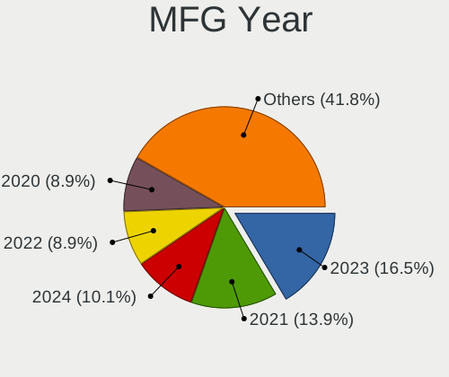
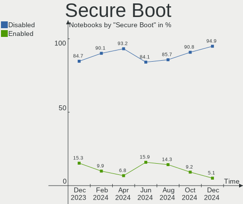

Linux in India - Hardware Trends (Notebooks)
--------------------------------------------

A project to identify most popular hardware characteristics and track their change
over time based on data collected by Linux users at https://Linux-Hardware.org.

Anyone can contribute to this report by the [hw-probe](https://github.com/linuxhw/hw-probe) tool:

    sudo -E hw-probe -all -upload

Period: Sep, 2022.

Contents
--------

* [ System ](#system)
  - [ OS                       ](#os)
  - [ OS Family                ](#os-family)
  - [ Kernel                   ](#kernel)
  - [ Kernel Family            ](#kernel-family)
  - [ Kernel Major Ver.        ](#kernel-major-ver)
  - [ Arch                     ](#arch)
  - [ DE                       ](#de)
  - [ Display Server           ](#display-server)
  - [ Display Manager          ](#display-manager)
  - [ OS Lang                  ](#os-lang)
  - [ Boot Mode                ](#boot-mode)
  - [ Filesystem               ](#filesystem)
  - [ Part. scheme             ](#part-scheme)
  - [ Dual Boot with Linux/BSD ](#dual-boot-with-linuxbsd)
  - [ Dual Boot (Win)          ](#dual-boot-win)

* [ Board ](#board)
  - [ Vendor                   ](#vendor)
  - [ Model                    ](#model)
  - [ Model Family             ](#model-family)
  - [ MFG Year                 ](#mfg-year)
  - [ Form Factor              ](#form-factor)
  - [ Secure Boot              ](#secure-boot)
  - [ Coreboot                 ](#coreboot)
  - [ RAM Size                 ](#ram-size)
  - [ RAM Used                 ](#ram-used)
  - [ Total Drives             ](#total-drives)
  - [ Has CD-ROM               ](#has-cd-rom)
  - [ Has Ethernet             ](#has-ethernet)
  - [ Has WiFi                 ](#has-wifi)
  - [ Has Bluetooth            ](#has-bluetooth)

* [ Location ](#location)
  - [ Country                  ](#country)
  - [ City                     ](#city)

* [ Drives ](#drives)
  - [ Drive Vendor             ](#drive-vendor)
  - [ Drive Model              ](#drive-model)
  - [ HDD Vendor               ](#hdd-vendor)
  - [ SSD Vendor               ](#ssd-vendor)
  - [ Drive Kind               ](#drive-kind)
  - [ Drive Connector          ](#drive-connector)
  - [ Drive Size               ](#drive-size)
  - [ Space Total              ](#space-total)
  - [ Space Used               ](#space-used)
  - [ Malfunc. Drives          ](#malfunc-drives)
  - [ Malfunc. Drive Vendor    ](#malfunc-drive-vendor)
  - [ Malfunc. HDD Vendor      ](#malfunc-hdd-vendor)
  - [ Malfunc. Drive Kind      ](#malfunc-drive-kind)
  - [ Failed Drives            ](#failed-drives)
  - [ Failed Drive Vendor      ](#failed-drive-vendor)
  - [ Drive Status             ](#drive-status)

* [ Storage controller ](#storage-controller)
  - [ Storage Vendor           ](#storage-vendor)
  - [ Storage Model            ](#storage-model)
  - [ Storage Kind             ](#storage-kind)

* [ Processor ](#processor)
  - [ CPU Vendor               ](#cpu-vendor)
  - [ CPU Model                ](#cpu-model)
  - [ CPU Model Family         ](#cpu-model-family)
  - [ CPU Cores                ](#cpu-cores)
  - [ CPU Sockets              ](#cpu-sockets)
  - [ CPU Threads              ](#cpu-threads)
  - [ CPU Op-Modes             ](#cpu-op-modes)
  - [ CPU Microcode            ](#cpu-microcode)
  - [ CPU Microarch            ](#cpu-microarch)

* [ Graphics ](#graphics)
  - [ GPU Vendor               ](#gpu-vendor)
  - [ GPU Model                ](#gpu-model)
  - [ GPU Combo                ](#gpu-combo)
  - [ GPU Driver               ](#gpu-driver)
  - [ GPU Memory               ](#gpu-memory)

* [ Monitor ](#monitor)
  - [ Monitor Vendor           ](#monitor-vendor)
  - [ Monitor Model            ](#monitor-model)
  - [ Monitor Resolution       ](#monitor-resolution)
  - [ Monitor Diagonal         ](#monitor-diagonal)
  - [ Monitor Width            ](#monitor-width)
  - [ Aspect Ratio             ](#aspect-ratio)
  - [ Monitor Area             ](#monitor-area)
  - [ Pixel Density            ](#pixel-density)
  - [ Multiple Monitors        ](#multiple-monitors)

* [ Network ](#network)
  - [ Net Controller Vendor    ](#net-controller-vendor)
  - [ Net Controller Model     ](#net-controller-model)
  - [ Wireless Vendor          ](#wireless-vendor)
  - [ Wireless Model           ](#wireless-model)
  - [ Ethernet Vendor          ](#ethernet-vendor)
  - [ Ethernet Model           ](#ethernet-model)
  - [ Net Controller Kind      ](#net-controller-kind)
  - [ Used Controller          ](#used-controller)
  - [ NICs                     ](#nics)
  - [ IPv6                     ](#ipv6)

* [ Bluetooth ](#bluetooth)
  - [ Bluetooth Vendor         ](#bluetooth-vendor)
  - [ Bluetooth Model          ](#bluetooth-model)

* [ Sound ](#sound)
  - [ Sound Vendor             ](#sound-vendor)
  - [ Sound Model              ](#sound-model)

* [ Memory ](#memory)
  - [ Memory Vendor            ](#memory-vendor)
  - [ Memory Model             ](#memory-model)
  - [ Memory Kind              ](#memory-kind)
  - [ Memory Form Factor       ](#memory-form-factor)
  - [ Memory Size              ](#memory-size)
  - [ Memory Speed             ](#memory-speed)

* [ Printers & scanners ](#printers--scanners)
  - [ Printer Vendor           ](#printer-vendor)
  - [ Printer Model            ](#printer-model)
  - [ Scanner Vendor           ](#scanner-vendor)
  - [ Scanner Model            ](#scanner-model)

* [ Camera ](#camera)
  - [ Camera Vendor            ](#camera-vendor)
  - [ Camera Model             ](#camera-model)

* [ Security ](#security)
  - [ Fingerprint Vendor       ](#fingerprint-vendor)
  - [ Fingerprint Model        ](#fingerprint-model)
  - [ Chipcard Vendor          ](#chipcard-vendor)
  - [ Chipcard Model           ](#chipcard-model)

* [ Unsupported ](#unsupported)
  - [ Unsupported Devices      ](#unsupported-devices)
  - [ Unsupported Device Types ](#unsupported-device-types)

System
------

OS
--

Installed operating systems

| Name                        | Notebooks | Percent |
|-----------------------------|-----------|---------|
| Ubuntu 22.04                | 15        | 25.86%  |
| Fedora 36                   | 8         | 13.79%  |
| Pop!_OS 22.04               | 5         | 8.62%   |
| Nobara 36                   | 4         | 6.9%    |
| Zorin 16                    | 3         | 5.17%   |
| Arch Rolling                | 3         | 5.17%   |
| Ubuntu 18.04                | 2         | 3.45%   |
| OpenMandriva 4.3            | 2         | 3.45%   |
| KDE neon 20.04              | 2         | 3.45%   |
| Arch                        | 2         | 3.45%   |
| Ubuntu 20.04                | 1         | 1.72%   |
| org.kde.Platform 5.15-21.08 | 1         | 1.72%   |
| OpenMandriva 4.2            | 1         | 1.72%   |
| Linux Mint 21               | 1         | 1.72%   |
| Kali 2022.3                 | 1         | 1.72%   |
| Kali 2021.2                 | 1         | 1.72%   |
| GNOME OS 43                 | 1         | 1.72%   |
| Fedora 37                   | 1         | 1.72%   |
| EndeavourOS Rolling         | 1         | 1.72%   |
| EndeavourOS                 | 1         | 1.72%   |
| Debian 11                   | 1         | 1.72%   |
| Artix                       | 1         | 1.72%   |

OS Family
---------

OS without a version

| Name             | Notebooks | Percent |
|------------------|-----------|---------|
| Ubuntu           | 18        | 31.03%  |
| Fedora           | 9         | 15.52%  |
| Pop!_OS          | 5         | 8.62%   |
| Arch             | 5         | 8.62%   |
| Nobara           | 4         | 6.9%    |
| Zorin            | 3         | 5.17%   |
| OpenMandriva     | 3         | 5.17%   |
| KDE neon         | 2         | 3.45%   |
| Kali             | 2         | 3.45%   |
| EndeavourOS      | 2         | 3.45%   |
| org.kde.Platform | 1         | 1.72%   |
| Linux Mint       | 1         | 1.72%   |
| GNOME OS         | 1         | 1.72%   |
| Debian           | 1         | 1.72%   |
| Artix            | 1         | 1.72%   |

Kernel
------

Version of the Linux kernel

| Version                       | Notebooks | Percent |
|-------------------------------|-----------|---------|
| 5.15.0-47-generic             | 7         | 12.07%  |
| 5.15.0-48-generic             | 6         | 10.34%  |
| 5.19.0-76051900-generic       | 5         | 8.62%   |
| 5.15.0-46-generic             | 4         | 6.9%    |
| 5.4.0-124-generic             | 2         | 3.45%   |
| 5.19.9-201.fsync.fc36.x86_64  | 2         | 3.45%   |
| 5.19.9-200.fc36.x86_64        | 2         | 3.45%   |
| 5.19.8-201.fsync.fc36.x86_64  | 2         | 3.45%   |
| 5.19.8-200.fc36.x86_64        | 2         | 3.45%   |
| 5.19.11-200.fc36.x86_64       | 2         | 3.45%   |
| 5.16.7-desktop-1omv4003       | 2         | 3.45%   |
| 5.19.9-zen1-1-zen             | 1         | 1.72%   |
| 5.19.8-arch1-1                | 1         | 1.72%   |
| 5.19.7-arch1-1                | 1         | 1.72%   |
| 5.19.5-arch1-1                | 1         | 1.72%   |
| 5.19.4-zen1-1-zen             | 1         | 1.72%   |
| 5.19.11-hardened1-1-hardened  | 1         | 1.72%   |
| 5.19.11-300.fc37.x86_64       | 1         | 1.72%   |
| 5.19.10-arch1-1               | 1         | 1.72%   |
| 5.19.10-201.fsync.fc36.x86_64 | 1         | 1.72%   |
| 5.18.6-051806-generic         | 1         | 1.72%   |
| 5.18.16                       | 1         | 1.72%   |
| 5.18.0-kali7-amd64            | 1         | 1.72%   |
| 5.17.8-300.fc36.x86_64        | 1         | 1.72%   |
| 5.15.68                       | 1         | 1.72%   |
| 5.15.67-1-lts                 | 1         | 1.72%   |
| 5.15.2-051502-generic         | 1         | 1.72%   |
| 5.15.0-43-generic             | 1         | 1.72%   |
| 5.14.0-1052-oem               | 1         | 1.72%   |
| 5.14.0-1051-oem               | 1         | 1.72%   |
| 5.10.14-desktop-1omv4002      | 1         | 1.72%   |
| 5.10.0-kali9-amd64            | 1         | 1.72%   |
| 5.10.0-17-amd64               | 1         | 1.72%   |

Kernel Family
-------------

Linux kernel without a distro release

| Version | Notebooks | Percent |
|---------|-----------|---------|
| 5.15.0  | 18        | 31.03%  |
| 5.19.9  | 5         | 8.62%   |
| 5.19.8  | 5         | 8.62%   |
| 5.19.0  | 5         | 8.62%   |
| 5.19.11 | 4         | 6.9%    |
| 5.4.0   | 2         | 3.45%   |
| 5.19.10 | 2         | 3.45%   |
| 5.16.7  | 2         | 3.45%   |
| 5.14.0  | 2         | 3.45%   |
| 5.10.0  | 2         | 3.45%   |
| 5.19.7  | 1         | 1.72%   |
| 5.19.5  | 1         | 1.72%   |
| 5.19.4  | 1         | 1.72%   |
| 5.18.6  | 1         | 1.72%   |
| 5.18.16 | 1         | 1.72%   |
| 5.18.0  | 1         | 1.72%   |
| 5.17.8  | 1         | 1.72%   |
| 5.15.68 | 1         | 1.72%   |
| 5.15.67 | 1         | 1.72%   |
| 5.15.2  | 1         | 1.72%   |
| 5.10.14 | 1         | 1.72%   |

Kernel Major Ver.
-----------------

Linux kernel major version

| Version | Notebooks | Percent |
|---------|-----------|---------|
| 5.19    | 24        | 41.38%  |
| 5.15    | 21        | 36.21%  |
| 5.18    | 3         | 5.17%   |
| 5.10    | 3         | 5.17%   |
| 5.4     | 2         | 3.45%   |
| 5.16    | 2         | 3.45%   |
| 5.14    | 2         | 3.45%   |
| 5.17    | 1         | 1.72%   |

Arch
----

OS architecture (x86_64, i586, etc.)

| Name   | Notebooks | Percent |
|--------|-----------|---------|
| x86_64 | 58        | 100%    |

DE
--

Desktop Environment

| Name       | Notebooks | Percent |
|------------|-----------|---------|
| GNOME      | 40        | 68.97%  |
| KDE5       | 10        | 17.24%  |
| Unknown    | 3         | 5.17%   |
| XFCE       | 2         | 3.45%   |
| X-Cinnamon | 1         | 1.72%   |
| i3         | 1         | 1.72%   |
| Deepin     | 1         | 1.72%   |

Display Server
--------------

X11 or Wayland

| Name    | Notebooks | Percent |
|---------|-----------|---------|
| X11     | 31        | 53.45%  |
| Wayland | 25        | 43.1%   |
| Tty     | 1         | 1.72%   |
| Unknown | 1         | 1.72%   |

Display Manager
---------------

SDDM, LightDM, etc.

| Name    | Notebooks | Percent |
|---------|-----------|---------|
| Unknown | 20        | 34.48%  |
| GDM3    | 15        | 25.86%  |
| SDDM    | 9         | 15.52%  |
| GDM     | 9         | 15.52%  |
| LightDM | 5         | 8.62%   |

OS Lang
-------

Language

| Lang    | Notebooks | Percent |
|---------|-----------|---------|
| en_IN   | 29        | 50%     |
| en_US   | 23        | 39.66%  |
| en_AG   | 2         | 3.45%   |
| C       | 2         | 3.45%   |
| en_GB   | 1         | 1.72%   |
| Unknown | 1         | 1.72%   |

Boot Mode
---------

EFI or BIOS

| Mode | Notebooks | Percent |
|------|-----------|---------|
| EFI  | 38        | 65.52%  |
| BIOS | 20        | 34.48%  |

Filesystem
----------

Type of filesystem

| Type    | Notebooks | Percent |
|---------|-----------|---------|
| Ext4    | 41        | 70.69%  |
| Btrfs   | 11        | 18.97%  |
| Xfs     | 3         | 5.17%   |
| Overlay | 3         | 5.17%   |

Part. scheme
------------

Scheme of partitioning

| Type    | Notebooks | Percent |
|---------|-----------|---------|
| GPT     | 27        | 46.55%  |
| Unknown | 26        | 44.83%  |
| MBR     | 5         | 8.62%   |

Dual Boot with Linux/BSD
------------------------

Hosting more than one Linux/BSD

| Dual boot | Notebooks | Percent |
|-----------|-----------|---------|
| No        | 53        | 91.38%  |
| Yes       | 5         | 8.62%   |

Dual Boot (Win)
---------------

Hosting Linux and Windows

| Dual boot | Notebooks | Percent |
|-----------|-----------|---------|
| No        | 40        | 68.97%  |
| Yes       | 18        | 31.03%  |

Board
-----

Vendor
------

Motherboard manufacturer

| Name                | Notebooks | Percent |
|---------------------|-----------|---------|
| Dell                | 16        | 27.59%  |
| Lenovo              | 14        | 24.14%  |
| Hewlett-Packard     | 9         | 15.52%  |
| ASUSTek Computer    | 9         | 15.52%  |
| Acer                | 7         | 12.07%  |
| Samsung Electronics | 1         | 1.72%   |
| Google              | 1         | 1.72%   |
| Apple               | 1         | 1.72%   |

Model
-----

Motherboard model

| Name                                     | Notebooks | Percent |
|------------------------------------------|-----------|---------|
| Samsung 750XED                           | 1         | 1.72%   |
| Lenovo ThinkPad X270 20HMS1QT0E          | 1         | 1.72%   |
| Lenovo ThinkPad X1 Carbon 7th 20QDCTO1WW | 1         | 1.72%   |
| Lenovo ThinkPad E470 20H1004UIG          | 1         | 1.72%   |
| Lenovo ThinkPad E14 Gen 4 21ECCTO1WW     | 1         | 1.72%   |
| Lenovo ThinkBook 14 G2 ITL Ub 20VD       | 1         | 1.72%   |
| Lenovo Legion S7 15ACH6 82K8             | 1         | 1.72%   |
| Lenovo IdeaPadFlex 10 20324              | 1         | 1.72%   |
| Lenovo IdeaPad S340-14API 81NB           | 1         | 1.72%   |
| Lenovo IdeaPad Gaming 3 15IHU6 82K1      | 1         | 1.72%   |
| Lenovo IdeaPad 130-15IKB 81H7            | 1         | 1.72%   |
| Lenovo G580 20157                        | 1         | 1.72%   |
| Lenovo G560 20042                        | 1         | 1.72%   |
| Lenovo G510 20238                        | 1         | 1.72%   |
| Lenovo G460 20041                        | 1         | 1.72%   |
| HP Pavilion Notebook                     | 1         | 1.72%   |
| HP Pavilion Laptop 15-cs1xxx             | 1         | 1.72%   |
| HP Pavilion Laptop 14-dv0xxx             | 1         | 1.72%   |
| HP Pavilion Gaming Laptop 15-ec2xxx      | 1         | 1.72%   |
| HP OMEN Laptop 15-en1xxx                 | 1         | 1.72%   |
| HP Laptop 15-bw0xx                       | 1         | 1.72%   |
| HP Laptop 14s-dr2xxx                     | 1         | 1.72%   |
| HP EliteBook 840 G5                      | 1         | 1.72%   |
| HP 15                                    | 1         | 1.72%   |
| Google Relm                              | 1         | 1.72%   |
| Dell Vostro 3558                         | 1         | 1.72%   |
| Dell Vostro 3500                         | 1         | 1.72%   |
| Dell Vostro 3491                         | 1         | 1.72%   |
| Dell Vostro 3480                         | 1         | 1.72%   |
| Dell Vostro 14-3468                      | 1         | 1.72%   |
| Dell Precision 7510                      | 1         | 1.72%   |
| Dell Precision 5560                      | 1         | 1.72%   |
| Dell Latitude 3490                       | 1         | 1.72%   |
| Dell Latitude 3410                       | 1         | 1.72%   |
| Dell Inspiron 5577                       | 1         | 1.72%   |
| Dell Inspiron 5559                       | 1         | 1.72%   |
| Dell Inspiron 5537                       | 1         | 1.72%   |
| Dell Inspiron 3584                       | 1         | 1.72%   |
| Dell Inspiron 3576                       | 1         | 1.72%   |
| Dell Inspiron 3442                       | 1         | 1.72%   |

Model Family
------------

Motherboard model prefix

| Name               | Notebooks | Percent |
|--------------------|-----------|---------|
| Dell Inspiron      | 7         | 12.07%  |
| Dell Vostro        | 5         | 8.62%   |
| Lenovo ThinkPad    | 4         | 6.9%    |
| HP Pavilion        | 4         | 6.9%    |
| Acer Aspire        | 4         | 6.9%    |
| Lenovo IdeaPad     | 3         | 5.17%   |
| ASUS VivoBook      | 3         | 5.17%   |
| HP Laptop          | 2         | 3.45%   |
| Dell Precision     | 2         | 3.45%   |
| Dell Latitude      | 2         | 3.45%   |
| ASUS ROG           | 2         | 3.45%   |
| ASUS ASUS          | 2         | 3.45%   |
| Acer Nitro         | 2         | 3.45%   |
| Samsung 750XED     | 1         | 1.72%   |
| Lenovo ThinkBook   | 1         | 1.72%   |
| Lenovo Legion      | 1         | 1.72%   |
| Lenovo IdeaPadFlex | 1         | 1.72%   |
| Lenovo G580        | 1         | 1.72%   |
| Lenovo G560        | 1         | 1.72%   |
| Lenovo G510        | 1         | 1.72%   |
| Lenovo G460        | 1         | 1.72%   |
| HP OMEN            | 1         | 1.72%   |
| HP EliteBook       | 1         | 1.72%   |
| HP 15              | 1         | 1.72%   |
| Google Relm        | 1         | 1.72%   |
| ASUS TUF           | 1         | 1.72%   |
| ASUS K53U          | 1         | 1.72%   |
| Apple MacBookPro5  | 1         | 1.72%   |
| Acer Predator      | 1         | 1.72%   |

MFG Year
--------

Motherboard manufacture year

| Year | Notebooks | Percent |
|------|-----------|---------|
| 2021 | 14        | 24.14%  |
| 2022 | 6         | 10.34%  |
| 2019 | 6         | 10.34%  |
| 2018 | 6         | 10.34%  |
| 2017 | 5         | 8.62%   |
| 2016 | 5         | 8.62%   |
| 2013 | 4         | 6.9%    |
| 2010 | 3         | 5.17%   |
| 2020 | 2         | 3.45%   |
| 2015 | 2         | 3.45%   |
| 2009 | 2         | 3.45%   |
| 2014 | 1         | 1.72%   |
| 2012 | 1         | 1.72%   |
| 2011 | 1         | 1.72%   |

Form Factor
-----------

Physical design of the computer

| Name     | Notebooks | Percent |
|----------|-----------|---------|
| Notebook | 58        | 100%    |

Secure Boot
-----------

Enabled or disabled

| State    | Notebooks | Percent |
|----------|-----------|---------|
| Disabled | 52        | 89.66%  |
| Enabled  | 6         | 10.34%  |

Coreboot
--------

Have coreboot on board

| Used | Notebooks | Percent |
|------|-----------|---------|
| No   | 57        | 98.28%  |
| Yes  | 1         | 1.72%   |

RAM Size
--------

Total RAM memory

| Size in GB  | Notebooks | Percent |
|-------------|-----------|---------|
| 4.01-8.0    | 19        | 32.76%  |
| 16.01-24.0  | 16        | 27.59%  |
| 3.01-4.0    | 9         | 15.52%  |
| 8.01-16.0   | 8         | 13.79%  |
| 1.01-2.0    | 4         | 6.9%    |
| 32.01-64.0  | 1         | 1.72%   |
| 64.01-256.0 | 1         | 1.72%   |

RAM Used
--------

Used RAM memory

| Used GB   | Notebooks | Percent |
|-----------|-----------|---------|
| 3.01-4.0  | 18        | 31.03%  |
| 4.01-8.0  | 13        | 22.41%  |
| 2.01-3.0  | 13        | 22.41%  |
| 1.01-2.0  | 8         | 13.79%  |
| 8.01-16.0 | 3         | 5.17%   |
| 0.51-1.0  | 3         | 5.17%   |

Total Drives
------------

Number of drives on board

| Drives | Notebooks | Percent |
|--------|-----------|---------|
| 1      | 36        | 62.07%  |
| 2      | 22        | 37.93%  |

Has CD-ROM
----------

Has CD-ROM on board

| Presented | Notebooks | Percent |
|-----------|-----------|---------|
| No        | 46        | 79.31%  |
| Yes       | 12        | 20.69%  |

Has Ethernet
------------

Has Ethernet on board

| Presented | Notebooks | Percent |
|-----------|-----------|---------|
| Yes       | 47        | 81.03%  |
| No        | 11        | 18.97%  |

Has WiFi
--------

Has WiFi module

| Presented | Notebooks | Percent |
|-----------|-----------|---------|
| Yes       | 58        | 100%    |

Has Bluetooth
-------------

Has Bluetooth module

| Presented | Notebooks | Percent |
|-----------|-----------|---------|
| Yes       | 53        | 91.38%  |
| No        | 5         | 8.62%   |

Location
--------

Country
-------

Geographic location (country)

| Country | Notebooks | Percent |
|---------|-----------|---------|
| India   | 58        | 100%    |

City
----

Geographic location (city)

| City       | Notebooks | Percent |
|------------|-----------|---------|
| Bengaluru  | 9         | 15.52%  |
| Mumbai     | 7         | 12.07%  |
| Kolkata    | 5         | 8.62%   |
| Jaipur     | 3         | 5.17%   |
| Ahmedabad  | 3         | 5.17%   |
| New Delhi  | 2         | 3.45%   |
| Ludhiana   | 2         | 3.45%   |
| Hyderabad  | 2         | 3.45%   |
| Coimbatore | 2         | 3.45%   |
| Chennai    | 2         | 3.45%   |
| Udaipur    | 1         | 1.72%   |
| Surat      | 1         | 1.72%   |
| Shimla     | 1         | 1.72%   |
| Salem      | 1         | 1.72%   |
| Pune       | 1         | 1.72%   |
| Patna      | 1         | 1.72%   |
| Patiala    | 1         | 1.72%   |
| Panchkula  | 1         | 1.72%   |
| Nellore    | 1         | 1.72%   |
| Mohali     | 1         | 1.72%   |
| Mangalore  | 1         | 1.72%   |
| Malappuram | 1         | 1.72%   |
| Lucknow    | 1         | 1.72%   |
| Jalpaiguri | 1         | 1.72%   |
| Jabalpur   | 1         | 1.72%   |
| Guwahati   | 1         | 1.72%   |
| Gurgaon    | 1         | 1.72%   |
| Guna       | 1         | 1.72%   |
| Ghaziabad  | 1         | 1.72%   |
| Ernakulam  | 1         | 1.72%   |
| Delhi      | 1         | 1.72%   |

