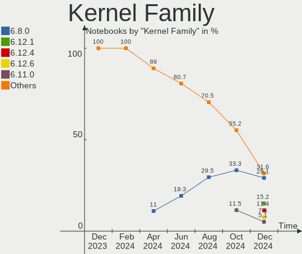
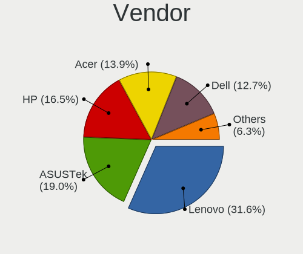
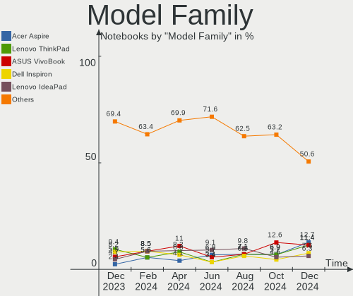
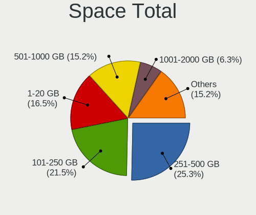
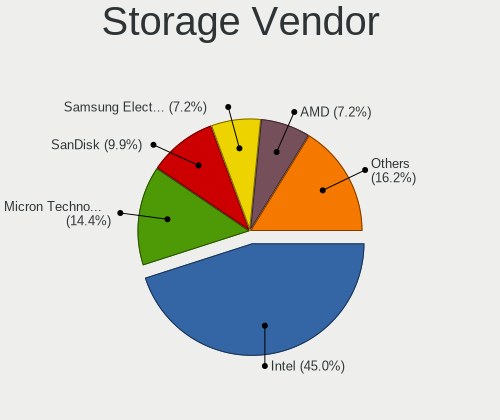
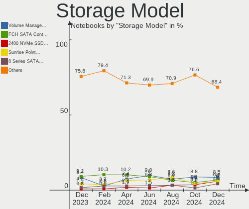
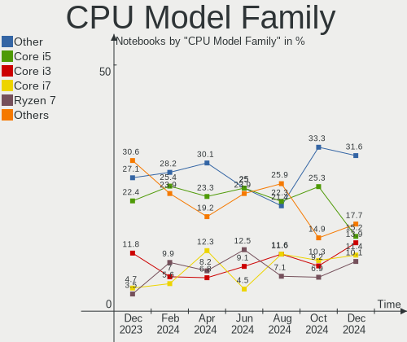
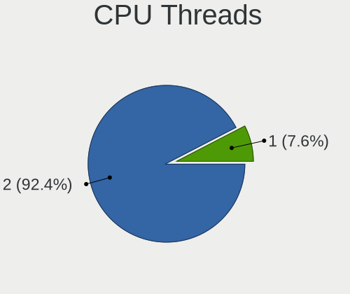
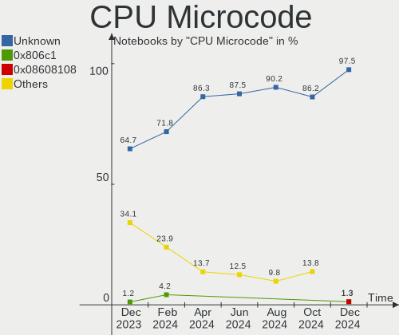
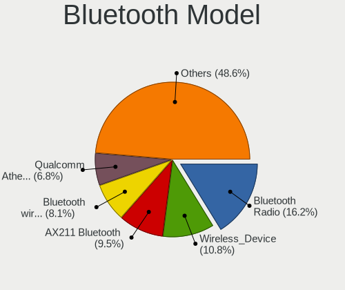

Linux in India - Hardware Trends (Notebooks)
--------------------------------------------

A project to identify most popular hardware characteristics and track their change
over time based on data collected by Linux users at https://Linux-Hardware.org.

Anyone can contribute to this report by the [hw-probe](https://github.com/linuxhw/hw-probe) tool:

    sudo -E hw-probe -all -upload

Period: Aug, 2022.

Contents
--------

* [ System ](#system)
  - [ OS                       ](#os)
  - [ OS Family                ](#os-family)
  - [ Kernel                   ](#kernel)
  - [ Kernel Family            ](#kernel-family)
  - [ Kernel Major Ver.        ](#kernel-major-ver)
  - [ Arch                     ](#arch)
  - [ DE                       ](#de)
  - [ Display Server           ](#display-server)
  - [ Display Manager          ](#display-manager)
  - [ OS Lang                  ](#os-lang)
  - [ Boot Mode                ](#boot-mode)
  - [ Filesystem               ](#filesystem)
  - [ Part. scheme             ](#part-scheme)
  - [ Dual Boot with Linux/BSD ](#dual-boot-with-linuxbsd)
  - [ Dual Boot (Win)          ](#dual-boot-win)

* [ Board ](#board)
  - [ Vendor                   ](#vendor)
  - [ Model                    ](#model)
  - [ Model Family             ](#model-family)
  - [ MFG Year                 ](#mfg-year)
  - [ Form Factor              ](#form-factor)
  - [ Secure Boot              ](#secure-boot)
  - [ Coreboot                 ](#coreboot)
  - [ RAM Size                 ](#ram-size)
  - [ RAM Used                 ](#ram-used)
  - [ Total Drives             ](#total-drives)
  - [ Has CD-ROM               ](#has-cd-rom)
  - [ Has Ethernet             ](#has-ethernet)
  - [ Has WiFi                 ](#has-wifi)
  - [ Has Bluetooth            ](#has-bluetooth)

* [ Location ](#location)
  - [ Country                  ](#country)
  - [ City                     ](#city)

* [ Drives ](#drives)
  - [ Drive Vendor             ](#drive-vendor)
  - [ Drive Model              ](#drive-model)
  - [ HDD Vendor               ](#hdd-vendor)
  - [ SSD Vendor               ](#ssd-vendor)
  - [ Drive Kind               ](#drive-kind)
  - [ Drive Connector          ](#drive-connector)
  - [ Drive Size               ](#drive-size)
  - [ Space Total              ](#space-total)
  - [ Space Used               ](#space-used)
  - [ Malfunc. Drives          ](#malfunc-drives)
  - [ Malfunc. Drive Vendor    ](#malfunc-drive-vendor)
  - [ Malfunc. HDD Vendor      ](#malfunc-hdd-vendor)
  - [ Malfunc. Drive Kind      ](#malfunc-drive-kind)
  - [ Failed Drives            ](#failed-drives)
  - [ Failed Drive Vendor      ](#failed-drive-vendor)
  - [ Drive Status             ](#drive-status)

* [ Storage controller ](#storage-controller)
  - [ Storage Vendor           ](#storage-vendor)
  - [ Storage Model            ](#storage-model)
  - [ Storage Kind             ](#storage-kind)

* [ Processor ](#processor)
  - [ CPU Vendor               ](#cpu-vendor)
  - [ CPU Model                ](#cpu-model)
  - [ CPU Model Family         ](#cpu-model-family)
  - [ CPU Cores                ](#cpu-cores)
  - [ CPU Sockets              ](#cpu-sockets)
  - [ CPU Threads              ](#cpu-threads)
  - [ CPU Op-Modes             ](#cpu-op-modes)
  - [ CPU Microcode            ](#cpu-microcode)
  - [ CPU Microarch            ](#cpu-microarch)

* [ Graphics ](#graphics)
  - [ GPU Vendor               ](#gpu-vendor)
  - [ GPU Model                ](#gpu-model)
  - [ GPU Combo                ](#gpu-combo)
  - [ GPU Driver               ](#gpu-driver)
  - [ GPU Memory               ](#gpu-memory)

* [ Monitor ](#monitor)
  - [ Monitor Vendor           ](#monitor-vendor)
  - [ Monitor Model            ](#monitor-model)
  - [ Monitor Resolution       ](#monitor-resolution)
  - [ Monitor Diagonal         ](#monitor-diagonal)
  - [ Monitor Width            ](#monitor-width)
  - [ Aspect Ratio             ](#aspect-ratio)
  - [ Monitor Area             ](#monitor-area)
  - [ Pixel Density            ](#pixel-density)
  - [ Multiple Monitors        ](#multiple-monitors)

* [ Network ](#network)
  - [ Net Controller Vendor    ](#net-controller-vendor)
  - [ Net Controller Model     ](#net-controller-model)
  - [ Wireless Vendor          ](#wireless-vendor)
  - [ Wireless Model           ](#wireless-model)
  - [ Ethernet Vendor          ](#ethernet-vendor)
  - [ Ethernet Model           ](#ethernet-model)
  - [ Net Controller Kind      ](#net-controller-kind)
  - [ Used Controller          ](#used-controller)
  - [ NICs                     ](#nics)
  - [ IPv6                     ](#ipv6)

* [ Bluetooth ](#bluetooth)
  - [ Bluetooth Vendor         ](#bluetooth-vendor)
  - [ Bluetooth Model          ](#bluetooth-model)

* [ Sound ](#sound)
  - [ Sound Vendor             ](#sound-vendor)
  - [ Sound Model              ](#sound-model)

* [ Memory ](#memory)
  - [ Memory Vendor            ](#memory-vendor)
  - [ Memory Model             ](#memory-model)
  - [ Memory Kind              ](#memory-kind)
  - [ Memory Form Factor       ](#memory-form-factor)
  - [ Memory Size              ](#memory-size)
  - [ Memory Speed             ](#memory-speed)

* [ Printers & scanners ](#printers--scanners)
  - [ Printer Vendor           ](#printer-vendor)
  - [ Printer Model            ](#printer-model)
  - [ Scanner Vendor           ](#scanner-vendor)
  - [ Scanner Model            ](#scanner-model)

* [ Camera ](#camera)
  - [ Camera Vendor            ](#camera-vendor)
  - [ Camera Model             ](#camera-model)

* [ Security ](#security)
  - [ Fingerprint Vendor       ](#fingerprint-vendor)
  - [ Fingerprint Model        ](#fingerprint-model)
  - [ Chipcard Vendor          ](#chipcard-vendor)
  - [ Chipcard Model           ](#chipcard-model)

* [ Unsupported ](#unsupported)
  - [ Unsupported Devices      ](#unsupported-devices)
  - [ Unsupported Device Types ](#unsupported-device-types)

System
------

OS
--

Installed operating systems

| Name                 | Notebooks | Percent |
|----------------------|-----------|---------|
| Ubuntu 22.04         | 20        | 24.1%   |
| Fedora 36            | 7         | 8.43%   |
| Ubuntu 20.04         | 6         | 7.23%   |
| Linux Mint 20.3      | 5         | 6.02%   |
| KDE neon 20.04       | 4         | 4.82%   |
| Ubuntu 18.04         | 3         | 3.61%   |
| Pop!_OS 22.04        | 3         | 3.61%   |
| OpenMandriva 4.3     | 3         | 3.61%   |
| Arch                 | 3         | 3.61%   |
| OpenMandriva 4.90    | 2         | 2.41%   |
| Manjaro 21.3.7       | 2         | 2.41%   |
| Linux Mint 21        | 2         | 2.41%   |
| Kali 2022.3          | 2         | 2.41%   |
| Garuda Linux Soaring | 2         | 2.41%   |
| Debian Testing       | 2         | 2.41%   |
| Arch Rolling         | 2         | 2.41%   |
| Zorin 16             | 1         | 1.2%    |
| Xubuntu 20.04        | 1         | 1.2%    |
| Void Linux Rolling   | 1         | 1.2%    |
| Ubuntu MATE 20.04    | 1         | 1.2%    |
| Ubuntu Budgie 20.04  | 1         | 1.2%    |
| Manjaro 21.3.6       | 1         | 1.2%    |
| Manjaro 21.3.5       | 1         | 1.2%    |
| Kubuntu 22.04        | 1         | 1.2%    |
| Endless 4.0.8        | 1         | 1.2%    |
| Elementary 6.1       | 1         | 1.2%    |
| Elementary 6         | 1         | 1.2%    |
| Debian 11            | 1         | 1.2%    |
| Debian 10            | 1         | 1.2%    |
| CentOS 9             | 1         | 1.2%    |
| ArcoLinux Rolling    | 1         | 1.2%    |

OS Family
---------

OS without a version

| Name          | Notebooks | Percent |
|---------------|-----------|---------|
| Ubuntu        | 29        | 34.94%  |
| Linux Mint    | 7         | 8.43%   |
| Fedora        | 7         | 8.43%   |
| OpenMandriva  | 5         | 6.02%   |
| Arch          | 5         | 6.02%   |
| Manjaro       | 4         | 4.82%   |
| KDE neon      | 4         | 4.82%   |
| Debian        | 4         | 4.82%   |
| Pop!_OS       | 3         | 3.61%   |
| Kali          | 2         | 2.41%   |
| Garuda Linux  | 2         | 2.41%   |
| Elementary    | 2         | 2.41%   |
| Zorin         | 1         | 1.2%    |
| Xubuntu       | 1         | 1.2%    |
| Void Linux    | 1         | 1.2%    |
| Ubuntu MATE   | 1         | 1.2%    |
| Ubuntu Budgie | 1         | 1.2%    |
| Kubuntu       | 1         | 1.2%    |
| Endless       | 1         | 1.2%    |
| CentOS        | 1         | 1.2%    |
| ArcoLinux     | 1         | 1.2%    |

Kernel
------

Version of the Linux kernel

| Version                  | Notebooks | Percent |
|--------------------------|-----------|---------|
| 5.15.0-46-generic        | 16        | 19.28%  |
| 5.15.0-43-generic        | 12        | 14.46%  |
| 5.4.0-122-generic        | 4         | 4.82%   |
| 5.16.7-desktop-1omv4003  | 3         | 3.61%   |
| 5.19.1-zen1-1-zen        | 2         | 2.41%   |
| 5.19.0-76051900-generic  | 2         | 2.41%   |
| 5.18.17-200.fc36.x86_64  | 2         | 2.41%   |
| 5.18.16-arch1-1          | 2         | 2.41%   |
| 5.18.16-200.fc36.x86_64  | 2         | 2.41%   |
| 5.18.12-desktop-3omv4090 | 2         | 2.41%   |
| 5.18.0-kali5-amd64       | 2         | 2.41%   |
| 5.18.0-4-amd64           | 2         | 2.41%   |
| 5.17.5-300.fc36.x86_64   | 2         | 2.41%   |
| 5.4.0-125-generic        | 1         | 1.2%    |
| 5.4.0-124-generic        | 1         | 1.2%    |
| 5.4.0-121-generic        | 1         | 1.2%    |
| 5.19.2-zen1-1-zen        | 1         | 1.2%    |
| 5.19.2-arch1-1           | 1         | 1.2%    |
| 5.19.1-3-MANJARO         | 1         | 1.2%    |
| 5.19.0-051900-generic    | 1         | 1.2%    |
| 5.18.7_1                 | 1         | 1.2%    |
| 5.18.15-arch1-2          | 1         | 1.2%    |
| 5.18.13-200.fc36.x86_64  | 1         | 1.2%    |
| 5.18.10-76051810-generic | 1         | 1.2%    |
| 5.15.63-1-lts            | 1         | 1.2%    |
| 5.15.60-1-MANJARO        | 1         | 1.2%    |
| 5.15.57-2-MANJARO        | 1         | 1.2%    |
| 5.15.55-1-MANJARO        | 1         | 1.2%    |
| 5.15.0-47-generic        | 1         | 1.2%    |
| 5.15.0-41-generic        | 1         | 1.2%    |
| 5.15.0-25-generic        | 1         | 1.2%    |
| 5.15.0-18-generic        | 1         | 1.2%    |
| 5.14.0-134.el9.x86_64    | 1         | 1.2%    |
| 5.14.0-1050-oem          | 1         | 1.2%    |
| 5.14.0-1049-oem          | 1         | 1.2%    |
| 5.14.0-1048-oem          | 1         | 1.2%    |
| 5.13.0-41-generic        | 1         | 1.2%    |
| 5.13.0-30-generic        | 1         | 1.2%    |
| 5.11.0-40-generic        | 1         | 1.2%    |
| 5.11.0-35-generic        | 1         | 1.2%    |
| 5.10.0-16-amd64          | 1         | 1.2%    |
| 4.19.0-6-amd64           | 1         | 1.2%    |
| 4.15.0-162-generic       | 1         | 1.2%    |

Kernel Family
-------------

Linux kernel without a distro release

| Version | Notebooks | Percent |
|---------|-----------|---------|
| 5.15.0  | 32        | 38.55%  |
| 5.4.0   | 7         | 8.43%   |
| 5.18.16 | 4         | 4.82%   |
| 5.18.0  | 4         | 4.82%   |
| 5.14.0  | 4         | 4.82%   |
| 5.19.1  | 3         | 3.61%   |
| 5.19.0  | 3         | 3.61%   |
| 5.16.7  | 3         | 3.61%   |
| 5.19.2  | 2         | 2.41%   |
| 5.18.17 | 2         | 2.41%   |
| 5.18.12 | 2         | 2.41%   |
| 5.17.5  | 2         | 2.41%   |
| 5.13.0  | 2         | 2.41%   |
| 5.11.0  | 2         | 2.41%   |
| 5.18.7  | 1         | 1.2%    |
| 5.18.15 | 1         | 1.2%    |
| 5.18.13 | 1         | 1.2%    |
| 5.18.10 | 1         | 1.2%    |
| 5.15.63 | 1         | 1.2%    |
| 5.15.60 | 1         | 1.2%    |
| 5.15.57 | 1         | 1.2%    |
| 5.15.55 | 1         | 1.2%    |
| 5.10.0  | 1         | 1.2%    |
| 4.19.0  | 1         | 1.2%    |
| 4.15.0  | 1         | 1.2%    |

Kernel Major Ver.
-----------------

Linux kernel major version

| Version | Notebooks | Percent |
|---------|-----------|---------|
| 5.15    | 36        | 43.37%  |
| 5.18    | 16        | 19.28%  |
| 5.19    | 8         | 9.64%   |
| 5.4     | 7         | 8.43%   |
| 5.14    | 4         | 4.82%   |
| 5.16    | 3         | 3.61%   |
| 5.17    | 2         | 2.41%   |
| 5.13    | 2         | 2.41%   |
| 5.11    | 2         | 2.41%   |
| 5.10    | 1         | 1.2%    |
| 4.19    | 1         | 1.2%    |
| 4.15    | 1         | 1.2%    |

Arch
----

OS architecture (x86_64, i586, etc.)

| Name   | Notebooks | Percent |
|--------|-----------|---------|
| x86_64 | 82        | 98.8%   |
| i686   | 1         | 1.2%    |

DE
--

Desktop Environment

| Name       | Notebooks | Percent |
|------------|-----------|---------|
| GNOME      | 44        | 53.01%  |
| KDE5       | 17        | 20.48%  |
| XFCE       | 7         | 8.43%   |
| X-Cinnamon | 6         | 7.23%   |
| Pantheon   | 2         | 2.41%   |
| qtile      | 1         | 1.2%    |
| MATE       | 1         | 1.2%    |
| KDE        | 1         | 1.2%    |
| i3         | 1         | 1.2%    |
| Budgie     | 1         | 1.2%    |
| awesome    | 1         | 1.2%    |
| Unknown    | 1         | 1.2%    |

Display Server
--------------

X11 or Wayland

| Name    | Notebooks | Percent |
|---------|-----------|---------|
| X11     | 58        | 69.88%  |
| Wayland | 23        | 27.71%  |
| Tty     | 1         | 1.2%    |
| Unknown | 1         | 1.2%    |

Display Manager
---------------

SDDM, LightDM, etc.

| Name    | Notebooks | Percent |
|---------|-----------|---------|
| GDM3    | 26        | 31.33%  |
| Unknown | 20        | 24.1%   |
| LightDM | 15        | 18.07%  |
| SDDM    | 13        | 15.66%  |
| GDM     | 9         | 10.84%  |

OS Lang
-------

Language

| Lang  | Notebooks | Percent |
|-------|-----------|---------|
| en_IN | 53        | 63.86%  |
| en_US | 24        | 28.92%  |
| en_GB | 4         | 4.82%   |
| mr_IN | 1         | 1.2%    |
| C     | 1         | 1.2%    |

Boot Mode
---------

EFI or BIOS

| Mode | Notebooks | Percent |
|------|-----------|---------|
| EFI  | 56        | 67.47%  |
| BIOS | 27        | 32.53%  |

Filesystem
----------

Type of filesystem

| Type    | Notebooks | Percent |
|---------|-----------|---------|
| Ext4    | 67        | 80.72%  |
| Btrfs   | 11        | 13.25%  |
| Xfs     | 2         | 2.41%   |
| Overlay | 2         | 2.41%   |
| Ext2    | 1         | 1.2%    |

Part. scheme
------------

Scheme of partitioning

| Type    | Notebooks | Percent |
|---------|-----------|---------|
| GPT     | 43        | 51.81%  |
| Unknown | 35        | 42.17%  |
| MBR     | 5         | 6.02%   |

Dual Boot with Linux/BSD
------------------------

Hosting more than one Linux/BSD

| Dual boot | Notebooks | Percent |
|-----------|-----------|---------|
| No        | 73        | 87.95%  |
| Yes       | 10        | 12.05%  |

Dual Boot (Win)
---------------

Hosting Linux and Windows

| Dual boot | Notebooks | Percent |
|-----------|-----------|---------|
| No        | 53        | 63.86%  |
| Yes       | 30        | 36.14%  |

Board
-----

Vendor
------

Motherboard manufacturer

| Name             | Notebooks | Percent |
|------------------|-----------|---------|
| Dell             | 22        | 26.51%  |
| Hewlett-Packard  | 19        | 22.89%  |
| Lenovo           | 17        | 20.48%  |
| ASUSTek Computer | 12        | 14.46%  |
| Acer             | 5         | 6.02%   |
| MSI              | 2         | 2.41%   |
| Toshiba          | 1         | 1.2%    |
| Timi             | 1         | 1.2%    |
| Sony             | 1         | 1.2%    |
| LG Electronics   | 1         | 1.2%    |
| eMachines        | 1         | 1.2%    |
| Apple            | 1         | 1.2%    |

Model
-----

Motherboard model

| Name                                   | Notebooks | Percent |
|----------------------------------------|-----------|---------|
| HP Pavilion g6                         | 3         | 3.61%   |
| Lenovo ThinkBook 14-IML 20RV           | 2         | 2.41%   |
| HP Notebook                            | 2         | 2.41%   |
| HP 15                                  | 2         | 2.41%   |
| Dell Latitude 3420                     | 2         | 2.41%   |
| Dell Inspiron N5010                    | 2         | 2.41%   |
| Dell Inspiron 3542                     | 2         | 2.41%   |
| Dell G3 3500                           | 2         | 2.41%   |
| Toshiba TECRA R940                     | 1         | 1.2%    |
| Timi Mi NoteBook Horizon Edition 14    | 1         | 1.2%    |
| Sony VPCEB16FG                         | 1         | 1.2%    |
| MSI Modern 14 B5M                      | 1         | 1.2%    |
| MSI Alpha 15 A3DD                      | 1         | 1.2%    |
| LG 14Z990-V.AR52A2                     | 1         | 1.2%    |
| Lenovo ThinkPad X260 20F5A050IG        | 1         | 1.2%    |
| Lenovo ThinkPad L490 20Q5S0LF00        | 1         | 1.2%    |
| Lenovo ThinkPad E14 Gen 4 21E4CTO1WW   | 1         | 1.2%    |
| Lenovo Legion 5 Pro 16ACH6H 82JQ       | 1         | 1.2%    |
| Lenovo IdeaPad S540-15IML D 81NG       | 1         | 1.2%    |
| Lenovo IdeaPad S340-14API 81NB         | 1         | 1.2%    |
| Lenovo IdeaPad 5 15ALC05 82LN          | 1         | 1.2%    |
| Lenovo IdeaPad 5 14ARE05 81YM          | 1         | 1.2%    |
| Lenovo IdeaPad 3 15ITL6 82H8           | 1         | 1.2%    |
| Lenovo IdeaPad 3 15IML05 D1 81WB       | 1         | 1.2%    |
| Lenovo IdeaPad 3 15ALC6 Ub 82KU        | 1         | 1.2%    |
| Lenovo IdeaPad 3 15ADA05 81W1          | 1         | 1.2%    |
| Lenovo IdeaPad 3 14ITL6 82H7           | 1         | 1.2%    |
| Lenovo IdeaPad 110-15ISK 80UD          | 1         | 1.2%    |
| Lenovo G50-45 80E3                     | 1         | 1.2%    |
| HP ProBook 440 G2                      | 1         | 1.2%    |
| HP Presario CQ56                       | 1         | 1.2%    |
| HP Pavilion Laptop 15-eg0xxx           | 1         | 1.2%    |
| HP Pavilion Laptop 14-ec0xxx           | 1         | 1.2%    |
| HP Pavilion 15                         | 1         | 1.2%    |
| HP Laptop 15s-gr0xxx                   | 1         | 1.2%    |
| HP Laptop 15s-eq2xxx                   | 1         | 1.2%    |
| HP Laptop 15-da0xxx                    | 1         | 1.2%    |
| HP Laptop 15-bs0xx                     | 1         | 1.2%    |
| HP Laptop 14s-fq1xxx                   | 1         | 1.2%    |
| HP 430                                 | 1         | 1.2%    |
| HP 245 G7 Notebook PC                  | 1         | 1.2%    |
| eMachines D725                         | 1         | 1.2%    |
| Dell Vostro 5481                       | 1         | 1.2%    |
| Dell Vostro 3480                       | 1         | 1.2%    |
| Dell Vostro 3401                       | 1         | 1.2%    |
| Dell Vostro 2420                       | 1         | 1.2%    |
| Dell System XPS L502X                  | 1         | 1.2%    |
| Dell Latitude E7470                    | 1         | 1.2%    |
| Dell Latitude E7450                    | 1         | 1.2%    |
| Dell Latitude E6420                    | 1         | 1.2%    |
| Dell Latitude 3510                     | 1         | 1.2%    |
| Dell Latitude 3440                     | 1         | 1.2%    |
| Dell Latitude 3410                     | 1         | 1.2%    |
| Dell Inspiron N5110                    | 1         | 1.2%    |
| Dell Inspiron 5559                     | 1         | 1.2%    |
| Dell Inspiron 3584                     | 1         | 1.2%    |
| ASUS ZenBook UX334FAC_UX333FAC         | 1         | 1.2%    |
| ASUS X556UQK                           | 1         | 1.2%    |
| ASUS X542UQR                           | 1         | 1.2%    |
| ASUS VivoBook_ASUSLaptop X513EA_X513EA | 1         | 1.2%    |

Model Family
------------

Motherboard model prefix

| Name               | Notebooks | Percent |
|--------------------|-----------|---------|
| Lenovo IdeaPad     | 10        | 12.05%  |
| Dell Latitude      | 8         | 9.64%   |
| Dell Inspiron      | 7         | 8.43%   |
| HP Pavilion        | 6         | 7.23%   |
| HP Laptop          | 5         | 6.02%   |
| Dell Vostro        | 4         | 4.82%   |
| Lenovo ThinkPad    | 3         | 3.61%   |
| ASUS VivoBook      | 3         | 3.61%   |
| Acer Aspire        | 3         | 3.61%   |
| Lenovo ThinkBook   | 2         | 2.41%   |
| HP Notebook        | 2         | 2.41%   |
| HP 15              | 2         | 2.41%   |
| Dell G3            | 2         | 2.41%   |
| ASUS ROG           | 2         | 2.41%   |
| ASUS ASUS          | 2         | 2.41%   |
| Toshiba TECRA      | 1         | 1.2%    |
| Timi Mi            | 1         | 1.2%    |
| Sony VPCEB16FG     | 1         | 1.2%    |
| MSI Modern         | 1         | 1.2%    |
| MSI Alpha          | 1         | 1.2%    |
| LG 14Z990-V.AR52A2 | 1         | 1.2%    |
| Lenovo Legion      | 1         | 1.2%    |
| Lenovo G50-45      | 1         | 1.2%    |
| HP ProBook         | 1         | 1.2%    |
| HP Presario        | 1         | 1.2%    |
| HP 430             | 1         | 1.2%    |
| HP 245             | 1         | 1.2%    |
| eMachines D725     | 1         | 1.2%    |
| Dell System        | 1         | 1.2%    |
| ASUS ZenBook       | 1         | 1.2%    |
| ASUS X556UQK       | 1         | 1.2%    |
| ASUS X542UQR       | 1         | 1.2%    |
| ASUS UX430UAR      | 1         | 1.2%    |
| ASUS TUF           | 1         | 1.2%    |
| Apple MacBook2     | 1         | 1.2%    |
| Acer TravelMate    | 1         | 1.2%    |
| Acer Nitro         | 1         | 1.2%    |

MFG Year
--------

Motherboard manufacture year

| Year | Notebooks | Percent |
|------|-----------|---------|
| 2021 | 16        | 19.28%  |
| 2020 | 12        | 14.46%  |
| 2019 | 10        | 12.05%  |
| 2011 | 8         | 9.64%   |
| 2016 | 5         | 6.02%   |
| 2013 | 5         | 6.02%   |
| 2010 | 5         | 6.02%   |
| 2022 | 4         | 4.82%   |
| 2018 | 4         | 4.82%   |
| 2015 | 4         | 4.82%   |
| 2014 | 4         | 4.82%   |
| 2017 | 3         | 3.61%   |
| 2012 | 2         | 2.41%   |
| 2007 | 1         | 1.2%    |

Form Factor
-----------

Physical design of the computer

| Name     | Notebooks | Percent |
|----------|-----------|---------|
| Notebook | 83        | 100%    |

Secure Boot
-----------

Enabled or disabled

| State    | Notebooks | Percent |
|----------|-----------|---------|
| Disabled | 75        | 90.36%  |
| Enabled  | 8         | 9.64%   |

Coreboot
--------

Have coreboot on board

| Used | Notebooks | Percent |
|------|-----------|---------|
| No   | 83        | 100%    |

RAM Size
--------

Total RAM memory

| Size in GB | Notebooks | Percent |
|------------|-----------|---------|
| 4.01-8.0   | 32        | 38.55%  |
| 16.01-24.0 | 17        | 20.48%  |
| 8.01-16.0  | 17        | 20.48%  |
| 3.01-4.0   | 15        | 18.07%  |
| 2.01-3.0   | 1         | 1.2%    |
| 1.01-2.0   | 1         | 1.2%    |

RAM Used
--------

Used RAM memory

| Used GB    | Notebooks | Percent |
|------------|-----------|---------|
| 1.01-2.0   | 25        | 30.12%  |
| 2.01-3.0   | 22        | 26.51%  |
| 4.01-8.0   | 16        | 19.28%  |
| 3.01-4.0   | 11        | 13.25%  |
| 8.01-16.0  | 5         | 6.02%   |
| 0.51-1.0   | 3         | 3.61%   |
| 16.01-24.0 | 1         | 1.2%    |

Total Drives
------------

Number of drives on board

| Drives | Notebooks | Percent |
|--------|-----------|---------|
| 1      | 60        | 72.29%  |
| 2      | 20        | 24.1%   |
| 3      | 2         | 2.41%   |
| 0      | 1         | 1.2%    |

Has CD-ROM
----------

Has CD-ROM on board

| Presented | Notebooks | Percent |
|-----------|-----------|---------|
| No        | 56        | 67.47%  |
| Yes       | 27        | 32.53%  |

Has Ethernet
------------

Has Ethernet on board

| Presented | Notebooks | Percent |
|-----------|-----------|---------|
| Yes       | 63        | 75.9%   |
| No        | 20        | 24.1%   |

Has WiFi
--------

Has WiFi module

| Presented | Notebooks | Percent |
|-----------|-----------|---------|
| Yes       | 83        | 100%    |

Has Bluetooth
-------------

Has Bluetooth module

| Presented | Notebooks | Percent |
|-----------|-----------|---------|
| Yes       | 74        | 89.16%  |
| No        | 9         | 10.84%  |

Location
--------

Country
-------

Geographic location (country)

| Country | Notebooks | Percent |
|---------|-----------|---------|
| India   | 83        | 100%    |

City
----

Geographic location (city)

| City          | Notebooks | Percent |
|---------------|-----------|---------|
| Bengaluru     | 16        | 19.28%  |
| Mumbai        | 12        | 14.46%  |
| Pune          | 7         | 8.43%   |
| New Delhi     | 5         | 6.02%   |
| Coimbatore    | 3         | 3.61%   |
| Chennai       | 3         | 3.61%   |
| Navi Mumbai   | 2         | 2.41%   |
| Lucknow       | 2         | 2.41%   |
| Ernakulam     | 2         | 2.41%   |
| Virar         | 1         | 1.2%    |
| Vellore       | 1         | 1.2%    |
| Vasco da Gama | 1         | 1.2%    |
| Udaipur       | 1         | 1.2%    |
| Tirupur       | 1         | 1.2%    |
| Thrissur      | 1         | 1.2%    |
| Siliguri      | 1         | 1.2%    |
| Sambalpur     | 1         | 1.2%    |
| Patiala       | 1         | 1.2%    |
| Nagpur        | 1         | 1.2%    |
| Malappuram    | 1         | 1.2%    |
| Ludhiana      | 1         | 1.2%    |
| Lohogaon      | 1         | 1.2%    |
| Kurukshetra   | 1         | 1.2%    |
| Kozhikode     | 1         | 1.2%    |
| Kochi         | 1         | 1.2%    |
| Karimnagar    | 1         | 1.2%    |
| Kanpur        | 1         | 1.2%    |
| Kachiguda     | 1         | 1.2%    |
| Jaipur        | 1         | 1.2%    |
| Gurgaon       | 1         | 1.2%    |
| Gunupur       | 1         | 1.2%    |
| Golaghat      | 1         | 1.2%    |
| Dombivali     | 1         | 1.2%    |
| Dharwad       | 1         | 1.2%    |
| Delhi         | 1         | 1.2%    |
| Chandigarh    | 1         | 1.2%    |
| Bhuj          | 1         | 1.2%    |
| Bhubaneswar   | 1         | 1.2%    |
| Anantapur     | 1         | 1.2%    |
| Ahmedabad     | 1         | 1.2%    |

Drives
------

Drive Vendor
------------

Hard drive vendors

| Vendor                      | Notebooks | Drives | Percent |
|-----------------------------|-----------|--------|---------|
| WDC                         | 16        | 16     | 15.24%  |
| Seagate                     | 16        | 16     | 15.24%  |
| Samsung Electronics         | 13        | 13     | 12.38%  |
| Crucial                     | 10        | 10     | 9.52%   |
| Toshiba                     | 7         | 7      | 6.67%   |
| KIOXIA                      | 6         | 6      | 5.71%   |
| Intel                       | 5         | 5      | 4.76%   |
| Sandisk                     | 4         | 4      | 3.81%   |
| SK hynix                    | 3         | 3      | 2.86%   |
| Micron Technology           | 3         | 4      | 2.86%   |
| HGST                        | 3         | 3      | 2.86%   |
| UMIS                        | 2         | 2      | 1.9%    |
| Silicon Motion              | 2         | 2      | 1.9%    |
| Kingston                    | 2         | 2      | 1.9%    |
| XPG                         | 1         | 1      | 0.95%   |
| Unknown                     | 1         | 1      | 0.95%   |
| Union Memory (Shenzhen)     | 1         | 1      | 0.95%   |
| Phison                      | 1         | 2      | 0.95%   |
| OSCOO                       | 1         | 1      | 0.95%   |
| NFORCE                      | 1         | 1      | 0.95%   |
| Micron/Crucial Technology   | 1         | 1      | 0.95%   |
| LITEON                      | 1         | 1      | 0.95%   |
| Kingston Technology Company | 1         | 1      | 0.95%   |
| Hitachi                     | 1         | 1      | 0.95%   |
| External                    | 1         | 1      | 0.95%   |
| A-DATA Technology           | 1         | 1      | 0.95%   |
| Unknown                     | 1         | 1      | 0.95%   |

Drive Model
-----------

Hard drive models

| Model                                        | Notebooks | Percent |
|----------------------------------------------|-----------|---------|
| Seagate ST1000LM035-1RK172 1TB               | 6         | 5.61%   |
| Seagate ST500LT012-1DG142 500GB              | 4         | 3.74%   |
| Crucial CT240BX500SSD1 240GB                 | 4         | 3.74%   |
| Seagate ST1000LM048-2E7172 1TB               | 3         | 2.8%    |
| KIOXIA KBG40ZNS512G NVMe 512GB               | 3         | 2.8%    |
| WDC WDS240G2G0A-00JH30 240GB SSD             | 2         | 1.87%   |
| Toshiba MQ01ACF050 500GB                     | 2         | 1.87%   |
| Toshiba MQ01ABD100 1TB                       | 2         | 1.87%   |
| Crucial CT480BX500SSD1 480GB                 | 2         | 1.87%   |
| XPG GAMMIX S5 256GB                          | 1         | 0.93%   |
| WDC WDS500G2B0A-00SM50 500GB SSD             | 1         | 0.93%   |
| WDC WDS240G2G0C-00AJM0 240GB                 | 1         | 0.93%   |
| WDC WDS120G2G0A-00JH30 120GB SSD             | 1         | 0.93%   |
| WDC WD5000LPVX-75V0TT0 500GB                 | 1         | 0.93%   |
| WDC WD5000LPCX-00VHAT0 500GB                 | 1         | 0.93%   |
| WDC WD5000BEKT-75KA9T0 500GB                 | 1         | 0.93%   |
| WDC WD3200LPLX-66ZNTT0 320GB                 | 1         | 0.93%   |
| WDC WD3200BPVT-22JJ5T0 320GB                 | 1         | 0.93%   |
| WDC WD3200BEVT-22A23T0 320GB                 | 1         | 0.93%   |
| WDC WD3200BEKX-75B7WT0 320GB                 | 1         | 0.93%   |
| WDC WD10SPZX-60Z10T0 1TB                     | 1         | 0.93%   |
| WDC WD10JPVX-60JC3T0 1TB                     | 1         | 0.93%   |
| WDC PC SN530 SDBPNPZ-512G-1114 512GB         | 1         | 0.93%   |
| WDC PC SN530 SDBPMPZ-512G-1101 512GB         | 1         | 0.93%   |
| Unknown MMC Card  64GB                       | 1         | 0.93%   |
| Union Memory (Shenzhen) NVMe SSD Drive 512GB | 1         | 0.93%   |
| UMIS RPJTJ256MEE1OWX 256GB                   | 1         | 0.93%   |
| UMIS RPFTJ128PDD2EWX 128GB                   | 1         | 0.93%   |
| Toshiba MQ04ABF100 1TB                       | 1         | 0.93%   |
| Toshiba MK5061GSYN 500GB                     | 1         | 0.93%   |
| Toshiba MK1637GSX 160GB                      | 1         | 0.93%   |
| SK hynix SKHynix_HFS256GD9TNI-L2A0B 256GB    | 1         | 0.93%   |
| SK hynix BC711 HFM512GD3JX013N 512GB         | 1         | 0.93%   |
| SK hynix BC501 NVMe Solid State Drive 512GB  | 1         | 0.93%   |
| Silicon Motion POWER X NE1000-256GB          | 1         | 0.93%   |
| Silicon Motion NVMe SSD Drive 128GB          | 1         | 0.93%   |
| Seagate ST9500423AS 500GB                    | 1         | 0.93%   |
| Seagate Expansion 500GB                      | 1         | 0.93%   |
| Seagate BUP Slim 2TB                         | 1         | 0.93%   |
| Sandisk WD Blue SN550 NVMe SSD 256GB         | 1         | 0.93%   |
| SanDisk SD9SN8W256G1002 256GB SSD            | 1         | 0.93%   |
| SanDisk NVMe SSD Drive 256GB                 | 1         | 0.93%   |
| SanDisk NVMe SSD Drive 1024GB                | 1         | 0.93%   |
| Samsung SSD PM871 mSATA 256GB                | 1         | 0.93%   |
| Samsung SSD 870 EVO 500GB                    | 1         | 0.93%   |
| Samsung SSD 860 EVO M.2 1TB                  | 1         | 0.93%   |
| Samsung SSD 850 EVO 500GB                    | 1         | 0.93%   |
| Samsung NVMe SSD Drive 512GB                 | 1         | 0.93%   |
| Samsung MZVLQ512HBLU-00B00 512GB             | 1         | 0.93%   |
| Samsung MZVLQ512HALU-000H1 512GB             | 1         | 0.93%   |
| Samsung MZVLB512HBJQ-000L7 512GB             | 1         | 0.93%   |
| Samsung MZNLN256HAJQ-00000 256GB SSD         | 1         | 0.93%   |
| Samsung MZNLH512HALU-00000 512GB SSD         | 1         | 0.93%   |
| Samsung MZALQ512HALU-000L2 512GB             | 1         | 0.93%   |
| Samsung MZ7TY256HDHP-000L7 256GB SSD         | 1         | 0.93%   |
| Samsung HM500JI 500GB                        | 1         | 0.93%   |
| Phison Sabrent 2TB                           | 1         | 0.93%   |
| Phison NVMe SSD Drive 1024GB                 | 1         | 0.93%   |
| OSCOO OSC SSD 512GB                          | 1         | 0.93%   |
| NFORCE 25625G2 TAS-SSQE3 256GB SSD           | 1         | 0.93%   |

HDD Vendor
----------

Hard disk drive vendors

| Vendor              | Notebooks | Drives | Percent |
|---------------------|-----------|--------|---------|
| Seagate             | 16        | 16     | 43.24%  |
| WDC                 | 9         | 9      | 24.32%  |
| Toshiba             | 7         | 7      | 18.92%  |
| HGST                | 3         | 3      | 8.11%   |
| Samsung Electronics | 1         | 1      | 2.7%    |
| Hitachi             | 1         | 1      | 2.7%    |

SSD Vendor
----------

Solid state drive vendors

| Vendor              | Notebooks | Drives | Percent |
|---------------------|-----------|--------|---------|
| Crucial             | 10        | 10     | 38.46%  |
| Samsung Electronics | 7         | 7      | 26.92%  |
| WDC                 | 4         | 4      | 15.38%  |
| SanDisk             | 1         | 1      | 3.85%   |
| OSCOO               | 1         | 1      | 3.85%   |
| NFORCE              | 1         | 1      | 3.85%   |
| LITEON              | 1         | 1      | 3.85%   |
| Kingston            | 1         | 1      | 3.85%   |

Drive Kind
----------

HDD or SSD

| Kind    | Notebooks | Drives | Percent |
|---------|-----------|--------|---------|
| NVMe    | 39        | 42     | 38.61%  |
| HDD     | 35        | 37     | 34.65%  |
| SSD     | 25        | 26     | 24.75%  |
| MMC     | 1         | 1      | 0.99%   |
| Unknown | 1         | 1      | 0.99%   |

Drive Connector
---------------

SATA, SAS, NVMe, etc.

| Type | Notebooks | Drives | Percent |
|------|-----------|--------|---------|
| SATA | 54        | 62     | 56.25%  |
| NVMe | 38        | 41     | 39.58%  |
| SAS  | 3         | 3      | 3.13%   |
| MMC  | 1         | 1      | 1.04%   |

Drive Size
----------

Size of hard drive

| Size in TB | Notebooks | Drives | Percent |
|------------|-----------|--------|---------|
| 0.01-0.5   | 36        | 41     | 63.16%  |
| 0.51-1.0   | 20        | 21     | 35.09%  |
| 1.01-2.0   | 1         | 1      | 1.75%   |

Space Total
-----------

Amount of disk space available on the file system

| Size in GB | Notebooks | Percent |
|------------|-----------|---------|
| 251-500    | 32        | 38.55%  |
| 101-250    | 20        | 24.1%   |
| 501-1000   | 13        | 15.66%  |
| 51-100     | 6         | 7.23%   |
| 1001-2000  | 4         | 4.82%   |
| 1-20       | 4         | 4.82%   |
| 21-50      | 3         | 3.61%   |
| 2001-3000  | 1         | 1.2%    |

Space Used
----------

Amount of used disk space

| Used GB   | Notebooks | Percent |
|-----------|-----------|---------|
| 1-20      | 27        | 32.53%  |
| 21-50     | 16        | 19.28%  |
| 101-250   | 16        | 19.28%  |
| 251-500   | 11        | 13.25%  |
| 51-100    | 10        | 12.05%  |
| 501-1000  | 2         | 2.41%   |
| 2001-3000 | 1         | 1.2%    |

Malfunc. Drives
---------------

Drive models with a malfunction

| Model                                | Notebooks | Drives | Percent |
|--------------------------------------|-----------|--------|---------|
| WDC WD5000BEKT-75KA9T0 500GB         | 1         | 1      | 20%     |
| SK hynix BC711 HFM512GD3JX013N 512GB | 1         | 1      | 20%     |
| Seagate ST500LT012-1DG142 500GB      | 1         | 1      | 20%     |
| Hitachi HTS545032B9A300 320GB        | 1         | 1      | 20%     |
| HGST HTS545050A7E680 500GB           | 1         | 1      | 20%     |

Malfunc. Drive Vendor
---------------------

Vendors of faulty drives

| Vendor   | Notebooks | Drives | Percent |
|----------|-----------|--------|---------|
| WDC      | 1         | 1      | 20%     |
| SK hynix | 1         | 1      | 20%     |
| Seagate  | 1         | 1      | 20%     |
| Hitachi  | 1         | 1      | 20%     |
| HGST     | 1         | 1      | 20%     |

Malfunc. HDD Vendor
-------------------

Vendors of faulty HDD drives

| Vendor  | Notebooks | Drives | Percent |
|---------|-----------|--------|---------|
| WDC     | 1         | 1      | 25%     |
| Seagate | 1         | 1      | 25%     |
| Hitachi | 1         | 1      | 25%     |
| HGST    | 1         | 1      | 25%     |

Malfunc. Drive Kind
-------------------

Kinds of faulty drives

| Kind | Notebooks | Drives | Percent |
|------|-----------|--------|---------|
| HDD  | 4         | 4      | 80%     |
| NVMe | 1         | 1      | 20%     |

Failed Drives
-------------

Failed drive models

Zero info for selected period =(

Failed Drive Vendor
-------------------

Failed drive vendors

Zero info for selected period =(

Drive Status
------------

Number of failed and malfunc. drives

| Status   | Notebooks | Drives | Percent |
|----------|-----------|--------|---------|
| Works    | 42        | 54     | 48.28%  |
| Detected | 40        | 48     | 45.98%  |
| Malfunc  | 5         | 5      | 5.75%   |

Storage controller
------------------

Storage Vendor
--------------

Storage controller vendors

| Vendor                      | Notebooks | Percent |
|-----------------------------|-----------|---------|
| Intel                       | 62        | 56.36%  |
| AMD                         | 14        | 12.73%  |
| SanDisk                     | 6         | 5.45%   |
| KIOXIA                      | 6         | 5.45%   |
| Samsung Electronics         | 5         | 4.55%   |
| Union Memory (Shenzhen)     | 3         | 2.73%   |
| SK hynix                    | 3         | 2.73%   |
| Micron Technology           | 3         | 2.73%   |
| Silicon Motion              | 2         | 1.82%   |
| Kingston Technology Company | 2         | 1.82%   |
| Realtek Semiconductor       | 1         | 0.91%   |
| Phison Electronics          | 1         | 0.91%   |
| Micron/Crucial Technology   | 1         | 0.91%   |
| ADATA Technology            | 1         | 0.91%   |

Storage Model
-------------

Storage controller models

| Model                                                                            | Notebooks | Percent |
|----------------------------------------------------------------------------------|-----------|---------|
| AMD FCH SATA Controller [AHCI mode]                                              | 14        | 12.07%  |
| Intel Sunrise Point-LP SATA Controller [AHCI mode]                               | 8         | 6.9%    |
| Intel Comet Lake SATA AHCI Controller                                            | 7         | 6.03%   |
| Intel 82801 Mobile SATA Controller [RAID mode]                                   | 7         | 6.03%   |
| Intel 7 Series Chipset Family 6-port SATA Controller [AHCI mode]                 | 7         | 6.03%   |
| Intel Volume Management Device NVMe RAID Controller                              | 6         | 5.17%   |
| Intel Tiger Lake-LP SATA Controller                                              | 6         | 5.17%   |
| KIOXIA NVMe SSD Controller BG4                                                   | 5         | 4.31%   |
| Samsung NVMe SSD Controller 980                                                  | 4         | 3.45%   |
| Intel Non-Volatile memory controller                                             | 4         | 3.45%   |
| Intel 8 Series SATA Controller 1 [AHCI mode]                                     | 4         | 3.45%   |
| Union Memory (Shenzhen) Non-Volatile memory controller                           | 3         | 2.59%   |
| SanDisk WD Blue SN550 NVMe SSD                                                   | 3         | 2.59%   |
| Micron Non-Volatile memory controller                                            | 3         | 2.59%   |
| Intel 6 Series/C200 Series Chipset Family 6 port Mobile SATA AHCI Controller     | 3         | 2.59%   |
| Silicon Motion SM2263EN/SM2263XT SSD Controller                                  | 2         | 1.72%   |
| SanDisk Non-Volatile memory controller                                           | 2         | 1.72%   |
| Intel Cannon Point-LP SATA Controller [AHCI Mode]                                | 2         | 1.72%   |
| Intel Atom/Celeron/Pentium Processor x5-E8000/J3xxx/N3xxx Series SATA Controller | 2         | 1.72%   |
| Intel 5 Series/3400 Series Chipset 6 port SATA AHCI Controller                   | 2         | 1.72%   |
| Intel 400 Series Chipset Family SATA AHCI Controller                             | 2         | 1.72%   |
| SK hynix Non-Volatile memory controller                                          | 1         | 0.86%   |
| SK hynix Gold P31 SSD                                                            | 1         | 0.86%   |
| SK hynix BC501 NVMe Solid State Drive                                            | 1         | 0.86%   |
| SanDisk WD Black SN750 / PC SN730 NVMe SSD                                       | 1         | 0.86%   |
| Samsung NVMe SSD Controller SM981/PM981/PM983                                    | 1         | 0.86%   |
| Realtek Realtek Non-Volatile memory controller                                   | 1         | 0.86%   |
| Phison E12 NVMe Controller                                                       | 1         | 0.86%   |
| Micron/Crucial NVMe Controller                                                   | 1         | 0.86%   |
| KIOXIA Non-Volatile memory controller                                            | 1         | 0.86%   |
| Kingston Company U-SNS8154P3 NVMe SSD                                            | 1         | 0.86%   |
| Kingston Company OM3PDP3 NVMe SSD                                                | 1         | 0.86%   |
| Intel SSD 660P Series                                                            | 1         | 0.86%   |
| Intel Ice Lake-LP SATA Controller [AHCI mode]                                    | 1         | 0.86%   |
| Intel Atom Processor E3800 Series SATA AHCI Controller                           | 1         | 0.86%   |
| Intel 82801IBM/IEM (ICH9M/ICH9M-E) 4 port SATA Controller [AHCI mode]            | 1         | 0.86%   |
| Intel 82801IBM/IEM (ICH9M/ICH9M-E) 2 port SATA Controller [IDE mode]             | 1         | 0.86%   |
| Intel 82801GBM/GHM (ICH7-M Family) SATA Controller [IDE mode]                    | 1         | 0.86%   |
| Intel 82801G (ICH7 Family) IDE Controller                                        | 1         | 0.86%   |
| Intel 5 Series/3400 Series Chipset 4 port SATA AHCI Controller                   | 1         | 0.86%   |
| ADATA ADATA XPG GAMMIXS1 1L Media                                                | 1         | 0.86%   |

Storage Kind
------------

Kind of storage controller (IDE, SATA, NVMe, SAS, ...)

| Kind | Notebooks | Percent |
|------|-----------|---------|
| SATA | 61        | 53.51%  |
| NVMe | 38        | 33.33%  |
| RAID | 13        | 11.4%   |
| IDE  | 2         | 1.75%   |

Processor
---------

CPU Vendor
----------

Processor vendors

| Vendor | Notebooks | Percent |
|--------|-----------|---------|
| Intel  | 61        | 73.49%  |
| AMD    | 22        | 26.51%  |

CPU Model
---------

Processor models

| Model                                         | Notebooks | Percent |
|-----------------------------------------------|-----------|---------|
| Intel Core i5-10210U CPU @ 1.60GHz            | 5         | 6.02%   |
| Intel Core i5-8265U CPU @ 1.60GHz             | 4         | 4.82%   |
| Intel 11th Gen Core i5-1135G7 @ 2.40GHz       | 4         | 4.82%   |
| Intel Core i3-4005U CPU @ 1.70GHz             | 3         | 3.61%   |
| Intel Core i3-3110M CPU @ 2.40GHz             | 3         | 3.61%   |
| AMD Ryzen 5 5500U with Radeon Graphics        | 3         | 3.61%   |
| Intel Pentium Dual-Core CPU T4500 @ 2.30GHz   | 2         | 2.41%   |
| Intel Pentium CPU N3710 @ 1.60GHz             | 2         | 2.41%   |
| Intel Core i7-6500U CPU @ 2.50GHz             | 2         | 2.41%   |
| Intel Core i7-10510U CPU @ 1.80GHz            | 2         | 2.41%   |
| Intel Core i5-8250U CPU @ 1.60GHz             | 2         | 2.41%   |
| Intel Core i5-2520M CPU @ 2.50GHz             | 2         | 2.41%   |
| Intel 11th Gen Core i5-11300H @ 3.10GHz       | 2         | 2.41%   |
| AMD Ryzen 7 5700U with Radeon Graphics        | 2         | 2.41%   |
| AMD Ryzen 5 3500U with Radeon Vega Mobile Gfx | 2         | 2.41%   |
| AMD A8-6410 APU with AMD Radeon R5 Graphics   | 2         | 2.41%   |
| Intel Pentium CPU N3540 @ 2.16GHz             | 1         | 1.2%    |
| Intel Pentium CPU B960 @ 2.20GHz              | 1         | 1.2%    |
| Intel Core i7-6600U CPU @ 2.60GHz             | 1         | 1.2%    |
| Intel Core i7-3540M CPU @ 3.00GHz             | 1         | 1.2%    |
| Intel Core i7-2670QM CPU @ 2.20GHz            | 1         | 1.2%    |
| Intel Core i7-10750H CPU @ 2.60GHz            | 1         | 1.2%    |
| Intel Core i5-7200U CPU @ 2.50GHz             | 1         | 1.2%    |
| Intel Core i5-6200U CPU @ 2.30GHz             | 1         | 1.2%    |
| Intel Core i5-5300U CPU @ 2.30GHz             | 1         | 1.2%    |
| Intel Core i5-4200U CPU @ 1.60GHz             | 1         | 1.2%    |
| Intel Core i5-3230M CPU @ 2.60GHz             | 1         | 1.2%    |
| Intel Core i5-10310U CPU @ 1.70GHz            | 1         | 1.2%    |
| Intel Core i5-10300H CPU @ 2.50GHz            | 1         | 1.2%    |
| Intel Core i5 CPU M 450 @ 2.40GHz             | 1         | 1.2%    |
| Intel Core i3-7100U CPU @ 2.40GHz             | 1         | 1.2%    |
| Intel Core i3-7020U CPU @ 2.30GHz             | 1         | 1.2%    |
| Intel Core i3-6006U CPU @ 2.00GHz             | 1         | 1.2%    |
| Intel Core i3-2370M CPU @ 2.40GHz             | 1         | 1.2%    |
| Intel Core i3-2310M CPU @ 2.10GHz             | 1         | 1.2%    |
| Intel Core i3-10110U CPU @ 2.10GHz            | 1         | 1.2%    |
| Intel Core i3-1005G1 CPU @ 1.20GHz            | 1         | 1.2%    |
| Intel Core i3 CPU M 370 @ 2.40GHz             | 1         | 1.2%    |
| Intel Core i3 CPU M 330 @ 2.13GHz             | 1         | 1.2%    |
| Intel Core 2 CPU T7400 @ 2.16GHz              | 1         | 1.2%    |
| Intel 12th Gen Core i9-12900H                 | 1         | 1.2%    |
| Intel 12th Gen Core i7-1260P                  | 1         | 1.2%    |
| Intel 11th Gen Core i7-1165G7 @ 2.80GHz       | 1         | 1.2%    |
| Intel 11th Gen Core i3-1115G4 @ 3.00GHz       | 1         | 1.2%    |
| AMD Ryzen 9 5900HX with Radeon Graphics       | 1         | 1.2%    |
| AMD Ryzen 9 4900HS with Radeon Graphics       | 1         | 1.2%    |
| AMD Ryzen 7 5800H with Radeon Graphics        | 1         | 1.2%    |
| AMD Ryzen 7 4800H with Radeon Graphics        | 1         | 1.2%    |
| AMD Ryzen 7 4700U with Radeon Graphics        | 1         | 1.2%    |
| AMD Ryzen 7 3750H with Radeon Vega Mobile Gfx | 1         | 1.2%    |
| AMD Ryzen 5 3550H with Radeon Vega Mobile Gfx | 1         | 1.2%    |
| AMD Ryzen 5 2500U with Radeon Vega Mobile Gfx | 1         | 1.2%    |
| AMD Ryzen 3 5300U with Radeon Graphics        | 1         | 1.2%    |
| AMD Ryzen 3 3300U with Radeon Vega Mobile Gfx | 1         | 1.2%    |
| AMD Ryzen 3 3250U with Radeon Graphics        | 1         | 1.2%    |
| AMD E2-7110 APU with AMD Radeon R2 Graphics   | 1         | 1.2%    |
| AMD A6-3420M APU with Radeon HD Graphics      | 1         | 1.2%    |

CPU Model Family
----------------

Processor model prefix

| Model                   | Notebooks | Percent |
|-------------------------|-----------|---------|
| Intel Core i5           | 21        | 25.3%   |
| Intel Core i3           | 15        | 18.07%  |
| Other                   | 10        | 12.05%  |
| Intel Core i7           | 8         | 9.64%   |
| AMD Ryzen 5             | 7         | 8.43%   |
| AMD Ryzen 7             | 6         | 7.23%   |
| Intel Pentium           | 4         | 4.82%   |
| AMD Ryzen 3             | 3         | 3.61%   |
| Intel Pentium Dual-Core | 2         | 2.41%   |
| AMD Ryzen 9             | 2         | 2.41%   |
| AMD A8                  | 2         | 2.41%   |
| Intel Core 2            | 1         | 1.2%    |
| AMD E2                  | 1         | 1.2%    |
| AMD A6                  | 1         | 1.2%    |

CPU Cores
---------

Number of processor cores

| Number | Notebooks | Percent |
|--------|-----------|---------|
| 4      | 37        | 44.58%  |
| 2      | 33        | 39.76%  |
| 8      | 7         | 8.43%   |
| 6      | 4         | 4.82%   |
| 14     | 1         | 1.2%    |
| 12     | 1         | 1.2%    |

CPU Sockets
-----------

Number of sockets

| Number | Notebooks | Percent |
|--------|-----------|---------|
| 1      | 83        | 100%    |

CPU Threads
-----------

Threads per core (Hyper-Threading)

| Number | Notebooks | Percent |
|--------|-----------|---------|
| 2      | 69        | 83.13%  |
| 1      | 14        | 16.87%  |

CPU Op-Modes
------------

CPU Operation Modes (32-bit, 64-bit)

| Op mode        | Notebooks | Percent |
|----------------|-----------|---------|
| 32-bit, 64-bit | 83        | 100%    |

CPU Microcode
-------------

Microcode number

| Number     | Notebooks | Percent |
|------------|-----------|---------|
| Unknown    | 21        | 25.3%   |
| 0x806ec    | 8         | 9.64%   |
| 0x806c1    | 6         | 7.23%   |
| 0x08608103 | 5         | 6.02%   |
| 0x40651    | 4         | 4.82%   |
| 0x206a7    | 4         | 4.82%   |
| 0x406e3    | 3         | 3.61%   |
| 0x306a9    | 3         | 3.61%   |
| 0x08108109 | 3         | 3.61%   |
| 0xa0652    | 2         | 2.41%   |
| 0x906a3    | 2         | 2.41%   |
| 0x406c4    | 2         | 2.41%   |
| 0x1067a    | 2         | 2.41%   |
| 0x0a50000c | 2         | 2.41%   |
| 0x07030105 | 2         | 2.41%   |
| 0x806eb    | 1         | 1.2%    |
| 0x806ea    | 1         | 1.2%    |
| 0x806e9    | 1         | 1.2%    |
| 0x706e5    | 1         | 1.2%    |
| 0x6f6      | 1         | 1.2%    |
| 0x306d4    | 1         | 1.2%    |
| 0x30678    | 1         | 1.2%    |
| 0x20655    | 1         | 1.2%    |
| 0x20652    | 1         | 1.2%    |
| 0x08608102 | 1         | 1.2%    |
| 0x08600106 | 1         | 1.2%    |
| 0x08600104 | 1         | 1.2%    |
| 0x08108102 | 1         | 1.2%    |
| 0x07030106 | 1         | 1.2%    |

CPU Microarch
-------------

Microarchitecture

| Name             | Notebooks | Percent |
|------------------|-----------|---------|
| KabyLake         | 18        | 21.69%  |
| TigerLake        | 8         | 9.64%   |
| Zen+             | 6         | 7.23%   |
| SandyBridge      | 6         | 7.23%   |
| Unknown          | 6         | 7.23%   |
| Skylake          | 5         | 6.02%   |
| IvyBridge        | 5         | 6.02%   |
| Haswell          | 4         | 4.82%   |
| Zen 2            | 3         | 3.61%   |
| Westmere         | 3         | 3.61%   |
| Silvermont       | 3         | 3.61%   |
| Puma             | 3         | 3.61%   |
| Zen 3            | 2         | 2.41%   |
| Penryn           | 2         | 2.41%   |
| CometLake        | 2         | 2.41%   |
| Alderlake Hybrid | 2         | 2.41%   |
| Zen              | 1         | 1.2%    |
| K10 Llano        | 1         | 1.2%    |
| IceLake          | 1         | 1.2%    |
| Core             | 1         | 1.2%    |
| Broadwell        | 1         | 1.2%    |

Graphics
--------

GPU Vendor
----------

Vendors of graphics cards

| Vendor | Notebooks | Percent |
|--------|-----------|---------|
| Intel  | 59        | 55.14%  |
| AMD    | 30        | 28.04%  |
| Nvidia | 18        | 16.82%  |

GPU Model
---------

Graphics card models

| Model                                                                                    | Notebooks | Percent |
|------------------------------------------------------------------------------------------|-----------|---------|
| Intel CometLake-U GT2 [UHD Graphics]                                                     | 9         | 8.11%   |
| Intel TigerLake-LP GT2 [Iris Xe Graphics]                                                | 7         | 6.31%   |
| Intel 2nd Generation Core Processor Family Integrated Graphics Controller                | 6         | 5.41%   |
| AMD Picasso/Raven 2 [Radeon Vega Series / Radeon Vega Mobile Series]                     | 6         | 5.41%   |
| AMD Lucienne                                                                             | 6         | 5.41%   |
| Intel Skylake GT2 [HD Graphics 520]                                                      | 5         | 4.5%    |
| Intel WhiskeyLake-U GT2 [UHD Graphics 620]                                               | 4         | 3.6%    |
| Intel Haswell-ULT Integrated Graphics Controller                                         | 4         | 3.6%    |
| Intel 3rd Gen Core processor Graphics Controller                                         | 4         | 3.6%    |
| Nvidia TU117M [GeForce GTX 1650 Mobile / Max-Q]                                          | 3         | 2.7%    |
| AMD Thames [Radeon HD 7500M/7600M Series]                                                | 3         | 2.7%    |
| AMD Sun XT [Radeon HD 8670A/8670M/8690M / R5 M330 / M430 / Radeon 520 Mobile]            | 3         | 2.7%    |
| AMD Renoir                                                                               | 3         | 2.7%    |
| Nvidia GF108M [GeForce GT 525M]                                                          | 2         | 1.8%    |
| Nvidia GA106M [GeForce RTX 3060 Mobile / Max-Q]                                          | 2         | 1.8%    |
| Intel UHD Graphics 620                                                                   | 2         | 1.8%    |
| Intel Mobile 4 Series Chipset Integrated Graphics Controller                             | 2         | 1.8%    |
| Intel HD Graphics 620                                                                    | 2         | 1.8%    |
| Intel Core Processor Integrated Graphics Controller                                      | 2         | 1.8%    |
| Intel CometLake-H GT2 [UHD Graphics]                                                     | 2         | 1.8%    |
| Intel Atom/Celeron/Pentium Processor x5-E8000/J3xxx/N3xxx Integrated Graphics Controller | 2         | 1.8%    |
| Intel Alder Lake-P Integrated Graphics Controller                                        | 2         | 1.8%    |
| AMD Sun LE [Radeon HD 8550M / R5 M230]                                                   | 2         | 1.8%    |
| AMD Mullins [Radeon R4/R5 Graphics]                                                      | 2         | 1.8%    |
| AMD Cezanne                                                                              | 2         | 1.8%    |
| Nvidia TU117M [GeForce MX450]                                                            | 1         | 0.9%    |
| Nvidia TU117M [GeForce GTX 1650 Ti Mobile]                                               | 1         | 0.9%    |
| Nvidia TU106M [GeForce RTX 2060 Max-Q]                                                   | 1         | 0.9%    |
| Nvidia GP108M [GeForce MX250]                                                            | 1         | 0.9%    |
| Nvidia GP108M [GeForce MX230]                                                            | 1         | 0.9%    |
| Nvidia GP107M [GeForce MX350]                                                            | 1         | 0.9%    |
| Nvidia GM108M [GeForce 940MX]                                                            | 1         | 0.9%    |
| Nvidia GK208M [GeForce GT 740M]                                                          | 1         | 0.9%    |
| Nvidia GF119M [NVS 4200M]                                                                | 1         | 0.9%    |
| Nvidia GA107M [GeForce RTX 3050 Mobile]                                                  | 1         | 0.9%    |
| Nvidia GA104 [Geforce RTX 3070 Ti Laptop GPU]                                            | 1         | 0.9%    |
| Intel Tiger Lake UHD Graphics                                                            | 1         | 0.9%    |
| Intel Mobile 945GM/GMS/GME, 943/940GML Express Integrated Graphics Controller            | 1         | 0.9%    |
| Intel Mobile 945GM/GMS, 943/940GML Express Integrated Graphics Controller                | 1         | 0.9%    |
| Intel Kaby Lake-U GT2f HD 620 Graphics Controller                                        | 1         | 0.9%    |
| Intel Iris Plus Graphics G1 (Ice Lake)                                                   | 1         | 0.9%    |
| Intel HD Graphics 5500                                                                   | 1         | 0.9%    |
| Intel Atom Processor Z36xxx/Z37xxx Series Graphics & Display                             | 1         | 0.9%    |
| AMD Thames [Radeon HD 7550M/7570M/7650M]                                                 | 1         | 0.9%    |
| AMD Sumo [Radeon HD 6520G]                                                               | 1         | 0.9%    |
| AMD Raven Ridge [Radeon Vega Series / Radeon Vega Mobile Series]                         | 1         | 0.9%    |
| AMD Navi 14 [Radeon RX 5500/5500M / Pro 5500M]                                           | 1         | 0.9%    |
| AMD Mullins [Radeon R3 Graphics]                                                         | 1         | 0.9%    |
| AMD Madison [Mobility Radeon HD 5650/5750 / 6530M/6550M]                                 | 1         | 0.9%    |

GPU Combo
---------

Combinations of graphics cards

| Name           | Notebooks | Percent |
|----------------|-----------|---------|
| 1 x Intel      | 40        | 48.19%  |
| 1 x AMD        | 16        | 19.28%  |
| Intel + Nvidia | 13        | 15.66%  |
| Intel + AMD    | 6         | 7.23%   |
| AMD + Nvidia   | 5         | 6.02%   |
| 2 x AMD        | 3         | 3.61%   |

GPU Driver
----------

Free vs proprietary

| Driver      | Notebooks | Percent |
|-------------|-----------|---------|
| Free        | 70        | 84.34%  |
| Proprietary | 11        | 13.25%  |
| Unknown     | 2         | 2.41%   |

GPU Memory
----------

Total video memory

| Size in GB | Notebooks | Percent |
|------------|-----------|---------|
| Unknown    | 56        | 67.47%  |
| 1.01-2.0   | 9         | 10.84%  |
| 0.01-0.5   | 9         | 10.84%  |
| 0.51-1.0   | 6         | 7.23%   |
| 3.01-4.0   | 2         | 2.41%   |
| 5.01-6.0   | 1         | 1.2%    |

Monitor
-------

Monitor Vendor
--------------

Monitor vendors

| Vendor                  | Notebooks | Percent |
|-------------------------|-----------|---------|
| LG Display              | 20        | 21.74%  |
| BOE                     | 17        | 18.48%  |
| AU Optronics            | 17        | 18.48%  |
| Chimei Innolux          | 13        | 14.13%  |
| PANDA                   | 5         | 5.43%   |
| Samsung Electronics     | 4         | 4.35%   |
| Sharp                   | 2         | 2.17%   |
| Goldstar                | 2         | 2.17%   |
| Dell                    | 2         | 2.17%   |
| Toshiba                 | 1         | 1.09%   |
| TMX                     | 1         | 1.09%   |
| Sony                    | 1         | 1.09%   |
| Lenovo                  | 1         | 1.09%   |
| Daewoo                  | 1         | 1.09%   |
| CSO                     | 1         | 1.09%   |
| Chi Mei Optoelectronics | 1         | 1.09%   |
| BenQ                    | 1         | 1.09%   |
| Apple                   | 1         | 1.09%   |
| Acer                    | 1         | 1.09%   |

Monitor Model
-------------

Monitor models

| Model                                                                    | Notebooks | Percent |
|--------------------------------------------------------------------------|-----------|---------|
| PANDA LCD Monitor NCP004D 1920x1080 344x194mm 15.5-inch                  | 3         | 3.26%   |
| Chimei Innolux LCD Monitor CMN15F5 1920x1080 344x193mm 15.5-inch         | 3         | 3.26%   |
| Samsung Electronics LCD Monitor SEC5441 1366x768 344x194mm 15.5-inch     | 2         | 2.17%   |
| LG Display LCD Monitor LGD0456 1366x768 344x194mm 15.5-inch              | 2         | 2.17%   |
| LG Display LCD Monitor LGD0266 1366x768 344x194mm 15.5-inch              | 2         | 2.17%   |
| AU Optronics LCD Monitor AUO38ED 1920x1080 344x193mm 15.5-inch           | 2         | 2.17%   |
| Toshiba Internal LCD TOS5092 1600x900 309x174mm 14.0-inch                | 1         | 1.09%   |
| TMX TL156VDXP0101 TMX1561 1920x1080 344x194mm 15.5-inch                  | 1         | 1.09%   |
| Sony LCD Monitor MS_0025 1920x1080 340x190mm 15.3-inch                   | 1         | 1.09%   |
| Sharp LQ156M1JW09 SHP14D3 1920x1080 344x194mm 15.5-inch                  | 1         | 1.09%   |
| Sharp LCD Monitor SHP1542 1920x1080 309x174mm 14.0-inch                  | 1         | 1.09%   |
| Samsung Electronics LCD Monitor SDC4171 2880x1800 302x189mm 14.0-inch    | 1         | 1.09%   |
| Samsung Electronics LCD Monitor SAM0992 1920x1080 890x500mm 40.2-inch    | 1         | 1.09%   |
| PANDA LCD Monitor NCP0054 1920x1080 344x194mm 15.5-inch                  | 1         | 1.09%   |
| PANDA LCD Monitor NCP0052 1920x1080 309x174mm 14.0-inch                  | 1         | 1.09%   |
| LG Display LCD Monitor LGD06F0 1920x1080 309x174mm 14.0-inch             | 1         | 1.09%   |
| LG Display LCD Monitor LGD06DA 1920x1080 344x194mm 15.5-inch             | 1         | 1.09%   |
| LG Display LCD Monitor LGD062E 1920x1080 344x194mm 15.5-inch             | 1         | 1.09%   |
| LG Display LCD Monitor LGD05F3 1920x1080 309x174mm 14.0-inch             | 1         | 1.09%   |
| LG Display LCD Monitor LGD05E5 1920x1080 344x194mm 15.5-inch             | 1         | 1.09%   |
| LG Display LCD Monitor LGD05B1 1920x1080 309x174mm 14.0-inch             | 1         | 1.09%   |
| LG Display LCD Monitor LGD04B9 1920x1080 344x194mm 15.5-inch             | 1         | 1.09%   |
| LG Display LCD Monitor LGD04A3 1366x768 277x156mm 12.5-inch              | 1         | 1.09%   |
| LG Display LCD Monitor LGD0493 1366x768 344x194mm 15.5-inch              | 1         | 1.09%   |
| LG Display LCD Monitor LGD0385 1366x768 309x174mm 14.0-inch              | 1         | 1.09%   |
| LG Display LCD Monitor LGD0353 1366x768 345x194mm 15.6-inch              | 1         | 1.09%   |
| LG Display LCD Monitor LGD034D 1366x768 344x194mm 15.5-inch              | 1         | 1.09%   |
| LG Display LCD Monitor LGD033E 1366x768 309x174mm 14.0-inch              | 1         | 1.09%   |
| LG Display LCD Monitor LGD033B 1366x768 344x194mm 15.5-inch              | 1         | 1.09%   |
| LG Display LCD Monitor LGD02F8 1366x768 309x174mm 14.0-inch              | 1         | 1.09%   |
| LG Display LCD Monitor LGD02EB 1366x768 309x174mm 14.0-inch              | 1         | 1.09%   |
| Lenovo D24-20 LEN66AE 1920x1080 527x296mm 23.8-inch                      | 1         | 1.09%   |
| Goldstar ULTRAWIDE GSM76F9 2560x1080 531x298mm 24.0-inch                 | 1         | 1.09%   |
| Goldstar HDR QHD GSM5B95 2560x1440 698x392mm 31.5-inch                   | 1         | 1.09%   |
| Dell IN2020M DELF029 1600x900 443x249mm 20.0-inch                        | 1         | 1.09%   |
| Dell E2417H DELA0E1 1920x1080 527x296mm 23.8-inch                        | 1         | 1.09%   |
| Daewoo HDMI DWE1810 1366x768 340x190mm 15.3-inch                         | 1         | 1.09%   |
| CSO LCD Monitor CSO1600 2560x1600 345x215mm 16.0-inch                    | 1         | 1.09%   |
| Chimei Innolux LCD Monitor CMN15A7 1366x768 344x193mm 15.5-inch          | 1         | 1.09%   |
| Chimei Innolux LCD Monitor CMN153B 1920x1080 344x193mm 15.5-inch         | 1         | 1.09%   |
| Chimei Innolux LCD Monitor CMN14E5 1920x1080 309x173mm 13.9-inch         | 1         | 1.09%   |
| Chimei Innolux LCD Monitor CMN14D6 1366x768 309x173mm 13.9-inch          | 1         | 1.09%   |
| Chimei Innolux LCD Monitor CMN14D2 1920x1080 309x173mm 13.9-inch         | 1         | 1.09%   |
| Chimei Innolux LCD Monitor CMN14C3 1366x768 309x173mm 13.9-inch          | 1         | 1.09%   |
| Chimei Innolux LCD Monitor CMN1495 1366x768 309x173mm 13.9-inch          | 1         | 1.09%   |
| Chimei Innolux LCD Monitor CMN1476 1366x768 309x174mm 14.0-inch          | 1         | 1.09%   |
| Chimei Innolux LCD Monitor CMN140A 1920x1080 309x173mm 13.9-inch         | 1         | 1.09%   |
| Chimei Innolux LCD Monitor CMN1400 1920x1080 309x173mm 13.9-inch         | 1         | 1.09%   |
| Chi Mei Optoelectronics LCD Monitor CMO15A2 1366x768 344x193mm 15.5-inch | 1         | 1.09%   |
| BOE LCD Monitor BOE0A21 1366x768 310x170mm 13.9-inch                     | 1         | 1.09%   |
| BOE LCD Monitor BOE09D3 1920x1080 344x194mm 15.5-inch                    | 1         | 1.09%   |
| BOE LCD Monitor BOE09AE 1920x1080 309x174mm 14.0-inch                    | 1         | 1.09%   |
| BOE LCD Monitor BOE095E 1366x768 344x194mm 15.5-inch                     | 1         | 1.09%   |
| BOE LCD Monitor BOE0957 1920x1080 344x194mm 15.5-inch                    | 1         | 1.09%   |
| BOE LCD Monitor BOE0903 1920x1080 344x194mm 15.5-inch                    | 1         | 1.09%   |
| BOE LCD Monitor BOE08E2 1920x1080 344x194mm 15.5-inch                    | 1         | 1.09%   |
| BOE LCD Monitor BOE08D7 1920x1080 309x174mm 14.0-inch                    | 1         | 1.09%   |
| BOE LCD Monitor BOE08CD 1366x768 344x194mm 15.5-inch                     | 1         | 1.09%   |
| BOE LCD Monitor BOE07D3 1920x1080 309x174mm 14.0-inch                    | 1         | 1.09%   |
| BOE LCD Monitor BOE07CE 1366x768 344x193mm 15.5-inch                     | 1         | 1.09%   |

Monitor Resolution
------------------

Monitor screen resolution

| Resolution      | Notebooks | Percent |
|-----------------|-----------|---------|
| 1920x1080 (FHD) | 46        | 52.87%  |
| 1366x768 (WXGA) | 34        | 39.08%  |
| 1600x900 (HD+)  | 2         | 2.3%    |
| 2880x1800       | 1         | 1.15%   |
| 2560x1600       | 1         | 1.15%   |
| 2560x1440 (QHD) | 1         | 1.15%   |
| 2560x1080       | 1         | 1.15%   |
| 1280x800 (WXGA) | 1         | 1.15%   |

Monitor Diagonal
----------------

Diagonal size in inches

| Inches | Notebooks | Percent |
|--------|-----------|---------|
| 15     | 46        | 50%     |
| 14     | 20        | 21.74%  |
| 13     | 13        | 14.13%  |
| 24     | 3         | 3.26%   |
| 23     | 2         | 2.17%   |
| 12     | 2         | 2.17%   |
| 46     | 1         | 1.09%   |
| 34     | 1         | 1.09%   |
| 31     | 1         | 1.09%   |
| 20     | 1         | 1.09%   |
| 16     | 1         | 1.09%   |
| 11     | 1         | 1.09%   |

Monitor Width
-------------

Physical width

| Width in mm | Notebooks | Percent |
|-------------|-----------|---------|
| 301-350     | 76        | 82.61%  |
| 501-600     | 5         | 5.43%   |
| 201-300     | 5         | 5.43%   |
| 351-400     | 2         | 2.17%   |
| 701-800     | 1         | 1.09%   |
| 601-700     | 1         | 1.09%   |
| 401-500     | 1         | 1.09%   |
| 1001-1500   | 1         | 1.09%   |

Aspect Ratio
------------

Proportional relationship between the width and the height

| Ratio | Notebooks | Percent |
|-------|-----------|---------|
| 16/9  | 80        | 95.24%  |
| 16/10 | 3         | 3.57%   |
| 21/9  | 1         | 1.19%   |

Monitor Area
------------

Area in inch

| Area in inch | Notebooks | Percent |
|----------------|-----------|---------|
| 101-110        | 45        | 48.91%  |
| 81-90          | 31        | 33.7%   |
| 201-250        | 5         | 5.43%   |
| 71-80          | 2         | 2.17%   |
| 61-70          | 2         | 2.17%   |
| 351-500        | 2         | 2.17%   |
| 51-60          | 1         | 1.09%   |
| 151-200        | 1         | 1.09%   |
| 111-120        | 1         | 1.09%   |
| 501-1000       | 1         | 1.09%   |
| 91-100         | 1         | 1.09%   |

Pixel Density
-------------

Pixels per inch

| Density       | Notebooks | Percent |
|---------------|-----------|---------|
| 121-160       | 47        | 51.09%  |
| 101-120       | 29        | 31.52%  |
| 51-100        | 12        | 13.04%  |
| 161-240       | 2         | 2.17%   |
| More than 240 | 1         | 1.09%   |
| 1-50          | 1         | 1.09%   |

Multiple Monitors
-----------------

Total monitors connected

| Total | Notebooks | Percent |
|-------|-----------|---------|
| 1     | 75        | 90.36%  |
| 2     | 7         | 8.43%   |
| 3     | 1         | 1.2%    |

Network
-------

Net Controller Vendor
---------------------

Controller vendors

| Vendor                        | Notebooks | Percent |
|-------------------------------|-----------|---------|
| Realtek Semiconductor         | 57        | 41.91%  |
| Intel                         | 38        | 27.94%  |
| Qualcomm Atheros              | 14        | 10.29%  |
| Broadcom                      | 6         | 4.41%   |
| Ralink                        | 5         | 3.68%   |
| TP-Link                       | 4         | 2.94%   |
| OPPO Electronics              | 3         | 2.21%   |
| MediaTek                      | 2         | 1.47%   |
| Marvell Technology Group      | 2         | 1.47%   |
| Xiaomi                        | 1         | 0.74%   |
| Ralink Technology             | 1         | 0.74%   |
| OnePlus Technology (Shenzhen) | 1         | 0.74%   |
| IMC Networks                  | 1         | 0.74%   |
| Broadcom Limited              | 1         | 0.74%   |

Net Controller Model
--------------------

Controller models

| Model                                                                                 | Notebooks | Percent |
|---------------------------------------------------------------------------------------|-----------|---------|
| Realtek RTL8111/8168/8411 PCI Express Gigabit Ethernet Controller                     | 32        | 20%     |
| Realtek RTL810xE PCI Express Fast Ethernet controller                                 | 15        | 9.38%   |
| Intel Comet Lake PCH-LP CNVi WiFi                                                     | 9         | 5.63%   |
| Intel Wi-Fi 6 AX201                                                                   | 8         | 5%      |
| Realtek RTL8822CE 802.11ac PCIe Wireless Network Adapter                              | 5         | 3.13%   |
| Realtek RTL8723BE PCIe Wireless Network Adapter                                       | 5         | 3.13%   |
| Qualcomm Atheros QCA9377 802.11ac Wireless Network Adapter                            | 5         | 3.13%   |
| Ralink RT3290 Wireless 802.11n 1T/1R PCIe                                             | 4         | 2.5%    |
| Qualcomm Atheros AR9285 Wireless Network Adapter (PCI-Express)                        | 4         | 2.5%    |
| OPPO 9R                                                                               | 3         | 1.88%   |
| Broadcom BCM43142 802.11b/g/n                                                         | 3         | 1.88%   |
| TP-Link AC600 wireless Realtek RTL8811AU [Archer T2U Nano]                            | 2         | 1.25%   |
| Realtek RTL8852AE 802.11ax PCIe Wireless Network Adapter                              | 2         | 1.25%   |
| Realtek RTL8821CE 802.11ac PCIe Wireless Network Adapter                              | 2         | 1.25%   |
| Realtek RTL8723DE Wireless Network Adapter                                            | 2         | 1.25%   |
| Realtek RTL8188EUS 802.11n Wireless Network Adapter                                   | 2         | 1.25%   |
| Realtek Realtek Network controller                                                    | 2         | 1.25%   |
| Realtek Killer E2600 Gigabit Ethernet Controller                                      | 2         | 1.25%   |
| Qualcomm Atheros QCA9565 / AR9565 Wireless Network Adapter                            | 2         | 1.25%   |
| MediaTek MT7921 802.11ax PCI Express Wireless Network Adapter                         | 2         | 1.25%   |
| Intel Wireless 8265 / 8275                                                            | 2         | 1.25%   |
| Intel Wireless 8260                                                                   | 2         | 1.25%   |
| Intel Wi-Fi 6 AX200                                                                   | 2         | 1.25%   |
| Intel Comet Lake PCH CNVi WiFi                                                        | 2         | 1.25%   |
| Intel Cannon Point-LP CNVi [Wireless-AC]                                              | 2         | 1.25%   |
| Intel 82579LM Gigabit Network Connection (Lewisville)                                 | 2         | 1.25%   |
| Broadcom BCM4313 802.11bgn Wireless Network Adapter                                   | 2         | 1.25%   |
| Xiaomi Mi/Redmi series (RNDIS + ADB)                                                  | 1         | 0.63%   |
| TP-Link TL-WN823N v2/v3 [Realtek RTL8192EU]                                           | 1         | 0.63%   |
| TP-Link 802.11ac WLAN Adapter                                                         | 1         | 0.63%   |
| Realtek RTL8822BE 802.11a/b/g/n/ac WiFi adapter                                       | 1         | 0.63%   |
| Realtek RTL8821AE 802.11ac PCIe Wireless Network Adapter                              | 1         | 0.63%   |
| Realtek RTL8153 Gigabit Ethernet Adapter                                              | 1         | 0.63%   |
| Realtek RTL8125 2.5GbE Controller                                                     | 1         | 0.63%   |
| Realtek 802.11ac NIC                                                                  | 1         | 0.63%   |
| Ralink MT7601U Wireless Adapter                                                       | 1         | 0.63%   |
| Ralink RT3090 Wireless 802.11n 1T/1R PCIe                                             | 1         | 0.63%   |
| Qualcomm Atheros AR9485 Wireless Network Adapter                                      | 1         | 0.63%   |
| Qualcomm Atheros AR9287 Wireless Network Adapter (PCI-Express)                        | 1         | 0.63%   |
| Qualcomm Atheros AR8132 Fast Ethernet                                                 | 1         | 0.63%   |
| Qualcomm Atheros AR5418 Wireless Network Adapter [AR5008E 802.11(a)bgn] (PCI-Express) | 1         | 0.63%   |
| OnePlus (Shenzhen) OnePlus                                                            | 1         | 0.63%   |
| Marvell Group Yukon Optima 88E8059 [PCIe Gigabit Ethernet Controller with AVB]        | 1         | 0.63%   |
| Marvell Group 88E8053 PCI-E Gigabit Ethernet Controller                               | 1         | 0.63%   |
| Intel Wireless-AC 9260                                                                | 1         | 0.63%   |
| Intel Wireless Gigabit 17265                                                          | 1         | 0.63%   |
| Intel Wireless 7265                                                                   | 1         | 0.63%   |
| Intel Wireless 3165                                                                   | 1         | 0.63%   |
| Intel Wireless 3160                                                                   | 1         | 0.63%   |
| Intel Wi-Fi 6 AX210/AX211/AX411 160MHz                                                | 1         | 0.63%   |
| Intel Ethernet Connection I219-V                                                      | 1         | 0.63%   |
| Intel Ethernet Connection I219-LM                                                     | 1         | 0.63%   |
| Intel Ethernet Connection (6) I219-V                                                  | 1         | 0.63%   |
| Intel Ethernet Connection (3) I218-LM                                                 | 1         | 0.63%   |
| Intel Ethernet Connection (16) I219-V                                                 | 1         | 0.63%   |
| Intel Centrino Wireless-N 1030 [Rainbow Peak]                                         | 1         | 0.63%   |
| Intel Centrino Advanced-N 6235                                                        | 1         | 0.63%   |
| Intel Centrino Advanced-N 6230 [Rainbow Peak]                                         | 1         | 0.63%   |
| Intel Alder Lake-P PCH CNVi WiFi                                                      | 1         | 0.63%   |
| IMC Networks UB93                                                                     | 1         | 0.63%   |

Wireless Vendor
---------------

Wireless vendors

| Vendor                | Notebooks | Percent |
|-----------------------|-----------|---------|
| Intel                 | 36        | 39.13%  |
| Realtek Semiconductor | 23        | 25%     |
| Qualcomm Atheros      | 14        | 15.22%  |
| Broadcom              | 6         | 6.52%   |
| Ralink                | 5         | 5.43%   |
| TP-Link               | 4         | 4.35%   |
| MediaTek              | 2         | 2.17%   |
| Ralink Technology     | 1         | 1.09%   |
| IMC Networks          | 1         | 1.09%   |

Wireless Model
--------------

Wireless models

| Model                                                                                 | Notebooks | Percent |
|---------------------------------------------------------------------------------------|-----------|---------|
| Intel Comet Lake PCH-LP CNVi WiFi                                                     | 9         | 9.68%   |
| Intel Wi-Fi 6 AX201                                                                   | 8         | 8.6%    |
| Realtek RTL8822CE 802.11ac PCIe Wireless Network Adapter                              | 5         | 5.38%   |
| Realtek RTL8723BE PCIe Wireless Network Adapter                                       | 5         | 5.38%   |
| Qualcomm Atheros QCA9377 802.11ac Wireless Network Adapter                            | 5         | 5.38%   |
| Ralink RT3290 Wireless 802.11n 1T/1R PCIe                                             | 4         | 4.3%    |
| Qualcomm Atheros AR9285 Wireless Network Adapter (PCI-Express)                        | 4         | 4.3%    |
| Broadcom BCM43142 802.11b/g/n                                                         | 3         | 3.23%   |
| TP-Link AC600 wireless Realtek RTL8811AU [Archer T2U Nano]                            | 2         | 2.15%   |
| Realtek RTL8852AE 802.11ax PCIe Wireless Network Adapter                              | 2         | 2.15%   |
| Realtek RTL8821CE 802.11ac PCIe Wireless Network Adapter                              | 2         | 2.15%   |
| Realtek RTL8723DE Wireless Network Adapter                                            | 2         | 2.15%   |
| Realtek RTL8188EUS 802.11n Wireless Network Adapter                                   | 2         | 2.15%   |
| Realtek Realtek Network controller                                                    | 2         | 2.15%   |
| Qualcomm Atheros QCA9565 / AR9565 Wireless Network Adapter                            | 2         | 2.15%   |
| MediaTek MT7921 802.11ax PCI Express Wireless Network Adapter                         | 2         | 2.15%   |
| Intel Wireless 8265 / 8275                                                            | 2         | 2.15%   |
| Intel Wireless 8260                                                                   | 2         | 2.15%   |
| Intel Wi-Fi 6 AX200                                                                   | 2         | 2.15%   |
| Intel Comet Lake PCH CNVi WiFi                                                        | 2         | 2.15%   |
| Intel Cannon Point-LP CNVi [Wireless-AC]                                              | 2         | 2.15%   |
| Broadcom BCM4313 802.11bgn Wireless Network Adapter                                   | 2         | 2.15%   |
| TP-Link TL-WN823N v2/v3 [Realtek RTL8192EU]                                           | 1         | 1.08%   |
| TP-Link 802.11ac WLAN Adapter                                                         | 1         | 1.08%   |
| Realtek RTL8822BE 802.11a/b/g/n/ac WiFi adapter                                       | 1         | 1.08%   |
| Realtek RTL8821AE 802.11ac PCIe Wireless Network Adapter                              | 1         | 1.08%   |
| Realtek 802.11ac NIC                                                                  | 1         | 1.08%   |
| Ralink MT7601U Wireless Adapter                                                       | 1         | 1.08%   |
| Ralink RT3090 Wireless 802.11n 1T/1R PCIe                                             | 1         | 1.08%   |
| Qualcomm Atheros AR9485 Wireless Network Adapter                                      | 1         | 1.08%   |
| Qualcomm Atheros AR9287 Wireless Network Adapter (PCI-Express)                        | 1         | 1.08%   |
| Qualcomm Atheros AR5418 Wireless Network Adapter [AR5008E 802.11(a)bgn] (PCI-Express) | 1         | 1.08%   |
| Intel Wireless-AC 9260                                                                | 1         | 1.08%   |
| Intel Wireless Gigabit 17265                                                          | 1         | 1.08%   |
| Intel Wireless 7265                                                                   | 1         | 1.08%   |
| Intel Wireless 3165                                                                   | 1         | 1.08%   |
| Intel Wireless 3160                                                                   | 1         | 1.08%   |
| Intel Wi-Fi 6 AX210/AX211/AX411 160MHz                                                | 1         | 1.08%   |
| Intel Centrino Wireless-N 1030 [Rainbow Peak]                                         | 1         | 1.08%   |
| Intel Centrino Advanced-N 6235                                                        | 1         | 1.08%   |
| Intel Centrino Advanced-N 6230 [Rainbow Peak]                                         | 1         | 1.08%   |
| Intel Alder Lake-P PCH CNVi WiFi                                                      | 1         | 1.08%   |
| IMC Networks UB93                                                                     | 1         | 1.08%   |
| Broadcom BCM43228 802.11a/b/g/n                                                       | 1         | 1.08%   |

Ethernet Vendor
---------------

Ethernet vendors

| Vendor                        | Notebooks | Percent |
|-------------------------------|-----------|---------|
| Realtek Semiconductor         | 50        | 75.76%  |
| Intel                         | 7         | 10.61%  |
| OPPO Electronics              | 3         | 4.55%   |
| Marvell Technology Group      | 2         | 3.03%   |
| Xiaomi                        | 1         | 1.52%   |
| Qualcomm Atheros              | 1         | 1.52%   |
| OnePlus Technology (Shenzhen) | 1         | 1.52%   |
| Broadcom Limited              | 1         | 1.52%   |

Ethernet Model
--------------

Ethernet models

| Model                                                                          | Notebooks | Percent |
|--------------------------------------------------------------------------------|-----------|---------|
| Realtek RTL8111/8168/8411 PCI Express Gigabit Ethernet Controller              | 32        | 47.76%  |
| Realtek RTL810xE PCI Express Fast Ethernet controller                          | 15        | 22.39%  |
| OPPO 9R                                                                        | 3         | 4.48%   |
| Realtek Killer E2600 Gigabit Ethernet Controller                               | 2         | 2.99%   |
| Intel 82579LM Gigabit Network Connection (Lewisville)                          | 2         | 2.99%   |
| Xiaomi Mi/Redmi series (RNDIS + ADB)                                           | 1         | 1.49%   |
| Realtek RTL8153 Gigabit Ethernet Adapter                                       | 1         | 1.49%   |
| Realtek RTL8125 2.5GbE Controller                                              | 1         | 1.49%   |
| Qualcomm Atheros AR8132 Fast Ethernet                                          | 1         | 1.49%   |
| OnePlus (Shenzhen) OnePlus                                                     | 1         | 1.49%   |
| Marvell Group Yukon Optima 88E8059 [PCIe Gigabit Ethernet Controller with AVB] | 1         | 1.49%   |
| Marvell Group 88E8053 PCI-E Gigabit Ethernet Controller                        | 1         | 1.49%   |
| Intel Ethernet Connection I219-V                                               | 1         | 1.49%   |
| Intel Ethernet Connection I219-LM                                              | 1         | 1.49%   |
| Intel Ethernet Connection (6) I219-V                                           | 1         | 1.49%   |
| Intel Ethernet Connection (3) I218-LM                                          | 1         | 1.49%   |
| Intel Ethernet Connection (16) I219-V                                          | 1         | 1.49%   |
| Broadcom Limited NetLink BCM57785 Gigabit Ethernet PCIe                        | 1         | 1.49%   |

Net Controller Kind
-------------------

Ethernet, WiFi or modem

| Kind     | Notebooks | Percent |
|----------|-----------|---------|
| WiFi     | 83        | 56.85%  |
| Ethernet | 63        | 43.15%  |

Used Controller
---------------

Currently used network controller

| Kind     | Notebooks | Percent |
|----------|-----------|---------|
| WiFi     | 73        | 89.02%  |
| Ethernet | 9         | 10.98%  |

NICs
----

Total network controllers on board

| Total | Notebooks | Percent |
|-------|-----------|---------|
| 2     | 60        | 72.29%  |
| 1     | 22        | 26.51%  |
| 3     | 1         | 1.2%    |

IPv6
----

IPv6 vs IPv4

| Used | Notebooks | Percent |
|------|-----------|---------|
| No   | 57        | 68.67%  |
| Yes  | 26        | 31.33%  |

Bluetooth
---------

Bluetooth Vendor
----------------

Controller vendors

| Vendor                          | Notebooks | Percent |
|---------------------------------|-----------|---------|
| Intel                           | 32        | 42.11%  |
| Realtek Semiconductor           | 20        | 26.32%  |
| Qualcomm Atheros Communications | 6         | 7.89%   |
| IMC Networks                    | 5         | 6.58%   |
| Ralink                          | 4         | 5.26%   |
| Broadcom                        | 3         | 3.95%   |
| Ralink Technology               | 1         | 1.32%   |
| Lite-On Technology              | 1         | 1.32%   |
| Foxconn / Hon Hai               | 1         | 1.32%   |
| Dell                            | 1         | 1.32%   |
| Cambridge Silicon Radio         | 1         | 1.32%   |
| Apple                           | 1         | 1.32%   |

Bluetooth Model
---------------

Controller models

| Model                                                                               | Notebooks | Percent |
|-------------------------------------------------------------------------------------|-----------|---------|
| Realtek Bluetooth Radio                                                             | 13        | 17.11%  |
| Intel Bluetooth 9460/9560 Jefferson Peak (JfP)                                      | 10        | 13.16%  |
| Intel AX201 Bluetooth                                                               | 10        | 13.16%  |
| Intel Bluetooth wireless interface                                                  | 5         | 6.58%   |
| Realtek  Bluetooth 4.2 Adapter                                                      | 4         | 5.26%   |
| Ralink RT3290 Bluetooth                                                             | 4         | 5.26%   |
| Qualcomm Atheros  Bluetooth Device                                                  | 4         | 5.26%   |
| Realtek RTL8723B Bluetooth                                                          | 2         | 2.63%   |
| Intel Centrino Advanced-N 6230 Bluetooth adapter                                    | 2         | 2.63%   |
| Intel AX200 Bluetooth                                                               | 2         | 2.63%   |
| IMC Networks Wireless_Device                                                        | 2         | 2.63%   |
| IMC Networks Bluetooth Radio                                                        | 2         | 2.63%   |
| Broadcom BCM43142 Bluetooth 4.0                                                     | 2         | 2.63%   |
| Realtek RTL8821A Bluetooth                                                          | 1         | 1.32%   |
| Ralink Motorola BC4 Bluetooth 3.0+HS Adapter                                        | 1         | 1.32%   |
| Qualcomm Atheros AR9462 Bluetooth                                                   | 1         | 1.32%   |
| Qualcomm Atheros AR3011 Bluetooth                                                   | 1         | 1.32%   |
| Lite-On Bluetooth Device                                                            | 1         | 1.32%   |
| Intel Centrino Bluetooth Wireless Transceiver                                       | 1         | 1.32%   |
| Intel Bluetooth Device                                                              | 1         | 1.32%   |
| Intel AX210 Bluetooth                                                               | 1         | 1.32%   |
| IMC Networks Bluetooth Device                                                       | 1         | 1.32%   |
| Foxconn / Hon Hai Foxconn T77H114 BCM2070 [Single-Chip Bluetooth 2.1 + EDR Adapter] | 1         | 1.32%   |
| Dell Wireless 365 Bluetooth                                                         | 1         | 1.32%   |
| Cambridge Silicon Radio Bluetooth Dongle (HCI mode)                                 | 1         | 1.32%   |
| Broadcom BCM43142A0 Bluetooth Device                                                | 1         | 1.32%   |
| Apple Bluetooth HCI                                                                 | 1         | 1.32%   |

Sound
-----

Sound Vendor
------------

Sound card vendors

| Vendor          | Notebooks | Percent |
|-----------------|-----------|---------|
| Intel           | 61        | 62.24%  |
| AMD             | 24        | 24.49%  |
| Nvidia          | 11        | 11.22%  |
| DCMT Technology | 1         | 1.02%   |
| CMX Systems     | 1         | 1.02%   |

Sound Model
-----------

Sound card models

| Model                                                                                             | Notebooks | Percent |
|---------------------------------------------------------------------------------------------------|-----------|---------|
| AMD Family 17h/19h HD Audio Controller                                                            | 18        | 14.75%  |
| Intel Sunrise Point-LP HD Audio                                                                   | 10        | 8.2%    |
| AMD Renoir Radeon High Definition Audio Controller                                                | 10        | 8.2%    |
| Intel Comet Lake PCH-LP cAVS                                                                      | 9         | 7.38%   |
| Intel Tiger Lake-LP Smart Sound Technology Audio Controller                                       | 8         | 6.56%   |
| Intel 7 Series/C216 Chipset Family High Definition Audio Controller                               | 7         | 5.74%   |
| AMD Raven/Raven2/Fenghuang HDMI/DP Audio Controller                                               | 5         | 4.1%    |
| Intel Cannon Point-LP High Definition Audio Controller                                            | 4         | 3.28%   |
| Intel 8 Series HD Audio Controller                                                                | 4         | 3.28%   |
| Intel 6 Series/C200 Series Chipset Family High Definition Audio Controller                        | 4         | 3.28%   |
| AMD FCH Azalia Controller                                                                         | 4         | 3.28%   |
| Nvidia TU107 GeForce GTX 1650 High Definition Audio Controller                                    | 3         | 2.46%   |
| Intel Haswell-ULT HD Audio Controller                                                             | 3         | 2.46%   |
| Intel 5 Series/3400 Series Chipset High Definition Audio                                          | 3         | 2.46%   |
| AMD Kabini HDMI/DP Audio                                                                          | 3         | 2.46%   |
| Nvidia GF108 High Definition Audio Controller                                                     | 2         | 1.64%   |
| Nvidia GA106 High Definition Audio Controller                                                     | 2         | 1.64%   |
| Intel Comet Lake PCH cAVS                                                                         | 2         | 1.64%   |
| Intel Atom/Celeron/Pentium Processor x5-E8000/J3xxx/N3xxx Series High Definition Audio Controller | 2         | 1.64%   |
| Intel Alder Lake PCH-P High Definition Audio Controller                                           | 2         | 1.64%   |
| Intel 82801I (ICH9 Family) HD Audio Controller                                                    | 2         | 1.64%   |
| Nvidia TU106 High Definition Audio Controller                                                     | 1         | 0.82%   |
| Nvidia GF119 HDMI Audio Controller                                                                | 1         | 0.82%   |
| Nvidia GA104 High Definition Audio Controller                                                     | 1         | 0.82%   |
| Nvidia Audio device                                                                               | 1         | 0.82%   |
| Intel Wildcat Point-LP High Definition Audio Controller                                           | 1         | 0.82%   |
| Intel NM10/ICH7 Family High Definition Audio Controller                                           | 1         | 0.82%   |
| Intel Ice Lake-LP Smart Sound Technology Audio Controller                                         | 1         | 0.82%   |
| Intel Broadwell-U Audio Controller                                                                | 1         | 0.82%   |
| Intel Atom Processor Z36xxx/Z37xxx Series High Definition Audio Controller                        | 1         | 0.82%   |
| DCMT Technology USB Condenser Microphone                                                          | 1         | 0.82%   |
| CMX Systems EarPods_TC01_K9I                                                                      | 1         | 0.82%   |
| AMD Turks HDMI Audio [Radeon HD 6500/6600 / 6700M Series]                                         | 1         | 0.82%   |
| AMD Redwood HDMI Audio [Radeon HD 5000 Series]                                                    | 1         | 0.82%   |
| AMD Navi 10 HDMI Audio                                                                            | 1         | 0.82%   |
| AMD BeaverCreek HDMI Audio [Radeon HD 6500D and 6400G-6600G series]                               | 1         | 0.82%   |

Memory
------

Memory Vendor
-------------

Memory module vendors

| Vendor              | Notebooks | Percent |
|---------------------|-----------|---------|
| Samsung Electronics | 26        | 41.27%  |
| SK hynix            | 16        | 25.4%   |
| Micron Technology   | 7         | 11.11%  |
| Crucial             | 6         | 9.52%   |
| Kingston            | 4         | 6.35%   |
| Unknown             | 1         | 1.59%   |
| G.Skill             | 1         | 1.59%   |
| CSX                 | 1         | 1.59%   |
| A-DATA Technology   | 1         | 1.59%   |

Memory Model
------------

Memory module models

| Model                                                        | Notebooks | Percent |
|--------------------------------------------------------------|-----------|---------|
| Samsung RAM M471A5244CB0-CTD 4096MB SODIMM DDR4 3266MT/s     | 4         | 6.06%   |
| SK hynix RAM HMA81GS6DJR8N-XN 8GB SODIMM DDR4 3200MT/s       | 3         | 4.55%   |
| Samsung RAM M471B5173QH0-YK0 4GB SODIMM DDR3 1600MT/s        | 3         | 4.55%   |
| Samsung RAM M471A5244CB0-CWE 4GB SODIMM DDR4 3200MT/s        | 3         | 4.55%   |
| SK hynix RAM HMT451S6BFR8A-PB 4GB SODIMM DDR3 1600MT/s       | 2         | 3.03%   |
| SK hynix RAM HMA81GS6JJR8N-VK 8GB SODIMM DDR4 2667MT/s       | 2         | 3.03%   |
| SK hynix RAM HMA81GS6CJR8N-XN 8GB SODIMM DDR4 3200MT/s       | 2         | 3.03%   |
| Samsung RAM M471B5173EB0-YK0 4GB SODIMM DDR3 1600MT/s        | 2         | 3.03%   |
| Samsung RAM M471A5244CB0-CWE 4GB Row Of Chips DDR4 3200MT/s  | 2         | 3.03%   |
| Samsung RAM M471A1G44BB0-CWE 8192MB SODIMM DDR4 3200MT/s     | 2         | 3.03%   |
| Samsung RAM M471A1G44AB0-CWE 8GB SODIMM DDR4 3200MT/s        | 2         | 3.03%   |
| Crucial RAM CB8GS2400.C8JT 8GB SODIMM DDR4 2400MT/s          | 2         | 3.03%   |
| Unknown RAM MEM-DOWN 8192MB SODIMM DDR4 2400MT/s             | 1         | 1.52%   |
| SK hynix RAM HYMP125S64CP8-S6 2GB SODIMM DDR2 800MT/s        | 1         | 1.52%   |
| SK hynix RAM HMT41GS6AFR8A-PB 8GB SODIMM DDR3 1600MT/s       | 1         | 1.52%   |
| SK hynix RAM HMT351S6CFR8C-PB 4GB SODIMM DDR3 1600MT/s       | 1         | 1.52%   |
| SK hynix RAM HMT351S6BFR8C-H9 4096MB SODIMM DDR3 1333MT/s    | 1         | 1.52%   |
| SK hynix RAM HMAA1GS6CJR6N-XN 8GB SODIMM DDR4 3200MT/s       | 1         | 1.52%   |
| SK hynix RAM HMA851S6CJR6N-VK 4GB Row Of Chips DDR4 2667MT/s | 1         | 1.52%   |
| SK hynix RAM HMA81GS6DJR8N-VK 8GB SODIMM DDR4 2667MT/s       | 1         | 1.52%   |
| SK hynix RAM HMA81GS6AFR8N-UH 8GB SODIMM DDR4 2667MT/s       | 1         | 1.52%   |
| Samsung RAM M471B5273CH0-CK0 4GB SODIMM DDR3 1600MT/s        | 1         | 1.52%   |
| Samsung RAM M471B1G73EB0-YK0 8GB SODIMM DDR3 1600MT/s        | 1         | 1.52%   |
| Samsung RAM M471B1G73BH0-YK0 8GB SODIMM DDR3 1600MT/s        | 1         | 1.52%   |
| Samsung RAM M471A2K43DB1-CTD 16GB SODIMM DDR4 2667MT/s       | 1         | 1.52%   |
| Samsung RAM M471A1K43DB1-CWE 8GB SODIMM DDR4 3200MT/s        | 1         | 1.52%   |
| Samsung RAM M471A1G44AB0-CWE 8GB Row Of Chips DDR4 3200MT/s  | 1         | 1.52%   |
| Samsung RAM M471A1G44AB0-CTD 8GB SODIMM DDR4 2667MT/s        | 1         | 1.52%   |
| Samsung RAM M425R1GB4BB0-CQKOL 8GB SODIMM 4800MT/s           | 1         | 1.52%   |
| Samsung RAM K4EBE304ED-EGCG 8GB Row Of Chips LPDDR3 2133MT/s | 1         | 1.52%   |
| Micron RAM Module 8GB SODIMM DDR4 3200MT/s                   | 1         | 1.52%   |
| Micron RAM 8KTF51264HZ-1G6E1 4096MB SODIMM DDR3 1600MT/s     | 1         | 1.52%   |
| Micron RAM 8ATF1G64HZ-3G2J1 8GB SODIMM DDR4 3200MT/s         | 1         | 1.52%   |
| Micron RAM 4ATF51264HZ-3G2J1 4GB SODIMM DDR4 3200MT/s        | 1         | 1.52%   |
| Micron RAM 4ATF1G64HZ-3G2B1 8192MB SODIMM DDR4 3200MT/s      | 1         | 1.52%   |
| Micron RAM 16KTF1G64HZ-1G6P1 8192MB SODIMM DDR3 1600MT/s     | 1         | 1.52%   |
| Micron RAM 16ATF2G64HZ-2G6E1 16GB SODIMM DDR4 2667MT/s       | 1         | 1.52%   |
| Kingston RAM KMKYF9-MIB 8192MB SODIMM DDR4 2400MT/s          | 1         | 1.52%   |
| Kingston RAM HP32D4S2S8MR-8 8GB SODIMM DDR4 3200MT/s         | 1         | 1.52%   |
| Kingston RAM ACR26D4S9S8ME-8 8GB SODIMM DDR4 2667MT/s        | 1         | 1.52%   |
| Kingston RAM 99U5428-078.A00LF 8GB SODIMM DDR3 1600MT/s      | 1         | 1.52%   |
| Kingston RAM 9905428-427.A00LF 8GB SODIMM DDR3 1600MT/s      | 1         | 1.52%   |
| G.Skill RAM F4-3200C22-8GRS 8GB SODIMM DDR4 3200MT/s         | 1         | 1.52%   |
| CSX RAM V01L3SF8GB52852813 8GB SODIMM DDR3 1333MT/s          | 1         | 1.52%   |
| Crucial RAM CT8G4SFRA32A.C16FG 8GB SODIMM DDR4 3200MT/s      | 1         | 1.52%   |
| Crucial RAM CT16G4SFD8213.C16FAD 16GB SODIMM DDR4 2133MT/s   | 1         | 1.52%   |
| Crucial RAM CB8GS2666.C8ET 8GB SODIMM DDR4 2667MT/s          | 1         | 1.52%   |
| Crucial RAM CB16GS2666.C8BT 16GB SODIMM DDR4 2133MT/s        | 1         | 1.52%   |
| A-DATA RAM AO1P24HC8T1-BSFS 8GB SODIMM DDR4 2400MT/s         | 1         | 1.52%   |

Memory Kind
-----------

Memory module kinds

| Kind   | Notebooks | Percent |
|--------|-----------|---------|
| DDR4   | 36        | 67.92%  |
| DDR3   | 14        | 26.42%  |
| LPDDR3 | 1         | 1.89%   |
| DDR5   | 1         | 1.89%   |
| DDR2   | 1         | 1.89%   |

Memory Form Factor
------------------

Physical design of the memory module

| Name         | Notebooks | Percent |
|--------------|-----------|---------|
| SODIMM       | 51        | 91.07%  |
| Row Of Chips | 5         | 8.93%   |

Memory Size
-----------

Memory module size

| Size  | Notebooks | Percent |
|-------|-----------|---------|
| 8192  | 33        | 60%     |
| 4096  | 17        | 30.91%  |
| 16384 | 4         | 7.27%   |
| 2048  | 1         | 1.82%   |

Memory Speed
------------

Memory module speed

| Speed | Notebooks | Percent |
|-------|-----------|---------|
| 3200  | 21        | 36.21%  |
| 1600  | 12        | 20.69%  |
| 2667  | 10        | 17.24%  |
| 3266  | 4         | 6.9%    |
| 2400  | 4         | 6.9%    |
| 2133  | 3         | 5.17%   |
| 1333  | 2         | 3.45%   |
| 4800  | 1         | 1.72%   |
| 800   | 1         | 1.72%   |

Printers & scanners
-------------------

Printer Vendor
--------------

Printer device vendors

Zero info for selected period =(

Printer Model
-------------

Printer device models

Zero info for selected period =(

Scanner Vendor
--------------

Scanner device vendors

Zero info for selected period =(

Scanner Model
-------------

Scanner device models

Zero info for selected period =(

Camera
------

Camera Vendor
-------------

Camera device vendors

| Vendor                                 | Notebooks | Percent |
|----------------------------------------|-----------|---------|
| Chicony Electronics                    | 15        | 19.23%  |
| IMC Networks                           | 11        | 14.1%   |
| Microdia                               | 10        | 12.82%  |
| Suyin                                  | 7         | 8.97%   |
| Sunplus Innovation Technology          | 7         | 8.97%   |
| Quanta                                 | 6         | 7.69%   |
| Realtek Semiconductor                  | 4         | 5.13%   |
| Luxvisions Innotech Limited            | 4         | 5.13%   |
| Cheng Uei Precision Industry (Foxlink) | 3         | 3.85%   |
| Syntek                                 | 2         | 2.56%   |
| Sonix Technology                       | 2         | 2.56%   |
| Apple                                  | 2         | 2.56%   |
| Logitech                               | 1         | 1.28%   |
| Lite-On Technology                     | 1         | 1.28%   |
| Lenovo                                 | 1         | 1.28%   |
| Alcor Micro                            | 1         | 1.28%   |
| Acer                                   | 1         | 1.28%   |

Camera Model
------------

Camera device models

| Model                                                                    | Notebooks | Percent |
|--------------------------------------------------------------------------|-----------|---------|
| Microdia Integrated_Webcam_HD                                            | 6         | 7.69%   |
| Chicony Integrated Camera                                                | 6         | 7.69%   |
| Sunplus Integrated_Webcam_HD                                             | 4         | 5.13%   |
| IMC Networks USB2.0 HD UVC WebCam                                        | 4         | 5.13%   |
| IMC Networks Integrated Camera                                           | 4         | 5.13%   |
| Chicony HP TrueVision HD                                                 | 3         | 3.85%   |
| Suyin 1.3M HD WebCam                                                     | 2         | 2.56%   |
| Sonix USB2.0 HD UVC WebCam                                               | 2         | 2.56%   |
| Realtek Integrated_Webcam_HD                                             | 2         | 2.56%   |
| Quanta HD User Facing                                                    | 2         | 2.56%   |
| Microdia 1.3 MPixel Integrated Webcam                                    | 2         | 2.56%   |
| Luxvisions Innotech Limited HP TrueVision HD Camera                      | 2         | 2.56%   |
| IMC Networks USB2.0 VGA UVC WebCam                                       | 2         | 2.56%   |
| Chicony HP Truevision HD camera                                          | 2         | 2.56%   |
| Syntek Integrated Camera                                                 | 1         | 1.28%   |
| Syntek EasyCamera                                                        | 1         | 1.28%   |
| Suyin Laptop_Integrated_Webcam_HD                                        | 1         | 1.28%   |
| Suyin Integrated_Webcam_HD                                               | 1         | 1.28%   |
| Suyin HP TrueVision HD Integrated Webcam                                 | 1         | 1.28%   |
| Suyin HP Truevision HD                                                   | 1         | 1.28%   |
| Suyin Acer/HP Integrated Webcam [CN0314]                                 | 1         | 1.28%   |
| Sunplus Laptop_Integrated_Webcam_HD                                      | 1         | 1.28%   |
| Sunplus HP TrueVision HD Camera                                          | 1         | 1.28%   |
| Sunplus Dell E5570 integrated webcam                                     | 1         | 1.28%   |
| Realtek Lenovo EasyCamera                                                | 1         | 1.28%   |
| Realtek HP Truevision HD                                                 | 1         | 1.28%   |
| Quanta USB2.0 VGA UVC WebCam                                             | 1         | 1.28%   |
| Quanta Laptop_Integrated_Webcam_2HDM                                     | 1         | 1.28%   |
| Quanta HP Wide Vision HD Camera                                          | 1         | 1.28%   |
| Quanta HP TrueVision HD Camera                                           | 1         | 1.28%   |
| Microdia Webcam                                                          | 1         | 1.28%   |
| Microdia Laptop_Integrated_Webcam_HD                                     | 1         | 1.28%   |
| Luxvisions Innotech Limited Integrated Camera                            | 1         | 1.28%   |
| Luxvisions Innotech Limited HP Wide Vision HD Camera                     | 1         | 1.28%   |
| Logitech HD Webcam C525                                                  | 1         | 1.28%   |
| Lite-On Integrated Camera                                                | 1         | 1.28%   |
| Lenovo FHD Webcam Audio                                                  | 1         | 1.28%   |
| IMC Networks USB2.0 HD IR UVC WebCam                                     | 1         | 1.28%   |
| Chicony TOSHIBA Web Camera - FHD                                         | 1         | 1.28%   |
| Chicony LG Camera                                                        | 1         | 1.28%   |
| Chicony HP Integrated Webcam                                             | 1         | 1.28%   |
| Chicony HD WebCam                                                        | 1         | 1.28%   |
| Cheng Uei Precision Industry (Foxlink) HP Webcam-101                     | 1         | 1.28%   |
| Cheng Uei Precision Industry (Foxlink) HP TrueVision HD Camera           | 1         | 1.28%   |
| Cheng Uei Precision Industry (Foxlink) HP EliteBook integrated HD Webcam | 1         | 1.28%   |
| Apple iPhone 5/5C/5S/6/SE                                                | 1         | 1.28%   |
| Apple Built-in iSight [Micron]                                           | 1         | 1.28%   |
| Alcor Micro USB 2.0 Camera                                               | 1         | 1.28%   |
| Acer Integrated Camera                                                   | 1         | 1.28%   |

Security
--------

Fingerprint Vendor
------------------

Fingerprint sensor vendors

| Vendor                     | Notebooks | Percent |
|----------------------------|-----------|---------|
| Shenzhen Goodix Technology | 9         | 64.29%  |
| Validity Sensors           | 2         | 14.29%  |
| Elan Microelectronics      | 2         | 14.29%  |
| AuthenTec                  | 1         | 7.14%   |

Fingerprint Model
-----------------

Fingerprint sensor models

| Model                                        | Notebooks | Percent |
|----------------------------------------------|-----------|---------|
| Shenzhen Goodix Fingerprint Reader           | 5         | 35.71%  |
| Shenzhen Goodix  FingerPrint Device          | 4         | 28.57%  |
| Elan ELAN:ARM-M4                             | 2         | 14.29%  |
| Validity Sensors VFS495 Fingerprint Reader   | 1         | 7.14%   |
| Validity Sensors VFS 5011 fingerprint sensor | 1         | 7.14%   |
| AuthenTec Fingerprint Sensor                 | 1         | 7.14%   |

Chipcard Vendor
---------------

Chipcard module vendors

| Vendor   | Notebooks | Percent |
|----------|-----------|---------|
| Broadcom | 2         | 66.67%  |
| O2 Micro | 1         | 33.33%  |

Chipcard Model
--------------

Chipcard module models

| Model                                          | Notebooks | Percent |
|------------------------------------------------|-----------|---------|
| O2 Micro OZ776 CCID Smartcard Reader           | 1         | 33.33%  |
| Broadcom BCM5880 Secure Applications Processor | 1         | 33.33%  |
| Broadcom 5880                                  | 1         | 33.33%  |

Unsupported
-----------

Unsupported Devices
-------------------

Total unsupported devices on board

| Total | Notebooks | Percent |
|-------|-----------|---------|
| 0     | 49        | 59.04%  |
| 1     | 27        | 32.53%  |
| 2     | 7         | 8.43%   |

Unsupported Device Types
------------------------

Types of unsupported devices

| Type                     | Notebooks | Percent |
|--------------------------|-----------|---------|
| Fingerprint reader       | 14        | 35%     |
| Graphics card            | 8         | 20%     |
| Net/wireless             | 6         | 15%     |
| Bluetooth                | 4         | 10%     |
| Communication controller | 2         | 5%      |
| Chipcard                 | 2         | 5%      |
| Storage                  | 1         | 2.5%    |
| Net/ethernet             | 1         | 2.5%    |
| Multimedia controller    | 1         | 2.5%    |
| Camera                   | 1         | 2.5%    |

