Linux in India - Hardware Trends (Notebooks)
--------------------------------------------

A project to identify most popular hardware characteristics and track their change
over time based on data collected by Linux users at https://Linux-Hardware.org.

Anyone can contribute to this report by the [hw-probe](https://github.com/linuxhw/hw-probe) tool:

    sudo -E hw-probe -all -upload

Period: Feb, 2023.

Contents
--------

* [ System ](#system)
  - [ OS                       ](#os)
  - [ OS Family                ](#os-family)
  - [ Kernel                   ](#kernel)
  - [ Kernel Family            ](#kernel-family)
  - [ Kernel Major Ver.        ](#kernel-major-ver)
  - [ Arch                     ](#arch)
  - [ DE                       ](#de)
  - [ Display Server           ](#display-server)
  - [ Display Manager          ](#display-manager)
  - [ OS Lang                  ](#os-lang)
  - [ Boot Mode                ](#boot-mode)
  - [ Filesystem               ](#filesystem)
  - [ Part. scheme             ](#part-scheme)
  - [ Dual Boot with Linux/BSD ](#dual-boot-with-linuxbsd)
  - [ Dual Boot (Win)          ](#dual-boot-win)

* [ Board ](#board)
  - [ Vendor                   ](#vendor)
  - [ Model                    ](#model)
  - [ Model Family             ](#model-family)
  - [ MFG Year                 ](#mfg-year)
  - [ Form Factor              ](#form-factor)
  - [ Secure Boot              ](#secure-boot)
  - [ Coreboot                 ](#coreboot)
  - [ RAM Size                 ](#ram-size)
  - [ RAM Used                 ](#ram-used)
  - [ Total Drives             ](#total-drives)
  - [ Has CD-ROM               ](#has-cd-rom)
  - [ Has Ethernet             ](#has-ethernet)
  - [ Has WiFi                 ](#has-wifi)
  - [ Has Bluetooth            ](#has-bluetooth)

* [ Location ](#location)
  - [ Country                  ](#country)
  - [ City                     ](#city)

* [ Drives ](#drives)
  - [ Drive Vendor             ](#drive-vendor)
  - [ Drive Model              ](#drive-model)
  - [ HDD Vendor               ](#hdd-vendor)
  - [ SSD Vendor               ](#ssd-vendor)
  - [ Drive Kind               ](#drive-kind)
  - [ Drive Connector          ](#drive-connector)
  - [ Drive Size               ](#drive-size)
  - [ Space Total              ](#space-total)
  - [ Space Used               ](#space-used)
  - [ Malfunc. Drives          ](#malfunc-drives)
  - [ Malfunc. Drive Vendor    ](#malfunc-drive-vendor)
  - [ Malfunc. HDD Vendor      ](#malfunc-hdd-vendor)
  - [ Malfunc. Drive Kind      ](#malfunc-drive-kind)
  - [ Failed Drives            ](#failed-drives)
  - [ Failed Drive Vendor      ](#failed-drive-vendor)
  - [ Drive Status             ](#drive-status)

* [ Storage controller ](#storage-controller)
  - [ Storage Vendor           ](#storage-vendor)
  - [ Storage Model            ](#storage-model)
  - [ Storage Kind             ](#storage-kind)

* [ Processor ](#processor)
  - [ CPU Vendor               ](#cpu-vendor)
  - [ CPU Model                ](#cpu-model)
  - [ CPU Model Family         ](#cpu-model-family)
  - [ CPU Cores                ](#cpu-cores)
  - [ CPU Sockets              ](#cpu-sockets)
  - [ CPU Threads              ](#cpu-threads)
  - [ CPU Op-Modes             ](#cpu-op-modes)
  - [ CPU Microcode            ](#cpu-microcode)
  - [ CPU Microarch            ](#cpu-microarch)

* [ Graphics ](#graphics)
  - [ GPU Vendor               ](#gpu-vendor)
  - [ GPU Model                ](#gpu-model)
  - [ GPU Combo                ](#gpu-combo)
  - [ GPU Driver               ](#gpu-driver)
  - [ GPU Memory               ](#gpu-memory)

* [ Monitor ](#monitor)
  - [ Monitor Vendor           ](#monitor-vendor)
  - [ Monitor Model            ](#monitor-model)
  - [ Monitor Resolution       ](#monitor-resolution)
  - [ Monitor Diagonal         ](#monitor-diagonal)
  - [ Monitor Width            ](#monitor-width)
  - [ Aspect Ratio             ](#aspect-ratio)
  - [ Monitor Area             ](#monitor-area)
  - [ Pixel Density            ](#pixel-density)
  - [ Multiple Monitors        ](#multiple-monitors)

* [ Network ](#network)
  - [ Net Controller Vendor    ](#net-controller-vendor)
  - [ Net Controller Model     ](#net-controller-model)
  - [ Wireless Vendor          ](#wireless-vendor)
  - [ Wireless Model           ](#wireless-model)
  - [ Ethernet Vendor          ](#ethernet-vendor)
  - [ Ethernet Model           ](#ethernet-model)
  - [ Net Controller Kind      ](#net-controller-kind)
  - [ Used Controller          ](#used-controller)
  - [ NICs                     ](#nics)
  - [ IPv6                     ](#ipv6)

* [ Bluetooth ](#bluetooth)
  - [ Bluetooth Vendor         ](#bluetooth-vendor)
  - [ Bluetooth Model          ](#bluetooth-model)

* [ Sound ](#sound)
  - [ Sound Vendor             ](#sound-vendor)
  - [ Sound Model              ](#sound-model)

* [ Memory ](#memory)
  - [ Memory Vendor            ](#memory-vendor)
  - [ Memory Model             ](#memory-model)
  - [ Memory Kind              ](#memory-kind)
  - [ Memory Form Factor       ](#memory-form-factor)
  - [ Memory Size              ](#memory-size)
  - [ Memory Speed             ](#memory-speed)

* [ Printers & scanners ](#printers--scanners)
  - [ Printer Vendor           ](#printer-vendor)
  - [ Printer Model            ](#printer-model)
  - [ Scanner Vendor           ](#scanner-vendor)
  - [ Scanner Model            ](#scanner-model)

* [ Camera ](#camera)
  - [ Camera Vendor            ](#camera-vendor)
  - [ Camera Model             ](#camera-model)

* [ Security ](#security)
  - [ Fingerprint Vendor       ](#fingerprint-vendor)
  - [ Fingerprint Model        ](#fingerprint-model)
  - [ Chipcard Vendor          ](#chipcard-vendor)
  - [ Chipcard Model           ](#chipcard-model)

* [ Unsupported ](#unsupported)
  - [ Unsupported Devices      ](#unsupported-devices)
  - [ Unsupported Device Types ](#unsupported-device-types)

System
------

OS
--

Installed operating systems

| Name                 | Notebooks | Percent |
|----------------------|-----------|---------|
| Ubuntu 22.04         | 15        | 20.83%  |
| Fedora 37            | 9         | 12.5%   |
| Pop!_OS 22.04        | 6         | 8.33%   |
| Linux Mint 21.1      | 6         | 8.33%   |
| Arch Rolling         | 5         | 6.94%   |
| Zorin 16             | 4         | 5.56%   |
| Ubuntu 22.10         | 3         | 4.17%   |
| Ubuntu 18.04         | 3         | 4.17%   |
| Kubuntu 22.10        | 3         | 4.17%   |
| OpenMandriva 23.01   | 2         | 2.78%   |
| MX 21                | 2         | 2.78%   |
| Manjaro 22.0.4       | 2         | 2.78%   |
| Xubuntu 22.04        | 1         | 1.39%   |
| Ubuntu 20.04         | 1         | 1.39%   |
| RHEL 8               | 1         | 1.39%   |
| Pear OS 20.04        | 1         | 1.39%   |
| OpenMandriva 4.3     | 1         | 1.39%   |
| OpenMandriva 23.90   | 1         | 1.39%   |
| Nobara 37            | 1         | 1.39%   |
| Kali 2022.4          | 1         | 1.39%   |
| Garuda Linux Soaring | 1         | 1.39%   |
| Endless 4.0.13       | 1         | 1.39%   |
| Debian 11            | 1         | 1.39%   |
| Clear Linux 38280    | 1         | 1.39%   |

OS Family
---------

OS without a version

| Name         | Notebooks | Percent |
|--------------|-----------|---------|
| Ubuntu       | 22        | 30.56%  |
| Fedora       | 9         | 12.5%   |
| Pop!_OS      | 6         | 8.33%   |
| Linux Mint   | 6         | 8.33%   |
| Arch         | 5         | 6.94%   |
| Zorin        | 4         | 5.56%   |
| OpenMandriva | 4         | 5.56%   |
| Kubuntu      | 3         | 4.17%   |
| MX           | 2         | 2.78%   |
| Manjaro      | 2         | 2.78%   |
| Xubuntu      | 1         | 1.39%   |
| RHEL         | 1         | 1.39%   |
| Pear OS      | 1         | 1.39%   |
| Nobara       | 1         | 1.39%   |
| Kali         | 1         | 1.39%   |
| Garuda Linux | 1         | 1.39%   |
| Endless      | 1         | 1.39%   |
| Debian       | 1         | 1.39%   |
| Clear Linux  | 1         | 1.39%   |

Kernel
------

Version of the Linux kernel

| Version                      | Notebooks | Percent |
|------------------------------|-----------|---------|
| 5.15.0-60-generic            | 11        | 15.28%  |
| 5.15.0-58-generic            | 11        | 15.28%  |
| 5.19.0-31-generic            | 5         | 6.94%   |
| 6.0.12-76060006-generic      | 4         | 5.56%   |
| 6.1.13-200.fc37.x86_64       | 3         | 4.17%   |
| 5.19.0-32-generic            | 3         | 4.17%   |
| 6.1.9-arch1-2                | 2         | 2.78%   |
| 6.1.9-200.fc37.x86_64        | 2         | 2.78%   |
| 6.1.10-200.fc37.x86_64       | 2         | 2.78%   |
| 6.2.0-arch1-1                | 1         | 1.39%   |
| 6.1.9-zen1-2-zen             | 1         | 1.39%   |
| 6.1.9-arch1-1                | 1         | 1.39%   |
| 6.1.9-200.fsync.fc37.x86_64  | 1         | 1.39%   |
| 6.1.8-060108-generic         | 1         | 1.39%   |
| 6.1.6-200.fc37.x86_64        | 1         | 1.39%   |
| 6.1.4-desktop-1omv2301       | 1         | 1.39%   |
| 6.1.4-arch1-1                | 1         | 1.39%   |
| 6.1.14-x64v2-xanmod1         | 1         | 1.39%   |
| 6.1.12-200.fc37.x86_64       | 1         | 1.39%   |
| 6.1.12-1265.native           | 1         | 1.39%   |
| 6.1.12-1-MANJARO             | 1         | 1.39%   |
| 6.1.11-desktop-1omv2390      | 1         | 1.39%   |
| 6.1.11-76060111-generic      | 1         | 1.39%   |
| 6.1.1-desktop-1omv2290       | 1         | 1.39%   |
| 6.0.0-kali6-amd64            | 1         | 1.39%   |
| 6.0.0-6mx-amd64              | 1         | 1.39%   |
| 5.4.0-137-generic            | 1         | 1.39%   |
| 5.4.0-1101-azure             | 1         | 1.39%   |
| 5.16.7-desktop-1omv4003      | 1         | 1.39%   |
| 5.15.94-1-MANJARO            | 1         | 1.39%   |
| 5.15.0-56-generic            | 1         | 1.39%   |
| 5.13.0-41-generic            | 1         | 1.39%   |
| 5.11.0-35-generic            | 1         | 1.39%   |
| 5.10.0-21-amd64              | 1         | 1.39%   |
| 5.10.0-19-amd64              | 1         | 1.39%   |
| 5.10.0-1011-oem              | 1         | 1.39%   |
| 4.18.0-425.10.1.el8_7.x86_64 | 1         | 1.39%   |
| 4.15.0-204-generic           | 1         | 1.39%   |

Kernel Family
-------------

Linux kernel without a distro release

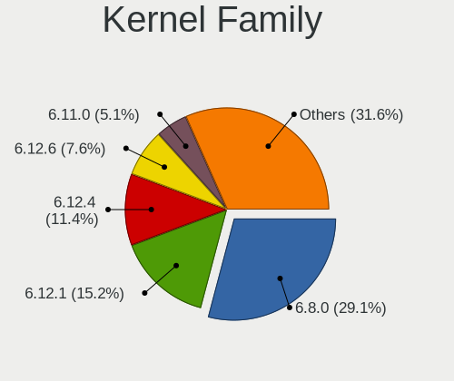

| Version | Notebooks | Percent |
|---------|-----------|---------|
| 5.15.0  | 23        | 31.94%  |
| 5.19.0  | 8         | 11.11%  |
| 6.1.9   | 7         | 9.72%   |
| 6.0.12  | 4         | 5.56%   |
| 6.1.13  | 3         | 4.17%   |
| 6.1.12  | 3         | 4.17%   |
| 5.10.0  | 3         | 4.17%   |
| 6.1.4   | 2         | 2.78%   |
| 6.1.11  | 2         | 2.78%   |
| 6.1.10  | 2         | 2.78%   |
| 6.0.0   | 2         | 2.78%   |
| 5.4.0   | 2         | 2.78%   |
| 6.2.0   | 1         | 1.39%   |
| 6.1.8   | 1         | 1.39%   |
| 6.1.6   | 1         | 1.39%   |
| 6.1.14  | 1         | 1.39%   |
| 6.1.1   | 1         | 1.39%   |
| 5.16.7  | 1         | 1.39%   |
| 5.15.94 | 1         | 1.39%   |
| 5.13.0  | 1         | 1.39%   |
| 5.11.0  | 1         | 1.39%   |
| 4.18.0  | 1         | 1.39%   |
| 4.15.0  | 1         | 1.39%   |

Kernel Major Ver.
-----------------

Linux kernel major version

| Version | Notebooks | Percent |
|---------|-----------|---------|
| 5.15    | 24        | 33.33%  |
| 6.1     | 23        | 31.94%  |
| 5.19    | 8         | 11.11%  |
| 6.0     | 6         | 8.33%   |
| 5.10    | 3         | 4.17%   |
| 5.4     | 2         | 2.78%   |
| 6.2     | 1         | 1.39%   |
| 5.16    | 1         | 1.39%   |
| 5.13    | 1         | 1.39%   |
| 5.11    | 1         | 1.39%   |
| 4.18    | 1         | 1.39%   |
| 4.15    | 1         | 1.39%   |

Arch
----

OS architecture (x86_64, i586, etc.)

| Name   | Notebooks | Percent |
|--------|-----------|---------|
| x86_64 | 71        | 98.61%  |
| i686   | 1         | 1.39%   |

DE
--

Desktop Environment

| Name             | Notebooks | Percent |
|------------------|-----------|---------|
| GNOME            | 46        | 63.89%  |
| KDE5             | 13        | 18.06%  |
| X-Cinnamon       | 6         | 8.33%   |
| XFCE             | 3         | 4.17%   |
| LXDE             | 1         | 1.39%   |
| lightdm-xsession | 1         | 1.39%   |
| Hyprland         | 1         | 1.39%   |
| Unknown          | 1         | 1.39%   |

Display Server
--------------

X11 or Wayland

| Name    | Notebooks | Percent |
|---------|-----------|---------|
| X11     | 44        | 61.11%  |
| Wayland | 27        | 37.5%   |
| Unknown | 1         | 1.39%   |

Display Manager
---------------

SDDM, LightDM, etc.

| Name    | Notebooks | Percent |
|---------|-----------|---------|
| GDM3    | 25        | 34.72%  |
| Unknown | 22        | 30.56%  |
| SDDM    | 10        | 13.89%  |
| LightDM | 8         | 11.11%  |
| GDM     | 7         | 9.72%   |

OS Lang
-------

Language

| Lang    | Notebooks | Percent |
|---------|-----------|---------|
| en_IN   | 44        | 61.11%  |
| en_US   | 27        | 37.5%   |
| Unknown | 1         | 1.39%   |

Boot Mode
---------

EFI or BIOS

| Mode | Notebooks | Percent |
|------|-----------|---------|
| EFI  | 46        | 63.89%  |
| BIOS | 26        | 36.11%  |

Filesystem
----------

Type of filesystem

| Type    | Notebooks | Percent |
|---------|-----------|---------|
| Ext4    | 53        | 73.61%  |
| Btrfs   | 12        | 16.67%  |
| Overlay | 3         | 4.17%   |
| Zfs     | 1         | 1.39%   |
| Xfs     | 1         | 1.39%   |
| F2fs    | 1         | 1.39%   |
| Unknown | 1         | 1.39%   |

Part. scheme
------------

Scheme of partitioning

| Type    | Notebooks | Percent |
|---------|-----------|---------|
| GPT     | 45        | 62.5%   |
| Unknown | 22        | 30.56%  |
| MBR     | 5         | 6.94%   |

Dual Boot with Linux/BSD
------------------------

Hosting more than one Linux/BSD

| Dual boot | Notebooks | Percent |
|-----------|-----------|---------|
| No        | 62        | 86.11%  |
| Yes       | 10        | 13.89%  |

Dual Boot (Win)
---------------

Hosting Linux and Windows

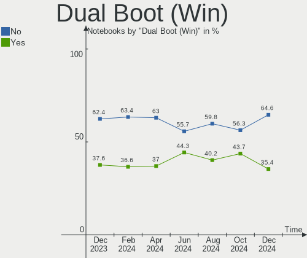

| Dual boot | Notebooks | Percent |
|-----------|-----------|---------|
| No        | 40        | 55.56%  |
| Yes       | 32        | 44.44%  |

Board
-----

Vendor
------

Motherboard manufacturer

| Name                    | Notebooks | Percent |
|-------------------------|-----------|---------|
| Dell                    | 19        | 26.39%  |
| Lenovo                  | 16        | 22.22%  |
| Hewlett-Packard         | 15        | 20.83%  |
| ASUSTek Computer        | 8         | 11.11%  |
| Acer                    | 5         | 6.94%   |
| Timi                    | 3         | 4.17%   |
| MSI                     | 2         | 2.78%   |
| HUAWEI                  | 1         | 1.39%   |
| HONOR                   | 1         | 1.39%   |
| HCL Infosystems Limited | 1         | 1.39%   |
| Apple                   | 1         | 1.39%   |

Model
-----

Motherboard model

| Name                                       | Notebooks | Percent |
|--------------------------------------------|-----------|---------|
| Dell Vostro 3446                           | 2         | 2.78%   |
| Timi Xiaomi NoteBook Pro                   | 1         | 1.39%   |
| Timi Mi NoteBook Ultra                     | 1         | 1.39%   |
| Timi Mi NoteBook Pro                       | 1         | 1.39%   |
| MSI GF63 Thin 11UC                         | 1         | 1.39%   |
| MSI GE63 Raider RGB 9SE                    | 1         | 1.39%   |
| Lenovo ThinkPad X1 Carbon Gen 9 20XXS3HC1G | 1         | 1.39%   |
| Lenovo ThinkPad T460s 20FAS55Q1D           | 1         | 1.39%   |
| Lenovo ThinkPad T460s 20FAS2K13B           | 1         | 1.39%   |
| Lenovo ThinkPad P1 Gen 3 20TJS2F40K        | 1         | 1.39%   |
| Lenovo ThinkPad L430 24663D1               | 1         | 1.39%   |
| Lenovo ThinkPad E14 20RAS1RA00             | 1         | 1.39%   |
| Lenovo ThinkBook 15 G3 ACL 21A4            | 1         | 1.39%   |
| Lenovo ThinkBook 13s G2 ITL 20V9           | 1         | 1.39%   |
| Lenovo Legion Y540-15IRH 81SX              | 1         | 1.39%   |
| Lenovo Legion 5 15IMH05C 82AU              | 1         | 1.39%   |
| Lenovo Legion 5 15IMH05 82AU               | 1         | 1.39%   |
| Lenovo IdeaPad Slim 7 Pro 14IHU5 82QT      | 1         | 1.39%   |
| Lenovo IdeaPad S540-15IWL                  | 1         | 1.39%   |
| Lenovo IdeaPad Gaming 3 15IMH05 81Y4       | 1         | 1.39%   |
| Lenovo G505 20240                          | 1         | 1.39%   |
| Lenovo G50-80 80E5                         | 1         | 1.39%   |
| HUAWEI BOHK-WAX9X                          | 1         | 1.39%   |
| HONOR NMH-WCX9                             | 1         | 1.39%   |
| HP Victus by 16 Laptop PC                  | 1         | 1.39%   |
| HP ProBook 445 G1                          | 1         | 1.39%   |
| HP ProBook 440 G5                          | 1         | 1.39%   |
| HP ProBook 440 G4                          | 1         | 1.39%   |
| HP Pavilion Laptop 15-eg2xxx               | 1         | 1.39%   |
| HP Pavilion Gaming Laptop 15-dk2xxx        | 1         | 1.39%   |
| HP Pavilion 15                             | 1         | 1.39%   |
| HP Notebook                                | 1         | 1.39%   |
| HP Laptop 15s-eq2xxx                       | 1         | 1.39%   |
| HP Laptop 15s-du3xxx                       | 1         | 1.39%   |
| HP Laptop 15s-dr0xxx                       | 1         | 1.39%   |
| HP 430                                     | 1         | 1.39%   |
| HP 245 G8 Notebook PC                      | 1         | 1.39%   |
| HP 15                                      | 1         | 1.39%   |
| HCL Infosystems Limited HCL ME LAPTOP      | 1         | 1.39%   |
| Dell Vostro 3578                           | 1         | 1.39%   |

Model Family
------------

Motherboard model prefix

| Name                        | Notebooks | Percent |
|-----------------------------|-----------|---------|
| Dell Inspiron               | 9         | 12.5%   |
| Lenovo ThinkPad             | 6         | 8.33%   |
| Dell Vostro                 | 4         | 5.56%   |
| Lenovo Legion               | 3         | 4.17%   |
| Lenovo IdeaPad              | 3         | 4.17%   |
| HP ProBook                  | 3         | 4.17%   |
| HP Pavilion                 | 3         | 4.17%   |
| HP Laptop                   | 3         | 4.17%   |
| Dell Latitude               | 3         | 4.17%   |
| Acer Aspire                 | 3         | 4.17%   |
| Timi Mi                     | 2         | 2.78%   |
| Lenovo ThinkBook            | 2         | 2.78%   |
| ASUS VivoBook               | 2         | 2.78%   |
| ASUS ROG                    | 2         | 2.78%   |
| ASUS ASUS                   | 2         | 2.78%   |
| Acer Nitro                  | 2         | 2.78%   |
| Timi Xiaomi                 | 1         | 1.39%   |
| MSI GF63                    | 1         | 1.39%   |
| MSI GE63                    | 1         | 1.39%   |
| Lenovo G505                 | 1         | 1.39%   |
| Lenovo G50-80               | 1         | 1.39%   |
| HUAWEI BOHK-WAX9X           | 1         | 1.39%   |
| HONOR NMH-WCX9              | 1         | 1.39%   |
| HP Victus                   | 1         | 1.39%   |
| HP Notebook                 | 1         | 1.39%   |
| HP 430                      | 1         | 1.39%   |
| HP 245                      | 1         | 1.39%   |
| HP 15                       | 1         | 1.39%   |
| HCL Infosystems Limited HCL | 1         | 1.39%   |
| Dell Studio                 | 1         | 1.39%   |
| Dell Precision              | 1         | 1.39%   |
| Dell G7                     | 1         | 1.39%   |
| ASUS TUF                    | 1         | 1.39%   |
| ASUS K52F                   | 1         | 1.39%   |
| Apple MacBookPro9           | 1         | 1.39%   |
| Unknown                     | 1         | 1.39%   |

MFG Year
--------

Motherboard manufacture year

| Year | Notebooks | Percent |
|------|-----------|---------|
| 2021 | 14        | 19.44%  |
| 2020 | 9         | 12.5%   |
| 2022 | 8         | 11.11%  |
| 2019 | 8         | 11.11%  |
| 2018 | 6         | 8.33%   |
| 2013 | 6         | 8.33%   |
| 2016 | 5         | 6.94%   |
| 2017 | 3         | 4.17%   |
| 2014 | 3         | 4.17%   |
| 2012 | 3         | 4.17%   |
| 2011 | 3         | 4.17%   |
| 2009 | 3         | 4.17%   |
| 2008 | 1         | 1.39%   |

Form Factor
-----------

Physical design of the computer

| Name     | Notebooks | Percent |
|----------|-----------|---------|
| Notebook | 72        | 100%    |

Secure Boot
-----------

Enabled or disabled

| State    | Notebooks | Percent |
|----------|-----------|---------|
| Disabled | 60        | 83.33%  |
| Enabled  | 12        | 16.67%  |

Coreboot
--------

Have coreboot on board

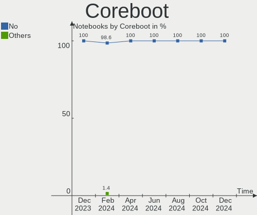

| Used | Notebooks | Percent |
|------|-----------|---------|
| No   | 72        | 100%    |

RAM Size
--------

Total RAM memory

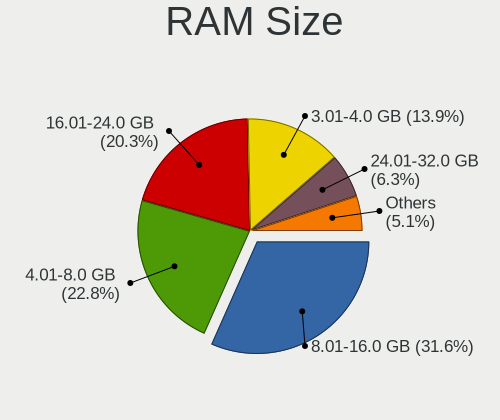

| Size in GB  | Notebooks | Percent |
|-------------|-----------|---------|
| 4.01-8.0    | 29        | 40.28%  |
| 16.01-24.0  | 16        | 22.22%  |
| 8.01-16.0   | 15        | 20.83%  |
| 3.01-4.0    | 7         | 9.72%   |
| 32.01-64.0  | 4         | 5.56%   |
| 64.01-256.0 | 1         | 1.39%   |

RAM Used
--------

Used RAM memory

| Used GB   | Notebooks | Percent |
|-----------|-----------|---------|
| 4.01-8.0  | 23        | 31.94%  |
| 1.01-2.0  | 18        | 25%     |
| 2.01-3.0  | 15        | 20.83%  |
| 3.01-4.0  | 11        | 15.28%  |
| 8.01-16.0 | 4         | 5.56%   |
| 0.51-1.0  | 1         | 1.39%   |

Total Drives
------------

Number of drives on board

| Drives | Notebooks | Percent |
|--------|-----------|---------|
| 1      | 50        | 69.44%  |
| 2      | 21        | 29.17%  |
| 3      | 1         | 1.39%   |

Has CD-ROM
----------

Has CD-ROM on board

| Presented | Notebooks | Percent |
|-----------|-----------|---------|
| No        | 58        | 80.56%  |
| Yes       | 14        | 19.44%  |

Has Ethernet
------------

Has Ethernet on board

| Presented | Notebooks | Percent |
|-----------|-----------|---------|
| Yes       | 56        | 77.78%  |
| No        | 16        | 22.22%  |

Has WiFi
--------

Has WiFi module

| Presented | Notebooks | Percent |
|-----------|-----------|---------|
| Yes       | 72        | 100%    |

Has Bluetooth
-------------

Has Bluetooth module

| Presented | Notebooks | Percent |
|-----------|-----------|---------|
| Yes       | 67        | 93.06%  |
| No        | 5         | 6.94%   |

Location
--------

Country
-------

Geographic location (country)

| Country | Notebooks | Percent |
|---------|-----------|---------|
| India   | 72        | 100%    |

City
----

Geographic location (city)

| City              | Notebooks | Percent |
|-------------------|-----------|---------|
| Bengaluru         | 15        | 20.83%  |
| Delhi             | 7         | 9.72%   |
| Mumbai            | 5         | 6.94%   |
| Kolkata           | 5         | 6.94%   |
| Hyderabad         | 5         | 6.94%   |
| Pune              | 4         | 5.56%   |
| Kochi             | 4         | 5.56%   |
| New Delhi         | 3         | 4.17%   |
| Chennai           | 3         | 4.17%   |
| Gurgaon           | 2         | 2.78%   |
| Visakhapatnam     | 1         | 1.39%   |
| Tirupati          | 1         | 1.39%   |
| Tiruchi           | 1         | 1.39%   |
| Palakkad          | 1         | 1.39%   |
| Noida             | 1         | 1.39%   |
| Mothihari         | 1         | 1.39%   |
| Mormugao          | 1         | 1.39%   |
| Makhu             | 1         | 1.39%   |
| Kozhikode         | 1         | 1.39%   |
| Jaipur            | 1         | 1.39%   |
| Indore            | 1         | 1.39%   |
| Gaya              | 1         | 1.39%   |
| Firozpur          | 1         | 1.39%   |
| Durgapur          | 1         | 1.39%   |
| Dhanbad           | 1         | 1.39%   |
| Chittaranjan Park | 1         | 1.39%   |
| Bareilly          | 1         | 1.39%   |
| Aurangabad        | 1         | 1.39%   |
| Ahmedabad         | 1         | 1.39%   |

Drives
------

Drive Vendor
------------

Hard drive vendors

| Vendor                       | Notebooks | Drives | Percent |
|------------------------------|-----------|--------|---------|
| Seagate                      | 15        | 15     | 16.48%  |
| Samsung Electronics          | 12        | 13     | 13.19%  |
| WDC                          | 9         | 9      | 9.89%   |
| Toshiba                      | 8         | 8      | 8.79%   |
| SK hynix                     | 8         | 8      | 8.79%   |
| SanDisk                      | 4         | 4      | 4.4%    |
| Micron Technology            | 3         | 3      | 3.3%    |
| KIOXIA                       | 3         | 3      | 3.3%    |
| Intel                        | 3         | 3      | 3.3%    |
| HGST                         | 3         | 3      | 3.3%    |
| EVM                          | 3         | 3      | 3.3%    |
| China                        | 3         | 3      | 3.3%    |
| Crucial                      | 2         | 2      | 2.2%    |
| Unknown                      | 2         | 2      | 2.2%    |
| YMTC                         | 1         | 1      | 1.1%    |
| SPCC                         | 1         | 1      | 1.1%    |
| Shenzhen Longsys Electronics | 1         | 1      | 1.1%    |
| Realtek Semiconductor        | 1         | 1      | 1.1%    |
| OSCOO                        | 1         | 1      | 1.1%    |
| Kingston Technology Company  | 1         | 1      | 1.1%    |
| KingFast                     | 1         | 1      | 1.1%    |
| JMicron Technology           | 1         | 1      | 1.1%    |
| Geonix                       | 1         | 1      | 1.1%    |
| FORESEE                      | 1         | 1      | 1.1%    |
| Apple                        | 1         | 1      | 1.1%    |
| Acer                         | 1         | 1      | 1.1%    |
| 2.5                          | 1         | 1      | 1.1%    |

Drive Model
-----------

Hard drive models

| Model                                                  | Notebooks | Percent |
|--------------------------------------------------------|-----------|---------|
| Seagate ST1000LM035-1RK172 1TB                         | 7         | 7.61%   |
| Toshiba MQ04ABF100 1TB                                 | 4         | 4.35%   |
| HGST HTS541010A9E680 1TB                               | 3         | 3.26%   |
| WDC WDS240G2G0A-00JH30 240GB SSD                       | 2         | 2.17%   |
| WDC WD10SPZX-00Z10T0 1TB                               | 2         | 2.17%   |
| Seagate ST500LM021-1KJ152 500GB                        | 2         | 2.17%   |
| Seagate ST1000LM049-2GH172 1TB                         | 2         | 2.17%   |
| EVM 512GB SSD                                          | 2         | 2.17%   |
| Unknown                                                | 2         | 2.17%   |
| YMTC PC210-512GB-B                                     | 1         | 1.09%   |
| WDC WDS500G2B0A-00SM50 500GB SSD                       | 1         | 1.09%   |
| WDC WD3200BEKT-60PVMT0 320GB                           | 1         | 1.09%   |
| WDC WD10SPZX-60Z10T1 1TB                               | 1         | 1.09%   |
| WDC WD10JPVX-75JC3T0 1TB                               | 1         | 1.09%   |
| WDC PC SN730 SDBPNTY-1T00-1101 1TB                     | 1         | 1.09%   |
| Toshiba XG6 NVMe SSD Controller 512GB                  | 1         | 1.09%   |
| Toshiba MQ01ACF050 500GB                               | 1         | 1.09%   |
| Toshiba MQ01ABD050 500GB                               | 1         | 1.09%   |
| Toshiba HDWL110 1TB                                    | 1         | 1.09%   |
| SPCC M.2 PCIe SSD 512GB                                | 1         | 1.09%   |
| SK hynix SKHynix_HFS512GD9TNI-L2A0B 512GB              | 1         | 1.09%   |
| SK hynix SKHynix_HFS256GD9TNG-L3A0B 256GB              | 1         | 1.09%   |
| SK hynix SKHynix_HFM512GD3HX015N 512GB                 | 1         | 1.09%   |
| SK hynix PC711 HFS512GDE9X073N 512GB                   | 1         | 1.09%   |
| SK hynix HFM512GDJTNI-82A0A 512GB                      | 1         | 1.09%   |
| SK hynix HFM256GDJTNG-8310A 256GB                      | 1         | 1.09%   |
| SK hynix BC511 512GB                                   | 1         | 1.09%   |
| SK hynix BC501 NVMe Solid State Drive 512GB            | 1         | 1.09%   |
| Shenzhen Longsys SM2263EN/SM2263XT-based OEM SSD 512GB | 1         | 1.09%   |
| Seagate ST9500423AS 500GB                              | 1         | 1.09%   |
| Seagate ST9320325AS 320GB                              | 1         | 1.09%   |
| Seagate ST500LT012-1DG142 500GB                        | 1         | 1.09%   |
| Seagate ST1000LM014-1EJ164-SSHD 1TB                    | 1         | 1.09%   |
| Sandisk WD Black SN750 / PC SN730 NVMe SSD 512GB       | 1         | 1.09%   |
| SanDisk SSD PLUS 120 GB                                | 1         | 1.09%   |
| SanDisk SD8SN8U-256G-1006 256GB SSD                    | 1         | 1.09%   |
| Sandisk PC SN530 NVMe WDC 256GB                        | 1         | 1.09%   |
| Samsung SSD 980 PRO 1TB                                | 1         | 1.09%   |
| Samsung SSD 970 EVO 1TB                                | 1         | 1.09%   |
| Samsung NVMe SSD Controller SM981/PM981/PM983 250GB    | 1         | 1.09%   |

HDD Vendor
----------

Hard disk drive vendors

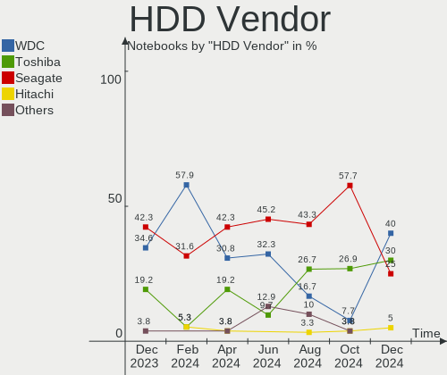

| Vendor              | Notebooks | Drives | Percent |
|---------------------|-----------|--------|---------|
| Seagate             | 15        | 15     | 46.88%  |
| Toshiba             | 7         | 7      | 21.88%  |
| WDC                 | 5         | 5      | 15.63%  |
| HGST                | 3         | 3      | 9.38%   |
| Samsung Electronics | 1         | 1      | 3.13%   |
| Apple               | 1         | 1      | 3.13%   |

SSD Vendor
----------

Solid state drive vendors

| Vendor              | Notebooks | Drives | Percent |
|---------------------|-----------|--------|---------|
| WDC                 | 3         | 3      | 15.79%  |
| EVM                 | 3         | 3      | 15.79%  |
| China               | 3         | 3      | 15.79%  |
| SanDisk             | 2         | 2      | 10.53%  |
| Samsung Electronics | 2         | 2      | 10.53%  |
| Crucial             | 2         | 2      | 10.53%  |
| OSCOO               | 1         | 1      | 5.26%   |
| FORESEE             | 1         | 1      | 5.26%   |
| Acer                | 1         | 1      | 5.26%   |
| 2.5                 | 1         | 1      | 5.26%   |

Drive Kind
----------

HDD or SSD

| Kind    | Notebooks | Drives | Percent |
|---------|-----------|--------|---------|
| NVMe    | 35        | 36     | 38.89%  |
| HDD     | 32        | 32     | 35.56%  |
| SSD     | 18        | 19     | 20%     |
| Unknown | 5         | 5      | 5.56%   |

Drive Connector
---------------

SATA, SAS, NVMe, etc.

| Type | Notebooks | Drives | Percent |
|------|-----------|--------|---------|
| SATA | 45        | 55     | 55.56%  |
| NVMe | 35        | 36     | 43.21%  |
| SAS  | 1         | 1      | 1.23%   |

Drive Size
----------

Size of hard drive

| Size in TB | Notebooks | Drives | Percent |
|------------|-----------|--------|---------|
| 0.51-1.0   | 24        | 24     | 50%     |
| 0.01-0.5   | 23        | 26     | 47.92%  |
| 1.01-2.0   | 1         | 1      | 2.08%   |

Space Total
-----------

Amount of disk space available on the file system

| Size in GB | Notebooks | Percent |
|------------|-----------|---------|
| 251-500    | 21        | 29.17%  |
| 101-250    | 20        | 27.78%  |
| 501-1000   | 13        | 18.06%  |
| 51-100     | 8         | 11.11%  |
| 1001-2000  | 5         | 6.94%   |
| 1-20       | 3         | 4.17%   |
| 21-50      | 1         | 1.39%   |
| Unknown    | 1         | 1.39%   |

Space Used
----------

Amount of used disk space

| Used GB   | Notebooks | Percent |
|-----------|-----------|---------|
| 1-20      | 20        | 27.78%  |
| 101-250   | 15        | 20.83%  |
| 51-100    | 13        | 18.06%  |
| 21-50     | 12        | 16.67%  |
| 251-500   | 6         | 8.33%   |
| 501-1000  | 4         | 5.56%   |
| 1001-2000 | 1         | 1.39%   |
| Unknown   | 1         | 1.39%   |

Malfunc. Drives
---------------

Drive models with a malfunction

| Model                             | Notebooks | Drives | Percent |
|-----------------------------------|-----------|--------|---------|
| Seagate ST1000LM035-1RK172 1TB    | 2         | 2      | 25%     |
| Toshiba MQ04ABF100 1TB            | 1         | 1      | 12.5%   |
| Seagate ST9320325AS 320GB         | 1         | 1      | 12.5%   |
| Seagate ST500LM021-1KJ152 500GB   | 1         | 1      | 12.5%   |
| Seagate ST1000LM049-2GH172 1TB    | 1         | 1      | 12.5%   |
| Samsung Electronics HM160JI 160GB | 1         | 1      | 12.5%   |
| HGST HTS541010A9E680 1TB          | 1         | 1      | 12.5%   |

Malfunc. Drive Vendor
---------------------

Vendors of faulty drives

| Vendor              | Notebooks | Drives | Percent |
|---------------------|-----------|--------|---------|
| Seagate             | 5         | 5      | 62.5%   |
| Toshiba             | 1         | 1      | 12.5%   |
| Samsung Electronics | 1         | 1      | 12.5%   |
| HGST                | 1         | 1      | 12.5%   |

Malfunc. HDD Vendor
-------------------

Vendors of faulty HDD drives

| Vendor              | Notebooks | Drives | Percent |
|---------------------|-----------|--------|---------|
| Seagate             | 5         | 5      | 62.5%   |
| Toshiba             | 1         | 1      | 12.5%   |
| Samsung Electronics | 1         | 1      | 12.5%   |
| HGST                | 1         | 1      | 12.5%   |

Malfunc. Drive Kind
-------------------

Kinds of faulty drives

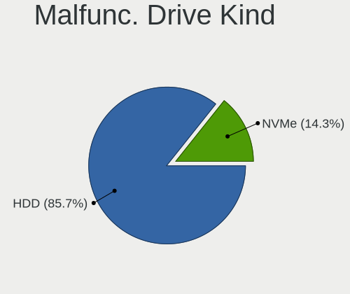

| Kind | Notebooks | Drives | Percent |
|------|-----------|--------|---------|
| HDD  | 8         | 8      | 100%    |

Failed Drives
-------------

Failed drive models

Zero info for selected period =(

Failed Drive Vendor
-------------------

Failed drive vendors

Zero info for selected period =(

Drive Status
------------

Number of failed and malfunc. drives

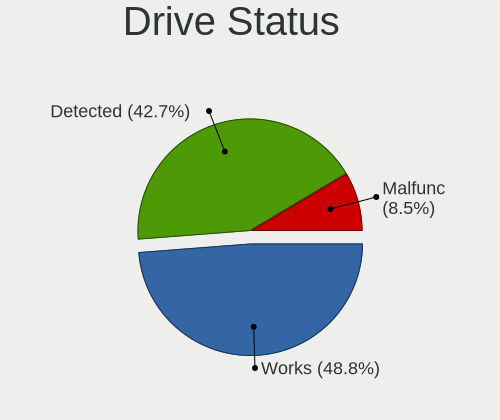

| Status   | Notebooks | Drives | Percent |
|----------|-----------|--------|---------|
| Works    | 36        | 44     | 46.75%  |
| Detected | 33        | 40     | 42.86%  |
| Malfunc  | 8         | 8      | 10.39%  |

Storage controller
------------------

Storage Vendor
--------------

Storage controller vendors

| Vendor                       | Notebooks | Percent |
|------------------------------|-----------|---------|
| Intel                        | 50        | 54.95%  |
| Samsung Electronics          | 9         | 9.89%   |
| SK hynix                     | 8         | 8.79%   |
| AMD                          | 8         | 8.79%   |
| SanDisk                      | 3         | 3.3%    |
| Micron Technology            | 3         | 3.3%    |
| KIOXIA                       | 3         | 3.3%    |
| Yangtze Memory Technologies  | 1         | 1.1%    |
| Toshiba America Info Systems | 1         | 1.1%    |
| Silicon Motion               | 1         | 1.1%    |
| Shenzhen Longsys Electronics | 1         | 1.1%    |
| Realtek Semiconductor        | 1         | 1.1%    |
| Nvidia                       | 1         | 1.1%    |
| Kingston Technology Company  | 1         | 1.1%    |

Storage Model
-------------

Storage controller models

| Model                                                                        | Notebooks | Percent |
|------------------------------------------------------------------------------|-----------|---------|
| Intel Sunrise Point-LP SATA Controller [AHCI mode]                           | 9         | 9.18%   |
| AMD FCH SATA Controller [AHCI mode]                                          | 7         | 7.14%   |
| Intel 8 Series SATA Controller 1 [AHCI mode]                                 | 6         | 6.12%   |
| Samsung NVMe SSD Controller SM981/PM981/PM983                                | 5         | 5.1%    |
| Intel 82801 Mobile SATA Controller [RAID mode]                               | 5         | 5.1%    |
| Intel Volume Management Device NVMe RAID Controller                          | 4         | 4.08%   |
| Intel Cannon Lake Mobile PCH SATA AHCI Controller                            | 4         | 4.08%   |
| Intel 400 Series Chipset Family SATA AHCI Controller                         | 4         | 4.08%   |
| Samsung NVMe SSD Controller PM9A1/PM9A3/980PRO                               | 3         | 3.06%   |
| Micron Non-Volatile memory controller                                        | 3         | 3.06%   |
| Intel Tiger Lake-LP SATA Controller                                          | 3         | 3.06%   |
| Intel 6 Series/C200 Series Chipset Family 6 port Mobile SATA AHCI Controller | 3         | 3.06%   |
| SK hynix Non-Volatile memory controller                                      | 2         | 2.04%   |
| SK hynix Gold P31/PC711 NVMe Solid State Drive                               | 2         | 2.04%   |
| SK hynix BC511                                                               | 2         | 2.04%   |
| SK hynix BC501 NVMe Solid State Drive                                        | 2         | 2.04%   |
| SanDisk WD Black SN750 / PC SN730 NVMe SSD                                   | 2         | 2.04%   |
| Samsung NVMe SSD Controller 980                                              | 2         | 2.04%   |
| KIOXIA NVMe SSD Controller BG4                                               | 2         | 2.04%   |
| Intel Non-Volatile memory controller                                         | 2         | 2.04%   |
| Intel Comet Lake SATA AHCI Controller                                        | 2         | 2.04%   |
| Intel 82801IBM/IEM (ICH9M/ICH9M-E) 4 port SATA Controller [AHCI mode]        | 2         | 2.04%   |
| Intel 7 Series Chipset Family 6-port SATA Controller [AHCI mode]             | 2         | 2.04%   |
| Intel 5 Series/3400 Series Chipset 4 port SATA AHCI Controller               | 2         | 2.04%   |
| Yangtze Memory Non-Volatile memory controller                                | 1         | 1.02%   |
| Toshiba America Info Systems XG6 NVMe SSD Controller                         | 1         | 1.02%   |
| Silicon Motion SM2263EN/SM2263XT SSD Controller                              | 1         | 1.02%   |
| Shenzhen Longsys SM2263EN/SM2263XT-based OEM SSD                             | 1         | 1.02%   |
| SanDisk Non-Volatile memory controller                                       | 1         | 1.02%   |
| Realtek Realtek Non-Volatile memory controller                               | 1         | 1.02%   |
| Nvidia MCP67 IDE Controller                                                  | 1         | 1.02%   |
| Nvidia MCP67 AHCI Controller                                                 | 1         | 1.02%   |
| KIOXIA Non-Volatile memory controller                                        | 1         | 1.02%   |
| Kingston Company OM3PDP3 NVMe SSD                                            | 1         | 1.02%   |
| Intel Wildcat Point-LP SATA Controller [AHCI Mode]                           | 1         | 1.02%   |
| Intel SSD 660P Series                                                        | 1         | 1.02%   |
| Intel SATA Controller [RAID mode]                                            | 1         | 1.02%   |
| Intel Ice Lake-LP SATA Controller [AHCI mode]                                | 1         | 1.02%   |
| Intel Cannon Point-LP SATA Controller [AHCI Mode]                            | 1         | 1.02%   |
| Intel Alder Lake-P SATA AHCI Controller                                      | 1         | 1.02%   |

Storage Kind
------------

Kind of storage controller (IDE, SATA, NVMe, SAS, ...)

| Kind | Notebooks | Percent |
|------|-----------|---------|
| SATA | 50        | 52.08%  |
| NVMe | 35        | 36.46%  |
| RAID | 10        | 10.42%  |
| IDE  | 1         | 1.04%   |

Processor
---------

CPU Vendor
----------

Processor vendors

| Vendor | Notebooks | Percent |
|--------|-----------|---------|
| Intel  | 57        | 79.17%  |
| AMD    | 15        | 20.83%  |

CPU Model
---------

Processor models

| Model                                         | Notebooks | Percent |
|-----------------------------------------------|-----------|---------|
| Intel Core i7-10750H CPU @ 2.60GHz            | 4         | 5.56%   |
| Intel Core i5-8265U CPU @ 1.60GHz             | 3         | 4.17%   |
| Intel Core i5-4210U CPU @ 1.70GHz             | 3         | 4.17%   |
| AMD Ryzen 5 3500U with Radeon Vega Mobile Gfx | 3         | 4.17%   |
| Intel Core i5-8250U CPU @ 1.60GHz             | 2         | 2.78%   |
| Intel Core i5-7200U CPU @ 2.50GHz             | 2         | 2.78%   |
| Intel Core i5-6300U CPU @ 2.40GHz             | 2         | 2.78%   |
| Intel Core i5-4200U CPU @ 1.60GHz             | 2         | 2.78%   |
| Intel 11th Gen Core i7-11370H @ 3.30GHz       | 2         | 2.78%   |
| Intel 11th Gen Core i5-1135G7 @ 2.40GHz       | 2         | 2.78%   |
| Intel 11th Gen Core i5-11300H @ 3.10GHz       | 2         | 2.78%   |
| AMD Ryzen 5 5500U with Radeon Graphics        | 2         | 2.78%   |
| AMD Ryzen 5 3550H with Radeon Vega Mobile Gfx | 2         | 2.78%   |
| Intel Xeon CPU E3-1505M v5 @ 2.80GHz          | 1         | 1.39%   |
| Intel Core i7-9750H CPU @ 2.60GHz             | 1         | 1.39%   |
| Intel Core i7-8750H CPU @ 2.20GHz             | 1         | 1.39%   |
| Intel Core i7-8650U CPU @ 1.90GHz             | 1         | 1.39%   |
| Intel Core i7-6600U CPU @ 2.60GHz             | 1         | 1.39%   |
| Intel Core i7-5500U CPU @ 2.40GHz             | 1         | 1.39%   |
| Intel Core i7-2630QM CPU @ 2.00GHz            | 1         | 1.39%   |
| Intel Core i7-10850H CPU @ 2.70GHz            | 1         | 1.39%   |
| Intel Core i7-10610U CPU @ 1.80GHz            | 1         | 1.39%   |
| Intel Core i5-9300H CPU @ 2.40GHz             | 1         | 1.39%   |
| Intel Core i5-8300H CPU @ 2.30GHz             | 1         | 1.39%   |
| Intel Core i5-6200U CPU @ 2.30GHz             | 1         | 1.39%   |
| Intel Core i5-3230M CPU @ 2.60GHz             | 1         | 1.39%   |
| Intel Core i5-3210M CPU @ 2.50GHz             | 1         | 1.39%   |
| Intel Core i5-2540M CPU @ 2.60GHz             | 1         | 1.39%   |
| Intel Core i5-2520M CPU @ 2.50GHz             | 1         | 1.39%   |
| Intel Core i5-1035G1 CPU @ 1.00GHz            | 1         | 1.39%   |
| Intel Core i5-10210U CPU @ 1.60GHz            | 1         | 1.39%   |
| Intel Core i5-10200H CPU @ 2.40GHz            | 1         | 1.39%   |
| Intel Core i5 CPU M 460 @ 2.53GHz             | 1         | 1.39%   |
| Intel Core i3-7020U CPU @ 2.30GHz             | 1         | 1.39%   |
| Intel Core i3-6006U CPU @ 2.00GHz             | 1         | 1.39%   |
| Intel Core i3-4005U CPU @ 1.70GHz             | 1         | 1.39%   |
| Intel Core i3-1005G1 CPU @ 1.20GHz            | 1         | 1.39%   |
| Intel Core i3 CPU M 330 @ 2.13GHz             | 1         | 1.39%   |
| Intel Core 2 Duo CPU T9800 @ 2.93GHz          | 1         | 1.39%   |
| Intel Core 2 Duo CPU P8800 @ 2.66GHz          | 1         | 1.39%   |

CPU Model Family
----------------

Processor model prefix

| Model                   | Notebooks | Percent |
|-------------------------|-----------|---------|
| Intel Core i5           | 25        | 34.72%  |
| Other                   | 12        | 16.67%  |
| Intel Core i7           | 12        | 16.67%  |
| AMD Ryzen 5             | 9         | 12.5%   |
| Intel Core i3           | 5         | 6.94%   |
| Intel Core 2 Duo        | 2         | 2.78%   |
| Intel Xeon              | 1         | 1.39%   |
| AMD Turion 64 X2 Mobile | 1         | 1.39%   |
| AMD Ryzen 9             | 1         | 1.39%   |
| AMD Ryzen 7             | 1         | 1.39%   |
| AMD Ryzen 3             | 1         | 1.39%   |
| AMD E1                  | 1         | 1.39%   |
| AMD A6                  | 1         | 1.39%   |

CPU Cores
---------

Number of processor cores

| Number | Notebooks | Percent |
|--------|-----------|---------|
| 4      | 29        | 40.28%  |
| 2      | 26        | 36.11%  |
| 6      | 10        | 13.89%  |
| 8      | 4         | 5.56%   |
| 14     | 1         | 1.39%   |
| 12     | 1         | 1.39%   |
| 1      | 1         | 1.39%   |

CPU Sockets
-----------

Number of sockets

| Number | Notebooks | Percent |
|--------|-----------|---------|
| 1      | 72        | 100%    |

CPU Threads
-----------

Threads per core (Hyper-Threading)

| Number | Notebooks | Percent |
|--------|-----------|---------|
| 2      | 68        | 94.44%  |
| 1      | 4         | 5.56%   |

CPU Op-Modes
------------

CPU Operation Modes (32-bit, 64-bit)

| Op mode        | Notebooks | Percent |
|----------------|-----------|---------|
| 32-bit, 64-bit | 72        | 100%    |

CPU Microcode
-------------

Microcode number

| Number     | Notebooks | Percent |
|------------|-----------|---------|
| Unknown    | 19        | 26.39%  |
| 0x806c1    | 7         | 9.72%   |
| 0xa0652    | 6         | 8.33%   |
| 0x40651    | 5         | 6.94%   |
| 0x08108109 | 5         | 6.94%   |
| 0x806ec    | 4         | 5.56%   |
| 0x906ea    | 3         | 4.17%   |
| 0x206a7    | 3         | 4.17%   |
| 0x906a3    | 2         | 2.78%   |
| 0x806ea    | 2         | 2.78%   |
| 0x706e5    | 2         | 2.78%   |
| 0x406e3    | 2         | 2.78%   |
| 0x08608103 | 2         | 2.78%   |
| 0x806eb    | 1         | 1.39%   |
| 0x806e9    | 1         | 1.39%   |
| 0x806d1    | 1         | 1.39%   |
| 0x506e3    | 1         | 1.39%   |
| 0x306d4    | 1         | 1.39%   |
| 0x20652    | 1         | 1.39%   |
| 0x1067a    | 1         | 1.39%   |
| 0x0a404101 | 1         | 1.39%   |
| 0x08101007 | 1         | 1.39%   |
| 0x06001119 | 1         | 1.39%   |

CPU Microarch
-------------

Microarchitecture

| Name             | Notebooks | Percent |
|------------------|-----------|---------|
| KabyLake         | 15        | 20.83%  |
| TigerLake        | 8         | 11.11%  |
| Skylake          | 6         | 8.33%   |
| Haswell          | 6         | 8.33%   |
| CometLake        | 6         | 8.33%   |
| Unknown          | 6         | 8.33%   |
| Zen+             | 5         | 6.94%   |
| SandyBridge      | 3         | 4.17%   |
| IceLake          | 3         | 4.17%   |
| Westmere         | 2         | 2.78%   |
| Penryn           | 2         | 2.78%   |
| IvyBridge        | 2         | 2.78%   |
| Alderlake Hybrid | 2         | 2.78%   |
| Zen 3            | 1         | 1.39%   |
| Zen              | 1         | 1.39%   |
| Piledriver       | 1         | 1.39%   |
| K8 Hammer        | 1         | 1.39%   |
| Jaguar           | 1         | 1.39%   |
| Broadwell        | 1         | 1.39%   |

Graphics
--------

GPU Vendor
----------

Vendors of graphics cards

| Vendor | Notebooks | Percent |
|--------|-----------|---------|
| Intel  | 55        | 54.46%  |
| Nvidia | 26        | 25.74%  |
| AMD    | 20        | 19.8%   |

GPU Model
---------

Graphics card models

| Model                                                                         | Notebooks | Percent |
|-------------------------------------------------------------------------------|-----------|---------|
| Intel TigerLake-LP GT2 [Iris Xe Graphics]                                     | 7         | 6.86%   |
| Intel Haswell-ULT Integrated Graphics Controller                              | 6         | 5.88%   |
| Intel Skylake GT2 [HD Graphics 520]                                           | 5         | 4.9%    |
| AMD Picasso/Raven 2 [Radeon Vega Series / Radeon Vega Mobile Series]          | 5         | 4.9%    |
| Intel CometLake-H GT2 [UHD Graphics]                                          | 4         | 3.92%   |
| Nvidia TU117M [GeForce GTX 1650 Ti Mobile]                                    | 3         | 2.94%   |
| Nvidia TU117M                                                                 | 3         | 2.94%   |
| Nvidia GF117M [GeForce 610M/710M/810M/820M / GT 620M/625M/630M/720M]          | 3         | 2.94%   |
| Intel WhiskeyLake-U GT2 [UHD Graphics 620]                                    | 3         | 2.94%   |
| Intel UHD Graphics 620                                                        | 3         | 2.94%   |
| Intel HD Graphics 620                                                         | 3         | 2.94%   |
| Intel CoffeeLake-H GT2 [UHD Graphics 630]                                     | 3         | 2.94%   |
| Intel 2nd Generation Core Processor Family Integrated Graphics Controller     | 3         | 2.94%   |
| AMD Sun XT [Radeon HD 8670A/8670M/8690M / R5 M330 / M430 / Radeon 520 Mobile] | 3         | 2.94%   |
| AMD Lucienne                                                                  | 3         | 2.94%   |
| Nvidia TU106M [GeForce RTX 2060 Mobile]                                       | 2         | 1.96%   |
| Nvidia GA107M [GeForce RTX 3050 Mobile]                                       | 2         | 1.96%   |
| Intel Mobile 4 Series Chipset Integrated Graphics Controller                  | 2         | 1.96%   |
| Intel Iris Plus Graphics G1 (Ice Lake)                                        | 2         | 1.96%   |
| Intel Core Processor Integrated Graphics Controller                           | 2         | 1.96%   |
| Intel CometLake-U GT2 [UHD Graphics]                                          | 2         | 1.96%   |
| Intel Alder Lake-P Integrated Graphics Controller                             | 2         | 1.96%   |
| Intel 3rd Gen Core processor Graphics Controller                              | 2         | 1.96%   |
| AMD Rembrandt [Radeon 680M]                                                   | 2         | 1.96%   |
| Nvidia TU117M [GeForce MX550]                                                 | 1         | 0.98%   |
| Nvidia TU117M [GeForce GTX 1650 Mobile / Max-Q]                               | 1         | 0.98%   |
| Nvidia GP108M [GeForce MX250]                                                 | 1         | 0.98%   |
| Nvidia GP107M [GeForce GTX 1050 Ti Mobile]                                    | 1         | 0.98%   |
| Nvidia GP106M [GeForce GTX 1060 Mobile]                                       | 1         | 0.98%   |
| Nvidia GM108M [GeForce MX130]                                                 | 1         | 0.98%   |
| Nvidia GM108M [GeForce 930M]                                                  | 1         | 0.98%   |
| Nvidia GM108M [GeForce 830M]                                                  | 1         | 0.98%   |
| Nvidia GF108M [GeForce GT 525M]                                               | 1         | 0.98%   |
| Nvidia GA107M [GeForce RTX 3050 Ti Mobile]                                    | 1         | 0.98%   |
| Nvidia GA106M [GeForce RTX 3060 Mobile / Max-Q]                               | 1         | 0.98%   |
| Nvidia GA104 [Geforce RTX 3070 Ti Laptop GPU]                                 | 1         | 0.98%   |
| Nvidia C67 [GeForce 7150M / nForce 630M]                                      | 1         | 0.98%   |
| Intel TigerLake-H GT1 [UHD Graphics]                                          | 1         | 0.98%   |
| Intel Tiger Lake-LP GT2 [UHD Graphics G4]                                     | 1         | 0.98%   |
| Intel HD Graphics P530                                                        | 1         | 0.98%   |

GPU Combo
---------

Combinations of graphics cards

| Name           | Notebooks | Percent |
|----------------|-----------|---------|
| 1 x Intel      | 29        | 40.28%  |
| Intel + Nvidia | 19        | 26.39%  |
| 1 x AMD        | 10        | 13.89%  |
| Intel + AMD    | 6         | 8.33%   |
| 1 x Nvidia     | 3         | 4.17%   |
| AMD + Nvidia   | 3         | 4.17%   |
| 2 x Intel      | 1         | 1.39%   |
| 2 x AMD        | 1         | 1.39%   |

GPU Driver
----------

Free vs proprietary

| Driver      | Notebooks | Percent |
|-------------|-----------|---------|
| Free        | 56        | 77.78%  |
| Proprietary | 14        | 19.44%  |
| Unknown     | 2         | 2.78%   |

GPU Memory
----------

Total video memory

| Size in GB | Notebooks | Percent |
|------------|-----------|---------|
| Unknown    | 44        | 61.11%  |
| 1.01-2.0   | 13        | 18.06%  |
| 3.01-4.0   | 6         | 8.33%   |
| 0.51-1.0   | 4         | 5.56%   |
| 0.01-0.5   | 4         | 5.56%   |
| 5.01-6.0   | 1         | 1.39%   |

Monitor
-------

Monitor Vendor
--------------

Monitor vendors

| Vendor              | Notebooks | Percent |
|---------------------|-----------|---------|
| Chimei Innolux      | 17        | 22.67%  |
| AU Optronics        | 17        | 22.67%  |
| BOE                 | 14        | 18.67%  |
| LG Display          | 10        | 13.33%  |
| PANDA               | 3         | 4%      |
| TMX                 | 2         | 2.67%   |
| Dell                | 2         | 2.67%   |
| Sharp               | 1         | 1.33%   |
| Samsung Electronics | 1         | 1.33%   |
| LG Philips          | 1         | 1.33%   |
| Lenovo              | 1         | 1.33%   |
| InfoVision          | 1         | 1.33%   |
| HKC                 | 1         | 1.33%   |
| Goldstar            | 1         | 1.33%   |
| CSO                 | 1         | 1.33%   |
| Apple               | 1         | 1.33%   |
| Acer                | 1         | 1.33%   |

Monitor Model
-------------

Monitor models

| Model                                                             | Notebooks | Percent |
|-------------------------------------------------------------------|-----------|---------|
| PANDA LCD Monitor NCP004D 1920x1080 344x194mm 15.5-inch           | 2         | 2.67%   |
| Chimei Innolux LCD Monitor CMN15F5 1920x1080 344x193mm 15.5-inch  | 2         | 2.67%   |
| TMX TL156VDXP0101 TMX1561 1920x1080 344x194mm 15.5-inch           | 1         | 1.33%   |
| TMX TL156MDMP01-0 TMX1560 3200x2000 336x210mm 15.6-inch           | 1         | 1.33%   |
| Sharp LQ156M1JW01 SHP14C3 1920x1080 344x194mm 15.5-inch           | 1         | 1.33%   |
| Samsung Electronics C24F390 SAM0D2C 1920x1080 521x293mm 23.5-inch | 1         | 1.33%   |
| PANDA LCD Monitor NCP0029 1920x1080 344x194mm 15.5-inch           | 1         | 1.33%   |
| LG Philips LCD Monitor LPLA104 1440x900 367x230mm 17.1-inch       | 1         | 1.33%   |
| LG Display LCD Monitor LGD05FE 1920x1080 344x194mm 15.5-inch      | 1         | 1.33%   |
| LG Display LCD Monitor LGD0563 1920x1080 344x194mm 15.5-inch      | 1         | 1.33%   |
| LG Display LCD Monitor LGD053F 1920x1080 344x194mm 15.5-inch      | 1         | 1.33%   |
| LG Display LCD Monitor LGD050B 1920x1080 309x174mm 14.0-inch      | 1         | 1.33%   |
| LG Display LCD Monitor LGD049B 1920x1080 344x194mm 15.5-inch      | 1         | 1.33%   |
| LG Display LCD Monitor LGD03DF 1366x768 344x194mm 15.5-inch       | 1         | 1.33%   |
| LG Display LCD Monitor LGD033B 1366x768 344x194mm 15.5-inch       | 1         | 1.33%   |
| LG Display LCD Monitor LGD0335 1366x768 310x174mm 14.0-inch       | 1         | 1.33%   |
| LG Display LCD Monitor LGD02DC 1366x768 344x194mm 15.5-inch       | 1         | 1.33%   |
| LG Display LCD Monitor LGD01E8 1366x768 344x194mm 15.5-inch       | 1         | 1.33%   |
| Lenovo Q24i-1L LEN66C0 1920x1080 527x296mm 23.8-inch              | 1         | 1.33%   |
| InfoVision LCD Monitor IVO061A 1366x768 344x193mm 15.5-inch       | 1         | 1.33%   |
| HKC LCD Monitor HKC36BB 1366x768 309x174mm 14.0-inch              | 1         | 1.33%   |
| Goldstar FULL HD GSM5ABB 1920x1080 480x270mm 21.7-inch            | 1         | 1.33%   |
| Dell E2218HN DELF09E 1920x1080 476x268mm 21.5-inch                | 1         | 1.33%   |
| Dell D2015H DELF063 1920x1080 435x239mm 19.5-inch                 | 1         | 1.33%   |
| CSO LCD Monitor CSO1402 2880x1800 302x188mm 14.0-inch             | 1         | 1.33%   |
| Chimei Innolux LCD Monitor CMN1606 1920x1080 355x199mm 16.0-inch  | 1         | 1.33%   |
| Chimei Innolux LCD Monitor CMN15E7 1920x1080 344x193mm 15.5-inch  | 1         | 1.33%   |
| Chimei Innolux LCD Monitor CMN15E6 1366x768 344x193mm 15.5-inch   | 1         | 1.33%   |
| Chimei Innolux LCD Monitor CMN15D5 1920x1080 344x193mm 15.5-inch  | 1         | 1.33%   |
| Chimei Innolux LCD Monitor CMN15AB 1366x768 344x194mm 15.5-inch   | 1         | 1.33%   |
| Chimei Innolux LCD Monitor CMN1540 2560x1440 344x193mm 15.5-inch  | 1         | 1.33%   |
| Chimei Innolux LCD Monitor CMN1535 1366x768 344x193mm 15.5-inch   | 1         | 1.33%   |
| Chimei Innolux LCD Monitor CMN1521 1920x1080 344x193mm 15.5-inch  | 1         | 1.33%   |
| Chimei Innolux LCD Monitor CMN14D4 1920x1080 309x173mm 13.9-inch  | 1         | 1.33%   |
| Chimei Innolux LCD Monitor CMN14D3 1920x1080 309x173mm 13.9-inch  | 1         | 1.33%   |
| Chimei Innolux LCD Monitor CMN14B1 1920x1080 308x173mm 13.9-inch  | 1         | 1.33%   |
| Chimei Innolux LCD Monitor CMN1490 1366x768 309x173mm 13.9-inch   | 1         | 1.33%   |
| Chimei Innolux LCD Monitor CMN1476 1366x768 309x174mm 14.0-inch   | 1         | 1.33%   |
| Chimei Innolux LCD Monitor CMN1415 1920x1080 309x173mm 13.9-inch  | 1         | 1.33%   |
| Chimei Innolux LCD Monitor CMN13B0 2560x1600 286x178mm 13.3-inch  | 1         | 1.33%   |

Monitor Resolution
------------------

Monitor screen resolution

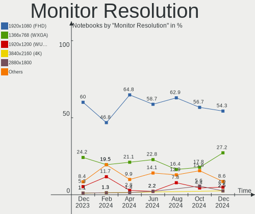

| Resolution        | Notebooks | Percent |
|-------------------|-----------|---------|
| 1920x1080 (FHD)   | 39        | 54.93%  |
| 1366x768 (WXGA)   | 22        | 30.99%  |
| 2560x1600         | 3         | 4.23%   |
| 3200x2000         | 1         | 1.41%   |
| 2880x1800         | 1         | 1.41%   |
| 2560x1440 (QHD)   | 1         | 1.41%   |
| 1920x1200 (WUXGA) | 1         | 1.41%   |
| 1600x900 (HD+)    | 1         | 1.41%   |
| 1440x900 (WXGA+)  | 1         | 1.41%   |
| 1280x800 (WXGA)   | 1         | 1.41%   |

Monitor Diagonal
----------------

Diagonal size in inches

| Inches  | Notebooks | Percent |
|---------|-----------|---------|
| 15      | 43        | 57.33%  |
| 13      | 13        | 17.33%  |
| 14      | 10        | 13.33%  |
| 21      | 3         | 4%      |
| 24      | 1         | 1.33%   |
| 23      | 1         | 1.33%   |
| 19      | 1         | 1.33%   |
| 17      | 1         | 1.33%   |
| 16      | 1         | 1.33%   |
| Unknown | 1         | 1.33%   |

Monitor Width
-------------

Physical width

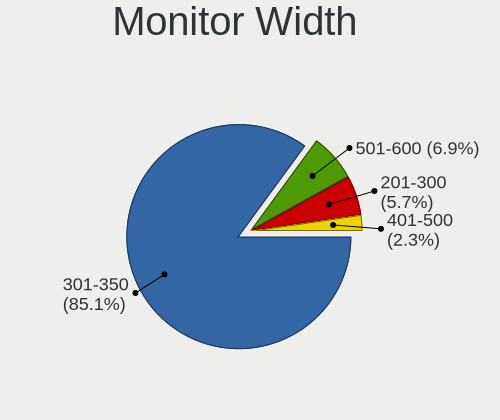

| Width in mm | Notebooks | Percent |
|-------------|-----------|---------|
| 301-350     | 64        | 85.33%  |
| 401-500     | 4         | 5.33%   |
| 501-600     | 2         | 2.67%   |
| 351-400     | 2         | 2.67%   |
| 201-300     | 2         | 2.67%   |
| Unknown     | 1         | 1.33%   |

Aspect Ratio
------------

Proportional relationship between the width and the height

| Ratio   | Notebooks | Percent |
|---------|-----------|---------|
| 16/9    | 61        | 87.14%  |
| 16/10   | 8         | 11.43%  |
| Unknown | 1         | 1.43%   |

Monitor Area
------------

Area in inch

| Area in inch | Notebooks | Percent |
|----------------|-----------|---------|
| 101-110        | 44        | 58.67%  |
| 81-90          | 23        | 30.67%  |
| 201-250        | 4         | 5.33%   |
| 151-200        | 2         | 2.67%   |
| 131-140        | 1         | 1.33%   |
| Unknown        | 1         | 1.33%   |

Pixel Density
-------------

Pixels per inch

| Density       | Notebooks | Percent |
|---------------|-----------|---------|
| 121-160       | 37        | 50%     |
| 101-120       | 25        | 33.78%  |
| 161-240       | 5         | 6.76%   |
| 51-100        | 4         | 5.41%   |
| More than 240 | 2         | 2.7%    |
| Unknown       | 1         | 1.35%   |

Multiple Monitors
-----------------

Total monitors connected

| Total | Notebooks | Percent |
|-------|-----------|---------|
| 1     | 66        | 91.67%  |
| 2     | 5         | 6.94%   |
| 0     | 1         | 1.39%   |

Network
-------

Net Controller Vendor
---------------------

Controller vendors

| Vendor                   | Notebooks | Percent |
|--------------------------|-----------|---------|
| Realtek Semiconductor    | 44        | 36.97%  |
| Intel                    | 36        | 30.25%  |
| Qualcomm Atheros         | 17        | 14.29%  |
| MediaTek                 | 5         | 4.2%    |
| Broadcom                 | 5         | 4.2%    |
| Ralink                   | 2         | 1.68%   |
| Samsung Electronics      | 1         | 0.84%   |
| Ralink Technology        | 1         | 0.84%   |
| Qualcomm                 | 1         | 0.84%   |
| Philips (or NXP)         | 1         | 0.84%   |
| OPPO                     | 1         | 0.84%   |
| Nvidia                   | 1         | 0.84%   |
| Marvell Technology Group | 1         | 0.84%   |
| JMicron Technology       | 1         | 0.84%   |
| Dell                     | 1         | 0.84%   |
| Broadcom Limited         | 1         | 0.84%   |

Net Controller Model
--------------------

Controller models

| Model                                                             | Notebooks | Percent |
|-------------------------------------------------------------------|-----------|---------|
| Realtek RTL8111/8168/8411 PCI Express Gigabit Ethernet Controller | 29        | 21.8%   |
| Realtek RTL810xE PCI Express Fast Ethernet controller             | 9         | 6.77%   |
| Qualcomm Atheros QCA9377 802.11ac Wireless Network Adapter        | 6         | 4.51%   |
| Intel Wi-Fi 6 AX201                                               | 6         | 4.51%   |
| Intel Comet Lake PCH CNVi WiFi                                    | 5         | 3.76%   |
| Qualcomm Atheros AR9285 Wireless Network Adapter (PCI-Express)    | 4         | 3.01%   |
| Intel Wireless 8265 / 8275                                        | 4         | 3.01%   |
| Intel Cannon Lake PCH CNVi WiFi                                   | 4         | 3.01%   |
| Realtek RTL8822CE 802.11ac PCIe Wireless Network Adapter          | 3         | 2.26%   |
| Realtek RTL8821CE 802.11ac PCIe Wireless Network Adapter          | 3         | 2.26%   |
| Qualcomm Atheros QCA9565 / AR9565 Wireless Network Adapter        | 3         | 2.26%   |
| MediaTek MT7921 802.11ax PCI Express Wireless Network Adapter     | 3         | 2.26%   |
| Intel Wireless 8260                                               | 3         | 2.26%   |
| Ralink RT3290 Wireless 802.11n 1T/1R PCIe                         | 2         | 1.5%    |
| Intel Wi-Fi 6 AX200                                               | 2         | 1.5%    |
| Intel Ethernet Connection I219-LM                                 | 2         | 1.5%    |
| Intel Ethernet Connection (4) I219-LM                             | 2         | 1.5%    |
| Intel Comet Lake PCH-LP CNVi WiFi                                 | 2         | 1.5%    |
| Intel Cannon Point-LP CNVi [Wireless-AC]                          | 2         | 1.5%    |
| Intel Alder Lake-P PCH CNVi WiFi                                  | 2         | 1.5%    |
| Broadcom BCM43142 802.11b/g/n                                     | 2         | 1.5%    |
| Samsung Galaxy series, misc. (tethering mode)                     | 1         | 0.75%   |
| Realtek RTL8852AE 802.11ax PCIe Wireless Network Adapter          | 1         | 0.75%   |
| Realtek RTL8723BE PCIe Wireless Network Adapter                   | 1         | 0.75%   |
| Realtek RTL8188CE 802.11b/g/n WiFi Adapter                        | 1         | 0.75%   |
| Realtek RTL8125 2.5GbE Controller                                 | 1         | 0.75%   |
| Realtek Killer E2600 Gigabit Ethernet Controller                  | 1         | 0.75%   |
| Ralink MT7601U Wireless Adapter                                   | 1         | 0.75%   |
| Qualcomm QCNFA765 Wireless Network Adapter                        | 1         | 0.75%   |
| Qualcomm Atheros QCA8172 Fast Ethernet                            | 1         | 0.75%   |
| Qualcomm Atheros QCA6174 802.11ac Wireless Network Adapter        | 1         | 0.75%   |
| Qualcomm Atheros Killer E2500 Gigabit Ethernet Controller         | 1         | 0.75%   |
| Qualcomm Atheros Killer E2400 Gigabit Ethernet Controller         | 1         | 0.75%   |
| Qualcomm Atheros AR9485 Wireless Network Adapter                  | 1         | 0.75%   |
| Qualcomm Atheros AR8151 v2.0 Gigabit Ethernet                     | 1         | 0.75%   |
| Philips (or NXP) PTA01 Wireless Adapter                           | 1         | 0.75%   |
| OPPO CPH1923                                                      | 1         | 0.75%   |
| Nvidia MCP67 Ethernet                                             | 1         | 0.75%   |
| MediaTek MT7922 802.11ax PCI Express Wireless Network Adapter     | 1         | 0.75%   |
| MediaTek Armor 8 Pro                                              | 1         | 0.75%   |

Wireless Vendor
---------------

Wireless vendors

| Vendor                | Notebooks | Percent |
|-----------------------|-----------|---------|
| Intel                 | 36        | 48%     |
| Qualcomm Atheros      | 15        | 20%     |
| Realtek Semiconductor | 9         | 12%     |
| MediaTek              | 4         | 5.33%   |
| Broadcom              | 4         | 5.33%   |
| Ralink                | 2         | 2.67%   |
| Ralink Technology     | 1         | 1.33%   |
| Qualcomm              | 1         | 1.33%   |
| Philips (or NXP)      | 1         | 1.33%   |
| Dell                  | 1         | 1.33%   |
| Broadcom Limited      | 1         | 1.33%   |

Wireless Model
--------------

Wireless models

| Model                                                          | Notebooks | Percent |
|----------------------------------------------------------------|-----------|---------|
| Qualcomm Atheros QCA9377 802.11ac Wireless Network Adapter     | 6         | 8%      |
| Intel Wi-Fi 6 AX201                                            | 6         | 8%      |
| Intel Comet Lake PCH CNVi WiFi                                 | 5         | 6.67%   |
| Qualcomm Atheros AR9285 Wireless Network Adapter (PCI-Express) | 4         | 5.33%   |
| Intel Wireless 8265 / 8275                                     | 4         | 5.33%   |
| Intel Cannon Lake PCH CNVi WiFi                                | 4         | 5.33%   |
| Realtek RTL8822CE 802.11ac PCIe Wireless Network Adapter       | 3         | 4%      |
| Realtek RTL8821CE 802.11ac PCIe Wireless Network Adapter       | 3         | 4%      |
| Qualcomm Atheros QCA9565 / AR9565 Wireless Network Adapter     | 3         | 4%      |
| MediaTek MT7921 802.11ax PCI Express Wireless Network Adapter  | 3         | 4%      |
| Intel Wireless 8260                                            | 3         | 4%      |
| Ralink RT3290 Wireless 802.11n 1T/1R PCIe                      | 2         | 2.67%   |
| Intel Wi-Fi 6 AX200                                            | 2         | 2.67%   |
| Intel Comet Lake PCH-LP CNVi WiFi                              | 2         | 2.67%   |
| Intel Cannon Point-LP CNVi [Wireless-AC]                       | 2         | 2.67%   |
| Intel Alder Lake-P PCH CNVi WiFi                               | 2         | 2.67%   |
| Broadcom BCM43142 802.11b/g/n                                  | 2         | 2.67%   |
| Realtek RTL8852AE 802.11ax PCIe Wireless Network Adapter       | 1         | 1.33%   |
| Realtek RTL8723BE PCIe Wireless Network Adapter                | 1         | 1.33%   |
| Realtek RTL8188CE 802.11b/g/n WiFi Adapter                     | 1         | 1.33%   |
| Ralink MT7601U Wireless Adapter                                | 1         | 1.33%   |
| Qualcomm QCNFA765 Wireless Network Adapter                     | 1         | 1.33%   |
| Qualcomm Atheros QCA6174 802.11ac Wireless Network Adapter     | 1         | 1.33%   |
| Qualcomm Atheros AR9485 Wireless Network Adapter               | 1         | 1.33%   |
| Philips (or NXP) PTA01 Wireless Adapter                        | 1         | 1.33%   |
| MediaTek MT7922 802.11ax PCI Express Wireless Network Adapter  | 1         | 1.33%   |
| Intel Wireless 7265                                            | 1         | 1.33%   |
| Intel Wireless 7260                                            | 1         | 1.33%   |
| Intel Wireless 3160                                            | 1         | 1.33%   |
| Intel Ultimate N WiFi Link 5300                                | 1         | 1.33%   |
| Intel Tiger Lake PCH CNVi WiFi                                 | 1         | 1.33%   |
| Intel Dual Band Wireless-AC 3168NGW [Stone Peak]               | 1         | 1.33%   |
| Dell DW5820e L850-GL                                           | 1         | 1.33%   |
| Broadcom Limited BCM4312 802.11b/g LP-PHY                      | 1         | 1.33%   |
| Broadcom BCM4331 802.11a/b/g/n                                 | 1         | 1.33%   |
| Broadcom BCM4311 802.11a/b/g                                   | 1         | 1.33%   |

Ethernet Vendor
---------------

Ethernet vendors

| Vendor                   | Notebooks | Percent |
|--------------------------|-----------|---------|
| Realtek Semiconductor    | 40        | 68.97%  |
| Intel                    | 6         | 10.34%  |
| Qualcomm Atheros         | 4         | 6.9%    |
| Broadcom                 | 2         | 3.45%   |
| Samsung Electronics      | 1         | 1.72%   |
| OPPO                     | 1         | 1.72%   |
| Nvidia                   | 1         | 1.72%   |
| MediaTek                 | 1         | 1.72%   |
| Marvell Technology Group | 1         | 1.72%   |
| JMicron Technology       | 1         | 1.72%   |

Ethernet Model
--------------

Ethernet models

| Model                                                             | Notebooks | Percent |
|-------------------------------------------------------------------|-----------|---------|
| Realtek RTL8111/8168/8411 PCI Express Gigabit Ethernet Controller | 29        | 50%     |
| Realtek RTL810xE PCI Express Fast Ethernet controller             | 9         | 15.52%  |
| Intel Ethernet Connection I219-LM                                 | 2         | 3.45%   |
| Intel Ethernet Connection (4) I219-LM                             | 2         | 3.45%   |
| Samsung Galaxy series, misc. (tethering mode)                     | 1         | 1.72%   |
| Realtek RTL8125 2.5GbE Controller                                 | 1         | 1.72%   |
| Realtek Killer E2600 Gigabit Ethernet Controller                  | 1         | 1.72%   |
| Qualcomm Atheros QCA8172 Fast Ethernet                            | 1         | 1.72%   |
| Qualcomm Atheros Killer E2500 Gigabit Ethernet Controller         | 1         | 1.72%   |
| Qualcomm Atheros Killer E2400 Gigabit Ethernet Controller         | 1         | 1.72%   |
| Qualcomm Atheros AR8151 v2.0 Gigabit Ethernet                     | 1         | 1.72%   |
| OPPO CPH1923                                                      | 1         | 1.72%   |
| Nvidia MCP67 Ethernet                                             | 1         | 1.72%   |
| MediaTek Armor 8 Pro                                              | 1         | 1.72%   |
| Marvell Group 88E8040 PCI-E Fast Ethernet Controller              | 1         | 1.72%   |
| JMicron JMC250 PCI Express Gigabit Ethernet Controller            | 1         | 1.72%   |
| Intel Ethernet Connection (2) I219-LM                             | 1         | 1.72%   |
| Intel Ethernet Connection (10) I219-LM                            | 1         | 1.72%   |
| Broadcom NetXtreme BCM57765 Gigabit Ethernet PCIe                 | 1         | 1.72%   |
| Broadcom NetLink BCM5784M Gigabit Ethernet PCIe                   | 1         | 1.72%   |

Net Controller Kind
-------------------

Ethernet, WiFi or modem

| Kind     | Notebooks | Percent |
|----------|-----------|---------|
| WiFi     | 72        | 56.25%  |
| Ethernet | 56        | 43.75%  |

Used Controller
---------------

Currently used network controller

| Kind     | Notebooks | Percent |
|----------|-----------|---------|
| WiFi     | 66        | 88%     |
| Ethernet | 9         | 12%     |

NICs
----

Total network controllers on board

| Total | Notebooks | Percent |
|-------|-----------|---------|
| 2     | 55        | 76.39%  |
| 1     | 17        | 23.61%  |

IPv6
----

IPv6 vs IPv4

| Used | Notebooks | Percent |
|------|-----------|---------|
| No   | 48        | 66.67%  |
| Yes  | 24        | 33.33%  |

Bluetooth
---------

Bluetooth Vendor
----------------

Controller vendors

| Vendor                          | Notebooks | Percent |
|---------------------------------|-----------|---------|
| Intel                           | 33        | 48.53%  |
| Qualcomm Atheros Communications | 10        | 14.71%  |
| Realtek Semiconductor           | 6         | 8.82%   |
| IMC Networks                    | 4         | 5.88%   |
| Broadcom                        | 3         | 4.41%   |
| Ralink                          | 2         | 2.94%   |
| Lite-On Technology              | 2         | 2.94%   |
| Foxconn / Hon Hai               | 2         | 2.94%   |
| Realtek                         | 1         | 1.47%   |
| Hewlett-Packard                 | 1         | 1.47%   |
| Dell                            | 1         | 1.47%   |
| Cambridge Silicon Radio         | 1         | 1.47%   |
| ASUSTek Computer                | 1         | 1.47%   |
| Apple                           | 1         | 1.47%   |

Bluetooth Model
---------------

Controller models

| Model                                               | Notebooks | Percent |
|-----------------------------------------------------|-----------|---------|
| Intel AX201 Bluetooth                               | 15        | 22.06%  |
| Intel Bluetooth wireless interface                  | 9         | 13.24%  |
| Realtek Bluetooth Radio                             | 6         | 8.82%   |
| Intel Bluetooth 9460/9560 Jefferson Peak (JfP)      | 6         | 8.82%   |
| Qualcomm Atheros  Bluetooth Device                  | 5         | 7.35%   |
| IMC Networks Wireless_Device                        | 3         | 4.41%   |
| Ralink RT3290 Bluetooth                             | 2         | 2.94%   |
| Qualcomm Atheros AR9462 Bluetooth                   | 2         | 2.94%   |
| Qualcomm Atheros AR3011 Bluetooth                   | 2         | 2.94%   |
| Intel AX200 Bluetooth                               | 2         | 2.94%   |
| Realtek 802.11ac WLAN Adapter                       | 1         | 1.47%   |
| Qualcomm Atheros AR3012 Bluetooth 4.0               | 1         | 1.47%   |
| Lite-On Qualcomm Atheros QCA9377 Bluetooth          | 1         | 1.47%   |
| Lite-On Bluetooth Device                            | 1         | 1.47%   |
| Intel Wireless-AC 3168 Bluetooth                    | 1         | 1.47%   |
| IMC Networks Bluetooth Device                       | 1         | 1.47%   |
| HP Bluetooth 2.0 Interface [Broadcom BCM2045]       | 1         | 1.47%   |
| Foxconn / Hon Hai Wireless_Device                   | 1         | 1.47%   |
| Foxconn / Hon Hai Bluetooth Device                  | 1         | 1.47%   |
| Dell Wireless 365 Bluetooth                         | 1         | 1.47%   |
| Cambridge Silicon Radio Bluetooth Dongle (HCI mode) | 1         | 1.47%   |
| Broadcom BCM43142A0 Bluetooth Device                | 1         | 1.47%   |
| Broadcom BCM43142 Bluetooth 4.0                     | 1         | 1.47%   |
| Broadcom BCM20702 Bluetooth 4.0 [ThinkPad]          | 1         | 1.47%   |
| ASUS BT-270 Bluetooth Adapter                       | 1         | 1.47%   |
| Apple Bluetooth USB Host Controller                 | 1         | 1.47%   |

Sound
-----

Sound Vendor
------------

Sound card vendors

| Vendor                | Notebooks | Percent |
|-----------------------|-----------|---------|
| Intel                 | 57        | 64.04%  |
| Nvidia                | 14        | 15.73%  |
| AMD                   | 13        | 14.61%  |
| Realtek Semiconductor | 2         | 2.25%   |
| DSEA A/S              | 1         | 1.12%   |
| C-Media Electronics   | 1         | 1.12%   |
| ASUSTek Computer      | 1         | 1.12%   |

Sound Model
-----------

Sound card models

| Model                                                                      | Notebooks | Percent |
|----------------------------------------------------------------------------|-----------|---------|
| Intel Sunrise Point-LP HD Audio                                            | 11        | 10.19%  |
| AMD Family 17h/19h HD Audio Controller                                     | 11        | 10.19%  |
| Intel Tiger Lake-LP Smart Sound Technology Audio Controller                | 8         | 7.41%   |
| Nvidia TU107 GeForce GTX 1650 High Definition Audio Controller             | 6         | 5.56%   |
| Intel Haswell-ULT HD Audio Controller                                      | 6         | 5.56%   |
| Intel Comet Lake PCH cAVS                                                  | 6         | 5.56%   |
| Intel 8 Series HD Audio Controller                                         | 6         | 5.56%   |
| AMD Raven/Raven2/Fenghuang HDMI/DP Audio Controller                        | 6         | 5.56%   |
| Intel Cannon Lake PCH cAVS                                                 | 4         | 3.7%    |
| AMD Renoir Radeon High Definition Audio Controller                         | 4         | 3.7%    |
| Intel Cannon Point-LP High Definition Audio Controller                     | 3         | 2.78%   |
| Intel Alder Lake PCH-P High Definition Audio Controller                    | 3         | 2.78%   |
| Intel 6 Series/C200 Series Chipset Family High Definition Audio Controller | 3         | 2.78%   |
| Nvidia TU106 High Definition Audio Controller                              | 2         | 1.85%   |
| Intel Ice Lake-LP Smart Sound Technology Audio Controller                  | 2         | 1.85%   |
| Intel Comet Lake PCH-LP cAVS                                               | 2         | 1.85%   |
| Intel 82801I (ICH9 Family) HD Audio Controller                             | 2         | 1.85%   |
| Intel 7 Series/C216 Chipset Family High Definition Audio Controller        | 2         | 1.85%   |
| Intel 5 Series/3400 Series Chipset High Definition Audio                   | 2         | 1.85%   |
| AMD FCH Azalia Controller                                                  | 2         | 1.85%   |
| Realtek Semiconductor USB Condenser Microphone                             | 1         | 0.93%   |
| Realtek Semiconductor Maono Elf pro                                        | 1         | 0.93%   |
| Nvidia MCP67 High Definition Audio                                         | 1         | 0.93%   |
| Nvidia GP106 High Definition Audio Controller                              | 1         | 0.93%   |
| Nvidia GF108 High Definition Audio Controller                              | 1         | 0.93%   |
| Nvidia GA106 High Definition Audio Controller                              | 1         | 0.93%   |
| Nvidia GA104 High Definition Audio Controller                              | 1         | 0.93%   |
| Nvidia Audio device                                                        | 1         | 0.93%   |
| Intel Wildcat Point-LP High Definition Audio Controller                    | 1         | 0.93%   |
| Intel Tiger Lake-H HD Audio Controller                                     | 1         | 0.93%   |
| Intel Broadwell-U Audio Controller                                         | 1         | 0.93%   |
| Intel 100 Series/C230 Series Chipset Family HD Audio Controller            | 1         | 0.93%   |
| DSEA A/S BTD-800                                                           | 1         | 0.93%   |
| C-Media Electronics USB Audio Device                                       | 1         | 0.93%   |
| ASUSTek Computer C-Media Audio                                             | 1         | 0.93%   |
| AMD Trinity HDMI Audio Controller                                          | 1         | 0.93%   |
| AMD Kabini HDMI/DP Audio                                                   | 1         | 0.93%   |

Memory
------

Memory Vendor
-------------

Memory module vendors

| Vendor              | Notebooks | Percent |
|---------------------|-----------|---------|
| Samsung Electronics | 16        | 34.04%  |
| SK hynix            | 10        | 21.28%  |
| Micron Technology   | 9         | 19.15%  |
| Kingston            | 5         | 10.64%  |
| Crucial             | 2         | 4.26%   |
| Ramaxel Technology  | 1         | 2.13%   |
| Elpida              | 1         | 2.13%   |
| CSX                 | 1         | 2.13%   |
| A-DATA Technology   | 1         | 2.13%   |
| Unknown             | 1         | 2.13%   |

Memory Model
------------

Memory module models

| Model                                                         | Notebooks | Percent |
|---------------------------------------------------------------|-----------|---------|
| Samsung RAM M471A1K43DB1-CTD 8GB SODIMM DDR4 2667MT/s         | 3         | 6%      |
| Micron RAM 8ATF1G64HZ-3G2R1 8GB SODIMM DDR4 3200MT/s          | 3         | 6%      |
| Samsung RAM M471A1K43EB1-CWE 8GB SODIMM DDR4 3200MT/s         | 2         | 4%      |
| Samsung RAM M471A1G44AB0-CWE 8GB SODIMM DDR4 3200MT/s         | 2         | 4%      |
| Kingston RAM LV32D4S2S8HD-8 8GB SODIMM DDR4 3200MT/s          | 2         | 4%      |
| SK hynix RAM Module 8GB SODIMM DDR4 2133MT/s                  | 1         | 2%      |
| SK hynix RAM HYMP125S64CP8-S6 2GB SODIMM DDR2 800MT/s         | 1         | 2%      |
| SK hynix RAM HMT451S6BFR8A-PB 4GB SODIMM DDR3 1600MT/s        | 1         | 2%      |
| SK hynix RAM HMT451S6AFR8A-PB 4GB SODIMM DDR3 1600MT/s        | 1         | 2%      |
| SK hynix RAM HMT351S6CFR8C-PB 4GB SODIMM DDR3 1600MT/s        | 1         | 2%      |
| SK hynix RAM HMT325S6BFR8C-H9 2GB SODIMM 1600MT/s             | 1         | 2%      |
| SK hynix RAM HMAA1GS6CMR6N-VK 8GB SODIMM DDR4 2667MT/s        | 1         | 2%      |
| SK hynix RAM HMA82GS6JJR8N-VK 16GB SODIMM DDR4 2667MT/s       | 1         | 2%      |
| SK hynix RAM HMA82GS6CJR8N-VK 16GB SODIMM DDR4 2667MT/s       | 1         | 2%      |
| SK hynix RAM HMA81GS6DJR8N-XN 8GB SODIMM DDR4 3200MT/s        | 1         | 2%      |
| SK hynix RAM HMA81GS6CJR8N-VK 8GB SODIMM DDR4 2667MT/s        | 1         | 2%      |
| SK hynix RAM HMA41GS7AFR8N-TF 8GB SODIMM DDR4 2667MT/s        | 1         | 2%      |
| Samsung RAM UBE3D4AA-MGCR 2GB Row Of Chips LPDDR4 4267MT/s    | 1         | 2%      |
| Samsung RAM M471B5773DH0-CH9 2GB SODIMM DDR3 1600MT/s         | 1         | 2%      |
| Samsung RAM M471B5273DH0-CH9 4GB SODIMM DDR3 1334MT/s         | 1         | 2%      |
| Samsung RAM M471B5273CH0-CH9 4GB SODIMM DDR3 1334MT/s         | 1         | 2%      |
| Samsung RAM M471B1G73QH0-YK0 8GB SODIMM DDR3 1867MT/s         | 1         | 2%      |
| Samsung RAM M471A5244CB0-CTD 4GB SODIMM DDR4 3266MT/s         | 1         | 2%      |
| Samsung RAM M471A5244CB0-CTD 4GB Row Of Chips DDR4 2667MT/s   | 1         | 2%      |
| Samsung RAM M471A5244CB0-CRC 4GB SODIMM DDR4 2667MT/s         | 1         | 2%      |
| Samsung RAM M471A1G44AB0-CWE 8GB Row Of Chips DDR4 3200MT/s   | 1         | 2%      |
| Samsung RAM K3LKBKB@BM-MGCP 2048MB Row Of Chips 6400MT/s      | 1         | 2%      |
| Ramaxel RAM RMSA3260NA78HAF-2400 8192MB SODIMM DDR4 2400MT/s  | 1         | 2%      |
| Micron RAM MTC4C10163S1SC48BA1 8GB SODIMM DDR5 4800MT/s       | 1         | 2%      |
| Micron RAM MTA4ATF1G64HZ-3G2E2 8GB Row Of Chips DDR4 3200MT/s | 1         | 2%      |
| Micron RAM MT53E1G32D2NP-046 2GB Row Of Chips LPDDR4 4267MT/s | 1         | 2%      |
| Micron RAM 8ATF1G64HZ-3G2J1 8GB SODIMM DDR4 3200MT/s          | 1         | 2%      |
| Micron RAM 4ATF51264HZ-2G6E1 4GB SODIMM DDR4 2667MT/s         | 1         | 2%      |
| Micron RAM 4ATF1G64HZ-3G2E1 8GB Row Of Chips DDR4 3200MT/s    | 1         | 2%      |
| Kingston RAM KHX2666C16S4/32G 32GB SODIMM DDR4 2667MT/s       | 1         | 2%      |
| Kingston RAM HP32D4S2S8MR-8 8GB SODIMM DDR4 3200MT/s          | 1         | 2%      |
| Kingston RAM ACR26D4S9S8ME-8 8GB SODIMM DDR4 2667MT/s         | 1         | 2%      |
| Elpida RAM EBJ40UG8EFU0-GN-F 4GB SODIMM DDR3 1600MT/s         | 1         | 2%      |
| CSX RAM V01L3SF4GB26826813 4GB SODIMM DDR3 1333MT/s           | 1         | 2%      |
| Crucial RAM CT8G4SFRA32A.M8FR 8GB SODIMM DDR4 3200MT/s        | 1         | 2%      |

Memory Kind
-----------

Memory module kinds

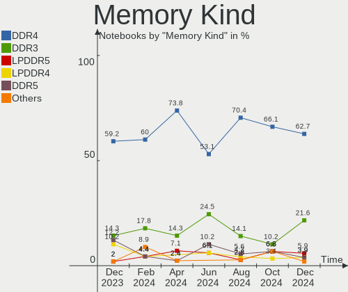

| Kind   | Notebooks | Percent |
|--------|-----------|---------|
| DDR4   | 27        | 69.23%  |
| DDR3   | 7         | 17.95%  |
| LPDDR4 | 2         | 5.13%   |
| LPDDR5 | 1         | 2.56%   |
| DDR5   | 1         | 2.56%   |
| DDR2   | 1         | 2.56%   |

Memory Form Factor
------------------

Physical design of the memory module

| Name         | Notebooks | Percent |
|--------------|-----------|---------|
| SODIMM       | 33        | 82.5%   |
| Row Of Chips | 7         | 17.5%   |

Memory Size
-----------

Memory module size

| Size  | Notebooks | Percent |
|-------|-----------|---------|
| 8192  | 27        | 62.79%  |
| 4096  | 10        | 23.26%  |
| 2048  | 3         | 6.98%   |
| 16384 | 2         | 4.65%   |
| 32768 | 1         | 2.33%   |

Memory Speed
------------

Memory module speed

| Speed | Notebooks | Percent |
|-------|-----------|---------|
| 2667  | 14        | 32.56%  |
| 3200  | 13        | 30.23%  |
| 1600  | 5         | 11.63%  |
| 4267  | 2         | 4.65%   |
| 1334  | 2         | 4.65%   |
| 6400  | 1         | 2.33%   |
| 4800  | 1         | 2.33%   |
| 3266  | 1         | 2.33%   |
| 2400  | 1         | 2.33%   |
| 2133  | 1         | 2.33%   |
| 1333  | 1         | 2.33%   |
| 975   | 1         | 2.33%   |

Printers & scanners
-------------------

Printer Vendor
--------------

Printer device vendors

Zero info for selected period =(

Printer Model
-------------

Printer device models

Zero info for selected period =(

Scanner Vendor
--------------

Scanner device vendors

Zero info for selected period =(

Scanner Model
-------------

Scanner device models

Zero info for selected period =(

Camera
------

Camera Vendor
-------------

Camera device vendors

| Vendor                                 | Notebooks | Percent |
|----------------------------------------|-----------|---------|
| IMC Networks                           | 13        | 19.12%  |
| Realtek Semiconductor                  | 11        | 16.18%  |
| Chicony Electronics                    | 8         | 11.76%  |
| Acer                                   | 8         | 11.76%  |
| Sunplus Innovation Technology          | 7         | 10.29%  |
| Microdia                               | 6         | 8.82%   |
| Quanta                                 | 5         | 7.35%   |
| Cheng Uei Precision Industry (Foxlink) | 4         | 5.88%   |
| Syntek                                 | 2         | 2.94%   |
| Suyin                                  | 1         | 1.47%   |
| Sonix Technology                       | 1         | 1.47%   |
| Lite-On Technology                     | 1         | 1.47%   |
| Apple                                  | 1         | 1.47%   |

Camera Model
------------

Camera device models

| Model                                                          | Notebooks | Percent |
|----------------------------------------------------------------|-----------|---------|
| Realtek Integrated_Webcam_HD                                   | 6         | 8.82%   |
| IMC Networks Integrated Camera                                 | 6         | 8.82%   |
| Sunplus XiaoMi USB 2.0 Webcam                                  | 3         | 4.41%   |
| Microdia Integrated_Webcam_HD                                  | 3         | 4.41%   |
| IMC Networks USB2.0 HD UVC WebCam                              | 3         | 4.41%   |
| Syntek Integrated Camera                                       | 2         | 2.94%   |
| Quanta HD User Facing                                          | 2         | 2.94%   |
| IMC Networks ov9734_azurewave_camera                           | 2         | 2.94%   |
| Chicony VGA WebCam                                             | 2         | 2.94%   |
| Chicony HP Wide Vision HD Camera                               | 2         | 2.94%   |
| Chicony HP TrueVision HD Camera                                | 2         | 2.94%   |
| Acer Integrated Camera                                         | 2         | 2.94%   |
| Suyin HP Webcam                                                | 1         | 1.47%   |
| Sunplus Integrated_Webcam_HD                                   | 1         | 1.47%   |
| Sunplus Dell Integrated Webcam                                 | 1         | 1.47%   |
| Sunplus Dell HD Webcam                                         | 1         | 1.47%   |
| Sunplus Dell E5570 integrated webcam                           | 1         | 1.47%   |
| Sonix USB2.0 HD UVC WebCam                                     | 1         | 1.47%   |
| Realtek Integrated Webcam HD                                   | 1         | 1.47%   |
| Realtek Integrated Webcam                                      | 1         | 1.47%   |
| Realtek HP Truevision HD integrated webcam                     | 1         | 1.47%   |
| Realtek HP Truevision HD                                       | 1         | 1.47%   |
| Realtek HP "Truevision HD" laptop camera                       | 1         | 1.47%   |
| Quanta HP Wide Vision HD Camera                                | 1         | 1.47%   |
| Quanta HP TrueVision HD Camera                                 | 1         | 1.47%   |
| Quanta ACER HD User Facing                                     | 1         | 1.47%   |
| Microdia Laptop_Integrated_Webcam_2M                           | 1         | 1.47%   |
| Microdia Dell Laptop Integrated Webcam HD                      | 1         | 1.47%   |
| Microdia 1.3 MPixel Integrated Webcam                          | 1         | 1.47%   |
| Lite-On HP HD Camera                                           | 1         | 1.47%   |
| IMC Networks USB2.0 VGA UVC WebCam                             | 1         | 1.47%   |
| IMC Networks Integrated Webcam                                 | 1         | 1.47%   |
| Chicony Integrated Camera                                      | 1         | 1.47%   |
| Chicony HP Integrated Webcam                                   | 1         | 1.47%   |
| Cheng Uei Precision Industry (Foxlink) Webcam                  | 1         | 1.47%   |
| Cheng Uei Precision Industry (Foxlink) USB2.0 UVC 1.3M Webcam  | 1         | 1.47%   |
| Cheng Uei Precision Industry (Foxlink) HP TrueVision HD Camera | 1         | 1.47%   |
| Cheng Uei Precision Industry (Foxlink) HP HD Webcam            | 1         | 1.47%   |
| Apple FaceTime HD Camera                                       | 1         | 1.47%   |
| Acer ThinkPad P50 Integrated Camera                            | 1         | 1.47%   |

Security
--------

Fingerprint Vendor
------------------

Fingerprint sensor vendors

| Vendor                     | Notebooks | Percent |
|----------------------------|-----------|---------|
| Validity Sensors           | 5         | 38.46%  |
| Shenzhen Goodix Technology | 5         | 38.46%  |
| Elan Microelectronics      | 2         | 15.38%  |
| Synaptics                  | 1         | 7.69%   |

Fingerprint Model
-----------------

Fingerprint sensor models

| Model                                                       | Notebooks | Percent |
|-------------------------------------------------------------|-----------|---------|
| Shenzhen Goodix  FingerPrint Device                         | 4         | 30.77%  |
| Validity Sensors VFS7500 Touch Fingerprint Sensor           | 2         | 15.38%  |
| Validity Sensors VFS495 Fingerprint Reader                  | 2         | 15.38%  |
| Elan ELAN:ARM-M4                                            | 2         | 15.38%  |
| Validity Sensors Synaptics VFS7552 Touch Fingerprint Sensor | 1         | 7.69%   |
| Synaptics Prometheus MIS Touch Fingerprint Reader           | 1         | 7.69%   |
| Shenzhen Goodix Fingerprint Reader                          | 1         | 7.69%   |

Chipcard Vendor
---------------

Chipcard module vendors

| Vendor      | Notebooks | Percent |
|-------------|-----------|---------|
| Broadcom    | 2         | 66.67%  |
| Alcor Micro | 1         | 33.33%  |

Chipcard Model
--------------

Chipcard module models

| Model                               | Notebooks | Percent |
|-------------------------------------|-----------|---------|
| Broadcom 5880                       | 2         | 66.67%  |
| Alcor Micro AU9540 Smartcard Reader | 1         | 33.33%  |

Unsupported
-----------

Unsupported Devices
-------------------

Total unsupported devices on board

| Total | Notebooks | Percent |
|-------|-----------|---------|
| 0     | 44        | 61.11%  |
| 1     | 25        | 34.72%  |
| 2     | 2         | 2.78%   |
| 9     | 1         | 1.39%   |

Unsupported Device Types
------------------------

Types of unsupported devices

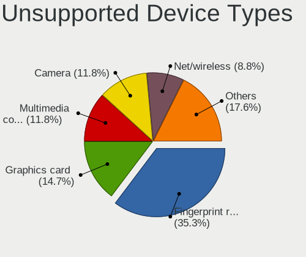

| Type                     | Notebooks | Percent |
|--------------------------|-----------|---------|
| Fingerprint reader       | 13        | 35.14%  |
| Graphics card            | 8         | 21.62%  |
| Net/wireless             | 3         | 8.11%   |
| Chipcard                 | 3         | 8.11%   |
| Bluetooth                | 3         | 8.11%   |
| Network                  | 2         | 5.41%   |
| Camera                   | 2         | 5.41%   |
| Sound                    | 1         | 2.7%    |
| Communication controller | 1         | 2.7%    |
| Card reader              | 1         | 2.7%    |

