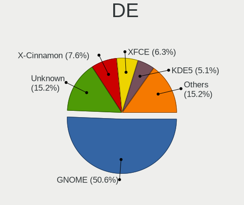
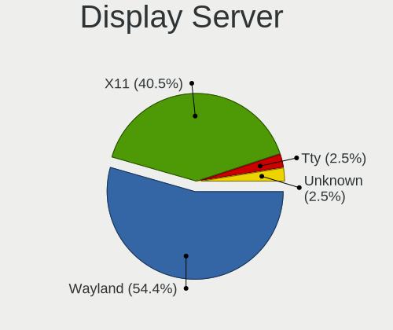
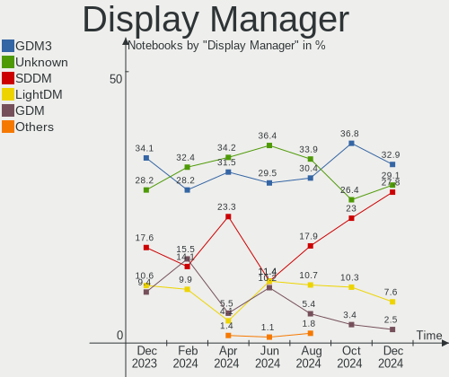
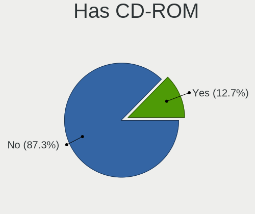
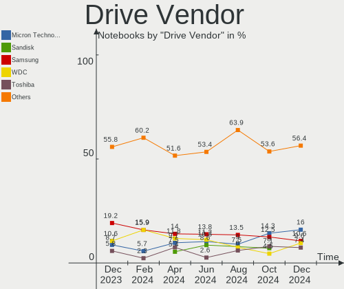
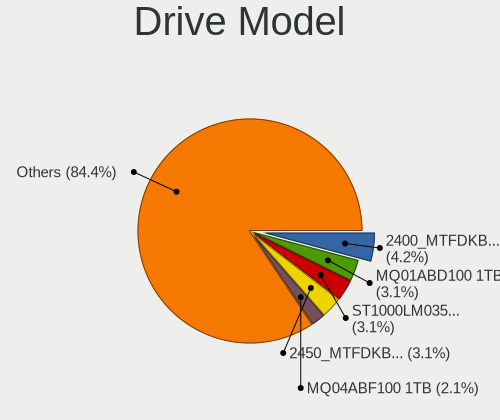
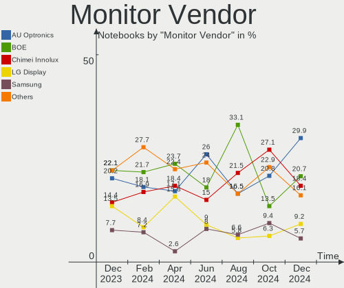
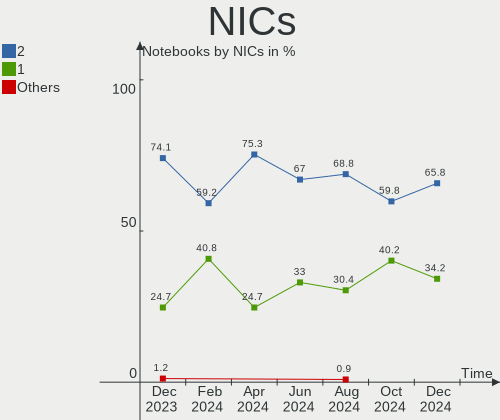
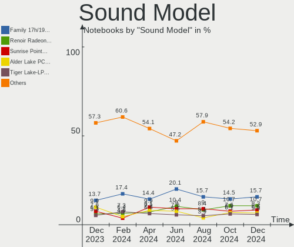

Linux in India - Hardware Trends (Notebooks)
--------------------------------------------

A project to identify most popular hardware characteristics and track their change
over time based on data collected by Linux users at https://Linux-Hardware.org.

Anyone can contribute to this report by the [hw-probe](https://github.com/linuxhw/hw-probe) tool:

    sudo -E hw-probe -all -upload

Period: Apr, 2023.

Contents
--------

* [ System ](#system)
  - [ OS                       ](#os)
  - [ OS Family                ](#os-family)
  - [ Kernel                   ](#kernel)
  - [ Kernel Family            ](#kernel-family)
  - [ Kernel Major Ver.        ](#kernel-major-ver)
  - [ Arch                     ](#arch)
  - [ DE                       ](#de)
  - [ Display Server           ](#display-server)
  - [ Display Manager          ](#display-manager)
  - [ OS Lang                  ](#os-lang)
  - [ Boot Mode                ](#boot-mode)
  - [ Filesystem               ](#filesystem)
  - [ Part. scheme             ](#part-scheme)
  - [ Dual Boot with Linux/BSD ](#dual-boot-with-linuxbsd)
  - [ Dual Boot (Win)          ](#dual-boot-win)

* [ Board ](#board)
  - [ Vendor                   ](#vendor)
  - [ Model                    ](#model)
  - [ Model Family             ](#model-family)
  - [ MFG Year                 ](#mfg-year)
  - [ Form Factor              ](#form-factor)
  - [ Secure Boot              ](#secure-boot)
  - [ Coreboot                 ](#coreboot)
  - [ RAM Size                 ](#ram-size)
  - [ RAM Used                 ](#ram-used)
  - [ Total Drives             ](#total-drives)
  - [ Has CD-ROM               ](#has-cd-rom)
  - [ Has Ethernet             ](#has-ethernet)
  - [ Has WiFi                 ](#has-wifi)
  - [ Has Bluetooth            ](#has-bluetooth)

* [ Location ](#location)
  - [ Country                  ](#country)
  - [ City                     ](#city)

* [ Drives ](#drives)
  - [ Drive Vendor             ](#drive-vendor)
  - [ Drive Model              ](#drive-model)
  - [ HDD Vendor               ](#hdd-vendor)
  - [ SSD Vendor               ](#ssd-vendor)
  - [ Drive Kind               ](#drive-kind)
  - [ Drive Connector          ](#drive-connector)
  - [ Drive Size               ](#drive-size)
  - [ Space Total              ](#space-total)
  - [ Space Used               ](#space-used)
  - [ Malfunc. Drives          ](#malfunc-drives)
  - [ Malfunc. Drive Vendor    ](#malfunc-drive-vendor)
  - [ Malfunc. HDD Vendor      ](#malfunc-hdd-vendor)
  - [ Malfunc. Drive Kind      ](#malfunc-drive-kind)
  - [ Failed Drives            ](#failed-drives)
  - [ Failed Drive Vendor      ](#failed-drive-vendor)
  - [ Drive Status             ](#drive-status)

* [ Storage controller ](#storage-controller)
  - [ Storage Vendor           ](#storage-vendor)
  - [ Storage Model            ](#storage-model)
  - [ Storage Kind             ](#storage-kind)

* [ Processor ](#processor)
  - [ CPU Vendor               ](#cpu-vendor)
  - [ CPU Model                ](#cpu-model)
  - [ CPU Model Family         ](#cpu-model-family)
  - [ CPU Cores                ](#cpu-cores)
  - [ CPU Sockets              ](#cpu-sockets)
  - [ CPU Threads              ](#cpu-threads)
  - [ CPU Op-Modes             ](#cpu-op-modes)
  - [ CPU Microcode            ](#cpu-microcode)
  - [ CPU Microarch            ](#cpu-microarch)

* [ Graphics ](#graphics)
  - [ GPU Vendor               ](#gpu-vendor)
  - [ GPU Model                ](#gpu-model)
  - [ GPU Combo                ](#gpu-combo)
  - [ GPU Driver               ](#gpu-driver)
  - [ GPU Memory               ](#gpu-memory)

* [ Monitor ](#monitor)
  - [ Monitor Vendor           ](#monitor-vendor)
  - [ Monitor Model            ](#monitor-model)
  - [ Monitor Resolution       ](#monitor-resolution)
  - [ Monitor Diagonal         ](#monitor-diagonal)
  - [ Monitor Width            ](#monitor-width)
  - [ Aspect Ratio             ](#aspect-ratio)
  - [ Monitor Area             ](#monitor-area)
  - [ Pixel Density            ](#pixel-density)
  - [ Multiple Monitors        ](#multiple-monitors)

* [ Network ](#network)
  - [ Net Controller Vendor    ](#net-controller-vendor)
  - [ Net Controller Model     ](#net-controller-model)
  - [ Wireless Vendor          ](#wireless-vendor)
  - [ Wireless Model           ](#wireless-model)
  - [ Ethernet Vendor          ](#ethernet-vendor)
  - [ Ethernet Model           ](#ethernet-model)
  - [ Net Controller Kind      ](#net-controller-kind)
  - [ Used Controller          ](#used-controller)
  - [ NICs                     ](#nics)
  - [ IPv6                     ](#ipv6)

* [ Bluetooth ](#bluetooth)
  - [ Bluetooth Vendor         ](#bluetooth-vendor)
  - [ Bluetooth Model          ](#bluetooth-model)

* [ Sound ](#sound)
  - [ Sound Vendor             ](#sound-vendor)
  - [ Sound Model              ](#sound-model)

* [ Memory ](#memory)
  - [ Memory Vendor            ](#memory-vendor)
  - [ Memory Model             ](#memory-model)
  - [ Memory Kind              ](#memory-kind)
  - [ Memory Form Factor       ](#memory-form-factor)
  - [ Memory Size              ](#memory-size)
  - [ Memory Speed             ](#memory-speed)

* [ Printers & scanners ](#printers--scanners)
  - [ Printer Vendor           ](#printer-vendor)
  - [ Printer Model            ](#printer-model)
  - [ Scanner Vendor           ](#scanner-vendor)
  - [ Scanner Model            ](#scanner-model)

* [ Camera ](#camera)
  - [ Camera Vendor            ](#camera-vendor)
  - [ Camera Model             ](#camera-model)

* [ Security ](#security)
  - [ Fingerprint Vendor       ](#fingerprint-vendor)
  - [ Fingerprint Model        ](#fingerprint-model)
  - [ Chipcard Vendor          ](#chipcard-vendor)
  - [ Chipcard Model           ](#chipcard-model)

* [ Unsupported ](#unsupported)
  - [ Unsupported Devices      ](#unsupported-devices)
  - [ Unsupported Device Types ](#unsupported-device-types)

System
------

OS
--

Installed operating systems

| Name                         | Notebooks | Percent |
|------------------------------|-----------|---------|
| Ubuntu 22.04                 | 14        | 17.95%  |
| OpenMandriva 23.03           | 7         | 8.97%   |
| Fedora 38                    | 5         | 6.41%   |
| ArcoLinux Rolling            | 5         | 6.41%   |
| Ubuntu 20.04                 | 4         | 5.13%   |
| Linux Mint 21.1              | 4         | 5.13%   |
| Zorin 16                     | 3         | 3.85%   |
| openSUSE Tumbleweed-XXXXXXXX | 3         | 3.85%   |
| KDE neon 22.04               | 3         | 3.85%   |
| Ubuntu 23.04                 | 2         | 2.56%   |
| SteamOS 3.4.6                | 2         | 2.56%   |
| Pop!_OS 22.04                | 2         | 2.56%   |
| OpenMandriva 4.3             | 2         | 2.56%   |
| Fedora 37                    | 2         | 2.56%   |
| EndeavourOS Rolling          | 2         | 2.56%   |
| Arch Rolling                 | 2         | 2.56%   |
| Xubuntu 22.04                | 1         | 1.28%   |
| Ubuntu Budgie 20.04          | 1         | 1.28%   |
| Ubuntu 22.10                 | 1         | 1.28%   |
| Ubuntu 18.04                 | 1         | 1.28%   |
| Parrot 5.3                   | 1         | 1.28%   |
| Parrot 5.2                   | 1         | 1.28%   |
| Oracle Linux 8.7             | 1         | 1.28%   |
| OpenMandriva 23.90           | 1         | 1.28%   |
| OpenMandriva 23.01           | 1         | 1.28%   |
| MX 21                        | 1         | 1.28%   |
| Manjaro 22.1.0               | 1         | 1.28%   |
| Manjaro                      | 1         | 1.28%   |
| Kubuntu 22.10                | 1         | 1.28%   |
| Kubuntu 22.04                | 1         | 1.28%   |
| Kali 2021.4                  | 1         | 1.28%   |
| Debian 11                    | 1         | 1.28%   |

OS Family
---------

OS without a version

| Name          | Notebooks | Percent |
|---------------|-----------|---------|
| Ubuntu        | 22        | 28.21%  |
| OpenMandriva  | 11        | 14.1%   |
| Fedora        | 7         | 8.97%   |
| ArcoLinux     | 5         | 6.41%   |
| Linux Mint    | 4         | 5.13%   |
| Zorin         | 3         | 3.85%   |
| openSUSE      | 3         | 3.85%   |
| KDE neon      | 3         | 3.85%   |
| SteamOS       | 2         | 2.56%   |
| Pop!_OS       | 2         | 2.56%   |
| Parrot        | 2         | 2.56%   |
| Manjaro       | 2         | 2.56%   |
| Kubuntu       | 2         | 2.56%   |
| EndeavourOS   | 2         | 2.56%   |
| Arch          | 2         | 2.56%   |
| Xubuntu       | 1         | 1.28%   |
| Ubuntu Budgie | 1         | 1.28%   |
| Oracle Linux  | 1         | 1.28%   |
| MX            | 1         | 1.28%   |
| Kali          | 1         | 1.28%   |
| Debian        | 1         | 1.28%   |

Kernel
------

Version of the Linux kernel

| Version                        | Notebooks | Percent |
|--------------------------------|-----------|---------|
| 5.19.0-38-generic              | 11        | 14.1%   |
| 5.15.0-69-generic              | 8         | 10.26%  |
| 6.2.6-desktop-1omv2390         | 7         | 8.97%   |
| 5.19.0-40-generic              | 4         | 5.13%   |
| 6.2.11-arch1-1                 | 3         | 3.85%   |
| 6.2.11-300.fc38.x86_64         | 3         | 3.85%   |
| 6.2.6-76060206-generic         | 2         | 2.56%   |
| 6.2.13-arch1-1                 | 2         | 2.56%   |
| 6.2.0-20-generic               | 2         | 2.56%   |
| 5.19.0-32-generic              | 2         | 2.56%   |
| 5.16.13-desktop-1omv4003       | 2         | 2.56%   |
| 5.15.0-67-generic              | 2         | 2.56%   |
| 5.13.0-valve36-1-neptune       | 2         | 2.56%   |
| 6.2.9-arch1-1                  | 1         | 1.28%   |
| 6.2.9-300.fc38.x86_64          | 1         | 1.28%   |
| 6.2.9-200.fc37.x86_64          | 1         | 1.28%   |
| 6.2.8-arch1-1                  | 1         | 1.28%   |
| 6.2.8-200.fc37.x86_64          | 1         | 1.28%   |
| 6.2.8-1-default                | 1         | 1.28%   |
| 6.2.12-arch1-1                 | 1         | 1.28%   |
| 6.2.12-300.fc38.x86_64         | 1         | 1.28%   |
| 6.2.12-1-MANJARO               | 1         | 1.28%   |
| 6.2.12-1-default               | 1         | 1.28%   |
| 6.2.11-desktop-1omv2390        | 1         | 1.28%   |
| 6.2.10-1-default               | 1         | 1.28%   |
| 6.1.23-1-MANJARO               | 1         | 1.28%   |
| 6.1.22-1-lts                   | 1         | 1.28%   |
| 6.1.2-desktop-1omv2301         | 1         | 1.28%   |
| 6.1.0-7mx-ahs-amd64            | 1         | 1.28%   |
| 6.1.0-1parrot1-amd64           | 1         | 1.28%   |
| 6.0.0-12parrot1-amd64          | 1         | 1.28%   |
| 6.0.0-060000-generic           | 1         | 1.28%   |
| 5.4.0-72-generic               | 1         | 1.28%   |
| 5.4.0-146-generic              | 1         | 1.28%   |
| 5.19.0-41-generic              | 1         | 1.28%   |
| 5.17.0-1020-oem                | 1         | 1.28%   |
| 5.15.0-71-generic              | 1         | 1.28%   |
| 5.15.0-100.96.32.el8uek.x86_64 | 1         | 1.28%   |
| 5.14.0-kali4-amd64             | 1         | 1.28%   |
| 5.14.0-1059-oem                | 1         | 1.28%   |

Kernel Family
-------------

Linux kernel without a distro release

| Version | Notebooks | Percent |
|---------|-----------|---------|
| 5.19.0  | 18        | 23.08%  |
| 5.15.0  | 12        | 15.38%  |
| 6.2.6   | 9         | 11.54%  |
| 6.2.11  | 7         | 8.97%   |
| 6.2.12  | 4         | 5.13%   |
| 6.2.9   | 3         | 3.85%   |
| 6.2.8   | 3         | 3.85%   |
| 6.2.13  | 2         | 2.56%   |
| 6.2.0   | 2         | 2.56%   |
| 6.1.0   | 2         | 2.56%   |
| 6.0.0   | 2         | 2.56%   |
| 5.4.0   | 2         | 2.56%   |
| 5.16.13 | 2         | 2.56%   |
| 5.14.0  | 2         | 2.56%   |
| 5.13.0  | 2         | 2.56%   |
| 6.2.10  | 1         | 1.28%   |
| 6.1.23  | 1         | 1.28%   |
| 6.1.22  | 1         | 1.28%   |
| 6.1.2   | 1         | 1.28%   |
| 5.17.0  | 1         | 1.28%   |
| 5.10.0  | 1         | 1.28%   |

Kernel Major Ver.
-----------------

Linux kernel major version

| Version | Notebooks | Percent |
|---------|-----------|---------|
| 6.2     | 31        | 39.74%  |
| 5.19    | 18        | 23.08%  |
| 5.15    | 12        | 15.38%  |
| 6.1     | 5         | 6.41%   |
| 6.0     | 2         | 2.56%   |
| 5.4     | 2         | 2.56%   |
| 5.16    | 2         | 2.56%   |
| 5.14    | 2         | 2.56%   |
| 5.13    | 2         | 2.56%   |
| 5.17    | 1         | 1.28%   |
| 5.10    | 1         | 1.28%   |

Arch
----

OS architecture (x86_64, i586, etc.)

| Name   | Notebooks | Percent |
|--------|-----------|---------|
| x86_64 | 78        | 100%    |

DE
--

Desktop Environment

| Name       | Notebooks | Percent |
|------------|-----------|---------|
| GNOME      | 42        | 53.85%  |
| KDE5       | 19        | 24.36%  |
| XFCE       | 6         | 7.69%   |
| X-Cinnamon | 3         | 3.85%   |
| MATE       | 2         | 2.56%   |
| LXQt       | 1         | 1.28%   |
| LXDE       | 1         | 1.28%   |
| dwm        | 1         | 1.28%   |
| chadwm     | 1         | 1.28%   |
| Budgie     | 1         | 1.28%   |
| bspwm      | 1         | 1.28%   |

Display Server
--------------

X11 or Wayland

| Name    | Notebooks | Percent |
|---------|-----------|---------|
| X11     | 51        | 65.38%  |
| Wayland | 27        | 34.62%  |

Display Manager
---------------

SDDM, LightDM, etc.

| Name    | Notebooks | Percent |
|---------|-----------|---------|
| Unknown | 24        | 30.77%  |
| GDM3    | 17        | 21.79%  |
| SDDM    | 14        | 17.95%  |
| GDM     | 12        | 15.38%  |
| LightDM | 9         | 11.54%  |
| XDM     | 2         | 2.56%   |

OS Lang
-------

Language

| Lang  | Notebooks | Percent |
|-------|-----------|---------|
| en_IN | 44        | 56.41%  |
| en_US | 26        | 33.33%  |
| en_GB | 4         | 5.13%   |
| en_AG | 2         | 2.56%   |
| en_CA | 1         | 1.28%   |
| C     | 1         | 1.28%   |

Boot Mode
---------

EFI or BIOS

| Mode | Notebooks | Percent |
|------|-----------|---------|
| EFI  | 43        | 55.13%  |
| BIOS | 35        | 44.87%  |

Filesystem
----------

Type of filesystem

| Type    | Notebooks | Percent |
|---------|-----------|---------|
| Ext4    | 51        | 65.38%  |
| Btrfs   | 15        | 19.23%  |
| Tmpfs   | 6         | 7.69%   |
| Overlay | 3         | 3.85%   |
| Xfs     | 2         | 2.56%   |
| F2fs    | 1         | 1.28%   |

Part. scheme
------------

Scheme of partitioning

| Type    | Notebooks | Percent |
|---------|-----------|---------|
| GPT     | 43        | 55.13%  |
| Unknown | 23        | 29.49%  |
| MBR     | 12        | 15.38%  |

Dual Boot with Linux/BSD
------------------------

Hosting more than one Linux/BSD

| Dual boot | Notebooks | Percent |
|-----------|-----------|---------|
| No        | 66        | 84.62%  |
| Yes       | 12        | 15.38%  |

Dual Boot (Win)
---------------

Hosting Linux and Windows

| Dual boot | Notebooks | Percent |
|-----------|-----------|---------|
| No        | 52        | 66.67%  |
| Yes       | 26        | 33.33%  |

Board
-----

Vendor
------

Motherboard manufacturer

| Name                | Notebooks | Percent |
|---------------------|-----------|---------|
| Lenovo              | 25        | 32.05%  |
| Hewlett-Packard     | 12        | 15.38%  |
| Dell                | 11        | 14.1%   |
| ASUSTek Computer    | 8         | 10.26%  |
| Acer                | 7         | 8.97%   |
| Apple               | 4         | 5.13%   |
| MSI                 | 3         | 3.85%   |
| Valve               | 2         | 2.56%   |
| Timi                | 2         | 2.56%   |
| Samsung Electronics | 1         | 1.28%   |
| HONOR               | 1         | 1.28%   |
| Gateway             | 1         | 1.28%   |
| Unknown             | 1         | 1.28%   |

Model
-----

Motherboard model

| Name                                   | Notebooks | Percent |
|----------------------------------------|-----------|---------|
| Valve Jupiter                          | 2         | 2.56%   |
| Unknown                                | 2         | 2.56%   |
| Timi Xiaomi NoteBook Pro               | 1         | 1.28%   |
| Timi Mi NoteBook Ultra                 | 1         | 1.28%   |
| Samsung 300E4Z/300E5Z/300E7Z           | 1         | 1.28%   |
| MSI Modern 14 C7M                      | 1         | 1.28%   |
| MSI GP65 Leopard 10SEK                 | 1         | 1.28%   |
| MSI GF63 Thin 9SCXR                    | 1         | 1.28%   |
| Lenovo Yoga 2 13 20344                 | 1         | 1.28%   |
| Lenovo Y50-70 20378                    | 1         | 1.28%   |
| Lenovo V310-14ISK 80SX                 | 1         | 1.28%   |
| Lenovo V15 G2 ITL Ua 82KB              | 1         | 1.28%   |
| Lenovo V14-IIL 82C4                    | 1         | 1.28%   |
| Lenovo ThinkPad X260 20F5S2WX0W        | 1         | 1.28%   |
| Lenovo ThinkPad T440 20B7S0JC0K        | 1         | 1.28%   |
| Lenovo ThinkPad T430s 23539MU          | 1         | 1.28%   |
| Lenovo ThinkPad T15g Gen 2i 20YSS01L00 | 1         | 1.28%   |
| Lenovo ThinkPad T14 Gen 3 21AHS02B00   | 1         | 1.28%   |
| Lenovo ThinkPad E14 Gen 3 20Y7S00700   | 1         | 1.28%   |
| Lenovo ThinkPad E14 20RAS1RA00         | 1         | 1.28%   |
| Lenovo ThinkPad E14 20RAS1DB00         | 1         | 1.28%   |
| Lenovo ThinkPad E14 20RAS0D800         | 1         | 1.28%   |
| Lenovo IdeaPad S540-15IWL              | 1         | 1.28%   |
| Lenovo IdeaPad S340-15IWL 81N8         | 1         | 1.28%   |
| Lenovo IdeaPad Gaming 3 15IMH05 81Y4   | 1         | 1.28%   |
| Lenovo IdeaPad 5 Pro 16ACH6 82L5       | 1         | 1.28%   |
| Lenovo IdeaPad 5 14ARE05 81YM          | 1         | 1.28%   |
| Lenovo IdeaPad 3 15ITL6 82H8           | 1         | 1.28%   |
| Lenovo IdeaPad 3 14ITL6 82H7           | 1         | 1.28%   |
| Lenovo IdeaPad 3 14ITL05 81X7          | 1         | 1.28%   |
| Lenovo Flex 2-14 20404                 | 1         | 1.28%   |
| Lenovo E41-25 81FS                     | 1         | 1.28%   |
| HONOR NMH-WCX9                         | 1         | 1.28%   |
| HP Pavilion Sleekbook 15 PC            | 1         | 1.28%   |
| HP Pavilion Gaming Laptop 15-ec2xxx    | 1         | 1.28%   |
| HP Pavilion Gaming Laptop 15-ec1xxx    | 1         | 1.28%   |
| HP Pavilion 15                         | 1         | 1.28%   |
| HP Laptop 15s-du3xxx                   | 1         | 1.28%   |
| HP Laptop 15q-ds0xxx                   | 1         | 1.28%   |
| HP Laptop 15-da0xxx                    | 1         | 1.28%   |

Model Family
------------

Motherboard model prefix

| Name               | Notebooks | Percent |
|--------------------|-----------|---------|
| Lenovo ThinkPad    | 9         | 11.54%  |
| Lenovo IdeaPad     | 8         | 10.26%  |
| Dell Latitude      | 5         | 6.41%   |
| HP Pavilion        | 4         | 5.13%   |
| ASUS VivoBook      | 4         | 5.13%   |
| HP Laptop          | 3         | 3.85%   |
| Dell Vostro        | 3         | 3.85%   |
| Acer Aspire        | 3         | 3.85%   |
| Valve Jupiter      | 2         | 2.56%   |
| Dell Inspiron      | 2         | 2.56%   |
| Acer Nitro         | 2         | 2.56%   |
| Unknown            | 2         | 2.56%   |
| Timi Xiaomi        | 1         | 1.28%   |
| Timi Mi            | 1         | 1.28%   |
| Samsung 300E4Z     | 1         | 1.28%   |
| MSI Modern         | 1         | 1.28%   |
| MSI GP65           | 1         | 1.28%   |
| MSI GF63           | 1         | 1.28%   |
| Lenovo Yoga        | 1         | 1.28%   |
| Lenovo Y50-70      | 1         | 1.28%   |
| Lenovo V310-14ISK  | 1         | 1.28%   |
| Lenovo V15         | 1         | 1.28%   |
| Lenovo V14-IIL     | 1         | 1.28%   |
| Lenovo Flex        | 1         | 1.28%   |
| Lenovo E41-25      | 1         | 1.28%   |
| HONOR NMH-WCX9     | 1         | 1.28%   |
| HP G42             | 1         | 1.28%   |
| HP ENVY            | 1         | 1.28%   |
| HP EliteBook       | 1         | 1.28%   |
| HP 630             | 1         | 1.28%   |
| HP 1000            | 1         | 1.28%   |
| Gateway NE56R      | 1         | 1.28%   |
| Dell Precision     | 1         | 1.28%   |
| ASUS ZenBook       | 1         | 1.28%   |
| ASUS TUF           | 1         | 1.28%   |
| ASUS K54C          | 1         | 1.28%   |
| ASUS K53U          | 1         | 1.28%   |
| Apple MacBookPro9  | 1         | 1.28%   |
| Apple MacBookPro16 | 1         | 1.28%   |
| Apple MacBookAir7  | 1         | 1.28%   |

MFG Year
--------

Motherboard manufacture year

| Year | Notebooks | Percent |
|------|-----------|---------|
| 2021 | 13        | 16.67%  |
| 2020 | 12        | 15.38%  |
| 2022 | 10        | 12.82%  |
| 2019 | 7         | 8.97%   |
| 2012 | 7         | 8.97%   |
| 2011 | 7         | 8.97%   |
| 2018 | 4         | 5.13%   |
| 2016 | 4         | 5.13%   |
| 2014 | 4         | 5.13%   |
| 2017 | 3         | 3.85%   |
| 2013 | 2         | 2.56%   |
| 2010 | 2         | 2.56%   |
| 2015 | 1         | 1.28%   |
| 2009 | 1         | 1.28%   |
| 2008 | 1         | 1.28%   |

Form Factor
-----------

Physical design of the computer

| Name     | Notebooks | Percent |
|----------|-----------|---------|
| Notebook | 78        | 100%    |

Secure Boot
-----------

Enabled or disabled

| State    | Notebooks | Percent |
|----------|-----------|---------|
| Disabled | 66        | 84.62%  |
| Enabled  | 12        | 15.38%  |

Coreboot
--------

Have coreboot on board

| Used | Notebooks | Percent |
|------|-----------|---------|
| No   | 78        | 100%    |

RAM Size
--------

Total RAM memory

| Size in GB | Notebooks | Percent |
|------------|-----------|---------|
| 4.01-8.0   | 27        | 34.62%  |
| 16.01-24.0 | 17        | 21.79%  |
| 3.01-4.0   | 15        | 19.23%  |
| 8.01-16.0  | 15        | 19.23%  |
| 32.01-64.0 | 3         | 3.85%   |
| 1.01-2.0   | 1         | 1.28%   |

RAM Used
--------

Used RAM memory

| Used GB   | Notebooks | Percent |
|-----------|-----------|---------|
| 1.01-2.0  | 21        | 26.92%  |
| 2.01-3.0  | 19        | 24.36%  |
| 4.01-8.0  | 18        | 23.08%  |
| 3.01-4.0  | 11        | 14.1%   |
| 8.01-16.0 | 6         | 7.69%   |
| 0.51-1.0  | 3         | 3.85%   |

Total Drives
------------

Number of drives on board

| Drives | Notebooks | Percent |
|--------|-----------|---------|
| 1      | 52        | 66.67%  |
| 2      | 24        | 30.77%  |
| 3      | 2         | 2.56%   |

Has CD-ROM
----------

Has CD-ROM on board

| Presented | Notebooks | Percent |
|-----------|-----------|---------|
| No        | 62        | 79.49%  |
| Yes       | 16        | 20.51%  |

Has Ethernet
------------

Has Ethernet on board

| Presented | Notebooks | Percent |
|-----------|-----------|---------|
| Yes       | 55        | 70.51%  |
| No        | 23        | 29.49%  |

Has WiFi
--------

Has WiFi module

| Presented | Notebooks | Percent |
|-----------|-----------|---------|
| Yes       | 78        | 100%    |

Has Bluetooth
-------------

Has Bluetooth module

| Presented | Notebooks | Percent |
|-----------|-----------|---------|
| Yes       | 68        | 87.18%  |
| No        | 10        | 12.82%  |

Location
--------

Country
-------

Geographic location (country)

| Country | Notebooks | Percent |
|---------|-----------|---------|
| India   | 78        | 100%    |

City
----

Geographic location (city)

| City            | Notebooks | Percent |
|-----------------|-----------|---------|
| Bengaluru       | 16        | 20.51%  |
| Pune            | 7         | 8.97%   |
| Delhi           | 6         | 7.69%   |
| Chennai         | 6         | 7.69%   |
| Mumbai          | 4         | 5.13%   |
| Hyderabad       | 3         | 3.85%   |
| Thrissur        | 2         | 2.56%   |
| Surat           | 2         | 2.56%   |
| Rajkot          | 2         | 2.56%   |
| New Delhi       | 2         | 2.56%   |
| Ludhiana        | 2         | 2.56%   |
| Kochi           | 2         | 2.56%   |
| Indore          | 2         | 2.56%   |
| Vadodara        | 1         | 1.28%   |
| Thoubal         | 1         | 1.28%   |
| Salem           | 1         | 1.28%   |
| Palakkad        | 1         | 1.28%   |
| Noida           | 1         | 1.28%   |
| Nellore         | 1         | 1.28%   |
| Nagpur          | 1         | 1.28%   |
| Nagercoil       | 1         | 1.28%   |
| Mohali          | 1         | 1.28%   |
| Malda           | 1         | 1.28%   |
| Kolkata         | 1         | 1.28%   |
| Kapurthala Town | 1         | 1.28%   |
| Jamnagar        | 1         | 1.28%   |
| Jaipur          | 1         | 1.28%   |
| Gurgaon         | 1         | 1.28%   |
| Ghaziabad       | 1         | 1.28%   |
| Dhanbad         | 1         | 1.28%   |
| Dehradun        | 1         | 1.28%   |
| Coimbatore      | 1         | 1.28%   |
| Chandigarh      | 1         | 1.28%   |
| Bankura         | 1         | 1.28%   |
| Ahmedabad       | 1         | 1.28%   |

Drives
------

Drive Vendor
------------

Hard drive vendors

| Vendor                      | Notebooks | Drives | Percent |
|-----------------------------|-----------|--------|---------|
| Seagate                     | 15        | 15     | 14.85%  |
| WDC                         | 10        | 10     | 9.9%    |
| SanDisk                     | 9         | 9      | 8.91%   |
| Samsung Electronics         | 9         | 10     | 8.91%   |
| Toshiba                     | 8         | 8      | 7.92%   |
| SK hynix                    | 6         | 6      | 5.94%   |
| Micron Technology           | 6         | 6      | 5.94%   |
| Unknown                     | 5         | 5      | 4.95%   |
| Kingston                    | 5         | 5      | 4.95%   |
| Intel                       | 4         | 4      | 3.96%   |
| Crucial                     | 4         | 4      | 3.96%   |
| China                       | 3         | 3      | 2.97%   |
| KIOXIA                      | 2         | 2      | 1.98%   |
| Apple                       | 2         | 2      | 1.98%   |
| YMTC                        | 1         | 1      | 0.99%   |
| Union Memory                | 1         | 1      | 0.99%   |
| Silicon Motion              | 1         | 1      | 0.99%   |
| Realtek Semiconductor       | 1         | 1      | 0.99%   |
| Mass                        | 1         | 1      | 0.99%   |
| Kingston Technology Company | 1         | 1      | 0.99%   |
| Hitachi                     | 1         | 1      | 0.99%   |
| External                    | 1         | 1      | 0.99%   |
| AMicro                      | 1         | 1      | 0.99%   |
| AGB-6PRO                    | 1         | 1      | 0.99%   |
| Acer                        | 1         | 1      | 0.99%   |
| Aarvex                      | 1         | 1      | 0.99%   |
| A-DATA Technology           | 1         | 1      | 0.99%   |

Drive Model
-----------

Hard drive models

| Model                                                  | Notebooks | Percent |
|--------------------------------------------------------|-----------|---------|
| Seagate ST1000LM035-1RK172 970GB                       | 5         | 4.9%    |
| Toshiba MQ04ABF100 1TB                                 | 3         | 2.94%   |
| Seagate ST1000LM048-2E7172 1TB                         | 3         | 2.94%   |
| Crucial CT240BX500SSD1 240GB                           | 3         | 2.94%   |
| Unknown MMC Card  512GB                                | 2         | 1.96%   |
| Sandisk WD Blue SN550 NVMe SSD 1024GB                  | 2         | 1.96%   |
| Micron 2450_MTFDKBA512TFK 512GB                        | 2         | 1.96%   |
| Kingston SKC600512G 512GB SSD                          | 2         | 1.96%   |
| Intel SSD 660P Series 512GB                            | 2         | 1.96%   |
| YMTC PC210-512GB-B                                     | 1         | 0.98%   |
| WDC WDS240G2G0A-00JH30 240GB SSD                       | 1         | 0.98%   |
| WDC WD5000LPVX-60V0TT0 500GB                           | 1         | 0.98%   |
| WDC WD5000LPCX-24VHAT0 500GB                           | 1         | 0.98%   |
| WDC WD5000LPCX-00VHAT0 500GB                           | 1         | 0.98%   |
| WDC WD10SPZX-60Z10T0 1TB                               | 1         | 0.98%   |
| WDC WD10SPZX-24Z10T0 1TB                               | 1         | 0.98%   |
| WDC WD10SPZX-08Z10 1TB                                 | 1         | 0.98%   |
| WDC WD Green 2.5 240GB                                 | 1         | 0.98%   |
| WDC SSC-D0256SC-2100 256GB SSD                         | 1         | 0.98%   |
| WDC PC SN530 SDBPNPZ-512G-1032 512GB                   | 1         | 0.98%   |
| Unknown MMC Card  8GB                                  | 1         | 0.98%   |
| Unknown MMC Card  64GB                                 | 1         | 0.98%   |
| Unknown MMC Card  128GB                                | 1         | 0.98%   |
| Union Memory UMIS RPJTJ256MEE1OWX 256GB                | 1         | 0.98%   |
| Toshiba MQ01ACF050 500GB                               | 1         | 0.98%   |
| Toshiba MQ01ABF050 500GB                               | 1         | 0.98%   |
| Toshiba MQ01ABD100 1TB                                 | 1         | 0.98%   |
| Toshiba MK6475GSX 640GB                                | 1         | 0.98%   |
| Toshiba MK3276GSX 320GB                                | 1         | 0.98%   |
| SK hynix SKHynix_HFS512GDE9X084N 512GB                 | 1         | 0.98%   |
| SK hynix SKHynix_HFS001TDE9X081N 1024GB                | 1         | 0.98%   |
| SK hynix SC401 SATA 512GB SSD                          | 1         | 0.98%   |
| SK hynix HFM512GD3JX016N 512GB                         | 1         | 0.98%   |
| SK hynix HFM128GDHTNG-8510B 128GB                      | 1         | 0.98%   |
| SK hynix BC511 512GB                                   | 1         | 0.98%   |
| Silicon Motion SM2263EN/SM2263XT SSD Controller 1024GB | 1         | 0.98%   |
| Seagate ST9500325AS 500GB                              | 1         | 0.98%   |
| Seagate ST750LM022 HN-M750MBB 752GB                    | 1         | 0.98%   |
| Seagate ST500LX012-SSHD-8GB                            | 1         | 0.98%   |
| Seagate ST500LT012-9WS142 500GB                        | 1         | 0.98%   |

HDD Vendor
----------

Hard disk drive vendors

| Vendor  | Notebooks | Drives | Percent |
|---------|-----------|--------|---------|
| Seagate | 15        | 15     | 50%     |
| Toshiba | 8         | 8      | 26.67%  |
| WDC     | 6         | 6      | 20%     |
| Hitachi | 1         | 1      | 3.33%   |

SSD Vendor
----------

Solid state drive vendors

| Vendor              | Notebooks | Drives | Percent |
|---------------------|-----------|--------|---------|
| Kingston            | 5         | 5      | 19.23%  |
| Crucial             | 4         | 4      | 15.38%  |
| WDC                 | 3         | 3      | 11.54%  |
| China               | 3         | 3      | 11.54%  |
| SanDisk             | 2         | 2      | 7.69%   |
| SK hynix            | 1         | 1      | 3.85%   |
| Samsung Electronics | 1         | 1      | 3.85%   |
| Micron Technology   | 1         | 1      | 3.85%   |
| Intel               | 1         | 1      | 3.85%   |
| External            | 1         | 1      | 3.85%   |
| Apple               | 1         | 1      | 3.85%   |
| AGB-6PRO            | 1         | 1      | 3.85%   |
| Acer                | 1         | 1      | 3.85%   |
| Aarvex              | 1         | 1      | 3.85%   |

Drive Kind
----------

HDD or SSD

| Kind    | Notebooks | Drives | Percent |
|---------|-----------|--------|---------|
| NVMe    | 36        | 39     | 36.73%  |
| HDD     | 29        | 30     | 29.59%  |
| SSD     | 26        | 26     | 26.53%  |
| MMC     | 5         | 5      | 5.1%    |
| Unknown | 2         | 2      | 2.04%   |

Drive Connector
---------------

SATA, SAS, NVMe, etc.

| Type | Notebooks | Drives | Percent |
|------|-----------|--------|---------|
| SATA | 48        | 55     | 52.17%  |
| NVMe | 36        | 39     | 39.13%  |
| MMC  | 5         | 5      | 5.43%   |
| SAS  | 3         | 3      | 3.26%   |

Drive Size
----------

Size of hard drive

| Size in TB | Notebooks | Drives | Percent |
|------------|-----------|--------|---------|
| 0.01-0.5   | 31        | 32     | 58.49%  |
| 0.51-1.0   | 21        | 23     | 39.62%  |
| 1.01-2.0   | 1         | 1      | 1.89%   |

Space Total
-----------

Amount of disk space available on the file system

| Size in GB     | Notebooks | Percent |
|----------------|-----------|---------|
| 101-250        | 23        | 29.49%  |
| 251-500        | 19        | 24.36%  |
| 51-100         | 10        | 12.82%  |
| 501-1000       | 9         | 11.54%  |
| 21-50          | 6         | 7.69%   |
| 1001-2000      | 5         | 6.41%   |
| 1-20           | 3         | 3.85%   |
| More than 3000 | 2         | 2.56%   |
| 2001-3000      | 1         | 1.28%   |

Space Used
----------

Amount of used disk space

| Used GB   | Notebooks | Percent |
|-----------|-----------|---------|
| 1-20      | 31        | 39.74%  |
| 21-50     | 15        | 19.23%  |
| 101-250   | 15        | 19.23%  |
| 51-100    | 10        | 12.82%  |
| 1001-2000 | 3         | 3.85%   |
| 251-500   | 2         | 2.56%   |
| 501-1000  | 2         | 2.56%   |

Malfunc. Drives
---------------

Drive models with a malfunction

| Model                            | Notebooks | Drives | Percent |
|----------------------------------|-----------|--------|---------|
| Toshiba MQ04ABF100 1TB           | 1         | 1      | 16.67%  |
| Toshiba MK6475GSX 640GB          | 1         | 1      | 16.67%  |
| Seagate ST9500325AS 500GB        | 1         | 1      | 16.67%  |
| Seagate ST500LT012-9WS142 500GB  | 1         | 1      | 16.67%  |
| Seagate ST1000LM035-1RK172 970GB | 1         | 1      | 16.67%  |
| Intel SSDSCKGF256A5 SATA 256GB   | 1         | 1      | 16.67%  |

Malfunc. Drive Vendor
---------------------

Vendors of faulty drives

| Vendor  | Notebooks | Drives | Percent |
|---------|-----------|--------|---------|
| Seagate | 3         | 3      | 50%     |
| Toshiba | 2         | 2      | 33.33%  |
| Intel   | 1         | 1      | 16.67%  |

Malfunc. HDD Vendor
-------------------

Vendors of faulty HDD drives

| Vendor  | Notebooks | Drives | Percent |
|---------|-----------|--------|---------|
| Seagate | 3         | 3      | 60%     |
| Toshiba | 2         | 2      | 40%     |

Malfunc. Drive Kind
-------------------

Kinds of faulty drives

| Kind | Notebooks | Drives | Percent |
|------|-----------|--------|---------|
| HDD  | 5         | 5      | 83.33%  |
| SSD  | 1         | 1      | 16.67%  |

Failed Drives
-------------

Failed drive models

Zero info for selected period =(

Failed Drive Vendor
-------------------

Failed drive vendors

Zero info for selected period =(

Drive Status
------------

Number of failed and malfunc. drives

| Status   | Notebooks | Drives | Percent |
|----------|-----------|--------|---------|
| Detected | 40        | 49     | 47.62%  |
| Works    | 38        | 47     | 45.24%  |
| Malfunc  | 6         | 6      | 7.14%   |

Storage controller
------------------

Storage Vendor
--------------

Storage controller vendors

| Vendor                      | Notebooks | Percent |
|-----------------------------|-----------|---------|
| Intel                       | 56        | 54.9%   |
| Samsung Electronics         | 9         | 8.82%   |
| AMD                         | 9         | 8.82%   |
| SanDisk                     | 8         | 7.84%   |
| SK hynix                    | 5         | 4.9%    |
| Micron Technology           | 5         | 4.9%    |
| KIOXIA                      | 2         | 1.96%   |
| Yangtze Memory Technologies | 1         | 0.98%   |
| Union Memory (Shenzhen)     | 1         | 0.98%   |
| Silicon Motion              | 1         | 0.98%   |
| Realtek Semiconductor       | 1         | 0.98%   |
| Nvidia                      | 1         | 0.98%   |
| Kingston Technology Company | 1         | 0.98%   |
| Apple                       | 1         | 0.98%   |
| ADATA Technology            | 1         | 0.98%   |

Storage Model
-------------

Storage controller models

| Model                                                                        | Notebooks | Percent |
|------------------------------------------------------------------------------|-----------|---------|
| Intel Volume Management Device NVMe RAID Controller                          | 8         | 7.14%   |
| Intel 7 Series Chipset Family 6-port SATA Controller [AHCI mode]             | 7         | 6.25%   |
| AMD FCH SATA Controller [AHCI mode]                                          | 7         | 6.25%   |
| Intel Sunrise Point-LP SATA Controller [AHCI mode]                           | 6         | 5.36%   |
| Intel 82801 Mobile SATA Controller [RAID mode]                               | 6         | 5.36%   |
| Intel Tiger Lake-LP SATA Controller                                          | 5         | 4.46%   |
| Intel 6 Series/C200 Series Chipset Family 6 port Mobile SATA AHCI Controller | 5         | 4.46%   |
| Samsung NVMe SSD Controller 980                                              | 4         | 3.57%   |
| Micron NVMe Storage Controller                                               | 4         | 3.57%   |
| Intel Comet Lake SATA AHCI Controller                                        | 4         | 3.57%   |
| SK hynix Gold P31/PC711 NVMe Solid State Drive                               | 3         | 2.68%   |
| SanDisk WD Blue SN550 NVMe SSD                                               | 3         | 2.68%   |
| Samsung NVMe SSD Controller PM9A1/PM9A3/980PRO                               | 3         | 2.68%   |
| Intel SSD 660P Series                                                        | 3         | 2.68%   |
| Intel Celeron/Pentium Silver Processor SATA Controller                       | 3         | 2.68%   |
| Intel 8 Series SATA Controller 1 [AHCI mode]                                 | 3         | 2.68%   |
| Samsung NVMe SSD Controller SM981/PM981/PM983                                | 2         | 1.79%   |
| Intel Cannon Point-LP SATA Controller [AHCI Mode]                            | 2         | 1.79%   |
| Intel Cannon Lake Mobile PCH SATA AHCI Controller                            | 2         | 1.79%   |
| Intel Alder Lake-P SATA AHCI Controller                                      | 2         | 1.79%   |
| Intel 5 Series/3400 Series Chipset 4 port SATA AHCI Controller               | 2         | 1.79%   |
| Intel 400 Series Chipset Family SATA AHCI Controller                         | 2         | 1.79%   |
| AMD SB7x0/SB8x0/SB9x0 SATA Controller [AHCI mode]                            | 2         | 1.79%   |
| Yangtze Memory Non-Volatile memory controller                                | 1         | 0.89%   |
| Union Memory (Shenzhen) Non-Volatile memory controller                       | 1         | 0.89%   |
| SK hynix BC511                                                               | 1         | 0.89%   |
| SK hynix BC501 NVMe Solid State Drive                                        | 1         | 0.89%   |
| Silicon Motion SM2263EN/SM2263XT SSD Controller                              | 1         | 0.89%   |
| SanDisk WD PC SN810 / Black SN850 NVMe SSD                                   | 1         | 0.89%   |
| SanDisk WD Blue SN570 NVMe SSD 1TB                                           | 1         | 0.89%   |
| SanDisk WD Blue SN500 / PC SN520 NVMe SSD                                    | 1         | 0.89%   |
| SanDisk WD Black SN750 / PC SN730 NVMe SSD                                   | 1         | 0.89%   |
| SanDisk PC SN520 NVMe SSD                                                    | 1         | 0.89%   |
| Samsung Electronics SATA controller                                          | 1         | 0.89%   |
| Realtek NVMe Controller                                                      | 1         | 0.89%   |
| Nvidia MCP79 AHCI Controller                                                 | 1         | 0.89%   |
| Micron NVMe Controller                                                       | 1         | 0.89%   |
| KIOXIA NVMe SSD Controller BG4                                               | 1         | 0.89%   |
| KIOXIA Non-Volatile memory controller                                        | 1         | 0.89%   |
| Kingston Company OM3PDP3 NVMe SSD                                            | 1         | 0.89%   |

Storage Kind
------------

Kind of storage controller (IDE, SATA, NVMe, SAS, ...)

| Kind | Notebooks | Percent |
|------|-----------|---------|
| SATA | 57        | 52.29%  |
| NVMe | 36        | 33.03%  |
| RAID | 15        | 13.76%  |
| IDE  | 1         | 0.92%   |

Processor
---------

CPU Vendor
----------

Processor vendors

| Vendor | Notebooks | Percent |
|--------|-----------|---------|
| Intel  | 63        | 80.77%  |
| AMD    | 15        | 19.23%  |

CPU Model
---------

Processor models

| Model                                    | Notebooks | Percent |
|------------------------------------------|-----------|---------|
| Intel Core i5-8265U CPU @ 1.60GHz        | 3         | 3.85%   |
| Intel Core i5-10210U CPU @ 1.60GHz       | 3         | 3.85%   |
| AMD Ryzen 7 5800H with Radeon Graphics   | 3         | 3.85%   |
| Intel Pentium Silver N5030 CPU @ 1.10GHz | 2         | 2.56%   |
| Intel Core i7-10750H CPU @ 2.60GHz       | 2         | 2.56%   |
| Intel Core i5-9300H CPU @ 2.40GHz        | 2         | 2.56%   |
| Intel Core i5-6300U CPU @ 2.40GHz        | 2         | 2.56%   |
| Intel Core i5-4210U CPU @ 1.70GHz        | 2         | 2.56%   |
| Intel Core i3-6006U CPU @ 2.00GHz        | 2         | 2.56%   |
| Intel 12th Gen Core i5-1240P             | 2         | 2.56%   |
| Intel 11th Gen Core i5-1135G7 @ 2.40GHz  | 2         | 2.56%   |
| Intel 11th Gen Core i3-1115G4 @ 3.00GHz  | 2         | 2.56%   |
| AMD Ryzen 5 5500U with Radeon Graphics   | 2         | 2.56%   |
| AMD Custom APU 0405                      | 2         | 2.56%   |
| Intel Pentium CPU B960 @ 2.20GHz         | 1         | 1.28%   |
| Intel Core m5-6Y57 CPU @ 1.10GHz         | 1         | 1.28%   |
| Intel Core i7-9750H CPU @ 2.60GHz        | 1         | 1.28%   |
| Intel Core i7-7500U CPU @ 2.70GHz        | 1         | 1.28%   |
| Intel Core i7-6820HQ CPU @ 2.70GHz       | 1         | 1.28%   |
| Intel Core i7-4710HQ CPU @ 2.50GHz       | 1         | 1.28%   |
| Intel Core i7-2620M CPU @ 2.70GHz        | 1         | 1.28%   |
| Intel Core i5-8250U CPU @ 1.60GHz        | 1         | 1.28%   |
| Intel Core i5-5350U CPU @ 1.80GHz        | 1         | 1.28%   |
| Intel Core i5-4300U CPU @ 1.90GHz        | 1         | 1.28%   |
| Intel Core i5-3437U CPU @ 1.90GHz        | 1         | 1.28%   |
| Intel Core i5-3320M CPU @ 2.60GHz        | 1         | 1.28%   |
| Intel Core i5-3317U CPU @ 1.70GHz        | 1         | 1.28%   |
| Intel Core i5-3230M CPU @ 2.60GHz        | 1         | 1.28%   |
| Intel Core i5-3210M CPU @ 2.50GHz        | 1         | 1.28%   |
| Intel Core i5-2520M CPU @ 2.50GHz        | 1         | 1.28%   |
| Intel Core i5-2450M CPU @ 2.50GHz        | 1         | 1.28%   |
| Intel Core i5-2430M CPU @ 2.40GHz        | 1         | 1.28%   |
| Intel Core i3-7100U CPU @ 2.40GHz        | 1         | 1.28%   |
| Intel Core i3-7020U CPU @ 2.30GHz        | 1         | 1.28%   |
| Intel Core i3-2370M CPU @ 2.40GHz        | 1         | 1.28%   |
| Intel Core i3-2350M CPU @ 2.30GHz        | 1         | 1.28%   |
| Intel Core i3-2330M CPU @ 2.20GHz        | 1         | 1.28%   |
| Intel Core i3-10110U CPU @ 2.10GHz       | 1         | 1.28%   |
| Intel Core i3-1005G1 CPU @ 1.20GHz       | 1         | 1.28%   |
| Intel Core i3 CPU M 380 @ 2.53GHz        | 1         | 1.28%   |

CPU Model Family
----------------

Processor model prefix

| Model                | Notebooks | Percent |
|----------------------|-----------|---------|
| Intel Core i5        | 23        | 29.49%  |
| Other                | 17        | 21.79%  |
| Intel Core i3        | 11        | 14.1%   |
| Intel Core i7        | 7         | 8.97%   |
| AMD Ryzen 5          | 5         | 6.41%   |
| AMD Ryzen 7          | 4         | 5.13%   |
| Intel Pentium Silver | 2         | 2.56%   |
| Intel Core 2 Duo     | 2         | 2.56%   |
| Intel Celeron        | 2         | 2.56%   |
| Intel Pentium        | 1         | 1.28%   |
| Intel Core m5        | 1         | 1.28%   |
| AMD Ryzen 3          | 1         | 1.28%   |
| AMD Phenom II        | 1         | 1.28%   |
| AMD C-60             | 1         | 1.28%   |

CPU Cores
---------

Number of processor cores

| Number | Notebooks | Percent |
|--------|-----------|---------|
| 2      | 37        | 47.44%  |
| 4      | 22        | 28.21%  |
| 6      | 7         | 8.97%   |
| 8      | 6         | 7.69%   |
| 12     | 4         | 5.13%   |
| 14     | 1         | 1.28%   |
| 1      | 1         | 1.28%   |

CPU Sockets
-----------

Number of sockets

| Number | Notebooks | Percent |
|--------|-----------|---------|
| 1      | 78        | 100%    |

CPU Threads
-----------

Threads per core (Hyper-Threading)

| Number | Notebooks | Percent |
|--------|-----------|---------|
| 2      | 65        | 83.33%  |
| 1      | 12        | 15.38%  |
| 4      | 1         | 1.28%   |

CPU Op-Modes
------------

CPU Operation Modes (32-bit, 64-bit)

| Op mode        | Notebooks | Percent |
|----------------|-----------|---------|
| 32-bit, 64-bit | 78        | 100%    |

CPU Microcode
-------------

Microcode number

| Number     | Notebooks | Percent |
|------------|-----------|---------|
| Unknown    | 42        | 53.85%  |
| 0x306a9    | 4         | 5.13%   |
| 0x206a7    | 4         | 5.13%   |
| 0x806c1    | 3         | 3.85%   |
| 0x406e3    | 3         | 3.85%   |
| 0x40651    | 2         | 2.56%   |
| 0x0a50000c | 2         | 2.56%   |
| 0x08608103 | 2         | 2.56%   |
| 0x08600106 | 2         | 2.56%   |
| 0xa0652    | 1         | 1.28%   |
| 0x906ed    | 1         | 1.28%   |
| 0x906ea    | 1         | 1.28%   |
| 0x906a3    | 1         | 1.28%   |
| 0x806ec    | 1         | 1.28%   |
| 0x806eb    | 1         | 1.28%   |
| 0x806d1    | 1         | 1.28%   |
| 0x306d4    | 1         | 1.28%   |
| 0x306c3    | 1         | 1.28%   |
| 0x0a50000d | 1         | 1.28%   |
| 0x08108102 | 1         | 1.28%   |
| 0x06006705 | 1         | 1.28%   |
| 0x05000101 | 1         | 1.28%   |
| 0x010000c8 | 1         | 1.28%   |

CPU Microarch
-------------

Microarchitecture

| Name             | Notebooks | Percent |
|------------------|-----------|---------|
| KabyLake         | 14        | 17.95%  |
| SandyBridge      | 8         | 10.26%  |
| Unknown          | 8         | 10.26%  |
| TigerLake        | 7         | 8.97%   |
| Skylake          | 6         | 7.69%   |
| IvyBridge        | 6         | 7.69%   |
| Zen 3            | 4         | 5.13%   |
| Haswell          | 4         | 5.13%   |
| Goldmont plus    | 3         | 3.85%   |
| Alderlake Hybrid | 3         | 3.85%   |
| Zen 2            | 2         | 2.56%   |
| Westmere         | 2         | 2.56%   |
| Penryn           | 2         | 2.56%   |
| IceLake          | 2         | 2.56%   |
| CometLake        | 2         | 2.56%   |
| Zen+             | 1         | 1.28%   |
| K10              | 1         | 1.28%   |
| Excavator        | 1         | 1.28%   |
| Broadwell        | 1         | 1.28%   |
| Bobcat           | 1         | 1.28%   |

Graphics
--------

GPU Vendor
----------

Vendors of graphics cards

| Vendor | Notebooks | Percent |
|--------|-----------|---------|
| Intel  | 61        | 58.65%  |
| Nvidia | 26        | 25%     |
| AMD    | 17        | 16.35%  |

GPU Model
---------

Graphics card models

| Model                                                                     | Notebooks | Percent |
|---------------------------------------------------------------------------|-----------|---------|
| Intel 2nd Generation Core Processor Family Integrated Graphics Controller | 8         | 7.62%   |
| Intel 3rd Gen Core processor Graphics Controller                          | 6         | 5.71%   |
| Intel Alder Lake-P Integrated Graphics Controller                         | 5         | 4.76%   |
| Intel TigerLake-LP GT2 [Iris Xe Graphics]                                 | 4         | 3.81%   |
| Intel CometLake-U GT2 [UHD Graphics]                                      | 4         | 3.81%   |
| Nvidia TU117M [GeForce GTX 1650 Mobile / Max-Q]                           | 3         | 2.86%   |
| Nvidia GF117M [GeForce 610M/710M/810M/820M / GT 620M/625M/630M/720M]      | 3         | 2.86%   |
| Nvidia GA107M [GeForce RTX 3050 Mobile]                                   | 3         | 2.86%   |
| Intel WhiskeyLake-U GT2 [UHD Graphics 620]                                | 3         | 2.86%   |
| Intel Tiger Lake-LP GT2 [UHD Graphics G4]                                 | 3         | 2.86%   |
| Intel Skylake GT2 [HD Graphics 520]                                       | 3         | 2.86%   |
| Intel HD Graphics 620                                                     | 3         | 2.86%   |
| Intel Haswell-ULT Integrated Graphics Controller                          | 3         | 2.86%   |
| AMD Lucienne                                                              | 3         | 2.86%   |
| AMD Cezanne [Radeon Vega Series / Radeon Vega Mobile Series]              | 3         | 2.86%   |
| Nvidia TU117M [GeForce MX550]                                             | 2         | 1.9%    |
| Nvidia TU117M                                                             | 2         | 1.9%    |
| Intel GeminiLake [UHD Graphics 605]                                       | 2         | 1.9%    |
| Intel Core Processor Integrated Graphics Controller                       | 2         | 1.9%    |
| Intel CometLake-H GT2 [UHD Graphics]                                      | 2         | 1.9%    |
| Intel CoffeeLake-H GT2 [UHD Graphics 630]                                 | 2         | 1.9%    |
| AMD VanGogh [AMD Custom GPU 0405]                                         | 2         | 1.9%    |
| AMD Renoir                                                                | 2         | 1.9%    |
| Nvidia TU117M [GeForce GTX 1650 Ti Mobile]                                | 1         | 0.95%   |
| Nvidia TU116M [GeForce GTX 1660 Ti Mobile]                                | 1         | 0.95%   |
| Nvidia TU106M [GeForce RTX 2060 Mobile]                                   | 1         | 0.95%   |
| Nvidia GP108M [GeForce MX250]                                             | 1         | 0.95%   |
| Nvidia GP108M [GeForce MX230]                                             | 1         | 0.95%   |
| Nvidia GP108M [GeForce MX150]                                             | 1         | 0.95%   |
| Nvidia GM107M [GeForce GTX 950M]                                          | 1         | 0.95%   |
| Nvidia GM107M [GeForce GTX 860M]                                          | 1         | 0.95%   |
| Nvidia GM107GLM [Quadro M1200 Mobile]                                     | 1         | 0.95%   |
| Nvidia GF119M [NVS 4200M]                                                 | 1         | 0.95%   |
| Nvidia GA107M [GeForce RTX 2050]                                          | 1         | 0.95%   |
| Nvidia GA104M [GeForce RTX 3070 Mobile / Max-Q]                           | 1         | 0.95%   |
| Nvidia C79 [GeForce 9400M]                                                | 1         | 0.95%   |
| Intel UHD Graphics 620                                                    | 1         | 0.95%   |
| Intel TigerLake-H GT1 [UHD Graphics]                                      | 1         | 0.95%   |
| Intel Mobile 4 Series Chipset Integrated Graphics Controller              | 1         | 0.95%   |
| Intel Iris Plus Graphics G1 (Ice Lake)                                    | 1         | 0.95%   |

GPU Combo
---------

Combinations of graphics cards

| Name           | Notebooks | Percent |
|----------------|-----------|---------|
| 1 x Intel      | 39        | 50%     |
| Intel + Nvidia | 19        | 24.36%  |
| 1 x AMD        | 10        | 12.82%  |
| AMD + Nvidia   | 6         | 7.69%   |
| 2 x Intel      | 2         | 2.56%   |
| 1 x Nvidia     | 1         | 1.28%   |
| Intel + AMD    | 1         | 1.28%   |

GPU Driver
----------

Free vs proprietary

| Driver      | Notebooks | Percent |
|-------------|-----------|---------|
| Free        | 68        | 87.18%  |
| Proprietary | 10        | 12.82%  |

GPU Memory
----------

Total video memory

| Size in GB | Notebooks | Percent |
|------------|-----------|---------|
| Unknown    | 57        | 73.08%  |
| 0.01-0.5   | 12        | 15.38%  |
| 3.01-4.0   | 4         | 5.13%   |
| 1.01-2.0   | 3         | 3.85%   |
| 5.01-6.0   | 2         | 2.56%   |

Monitor
-------

Monitor Vendor
--------------

Monitor vendors

| Vendor              | Notebooks | Percent |
|---------------------|-----------|---------|
| Chimei Innolux      | 18        | 20.93%  |
| BOE                 | 17        | 19.77%  |
| AU Optronics        | 16        | 18.6%   |
| LG Display          | 10        | 11.63%  |
| Samsung Electronics | 6         | 6.98%   |
| Goldstar            | 4         | 4.65%   |
| Apple               | 4         | 4.65%   |
| Dell                | 3         | 3.49%   |
| Valve               | 2         | 2.33%   |
| Sharp               | 2         | 2.33%   |
| TMX                 | 1         | 1.16%   |
| PANDA               | 1         | 1.16%   |
| Hewlett-Packard     | 1         | 1.16%   |
| CSO                 | 1         | 1.16%   |

Monitor Model
-------------

Monitor models

| Model                                                                 | Notebooks | Percent |
|-----------------------------------------------------------------------|-----------|---------|
| Chimei Innolux LCD Monitor CMN14E5 1920x1080 309x173mm 13.9-inch      | 3         | 3.49%   |
| Valve ANX7530 U VLV3001 800x1280 100x150mm 7.1-inch                   | 2         | 2.33%   |
| LG Display LCD Monitor LGD02DC 1366x768 344x194mm 15.5-inch           | 2         | 2.33%   |
| Chimei Innolux LCD Monitor CMN15E7 1920x1080 344x193mm 15.5-inch      | 2         | 2.33%   |
| Chimei Innolux LCD Monitor CMN14D6 1366x768 309x173mm 13.9-inch       | 2         | 2.33%   |
| BOE LCD Monitor BOE0687 1920x1080 344x193mm 15.5-inch                 | 2         | 2.33%   |
| TMX TL156MDMP11-0 TMX1560 3200x2000 336x210mm 15.6-inch               | 1         | 1.16%   |
| Sharp LCD Monitor SHP1453 1920x1080 346x194mm 15.6-inch               | 1         | 1.16%   |
| Sharp LCD Monitor SHP144F 1920x1080 276x156mm 12.5-inch               | 1         | 1.16%   |
| Samsung Electronics LF24T35 SAM707D 1920x1080 528x297mm 23.9-inch     | 1         | 1.16%   |
| Samsung Electronics LCD Monitor SEC5742 1366x768 309x174mm 14.0-inch  | 1         | 1.16%   |
| Samsung Electronics LCD Monitor SEC324A 1366x768 344x194mm 15.5-inch  | 1         | 1.16%   |
| Samsung Electronics LCD Monitor SEC315A 1366x768 344x194mm 15.5-inch  | 1         | 1.16%   |
| Samsung Electronics LCD Monitor SDC4174 3840x2400 344x215mm 16.0-inch | 1         | 1.16%   |
| Samsung Electronics LCD Monitor SDC4171 2880x1800 302x189mm 14.0-inch | 1         | 1.16%   |
| PANDA LCD Monitor NCP0036 1920x1080 344x194mm 15.5-inch               | 1         | 1.16%   |
| LG Display LP156WH3-TLA2 LGD0210 1366x768 345x194mm 15.6-inch         | 1         | 1.16%   |
| LG Display LCD Monitor LGD061E 1920x1080 344x194mm 15.5-inch          | 1         | 1.16%   |
| LG Display LCD Monitor LGD05FE 1920x1080 344x194mm 15.5-inch          | 1         | 1.16%   |
| LG Display LCD Monitor LGD04B1 1366x768 310x174mm 14.0-inch           | 1         | 1.16%   |
| LG Display LCD Monitor LGD0446 1920x1080 309x174mm 14.0-inch          | 1         | 1.16%   |
| LG Display LCD Monitor LGD0384 1366x768 344x194mm 15.5-inch           | 1         | 1.16%   |
| LG Display LCD Monitor LGD02EB 1366x768 309x174mm 14.0-inch           | 1         | 1.16%   |
| LG Display LCD Monitor LGD02E9 1366x768 309x174mm 14.0-inch           | 1         | 1.16%   |
| Hewlett-Packard 22fi HWP3072 1920x1080 480x270mm 21.7-inch            | 1         | 1.16%   |
| Goldstar ULTRAGEAR GSM5B71 1920x1080 597x336mm 27.0-inch              | 1         | 1.16%   |
| Goldstar QHD GSM7729 2560x1440 697x392mm 31.5-inch                    | 1         | 1.16%   |
| Goldstar HDR QHD GSM5B95 2560x1440 698x392mm 31.5-inch                | 1         | 1.16%   |
| Goldstar FULL HD GSM5B55 1920x1080 480x270mm 21.7-inch                | 1         | 1.16%   |
| Dell U2718Q DELA0EC 3840x2160 609x349mm 27.6-inch                     | 1         | 1.16%   |
| Dell IN1930 DELF03B 1366x768 410x230mm 18.5-inch                      | 1         | 1.16%   |
| Dell D2015H DELF063 1920x1080 435x239mm 19.5-inch                     | 1         | 1.16%   |
| CSO LCD Monitor CSO1601 2560x1600 345x215mm 16.0-inch                 | 1         | 1.16%   |
| Chimei Innolux LCD Monitor CMN15F5 1920x1080 344x193mm 15.5-inch      | 1         | 1.16%   |
| Chimei Innolux LCD Monitor CMN15AA 1366x768 344x194mm 15.5-inch       | 1         | 1.16%   |
| Chimei Innolux LCD Monitor CMN1535 1366x768 344x193mm 15.5-inch       | 1         | 1.16%   |
| Chimei Innolux LCD Monitor CMN1520 1920x1080 344x193mm 15.5-inch      | 1         | 1.16%   |
| Chimei Innolux LCD Monitor CMN150D 1920x1080 344x193mm 15.5-inch      | 1         | 1.16%   |
| Chimei Innolux LCD Monitor CMN14D5 1920x1080 309x173mm 13.9-inch      | 1         | 1.16%   |
| Chimei Innolux LCD Monitor CMN14C3 1366x768 309x173mm 13.9-inch       | 1         | 1.16%   |

Monitor Resolution
------------------

Monitor screen resolution

| Resolution        | Notebooks | Percent |
|-------------------|-----------|---------|
| 1920x1080 (FHD)   | 38        | 45.78%  |
| 1366x768 (WXGA)   | 25        | 30.12%  |
| 2560x1440 (QHD)   | 3         | 3.61%   |
| 1600x900 (HD+)    | 3         | 3.61%   |
| 800x1280          | 2         | 2.41%   |
| 3840x2160 (4K)    | 2         | 2.41%   |
| 2560x1600         | 2         | 2.41%   |
| 1280x800 (WXGA)   | 2         | 2.41%   |
| 3840x2400         | 1         | 1.2%    |
| 3200x2000         | 1         | 1.2%    |
| 3072x1920         | 1         | 1.2%    |
| 2880x1800         | 1         | 1.2%    |
| 1920x1200 (WUXGA) | 1         | 1.2%    |
| 1440x900 (WXGA+)  | 1         | 1.2%    |

Monitor Diagonal
----------------

Diagonal size in inches

| Inches | Notebooks | Percent |
|--------|-----------|---------|
| 15     | 36        | 41.86%  |
| 14     | 18        | 20.93%  |
| 13     | 14        | 16.28%  |
| 16     | 3         | 3.49%   |
| 31     | 2         | 2.33%   |
| 27     | 2         | 2.33%   |
| 21     | 2         | 2.33%   |
| 12     | 2         | 2.33%   |
| 11     | 2         | 2.33%   |
| 7      | 2         | 2.33%   |
| 23     | 1         | 1.16%   |
| 19     | 1         | 1.16%   |
| 18     | 1         | 1.16%   |

Monitor Width
-------------

Physical width

| Width in mm | Notebooks | Percent |
|-------------|-----------|---------|
| 301-350     | 67        | 77.91%  |
| 201-300     | 8         | 9.3%    |
| 401-500     | 4         | 4.65%   |
| 601-700     | 3         | 3.49%   |
| 501-600     | 2         | 2.33%   |
| 1-100       | 2         | 2.33%   |

Aspect Ratio
------------

Proportional relationship between the width and the height

| Ratio | Notebooks | Percent |
|-------|-----------|---------|
| 16/9  | 68        | 85%     |
| 16/10 | 10        | 12.5%   |
| 0.67  | 2         | 2.5%    |

Monitor Area
------------

Area in inch

| Area in inch | Notebooks | Percent |
|----------------|-----------|---------|
| 101-110        | 36        | 41.86%  |
| 81-90          | 30        | 34.88%  |
| 201-250        | 3         | 3.49%   |
| 111-120        | 3         | 3.49%   |
| 71-80          | 2         | 2.33%   |
| 61-70          | 2         | 2.33%   |
| 51-60          | 2         | 2.33%   |
| 351-500        | 2         | 2.33%   |
| 1-40           | 2         | 2.33%   |
| 301-350        | 2         | 2.33%   |
| 151-200        | 1         | 1.16%   |
| 141-150        | 1         | 1.16%   |

Pixel Density
-------------

Pixels per inch

| Density       | Notebooks | Percent |
|---------------|-----------|---------|
| 121-160       | 42        | 48.84%  |
| 101-120       | 27        | 31.4%   |
| 161-240       | 9         | 10.47%  |
| 51-100        | 5         | 5.81%   |
| More than 240 | 3         | 3.49%   |

Multiple Monitors
-----------------

Total monitors connected

| Total | Notebooks | Percent |
|-------|-----------|---------|
| 1     | 70        | 89.74%  |
| 2     | 8         | 10.26%  |

Network
-------

Net Controller Vendor
---------------------

Controller vendors

| Vendor                          | Notebooks | Percent |
|---------------------------------|-----------|---------|
| Realtek Semiconductor           | 43        | 33.59%  |
| Intel                           | 37        | 28.91%  |
| Qualcomm Atheros                | 17        | 13.28%  |
| Broadcom                        | 8         | 6.25%   |
| Broadcom Limited                | 3         | 2.34%   |
| Samsung Electronics             | 2         | 1.56%   |
| OnePlus Technology (Shenzhen)   | 2         | 1.56%   |
| MediaTek                        | 2         | 1.56%   |
| ASIX Electronics                | 2         | 1.56%   |
| Xiaomi                          | 1         | 0.78%   |
| TP-Link                         | 1         | 0.78%   |
| Ralink                          | 1         | 0.78%   |
| Qualcomm Atheros Communications | 1         | 0.78%   |
| Qualcomm                        | 1         | 0.78%   |
| OPPO Electronics                | 1         | 0.78%   |
| Nvidia                          | 1         | 0.78%   |
| Motorola PCS                    | 1         | 0.78%   |
| Google                          | 1         | 0.78%   |
| DisplayLink                     | 1         | 0.78%   |
| Dell                            | 1         | 0.78%   |
| Android                         | 1         | 0.78%   |

Net Controller Model
--------------------

Controller models

| Model                                                             | Notebooks | Percent |
|-------------------------------------------------------------------|-----------|---------|
| Realtek RTL8111/8168/8411 PCI Express Gigabit Ethernet Controller | 28        | 19.31%  |
| Realtek RTL8822CE 802.11ac PCIe Wireless Network Adapter          | 8         | 5.52%   |
| Realtek RTL810xE PCI Express Fast Ethernet controller             | 5         | 3.45%   |
| Qualcomm Atheros QCA9377 802.11ac Wireless Network Adapter        | 5         | 3.45%   |
| Intel Alder Lake-P PCH CNVi WiFi                                  | 5         | 3.45%   |
| Qualcomm Atheros QCA9565 / AR9565 Wireless Network Adapter        | 4         | 2.76%   |
| Intel Wi-Fi 6 AX201                                               | 4         | 2.76%   |
| Intel Wi-Fi 6 AX200                                               | 4         | 2.76%   |
| Intel Wireless 8260                                               | 3         | 2.07%   |
| Intel Comet Lake PCH-LP CNVi WiFi                                 | 3         | 2.07%   |
| Intel 82579LM Gigabit Network Connection (Lewisville)             | 3         | 2.07%   |
| Broadcom BCM4313 802.11bgn Wireless Network Adapter               | 3         | 2.07%   |
| Realtek RTL8821CE 802.11ac PCIe Wireless Network Adapter          | 2         | 1.38%   |
| Realtek RTL8723DE Wireless Network Adapter                        | 2         | 1.38%   |
| Realtek RTL8723BE PCIe Wireless Network Adapter                   | 2         | 1.38%   |
| Qualcomm Atheros AR9485 Wireless Network Adapter                  | 2         | 1.38%   |
| OnePlus (Shenzhen) OnePlus                                        | 2         | 1.38%   |
| Intel Ethernet Connection I219-LM                                 | 2         | 1.38%   |
| Intel Comet Lake PCH CNVi WiFi                                    | 2         | 1.38%   |
| Intel Cannon Point-LP CNVi [Wireless-AC]                          | 2         | 1.38%   |
| Intel Cannon Lake PCH CNVi WiFi                                   | 2         | 1.38%   |
| Broadcom NetLink BCM57785 Gigabit Ethernet PCIe                   | 2         | 1.38%   |
| ASIX AX88179 Gigabit Ethernet                                     | 2         | 1.38%   |
| Xiaomi Mi/Redmi series (RNDIS)                                    | 1         | 0.69%   |
| TP-Link 802.11ac NIC                                              | 1         | 0.69%   |
| Samsung GT-I9070 (network tethering, USB debugging enabled)       | 1         | 0.69%   |
| Samsung Galaxy series, misc. (tethering mode)                     | 1         | 0.69%   |
| Realtek RTL8852BE PCIe 802.11ax Wireless Network Controller       | 1         | 0.69%   |
| Realtek RTL8852AE 802.11ax PCIe Wireless Network Adapter          | 1         | 0.69%   |
| Realtek RTL8188FTV 802.11b/g/n 1T1R 2.4G WLAN Adapter             | 1         | 0.69%   |
| Realtek RTL8153 Gigabit Ethernet Adapter                          | 1         | 0.69%   |
| Realtek Killer E2600 Gigabit Ethernet Controller                  | 1         | 0.69%   |
| Ralink RT3290 Wireless 802.11n 1T/1R PCIe                         | 1         | 0.69%   |
| Qualcomm QCNFA765 Wireless Network Adapter                        | 1         | 0.69%   |
| Qualcomm Atheros QCA6174 802.11ac Wireless Network Adapter        | 1         | 0.69%   |
| Qualcomm Atheros Killer E2500 Gigabit Ethernet Controller         | 1         | 0.69%   |
| Qualcomm Atheros AR9271 802.11n                                   | 1         | 0.69%   |
| Qualcomm Atheros AR9462 Wireless Network Adapter                  | 1         | 0.69%   |
| Qualcomm Atheros AR9285 Wireless Network Adapter (PCI-Express)    | 1         | 0.69%   |
| Qualcomm Atheros AR8151 v2.0 Gigabit Ethernet                     | 1         | 0.69%   |

Wireless Vendor
---------------

Wireless vendors

| Vendor                          | Notebooks | Percent |
|---------------------------------|-----------|---------|
| Intel                           | 36        | 43.9%   |
| Realtek Semiconductor           | 17        | 20.73%  |
| Qualcomm Atheros                | 14        | 17.07%  |
| Broadcom                        | 6         | 7.32%   |
| MediaTek                        | 2         | 2.44%   |
| Broadcom Limited                | 2         | 2.44%   |
| TP-Link                         | 1         | 1.22%   |
| Ralink                          | 1         | 1.22%   |
| Qualcomm Atheros Communications | 1         | 1.22%   |
| Qualcomm                        | 1         | 1.22%   |
| Dell                            | 1         | 1.22%   |

Wireless Model
--------------

Wireless models

| Model                                                          | Notebooks | Percent |
|----------------------------------------------------------------|-----------|---------|
| Realtek RTL8822CE 802.11ac PCIe Wireless Network Adapter       | 8         | 9.76%   |
| Qualcomm Atheros QCA9377 802.11ac Wireless Network Adapter     | 5         | 6.1%    |
| Intel Alder Lake-P PCH CNVi WiFi                               | 5         | 6.1%    |
| Qualcomm Atheros QCA9565 / AR9565 Wireless Network Adapter     | 4         | 4.88%   |
| Intel Wi-Fi 6 AX201                                            | 4         | 4.88%   |
| Intel Wi-Fi 6 AX200                                            | 4         | 4.88%   |
| Intel Wireless 8260                                            | 3         | 3.66%   |
| Intel Comet Lake PCH-LP CNVi WiFi                              | 3         | 3.66%   |
| Broadcom BCM4313 802.11bgn Wireless Network Adapter            | 3         | 3.66%   |
| Realtek RTL8821CE 802.11ac PCIe Wireless Network Adapter       | 2         | 2.44%   |
| Realtek RTL8723DE Wireless Network Adapter                     | 2         | 2.44%   |
| Realtek RTL8723BE PCIe Wireless Network Adapter                | 2         | 2.44%   |
| Qualcomm Atheros AR9485 Wireless Network Adapter               | 2         | 2.44%   |
| Intel Comet Lake PCH CNVi WiFi                                 | 2         | 2.44%   |
| Intel Cannon Point-LP CNVi [Wireless-AC]                       | 2         | 2.44%   |
| Intel Cannon Lake PCH CNVi WiFi                                | 2         | 2.44%   |
| TP-Link 802.11ac NIC                                           | 1         | 1.22%   |
| Realtek RTL8852BE PCIe 802.11ax Wireless Network Controller    | 1         | 1.22%   |
| Realtek RTL8852AE 802.11ax PCIe Wireless Network Adapter       | 1         | 1.22%   |
| Realtek RTL8188FTV 802.11b/g/n 1T1R 2.4G WLAN Adapter          | 1         | 1.22%   |
| Ralink RT3290 Wireless 802.11n 1T/1R PCIe                      | 1         | 1.22%   |
| Qualcomm QCNFA765 Wireless Network Adapter                     | 1         | 1.22%   |
| Qualcomm Atheros QCA6174 802.11ac Wireless Network Adapter     | 1         | 1.22%   |
| Qualcomm Atheros AR9271 802.11n                                | 1         | 1.22%   |
| Qualcomm Atheros AR9462 Wireless Network Adapter               | 1         | 1.22%   |
| Qualcomm Atheros AR9285 Wireless Network Adapter (PCI-Express) | 1         | 1.22%   |
| MediaTek MT7921K (RZ608) Wi-Fi 6E 80MHz                        | 1         | 1.22%   |
| MediaTek MT7630e 802.11bgn Wireless Network Adapter            | 1         | 1.22%   |
| Intel Wireless 8265 / 8275                                     | 1         | 1.22%   |
| Intel Wireless 7260                                            | 1         | 1.22%   |
| Intel Wi-Fi 6 AX210/AX211/AX411 160MHz                         | 1         | 1.22%   |
| Intel Ice Lake-LP PCH CNVi WiFi                                | 1         | 1.22%   |
| Intel Gemini Lake PCH CNVi WiFi                                | 1         | 1.22%   |
| Intel Dual Band Wireless-AC 3168NGW [Stone Peak]               | 1         | 1.22%   |
| Intel Centrino Wireless-N 130                                  | 1         | 1.22%   |
| Intel Centrino Wireless-N 1030 [Rainbow Peak]                  | 1         | 1.22%   |
| Intel Centrino Wireless-N 1000 [Condor Peak]                   | 1         | 1.22%   |
| Intel Centrino Advanced-N 6235                                 | 1         | 1.22%   |
| Intel Centrino Advanced-N 6205 [Taylor Peak]                   | 1         | 1.22%   |
| Dell DW5811e Snapdragon X7 LTE                           | 1         | 1.22%   |

Ethernet Vendor
---------------

Ethernet vendors

| Vendor                        | Notebooks | Percent |
|-------------------------------|-----------|---------|
| Realtek Semiconductor         | 35        | 58.33%  |
| Intel                         | 8         | 13.33%  |
| Qualcomm Atheros              | 3         | 5%      |
| Broadcom                      | 3         | 5%      |
| ASIX Electronics              | 2         | 3.33%   |
| Xiaomi                        | 1         | 1.67%   |
| Samsung Electronics           | 1         | 1.67%   |
| OPPO Electronics              | 1         | 1.67%   |
| OnePlus Technology (Shenzhen) | 1         | 1.67%   |
| Nvidia                        | 1         | 1.67%   |
| Motorola PCS                  | 1         | 1.67%   |
| Google                        | 1         | 1.67%   |
| DisplayLink                   | 1         | 1.67%   |
| Broadcom Limited              | 1         | 1.67%   |

Ethernet Model
--------------

Ethernet models

| Model                                                             | Notebooks | Percent |
|-------------------------------------------------------------------|-----------|---------|
| Realtek RTL8111/8168/8411 PCI Express Gigabit Ethernet Controller | 28        | 46.67%  |
| Realtek RTL810xE PCI Express Fast Ethernet controller             | 5         | 8.33%   |
| Intel 82579LM Gigabit Network Connection (Lewisville)             | 3         | 5%      |
| Intel Ethernet Connection I219-LM                                 | 2         | 3.33%   |
| Broadcom NetLink BCM57785 Gigabit Ethernet PCIe                   | 2         | 3.33%   |
| ASIX AX88179 Gigabit Ethernet                                     | 2         | 3.33%   |
| Xiaomi Mi/Redmi series (RNDIS)                                    | 1         | 1.67%   |
| Samsung Galaxy series, misc. (tethering mode)                     | 1         | 1.67%   |
| Realtek RTL8153 Gigabit Ethernet Adapter                          | 1         | 1.67%   |
| Realtek Killer E2600 Gigabit Ethernet Controller                  | 1         | 1.67%   |
| Qualcomm Atheros Killer E2500 Gigabit Ethernet Controller         | 1         | 1.67%   |
| Qualcomm Atheros AR8151 v2.0 Gigabit Ethernet                     | 1         | 1.67%   |
| Qualcomm Atheros AR8151 v1.0 Gigabit Ethernet                     | 1         | 1.67%   |
| OPPO KALAMA-MTP_CID:0437_SN:AEEEF597                              | 1         | 1.67%   |
| OnePlus (Shenzhen) OnePlus                                        | 1         | 1.67%   |
| Nvidia MCP79 Ethernet                                             | 1         | 1.67%   |
| Motorola PCS motorola razr 2022                                   | 1         | 1.67%   |
| Intel Ethernet Controller I225-V                                  | 1         | 1.67%   |
| Intel Ethernet Connection I218-LM                                 | 1         | 1.67%   |
| Intel Ethernet Connection (16) I219-V                             | 1         | 1.67%   |
| Google Pixel 7                                                    | 1         | 1.67%   |
| DisplayLink Dell Universal Dock D6000                             | 1         | 1.67%   |
| Broadcom NetXtreme BCM57765 Gigabit Ethernet PCIe                 | 1         | 1.67%   |
| Broadcom Limited NetXtreme BCM5761 Gigabit Ethernet PCIe          | 1         | 1.67%   |

Net Controller Kind
-------------------

Ethernet, WiFi or modem

| Kind     | Notebooks | Percent |
|----------|-----------|---------|
| WiFi     | 78        | 57.35%  |
| Ethernet | 55        | 40.44%  |
| Unknown  | 2         | 1.47%   |
| Modem    | 1         | 0.74%   |

Used Controller
---------------

Currently used network controller

| Kind     | Notebooks | Percent |
|----------|-----------|---------|
| WiFi     | 65        | 86.67%  |
| Ethernet | 10        | 13.33%  |

NICs
----

Total network controllers on board

| Total | Notebooks | Percent |
|-------|-----------|---------|
| 2     | 50        | 64.1%   |
| 1     | 28        | 35.9%   |

IPv6
----

IPv6 vs IPv4

| Used | Notebooks | Percent |
|------|-----------|---------|
| No   | 55        | 70.51%  |
| Yes  | 23        | 29.49%  |

Bluetooth
---------

Bluetooth Vendor
----------------

Controller vendors

| Vendor                          | Notebooks | Percent |
|---------------------------------|-----------|---------|
| Intel                           | 30        | 44.12%  |
| Qualcomm Atheros Communications | 10        | 14.71%  |
| Realtek Semiconductor           | 9         | 13.24%  |
| IMC Networks                    | 6         | 8.82%   |
| Foxconn / Hon Hai               | 3         | 4.41%   |
| Apple                           | 3         | 4.41%   |
| MediaTek                        | 2         | 2.94%   |
| TP-Link                         | 1         | 1.47%   |
| Ralink                          | 1         | 1.47%   |
| Opticis                         | 1         | 1.47%   |
| Lite-On Technology              | 1         | 1.47%   |
| Dell                            | 1         | 1.47%   |

Bluetooth Model
---------------

Controller models

| Model                                            | Notebooks | Percent |
|--------------------------------------------------|-----------|---------|
| Qualcomm Atheros  Bluetooth Device               | 8         | 11.76%  |
| Intel Bluetooth 9460/9560 Jefferson Peak (JfP)   | 8         | 11.76%  |
| Realtek Bluetooth Radio                          | 6         | 8.82%   |
| Intel AX201 Bluetooth                            | 6         | 8.82%   |
| IMC Networks Bluetooth Radio                     | 5         | 7.35%   |
| Intel Bluetooth wireless interface               | 4         | 5.88%   |
| Intel Bluetooth Device                           | 4         | 5.88%   |
| Intel AX200 Bluetooth                            | 4         | 5.88%   |
| Realtek  Bluetooth 4.2 Adapter                   | 2         | 2.94%   |
| Foxconn / Hon Hai Bluetooth Device               | 2         | 2.94%   |
| Apple Bluetooth USB Host Controller              | 2         | 2.94%   |
| TP-Link UB500 Adapter                            | 1         | 1.47%   |
| Realtek RTL8723B Bluetooth                       | 1         | 1.47%   |
| Ralink RT3290 Bluetooth                          | 1         | 1.47%   |
| Qualcomm Atheros AR3012 Bluetooth 4.0            | 1         | 1.47%   |
| Qualcomm Atheros AR3011 Bluetooth                | 1         | 1.47%   |
| Opticis Bluetooth Radio                          | 1         | 1.47%   |
| MediaTek Wireless_Device                         | 1         | 1.47%   |
| MediaTek MT7630e Bluetooth Adapter               | 1         | 1.47%   |
| Lite-On Atheros Bluetooth                        | 1         | 1.47%   |
| Intel Wireless-AC 3168 Bluetooth                 | 1         | 1.47%   |
| Intel Centrino Bluetooth Wireless Transceiver    | 1         | 1.47%   |
| Intel Centrino Advanced-N 6230 Bluetooth adapter | 1         | 1.47%   |
| Intel AX210 Bluetooth                            | 1         | 1.47%   |
| IMC Networks Bluetooth Device                    | 1         | 1.47%   |
| Foxconn / Hon Hai Acer Bluetooth module          | 1         | 1.47%   |
| Dell DW375 Bluetooth Module                      | 1         | 1.47%   |
| Apple Bluetooth Host Controller                  | 1         | 1.47%   |

Sound
-----

Sound Vendor
------------

Sound card vendors

| Vendor                 | Notebooks | Percent |
|------------------------|-----------|---------|
| Intel                  | 61        | 66.3%   |
| AMD                    | 16        | 17.39%  |
| Nvidia                 | 10        | 10.87%  |
| SteelSeries ApS        | 1         | 1.09%   |
| Plantronics            | 1         | 1.09%   |
| Generalplus Technology | 1         | 1.09%   |
| C-Media Electronics    | 1         | 1.09%   |
| Apple                  | 1         | 1.09%   |

Sound Model
-----------

Sound card models

| Model                                                                      | Notebooks | Percent |
|----------------------------------------------------------------------------|-----------|---------|
| AMD Family 17h/19h HD Audio Controller                                     | 10        | 9.35%   |
| Intel Sunrise Point-LP HD Audio                                            | 9         | 8.41%   |
| Intel 7 Series/C216 Chipset Family High Definition Audio Controller        | 8         | 7.48%   |
| Intel Tiger Lake-LP Smart Sound Technology Audio Controller                | 7         | 6.54%   |
| AMD Renoir Radeon High Definition Audio Controller                         | 7         | 6.54%   |
| Intel Alder Lake PCH-P High Definition Audio Controller                    | 6         | 5.61%   |
| Intel 6 Series/C200 Series Chipset Family High Definition Audio Controller | 6         | 5.61%   |
| Intel Comet Lake PCH-LP cAVS                                               | 4         | 3.74%   |
| Nvidia TU107 GeForce GTX 1650 High Definition Audio Controller             | 3         | 2.8%    |
| Intel Haswell-ULT HD Audio Controller                                      | 3         | 2.8%    |
| Intel Celeron/Pentium Silver Processor High Definition Audio               | 3         | 2.8%    |
| Intel Cannon Point-LP High Definition Audio Controller                     | 3         | 2.8%    |
| Intel 8 Series HD Audio Controller                                         | 3         | 2.8%    |
| Nvidia Audio device                                                        | 2         | 1.87%   |
| Intel Comet Lake PCH cAVS                                                  | 2         | 1.87%   |
| Intel Cannon Lake PCH cAVS                                                 | 2         | 1.87%   |
| Intel 5 Series/3400 Series Chipset High Definition Audio                   | 2         | 1.87%   |
| AMD SBx00 Azalia (Intel HDA)                                               | 2         | 1.87%   |
| AMD Rembrandt Radeon High Definition Audio Controller                      | 2         | 1.87%   |
| SteelSeries ApS SteelSeries Arctis 1 Wireless                              | 1         | 0.93%   |
| Plantronics Poly Blackwire 3320 Series                                     | 1         | 0.93%   |
| Nvidia TU116 High Definition Audio Controller                              | 1         | 0.93%   |
| Nvidia TU106 High Definition Audio Controller                              | 1         | 0.93%   |
| Nvidia MCP79 High Definition Audio                                         | 1         | 0.93%   |
| Nvidia GF119 HDMI Audio Controller                                         | 1         | 0.93%   |
| Nvidia GA104 High Definition Audio Controller                              | 1         | 0.93%   |
| Intel Xeon E3-1200 v3/4th Gen Core Processor HD Audio Controller           | 1         | 0.93%   |
| Intel Wildcat Point-LP High Definition Audio Controller                    | 1         | 0.93%   |
| Intel Tiger Lake-H HD Audio Controller                                     | 1         | 0.93%   |
| Intel Ice Lake-LP Smart Sound Technology Audio Controller                  | 1         | 0.93%   |
| Intel CM238 HD Audio Controller                                            | 1         | 0.93%   |
| Intel Broadwell-U Audio Controller                                         | 1         | 0.93%   |
| Intel 82801I (ICH9 Family) HD Audio Controller                             | 1         | 0.93%   |
| Intel 8 Series/C220 Series Chipset High Definition Audio Controller        | 1         | 0.93%   |
| Generalplus Technology USB Audio Device                                    | 1         | 0.93%   |
| C-Media Electronics boAt IM-1000D                                          | 1         | 0.93%   |
| Apple Audio Device                                                         | 1         | 0.93%   |
| AMD Wrestler HDMI Audio                                                    | 1         | 0.93%   |
| AMD RS880 HDMI Audio [Radeon HD 4200 Series]                               | 1         | 0.93%   |
| AMD Navi 10 HDMI Audio                                                     | 1         | 0.93%   |

Memory
------

Memory Vendor
-------------

Memory module vendors

| Vendor              | Notebooks | Percent |
|---------------------|-----------|---------|
| Samsung Electronics | 15        | 24.19%  |
| SK hynix            | 14        | 22.58%  |
| Micron Technology   | 9         | 14.52%  |
| Kingston            | 9         | 14.52%  |
| Crucial             | 4         | 6.45%   |
| Nanya Technology    | 3         | 4.84%   |
| Ramaxel Technology  | 2         | 3.23%   |
| Elpida              | 2         | 3.23%   |
| A-DATA Technology   | 2         | 3.23%   |
| Transcend           | 1         | 1.61%   |
| G.Skill             | 1         | 1.61%   |

Memory Model
------------

Memory module models

| Model                                                         | Notebooks | Percent |
|---------------------------------------------------------------|-----------|---------|
| SK hynix RAM HMA81GS6DJR8N-XN 8GB SODIMM DDR4 3200MT/s        | 2         | 3.13%   |
| Samsung RAM M471A1K43EB1-CWE 8GB SODIMM DDR4 3200MT/s         | 2         | 3.13%   |
| Samsung RAM M471A1K43DB1-CWE 8GB SODIMM DDR4 3200MT/s         | 2         | 3.13%   |
| Micron RAM 4ATF51264HZ-3G2J1 4GB Row Of Chips DDR4 3200MT/s   | 2         | 3.13%   |
| Transcend RAM Module 4GB SODIMM DDR3 1067MT/s                 | 1         | 1.56%   |
| SK hynix RAM Module 2GB SODIMM DDR3 1600MT/s                  | 1         | 1.56%   |
| SK hynix RAM HYMP125S64CP8-S6 2GB SODIMM DDR 800MT/s          | 1         | 1.56%   |
| SK hynix RAM HMT325S6CFR8C-H9 2GB SODIMM DDR3 1333MT/s        | 1         | 1.56%   |
| SK hynix RAM HMT325S6CFR8A-PB 2GB SODIMM DDR3 1600MT/s        | 1         | 1.56%   |
| SK hynix RAM HMT325S6BFR8C-H9 2GB SODIMM DDR3 1333MT/s        | 1         | 1.56%   |
| SK hynix RAM HMAB2GS6CMR6N-XN 16GB SODIMM DDR4 3200MT/s       | 1         | 1.56%   |
| SK hynix RAM HMAA1GS6CJR6N-XN 8GB SODIMM DDR4 3200MT/s        | 1         | 1.56%   |
| SK hynix RAM HMA851S6JJR6N-VK 4GB SODIMM DDR4 2667MT/s        | 1         | 1.56%   |
| SK hynix RAM HMA851S6DJR6N-XN 4GB SODIMM DDR4 3200MT/s        | 1         | 1.56%   |
| SK hynix RAM HMA82GS6AFR8N-UH 16GB SODIMM DDR4 2667MT/s       | 1         | 1.56%   |
| SK hynix RAM HMA81GS6JJR8N-VK 8GB SODIMM DDR4 2667MT/s        | 1         | 1.56%   |
| SK hynix RAM HMA41GS6AFR8N-TF 8GB SODIMM DDR4 2667MT/s        | 1         | 1.56%   |
| Samsung RAM M471B5773DH0-CH9 2GB SODIMM DDR3 1600MT/s         | 1         | 1.56%   |
| Samsung RAM M471B5673FH0-CH9 2GB SODIMM DDR3 1334MT/s         | 1         | 1.56%   |
| Samsung RAM M471B5273DH0-CK0 4GB SODIMM DDR3 1600MT/s         | 1         | 1.56%   |
| Samsung RAM M471B5273DH0-CH9 4GB SODIMM DDR3 1334MT/s         | 1         | 1.56%   |
| Samsung RAM M471A5244CB0-CWE 4GB SODIMM DDR4 3200MT/s         | 1         | 1.56%   |
| Samsung RAM M471A5244CB0-CWE 4GB Row Of Chips DDR4 3200MT/s   | 1         | 1.56%   |
| Samsung RAM M471A5244CB0-CTD 4GB SODIMM DDR4 3266MT/s         | 1         | 1.56%   |
| Samsung RAM M471A5244CB0-CRC 4GB SODIMM DDR4 2667MT/s         | 1         | 1.56%   |
| Samsung RAM M471A1K43CB1-CTD 8GB SODIMM DDR4 2667MT/s         | 1         | 1.56%   |
| Samsung RAM M471A1K43CB1-CRC 8GB SODIMM DDR4 2667MT/s         | 1         | 1.56%   |
| Samsung RAM M471A1G44BB0-CWE 8GB SODIMM DDR4 3200MT/s         | 1         | 1.56%   |
| Samsung RAM M4 70T5663RZ3-CF7 2GB SODIMM DDR 975MT/s          | 1         | 1.56%   |
| Ramaxel RAM RMSA3260NA78HAF-2400 8GB SODIMM DDR4 2400MT/s     | 1         | 1.56%   |
| Ramaxel RAM RMSA3260MF68H9F-2666 4GB SODIMM DDR4 2400MT/s     | 1         | 1.56%   |
| Nanya RAM NT4GC64B8HB0NS-CG 4GB SODIMM DDR3 1334MT/s          | 1         | 1.56%   |
| Nanya RAM NT2GC64B88G0NS-CG 2GB SODIMM DDR3 1600MT/s          | 1         | 1.56%   |
| Nanya RAM NT2GC64B88B0NS-CG 2GB SODIMM DDR3 1334MT/s          | 1         | 1.56%   |
| Micron RAM MTA4ATF1G64HZ-3G2E2 8GB Row Of Chips DDR4 3200MT/s | 1         | 1.56%   |
| Micron RAM 8JSF25664HZ-1G4D1 2GB SODIMM DDR3 1334MT/s         | 1         | 1.56%   |
| Micron RAM 4ATF51264HZ-3G2J1 4GB SODIMM DDR4 3200MT/s         | 1         | 1.56%   |
| Micron RAM 4ATF51264HZ-2G6E1 4GB SODIMM DDR4 2667MT/s         | 1         | 1.56%   |
| Micron RAM 4ATF1G64HZ-3G2E1 8GB Row Of Chips DDR4 3200MT/s    | 1         | 1.56%   |
| Micron RAM 4ATF11G64HZ-3G2E1 8GB Row Of Chips DDR4 3200MT/s   | 1         | 1.56%   |

Memory Kind
-----------

Memory module kinds

| Kind   | Notebooks | Percent |
|--------|-----------|---------|
| DDR4   | 28        | 62.22%  |
| DDR3   | 14        | 31.11%  |
| LPDDR3 | 1         | 2.22%   |
| DDR5   | 1         | 2.22%   |
| DDR2   | 1         | 2.22%   |

Memory Form Factor
------------------

Physical design of the memory module

| Name         | Notebooks | Percent |
|--------------|-----------|---------|
| SODIMM       | 43        | 87.76%  |
| Row Of Chips | 6         | 12.24%  |

Memory Size
-----------

Memory module size

| Size  | Notebooks | Percent |
|-------|-----------|---------|
| 8192  | 23        | 42.59%  |
| 4096  | 18        | 33.33%  |
| 2048  | 9         | 16.67%  |
| 16384 | 4         | 7.41%   |

Memory Speed
------------

Memory module speed

| Speed | Notebooks | Percent |
|-------|-----------|---------|
| 3200  | 16        | 32.65%  |
| 2667  | 10        | 20.41%  |
| 1600  | 9         | 18.37%  |
| 1334  | 4         | 8.16%   |
| 1333  | 3         | 6.12%   |
| 2400  | 2         | 4.08%   |
| 4800  | 1         | 2.04%   |
| 3266  | 1         | 2.04%   |
| 2133  | 1         | 2.04%   |
| 1067  | 1         | 2.04%   |
| 975   | 1         | 2.04%   |

Printers & scanners
-------------------

Printer Vendor
--------------

Printer device vendors

Zero info for selected period =(

Printer Model
-------------

Printer device models

Zero info for selected period =(

Scanner Vendor
--------------

Scanner device vendors

Zero info for selected period =(

Scanner Model
-------------

Scanner device models

Zero info for selected period =(

Camera
------

Camera Vendor
-------------

Camera device vendors

| Vendor                                 | Notebooks | Percent |
|----------------------------------------|-----------|---------|
| IMC Networks                           | 14        | 20.59%  |
| Chicony Electronics                    | 13        | 19.12%  |
| Sunplus Innovation Technology          | 8         | 11.76%  |
| Quanta                                 | 6         | 8.82%   |
| Syntek                                 | 4         | 5.88%   |
| Microdia                               | 3         | 4.41%   |
| Bison Electronics                      | 3         | 4.41%   |
| Acer                                   | 3         | 4.41%   |
| Suyin                                  | 2         | 2.94%   |
| Realtek Semiconductor                  | 2         | 2.94%   |
| Luxvisions Innotech Limited            | 2         | 2.94%   |
| Cheng Uei Precision Industry (Foxlink) | 2         | 2.94%   |
| Apple                                  | 2         | 2.94%   |
| Sonix Technology                       | 1         | 1.47%   |
| Silicon Motion                         | 1         | 1.47%   |
| Primax Electronics                     | 1         | 1.47%   |
| Alcor Micro                            | 1         | 1.47%   |

Camera Model
------------

Camera device models

| Model                                                                 | Notebooks | Percent |
|-----------------------------------------------------------------------|-----------|---------|
| IMC Networks Integrated Camera                                        | 9         | 13.24%  |
| Chicony HP TrueVision HD Camera                                       | 4         | 5.88%   |
| Syntek Integrated Camera                                              | 3         | 4.41%   |
| IMC Networks USB2.0 HD UVC WebCam                                     | 3         | 4.41%   |
| Sunplus XiaoMi USB 2.0 Webcam                                         | 2         | 2.94%   |
| Sunplus Laptop_Integrated_Webcam_FHD                                  | 2         | 2.94%   |
| Sunplus Integrated_Webcam_HD                                          | 2         | 2.94%   |
| IMC Networks USB2.0 VGA UVC WebCam                                    | 2         | 2.94%   |
| Chicony Integrated Camera                                             | 2         | 2.94%   |
| Chicony EasyCamera                                                    | 2         | 2.94%   |
| Acer Integrated Camera                                                | 2         | 2.94%   |
| Syntek Lenovo EasyCamera                                              | 1         | 1.47%   |
| Suyin HP Webcam-101                                                   | 1         | 1.47%   |
| Suyin 1.3M WebCam (notebook emachines E730, Acer sub-brand)           | 1         | 1.47%   |
| Sunplus HD Webcam                                                     | 1         | 1.47%   |
| Sunplus Dell E5570 integrated webcam                                  | 1         | 1.47%   |
| Sonix USB2.0 VGAUVC WebCam                                            | 1         | 1.47%   |
| Silicon Motion WebCam SC-0311139N                                     | 1         | 1.47%   |
| Realtek Lenovo EasyCamera                                             | 1         | 1.47%   |
| Realtek Integrated_Webcam_HD                                          | 1         | 1.47%   |
| Quanta ov9734_techfront_camera                                        | 1         | 1.47%   |
| Quanta HP TrueVision HD Camera                                        | 1         | 1.47%   |
| Quanta HP True Vision 5MP Camera                                      | 1         | 1.47%   |
| Quanta HD Webcam                                                      | 1         | 1.47%   |
| Quanta HD User Facing                                                 | 1         | 1.47%   |
| Quanta ACER HD User Facing                                            | 1         | 1.47%   |
| Primax HP Webcam-101                                                  | 1         | 1.47%   |
| Microdia Laptop_Integrated_Webcam_HD                                  | 1         | 1.47%   |
| Microdia Laptop_Integrated_Webcam_7645BB9590586C77DC683CD9114697FF.3M | 1         | 1.47%   |
| Microdia Integrated_Webcam_HD                                         | 1         | 1.47%   |
| Luxvisions Innotech Limited Integrated Camera                         | 1         | 1.47%   |
| Luxvisions Innotech Limited HP TrueVision HD Camera                   | 1         | 1.47%   |
| Chicony Lenovo EasyCamera                                             | 1         | 1.47%   |
| Chicony HP Truevision HD                                              | 1         | 1.47%   |
| Chicony HD WebCam                                                     | 1         | 1.47%   |
| Chicony CNFA078                                                       | 1         | 1.47%   |
| Chicony ACER HD User Facing                                           | 1         | 1.47%   |
| Cheng Uei Precision Industry (Foxlink) HP Truevision HD               | 1         | 1.47%   |
| Cheng Uei Precision Industry (Foxlink) HP HD Webcam [Fixed]           | 1         | 1.47%   |
| Bison Integrated Camera                                               | 1         | 1.47%   |

Security
--------

Fingerprint Vendor
------------------

Fingerprint sensor vendors

| Vendor                     | Notebooks | Percent |
|----------------------------|-----------|---------|
| Shenzhen Goodix Technology | 7         | 70%     |
| Validity Sensors           | 2         | 20%     |
| Synaptics                  | 1         | 10%     |

Fingerprint Model
-----------------

Fingerprint sensor models

| Model                                             | Notebooks | Percent |
|---------------------------------------------------|-----------|---------|
| Shenzhen Goodix  FingerPrint Device               | 6         | 60%     |
| Validity Sensors VFS5011 Fingerprint Reader       | 1         | 10%     |
| Validity Sensors VFS491                           | 1         | 10%     |
| Synaptics Prometheus MIS Touch Fingerprint Reader | 1         | 10%     |
| Shenzhen Goodix Fingerprint Reader                | 1         | 10%     |

Chipcard Vendor
---------------

Chipcard module vendors

| Vendor      | Notebooks | Percent |
|-------------|-----------|---------|
| Upek        | 1         | 33.33%  |
| Broadcom    | 1         | 33.33%  |
| Alcor Micro | 1         | 33.33%  |

Chipcard Model
--------------

Chipcard module models

| Model                                                      | Notebooks | Percent |
|------------------------------------------------------------|-----------|---------|
| Upek TouchChip Fingerprint Coprocessor (WBF advanced mode) | 1         | 33.33%  |
| Broadcom BCM5880 Secure Applications Processor             | 1         | 33.33%  |
| Alcor Micro AU9540 Smartcard Reader                        | 1         | 33.33%  |

Unsupported
-----------

Unsupported Devices
-------------------

Total unsupported devices on board

| Total | Notebooks | Percent |
|-------|-----------|---------|
| 0     | 46        | 58.97%  |
| 1     | 25        | 32.05%  |
| 2     | 7         | 8.97%   |

Unsupported Device Types
------------------------

Types of unsupported devices

| Type                  | Notebooks | Percent |
|-----------------------|-----------|---------|
| Graphics card         | 11        | 28.21%  |
| Fingerprint reader    | 10        | 25.64%  |
| Multimedia controller | 5         | 12.82%  |
| Camera                | 3         | 7.69%   |
| Storage               | 2         | 5.13%   |
| Net/wireless          | 2         | 5.13%   |
| Chipcard              | 2         | 5.13%   |
| Bluetooth             | 2         | 5.13%   |
| Sound                 | 1         | 2.56%   |
| Net/ethernet          | 1         | 2.56%   |

