Linux in India - Hardware Trends (Notebooks)
--------------------------------------------

A project to identify most popular hardware characteristics and track their change
over time based on data collected by Linux users at https://Linux-Hardware.org.

Anyone can contribute to this report by the [hw-probe](https://github.com/linuxhw/hw-probe) tool:

    sudo -E hw-probe -all -upload

Period: Sep, 2023.

Contents
--------

* [ System ](#system)
  - [ OS                       ](#os)
  - [ OS Family                ](#os-family)
  - [ Kernel                   ](#kernel)
  - [ Kernel Family            ](#kernel-family)
  - [ Kernel Major Ver.        ](#kernel-major-ver)
  - [ Arch                     ](#arch)
  - [ DE                       ](#de)
  - [ Display Server           ](#display-server)
  - [ Display Manager          ](#display-manager)
  - [ OS Lang                  ](#os-lang)
  - [ Boot Mode                ](#boot-mode)
  - [ Filesystem               ](#filesystem)
  - [ Part. scheme             ](#part-scheme)
  - [ Dual Boot with Linux/BSD ](#dual-boot-with-linuxbsd)
  - [ Dual Boot (Win)          ](#dual-boot-win)

* [ Board ](#board)
  - [ Vendor                   ](#vendor)
  - [ Model                    ](#model)
  - [ Model Family             ](#model-family)
  - [ MFG Year                 ](#mfg-year)
  - [ Form Factor              ](#form-factor)
  - [ Secure Boot              ](#secure-boot)
  - [ Coreboot                 ](#coreboot)
  - [ RAM Size                 ](#ram-size)
  - [ RAM Used                 ](#ram-used)
  - [ Total Drives             ](#total-drives)
  - [ Has CD-ROM               ](#has-cd-rom)
  - [ Has Ethernet             ](#has-ethernet)
  - [ Has WiFi                 ](#has-wifi)
  - [ Has Bluetooth            ](#has-bluetooth)

* [ Location ](#location)
  - [ Country                  ](#country)
  - [ City                     ](#city)

* [ Drives ](#drives)
  - [ Drive Vendor             ](#drive-vendor)
  - [ Drive Model              ](#drive-model)
  - [ HDD Vendor               ](#hdd-vendor)
  - [ SSD Vendor               ](#ssd-vendor)
  - [ Drive Kind               ](#drive-kind)
  - [ Drive Connector          ](#drive-connector)
  - [ Drive Size               ](#drive-size)
  - [ Space Total              ](#space-total)
  - [ Space Used               ](#space-used)
  - [ Malfunc. Drives          ](#malfunc-drives)
  - [ Malfunc. Drive Vendor    ](#malfunc-drive-vendor)
  - [ Malfunc. HDD Vendor      ](#malfunc-hdd-vendor)
  - [ Malfunc. Drive Kind      ](#malfunc-drive-kind)
  - [ Failed Drives            ](#failed-drives)
  - [ Failed Drive Vendor      ](#failed-drive-vendor)
  - [ Drive Status             ](#drive-status)

* [ Storage controller ](#storage-controller)
  - [ Storage Vendor           ](#storage-vendor)
  - [ Storage Model            ](#storage-model)
  - [ Storage Kind             ](#storage-kind)

* [ Processor ](#processor)
  - [ CPU Vendor               ](#cpu-vendor)
  - [ CPU Model                ](#cpu-model)
  - [ CPU Model Family         ](#cpu-model-family)
  - [ CPU Cores                ](#cpu-cores)
  - [ CPU Sockets              ](#cpu-sockets)
  - [ CPU Threads              ](#cpu-threads)
  - [ CPU Op-Modes             ](#cpu-op-modes)
  - [ CPU Microcode            ](#cpu-microcode)
  - [ CPU Microarch            ](#cpu-microarch)

* [ Graphics ](#graphics)
  - [ GPU Vendor               ](#gpu-vendor)
  - [ GPU Model                ](#gpu-model)
  - [ GPU Combo                ](#gpu-combo)
  - [ GPU Driver               ](#gpu-driver)
  - [ GPU Memory               ](#gpu-memory)

* [ Monitor ](#monitor)
  - [ Monitor Vendor           ](#monitor-vendor)
  - [ Monitor Model            ](#monitor-model)
  - [ Monitor Resolution       ](#monitor-resolution)
  - [ Monitor Diagonal         ](#monitor-diagonal)
  - [ Monitor Width            ](#monitor-width)
  - [ Aspect Ratio             ](#aspect-ratio)
  - [ Monitor Area             ](#monitor-area)
  - [ Pixel Density            ](#pixel-density)
  - [ Multiple Monitors        ](#multiple-monitors)

* [ Network ](#network)
  - [ Net Controller Vendor    ](#net-controller-vendor)
  - [ Net Controller Model     ](#net-controller-model)
  - [ Wireless Vendor          ](#wireless-vendor)
  - [ Wireless Model           ](#wireless-model)
  - [ Ethernet Vendor          ](#ethernet-vendor)
  - [ Ethernet Model           ](#ethernet-model)
  - [ Net Controller Kind      ](#net-controller-kind)
  - [ Used Controller          ](#used-controller)
  - [ NICs                     ](#nics)
  - [ IPv6                     ](#ipv6)

* [ Bluetooth ](#bluetooth)
  - [ Bluetooth Vendor         ](#bluetooth-vendor)
  - [ Bluetooth Model          ](#bluetooth-model)

* [ Sound ](#sound)
  - [ Sound Vendor             ](#sound-vendor)
  - [ Sound Model              ](#sound-model)

* [ Memory ](#memory)
  - [ Memory Vendor            ](#memory-vendor)
  - [ Memory Model             ](#memory-model)
  - [ Memory Kind              ](#memory-kind)
  - [ Memory Form Factor       ](#memory-form-factor)
  - [ Memory Size              ](#memory-size)
  - [ Memory Speed             ](#memory-speed)

* [ Printers & scanners ](#printers--scanners)
  - [ Printer Vendor           ](#printer-vendor)
  - [ Printer Model            ](#printer-model)
  - [ Scanner Vendor           ](#scanner-vendor)
  - [ Scanner Model            ](#scanner-model)

* [ Camera ](#camera)
  - [ Camera Vendor            ](#camera-vendor)
  - [ Camera Model             ](#camera-model)

* [ Security ](#security)
  - [ Fingerprint Vendor       ](#fingerprint-vendor)
  - [ Fingerprint Model        ](#fingerprint-model)
  - [ Chipcard Vendor          ](#chipcard-vendor)
  - [ Chipcard Model           ](#chipcard-model)

* [ Unsupported ](#unsupported)
  - [ Unsupported Devices      ](#unsupported-devices)
  - [ Unsupported Device Types ](#unsupported-device-types)

System
------

OS
--

Installed operating systems

| Name                         | Notebooks | Percent |
|------------------------------|-----------|---------|
| Fedora 38                    | 15        | 16.67%  |
| Ubuntu 22.04                 | 14        | 15.56%  |
| Linux Mint 21.2              | 6         | 6.67%   |
| Arch Rolling                 | 6         | 6.67%   |
| EndeavourOS Rolling          | 5         | 5.56%   |
| Ubuntu 23.04                 | 4         | 4.44%   |
| Pop!_OS 22.04                | 4         | 4.44%   |
| OpenMandriva 23.08           | 4         | 4.44%   |
| ArcoLinux Rolling            | 4         | 4.44%   |
| Zorin 16                     | 2         | 2.22%   |
| Xero Rolling                 | 2         | 2.22%   |
| Ubuntu 20.04                 | 2         | 2.22%   |
| OpenMandriva 23.09           | 2         | 2.22%   |
| Linux Mint 21.1              | 2         | 2.22%   |
| Kubuntu 22.04                | 2         | 2.22%   |
| Kali 2023.3                  | 2         | 2.22%   |
| Xubuntu 22.04                | 1         | 1.11%   |
| RHEL 9                       | 1         | 1.11%   |
| Parrot 5.3                   | 1         | 1.11%   |
| openSUSE Tumbleweed-XXXXXXXX | 1         | 1.11%   |
| MX 21                        | 1         | 1.11%   |
| Manjaro 23.0.2               | 1         | 1.11%   |
| KDE neon 22.04               | 1         | 1.11%   |
| Garuda Linux Soaring         | 1         | 1.11%   |
| Fedora 39                    | 1         | 1.11%   |
| Debian 12                    | 1         | 1.11%   |
| blendOS                      | 1         | 1.11%   |
| BlackPanther 18.1            | 1         | 1.11%   |
| Athena Stable                | 1         | 1.11%   |
| AlmaLinux 9.2                | 1         | 1.11%   |

OS Family
---------

OS without a version

| Name         | Notebooks | Percent |
|--------------|-----------|---------|
| Ubuntu       | 20        | 22.22%  |
| Fedora       | 16        | 17.78%  |
| Linux Mint   | 8         | 8.89%   |
| OpenMandriva | 6         | 6.67%   |
| Arch         | 6         | 6.67%   |
| EndeavourOS  | 5         | 5.56%   |
| Pop!_OS      | 4         | 4.44%   |
| ArcoLinux    | 4         | 4.44%   |
| Zorin        | 2         | 2.22%   |
| Xero         | 2         | 2.22%   |
| Kubuntu      | 2         | 2.22%   |
| Kali         | 2         | 2.22%   |
| Xubuntu      | 1         | 1.11%   |
| RHEL         | 1         | 1.11%   |
| Parrot       | 1         | 1.11%   |
| openSUSE     | 1         | 1.11%   |
| MX           | 1         | 1.11%   |
| Manjaro      | 1         | 1.11%   |
| KDE neon     | 1         | 1.11%   |
| Garuda Linux | 1         | 1.11%   |
| Debian       | 1         | 1.11%   |
| blendOS      | 1         | 1.11%   |
| BlackPanther | 1         | 1.11%   |
| Athena       | 1         | 1.11%   |
| AlmaLinux    | 1         | 1.11%   |

Kernel
------

Version of the Linux kernel

| Version                             | Notebooks | Percent |
|-------------------------------------|-----------|---------|
| 6.2.0-32-generic                    | 10        | 11.11%  |
| 6.2.0-33-generic                    | 7         | 7.78%   |
| 6.5.3-arch1-1                       | 5         | 5.56%   |
| 6.4.15-200.fc38.x86_64              | 5         | 5.56%   |
| 6.4.11-desktop-1omv2390             | 4         | 4.44%   |
| 5.15.0-84-generic                   | 4         | 4.44%   |
| 6.4.13-200.fc38.x86_64              | 3         | 3.33%   |
| 6.2.0-31-generic                    | 3         | 3.33%   |
| 6.4.6-76060406-generic              | 2         | 2.22%   |
| 6.4.14-200.fc38.x86_64              | 2         | 2.22%   |
| 6.4.12-arch1-1                      | 2         | 2.22%   |
| 6.2.9-300.fc38.x86_64               | 2         | 2.22%   |
| 5.15.0-83-generic                   | 2         | 2.22%   |
| 6.6.0-0.rc2.219.vanilla.fc38.x86_64 | 1         | 1.11%   |
| 6.5.5-zen1-1-zen                    | 1         | 1.11%   |
| 6.5.4-arch2-1                       | 1         | 1.11%   |
| 6.5.4-300.fc39.x86_64               | 1         | 1.11%   |
| 6.5.4-200.fc38.x86_64               | 1         | 1.11%   |
| 6.5.3-desktop-1omv2390              | 1         | 1.11%   |
| 6.5.2-zen1-1-zen                    | 1         | 1.11%   |
| 6.5.2-arch1-1                       | 1         | 1.11%   |
| 6.5.2-1-default                     | 1         | 1.11%   |
| 6.5.0-desktop-1omv2390              | 1         | 1.11%   |
| 6.5.0-1003-oem                      | 1         | 1.11%   |
| 6.4.4-arch1-1                       | 1         | 1.11%   |
| 6.4.12-zen1-1-zen                   | 1         | 1.11%   |
| 6.4.12-200.fc38.x86_64              | 1         | 1.11%   |
| 6.4.12-2-liquorix-amd64             | 1         | 1.11%   |
| 6.4.10-060410-generic               | 1         | 1.11%   |
| 6.4.0-kali3-amd64                   | 1         | 1.11%   |
| 6.3.9-zen1-1-zen                    | 1         | 1.11%   |
| 6.3.0-kali1-amd64                   | 1         | 1.11%   |
| 6.2.6-76060206-generic              | 1         | 1.11%   |
| 6.2.13-zen-1-zen                    | 1         | 1.11%   |
| 6.2.12-arch1-1                      | 1         | 1.11%   |
| 6.1.54-1-lts                        | 1         | 1.11%   |
| 6.1.52-1-lts                        | 1         | 1.11%   |
| 6.1.50-1-lts                        | 1         | 1.11%   |
| 6.1.21-1-lts                        | 1         | 1.11%   |
| 6.1.0-1parrot1-amd64                | 1         | 1.11%   |

Kernel Family
-------------

Linux kernel without a distro release

| Version  | Notebooks | Percent |
|----------|-----------|---------|
| 6.2.0    | 20        | 22.22%  |
| 5.15.0   | 11        | 12.22%  |
| 6.5.3    | 6         | 6.67%   |
| 6.4.15   | 5         | 5.56%   |
| 6.4.12   | 5         | 5.56%   |
| 6.4.11   | 4         | 4.44%   |
| 6.5.4    | 3         | 3.33%   |
| 6.5.2    | 3         | 3.33%   |
| 6.4.13   | 3         | 3.33%   |
| 6.5.0    | 2         | 2.22%   |
| 6.4.6    | 2         | 2.22%   |
| 6.4.14   | 2         | 2.22%   |
| 6.2.9    | 2         | 2.22%   |
| 6.1.0    | 2         | 2.22%   |
| 5.14.0   | 2         | 2.22%   |
| 6.6.0    | 1         | 1.11%   |
| 6.5.5    | 1         | 1.11%   |
| 6.4.4    | 1         | 1.11%   |
| 6.4.10   | 1         | 1.11%   |
| 6.4.0    | 1         | 1.11%   |
| 6.3.9    | 1         | 1.11%   |
| 6.3.0    | 1         | 1.11%   |
| 6.2.6    | 1         | 1.11%   |
| 6.2.13   | 1         | 1.11%   |
| 6.2.12   | 1         | 1.11%   |
| 6.1.54   | 1         | 1.11%   |
| 6.1.52   | 1         | 1.11%   |
| 6.1.50   | 1         | 1.11%   |
| 6.1.21   | 1         | 1.11%   |
| 6.0.0    | 1         | 1.11%   |
| 5.19.17  | 1         | 1.11%   |
| 5.15.131 | 1         | 1.11%   |
| 4.18.16  | 1         | 1.11%   |

Kernel Major Ver.
-----------------

Linux kernel major version

| Version | Notebooks | Percent |
|---------|-----------|---------|
| 6.2     | 25        | 27.78%  |
| 6.4     | 24        | 26.67%  |
| 6.5     | 15        | 16.67%  |
| 5.15    | 12        | 13.33%  |
| 6.1     | 6         | 6.67%   |
| 6.3     | 2         | 2.22%   |
| 5.14    | 2         | 2.22%   |
| 6.6     | 1         | 1.11%   |
| 6.0     | 1         | 1.11%   |
| 5.19    | 1         | 1.11%   |
| 4.18    | 1         | 1.11%   |

Arch
----

OS architecture (x86_64, i586, etc.)

| Name   | Notebooks | Percent |
|--------|-----------|---------|
| x86_64 | 90        | 100%    |

DE
--

Desktop Environment

| Name          | Notebooks | Percent |
|---------------|-----------|---------|
| GNOME         | 49        | 54.44%  |
| KDE5          | 18        | 20%     |
| X-Cinnamon    | 7         | 7.78%   |
| XFCE          | 5         | 5.56%   |
| Unknown       | 3         | 3.33%   |
| i3            | 2         | 2.22%   |
| Unity         | 1         | 1.11%   |
| qtile         | 1         | 1.11%   |
| MATE          | 1         | 1.11%   |
| LXQt          | 1         | 1.11%   |
| GNOME Classic | 1         | 1.11%   |
| Budgie        | 1         | 1.11%   |

Display Server
--------------

X11 or Wayland

| Name    | Notebooks | Percent |
|---------|-----------|---------|
| X11     | 47        | 52.22%  |
| Wayland | 39        | 43.33%  |
| Tty     | 3         | 3.33%   |
| Unknown | 1         | 1.11%   |

Display Manager
---------------

SDDM, LightDM, etc.

| Name    | Notebooks | Percent |
|---------|-----------|---------|
| Unknown | 27        | 30%     |
| GDM3    | 21        | 23.33%  |
| SDDM    | 18        | 20%     |
| LightDM | 12        | 13.33%  |
| GDM     | 12        | 13.33%  |

OS Lang
-------

Language

| Lang    | Notebooks | Percent |
|---------|-----------|---------|
| en_IN   | 51        | 56.67%  |
| en_US   | 30        | 33.33%  |
| en_GB   | 5         | 5.56%   |
| C       | 3         | 3.33%   |
| Unknown | 1         | 1.11%   |

Boot Mode
---------

EFI or BIOS

| Mode | Notebooks | Percent |
|------|-----------|---------|
| EFI  | 68        | 75.56%  |
| BIOS | 22        | 24.44%  |

Filesystem
----------

Type of filesystem

| Type    | Notebooks | Percent |
|---------|-----------|---------|
| Ext4    | 55        | 61.11%  |
| Btrfs   | 22        | 24.44%  |
| Tmpfs   | 7         | 7.78%   |
| Overlay | 4         | 4.44%   |
| Xfs     | 2         | 2.22%   |

Part. scheme
------------

Scheme of partitioning

| Type    | Notebooks | Percent |
|---------|-----------|---------|
| GPT     | 64        | 71.11%  |
| Unknown | 24        | 26.67%  |
| MBR     | 2         | 2.22%   |

Dual Boot with Linux/BSD
------------------------

Hosting more than one Linux/BSD

| Dual boot | Notebooks | Percent |
|-----------|-----------|---------|
| No        | 82        | 91.11%  |
| Yes       | 8         | 8.89%   |

Dual Boot (Win)
---------------

Hosting Linux and Windows

| Dual boot | Notebooks | Percent |
|-----------|-----------|---------|
| No        | 54        | 60%     |
| Yes       | 36        | 40%     |

Board
-----

Vendor
------

Motherboard manufacturer

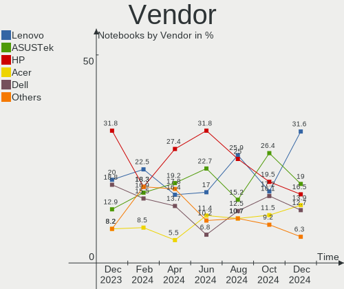

| Name                | Notebooks | Percent |
|---------------------|-----------|---------|
| Lenovo              | 19        | 21.11%  |
| Hewlett-Packard     | 17        | 18.89%  |
| ASUSTek Computer    | 14        | 15.56%  |
| Dell                | 12        | 13.33%  |
| Acer                | 12        | 13.33%  |
| Timi                | 4         | 4.44%   |
| Apple               | 3         | 3.33%   |
| MSI                 | 2         | 2.22%   |
| Infinix             | 2         | 2.22%   |
| Gateway             | 2         | 2.22%   |
| Toshiba             | 1         | 1.11%   |
| Samsung Electronics | 1         | 1.11%   |
| HONOR               | 1         | 1.11%   |

Model
-----

Motherboard model

| Name                                 | Notebooks | Percent |
|--------------------------------------|-----------|---------|
| Timi Mi NoteBook Ultra               | 2         | 2.22%   |
| HP Notebook                          | 2         | 2.22%   |
| Gateway NE56R                        | 2         | 2.22%   |
| ASUS ROG Strix G531GT_G531GT         | 2         | 2.22%   |
| Apple MacBookPro9,2                  | 2         | 2.22%   |
| Acer Predator PH315-54               | 2         | 2.22%   |
| Acer Aspire A715-51G                 | 2         | 2.22%   |
| Toshiba Satellite C850               | 1         | 1.11%   |
| Timi RedmiBook 15                    | 1         | 1.11%   |
| Timi Mi NoteBook Pro                 | 1         | 1.11%   |
| Samsung 935XDB                       | 1         | 1.11%   |
| MSI Thin GF63 12HW                   | 1         | 1.11%   |
| MSI Modern 15 A5M                    | 1         | 1.11%   |
| Lenovo Z51-70 80K6                   | 1         | 1.11%   |
| Lenovo Z50-70 20354                  | 1         | 1.11%   |
| Lenovo V15 G4 AMN 82YU               | 1         | 1.11%   |
| Lenovo ThinkPad T490 20N3S77601      | 1         | 1.11%   |
| Lenovo ThinkPad E15 Gen 2 20TDCTO1WW | 1         | 1.11%   |
| Lenovo ThinkPad E14 Gen 4 21E3S06300 | 1         | 1.11%   |
| Lenovo ThinkBook 15 G4 IAP 21DJ      | 1         | 1.11%   |
| Lenovo ThinkBook 15 G2 ITL 20VE      | 1         | 1.11%   |
| Lenovo ThinkBook 14-IIL 20SL         | 1         | 1.11%   |
| Lenovo IdeaPad S540-15IWL D 81NE     | 1         | 1.11%   |
| Lenovo IdeaPad S340-15IIL 81WL       | 1         | 1.11%   |
| Lenovo IdeaPad S340-15IIL 81VW       | 1         | 1.11%   |
| Lenovo IdeaPad S145-14AST 81ST       | 1         | 1.11%   |
| Lenovo IdeaPad 330-15IKB 81DE        | 1         | 1.11%   |
| Lenovo IdeaPad 320-15ISK 80XH        | 1         | 1.11%   |
| Lenovo IDEA 315-15 81WE              | 1         | 1.11%   |
| Lenovo G580 20157                    | 1         | 1.11%   |
| Lenovo E41-25 81FS                   | 1         | 1.11%   |
| Lenovo B480 20140                    | 1         | 1.11%   |
| Infinix INBOOK Y1 PLUS NEO           | 1         | 1.11%   |
| Infinix INBOOK X1 SLIM               | 1         | 1.11%   |
| HONOR BRN-FXX                        | 1         | 1.11%   |
| HP Victus by Laptop 16-e0xxx         | 1         | 1.11%   |
| HP ProBook 430 G3                    | 1         | 1.11%   |
| HP Pavilion Notebook                 | 1         | 1.11%   |
| HP Pavilion Laptop 15-eh2xxx         | 1         | 1.11%   |
| HP Pavilion Laptop 15-eg3xxx         | 1         | 1.11%   |

Model Family
------------

Motherboard model prefix

| Name              | Notebooks | Percent |
|-------------------|-----------|---------|
| HP Pavilion       | 7         | 7.78%   |
| Acer Aspire       | 7         | 7.78%   |
| Lenovo IdeaPad    | 6         | 6.67%   |
| ASUS Vivobook     | 6         | 6.67%   |
| ASUS ASUS         | 5         | 5.56%   |
| Dell Latitude     | 4         | 4.44%   |
| Dell Inspiron     | 4         | 4.44%   |
| Timi Mi           | 3         | 3.33%   |
| Lenovo ThinkPad   | 3         | 3.33%   |
| Lenovo ThinkBook  | 3         | 3.33%   |
| ASUS ROG          | 3         | 3.33%   |
| Infinix INBOOK    | 2         | 2.22%   |
| HP Notebook       | 2         | 2.22%   |
| Gateway NE56R     | 2         | 2.22%   |
| Dell XPS          | 2         | 2.22%   |
| Dell Vostro       | 2         | 2.22%   |
| Apple MacBookPro9 | 2         | 2.22%   |
| Acer Predator     | 2         | 2.22%   |
| Acer Nitro        | 2         | 2.22%   |
| Toshiba Satellite | 1         | 1.11%   |
| Timi RedmiBook    | 1         | 1.11%   |
| Samsung 935XDB    | 1         | 1.11%   |
| MSI Thin          | 1         | 1.11%   |
| MSI Modern        | 1         | 1.11%   |
| Lenovo Z51-70     | 1         | 1.11%   |
| Lenovo Z50-70     | 1         | 1.11%   |
| Lenovo V15        | 1         | 1.11%   |
| Lenovo IDEA       | 1         | 1.11%   |
| Lenovo G580       | 1         | 1.11%   |
| Lenovo E41-25     | 1         | 1.11%   |
| Lenovo B480       | 1         | 1.11%   |
| HONOR BRN-FXX     | 1         | 1.11%   |
| HP Victus         | 1         | 1.11%   |
| HP ProBook        | 1         | 1.11%   |
| HP Laptop         | 1         | 1.11%   |
| HP ENVY           | 1         | 1.11%   |
| HP EliteBook      | 1         | 1.11%   |
| HP 255            | 1         | 1.11%   |
| HP 247            | 1         | 1.11%   |
| HP 245            | 1         | 1.11%   |

MFG Year
--------

Motherboard manufacture year

| Year | Notebooks | Percent |
|------|-----------|---------|
| 2021 | 18        | 20%     |
| 2022 | 16        | 17.78%  |
| 2019 | 12        | 13.33%  |
| 2020 | 8         | 8.89%   |
| 2012 | 7         | 7.78%   |
| 2023 | 6         | 6.67%   |
| 2017 | 6         | 6.67%   |
| 2016 | 4         | 4.44%   |
| 2015 | 4         | 4.44%   |
| 2018 | 3         | 3.33%   |
| 2010 | 2         | 2.22%   |
| 2014 | 1         | 1.11%   |
| 2013 | 1         | 1.11%   |
| 2011 | 1         | 1.11%   |
| 2008 | 1         | 1.11%   |

Form Factor
-----------

Physical design of the computer

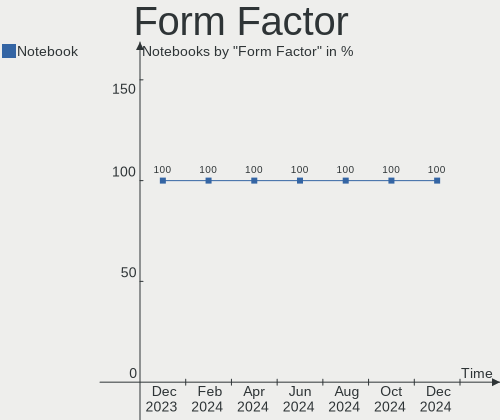

| Name     | Notebooks | Percent |
|----------|-----------|---------|
| Notebook | 90        | 100%    |

Secure Boot
-----------

Enabled or disabled

| State    | Notebooks | Percent |
|----------|-----------|---------|
| Disabled | 76        | 84.44%  |
| Enabled  | 14        | 15.56%  |

Coreboot
--------

Have coreboot on board

| Used | Notebooks | Percent |
|------|-----------|---------|
| No   | 90        | 100%    |

RAM Size
--------

Total RAM memory

| Size in GB | Notebooks | Percent |
|------------|-----------|---------|
| 4.01-8.0   | 35        | 38.89%  |
| 16.01-24.0 | 22        | 24.44%  |
| 8.01-16.0  | 17        | 18.89%  |
| 3.01-4.0   | 9         | 10%     |
| 32.01-64.0 | 4         | 4.44%   |
| 1.01-2.0   | 2         | 2.22%   |
| 24.01-32.0 | 1         | 1.11%   |

RAM Used
--------

Used RAM memory

| Used GB   | Notebooks | Percent |
|-----------|-----------|---------|
| 2.01-3.0  | 24        | 26.67%  |
| 3.01-4.0  | 22        | 24.44%  |
| 4.01-8.0  | 20        | 22.22%  |
| 1.01-2.0  | 18        | 20%     |
| 0.51-1.0  | 4         | 4.44%   |
| 8.01-16.0 | 2         | 2.22%   |

Total Drives
------------

Number of drives on board

| Drives | Notebooks | Percent |
|--------|-----------|---------|
| 1      | 67        | 74.44%  |
| 2      | 22        | 24.44%  |
| 3      | 1         | 1.11%   |

Has CD-ROM
----------

Has CD-ROM on board

| Presented | Notebooks | Percent |
|-----------|-----------|---------|
| No        | 73        | 81.11%  |
| Yes       | 17        | 18.89%  |

Has Ethernet
------------

Has Ethernet on board

| Presented | Notebooks | Percent |
|-----------|-----------|---------|
| Yes       | 71        | 78.89%  |
| No        | 19        | 21.11%  |

Has WiFi
--------

Has WiFi module

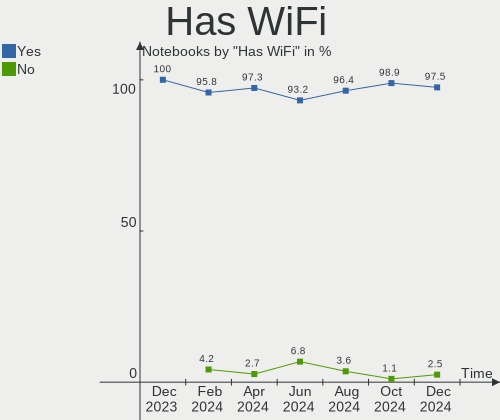

| Presented | Notebooks | Percent |
|-----------|-----------|---------|
| Yes       | 89        | 98.89%  |
| No        | 1         | 1.11%   |

Has Bluetooth
-------------

Has Bluetooth module

| Presented | Notebooks | Percent |
|-----------|-----------|---------|
| Yes       | 81        | 90%     |
| No        | 9         | 10%     |

Location
--------

Country
-------

Geographic location (country)

| Country | Notebooks | Percent |
|---------|-----------|---------|
| India   | 90        | 100%    |

City
----

Geographic location (city)

| City          | Notebooks | Percent |
|---------------|-----------|---------|
| Bengaluru     | 13        | 14.44%  |
| Delhi         | 10        | 11.11%  |
| Pune          | 7         | 7.78%   |
| Hyderabad     | 5         | 5.56%   |
| Chennai       | 5         | 5.56%   |
| Mumbai        | 4         | 4.44%   |
| Surat         | 3         | 3.33%   |
| Coimbatore    | 3         | 3.33%   |
| Bhubaneswar   | 3         | 3.33%   |
| Patna         | 2         | 2.22%   |
| Madurai       | 2         | 2.22%   |
| Kolkata       | 2         | 2.22%   |
| Kochi         | 2         | 2.22%   |
| Ahmedabad     | 2         | 2.22%   |
| Visakhapatnam | 1         | 1.11%   |
| Tirunelveli   | 1         | 1.11%   |
| Thrissur      | 1         | 1.11%   |
| Sandila       | 1         | 1.11%   |
| Raipur        | 1         | 1.11%   |
| Patiala       | 1         | 1.11%   |
| Palladam      | 1         | 1.11%   |
| Noida         | 1         | 1.11%   |
| New Delhi     | 1         | 1.11%   |
| Navi Mumbai   | 1         | 1.11%   |
| Nagpur        | 1         | 1.11%   |
| Lucknow       | 1         | 1.11%   |
| Kottayam      | 1         | 1.11%   |
| Kanpur        | 1         | 1.11%   |
| Jalpaiguri    | 1         | 1.11%   |
| Jalandhar     | 1         | 1.11%   |
| Jaipur        | 1         | 1.11%   |
| Indore        | 1         | 1.11%   |
| Guwahati      | 1         | 1.11%   |
| Gurugram      | 1         | 1.11%   |
| Ghaziabad     | 1         | 1.11%   |
| Chandigarh    | 1         | 1.11%   |
| Brahmapur     | 1         | 1.11%   |
| Bhopal        | 1         | 1.11%   |
| Bhatkal       | 1         | 1.11%   |
| Asansol       | 1         | 1.11%   |

Drives
------

Drive Vendor
------------

Hard drive vendors

| Vendor                      | Notebooks | Drives | Percent |
|-----------------------------|-----------|--------|---------|
| Samsung Electronics         | 17        | 17     | 14.78%  |
| WDC                         | 16        | 17     | 13.91%  |
| Seagate                     | 15        | 15     | 13.04%  |
| Micron Technology           | 8         | 8      | 6.96%   |
| Toshiba                     | 6         | 6      | 5.22%   |
| Sandisk                     | 6         | 6      | 5.22%   |
| Intel                       | 6         | 6      | 5.22%   |
| SK hynix                    | 5         | 5      | 4.35%   |
| Kingston                    | 4         | 4      | 3.48%   |
| Crucial                     | 4         | 4      | 3.48%   |
| Yangtze Memory Technologies | 3         | 3      | 2.61%   |
| Unknown                     | 3         | 3      | 2.61%   |
| KIOXIA                      | 3         | 3      | 2.61%   |
| FORESEE                     | 3         | 3      | 2.61%   |
| Silicon Motion              | 2         | 2      | 1.74%   |
| Apple                       | 2         | 2      | 1.74%   |
| Unknown                     | 2         | 2      | 1.74%   |
| Union Memory (Shenzhen)     | 1         | 1      | 0.87%   |
| UMIS                        | 1         | 1      | 0.87%   |
| SSSTC                       | 1         | 1      | 0.87%   |
| Secure                      | 1         | 1      | 0.87%   |
| Kingston Technology Company | 1         | 1      | 0.87%   |
| Hitachi                     | 1         | 1      | 0.87%   |
| HGST                        | 1         | 1      | 0.87%   |
| geonix                      | 1         | 1      | 0.87%   |
| CONSISTENT                  | 1         | 1      | 0.87%   |
| China                       | 1         | 1      | 0.87%   |

Drive Model
-----------

Hard drive models

| Model                                                 | Notebooks | Percent |
|-------------------------------------------------------|-----------|---------|
| Seagate ST1000LM035-1RK172 1TB                        | 4         | 3.45%   |
| Micron 2450_MTFDKBA512TFK 512GB                       | 4         | 3.45%   |
| Yangtze Memory YMTC PC005 512GB                       | 3         | 2.59%   |
| WDC WD10SPZX-24Z10 1TB                                | 3         | 2.59%   |
| Toshiba MQ04ABF100 1TB                                | 3         | 2.59%   |
| Seagate ST1000LM049-2GH172 1TB                        | 3         | 2.59%   |
| Samsung NVMe SSD Controller PM9A1/PM9A3/980PRO 1TB    | 3         | 2.59%   |
| Intel SSDPEKNU512GZ 512GB                             | 3         | 2.59%   |
| WDC WDS240G2G0B-00EPW0 240GB SSD                      | 2         | 1.72%   |
| WDC WD10JPVX-60JC3T0 1TB                              | 2         | 1.72%   |
| SK hynix PC711 HFS512GDE9X073N 512GB                  | 2         | 1.72%   |
| Sandisk WD Blue SN550 NVMe SSD 512GB                  | 2         | 1.72%   |
| Sandisk WD Blue SN500 / PC SN520 NVMe SSD 256GB       | 2         | 1.72%   |
| Samsung NVMe SSD Controller SM981/PM981/PM983 256GB   | 2         | 1.72%   |
| Unknown                                               | 2         | 1.72%   |
| WDC WDS480G2G0A-00JH30 480GB SSD                      | 1         | 0.86%   |
| WDC WD5000LPCX-24VHAT0 500GB                          | 1         | 0.86%   |
| WDC WD5000L 500GB                                     | 1         | 0.86%   |
| WDC WD5000BPVT-22HXZT3 500GB                          | 1         | 0.86%   |
| WDC WD10SPZX-60Z10T1 1TB                              | 1         | 0.86%   |
| WDC WD10SPSX-21A6WT0 1TB                              | 1         | 0.86%   |
| WDC WD Green 2.5 240GB                                | 1         | 0.86%   |
| WDC WD Blue SA510 2.5 500GB                           | 1         | 0.86%   |
| WDC PC SN530 SDBPNPZ-512G-1006 512GB                  | 1         | 0.86%   |
| WDC PC SN520 NVMe 256GB                               | 1         | 0.86%   |
| Unknown SS32G  32GB                                   | 1         | 0.86%   |
| Unknown NVMe SSD Drive 2TB                            | 1         | 0.86%   |
| Unknown MMC Card  32GB                                | 1         | 0.86%   |
| Union Memory (Shenzhen) UMIS RPJTJ512MGE1QDQ 512GB    | 1         | 0.86%   |
| UMIS RPFTJ128PDD2EWX 128GB                            | 1         | 0.86%   |
| Toshiba MQ01ACF050 500GB                              | 1         | 0.86%   |
| Toshiba MQ01ABD075 752GB                              | 1         | 0.86%   |
| Toshiba MK5061GSY 500GB                               | 1         | 0.86%   |
| SSSTC CL4-8D512 512GB                                 | 1         | 0.86%   |
| SK hynix PC300 NVMe Solid State Drive 256GB           | 1         | 0.86%   |
| SK hynix HFM512GD3JX013N 512GB                        | 1         | 0.86%   |
| SK hynix BC511 512GB                                  | 1         | 0.86%   |
| Silicon Motion SM2263EN/SM2263XT SSD Controller 512GB | 1         | 0.86%   |
| Silicon Motion M.2 2280 Gen 3x4 NVMe SSD 512GB        | 1         | 0.86%   |
| Secure Net 256GB SSD                                  | 1         | 0.86%   |

HDD Vendor
----------

Hard disk drive vendors

| Vendor  | Notebooks | Drives | Percent |
|---------|-----------|--------|---------|
| Seagate | 14        | 14     | 42.42%  |
| WDC     | 10        | 10     | 30.3%   |
| Toshiba | 6         | 6      | 18.18%  |
| Hitachi | 1         | 1      | 3.03%   |
| HGST    | 1         | 1      | 3.03%   |
| Apple   | 1         | 1      | 3.03%   |

SSD Vendor
----------

Solid state drive vendors

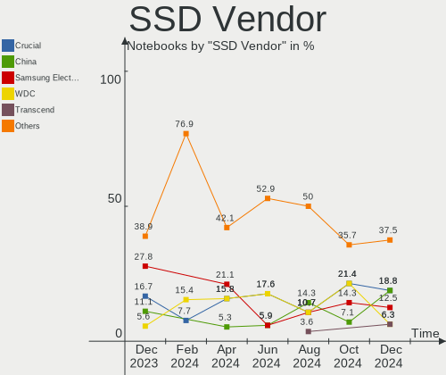

| Vendor              | Notebooks | Drives | Percent |
|---------------------|-----------|--------|---------|
| WDC                 | 5         | 5      | 26.32%  |
| Crucial             | 4         | 4      | 21.05%  |
| Samsung Electronics | 2         | 2      | 10.53%  |
| Kingston            | 2         | 2      | 10.53%  |
| Secure              | 1         | 1      | 5.26%   |
| geonix              | 1         | 1      | 5.26%   |
| FORESEE             | 1         | 1      | 5.26%   |
| CONSISTENT          | 1         | 1      | 5.26%   |
| China               | 1         | 1      | 5.26%   |
| Apple               | 1         | 1      | 5.26%   |

Drive Kind
----------

HDD or SSD

| Kind    | Notebooks | Drives | Percent |
|---------|-----------|--------|---------|
| NVMe    | 57        | 59     | 50.44%  |
| HDD     | 32        | 33     | 28.32%  |
| SSD     | 19        | 19     | 16.81%  |
| Unknown | 3         | 3      | 2.65%   |
| MMC     | 2         | 2      | 1.77%   |

Drive Connector
---------------

SATA, SAS, NVMe, etc.

| Type | Notebooks | Drives | Percent |
|------|-----------|--------|---------|
| NVMe | 57        | 59     | 53.77%  |
| SATA | 45        | 53     | 42.45%  |
| SAS  | 2         | 2      | 1.89%   |
| MMC  | 2         | 2      | 1.89%   |

Drive Size
----------

Size of hard drive

| Size in TB | Notebooks | Drives | Percent |
|------------|-----------|--------|---------|
| 0.01-0.5   | 26        | 28     | 52%     |
| 0.51-1.0   | 23        | 23     | 46%     |
| 1.01-2.0   | 1         | 1      | 2%      |

Space Total
-----------

Amount of disk space available on the file system

| Size in GB     | Notebooks | Percent |
|----------------|-----------|---------|
| 501-1000       | 22        | 24.44%  |
| 101-250        | 20        | 22.22%  |
| 251-500        | 19        | 21.11%  |
| 1001-2000      | 9         | 10%     |
| 51-100         | 7         | 7.78%   |
| 1-20           | 6         | 6.67%   |
| 21-50          | 4         | 4.44%   |
| Unknown        | 2         | 2.22%   |
| More than 3000 | 1         | 1.11%   |

Space Used
----------

Amount of used disk space

| Used GB  | Notebooks | Percent |
|----------|-----------|---------|
| 1-20     | 33        | 36.67%  |
| 21-50    | 22        | 24.44%  |
| 251-500  | 10        | 11.11%  |
| 101-250  | 10        | 11.11%  |
| 51-100   | 7         | 7.78%   |
| 501-1000 | 6         | 6.67%   |
| Unknown  | 2         | 2.22%   |

Malfunc. Drives
---------------

Drive models with a malfunction

| Model                                       | Notebooks | Drives | Percent |
|---------------------------------------------|-----------|--------|---------|
| Seagate ST1000LM035-1RK172 1TB              | 2         | 2      | 20%     |
| Toshiba MK5061GSY 500GB                     | 1         | 1      | 10%     |
| SK hynix PC711 HFS512GDE9X073N 512GB        | 1         | 1      | 10%     |
| Secure Net 256GB SSD                        | 1         | 1      | 10%     |
| Seagate ST2000LM007-1R8174 2TB              | 1         | 1      | 10%     |
| Seagate ST1000LM049-2GH172 1TB              | 1         | 1      | 10%     |
| Micron Technology 2200V_MTFDHBA512TCK 512GB | 1         | 1      | 10%     |
| Hitachi HTS543232A7A384 320GB               | 1         | 1      | 10%     |
| Apple HDD HTS545050A7E362 500GB             | 1         | 1      | 10%     |

Malfunc. Drive Vendor
---------------------

Vendors of faulty drives

| Vendor            | Notebooks | Drives | Percent |
|-------------------|-----------|--------|---------|
| Seagate           | 4         | 4      | 40%     |
| Toshiba           | 1         | 1      | 10%     |
| SK hynix          | 1         | 1      | 10%     |
| Secure            | 1         | 1      | 10%     |
| Micron Technology | 1         | 1      | 10%     |
| Hitachi           | 1         | 1      | 10%     |
| Apple             | 1         | 1      | 10%     |

Malfunc. HDD Vendor
-------------------

Vendors of faulty HDD drives

| Vendor  | Notebooks | Drives | Percent |
|---------|-----------|--------|---------|
| Seagate | 4         | 4      | 57.14%  |
| Toshiba | 1         | 1      | 14.29%  |
| Hitachi | 1         | 1      | 14.29%  |
| Apple   | 1         | 1      | 14.29%  |

Malfunc. Drive Kind
-------------------

Kinds of faulty drives

| Kind | Notebooks | Drives | Percent |
|------|-----------|--------|---------|
| HDD  | 7         | 7      | 70%     |
| NVMe | 2         | 2      | 20%     |
| SSD  | 1         | 1      | 10%     |

Failed Drives
-------------

Failed drive models

Zero info for selected period =(

Failed Drive Vendor
-------------------

Failed drive vendors

Zero info for selected period =(

Drive Status
------------

Number of failed and malfunc. drives

| Status   | Notebooks | Drives | Percent |
|----------|-----------|--------|---------|
| Works    | 49        | 61     | 51.04%  |
| Detected | 37        | 45     | 38.54%  |
| Malfunc  | 10        | 10     | 10.42%  |

Storage controller
------------------

Storage Vendor
--------------

Storage controller vendors

| Vendor                         | Notebooks | Percent |
|--------------------------------|-----------|---------|
| Intel                          | 63        | 50.81%  |
| Samsung Electronics            | 16        | 12.9%   |
| SanDisk                        | 8         | 6.45%   |
| Micron Technology              | 8         | 6.45%   |
| AMD                            | 7         | 5.65%   |
| SK hynix                       | 5         | 4.03%   |
| Yangtze Memory Technologies    | 3         | 2.42%   |
| KIOXIA                         | 3         | 2.42%   |
| Kingston Technology Company    | 3         | 2.42%   |
| Union Memory (Shenzhen)        | 2         | 1.61%   |
| Silicon Motion                 | 2         | 1.61%   |
| Shenzhen Longsys Electronics   | 2         | 1.61%   |
| Solid State Storage Technology | 1         | 0.81%   |
| Hosin Global Electronics       | 1         | 0.81%   |

Storage Model
-------------

Storage controller models

| Model                                                                   | Notebooks | Percent |
|-------------------------------------------------------------------------|-----------|---------|
| Intel Volume Management Device NVMe RAID Controller                     | 14        | 10.22%  |
| Intel Sunrise Point-LP SATA Controller [AHCI mode]                      | 10        | 7.3%    |
| Samsung NVMe SSD Controller 980                                         | 7         | 5.11%   |
| AMD FCH SATA Controller [AHCI mode]                                     | 7         | 5.11%   |
| Intel 82801 Mobile SATA Controller [RAID mode]                          | 6         | 4.38%   |
| Intel 7 Series Chipset Family 6-port SATA Controller [AHCI mode]        | 6         | 4.38%   |
| Micron 2450 NVMe SSD [HendrixV] (DRAM-less)                             | 5         | 3.65%   |
| Intel Tiger Lake-LP SATA Controller                                     | 5         | 3.65%   |
| Intel SSD 670p Series [Keystone Harbor]                                 | 4         | 2.92%   |
| Intel Ice Lake-LP SATA Controller [AHCI mode]                           | 4         | 2.92%   |
| Yangtze Memory PC005 NVMe SSD                                           | 3         | 2.19%   |
| SK hynix Gold P31/BC711/PC711 NVMe Solid State Drive                    | 3         | 2.19%   |
| SanDisk WD Blue SN550 NVMe SSD                                          | 3         | 2.19%   |
| Samsung NVMe SSD Controller SM981/PM981/PM983                           | 3         | 2.19%   |
| Samsung NVMe SSD Controller PM9A1/PM9A3/980PRO                          | 3         | 2.19%   |
| Intel Cannon Lake Mobile PCH SATA AHCI Controller                       | 3         | 2.19%   |
| Silicon Motion SM2263EN/SM2263XT (DRAM-less) NVMe SSD Controllers       | 2         | 1.46%   |
| Shenzhen Longsys Lexar NM620 NVME SSD (DRAM-less)                       | 2         | 1.46%   |
| SanDisk WD Blue SN500 / PC SN520 NVMe SSD                               | 2         | 1.46%   |
| Samsung NVMe SSD Controller PM9B1                                       | 2         | 1.46%   |
| KIOXIA NVMe SSD Controller BG4 (DRAM-less)                              | 2         | 1.46%   |
| Kingston Company OM8PCP Design-In PCIe 3 NVMe SSD (DRAM-less)           | 2         | 1.46%   |
| Intel Wildcat Point-LP SATA Controller [AHCI Mode]                      | 2         | 1.46%   |
| Intel Tiger Lake SATA AHCI Controller                                   | 2         | 1.46%   |
| Intel SSD 660P Series                                                   | 2         | 1.46%   |
| Intel Cannon Point-LP SATA Controller [AHCI Mode]                       | 2         | 1.46%   |
| Intel Alder Lake-P SATA AHCI Controller                                 | 2         | 1.46%   |
| Intel 8 Series SATA Controller 1 [AHCI mode]                            | 2         | 1.46%   |
| Intel 7 Series Chipset Family 4-port SATA Controller [IDE mode]         | 2         | 1.46%   |
| Intel 7 Series Chipset Family 2-port SATA Controller [IDE mode]         | 2         | 1.46%   |
| Intel 400 Series Chipset Family SATA AHCI Controller                    | 2         | 1.46%   |
| Union Memory (Shenzhen) AM630 PCIe 4.0 x4 NVMe SSD Controller           | 1         | 0.73%   |
| Union Memory (Shenzhen) AM610 PCIe 3.0 NVMe SSD 128GB                   | 1         | 0.73%   |
| Solid State Storage CL4-8D512 NVMe SSD M.2 (DRAM-less)                  | 1         | 0.73%   |
| SK hynix PC300 NVMe Solid State Drive 256GB                             | 1         | 0.73%   |
| SK hynix BC511 NVMe SSD                                                 | 1         | 0.73%   |
| SanDisk WD Blue SN570 NVMe SSD 1TB                                      | 1         | 0.73%   |
| SanDisk WD Black SN770 / PC SN740 256GB / PC SN560 (DRAM-less) NVMe SSD | 1         | 0.73%   |
| SanDisk PC SN520 NVMe SSD                                               | 1         | 0.73%   |
| Samsung S4LN058A01[SSUBX] AHCI SSD Controller (Apple slot)              | 1         | 0.73%   |

Storage Kind
------------

Kind of storage controller (IDE, SATA, NVMe, SAS, ...)

| Kind | Notebooks | Percent |
|------|-----------|---------|
| NVMe | 57        | 42.86%  |
| SATA | 54        | 40.6%   |
| RAID | 20        | 15.04%  |
| IDE  | 2         | 1.5%    |

Processor
---------

CPU Vendor
----------

Processor vendors

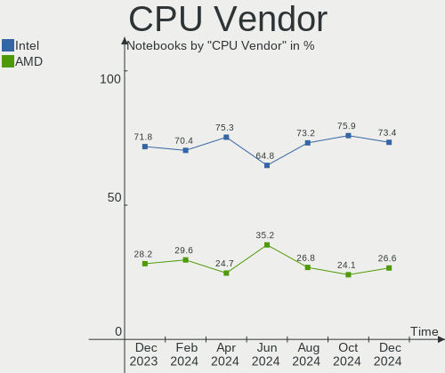

| Vendor | Notebooks | Percent |
|--------|-----------|---------|
| Intel  | 75        | 83.33%  |
| AMD    | 15        | 16.67%  |

CPU Model
---------

Processor models

| Model                                         | Notebooks | Percent |
|-----------------------------------------------|-----------|---------|
| Intel Pentium CPU B960 @ 2.20GHz              | 3         | 3.33%   |
| Intel Core i5-3210M CPU @ 2.50GHz             | 3         | 3.33%   |
| Intel Core i3-1005G1 CPU @ 1.20GHz            | 3         | 3.33%   |
| Intel 12th Gen Core i5-12500H                 | 3         | 3.33%   |
| Intel 12th Gen Core i5-1240P                  | 3         | 3.33%   |
| Intel 11th Gen Core i5-1135G7 @ 2.40GHz       | 3         | 3.33%   |
| AMD Ryzen 5 5600H with Radeon Graphics        | 3         | 3.33%   |
| Intel Core i7-9750H CPU @ 2.60GHz             | 2         | 2.22%   |
| Intel Core i5-8250U CPU @ 1.60GHz             | 2         | 2.22%   |
| Intel Core i5-7200U CPU @ 2.50GHz             | 2         | 2.22%   |
| Intel Core i5-6200U CPU @ 2.30GHz             | 2         | 2.22%   |
| Intel Core i5-1035G1 CPU @ 1.00GHz            | 2         | 2.22%   |
| Intel Core i5-10300H CPU @ 2.50GHz            | 2         | 2.22%   |
| Intel Core i3-6006U CPU @ 2.00GHz             | 2         | 2.22%   |
| Intel 12th Gen Core i5-12450H                 | 2         | 2.22%   |
| Intel 12th Gen Core i5-1235U                  | 2         | 2.22%   |
| Intel 11th Gen Core i5-11300H @ 3.10GHz       | 2         | 2.22%   |
| Intel 11th Gen Core i3-1115G4 @ 3.00GHz       | 2         | 2.22%   |
| AMD Ryzen 5 3500U with Radeon Vega Mobile Gfx | 2         | 2.22%   |
| AMD Ryzen 3 7320U with Radeon Graphics        | 2         | 2.22%   |
| Intel Pentium CPU B950 @ 2.10GHz              | 1         | 1.11%   |
| Intel Core i7-8750H CPU @ 2.20GHz             | 1         | 1.11%   |
| Intel Core i7-8665U CPU @ 1.90GHz             | 1         | 1.11%   |
| Intel Core i7-8565U CPU @ 1.80GHz             | 1         | 1.11%   |
| Intel Core i7-8550U CPU @ 1.80GHz             | 1         | 1.11%   |
| Intel Core i7-7700HQ CPU @ 2.80GHz            | 1         | 1.11%   |
| Intel Core i7-5500U CPU @ 2.40GHz             | 1         | 1.11%   |
| Intel Core i7-4510U CPU @ 2.00GHz             | 1         | 1.11%   |
| Intel Core i7-3520M CPU @ 2.90GHz             | 1         | 1.11%   |
| Intel Core i7-10510U CPU @ 1.80GHz            | 1         | 1.11%   |
| Intel Core i5-9300H CPU @ 2.40GHz             | 1         | 1.11%   |
| Intel Core i5-8365U CPU @ 1.60GHz             | 1         | 1.11%   |
| Intel Core i5-8265U CPU @ 1.60GHz             | 1         | 1.11%   |
| Intel Core i5-6300U CPU @ 2.40GHz             | 1         | 1.11%   |
| Intel Core i5-5250U CPU @ 1.60GHz             | 1         | 1.11%   |
| Intel Core i5-4210U CPU @ 1.70GHz             | 1         | 1.11%   |
| Intel Core i5-1035G4 CPU @ 1.10GHz            | 1         | 1.11%   |
| Intel Core i5-10200H CPU @ 2.40GHz            | 1         | 1.11%   |
| Intel Core i5 CPU M 460 @ 2.53GHz             | 1         | 1.11%   |
| Intel Core i3-7100U CPU @ 2.40GHz             | 1         | 1.11%   |

CPU Model Family
----------------

Processor model prefix

| Model         | Notebooks | Percent |
|---------------|-----------|---------|
| Other         | 28        | 31.11%  |
| Intel Core i5 | 22        | 24.44%  |
| Intel Core i7 | 11        | 12.22%  |
| Intel Core i3 | 9         | 10%     |
| AMD Ryzen 5   | 6         | 6.67%   |
| Intel Pentium | 4         | 4.44%   |
| AMD Ryzen 7   | 3         | 3.33%   |
| AMD Ryzen 3   | 3         | 3.33%   |
| Intel Celeron | 1         | 1.11%   |
| Intel Atom    | 1         | 1.11%   |
| AMD Athlon    | 1         | 1.11%   |
| AMD A6        | 1         | 1.11%   |

CPU Cores
---------

Number of processor cores

| Number | Notebooks | Percent |
|--------|-----------|---------|
| 2      | 33        | 36.67%  |
| 4      | 31        | 34.44%  |
| 6      | 8         | 8.89%   |
| 12     | 7         | 7.78%   |
| 8      | 7         | 7.78%   |
| 14     | 2         | 2.22%   |
| 10     | 2         | 2.22%   |

CPU Sockets
-----------

Number of sockets

| Number | Notebooks | Percent |
|--------|-----------|---------|
| 1      | 90        | 100%    |

CPU Threads
-----------

Threads per core (Hyper-Threading)

| Number | Notebooks | Percent |
|--------|-----------|---------|
| 2      | 79        | 87.78%  |
| 1      | 11        | 12.22%  |

CPU Op-Modes
------------

CPU Operation Modes (32-bit, 64-bit)

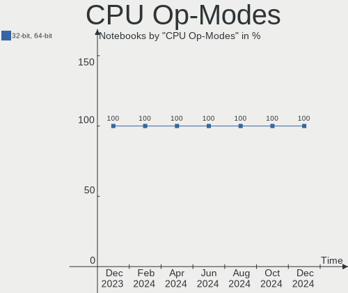

| Op mode        | Notebooks | Percent |
|----------------|-----------|---------|
| 32-bit, 64-bit | 90        | 100%    |

CPU Microcode
-------------

Microcode number

| Number     | Notebooks | Percent |
|------------|-----------|---------|
| Unknown    | 61        | 67.78%  |
| 0x806ec    | 3         | 3.33%   |
| 0x906ea    | 2         | 2.22%   |
| 0x806e9    | 2         | 2.22%   |
| 0x406e3    | 2         | 2.22%   |
| 0x206a7    | 2         | 2.22%   |
| 0x0a50000d | 2         | 2.22%   |
| 0x08a00008 | 2         | 2.22%   |
| 0x06006705 | 2         | 2.22%   |
| 0x906ed    | 1         | 1.11%   |
| 0x906e9    | 1         | 1.11%   |
| 0x906a3    | 1         | 1.11%   |
| 0x806ea    | 1         | 1.11%   |
| 0x806d1    | 1         | 1.11%   |
| 0x806c1    | 1         | 1.11%   |
| 0x706e5    | 1         | 1.11%   |
| 0x0a404102 | 1         | 1.11%   |
| 0x0a404101 | 1         | 1.11%   |
| 0x08608103 | 1         | 1.11%   |
| 0x08200103 | 1         | 1.11%   |
| 0x08108109 | 1         | 1.11%   |

CPU Microarch
-------------

Microarchitecture

| Name             | Notebooks | Percent |
|------------------|-----------|---------|
| KabyLake         | 16        | 17.78%  |
| Alderlake Hybrid | 13        | 14.44%  |
| TigerLake        | 11        | 12.22%  |
| IceLake          | 8         | 8.89%   |
| SandyBridge      | 6         | 6.67%   |
| Unknown          | 6         | 6.67%   |
| Skylake          | 5         | 5.56%   |
| Zen 3            | 4         | 4.44%   |
| IvyBridge        | 4         | 4.44%   |
| Zen+             | 3         | 3.33%   |
| CometLake        | 3         | 3.33%   |
| Broadwell        | 3         | 3.33%   |
| Haswell          | 2         | 2.22%   |
| Excavator        | 2         | 2.22%   |
| Zen              | 1         | 1.11%   |
| Westmere         | 1         | 1.11%   |
| Tremont          | 1         | 1.11%   |
| Silvermont       | 1         | 1.11%   |

Graphics
--------

GPU Vendor
----------

Vendors of graphics cards

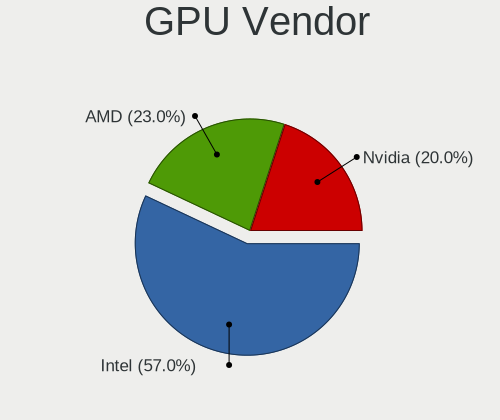

| Vendor | Notebooks | Percent |
|--------|-----------|---------|
| Intel  | 76        | 61.79%  |
| Nvidia | 29        | 23.58%  |
| AMD    | 18        | 14.63%  |

GPU Model
---------

Graphics card models

| Model                                                                     | Notebooks | Percent |
|---------------------------------------------------------------------------|-----------|---------|
| Intel TigerLake-LP GT2 [Iris Xe Graphics]                                 | 8         | 6.45%   |
| Intel Alder Lake-P Integrated Graphics Controller                         | 8         | 6.45%   |
| Intel 2nd Generation Core Processor Family Integrated Graphics Controller | 6         | 4.84%   |
| Nvidia TU117M [GeForce GTX 1650 Mobile / Max-Q]                           | 5         | 4.03%   |
| Intel Iris Plus Graphics G1 (Ice Lake)                                    | 5         | 4.03%   |
| Nvidia TU117M                                                             | 4         | 3.23%   |
| Nvidia GA107M [GeForce RTX 3050 Ti Mobile]                                | 4         | 3.23%   |
| Intel WhiskeyLake-U GT2 [UHD Graphics 620]                                | 4         | 3.23%   |
| Intel Skylake GT2 [HD Graphics 520]                                       | 4         | 3.23%   |
| Intel CoffeeLake-H GT2 [UHD Graphics 630]                                 | 4         | 3.23%   |
| Intel 3rd Gen Core processor Graphics Controller                          | 4         | 3.23%   |
| AMD Picasso/Raven 2 [Radeon Vega Series / Radeon Vega Mobile Series]      | 4         | 3.23%   |
| Nvidia GA106M [GeForce RTX 3060 Mobile / Max-Q]                           | 3         | 2.42%   |
| Intel UHD Graphics 620                                                    | 3         | 2.42%   |
| Intel TigerLake-H GT1 [UHD Graphics]                                      | 3         | 2.42%   |
| Intel HD Graphics 620                                                     | 3         | 2.42%   |
| AMD Cezanne [Radeon Vega Series / Radeon Vega Mobile Series]              | 3         | 2.42%   |
| Nvidia GP108M [GeForce MX250]                                             | 2         | 1.61%   |
| Nvidia GM108M [GeForce 940MX]                                             | 2         | 1.61%   |
| Nvidia GF117M [GeForce 610M/710M/810M/820M / GT 620M/625M/630M/720M]      | 2         | 1.61%   |
| Nvidia GA107M [GeForce RTX 3050 Mobile]                                   | 2         | 1.61%   |
| Intel Tiger Lake-LP GT2 [UHD Graphics G4]                                 | 2         | 1.61%   |
| Intel HD Graphics 5500                                                    | 2         | 1.61%   |
| Intel Haswell-ULT Integrated Graphics Controller                          | 2         | 1.61%   |
| Intel CometLake-H GT2 [UHD Graphics]                                      | 2         | 1.61%   |
| Intel Alder Lake-UP3 GT2 [Iris Xe Graphics]                               | 2         | 1.61%   |
| Intel Alder Lake-P GT1 [UHD Graphics]                                     | 2         | 1.61%   |
| AMD Stoney [Radeon R2/R3/R4/R5 Graphics]                                  | 2         | 1.61%   |
| AMD Rembrandt [Radeon 680M]                                               | 2         | 1.61%   |
| AMD Mendocino                                                             | 2         | 1.61%   |
| Nvidia GP107M [GeForce GTX 1050 Ti Mobile]                                | 1         | 0.81%   |
| Nvidia GM107M [GeForce GTX 850M]                                          | 1         | 0.81%   |
| Nvidia GF108M [GeForce GT 620M/630M/635M/640M LE]                         | 1         | 0.81%   |
| Nvidia GF108M [GeForce GT 420M]                                           | 1         | 0.81%   |
| Nvidia GF108GLM [NVS 5200M]                                               | 1         | 0.81%   |
| Intel Xeon E3-1200 v2/3rd Gen Core processor Graphics Controller          | 1         | 0.81%   |
| Intel Tiger Lake-UP4 GT2 [Iris Xe Graphics]                               | 1         | 0.81%   |
| Intel Raptor Lake-P [Iris Xe Graphics]                                    | 1         | 0.81%   |
| Intel JasperLake [UHD Graphics]                                           | 1         | 0.81%   |
| Intel Iris Plus Graphics G4 (Ice Lake)                                    | 1         | 0.81%   |

GPU Combo
---------

Combinations of graphics cards

| Name           | Notebooks | Percent |
|----------------|-----------|---------|
| 1 x Intel      | 47        | 52.22%  |
| Intel + Nvidia | 24        | 26.67%  |
| 1 x AMD        | 11        | 12.22%  |
| AMD + Nvidia   | 4         | 4.44%   |
| Intel + AMD    | 3         | 3.33%   |
| 1 x Nvidia     | 1         | 1.11%   |

GPU Driver
----------

Free vs proprietary

| Driver      | Notebooks | Percent |
|-------------|-----------|---------|
| Free        | 71        | 78.89%  |
| Proprietary | 18        | 20%     |
| Unknown     | 1         | 1.11%   |

GPU Memory
----------

Total video memory

| Size in GB | Notebooks | Percent |
|------------|-----------|---------|
| Unknown    | 69        | 76.67%  |
| 1.01-2.0   | 6         | 6.67%   |
| 0.01-0.5   | 6         | 6.67%   |
| 3.01-4.0   | 5         | 5.56%   |
| 0.51-1.0   | 3         | 3.33%   |
| 5.01-6.0   | 1         | 1.11%   |

Monitor
-------

Monitor Vendor
--------------

Monitor vendors

| Vendor              | Notebooks | Percent |
|---------------------|-----------|---------|
| BOE                 | 20        | 19.8%   |
| Chimei Innolux      | 18        | 17.82%  |
| AU Optronics        | 16        | 15.84%  |
| LG Display          | 11        | 10.89%  |
| Samsung Electronics | 9         | 8.91%   |
| PANDA               | 5         | 4.95%   |
| Dell                | 4         | 3.96%   |
| TMX                 | 3         | 2.97%   |
| Goldstar            | 3         | 2.97%   |
| Apple               | 3         | 2.97%   |
| HKC                 | 2         | 1.98%   |
| Xiaomi              | 1         | 0.99%   |
| Unknown             | 1         | 0.99%   |
| Sharp               | 1         | 0.99%   |
| Philips             | 1         | 0.99%   |
| Lenovo              | 1         | 0.99%   |
| InfoVision          | 1         | 0.99%   |
| Hewlett-Packard     | 1         | 0.99%   |

Monitor Model
-------------

Monitor models

| Model                                                                 | Notebooks | Percent |
|-----------------------------------------------------------------------|-----------|---------|
| TMX TL156MDMP01-0 TMX1560 3200x2000 336x210mm 15.6-inch               | 2         | 1.98%   |
| Samsung Electronics LCD Monitor SEC5441 1366x768 344x194mm 15.5-inch  | 2         | 1.98%   |
| PANDA LCD Monitor NCP004D 1920x1080 344x194mm 15.5-inch               | 2         | 1.98%   |
| LG Display LCD Monitor LGD05E5 1920x1080 344x194mm 15.5-inch          | 2         | 1.98%   |
| Chimei Innolux LCD Monitor CMN15F5 1920x1080 344x193mm 15.5-inch      | 2         | 1.98%   |
| Chimei Innolux LCD Monitor CMN15E7 1920x1080 344x193mm 15.5-inch      | 2         | 1.98%   |
| Chimei Innolux LCD Monitor CMN153C 1920x1080 344x193mm 15.5-inch      | 2         | 1.98%   |
| BOE LCD Monitor BOE0A14 2560x1440 344x194mm 15.5-inch                 | 2         | 1.98%   |
| AU Optronics LCD Monitor AUO38ED 1920x1080 344x193mm 15.5-inch        | 2         | 1.98%   |
| Xiaomi Mi TV XMD004A 1440x900 708x398mm 32.0-inch                     | 1         | 0.99%   |
| Unknown LCD Monitor FFFF 2288x1287 2550x2550mm 142.0-inch             | 1         | 0.99%   |
| TMX TL140ADXP01 TMX1481 2560x1600 301x188mm 14.0-inch                 | 1         | 0.99%   |
| Sharp LCD Monitor SHP149A 1920x1080 344x194mm 15.5-inch               | 1         | 0.99%   |
| Samsung Electronics LF24T35 SAM707D 1920x1080 528x297mm 23.9-inch     | 1         | 0.99%   |
| Samsung Electronics LCD Monitor SEC4252 1366x768 344x194mm 15.5-inch  | 1         | 0.99%   |
| Samsung Electronics LCD Monitor SEC3150 1366x768 344x193mm 15.5-inch  | 1         | 0.99%   |
| Samsung Electronics LCD Monitor SDC4177 3840x2400 344x215mm 16.0-inch | 1         | 0.99%   |
| Samsung Electronics LCD Monitor SDC4171 2880x1800 302x189mm 14.0-inch | 1         | 0.99%   |
| Samsung Electronics LCD Monitor SDC4161 1920x1080 344x194mm 15.5-inch | 1         | 0.99%   |
| Samsung Electronics LCD Monitor SDC4156 1920x1080 294x165mm 13.3-inch | 1         | 0.99%   |
| Philips PHL 276E9Q PHLC17B 1920x1080 598x336mm 27.0-inch              | 1         | 0.99%   |
| PANDA LCD Monitor NCP006A 2560x1600 302x189mm 14.0-inch               | 1         | 0.99%   |
| PANDA LCD Monitor NCP0036 1920x1080 344x194mm 15.5-inch               | 1         | 0.99%   |
| PANDA LCD Monitor NCP002D 1920x1080 344x194mm 15.5-inch               | 1         | 0.99%   |
| LG Display LCD Monitor LGD06AC 1920x1080 344x194mm 15.5-inch          | 1         | 0.99%   |
| LG Display LCD Monitor LGD063E 1920x1080 309x174mm 14.0-inch          | 1         | 0.99%   |
| LG Display LCD Monitor LGD057E 1920x1080 344x194mm 15.5-inch          | 1         | 0.99%   |
| LG Display LCD Monitor LGD053F 1920x1080 344x194mm 15.5-inch          | 1         | 0.99%   |
| LG Display LCD Monitor LGD0526 1366x768 344x194mm 15.5-inch           | 1         | 0.99%   |
| LG Display LCD Monitor LGD04A7 1920x1080 344x194mm 15.5-inch          | 1         | 0.99%   |
| LG Display LCD Monitor LGD046A 1366x768 344x194mm 15.5-inch           | 1         | 0.99%   |
| LG Display LCD Monitor LGD02F2 1366x768 344x194mm 15.5-inch           | 1         | 0.99%   |
| LG Display LCD Monitor LGD0266 1366x768 344x194mm 15.5-inch           | 1         | 0.99%   |
| Lenovo Q24i-10 LEN65F3 1920x1080 527x296mm 23.8-inch                  | 1         | 0.99%   |
| InfoVision LCD Monitor IVO057D 1920x1080 309x174mm 14.0-inch          | 1         | 0.99%   |
| HKC LCD Monitor HKC3D05 1920x1080 344x194mm 15.5-inch                 | 1         | 0.99%   |
| HKC LCD Monitor HKC3CFC 1366x768 344x194mm 15.5-inch                  | 1         | 0.99%   |
| Hewlett-Packard 24es HWP3320 1920x1080 527x296mm 23.8-inch            | 1         | 0.99%   |
| Goldstar ULTRAWIDE GSM7770 2560x1080 798x334mm 34.1-inch              | 1         | 0.99%   |
| Goldstar 2D FHD TV GSM59C6 1920x1080 476x268mm 21.5-inch              | 1         | 0.99%   |

Monitor Resolution
------------------

Monitor screen resolution

| Resolution        | Notebooks | Percent |
|-------------------|-----------|---------|
| 1920x1080 (FHD)   | 55        | 57.29%  |
| 1366x768 (WXGA)   | 24        | 25%     |
| 2560x1440 (QHD)   | 3         | 3.13%   |
| 3840x2160 (4K)    | 2         | 2.08%   |
| 3200x2000         | 2         | 2.08%   |
| 2560x1600         | 2         | 2.08%   |
| 1280x800 (WXGA)   | 2         | 2.08%   |
| 3840x2400         | 1         | 1.04%   |
| 2880x1800         | 1         | 1.04%   |
| 2560x1080         | 1         | 1.04%   |
| 2288x1287         | 1         | 1.04%   |
| 1920x1200 (WUXGA) | 1         | 1.04%   |
| 1440x900 (WXGA+)  | 1         | 1.04%   |

Monitor Diagonal
----------------

Diagonal size in inches

| Inches | Notebooks | Percent |
|--------|-----------|---------|
| 15     | 61        | 60.4%   |
| 14     | 12        | 11.88%  |
| 13     | 11        | 10.89%  |
| 24     | 4         | 3.96%   |
| 23     | 3         | 2.97%   |
| 16     | 3         | 2.97%   |
| 27     | 2         | 1.98%   |
| 142    | 1         | 0.99%   |
| 65     | 1         | 0.99%   |
| 34     | 1         | 0.99%   |
| 21     | 1         | 0.99%   |
| 17     | 1         | 0.99%   |

Monitor Width
-------------

Physical width

| Width in mm    | Notebooks | Percent |
|----------------|-----------|---------|
| 301-350        | 79        | 78.22%  |
| 501-600        | 8         | 7.92%   |
| 201-300        | 5         | 4.95%   |
| 351-400        | 4         | 3.96%   |
| More than 2000 | 1         | 0.99%   |
| 701-800        | 1         | 0.99%   |
| 601-700        | 1         | 0.99%   |
| 401-500        | 1         | 0.99%   |
| 1001-1500      | 1         | 0.99%   |

Aspect Ratio
------------

Proportional relationship between the width and the height

| Ratio | Notebooks | Percent |
|-------|-----------|---------|
| 16/9  | 80        | 86.96%  |
| 16/10 | 10        | 10.87%  |
| 21/9  | 1         | 1.09%   |
| 1.00  | 1         | 1.09%   |

Monitor Area
------------

Area in inch

| Area in inch | Notebooks | Percent |
|----------------|-----------|---------|
| 101-110        | 62        | 61.39%  |
| 81-90          | 21        | 20.79%  |
| 201-250        | 8         | 7.92%   |
| More than 1000 | 2         | 1.98%   |
| 71-80          | 2         | 1.98%   |
| 301-350        | 2         | 1.98%   |
| 111-120        | 2         | 1.98%   |
| 351-500        | 1         | 0.99%   |
| 121-130        | 1         | 0.99%   |

Pixel Density
-------------

Pixels per inch

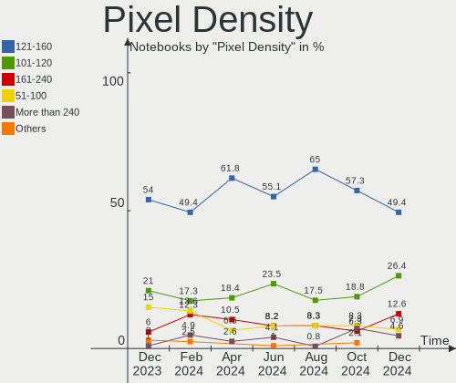

| Density       | Notebooks | Percent |
|---------------|-----------|---------|
| 121-160       | 52        | 52%     |
| 101-120       | 25        | 25%     |
| 51-100        | 11        | 11%     |
| 161-240       | 6         | 6%      |
| More than 240 | 4         | 4%      |
| 1-50          | 2         | 2%      |

Multiple Monitors
-----------------

Total monitors connected

| Total | Notebooks | Percent |
|-------|-----------|---------|
| 1     | 77        | 85.56%  |
| 2     | 12        | 13.33%  |
| 0     | 1         | 1.11%   |

Network
-------

Net Controller Vendor
---------------------

Controller vendors

| Vendor                        | Notebooks | Percent |
|-------------------------------|-----------|---------|
| Realtek Semiconductor         | 57        | 38.26%  |
| Intel                         | 47        | 31.54%  |
| Qualcomm Atheros              | 16        | 10.74%  |
| MediaTek                      | 9         | 6.04%   |
| Broadcom                      | 5         | 3.36%   |
| TP-Link                       | 4         | 2.68%   |
| Samsung Electronics           | 2         | 1.34%   |
| ICS Advent                    | 2         | 1.34%   |
| Broadcom Limited              | 2         | 1.34%   |
| Ralink Technology             | 1         | 0.67%   |
| OPPO Electronics              | 1         | 0.67%   |
| OnePlus Technology (Shenzhen) | 1         | 0.67%   |
| Motorola PCS                  | 1         | 0.67%   |
| DisplayLink                   | 1         | 0.67%   |

Net Controller Model
--------------------

Controller models

| Model                                                             | Notebooks | Percent |
|-------------------------------------------------------------------|-----------|---------|
| Realtek RTL8111/8168/8411 PCI Express Gigabit Ethernet Controller | 39        | 23.08%  |
| Intel Alder Lake-P PCH CNVi WiFi                                  | 10        | 5.92%   |
| Intel Wi-Fi 6 AX201                                               | 9         | 5.33%   |
| Qualcomm Atheros QCA9377 802.11ac Wireless Network Adapter        | 8         | 4.73%   |
| Realtek RTL810xE PCI Express Fast Ethernet controller             | 7         | 4.14%   |
| MediaTek MT7921 802.11ax PCI Express Wireless Network Adapter     | 7         | 4.14%   |
| Intel Ice Lake-LP PCH CNVi WiFi                                   | 5         | 2.96%   |
| Realtek RTL8852BE PCIe 802.11ax Wireless Network Controller       | 4         | 2.37%   |
| Realtek Killer E2600 Gigabit Ethernet Controller                  | 4         | 2.37%   |
| Realtek RTL8822CE 802.11ac PCIe Wireless Network Adapter          | 3         | 1.78%   |
| Intel Cannon Point-LP CNVi [Wireless-AC]                          | 3         | 1.78%   |
| Intel Cannon Lake PCH CNVi WiFi                                   | 3         | 1.78%   |
| Realtek RTL8852AE 802.11ax PCIe Wireless Network Adapter          | 2         | 1.18%   |
| Realtek RTL8723BE PCIe Wireless Network Adapter                   | 2         | 1.18%   |
| Realtek RTL8153 Gigabit Ethernet Adapter                          | 2         | 1.18%   |
| Qualcomm Atheros QCA6174 802.11ac Wireless Network Adapter        | 2         | 1.18%   |
| Qualcomm Atheros AR9485 Wireless Network Adapter                  | 2         | 1.18%   |
| Qualcomm Atheros AR8162 Fast Ethernet                             | 2         | 1.18%   |
| Intel Wireless 8265 / 8275                                        | 2         | 1.18%   |
| Intel Wireless 8260                                               | 2         | 1.18%   |
| Intel Tiger Lake PCH CNVi WiFi                                    | 2         | 1.18%   |
| Intel Ethernet Connection (6) I219-LM                             | 2         | 1.18%   |
| Intel Ethernet Connection (16) I219-V                             | 2         | 1.18%   |
| ICS Advent 10/100M LAN                                            | 2         | 1.18%   |
| Broadcom NetXtreme BCM57765 Gigabit Ethernet PCIe                 | 2         | 1.18%   |
| Broadcom BCM4331 802.11a/b/g/n                                    | 2         | 1.18%   |
| Broadcom BCM4313 802.11bgn Wireless Network Adapter               | 2         | 1.18%   |
| TP-Link UE300 10/100/1000 LAN (ethernet mode) [Realtek RTL8153]   | 1         | 0.59%   |
| TP-Link TL-WN822N Version 4 RTL8192EU                             | 1         | 0.59%   |
| TP-Link Archer T3U [Realtek RTL8812BU]                            | 1         | 0.59%   |
| TP-Link Archer T2U PLUS [RTL8821AU]                               | 1         | 0.59%   |
| Samsung GT-I9070 (network tethering, USB debugging enabled)       | 1         | 0.59%   |
| Samsung Galaxy series, misc. (tethering mode)                     | 1         | 0.59%   |
| Realtek RTL8723AE PCIe Wireless Network Adapter                   | 1         | 0.59%   |
| Realtek RTL8188FTV 802.11b/g/n 1T1R 2.4G WLAN Adapter             | 1         | 0.59%   |
| Realtek RTL8188CE 802.11b/g/n WiFi Adapter                        | 1         | 0.59%   |
| Realtek RTL8125 2.5GbE Controller                                 | 1         | 0.59%   |
| Ralink RT5370 Wireless Adapter                                    | 1         | 0.59%   |
| Qualcomm Atheros QCA9565 / AR9565 Wireless Network Adapter        | 1         | 0.59%   |
| Qualcomm Atheros QCA6164 802.11ac Wireless Network Adapter        | 1         | 0.59%   |

Wireless Vendor
---------------

Wireless vendors

| Vendor                | Notebooks | Percent |
|-----------------------|-----------|---------|
| Intel                 | 46        | 49.46%  |
| Realtek Semiconductor | 14        | 15.05%  |
| Qualcomm Atheros      | 14        | 15.05%  |
| MediaTek              | 9         | 9.68%   |
| Broadcom              | 4         | 4.3%    |
| TP-Link               | 3         | 3.23%   |
| Broadcom Limited      | 2         | 2.15%   |
| Ralink Technology     | 1         | 1.08%   |

Wireless Model
--------------

Wireless models

| Model                                                         | Notebooks | Percent |
|---------------------------------------------------------------|-----------|---------|
| Intel Alder Lake-P PCH CNVi WiFi                              | 10        | 10.75%  |
| Intel Wi-Fi 6 AX201                                           | 9         | 9.68%   |
| Qualcomm Atheros QCA9377 802.11ac Wireless Network Adapter    | 8         | 8.6%    |
| MediaTek MT7921 802.11ax PCI Express Wireless Network Adapter | 7         | 7.53%   |
| Intel Ice Lake-LP PCH CNVi WiFi                               | 5         | 5.38%   |
| Realtek RTL8852BE PCIe 802.11ax Wireless Network Controller   | 4         | 4.3%    |
| Realtek RTL8822CE 802.11ac PCIe Wireless Network Adapter      | 3         | 3.23%   |
| Intel Cannon Point-LP CNVi [Wireless-AC]                      | 3         | 3.23%   |
| Intel Cannon Lake PCH CNVi WiFi                               | 3         | 3.23%   |
| Realtek RTL8852AE 802.11ax PCIe Wireless Network Adapter      | 2         | 2.15%   |
| Realtek RTL8723BE PCIe Wireless Network Adapter               | 2         | 2.15%   |
| Qualcomm Atheros QCA6174 802.11ac Wireless Network Adapter    | 2         | 2.15%   |
| Qualcomm Atheros AR9485 Wireless Network Adapter              | 2         | 2.15%   |
| Intel Wireless 8265 / 8275                                    | 2         | 2.15%   |
| Intel Wireless 8260                                           | 2         | 2.15%   |
| Intel Tiger Lake PCH CNVi WiFi                                | 2         | 2.15%   |
| Broadcom BCM4331 802.11a/b/g/n                                | 2         | 2.15%   |
| Broadcom BCM4313 802.11bgn Wireless Network Adapter           | 2         | 2.15%   |
| TP-Link TL-WN822N Version 4 RTL8192EU                         | 1         | 1.08%   |
| TP-Link Archer T3U [Realtek RTL8812BU]                        | 1         | 1.08%   |
| TP-Link Archer T2U PLUS [RTL8821AU]                           | 1         | 1.08%   |
| Realtek RTL8723AE PCIe Wireless Network Adapter               | 1         | 1.08%   |
| Realtek RTL8188FTV 802.11b/g/n 1T1R 2.4G WLAN Adapter         | 1         | 1.08%   |
| Realtek RTL8188CE 802.11b/g/n WiFi Adapter                    | 1         | 1.08%   |
| Ralink RT5370 Wireless Adapter                                | 1         | 1.08%   |
| Qualcomm Atheros QCA9565 / AR9565 Wireless Network Adapter    | 1         | 1.08%   |
| Qualcomm Atheros QCA6164 802.11ac Wireless Network Adapter    | 1         | 1.08%   |
| MediaTek Wi-Fi 6E MT7902 Wireless Network Adapter             | 1         | 1.08%   |
| MediaTek MT7922 802.11ax PCI Express Wireless Network Adapter | 1         | 1.08%   |
| Intel Wireless 3165                                           | 1         | 1.08%   |
| Intel Wireless 3160                                           | 1         | 1.08%   |
| Intel Wi-Fi 6 AX210/AX211/AX411 160MHz                        | 1         | 1.08%   |
| Intel Wi-Fi 6 AX201 160MHz                                    | 1         | 1.08%   |
| Intel Wi-Fi 6 AX200                                           | 1         | 1.08%   |
| Intel Dual Band Wireless-AC 3168NGW [Stone Peak]              | 1         | 1.08%   |
| Intel Comet Lake PCH-LP CNVi WiFi                             | 1         | 1.08%   |
| Intel Comet Lake PCH CNVi WiFi                                | 1         | 1.08%   |
| Intel Centrino Advanced-N 6200                                | 1         | 1.08%   |
| Intel Centrino Advanced-N + WiMAX 6250 [Kilmer Peak]          | 1         | 1.08%   |
| Broadcom Limited BCM4360 802.11ac Wireless Network Adapter    | 1         | 1.08%   |

Ethernet Vendor
---------------

Ethernet vendors

| Vendor                        | Notebooks | Percent |
|-------------------------------|-----------|---------|
| Realtek Semiconductor         | 53        | 71.62%  |
| Intel                         | 7         | 9.46%   |
| Broadcom                      | 3         | 4.05%   |
| Samsung Electronics           | 2         | 2.7%    |
| Qualcomm Atheros              | 2         | 2.7%    |
| ICS Advent                    | 2         | 2.7%    |
| TP-Link                       | 1         | 1.35%   |
| OPPO Electronics              | 1         | 1.35%   |
| OnePlus Technology (Shenzhen) | 1         | 1.35%   |
| MediaTek                      | 1         | 1.35%   |
| DisplayLink                   | 1         | 1.35%   |

Ethernet Model
--------------

Ethernet models

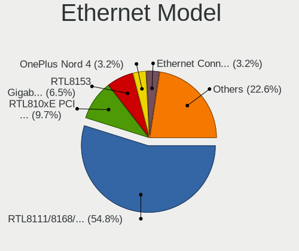

| Model                                                             | Notebooks | Percent |
|-------------------------------------------------------------------|-----------|---------|
| Realtek RTL8111/8168/8411 PCI Express Gigabit Ethernet Controller | 39        | 52%     |
| Realtek RTL810xE PCI Express Fast Ethernet controller             | 7         | 9.33%   |
| Realtek Killer E2600 Gigabit Ethernet Controller                  | 4         | 5.33%   |
| Realtek RTL8153 Gigabit Ethernet Adapter                          | 2         | 2.67%   |
| Qualcomm Atheros AR8162 Fast Ethernet                             | 2         | 2.67%   |
| Intel Ethernet Connection (6) I219-LM                             | 2         | 2.67%   |
| Intel Ethernet Connection (16) I219-V                             | 2         | 2.67%   |
| ICS Advent 10/100M LAN                                            | 2         | 2.67%   |
| Broadcom NetXtreme BCM57765 Gigabit Ethernet PCIe                 | 2         | 2.67%   |
| TP-Link UE300 10/100/1000 LAN (ethernet mode) [Realtek RTL8153]   | 1         | 1.33%   |
| Samsung GT-I9070 (network tethering, USB debugging enabled)       | 1         | 1.33%   |
| Samsung Galaxy series, misc. (tethering mode)                     | 1         | 1.33%   |
| Realtek RTL8125 2.5GbE Controller                                 | 1         | 1.33%   |
| OPPO 8                                                            | 1         | 1.33%   |
| OnePlus (Shenzhen) OnePlus                                        | 1         | 1.33%   |
| MediaTek Infinix SMART 6 HD                                       | 1         | 1.33%   |
| Intel WiMAX Connection 2400m                                      | 1         | 1.33%   |
| Intel Ethernet Connection I219-LM                                 | 1         | 1.33%   |
| Intel Ethernet Connection (16) I219-LM                            | 1         | 1.33%   |
| Intel 82579LM Gigabit Network Connection (Lewisville)             | 1         | 1.33%   |
| DisplayLink Dell D3100 Docking Station                            | 1         | 1.33%   |
| Broadcom NetLink BCM57785 Gigabit Ethernet PCIe                   | 1         | 1.33%   |

Net Controller Kind
-------------------

Ethernet, WiFi or modem

| Kind     | Notebooks | Percent |
|----------|-----------|---------|
| WiFi     | 90        | 55.21%  |
| Ethernet | 72        | 44.17%  |
| Unknown  | 1         | 0.61%   |

Used Controller
---------------

Currently used network controller

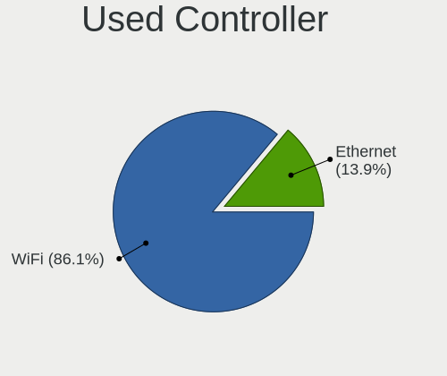

| Kind     | Notebooks | Percent |
|----------|-----------|---------|
| WiFi     | 77        | 83.7%   |
| Ethernet | 15        | 16.3%   |

NICs
----

Total network controllers on board

| Total | Notebooks | Percent |
|-------|-----------|---------|
| 2     | 62        | 68.89%  |
| 1     | 26        | 28.89%  |
| 0     | 2         | 2.22%   |

IPv6
----

IPv6 vs IPv4

| Used | Notebooks | Percent |
|------|-----------|---------|
| No   | 47        | 52.22%  |
| Yes  | 43        | 47.78%  |

Bluetooth
---------

Bluetooth Vendor
----------------

Controller vendors

| Vendor                          | Notebooks | Percent |
|---------------------------------|-----------|---------|
| Intel                           | 40        | 49.38%  |
| Realtek Semiconductor           | 11        | 13.58%  |
| Qualcomm Atheros Communications | 10        | 12.35%  |
| IMC Networks                    | 6         | 7.41%   |
| Lite-On Technology              | 5         | 6.17%   |
| Broadcom                        | 3         | 3.7%    |
| Apple                           | 3         | 3.7%    |
| Toshiba                         | 1         | 1.23%   |
| Foxconn / Hon Hai               | 1         | 1.23%   |
| Dell                            | 1         | 1.23%   |

Bluetooth Model
---------------

Controller models

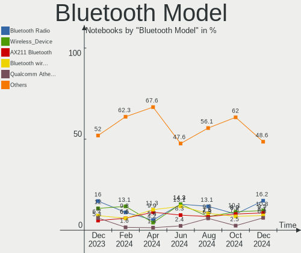

| Model                                          | Notebooks | Percent |
|------------------------------------------------|-----------|---------|
| Intel AX201 Bluetooth                          | 14        | 17.28%  |
| Intel Bluetooth 9460/9560 Jefferson Peak (JfP) | 12        | 14.81%  |
| Realtek Bluetooth Radio                        | 11        | 13.58%  |
| Qualcomm Atheros  Bluetooth Device             | 7         | 8.64%   |
| Intel Bluetooth wireless interface             | 6         | 7.41%   |
| IMC Networks Wireless_Device                   | 6         | 7.41%   |
| Intel Bluetooth Device                         | 5         | 6.17%   |
| Lite-On Wireless_Device                        | 3         | 3.7%    |
| Apple Bluetooth USB Host Controller            | 3         | 3.7%    |
| Qualcomm Atheros QCA61x4 Bluetooth 4.0         | 2         | 2.47%   |
| Lite-On Qualcomm Atheros QCA9377 Bluetooth     | 2         | 2.47%   |
| Toshiba RT Bluetooth Radio                     | 1         | 1.23%   |
| Qualcomm Atheros AR3012 Bluetooth 4.0          | 1         | 1.23%   |
| Intel Wireless-AC 3168 Bluetooth               | 1         | 1.23%   |
| Intel AX210 Bluetooth                          | 1         | 1.23%   |
| Intel AX200 Bluetooth                          | 1         | 1.23%   |
| Foxconn / Hon Hai Broadcom BCM20702 Bluetooth  | 1         | 1.23%   |
| Dell BCM20702A0 Bluetooth Module               | 1         | 1.23%   |
| Broadcom HP Portable Valentine                 | 1         | 1.23%   |
| Broadcom BRCM2070 BT 2.1 + HS USB Module       | 1         | 1.23%   |
| Broadcom BCM20702A0                            | 1         | 1.23%   |

Sound
-----

Sound Vendor
------------

Sound card vendors

| Vendor                  | Notebooks | Percent |
|-------------------------|-----------|---------|
| Intel                   | 75        | 66.96%  |
| Nvidia                  | 18        | 16.07%  |
| AMD                     | 14        | 12.5%   |
| ASUSTek Computer        | 2         | 1.79%   |
| YSTEK Technology        | 1         | 0.89%   |
| C-Media Electronics     | 1         | 0.89%   |
| BEHRINGER International | 1         | 0.89%   |

Sound Model
-----------

Sound card models

| Model                                                                      | Notebooks | Percent |
|----------------------------------------------------------------------------|-----------|---------|
| Intel Alder Lake PCH-P High Definition Audio Controller                    | 12        | 9.3%    |
| AMD Family 17h/19h HD Audio Controller                                     | 12        | 9.3%    |
| Intel Tiger Lake-LP Smart Sound Technology Audio Controller                | 11        | 8.53%   |
| Intel Sunrise Point-LP HD Audio                                            | 11        | 8.53%   |
| Intel 7 Series/C216 Chipset Family High Definition Audio Controller        | 9         | 6.98%   |
| Nvidia TU107 GeForce GTX 1650 High Definition Audio Controller             | 8         | 6.2%    |
| Intel Ice Lake-LP Smart Sound Technology Audio Controller                  | 6         | 4.65%   |
| Nvidia Audio device                                                        | 4         | 3.1%    |
| Intel Cannon Point-LP High Definition Audio Controller                     | 4         | 3.1%    |
| Intel Cannon Lake PCH cAVS                                                 | 4         | 3.1%    |
| AMD Raven/Raven2/Fenghuang HDMI/DP Audio Controller                        | 4         | 3.1%    |
| Nvidia GF108 High Definition Audio Controller                              | 3         | 2.33%   |
| Nvidia GA106 High Definition Audio Controller                              | 3         | 2.33%   |
| Intel Wildcat Point-LP High Definition Audio Controller                    | 3         | 2.33%   |
| Intel Tiger Lake-H HD Audio Controller                                     | 3         | 2.33%   |
| Intel Comet Lake PCH cAVS                                                  | 3         | 2.33%   |
| Intel Broadwell-U Audio Controller                                         | 3         | 2.33%   |
| AMD Renoir Radeon High Definition Audio Controller                         | 3         | 2.33%   |
| AMD Rembrandt Radeon High Definition Audio Controller                      | 3         | 2.33%   |
| Intel Haswell-ULT HD Audio Controller                                      | 2         | 1.55%   |
| Intel 8 Series HD Audio Controller                                         | 2         | 1.55%   |
| Intel 6 Series/C200 Series Chipset Family High Definition Audio Controller | 2         | 1.55%   |
| ASUSTek Computer C-Media Audio                                             | 2         | 1.55%   |
| AMD High Definition Audio Controller                                       | 2         | 1.55%   |
| AMD Family 15h (Models 60h-6fh) Audio Controller                           | 2         | 1.55%   |
| YSTEK Technology USB-UAC AP                                                | 1         | 0.78%   |
| Intel Raptor Lake-P/U/H cAVS                                               | 1         | 0.78%   |
| Intel Jasper Lake HD Audio                                                 | 1         | 0.78%   |
| Intel Comet Lake PCH-LP cAVS                                               | 1         | 0.78%   |
| Intel CM238 HD Audio Controller                                            | 1         | 0.78%   |
| Intel 5 Series/3400 Series Chipset High Definition Audio                   | 1         | 0.78%   |
| C-Media Electronics Audio Adapter (Unitek Y-247A)                          | 1         | 0.78%   |
| BEHRINGER International UMC404HD 192k                                      | 1         | 0.78%   |

Memory
------

Memory Vendor
-------------

Memory module vendors

| Vendor              | Notebooks | Percent |
|---------------------|-----------|---------|
| Samsung Electronics | 24        | 32.88%  |
| SK hynix            | 15        | 20.55%  |
| Micron Technology   | 12        | 16.44%  |
| Kingston            | 7         | 9.59%   |
| Crucial             | 4         | 5.48%   |
| Ramaxel Technology  | 3         | 4.11%   |
| Transcend           | 2         | 2.74%   |
| A-DATA Technology   | 2         | 2.74%   |
| Unknown (0x0CDC)    | 1         | 1.37%   |
| Silicon Power       | 1         | 1.37%   |
| Elpida              | 1         | 1.37%   |
| Unknown             | 1         | 1.37%   |

Memory Model
------------

Memory module models

| Model                                                             | Notebooks | Percent |
|-------------------------------------------------------------------|-----------|---------|
| Samsung RAM M471A1K43EB1-CWE 8GB SODIMM DDR4 3200MT/s             | 4         | 5.19%   |
| Micron RAM 8ATF1G64HZ-3G2R1 8GB SODIMM DDR4 3200MT/s              | 4         | 5.19%   |
| SK hynix RAM HMAA1GS6CJR6N-XN 8GB SODIMM DDR4 3200MT/s            | 2         | 2.6%    |
| SK hynix RAM HMA851S6AFR6N-UH 4GB SODIMM DDR4 2667MT/s            | 2         | 2.6%    |
| Samsung RAM M471A5244CB0-CTD 4GB Row Of Chips DDR4 2667MT/s       | 2         | 2.6%    |
| Samsung RAM M471A1G44BB0-CWE 8GB SODIMM DDR4 3200MT/s             | 2         | 2.6%    |
| Samsung RAM M425R1GB4BB0-CQKOL 8GB SODIMM DDR5 4800MT/s           | 2         | 2.6%    |
| Micron RAM 4ATF51264HZ-2G3B1 4GB SODIMM DDR4 3200MT/s             | 2         | 2.6%    |
| Kingston RAM ACR32D4S2S1ME-8 8GB SODIMM DDR4 3200MT/s             | 2         | 2.6%    |
| Unknown (0x0CDC) RAM ZH4G6S8DXN 8GB SODIMM DDR4 3200MT/s          | 1         | 1.3%    |
| Transcend RAM TS256MSK64W6N 2GB SODIMM DDR3 1600MT/s              | 1         | 1.3%    |
| Transcend RAM Module 8GB SODIMM DDR3 1333MT/s                     | 1         | 1.3%    |
| SK hynix RAM HMT451S6BFR8A-PB 4GB SODIMM DDR3 1600MT/s            | 1         | 1.3%    |
| SK hynix RAM HMAA1GS6CJR6N-XN 8GB Row Of Chips DDR4 3200MT/s      | 1         | 1.3%    |
| SK hynix RAM HMA851S6DJR6N-XN 4GB SODIMM DDR4 3200MT/s            | 1         | 1.3%    |
| SK hynix RAM HMA82GS6DJR8N-XN 16GB SODIMM DDR4 3200MT/s           | 1         | 1.3%    |
| SK hynix RAM HMA82GS6AFR8N-UH 16GB SODIMM DDR4 2667MT/s           | 1         | 1.3%    |
| SK hynix RAM HMA81GS6JJR8N-VK 8GB SODIMM DDR4 2667MT/s            | 1         | 1.3%    |
| SK hynix RAM HMA81GS6DJR8N-XN 8GB SODIMM DDR4 3200MT/s            | 1         | 1.3%    |
| SK hynix RAM HMA81GS6DJR8N-XN 8192MB SODIMM DDR4 3200MT/s         | 1         | 1.3%    |
| SK hynix RAM HMA81GS6CJR8N-VK 8GB SODIMM DDR4 2667MT/s            | 1         | 1.3%    |
| SK hynix RAM HMA41GS6AFR8N-TF 8GB SODIMM DDR4 2667MT/s            | 1         | 1.3%    |
| SK hynix RAM H9JCNNNCP3MLYR-N6E 4GB SODIMM LPDDR5 6400MT/s        | 1         | 1.3%    |
| Silicon Power RAM SP008GBSFU266B02 8192MB SODIMM DDR4 2667MT/s    | 1         | 1.3%    |
| Samsung RAM U5H504AM-JGCR 1GB Row Of Chips LPDDR4 4267MT/s        | 1         | 1.3%    |
| Samsung RAM MT53E1G32D4NQ-046WTE 4GB Row Of Chips LPDDR4 3200MT/s | 1         | 1.3%    |
| Samsung RAM Module 8GB SODIMM DDR4 2133MT/s                       | 1         | 1.3%    |
| Samsung RAM M471B5773DH0-CK0 2GB SODIMM DDR3 1600MT/s             | 1         | 1.3%    |
| Samsung RAM M471B5273DH0-CH9 4GB SODIMM DDR3 1334MT/s             | 1         | 1.3%    |
| Samsung RAM M471A5244CB0-CWE 4GB SODIMM DDR4 3200MT/s             | 1         | 1.3%    |
| Samsung RAM M471A5244CB0-CTD 4GB SODIMM DDR4 3266MT/s             | 1         | 1.3%    |
| Samsung RAM M471A5244CB0-CRC 4GB SODIMM DDR4 2667MT/s             | 1         | 1.3%    |
| Samsung RAM M471A5244BB0-CWE 4GB SODIMM DDR4 3200MT/s             | 1         | 1.3%    |
| Samsung RAM M471A5143DB0-CPB 4GB SODIMM DDR4 2133MT/s             | 1         | 1.3%    |
| Samsung RAM M471A2K43BB1-CRC 16GB SODIMM DDR4 2400MT/s            | 1         | 1.3%    |
| Samsung RAM M471A1K43DB1-CTD 8GB SODIMM DDR4 2667MT/s             | 1         | 1.3%    |
| Samsung RAM M471A1G44AB0-CWE 8GB Row Of Chips DDR4 3200MT/s       | 1         | 1.3%    |
| Samsung RAM M425R2GA3BB0-CQKOL 16GB SODIMM DDR5 4800MT/s          | 1         | 1.3%    |
| Samsung RAM K4UBE3D4AA-MGCR 2GB Row Of Chips LPDDR4 4267MT/s      | 1         | 1.3%    |
| Samsung RAM K3LKBKB0BM-MGCP 4GB Row Of Chips LPDDR5 6400MT/s      | 1         | 1.3%    |

Memory Kind
-----------

Memory module kinds

| Kind   | Notebooks | Percent |
|--------|-----------|---------|
| DDR4   | 40        | 65.57%  |
| DDR3   | 9         | 14.75%  |
| LPDDR4 | 7         | 11.48%  |
| DDR5   | 3         | 4.92%   |
| LPDDR5 | 2         | 3.28%   |

Memory Form Factor
------------------

Physical design of the memory module

| Name         | Notebooks | Percent |
|--------------|-----------|---------|
| SODIMM       | 51        | 82.26%  |
| Row Of Chips | 10        | 16.13%  |
| DIMM         | 1         | 1.61%   |

Memory Size
-----------

Memory module size

| Size  | Notebooks | Percent |
|-------|-----------|---------|
| 8192  | 36        | 55.38%  |
| 4096  | 16        | 24.62%  |
| 16384 | 7         | 10.77%  |
| 2048  | 3         | 4.62%   |
| 32768 | 2         | 3.08%   |
| 1024  | 1         | 1.54%   |

Memory Speed
------------

Memory module speed

| Speed | Notebooks | Percent |
|-------|-----------|---------|
| 3200  | 26        | 40%     |
| 2667  | 15        | 23.08%  |
| 1600  | 5         | 7.69%   |
| 2400  | 4         | 6.15%   |
| 4800  | 3         | 4.62%   |
| 4267  | 3         | 4.62%   |
| 6400  | 2         | 3.08%   |
| 2133  | 2         | 3.08%   |
| 1334  | 2         | 3.08%   |
| 1333  | 2         | 3.08%   |
| 3266  | 1         | 1.54%   |

Printers & scanners
-------------------

Printer Vendor
--------------

Printer device vendors

Zero info for selected period =(

Printer Model
-------------

Printer device models

Zero info for selected period =(

Scanner Vendor
--------------

Scanner device vendors

Zero info for selected period =(

Scanner Model
-------------

Scanner device models

Zero info for selected period =(

Camera
------

Camera Vendor
-------------

Camera device vendors

| Vendor                                 | Notebooks | Percent |
|----------------------------------------|-----------|---------|
| Chicony Electronics                    | 12        | 14.81%  |
| IMC Networks                           | 11        | 13.58%  |
| Quanta                                 | 9         | 11.11%  |
| Microdia                               | 8         | 9.88%   |
| Realtek Semiconductor                  | 7         | 8.64%   |
| Cheng Uei Precision Industry (Foxlink) | 6         | 7.41%   |
| Sunplus Innovation Technology          | 4         | 4.94%   |
| Sonix Technology                       | 4         | 4.94%   |
| Luxvisions Innotech Limited            | 4         | 4.94%   |
| Syntek                                 | 3         | 3.7%    |
| Lite-On Technology                     | 3         | 3.7%    |
| Bison Electronics                      | 3         | 3.7%    |
| Apple                                  | 2         | 2.47%   |
| Suyin                                  | 1         | 1.23%   |
| ShineOptics                            | 1         | 1.23%   |
| Shenzhen Kingcome Optoelectronic       | 1         | 1.23%   |
| Importek                               | 1         | 1.23%   |
| Alcor Micro                            | 1         | 1.23%   |

Camera Model
------------

Camera device models

| Model                                                                      | Notebooks | Percent |
|----------------------------------------------------------------------------|-----------|---------|
| IMC Networks USB2.0 HD UVC WebCam                                          | 6         | 7.41%   |
| Realtek Integrated_Webcam_HD                                               | 4         | 4.94%   |
| Microdia Integrated_Webcam_HD                                              | 4         | 4.94%   |
| IMC Networks Integrated Camera                                             | 4         | 4.94%   |
| Chicony Integrated Camera                                                  | 4         | 4.94%   |
| Sunplus HD WebCam                                                          | 3         | 3.7%    |
| Sonix USB2.0 HD UVC WebCam                                                 | 3         | 3.7%    |
| Quanta HD User Facing                                                      | 3         | 3.7%    |
| Quanta ACER HD User Facing                                                 | 3         | 3.7%    |
| Microdia USB 2.0 Camera                                                    | 3         | 3.7%    |
| Luxvisions Innotech Limited HP TrueVision HD Camera                        | 3         | 3.7%    |
| Syntek Lenovo EasyCamera                                                   | 2         | 2.47%   |
| Chicony HP Truevision HD camera                                            | 2         | 2.47%   |
| Chicony HD User Facing                                                     | 2         | 2.47%   |
| Chicony EasyCamera                                                         | 2         | 2.47%   |
| Cheng Uei Precision Industry (Foxlink) XiaoMi USB 2.0 Webcam               | 2         | 2.47%   |
| Cheng Uei Precision Industry (Foxlink) HP Wide Vision HD integrated webcam | 2         | 2.47%   |
| Bison Integrated Camera                                                    | 2         | 2.47%   |
| Apple FaceTime HD Camera                                                   | 2         | 2.47%   |
| Syntek Integrated Camera                                                   | 1         | 1.23%   |
| Suyin HP Truevision HD                                                     | 1         | 1.23%   |
| Sunplus XiaoMi USB 2.0 Webcam                                              | 1         | 1.23%   |
| Sonix USB2.0 FHD UVC WebCam                                                | 1         | 1.23%   |
| ShineOptics HD Camera                                                      | 1         | 1.23%   |
| Shenzhen Kingcome Optoelectronic 720p HD Camera                            | 1         | 1.23%   |
| Realtek Integrated Webcam                                                  | 1         | 1.23%   |
| Realtek HP Truevision HD                                                   | 1         | 1.23%   |
| Realtek HD WebCam                                                          | 1         | 1.23%   |
| Quanta USB2.0 HD UVC WebCam                                                | 1         | 1.23%   |
| Quanta Laptop_Integrated_Webcam_2HDM                                       | 1         | 1.23%   |
| Quanta HP Wide Vision HD Camera                                            | 1         | 1.23%   |
| Microdia Lenovo EasyCamera                                                 | 1         | 1.23%   |
| Luxvisions Innotech Limited HP Wide Vision HD Camera                       | 1         | 1.23%   |
| Lite-On Integrated Camera                                                  | 1         | 1.23%   |
| Lite-On HP HD Webcam                                                       | 1         | 1.23%   |
| Lite-On HP HD Camera                                                       | 1         | 1.23%   |
| Importek TOSHIBA Web Camera                                                | 1         | 1.23%   |
| IMC Networks XiaoMi Webcam                                                 | 1         | 1.23%   |
| Chicony ThinkPad T490 Webcam                                               | 1         | 1.23%   |
| Chicony HP TrueVision HD                                                   | 1         | 1.23%   |

Security
--------

Fingerprint Vendor
------------------

Fingerprint sensor vendors

| Vendor                             | Notebooks | Percent |
|------------------------------------|-----------|---------|
| Validity Sensors                   | 4         | 28.57%  |
| Realtek USB2.0 Finger Print Bridge | 3         | 21.43%  |
| Elan Microelectronics              | 3         | 21.43%  |
| Shenzhen Goodix Technology         | 2         | 14.29%  |
| Upek                               | 1         | 7.14%   |
| Synaptics                          | 1         | 7.14%   |

Fingerprint Model
-----------------

Fingerprint sensor models

| Model                                                           | Notebooks | Percent |
|-----------------------------------------------------------------|-----------|---------|
| Realtek USB2.0 Finger Print Bridge FocalTech Fingerprint Device | 3         | 21.43%  |
| Validity Sensors VFS495 Fingerprint Reader                      | 2         | 14.29%  |
| Elan ELAN:ARM-M4                                                | 2         | 14.29%  |
| Validity Sensors VFS Fingerprint sensor                         | 1         | 7.14%   |
| Validity Sensors Swipe Fingerprint Sensor                       | 1         | 7.14%   |
| Upek Biometric Touchchip/Touchstrip Fingerprint Sensor          | 1         | 7.14%   |
| Synaptics Prometheus MIS Touch Fingerprint Reader               | 1         | 7.14%   |
| Shenzhen Goodix  FingerPrint Device                             | 1         | 7.14%   |
| Shenzhen Goodix Fingerprint Reader                              | 1         | 7.14%   |
| Elan ELAN:Fingerprint                                           | 1         | 7.14%   |

Chipcard Vendor
---------------

Chipcard module vendors

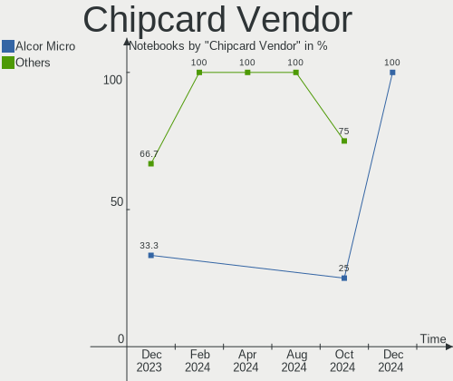

| Vendor     | Notebooks | Percent |
|------------|-----------|---------|
| Broadcom   | 2         | 66.67%  |
| Yubico.com | 1         | 33.33%  |

Chipcard Model
--------------

Chipcard module models

| Model                                                                        | Notebooks | Percent |
|------------------------------------------------------------------------------|-----------|---------|
| Yubico.com Yubikey 4/5 U2F+CCID                                              | 1         | 33.33%  |
| Broadcom BCM5880 Secure Applications Processor with fingerprint swipe sensor | 1         | 33.33%  |
| Broadcom 58200                                                               | 1         | 33.33%  |

Unsupported
-----------

Unsupported Devices
-------------------

Total unsupported devices on board

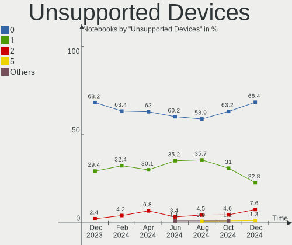

| Total | Notebooks | Percent |
|-------|-----------|---------|
| 0     | 57        | 63.33%  |
| 1     | 30        | 33.33%  |
| 2     | 3         | 3.33%   |

Unsupported Device Types
------------------------

Types of unsupported devices

| Type                     | Notebooks | Percent |
|--------------------------|-----------|---------|
| Fingerprint reader       | 14        | 38.89%  |
| Graphics card            | 8         | 22.22%  |
| Net/wireless             | 6         | 16.67%  |
| Camera                   | 3         | 8.33%   |
| Multimedia controller    | 2         | 5.56%   |
| Net/ethernet             | 1         | 2.78%   |
| Communication controller | 1         | 2.78%   |
| Chipcard                 | 1         | 2.78%   |

