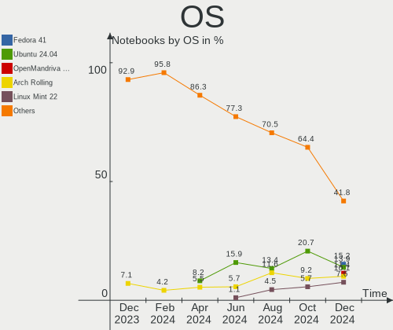
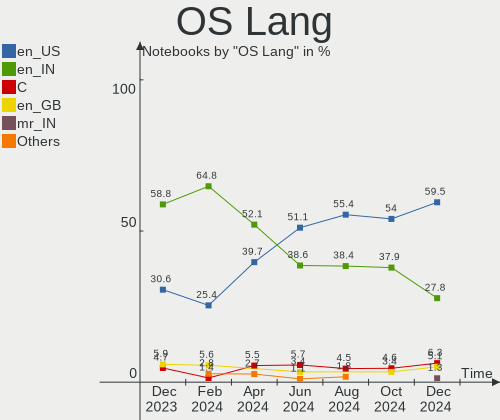
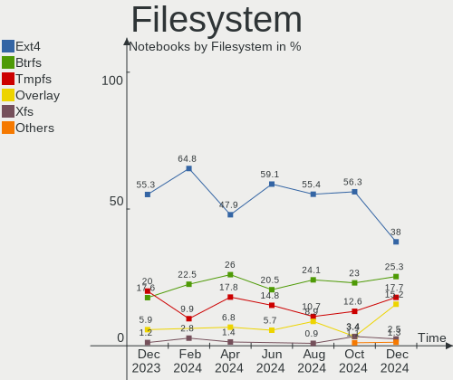
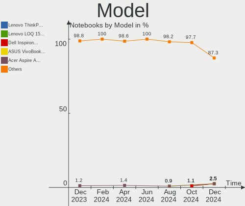
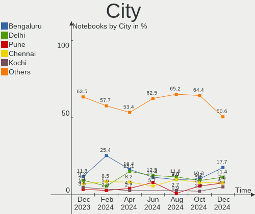
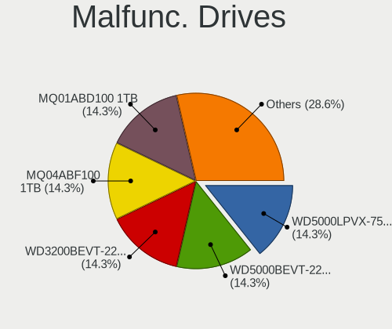
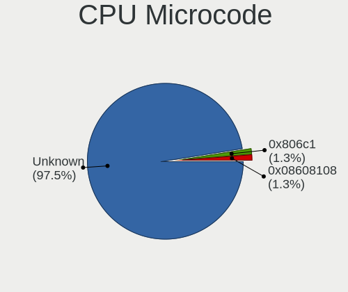
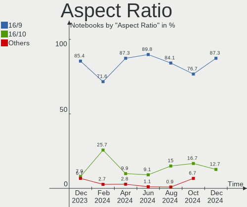
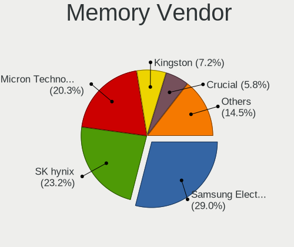
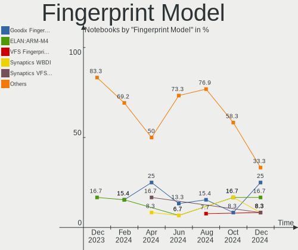

Linux in India - Hardware Trends (Notebooks)
--------------------------------------------

A project to identify most popular hardware characteristics and track their change
over time based on data collected by Linux users at https://Linux-Hardware.org.

Anyone can contribute to this report by the [hw-probe](https://github.com/linuxhw/hw-probe) tool:

    sudo -E hw-probe -all -upload

Period: Jan, 2023.

Contents
--------

* [ System ](#system)
  - [ OS                       ](#os)
  - [ OS Family                ](#os-family)
  - [ Kernel                   ](#kernel)
  - [ Kernel Family            ](#kernel-family)
  - [ Kernel Major Ver.        ](#kernel-major-ver)
  - [ Arch                     ](#arch)
  - [ DE                       ](#de)
  - [ Display Server           ](#display-server)
  - [ Display Manager          ](#display-manager)
  - [ OS Lang                  ](#os-lang)
  - [ Boot Mode                ](#boot-mode)
  - [ Filesystem               ](#filesystem)
  - [ Part. scheme             ](#part-scheme)
  - [ Dual Boot with Linux/BSD ](#dual-boot-with-linuxbsd)
  - [ Dual Boot (Win)          ](#dual-boot-win)

* [ Board ](#board)
  - [ Vendor                   ](#vendor)
  - [ Model                    ](#model)
  - [ Model Family             ](#model-family)
  - [ MFG Year                 ](#mfg-year)
  - [ Form Factor              ](#form-factor)
  - [ Secure Boot              ](#secure-boot)
  - [ Coreboot                 ](#coreboot)
  - [ RAM Size                 ](#ram-size)
  - [ RAM Used                 ](#ram-used)
  - [ Total Drives             ](#total-drives)
  - [ Has CD-ROM               ](#has-cd-rom)
  - [ Has Ethernet             ](#has-ethernet)
  - [ Has WiFi                 ](#has-wifi)
  - [ Has Bluetooth            ](#has-bluetooth)

* [ Location ](#location)
  - [ Country                  ](#country)
  - [ City                     ](#city)

* [ Drives ](#drives)
  - [ Drive Vendor             ](#drive-vendor)
  - [ Drive Model              ](#drive-model)
  - [ HDD Vendor               ](#hdd-vendor)
  - [ SSD Vendor               ](#ssd-vendor)
  - [ Drive Kind               ](#drive-kind)
  - [ Drive Connector          ](#drive-connector)
  - [ Drive Size               ](#drive-size)
  - [ Space Total              ](#space-total)
  - [ Space Used               ](#space-used)
  - [ Malfunc. Drives          ](#malfunc-drives)
  - [ Malfunc. Drive Vendor    ](#malfunc-drive-vendor)
  - [ Malfunc. HDD Vendor      ](#malfunc-hdd-vendor)
  - [ Malfunc. Drive Kind      ](#malfunc-drive-kind)
  - [ Failed Drives            ](#failed-drives)
  - [ Failed Drive Vendor      ](#failed-drive-vendor)
  - [ Drive Status             ](#drive-status)

* [ Storage controller ](#storage-controller)
  - [ Storage Vendor           ](#storage-vendor)
  - [ Storage Model            ](#storage-model)
  - [ Storage Kind             ](#storage-kind)

* [ Processor ](#processor)
  - [ CPU Vendor               ](#cpu-vendor)
  - [ CPU Model                ](#cpu-model)
  - [ CPU Model Family         ](#cpu-model-family)
  - [ CPU Cores                ](#cpu-cores)
  - [ CPU Sockets              ](#cpu-sockets)
  - [ CPU Threads              ](#cpu-threads)
  - [ CPU Op-Modes             ](#cpu-op-modes)
  - [ CPU Microcode            ](#cpu-microcode)
  - [ CPU Microarch            ](#cpu-microarch)

* [ Graphics ](#graphics)
  - [ GPU Vendor               ](#gpu-vendor)
  - [ GPU Model                ](#gpu-model)
  - [ GPU Combo                ](#gpu-combo)
  - [ GPU Driver               ](#gpu-driver)
  - [ GPU Memory               ](#gpu-memory)

* [ Monitor ](#monitor)
  - [ Monitor Vendor           ](#monitor-vendor)
  - [ Monitor Model            ](#monitor-model)
  - [ Monitor Resolution       ](#monitor-resolution)
  - [ Monitor Diagonal         ](#monitor-diagonal)
  - [ Monitor Width            ](#monitor-width)
  - [ Aspect Ratio             ](#aspect-ratio)
  - [ Monitor Area             ](#monitor-area)
  - [ Pixel Density            ](#pixel-density)
  - [ Multiple Monitors        ](#multiple-monitors)

* [ Network ](#network)
  - [ Net Controller Vendor    ](#net-controller-vendor)
  - [ Net Controller Model     ](#net-controller-model)
  - [ Wireless Vendor          ](#wireless-vendor)
  - [ Wireless Model           ](#wireless-model)
  - [ Ethernet Vendor          ](#ethernet-vendor)
  - [ Ethernet Model           ](#ethernet-model)
  - [ Net Controller Kind      ](#net-controller-kind)
  - [ Used Controller          ](#used-controller)
  - [ NICs                     ](#nics)
  - [ IPv6                     ](#ipv6)

* [ Bluetooth ](#bluetooth)
  - [ Bluetooth Vendor         ](#bluetooth-vendor)
  - [ Bluetooth Model          ](#bluetooth-model)

* [ Sound ](#sound)
  - [ Sound Vendor             ](#sound-vendor)
  - [ Sound Model              ](#sound-model)

* [ Memory ](#memory)
  - [ Memory Vendor            ](#memory-vendor)
  - [ Memory Model             ](#memory-model)
  - [ Memory Kind              ](#memory-kind)
  - [ Memory Form Factor       ](#memory-form-factor)
  - [ Memory Size              ](#memory-size)
  - [ Memory Speed             ](#memory-speed)

* [ Printers & scanners ](#printers--scanners)
  - [ Printer Vendor           ](#printer-vendor)
  - [ Printer Model            ](#printer-model)
  - [ Scanner Vendor           ](#scanner-vendor)
  - [ Scanner Model            ](#scanner-model)

* [ Camera ](#camera)
  - [ Camera Vendor            ](#camera-vendor)
  - [ Camera Model             ](#camera-model)

* [ Security ](#security)
  - [ Fingerprint Vendor       ](#fingerprint-vendor)
  - [ Fingerprint Model        ](#fingerprint-model)
  - [ Chipcard Vendor          ](#chipcard-vendor)
  - [ Chipcard Model           ](#chipcard-model)

* [ Unsupported ](#unsupported)
  - [ Unsupported Devices      ](#unsupported-devices)
  - [ Unsupported Device Types ](#unsupported-device-types)

System
------

OS
--

Installed operating systems

| Name               | Notebooks | Percent |
|--------------------|-----------|---------|
| Ubuntu 22.04       | 8         | 14.29%  |
| Fedora 37          | 8         | 14.29%  |
| Ubuntu 22.10       | 6         | 10.71%  |
| OpenMandriva 23.01 | 6         | 10.71%  |
| Pop!_OS 22.04      | 5         | 8.93%   |
| Zorin 16           | 3         | 5.36%   |
| Ubuntu 20.04       | 3         | 5.36%   |
| Linux Mint 21.1    | 3         | 5.36%   |
| Kali 2022.4        | 2         | 3.57%   |
| ArcoLinux Rolling  | 2         | 3.57%   |
| Xubuntu 22.04      | 1         | 1.79%   |
| Xero Rolling       | 1         | 1.79%   |
| OpenMandriva 4.50  | 1         | 1.79%   |
| Manjaro 22.0       | 1         | 1.79%   |
| Linux Mint 21      | 1         | 1.79%   |
| Kubuntu 22.04      | 1         | 1.79%   |
| KDE neon 22.04     | 1         | 1.79%   |
| Fedora 36          | 1         | 1.79%   |
| Debian 11          | 1         | 1.79%   |
| Arch Rolling       | 1         | 1.79%   |

OS Family
---------

OS without a version

| Name         | Notebooks | Percent |
|--------------|-----------|---------|
| Ubuntu       | 17        | 30.36%  |
| Fedora       | 9         | 16.07%  |
| OpenMandriva | 7         | 12.5%   |
| Pop!_OS      | 5         | 8.93%   |
| Linux Mint   | 4         | 7.14%   |
| Zorin        | 3         | 5.36%   |
| Kali         | 2         | 3.57%   |
| ArcoLinux    | 2         | 3.57%   |
| Xubuntu      | 1         | 1.79%   |
| Xero         | 1         | 1.79%   |
| Manjaro      | 1         | 1.79%   |
| Kubuntu      | 1         | 1.79%   |
| KDE neon     | 1         | 1.79%   |
| Debian       | 1         | 1.79%   |
| Arch         | 1         | 1.79%   |

Kernel
------

Version of the Linux kernel

| Version                  | Notebooks | Percent |
|--------------------------|-----------|---------|
| 5.15.0-58-generic        | 11        | 19.64%  |
| 5.15.0-56-generic        | 7         | 12.5%   |
| 6.1.1-desktop-1omv2290   | 6         | 10.71%  |
| 6.0.12-76060006-generic  | 5         | 8.93%   |
| 6.1.6-200.fc37.x86_64    | 3         | 5.36%   |
| 6.1.5-200.fc37.x86_64    | 3         | 5.36%   |
| 6.0.16-300.fc37.x86_64   | 2         | 3.57%   |
| 6.0.0-kali3-amd64        | 2         | 3.57%   |
| 5.19.0-26-generic        | 2         | 3.57%   |
| 5.15.86-1-lts            | 2         | 3.57%   |
| 6.1.8-060108-generic     | 1         | 1.79%   |
| 6.1.7-100.fc36.x86_64    | 1         | 1.79%   |
| 6.1.4-arch1-1            | 1         | 1.79%   |
| 6.1.2-arch1-1            | 1         | 1.79%   |
| 6.1.1-1-MANJARO          | 1         | 1.79%   |
| 6.0.0-0.deb11.6-amd64    | 1         | 1.79%   |
| 5.19.12-desktop-2omv4090 | 1         | 1.79%   |
| 5.19.0-ziv-cm218         | 1         | 1.79%   |
| 5.19.0-29-generic        | 1         | 1.79%   |
| 5.19.0-28-generic        | 1         | 1.79%   |
| 5.19.0-21-generic        | 1         | 1.79%   |
| 5.15.0-57-generic        | 1         | 1.79%   |
| 5.15.0-41-generic        | 1         | 1.79%   |

Kernel Family
-------------

Linux kernel without a distro release

| Version | Notebooks | Percent |
|---------|-----------|---------|
| 5.15.0  | 20        | 35.71%  |
| 6.1.1   | 7         | 12.5%   |
| 5.19.0  | 6         | 10.71%  |
| 6.0.12  | 5         | 8.93%   |
| 6.1.6   | 3         | 5.36%   |
| 6.1.5   | 3         | 5.36%   |
| 6.0.0   | 3         | 5.36%   |
| 6.0.16  | 2         | 3.57%   |
| 5.15.86 | 2         | 3.57%   |
| 6.1.8   | 1         | 1.79%   |
| 6.1.7   | 1         | 1.79%   |
| 6.1.4   | 1         | 1.79%   |
| 6.1.2   | 1         | 1.79%   |
| 5.19.12 | 1         | 1.79%   |

Kernel Major Ver.
-----------------

Linux kernel major version

| Version | Notebooks | Percent |
|---------|-----------|---------|
| 5.15    | 22        | 39.29%  |
| 6.1     | 17        | 30.36%  |
| 6.0     | 10        | 17.86%  |
| 5.19    | 7         | 12.5%   |

Arch
----

OS architecture (x86_64, i586, etc.)

| Name   | Notebooks | Percent |
|--------|-----------|---------|
| x86_64 | 56        | 100%    |

DE
--

Desktop Environment

| Name            | Notebooks | Percent |
|-----------------|-----------|---------|
| GNOME           | 31        | 55.36%  |
| KDE5            | 15        | 26.79%  |
| X-Cinnamon      | 4         | 7.14%   |
| XFCE            | 2         | 3.57%   |
| GNOME Flashback | 1         | 1.79%   |
| dwm             | 1         | 1.79%   |
| awesome         | 1         | 1.79%   |
| Unknown         | 1         | 1.79%   |

Display Server
--------------

X11 or Wayland

| Name    | Notebooks | Percent |
|---------|-----------|---------|
| X11     | 37        | 66.07%  |
| Wayland | 18        | 32.14%  |
| Unknown | 1         | 1.79%   |

Display Manager
---------------

SDDM, LightDM, etc.

| Name    | Notebooks | Percent |
|---------|-----------|---------|
| GDM3    | 18        | 32.14%  |
| SDDM    | 13        | 23.21%  |
| Unknown | 13        | 23.21%  |
| GDM     | 8         | 14.29%  |
| LightDM | 4         | 7.14%   |

OS Lang
-------

Language

| Lang    | Notebooks | Percent |
|---------|-----------|---------|
| en_IN   | 38        | 67.86%  |
| en_US   | 14        | 25%     |
| C       | 2         | 3.57%   |
| pl_PL   | 1         | 1.79%   |
| Unknown | 1         | 1.79%   |

Boot Mode
---------

EFI or BIOS

| Mode | Notebooks | Percent |
|------|-----------|---------|
| EFI  | 36        | 64.29%  |
| BIOS | 20        | 35.71%  |

Filesystem
----------

Type of filesystem

| Type    | Notebooks | Percent |
|---------|-----------|---------|
| Ext4    | 39        | 69.64%  |
| Btrfs   | 9         | 16.07%  |
| Overlay | 8         | 14.29%  |

Part. scheme
------------

Scheme of partitioning

| Type    | Notebooks | Percent |
|---------|-----------|---------|
| GPT     | 38        | 67.86%  |
| Unknown | 12        | 21.43%  |
| MBR     | 6         | 10.71%  |

Dual Boot with Linux/BSD
------------------------

Hosting more than one Linux/BSD

| Dual boot | Notebooks | Percent |
|-----------|-----------|---------|
| No        | 45        | 80.36%  |
| Yes       | 11        | 19.64%  |

Dual Boot (Win)
---------------

Hosting Linux and Windows

| Dual boot | Notebooks | Percent |
|-----------|-----------|---------|
| No        | 33        | 58.93%  |
| Yes       | 23        | 41.07%  |

Board
-----

Vendor
------

Motherboard manufacturer

| Name                           | Notebooks | Percent |
|--------------------------------|-----------|---------|
| Lenovo                         | 17        | 30.36%  |
| Hewlett-Packard                | 10        | 17.86%  |
| ASUSTek Computer               | 8         | 14.29%  |
| Dell                           | 6         | 10.71%  |
| Acer                           | 5         | 8.93%   |
| MSI                            | 4         | 7.14%   |
| Timi                           | 3         | 5.36%   |
| SmbiosType1_SystemManufacturer | 1         | 1.79%   |
| ITI LIMITED                    | 1         | 1.79%   |
| HONOR                          | 1         | 1.79%   |

Model
-----

Motherboard model

| Name                                                         | Notebooks | Percent |
|--------------------------------------------------------------|-----------|---------|
| Timi Mi NoteBook Pro                                         | 2         | 3.57%   |
| HP Pavilion 15                                               | 2         | 3.57%   |
| HP 15                                                        | 2         | 3.57%   |
| Timi Xiaomi NoteBook Pro                                     | 1         | 1.79%   |
| SmbiosType1_SystemManufacturer SmbiosType1_SystemProductName | 1         | 1.79%   |
| MSI Prestige 15 A11SCX                                       | 1         | 1.79%   |
| MSI GF63 Thin 9SCXR                                          | 1         | 1.79%   |
| MSI GF63 8RD                                                 | 1         | 1.79%   |
| MSI Bravo 15 B5DD                                            | 1         | 1.79%   |
| Lenovo V14-IIL 82C4                                          | 1         | 1.79%   |
| Lenovo ThinkPad X61 7674BE1                                  | 1         | 1.79%   |
| Lenovo ThinkPad X200 7459VB9                                 | 1         | 1.79%   |
| Lenovo ThinkPad W540 20BHS1840P                              | 1         | 1.79%   |
| Lenovo ThinkPad T470s W10DG 20JTS13L00                       | 1         | 1.79%   |
| Lenovo ThinkPad T440p 20AN00DJAD                             | 1         | 1.79%   |
| Lenovo ThinkPad T430 2349E56                                 | 1         | 1.79%   |
| Lenovo ThinkPad L430 24663D1                                 | 1         | 1.79%   |
| Lenovo ThinkPad E490 20N8S0H300                              | 1         | 1.79%   |
| Lenovo ThinkPad A485 20MVS0X600                              | 1         | 1.79%   |
| Lenovo ThinkBook 13s G2 ITL 20V9                             | 1         | 1.79%   |
| Lenovo Legion 5 Pro 16ACH6H 82JQ                             | 1         | 1.79%   |
| Lenovo IdeaPad Y560                                          | 1         | 1.79%   |
| Lenovo IdeaPad Gaming 3 15IHU6 82K1                          | 1         | 1.79%   |
| Lenovo IdeaPad 5 15ITL05 82FG                                | 1         | 1.79%   |
| Lenovo IdeaPad 320-15ISK 80XH                                | 1         | 1.79%   |
| Lenovo E41-25 81FS                                           | 1         | 1.79%   |
| ITI LIMITED ITI Smaash ITIB15LI3                             | 1         | 1.79%   |
| HONOR NMH-WCX9                                               | 1         | 1.79%   |
| HP Victus by Gaming Laptop 15-fa0xxx                         | 1         | 1.79%   |
| HP Pavilion g6                                               | 1         | 1.79%   |
| HP Notebook                                                  | 1         | 1.79%   |
| HP Laptop HP Laptop 14s-dr1xxx                               | 1         | 1.79%   |
| HP Laptop 14s-dk0xxx                                         | 1         | 1.79%   |
| HP 245 G7 Notebook PC                                        | 1         | 1.79%   |
| Dell XPS 15 9570                                             | 1         | 1.79%   |
| Dell Vostro 15-3568                                          | 1         | 1.79%   |
| Dell Latitude E6510                                          | 1         | 1.79%   |
| Dell Latitude 7480                                           | 1         | 1.79%   |
| Dell Inspiron 5505                                           | 1         | 1.79%   |
| Dell Inspiron 3442                                           | 1         | 1.79%   |

Model Family
------------

Motherboard model prefix

| Name                                       | Notebooks | Percent |
|--------------------------------------------|-----------|---------|
| Lenovo ThinkPad                            | 9         | 16.07%  |
| Lenovo IdeaPad                             | 4         | 7.14%   |
| Acer Aspire                                | 4         | 7.14%   |
| HP Pavilion                                | 3         | 5.36%   |
| ASUS VivoBook                              | 3         | 5.36%   |
| Timi Mi                                    | 2         | 3.57%   |
| MSI GF63                                   | 2         | 3.57%   |
| HP Laptop                                  | 2         | 3.57%   |
| HP 15                                      | 2         | 3.57%   |
| Dell Latitude                              | 2         | 3.57%   |
| Dell Inspiron                              | 2         | 3.57%   |
| ASUS ASUS                                  | 2         | 3.57%   |
| Timi Xiaomi                                | 1         | 1.79%   |
| SmbiosType1_SystemManufacturer SmbiosType1 | 1         | 1.79%   |
| MSI Prestige                               | 1         | 1.79%   |
| MSI Bravo                                  | 1         | 1.79%   |
| Lenovo V14-IIL                             | 1         | 1.79%   |
| Lenovo ThinkBook                           | 1         | 1.79%   |
| Lenovo Legion                              | 1         | 1.79%   |
| Lenovo E41-25                              | 1         | 1.79%   |
| ITI LIMITED ITI                            | 1         | 1.79%   |
| HONOR NMH-WCX9                             | 1         | 1.79%   |
| HP Victus                                  | 1         | 1.79%   |
| HP Notebook                                | 1         | 1.79%   |
| HP 245                                     | 1         | 1.79%   |
| Dell XPS                                   | 1         | 1.79%   |
| Dell Vostro                                | 1         | 1.79%   |
| ASUS ZenBook                               | 1         | 1.79%   |
| ASUS X507UA                                | 1         | 1.79%   |
| ASUS K53SM                                 | 1         | 1.79%   |
| Acer TravelMate                            | 1         | 1.79%   |

MFG Year
--------

Motherboard manufacture year

| Year | Notebooks | Percent |
|------|-----------|---------|
| 2018 | 9         | 16.07%  |
| 2022 | 8         | 14.29%  |
| 2020 | 7         | 12.5%   |
| 2021 | 6         | 10.71%  |
| 2013 | 5         | 8.93%   |
| 2019 | 4         | 7.14%   |
| 2017 | 3         | 5.36%   |
| 2014 | 3         | 5.36%   |
| 2016 | 2         | 3.57%   |
| 2012 | 2         | 3.57%   |
| 2011 | 2         | 3.57%   |
| 2010 | 2         | 3.57%   |
| 2015 | 1         | 1.79%   |
| 2008 | 1         | 1.79%   |
| 2007 | 1         | 1.79%   |

Form Factor
-----------

Physical design of the computer

| Name     | Notebooks | Percent |
|----------|-----------|---------|
| Notebook | 56        | 100%    |

Secure Boot
-----------

Enabled or disabled

| State    | Notebooks | Percent |
|----------|-----------|---------|
| Disabled | 48        | 85.71%  |
| Enabled  | 8         | 14.29%  |

Coreboot
--------

Have coreboot on board

| Used | Notebooks | Percent |
|------|-----------|---------|
| No   | 56        | 100%    |

RAM Size
--------

Total RAM memory

| Size in GB | Notebooks | Percent |
|------------|-----------|---------|
| 4.01-8.0   | 24        | 42.86%  |
| 16.01-24.0 | 12        | 21.43%  |
| 8.01-16.0  | 12        | 21.43%  |
| 3.01-4.0   | 7         | 12.5%   |
| 2.01-3.0   | 1         | 1.79%   |

RAM Used
--------

Used RAM memory

| Used GB   | Notebooks | Percent |
|-----------|-----------|---------|
| 1.01-2.0  | 19        | 33.93%  |
| 2.01-3.0  | 18        | 32.14%  |
| 4.01-8.0  | 10        | 17.86%  |
| 3.01-4.0  | 5         | 8.93%   |
| 8.01-16.0 | 4         | 7.14%   |

Total Drives
------------

Number of drives on board

| Drives | Notebooks | Percent |
|--------|-----------|---------|
| 1      | 47        | 83.93%  |
| 2      | 9         | 16.07%  |

Has CD-ROM
----------

Has CD-ROM on board

| Presented | Notebooks | Percent |
|-----------|-----------|---------|
| No        | 44        | 78.57%  |
| Yes       | 12        | 21.43%  |

Has Ethernet
------------

Has Ethernet on board

| Presented | Notebooks | Percent |
|-----------|-----------|---------|
| Yes       | 40        | 71.43%  |
| No        | 16        | 28.57%  |

Has WiFi
--------

Has WiFi module

| Presented | Notebooks | Percent |
|-----------|-----------|---------|
| Yes       | 56        | 100%    |

Has Bluetooth
-------------

Has Bluetooth module

| Presented | Notebooks | Percent |
|-----------|-----------|---------|
| Yes       | 50        | 89.29%  |
| No        | 6         | 10.71%  |

Location
--------

Country
-------

Geographic location (country)

| Country | Notebooks | Percent |
|---------|-----------|---------|
| India   | 56        | 100%    |

City
----

Geographic location (city)

| City        | Notebooks | Percent |
|-------------|-----------|---------|
| Delhi       | 7         | 12.5%   |
| Pune        | 5         | 8.93%   |
| Bengaluru   | 5         | 8.93%   |
| Kochi       | 4         | 7.14%   |
| Hyderabad   | 3         | 5.36%   |
| Tiruchi     | 2         | 3.57%   |
| Indore      | 2         | 3.57%   |
| Guwahati    | 2         | 3.57%   |
| Coimbatore  | 2         | 3.57%   |
| Chennai     | 2         | 3.57%   |
| Ahmedabad   | 2         | 3.57%   |
| Trivandrum  | 1         | 1.79%   |
| Thane       | 1         | 1.79%   |
| Solapur     | 1         | 1.79%   |
| Salem       | 1         | 1.79%   |
| Raipur      | 1         | 1.79%   |
| Patna       | 1         | 1.79%   |
| Panchkula   | 1         | 1.79%   |
| Palakkad    | 1         | 1.79%   |
| Mumbai      | 1         | 1.79%   |
| Lucknow     | 1         | 1.79%   |
| Kottayam    | 1         | 1.79%   |
| Kolkata     | 1         | 1.79%   |
| Kalyan      | 1         | 1.79%   |
| Jalgaon     | 1         | 1.79%   |
| Gurgaon     | 1         | 1.79%   |
| Guntur      | 1         | 1.79%   |
| Daman       | 1         | 1.79%   |
| Bhubaneswar | 1         | 1.79%   |
| Bhopal      | 1         | 1.79%   |
| Unknown     | 1         | 1.79%   |

Drives
------

Drive Vendor
------------

Hard drive vendors

| Vendor              | Notebooks | Drives | Percent |
|---------------------|-----------|--------|---------|
| WDC                 | 14        | 14     | 21.21%  |
| Seagate             | 9         | 9      | 13.64%  |
| Samsung Electronics | 8         | 8      | 12.12%  |
| Toshiba             | 5         | 5      | 7.58%   |
| Micron Technology   | 5         | 5      | 7.58%   |
| KIOXIA              | 3         | 3      | 4.55%   |
| Crucial             | 3         | 3      | 4.55%   |
| China               | 3         | 3      | 4.55%   |
| Sandisk             | 2         | 2      | 3.03%   |
| Kingston            | 2         | 2      | 3.03%   |
| Intel               | 2         | 2      | 3.03%   |
| HGST                | 2         | 2      | 3.03%   |
| Unknown             | 2         | 2      | 3.03%   |
| Unknown             | 1         | 1      | 1.52%   |
| SK hynix            | 1         | 1      | 1.52%   |
| Phison Electronics  | 1         | 1      | 1.52%   |
| Netac               | 1         | 1      | 1.52%   |
| LITEON              | 1         | 1      | 1.52%   |
| Lexar               | 1         | 1      | 1.52%   |

Drive Model
-----------

Hard drive models

| Model                                               | Notebooks | Percent |
|-----------------------------------------------------|-----------|---------|
| Micron 2210_MTFDHBA512QFD 512GB                     | 3         | 4.55%   |
| KIOXIA KBG40ZNV512G 512GB                           | 3         | 4.55%   |
| WDC WD10SPZX-60Z10T0 1TB                            | 2         | 3.03%   |
| WDC PC SN530 SDBPNPZ-256G-1002 256GB                | 2         | 3.03%   |
| Toshiba MQ01ACF050 500GB                            | 2         | 3.03%   |
| Seagate ST2000LM007-1R8174 2TB                      | 2         | 3.03%   |
| Seagate ST1000LM049-2GH172 1TB                      | 2         | 3.03%   |
| Crucial CT240BX500SSD1 240GB                        | 2         | 3.03%   |
| Unknown                                             | 2         | 3.03%   |
| WDC WDS240G2G0A-00JH30 240GB SSD                    | 1         | 1.52%   |
| WDC WD5000LPVX-60V0TT0 500GB                        | 1         | 1.52%   |
| WDC WD3200BUCT-63TWBY0 320GB                        | 1         | 1.52%   |
| WDC WD3200BPVT-00HXZT1 320GB                        | 1         | 1.52%   |
| WDC WD10SPZX-80Z10T0 1TB                            | 1         | 1.52%   |
| WDC WD10JPVX-60JC3T0 1TB                            | 1         | 1.52%   |
| WDC PC SN730 SDBPNTY-1T00-1101 1TB                  | 1         | 1.52%   |
| WDC PC SN530 SDBPNPZ-512G-1036 512GB                | 1         | 1.52%   |
| WDC PC SN530 SDBPMPZ-512G-1101 512GB                | 1         | 1.52%   |
| WDC PC SN520 SDAPNUW-256G-1002 256GB                | 1         | 1.52%   |
| Unknown 00000  16GB                                 | 1         | 1.52%   |
| Toshiba MQ04ABF100 1TB                              | 1         | 1.52%   |
| Toshiba MQ01ABD100 1TB                              | 1         | 1.52%   |
| Toshiba KBG30ZMT256G 256GB                          | 1         | 1.52%   |
| SK hynix BC511 512GB                                | 1         | 1.52%   |
| Seagate ST9500325AS 500GB                           | 1         | 1.52%   |
| Seagate ST9250410AS 250GB                           | 1         | 1.52%   |
| Seagate ST500LM021-1KJ152 500GB                     | 1         | 1.52%   |
| Seagate ST1000LM048-2E7172 1TB                      | 1         | 1.52%   |
| Seagate ST1000LM035-1RK172 1TB                      | 1         | 1.52%   |
| Sandisk WD Blue SN500 / PC SN520 NVMe SSD 512GB     | 1         | 1.52%   |
| Sandisk WD Black SN750 / PC SN730 NVMe SSD 1TB      | 1         | 1.52%   |
| Samsung SSD 980 500GB                               | 1         | 1.52%   |
| Samsung NVMe SSD Controller SM981/PM981/PM983 500GB | 1         | 1.52%   |
| Samsung MZVLW256HEHP-000L7 256GB                    | 1         | 1.52%   |
| Samsung MZVLQ1T0HBLB-00B00 1024GB                   | 1         | 1.52%   |
| Samsung MZVL2512HCJQ-00BH1 512GB                    | 1         | 1.52%   |
| Samsung MZVL21T0HCLR-00BL2 1TB                      | 1         | 1.52%   |
| Samsung MZALQ512HBLU-00BL2 512GB                    | 1         | 1.52%   |
| Samsung MZ7TE256HMHP-000L7 256GB SSD                | 1         | 1.52%   |
| Phison E16 PCIe4 NVMe Controller 2TB                | 1         | 1.52%   |

HDD Vendor
----------

Hard disk drive vendors

| Vendor  | Notebooks | Drives | Percent |
|---------|-----------|--------|---------|
| Seagate | 9         | 9      | 40.91%  |
| WDC     | 7         | 7      | 31.82%  |
| Toshiba | 4         | 4      | 18.18%  |
| HGST    | 2         | 2      | 9.09%   |

SSD Vendor
----------

Solid state drive vendors

| Vendor              | Notebooks | Drives | Percent |
|---------------------|-----------|--------|---------|
| China               | 3         | 3      | 23.08%  |
| Crucial             | 2         | 2      | 15.38%  |
| WDC                 | 1         | 1      | 7.69%   |
| Samsung Electronics | 1         | 1      | 7.69%   |
| Netac               | 1         | 1      | 7.69%   |
| Micron Technology   | 1         | 1      | 7.69%   |
| LITEON              | 1         | 1      | 7.69%   |
| Lexar               | 1         | 1      | 7.69%   |
| Kingston            | 1         | 1      | 7.69%   |
| Unknown             | 1         | 1      | 7.69%   |

Drive Kind
----------

HDD or SSD

| Kind    | Notebooks | Drives | Percent |
|---------|-----------|--------|---------|
| NVMe    | 28        | 29     | 43.08%  |
| HDD     | 22        | 22     | 33.85%  |
| SSD     | 13        | 13     | 20%     |
| MMC     | 1         | 1      | 1.54%   |
| Unknown | 1         | 1      | 1.54%   |

Drive Connector
---------------

SATA, SAS, NVMe, etc.

| Type | Notebooks | Drives | Percent |
|------|-----------|--------|---------|
| SATA | 31        | 36     | 51.67%  |
| NVMe | 28        | 29     | 46.67%  |
| MMC  | 1         | 1      | 1.67%   |

Drive Size
----------

Size of hard drive

| Size in TB | Notebooks | Drives | Percent |
|------------|-----------|--------|---------|
| 0.01-0.5   | 17        | 19     | 51.52%  |
| 0.51-1.0   | 14        | 14     | 42.42%  |
| 1.01-2.0   | 2         | 2      | 6.06%   |

Space Total
-----------

Amount of disk space available on the file system

| Size in GB | Notebooks | Percent |
|------------|-----------|---------|
| 101-250    | 22        | 39.29%  |
| 251-500    | 13        | 23.21%  |
| 501-1000   | 7         | 12.5%   |
| 1-20       | 6         | 10.71%  |
| 21-50      | 4         | 7.14%   |
| 1001-2000  | 2         | 3.57%   |
| 51-100     | 1         | 1.79%   |
| Unknown    | 1         | 1.79%   |

Space Used
----------

Amount of used disk space

| Used GB  | Notebooks | Percent |
|----------|-----------|---------|
| 1-20     | 21        | 37.5%   |
| 21-50    | 16        | 28.57%  |
| 101-250  | 11        | 19.64%  |
| 251-500  | 3         | 5.36%   |
| 51-100   | 3         | 5.36%   |
| 501-1000 | 1         | 1.79%   |
| Unknown  | 1         | 1.79%   |

Malfunc. Drives
---------------

Drive models with a malfunction

| Model   | Notebooks | Drives | Percent |
|---------|-----------|--------|---------|
| Unknown | 1         | 1      | 100%    |

Malfunc. Drive Vendor
---------------------

Vendors of faulty drives

| Vendor  | Notebooks | Drives | Percent |
|---------|-----------|--------|---------|
| Unknown | 1         | 1      | 100%    |

Malfunc. HDD Vendor
-------------------

Vendors of faulty HDD drives

Zero info for selected period =(

Malfunc. Drive Kind
-------------------

Kinds of faulty drives

| Kind | Notebooks | Drives | Percent |
|------|-----------|--------|---------|
| SSD  | 1         | 1      | 100%    |

Failed Drives
-------------

Failed drive models

Zero info for selected period =(

Failed Drive Vendor
-------------------

Failed drive vendors

Zero info for selected period =(

Drive Status
------------

Number of failed and malfunc. drives

| Status   | Notebooks | Drives | Percent |
|----------|-----------|--------|---------|
| Works    | 38        | 42     | 64.41%  |
| Detected | 20        | 23     | 33.9%   |
| Malfunc  | 1         | 1      | 1.69%   |

Storage controller
------------------

Storage Vendor
--------------

Storage controller vendors

| Vendor                       | Notebooks | Percent |
|------------------------------|-----------|---------|
| Intel                        | 33        | 47.83%  |
| AMD                          | 9         | 13.04%  |
| SanDisk                      | 8         | 11.59%  |
| Samsung Electronics          | 7         | 10.14%  |
| Micron Technology            | 4         | 5.8%    |
| KIOXIA                       | 3         | 4.35%   |
| Toshiba America Info Systems | 1         | 1.45%   |
| SK hynix                     | 1         | 1.45%   |
| Phison Electronics           | 1         | 1.45%   |
| Micron/Crucial Technology    | 1         | 1.45%   |
| Kingston Technology Company  | 1         | 1.45%   |

Storage Model
-------------

Storage controller models

| Model                                                                          | Notebooks | Percent |
|--------------------------------------------------------------------------------|-----------|---------|
| AMD FCH SATA Controller [AHCI mode]                                            | 9         | 11.69%  |
| Micron Non-Volatile memory controller                                          | 4         | 5.19%   |
| Intel Volume Management Device NVMe RAID Controller                            | 4         | 5.19%   |
| Intel Tiger Lake-LP SATA Controller                                            | 4         | 5.19%   |
| Intel Sunrise Point-LP SATA Controller [AHCI mode]                             | 4         | 5.19%   |
| Intel 82801 Mobile SATA Controller [RAID mode]                                 | 4         | 5.19%   |
| Intel 8 Series SATA Controller 1 [AHCI mode]                                   | 4         | 5.19%   |
| SanDisk WD Blue SN550 NVMe SSD                                                 | 3         | 3.9%    |
| SanDisk WD Blue SN500 / PC SN520 NVMe SSD                                      | 3         | 3.9%    |
| Samsung NVMe SSD Controller 980                                                | 3         | 3.9%    |
| KIOXIA NVMe SSD Controller BG4                                                 | 3         | 3.9%    |
| Intel Cannon Lake Mobile PCH SATA AHCI Controller                              | 3         | 3.9%    |
| Samsung NVMe SSD Controller PM9A1/PM9A3/980PRO                                 | 2         | 2.6%    |
| Intel 8 Series/C220 Series Chipset Family 6-port SATA Controller 1 [AHCI mode] | 2         | 2.6%    |
| Intel 7 Series Chipset Family 6-port SATA Controller [AHCI mode]               | 2         | 2.6%    |
| Toshiba America Info Systems BG3 NVMe SSD Controller                           | 1         | 1.3%    |
| SK hynix BC511                                                                 | 1         | 1.3%    |
| SanDisk WD Black SN750 / PC SN730 NVMe SSD                                     | 1         | 1.3%    |
| SanDisk Non-Volatile memory controller                                         | 1         | 1.3%    |
| Samsung NVMe SSD Controller SM981/PM981/PM983                                  | 1         | 1.3%    |
| Samsung NVMe SSD Controller SM961/PM961/SM963                                  | 1         | 1.3%    |
| Phison E16 PCIe4 NVMe Controller                                               | 1         | 1.3%    |
| Micron/Crucial P2 NVMe PCIe SSD                                                | 1         | 1.3%    |
| Kingston Company Company Non-Volatile memory controller                        | 1         | 1.3%    |
| Intel Wildcat Point-LP SATA Controller [AHCI Mode]                             | 1         | 1.3%    |
| Intel SSD 660P Series                                                          | 1         | 1.3%    |
| Intel SSD 600P Series                                                          | 1         | 1.3%    |
| Intel Jasper Lake SATA AHCI Controller                                         | 1         | 1.3%    |
| Intel Ice Lake-LP SATA Controller [AHCI mode]                                  | 1         | 1.3%    |
| Intel Cannon Point-LP SATA Controller [AHCI Mode]                              | 1         | 1.3%    |
| Intel Alder Lake-P SATA AHCI Controller                                        | 1         | 1.3%    |
| Intel 82801IBM/IEM (ICH9M/ICH9M-E) 4 port SATA Controller [AHCI mode]          | 1         | 1.3%    |
| Intel 82801HM/HEM (ICH8M/ICH8M-E) SATA Controller [AHCI mode]                  | 1         | 1.3%    |
| Intel 82801HM/HEM (ICH8M/ICH8M-E) IDE Controller                               | 1         | 1.3%    |
| Intel 7 Series Chipset Family 4-port SATA Controller [IDE mode]                | 1         | 1.3%    |
| Intel 7 Series Chipset Family 2-port SATA Controller [IDE mode]                | 1         | 1.3%    |
| Intel 6 Series/C200 Series Chipset Family 6 port Mobile SATA AHCI Controller   | 1         | 1.3%    |
| Intel 5 Series/3400 Series Chipset 4 port SATA AHCI Controller                 | 1         | 1.3%    |

Storage Kind
------------

Kind of storage controller (IDE, SATA, NVMe, SAS, ...)

| Kind | Notebooks | Percent |
|------|-----------|---------|
| SATA | 37        | 48.68%  |
| NVMe | 29        | 38.16%  |
| RAID | 8         | 10.53%  |
| IDE  | 2         | 2.63%   |

Processor
---------

CPU Vendor
----------

Processor vendors

| Vendor | Notebooks | Percent |
|--------|-----------|---------|
| Intel  | 43        | 76.79%  |
| AMD    | 13        | 23.21%  |

CPU Model
---------

Processor models

| Model                                           | Notebooks | Percent |
|-------------------------------------------------|-----------|---------|
| Intel Core i5-8265U CPU @ 1.60GHz               | 4         | 7.14%   |
| AMD Ryzen 5 3500U with Radeon Vega Mobile Gfx   | 3         | 5.36%   |
| Intel Core i7-8750H CPU @ 2.20GHz               | 2         | 3.57%   |
| Intel Core i5-4210U CPU @ 1.70GHz               | 2         | 3.57%   |
| Intel Core i3-6006U CPU @ 2.00GHz               | 2         | 3.57%   |
| Intel Core i3-4030U CPU @ 1.90GHz               | 2         | 3.57%   |
| Intel 12th Gen Core i5-12450H                   | 2         | 3.57%   |
| Intel 11th Gen Core i5-1135G7 @ 2.40GHz         | 2         | 3.57%   |
| Intel 11th Gen Core i5-11320H @ 3.20GHz         | 2         | 3.57%   |
| Intel 11th Gen Core i3-1115G4 @ 3.00GHz         | 2         | 3.57%   |
| AMD Ryzen 7 5800H with Radeon Graphics          | 2         | 3.57%   |
| Intel Pentium Silver N6000 @ 1.10GHz            | 1         | 1.79%   |
| Intel Core i7-9750H CPU @ 2.60GHz               | 1         | 1.79%   |
| Intel Core i7-7600U CPU @ 2.80GHz               | 1         | 1.79%   |
| Intel Core i7-5500U CPU @ 2.40GHz               | 1         | 1.79%   |
| Intel Core i7-4800MQ CPU @ 2.70GHz              | 1         | 1.79%   |
| Intel Core i7-4710MQ CPU @ 2.50GHz              | 1         | 1.79%   |
| Intel Core i7-1065G7 CPU @ 1.30GHz              | 1         | 1.79%   |
| Intel Core i5-7200U CPU @ 2.50GHz               | 1         | 1.79%   |
| Intel Core i5-6300U CPU @ 2.40GHz               | 1         | 1.79%   |
| Intel Core i5-6200U CPU @ 2.30GHz               | 1         | 1.79%   |
| Intel Core i5-3320M CPU @ 2.60GHz               | 1         | 1.79%   |
| Intel Core i5-3230M CPU @ 2.60GHz               | 1         | 1.79%   |
| Intel Core i5-2450M CPU @ 2.50GHz               | 1         | 1.79%   |
| Intel Core i5 CPU M 520 @ 2.40GHz               | 1         | 1.79%   |
| Intel Core i5 CPU M 460 @ 2.53GHz               | 1         | 1.79%   |
| Intel Core i3-2370M CPU @ 2.40GHz               | 1         | 1.79%   |
| Intel Core i3-1005G1 CPU @ 1.20GHz              | 1         | 1.79%   |
| Intel Core 2 Duo CPU T9550 @ 2.66GHz            | 1         | 1.79%   |
| Intel Core 2 Duo CPU T7100 @ 1.80GHz            | 1         | 1.79%   |
| Intel Celeron N5095 @ 2.00GHz                   | 1         | 1.79%   |
| Intel 12th Gen Core i5-1240P                    | 1         | 1.79%   |
| Intel 11th Gen Core i7-1185G7 @ 3.00GHz         | 1         | 1.79%   |
| Intel 11th Gen Core i5-11300H @ 3.10GHz         | 1         | 1.79%   |
| AMD Ryzen 7 PRO 2700U w/ Radeon Vega Mobile Gfx | 1         | 1.79%   |
| AMD Ryzen 7 6800H with Radeon Graphics          | 1         | 1.79%   |
| AMD Ryzen 7 4800H with Radeon Graphics          | 1         | 1.79%   |
| AMD Ryzen 7 4700U with Radeon Graphics          | 1         | 1.79%   |
| AMD Ryzen 5 5500U with Radeon Graphics          | 1         | 1.79%   |
| AMD PRO A4-4350B R4, 5 COMPUTE CORES 2C+3G      | 1         | 1.79%   |

CPU Model Family
----------------

Processor model prefix

| Model                | Notebooks | Percent |
|----------------------|-----------|---------|
| Intel Core i5        | 14        | 25%     |
| Other                | 12        | 21.43%  |
| Intel Core i7        | 8         | 14.29%  |
| Intel Core i3        | 6         | 10.71%  |
| AMD Ryzen 7          | 5         | 8.93%   |
| AMD Ryzen 5          | 4         | 7.14%   |
| Intel Core 2 Duo     | 2         | 3.57%   |
| Intel Pentium Silver | 1         | 1.79%   |
| Intel Celeron        | 1         | 1.79%   |
| AMD Ryzen 7 PRO      | 1         | 1.79%   |
| AMD E1               | 1         | 1.79%   |
| AMD A8               | 1         | 1.79%   |

CPU Cores
---------

Number of processor cores

| Number | Notebooks | Percent |
|--------|-----------|---------|
| 2      | 25        | 44.64%  |
| 4      | 19        | 33.93%  |
| 8      | 7         | 12.5%   |
| 6      | 4         | 7.14%   |
| 12     | 1         | 1.79%   |

CPU Sockets
-----------

Number of sockets

| Number | Notebooks | Percent |
|--------|-----------|---------|
| 1      | 56        | 100%    |

CPU Threads
-----------

Threads per core (Hyper-Threading)

| Number | Notebooks | Percent |
|--------|-----------|---------|
| 2      | 49        | 87.5%   |
| 1      | 7         | 12.5%   |

CPU Op-Modes
------------

CPU Operation Modes (32-bit, 64-bit)

| Op mode        | Notebooks | Percent |
|----------------|-----------|---------|
| 32-bit, 64-bit | 56        | 100%    |

CPU Microcode
-------------

Microcode number

| Number     | Notebooks | Percent |
|------------|-----------|---------|
| Unknown    | 14        | 25%     |
| 0x806c1    | 6         | 10.71%  |
| 0x906a3    | 3         | 5.36%   |
| 0x406e3    | 3         | 5.36%   |
| 0x906ea    | 2         | 3.57%   |
| 0x906c0    | 2         | 3.57%   |
| 0x806eb    | 2         | 3.57%   |
| 0x806e9    | 2         | 3.57%   |
| 0x806c2    | 2         | 3.57%   |
| 0x706e5    | 2         | 3.57%   |
| 0x40651    | 2         | 3.57%   |
| 0x206a7    | 2         | 3.57%   |
| 0x08108109 | 2         | 3.57%   |
| 0x6fd      | 1         | 1.79%   |
| 0x306d4    | 1         | 1.79%   |
| 0x306c3    | 1         | 1.79%   |
| 0x306a9    | 1         | 1.79%   |
| 0x20655    | 1         | 1.79%   |
| 0x1067a    | 1         | 1.79%   |
| 0x0a50000c | 1         | 1.79%   |
| 0x0a404101 | 1         | 1.79%   |
| 0x08608103 | 1         | 1.79%   |
| 0x0810100b | 1         | 1.79%   |
| 0x06006705 | 1         | 1.79%   |
| 0x06001116 | 1         | 1.79%   |

CPU Microarch
-------------

Microarchitecture

| Name             | Notebooks | Percent |
|------------------|-----------|---------|
| KabyLake         | 9         | 16.07%  |
| TigerLake        | 8         | 14.29%  |
| Haswell          | 6         | 10.71%  |
| Skylake          | 4         | 7.14%   |
| Zen+             | 3         | 5.36%   |
| Alderlake Hybrid | 3         | 5.36%   |
| Zen 3            | 2         | 3.57%   |
| Zen 2            | 2         | 3.57%   |
| Westmere         | 2         | 3.57%   |
| Tremont          | 2         | 3.57%   |
| SandyBridge      | 2         | 3.57%   |
| IvyBridge        | 2         | 3.57%   |
| IceLake          | 2         | 3.57%   |
| Unknown          | 2         | 3.57%   |
| Zen              | 1         | 1.79%   |
| Puma             | 1         | 1.79%   |
| Piledriver       | 1         | 1.79%   |
| Penryn           | 1         | 1.79%   |
| Excavator        | 1         | 1.79%   |
| Core             | 1         | 1.79%   |
| Broadwell        | 1         | 1.79%   |

Graphics
--------

GPU Vendor
----------

Vendors of graphics cards

| Vendor | Notebooks | Percent |
|--------|-----------|---------|
| Intel  | 42        | 54.55%  |
| Nvidia | 19        | 24.68%  |
| AMD    | 16        | 20.78%  |

GPU Model
---------

Graphics card models

| Model                                                                     | Notebooks | Percent |
|---------------------------------------------------------------------------|-----------|---------|
| Intel TigerLake-LP GT2 [Iris Xe Graphics]                                 | 6         | 7.59%   |
| Nvidia GF117M [GeForce 610M/710M/810M/820M / GT 620M/625M/630M/720M]      | 4         | 5.06%   |
| Intel WhiskeyLake-U GT2 [UHD Graphics 620]                                | 4         | 5.06%   |
| Intel Haswell-ULT Integrated Graphics Controller                          | 4         | 5.06%   |
| Intel Skylake GT2 [HD Graphics 520]                                       | 3         | 3.8%    |
| Intel CoffeeLake-H GT2 [UHD Graphics 630]                                 | 3         | 3.8%    |
| AMD Picasso/Raven 2 [Radeon Vega Series / Radeon Vega Mobile Series]      | 3         | 3.8%    |
| Nvidia TU117M                                                             | 2         | 2.53%   |
| Intel Tiger Lake-LP GT2 [UHD Graphics G4]                                 | 2         | 2.53%   |
| Intel JasperLake [UHD Graphics]                                           | 2         | 2.53%   |
| Intel HD Graphics 620                                                     | 2         | 2.53%   |
| Intel Alder Lake-P GT1 [UHD Graphics]                                     | 2         | 2.53%   |
| Intel 4th Gen Core Processor Integrated Graphics Controller               | 2         | 2.53%   |
| Intel 3rd Gen Core processor Graphics Controller                          | 2         | 2.53%   |
| Intel 2nd Generation Core Processor Family Integrated Graphics Controller | 2         | 2.53%   |
| AMD Renoir                                                                | 2         | 2.53%   |
| AMD Cezanne [Radeon Vega Series / Radeon Vega Mobile Series]              | 2         | 2.53%   |
| Nvidia TU117M [GeForce MX550]                                             | 1         | 1.27%   |
| Nvidia TU117M [GeForce GTX 1650 Mobile / Max-Q]                           | 1         | 1.27%   |
| Nvidia TU106M [GeForce RTX 2060 Mobile]                                   | 1         | 1.27%   |
| Nvidia GP107M [GeForce GTX 1050 Ti Mobile]                                | 1         | 1.27%   |
| Nvidia GP107M [GeForce GTX 1050 Ti Max-Q]                                 | 1         | 1.27%   |
| Nvidia GM108M [GeForce MX130]                                             | 1         | 1.27%   |
| Nvidia GM108M [GeForce 920MX]                                             | 1         | 1.27%   |
| Nvidia GM108M [GeForce 830M]                                              | 1         | 1.27%   |
| Nvidia GK208M [GeForce GT 730M]                                           | 1         | 1.27%   |
| Nvidia GK107GLM [Quadro K1100M]                                           | 1         | 1.27%   |
| Nvidia GA107M [GeForce RTX 3050 Mobile]                                   | 1         | 1.27%   |
| Nvidia GA107M [GeForce RTX 2050]                                          | 1         | 1.27%   |
| Nvidia GA106M [GeForce RTX 3060 Mobile / Max-Q]                           | 1         | 1.27%   |
| Intel Mobile GM965/GL960 Integrated Graphics Controller (secondary)       | 1         | 1.27%   |
| Intel Mobile GM965/GL960 Integrated Graphics Controller (primary)         | 1         | 1.27%   |
| Intel Mobile 4 Series Chipset Integrated Graphics Controller              | 1         | 1.27%   |
| Intel Iris Plus Graphics G7                                               | 1         | 1.27%   |
| Intel Iris Plus Graphics G1 (Ice Lake)                                    | 1         | 1.27%   |
| Intel HD Graphics 5500                                                    | 1         | 1.27%   |
| Intel HD Graphics 520                                                     | 1         | 1.27%   |
| Intel Core Processor Integrated Graphics Controller                       | 1         | 1.27%   |
| Intel Alder Lake-P Integrated Graphics Controller                         | 1         | 1.27%   |
| AMD Trinity [Radeon HD 7640G]                                             | 1         | 1.27%   |

GPU Combo
---------

Combinations of graphics cards

| Name           | Notebooks | Percent |
|----------------|-----------|---------|
| 1 x Intel      | 21        | 37.5%   |
| Intel + Nvidia | 17        | 30.36%  |
| 1 x AMD        | 11        | 19.64%  |
| 2 x Intel      | 2         | 3.57%   |
| Intel + AMD    | 2         | 3.57%   |
| AMD + Nvidia   | 2         | 3.57%   |
| 2 x AMD        | 1         | 1.79%   |

GPU Driver
----------

Free vs proprietary

| Driver      | Notebooks | Percent |
|-------------|-----------|---------|
| Free        | 47        | 83.93%  |
| Proprietary | 8         | 14.29%  |
| Unknown     | 1         | 1.79%   |

GPU Memory
----------

Total video memory

| Size in GB | Notebooks | Percent |
|------------|-----------|---------|
| Unknown    | 41        | 73.21%  |
| 1.01-2.0   | 6         | 10.71%  |
| 0.01-0.5   | 4         | 7.14%   |
| 0.51-1.0   | 3         | 5.36%   |
| 3.01-4.0   | 2         | 3.57%   |

Monitor
-------

Monitor Vendor
--------------

Monitor vendors

| Vendor                  | Notebooks | Percent |
|-------------------------|-----------|---------|
| AU Optronics            | 17        | 29.82%  |
| BOE                     | 16        | 28.07%  |
| Chimei Innolux          | 8         | 14.04%  |
| LG Display              | 4         | 7.02%   |
| Lenovo                  | 3         | 5.26%   |
| TMX                     | 1         | 1.75%   |
| Sharp                   | 1         | 1.75%   |
| Samsung Electronics     | 1         | 1.75%   |
| PANDA                   | 1         | 1.75%   |
| Panasonic               | 1         | 1.75%   |
| InfoVision              | 1         | 1.75%   |
| Dell                    | 1         | 1.75%   |
| CSO                     | 1         | 1.75%   |
| Chi Mei Optoelectronics | 1         | 1.75%   |

Monitor Model
-------------

Monitor models

| Model                                                                    | Notebooks | Percent |
|--------------------------------------------------------------------------|-----------|---------|
| Chimei Innolux LCD Monitor CMN15F5 1920x1080 344x193mm 15.5-inch         | 2         | 3.51%   |
| BOE LCD Monitor BOE0A46 2560x1600 302x189mm 14.0-inch                    | 2         | 3.51%   |
| AU Optronics LCD Monitor AUO333C 1366x768 309x173mm 13.9-inch            | 2         | 3.51%   |
| AU Optronics LCD Monitor AUO21ED 1920x1080 344x194mm 15.5-inch           | 2         | 3.51%   |
| TMX TL156VDXP0101 TMX1561 1920x1080 344x194mm 15.5-inch                  | 1         | 1.75%   |
| Sharp LCD Monitor SHP149A 1920x1080 344x194mm 15.5-inch                  | 1         | 1.75%   |
| Samsung Electronics LCD Monitor SEC5441 1366x768 344x194mm 15.5-inch     | 1         | 1.75%   |
| PANDA LCD Monitor NCP004D 1920x1080 344x194mm 15.5-inch                  | 1         | 1.75%   |
| Panasonic VVX14P048M00 MEI96A2 3000x2000 285x190mm 13.5-inch             | 1         | 1.75%   |
| LG Display LCD Monitor LGD0613 1920x1080 309x174mm 14.0-inch             | 1         | 1.75%   |
| LG Display LCD Monitor LGD0458 1366x768 310x174mm 14.0-inch              | 1         | 1.75%   |
| LG Display LCD Monitor LGD0384 1366x768 344x194mm 15.5-inch              | 1         | 1.75%   |
| LG Display LCD Monitor LGD0335 1366x768 310x174mm 14.0-inch              | 1         | 1.75%   |
| Lenovo Q24i-1L LEN66C0 1920x1080 527x296mm 23.8-inch                     | 1         | 1.75%   |
| Lenovo LCD Monitor LEN4010 1280x800 261x163mm 12.1-inch                  | 1         | 1.75%   |
| Lenovo LCD Monitor LEN4000 1024x768 246x185mm 12.1-inch                  | 1         | 1.75%   |
| InfoVision LCD Monitor IVO03F4 1024x600 223x125mm 10.1-inch              | 1         | 1.75%   |
| Dell E2218HN DELF09E 1920x1080 476x268mm 21.5-inch                       | 1         | 1.75%   |
| CSO LCD Monitor CSO1600 2560x1600 345x215mm 16.0-inch                    | 1         | 1.75%   |
| Chimei Innolux LCD Monitor CMN15E8 1920x1080 344x193mm 15.5-inch         | 1         | 1.75%   |
| Chimei Innolux LCD Monitor CMN15E7 1920x1080 344x193mm 15.5-inch         | 1         | 1.75%   |
| Chimei Innolux LCD Monitor CMN1521 1920x1080 344x193mm 15.5-inch         | 1         | 1.75%   |
| Chimei Innolux LCD Monitor CMN14D1 1366x768 309x173mm 13.9-inch          | 1         | 1.75%   |
| Chimei Innolux LCD Monitor CMN14C3 1366x768 309x173mm 13.9-inch          | 1         | 1.75%   |
| Chimei Innolux LCD Monitor CMN13B0 2560x1600 286x178mm 13.3-inch         | 1         | 1.75%   |
| Chi Mei Optoelectronics LCD Monitor CMO1592 1366x768 344x193mm 15.5-inch | 1         | 1.75%   |
| BOE LCD Monitor BOE0AF2 2560x1600 302x189mm 14.0-inch                    | 1         | 1.75%   |
| BOE LCD Monitor BOE09D2 1920x1080 344x194mm 15.5-inch                    | 1         | 1.75%   |
| BOE LCD Monitor BOE0957 1920x1080 344x194mm 15.5-inch                    | 1         | 1.75%   |
| BOE LCD Monitor BOE092E 1920x1080 310x173mm 14.0-inch                    | 1         | 1.75%   |
| BOE LCD Monitor BOE092C 1366x768 309x174mm 14.0-inch                     | 1         | 1.75%   |
| BOE LCD Monitor BOE0903 1920x1080 344x194mm 15.5-inch                    | 1         | 1.75%   |
| BOE LCD Monitor BOE0819 1920x1080 344x194mm 15.5-inch                    | 1         | 1.75%   |
| BOE LCD Monitor BOE07F6 1920x1080 309x174mm 14.0-inch                    | 1         | 1.75%   |
| BOE LCD Monitor BOE07CB 1920x1080 344x193mm 15.5-inch                    | 1         | 1.75%   |
| BOE LCD Monitor BOE0729 1920x1080 344x193mm 15.5-inch                    | 1         | 1.75%   |
| BOE LCD Monitor BOE0687 1920x1080 344x193mm 15.5-inch                    | 1         | 1.75%   |
| BOE LCD Monitor BOE0674 1366x768 344x194mm 15.5-inch                     | 1         | 1.75%   |
| BOE LCD Monitor BOE066E 1366x768 344x194mm 15.5-inch                     | 1         | 1.75%   |
| BOE LCD Monitor BOE0618 1366x768 277x156mm 12.5-inch                     | 1         | 1.75%   |

Monitor Resolution
------------------

Monitor screen resolution

| Resolution        | Notebooks | Percent |
|-------------------|-----------|---------|
| 1920x1080 (FHD)   | 29        | 51.79%  |
| 1366x768 (WXGA)   | 18        | 32.14%  |
| 2560x1600         | 5         | 8.93%   |
| 3840x2160 (4K)    | 1         | 1.79%   |
| 1920x1200 (WUXGA) | 1         | 1.79%   |
| 1600x900 (HD+)    | 1         | 1.79%   |
| 1280x800 (WXGA)   | 1         | 1.79%   |

Monitor Diagonal
----------------

Diagonal size in inches

| Inches | Notebooks | Percent |
|--------|-----------|---------|
| 15     | 27        | 47.37%  |
| 14     | 14        | 24.56%  |
| 13     | 9         | 15.79%  |
| 12     | 2         | 3.51%   |
| 24     | 1         | 1.75%   |
| 23     | 1         | 1.75%   |
| 21     | 1         | 1.75%   |
| 17     | 1         | 1.75%   |
| 16     | 1         | 1.75%   |

Monitor Width
-------------

Physical width

| Width in mm | Notebooks | Percent |
|-------------|-----------|---------|
| 301-350     | 48        | 84.21%  |
| 201-300     | 4         | 7.02%   |
| 501-600     | 2         | 3.51%   |
| 351-400     | 2         | 3.51%   |
| 401-500     | 1         | 1.75%   |

Aspect Ratio
------------

Proportional relationship between the width and the height

| Ratio | Notebooks | Percent |
|-------|-----------|---------|
| 16/9  | 49        | 89.09%  |
| 16/10 | 6         | 10.91%  |

Monitor Area
------------

Area in inch

| Area in inch | Notebooks | Percent |
|----------------|-----------|---------|
| 101-110        | 27        | 47.37%  |
| 81-90          | 22        | 38.6%   |
| 201-250        | 3         | 5.26%   |
| 61-70          | 2         | 3.51%   |
| 71-80          | 1         | 1.75%   |
| 121-130        | 1         | 1.75%   |
| 111-120        | 1         | 1.75%   |

Pixel Density
-------------

Pixels per inch

| Density       | Notebooks | Percent |
|---------------|-----------|---------|
| 121-160       | 29        | 51.79%  |
| 101-120       | 16        | 28.57%  |
| 161-240       | 6         | 10.71%  |
| 51-100        | 4         | 7.14%   |
| More than 240 | 1         | 1.79%   |

Multiple Monitors
-----------------

Total monitors connected

| Total | Notebooks | Percent |
|-------|-----------|---------|
| 1     | 53        | 94.64%  |
| 2     | 2         | 3.57%   |
| 0     | 1         | 1.79%   |

Network
-------

Net Controller Vendor
---------------------

Controller vendors

| Vendor                            | Notebooks | Percent |
|-----------------------------------|-----------|---------|
| Realtek Semiconductor             | 31        | 36.9%   |
| Intel                             | 31        | 36.9%   |
| Qualcomm Atheros                  | 10        | 11.9%   |
| Broadcom                          | 3         | 3.57%   |
| TP-Link                           | 1         | 1.19%   |
| Ralink Technology                 | 1         | 1.19%   |
| Ralink                            | 1         | 1.19%   |
| Qualcomm                          | 1         | 1.19%   |
| OPPO Electronics                  | 1         | 1.19%   |
| MediaTek                          | 1         | 1.19%   |
| Ericsson Business Mobile Networks | 1         | 1.19%   |
| Broadcom Limited                  | 1         | 1.19%   |
| ASIX Electronics                  | 1         | 1.19%   |

Net Controller Model
--------------------

Controller models

| Model                                                             | Notebooks | Percent |
|-------------------------------------------------------------------|-----------|---------|
| Realtek RTL8111/8168/8411 PCI Express Gigabit Ethernet Controller | 21        | 21%     |
| Realtek RTL810xE PCI Express Fast Ethernet controller             | 7         | 7%      |
| Intel Wi-Fi 6 AX201                                               | 7         | 7%      |
| Qualcomm Atheros QCA9565 / AR9565 Wireless Network Adapter        | 4         | 4%      |
| Realtek RTL8822BE 802.11a/b/g/n/ac WiFi adapter                   | 3         | 3%      |
| Qualcomm Atheros QCA9377 802.11ac Wireless Network Adapter        | 3         | 3%      |
| Realtek RTL8723BE PCIe Wireless Network Adapter                   | 2         | 2%      |
| Intel Wireless 8265 / 8275                                        | 2         | 2%      |
| Intel Wireless 7260                                               | 2         | 2%      |
| Intel Wireless 3165                                               | 2         | 2%      |
| Intel Wi-Fi 6 AX200                                               | 2         | 2%      |
| Intel Ethernet Connection I217-LM                                 | 2         | 2%      |
| Intel Centrino Wireless-N 1000 [Condor Peak]                      | 2         | 2%      |
| Intel Cannon Lake PCH CNVi WiFi                                   | 2         | 2%      |
| Intel Alder Lake-P PCH CNVi WiFi                                  | 2         | 2%      |
| Broadcom BCM43142 802.11b/g/n                                     | 2         | 2%      |
| TP-Link AC600 wireless Realtek RTL8811AU [Archer T2U Nano]        | 1         | 1%      |
| Realtek RTL8852AE 802.11ax PCIe Wireless Network Adapter          | 1         | 1%      |
| Realtek RTL8822CE 802.11ac PCIe Wireless Network Adapter          | 1         | 1%      |
| Realtek RTL8821CE 802.11ac PCIe Wireless Network Adapter          | 1         | 1%      |
| Realtek RTL8821AE 802.11ac PCIe Wireless Network Adapter          | 1         | 1%      |
| Realtek RTL8723DE Wireless Network Adapter                        | 1         | 1%      |
| Realtek RTL8188EUS 802.11n Wireless Network Adapter               | 1         | 1%      |
| Realtek RTL8188CE 802.11b/g/n WiFi Adapter                        | 1         | 1%      |
| Realtek Realtek Network controller                                | 1         | 1%      |
| Ralink MT7601U Wireless Adapter                                   | 1         | 1%      |
| Ralink RT3290 Wireless 802.11n 1T/1R PCIe                         | 1         | 1%      |
| Qualcomm QCNFA765 Wireless Network Adapter                        | 1         | 1%      |
| Qualcomm Atheros QCA8171 Gigabit Ethernet                         | 1         | 1%      |
| Qualcomm Atheros QCA6174 802.11ac Wireless Network Adapter        | 1         | 1%      |
| Qualcomm Atheros AR9285 Wireless Network Adapter (PCI-Express)    | 1         | 1%      |
| OPPO SDM710-MTP _SN:2396E2D4                                      | 1         | 1%      |
| MediaTek MT7921 802.11ax PCI Express Wireless Network Adapter     | 1         | 1%      |
| Intel Wireless-AC 9260                                            | 1         | 1%      |
| Intel Wireless 8260                                               | 1         | 1%      |
| Intel PRO/Wireless 5100 AGN [Shiloh] Network Connection           | 1         | 1%      |
| Intel Ice Lake-LP PCH CNVi WiFi                                   | 1         | 1%      |
| Intel Ethernet Controller I225-V                                  | 1         | 1%      |
| Intel Ethernet Connection I219-LM                                 | 1         | 1%      |
| Intel Ethernet Connection (4) I219-LM                             | 1         | 1%      |

Wireless Vendor
---------------

Wireless vendors

| Vendor                | Notebooks | Percent |
|-----------------------|-----------|---------|
| Intel                 | 28        | 48.28%  |
| Realtek Semiconductor | 13        | 22.41%  |
| Qualcomm Atheros      | 9         | 15.52%  |
| Broadcom              | 3         | 5.17%   |
| TP-Link               | 1         | 1.72%   |
| Ralink Technology     | 1         | 1.72%   |
| Ralink                | 1         | 1.72%   |
| Qualcomm              | 1         | 1.72%   |
| MediaTek              | 1         | 1.72%   |

Wireless Model
--------------

Wireless models

| Model                                                          | Notebooks | Percent |
|----------------------------------------------------------------|-----------|---------|
| Intel Wi-Fi 6 AX201                                            | 7         | 12.07%  |
| Qualcomm Atheros QCA9565 / AR9565 Wireless Network Adapter     | 4         | 6.9%    |
| Realtek RTL8822BE 802.11a/b/g/n/ac WiFi adapter                | 3         | 5.17%   |
| Qualcomm Atheros QCA9377 802.11ac Wireless Network Adapter     | 3         | 5.17%   |
| Realtek RTL8723BE PCIe Wireless Network Adapter                | 2         | 3.45%   |
| Intel Wireless 8265 / 8275                                     | 2         | 3.45%   |
| Intel Wireless 7260                                            | 2         | 3.45%   |
| Intel Wireless 3165                                            | 2         | 3.45%   |
| Intel Wi-Fi 6 AX200                                            | 2         | 3.45%   |
| Intel Centrino Wireless-N 1000 [Condor Peak]                   | 2         | 3.45%   |
| Intel Cannon Lake PCH CNVi WiFi                                | 2         | 3.45%   |
| Intel Alder Lake-P PCH CNVi WiFi                               | 2         | 3.45%   |
| Broadcom BCM43142 802.11b/g/n                                  | 2         | 3.45%   |
| TP-Link AC600 wireless Realtek RTL8811AU [Archer T2U Nano]     | 1         | 1.72%   |
| Realtek RTL8852AE 802.11ax PCIe Wireless Network Adapter       | 1         | 1.72%   |
| Realtek RTL8822CE 802.11ac PCIe Wireless Network Adapter       | 1         | 1.72%   |
| Realtek RTL8821CE 802.11ac PCIe Wireless Network Adapter       | 1         | 1.72%   |
| Realtek RTL8821AE 802.11ac PCIe Wireless Network Adapter       | 1         | 1.72%   |
| Realtek RTL8723DE Wireless Network Adapter                     | 1         | 1.72%   |
| Realtek RTL8188EUS 802.11n Wireless Network Adapter            | 1         | 1.72%   |
| Realtek RTL8188CE 802.11b/g/n WiFi Adapter                     | 1         | 1.72%   |
| Realtek Realtek Network controller                             | 1         | 1.72%   |
| Ralink MT7601U Wireless Adapter                                | 1         | 1.72%   |
| Ralink RT3290 Wireless 802.11n 1T/1R PCIe                      | 1         | 1.72%   |
| Qualcomm QCNFA765 Wireless Network Adapter                     | 1         | 1.72%   |
| Qualcomm Atheros QCA6174 802.11ac Wireless Network Adapter     | 1         | 1.72%   |
| Qualcomm Atheros AR9285 Wireless Network Adapter (PCI-Express) | 1         | 1.72%   |
| MediaTek MT7921 802.11ax PCI Express Wireless Network Adapter  | 1         | 1.72%   |
| Intel Wireless-AC 9260                                         | 1         | 1.72%   |
| Intel Wireless 8260                                            | 1         | 1.72%   |
| Intel PRO/Wireless 5100 AGN [Shiloh] Network Connection        | 1         | 1.72%   |
| Intel Ice Lake-LP PCH CNVi WiFi                                | 1         | 1.72%   |
| Intel Dual Band Wireless-AC 3168NGW [Stone Peak]               | 1         | 1.72%   |
| Intel Centrino Advanced-N 6205 [Taylor Peak]                   | 1         | 1.72%   |
| Intel Cannon Point-LP CNVi [Wireless-AC]                       | 1         | 1.72%   |
| Broadcom BCM4313 802.11bgn Wireless Network Adapter            | 1         | 1.72%   |

Ethernet Vendor
---------------

Ethernet vendors

| Vendor                | Notebooks | Percent |
|-----------------------|-----------|---------|
| Realtek Semiconductor | 28        | 68.29%  |
| Intel                 | 9         | 21.95%  |
| Qualcomm Atheros      | 1         | 2.44%   |
| OPPO Electronics      | 1         | 2.44%   |
| Broadcom Limited      | 1         | 2.44%   |
| ASIX Electronics      | 1         | 2.44%   |

Ethernet Model
--------------

Ethernet models

| Model                                                             | Notebooks | Percent |
|-------------------------------------------------------------------|-----------|---------|
| Realtek RTL8111/8168/8411 PCI Express Gigabit Ethernet Controller | 21        | 51.22%  |
| Realtek RTL810xE PCI Express Fast Ethernet controller             | 7         | 17.07%  |
| Intel Ethernet Connection I217-LM                                 | 2         | 4.88%   |
| Qualcomm Atheros QCA8171 Gigabit Ethernet                         | 1         | 2.44%   |
| OPPO SDM710-MTP _SN:2396E2D4                                      | 1         | 2.44%   |
| Intel Ethernet Controller I225-V                                  | 1         | 2.44%   |
| Intel Ethernet Connection I219-LM                                 | 1         | 2.44%   |
| Intel Ethernet Connection (4) I219-LM                             | 1         | 2.44%   |
| Intel 82579LM Gigabit Network Connection (Lewisville)             | 1         | 2.44%   |
| Intel 82577LM Gigabit Network Connection                          | 1         | 2.44%   |
| Intel 82567LM Gigabit Network Connection                          | 1         | 2.44%   |
| Intel 82566MM Gigabit Network Connection                          | 1         | 2.44%   |
| Broadcom Limited NetLink BCM57780 Gigabit Ethernet PCIe           | 1         | 2.44%   |
| ASIX AX88179 Gigabit Ethernet                                     | 1         | 2.44%   |

Net Controller Kind
-------------------

Ethernet, WiFi or modem

| Kind     | Notebooks | Percent |
|----------|-----------|---------|
| WiFi     | 56        | 57.73%  |
| Ethernet | 40        | 41.24%  |
| Modem    | 1         | 1.03%   |

Used Controller
---------------

Currently used network controller

| Kind     | Notebooks | Percent |
|----------|-----------|---------|
| WiFi     | 50        | 86.21%  |
| Ethernet | 8         | 13.79%  |

NICs
----

Total network controllers on board

| Total | Notebooks | Percent |
|-------|-----------|---------|
| 2     | 37        | 66.07%  |
| 1     | 18        | 32.14%  |
| 3     | 1         | 1.79%   |

IPv6
----

IPv6 vs IPv4

| Used | Notebooks | Percent |
|------|-----------|---------|
| No   | 30        | 53.57%  |
| Yes  | 26        | 46.43%  |

Bluetooth
---------

Bluetooth Vendor
----------------

Controller vendors

| Vendor                          | Notebooks | Percent |
|---------------------------------|-----------|---------|
| Intel                           | 22        | 44%     |
| Realtek Semiconductor           | 8         | 16%     |
| Qualcomm Atheros Communications | 5         | 10%     |
| Broadcom                        | 5         | 10%     |
| IMC Networks                    | 3         | 6%      |
| Foxconn / Hon Hai               | 3         | 6%      |
| Lite-On Technology              | 2         | 4%      |
| Ralink                          | 1         | 2%      |
| Opticis                         | 1         | 2%      |

Bluetooth Model
---------------

Controller models

| Model                                              | Notebooks | Percent |
|----------------------------------------------------|-----------|---------|
| Intel Bluetooth Device                             | 9         | 18%     |
| Intel Bluetooth wireless interface                 | 5         | 10%     |
| Realtek Bluetooth Radio                            | 4         | 8%      |
| Intel Bluetooth 9460/9560 Jefferson Peak (JfP)     | 4         | 8%      |
| Qualcomm Atheros  Bluetooth Device                 | 3         | 6%      |
| Realtek  Bluetooth 4.2 Adapter                     | 2         | 4%      |
| Intel AX200 Bluetooth                              | 2         | 4%      |
| IMC Networks Bluetooth Device                      | 2         | 4%      |
| Foxconn / Hon Hai Bluetooth Device                 | 2         | 4%      |
| Broadcom BCM20702 Bluetooth 4.0 [ThinkPad]         | 2         | 4%      |
| Realtek RTL8822BE Bluetooth 4.2 Adapter            | 1         | 2%      |
| Realtek RTL8821A Bluetooth                         | 1         | 2%      |
| Ralink RT3290 Bluetooth                            | 1         | 2%      |
| Qualcomm Atheros QCA61x4 Bluetooth 4.0             | 1         | 2%      |
| Qualcomm Atheros AR3011 Bluetooth                  | 1         | 2%      |
| Opticis Bluetooth Radio                            | 1         | 2%      |
| Lite-On Bluetooth Radio                            | 1         | 2%      |
| Lite-On Atheros AR3012 Bluetooth                   | 1         | 2%      |
| Intel Wireless-AC 9260 Bluetooth Adapter           | 1         | 2%      |
| Intel Wireless-AC 3168 Bluetooth                   | 1         | 2%      |
| IMC Networks Wireless_Device                       | 1         | 2%      |
| Foxconn / Hon Hai Broadcom Bluetooth 2.1 Device    | 1         | 2%      |
| Broadcom BCM43142A0 Bluetooth Device               | 1         | 2%      |
| Broadcom BCM43142 Bluetooth 4.0                    | 1         | 2%      |
| Broadcom BCM2045B (BDC-2.1) [Bluetooth Controller] | 1         | 2%      |

Sound
-----

Sound Vendor
------------

Sound card vendors

| Vendor              | Notebooks | Percent |
|---------------------|-----------|---------|
| Intel               | 43        | 66.15%  |
| AMD                 | 13        | 20%     |
| Nvidia              | 5         | 7.69%   |
| Tenx Technology     | 1         | 1.54%   |
| Samson Technologies | 1         | 1.54%   |
| C-Media Electronics | 1         | 1.54%   |
| ASUSTek Computer    | 1         | 1.54%   |

Sound Model
-----------

Sound card models

| Model                                                                      | Notebooks | Percent |
|----------------------------------------------------------------------------|-----------|---------|
| AMD Family 17h/19h HD Audio Controller                                     | 9         | 10.71%  |
| Intel Tiger Lake-LP Smart Sound Technology Audio Controller                | 8         | 9.52%   |
| Intel Sunrise Point-LP HD Audio                                            | 6         | 7.14%   |
| Intel Haswell-ULT HD Audio Controller                                      | 4         | 4.76%   |
| Intel Cannon Point-LP High Definition Audio Controller                     | 4         | 4.76%   |
| Intel 8 Series HD Audio Controller                                         | 4         | 4.76%   |
| AMD Renoir Radeon High Definition Audio Controller                         | 4         | 4.76%   |
| AMD Raven/Raven2/Fenghuang HDMI/DP Audio Controller                        | 4         | 4.76%   |
| Intel Cannon Lake PCH cAVS                                                 | 3         | 3.57%   |
| Intel Alder Lake PCH-P High Definition Audio Controller                    | 3         | 3.57%   |
| Intel 7 Series/C216 Chipset Family High Definition Audio Controller        | 3         | 3.57%   |
| Intel Xeon E3-1200 v3/4th Gen Core Processor HD Audio Controller           | 2         | 2.38%   |
| Intel Jasper Lake HD Audio                                                 | 2         | 2.38%   |
| Intel Ice Lake-LP Smart Sound Technology Audio Controller                  | 2         | 2.38%   |
| Intel 8 Series/C220 Series Chipset High Definition Audio Controller        | 2         | 2.38%   |
| Intel 5 Series/3400 Series Chipset High Definition Audio                   | 2         | 2.38%   |
| AMD FCH Azalia Controller                                                  | 2         | 2.38%   |
| Tenx Technology USB AUDIO                                                  | 1         | 1.19%   |
| Samson Technologies C01U Pro condenser microphone                          | 1         | 1.19%   |
| Nvidia TU106 High Definition Audio Controller                              | 1         | 1.19%   |
| Nvidia GK208 HDMI/DP Audio Controller                                      | 1         | 1.19%   |
| Nvidia GK107 HDMI Audio Controller                                         | 1         | 1.19%   |
| Nvidia GA106 High Definition Audio Controller                              | 1         | 1.19%   |
| Nvidia Audio device                                                        | 1         | 1.19%   |
| Intel Wildcat Point-LP High Definition Audio Controller                    | 1         | 1.19%   |
| Intel Broadwell-U Audio Controller                                         | 1         | 1.19%   |
| Intel 82801I (ICH9 Family) HD Audio Controller                             | 1         | 1.19%   |
| Intel 82801H (ICH8 Family) HD Audio Controller                             | 1         | 1.19%   |
| Intel 6 Series/C200 Series Chipset Family High Definition Audio Controller | 1         | 1.19%   |
| C-Media Electronics Audio Adapter (Unitek Y-247A)                          | 1         | 1.19%   |
| ASUSTek Computer C-Media Audio                                             | 1         | 1.19%   |
| AMD Trinity HDMI Audio Controller                                          | 1         | 1.19%   |
| AMD Redwood HDMI Audio [Radeon HD 5000 Series]                             | 1         | 1.19%   |
| AMD Navi 10 HDMI Audio                                                     | 1         | 1.19%   |
| AMD Kabini HDMI/DP Audio                                                   | 1         | 1.19%   |
| AMD High Definition Audio Controller                                       | 1         | 1.19%   |
| AMD Family 15h (Models 60h-6fh) Audio Controller                           | 1         | 1.19%   |

Memory
------

Memory Vendor
-------------

Memory module vendors

| Vendor              | Notebooks | Percent |
|---------------------|-----------|---------|
| Samsung Electronics | 14        | 30.43%  |
| Micron Technology   | 12        | 26.09%  |
| SK hynix            | 6         | 13.04%  |
| Kingston            | 5         | 10.87%  |
| Unknown             | 2         | 4.35%   |
| A-DATA Technology   | 2         | 4.35%   |
| Transcend           | 1         | 2.17%   |
| Ramaxel Technology  | 1         | 2.17%   |
| OM Nanotech         | 1         | 2.17%   |
| Lexar Co Limited    | 1         | 2.17%   |
| Crucial             | 1         | 2.17%   |

Memory Model
------------

Memory module models

| Model                                                            | Notebooks | Percent |
|------------------------------------------------------------------|-----------|---------|
| SK hynix RAM HMA81GS6CJR8N-VK 8GB SODIMM DDR4 2667MT/s           | 2         | 4%      |
| Micron RAM 4ATF51264HZ-3G2J1 4GB SODIMM DDR4 3200MT/s            | 2         | 4%      |
| Unknown RAM Module 512MB SODIMM DDR2 667MT/s                     | 1         | 2%      |
| Unknown RAM Module 2GB SODIMM DDR2 667MT/s                       | 1         | 2%      |
| Unknown RAM DDR4 NB 16G 2666 16384MB SODIMM DDR4 2667MT/s        | 1         | 2%      |
| Transcend RAM TS1GSK64V6H 8GB SODIMM DDR3 1600MT/s               | 1         | 2%      |
| SK hynix RAM HMT351S6EFR8A-PB 4GB SODIMM DDR3 1600MT/s           | 1         | 2%      |
| SK hynix RAM HMT351S6CFR8C-H9 4GB SODIMM DDR3 1600MT/s           | 1         | 2%      |
| SK hynix RAM HMA82GS6AFR8N-UH 16GB SODIMM DDR4 2667MT/s          | 1         | 2%      |
| SK hynix RAM HMA81GS6DJR8N-XN 8GB SODIMM DDR4 3200MT/s           | 1         | 2%      |
| Samsung RAM M471B5673FH0-CH9 2GB SODIMM DDR3 1334MT/s            | 1         | 2%      |
| Samsung RAM M471B5273CH0-CH9 4GB SODIMM DDR3 1334MT/s            | 1         | 2%      |
| Samsung RAM M471B5273CH0-CF8 4GB SODIMM DDR3 1067MT/s            | 1         | 2%      |
| Samsung RAM M471A5244CB0-CWE 4GB SODIMM DDR4 3200MT/s            | 1         | 2%      |
| Samsung RAM M471A5244CB0-CRC 4GB SODIMM DDR4 2667MT/s            | 1         | 2%      |
| Samsung RAM M471A5244BB0-CRC 4GB SODIMM DDR4 2667MT/s            | 1         | 2%      |
| Samsung RAM M471A5143SB1-CRC 4GB SODIMM DDR4 2400MT/s            | 1         | 2%      |
| Samsung RAM M471A2K43DB1-CTD 16GB SODIMM DDR4 2667MT/s           | 1         | 2%      |
| Samsung RAM M471A1K43DB1-CWE 8GB SODIMM DDR4 3200MT/s            | 1         | 2%      |
| Samsung RAM M471A1K43CB1-CTD 8GB SODIMM DDR4 2667MT/s            | 1         | 2%      |
| Samsung RAM M471A1K43CB1-CRC 8GB SODIMM DDR4 2667MT/s            | 1         | 2%      |
| Samsung RAM M471A1K43BB0-CPB 8GB SODIMM DDR4 2133MT/s            | 1         | 2%      |
| Samsung RAM M471A1G44BB0-CWE 8GB SODIMM DDR4 3200MT/s            | 1         | 2%      |
| Samsung RAM M471A1G44BB0-CWE 8192MB Row Of Chips DDR4 3200MT/s   | 1         | 2%      |
| Samsung RAM M471A1G44AB0-CWE 8GB Row Of Chips DDR4 3200MT/s      | 1         | 2%      |
| Samsung RAM K4E6E304EC-EGCG 4GB Row Of Chips LPDDR3 2133MT/s     | 1         | 2%      |
| Samsung RAM K3LKBKB@BM-MGCP 2GB Row Of Chips LPDDR5 6400MT/s     | 1         | 2%      |
| Ramaxel RAM RMSA3260MF68H9F-2666 4GB SODIMM DDR4 2400MT/s        | 1         | 2%      |
| OM Nanotech RAM V01D4S88GB1G81G83200 8GB SODIMM DDR4 3200MT/s    | 1         | 2%      |
| Micron RAM MTC4C10163S1SC48BA1 8GB SODIMM DDR5 4800MT/s          | 1         | 2%      |
| Micron RAM MT53E1G32D2NP-046 2GB Row Of Chips LPDDR4 4267MT/s    | 1         | 2%      |
| Micron RAM 8ATF1G64HZ-3G2R1 8192MB SODIMM DDR4 3200MT/s          | 1         | 2%      |
| Micron RAM 8ATF1G64HZ-3G2J1 8GB SODIMM DDR4 3200MT/s             | 1         | 2%      |
| Micron RAM 8ATF1G64HZ-2G6E1 8GB SODIMM DDR4 2667MT/s             | 1         | 2%      |
| Micron RAM 4ATF51264HZ-3G2J1 4096MB Row Of Chips DDR4 3200MT/s   | 1         | 2%      |
| Micron RAM 4ATF1G64HZ-3G2F1 8GB SODIMM DDR4 3200MT/s             | 1         | 2%      |
| Micron RAM 4ATF1G64HZ-3G2E2 8GB SODIMM DDR4 3200MT/s             | 1         | 2%      |
| Micron RAM 4ATF1G64HZ-3G2E1 8GB Row Of Chips DDR4 3200MT/s       | 1         | 2%      |
| Micron RAM 16KTF1G64HZ-1G6P1 8GB SODIMM DDR3 1600MT/s            | 1         | 2%      |
| Lexar Co Limited RAM LD4AS008G-H3200GST 8GB SODIMM DDR4 3200MT/s | 1         | 2%      |

Memory Kind
-----------

Memory module kinds

| Kind   | Notebooks | Percent |
|--------|-----------|---------|
| DDR4   | 29        | 70.73%  |
| DDR3   | 7         | 17.07%  |
| LPDDR5 | 1         | 2.44%   |
| LPDDR4 | 1         | 2.44%   |
| LPDDR3 | 1         | 2.44%   |
| DDR5   | 1         | 2.44%   |
| DDR2   | 1         | 2.44%   |

Memory Form Factor
------------------

Physical design of the memory module

| Name         | Notebooks | Percent |
|--------------|-----------|---------|
| SODIMM       | 34        | 82.93%  |
| Row Of Chips | 7         | 17.07%  |

Memory Size
-----------

Memory module size

| Size  | Notebooks | Percent |
|-------|-----------|---------|
| 8192  | 26        | 56.52%  |
| 4096  | 11        | 23.91%  |
| 16384 | 5         | 10.87%  |
| 2048  | 3         | 6.52%   |
| 512   | 1         | 2.17%   |

Memory Speed
------------

Memory module speed

| Speed | Notebooks | Percent |
|-------|-----------|---------|
| 3200  | 15        | 33.33%  |
| 2667  | 12        | 26.67%  |
| 1600  | 6         | 13.33%  |
| 2400  | 4         | 8.89%   |
| 2133  | 2         | 4.44%   |
| 6400  | 1         | 2.22%   |
| 4800  | 1         | 2.22%   |
| 4267  | 1         | 2.22%   |
| 1334  | 1         | 2.22%   |
| 1067  | 1         | 2.22%   |
| 667   | 1         | 2.22%   |

Printers & scanners
-------------------

Printer Vendor
--------------

Printer device vendors

Zero info for selected period =(

Printer Model
-------------

Printer device models

Zero info for selected period =(

Scanner Vendor
--------------

Scanner device vendors

Zero info for selected period =(

Scanner Model
-------------

Scanner device models

Zero info for selected period =(

Camera
------

Camera Vendor
-------------

Camera device vendors

| Vendor                                 | Notebooks | Percent |
|----------------------------------------|-----------|---------|
| IMC Networks                           | 10        | 20%     |
| Chicony Electronics                    | 10        | 20%     |
| Sunplus Innovation Technology          | 4         | 8%      |
| Microdia                               | 4         | 8%      |
| Acer                                   | 4         | 8%      |
| Syntek                                 | 3         | 6%      |
| Realtek Semiconductor                  | 3         | 6%      |
| Sonix Technology                       | 2         | 4%      |
| Quanta                                 | 2         | 4%      |
| Cheng Uei Precision Industry (Foxlink) | 2         | 4%      |
| vivo                                   | 1         | 2%      |
| Suyin                                  | 1         | 2%      |
| SunplusIT                              | 1         | 2%      |
| Luxvisions Innotech Limited            | 1         | 2%      |
| Lite-On Technology                     | 1         | 2%      |
| Lenovo                                 | 1         | 2%      |

Camera Model
------------

Camera device models

| Model                                                          | Notebooks | Percent |
|----------------------------------------------------------------|-----------|---------|
| Microdia Integrated_Webcam_HD                                  | 3         | 6%      |
| IMC Networks USB2.0 VGA UVC WebCam                             | 3         | 6%      |
| IMC Networks Integrated Camera                                 | 3         | 6%      |
| Chicony HP Truevision HD camera                                | 3         | 6%      |
| Syntek Integrated Camera                                       | 2         | 4%      |
| Sunplus XiaoMi USB 2.0 Webcam                                  | 2         | 4%      |
| Sonix USB2.0 HD UVC WebCam                                     | 2         | 4%      |
| Cheng Uei Precision Industry (Foxlink) HP TrueVision HD Camera | 2         | 4%      |
| vivo V2142                                                     | 1         | 2%      |
| Syntek EasyCamera                                              | 1         | 2%      |
| Suyin Lenovo EasyCamera Integrated Webcam                      | 1         | 2%      |
| SunplusIT XiaoMi USB 2.0 Webcam                                | 1         | 2%      |
| Sunplus Hy-UXGA(8101)Camera                                    | 1         | 2%      |
| Sunplus HD WebCam                                              | 1         | 2%      |
| Realtek Integrated_Webcam_HD                                   | 1         | 2%      |
| Realtek Integrated Webcam_HD                                   | 1         | 2%      |
| Realtek HP "Truevision HD" laptop camera                       | 1         | 2%      |
| Quanta VGA WebCam                                              | 1         | 2%      |
| Quanta ACER HD User Facing                                     | 1         | 2%      |
| Microdia HP Webcam-50                                          | 1         | 2%      |
| Luxvisions Innotech Limited HP Wide Vision HD Camera           | 1         | 2%      |
| Lite-On Integrated Camera                                      | 1         | 2%      |
| Lenovo Integrated Webcam                                       | 1         | 2%      |
| IMC Networks UVC VGA Webcam                                    | 1         | 2%      |
| IMC Networks USB2.0 HD UVC WebCam                              | 1         | 2%      |
| IMC Networks ov9734_azurewave_camera                           | 1         | 2%      |
| IMC Networks HP TrueVision HD Camera                           | 1         | 2%      |
| Chicony VGA Webcam                                             | 1         | 2%      |
| Chicony Thinkpad T430 camera                                   | 1         | 2%      |
| Chicony Integrated Camera (1280x720@30)                        | 1         | 2%      |
| Chicony Integrated Camera                                      | 1         | 2%      |
| Chicony HP TrueVision HD                                       | 1         | 2%      |
| Chicony HD WebCam                                              | 1         | 2%      |
| Chicony EasyCamera                                             | 1         | 2%      |
| Acer ThinkPad Integrated Camera                                | 1         | 2%      |
| Acer SunplusIT INC. Integrated Camera                          | 1         | 2%      |
| Acer HD Webcam                                                 | 1         | 2%      |
| Acer HD Camera                                                 | 1         | 2%      |

Security
--------

Fingerprint Vendor
------------------

Fingerprint sensor vendors

| Vendor                     | Notebooks | Percent |
|----------------------------|-----------|---------|
| Synaptics                  | 3         | 37.5%   |
| Validity Sensors           | 2         | 25%     |
| Shenzhen Goodix Technology | 1         | 12.5%   |
| Elan Microelectronics      | 1         | 12.5%   |
| AuthenTec                  | 1         | 12.5%   |

Fingerprint Model
-----------------

Fingerprint sensor models

| Model                                            | Notebooks | Percent |
|--------------------------------------------------|-----------|---------|
| Validity Sensors VFS Fingerprint sensor          | 1         | 12.5%   |
| Validity Sensors VFS 5011 fingerprint sensor     | 1         | 12.5%   |
| Synaptics Metallica MOH Touch Fingerprint Reader | 1         | 12.5%   |
| Synaptics Metallica MIS Touch Fingerprint Reader | 1         | 12.5%   |
| Shenzhen Goodix  Fingerprint Device              | 1         | 12.5%   |
| Elan ELAN:ARM-M4                                 | 1         | 12.5%   |
| AuthenTec AES2810                                | 1         | 12.5%   |
| Unknown                                          | 1         | 12.5%   |

Chipcard Vendor
---------------

Chipcard module vendors

| Vendor                | Notebooks | Percent |
|-----------------------|-----------|---------|
| Alcor Micro           | 2         | 40%     |
| Upek                  | 1         | 20%     |
| Gemalto (was Gemplus) | 1         | 20%     |
| Broadcom              | 1         | 20%     |

Chipcard Model
--------------

Chipcard module models

| Model                                                      | Notebooks | Percent |
|------------------------------------------------------------|-----------|---------|
| Alcor Micro AU9540 Smartcard Reader                        | 2         | 40%     |
| Upek TouchChip Fingerprint Coprocessor (WBF advanced mode) | 1         | 20%     |
| Gemalto (was Gemplus) Compact Smart Card Reader Writer     | 1         | 20%     |
| Broadcom BCM5880 Secure Applications Processor             | 1         | 20%     |

Unsupported
-----------

Unsupported Devices
-------------------

Total unsupported devices on board

| Total | Notebooks | Percent |
|-------|-----------|---------|
| 0     | 33        | 58.93%  |
| 1     | 18        | 32.14%  |
| 2     | 4         | 7.14%   |
| 4     | 1         | 1.79%   |

Unsupported Device Types
------------------------

Types of unsupported devices

| Type                  | Notebooks | Percent |
|-----------------------|-----------|---------|
| Fingerprint reader    | 8         | 27.59%  |
| Graphics card         | 7         | 24.14%  |
| Chipcard              | 5         | 17.24%  |
| Multimedia controller | 2         | 6.9%    |
| Camera                | 2         | 6.9%    |
| Storage/nvme          | 1         | 3.45%   |
| Net/wireless          | 1         | 3.45%   |
| Net/ethernet          | 1         | 3.45%   |
| Modem                 | 1         | 3.45%   |
| Bluetooth             | 1         | 3.45%   |

