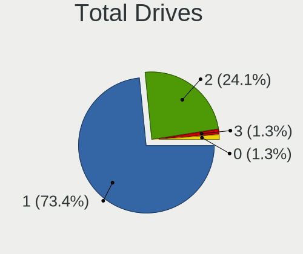
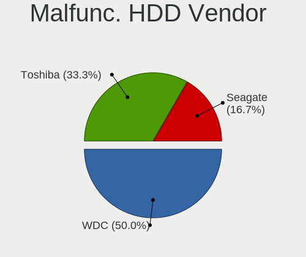
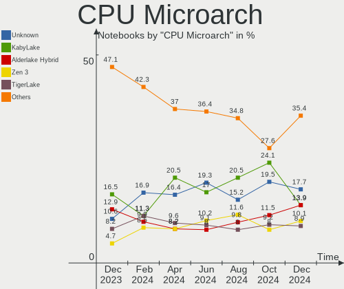
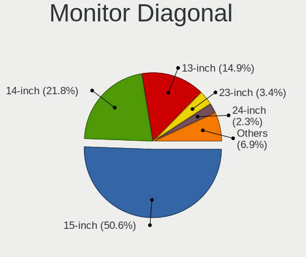
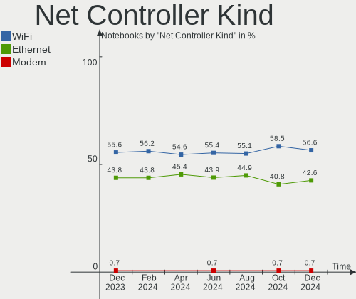
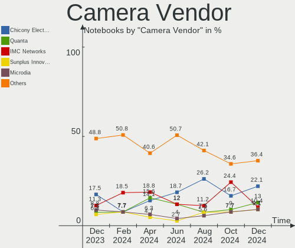

Linux in India - Hardware Trends (Notebooks)
--------------------------------------------

A project to identify most popular hardware characteristics and track their change
over time based on data collected by Linux users at https://Linux-Hardware.org.

Anyone can contribute to this report by the [hw-probe](https://github.com/linuxhw/hw-probe) tool:

    sudo -E hw-probe -all -upload

Period: Dec, 2024.

Contents
--------

* [ System ](#system)
  - [ OS                       ](#os)
  - [ OS Family                ](#os-family)
  - [ Kernel                   ](#kernel)
  - [ Kernel Family            ](#kernel-family)
  - [ Kernel Major Ver.        ](#kernel-major-ver)
  - [ Arch                     ](#arch)
  - [ DE                       ](#de)
  - [ Display Server           ](#display-server)
  - [ Display Manager          ](#display-manager)
  - [ OS Lang                  ](#os-lang)
  - [ Boot Mode                ](#boot-mode)
  - [ Filesystem               ](#filesystem)
  - [ Part. scheme             ](#part-scheme)
  - [ Dual Boot with Linux/BSD ](#dual-boot-with-linuxbsd)
  - [ Dual Boot (Win)          ](#dual-boot-win)

* [ Board ](#board)
  - [ Vendor                   ](#vendor)
  - [ Model                    ](#model)
  - [ Model Family             ](#model-family)
  - [ MFG Year                 ](#mfg-year)
  - [ Form Factor              ](#form-factor)
  - [ Secure Boot              ](#secure-boot)
  - [ Coreboot                 ](#coreboot)
  - [ RAM Size                 ](#ram-size)
  - [ RAM Used                 ](#ram-used)
  - [ Total Drives             ](#total-drives)
  - [ Has CD-ROM               ](#has-cd-rom)
  - [ Has Ethernet             ](#has-ethernet)
  - [ Has WiFi                 ](#has-wifi)
  - [ Has Bluetooth            ](#has-bluetooth)

* [ Location ](#location)
  - [ Country                  ](#country)
  - [ City                     ](#city)

* [ Drives ](#drives)
  - [ Drive Vendor             ](#drive-vendor)
  - [ Drive Model              ](#drive-model)
  - [ HDD Vendor               ](#hdd-vendor)
  - [ SSD Vendor               ](#ssd-vendor)
  - [ Drive Kind               ](#drive-kind)
  - [ Drive Connector          ](#drive-connector)
  - [ Drive Size               ](#drive-size)
  - [ Space Total              ](#space-total)
  - [ Space Used               ](#space-used)
  - [ Malfunc. Drives          ](#malfunc-drives)
  - [ Malfunc. Drive Vendor    ](#malfunc-drive-vendor)
  - [ Malfunc. HDD Vendor      ](#malfunc-hdd-vendor)
  - [ Malfunc. Drive Kind      ](#malfunc-drive-kind)
  - [ Failed Drives            ](#failed-drives)
  - [ Failed Drive Vendor      ](#failed-drive-vendor)
  - [ Drive Status             ](#drive-status)

* [ Storage controller ](#storage-controller)
  - [ Storage Vendor           ](#storage-vendor)
  - [ Storage Model            ](#storage-model)
  - [ Storage Kind             ](#storage-kind)

* [ Processor ](#processor)
  - [ CPU Vendor               ](#cpu-vendor)
  - [ CPU Model                ](#cpu-model)
  - [ CPU Model Family         ](#cpu-model-family)
  - [ CPU Cores                ](#cpu-cores)
  - [ CPU Sockets              ](#cpu-sockets)
  - [ CPU Threads              ](#cpu-threads)
  - [ CPU Op-Modes             ](#cpu-op-modes)
  - [ CPU Microcode            ](#cpu-microcode)
  - [ CPU Microarch            ](#cpu-microarch)

* [ Graphics ](#graphics)
  - [ GPU Vendor               ](#gpu-vendor)
  - [ GPU Model                ](#gpu-model)
  - [ GPU Combo                ](#gpu-combo)
  - [ GPU Driver               ](#gpu-driver)
  - [ GPU Memory               ](#gpu-memory)

* [ Monitor ](#monitor)
  - [ Monitor Vendor           ](#monitor-vendor)
  - [ Monitor Model            ](#monitor-model)
  - [ Monitor Resolution       ](#monitor-resolution)
  - [ Monitor Diagonal         ](#monitor-diagonal)
  - [ Monitor Width            ](#monitor-width)
  - [ Aspect Ratio             ](#aspect-ratio)
  - [ Monitor Area             ](#monitor-area)
  - [ Pixel Density            ](#pixel-density)
  - [ Multiple Monitors        ](#multiple-monitors)

* [ Network ](#network)
  - [ Net Controller Vendor    ](#net-controller-vendor)
  - [ Net Controller Model     ](#net-controller-model)
  - [ Wireless Vendor          ](#wireless-vendor)
  - [ Wireless Model           ](#wireless-model)
  - [ Ethernet Vendor          ](#ethernet-vendor)
  - [ Ethernet Model           ](#ethernet-model)
  - [ Net Controller Kind      ](#net-controller-kind)
  - [ Used Controller          ](#used-controller)
  - [ NICs                     ](#nics)
  - [ IPv6                     ](#ipv6)

* [ Bluetooth ](#bluetooth)
  - [ Bluetooth Vendor         ](#bluetooth-vendor)
  - [ Bluetooth Model          ](#bluetooth-model)

* [ Sound ](#sound)
  - [ Sound Vendor             ](#sound-vendor)
  - [ Sound Model              ](#sound-model)

* [ Memory ](#memory)
  - [ Memory Vendor            ](#memory-vendor)
  - [ Memory Model             ](#memory-model)
  - [ Memory Kind              ](#memory-kind)
  - [ Memory Form Factor       ](#memory-form-factor)
  - [ Memory Size              ](#memory-size)
  - [ Memory Speed             ](#memory-speed)

* [ Printers & scanners ](#printers--scanners)
  - [ Printer Vendor           ](#printer-vendor)
  - [ Printer Model            ](#printer-model)
  - [ Scanner Vendor           ](#scanner-vendor)
  - [ Scanner Model            ](#scanner-model)

* [ Camera ](#camera)
  - [ Camera Vendor            ](#camera-vendor)
  - [ Camera Model             ](#camera-model)

* [ Security ](#security)
  - [ Fingerprint Vendor       ](#fingerprint-vendor)
  - [ Fingerprint Model        ](#fingerprint-model)
  - [ Chipcard Vendor          ](#chipcard-vendor)
  - [ Chipcard Model           ](#chipcard-model)

* [ Unsupported ](#unsupported)
  - [ Unsupported Devices      ](#unsupported-devices)
  - [ Unsupported Device Types ](#unsupported-device-types)

System
------

OS
--

Installed operating systems

| Name                         | Notebooks | Percent |
|------------------------------|-----------|---------|
| Fedora 41                    | 12        | 15.19%  |
| Ubuntu 24.04                 | 11        | 13.92%  |
| OpenMandriva 24.12           | 9         | 11.39%  |
| Arch Rolling                 | 8         | 10.13%  |
| Linux Mint 22                | 6         | 7.59%   |
| Ubuntu 24.10                 | 4         | 5.06%   |
| Ubuntu 22.04                 | 4         | 5.06%   |
| ArcoLinux Rolling            | 3         | 3.8%    |
| Ubuntu 20.04                 | 2         | 2.53%   |
| Pop!_OS 22.04                | 2         | 2.53%   |
| OpenMandriva 23.08           | 2         | 2.53%   |
| Kubuntu 24.04                | 2         | 2.53%   |
| Kali 2024.4                  | 2         | 2.53%   |
| Debian 12                    | 2         | 2.53%   |
| Zorin 17                     | 1         | 1.27%   |
| Xubuntu 24.04                | 1         | 1.27%   |
| openSUSE Tumbleweed-XXXXXXXX | 1         | 1.27%   |
| Guix                         | 1         | 1.27%   |
| Gentoo 2.17                  | 1         | 1.27%   |
| Garuda Linux Soaring         | 1         | 1.27%   |
| Finnix Dev                   | 1         | 1.27%   |
| Fedora 40                    | 1         | 1.27%   |
| Beardog 24                   | 1         | 1.27%   |
| Athena OS Rolling            | 1         | 1.27%   |

OS Family
---------

OS without a version

| Name         | Notebooks | Percent |
|--------------|-----------|---------|
| Ubuntu       | 21        | 26.58%  |
| Fedora       | 13        | 16.46%  |
| OpenMandriva | 11        | 13.92%  |
| Arch         | 8         | 10.13%  |
| Linux Mint   | 6         | 7.59%   |
| ArcoLinux    | 3         | 3.8%    |
| Pop!_OS      | 2         | 2.53%   |
| Kubuntu      | 2         | 2.53%   |
| Kali         | 2         | 2.53%   |
| Debian       | 2         | 2.53%   |
| Zorin        | 1         | 1.27%   |
| Xubuntu      | 1         | 1.27%   |
| openSUSE     | 1         | 1.27%   |
| Guix         | 1         | 1.27%   |
| Gentoo       | 1         | 1.27%   |
| Garuda Linux | 1         | 1.27%   |
| Finnix       | 1         | 1.27%   |
| Beardog      | 1         | 1.27%   |
| Athena OS    | 1         | 1.27%   |

Kernel
------

Version of the Linux kernel

| Version                             | Notebooks | Percent |
|-------------------------------------|-----------|---------|
| 6.8.0-49-generic                    | 9         | 11.39%  |
| 6.12.1-desktop-1omv2490             | 9         | 11.39%  |
| 6.8.0-41-generic                    | 4         | 5.06%   |
| 6.8.0-51-generic                    | 3         | 3.8%    |
| 6.8.0-38-generic                    | 3         | 3.8%    |
| 6.12.6-arch1-1                      | 3         | 3.8%    |
| 6.12.5-200.fc41.x86_64              | 3         | 3.8%    |
| 6.12.4-200.fc41.x86_64              | 3         | 3.8%    |
| 6.11.0-13-generic                   | 3         | 3.8%    |
| 6.8.0-50-generic                    | 2         | 2.53%   |
| 6.4.11-desktop-1omv2390             | 2         | 2.53%   |
| 6.12.6-200.fc41.x86_64              | 2         | 2.53%   |
| 6.12.4-zen1-1-zen                   | 2         | 2.53%   |
| 6.12.4-arch1-1                      | 2         | 2.53%   |
| 6.12.1-arch1-1                      | 2         | 2.53%   |
| 6.11.2-amd64                        | 2         | 2.53%   |
| 6.11.10-300.fc41.x86_64             | 2         | 2.53%   |
| 5.15.0-125-generic                  | 2         | 2.53%   |
| 6.8.0-76060800daily20240311-generic | 1         | 1.27%   |
| 6.8.0-48-generic                    | 1         | 1.27%   |
| 6.6.63                              | 1         | 1.27%   |
| 6.6.62-gentoo                       | 1         | 1.27%   |
| 6.12.7-arch1-1                      | 1         | 1.27%   |
| 6.12.6-2-cachyos                    | 1         | 1.27%   |
| 6.12.4-100.fc40.x86_64              | 1         | 1.27%   |
| 6.12.4                              | 1         | 1.27%   |
| 6.12.3-061203-generic               | 1         | 1.27%   |
| 6.12.2-3-liquorix-amd64             | 1         | 1.27%   |
| 6.12.1-arch1-1.1-g14                | 1         | 1.27%   |
| 6.11.8-1-default                    | 1         | 1.27%   |
| 6.11.7-300.fc41.x86_64              | 1         | 1.27%   |
| 6.11.5+bpo-amd64                    | 1         | 1.27%   |
| 6.11.4-301.fc41.x86_64              | 1         | 1.27%   |
| 6.11.0-12-generic                   | 1         | 1.27%   |
| 6.10.11-amd64                       | 1         | 1.27%   |
| 6.10.10-zen1-1-zen                  | 1         | 1.27%   |
| 6.1.0-28-amd64                      | 1         | 1.27%   |
| 5.15.0-97-generic                   | 1         | 1.27%   |
| 5.15.0-130-generic                  | 1         | 1.27%   |

Kernel Family
-------------

Linux kernel without a distro release

| Version | Notebooks | Percent |
|---------|-----------|---------|
| 6.8.0   | 23        | 29.11%  |
| 6.12.1  | 12        | 15.19%  |
| 6.12.4  | 9         | 11.39%  |
| 6.12.6  | 6         | 7.59%   |
| 6.11.0  | 4         | 5.06%   |
| 5.15.0  | 4         | 5.06%   |
| 6.12.5  | 3         | 3.8%    |
| 6.4.11  | 2         | 2.53%   |
| 6.11.2  | 2         | 2.53%   |
| 6.11.10 | 2         | 2.53%   |
| 6.6.63  | 1         | 1.27%   |
| 6.6.62  | 1         | 1.27%   |
| 6.12.7  | 1         | 1.27%   |
| 6.12.3  | 1         | 1.27%   |
| 6.12.2  | 1         | 1.27%   |
| 6.11.8  | 1         | 1.27%   |
| 6.11.7  | 1         | 1.27%   |
| 6.11.5  | 1         | 1.27%   |
| 6.11.4  | 1         | 1.27%   |
| 6.10.11 | 1         | 1.27%   |
| 6.10.10 | 1         | 1.27%   |
| 6.1.0   | 1         | 1.27%   |

Kernel Major Ver.
-----------------

Linux kernel major version

| Version | Notebooks | Percent |
|---------|-----------|---------|
| 6.12    | 33        | 41.77%  |
| 6.8     | 23        | 29.11%  |
| 6.11    | 12        | 15.19%  |
| 5.15    | 4         | 5.06%   |
| 6.6     | 2         | 2.53%   |
| 6.4     | 2         | 2.53%   |
| 6.10    | 2         | 2.53%   |
| 6.1     | 1         | 1.27%   |

Arch
----

OS architecture (x86_64, i586, etc.)

| Name   | Notebooks | Percent |
|--------|-----------|---------|
| x86_64 | 79        | 100%    |

DE
--

Desktop Environment

| Name       | Notebooks | Percent |
|------------|-----------|---------|
| GNOME      | 40        | 50.63%  |
| Unknown    | 12        | 15.19%  |
| X-Cinnamon | 6         | 7.59%   |
| XFCE       | 5         | 6.33%   |
| KDE5       | 4         | 5.06%   |
| Hyprland   | 4         | 5.06%   |
| KDE6       | 3         | 3.8%    |
| sway       | 2         | 2.53%   |
| LXQt       | 1         | 1.27%   |
| KDE4       | 1         | 1.27%   |
| i3         | 1         | 1.27%   |

Display Server
--------------

X11 or Wayland

| Name    | Notebooks | Percent |
|---------|-----------|---------|
| Wayland | 43        | 54.43%  |
| X11     | 32        | 40.51%  |
| Tty     | 2         | 2.53%   |
| Unknown | 2         | 2.53%   |

Display Manager
---------------

SDDM, LightDM, etc.

| Name    | Notebooks | Percent |
|---------|-----------|---------|
| GDM3    | 26        | 32.91%  |
| Unknown | 23        | 29.11%  |
| SDDM    | 22        | 27.85%  |
| LightDM | 6         | 7.59%   |
| GDM     | 2         | 2.53%   |

OS Lang
-------

Language

| Lang  | Notebooks | Percent |
|-------|-----------|---------|
| en_US | 47        | 59.49%  |
| en_IN | 22        | 27.85%  |
| C     | 5         | 6.33%   |
| en_GB | 4         | 5.06%   |
| mr_IN | 1         | 1.27%   |

Boot Mode
---------

EFI or BIOS

| Mode | Notebooks | Percent |
|------|-----------|---------|
| EFI  | 49        | 62.03%  |
| BIOS | 30        | 37.97%  |

Filesystem
----------

Type of filesystem

| Type    | Notebooks | Percent |
|---------|-----------|---------|
| Ext4    | 30        | 37.97%  |
| Btrfs   | 20        | 25.32%  |
| Tmpfs   | 14        | 17.72%  |
| Overlay | 12        | 15.19%  |
| Xfs     | 2         | 2.53%   |
| Zfs     | 1         | 1.27%   |

Part. scheme
------------

Scheme of partitioning

| Type    | Notebooks | Percent |
|---------|-----------|---------|
| GPT     | 56        | 70.89%  |
| Unknown | 17        | 21.52%  |
| MBR     | 6         | 7.59%   |

Dual Boot with Linux/BSD
------------------------

Hosting more than one Linux/BSD

| Dual boot | Notebooks | Percent |
|-----------|-----------|---------|
| No        | 62        | 78.48%  |
| Yes       | 17        | 21.52%  |

Dual Boot (Win)
---------------

Hosting Linux and Windows

| Dual boot | Notebooks | Percent |
|-----------|-----------|---------|
| No        | 51        | 64.56%  |
| Yes       | 28        | 35.44%  |

Board
-----

Vendor
------

Motherboard manufacturer

| Name             | Notebooks | Percent |
|------------------|-----------|---------|
| Lenovo           | 25        | 31.65%  |
| ASUSTek Computer | 15        | 18.99%  |
| Hewlett-Packard  | 13        | 16.46%  |
| Acer             | 11        | 13.92%  |
| Dell             | 10        | 12.66%  |
| Timi             | 2         | 2.53%   |
| MSI              | 1         | 1.27%   |
| Infinix          | 1         | 1.27%   |
| Apple            | 1         | 1.27%   |

Model
-----

Motherboard model

| Name                                     | Notebooks | Percent |
|------------------------------------------|-----------|---------|
| Lenovo ThinkPad E14 Gen 6 21M4CTO1WW     | 2         | 2.53%   |
| Lenovo LOQ 15IAX9 83GS                   | 2         | 2.53%   |
| Dell Inspiron 3542                       | 2         | 2.53%   |
| ASUS VivoBook_ASUSLaptop K5504VA_S5504VA | 2         | 2.53%   |
| Acer Aspire A715-76G                     | 2         | 2.53%   |
| Timi Mi NoteBook Ultra                   | 1         | 1.27%   |
| Timi Mi NoteBook Pro                     | 1         | 1.27%   |
| MSI Modern 14 C7M                        | 1         | 1.27%   |
| Lenovo Z50-70 20354                      | 1         | 1.27%   |
| Lenovo V15-IIL 82C5                      | 1         | 1.27%   |
| Lenovo V14 G4 ABP 82YX                   | 1         | 1.27%   |
| Lenovo ThinkPad X250 20CLA2GEIG          | 1         | 1.27%   |
| Lenovo ThinkPad W520 4284FK4             | 1         | 1.27%   |
| Lenovo ThinkPad T480 20L6S42005          | 1         | 1.27%   |
| Lenovo ThinkPad T470 20HES18R03          | 1         | 1.27%   |
| Lenovo ThinkPad P52 20MAS1WD0S           | 1         | 1.27%   |
| Lenovo ThinkPad L490 20Q6S1VS00          | 1         | 1.27%   |
| Lenovo ThinkPad E14 Gen 5 21JRS00T00     | 1         | 1.27%   |
| Lenovo ThinkBook 15 G5 ABP 21JF          | 1         | 1.27%   |
| Lenovo ThinkBook 15 G2 ITL 20VE          | 1         | 1.27%   |
| Lenovo ThinkBook 14-IIL 20SL             | 1         | 1.27%   |
| Lenovo LOQ 15IRX9 83DV                   | 1         | 1.27%   |
| Lenovo IdeaPad Z580                      | 1         | 1.27%   |
| Lenovo IdeaPad 5 15ALC05 82LN            | 1         | 1.27%   |
| Lenovo IdeaPad 3 15ITL6 82H8             | 1         | 1.27%   |
| Lenovo IdeaPad 3 14ITL6 82H7             | 1         | 1.27%   |
| Lenovo IdeaPad 3 14ALC6 82KT             | 1         | 1.27%   |
| Lenovo E41-25 81FS                       | 1         | 1.27%   |
| Lenovo B490 20205                        | 1         | 1.27%   |
| Infinix ZERO BOOK 13                     | 1         | 1.27%   |
| HP Victus by Gaming Laptop 15-fb0xxx     | 1         | 1.27%   |
| HP Pavilion Laptop 15-eg2xxx             | 1         | 1.27%   |
| HP Pavilion Gaming Laptop 15-ec0xxx      | 1         | 1.27%   |
| HP Pavilion 15                           | 1         | 1.27%   |
| HP Laptop 15s-du3xxx                     | 1         | 1.27%   |
| HP Laptop 15q-bu0xx                      | 1         | 1.27%   |
| HP Laptop 15-bw0xx                       | 1         | 1.27%   |
| HP Laptop 14q-cs0xxx                     | 1         | 1.27%   |
| HP Laptop 14-em0xxx                      | 1         | 1.27%   |
| HP EliteBook 845 G8 Notebook PC          | 1         | 1.27%   |

Model Family
------------

Motherboard model prefix

| Name               | Notebooks | Percent |
|--------------------|-----------|---------|
| Acer Aspire        | 10        | 12.66%  |
| Lenovo ThinkPad    | 9         | 11.39%  |
| ASUS VivoBook      | 9         | 11.39%  |
| Dell Inspiron      | 6         | 7.59%   |
| Lenovo IdeaPad     | 5         | 6.33%   |
| HP Laptop          | 5         | 6.33%   |
| Lenovo ThinkBook   | 3         | 3.8%    |
| Lenovo LOQ         | 3         | 3.8%    |
| HP Pavilion        | 3         | 3.8%    |
| HP EliteBook       | 3         | 3.8%    |
| ASUS ASUS          | 3         | 3.8%    |
| Timi Mi            | 2         | 2.53%   |
| Dell Vostro        | 2         | 2.53%   |
| MSI Modern         | 1         | 1.27%   |
| Lenovo Z50-70      | 1         | 1.27%   |
| Lenovo V15-IIL     | 1         | 1.27%   |
| Lenovo V14         | 1         | 1.27%   |
| Lenovo E41-25      | 1         | 1.27%   |
| Lenovo B490        | 1         | 1.27%   |
| Infinix ZERO       | 1         | 1.27%   |
| HP Victus          | 1         | 1.27%   |
| HP 240             | 1         | 1.27%   |
| Dell Precision     | 1         | 1.27%   |
| Dell Latitude      | 1         | 1.27%   |
| ASUS Zenbook       | 1         | 1.27%   |
| ASUS TUF           | 1         | 1.27%   |
| ASUS ROG           | 1         | 1.27%   |
| Apple MacBookPro13 | 1         | 1.27%   |
| Acer Predator      | 1         | 1.27%   |

MFG Year
--------

Motherboard manufacture year

| Year | Notebooks | Percent |
|------|-----------|---------|
| 2023 | 13        | 16.46%  |
| 2021 | 11        | 13.92%  |
| 2024 | 8         | 10.13%  |
| 2022 | 7         | 8.86%   |
| 2020 | 7         | 8.86%   |
| 2017 | 7         | 8.86%   |
| 2019 | 6         | 7.59%   |
| 2018 | 5         | 6.33%   |
| 2015 | 4         | 5.06%   |
| 2014 | 3         | 3.8%    |
| 2013 | 3         | 3.8%    |
| 2016 | 1         | 1.27%   |
| 2012 | 1         | 1.27%   |
| 2011 | 1         | 1.27%   |
| 2010 | 1         | 1.27%   |
| 2009 | 1         | 1.27%   |

Form Factor
-----------

Physical design of the computer

| Name     | Notebooks | Percent |
|----------|-----------|---------|
| Notebook | 79        | 100%    |

Secure Boot
-----------

Enabled or disabled

| State    | Notebooks | Percent |
|----------|-----------|---------|
| Disabled | 75        | 94.94%  |
| Enabled  | 4         | 5.06%   |

Coreboot
--------

Have coreboot on board

| Used | Notebooks | Percent |
|------|-----------|---------|
| No   | 79        | 100%    |

RAM Size
--------

Total RAM memory

| Size in GB | Notebooks | Percent |
|------------|-----------|---------|
| 8.01-16.0  | 25        | 31.65%  |
| 4.01-8.0   | 18        | 22.78%  |
| 16.01-24.0 | 16        | 20.25%  |
| 3.01-4.0   | 11        | 13.92%  |
| 24.01-32.0 | 5         | 6.33%   |
| 32.01-64.0 | 2         | 2.53%   |
| 2.01-3.0   | 1         | 1.27%   |
| 1.01-2.0   | 1         | 1.27%   |

RAM Used
--------

Used RAM memory

| Used GB    | Notebooks | Percent |
|------------|-----------|---------|
| 4.01-8.0   | 23        | 29.11%  |
| 1.01-2.0   | 18        | 22.78%  |
| 3.01-4.0   | 15        | 18.99%  |
| 2.01-3.0   | 15        | 18.99%  |
| 8.01-16.0  | 5         | 6.33%   |
| 0.51-1.0   | 2         | 2.53%   |
| 16.01-24.0 | 1         | 1.27%   |

Total Drives
------------

Number of drives on board

| Drives | Notebooks | Percent |
|--------|-----------|---------|
| 1      | 58        | 73.42%  |
| 2      | 19        | 24.05%  |
| 3      | 1         | 1.27%   |
| 0      | 1         | 1.27%   |

Has CD-ROM
----------

Has CD-ROM on board

| Presented | Notebooks | Percent |
|-----------|-----------|---------|
| No        | 69        | 87.34%  |
| Yes       | 10        | 12.66%  |

Has Ethernet
------------

Has Ethernet on board

| Presented | Notebooks | Percent |
|-----------|-----------|---------|
| Yes       | 58        | 73.42%  |
| No        | 21        | 26.58%  |

Has WiFi
--------

Has WiFi module

| Presented | Notebooks | Percent |
|-----------|-----------|---------|
| Yes       | 77        | 97.47%  |
| No        | 2         | 2.53%   |

Has Bluetooth
-------------

Has Bluetooth module

| Presented | Notebooks | Percent |
|-----------|-----------|---------|
| Yes       | 74        | 93.67%  |
| No        | 5         | 6.33%   |

Location
--------

Country
-------

Geographic location (country)

| Country | Notebooks | Percent |
|---------|-----------|---------|
| India   | 79        | 100%    |

City
----

Geographic location (city)

| City             | Notebooks | Percent |
|------------------|-----------|---------|
| Bengaluru        | 14        | 17.72%  |
| Delhi            | 9         | 11.39%  |
| Pune             | 6         | 7.59%   |
| Chennai          | 6         | 7.59%   |
| Kochi            | 4         | 5.06%   |
| Hyderabad        | 4         | 5.06%   |
| Mumbai           | 3         | 3.8%    |
| Coimbatore       | 3         | 3.8%    |
| Patna            | 2         | 2.53%   |
| Asansol          | 2         | 2.53%   |
| Ujjain           | 1         | 1.27%   |
| Trivandrum       | 1         | 1.27%   |
| Surat            | 1         | 1.27%   |
| Ranchi           | 1         | 1.27%   |
| Palwal           | 1         | 1.27%   |
| Noida            | 1         | 1.27%   |
| Nagpur           | 1         | 1.27%   |
| Mysore           | 1         | 1.27%   |
| Ludhiana         | 1         | 1.27%   |
| Lucknow          | 1         | 1.27%   |
| Kurnool          | 1         | 1.27%   |
| Kozhikode        | 1         | 1.27%   |
| Kollam           | 1         | 1.27%   |
| Kolkata          | 1         | 1.27%   |
| Kanpur           | 1         | 1.27%   |
| Kannur           | 1         | 1.27%   |
| Jetpur           | 1         | 1.27%   |
| Gola Gokarannath | 1         | 1.27%   |
| Dehradun         | 1         | 1.27%   |
| Darbhanga        | 1         | 1.27%   |
| Chandigarh       | 1         | 1.27%   |
| Bhubaneswar      | 1         | 1.27%   |
| Bhopal           | 1         | 1.27%   |
| Belanganj        | 1         | 1.27%   |
| Ahmedabad        | 1         | 1.27%   |
| Agra             | 1         | 1.27%   |

Drives
------

Drive Vendor
------------

Hard drive vendors

| Vendor                       | Notebooks | Drives | Percent |
|------------------------------|-----------|--------|---------|
| Micron Technology            | 15        | 16     | 15.96%  |
| Sandisk                      | 11        | 11     | 11.7%   |
| Samsung Electronics          | 10        | 10     | 10.64%  |
| WDC                          | 9         | 9      | 9.57%   |
| Toshiba                      | 7         | 7      | 7.45%   |
| SK hynix                     | 5         | 5      | 5.32%   |
| Seagate                      | 5         | 6      | 5.32%   |
| Crucial                      | 4         | 4      | 4.26%   |
| KIOXIA                       | 3         | 3      | 3.19%   |
| China                        | 3         | 3      | 3.19%   |
| Intel                        | 2         | 2      | 2.13%   |
| EVM                          | 2         | 2      | 2.13%   |
| ADATA Technology             | 2         | 2      | 2.13%   |
| Yangtze Memory Technologies  | 1         | 1      | 1.06%   |
| Unknown                      | 1         | 1      | 1.06%   |
| Transcend                    | 1         | 1      | 1.06%   |
| Silicon Motion               | 1         | 1      | 1.06%   |
| Shenzhen Longsys Electronics | 1         | 1      | 1.06%   |
| SCUDA-256GB                  | 1         | 1      | 1.06%   |
| Micron/Crucial Technology    | 1         | 1      | 1.06%   |
| MAXIO Technology (Hangzhou)  | 1         | 1      | 1.06%   |
| Hitachi                      | 1         | 1      | 1.06%   |
| Hikvision                    | 1         | 2      | 1.06%   |
| Geonix                       | 1         | 1      | 1.06%   |
| CONSISTENT                   | 1         | 1      | 1.06%   |
| Apple                        | 1         | 2      | 1.06%   |
| Ant                          | 1         | 1      | 1.06%   |
| A-DATA Technology            | 1         | 1      | 1.06%   |
| Unknown                      | 1         | 1      | 1.06%   |

Drive Model
-----------

Hard drive models

| Model                                                 | Notebooks | Percent |
|-------------------------------------------------------|-----------|---------|
| Micron 2400_MTFDKBA512QFM 512GB                       | 4         | 4.17%   |
| Toshiba MQ01ABD100 1TB                                | 3         | 3.13%   |
| Seagate ST1000LM035-1RK172 1TB                        | 3         | 3.13%   |
| Micron 2450_MTFDKBA512TFK 512GB                       | 3         | 3.13%   |
| Toshiba MQ04ABF100 1TB                                | 2         | 2.08%   |
| SanDisk NVMe SSD Drive 512GB                          | 2         | 2.08%   |
| Samsung MZVL4512HBLU-00BTW 512GB                      | 2         | 2.08%   |
| Micron MTFDHBA512QFD 512GB                            | 2         | 2.08%   |
| KIOXIA KBG50ZNV512G 512GB                             | 2         | 2.08%   |
| China SSD 256GB                                       | 2         | 2.08%   |
| Yangtze Memory YMTC PC005 512GB                       | 1         | 1.04%   |
| WDC WDS240G2G0B-00EPW0 240GB SSD                      | 1         | 1.04%   |
| WDC WD5000LPVX-75V0TT0 500GB                          | 1         | 1.04%   |
| WDC WD5000BEVT-22A0RT0 500GB                          | 1         | 1.04%   |
| WDC WD3200BEVT-22ZCT0 320GB                           | 1         | 1.04%   |
| WDC WD3200BEKT-75F3T0 320GB                           | 1         | 1.04%   |
| WDC WD10SPZX-75Z10T2 1TB                              | 1         | 1.04%   |
| WDC WD10SPZX-21Z10T0 1TB                              | 1         | 1.04%   |
| WDC WD10JPVX-75JC3T0 1TB                              | 1         | 1.04%   |
| WDC WD10JPVX-60JC3T1 1TB                              | 1         | 1.04%   |
| Unknown SD256  256GB                                  | 1         | 1.04%   |
| Transcend TS256GMTS430S 256GB SSD                     | 1         | 1.04%   |
| Toshiba MQ01ABF050 500GB                              | 1         | 1.04%   |
| Toshiba KXG50ZNV512G NVMe 512GB                       | 1         | 1.04%   |
| SK hynix SKHynix_HFS001TEM4X169N 1TB                  | 1         | 1.04%   |
| SK hynix SC401 SATA 512GB SSD                         | 1         | 1.04%   |
| SK hynix HFS512GEJ9X125N 512GB                        | 1         | 1.04%   |
| SK hynix HFS001TEJ9X108N 1TB                          | 1         | 1.04%   |
| SK hynix BC501 NVMe Solid State Drive 512GB           | 1         | 1.04%   |
| Silicon Motion SM2263EN/SM2263XT SSD Controller 256GB | 1         | 1.04%   |
| Shenzhen Longsys FORESEE XP2100F512G 512GB            | 1         | 1.04%   |
| Seagate ST2000LM015-2E8174 2TB                        | 1         | 1.04%   |
| Seagate ST1000LM049-2GH172 1TB                        | 1         | 1.04%   |
| Seagate ST1000LM024 HN-M101MBB 1TB                    | 1         | 1.04%   |
| SCUDA-256GB SATA SSD 256GB                            | 1         | 1.04%   |
| Sandisk WDC PC SN530 SDBPMPZ-512G-1101 512GB          | 1         | 1.04%   |
| Sandisk WD PC SN740 SDDQNQD-512G-1014 512GB           | 1         | 1.04%   |
| Sandisk WD PC SN740 SDDQMQD-512G-1201 512GB           | 1         | 1.04%   |
| Sandisk WD PC SN740 SDDPMQD-512G-1101 512GB           | 1         | 1.04%   |
| Sandisk WD PC SN560 SDDPNQE-1T00-1102 1024GB          | 1         | 1.04%   |

HDD Vendor
----------

Hard disk drive vendors

| Vendor  | Notebooks | Drives | Percent |
|---------|-----------|--------|---------|
| WDC     | 8         | 8      | 40%     |
| Toshiba | 6         | 6      | 30%     |
| Seagate | 5         | 6      | 25%     |
| Hitachi | 1         | 1      | 5%      |

SSD Vendor
----------

Solid state drive vendors

| Vendor              | Notebooks | Drives | Percent |
|---------------------|-----------|--------|---------|
| Crucial             | 3         | 3      | 18.75%  |
| China               | 3         | 3      | 18.75%  |
| Samsung Electronics | 2         | 2      | 12.5%   |
| WDC                 | 1         | 1      | 6.25%   |
| Transcend           | 1         | 1      | 6.25%   |
| SK hynix            | 1         | 1      | 6.25%   |
| SCUDA-256GB         | 1         | 1      | 6.25%   |
| EVM                 | 1         | 1      | 6.25%   |
| CONSISTENT          | 1         | 1      | 6.25%   |
| Ant                 | 1         | 1      | 6.25%   |
| Unknown             | 1         | 1      | 6.25%   |

Drive Kind
----------

HDD or SSD

| Kind    | Notebooks | Drives | Percent |
|---------|-----------|--------|---------|
| NVMe    | 52        | 58     | 57.14%  |
| HDD     | 20        | 21     | 21.98%  |
| SSD     | 16        | 16     | 17.58%  |
| Unknown | 2         | 2      | 2.2%    |
| MMC     | 1         | 1      | 1.1%    |

Drive Connector
---------------

SATA, SAS, NVMe, etc.

| Type | Notebooks | Drives | Percent |
|------|-----------|--------|---------|
| NVMe | 52        | 58     | 61.18%  |
| SATA | 32        | 39     | 37.65%  |
| MMC  | 1         | 1      | 1.18%   |

Drive Size
----------

Size of hard drive

| Size in TB | Notebooks | Drives | Percent |
|------------|-----------|--------|---------|
| 0.51-1.0   | 17        | 18     | 48.57%  |
| 0.01-0.5   | 16        | 17     | 45.71%  |
| 1.01-2.0   | 2         | 2      | 5.71%   |

Space Total
-----------

Amount of disk space available on the file system

| Size in GB     | Notebooks | Percent |
|----------------|-----------|---------|
| 251-500        | 20        | 25.32%  |
| 101-250        | 17        | 21.52%  |
| 1-20           | 13        | 16.46%  |
| 501-1000       | 12        | 15.19%  |
| 1001-2000      | 5         | 6.33%   |
| 51-100         | 5         | 6.33%   |
| 2001-3000      | 4         | 5.06%   |
| More than 3000 | 1         | 1.27%   |
| 21-50          | 1         | 1.27%   |
| Unknown        | 1         | 1.27%   |

Space Used
----------

Amount of used disk space

| Used GB   | Notebooks | Percent |
|-----------|-----------|---------|
| 1-20      | 30        | 37.97%  |
| 21-50     | 17        | 21.52%  |
| 101-250   | 11        | 13.92%  |
| 51-100    | 7         | 8.86%   |
| 501-1000  | 6         | 7.59%   |
| 251-500   | 4         | 5.06%   |
| 1001-2000 | 3         | 3.8%    |
| Unknown   | 1         | 1.27%   |

Malfunc. Drives
---------------

Drive models with a malfunction

| Model                                           | Notebooks | Drives | Percent |
|-------------------------------------------------|-----------|--------|---------|
| WDC WD5000LPVX-75V0TT0 500GB                    | 1         | 1      | 14.29%  |
| WDC WD5000BEVT-22A0RT0 500GB                    | 1         | 1      | 14.29%  |
| WDC WD3200BEVT-22ZCT0 320GB                     | 1         | 1      | 14.29%  |
| Toshiba MQ04ABF100 1TB                          | 1         | 1      | 14.29%  |
| Toshiba MQ01ABD100 1TB                          | 1         | 1      | 14.29%  |
| Seagate ST1000LM049-2GH172 1TB                  | 1         | 1      | 14.29%  |
| Micron Technology MTFDKBA512TFK-1BC1AABHA 512GB | 1         | 1      | 14.29%  |

Malfunc. Drive Vendor
---------------------

Vendors of faulty drives

| Vendor            | Notebooks | Drives | Percent |
|-------------------|-----------|--------|---------|
| WDC               | 3         | 3      | 42.86%  |
| Toshiba           | 2         | 2      | 28.57%  |
| Seagate           | 1         | 1      | 14.29%  |
| Micron Technology | 1         | 1      | 14.29%  |

Malfunc. HDD Vendor
-------------------

Vendors of faulty HDD drives

| Vendor  | Notebooks | Drives | Percent |
|---------|-----------|--------|---------|
| WDC     | 3         | 3      | 50%     |
| Toshiba | 2         | 2      | 33.33%  |
| Seagate | 1         | 1      | 16.67%  |

Malfunc. Drive Kind
-------------------

Kinds of faulty drives

| Kind | Notebooks | Drives | Percent |
|------|-----------|--------|---------|
| HDD  | 6         | 6      | 85.71%  |
| NVMe | 1         | 1      | 14.29%  |

Failed Drives
-------------

Failed drive models

Zero info for selected period =(

Failed Drive Vendor
-------------------

Failed drive vendors

Zero info for selected period =(

Drive Status
------------

Number of failed and malfunc. drives

| Status   | Notebooks | Drives | Percent |
|----------|-----------|--------|---------|
| Works    | 40        | 46     | 48.78%  |
| Detected | 35        | 45     | 42.68%  |
| Malfunc  | 7         | 7      | 8.54%   |

Storage controller
------------------

Storage Vendor
--------------

Storage controller vendors

| Vendor                       | Notebooks | Percent |
|------------------------------|-----------|---------|
| Intel                        | 50        | 45.05%  |
| Micron Technology            | 16        | 14.41%  |
| SanDisk                      | 11        | 9.91%   |
| Samsung Electronics          | 8         | 7.21%   |
| AMD                          | 8         | 7.21%   |
| SK hynix                     | 4         | 3.6%    |
| KIOXIA                       | 3         | 2.7%    |
| ADATA Technology             | 3         | 2.7%    |
| MAXIO Technology (Hangzhou)  | 2         | 1.8%    |
| Yangtze Memory Technologies  | 1         | 0.9%    |
| Toshiba America Info Systems | 1         | 0.9%    |
| Silicon Motion               | 1         | 0.9%    |
| Shenzhen Longsys Electronics | 1         | 0.9%    |
| Micron/Crucial Technology    | 1         | 0.9%    |
| Apple                        | 1         | 0.9%    |

Storage Model
-------------

Storage controller models

| Model                                                                     | Notebooks | Percent |
|---------------------------------------------------------------------------|-----------|---------|
| Intel Volume Management Device NVMe RAID Controller                       | 10        | 8.55%   |
| AMD FCH SATA Controller [AHCI mode]                                       | 8         | 6.84%   |
| Micron 2400 NVMe SSD (DRAM-less)                                          | 7         | 5.98%   |
| Intel Sunrise Point-LP SATA Controller [AHCI mode]                        | 7         | 5.98%   |
| Intel 8 Series SATA Controller 1 [AHCI mode]                              | 5         | 4.27%   |
| SanDisk WD Black SN770 / PC SN740 256GB / PC SN560 (DRAM-less) NVMe SSD   | 4         | 3.42%   |
| Micron 2450 NVMe SSD [HendrixV] (DRAM-less)                               | 4         | 3.42%   |
| Intel Volume Management Device NVMe RAID Controller Intel Corporation     | 4         | 3.42%   |
| Intel Tiger Lake-LP SATA Controller                                       | 4         | 3.42%   |
| Intel Ice Lake-LP SATA Controller [AHCI mode]                             | 3         | 2.56%   |
| Intel Alder Lake-P SATA AHCI Controller                                   | 3         | 2.56%   |
| Intel 82801 Mobile SATA Controller [RAID mode]                            | 3         | 2.56%   |
| Sandisk WD PC SN740 NVMe SSD 512GB (DRAM-less)                            | 2         | 1.71%   |
| Samsung NVMe SSD Controller PM9B1 (DRAM-less)                             | 2         | 1.71%   |
| Samsung NVMe SSD Controller 980 (DRAM-less)                               | 2         | 1.71%   |
| Micron 2550 NVMe SSD (DRAM-less)                                          | 2         | 1.71%   |
| Micron 2210 NVMe SSD [Cobain]                                             | 2         | 1.71%   |
| MAXIO (Hangzhou) NVMe SSD Controller MAP1202 (DRAM-less)                  | 2         | 1.71%   |
| KIOXIA NVMe SSD Controller BG5 (DRAM-less)                                | 2         | 1.71%   |
| Intel Wildcat Point-LP SATA Controller [AHCI Mode]                        | 2         | 1.71%   |
| Intel 7 Series Chipset Family 6-port SATA Controller [AHCI mode]          | 2         | 1.71%   |
| Intel 600 Series Chipset Family Active Management - SOL                   | 2         | 1.71%   |
| Intel 5 Series/3400 Series Chipset 4 port SATA AHCI Controller            | 2         | 1.71%   |
| Yangtze Memory PC005 NVMe SSD                                             | 1         | 0.85%   |
| Toshiba America Info Systems XG5 NVMe SSD Controller                      | 1         | 0.85%   |
| SK hynix Platinum P41/PC801 NVMe Solid State Drive                        | 1         | 0.85%   |
| SK hynix Non-Volatile memory controller                                   | 1         | 0.85%   |
| SK hynix BC901 NVMe Solid State Drive (DRAM-less)                         | 1         | 0.85%   |
| SK hynix BC501 NVMe Solid State Drive                                     | 1         | 0.85%   |
| Silicon Motion SM2263EN/SM2263XT (DRAM-less) NVMe SSD Controllers         | 1         | 0.85%   |
| Shenzhen Longsys FORESEE XP2100 NVMe SSD (DRAM-less)                      | 1         | 0.85%   |
| SanDisk WD PC SN810 / Black SN850 NVMe SSD                                | 1         | 0.85%   |
| SanDisk WD Blue SN500 / PC SN520 x2 M.2 2280 NVMe SSD                     | 1         | 0.85%   |
| SanDisk Ultra 3D / WD PC SN530, IX SN530, Blue SN550 NVMe SSD (DRAM-less) | 1         | 0.85%   |
| SanDisk PC SN530 NVMe SSD (DRAM-less)                                     | 1         | 0.85%   |
| SanDisk IX SN530 NVMe SSD (DRAM-less)                                     | 1         | 0.85%   |
| Samsung NVMe SSD Controller SM981/PM981/PM983                             | 1         | 0.85%   |
| Samsung NVMe SSD Controller SM961/PM961/SM963                             | 1         | 0.85%   |
| Samsung NVMe SSD Controller PM9C1a (DRAM-less)                            | 1         | 0.85%   |
| Samsung NVMe SSD Controller PM9A1/PM9A3/980PRO                            | 1         | 0.85%   |

Storage Kind
------------

Kind of storage controller (IDE, SATA, NVMe, SAS, ...)

| Kind | Notebooks | Percent |
|------|-----------|---------|
| NVMe | 52        | 46.02%  |
| SATA | 44        | 38.94%  |
| RAID | 17        | 15.04%  |

Processor
---------

CPU Vendor
----------

Processor vendors

| Vendor | Notebooks | Percent |
|--------|-----------|---------|
| Intel  | 58        | 73.42%  |
| AMD    | 21        | 26.58%  |

CPU Model
---------

Processor models

| Model                                   | Notebooks | Percent |
|-----------------------------------------|-----------|---------|
| Intel Core i3-1005G1 CPU @ 1.20GHz      | 4         | 5.06%   |
| Intel 13th Gen Core i5-13500H           | 4         | 5.06%   |
| Intel Core i3-6006U CPU @ 2.00GHz       | 2         | 2.53%   |
| Intel Core i3-4005U CPU @ 1.70GHz       | 2         | 2.53%   |
| Intel 12th Gen Core i5-12450HX          | 2         | 2.53%   |
| Intel 12th Gen Core i5-12450H           | 2         | 2.53%   |
| Intel 12th Gen Core i5-1240P            | 2         | 2.53%   |
| Intel 12th Gen Core i5-1235U            | 2         | 2.53%   |
| Intel 11th Gen Core i5-1135G7 @ 2.40GHz | 2         | 2.53%   |
| Intel 11th Gen Core i5-11300H @ 3.10GHz | 2         | 2.53%   |
| Intel 11th Gen Core i3-1115G4 @ 3.00GHz | 2         | 2.53%   |
| AMD Ryzen 7 7735HS with Radeon Graphics | 2         | 2.53%   |
| AMD Ryzen 5 7530U with Radeon Graphics  | 2         | 2.53%   |
| AMD Ryzen 5 5600H with Radeon Graphics  | 2         | 2.53%   |
| AMD Ryzen 5 5500U with Radeon Graphics  | 2         | 2.53%   |
| AMD Ryzen 3 7320U with Radeon Graphics  | 2         | 2.53%   |
| Intel Pentium CPU A1018 @ 2.10GHz       | 1         | 1.27%   |
| Intel Core i7-8850H CPU @ 2.60GHz       | 1         | 1.27%   |
| Intel Core i7-8750H CPU @ 2.20GHz       | 1         | 1.27%   |
| Intel Core i7-8650U CPU @ 1.90GHz       | 1         | 1.27%   |
| Intel Core i7-8550U CPU @ 1.80GHz       | 1         | 1.27%   |
| Intel Core i7-7500U CPU @ 2.70GHz       | 1         | 1.27%   |
| Intel Core i7-6820HQ CPU @ 2.70GHz      | 1         | 1.27%   |
| Intel Core i7-6500U CPU @ 2.50GHz       | 1         | 1.27%   |
| Intel Core i7-5600U CPU @ 2.60GHz       | 1         | 1.27%   |
| Intel Core i7-2820QM CPU @ 2.30GHz      | 1         | 1.27%   |
| Intel Core i5-9300H CPU @ 2.40GHz       | 1         | 1.27%   |
| Intel Core i5-8365U CPU @ 1.60GHz       | 1         | 1.27%   |
| Intel Core i5-8265U CPU @ 1.60GHz       | 1         | 1.27%   |
| Intel Core i5-7300U CPU @ 2.60GHz       | 1         | 1.27%   |
| Intel Core i5-7200U CPU @ 2.50GHz       | 1         | 1.27%   |
| Intel Core i5-6267U CPU @ 2.90GHz       | 1         | 1.27%   |
| Intel Core i5-4300U CPU @ 1.90GHz       | 1         | 1.27%   |
| Intel Core i5-4210U CPU @ 1.70GHz       | 1         | 1.27%   |
| Intel Core i5-4200U CPU @ 1.60GHz       | 1         | 1.27%   |
| Intel Core i5-3210M CPU @ 2.50GHz       | 1         | 1.27%   |
| Intel Core i5-1035G1 CPU @ 1.00GHz      | 1         | 1.27%   |
| Intel Core i5 CPU M 460 @ 2.53GHz       | 1         | 1.27%   |
| Intel Core i3-7020U CPU @ 2.30GHz       | 1         | 1.27%   |
| Intel Core i3-5005U CPU @ 2.00GHz       | 1         | 1.27%   |

CPU Model Family
----------------

Processor model prefix

| Model           | Notebooks | Percent |
|-----------------|-----------|---------|
| Other           | 25        | 31.65%  |
| Intel Core i5   | 12        | 15.19%  |
| Intel Core i3   | 11        | 13.92%  |
| Intel Core i7   | 9         | 11.39%  |
| AMD Ryzen 7     | 8         | 10.13%  |
| AMD Ryzen 5     | 7         | 8.86%   |
| AMD Ryzen 3     | 3         | 3.8%    |
| Intel Pentium   | 1         | 1.27%   |
| Intel Celeron   | 1         | 1.27%   |
| AMD Ryzen 5 PRO | 1         | 1.27%   |
| AMD A10         | 1         | 1.27%   |

CPU Cores
---------

Number of processor cores

| Number | Notebooks | Percent |
|--------|-----------|---------|
| 2      | 27        | 34.18%  |
| 4      | 18        | 22.78%  |
| 8      | 12        | 15.19%  |
| 6      | 11        | 13.92%  |
| 12     | 7         | 8.86%   |
| 14     | 2         | 2.53%   |
| 10     | 2         | 2.53%   |

CPU Sockets
-----------

Number of sockets

| Number | Notebooks | Percent |
|--------|-----------|---------|
| 1      | 79        | 100%    |

CPU Threads
-----------

Threads per core (Hyper-Threading)

| Number | Notebooks | Percent |
|--------|-----------|---------|
| 2      | 73        | 92.41%  |
| 1      | 6         | 7.59%   |

CPU Op-Modes
------------

CPU Operation Modes (32-bit, 64-bit)

| Op mode        | Notebooks | Percent |
|----------------|-----------|---------|
| 32-bit, 64-bit | 79        | 100%    |

CPU Microcode
-------------

Microcode number

| Number     | Notebooks | Percent |
|------------|-----------|---------|
| Unknown    | 77        | 97.47%  |
| 0x806c1    | 1         | 1.27%   |
| 0x08608108 | 1         | 1.27%   |

CPU Microarch
-------------

Microarchitecture

| Name             | Notebooks | Percent |
|------------------|-----------|---------|
| Unknown          | 14        | 17.72%  |
| KabyLake         | 11        | 13.92%  |
| Alderlake Hybrid | 11        | 13.92%  |
| Zen 3            | 8         | 10.13%  |
| TigerLake        | 7         | 8.86%   |
| Skylake          | 5         | 6.33%   |
| IceLake          | 5         | 6.33%   |
| Haswell          | 5         | 6.33%   |
| Zen 2            | 2         | 2.53%   |
| Westmere         | 2         | 2.53%   |
| IvyBridge        | 2         | 2.53%   |
| Excavator        | 2         | 2.53%   |
| Broadwell        | 2         | 2.53%   |
| Zen+             | 1         | 1.27%   |
| Silvermont       | 1         | 1.27%   |
| SandyBridge      | 1         | 1.27%   |

Graphics
--------

GPU Vendor
----------

Vendors of graphics cards

| Vendor | Notebooks | Percent |
|--------|-----------|---------|
| Intel  | 57        | 57%     |
| AMD    | 23        | 23%     |
| Nvidia | 20        | 20%     |

GPU Model
---------

Graphics card models

| Model                                                                                 | Notebooks | Percent |
|---------------------------------------------------------------------------------------|-----------|---------|
| Intel TigerLake-LP GT2 [Iris Xe Graphics]                                             | 5         | 4.95%   |
| Intel Iris Plus Graphics G1 (Ice Lake)                                                | 5         | 4.95%   |
| Intel Haswell-ULT Integrated Graphics Controller                                      | 5         | 4.95%   |
| Intel Raptor Lake-P [Iris Xe Graphics]                                                | 4         | 3.96%   |
| Intel HD Graphics 620                                                                 | 4         | 3.96%   |
| AMD Cezanne [Radeon Vega Series / Radeon Vega Mobile Series]                          | 4         | 3.96%   |
| AMD Barcelo                                                                           | 4         | 3.96%   |
| Nvidia TU117M [GeForce GTX 1650 Mobile / Max-Q]                                       | 3         | 2.97%   |
| Nvidia GA107M [GeForce RTX 3050 Mobile]                                               | 3         | 2.97%   |
| Intel Skylake GT2 [HD Graphics 520]                                                   | 3         | 2.97%   |
| Intel CoffeeLake-H GT2 [UHD Graphics 630]                                             | 3         | 2.97%   |
| Intel Alder Lake-S [UHD Graphics]                                                     | 3         | 2.97%   |
| AMD Rembrandt [Radeon 680M]                                                           | 3         | 2.97%   |
| AMD Lucienne                                                                          | 3         | 2.97%   |
| Nvidia GA107M [GeForce RTX 2050]                                                      | 2         | 1.98%   |
| Nvidia AD107M [GeForce RTX 4060 Max-Q / Mobile]                                       | 2         | 1.98%   |
| Nvidia AD107M [GeForce RTX 4050 Max-Q / Mobile]                                       | 2         | 1.98%   |
| Intel WhiskeyLake-U GT2 [UHD Graphics 620]                                            | 2         | 1.98%   |
| Intel UHD Graphics 620                                                                | 2         | 1.98%   |
| Intel Tiger Lake-LP GT2 [UHD Graphics G4]                                             | 2         | 1.98%   |
| Intel HD Graphics 5500                                                                | 2         | 1.98%   |
| Intel Core Processor Integrated Graphics Controller                                   | 2         | 1.98%   |
| Intel Alder Lake-UP3 GT2 [Iris Xe Graphics]                                           | 2         | 1.98%   |
| Intel Alder Lake-P GT2 [Iris Xe Graphics]                                             | 2         | 1.98%   |
| Intel Alder Lake-P GT1 [UHD Graphics]                                                 | 2         | 1.98%   |
| Intel 3rd Gen Core processor Graphics Controller                                      | 2         | 1.98%   |
| AMD Topaz XT [Radeon R7 M260/M265 / M340/M360 / M440/M445 / 530/535 / 620/625 Mobile] | 2         | 1.98%   |
| AMD Renoir [Radeon Vega Series / Radeon Vega Mobile Series]                           | 2         | 1.98%   |
| AMD Mendocino                                                                         | 2         | 1.98%   |
| Nvidia TU116M [GeForce GTX 1660 Ti Mobile]                                            | 1         | 0.99%   |
| Nvidia GP107M [GeForce GTX 1050 Ti Mobile]                                            | 1         | 0.99%   |
| Nvidia GM107GLM [Quadro M1200 Mobile]                                                 | 1         | 0.99%   |
| Nvidia GK208M [GeForce GT 740M]                                                       | 1         | 0.99%   |
| Nvidia GF108M [GeForce GT 620M/630M/635M/640M LE]                                     | 1         | 0.99%   |
| Nvidia GF108GLM [Quadro 1000M]                                                        | 1         | 0.99%   |
| Nvidia GA107BM / GN20-P0-R-K2 [GeForce RTX 3050 6GB Laptop GPU]                       | 1         | 0.99%   |
| Nvidia GA107 [GeForce RTX 2050]                                                       | 1         | 0.99%   |
| Intel Raptor Lake-S UHD Graphics                                                      | 1         | 0.99%   |
| Intel Raptor Lake-P [UHD Graphics]                                                    | 1         | 0.99%   |
| Intel Iris Graphics 550                                                               | 1         | 0.99%   |

GPU Combo
---------

Combinations of graphics cards

| Name           | Notebooks | Percent |
|----------------|-----------|---------|
| 1 x Intel      | 42        | 53.16%  |
| 1 x AMD        | 14        | 17.72%  |
| Intel + Nvidia | 13        | 16.46%  |
| AMD + Nvidia   | 6         | 7.59%   |
| Intel + AMD    | 2         | 2.53%   |
| 2 x AMD        | 1         | 1.27%   |
| 1 x Nvidia     | 1         | 1.27%   |

GPU Driver
----------

Free vs proprietary

| Driver      | Notebooks | Percent |
|-------------|-----------|---------|
| Free        | 54        | 68.35%  |
| Unknown     | 14        | 17.72%  |
| Proprietary | 11        | 13.92%  |

GPU Memory
----------

Total video memory

| Size in GB | Notebooks | Percent |
|------------|-----------|---------|
| Unknown    | 66        | 83.54%  |
| 0.01-0.5   | 5         | 6.33%   |
| 3.01-4.0   | 3         | 3.8%    |
| 1.01-2.0   | 3         | 3.8%    |
| 0.51-1.0   | 2         | 2.53%   |

Monitor
-------

Monitor Vendor
--------------

Monitor vendors

| Vendor                  | Notebooks | Percent |
|-------------------------|-----------|---------|
| AU Optronics            | 26        | 29.89%  |
| BOE                     | 18        | 20.69%  |
| Chimei Innolux          | 16        | 18.39%  |
| LG Display              | 8         | 9.2%    |
| Samsung Electronics     | 5         | 5.75%   |
| Goldstar                | 3         | 3.45%   |
| Sharp                   | 2         | 2.3%    |
| PANDA                   | 2         | 2.3%    |
| TMX                     | 1         | 1.15%   |
| Lenovo                  | 1         | 1.15%   |
| KDB                     | 1         | 1.15%   |
| Eizo                    | 1         | 1.15%   |
| Chi Mei Optoelectronics | 1         | 1.15%   |
| BenQ                    | 1         | 1.15%   |
| Apple                   | 1         | 1.15%   |

Monitor Model
-------------

Monitor models

| Model                                                                    | Notebooks | Percent |
|--------------------------------------------------------------------------|-----------|---------|
| Samsung Electronics LCD Monitor SDC4180 2880x1620 344x194mm 15.5-inch    | 2         | 2.3%    |
| Samsung Electronics C24F390 SAM0D2C 1920x1080 521x293mm 23.5-inch        | 2         | 2.3%    |
| Chimei Innolux LCD Monitor CMN15F5 1920x1080 344x193mm 15.5-inch         | 2         | 2.3%    |
| Chimei Innolux LCD Monitor CMN1521 1920x1080 344x193mm 15.5-inch         | 2         | 2.3%    |
| AU Optronics LCD Monitor AUOAF90 1920x1080 344x193mm 15.5-inch           | 2         | 2.3%    |
| AU Optronics LCD Monitor AUO7EAD 1920x1080 344x193mm 15.5-inch           | 2         | 2.3%    |
| AU Optronics LCD Monitor AUO408D 1920x1080 309x174mm 14.0-inch           | 2         | 2.3%    |
| TMX TL156VDXP01 TMX1560 1920x1080 344x194mm 15.5-inch                    | 1         | 1.15%   |
| Sharp LCD Monitor SHP1476 3840x2160 346x194mm 15.6-inch                  | 1         | 1.15%   |
| Sharp LCD Monitor SHP1449 1920x1080 294x165mm 13.3-inch                  | 1         | 1.15%   |
| Samsung Electronics LCD Monitor SDC4154 2880x1800 302x189mm 14.0-inch    | 1         | 1.15%   |
| PANDA LCD Monitor NCP005F 1920x1080 344x194mm 15.5-inch                  | 1         | 1.15%   |
| PANDA LCD Monitor NCP0050 1920x1080 309x174mm 14.0-inch                  | 1         | 1.15%   |
| LG Display LCD Monitor LGD06CA 1920x1080 309x174mm 14.0-inch             | 1         | 1.15%   |
| LG Display LCD Monitor LGD065A 1920x1080 344x194mm 15.5-inch             | 1         | 1.15%   |
| LG Display LCD Monitor LGD05E8 1920x1080 344x194mm 15.5-inch             | 1         | 1.15%   |
| LG Display LCD Monitor LGD0527 1366x768 309x174mm 14.0-inch              | 1         | 1.15%   |
| LG Display LCD Monitor LGD0484 1366x768 344x194mm 15.5-inch              | 1         | 1.15%   |
| LG Display LCD Monitor LGD0437 1920x1080 276x156mm 12.5-inch             | 1         | 1.15%   |
| LG Display LCD Monitor LGD0385 1366x768 309x174mm 14.0-inch              | 1         | 1.15%   |
| LG Display LCD Monitor LGD02DC 1366x768 344x194mm 15.5-inch              | 1         | 1.15%   |
| Lenovo LCD Monitor LEN40B2 1920x1080 344x193mm 15.5-inch                 | 1         | 1.15%   |
| KDB LCD Monitor KDB0526 1920x1080 344x194mm 15.5-inch                    | 1         | 1.15%   |
| Goldstar IPS FULLHD GSM5AB8 1920x1080 480x270mm 21.7-inch                | 1         | 1.15%   |
| Goldstar HDR 4K GSM7706 3840x2160 600x340mm 27.2-inch                    | 1         | 1.15%   |
| Goldstar 2D HD TV GSM59CA 1366x768 509x286mm 23.0-inch                   | 1         | 1.15%   |
| Eizo EV2450 ENC2532 1920x1080 528x297mm 23.9-inch                        | 1         | 1.15%   |
| Chimei Innolux N156HMA-GA1 CMN1556 1920x1080 344x193mm 15.5-inch         | 1         | 1.15%   |
| Chimei Innolux N140HCA-EAC CMN148F 1920x1080 309x173mm 13.9-inch         | 1         | 1.15%   |
| Chimei Innolux LCD Monitor CMN1618 1920x1200 344x215mm 16.0-inch         | 1         | 1.15%   |
| Chimei Innolux LCD Monitor CMN15E8 1920x1080 344x193mm 15.5-inch         | 1         | 1.15%   |
| Chimei Innolux LCD Monitor CMN15E7 1920x1080 344x193mm 15.5-inch         | 1         | 1.15%   |
| Chimei Innolux LCD Monitor CMN15E6 1366x768 344x193mm 15.5-inch          | 1         | 1.15%   |
| Chimei Innolux LCD Monitor CMN15CA 1366x768 344x193mm 15.5-inch          | 1         | 1.15%   |
| Chimei Innolux LCD Monitor CMN15BF 1366x768 344x193mm 15.5-inch          | 1         | 1.15%   |
| Chimei Innolux LCD Monitor CMN151E 1920x1080 344x193mm 15.5-inch         | 1         | 1.15%   |
| Chimei Innolux LCD Monitor CMN14C3 1366x768 309x173mm 13.9-inch          | 1         | 1.15%   |
| Chimei Innolux LCD Monitor CMN14A3 1600x900 309x174mm 14.0-inch          | 1         | 1.15%   |
| Chimei Innolux LCD Monitor CMN142B 1920x1080 309x173mm 13.9-inch         | 1         | 1.15%   |
| Chi Mei Optoelectronics LCD Monitor CMO1571 1366x768 344x193mm 15.5-inch | 1         | 1.15%   |

Monitor Resolution
------------------

Monitor screen resolution

| Resolution        | Notebooks | Percent |
|-------------------|-----------|---------|
| 1920x1080 (FHD)   | 44        | 54.32%  |
| 1366x768 (WXGA)   | 22        | 27.16%  |
| 1920x1200 (WUXGA) | 4         | 4.94%   |
| 3840x2160 (4K)    | 2         | 2.47%   |
| 2880x1800         | 2         | 2.47%   |
| 2880x1620         | 2         | 2.47%   |
| 2240x1400         | 2         | 2.47%   |
| 3200x2000         | 1         | 1.23%   |
| 2560x1600         | 1         | 1.23%   |
| 1600x900 (HD+)    | 1         | 1.23%   |

Monitor Diagonal
----------------

Diagonal size in inches

| Inches | Notebooks | Percent |
|--------|-----------|---------|
| 15     | 44        | 50.57%  |
| 14     | 19        | 21.84%  |
| 13     | 13        | 14.94%  |
| 23     | 3         | 3.45%   |
| 24     | 2         | 2.3%    |
| 21     | 2         | 2.3%    |
| 16     | 2         | 2.3%    |
| 27     | 1         | 1.15%   |
| 12     | 1         | 1.15%   |

Monitor Width
-------------

Physical width

| Width in mm | Notebooks | Percent |
|-------------|-----------|---------|
| 301-350     | 74        | 85.06%  |
| 501-600     | 6         | 6.9%    |
| 201-300     | 5         | 5.75%   |
| 401-500     | 2         | 2.3%    |

Aspect Ratio
------------

Proportional relationship between the width and the height

| Ratio | Notebooks | Percent |
|-------|-----------|---------|
| 16/9  | 69        | 87.34%  |
| 16/10 | 10        | 12.66%  |

Monitor Area
------------

Area in inch

| Area in inch | Notebooks | Percent |
|----------------|-----------|---------|
| 101-110        | 43        | 49.43%  |
| 81-90          | 30        | 34.48%  |
| 201-250        | 7         | 8.05%   |
| 71-80          | 2         | 2.3%    |
| 111-120        | 2         | 2.3%    |
| 61-70          | 1         | 1.15%   |
| 301-350        | 1         | 1.15%   |
| 91-100         | 1         | 1.15%   |

Pixel Density
-------------

Pixels per inch

| Density       | Notebooks | Percent |
|---------------|-----------|---------|
| 121-160       | 43        | 49.43%  |
| 101-120       | 23        | 26.44%  |
| 161-240       | 11        | 12.64%  |
| 51-100        | 6         | 6.9%    |
| More than 240 | 4         | 4.6%    |

Multiple Monitors
-----------------

Total monitors connected

| Total | Notebooks | Percent |
|-------|-----------|---------|
| 1     | 72        | 91.14%  |
| 2     | 6         | 7.59%   |
| 3     | 1         | 1.27%   |

Network
-------

Net Controller Vendor
---------------------

Controller vendors

| Vendor                | Notebooks | Percent |
|-----------------------|-----------|---------|
| Realtek Semiconductor | 50        | 43.86%  |
| Intel                 | 31        | 27.19%  |
| Qualcomm Atheros      | 12        | 10.53%  |
| MediaTek              | 11        | 9.65%   |
| OPPO Electronics      | 2         | 1.75%   |
| Broadcom              | 2         | 1.75%   |
| Xiaomi                | 1         | 0.88%   |
| Samsung Electronics   | 1         | 0.88%   |
| Ralink                | 1         | 0.88%   |
| Qualcomm              | 1         | 0.88%   |
| ICS Advent            | 1         | 0.88%   |
| Broadcom Limited      | 1         | 0.88%   |

Net Controller Model
--------------------

Controller models

| Model                                                                  | Notebooks | Percent |
|------------------------------------------------------------------------|-----------|---------|
| Realtek RTL8111/8168/8211/8411 PCI Express Gigabit Ethernet Controller | 34        | 24.29%  |
| Realtek RTL8852BE PCIe 802.11ax Wireless Network Controller            | 8         | 5.71%   |
| MediaTek MT7921 802.11ax PCI Express Wireless Network Adapter          | 7         | 5%      |
| Realtek RTL810xE PCI Express Fast Ethernet controller                  | 6         | 4.29%   |
| Qualcomm Atheros QCA9377 802.11ac Wireless Network Adapter             | 6         | 4.29%   |
| Realtek RTL8822CE 802.11ac PCIe Wireless Network Adapter               | 5         | 3.57%   |
| Intel Wi-Fi 6 AX201                                                    | 5         | 3.57%   |
| Realtek RTL8723DE Wireless Network Adapter                             | 4         | 2.86%   |
| Realtek RTL8153 Gigabit Ethernet Adapter                               | 4         | 2.86%   |
| Intel Wi-Fi 6 AX200                                                    | 4         | 2.86%   |
| Intel Raptor Lake PCH CNVi WiFi                                        | 4         | 2.86%   |
| Qualcomm Atheros QCA9565 / AR9565 Wireless Network Adapter             | 3         | 2.14%   |
| MediaTek Wi-Fi 6E MT7902 Wireless Network Adapter                      | 3         | 2.14%   |
| Intel Wireless 8265 / 8275                                             | 3         | 2.14%   |
| Intel Alder Lake-P PCH CNVi WiFi                                       | 3         | 2.14%   |
| Realtek RTL8188CE 802.11b/g/n WiFi Adapter                             | 2         | 1.43%   |
| Qualcomm Atheros QCA6174 802.11ac Wireless Network Adapter             | 2         | 1.43%   |
| OPPO OnePlus Nord 4                                                    | 2         | 1.43%   |
| Intel Ice Lake-LP PCH CNVi WiFi                                        | 2         | 1.43%   |
| Intel Ethernet Connection (4) I219-LM                                  | 2         | 1.43%   |
| Intel Cannon Lake PCH CNVi WiFi                                        | 2         | 1.43%   |
| Xiaomi Mi/Redmi series (RNDIS)                                         | 1         | 0.71%   |
| Samsung GT-I9070 (network tethering, USB debugging enabled)            | 1         | 0.71%   |
| Realtek RTL8852BE PCIe 802.11ax Wireless Network Controller [1T1R]     | 1         | 0.71%   |
| Realtek RTL8821CE 802.11ac PCIe Wireless Network Adapter               | 1         | 0.71%   |
| Realtek RTL8723BE PCIe Wireless Network Adapter                        | 1         | 0.71%   |
| Realtek Killer E2600 GbE Controller                                    | 1         | 0.71%   |
| Ralink RT3290 Wireless 802.11n 1T/1R PCIe                              | 1         | 0.71%   |
| Qualcomm QCNFA765 Wireless Network Adapter                             | 1         | 0.71%   |
| Qualcomm Atheros AR9285 Wireless Network Adapter (PCI-Express)         | 1         | 0.71%   |
| MediaTek MT7921K (RZ608) Wi-Fi 6E 80MHz                                | 1         | 0.71%   |
| Intel Wireless 7265                                                    | 1         | 0.71%   |
| Intel Wireless 7260                                                    | 1         | 0.71%   |
| Intel Wireless 3160                                                    | 1         | 0.71%   |
| Intel Wi-Fi 5(802.11ac) Wireless-AC 9x6x [Thunder Peak]                | 1         | 0.71%   |
| Intel Raptor Lake-S PCH CNVi WiFi                                      | 1         | 0.71%   |
| Intel Ethernet Connection I218-LM                                      | 1         | 0.71%   |
| Intel Ethernet Connection (7) I219-LM                                  | 1         | 0.71%   |
| Intel Ethernet Connection (6) I219-LM                                  | 1         | 0.71%   |
| Intel Ethernet Connection (4) I219-V                                   | 1         | 0.71%   |

Wireless Vendor
---------------

Wireless vendors

| Vendor                | Notebooks | Percent |
|-----------------------|-----------|---------|
| Intel                 | 30        | 38.96%  |
| Realtek Semiconductor | 20        | 25.97%  |
| Qualcomm Atheros      | 12        | 15.58%  |
| MediaTek              | 11        | 14.29%  |
| Ralink                | 1         | 1.3%    |
| Qualcomm              | 1         | 1.3%    |
| Broadcom Limited      | 1         | 1.3%    |
| Broadcom              | 1         | 1.3%    |

Wireless Model
--------------

Wireless models

| Model                                                          | Notebooks | Percent |
|----------------------------------------------------------------|-----------|---------|
| Realtek RTL8852BE PCIe 802.11ax Wireless Network Controller    | 7         | 9.09%   |
| MediaTek MT7921 802.11ax PCI Express Wireless Network Adapter  | 7         | 9.09%   |
| Qualcomm Atheros QCA9377 802.11ac Wireless Network Adapter     | 6         | 7.79%   |
| Realtek RTL8822CE 802.11ac PCIe Wireless Network Adapter       | 5         | 6.49%   |
| Intel Wi-Fi 6 AX201                                            | 5         | 6.49%   |
| Realtek RTL8723DE Wireless Network Adapter                     | 4         | 5.19%   |
| Intel Wi-Fi 6 AX200                                            | 4         | 5.19%   |
| Intel Raptor Lake PCH CNVi WiFi                                | 4         | 5.19%   |
| Qualcomm Atheros QCA9565 / AR9565 Wireless Network Adapter     | 3         | 3.9%    |
| MediaTek Wi-Fi 6E MT7902 Wireless Network Adapter              | 3         | 3.9%    |
| Intel Wireless 8265 / 8275                                     | 3         | 3.9%    |
| Intel Alder Lake-P PCH CNVi WiFi                               | 3         | 3.9%    |
| Realtek RTL8188CE 802.11b/g/n WiFi Adapter                     | 2         | 2.6%    |
| Qualcomm Atheros QCA6174 802.11ac Wireless Network Adapter     | 2         | 2.6%    |
| Intel Ice Lake-LP PCH CNVi WiFi                                | 2         | 2.6%    |
| Intel Cannon Lake PCH CNVi WiFi                                | 2         | 2.6%    |
| Realtek RTL8821CE 802.11ac PCIe Wireless Network Adapter       | 1         | 1.3%    |
| Realtek RTL8723BE PCIe Wireless Network Adapter                | 1         | 1.3%    |
| Ralink RT3290 Wireless 802.11n 1T/1R PCIe                      | 1         | 1.3%    |
| Qualcomm QCNFA765 Wireless Network Adapter                     | 1         | 1.3%    |
| Qualcomm Atheros AR9285 Wireless Network Adapter (PCI-Express) | 1         | 1.3%    |
| MediaTek MT7921K (RZ608) Wi-Fi 6E 80MHz                        | 1         | 1.3%    |
| Intel Wireless 7265                                            | 1         | 1.3%    |
| Intel Wireless 7260                                            | 1         | 1.3%    |
| Intel Wireless 3160                                            | 1         | 1.3%    |
| Intel Wi-Fi 5(802.11ac) Wireless-AC 9x6x [Thunder Peak]        | 1         | 1.3%    |
| Intel Raptor Lake-S PCH CNVi WiFi                              | 1         | 1.3%    |
| Intel Dual Band Wireless-AC 3168NGW [Stone Peak]               | 1         | 1.3%    |
| Intel Centrino Advanced-N 6205 [Taylor Peak]                   | 1         | 1.3%    |
| Broadcom Limited BCM4312 802.11b/g LP-PHY                      | 1         | 1.3%    |
| Broadcom BCM43602 802.11ac Wireless LAN SoC                    | 1         | 1.3%    |

Ethernet Vendor
---------------

Ethernet vendors

| Vendor                | Notebooks | Percent |
|-----------------------|-----------|---------|
| Realtek Semiconductor | 45        | 75%     |
| Intel                 | 10        | 16.67%  |
| OPPO Electronics      | 2         | 3.33%   |
| Xiaomi                | 1         | 1.67%   |
| ICS Advent            | 1         | 1.67%   |
| Broadcom              | 1         | 1.67%   |

Ethernet Model
--------------

Ethernet models

| Model                                                                  | Notebooks | Percent |
|------------------------------------------------------------------------|-----------|---------|
| Realtek RTL8111/8168/8211/8411 PCI Express Gigabit Ethernet Controller | 34        | 54.84%  |
| Realtek RTL810xE PCI Express Fast Ethernet controller                  | 6         | 9.68%   |
| Realtek RTL8153 Gigabit Ethernet Adapter                               | 4         | 6.45%   |
| OPPO OnePlus Nord 4                                                    | 2         | 3.23%   |
| Intel Ethernet Connection (4) I219-LM                                  | 2         | 3.23%   |
| Xiaomi Mi/Redmi series (RNDIS)                                         | 1         | 1.61%   |
| Realtek RTL8852BE PCIe 802.11ax Wireless Network Controller [1T1R]     | 1         | 1.61%   |
| Realtek RTL8852BE PCIe 802.11ax Wireless Network Controller            | 1         | 1.61%   |
| Realtek Killer E2600 GbE Controller                                    | 1         | 1.61%   |
| Intel Ethernet Connection I218-LM                                      | 1         | 1.61%   |
| Intel Ethernet Connection (7) I219-LM                                  | 1         | 1.61%   |
| Intel Ethernet Connection (6) I219-LM                                  | 1         | 1.61%   |
| Intel Ethernet Connection (4) I219-V                                   | 1         | 1.61%   |
| Intel Ethernet Connection (3) I218-LM                                  | 1         | 1.61%   |
| Intel Ethernet Connection (16) I219-V                                  | 1         | 1.61%   |
| Intel Ethernet Connection (13) I219-V                                  | 1         | 1.61%   |
| Intel 82579LM Gigabit Network Connection (Lewisville)                  | 1         | 1.61%   |
| ICS Advent USB 10/100 LAN                                              | 1         | 1.61%   |
| Broadcom NetLink BCM57780 Gigabit Ethernet PCIe                        | 1         | 1.61%   |

Net Controller Kind
-------------------

Ethernet, WiFi or modem

| Kind     | Notebooks | Percent |
|----------|-----------|---------|
| WiFi     | 77        | 56.62%  |
| Ethernet | 58        | 42.65%  |
| Modem    | 1         | 0.74%   |

Used Controller
---------------

Currently used network controller

| Kind     | Notebooks | Percent |
|----------|-----------|---------|
| WiFi     | 68        | 86.08%  |
| Ethernet | 11        | 13.92%  |

NICs
----

Total network controllers on board

| Total | Notebooks | Percent |
|-------|-----------|---------|
| 2     | 52        | 65.82%  |
| 1     | 27        | 34.18%  |

IPv6
----

IPv6 vs IPv4

| Used | Notebooks | Percent |
|------|-----------|---------|
| No   | 43        | 54.43%  |
| Yes  | 36        | 45.57%  |

Bluetooth
---------

Bluetooth Vendor
----------------

Controller vendors

| Vendor                          | Notebooks | Percent |
|---------------------------------|-----------|---------|
| Intel                           | 27        | 36.49%  |
| Realtek Semiconductor           | 19        | 25.68%  |
| Qualcomm Atheros Communications | 9         | 12.16%  |
| IMC Networks                    | 9         | 12.16%  |
| Lite-On Technology              | 4         | 5.41%   |
| Foxconn / Hon Hai               | 2         | 2.7%    |
| Ralink                          | 1         | 1.35%   |
| MediaTek                        | 1         | 1.35%   |
| Cambridge Silicon Radio         | 1         | 1.35%   |
| Broadcom                        | 1         | 1.35%   |

Bluetooth Model
---------------

Controller models

| Model                                               | Notebooks | Percent |
|-----------------------------------------------------|-----------|---------|
| Realtek Bluetooth Radio                             | 12        | 16.22%  |
| IMC Networks Wireless_Device                        | 8         | 10.81%  |
| Intel AX211 Bluetooth                               | 7         | 9.46%   |
| Intel Bluetooth wireless interface                  | 6         | 8.11%   |
| Qualcomm Atheros  Bluetooth Device                  | 5         | 6.76%   |
| Realtek  Bluetooth 4.2 Adapter                      | 4         | 5.41%   |
| Intel Bluetooth 9460/9560 Jefferson Peak (JfP)      | 4         | 5.41%   |
| Intel AX201 Bluetooth                               | 4         | 5.41%   |
| Intel AX200 Bluetooth                               | 4         | 5.41%   |
| Realtek 802.11ac WLAN Adapter                       | 2         | 2.7%    |
| Qualcomm Atheros AR9462 Bluetooth                   | 2         | 2.7%    |
| Lite-On Qualcomm Atheros QCA9377 Bluetooth          | 2         | 2.7%    |
| Realtek RTL8723B Bluetooth                          | 1         | 1.35%   |
| Ralink RT3290 Bluetooth                             | 1         | 1.35%   |
| Qualcomm Atheros QCA61x4 Bluetooth 4.0              | 1         | 1.35%   |
| Qualcomm Atheros AR3011 Bluetooth                   | 1         | 1.35%   |
| MediaTek Wireless_Device                            | 1         | 1.35%   |
| Lite-On Wireless_Device                             | 1         | 1.35%   |
| Lite-On Atheros AR3012 Bluetooth                    | 1         | 1.35%   |
| Intel Wireless-AC 9260 Bluetooth Adapter            | 1         | 1.35%   |
| Intel Wireless-AC 3168 Bluetooth                    | 1         | 1.35%   |
| IMC Networks Bluetooth Radio                        | 1         | 1.35%   |
| Foxconn / Hon Hai MediaTek Bluetooth Adapter        | 1         | 1.35%   |
| Foxconn / Hon Hai Bluetooth Device                  | 1         | 1.35%   |
| Cambridge Silicon Radio Bluetooth Dongle (HCI mode) | 1         | 1.35%   |
| Broadcom BCM2045B (BDC-2.1)                         | 1         | 1.35%   |

Sound
-----

Sound Vendor
------------

Sound card vendors

| Vendor                | Notebooks | Percent |
|-----------------------|-----------|---------|
| Intel                 | 58        | 61.7%   |
| AMD                   | 21        | 22.34%  |
| Nvidia                | 13        | 13.83%  |
| Walmart               | 1         | 1.06%   |
| Realtek Semiconductor | 1         | 1.06%   |

Sound Model
-----------

Sound card models

| Model                                                                                             | Notebooks | Percent |
|---------------------------------------------------------------------------------------------------|-----------|---------|
| AMD Family 17h/19h/1ah HD Audio Controller                                                        | 19        | 15.7%   |
| AMD Renoir Radeon High Definition Audio Controller                                                | 13        | 10.74%  |
| Intel Sunrise Point-LP HD Audio                                                                   | 10        | 8.26%   |
| Intel Alder Lake PCH-P High Definition Audio Controller                                           | 8         | 6.61%   |
| Intel Tiger Lake-LP Smart Sound Technology Audio Controller                                       | 7         | 5.79%   |
| Intel Raptor Lake-P/U/H cAVS                                                                      | 5         | 4.13%   |
| Intel Ice Lake-LP Smart Sound Technology Audio Controller                                         | 5         | 4.13%   |
| Intel Haswell-ULT HD Audio Controller                                                             | 5         | 4.13%   |
| Intel 8 Series HD Audio Controller                                                                | 5         | 4.13%   |
| AMD Rembrandt Radeon High Definition Audio Controller                                             | 5         | 4.13%   |
| Nvidia AD107 High Definition Audio Controller                                                     | 4         | 3.31%   |
| Nvidia GA107 High Definition Audio Controller                                                     | 3         | 2.48%   |
| Intel Cannon Lake PCH cAVS                                                                        | 3         | 2.48%   |
| Nvidia TU107 GeForce GTX 1650 High Definition Audio Controller                                    | 2         | 1.65%   |
| Nvidia GF108 High Definition Audio Controller                                                     | 2         | 1.65%   |
| Intel Wildcat Point-LP High Definition Audio Controller                                           | 2         | 1.65%   |
| Intel Raptor Lake High Definition Audio Controller                                                | 2         | 1.65%   |
| Intel Cannon Point-LP High Definition Audio Controller                                            | 2         | 1.65%   |
| Intel Broadwell-U Audio Controller                                                                | 2         | 1.65%   |
| Intel Alder Lake-S HD Audio Controller                                                            | 2         | 1.65%   |
| Intel 7 Series/C216 Chipset Family High Definition Audio Controller                               | 2         | 1.65%   |
| Intel 5 Series/3400 Series Chipset High Definition Audio                                          | 2         | 1.65%   |
| AMD Family 15h (Models 60h-6fh) Audio Controller                                                  | 2         | 1.65%   |
| Walmart AB13X Headset Adapter                                                                     | 1         | 0.83%   |
| Realtek Semiconductor HP Banff                                                                    | 1         | 0.83%   |
| Nvidia TU116 High Definition Audio Controller                                                     | 1         | 0.83%   |
| Nvidia GP107GL High Definition Audio Controller                                                   | 1         | 0.83%   |
| Intel CM238 HD Audio Controller                                                                   | 1         | 0.83%   |
| Intel Atom/Celeron/Pentium Processor x5-E8000/J3xxx/N3xxx Series High Definition Audio Controller | 1         | 0.83%   |
| Intel 6 Series/C200 Series Chipset Family High Definition Audio Controller                        | 1         | 0.83%   |
| AMD Kabini HDMI/DP Audio                                                                          | 1         | 0.83%   |
| AMD High Definition Audio Controller                                                              | 1         | 0.83%   |

Memory
------

Memory Vendor
-------------

Memory module vendors

| Vendor              | Notebooks | Percent |
|---------------------|-----------|---------|
| Samsung Electronics | 20        | 28.99%  |
| SK hynix            | 16        | 23.19%  |
| Micron Technology   | 14        | 20.29%  |
| Kingston            | 5         | 7.25%   |
| Crucial             | 4         | 5.8%    |
| Unknown             | 2         | 2.9%    |
| Ramaxel Technology  | 2         | 2.9%    |
| A-DATA Technology   | 2         | 2.9%    |
| SHARETRONIC         | 1         | 1.45%   |
| G.Skill             | 1         | 1.45%   |
| Elpida              | 1         | 1.45%   |
| CSX                 | 1         | 1.45%   |

Memory Model
------------

Memory module models

| Model                                                            | Notebooks | Percent |
|------------------------------------------------------------------|-----------|---------|
| Micron RAM 8ATF1G64HZ-3G2R1 8GB SODIMM DDR4 3200MT/s             | 4         | 5.71%   |
| Samsung RAM M471A1G44AB0-CWE 8GB Row Of Chips DDR4 3200MT/s      | 3         | 4.29%   |
| Samsung RAM M471A5244CB0-CWE 4096MB SODIMM DDR4 3200MT/s         | 2         | 2.86%   |
| Samsung RAM M471A5244CB0-CTD 4GB SODIMM DDR4 3266MT/s            | 2         | 2.86%   |
| Samsung RAM M471A1K43DB1-CTD 8GB SODIMM DDR4 2667MT/s            | 2         | 2.86%   |
| Samsung RAM M471A1G44BB0-CWE 8GB SODIMM DDR4 3200MT/s            | 2         | 2.86%   |
| Micron RAM 4ATF51264HZ-3G2J1 4GB Row Of Chips DDR4 3200MT/s      | 2         | 2.86%   |
| Micron RAM 4ATF1G64HZ-3G2F1 8GB SODIMM DDR4 3200MT/s             | 2         | 2.86%   |
| Unknown RAM Module 8GB SODIMM DDR4 2667MT/s                      | 1         | 1.43%   |
| Unknown RAM Module 8GB SODIMM DDR4 2400MT/s                      | 1         | 1.43%   |
| SK hynix RAM HMT451S6BFR8A-PB 4096MB SODIMM DDR3 1600MT/s        | 1         | 1.43%   |
| SK hynix RAM HMT41GS6BFR8A-PB 8GB SODIMM DDR3 1600MT/s           | 1         | 1.43%   |
| SK hynix RAM HMT351S6EFR8A-PB 4GB SODIMM DDR3 1600MT/s           | 1         | 1.43%   |
| SK hynix RAM HMT125S6BFR8C-G7 2GB SODIMM DDR3 1067MT/s           | 1         | 1.43%   |
| SK hynix RAM HMT112S6BFR6C-G7 1GB SODIMM DDR3 1067MT/s           | 1         | 1.43%   |
| SK hynix RAM HMAG68EXNSA051N 8GB SODIMM DDR4 3200MT/s            | 1         | 1.43%   |
| SK hynix RAM HMAA1GS6CJR6N-XN 8GB SODIMM DDR4 3200MT/s           | 1         | 1.43%   |
| SK hynix RAM HMA851S6JJR6N-VK 4GB SODIMM DDR4 2667MT/s           | 1         | 1.43%   |
| SK hynix RAM HMA851S6DJR6N-XN 4GB SODIMM DDR4 3200MT/s           | 1         | 1.43%   |
| SK hynix RAM HMA851S6DJR6N-VK 4GB SODIMM DDR4 2667MT/s           | 1         | 1.43%   |
| SK hynix RAM HMA851S6CJR6N-VK 4GB SODIMM DDR4 2667MT/s           | 1         | 1.43%   |
| SK hynix RAM HMA851S6AFR6N-UH 4GB SODIMM DDR4 2667MT/s           | 1         | 1.43%   |
| SK hynix RAM HMA81GS6DJR8N-XN 8GB SODIMM DDR4 3200MT/s           | 1         | 1.43%   |
| SK hynix RAM H9JCNNNCP3MLYR-N6E 4GB SODIMM LPDDR5 6400MT/s       | 1         | 1.43%   |
| SK hynix RAM H9JCNNNCP3MLYR-N6E 2GB Row Of Chips LPDDR5 6400MT/s | 1         | 1.43%   |
| SK hynix RAM H9HCNNNCPMMLXR-NEE 8GB SODIMM LPDDR4 4266MT/s       | 1         | 1.43%   |
| SHARETRONIC RAM Module 4GB SODIMM DDR3 1600MT/s                  | 1         | 1.43%   |
| Samsung RAM M471B5773CHS-CH9 2GB SODIMM DDR3 4199MT/s            | 1         | 1.43%   |
| Samsung RAM M471B5273CM0-CH9 4GB SODIMM DDR3 1334MT/s            | 1         | 1.43%   |
| Samsung RAM M471B5173EB0-YK0 4GB SODIMM DDR3 1600MT/s            | 1         | 1.43%   |
| Samsung RAM M471B5173DB0-YK0 4GB SODIMM DDR3 1600MT/s            | 1         | 1.43%   |
| Samsung RAM M471B1G73QH0-YK0 8GB SODIMM DDR3 1600MT/s            | 1         | 1.43%   |
| Samsung RAM M471A5244CB0-CTD 4GB Row Of Chips DDR4 2667MT/s      | 1         | 1.43%   |
| Samsung RAM M471A1K43EB1-CWE 8GB SODIMM DDR4 3200MT/s            | 1         | 1.43%   |
| Samsung RAM M471A1K43DB1-CWE 8GB SODIMM DDR4 3200MT/s            | 1         | 1.43%   |
| Samsung RAM M471A1K43CB1-CTD 8GB SODIMM DDR4 2667MT/s            | 1         | 1.43%   |
| Samsung RAM M425R2GA3PB0-CWMOL 16GB SODIMM DDR5 5600MT/s         | 1         | 1.43%   |
| Ramaxel RAM RMT3160ME68FAF1600 8GB SODIMM DDR3 1600MT/s          | 1         | 1.43%   |
| Ramaxel RAM RMSB3400KB06IVF-4800 12GB SODIMM DDR5 4800MT/s       | 1         | 1.43%   |
| Micron RAM MT40A1G16TB-062E:F 8GB Row Of Chips DDR4 3200MT/s     | 1         | 1.43%   |

Memory Kind
-----------

Memory module kinds

| Kind   | Notebooks | Percent |
|--------|-----------|---------|
| DDR4   | 32        | 62.75%  |
| DDR3   | 11        | 21.57%  |
| LPDDR5 | 3         | 5.88%   |
| LPDDR4 | 2         | 3.92%   |
| DDR5   | 2         | 3.92%   |
| SDRAM  | 1         | 1.96%   |

Memory Form Factor
------------------

Physical design of the memory module

| Name         | Notebooks | Percent |
|--------------|-----------|---------|
| SODIMM       | 43        | 81.13%  |
| Row Of Chips | 10        | 18.87%  |

Memory Size
-----------

Memory module size

| Size  | Notebooks | Percent |
|-------|-----------|---------|
| 8192  | 28        | 48.28%  |
| 4096  | 16        | 27.59%  |
| 16384 | 9         | 15.52%  |
| 2048  | 3         | 5.17%   |
| 12288 | 1         | 1.72%   |
| 1024  | 1         | 1.72%   |

Memory Speed
------------

Memory module speed

| Speed | Notebooks | Percent |
|-------|-----------|---------|
| 3200  | 21        | 38.89%  |
| 2667  | 11        | 20.37%  |
| 1600  | 8         | 14.81%  |
| 6400  | 3         | 5.56%   |
| 3266  | 2         | 3.7%    |
| 2400  | 2         | 3.7%    |
| 1067  | 2         | 3.7%    |
| 5600  | 1         | 1.85%   |
| 4800  | 1         | 1.85%   |
| 4266  | 1         | 1.85%   |
| 4199  | 1         | 1.85%   |
| 1334  | 1         | 1.85%   |

Printers & scanners
-------------------

Printer Vendor
--------------

Printer device vendors

Zero info for selected period =(

Printer Model
-------------

Printer device models

Zero info for selected period =(

Scanner Vendor
--------------

Scanner device vendors

Zero info for selected period =(

Scanner Model
-------------

Scanner device models

Zero info for selected period =(

Camera
------

Camera Vendor
-------------

Camera device vendors

| Vendor                                 | Notebooks | Percent |
|----------------------------------------|-----------|---------|
| Chicony Electronics                    | 17        | 22.08%  |
| Quanta                                 | 10        | 12.99%  |
| IMC Networks                           | 8         | 10.39%  |
| Sunplus Innovation Technology          | 7         | 9.09%   |
| Microdia                               | 7         | 9.09%   |
| Sonix Technology                       | 6         | 7.79%   |
| Syntek                                 | 5         | 6.49%   |
| ShineTech                              | 3         | 3.9%    |
| Realtek Semiconductor                  | 3         | 3.9%    |
| Luxvisions Innotech Limited            | 3         | 3.9%    |
| Lite-On Technology                     | 3         | 3.9%    |
| SN0002                                 | 1         | 1.3%    |
| Cheng Uei Precision Industry (Foxlink) | 1         | 1.3%    |
| Bison Electronics                      | 1         | 1.3%    |
| ALi                                    | 1         | 1.3%    |
| Acer                                   | 1         | 1.3%    |

Camera Model
------------

Camera device models

| Model                                                | Notebooks | Percent |
|------------------------------------------------------|-----------|---------|
| Chicony Integrated Camera                            | 6         | 7.69%   |
| Syntek Integrated Camera                             | 5         | 6.41%   |
| Quanta ACER HD User Facing                           | 4         | 5.13%   |
| IMC Networks Integrated Camera                       | 4         | 5.13%   |
| Sunplus Integrated_Webcam_HD                         | 3         | 3.85%   |
| Sonix USB2.0 FHD UVC WebCam                          | 3         | 3.85%   |
| ShineTech USB2.0 HD UVC WebCam                       | 3         | 3.85%   |
| Microdia Integrated_Webcam_HD                        | 3         | 3.85%   |
| Lite-On Integrated Camera                            | 3         | 3.85%   |
| IMC Networks USB2.0 HD UVC WebCam                    | 3         | 3.85%   |
| Chicony HP TrueVision HD Camera                      | 3         | 3.85%   |
| Sunplus XiaoMi USB 2.0 Webcam                        | 2         | 2.56%   |
| Sunplus HP TrueVision HD Camera                      | 2         | 2.56%   |
| Sonix USB2.0 HD UVC WebCam                           | 2         | 2.56%   |
| Quanta HP TrueVision HD Camera                       | 2         | 2.56%   |
| Microdia USB 2.0 Camera                              | 2         | 2.56%   |
| Sonix ASUS HD webcam                                 | 1         | 1.28%   |
| SN0002 1080P Web Camera                              | 1         | 1.28%   |
| Realtek Integrated_Webcam_HD                         | 1         | 1.28%   |
| Realtek Integrated Webcam                            | 1         | 1.28%   |
| Realtek HD Webcam - Realtek                          | 1         | 1.28%   |
| Quanta VGA WebCam                                    | 1         | 1.28%   |
| Quanta USB2.0 HD UVC WebCam                          | 1         | 1.28%   |
| Quanta HP Wide Vision HD Camera                      | 1         | 1.28%   |
| Quanta HD User Facing                                | 1         | 1.28%   |
| Microdia Laptop_Integrated_Webcam_1.3M               | 1         | 1.28%   |
| Microdia Integrated Webcam HD                        | 1         | 1.28%   |
| Luxvisions Innotech Limited Integrated Camera        | 1         | 1.28%   |
| Luxvisions Innotech Limited HP Wide Vision HD Camera | 1         | 1.28%   |
| Luxvisions Innotech Limited HP HD Camera             | 1         | 1.28%   |
| IMC Networks USB2.0 VGA UVC WebCam                   | 1         | 1.28%   |
| Chicony VGA Webcam                                   | 1         | 1.28%   |
| Chicony Lenovo Integrated Camera (0.3MP)             | 1         | 1.28%   |
| Chicony Lenovo EasyCamera                            | 1         | 1.28%   |
| Chicony Integrated IR Camera                         | 1         | 1.28%   |
| Chicony HP True Vision FHD Camera                    | 1         | 1.28%   |
| Chicony HP HD Camera                                 | 1         | 1.28%   |
| Chicony HD WebCam                                    | 1         | 1.28%   |
| Chicony EasyCamera                                   | 1         | 1.28%   |
| Chicony ACER HD User Facing                          | 1         | 1.28%   |

Security
--------

Fingerprint Vendor
------------------

Fingerprint sensor vendors

| Vendor                             | Notebooks | Percent |
|------------------------------------|-----------|---------|
| Validity Sensors                   | 3         | 25%     |
| Shenzhen Goodix Technology         | 3         | 25%     |
| Elan Microelectronics              | 3         | 25%     |
| Synaptics                          | 2         | 16.67%  |
| Realtek USB2.0 Finger Print Bridge | 1         | 8.33%   |

Fingerprint Model
-----------------

Fingerprint sensor models

| Model                                                                      | Notebooks | Percent |
|----------------------------------------------------------------------------|-----------|---------|
| Shenzhen Goodix  FingerPrint Device                                        | 3         | 25%     |
| Elan ELAN:ARM-M4                                                           | 2         | 16.67%  |
| Validity Sensors VFS Fingerprint sensor                                    | 1         | 8.33%   |
| Validity Sensors Synaptics WBDI                                            | 1         | 8.33%   |
| Validity Sensors Synaptics VFS7552 Touch Fingerprint Sensor with PurePrint | 1         | 8.33%   |
| Synaptics Metallica MIS Touch Fingerprint Reader                           | 1         | 8.33%   |
| Synaptics FS7604 Touch Fingerprint Sensor with PurePrint                   | 1         | 8.33%   |
| Realtek USB2.0 Finger Print Bridge FocalTech Fingerprint Device            | 1         | 8.33%   |
| Elan ELAN:Fingerprint                                                      | 1         | 8.33%   |

Chipcard Vendor
---------------

Chipcard module vendors

| Vendor      | Notebooks | Percent |
|-------------|-----------|---------|
| Alcor Micro | 2         | 100%    |

Chipcard Model
--------------

Chipcard module models

| Model                               | Notebooks | Percent |
|-------------------------------------|-----------|---------|
| Alcor Micro AU9540 Smartcard Reader | 2         | 100%    |

Unsupported
-----------

Unsupported Devices
-------------------

Total unsupported devices on board

| Total | Notebooks | Percent |
|-------|-----------|---------|
| 0     | 54        | 68.35%  |
| 1     | 18        | 22.78%  |
| 2     | 6         | 7.59%   |
| 5     | 1         | 1.27%   |

Unsupported Device Types
------------------------

Types of unsupported devices

| Type                     | Notebooks | Percent |
|--------------------------|-----------|---------|
| Fingerprint reader       | 12        | 35.29%  |
| Graphics card            | 5         | 14.71%  |
| Multimedia controller    | 4         | 11.76%  |
| Camera                   | 4         | 11.76%  |
| Net/wireless             | 3         | 8.82%   |
| Chipcard                 | 2         | 5.88%   |
| Bluetooth                | 2         | 5.88%   |
| Sound                    | 1         | 2.94%   |
| Communication controller | 1         | 2.94%   |

