Linux in India - Hardware Trends (Notebooks)
--------------------------------------------

A project to identify most popular hardware characteristics and track their change
over time based on data collected by Linux users at https://Linux-Hardware.org.

Anyone can contribute to this report by the [hw-probe](https://github.com/linuxhw/hw-probe) tool:

    sudo -E hw-probe -all -upload

Period: Apr, 2024.

Contents
--------

* [ System ](#system)
  - [ OS                       ](#os)
  - [ OS Family                ](#os-family)
  - [ Kernel                   ](#kernel)
  - [ Kernel Family            ](#kernel-family)
  - [ Kernel Major Ver.        ](#kernel-major-ver)
  - [ Arch                     ](#arch)
  - [ DE                       ](#de)
  - [ Display Server           ](#display-server)
  - [ Display Manager          ](#display-manager)
  - [ OS Lang                  ](#os-lang)
  - [ Boot Mode                ](#boot-mode)
  - [ Filesystem               ](#filesystem)
  - [ Part. scheme             ](#part-scheme)
  - [ Dual Boot with Linux/BSD ](#dual-boot-with-linuxbsd)
  - [ Dual Boot (Win)          ](#dual-boot-win)

* [ Board ](#board)
  - [ Vendor                   ](#vendor)
  - [ Model                    ](#model)
  - [ Model Family             ](#model-family)
  - [ MFG Year                 ](#mfg-year)
  - [ Form Factor              ](#form-factor)
  - [ Secure Boot              ](#secure-boot)
  - [ Coreboot                 ](#coreboot)
  - [ RAM Size                 ](#ram-size)
  - [ RAM Used                 ](#ram-used)
  - [ Total Drives             ](#total-drives)
  - [ Has CD-ROM               ](#has-cd-rom)
  - [ Has Ethernet             ](#has-ethernet)
  - [ Has WiFi                 ](#has-wifi)
  - [ Has Bluetooth            ](#has-bluetooth)

* [ Location ](#location)
  - [ Country                  ](#country)
  - [ City                     ](#city)

* [ Drives ](#drives)
  - [ Drive Vendor             ](#drive-vendor)
  - [ Drive Model              ](#drive-model)
  - [ HDD Vendor               ](#hdd-vendor)
  - [ SSD Vendor               ](#ssd-vendor)
  - [ Drive Kind               ](#drive-kind)
  - [ Drive Connector          ](#drive-connector)
  - [ Drive Size               ](#drive-size)
  - [ Space Total              ](#space-total)
  - [ Space Used               ](#space-used)
  - [ Malfunc. Drives          ](#malfunc-drives)
  - [ Malfunc. Drive Vendor    ](#malfunc-drive-vendor)
  - [ Malfunc. HDD Vendor      ](#malfunc-hdd-vendor)
  - [ Malfunc. Drive Kind      ](#malfunc-drive-kind)
  - [ Failed Drives            ](#failed-drives)
  - [ Failed Drive Vendor      ](#failed-drive-vendor)
  - [ Drive Status             ](#drive-status)

* [ Storage controller ](#storage-controller)
  - [ Storage Vendor           ](#storage-vendor)
  - [ Storage Model            ](#storage-model)
  - [ Storage Kind             ](#storage-kind)

* [ Processor ](#processor)
  - [ CPU Vendor               ](#cpu-vendor)
  - [ CPU Model                ](#cpu-model)
  - [ CPU Model Family         ](#cpu-model-family)
  - [ CPU Cores                ](#cpu-cores)
  - [ CPU Sockets              ](#cpu-sockets)
  - [ CPU Threads              ](#cpu-threads)
  - [ CPU Op-Modes             ](#cpu-op-modes)
  - [ CPU Microcode            ](#cpu-microcode)
  - [ CPU Microarch            ](#cpu-microarch)

* [ Graphics ](#graphics)
  - [ GPU Vendor               ](#gpu-vendor)
  - [ GPU Model                ](#gpu-model)
  - [ GPU Combo                ](#gpu-combo)
  - [ GPU Driver               ](#gpu-driver)
  - [ GPU Memory               ](#gpu-memory)

* [ Monitor ](#monitor)
  - [ Monitor Vendor           ](#monitor-vendor)
  - [ Monitor Model            ](#monitor-model)
  - [ Monitor Resolution       ](#monitor-resolution)
  - [ Monitor Diagonal         ](#monitor-diagonal)
  - [ Monitor Width            ](#monitor-width)
  - [ Aspect Ratio             ](#aspect-ratio)
  - [ Monitor Area             ](#monitor-area)
  - [ Pixel Density            ](#pixel-density)
  - [ Multiple Monitors        ](#multiple-monitors)

* [ Network ](#network)
  - [ Net Controller Vendor    ](#net-controller-vendor)
  - [ Net Controller Model     ](#net-controller-model)
  - [ Wireless Vendor          ](#wireless-vendor)
  - [ Wireless Model           ](#wireless-model)
  - [ Ethernet Vendor          ](#ethernet-vendor)
  - [ Ethernet Model           ](#ethernet-model)
  - [ Net Controller Kind      ](#net-controller-kind)
  - [ Used Controller          ](#used-controller)
  - [ NICs                     ](#nics)
  - [ IPv6                     ](#ipv6)

* [ Bluetooth ](#bluetooth)
  - [ Bluetooth Vendor         ](#bluetooth-vendor)
  - [ Bluetooth Model          ](#bluetooth-model)

* [ Sound ](#sound)
  - [ Sound Vendor             ](#sound-vendor)
  - [ Sound Model              ](#sound-model)

* [ Memory ](#memory)
  - [ Memory Vendor            ](#memory-vendor)
  - [ Memory Model             ](#memory-model)
  - [ Memory Kind              ](#memory-kind)
  - [ Memory Form Factor       ](#memory-form-factor)
  - [ Memory Size              ](#memory-size)
  - [ Memory Speed             ](#memory-speed)

* [ Printers & scanners ](#printers--scanners)
  - [ Printer Vendor           ](#printer-vendor)
  - [ Printer Model            ](#printer-model)
  - [ Scanner Vendor           ](#scanner-vendor)
  - [ Scanner Model            ](#scanner-model)

* [ Camera ](#camera)
  - [ Camera Vendor            ](#camera-vendor)
  - [ Camera Model             ](#camera-model)

* [ Security ](#security)
  - [ Fingerprint Vendor       ](#fingerprint-vendor)
  - [ Fingerprint Model        ](#fingerprint-model)
  - [ Chipcard Vendor          ](#chipcard-vendor)
  - [ Chipcard Model           ](#chipcard-model)

* [ Unsupported ](#unsupported)
  - [ Unsupported Devices      ](#unsupported-devices)
  - [ Unsupported Device Types ](#unsupported-device-types)

System
------

OS
--

Installed operating systems

| Name               | Notebooks | Percent |
|--------------------|-----------|---------|
| Ubuntu 22.04       | 14        | 19.18%  |
| Fedora 40          | 11        | 15.07%  |
| Fedora 39          | 10        | 13.7%   |
| Ubuntu 24.04       | 6         | 8.22%   |
| ArcoLinux Rolling  | 4         | 5.48%   |
| Arch Rolling       | 4         | 5.48%   |
| OpenMandriva 23.08 | 3         | 4.11%   |
| Kubuntu 22.04      | 3         | 4.11%   |
| Zorin 17           | 2         | 2.74%   |
| Ubuntu 23.10       | 2         | 2.74%   |
| Pop!_OS 22.04      | 2         | 2.74%   |
| KDE neon 22.04     | 2         | 2.74%   |
| Debian 12          | 2         | 2.74%   |
| Ubuntu 20.04       | 1         | 1.37%   |
| SteamOS 3.5.17     | 1         | 1.37%   |
| Parrot 6.0         | 1         | 1.37%   |
| Neptune OS 8.1     | 1         | 1.37%   |
| Linux Mint 21.3    | 1         | 1.37%   |
| Gentoo 2.15        | 1         | 1.37%   |
| Archcraft Rolling  | 1         | 1.37%   |
| Ambasta            | 1         | 1.37%   |

OS Family
---------

OS without a version

| Name         | Notebooks | Percent |
|--------------|-----------|---------|
| Ubuntu       | 23        | 31.51%  |
| Fedora       | 21        | 28.77%  |
| ArcoLinux    | 4         | 5.48%   |
| Arch         | 4         | 5.48%   |
| OpenMandriva | 3         | 4.11%   |
| Kubuntu      | 3         | 4.11%   |
| Zorin        | 2         | 2.74%   |
| Pop!_OS      | 2         | 2.74%   |
| KDE neon     | 2         | 2.74%   |
| Debian       | 2         | 2.74%   |
| SteamOS      | 1         | 1.37%   |
| Parrot       | 1         | 1.37%   |
| Neptune OS   | 1         | 1.37%   |
| Linux Mint   | 1         | 1.37%   |
| Gentoo       | 1         | 1.37%   |
| Archcraft    | 1         | 1.37%   |
| Ambasta      | 1         | 1.37%   |

Kernel
------

Version of the Linux kernel

| Version                             | Notebooks | Percent |
|-------------------------------------|-----------|---------|
| 6.5.0-26-generic                    | 9         | 12.33%  |
| 6.8.7-300.fc40.x86_64               | 7         | 9.59%   |
| 6.5.0-28-generic                    | 4         | 5.48%   |
| 6.8.5-301.fc40.x86_64               | 3         | 4.11%   |
| 6.8.0-31-generic                    | 3         | 4.11%   |
| 6.5.6-300.fc39.x86_64               | 3         | 4.11%   |
| 6.5.0-27-generic                    | 3         | 4.11%   |
| 6.8.7-arch1-1                       | 2         | 2.74%   |
| 6.8.6-200.fc39.x86_64               | 2         | 2.74%   |
| 6.8.2-arch2-1                       | 2         | 2.74%   |
| 6.8.0-76060800daily20240311-generic | 2         | 2.74%   |
| 6.7.10-200.fc39.x86_64              | 2         | 2.74%   |
| 6.4.11-desktop-1omv2390             | 2         | 2.74%   |
| 5.15.0-105-generic                  | 2         | 2.74%   |
| 6.8.7-zen1-2-zen                    | 1         | 1.37%   |
| 6.8.7-arch1-2                       | 1         | 1.37%   |
| 6.8.7-060807-generic                | 1         | 1.37%   |
| 6.8.6-gentoo                        | 1         | 1.37%   |
| 6.8.6-060806-generic                | 1         | 1.37%   |
| 6.8.5-201.fc39.x86_64               | 1         | 1.37%   |
| 6.8.4-gentoo                        | 1         | 1.37%   |
| 6.8.4-200.fc39.x86_64               | 1         | 1.37%   |
| 6.8.0-22-generic                    | 1         | 1.37%   |
| 6.8.0-11-generic                    | 1         | 1.37%   |
| 6.8.0-0.rc6.49.fc40.x86_64          | 1         | 1.37%   |
| 6.7.5-arch1-1                       | 1         | 1.37%   |
| 6.7.4-arch1-1                       | 1         | 1.37%   |
| 6.7.11-200.fc39.x86_64              | 1         | 1.37%   |
| 6.7.0-060700-generic                | 1         | 1.37%   |
| 6.6.28-x64v3-xanmod2                | 1         | 1.37%   |
| 6.6.25-x64v3-xanmod1                | 1         | 1.37%   |
| 6.6.1-arch1-1                       | 1         | 1.37%   |
| 6.5.0-13parrot1-amd64               | 1         | 1.37%   |
| 6.4.8-desktop-2omv2390              | 1         | 1.37%   |
| 6.1.52-valve16-1-neptune-61         | 1         | 1.37%   |
| 6.1.0-18-amd64                      | 1         | 1.37%   |
| 5.15.0-91-generic                   | 1         | 1.37%   |
| 5.15.0-67-generic                   | 1         | 1.37%   |
| 5.15.0-102-generic                  | 1         | 1.37%   |
| 5.15.0-101-generic                  | 1         | 1.37%   |

Kernel Family
-------------

Linux kernel without a distro release

| Version | Notebooks | Percent |
|---------|-----------|---------|
| 6.5.0   | 17        | 23.29%  |
| 6.8.7   | 12        | 16.44%  |
| 6.8.0   | 8         | 10.96%  |
| 5.15.0  | 6         | 8.22%   |
| 6.8.6   | 4         | 5.48%   |
| 6.8.5   | 4         | 5.48%   |
| 6.5.6   | 3         | 4.11%   |
| 6.8.4   | 2         | 2.74%   |
| 6.8.2   | 2         | 2.74%   |
| 6.7.10  | 2         | 2.74%   |
| 6.4.11  | 2         | 2.74%   |
| 6.7.5   | 1         | 1.37%   |
| 6.7.4   | 1         | 1.37%   |
| 6.7.11  | 1         | 1.37%   |
| 6.7.0   | 1         | 1.37%   |
| 6.6.28  | 1         | 1.37%   |
| 6.6.25  | 1         | 1.37%   |
| 6.6.1   | 1         | 1.37%   |
| 6.4.8   | 1         | 1.37%   |
| 6.1.52  | 1         | 1.37%   |
| 6.1.0   | 1         | 1.37%   |
| 5.14.21 | 1         | 1.37%   |

Kernel Major Ver.
-----------------

Linux kernel major version

| Version | Notebooks | Percent |
|---------|-----------|---------|
| 6.8     | 32        | 43.84%  |
| 6.5     | 20        | 27.4%   |
| 6.7     | 6         | 8.22%   |
| 5.15    | 6         | 8.22%   |
| 6.6     | 3         | 4.11%   |
| 6.4     | 3         | 4.11%   |
| 6.1     | 2         | 2.74%   |
| 5.14    | 1         | 1.37%   |

Arch
----

OS architecture (x86_64, i586, etc.)

| Name   | Notebooks | Percent |
|--------|-----------|---------|
| x86_64 | 73        | 100%    |

DE
--

Desktop Environment

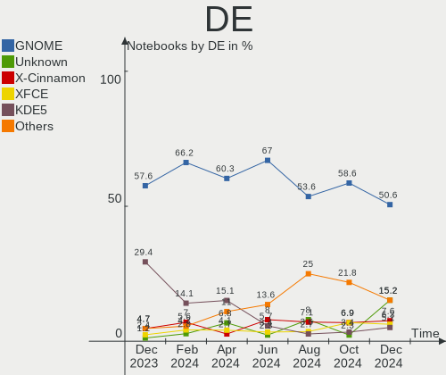

| Name       | Notebooks | Percent |
|------------|-----------|---------|
| GNOME      | 44        | 60.27%  |
| KDE5       | 11        | 15.07%  |
| KDE6       | 5         | 6.85%   |
| Unknown    | 5         | 6.85%   |
| XFCE       | 3         | 4.11%   |
| X-Cinnamon | 2         | 2.74%   |
| MATE       | 1         | 1.37%   |
| KDE4       | 1         | 1.37%   |
| bspwm      | 1         | 1.37%   |

Display Server
--------------

X11 or Wayland

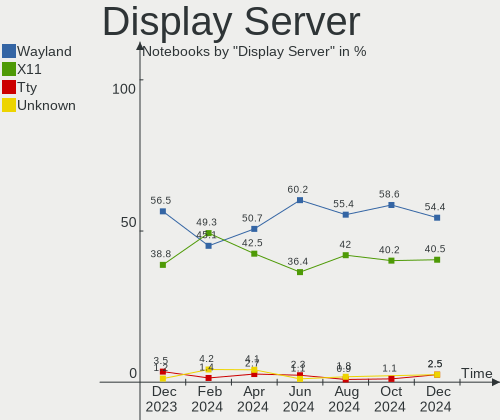

| Name    | Notebooks | Percent |
|---------|-----------|---------|
| Wayland | 37        | 50.68%  |
| X11     | 31        | 42.47%  |
| Unknown | 3         | 4.11%   |
| Tty     | 2         | 2.74%   |

Display Manager
---------------

SDDM, LightDM, etc.

| Name    | Notebooks | Percent |
|---------|-----------|---------|
| Unknown | 25        | 34.25%  |
| GDM3    | 23        | 31.51%  |
| SDDM    | 17        | 23.29%  |
| GDM     | 4         | 5.48%   |
| LightDM | 3         | 4.11%   |
| GREETD  | 1         | 1.37%   |

OS Lang
-------

Language

| Lang   | Notebooks | Percent |
|--------|-----------|---------|
| en_IN  | 38        | 52.05%  |
| en_US  | 29        | 39.73%  |
| C      | 4         | 5.48%   |
| en_AG  | 1         | 1.37%   |
| C.UTF8 | 1         | 1.37%   |

Boot Mode
---------

EFI or BIOS

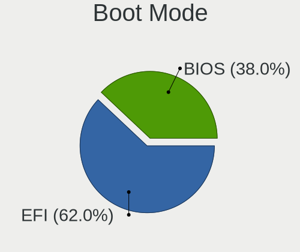

| Mode | Notebooks | Percent |
|------|-----------|---------|
| EFI  | 39        | 53.42%  |
| BIOS | 34        | 46.58%  |

Filesystem
----------

Type of filesystem

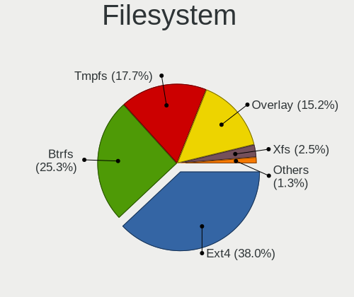

| Type    | Notebooks | Percent |
|---------|-----------|---------|
| Ext4    | 35        | 47.95%  |
| Btrfs   | 19        | 26.03%  |
| Tmpfs   | 13        | 17.81%  |
| Overlay | 5         | 6.85%   |
| Xfs     | 1         | 1.37%   |

Part. scheme
------------

Scheme of partitioning

| Type    | Notebooks | Percent |
|---------|-----------|---------|
| GPT     | 48        | 65.75%  |
| Unknown | 23        | 31.51%  |
| MBR     | 2         | 2.74%   |

Dual Boot with Linux/BSD
------------------------

Hosting more than one Linux/BSD

| Dual boot | Notebooks | Percent |
|-----------|-----------|---------|
| No        | 67        | 91.78%  |
| Yes       | 6         | 8.22%   |

Dual Boot (Win)
---------------

Hosting Linux and Windows

| Dual boot | Notebooks | Percent |
|-----------|-----------|---------|
| No        | 46        | 63.01%  |
| Yes       | 27        | 36.99%  |

Board
-----

Vendor
------

Motherboard manufacturer

| Name             | Notebooks | Percent |
|------------------|-----------|---------|
| Hewlett-Packard  | 20        | 27.4%   |
| ASUSTek Computer | 14        | 19.18%  |
| Lenovo           | 12        | 16.44%  |
| Dell             | 10        | 13.7%   |
| MSI              | 4         | 5.48%   |
| Acer             | 4         | 5.48%   |
| Timi             | 2         | 2.74%   |
| Infinix          | 2         | 2.74%   |
| Valve            | 1         | 1.37%   |
| Sony             | 1         | 1.37%   |
| Notebook         | 1         | 1.37%   |
| Framework        | 1         | 1.37%   |
| Apple            | 1         | 1.37%   |

Model
-----

Motherboard model

| Name                                  | Notebooks | Percent |
|---------------------------------------|-----------|---------|
| Infinix ZERO BOOK 13                  | 2         | 2.74%   |
| HP Pavilion Gaming Laptop 15-ec0xxx   | 2         | 2.74%   |
| HP Pavilion 15                        | 2         | 2.74%   |
| HP 15                                 | 2         | 2.74%   |
| Dell Inspiron 3501                    | 2         | 2.74%   |
| Valve Jupiter                         | 1         | 1.37%   |
| Timi RedmiBook 15                     | 1         | 1.37%   |
| Timi Mi NoteBook Pro                  | 1         | 1.37%   |
| Sony VPCEH25EN                        | 1         | 1.37%   |
| Notebook P7xxDM2(-G)                  | 1         | 1.37%   |
| MSI Thin GF63 12HW                    | 1         | 1.37%   |
| MSI Prestige 16 AI Studio B1VFG       | 1         | 1.37%   |
| MSI Modern 15 B7M                     | 1         | 1.37%   |
| MSI Modern 14 B10MW                   | 1         | 1.37%   |
| Lenovo ThinkPad T470 20HDS0C700       | 1         | 1.37%   |
| Lenovo ThinkPad T420 4236L35          | 1         | 1.37%   |
| Lenovo ThinkPad P50 20EN0013US        | 1         | 1.37%   |
| Lenovo ThinkPad P14s Gen 4 21K5S00700 | 1         | 1.37%   |
| Lenovo ThinkPad E14 Gen 5 21JKS0LH00  | 1         | 1.37%   |
| Lenovo ThinkPad E14 Gen 4 21E3S06300  | 1         | 1.37%   |
| Lenovo ThinkBook 15 G5 ABP 21JF       | 1         | 1.37%   |
| Lenovo ThinkBook 15 G3 ACL 21A4       | 1         | 1.37%   |
| Lenovo ThinkBook 15 G2 ITL 20VE       | 1         | 1.37%   |
| Lenovo Rev B 82LN                     | 1         | 1.37%   |
| Lenovo E41-25 81FS                    | 1         | 1.37%   |
| Lenovo B490 20205                     | 1         | 1.37%   |
| HP ZBook 15 G5                        | 1         | 1.37%   |
| HP Victus by Gaming Laptop 15-fa0xxx  | 1         | 1.37%   |
| HP Pavilion Laptop 14-bf1xx           | 1         | 1.37%   |
| HP Pavilion Gaming Laptop 15-ec2xxx   | 1         | 1.37%   |
| HP Pavilion Gaming Laptop 15-ec1xxx   | 1         | 1.37%   |
| HP OMEN Laptop 15-ek0xxx              | 1         | 1.37%   |
| HP Laptop 15q-ds0xxx                  | 1         | 1.37%   |
| HP Laptop 15q-bu0xx                   | 1         | 1.37%   |
| HP Laptop 15-da0xxx                   | 1         | 1.37%   |
| HP Laptop 15-bs1xx                    | 1         | 1.37%   |
| HP Laptop 14s-dk0xxx                  | 1         | 1.37%   |
| HP EliteBook Folio 9470m              | 1         | 1.37%   |
| HP EliteBook 735 G5                   | 1         | 1.37%   |
| HP 2000                               | 1         | 1.37%   |

Model Family
------------

Motherboard model prefix

| Name                 | Notebooks | Percent |
|----------------------|-----------|---------|
| ASUS VivoBook        | 8         | 10.96%  |
| HP Pavilion          | 7         | 9.59%   |
| Lenovo ThinkPad      | 6         | 8.22%   |
| HP Laptop            | 5         | 6.85%   |
| Dell Inspiron        | 5         | 6.85%   |
| Lenovo ThinkBook     | 3         | 4.11%   |
| ASUS ASUS            | 3         | 4.11%   |
| Acer Aspire          | 3         | 4.11%   |
| MSI Modern           | 2         | 2.74%   |
| Infinix ZERO         | 2         | 2.74%   |
| HP EliteBook         | 2         | 2.74%   |
| HP 15                | 2         | 2.74%   |
| Dell Latitude        | 2         | 2.74%   |
| ASUS ROG             | 2         | 2.74%   |
| Valve Jupiter        | 1         | 1.37%   |
| Timi RedmiBook       | 1         | 1.37%   |
| Timi Mi              | 1         | 1.37%   |
| Sony VPCEH25EN       | 1         | 1.37%   |
| Notebook P7xxDM2(-G) | 1         | 1.37%   |
| MSI Thin             | 1         | 1.37%   |
| MSI Prestige         | 1         | 1.37%   |
| Lenovo Rev           | 1         | 1.37%   |
| Lenovo E41-25        | 1         | 1.37%   |
| Lenovo B490          | 1         | 1.37%   |
| HP ZBook             | 1         | 1.37%   |
| HP Victus            | 1         | 1.37%   |
| HP OMEN              | 1         | 1.37%   |
| HP 2000              | 1         | 1.37%   |
| Framework Laptop     | 1         | 1.37%   |
| Dell XPS             | 1         | 1.37%   |
| Dell Vostro          | 1         | 1.37%   |
| Dell G15             | 1         | 1.37%   |
| ASUS X542UQ          | 1         | 1.37%   |
| Apple MacBookAir6    | 1         | 1.37%   |
| Acer Predator        | 1         | 1.37%   |

MFG Year
--------

Motherboard manufacture year

| Year | Notebooks | Percent |
|------|-----------|---------|
| 2023 | 13        | 17.81%  |
| 2022 | 9         | 12.33%  |
| 2021 | 8         | 10.96%  |
| 2020 | 8         | 10.96%  |
| 2018 | 6         | 8.22%   |
| 2013 | 6         | 8.22%   |
| 2019 | 5         | 6.85%   |
| 2017 | 5         | 6.85%   |
| 2016 | 4         | 5.48%   |
| 2015 | 3         | 4.11%   |
| 2011 | 3         | 4.11%   |
| 2012 | 2         | 2.74%   |
| 2024 | 1         | 1.37%   |

Form Factor
-----------

Physical design of the computer

| Name     | Notebooks | Percent |
|----------|-----------|---------|
| Notebook | 73        | 100%    |

Secure Boot
-----------

Enabled or disabled

| State    | Notebooks | Percent |
|----------|-----------|---------|
| Disabled | 68        | 93.15%  |
| Enabled  | 5         | 6.85%   |

Coreboot
--------

Have coreboot on board

| Used | Notebooks | Percent |
|------|-----------|---------|
| No   | 73        | 100%    |

RAM Size
--------

Total RAM memory

| Size in GB  | Notebooks | Percent |
|-------------|-----------|---------|
| 8.01-16.0   | 23        | 31.51%  |
| 4.01-8.0    | 20        | 27.4%   |
| 16.01-24.0  | 11        | 15.07%  |
| 3.01-4.0    | 7         | 9.59%   |
| 32.01-64.0  | 6         | 8.22%   |
| 24.01-32.0  | 3         | 4.11%   |
| 64.01-256.0 | 2         | 2.74%   |
| 1.01-2.0    | 1         | 1.37%   |

RAM Used
--------

Used RAM memory

| Used GB   | Notebooks | Percent |
|-----------|-----------|---------|
| 3.01-4.0  | 21        | 28.77%  |
| 2.01-3.0  | 20        | 27.4%   |
| 1.01-2.0  | 15        | 20.55%  |
| 4.01-8.0  | 14        | 19.18%  |
| 8.01-16.0 | 2         | 2.74%   |
| 0.51-1.0  | 1         | 1.37%   |

Total Drives
------------

Number of drives on board

| Drives | Notebooks | Percent |
|--------|-----------|---------|
| 1      | 54        | 73.97%  |
| 2      | 18        | 24.66%  |
| 4      | 1         | 1.37%   |

Has CD-ROM
----------

Has CD-ROM on board

| Presented | Notebooks | Percent |
|-----------|-----------|---------|
| No        | 60        | 82.19%  |
| Yes       | 13        | 17.81%  |

Has Ethernet
------------

Has Ethernet on board

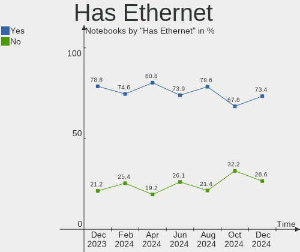

| Presented | Notebooks | Percent |
|-----------|-----------|---------|
| Yes       | 58        | 79.45%  |
| No        | 15        | 20.55%  |

Has WiFi
--------

Has WiFi module

| Presented | Notebooks | Percent |
|-----------|-----------|---------|
| Yes       | 72        | 98.63%  |
| No        | 1         | 1.37%   |

Has Bluetooth
-------------

Has Bluetooth module

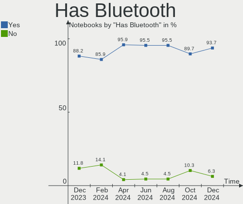

| Presented | Notebooks | Percent |
|-----------|-----------|---------|
| Yes       | 70        | 95.89%  |
| No        | 3         | 4.11%   |

Location
--------

Country
-------

Geographic location (country)

| Country | Notebooks | Percent |
|---------|-----------|---------|
| India   | 73        | 100%    |

City
----

Geographic location (city)

| City            | Notebooks | Percent |
|-----------------|-----------|---------|
| Bengaluru       | 12        | 16.44%  |
| Delhi           | 11        | 15.07%  |
| Chennai         | 6         | 8.22%   |
| Surat           | 3         | 4.11%   |
| Pune            | 3         | 4.11%   |
| Mumbai          | 3         | 4.11%   |
| Kolkata         | 3         | 4.11%   |
| Patna           | 2         | 2.74%   |
| Nagpur          | 2         | 2.74%   |
| Madurai         | 2         | 2.74%   |
| Lucknow         | 2         | 2.74%   |
| Kochi           | 2         | 2.74%   |
| Jaipur          | 2         | 2.74%   |
| Chandigarh      | 2         | 2.74%   |
| Bhopal          | 2         | 2.74%   |
| Vijayawada      | 1         | 1.37%   |
| Varanasi        | 1         | 1.37%   |
| Vadodara        | 1         | 1.37%   |
| Tiruchirappalli | 1         | 1.37%   |
| Shimla          | 1         | 1.37%   |
| Pathsala        | 1         | 1.37%   |
| Noida           | 1         | 1.37%   |
| Kanpur          | 1         | 1.37%   |
| Kannur          | 1         | 1.37%   |
| Hyderabad       | 1         | 1.37%   |
| Guwahati        | 1         | 1.37%   |
| Ghaziabad       | 1         | 1.37%   |
| Dehradun        | 1         | 1.37%   |
| Darbhanga       | 1         | 1.37%   |
| Bhubaneswar     | 1         | 1.37%   |
| Ahmedabad       | 1         | 1.37%   |

Drives
------

Drive Vendor
------------

Hard drive vendors

| Vendor                       | Notebooks | Drives | Percent |
|------------------------------|-----------|--------|---------|
| Samsung Electronics          | 13        | 13     | 13.98%  |
| Seagate                      | 12        | 12     | 12.9%   |
| WDC                          | 11        | 12     | 11.83%  |
| Micron Technology            | 9         | 9      | 9.68%   |
| Toshiba                      | 7         | 7      | 7.53%   |
| SK hynix                     | 6         | 6      | 6.45%   |
| SanDisk                      | 5         | 5      | 5.38%   |
| Crucial                      | 3         | 4      | 3.23%   |
| Union Memory (Shenzhen)      | 2         | 2      | 2.15%   |
| Micron/Crucial Technology    | 2         | 2      | 2.15%   |
| KIOXIA                       | 2         | 2      | 2.15%   |
| Intel                        | 2         | 2      | 2.15%   |
| FORESEE                      | 2         | 2      | 2.15%   |
| EVM                          | 2         | 2      | 2.15%   |
| Yangtze Memory Technologies  | 1         | 1      | 1.08%   |
| Unknown                      | 1         | 1      | 1.08%   |
| SMI                          | 1         | 1      | 1.08%   |
| Shenzhen Longsys Electronics | 1         | 1      | 1.08%   |
| Phison Electronics           | 1         | 1      | 1.08%   |
| O2 Micro                     | 1         | 1      | 1.08%   |
| Kingston                     | 1         | 1      | 1.08%   |
| Hitachi                      | 1         | 1      | 1.08%   |
| HGST                         | 1         | 1      | 1.08%   |
| Gigabyte Technology          | 1         | 1      | 1.08%   |
| CONSISTENT                   | 1         | 1      | 1.08%   |
| China                        | 1         | 1      | 1.08%   |
| BLUE                         | 1         | 1      | 1.08%   |
| Apple                        | 1         | 1      | 1.08%   |
| ADATA Technology             | 1         | 1      | 1.08%   |

Drive Model
-----------

Hard drive models

| Model                                              | Notebooks | Percent |
|----------------------------------------------------|-----------|---------|
| Seagate ST1000LM035-1RK172 1TB                     | 9         | 9.47%   |
| Toshiba MQ01ABD100 1TB                             | 3         | 3.16%   |
| Micron 2450_MTFDKBA512TFK 512GB                    | 3         | 3.16%   |
| WDC WD10JPVX-60JC3T0 1TB                           | 2         | 2.11%   |
| Toshiba KXG50ZNV512G 512GB                         | 2         | 2.11%   |
| Sandisk WD Blue SN550 NVMe SSD 2TB                 | 2         | 2.11%   |
| Samsung NVMe SSD Controller PM9A1/PM9A3/980PRO 1TB | 2         | 2.11%   |
| Samsung MZVL4512HBLU-00BTW 512GB                   | 2         | 2.11%   |
| Micron/Crucial P2 NVMe PCIe SSD 4TB                | 2         | 2.11%   |
| Yangtze Memory YMTC PC005 512GB                    | 1         | 1.05%   |
| WDC WDS240G2G0B-00EPW0 240GB SSD                   | 1         | 1.05%   |
| WDC WD5000LPLX-08ZNTT0 500GB                       | 1         | 1.05%   |
| WDC WD2500LPCX-24C6HT0 250GB                       | 1         | 1.05%   |
| WDC WD10SPZX-60Z10T0 1TB                           | 1         | 1.05%   |
| WDC WD10SPZX-08Z10 1TB                             | 1         | 1.05%   |
| WDC WD10SPSX-60A6WT0 1TB                           | 1         | 1.05%   |
| WDC WD10JPVX-75JC3T0 1TB                           | 1         | 1.05%   |
| WDC WD Green M.2 2280 240GB                        | 1         | 1.05%   |
| WDC WD Green 2.5 240GB                             | 1         | 1.05%   |
| WDC PC SN730 SDBPNTY-256G-1006 256GB               | 1         | 1.05%   |
| Unknown NVMe SSD Drive 2TB                         | 1         | 1.05%   |
| Union Memory (Shenzhen) UMIS RPJTJ512MKP1QDQ 512GB | 1         | 1.05%   |
| Union Memory (Shenzhen) UMIS RPJTJ512MGE1QDQ 512GB | 1         | 1.05%   |
| Toshiba MQ04ABF100 1TB                             | 1         | 1.05%   |
| Toshiba MQ01ABF050 500GB                           | 1         | 1.05%   |
| SMI 2263XT 256GB                                   | 1         | 1.05%   |
| SK hynix SKHynix_HFS512GEJ9X162N 512GB             | 1         | 1.05%   |
| SK hynix SKHynix_HFM512GD3HX015N 512GB             | 1         | 1.05%   |
| SK hynix PC601 HFS512GD9TNG-L2A0A 512GB            | 1         | 1.05%   |
| SK hynix HFS128G39TND-N210A 128GB SSD              | 1         | 1.05%   |
| SK hynix HFM512GD3JX013N 512GB                     | 1         | 1.05%   |
| SK hynix BC711 NVMe 512GB                          | 1         | 1.05%   |
| Shenzhen Longsys FORESEE XP2100F001T 1024GB        | 1         | 1.05%   |
| Seagate ST1000LM049-2GH172 1TB                     | 1         | 1.05%   |
| Seagate ST1000LM024 HN-M101MBB 1TB                 | 1         | 1.05%   |
| Seagate One Touch w/PW 4TB                         | 1         | 1.05%   |
| Sandisk WD Black SN850 512GB                       | 1         | 1.05%   |
| Sandisk PC SN530 NVMe WDC 256GB                    | 1         | 1.05%   |
| SanDisk NVMe SSD Drive 512GB                       | 1         | 1.05%   |
| Samsung SSD 990 PRO 2TB                            | 1         | 1.05%   |

HDD Vendor
----------

Hard disk drive vendors

| Vendor  | Notebooks | Drives | Percent |
|---------|-----------|--------|---------|
| Seagate | 11        | 11     | 40.74%  |
| WDC     | 9         | 9      | 33.33%  |
| Toshiba | 5         | 5      | 18.52%  |
| Hitachi | 1         | 1      | 3.7%    |
| HGST    | 1         | 1      | 3.7%    |

SSD Vendor
----------

Solid state drive vendors

| Vendor              | Notebooks | Drives | Percent |
|---------------------|-----------|--------|---------|
| Samsung Electronics | 4         | 4      | 23.53%  |
| Crucial             | 3         | 3      | 17.65%  |
| WDC                 | 2         | 2      | 11.76%  |
| EVM                 | 2         | 2      | 11.76%  |
| SK hynix            | 1         | 1      | 5.88%   |
| Kingston            | 1         | 1      | 5.88%   |
| FORESEE             | 1         | 1      | 5.88%   |
| China               | 1         | 1      | 5.88%   |
| BLUE                | 1         | 1      | 5.88%   |
| Apple               | 1         | 1      | 5.88%   |

Drive Kind
----------

HDD or SSD

| Kind    | Notebooks | Drives | Percent |
|---------|-----------|--------|---------|
| NVMe    | 46        | 49     | 51.11%  |
| HDD     | 26        | 27     | 28.89%  |
| SSD     | 16        | 17     | 17.78%  |
| Unknown | 2         | 2      | 2.22%   |

Drive Connector
---------------

SATA, SAS, NVMe, etc.

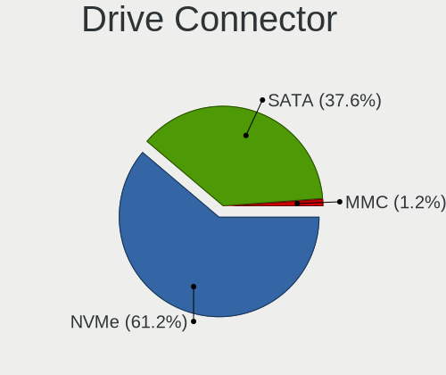

| Type | Notebooks | Drives | Percent |
|------|-----------|--------|---------|
| NVMe | 46        | 49     | 55.42%  |
| SATA | 36        | 45     | 43.37%  |
| SAS  | 1         | 1      | 1.2%    |

Drive Size
----------

Size of hard drive

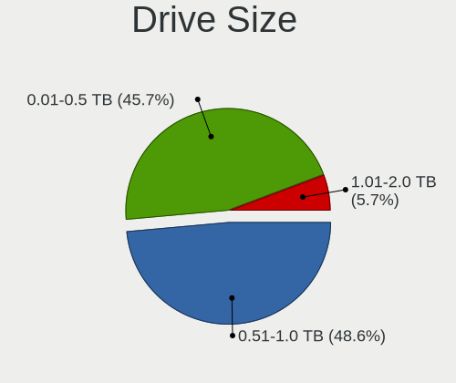

| Size in TB | Notebooks | Drives | Percent |
|------------|-----------|--------|---------|
| 0.51-1.0   | 24        | 26     | 60%     |
| 0.01-0.5   | 16        | 18     | 40%     |

Space Total
-----------

Amount of disk space available on the file system

| Size in GB     | Notebooks | Percent |
|----------------|-----------|---------|
| 251-500        | 20        | 27.4%   |
| 101-250        | 19        | 26.03%  |
| 501-1000       | 11        | 15.07%  |
| 51-100         | 9         | 12.33%  |
| 1001-2000      | 5         | 6.85%   |
| 21-50          | 4         | 5.48%   |
| 1-20           | 2         | 2.74%   |
| More than 3000 | 1         | 1.37%   |
| 2001-3000      | 1         | 1.37%   |
| Unknown        | 1         | 1.37%   |

Space Used
----------

Amount of used disk space

| Used GB  | Notebooks | Percent |
|----------|-----------|---------|
| 1-20     | 30        | 41.1%   |
| 101-250  | 14        | 19.18%  |
| 21-50    | 11        | 15.07%  |
| 51-100   | 8         | 10.96%  |
| 251-500  | 5         | 6.85%   |
| 501-1000 | 4         | 5.48%   |
| Unknown  | 1         | 1.37%   |

Malfunc. Drives
---------------

Drive models with a malfunction

| Model                            | Notebooks | Drives | Percent |
|----------------------------------|-----------|--------|---------|
| WDC WD10JPVX-60JC3T0 1TB         | 1         | 1      | 16.67%  |
| WDC WD Green 2.5 240GB           | 1         | 1      | 16.67%  |
| Toshiba MQ01ABD100 1TB           | 1         | 1      | 16.67%  |
| Seagate ST1000LM035-1RK172 1TB   | 1         | 1      | 16.67%  |
| Gigabyte Technology GP-GM301TB-G | 1         | 1      | 16.67%  |
| Crucial CT1050MX300SSD4 1TB      | 1         | 1      | 16.67%  |

Malfunc. Drive Vendor
---------------------

Vendors of faulty drives

| Vendor              | Notebooks | Drives | Percent |
|---------------------|-----------|--------|---------|
| WDC                 | 2         | 2      | 33.33%  |
| Toshiba             | 1         | 1      | 16.67%  |
| Seagate             | 1         | 1      | 16.67%  |
| Gigabyte Technology | 1         | 1      | 16.67%  |
| Crucial             | 1         | 1      | 16.67%  |

Malfunc. HDD Vendor
-------------------

Vendors of faulty HDD drives

| Vendor  | Notebooks | Drives | Percent |
|---------|-----------|--------|---------|
| WDC     | 1         | 1      | 33.33%  |
| Toshiba | 1         | 1      | 33.33%  |
| Seagate | 1         | 1      | 33.33%  |

Malfunc. Drive Kind
-------------------

Kinds of faulty drives

| Kind | Notebooks | Drives | Percent |
|------|-----------|--------|---------|
| HDD  | 3         | 3      | 50%     |
| SSD  | 2         | 2      | 33.33%  |
| NVMe | 1         | 1      | 16.67%  |

Failed Drives
-------------

Failed drive models

Zero info for selected period =(

Failed Drive Vendor
-------------------

Failed drive vendors

Zero info for selected period =(

Drive Status
------------

Number of failed and malfunc. drives

| Status   | Notebooks | Drives | Percent |
|----------|-----------|--------|---------|
| Detected | 38        | 48     | 51.35%  |
| Works    | 32        | 41     | 43.24%  |
| Malfunc  | 4         | 6      | 5.41%   |

Storage controller
------------------

Storage Vendor
--------------

Storage controller vendors

| Vendor                                  | Notebooks | Percent |
|-----------------------------------------|-----------|---------|
| Intel                                   | 44        | 42.72%  |
| AMD                                     | 11        | 10.68%  |
| Samsung Electronics                     | 9         | 8.74%   |
| Micron Technology                       | 9         | 8.74%   |
| SanDisk                                 | 6         | 5.83%   |
| SK hynix                                | 5         | 4.85%   |
| Micron/Crucial Technology               | 3         | 2.91%   |
| Toshiba America Info Systems            | 2         | 1.94%   |
| Shenzhen Longsys Electronics            | 2         | 1.94%   |
| KIOXIA                                  | 2         | 1.94%   |
| Yangtze Memory Technologies             | 1         | 0.97%   |
| Union Memory (Shenzhen)                 | 1         | 0.97%   |
| Silicon Motion                          | 1         | 0.97%   |
| Shenzhen Unionmemory Information System | 1         | 0.97%   |
| Realtek Semiconductor                   | 1         | 0.97%   |
| Phison Electronics                      | 1         | 0.97%   |
| O2 Micro                                | 1         | 0.97%   |
| Marvell Technology Group                | 1         | 0.97%   |
| INNOGRIT                                | 1         | 0.97%   |
| ADATA Technology                        | 1         | 0.97%   |

Storage Model
-------------

Storage controller models

| Model                                                                                       | Notebooks | Percent |
|---------------------------------------------------------------------------------------------|-----------|---------|
| AMD FCH SATA Controller [AHCI mode]                                                         | 11        | 10.19%  |
| Intel Volume Management Device NVMe RAID Controller                                         | 8         | 7.41%   |
| Intel 82801 Mobile SATA Controller [RAID mode]                                              | 8         | 7.41%   |
| Intel Sunrise Point-LP SATA Controller [AHCI mode]                                          | 7         | 6.48%   |
| Intel Tiger Lake-LP SATA Controller                                                         | 5         | 4.63%   |
| Micron 2450 NVMe SSD [HendrixV] (DRAM-less)                                                 | 4         | 3.7%    |
| SK hynix Gold P31/BC711/PC711 NVMe Solid State Drive                                        | 3         | 2.78%   |
| Samsung NVMe SSD Controller 980 (DRAM-less)                                                 | 3         | 2.78%   |
| Intel Alder Lake-P SATA AHCI Controller                                                     | 3         | 2.78%   |
| Intel 8 Series SATA Controller 1 [AHCI mode]                                                | 3         | 2.78%   |
| Intel 7 Series Chipset Family 6-port SATA Controller [AHCI mode]                            | 3         | 2.78%   |
| Toshiba America Info Systems XG5 NVMe SSD Controller                                        | 2         | 1.85%   |
| Shenzhen Longsys FORESEE XP2100 NVMe SSD (DRAM-less)                                        | 2         | 1.85%   |
| SanDisk Ultra 3D / WD Blue SN550 NVMe SSD                                                   | 2         | 1.85%   |
| Samsung NVMe SSD Controller PM9B1 (DRAM-less)                                               | 2         | 1.85%   |
| Samsung NVMe SSD Controller PM9A1/PM9A3/980PRO                                              | 2         | 1.85%   |
| Micron/Crucial P2 [Nick P2] / P3 / P3 Plus NVMe PCIe SSD (DRAM-less)                        | 2         | 1.85%   |
| Micron 2400 NVMe SSD (DRAM-less)                                                            | 2         | 1.85%   |
| Micron 2210 NVMe SSD [Cobain]                                                               | 2         | 1.85%   |
| KIOXIA NVMe SSD Controller BG4 (DRAM-less)                                                  | 2         | 1.85%   |
| Intel Q170/Q150/B150/H170/H110/Z170/CM236 Chipset SATA Controller [AHCI Mode]               | 2         | 1.85%   |
| Intel 6 Series/C200 Series Chipset Family 6 port Mobile SATA AHCI Controller                | 2         | 1.85%   |
| Yangtze Memory PC005 NVMe SSD                                                               | 1         | 0.93%   |
| Union Memory (Shenzhen) AM630 PCIe 4.0 x4 NVMe SSD Controller                               | 1         | 0.93%   |
| SK hynix Platinum P41/PC801 NVMe Solid State Drive                                          | 1         | 0.93%   |
| SK hynix PC601 NVMe Solid State Drive                                                       | 1         | 0.93%   |
| Silicon Motion SM2263EN/SM2263XT (DRAM-less) NVMe SSD Controllers                           | 1         | 0.93%   |
| Shenzhen Unionmemory Information System RPETJ512MKP1QDQ PCIe 4.0 NVMe SSD 512GB (DRAM-less) | 1         | 0.93%   |
| SanDisk WD PC SN810 / Black SN850 NVMe SSD                                                  | 1         | 0.93%   |
| SanDisk WD Black SN770 / PC SN740 256GB / PC SN560 (DRAM-less) NVMe SSD                     | 1         | 0.93%   |
| SanDisk IX SN530 NVMe SSD (DRAM-less)                                                       | 1         | 0.93%   |
| SanDisk Extreme Pro / WD Black SN750 / PC SN730 / Red SN700 NVMe SSD                        | 1         | 0.93%   |
| Samsung NVMe SSD Controller SM981/PM981/PM983                                               | 1         | 0.93%   |
| Samsung NVMe SSD Controller S4LV008[Pascal]                                                 | 1         | 0.93%   |
| Realtek RTS5762 NVMe SSD Controller                                                         | 1         | 0.93%   |
| Phison E18 PCIe4 NVMe Controller                                                            | 1         | 0.93%   |
| O2 Micro FORESEE E2M2 NVMe SSD                                                              | 1         | 0.93%   |
| Micron/Crucial P1 NVMe PCIe SSD[Frampton]                                                   | 1         | 0.93%   |
| Micron 3400 NVMe SSD [Hendrix]                                                              | 1         | 0.93%   |
| Marvell Group 88SS9183 PCIe SSD Controller                                                  | 1         | 0.93%   |

Storage Kind
------------

Kind of storage controller (IDE, SATA, NVMe, SAS, ...)

| Kind | Notebooks | Percent |
|------|-----------|---------|
| NVMe | 46        | 43.81%  |
| SATA | 41        | 39.05%  |
| RAID | 17        | 16.19%  |
| IDE  | 1         | 0.95%   |

Processor
---------

CPU Vendor
----------

Processor vendors

| Vendor | Notebooks | Percent |
|--------|-----------|---------|
| Intel  | 55        | 75.34%  |
| AMD    | 18        | 24.66%  |

CPU Model
---------

Processor models

| Model                                         | Notebooks | Percent |
|-----------------------------------------------|-----------|---------|
| Intel Core i5-8250U CPU @ 1.60GHz             | 4         | 5.48%   |
| Intel 12th Gen Core i5-12450H                 | 3         | 4.11%   |
| Intel 11th Gen Core i5-1135G7 @ 2.40GHz       | 3         | 4.11%   |
| Intel Core i7-8750H CPU @ 2.20GHz             | 2         | 2.74%   |
| Intel Core i7-7500U CPU @ 2.70GHz             | 2         | 2.74%   |
| Intel Core i5-6200U CPU @ 2.30GHz             | 2         | 2.74%   |
| Intel Core i5-10300H CPU @ 2.50GHz            | 2         | 2.74%   |
| Intel Core i3-4030U CPU @ 1.90GHz             | 2         | 2.74%   |
| Intel 13th Gen Core i9-13900H                 | 2         | 2.74%   |
| Intel 12th Gen Core i7-12700H                 | 2         | 2.74%   |
| Intel 11th Gen Core i3-1115G4 @ 3.00GHz       | 2         | 2.74%   |
| AMD Ryzen 7 5800HS with Radeon Graphics       | 2         | 2.74%   |
| AMD Ryzen 5 5600H with Radeon Graphics        | 2         | 2.74%   |
| AMD Ryzen 5 3550H with Radeon Vega Mobile Gfx | 2         | 2.74%   |
| Intel Pentium Silver N6000 @ 1.10GHz          | 1         | 1.37%   |
| Intel Pentium CPU N3540 @ 2.16GHz             | 1         | 1.37%   |
| Intel Pentium CPU A1018 @ 2.10GHz             | 1         | 1.37%   |
| Intel Core Ultra 7 155H                       | 1         | 1.37%   |
| Intel Core i7-8550U CPU @ 1.80GHz             | 1         | 1.37%   |
| Intel Core i7-7700K CPU @ 4.20GHz             | 1         | 1.37%   |
| Intel Core i7-6700HQ CPU @ 2.60GHz            | 1         | 1.37%   |
| Intel Core i7-2640M CPU @ 2.80GHz             | 1         | 1.37%   |
| Intel Core i7-10870H CPU @ 2.20GHz            | 1         | 1.37%   |
| Intel Core i5-8365U CPU @ 1.60GHz             | 1         | 1.37%   |
| Intel Core i5-8300H CPU @ 2.30GHz             | 1         | 1.37%   |
| Intel Core i5-7200U CPU @ 2.50GHz             | 1         | 1.37%   |
| Intel Core i5-5250U CPU @ 1.60GHz             | 1         | 1.37%   |
| Intel Core i5-4250U CPU @ 1.30GHz             | 1         | 1.37%   |
| Intel Core i5-4210U CPU @ 1.70GHz             | 1         | 1.37%   |
| Intel Core i5-3437U CPU @ 1.90GHz             | 1         | 1.37%   |
| Intel Core i5-3210M CPU @ 2.50GHz             | 1         | 1.37%   |
| Intel Core i5-10210U CPU @ 1.60GHz            | 1         | 1.37%   |
| Intel Core i3-7020U CPU @ 2.30GHz             | 1         | 1.37%   |
| Intel Core i3-2330M CPU @ 2.20GHz             | 1         | 1.37%   |
| Intel Core i3-1005G1 CPU @ 1.20GHz            | 1         | 1.37%   |
| Intel 13th Gen Core i9-13980HX                | 1         | 1.37%   |
| Intel 13th Gen Core i7-1355U                  | 1         | 1.37%   |
| Intel 12th Gen Core i7-12650H                 | 1         | 1.37%   |
| Intel 12th Gen Core i5-12500H                 | 1         | 1.37%   |
| Intel 12th Gen Core i5-1240P                  | 1         | 1.37%   |

CPU Model Family
----------------

Processor model prefix

| Model                | Notebooks | Percent |
|----------------------|-----------|---------|
| Other                | 22        | 30.14%  |
| Intel Core i5        | 17        | 23.29%  |
| Intel Core i7        | 9         | 12.33%  |
| AMD Ryzen 5          | 7         | 9.59%   |
| AMD Ryzen 7          | 6         | 8.22%   |
| Intel Core i3        | 5         | 6.85%   |
| Intel Pentium        | 2         | 2.74%   |
| Intel Pentium Silver | 1         | 1.37%   |
| Intel Core           | 1         | 1.37%   |
| AMD Ryzen 7 PRO      | 1         | 1.37%   |
| AMD Ryzen 5 PRO      | 1         | 1.37%   |
| AMD Ryzen 3          | 1         | 1.37%   |

CPU Cores
---------

Number of processor cores

| Number | Notebooks | Percent |
|--------|-----------|---------|
| 4      | 25        | 34.25%  |
| 2      | 20        | 27.4%   |
| 8      | 11        | 15.07%  |
| 6      | 6         | 8.22%   |
| 14     | 4         | 5.48%   |
| 10     | 3         | 4.11%   |
| 12     | 2         | 2.74%   |
| 24     | 1         | 1.37%   |
| 16     | 1         | 1.37%   |

CPU Sockets
-----------

Number of sockets

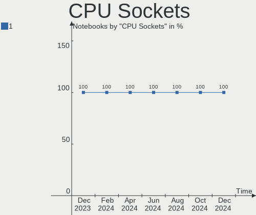

| Number | Notebooks | Percent |
|--------|-----------|---------|
| 1      | 73        | 100%    |

CPU Threads
-----------

Threads per core (Hyper-Threading)

| Number | Notebooks | Percent |
|--------|-----------|---------|
| 2      | 67        | 91.78%  |
| 1      | 6         | 8.22%   |

CPU Op-Modes
------------

CPU Operation Modes (32-bit, 64-bit)

| Op mode        | Notebooks | Percent |
|----------------|-----------|---------|
| 32-bit, 64-bit | 73        | 100%    |

CPU Microcode
-------------

Microcode number

| Number     | Notebooks | Percent |
|------------|-----------|---------|
| Unknown    | 63        | 86.3%   |
| 0x906e9    | 1         | 1.37%   |
| 0x806ea    | 1         | 1.37%   |
| 0x806e9    | 1         | 1.37%   |
| 0x706e5    | 1         | 1.37%   |
| 0x30678    | 1         | 1.37%   |
| 0x0a50000d | 1         | 1.37%   |
| 0x08608103 | 1         | 1.37%   |
| 0x08600106 | 1         | 1.37%   |
| 0x08108109 | 1         | 1.37%   |
| 0x06006705 | 1         | 1.37%   |

CPU Microarch
-------------

Microarchitecture

| Name              | Notebooks | Percent |
|-------------------|-----------|---------|
| KabyLake          | 15        | 20.55%  |
| Unknown           | 12        | 16.44%  |
| TigerLake         | 7         | 9.59%   |
| Zen 3             | 6         | 8.22%   |
| Alderlake Hybrid  | 6         | 8.22%   |
| Haswell           | 4         | 5.48%   |
| Zen+              | 3         | 4.11%   |
| Skylake           | 3         | 4.11%   |
| IvyBridge         | 3         | 4.11%   |
| CometLake         | 3         | 4.11%   |
| Zen 2             | 2         | 2.74%   |
| SandyBridge       | 2         | 2.74%   |
| Zen               | 1         | 1.37%   |
| Tremont           | 1         | 1.37%   |
| Silvermont        | 1         | 1.37%   |
| Meteorlake Hybrid | 1         | 1.37%   |
| IceLake           | 1         | 1.37%   |
| Excavator         | 1         | 1.37%   |
| Broadwell         | 1         | 1.37%   |

Graphics
--------

GPU Vendor
----------

Vendors of graphics cards

| Vendor | Notebooks | Percent |
|--------|-----------|---------|
| Intel  | 53        | 49.53%  |
| Nvidia | 32        | 29.91%  |
| AMD    | 22        | 20.56%  |

GPU Model
---------

Graphics card models

| Model                                                                         | Notebooks | Percent |
|-------------------------------------------------------------------------------|-----------|---------|
| Nvidia TU117M [GeForce GTX 1650 Mobile / Max-Q]                               | 7         | 6.48%   |
| Intel UHD Graphics 620                                                        | 5         | 4.63%   |
| Intel TigerLake-LP GT2 [Iris Xe Graphics]                                     | 5         | 4.63%   |
| Nvidia GA107M [GeForce RTX 3050 Mobile]                                       | 4         | 3.7%    |
| Intel HD Graphics 620                                                         | 4         | 3.7%    |
| Intel Haswell-ULT Integrated Graphics Controller                              | 4         | 3.7%    |
| Intel Alder Lake-P GT1 [UHD Graphics]                                         | 4         | 3.7%    |
| AMD Cezanne [Radeon Vega Series / Radeon Vega Mobile Series]                  | 4         | 3.7%    |
| Intel Raptor Lake-P [Iris Xe Graphics]                                        | 3         | 2.78%   |
| Intel CometLake-H GT2 [UHD Graphics]                                          | 3         | 2.78%   |
| Intel CoffeeLake-H GT2 [UHD Graphics 630]                                     | 3         | 2.78%   |
| Intel Alder Lake-P GT2 [Iris Xe Graphics]                                     | 3         | 2.78%   |
| Intel 3rd Gen Core processor Graphics Controller                              | 3         | 2.78%   |
| AMD Picasso/Raven 2 [Radeon Vega Series / Radeon Vega Mobile Series]          | 3         | 2.78%   |
| Nvidia GM108M [GeForce 940MX]                                                 | 2         | 1.85%   |
| Nvidia AD107M [GeForce RTX 4060 Max-Q / Mobile]                               | 2         | 1.85%   |
| Intel Tiger Lake-LP GT2 [UHD Graphics G4]                                     | 2         | 1.85%   |
| Intel Skylake GT2 [HD Graphics 520]                                           | 2         | 1.85%   |
| AMD Sun XT [Radeon HD 8670A/8670M/8690M / R5 M330 / M430 / Radeon 520 Mobile] | 2         | 1.85%   |
| AMD Renoir [Radeon RX Vega 6 (Ryzen 4000/5000 Mobile Series)]                 | 2         | 1.85%   |
| AMD Phoenix1                                                                  | 2         | 1.85%   |
| AMD Lucienne                                                                  | 2         | 1.85%   |
| AMD Barcelo                                                                   | 2         | 1.85%   |
| Nvidia TU117M [GeForce GTX 1650 Ti Mobile]                                    | 1         | 0.93%   |
| Nvidia TU116M [GeForce GTX 1660 Ti Mobile]                                    | 1         | 0.93%   |
| Nvidia GP108M [GeForce MX330]                                                 | 1         | 0.93%   |
| Nvidia GP107M [GeForce GTX 1050 Ti Mobile]                                    | 1         | 0.93%   |
| Nvidia GP107GLM [Quadro P1000 Mobile]                                         | 1         | 0.93%   |
| Nvidia GP104M [GeForce GTX 1070 Mobile]                                       | 1         | 0.93%   |
| Nvidia GM108M [GeForce MX130]                                                 | 1         | 0.93%   |
| Nvidia GM108M [GeForce MX110]                                                 | 1         | 0.93%   |
| Nvidia GM108M [GeForce 830M]                                                  | 1         | 0.93%   |
| Nvidia GM107GLM [Quadro M1000M]                                               | 1         | 0.93%   |
| Nvidia GK208BM [GeForce 920M]                                                 | 1         | 0.93%   |
| Nvidia GF119M [GeForce 410M]                                                  | 1         | 0.93%   |
| Nvidia GF117M [GeForce 610M/710M/810M/820M / GT 620M/625M/630M/720M]          | 1         | 0.93%   |
| Nvidia GA107M [GeForce RTX 2050]                                              | 1         | 0.93%   |
| Nvidia GA107BM [GeForce RTX 3050 Mobile]                                      | 1         | 0.93%   |
| Nvidia GA107 [GeForce RTX 2050]                                               | 1         | 0.93%   |
| Nvidia AD106M [GeForce RTX 4070 Max-Q / Mobile]                               | 1         | 0.93%   |

GPU Combo
---------

Combinations of graphics cards

| Name           | Notebooks | Percent |
|----------------|-----------|---------|
| 1 x Intel      | 26        | 35.62%  |
| Intel + Nvidia | 21        | 28.77%  |
| 1 x AMD        | 11        | 15.07%  |
| AMD + Nvidia   | 7         | 9.59%   |
| 1 x Nvidia     | 4         | 5.48%   |
| Intel + AMD    | 4         | 5.48%   |

GPU Driver
----------

Free vs proprietary

| Driver      | Notebooks | Percent |
|-------------|-----------|---------|
| Free        | 50        | 68.49%  |
| Proprietary | 18        | 24.66%  |
| Unknown     | 5         | 6.85%   |

GPU Memory
----------

Total video memory

| Size in GB | Notebooks | Percent |
|------------|-----------|---------|
| Unknown    | 53        | 72.6%   |
| 1.01-2.0   | 8         | 10.96%  |
| 0.01-0.5   | 7         | 9.59%   |
| 3.01-4.0   | 4         | 5.48%   |
| 0.51-1.0   | 1         | 1.37%   |

Monitor
-------

Monitor Vendor
--------------

Monitor vendors

| Vendor              | Notebooks | Percent |
|---------------------|-----------|---------|
| BOE                 | 18        | 23.68%  |
| Chimei Innolux      | 14        | 18.42%  |
| AU Optronics        | 13        | 17.11%  |
| LG Display          | 12        | 15.79%  |
| PANDA               | 4         | 5.26%   |
| Sharp               | 2         | 2.63%   |
| Samsung Electronics | 2         | 2.63%   |
| KDB                 | 2         | 2.63%   |
| Goldstar            | 2         | 2.63%   |
| Valve               | 1         | 1.32%   |
| TMX                 | 1         | 1.32%   |
| InfoVision          | 1         | 1.32%   |
| Gigabyte Technology | 1         | 1.32%   |
| Dell                | 1         | 1.32%   |
| BenQ                | 1         | 1.32%   |
| Apple               | 1         | 1.32%   |

Monitor Model
-------------

Monitor models

| Model                                                                 | Notebooks | Percent |
|-----------------------------------------------------------------------|-----------|---------|
| AU Optronics LCD Monitor AUO38ED 1920x1080 344x193mm 15.5-inch        | 3         | 3.95%   |
| KDB LCD Monitor KDB0526 1920x1080 344x194mm 15.5-inch                 | 2         | 2.63%   |
| Chimei Innolux LCD Monitor CMN15F5 1920x1080 344x193mm 15.5-inch      | 2         | 2.63%   |
| Chimei Innolux LCD Monitor CMN15E7 1920x1080 344x193mm 15.5-inch      | 2         | 2.63%   |
| Chimei Innolux LCD Monitor CMN15AB 1366x768 344x193mm 15.5-inch       | 2         | 2.63%   |
| Chimei Innolux LCD Monitor CMN1521 1920x1080 344x193mm 15.5-inch      | 2         | 2.63%   |
| Chimei Innolux LCD Monitor CMN14D6 1366x768 309x173mm 13.9-inch       | 2         | 2.63%   |
| AU Optronics LCD Monitor AUO2992 1920x1080 344x193mm 15.5-inch        | 2         | 2.63%   |
| Valve ANX7530 U VLV3001 800x1280 100x150mm 7.1-inch                   | 1         | 1.32%   |
| TMX TL156VDXP01 TMX1560 1920x1080 344x194mm 15.5-inch                 | 1         | 1.32%   |
| Sharp LQ140M1JW49 SHP1523 1920x1080 309x174mm 14.0-inch               | 1         | 1.32%   |
| Sharp LCD Monitor SHP1449 1920x1080 294x165mm 13.3-inch               | 1         | 1.32%   |
| Samsung Electronics LCD Monitor SDC4161 1920x1080 344x194mm 15.5-inch | 1         | 1.32%   |
| Samsung Electronics LCD Monitor SDC4154 2880x1800 302x189mm 14.0-inch | 1         | 1.32%   |
| PANDA LCD Monitor NCP004D 1920x1080 344x194mm 15.5-inch               | 1         | 1.32%   |
| PANDA LCD Monitor NCP0040 1920x1080 344x194mm 15.5-inch               | 1         | 1.32%   |
| PANDA LCD Monitor NCP0036 1920x1080 344x194mm 15.5-inch               | 1         | 1.32%   |
| PANDA LCD Monitor NCP0035 1920x1080 309x174mm 14.0-inch               | 1         | 1.32%   |
| LG Display LCD Monitor LGD0738 1920x1080 344x194mm 15.5-inch          | 1         | 1.32%   |
| LG Display LCD Monitor LGD069A 1920x1080 344x194mm 15.5-inch          | 1         | 1.32%   |
| LG Display LCD Monitor LGD062E 1920x1080 344x194mm 15.5-inch          | 1         | 1.32%   |
| LG Display LCD Monitor LGD05CE 1920x1080 344x194mm 15.5-inch          | 1         | 1.32%   |
| LG Display LCD Monitor LGD0563 1920x1080 344x194mm 15.5-inch          | 1         | 1.32%   |
| LG Display LCD Monitor LGD051F 1920x1080 344x194mm 15.5-inch          | 1         | 1.32%   |
| LG Display LCD Monitor LGD04AF 1366x768 344x194mm 15.5-inch           | 1         | 1.32%   |
| LG Display LCD Monitor LGD04A7 1920x1080 344x194mm 15.5-inch          | 1         | 1.32%   |
| LG Display LCD Monitor LGD0484 1366x768 344x194mm 15.5-inch           | 1         | 1.32%   |
| LG Display LCD Monitor LGD046F 1920x1080 340x190mm 15.3-inch          | 1         | 1.32%   |
| LG Display LCD Monitor LGD0465 1366x768 344x194mm 15.5-inch           | 1         | 1.32%   |
| LG Display LCD Monitor LGD02F2 1366x768 344x194mm 15.5-inch           | 1         | 1.32%   |
| InfoVision LCD Monitor IVO057D 1920x1080 309x174mm 14.0-inch          | 1         | 1.32%   |
| Goldstar IPS FULLHD GSM5AB8 1920x1080 480x270mm 21.7-inch             | 1         | 1.32%   |
| Goldstar FHD GSM5C68 1920x1080 480x260mm 21.5-inch                    | 1         | 1.32%   |
| Gigabyte Technology G24F 2 GBT2403 1920x1080 527x296mm 23.8-inch      | 1         | 1.32%   |
| Dell P2419H DELD0DA 1920x1080 527x296mm 23.8-inch                     | 1         | 1.32%   |
| Chimei Innolux LCD Monitor CMN1484 1600x900 310x174mm 14.0-inch       | 1         | 1.32%   |
| Chimei Innolux LCD Monitor CMN143F 1920x1200 301x188mm 14.0-inch      | 1         | 1.32%   |
| Chimei Innolux LCD Monitor CMN142B 1920x1080 309x173mm 13.9-inch      | 1         | 1.32%   |
| Chimei Innolux LCD Monitor CMN1375 1920x1080 293x165mm 13.2-inch      | 1         | 1.32%   |
| BOE NE156FHM-NX6 BOE0B70 1920x1080 344x194mm 15.5-inch                | 1         | 1.32%   |

Monitor Resolution
------------------

Monitor screen resolution

| Resolution        | Notebooks | Percent |
|-------------------|-----------|---------|
| 1920x1080 (FHD)   | 46        | 64.79%  |
| 1366x768 (WXGA)   | 15        | 21.13%  |
| 2560x1600         | 2         | 2.82%   |
| 1920x1200 (WUXGA) | 2         | 2.82%   |
| 800x1280          | 1         | 1.41%   |
| 3200x2000         | 1         | 1.41%   |
| 2880x1800         | 1         | 1.41%   |
| 2256x1504         | 1         | 1.41%   |
| 1600x900 (HD+)    | 1         | 1.41%   |
| 1440x900 (WXGA+)  | 1         | 1.41%   |

Monitor Diagonal
----------------

Diagonal size in inches

| Inches | Notebooks | Percent |
|--------|-----------|---------|
| 15     | 45        | 59.21%  |
| 14     | 12        | 15.79%  |
| 13     | 11        | 14.47%  |
| 24     | 2         | 2.63%   |
| 21     | 2         | 2.63%   |
| 23     | 1         | 1.32%   |
| 16     | 1         | 1.32%   |
| 12     | 1         | 1.32%   |
| 7      | 1         | 1.32%   |

Monitor Width
-------------

Physical width

| Width in mm | Notebooks | Percent |
|-------------|-----------|---------|
| 301-350     | 65        | 85.53%  |
| 201-300     | 5         | 6.58%   |
| 501-600     | 3         | 3.95%   |
| 401-500     | 2         | 2.63%   |
| 1-100       | 1         | 1.32%   |

Aspect Ratio
------------

Proportional relationship between the width and the height

| Ratio | Notebooks | Percent |
|-------|-----------|---------|
| 16/9  | 62        | 87.32%  |
| 16/10 | 7         | 9.86%   |
| 3/2   | 1         | 1.41%   |
| 0.67  | 1         | 1.41%   |

Monitor Area
------------

Area in inch

| Area in inch | Notebooks | Percent |
|----------------|-----------|---------|
| 101-110        | 45        | 59.21%  |
| 81-90          | 20        | 26.32%  |
| 201-250        | 4         | 5.26%   |
| 71-80          | 3         | 3.95%   |
| 61-70          | 1         | 1.32%   |
| 1-40           | 1         | 1.32%   |
| 151-200        | 1         | 1.32%   |
| 111-120        | 1         | 1.32%   |

Pixel Density
-------------

Pixels per inch

| Density       | Notebooks | Percent |
|---------------|-----------|---------|
| 121-160       | 47        | 61.84%  |
| 101-120       | 14        | 18.42%  |
| 161-240       | 8         | 10.53%  |
| 51-100        | 5         | 6.58%   |
| More than 240 | 2         | 2.63%   |

Multiple Monitors
-----------------

Total monitors connected

| Total | Notebooks | Percent |
|-------|-----------|---------|
| 1     | 66        | 90.41%  |
| 2     | 5         | 6.85%   |
| 0     | 2         | 2.74%   |

Network
-------

Net Controller Vendor
---------------------

Controller vendors

| Vendor                | Notebooks | Percent |
|-----------------------|-----------|---------|
| Realtek Semiconductor | 50        | 43.86%  |
| Intel                 | 39        | 34.21%  |
| Qualcomm Atheros      | 8         | 7.02%   |
| MediaTek              | 7         | 6.14%   |
| Broadcom              | 2         | 1.75%   |
| TP-Link               | 1         | 0.88%   |
| Ralink Technology     | 1         | 0.88%   |
| Ralink                | 1         | 0.88%   |
| Qualcomm              | 1         | 0.88%   |
| OPPO Electronics      | 1         | 0.88%   |
| Motorola PCS          | 1         | 0.88%   |
| Lenovo                | 1         | 0.88%   |
| Broadcom Limited      | 1         | 0.88%   |

Net Controller Model
--------------------

Controller models

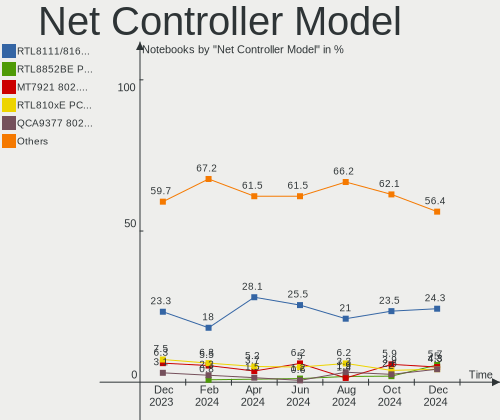

| Model                                                                  | Notebooks | Percent |
|------------------------------------------------------------------------|-----------|---------|
| Realtek RTL8111/8168/8211/8411 PCI Express Gigabit Ethernet Controller | 38        | 28.15%  |
| Intel Alder Lake-P PCH CNVi WiFi                                       | 8         | 5.93%   |
| Realtek RTL810xE PCI Express Fast Ethernet controller                  | 7         | 5.19%   |
| Realtek RTL8822CE 802.11ac PCIe Wireless Network Adapter               | 5         | 3.7%    |
| MediaTek MT7921 802.11ax PCI Express Wireless Network Adapter          | 5         | 3.7%    |
| Intel Wi-Fi 6 AX201                                                    | 5         | 3.7%    |
| Realtek RTL8723DE Wireless Network Adapter                             | 4         | 2.96%   |
| Intel Wireless 8265 / 8275                                             | 3         | 2.22%   |
| Intel Wireless 3160                                                    | 3         | 2.22%   |
| Intel Raptor Lake PCH CNVi WiFi                                        | 3         | 2.22%   |
| Intel Comet Lake PCH CNVi WiFi                                         | 3         | 2.22%   |
| Intel Cannon Lake PCH CNVi WiFi                                        | 3         | 2.22%   |
| Realtek RTL8821CE 802.11ac PCIe Wireless Network Adapter               | 2         | 1.48%   |
| Qualcomm Atheros QCA9377 802.11ac Wireless Network Adapter             | 2         | 1.48%   |
| Qualcomm Atheros QCA6174 802.11ac Wireless Network Adapter             | 2         | 1.48%   |
| Intel Wi-Fi 7(802.11be) AX1775*/AX1790*/BE20*/BE401/BE1750* 2x2        | 2         | 1.48%   |
| Intel Wi-Fi 6 AX200                                                    | 2         | 1.48%   |
| Intel 82579LM Gigabit Network Connection (Lewisville)                  | 2         | 1.48%   |
| Broadcom BCM43142 802.11b/g/n                                          | 2         | 1.48%   |
| TP-Link AC600 wireless Realtek RTL8811AU [Archer T2U Nano]             | 1         | 0.74%   |
| Realtek USB 10/100/1G/2.5G LAN                                         | 1         | 0.74%   |
| Realtek RTL8852AE 802.11ax PCIe Wireless Network Adapter               | 1         | 0.74%   |
| Realtek RTL8821AE 802.11ac PCIe Wireless Network Adapter               | 1         | 0.74%   |
| Realtek RTL8188CE 802.11b/g/n WiFi Adapter                             | 1         | 0.74%   |
| Realtek RTL8152 Fast Ethernet Adapter                                  | 1         | 0.74%   |
| Ralink MT7601U Wireless Adapter                                        | 1         | 0.74%   |
| Ralink RT3290 Wireless 802.11n 1T/1R PCIe                              | 1         | 0.74%   |
| Qualcomm QCNFA765 Wireless Network Adapter                             | 1         | 0.74%   |
| Qualcomm Atheros QCA9565 / AR9565 Wireless Network Adapter             | 1         | 0.74%   |
| Qualcomm Atheros Killer E2400 Gigabit Ethernet Controller              | 1         | 0.74%   |
| Qualcomm Atheros AR9485 Wireless Network Adapter                       | 1         | 0.74%   |
| Qualcomm Atheros AR9285 Wireless Network Adapter (PCI-Express)         | 1         | 0.74%   |
| OPPO SM8350-MTP _SN:9338D66C                                           | 1         | 0.74%   |
| Motorola PCS moto g82 5G                                               | 1         | 0.74%   |
| MediaTek MT7922 802.11ax PCI Express Wireless Network Adapter          | 1         | 0.74%   |
| MediaTek MT7921K (RZ608) Wi-Fi 6E 80MHz                                | 1         | 0.74%   |
| Lenovo Tab M10 5G                                                      | 1         | 0.74%   |
| Intel Wireless 8260                                                    | 1         | 0.74%   |
| Intel Wireless 7265                                                    | 1         | 0.74%   |
| Intel Wireless 3165                                                    | 1         | 0.74%   |

Wireless Vendor
---------------

Wireless vendors

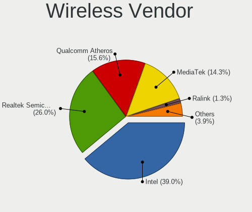

| Vendor                | Notebooks | Percent |
|-----------------------|-----------|---------|
| Intel                 | 39        | 52.7%   |
| Realtek Semiconductor | 14        | 18.92%  |
| Qualcomm Atheros      | 7         | 9.46%   |
| MediaTek              | 7         | 9.46%   |
| Broadcom              | 2         | 2.7%    |
| TP-Link               | 1         | 1.35%   |
| Ralink Technology     | 1         | 1.35%   |
| Ralink                | 1         | 1.35%   |
| Qualcomm              | 1         | 1.35%   |
| Broadcom Limited      | 1         | 1.35%   |

Wireless Model
--------------

Wireless models

| Model                                                                | Notebooks | Percent |
|----------------------------------------------------------------------|-----------|---------|
| Intel Alder Lake-P PCH CNVi WiFi                                     | 8         | 10.81%  |
| Realtek RTL8822CE 802.11ac PCIe Wireless Network Adapter             | 5         | 6.76%   |
| MediaTek MT7921 802.11ax PCI Express Wireless Network Adapter        | 5         | 6.76%   |
| Intel Wi-Fi 6 AX201                                                  | 5         | 6.76%   |
| Realtek RTL8723DE Wireless Network Adapter                           | 4         | 5.41%   |
| Intel Wireless 8265 / 8275                                           | 3         | 4.05%   |
| Intel Wireless 3160                                                  | 3         | 4.05%   |
| Intel Raptor Lake PCH CNVi WiFi                                      | 3         | 4.05%   |
| Intel Comet Lake PCH CNVi WiFi                                       | 3         | 4.05%   |
| Intel Cannon Lake PCH CNVi WiFi                                      | 3         | 4.05%   |
| Realtek RTL8821CE 802.11ac PCIe Wireless Network Adapter             | 2         | 2.7%    |
| Qualcomm Atheros QCA9377 802.11ac Wireless Network Adapter           | 2         | 2.7%    |
| Qualcomm Atheros QCA6174 802.11ac Wireless Network Adapter           | 2         | 2.7%    |
| Intel Wi-Fi 7(802.11be) AX1775*/AX1790*/BE20*/BE401/BE1750* 2x2      | 2         | 2.7%    |
| Intel Wi-Fi 6 AX200                                                  | 2         | 2.7%    |
| Broadcom BCM43142 802.11b/g/n                                        | 2         | 2.7%    |
| TP-Link AC600 wireless Realtek RTL8811AU [Archer T2U Nano]           | 1         | 1.35%   |
| Realtek RTL8852AE 802.11ax PCIe Wireless Network Adapter             | 1         | 1.35%   |
| Realtek RTL8821AE 802.11ac PCIe Wireless Network Adapter             | 1         | 1.35%   |
| Realtek RTL8188CE 802.11b/g/n WiFi Adapter                           | 1         | 1.35%   |
| Ralink MT7601U Wireless Adapter                                      | 1         | 1.35%   |
| Ralink RT3290 Wireless 802.11n 1T/1R PCIe                            | 1         | 1.35%   |
| Qualcomm QCNFA765 Wireless Network Adapter                           | 1         | 1.35%   |
| Qualcomm Atheros QCA9565 / AR9565 Wireless Network Adapter           | 1         | 1.35%   |
| Qualcomm Atheros AR9485 Wireless Network Adapter                     | 1         | 1.35%   |
| Qualcomm Atheros AR9285 Wireless Network Adapter (PCI-Express)       | 1         | 1.35%   |
| MediaTek MT7922 802.11ax PCI Express Wireless Network Adapter        | 1         | 1.35%   |
| MediaTek MT7921K (RZ608) Wi-Fi 6E 80MHz                              | 1         | 1.35%   |
| Intel Wireless 8260                                                  | 1         | 1.35%   |
| Intel Wireless 7265                                                  | 1         | 1.35%   |
| Intel Wireless 3165                                                  | 1         | 1.35%   |
| Intel Comet Lake PCH-LP CNVi WiFi                                    | 1         | 1.35%   |
| Intel Centrino Ultimate-N 6300                                       | 1         | 1.35%   |
| Intel Centrino Advanced-N 6235                                       | 1         | 1.35%   |
| Intel Cannon Point-LP CNVi [Wireless-AC]                             | 1         | 1.35%   |
| Broadcom Limited BCM4360 802.11ac Dual Band Wireless Network Adapter | 1         | 1.35%   |

Ethernet Vendor
---------------

Ethernet vendors

| Vendor                | Notebooks | Percent |
|-----------------------|-----------|---------|
| Realtek Semiconductor | 47        | 78.33%  |
| Intel                 | 10        | 16.67%  |
| Qualcomm Atheros      | 1         | 1.67%   |
| OPPO Electronics      | 1         | 1.67%   |
| Lenovo                | 1         | 1.67%   |

Ethernet Model
--------------

Ethernet models

| Model                                                                  | Notebooks | Percent |
|------------------------------------------------------------------------|-----------|---------|
| Realtek RTL8111/8168/8211/8411 PCI Express Gigabit Ethernet Controller | 38        | 63.33%  |
| Realtek RTL810xE PCI Express Fast Ethernet controller                  | 7         | 11.67%  |
| Intel 82579LM Gigabit Network Connection (Lewisville)                  | 2         | 3.33%   |
| Realtek USB 10/100/1G/2.5G LAN                                         | 1         | 1.67%   |
| Realtek RTL8152 Fast Ethernet Adapter                                  | 1         | 1.67%   |
| Qualcomm Atheros Killer E2400 Gigabit Ethernet Controller              | 1         | 1.67%   |
| OPPO SM8350-MTP _SN:9338D66C                                           | 1         | 1.67%   |
| Lenovo Tab M10 5G                                                      | 1         | 1.67%   |
| Intel Ethernet Controller I219-V                                       | 1         | 1.67%   |
| Intel Ethernet Connection (7) I219-LM                                  | 1         | 1.67%   |
| Intel Ethernet Connection (6) I219-LM                                  | 1         | 1.67%   |
| Intel Ethernet Connection (4) I219-V                                   | 1         | 1.67%   |
| Intel Ethernet Connection (23) I219-V                                  | 1         | 1.67%   |
| Intel Ethernet Connection (2) I219-V                                   | 1         | 1.67%   |
| Intel Ethernet Connection (16) I219-V                                  | 1         | 1.67%   |
| Intel Ethernet Connection (13) I219-LM                                 | 1         | 1.67%   |

Net Controller Kind
-------------------

Ethernet, WiFi or modem

| Kind     | Notebooks | Percent |
|----------|-----------|---------|
| WiFi     | 72        | 54.96%  |
| Ethernet | 58        | 44.27%  |
| Unknown  | 1         | 0.76%   |

Used Controller
---------------

Currently used network controller

| Kind     | Notebooks | Percent |
|----------|-----------|---------|
| WiFi     | 66        | 89.19%  |
| Ethernet | 8         | 10.81%  |

NICs
----

Total network controllers on board

| Total | Notebooks | Percent |
|-------|-----------|---------|
| 2     | 55        | 75.34%  |
| 1     | 18        | 24.66%  |

IPv6
----

IPv6 vs IPv4

| Used | Notebooks | Percent |
|------|-----------|---------|
| Yes  | 38        | 52.05%  |
| No   | 35        | 47.95%  |

Bluetooth
---------

Bluetooth Vendor
----------------

Controller vendors

| Vendor                          | Notebooks | Percent |
|---------------------------------|-----------|---------|
| Intel                           | 37        | 52.11%  |
| Realtek Semiconductor           | 11        | 15.49%  |
| IMC Networks                    | 6         | 8.45%   |
| Qualcomm Atheros Communications | 4         | 5.63%   |
| Lite-On Technology              | 3         | 4.23%   |
| Broadcom                        | 3         | 4.23%   |
| MediaTek                        | 2         | 2.82%   |
| USI                             | 1         | 1.41%   |
| Ralink                          | 1         | 1.41%   |
| Foxconn / Hon Hai               | 1         | 1.41%   |
| Cambridge Silicon Radio         | 1         | 1.41%   |
| Apple                           | 1         | 1.41%   |

Bluetooth Model
---------------

Controller models

| Model                                               | Notebooks | Percent |
|-----------------------------------------------------|-----------|---------|
| Intel AX201 Bluetooth                               | 10        | 14.08%  |
| Intel Bluetooth 9460/9560 Jefferson Peak (JfP)      | 7         | 9.86%   |
| Intel AX211 Bluetooth                               | 7         | 9.86%   |
| Intel Bluetooth Device                              | 6         | 8.45%   |
| Realtek  Bluetooth 4.2 Adapter                      | 5         | 7.04%   |
| Intel Bluetooth wireless interface                  | 4         | 5.63%   |
| Realtek 802.11ac WLAN Adapter                       | 3         | 4.23%   |
| IMC Networks Wireless_Device                        | 3         | 4.23%   |
| Realtek Bluetooth Radio                             | 2         | 2.82%   |
| MediaTek Wireless_Device                            | 2         | 2.82%   |
| Lite-On Bluetooth Device                            | 2         | 2.82%   |
| Intel AX200 Bluetooth                               | 2         | 2.82%   |
| IMC Networks Bluetooth Radio                        | 2         | 2.82%   |
| Broadcom BCM43142A0 Bluetooth Device                | 2         | 2.82%   |
| USI Bluetooth Device                                | 1         | 1.41%   |
| Realtek RTL8821A Bluetooth                          | 1         | 1.41%   |
| Ralink RT3290 Bluetooth                             | 1         | 1.41%   |
| Qualcomm Atheros  Bluetooth Device                  | 1         | 1.41%   |
| Qualcomm Atheros QCA61x4 Bluetooth 4.0              | 1         | 1.41%   |
| Qualcomm Atheros Bluetooth                          | 1         | 1.41%   |
| Qualcomm Atheros AR3011 Bluetooth                   | 1         | 1.41%   |
| Lite-On Wireless_Device                             | 1         | 1.41%   |
| Intel Centrino Bluetooth Wireless Transceiver       | 1         | 1.41%   |
| IMC Networks Bluetooth Device                       | 1         | 1.41%   |
| Foxconn / Hon Hai MediaTek Bluetooth Adapter        | 1         | 1.41%   |
| Cambridge Silicon Radio Bluetooth Dongle (HCI mode) | 1         | 1.41%   |
| Broadcom BCM2045B (BDC-2.1)                         | 1         | 1.41%   |
| Apple Bluetooth USB Host Controller                 | 1         | 1.41%   |

Sound
-----

Sound Vendor
------------

Sound card vendors

| Vendor              | Notebooks | Percent |
|---------------------|-----------|---------|
| Intel               | 55        | 59.14%  |
| Nvidia              | 19        | 20.43%  |
| AMD                 | 18        | 19.35%  |
| Samsung Electronics | 1         | 1.08%   |

Sound Model
-----------

Sound card models

| Model                                                                      | Notebooks | Percent |
|----------------------------------------------------------------------------|-----------|---------|
| AMD Family 17h/19h HD Audio Controller                                     | 16        | 14.41%  |
| Intel Sunrise Point-LP HD Audio                                            | 11        | 9.91%   |
| Intel Alder Lake PCH-P High Definition Audio Controller                    | 9         | 8.11%   |
| AMD Renoir Radeon High Definition Audio Controller                         | 8         | 7.21%   |
| Intel Tiger Lake-LP Smart Sound Technology Audio Controller                | 7         | 6.31%   |
| Nvidia TU107 GeForce GTX 1650 High Definition Audio Controller             | 6         | 5.41%   |
| Nvidia Audio device                                                        | 6         | 5.41%   |
| Intel Haswell-ULT HD Audio Controller                                      | 4         | 3.6%    |
| Intel 8 Series HD Audio Controller                                         | 4         | 3.6%    |
| Intel Raptor Lake-P/U/H cAVS                                               | 3         | 2.7%    |
| Intel Comet Lake PCH cAVS                                                  | 3         | 2.7%    |
| Intel Cannon Lake PCH cAVS                                                 | 3         | 2.7%    |
| Intel 7 Series/C216 Chipset Family High Definition Audio Controller        | 3         | 2.7%    |
| AMD Rembrandt Radeon High Definition Audio Controller                      | 3         | 2.7%    |
| Nvidia GP107GL High Definition Audio Controller                            | 2         | 1.8%    |
| Intel 6 Series/C200 Series Chipset Family High Definition Audio Controller | 2         | 1.8%    |
| Intel 100 Series/C230 Series Chipset Family HD Audio Controller            | 2         | 1.8%    |
| AMD Raven/Raven2/Fenghuang HDMI/DP Audio Controller                        | 2         | 1.8%    |
| Samsung Electronics Samsung USB C Earphones                                | 1         | 0.9%    |
| Nvidia TU116 High Definition Audio Controller                              | 1         | 0.9%    |
| Nvidia GP104 High Definition Audio Controller                              | 1         | 0.9%    |
| Nvidia GM107 High Definition Audio Controller [GeForce 940MX]              | 1         | 0.9%    |
| Nvidia GK208 HDMI/DP Audio Controller                                      | 1         | 0.9%    |
| Nvidia GF119 HDMI Audio Controller                                         | 1         | 0.9%    |
| Intel Wildcat Point-LP High Definition Audio Controller                    | 1         | 0.9%    |
| Intel Raptor Lake High Definition Audio Controller                         | 1         | 0.9%    |
| Intel Meteor Lake-P HD Audio Controller                                    | 1         | 0.9%    |
| Intel Jasper Lake HD Audio                                                 | 1         | 0.9%    |
| Intel Ice Lake-LP Smart Sound Technology Audio Controller                  | 1         | 0.9%    |
| Intel Comet Lake PCH-LP cAVS                                               | 1         | 0.9%    |
| Intel Cannon Point-LP High Definition Audio Controller                     | 1         | 0.9%    |
| Intel Broadwell-U Audio Controller                                         | 1         | 0.9%    |
| Intel Atom Processor Z36xxx/Z37xxx Series High Definition Audio Controller | 1         | 0.9%    |
| AMD High Definition Audio Controller                                       | 1         | 0.9%    |
| AMD Family 15h (Models 60h-6fh) Audio Controller                           | 1         | 0.9%    |

Memory
------

Memory Vendor
-------------

Memory module vendors

| Vendor              | Notebooks | Percent |
|---------------------|-----------|---------|
| Samsung Electronics | 20        | 37.74%  |
| Micron Technology   | 11        | 20.75%  |
| SK hynix            | 10        | 18.87%  |
| Crucial             | 3         | 5.66%   |
| A-DATA Technology   | 3         | 5.66%   |
| G.Skill             | 2         | 3.77%   |
| Unknown             | 1         | 1.89%   |
| Ramaxel Technology  | 1         | 1.89%   |
| Nanya Technology    | 1         | 1.89%   |
| Unknown             | 1         | 1.89%   |

Memory Model
------------

Memory module models

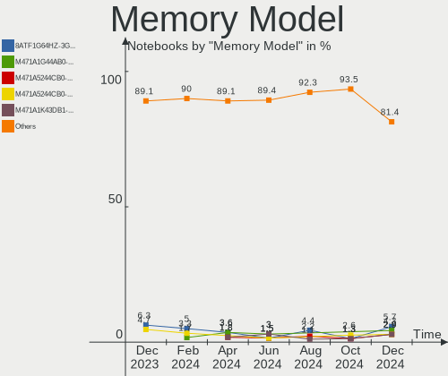

| Model                                                          | Notebooks | Percent |
|----------------------------------------------------------------|-----------|---------|
| Samsung RAM M471B5173DB0-YK0 4GB SODIMM DDR3 1600MT/s          | 3         | 5.45%   |
| Samsung RAM M471A1G44BB0-CWE 8GB SODIMM DDR4 3200MT/s          | 3         | 5.45%   |
| SK hynix RAM HMA851S6DJR6N-XN 4GB SODIMM DDR4 3200MT/s         | 2         | 3.64%   |
| Samsung RAM M471A1K43EB1-CWE 8GB SODIMM DDR4 3200MT/s          | 2         | 3.64%   |
| Samsung RAM M471A1G44AB0-CWE 8GB Row Of Chips DDR4 3200MT/s    | 2         | 3.64%   |
| Samsung RAM M471A1G44AB0-CWE 8192MB SODIMM DDR4 3200MT/s       | 2         | 3.64%   |
| Micron RAM 8ATF1G64HZ-3G2R1 8GB SODIMM DDR4 3200MT/s           | 2         | 3.64%   |
| Micron RAM 4ATF1G64HZ-3G2F1 8GB SODIMM DDR4 3200MT/s           | 2         | 3.64%   |
| Unknown RAM Module 8GB SODIMM DDR4 2667MT/s                    | 1         | 1.82%   |
| SK hynix RAM HMT451S6BFR8A-PB 4GB SODIMM DDR3 1600MT/s         | 1         | 1.82%   |
| SK hynix RAM HMAA1GS6CJR6N-XN 8GB Row Of Chips DDR4 3200MT/s   | 1         | 1.82%   |
| SK hynix RAM HMA851S6CJR6N-VK 4GB SODIMM DDR4 2667MT/s         | 1         | 1.82%   |
| SK hynix RAM HMA81GS6MFR8N-UH 8GB SODIMM DDR4 2400MT/s         | 1         | 1.82%   |
| SK hynix RAM HMA81GS6DJR8N-XN 8GB SODIMM DDR4 3200MT/s         | 1         | 1.82%   |
| SK hynix RAM HMA81GS6DJR8N-XN 8192MB SODIMM DDR4 3200MT/s      | 1         | 1.82%   |
| SK hynix RAM HMA81GS6AFR8N-UH 8GB SODIMM DDR4 2667MT/s         | 1         | 1.82%   |
| SK hynix RAM H58G66AK6BX070 4GB Row Of Chips LPDDR5 6400MT/s   | 1         | 1.82%   |
| Samsung RAM Module 4GB Row Of Chips LPDDR5 6400MT/s            | 1         | 1.82%   |
| Samsung RAM Module 16GB SODIMM DDR4 2667MT/s                   | 1         | 1.82%   |
| Samsung RAM M471B5173EB0-YK0 4GB SODIMM DDR3 1600MT/s          | 1         | 1.82%   |
| Samsung RAM M471B1G73BH0-CK0 8GB SODIMM DDR3 1600MT/s          | 1         | 1.82%   |
| Samsung RAM M471A5244CB0-CWE 4GB SODIMM DDR4 3200MT/s          | 1         | 1.82%   |
| Samsung RAM M471A2G43AB2-CWE 16GB SODIMM DDR4 3200MT/s         | 1         | 1.82%   |
| Samsung RAM M471A1K43DB1-CTD 8GB SODIMM DDR4 2667MT/s          | 1         | 1.82%   |
| Samsung RAM M471A1K43CB1-CTD 8GB SODIMM DDR4 2667MT/s          | 1         | 1.82%   |
| Samsung RAM M471A1G44CB0-CWE 8GB SODIMM DDR4 3200MT/s          | 1         | 1.82%   |
| Samsung RAM M471A1G43DB0-CPB 8GB SODIMM DDR4 3200MT/s          | 1         | 1.82%   |
| Ramaxel RAM RMSA3300MH78HBF-2666 16GB SODIMM DDR4 2400MT/s     | 1         | 1.82%   |
| Nanya RAM NT4GC64B8HG0NS-DI 4GB SODIMM DDR3 1600MT/s           | 1         | 1.82%   |
| Micron RAM MT62F2G32D4DS-026 WT 8GB SODIMM LPDDR5 7500MT/s     | 1         | 1.82%   |
| Micron RAM MT52L512M32D2PF-10 4GB Row Of Chips LPDDR3 1867MT/s | 1         | 1.82%   |
| Micron RAM MT40A1G16TB-062E:F 8GB Row Of Chips DDR4 3200MT/s   | 1         | 1.82%   |
| Micron RAM 8KTF51264HZ-1G6N1 4096MB SODIMM DDR3 1600MT/s       | 1         | 1.82%   |
| Micron RAM 4ATF51264HZ-3G2R1 4GB SODIMM DDR4 3200MT/s          | 1         | 1.82%   |
| Micron RAM 4ATF51264HZ-3G2J1 4GB SODIMM DDR4 3200MT/s          | 1         | 1.82%   |
| Micron RAM 4ATF1G64HZ-3G2E1 8GB Row Of Chips DDR4 3200MT/s     | 1         | 1.82%   |
| G.Skill RAM F5-5600S4040A32G 32GB SODIMM DDR5 5600MT/s         | 1         | 1.82%   |
| G.Skill RAM F4-2133C15-16GRS 16GB SODIMM DDR4 2667MT/s         | 1         | 1.82%   |
| Crucial RAM CT8G4SFS8266.C8FJ 8GB SODIMM DDR4 2667MT/s         | 1         | 1.82%   |
| Crucial RAM CT8G4SFRA32A.M4FE 8192MB SODIMM DDR4 3200MT/s      | 1         | 1.82%   |

Memory Kind
-----------

Memory module kinds

| Kind   | Notebooks | Percent |
|--------|-----------|---------|
| DDR4   | 31        | 73.81%  |
| DDR3   | 6         | 14.29%  |
| LPDDR5 | 3         | 7.14%   |
| LPDDR3 | 1         | 2.38%   |
| DDR5   | 1         | 2.38%   |

Memory Form Factor
------------------

Physical design of the memory module

| Name         | Notebooks | Percent |
|--------------|-----------|---------|
| SODIMM       | 36        | 81.82%  |
| Row Of Chips | 8         | 18.18%  |

Memory Size
-----------

Memory module size

| Size  | Notebooks | Percent |
|-------|-----------|---------|
| 8192  | 26        | 56.52%  |
| 4096  | 13        | 28.26%  |
| 16384 | 6         | 13.04%  |
| 32768 | 1         | 2.17%   |

Memory Speed
------------

Memory module speed

| Speed | Notebooks | Percent |
|-------|-----------|---------|
| 3200  | 23        | 52.27%  |
| 2667  | 7         | 15.91%  |
| 1600  | 6         | 13.64%  |
| 2400  | 3         | 6.82%   |
| 6400  | 2         | 4.55%   |
| 7500  | 1         | 2.27%   |
| 5600  | 1         | 2.27%   |
| 1867  | 1         | 2.27%   |

Printers & scanners
-------------------

Printer Vendor
--------------

Printer device vendors

Zero info for selected period =(

Printer Model
-------------

Printer device models

Zero info for selected period =(

Scanner Vendor
--------------

Scanner device vendors

Zero info for selected period =(

Scanner Model
-------------

Scanner device models

Zero info for selected period =(

Camera
------

Camera Vendor
-------------

Camera device vendors

| Vendor                                 | Notebooks | Percent |
|----------------------------------------|-----------|---------|
| IMC Networks                           | 12        | 18.75%  |
| Quanta                                 | 10        | 15.63%  |
| Chicony Electronics                    | 9         | 14.06%  |
| Sonix Technology                       | 5         | 7.81%   |
| Realtek Semiconductor                  | 5         | 7.81%   |
| Suyin                                  | 4         | 6.25%   |
| Microdia                               | 4         | 6.25%   |
| Bison Electronics                      | 4         | 6.25%   |
| Sunplus Innovation Technology          | 3         | 4.69%   |
| Syntek                                 | 2         | 3.13%   |
| Luxvisions Innotech Limited            | 2         | 3.13%   |
| Cheng Uei Precision Industry (Foxlink) | 2         | 3.13%   |
| Lite-On Technology                     | 1         | 1.56%   |
| Acer                                   | 1         | 1.56%   |

Camera Model
------------

Camera device models

| Model                                                          | Notebooks | Percent |
|----------------------------------------------------------------|-----------|---------|
| IMC Networks USB2.0 HD UVC WebCam                              | 7         | 10.94%  |
| Quanta HP TrueVision HD Camera                                 | 6         | 9.38%   |
| Sonix USB2.0 HD UVC WebCam                                     | 4         | 6.25%   |
| Suyin HP Truevision HD                                         | 3         | 4.69%   |
| Realtek Integrated_Webcam_HD                                   | 3         | 4.69%   |
| Microdia Integrated_Webcam_HD                                  | 3         | 4.69%   |
| Chicony integrated camera                                      | 3         | 4.69%   |
| Syntek Integrated Camera                                       | 2         | 3.13%   |
| Quanta ACER HD User Facing                                     | 2         | 3.13%   |
| IMC Networks Integrated Camera                                 | 2         | 3.13%   |
| Chicony HP TrueVision HD Camera                                | 2         | 3.13%   |
| Bison HD Webcam                                                | 2         | 3.13%   |
| Suyin Integrated_Webcam_HD                                     | 1         | 1.56%   |
| Sunplus XiaoMi USB 2.0 Webcam                                  | 1         | 1.56%   |
| Sunplus Integrated_Webcam_HD                                   | 1         | 1.56%   |
| Sunplus HP TrueVision HD Camera                                | 1         | 1.56%   |
| Sonix USB2.0 FHD UVC WebCam                                    | 1         | 1.56%   |
| Realtek Integrated Webcam                                      | 1         | 1.56%   |
| Realtek HP Wide Vision HD Camera                               | 1         | 1.56%   |
| Quanta HP Wide Vision HD Camera                                | 1         | 1.56%   |
| Quanta HD Webcam                                               | 1         | 1.56%   |
| Microdia Integrated Webcam HD                                  | 1         | 1.56%   |
| Luxvisions Innotech Limited Integrated Camera                  | 1         | 1.56%   |
| Luxvisions Innotech Limited HP Wide Vision HD Camera           | 1         | 1.56%   |
| Lite-On HP HD Camera                                           | 1         | 1.56%   |
| IMC Networks XiaoMi Webcam                                     | 1         | 1.56%   |
| IMC Networks USB2.0 VGA UVC WebCam                             | 1         | 1.56%   |
| IMC Networks EasyCamera                                        | 1         | 1.56%   |
| Chicony Sony Visual Communication Camera                       | 1         | 1.56%   |
| Chicony HP Webcam-50                                           | 1         | 1.56%   |
| Chicony HD User Facing                                         | 1         | 1.56%   |
| Chicony Chicony USB 2.0 Camera                                 | 1         | 1.56%   |
| Cheng Uei Precision Industry (Foxlink) HP TrueVision HD Camera | 1         | 1.56%   |
| Cheng Uei Precision Industry (Foxlink) HP HD Webcam [Fixed]    | 1         | 1.56%   |
| Bison Integrated Camera                                        | 1         | 1.56%   |
| Bison FHD Camera                                               | 1         | 1.56%   |
| Acer Integrated Camera                                         | 1         | 1.56%   |

Security
--------

Fingerprint Vendor
------------------

Fingerprint sensor vendors

| Vendor                             | Notebooks | Percent |
|------------------------------------|-----------|---------|
| Validity Sensors                   | 5         | 41.67%  |
| Shenzhen Goodix Technology         | 3         | 25%     |
| Realtek USB2.0 Finger Print Bridge | 2         | 16.67%  |
| Upek                               | 1         | 8.33%   |
| Synaptics                          | 1         | 8.33%   |

Fingerprint Model
-----------------

Fingerprint sensor models

| Model                                                                      | Notebooks | Percent |
|----------------------------------------------------------------------------|-----------|---------|
| Shenzhen Goodix  FingerPrint Device                                        | 3         | 25%     |
| Validity Sensors Synaptics VFS7552 Touch Fingerprint Sensor with PurePrint | 2         | 16.67%  |
| Realtek USB2.0 Finger Print Bridge FocalTech Fingerprint Device            | 2         | 16.67%  |
| Validity Sensors VFS7500 Touch Fingerprint Sensor                          | 1         | 8.33%   |
| Validity Sensors VFS491                                                    | 1         | 8.33%   |
| Validity Sensors Synaptics WBDI                                            | 1         | 8.33%   |
| Upek Biometric Touchchip/Touchstrip Fingerprint Sensor                     | 1         | 8.33%   |
| Synaptics WBDI Device                                                      | 1         | 8.33%   |

Chipcard Vendor
---------------

Chipcard module vendors

| Vendor   | Notebooks | Percent |
|----------|-----------|---------|
| Broadcom | 1         | 100%    |

Chipcard Model
--------------

Chipcard module models

| Model          | Notebooks | Percent |
|----------------|-----------|---------|
| Broadcom 58200 | 1         | 100%    |

Unsupported
-----------

Unsupported Devices
-------------------

Total unsupported devices on board

| Total | Notebooks | Percent |
|-------|-----------|---------|
| 0     | 47        | 64.38%  |
| 1     | 21        | 28.77%  |
| 2     | 5         | 6.85%   |

Unsupported Device Types
------------------------

Types of unsupported devices

| Type                  | Notebooks | Percent |
|-----------------------|-----------|---------|
| Fingerprint reader    | 11        | 36.67%  |
| Graphics card         | 8         | 26.67%  |
| Multimedia controller | 3         | 10%     |
| Camera                | 3         | 10%     |
| Bluetooth             | 2         | 6.67%   |
| Storage/ata           | 1         | 3.33%   |
| Net/wireless          | 1         | 3.33%   |
| Chipcard              | 1         | 3.33%   |

