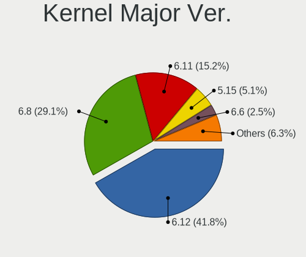
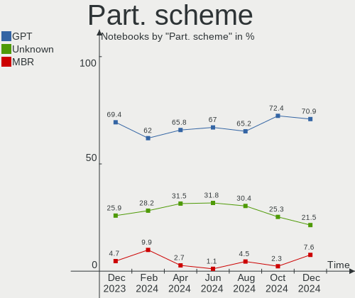
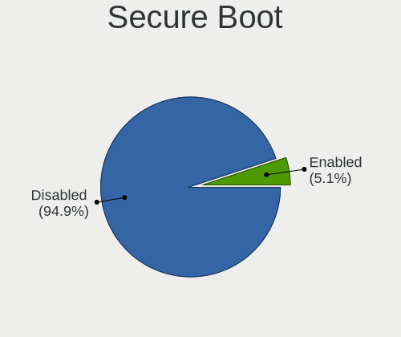
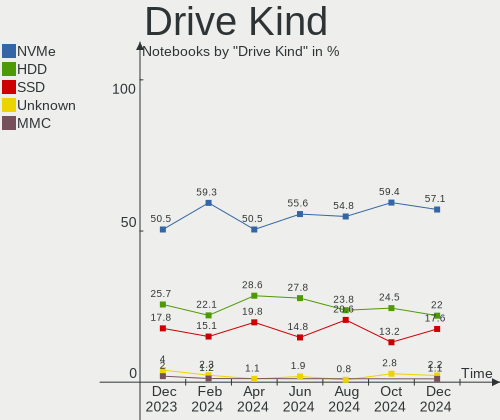
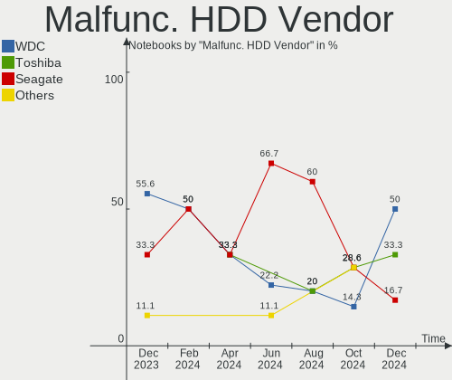
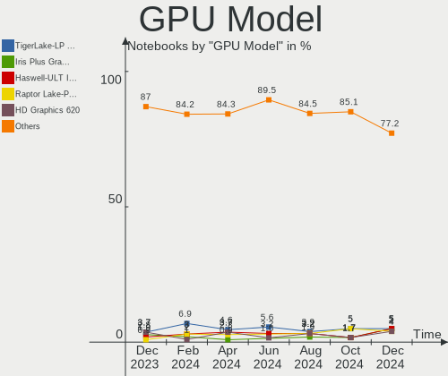
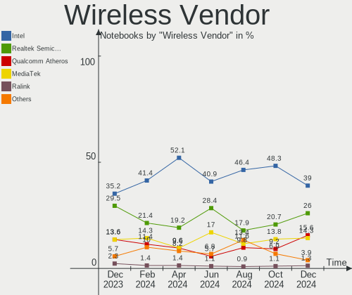
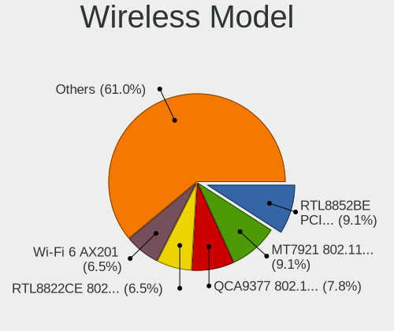
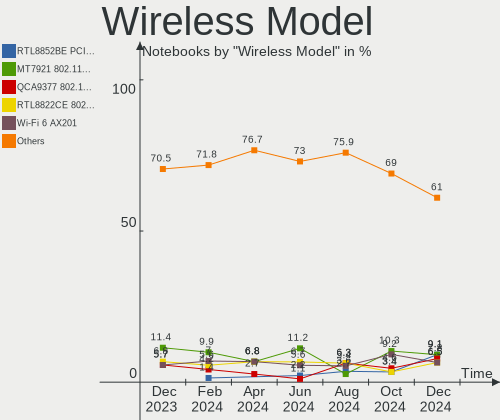
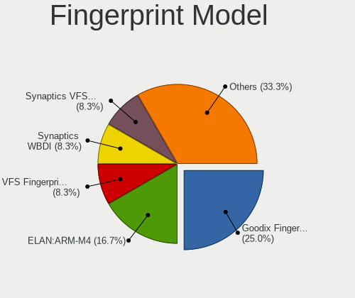

Linux in India - Hardware Trends (Notebooks)
--------------------------------------------

A project to identify most popular hardware characteristics and track their change
over time based on data collected by Linux users at https://Linux-Hardware.org.

Anyone can contribute to this report by the [hw-probe](https://github.com/linuxhw/hw-probe) tool:

    sudo -E hw-probe -all -upload

Period: Dec, 2022.

Contents
--------

* [ System ](#system)
  - [ OS                       ](#os)
  - [ OS Family                ](#os-family)
  - [ Kernel                   ](#kernel)
  - [ Kernel Family            ](#kernel-family)
  - [ Kernel Major Ver.        ](#kernel-major-ver)
  - [ Arch                     ](#arch)
  - [ DE                       ](#de)
  - [ Display Server           ](#display-server)
  - [ Display Manager          ](#display-manager)
  - [ OS Lang                  ](#os-lang)
  - [ Boot Mode                ](#boot-mode)
  - [ Filesystem               ](#filesystem)
  - [ Part. scheme             ](#part-scheme)
  - [ Dual Boot with Linux/BSD ](#dual-boot-with-linuxbsd)
  - [ Dual Boot (Win)          ](#dual-boot-win)

* [ Board ](#board)
  - [ Vendor                   ](#vendor)
  - [ Model                    ](#model)
  - [ Model Family             ](#model-family)
  - [ MFG Year                 ](#mfg-year)
  - [ Form Factor              ](#form-factor)
  - [ Secure Boot              ](#secure-boot)
  - [ Coreboot                 ](#coreboot)
  - [ RAM Size                 ](#ram-size)
  - [ RAM Used                 ](#ram-used)
  - [ Total Drives             ](#total-drives)
  - [ Has CD-ROM               ](#has-cd-rom)
  - [ Has Ethernet             ](#has-ethernet)
  - [ Has WiFi                 ](#has-wifi)
  - [ Has Bluetooth            ](#has-bluetooth)

* [ Location ](#location)
  - [ Country                  ](#country)
  - [ City                     ](#city)

* [ Drives ](#drives)
  - [ Drive Vendor             ](#drive-vendor)
  - [ Drive Model              ](#drive-model)
  - [ HDD Vendor               ](#hdd-vendor)
  - [ SSD Vendor               ](#ssd-vendor)
  - [ Drive Kind               ](#drive-kind)
  - [ Drive Connector          ](#drive-connector)
  - [ Drive Size               ](#drive-size)
  - [ Space Total              ](#space-total)
  - [ Space Used               ](#space-used)
  - [ Malfunc. Drives          ](#malfunc-drives)
  - [ Malfunc. Drive Vendor    ](#malfunc-drive-vendor)
  - [ Malfunc. HDD Vendor      ](#malfunc-hdd-vendor)
  - [ Malfunc. Drive Kind      ](#malfunc-drive-kind)
  - [ Failed Drives            ](#failed-drives)
  - [ Failed Drive Vendor      ](#failed-drive-vendor)
  - [ Drive Status             ](#drive-status)

* [ Storage controller ](#storage-controller)
  - [ Storage Vendor           ](#storage-vendor)
  - [ Storage Model            ](#storage-model)
  - [ Storage Kind             ](#storage-kind)

* [ Processor ](#processor)
  - [ CPU Vendor               ](#cpu-vendor)
  - [ CPU Model                ](#cpu-model)
  - [ CPU Model Family         ](#cpu-model-family)
  - [ CPU Cores                ](#cpu-cores)
  - [ CPU Sockets              ](#cpu-sockets)
  - [ CPU Threads              ](#cpu-threads)
  - [ CPU Op-Modes             ](#cpu-op-modes)
  - [ CPU Microcode            ](#cpu-microcode)
  - [ CPU Microarch            ](#cpu-microarch)

* [ Graphics ](#graphics)
  - [ GPU Vendor               ](#gpu-vendor)
  - [ GPU Model                ](#gpu-model)
  - [ GPU Combo                ](#gpu-combo)
  - [ GPU Driver               ](#gpu-driver)
  - [ GPU Memory               ](#gpu-memory)

* [ Monitor ](#monitor)
  - [ Monitor Vendor           ](#monitor-vendor)
  - [ Monitor Model            ](#monitor-model)
  - [ Monitor Resolution       ](#monitor-resolution)
  - [ Monitor Diagonal         ](#monitor-diagonal)
  - [ Monitor Width            ](#monitor-width)
  - [ Aspect Ratio             ](#aspect-ratio)
  - [ Monitor Area             ](#monitor-area)
  - [ Pixel Density            ](#pixel-density)
  - [ Multiple Monitors        ](#multiple-monitors)

* [ Network ](#network)
  - [ Net Controller Vendor    ](#net-controller-vendor)
  - [ Net Controller Model     ](#net-controller-model)
  - [ Wireless Vendor          ](#wireless-vendor)
  - [ Wireless Model           ](#wireless-model)
  - [ Ethernet Vendor          ](#ethernet-vendor)
  - [ Ethernet Model           ](#ethernet-model)
  - [ Net Controller Kind      ](#net-controller-kind)
  - [ Used Controller          ](#used-controller)
  - [ NICs                     ](#nics)
  - [ IPv6                     ](#ipv6)

* [ Bluetooth ](#bluetooth)
  - [ Bluetooth Vendor         ](#bluetooth-vendor)
  - [ Bluetooth Model          ](#bluetooth-model)

* [ Sound ](#sound)
  - [ Sound Vendor             ](#sound-vendor)
  - [ Sound Model              ](#sound-model)

* [ Memory ](#memory)
  - [ Memory Vendor            ](#memory-vendor)
  - [ Memory Model             ](#memory-model)
  - [ Memory Kind              ](#memory-kind)
  - [ Memory Form Factor       ](#memory-form-factor)
  - [ Memory Size              ](#memory-size)
  - [ Memory Speed             ](#memory-speed)

* [ Printers & scanners ](#printers--scanners)
  - [ Printer Vendor           ](#printer-vendor)
  - [ Printer Model            ](#printer-model)
  - [ Scanner Vendor           ](#scanner-vendor)
  - [ Scanner Model            ](#scanner-model)

* [ Camera ](#camera)
  - [ Camera Vendor            ](#camera-vendor)
  - [ Camera Model             ](#camera-model)

* [ Security ](#security)
  - [ Fingerprint Vendor       ](#fingerprint-vendor)
  - [ Fingerprint Model        ](#fingerprint-model)
  - [ Chipcard Vendor          ](#chipcard-vendor)
  - [ Chipcard Model           ](#chipcard-model)

* [ Unsupported ](#unsupported)
  - [ Unsupported Devices      ](#unsupported-devices)
  - [ Unsupported Device Types ](#unsupported-device-types)

System
------

OS
--

Installed operating systems

| Name                 | Notebooks | Percent |
|----------------------|-----------|---------|
| Ubuntu 22.04         | 17        | 21.52%  |
| Fedora 37            | 12        | 15.19%  |
| Ubuntu 20.04         | 8         | 10.13%  |
| Pop!_OS 22.04        | 6         | 7.59%   |
| Linux Mint 21        | 4         | 5.06%   |
| Kali 2022.4          | 4         | 5.06%   |
| Debian 11            | 4         | 5.06%   |
| Arch Rolling         | 4         | 5.06%   |
| Zorin 16             | 2         | 2.53%   |
| Linux Mint 21.1      | 2         | 2.53%   |
| KDE neon 22.04       | 2         | 2.53%   |
| Xubuntu 22.04        | 1         | 1.27%   |
| Void Linux Rolling   | 1         | 1.27%   |
| Ubuntu Budgie 22.10  | 1         | 1.27%   |
| Ubuntu 22.10         | 1         | 1.27%   |
| Ubuntu 18.04         | 1         | 1.27%   |
| Pop!_OS 21.04        | 1         | 1.27%   |
| Nobara 36            | 1         | 1.27%   |
| Manjaro 22.0.0       | 1         | 1.27%   |
| Manjaro 22.0         | 1         | 1.27%   |
| Manjaro              | 1         | 1.27%   |
| Kubuntu 22.04        | 1         | 1.27%   |
| Gentoo 2.9           | 1         | 1.27%   |
| Garuda Linux Soaring | 1         | 1.27%   |
| EndeavourOS Rolling  | 1         | 1.27%   |

OS Family
---------

OS without a version

| Name          | Notebooks | Percent |
|---------------|-----------|---------|
| Ubuntu        | 27        | 34.18%  |
| Fedora        | 12        | 15.19%  |
| Pop!_OS       | 7         | 8.86%   |
| Linux Mint    | 6         | 7.59%   |
| Kali          | 4         | 5.06%   |
| Debian        | 4         | 5.06%   |
| Arch          | 4         | 5.06%   |
| Manjaro       | 3         | 3.8%    |
| Zorin         | 2         | 2.53%   |
| KDE neon      | 2         | 2.53%   |
| Xubuntu       | 1         | 1.27%   |
| Void Linux    | 1         | 1.27%   |
| Ubuntu Budgie | 1         | 1.27%   |
| Nobara        | 1         | 1.27%   |
| Kubuntu       | 1         | 1.27%   |
| Gentoo        | 1         | 1.27%   |
| Garuda Linux  | 1         | 1.27%   |
| EndeavourOS   | 1         | 1.27%   |

Kernel
------

Version of the Linux kernel

| Version                      | Notebooks | Percent |
|------------------------------|-----------|---------|
| 5.15.0-56-generic            | 33        | 41.77%  |
| 6.0.6-76060006-generic       | 4         | 5.06%   |
| 6.0.12-300.fc37.x86_64       | 4         | 5.06%   |
| 6.1.1-1-MANJARO              | 2         | 2.53%   |
| 6.0.15-300.fc37.x86_64       | 2         | 2.53%   |
| 6.0.14-300.fc37.x86_64       | 2         | 2.53%   |
| 6.0.12-arch1-1               | 2         | 2.53%   |
| 6.0.10-300.fc37.x86_64       | 2         | 2.53%   |
| 5.19.0-26-generic            | 2         | 2.53%   |
| 5.10.0-19-amd64              | 2         | 2.53%   |
| 6.1.1-gentoo-dist            | 1         | 1.27%   |
| 6.1.1-arch1-1                | 1         | 1.27%   |
| 6.0.15_1                     | 1         | 1.27%   |
| 6.0.14-201.fsync.fc36.x86_64 | 1         | 1.27%   |
| 6.0.13-300.fc37.x86_64       | 1         | 1.27%   |
| 6.0.12-76060006-generic      | 1         | 1.27%   |
| 6.0.11-arch1-1               | 1         | 1.27%   |
| 6.0.11-300.fc37.x86_64       | 1         | 1.27%   |
| 6.0.10-zen2-1-zen            | 1         | 1.27%   |
| 6.0.0-kali5-amd64            | 1         | 1.27%   |
| 6.0.0-kali3-amd64            | 1         | 1.27%   |
| 6.0.0-0.deb11.2-amd64        | 1         | 1.27%   |
| 5.19.13-custom               | 1         | 1.27%   |
| 5.19.0-ziv-cm218             | 1         | 1.27%   |
| 5.19.0-76051900-generic      | 1         | 1.27%   |
| 5.18.0-kali5-amd64           | 1         | 1.27%   |
| 5.15.81-1-MANJARO            | 1         | 1.27%   |
| 5.15.11-76051511-generic     | 1         | 1.27%   |
| 5.15.0-53-generic            | 1         | 1.27%   |
| 5.15.0-50-generic            | 1         | 1.27%   |
| 5.15.0-41-generic            | 1         | 1.27%   |
| 5.14.0-kali4-amd64           | 1         | 1.27%   |
| 5.10.0-20-amd64              | 1         | 1.27%   |
| 4.15.0-201-generic           | 1         | 1.27%   |

Kernel Family
-------------

Linux kernel without a distro release

| Version | Notebooks | Percent |
|---------|-----------|---------|
| 5.15.0  | 36        | 45.57%  |
| 6.0.12  | 7         | 8.86%   |
| 6.1.1   | 4         | 5.06%   |
| 6.0.6   | 4         | 5.06%   |
| 5.19.0  | 4         | 5.06%   |
| 6.0.15  | 3         | 3.8%    |
| 6.0.14  | 3         | 3.8%    |
| 6.0.10  | 3         | 3.8%    |
| 6.0.0   | 3         | 3.8%    |
| 5.10.0  | 3         | 3.8%    |
| 6.0.11  | 2         | 2.53%   |
| 6.0.13  | 1         | 1.27%   |
| 5.19.13 | 1         | 1.27%   |
| 5.18.0  | 1         | 1.27%   |
| 5.15.81 | 1         | 1.27%   |
| 5.15.11 | 1         | 1.27%   |
| 5.14.0  | 1         | 1.27%   |
| 4.15.0  | 1         | 1.27%   |

Kernel Major Ver.
-----------------

Linux kernel major version

| Version | Notebooks | Percent |
|---------|-----------|---------|
| 5.15    | 38        | 48.1%   |
| 6.0     | 26        | 32.91%  |
| 5.19    | 5         | 6.33%   |
| 6.1     | 4         | 5.06%   |
| 5.10    | 3         | 3.8%    |
| 5.18    | 1         | 1.27%   |
| 5.14    | 1         | 1.27%   |
| 4.15    | 1         | 1.27%   |

Arch
----

OS architecture (x86_64, i586, etc.)

| Name   | Notebooks | Percent |
|--------|-----------|---------|
| x86_64 | 78        | 98.73%  |
| i686   | 1         | 1.27%   |

DE
--

Desktop Environment

| Name       | Notebooks | Percent |
|------------|-----------|---------|
| GNOME      | 53        | 67.09%  |
| KDE5       | 11        | 13.92%  |
| X-Cinnamon | 6         | 7.59%   |
| XFCE       | 3         | 3.8%    |
| LXDE       | 2         | 2.53%   |
| i3         | 2         | 2.53%   |
| KDE        | 1         | 1.27%   |
| Budgie     | 1         | 1.27%   |

Display Server
--------------

X11 or Wayland

| Name    | Notebooks | Percent |
|---------|-----------|---------|
| X11     | 52        | 65.82%  |
| Wayland | 26        | 32.91%  |
| Unknown | 1         | 1.27%   |

Display Manager
---------------

SDDM, LightDM, etc.

| Name    | Notebooks | Percent |
|---------|-----------|---------|
| GDM3    | 29        | 36.71%  |
| Unknown | 19        | 24.05%  |
| LightDM | 11        | 13.92%  |
| GDM     | 11        | 13.92%  |
| SDDM    | 8         | 10.13%  |
| LXDM    | 1         | 1.27%   |

OS Lang
-------

Language

| Lang    | Notebooks | Percent |
|---------|-----------|---------|
| en_IN   | 53        | 67.09%  |
| en_US   | 21        | 26.58%  |
| en_GB   | 2         | 2.53%   |
| en_AG   | 1         | 1.27%   |
| aa_DJ   | 1         | 1.27%   |
| Unknown | 1         | 1.27%   |

Boot Mode
---------

EFI or BIOS

| Mode | Notebooks | Percent |
|------|-----------|---------|
| EFI  | 51        | 64.56%  |
| BIOS | 28        | 35.44%  |

Filesystem
----------

Type of filesystem

| Type  | Notebooks | Percent |
|-------|-----------|---------|
| Ext4  | 59        | 74.68%  |
| Btrfs | 18        | 22.78%  |
| Zfs   | 1         | 1.27%   |
| Ext3  | 1         | 1.27%   |

Part. scheme
------------

Scheme of partitioning

| Type    | Notebooks | Percent |
|---------|-----------|---------|
| GPT     | 53        | 67.09%  |
| Unknown | 19        | 24.05%  |
| MBR     | 7         | 8.86%   |

Dual Boot with Linux/BSD
------------------------

Hosting more than one Linux/BSD

| Dual boot | Notebooks | Percent |
|-----------|-----------|---------|
| No        | 74        | 93.67%  |
| Yes       | 5         | 6.33%   |

Dual Boot (Win)
---------------

Hosting Linux and Windows

| Dual boot | Notebooks | Percent |
|-----------|-----------|---------|
| No        | 50        | 63.29%  |
| Yes       | 29        | 36.71%  |

Board
-----

Vendor
------

Motherboard manufacturer

| Name                | Notebooks | Percent |
|---------------------|-----------|---------|
| Hewlett-Packard     | 24        | 30.38%  |
| Lenovo              | 15        | 18.99%  |
| Dell                | 14        | 17.72%  |
| ASUSTek Computer    | 9         | 11.39%  |
| Acer                | 7         | 8.86%   |
| Timi                | 3         | 3.8%    |
| Sony                | 1         | 1.27%   |
| Samsung Electronics | 1         | 1.27%   |
| MSI                 | 1         | 1.27%   |
| ITI LIMITED         | 1         | 1.27%   |
| HONOR               | 1         | 1.27%   |
| Dynabook            | 1         | 1.27%   |
| Unknown             | 1         | 1.27%   |

Model
-----

Motherboard model

| Name                                  | Notebooks | Percent |
|---------------------------------------|-----------|---------|
| HP Pavilion Laptop 14-ec0xxx          | 2         | 2.53%   |
| HP Pavilion 15                        | 2         | 2.53%   |
| HP Laptop 14s-dk0xxx                  | 2         | 2.53%   |
| Dell Inspiron 3421                    | 2         | 2.53%   |
| ASUS TUF Gaming FX505DT_FX505DT       | 2         | 2.53%   |
| Acer Aspire A715-51G                  | 2         | 2.53%   |
| Timi Xiaomi NoteBook Pro              | 1         | 1.27%   |
| Timi RedmiBook 15                     | 1         | 1.27%   |
| Timi Mi NoteBook Pro                  | 1         | 1.27%   |
| Sony SVE15133CNB                      | 1         | 1.27%   |
| Samsung 355V4C/356V4C/3445VC/3545VC   | 1         | 1.27%   |
| MSI GL65 Leopard 10SDK                | 1         | 1.27%   |
| Lenovo Y520-15IKBN 80WK               | 1         | 1.27%   |
| Lenovo ThinkPad X230 2325SDE          | 1         | 1.27%   |
| Lenovo ThinkPad T14s Gen 1 20T1S39D08 | 1         | 1.27%   |
| Lenovo ThinkPad P14s Gen 3 21J6CTO1WW | 1         | 1.27%   |
| Lenovo ThinkPad E14 Gen 4 21E4CTO1WW  | 1         | 1.27%   |
| Lenovo ThinkPad E14 Gen 3 20YES00200  | 1         | 1.27%   |
| Lenovo ThinkPad E14 Gen 3 20Y7S00600  | 1         | 1.27%   |
| Lenovo Legion 5 15IMH05 82AU          | 1         | 1.27%   |
| Lenovo Legion 5 15ARH05 82B5          | 1         | 1.27%   |
| Lenovo IdeaPadS540 81NE               | 1         | 1.27%   |
| Lenovo IdeaPad 500-15ISK 80NT         | 1         | 1.27%   |
| Lenovo IdeaPad 320-15IKB 81BT         | 1         | 1.27%   |
| Lenovo G550 2958                      | 1         | 1.27%   |
| Lenovo G510 20238                     | 1         | 1.27%   |
| Lenovo 510-15IKB 80SV                 | 1         | 1.27%   |
| ITI LIMITED ITI Smaash ITIB15LI3      | 1         | 1.27%   |
| HONOR BBR-WAX9                        | 1         | 1.27%   |
| HP ZBook 15                           | 1         | 1.27%   |
| HP ProBook 440 G8 Notebook PC         | 1         | 1.27%   |
| HP Pavilion Gaming Laptop 15-ec2xxx   | 1         | 1.27%   |
| HP Pavilion Gaming Laptop 15-dk0xxx   | 1         | 1.27%   |
| HP Pavilion g6                        | 1         | 1.27%   |
| HP Notebook                           | 1         | 1.27%   |
| HP Laptop 15s-du3xxx                  | 1         | 1.27%   |
| HP Laptop 15q-bu0xx                   | 1         | 1.27%   |
| HP Laptop 15-da0xxx                   | 1         | 1.27%   |
| HP Laptop 14s-fq1xxx                  | 1         | 1.27%   |
| HP Laptop 14s-dq2xxx                  | 1         | 1.27%   |

Model Family
------------

Motherboard model prefix

| Name               | Notebooks | Percent |
|--------------------|-----------|---------|
| Dell Inspiron      | 8         | 10.13%  |
| HP Pavilion        | 7         | 8.86%   |
| HP Laptop          | 7         | 8.86%   |
| Lenovo ThinkPad    | 6         | 7.59%   |
| ASUS VivoBook      | 4         | 5.06%   |
| Dell Vostro        | 3         | 3.8%    |
| Dell Latitude      | 3         | 3.8%    |
| Acer Aspire        | 3         | 3.8%    |
| Lenovo Legion      | 2         | 2.53%   |
| Lenovo IdeaPad     | 2         | 2.53%   |
| HP 245             | 2         | 2.53%   |
| ASUS TUF           | 2         | 2.53%   |
| Timi Xiaomi        | 1         | 1.27%   |
| Timi RedmiBook     | 1         | 1.27%   |
| Timi Mi            | 1         | 1.27%   |
| Sony SVE15133CNB   | 1         | 1.27%   |
| Samsung 355V4C     | 1         | 1.27%   |
| MSI GL65           | 1         | 1.27%   |
| Lenovo Y520-15IKBN | 1         | 1.27%   |
| Lenovo IdeaPadS540 | 1         | 1.27%   |
| Lenovo G550        | 1         | 1.27%   |
| Lenovo G510        | 1         | 1.27%   |
| Lenovo 510-15IKB   | 1         | 1.27%   |
| ITI LIMITED ITI    | 1         | 1.27%   |
| HONOR BBR-WAX9     | 1         | 1.27%   |
| HP ZBook           | 1         | 1.27%   |
| HP ProBook         | 1         | 1.27%   |
| HP Notebook        | 1         | 1.27%   |
| HP ENVY            | 1         | 1.27%   |
| HP EliteBook       | 1         | 1.27%   |
| HP 430             | 1         | 1.27%   |
| HP 250             | 1         | 1.27%   |
| HP 247             | 1         | 1.27%   |
| Dynabook Satellite | 1         | 1.27%   |
| ASUS Zenbook       | 1         | 1.27%   |
| ASUS ROG           | 1         | 1.27%   |
| ASUS ASUS          | 1         | 1.27%   |
| Acer Swift         | 1         | 1.27%   |
| Acer Predator      | 1         | 1.27%   |
| Acer Nitro         | 1         | 1.27%   |

MFG Year
--------

Motherboard manufacture year

| Year | Notebooks | Percent |
|------|-----------|---------|
| 2021 | 19        | 24.05%  |
| 2022 | 12        | 15.19%  |
| 2020 | 8         | 10.13%  |
| 2019 | 8         | 10.13%  |
| 2013 | 6         | 7.59%   |
| 2017 | 5         | 6.33%   |
| 2012 | 5         | 6.33%   |
| 2018 | 4         | 5.06%   |
| 2015 | 3         | 3.8%    |
| 2014 | 2         | 2.53%   |
| 2011 | 2         | 2.53%   |
| 2010 | 2         | 2.53%   |
| 2016 | 1         | 1.27%   |
| 2009 | 1         | 1.27%   |
| 2008 | 1         | 1.27%   |

Form Factor
-----------

Physical design of the computer

| Name     | Notebooks | Percent |
|----------|-----------|---------|
| Notebook | 79        | 100%    |

Secure Boot
-----------

Enabled or disabled

| State    | Notebooks | Percent |
|----------|-----------|---------|
| Disabled | 65        | 82.28%  |
| Enabled  | 14        | 17.72%  |

Coreboot
--------

Have coreboot on board

| Used | Notebooks | Percent |
|------|-----------|---------|
| No   | 78        | 98.73%  |
| Yes  | 1         | 1.27%   |

RAM Size
--------

Total RAM memory

| Size in GB  | Notebooks | Percent |
|-------------|-----------|---------|
| 4.01-8.0    | 30        | 37.97%  |
| 16.01-24.0  | 20        | 25.32%  |
| 8.01-16.0   | 15        | 18.99%  |
| 3.01-4.0    | 10        | 12.66%  |
| 32.01-64.0  | 2         | 2.53%   |
| 64.01-256.0 | 1         | 1.27%   |
| 1.01-2.0    | 1         | 1.27%   |

RAM Used
--------

Used RAM memory

| Used GB   | Notebooks | Percent |
|-----------|-----------|---------|
| 2.01-3.0  | 26        | 32.91%  |
| 3.01-4.0  | 20        | 25.32%  |
| 4.01-8.0  | 19        | 24.05%  |
| 1.01-2.0  | 10        | 12.66%  |
| 8.01-16.0 | 2         | 2.53%   |
| 0.51-1.0  | 2         | 2.53%   |

Total Drives
------------

Number of drives on board

| Drives | Notebooks | Percent |
|--------|-----------|---------|
| 1      | 57        | 72.15%  |
| 2      | 20        | 25.32%  |
| 3      | 2         | 2.53%   |

Has CD-ROM
----------

Has CD-ROM on board

| Presented | Notebooks | Percent |
|-----------|-----------|---------|
| No        | 63        | 79.75%  |
| Yes       | 16        | 20.25%  |

Has Ethernet
------------

Has Ethernet on board

| Presented | Notebooks | Percent |
|-----------|-----------|---------|
| Yes       | 69        | 87.34%  |
| No        | 10        | 12.66%  |

Has WiFi
--------

Has WiFi module

| Presented | Notebooks | Percent |
|-----------|-----------|---------|
| Yes       | 78        | 98.73%  |
| No        | 1         | 1.27%   |

Has Bluetooth
-------------

Has Bluetooth module

| Presented | Notebooks | Percent |
|-----------|-----------|---------|
| Yes       | 71        | 89.87%  |
| No        | 8         | 10.13%  |

Location
--------

Country
-------

Geographic location (country)

| Country | Notebooks | Percent |
|---------|-----------|---------|
| India   | 79        | 100%    |

City
----

Geographic location (city)

| City            | Notebooks | Percent |
|-----------------|-----------|---------|
| Bengaluru       | 9         | 11.39%  |
| Delhi           | 8         | 10.13%  |
| Pune            | 6         | 7.59%   |
| Kolkata         | 5         | 6.33%   |
| Chennai         | 5         | 6.33%   |
| Kochi           | 4         | 5.06%   |
| Hyderabad       | 4         | 5.06%   |
| Mumbai          | 3         | 3.8%    |
| Jaipur          | 3         | 3.8%    |
| Ludhiana        | 2         | 2.53%   |
| Chandigarh      | 2         | 2.53%   |
| Vyara           | 1         | 1.27%   |
| Visakhapatnam   | 1         | 1.27%   |
| Tiruchi         | 1         | 1.27%   |
| Tamil Nadu      | 1         | 1.27%   |
| South Goa       | 1         | 1.27%   |
| Ranchi          | 1         | 1.27%   |
| Rajkot          | 1         | 1.27%   |
| Patna           | 1         | 1.27%   |
| Noida           | 1         | 1.27%   |
| Nanded          | 1         | 1.27%   |
| Nagpur          | 1         | 1.27%   |
| Meerut          | 1         | 1.27%   |
| Malappuram      | 1         | 1.27%   |
| Madurai         | 1         | 1.27%   |
| Kharar          | 1         | 1.27%   |
| Idukki          | 1         | 1.27%   |
| Guwahati        | 1         | 1.27%   |
| Gurgaon         | 1         | 1.27%   |
| Greater Noida   | 1         | 1.27%   |
| Ghaziabad       | 1         | 1.27%   |
| Gandhinagar     | 1         | 1.27%   |
| Dhanbad         | 1         | 1.27%   |
| Dehradun        | 1         | 1.27%   |
| Connaught Place | 1         | 1.27%   |
| Bhopal          | 1         | 1.27%   |
| Bhiwandi        | 1         | 1.27%   |
| Aurangabad      | 1         | 1.27%   |
| Ahmedabad       | 1         | 1.27%   |

Drives
------

Drive Vendor
------------

Hard drive vendors

| Vendor                      | Notebooks | Drives | Percent |
|-----------------------------|-----------|--------|---------|
| Seagate                     | 14        | 14     | 13.73%  |
| Samsung Electronics         | 12        | 12     | 11.76%  |
| WDC                         | 11        | 11     | 10.78%  |
| Micron Technology           | 9         | 9      | 8.82%   |
| Crucial                     | 7         | 7      | 6.86%   |
| Sandisk                     | 5         | 5      | 4.9%    |
| Intel                       | 5         | 6      | 4.9%    |
| Toshiba                     | 4         | 4      | 3.92%   |
| SK hynix                    | 4         | 4      | 3.92%   |
| HGST                        | 4         | 4      | 3.92%   |
| KIOXIA                      | 3         | 3      | 2.94%   |
| Hitachi                     | 3         | 3      | 2.94%   |
| Micron/Crucial Technology   | 2         | 2      | 1.96%   |
| Kingston Technology Company | 2         | 2      | 1.96%   |
| FORESEE                     | 2         | 2      | 1.96%   |
| China                       | 2         | 2      | 1.96%   |
| YMTC                        | 1         | 1      | 0.98%   |
| Unknown                     | 1         | 1      | 0.98%   |
| Union Memory (Shenzhen)     | 1         | 1      | 0.98%   |
| SSSTC                       | 1         | 1      | 0.98%   |
| Simmtronic                  | 1         | 1      | 0.98%   |
| Phison Electronics          | 1         | 1      | 0.98%   |
| Netac                       | 1         | 1      | 0.98%   |
| LITEON                      | 1         | 1      | 0.98%   |
| KLEVV                       | 1         | 1      | 0.98%   |
| Kingston                    | 1         | 1      | 0.98%   |
| Ant                         | 1         | 1      | 0.98%   |
| ADATA Technology            | 1         | 1      | 0.98%   |
| Unknown                     | 1         | 2      | 0.98%   |

Drive Model
-----------

Hard drive models

| Model                                            | Notebooks | Percent |
|--------------------------------------------------|-----------|---------|
| Seagate ST1000LM035-1RK172 1TB                   | 5         | 4.85%   |
| Micron 2450_MTFDKBA512TFK 512GB                  | 4         | 3.88%   |
| Toshiba MQ04ABF100 1TB                           | 3         | 2.91%   |
| Seagate ST1000LM049-2GH172 1TB                   | 3         | 2.91%   |
| Crucial CT240BX500SSD1 240GB                     | 3         | 2.91%   |
| SK hynix BC501 NVMe Solid State Drive 512GB      | 2         | 1.94%   |
| Seagate ST1000LM048-2E7172 1TB                   | 2         | 1.94%   |
| Sandisk WD Black SN750 / PC SN730 NVMe SSD 512GB | 2         | 1.94%   |
| Samsung MZVLB256HBHQ-000L2 256GB                 | 2         | 1.94%   |
| Samsung MZALQ512HBLU-00BL1 512GB                 | 2         | 1.94%   |
| Micron/Crucial P2 NVMe PCIe SSD 500GB            | 2         | 1.94%   |
| KIOXIA KBG40ZNS512G NVMe 512GB                   | 2         | 1.94%   |
| Hitachi HTS545050A7E380 500GB                    | 2         | 1.94%   |
| HGST HTS541010A9E680 1TB                         | 2         | 1.94%   |
| China SSD 256GB                                  | 2         | 1.94%   |
| YMTC PC005 512GB                                 | 1         | 0.97%   |
| WDC WD5000LPVX-75V0TT0 500GB                     | 1         | 0.97%   |
| WDC WD5000LPVX-60V0TT0 500GB                     | 1         | 0.97%   |
| WDC WD3200BEKT-75PVMT1 320GB                     | 1         | 0.97%   |
| WDC WD2500BJKT-75F4T0 250GB                      | 1         | 0.97%   |
| WDC WD10SPZX-75Z10T1 1TB                         | 1         | 0.97%   |
| WDC WD10SPZX-60Z10T1 1TB                         | 1         | 0.97%   |
| WDC WD10SPZX-60Z10T0 1TB                         | 1         | 0.97%   |
| WDC WD10SPZX-24Z10 1TB                           | 1         | 0.97%   |
| WDC WD10SPZX-08Z10 1TB                           | 1         | 0.97%   |
| WDC WD10S21X-24R1BT0-SSHD-8GB                    | 1         | 0.97%   |
| WDC PC SN530 SDBPNPZ-256G-1002 256GB             | 1         | 0.97%   |
| Unknown SDU1  16GB                               | 1         | 0.97%   |
| Union Memory (Shenzhen) RPFTJ128PDD2EWX 128GB    | 1         | 0.97%   |
| Toshiba MK6476GSX 640GB                          | 1         | 0.97%   |
| SSSTC CL1-8D256 256GB                            | 1         | 0.97%   |
| SK hynix SH920 2.5 7MM 256GB SSD                 | 1         | 0.97%   |
| SK hynix BC711 NVMe 512GB                        | 1         | 0.97%   |
| Simmtronic 2.5 SATA 240GB                        | 1         | 0.97%   |
| Seagate ST9500423AS 500GB                        | 1         | 0.97%   |
| Seagate ST9500325AS 500GB                        | 1         | 0.97%   |
| Seagate ST500LM012 HN-M500MBB 500GB              | 1         | 0.97%   |
| Seagate ST2000LM007-1R8174 2TB                   | 1         | 0.97%   |
| SanDisk X600 M.2 2280 SATA 128GB SSD             | 1         | 0.97%   |
| Sandisk WD Blue SN500 / PC SN520 NVMe SSD 256GB  | 1         | 0.97%   |

HDD Vendor
----------

Hard disk drive vendors

| Vendor  | Notebooks | Drives | Percent |
|---------|-----------|--------|---------|
| Seagate | 14        | 14     | 40%     |
| WDC     | 10        | 10     | 28.57%  |
| Toshiba | 4         | 4      | 11.43%  |
| HGST    | 4         | 4      | 11.43%  |
| Hitachi | 3         | 3      | 8.57%   |

SSD Vendor
----------

Solid state drive vendors

| Vendor              | Notebooks | Drives | Percent |
|---------------------|-----------|--------|---------|
| Crucial             | 7         | 7      | 41.18%  |
| FORESEE             | 2         | 2      | 11.76%  |
| China               | 2         | 2      | 11.76%  |
| SK hynix            | 1         | 1      | 5.88%   |
| SanDisk             | 1         | 1      | 5.88%   |
| Samsung Electronics | 1         | 1      | 5.88%   |
| Netac               | 1         | 1      | 5.88%   |
| LITEON              | 1         | 1      | 5.88%   |
| KLEVV               | 1         | 1      | 5.88%   |

Drive Kind
----------

HDD or SSD

| Kind    | Notebooks | Drives | Percent |
|---------|-----------|--------|---------|
| NVMe    | 45        | 47     | 44.55%  |
| HDD     | 35        | 35     | 34.65%  |
| SSD     | 17        | 17     | 16.83%  |
| Unknown | 3         | 4      | 2.97%   |
| MMC     | 1         | 1      | 0.99%   |

Drive Connector
---------------

SATA, SAS, NVMe, etc.

| Type | Notebooks | Drives | Percent |
|------|-----------|--------|---------|
| SATA | 48        | 56     | 51.06%  |
| NVMe | 45        | 47     | 47.87%  |
| MMC  | 1         | 1      | 1.06%   |

Drive Size
----------

Size of hard drive

| Size in TB | Notebooks | Drives | Percent |
|------------|-----------|--------|---------|
| 0.51-1.0   | 26        | 27     | 53.06%  |
| 0.01-0.5   | 22        | 24     | 44.9%   |
| 1.01-2.0   | 1         | 1      | 2.04%   |

Space Total
-----------

Amount of disk space available on the file system

| Size in GB | Notebooks | Percent |
|------------|-----------|---------|
| 251-500    | 30        | 37.97%  |
| 101-250    | 16        | 20.25%  |
| 501-1000   | 9         | 11.39%  |
| 21-50      | 7         | 8.86%   |
| 1001-2000  | 7         | 8.86%   |
| 51-100     | 4         | 5.06%   |
| Unknown    | 3         | 3.8%    |
| 2001-3000  | 2         | 2.53%   |
| 1-20       | 1         | 1.27%   |

Space Used
----------

Amount of used disk space

| Used GB   | Notebooks | Percent |
|-----------|-----------|---------|
| 21-50     | 23        | 29.11%  |
| 1-20      | 18        | 22.78%  |
| 101-250   | 11        | 13.92%  |
| 51-100    | 11        | 13.92%  |
| 251-500   | 7         | 8.86%   |
| 1001-2000 | 3         | 3.8%    |
| 501-1000  | 3         | 3.8%    |
| Unknown   | 3         | 3.8%    |

Malfunc. Drives
---------------

Drive models with a malfunction

| Model                          | Notebooks | Drives | Percent |
|--------------------------------|-----------|--------|---------|
| WDC WD2500BJKT-75F4T0 250GB    | 1         | 1      | 14.29%  |
| Toshiba MK6476GSX 640GB        | 1         | 1      | 14.29%  |
| Seagate ST9500325AS 500GB      | 1         | 1      | 14.29%  |
| Seagate ST1000LM049-2GH172 1TB | 1         | 1      | 14.29%  |
| Seagate ST1000LM048-2E7172 1TB | 1         | 1      | 14.29%  |
| Hitachi HTS545050A7E380 500GB  | 1         | 1      | 14.29%  |
| HGST HTS541010A9E680 1TB       | 1         | 1      | 14.29%  |

Malfunc. Drive Vendor
---------------------

Vendors of faulty drives

| Vendor  | Notebooks | Drives | Percent |
|---------|-----------|--------|---------|
| Seagate | 3         | 3      | 42.86%  |
| WDC     | 1         | 1      | 14.29%  |
| Toshiba | 1         | 1      | 14.29%  |
| Hitachi | 1         | 1      | 14.29%  |
| HGST    | 1         | 1      | 14.29%  |

Malfunc. HDD Vendor
-------------------

Vendors of faulty HDD drives

| Vendor  | Notebooks | Drives | Percent |
|---------|-----------|--------|---------|
| Seagate | 3         | 3      | 42.86%  |
| WDC     | 1         | 1      | 14.29%  |
| Toshiba | 1         | 1      | 14.29%  |
| Hitachi | 1         | 1      | 14.29%  |
| HGST    | 1         | 1      | 14.29%  |

Malfunc. Drive Kind
-------------------

Kinds of faulty drives

| Kind | Notebooks | Drives | Percent |
|------|-----------|--------|---------|
| HDD  | 7         | 7      | 100%    |

Failed Drives
-------------

Failed drive models

Zero info for selected period =(

Failed Drive Vendor
-------------------

Failed drive vendors

Zero info for selected period =(

Drive Status
------------

Number of failed and malfunc. drives

| Status   | Notebooks | Drives | Percent |
|----------|-----------|--------|---------|
| Detected | 40        | 52     | 47.62%  |
| Works    | 37        | 45     | 44.05%  |
| Malfunc  | 7         | 7      | 8.33%   |

Storage controller
------------------

Storage Vendor
--------------

Storage controller vendors

| Vendor                         | Notebooks | Percent |
|--------------------------------|-----------|---------|
| Intel                          | 56        | 51.85%  |
| Samsung Electronics            | 11        | 10.19%  |
| AMD                            | 11        | 10.19%  |
| Micron Technology              | 9         | 8.33%   |
| SanDisk                        | 5         | 4.63%   |
| SK hynix                       | 3         | 2.78%   |
| KIOXIA                         | 3         | 2.78%   |
| Kingston Technology Company    | 3         | 2.78%   |
| Micron/Crucial Technology      | 2         | 1.85%   |
| Yangtze Memory Technologies    | 1         | 0.93%   |
| Union Memory (Shenzhen)        | 1         | 0.93%   |
| Solid State Storage Technology | 1         | 0.93%   |
| Phison Electronics             | 1         | 0.93%   |
| ADATA Technology               | 1         | 0.93%   |

Storage Model
-------------

Storage controller models

| Model                                                                          | Notebooks | Percent |
|--------------------------------------------------------------------------------|-----------|---------|
| Intel 82801 Mobile SATA Controller [RAID mode]                                 | 11        | 9.73%   |
| AMD FCH SATA Controller [AHCI mode]                                            | 11        | 9.73%   |
| Intel Volume Management Device NVMe RAID Controller                            | 10        | 8.85%   |
| Micron Non-Volatile memory controller                                          | 9         | 7.96%   |
| Intel 7 Series Chipset Family 6-port SATA Controller [AHCI mode]               | 9         | 7.96%   |
| Samsung NVMe SSD Controller 980                                                | 5         | 4.42%   |
| Intel Tiger Lake-LP SATA Controller                                            | 5         | 4.42%   |
| Intel Sunrise Point-LP SATA Controller [AHCI mode]                             | 5         | 4.42%   |
| Samsung NVMe SSD Controller SM981/PM981/PM983                                  | 4         | 3.54%   |
| Intel 400 Series Chipset Family SATA AHCI Controller                           | 4         | 3.54%   |
| KIOXIA NVMe SSD Controller BG4                                                 | 3         | 2.65%   |
| Intel SSD 660P Series                                                          | 3         | 2.65%   |
| SK hynix BC501 NVMe Solid State Drive                                          | 2         | 1.77%   |
| SanDisk WD Black SN750 / PC SN730 NVMe SSD                                     | 2         | 1.77%   |
| Micron/Crucial P2 NVMe PCIe SSD                                                | 2         | 1.77%   |
| Intel Non-Volatile memory controller                                           | 2         | 1.77%   |
| Intel Ice Lake-LP SATA Controller [AHCI mode]                                  | 2         | 1.77%   |
| Intel 8 Series SATA Controller 1 [AHCI mode]                                   | 2         | 1.77%   |
| Yangtze Memory Non-Volatile memory controller                                  | 1         | 0.88%   |
| Union Memory (Shenzhen) Non-Volatile memory controller                         | 1         | 0.88%   |
| Solid State Storage Non-Volatile memory controller                             | 1         | 0.88%   |
| SK hynix Gold P31/PC711 NVMe Solid State Drive                                 | 1         | 0.88%   |
| SanDisk WD Blue SN550 NVMe SSD                                                 | 1         | 0.88%   |
| SanDisk WD Blue SN500 / PC SN520 NVMe SSD                                      | 1         | 0.88%   |
| SanDisk Non-Volatile memory controller                                         | 1         | 0.88%   |
| Samsung NVMe SSD Controller SM961/PM961/SM963                                  | 1         | 0.88%   |
| Samsung NVMe SSD Controller PM9A1/PM9A3/980PRO                                 | 1         | 0.88%   |
| Phison PS5013 E13 NVMe Controller                                              | 1         | 0.88%   |
| Kingston Company U-SNS8154P3 NVMe SSD                                          | 1         | 0.88%   |
| Kingston Company Company Non-Volatile memory controller                        | 1         | 0.88%   |
| Kingston Company OM3PDP3 NVMe SSD                                              | 1         | 0.88%   |
| Intel Wildcat Point-LP SATA Controller [AHCI Mode]                             | 1         | 0.88%   |
| Intel HM170/QM170 Chipset SATA Controller [AHCI Mode]                          | 1         | 0.88%   |
| Intel Comet Lake SATA AHCI Controller                                          | 1         | 0.88%   |
| Intel Alder Lake-P SATA AHCI Controller                                        | 1         | 0.88%   |
| Intel 82801IBM/IEM (ICH9M/ICH9M-E) 4 port SATA Controller [AHCI mode]          | 1         | 0.88%   |
| Intel 8 Series/C220 Series Chipset Family 6-port SATA Controller 1 [AHCI mode] | 1         | 0.88%   |
| Intel 6 Series/C200 Series Chipset Family 6 port Mobile SATA AHCI Controller   | 1         | 0.88%   |
| Intel 5 Series/3400 Series Chipset 6 port SATA AHCI Controller                 | 1         | 0.88%   |
| ADATA ADATA XPG GAMMIXS1 1L Media                                              | 1         | 0.88%   |

Storage Kind
------------

Kind of storage controller (IDE, SATA, NVMe, SAS, ...)

| Kind | Notebooks | Percent |
|------|-----------|---------|
| SATA | 46        | 41.07%  |
| NVMe | 45        | 40.18%  |
| RAID | 21        | 18.75%  |

Processor
---------

CPU Vendor
----------

Processor vendors

| Vendor | Notebooks | Percent |
|--------|-----------|---------|
| Intel  | 59        | 74.68%  |
| AMD    | 20        | 25.32%  |

CPU Model
---------

Processor models

| Model                                         | Notebooks | Percent |
|-----------------------------------------------|-----------|---------|
| Intel 12th Gen Core i5-1240P                  | 5         | 6.33%   |
| AMD Ryzen 5 3500U with Radeon Vega Mobile Gfx | 4         | 5.06%   |
| Intel Core i7-10750H CPU @ 2.60GHz            | 3         | 3.8%    |
| Intel Core i5-8250U CPU @ 1.60GHz             | 3         | 3.8%    |
| AMD Ryzen 5 5500U with Radeon Graphics        | 3         | 3.8%    |
| Intel Core i7-7700HQ CPU @ 2.80GHz            | 2         | 2.53%   |
| Intel Core i5-8265U CPU @ 1.60GHz             | 2         | 2.53%   |
| Intel Core i5-3320M CPU @ 2.60GHz             | 2         | 2.53%   |
| Intel Core i3-4030U CPU @ 1.90GHz             | 2         | 2.53%   |
| Intel Core i3-3227U CPU @ 1.90GHz             | 2         | 2.53%   |
| Intel Core i3-3217U CPU @ 1.80GHz             | 2         | 2.53%   |
| Intel 11th Gen Core i7-1165G7 @ 2.80GHz       | 2         | 2.53%   |
| Intel 11th Gen Core i5-1135G7 @ 2.40GHz       | 2         | 2.53%   |
| Intel 11th Gen Core i3-1125G4 @ 2.00GHz       | 2         | 2.53%   |
| Intel 11th Gen Core i3-1115G4 @ 3.00GHz       | 2         | 2.53%   |
| AMD Ryzen 5 3550H with Radeon Vega Mobile Gfx | 2         | 2.53%   |
| AMD Ryzen 3 5300U with Radeon Graphics        | 2         | 2.53%   |
| Intel Pentium Silver N6000 @ 1.10GHz          | 1         | 1.27%   |
| Intel Pentium Dual CPU T3400 @ 2.16GHz        | 1         | 1.27%   |
| Intel Pentium CPU A1018 @ 2.10GHz             | 1         | 1.27%   |
| Intel Core i7-8650U CPU @ 1.90GHz             | 1         | 1.27%   |
| Intel Core i7-8550U CPU @ 1.80GHz             | 1         | 1.27%   |
| Intel Core i7-7500U CPU @ 2.70GHz             | 1         | 1.27%   |
| Intel Core i7-4800MQ CPU @ 2.70GHz            | 1         | 1.27%   |
| Intel Core i7-1065G7 CPU @ 1.30GHz            | 1         | 1.27%   |
| Intel Core i7-10610U CPU @ 1.80GHz            | 1         | 1.27%   |
| Intel Core i5-9300H CPU @ 2.40GHz             | 1         | 1.27%   |
| Intel Core i5-8300H CPU @ 2.30GHz             | 1         | 1.27%   |
| Intel Core i5-7200U CPU @ 2.50GHz             | 1         | 1.27%   |
| Intel Core i5-6200U CPU @ 2.30GHz             | 1         | 1.27%   |
| Intel Core i5-4200M CPU @ 2.50GHz             | 1         | 1.27%   |
| Intel Core i5-2520M CPU @ 2.50GHz             | 1         | 1.27%   |
| Intel Core i5-1035G1 CPU @ 1.00GHz            | 1         | 1.27%   |
| Intel Core i5-10300H CPU @ 2.50GHz            | 1         | 1.27%   |
| Intel Core i5 CPU M 460 @ 2.53GHz             | 1         | 1.27%   |
| Intel Core i3-5010U CPU @ 2.10GHz             | 1         | 1.27%   |
| Intel Core i3-3120M CPU @ 2.50GHz             | 1         | 1.27%   |
| Intel Core i3-3110M CPU @ 2.40GHz             | 1         | 1.27%   |
| Intel Core i3-2370M CPU @ 2.40GHz             | 1         | 1.27%   |
| Intel Core i3-10110U CPU @ 2.10GHz            | 1         | 1.27%   |

CPU Model Family
----------------

Processor model prefix

| Model                | Notebooks | Percent |
|----------------------|-----------|---------|
| Other                | 16        | 20.25%  |
| Intel Core i5        | 16        | 20.25%  |
| Intel Core i3        | 12        | 15.19%  |
| AMD Ryzen 5          | 12        | 15.19%  |
| Intel Core i7        | 11        | 13.92%  |
| AMD Ryzen 7          | 3         | 3.8%    |
| AMD Ryzen 3          | 2         | 2.53%   |
| Intel Pentium Silver | 1         | 1.27%   |
| Intel Pentium Dual   | 1         | 1.27%   |
| Intel Pentium        | 1         | 1.27%   |
| Intel Core 2 Duo     | 1         | 1.27%   |
| AMD Ryzen 7 PRO      | 1         | 1.27%   |
| AMD E1               | 1         | 1.27%   |
| AMD A6               | 1         | 1.27%   |

CPU Cores
---------

Number of processor cores

| Number | Notebooks | Percent |
|--------|-----------|---------|
| 4      | 32        | 40.51%  |
| 2      | 26        | 32.91%  |
| 6      | 9         | 11.39%  |
| 12     | 5         | 6.33%   |
| 8      | 5         | 6.33%   |
| 10     | 1         | 1.27%   |
| 1      | 1         | 1.27%   |

CPU Sockets
-----------

Number of sockets

| Number | Notebooks | Percent |
|--------|-----------|---------|
| 1      | 79        | 100%    |

CPU Threads
-----------

Threads per core (Hyper-Threading)

| Number | Notebooks | Percent |
|--------|-----------|---------|
| 2      | 73        | 92.41%  |
| 1      | 6         | 7.59%   |

CPU Op-Modes
------------

CPU Operation Modes (32-bit, 64-bit)

| Op mode        | Notebooks | Percent |
|----------------|-----------|---------|
| 32-bit, 64-bit | 79        | 100%    |

CPU Microcode
-------------

Microcode number

| Number     | Notebooks | Percent |
|------------|-----------|---------|
| Unknown    | 18        | 22.78%  |
| 0x306a9    | 9         | 11.39%  |
| 0x806c1    | 7         | 8.86%   |
| 0x906a3    | 6         | 7.59%   |
| 0x806ec    | 4         | 5.06%   |
| 0xa0652    | 3         | 3.8%    |
| 0x08608103 | 3         | 3.8%    |
| 0x08108102 | 3         | 3.8%    |
| 0x806ea    | 2         | 2.53%   |
| 0x706e5    | 2         | 2.53%   |
| 0x306c3    | 2         | 2.53%   |
| 0x206a7    | 2         | 2.53%   |
| 0x08600106 | 2         | 2.53%   |
| 0x906ea    | 1         | 1.27%   |
| 0x906e9    | 1         | 1.27%   |
| 0x906c0    | 1         | 1.27%   |
| 0x906a4    | 1         | 1.27%   |
| 0x806e9    | 1         | 1.27%   |
| 0x806c2    | 1         | 1.27%   |
| 0x6fd      | 1         | 1.27%   |
| 0x40651    | 1         | 1.27%   |
| 0x20655    | 1         | 1.27%   |
| 0x1067a    | 1         | 1.27%   |
| 0x0a50000d | 1         | 1.27%   |
| 0x0a50000c | 1         | 1.27%   |
| 0x0a404101 | 1         | 1.27%   |
| 0x08108109 | 1         | 1.27%   |
| 0x07030105 | 1         | 1.27%   |
| 0x06001119 | 1         | 1.27%   |

CPU Microarch
-------------

Microarchitecture

| Name             | Notebooks | Percent |
|------------------|-----------|---------|
| KabyLake         | 15        | 18.99%  |
| TigerLake        | 9         | 11.39%  |
| IvyBridge        | 9         | 11.39%  |
| Alderlake Hybrid | 7         | 8.86%   |
| Unknown          | 7         | 8.86%   |
| Zen+             | 6         | 7.59%   |
| Haswell          | 4         | 5.06%   |
| CometLake        | 4         | 5.06%   |
| Zen 3            | 3         | 3.8%    |
| IceLake          | 3         | 3.8%    |
| Zen 2            | 2         | 2.53%   |
| SandyBridge      | 2         | 2.53%   |
| Westmere         | 1         | 1.27%   |
| Tremont          | 1         | 1.27%   |
| Skylake          | 1         | 1.27%   |
| Puma             | 1         | 1.27%   |
| Piledriver       | 1         | 1.27%   |
| Penryn           | 1         | 1.27%   |
| Core             | 1         | 1.27%   |
| Broadwell        | 1         | 1.27%   |

Graphics
--------

GPU Vendor
----------

Vendors of graphics cards

| Vendor | Notebooks | Percent |
|--------|-----------|---------|
| Intel  | 58        | 51.79%  |
| Nvidia | 27        | 24.11%  |
| AMD    | 27        | 24.11%  |

GPU Model
---------

Graphics card models

| Model                                                                                 | Notebooks | Percent |
|---------------------------------------------------------------------------------------|-----------|---------|
| Intel 3rd Gen Core processor Graphics Controller                                      | 9         | 7.96%   |
| Nvidia TU117M [GeForce GTX 1650 Mobile / Max-Q]                                       | 6         | 5.31%   |
| AMD Picasso/Raven 2 [Radeon Vega Series / Radeon Vega Mobile Series]                  | 6         | 5.31%   |
| Intel UHD Graphics 620                                                                | 5         | 4.42%   |
| Intel TigerLake-LP GT2 [Iris Xe Graphics]                                             | 5         | 4.42%   |
| Intel Alder Lake-P Integrated Graphics Controller                                     | 5         | 4.42%   |
| AMD Lucienne                                                                          | 5         | 4.42%   |
| Intel Tiger Lake-LP GT2 [UHD Graphics G4]                                             | 4         | 3.54%   |
| Nvidia TU117M                                                                         | 3         | 2.65%   |
| Intel CometLake-H GT2 [UHD Graphics]                                                  | 3         | 2.65%   |
| AMD Topaz XT [Radeon R7 M260/M265 / M340/M360 / M440/M445 / 530/535 / 620/625 Mobile] | 3         | 2.65%   |
| AMD Thames [Radeon HD 7500M/7600M Series]                                             | 3         | 2.65%   |
| AMD Cezanne [Radeon Vega Series / Radeon Vega Mobile Series]                          | 3         | 2.65%   |
| Nvidia GP107M [GeForce GTX 1050 Ti Mobile]                                            | 2         | 1.77%   |
| Nvidia GF117M [GeForce 610M/710M/810M/820M / GT 620M/625M/630M/720M]                  | 2         | 1.77%   |
| Nvidia GA107M [GeForce RTX 3050 Mobile]                                               | 2         | 1.77%   |
| Intel WhiskeyLake-U GT2 [UHD Graphics 620]                                            | 2         | 1.77%   |
| Intel Mobile 4 Series Chipset Integrated Graphics Controller                          | 2         | 1.77%   |
| Intel Iris Plus Graphics G1 (Ice Lake)                                                | 2         | 1.77%   |
| Intel HD Graphics 630                                                                 | 2         | 1.77%   |
| Intel HD Graphics 620                                                                 | 2         | 1.77%   |
| Intel Haswell-ULT Integrated Graphics Controller                                      | 2         | 1.77%   |
| Intel CometLake-U GT2 [UHD Graphics]                                                  | 2         | 1.77%   |
| Intel CoffeeLake-H GT2 [UHD Graphics 630]                                             | 2         | 1.77%   |
| Intel 4th Gen Core Processor Integrated Graphics Controller                           | 2         | 1.77%   |
| Intel 2nd Generation Core Processor Family Integrated Graphics Controller             | 2         | 1.77%   |
| AMD Renoir                                                                            | 2         | 1.77%   |
| AMD Rembrandt [Radeon 680M]                                                           | 2         | 1.77%   |
| Nvidia TU117M [GeForce MX550]                                                         | 1         | 0.88%   |
| Nvidia TU117M [GeForce MX450]                                                         | 1         | 0.88%   |
| Nvidia TU116M [GeForce GTX 1660 Ti Mobile]                                            | 1         | 0.88%   |
| Nvidia TU106M [GeForce RTX 2060 Mobile]                                               | 1         | 0.88%   |
| Nvidia GP108M [GeForce MX330]                                                         | 1         | 0.88%   |
| Nvidia GP108M [GeForce MX250]                                                         | 1         | 0.88%   |
| Nvidia GM108M [GeForce 940MX]                                                         | 1         | 0.88%   |
| Nvidia GM108M [GeForce 830M]                                                          | 1         | 0.88%   |
| Nvidia GK107M [GeForce GT 730M]                                                       | 1         | 0.88%   |
| Nvidia GK106GLM [Quadro K2100M]                                                       | 1         | 0.88%   |
| Nvidia GA107M [GeForce RTX 2050]                                                      | 1         | 0.88%   |
| Nvidia GA106M [GeForce RTX 3060 Mobile / Max-Q]                                       | 1         | 0.88%   |

GPU Combo
---------

Combinations of graphics cards

| Name           | Notebooks | Percent |
|----------------|-----------|---------|
| 1 x Intel      | 31        | 39.24%  |
| Intel + Nvidia | 20        | 25.32%  |
| 1 x AMD        | 13        | 16.46%  |
| Intel + AMD    | 7         | 8.86%   |
| AMD + Nvidia   | 6         | 7.59%   |
| 2 x AMD        | 1         | 1.27%   |
| 1 x Nvidia     | 1         | 1.27%   |

GPU Driver
----------

Free vs proprietary

| Driver      | Notebooks | Percent |
|-------------|-----------|---------|
| Free        | 61        | 77.22%  |
| Proprietary | 17        | 21.52%  |
| Unknown     | 1         | 1.27%   |

GPU Memory
----------

Total video memory

| Size in GB | Notebooks | Percent |
|------------|-----------|---------|
| Unknown    | 57        | 72.15%  |
| 1.01-2.0   | 10        | 12.66%  |
| 0.01-0.5   | 8         | 10.13%  |
| 0.51-1.0   | 4         | 5.06%   |

Monitor
-------

Monitor Vendor
--------------

Monitor vendors

| Vendor                  | Notebooks | Percent |
|-------------------------|-----------|---------|
| Chimei Innolux          | 20        | 24.39%  |
| BOE                     | 17        | 20.73%  |
| LG Display              | 16        | 19.51%  |
| AU Optronics            | 16        | 19.51%  |
| PANDA                   | 3         | 3.66%   |
| Samsung Electronics     | 2         | 2.44%   |
| Goldstar                | 2         | 2.44%   |
| Toshiba                 | 1         | 1.22%   |
| SGT                     | 1         | 1.22%   |
| HKC                     | 1         | 1.22%   |
| Hewlett-Packard         | 1         | 1.22%   |
| Chi Mei Optoelectronics | 1         | 1.22%   |
| AOC                     | 1         | 1.22%   |

Monitor Model
-------------

Monitor models

| Model                                                                 | Notebooks | Percent |
|-----------------------------------------------------------------------|-----------|---------|
| LG Display LCD Monitor LGD06F0 1920x1080 309x174mm 14.0-inch          | 2         | 2.44%   |
| LG Display LCD Monitor LGD039F 1366x768 345x194mm 15.6-inch           | 2         | 2.44%   |
| Chimei Innolux LCD Monitor CMN15E7 1920x1080 344x193mm 15.5-inch      | 2         | 2.44%   |
| Chimei Innolux LCD Monitor CMN15D5 1920x1080 344x193mm 15.5-inch      | 2         | 2.44%   |
| Chimei Innolux LCD Monitor CMN14E5 1920x1080 309x173mm 13.9-inch      | 2         | 2.44%   |
| AU Optronics LCD Monitor AUO38ED 1920x1080 344x193mm 15.5-inch        | 2         | 2.44%   |
| Toshiba TV TSB010F 1920x1080 710x400mm 32.1-inch                      | 1         | 1.22%   |
| SGT YSD SGT1900 1440x900 600x300mm 26.4-inch                          | 1         | 1.22%   |
| Samsung Electronics LCD Monitor SEC544B 1600x900 382x214mm 17.2-inch  | 1         | 1.22%   |
| Samsung Electronics LCD Monitor SDC4172 2880x1800 289x186mm 13.5-inch | 1         | 1.22%   |
| PANDA LCD Monitor NCP0058 1920x1080 344x194mm 15.5-inch               | 1         | 1.22%   |
| PANDA LCD Monitor NCP004D 1920x1080 344x194mm 15.5-inch               | 1         | 1.22%   |
| PANDA LCD Monitor NCP0036 1920x1080 344x194mm 15.5-inch               | 1         | 1.22%   |
| LG Display LCD Monitor LGD6E01 1366x768 344x194mm 15.5-inch           | 1         | 1.22%   |
| LG Display LCD Monitor LGD0701 1920x1200 345x215mm 16.0-inch          | 1         | 1.22%   |
| LG Display LCD Monitor LGD0625 1920x1080 344x194mm 15.5-inch          | 1         | 1.22%   |
| LG Display LCD Monitor LGD0613 1920x1080 309x174mm 14.0-inch          | 1         | 1.22%   |
| LG Display LCD Monitor LGD0590 1920x1080 344x194mm 15.5-inch          | 1         | 1.22%   |
| LG Display LCD Monitor LGD0563 1920x1080 344x194mm 15.5-inch          | 1         | 1.22%   |
| LG Display LCD Monitor LGD053F 1920x1080 344x194mm 15.5-inch          | 1         | 1.22%   |
| LG Display LCD Monitor LGD0458 1366x768 310x174mm 14.0-inch           | 1         | 1.22%   |
| LG Display LCD Monitor LGD03B7 1366x768 309x174mm 14.0-inch           | 1         | 1.22%   |
| LG Display LCD Monitor LGD03AB 1366x768 344x194mm 15.5-inch           | 1         | 1.22%   |
| LG Display LCD Monitor LGD033A 1366x768 344x194mm 15.5-inch           | 1         | 1.22%   |
| LG Display LCD Monitor LGD0266 1366x768 344x194mm 15.5-inch           | 1         | 1.22%   |
| HKC LCD Monitor HKC36BB 1366x768 309x174mm 14.0-inch                  | 1         | 1.22%   |
| Hewlett-Packard 2311xi HWP301B 1920x1080 509x286mm 23.0-inch          | 1         | 1.22%   |
| Goldstar ULTRAWIDE GSM7768 3440x1440 800x334mm 34.1-inch              | 1         | 1.22%   |
| Goldstar IPS FULLHD GSM5AB8 1920x1080 480x270mm 21.7-inch             | 1         | 1.22%   |
| Chimei Innolux LCD Monitor CMN15F5 1920x1080 344x193mm 15.5-inch      | 1         | 1.22%   |
| Chimei Innolux LCD Monitor CMN15E8 1920x1080 344x193mm 15.5-inch      | 1         | 1.22%   |
| Chimei Innolux LCD Monitor CMN15E5 1920x1080 344x193mm 15.5-inch      | 1         | 1.22%   |
| Chimei Innolux LCD Monitor CMN15CB 1920x1080 344x193mm 15.5-inch      | 1         | 1.22%   |
| Chimei Innolux LCD Monitor CMN1535 1366x768 344x193mm 15.5-inch       | 1         | 1.22%   |
| Chimei Innolux LCD Monitor CMN1521 1920x1080 344x193mm 15.5-inch      | 1         | 1.22%   |
| Chimei Innolux LCD Monitor CMN14E6 1366x768 309x173mm 13.9-inch       | 1         | 1.22%   |
| Chimei Innolux LCD Monitor CMN14D5 1920x1080 309x173mm 13.9-inch      | 1         | 1.22%   |
| Chimei Innolux LCD Monitor CMN14A1 1366x768 309x174mm 14.0-inch       | 1         | 1.22%   |
| Chimei Innolux LCD Monitor CMN1499 1366x768 309x174mm 14.0-inch       | 1         | 1.22%   |
| Chimei Innolux LCD Monitor CMN141C 1920x1080 309x173mm 13.9-inch      | 1         | 1.22%   |

Monitor Resolution
------------------

Monitor screen resolution

| Resolution        | Notebooks | Percent |
|-------------------|-----------|---------|
| 1920x1080 (FHD)   | 47        | 59.49%  |
| 1366x768 (WXGA)   | 22        | 27.85%  |
| 2560x1600         | 2         | 2.53%   |
| 1920x1200 (WUXGA) | 2         | 2.53%   |
| 3440x1440         | 1         | 1.27%   |
| 2880x1800         | 1         | 1.27%   |
| 2560x1440 (QHD)   | 1         | 1.27%   |
| 1600x900 (HD+)    | 1         | 1.27%   |
| 1440x900 (WXGA+)  | 1         | 1.27%   |
| 1280x800 (WXGA)   | 1         | 1.27%   |

Monitor Diagonal
----------------

Diagonal size in inches

| Inches | Notebooks | Percent |
|--------|-----------|---------|
| 15     | 41        | 50%     |
| 14     | 20        | 24.39%  |
| 13     | 12        | 14.63%  |
| 21     | 2         | 2.44%   |
| 40     | 1         | 1.22%   |
| 34     | 1         | 1.22%   |
| 26     | 1         | 1.22%   |
| 23     | 1         | 1.22%   |
| 17     | 1         | 1.22%   |
| 16     | 1         | 1.22%   |
| 12     | 1         | 1.22%   |

Monitor Width
-------------

Physical width

| Width in mm | Notebooks | Percent |
|-------------|-----------|---------|
| 301-350     | 72        | 87.8%   |
| 201-300     | 3         | 3.66%   |
| 501-600     | 2         | 2.44%   |
| 401-500     | 2         | 2.44%   |
| 801-900     | 1         | 1.22%   |
| 701-800     | 1         | 1.22%   |
| 351-400     | 1         | 1.22%   |

Aspect Ratio
------------

Proportional relationship between the width and the height

| Ratio | Notebooks | Percent |
|-------|-----------|---------|
| 16/9  | 71        | 89.87%  |
| 16/10 | 6         | 7.59%   |
| 21/9  | 1         | 1.27%   |
| 2.00  | 1         | 1.27%   |

Monitor Area
------------

Area in inch

| Area in inch | Notebooks | Percent |
|----------------|-----------|---------|
| 101-110        | 41        | 50%     |
| 81-90          | 31        | 37.8%   |
| 201-250        | 2         | 2.44%   |
| 71-80          | 1         | 1.22%   |
| 61-70          | 1         | 1.22%   |
| 351-500        | 1         | 1.22%   |
| 251-300        | 1         | 1.22%   |
| 151-200        | 1         | 1.22%   |
| 121-130        | 1         | 1.22%   |
| 111-120        | 1         | 1.22%   |
| 501-1000       | 1         | 1.22%   |

Pixel Density
-------------

Pixels per inch

| Density       | Notebooks | Percent |
|---------------|-----------|---------|
| 121-160       | 47        | 57.32%  |
| 101-120       | 23        | 28.05%  |
| 51-100        | 6         | 7.32%   |
| 161-240       | 5         | 6.1%    |
| More than 240 | 1         | 1.22%   |

Multiple Monitors
-----------------

Total monitors connected

| Total | Notebooks | Percent |
|-------|-----------|---------|
| 1     | 73        | 92.41%  |
| 2     | 5         | 6.33%   |
| 0     | 1         | 1.27%   |

Network
-------

Net Controller Vendor
---------------------

Controller vendors

| Vendor                        | Notebooks | Percent |
|-------------------------------|-----------|---------|
| Realtek Semiconductor         | 63        | 48.84%  |
| Intel                         | 33        | 25.58%  |
| Qualcomm Atheros              | 13        | 10.08%  |
| Broadcom                      | 7         | 5.43%   |
| MediaTek                      | 4         | 3.1%    |
| TP-Link                       | 1         | 0.78%   |
| Samsung Electronics           | 1         | 0.78%   |
| Ralink Technology             | 1         | 0.78%   |
| Ralink                        | 1         | 0.78%   |
| Qualcomm                      | 1         | 0.78%   |
| OnePlus Technology (Shenzhen) | 1         | 0.78%   |
| D-Link                        | 1         | 0.78%   |
| Broadcom Limited              | 1         | 0.78%   |
| ASIX Electronics              | 1         | 0.78%   |

Net Controller Model
--------------------

Controller models

| Model                                                             | Notebooks | Percent |
|-------------------------------------------------------------------|-----------|---------|
| Realtek RTL8111/8168/8411 PCI Express Gigabit Ethernet Controller | 42        | 27.63%  |
| Realtek RTL810xE PCI Express Fast Ethernet controller             | 12        | 7.89%   |
| Realtek RTL8822CE 802.11ac PCIe Wireless Network Adapter          | 7         | 4.61%   |
| Broadcom BCM43142 802.11b/g/n                                     | 6         | 3.95%   |
| Intel Wi-Fi 6 AX201                                               | 5         | 3.29%   |
| Intel Alder Lake-P PCH CNVi WiFi                                  | 5         | 3.29%   |
| Realtek RTL8723DE Wireless Network Adapter                        | 4         | 2.63%   |
| Qualcomm Atheros QCA9377 802.11ac Wireless Network Adapter        | 4         | 2.63%   |
| Realtek RTL8852AE 802.11ax PCIe Wireless Network Adapter          | 3         | 1.97%   |
| MediaTek MT7921 802.11ax PCI Express Wireless Network Adapter     | 3         | 1.97%   |
| Intel Wireless 8265 / 8275                                        | 3         | 1.97%   |
| Intel Comet Lake PCH CNVi WiFi                                    | 3         | 1.97%   |
| Realtek RTL8821CE 802.11ac PCIe Wireless Network Adapter          | 2         | 1.32%   |
| Realtek RTL8152 Fast Ethernet Adapter                             | 2         | 1.32%   |
| Realtek Realtek Network controller                                | 2         | 1.32%   |
| Realtek Killer E2600 Gigabit Ethernet Controller                  | 2         | 1.32%   |
| Qualcomm Atheros QCA6174 802.11ac Wireless Network Adapter        | 2         | 1.32%   |
| Qualcomm Atheros AR9485 Wireless Network Adapter                  | 2         | 1.32%   |
| Intel Ice Lake-LP PCH CNVi WiFi                                   | 2         | 1.32%   |
| Intel Comet Lake PCH-LP CNVi WiFi                                 | 2         | 1.32%   |
| Intel Cannon Lake PCH CNVi WiFi                                   | 2         | 1.32%   |
| Intel 82579LM Gigabit Network Connection (Lewisville)             | 2         | 1.32%   |
| TP-Link TL-WN722N v2/v3 [Realtek RTL8188EUS]                      | 1         | 0.66%   |
| Samsung Galaxy series, misc. (tethering mode)                     | 1         | 0.66%   |
| Realtek RTL8188FTV 802.11b/g/n 1T1R 2.4G WLAN Adapter             | 1         | 0.66%   |
| Realtek RTL8188EUS 802.11n Wireless Network Adapter               | 1         | 0.66%   |
| Realtek RTL8188EE Wireless Network Adapter                        | 1         | 0.66%   |
| Realtek RTL8153 Gigabit Ethernet Adapter                          | 1         | 0.66%   |
| Realtek 802.11ac NIC                                              | 1         | 0.66%   |
| Ralink MT7601U Wireless Adapter                                   | 1         | 0.66%   |
| Ralink RT3290 Wireless 802.11n 1T/1R PCIe                         | 1         | 0.66%   |
| Qualcomm QCNFA765 Wireless Network Adapter                        | 1         | 0.66%   |
| Qualcomm Atheros QCA9565 / AR9565 Wireless Network Adapter        | 1         | 0.66%   |
| Qualcomm Atheros QCA8172 Fast Ethernet                            | 1         | 0.66%   |
| Qualcomm Atheros AR9462 Wireless Network Adapter                  | 1         | 0.66%   |
| Qualcomm Atheros AR9287 Wireless Network Adapter (PCI-Express)    | 1         | 0.66%   |
| Qualcomm Atheros AR9285 Wireless Network Adapter (PCI-Express)    | 1         | 0.66%   |
| OnePlus (Shenzhen) OnePlus                                        | 1         | 0.66%   |
| MediaTek MT7922 802.11ax PCI Express Wireless Network Adapter     | 1         | 0.66%   |
| Intel Wireless 3165                                               | 1         | 0.66%   |

Wireless Vendor
---------------

Wireless vendors

| Vendor                | Notebooks | Percent |
|-----------------------|-----------|---------|
| Intel                 | 30        | 37.04%  |
| Realtek Semiconductor | 22        | 27.16%  |
| Qualcomm Atheros      | 12        | 14.81%  |
| Broadcom              | 7         | 8.64%   |
| MediaTek              | 4         | 4.94%   |
| TP-Link               | 1         | 1.23%   |
| Ralink Technology     | 1         | 1.23%   |
| Ralink                | 1         | 1.23%   |
| Qualcomm              | 1         | 1.23%   |
| D-Link                | 1         | 1.23%   |
| Broadcom Limited      | 1         | 1.23%   |

Wireless Model
--------------

Wireless models

| Model                                                                | Notebooks | Percent |
|----------------------------------------------------------------------|-----------|---------|
| Realtek RTL8822CE 802.11ac PCIe Wireless Network Adapter             | 7         | 8.64%   |
| Broadcom BCM43142 802.11b/g/n                                        | 6         | 7.41%   |
| Intel Wi-Fi 6 AX201                                                  | 5         | 6.17%   |
| Intel Alder Lake-P PCH CNVi WiFi                                     | 5         | 6.17%   |
| Realtek RTL8723DE Wireless Network Adapter                           | 4         | 4.94%   |
| Qualcomm Atheros QCA9377 802.11ac Wireless Network Adapter           | 4         | 4.94%   |
| Realtek RTL8852AE 802.11ax PCIe Wireless Network Adapter             | 3         | 3.7%    |
| MediaTek MT7921 802.11ax PCI Express Wireless Network Adapter        | 3         | 3.7%    |
| Intel Wireless 8265 / 8275                                           | 3         | 3.7%    |
| Intel Comet Lake PCH CNVi WiFi                                       | 3         | 3.7%    |
| Realtek RTL8821CE 802.11ac PCIe Wireless Network Adapter             | 2         | 2.47%   |
| Realtek Realtek Network controller                                   | 2         | 2.47%   |
| Qualcomm Atheros QCA6174 802.11ac Wireless Network Adapter           | 2         | 2.47%   |
| Qualcomm Atheros AR9485 Wireless Network Adapter                     | 2         | 2.47%   |
| Intel Ice Lake-LP PCH CNVi WiFi                                      | 2         | 2.47%   |
| Intel Comet Lake PCH-LP CNVi WiFi                                    | 2         | 2.47%   |
| Intel Cannon Lake PCH CNVi WiFi                                      | 2         | 2.47%   |
| TP-Link TL-WN722N v2/v3 [Realtek RTL8188EUS]                         | 1         | 1.23%   |
| Realtek RTL8188FTV 802.11b/g/n 1T1R 2.4G WLAN Adapter                | 1         | 1.23%   |
| Realtek RTL8188EUS 802.11n Wireless Network Adapter                  | 1         | 1.23%   |
| Realtek RTL8188EE Wireless Network Adapter                           | 1         | 1.23%   |
| Realtek 802.11ac NIC                                                 | 1         | 1.23%   |
| Ralink MT7601U Wireless Adapter                                      | 1         | 1.23%   |
| Ralink RT3290 Wireless 802.11n 1T/1R PCIe                            | 1         | 1.23%   |
| Qualcomm QCNFA765 Wireless Network Adapter                           | 1         | 1.23%   |
| Qualcomm Atheros QCA9565 / AR9565 Wireless Network Adapter           | 1         | 1.23%   |
| Qualcomm Atheros AR9462 Wireless Network Adapter                     | 1         | 1.23%   |
| Qualcomm Atheros AR9287 Wireless Network Adapter (PCI-Express)       | 1         | 1.23%   |
| Qualcomm Atheros AR9285 Wireless Network Adapter (PCI-Express)       | 1         | 1.23%   |
| MediaTek MT7922 802.11ax PCI Express Wireless Network Adapter        | 1         | 1.23%   |
| Intel Wireless 3165                                                  | 1         | 1.23%   |
| Intel Wi-Fi 6 AX200                                                  | 1         | 1.23%   |
| Intel Dual Band Wireless-AC 3168NGW [Stone Peak]                     | 1         | 1.23%   |
| Intel Dual Band Wireless-AC 3165 Plus Bluetooth                      | 1         | 1.23%   |
| Intel Centrino Wireless-N 2230                                       | 1         | 1.23%   |
| Intel Centrino Advanced-N 6235                                       | 1         | 1.23%   |
| Intel Centrino Advanced-N 6205 [Taylor Peak]                         | 1         | 1.23%   |
| Intel Cannon Point-LP CNVi [Wireless-AC]                             | 1         | 1.23%   |
| D-Link DWA-131 Wireless N Nano Adapter (Rev. E1) [Realtek RTL8192EU] | 1         | 1.23%   |
| Broadcom Limited BCM4312 802.11b/g LP-PHY                            | 1         | 1.23%   |

Ethernet Vendor
---------------

Ethernet vendors

| Vendor                        | Notebooks | Percent |
|-------------------------------|-----------|---------|
| Realtek Semiconductor         | 59        | 83.1%   |
| Intel                         | 8         | 11.27%  |
| Samsung Electronics           | 1         | 1.41%   |
| Qualcomm Atheros              | 1         | 1.41%   |
| OnePlus Technology (Shenzhen) | 1         | 1.41%   |
| ASIX Electronics              | 1         | 1.41%   |

Ethernet Model
--------------

Ethernet models

| Model                                                             | Notebooks | Percent |
|-------------------------------------------------------------------|-----------|---------|
| Realtek RTL8111/8168/8411 PCI Express Gigabit Ethernet Controller | 42        | 59.15%  |
| Realtek RTL810xE PCI Express Fast Ethernet controller             | 12        | 16.9%   |
| Realtek RTL8152 Fast Ethernet Adapter                             | 2         | 2.82%   |
| Realtek Killer E2600 Gigabit Ethernet Controller                  | 2         | 2.82%   |
| Intel 82579LM Gigabit Network Connection (Lewisville)             | 2         | 2.82%   |
| Samsung Galaxy series, misc. (tethering mode)                     | 1         | 1.41%   |
| Realtek RTL8153 Gigabit Ethernet Adapter                          | 1         | 1.41%   |
| Qualcomm Atheros QCA8172 Fast Ethernet                            | 1         | 1.41%   |
| OnePlus (Shenzhen) OnePlus                                        | 1         | 1.41%   |
| Intel Ethernet Connection I217-LM                                 | 1         | 1.41%   |
| Intel Ethernet Connection (4) I219-LM                             | 1         | 1.41%   |
| Intel Ethernet Connection (16) I219-V                             | 1         | 1.41%   |
| Intel Ethernet Connection (13) I219-V                             | 1         | 1.41%   |
| Intel Ethernet Connection (10) I219-LM                            | 1         | 1.41%   |
| Intel 82567LM Gigabit Network Connection                          | 1         | 1.41%   |
| ASIX AX88179 Gigabit Ethernet                                     | 1         | 1.41%   |

Net Controller Kind
-------------------

Ethernet, WiFi or modem

| Kind     | Notebooks | Percent |
|----------|-----------|---------|
| WiFi     | 78        | 53.06%  |
| Ethernet | 69        | 46.94%  |

Used Controller
---------------

Currently used network controller

| Kind     | Notebooks | Percent |
|----------|-----------|---------|
| WiFi     | 69        | 84.15%  |
| Ethernet | 13        | 15.85%  |

NICs
----

Total network controllers on board

| Total | Notebooks | Percent |
|-------|-----------|---------|
| 2     | 61        | 77.22%  |
| 1     | 18        | 22.78%  |

IPv6
----

IPv6 vs IPv4

| Used | Notebooks | Percent |
|------|-----------|---------|
| No   | 55        | 69.62%  |
| Yes  | 24        | 30.38%  |

Bluetooth
---------

Bluetooth Vendor
----------------

Controller vendors

| Vendor                          | Notebooks | Percent |
|---------------------------------|-----------|---------|
| Intel                           | 28        | 38.89%  |
| Realtek Semiconductor           | 16        | 22.22%  |
| Qualcomm Atheros Communications | 8         | 11.11%  |
| Broadcom                        | 6         | 8.33%   |
| IMC Networks                    | 5         | 6.94%   |
| Lite-On Technology              | 2         | 2.78%   |
| Foxconn / Hon Hai               | 2         | 2.78%   |
| Dell                            | 2         | 2.78%   |
| USI                             | 1         | 1.39%   |
| Ralink                          | 1         | 1.39%   |
| Opticis                         | 1         | 1.39%   |

Bluetooth Model
---------------

Controller models

| Model                                           | Notebooks | Percent |
|-------------------------------------------------|-----------|---------|
| Realtek Bluetooth Radio                         | 12        | 16.67%  |
| Intel AX201 Bluetooth                           | 11        | 15.28%  |
| Qualcomm Atheros  Bluetooth Device              | 5         | 6.94%   |
| Intel Bluetooth wireless interface              | 5         | 6.94%   |
| Intel Bluetooth 9460/9560 Jefferson Peak (JfP)  | 5         | 6.94%   |
| Realtek  Bluetooth 4.2 Adapter                  | 4         | 5.56%   |
| Intel Bluetooth Device                          | 4         | 5.56%   |
| Broadcom BCM43142 Bluetooth 4.0                 | 3         | 4.17%   |
| Intel Centrino Bluetooth Wireless Transceiver   | 2         | 2.78%   |
| IMC Networks Wireless_Device                    | 2         | 2.78%   |
| IMC Networks Bluetooth Radio                    | 2         | 2.78%   |
| USI Bluetooth Device                            | 1         | 1.39%   |
| Ralink RT3290 Bluetooth                         | 1         | 1.39%   |
| Qualcomm Atheros QCA61x4 Bluetooth 4.0          | 1         | 1.39%   |
| Qualcomm Atheros AR3012 Bluetooth 4.0           | 1         | 1.39%   |
| Qualcomm Atheros AR3011 Bluetooth               | 1         | 1.39%   |
| Opticis Bluetooth Radio                         | 1         | 1.39%   |
| Lite-On Wireless_Device                         | 1         | 1.39%   |
| Lite-On Bluetooth Device                        | 1         | 1.39%   |
| Intel AX200 Bluetooth                           | 1         | 1.39%   |
| IMC Networks Bluetooth Device                   | 1         | 1.39%   |
| Foxconn / Hon Hai Wireless_Device               | 1         | 1.39%   |
| Foxconn / Hon Hai Bluetooth USB Host Controller | 1         | 1.39%   |
| Dell Wireless 370 Bluetooth Mini-card           | 1         | 1.39%   |
| Dell BCM20702A0 Bluetooth Module                | 1         | 1.39%   |
| Broadcom BCM43142A0 Bluetooth Device            | 1         | 1.39%   |
| Broadcom BCM43142A0 Bluetooth 4.0               | 1         | 1.39%   |
| Broadcom BCM20702 Bluetooth 4.0 [ThinkPad]      | 1         | 1.39%   |

Sound
-----

Sound Vendor
------------

Sound card vendors

| Vendor              | Notebooks | Percent |
|---------------------|-----------|---------|
| Intel               | 59        | 64.13%  |
| AMD                 | 20        | 21.74%  |
| Nvidia              | 12        | 13.04%  |
| C-Media Electronics | 1         | 1.09%   |

Sound Model
-----------

Sound card models

| Model                                                                      | Notebooks | Percent |
|----------------------------------------------------------------------------|-----------|---------|
| AMD Family 17h/19h HD Audio Controller                                     | 18        | 16.22%  |
| Intel 7 Series/C216 Chipset Family High Definition Audio Controller        | 10        | 9.01%   |
| Intel Tiger Lake-LP Smart Sound Technology Audio Controller                | 9         | 8.11%   |
| Intel Sunrise Point-LP HD Audio                                            | 8         | 7.21%   |
| Intel Alder Lake PCH-P High Definition Audio Controller                    | 7         | 6.31%   |
| AMD Renoir Radeon High Definition Audio Controller                         | 7         | 6.31%   |
| Nvidia TU107 GeForce GTX 1650 High Definition Audio Controller             | 6         | 5.41%   |
| Intel Comet Lake PCH cAVS                                                  | 4         | 3.6%    |
| AMD Raven/Raven2/Fenghuang HDMI/DP Audio Controller                        | 4         | 3.6%    |
| Intel Ice Lake-LP Smart Sound Technology Audio Controller                  | 3         | 2.7%    |
| Nvidia Audio device                                                        | 2         | 1.8%    |
| Intel Haswell-ULT HD Audio Controller                                      | 2         | 1.8%    |
| Intel Comet Lake PCH-LP cAVS                                               | 2         | 1.8%    |
| Intel CM238 HD Audio Controller                                            | 2         | 1.8%    |
| Intel Cannon Point-LP High Definition Audio Controller                     | 2         | 1.8%    |
| Intel Cannon Lake PCH cAVS                                                 | 2         | 1.8%    |
| Intel 82801I (ICH9 Family) HD Audio Controller                             | 2         | 1.8%    |
| Intel 8 Series/C220 Series Chipset High Definition Audio Controller        | 2         | 1.8%    |
| Intel 8 Series HD Audio Controller                                         | 2         | 1.8%    |
| AMD Rembrandt Radeon High Definition Audio Controller                      | 2         | 1.8%    |
| AMD FCH Azalia Controller                                                  | 2         | 1.8%    |
| Nvidia TU116 High Definition Audio Controller                              | 1         | 0.9%    |
| Nvidia TU106 High Definition Audio Controller                              | 1         | 0.9%    |
| Nvidia GK106 HDMI Audio Controller                                         | 1         | 0.9%    |
| Nvidia GA106 High Definition Audio Controller                              | 1         | 0.9%    |
| Intel Xeon E3-1200 v3/4th Gen Core Processor HD Audio Controller           | 1         | 0.9%    |
| Intel Wildcat Point-LP High Definition Audio Controller                    | 1         | 0.9%    |
| Intel Jasper Lake HD Audio                                                 | 1         | 0.9%    |
| Intel Broadwell-U Audio Controller                                         | 1         | 0.9%    |
| Intel 6 Series/C200 Series Chipset Family High Definition Audio Controller | 1         | 0.9%    |
| Intel 5 Series/3400 Series Chipset High Definition Audio                   | 1         | 0.9%    |
| C-Media Electronics USB Audio Device                                       | 1         | 0.9%    |
| AMD Trinity HDMI Audio Controller                                          | 1         | 0.9%    |
| AMD Kabini HDMI/DP Audio                                                   | 1         | 0.9%    |

Memory
------

Memory Vendor
-------------

Memory module vendors

| Vendor              | Notebooks | Percent |
|---------------------|-----------|---------|
| Samsung Electronics | 17        | 30.36%  |
| SK hynix            | 13        | 23.21%  |
| Micron Technology   | 11        | 19.64%  |
| Crucial             | 4         | 7.14%   |
| Kingston            | 3         | 5.36%   |
| Unknown             | 2         | 3.57%   |
| Ramaxel Technology  | 2         | 3.57%   |
| Transcend           | 1         | 1.79%   |
| CSX                 | 1         | 1.79%   |
| Corsair             | 1         | 1.79%   |
| A-DATA Technology   | 1         | 1.79%   |

Memory Model
------------

Memory module models

| Model                                                            | Notebooks | Percent |
|------------------------------------------------------------------|-----------|---------|
| SK hynix RAM HMA81GS6DJR8N-XN 8GB SODIMM DDR4 3200MT/s           | 3         | 5.26%   |
| SK hynix RAM HMA81GS6JJR8N-VK 8GB SODIMM DDR4 2667MT/s           | 2         | 3.51%   |
| Samsung RAM M471A5244CB0-CRC 4GB SODIMM DDR4 2667MT/s            | 2         | 3.51%   |
| Samsung RAM M471A1K43EB1-CWE 8GB SODIMM DDR4 3200MT/s            | 2         | 3.51%   |
| Samsung RAM M471A1G44BB0-CWE 8GB SODIMM DDR4 3200MT/s            | 2         | 3.51%   |
| Micron RAM 8ATF1G64HZ-3G2R1 8GB SODIMM DDR4 3200MT/s             | 2         | 3.51%   |
| Micron RAM 8ATF1G64HZ-3G2J1 8GB SODIMM DDR4 3200MT/s             | 2         | 3.51%   |
| Micron RAM 4ATF1G64HZ-3G2E1 8GB SODIMM DDR4 3200MT/s             | 2         | 3.51%   |
| Unknown RAM Module 8GB SODIMM DDR4 2400MT/s                      | 1         | 1.75%   |
| Unknown RAM DDR4 NB 16G 2666 16384MB SODIMM DDR4 2667MT/s        | 1         | 1.75%   |
| Transcend RAM TS1GSK64W6H 8GB SODIMM DDR3 1600MT/s               | 1         | 1.75%   |
| SK hynix RAM HYMP325S64AMP8-Y5 2GB SODIMM DDR2 667MT/s           | 1         | 1.75%   |
| SK hynix RAM HYMP125S64CP8-S6 2GB SODIMM DDR2 800MT/s            | 1         | 1.75%   |
| SK hynix RAM HMT351S6EFR8A-PB 4GB SODIMM DDR3 1600MT/s           | 1         | 1.75%   |
| SK hynix RAM HMT351S6EFR8A-PB 4096MB SODIMM DDR3 1600MT/s        | 1         | 1.75%   |
| SK hynix RAM HMT325S6BFR8C-H9 2GB SODIMM DDR3 1600MT/s           | 1         | 1.75%   |
| SK hynix RAM HMAA2GS6AJR8N-XN 16GB SODIMM DDR4 3200MT/s          | 1         | 1.75%   |
| SK hynix RAM HMA851S6AFR6N-UH 4GB SODIMM DDR4 2400MT/s           | 1         | 1.75%   |
| SK hynix RAM H9HCNNNBKMMLXR-NEE 1GB Row Of Chips LPDDR4 4267MT/s | 1         | 1.75%   |
| SK hynix RAM H5ANAG6NCJR-XNC 8GB SODIMM DDR4 3200MT/s            | 1         | 1.75%   |
| Samsung RAM Module 16384MB SODIMM DDR4 3200MT/s                  | 1         | 1.75%   |
| Samsung RAM M471B5773DH0-CK0 2048MB SODIMM DDR3 1600MT/s         | 1         | 1.75%   |
| Samsung RAM M471B5273CHO-H9 4GB SODIMM DDR3 1333MT/s             | 1         | 1.75%   |
| Samsung RAM M471B5173BH0-YK0 4GB SODIMM DDR3 1600MT/s            | 1         | 1.75%   |
| Samsung RAM M471A1K43DB1-CWE 8GB SODIMM DDR4 3200MT/s            | 1         | 1.75%   |
| Samsung RAM M471A1K43DB1-CTD 8GB SODIMM DDR4 2667MT/s            | 1         | 1.75%   |
| Samsung RAM M471A1G44AB0-CWE 8GB SODIMM DDR4 3200MT/s            | 1         | 1.75%   |
| Samsung RAM M471A1G44AB0-CWE 8GB Row Of Chips DDR4 3200MT/s      | 1         | 1.75%   |
| Samsung RAM K4U6E3S4AA-MGCL 4096MB Row Of Chips LPDDR4 4267MT/s  | 1         | 1.75%   |
| Samsung RAM K4A8G165WC-BCTD 4GB SODIMM DDR4 2667MT/s             | 1         | 1.75%   |
| Samsung RAM K3LKBKB0BM-MGCP 4GB SODIMM LPDDR5 6400MT/s           | 1         | 1.75%   |
| Ramaxel RAM RMSA3320MJ78HAF-3200 8GB SODIMM DDR4 3200MT/s        | 1         | 1.75%   |
| Ramaxel RAM RMSA3270ME86H9F-2666 4096MB SODIMM DDR4 2667MT/s     | 1         | 1.75%   |
| Micron RAM 8KTF51264HZ-1G6E1 4GB SODIMM DDR3 1600MT/s            | 1         | 1.75%   |
| Micron RAM 4ATF51264HZ-3G2J1 4GB SODIMM DDR4 3200MT/s            | 1         | 1.75%   |
| Micron RAM 4ATF51264HZ-2G6E1 4GB SODIMM DDR4 2667MT/s            | 1         | 1.75%   |
| Micron RAM 4ATF51264HZ-2G3E1 4GB SODIMM DDR4 2667MT/s            | 1         | 1.75%   |
| Micron RAM 16KTF1G64HZ-1G6N1 8GB SODIMM DDR3 1600MT/s            | 1         | 1.75%   |
| Kingston RAM LV32D4S2S8HD-8 8GB SODIMM DDR4 3200MT/s             | 1         | 1.75%   |
| Kingston RAM KKRVFX-MIE 8GB SODIMM DDR4 3200MT/s                 | 1         | 1.75%   |

Memory Kind
-----------

Memory module kinds

| Kind   | Notebooks | Percent |
|--------|-----------|---------|
| DDR4   | 34        | 75.56%  |
| DDR3   | 7         | 15.56%  |
| LPDDR4 | 2         | 4.44%   |
| LPDDR5 | 1         | 2.22%   |
| DDR2   | 1         | 2.22%   |

Memory Form Factor
------------------

Physical design of the memory module

| Name         | Notebooks | Percent |
|--------------|-----------|---------|
| SODIMM       | 42        | 93.33%  |
| Row Of Chips | 3         | 6.67%   |

Memory Size
-----------

Memory module size

| Size  | Notebooks | Percent |
|-------|-----------|---------|
| 8192  | 28        | 56%     |
| 4096  | 13        | 26%     |
| 16384 | 4         | 8%      |
| 2048  | 3         | 6%      |
| 32768 | 1         | 2%      |
| 1024  | 1         | 2%      |

Memory Speed
------------

Memory module speed

| Speed | Notebooks | Percent |
|-------|-----------|---------|
| 3200  | 22        | 45.83%  |
| 2667  | 10        | 20.83%  |
| 1600  | 7         | 14.58%  |
| 2400  | 3         | 6.25%   |
| 4267  | 2         | 4.17%   |
| 6400  | 1         | 2.08%   |
| 1333  | 1         | 2.08%   |
| 975   | 1         | 2.08%   |
| 667   | 1         | 2.08%   |

Printers & scanners
-------------------

Printer Vendor
--------------

Printer device vendors

Zero info for selected period =(

Printer Model
-------------

Printer device models

Zero info for selected period =(

Scanner Vendor
--------------

Scanner device vendors

Zero info for selected period =(

Scanner Model
-------------

Scanner device models

Zero info for selected period =(

Camera
------

Camera Vendor
-------------

Camera device vendors

| Vendor                                 | Notebooks | Percent |
|----------------------------------------|-----------|---------|
| Chicony Electronics                    | 17        | 22.37%  |
| Microdia                               | 12        | 15.79%  |
| IMC Networks                           | 10        | 13.16%  |
| Quanta                                 | 7         | 9.21%   |
| Cheng Uei Precision Industry (Foxlink) | 5         | 6.58%   |
| Sunplus Innovation Technology          | 4         | 5.26%   |
| Acer                                   | 4         | 5.26%   |
| Syntek                                 | 3         | 3.95%   |
| Realtek Semiconductor                  | 3         | 3.95%   |
| Suyin                                  | 2         | 2.63%   |
| Luxvisions Innotech Limited            | 2         | 2.63%   |
| SunplusIT                              | 1         | 1.32%   |
| Sonix Technology                       | 1         | 1.32%   |
| Samsung Electronics                    | 1         | 1.32%   |
| MacroSilicon                           | 1         | 1.32%   |
| Logitech                               | 1         | 1.32%   |
| Lite-On Technology                     | 1         | 1.32%   |
| Intel                                  | 1         | 1.32%   |

Camera Model
------------

Camera device models

| Model                                                          | Notebooks | Percent |
|----------------------------------------------------------------|-----------|---------|
| IMC Networks USB2.0 HD UVC WebCam                              | 7         | 9.21%   |
| Microdia Integrated_Webcam_HD                                  | 5         | 6.58%   |
| Chicony Integrated Camera                                      | 4         | 5.26%   |
| Chicony HP TrueVision HD Camera                                | 4         | 5.26%   |
| Chicony ACER HD User Facing                                    | 3         | 3.95%   |
| Quanta HP Wide Vision HD Camera                                | 2         | 2.63%   |
| Quanta HP TrueVision HD Camera                                 | 2         | 2.63%   |
| IMC Networks Integrated Camera                                 | 2         | 2.63%   |
| Cheng Uei Precision Industry (Foxlink) HP TrueVision HD Camera | 2         | 2.63%   |
| Acer EasyCamera                                                | 2         | 2.63%   |
| Syntek Lenovo EasyCamera                                       | 1         | 1.32%   |
| Syntek Integrated Camera                                       | 1         | 1.32%   |
| Syntek EasyCamera                                              | 1         | 1.32%   |
| Suyin Lenovo EasyCamera Integrated Webcam                      | 1         | 1.32%   |
| Suyin HP Truevision HD                                         | 1         | 1.32%   |
| SunplusIT XiaoMi USB 2.0 Webcam                                | 1         | 1.32%   |
| Sunplus XiaoMi USB 2.0 Webcam                                  | 1         | 1.32%   |
| Sunplus Integrated_Webcam_HD                                   | 1         | 1.32%   |
| Sunplus Hy-UXGA(8101)Camera                                    | 1         | 1.32%   |
| Sunplus HP TrueVision HD Camera                                | 1         | 1.32%   |
| Sonix USB2.0 HD UVC WebCam                                     | 1         | 1.32%   |
| Samsung Galaxy A5 (MTP)                                        | 1         | 1.32%   |
| Realtek Integrated_Webcam_HD                                   | 1         | 1.32%   |
| Realtek Integrated Webcam HD                                   | 1         | 1.32%   |
| Realtek Integrated Webcam                                      | 1         | 1.32%   |
| Quanta HP HD Camera                                            | 1         | 1.32%   |
| Quanta HD User Facing                                          | 1         | 1.32%   |
| Quanta HD Camera                                               | 1         | 1.32%   |
| Microdia Webcam Vitade AF                                      | 1         | 1.32%   |
| Microdia WebCam SC-13HDL12639P                                 | 1         | 1.32%   |
| Microdia Laptop_Integrated_Webcam_E4HD                         | 1         | 1.32%   |
| Microdia Laptop_Integrated_Webcam_1.3M                         | 1         | 1.32%   |
| Microdia Integrated_Webcam_FHD                                 | 1         | 1.32%   |
| Microdia Integrated_Webcam_2M                                  | 1         | 1.32%   |
| Microdia Dell Laptop Integrated Webcam HD                      | 1         | 1.32%   |
| MacroSilicon USB Video                                         | 1         | 1.32%   |
| Luxvisions Innotech Limited Integrated Camera                  | 1         | 1.32%   |
| Luxvisions Innotech Limited HP TrueVision HD Camera            | 1         | 1.32%   |
| Logitech Webcam C310                                           | 1         | 1.32%   |
| Lite-On HP TrueVision HD Camera                                | 1         | 1.32%   |

Security
--------

Fingerprint Vendor
------------------

Fingerprint sensor vendors

| Vendor                     | Notebooks | Percent |
|----------------------------|-----------|---------|
| Elan Microelectronics      | 3         | 33.33%  |
| Validity Sensors           | 2         | 22.22%  |
| Shenzhen Goodix Technology | 2         | 22.22%  |
| Synaptics                  | 1         | 11.11%  |
| AuthenTec                  | 1         | 11.11%  |

Fingerprint Model
-----------------

Fingerprint sensor models

| Model                                                                      | Notebooks | Percent |
|----------------------------------------------------------------------------|-----------|---------|
| Elan ELAN:ARM-M4                                                           | 2         | 22.22%  |
| Validity Sensors VFS495 Fingerprint Reader                                 | 1         | 11.11%  |
| Validity Sensors Synaptics VFS7552 Touch Fingerprint Sensor with PurePrint | 1         | 11.11%  |
| Shenzhen Goodix  FingerPrint Device                                        | 1         | 11.11%  |
| Shenzhen Goodix Fingerprint Reader                                         | 1         | 11.11%  |
| Elan ELAN:Fingerprint                                                      | 1         | 11.11%  |
| AuthenTec AES2810                                                          | 1         | 11.11%  |
| Unknown                                                                    | 1         | 11.11%  |

Chipcard Vendor
---------------

Chipcard module vendors

| Vendor   | Notebooks | Percent |
|----------|-----------|---------|
| Broadcom | 1         | 100%    |

Chipcard Model
--------------

Chipcard module models

| Model                                                                        | Notebooks | Percent |
|------------------------------------------------------------------------------|-----------|---------|
| Broadcom BCM5880 Secure Applications Processor with fingerprint swipe sensor | 1         | 100%    |

Unsupported
-----------

Unsupported Devices
-------------------

Total unsupported devices on board

| Total | Notebooks | Percent |
|-------|-----------|---------|
| 0     | 56        | 70.89%  |
| 1     | 20        | 25.32%  |
| 2     | 3         | 3.8%    |

Unsupported Device Types
------------------------

Types of unsupported devices

| Type                  | Notebooks | Percent |
|-----------------------|-----------|---------|
| Graphics card         | 9         | 34.62%  |
| Fingerprint reader    | 9         | 34.62%  |
| Multimedia controller | 3         | 11.54%  |
| Bluetooth             | 2         | 7.69%   |
| Net/wireless          | 1         | 3.85%   |
| Chipcard              | 1         | 3.85%   |
| Camera                | 1         | 3.85%   |

