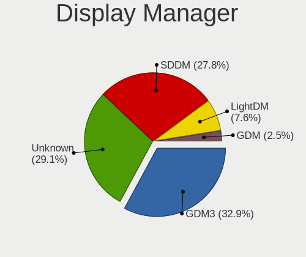
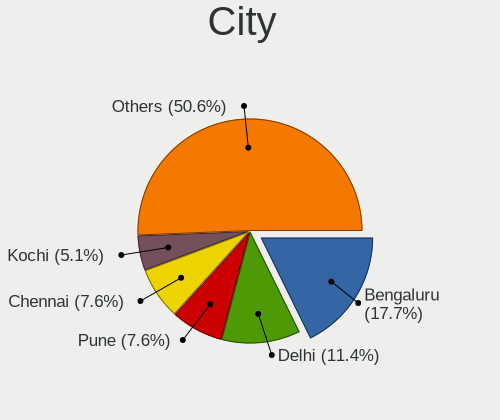
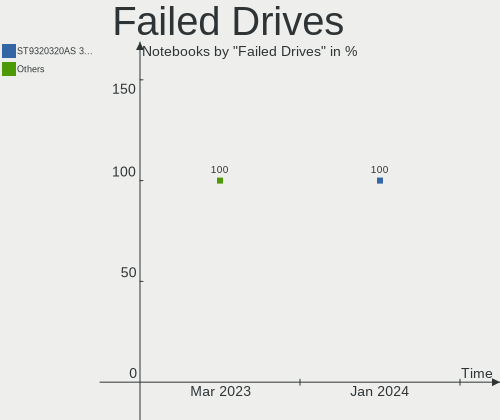
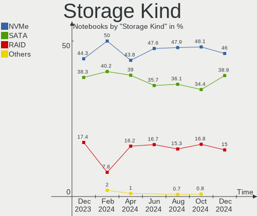
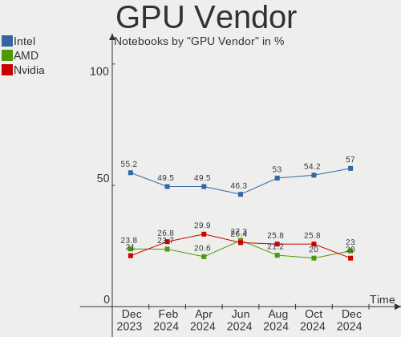
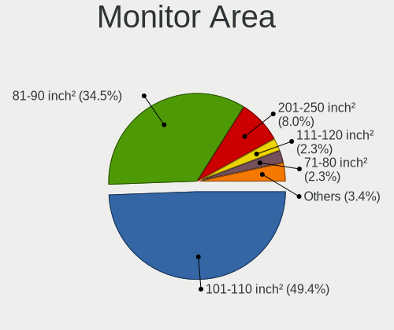
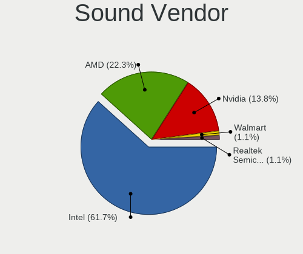
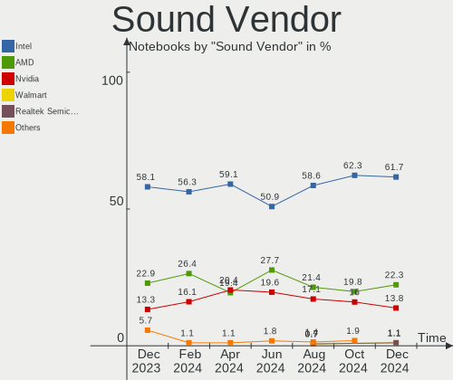
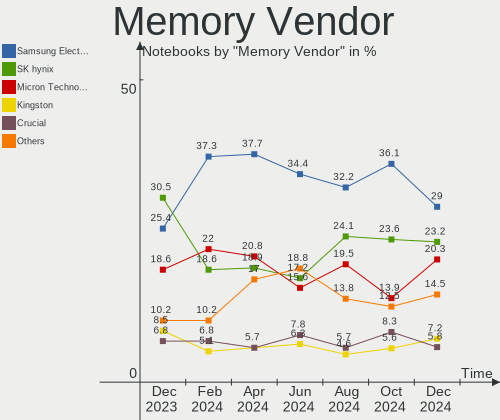

Linux in India - Hardware Trends (Notebooks)
--------------------------------------------

A project to identify most popular hardware characteristics and track their change
over time based on data collected by Linux users at https://Linux-Hardware.org.

Anyone can contribute to this report by the [hw-probe](https://github.com/linuxhw/hw-probe) tool:

    sudo -E hw-probe -all -upload

Period: Mar, 2023.

Contents
--------

* [ System ](#system)
  - [ OS                       ](#os)
  - [ OS Family                ](#os-family)
  - [ Kernel                   ](#kernel)
  - [ Kernel Family            ](#kernel-family)
  - [ Kernel Major Ver.        ](#kernel-major-ver)
  - [ Arch                     ](#arch)
  - [ DE                       ](#de)
  - [ Display Server           ](#display-server)
  - [ Display Manager          ](#display-manager)
  - [ OS Lang                  ](#os-lang)
  - [ Boot Mode                ](#boot-mode)
  - [ Filesystem               ](#filesystem)
  - [ Part. scheme             ](#part-scheme)
  - [ Dual Boot with Linux/BSD ](#dual-boot-with-linuxbsd)
  - [ Dual Boot (Win)          ](#dual-boot-win)

* [ Board ](#board)
  - [ Vendor                   ](#vendor)
  - [ Model                    ](#model)
  - [ Model Family             ](#model-family)
  - [ MFG Year                 ](#mfg-year)
  - [ Form Factor              ](#form-factor)
  - [ Secure Boot              ](#secure-boot)
  - [ Coreboot                 ](#coreboot)
  - [ RAM Size                 ](#ram-size)
  - [ RAM Used                 ](#ram-used)
  - [ Total Drives             ](#total-drives)
  - [ Has CD-ROM               ](#has-cd-rom)
  - [ Has Ethernet             ](#has-ethernet)
  - [ Has WiFi                 ](#has-wifi)
  - [ Has Bluetooth            ](#has-bluetooth)

* [ Location ](#location)
  - [ Country                  ](#country)
  - [ City                     ](#city)

* [ Drives ](#drives)
  - [ Drive Vendor             ](#drive-vendor)
  - [ Drive Model              ](#drive-model)
  - [ HDD Vendor               ](#hdd-vendor)
  - [ SSD Vendor               ](#ssd-vendor)
  - [ Drive Kind               ](#drive-kind)
  - [ Drive Connector          ](#drive-connector)
  - [ Drive Size               ](#drive-size)
  - [ Space Total              ](#space-total)
  - [ Space Used               ](#space-used)
  - [ Malfunc. Drives          ](#malfunc-drives)
  - [ Malfunc. Drive Vendor    ](#malfunc-drive-vendor)
  - [ Malfunc. HDD Vendor      ](#malfunc-hdd-vendor)
  - [ Malfunc. Drive Kind      ](#malfunc-drive-kind)
  - [ Failed Drives            ](#failed-drives)
  - [ Failed Drive Vendor      ](#failed-drive-vendor)
  - [ Drive Status             ](#drive-status)

* [ Storage controller ](#storage-controller)
  - [ Storage Vendor           ](#storage-vendor)
  - [ Storage Model            ](#storage-model)
  - [ Storage Kind             ](#storage-kind)

* [ Processor ](#processor)
  - [ CPU Vendor               ](#cpu-vendor)
  - [ CPU Model                ](#cpu-model)
  - [ CPU Model Family         ](#cpu-model-family)
  - [ CPU Cores                ](#cpu-cores)
  - [ CPU Sockets              ](#cpu-sockets)
  - [ CPU Threads              ](#cpu-threads)
  - [ CPU Op-Modes             ](#cpu-op-modes)
  - [ CPU Microcode            ](#cpu-microcode)
  - [ CPU Microarch            ](#cpu-microarch)

* [ Graphics ](#graphics)
  - [ GPU Vendor               ](#gpu-vendor)
  - [ GPU Model                ](#gpu-model)
  - [ GPU Combo                ](#gpu-combo)
  - [ GPU Driver               ](#gpu-driver)
  - [ GPU Memory               ](#gpu-memory)

* [ Monitor ](#monitor)
  - [ Monitor Vendor           ](#monitor-vendor)
  - [ Monitor Model            ](#monitor-model)
  - [ Monitor Resolution       ](#monitor-resolution)
  - [ Monitor Diagonal         ](#monitor-diagonal)
  - [ Monitor Width            ](#monitor-width)
  - [ Aspect Ratio             ](#aspect-ratio)
  - [ Monitor Area             ](#monitor-area)
  - [ Pixel Density            ](#pixel-density)
  - [ Multiple Monitors        ](#multiple-monitors)

* [ Network ](#network)
  - [ Net Controller Vendor    ](#net-controller-vendor)
  - [ Net Controller Model     ](#net-controller-model)
  - [ Wireless Vendor          ](#wireless-vendor)
  - [ Wireless Model           ](#wireless-model)
  - [ Ethernet Vendor          ](#ethernet-vendor)
  - [ Ethernet Model           ](#ethernet-model)
  - [ Net Controller Kind      ](#net-controller-kind)
  - [ Used Controller          ](#used-controller)
  - [ NICs                     ](#nics)
  - [ IPv6                     ](#ipv6)

* [ Bluetooth ](#bluetooth)
  - [ Bluetooth Vendor         ](#bluetooth-vendor)
  - [ Bluetooth Model          ](#bluetooth-model)

* [ Sound ](#sound)
  - [ Sound Vendor             ](#sound-vendor)
  - [ Sound Model              ](#sound-model)

* [ Memory ](#memory)
  - [ Memory Vendor            ](#memory-vendor)
  - [ Memory Model             ](#memory-model)
  - [ Memory Kind              ](#memory-kind)
  - [ Memory Form Factor       ](#memory-form-factor)
  - [ Memory Size              ](#memory-size)
  - [ Memory Speed             ](#memory-speed)

* [ Printers & scanners ](#printers--scanners)
  - [ Printer Vendor           ](#printer-vendor)
  - [ Printer Model            ](#printer-model)
  - [ Scanner Vendor           ](#scanner-vendor)
  - [ Scanner Model            ](#scanner-model)

* [ Camera ](#camera)
  - [ Camera Vendor            ](#camera-vendor)
  - [ Camera Model             ](#camera-model)

* [ Security ](#security)
  - [ Fingerprint Vendor       ](#fingerprint-vendor)
  - [ Fingerprint Model        ](#fingerprint-model)
  - [ Chipcard Vendor          ](#chipcard-vendor)
  - [ Chipcard Model           ](#chipcard-model)

* [ Unsupported ](#unsupported)
  - [ Unsupported Devices      ](#unsupported-devices)
  - [ Unsupported Device Types ](#unsupported-device-types)

System
------

OS
--

Installed operating systems

| Name                | Notebooks | Percent |
|---------------------|-----------|---------|
| Ubuntu 22.04        | 16        | 17.58%  |
| Linux Mint 21.1     | 9         | 9.89%   |
| Fedora 37           | 7         | 7.69%   |
| Ubuntu 22.10        | 6         | 6.59%   |
| Zorin 16            | 5         | 5.49%   |
| Ubuntu 20.04        | 4         | 4.4%    |
| Kali 2023.1         | 4         | 4.4%    |
| Xero Rolling        | 3         | 3.3%    |
| Kubuntu 22.10       | 3         | 3.3%    |
| KDE neon 22.04      | 3         | 3.3%    |
| Arch Rolling        | 3         | 3.3%    |
| Pop!_OS 22.04       | 2         | 2.2%    |
| OpenMandriva 23.01  | 2         | 2.2%    |
| Manjaro             | 2         | 2.2%    |
| Kubuntu 22.04       | 2         | 2.2%    |
| EndeavourOS Rolling | 2         | 2.2%    |
| ArcoLinux Rolling   | 2         | 2.2%    |
| Ubuntu Unity 22.10  | 1         | 1.1%    |
| Ubuntu Unity 22.04  | 1         | 1.1%    |
| Ubuntu 23.04        | 1         | 1.1%    |
| Slackware 15.0      | 1         | 1.1%    |
| RHEL 7              | 1         | 1.1%    |
| Parrot 5.2          | 1         | 1.1%    |
| OpenMandriva 4.3    | 1         | 1.1%    |
| OpenMandriva 4.2    | 1         | 1.1%    |
| OpenMandriva 23.90  | 1         | 1.1%    |
| OpenMandriva 23.03  | 1         | 1.1%    |
| Manjaro 22.0.5      | 1         | 1.1%    |
| Linux Mint 21       | 1         | 1.1%    |
| Fedora 38           | 1         | 1.1%    |
| Debian 11           | 1         | 1.1%    |
| Artix Rolling       | 1         | 1.1%    |
| Archcraft Rolling   | 1         | 1.1%    |

OS Family
---------

OS without a version

| Name         | Notebooks | Percent |
|--------------|-----------|---------|
| Ubuntu       | 27        | 29.67%  |
| Linux Mint   | 10        | 10.99%  |
| Fedora       | 8         | 8.79%   |
| OpenMandriva | 6         | 6.59%   |
| Zorin        | 5         | 5.49%   |
| Kubuntu      | 5         | 5.49%   |
| Kali         | 4         | 4.4%    |
| Xero         | 3         | 3.3%    |
| Manjaro      | 3         | 3.3%    |
| KDE neon     | 3         | 3.3%    |
| Arch         | 3         | 3.3%    |
| Ubuntu Unity | 2         | 2.2%    |
| Pop!_OS      | 2         | 2.2%    |
| EndeavourOS  | 2         | 2.2%    |
| ArcoLinux    | 2         | 2.2%    |
| Slackware    | 1         | 1.1%    |
| RHEL         | 1         | 1.1%    |
| Parrot       | 1         | 1.1%    |
| Debian       | 1         | 1.1%    |
| Artix        | 1         | 1.1%    |
| Archcraft    | 1         | 1.1%    |

Kernel
------

Version of the Linux kernel

| Version                | Notebooks | Percent |
|------------------------|-----------|---------|
| 5.19.0-35-generic      | 14        | 15.38%  |
| 5.15.0-67-generic      | 12        | 13.19%  |
| 5.19.0-38-generic      | 4         | 4.4%    |
| 6.1.14-200.fc37.x86_64 | 3         | 3.3%    |
| 6.1.0-kali5-amd64      | 3         | 3.3%    |
| 5.19.0-32-generic      | 3         | 3.3%    |
| 5.15.0-69-generic      | 3         | 3.3%    |
| 6.2.8-zen1-1-zen       | 2         | 2.2%    |
| 6.2.8-arch1-1          | 2         | 2.2%    |
| 6.1.1-desktop-1omv2290 | 2         | 2.2%    |
| 5.19.0-31-generic      | 2         | 2.2%    |
| 5.15.0-52-generic      | 2         | 2.2%    |
| 6.3.0-rc1-273-tkg-cfs  | 1         | 1.1%    |
| 6.2.7-desktop-1omv2390 | 1         | 1.1%    |
| 6.2.7-arch1-1          | 1         | 1.1%    |
| 6.2.7-300.fc38.x86_64  | 1         | 1.1%    |
| 6.2.7-200.fc37.x86_64  | 1         | 1.1%    |
| 6.2.7-060207-generic   | 1         | 1.1%    |
| 6.2.6-zen1-1-zen       | 1         | 1.1%    |
| 6.2.6-desktop-1omv2390 | 1         | 1.1%    |
| 6.2.5-arch1-1          | 1         | 1.1%    |
| 6.2.2-arch2-1          | 1         | 1.1%    |
| 6.2.2-060202-generic   | 1         | 1.1%    |
| 6.2.0-76060200-generic | 1         | 1.1%    |
| 6.1.3-273-tkg-bmq      | 1         | 1.1%    |
| 6.1.19-1-MANJARO       | 1         | 1.1%    |
| 6.1.18-x64v2-xanmod1   | 1         | 1.1%    |
| 6.1.15-200.fc37.x86_64 | 1         | 1.1%    |
| 6.1.13-200.fc37.x86_64 | 1         | 1.1%    |
| 6.1.12-arch1-1         | 1         | 1.1%    |
| 6.1.12-060112-generic  | 1         | 1.1%    |
| 6.1.0-16-generic       | 1         | 1.1%    |
| 6.1.0-1007-oem         | 1         | 1.1%    |
| 6.0.7-301.fc37.x86_64  | 1         | 1.1%    |
| 6.0.2-rpl-qs-ww05bkc   | 1         | 1.1%    |
| 6.0.12-arch1-1         | 1         | 1.1%    |
| 6.0.0-kali3-amd64      | 1         | 1.1%    |
| 6.0.0-12parrot1-amd64  | 1         | 1.1%    |
| 5.4.0-42-generic       | 1         | 1.1%    |
| 5.19.0-37-generic      | 1         | 1.1%    |

Kernel Family
-------------

Linux kernel without a distro release

| Version  | Notebooks | Percent |
|----------|-----------|---------|
| 5.19.0   | 24        | 26.37%  |
| 5.15.0   | 20        | 21.98%  |
| 6.2.7    | 5         | 5.49%   |
| 6.1.0    | 5         | 5.49%   |
| 6.2.8    | 4         | 4.4%    |
| 6.1.14   | 3         | 3.3%    |
| 6.2.6    | 2         | 2.2%    |
| 6.2.2    | 2         | 2.2%    |
| 6.1.12   | 2         | 2.2%    |
| 6.1.1    | 2         | 2.2%    |
| 6.0.0    | 2         | 2.2%    |
| 6.3.0    | 1         | 1.1%    |
| 6.2.5    | 1         | 1.1%    |
| 6.2.0    | 1         | 1.1%    |
| 6.1.3    | 1         | 1.1%    |
| 6.1.19   | 1         | 1.1%    |
| 6.1.18   | 1         | 1.1%    |
| 6.1.15   | 1         | 1.1%    |
| 6.1.13   | 1         | 1.1%    |
| 6.0.7    | 1         | 1.1%    |
| 6.0.2    | 1         | 1.1%    |
| 6.0.12   | 1         | 1.1%    |
| 5.4.0    | 1         | 1.1%    |
| 5.16.13  | 1         | 1.1%    |
| 5.15.80  | 1         | 1.1%    |
| 5.15.102 | 1         | 1.1%    |
| 5.14.0   | 1         | 1.1%    |
| 5.10.79  | 1         | 1.1%    |
| 5.10.14  | 1         | 1.1%    |
| 5.10.0   | 1         | 1.1%    |
| 3.10.0   | 1         | 1.1%    |

Kernel Major Ver.
-----------------

Linux kernel major version

| Version | Notebooks | Percent |
|---------|-----------|---------|
| 5.19    | 24        | 26.37%  |
| 5.15    | 22        | 24.18%  |
| 6.1     | 17        | 18.68%  |
| 6.2     | 15        | 16.48%  |
| 6.0     | 5         | 5.49%   |
| 5.10    | 3         | 3.3%    |
| 6.3     | 1         | 1.1%    |
| 5.4     | 1         | 1.1%    |
| 5.16    | 1         | 1.1%    |
| 5.14    | 1         | 1.1%    |
| 3.10    | 1         | 1.1%    |

Arch
----

OS architecture (x86_64, i586, etc.)

| Name   | Notebooks | Percent |
|--------|-----------|---------|
| x86_64 | 91        | 100%    |

DE
--

Desktop Environment

| Name       | Notebooks | Percent |
|------------|-----------|---------|
| GNOME      | 47        | 51.65%  |
| KDE5       | 20        | 21.98%  |
| X-Cinnamon | 9         | 9.89%   |
| XFCE       | 8         | 8.79%   |
| Hyprland   | 3         | 3.3%    |
| xmonad     | 1         | 1.1%    |
| Unity      | 1         | 1.1%    |
| MATE       | 1         | 1.1%    |
| KDE4       | 1         | 1.1%    |

Display Server
--------------

X11 or Wayland

| Name    | Notebooks | Percent |
|---------|-----------|---------|
| X11     | 64        | 70.33%  |
| Wayland | 25        | 27.47%  |
| Tty     | 1         | 1.1%    |
| Unknown | 1         | 1.1%    |

Display Manager
---------------

SDDM, LightDM, etc.

| Name    | Notebooks | Percent |
|---------|-----------|---------|
| GDM3    | 29        | 31.87%  |
| SDDM    | 21        | 23.08%  |
| Unknown | 19        | 20.88%  |
| LightDM | 12        | 13.19%  |
| GDM     | 10        | 10.99%  |

OS Lang
-------

Language

| Lang    | Notebooks | Percent |
|---------|-----------|---------|
| en_IN   | 64        | 70.33%  |
| en_US   | 24        | 26.37%  |
| en_GB   | 1         | 1.1%    |
| C       | 1         | 1.1%    |
| Unknown | 1         | 1.1%    |

Boot Mode
---------

EFI or BIOS

| Mode | Notebooks | Percent |
|------|-----------|---------|
| EFI  | 65        | 71.43%  |
| BIOS | 26        | 28.57%  |

Filesystem
----------

Type of filesystem

| Type    | Notebooks | Percent |
|---------|-----------|---------|
| Ext4    | 66        | 72.53%  |
| Btrfs   | 12        | 13.19%  |
| Overlay | 7         | 7.69%   |
| Xfs     | 3         | 3.3%    |
| Zfs     | 2         | 2.2%    |
| F2fs    | 1         | 1.1%    |

Part. scheme
------------

Scheme of partitioning

| Type    | Notebooks | Percent |
|---------|-----------|---------|
| GPT     | 64        | 70.33%  |
| Unknown | 18        | 19.78%  |
| MBR     | 9         | 9.89%   |

Dual Boot with Linux/BSD
------------------------

Hosting more than one Linux/BSD

| Dual boot | Notebooks | Percent |
|-----------|-----------|---------|
| No        | 79        | 86.81%  |
| Yes       | 12        | 13.19%  |

Dual Boot (Win)
---------------

Hosting Linux and Windows

| Dual boot | Notebooks | Percent |
|-----------|-----------|---------|
| No        | 52        | 57.14%  |
| Yes       | 39        | 42.86%  |

Board
-----

Vendor
------

Motherboard manufacturer

| Name                    | Notebooks | Percent |
|-------------------------|-----------|---------|
| Lenovo                  | 26        | 28.57%  |
| Hewlett-Packard         | 21        | 23.08%  |
| Dell                    | 19        | 20.88%  |
| ASUSTek Computer        | 9         | 9.89%   |
| Timi                    | 3         | 3.3%    |
| Acer                    | 3         | 3.3%    |
| HONOR                   | 2         | 2.2%    |
| Valve                   | 1         | 1.1%    |
| RDP                     | 1         | 1.1%    |
| MSI                     | 1         | 1.1%    |
| Intel                   | 1         | 1.1%    |
| Infinix                 | 1         | 1.1%    |
| HCL Infosystems Limited | 1         | 1.1%    |
| Getac                   | 1         | 1.1%    |
| Apple                   | 1         | 1.1%    |

Model
-----

Motherboard model

| Name                                        | Notebooks | Percent |
|---------------------------------------------|-----------|---------|
| Timi Xiaomi NoteBook Pro                    | 3         | 3.3%    |
| HP Pavilion 15                              | 3         | 3.3%    |
| HONOR NMH-WCX9                              | 2         | 2.2%    |
| HP Laptop 15s-du0xxx                        | 2         | 2.2%    |
| Valve Jupiter                               | 1         | 1.1%    |
| RDP ThinBook 1010                           | 1         | 1.1%    |
| MSI Alpha 15 B5EEK                          | 1         | 1.1%    |
| Lenovo Yoga 2 13 20344                      | 1         | 1.1%    |
| Lenovo ThinkPad X13 Gen 2a 20XH0076IG       | 1         | 1.1%    |
| Lenovo ThinkPad X1 Carbon Gen 10 21CBCTO1WW | 1         | 1.1%    |
| Lenovo ThinkPad W530 2447C83                | 1         | 1.1%    |
| Lenovo ThinkPad T470 20HES4EG00             | 1         | 1.1%    |
| Lenovo ThinkPad T460s 20FAS55Q1D            | 1         | 1.1%    |
| Lenovo ThinkPad P50 20EN0013US              | 1         | 1.1%    |
| Lenovo ThinkPad E480 20KNA01HIG             | 1         | 1.1%    |
| Lenovo ThinkPad E14 Gen 4 21E3S05B00        | 1         | 1.1%    |
| Lenovo ThinkBook 15 G4 ABA 21DL             | 1         | 1.1%    |
| Lenovo ThinkBook 15 G2 ITL 20VE             | 1         | 1.1%    |
| Lenovo ThinkBook 14 G2 ITL Ub 20VD          | 1         | 1.1%    |
| Lenovo Legion Y540-15IRH-PG0 81SY           | 1         | 1.1%    |
| Lenovo IdeaPad S540-15IML D 81NG            | 1         | 1.1%    |
| Lenovo IdeaPad Gaming 3 15IHU6 82K1         | 1         | 1.1%    |
| Lenovo IdeaPad Gaming 3 15ACH6 82K2         | 1         | 1.1%    |
| Lenovo IdeaPad 5 15ITL05 82FG               | 1         | 1.1%    |
| Lenovo IdeaPad 330S-15IKB 81F5              | 1         | 1.1%    |
| Lenovo IdeaPad 330-15IKB 81DE               | 1         | 1.1%    |
| Lenovo IdeaPad 320-15AST 80XV               | 1         | 1.1%    |
| Lenovo IdeaPad 130-14IKB 81H6               | 1         | 1.1%    |
| Lenovo G560 20042                           | 1         | 1.1%    |
| Lenovo G500s 20245                          | 1         | 1.1%    |
| Lenovo G50-80 80E5                          | 1         | 1.1%    |
| Lenovo Flex 2-14 20404                      | 1         | 1.1%    |
| Lenovo E41-25 81FS                          | 1         | 1.1%    |
| Intel Raptor Lake Client Platform           | 1         | 1.1%    |
| Infinix INBOOK X2 PLUS                      | 1         | 1.1%    |
| HP Victus by Laptop 16-e0xxx                | 1         | 1.1%    |
| HP Victus by Gaming Laptop 15-fa0xxx        | 1         | 1.1%    |
| HP Stream Laptop 14-ds0xxx                  | 1         | 1.1%    |
| HP Pavilion Sleekbook 15 PC                 | 1         | 1.1%    |
| HP Pavilion Laptop 15-cs1xxx                | 1         | 1.1%    |

Model Family
------------

Motherboard model prefix

| Name                        | Notebooks | Percent |
|-----------------------------|-----------|---------|
| Lenovo ThinkPad             | 8         | 8.79%   |
| Lenovo IdeaPad              | 8         | 8.79%   |
| HP Pavilion                 | 7         | 7.69%   |
| Dell Inspiron               | 7         | 7.69%   |
| HP Laptop                   | 6         | 6.59%   |
| Dell Latitude               | 6         | 6.59%   |
| ASUS VivoBook               | 4         | 4.4%    |
| Timi Xiaomi                 | 3         | 3.3%    |
| Lenovo ThinkBook            | 3         | 3.3%    |
| Dell G15                    | 3         | 3.3%    |
| HONOR NMH-WCX9              | 2         | 2.2%    |
| HP Victus                   | 2         | 2.2%    |
| HP 245                      | 2         | 2.2%    |
| Dell Vostro                 | 2         | 2.2%    |
| ASUS TUF                    | 2         | 2.2%    |
| ASUS ROG                    | 2         | 2.2%    |
| Valve Jupiter               | 1         | 1.1%    |
| RDP ThinBook                | 1         | 1.1%    |
| MSI Alpha                   | 1         | 1.1%    |
| Lenovo Yoga                 | 1         | 1.1%    |
| Lenovo Legion               | 1         | 1.1%    |
| Lenovo G560                 | 1         | 1.1%    |
| Lenovo G500s                | 1         | 1.1%    |
| Lenovo G50-80               | 1         | 1.1%    |
| Lenovo Flex                 | 1         | 1.1%    |
| Lenovo E41-25               | 1         | 1.1%    |
| Intel Raptor                | 1         | 1.1%    |
| Infinix INBOOK              | 1         | 1.1%    |
| HP Stream                   | 1         | 1.1%    |
| HP OMEN                     | 1         | 1.1%    |
| HP Notebook                 | 1         | 1.1%    |
| HP 250                      | 1         | 1.1%    |
| HCL Infosystems Limited HCL | 1         | 1.1%    |
| Getac B360                  | 1         | 1.1%    |
| Dell Precision              | 1         | 1.1%    |
| ASUS ASUS                   | 1         | 1.1%    |
| Apple MacBookPro13          | 1         | 1.1%    |
| Acer Predator               | 1         | 1.1%    |
| Acer Extensa                | 1         | 1.1%    |
| Acer Aspire                 | 1         | 1.1%    |

MFG Year
--------

Motherboard manufacture year

| Year | Notebooks | Percent |
|------|-----------|---------|
| 2021 | 18        | 19.78%  |
| 2022 | 15        | 16.48%  |
| 2019 | 13        | 14.29%  |
| 2020 | 11        | 12.09%  |
| 2018 | 6         | 6.59%   |
| 2017 | 6         | 6.59%   |
| 2013 | 5         | 5.49%   |
| 2014 | 4         | 4.4%    |
| 2012 | 4         | 4.4%    |
| 2016 | 3         | 3.3%    |
| 2023 | 1         | 1.1%    |
| 2015 | 1         | 1.1%    |
| 2011 | 1         | 1.1%    |
| 2010 | 1         | 1.1%    |
| 2009 | 1         | 1.1%    |
| 2008 | 1         | 1.1%    |

Form Factor
-----------

Physical design of the computer

| Name     | Notebooks | Percent |
|----------|-----------|---------|
| Notebook | 91        | 100%    |

Secure Boot
-----------

Enabled or disabled

| State    | Notebooks | Percent |
|----------|-----------|---------|
| Disabled | 74        | 81.32%  |
| Enabled  | 17        | 18.68%  |

Coreboot
--------

Have coreboot on board

| Used | Notebooks | Percent |
|------|-----------|---------|
| No   | 91        | 100%    |

RAM Size
--------

Total RAM memory

| Size in GB  | Notebooks | Percent |
|-------------|-----------|---------|
| 4.01-8.0    | 30        | 32.97%  |
| 16.01-24.0  | 25        | 27.47%  |
| 8.01-16.0   | 16        | 17.58%  |
| 3.01-4.0    | 14        | 15.38%  |
| 32.01-64.0  | 3         | 3.3%    |
| 24.01-32.0  | 1         | 1.1%    |
| 64.01-256.0 | 1         | 1.1%    |
| 1.01-2.0    | 1         | 1.1%    |

RAM Used
--------

Used RAM memory

| Used GB    | Notebooks | Percent |
|------------|-----------|---------|
| 2.01-3.0   | 29        | 31.87%  |
| 1.01-2.0   | 21        | 23.08%  |
| 3.01-4.0   | 19        | 20.88%  |
| 4.01-8.0   | 15        | 16.48%  |
| 8.01-16.0  | 5         | 5.49%   |
| 24.01-32.0 | 1         | 1.1%    |
| 0.51-1.0   | 1         | 1.1%    |

Total Drives
------------

Number of drives on board

| Drives | Notebooks | Percent |
|--------|-----------|---------|
| 1      | 62        | 68.13%  |
| 2      | 26        | 28.57%  |
| 3      | 3         | 3.3%    |

Has CD-ROM
----------

Has CD-ROM on board

| Presented | Notebooks | Percent |
|-----------|-----------|---------|
| No        | 81        | 89.01%  |
| Yes       | 10        | 10.99%  |

Has Ethernet
------------

Has Ethernet on board

| Presented | Notebooks | Percent |
|-----------|-----------|---------|
| Yes       | 74        | 81.32%  |
| No        | 17        | 18.68%  |

Has WiFi
--------

Has WiFi module

| Presented | Notebooks | Percent |
|-----------|-----------|---------|
| Yes       | 90        | 98.9%   |
| No        | 1         | 1.1%    |

Has Bluetooth
-------------

Has Bluetooth module

| Presented | Notebooks | Percent |
|-----------|-----------|---------|
| Yes       | 82        | 90.11%  |
| No        | 9         | 9.89%   |

Location
--------

Country
-------

Geographic location (country)

| Country | Notebooks | Percent |
|---------|-----------|---------|
| India   | 91        | 100%    |

City
----

Geographic location (city)

| City              | Notebooks | Percent |
|-------------------|-----------|---------|
| Bengaluru         | 12        | 13.19%  |
| Hyderabad         | 8         | 8.79%   |
| Delhi             | 8         | 8.79%   |
| Chennai           | 8         | 8.79%   |
| Mumbai            | 6         | 6.59%   |
| Pune              | 5         | 5.49%   |
| Kochi             | 4         | 4.4%    |
| Ahmedabad         | 3         | 3.3%    |
| Thrissur          | 2         | 2.2%    |
| Noida             | 2         | 2.2%    |
| Lucknow           | 2         | 2.2%    |
| Kolkata           | 2         | 2.2%    |
| Jaipur            | 2         | 2.2%    |
| Greater Noida     | 2         | 2.2%    |
| Ghaziabad         | 2         | 2.2%    |
| Chittaranjan Park | 2         | 2.2%    |
| Bhubaneswar       | 2         | 2.2%    |
| Warangal          | 1         | 1.1%    |
| Trivandrum        | 1         | 1.1%    |
| Salem             | 1         | 1.1%    |
| New Delhi         | 1         | 1.1%    |
| Madurai           | 1         | 1.1%    |
| Madhubani         | 1         | 1.1%    |
| Ludhiana          | 1         | 1.1%    |
| Kozhikode         | 1         | 1.1%    |
| Karnal            | 1         | 1.1%    |
| Kannur            | 1         | 1.1%    |
| Jalna             | 1         | 1.1%    |
| Jalgaon           | 1         | 1.1%    |
| Guwahati          | 1         | 1.1%    |
| Gurgaon           | 1         | 1.1%    |
| Fatehpur Chaurasi | 1         | 1.1%    |
| Dhubri            | 1         | 1.1%    |
| Coimbatore        | 1         | 1.1%    |
| Bareilly          | 1         | 1.1%    |
| Ambli             | 1         | 1.1%    |

Drives
------

Drive Vendor
------------

Hard drive vendors

| Vendor                      | Notebooks | Drives | Percent |
|-----------------------------|-----------|--------|---------|
| WDC                         | 18        | 19     | 15.52%  |
| Seagate                     | 18        | 18     | 15.52%  |
| Samsung Electronics         | 14        | 15     | 12.07%  |
| Crucial                     | 7         | 7      | 6.03%   |
| SK hynix                    | 6         | 6      | 5.17%   |
| Sandisk                     | 6         | 6      | 5.17%   |
| Micron Technology           | 6         | 6      | 5.17%   |
| Toshiba                     | 5         | 5      | 4.31%   |
| KIOXIA                      | 5         | 5      | 4.31%   |
| Kingston                    | 4         | 4      | 3.45%   |
| Unknown                     | 3         | 3      | 2.59%   |
| Intel                       | 3         | 3      | 2.59%   |
| HGST                        | 2         | 2      | 1.72%   |
| China                       | 2         | 2      | 1.72%   |
| Acer                        | 2         | 2      | 1.72%   |
| Zebronics                   | 1         | 1      | 0.86%   |
| YMTC                        | 1         | 1      | 0.86%   |
| UMIS                        | 1         | 1      | 0.86%   |
| Solid State Storage         | 1         | 1      | 0.86%   |
| Silicon Motion              | 1         | 1      | 0.86%   |
| Realtek Semiconductor       | 1         | 1      | 0.86%   |
| Micron/Crucial Technology   | 1         | 1      | 0.86%   |
| Lexar                       | 1         | 1      | 0.86%   |
| Kingston Technology Company | 1         | 2      | 0.86%   |
| FORESEE                     | 1         | 1      | 0.86%   |
| EVM                         | 1         | 1      | 0.86%   |
| CT500BX5                    | 1         | 1      | 0.86%   |
| BHT                         | 1         | 1      | 0.86%   |
| Apple                       | 1         | 4      | 0.86%   |
| Unknown                     | 1         | 1      | 0.86%   |

Drive Model
-----------

Hard drive models

| Model                                               | Notebooks | Percent |
|-----------------------------------------------------|-----------|---------|
| Seagate ST1000LM035-1RK172 1TB                      | 8         | 6.67%   |
| Toshiba MQ04ABF100 1TB                              | 4         | 3.33%   |
| Seagate ST1000LM049-2GH172 1TB                      | 3         | 2.5%    |
| KIOXIA KBG50ZNV512G 512GB                           | 3         | 2.5%    |
| WDC WD10SPZX-60Z10T0 1TB                            | 2         | 1.67%   |
| SanDisk NVMe SSD Drive 512GB                        | 2         | 1.67%   |
| Samsung NVMe SSD Controller SM981/PM981/PM983 250GB | 2         | 1.67%   |
| Micron 2450_MTFDKBA512TFK 512GB                     | 2         | 1.67%   |
| KIOXIA KBG40ZNS512G NVMe 512GB                      | 2         | 1.67%   |
| Crucial CT500MX500SSD1 500GB                        | 2         | 1.67%   |
| Crucial CT480BX500SSD1 480GB                        | 2         | 1.67%   |
| Zebronics ZEB-SD12 120GB SSD                        | 1         | 0.83%   |
| YMTC PC210-512GB-B                                  | 1         | 0.83%   |
| WDC WDS240G2G0B-00EPW0 240GB SSD                    | 1         | 0.83%   |
| WDC WDS120G2G0B-00EPW0 120GB SSD                    | 1         | 0.83%   |
| WDC WD7500BPKT-75PK4T0 752GB                        | 1         | 0.83%   |
| WDC WD5000LPVX-75V0TT0 500GB                        | 1         | 0.83%   |
| WDC WD5000LPVX-60V0TT0 500GB                        | 1         | 0.83%   |
| WDC WD5000LPLX-08ZNTT0 500GB                        | 1         | 0.83%   |
| WDC WD5000LPCX-24VHAT0 500GB                        | 1         | 0.83%   |
| WDC WD10SPZX-60Z10T1 1TB                            | 1         | 0.83%   |
| WDC WD10SPZX-24Z10T0 1TB                            | 1         | 0.83%   |
| WDC WD10SPZX-24Z10 1TB                              | 1         | 0.83%   |
| WDC WD10SPZX-00Z10T0 1TB                            | 1         | 0.83%   |
| WDC WD10JPVX-08JC3T5 1TB                            | 1         | 0.83%   |
| WDC PC SN730 SDBQNTY-256G-1014 256GB                | 1         | 0.83%   |
| WDC PC SN730 SDBPNTY-512G-1006 512GB                | 1         | 0.83%   |
| WDC PC SN530 SDBPNPZ-512G-1036 512GB                | 1         | 0.83%   |
| WDC PC SN530 SDBPNPZ-256G-1006 256GB                | 1         | 0.83%   |
| WDC PC SN530 SDBPMPZ-512G-1101 512GB                | 1         | 0.83%   |
| Unknown NVMe SSD Drive 1TB                          | 1         | 0.83%   |
| Unknown MMC Card  64GB                              | 1         | 0.83%   |
| Unknown MMC Card  512GB                             | 1         | 0.83%   |
| UMIS RPETJ512MGE2QDQ 512GB                          | 1         | 0.83%   |
| Toshiba MQ01ABD100 1TB                              | 1         | 0.83%   |
| Solid State Storage CL1-3D512-Q11 NVMe SSSTC 512GB  | 1         | 0.83%   |
| SK hynix SKHynix_HFS256GDE9X081N 256GB              | 1         | 0.83%   |
| SK hynix SC311 SATA 256GB SSD                       | 1         | 0.83%   |
| SK hynix PC711 HFS512GDE9X073N 512GB                | 1         | 0.83%   |
| SK hynix HFM512GD3JX016N 512GB                      | 1         | 0.83%   |

HDD Vendor
----------

Hard disk drive vendors

| Vendor  | Notebooks | Drives | Percent |
|---------|-----------|--------|---------|
| Seagate | 18        | 18     | 48.65%  |
| WDC     | 12        | 12     | 32.43%  |
| Toshiba | 5         | 5      | 13.51%  |
| HGST    | 2         | 2      | 5.41%   |

SSD Vendor
----------

Solid state drive vendors

| Vendor              | Notebooks | Drives | Percent |
|---------------------|-----------|--------|---------|
| Crucial             | 6         | 6      | 23.08%  |
| Samsung Electronics | 4         | 4      | 15.38%  |
| Kingston            | 3         | 3      | 11.54%  |
| WDC                 | 2         | 2      | 7.69%   |
| China               | 2         | 2      | 7.69%   |
| Zebronics           | 1         | 1      | 3.85%   |
| SK hynix            | 1         | 1      | 3.85%   |
| SanDisk             | 1         | 1      | 3.85%   |
| Micron Technology   | 1         | 1      | 3.85%   |
| Lexar               | 1         | 1      | 3.85%   |
| EVM                 | 1         | 1      | 3.85%   |
| CT500BX5            | 1         | 1      | 3.85%   |
| BHT                 | 1         | 1      | 3.85%   |
| Acer                | 1         | 1      | 3.85%   |

Drive Kind
----------

HDD or SSD

| Kind    | Notebooks | Drives | Percent |
|---------|-----------|--------|---------|
| NVMe    | 49        | 56     | 43.36%  |
| HDD     | 37        | 37     | 32.74%  |
| SSD     | 24        | 26     | 21.24%  |
| MMC     | 2         | 2      | 1.77%   |
| Unknown | 1         | 1      | 0.88%   |

Drive Connector
---------------

SATA, SAS, NVMe, etc.

| Type | Notebooks | Drives | Percent |
|------|-----------|--------|---------|
| NVMe | 49        | 56     | 47.57%  |
| SATA | 49        | 61     | 47.57%  |
| SAS  | 3         | 3      | 2.91%   |
| MMC  | 2         | 2      | 1.94%   |

Drive Size
----------

Size of hard drive

| Size in TB | Notebooks | Drives | Percent |
|------------|-----------|--------|---------|
| 0.01-0.5   | 29        | 33     | 49.15%  |
| 0.51-1.0   | 28        | 28     | 47.46%  |
| 1.01-2.0   | 2         | 2      | 3.39%   |

Space Total
-----------

Amount of disk space available on the file system

| Size in GB     | Notebooks | Percent |
|----------------|-----------|---------|
| 101-250        | 31        | 34.07%  |
| 251-500        | 20        | 21.98%  |
| 501-1000       | 16        | 17.58%  |
| 1-20           | 8         | 8.79%   |
| 51-100         | 7         | 7.69%   |
| 21-50          | 4         | 4.4%    |
| 1001-2000      | 4         | 4.4%    |
| More than 3000 | 1         | 1.1%    |

Space Used
----------

Amount of used disk space

| Used GB   | Notebooks | Percent |
|-----------|-----------|---------|
| 1-20      | 25        | 27.47%  |
| 21-50     | 22        | 24.18%  |
| 51-100    | 21        | 23.08%  |
| 101-250   | 10        | 10.99%  |
| 251-500   | 9         | 9.89%   |
| 501-1000  | 3         | 3.3%    |
| 1001-2000 | 1         | 1.1%    |

Malfunc. Drives
---------------

Drive models with a malfunction

| Model                               | Notebooks | Drives | Percent |
|-------------------------------------|-----------|--------|---------|
| WDC WD7500BPKT-75PK4T0 752GB        | 1         | 1      | 16.67%  |
| WDC WD10SPZX-24Z10 1TB              | 1         | 1      | 16.67%  |
| Seagate ST500LT012-9WS142 500GB     | 1         | 1      | 16.67%  |
| Seagate ST500LT012-1DG142 500GB     | 1         | 1      | 16.67%  |
| Seagate ST500LM012 HN-M500MBB 500GB | 1         | 1      | 16.67%  |
| HGST HTS545050A7E680 500GB          | 1         | 1      | 16.67%  |

Malfunc. Drive Vendor
---------------------

Vendors of faulty drives

| Vendor  | Notebooks | Drives | Percent |
|---------|-----------|--------|---------|
| Seagate | 3         | 3      | 50%     |
| WDC     | 2         | 2      | 33.33%  |
| HGST    | 1         | 1      | 16.67%  |

Malfunc. HDD Vendor
-------------------

Vendors of faulty HDD drives

| Vendor  | Notebooks | Drives | Percent |
|---------|-----------|--------|---------|
| Seagate | 3         | 3      | 50%     |
| WDC     | 2         | 2      | 33.33%  |
| HGST    | 1         | 1      | 16.67%  |

Malfunc. Drive Kind
-------------------

Kinds of faulty drives

| Kind | Notebooks | Drives | Percent |
|------|-----------|--------|---------|
| HDD  | 6         | 6      | 100%    |

Failed Drives
-------------

Failed drive models

| Model                | Notebooks | Drives | Percent |
|----------------------|-----------|--------|---------|
| Acer SSD FA100 256GB | 1         | 1      | 100%    |

Failed Drive Vendor
-------------------

Failed drive vendors

| Vendor | Notebooks | Drives | Percent |
|--------|-----------|--------|---------|
| Acer   | 1         | 1      | 100%    |

Drive Status
------------

Number of failed and malfunc. drives

| Status   | Notebooks | Drives | Percent |
|----------|-----------|--------|---------|
| Works    | 57        | 70     | 57.58%  |
| Detected | 35        | 45     | 35.35%  |
| Malfunc  | 6         | 6      | 6.06%   |
| Failed   | 1         | 1      | 1.01%   |

Storage controller
------------------

Storage Vendor
--------------

Storage controller vendors

| Vendor                         | Notebooks | Percent |
|--------------------------------|-----------|---------|
| Intel                          | 62        | 52.1%   |
| SanDisk                        | 10        | 8.4%    |
| Samsung Electronics            | 10        | 8.4%    |
| AMD                            | 9         | 7.56%   |
| SK hynix                       | 5         | 4.2%    |
| Micron Technology              | 5         | 4.2%    |
| KIOXIA                         | 5         | 4.2%    |
| Micron/Crucial Technology      | 2         | 1.68%   |
| Kingston Technology Company    | 2         | 1.68%   |
| Yangtze Memory Technologies    | 1         | 0.84%   |
| Union Memory (Shenzhen)        | 1         | 0.84%   |
| Solid State Storage Technology | 1         | 0.84%   |
| Silicon Motion                 | 1         | 0.84%   |
| Shenzhen Longsys Electronics   | 1         | 0.84%   |
| Realtek Semiconductor          | 1         | 0.84%   |
| INNOGRIT                       | 1         | 0.84%   |
| Apple                          | 1         | 0.84%   |
| ADATA Technology               | 1         | 0.84%   |

Storage Model
-------------

Storage controller models

| Model                                                                         | Notebooks | Percent |
|-------------------------------------------------------------------------------|-----------|---------|
| Intel Sunrise Point-LP SATA Controller [AHCI mode]                            | 11        | 8.4%    |
| Intel Volume Management Device NVMe RAID Controller                           | 10        | 7.63%   |
| Intel 82801 Mobile SATA Controller [RAID mode]                                | 10        | 7.63%   |
| AMD FCH SATA Controller [AHCI mode]                                           | 9         | 6.87%   |
| Intel Tiger Lake-LP SATA Controller                                           | 8         | 6.11%   |
| Samsung NVMe SSD Controller SM981/PM981/PM983                                 | 5         | 3.82%   |
| SK hynix Gold P31/PC711 NVMe Solid State Drive                                | 4         | 3.05%   |
| Samsung NVMe SSD Controller 980                                               | 4         | 3.05%   |
| Micron NVMe Storage Controller                                                | 4         | 3.05%   |
| Intel 8 Series SATA Controller 1 [AHCI mode]                                  | 4         | 3.05%   |
| Intel 7 Series Chipset Family 6-port SATA Controller [AHCI mode]              | 4         | 3.05%   |
| SanDisk WD Black SN750 / PC SN730 NVMe SSD                                    | 3         | 2.29%   |
| KIOXIA Non-Volatile memory controller                                         | 3         | 2.29%   |
| SanDisk WD Blue SN550 NVMe SSD                                                | 2         | 1.53%   |
| Sandisk Non-Volatile memory controller                                        | 2         | 1.53%   |
| KIOXIA NVMe SSD Controller BG4                                                | 2         | 1.53%   |
| Intel Q170/Q150/B150/H170/H110/Z170/CM236 Chipset SATA Controller [AHCI Mode] | 2         | 1.53%   |
| Intel Non-Volatile memory controller                                          | 2         | 1.53%   |
| Intel Comet Lake SATA AHCI Controller                                         | 2         | 1.53%   |
| Intel Cannon Lake Mobile PCH SATA AHCI Controller                             | 2         | 1.53%   |
| Intel 400 Series Chipset Family SATA AHCI Controller                          | 2         | 1.53%   |
| Yangtze Memory Non-Volatile memory controller                                 | 1         | 0.76%   |
| Union Memory (Shenzhen) AM630 PCIe 4.0 x4 NVMe SSD Controller                 | 1         | 0.76%   |
| Solid State Storage Non-Volatile memory controller                            | 1         | 0.76%   |
| SK hynix BC511                                                                | 1         | 0.76%   |
| Silicon Motion SM2263EN/SM2263XT SSD Controller                               | 1         | 0.76%   |
| Shenzhen Longsys Electronics Non-Volatile memory controller                   | 1         | 0.76%   |
| SanDisk WD PC SN810 / Black SN850 NVMe SSD                                    | 1         | 0.76%   |
| SanDisk WD Blue SN500 / PC SN520 NVMe SSD                                     | 1         | 0.76%   |
| SanDisk NVMe Controller                                                       | 1         | 0.76%   |
| Samsung NVMe SSD Controller PM9B1                                             | 1         | 0.76%   |
| Samsung NVMe SSD Controller PM9A1/PM9A3/980PRO                                | 1         | 0.76%   |
| Realtek RTS5763DL NVMe SSD Controller                                         | 1         | 0.76%   |
| Micron/Crucial P2 NVMe PCIe SSD                                               | 1         | 0.76%   |
| Micron/Crucial NVMe Storage Controller                                        | 1         | 0.76%   |
| Micron NVMe Controller                                                        | 1         | 0.76%   |
| Kingston Company Company Non-Volatile memory controller                       | 1         | 0.76%   |
| Kingston Company OM3PDP3 NVMe SSD                                             | 1         | 0.76%   |
| Kingston Company NVMe Controller                                              | 1         | 0.76%   |
| Intel Wildcat Point-LP SATA Controller [AHCI Mode]                            | 1         | 0.76%   |

Storage Kind
------------

Kind of storage controller (IDE, SATA, NVMe, SAS, ...)

| Kind | Notebooks | Percent |
|------|-----------|---------|
| SATA | 54        | 42.86%  |
| NVMe | 49        | 38.89%  |
| RAID | 22        | 17.46%  |
| IDE  | 1         | 0.79%   |

Processor
---------

CPU Vendor
----------

Processor vendors

| Vendor | Notebooks | Percent |
|--------|-----------|---------|
| Intel  | 69        | 75.82%  |
| AMD    | 22        | 24.18%  |

CPU Model
---------

Processor models

| Model                                         | Notebooks | Percent |
|-----------------------------------------------|-----------|---------|
| Intel 11th Gen Core i5-1135G7 @ 2.40GHz       | 5         | 5.49%   |
| Intel Core i5-8250U CPU @ 1.60GHz             | 4         | 4.4%    |
| Intel Core i5-4210U CPU @ 1.70GHz             | 3         | 3.3%    |
| Intel Core i5-10210U CPU @ 1.60GHz            | 3         | 3.3%    |
| Intel Core i3-8145U CPU @ 2.10GHz             | 3         | 3.3%    |
| Intel 12th Gen Core i5-12450H                 | 3         | 3.3%    |
| AMD Ryzen 7 5800H with Radeon Graphics        | 3         | 3.3%    |
| AMD Ryzen 5 5500U with Radeon Graphics        | 3         | 3.3%    |
| Intel Core i7-10750H CPU @ 2.60GHz            | 2         | 2.2%    |
| Intel Core i5-9300H CPU @ 2.40GHz             | 2         | 2.2%    |
| Intel Core i5-6300U CPU @ 2.40GHz             | 2         | 2.2%    |
| Intel Core i5-2540M CPU @ 2.60GHz             | 2         | 2.2%    |
| Intel Core i3-6006U CPU @ 2.00GHz             | 2         | 2.2%    |
| Intel Core i3-3110M CPU @ 2.40GHz             | 2         | 2.2%    |
| AMD Ryzen 5 5600H with Radeon Graphics        | 2         | 2.2%    |
| AMD Ryzen 5 3550H with Radeon Vega Mobile Gfx | 2         | 2.2%    |
| AMD PRO A4-4350B R4, 5 COMPUTE CORES 2C+3G    | 2         | 2.2%    |
| Intel Xeon CPU E3-1535M v6 @ 3.10GHz          | 1         | 1.1%    |
| Intel Core i7-6700HQ CPU @ 2.60GHz            | 1         | 1.1%    |
| Intel Core i7-3610QM CPU @ 2.30GHz            | 1         | 1.1%    |
| Intel Core i7-10510U CPU @ 1.80GHz            | 1         | 1.1%    |
| Intel Core i5-8350U CPU @ 1.70GHz             | 1         | 1.1%    |
| Intel Core i5-8300H CPU @ 2.30GHz             | 1         | 1.1%    |
| Intel Core i5-8265U CPU @ 1.60GHz             | 1         | 1.1%    |
| Intel Core i5-7300U CPU @ 2.60GHz             | 1         | 1.1%    |
| Intel Core i5-6360U CPU @ 2.00GHz             | 1         | 1.1%    |
| Intel Core i5-6200U CPU @ 2.30GHz             | 1         | 1.1%    |
| Intel Core i5-4200U CPU @ 1.60GHz             | 1         | 1.1%    |
| Intel Core i5-3317U CPU @ 1.70GHz             | 1         | 1.1%    |
| Intel Core i5-10300H CPU @ 2.50GHz            | 1         | 1.1%    |
| Intel Core i3-7020U CPU @ 2.30GHz             | 1         | 1.1%    |
| Intel Core i3-5010U CPU @ 2.10GHz             | 1         | 1.1%    |
| Intel Core i3-3120M CPU @ 2.50GHz             | 1         | 1.1%    |
| Intel Core i3-2370M CPU @ 2.40GHz             | 1         | 1.1%    |
| Intel Core i3-1005G1 CPU @ 1.20GHz            | 1         | 1.1%    |
| Intel Core i3 CPU M 380 @ 2.53GHz             | 1         | 1.1%    |
| Intel Core i3 CPU M 370 @ 2.40GHz             | 1         | 1.1%    |
| Intel Core 2 Duo CPU T9800 @ 2.93GHz          | 1         | 1.1%    |
| Intel Celeron CPU N3450 @ 1.10GHz             | 1         | 1.1%    |
| Intel Celeron CPU N2815 @ 1.86GHz             | 1         | 1.1%    |

CPU Model Family
----------------

Processor model prefix

| Model            | Notebooks | Percent |
|------------------|-----------|---------|
| Intel Core i5    | 25        | 27.47%  |
| Other            | 24        | 26.37%  |
| Intel Core i3    | 14        | 15.38%  |
| AMD Ryzen 5      | 8         | 8.79%   |
| AMD Ryzen 7      | 7         | 7.69%   |
| Intel Core i7    | 5         | 5.49%   |
| Intel Celeron    | 2         | 2.2%    |
| Intel Xeon       | 1         | 1.1%    |
| Intel Core 2 Duo | 1         | 1.1%    |
| AMD Ryzen 7 PRO  | 1         | 1.1%    |
| AMD Ryzen 3      | 1         | 1.1%    |
| AMD E2           | 1         | 1.1%    |
| AMD A4           | 1         | 1.1%    |

CPU Cores
---------

Number of processor cores

| Number | Notebooks | Percent |
|--------|-----------|---------|
| 2      | 33        | 36.26%  |
| 4      | 32        | 35.16%  |
| 8      | 12        | 13.19%  |
| 6      | 6         | 6.59%   |
| 10     | 3         | 3.3%    |
| 14     | 2         | 2.2%    |
| 12     | 2         | 2.2%    |
| 1      | 1         | 1.1%    |

CPU Sockets
-----------

Number of sockets

| Number | Notebooks | Percent |
|--------|-----------|---------|
| 1      | 91        | 100%    |

CPU Threads
-----------

Threads per core (Hyper-Threading)

| Number | Notebooks | Percent |
|--------|-----------|---------|
| 2      | 82        | 90.11%  |
| 1      | 8         | 8.79%   |
| 12     | 1         | 1.1%    |

CPU Op-Modes
------------

CPU Operation Modes (32-bit, 64-bit)

| Op mode        | Notebooks | Percent |
|----------------|-----------|---------|
| 32-bit, 64-bit | 91        | 100%    |

CPU Microcode
-------------

Microcode number

| Number     | Notebooks | Percent |
|------------|-----------|---------|
| Unknown    | 28        | 30.77%  |
| 0x806c1    | 7         | 7.69%   |
| 0x806ec    | 6         | 6.59%   |
| 0x906a3    | 5         | 5.49%   |
| 0x406e3    | 5         | 5.49%   |
| 0x906ea    | 3         | 3.3%    |
| 0x40651    | 3         | 3.3%    |
| 0x306a9    | 3         | 3.3%    |
| 0x206a7    | 3         | 3.3%    |
| 0x0a50000c | 3         | 3.3%    |
| 0xa0652    | 2         | 2.2%    |
| 0x906a4    | 2         | 2.2%    |
| 0x08608103 | 2         | 2.2%    |
| 0x08108109 | 2         | 2.2%    |
| 0x06006705 | 2         | 2.2%    |
| 0xb06a2    | 1         | 1.1%    |
| 0x906e9    | 1         | 1.1%    |
| 0x806eb    | 1         | 1.1%    |
| 0x806ea    | 1         | 1.1%    |
| 0x806c2    | 1         | 1.1%    |
| 0x706e5    | 1         | 1.1%    |
| 0x306d4    | 1         | 1.1%    |
| 0x30673    | 1         | 1.1%    |
| 0x20655    | 1         | 1.1%    |
| 0x0a50000d | 1         | 1.1%    |
| 0x08a00006 | 1         | 1.1%    |
| 0x08900201 | 1         | 1.1%    |
| 0x08608102 | 1         | 1.1%    |
| 0x08600106 | 1         | 1.1%    |
| 0x08108102 | 1         | 1.1%    |

CPU Microarch
-------------

Microarchitecture

| Name             | Notebooks | Percent |
|------------------|-----------|---------|
| KabyLake         | 19        | 20.88%  |
| TigerLake        | 10        | 10.99%  |
| Alderlake Hybrid | 10        | 10.99%  |
| Zen 3            | 8         | 8.79%   |
| Skylake          | 7         | 7.69%   |
| IvyBridge        | 5         | 5.49%   |
| Unknown          | 5         | 5.49%   |
| Haswell          | 4         | 4.4%    |
| Excavator        | 4         | 4.4%    |
| Zen+             | 3         | 3.3%    |
| SandyBridge      | 3         | 3.3%    |
| CometLake        | 3         | 3.3%    |
| Zen 2            | 2         | 2.2%    |
| Westmere         | 2         | 2.2%    |
| IceLake          | 2         | 2.2%    |
| Silvermont       | 1         | 1.1%    |
| Penryn           | 1         | 1.1%    |
| Goldmont         | 1         | 1.1%    |
| Broadwell        | 1         | 1.1%    |

Graphics
--------

GPU Vendor
----------

Vendors of graphics cards

| Vendor | Notebooks | Percent |
|--------|-----------|---------|
| Intel  | 68        | 56.2%   |
| Nvidia | 28        | 23.14%  |
| AMD    | 25        | 20.66%  |

GPU Model
---------

Graphics card models

| Model                                                                         | Notebooks | Percent |
|-------------------------------------------------------------------------------|-----------|---------|
| Intel TigerLake-LP GT2 [Iris Xe Graphics]                                     | 8         | 6.45%   |
| Nvidia TU117M [GeForce GTX 1650 Mobile / Max-Q]                               | 6         | 4.84%   |
| AMD Cezanne [Radeon Vega Series / Radeon Vega Mobile Series]                  | 6         | 4.84%   |
| Intel UHD Graphics 620                                                        | 5         | 4.03%   |
| Intel Skylake GT2 [HD Graphics 520]                                           | 5         | 4.03%   |
| Intel 3rd Gen Core processor Graphics Controller                              | 5         | 4.03%   |
| Nvidia GF117M [GeForce 610M/710M/810M/820M / GT 620M/625M/630M/720M]          | 4         | 3.23%   |
| Intel WhiskeyLake-U GT2 [UHD Graphics 620]                                    | 4         | 3.23%   |
| Intel Haswell-ULT Integrated Graphics Controller                              | 4         | 3.23%   |
| Intel CometLake-U GT2 [UHD Graphics]                                          | 4         | 3.23%   |
| Intel Alder Lake-P GT1 [UHD Graphics]                                         | 4         | 3.23%   |
| AMD Stoney [Radeon R2/R3/R4/R5 Graphics]                                      | 4         | 3.23%   |
| Intel CometLake-H GT2 [UHD Graphics]                                          | 3         | 2.42%   |
| Intel Alder Lake-P Integrated Graphics Controller                             | 3         | 2.42%   |
| Intel 2nd Generation Core Processor Family Integrated Graphics Controller     | 3         | 2.42%   |
| AMD Picasso/Raven 2 [Radeon Vega Series / Radeon Vega Mobile Series]          | 3         | 2.42%   |
| AMD Lucienne                                                                  | 3         | 2.42%   |
| Nvidia GM108M [GeForce MX130]                                                 | 2         | 1.61%   |
| Nvidia GA107M [GeForce RTX 3050 Ti Mobile]                                    | 2         | 1.61%   |
| Nvidia GA107M [GeForce RTX 3050 Mobile]                                       | 2         | 1.61%   |
| Intel Tiger Lake-LP GT2 [UHD Graphics G4]                                     | 2         | 1.61%   |
| Intel HD Graphics 620                                                         | 2         | 1.61%   |
| Intel Core Processor Integrated Graphics Controller                           | 2         | 1.61%   |
| Intel CoffeeLake-H GT2 [UHD Graphics 630]                                     | 2         | 1.61%   |
| Intel Alder Lake-UP3 GT2 [Iris Xe Graphics]                                   | 2         | 1.61%   |
| AMD Sun XT [Radeon HD 8670A/8670M/8690M / R5 M330 / M430 / Radeon 520 Mobile] | 2         | 1.61%   |
| AMD Renoir                                                                    | 2         | 1.61%   |
| AMD Navi 23 [Radeon RX 6600/6600 XT/6600M]                                    | 2         | 1.61%   |
| AMD Barcelo                                                                   | 2         | 1.61%   |
| Nvidia TU117M [GeForce GTX 1650 Ti Mobile]                                    | 1         | 0.81%   |
| Nvidia TU117M                                                                 | 1         | 0.81%   |
| Nvidia TU106M [GeForce RTX 2060 Mobile]                                       | 1         | 0.81%   |
| Nvidia GP108M [GeForce MX250]                                                 | 1         | 0.81%   |
| Nvidia GP108M [GeForce MX230]                                                 | 1         | 0.81%   |
| Nvidia GP108M [GeForce MX150]                                                 | 1         | 0.81%   |
| Nvidia GP107M [GeForce GTX 1050 Ti Mobile]                                    | 1         | 0.81%   |
| Nvidia GP107M [GeForce GTX 1050 Mobile]                                       | 1         | 0.81%   |
| Nvidia GM108M [GeForce 830M]                                                  | 1         | 0.81%   |
| Nvidia GM107GLM [Quadro M1000M]                                               | 1         | 0.81%   |
| Nvidia GK107GLM [Quadro K1000M]                                               | 1         | 0.81%   |

GPU Combo
---------

Combinations of graphics cards

| Name           | Notebooks | Percent |
|----------------|-----------|---------|
| 1 x Intel      | 42        | 46.15%  |
| Intel + Nvidia | 22        | 24.18%  |
| 1 x AMD        | 14        | 15.38%  |
| AMD + Nvidia   | 5         | 5.49%   |
| 2 x AMD        | 3         | 3.3%    |
| Intel + AMD    | 3         | 3.3%    |
| 2 x Intel      | 1         | 1.1%    |
| 1 x Nvidia     | 1         | 1.1%    |

GPU Driver
----------

Free vs proprietary

| Driver      | Notebooks | Percent |
|-------------|-----------|---------|
| Free        | 77        | 84.62%  |
| Proprietary | 10        | 10.99%  |
| Unknown     | 4         | 4.4%    |

GPU Memory
----------

Total video memory

| Size in GB | Notebooks | Percent |
|------------|-----------|---------|
| Unknown    | 62        | 68.13%  |
| 1.01-2.0   | 8         | 8.79%   |
| 0.01-0.5   | 8         | 8.79%   |
| 3.01-4.0   | 6         | 6.59%   |
| 0.51-1.0   | 6         | 6.59%   |
| 5.01-6.0   | 1         | 1.1%    |

Monitor
-------

Monitor Vendor
--------------

Monitor vendors

| Vendor                  | Notebooks | Percent |
|-------------------------|-----------|---------|
| Chimei Innolux          | 21        | 21.65%  |
| BOE                     | 19        | 19.59%  |
| LG Display              | 15        | 15.46%  |
| AU Optronics            | 15        | 15.46%  |
| Samsung Electronics     | 5         | 5.15%   |
| PANDA                   | 4         | 4.12%   |
| Hewlett-Packard         | 3         | 3.09%   |
| Dell                    | 3         | 3.09%   |
| HKC                     | 2         | 2.06%   |
| VST                     | 1         | 1.03%   |
| ViewSonic               | 1         | 1.03%   |
| Valve                   | 1         | 1.03%   |
| TMX                     | 1         | 1.03%   |
| Lenovo                  | 1         | 1.03%   |
| InfoVision              | 1         | 1.03%   |
| Goldstar                | 1         | 1.03%   |
| Chi Mei Optoelectronics | 1         | 1.03%   |
| Apple                   | 1         | 1.03%   |
| Acer                    | 1         | 1.03%   |

Monitor Model
-------------

Monitor models

| Model                                                                 | Notebooks | Percent |
|-----------------------------------------------------------------------|-----------|---------|
| Chimei Innolux LCD Monitor CMN15F5 1920x1080 344x193mm 15.5-inch      | 3         | 3.09%   |
| BOE LCD Monitor BOE0AF2 2560x1600 302x189mm 14.0-inch                 | 3         | 3.09%   |
| AU Optronics LCD Monitor AUO61ED 1920x1080 344x194mm 15.5-inch        | 3         | 3.09%   |
| Samsung Electronics LCD Monitor SDC4171 2880x1800 302x189mm 14.0-inch | 2         | 2.06%   |
| PANDA LCD Monitor NCP004D 1920x1080 344x194mm 15.5-inch               | 2         | 2.06%   |
| LG Display LCD Monitor LGD062E 1920x1080 344x194mm 15.5-inch          | 2         | 2.06%   |
| Hewlett-Packard 22fw HPN3541 1920x1080 476x268mm 21.5-inch            | 2         | 2.06%   |
| Chimei Innolux LCD Monitor CMN15E5 1920x1080 344x193mm 15.5-inch      | 2         | 2.06%   |
| Chimei Innolux LCD Monitor CMN14C3 1366x768 309x173mm 13.9-inch       | 2         | 2.06%   |
| Chimei Innolux LCD Monitor CMN1415 1920x1080 309x173mm 13.9-inch      | 2         | 2.06%   |
| BOE LCD Monitor BOE0A8A 1920x1080 344x194mm 15.5-inch                 | 2         | 2.06%   |
| AU Optronics LCD Monitor AUO45EC 1366x768 344x193mm 15.5-inch         | 2         | 2.06%   |
| VST HDMI VST6611 1366x768 576x324mm 26.0-inch                         | 1         | 1.03%   |
| ViewSonic VA2256 Series VSC3136 1920x1080 476x268mm 21.5-inch         | 1         | 1.03%   |
| Valve ANX7530 U VLV3001 800x1280 100x150mm 7.1-inch                   | 1         | 1.03%   |
| TMX TL140VDXP03-2 TMX1398 1920x1080 309x174mm 14.0-inch               | 1         | 1.03%   |
| Samsung Electronics SMS19A100 SAM0867 1366x768 410x230mm 18.5-inch    | 1         | 1.03%   |
| Samsung Electronics LCD Monitor SDC4852 3840x2160 344x194mm 15.5-inch | 1         | 1.03%   |
| Samsung Electronics LCD Monitor SDC354A 1366x768 344x194mm 15.5-inch  | 1         | 1.03%   |
| PANDA LCD Monitor NCP002D 1920x1080 344x194mm 15.5-inch               | 1         | 1.03%   |
| PANDA LCD Monitor NCP0029 1920x1080 344x194mm 15.5-inch               | 1         | 1.03%   |
| LG Display LP156WH2-TLAA LGD0230 1366x768 344x194mm 15.5-inch         | 1         | 1.03%   |
| LG Display LCD Monitor LGD0696 1920x1200 286x179mm 13.3-inch          | 1         | 1.03%   |
| LG Display LCD Monitor LGD0690 2560x1440 344x194mm 15.5-inch          | 1         | 1.03%   |
| LG Display LCD Monitor LGD05E5 1920x1080 344x194mm 15.5-inch          | 1         | 1.03%   |
| LG Display LCD Monitor LGD0557 1920x1080 309x174mm 14.0-inch          | 1         | 1.03%   |
| LG Display LCD Monitor LGD0526 1366x768 344x194mm 15.5-inch           | 1         | 1.03%   |
| LG Display LCD Monitor LGD04A7 1920x1080 344x194mm 15.5-inch          | 1         | 1.03%   |
| LG Display LCD Monitor LGD0446 1920x1080 309x174mm 14.0-inch          | 1         | 1.03%   |
| LG Display LCD Monitor LGD03AB 1366x768 344x194mm 15.5-inch           | 1         | 1.03%   |
| LG Display LCD Monitor LGD0384 1366x768 344x194mm 15.5-inch           | 1         | 1.03%   |
| LG Display LCD Monitor LGD034D 1366x768 344x194mm 15.5-inch           | 1         | 1.03%   |
| LG Display LCD Monitor LGD033E 1366x768 309x174mm 14.0-inch           | 1         | 1.03%   |
| LG Display LCD Monitor LGD0266 1366x768 344x194mm 15.5-inch           | 1         | 1.03%   |
| Lenovo LCD Monitor LEN40B2 1920x1080 344x193mm 15.5-inch              | 1         | 1.03%   |
| InfoVision LCD Monitor IVO061A 1366x768 344x193mm 15.5-inch           | 1         | 1.03%   |
| HKC LCD Monitor HKC36BB 1366x768 309x174mm 14.0-inch                  | 1         | 1.03%   |
| HKC LCD Monitor HKC36B1 1366x768 309x174mm 14.0-inch                  | 1         | 1.03%   |
| Hewlett-Packard 20kd HWP332F 1440x900 419x262mm 19.5-inch             | 1         | 1.03%   |
| Goldstar FULL HD GSM5ABB 1920x1080 480x270mm 21.7-inch                | 1         | 1.03%   |

Monitor Resolution
------------------

Monitor screen resolution

| Resolution        | Notebooks | Percent |
|-------------------|-----------|---------|
| 1920x1080 (FHD)   | 53        | 57.61%  |
| 1366x768 (WXGA)   | 27        | 29.35%  |
| 2880x1800         | 3         | 3.26%   |
| 2560x1600         | 3         | 3.26%   |
| 1920x1200 (WUXGA) | 2         | 2.17%   |
| 800x1280          | 1         | 1.09%   |
| 3840x2160 (4K)    | 1         | 1.09%   |
| 2560x1440 (QHD)   | 1         | 1.09%   |
| 1440x900 (WXGA+)  | 1         | 1.09%   |

Monitor Diagonal
----------------

Diagonal size in inches

| Inches | Notebooks | Percent |
|--------|-----------|---------|
| 15     | 50        | 51.55%  |
| 13     | 17        | 17.53%  |
| 14     | 14        | 14.43%  |
| 21     | 4         | 4.12%   |
| 23     | 2         | 2.06%   |
| 19     | 2         | 2.06%   |
| 18     | 2         | 2.06%   |
| 17     | 2         | 2.06%   |
| 16     | 2         | 2.06%   |
| 26     | 1         | 1.03%   |
| 7      | 1         | 1.03%   |

Monitor Width
-------------

Physical width

| Width in mm | Notebooks | Percent |
|-------------|-----------|---------|
| 301-350     | 78        | 80.41%  |
| 401-500     | 10        | 10.31%  |
| 351-400     | 4         | 4.12%   |
| 201-300     | 3         | 3.09%   |
| 501-600     | 1         | 1.03%   |
| 1-100       | 1         | 1.03%   |

Aspect Ratio
------------

Proportional relationship between the width and the height

| Ratio | Notebooks | Percent |
|-------|-----------|---------|
| 16/9  | 79        | 88.76%  |
| 16/10 | 9         | 10.11%  |
| 0.67  | 1         | 1.12%   |

Monitor Area
------------

Area in inch

| Area in inch | Notebooks | Percent |
|----------------|-----------|---------|
| 101-110        | 52        | 53.61%  |
| 81-90          | 28        | 28.87%  |
| 201-250        | 5         | 5.15%   |
| 71-80          | 3         | 3.09%   |
| 151-200        | 3         | 3.09%   |
| 141-150        | 2         | 2.06%   |
| 121-130        | 2         | 2.06%   |
| 1-40           | 1         | 1.03%   |
| 251-300        | 1         | 1.03%   |

Pixel Density
-------------

Pixels per inch

| Density       | Notebooks | Percent |
|---------------|-----------|---------|
| 121-160       | 47        | 49.47%  |
| 101-120       | 30        | 31.58%  |
| 161-240       | 8         | 8.42%   |
| 51-100        | 7         | 7.37%   |
| More than 240 | 3         | 3.16%   |

Multiple Monitors
-----------------

Total monitors connected

| Total | Notebooks | Percent |
|-------|-----------|---------|
| 1     | 77        | 84.62%  |
| 2     | 10        | 10.99%  |
| 0     | 4         | 4.4%    |

Network
-------

Net Controller Vendor
---------------------

Controller vendors

| Vendor                | Notebooks | Percent |
|-----------------------|-----------|---------|
| Realtek Semiconductor | 63        | 42%     |
| Intel                 | 42        | 28%     |
| Qualcomm Atheros      | 13        | 8.67%   |
| MediaTek              | 7         | 4.67%   |
| Samsung Electronics   | 4         | 2.67%   |
| Qualcomm              | 4         | 2.67%   |
| ASIX Electronics      | 4         | 2.67%   |
| Ralink                | 3         | 2%      |
| OPPO Electronics      | 3         | 2%      |
| Broadcom              | 3         | 2%      |
| Xiaomi                | 2         | 1.33%   |
| TP-Link               | 1         | 0.67%   |
| Motorola PCS          | 1         | 0.67%   |

Net Controller Model
--------------------

Controller models

| Model                                                             | Notebooks | Percent |
|-------------------------------------------------------------------|-----------|---------|
| Realtek RTL8111/8168/8411 PCI Express Gigabit Ethernet Controller | 39        | 21.55%  |
| Realtek RTL810xE PCI Express Fast Ethernet controller             | 12        | 6.63%   |
| Intel Wi-Fi 6 AX201                                               | 7         | 3.87%   |
| Intel Alder Lake-P PCH CNVi WiFi                                  | 7         | 3.87%   |
| Realtek RTL8821CE 802.11ac PCIe Wireless Network Adapter          | 6         | 3.31%   |
| Qualcomm Atheros QCA9377 802.11ac Wireless Network Adapter        | 6         | 3.31%   |
| Realtek RTL8822CE 802.11ac PCIe Wireless Network Adapter          | 5         | 2.76%   |
| Intel Wireless 8265 / 8275                                        | 4         | 2.21%   |
| Intel Wi-Fi 6 AX200                                               | 4         | 2.21%   |
| ASIX AX88179 Gigabit Ethernet                                     | 4         | 2.21%   |
| Samsung Galaxy series, misc. (tethering mode)                     | 3         | 1.66%   |
| Realtek RTL8852AE 802.11ax PCIe Wireless Network Adapter          | 3         | 1.66%   |
| Realtek RTL8723DE Wireless Network Adapter                        | 3         | 1.66%   |
| Realtek RTL8723BE PCIe Wireless Network Adapter                   | 3         | 1.66%   |
| Ralink RT3290 Wireless 802.11n 1T/1R PCIe                         | 3         | 1.66%   |
| Qualcomm Atheros QCA9565 / AR9565 Wireless Network Adapter        | 3         | 1.66%   |
| OPPO RMX3263                                                      | 3         | 1.66%   |
| MediaTek MT7921 802.11ax PCI Express Wireless Network Adapter     | 3         | 1.66%   |
| Intel Ethernet Connection (4) I219-LM                             | 3         | 1.66%   |
| Intel Cannon Lake PCH CNVi WiFi                                   | 3         | 1.66%   |
| Xiaomi Mi/Redmi series (RNDIS)                                    | 2         | 1.1%    |
| Realtek RTL8852BE PCIe 802.11ax Wireless Network Controller       | 2         | 1.1%    |
| Realtek RTL8188FTV 802.11b/g/n 1T1R 2.4G WLAN Adapter             | 2         | 1.1%    |
| Realtek Killer E2600 Gigabit Ethernet Controller                  | 2         | 1.1%    |
| Qualcomm QCNFA765 Wireless Network Adapter                        | 2         | 1.1%    |
| Qualcomm Fairphone 4 5G                                           | 2         | 1.1%    |
| Qualcomm Atheros AR9285 Wireless Network Adapter (PCI-Express)    | 2         | 1.1%    |
| MediaTek Wi-Fi 6E MT7902 Wireless Network Adapter                 | 2         | 1.1%    |
| Intel Wireless 8260                                               | 2         | 1.1%    |
| Intel Ethernet Connection (16) I219-V                             | 2         | 1.1%    |
| Intel Dual Band Wireless-AC 3165 Plus Bluetooth                   | 2         | 1.1%    |
| Intel Comet Lake PCH-LP CNVi WiFi                                 | 2         | 1.1%    |
| Intel Comet Lake PCH CNVi WiFi                                    | 2         | 1.1%    |
| Intel Cannon Point-LP CNVi [Wireless-AC]                          | 2         | 1.1%    |
| Intel 82579LM Gigabit Network Connection (Lewisville)             | 2         | 1.1%    |
| Broadcom BCM43142 802.11b/g/n                                     | 2         | 1.1%    |
| TP-Link 802.11ac NIC                                              | 1         | 0.55%   |
| Samsung GT-I9070 (network tethering, USB debugging enabled)       | 1         | 0.55%   |
| Realtek RTL8812AU 802.11a/b/g/n/ac 2T2R DB WLAN Adapter           | 1         | 0.55%   |
| Realtek RTL8723BU 802.11b/g/n WLAN Adapter                        | 1         | 0.55%   |

Wireless Vendor
---------------

Wireless vendors

| Vendor                | Notebooks | Percent |
|-----------------------|-----------|---------|
| Intel                 | 40        | 42.55%  |
| Realtek Semiconductor | 27        | 28.72%  |
| Qualcomm Atheros      | 12        | 12.77%  |
| MediaTek              | 6         | 6.38%   |
| Ralink                | 3         | 3.19%   |
| Broadcom              | 3         | 3.19%   |
| Qualcomm              | 2         | 2.13%   |
| TP-Link               | 1         | 1.06%   |

Wireless Model
--------------

Wireless models

| Model                                                          | Notebooks | Percent |
|----------------------------------------------------------------|-----------|---------|
| Intel Wi-Fi 6 AX201                                            | 7         | 7.45%   |
| Intel Alder Lake-P PCH CNVi WiFi                               | 7         | 7.45%   |
| Realtek RTL8821CE 802.11ac PCIe Wireless Network Adapter       | 6         | 6.38%   |
| Qualcomm Atheros QCA9377 802.11ac Wireless Network Adapter     | 6         | 6.38%   |
| Realtek RTL8822CE 802.11ac PCIe Wireless Network Adapter       | 5         | 5.32%   |
| Intel Wireless 8265 / 8275                                     | 4         | 4.26%   |
| Intel Wi-Fi 6 AX200                                            | 4         | 4.26%   |
| Realtek RTL8852AE 802.11ax PCIe Wireless Network Adapter       | 3         | 3.19%   |
| Realtek RTL8723DE Wireless Network Adapter                     | 3         | 3.19%   |
| Realtek RTL8723BE PCIe Wireless Network Adapter                | 3         | 3.19%   |
| Ralink RT3290 Wireless 802.11n 1T/1R PCIe                      | 3         | 3.19%   |
| Qualcomm Atheros QCA9565 / AR9565 Wireless Network Adapter     | 3         | 3.19%   |
| MediaTek MT7921 802.11ax PCI Express Wireless Network Adapter  | 3         | 3.19%   |
| Intel Cannon Lake PCH CNVi WiFi                                | 3         | 3.19%   |
| Realtek RTL8852BE PCIe 802.11ax Wireless Network Controller    | 2         | 2.13%   |
| Realtek RTL8188FTV 802.11b/g/n 1T1R 2.4G WLAN Adapter          | 2         | 2.13%   |
| Qualcomm QCNFA765 Wireless Network Adapter                     | 2         | 2.13%   |
| Qualcomm Atheros AR9285 Wireless Network Adapter (PCI-Express) | 2         | 2.13%   |
| MediaTek Wi-Fi 6E MT7902 Wireless Network Adapter              | 2         | 2.13%   |
| Intel Wireless 8260                                            | 2         | 2.13%   |
| Intel Dual Band Wireless-AC 3165 Plus Bluetooth                | 2         | 2.13%   |
| Intel Comet Lake PCH-LP CNVi WiFi                              | 2         | 2.13%   |
| Intel Comet Lake PCH CNVi WiFi                                 | 2         | 2.13%   |
| Intel Cannon Point-LP CNVi [Wireless-AC]                       | 2         | 2.13%   |
| Broadcom BCM43142 802.11b/g/n                                  | 2         | 2.13%   |
| TP-Link 802.11ac NIC                                           | 1         | 1.06%   |
| Realtek RTL8812AU 802.11a/b/g/n/ac 2T2R DB WLAN Adapter        | 1         | 1.06%   |
| Realtek RTL8723BU 802.11b/g/n WLAN Adapter                     | 1         | 1.06%   |
| Realtek RTL8188CE 802.11b/g/n WiFi Adapter                     | 1         | 1.06%   |
| Qualcomm Atheros QCA6174 802.11ac Wireless Network Adapter     | 1         | 1.06%   |
| MediaTek MT7921K (RZ608) Wi-Fi 6E 80MHz                        | 1         | 1.06%   |
| Intel Wireless 3160                                            | 1         | 1.06%   |
| Intel Tiger Lake PCH CNVi WiFi                                 | 1         | 1.06%   |
| Intel Centrino Wireless-N 135                                  | 1         | 1.06%   |
| Intel Centrino Wireless-N 1000 [Condor Peak]                   | 1         | 1.06%   |
| Intel Centrino Advanced-N 6205 [Taylor Peak]                   | 1         | 1.06%   |
| Broadcom BCM4350 802.11ac Wireless Network Adapter             | 1         | 1.06%   |

Ethernet Vendor
---------------

Ethernet vendors

| Vendor                | Notebooks | Percent |
|-----------------------|-----------|---------|
| Realtek Semiconductor | 55        | 63.95%  |
| Intel                 | 12        | 13.95%  |
| Samsung Electronics   | 4         | 4.65%   |
| ASIX Electronics      | 4         | 4.65%   |
| OPPO Electronics      | 3         | 3.49%   |
| Xiaomi                | 2         | 2.33%   |
| Qualcomm Atheros      | 2         | 2.33%   |
| Qualcomm              | 2         | 2.33%   |
| Motorola PCS          | 1         | 1.16%   |
| MediaTek              | 1         | 1.16%   |

Ethernet Model
--------------

Ethernet models

| Model                                                             | Notebooks | Percent |
|-------------------------------------------------------------------|-----------|---------|
| Realtek RTL8111/8168/8411 PCI Express Gigabit Ethernet Controller | 39        | 44.83%  |
| Realtek RTL810xE PCI Express Fast Ethernet controller             | 12        | 13.79%  |
| ASIX AX88179 Gigabit Ethernet                                     | 4         | 4.6%    |
| Samsung Galaxy series, misc. (tethering mode)                     | 3         | 3.45%   |
| OPPO RMX3263                                                      | 3         | 3.45%   |
| Intel Ethernet Connection (4) I219-LM                             | 3         | 3.45%   |
| Xiaomi Mi/Redmi series (RNDIS)                                    | 2         | 2.3%    |
| Realtek Killer E2600 Gigabit Ethernet Controller                  | 2         | 2.3%    |
| Qualcomm Fairphone 4 5G                                           | 2         | 2.3%    |
| Intel Ethernet Connection (16) I219-V                             | 2         | 2.3%    |
| Intel 82579LM Gigabit Network Connection (Lewisville)             | 2         | 2.3%    |
| Samsung GT-I9070 (network tethering, USB debugging enabled)       | 1         | 1.15%   |
| Realtek RTL8153 Gigabit Ethernet Adapter                          | 1         | 1.15%   |
| Realtek RTL8125 2.5GbE Controller                                 | 1         | 1.15%   |
| Qualcomm Atheros QCA8172 Fast Ethernet                            | 1         | 1.15%   |
| Qualcomm Atheros AR8151 v2.0 Gigabit Ethernet                     | 1         | 1.15%   |
| Motorola PCS moto g pure                                          | 1         | 1.15%   |
| MediaTek KINGKONG_MINI                                            | 1         | 1.15%   |
| Intel Ethernet Connection I219-LM                                 | 1         | 1.15%   |
| Intel Ethernet Connection (6) I219-LM                             | 1         | 1.15%   |
| Intel Ethernet Connection (5) I219-LM                             | 1         | 1.15%   |
| Intel Ethernet Connection (2) I219-V                              | 1         | 1.15%   |
| Intel Ethernet Connection (13) I219-LM                            | 1         | 1.15%   |
| Intel Alder Lake-U CNVi: Wireless-AC                              | 1         | 1.15%   |

Net Controller Kind
-------------------

Ethernet, WiFi or modem

| Kind     | Notebooks | Percent |
|----------|-----------|---------|
| WiFi     | 90        | 55.21%  |
| Ethernet | 73        | 44.79%  |

Used Controller
---------------

Currently used network controller

| Kind     | Notebooks | Percent |
|----------|-----------|---------|
| WiFi     | 69        | 80.23%  |
| Ethernet | 17        | 19.77%  |

NICs
----

Total network controllers on board

| Total | Notebooks | Percent |
|-------|-----------|---------|
| 2     | 68        | 74.73%  |
| 1     | 22        | 24.18%  |
| 0     | 1         | 1.1%    |

IPv6
----

IPv6 vs IPv4

| Used | Notebooks | Percent |
|------|-----------|---------|
| No   | 63        | 69.23%  |
| Yes  | 28        | 30.77%  |

Bluetooth
---------

Bluetooth Vendor
----------------

Controller vendors

| Vendor                          | Notebooks | Percent |
|---------------------------------|-----------|---------|
| Intel                           | 36        | 43.37%  |
| Realtek Semiconductor           | 14        | 16.87%  |
| Qualcomm Atheros Communications | 10        | 12.05%  |
| IMC Networks                    | 7         | 8.43%   |
| Foxconn / Hon Hai               | 4         | 4.82%   |
| Broadcom                        | 4         | 4.82%   |
| Ralink                          | 3         | 3.61%   |
| Opticis                         | 2         | 2.41%   |
| MediaTek                        | 1         | 1.2%    |
| Dell                            | 1         | 1.2%    |
| Cambridge Silicon Radio         | 1         | 1.2%    |

Bluetooth Model
---------------

Controller models

| Model                                               | Notebooks | Percent |
|-----------------------------------------------------|-----------|---------|
| Intel AX201 Bluetooth                               | 13        | 15.66%  |
| Realtek Bluetooth Radio                             | 9         | 10.84%  |
| Qualcomm Atheros  Bluetooth Device                  | 8         | 9.64%   |
| Intel Bluetooth wireless interface                  | 8         | 9.64%   |
| Intel Bluetooth 9460/9560 Jefferson Peak (JfP)      | 7         | 8.43%   |
| Realtek  Bluetooth 4.2 Adapter                      | 4         | 4.82%   |
| Intel Bluetooth Device                              | 4         | 4.82%   |
| Intel AX200 Bluetooth                               | 4         | 4.82%   |
| IMC Networks Wireless_Device                        | 4         | 4.82%   |
| Ralink RT3290 Bluetooth                             | 3         | 3.61%   |
| Opticis Bluetooth Radio                             | 2         | 2.41%   |
| IMC Networks Bluetooth Radio                        | 2         | 2.41%   |
| Foxconn / Hon Hai Bluetooth Device                  | 2         | 2.41%   |
| Realtek RTL8723B Bluetooth                          | 1         | 1.2%    |
| Qualcomm Atheros AR9462 Bluetooth                   | 1         | 1.2%    |
| Qualcomm Atheros AR3011 Bluetooth                   | 1         | 1.2%    |
| MediaTek Wireless_Device                            | 1         | 1.2%    |
| IMC Networks Bluetooth Device                       | 1         | 1.2%    |
| Foxconn / Hon Hai Wireless_Device                   | 1         | 1.2%    |
| Foxconn / Hon Hai Broadcom Bluetooth 2.1 Device     | 1         | 1.2%    |
| Dell DW375 Bluetooth Module                         | 1         | 1.2%    |
| Cambridge Silicon Radio Bluetooth Dongle (HCI mode) | 1         | 1.2%    |
| Broadcom BCM43142A0 Bluetooth Device                | 1         | 1.2%    |
| Broadcom BCM43142 Bluetooth 4.0                     | 1         | 1.2%    |
| Broadcom BCM20702A0 Bluetooth 4.0                   | 1         | 1.2%    |
| Broadcom BCM20702 Bluetooth 4.0 [ThinkPad]          | 1         | 1.2%    |

Sound
-----

Sound Vendor
------------

Sound card vendors

| Vendor    | Notebooks | Percent |
|-----------|-----------|---------|
| Intel     | 69        | 63.3%   |
| AMD       | 22        | 20.18%  |
| Nvidia    | 14        | 12.84%  |
| GN Netcom | 2         | 1.83%   |
| Lenovo    | 1         | 0.92%   |
| Anlya.cn  | 1         | 0.92%   |

Sound Model
-----------

Sound card models

| Model                                                                      | Notebooks | Percent |
|----------------------------------------------------------------------------|-----------|---------|
| AMD Family 17h/19h HD Audio Controller                                     | 17        | 12.5%   |
| Intel Sunrise Point-LP HD Audio                                            | 13        | 9.56%   |
| AMD Renoir Radeon High Definition Audio Controller                         | 13        | 9.56%   |
| Intel Tiger Lake-LP Smart Sound Technology Audio Controller                | 10        | 7.35%   |
| Intel Alder Lake PCH-P High Definition Audio Controller                    | 9         | 6.62%   |
| Nvidia TU107 GeForce GTX 1650 High Definition Audio Controller             | 7         | 5.15%   |
| Intel 7 Series/C216 Chipset Family High Definition Audio Controller        | 6         | 4.41%   |
| Intel Haswell-ULT HD Audio Controller                                      | 4         | 2.94%   |
| Intel Comet Lake PCH-LP cAVS                                               | 4         | 2.94%   |
| Intel Cannon Point-LP High Definition Audio Controller                     | 4         | 2.94%   |
| Intel 8 Series HD Audio Controller                                         | 4         | 2.94%   |
| AMD High Definition Audio Controller                                       | 4         | 2.94%   |
| AMD Family 15h (Models 60h-6fh) Audio Controller                           | 4         | 2.94%   |
| Nvidia Audio device                                                        | 3         | 2.21%   |
| Intel Comet Lake PCH cAVS                                                  | 3         | 2.21%   |
| Intel Cannon Lake PCH cAVS                                                 | 3         | 2.21%   |
| Intel 6 Series/C200 Series Chipset Family High Definition Audio Controller | 2         | 1.47%   |
| Intel 5 Series/3400 Series Chipset High Definition Audio                   | 2         | 1.47%   |
| AMD Rembrandt Radeon High Definition Audio Controller                      | 2         | 1.47%   |
| AMD Raven/Raven2/Fenghuang HDMI/DP Audio Controller                        | 2         | 1.47%   |
| AMD Navi 21/23 HDMI/DP Audio Controller                                    | 2         | 1.47%   |
| Nvidia TU106 High Definition Audio Controller                              | 1         | 0.74%   |
| Nvidia GM107 High Definition Audio Controller [GeForce 940MX]              | 1         | 0.74%   |
| Nvidia GK107 HDMI Audio Controller                                         | 1         | 0.74%   |
| Nvidia GA106 High Definition Audio Controller                              | 1         | 0.74%   |
| Lenovo USB Headset                                                         | 1         | 0.74%   |
| Intel Wildcat Point-LP High Definition Audio Controller                    | 1         | 0.74%   |
| Intel Tiger Lake-H HD Audio Controller                                     | 1         | 0.74%   |
| Intel Ice Lake-LP Smart Sound Technology Audio Controller                  | 1         | 0.74%   |
| Intel CM238 HD Audio Controller                                            | 1         | 0.74%   |
| Intel Celeron N3350/Pentium N4200/Atom E3900 Series Audio Cluster          | 1         | 0.74%   |
| Intel Broadwell-U Audio Controller                                         | 1         | 0.74%   |
| Intel Atom Processor Z36xxx/Z37xxx Series High Definition Audio Controller | 1         | 0.74%   |
| Intel Alder Lake-U cAVS (Audio, Voice, Speech)                             | 1         | 0.74%   |
| Intel 82801I (ICH9 Family) HD Audio Controller                             | 1         | 0.74%   |
| Intel 100 Series/C230 Series Chipset Family HD Audio Controller            | 1         | 0.74%   |
| GN Netcom Jabra Link 370                                                   | 1         | 0.74%   |
| GN Netcom Jabra Evolve 65                                                  | 1         | 0.74%   |
| Anlya.cn AB13X USB Audio                                                   | 1         | 0.74%   |

Memory
------

Memory Vendor
-------------

Memory module vendors

| Vendor              | Notebooks | Percent |
|---------------------|-----------|---------|
| Samsung Electronics | 30        | 36.14%  |
| SK hynix            | 19        | 22.89%  |
| Micron Technology   | 16        | 19.28%  |
| Crucial             | 6         | 7.23%   |
| Kingston            | 4         | 4.82%   |
| Ramaxel Technology  | 3         | 3.61%   |
| Unknown             | 2         | 2.41%   |
| Transcend           | 1         | 1.2%    |
| CSX                 | 1         | 1.2%    |
| A-DATA Technology   | 1         | 1.2%    |

Memory Model
------------

Memory module models

| Model                                                            | Notebooks | Percent |
|------------------------------------------------------------------|-----------|---------|
| SK hynix RAM HMAA1GS6CJR6N-XN 8GB SODIMM DDR4 3200MT/s           | 6         | 6.82%   |
| Samsung RAM M471A1K43EB1-CWE 8GB SODIMM DDR4 3200MT/s            | 4         | 4.55%   |
| Samsung RAM M471A5244CB0-CTD 4GB SODIMM DDR4 3266MT/s            | 3         | 3.41%   |
| Samsung RAM M471A1K43DB1-CWE 8GB SODIMM DDR4 3200MT/s            | 3         | 3.41%   |
| Samsung RAM M471A1G44BB0-CWE 8GB SODIMM DDR4 3200MT/s            | 3         | 3.41%   |
| Samsung RAM K3LKBKB@BM-MGCP 2GB Row Of Chips LPDDR5 6400MT/s     | 3         | 3.41%   |
| SK hynix RAM HMA81GS6AFR8N-UH 8GB SODIMM DDR4 2667MT/s           | 2         | 2.27%   |
| Samsung RAM M471A1G44AB0-CWE 8GB Row Of Chips DDR4 3200MT/s      | 2         | 2.27%   |
| Ramaxel RAM RMSA3270ME86H9F-2666 4GB SODIMM DDR4 2667MT/s        | 2         | 2.27%   |
| Micron RAM MTA4ATF1G64HZ-3G2E2 8GB Row Of Chips DDR4 3200MT/s    | 2         | 2.27%   |
| Micron RAM 8ATF1G64HZ-3G2R1 8GB SODIMM DDR4 3200MT/s             | 2         | 2.27%   |
| Micron RAM 4ATF51264HZ-3G2J1 4GB SODIMM DDR4 3200MT/s            | 2         | 2.27%   |
| Micron RAM 4ATF51264HZ-2G3B1 4GB SODIMM DDR4 2400MT/s            | 2         | 2.27%   |
| Unknown RAM Module 8GB SODIMM DDR3 1600MT/s                      | 1         | 1.14%   |
| Unknown RAM Module 4GB SODIMM DDR4 2400MT/s                      | 1         | 1.14%   |
| Transcend RAM JM3200HSE-32G 32GB SODIMM DDR4 3200MT/s            | 1         | 1.14%   |
| SK hynix RAM HYMP125S64CP8-S6 2GB SODIMM DDR 800MT/s             | 1         | 1.14%   |
| SK hynix RAM HMT451S6AFR8A-PB 4GB SODIMM DDR3 1600MT/s           | 1         | 1.14%   |
| SK hynix RAM HMT41GS6BFR8A-PB 8GB SODIMM DDR3 1600MT/s           | 1         | 1.14%   |
| SK hynix RAM HMT351S6CFR8C-PB 4GB SODIMM DDR3 1600MT/s           | 1         | 1.14%   |
| SK hynix RAM HMT351S6CFR8C-H9 4096MB SODIMM DDR3 1333MT/s        | 1         | 1.14%   |
| SK hynix RAM HMAA2GS6CJR8N-XN 16GB SODIMM DDR4 3200MT/s          | 1         | 1.14%   |
| SK hynix RAM HMAA1GS6CJR6N-XN 8GB Row Of Chips DDR4 3200MT/s     | 1         | 1.14%   |
| SK hynix RAM HMA851S6CJR6N-UH 4GB SODIMM DDR4 2400MT/s           | 1         | 1.14%   |
| SK hynix RAM HMA82GS6JJR8N-VK 16GB SODIMM DDR4 2667MT/s          | 1         | 1.14%   |
| SK hynix RAM HMA82GS6CJR8N-VK 16GB SODIMM DDR4 2667MT/s          | 1         | 1.14%   |
| SK hynix RAM HMA81GS7AFR8N-UH 8GB SODIMM DDR4 2400MT/s           | 1         | 1.14%   |
| SK hynix RAM H9JCNNNCP3MLYR-N6E 2GB Row Of Chips LPDDR5 6400MT/s | 1         | 1.14%   |
| Samsung RAM M471B5273DH0-CK0 4GB SODIMM DDR3 1600MT/s            | 1         | 1.14%   |
| Samsung RAM M471B5273CH0-CH9 4GB SODIMM DDR3 1334MT/s            | 1         | 1.14%   |
| Samsung RAM M471B5173QH0-YK0 4GB SODIMM DDR3 1600MT/s            | 1         | 1.14%   |
| Samsung RAM M471B5173EB0-YK0 4GB SODIMM DDR3 1600MT/s            | 1         | 1.14%   |
| Samsung RAM M471A2K43DB1-CWE 16GB SODIMM DDR4 3200MT/s           | 1         | 1.14%   |
| Samsung RAM M471A2G43AB2-CWE 16384MB SODIMM DDR4 3200MT/s        | 1         | 1.14%   |
| Samsung RAM M471A1K43DB1-CTD 8GB SODIMM DDR4 2667MT/s            | 1         | 1.14%   |
| Samsung RAM M471A1K43CB1-CTD 8GB SODIMM DDR4 2667MT/s            | 1         | 1.14%   |
| Samsung RAM M471A1K43BB1-CRC 8GB SODIMM DDR4 2667MT/s            | 1         | 1.14%   |
| Samsung RAM M471A1G44AB0-CWE 8GB SODIMM DDR4 3200MT/s            | 1         | 1.14%   |
| Samsung RAM M471A1G43DB0-CPB 8GB SODIMM DDR4 2400MT/s            | 1         | 1.14%   |
| Samsung RAM M425R1GB4BB0-CQKOL 8GB SODIMM DDR5 4800MT/s          | 1         | 1.14%   |

Memory Kind
-----------

Memory module kinds

| Kind    | Notebooks | Percent |
|---------|-----------|---------|
| DDR4    | 44        | 65.67%  |
| DDR3    | 11        | 16.42%  |
| LPDDR5  | 6         | 8.96%   |
| LPDDR4  | 2         | 2.99%   |
| LPDDR3  | 1         | 1.49%   |
| DDR5    | 1         | 1.49%   |
| DDR2    | 1         | 1.49%   |
| Unknown | 1         | 1.49%   |

Memory Form Factor
------------------

Physical design of the memory module

| Name         | Notebooks | Percent |
|--------------|-----------|---------|
| SODIMM       | 57        | 82.61%  |
| Row Of Chips | 12        | 17.39%  |

Memory Size
-----------

Memory module size

| Size  | Notebooks | Percent |
|-------|-----------|---------|
| 8192  | 36        | 50%     |
| 4096  | 20        | 27.78%  |
| 16384 | 8         | 11.11%  |
| 2048  | 6         | 8.33%   |
| 32768 | 1         | 1.39%   |
| 1024  | 1         | 1.39%   |

Memory Speed
------------

Memory module speed

| Speed | Notebooks | Percent |
|-------|-----------|---------|
| 3200  | 31        | 42.47%  |
| 2667  | 9         | 12.33%  |
| 2400  | 8         | 10.96%  |
| 1600  | 8         | 10.96%  |
| 6400  | 6         | 8.22%   |
| 3266  | 3         | 4.11%   |
| 4266  | 2         | 2.74%   |
| 1333  | 2         | 2.74%   |
| 4800  | 1         | 1.37%   |
| 1867  | 1         | 1.37%   |
| 1334  | 1         | 1.37%   |
| 975   | 1         | 1.37%   |

Printers & scanners
-------------------

Printer Vendor
--------------

Printer device vendors

Zero info for selected period =(

Printer Model
-------------

Printer device models

Zero info for selected period =(

Scanner Vendor
--------------

Scanner device vendors

Zero info for selected period =(

Scanner Model
-------------

Scanner device models

Zero info for selected period =(

Camera
------

Camera Vendor
-------------

Camera device vendors

| Vendor                                 | Notebooks | Percent |
|----------------------------------------|-----------|---------|
| IMC Networks                           | 16        | 19.05%  |
| Chicony Electronics                    | 12        | 14.29%  |
| Microdia                               | 11        | 13.1%   |
| Sunplus Innovation Technology          | 8         | 9.52%   |
| Acer                                   | 8         | 9.52%   |
| Realtek Semiconductor                  | 7         | 8.33%   |
| Cheng Uei Precision Industry (Foxlink) | 6         | 7.14%   |
| Syntek                                 | 5         | 5.95%   |
| Quanta                                 | 5         | 5.95%   |
| Luxvisions Innotech Limited            | 2         | 2.38%   |
| Suyin                                  | 1         | 1.19%   |
| Sonix Technology                       | 1         | 1.19%   |
| Logitech                               | 1         | 1.19%   |
| Alcor Micro                            | 1         | 1.19%   |

Camera Model
------------

Camera device models

| Model                                                                      | Notebooks | Percent |
|----------------------------------------------------------------------------|-----------|---------|
| Microdia Integrated_Webcam_HD                                              | 7         | 8.33%   |
| IMC Networks USB2.0 HD UVC WebCam                                          | 5         | 5.95%   |
| IMC Networks Integrated Camera                                             | 4         | 4.76%   |
| IMC Networks HP TrueVision HD Camera                                       | 4         | 4.76%   |
| Syntek Integrated Camera                                                   | 3         | 3.57%   |
| Sunplus XiaoMi USB 2.0 Webcam                                              | 3         | 3.57%   |
| Chicony HP Truevision HD                                                   | 3         | 3.57%   |
| Acer Integrated Camera                                                     | 3         | 3.57%   |
| Syntek EasyCamera                                                          | 2         | 2.38%   |
| Sunplus Integrated_Webcam_HD                                               | 2         | 2.38%   |
| Realtek Integrated_Webcam_HD                                               | 2         | 2.38%   |
| Quanta HP Wide Vision HD Camera                                            | 2         | 2.38%   |
| Quanta HP TrueVision HD Camera                                             | 2         | 2.38%   |
| IMC Networks ov9734_azurewave_camera                                       | 2         | 2.38%   |
| Chicony Lenovo EasyCamera                                                  | 2         | 2.38%   |
| Chicony Integrated Camera                                                  | 2         | 2.38%   |
| Cheng Uei Precision Industry (Foxlink) HP Wide Vision HD Integrated Webcam | 2         | 2.38%   |
| Acer SunplusIT Integrated Camera                                           | 2         | 2.38%   |
| Suyin HP TrueVision HD                                                     | 1         | 1.19%   |
| Sunplus WEMISS CM-A1                                                       | 1         | 1.19%   |
| Sunplus Laptop_Integrated_Webcam_FHD                                       | 1         | 1.19%   |
| Sunplus Integrated Webcam                                                  | 1         | 1.19%   |
| Sonix USB2.0 HD UVC WebCam                                                 | 1         | 1.19%   |
| Realtek Lenovo EasyCamera                                                  | 1         | 1.19%   |
| Realtek Integrated Webcam                                                  | 1         | 1.19%   |
| Realtek HP Webcam                                                          | 1         | 1.19%   |
| Realtek HP "Truevision HD" laptop camera                                   | 1         | 1.19%   |
| Realtek EasyCamera                                                         | 1         | 1.19%   |
| Quanta HD User Facing                                                      | 1         | 1.19%   |
| Microdia USB 2.0 Camera                                                    | 1         | 1.19%   |
| Microdia Laptop_Integrated_Webcam_HD                                       | 1         | 1.19%   |
| Microdia Laptop_Integrated_Webcam_1.3M                                     | 1         | 1.19%   |
| Microdia Dell Laptop Integrated Webcam HD                                  | 1         | 1.19%   |
| Luxvisions Innotech Limited Integrated Camera                              | 1         | 1.19%   |
| Luxvisions Innotech Limited HP TrueVision HD Camera                        | 1         | 1.19%   |
| Logitech HD Pro Webcam C920                                                | 1         | 1.19%   |
| IMC Networks USB2.0 VGA UVC WebCam                                         | 1         | 1.19%   |
| Chicony Integrated Camera [ThinkPad]                                       | 1         | 1.19%   |
| Chicony HP Wide Vision HD Camera                                           | 1         | 1.19%   |
| Chicony HP Truevision HD camera                                            | 1         | 1.19%   |

Security
--------

Fingerprint Vendor
------------------

Fingerprint sensor vendors

| Vendor                             | Notebooks | Percent |
|------------------------------------|-----------|---------|
| Shenzhen Goodix Technology         | 4         | 36.36%  |
| Validity Sensors                   | 3         | 27.27%  |
| Synaptics                          | 2         | 18.18%  |
| Realtek USB2.0 Finger Print Bridge | 1         | 9.09%   |
| Elan Microelectronics              | 1         | 9.09%   |

Fingerprint Model
-----------------

Fingerprint sensor models

| Model                                                           | Notebooks | Percent |
|-----------------------------------------------------------------|-----------|---------|
| Shenzhen Goodix  Fingerprint Device                             | 4         | 36.36%  |
| Validity Sensors VFS7500 Touch Fingerprint Sensor               | 2         | 18.18%  |
| Validity Sensors Synaptics WBDI                                 | 1         | 9.09%   |
| Synaptics WBDI                                                  | 1         | 9.09%   |
| Synaptics Metallica MOH Touch Fingerprint Reader                | 1         | 9.09%   |
| Realtek USB2.0 Finger Print Bridge FocalTech Fingerprint Device | 1         | 9.09%   |
| Elan ELAN:ARM-M4                                                | 1         | 9.09%   |

Chipcard Vendor
---------------

Chipcard module vendors

| Vendor      | Notebooks | Percent |
|-------------|-----------|---------|
| Broadcom    | 5         | 83.33%  |
| Alcor Micro | 1         | 16.67%  |

Chipcard Model
--------------

Chipcard module models

| Model                                                                        | Notebooks | Percent |
|------------------------------------------------------------------------------|-----------|---------|
| Broadcom 5880                                                                | 2         | 33.33%  |
| Broadcom 58200                                                               | 2         | 33.33%  |
| Broadcom BCM5880 Secure Applications Processor with fingerprint swipe sensor | 1         | 16.67%  |
| Alcor Micro AU9540 Smartcard Reader                                          | 1         | 16.67%  |

Unsupported
-----------

Unsupported Devices
-------------------

Total unsupported devices on board

| Total | Notebooks | Percent |
|-------|-----------|---------|
| 0     | 52        | 57.14%  |
| 1     | 29        | 31.87%  |
| 2     | 8         | 8.79%   |
| 5     | 1         | 1.1%    |
| 3     | 1         | 1.1%    |

Unsupported Device Types
------------------------

Types of unsupported devices

| Type                     | Notebooks | Percent |
|--------------------------|-----------|---------|
| Net/wireless             | 12        | 23.53%  |
| Fingerprint reader       | 11        | 21.57%  |
| Graphics card            | 10        | 19.61%  |
| Chipcard                 | 6         | 11.76%  |
| Bluetooth                | 3         | 5.88%   |
| Multimedia controller    | 2         | 3.92%   |
| Camera                   | 2         | 3.92%   |
| Storage                  | 1         | 1.96%   |
| Network                  | 1         | 1.96%   |
| Net/ethernet             | 1         | 1.96%   |
| Communication controller | 1         | 1.96%   |
| Card reader              | 1         | 1.96%   |

