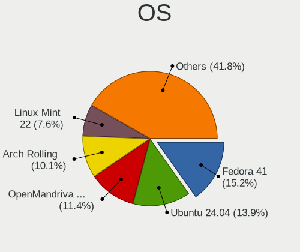
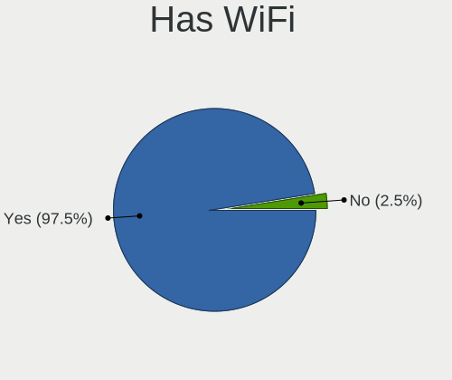
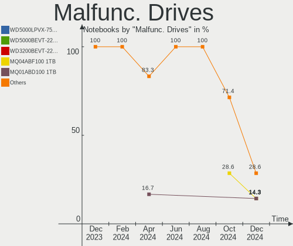
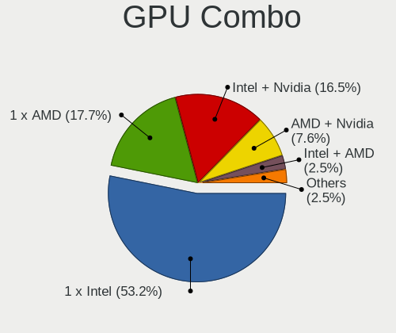
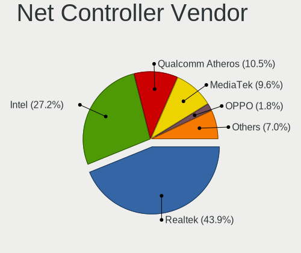
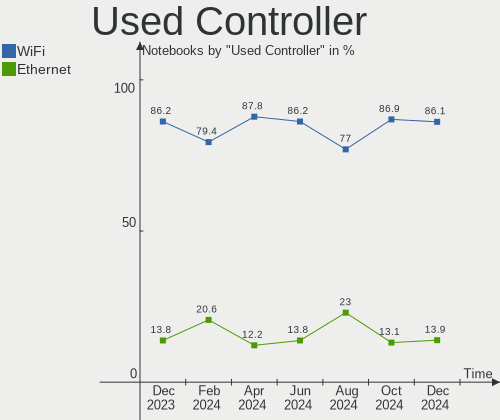

Linux in India - Hardware Trends (Notebooks)
--------------------------------------------

A project to identify most popular hardware characteristics and track their change
over time based on data collected by Linux users at https://Linux-Hardware.org.

Anyone can contribute to this report by the [hw-probe](https://github.com/linuxhw/hw-probe) tool:

    sudo -E hw-probe -all -upload

Period: Nov, 2022.

Contents
--------

* [ System ](#system)
  - [ OS                       ](#os)
  - [ OS Family                ](#os-family)
  - [ Kernel                   ](#kernel)
  - [ Kernel Family            ](#kernel-family)
  - [ Kernel Major Ver.        ](#kernel-major-ver)
  - [ Arch                     ](#arch)
  - [ DE                       ](#de)
  - [ Display Server           ](#display-server)
  - [ Display Manager          ](#display-manager)
  - [ OS Lang                  ](#os-lang)
  - [ Boot Mode                ](#boot-mode)
  - [ Filesystem               ](#filesystem)
  - [ Part. scheme             ](#part-scheme)
  - [ Dual Boot with Linux/BSD ](#dual-boot-with-linuxbsd)
  - [ Dual Boot (Win)          ](#dual-boot-win)

* [ Board ](#board)
  - [ Vendor                   ](#vendor)
  - [ Model                    ](#model)
  - [ Model Family             ](#model-family)
  - [ MFG Year                 ](#mfg-year)
  - [ Form Factor              ](#form-factor)
  - [ Secure Boot              ](#secure-boot)
  - [ Coreboot                 ](#coreboot)
  - [ RAM Size                 ](#ram-size)
  - [ RAM Used                 ](#ram-used)
  - [ Total Drives             ](#total-drives)
  - [ Has CD-ROM               ](#has-cd-rom)
  - [ Has Ethernet             ](#has-ethernet)
  - [ Has WiFi                 ](#has-wifi)
  - [ Has Bluetooth            ](#has-bluetooth)

* [ Location ](#location)
  - [ Country                  ](#country)
  - [ City                     ](#city)

* [ Drives ](#drives)
  - [ Drive Vendor             ](#drive-vendor)
  - [ Drive Model              ](#drive-model)
  - [ HDD Vendor               ](#hdd-vendor)
  - [ SSD Vendor               ](#ssd-vendor)
  - [ Drive Kind               ](#drive-kind)
  - [ Drive Connector          ](#drive-connector)
  - [ Drive Size               ](#drive-size)
  - [ Space Total              ](#space-total)
  - [ Space Used               ](#space-used)
  - [ Malfunc. Drives          ](#malfunc-drives)
  - [ Malfunc. Drive Vendor    ](#malfunc-drive-vendor)
  - [ Malfunc. HDD Vendor      ](#malfunc-hdd-vendor)
  - [ Malfunc. Drive Kind      ](#malfunc-drive-kind)
  - [ Failed Drives            ](#failed-drives)
  - [ Failed Drive Vendor      ](#failed-drive-vendor)
  - [ Drive Status             ](#drive-status)

* [ Storage controller ](#storage-controller)
  - [ Storage Vendor           ](#storage-vendor)
  - [ Storage Model            ](#storage-model)
  - [ Storage Kind             ](#storage-kind)

* [ Processor ](#processor)
  - [ CPU Vendor               ](#cpu-vendor)
  - [ CPU Model                ](#cpu-model)
  - [ CPU Model Family         ](#cpu-model-family)
  - [ CPU Cores                ](#cpu-cores)
  - [ CPU Sockets              ](#cpu-sockets)
  - [ CPU Threads              ](#cpu-threads)
  - [ CPU Op-Modes             ](#cpu-op-modes)
  - [ CPU Microcode            ](#cpu-microcode)
  - [ CPU Microarch            ](#cpu-microarch)

* [ Graphics ](#graphics)
  - [ GPU Vendor               ](#gpu-vendor)
  - [ GPU Model                ](#gpu-model)
  - [ GPU Combo                ](#gpu-combo)
  - [ GPU Driver               ](#gpu-driver)
  - [ GPU Memory               ](#gpu-memory)

* [ Monitor ](#monitor)
  - [ Monitor Vendor           ](#monitor-vendor)
  - [ Monitor Model            ](#monitor-model)
  - [ Monitor Resolution       ](#monitor-resolution)
  - [ Monitor Diagonal         ](#monitor-diagonal)
  - [ Monitor Width            ](#monitor-width)
  - [ Aspect Ratio             ](#aspect-ratio)
  - [ Monitor Area             ](#monitor-area)
  - [ Pixel Density            ](#pixel-density)
  - [ Multiple Monitors        ](#multiple-monitors)

* [ Network ](#network)
  - [ Net Controller Vendor    ](#net-controller-vendor)
  - [ Net Controller Model     ](#net-controller-model)
  - [ Wireless Vendor          ](#wireless-vendor)
  - [ Wireless Model           ](#wireless-model)
  - [ Ethernet Vendor          ](#ethernet-vendor)
  - [ Ethernet Model           ](#ethernet-model)
  - [ Net Controller Kind      ](#net-controller-kind)
  - [ Used Controller          ](#used-controller)
  - [ NICs                     ](#nics)
  - [ IPv6                     ](#ipv6)

* [ Bluetooth ](#bluetooth)
  - [ Bluetooth Vendor         ](#bluetooth-vendor)
  - [ Bluetooth Model          ](#bluetooth-model)

* [ Sound ](#sound)
  - [ Sound Vendor             ](#sound-vendor)
  - [ Sound Model              ](#sound-model)

* [ Memory ](#memory)
  - [ Memory Vendor            ](#memory-vendor)
  - [ Memory Model             ](#memory-model)
  - [ Memory Kind              ](#memory-kind)
  - [ Memory Form Factor       ](#memory-form-factor)
  - [ Memory Size              ](#memory-size)
  - [ Memory Speed             ](#memory-speed)

* [ Printers & scanners ](#printers--scanners)
  - [ Printer Vendor           ](#printer-vendor)
  - [ Printer Model            ](#printer-model)
  - [ Scanner Vendor           ](#scanner-vendor)
  - [ Scanner Model            ](#scanner-model)

* [ Camera ](#camera)
  - [ Camera Vendor            ](#camera-vendor)
  - [ Camera Model             ](#camera-model)

* [ Security ](#security)
  - [ Fingerprint Vendor       ](#fingerprint-vendor)
  - [ Fingerprint Model        ](#fingerprint-model)
  - [ Chipcard Vendor          ](#chipcard-vendor)
  - [ Chipcard Model           ](#chipcard-model)

* [ Unsupported ](#unsupported)
  - [ Unsupported Devices      ](#unsupported-devices)
  - [ Unsupported Device Types ](#unsupported-device-types)

System
------

OS
--

Installed operating systems

| Name                 | Notebooks | Percent |
|----------------------|-----------|---------|
| Fedora 37            | 15        | 17.44%  |
| Ubuntu 22.04         | 14        | 16.28%  |
| Arch Rolling         | 7         | 8.14%   |
| Pop!_OS 22.04        | 6         | 6.98%   |
| Fedora 36            | 5         | 5.81%   |
| KDE neon 22.04       | 4         | 4.65%   |
| Zorin 16             | 3         | 3.49%   |
| Linux Mint 21        | 3         | 3.49%   |
| ArcoLinux Rolling    | 3         | 3.49%   |
| Xubuntu 22.04        | 2         | 2.33%   |
| Ubuntu 20.04         | 2         | 2.33%   |
| OpenMandriva 4.3     | 2         | 2.33%   |
| Kali 2022.4          | 2         | 2.33%   |
| Kali 2022.3          | 2         | 2.33%   |
| Garuda Linux Soaring | 2         | 2.33%   |
| Debian 11            | 2         | 2.33%   |
| Xero Rolling         | 1         | 1.16%   |
| Ultramarine Linux 36 | 1         | 1.16%   |
| Ubuntu 22.10         | 1         | 1.16%   |
| RHEL 9               | 1         | 1.16%   |
| OpenMandriva 4.50    | 1         | 1.16%   |
| MX 21                | 1         | 1.16%   |
| MX 19                | 1         | 1.16%   |
| Kubuntu 22.10        | 1         | 1.16%   |
| Kubuntu 18.04        | 1         | 1.16%   |
| Gentoo 2.8           | 1         | 1.16%   |
| Garuda Linux Rolling | 1         | 1.16%   |
| Elementary 6.1       | 1         | 1.16%   |

OS Family
---------

OS without a version

| Name              | Notebooks | Percent |
|-------------------|-----------|---------|
| Fedora            | 20        | 23.26%  |
| Ubuntu            | 17        | 19.77%  |
| Arch              | 7         | 8.14%   |
| Pop!_OS           | 6         | 6.98%   |
| KDE neon          | 4         | 4.65%   |
| Kali              | 4         | 4.65%   |
| Zorin             | 3         | 3.49%   |
| OpenMandriva      | 3         | 3.49%   |
| Linux Mint        | 3         | 3.49%   |
| Garuda Linux      | 3         | 3.49%   |
| ArcoLinux         | 3         | 3.49%   |
| Xubuntu           | 2         | 2.33%   |
| MX                | 2         | 2.33%   |
| Kubuntu           | 2         | 2.33%   |
| Debian            | 2         | 2.33%   |
| Xero              | 1         | 1.16%   |
| Ultramarine Linux | 1         | 1.16%   |
| RHEL              | 1         | 1.16%   |
| Gentoo            | 1         | 1.16%   |
| Elementary        | 1         | 1.16%   |

Kernel
------

Version of the Linux kernel

| Version                     | Notebooks | Percent |
|-----------------------------|-----------|---------|
| 5.15.0-52-generic           | 16        | 18.6%   |
| 5.15.0-53-generic           | 9         | 10.47%  |
| 6.0.8-300.fc37.x86_64       | 7         | 8.14%   |
| 6.0.9-300.fc37.x86_64       | 4         | 4.65%   |
| 6.0.6-76060006-generic      | 4         | 4.65%   |
| 6.0.8-arch1-1               | 3         | 3.49%   |
| 6.0.6-arch1-1               | 3         | 3.49%   |
| 6.0.5-200.fc36.x86_64       | 3         | 3.49%   |
| 6.0.9-zen1-1-zen            | 2         | 2.33%   |
| 6.0.8-zen1-1-zen            | 2         | 2.33%   |
| 6.0.7-301.fc37.x86_64       | 2         | 2.33%   |
| 6.0.0-kali3-amd64           | 2         | 2.33%   |
| 5.19.0-kali2-amd64          | 2         | 2.33%   |
| 5.19.0-23-generic           | 2         | 2.33%   |
| 5.17.5-300.fc36.x86_64      | 2         | 2.33%   |
| 5.16.7-desktop-1omv4003     | 2         | 2.33%   |
| 5.15.0-43-generic           | 2         | 2.33%   |
| 6.0.9-arch1-1               | 1         | 1.16%   |
| 6.0.9-200.fc36.x86_64       | 1         | 1.16%   |
| 6.0.8-200.fc36.x86_64       | 1         | 1.16%   |
| 6.0.7-arch1-1               | 1         | 1.16%   |
| 6.0.6-zen1-1-zen            | 1         | 1.16%   |
| 6.0.3-76060003-generic      | 1         | 1.16%   |
| 6.0.2-zen1-1-zen            | 1         | 1.16%   |
| 6.0.2-76060002-generic      | 1         | 1.16%   |
| 5.4.0-131-generic           | 1         | 1.16%   |
| 5.19.16-301.fc37.x86_64     | 1         | 1.16%   |
| 5.19.12-desktop-2omv4090    | 1         | 1.16%   |
| 5.17.0-3mx-amd64            | 1         | 1.16%   |
| 5.15.75-gentoo              | 1         | 1.16%   |
| 5.15.0-50-generic           | 1         | 1.16%   |
| 5.15.0-48-generic           | 1         | 1.16%   |
| 5.14.0-162.6.1.el9_1.x86_64 | 1         | 1.16%   |
| 5.10.0-19-amd64             | 1         | 1.16%   |
| 5.10.0-16-amd64             | 1         | 1.16%   |
| 4.19.0-20-amd64             | 1         | 1.16%   |

Kernel Family
-------------

Linux kernel without a distro release

| Version | Notebooks | Percent |
|---------|-----------|---------|
| 5.15.0  | 29        | 33.72%  |
| 6.0.8   | 13        | 15.12%  |
| 6.0.9   | 8         | 9.3%    |
| 6.0.6   | 8         | 9.3%    |
| 5.19.0  | 4         | 4.65%   |
| 6.0.7   | 3         | 3.49%   |
| 6.0.5   | 3         | 3.49%   |
| 6.0.2   | 2         | 2.33%   |
| 6.0.0   | 2         | 2.33%   |
| 5.17.5  | 2         | 2.33%   |
| 5.16.7  | 2         | 2.33%   |
| 5.10.0  | 2         | 2.33%   |
| 6.0.3   | 1         | 1.16%   |
| 5.4.0   | 1         | 1.16%   |
| 5.19.16 | 1         | 1.16%   |
| 5.19.12 | 1         | 1.16%   |
| 5.17.0  | 1         | 1.16%   |
| 5.15.75 | 1         | 1.16%   |
| 5.14.0  | 1         | 1.16%   |
| 4.19.0  | 1         | 1.16%   |

Kernel Major Ver.
-----------------

Linux kernel major version

| Version | Notebooks | Percent |
|---------|-----------|---------|
| 6.0     | 40        | 46.51%  |
| 5.15    | 30        | 34.88%  |
| 5.19    | 6         | 6.98%   |
| 5.17    | 3         | 3.49%   |
| 5.16    | 2         | 2.33%   |
| 5.10    | 2         | 2.33%   |
| 5.4     | 1         | 1.16%   |
| 5.14    | 1         | 1.16%   |
| 4.19    | 1         | 1.16%   |

Arch
----

OS architecture (x86_64, i586, etc.)

| Name   | Notebooks | Percent |
|--------|-----------|---------|
| x86_64 | 86        | 100%    |

DE
--

Desktop Environment

| Name       | Notebooks | Percent |
|------------|-----------|---------|
| GNOME      | 48        | 55.81%  |
| KDE5       | 19        | 22.09%  |
| XFCE       | 4         | 4.65%   |
| X-Cinnamon | 3         | 3.49%   |
| LeftWM     | 2         | 2.33%   |
| bspwm      | 2         | 2.33%   |
| Unknown    | 2         | 2.33%   |
| Pantheon   | 1         | 1.16%   |
| MATE       | 1         | 1.16%   |
| i3         | 1         | 1.16%   |
| Hyprland   | 1         | 1.16%   |
| Budgie     | 1         | 1.16%   |
| awesome    | 1         | 1.16%   |

Display Server
--------------

X11 or Wayland

| Name    | Notebooks | Percent |
|---------|-----------|---------|
| X11     | 51        | 59.3%   |
| Wayland | 34        | 39.53%  |
| Unknown | 1         | 1.16%   |

Display Manager
---------------

SDDM, LightDM, etc.

| Name    | Notebooks | Percent |
|---------|-----------|---------|
| Unknown | 29        | 33.72%  |
| GDM3    | 19        | 22.09%  |
| SDDM    | 17        | 19.77%  |
| GDM     | 11        | 12.79%  |
| LightDM | 10        | 11.63%  |

OS Lang
-------

Language

| Lang    | Notebooks | Percent |
|---------|-----------|---------|
| en_IN   | 47        | 54.65%  |
| en_US   | 35        | 40.7%   |
| C       | 2         | 2.33%   |
| en_AG   | 1         | 1.16%   |
| Unknown | 1         | 1.16%   |

Boot Mode
---------

EFI or BIOS

| Mode | Notebooks | Percent |
|------|-----------|---------|
| EFI  | 55        | 63.95%  |
| BIOS | 31        | 36.05%  |

Filesystem
----------

Type of filesystem

| Type    | Notebooks | Percent |
|---------|-----------|---------|
| Ext4    | 55        | 63.95%  |
| Btrfs   | 24        | 27.91%  |
| Overlay | 3         | 3.49%   |
| Zfs     | 2         | 2.33%   |
| Xfs     | 1         | 1.16%   |
| F2fs    | 1         | 1.16%   |

Part. scheme
------------

Scheme of partitioning

| Type    | Notebooks | Percent |
|---------|-----------|---------|
| GPT     | 52        | 60.47%  |
| Unknown | 27        | 31.4%   |
| MBR     | 7         | 8.14%   |

Dual Boot with Linux/BSD
------------------------

Hosting more than one Linux/BSD

| Dual boot | Notebooks | Percent |
|-----------|-----------|---------|
| No        | 72        | 83.72%  |
| Yes       | 14        | 16.28%  |

Dual Boot (Win)
---------------

Hosting Linux and Windows

| Dual boot | Notebooks | Percent |
|-----------|-----------|---------|
| No        | 55        | 63.95%  |
| Yes       | 31        | 36.05%  |

Board
-----

Vendor
------

Motherboard manufacturer

| Name             | Notebooks | Percent |
|------------------|-----------|---------|
| Lenovo           | 21        | 24.42%  |
| Hewlett-Packard  | 21        | 24.42%  |
| Dell             | 19        | 22.09%  |
| ASUSTek Computer | 12        | 13.95%  |
| Acer             | 5         | 5.81%   |
| Sony             | 3         | 3.49%   |
| MSI              | 2         | 2.33%   |
| Toshiba          | 1         | 1.16%   |
| HUAWEI           | 1         | 1.16%   |
| AVITA            | 1         | 1.16%   |

Model
-----

Motherboard model

| Name                                 | Notebooks | Percent |
|--------------------------------------|-----------|---------|
| HP Notebook                          | 3         | 3.49%   |
| Lenovo IdeaPad Gaming 3 15ARH05 82EY | 2         | 2.33%   |
| HP Victus by Laptop 16-e0xxx         | 2         | 2.33%   |
| HP Pavilion Laptop 14-dv0xxx         | 2         | 2.33%   |
| HP EliteBook 840 G1                  | 2         | 2.33%   |
| Dell Vostro 3401                     | 2         | 2.33%   |
| Dell Inspiron N5050                  | 2         | 2.33%   |
| Dell Inspiron 3543                   | 2         | 2.33%   |
| Dell Inspiron 15-3567                | 2         | 2.33%   |
| ASUS VivoBook 15_ASUS Laptop X507UAR | 2         | 2.33%   |
| Toshiba Satellite L40                | 1         | 1.16%   |
| Sony VPCEH25EN                       | 1         | 1.16%   |
| Sony VPCEA45FG                       | 1         | 1.16%   |
| Sony SVE15133CNB                     | 1         | 1.16%   |
| MSI Modern 14 A10M                   | 1         | 1.16%   |
| MSI Bravo 15 B5DD                    | 1         | 1.16%   |
| Lenovo V310-14ISK 80SX               | 1         | 1.16%   |
| Lenovo ThinkPad T480 20L6S3L400      | 1         | 1.16%   |
| Lenovo ThinkPad T480 20L50011US      | 1         | 1.16%   |
| Lenovo ThinkPad E15 Gen 4 21E6008CGP | 1         | 1.16%   |
| Lenovo ThinkPad E14 Gen 4 21EB004HSG | 1         | 1.16%   |
| Lenovo ThinkBook 15 G3 ACL 21A4      | 1         | 1.16%   |
| Lenovo ThinkBook 15 G2 ITL 20VE      | 1         | 1.16%   |
| Lenovo ThinkBook 13s G2 ITL 20V9     | 1         | 1.16%   |
| Lenovo Legion 5 Pro 16ACH6H 82JQ     | 1         | 1.16%   |
| Lenovo Legion 5 15IAH7H 82RB         | 1         | 1.16%   |
| Lenovo IdeaPad Z510 20287            | 1         | 1.16%   |
| Lenovo IdeaPad S540-15IWL D 81NE     | 1         | 1.16%   |
| Lenovo IdeaPad S540-15IWL            | 1         | 1.16%   |
| Lenovo IdeaPad Gaming 3 15ACH6 82K2  | 1         | 1.16%   |
| Lenovo IdeaPad 330-15IKB 81DE        | 1         | 1.16%   |
| Lenovo IdeaPad 3 15ITL6 82H8         | 1         | 1.16%   |
| Lenovo IdeaPad 3 15IAU7 82RK         | 1         | 1.16%   |
| Lenovo G50-80 80E5                   | 1         | 1.16%   |
| Lenovo E41-25 81FS                   | 1         | 1.16%   |
| HUAWEI HVY-WXX9                      | 1         | 1.16%   |
| HP Pavilion Laptop 14-ec0xxx         | 1         | 1.16%   |
| HP Pavilion Laptop 14-dv2xxx         | 1         | 1.16%   |
| HP Pavilion Gaming Laptop 15-ec2xxx  | 1         | 1.16%   |
| HP Pavilion Gaming Laptop 15-ec0xxx  | 1         | 1.16%   |

Model Family
------------

Motherboard model prefix

| Name              | Notebooks | Percent |
|-------------------|-----------|---------|
| Lenovo IdeaPad    | 9         | 10.47%  |
| Dell Inspiron     | 8         | 9.3%    |
| HP Pavilion       | 6         | 6.98%   |
| Dell Latitude     | 6         | 6.98%   |
| ASUS VivoBook     | 6         | 6.98%   |
| Lenovo ThinkPad   | 4         | 4.65%   |
| Lenovo ThinkBook  | 3         | 3.49%   |
| HP Notebook       | 3         | 3.49%   |
| HP Laptop         | 3         | 3.49%   |
| Dell Vostro       | 3         | 3.49%   |
| Lenovo Legion     | 2         | 2.33%   |
| HP Victus         | 2         | 2.33%   |
| HP EliteBook      | 2         | 2.33%   |
| HP 245            | 2         | 2.33%   |
| ASUS ASUS         | 2         | 2.33%   |
| Acer Nitro        | 2         | 2.33%   |
| Acer Aspire       | 2         | 2.33%   |
| Toshiba Satellite | 1         | 1.16%   |
| Sony VPCEH25EN    | 1         | 1.16%   |
| Sony VPCEA45FG    | 1         | 1.16%   |
| Sony SVE15133CNB  | 1         | 1.16%   |
| MSI Modern        | 1         | 1.16%   |
| MSI Bravo         | 1         | 1.16%   |
| Lenovo V310-14ISK | 1         | 1.16%   |
| Lenovo G50-80     | 1         | 1.16%   |
| Lenovo E41-25     | 1         | 1.16%   |
| HUAWEI HVY-WXX9   | 1         | 1.16%   |
| HP OMEN           | 1         | 1.16%   |
| HP 2000           | 1         | 1.16%   |
| HP 15             | 1         | 1.16%   |
| Dell Precision    | 1         | 1.16%   |
| Dell G3           | 1         | 1.16%   |
| AVITA NS14A6      | 1         | 1.16%   |
| ASUS X550LC       | 1         | 1.16%   |
| ASUS X510UNR      | 1         | 1.16%   |
| ASUS ROG          | 1         | 1.16%   |
| ASUS K53SM        | 1         | 1.16%   |
| Acer Predator     | 1         | 1.16%   |

MFG Year
--------

Motherboard manufacture year

| Year | Notebooks | Percent |
|------|-----------|---------|
| 2021 | 18        | 20.93%  |
| 2020 | 12        | 13.95%  |
| 2019 | 10        | 11.63%  |
| 2018 | 10        | 11.63%  |
| 2022 | 8         | 9.3%    |
| 2016 | 6         | 6.98%   |
| 2011 | 6         | 6.98%   |
| 2013 | 5         | 5.81%   |
| 2014 | 4         | 4.65%   |
| 2017 | 3         | 3.49%   |
| 2015 | 2         | 2.33%   |
| 2010 | 1         | 1.16%   |
| 2007 | 1         | 1.16%   |

Form Factor
-----------

Physical design of the computer

| Name     | Notebooks | Percent |
|----------|-----------|---------|
| Notebook | 86        | 100%    |

Secure Boot
-----------

Enabled or disabled

| State    | Notebooks | Percent |
|----------|-----------|---------|
| Disabled | 70        | 81.4%   |
| Enabled  | 16        | 18.6%   |

Coreboot
--------

Have coreboot on board

| Used | Notebooks | Percent |
|------|-----------|---------|
| No   | 86        | 100%    |

RAM Size
--------

Total RAM memory

| Size in GB | Notebooks | Percent |
|------------|-----------|---------|
| 4.01-8.0   | 31        | 36.05%  |
| 8.01-16.0  | 24        | 27.91%  |
| 3.01-4.0   | 15        | 17.44%  |
| 16.01-24.0 | 14        | 16.28%  |
| 32.01-64.0 | 1         | 1.16%   |
| 1.01-2.0   | 1         | 1.16%   |

RAM Used
--------

Used RAM memory

| Used GB   | Notebooks | Percent |
|-----------|-----------|---------|
| 2.01-3.0  | 28        | 32.56%  |
| 1.01-2.0  | 23        | 26.74%  |
| 4.01-8.0  | 15        | 17.44%  |
| 3.01-4.0  | 15        | 17.44%  |
| 8.01-16.0 | 4         | 4.65%   |
| 0.51-1.0  | 1         | 1.16%   |

Total Drives
------------

Number of drives on board

| Drives | Notebooks | Percent |
|--------|-----------|---------|
| 1      | 69        | 80.23%  |
| 2      | 15        | 17.44%  |
| 3      | 2         | 2.33%   |

Has CD-ROM
----------

Has CD-ROM on board

| Presented | Notebooks | Percent |
|-----------|-----------|---------|
| No        | 68        | 79.07%  |
| Yes       | 18        | 20.93%  |

Has Ethernet
------------

Has Ethernet on board

| Presented | Notebooks | Percent |
|-----------|-----------|---------|
| Yes       | 68        | 79.07%  |
| No        | 18        | 20.93%  |

Has WiFi
--------

Has WiFi module

| Presented | Notebooks | Percent |
|-----------|-----------|---------|
| Yes       | 86        | 100%    |

Has Bluetooth
-------------

Has Bluetooth module

| Presented | Notebooks | Percent |
|-----------|-----------|---------|
| Yes       | 80        | 93.02%  |
| No        | 6         | 6.98%   |

Location
--------

Country
-------

Geographic location (country)

| Country | Notebooks | Percent |
|---------|-----------|---------|
| India   | 86        | 100%    |

City
----

Geographic location (city)

| City             | Notebooks | Percent |
|------------------|-----------|---------|
| Bengaluru        | 11        | 12.79%  |
| Chennai          | 6         | 6.98%   |
| Pune             | 5         | 5.81%   |
| Mumbai           | 4         | 4.65%   |
| Noida            | 3         | 3.49%   |
| Kolkata          | 3         | 3.49%   |
| Gurgaon          | 3         | 3.49%   |
| Coimbatore       | 3         | 3.49%   |
| Ahmedabad        | 3         | 3.49%   |
| Kota             | 2         | 2.33%   |
| Kanpur           | 2         | 2.33%   |
| Jaipur           | 2         | 2.33%   |
| Jabalpur         | 2         | 2.33%   |
| Hyderabad        | 2         | 2.33%   |
| Delhi            | 2         | 2.33%   |
| Dehradun         | 2         | 2.33%   |
| Vapi             | 1         | 1.16%   |
| Vadodara         | 1         | 1.16%   |
| Trivandrum       | 1         | 1.16%   |
| Tiruchi          | 1         | 1.16%   |
| Thrissur         | 1         | 1.16%   |
| Surat            | 1         | 1.16%   |
| Solapur          | 1         | 1.16%   |
| Sambalpur        | 1         | 1.16%   |
| Ramachandrapuram | 1         | 1.16%   |
| Rajkot           | 1         | 1.16%   |
| Puducherry       | 1         | 1.16%   |
| Panchkula        | 1         | 1.16%   |
| New Delhi        | 1         | 1.16%   |
| Nagpur           | 1         | 1.16%   |
| Malda            | 1         | 1.16%   |
| Malappuram       | 1         | 1.16%   |
| Kochi            | 1         | 1.16%   |
| Kanchrapara      | 1         | 1.16%   |
| Kalyan           | 1         | 1.16%   |
| Hindupur         | 1         | 1.16%   |
| Hilsa            | 1         | 1.16%   |
| Hamirpur         | 1         | 1.16%   |
| Guntur           | 1         | 1.16%   |
| Gulbarga         | 1         | 1.16%   |

Drives
------

Drive Vendor
------------

Hard drive vendors

| Vendor                | Notebooks | Drives | Percent |
|-----------------------|-----------|--------|---------|
| Seagate               | 14        | 14     | 13.73%  |
| Samsung Electronics   | 14        | 15     | 13.73%  |
| WDC                   | 13        | 13     | 12.75%  |
| Sandisk               | 8         | 8      | 7.84%   |
| SK hynix              | 7         | 7      | 6.86%   |
| Intel                 | 7         | 7      | 6.86%   |
| Crucial               | 7         | 7      | 6.86%   |
| Micron Technology     | 6         | 6      | 5.88%   |
| Kingston              | 4         | 4      | 3.92%   |
| HGST                  | 4         | 4      | 3.92%   |
| Toshiba               | 3         | 3      | 2.94%   |
| UMIS                  | 2         | 2      | 1.96%   |
| KIOXIA                | 2         | 2      | 1.96%   |
| China                 | 2         | 2      | 1.96%   |
| Unknown               | 1         | 1      | 0.98%   |
| Silicon Motion        | 1         | 1      | 0.98%   |
| Realtek Semiconductor | 1         | 1      | 0.98%   |
| LITEON                | 1         | 1      | 0.98%   |
| Hitachi               | 1         | 1      | 0.98%   |
| Gigabyte Technology   | 1         | 1      | 0.98%   |
| Fujitsu               | 1         | 1      | 0.98%   |
| FORESEE               | 1         | 1      | 0.98%   |
| A-DATA Technology     | 1         | 1      | 0.98%   |

Drive Model
-----------

Hard drive models

| Model                                             | Notebooks | Percent |
|---------------------------------------------------|-----------|---------|
| Seagate ST1000LM035-1RK172 1TB                    | 3         | 2.91%   |
| Sandisk WD Blue SN500 / PC SN520 NVMe SSD 512GB   | 3         | 2.91%   |
| Samsung NVMe SSD Controller SM981/PM981/PM983 1TB | 3         | 2.91%   |
| Intel SSD 660P Series 512GB                       | 3         | 2.91%   |
| WDC WD5000LPCX-60VHAT0 500GB                      | 2         | 1.94%   |
| WDC WD10SPZX-60Z10T0 1TB                          | 2         | 1.94%   |
| UMIS RPJTJ512MGE1QDQ 512GB                        | 2         | 1.94%   |
| Seagate ST1000LM024 HN-M101MBB 1TB                | 2         | 1.94%   |
| Sandisk WD Blue SN550 NVMe SSD 1TB                | 2         | 1.94%   |
| Sandisk WD Black SN750 / PC SN730 NVMe SSD 1024GB | 2         | 1.94%   |
| HGST HTS541010A9E680 1TB                          | 2         | 1.94%   |
| China SSD 256GB                                   | 2         | 1.94%   |
| WDC WDS240G2G0B-00EPW0 240GB SSD                  | 1         | 0.97%   |
| WDC WDS120G2G0B-00EPW0 120GB SSD                  | 1         | 0.97%   |
| WDC WD3200BEKT-75PVMT1 320GB                      | 1         | 0.97%   |
| WDC WD10SPZX-21Z10T0 1TB                          | 1         | 0.97%   |
| WDC WD10SPZX-08Z10 1TB                            | 1         | 0.97%   |
| WDC WD10SPSX-21A6WT0 1TB                          | 1         | 0.97%   |
| WDC WD10JPVX-22JC3T0 1TB                          | 1         | 0.97%   |
| WDC PC SN730 SDBPNTY-1T00-1101 1TB                | 1         | 0.97%   |
| WDC PC SN720 SDAQNTW-256G-1001 256GB              | 1         | 0.97%   |
| Unknown MMC Card  8GB                             | 1         | 0.97%   |
| Toshiba MQ01ABF050 500GB                          | 1         | 0.97%   |
| Toshiba MQ01ABD100 1TB                            | 1         | 0.97%   |
| Toshiba MK3265GSXN 320GB                          | 1         | 0.97%   |
| SK hynix SKHynix_HFS001TEJ9X115N 1024GB           | 1         | 0.97%   |
| SK hynix SKHynix_HFM512GD3HX015N 512GB            | 1         | 0.97%   |
| SK hynix PC711 HFS512GDE9X073N 512GB              | 1         | 0.97%   |
| SK hynix HFM512GD3JX016N 512GB                    | 1         | 0.97%   |
| SK hynix BC711 NVMe 512GB                         | 1         | 0.97%   |
| SK hynix BC511 512GB                              | 1         | 0.97%   |
| SK hynix BC501 NVMe Solid State Drive 512GB       | 1         | 0.97%   |
| Silicon Motion PCIe-8 SSD 512GB                   | 1         | 0.97%   |
| Seagate ST9500325AS 500GB                         | 1         | 0.97%   |
| Seagate ST9250410AS 250GB                         | 1         | 0.97%   |
| Seagate ST500LT012-9WS142 500GB                   | 1         | 0.97%   |
| Seagate ST500LT012-1DG142 500GB                   | 1         | 0.97%   |
| Seagate ST500LM012 HN-M500MBB 500GB               | 1         | 0.97%   |
| Seagate ST2000LM007-1R8174 2TB                    | 1         | 0.97%   |
| Seagate ST1000LM049-2GH172 1TB                    | 1         | 0.97%   |

HDD Vendor
----------

Hard disk drive vendors

| Vendor  | Notebooks | Drives | Percent |
|---------|-----------|--------|---------|
| Seagate | 13        | 13     | 41.94%  |
| WDC     | 9         | 9      | 29.03%  |
| HGST    | 4         | 4      | 12.9%   |
| Toshiba | 3         | 3      | 9.68%   |
| Hitachi | 1         | 1      | 3.23%   |
| Fujitsu | 1         | 1      | 3.23%   |

SSD Vendor
----------

Solid state drive vendors

| Vendor              | Notebooks | Drives | Percent |
|---------------------|-----------|--------|---------|
| Crucial             | 7         | 7      | 33.33%  |
| Kingston            | 3         | 3      | 14.29%  |
| WDC                 | 2         | 2      | 9.52%   |
| Samsung Electronics | 2         | 2      | 9.52%   |
| China               | 2         | 2      | 9.52%   |
| Seagate             | 1         | 1      | 4.76%   |
| Micron Technology   | 1         | 1      | 4.76%   |
| LITEON              | 1         | 1      | 4.76%   |
| Gigabyte Technology | 1         | 1      | 4.76%   |
| FORESEE             | 1         | 1      | 4.76%   |

Drive Kind
----------

HDD or SSD

| Kind | Notebooks | Drives | Percent |
|------|-----------|--------|---------|
| NVMe | 48        | 50     | 48%     |
| HDD  | 31        | 31     | 31%     |
| SSD  | 20        | 21     | 20%     |
| MMC  | 1         | 1      | 1%      |

Drive Connector
---------------

SATA, SAS, NVMe, etc.

| Type | Notebooks | Drives | Percent |
|------|-----------|--------|---------|
| NVMe | 48        | 50     | 50.53%  |
| SATA | 46        | 52     | 48.42%  |
| MMC  | 1         | 1      | 1.05%   |

Drive Size
----------

Size of hard drive

| Size in TB | Notebooks | Drives | Percent |
|------------|-----------|--------|---------|
| 0.51-1.0   | 24        | 24     | 48.98%  |
| 0.01-0.5   | 24        | 27     | 48.98%  |
| 1.01-2.0   | 1         | 1      | 2.04%   |

Space Total
-----------

Amount of disk space available on the file system

| Size in GB | Notebooks | Percent |
|------------|-----------|---------|
| 101-250    | 25        | 29.07%  |
| 251-500    | 24        | 27.91%  |
| 501-1000   | 12        | 13.95%  |
| 51-100     | 7         | 8.14%   |
| 1001-2000  | 6         | 6.98%   |
| Unknown    | 5         | 5.81%   |
| 1-20       | 4         | 4.65%   |
| 21-50      | 2         | 2.33%   |
| 2001-3000  | 1         | 1.16%   |

Space Used
----------

Amount of used disk space

| Used GB   | Notebooks | Percent |
|-----------|-----------|---------|
| 21-50     | 22        | 25.58%  |
| 1-20      | 19        | 22.09%  |
| 51-100    | 15        | 17.44%  |
| 251-500   | 11        | 12.79%  |
| 101-250   | 9         | 10.47%  |
| Unknown   | 5         | 5.81%   |
| 501-1000  | 3         | 3.49%   |
| 1001-2000 | 2         | 2.33%   |

Malfunc. Drives
---------------

Drive models with a malfunction

| Model                                       | Notebooks | Drives | Percent |
|---------------------------------------------|-----------|--------|---------|
| WDC WDS120G2G0B-00EPW0 120GB SSD            | 1         | 1      | 16.67%  |
| SK hynix PC711 HFS512GDE9X073N 512GB        | 1         | 1      | 16.67%  |
| SK hynix BC501 NVMe Solid State Drive 512GB | 1         | 1      | 16.67%  |
| Seagate ST9500325AS 500GB                   | 1         | 1      | 16.67%  |
| Seagate ST1000LM024 HN-M101MBB 1TB          | 1         | 1      | 16.67%  |
| HGST HTS541010A9E680 1TB                    | 1         | 1      | 16.67%  |

Malfunc. Drive Vendor
---------------------

Vendors of faulty drives

| Vendor   | Notebooks | Drives | Percent |
|----------|-----------|--------|---------|
| SK hynix | 2         | 2      | 33.33%  |
| Seagate  | 2         | 2      | 33.33%  |
| WDC      | 1         | 1      | 16.67%  |
| HGST     | 1         | 1      | 16.67%  |

Malfunc. HDD Vendor
-------------------

Vendors of faulty HDD drives

| Vendor  | Notebooks | Drives | Percent |
|---------|-----------|--------|---------|
| Seagate | 2         | 2      | 66.67%  |
| HGST    | 1         | 1      | 33.33%  |

Malfunc. Drive Kind
-------------------

Kinds of faulty drives

| Kind | Notebooks | Drives | Percent |
|------|-----------|--------|---------|
| HDD  | 3         | 3      | 50%     |
| NVMe | 2         | 2      | 33.33%  |
| SSD  | 1         | 1      | 16.67%  |

Failed Drives
-------------

Failed drive models

Zero info for selected period =(

Failed Drive Vendor
-------------------

Failed drive vendors

Zero info for selected period =(

Drive Status
------------

Number of failed and malfunc. drives

| Status   | Notebooks | Drives | Percent |
|----------|-----------|--------|---------|
| Detected | 43        | 52     | 48.86%  |
| Works    | 39        | 45     | 44.32%  |
| Malfunc  | 6         | 6      | 6.82%   |

Storage controller
------------------

Storage Vendor
--------------

Storage controller vendors

| Vendor                      | Notebooks | Percent |
|-----------------------------|-----------|---------|
| Intel                       | 55        | 47.83%  |
| AMD                         | 17        | 14.78%  |
| Samsung Electronics         | 13        | 11.3%   |
| SanDisk                     | 10        | 8.7%    |
| SK hynix                    | 7         | 6.09%   |
| Micron Technology           | 5         | 4.35%   |
| Union Memory (Shenzhen)     | 2         | 1.74%   |
| Realtek Semiconductor       | 2         | 1.74%   |
| KIOXIA                      | 2         | 1.74%   |
| Silicon Motion              | 1         | 0.87%   |
| Kingston Technology Company | 1         | 0.87%   |

Storage Model
-------------

Storage controller models

| Model                                                                            | Notebooks | Percent |
|----------------------------------------------------------------------------------|-----------|---------|
| AMD FCH SATA Controller [AHCI mode]                                              | 17        | 13.82%  |
| Intel Volume Management Device NVMe RAID Controller                              | 9         | 7.32%   |
| Intel 82801 Mobile SATA Controller [RAID mode]                                   | 8         | 6.5%    |
| Samsung NVMe SSD Controller 980                                                  | 7         | 5.69%   |
| Samsung NVMe SSD Controller SM981/PM981/PM983                                    | 6         | 4.88%   |
| Micron Non-Volatile memory controller                                            | 5         | 4.07%   |
| Intel Wildcat Point-LP SATA Controller [AHCI Mode]                               | 5         | 4.07%   |
| Intel Sunrise Point-LP SATA Controller [AHCI mode]                               | 5         | 4.07%   |
| SK hynix Gold P31/PC711 NVMe Solid State Drive                                   | 4         | 3.25%   |
| Intel Tiger Lake-LP SATA Controller                                              | 4         | 3.25%   |
| Intel SSD 660P Series                                                            | 4         | 3.25%   |
| Intel 6 Series/C200 Series Chipset Family 6 port Mobile SATA AHCI Controller     | 4         | 3.25%   |
| SanDisk WD Blue SN500 / PC SN520 NVMe SSD                                        | 3         | 2.44%   |
| SanDisk WD Black SN750 / PC SN730 NVMe SSD                                       | 3         | 2.44%   |
| Intel Non-Volatile memory controller                                             | 3         | 2.44%   |
| Intel Cannon Point-LP SATA Controller [AHCI Mode]                                | 3         | 2.44%   |
| Intel 8 Series SATA Controller 1 [AHCI mode]                                     | 3         | 2.44%   |
| Union Memory (Shenzhen) AM630 PCIe 4.0 x4 NVMe SSD Controller                    | 2         | 1.63%   |
| SanDisk WD Blue SN550 NVMe SSD                                                   | 2         | 1.63%   |
| KIOXIA NVMe SSD Controller BG4                                                   | 2         | 1.63%   |
| Intel Ice Lake-LP SATA Controller [AHCI mode]                                    | 2         | 1.63%   |
| Intel 7 Series Chipset Family 6-port SATA Controller [AHCI mode]                 | 2         | 1.63%   |
| SK hynix Non-Volatile memory controller                                          | 1         | 0.81%   |
| SK hynix BC511                                                                   | 1         | 0.81%   |
| SK hynix BC501 NVMe Solid State Drive                                            | 1         | 0.81%   |
| Silicon Motion Non-Volatile memory controller                                    | 1         | 0.81%   |
| SanDisk WD Black 2018/SN750 / PC SN720 NVMe SSD                                  | 1         | 0.81%   |
| SanDisk Non-Volatile memory controller                                           | 1         | 0.81%   |
| Realtek RTS5763DL NVMe SSD Controller                                            | 1         | 0.81%   |
| Realtek Realtek Non-Volatile memory controller                                   | 1         | 0.81%   |
| Kingston Company U-SNS8154P3 NVMe SSD                                            | 1         | 0.81%   |
| Intel SATA Controller [RAID mode]                                                | 1         | 0.81%   |
| Intel Celeron/Pentium Silver Processor SATA Controller                           | 1         | 0.81%   |
| Intel Atom/Celeron/Pentium Processor x5-E8000/J3xxx/N3xxx Series SATA Controller | 1         | 0.81%   |
| Intel Atom Processor E3800 Series SATA AHCI Controller                           | 1         | 0.81%   |
| Intel Alder Lake-P SATA AHCI Controller                                          | 1         | 0.81%   |
| Intel 82801HM/HEM (ICH8M/ICH8M-E) SATA Controller [AHCI mode]                    | 1         | 0.81%   |
| Intel 82801HM/HEM (ICH8M/ICH8M-E) IDE Controller                                 | 1         | 0.81%   |
| Intel 8 Series/C220 Series Chipset Family 6-port SATA Controller 1 [AHCI mode]   | 1         | 0.81%   |
| Intel 500 Series Chipset Family SATA AHCI Controller                             | 1         | 0.81%   |

Storage Kind
------------

Kind of storage controller (IDE, SATA, NVMe, SAS, ...)

| Kind | Notebooks | Percent |
|------|-----------|---------|
| SATA | 54        | 44.63%  |
| NVMe | 48        | 39.67%  |
| RAID | 18        | 14.88%  |
| IDE  | 1         | 0.83%   |

Processor
---------

CPU Vendor
----------

Processor vendors

| Vendor | Notebooks | Percent |
|--------|-----------|---------|
| Intel  | 58        | 67.44%  |
| AMD    | 28        | 32.56%  |

CPU Model
---------

Processor models

| Model                                         | Notebooks | Percent |
|-----------------------------------------------|-----------|---------|
| Intel Core i5-8250U CPU @ 1.60GHz             | 5         | 5.81%   |
| Intel 11th Gen Core i5-1135G7 @ 2.40GHz       | 4         | 4.65%   |
| AMD Ryzen 5 4600H with Radeon Graphics        | 4         | 4.65%   |
| Intel Core i5-8265U CPU @ 1.60GHz             | 3         | 3.49%   |
| Intel Core i3-5005U CPU @ 2.00GHz             | 3         | 3.49%   |
| AMD Ryzen 7 5800H with Radeon Graphics        | 3         | 3.49%   |
| AMD Ryzen 5 5600H with Radeon Graphics        | 3         | 3.49%   |
| AMD Ryzen 5 5500U with Radeon Graphics        | 3         | 3.49%   |
| AMD Ryzen 5 3500U with Radeon Vega Mobile Gfx | 3         | 3.49%   |
| Intel Core i5-8350U CPU @ 1.70GHz             | 2         | 2.33%   |
| Intel Core i5-4200U CPU @ 1.60GHz             | 2         | 2.33%   |
| Intel Core i5-2450M CPU @ 2.50GHz             | 2         | 2.33%   |
| Intel Core i3-7020U CPU @ 2.30GHz             | 2         | 2.33%   |
| Intel Core i3-2330M CPU @ 2.20GHz             | 2         | 2.33%   |
| Intel Core i3-1005G1 CPU @ 1.20GHz            | 2         | 2.33%   |
| Intel 12th Gen Core i7-1255U                  | 2         | 2.33%   |
| Intel 11th Gen Core i3-1115G4 @ 3.00GHz       | 2         | 2.33%   |
| AMD Ryzen 7 4800H with Radeon Graphics        | 2         | 2.33%   |
| AMD Ryzen 5 3550H with Radeon Vega Mobile Gfx | 2         | 2.33%   |
| Intel Pentium Silver N5000 CPU @ 1.10GHz      | 1         | 1.16%   |
| Intel Pentium CPU N3540 @ 2.16GHz             | 1         | 1.16%   |
| Intel Pentium 3558U @ 1.70GHz                 | 1         | 1.16%   |
| Intel Core i7-8565U CPU @ 1.80GHz             | 1         | 1.16%   |
| Intel Core i7-7500U CPU @ 2.70GHz             | 1         | 1.16%   |
| Intel Core i7-6920HQ CPU @ 2.90GHz            | 1         | 1.16%   |
| Intel Core i7-6600U CPU @ 2.60GHz             | 1         | 1.16%   |
| Intel Core i7-4500U CPU @ 1.80GHz             | 1         | 1.16%   |
| Intel Core i7-10750H CPU @ 2.60GHz            | 1         | 1.16%   |
| Intel Core i5-5200U CPU @ 2.20GHz             | 1         | 1.16%   |
| Intel Core i5-4200M CPU @ 2.50GHz             | 1         | 1.16%   |
| Intel Core i5-2520M CPU @ 2.50GHz             | 1         | 1.16%   |
| Intel Core i5-10210U CPU @ 1.60GHz            | 1         | 1.16%   |
| Intel Core i3-6100U CPU @ 2.30GHz             | 1         | 1.16%   |
| Intel Core i3-5010U CPU @ 2.10GHz             | 1         | 1.16%   |
| Intel Core i3-3120M CPU @ 2.50GHz             | 1         | 1.16%   |
| Intel Core i3-2328M CPU @ 2.20GHz             | 1         | 1.16%   |
| Intel Core i3 CPU M 380 @ 2.53GHz             | 1         | 1.16%   |
| Intel Celeron CPU N3060 @ 1.60GHz             | 1         | 1.16%   |
| Intel Celeron CPU 530 @ 1.73GHz               | 1         | 1.16%   |
| Intel 12th Gen Core i9-12900H                 | 1         | 1.16%   |

CPU Model Family
----------------

Processor model prefix

| Model                | Notebooks | Percent |
|----------------------|-----------|---------|
| Intel Core i5        | 18        | 20.93%  |
| Other                | 16        | 18.6%   |
| AMD Ryzen 5          | 16        | 18.6%   |
| Intel Core i3        | 14        | 16.28%  |
| AMD Ryzen 7          | 7         | 8.14%   |
| Intel Core i7        | 6         | 6.98%   |
| Intel Pentium        | 2         | 2.33%   |
| Intel Celeron        | 2         | 2.33%   |
| AMD Ryzen 3          | 2         | 2.33%   |
| Intel Pentium Silver | 1         | 1.16%   |
| AMD E1               | 1         | 1.16%   |
| AMD A6               | 1         | 1.16%   |

CPU Cores
---------

Number of processor cores

| Number | Notebooks | Percent |
|--------|-----------|---------|
| 2      | 32        | 37.21%  |
| 4      | 28        | 32.56%  |
| 6      | 11        | 12.79%  |
| 8      | 8         | 9.3%    |
| 10     | 3         | 3.49%   |
| 14     | 2         | 2.33%   |
| 12     | 1         | 1.16%   |
| 1      | 1         | 1.16%   |

CPU Sockets
-----------

Number of sockets

| Number | Notebooks | Percent |
|--------|-----------|---------|
| 1      | 86        | 100%    |

CPU Threads
-----------

Threads per core (Hyper-Threading)

| Number | Notebooks | Percent |
|--------|-----------|---------|
| 2      | 76        | 88.37%  |
| 1      | 10        | 11.63%  |

CPU Op-Modes
------------

CPU Operation Modes (32-bit, 64-bit)

| Op mode        | Notebooks | Percent |
|----------------|-----------|---------|
| 32-bit, 64-bit | 86        | 100%    |

CPU Microcode
-------------

Microcode number

| Number     | Notebooks | Percent |
|------------|-----------|---------|
| Unknown    | 23        | 26.74%  |
| 0x806c1    | 7         | 8.14%   |
| 0x08108109 | 6         | 6.98%   |
| 0x0a50000c | 5         | 5.81%   |
| 0x806ea    | 4         | 4.65%   |
| 0x40651    | 4         | 4.65%   |
| 0x306d4    | 4         | 4.65%   |
| 0x906a4    | 3         | 3.49%   |
| 0x806e9    | 3         | 3.49%   |
| 0x206a7    | 3         | 3.49%   |
| 0x08600106 | 3         | 3.49%   |
| 0x08608103 | 2         | 2.33%   |
| 0x08600104 | 2         | 2.33%   |
| 0x07030105 | 2         | 2.33%   |
| 0x906a3    | 1         | 1.16%   |
| 0x806ec    | 1         | 1.16%   |
| 0x806eb    | 1         | 1.16%   |
| 0x806d1    | 1         | 1.16%   |
| 0x706e5    | 1         | 1.16%   |
| 0x706a1    | 1         | 1.16%   |
| 0x506e3    | 1         | 1.16%   |
| 0x406e3    | 1         | 1.16%   |
| 0x406c4    | 1         | 1.16%   |
| 0x306c3    | 1         | 1.16%   |
| 0x306a9    | 1         | 1.16%   |
| 0x30678    | 1         | 1.16%   |
| 0x10661    | 1         | 1.16%   |
| 0x0a404101 | 1         | 1.16%   |
| 0x0810100b | 1         | 1.16%   |

CPU Microarch
-------------

Microarchitecture

| Name             | Notebooks | Percent |
|------------------|-----------|---------|
| KabyLake         | 15        | 17.44%  |
| TigerLake        | 8         | 9.3%    |
| Zen+             | 7         | 8.14%   |
| Zen 3            | 7         | 8.14%   |
| Zen 2            | 6         | 6.98%   |
| SandyBridge      | 6         | 6.98%   |
| Unknown          | 6         | 6.98%   |
| Haswell          | 5         | 5.81%   |
| Broadwell        | 5         | 5.81%   |
| Alderlake Hybrid | 4         | 4.65%   |
| Skylake          | 3         | 3.49%   |
| Icelake          | 3         | 3.49%   |
| Silvermont       | 2         | 2.33%   |
| Puma             | 2         | 2.33%   |
| Zen              | 1         | 1.16%   |
| Westmere         | 1         | 1.16%   |
| IvyBridge        | 1         | 1.16%   |
| Goldmont plus    | 1         | 1.16%   |
| Excavator        | 1         | 1.16%   |
| Core             | 1         | 1.16%   |
| CometLake        | 1         | 1.16%   |

Graphics
--------

GPU Vendor
----------

Vendors of graphics cards

| Vendor | Notebooks | Percent |
|--------|-----------|---------|
| Intel  | 56        | 47.46%  |
| AMD    | 34        | 28.81%  |
| Nvidia | 28        | 23.73%  |

GPU Model
---------

Graphics card models

| Model                                                                                    | Notebooks | Percent |
|------------------------------------------------------------------------------------------|-----------|---------|
| Intel UHD Graphics 620                                                                   | 7         | 5.79%   |
| AMD Picasso/Raven 2 [Radeon Vega Series / Radeon Vega Mobile Series]                     | 7         | 5.79%   |
| AMD Renoir                                                                               | 6         | 4.96%   |
| AMD Cezanne [Radeon Vega Series / Radeon Vega Mobile Series]                             | 6         | 4.96%   |
| Nvidia TU117M [GeForce GTX 1650 Mobile / Max-Q]                                          | 5         | 4.13%   |
| Nvidia GA106M [GeForce RTX 3060 Mobile / Max-Q]                                          | 5         | 4.13%   |
| Intel TigerLake-LP GT2 [Iris Xe Graphics]                                                | 5         | 4.13%   |
| Intel HD Graphics 5500                                                                   | 5         | 4.13%   |
| Intel 2nd Generation Core Processor Family Integrated Graphics Controller                | 5         | 4.13%   |
| Nvidia TU117M                                                                            | 4         | 3.31%   |
| Intel WhiskeyLake-U GT2 [UHD Graphics 620]                                               | 4         | 3.31%   |
| Intel Haswell-ULT Integrated Graphics Controller                                         | 4         | 3.31%   |
| Intel Tiger Lake-LP GT2 [UHD Graphics G4]                                                | 3         | 2.48%   |
| Intel HD Graphics 620                                                                    | 3         | 2.48%   |
| Intel Alder Lake-P Integrated Graphics Controller                                        | 3         | 2.48%   |
| AMD Sun XT [Radeon HD 8670A/8670M/8690M / R5 M330 / M430 / Radeon 520 Mobile]            | 3         | 2.48%   |
| AMD Lucienne                                                                             | 3         | 2.48%   |
| Nvidia GP108M [GeForce MX250]                                                            | 2         | 1.65%   |
| Nvidia GA107M [GeForce RTX 3050 Mobile]                                                  | 2         | 1.65%   |
| Intel Skylake GT2 [HD Graphics 520]                                                      | 2         | 1.65%   |
| Intel Iris Plus Graphics G1 (Ice Lake)                                                   | 2         | 1.65%   |
| Intel Alder Lake-UP3 GT2 [Iris Xe Graphics]                                              | 2         | 1.65%   |
| Nvidia TU117M [GeForce MX450]                                                            | 1         | 0.83%   |
| Nvidia TU117M [GeForce GTX 1650 Ti Mobile]                                               | 1         | 0.83%   |
| Nvidia GP108M [GeForce MX150]                                                            | 1         | 0.83%   |
| Nvidia GM108M [GeForce MX130]                                                            | 1         | 0.83%   |
| Nvidia GM107GLM [Quadro M2000M]                                                          | 1         | 0.83%   |
| Nvidia GK208M [GeForce GT 740M]                                                          | 1         | 0.83%   |
| Nvidia GK208BM [GeForce 920M]                                                            | 1         | 0.83%   |
| Nvidia GF119M [NVS 4200M]                                                                | 1         | 0.83%   |
| Nvidia GF119M [GeForce 410M]                                                             | 1         | 0.83%   |
| Nvidia GF117M [GeForce 610M/710M/810M/820M / GT 620M/625M/630M/720M]                     | 1         | 0.83%   |
| Intel TigerLake-H GT1 [UHD Graphics]                                                     | 1         | 0.83%   |
| Intel Mobile GM965/GL960 Integrated Graphics Controller (secondary)                      | 1         | 0.83%   |
| Intel Mobile GM965/GL960 Integrated Graphics Controller (primary)                        | 1         | 0.83%   |
| Intel HD Graphics 530                                                                    | 1         | 0.83%   |
| Intel GeminiLake [UHD Graphics 605]                                                      | 1         | 0.83%   |
| Intel CometLake-U GT2 [UHD Graphics]                                                     | 1         | 0.83%   |
| Intel CometLake-H GT2 [UHD Graphics]                                                     | 1         | 0.83%   |
| Intel Atom/Celeron/Pentium Processor x5-E8000/J3xxx/N3xxx Integrated Graphics Controller | 1         | 0.83%   |

GPU Combo
---------

Combinations of graphics cards

| Name           | Notebooks | Percent |
|----------------|-----------|---------|
| 1 x Intel      | 38        | 44.19%  |
| 1 x AMD        | 14        | 16.28%  |
| AMD + Nvidia   | 13        | 15.12%  |
| Intel + Nvidia | 12        | 13.95%  |
| Intel + AMD    | 5         | 5.81%   |
| 2 x AMD        | 2         | 2.33%   |
| 1 x Nvidia     | 2         | 2.33%   |

GPU Driver
----------

Free vs proprietary

| Driver      | Notebooks | Percent |
|-------------|-----------|---------|
| Free        | 67        | 77.91%  |
| Proprietary | 19        | 22.09%  |

GPU Memory
----------

Total video memory

| Size in GB | Notebooks | Percent |
|------------|-----------|---------|
| Unknown    | 55        | 63.95%  |
| 1.01-2.0   | 13        | 15.12%  |
| 0.01-0.5   | 11        | 12.79%  |
| 3.01-4.0   | 4         | 4.65%   |
| 0.51-1.0   | 2         | 2.33%   |
| 5.01-6.0   | 1         | 1.16%   |

Monitor
-------

Monitor Vendor
--------------

Monitor vendors

| Vendor                  | Notebooks | Percent |
|-------------------------|-----------|---------|
| BOE                     | 26        | 26.8%   |
| Chimei Innolux          | 16        | 16.49%  |
| AU Optronics            | 15        | 15.46%  |
| LG Display              | 13        | 13.4%   |
| Samsung Electronics     | 5         | 5.15%   |
| Goldstar                | 5         | 5.15%   |
| PANDA                   | 4         | 4.12%   |
| CSO                     | 2         | 2.06%   |
| TMX                     | 1         | 1.03%   |
| Sony                    | 1         | 1.03%   |
| OUT                     | 1         | 1.03%   |
| LG Philips              | 1         | 1.03%   |
| Lenovo                  | 1         | 1.03%   |
| HKC                     | 1         | 1.03%   |
| Hewlett-Packard         | 1         | 1.03%   |
| GDH                     | 1         | 1.03%   |
| Dell                    | 1         | 1.03%   |
| Chi Mei Optoelectronics | 1         | 1.03%   |
| Acer                    | 1         | 1.03%   |

Monitor Model
-------------

Monitor models

| Model                                                                 | Notebooks | Percent |
|-----------------------------------------------------------------------|-----------|---------|
| Goldstar IPS FULLHD GSM5AB8 1920x1080 480x270mm 21.7-inch             | 3         | 3.09%   |
| Chimei Innolux LCD Monitor CMN15F5 1920x1080 344x193mm 15.5-inch      | 3         | 3.09%   |
| PANDA LCD Monitor NCP0040 1920x1080 344x194mm 15.5-inch               | 2         | 2.06%   |
| BOE LCD Monitor BOE08D5 1920x1080 344x194mm 15.5-inch                 | 2         | 2.06%   |
| BOE LCD Monitor BOE06FB 1920x1080 344x194mm 15.5-inch                 | 2         | 2.06%   |
| AU Optronics LCD Monitor AUO40EC 1366x768 344x193mm 15.5-inch         | 2         | 2.06%   |
| TMX TL156VDXP0101 TMX1561 1920x1080 344x194mm 15.5-inch               | 1         | 1.03%   |
| Sony LCD Monitor SNY05FA 1366x768 340x190mm 15.3-inch                 | 1         | 1.03%   |
| Samsung Electronics LCD Monitor SDC4E51 1366x768 344x194mm 15.5-inch  | 1         | 1.03%   |
| Samsung Electronics LCD Monitor SDC4852 1366x768 344x194mm 15.5-inch  | 1         | 1.03%   |
| Samsung Electronics LCD Monitor SDC484E 1600x900 309x174mm 14.0-inch  | 1         | 1.03%   |
| Samsung Electronics LCD Monitor SDC4177 3840x2400 344x215mm 16.0-inch | 1         | 1.03%   |
| Samsung Electronics LCD Monitor SDC4161 1920x1080 344x194mm 15.5-inch | 1         | 1.03%   |
| PANDA LCD Monitor NCP0054 1920x1080 344x194mm 15.5-inch               | 1         | 1.03%   |
| PANDA LCD Monitor NCP0035 1920x1080 344x194mm 15.5-inch               | 1         | 1.03%   |
| OUT Analog OUT0096 1280x800 341x256mm 16.8-inch                       | 1         | 1.03%   |
| LG Philips LCD Monitor LPLDD00 1280x800 331x207mm 15.4-inch           | 1         | 1.03%   |
| LG Display LCD Monitor LGD06F0 1920x1080 309x174mm 14.0-inch          | 1         | 1.03%   |
| LG Display LCD Monitor LGD068A 1920x1080 309x174mm 14.0-inch          | 1         | 1.03%   |
| LG Display LCD Monitor LGD0613 1920x1080 309x174mm 14.0-inch          | 1         | 1.03%   |
| LG Display LCD Monitor LGD060F 1920x1080 309x174mm 14.0-inch          | 1         | 1.03%   |
| LG Display LCD Monitor LGD05F3 1920x1080 309x174mm 14.0-inch          | 1         | 1.03%   |
| LG Display LCD Monitor LGD0590 1920x1080 344x194mm 15.5-inch          | 1         | 1.03%   |
| LG Display LCD Monitor LGD0525 1366x768 344x194mm 15.5-inch           | 1         | 1.03%   |
| LG Display LCD Monitor LGD04B9 1920x1080 344x194mm 15.5-inch          | 1         | 1.03%   |
| LG Display LCD Monitor LGD04A1 1920x1080 294x165mm 13.3-inch          | 1         | 1.03%   |
| LG Display LCD Monitor LGD0493 1366x768 344x194mm 15.5-inch           | 1         | 1.03%   |
| LG Display LCD Monitor LGD0456 1366x768 344x194mm 15.5-inch           | 1         | 1.03%   |
| LG Display LCD Monitor LGD02EB 1366x768 309x174mm 14.0-inch           | 1         | 1.03%   |
| LG Display LCD Monitor LGD02DC 1366x768 344x194mm 15.5-inch           | 1         | 1.03%   |
| Lenovo D27-30 LEN66B8 1920x1080 597x336mm 27.0-inch                   | 1         | 1.03%   |
| HKC LCD Monitor HKC36B1 1366x768 309x174mm 14.0-inch                  | 1         | 1.03%   |
| Hewlett-Packard 24f HPN3545 1920x1080 527x296mm 23.8-inch             | 1         | 1.03%   |
| Goldstar HDR WFHD GSM7714 2560x1080 798x334mm 34.1-inch               | 1         | 1.03%   |
| Goldstar E2040 GSM4EB3 1600x900 443x249mm 20.0-inch                   | 1         | 1.03%   |
| GDH CHHWJT GDH9021 1280x1024 600x340mm 27.2-inch                      | 1         | 1.03%   |
| Dell S2418H/HX DEL4120 1920x1080 527x296mm 23.8-inch                  | 1         | 1.03%   |
| CSO LCD Monitor CSO1600 2560x1600 345x215mm 16.0-inch                 | 1         | 1.03%   |
| CSO LCD Monitor CSO1509 2560x1440 344x193mm 15.5-inch                 | 1         | 1.03%   |
| Chimei Innolux LCD Monitor CMN15E7 1920x1080 344x193mm 15.5-inch      | 1         | 1.03%   |

Monitor Resolution
------------------

Monitor screen resolution

| Resolution       | Notebooks | Percent |
|------------------|-----------|---------|
| 1920x1080 (FHD)  | 51        | 56.04%  |
| 1366x768 (WXGA)  | 28        | 30.77%  |
| 2560x1600        | 2         | 2.2%    |
| 2560x1440 (QHD)  | 2         | 2.2%    |
| 1600x900 (HD+)   | 2         | 2.2%    |
| 3840x2400        | 1         | 1.1%    |
| 3840x2160 (4K)   | 1         | 1.1%    |
| 2560x1080        | 1         | 1.1%    |
| 1280x800 (WXGA)  | 1         | 1.1%    |
| 1280x768         | 1         | 1.1%    |
| 1280x1024 (SXGA) | 1         | 1.1%    |

Monitor Diagonal
----------------

Diagonal size in inches

| Inches  | Notebooks | Percent |
|---------|-----------|---------|
| 15      | 52        | 53.61%  |
| 14      | 15        | 15.46%  |
| 13      | 11        | 11.34%  |
| 16      | 6         | 6.19%   |
| 27      | 3         | 3.09%   |
| 21      | 3         | 3.09%   |
| 34      | 1         | 1.03%   |
| 24      | 1         | 1.03%   |
| 23      | 1         | 1.03%   |
| 20      | 1         | 1.03%   |
| 12      | 1         | 1.03%   |
| 11      | 1         | 1.03%   |
| Unknown | 1         | 1.03%   |

Monitor Width
-------------

Physical width

| Width in mm | Notebooks | Percent |
|-------------|-----------|---------|
| 301-350     | 78        | 81.25%  |
| 501-600     | 5         | 5.21%   |
| 401-500     | 4         | 4.17%   |
| 201-300     | 4         | 4.17%   |
| 351-400     | 3         | 3.13%   |
| 701-800     | 1         | 1.04%   |
| Unknown     | 1         | 1.04%   |

Aspect Ratio
------------

Proportional relationship between the width and the height

| Ratio   | Notebooks | Percent |
|---------|-----------|---------|
| 16/9    | 81        | 92.05%  |
| 16/10   | 4         | 4.55%   |
| 4/3     | 1         | 1.14%   |
| 21/9    | 1         | 1.14%   |
| Unknown | 1         | 1.14%   |

Monitor Area
------------

Area in inch

| Area in inch | Notebooks | Percent |
|----------------|-----------|---------|
| 101-110        | 54        | 55.67%  |
| 81-90          | 24        | 24.74%  |
| 201-250        | 5         | 5.15%   |
| 301-350        | 3         | 3.09%   |
| 71-80          | 2         | 2.06%   |
| 111-120        | 2         | 2.06%   |
| 61-70          | 1         | 1.03%   |
| 51-60          | 1         | 1.03%   |
| 351-500        | 1         | 1.03%   |
| 151-200        | 1         | 1.03%   |
| 131-140        | 1         | 1.03%   |
| 91-100         | 1         | 1.03%   |
| Unknown        | 1         | 1.03%   |

Pixel Density
-------------

Pixels per inch

| Density       | Notebooks | Percent |
|---------------|-----------|---------|
| 121-160       | 52        | 54.17%  |
| 101-120       | 28        | 29.17%  |
| 51-100        | 9         | 9.38%   |
| 161-240       | 5         | 5.21%   |
| More than 240 | 1         | 1.04%   |
| Unknown       | 1         | 1.04%   |

Multiple Monitors
-----------------

Total monitors connected

| Total | Notebooks | Percent |
|-------|-----------|---------|
| 1     | 74        | 86.05%  |
| 2     | 12        | 13.95%  |

Network
-------

Net Controller Vendor
---------------------

Controller vendors

| Vendor                   | Notebooks | Percent |
|--------------------------|-----------|---------|
| Realtek Semiconductor    | 58        | 42.96%  |
| Intel                    | 32        | 23.7%   |
| Qualcomm Atheros         | 26        | 19.26%  |
| MediaTek                 | 6         | 4.44%   |
| Broadcom                 | 4         | 2.96%   |
| Broadcom Limited         | 2         | 1.48%   |
| ASIX Electronics         | 2         | 1.48%   |
| TP-Link                  | 1         | 0.74%   |
| Samsung Electronics      | 1         | 0.74%   |
| Qualcomm                 | 1         | 0.74%   |
| Marvell Technology Group | 1         | 0.74%   |
| Huawei Technologies      | 1         | 0.74%   |

Net Controller Model
--------------------

Controller models

| Model                                                                          | Notebooks | Percent |
|--------------------------------------------------------------------------------|-----------|---------|
| Realtek RTL8111/8168/8411 PCI Express Gigabit Ethernet Controller              | 36        | 22.78%  |
| Realtek RTL810xE PCI Express Fast Ethernet controller                          | 14        | 8.86%   |
| Qualcomm Atheros QCA9377 802.11ac Wireless Network Adapter                     | 11        | 6.96%   |
| Realtek RTL8822CE 802.11ac PCIe Wireless Network Adapter                       | 7         | 4.43%   |
| MediaTek MT7921 802.11ax PCI Express Wireless Network Adapter                  | 6         | 3.8%    |
| Intel Wireless 8265 / 8275                                                     | 6         | 3.8%    |
| Intel Wi-Fi 6 AX201                                                            | 6         | 3.8%    |
| Realtek RTL8852AE 802.11ax PCIe Wireless Network Adapter                       | 5         | 3.16%   |
| Qualcomm Atheros AR9285 Wireless Network Adapter (PCI-Express)                 | 5         | 3.16%   |
| Intel Alder Lake-P PCH CNVi WiFi                                               | 5         | 3.16%   |
| Qualcomm Atheros QCA9565 / AR9565 Wireless Network Adapter                     | 4         | 2.53%   |
| Intel Ethernet Connection (4) I219-LM                                          | 4         | 2.53%   |
| Realtek RTL8723BE PCIe Wireless Network Adapter                                | 3         | 1.9%    |
| Qualcomm Atheros QCA6174 802.11ac Wireless Network Adapter                     | 3         | 1.9%    |
| Intel Wi-Fi 6 AX200                                                            | 3         | 1.9%    |
| Intel Cannon Point-LP CNVi [Wireless-AC]                                       | 3         | 1.9%    |
| Realtek RTL8723DE Wireless Network Adapter                                     | 2         | 1.27%   |
| Qualcomm Atheros AR9485 Wireless Network Adapter                               | 2         | 1.27%   |
| Intel Ethernet Connection I218-LM                                              | 2         | 1.27%   |
| Broadcom Limited BCM4313 802.11bgn Wireless Network Adapter                    | 2         | 1.27%   |
| Broadcom BCM43228 802.11a/b/g/n                                                | 2         | 1.27%   |
| Broadcom BCM43142 802.11b/g/n                                                  | 2         | 1.27%   |
| TP-Link USB 10/100 LAN                                                         | 1         | 0.63%   |
| Samsung GT-I9070 (network tethering, USB debugging enabled)                    | 1         | 0.63%   |
| Samsung Galaxy series, misc. (tethering mode)                                  | 1         | 0.63%   |
| Realtek RTL8188EE Wireless Network Adapter                                     | 1         | 0.63%   |
| Realtek RTL8187B Wireless Adapter                                              | 1         | 0.63%   |
| Realtek RTL8153 Gigabit Ethernet Adapter                                       | 1         | 0.63%   |
| Realtek RTL8125 2.5GbE Controller                                              | 1         | 0.63%   |
| Realtek RTL-8100/8101L/8139 PCI Fast Ethernet Adapter                          | 1         | 0.63%   |
| Realtek Killer E2600 Gigabit Ethernet Controller                               | 1         | 0.63%   |
| Qualcomm Redmi Note 8                                                          | 1         | 0.63%   |
| Qualcomm Atheros QCA6164 802.11ac Wireless Network Adapter                     | 1         | 0.63%   |
| Marvell Group Yukon Optima 88E8059 [PCIe Gigabit Ethernet Controller with AVB] | 1         | 0.63%   |
| Intel Wireless 8260                                                            | 1         | 0.63%   |
| Intel Wireless 7260                                                            | 1         | 0.63%   |
| Intel Tiger Lake PCH CNVi WiFi                                                 | 1         | 0.63%   |
| Intel Ethernet Connection (2) I219-LM                                          | 1         | 0.63%   |
| Intel Ethernet Connection (16) I219-V                                          | 1         | 0.63%   |
| Intel Ethernet Connection (13) I219-V                                          | 1         | 0.63%   |

Wireless Vendor
---------------

Wireless vendors

| Vendor                | Notebooks | Percent |
|-----------------------|-----------|---------|
| Intel                 | 29        | 33.72%  |
| Qualcomm Atheros      | 26        | 30.23%  |
| Realtek Semiconductor | 19        | 22.09%  |
| MediaTek              | 6         | 6.98%   |
| Broadcom              | 4         | 4.65%   |
| Broadcom Limited      | 2         | 2.33%   |

Wireless Model
--------------

Wireless models

| Model                                                          | Notebooks | Percent |
|----------------------------------------------------------------|-----------|---------|
| Qualcomm Atheros QCA9377 802.11ac Wireless Network Adapter     | 11        | 12.79%  |
| Realtek RTL8822CE 802.11ac PCIe Wireless Network Adapter       | 7         | 8.14%   |
| MediaTek MT7921 802.11ax PCI Express Wireless Network Adapter  | 6         | 6.98%   |
| Intel Wireless 8265 / 8275                                     | 6         | 6.98%   |
| Intel Wi-Fi 6 AX201                                            | 6         | 6.98%   |
| Realtek RTL8852AE 802.11ax PCIe Wireless Network Adapter       | 5         | 5.81%   |
| Qualcomm Atheros AR9285 Wireless Network Adapter (PCI-Express) | 5         | 5.81%   |
| Intel Alder Lake-P PCH CNVi WiFi                               | 5         | 5.81%   |
| Qualcomm Atheros QCA9565 / AR9565 Wireless Network Adapter     | 4         | 4.65%   |
| Realtek RTL8723BE PCIe Wireless Network Adapter                | 3         | 3.49%   |
| Qualcomm Atheros QCA6174 802.11ac Wireless Network Adapter     | 3         | 3.49%   |
| Intel Wi-Fi 6 AX200                                            | 3         | 3.49%   |
| Intel Cannon Point-LP CNVi [Wireless-AC]                       | 3         | 3.49%   |
| Realtek RTL8723DE Wireless Network Adapter                     | 2         | 2.33%   |
| Qualcomm Atheros AR9485 Wireless Network Adapter               | 2         | 2.33%   |
| Broadcom Limited BCM4313 802.11bgn Wireless Network Adapter    | 2         | 2.33%   |
| Broadcom BCM43228 802.11a/b/g/n                                | 2         | 2.33%   |
| Broadcom BCM43142 802.11b/g/n                                  | 2         | 2.33%   |
| Realtek RTL8188EE Wireless Network Adapter                     | 1         | 1.16%   |
| Realtek RTL8187B Wireless Adapter                              | 1         | 1.16%   |
| Qualcomm Atheros QCA6164 802.11ac Wireless Network Adapter     | 1         | 1.16%   |
| Intel Wireless 8260                                            | 1         | 1.16%   |
| Intel Wireless 7260                                            | 1         | 1.16%   |
| Intel Tiger Lake PCH CNVi WiFi                                 | 1         | 1.16%   |
| Intel Dual Band Wireless-AC 3165 Plus Bluetooth                | 1         | 1.16%   |
| Intel Comet Lake PCH-LP CNVi WiFi                              | 1         | 1.16%   |
| Intel Comet Lake PCH CNVi WiFi                                 | 1         | 1.16%   |

Ethernet Vendor
---------------

Ethernet vendors

| Vendor                   | Notebooks | Percent |
|--------------------------|-----------|---------|
| Realtek Semiconductor    | 53        | 75.71%  |
| Intel                    | 10        | 14.29%  |
| ASIX Electronics         | 2         | 2.86%   |
| TP-Link                  | 1         | 1.43%   |
| Samsung Electronics      | 1         | 1.43%   |
| Qualcomm                 | 1         | 1.43%   |
| Marvell Technology Group | 1         | 1.43%   |
| Huawei Technologies      | 1         | 1.43%   |

Ethernet Model
--------------

Ethernet models

| Model                                                                          | Notebooks | Percent |
|--------------------------------------------------------------------------------|-----------|---------|
| Realtek RTL8111/8168/8411 PCI Express Gigabit Ethernet Controller              | 36        | 50%     |
| Realtek RTL810xE PCI Express Fast Ethernet controller                          | 14        | 19.44%  |
| Intel Ethernet Connection (4) I219-LM                                          | 4         | 5.56%   |
| Intel Ethernet Connection I218-LM                                              | 2         | 2.78%   |
| TP-Link USB 10/100 LAN                                                         | 1         | 1.39%   |
| Samsung GT-I9070 (network tethering, USB debugging enabled)                    | 1         | 1.39%   |
| Samsung Galaxy series, misc. (tethering mode)                                  | 1         | 1.39%   |
| Realtek RTL8153 Gigabit Ethernet Adapter                                       | 1         | 1.39%   |
| Realtek RTL8125 2.5GbE Controller                                              | 1         | 1.39%   |
| Realtek RTL-8100/8101L/8139 PCI Fast Ethernet Adapter                          | 1         | 1.39%   |
| Realtek Killer E2600 Gigabit Ethernet Controller                               | 1         | 1.39%   |
| Qualcomm Redmi Note 8                                                          | 1         | 1.39%   |
| Marvell Group Yukon Optima 88E8059 [PCIe Gigabit Ethernet Controller with AVB] | 1         | 1.39%   |
| Intel Ethernet Connection (2) I219-LM                                          | 1         | 1.39%   |
| Intel Ethernet Connection (16) I219-V                                          | 1         | 1.39%   |
| Intel Ethernet Connection (13) I219-V                                          | 1         | 1.39%   |
| Intel 82579LM Gigabit Network Connection (Lewisville)                          | 1         | 1.39%   |
| Huawei E353/E3131                                                              | 1         | 1.39%   |
| ASIX AX88772B                                                                  | 1         | 1.39%   |
| ASIX AX88179 Gigabit Ethernet                                                  | 1         | 1.39%   |

Net Controller Kind
-------------------

Ethernet, WiFi or modem

| Kind     | Notebooks | Percent |
|----------|-----------|---------|
| WiFi     | 86        | 55.84%  |
| Ethernet | 68        | 44.16%  |

Used Controller
---------------

Currently used network controller

| Kind     | Notebooks | Percent |
|----------|-----------|---------|
| WiFi     | 76        | 81.72%  |
| Ethernet | 17        | 18.28%  |

NICs
----

Total network controllers on board

| Total | Notebooks | Percent |
|-------|-----------|---------|
| 2     | 63        | 73.26%  |
| 1     | 23        | 26.74%  |

IPv6
----

IPv6 vs IPv4

| Used | Notebooks | Percent |
|------|-----------|---------|
| No   | 52        | 60.47%  |
| Yes  | 34        | 39.53%  |

Bluetooth
---------

Bluetooth Vendor
----------------

Controller vendors

| Vendor                          | Notebooks | Percent |
|---------------------------------|-----------|---------|
| Intel                           | 27        | 33.33%  |
| Qualcomm Atheros Communications | 16        | 19.75%  |
| Realtek Semiconductor           | 15        | 18.52%  |
| Lite-On Technology              | 7         | 8.64%   |
| IMC Networks                    | 5         | 6.17%   |
| Broadcom                        | 5         | 6.17%   |
| Foxconn / Hon Hai               | 4         | 4.94%   |
| TP-Link                         | 1         | 1.23%   |
| Realtek                         | 1         | 1.23%   |

Bluetooth Model
---------------

Controller models

| Model                                                                               | Notebooks | Percent |
|-------------------------------------------------------------------------------------|-----------|---------|
| Realtek Bluetooth Radio                                                             | 12        | 14.81%  |
| Qualcomm Atheros  Bluetooth Device                                                  | 11        | 13.58%  |
| Intel Bluetooth wireless interface                                                  | 8         | 9.88%   |
| Intel AX201 Bluetooth                                                               | 8         | 9.88%   |
| Lite-On Bluetooth Device                                                            | 5         | 6.17%   |
| Intel Bluetooth Device                                                              | 4         | 4.94%   |
| Intel Bluetooth 9460/9560 Jefferson Peak (JfP)                                      | 4         | 4.94%   |
| Intel AX200 Bluetooth                                                               | 3         | 3.7%    |
| IMC Networks Wireless_Device                                                        | 3         | 3.7%    |
| Realtek  Bluetooth 4.2 Adapter                                                      | 2         | 2.47%   |
| Qualcomm Atheros AR3011 Bluetooth                                                   | 2         | 2.47%   |
| Foxconn / Hon Hai Wireless_Device                                                   | 2         | 2.47%   |
| Broadcom BCM2070 Bluetooth 2.1 + EDR                                                | 2         | 2.47%   |
| TP-Link UB500 Adapter                                                               | 1         | 1.23%   |
| Realtek RTL8723B Bluetooth                                                          | 1         | 1.23%   |
| Realtek Bluetooth Radio                                                             | 1         | 1.23%   |
| Qualcomm Atheros QCA61x4 Bluetooth 4.0                                              | 1         | 1.23%   |
| Qualcomm Atheros AR9462 Bluetooth                                                   | 1         | 1.23%   |
| Qualcomm Atheros AR3012 Bluetooth 4.0                                               | 1         | 1.23%   |
| Lite-On Wireless_Device                                                             | 1         | 1.23%   |
| Lite-On Qualcomm Atheros QCA9377 Bluetooth                                          | 1         | 1.23%   |
| IMC Networks Bluetooth Radio                                                        | 1         | 1.23%   |
| IMC Networks Bluetooth Device                                                       | 1         | 1.23%   |
| Foxconn / Hon Hai Foxconn T77H114 BCM2070 [Single-Chip Bluetooth 2.1 + EDR Adapter] | 1         | 1.23%   |
| Foxconn / Hon Hai Bluetooth USB Host Controller                                     | 1         | 1.23%   |
| Broadcom HP Portable Bumble Bee                                                     | 1         | 1.23%   |
| Broadcom BCM43142A0 Bluetooth 4.0                                                   | 1         | 1.23%   |
| Broadcom BCM43142 Bluetooth 4.0                                                     | 1         | 1.23%   |

Sound
-----

Sound Vendor
------------

Sound card vendors

| Vendor              | Notebooks | Percent |
|---------------------|-----------|---------|
| Intel               | 58        | 53.21%  |
| AMD                 | 28        | 25.69%  |
| Nvidia              | 18        | 16.51%  |
| WL80                | 1         | 0.92%   |
| Synaptics           | 1         | 0.92%   |
| JMTek               | 1         | 0.92%   |
| C-Media Electronics | 1         | 0.92%   |
| ASUSTek Computer    | 1         | 0.92%   |

Sound Model
-----------

Sound card models

| Model                                                                                             | Notebooks | Percent |
|---------------------------------------------------------------------------------------------------|-----------|---------|
| AMD Family 17h/19h HD Audio Controller                                                            | 23        | 16.43%  |
| Intel Sunrise Point-LP HD Audio                                                                   | 12        | 8.57%   |
| AMD Renoir Radeon High Definition Audio Controller                                                | 11        | 7.86%   |
| Nvidia TU107 GeForce GTX 1650 High Definition Audio Controller                                    | 8         | 5.71%   |
| Intel Tiger Lake-LP Smart Sound Technology Audio Controller                                       | 8         | 5.71%   |
| AMD Raven/Raven2/Fenghuang HDMI/DP Audio Controller                                               | 7         | 5%      |
| Intel Alder Lake PCH-P High Definition Audio Controller                                           | 6         | 4.29%   |
| Nvidia GA106 High Definition Audio Controller                                                     | 5         | 3.57%   |
| Intel Wildcat Point-LP High Definition Audio Controller                                           | 5         | 3.57%   |
| Intel Broadwell-U Audio Controller                                                                | 5         | 3.57%   |
| Intel 6 Series/C200 Series Chipset Family High Definition Audio Controller                        | 5         | 3.57%   |
| Intel Haswell-ULT HD Audio Controller                                                             | 4         | 2.86%   |
| Intel Cannon Point-LP High Definition Audio Controller                                            | 4         | 2.86%   |
| Intel 8 Series HD Audio Controller                                                                | 4         | 2.86%   |
| Nvidia GF119 HDMI Audio Controller                                                                | 2         | 1.43%   |
| Intel Ice Lake-LP Smart Sound Technology Audio Controller                                         | 2         | 1.43%   |
| Intel 7 Series/C216 Chipset Family High Definition Audio Controller                               | 2         | 1.43%   |
| AMD Kabini HDMI/DP Audio                                                                          | 2         | 1.43%   |
| AMD FCH Azalia Controller                                                                         | 2         | 1.43%   |
| WL80 USB Composite Device                                                                         | 1         | 0.71%   |
| Synaptics KM-HIFI-384KHZ                                                                          | 1         | 0.71%   |
| Nvidia GM107 High Definition Audio Controller [GeForce 940MX]                                     | 1         | 0.71%   |
| Nvidia GK208 HDMI/DP Audio Controller                                                             | 1         | 0.71%   |
| Nvidia Audio device                                                                               | 1         | 0.71%   |
| JMTek USB PnP Audio Device                                                                        | 1         | 0.71%   |
| Intel Xeon E3-1200 v3/4th Gen Core Processor HD Audio Controller                                  | 1         | 0.71%   |
| Intel Tiger Lake-H HD Audio Controller                                                            | 1         | 0.71%   |
| Intel Comet Lake PCH-LP cAVS                                                                      | 1         | 0.71%   |
| Intel Comet Lake PCH cAVS                                                                         | 1         | 0.71%   |
| Intel Celeron/Pentium Silver Processor High Definition Audio                                      | 1         | 0.71%   |
| Intel Atom/Celeron/Pentium Processor x5-E8000/J3xxx/N3xxx Series High Definition Audio Controller | 1         | 0.71%   |
| Intel Atom Processor Z36xxx/Z37xxx Series High Definition Audio Controller                        | 1         | 0.71%   |
| Intel 82801H (ICH8 Family) HD Audio Controller                                                    | 1         | 0.71%   |
| Intel 8 Series/C220 Series Chipset High Definition Audio Controller                               | 1         | 0.71%   |
| Intel 5 Series/3400 Series Chipset High Definition Audio                                          | 1         | 0.71%   |
| Intel 100 Series/C230 Series Chipset Family HD Audio Controller                                   | 1         | 0.71%   |
| C-Media Electronics CM108 Audio Controller                                                        | 1         | 0.71%   |
| ASUSTek Computer C-Media Audio                                                                    | 1         | 0.71%   |
| AMD Navi 10 HDMI Audio                                                                            | 1         | 0.71%   |
| AMD High Definition Audio Controller                                                              | 1         | 0.71%   |

Memory
------

Memory Vendor
-------------

Memory module vendors

| Vendor              | Notebooks | Percent |
|---------------------|-----------|---------|
| SK hynix            | 18        | 29.51%  |
| Samsung Electronics | 12        | 19.67%  |
| Micron Technology   | 9         | 14.75%  |
| Kingston            | 7         | 11.48%  |
| Crucial             | 7         | 11.48%  |
| Ramaxel Technology  | 3         | 4.92%   |
| Unknown             | 2         | 3.28%   |
| CSX                 | 2         | 3.28%   |
| Corsair             | 1         | 1.64%   |

Memory Model
------------

Memory module models

| Model                                                          | Notebooks | Percent |
|----------------------------------------------------------------|-----------|---------|
| SK hynix RAM HMA81GS6AFR8N-UH 8GB SODIMM DDR4 2667MT/s         | 7         | 10.94%  |
| Samsung RAM M471A1K43EB1-CWE 8GB SODIMM DDR4 3200MT/s          | 2         | 3.13%   |
| Samsung RAM M471A1G44BB0-CWE 8GB SODIMM DDR4 3200MT/s          | 2         | 3.13%   |
| Micron RAM 8ATF1G64HZ-3G2J1 8GB SODIMM DDR4 3200MT/s           | 2         | 3.13%   |
| Micron RAM 4ATF1G64HZ-3G2E1 8GB Row Of Chips DDR4 3200MT/s     | 2         | 3.13%   |
| Crucial RAM CT8G4SFRA266.C8FE 8GB SODIMM DDR4 2667MT/s         | 2         | 3.13%   |
| Unknown RAM Module 2GB SODIMM DDR3                             | 1         | 1.56%   |
| Unknown RAM Module 2GB SODIMM DDR2                             | 1         | 1.56%   |
| Unknown RAM Module 1GB SODIMM DDR2                             | 1         | 1.56%   |
| SK hynix RAM HMT451S6BFR8A-PB 4GB SODIMM DDR3 1600MT/s         | 1         | 1.56%   |
| SK hynix RAM HMT41GS6BFR8A-PB 8GB SODIMM DDR3 1600MT/s         | 1         | 1.56%   |
| SK hynix RAM HMAA1GS6CJR6N-XN 8GB SODIMM DDR4 3200MT/s         | 1         | 1.56%   |
| SK hynix RAM HMA851S6JJR6N-VK 4GB SODIMM DDR4 2667MT/s         | 1         | 1.56%   |
| SK hynix RAM HMA851S6CJR6N-UH 4GB SODIMM DDR4 2400MT/s         | 1         | 1.56%   |
| SK hynix RAM HMA851S6AFR6N-UH 4GB SODIMM DDR4 2667MT/s         | 1         | 1.56%   |
| SK hynix RAM HMA82GS6AFR8N-UH 16384MB SODIMM DDR4 2667MT/s     | 1         | 1.56%   |
| SK hynix RAM HMA81GS6DJR8N-XN 8GB SODIMM DDR4 3200MT/s         | 1         | 1.56%   |
| SK hynix RAM HMA81GS6DJR8N-VK 8GB SODIMM DDR4 2667MT/s         | 1         | 1.56%   |
| SK hynix RAM HMA81GS6CJR8N-UH 8GB SODIMM DDR4 2400MT/s         | 1         | 1.56%   |
| SK hynix RAM HMA81GS6AFR8N-UH 8GB SODIMM DDR4 2400MT/s         | 1         | 1.56%   |
| SK hynix RAM HCNNNCPMBLHR-NEE 2GB Row Of Chips LPDDR4 4267MT/s | 1         | 1.56%   |
| SK hynix RAM 0000000000-00000 8GB SODIMM DDR4 2400MT/s         | 1         | 1.56%   |
| Samsung RAM M471B5173EB0-YK0 4GB SODIMM DDR3 1600MT/s          | 1         | 1.56%   |
| Samsung RAM M471B5173DB0-YK0 4096MB SODIMM DDR3 1600MT/s       | 1         | 1.56%   |
| Samsung RAM M471A5244CB0-CWE 4096MB SODIMM DDR4 3200MT/s       | 1         | 1.56%   |
| Samsung RAM M471A5244CB0-CTD 4GB SODIMM DDR4 3266MT/s          | 1         | 1.56%   |
| Samsung RAM M471A2K43DB1-CWE 16GB SODIMM DDR4 3200MT/s         | 1         | 1.56%   |
| Samsung RAM M471A2G43BB2-CWE 16GB SODIMM DDR4 3200MT/s         | 1         | 1.56%   |
| Samsung RAM M471A1K43DB1-CWE 8192MB SODIMM DDR4 3200MT/s       | 1         | 1.56%   |
| Samsung RAM M471A1G44AB0-CWE 8GB SODIMM DDR4 3200MT/s          | 1         | 1.56%   |
| Ramaxel RAM RMT3170EF68F9W1600 4GB SODIMM DDR3 1600MT/s        | 1         | 1.56%   |
| Ramaxel RAM RMT3170EB68F9W1600 4GB SODIMM DDR3 1600MT/s        | 1         | 1.56%   |
| Ramaxel RAM RMSA3320KE78HAF-3200 8GB SODIMM DDR4 3200MT/s      | 1         | 1.56%   |
| Micron RAM MTC4C10163S1SC48BA1 8GB SODIMM 4800MT/s             | 1         | 1.56%   |
| Micron RAM MT40A1G16RC-062E:B 8GB SODIMM DDR4 3200MT/s         | 1         | 1.56%   |
| Micron RAM 8ATF1G64HZ-3G2R1 8GB SODIMM DDR4 3200MT/s           | 1         | 1.56%   |
| Micron RAM 4ATF51264HZ-3G2J1 4GB SODIMM DDR4 3200MT/s          | 1         | 1.56%   |
| Micron RAM 4ATF1G64HZ-3G2E2 8GB SODIMM DDR4 3200MT/s           | 1         | 1.56%   |
| Kingston RAM LV32D4S2S8HD-8 8GB SODIMM DDR4 3200MT/s           | 1         | 1.56%   |
| Kingston RAM KMKYF9-MIB 8GB SODIMM DDR4 2400MT/s               | 1         | 1.56%   |

Memory Kind
-----------

Memory module kinds

| Kind   | Notebooks | Percent |
|--------|-----------|---------|
| DDR4   | 37        | 74%     |
| DDR3   | 9         | 18%     |
| LPDDR4 | 2         | 4%      |
| DDR5   | 1         | 2%      |
| DDR2   | 1         | 2%      |

Memory Form Factor
------------------

Physical design of the memory module

| Name         | Notebooks | Percent |
|--------------|-----------|---------|
| SODIMM       | 47        | 94%     |
| Row Of Chips | 3         | 6%      |

Memory Size
-----------

Memory module size

| Size  | Notebooks | Percent |
|-------|-----------|---------|
| 8192  | 34        | 66.67%  |
| 4096  | 11        | 21.57%  |
| 16384 | 3         | 5.88%   |
| 2048  | 2         | 3.92%   |
| 1024  | 1         | 1.96%   |

Memory Speed
------------

Memory module speed

| Speed   | Notebooks | Percent |
|---------|-----------|---------|
| 3200    | 21        | 38.18%  |
| 2667    | 14        | 25.45%  |
| 1600    | 8         | 14.55%  |
| 2400    | 6         | 10.91%  |
| Unknown | 2         | 3.64%   |
| 4800    | 1         | 1.82%   |
| 4267    | 1         | 1.82%   |
| 3266    | 1         | 1.82%   |
| 1333    | 1         | 1.82%   |

Printers & scanners
-------------------

Printer Vendor
--------------

Printer device vendors

Zero info for selected period =(

Printer Model
-------------

Printer device models

Zero info for selected period =(

Scanner Vendor
--------------

Scanner device vendors

Zero info for selected period =(

Scanner Model
-------------

Scanner device models

Zero info for selected period =(

Camera
------

Camera Vendor
-------------

Camera device vendors

| Vendor                                 | Notebooks | Percent |
|----------------------------------------|-----------|---------|
| Chicony Electronics                    | 20        | 25%     |
| IMC Networks                           | 10        | 12.5%   |
| Microdia                               | 8         | 10%     |
| Sunplus Innovation Technology          | 6         | 7.5%    |
| Quanta                                 | 6         | 7.5%    |
| Realtek Semiconductor                  | 5         | 6.25%   |
| Acer                                   | 5         | 6.25%   |
| Syntek                                 | 3         | 3.75%   |
| Suyin                                  | 3         | 3.75%   |
| Luxvisions Innotech Limited            | 3         | 3.75%   |
| Cheng Uei Precision Industry (Foxlink) | 3         | 3.75%   |
| Sonix Technology                       | 2         | 2.5%    |
| Samsung Electronics                    | 2         | 2.5%    |
| DJKANA19IDX53W                         | 2         | 2.5%    |
| Logitech                               | 1         | 1.25%   |
| Alcor Micro                            | 1         | 1.25%   |

Camera Model
------------

Camera device models

| Model                                                                 | Notebooks | Percent |
|-----------------------------------------------------------------------|-----------|---------|
| Microdia Integrated_Webcam_HD                                         | 7         | 8.75%   |
| Sunplus Integrated_Webcam_HD                                          | 4         | 5%      |
| IMC Networks USB2.0 HD UVC WebCam                                     | 4         | 5%      |
| Chicony Integrated Camera                                             | 4         | 5%      |
| Chicony HP Truevision HD                                              | 4         | 5%      |
| Realtek Integrated_Webcam_HD                                          | 3         | 3.75%   |
| Quanta HP Wide Vision HD Camera                                       | 3         | 3.75%   |
| Chicony HP TrueVision HD Camera                                       | 3         | 3.75%   |
| Syntek Integrated Camera                                              | 2         | 2.5%    |
| Samsung Galaxy series, misc. (MTP mode)                               | 2         | 2.5%    |
| IMC Networks USB2.0 VGA UVC WebCam                                    | 2         | 2.5%    |
| IMC Networks Integrated Camera                                        | 2         | 2.5%    |
| DJKANA19IDX53W HP Wide Vision HD Camera                               | 2         | 2.5%    |
| Chicony Integrated Camera (1280x720@30)                               | 2         | 2.5%    |
| Chicony HD User Facing                                                | 2         | 2.5%    |
| Chicony EasyCamera                                                    | 2         | 2.5%    |
| Acer Lenovo EasyCamera                                                | 2         | 2.5%    |
| Syntek EasyCamera                                                     | 1         | 1.25%   |
| Suyin USB 2.0 Camera                                                  | 1         | 1.25%   |
| Suyin Laptop_Integrated_Webcam_HD                                     | 1         | 1.25%   |
| Suyin HP TrueVision HD Integrated Webcam                              | 1         | 1.25%   |
| Sunplus Laptop_Integrated_Webcam_FHD                                  | 1         | 1.25%   |
| Sunplus HD WebCam                                                     | 1         | 1.25%   |
| Sonix USB2.0 HD UVC WebCam                                            | 1         | 1.25%   |
| Sonix USB2.0 FHD UVC WebCam                                           | 1         | 1.25%   |
| Realtek Integrated Webcam HD                                          | 1         | 1.25%   |
| Realtek Integrated Webcam                                             | 1         | 1.25%   |
| Quanta HP TrueVision HD Camera                                        | 1         | 1.25%   |
| Quanta HD Webcam                                                      | 1         | 1.25%   |
| Quanta HD User Facing                                                 | 1         | 1.25%   |
| Microdia Laptop_Integrated_Webcam_7645BB9590586C77DC683CD9114697FF.3M | 1         | 1.25%   |
| Luxvisions Innotech Limited Integrated Camera                         | 1         | 1.25%   |
| Luxvisions Innotech Limited HP Wide Vision HD Camera                  | 1         | 1.25%   |
| Luxvisions Innotech Limited HP TrueVision HD Camera                   | 1         | 1.25%   |
| Logitech Webcam C270                                                  | 1         | 1.25%   |
| IMC Networks VGA UVC WebCam                                           | 1         | 1.25%   |
| IMC Networks UVC VGA Webcam                                           | 1         | 1.25%   |
| Chicony USB2.0 HD UVC WebCam                                          | 1         | 1.25%   |
| Chicony Sony Visual Communication Camera                              | 1         | 1.25%   |
| Chicony HP Wide Vision HD Camera                                      | 1         | 1.25%   |

Security
--------

Fingerprint Vendor
------------------

Fingerprint sensor vendors

| Vendor                             | Notebooks | Percent |
|------------------------------------|-----------|---------|
| Shenzhen Goodix Technology         | 6         | 35.29%  |
| Elan Microelectronics              | 4         | 23.53%  |
| Validity Sensors                   | 3         | 17.65%  |
| Synaptics                          | 2         | 11.76%  |
| Realtek USB2.0 Finger Print Bridge | 2         | 11.76%  |

Fingerprint Model
-----------------

Fingerprint sensor models

| Model                                                           | Notebooks | Percent |
|-----------------------------------------------------------------|-----------|---------|
| Shenzhen Goodix  Fingerprint Device                             | 3         | 17.65%  |
| Shenzhen Goodix Fingerprint Reader                              | 3         | 17.65%  |
| Elan ELAN:ARM-M4                                                | 3         | 17.65%  |
| Validity Sensors VFS495 Fingerprint Reader                      | 2         | 11.76%  |
| Synaptics Metallica MIS Touch Fingerprint Reader                | 2         | 11.76%  |
| Realtek USB2.0 Finger Print Bridge FocalTech Fingerprint Device | 2         | 11.76%  |
| Validity Sensors VFS5011 Fingerprint Reader                     | 1         | 5.88%   |
| Elan ELAN:Fingerprint                                           | 1         | 5.88%   |

Chipcard Vendor
---------------

Chipcard module vendors

| Vendor   | Notebooks | Percent |
|----------|-----------|---------|
| Broadcom | 3         | 100%    |

Chipcard Model
--------------

Chipcard module models

| Model                                          | Notebooks | Percent |
|------------------------------------------------|-----------|---------|
| Broadcom 5880                                  | 2         | 66.67%  |
| Broadcom BCM5880 Secure Applications Processor | 1         | 33.33%  |

Unsupported
-----------

Unsupported Devices
-------------------

Total unsupported devices on board

| Total | Notebooks | Percent |
|-------|-----------|---------|
| 0     | 54        | 62.79%  |
| 1     | 26        | 30.23%  |
| 2     | 4         | 4.65%   |
| 3     | 2         | 2.33%   |

Unsupported Device Types
------------------------

Types of unsupported devices

| Type                     | Notebooks | Percent |
|--------------------------|-----------|---------|
| Fingerprint reader       | 17        | 42.5%   |
| Graphics card            | 9         | 22.5%   |
| Bluetooth                | 4         | 10%     |
| Multimedia controller    | 3         | 7.5%    |
| Chipcard                 | 2         | 5%      |
| Storage                  | 1         | 2.5%    |
| Sound                    | 1         | 2.5%    |
| Net/wireless             | 1         | 2.5%    |
| Communication controller | 1         | 2.5%    |
| Camera                   | 1         | 2.5%    |

