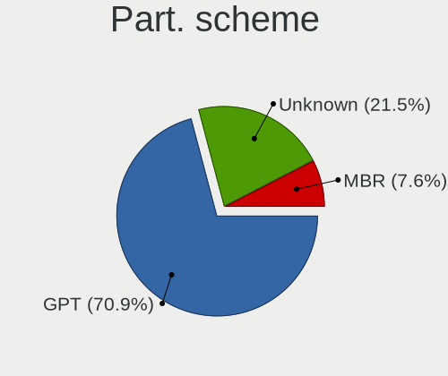
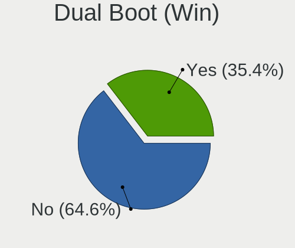
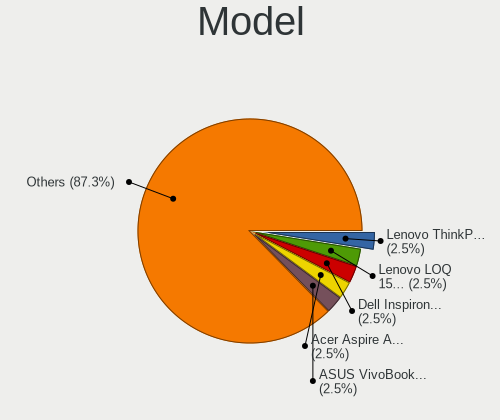
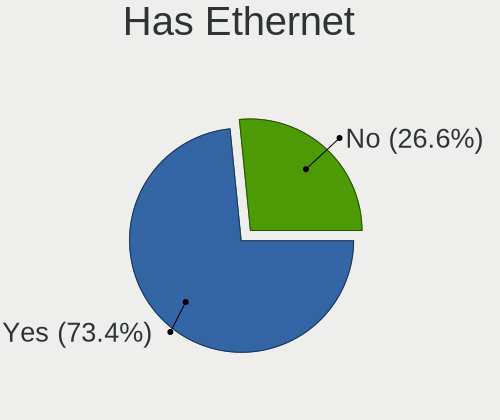
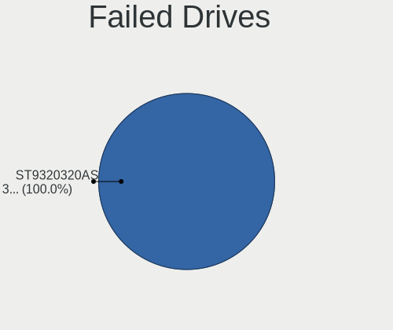
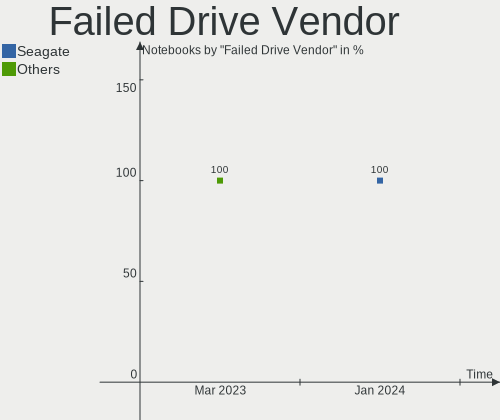
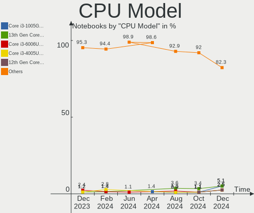
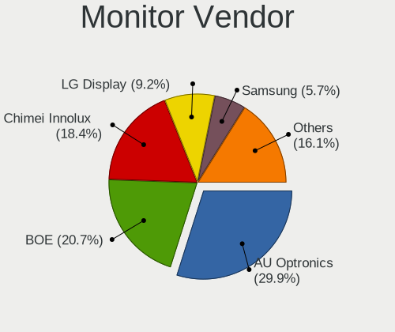
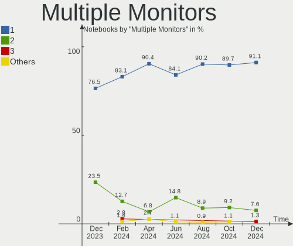
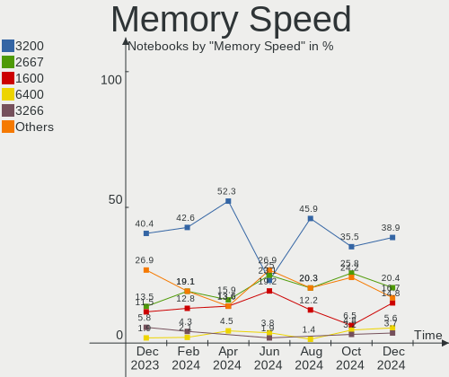

Linux in India - Hardware Trends (Notebooks)
--------------------------------------------

A project to identify most popular hardware characteristics and track their change
over time based on data collected by Linux users at https://Linux-Hardware.org.

Anyone can contribute to this report by the [hw-probe](https://github.com/linuxhw/hw-probe) tool:

    sudo -E hw-probe -all -upload

Period: Jan, 2024.

Contents
--------

* [ System ](#system)
  - [ OS                       ](#os)
  - [ OS Family                ](#os-family)
  - [ Kernel                   ](#kernel)
  - [ Kernel Family            ](#kernel-family)
  - [ Kernel Major Ver.        ](#kernel-major-ver)
  - [ Arch                     ](#arch)
  - [ DE                       ](#de)
  - [ Display Server           ](#display-server)
  - [ Display Manager          ](#display-manager)
  - [ OS Lang                  ](#os-lang)
  - [ Boot Mode                ](#boot-mode)
  - [ Filesystem               ](#filesystem)
  - [ Part. scheme             ](#part-scheme)
  - [ Dual Boot with Linux/BSD ](#dual-boot-with-linuxbsd)
  - [ Dual Boot (Win)          ](#dual-boot-win)

* [ Board ](#board)
  - [ Vendor                   ](#vendor)
  - [ Model                    ](#model)
  - [ Model Family             ](#model-family)
  - [ MFG Year                 ](#mfg-year)
  - [ Form Factor              ](#form-factor)
  - [ Secure Boot              ](#secure-boot)
  - [ Coreboot                 ](#coreboot)
  - [ RAM Size                 ](#ram-size)
  - [ RAM Used                 ](#ram-used)
  - [ Total Drives             ](#total-drives)
  - [ Has CD-ROM               ](#has-cd-rom)
  - [ Has Ethernet             ](#has-ethernet)
  - [ Has WiFi                 ](#has-wifi)
  - [ Has Bluetooth            ](#has-bluetooth)

* [ Location ](#location)
  - [ Country                  ](#country)
  - [ City                     ](#city)

* [ Drives ](#drives)
  - [ Drive Vendor             ](#drive-vendor)
  - [ Drive Model              ](#drive-model)
  - [ HDD Vendor               ](#hdd-vendor)
  - [ SSD Vendor               ](#ssd-vendor)
  - [ Drive Kind               ](#drive-kind)
  - [ Drive Connector          ](#drive-connector)
  - [ Drive Size               ](#drive-size)
  - [ Space Total              ](#space-total)
  - [ Space Used               ](#space-used)
  - [ Malfunc. Drives          ](#malfunc-drives)
  - [ Malfunc. Drive Vendor    ](#malfunc-drive-vendor)
  - [ Malfunc. HDD Vendor      ](#malfunc-hdd-vendor)
  - [ Malfunc. Drive Kind      ](#malfunc-drive-kind)
  - [ Failed Drives            ](#failed-drives)
  - [ Failed Drive Vendor      ](#failed-drive-vendor)
  - [ Drive Status             ](#drive-status)

* [ Storage controller ](#storage-controller)
  - [ Storage Vendor           ](#storage-vendor)
  - [ Storage Model            ](#storage-model)
  - [ Storage Kind             ](#storage-kind)

* [ Processor ](#processor)
  - [ CPU Vendor               ](#cpu-vendor)
  - [ CPU Model                ](#cpu-model)
  - [ CPU Model Family         ](#cpu-model-family)
  - [ CPU Cores                ](#cpu-cores)
  - [ CPU Sockets              ](#cpu-sockets)
  - [ CPU Threads              ](#cpu-threads)
  - [ CPU Op-Modes             ](#cpu-op-modes)
  - [ CPU Microcode            ](#cpu-microcode)
  - [ CPU Microarch            ](#cpu-microarch)

* [ Graphics ](#graphics)
  - [ GPU Vendor               ](#gpu-vendor)
  - [ GPU Model                ](#gpu-model)
  - [ GPU Combo                ](#gpu-combo)
  - [ GPU Driver               ](#gpu-driver)
  - [ GPU Memory               ](#gpu-memory)

* [ Monitor ](#monitor)
  - [ Monitor Vendor           ](#monitor-vendor)
  - [ Monitor Model            ](#monitor-model)
  - [ Monitor Resolution       ](#monitor-resolution)
  - [ Monitor Diagonal         ](#monitor-diagonal)
  - [ Monitor Width            ](#monitor-width)
  - [ Aspect Ratio             ](#aspect-ratio)
  - [ Monitor Area             ](#monitor-area)
  - [ Pixel Density            ](#pixel-density)
  - [ Multiple Monitors        ](#multiple-monitors)

* [ Network ](#network)
  - [ Net Controller Vendor    ](#net-controller-vendor)
  - [ Net Controller Model     ](#net-controller-model)
  - [ Wireless Vendor          ](#wireless-vendor)
  - [ Wireless Model           ](#wireless-model)
  - [ Ethernet Vendor          ](#ethernet-vendor)
  - [ Ethernet Model           ](#ethernet-model)
  - [ Net Controller Kind      ](#net-controller-kind)
  - [ Used Controller          ](#used-controller)
  - [ NICs                     ](#nics)
  - [ IPv6                     ](#ipv6)

* [ Bluetooth ](#bluetooth)
  - [ Bluetooth Vendor         ](#bluetooth-vendor)
  - [ Bluetooth Model          ](#bluetooth-model)

* [ Sound ](#sound)
  - [ Sound Vendor             ](#sound-vendor)
  - [ Sound Model              ](#sound-model)

* [ Memory ](#memory)
  - [ Memory Vendor            ](#memory-vendor)
  - [ Memory Model             ](#memory-model)
  - [ Memory Kind              ](#memory-kind)
  - [ Memory Form Factor       ](#memory-form-factor)
  - [ Memory Size              ](#memory-size)
  - [ Memory Speed             ](#memory-speed)

* [ Printers & scanners ](#printers--scanners)
  - [ Printer Vendor           ](#printer-vendor)
  - [ Printer Model            ](#printer-model)
  - [ Scanner Vendor           ](#scanner-vendor)
  - [ Scanner Model            ](#scanner-model)

* [ Camera ](#camera)
  - [ Camera Vendor            ](#camera-vendor)
  - [ Camera Model             ](#camera-model)

* [ Security ](#security)
  - [ Fingerprint Vendor       ](#fingerprint-vendor)
  - [ Fingerprint Model        ](#fingerprint-model)
  - [ Chipcard Vendor          ](#chipcard-vendor)
  - [ Chipcard Model           ](#chipcard-model)

* [ Unsupported ](#unsupported)
  - [ Unsupported Devices      ](#unsupported-devices)
  - [ Unsupported Device Types ](#unsupported-device-types)

System
------

OS
--

Installed operating systems

| Name                         | Notebooks | Percent |
|------------------------------|-----------|---------|
| Fedora 39                    | 15        | 16.13%  |
| Ubuntu 22.04                 | 14        | 15.05%  |
| Arch Rolling                 | 10        | 10.75%  |
| Ubuntu 23.10                 | 9         | 9.68%   |
| Pop!_OS 22.04                | 6         | 6.45%   |
| Zorin 17                     | 4         | 4.3%    |
| Linux Mint 21.2              | 4         | 4.3%    |
| EndeavourOS Rolling          | 3         | 3.23%   |
| Xero Rolling                 | 2         | 2.15%   |
| Manjaro 23.1.2               | 2         | 2.15%   |
| Manjaro                      | 2         | 2.15%   |
| Kali 2023.4                  | 2         | 2.15%   |
| Debian 12                    | 2         | 2.15%   |
| ArcoLinux Rolling            | 2         | 2.15%   |
| Zorin 16                     | 1         | 1.08%   |
| Ubuntu 20.04                 | 1         | 1.08%   |
| RHEL 9                       | 1         | 1.08%   |
| openSUSE Tumbleweed-XXXXXXXX | 1         | 1.08%   |
| openSUSE Leap-15.5           | 1         | 1.08%   |
| OpenMandriva 5.0             | 1         | 1.08%   |
| OpenMandriva 23.08           | 1         | 1.08%   |
| Nobara 39                    | 1         | 1.08%   |
| Nobara 37                    | 1         | 1.08%   |
| Linux Mint 21.3              | 1         | 1.08%   |
| Kubuntu 23.10                | 1         | 1.08%   |
| Kubuntu 22.04                | 1         | 1.08%   |
| Fedora 38                    | 1         | 1.08%   |
| Endless 5.1.1                | 1         | 1.08%   |
| Debian 11                    | 1         | 1.08%   |
| Clear Linux 40710            | 1         | 1.08%   |

OS Family
---------

OS without a version

| Name         | Notebooks | Percent |
|--------------|-----------|---------|
| Ubuntu       | 24        | 25.81%  |
| Fedora       | 16        | 17.2%   |
| Arch         | 10        | 10.75%  |
| Pop!_OS      | 6         | 6.45%   |
| Zorin        | 5         | 5.38%   |
| Linux Mint   | 5         | 5.38%   |
| Manjaro      | 4         | 4.3%    |
| EndeavourOS  | 3         | 3.23%   |
| Debian       | 3         | 3.23%   |
| Xero         | 2         | 2.15%   |
| openSUSE     | 2         | 2.15%   |
| OpenMandriva | 2         | 2.15%   |
| Nobara       | 2         | 2.15%   |
| Kubuntu      | 2         | 2.15%   |
| Kali         | 2         | 2.15%   |
| ArcoLinux    | 2         | 2.15%   |
| RHEL         | 1         | 1.08%   |
| Endless      | 1         | 1.08%   |
| Clear Linux  | 1         | 1.08%   |

Kernel
------

Version of the Linux kernel

| Version                      | Notebooks | Percent |
|------------------------------|-----------|---------|
| 6.5.0-14-generic             | 17        | 18.28%  |
| 6.2.0-39-generic             | 7         | 7.53%   |
| 6.6.6-76060606-generic       | 6         | 6.45%   |
| 5.15.0-91-generic            | 6         | 6.45%   |
| 6.6.11-200.fc39.x86_64       | 5         | 5.38%   |
| 6.7.0-zen3-1-zen             | 3         | 3.23%   |
| 6.6.8-200.fc39.x86_64        | 3         | 3.23%   |
| 6.5.0-15-generic             | 3         | 3.23%   |
| 6.6.9-arch1-1                | 2         | 2.15%   |
| 6.6.9-200.fc39.x86_64        | 2         | 2.15%   |
| 6.6.8-2-MANJARO              | 2         | 2.15%   |
| 6.6.13-200.fc39.x86_64       | 2         | 2.15%   |
| 6.5.6-300.fc39.x86_64        | 2         | 2.15%   |
| 6.5.0-kali3-amd64            | 2         | 2.15%   |
| 6.7.2-arch1-1                | 1         | 1.08%   |
| 6.7.1-arch1-1                | 1         | 1.08%   |
| 6.7.1-2-default              | 1         | 1.08%   |
| 6.7.0-arch3-1                | 1         | 1.08%   |
| 6.7.0-200.fsync.fc39.x86_64  | 1         | 1.08%   |
| 6.7.0-0-MANJARO              | 1         | 1.08%   |
| 6.6.8-arch1-1                | 1         | 1.08%   |
| 6.6.8-100.fc38.x86_64        | 1         | 1.08%   |
| 6.6.3-arch1-1                | 1         | 1.08%   |
| 6.6.2-desktop-1omv2390       | 1         | 1.08%   |
| 6.6.13-1401.native           | 1         | 1.08%   |
| 6.6.12-200.fc39.x86_64       | 1         | 1.08%   |
| 6.6.11-1-lts                 | 1         | 1.08%   |
| 6.6.10-arch1-1               | 1         | 1.08%   |
| 6.6.1-arch1-1                | 1         | 1.08%   |
| 6.6.1-273-tkg-eevdf          | 1         | 1.08%   |
| 6.5.9-arch2-1                | 1         | 1.08%   |
| 6.5.8-arch1-1                | 1         | 1.08%   |
| 6.5.0-9-generic              | 1         | 1.08%   |
| 6.5.0-10-generic             | 1         | 1.08%   |
| 6.4.11-desktop-1omv2390      | 1         | 1.08%   |
| 6.1.69-1-MANJARO             | 1         | 1.08%   |
| 6.1.11-201.fsync.fc37.x86_64 | 1         | 1.08%   |
| 6.1.0-17-amd64               | 1         | 1.08%   |
| 6.1.0-15-amd64               | 1         | 1.08%   |
| 5.15.10-arch1-1              | 1         | 1.08%   |

Kernel Family
-------------

Linux kernel without a distro release

| Version | Notebooks | Percent |
|---------|-----------|---------|
| 6.5.0   | 24        | 25.81%  |
| 5.15.0  | 8         | 8.6%    |
| 6.6.8   | 7         | 7.53%   |
| 6.2.0   | 7         | 7.53%   |
| 6.7.0   | 6         | 6.45%   |
| 6.6.6   | 6         | 6.45%   |
| 6.6.11  | 6         | 6.45%   |
| 6.6.9   | 4         | 4.3%    |
| 6.6.13  | 3         | 3.23%   |
| 6.7.1   | 2         | 2.15%   |
| 6.6.1   | 2         | 2.15%   |
| 6.5.6   | 2         | 2.15%   |
| 6.1.0   | 2         | 2.15%   |
| 6.7.2   | 1         | 1.08%   |
| 6.6.3   | 1         | 1.08%   |
| 6.6.2   | 1         | 1.08%   |
| 6.6.12  | 1         | 1.08%   |
| 6.6.10  | 1         | 1.08%   |
| 6.5.9   | 1         | 1.08%   |
| 6.5.8   | 1         | 1.08%   |
| 6.4.11  | 1         | 1.08%   |
| 6.1.69  | 1         | 1.08%   |
| 6.1.11  | 1         | 1.08%   |
| 5.15.10 | 1         | 1.08%   |
| 5.14.21 | 1         | 1.08%   |
| 5.14.0  | 1         | 1.08%   |
| 5.10.0  | 1         | 1.08%   |

Kernel Major Ver.
-----------------

Linux kernel major version

| Version | Notebooks | Percent |
|---------|-----------|---------|
| 6.6     | 32        | 34.41%  |
| 6.5     | 28        | 30.11%  |
| 6.7     | 9         | 9.68%   |
| 5.15    | 9         | 9.68%   |
| 6.2     | 7         | 7.53%   |
| 6.1     | 4         | 4.3%    |
| 5.14    | 2         | 2.15%   |
| 6.4     | 1         | 1.08%   |
| 5.10    | 1         | 1.08%   |

Arch
----

OS architecture (x86_64, i586, etc.)

| Name   | Notebooks | Percent |
|--------|-----------|---------|
| x86_64 | 93        | 100%    |

DE
--

Desktop Environment

| Name          | Notebooks | Percent |
|---------------|-----------|---------|
| GNOME         | 60        | 64.52%  |
| KDE5          | 17        | 18.28%  |
| XFCE          | 4         | 4.3%    |
| X-Cinnamon    | 4         | 4.3%    |
| i3            | 2         | 2.15%   |
| xinitrc       | 1         | 1.08%   |
| qtile         | 1         | 1.08%   |
| MATE          | 1         | 1.08%   |
| Hyprland      | 1         | 1.08%   |
| herbstluftwm  | 1         | 1.08%   |
| Endless:GNOME | 1         | 1.08%   |

Display Server
--------------

X11 or Wayland

| Name    | Notebooks | Percent |
|---------|-----------|---------|
| Wayland | 50        | 53.76%  |
| X11     | 42        | 45.16%  |
| Unknown | 1         | 1.08%   |

Display Manager
---------------

SDDM, LightDM, etc.

| Name    | Notebooks | Percent |
|---------|-----------|---------|
| Unknown | 29        | 31.18%  |
| GDM3    | 27        | 29.03%  |
| SDDM    | 13        | 13.98%  |
| LightDM | 12        | 12.9%   |
| GDM     | 11        | 11.83%  |
| LY-DM   | 1         | 1.08%   |

OS Lang
-------

Language

| Lang  | Notebooks | Percent |
|-------|-----------|---------|
| en_IN | 46        | 49.46%  |
| en_US | 37        | 39.78%  |
| C     | 5         | 5.38%   |
| en_GB | 3         | 3.23%   |
| POSIX | 1         | 1.08%   |
| en_HK | 1         | 1.08%   |

Boot Mode
---------

EFI or BIOS

| Mode | Notebooks | Percent |
|------|-----------|---------|
| EFI  | 56        | 60.22%  |
| BIOS | 37        | 39.78%  |

Filesystem
----------

Type of filesystem

| Type    | Notebooks | Percent |
|---------|-----------|---------|
| Ext4    | 52        | 55.91%  |
| Btrfs   | 21        | 22.58%  |
| Tmpfs   | 13        | 13.98%  |
| Overlay | 5         | 5.38%   |
| Xfs     | 2         | 2.15%   |

Part. scheme
------------

Scheme of partitioning

| Type    | Notebooks | Percent |
|---------|-----------|---------|
| GPT     | 58        | 62.37%  |
| Unknown | 29        | 31.18%  |
| MBR     | 6         | 6.45%   |

Dual Boot with Linux/BSD
------------------------

Hosting more than one Linux/BSD

| Dual boot | Notebooks | Percent |
|-----------|-----------|---------|
| No        | 80        | 86.02%  |
| Yes       | 13        | 13.98%  |

Dual Boot (Win)
---------------

Hosting Linux and Windows

| Dual boot | Notebooks | Percent |
|-----------|-----------|---------|
| No        | 66        | 70.97%  |
| Yes       | 27        | 29.03%  |

Board
-----

Vendor
------

Motherboard manufacturer

| Name                | Notebooks | Percent |
|---------------------|-----------|---------|
| Hewlett-Packard     | 20        | 21.51%  |
| Dell                | 18        | 19.35%  |
| ASUSTek Computer    | 17        | 18.28%  |
| Lenovo              | 15        | 16.13%  |
| Infinix             | 6         | 6.45%   |
| Acer                | 5         | 5.38%   |
| MSI                 | 4         | 4.3%    |
| Timi                | 2         | 2.15%   |
| Samsung Electronics | 1         | 1.08%   |
| LG Electronics      | 1         | 1.08%   |
| HONOR               | 1         | 1.08%   |
| Google              | 1         | 1.08%   |
| Fujitsu             | 1         | 1.08%   |
| Apple               | 1         | 1.08%   |

Model
-----

Motherboard model

| Name                                 | Notebooks | Percent |
|--------------------------------------|-----------|---------|
| Infinix ZERO BOOK 13                 | 2         | 2.15%   |
| Infinix INBOOK X1 NEO                | 2         | 2.15%   |
| HP Notebook                          | 2         | 2.15%   |
| HP EliteBook 840 G3                  | 2         | 2.15%   |
| Dell Inspiron 3542                   | 2         | 2.15%   |
| Dell Inspiron 3501                   | 2         | 2.15%   |
| Timi Xiaomi NoteBook Pro             | 1         | 1.08%   |
| Timi Mi NoteBook Ultra               | 1         | 1.08%   |
| Samsung RV408/RV508                  | 1         | 1.08%   |
| MSI Thin GF63 12HW                   | 1         | 1.08%   |
| MSI GL63 9SD                         | 1         | 1.08%   |
| MSI GL63 8RC                         | 1         | 1.08%   |
| MSI Bravo 15 B5DD                    | 1         | 1.08%   |
| LG 14Z990-V.AR52A2                   | 1         | 1.08%   |
| Lenovo V14-ADA 82C6                  | 1         | 1.08%   |
| Lenovo ThinkPad X390 20Q1S7RB00      | 1         | 1.08%   |
| Lenovo ThinkPad X230 2330A17         | 1         | 1.08%   |
| Lenovo ThinkPad T480 20L6S4T80H      | 1         | 1.08%   |
| Lenovo ThinkPad L380 20M6S1MG0X      | 1         | 1.08%   |
| Lenovo ThinkPad E14 Gen 4 21E3S06300 | 1         | 1.08%   |
| Lenovo ThinkPad E14 20RAS1S600       | 1         | 1.08%   |
| Lenovo Legion 7 16ACHg6 82N6         | 1         | 1.08%   |
| Lenovo IdeaPad Y560                  | 1         | 1.08%   |
| Lenovo IdeaPad Slim 5 16IRL8 82XF    | 1         | 1.08%   |
| Lenovo IdeaPad S145-15AST 81N3       | 1         | 1.08%   |
| Lenovo IdeaPad 5 15ITL05 Ua 82FG     | 1         | 1.08%   |
| Lenovo IdeaPad 5 15ALC05 82LN        | 1         | 1.08%   |
| Lenovo IdeaPad 330S-15IKB D 81F5     | 1         | 1.08%   |
| Lenovo IdeaPad 320-15IKB 80XL        | 1         | 1.08%   |
| Infinix INBOOK X3 Slim               | 1         | 1.08%   |
| Infinix INBook X1 Pro                | 1         | 1.08%   |
| HONOR BMH-WCX9                       | 1         | 1.08%   |
| HP Victus by Gaming Laptop 15-fb0xxx | 1         | 1.08%   |
| HP Pavilion Laptop 14-dv0xxx         | 1         | 1.08%   |
| HP Pavilion Gaming Laptop 15-ec1xxx  | 1         | 1.08%   |
| HP Pavilion g6                       | 1         | 1.08%   |
| HP OMEN by Gaming Laptop 16-n0xxx    | 1         | 1.08%   |
| HP Laptop 15s-gr0xxx                 | 1         | 1.08%   |
| HP Laptop 15s-fq5xxx                 | 1         | 1.08%   |
| HP Laptop 15-bs0xx                   | 1         | 1.08%   |

Model Family
------------

Motherboard model prefix

| Name               | Notebooks | Percent |
|--------------------|-----------|---------|
| ASUS VivoBook      | 9         | 9.68%   |
| Dell Inspiron      | 8         | 8.6%    |
| Lenovo IdeaPad     | 7         | 7.53%   |
| Lenovo ThinkPad    | 6         | 6.45%   |
| HP EliteBook       | 6         | 6.45%   |
| Dell Latitude      | 5         | 5.38%   |
| Infinix INBOOK     | 4         | 4.3%    |
| HP Laptop          | 4         | 4.3%    |
| Dell Vostro        | 4         | 4.3%    |
| ASUS ASUS          | 4         | 4.3%    |
| HP Pavilion        | 3         | 3.23%   |
| MSI GL63           | 2         | 2.15%   |
| Infinix ZERO       | 2         | 2.15%   |
| HP Notebook        | 2         | 2.15%   |
| ASUS ROG           | 2         | 2.15%   |
| Acer Nitro         | 2         | 2.15%   |
| Acer Aspire        | 2         | 2.15%   |
| Timi Xiaomi        | 1         | 1.08%   |
| Timi Mi            | 1         | 1.08%   |
| Samsung RV408      | 1         | 1.08%   |
| MSI Thin           | 1         | 1.08%   |
| MSI Bravo          | 1         | 1.08%   |
| LG 14Z990-V.AR52A2 | 1         | 1.08%   |
| Lenovo V14-ADA     | 1         | 1.08%   |
| Lenovo Legion      | 1         | 1.08%   |
| HONOR BMH-WCX9     | 1         | 1.08%   |
| HP Victus          | 1         | 1.08%   |
| HP OMEN            | 1         | 1.08%   |
| HP ENVY            | 1         | 1.08%   |
| HP 348             | 1         | 1.08%   |
| HP 15              | 1         | 1.08%   |
| Google Blooguard   | 1         | 1.08%   |
| Fujitsu LIFEBOOK   | 1         | 1.08%   |
| Dell XPS           | 1         | 1.08%   |
| ASUS ZenBook       | 1         | 1.08%   |
| ASUS K53SV         | 1         | 1.08%   |
| Apple MacBookPro8  | 1         | 1.08%   |
| Acer One           | 1         | 1.08%   |

MFG Year
--------

Motherboard manufacture year

| Year | Notebooks | Percent |
|------|-----------|---------|
| 2021 | 17        | 18.28%  |
| 2023 | 13        | 13.98%  |
| 2022 | 13        | 13.98%  |
| 2020 | 12        | 12.9%   |
| 2019 | 7         | 7.53%   |
| 2018 | 6         | 6.45%   |
| 2011 | 6         | 6.45%   |
| 2013 | 5         | 5.38%   |
| 2010 | 4         | 4.3%    |
| 2014 | 3         | 3.23%   |
| 2017 | 2         | 2.15%   |
| 2016 | 2         | 2.15%   |
| 2015 | 2         | 2.15%   |
| 2008 | 1         | 1.08%   |

Form Factor
-----------

Physical design of the computer

| Name     | Notebooks | Percent |
|----------|-----------|---------|
| Notebook | 93        | 100%    |

Secure Boot
-----------

Enabled or disabled

| State    | Notebooks | Percent |
|----------|-----------|---------|
| Disabled | 77        | 82.8%   |
| Enabled  | 16        | 17.2%   |

Coreboot
--------

Have coreboot on board

| Used | Notebooks | Percent |
|------|-----------|---------|
| No   | 92        | 98.92%  |
| Yes  | 1         | 1.08%   |

RAM Size
--------

Total RAM memory

| Size in GB | Notebooks | Percent |
|------------|-----------|---------|
| 4.01-8.0   | 28        | 30.11%  |
| 16.01-24.0 | 25        | 26.88%  |
| 8.01-16.0  | 19        | 20.43%  |
| 3.01-4.0   | 11        | 11.83%  |
| 32.01-64.0 | 9         | 9.68%   |
| 24.01-32.0 | 1         | 1.08%   |

RAM Used
--------

Used RAM memory

| Used GB   | Notebooks | Percent |
|-----------|-----------|---------|
| 4.01-8.0  | 26        | 27.96%  |
| 3.01-4.0  | 26        | 27.96%  |
| 2.01-3.0  | 24        | 25.81%  |
| 1.01-2.0  | 16        | 17.2%   |
| 8.01-16.0 | 1         | 1.08%   |

Total Drives
------------

Number of drives on board

| Drives | Notebooks | Percent |
|--------|-----------|---------|
| 1      | 66        | 70.97%  |
| 2      | 26        | 27.96%  |
| 3      | 1         | 1.08%   |

Has CD-ROM
----------

Has CD-ROM on board

| Presented | Notebooks | Percent |
|-----------|-----------|---------|
| No        | 79        | 84.95%  |
| Yes       | 14        | 15.05%  |

Has Ethernet
------------

Has Ethernet on board

| Presented | Notebooks | Percent |
|-----------|-----------|---------|
| Yes       | 61        | 65.59%  |
| No        | 32        | 34.41%  |

Has WiFi
--------

Has WiFi module

| Presented | Notebooks | Percent |
|-----------|-----------|---------|
| Yes       | 93        | 100%    |

Has Bluetooth
-------------

Has Bluetooth module

| Presented | Notebooks | Percent |
|-----------|-----------|---------|
| Yes       | 86        | 92.47%  |
| No        | 7         | 7.53%   |

Location
--------

Country
-------

Geographic location (country)

| Country | Notebooks | Percent |
|---------|-----------|---------|
| India   | 93        | 100%    |

City
----

Geographic location (city)

| City               | Notebooks | Percent |
|--------------------|-----------|---------|
| Bengaluru          | 12        | 12.9%   |
| Hyderabad          | 9         | 9.68%   |
| Delhi              | 8         | 8.6%    |
| Chennai            | 6         | 6.45%   |
| Kochi              | 5         | 5.38%   |
| Mumbai             | 4         | 4.3%    |
| Kolkata            | 4         | 4.3%    |
| Jaipur             | 4         | 4.3%    |
| Pune               | 3         | 3.23%   |
| Bhopal             | 3         | 3.23%   |
| Nagpur             | 2         | 2.15%   |
| Ludhiana           | 2         | 2.15%   |
| Lucknow            | 2         | 2.15%   |
| Indore             | 2         | 2.15%   |
| Bhubaneswar        | 2         | 2.15%   |
| Varanasi           | 1         | 1.08%   |
| Tirunelveli        | 1         | 1.08%   |
| Thrissur           | 1         | 1.08%   |
| Thiruvananthapuram | 1         | 1.08%   |
| Shimla             | 1         | 1.08%   |
| Salem              | 1         | 1.08%   |
| Raipur             | 1         | 1.08%   |
| Patna              | 1         | 1.08%   |
| Noida              | 1         | 1.08%   |
| Mormugao           | 1         | 1.08%   |
| Meerut             | 1         | 1.08%   |
| Madurai            | 1         | 1.08%   |
| Kozhikode          | 1         | 1.08%   |
| Kottakkal          | 1         | 1.08%   |
| Jodhpur            | 1         | 1.08%   |
| Hoshiarpur         | 1         | 1.08%   |
| Hamirpur           | 1         | 1.08%   |
| Gurgaon            | 1         | 1.08%   |
| Gopiganj           | 1         | 1.08%   |
| Ghaziabad          | 1         | 1.08%   |
| Durgapur           | 1         | 1.08%   |
| Dehradun           | 1         | 1.08%   |
| Chandigarh         | 1         | 1.08%   |
| Ambala             | 1         | 1.08%   |
| Ahmedabad          | 1         | 1.08%   |

Drives
------

Drive Vendor
------------

Hard drive vendors

| Vendor                       | Notebooks | Drives | Percent |
|------------------------------|-----------|--------|---------|
| Seagate                      | 15        | 15     | 12.5%   |
| Samsung Electronics          | 15        | 15     | 12.5%   |
| WDC                          | 11        | 12     | 9.17%   |
| Micron Technology            | 9         | 9      | 7.5%    |
| Sandisk                      | 8         | 8      | 6.67%   |
| Intel                        | 8         | 8      | 6.67%   |
| Unknown                      | 7         | 7      | 5.83%   |
| SK hynix                     | 7         | 7      | 5.83%   |
| Shenzhen Longsys Electronics | 5         | 5      | 4.17%   |
| Toshiba                      | 4         | 4      | 3.33%   |
| KIOXIA                       | 3         | 3      | 2.5%    |
| Crucial                      | 3         | 3      | 2.5%    |
| Phison Electronics           | 2         | 2      | 1.67%   |
| Kingston Technology Company  | 2         | 2      | 1.67%   |
| Kingston                     | 2         | 2      | 1.67%   |
| Hitachi                      | 2         | 2      | 1.67%   |
| CONSISTENT                   | 2         | 2      | 1.67%   |
| Unknown                      | 2         | 2      | 1.67%   |
| Union Memory (Shenzhen)      | 1         | 1      | 0.83%   |
| UMIS                         | 1         | 1      | 0.83%   |
| Transcend                    | 1         | 1      | 0.83%   |
| Phison                       | 1         | 1      | 0.83%   |
| NGFF                         | 1         | 1      | 0.83%   |
| Micron/Crucial Technology    | 1         | 1      | 0.83%   |
| MAXIO Technology (Hangzhou)  | 1         | 1      | 0.83%   |
| Matrix                       | 1         | 1      | 0.83%   |
| HS-SSD-C100                  | 1         | 1      | 0.83%   |
| HGST                         | 1         | 1      | 0.83%   |
| FORESEE                      | 1         | 1      | 0.83%   |
| BHT                          | 1         | 1      | 0.83%   |
| Aarvex                       | 1         | 1      | 0.83%   |

Drive Model
-----------

Hard drive models

| Model                                              | Notebooks | Percent |
|----------------------------------------------------|-----------|---------|
| Seagate ST1000LM035-1RK172 1TB                     | 7         | 5.79%   |
| Unknown SD/MMC/MS PRO 256GB                        | 3         | 2.48%   |
| Micron 2450_MTFDKBA512TFK 512GB                    | 3         | 2.48%   |
| Micron 2210_MTFDHBA512QFD 512GB                    | 3         | 2.48%   |
| WDC WD10SPZX-60Z10T0 1TB                           | 2         | 1.65%   |
| SK hynix BC711 NVMe 512GB                          | 2         | 1.65%   |
| Shenzhen Longsys FORESEE XP2100F001T 1TB           | 2         | 1.65%   |
| Seagate ST500LT012-1DG142 500GB                    | 2         | 1.65%   |
| Seagate ST1000LM048-2E7172 1TB                     | 2         | 1.65%   |
| Sandisk WD Black SN850 1024GB                      | 2         | 1.65%   |
| Samsung PM991a NVMe 256GB                          | 2         | 1.65%   |
| Samsung MZVL4512HBLU-00BTW 512GB                   | 2         | 1.65%   |
| Phison PS5013 E13 NVMe Controller 256GB            | 2         | 1.65%   |
| Intel SSDPEKNU512GZ 512GB                          | 2         | 1.65%   |
| Unknown                                            | 2         | 1.65%   |
| WDC WDS240G2G0B-00EPW0 240GB SSD                   | 1         | 0.83%   |
| WDC WD7500BPVT-60HXZT3 752GB                       | 1         | 0.83%   |
| WDC WD5000LPVX-75V0TT0 500GB                       | 1         | 0.83%   |
| WDC WD3200BPVT-00HXZT1 320GB                       | 1         | 0.83%   |
| WDC WD10SPZX-24Z10 1TB                             | 1         | 0.83%   |
| WDC WD10SPSX-75A6WT0 1TB                           | 1         | 0.83%   |
| WDC WD10JPVX-16JC3T3 1TB                           | 1         | 0.83%   |
| WDC WD Green 2.5 480GB SSD                         | 1         | 0.83%   |
| WDC PC SN530 SDBPNPZ-256G-1002 256GB               | 1         | 0.83%   |
| WDC PC SN530 NVMe 256GB                            | 1         | 0.83%   |
| Unknown SC16G  16GB                                | 1         | 0.83%   |
| Unknown MMC Card  64GB                             | 1         | 0.83%   |
| Unknown MMC Card  4GB                              | 1         | 0.83%   |
| Unknown MMC Card  32GB                             | 1         | 0.83%   |
| Union Memory (Shenzhen) UMIS RPJTJ512MGE1QDQ 512GB | 1         | 0.83%   |
| UMIS RPJTJ512MEE1OWX 512GB                         | 1         | 0.83%   |
| Transcend TS256GMTS430S 256GB SSD                  | 1         | 0.83%   |
| Toshiba MQ01ABD100 1TB                             | 1         | 0.83%   |
| Toshiba MK3265GSX 320GB                            | 1         | 0.83%   |
| Toshiba MK3261GSYN 320GB                           | 1         | 0.83%   |
| Toshiba BG3 NVMe SSD Controller 256GB              | 1         | 0.83%   |
| SK hynix SKHynix_HFS001TDE9X084N 1024GB            | 1         | 0.83%   |
| SK hynix HFS256G39TNF-N3A0A 256GB SSD              | 1         | 0.83%   |
| SK hynix HFM512GD3JX013N 512GB                     | 1         | 0.83%   |
| SK hynix HFM001TD3JX013N 1024GB                    | 1         | 0.83%   |

HDD Vendor
----------

Hard disk drive vendors

| Vendor  | Notebooks | Drives | Percent |
|---------|-----------|--------|---------|
| Seagate | 15        | 15     | 46.88%  |
| WDC     | 8         | 8      | 25%     |
| Unknown | 3         | 3      | 9.38%   |
| Toshiba | 3         | 3      | 9.38%   |
| Hitachi | 2         | 2      | 6.25%   |
| HGST    | 1         | 1      | 3.13%   |

SSD Vendor
----------

Solid state drive vendors

| Vendor              | Notebooks | Drives | Percent |
|---------------------|-----------|--------|---------|
| WDC                 | 2         | 2      | 11.11%  |
| Samsung Electronics | 2         | 2      | 11.11%  |
| Crucial             | 2         | 2      | 11.11%  |
| CONSISTENT          | 2         | 2      | 11.11%  |
| Transcend           | 1         | 1      | 5.56%   |
| SK hynix            | 1         | 1      | 5.56%   |
| Sandisk             | 1         | 1      | 5.56%   |
| NGFF                | 1         | 1      | 5.56%   |
| Kingston            | 1         | 1      | 5.56%   |
| Intel               | 1         | 1      | 5.56%   |
| HS-SSD-C100         | 1         | 1      | 5.56%   |
| BHT                 | 1         | 1      | 5.56%   |
| Aarvex              | 1         | 1      | 5.56%   |
| Unknown             | 1         | 1      | 5.56%   |

Drive Kind
----------

HDD or SSD

| Kind    | Notebooks | Drives | Percent |
|---------|-----------|--------|---------|
| NVMe    | 61        | 65     | 53.04%  |
| HDD     | 32        | 32     | 27.83%  |
| SSD     | 16        | 18     | 13.91%  |
| MMC     | 4         | 4      | 3.48%   |
| Unknown | 2         | 2      | 1.74%   |

Drive Connector
---------------

SATA, SAS, NVMe, etc.

| Type | Notebooks | Drives | Percent |
|------|-----------|--------|---------|
| NVMe | 61        | 65     | 56.48%  |
| SATA | 40        | 49     | 37.04%  |
| MMC  | 4         | 4      | 3.7%    |
| SAS  | 3         | 3      | 2.78%   |

Drive Size
----------

Size of hard drive

| Size in TB | Notebooks | Drives | Percent |
|------------|-----------|--------|---------|
| 0.01-0.5   | 28        | 29     | 57.14%  |
| 0.51-1.0   | 19        | 19     | 38.78%  |
| 1.01-2.0   | 2         | 2      | 4.08%   |

Space Total
-----------

Amount of disk space available on the file system

| Size in GB     | Notebooks | Percent |
|----------------|-----------|---------|
| 251-500        | 31        | 33.33%  |
| 101-250        | 23        | 24.73%  |
| 501-1000       | 15        | 16.13%  |
| 1001-2000      | 5         | 5.38%   |
| 1-20           | 5         | 5.38%   |
| 51-100         | 4         | 4.3%    |
| 21-50          | 3         | 3.23%   |
| 2001-3000      | 3         | 3.23%   |
| More than 3000 | 2         | 2.15%   |
| Unknown        | 2         | 2.15%   |

Space Used
----------

Amount of used disk space

| Used GB   | Notebooks | Percent |
|-----------|-----------|---------|
| 1-20      | 23        | 24.73%  |
| 21-50     | 22        | 23.66%  |
| 101-250   | 17        | 18.28%  |
| 51-100    | 12        | 12.9%   |
| 251-500   | 11        | 11.83%  |
| 501-1000  | 4         | 4.3%    |
| 1001-2000 | 2         | 2.15%   |
| Unknown   | 2         | 2.15%   |

Malfunc. Drives
---------------

Drive models with a malfunction

| Model                           | Notebooks | Drives | Percent |
|---------------------------------|-----------|--------|---------|
| Seagate ST1000LM035-1RK172 1TB  | 3         | 3      | 27.27%  |
| WDC WD7500BPVT-60HXZT3 752GB    | 1         | 1      | 9.09%   |
| WDC WD Green 2.5 480GB SSD      | 1         | 1      | 9.09%   |
| Toshiba MK3265GSX 320GB         | 1         | 1      | 9.09%   |
| Toshiba MK3261GSYN 320GB        | 1         | 1      | 9.09%   |
| Seagate ST320LT007-9ZV142 320GB | 1         | 1      | 9.09%   |
| Seagate ST2000LM015-2E8174 2TB  | 1         | 1      | 9.09%   |
| HGST HTS545050A7E680 500GB      | 1         | 1      | 9.09%   |
| Unknown                         | 1         | 1      | 9.09%   |

Malfunc. Drive Vendor
---------------------

Vendors of faulty drives

| Vendor  | Notebooks | Drives | Percent |
|---------|-----------|--------|---------|
| Seagate | 5         | 5      | 45.45%  |
| WDC     | 2         | 2      | 18.18%  |
| Toshiba | 2         | 2      | 18.18%  |
| HGST    | 1         | 1      | 9.09%   |
| Unknown | 1         | 1      | 9.09%   |

Malfunc. HDD Vendor
-------------------

Vendors of faulty HDD drives

| Vendor  | Notebooks | Drives | Percent |
|---------|-----------|--------|---------|
| Seagate | 5         | 5      | 55.56%  |
| Toshiba | 2         | 2      | 22.22%  |
| WDC     | 1         | 1      | 11.11%  |
| HGST    | 1         | 1      | 11.11%  |

Malfunc. Drive Kind
-------------------

Kinds of faulty drives

| Kind | Notebooks | Drives | Percent |
|------|-----------|--------|---------|
| HDD  | 9         | 9      | 81.82%  |
| SSD  | 2         | 2      | 18.18%  |

Failed Drives
-------------

Failed drive models

| Model                     | Notebooks | Drives | Percent |
|---------------------------|-----------|--------|---------|
| Seagate ST9320320AS 320GB | 1         | 1      | 100%    |

Failed Drive Vendor
-------------------

Failed drive vendors

| Vendor  | Notebooks | Drives | Percent |
|---------|-----------|--------|---------|
| Seagate | 1         | 1      | 100%    |

Drive Status
------------

Number of failed and malfunc. drives

| Status   | Notebooks | Drives | Percent |
|----------|-----------|--------|---------|
| Detected | 49        | 63     | 49%     |
| Works    | 40        | 46     | 40%     |
| Malfunc  | 10        | 11     | 10%     |
| Failed   | 1         | 1      | 1%      |

Storage controller
------------------

Storage Vendor
--------------

Storage controller vendors

| Vendor                       | Notebooks | Percent |
|------------------------------|-----------|---------|
| Intel                        | 63        | 48.09%  |
| Samsung Electronics          | 13        | 9.92%   |
| AMD                          | 10        | 7.63%   |
| SanDisk                      | 9         | 6.87%   |
| Micron Technology            | 9         | 6.87%   |
| SK hynix                     | 6         | 4.58%   |
| Shenzhen Longsys Electronics | 6         | 4.58%   |
| Phison Electronics           | 3         | 2.29%   |
| KIOXIA                       | 3         | 2.29%   |
| Kingston Technology Company  | 3         | 2.29%   |
| Union Memory (Shenzhen)      | 2         | 1.53%   |
| Micron/Crucial Technology    | 2         | 1.53%   |
| Toshiba America Info Systems | 1         | 0.76%   |
| MAXIO Technology (Hangzhou)  | 1         | 0.76%   |

Storage Model
-------------

Storage controller models

| Model                                                                                                              | Notebooks | Percent |
|--------------------------------------------------------------------------------------------------------------------|-----------|---------|
| AMD FCH SATA Controller [AHCI mode]                                                                                | 10        | 7.35%   |
| Intel Volume Management Device NVMe RAID Controller                                                                | 9         | 6.62%   |
| Samsung NVMe SSD Controller 980 (DRAM-less)                                                                        | 8         | 5.88%   |
| Intel Sunrise Point-LP SATA Controller [AHCI mode]                                                                 | 8         | 5.88%   |
| SK hynix Gold P31/BC711/PC711 NVMe Solid State Drive                                                               | 5         | 3.68%   |
| Micron 2210 NVMe SSD [Cobain]                                                                                      | 5         | 3.68%   |
| Intel Tiger Lake-LP SATA Controller                                                                                | 5         | 3.68%   |
| Intel 82801 Mobile SATA Controller [RAID mode]                                                                     | 5         | 3.68%   |
| Intel Volume Management Device NVMe RAID Controller Intel Corporation                                              | 4         | 2.94%   |
| Intel 8 Series SATA Controller 1 [AHCI mode]                                                                       | 4         | 2.94%   |
| Intel 7 Series Chipset Family 6-port SATA Controller [AHCI mode]                                                   | 4         | 2.94%   |
| Shenzhen Longsys FORESEE XP1000 / Lexar Professional CFexpress Type B Gold series, NM620 PCIe NVME SSD (DRAM-less) | 3         | 2.21%   |
| Micron 2450 NVMe SSD [HendrixV] (DRAM-less)                                                                        | 3         | 2.21%   |
| Intel SSD 670p Series [Keystone Harbor]                                                                            | 3         | 2.21%   |
| Intel SSD 660P Series                                                                                              | 3         | 2.21%   |
| Intel Alder Lake-P SATA AHCI Controller                                                                            | 3         | 2.21%   |
| Intel 6 Series/C200 Series Chipset Family 6 port Mobile SATA AHCI Controller                                       | 3         | 2.21%   |
| Intel 400 Series Chipset Family SATA AHCI Controller                                                               | 3         | 2.21%   |
| Shenzhen Longsys FORESEE XP2100 NVMe SSD (DRAM-less)                                                               | 2         | 1.47%   |
| SanDisk WD PC SN810 / Black SN850 NVMe SSD                                                                         | 2         | 1.47%   |
| SanDisk Ultra 3D / WD Blue SN550 NVMe SSD                                                                          | 2         | 1.47%   |
| SanDisk IX SN530 NVMe SSD (DRAM-less)                                                                              | 2         | 1.47%   |
| Samsung NVMe SSD Controller PM9B1 (DRAM-less)                                                                      | 2         | 1.47%   |
| Samsung NVMe SSD Controller PM9A1/PM9A3/980PRO                                                                     | 2         | 1.47%   |
| Phison PS5013-E13 PCIe3 NVMe Controller (DRAM-less)                                                                | 2         | 1.47%   |
| Micron/Crucial P2 [Nick P2] / P3 / P3 Plus NVMe PCIe SSD (DRAM-less)                                               | 2         | 1.47%   |
| KIOXIA NVMe SSD Controller BG4 (DRAM-less)                                                                         | 2         | 1.47%   |
| Kingston Company A2000 NVMe SSD SM2263EN                                                                           | 2         | 1.47%   |
| Intel Wildcat Point-LP SATA Controller [AHCI Mode]                                                                 | 2         | 1.47%   |
| Intel Jasper Lake SATA AHCI Controller                                                                             | 2         | 1.47%   |
| Intel Cannon Point-LP SATA Controller [AHCI Mode]                                                                  | 2         | 1.47%   |
| Intel Cannon Lake Mobile PCH SATA AHCI Controller                                                                  | 2         | 1.47%   |
| Union Memory (Shenzhen) AM630 PCIe 4.0 x4 NVMe SSD Controller                                                      | 1         | 0.74%   |
| Union Memory (Shenzhen) AM620 PCIe 3.0 NVMe SSD 512GB                                                              | 1         | 0.74%   |
| Toshiba America Info Systems BG3 x2 NVMe SSD Controller (DRAM-less)                                                | 1         | 0.74%   |
| SK hynix BC901 NVMe Solid State Drive (DRAM-less)                                                                  | 1         | 0.74%   |
| Shenzhen Longsys SM2263EN/SM2263XT-based OEM NVME SSD (DRAM-less)                                                  | 1         | 0.74%   |
| Sandisk WD PC SN740 NVMe SSD 512GB (DRAM-less)                                                                     | 1         | 0.74%   |
| SanDisk WD Black SN770 / PC SN740 256GB / PC SN560 (DRAM-less) NVMe SSD                                            | 1         | 0.74%   |
| SanDisk Extreme Pro / WD Black SN750 / PC SN730 / Red SN700 NVMe SSD                                               | 1         | 0.74%   |

Storage Kind
------------

Kind of storage controller (IDE, SATA, NVMe, SAS, ...)

| Kind | Notebooks | Percent |
|------|-----------|---------|
| NVMe | 61        | 46.21%  |
| SATA | 53        | 40.15%  |
| RAID | 18        | 13.64%  |

Processor
---------

CPU Vendor
----------

Processor vendors

| Vendor | Notebooks | Percent |
|--------|-----------|---------|
| Intel  | 74        | 79.57%  |
| AMD    | 19        | 20.43%  |

CPU Model
---------

Processor models

| Model                                       | Notebooks | Percent |
|---------------------------------------------|-----------|---------|
| Intel 11th Gen Core i5-1135G7 @ 2.40GHz     | 5         | 5.38%   |
| Intel 12th Gen Core i5-12450H               | 3         | 3.23%   |
| Intel 12th Gen Core i5-1235U                | 3         | 3.23%   |
| AMD Ryzen 5 5500U with Radeon Graphics      | 3         | 3.23%   |
| Intel Core i7-8565U CPU @ 1.80GHz           | 2         | 2.15%   |
| Intel Core i5-8350U CPU @ 1.70GHz           | 2         | 2.15%   |
| Intel Core i5-8265U CPU @ 1.60GHz           | 2         | 2.15%   |
| Intel Core i5-7200U CPU @ 2.50GHz           | 2         | 2.15%   |
| Intel Core i5-6200U CPU @ 2.30GHz           | 2         | 2.15%   |
| Intel Core i5-4200U CPU @ 1.60GHz           | 2         | 2.15%   |
| Intel Core i5-10300H CPU @ 2.50GHz          | 2         | 2.15%   |
| Intel Celeron N5100 @ 1.10GHz               | 2         | 2.15%   |
| Intel 13th Gen Core i9-13900H               | 2         | 2.15%   |
| Intel 13th Gen Core i5-13500H               | 2         | 2.15%   |
| Intel 12th Gen Core i5-12500H               | 2         | 2.15%   |
| Intel 11th Gen Core i7-1165G7 @ 2.80GHz     | 2         | 2.15%   |
| Intel 11th Gen Core i5-11300H @ 3.10GHz     | 2         | 2.15%   |
| AMD Ryzen 9 5900HX with Radeon Graphics     | 2         | 2.15%   |
| AMD Ryzen 5 5600H with Radeon Graphics      | 2         | 2.15%   |
| Intel Pentium Dual-Core CPU T4500 @ 2.30GHz | 1         | 1.08%   |
| Intel Pentium CPU N3540 @ 2.16GHz           | 1         | 1.08%   |
| Intel Core Ultra 7 155H                     | 1         | 1.08%   |
| Intel Core i7-9750H CPU @ 2.60GHz           | 1         | 1.08%   |
| Intel Core i7-8650U CPU @ 1.90GHz           | 1         | 1.08%   |
| Intel Core i7-4510U CPU @ 2.00GHz           | 1         | 1.08%   |
| Intel Core i7-2670QM CPU @ 2.20GHz          | 1         | 1.08%   |
| Intel Core i7-10850H CPU @ 2.70GHz          | 1         | 1.08%   |
| Intel Core i7-1065G7 CPU @ 1.30GHz          | 1         | 1.08%   |
| Intel Core i5-8300H CPU @ 2.30GHz           | 1         | 1.08%   |
| Intel Core i5-6300U CPU @ 2.40GHz           | 1         | 1.08%   |
| Intel Core i5-4300U CPU @ 1.90GHz           | 1         | 1.08%   |
| Intel Core i5-3437U CPU @ 1.90GHz           | 1         | 1.08%   |
| Intel Core i5-3360M CPU @ 2.80GHz           | 1         | 1.08%   |
| Intel Core i5-3320M CPU @ 2.60GHz           | 1         | 1.08%   |
| Intel Core i5-3210M CPU @ 2.50GHz           | 1         | 1.08%   |
| Intel Core i5-2450M CPU @ 2.50GHz           | 1         | 1.08%   |
| Intel Core i5-2415M CPU @ 2.30GHz           | 1         | 1.08%   |
| Intel Core i5-2410M CPU @ 2.30GHz           | 1         | 1.08%   |
| Intel Core i5-10210U CPU @ 1.60GHz          | 1         | 1.08%   |
| Intel Core i5 CPU M 560 @ 2.67GHz           | 1         | 1.08%   |

CPU Model Family
----------------

Processor model prefix

| Model                   | Notebooks | Percent |
|-------------------------|-----------|---------|
| Other                   | 30        | 32.26%  |
| Intel Core i5           | 25        | 26.88%  |
| Intel Core i7           | 8         | 8.6%    |
| AMD Ryzen 5             | 7         | 7.53%   |
| AMD Ryzen 7             | 6         | 6.45%   |
| Intel Core i3           | 5         | 5.38%   |
| Intel Celeron           | 4         | 4.3%    |
| AMD Ryzen 9             | 2         | 2.15%   |
| Intel Pentium Dual-Core | 1         | 1.08%   |
| Intel Pentium           | 1         | 1.08%   |
| Intel Core              | 1         | 1.08%   |
| AMD Ryzen 3             | 1         | 1.08%   |
| AMD E2                  | 1         | 1.08%   |
| AMD Athlon              | 1         | 1.08%   |

CPU Cores
---------

Number of processor cores

| Number | Notebooks | Percent |
|--------|-----------|---------|
| 2      | 30        | 32.26%  |
| 4      | 27        | 29.03%  |
| 8      | 12        | 12.9%   |
| 6      | 10        | 10.75%  |
| 12     | 5         | 5.38%   |
| 10     | 5         | 5.38%   |
| 14     | 3         | 3.23%   |
| 16     | 1         | 1.08%   |

CPU Sockets
-----------

Number of sockets

| Number | Notebooks | Percent |
|--------|-----------|---------|
| 1      | 93        | 100%    |

CPU Threads
-----------

Threads per core (Hyper-Threading)

| Number | Notebooks | Percent |
|--------|-----------|---------|
| 2      | 81        | 87.1%   |
| 1      | 12        | 12.9%   |

CPU Op-Modes
------------

CPU Operation Modes (32-bit, 64-bit)

| Op mode        | Notebooks | Percent |
|----------------|-----------|---------|
| 32-bit, 64-bit | 93        | 100%    |

CPU Microcode
-------------

Microcode number

| Number     | Notebooks | Percent |
|------------|-----------|---------|
| Unknown    | 70        | 75.27%  |
| 0x0a50000c | 3         | 3.23%   |
| 0x08600106 | 3         | 3.23%   |
| 0x806ec    | 2         | 2.15%   |
| 0x08108109 | 2         | 2.15%   |
| 0xa0652    | 1         | 1.08%   |
| 0x906c0    | 1         | 1.08%   |
| 0x806c1    | 1         | 1.08%   |
| 0x40651    | 1         | 1.08%   |
| 0x306a9    | 1         | 1.08%   |
| 0x20655    | 1         | 1.08%   |
| 0x0a50000d | 1         | 1.08%   |
| 0x0a404102 | 1         | 1.08%   |
| 0x08608104 | 1         | 1.08%   |
| 0x08608103 | 1         | 1.08%   |
| 0x08608102 | 1         | 1.08%   |
| 0x07030106 | 1         | 1.08%   |
| 0x06006705 | 1         | 1.08%   |

CPU Microarch
-------------

Microarchitecture

| Name             | Notebooks | Percent |
|------------------|-----------|---------|
| KabyLake         | 14        | 15.05%  |
| Unknown          | 14        | 15.05%  |
| Alderlake Hybrid | 11        | 11.83%  |
| TigerLake        | 10        | 10.75%  |
| Zen 3            | 6         | 6.45%   |
| Haswell          | 5         | 5.38%   |
| SandyBridge      | 4         | 4.3%    |
| IvyBridge        | 4         | 4.3%    |
| Zen+             | 3         | 3.23%   |
| Zen 2            | 3         | 3.23%   |
| Skylake          | 3         | 3.23%   |
| IceLake          | 3         | 3.23%   |
| CometLake        | 3         | 3.23%   |
| Westmere         | 2         | 2.15%   |
| Broadwell        | 2         | 2.15%   |
| Tremont          | 1         | 1.08%   |
| Silvermont       | 1         | 1.08%   |
| Puma             | 1         | 1.08%   |
| Penryn           | 1         | 1.08%   |
| Goldmont plus    | 1         | 1.08%   |
| Excavator        | 1         | 1.08%   |

Graphics
--------

GPU Vendor
----------

Vendors of graphics cards

| Vendor | Notebooks | Percent |
|--------|-----------|---------|
| Intel  | 73        | 60.33%  |
| Nvidia | 26        | 21.49%  |
| AMD    | 22        | 18.18%  |

GPU Model
---------

Graphics card models

| Model                                                                         | Notebooks | Percent |
|-------------------------------------------------------------------------------|-----------|---------|
| Intel TigerLake-LP GT2 [Iris Xe Graphics]                                     | 9         | 7.26%   |
| Nvidia TU117M [GeForce GTX 1650 Mobile / Max-Q]                               | 5         | 4.03%   |
| Intel Raptor Lake-P [Iris Xe Graphics]                                        | 5         | 4.03%   |
| Intel Haswell-ULT Integrated Graphics Controller                              | 5         | 4.03%   |
| AMD Cezanne [Radeon Vega Series / Radeon Vega Mobile Series]                  | 5         | 4.03%   |
| Intel WhiskeyLake-U GT2 [UHD Graphics 620]                                    | 4         | 3.23%   |
| Intel UHD Graphics 620                                                        | 4         | 3.23%   |
| Intel Alder Lake-P GT1 [UHD Graphics]                                         | 4         | 3.23%   |
| Intel 2nd Generation Core Processor Family Integrated Graphics Controller     | 4         | 3.23%   |
| Nvidia GA107M [GeForce RTX 3050 Mobile]                                       | 3         | 2.42%   |
| Intel Skylake GT2 [HD Graphics 520]                                           | 3         | 2.42%   |
| Intel HD Graphics 620                                                         | 3         | 2.42%   |
| Intel CometLake-H GT2 [UHD Graphics]                                          | 3         | 2.42%   |
| Intel Alder Lake-UP3 GT2 [Iris Xe Graphics]                                   | 3         | 2.42%   |
| Intel Alder Lake-P GT2 [Iris Xe Graphics]                                     | 3         | 2.42%   |
| Intel 3rd Gen Core processor Graphics Controller                              | 3         | 2.42%   |
| AMD Sun XT [Radeon HD 8670A/8670M/8690M / R5 M330 / M430 / Radeon 520 Mobile] | 3         | 2.42%   |
| AMD Renoir [Radeon RX Vega 6 (Ryzen 4000/5000 Mobile Series)]                 | 3         | 2.42%   |
| AMD Picasso/Raven 2 [Radeon Vega Series / Radeon Vega Mobile Series]          | 3         | 2.42%   |
| AMD Lucienne                                                                  | 3         | 2.42%   |
| Nvidia GA106M [GeForce RTX 3060 Mobile / Max-Q]                               | 2         | 1.61%   |
| Nvidia AD107M [GeForce RTX 4060 Max-Q / Mobile]                               | 2         | 1.61%   |
| Intel TigerLake-H GT1 [UHD Graphics]                                          | 2         | 1.61%   |
| Intel JasperLake [UHD Graphics]                                               | 2         | 1.61%   |
| Intel Core Processor Integrated Graphics Controller                           | 2         | 1.61%   |
| Intel CoffeeLake-H GT2 [UHD Graphics 630]                                     | 2         | 1.61%   |
| AMD Rembrandt [Radeon 680M]                                                   | 2         | 1.61%   |
| Nvidia TU117M [GeForce MX450]                                                 | 1         | 0.81%   |
| Nvidia TU116M [GeForce GTX 1660 Ti Mobile]                                    | 1         | 0.81%   |
| Nvidia GP108M [GeForce MX330]                                                 | 1         | 0.81%   |
| Nvidia GP108M [GeForce MX230]                                                 | 1         | 0.81%   |
| Nvidia GP107M [GeForce MX350]                                                 | 1         | 0.81%   |
| Nvidia GP107M [GeForce MX150]                                                 | 1         | 0.81%   |
| Nvidia GP107M [GeForce GTX 1050 Mobile]                                       | 1         | 0.81%   |
| Nvidia GF119M [NVS 4200M]                                                     | 1         | 0.81%   |
| Nvidia GF117M [GeForce 610M/710M/810M/820M / GT 620M/625M/630M/720M]          | 1         | 0.81%   |
| Nvidia GF108M [GeForce GT 540M]                                               | 1         | 0.81%   |
| Nvidia GA107M [GeForce RTX 3050 Ti Mobile]                                    | 1         | 0.81%   |
| Nvidia GA107M [GeForce RTX 2050]                                              | 1         | 0.81%   |
| Nvidia GA104M [GeForce RTX 3080 Mobile / Max-Q 8GB/16GB]                      | 1         | 0.81%   |

GPU Combo
---------

Combinations of graphics cards

| Name           | Notebooks | Percent |
|----------------|-----------|---------|
| 1 x Intel      | 52        | 55.91%  |
| Intel + Nvidia | 18        | 19.35%  |
| 1 x AMD        | 10        | 10.75%  |
| AMD + Nvidia   | 7         | 7.53%   |
| Intel + AMD    | 3         | 3.23%   |
| 2 x AMD        | 2         | 2.15%   |
| 1 x Nvidia     | 1         | 1.08%   |

GPU Driver
----------

Free vs proprietary

| Driver      | Notebooks | Percent |
|-------------|-----------|---------|
| Free        | 77        | 82.8%   |
| Proprietary | 15        | 16.13%  |
| Unknown     | 1         | 1.08%   |

GPU Memory
----------

Total video memory

| Size in GB | Notebooks | Percent |
|------------|-----------|---------|
| Unknown    | 73        | 78.49%  |
| 0.01-0.5   | 9         | 9.68%   |
| 1.01-2.0   | 5         | 5.38%   |
| 3.01-4.0   | 4         | 4.3%    |
| 8.01-16.0  | 1         | 1.08%   |
| 0.51-1.0   | 1         | 1.08%   |

Monitor
-------

Monitor Vendor
--------------

Monitor vendors

| Vendor                  | Notebooks | Percent |
|-------------------------|-----------|---------|
| BOE                     | 24        | 23.3%   |
| Chimei Innolux          | 22        | 21.36%  |
| AU Optronics            | 17        | 16.5%   |
| LG Display              | 11        | 10.68%  |
| Samsung Electronics     | 5         | 4.85%   |
| Goldstar                | 5         | 4.85%   |
| PANDA                   | 3         | 2.91%   |
| KDC                     | 3         | 2.91%   |
| KDB                     | 2         | 1.94%   |
| Unknown                 | 1         | 0.97%   |
| Toshiba                 | 1         | 0.97%   |
| TMX                     | 1         | 0.97%   |
| InfoVision              | 1         | 0.97%   |
| HJC                     | 1         | 0.97%   |
| Hewlett-Packard         | 1         | 0.97%   |
| Dell                    | 1         | 0.97%   |
| Chi Mei Optoelectronics | 1         | 0.97%   |
| BenQ                    | 1         | 0.97%   |
| Apple                   | 1         | 0.97%   |
| Acer                    | 1         | 0.97%   |

Monitor Model
-------------

Monitor models

| Model                                                                 | Notebooks | Percent |
|-----------------------------------------------------------------------|-----------|---------|
| PANDA LCD Monitor NCP004D 1920x1080 344x194mm 15.5-inch               | 3         | 2.91%   |
| KDC LCD Monitor KDC0422 1920x1080 309x174mm 14.0-inch                 | 3         | 2.91%   |
| Chimei Innolux LCD Monitor CMN1521 1920x1080 344x193mm 15.5-inch      | 3         | 2.91%   |
| KDB LCD Monitor KDB0526 1920x1080 344x194mm 15.5-inch                 | 2         | 1.94%   |
| Goldstar MONITOR GSM59C6 1920x1080 509x286mm 23.0-inch                | 2         | 1.94%   |
| Chimei Innolux LCD Monitor CMN15F5 1920x1080 344x193mm 15.5-inch      | 2         | 1.94%   |
| Chimei Innolux LCD Monitor CMN15E7 1920x1080 344x193mm 15.5-inch      | 2         | 1.94%   |
| Chimei Innolux LCD Monitor CMN14D6 1366x768 309x173mm 13.9-inch       | 2         | 1.94%   |
| BOE LCD Monitor BOE0B2B 1920x1200 345x215mm 16.0-inch                 | 2         | 1.94%   |
| BOE LCD Monitor BOE09AE 1920x1080 309x174mm 14.0-inch                 | 2         | 1.94%   |
| AU Optronics LCD Monitor AUO203D 1920x1080 309x174mm 14.0-inch        | 2         | 1.94%   |
| Unknown LCD Monitor CSO 2560x1600                                     | 1         | 0.97%   |
| Toshiba ScreenXpert TSB8888 1080x2160                                 | 1         | 0.97%   |
| TMX TL156MDMP01-0 TMX1560 3200x2000 336x210mm 15.6-inch               | 1         | 0.97%   |
| Samsung Electronics LF24T35 SAM707D 1920x1080 528x297mm 23.9-inch     | 1         | 0.97%   |
| Samsung Electronics LCD Monitor SEC5441 1366x768 344x194mm 15.5-inch  | 1         | 0.97%   |
| Samsung Electronics LCD Monitor SDC4171 2880x1800 302x189mm 14.0-inch | 1         | 0.97%   |
| Samsung Electronics LCD Monitor SDC4161 1920x1080 344x194mm 15.5-inch | 1         | 0.97%   |
| Samsung Electronics LCD Monitor SDC414D 3456x2160 336x210mm 15.6-inch | 1         | 0.97%   |
| LG Display LCD Monitor LGD06FF 1920x1080 344x194mm 15.5-inch          | 1         | 0.97%   |
| LG Display LCD Monitor LGD069A 1920x1080 344x194mm 15.5-inch          | 1         | 0.97%   |
| LG Display LCD Monitor LGD0612 1920x1080 344x194mm 15.5-inch          | 1         | 0.97%   |
| LG Display LCD Monitor LGD060F 1920x1080 309x174mm 14.0-inch          | 1         | 0.97%   |
| LG Display LCD Monitor LGD05B1 1920x1080 309x174mm 14.0-inch          | 1         | 0.97%   |
| LG Display LCD Monitor LGD04BE 1366x768 344x194mm 15.5-inch           | 1         | 0.97%   |
| LG Display LCD Monitor LGD0456 1366x768 344x194mm 15.5-inch           | 1         | 0.97%   |
| LG Display LCD Monitor LGD03AB 1366x768 344x194mm 15.5-inch           | 1         | 0.97%   |
| LG Display LCD Monitor LGD02EB 1366x768 309x174mm 14.0-inch           | 1         | 0.97%   |
| LG Display LCD Monitor LGD02E3 1366x768 344x194mm 15.5-inch           | 1         | 0.97%   |
| LG Display LCD Monitor LGD02DC 1366x768 344x194mm 15.5-inch           | 1         | 0.97%   |
| InfoVision LCD Monitor IVO03F4 1366x768 344x193mm 15.5-inch           | 1         | 0.97%   |
| HJC LCD Monitor HJC003D 1920x1080 309x174mm 14.0-inch                 | 1         | 0.97%   |
| Hewlett-Packard M22f FHD HPN3704 1920x1080 476x267mm 21.5-inch        | 1         | 0.97%   |
| Goldstar QHD GSM7729 2560x1440 697x392mm 31.5-inch                    | 1         | 0.97%   |
| Goldstar MP59G GSM5B35 1920x1080 480x270mm 21.7-inch                  | 1         | 0.97%   |
| Goldstar FULL HD GSM5BDF 1920x1080 480x270mm 21.7-inch                | 1         | 0.97%   |
| Dell U2312HM DEL4073 1920x1080 510x287mm 23.0-inch                    | 1         | 0.97%   |
| Chimei Innolux LCD Monitor CMN1619 1920x1080 355x199mm 16.0-inch      | 1         | 0.97%   |
| Chimei Innolux LCD Monitor CMN1618 1920x1200 344x215mm 16.0-inch      | 1         | 0.97%   |
| Chimei Innolux LCD Monitor CMN15F4 1920x1080 344x193mm 15.5-inch      | 1         | 0.97%   |

Monitor Resolution
------------------

Monitor screen resolution

| Resolution        | Notebooks | Percent |
|-------------------|-----------|---------|
| 1920x1080 (FHD)   | 56        | 58.95%  |
| 1366x768 (WXGA)   | 23        | 24.21%  |
| 1920x1200 (WUXGA) | 5         | 5.26%   |
| 2560x1600         | 4         | 4.21%   |
| 2560x1440 (QHD)   | 2         | 2.11%   |
| 3456x2160         | 1         | 1.05%   |
| 3200x2000         | 1         | 1.05%   |
| 2880x1800         | 1         | 1.05%   |
| 1600x900 (HD+)    | 1         | 1.05%   |
| 1280x800 (WXGA)   | 1         | 1.05%   |

Monitor Diagonal
----------------

Diagonal size in inches

| Inches  | Notebooks | Percent |
|---------|-----------|---------|
| 15      | 48        | 46.6%   |
| 14      | 24        | 23.3%   |
| 13      | 10        | 9.71%   |
| 16      | 6         | 5.83%   |
| 23      | 4         | 3.88%   |
| 24      | 2         | 1.94%   |
| 21      | 2         | 1.94%   |
| 12      | 2         | 1.94%   |
| 86      | 1         | 0.97%   |
| 31      | 1         | 0.97%   |
| 27      | 1         | 0.97%   |
| 11      | 1         | 0.97%   |
| Unknown | 1         | 0.97%   |

Monitor Width
-------------

Physical width

| Width in mm | Notebooks | Percent |
|-------------|-----------|---------|
| 301-350     | 83        | 81.37%  |
| 501-600     | 6         | 5.88%   |
| 201-300     | 6         | 5.88%   |
| 401-500     | 2         | 1.96%   |
| 351-400     | 2         | 1.96%   |
| 601-700     | 1         | 0.98%   |
| 1001-1500   | 1         | 0.98%   |
| Unknown     | 1         | 0.98%   |

Aspect Ratio
------------

Proportional relationship between the width and the height

| Ratio   | Notebooks | Percent |
|---------|-----------|---------|
| 16/9    | 80        | 86.02%  |
| 16/10   | 11        | 11.83%  |
| 0.56    | 1         | 1.08%   |
| Unknown | 1         | 1.08%   |

Monitor Area
------------

Area in inch

| Area in inch | Notebooks | Percent |
|----------------|-----------|---------|
| 101-110        | 49        | 48.04%  |
| 81-90          | 32        | 31.37%  |
| 201-250        | 6         | 5.88%   |
| 111-120        | 5         | 4.9%    |
| 71-80          | 2         | 1.96%   |
| 61-70          | 2         | 1.96%   |
| More than 1000 | 1         | 0.98%   |
| 51-60          | 1         | 0.98%   |
| 351-500        | 1         | 0.98%   |
| 301-350        | 1         | 0.98%   |
| 151-200        | 1         | 0.98%   |
| Unknown        | 1         | 0.98%   |

Pixel Density
-------------

Pixels per inch

| Density       | Notebooks | Percent |
|---------------|-----------|---------|
| 121-160       | 59        | 59%     |
| 101-120       | 21        | 21%     |
| 51-100        | 8         | 8%      |
| 161-240       | 7         | 7%      |
| More than 240 | 3         | 3%      |
| 1-50          | 1         | 1%      |
| Unknown       | 1         | 1%      |

Multiple Monitors
-----------------

Total monitors connected

| Total | Notebooks | Percent |
|-------|-----------|---------|
| 1     | 82        | 88.17%  |
| 2     | 9         | 9.68%   |
| 3     | 1         | 1.08%   |
| 0     | 1         | 1.08%   |

Network
-------

Net Controller Vendor
---------------------

Controller vendors

| Vendor                   | Notebooks | Percent |
|--------------------------|-----------|---------|
| Intel                    | 55        | 37.93%  |
| Realtek Semiconductor    | 48        | 33.1%   |
| MediaTek                 | 12        | 8.28%   |
| Qualcomm Atheros         | 11        | 7.59%   |
| Broadcom                 | 4         | 2.76%   |
| TP-Link                  | 2         | 1.38%   |
| Samsung Electronics      | 2         | 1.38%   |
| Ralink Technology        | 2         | 1.38%   |
| Xiaomi                   | 1         | 0.69%   |
| Ralink                   | 1         | 0.69%   |
| Qualcomm                 | 1         | 0.69%   |
| QinHeng Electronics      | 1         | 0.69%   |
| Marvell Technology Group | 1         | 0.69%   |
| Google                   | 1         | 0.69%   |
| DisplayLink              | 1         | 0.69%   |
| Broadcom Limited         | 1         | 0.69%   |
| ASUSTek Computer         | 1         | 0.69%   |

Net Controller Model
--------------------

Controller models

| Model                                                                  | Notebooks | Percent |
|------------------------------------------------------------------------|-----------|---------|
| Realtek RTL8111/8168/8211/8411 PCI Express Gigabit Ethernet Controller | 27        | 16.17%  |
| Intel Alder Lake-P PCH CNVi WiFi                                       | 9         | 5.39%   |
| Realtek RTL810xE PCI Express Fast Ethernet controller                  | 8         | 4.79%   |
| MediaTek MT7921 802.11ax PCI Express Wireless Network Adapter          | 8         | 4.79%   |
| Intel Wi-Fi 6 AX201                                                    | 7         | 4.19%   |
| Intel Raptor Lake PCH CNVi WiFi                                        | 5         | 2.99%   |
| Realtek RTL8822CE 802.11ac PCIe Wireless Network Adapter               | 4         | 2.4%    |
| Realtek RTL8821CE 802.11ac PCIe Wireless Network Adapter               | 4         | 2.4%    |
| Qualcomm Atheros QCA9377 802.11ac Wireless Network Adapter             | 4         | 2.4%    |
| Intel Wi-Fi 6 AX200                                                    | 4         | 2.4%    |
| Intel 82579LM Gigabit Network Connection (Lewisville)                  | 4         | 2.4%    |
| Realtek RTL8723BE PCIe Wireless Network Adapter                        | 3         | 1.8%    |
| Realtek RTL8153 Gigabit Ethernet Adapter                               | 3         | 1.8%    |
| Qualcomm Atheros QCA9565 / AR9565 Wireless Network Adapter             | 3         | 1.8%    |
| MediaTek MT7922 802.11ax PCI Express Wireless Network Adapter          | 3         | 1.8%    |
| Intel Wireless 8265 / 8275                                             | 3         | 1.8%    |
| Intel Ethernet Connection (4) I219-LM                                  | 3         | 1.8%    |
| Intel Centrino Advanced-N 6205 [Taylor Peak]                           | 3         | 1.8%    |
| Intel Cannon Point-LP CNVi [Wireless-AC]                               | 3         | 1.8%    |
| Samsung GT-I9070 (network tethering, USB debugging enabled)            | 2         | 1.2%    |
| Realtek Killer E2600 GbE Controller                                    | 2         | 1.2%    |
| Ralink MT7601U Wireless Adapter                                        | 2         | 1.2%    |
| Intel Wireless 8260                                                    | 2         | 1.2%    |
| Intel Wi-Fi 6 AX201 160MHz                                             | 2         | 1.2%    |
| Intel Ethernet Connection I219-LM                                      | 2         | 1.2%    |
| Intel Cannon Lake PCH CNVi WiFi                                        | 2         | 1.2%    |
| Xiaomi Mi/Redmi series (RNDIS)                                         | 1         | 0.6%    |
| TP-Link TL-WN821N v5/v6 [RTL8192EU]                                    | 1         | 0.6%    |
| TP-Link 802.11ac WLAN Adapter                                          | 1         | 0.6%    |
| Realtek RTL8192EU 802.11b/g/n WLAN Adapter                             | 1         | 0.6%    |
| Realtek RTL8188FTV 802.11b/g/n 1T1R 2.4G WLAN Adapter                  | 1         | 0.6%    |
| Realtek RTL8188EUS 802.11n Wireless Network Adapter                    | 1         | 0.6%    |
| Realtek 802.11ac NIC                                                   | 1         | 0.6%    |
| Ralink RT3290 Wireless 802.11n 1T/1R PCIe                              | 1         | 0.6%    |
| Qualcomm QCNFA765 Wireless Network Adapter                             | 1         | 0.6%    |
| Qualcomm Atheros QCA8171 Gigabit Ethernet                              | 1         | 0.6%    |
| Qualcomm Atheros QCA6174 802.11ac Wireless Network Adapter             | 1         | 0.6%    |
| Qualcomm Atheros Killer E2400 Gigabit Ethernet Controller              | 1         | 0.6%    |
| Qualcomm Atheros AR9285 Wireless Network Adapter (PCI-Express)         | 1         | 0.6%    |
| QinHeng SONOFF Zigbee 3.0 USB Dongle Plus V2                           | 1         | 0.6%    |

Wireless Vendor
---------------

Wireless vendors

| Vendor                | Notebooks | Percent |
|-----------------------|-----------|---------|
| Intel                 | 54        | 54.55%  |
| Realtek Semiconductor | 15        | 15.15%  |
| MediaTek              | 12        | 12.12%  |
| Qualcomm Atheros      | 9         | 9.09%   |
| Broadcom              | 3         | 3.03%   |
| TP-Link               | 2         | 2.02%   |
| Ralink Technology     | 2         | 2.02%   |
| Ralink                | 1         | 1.01%   |
| Qualcomm              | 1         | 1.01%   |

Wireless Model
--------------

Wireless models

| Model                                                          | Notebooks | Percent |
|----------------------------------------------------------------|-----------|---------|
| Intel Alder Lake-P PCH CNVi WiFi                               | 9         | 9.09%   |
| MediaTek MT7921 802.11ax PCI Express Wireless Network Adapter  | 8         | 8.08%   |
| Intel Wi-Fi 6 AX201                                            | 7         | 7.07%   |
| Intel Raptor Lake PCH CNVi WiFi                                | 5         | 5.05%   |
| Realtek RTL8822CE 802.11ac PCIe Wireless Network Adapter       | 4         | 4.04%   |
| Realtek RTL8821CE 802.11ac PCIe Wireless Network Adapter       | 4         | 4.04%   |
| Qualcomm Atheros QCA9377 802.11ac Wireless Network Adapter     | 4         | 4.04%   |
| Intel Wi-Fi 6 AX200                                            | 4         | 4.04%   |
| Realtek RTL8723BE PCIe Wireless Network Adapter                | 3         | 3.03%   |
| Qualcomm Atheros QCA9565 / AR9565 Wireless Network Adapter     | 3         | 3.03%   |
| MediaTek MT7922 802.11ax PCI Express Wireless Network Adapter  | 3         | 3.03%   |
| Intel Wireless 8265 / 8275                                     | 3         | 3.03%   |
| Intel Centrino Advanced-N 6205 [Taylor Peak]                   | 3         | 3.03%   |
| Intel Cannon Point-LP CNVi [Wireless-AC]                       | 3         | 3.03%   |
| Ralink MT7601U Wireless Adapter                                | 2         | 2.02%   |
| Intel Wireless 8260                                            | 2         | 2.02%   |
| Intel Wi-Fi 6 AX201 160MHz                                     | 2         | 2.02%   |
| Intel Cannon Lake PCH CNVi WiFi                                | 2         | 2.02%   |
| TP-Link TL-WN821N v5/v6 [RTL8192EU]                            | 1         | 1.01%   |
| TP-Link 802.11ac WLAN Adapter                                  | 1         | 1.01%   |
| Realtek RTL8192EU 802.11b/g/n WLAN Adapter                     | 1         | 1.01%   |
| Realtek RTL8188FTV 802.11b/g/n 1T1R 2.4G WLAN Adapter          | 1         | 1.01%   |
| Realtek RTL8188EUS 802.11n Wireless Network Adapter            | 1         | 1.01%   |
| Realtek 802.11ac NIC                                           | 1         | 1.01%   |
| Ralink RT3290 Wireless 802.11n 1T/1R PCIe                      | 1         | 1.01%   |
| Qualcomm QCNFA765 Wireless Network Adapter                     | 1         | 1.01%   |
| Qualcomm Atheros QCA6174 802.11ac Wireless Network Adapter     | 1         | 1.01%   |
| Qualcomm Atheros AR9285 Wireless Network Adapter (PCI-Express) | 1         | 1.01%   |
| MediaTek MT7630e 802.11bgn Wireless Network Adapter            | 1         | 1.01%   |
| Intel Wireless-AC                                              | 1         | 1.01%   |
| Intel Wireless 7265                                            | 1         | 1.01%   |
| Intel Wireless 7260                                            | 1         | 1.01%   |
| Intel Wireless 3165                                            | 1         | 1.01%   |
| Intel Wireless 3160                                            | 1         | 1.01%   |
| Intel Tiger Lake PCH CNVi WiFi                                 | 1         | 1.01%   |
| Intel Ice Lake-LP PCH CNVi WiFi                                | 1         | 1.01%   |
| Intel Gemini Lake PCH CNVi WiFi                                | 1         | 1.01%   |
| Intel Dual Band Wireless-AC 3165 Plus Bluetooth                | 1         | 1.01%   |
| Intel Comet Lake PCH-LP CNVi WiFi                              | 1         | 1.01%   |
| Intel Comet Lake PCH CNVi WiFi                                 | 1         | 1.01%   |

Ethernet Vendor
---------------

Ethernet vendors

| Vendor                   | Notebooks | Percent |
|--------------------------|-----------|---------|
| Realtek Semiconductor    | 40        | 59.7%   |
| Intel                    | 15        | 22.39%  |
| Samsung Electronics      | 2         | 2.99%   |
| Qualcomm Atheros         | 2         | 2.99%   |
| Broadcom                 | 2         | 2.99%   |
| Xiaomi                   | 1         | 1.49%   |
| Marvell Technology Group | 1         | 1.49%   |
| Google                   | 1         | 1.49%   |
| DisplayLink              | 1         | 1.49%   |
| Broadcom Limited         | 1         | 1.49%   |
| ASUSTek Computer         | 1         | 1.49%   |

Ethernet Model
--------------

Ethernet models

| Model                                                                  | Notebooks | Percent |
|------------------------------------------------------------------------|-----------|---------|
| Realtek RTL8111/8168/8211/8411 PCI Express Gigabit Ethernet Controller | 27        | 40.3%   |
| Realtek RTL810xE PCI Express Fast Ethernet controller                  | 8         | 11.94%  |
| Intel 82579LM Gigabit Network Connection (Lewisville)                  | 4         | 5.97%   |
| Realtek RTL8153 Gigabit Ethernet Adapter                               | 3         | 4.48%   |
| Intel Ethernet Connection (4) I219-LM                                  | 3         | 4.48%   |
| Samsung GT-I9070 (network tethering, USB debugging enabled)            | 2         | 2.99%   |
| Realtek Killer E2600 GbE Controller                                    | 2         | 2.99%   |
| Intel Ethernet Connection I219-LM                                      | 2         | 2.99%   |
| Xiaomi Mi/Redmi series (RNDIS)                                         | 1         | 1.49%   |
| Qualcomm Atheros QCA8171 Gigabit Ethernet                              | 1         | 1.49%   |
| Qualcomm Atheros Killer E2400 Gigabit Ethernet Controller              | 1         | 1.49%   |
| Marvell Group 88E8040 PCI-E Fast Ethernet Controller                   | 1         | 1.49%   |
| Intel Ethernet Connection I218-LM                                      | 1         | 1.49%   |
| Intel Ethernet Connection (6) I219-V                                   | 1         | 1.49%   |
| Intel Ethernet Connection (16) I219-V                                  | 1         | 1.49%   |
| Intel Ethernet Connection (14) I219-LM                                 | 1         | 1.49%   |
| Intel Ethernet Connection (11) I219-LM                                 | 1         | 1.49%   |
| Intel 82577LM Gigabit Network Connection                               | 1         | 1.49%   |
| Google Pixel 8                                                         | 1         | 1.49%   |
| DisplayLink Dell Universal Dock D6000                                  | 1         | 1.49%   |
| Broadcom NetXtreme BCM57765 Gigabit Ethernet PCIe                      | 1         | 1.49%   |
| Broadcom NetXtreme BCM5761 Gigabit Ethernet PCIe                       | 1         | 1.49%   |
| Broadcom Limited NetLink BCM57780 Gigabit Ethernet PCIe                | 1         | 1.49%   |
| ASUS USB 10/100/1000 LAN                                               | 1         | 1.49%   |

Net Controller Kind
-------------------

Ethernet, WiFi or modem

| Kind     | Notebooks | Percent |
|----------|-----------|---------|
| WiFi     | 93        | 60%     |
| Ethernet | 61        | 39.35%  |
| Modem    | 1         | 0.65%   |

Used Controller
---------------

Currently used network controller

| Kind     | Notebooks | Percent |
|----------|-----------|---------|
| WiFi     | 83        | 91.21%  |
| Ethernet | 8         | 8.79%   |

NICs
----

Total network controllers on board

| Total | Notebooks | Percent |
|-------|-----------|---------|
| 2     | 57        | 61.29%  |
| 1     | 35        | 37.63%  |
| 0     | 1         | 1.08%   |

IPv6
----

IPv6 vs IPv4

| Used | Notebooks | Percent |
|------|-----------|---------|
| No   | 49        | 52.69%  |
| Yes  | 44        | 47.31%  |

Bluetooth
---------

Bluetooth Vendor
----------------

Controller vendors

| Vendor                          | Notebooks | Percent |
|---------------------------------|-----------|---------|
| Intel                           | 48        | 55.81%  |
| Realtek Semiconductor           | 11        | 12.79%  |
| Qualcomm Atheros Communications | 7         | 8.14%   |
| IMC Networks                    | 7         | 8.14%   |
| Foxconn / Hon Hai               | 5         | 5.81%   |
| Lite-On Technology              | 3         | 3.49%   |
| Ralink                          | 1         | 1.16%   |
| MediaTek                        | 1         | 1.16%   |
| Cambridge Silicon Radio         | 1         | 1.16%   |
| Broadcom                        | 1         | 1.16%   |
| Apple                           | 1         | 1.16%   |

Bluetooth Model
---------------

Controller models

| Model                                               | Notebooks | Percent |
|-----------------------------------------------------|-----------|---------|
| Intel AX201 Bluetooth                               | 14        | 16.28%  |
| Intel Bluetooth Device                              | 11        | 12.79%  |
| Realtek Bluetooth Radio                             | 9         | 10.47%  |
| Intel Bluetooth wireless interface                  | 9         | 10.47%  |
| Intel Bluetooth 9460/9560 Jefferson Peak (JfP)      | 9         | 10.47%  |
| IMC Networks Wireless_Device                        | 7         | 8.14%   |
| Qualcomm Atheros  Bluetooth Device                  | 4         | 4.65%   |
| Intel AX200 Bluetooth                               | 4         | 4.65%   |
| Foxconn / Hon Hai Wireless_Device                   | 3         | 3.49%   |
| Qualcomm Atheros AR9462 Bluetooth                   | 2         | 2.33%   |
| Realtek RTL8723B Bluetooth                          | 1         | 1.16%   |
| Realtek  Bluetooth 4.2 Adapter                      | 1         | 1.16%   |
| Ralink RT3290 Bluetooth                             | 1         | 1.16%   |
| Qualcomm Atheros AR3011 Bluetooth                   | 1         | 1.16%   |
| MediaTek MT7630e Bluetooth Adapter                  | 1         | 1.16%   |
| Lite-On Wireless_Device                             | 1         | 1.16%   |
| Lite-On Qualcomm Atheros QCA9377 Bluetooth          | 1         | 1.16%   |
| Lite-On Bluetooth Device                            | 1         | 1.16%   |
| Intel Centrino Bluetooth Wireless Transceiver       | 1         | 1.16%   |
| Foxconn / Hon Hai Broadcom Bluetooth 2.1 Device     | 1         | 1.16%   |
| Foxconn / Hon Hai Bluetooth Device                  | 1         | 1.16%   |
| Cambridge Silicon Radio Bluetooth Dongle (HCI mode) | 1         | 1.16%   |
| Broadcom BCM2070 Bluetooth Device                   | 1         | 1.16%   |
| Apple Bluetooth Host Controller                     | 1         | 1.16%   |

Sound
-----

Sound Vendor
------------

Sound card vendors

| Vendor                | Notebooks | Percent |
|-----------------------|-----------|---------|
| Intel                 | 74        | 66.07%  |
| AMD                   | 20        | 17.86%  |
| Nvidia                | 15        | 13.39%  |
| Realtek Semiconductor | 2         | 1.79%   |
| GN Netcom             | 1         | 0.89%   |

Sound Model
-----------

Sound card models

| Model                                                                      | Notebooks | Percent |
|----------------------------------------------------------------------------|-----------|---------|
| AMD Family 17h/19h HD Audio Controller                                     | 17        | 12.41%  |
| Intel Alder Lake PCH-P High Definition Audio Controller                    | 11        | 8.03%   |
| Intel Tiger Lake-LP Smart Sound Technology Audio Controller                | 10        | 7.3%    |
| Intel Sunrise Point-LP HD Audio                                            | 10        | 7.3%    |
| AMD Renoir Radeon High Definition Audio Controller                         | 9         | 6.57%   |
| Intel Raptor Lake-P/U/H cAVS                                               | 6         | 4.38%   |
| Nvidia Audio device                                                        | 5         | 3.65%   |
| Intel Haswell-ULT HD Audio Controller                                      | 5         | 3.65%   |
| Intel 8 Series HD Audio Controller                                         | 5         | 3.65%   |
| Nvidia TU107 GeForce GTX 1650 High Definition Audio Controller             | 4         | 2.92%   |
| Intel Cannon Point-LP High Definition Audio Controller                     | 4         | 2.92%   |
| Intel 7 Series/C216 Chipset Family High Definition Audio Controller        | 4         | 2.92%   |
| Intel 6 Series/C200 Series Chipset Family High Definition Audio Controller | 4         | 2.92%   |
| Intel Comet Lake PCH cAVS                                                  | 3         | 2.19%   |
| AMD Raven/Raven2/Fenghuang HDMI/DP Audio Controller                        | 3         | 2.19%   |
| Nvidia GA106 High Definition Audio Controller                              | 2         | 1.46%   |
| Intel Wildcat Point-LP High Definition Audio Controller                    | 2         | 1.46%   |
| Intel Tiger Lake-H HD Audio Controller                                     | 2         | 1.46%   |
| Intel Jasper Lake HD Audio                                                 | 2         | 1.46%   |
| Intel Ice Lake-LP Smart Sound Technology Audio Controller                  | 2         | 1.46%   |
| Intel Cannon Lake PCH cAVS                                                 | 2         | 1.46%   |
| Intel Broadwell-U Audio Controller                                         | 2         | 1.46%   |
| Intel 5 Series/3400 Series Chipset High Definition Audio                   | 2         | 1.46%   |
| AMD Rembrandt Radeon High Definition Audio Controller                      | 2         | 1.46%   |
| Realtek Semiconductor USB Audio                                            | 1         | 0.73%   |
| Realtek Semiconductor HP Banff                                             | 1         | 0.73%   |
| Nvidia TU116 High Definition Audio Controller                              | 1         | 0.73%   |
| Nvidia GF119 HDMI Audio Controller                                         | 1         | 0.73%   |
| Nvidia GF108 High Definition Audio Controller                              | 1         | 0.73%   |
| Nvidia GA104 High Definition Audio Controller                              | 1         | 0.73%   |
| Intel Meteor Lake-P HD Audio Controller                                    | 1         | 0.73%   |
| Intel Comet Lake PCH-LP cAVS                                               | 1         | 0.73%   |
| Intel Celeron/Pentium Silver Processor High Definition Audio               | 1         | 0.73%   |
| Intel Atom Processor Z36xxx/Z37xxx Series High Definition Audio Controller | 1         | 0.73%   |
| Intel 82801I (ICH9 Family) HD Audio Controller                             | 1         | 0.73%   |
| GN Netcom Jabra Link 380                                                   | 1         | 0.73%   |
| AMD Turks HDMI Audio [Radeon HD 6500/6600 / 6700M Series]                  | 1         | 0.73%   |
| AMD Navi 21/23 HDMI/DP Audio Controller                                    | 1         | 0.73%   |
| AMD Navi 10 HDMI Audio                                                     | 1         | 0.73%   |
| AMD Kabini HDMI/DP Audio                                                   | 1         | 0.73%   |

Memory
------

Memory Vendor
-------------

Memory module vendors

| Vendor              | Notebooks | Percent |
|---------------------|-----------|---------|
| Samsung Electronics | 23        | 33.33%  |
| SK hynix            | 15        | 21.74%  |
| Micron Technology   | 12        | 17.39%  |
| Kingston            | 7         | 10.14%  |
| Crucial             | 5         | 7.25%   |
| Unknown             | 3         | 4.35%   |
| Unknown (0x0080)    | 1         | 1.45%   |
| Nanya Technology    | 1         | 1.45%   |
| ff                  | 1         | 1.45%   |
| 4ea5                | 1         | 1.45%   |

Memory Model
------------

Memory module models

| Model                                                           | Notebooks | Percent |
|-----------------------------------------------------------------|-----------|---------|
| Samsung RAM M471A5244CB0-CWE 4GB SODIMM DDR4 3200MT/s           | 3         | 4.17%   |
| Samsung RAM M471A1G44BB0-CWE 8GB SODIMM DDR4 3200MT/s           | 3         | 4.17%   |
| SK hynix RAM HMA81GS6AFR8N-UH 8GB SODIMM DDR4 2667MT/s          | 2         | 2.78%   |
| Samsung RAM M471A5244CB0-CWE 4GB Row Of Chips DDR4 3200MT/s     | 2         | 2.78%   |
| Samsung RAM M471A1K43EB1-CWE 8GB SODIMM DDR4 3200MT/s           | 2         | 2.78%   |
| Samsung RAM M471A1G44AB0-CWE 8GB SODIMM DDR4 3200MT/s           | 2         | 2.78%   |
| Micron RAM 8ATF1G64HZ-3G2R1 8GB SODIMM DDR4 3200MT/s            | 2         | 2.78%   |
| Micron RAM 4ATF1G64HZ-3G2F1 8GB SODIMM DDR4 3200MT/s            | 2         | 2.78%   |
| Unknown RAM Module 8GB SODIMM DDR3 1600MT/s                     | 1         | 1.39%   |
| Unknown RAM Module 2GB SODIMM DDR2 800MT/s                      | 1         | 1.39%   |
| Unknown RAM MEM-DOWN 8192MB SODIMM DDR4 2400MT/s                | 1         | 1.39%   |
| Unknown (0x0080) RAM Module 16GB SODIMM DDR4 3200MT/s           | 1         | 1.39%   |
| SK hynix RAM HMT451S6DFR8A-PB 4GB SODIMM DDR3 1600MT/s          | 1         | 1.39%   |
| SK hynix RAM HMT451S6AFR8A-PB 4GB SODIMM DDR3 1600MT/s          | 1         | 1.39%   |
| SK hynix RAM HMT425S6AFR6A-PB 2GB SODIMM DDR3 3200MT/s          | 1         | 1.39%   |
| SK hynix RAM HMT41GS6DFR8A-PB 8GB SODIMM DDR3 1600MT/s          | 1         | 1.39%   |
| SK hynix RAM HMT351U6CFR8C-PBA 8GB SODIMM DDR3 1600MT/s         | 1         | 1.39%   |
| SK hynix RAM HMT325S6BFR8C-H9 2GB SODIMM DDR3 1600MT/s          | 1         | 1.39%   |
| SK hynix RAM HMAA2GS6AJR8N-XN 16GB SODIMM DDR4 3200MT/s         | 1         | 1.39%   |
| SK hynix RAM HMA851S6DJR6N-XN 4GB SODIMM DDR4 3200MT/s          | 1         | 1.39%   |
| SK hynix RAM HMA851S6CJR6N-XN 4GB SODIMM DDR4 3200MT/s          | 1         | 1.39%   |
| SK hynix RAM HMA851S6CJR6N-VK 4GB SODIMM DDR4 2667MT/s          | 1         | 1.39%   |
| SK hynix RAM HMA82GS6JJR8N-VK 16GB SODIMM DDR4 2667MT/s         | 1         | 1.39%   |
| SK hynix RAM HMA81GS6DJR8N-XN 8GB SODIMM DDR4 3200MT/s          | 1         | 1.39%   |
| SK hynix RAM H58G66BK7BX067 4GB Row Of Chips LPDDR5 8533MT/s    | 1         | 1.39%   |
| Samsung RAM Module 8GB SODIMM DDR4 2133MT/s                     | 1         | 1.39%   |
| Samsung RAM Module 4GB Row Of Chips LPDDR5 6400MT/s             | 1         | 1.39%   |
| Samsung RAM Module 1GB Row Of Chips LPDDR4 4267MT/s             | 1         | 1.39%   |
| Samsung RAM M471B5173QH0-YK0 4096MB SODIMM DDR3 1600MT/s        | 1         | 1.39%   |
| Samsung RAM M471B1G73EB0-YK0 8GB SODIMM DDR3 1600MT/s           | 1         | 1.39%   |
| Samsung RAM M471A5244CB0-CRC 4GB SODIMM DDR4 2667MT/s           | 1         | 1.39%   |
| Samsung RAM M471A5143DB0-CPB 4GB SODIMM DDR4 2133MT/s           | 1         | 1.39%   |
| Samsung RAM M471A2G44BM0-CWE 16GB SODIMM DDR4 3200MT/s          | 1         | 1.39%   |
| Samsung RAM M471A1K43DB1-CWE 8GB SODIMM DDR4 3200MT/s           | 1         | 1.39%   |
| Samsung RAM M471A1K43CB1-CTD 8GB SODIMM DDR4 2667MT/s           | 1         | 1.39%   |
| Samsung RAM M471A1G44AB0-CWE 8GB Row Of Chips DDR4 3200MT/s     | 1         | 1.39%   |
| Samsung RAM K4F8E3S4HD-MGCL 1GB LPDDR4 2400MT/s                 | 1         | 1.39%   |
| Samsung RAM 53E1G32D4NQ-046WTE 4GB Row Of Chips LPDDR4 3200MT/s | 1         | 1.39%   |
| Nanya RAM NT2GC64B88G0NS-CG 2GB SODIMM DDR3 1600MT/s            | 1         | 1.39%   |
| Micron RAM MTC8C1084S1SC48BA1 16GB SODIMM DDR5 4800MT/s         | 1         | 1.39%   |

Memory Kind
-----------

Memory module kinds

| Kind   | Notebooks | Percent |
|--------|-----------|---------|
| DDR4   | 34        | 65.38%  |
| DDR3   | 10        | 19.23%  |
| LPDDR4 | 4         | 7.69%   |
| LPDDR5 | 2         | 3.85%   |
| DDR5   | 1         | 1.92%   |
| DDR2   | 1         | 1.92%   |

Memory Form Factor
------------------

Physical design of the memory module

| Name         | Notebooks | Percent |
|--------------|-----------|---------|
| SODIMM       | 42        | 80.77%  |
| Row Of Chips | 9         | 17.31%  |
| Unknown      | 1         | 1.92%   |

Memory Size
-----------

Memory module size

| Size  | Notebooks | Percent |
|-------|-----------|---------|
| 8192  | 28        | 48.28%  |
| 4096  | 15        | 25.86%  |
| 16384 | 9         | 15.52%  |
| 2048  | 4         | 6.9%    |
| 1024  | 2         | 3.45%   |

Memory Speed
------------

Memory module speed

| Speed | Notebooks | Percent |
|-------|-----------|---------|
| 3200  | 25        | 45.45%  |
| 2667  | 9         | 16.36%  |
| 1600  | 9         | 16.36%  |
| 2400  | 3         | 5.45%   |
| 2133  | 3         | 5.45%   |
| 4267  | 2         | 3.64%   |
| 8533  | 1         | 1.82%   |
| 6400  | 1         | 1.82%   |
| 4800  | 1         | 1.82%   |
| 800   | 1         | 1.82%   |

Printers & scanners
-------------------

Printer Vendor
--------------

Printer device vendors

Zero info for selected period =(

Printer Model
-------------

Printer device models

Zero info for selected period =(

Scanner Vendor
--------------

Scanner device vendors

Zero info for selected period =(

Scanner Model
-------------

Scanner device models

Zero info for selected period =(

Camera
------

Camera Vendor
-------------

Camera device vendors

| Vendor                                 | Notebooks | Percent |
|----------------------------------------|-----------|---------|
| IMC Networks                           | 13        | 15.48%  |
| Microdia                               | 12        | 14.29%  |
| Chicony Electronics                    | 11        | 13.1%   |
| Quanta                                 | 8         | 9.52%   |
| Sunplus Innovation Technology          | 6         | 7.14%   |
| Bison Electronics                      | 6         | 7.14%   |
| Realtek Semiconductor                  | 5         | 5.95%   |
| Sonix Technology                       | 4         | 4.76%   |
| Syntek                                 | 3         | 3.57%   |
| Cheng Uei Precision Industry (Foxlink) | 3         | 3.57%   |
| Suyin                                  | 2         | 2.38%   |
| ShineTech                              | 2         | 2.38%   |
| Luxvisions Innotech Limited            | 2         | 2.38%   |
| Lite-On Technology                     | 2         | 2.38%   |
| Silicon Motion                         | 1         | 1.19%   |
| Pixart Imaging                         | 1         | 1.19%   |
| Apple                                  | 1         | 1.19%   |
| Acer                                   | 1         | 1.19%   |
| Unknown                                | 1         | 1.19%   |

Camera Model
------------

Camera device models

| Model                                                | Notebooks | Percent |
|------------------------------------------------------|-----------|---------|
| Microdia Integrated_Webcam_HD                        | 7         | 8.33%   |
| IMC Networks USB2.0 HD UVC WebCam                    | 6         | 7.14%   |
| Syntek Integrated Camera                             | 3         | 3.57%   |
| Sunplus Integrated_Webcam_HD                         | 3         | 3.57%   |
| Sonix USB2.0 HD UVC WebCam                           | 3         | 3.57%   |
| Microdia USB 2.0 Camera                              | 3         | 3.57%   |
| IMC Networks Integrated Camera                       | 3         | 3.57%   |
| Bison HD Webcam                                      | 3         | 3.57%   |
| Sunplus XiaoMi USB 2.0 Webcam                        | 2         | 2.38%   |
| Realtek Integrated_Webcam_HD                         | 2         | 2.38%   |
| Quanta HP Wide Vision HD Camera                      | 2         | 2.38%   |
| Quanta ACER HD User Facing                           | 2         | 2.38%   |
| IMC Networks HP TrueVision HD Camera                 | 2         | 2.38%   |
| Chicony Integrated Camera                            | 2         | 2.38%   |
| Chicony HP TrueVision HD Camera                      | 2         | 2.38%   |
| Chicony HP TrueVision HD                             | 2         | 2.38%   |
| Suyin Lenovo EasyCamera Integrated Webcam            | 1         | 1.19%   |
| Suyin Integrated_Webcam_HD                           | 1         | 1.19%   |
| Sunplus MTD Camera                                   | 1         | 1.19%   |
| Sonix USB2.0 FHD UVC WebCam                          | 1         | 1.19%   |
| Silicon Motion WebCam SCB-0355N                      | 1         | 1.19%   |
| ShineTech USB2.0 HD UVC WebCam                       | 1         | 1.19%   |
| Shinetech USB2.0 FHD UVC WebCam                      | 1         | 1.19%   |
| Realtek USB Camera                                   | 1         | 1.19%   |
| Realtek Integrated_Webcam_FHD                        | 1         | 1.19%   |
| Realtek HP Truevision HD                             | 1         | 1.19%   |
| Quanta VGA WebCam                                    | 1         | 1.19%   |
| Quanta USB2.0 HD UVC WebCam                          | 1         | 1.19%   |
| Quanta ov9734_techfront_camera                       | 1         | 1.19%   |
| Quanta HP HD Camera                                  | 1         | 1.19%   |
| Pixart Imaging USB_2.0_Webcam                        | 1         | 1.19%   |
| Microdia Sonix USB 2.0 Camera                        | 1         | 1.19%   |
| Microdia Laptop_Integrated_Webcam_HD                 | 1         | 1.19%   |
| Luxvisions Innotech Limited HP Wide Vision HD Camera | 1         | 1.19%   |
| Luxvisions Innotech Limited HP TrueVision HD Camera  | 1         | 1.19%   |
| Lite-On Integrated Camera                            | 1         | 1.19%   |
| Lite-On HP HD Camera                                 | 1         | 1.19%   |
| IMC Networks UVC VGA Webcam                          | 1         | 1.19%   |
| IMC Networks USB2.0 VGA UVC WebCam                   | 1         | 1.19%   |
| Chicony LG Camera                                    | 1         | 1.19%   |

Security
--------

Fingerprint Vendor
------------------

Fingerprint sensor vendors

| Vendor                             | Notebooks | Percent |
|------------------------------------|-----------|---------|
| Validity Sensors                   | 3         | 20%     |
| Synaptics                          | 3         | 20%     |
| Shenzhen Goodix Technology         | 3         | 20%     |
| Realtek USB2.0 Finger Print Bridge | 3         | 20%     |
| Elan Microelectronics              | 3         | 20%     |

Fingerprint Model
-----------------

Fingerprint sensor models

| Model                                                                      | Notebooks | Percent |
|----------------------------------------------------------------------------|-----------|---------|
| Shenzhen Goodix  FingerPrint Device                                        | 3         | 20%     |
| Realtek USB2.0 Finger Print Bridge FocalTech Fingerprint Device            | 3         | 20%     |
| Elan ELAN:Fingerprint                                                      | 2         | 13.33%  |
| Validity Sensors VFS495 Fingerprint Reader                                 | 1         | 6.67%   |
| Validity Sensors VFS471 Fingerprint Reader                                 | 1         | 6.67%   |
| Validity Sensors Synaptics VFS7552 Touch Fingerprint Sensor with PurePrint | 1         | 6.67%   |
| Synaptics Prometheus MIS Touch Fingerprint Reader                          | 1         | 6.67%   |
| Synaptics Metallica MOH Touch Fingerprint Reader                           | 1         | 6.67%   |
| Synaptics Metallica MIS Touch Fingerprint Reader                           | 1         | 6.67%   |
| Elan ELAN:ARM-M4                                                           | 1         | 6.67%   |

Chipcard Vendor
---------------

Chipcard module vendors

| Vendor      | Notebooks | Percent |
|-------------|-----------|---------|
| Broadcom    | 2         | 50%     |
| O2 Micro    | 1         | 25%     |
| Alcor Micro | 1         | 25%     |

Chipcard Model
--------------

Chipcard module models

| Model                                          | Notebooks | Percent |
|------------------------------------------------|-----------|---------|
| Broadcom BCM5880 Secure Applications Processor | 2         | 50%     |
| O2 Micro OZ776 CCID Smartcard Reader           | 1         | 25%     |
| Alcor Micro AU9540 Smartcard Reader            | 1         | 25%     |

Unsupported
-----------

Unsupported Devices
-------------------

Total unsupported devices on board

| Total | Notebooks | Percent |
|-------|-----------|---------|
| 0     | 56        | 60.22%  |
| 1     | 32        | 34.41%  |
| 2     | 4         | 4.3%    |
| 3     | 1         | 1.08%   |

Unsupported Device Types
------------------------

Types of unsupported devices

| Type                  | Notebooks | Percent |
|-----------------------|-----------|---------|
| Fingerprint reader    | 15        | 34.88%  |
| Graphics card         | 10        | 23.26%  |
| Multimedia controller | 5         | 11.63%  |
| Chipcard              | 4         | 9.3%    |
| Camera                | 4         | 9.3%    |
| Storage               | 2         | 4.65%   |
| Sound                 | 1         | 2.33%   |
| Net/wireless          | 1         | 2.33%   |
| Bluetooth             | 1         | 2.33%   |

