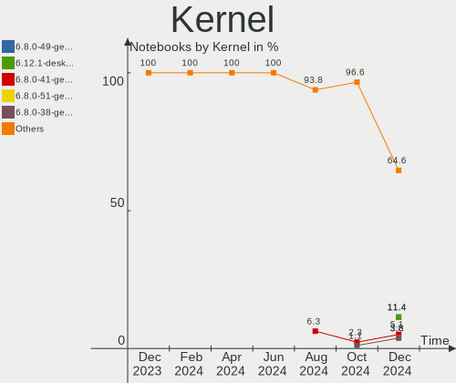
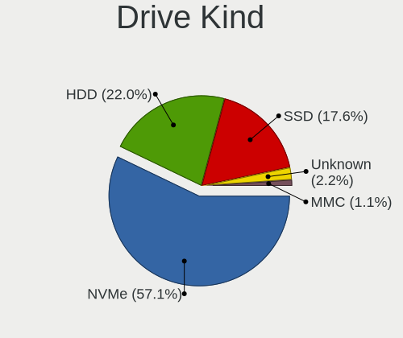
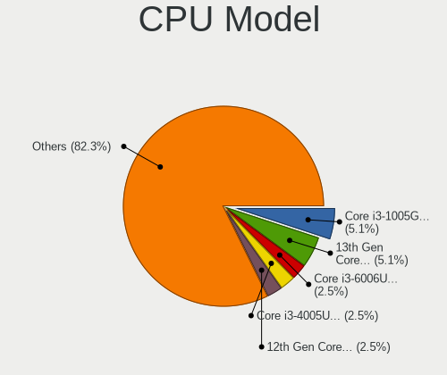
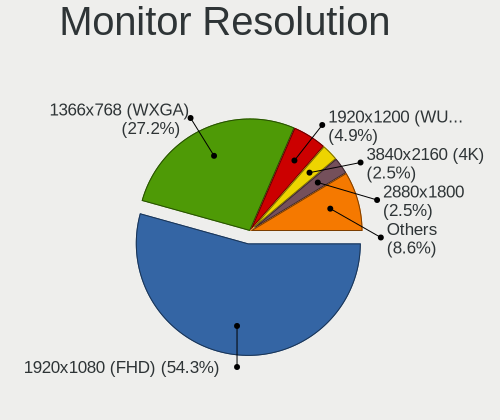
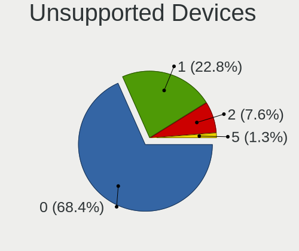

Linux in India - Hardware Trends (Notebooks)
--------------------------------------------

A project to identify most popular hardware characteristics and track their change
over time based on data collected by Linux users at https://Linux-Hardware.org.

Anyone can contribute to this report by the [hw-probe](https://github.com/linuxhw/hw-probe) tool:

    sudo -E hw-probe -all -upload

Period: Nov, 2023.

Contents
--------

* [ System ](#system)
  - [ OS                       ](#os)
  - [ OS Family                ](#os-family)
  - [ Kernel                   ](#kernel)
  - [ Kernel Family            ](#kernel-family)
  - [ Kernel Major Ver.        ](#kernel-major-ver)
  - [ Arch                     ](#arch)
  - [ DE                       ](#de)
  - [ Display Server           ](#display-server)
  - [ Display Manager          ](#display-manager)
  - [ OS Lang                  ](#os-lang)
  - [ Boot Mode                ](#boot-mode)
  - [ Filesystem               ](#filesystem)
  - [ Part. scheme             ](#part-scheme)
  - [ Dual Boot with Linux/BSD ](#dual-boot-with-linuxbsd)
  - [ Dual Boot (Win)          ](#dual-boot-win)

* [ Board ](#board)
  - [ Vendor                   ](#vendor)
  - [ Model                    ](#model)
  - [ Model Family             ](#model-family)
  - [ MFG Year                 ](#mfg-year)
  - [ Form Factor              ](#form-factor)
  - [ Secure Boot              ](#secure-boot)
  - [ Coreboot                 ](#coreboot)
  - [ RAM Size                 ](#ram-size)
  - [ RAM Used                 ](#ram-used)
  - [ Total Drives             ](#total-drives)
  - [ Has CD-ROM               ](#has-cd-rom)
  - [ Has Ethernet             ](#has-ethernet)
  - [ Has WiFi                 ](#has-wifi)
  - [ Has Bluetooth            ](#has-bluetooth)

* [ Location ](#location)
  - [ Country                  ](#country)
  - [ City                     ](#city)

* [ Drives ](#drives)
  - [ Drive Vendor             ](#drive-vendor)
  - [ Drive Model              ](#drive-model)
  - [ HDD Vendor               ](#hdd-vendor)
  - [ SSD Vendor               ](#ssd-vendor)
  - [ Drive Kind               ](#drive-kind)
  - [ Drive Connector          ](#drive-connector)
  - [ Drive Size               ](#drive-size)
  - [ Space Total              ](#space-total)
  - [ Space Used               ](#space-used)
  - [ Malfunc. Drives          ](#malfunc-drives)
  - [ Malfunc. Drive Vendor    ](#malfunc-drive-vendor)
  - [ Malfunc. HDD Vendor      ](#malfunc-hdd-vendor)
  - [ Malfunc. Drive Kind      ](#malfunc-drive-kind)
  - [ Failed Drives            ](#failed-drives)
  - [ Failed Drive Vendor      ](#failed-drive-vendor)
  - [ Drive Status             ](#drive-status)

* [ Storage controller ](#storage-controller)
  - [ Storage Vendor           ](#storage-vendor)
  - [ Storage Model            ](#storage-model)
  - [ Storage Kind             ](#storage-kind)

* [ Processor ](#processor)
  - [ CPU Vendor               ](#cpu-vendor)
  - [ CPU Model                ](#cpu-model)
  - [ CPU Model Family         ](#cpu-model-family)
  - [ CPU Cores                ](#cpu-cores)
  - [ CPU Sockets              ](#cpu-sockets)
  - [ CPU Threads              ](#cpu-threads)
  - [ CPU Op-Modes             ](#cpu-op-modes)
  - [ CPU Microcode            ](#cpu-microcode)
  - [ CPU Microarch            ](#cpu-microarch)

* [ Graphics ](#graphics)
  - [ GPU Vendor               ](#gpu-vendor)
  - [ GPU Model                ](#gpu-model)
  - [ GPU Combo                ](#gpu-combo)
  - [ GPU Driver               ](#gpu-driver)
  - [ GPU Memory               ](#gpu-memory)

* [ Monitor ](#monitor)
  - [ Monitor Vendor           ](#monitor-vendor)
  - [ Monitor Model            ](#monitor-model)
  - [ Monitor Resolution       ](#monitor-resolution)
  - [ Monitor Diagonal         ](#monitor-diagonal)
  - [ Monitor Width            ](#monitor-width)
  - [ Aspect Ratio             ](#aspect-ratio)
  - [ Monitor Area             ](#monitor-area)
  - [ Pixel Density            ](#pixel-density)
  - [ Multiple Monitors        ](#multiple-monitors)

* [ Network ](#network)
  - [ Net Controller Vendor    ](#net-controller-vendor)
  - [ Net Controller Model     ](#net-controller-model)
  - [ Wireless Vendor          ](#wireless-vendor)
  - [ Wireless Model           ](#wireless-model)
  - [ Ethernet Vendor          ](#ethernet-vendor)
  - [ Ethernet Model           ](#ethernet-model)
  - [ Net Controller Kind      ](#net-controller-kind)
  - [ Used Controller          ](#used-controller)
  - [ NICs                     ](#nics)
  - [ IPv6                     ](#ipv6)

* [ Bluetooth ](#bluetooth)
  - [ Bluetooth Vendor         ](#bluetooth-vendor)
  - [ Bluetooth Model          ](#bluetooth-model)

* [ Sound ](#sound)
  - [ Sound Vendor             ](#sound-vendor)
  - [ Sound Model              ](#sound-model)

* [ Memory ](#memory)
  - [ Memory Vendor            ](#memory-vendor)
  - [ Memory Model             ](#memory-model)
  - [ Memory Kind              ](#memory-kind)
  - [ Memory Form Factor       ](#memory-form-factor)
  - [ Memory Size              ](#memory-size)
  - [ Memory Speed             ](#memory-speed)

* [ Printers & scanners ](#printers--scanners)
  - [ Printer Vendor           ](#printer-vendor)
  - [ Printer Model            ](#printer-model)
  - [ Scanner Vendor           ](#scanner-vendor)
  - [ Scanner Model            ](#scanner-model)

* [ Camera ](#camera)
  - [ Camera Vendor            ](#camera-vendor)
  - [ Camera Model             ](#camera-model)

* [ Security ](#security)
  - [ Fingerprint Vendor       ](#fingerprint-vendor)
  - [ Fingerprint Model        ](#fingerprint-model)
  - [ Chipcard Vendor          ](#chipcard-vendor)
  - [ Chipcard Model           ](#chipcard-model)

* [ Unsupported ](#unsupported)
  - [ Unsupported Devices      ](#unsupported-devices)
  - [ Unsupported Device Types ](#unsupported-device-types)

System
------

OS
--

Installed operating systems

| Name                 | Notebooks | Percent |
|----------------------|-----------|---------|
| Ubuntu 22.04         | 11        | 16.42%  |
| Fedora 39            | 7         | 10.45%  |
| Arch Rolling         | 7         | 10.45%  |
| Ubuntu 23.10         | 6         | 8.96%   |
| Pop!_OS 22.04        | 3         | 4.48%   |
| Fedora 38            | 3         | 4.48%   |
| Debian 12            | 3         | 4.48%   |
| Zorin 16             | 2         | 2.99%   |
| Xero Rolling         | 2         | 2.99%   |
| Ubuntu MATE 22.04    | 2         | 2.99%   |
| Ubuntu 23.04         | 2         | 2.99%   |
| KDE neon 22.04       | 2         | 2.99%   |
| Ubuntu 22.10         | 1         | 1.49%   |
| Ubuntu 20.04         | 1         | 1.49%   |
| openSUSE Leap-15.5   | 1         | 1.49%   |
| OpenMandriva 4.3     | 1         | 1.49%   |
| OpenMandriva 23.08   | 1         | 1.49%   |
| NixOS 23.11          | 1         | 1.49%   |
| Manjaro 23.1.0       | 1         | 1.49%   |
| Linux Mint 21.2      | 1         | 1.49%   |
| Linux Mint 21.1      | 1         | 1.49%   |
| Kali 2023.3          | 1         | 1.49%   |
| Guix                 | 1         | 1.49%   |
| Garuda Linux Soaring | 1         | 1.49%   |
| Fedora 36            | 1         | 1.49%   |
| EndeavourOS Rolling  | 1         | 1.49%   |
| Elementary 7.1       | 1         | 1.49%   |
| Deepin 20.9          | 1         | 1.49%   |
| ArcoLinux Rolling    | 1         | 1.49%   |

OS Family
---------

OS without a version

| Name         | Notebooks | Percent |
|--------------|-----------|---------|
| Ubuntu       | 21        | 31.34%  |
| Fedora       | 11        | 16.42%  |
| Arch         | 7         | 10.45%  |
| Pop!_OS      | 3         | 4.48%   |
| Debian       | 3         | 4.48%   |
| Zorin        | 2         | 2.99%   |
| Xero         | 2         | 2.99%   |
| Ubuntu MATE  | 2         | 2.99%   |
| OpenMandriva | 2         | 2.99%   |
| Linux Mint   | 2         | 2.99%   |
| KDE neon     | 2         | 2.99%   |
| openSUSE     | 1         | 1.49%   |
| NixOS        | 1         | 1.49%   |
| Manjaro      | 1         | 1.49%   |
| Kali         | 1         | 1.49%   |
| Guix         | 1         | 1.49%   |
| Garuda Linux | 1         | 1.49%   |
| EndeavourOS  | 1         | 1.49%   |
| Elementary   | 1         | 1.49%   |
| Deepin       | 1         | 1.49%   |
| ArcoLinux    | 1         | 1.49%   |

Kernel
------

Version of the Linux kernel

| Version                      | Notebooks | Percent |
|------------------------------|-----------|---------|
| 6.2.0-36-generic             | 10        | 14.93%  |
| 6.5.9-arch2-1                | 4         | 5.97%   |
| 6.5.6-76060506-generic       | 3         | 4.48%   |
| 6.5.11-300.fc39.x86_64       | 3         | 4.48%   |
| 6.5.0-13-generic             | 3         | 4.48%   |
| 6.5.0-10-generic             | 3         | 4.48%   |
| 6.2.0-37-generic             | 3         | 4.48%   |
| 6.1.0-13-amd64               | 3         | 4.48%   |
| 6.6.2-arch1-1                | 2         | 2.99%   |
| 6.6.1-zen1-1-zen             | 2         | 2.99%   |
| 6.5.12-300.fc39.x86_64       | 2         | 2.99%   |
| 6.6.3-arch1-1                | 1         | 1.49%   |
| 6.6.1-arch1-1                | 1         | 1.49%   |
| 6.6.1-060601-generic         | 1         | 1.49%   |
| 6.5.9-zen2-1-zen             | 1         | 1.49%   |
| 6.5.9-gnu                    | 1         | 1.49%   |
| 6.5.9-300.fc39.x86_64        | 1         | 1.49%   |
| 6.5.9-200.fc38.x86_64        | 1         | 1.49%   |
| 6.5.8-arch1-1                | 1         | 1.49%   |
| 6.5.8-200.fc38.x86_64        | 1         | 1.49%   |
| 6.5.6-300.fc39.x86_64        | 1         | 1.49%   |
| 6.5.12-1-MANJARO             | 1         | 1.49%   |
| 6.5.1-060501-generic         | 1         | 1.49%   |
| 6.5.0-kali3-amd64            | 1         | 1.49%   |
| 6.4.11-desktop-1omv2390      | 1         | 1.49%   |
| 6.2.9-300.fc38.x86_64        | 1         | 1.49%   |
| 6.2.15-100.fc36.x86_64       | 1         | 1.49%   |
| 6.2.0-35-generic             | 1         | 1.49%   |
| 6.2.0-26-generic             | 1         | 1.49%   |
| 6.1.61                       | 1         | 1.49%   |
| 6.1.0-1025-oem               | 1         | 1.49%   |
| 5.19.0-46-generic            | 1         | 1.49%   |
| 5.18.17-amd64-desktop-hwe    | 1         | 1.49%   |
| 5.16.13-desktop-1omv4003     | 1         | 1.49%   |
| 5.15.0-89-generic            | 1         | 1.49%   |
| 5.15.0-88-generic            | 1         | 1.49%   |
| 5.15.0-84-generic            | 1         | 1.49%   |
| 5.15.0-56-generic            | 1         | 1.49%   |
| 5.14.21-150500.55.31-default | 1         | 1.49%   |
| 5.13.0-30-generic            | 1         | 1.49%   |

Kernel Family
-------------

Linux kernel without a distro release

| Version | Notebooks | Percent |
|---------|-----------|---------|
| 6.2.0   | 15        | 22.39%  |
| 6.5.9   | 8         | 11.94%  |
| 6.5.0   | 7         | 10.45%  |
| 6.6.1   | 4         | 5.97%   |
| 6.5.6   | 4         | 5.97%   |
| 6.1.0   | 4         | 5.97%   |
| 5.15.0  | 4         | 5.97%   |
| 6.5.12  | 3         | 4.48%   |
| 6.5.11  | 3         | 4.48%   |
| 6.6.2   | 2         | 2.99%   |
| 6.5.8   | 2         | 2.99%   |
| 6.6.3   | 1         | 1.49%   |
| 6.5.1   | 1         | 1.49%   |
| 6.4.11  | 1         | 1.49%   |
| 6.2.9   | 1         | 1.49%   |
| 6.2.15  | 1         | 1.49%   |
| 6.1.61  | 1         | 1.49%   |
| 5.19.0  | 1         | 1.49%   |
| 5.18.17 | 1         | 1.49%   |
| 5.16.13 | 1         | 1.49%   |
| 5.14.21 | 1         | 1.49%   |
| 5.13.0  | 1         | 1.49%   |

Kernel Major Ver.
-----------------

Linux kernel major version

| Version | Notebooks | Percent |
|---------|-----------|---------|
| 6.5     | 28        | 41.79%  |
| 6.2     | 17        | 25.37%  |
| 6.6     | 7         | 10.45%  |
| 6.1     | 5         | 7.46%   |
| 5.15    | 4         | 5.97%   |
| 6.4     | 1         | 1.49%   |
| 5.19    | 1         | 1.49%   |
| 5.18    | 1         | 1.49%   |
| 5.16    | 1         | 1.49%   |
| 5.14    | 1         | 1.49%   |
| 5.13    | 1         | 1.49%   |

Arch
----

OS architecture (x86_64, i586, etc.)

| Name   | Notebooks | Percent |
|--------|-----------|---------|
| x86_64 | 67        | 100%    |

DE
--

Desktop Environment

| Name       | Notebooks | Percent |
|------------|-----------|---------|
| GNOME      | 45        | 67.16%  |
| KDE5       | 11        | 16.42%  |
| MATE       | 3         | 4.48%   |
| XFCE       | 2         | 2.99%   |
| qtile      | 2         | 2.99%   |
| X-Cinnamon | 1         | 1.49%   |
| Pantheon   | 1         | 1.49%   |
| i3         | 1         | 1.49%   |
| Deepin     | 1         | 1.49%   |

Display Server
--------------

X11 or Wayland

| Name    | Notebooks | Percent |
|---------|-----------|---------|
| X11     | 32        | 47.76%  |
| Wayland | 32        | 47.76%  |
| Tty     | 2         | 2.99%   |
| Unknown | 1         | 1.49%   |

Display Manager
---------------

SDDM, LightDM, etc.

| Name    | Notebooks | Percent |
|---------|-----------|---------|
| GDM3    | 23        | 34.33%  |
| Unknown | 20        | 29.85%  |
| GDM     | 10        | 14.93%  |
| SDDM    | 9         | 13.43%  |
| LightDM | 5         | 7.46%   |

OS Lang
-------

Language

| Lang  | Notebooks | Percent |
|-------|-----------|---------|
| en_IN | 36        | 53.73%  |
| en_US | 28        | 41.79%  |
| C     | 2         | 2.99%   |
| en_GB | 1         | 1.49%   |

Boot Mode
---------

EFI or BIOS

| Mode | Notebooks | Percent |
|------|-----------|---------|
| EFI  | 49        | 73.13%  |
| BIOS | 18        | 26.87%  |

Filesystem
----------

Type of filesystem

| Type    | Notebooks | Percent |
|---------|-----------|---------|
| Ext4    | 37        | 55.22%  |
| Btrfs   | 16        | 23.88%  |
| Tmpfs   | 12        | 17.91%  |
| Xfs     | 1         | 1.49%   |
| Overlay | 1         | 1.49%   |

Part. scheme
------------

Scheme of partitioning

| Type    | Notebooks | Percent |
|---------|-----------|---------|
| GPT     | 48        | 71.64%  |
| Unknown | 17        | 25.37%  |
| MBR     | 2         | 2.99%   |

Dual Boot with Linux/BSD
------------------------

Hosting more than one Linux/BSD

| Dual boot | Notebooks | Percent |
|-----------|-----------|---------|
| No        | 60        | 89.55%  |
| Yes       | 7         | 10.45%  |

Dual Boot (Win)
---------------

Hosting Linux and Windows

| Dual boot | Notebooks | Percent |
|-----------|-----------|---------|
| No        | 47        | 70.15%  |
| Yes       | 20        | 29.85%  |

Board
-----

Vendor
------

Motherboard manufacturer

| Name                           | Notebooks | Percent |
|--------------------------------|-----------|---------|
| Hewlett-Packard                | 25        | 37.31%  |
| Lenovo                         | 12        | 17.91%  |
| ASUSTek Computer               | 11        | 16.42%  |
| Dell                           | 5         | 7.46%   |
| Acer                           | 5         | 7.46%   |
| Timi                           | 3         | 4.48%   |
| Toshiba                        | 1         | 1.49%   |
| MSI                            | 1         | 1.49%   |
| HONOR                          | 1         | 1.49%   |
| FUTOPIA GLOBAL Private Limited | 1         | 1.49%   |
| AVITA                          | 1         | 1.49%   |
| Alienware                      | 1         | 1.49%   |

Model
-----

Motherboard model

| Name                                     | Notebooks | Percent |
|------------------------------------------|-----------|---------|
| Timi Mi NoteBook Pro                     | 2         | 2.99%   |
| HP Pavilion 15                           | 2         | 2.99%   |
| HP Notebook                              | 2         | 2.99%   |
| HP Laptop 15s-fr2xxx                     | 2         | 2.99%   |
| ASUS VivoBook_ASUSLaptop K3402ZA_S3402ZA | 2         | 2.99%   |
| Toshiba Satellite C55-C                  | 1         | 1.49%   |
| Timi RedmiBook 15                        | 1         | 1.49%   |
| MSI Thin GF63 12HW                       | 1         | 1.49%   |
| Lenovo ThinkPad X250 20CLAOMLIN          | 1         | 1.49%   |
| Lenovo ThinkPad E14 Gen 5 21JLCTO1WW     | 1         | 1.49%   |
| Lenovo ThinkPad E14 Gen 3 20YDCTO1WW     | 1         | 1.49%   |
| Lenovo ThinkPad E14 20RAS13J00           | 1         | 1.49%   |
| Lenovo Legion 5 Pro 16ITH6H 82JD         | 1         | 1.49%   |
| Lenovo IdeaPad S540-15IWL                | 1         | 1.49%   |
| Lenovo IdeaPad Gaming 3 15IAH7 82S9      | 1         | 1.49%   |
| Lenovo IdeaPad Gaming 3 15ACH6 82K2      | 1         | 1.49%   |
| Lenovo IdeaPad 5 15ITL05 82FG            | 1         | 1.49%   |
| Lenovo IdeaPad 3 15ALC6 Ub 82KU          | 1         | 1.49%   |
| Lenovo G510 20238                        | 1         | 1.49%   |
| Lenovo G500s 20245                       | 1         | 1.49%   |
| HONOR BRN-FXX                            | 1         | 1.49%   |
| HP Victus by Gaming Laptop 15-fb0xxx     | 1         | 1.49%   |
| HP ProBook 440 G7                        | 1         | 1.49%   |
| HP ProBook 440 G2                        | 1         | 1.49%   |
| HP ProBook 430 G3                        | 1         | 1.49%   |
| HP Pavilion Laptop 15-eh2xxx             | 1         | 1.49%   |
| HP Pavilion Laptop 15-eh1xxx             | 1         | 1.49%   |
| HP Pavilion Laptop 14-dv1xxx             | 1         | 1.49%   |
| HP Pavilion Gaming Laptop 15-ec2xxx      | 1         | 1.49%   |
| HP Pavilion Aero Laptop 13-be0xxx        | 1         | 1.49%   |
| HP Pavilion 11 x360 PC                   | 1         | 1.49%   |
| HP OMEN Laptop 15-en0xxx                 | 1         | 1.49%   |
| HP Laptop 15s-fq5xxx                     | 1         | 1.49%   |
| HP Laptop 15s-eq2xxx                     | 1         | 1.49%   |
| HP Laptop 15s-du3xxx                     | 1         | 1.49%   |
| HP Laptop 15q-bu0xx                      | 1         | 1.49%   |
| HP Laptop 15-hr0xxx                      | 1         | 1.49%   |
| HP EliteBook 840 G1                      | 1         | 1.49%   |
| HP Compaq Presario CQ40                  | 1         | 1.49%   |
| HP 15                                    | 1         | 1.49%   |

Model Family
------------

Motherboard model prefix

| Name                                   | Notebooks | Percent |
|----------------------------------------|-----------|---------|
| HP Pavilion                            | 8         | 11.94%  |
| HP Laptop                              | 7         | 10.45%  |
| ASUS VivoBook                          | 6         | 8.96%   |
| Lenovo IdeaPad                         | 5         | 7.46%   |
| Lenovo ThinkPad                        | 4         | 5.97%   |
| HP ProBook                             | 3         | 4.48%   |
| Dell Inspiron                          | 3         | 4.48%   |
| ASUS ROG                               | 3         | 4.48%   |
| Timi Mi                                | 2         | 2.99%   |
| HP Notebook                            | 2         | 2.99%   |
| Acer Aspire                            | 2         | 2.99%   |
| Toshiba Satellite                      | 1         | 1.49%   |
| Timi RedmiBook                         | 1         | 1.49%   |
| MSI Thin                               | 1         | 1.49%   |
| Lenovo Legion                          | 1         | 1.49%   |
| Lenovo G510                            | 1         | 1.49%   |
| Lenovo G500s                           | 1         | 1.49%   |
| HONOR BRN-FXX                          | 1         | 1.49%   |
| HP Victus                              | 1         | 1.49%   |
| HP OMEN                                | 1         | 1.49%   |
| HP EliteBook                           | 1         | 1.49%   |
| HP Compaq                              | 1         | 1.49%   |
| HP 15                                  | 1         | 1.49%   |
| FUTOPIA GLOBAL Private Limited ULTIMUS | 1         | 1.49%   |
| Dell Vostro                            | 1         | 1.49%   |
| Dell Precision                         | 1         | 1.49%   |
| AVITA NS14A2                           | 1         | 1.49%   |
| ASUS X556UR                            | 1         | 1.49%   |
| ASUS ASUS                              | 1         | 1.49%   |
| Alienware 15                           | 1         | 1.49%   |
| Acer Swift                             | 1         | 1.49%   |
| Acer Predator                          | 1         | 1.49%   |
| Acer Nitro                             | 1         | 1.49%   |

MFG Year
--------

Motherboard manufacture year

| Year | Notebooks | Percent |
|------|-----------|---------|
| 2021 | 15        | 22.39%  |
| 2022 | 10        | 14.93%  |
| 2023 | 9         | 13.43%  |
| 2020 | 6         | 8.96%   |
| 2013 | 6         | 8.96%   |
| 2019 | 5         | 7.46%   |
| 2015 | 4         | 5.97%   |
| 2008 | 3         | 4.48%   |
| 2018 | 2         | 2.99%   |
| 2016 | 2         | 2.99%   |
| 2014 | 2         | 2.99%   |
| 2017 | 1         | 1.49%   |
| 2012 | 1         | 1.49%   |
| 2010 | 1         | 1.49%   |

Form Factor
-----------

Physical design of the computer

| Name     | Notebooks | Percent |
|----------|-----------|---------|
| Notebook | 67        | 100%    |

Secure Boot
-----------

Enabled or disabled

| State    | Notebooks | Percent |
|----------|-----------|---------|
| Disabled | 54        | 80.6%   |
| Enabled  | 13        | 19.4%   |

Coreboot
--------

Have coreboot on board

| Used | Notebooks | Percent |
|------|-----------|---------|
| No   | 67        | 100%    |

RAM Size
--------

Total RAM memory

| Size in GB  | Notebooks | Percent |
|-------------|-----------|---------|
| 8.01-16.0   | 21        | 31.34%  |
| 4.01-8.0    | 20        | 29.85%  |
| 16.01-24.0  | 14        | 20.9%   |
| 3.01-4.0    | 8         | 11.94%  |
| 24.01-32.0  | 2         | 2.99%   |
| 64.01-256.0 | 1         | 1.49%   |
| 1.01-2.0    | 1         | 1.49%   |

RAM Used
--------

Used RAM memory

| Used GB   | Notebooks | Percent |
|-----------|-----------|---------|
| 4.01-8.0  | 21        | 31.34%  |
| 2.01-3.0  | 18        | 26.87%  |
| 3.01-4.0  | 12        | 17.91%  |
| 1.01-2.0  | 12        | 17.91%  |
| 8.01-16.0 | 3         | 4.48%   |
| 0.51-1.0  | 1         | 1.49%   |

Total Drives
------------

Number of drives on board

| Drives | Notebooks | Percent |
|--------|-----------|---------|
| 1      | 56        | 83.58%  |
| 2      | 11        | 16.42%  |

Has CD-ROM
----------

Has CD-ROM on board

| Presented | Notebooks | Percent |
|-----------|-----------|---------|
| No        | 56        | 83.58%  |
| Yes       | 11        | 16.42%  |

Has Ethernet
------------

Has Ethernet on board

| Presented | Notebooks | Percent |
|-----------|-----------|---------|
| Yes       | 46        | 68.66%  |
| No        | 21        | 31.34%  |

Has WiFi
--------

Has WiFi module

| Presented | Notebooks | Percent |
|-----------|-----------|---------|
| Yes       | 66        | 98.51%  |
| No        | 1         | 1.49%   |

Has Bluetooth
-------------

Has Bluetooth module

| Presented | Notebooks | Percent |
|-----------|-----------|---------|
| Yes       | 60        | 89.55%  |
| No        | 7         | 10.45%  |

Location
--------

Country
-------

Geographic location (country)

| Country | Notebooks | Percent |
|---------|-----------|---------|
| India   | 67        | 100%    |

City
----

Geographic location (city)

| City               | Notebooks | Percent |
|--------------------|-----------|---------|
| Chennai            | 10        | 14.93%  |
| Delhi              | 9         | 13.43%  |
| Bengaluru          | 9         | 13.43%  |
| Mumbai             | 5         | 7.46%   |
| Hyderabad          | 4         | 5.97%   |
| Pune               | 3         | 4.48%   |
| Ludhiana           | 3         | 4.48%   |
| Lucknow            | 3         | 4.48%   |
| Thiruvananthapuram | 2         | 2.99%   |
| Kochi              | 2         | 2.99%   |
| Ahmedabad          | 2         | 2.99%   |
| Varanasi           | 1         | 1.49%   |
| Thrissur           | 1         | 1.49%   |
| Salem              | 1         | 1.49%   |
| Patna              | 1         | 1.49%   |
| Panjim             | 1         | 1.49%   |
| Noida              | 1         | 1.49%   |
| Manipal            | 1         | 1.49%   |
| Kolkata            | 1         | 1.49%   |
| Kharagpur          | 1         | 1.49%   |
| Kalyan             | 1         | 1.49%   |
| Jaipur             | 1         | 1.49%   |
| Guwahati           | 1         | 1.49%   |
| Coimbatore         | 1         | 1.49%   |
| Bhubaneswar        | 1         | 1.49%   |
| Bhopal             | 1         | 1.49%   |

Drives
------

Drive Vendor
------------

Hard drive vendors

| Vendor                      | Notebooks | Drives | Percent |
|-----------------------------|-----------|--------|---------|
| Samsung Electronics         | 13        | 13     | 16.25%  |
| WDC                         | 11        | 11     | 13.75%  |
| Micron Technology           | 9         | 9      | 11.25%  |
| SanDisk                     | 8         | 8      | 10%     |
| Seagate                     | 7         | 7      | 8.75%   |
| Intel                       | 7         | 7      | 8.75%   |
| Toshiba                     | 2         | 2      | 2.5%    |
| Micron/Crucial Technology   | 2         | 2      | 2.5%    |
| KIOXIA                      | 2         | 2      | 2.5%    |
| HGST                        | 2         | 2      | 2.5%    |
| Crucial                     | 2         | 2      | 2.5%    |
| YMTC                        | 1         | 1      | 1.25%   |
| Yangtze Memory Technologies | 1         | 1      | 1.25%   |
| Transcend                   | 1         | 1      | 1.25%   |
| SSSTC                       | 1         | 1      | 1.25%   |
| SCCTS-603-128G              | 1         | 1      | 1.25%   |
| Realtek Semiconductor       | 1         | 1      | 1.25%   |
| POWER                       | 1         | 1      | 1.25%   |
| Phison Electronics          | 1         | 1      | 1.25%   |
| Phison                      | 1         | 1      | 1.25%   |
| MARSHAL                     | 1         | 1      | 1.25%   |
| Lite-On Technology          | 1         | 1      | 1.25%   |
| KingFast                    | 1         | 1      | 1.25%   |
| Hewlett-Packard             | 1         | 1      | 1.25%   |
| FORESEE                     | 1         | 1      | 1.25%   |
| BIWIN                       | 1         | 1      | 1.25%   |

Drive Model
-----------

Hard drive models

| Model                                               | Notebooks | Percent |
|-----------------------------------------------------|-----------|---------|
| Micron 2450_MTFDKBA512TFK 512GB                     | 4         | 5%      |
| Seagate ST1000LM024 HN-M101MBB 1TB                  | 3         | 3.75%   |
| Intel SSDPEKNU512GZH 512GB                          | 3         | 3.75%   |
| WDC WD5000LPVX-60V0TT0 500GB                        | 2         | 2.5%    |
| Seagate ST1000LM035-1RK172 1TB                      | 2         | 2.5%    |
| Samsung NVMe SSD Controller PM9A1/PM9A3/980PRO 2TB  | 2         | 2.5%    |
| Samsung MZVLQ512HBLU-00BH1 512GB                    | 2         | 2.5%    |
| Micron/Crucial P2 NVMe PCIe SSD 1TB                 | 2         | 2.5%    |
| Intel SSDPEKNW512GZL 512GB                          | 2         | 2.5%    |
| Intel SSD 660P Series 512GB                         | 2         | 2.5%    |
| YMTC PC005 512GB                                    | 1         | 1.25%   |
| Yangtze Memory YMTC PC005 512GB                     | 1         | 1.25%   |
| WDC WDS120G2G0A-00JH30 120GB SSD                    | 1         | 1.25%   |
| WDC WD5000LPLX-08ZNTT0 500GB                        | 1         | 1.25%   |
| WDC WD5000LPCX-21VHAT0 500GB                        | 1         | 1.25%   |
| WDC WD5000BPKX-60HPJT0 500GB                        | 1         | 1.25%   |
| WDC WD1600BEVT-75ZCT1 160GB                         | 1         | 1.25%   |
| WDC WD10SPZX-21Z10T0 1TB                            | 1         | 1.25%   |
| WDC WD10JPVX-60JC3T0 1TB                            | 1         | 1.25%   |
| WDC WD10JPVX-08JC3T5 1TB                            | 1         | 1.25%   |
| WDC WD Blue SA510 2.5 500GB                         | 1         | 1.25%   |
| Transcend TS1TMTE400S 1TB                           | 1         | 1.25%   |
| Toshiba MQ04ABF100 1TB                              | 1         | 1.25%   |
| Toshiba MQ01ACF050 500GB                            | 1         | 1.25%   |
| SSSTC CL4-8D512 512GB                               | 1         | 1.25%   |
| Seagate ST500LT012-1DG142 500GB                     | 1         | 1.25%   |
| Seagate ST500LM030-2E717D 500GB                     | 1         | 1.25%   |
| SCCTS-603-128G SSD 128GB                            | 1         | 1.25%   |
| Sandisk WD PC SN735 SDBPNHH-1T00-1002 1TB           | 1         | 1.25%   |
| Sandisk WD Blue SN570 1TB                           | 1         | 1.25%   |
| Sandisk WD Blue SN550 NVMe SSD 512GB                | 1         | 1.25%   |
| Sandisk WD Blue SN500 / PC SN520 NVMe SSD 500GB     | 1         | 1.25%   |
| Sandisk WD Black SN750 / PC SN730 NVMe SSD 500GB    | 1         | 1.25%   |
| SanDisk Ultra II 480GB SSD                          | 1         | 1.25%   |
| SanDisk SD9SN8W256G1122 256GB SSD                   | 1         | 1.25%   |
| SanDisk NVMe SSD Drive 512GB                        | 1         | 1.25%   |
| Samsung SSD 990 PRO 2TB                             | 1         | 1.25%   |
| Samsung SSD 850 EVO 120GB                           | 1         | 1.25%   |
| Samsung SSD 750 EVO 250GB                           | 1         | 1.25%   |
| Samsung NVMe SSD Controller SM981/PM981/PM983 250GB | 1         | 1.25%   |

HDD Vendor
----------

Hard disk drive vendors

| Vendor          | Notebooks | Drives | Percent |
|-----------------|-----------|--------|---------|
| WDC             | 9         | 9      | 40.91%  |
| Seagate         | 7         | 7      | 31.82%  |
| Toshiba         | 2         | 2      | 9.09%   |
| HGST            | 2         | 2      | 9.09%   |
| MARSHAL         | 1         | 1      | 4.55%   |
| Hewlett-Packard | 1         | 1      | 4.55%   |

SSD Vendor
----------

Solid state drive vendors

| Vendor              | Notebooks | Drives | Percent |
|---------------------|-----------|--------|---------|
| WDC                 | 2         | 2      | 16.67%  |
| SanDisk             | 2         | 2      | 16.67%  |
| Samsung Electronics | 2         | 2      | 16.67%  |
| Crucial             | 2         | 2      | 16.67%  |
| SCCTS-603-128G      | 1         | 1      | 8.33%   |
| POWER               | 1         | 1      | 8.33%   |
| KingFast            | 1         | 1      | 8.33%   |
| FORESEE             | 1         | 1      | 8.33%   |

Drive Kind
----------

HDD or SSD

| Kind | Notebooks | Drives | Percent |
|------|-----------|--------|---------|
| NVMe | 41        | 46     | 55.41%  |
| HDD  | 21        | 22     | 28.38%  |
| SSD  | 12        | 12     | 16.22%  |

Drive Connector
---------------

SATA, SAS, NVMe, etc.

| Type | Notebooks | Drives | Percent |
|------|-----------|--------|---------|
| NVMe | 41        | 46     | 57.75%  |
| SATA | 29        | 33     | 40.85%  |
| SAS  | 1         | 1      | 1.41%   |

Drive Size
----------

Size of hard drive

| Size in TB | Notebooks | Drives | Percent |
|------------|-----------|--------|---------|
| 0.01-0.5   | 19        | 22     | 63.33%  |
| 0.51-1.0   | 11        | 12     | 36.67%  |

Space Total
-----------

Amount of disk space available on the file system

| Size in GB     | Notebooks | Percent |
|----------------|-----------|---------|
| 251-500        | 24        | 35.82%  |
| 101-250        | 13        | 19.4%   |
| 501-1000       | 11        | 16.42%  |
| 51-100         | 7         | 10.45%  |
| 1001-2000      | 4         | 5.97%   |
| 1-20           | 3         | 4.48%   |
| 21-50          | 2         | 2.99%   |
| 2001-3000      | 2         | 2.99%   |
| More than 3000 | 1         | 1.49%   |

Space Used
----------

Amount of used disk space

| Used GB   | Notebooks | Percent |
|-----------|-----------|---------|
| 1-20      | 23        | 34.33%  |
| 21-50     | 17        | 25.37%  |
| 51-100    | 11        | 16.42%  |
| 101-250   | 9         | 13.43%  |
| 251-500   | 5         | 7.46%   |
| 1001-2000 | 1         | 1.49%   |
| 501-1000  | 1         | 1.49%   |

Malfunc. Drives
---------------

Drive models with a malfunction

| Model                          | Notebooks | Drives | Percent |
|--------------------------------|-----------|--------|---------|
| WDC WD Blue SA510 2.5 500GB    | 1         | 1      | 33.33%  |
| Seagate ST1000LM035-1RK172 1TB | 1         | 1      | 33.33%  |
| HGST HTS725050A7E630 500GB     | 1         | 1      | 33.33%  |

Malfunc. Drive Vendor
---------------------

Vendors of faulty drives

| Vendor  | Notebooks | Drives | Percent |
|---------|-----------|--------|---------|
| WDC     | 1         | 1      | 33.33%  |
| Seagate | 1         | 1      | 33.33%  |
| HGST    | 1         | 1      | 33.33%  |

Malfunc. HDD Vendor
-------------------

Vendors of faulty HDD drives

| Vendor  | Notebooks | Drives | Percent |
|---------|-----------|--------|---------|
| Seagate | 1         | 1      | 50%     |
| HGST    | 1         | 1      | 50%     |

Malfunc. Drive Kind
-------------------

Kinds of faulty drives

| Kind | Notebooks | Drives | Percent |
|------|-----------|--------|---------|
| HDD  | 2         | 2      | 66.67%  |
| SSD  | 1         | 1      | 33.33%  |

Failed Drives
-------------

Failed drive models

Zero info for selected period =(

Failed Drive Vendor
-------------------

Failed drive vendors

Zero info for selected period =(

Drive Status
------------

Number of failed and malfunc. drives

| Status   | Notebooks | Drives | Percent |
|----------|-----------|--------|---------|
| Works    | 33        | 38     | 48.53%  |
| Detected | 32        | 39     | 47.06%  |
| Malfunc  | 3         | 3      | 4.41%   |

Storage controller
------------------

Storage Vendor
--------------

Storage controller vendors

| Vendor                         | Notebooks | Percent |
|--------------------------------|-----------|---------|
| Intel                          | 49        | 53.26%  |
| Samsung Electronics            | 11        | 11.96%  |
| Micron Technology              | 9         | 9.78%   |
| Sandisk                        | 6         | 6.52%   |
| AMD                            | 5         | 5.43%   |
| Phison Electronics             | 2         | 2.17%   |
| Micron/Crucial Technology      | 2         | 2.17%   |
| KIOXIA                         | 2         | 2.17%   |
| Yangtze Memory Technologies    | 1         | 1.09%   |
| Transcend                      | 1         | 1.09%   |
| Solid State Storage Technology | 1         | 1.09%   |
| Realtek Semiconductor          | 1         | 1.09%   |
| Lite-On Technology             | 1         | 1.09%   |
| INNOGRIT                       | 1         | 1.09%   |

Storage Model
-------------

Storage controller models

| Model                                                                       | Notebooks | Percent |
|-----------------------------------------------------------------------------|-----------|---------|
| Intel Volume Management Device NVMe RAID Controller                         | 11        | 11.11%  |
| Samsung NVMe SSD Controller 980 (DRAM-less)                                 | 6         | 6.06%   |
| Intel Sunrise Point-LP SATA Controller [AHCI mode]                          | 6         | 6.06%   |
| Intel SSD 670p Series [Keystone Harbor]                                     | 5         | 5.05%   |
| AMD FCH SATA Controller [AHCI mode]                                         | 5         | 5.05%   |
| Micron 2450 NVMe SSD [HendrixV] (DRAM-less)                                 | 4         | 4.04%   |
| Intel 8 Series SATA Controller 1 [AHCI mode]                                | 4         | 4.04%   |
| Intel Wildcat Point-LP SATA Controller [AHCI Mode]                          | 3         | 3.03%   |
| Intel Tiger Lake-LP SATA Controller                                         | 3         | 3.03%   |
| Intel 7 Series Chipset Family 6-port SATA Controller [AHCI mode]            | 3         | 3.03%   |
| Samsung NVMe SSD Controller PM9A1/PM9A3/980PRO                              | 2         | 2.02%   |
| Micron/Crucial P2 [Nick P2] / P3 / P3 Plus NVMe PCIe SSD (DRAM-less)        | 2         | 2.02%   |
| Micron 2210 NVMe SSD [Cobain]                                               | 2         | 2.02%   |
| KIOXIA NVMe SSD Controller BG4 (DRAM-less)                                  | 2         | 2.02%   |
| Intel SSD 660P Series                                                       | 2         | 2.02%   |
| Intel Comet Lake SATA AHCI Controller                                       | 2         | 2.02%   |
| Intel Alder Lake-P SATA AHCI Controller                                     | 2         | 2.02%   |
| Intel 82801HM/HEM (ICH8M/ICH8M-E) SATA Controller [AHCI mode]               | 2         | 2.02%   |
| Intel 82801HM/HEM (ICH8M/ICH8M-E) IDE Controller                            | 2         | 2.02%   |
| Intel 82801 Mobile SATA Controller [RAID mode]                              | 2         | 2.02%   |
| Yangtze Memory PC005 NVMe SSD                                               | 1         | 1.01%   |
| Transcend NVMe PCIe SSD 110S/112S/120S/MTE300S/MTE400S/MTE652T2 (DRAM-less) | 1         | 1.01%   |
| Solid State Storage CL4-8D512 NVMe SSD M.2 (DRAM-less)                      | 1         | 1.01%   |
| Sandisk WD PC SN740 NVMe SSD 512GB (DRAM-less)                              | 1         | 1.01%   |
| SanDisk WD Blue SN500 / PC SN520 x2 M.2 2280 NVMe SSD                       | 1         | 1.01%   |
| SanDisk Ultra 3D / WD Blue SN570 NVMe SSD (DRAM-less)                       | 1         | 1.01%   |
| SanDisk Ultra 3D / WD Blue SN550 NVMe SSD                                   | 1         | 1.01%   |
| SanDisk PC SN735 NVMe SSD (DRAM-less)                                       | 1         | 1.01%   |
| SanDisk Extreme Pro / WD Black SN750 / PC SN730 / Red SN700 NVMe SSD        | 1         | 1.01%   |
| Samsung NVMe SSD Controller SM981/PM981/PM983                               | 1         | 1.01%   |
| Samsung NVMe SSD Controller S4LV008[Pascal]                                 | 1         | 1.01%   |
| Samsung NVMe SSD Controller PM9B1 (DRAM-less)                               | 1         | 1.01%   |
| Realtek RTS5765DL NVMe SSD Controller (DRAM-less)                           | 1         | 1.01%   |
| Phison PS5019-E19 PCIe4 NVMe Controller (DRAM-less)                         | 1         | 1.01%   |
| Phison E18 PCIe4 NVMe Controller                                            | 1         | 1.01%   |
| Micron 3400 NVMe SSD [Hendrix]                                              | 1         | 1.01%   |
| Micron 2400 NVMe SSD (DRAM-less)                                            | 1         | 1.01%   |
| Micron 2300 NVMe SSD [Santana]                                              | 1         | 1.01%   |
| Lite-On CX2-8B256, CX2-8B512 NVMe SSD                                       | 1         | 1.01%   |
| Intel Volume Management Device NVMe RAID Controller Intel Corporation       | 1         | 1.01%   |

Storage Kind
------------

Kind of storage controller (IDE, SATA, NVMe, SAS, ...)

| Kind | Notebooks | Percent |
|------|-----------|---------|
| NVMe | 41        | 43.16%  |
| SATA | 38        | 40%     |
| RAID | 14        | 14.74%  |
| IDE  | 2         | 2.11%   |

Processor
---------

CPU Vendor
----------

Processor vendors

| Vendor | Notebooks | Percent |
|--------|-----------|---------|
| Intel  | 53        | 79.1%   |
| AMD    | 14        | 20.9%   |

CPU Model
---------

Processor models

| Model                                   | Notebooks | Percent |
|-----------------------------------------|-----------|---------|
| AMD Ryzen 5 5500U with Radeon Graphics  | 4         | 5.97%   |
| Intel Core i5-6200U CPU @ 2.30GHz       | 3         | 4.48%   |
| Intel 12th Gen Core i5-12500H           | 3         | 4.48%   |
| Intel 12th Gen Core i5-12450H           | 3         | 4.48%   |
| Intel 11th Gen Core i3-1115G4 @ 3.00GHz | 3         | 4.48%   |
| Intel Core i5-8265U CPU @ 1.60GHz       | 2         | 2.99%   |
| Intel Core i5-8250U CPU @ 1.60GHz       | 2         | 2.99%   |
| Intel 12th Gen Core i5-1235U            | 2         | 2.99%   |
| Intel 11th Gen Core i5-1135G7 @ 2.40GHz | 2         | 2.99%   |
| Intel 11th Gen Core i5-11300H @ 3.10GHz | 2         | 2.99%   |
| AMD Ryzen 5 5600H with Radeon Graphics  | 2         | 2.99%   |
| Intel Pentium CPU N3710 @ 1.60GHz       | 1         | 1.49%   |
| Intel Core M-5Y10c CPU @ 0.80GHz        | 1         | 1.49%   |
| Intel Core i7-7700HQ CPU @ 2.80GHz      | 1         | 1.49%   |
| Intel Core i7-6500U CPU @ 2.50GHz       | 1         | 1.49%   |
| Intel Core i7-5600U CPU @ 2.60GHz       | 1         | 1.49%   |
| Intel Core i7-4510U CPU @ 2.00GHz       | 1         | 1.49%   |
| Intel Core i7-10510U CPU @ 1.80GHz      | 1         | 1.49%   |
| Intel Core i5-5200U CPU @ 2.20GHz       | 1         | 1.49%   |
| Intel Core i5-4300U CPU @ 1.90GHz       | 1         | 1.49%   |
| Intel Core i5-4200M CPU @ 2.50GHz       | 1         | 1.49%   |
| Intel Core i5-10300H CPU @ 2.50GHz      | 1         | 1.49%   |
| Intel Core i5-10210U CPU @ 1.60GHz      | 1         | 1.49%   |
| Intel Core i5 CPU M 520 @ 2.40GHz       | 1         | 1.49%   |
| Intel Core i3-6006U CPU @ 2.00GHz       | 1         | 1.49%   |
| Intel Core i3-4030U CPU @ 1.90GHz       | 1         | 1.49%   |
| Intel Core i3-4005U CPU @ 1.70GHz       | 1         | 1.49%   |
| Intel Core i3-3227U CPU @ 1.90GHz       | 1         | 1.49%   |
| Intel Core i3-3120M CPU @ 2.50GHz       | 1         | 1.49%   |
| Intel Core i3-2370M CPU @ 2.40GHz       | 1         | 1.49%   |
| Intel Core 2 Duo CPU T6500 @ 2.10GHz    | 1         | 1.49%   |
| Intel Core 2 Duo CPU T5750 @ 2.00GHz    | 1         | 1.49%   |
| Intel Core 2 Duo CPU T5670 @ 1.80GHz    | 1         | 1.49%   |
| Intel Celeron N4020 CPU @ 1.10GHz       | 1         | 1.49%   |
| Intel 13th Gen Core i9-13980HX          | 1         | 1.49%   |
| Intel 13th Gen Core i7-13700HX          | 1         | 1.49%   |
| Intel 13th Gen Core i5-13500H           | 1         | 1.49%   |
| Intel 13th Gen Core i5-1340P            | 1         | 1.49%   |
| Intel 13th Gen Core i5-1335U            | 1         | 1.49%   |
| Intel 12th Gen Core i7-12700H           | 1         | 1.49%   |

CPU Model Family
----------------

Processor model prefix

| Model            | Notebooks | Percent |
|------------------|-----------|---------|
| Other            | 23        | 34.33%  |
| Intel Core i5    | 13        | 19.4%   |
| AMD Ryzen 5      | 9         | 13.43%  |
| Intel Core i3    | 6         | 8.96%   |
| Intel Core i7    | 5         | 7.46%   |
| Intel Core 2 Duo | 3         | 4.48%   |
| AMD Ryzen 7      | 3         | 4.48%   |
| AMD Ryzen 9      | 2         | 2.99%   |
| Intel Pentium    | 1         | 1.49%   |
| Intel Core M     | 1         | 1.49%   |
| Intel Celeron    | 1         | 1.49%   |

CPU Cores
---------

Number of processor cores

| Number | Notebooks | Percent |
|--------|-----------|---------|
| 2      | 24        | 35.82%  |
| 4      | 15        | 22.39%  |
| 8      | 9         | 13.43%  |
| 6      | 8         | 11.94%  |
| 12     | 5         | 7.46%   |
| 10     | 3         | 4.48%   |
| 24     | 1         | 1.49%   |
| 16     | 1         | 1.49%   |
| 14     | 1         | 1.49%   |

CPU Sockets
-----------

Number of sockets

| Number | Notebooks | Percent |
|--------|-----------|---------|
| 1      | 67        | 100%    |

CPU Threads
-----------

Threads per core (Hyper-Threading)

| Number | Notebooks | Percent |
|--------|-----------|---------|
| 2      | 60        | 89.55%  |
| 1      | 7         | 10.45%  |

CPU Op-Modes
------------

CPU Operation Modes (32-bit, 64-bit)

| Op mode        | Notebooks | Percent |
|----------------|-----------|---------|
| 32-bit, 64-bit | 67        | 100%    |

CPU Microcode
-------------

Microcode number

| Number     | Notebooks | Percent |
|------------|-----------|---------|
| Unknown    | 48        | 71.64%  |
| 0x0a50000c | 4         | 5.97%   |
| 0x08608103 | 3         | 4.48%   |
| 0x306a9    | 2         | 2.99%   |
| 0xb06a2    | 1         | 1.49%   |
| 0x806ec    | 1         | 1.49%   |
| 0x806eb    | 1         | 1.49%   |
| 0x806c1    | 1         | 1.49%   |
| 0x6fd      | 1         | 1.49%   |
| 0x406e3    | 1         | 1.49%   |
| 0x206a7    | 1         | 1.49%   |
| 0x1067a    | 1         | 1.49%   |
| 0x0a50000d | 1         | 1.49%   |
| 0x0a404101 | 1         | 1.49%   |

CPU Microarch
-------------

Microarchitecture

| Name             | Notebooks | Percent |
|------------------|-----------|---------|
| Alderlake Hybrid | 12        | 17.91%  |
| Unknown          | 9         | 13.43%  |
| TigerLake        | 8         | 11.94%  |
| KabyLake         | 7         | 10.45%  |
| Zen 3            | 6         | 8.96%   |
| Skylake          | 5         | 7.46%   |
| Haswell          | 5         | 7.46%   |
| Broadwell        | 3         | 4.48%   |
| IvyBridge        | 2         | 2.99%   |
| Core             | 2         | 2.99%   |
| Zen+             | 1         | 1.49%   |
| Zen 2            | 1         | 1.49%   |
| Westmere         | 1         | 1.49%   |
| Silvermont       | 1         | 1.49%   |
| SandyBridge      | 1         | 1.49%   |
| Penryn           | 1         | 1.49%   |
| Goldmont plus    | 1         | 1.49%   |
| CometLake        | 1         | 1.49%   |

Graphics
--------

GPU Vendor
----------

Vendors of graphics cards

| Vendor | Notebooks | Percent |
|--------|-----------|---------|
| Intel  | 52        | 59.77%  |
| Nvidia | 19        | 21.84%  |
| AMD    | 16        | 18.39%  |

GPU Model
---------

Graphics card models

| Model                                                                         | Notebooks | Percent |
|-------------------------------------------------------------------------------|-----------|---------|
| Intel TigerLake-LP GT2 [Iris Xe Graphics]                                     | 5         | 5.43%   |
| Intel Skylake GT2 [HD Graphics 520]                                           | 5         | 5.43%   |
| AMD Lucienne                                                                  | 5         | 5.43%   |
| AMD Cezanne [Radeon Vega Series / Radeon Vega Mobile Series]                  | 5         | 5.43%   |
| Intel Haswell-ULT Integrated Graphics Controller                              | 4         | 4.35%   |
| Intel Alder Lake-P GT2 [Iris Xe Graphics]                                     | 4         | 4.35%   |
| Nvidia GA107M [GeForce RTX 3050 Mobile]                                       | 3         | 3.26%   |
| Intel Tiger Lake-LP GT2 [UHD Graphics G4]                                     | 3         | 3.26%   |
| Intel Raptor Lake-P [Iris Xe Graphics]                                        | 3         | 3.26%   |
| Intel Alder Lake-P GT1 [UHD Graphics]                                         | 3         | 3.26%   |
| Nvidia TU117M [GeForce GTX 1650 Mobile / Max-Q]                               | 2         | 2.17%   |
| Nvidia GF117M [GeForce 610M/710M/810M/820M / GT 620M/625M/630M/720M]          | 2         | 2.17%   |
| Intel WhiskeyLake-U GT2 [UHD Graphics 620]                                    | 2         | 2.17%   |
| Intel UHD Graphics 620                                                        | 2         | 2.17%   |
| Intel Mobile GM965/GL960 Integrated Graphics Controller (secondary)           | 2         | 2.17%   |
| Intel Mobile GM965/GL960 Integrated Graphics Controller (primary)             | 2         | 2.17%   |
| Intel HD Graphics 5500                                                        | 2         | 2.17%   |
| Intel CometLake-U GT2 [UHD Graphics]                                          | 2         | 2.17%   |
| Intel 3rd Gen Core processor Graphics Controller                              | 2         | 2.17%   |
| AMD Sun XT [Radeon HD 8670A/8670M/8690M / R5 M330 / M430 / Radeon 520 Mobile] | 2         | 2.17%   |
| Nvidia TU106M [GeForce RTX 2060 Mobile]                                       | 1         | 1.09%   |
| Nvidia GT216GLM [Quadro FX 880M]                                              | 1         | 1.09%   |
| Nvidia GP108M [GeForce MX250]                                                 | 1         | 1.09%   |
| Nvidia GP108BM [GeForce MX250]                                                | 1         | 1.09%   |
| Nvidia GP107M [GeForce MX350]                                                 | 1         | 1.09%   |
| Nvidia GP106BM [GeForce GTX 1060 Mobile 6GB]                                  | 1         | 1.09%   |
| Nvidia GM108M [GeForce MX130]                                                 | 1         | 1.09%   |
| Nvidia GM108M [GeForce 930MX]                                                 | 1         | 1.09%   |
| Nvidia GM108M [GeForce 830M]                                                  | 1         | 1.09%   |
| Nvidia GA106M [GeForce RTX 3060 Mobile / Max-Q]                               | 1         | 1.09%   |
| Nvidia AD107M [GeForce RTX 4060 Max-Q / Mobile]                               | 1         | 1.09%   |
| Nvidia AD106M [GeForce RTX 4070 Max-Q / Mobile]                               | 1         | 1.09%   |
| Intel TigerLake-H GT1 [UHD Graphics]                                          | 1         | 1.09%   |
| Intel Raptor Lake-S UHD Graphics                                              | 1         | 1.09%   |
| Intel Mobile 4 Series Chipset Integrated Graphics Controller                  | 1         | 1.09%   |
| Intel HD Graphics 630                                                         | 1         | 1.09%   |
| Intel HD Graphics 5300                                                        | 1         | 1.09%   |
| Intel GeminiLake [UHD Graphics 600]                                           | 1         | 1.09%   |
| Intel DG2 [Arc A370M]                                                         | 1         | 1.09%   |
| Intel CometLake-H GT2 [UHD Graphics]                                          | 1         | 1.09%   |

GPU Combo
---------

Combinations of graphics cards

| Name           | Notebooks | Percent |
|----------------|-----------|---------|
| 1 x Intel      | 36        | 53.73%  |
| Intel + Nvidia | 13        | 19.4%   |
| 1 x AMD        | 8         | 11.94%  |
| AMD + Nvidia   | 4         | 5.97%   |
| 2 x AMD        | 2         | 2.99%   |
| 1 x Nvidia     | 2         | 2.99%   |
| Intel + AMD    | 2         | 2.99%   |

GPU Driver
----------

Free vs proprietary

| Driver      | Notebooks | Percent |
|-------------|-----------|---------|
| Free        | 56        | 83.58%  |
| Proprietary | 9         | 13.43%  |
| Unknown     | 2         | 2.99%   |

GPU Memory
----------

Total video memory

| Size in GB | Notebooks | Percent |
|------------|-----------|---------|
| Unknown    | 54        | 80.6%   |
| 0.01-0.5   | 5         | 7.46%   |
| 0.51-1.0   | 3         | 4.48%   |
| 3.01-4.0   | 2         | 2.99%   |
| 1.01-2.0   | 2         | 2.99%   |
| 8.01-16.0  | 1         | 1.49%   |

Monitor
-------

Monitor Vendor
--------------

Monitor vendors

| Vendor              | Notebooks | Percent |
|---------------------|-----------|---------|
| BOE                 | 17        | 23.29%  |
| Chimei Innolux      | 13        | 17.81%  |
| Samsung Electronics | 12        | 16.44%  |
| LG Display          | 9         | 12.33%  |
| AU Optronics        | 9         | 12.33%  |
| PANDA               | 4         | 5.48%   |
| Sony                | 1         | 1.37%   |
| LG Philips          | 1         | 1.37%   |
| InfoVision          | 1         | 1.37%   |
| HKC                 | 1         | 1.37%   |
| HCL                 | 1         | 1.37%   |
| Dell                | 1         | 1.37%   |
| CSO                 | 1         | 1.37%   |
| BenQ                | 1         | 1.37%   |
| Acer                | 1         | 1.37%   |

Monitor Model
-------------

Monitor models

| Model                                                                 | Notebooks | Percent |
|-----------------------------------------------------------------------|-----------|---------|
| Samsung Electronics LCD Monitor SDC4161 1920x1080 344x194mm 15.5-inch | 3         | 4.05%   |
| Chimei Innolux LCD Monitor CMN153B 1920x1080 344x193mm 15.5-inch      | 3         | 4.05%   |
| Samsung Electronics LF24T35 SAM707D 1920x1080 528x297mm 23.9-inch     | 2         | 2.7%    |
| Samsung Electronics LCD Monitor SDC4171 2880x1800 302x189mm 14.0-inch | 2         | 2.7%    |
| LG Display LCD Monitor LGD05FE 1920x1080 344x194mm 15.5-inch          | 2         | 2.7%    |
| Chimei Innolux LCD Monitor CMN15F5 1920x1080 344x193mm 15.5-inch      | 2         | 2.7%    |
| Chimei Innolux LCD Monitor CMN1515 1920x1080 344x193mm 15.5-inch      | 2         | 2.7%    |
| AU Optronics LCD Monitor AUO38ED 1920x1080 344x193mm 15.5-inch        | 2         | 2.7%    |
| Sony TV SNYAB03 1920x1080                                             | 1         | 1.35%   |
| Samsung Electronics S20D300 SAM0B37 1600x900 432x240mm 19.5-inch      | 1         | 1.35%   |
| Samsung Electronics LCD Monitor SEC544B 1600x900 382x215mm 17.3-inch  | 1         | 1.35%   |
| Samsung Electronics LCD Monitor SEC3358 1280x800 331x207mm 15.4-inch  | 1         | 1.35%   |
| Samsung Electronics LCD Monitor SDC4A42 1366x768 309x174mm 14.0-inch  | 1         | 1.35%   |
| Samsung Electronics LCD Monitor SDC4141 1366x768 344x194mm 15.5-inch  | 1         | 1.35%   |
| Samsung Electronics LCD Monitor SDC354A 1366x768 344x194mm 15.5-inch  | 1         | 1.35%   |
| PANDA LCD Monitor NCP0059 2560x1600 302x189mm 14.0-inch               | 1         | 1.35%   |
| PANDA LCD Monitor NCP004F 1920x1080 309x174mm 14.0-inch               | 1         | 1.35%   |
| PANDA LCD Monitor NCP004D 1920x1080 344x194mm 15.5-inch               | 1         | 1.35%   |
| PANDA LCD Monitor NCP003F 1920x1080 344x194mm 15.5-inch               | 1         | 1.35%   |
| LG Philips LCD Monitor LPLE800 1280x800 304x190mm 14.1-inch           | 1         | 1.35%   |
| LG Display LCD Monitor LGD070B 1920x1080 309x174mm 14.0-inch          | 1         | 1.35%   |
| LG Display LCD Monitor LGD062E 1920x1080 344x194mm 15.5-inch          | 1         | 1.35%   |
| LG Display LCD Monitor LGD0563 1920x1080 344x194mm 15.5-inch          | 1         | 1.35%   |
| LG Display LCD Monitor LGD03DF 1366x768 344x194mm 15.5-inch           | 1         | 1.35%   |
| LG Display LCD Monitor LGD03CD 1366x768 277x156mm 12.5-inch           | 1         | 1.35%   |
| LG Display LCD Monitor LGD0384 1366x768 344x194mm 15.5-inch           | 1         | 1.35%   |
| LG Display LCD Monitor LGD02E3 1366x768 344x194mm 15.5-inch           | 1         | 1.35%   |
| InfoVision LCD Monitor IVO8C44 1920x1200 302x189mm 14.0-inch          | 1         | 1.35%   |
| HKC LCD Monitor HKC36BB 1366x768 309x174mm 14.0-inch                  | 1         | 1.35%   |
| HCL HCMEEWBD11 HCMB486 1366x768 410x230mm 18.5-inch                   | 1         | 1.35%   |
| Dell S2218H DELD0B8 1920x1080 480x270mm 21.7-inch                     | 1         | 1.35%   |
| CSO LCD Monitor CSO1606 2560x1600 345x215mm 16.0-inch                 | 1         | 1.35%   |
| Chimei Innolux LCD Monitor CMN1521 1920x1080 344x193mm 15.5-inch      | 1         | 1.35%   |
| Chimei Innolux LCD Monitor CMN14E5 1920x1080 309x173mm 13.9-inch      | 1         | 1.35%   |
| Chimei Innolux LCD Monitor CMN14D5 1920x1080 309x173mm 13.9-inch      | 1         | 1.35%   |
| Chimei Innolux LCD Monitor CMN14A3 1600x900 309x174mm 14.0-inch       | 1         | 1.35%   |
| Chimei Innolux LCD Monitor CMN1368 1366x768 293x164mm 13.2-inch       | 1         | 1.35%   |
| Chimei Innolux LCD Monitor CMN1136 1366x768 256x144mm 11.6-inch       | 1         | 1.35%   |
| BOE LCD Monitor BOE0B4C 1920x1200 345x215mm 16.0-inch                 | 1         | 1.35%   |
| BOE LCD Monitor BOE0A55 2560x1440 344x194mm 15.5-inch                 | 1         | 1.35%   |

Monitor Resolution
------------------

Monitor screen resolution

| Resolution        | Notebooks | Percent |
|-------------------|-----------|---------|
| 1920x1080 (FHD)   | 38        | 54.29%  |
| 1366x768 (WXGA)   | 13        | 18.57%  |
| 2560x1600         | 4         | 5.71%   |
| 1920x1200 (WUXGA) | 3         | 4.29%   |
| 1600x900 (HD+)    | 3         | 4.29%   |
| 3840x2160 (4K)    | 2         | 2.86%   |
| 2880x1800         | 2         | 2.86%   |
| 2560x1440 (QHD)   | 2         | 2.86%   |
| 1280x800 (WXGA)   | 2         | 2.86%   |
| 2288x1287         | 1         | 1.43%   |

Monitor Diagonal
----------------

Diagonal size in inches

| Inches | Notebooks | Percent |
|--------|-----------|---------|
| 15     | 42        | 56.76%  |
| 14     | 13        | 17.57%  |
| 13     | 5         | 6.76%   |
| 16     | 3         | 4.05%   |
| 27     | 2         | 2.7%    |
| 24     | 2         | 2.7%    |
| 72     | 1         | 1.35%   |
| 21     | 1         | 1.35%   |
| 19     | 1         | 1.35%   |
| 18     | 1         | 1.35%   |
| 17     | 1         | 1.35%   |
| 12     | 1         | 1.35%   |
| 11     | 1         | 1.35%   |

Monitor Width
-------------

Physical width

| Width in mm | Notebooks | Percent |
|-------------|-----------|---------|
| 301-350     | 60        | 81.08%  |
| 201-300     | 5         | 6.76%   |
| 501-600     | 3         | 4.05%   |
| 401-500     | 3         | 4.05%   |
| 601-700     | 1         | 1.35%   |
| 351-400     | 1         | 1.35%   |
| 1501-2000   | 1         | 1.35%   |

Aspect Ratio
------------

Proportional relationship between the width and the height

| Ratio | Notebooks | Percent |
|-------|-----------|---------|
| 16/9  | 54        | 81.82%  |
| 16/10 | 12        | 18.18%  |

Monitor Area
------------

Area in inch

| Area in inch | Notebooks | Percent |
|----------------|-----------|---------|
| 101-110        | 42        | 56.76%  |
| 81-90          | 16        | 21.62%  |
| 201-250        | 3         | 4.05%   |
| 111-120        | 3         | 4.05%   |
| 71-80          | 2         | 2.7%    |
| 301-350        | 2         | 2.7%    |
| More than 1000 | 1         | 1.35%   |
| 61-70          | 1         | 1.35%   |
| 51-60          | 1         | 1.35%   |
| 151-200        | 1         | 1.35%   |
| 141-150        | 1         | 1.35%   |
| 121-130        | 1         | 1.35%   |

Pixel Density
-------------

Pixels per inch

| Density       | Notebooks | Percent |
|---------------|-----------|---------|
| 121-160       | 40        | 54.79%  |
| 101-120       | 15        | 20.55%  |
| 161-240       | 8         | 10.96%  |
| 51-100        | 6         | 8.22%   |
| More than 240 | 3         | 4.11%   |
| 1-50          | 1         | 1.37%   |

Multiple Monitors
-----------------

Total monitors connected

| Total | Notebooks | Percent |
|-------|-----------|---------|
| 1     | 58        | 86.57%  |
| 2     | 8         | 11.94%  |
| 0     | 1         | 1.49%   |

Network
-------

Net Controller Vendor
---------------------

Controller vendors

| Vendor                   | Notebooks | Percent |
|--------------------------|-----------|---------|
| Realtek Semiconductor    | 46        | 45.1%   |
| Intel                    | 29        | 28.43%  |
| Broadcom                 | 7         | 6.86%   |
| Qualcomm Atheros         | 6         | 5.88%   |
| MediaTek                 | 6         | 5.88%   |
| Xiaomi                   | 2         | 1.96%   |
| ASIX Electronics         | 2         | 1.96%   |
| Samsung Electronics      | 1         | 0.98%   |
| Ralink                   | 1         | 0.98%   |
| Marvell Technology Group | 1         | 0.98%   |
| Google                   | 1         | 0.98%   |

Net Controller Model
--------------------

Controller models

| Model                                                              | Notebooks | Percent |
|--------------------------------------------------------------------|-----------|---------|
| Realtek RTL8111/8168/8411 PCI Express Gigabit Ethernet Controller  | 23        | 19.49%  |
| Realtek RTL810xE PCI Express Fast Ethernet controller              | 10        | 8.47%   |
| Realtek RTL8822CE 802.11ac PCIe Wireless Network Adapter           | 8         | 6.78%   |
| Intel Alder Lake-P PCH CNVi WiFi                                   | 7         | 5.93%   |
| Realtek RTL8723BE PCIe Wireless Network Adapter                    | 4         | 3.39%   |
| MediaTek MT7921 802.11ax PCI Express Wireless Network Adapter      | 4         | 3.39%   |
| Intel Wi-Fi 6 AX201                                                | 4         | 3.39%   |
| Broadcom BCM43142 802.11b/g/n                                      | 4         | 3.39%   |
| Realtek RTL8852BE PCIe 802.11ax Wireless Network Controller        | 2         | 1.69%   |
| Realtek RTL8852AE 802.11ax PCIe Wireless Network Adapter           | 2         | 1.69%   |
| Qualcomm Atheros QCA8172 Fast Ethernet                             | 2         | 1.69%   |
| Qualcomm Atheros QCA6174 802.11ac Wireless Network Adapter         | 2         | 1.69%   |
| Intel Comet Lake PCH-LP CNVi WiFi                                  | 2         | 1.69%   |
| Intel Cannon Point-LP CNVi [Wireless-AC]                           | 2         | 1.69%   |
| Intel 700 Series Chipset Family Wi-Fi                              | 2         | 1.69%   |
| Broadcom BCM4312 802.11b/g LP-PHY                                  | 2         | 1.69%   |
| ASIX AX88179 Gigabit Ethernet                                      | 2         | 1.69%   |
| Xiaomi Mi/Redmi series (RNDIS)                                     | 1         | 0.85%   |
| Xiaomi Mi/Redmi series (RNDIS + ADB)                               | 1         | 0.85%   |
| Samsung Galaxy series, misc. (tethering mode)                      | 1         | 0.85%   |
| Realtek RTL8852BE PCIe 802.11ax Wireless Network Controller [1T1R] | 1         | 0.85%   |
| Realtek RTL8821CE 802.11ac PCIe Wireless Network Adapter           | 1         | 0.85%   |
| Realtek RTL8723DE Wireless Network Adapter                         | 1         | 0.85%   |
| Realtek RTL8723BU 802.11b/g/n WLAN Adapter                         | 1         | 0.85%   |
| Realtek RTL8188ETV Wireless LAN 802.11n Network Adapter            | 1         | 0.85%   |
| Realtek RTL8152 Fast Ethernet Adapter                              | 1         | 0.85%   |
| Realtek RTL8125 2.5GbE Controller                                  | 1         | 0.85%   |
| Realtek Killer E2600 Gigabit Ethernet Controller                   | 1         | 0.85%   |
| Realtek 802.11n WLAN Adapter                                       | 1         | 0.85%   |
| Ralink RT3290 Wireless 802.11n 1T/1R PCIe                          | 1         | 0.85%   |
| Qualcomm Atheros QCA9565 / AR9565 Wireless Network Adapter         | 1         | 0.85%   |
| Qualcomm Atheros Killer E2500 Gigabit Ethernet Controller          | 1         | 0.85%   |
| Qualcomm Atheros AR9485 Wireless Network Adapter                   | 1         | 0.85%   |
| MediaTek Wi-Fi 6E MT7902 Wireless Network Adapter                  | 1         | 0.85%   |
| MediaTek MT7922 802.11ax PCI Express Wireless Network Adapter      | 1         | 0.85%   |
| Marvell Group 88E8040 PCI-E Fast Ethernet Controller               | 1         | 0.85%   |
| Intel Wireless 8265 / 8275                                         | 1         | 0.85%   |
| Intel Wireless 8260                                                | 1         | 0.85%   |
| Intel Wireless 7265                                                | 1         | 0.85%   |
| Intel Wireless 3165                                                | 1         | 0.85%   |

Wireless Vendor
---------------

Wireless vendors

| Vendor                | Notebooks | Percent |
|-----------------------|-----------|---------|
| Intel                 | 28        | 41.18%  |
| Realtek Semiconductor | 22        | 32.35%  |
| Broadcom              | 7         | 10.29%  |
| MediaTek              | 6         | 8.82%   |
| Qualcomm Atheros      | 4         | 5.88%   |
| Ralink                | 1         | 1.47%   |

Wireless Model
--------------

Wireless models

| Model                                                              | Notebooks | Percent |
|--------------------------------------------------------------------|-----------|---------|
| Realtek RTL8822CE 802.11ac PCIe Wireless Network Adapter           | 8         | 11.76%  |
| Intel Alder Lake-P PCH CNVi WiFi                                   | 7         | 10.29%  |
| Realtek RTL8723BE PCIe Wireless Network Adapter                    | 4         | 5.88%   |
| MediaTek MT7921 802.11ax PCI Express Wireless Network Adapter      | 4         | 5.88%   |
| Intel Wi-Fi 6 AX201                                                | 4         | 5.88%   |
| Broadcom BCM43142 802.11b/g/n                                      | 4         | 5.88%   |
| Realtek RTL8852BE PCIe 802.11ax Wireless Network Controller        | 2         | 2.94%   |
| Realtek RTL8852AE 802.11ax PCIe Wireless Network Adapter           | 2         | 2.94%   |
| Qualcomm Atheros QCA6174 802.11ac Wireless Network Adapter         | 2         | 2.94%   |
| Intel Comet Lake PCH-LP CNVi WiFi                                  | 2         | 2.94%   |
| Intel Cannon Point-LP CNVi [Wireless-AC]                           | 2         | 2.94%   |
| Intel 700 Series Chipset Family Wi-Fi                              | 2         | 2.94%   |
| Broadcom BCM4312 802.11b/g LP-PHY                                  | 2         | 2.94%   |
| Realtek RTL8852BE PCIe 802.11ax Wireless Network Controller [1T1R] | 1         | 1.47%   |
| Realtek RTL8821CE 802.11ac PCIe Wireless Network Adapter           | 1         | 1.47%   |
| Realtek RTL8723DE Wireless Network Adapter                         | 1         | 1.47%   |
| Realtek RTL8723BU 802.11b/g/n WLAN Adapter                         | 1         | 1.47%   |
| Realtek RTL8188ETV Wireless LAN 802.11n Network Adapter            | 1         | 1.47%   |
| Realtek 802.11n WLAN Adapter                                       | 1         | 1.47%   |
| Ralink RT3290 Wireless 802.11n 1T/1R PCIe                          | 1         | 1.47%   |
| Qualcomm Atheros QCA9565 / AR9565 Wireless Network Adapter         | 1         | 1.47%   |
| Qualcomm Atheros AR9485 Wireless Network Adapter                   | 1         | 1.47%   |
| MediaTek Wi-Fi 6E MT7902 Wireless Network Adapter                  | 1         | 1.47%   |
| MediaTek MT7922 802.11ax PCI Express Wireless Network Adapter      | 1         | 1.47%   |
| Intel Wireless 8265 / 8275                                         | 1         | 1.47%   |
| Intel Wireless 8260                                                | 1         | 1.47%   |
| Intel Wireless 7265                                                | 1         | 1.47%   |
| Intel Wireless 3165                                                | 1         | 1.47%   |
| Intel Wireless 3160                                                | 1         | 1.47%   |
| Intel Wi-Fi 6 AX210/AX211/AX411 160MHz                             | 1         | 1.47%   |
| Intel Wi-Fi 6 AX200                                                | 1         | 1.47%   |
| Intel Tiger Lake PCH CNVi WiFi                                     | 1         | 1.47%   |
| Intel Raptor Lake PCH CNVi WiFi                                    | 1         | 1.47%   |
| Intel Centrino Wireless-N 135                                      | 1         | 1.47%   |
| Intel Centrino Wireless-N 1000 [Condor Peak]                       | 1         | 1.47%   |
| Broadcom BCM43224 802.11a/b/g/n                                    | 1         | 1.47%   |

Ethernet Vendor
---------------

Ethernet vendors

| Vendor                   | Notebooks | Percent |
|--------------------------|-----------|---------|
| Realtek Semiconductor    | 36        | 72%     |
| Intel                    | 4         | 8%      |
| Qualcomm Atheros         | 3         | 6%      |
| Xiaomi                   | 2         | 4%      |
| ASIX Electronics         | 2         | 4%      |
| Samsung Electronics      | 1         | 2%      |
| Marvell Technology Group | 1         | 2%      |
| Google                   | 1         | 2%      |

Ethernet Model
--------------

Ethernet models

| Model                                                             | Notebooks | Percent |
|-------------------------------------------------------------------|-----------|---------|
| Realtek RTL8111/8168/8411 PCI Express Gigabit Ethernet Controller | 23        | 46%     |
| Realtek RTL810xE PCI Express Fast Ethernet controller             | 10        | 20%     |
| Qualcomm Atheros QCA8172 Fast Ethernet                            | 2         | 4%      |
| ASIX AX88179 Gigabit Ethernet                                     | 2         | 4%      |
| Xiaomi Mi/Redmi series (RNDIS)                                    | 1         | 2%      |
| Xiaomi Mi/Redmi series (RNDIS + ADB)                              | 1         | 2%      |
| Samsung Galaxy series, misc. (tethering mode)                     | 1         | 2%      |
| Realtek RTL8152 Fast Ethernet Adapter                             | 1         | 2%      |
| Realtek RTL8125 2.5GbE Controller                                 | 1         | 2%      |
| Realtek Killer E2600 Gigabit Ethernet Controller                  | 1         | 2%      |
| Qualcomm Atheros Killer E2500 Gigabit Ethernet Controller         | 1         | 2%      |
| Marvell Group 88E8040 PCI-E Fast Ethernet Controller              | 1         | 2%      |
| Intel Ethernet Connection I218-LM                                 | 1         | 2%      |
| Intel Ethernet Connection (3) I218-LM                             | 1         | 2%      |
| Intel Ethernet Connection (23) I219-V                             | 1         | 2%      |
| Intel 82577LM Gigabit Network Connection                          | 1         | 2%      |
| Google Nexus/Pixel Device (tether)                                | 1         | 2%      |

Net Controller Kind
-------------------

Ethernet, WiFi or modem

| Kind     | Notebooks | Percent |
|----------|-----------|---------|
| WiFi     | 66        | 58.93%  |
| Ethernet | 46        | 41.07%  |

Used Controller
---------------

Currently used network controller

| Kind     | Notebooks | Percent |
|----------|-----------|---------|
| WiFi     | 55        | 80.88%  |
| Ethernet | 13        | 19.12%  |

NICs
----

Total network controllers on board

| Total | Notebooks | Percent |
|-------|-----------|---------|
| 2     | 42        | 62.69%  |
| 1     | 24        | 35.82%  |
| 0     | 1         | 1.49%   |

IPv6
----

IPv6 vs IPv4

| Used | Notebooks | Percent |
|------|-----------|---------|
| No   | 43        | 64.18%  |
| Yes  | 24        | 35.82%  |

Bluetooth
---------

Bluetooth Vendor
----------------

Controller vendors

| Vendor                          | Notebooks | Percent |
|---------------------------------|-----------|---------|
| Intel                           | 26        | 43.33%  |
| Realtek Semiconductor           | 18        | 30%     |
| IMC Networks                    | 5         | 8.33%   |
| Qualcomm Atheros Communications | 2         | 3.33%   |
| Foxconn / Hon Hai               | 2         | 3.33%   |
| Broadcom                        | 2         | 3.33%   |
| Toshiba                         | 1         | 1.67%   |
| Ralink                          | 1         | 1.67%   |
| Lite-On Technology              | 1         | 1.67%   |
| Hewlett-Packard                 | 1         | 1.67%   |
| Dell                            | 1         | 1.67%   |

Bluetooth Model
---------------

Controller models

| Model                                          | Notebooks | Percent |
|------------------------------------------------|-----------|---------|
| Realtek Bluetooth Radio                        | 11        | 18.33%  |
| Intel AX201 Bluetooth                          | 9         | 15%     |
| Realtek 802.11ac WLAN Adapter                  | 6         | 10%     |
| Intel Bluetooth wireless interface             | 5         | 8.33%   |
| Intel Bluetooth Device                         | 5         | 8.33%   |
| Intel Bluetooth 9460/9560 Jefferson Peak (JfP) | 4         | 6.67%   |
| IMC Networks Wireless_Device                   | 4         | 6.67%   |
| Broadcom BCM43142A0 Bluetooth Device           | 2         | 3.33%   |
| Toshiba BCM43142A0                             | 1         | 1.67%   |
| Realtek  Bluetooth 4.2 Adapter                 | 1         | 1.67%   |
| Ralink RT3290 Bluetooth                        | 1         | 1.67%   |
| Qualcomm Atheros  Bluetooth Device             | 1         | 1.67%   |
| Qualcomm Atheros QCA61x4 Bluetooth 4.0         | 1         | 1.67%   |
| Lite-On Bluetooth Device                       | 1         | 1.67%   |
| Intel Centrino Bluetooth Wireless Transceiver  | 1         | 1.67%   |
| Intel AX210 Bluetooth                          | 1         | 1.67%   |
| Intel AX200 Bluetooth                          | 1         | 1.67%   |
| IMC Networks Bluetooth Radio                   | 1         | 1.67%   |
| HP Bluetooth 2.0 Interface [Broadcom BCM2045]  | 1         | 1.67%   |
| Foxconn / Hon Hai Wireless_Device              | 1         | 1.67%   |
| Foxconn / Hon Hai MediaTek Bluetooth Adapter   | 1         | 1.67%   |
| Dell DW375 Bluetooth Module                    | 1         | 1.67%   |

Sound
-----

Sound Vendor
------------

Sound card vendors

| Vendor              | Notebooks | Percent |
|---------------------|-----------|---------|
| Intel               | 53        | 67.09%  |
| AMD                 | 14        | 17.72%  |
| Nvidia              | 10        | 12.66%  |
| JMTek               | 1         | 1.27%   |
| C-Media Electronics | 1         | 1.27%   |

Sound Model
-----------

Sound card models

| Model                                                                                             | Notebooks | Percent |
|---------------------------------------------------------------------------------------------------|-----------|---------|
| AMD Family 17h/19h HD Audio Controller                                                            | 14        | 14%     |
| AMD Renoir Radeon High Definition Audio Controller                                                | 10        | 10%     |
| Intel Alder Lake PCH-P High Definition Audio Controller                                           | 9         | 9%      |
| Intel Tiger Lake-LP Smart Sound Technology Audio Controller                                       | 8         | 8%      |
| Intel Sunrise Point-LP HD Audio                                                                   | 7         | 7%      |
| Nvidia Audio device                                                                               | 5         | 5%      |
| Intel Haswell-ULT HD Audio Controller                                                             | 4         | 4%      |
| Intel 8 Series HD Audio Controller                                                                | 4         | 4%      |
| Intel Wildcat Point-LP High Definition Audio Controller                                           | 3         | 3%      |
| Intel Raptor Lake-P/U/H cAVS                                                                      | 3         | 3%      |
| Intel Broadwell-U Audio Controller                                                                | 3         | 3%      |
| Intel 7 Series/C216 Chipset Family High Definition Audio Controller                               | 3         | 3%      |
| Intel Comet Lake PCH-LP cAVS                                                                      | 2         | 2%      |
| Intel Cannon Point-LP High Definition Audio Controller                                            | 2         | 2%      |
| Intel 82801H (ICH8 Family) HD Audio Controller                                                    | 2         | 2%      |
| Intel 700 Series Chipset Family Precise Touch and Stylus Port #1                                  | 2         | 2%      |
| Nvidia TU107 GeForce GTX 1650 High Definition Audio Controller                                    | 1         | 1%      |
| Nvidia TU106 High Definition Audio Controller                                                     | 1         | 1%      |
| Nvidia GT216 HDMI Audio Controller                                                                | 1         | 1%      |
| Nvidia GP106 High Definition Audio Controller                                                     | 1         | 1%      |
| Nvidia GA106 High Definition Audio Controller                                                     | 1         | 1%      |
| JMTek USB PnP Audio Device                                                                        | 1         | 1%      |
| Intel Xeon E3-1200 v3/4th Gen Core Processor HD Audio Controller                                  | 1         | 1%      |
| Intel Tiger Lake-H HD Audio Controller                                                            | 1         | 1%      |
| Intel Comet Lake PCH cAVS                                                                         | 1         | 1%      |
| Intel CM238 HD Audio Controller                                                                   | 1         | 1%      |
| Intel Celeron/Pentium Silver Processor High Definition Audio                                      | 1         | 1%      |
| Intel Atom/Celeron/Pentium Processor x5-E8000/J3xxx/N3xxx Series High Definition Audio Controller | 1         | 1%      |
| Intel 82801I (ICH9 Family) HD Audio Controller                                                    | 1         | 1%      |
| Intel 8 Series/C220 Series Chipset High Definition Audio Controller                               | 1         | 1%      |
| Intel 5 Series/3400 Series Chipset High Definition Audio                                          | 1         | 1%      |
| C-Media Electronics USB Advanced Audio Device                                                     | 1         | 1%      |
| AMD Rembrandt Radeon High Definition Audio Controller                                             | 1         | 1%      |
| AMD Raven/Raven2/Fenghuang HDMI/DP Audio Controller                                               | 1         | 1%      |
| AMD Navi 21/23 HDMI/DP Audio Controller                                                           | 1         | 1%      |

Memory
------

Memory Vendor
-------------

Memory module vendors

| Vendor              | Notebooks | Percent |
|---------------------|-----------|---------|
| Samsung Electronics | 20        | 42.55%  |
| SK hynix            | 9         | 19.15%  |
| Micron Technology   | 8         | 17.02%  |
| Kingston            | 3         | 6.38%   |
| Unknown (ABCD)      | 1         | 2.13%   |
| Ramaxel Technology  | 1         | 2.13%   |
| Gold Key            | 1         | 2.13%   |
| Elpida              | 1         | 2.13%   |
| Crucial             | 1         | 2.13%   |
| Corsair             | 1         | 2.13%   |
| Unknown             | 1         | 2.13%   |

Memory Model
------------

Memory module models

| Model                                                            | Notebooks | Percent |
|------------------------------------------------------------------|-----------|---------|
| Samsung RAM M471A1G44AB0-CWE 8GB SODIMM DDR4 3200MT/s            | 5         | 9.62%   |
| Samsung RAM M471A1G44BB0-CWE 8GB SODIMM DDR4 3200MT/s            | 4         | 7.69%   |
| Micron RAM 8ATF1G64HZ-3G2R1 8GB SODIMM DDR4 3200MT/s             | 3         | 5.77%   |
| Samsung RAM M471A1K43EB1-CWE 8GB SODIMM DDR4 3200MT/s            | 2         | 3.85%   |
| Samsung RAM M471A1G44AB0-CWE 8GB Row Of Chips DDR4 3200MT/s      | 2         | 3.85%   |
| Micron RAM 8ATF1G64HZ-3G2J1 8GB SODIMM DDR4 3200MT/s             | 2         | 3.85%   |
| Unknown (ABCD) RAM 123456789012345678 2GB SODIMM LPDDR4 2400MT/s | 1         | 1.92%   |
| SK hynix RAM Module 16GB SODIMM DDR4 3200MT/s                    | 1         | 1.92%   |
| SK hynix RAM HMT451S6BFR8A-PB 4GB SODIMM DDR3 1600MT/s           | 1         | 1.92%   |
| SK hynix RAM HMT41GS6BFR8A-PB 8GB SODIMM DDR3 1600MT/s           | 1         | 1.92%   |
| SK hynix RAM HMP125S6EFR8C-S6 2048MB SODIMM DDR2 800MT/s         | 1         | 1.92%   |
| SK hynix RAM HMAG68EXNSA051N 8GB SODIMM DDR4 3200MT/s            | 1         | 1.92%   |
| SK hynix RAM HMAA1GS6CJR6N-XN 8GB SODIMM DDR4 3200MT/s           | 1         | 1.92%   |
| SK hynix RAM HMA851S6CJR6N-VK 4GB SODIMM DDR4 2667MT/s           | 1         | 1.92%   |
| SK hynix RAM HMA851S6AFR6N-UH 4GB SODIMM DDR4 2667MT/s           | 1         | 1.92%   |
| SK hynix RAM HMA81GS6AFR8N-UH 8GB SODIMM DDR4 2667MT/s           | 1         | 1.92%   |
| Samsung RAM M471B5173QH0-YK0 4GB SODIMM DDR3 1600MT/s            | 1         | 1.92%   |
| Samsung RAM M471B5173DB0-YK0 4GB SODIMM DDR3 1600MT/s            | 1         | 1.92%   |
| Samsung RAM M471A5244CB0-CWE 4GB SODIMM DDR4 3200MT/s            | 1         | 1.92%   |
| Samsung RAM M471A5244CB0-CTD 4GB SODIMM DDR4 3266MT/s            | 1         | 1.92%   |
| Samsung RAM M471A5244BB0-CPB 4GB SODIMM DDR4 2400MT/s            | 1         | 1.92%   |
| Samsung RAM M471A2G43BB2-CWE 16GB SODIMM DDR4 3200MT/s           | 1         | 1.92%   |
| Samsung RAM M471A1K43DB1-CTD 8GB SODIMM DDR4 2667MT/s            | 1         | 1.92%   |
| Samsung RAM M425R1GB4BB0-CQKOL 8GB SODIMM 4800MT/s               | 1         | 1.92%   |
| Samsung RAM M4 70T5663EH3-CF7 2GB SODIMM DDR2 975MT/s            | 1         | 1.92%   |
| Samsung RAM K4E8E304ED-EGCE 2GB SODIMM LPDDR3 1600MT/s           | 1         | 1.92%   |
| Ramaxel RAM RMSA3310MF96HAF-3200 8GB SODIMM DDR4 3200MT/s        | 1         | 1.92%   |
| Micron RAM MTC4C10163S1SC48BAY 8GB SODIMM DDR5 4800MT/s          | 1         | 1.92%   |
| Micron RAM MTC4C10163S1SC48BA1 8GB SODIMM DDR5 4800MT/s          | 1         | 1.92%   |
| Micron RAM MT53E1G32D2NP-046 W 2GB Row Of Chips LPDDR4 4267MT/s  | 1         | 1.92%   |
| Micron RAM 4ATF1G64HZ-3G2F1 8GB SODIMM DDR4 3200MT/s             | 1         | 1.92%   |
| Micron RAM 4ATF1G64HZ-3G2E2 8GB SODIMM DDR4 3200MT/s             | 1         | 1.92%   |
| Kingston RAM TSB16D3LS1MNG/4G 4GB SODIMM DDR3 1600MT/s           | 1         | 1.92%   |
| Kingston RAM HP32D4S2S8MR-8 8GB SODIMM DDR4 3200MT/s             | 1         | 1.92%   |
| Kingston RAM 9905428-123.A00LF 8GB SODIMM DDR3 1600MT/s          | 1         | 1.92%   |
| Gold Key RAM NMSO480E82-3200E 8GB SODIMM DDR4 3200MT/s           | 1         | 1.92%   |
| Elpida RAM EBE21UE8AFSA-8G-F 2GB SODIMM DDR2 2048MT/s            | 1         | 1.92%   |
| Crucial RAM CT16G4SFD832A.M16FRS 16GB SODIMM DDR4 3200MT/s       | 1         | 1.92%   |
| Corsair RAM CMSO8GX3M1C1600C11 8GB SODIMM DDR3 1600MT/s          | 1         | 1.92%   |
| Unknown                                                          | 1         | 1.92%   |

Memory Kind
-----------

Memory module kinds

| Kind   | Notebooks | Percent |
|--------|-----------|---------|
| DDR4   | 27        | 62.79%  |
| DDR3   | 7         | 16.28%  |
| LPDDR4 | 3         | 6.98%   |
| SDRAM  | 2         | 4.65%   |
| DDR5   | 2         | 4.65%   |
| LPDDR3 | 1         | 2.33%   |
| DDR2   | 1         | 2.33%   |

Memory Form Factor
------------------

Physical design of the memory module

| Name         | Notebooks | Percent |
|--------------|-----------|---------|
| SODIMM       | 39        | 92.86%  |
| Row Of Chips | 3         | 7.14%   |

Memory Size
-----------

Memory module size

| Size  | Notebooks | Percent |
|-------|-----------|---------|
| 8192  | 31        | 68.89%  |
| 16384 | 5         | 11.11%  |
| 4096  | 5         | 11.11%  |
| 2048  | 4         | 8.89%   |

Memory Speed
------------

Memory module speed

| Speed | Notebooks | Percent |
|-------|-----------|---------|
| 3200  | 22        | 51.16%  |
| 1600  | 8         | 18.6%   |
| 2667  | 4         | 9.3%    |
| 4800  | 2         | 4.65%   |
| 2400  | 2         | 4.65%   |
| 2048  | 2         | 4.65%   |
| 4267  | 1         | 2.33%   |
| 3266  | 1         | 2.33%   |
| 800   | 1         | 2.33%   |

Printers & scanners
-------------------

Printer Vendor
--------------

Printer device vendors

Zero info for selected period =(

Printer Model
-------------

Printer device models

Zero info for selected period =(

Scanner Vendor
--------------

Scanner device vendors

Zero info for selected period =(

Scanner Model
-------------

Scanner device models

Zero info for selected period =(

Camera
------

Camera Vendor
-------------

Camera device vendors

| Vendor                                 | Notebooks | Percent |
|----------------------------------------|-----------|---------|
| IMC Networks                           | 12        | 19.35%  |
| Chicony Electronics                    | 11        | 17.74%  |
| Luxvisions Innotech Limited            | 7         | 11.29%  |
| Quanta                                 | 6         | 9.68%   |
| Suyin                                  | 4         | 6.45%   |
| Realtek Semiconductor                  | 3         | 4.84%   |
| Sunplus Innovation Technology          | 2         | 3.23%   |
| Sonix Technology                       | 2         | 3.23%   |
| Cheng Uei Precision Industry (Foxlink) | 2         | 3.23%   |
| Bison Electronics                      | 2         | 3.23%   |
| Acer                                   | 2         | 3.23%   |
| Syntek                                 | 1         | 1.61%   |
| ShineOptics                            | 1         | 1.61%   |
| Ricoh                                  | 1         | 1.61%   |
| OmniVision Technologies                | 1         | 1.61%   |
| MSD                                    | 1         | 1.61%   |
| Microdia                               | 1         | 1.61%   |
| Lite-On Technology                     | 1         | 1.61%   |
| Hewlett-Packard                        | 1         | 1.61%   |
| Alcor Micro                            | 1         | 1.61%   |

Camera Model
------------

Camera device models

| Model                                                           | Notebooks | Percent |
|-----------------------------------------------------------------|-----------|---------|
| IMC Networks USB2.0 HD UVC WebCam                               | 6         | 9.68%   |
| Luxvisions Innotech Limited HP Wide Vision HD Camera            | 4         | 6.45%   |
| IMC Networks Integrated Camera                                  | 4         | 6.45%   |
| Luxvisions Innotech Limited HP TrueVision HD Camera             | 3         | 4.84%   |
| Chicony HP Truevision HD camera                                 | 3         | 4.84%   |
| Suyin HP Truevision HD                                          | 2         | 3.23%   |
| Sunplus XiaoMi USB 2.0 Webcam                                   | 2         | 3.23%   |
| Sonix USB2.0 HD UVC WebCam                                      | 2         | 3.23%   |
| Quanta HP TrueVision HD Camera                                  | 2         | 3.23%   |
| Chicony Integrated Camera                                       | 2         | 3.23%   |
| Chicony HP HD Webcam                                            | 2         | 3.23%   |
| Acer BisonCam,NB Pro                                            | 2         | 3.23%   |
| Syntek Lenovo EasyCamera                                        | 1         | 1.61%   |
| Suyin Laptop_Integrated_Webcam_HD                               | 1         | 1.61%   |
| Suyin HP Webcam 101                                             | 1         | 1.61%   |
| ShineOptics HD Camera                                           | 1         | 1.61%   |
| Ricoh HD Webcam                                                 | 1         | 1.61%   |
| Realtek USB2.0 VGA UVC WebCam                                   | 1         | 1.61%   |
| Realtek Laptop_Integrated_Webcam_HD                             | 1         | 1.61%   |
| Realtek HP Truevision HD integrated webcam                      | 1         | 1.61%   |
| Quanta HP Wide Vision HD Camera                                 | 1         | 1.61%   |
| Quanta HP True Vision FHD Camera                                | 1         | 1.61%   |
| Quanta HD User Facing                                           | 1         | 1.61%   |
| Quanta ACER HD User Facing                                      | 1         | 1.61%   |
| OmniVision OV2640 Webcam                                        | 1         | 1.61%   |
| MSD 30FPS                                                       | 1         | 1.61%   |
| Microdia USB Camera                                             | 1         | 1.61%   |
| Lite-On HP HD Camera                                            | 1         | 1.61%   |
| IMC Networks XiaoMi Webcam                                      | 1         | 1.61%   |
| IMC Networks USB2.0 VGA UVC WebCam                              | 1         | 1.61%   |
| HP W100                                                         | 1         | 1.61%   |
| Chicony TOSHIBA Web Camera - HD                                 | 1         | 1.61%   |
| Chicony HP Wide Vision HD Camera                                | 1         | 1.61%   |
| Chicony HP HD Camera                                            | 1         | 1.61%   |
| Chicony HD WebCam                                               | 1         | 1.61%   |
| Cheng Uei Precision Industry (Foxlink) HP TrueVision HD         | 1         | 1.61%   |
| Cheng Uei Precision Industry (Foxlink) HP True Vision HD Camera | 1         | 1.61%   |
| Bison SunplusIT INC. Integrated Camera                          | 1         | 1.61%   |
| Bison Integrated Camera                                         | 1         | 1.61%   |
| Alcor Micro USB 2.0 Camera                                      | 1         | 1.61%   |

Security
--------

Fingerprint Vendor
------------------

Fingerprint sensor vendors

| Vendor                             | Notebooks | Percent |
|------------------------------------|-----------|---------|
| Elan Microelectronics              | 5         | 31.25%  |
| Realtek USB2.0 Finger Print Bridge | 4         | 25%     |
| Validity Sensors                   | 3         | 18.75%  |
| Shenzhen Goodix Technology         | 3         | 18.75%  |
| LighTuning Technology              | 1         | 6.25%   |

Fingerprint Model
-----------------

Fingerprint sensor models

| Model                                                           | Notebooks | Percent |
|-----------------------------------------------------------------|-----------|---------|
| Elan ELAN:ARM-M4                                                | 5         | 31.25%  |
| Realtek USB2.0 Finger Print Bridge FocalTech Fingerprint Device | 4         | 25%     |
| Validity Sensors VFS495 Fingerprint Reader                      | 2         | 12.5%   |
| Shenzhen Goodix  FingerPrint Device                             | 2         | 12.5%   |
| Validity Sensors VFS 5011 fingerprint sensor                    | 1         | 6.25%   |
| Shenzhen Goodix Fingerprint Reader                              | 1         | 6.25%   |
| LighTuning EgisTec Touch Fingerprint Sensor                     | 1         | 6.25%   |

Chipcard Vendor
---------------

Chipcard module vendors

| Vendor   | Notebooks | Percent |
|----------|-----------|---------|
| Broadcom | 1         | 100%    |

Chipcard Model
--------------

Chipcard module models

| Model                                          | Notebooks | Percent |
|------------------------------------------------|-----------|---------|
| Broadcom BCM5880 Secure Applications Processor | 1         | 100%    |

Unsupported
-----------

Unsupported Devices
-------------------

Total unsupported devices on board

| Total | Notebooks | Percent |
|-------|-----------|---------|
| 0     | 35        | 52.24%  |
| 1     | 28        | 41.79%  |
| 2     | 3         | 4.48%   |
| 5     | 1         | 1.49%   |

Unsupported Device Types
------------------------

Types of unsupported devices

| Type                     | Notebooks | Percent |
|--------------------------|-----------|---------|
| Fingerprint reader       | 16        | 42.11%  |
| Net/wireless             | 7         | 18.42%  |
| Graphics card            | 6         | 15.79%  |
| Camera                   | 2         | 5.26%   |
| Bluetooth                | 2         | 5.26%   |
| Storage                  | 1         | 2.63%   |
| Sound                    | 1         | 2.63%   |
| Multimedia controller    | 1         | 2.63%   |
| Communication controller | 1         | 2.63%   |
| Chipcard                 | 1         | 2.63%   |

