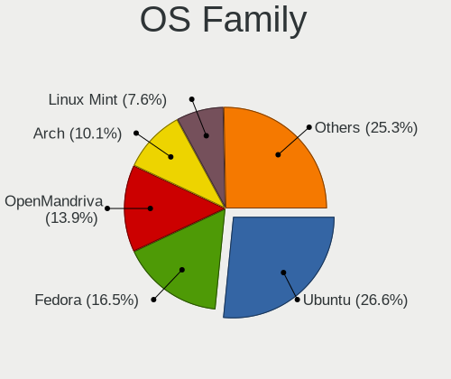
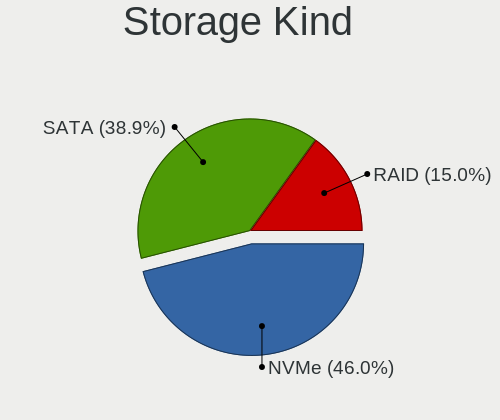
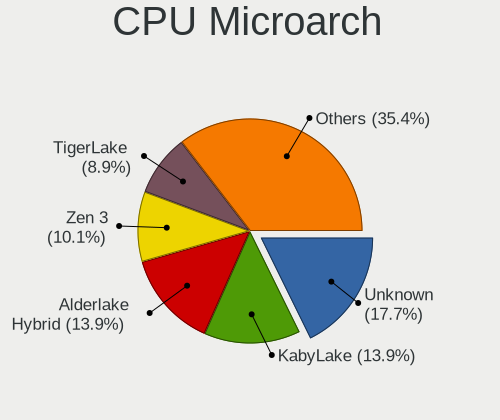
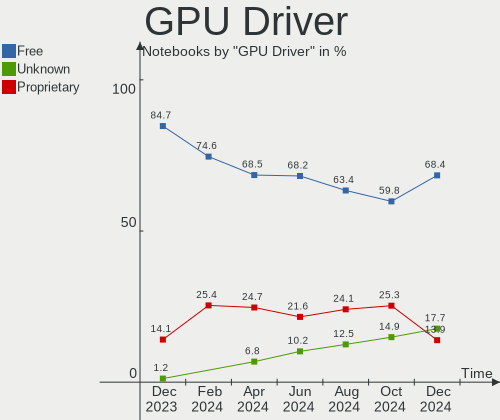
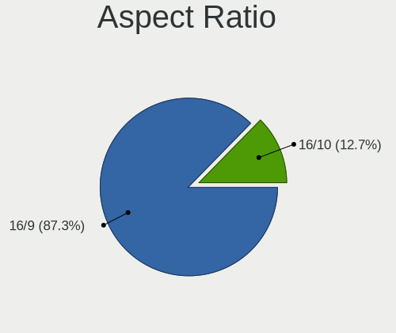
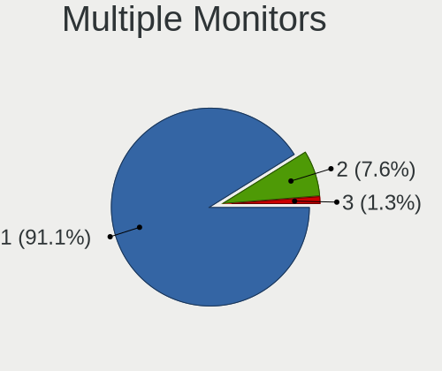
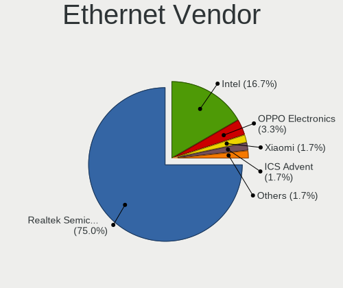
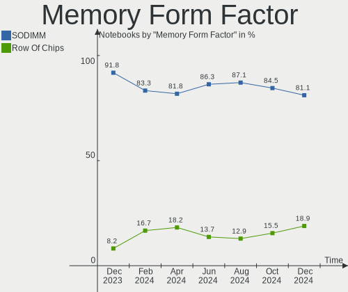
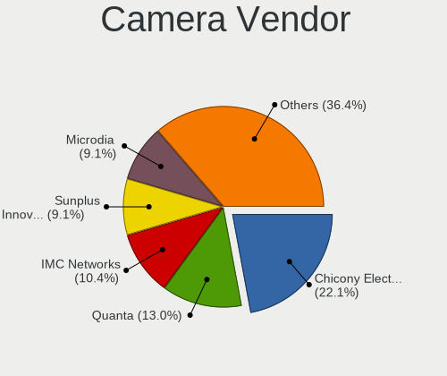

Linux in India - Hardware Trends (Notebooks)
--------------------------------------------

A project to identify most popular hardware characteristics and track their change
over time based on data collected by Linux users at https://Linux-Hardware.org.

Anyone can contribute to this report by the [hw-probe](https://github.com/linuxhw/hw-probe) tool:

    sudo -E hw-probe -all -upload

Period: Jul, 2023.

Contents
--------

* [ System ](#system)
  - [ OS                       ](#os)
  - [ OS Family                ](#os-family)
  - [ Kernel                   ](#kernel)
  - [ Kernel Family            ](#kernel-family)
  - [ Kernel Major Ver.        ](#kernel-major-ver)
  - [ Arch                     ](#arch)
  - [ DE                       ](#de)
  - [ Display Server           ](#display-server)
  - [ Display Manager          ](#display-manager)
  - [ OS Lang                  ](#os-lang)
  - [ Boot Mode                ](#boot-mode)
  - [ Filesystem               ](#filesystem)
  - [ Part. scheme             ](#part-scheme)
  - [ Dual Boot with Linux/BSD ](#dual-boot-with-linuxbsd)
  - [ Dual Boot (Win)          ](#dual-boot-win)

* [ Board ](#board)
  - [ Vendor                   ](#vendor)
  - [ Model                    ](#model)
  - [ Model Family             ](#model-family)
  - [ MFG Year                 ](#mfg-year)
  - [ Form Factor              ](#form-factor)
  - [ Secure Boot              ](#secure-boot)
  - [ Coreboot                 ](#coreboot)
  - [ RAM Size                 ](#ram-size)
  - [ RAM Used                 ](#ram-used)
  - [ Total Drives             ](#total-drives)
  - [ Has CD-ROM               ](#has-cd-rom)
  - [ Has Ethernet             ](#has-ethernet)
  - [ Has WiFi                 ](#has-wifi)
  - [ Has Bluetooth            ](#has-bluetooth)

* [ Location ](#location)
  - [ Country                  ](#country)
  - [ City                     ](#city)

* [ Drives ](#drives)
  - [ Drive Vendor             ](#drive-vendor)
  - [ Drive Model              ](#drive-model)
  - [ HDD Vendor               ](#hdd-vendor)
  - [ SSD Vendor               ](#ssd-vendor)
  - [ Drive Kind               ](#drive-kind)
  - [ Drive Connector          ](#drive-connector)
  - [ Drive Size               ](#drive-size)
  - [ Space Total              ](#space-total)
  - [ Space Used               ](#space-used)
  - [ Malfunc. Drives          ](#malfunc-drives)
  - [ Malfunc. Drive Vendor    ](#malfunc-drive-vendor)
  - [ Malfunc. HDD Vendor      ](#malfunc-hdd-vendor)
  - [ Malfunc. Drive Kind      ](#malfunc-drive-kind)
  - [ Failed Drives            ](#failed-drives)
  - [ Failed Drive Vendor      ](#failed-drive-vendor)
  - [ Drive Status             ](#drive-status)

* [ Storage controller ](#storage-controller)
  - [ Storage Vendor           ](#storage-vendor)
  - [ Storage Model            ](#storage-model)
  - [ Storage Kind             ](#storage-kind)

* [ Processor ](#processor)
  - [ CPU Vendor               ](#cpu-vendor)
  - [ CPU Model                ](#cpu-model)
  - [ CPU Model Family         ](#cpu-model-family)
  - [ CPU Cores                ](#cpu-cores)
  - [ CPU Sockets              ](#cpu-sockets)
  - [ CPU Threads              ](#cpu-threads)
  - [ CPU Op-Modes             ](#cpu-op-modes)
  - [ CPU Microcode            ](#cpu-microcode)
  - [ CPU Microarch            ](#cpu-microarch)

* [ Graphics ](#graphics)
  - [ GPU Vendor               ](#gpu-vendor)
  - [ GPU Model                ](#gpu-model)
  - [ GPU Combo                ](#gpu-combo)
  - [ GPU Driver               ](#gpu-driver)
  - [ GPU Memory               ](#gpu-memory)

* [ Monitor ](#monitor)
  - [ Monitor Vendor           ](#monitor-vendor)
  - [ Monitor Model            ](#monitor-model)
  - [ Monitor Resolution       ](#monitor-resolution)
  - [ Monitor Diagonal         ](#monitor-diagonal)
  - [ Monitor Width            ](#monitor-width)
  - [ Aspect Ratio             ](#aspect-ratio)
  - [ Monitor Area             ](#monitor-area)
  - [ Pixel Density            ](#pixel-density)
  - [ Multiple Monitors        ](#multiple-monitors)

* [ Network ](#network)
  - [ Net Controller Vendor    ](#net-controller-vendor)
  - [ Net Controller Model     ](#net-controller-model)
  - [ Wireless Vendor          ](#wireless-vendor)
  - [ Wireless Model           ](#wireless-model)
  - [ Ethernet Vendor          ](#ethernet-vendor)
  - [ Ethernet Model           ](#ethernet-model)
  - [ Net Controller Kind      ](#net-controller-kind)
  - [ Used Controller          ](#used-controller)
  - [ NICs                     ](#nics)
  - [ IPv6                     ](#ipv6)

* [ Bluetooth ](#bluetooth)
  - [ Bluetooth Vendor         ](#bluetooth-vendor)
  - [ Bluetooth Model          ](#bluetooth-model)

* [ Sound ](#sound)
  - [ Sound Vendor             ](#sound-vendor)
  - [ Sound Model              ](#sound-model)

* [ Memory ](#memory)
  - [ Memory Vendor            ](#memory-vendor)
  - [ Memory Model             ](#memory-model)
  - [ Memory Kind              ](#memory-kind)
  - [ Memory Form Factor       ](#memory-form-factor)
  - [ Memory Size              ](#memory-size)
  - [ Memory Speed             ](#memory-speed)

* [ Printers & scanners ](#printers--scanners)
  - [ Printer Vendor           ](#printer-vendor)
  - [ Printer Model            ](#printer-model)
  - [ Scanner Vendor           ](#scanner-vendor)
  - [ Scanner Model            ](#scanner-model)

* [ Camera ](#camera)
  - [ Camera Vendor            ](#camera-vendor)
  - [ Camera Model             ](#camera-model)

* [ Security ](#security)
  - [ Fingerprint Vendor       ](#fingerprint-vendor)
  - [ Fingerprint Model        ](#fingerprint-model)
  - [ Chipcard Vendor          ](#chipcard-vendor)
  - [ Chipcard Model           ](#chipcard-model)

* [ Unsupported ](#unsupported)
  - [ Unsupported Devices      ](#unsupported-devices)
  - [ Unsupported Device Types ](#unsupported-device-types)

System
------

OS
--

Installed operating systems

| Name               | Notebooks | Percent |
|--------------------|-----------|---------|
| Ubuntu 22.04       | 19        | 23.75%  |
| Fedora 38          | 12        | 15%     |
| Debian 12          | 8         | 10%     |
| Ubuntu 23.04       | 5         | 6.25%   |
| Arch Rolling       | 5         | 6.25%   |
| Ubuntu 20.04       | 4         | 5%      |
| Linux Mint 21.2    | 4         | 5%      |
| Pop!_OS 22.04      | 3         | 3.75%   |
| Linux Mint 21.1    | 3         | 3.75%   |
| OpenMandriva 23.03 | 2         | 2.5%    |
| Ubuntu MATE 22.04  | 1         | 1.25%   |
| Ubuntu 22.10       | 1         | 1.25%   |
| Ubuntu 18.04       | 1         | 1.25%   |
| Parrot 5.3         | 1         | 1.25%   |
| openSUSE Leap-15.5 | 1         | 1.25%   |
| OpenMandriva 23.90 | 1         | 1.25%   |
| Manjaro 23.0.0     | 1         | 1.25%   |
| Lubuntu 22.04      | 1         | 1.25%   |
| Kubuntu 22.04      | 1         | 1.25%   |
| KDE neon 22.04     | 1         | 1.25%   |
| Kali 2023.2        | 1         | 1.25%   |
| Kali 2023.1        | 1         | 1.25%   |
| Fedora 37          | 1         | 1.25%   |
| Elementary 7       | 1         | 1.25%   |
| ArcoLinux Rolling  | 1         | 1.25%   |

OS Family
---------

OS without a version

| Name         | Notebooks | Percent |
|--------------|-----------|---------|
| Ubuntu       | 30        | 37.5%   |
| Fedora       | 13        | 16.25%  |
| Debian       | 8         | 10%     |
| Linux Mint   | 7         | 8.75%   |
| Arch         | 5         | 6.25%   |
| Pop!_OS      | 3         | 3.75%   |
| OpenMandriva | 3         | 3.75%   |
| Kali         | 2         | 2.5%    |
| Ubuntu MATE  | 1         | 1.25%   |
| Parrot       | 1         | 1.25%   |
| openSUSE     | 1         | 1.25%   |
| Manjaro      | 1         | 1.25%   |
| Lubuntu      | 1         | 1.25%   |
| Kubuntu      | 1         | 1.25%   |
| KDE neon     | 1         | 1.25%   |
| Elementary   | 1         | 1.25%   |
| ArcoLinux    | 1         | 1.25%   |

Kernel
------

Version of the Linux kernel

| Version                   | Notebooks | Percent |
|---------------------------|-----------|---------|
| 5.19.0-46-generic         | 16        | 20%     |
| 5.15.0-76-generic         | 8         | 10%     |
| 6.3.12-200.fc38.x86_64    | 4         | 5%      |
| 6.1.0-9-amd64             | 4         | 5%      |
| 6.1.0-10-amd64            | 4         | 5%      |
| 5.19.0-50-generic         | 4         | 5%      |
| 6.3.11-200.fc38.x86_64    | 3         | 3.75%   |
| 5.15.0-78-generic         | 3         | 3.75%   |
| 6.4.6-200.fc38.x86_64     | 2         | 2.5%    |
| 6.3.8-200.fc38.x86_64     | 2         | 2.5%    |
| 6.2.6-desktop-1omv2390    | 2         | 2.5%    |
| 6.2.6-76060206-generic    | 2         | 2.5%    |
| 6.2.0-25-generic          | 2         | 2.5%    |
| 6.2.0-24-generic          | 2         | 2.5%    |
| 6.4.4-arch1-1             | 1         | 1.25%   |
| 6.4.4-200.fc38.x86_64     | 1         | 1.25%   |
| 6.4.3-zen1-1.1-zen        | 1         | 1.25%   |
| 6.4.3-arch1-1             | 1         | 1.25%   |
| 6.4.2-desktop-1omv2390    | 1         | 1.25%   |
| 6.4.1-arch2-1             | 1         | 1.25%   |
| 6.4.1-arch1-1             | 1         | 1.25%   |
| 6.3.7-060307-generic      | 1         | 1.25%   |
| 6.3.0-kali1-amd64         | 1         | 1.25%   |
| 6.2.0-26-generic          | 1         | 1.25%   |
| 6.1.39-1-lts              | 1         | 1.25%   |
| 6.1.38-1-MANJARO          | 1         | 1.25%   |
| 6.1.0-kali5-amd64         | 1         | 1.25%   |
| 6.1.0-1parrot1-amd64      | 1         | 1.25%   |
| 6.1.0-1016-oem            | 1         | 1.25%   |
| 6.0.7-301.fc37.x86_64     | 1         | 1.25%   |
| 5.4.0-150-generic         | 1         | 1.25%   |
| 5.19.0-45-generic         | 1         | 1.25%   |
| 5.15.0-73-generic         | 1         | 1.25%   |
| 5.15.0-58-generic         | 1         | 1.25%   |
| 5.15.0-56-generic         | 1         | 1.25%   |
| 5.14.21-150500.53-default | 1         | 1.25%   |

Kernel Family
-------------

Linux kernel without a distro release

| Version | Notebooks | Percent |
|---------|-----------|---------|
| 5.19.0  | 21        | 26.25%  |
| 5.15.0  | 14        | 17.5%   |
| 6.1.0   | 11        | 13.75%  |
| 6.2.0   | 5         | 6.25%   |
| 6.3.12  | 4         | 5%      |
| 6.2.6   | 4         | 5%      |
| 6.3.11  | 3         | 3.75%   |
| 6.4.6   | 2         | 2.5%    |
| 6.4.4   | 2         | 2.5%    |
| 6.4.3   | 2         | 2.5%    |
| 6.4.1   | 2         | 2.5%    |
| 6.3.8   | 2         | 2.5%    |
| 6.4.2   | 1         | 1.25%   |
| 6.3.7   | 1         | 1.25%   |
| 6.3.0   | 1         | 1.25%   |
| 6.1.39  | 1         | 1.25%   |
| 6.1.38  | 1         | 1.25%   |
| 6.0.7   | 1         | 1.25%   |
| 5.4.0   | 1         | 1.25%   |
| 5.14.21 | 1         | 1.25%   |

Kernel Major Ver.
-----------------

Linux kernel major version

| Version | Notebooks | Percent |
|---------|-----------|---------|
| 5.19    | 21        | 26.25%  |
| 5.15    | 14        | 17.5%   |
| 6.1     | 13        | 16.25%  |
| 6.3     | 11        | 13.75%  |
| 6.4     | 9         | 11.25%  |
| 6.2     | 9         | 11.25%  |
| 6.0     | 1         | 1.25%   |
| 5.4     | 1         | 1.25%   |
| 5.14    | 1         | 1.25%   |

Arch
----

OS architecture (x86_64, i586, etc.)

| Name   | Notebooks | Percent |
|--------|-----------|---------|
| x86_64 | 80        | 100%    |

DE
--

Desktop Environment

| Name       | Notebooks | Percent |
|------------|-----------|---------|
| GNOME      | 52        | 65%     |
| KDE5       | 13        | 16.25%  |
| X-Cinnamon | 6         | 7.5%    |
| MATE       | 2         | 2.5%    |
| XFCE       | 1         | 1.25%   |
| sway       | 1         | 1.25%   |
| qtile      | 1         | 1.25%   |
| Pantheon   | 1         | 1.25%   |
| LXQt       | 1         | 1.25%   |
| i3         | 1         | 1.25%   |
| Unknown    | 1         | 1.25%   |

Display Server
--------------

X11 or Wayland

| Name    | Notebooks | Percent |
|---------|-----------|---------|
| X11     | 46        | 57.5%   |
| Wayland | 30        | 37.5%   |
| Unknown | 4         | 5%      |

Display Manager
---------------

SDDM, LightDM, etc.

| Name    | Notebooks | Percent |
|---------|-----------|---------|
| GDM3    | 28        | 35%     |
| Unknown | 26        | 32.5%   |
| SDDM    | 13        | 16.25%  |
| GDM     | 9         | 11.25%  |
| LightDM | 4         | 5%      |

OS Lang
-------

Language

| Lang    | Notebooks | Percent |
|---------|-----------|---------|
| en_IN   | 50        | 62.5%   |
| en_US   | 28        | 35%     |
| Unknown | 2         | 2.5%    |

Boot Mode
---------

EFI or BIOS

| Mode | Notebooks | Percent |
|------|-----------|---------|
| EFI  | 56        | 70%     |
| BIOS | 24        | 30%     |

Filesystem
----------

Type of filesystem

| Type    | Notebooks | Percent |
|---------|-----------|---------|
| Ext4    | 49        | 61.25%  |
| Btrfs   | 16        | 20%     |
| Tmpfs   | 11        | 13.75%  |
| Overlay | 2         | 2.5%    |
| Xfs     | 1         | 1.25%   |
| F2fs    | 1         | 1.25%   |

Part. scheme
------------

Scheme of partitioning

| Type    | Notebooks | Percent |
|---------|-----------|---------|
| GPT     | 52        | 65%     |
| Unknown | 23        | 28.75%  |
| MBR     | 5         | 6.25%   |

Dual Boot with Linux/BSD
------------------------

Hosting more than one Linux/BSD

| Dual boot | Notebooks | Percent |
|-----------|-----------|---------|
| No        | 71        | 88.75%  |
| Yes       | 9         | 11.25%  |

Dual Boot (Win)
---------------

Hosting Linux and Windows

| Dual boot | Notebooks | Percent |
|-----------|-----------|---------|
| No        | 60        | 75%     |
| Yes       | 20        | 25%     |

Board
-----

Vendor
------

Motherboard manufacturer

| Name             | Notebooks | Percent |
|------------------|-----------|---------|
| Lenovo           | 16        | 20%     |
| Hewlett-Packard  | 15        | 18.75%  |
| ASUSTek Computer | 15        | 18.75%  |
| Dell             | 14        | 17.5%   |
| Timi             | 7         | 8.75%   |
| Acer             | 6         | 7.5%    |
| MSI              | 4         | 5%      |
| Infinix          | 1         | 1.25%   |
| HONOR            | 1         | 1.25%   |
| AVITA            | 1         | 1.25%   |

Model
-----

Motherboard model

| Name                                     | Notebooks | Percent |
|------------------------------------------|-----------|---------|
| Timi Mi NoteBook Ultra                   | 5         | 6.25%   |
| Lenovo ThinkPad E14 20RBCTO1WW           | 2         | 2.5%    |
| HP Notebook                              | 2         | 2.5%    |
| ASUS VivoBook_ASUSLaptop M3401QC_M3401QC | 2         | 2.5%    |
| Acer Nitro AN515-58                      | 2         | 2.5%    |
| Timi Xiaomi NoteBook Pro                 | 1         | 1.25%   |
| Timi Mi NoteBook Horizon Edition 14      | 1         | 1.25%   |
| MSI Katana GF66 11UC                     | 1         | 1.25%   |
| MSI GF63 Thin 11UC                       | 1         | 1.25%   |
| MSI Bravo 15 B5DD                        | 1         | 1.25%   |
| MSI Alpha 15 B5EEK                       | 1         | 1.25%   |
| Lenovo Z50-70 20354                      | 1         | 1.25%   |
| Lenovo V15 G3 IAP 82TT                   | 1         | 1.25%   |
| Lenovo ThinkPad T16 Gen 1 21CJCTO1WW     | 1         | 1.25%   |
| Lenovo ThinkPad E560 20EVCTO1WW          | 1         | 1.25%   |
| Lenovo ThinkPad E14 Gen 3 20YDCTO1WW     | 1         | 1.25%   |
| Lenovo ThinkPad E14 20RAS1RA00           | 1         | 1.25%   |
| Lenovo Legion Y540-15IRH-PG0 81SY        | 1         | 1.25%   |
| Lenovo IdeaPad Gaming 3 15IHU6 82K1      | 1         | 1.25%   |
| Lenovo IdeaPad Gaming 3 15ARH05 82EY     | 1         | 1.25%   |
| Lenovo IdeaPad 330S-15IKB 81F5           | 1         | 1.25%   |
| Lenovo IdeaPad 130-15AST 81H5            | 1         | 1.25%   |
| Lenovo G500s 20245                       | 1         | 1.25%   |
| Lenovo G50-70 20351                      | 1         | 1.25%   |
| Lenovo E41-25 81FS                       | 1         | 1.25%   |
| Infinix INBOOK X2 PLUS                   | 1         | 1.25%   |
| HONOR NMH-WCX9                           | 1         | 1.25%   |
| HP ProBook 4525s                         | 1         | 1.25%   |
| HP Pavilion Notebook                     | 1         | 1.25%   |
| HP Pavilion Laptop 15-eg3xxx             | 1         | 1.25%   |
| HP Pavilion Laptop 14-ec1xxx             | 1         | 1.25%   |
| HP Pavilion Laptop 14-dv1xxx             | 1         | 1.25%   |
| HP Pavilion Laptop 14-dv0xxx             | 1         | 1.25%   |
| HP Pavilion - 14-CE2068ST                | 1         | 1.25%   |
| HP Laptop 14s-ef1xxx                     | 1         | 1.25%   |
| HP Laptop                                | 1         | 1.25%   |
| HP ENVY Notebook                         | 1         | 1.25%   |
| HP EliteBook 840 G5                      | 1         | 1.25%   |
| HP EliteBook 820 G3                      | 1         | 1.25%   |
| HP 15                                    | 1         | 1.25%   |

Model Family
------------

Motherboard model prefix

| Name            | Notebooks | Percent |
|-----------------|-----------|---------|
| ASUS VivoBook   | 8         | 10%     |
| Timi Mi         | 6         | 7.5%    |
| Lenovo ThinkPad | 6         | 7.5%    |
| HP Pavilion     | 6         | 7.5%    |
| Dell Latitude   | 6         | 7.5%    |
| Dell Inspiron   | 5         | 6.25%   |
| Lenovo IdeaPad  | 4         | 5%      |
| ASUS ASUS       | 3         | 3.75%   |
| Acer Aspire     | 3         | 3.75%   |
| HP Notebook     | 2         | 2.5%    |
| HP Laptop       | 2         | 2.5%    |
| HP EliteBook    | 2         | 2.5%    |
| Dell Precision  | 2         | 2.5%    |
| ASUS ROG        | 2         | 2.5%    |
| Acer Nitro      | 2         | 2.5%    |
| Timi Xiaomi     | 1         | 1.25%   |
| MSI Katana      | 1         | 1.25%   |
| MSI GF63        | 1         | 1.25%   |
| MSI Bravo       | 1         | 1.25%   |
| MSI Alpha       | 1         | 1.25%   |
| Lenovo Z50-70   | 1         | 1.25%   |
| Lenovo V15      | 1         | 1.25%   |
| Lenovo Legion   | 1         | 1.25%   |
| Lenovo G500s    | 1         | 1.25%   |
| Lenovo G50-70   | 1         | 1.25%   |
| Lenovo E41-25   | 1         | 1.25%   |
| Infinix INBOOK  | 1         | 1.25%   |
| HONOR NMH-WCX9  | 1         | 1.25%   |
| HP ProBook      | 1         | 1.25%   |
| HP ENVY         | 1         | 1.25%   |
| HP 15           | 1         | 1.25%   |
| Dell Vostro     | 1         | 1.25%   |
| AVITA NS14A6    | 1         | 1.25%   |
| ASUS X541UV     | 1         | 1.25%   |
| ASUS X541UAK    | 1         | 1.25%   |
| Acer Predator   | 1         | 1.25%   |

MFG Year
--------

Motherboard manufacture year

| Year | Notebooks | Percent |
|------|-----------|---------|
| 2021 | 21        | 26.25%  |
| 2022 | 13        | 16.25%  |
| 2020 | 9         | 11.25%  |
| 2019 | 7         | 8.75%   |
| 2018 | 7         | 8.75%   |
| 2016 | 5         | 6.25%   |
| 2023 | 4         | 5%      |
| 2013 | 4         | 5%      |
| 2017 | 3         | 3.75%   |
| 2015 | 3         | 3.75%   |
| 2014 | 2         | 2.5%    |
| 2010 | 1         | 1.25%   |
| 2008 | 1         | 1.25%   |

Form Factor
-----------

Physical design of the computer

| Name     | Notebooks | Percent |
|----------|-----------|---------|
| Notebook | 80        | 100%    |

Secure Boot
-----------

Enabled or disabled

| State    | Notebooks | Percent |
|----------|-----------|---------|
| Disabled | 68        | 85%     |
| Enabled  | 12        | 15%     |

Coreboot
--------

Have coreboot on board

| Used | Notebooks | Percent |
|------|-----------|---------|
| No   | 80        | 100%    |

RAM Size
--------

Total RAM memory

| Size in GB  | Notebooks | Percent |
|-------------|-----------|---------|
| 4.01-8.0    | 32        | 40%     |
| 16.01-24.0  | 22        | 27.5%   |
| 8.01-16.0   | 15        | 18.75%  |
| 32.01-64.0  | 3         | 3.75%   |
| 3.01-4.0    | 3         | 3.75%   |
| 24.01-32.0  | 2         | 2.5%    |
| 64.01-256.0 | 2         | 2.5%    |
| 1.01-2.0    | 1         | 1.25%   |

RAM Used
--------

Used RAM memory

| Used GB    | Notebooks | Percent |
|------------|-----------|---------|
| 4.01-8.0   | 23        | 28.75%  |
| 2.01-3.0   | 23        | 28.75%  |
| 3.01-4.0   | 19        | 23.75%  |
| 1.01-2.0   | 8         | 10%     |
| 8.01-16.0  | 4         | 5%      |
| 0.51-1.0   | 2         | 2.5%    |
| 16.01-24.0 | 1         | 1.25%   |

Total Drives
------------

Number of drives on board

| Drives | Notebooks | Percent |
|--------|-----------|---------|
| 1      | 59        | 73.75%  |
| 2      | 19        | 23.75%  |
| 3      | 1         | 1.25%   |
| 0      | 1         | 1.25%   |

Has CD-ROM
----------

Has CD-ROM on board

| Presented | Notebooks | Percent |
|-----------|-----------|---------|
| No        | 72        | 90%     |
| Yes       | 8         | 10%     |

Has Ethernet
------------

Has Ethernet on board

| Presented | Notebooks | Percent |
|-----------|-----------|---------|
| Yes       | 54        | 67.5%   |
| No        | 26        | 32.5%   |

Has WiFi
--------

Has WiFi module

| Presented | Notebooks | Percent |
|-----------|-----------|---------|
| Yes       | 80        | 100%    |

Has Bluetooth
-------------

Has Bluetooth module

| Presented | Notebooks | Percent |
|-----------|-----------|---------|
| Yes       | 76        | 95%     |
| No        | 4         | 5%      |

Location
--------

Country
-------

Geographic location (country)

| Country | Notebooks | Percent |
|---------|-----------|---------|
| India   | 80        | 100%    |

City
----

Geographic location (city)

| City        | Notebooks | Percent |
|-------------|-----------|---------|
| Delhi       | 13        | 16.25%  |
| Bengaluru   | 9         | 11.25%  |
| Hyderabad   | 8         | 10%     |
| Mumbai      | 5         | 6.25%   |
| Chennai     | 5         | 6.25%   |
| Trivandrum  | 3         | 3.75%   |
| Mangalore   | 3         | 3.75%   |
| Nagpur      | 2         | 2.5%    |
| Lucknow     | 2         | 2.5%    |
| Kolkata     | 2         | 2.5%    |
| Jaipur      | 2         | 2.5%    |
| Coimbatore  | 2         | 2.5%    |
| Ahmedabad   | 2         | 2.5%    |
| Vengavasal  | 1         | 1.25%   |
| Tirupur     | 1         | 1.25%   |
| Shirala     | 1         | 1.25%   |
| Pollachi    | 1         | 1.25%   |
| Panvel      | 1         | 1.25%   |
| Noida       | 1         | 1.25%   |
| Navi Mumbai | 1         | 1.25%   |
| Manipal     | 1         | 1.25%   |
| Kodinar     | 1         | 1.25%   |
| Kochi       | 1         | 1.25%   |
| Kanpur      | 1         | 1.25%   |
| Jalpaiguri  | 1         | 1.25%   |
| Hapur       | 1         | 1.25%   |
| Guwahati    | 1         | 1.25%   |
| Gurgaon     | 1         | 1.25%   |
| Faridpur    | 1         | 1.25%   |
| Dibrugarh   | 1         | 1.25%   |
| Damoh       | 1         | 1.25%   |
| Bongaigaon  | 1         | 1.25%   |
| Bhubaneswar | 1         | 1.25%   |
| Bhiwani     | 1         | 1.25%   |
| Badlapur    | 1         | 1.25%   |

Drives
------

Drive Vendor
------------

Hard drive vendors

| Vendor                       | Notebooks | Drives | Percent |
|------------------------------|-----------|--------|---------|
| Seagate                      | 13        | 13     | 13.27%  |
| Samsung Electronics          | 13        | 13     | 13.27%  |
| WDC                          | 10        | 10     | 10.2%   |
| Micron Technology            | 8         | 8      | 8.16%   |
| Toshiba                      | 7         | 7      | 7.14%   |
| SK hynix                     | 6         | 6      | 6.12%   |
| KIOXIA                       | 6         | 6      | 6.12%   |
| Sandisk                      | 5         | 6      | 5.1%    |
| Intel                        | 5         | 6      | 5.1%    |
| Crucial                      | 3         | 3      | 3.06%   |
| Kingston Technology Company  | 2         | 2      | 2.04%   |
| Kingston                     | 2         | 2      | 2.04%   |
| FORESEE                      | 2         | 2      | 2.04%   |
| China                        | 2         | 2      | 2.04%   |
| Yangtze Memory Technologies  | 1         | 1      | 1.02%   |
| XPG                          | 1         | 1      | 1.02%   |
| SPCC                         | 1         | 1      | 1.02%   |
| Silicon Motion               | 1         | 1      | 1.02%   |
| Shenzhen Longsys Electronics | 1         | 1      | 1.02%   |
| Realtek Semiconductor        | 1         | 1      | 1.02%   |
| NFORCE                       | 1         | 1      | 1.02%   |
| Micron/Crucial Technology    | 1         | 1      | 1.02%   |
| Hewlett-Packard              | 1         | 1      | 1.02%   |
| EVM                          | 1         | 1      | 1.02%   |
| CONSISTENT                   | 1         | 1      | 1.02%   |
| Acer                         | 1         | 1      | 1.02%   |
| A-DATA Technology            | 1         | 1      | 1.02%   |
| Unknown                      | 1         | 1      | 1.02%   |

Drive Model
-----------

Hard drive models

| Model                                                  | Notebooks | Percent |
|--------------------------------------------------------|-----------|---------|
| Seagate ST1000LM035-1RK172 1TB                         | 7         | 7%      |
| Seagate ST1000LM024 HN-M101MBB 1TB                     | 3         | 3%      |
| Micron 2450_MTFDKBA512TFK 512GB                        | 3         | 3%      |
| KIOXIA KBG40ZNV512G 512GB                              | 3         | 3%      |
| Toshiba MQ04ABF100 1TB                                 | 2         | 2%      |
| Sandisk WD Blue SN550 NVMe SSD 250GB                   | 2         | 2%      |
| Samsung MZVLQ512HBLU-00BH1 512GB                       | 2         | 2%      |
| Micron 3400_MTFDKBA512TFH 512GB                        | 2         | 2%      |
| Micron 2400_MTFDKBA1T0QFM 1024GB                       | 2         | 2%      |
| Kingston Company OM3PDP3 NVMe SSD 512GB                | 2         | 2%      |
| Yangtze Memory YMTC PC005 512GB                        | 1         | 1%      |
| XPG GAMMIX S70 BLADE 2TB                               | 1         | 1%      |
| WDC WDS500G2B0A-00SM50 500GB SSD                       | 1         | 1%      |
| WDC WD20SPZX-08UA7 2TB                                 | 1         | 1%      |
| WDC WD10SPZX-24Z10 1TB                                 | 1         | 1%      |
| WDC WD10SPSX-21A6WT0 1TB                               | 1         | 1%      |
| WDC WD10JPVX-08JC3T5 1TB                               | 1         | 1%      |
| WDC WD10JPCX-24UE4T0 1TB                               | 1         | 1%      |
| WDC WD Green 2.5 240GB SSD                             | 1         | 1%      |
| WDC PC SN530 SDBPNPZ-512G-1036 512GB                   | 1         | 1%      |
| WDC PC SN530 SDBPNPZ-512G-1006 512GB                   | 1         | 1%      |
| WDC PC SA530 M.2 2280 SATA 512GB                       | 1         | 1%      |
| Toshiba MQ01ABF050 500GB                               | 1         | 1%      |
| Toshiba MQ01ABF032 320GB                               | 1         | 1%      |
| Toshiba MQ01ABD100 1TB                                 | 1         | 1%      |
| Toshiba MQ01ABD050V 500GB                              | 1         | 1%      |
| Toshiba MK2556GSY 250GB                                | 1         | 1%      |
| SPCC Solid State Disk 128GB                            | 1         | 1%      |
| SK hynix SKHynix_HFS512GEJ9X102N 512GB                 | 1         | 1%      |
| SK hynix SKHynix_HFS256GD9TNG-L3A0B 256GB              | 1         | 1%      |
| SK hynix SKHynix_HFM512GD3HX015N 512GB                 | 1         | 1%      |
| SK hynix HFM512GDHTNG-8710B 512GB                      | 1         | 1%      |
| SK hynix BC901 NVMe SED 256GB                          | 1         | 1%      |
| SK hynix BC511 NVMe 512GB                              | 1         | 1%      |
| Silicon Motion SM2263EN/SM2263XT SSD Controller 500GB  | 1         | 1%      |
| Shenzhen Longsys SM2263EN/SM2263XT-based OEM SSD 512GB | 1         | 1%      |
| Seagate ST500LM000-1EJ162-SSHD 500GB                   | 1         | 1%      |
| Seagate ST2000LM007-1R8174 2TB                         | 1         | 1%      |
| Seagate ST2000LM003 HN-M201RAD 2TB                     | 1         | 1%      |
| Sandisk WD_BLACK SN770 1TB                             | 1         | 1%      |

HDD Vendor
----------

Hard disk drive vendors

| Vendor          | Notebooks | Drives | Percent |
|-----------------|-----------|--------|---------|
| Seagate         | 13        | 13     | 50%     |
| Toshiba         | 7         | 7      | 26.92%  |
| WDC             | 5         | 5      | 19.23%  |
| Hewlett-Packard | 1         | 1      | 3.85%   |

SSD Vendor
----------

Solid state drive vendors

| Vendor              | Notebooks | Drives | Percent |
|---------------------|-----------|--------|---------|
| WDC                 | 2         | 2      | 12.5%   |
| Samsung Electronics | 2         | 2      | 12.5%   |
| Crucial             | 2         | 2      | 12.5%   |
| China               | 2         | 2      | 12.5%   |
| SPCC                | 1         | 1      | 6.25%   |
| SanDisk             | 1         | 1      | 6.25%   |
| FORESEE             | 1         | 1      | 6.25%   |
| EVM                 | 1         | 1      | 6.25%   |
| CONSISTENT          | 1         | 1      | 6.25%   |
| Acer                | 1         | 1      | 6.25%   |
| A-DATA Technology   | 1         | 1      | 6.25%   |
| Unknown             | 1         | 1      | 6.25%   |

Drive Kind
----------

HDD or SSD

| Kind    | Notebooks | Drives | Percent |
|---------|-----------|--------|---------|
| NVMe    | 52        | 56     | 54.74%  |
| HDD     | 26        | 26     | 27.37%  |
| SSD     | 15        | 16     | 15.79%  |
| Unknown | 2         | 2      | 2.11%   |

Drive Connector
---------------

SATA, SAS, NVMe, etc.

| Type | Notebooks | Drives | Percent |
|------|-----------|--------|---------|
| NVMe | 52        | 56     | 57.78%  |
| SATA | 37        | 43     | 41.11%  |
| SAS  | 1         | 1      | 1.11%   |

Drive Size
----------

Size of hard drive

| Size in TB | Notebooks | Drives | Percent |
|------------|-----------|--------|---------|
| 0.51-1.0   | 20        | 20     | 47.62%  |
| 0.01-0.5   | 19        | 19     | 45.24%  |
| 1.01-2.0   | 3         | 3      | 7.14%   |

Space Total
-----------

Amount of disk space available on the file system

| Size in GB | Notebooks | Percent |
|------------|-----------|---------|
| 251-500    | 30        | 37.5%   |
| 101-250    | 15        | 18.75%  |
| 501-1000   | 14        | 17.5%   |
| 1001-2000  | 8         | 10%     |
| 51-100     | 6         | 7.5%    |
| 1-20       | 4         | 5%      |
| 2001-3000  | 2         | 2.5%    |
| Unknown    | 1         | 1.25%   |

Space Used
----------

Amount of used disk space

| Used GB   | Notebooks | Percent |
|-----------|-----------|---------|
| 1-20      | 21        | 26.25%  |
| 21-50     | 17        | 21.25%  |
| 101-250   | 17        | 21.25%  |
| 251-500   | 10        | 12.5%   |
| 51-100    | 9         | 11.25%  |
| 501-1000  | 4         | 5%      |
| 1001-2000 | 1         | 1.25%   |
| Unknown   | 1         | 1.25%   |

Malfunc. Drives
---------------

Drive models with a malfunction

| Model                          | Notebooks | Drives | Percent |
|--------------------------------|-----------|--------|---------|
| Toshiba MQ01ABD100 1TB         | 1         | 1      | 33.33%  |
| Toshiba MK2556GSY 250GB        | 1         | 1      | 33.33%  |
| Seagate ST1000LM035-1RK172 1TB | 1         | 1      | 33.33%  |

Malfunc. Drive Vendor
---------------------

Vendors of faulty drives

| Vendor  | Notebooks | Drives | Percent |
|---------|-----------|--------|---------|
| Toshiba | 2         | 2      | 66.67%  |
| Seagate | 1         | 1      | 33.33%  |

Malfunc. HDD Vendor
-------------------

Vendors of faulty HDD drives

| Vendor  | Notebooks | Drives | Percent |
|---------|-----------|--------|---------|
| Toshiba | 2         | 2      | 66.67%  |
| Seagate | 1         | 1      | 33.33%  |

Malfunc. Drive Kind
-------------------

Kinds of faulty drives

| Kind | Notebooks | Drives | Percent |
|------|-----------|--------|---------|
| HDD  | 3         | 3      | 100%    |

Failed Drives
-------------

Failed drive models

Zero info for selected period =(

Failed Drive Vendor
-------------------

Failed drive vendors

Zero info for selected period =(

Drive Status
------------

Number of failed and malfunc. drives

| Status   | Notebooks | Drives | Percent |
|----------|-----------|--------|---------|
| Works    | 42        | 51     | 51.85%  |
| Detected | 36        | 46     | 44.44%  |
| Malfunc  | 3         | 3      | 3.7%    |

Storage controller
------------------

Storage Vendor
--------------

Storage controller vendors

| Vendor                       | Notebooks | Percent |
|------------------------------|-----------|---------|
| Intel                        | 51        | 46.36%  |
| Samsung Electronics          | 11        | 10%     |
| AMD                          | 10        | 9.09%   |
| Micron Technology            | 8         | 7.27%   |
| SanDisk                      | 7         | 6.36%   |
| SK hynix                     | 6         | 5.45%   |
| KIOXIA                       | 6         | 5.45%   |
| Kingston Technology Company  | 4         | 3.64%   |
| Shenzhen Longsys Electronics | 2         | 1.82%   |
| Yangtze Memory Technologies  | 1         | 0.91%   |
| Silicon Motion               | 1         | 0.91%   |
| Realtek Semiconductor        | 1         | 0.91%   |
| Micron/Crucial Technology    | 1         | 0.91%   |
| ADATA Technology             | 1         | 0.91%   |

Storage Model
-------------

Storage controller models

| Model                                                                   | Notebooks | Percent |
|-------------------------------------------------------------------------|-----------|---------|
| Intel Volume Management Device NVMe RAID Controller                     | 11        | 9.09%   |
| Intel Sunrise Point-LP SATA Controller [AHCI mode]                      | 10        | 8.26%   |
| AMD FCH SATA Controller [AHCI mode]                                     | 9         | 7.44%   |
| Intel 82801 Mobile SATA Controller [RAID mode]                          | 7         | 5.79%   |
| Samsung NVMe SSD Controller 980                                         | 6         | 4.96%   |
| SanDisk WD Blue SN550 NVMe SSD                                          | 5         | 4.13%   |
| KIOXIA NVMe SSD Controller BG4 (DRAM-less)                              | 5         | 4.13%   |
| Intel Alder Lake-P SATA AHCI Controller                                 | 5         | 4.13%   |
| Intel Wildcat Point-LP SATA Controller [AHCI Mode]                      | 4         | 3.31%   |
| Intel Tiger Lake-LP SATA Controller                                     | 4         | 3.31%   |
| Intel Comet Lake SATA AHCI Controller                                   | 4         | 3.31%   |
| Samsung NVMe SSD Controller SM981/PM981/PM983                           | 3         | 2.48%   |
| Micron 2450 NVMe SSD [HendrixV] (DRAM-less)                             | 3         | 2.48%   |
| Micron 3400 NVMe SSD [Hendrix]                                          | 2         | 1.65%   |
| Micron 2400 NVMe SSD (DRAM-less)                                        | 2         | 1.65%   |
| Kingston Company OM8PCP Design-In PCIe 3 NVMe SSD (DRAM-less)           | 2         | 1.65%   |
| Kingston Company OM3PDP3 NVMe SSD                                       | 2         | 1.65%   |
| Intel Tiger Lake SATA AHCI Controller                                   | 2         | 1.65%   |
| Intel SSD 670p Series [Keystone Harbor]                                 | 2         | 1.65%   |
| Intel SSD 660P Series                                                   | 2         | 1.65%   |
| Intel 8 Series SATA Controller 1 [AHCI mode]                            | 2         | 1.65%   |
| Intel 400 Series Chipset Family SATA AHCI Controller                    | 2         | 1.65%   |
| Yangtze Memory PC005 NVMe SSD                                           | 1         | 0.83%   |
| SK hynix Platinum P41/PC801 NVMe Solid State Drive                      | 1         | 0.83%   |
| SK hynix PC601 NVMe Solid State Drive                                   | 1         | 0.83%   |
| SK hynix Gold P31/BC711/PC711 NVMe Solid State Drive                    | 1         | 0.83%   |
| SK hynix BC901 NVMe Solid State Drive (DRAM-less)                       | 1         | 0.83%   |
| SK hynix BC511 NVMe SSD                                                 | 1         | 0.83%   |
| SK hynix BC501 NVMe Solid State Drive                                   | 1         | 0.83%   |
| Silicon Motion SM2263EN/SM2263XT (DRAM-less) NVMe SSD Controllers       | 1         | 0.83%   |
| Shenzhen Longsys SM2263EN/SM2263XT-based OEM SSD                        | 1         | 0.83%   |
| Shenzhen Longsys Lexar NM620 NVME SSD (DRAM-less)                       | 1         | 0.83%   |
| SanDisk WD Green SN350 NVMe SSD 240GB (DRAM-less)                       | 1         | 0.83%   |
| SanDisk WD Black SN770 / PC SN740 256GB / PC SN560 (DRAM-less) NVMe SSD | 1         | 0.83%   |
| SanDisk WD Black SN750 / PC SN730 NVMe SSD                              | 1         | 0.83%   |
| Samsung NVMe SSD Controller S4LV008[Pascal]                             | 1         | 0.83%   |
| Samsung NVMe SSD Controller PM9B1                                       | 1         | 0.83%   |
| Realtek RTS5765DL NVMe SSD Controller (DRAM-less)                       | 1         | 0.83%   |
| Micron/Crucial P2 [Nick P2] / P3 / P3 Plus NVMe PCIe SSD (DRAM-less)    | 1         | 0.83%   |
| Micron 2210 NVMe SSD [Cobain]                                           | 1         | 0.83%   |

Storage Kind
------------

Kind of storage controller (IDE, SATA, NVMe, SAS, ...)

| Kind | Notebooks | Percent |
|------|-----------|---------|
| NVMe | 53        | 44.54%  |
| SATA | 48        | 40.34%  |
| RAID | 18        | 15.13%  |

Processor
---------

CPU Vendor
----------

Processor vendors

| Vendor | Notebooks | Percent |
|--------|-----------|---------|
| Intel  | 60        | 75%     |
| AMD    | 20        | 25%     |

CPU Model
---------

Processor models

| Model                                   | Notebooks | Percent |
|-----------------------------------------|-----------|---------|
| Intel Core i7-10510U CPU @ 1.80GHz      | 4         | 5%      |
| Intel 11th Gen Core i5-11300H @ 3.10GHz | 4         | 5%      |
| Intel Core i7-6500U CPU @ 2.50GHz       | 3         | 3.75%   |
| Intel Core i5-6300U CPU @ 2.40GHz       | 3         | 3.75%   |
| Intel Core i3-5005U CPU @ 2.00GHz       | 3         | 3.75%   |
| Intel 11th Gen Core i3-1115G4 @ 3.00GHz | 3         | 3.75%   |
| AMD Ryzen 7 5800H with Radeon Graphics  | 3         | 3.75%   |
| Intel Core i5-8250U CPU @ 1.60GHz       | 2         | 2.5%    |
| Intel Core i5-10210U CPU @ 1.60GHz      | 2         | 2.5%    |
| Intel Core i3-6006U CPU @ 2.00GHz       | 2         | 2.5%    |
| Intel 12th Gen Core i5-12500H           | 2         | 2.5%    |
| Intel 12th Gen Core i5-12450H           | 2         | 2.5%    |
| Intel 12th Gen Core i3-1215U            | 2         | 2.5%    |
| Intel 11th Gen Core i7-11800H @ 2.30GHz | 2         | 2.5%    |
| Intel 11th Gen Core i5-1135G7 @ 2.40GHz | 2         | 2.5%    |
| Intel 11th Gen Core i5-11320H @ 3.20GHz | 2         | 2.5%    |
| AMD Ryzen 9 7945HX with Radeon Graphics | 2         | 2.5%    |
| AMD Ryzen 5 5500U with Radeon Graphics  | 2         | 2.5%    |
| AMD Ryzen 5 4600H with Radeon Graphics  | 2         | 2.5%    |
| Intel Pentium CPU N3530 @ 2.16GHz       | 1         | 1.25%   |
| Intel Core i7-10870H CPU @ 2.20GHz      | 1         | 1.25%   |
| Intel Core i7-1065G7 CPU @ 1.30GHz      | 1         | 1.25%   |
| Intel Core i5-9300H CPU @ 2.40GHz       | 1         | 1.25%   |
| Intel Core i5-8350U CPU @ 1.70GHz       | 1         | 1.25%   |
| Intel Core i5-8265U CPU @ 1.60GHz       | 1         | 1.25%   |
| Intel Core i5-7200U CPU @ 2.50GHz       | 1         | 1.25%   |
| Intel Core i5-6200U CPU @ 2.30GHz       | 1         | 1.25%   |
| Intel Core i5-6198DU CPU @ 2.30GHz      | 1         | 1.25%   |
| Intel Core i5-5200U CPU @ 2.20GHz       | 1         | 1.25%   |
| Intel Core i5-4310U CPU @ 2.00GHz       | 1         | 1.25%   |
| Intel Core i5-4258U CPU @ 2.40GHz       | 1         | 1.25%   |
| Intel Core i5-4210U CPU @ 1.70GHz       | 1         | 1.25%   |
| Intel Core i5-1035G1 CPU @ 1.00GHz      | 1         | 1.25%   |
| Intel Core i5-10300H CPU @ 2.50GHz      | 1         | 1.25%   |
| Intel Core i3-7020U CPU @ 2.30GHz       | 1         | 1.25%   |
| Intel Core i3-3120M CPU @ 2.50GHz       | 1         | 1.25%   |
| Intel Core 2 Duo CPU P8700 @ 2.53GHz    | 1         | 1.25%   |
| Intel 13th Gen Core i7-13700H           | 1         | 1.25%   |
| Intel 13th Gen Core i5-1340P            | 1         | 1.25%   |
| Intel 12th Gen Core i5-1240P            | 1         | 1.25%   |

CPU Model Family
----------------

Processor model prefix

| Model            | Notebooks | Percent |
|------------------|-----------|---------|
| Other            | 24        | 30%     |
| Intel Core i5    | 19        | 23.75%  |
| Intel Core i7    | 9         | 11.25%  |
| Intel Core i3    | 7         | 8.75%   |
| AMD Ryzen 7      | 7         | 8.75%   |
| AMD Ryzen 5      | 6         | 7.5%    |
| AMD Ryzen 9      | 2         | 2.5%    |
| AMD A6           | 2         | 2.5%    |
| Intel Pentium    | 1         | 1.25%   |
| Intel Core 2 Duo | 1         | 1.25%   |
| AMD Ryzen 7 PRO  | 1         | 1.25%   |
| AMD Athlon II    | 1         | 1.25%   |

CPU Cores
---------

Number of processor cores

| Number | Notebooks | Percent |
|--------|-----------|---------|
| 2      | 27        | 33.75%  |
| 4      | 25        | 31.25%  |
| 8      | 13        | 16.25%  |
| 6      | 7         | 8.75%   |
| 12     | 4         | 5%      |
| 16     | 2         | 2.5%    |
| 14     | 1         | 1.25%   |
| 1      | 1         | 1.25%   |

CPU Sockets
-----------

Number of sockets

| Number | Notebooks | Percent |
|--------|-----------|---------|
| 1      | 80        | 100%    |

CPU Threads
-----------

Threads per core (Hyper-Threading)

| Number | Notebooks | Percent |
|--------|-----------|---------|
| 2      | 71        | 88.75%  |
| 1      | 8         | 10%     |
| 4      | 1         | 1.25%   |

CPU Op-Modes
------------

CPU Operation Modes (32-bit, 64-bit)

| Op mode        | Notebooks | Percent |
|----------------|-----------|---------|
| 32-bit, 64-bit | 80        | 100%    |

CPU Microcode
-------------

Microcode number

| Number     | Notebooks | Percent |
|------------|-----------|---------|
| Unknown    | 40        | 50%     |
| 0x0a50000c | 5         | 6.25%   |
| 0x406e3    | 4         | 5%      |
| 0x906a3    | 3         | 3.75%   |
| 0x806ec    | 3         | 3.75%   |
| 0x806c2    | 3         | 3.75%   |
| 0x06006705 | 3         | 3.75%   |
| 0xb06a2    | 2         | 2.5%    |
| 0x806ea    | 2         | 2.5%    |
| 0x806c1    | 2         | 2.5%    |
| 0x0a601203 | 2         | 2.5%    |
| 0x906ea    | 1         | 1.25%   |
| 0x706e5    | 1         | 1.25%   |
| 0x306d4    | 1         | 1.25%   |
| 0x306a9    | 1         | 1.25%   |
| 0x30678    | 1         | 1.25%   |
| 0x0a50000d | 1         | 1.25%   |
| 0x0a404102 | 1         | 1.25%   |
| 0x08608103 | 1         | 1.25%   |
| 0x08600106 | 1         | 1.25%   |
| 0x08600104 | 1         | 1.25%   |
| 0x010000c8 | 1         | 1.25%   |

CPU Microarch
-------------

Microarchitecture

| Name             | Notebooks | Percent |
|------------------|-----------|---------|
| KabyLake         | 13        | 16.25%  |
| TigerLake        | 12        | 15%     |
| Skylake          | 10        | 12.5%   |
| Alderlake Hybrid | 9         | 11.25%  |
| Unknown          | 8         | 10%     |
| Zen 3            | 6         | 7.5%    |
| Broadwell        | 4         | 5%      |
| IceLake          | 3         | 3.75%   |
| Haswell          | 3         | 3.75%   |
| Excavator        | 3         | 3.75%   |
| Zen 2            | 2         | 2.5%    |
| CometLake        | 2         | 2.5%    |
| Zen+             | 1         | 1.25%   |
| Silvermont       | 1         | 1.25%   |
| Penryn           | 1         | 1.25%   |
| K10              | 1         | 1.25%   |
| IvyBridge        | 1         | 1.25%   |

Graphics
--------

GPU Vendor
----------

Vendors of graphics cards

| Vendor | Notebooks | Percent |
|--------|-----------|---------|
| Intel  | 60        | 53.1%   |
| Nvidia | 27        | 23.89%  |
| AMD    | 26        | 23.01%  |

GPU Model
---------

Graphics card models

| Model                                                                | Notebooks | Percent |
|----------------------------------------------------------------------|-----------|---------|
| Intel TigerLake-LP GT2 [Iris Xe Graphics]                            | 9         | 7.76%   |
| Intel Skylake GT2 [HD Graphics 520]                                  | 9         | 7.76%   |
| Nvidia GA107M [GeForce RTX 3050 Mobile]                              | 8         | 6.9%    |
| Intel CometLake-U GT2 [UHD Graphics]                                 | 6         | 5.17%   |
| AMD Cezanne [Radeon Vega Series / Radeon Vega Mobile Series]         | 5         | 4.31%   |
| Intel HD Graphics 5500                                               | 4         | 3.45%   |
| Nvidia TU117M [GeForce GTX 1650 Mobile / Max-Q]                      | 3         | 2.59%   |
| Nvidia TU117M                                                        | 3         | 2.59%   |
| Intel UHD Graphics 620                                               | 3         | 2.59%   |
| Intel Tiger Lake-LP GT2 [UHD Graphics G4]                            | 3         | 2.59%   |
| Intel Haswell-ULT Integrated Graphics Controller                     | 3         | 2.59%   |
| Intel Alder Lake-P Integrated Graphics Controller                    | 3         | 2.59%   |
| AMD Stoney [Radeon R2/R3/R4/R5 Graphics]                             | 3         | 2.59%   |
| AMD Lucienne                                                         | 3         | 2.59%   |
| Nvidia GF117M [GeForce 610M/710M/810M/820M / GT 620M/625M/630M/720M] | 2         | 1.72%   |
| Intel TigerLake-H GT1 [UHD Graphics]                                 | 2         | 1.72%   |
| Intel Raptor Lake-P [Iris Xe Graphics]                               | 2         | 1.72%   |
| Intel HD Graphics 620                                                | 2         | 1.72%   |
| Intel CometLake-H GT2 [UHD Graphics]                                 | 2         | 1.72%   |
| Intel Alder Lake-UP3 GT1 [UHD Graphics]                              | 2         | 1.72%   |
| Intel Alder Lake-P GT1 [UHD Graphics]                                | 2         | 1.72%   |
| AMD Renoir                                                           | 2         | 1.72%   |
| AMD Rembrandt [Radeon 680M]                                          | 2         | 1.72%   |
| AMD Raphael                                                          | 2         | 1.72%   |
| AMD Lexa [Radeon 540X/550X/630 / RX 640 / E9171 MCM]                 | 2         | 1.72%   |
| Nvidia GP108M [GeForce MX250]                                        | 1         | 0.86%   |
| Nvidia GP108GLM [Quadro P520]                                        | 1         | 0.86%   |
| Nvidia GP107M [GeForce MX350]                                        | 1         | 0.86%   |
| Nvidia GM108M [GeForce MX130]                                        | 1         | 0.86%   |
| Nvidia GM108M [GeForce 940M]                                         | 1         | 0.86%   |
| Nvidia GM108M [GeForce 920MX]                                        | 1         | 0.86%   |
| Nvidia GA107M [GeForce RTX 3050 Ti Mobile]                           | 1         | 0.86%   |
| Nvidia GA107M [GeForce RTX 2050]                                     | 1         | 0.86%   |
| Nvidia GA106M [GeForce RTX 3060 Mobile / Max-Q]                      | 1         | 0.86%   |
| Nvidia AD107M [GeForce RTX 4060 Max-Q / Mobile]                      | 1         | 0.86%   |
| Nvidia AD106M [GeForce RTX 4070 Max-Q / Mobile]                      | 1         | 0.86%   |
| Intel WhiskeyLake-U GT2 [UHD Graphics 620]                           | 1         | 0.86%   |
| Intel Raptor Lake-P [UHD Graphics]                                   | 1         | 0.86%   |
| Intel Mobile 4 Series Chipset Integrated Graphics Controller         | 1         | 0.86%   |
| Intel Iris Plus Graphics G7                                          | 1         | 0.86%   |

GPU Combo
---------

Combinations of graphics cards

| Name           | Notebooks | Percent |
|----------------|-----------|---------|
| 1 x Intel      | 35        | 43.75%  |
| Intel + Nvidia | 18        | 22.5%   |
| AMD + Nvidia   | 9         | 11.25%  |
| 1 x AMD        | 9         | 11.25%  |
| Intel + AMD    | 6         | 7.5%    |
| 2 x AMD        | 2         | 2.5%    |
| 2 x Intel      | 1         | 1.25%   |

GPU Driver
----------

Free vs proprietary

| Driver      | Notebooks | Percent |
|-------------|-----------|---------|
| Free        | 59        | 73.75%  |
| Proprietary | 21        | 26.25%  |

GPU Memory
----------

Total video memory

| Size in GB | Notebooks | Percent |
|------------|-----------|---------|
| Unknown    | 58        | 72.5%   |
| 0.01-0.5   | 10        | 12.5%   |
| 3.01-4.0   | 4         | 5%      |
| 1.01-2.0   | 4         | 5%      |
| 7.01-8.0   | 2         | 2.5%    |
| 0.51-1.0   | 2         | 2.5%    |

Monitor
-------

Monitor Vendor
--------------

Monitor vendors

| Vendor              | Notebooks | Percent |
|---------------------|-----------|---------|
| BOE                 | 21        | 23.33%  |
| Chimei Innolux      | 19        | 21.11%  |
| AU Optronics        | 17        | 18.89%  |
| Samsung Electronics | 10        | 11.11%  |
| TMX                 | 5         | 5.56%   |
| LG Display          | 5         | 5.56%   |
| Goldstar            | 4         | 4.44%   |
| PANDA               | 3         | 3.33%   |
| Dell                | 2         | 2.22%   |
| STD                 | 1         | 1.11%   |
| CSO                 | 1         | 1.11%   |
| AGO                 | 1         | 1.11%   |
| Acer                | 1         | 1.11%   |

Monitor Model
-------------

Monitor models

| Model                                                                 | Notebooks | Percent |
|-----------------------------------------------------------------------|-----------|---------|
| TMX TL156MDMP01-0 TMX1560 3200x2000 336x210mm 15.6-inch               | 5         | 5.56%   |
| AU Optronics LCD Monitor AUOAF90 1920x1080 344x193mm 15.5-inch        | 4         | 4.44%   |
| BOE LCD Monitor BOE07C9 1920x1080 309x173mm 13.9-inch                 | 3         | 3.33%   |
| Samsung Electronics LCD Monitor SDC4852 1920x1080 344x194mm 15.5-inch | 2         | 2.22%   |
| Samsung Electronics LCD Monitor SDC4171 2880x1800 302x189mm 14.0-inch | 2         | 2.22%   |
| PANDA LCD Monitor NCP004D 1920x1080 344x194mm 15.5-inch               | 2         | 2.22%   |
| Chimei Innolux LCD Monitor CMN15DB 1366x768 344x193mm 15.5-inch       | 2         | 2.22%   |
| Chimei Innolux LCD Monitor CMN1521 1920x1080 344x193mm 15.5-inch      | 2         | 2.22%   |
| Chimei Innolux LCD Monitor CMN14D4 1920x1080 309x173mm 13.9-inch      | 2         | 2.22%   |
| Chimei Innolux LCD Monitor CMN14C3 1366x768 309x173mm 13.9-inch       | 2         | 2.22%   |
| AU Optronics LCD Monitor AUO21ED 1920x1080 344x194mm 15.5-inch        | 2         | 2.22%   |
| STD LED STD0001 1024x768 300x230mm 14.9-inch                          | 1         | 1.11%   |
| Samsung Electronics S20D300 SAM0B37 1600x900 432x240mm 19.5-inch      | 1         | 1.11%   |
| Samsung Electronics LF24T35 SAM707D 1920x1080 528x297mm 23.9-inch     | 1         | 1.11%   |
| Samsung Electronics LCD Monitor SDC4E51 1366x768 344x194mm 15.5-inch  | 1         | 1.11%   |
| Samsung Electronics LCD Monitor SDC4161 1920x1080 344x194mm 15.5-inch | 1         | 1.11%   |
| Samsung Electronics LCD Monitor SDC354A 1366x768 344x194mm 15.5-inch  | 1         | 1.11%   |
| Samsung Electronics LC32G7xT SAM705A 2560x1440 698x393mm 31.5-inch    | 1         | 1.11%   |
| PANDA LCD Monitor NCP0052 1920x1080 309x174mm 14.0-inch               | 1         | 1.11%   |
| LG Display LP156WH2-TLRA LGD026B 1366x768 344x194mm 15.5-inch         | 1         | 1.11%   |
| LG Display LCD Monitor LGD063B 1920x1080 382x215mm 17.3-inch          | 1         | 1.11%   |
| LG Display LCD Monitor LGD0613 1920x1080 309x174mm 14.0-inch          | 1         | 1.11%   |
| LG Display LCD Monitor LGD060F 1920x1080 309x174mm 14.0-inch          | 1         | 1.11%   |
| LG Display LCD Monitor LGD0456 1366x768 344x194mm 15.5-inch           | 1         | 1.11%   |
| Goldstar ULTRAWIDE GSM7770 2560x1080 798x334mm 34.1-inch              | 1         | 1.11%   |
| Goldstar ULTRAWIDE GSM76F9 2560x1080 531x298mm 24.0-inch              | 1         | 1.11%   |
| Goldstar HDR WQHD GSM7755 3440x1440 820x346mm 35.0-inch               | 1         | 1.11%   |
| Goldstar E2042 GSM4ED7 1600x900 443x249mm 20.0-inch                   | 1         | 1.11%   |
| Dell ST2220M DELA069 1920x1080 477x268mm 21.5-inch                    | 1         | 1.11%   |
| Dell D2015H DELF063 1920x1080 435x239mm 19.5-inch                     | 1         | 1.11%   |
| CSO MNH301CA3-1 CSO1702 2560x1440 381x214mm 17.2-inch                 | 1         | 1.11%   |
| Chimei Innolux LCD Monitor CMN15F5 1920x1080 344x193mm 15.5-inch      | 1         | 1.11%   |
| Chimei Innolux LCD Monitor CMN15E7 1920x1080 344x193mm 15.5-inch      | 1         | 1.11%   |
| Chimei Innolux LCD Monitor CMN15CA 1366x768 344x193mm 15.5-inch       | 1         | 1.11%   |
| Chimei Innolux LCD Monitor CMN15C4 1920x1080 344x193mm 15.5-inch      | 1         | 1.11%   |
| Chimei Innolux LCD Monitor CMN15AB 1366x768 344x194mm 15.5-inch       | 1         | 1.11%   |
| Chimei Innolux LCD Monitor CMN1550 1920x1080 344x193mm 15.5-inch      | 1         | 1.11%   |
| Chimei Innolux LCD Monitor CMN153C 1920x1080 344x193mm 15.5-inch      | 1         | 1.11%   |
| Chimei Innolux LCD Monitor CMN14D3 1920x1080 309x173mm 13.9-inch      | 1         | 1.11%   |
| Chimei Innolux LCD Monitor CMN1489 1366x768 309x173mm 13.9-inch       | 1         | 1.11%   |

Monitor Resolution
------------------

Monitor screen resolution

| Resolution        | Notebooks | Percent |
|-------------------|-----------|---------|
| 1920x1080 (FHD)   | 48        | 55.17%  |
| 1366x768 (WXGA)   | 19        | 21.84%  |
| 3200x2000         | 5         | 5.75%   |
| 2560x1440 (QHD)   | 4         | 4.6%    |
| 3840x2160 (4K)    | 2         | 2.3%    |
| 2880x1800         | 2         | 2.3%    |
| 2560x1080         | 2         | 2.3%    |
| 1600x900 (HD+)    | 2         | 2.3%    |
| 3440x1440         | 1         | 1.15%   |
| 2560x1600         | 1         | 1.15%   |
| 1920x1200 (WUXGA) | 1         | 1.15%   |

Monitor Diagonal
----------------

Diagonal size in inches

| Inches | Notebooks | Percent |
|--------|-----------|---------|
| 15     | 47        | 52.22%  |
| 13     | 14        | 15.56%  |
| 14     | 11        | 12.22%  |
| 17     | 3         | 3.33%   |
| 12     | 3         | 3.33%   |
| 34     | 2         | 2.22%   |
| 23     | 2         | 2.22%   |
| 19     | 2         | 2.22%   |
| 35     | 1         | 1.11%   |
| 31     | 1         | 1.11%   |
| 24     | 1         | 1.11%   |
| 21     | 1         | 1.11%   |
| 20     | 1         | 1.11%   |
| 16     | 1         | 1.11%   |

Monitor Width
-------------

Physical width

| Width in mm | Notebooks | Percent |
|-------------|-----------|---------|
| 301-350     | 72        | 80%     |
| 401-500     | 4         | 4.44%   |
| 201-300     | 4         | 4.44%   |
| 501-600     | 3         | 3.33%   |
| 351-400     | 3         | 3.33%   |
| 701-800     | 2         | 2.22%   |
| 801-900     | 1         | 1.11%   |
| 601-700     | 1         | 1.11%   |

Aspect Ratio
------------

Proportional relationship between the width and the height

| Ratio | Notebooks | Percent |
|-------|-----------|---------|
| 16/9  | 70        | 84.34%  |
| 16/10 | 9         | 10.84%  |
| 21/9  | 3         | 3.61%   |
| 4/3   | 1         | 1.2%    |

Monitor Area
------------

Area in inch

| Area in inch | Notebooks | Percent |
|----------------|-----------|---------|
| 101-110        | 47        | 52.22%  |
| 81-90          | 24        | 26.67%  |
| 351-500        | 4         | 4.44%   |
| 201-250        | 4         | 4.44%   |
| 151-200        | 3         | 3.33%   |
| 121-130        | 3         | 3.33%   |
| 71-80          | 2         | 2.22%   |
| 61-70          | 2         | 2.22%   |
| 111-120        | 1         | 1.11%   |

Pixel Density
-------------

Pixels per inch

| Density       | Notebooks | Percent |
|---------------|-----------|---------|
| 121-160       | 45        | 50.56%  |
| 101-120       | 22        | 24.72%  |
| 51-100        | 9         | 10.11%  |
| More than 240 | 7         | 7.87%   |
| 161-240       | 6         | 6.74%   |

Multiple Monitors
-----------------

Total monitors connected

| Total | Notebooks | Percent |
|-------|-----------|---------|
| 1     | 67        | 83.75%  |
| 2     | 11        | 13.75%  |
| 0     | 2         | 2.5%    |

Network
-------

Net Controller Vendor
---------------------

Controller vendors

| Vendor                          | Notebooks | Percent |
|---------------------------------|-----------|---------|
| Realtek Semiconductor           | 47        | 37.9%   |
| Intel                           | 42        | 33.87%  |
| Qualcomm Atheros                | 11        | 8.87%   |
| MediaTek                        | 9         | 7.26%   |
| Broadcom                        | 3         | 2.42%   |
| Xiaomi                          | 2         | 1.61%   |
| TP-Link                         | 2         | 1.61%   |
| Qualcomm                        | 2         | 1.61%   |
| OPPO Electronics                | 2         | 1.61%   |
| Ralink Technology               | 1         | 0.81%   |
| Qualcomm Atheros Communications | 1         | 0.81%   |
| Dell                            | 1         | 0.81%   |
| D-Link                          | 1         | 0.81%   |

Net Controller Model
--------------------

Controller models

| Model                                                             | Notebooks | Percent |
|-------------------------------------------------------------------|-----------|---------|
| Realtek RTL8111/8168/8411 PCI Express Gigabit Ethernet Controller | 28        | 19.72%  |
| Realtek RTL810xE PCI Express Fast Ethernet controller             | 11        | 7.75%   |
| Intel Wi-Fi 6 AX201                                               | 10        | 7.04%   |
| Intel Wireless 8265 / 8275                                        | 5         | 3.52%   |
| Intel Comet Lake PCH-LP CNVi WiFi                                 | 5         | 3.52%   |
| Intel Alder Lake-P PCH CNVi WiFi                                  | 5         | 3.52%   |
| Realtek RTL8822CE 802.11ac PCIe Wireless Network Adapter          | 4         | 2.82%   |
| Qualcomm Atheros QCA6174 802.11ac Wireless Network Adapter        | 4         | 2.82%   |
| MediaTek MT7921 802.11ax PCI Express Wireless Network Adapter     | 4         | 2.82%   |
| Realtek RTL8821CE 802.11ac PCIe Wireless Network Adapter          | 3         | 2.11%   |
| Realtek RTL8723BE PCIe Wireless Network Adapter                   | 3         | 2.11%   |
| Realtek Killer E2600 Gigabit Ethernet Controller                  | 3         | 2.11%   |
| Qualcomm Atheros QCA9565 / AR9565 Wireless Network Adapter        | 3         | 2.11%   |
| Qualcomm Atheros QCA9377 802.11ac Wireless Network Adapter        | 3         | 2.11%   |
| MediaTek MT7922 802.11ax PCI Express Wireless Network Adapter     | 3         | 2.11%   |
| Intel Wireless 8260                                               | 3         | 2.11%   |
| Intel Ethernet Connection (4) I219-LM                             | 3         | 2.11%   |
| Xiaomi Mi/Redmi series (RNDIS)                                    | 2         | 1.41%   |
| Realtek RTL8852BE PCIe 802.11ax Wireless Network Controller       | 2         | 1.41%   |
| Realtek RTL8723DE Wireless Network Adapter                        | 2         | 1.41%   |
| Qualcomm QCNFA765 Wireless Network Adapter                        | 2         | 1.41%   |
| OPPO SM6375-QRD _SN:F4A23F05                                      | 2         | 1.41%   |
| Intel Wireless 3160                                               | 2         | 1.41%   |
| Intel Wi-Fi 6 AX200                                               | 2         | 1.41%   |
| Intel Tiger Lake PCH CNVi WiFi                                    | 2         | 1.41%   |
| Intel Ethernet Connection I219-LM                                 | 2         | 1.41%   |
| Broadcom BCM43142 802.11b/g/n                                     | 2         | 1.41%   |
| TP-Link Archer T3U [Realtek RTL8812BU]                            | 1         | 0.7%    |
| TP-Link 802.11ac WLAN Adapter                                     | 1         | 0.7%    |
| Realtek RTL8188EE Wireless Network Adapter                        | 1         | 0.7%    |
| Ralink RT5370 Wireless Adapter                                    | 1         | 0.7%    |
| Qualcomm Atheros QCA8172 Fast Ethernet                            | 1         | 0.7%    |
| Qualcomm Atheros AR9271 802.11n                                   | 1         | 0.7%    |
| MediaTek MT7921K (RZ608) Wi-Fi 6E 80MHz                           | 1         | 0.7%    |
| MediaTek 802.11AC MT7663 Wireless Network Adapter                 | 1         | 0.7%    |
| Intel Wireless 7265                                               | 1         | 0.7%    |
| Intel Wireless 7260                                               | 1         | 0.7%    |
| Intel Raptor Lake PCH CNVi WiFi                                   | 1         | 0.7%    |
| Intel Ice Lake-LP PCH CNVi WiFi                                   | 1         | 0.7%    |
| Intel Ethernet Controller I219-LM                                 | 1         | 0.7%    |

Wireless Vendor
---------------

Wireless vendors

| Vendor                          | Notebooks | Percent |
|---------------------------------|-----------|---------|
| Intel                           | 41        | 47.67%  |
| Realtek Semiconductor           | 15        | 17.44%  |
| Qualcomm Atheros                | 10        | 11.63%  |
| MediaTek                        | 9         | 10.47%  |
| Broadcom                        | 3         | 3.49%   |
| TP-Link                         | 2         | 2.33%   |
| Qualcomm                        | 2         | 2.33%   |
| Ralink Technology               | 1         | 1.16%   |
| Qualcomm Atheros Communications | 1         | 1.16%   |
| Dell                            | 1         | 1.16%   |
| D-Link                          | 1         | 1.16%   |

Wireless Model
--------------

Wireless models

| Model                                                                | Notebooks | Percent |
|----------------------------------------------------------------------|-----------|---------|
| Intel Wi-Fi 6 AX201                                                  | 10        | 11.63%  |
| Intel Wireless 8265 / 8275                                           | 5         | 5.81%   |
| Intel Comet Lake PCH-LP CNVi WiFi                                    | 5         | 5.81%   |
| Intel Alder Lake-P PCH CNVi WiFi                                     | 5         | 5.81%   |
| Realtek RTL8822CE 802.11ac PCIe Wireless Network Adapter             | 4         | 4.65%   |
| Qualcomm Atheros QCA6174 802.11ac Wireless Network Adapter           | 4         | 4.65%   |
| MediaTek MT7921 802.11ax PCI Express Wireless Network Adapter        | 4         | 4.65%   |
| Realtek RTL8821CE 802.11ac PCIe Wireless Network Adapter             | 3         | 3.49%   |
| Realtek RTL8723BE PCIe Wireless Network Adapter                      | 3         | 3.49%   |
| Qualcomm Atheros QCA9565 / AR9565 Wireless Network Adapter           | 3         | 3.49%   |
| Qualcomm Atheros QCA9377 802.11ac Wireless Network Adapter           | 3         | 3.49%   |
| MediaTek MT7922 802.11ax PCI Express Wireless Network Adapter        | 3         | 3.49%   |
| Intel Wireless 8260                                                  | 3         | 3.49%   |
| Realtek RTL8852BE PCIe 802.11ax Wireless Network Controller          | 2         | 2.33%   |
| Realtek RTL8723DE Wireless Network Adapter                           | 2         | 2.33%   |
| Qualcomm QCNFA765 Wireless Network Adapter                           | 2         | 2.33%   |
| Intel Wireless 3160                                                  | 2         | 2.33%   |
| Intel Wi-Fi 6 AX200                                                  | 2         | 2.33%   |
| Intel Tiger Lake PCH CNVi WiFi                                       | 2         | 2.33%   |
| Broadcom BCM43142 802.11b/g/n                                        | 2         | 2.33%   |
| TP-Link Archer T3U [Realtek RTL8812BU]                               | 1         | 1.16%   |
| TP-Link 802.11ac WLAN Adapter                                        | 1         | 1.16%   |
| Realtek RTL8188EE Wireless Network Adapter                           | 1         | 1.16%   |
| Ralink RT5370 Wireless Adapter                                       | 1         | 1.16%   |
| Qualcomm Atheros AR9271 802.11n                                      | 1         | 1.16%   |
| MediaTek MT7921K (RZ608) Wi-Fi 6E 80MHz                              | 1         | 1.16%   |
| MediaTek 802.11AC MT7663 Wireless Network Adapter                    | 1         | 1.16%   |
| Intel Wireless 7265                                                  | 1         | 1.16%   |
| Intel Wireless 7260                                                  | 1         | 1.16%   |
| Intel Raptor Lake PCH CNVi WiFi                                      | 1         | 1.16%   |
| Intel Ice Lake-LP PCH CNVi WiFi                                      | 1         | 1.16%   |
| Intel Comet Lake PCH CNVi WiFi                                       | 1         | 1.16%   |
| Intel Centrino Wireless-N 135                                        | 1         | 1.16%   |
| Intel Cannon Lake PCH CNVi WiFi                                      | 1         | 1.16%   |
| Dell Hub of E-Port Replicator                                        | 1         | 1.16%   |
| D-Link DWA-131 Wireless N Nano Adapter (Rev. E1) [Realtek RTL8192EU] | 1         | 1.16%   |
| Broadcom BCM4312 802.11b/g LP-PHY                                    | 1         | 1.16%   |

Ethernet Vendor
---------------

Ethernet vendors

| Vendor                | Notebooks | Percent |
|-----------------------|-----------|---------|
| Realtek Semiconductor | 42        | 75%     |
| Intel                 | 9         | 16.07%  |
| Xiaomi                | 2         | 3.57%   |
| OPPO Electronics      | 2         | 3.57%   |
| Qualcomm Atheros      | 1         | 1.79%   |

Ethernet Model
--------------

Ethernet models

| Model                                                             | Notebooks | Percent |
|-------------------------------------------------------------------|-----------|---------|
| Realtek RTL8111/8168/8411 PCI Express Gigabit Ethernet Controller | 28        | 50%     |
| Realtek RTL810xE PCI Express Fast Ethernet controller             | 11        | 19.64%  |
| Realtek Killer E2600 Gigabit Ethernet Controller                  | 3         | 5.36%   |
| Intel Ethernet Connection (4) I219-LM                             | 3         | 5.36%   |
| Xiaomi Mi/Redmi series (RNDIS)                                    | 2         | 3.57%   |
| OPPO SM6375-QRD _SN:F4A23F05                                      | 2         | 3.57%   |
| Intel Ethernet Connection I219-LM                                 | 2         | 3.57%   |
| Qualcomm Atheros QCA8172 Fast Ethernet                            | 1         | 1.79%   |
| Intel Ethernet Controller I219-LM                                 | 1         | 1.79%   |
| Intel Ethernet Connection I219-V                                  | 1         | 1.79%   |
| Intel Ethernet Connection I218-LM                                 | 1         | 1.79%   |
| Intel Ethernet Connection (10) I219-V                             | 1         | 1.79%   |

Net Controller Kind
-------------------

Ethernet, WiFi or modem

| Kind     | Notebooks | Percent |
|----------|-----------|---------|
| WiFi     | 80        | 59.7%   |
| Ethernet | 54        | 40.3%   |

Used Controller
---------------

Currently used network controller

| Kind     | Notebooks | Percent |
|----------|-----------|---------|
| WiFi     | 71        | 89.87%  |
| Ethernet | 8         | 10.13%  |

NICs
----

Total network controllers on board

| Total | Notebooks | Percent |
|-------|-----------|---------|
| 2     | 51        | 63.75%  |
| 1     | 28        | 35%     |
| 3     | 1         | 1.25%   |

IPv6
----

IPv6 vs IPv4

| Used | Notebooks | Percent |
|------|-----------|---------|
| Yes  | 42        | 52.5%   |
| No   | 38        | 47.5%   |

Bluetooth
---------

Bluetooth Vendor
----------------

Controller vendors

| Vendor                          | Notebooks | Percent |
|---------------------------------|-----------|---------|
| Intel                           | 40        | 51.95%  |
| Realtek Semiconductor           | 12        | 15.58%  |
| Qualcomm Atheros Communications | 6         | 7.79%   |
| IMC Networks                    | 6         | 7.79%   |
| Lite-On Technology              | 5         | 6.49%   |
| Foxconn / Hon Hai               | 3         | 3.9%    |
| Broadcom                        | 2         | 2.6%    |
| TP-Link                         | 1         | 1.3%    |
| MediaTek                        | 1         | 1.3%    |
| Hewlett-Packard                 | 1         | 1.3%    |

Bluetooth Model
---------------

Controller models

| Model                                          | Notebooks | Percent |
|------------------------------------------------|-----------|---------|
| Intel AX201 Bluetooth                          | 18        | 23.38%  |
| Intel Bluetooth wireless interface             | 12        | 15.58%  |
| Realtek Bluetooth Radio                        | 9         | 11.69%  |
| Qualcomm Atheros  Bluetooth Device             | 5         | 6.49%   |
| Intel Bluetooth 9460/9560 Jefferson Peak (JfP) | 5         | 6.49%   |
| IMC Networks Wireless_Device                   | 4         | 5.19%   |
| Lite-On Bluetooth Device                       | 3         | 3.9%    |
| Realtek  Bluetooth 4.2 Adapter                 | 2         | 2.6%    |
| Lite-On Wireless_Device                        | 2         | 2.6%    |
| Intel Bluetooth Device                         | 2         | 2.6%    |
| Intel AX200 Bluetooth                          | 2         | 2.6%    |
| Foxconn / Hon Hai Wireless_Device              | 2         | 2.6%    |
| TP-Link UB500 Adapter                          | 1         | 1.3%    |
| Realtek RTL8723B Bluetooth                     | 1         | 1.3%    |
| Qualcomm Atheros QCA61x4 Bluetooth 4.0         | 1         | 1.3%    |
| MediaTek Wireless_Device                       | 1         | 1.3%    |
| Intel Centrino Bluetooth Wireless Transceiver  | 1         | 1.3%    |
| IMC Networks Bluetooth Radio                   | 1         | 1.3%    |
| IMC Networks Bluetooth Device                  | 1         | 1.3%    |
| HP Broadcom 2070 Bluetooth Combo               | 1         | 1.3%    |
| Foxconn / Hon Hai Bluetooth Device             | 1         | 1.3%    |
| Broadcom BCM43142A0 Bluetooth 4.0              | 1         | 1.3%    |
| Broadcom BCM43142 Bluetooth 4.0                | 1         | 1.3%    |

Sound
-----

Sound Vendor
------------

Sound card vendors

| Vendor              | Notebooks | Percent |
|---------------------|-----------|---------|
| Intel               | 60        | 63.83%  |
| AMD                 | 19        | 20.21%  |
| Nvidia              | 11        | 11.7%   |
| Texas Instruments   | 1         | 1.06%   |
| C-Media Electronics | 1         | 1.06%   |
| bestechnic          | 1         | 1.06%   |
| ASUSTek Computer    | 1         | 1.06%   |

Sound Model
-----------

Sound card models

| Model                                                                      | Notebooks | Percent |
|----------------------------------------------------------------------------|-----------|---------|
| Intel Sunrise Point-LP HD Audio                                            | 15        | 12.61%  |
| AMD Family 17h/19h HD Audio Controller                                     | 15        | 12.61%  |
| Intel Tiger Lake-LP Smart Sound Technology Audio Controller                | 12        | 10.08%  |
| AMD Renoir Radeon High Definition Audio Controller                         | 10        | 8.4%    |
| Intel Alder Lake PCH-P High Definition Audio Controller                    | 7         | 5.88%   |
| Nvidia Audio device                                                        | 6         | 5.04%   |
| Intel Comet Lake PCH-LP cAVS                                               | 6         | 5.04%   |
| Nvidia TU107 GeForce GTX 1650 High Definition Audio Controller             | 4         | 3.36%   |
| Intel Wildcat Point-LP High Definition Audio Controller                    | 4         | 3.36%   |
| Intel Broadwell-U Audio Controller                                         | 4         | 3.36%   |
| Intel Haswell-ULT HD Audio Controller                                      | 3         | 2.52%   |
| Intel 8 Series HD Audio Controller                                         | 3         | 2.52%   |
| AMD High Definition Audio Controller                                       | 3         | 2.52%   |
| AMD Family 15h (Models 60h-6fh) Audio Controller                           | 3         | 2.52%   |
| Intel Tiger Lake-H HD Audio Controller                                     | 2         | 1.68%   |
| Intel Raptor Lake-P/U/H cAVS                                               | 2         | 1.68%   |
| Intel Ice Lake-LP Smart Sound Technology Audio Controller                  | 2         | 1.68%   |
| Intel Comet Lake PCH cAVS                                                  | 2         | 1.68%   |
| Texas Instruments PCM2902 Audio Codec                                      | 1         | 0.84%   |
| Nvidia GA106 High Definition Audio Controller                              | 1         | 0.84%   |
| Intel Cannon Point-LP High Definition Audio Controller                     | 1         | 0.84%   |
| Intel Cannon Lake PCH cAVS                                                 | 1         | 0.84%   |
| Intel Atom Processor Z36xxx/Z37xxx Series High Definition Audio Controller | 1         | 0.84%   |
| Intel 82801I (ICH9 Family) HD Audio Controller                             | 1         | 0.84%   |
| Intel 7 Series/C216 Chipset Family High Definition Audio Controller        | 1         | 0.84%   |
| C-Media Electronics USB Audio Device                                       | 1         | 0.84%   |
| bestechnic VIVO USB-C-XE710 HEADSET                                        | 1         | 0.84%   |
| ASUSTek Computer C-Media Audio                                             | 1         | 0.84%   |
| AMD SBx00 Azalia (Intel HDA)                                               | 1         | 0.84%   |
| AMD RS880 HDMI Audio [Radeon HD 4200 Series]                               | 1         | 0.84%   |
| AMD Rembrandt Radeon High Definition Audio Controller                      | 1         | 0.84%   |
| AMD Raven/Raven2/Fenghuang HDMI/DP Audio Controller                        | 1         | 0.84%   |
| AMD Navi 21/23 HDMI/DP Audio Controller                                    | 1         | 0.84%   |
| AMD Navi 10 HDMI Audio                                                     | 1         | 0.84%   |

Memory
------

Memory Vendor
-------------

Memory module vendors

| Vendor              | Notebooks | Percent |
|---------------------|-----------|---------|
| Samsung Electronics | 25        | 40.98%  |
| SK hynix            | 13        | 21.31%  |
| Micron Technology   | 6         | 9.84%   |
| Kingston            | 5         | 8.2%    |
| Ramaxel Technology  | 4         | 6.56%   |
| Crucial             | 4         | 6.56%   |
| A-DATA Technology   | 2         | 3.28%   |
| Transcend           | 1         | 1.64%   |
| G.Skill             | 1         | 1.64%   |

Memory Model
------------

Memory module models

| Model                                                           | Notebooks | Percent |
|-----------------------------------------------------------------|-----------|---------|
| Samsung RAM M471A1G44AB0-CWE 8GB SODIMM DDR4 3200MT/s           | 3         | 4.76%   |
| Micron RAM 8ATF1G64HZ-3G2R1 8GB SODIMM DDR4 3200MT/s            | 3         | 4.76%   |
| Samsung RAM M471B5173EB0-YK0 4GB SODIMM DDR3 1600MT/s           | 2         | 3.17%   |
| Samsung RAM M471A5244CB0-CWE 4GB SODIMM DDR4 3200MT/s           | 2         | 3.17%   |
| Samsung RAM M471A5244CB0-CTD 4GB SODIMM DDR4 3266MT/s           | 2         | 3.17%   |
| Samsung RAM M471A1K43CB1-CTD 8GB SODIMM DDR4 2667MT/s           | 2         | 3.17%   |
| Samsung RAM M471A1G44AB0-CWE 8GB Row Of Chips DDR4 3200MT/s     | 2         | 3.17%   |
| Ramaxel RAM RMSA3300ME78HBF-2666 16GB SODIMM DDR4 2667MT/s      | 2         | 3.17%   |
| Transcend RAM JM4800ASE-32G 32GB SODIMM DDR5 4800MT/s           | 1         | 1.59%   |
| SK hynix RAM Module 8GB SODIMM DDR4 2133MT/s                    | 1         | 1.59%   |
| SK hynix RAM HYMP125S64CP8-S6 2GB SODIMM DDR 975MT/s            | 1         | 1.59%   |
| SK hynix RAM HMT41GS6BFR8A-PB 8GB SODIMM DDR3 1600MT/s          | 1         | 1.59%   |
| SK hynix RAM HMT41GS6AFR8A-PB 8GB SODIMM DDR3 1333MT/s          | 1         | 1.59%   |
| SK hynix RAM HMCG78MEBSA092N 16GB SODIMM DDR5 4800MT/s          | 1         | 1.59%   |
| SK hynix RAM HMCG66MEBSA095N 8GB SODIMM 4800MT/s                | 1         | 1.59%   |
| SK hynix RAM HMAA2GS6AJR8N-XN 16GB SODIMM DDR4 3200MT/s         | 1         | 1.59%   |
| SK hynix RAM HMAA1GS6CJR6N-XN 8GB SODIMM DDR4 3200MT/s          | 1         | 1.59%   |
| SK hynix RAM HMA851S6CJR6N-XN 4GB SODIMM DDR4 3200MT/s          | 1         | 1.59%   |
| SK hynix RAM HMA851S6CJR6N-VK 4GB SODIMM DDR4 2667MT/s          | 1         | 1.59%   |
| SK hynix RAM HMA81GS6DJR8N-XN 8GB SODIMM DDR4 3200MT/s          | 1         | 1.59%   |
| SK hynix RAM HMA81GS6AFR8N-UH 8GB SODIMM DDR4 2667MT/s          | 1         | 1.59%   |
| SK hynix RAM H9JCNNNFA5MLYR-N6E 8GB SODIMM LPDDR5 6400MT/s      | 1         | 1.59%   |
| Samsung RAM Module 8GB SODIMM DDR4 2400MT/s                     | 1         | 1.59%   |
| Samsung RAM M471B5173QH0-YK0 4096MB SODIMM DDR3 1600MT/s        | 1         | 1.59%   |
| Samsung RAM M471A5143EB0-CPB 4GB SODIMM DDR4 2133MT/s           | 1         | 1.59%   |
| Samsung RAM M471A1K43EB1-CWE 8GB SODIMM DDR4 3200MT/s           | 1         | 1.59%   |
| Samsung RAM M471A1K43DB1-CWE 8192MB SODIMM DDR4 3200MT/s        | 1         | 1.59%   |
| Samsung RAM M471A1K43DB1-CTD 8GB SODIMM DDR4 2667MT/s           | 1         | 1.59%   |
| Samsung RAM M471A1G44BB0-CWE 8GB SODIMM DDR4 3200MT/s           | 1         | 1.59%   |
| Samsung RAM M471A1G44BB0-CWE 8GB Row Of Chips DDR4 3200MT/s     | 1         | 1.59%   |
| Samsung RAM M4 70T5663RZ3-CF7 2GB SODIMM DDR 975MT/s            | 1         | 1.59%   |
| Samsung RAM K4E6E304EE-EGCE 4096MB SODIMM LPDDR3 1600MT/s       | 1         | 1.59%   |
| Samsung RAM K3LKBKB@BM-MGCP 2GB Row Of Chips LPDDR5 6400MT/s    | 1         | 1.59%   |
| Samsung RAM 53E1G32D4NQ-046WTE 2GB Row Of Chips LPDDR4 3200MT/s | 1         | 1.59%   |
| Samsung RAM 16G2666CL16 16GB SODIMM DDR4 2133MT/s               | 1         | 1.59%   |
| Ramaxel RAM RMT1970ED48E8F1333 2GB SODIMM DDR3 1333MT/s         | 1         | 1.59%   |
| Ramaxel RAM RMSA3310MB96HAF-3200 8GB SODIMM DDR4 3200MT/s       | 1         | 1.59%   |
| Micron RAM MTA4ATF1G64HZ-3G2E2 8GB Row Of Chips DDR4 3200MT/s   | 1         | 1.59%   |
| Micron RAM Module 2GB Row Of Chips LPDDR5 6400MT/s              | 1         | 1.59%   |
| Micron RAM 8ATF51264HZ-2G3B1 4GB SODIMM DDR4 2400MT/s           | 1         | 1.59%   |

Memory Kind
-----------

Memory module kinds

| Kind   | Notebooks | Percent |
|--------|-----------|---------|
| DDR4   | 37        | 72.55%  |
| DDR3   | 5         | 9.8%    |
| LPDDR5 | 3         | 5.88%   |
| DDR5   | 3         | 5.88%   |
| LPDDR4 | 1         | 1.96%   |
| LPDDR3 | 1         | 1.96%   |
| DDR2   | 1         | 1.96%   |

Memory Form Factor
------------------

Physical design of the memory module

| Name         | Notebooks | Percent |
|--------------|-----------|---------|
| SODIMM       | 44        | 86.27%  |
| Row Of Chips | 7         | 13.73%  |

Memory Size
-----------

Memory module size

| Size  | Notebooks | Percent |
|-------|-----------|---------|
| 8192  | 29        | 52.73%  |
| 4096  | 11        | 20%     |
| 16384 | 8         | 14.55%  |
| 2048  | 4         | 7.27%   |
| 32768 | 3         | 5.45%   |

Memory Speed
------------

Memory module speed

| Speed | Notebooks | Percent |
|-------|-----------|---------|
| 3200  | 23        | 43.4%   |
| 2667  | 9         | 16.98%  |
| 1600  | 4         | 7.55%   |
| 6400  | 3         | 5.66%   |
| 2400  | 3         | 5.66%   |
| 2133  | 3         | 5.66%   |
| 4800  | 2         | 3.77%   |
| 3266  | 2         | 3.77%   |
| 1333  | 2         | 3.77%   |
| 5200  | 1         | 1.89%   |
| 975   | 1         | 1.89%   |

Printers & scanners
-------------------

Printer Vendor
--------------

Printer device vendors

Zero info for selected period =(

Printer Model
-------------

Printer device models

Zero info for selected period =(

Scanner Vendor
--------------

Scanner device vendors

Zero info for selected period =(

Scanner Model
-------------

Scanner device models

Zero info for selected period =(

Camera
------

Camera Vendor
-------------

Camera device vendors

| Vendor                                 | Notebooks | Percent |
|----------------------------------------|-----------|---------|
| IMC Networks                           | 14        | 18.67%  |
| Chicony Electronics                    | 12        | 16%     |
| Realtek Semiconductor                  | 10        | 13.33%  |
| Cheng Uei Precision Industry (Foxlink) | 8         | 10.67%  |
| Sunplus Innovation Technology          | 5         | 6.67%   |
| Quanta                                 | 5         | 6.67%   |
| Sonix Technology                       | 4         | 5.33%   |
| Bison Electronics                      | 4         | 5.33%   |
| Acer                                   | 4         | 5.33%   |
| Microdia                               | 3         | 4%      |
| Syntek                                 | 1         | 1.33%   |
| Suyin                                  | 1         | 1.33%   |
| OPPO Electronics                       | 1         | 1.33%   |
| Nihon KOHDEN                           | 1         | 1.33%   |
| Luxvisions Innotech Limited            | 1         | 1.33%   |
| Lite-On Technology                     | 1         | 1.33%   |

Camera Model
------------

Camera device models

| Model                                                                      | Notebooks | Percent |
|----------------------------------------------------------------------------|-----------|---------|
| IMC Networks USB2.0 HD UVC WebCam                                          | 6         | 8%      |
| Realtek Integrated_Webcam_HD                                               | 5         | 6.67%   |
| Chicony Integrated Camera                                                  | 5         | 6.67%   |
| Sunplus XiaoMi USB 2.0 Webcam                                              | 4         | 5.33%   |
| Quanta ACER HD User Facing                                                 | 4         | 5.33%   |
| IMC Networks USB2.0 VGA UVC WebCam                                         | 4         | 5.33%   |
| Acer HD Webcam                                                             | 4         | 5.33%   |
| IMC Networks Integrated Camera                                             | 3         | 4%      |
| Chicony HP Truevision HD camera                                            | 3         | 4%      |
| Sonix USB2.0 HD UVC WebCam                                                 | 2         | 2.67%   |
| Sonix USB2.0 FHD UVC WebCam                                                | 2         | 2.67%   |
| Cheng Uei Precision Industry (Foxlink) HP Wide Vision HD Camera            | 2         | 2.67%   |
| Syntek Integrated Camera                                                   | 1         | 1.33%   |
| Suyin HP Truevision HD                                                     | 1         | 1.33%   |
| Sunplus Integrated_Webcam_HD                                               | 1         | 1.33%   |
| Realtek USB2.0 VGA UVC WebCam                                              | 1         | 1.33%   |
| Realtek Integrated_Webcam_FHD                                              | 1         | 1.33%   |
| Realtek Integrated Webcam_HD                                               | 1         | 1.33%   |
| Realtek Integrated Webcam HD                                               | 1         | 1.33%   |
| Realtek Integrated Webcam                                                  | 1         | 1.33%   |
| Quanta HD User Facing                                                      | 1         | 1.33%   |
| OPPO Oppo N1                                                               | 1         | 1.33%   |
| Nihon KOHDEN USB 2.0 Camera                                                | 1         | 1.33%   |
| Microdia USB 2.0 Camera                                                    | 1         | 1.33%   |
| Microdia Laptop_Integrated_Webcam_HD                                       | 1         | 1.33%   |
| Microdia Integrated_Webcam_HD                                              | 1         | 1.33%   |
| Luxvisions Innotech Limited HP Wide Vision HD Camera                       | 1         | 1.33%   |
| Lite-On HP HD Camera                                                       | 1         | 1.33%   |
| IMC Networks ov9734_azurewave_camera                                       | 1         | 1.33%   |
| Chicony HP Wide Vision HD Camera                                           | 1         | 1.33%   |
| Chicony HP Truevision HD                                                   | 1         | 1.33%   |
| Chicony HP HD Camera                                                       | 1         | 1.33%   |
| Chicony HD User Facing                                                     | 1         | 1.33%   |
| Cheng Uei Precision Industry (Foxlink) XiaoMi USB 2.0 Webcam               | 1         | 1.33%   |
| Cheng Uei Precision Industry (Foxlink) Webcam                              | 1         | 1.33%   |
| Cheng Uei Precision Industry (Foxlink) Mi USB Webcam HD                    | 1         | 1.33%   |
| Cheng Uei Precision Industry (Foxlink) HP Wide Vision HD Integrated Webcam | 1         | 1.33%   |
| Cheng Uei Precision Industry (Foxlink) HP Webcam                           | 1         | 1.33%   |
| Cheng Uei Precision Industry (Foxlink) HP Truevision HD                    | 1         | 1.33%   |
| Bison SunplusIT Integrated Camera                                          | 1         | 1.33%   |

Security
--------

Fingerprint Vendor
------------------

Fingerprint sensor vendors

| Vendor                             | Notebooks | Percent |
|------------------------------------|-----------|---------|
| Validity Sensors                   | 3         | 30%     |
| Elan Microelectronics              | 3         | 30%     |
| Shenzhen Goodix Technology         | 2         | 20%     |
| Realtek USB2.0 Finger Print Bridge | 2         | 20%     |

Fingerprint Model
-----------------

Fingerprint sensor models

| Model                                                                      | Notebooks | Percent |
|----------------------------------------------------------------------------|-----------|---------|
| Elan ELAN:ARM-M4                                                           | 3         | 30%     |
| Shenzhen Goodix  FingerPrint Device                                        | 2         | 20%     |
| Realtek USB2.0 Finger Print Bridge FocalTech Fingerprint Device            | 2         | 20%     |
| Validity Sensors VFS495 Fingerprint Reader                                 | 1         | 10%     |
| Validity Sensors Synaptics VFS7552 Touch Fingerprint Sensor with PurePrint | 1         | 10%     |
| Validity Sensors Swipe Fingerprint Sensor                                  | 1         | 10%     |

Chipcard Vendor
---------------

Chipcard module vendors

| Vendor   | Notebooks | Percent |
|----------|-----------|---------|
| Broadcom | 3         | 100%    |

Chipcard Model
--------------

Chipcard module models

| Model          | Notebooks | Percent |
|----------------|-----------|---------|
| Broadcom 58200 | 2         | 66.67%  |
| Broadcom 5880  | 1         | 33.33%  |

Unsupported
-----------

Unsupported Devices
-------------------

Total unsupported devices on board

| Total | Notebooks | Percent |
|-------|-----------|---------|
| 0     | 51        | 63.75%  |
| 1     | 26        | 32.5%   |
| 2     | 3         | 3.75%   |

Unsupported Device Types
------------------------

Types of unsupported devices

| Type                  | Notebooks | Percent |
|-----------------------|-----------|---------|
| Graphics card         | 13        | 40.63%  |
| Fingerprint reader    | 10        | 31.25%  |
| Chipcard              | 3         | 9.38%   |
| Net/wireless          | 2         | 6.25%   |
| Camera                | 2         | 6.25%   |
| Multimedia controller | 1         | 3.13%   |
| Bluetooth             | 1         | 3.13%   |

