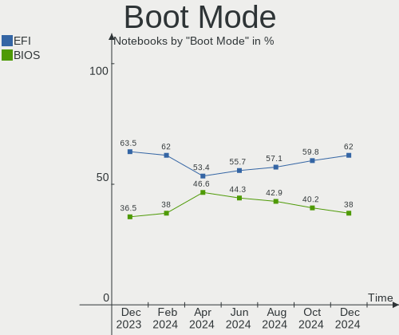
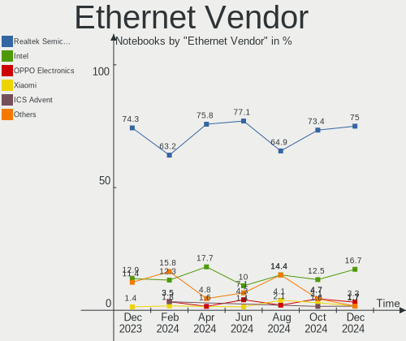
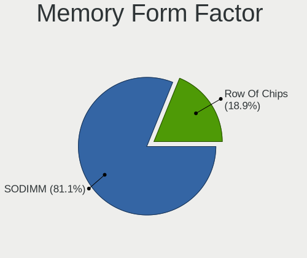

Linux in India - Hardware Trends (Notebooks)
--------------------------------------------

A project to identify most popular hardware characteristics and track their change
over time based on data collected by Linux users at https://Linux-Hardware.org.

Anyone can contribute to this report by the [hw-probe](https://github.com/linuxhw/hw-probe) tool:

    sudo -E hw-probe -all -upload

Period: Aug, 2023.

Contents
--------

* [ System ](#system)
  - [ OS                       ](#os)
  - [ OS Family                ](#os-family)
  - [ Kernel                   ](#kernel)
  - [ Kernel Family            ](#kernel-family)
  - [ Kernel Major Ver.        ](#kernel-major-ver)
  - [ Arch                     ](#arch)
  - [ DE                       ](#de)
  - [ Display Server           ](#display-server)
  - [ Display Manager          ](#display-manager)
  - [ OS Lang                  ](#os-lang)
  - [ Boot Mode                ](#boot-mode)
  - [ Filesystem               ](#filesystem)
  - [ Part. scheme             ](#part-scheme)
  - [ Dual Boot with Linux/BSD ](#dual-boot-with-linuxbsd)
  - [ Dual Boot (Win)          ](#dual-boot-win)

* [ Board ](#board)
  - [ Vendor                   ](#vendor)
  - [ Model                    ](#model)
  - [ Model Family             ](#model-family)
  - [ MFG Year                 ](#mfg-year)
  - [ Form Factor              ](#form-factor)
  - [ Secure Boot              ](#secure-boot)
  - [ Coreboot                 ](#coreboot)
  - [ RAM Size                 ](#ram-size)
  - [ RAM Used                 ](#ram-used)
  - [ Total Drives             ](#total-drives)
  - [ Has CD-ROM               ](#has-cd-rom)
  - [ Has Ethernet             ](#has-ethernet)
  - [ Has WiFi                 ](#has-wifi)
  - [ Has Bluetooth            ](#has-bluetooth)

* [ Location ](#location)
  - [ Country                  ](#country)
  - [ City                     ](#city)

* [ Drives ](#drives)
  - [ Drive Vendor             ](#drive-vendor)
  - [ Drive Model              ](#drive-model)
  - [ HDD Vendor               ](#hdd-vendor)
  - [ SSD Vendor               ](#ssd-vendor)
  - [ Drive Kind               ](#drive-kind)
  - [ Drive Connector          ](#drive-connector)
  - [ Drive Size               ](#drive-size)
  - [ Space Total              ](#space-total)
  - [ Space Used               ](#space-used)
  - [ Malfunc. Drives          ](#malfunc-drives)
  - [ Malfunc. Drive Vendor    ](#malfunc-drive-vendor)
  - [ Malfunc. HDD Vendor      ](#malfunc-hdd-vendor)
  - [ Malfunc. Drive Kind      ](#malfunc-drive-kind)
  - [ Failed Drives            ](#failed-drives)
  - [ Failed Drive Vendor      ](#failed-drive-vendor)
  - [ Drive Status             ](#drive-status)

* [ Storage controller ](#storage-controller)
  - [ Storage Vendor           ](#storage-vendor)
  - [ Storage Model            ](#storage-model)
  - [ Storage Kind             ](#storage-kind)

* [ Processor ](#processor)
  - [ CPU Vendor               ](#cpu-vendor)
  - [ CPU Model                ](#cpu-model)
  - [ CPU Model Family         ](#cpu-model-family)
  - [ CPU Cores                ](#cpu-cores)
  - [ CPU Sockets              ](#cpu-sockets)
  - [ CPU Threads              ](#cpu-threads)
  - [ CPU Op-Modes             ](#cpu-op-modes)
  - [ CPU Microcode            ](#cpu-microcode)
  - [ CPU Microarch            ](#cpu-microarch)

* [ Graphics ](#graphics)
  - [ GPU Vendor               ](#gpu-vendor)
  - [ GPU Model                ](#gpu-model)
  - [ GPU Combo                ](#gpu-combo)
  - [ GPU Driver               ](#gpu-driver)
  - [ GPU Memory               ](#gpu-memory)

* [ Monitor ](#monitor)
  - [ Monitor Vendor           ](#monitor-vendor)
  - [ Monitor Model            ](#monitor-model)
  - [ Monitor Resolution       ](#monitor-resolution)
  - [ Monitor Diagonal         ](#monitor-diagonal)
  - [ Monitor Width            ](#monitor-width)
  - [ Aspect Ratio             ](#aspect-ratio)
  - [ Monitor Area             ](#monitor-area)
  - [ Pixel Density            ](#pixel-density)
  - [ Multiple Monitors        ](#multiple-monitors)

* [ Network ](#network)
  - [ Net Controller Vendor    ](#net-controller-vendor)
  - [ Net Controller Model     ](#net-controller-model)
  - [ Wireless Vendor          ](#wireless-vendor)
  - [ Wireless Model           ](#wireless-model)
  - [ Ethernet Vendor          ](#ethernet-vendor)
  - [ Ethernet Model           ](#ethernet-model)
  - [ Net Controller Kind      ](#net-controller-kind)
  - [ Used Controller          ](#used-controller)
  - [ NICs                     ](#nics)
  - [ IPv6                     ](#ipv6)

* [ Bluetooth ](#bluetooth)
  - [ Bluetooth Vendor         ](#bluetooth-vendor)
  - [ Bluetooth Model          ](#bluetooth-model)

* [ Sound ](#sound)
  - [ Sound Vendor             ](#sound-vendor)
  - [ Sound Model              ](#sound-model)

* [ Memory ](#memory)
  - [ Memory Vendor            ](#memory-vendor)
  - [ Memory Model             ](#memory-model)
  - [ Memory Kind              ](#memory-kind)
  - [ Memory Form Factor       ](#memory-form-factor)
  - [ Memory Size              ](#memory-size)
  - [ Memory Speed             ](#memory-speed)

* [ Printers & scanners ](#printers--scanners)
  - [ Printer Vendor           ](#printer-vendor)
  - [ Printer Model            ](#printer-model)
  - [ Scanner Vendor           ](#scanner-vendor)
  - [ Scanner Model            ](#scanner-model)

* [ Camera ](#camera)
  - [ Camera Vendor            ](#camera-vendor)
  - [ Camera Model             ](#camera-model)

* [ Security ](#security)
  - [ Fingerprint Vendor       ](#fingerprint-vendor)
  - [ Fingerprint Model        ](#fingerprint-model)
  - [ Chipcard Vendor          ](#chipcard-vendor)
  - [ Chipcard Model           ](#chipcard-model)

* [ Unsupported ](#unsupported)
  - [ Unsupported Devices      ](#unsupported-devices)
  - [ Unsupported Device Types ](#unsupported-device-types)

System
------

OS
--

Installed operating systems

| Name                 | Notebooks | Percent |
|----------------------|-----------|---------|
| Ubuntu 22.04         | 22        | 23.91%  |
| Fedora 38            | 10        | 10.87%  |
| Arch Rolling         | 8         | 8.7%    |
| Ubuntu 20.04         | 7         | 7.61%   |
| Ubuntu 23.04         | 6         | 6.52%   |
| OpenMandriva 23.08   | 5         | 5.43%   |
| Pop!_OS 22.04        | 3         | 3.26%   |
| Linux Mint 21.2      | 3         | 3.26%   |
| ArcoLinux Rolling    | 3         | 3.26%   |
| Xero Rolling         | 2         | 2.17%   |
| Slackware 15.0       | 2         | 2.17%   |
| OpenMandriva 23.03   | 2         | 2.17%   |
| Kubuntu 23.04        | 2         | 2.17%   |
| Kali 2023.2          | 2         | 2.17%   |
| Debian 12            | 2         | 2.17%   |
| Zorin 16             | 1         | 1.09%   |
| ROSA 12.4            | 1         | 1.09%   |
| OpenMandriva 4.3     | 1         | 1.09%   |
| OpenMandriva 23.90   | 1         | 1.09%   |
| MX 21                | 1         | 1.09%   |
| KDE neon 22.04       | 1         | 1.09%   |
| Kali 2023.3          | 1         | 1.09%   |
| Garuda Linux Soaring | 1         | 1.09%   |
| Garuda Linux Rolling | 1         | 1.09%   |
| Elementary 7         | 1         | 1.09%   |
| Debian               | 1         | 1.09%   |
| CentOS 8             | 1         | 1.09%   |
| Archcraft            | 1         | 1.09%   |

OS Family
---------

OS without a version

| Name         | Notebooks | Percent |
|--------------|-----------|---------|
| Ubuntu       | 35        | 38.04%  |
| Fedora       | 10        | 10.87%  |
| OpenMandriva | 9         | 9.78%   |
| Arch         | 8         | 8.7%    |
| Pop!_OS      | 3         | 3.26%   |
| Linux Mint   | 3         | 3.26%   |
| Kali         | 3         | 3.26%   |
| Debian       | 3         | 3.26%   |
| ArcoLinux    | 3         | 3.26%   |
| Xero         | 2         | 2.17%   |
| Slackware    | 2         | 2.17%   |
| Kubuntu      | 2         | 2.17%   |
| Garuda Linux | 2         | 2.17%   |
| Zorin        | 1         | 1.09%   |
| ROSA         | 1         | 1.09%   |
| MX           | 1         | 1.09%   |
| KDE neon     | 1         | 1.09%   |
| Elementary   | 1         | 1.09%   |
| CentOS       | 1         | 1.09%   |
| Archcraft    | 1         | 1.09%   |

Kernel
------

Version of the Linux kernel

| Version                           | Notebooks | Percent |
|-----------------------------------|-----------|---------|
| 6.2.0-26-generic                  | 24        | 26.09%  |
| 6.4.8-desktop-2omv2390            | 3         | 3.26%   |
| 6.4.12-200.fc38.x86_64            | 3         | 3.26%   |
| 6.4.11-desktop-1omv2390           | 3         | 3.26%   |
| 6.3.0-kali1-amd64                 | 3         | 3.26%   |
| 6.2.0-31-generic                  | 3         | 3.26%   |
| 5.15.0-78-generic                 | 3         | 3.26%   |
| 6.4.8-zen1-1-zen                  | 2         | 2.17%   |
| 6.4.7-200.fc38.x86_64             | 2         | 2.17%   |
| 6.4.6-76060406-generic            | 2         | 2.17%   |
| 6.4.4-arch1-1                     | 2         | 2.17%   |
| 6.4.11-zen2-1-zen                 | 2         | 2.17%   |
| 6.4.10-arch1-1                    | 2         | 2.17%   |
| 6.4.10-200.fc38.x86_64            | 2         | 2.17%   |
| 6.2.9-300.fc38.x86_64             | 2         | 2.17%   |
| 6.2.0-27-generic                  | 2         | 2.17%   |
| 6.1.44-1-lts                      | 2         | 2.17%   |
| 6.1.0-10-amd64                    | 2         | 2.17%   |
| 5.15.0-79-generic                 | 2         | 2.17%   |
| 5.15.0-76-generic                 | 2         | 2.17%   |
| 6.5.0-257.vanilla.fc38.x86_64     | 1         | 1.09%   |
| 6.4.7-desktop-1omv2390            | 1         | 1.09%   |
| 6.4.7-arch1-1                     | 1         | 1.09%   |
| 6.4.3-arch1-2                     | 1         | 1.09%   |
| 6.4.12-arch1-1                    | 1         | 1.09%   |
| 6.4.10-zen2-1-zen                 | 1         | 1.09%   |
| 6.4.10-zen1-1-zen                 | 1         | 1.09%   |
| 6.2.6-desktop-1omv2390            | 1         | 1.09%   |
| 6.2.6-76060206-generic            | 1         | 1.09%   |
| 6.2.0-32-generic                  | 1         | 1.09%   |
| 6.2.0-20-generic                  | 1         | 1.09%   |
| 6.1.48-1-lts                      | 1         | 1.09%   |
| 6.1.44                            | 1         | 1.09%   |
| 6.1.20-generic-2rosa2021.1-x86_64 | 1         | 1.09%   |
| 6.1.0-11-amd64                    | 1         | 1.09%   |
| 5.19.0-50-generic                 | 1         | 1.09%   |
| 5.16.13-desktop-1omv4003          | 1         | 1.09%   |
| 5.15.117                          | 1         | 1.09%   |
| 5.15.0-82-generic                 | 1         | 1.09%   |
| 5.15.0-72-generic                 | 1         | 1.09%   |

Kernel Family
-------------

Linux kernel without a distro release

| Version  | Notebooks | Percent |
|----------|-----------|---------|
| 6.2.0    | 31        | 33.7%   |
| 5.15.0   | 10        | 10.87%  |
| 6.4.10   | 6         | 6.52%   |
| 6.4.8    | 5         | 5.43%   |
| 6.4.11   | 5         | 5.43%   |
| 6.4.7    | 4         | 4.35%   |
| 6.4.12   | 4         | 4.35%   |
| 6.3.0    | 3         | 3.26%   |
| 6.1.44   | 3         | 3.26%   |
| 6.1.0    | 3         | 3.26%   |
| 6.4.6    | 2         | 2.17%   |
| 6.4.4    | 2         | 2.17%   |
| 6.2.9    | 2         | 2.17%   |
| 6.2.6    | 2         | 2.17%   |
| 6.5.0    | 1         | 1.09%   |
| 6.4.3    | 1         | 1.09%   |
| 6.1.48   | 1         | 1.09%   |
| 6.1.20   | 1         | 1.09%   |
| 5.19.0   | 1         | 1.09%   |
| 5.16.13  | 1         | 1.09%   |
| 5.15.117 | 1         | 1.09%   |
| 5.11.0   | 1         | 1.09%   |
| 5.10.0   | 1         | 1.09%   |
| 4.18.0   | 1         | 1.09%   |

Kernel Major Ver.
-----------------

Linux kernel major version

| Version | Notebooks | Percent |
|---------|-----------|---------|
| 6.2     | 35        | 38.04%  |
| 6.4     | 29        | 31.52%  |
| 5.15    | 11        | 11.96%  |
| 6.1     | 8         | 8.7%    |
| 6.3     | 3         | 3.26%   |
| 6.5     | 1         | 1.09%   |
| 5.19    | 1         | 1.09%   |
| 5.16    | 1         | 1.09%   |
| 5.11    | 1         | 1.09%   |
| 5.10    | 1         | 1.09%   |
| 4.18    | 1         | 1.09%   |

Arch
----

OS architecture (x86_64, i586, etc.)

| Name   | Notebooks | Percent |
|--------|-----------|---------|
| x86_64 | 92        | 100%    |

DE
--

Desktop Environment

| Name       | Notebooks | Percent |
|------------|-----------|---------|
| GNOME      | 52        | 56.52%  |
| KDE5       | 25        | 27.17%  |
| XFCE       | 8         | 8.7%    |
| X-Cinnamon | 4         | 4.35%   |
| Pantheon   | 1         | 1.09%   |
| openbox    | 1         | 1.09%   |
| LXQt       | 1         | 1.09%   |

Display Server
--------------

X11 or Wayland

| Name    | Notebooks | Percent |
|---------|-----------|---------|
| Wayland | 44        | 47.83%  |
| X11     | 43        | 46.74%  |
| Tty     | 3         | 3.26%   |
| Unknown | 2         | 2.17%   |

Display Manager
---------------

SDDM, LightDM, etc.

| Name    | Notebooks | Percent |
|---------|-----------|---------|
| GDM3    | 26        | 28.26%  |
| SDDM    | 24        | 26.09%  |
| Unknown | 21        | 22.83%  |
| GDM     | 11        | 11.96%  |
| LightDM | 8         | 8.7%    |
| XDM     | 2         | 2.17%   |

OS Lang
-------

Language

| Lang    | Notebooks | Percent |
|---------|-----------|---------|
| en_IN   | 51        | 55.43%  |
| en_US   | 36        | 39.13%  |
| C       | 3         | 3.26%   |
| en_GB   | 1         | 1.09%   |
| Unknown | 1         | 1.09%   |

Boot Mode
---------

EFI or BIOS

| Mode | Notebooks | Percent |
|------|-----------|---------|
| EFI  | 59        | 64.13%  |
| BIOS | 33        | 35.87%  |

Filesystem
----------

Type of filesystem

| Type    | Notebooks | Percent |
|---------|-----------|---------|
| Ext4    | 53        | 57.61%  |
| Btrfs   | 18        | 19.57%  |
| Tmpfs   | 10        | 10.87%  |
| Overlay | 8         | 8.7%    |
| Zfs     | 1         | 1.09%   |
| Xfs     | 1         | 1.09%   |
| F2fs    | 1         | 1.09%   |

Part. scheme
------------

Scheme of partitioning

| Type    | Notebooks | Percent |
|---------|-----------|---------|
| GPT     | 66        | 71.74%  |
| Unknown | 20        | 21.74%  |
| MBR     | 6         | 6.52%   |

Dual Boot with Linux/BSD
------------------------

Hosting more than one Linux/BSD

| Dual boot | Notebooks | Percent |
|-----------|-----------|---------|
| No        | 80        | 86.96%  |
| Yes       | 12        | 13.04%  |

Dual Boot (Win)
---------------

Hosting Linux and Windows

| Dual boot | Notebooks | Percent |
|-----------|-----------|---------|
| No        | 53        | 57.61%  |
| Yes       | 39        | 42.39%  |

Board
-----

Vendor
------

Motherboard manufacturer

| Name             | Notebooks | Percent |
|------------------|-----------|---------|
| Lenovo           | 23        | 25%     |
| Hewlett-Packard  | 23        | 25%     |
| Dell             | 19        | 20.65%  |
| ASUSTek Computer | 9         | 9.78%   |
| Acer             | 6         | 6.52%   |
| MSI              | 5         | 5.43%   |
| Infinix          | 2         | 2.17%   |
| Valve            | 1         | 1.09%   |
| HONOR            | 1         | 1.09%   |
| Fujitsu          | 1         | 1.09%   |
| Apple            | 1         | 1.09%   |
| Alienware        | 1         | 1.09%   |

Model
-----

Motherboard model

| Name                                     | Notebooks | Percent |
|------------------------------------------|-----------|---------|
| Lenovo G50-80 80E5                       | 2         | 2.17%   |
| HP Laptop 14s-dy2xxx                     | 2         | 2.17%   |
| HP 15                                    | 2         | 2.17%   |
| ASUS VivoBook_ASUSLaptop K3502ZA_K3502ZA | 2         | 2.17%   |
| Valve Jupiter                            | 1         | 1.09%   |
| MSI Thin GF63 12VE                       | 1         | 1.09%   |
| MSI Modern 15 A5M                        | 1         | 1.09%   |
| MSI Katana GF76 11UD                     | 1         | 1.09%   |
| MSI GL63 8RC                             | 1         | 1.09%   |
| MSI GF63 Thin 10SC                       | 1         | 1.09%   |
| Lenovo V15 G3 ABA 82TV                   | 1         | 1.09%   |
| Lenovo V15 G2 ALC Ua 82KD                | 1         | 1.09%   |
| Lenovo ThinkPad X230 23253B3             | 1         | 1.09%   |
| Lenovo ThinkPad W540 20BG0016US          | 1         | 1.09%   |
| Lenovo ThinkPad E490 20N8CTO1WW          | 1         | 1.09%   |
| Lenovo ThinkPad E470 20H2S0XB00          | 1         | 1.09%   |
| Lenovo ThinkPad E15 Gen 3 20YHCTO1WW     | 1         | 1.09%   |
| Lenovo ThinkPad E14 Gen 5 21JRS00T00     | 1         | 1.09%   |
| Lenovo ThinkPad E14 Gen 4 21E3S06300     | 1         | 1.09%   |
| Lenovo ThinkPad E14 Gen 3 20YDCTO1WW     | 1         | 1.09%   |
| Lenovo ThinkPad E14 Gen 2 20TAS12B00     | 1         | 1.09%   |
| Lenovo ThinkPad E14 20RBCTO1WW           | 1         | 1.09%   |
| Lenovo Legion Y740-15IRH 81UF            | 1         | 1.09%   |
| Lenovo Legion 5 Pro 16ACH6H 82JQ         | 1         | 1.09%   |
| Lenovo IdeaPad Y510P 20217               | 1         | 1.09%   |
| Lenovo IdeaPad L340-15IRH Gaming 81LK    | 1         | 1.09%   |
| Lenovo IdeaPad Gaming 3 15IHU6 82K1      | 1         | 1.09%   |
| Lenovo IdeaPad Gaming 3 15ACH6 82K2      | 1         | 1.09%   |
| Lenovo IdeaPad 5 15ALC05 82LN            | 1         | 1.09%   |
| Lenovo IdeaPad 320-15ISK 80XH            | 1         | 1.09%   |
| Lenovo G50-70 20351                      | 1         | 1.09%   |
| Infinix INBOOK X2 SLIM                   | 1         | 1.09%   |
| Infinix INBOOK X1 NEO                    | 1         | 1.09%   |
| HONOR NMH-WCX9                           | 1         | 1.09%   |
| HP Victus by Laptop 16-e0xxx             | 1         | 1.09%   |
| HP ProBook 640 G2                        | 1         | 1.09%   |
| HP ProBook 445 G8 Notebook PC            | 1         | 1.09%   |
| HP ProBook 440 G5                        | 1         | 1.09%   |
| HP Pavilion Notebook                     | 1         | 1.09%   |
| HP Pavilion Laptop 15-eh2xxx             | 1         | 1.09%   |

Model Family
------------

Motherboard model prefix

| Name              | Notebooks | Percent |
|-------------------|-----------|---------|
| Lenovo ThinkPad   | 10        | 10.87%  |
| Dell Inspiron     | 10        | 10.87%  |
| HP Pavilion       | 8         | 8.7%    |
| Lenovo IdeaPad    | 6         | 6.52%   |
| ASUS VivoBook     | 5         | 5.43%   |
| Dell Vostro       | 4         | 4.35%   |
| Dell Latitude     | 4         | 4.35%   |
| HP ProBook        | 3         | 3.26%   |
| HP EliteBook      | 3         | 3.26%   |
| Lenovo V15        | 2         | 2.17%   |
| Lenovo Legion     | 2         | 2.17%   |
| Lenovo G50-80     | 2         | 2.17%   |
| Infinix INBOOK    | 2         | 2.17%   |
| HP Laptop         | 2         | 2.17%   |
| HP ENVY           | 2         | 2.17%   |
| HP 15             | 2         | 2.17%   |
| ASUS ROG          | 2         | 2.17%   |
| Acer Nitro        | 2         | 2.17%   |
| Acer Aspire       | 2         | 2.17%   |
| Valve Jupiter     | 1         | 1.09%   |
| MSI Thin          | 1         | 1.09%   |
| MSI Modern        | 1         | 1.09%   |
| MSI Katana        | 1         | 1.09%   |
| MSI GL63          | 1         | 1.09%   |
| MSI GF63          | 1         | 1.09%   |
| Lenovo G50-70     | 1         | 1.09%   |
| HONOR NMH-WCX9    | 1         | 1.09%   |
| HP Victus         | 1         | 1.09%   |
| HP Notebook       | 1         | 1.09%   |
| HP Compaq         | 1         | 1.09%   |
| Fujitsu LIFEBOOK  | 1         | 1.09%   |
| Dell Precision    | 1         | 1.09%   |
| ASUS TUF          | 1         | 1.09%   |
| ASUS ASUS         | 1         | 1.09%   |
| Apple MacBookPro9 | 1         | 1.09%   |
| Alienware 14      | 1         | 1.09%   |
| Acer Swift        | 1         | 1.09%   |
| Acer One          | 1         | 1.09%   |

MFG Year
--------

Motherboard manufacture year

| Year | Notebooks | Percent |
|------|-----------|---------|
| 2021 | 21        | 22.83%  |
| 2022 | 14        | 15.22%  |
| 2019 | 8         | 8.7%    |
| 2020 | 7         | 7.61%   |
| 2017 | 6         | 6.52%   |
| 2015 | 6         | 6.52%   |
| 2014 | 5         | 5.43%   |
| 2013 | 5         | 5.43%   |
| 2023 | 4         | 4.35%   |
| 2016 | 4         | 4.35%   |
| 2012 | 4         | 4.35%   |
| 2018 | 3         | 3.26%   |
| 2008 | 3         | 3.26%   |
| 2011 | 2         | 2.17%   |

Form Factor
-----------

Physical design of the computer

| Name     | Notebooks | Percent |
|----------|-----------|---------|
| Notebook | 92        | 100%    |

Secure Boot
-----------

Enabled or disabled

| State    | Notebooks | Percent |
|----------|-----------|---------|
| Disabled | 82        | 89.13%  |
| Enabled  | 10        | 10.87%  |

Coreboot
--------

Have coreboot on board

| Used | Notebooks | Percent |
|------|-----------|---------|
| No   | 92        | 100%    |

RAM Size
--------

Total RAM memory

| Size in GB  | Notebooks | Percent |
|-------------|-----------|---------|
| 4.01-8.0    | 29        | 31.52%  |
| 16.01-24.0  | 22        | 23.91%  |
| 8.01-16.0   | 22        | 23.91%  |
| 3.01-4.0    | 12        | 13.04%  |
| 32.01-64.0  | 4         | 4.35%   |
| 24.01-32.0  | 2         | 2.17%   |
| 64.01-256.0 | 1         | 1.09%   |

RAM Used
--------

Used RAM memory

| Used GB   | Notebooks | Percent |
|-----------|-----------|---------|
| 4.01-8.0  | 25        | 27.17%  |
| 2.01-3.0  | 24        | 26.09%  |
| 3.01-4.0  | 21        | 22.83%  |
| 1.01-2.0  | 15        | 16.3%   |
| 8.01-16.0 | 4         | 4.35%   |
| 0.51-1.0  | 3         | 3.26%   |

Total Drives
------------

Number of drives on board

| Drives | Notebooks | Percent |
|--------|-----------|---------|
| 1      | 56        | 60.87%  |
| 2      | 32        | 34.78%  |
| 3      | 3         | 3.26%   |
| 0      | 1         | 1.09%   |

Has CD-ROM
----------

Has CD-ROM on board

| Presented | Notebooks | Percent |
|-----------|-----------|---------|
| No        | 77        | 83.7%   |
| Yes       | 15        | 16.3%   |

Has Ethernet
------------

Has Ethernet on board

| Presented | Notebooks | Percent |
|-----------|-----------|---------|
| Yes       | 74        | 80.43%  |
| No        | 18        | 19.57%  |

Has WiFi
--------

Has WiFi module

| Presented | Notebooks | Percent |
|-----------|-----------|---------|
| Yes       | 91        | 98.91%  |
| No        | 1         | 1.09%   |

Has Bluetooth
-------------

Has Bluetooth module

| Presented | Notebooks | Percent |
|-----------|-----------|---------|
| Yes       | 85        | 92.39%  |
| No        | 7         | 7.61%   |

Location
--------

Country
-------

Geographic location (country)

| Country | Notebooks | Percent |
|---------|-----------|---------|
| India   | 92        | 100%    |

City
----

Geographic location (city)

| City          | Notebooks | Percent |
|---------------|-----------|---------|
| Delhi         | 12        | 13.04%  |
| Bengaluru     | 11        | 11.96%  |
| Pune          | 10        | 10.87%  |
| Chennai       | 7         | 7.61%   |
| Hyderabad     | 6         | 6.52%   |
| Mumbai        | 4         | 4.35%   |
| Patna         | 3         | 3.26%   |
| Kolkata       | 3         | 3.26%   |
| Ahmedabad     | 3         | 3.26%   |
| Mangalore     | 2         | 2.17%   |
| Kochi         | 2         | 2.17%   |
| Jhansi        | 2         | 2.17%   |
| Indore        | 2         | 2.17%   |
| Greater Noida | 2         | 2.17%   |
| Chandigarh    | 2         | 2.17%   |
| Visakhapatnam | 1         | 1.09%   |
| Vadodara      | 1         | 1.09%   |
| Tiruchi       | 1         | 1.09%   |
| Raipur        | 1         | 1.09%   |
| Nagpur        | 1         | 1.09%   |
| Morena        | 1         | 1.09%   |
| Lucknow       | 1         | 1.09%   |
| Kunnamkulam   | 1         | 1.09%   |
| Kozhikode     | 1         | 1.09%   |
| Jaipur        | 1         | 1.09%   |
| Imphal        | 1         | 1.09%   |
| Gurgaon       | 1         | 1.09%   |
| Gorakhpur     | 1         | 1.09%   |
| Ghaziabad     | 1         | 1.09%   |
| Gandhinagar   | 1         | 1.09%   |
| Durgapur      | 1         | 1.09%   |
| Dhanbad       | 1         | 1.09%   |
| Coimbatore    | 1         | 1.09%   |
| Bhadaur       | 1         | 1.09%   |
| Banswara      | 1         | 1.09%   |
| Balasore      | 1         | 1.09%   |

Drives
------

Drive Vendor
------------

Hard drive vendors

| Vendor                      | Notebooks | Drives | Percent |
|-----------------------------|-----------|--------|---------|
| Samsung Electronics         | 22        | 23     | 17.74%  |
| WDC                         | 19        | 21     | 15.32%  |
| Seagate                     | 15        | 15     | 12.1%   |
| Toshiba                     | 7         | 7      | 5.65%   |
| Intel                       | 7         | 8      | 5.65%   |
| SanDisk                     | 6         | 6      | 4.84%   |
| Kingston                    | 6         | 6      | 4.84%   |
| Crucial                     | 6         | 6      | 4.84%   |
| Micron Technology           | 5         | 5      | 4.03%   |
| UMIS                        | 2         | 2      | 1.61%   |
| SK hynix                    | 2         | 2      | 1.61%   |
| Phison                      | 2         | 2      | 1.61%   |
| KIOXIA                      | 2         | 2      | 1.61%   |
| Hitachi                     | 2         | 2      | 1.61%   |
| FORESEE                     | 2         | 2      | 1.61%   |
| Unknown                     | 2         | 2      | 1.61%   |
| Unknown                     | 1         | 1      | 0.81%   |
| Union Memory (Shenzhen)     | 1         | 1      | 0.81%   |
| Transcend                   | 1         | 1      | 0.81%   |
| Supersonic                  | 1         | 1      | 0.81%   |
| Silicon Motion              | 1         | 1      | 0.81%   |
| POWER                       | 1         | 1      | 0.81%   |
| Micron/Crucial Technology   | 1         | 1      | 0.81%   |
| MAXIO Technology (Hangzhou) | 1         | 1      | 0.81%   |
| LITEONIT                    | 1         | 1      | 0.81%   |
| KingFast                    | 1         | 1      | 0.81%   |
| JMicron Technology          | 1         | 1      | 0.81%   |
| Hikvision                   | 1         | 1      | 0.81%   |
| HGST                        | 1         | 1      | 0.81%   |
| CONSISTENT                  | 1         | 1      | 0.81%   |
| China                       | 1         | 1      | 0.81%   |
| Acer                        | 1         | 1      | 0.81%   |
| Aarvex                      | 1         | 1      | 0.81%   |

Drive Model
-----------

Hard drive models

| Model                                               | Notebooks | Percent |
|-----------------------------------------------------|-----------|---------|
| Seagate ST1000LM035-1RK172 1TB                      | 4         | 3.15%   |
| Samsung NVMe SSD Controller SM981/PM981/PM983 500GB | 4         | 3.15%   |
| Toshiba MQ01ABD100 1TB                              | 3         | 2.36%   |
| Seagate ST1000LM048-2E7172 1TB                      | 3         | 2.36%   |
| Micron 2450_MTFDKBA512TFK 512GB                     | 3         | 2.36%   |
| WDC WDS240G2G0A-00JH30 240GB SSD                    | 2         | 1.57%   |
| WDC WD10SPSX-60A6WT0 1TB                            | 2         | 1.57%   |
| Seagate ST1000LM024 HN-M101MBB 1TB                  | 2         | 1.57%   |
| Sandisk WD Blue SN550 NVMe SSD 250GB                | 2         | 1.57%   |
| Samsung MZALQ512HBLU-00BL2 512GB                    | 2         | 1.57%   |
| Kingston SA400S37240G 240GB SSD                     | 2         | 1.57%   |
| Crucial CT240BX500SSD1 240GB                        | 2         | 1.57%   |
| Unknown                                             | 2         | 1.57%   |
| WDC WDS480G2G0B-00EPW0 480GB SSD                    | 1         | 0.79%   |
| WDC WDS480G2G0A-00JH30 480GB SSD                    | 1         | 0.79%   |
| WDC WDS240G2G0B-00EPW0 240GB SSD                    | 1         | 0.79%   |
| WDC WDS100T3X0C-00SJG0 1TB                          | 1         | 0.79%   |
| WDC WD5000LPVX-60V0TT0 500GB                        | 1         | 0.79%   |
| WDC WD1600BEVT-75ZCT1 160GB                         | 1         | 0.79%   |
| WDC WD1600BEVT-60ZCT0 160GB                         | 1         | 0.79%   |
| WDC WD10SPZX-75Z10T3 1TB                            | 1         | 0.79%   |
| WDC WD10SPZX-75Z10T1 1TB                            | 1         | 0.79%   |
| WDC WD10SPZX-24Z10T0 1TB                            | 1         | 0.79%   |
| WDC WD10SPZX-22Z10T1 1TB                            | 1         | 0.79%   |
| WDC WD10JPVX-60JC3T0 1TB                            | 1         | 0.79%   |
| WDC WD10JPCX-24UE4T0 1TB                            | 1         | 0.79%   |
| WDC PC SN730 SDBPNTY-256G-1006 256GB                | 1         | 0.79%   |
| WDC PC SN730 SDBPNTY-1T00-1101 1TB                  | 1         | 0.79%   |
| WDC PC SN530 SDBPNPZ-512G-1006 512GB                | 1         | 0.79%   |
| WDC PC SN530 SDBPMPZ-512G-1101 512GB                | 1         | 0.79%   |
| Unknown MMC Card  512GB                             | 1         | 0.79%   |
| Union Memory (Shenzhen) UMIS RPJTJ512MGE1QDQ 512GB  | 1         | 0.79%   |
| UMIS RPJTJ512MKP1QDQ 512GB                          | 1         | 0.79%   |
| UMIS RPJTJ512MEE1OWX 512GB                          | 1         | 0.79%   |
| Transcend TS256GMTE352T-VLV 256GB                   | 1         | 0.79%   |
| Toshiba MQ01ACF050 500GB                            | 1         | 0.79%   |
| Toshiba MQ01ABF050 500GB                            | 1         | 0.79%   |
| Toshiba MQ01ABD050V 500GB                           | 1         | 0.79%   |
| Toshiba MQ01ABD050 500GB                            | 1         | 0.79%   |
| Supersonic SUPERSONIC512 512GB                      | 1         | 0.79%   |

HDD Vendor
----------

Hard disk drive vendors

| Vendor  | Notebooks | Drives | Percent |
|---------|-----------|--------|---------|
| Seagate | 14        | 14     | 40%     |
| WDC     | 11        | 11     | 31.43%  |
| Toshiba | 7         | 7      | 20%     |
| Hitachi | 2         | 2      | 5.71%   |
| HGST    | 1         | 1      | 2.86%   |

SSD Vendor
----------

Solid state drive vendors

| Vendor              | Notebooks | Drives | Percent |
|---------------------|-----------|--------|---------|
| Samsung Electronics | 6         | 6      | 22.22%  |
| WDC                 | 5         | 5      | 18.52%  |
| Crucial             | 4         | 4      | 14.81%  |
| Kingston            | 2         | 2      | 7.41%   |
| SK hynix            | 1         | 1      | 3.7%    |
| Seagate             | 1         | 1      | 3.7%    |
| SanDisk             | 1         | 1      | 3.7%    |
| POWER               | 1         | 1      | 3.7%    |
| LITEONIT            | 1         | 1      | 3.7%    |
| CONSISTENT          | 1         | 1      | 3.7%    |
| China               | 1         | 1      | 3.7%    |
| Acer                | 1         | 1      | 3.7%    |
| Aarvex              | 1         | 1      | 3.7%    |
| Unknown             | 1         | 1      | 3.7%    |

Drive Kind
----------

HDD or SSD

| Kind    | Notebooks | Drives | Percent |
|---------|-----------|--------|---------|
| NVMe    | 52        | 61     | 43.7%   |
| HDD     | 35        | 35     | 29.41%  |
| SSD     | 27        | 27     | 22.69%  |
| Unknown | 4         | 4      | 3.36%   |
| MMC     | 1         | 1      | 0.84%   |

Drive Connector
---------------

SATA, SAS, NVMe, etc.

| Type | Notebooks | Drives | Percent |
|------|-----------|--------|---------|
| NVMe | 52        | 61     | 48.6%   |
| SATA | 51        | 63     | 47.66%  |
| SAS  | 3         | 3      | 2.8%    |
| MMC  | 1         | 1      | 0.93%   |

Drive Size
----------

Size of hard drive

| Size in TB | Notebooks | Drives | Percent |
|------------|-----------|--------|---------|
| 0.01-0.5   | 34        | 37     | 57.63%  |
| 0.51-1.0   | 24        | 24     | 40.68%  |
| 1.01-2.0   | 1         | 1      | 1.69%   |

Space Total
-----------

Amount of disk space available on the file system

| Size in GB     | Notebooks | Percent |
|----------------|-----------|---------|
| 251-500        | 28        | 30.43%  |
| 101-250        | 22        | 23.91%  |
| 501-1000       | 17        | 18.48%  |
| 1-20           | 8         | 8.7%    |
| 51-100         | 6         | 6.52%   |
| 1001-2000      | 4         | 4.35%   |
| 2001-3000      | 3         | 3.26%   |
| More than 3000 | 2         | 2.17%   |
| 21-50          | 2         | 2.17%   |

Space Used
----------

Amount of used disk space

| Used GB   | Notebooks | Percent |
|-----------|-----------|---------|
| 1-20      | 30        | 32.61%  |
| 21-50     | 18        | 19.57%  |
| 51-100    | 17        | 18.48%  |
| 101-250   | 14        | 15.22%  |
| 251-500   | 8         | 8.7%    |
| 501-1000  | 3         | 3.26%   |
| 1001-2000 | 2         | 2.17%   |

Malfunc. Drives
---------------

Drive models with a malfunction

| Model                                            | Notebooks | Drives | Percent |
|--------------------------------------------------|-----------|--------|---------|
| WDC WDS240G2G0A-00JH30 240GB SSD                 | 1         | 1      | 10%     |
| Toshiba MQ01ABF050 500GB                         | 1         | 1      | 10%     |
| Seagate ST9500325AS 500GB                        | 1         | 1      | 10%     |
| SanDisk SDSSDXPS480G 480GB                       | 1         | 1      | 10%     |
| Samsung Electronics MZ7TD256GMMC-00000 256GB SSD | 1         | 1      | 10%     |
| POWER X SS1000 512GB SSD                         | 1         | 1      | 10%     |
| LITEONIT LSS-24L6G 24GB SSD                      | 1         | 1      | 10%     |
| Hitachi HTS723232A7A364 320GB                    | 1         | 1      | 10%     |
| Hitachi HTS545032B9A300 320GB                    | 1         | 1      | 10%     |
| HGST HTS545050A7E680 500GB                       | 1         | 1      | 10%     |

Malfunc. Drive Vendor
---------------------

Vendors of faulty drives

| Vendor              | Notebooks | Drives | Percent |
|---------------------|-----------|--------|---------|
| Hitachi             | 2         | 2      | 20%     |
| WDC                 | 1         | 1      | 10%     |
| Toshiba             | 1         | 1      | 10%     |
| Seagate             | 1         | 1      | 10%     |
| SanDisk             | 1         | 1      | 10%     |
| Samsung Electronics | 1         | 1      | 10%     |
| POWER               | 1         | 1      | 10%     |
| LITEONIT            | 1         | 1      | 10%     |
| HGST                | 1         | 1      | 10%     |

Malfunc. HDD Vendor
-------------------

Vendors of faulty HDD drives

| Vendor  | Notebooks | Drives | Percent |
|---------|-----------|--------|---------|
| Hitachi | 2         | 2      | 40%     |
| Toshiba | 1         | 1      | 20%     |
| Seagate | 1         | 1      | 20%     |
| HGST    | 1         | 1      | 20%     |

Malfunc. Drive Kind
-------------------

Kinds of faulty drives

| Kind | Notebooks | Drives | Percent |
|------|-----------|--------|---------|
| SSD  | 5         | 5      | 50%     |
| HDD  | 5         | 5      | 50%     |

Failed Drives
-------------

Failed drive models

Zero info for selected period =(

Failed Drive Vendor
-------------------

Failed drive vendors

Zero info for selected period =(

Drive Status
------------

Number of failed and malfunc. drives

| Status   | Notebooks | Drives | Percent |
|----------|-----------|--------|---------|
| Works    | 51        | 69     | 54.26%  |
| Detected | 34        | 49     | 36.17%  |
| Malfunc  | 9         | 10     | 9.57%   |

Storage controller
------------------

Storage Vendor
--------------

Storage controller vendors

| Vendor                                  | Notebooks | Percent |
|-----------------------------------------|-----------|---------|
| Intel                                   | 66        | 51.56%  |
| Samsung Electronics                     | 16        | 12.5%   |
| AMD                                     | 11        | 8.59%   |
| SanDisk                                 | 9         | 7.03%   |
| Micron Technology                       | 5         | 3.91%   |
| Kingston Technology Company             | 4         | 3.13%   |
| Micron/Crucial Technology               | 3         | 2.34%   |
| Union Memory (Shenzhen)                 | 2         | 1.56%   |
| Silicon Motion                          | 2         | 1.56%   |
| Shenzhen Longsys Electronics            | 2         | 1.56%   |
| Phison Electronics                      | 2         | 1.56%   |
| MAXIO Technology (Hangzhou)             | 2         | 1.56%   |
| KIOXIA                                  | 2         | 1.56%   |
| SK hynix                                | 1         | 0.78%   |
| Shenzhen Unionmemory Information System | 1         | 0.78%   |

Storage Model
-------------

Storage controller models

| Model                                                                                       | Notebooks | Percent |
|---------------------------------------------------------------------------------------------|-----------|---------|
| AMD FCH SATA Controller [AHCI mode]                                                         | 11        | 8.21%   |
| Intel Volume Management Device NVMe RAID Controller                                         | 9         | 6.72%   |
| Intel Sunrise Point-LP SATA Controller [AHCI mode]                                          | 9         | 6.72%   |
| Samsung NVMe SSD Controller 980                                                             | 8         | 5.97%   |
| Intel 82801 Mobile SATA Controller [RAID mode]                                              | 8         | 5.97%   |
| Samsung NVMe SSD Controller SM981/PM981/PM983                                               | 5         | 3.73%   |
| Intel Wildcat Point-LP SATA Controller [AHCI Mode]                                          | 5         | 3.73%   |
| Intel 8 Series SATA Controller 1 [AHCI mode]                                                | 5         | 3.73%   |
| Intel Tiger Lake-LP SATA Controller                                                         | 4         | 2.99%   |
| Intel 7 Series Chipset Family 6-port SATA Controller [AHCI mode]                            | 4         | 2.99%   |
| SanDisk WD Blue SN550 NVMe SSD                                                              | 3         | 2.24%   |
| Micron 2450 NVMe SSD [HendrixV] (DRAM-less)                                                 | 3         | 2.24%   |
| Kingston Company OM3PDP3 NVMe SSD                                                           | 3         | 2.24%   |
| Intel SSD 670p Series [Keystone Harbor]                                                     | 3         | 2.24%   |
| Intel SSD 660P Series                                                                       | 3         | 2.24%   |
| Intel Cannon Lake Mobile PCH SATA AHCI Controller                                           | 3         | 2.24%   |
| Intel Alder Lake-P SATA AHCI Controller                                                     | 3         | 2.24%   |
| Silicon Motion SM2263EN/SM2263XT (DRAM-less) NVMe SSD Controllers                           | 2         | 1.49%   |
| Shenzhen Longsys Lexar NM620 NVME SSD (DRAM-less)                                           | 2         | 1.49%   |
| SanDisk WD Black SN750 / PC SN730 NVMe SSD                                                  | 2         | 1.49%   |
| Samsung NVMe SSD Controller PM9B1                                                           | 2         | 1.49%   |
| Micron/Crucial P2 [Nick P2] / P3 / P3 Plus NVMe PCIe SSD (DRAM-less)                        | 2         | 1.49%   |
| Micron 2200S NVMe SSD [Cassandra]                                                           | 2         | 1.49%   |
| MAXIO (Hangzhou) NVMe SSD Controller MAP1202                                                | 2         | 1.49%   |
| Intel Comet Lake SATA AHCI Controller                                                       | 2         | 1.49%   |
| Intel Atom/Celeron/Pentium Processor x5-E8000/J3xxx/N3xxx Series SATA Controller            | 2         | 1.49%   |
| Intel 82801IBM/IEM (ICH9M/ICH9M-E) 4 port SATA Controller [AHCI mode]                       | 2         | 1.49%   |
| Intel 8 Series/C220 Series Chipset Family 6-port SATA Controller 1 [AHCI mode]              | 2         | 1.49%   |
| Union Memory (Shenzhen) AM630 PCIe 4.0 x4 NVMe SSD Controller                               | 1         | 0.75%   |
| Union Memory (Shenzhen) AM620 PCIe 3.0 NVMe SSD 512GB                                       | 1         | 0.75%   |
| SK hynix BC501 NVMe Solid State Drive                                                       | 1         | 0.75%   |
| Shenzhen Unionmemory Information System RPETJ512MKP1QDQ PCIe 4.0 NVMe SSD 512GB (DRAM-less) | 1         | 0.75%   |
| SanDisk WD Green SN350 NVMe SSD 240GB (DRAM-less)                                           | 1         | 0.75%   |
| SanDisk PC SN530 NVMe SSD (DRAM-less)                                                       | 1         | 0.75%   |
| SanDisk PC SN520 NVMe SSD                                                                   | 1         | 0.75%   |
| SanDisk IX SN530 NVMe SSD (DRAM-less)                                                       | 1         | 0.75%   |
| Samsung NVMe SSD Controller PM9A1/PM9A3/980PRO                                              | 1         | 0.75%   |
| Phison PS5019-E19 PCIe4 NVMe Controller (DRAM-less)                                         | 1         | 0.75%   |
| Phison PS5013 E13 NVMe Controller                                                           | 1         | 0.75%   |
| Micron/Crucial P1 NVMe PCIe SSD[Frampton2]                                                  | 1         | 0.75%   |

Storage Kind
------------

Kind of storage controller (IDE, SATA, NVMe, SAS, ...)

| Kind | Notebooks | Percent |
|------|-----------|---------|
| SATA | 58        | 45.31%  |
| NVMe | 52        | 40.63%  |
| RAID | 17        | 13.28%  |
| IDE  | 1         | 0.78%   |

Processor
---------

CPU Vendor
----------

Processor vendors

| Vendor | Notebooks | Percent |
|--------|-----------|---------|
| Intel  | 70        | 76.09%  |
| AMD    | 22        | 23.91%  |

CPU Model
---------

Processor models

| Model                                   | Notebooks | Percent |
|-----------------------------------------|-----------|---------|
| Intel 11th Gen Core i3-1115G4 @ 3.00GHz | 4         | 4.35%   |
| AMD Ryzen 7 5700U with Radeon Graphics  | 4         | 4.35%   |
| Intel Core i5-8250U CPU @ 1.60GHz       | 3         | 3.26%   |
| Intel Core i5-7200U CPU @ 2.50GHz       | 3         | 3.26%   |
| Intel Core i3-5005U CPU @ 2.00GHz       | 3         | 3.26%   |
| Intel 11th Gen Core i5-1135G7 @ 2.40GHz | 3         | 3.26%   |
| AMD Ryzen 7 5800H with Radeon Graphics  | 3         | 3.26%   |
| Intel Core i7-8565U CPU @ 1.80GHz       | 2         | 2.17%   |
| Intel Core i7-4700MQ CPU @ 2.40GHz      | 2         | 2.17%   |
| Intel Core i5-9300H CPU @ 2.40GHz       | 2         | 2.17%   |
| Intel Core i5-6300U CPU @ 2.40GHz       | 2         | 2.17%   |
| Intel Core i5-5200U CPU @ 2.20GHz       | 2         | 2.17%   |
| Intel Core i3-4005U CPU @ 1.70GHz       | 2         | 2.17%   |
| Intel Core i3-1005G1 CPU @ 1.20GHz      | 2         | 2.17%   |
| Intel 12th Gen Core i7-12700H           | 2         | 2.17%   |
| Intel 12th Gen Core i5-12500H           | 2         | 2.17%   |
| Intel 12th Gen Core i5-1235U            | 2         | 2.17%   |
| AMD Ryzen 5 5625U with Radeon Graphics  | 2         | 2.17%   |
| AMD Ryzen 5 5500U with Radeon Graphics  | 2         | 2.17%   |
| AMD Ryzen 5 4600H with Radeon Graphics  | 2         | 2.17%   |
| Intel Pentium CPU N3710 @ 1.60GHz       | 1         | 1.09%   |
| Intel Pentium CPU B960 @ 2.20GHz        | 1         | 1.09%   |
| Intel Core i7-9750H CPU @ 2.60GHz       | 1         | 1.09%   |
| Intel Core i7-8665U CPU @ 1.90GHz       | 1         | 1.09%   |
| Intel Core i7-6600U CPU @ 2.60GHz       | 1         | 1.09%   |
| Intel Core i7-4800MQ CPU @ 2.70GHz      | 1         | 1.09%   |
| Intel Core i7-10750H CPU @ 2.60GHz      | 1         | 1.09%   |
| Intel Core i7-10510U CPU @ 1.80GHz      | 1         | 1.09%   |
| Intel Core i5-8300H CPU @ 2.30GHz       | 1         | 1.09%   |
| Intel Core i5-7300U CPU @ 2.60GHz       | 1         | 1.09%   |
| Intel Core i5-4258U CPU @ 2.40GHz       | 1         | 1.09%   |
| Intel Core i5-4210U CPU @ 1.70GHz       | 1         | 1.09%   |
| Intel Core i5-3320M CPU @ 2.60GHz       | 1         | 1.09%   |
| Intel Core i5-3210M CPU @ 2.50GHz       | 1         | 1.09%   |
| Intel Core i5-2520M CPU @ 2.50GHz       | 1         | 1.09%   |
| Intel Core i5-10500H CPU @ 2.50GHz      | 1         | 1.09%   |
| Intel Core i3-6006U CPU @ 2.00GHz       | 1         | 1.09%   |
| Intel Core i3-4010U CPU @ 1.70GHz       | 1         | 1.09%   |
| Intel Core i3-2350M CPU @ 2.30GHz       | 1         | 1.09%   |
| Intel Core i3-2328M CPU @ 2.20GHz       | 1         | 1.09%   |

CPU Model Family
----------------

Processor model prefix

| Model            | Notebooks | Percent |
|------------------|-----------|---------|
| Other            | 22        | 23.91%  |
| Intel Core i5    | 20        | 21.74%  |
| Intel Core i3    | 12        | 13.04%  |
| AMD Ryzen 5      | 11        | 11.96%  |
| Intel Core i7    | 10        | 10.87%  |
| AMD Ryzen 7      | 8         | 8.7%    |
| Intel Core 2 Duo | 3         | 3.26%   |
| Intel Pentium    | 2         | 2.17%   |
| Intel Celeron    | 2         | 2.17%   |
| AMD Ryzen 9      | 1         | 1.09%   |
| AMD A6           | 1         | 1.09%   |

CPU Cores
---------

Number of processor cores

| Number | Notebooks | Percent |
|--------|-----------|---------|
| 2      | 35        | 38.04%  |
| 4      | 25        | 27.17%  |
| 6      | 12        | 13.04%  |
| 8      | 11        | 11.96%  |
| 12     | 4         | 4.35%   |
| 10     | 3         | 3.26%   |
| 14     | 2         | 2.17%   |

CPU Sockets
-----------

Number of sockets

| Number | Notebooks | Percent |
|--------|-----------|---------|
| 1      | 92        | 100%    |

CPU Threads
-----------

Threads per core (Hyper-Threading)

| Number | Notebooks | Percent |
|--------|-----------|---------|
| 2      | 83        | 90.22%  |
| 1      | 9         | 9.78%   |

CPU Op-Modes
------------

CPU Operation Modes (32-bit, 64-bit)

| Op mode        | Notebooks | Percent |
|----------------|-----------|---------|
| 32-bit, 64-bit | 92        | 100%    |

CPU Microcode
-------------

Microcode number

| Number     | Notebooks | Percent |
|------------|-----------|---------|
| Unknown    | 61        | 66.3%   |
| 0x306d4    | 4         | 4.35%   |
| 0x0a50000c | 4         | 4.35%   |
| 0x806c1    | 3         | 3.26%   |
| 0x0a50000d | 3         | 3.26%   |
| 0x08608103 | 3         | 3.26%   |
| 0x806e9    | 2         | 2.17%   |
| 0x906a3    | 1         | 1.09%   |
| 0x806ec    | 1         | 1.09%   |
| 0x806eb    | 1         | 1.09%   |
| 0x406e3    | 1         | 1.09%   |
| 0x40651    | 1         | 1.09%   |
| 0x306c3    | 1         | 1.09%   |
| 0x306a9    | 1         | 1.09%   |
| 0x08900201 | 1         | 1.09%   |
| 0x08608102 | 1         | 1.09%   |
| 0x08600106 | 1         | 1.09%   |
| 0x08101007 | 1         | 1.09%   |
| 0x0700010f | 1         | 1.09%   |

CPU Microarch
-------------

Microarchitecture

| Name             | Notebooks | Percent |
|------------------|-----------|---------|
| KabyLake         | 16        | 17.39%  |
| Alderlake Hybrid | 10        | 10.87%  |
| Zen 3            | 9         | 9.78%   |
| TigerLake        | 9         | 9.78%   |
| Haswell          | 8         | 8.7%    |
| Unknown          | 7         | 7.61%   |
| Broadwell        | 5         | 5.43%   |
| Skylake          | 4         | 4.35%   |
| SandyBridge      | 4         | 4.35%   |
| IceLake          | 4         | 4.35%   |
| Zen+             | 2         | 2.17%   |
| Zen 2            | 2         | 2.17%   |
| Silvermont       | 2         | 2.17%   |
| IvyBridge        | 2         | 2.17%   |
| Core             | 2         | 2.17%   |
| CometLake        | 2         | 2.17%   |
| Zen              | 1         | 1.09%   |
| Tremont          | 1         | 1.09%   |
| Penryn           | 1         | 1.09%   |
| Jaguar           | 1         | 1.09%   |

Graphics
--------

GPU Vendor
----------

Vendors of graphics cards

| Vendor | Notebooks | Percent |
|--------|-----------|---------|
| Intel  | 68        | 54.84%  |
| Nvidia | 29        | 23.39%  |
| AMD    | 27        | 21.77%  |

GPU Model
---------

Graphics card models

| Model                                                                                    | Notebooks | Percent |
|------------------------------------------------------------------------------------------|-----------|---------|
| Nvidia TU117M [GeForce GTX 1650 Mobile / Max-Q]                                          | 6         | 4.69%   |
| AMD Lucienne                                                                             | 6         | 4.69%   |
| AMD Cezanne [Radeon Vega Series / Radeon Vega Mobile Series]                             | 6         | 4.69%   |
| Intel TigerLake-LP GT2 [Iris Xe Graphics]                                                | 5         | 3.91%   |
| Intel HD Graphics 5500                                                                   | 5         | 3.91%   |
| Intel Haswell-ULT Integrated Graphics Controller                                         | 5         | 3.91%   |
| Intel Alder Lake-P Integrated Graphics Controller                                        | 5         | 3.91%   |
| Intel Tiger Lake-LP GT2 [UHD Graphics G4]                                                | 4         | 3.13%   |
| Intel HD Graphics 620                                                                    | 4         | 3.13%   |
| Intel 2nd Generation Core Processor Family Integrated Graphics Controller                | 4         | 3.13%   |
| Nvidia GA107M [GeForce RTX 3050 Mobile]                                                  | 3         | 2.34%   |
| Intel WhiskeyLake-U GT2 [UHD Graphics 620]                                               | 3         | 2.34%   |
| Intel UHD Graphics 620                                                                   | 3         | 2.34%   |
| Intel Skylake GT2 [HD Graphics 520]                                                      | 3         | 2.34%   |
| Intel CoffeeLake-H GT2 [UHD Graphics 630]                                                | 3         | 2.34%   |
| AMD Barcelo                                                                              | 3         | 2.34%   |
| Nvidia TU116M [GeForce GTX 1660 Ti Mobile]                                               | 2         | 1.56%   |
| Nvidia GM108M [GeForce 940MX]                                                            | 2         | 1.56%   |
| Intel TigerLake-H GT1 [UHD Graphics]                                                     | 2         | 1.56%   |
| Intel Mobile 4 Series Chipset Integrated Graphics Controller                             | 2         | 1.56%   |
| Intel Iris Plus Graphics G1 (Ice Lake)                                                   | 2         | 1.56%   |
| Intel CometLake-U GT2 [UHD Graphics]                                                     | 2         | 1.56%   |
| Intel CometLake-H GT2 [UHD Graphics]                                                     | 2         | 1.56%   |
| Intel Atom/Celeron/Pentium Processor x5-E8000/J3xxx/N3xxx Integrated Graphics Controller | 2         | 1.56%   |
| Intel Alder Lake-UP3 GT2 [Iris Xe Graphics]                                              | 2         | 1.56%   |
| Intel Alder Lake-P GT1 [UHD Graphics]                                                    | 2         | 1.56%   |
| Intel 4th Gen Core Processor Integrated Graphics Controller                              | 2         | 1.56%   |
| Intel 3rd Gen Core processor Graphics Controller                                         | 2         | 1.56%   |
| AMD Renoir                                                                               | 2         | 1.56%   |
| AMD Picasso/Raven 2 [Radeon Vega Series / Radeon Vega Mobile Series]                     | 2         | 1.56%   |
| Nvidia TU117M [GeForce MX450]                                                            | 1         | 0.78%   |
| Nvidia TU117M [GeForce GTX 1650 Ti Mobile]                                               | 1         | 0.78%   |
| Nvidia TU117M                                                                            | 1         | 0.78%   |
| Nvidia GP108M [GeForce MX150]                                                            | 1         | 0.78%   |
| Nvidia GP108BM [GeForce MX250]                                                           | 1         | 0.78%   |
| Nvidia GP107M [GeForce GTX 1050 Mobile]                                                  | 1         | 0.78%   |
| Nvidia GK107M [GeForce GT 755M]                                                          | 1         | 0.78%   |
| Nvidia GK106M [GeForce GTX 765M]                                                         | 1         | 0.78%   |
| Nvidia GK106GLM [Quadro K2100M]                                                          | 1         | 0.78%   |
| Nvidia GF117M [GeForce 610M/710M/810M/820M / GT 620M/625M/630M/720M]                     | 1         | 0.78%   |

GPU Combo
---------

Combinations of graphics cards

| Name           | Notebooks | Percent |
|----------------|-----------|---------|
| 1 x Intel      | 40        | 43.48%  |
| Intel + Nvidia | 20        | 21.74%  |
| 1 x AMD        | 14        | 15.22%  |
| AMD + Nvidia   | 7         | 7.61%   |
| Intel + AMD    | 5         | 5.43%   |
| 2 x Intel      | 3         | 3.26%   |
| 1 x Nvidia     | 2         | 2.17%   |
| 2 x AMD        | 1         | 1.09%   |

GPU Driver
----------

Free vs proprietary

| Driver      | Notebooks | Percent |
|-------------|-----------|---------|
| Free        | 77        | 83.7%   |
| Proprietary | 14        | 15.22%  |
| Unknown     | 1         | 1.09%   |

GPU Memory
----------

Total video memory

| Size in GB | Notebooks | Percent |
|------------|-----------|---------|
| Unknown    | 68        | 73.91%  |
| 1.01-2.0   | 9         | 9.78%   |
| 0.01-0.5   | 6         | 6.52%   |
| 3.01-4.0   | 5         | 5.43%   |
| 0.51-1.0   | 3         | 3.26%   |
| 5.01-6.0   | 1         | 1.09%   |

Monitor
-------

Monitor Vendor
--------------

Monitor vendors

| Vendor              | Notebooks | Percent |
|---------------------|-----------|---------|
| Chimei Innolux      | 25        | 24.27%  |
| BOE                 | 25        | 24.27%  |
| AU Optronics        | 16        | 15.53%  |
| LG Display          | 9         | 8.74%   |
| Samsung Electronics | 7         | 6.8%    |
| Goldstar            | 5         | 4.85%   |
| Dell                | 2         | 1.94%   |
| Valve               | 1         | 0.97%   |
| Sharp               | 1         | 0.97%   |
| SAC                 | 1         | 0.97%   |
| PANDA               | 1         | 0.97%   |
| Panasonic           | 1         | 0.97%   |
| MSI                 | 1         | 0.97%   |
| LG Philips          | 1         | 0.97%   |
| KDC                 | 1         | 0.97%   |
| HJC                 | 1         | 0.97%   |
| Hewlett-Packard     | 1         | 0.97%   |
| DHP                 | 1         | 0.97%   |
| CSO                 | 1         | 0.97%   |
| Apple               | 1         | 0.97%   |
| Acer                | 1         | 0.97%   |

Monitor Model
-------------

Monitor models

| Model                                                                 | Notebooks | Percent |
|-----------------------------------------------------------------------|-----------|---------|
| Chimei Innolux LCD Monitor CMN15E7 1920x1080 344x193mm 15.5-inch      | 3         | 2.91%   |
| Chimei Innolux LCD Monitor CMN14D4 1920x1080 309x173mm 13.9-inch      | 3         | 2.91%   |
| LG Display LCD Monitor LGD0456 1366x768 344x194mm 15.5-inch           | 2         | 1.94%   |
| Goldstar ULTRAGEAR GSM7765 2560x1440 697x392mm 31.5-inch              | 2         | 1.94%   |
| Chimei Innolux LCD Monitor CMN152D 1920x1080 344x193mm 15.5-inch      | 2         | 1.94%   |
| Chimei Innolux LCD Monitor CMN14C0 1920x1080 308x173mm 13.9-inch      | 2         | 1.94%   |
| BOE LCD Monitor BOE0A81 1920x1080 344x194mm 15.5-inch                 | 2         | 1.94%   |
| AU Optronics LCD Monitor AUO133D 1920x1080 309x173mm 13.9-inch        | 2         | 1.94%   |
| Valve ANX7530 U VLV3001 800x1280 100x150mm 7.1-inch                   | 1         | 0.97%   |
| Sharp LQ134N1JW52 SHP151E 1920x1200 288x180mm 13.4-inch               | 1         | 0.97%   |
| Samsung Electronics LCD Monitor SEC5441 1280x800 331x207mm 15.4-inch  | 1         | 0.97%   |
| Samsung Electronics LCD Monitor SEC3358 1280x800 331x207mm 15.4-inch  | 1         | 0.97%   |
| Samsung Electronics LCD Monitor SEC3047 1366x768 277x156mm 12.5-inch  | 1         | 0.97%   |
| Samsung Electronics LCD Monitor SDC4852 1366x768 344x194mm 15.5-inch  | 1         | 0.97%   |
| Samsung Electronics LCD Monitor SDC4174 3840x2400 344x215mm 16.0-inch | 1         | 0.97%   |
| Samsung Electronics LCD Monitor SDC4161 1920x1080 344x194mm 15.5-inch | 1         | 0.97%   |
| Samsung Electronics LCD Monitor SAM0A7C 1366x768 698x393mm 31.5-inch  | 1         | 0.97%   |
| SAC DP1 SAC3236 2560x1440 697x393mm 31.5-inch                         | 1         | 0.97%   |
| PANDA LCD Monitor NCP004D 1920x1080 344x194mm 15.5-inch               | 1         | 0.97%   |
| Panasonic TDM13O56 MEI96A2 3000x2000 285x190mm 13.5-inch              | 1         | 0.97%   |
| MSI G24C4 MSI3BA0 1920x1080 521x293mm 23.5-inch                       | 1         | 0.97%   |
| LG Philips LCD Monitor LPL0129 1280x800 304x190mm 14.1-inch           | 1         | 0.97%   |
| LG Display LCD Monitor LGD06EF 1920x1080 309x174mm 14.0-inch          | 1         | 0.97%   |
| LG Display LCD Monitor LGD0521 1920x1080 309x174mm 14.0-inch          | 1         | 0.97%   |
| LG Display LCD Monitor LGD051F 1920x1080 344x194mm 15.5-inch          | 1         | 0.97%   |
| LG Display LCD Monitor LGD03EA 1920x1080 309x174mm 14.0-inch          | 1         | 0.97%   |
| LG Display LCD Monitor LGD039F 1366x768 345x194mm 15.6-inch           | 1         | 0.97%   |
| LG Display LCD Monitor LGD02DC 1366x768 344x194mm 15.5-inch           | 1         | 0.97%   |
| LG Display LCD Monitor LGD02D9 1920x1080 344x194mm 15.5-inch          | 1         | 0.97%   |
| KDC LCD Monitor KDC0422 1920x1080 309x174mm 14.0-inch                 | 1         | 0.97%   |
| HJC LCD Monitor HJC003D 1920x1080 309x174mm 14.0-inch                 | 1         | 0.97%   |
| Hewlett-Packard LV1561w HWP2837 1366x768 344x194mm 15.5-inch          | 1         | 0.97%   |
| Goldstar HDR QHD GSM5B95 2560x1440 698x392mm 31.5-inch                | 1         | 0.97%   |
| Goldstar HD GSM5ACD 1366x768 410x230mm 18.5-inch                      | 1         | 0.97%   |
| Goldstar 2D FHD TV GSM59C6 1920x1080 476x268mm 21.5-inch              | 1         | 0.97%   |
| DHP LM22 DHPDF22 1920x1080 479x260mm 21.5-inch                        | 1         | 0.97%   |
| Dell U2718Q DELA0EC 3840x2160 609x349mm 27.6-inch                     | 1         | 0.97%   |
| Dell D2015H DELF063 1920x1080 435x239mm 19.5-inch                     | 1         | 0.97%   |
| CSO LCD Monitor CSO1409 1920x1080 309x174mm 14.0-inch                 | 1         | 0.97%   |
| Chimei Innolux LCD Monitor CMN15F5 1920x1080 344x193mm 15.5-inch      | 1         | 0.97%   |

Monitor Resolution
------------------

Monitor screen resolution

| Resolution        | Notebooks | Percent |
|-------------------|-----------|---------|
| 1920x1080 (FHD)   | 62        | 62.63%  |
| 1366x768 (WXGA)   | 22        | 22.22%  |
| 2560x1440 (QHD)   | 4         | 4.04%   |
| 3840x2160 (4K)    | 3         | 3.03%   |
| 1280x800 (WXGA)   | 3         | 3.03%   |
| 1920x1200 (WUXGA) | 2         | 2.02%   |
| 800x1280          | 1         | 1.01%   |
| 3840x2400         | 1         | 1.01%   |
| 2560x1600         | 1         | 1.01%   |

Monitor Diagonal
----------------

Diagonal size in inches

| Inches | Notebooks | Percent |
|--------|-----------|---------|
| 15     | 52        | 50.49%  |
| 13     | 16        | 15.53%  |
| 14     | 15        | 14.56%  |
| 31     | 5         | 4.85%   |
| 17     | 3         | 2.91%   |
| 16     | 3         | 2.91%   |
| 27     | 2         | 1.94%   |
| 23     | 2         | 1.94%   |
| 21     | 1         | 0.97%   |
| 19     | 1         | 0.97%   |
| 18     | 1         | 0.97%   |
| 12     | 1         | 0.97%   |
| 7      | 1         | 0.97%   |

Monitor Width
-------------

Physical width

| Width in mm | Notebooks | Percent |
|-------------|-----------|---------|
| 301-350     | 81        | 78.64%  |
| 601-700     | 6         | 5.83%   |
| 351-400     | 5         | 4.85%   |
| 201-300     | 4         | 3.88%   |
| 501-600     | 3         | 2.91%   |
| 401-500     | 3         | 2.91%   |
| 1-100       | 1         | 0.97%   |

Aspect Ratio
------------

Proportional relationship between the width and the height

| Ratio | Notebooks | Percent |
|-------|-----------|---------|
| 16/9  | 87        | 91.58%  |
| 16/10 | 7         | 7.37%   |
| 0.67  | 1         | 1.05%   |

Monitor Area
------------

Area in inch

| Area in inch | Notebooks | Percent |
|----------------|-----------|---------|
| 101-110        | 53        | 51.46%  |
| 81-90          | 29        | 28.16%  |
| 351-500        | 5         | 4.85%   |
| 121-130        | 3         | 2.91%   |
| 71-80          | 2         | 1.94%   |
| 301-350        | 2         | 1.94%   |
| 201-250        | 2         | 1.94%   |
| 151-200        | 2         | 1.94%   |
| 111-120        | 2         | 1.94%   |
| 61-70          | 1         | 0.97%   |
| 1-40           | 1         | 0.97%   |
| 141-150        | 1         | 0.97%   |

Pixel Density
-------------

Pixels per inch

| Density       | Notebooks | Percent |
|---------------|-----------|---------|
| 121-160       | 61        | 59.8%   |
| 101-120       | 22        | 21.57%  |
| 51-100        | 11        | 10.78%  |
| 161-240       | 5         | 4.9%    |
| More than 240 | 2         | 1.96%   |
| 1-50          | 1         | 0.98%   |

Multiple Monitors
-----------------

Total monitors connected

| Total | Notebooks | Percent |
|-------|-----------|---------|
| 1     | 79        | 85.87%  |
| 2     | 12        | 13.04%  |
| 0     | 1         | 1.09%   |

Network
-------

Net Controller Vendor
---------------------

Controller vendors

| Vendor                   | Notebooks | Percent |
|--------------------------|-----------|---------|
| Realtek Semiconductor    | 61        | 42.66%  |
| Intel                    | 49        | 34.27%  |
| Qualcomm Atheros         | 11        | 7.69%   |
| MediaTek                 | 6         | 4.2%    |
| Broadcom                 | 6         | 4.2%    |
| ASIX Electronics         | 2         | 1.4%    |
| Xiaomi                   | 1         | 0.7%    |
| TP-Link                  | 1         | 0.7%    |
| Samsung Electronics      | 1         | 0.7%    |
| Ralink                   | 1         | 0.7%    |
| Qualcomm                 | 1         | 0.7%    |
| Marvell Technology Group | 1         | 0.7%    |
| Google                   | 1         | 0.7%    |
| Broadcom Limited         | 1         | 0.7%    |

Net Controller Model
--------------------

Controller models

| Model                                                             | Notebooks | Percent |
|-------------------------------------------------------------------|-----------|---------|
| Realtek RTL8111/8168/8411 PCI Express Gigabit Ethernet Controller | 40        | 23.39%  |
| Realtek RTL8822CE 802.11ac PCIe Wireless Network Adapter          | 11        | 6.43%   |
| Realtek RTL810xE PCI Express Fast Ethernet controller             | 11        | 6.43%   |
| Intel Alder Lake-P PCH CNVi WiFi                                  | 7         | 4.09%   |
| Intel Wi-Fi 6 AX201                                               | 6         | 3.51%   |
| Intel Wireless 3160                                               | 5         | 2.92%   |
| Realtek RTL8852BE PCIe 802.11ax Wireless Network Controller       | 4         | 2.34%   |
| MediaTek MT7921 802.11ax PCI Express Wireless Network Adapter     | 4         | 2.34%   |
| Intel Wireless 8265 / 8275                                        | 4         | 2.34%   |
| Intel Wi-Fi 6 AX200                                               | 4         | 2.34%   |
| Qualcomm Atheros QCA9377 802.11ac Wireless Network Adapter        | 3         | 1.75%   |
| Intel Wireless 8260                                               | 3         | 1.75%   |
| Intel Ethernet Connection I219-LM                                 | 3         | 1.75%   |
| Intel Cannon Lake PCH CNVi WiFi                                   | 3         | 1.75%   |
| Realtek RTL8188EUS 802.11n Wireless Network Adapter               | 2         | 1.17%   |
| Realtek Killer E2600 Gigabit Ethernet Controller                  | 2         | 1.17%   |
| Qualcomm Atheros QCA9565 / AR9565 Wireless Network Adapter        | 2         | 1.17%   |
| Qualcomm Atheros QCA8171 Gigabit Ethernet                         | 2         | 1.17%   |
| Qualcomm Atheros AR9462 Wireless Network Adapter                  | 2         | 1.17%   |
| Intel Wireless 7265                                               | 2         | 1.17%   |
| Intel Wireless 7260                                               | 2         | 1.17%   |
| Intel Comet Lake PCH-LP CNVi WiFi                                 | 2         | 1.17%   |
| Intel Comet Lake PCH CNVi WiFi                                    | 2         | 1.17%   |
| Intel Centrino Advanced-N 6205 [Taylor Peak]                      | 2         | 1.17%   |
| Intel 82579LM Gigabit Network Connection (Lewisville)             | 2         | 1.17%   |
| Broadcom BCM43142 802.11b/g/n                                     | 2         | 1.17%   |
| ASIX AX88179 Gigabit Ethernet                                     | 2         | 1.17%   |
| Xiaomi Mi/Redmi series (RNDIS)                                    | 1         | 0.58%   |
| TP-Link TL-WN722N v2/v3 [Realtek RTL8188EUS]                      | 1         | 0.58%   |
| Samsung Galaxy series, misc. (tethering mode)                     | 1         | 0.58%   |
| Realtek RTL8852AE 802.11ax PCIe Wireless Network Adapter          | 1         | 0.58%   |
| Realtek RTL8822BE 802.11a/b/g/n/ac WiFi adapter                   | 1         | 0.58%   |
| Realtek RTL8821CE 802.11ac PCIe Wireless Network Adapter          | 1         | 0.58%   |
| Realtek RTL8723BU 802.11b/g/n WLAN Adapter                        | 1         | 0.58%   |
| Realtek RTL8723BE PCIe Wireless Network Adapter                   | 1         | 0.58%   |
| Realtek RTL8153 Gigabit Ethernet Adapter                          | 1         | 0.58%   |
| Realtek RTL8152 Fast Ethernet Adapter                             | 1         | 0.58%   |
| Ralink RT3290 Wireless 802.11n 1T/1R PCIe                         | 1         | 0.58%   |
| Qualcomm QCNFA765 Wireless Network Adapter                        | 1         | 0.58%   |
| Qualcomm Atheros QCA6174 802.11ac Wireless Network Adapter        | 1         | 0.58%   |

Wireless Vendor
---------------

Wireless vendors

| Vendor                | Notebooks | Percent |
|-----------------------|-----------|---------|
| Intel                 | 48        | 51.06%  |
| Realtek Semiconductor | 22        | 23.4%   |
| Qualcomm Atheros      | 9         | 9.57%   |
| MediaTek              | 6         | 6.38%   |
| Broadcom              | 5         | 5.32%   |
| TP-Link               | 1         | 1.06%   |
| Ralink                | 1         | 1.06%   |
| Qualcomm              | 1         | 1.06%   |
| Broadcom Limited      | 1         | 1.06%   |

Wireless Model
--------------

Wireless models

| Model                                                         | Notebooks | Percent |
|---------------------------------------------------------------|-----------|---------|
| Realtek RTL8822CE 802.11ac PCIe Wireless Network Adapter      | 11        | 11.7%   |
| Intel Alder Lake-P PCH CNVi WiFi                              | 7         | 7.45%   |
| Intel Wi-Fi 6 AX201                                           | 6         | 6.38%   |
| Intel Wireless 3160                                           | 5         | 5.32%   |
| Realtek RTL8852BE PCIe 802.11ax Wireless Network Controller   | 4         | 4.26%   |
| MediaTek MT7921 802.11ax PCI Express Wireless Network Adapter | 4         | 4.26%   |
| Intel Wireless 8265 / 8275                                    | 4         | 4.26%   |
| Intel Wi-Fi 6 AX200                                           | 4         | 4.26%   |
| Qualcomm Atheros QCA9377 802.11ac Wireless Network Adapter    | 3         | 3.19%   |
| Intel Wireless 8260                                           | 3         | 3.19%   |
| Intel Cannon Lake PCH CNVi WiFi                               | 3         | 3.19%   |
| Realtek RTL8188EUS 802.11n Wireless Network Adapter           | 2         | 2.13%   |
| Qualcomm Atheros QCA9565 / AR9565 Wireless Network Adapter    | 2         | 2.13%   |
| Qualcomm Atheros AR9462 Wireless Network Adapter              | 2         | 2.13%   |
| Intel Wireless 7265                                           | 2         | 2.13%   |
| Intel Wireless 7260                                           | 2         | 2.13%   |
| Intel Comet Lake PCH-LP CNVi WiFi                             | 2         | 2.13%   |
| Intel Comet Lake PCH CNVi WiFi                                | 2         | 2.13%   |
| Intel Centrino Advanced-N 6205 [Taylor Peak]                  | 2         | 2.13%   |
| Broadcom BCM43142 802.11b/g/n                                 | 2         | 2.13%   |
| TP-Link TL-WN722N v2/v3 [Realtek RTL8188EUS]                  | 1         | 1.06%   |
| Realtek RTL8852AE 802.11ax PCIe Wireless Network Adapter      | 1         | 1.06%   |
| Realtek RTL8822BE 802.11a/b/g/n/ac WiFi adapter               | 1         | 1.06%   |
| Realtek RTL8821CE 802.11ac PCIe Wireless Network Adapter      | 1         | 1.06%   |
| Realtek RTL8723BU 802.11b/g/n WLAN Adapter                    | 1         | 1.06%   |
| Realtek RTL8723BE PCIe Wireless Network Adapter               | 1         | 1.06%   |
| Ralink RT3290 Wireless 802.11n 1T/1R PCIe                     | 1         | 1.06%   |
| Qualcomm QCNFA765 Wireless Network Adapter                    | 1         | 1.06%   |
| Qualcomm Atheros QCA6174 802.11ac Wireless Network Adapter    | 1         | 1.06%   |
| Qualcomm Atheros QCA6164 802.11ac Wireless Network Adapter    | 1         | 1.06%   |
| MediaTek MT7922 802.11ax PCI Express Wireless Network Adapter | 1         | 1.06%   |
| MediaTek MT7921K (RZ608) Wi-Fi 6E 80MHz                       | 1         | 1.06%   |
| Intel Wireless-AC 9260                                        | 1         | 1.06%   |
| Intel Wi-Fi 6 AX201 160MHz                                    | 1         | 1.06%   |
| Intel Tiger Lake PCH CNVi WiFi                                | 1         | 1.06%   |
| Intel Dual Band Wireless-AC 3168NGW [Stone Peak]              | 1         | 1.06%   |
| Intel Dual Band Wireless-AC 3165 Plus Bluetooth               | 1         | 1.06%   |
| Intel Cannon Point-LP CNVi [Wireless-AC]                      | 1         | 1.06%   |
| Broadcom Limited BCM4313 802.11bgn Wireless Network Adapter   | 1         | 1.06%   |
| Broadcom BCM4331 802.11a/b/g/n                                | 1         | 1.06%   |

Ethernet Vendor
---------------

Ethernet vendors

| Vendor                   | Notebooks | Percent |
|--------------------------|-----------|---------|
| Realtek Semiconductor    | 55        | 71.43%  |
| Intel                    | 11        | 14.29%  |
| Qualcomm Atheros         | 3         | 3.9%    |
| Broadcom                 | 2         | 2.6%    |
| ASIX Electronics         | 2         | 2.6%    |
| Xiaomi                   | 1         | 1.3%    |
| Samsung Electronics      | 1         | 1.3%    |
| Marvell Technology Group | 1         | 1.3%    |
| Google                   | 1         | 1.3%    |

Ethernet Model
--------------

Ethernet models

| Model                                                             | Notebooks | Percent |
|-------------------------------------------------------------------|-----------|---------|
| Realtek RTL8111/8168/8411 PCI Express Gigabit Ethernet Controller | 40        | 51.95%  |
| Realtek RTL810xE PCI Express Fast Ethernet controller             | 11        | 14.29%  |
| Intel Ethernet Connection I219-LM                                 | 3         | 3.9%    |
| Realtek Killer E2600 Gigabit Ethernet Controller                  | 2         | 2.6%    |
| Qualcomm Atheros QCA8171 Gigabit Ethernet                         | 2         | 2.6%    |
| Intel 82579LM Gigabit Network Connection (Lewisville)             | 2         | 2.6%    |
| ASIX AX88179 Gigabit Ethernet                                     | 2         | 2.6%    |
| Xiaomi Mi/Redmi series (RNDIS)                                    | 1         | 1.3%    |
| Samsung Galaxy series, misc. (tethering mode)                     | 1         | 1.3%    |
| Realtek RTL8153 Gigabit Ethernet Adapter                          | 1         | 1.3%    |
| Realtek RTL8152 Fast Ethernet Adapter                             | 1         | 1.3%    |
| Qualcomm Atheros Killer E220x Gigabit Ethernet Controller         | 1         | 1.3%    |
| Marvell Group 88E8040 PCI-E Fast Ethernet Controller              | 1         | 1.3%    |
| Intel Ethernet Connection I217-LM                                 | 1         | 1.3%    |
| Intel Ethernet Connection (6) I219-LM                             | 1         | 1.3%    |
| Intel Ethernet Connection (4) I219-LM                             | 1         | 1.3%    |
| Intel Ethernet Connection (3) I218-LM                             | 1         | 1.3%    |
| Intel Ethernet Connection (16) I219-V                             | 1         | 1.3%    |
| Intel Ethernet Connection (16) I219-LM                            | 1         | 1.3%    |
| Google Pixel 6                                                    | 1         | 1.3%    |
| Broadcom NetXtreme BCM57765 Gigabit Ethernet PCIe                 | 1         | 1.3%    |
| Broadcom NetLink BCM57785 Gigabit Ethernet PCIe                   | 1         | 1.3%    |

Net Controller Kind
-------------------

Ethernet, WiFi or modem

| Kind     | Notebooks | Percent |
|----------|-----------|---------|
| WiFi     | 91        | 55.15%  |
| Ethernet | 74        | 44.85%  |

Used Controller
---------------

Currently used network controller

| Kind     | Notebooks | Percent |
|----------|-----------|---------|
| WiFi     | 80        | 83.33%  |
| Ethernet | 16        | 16.67%  |

NICs
----

Total network controllers on board

| Total | Notebooks | Percent |
|-------|-----------|---------|
| 2     | 68        | 73.91%  |
| 1     | 24        | 26.09%  |

IPv6
----

IPv6 vs IPv4

| Used | Notebooks | Percent |
|------|-----------|---------|
| No   | 62        | 67.39%  |
| Yes  | 30        | 32.61%  |

Bluetooth
---------

Bluetooth Vendor
----------------

Controller vendors

| Vendor                          | Notebooks | Percent |
|---------------------------------|-----------|---------|
| Intel                           | 45        | 52.94%  |
| Realtek Semiconductor           | 17        | 20%     |
| Qualcomm Atheros Communications | 6         | 7.06%   |
| IMC Networks                    | 6         | 7.06%   |
| Foxconn / Hon Hai               | 4         | 4.71%   |
| Broadcom                        | 3         | 3.53%   |
| Ralink                          | 1         | 1.18%   |
| MediaTek                        | 1         | 1.18%   |
| Lite-On Technology              | 1         | 1.18%   |
| Apple                           | 1         | 1.18%   |

Bluetooth Model
---------------

Controller models

| Model                                          | Notebooks | Percent |
|------------------------------------------------|-----------|---------|
| Realtek Bluetooth Radio                        | 16        | 18.82%  |
| Intel Bluetooth wireless interface             | 16        | 18.82%  |
| Intel AX201 Bluetooth                          | 10        | 11.76%  |
| Intel Bluetooth 9460/9560 Jefferson Peak (JfP) | 8         | 9.41%   |
| Intel Bluetooth Device                         | 6         | 7.06%   |
| Qualcomm Atheros  Bluetooth Device             | 5         | 5.88%   |
| Intel AX200 Bluetooth                          | 4         | 4.71%   |
| IMC Networks Wireless_Device                   | 3         | 3.53%   |
| IMC Networks Bluetooth Radio                   | 2         | 2.35%   |
| Foxconn / Hon Hai Bluetooth Device             | 2         | 2.35%   |
| Realtek RTL8822BE Bluetooth 4.2 Adapter        | 1         | 1.18%   |
| Ralink RT3290 Bluetooth                        | 1         | 1.18%   |
| Qualcomm Atheros QCA61x4 Bluetooth 4.0         | 1         | 1.18%   |
| MediaTek Wireless_Device                       | 1         | 1.18%   |
| Lite-On Wireless_Device                        | 1         | 1.18%   |
| Intel Wireless-AC 9260 Bluetooth Adapter       | 1         | 1.18%   |
| IMC Networks Bluetooth Device                  | 1         | 1.18%   |
| Foxconn / Hon Hai MediaTek Bluetooth Adapter   | 1         | 1.18%   |
| Foxconn / Hon Hai BCM20702A0                   | 1         | 1.18%   |
| Broadcom BCM43142A0 Bluetooth Device           | 1         | 1.18%   |
| Broadcom BCM43142 Bluetooth 4.0                | 1         | 1.18%   |
| Broadcom BCM20702 Bluetooth 4.0 [ThinkPad]     | 1         | 1.18%   |
| Apple Bluetooth USB Host Controller            | 1         | 1.18%   |

Sound
-----

Sound Vendor
------------

Sound card vendors

| Vendor              | Notebooks | Percent |
|---------------------|-----------|---------|
| Intel               | 70        | 63.06%  |
| AMD                 | 22        | 19.82%  |
| Nvidia              | 15        | 13.51%  |
| SteelSeries ApS     | 1         | 0.9%    |
| OPPO Electronics    | 1         | 0.9%    |
| C-Media Electronics | 1         | 0.9%    |
| Unknown             | 1         | 0.9%    |

Sound Model
-----------

Sound card models

| Model                                                                                             | Notebooks | Percent |
|---------------------------------------------------------------------------------------------------|-----------|---------|
| AMD Family 17h/19h HD Audio Controller                                                            | 20        | 14.29%  |
| AMD Renoir Radeon High Definition Audio Controller                                                | 13        | 9.29%   |
| Intel Sunrise Point-LP HD Audio                                                                   | 11        | 7.86%   |
| Intel Tiger Lake-LP Smart Sound Technology Audio Controller                                       | 9         | 6.43%   |
| Intel Alder Lake PCH-P High Definition Audio Controller                                           | 9         | 6.43%   |
| Nvidia TU107 GeForce GTX 1650 High Definition Audio Controller                                    | 5         | 3.57%   |
| Intel Wildcat Point-LP High Definition Audio Controller                                           | 5         | 3.57%   |
| Intel Haswell-ULT HD Audio Controller                                                             | 5         | 3.57%   |
| Intel Broadwell-U Audio Controller                                                                | 5         | 3.57%   |
| Intel 8 Series HD Audio Controller                                                                | 5         | 3.57%   |
| Intel Cannon Lake PCH cAVS                                                                        | 4         | 2.86%   |
| Intel 7 Series/C216 Chipset Family High Definition Audio Controller                               | 4         | 2.86%   |
| Nvidia Audio device                                                                               | 3         | 2.14%   |
| Intel Cannon Point-LP High Definition Audio Controller                                            | 3         | 2.14%   |
| Intel 8 Series/C220 Series Chipset High Definition Audio Controller                               | 3         | 2.14%   |
| Nvidia TU116 High Definition Audio Controller                                                     | 2         | 1.43%   |
| Nvidia GK106 HDMI Audio Controller                                                                | 2         | 1.43%   |
| Intel Xeon E3-1200 v3/4th Gen Core Processor HD Audio Controller                                  | 2         | 1.43%   |
| Intel Tiger Lake-H HD Audio Controller                                                            | 2         | 1.43%   |
| Intel Ice Lake-LP Smart Sound Technology Audio Controller                                         | 2         | 1.43%   |
| Intel Comet Lake PCH-LP cAVS                                                                      | 2         | 1.43%   |
| Intel Comet Lake PCH cAVS                                                                         | 2         | 1.43%   |
| Intel Atom/Celeron/Pentium Processor x5-E8000/J3xxx/N3xxx Series High Definition Audio Controller | 2         | 1.43%   |
| Intel 82801I (ICH9 Family) HD Audio Controller                                                    | 2         | 1.43%   |
| Intel 6 Series/C200 Series Chipset Family High Definition Audio Controller                        | 2         | 1.43%   |
| AMD Raven/Raven2/Fenghuang HDMI/DP Audio Controller                                               | 2         | 1.43%   |
| SteelSeries ApS SteelSeries Arctis 1 Wireless                                                     | 1         | 0.71%   |
| OPPO Electronics RMX3392                                                                          | 1         | 0.71%   |
| Nvidia GK107 HDMI Audio Controller                                                                | 1         | 0.71%   |
| Nvidia GA106 High Definition Audio Controller                                                     | 1         | 0.71%   |
| Nvidia GA104 High Definition Audio Controller                                                     | 1         | 0.71%   |
| Intel Raptor Lake-P/U/H cAVS                                                                      | 1         | 0.71%   |
| Intel Jasper Lake HD Audio                                                                        | 1         | 0.71%   |
| Intel 82801H (ICH8 Family) HD Audio Controller                                                    | 1         | 0.71%   |
| C-Media Electronics KLIM Mantis Audio 7.1                                                         | 1         | 0.71%   |
| AMD Rembrandt Radeon High Definition Audio Controller                                             | 1         | 0.71%   |
| AMD Navi 10 HDMI Audio                                                                            | 1         | 0.71%   |
| AMD Kabini HDMI/DP Audio                                                                          | 1         | 0.71%   |
| AMD FCH Azalia Controller                                                                         | 1         | 0.71%   |
| Unknown                                                                                           | 1         | 0.71%   |

Memory
------

Memory Vendor
-------------

Memory module vendors

| Vendor              | Notebooks | Percent |
|---------------------|-----------|---------|
| Samsung Electronics | 23        | 30.26%  |
| Micron Technology   | 21        | 27.63%  |
| SK hynix            | 16        | 21.05%  |
| Crucial             | 4         | 5.26%   |
| Ramaxel Technology  | 3         | 3.95%   |
| Kingston            | 3         | 3.95%   |
| A-DATA Technology   | 3         | 3.95%   |
| Unknown             | 1         | 1.32%   |
| CSX                 | 1         | 1.32%   |
| Unknown             | 1         | 1.32%   |

Memory Model
------------

Memory module models

| Model                                                           | Notebooks | Percent |
|-----------------------------------------------------------------|-----------|---------|
| Micron RAM 8ATF1G64HZ-3G2R1 8GB SODIMM DDR4 3200MT/s            | 3         | 3.61%   |
| SK hynix RAM Module 8GB SODIMM DDR4 2133MT/s                    | 2         | 2.41%   |
| SK hynix RAM HMAA2GS6CJR8N-XN 16GB SODIMM DDR4 3200MT/s         | 2         | 2.41%   |
| SK hynix RAM HMAA1GS6CJR6N-XN 8GB SODIMM DDR4 3200MT/s          | 2         | 2.41%   |
| Samsung RAM M471A1K43EB1-CWE 8GB SODIMM DDR4 3200MT/s           | 2         | 2.41%   |
| Samsung RAM M471A1G44BB0-CWE 8GB SODIMM DDR4 3200MT/s           | 2         | 2.41%   |
| Samsung RAM M471A1G44AB0-CWE 8GB SODIMM DDR4 3200MT/s           | 2         | 2.41%   |
| Samsung RAM 53E1G32D4NQ-046WTE 1GB Row Of Chips LPDDR4 3200MT/s | 2         | 2.41%   |
| Micron RAM 8KTF51264HZ-1G6E1 4GB SODIMM DDR3 1600MT/s           | 2         | 2.41%   |
| Micron RAM 4ATF1G64HZ-3G2E2 8GB SODIMM DDR4 3200MT/s            | 2         | 2.41%   |
| Unknown RAM Module 8192MB SODIMM DDR3 1600MT/s                  | 1         | 1.2%    |
| SK hynix RAM HYMP125S64CP8-S6 2GB SODIMM DDR 975MT/s            | 1         | 1.2%    |
| SK hynix RAM HMT451S6BFR8A-PB 4GB SODIMM DDR3 1600MT/s          | 1         | 1.2%    |
| SK hynix RAM HMT451S6AFR8A-PB 4GB SODIMM DDR3 1600MT/s          | 1         | 1.2%    |
| SK hynix RAM HMT351S6CFR8C-PB 4GB SODIMM DDR3 1600MT/s          | 1         | 1.2%    |
| SK hynix RAM HMT351S6CFR8A-PB 4GB SODIMM DDR3 1600MT/s          | 1         | 1.2%    |
| SK hynix RAM HMT351S6BFR8C-H9 4GB SODIMM DDR3 1333MT/s          | 1         | 1.2%    |
| SK hynix RAM HMA851S6DJR6N-XN 4GB SODIMM DDR4 3200MT/s          | 1         | 1.2%    |
| SK hynix RAM HMA81GS6DJR8N-XN 8GB SODIMM DDR4 3200MT/s          | 1         | 1.2%    |
| SK hynix RAM HMA81GS6CJR8N-XN 8192MB SODIMM DDR4 3200MT/s       | 1         | 1.2%    |
| SK hynix RAM HMA81GS6AFR8N-UH 8GB SODIMM DDR4 2667MT/s          | 1         | 1.2%    |
| SK hynix RAM HMA41GS6AFR8N-TF 8GB SODIMM DDR4 2667MT/s          | 1         | 1.2%    |
| Samsung RAM Module 8GB SODIMM DDR4 2133MT/s                     | 1         | 1.2%    |
| Samsung RAM M471B5773DH0-CH9 2GB SODIMM DDR3 1600MT/s           | 1         | 1.2%    |
| Samsung RAM M471B5773CHS-CH9 2048MB SODIMM DDR3 4199MT/s        | 1         | 1.2%    |
| Samsung RAM M471B5173EB0-YK0 4GB SODIMM DDR3 1600MT/s           | 1         | 1.2%    |
| Samsung RAM M471B5173BH0-CK0 4GB SODIMM DDR3 1600MT/s           | 1         | 1.2%    |
| Samsung RAM M471B1G73QH0-YK0 8GB SODIMM DDR3 1867MT/s           | 1         | 1.2%    |
| Samsung RAM M471B1G73DB0-YK0 8GB SODIMM DDR3 1600MT/s           | 1         | 1.2%    |
| Samsung RAM M471A5244CB0-CWE 4GB SODIMM DDR4 3200MT/s           | 1         | 1.2%    |
| Samsung RAM M471A5244BB0-CRC 4GB SODIMM DDR4 2667MT/s           | 1         | 1.2%    |
| Samsung RAM M471A2K43DB1-CWE 16GB SODIMM DDR4 3200MT/s          | 1         | 1.2%    |
| Samsung RAM M471A1K44BM0-CRC 8GB SODIMM DDR4 2400MT/s           | 1         | 1.2%    |
| Samsung RAM M471A1K43DB1-CWE 8GB SODIMM DDR4 3200MT/s           | 1         | 1.2%    |
| Samsung RAM M471A1K43CB1-CTD 8GB SODIMM DDR4 2667MT/s           | 1         | 1.2%    |
| Samsung RAM M425R2GA3BB0-CQKOL 16GB SODIMM DDR5 4800MT/s        | 1         | 1.2%    |
| Samsung RAM M4 70T5663RZ3-CF7 2GB SODIMM DDR 975MT/s            | 1         | 1.2%    |
| Samsung RAM K3LK7K70BM-BGCP000 4096MB SODIMM 4266MT/s           | 1         | 1.2%    |
| Ramaxel RAM RMT3170ME68F9F1600 4GB SODIMM DDR3 1600MT/s         | 1         | 1.2%    |
| Ramaxel RAM RMT3170EF68F9W1600 4GB SODIMM DDR3 1600MT/s         | 1         | 1.2%    |

Memory Kind
-----------

Memory module kinds

| Kind   | Notebooks | Percent |
|--------|-----------|---------|
| DDR4   | 39        | 60%     |
| DDR3   | 17        | 26.15%  |
| LPDDR4 | 3         | 4.62%   |
| LPDDR5 | 2         | 3.08%   |
| DDR5   | 2         | 3.08%   |
| SDRAM  | 1         | 1.54%   |
| DDR2   | 1         | 1.54%   |

Memory Form Factor
------------------

Physical design of the memory module

| Name         | Notebooks | Percent |
|--------------|-----------|---------|
| SODIMM       | 58        | 90.63%  |
| Row Of Chips | 6         | 9.38%   |

Memory Size
-----------

Memory module size

| Size  | Notebooks | Percent |
|-------|-----------|---------|
| 8192  | 38        | 56.72%  |
| 4096  | 14        | 20.9%   |
| 16384 | 9         | 13.43%  |
| 2048  | 5         | 7.46%   |
| 32768 | 1         | 1.49%   |

Memory Speed
------------

Memory module speed

| Speed | Notebooks | Percent |
|-------|-----------|---------|
| 3200  | 31        | 44.29%  |
| 1600  | 15        | 21.43%  |
| 2667  | 8         | 11.43%  |
| 2133  | 3         | 4.29%   |
| 4800  | 2         | 2.86%   |
| 2400  | 2         | 2.86%   |
| 1333  | 2         | 2.86%   |
| 6400  | 1         | 1.43%   |
| 4267  | 1         | 1.43%   |
| 4266  | 1         | 1.43%   |
| 4199  | 1         | 1.43%   |
| 1334  | 1         | 1.43%   |
| 1067  | 1         | 1.43%   |
| 975   | 1         | 1.43%   |

Printers & scanners
-------------------

Printer Vendor
--------------

Printer device vendors

| Vendor          | Notebooks | Percent |
|-----------------|-----------|---------|
| Hewlett-Packard | 1         | 100%    |

Printer Model
-------------

Printer device models

| Model                  | Notebooks | Percent |
|------------------------|-----------|---------|
| HP Ink Tank 310 series | 1         | 100%    |

Scanner Vendor
--------------

Scanner device vendors

Zero info for selected period =(

Scanner Model
-------------

Scanner device models

Zero info for selected period =(

Camera
------

Camera Vendor
-------------

Camera device vendors

| Vendor                                 | Notebooks | Percent |
|----------------------------------------|-----------|---------|
| IMC Networks                           | 13        | 15.12%  |
| Chicony Electronics                    | 13        | 15.12%  |
| Quanta                                 | 11        | 12.79%  |
| Microdia                               | 10        | 11.63%  |
| Bison Electronics                      | 6         | 6.98%   |
| Syntek                                 | 5         | 5.81%   |
| Cheng Uei Precision Industry (Foxlink) | 5         | 5.81%   |
| Suyin                                  | 4         | 4.65%   |
| Sunplus Innovation Technology          | 4         | 4.65%   |
| Realtek Semiconductor                  | 4         | 4.65%   |
| Luxvisions Innotech Limited            | 3         | 3.49%   |
| Lite-On Technology                     | 3         | 3.49%   |
| Acer                                   | 2         | 2.33%   |
| Sonix Technology                       | 1         | 1.16%   |
| OmniVision Technologies                | 1         | 1.16%   |
| Apple                                  | 1         | 1.16%   |

Camera Model
------------

Camera device models

| Model                                                           | Notebooks | Percent |
|-----------------------------------------------------------------|-----------|---------|
| IMC Networks USB2.0 HD UVC WebCam                               | 6         | 6.98%   |
| IMC Networks Integrated Camera                                  | 6         | 6.98%   |
| Microdia Integrated_Webcam_HD                                   | 5         | 5.81%   |
| Realtek Integrated_Webcam_HD                                    | 4         | 4.65%   |
| Chicony Integrated Camera                                       | 4         | 4.65%   |
| Syntek Integrated Camera                                        | 3         | 3.49%   |
| Quanta HP Wide Vision HD Camera                                 | 3         | 3.49%   |
| Quanta HD User Facing                                           | 3         | 3.49%   |
| Bison HD Webcam                                                 | 3         | 3.49%   |
| Suyin Integrated_Webcam_HD                                      | 2         | 2.33%   |
| Sunplus Integrated_Webcam_HD                                    | 2         | 2.33%   |
| Microdia GC02M2                                                 | 2         | 2.33%   |
| Chicony HP Wide Vision HD Camera                                | 2         | 2.33%   |
| Chicony HP HD Camera                                            | 2         | 2.33%   |
| Cheng Uei Precision Industry (Foxlink) Webcam                   | 2         | 2.33%   |
| Cheng Uei Precision Industry (Foxlink) HP Wide Vision HD Camera | 2         | 2.33%   |
| Acer Lenovo EasyCamera                                          | 2         | 2.33%   |
| Syntek Lenovo EasyCamera                                        | 1         | 1.16%   |
| Syntek EasyCamera                                               | 1         | 1.16%   |
| Suyin Integrated Webcam                                         | 1         | 1.16%   |
| Suyin HP Truevision HD                                          | 1         | 1.16%   |
| Sunplus HD WebCam                                               | 1         | 1.16%   |
| Sunplus FHD Camera Microphone                                   | 1         | 1.16%   |
| Sonix USB2.0 FHD UVC WebCam                                     | 1         | 1.16%   |
| Quanta ov9734_techfront_camera                                  | 1         | 1.16%   |
| Quanta HP TrueVision HD Camera                                  | 1         | 1.16%   |
| Quanta HP True Vision 5MP Camera                                | 1         | 1.16%   |
| Quanta HP HD Camera                                             | 1         | 1.16%   |
| Quanta ACER HD User Facing                                      | 1         | 1.16%   |
| OmniVision OV2640 Webcam                                        | 1         | 1.16%   |
| Microdia Laptop_Integrated_Webcam_FHD                           | 1         | 1.16%   |
| Microdia Integrated Webcam                                      | 1         | 1.16%   |
| Microdia HP Integrated Webcam                                   | 1         | 1.16%   |
| Luxvisions Innotech Limited Integrated Camera                   | 1         | 1.16%   |
| Luxvisions Innotech Limited HP Wide Vision HD Camera            | 1         | 1.16%   |
| Luxvisions Innotech Limited HP TrueVision HD Camera             | 1         | 1.16%   |
| Lite-On Integrated Camera                                       | 1         | 1.16%   |
| Lite-On HP HD Webcam                                            | 1         | 1.16%   |
| Lite-On HP HD Camera                                            | 1         | 1.16%   |
| IMC Networks USB2.0 VGA UVC WebCam                              | 1         | 1.16%   |

Security
--------

Fingerprint Vendor
------------------

Fingerprint sensor vendors

| Vendor                             | Notebooks | Percent |
|------------------------------------|-----------|---------|
| Validity Sensors                   | 7         | 38.89%  |
| Elan Microelectronics              | 4         | 22.22%  |
| Realtek USB2.0 Finger Print Bridge | 3         | 16.67%  |
| Synaptics                          | 2         | 11.11%  |
| Shenzhen Goodix Technology         | 2         | 11.11%  |

Fingerprint Model
-----------------

Fingerprint sensor models

| Model                                                           | Notebooks | Percent |
|-----------------------------------------------------------------|-----------|---------|
| Validity Sensors VFS495 Fingerprint Reader                      | 5         | 27.78%  |
| Elan ELAN:ARM-M4                                                | 4         | 22.22%  |
| Realtek USB2.0 Finger Print Bridge FocalTech Fingerprint Device | 3         | 16.67%  |
| Shenzhen Goodix  Fingerprint Device                             | 2         | 11.11%  |
| Validity Sensors VFS5011 Fingerprint Reader                     | 1         | 5.56%   |
| Validity Sensors VFS 5011 fingerprint sensor                    | 1         | 5.56%   |
| Synaptics UWP WBDI                                              | 1         | 5.56%   |
| Synaptics Metallica MOH Touch Fingerprint Reader                | 1         | 5.56%   |

Chipcard Vendor
---------------

Chipcard module vendors

| Vendor   | Notebooks | Percent |
|----------|-----------|---------|
| Broadcom | 3         | 75%     |
| Upek     | 1         | 25%     |

Chipcard Model
--------------

Chipcard module models

| Model                                                      | Notebooks | Percent |
|------------------------------------------------------------|-----------|---------|
| Upek TouchChip Fingerprint Coprocessor (WBF advanced mode) | 1         | 25%     |
| Broadcom BCM5880 Secure Applications Processor             | 1         | 25%     |
| Broadcom 5880                                              | 1         | 25%     |
| Broadcom 58200                                             | 1         | 25%     |

Unsupported
-----------

Unsupported Devices
-------------------

Total unsupported devices on board

| Total | Notebooks | Percent |
|-------|-----------|---------|
| 0     | 54        | 58.7%   |
| 1     | 31        | 33.7%   |
| 2     | 5         | 5.43%   |
| 3     | 2         | 2.17%   |

Unsupported Device Types
------------------------

Types of unsupported devices

| Type                     | Notebooks | Percent |
|--------------------------|-----------|---------|
| Fingerprint reader       | 18        | 40%     |
| Graphics card            | 12        | 26.67%  |
| Chipcard                 | 4         | 8.89%   |
| Net/wireless             | 3         | 6.67%   |
| Multimedia controller    | 3         | 6.67%   |
| Camera                   | 2         | 4.44%   |
| Storage                  | 1         | 2.22%   |
| Communication controller | 1         | 2.22%   |
| Bluetooth                | 1         | 2.22%   |

