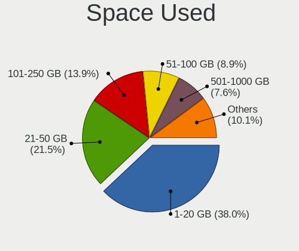
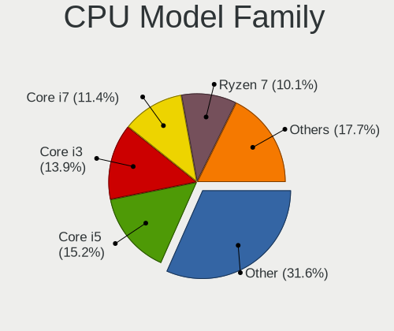
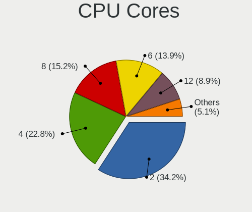
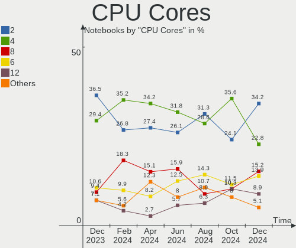
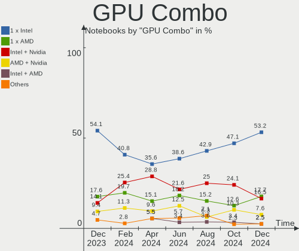

Linux in India - Hardware Trends (Notebooks)
--------------------------------------------

A project to identify most popular hardware characteristics and track their change
over time based on data collected by Linux users at https://Linux-Hardware.org.

Anyone can contribute to this report by the [hw-probe](https://github.com/linuxhw/hw-probe) tool:

    sudo -E hw-probe -all -upload

Period: May, 2023.

Contents
--------

* [ System ](#system)
  - [ OS                       ](#os)
  - [ OS Family                ](#os-family)
  - [ Kernel                   ](#kernel)
  - [ Kernel Family            ](#kernel-family)
  - [ Kernel Major Ver.        ](#kernel-major-ver)
  - [ Arch                     ](#arch)
  - [ DE                       ](#de)
  - [ Display Server           ](#display-server)
  - [ Display Manager          ](#display-manager)
  - [ OS Lang                  ](#os-lang)
  - [ Boot Mode                ](#boot-mode)
  - [ Filesystem               ](#filesystem)
  - [ Part. scheme             ](#part-scheme)
  - [ Dual Boot with Linux/BSD ](#dual-boot-with-linuxbsd)
  - [ Dual Boot (Win)          ](#dual-boot-win)

* [ Board ](#board)
  - [ Vendor                   ](#vendor)
  - [ Model                    ](#model)
  - [ Model Family             ](#model-family)
  - [ MFG Year                 ](#mfg-year)
  - [ Form Factor              ](#form-factor)
  - [ Secure Boot              ](#secure-boot)
  - [ Coreboot                 ](#coreboot)
  - [ RAM Size                 ](#ram-size)
  - [ RAM Used                 ](#ram-used)
  - [ Total Drives             ](#total-drives)
  - [ Has CD-ROM               ](#has-cd-rom)
  - [ Has Ethernet             ](#has-ethernet)
  - [ Has WiFi                 ](#has-wifi)
  - [ Has Bluetooth            ](#has-bluetooth)

* [ Location ](#location)
  - [ Country                  ](#country)
  - [ City                     ](#city)

* [ Drives ](#drives)
  - [ Drive Vendor             ](#drive-vendor)
  - [ Drive Model              ](#drive-model)
  - [ HDD Vendor               ](#hdd-vendor)
  - [ SSD Vendor               ](#ssd-vendor)
  - [ Drive Kind               ](#drive-kind)
  - [ Drive Connector          ](#drive-connector)
  - [ Drive Size               ](#drive-size)
  - [ Space Total              ](#space-total)
  - [ Space Used               ](#space-used)
  - [ Malfunc. Drives          ](#malfunc-drives)
  - [ Malfunc. Drive Vendor    ](#malfunc-drive-vendor)
  - [ Malfunc. HDD Vendor      ](#malfunc-hdd-vendor)
  - [ Malfunc. Drive Kind      ](#malfunc-drive-kind)
  - [ Failed Drives            ](#failed-drives)
  - [ Failed Drive Vendor      ](#failed-drive-vendor)
  - [ Drive Status             ](#drive-status)

* [ Storage controller ](#storage-controller)
  - [ Storage Vendor           ](#storage-vendor)
  - [ Storage Model            ](#storage-model)
  - [ Storage Kind             ](#storage-kind)

* [ Processor ](#processor)
  - [ CPU Vendor               ](#cpu-vendor)
  - [ CPU Model                ](#cpu-model)
  - [ CPU Model Family         ](#cpu-model-family)
  - [ CPU Cores                ](#cpu-cores)
  - [ CPU Sockets              ](#cpu-sockets)
  - [ CPU Threads              ](#cpu-threads)
  - [ CPU Op-Modes             ](#cpu-op-modes)
  - [ CPU Microcode            ](#cpu-microcode)
  - [ CPU Microarch            ](#cpu-microarch)

* [ Graphics ](#graphics)
  - [ GPU Vendor               ](#gpu-vendor)
  - [ GPU Model                ](#gpu-model)
  - [ GPU Combo                ](#gpu-combo)
  - [ GPU Driver               ](#gpu-driver)
  - [ GPU Memory               ](#gpu-memory)

* [ Monitor ](#monitor)
  - [ Monitor Vendor           ](#monitor-vendor)
  - [ Monitor Model            ](#monitor-model)
  - [ Monitor Resolution       ](#monitor-resolution)
  - [ Monitor Diagonal         ](#monitor-diagonal)
  - [ Monitor Width            ](#monitor-width)
  - [ Aspect Ratio             ](#aspect-ratio)
  - [ Monitor Area             ](#monitor-area)
  - [ Pixel Density            ](#pixel-density)
  - [ Multiple Monitors        ](#multiple-monitors)

* [ Network ](#network)
  - [ Net Controller Vendor    ](#net-controller-vendor)
  - [ Net Controller Model     ](#net-controller-model)
  - [ Wireless Vendor          ](#wireless-vendor)
  - [ Wireless Model           ](#wireless-model)
  - [ Ethernet Vendor          ](#ethernet-vendor)
  - [ Ethernet Model           ](#ethernet-model)
  - [ Net Controller Kind      ](#net-controller-kind)
  - [ Used Controller          ](#used-controller)
  - [ NICs                     ](#nics)
  - [ IPv6                     ](#ipv6)

* [ Bluetooth ](#bluetooth)
  - [ Bluetooth Vendor         ](#bluetooth-vendor)
  - [ Bluetooth Model          ](#bluetooth-model)

* [ Sound ](#sound)
  - [ Sound Vendor             ](#sound-vendor)
  - [ Sound Model              ](#sound-model)

* [ Memory ](#memory)
  - [ Memory Vendor            ](#memory-vendor)
  - [ Memory Model             ](#memory-model)
  - [ Memory Kind              ](#memory-kind)
  - [ Memory Form Factor       ](#memory-form-factor)
  - [ Memory Size              ](#memory-size)
  - [ Memory Speed             ](#memory-speed)

* [ Printers & scanners ](#printers--scanners)
  - [ Printer Vendor           ](#printer-vendor)
  - [ Printer Model            ](#printer-model)
  - [ Scanner Vendor           ](#scanner-vendor)
  - [ Scanner Model            ](#scanner-model)

* [ Camera ](#camera)
  - [ Camera Vendor            ](#camera-vendor)
  - [ Camera Model             ](#camera-model)

* [ Security ](#security)
  - [ Fingerprint Vendor       ](#fingerprint-vendor)
  - [ Fingerprint Model        ](#fingerprint-model)
  - [ Chipcard Vendor          ](#chipcard-vendor)
  - [ Chipcard Model           ](#chipcard-model)

* [ Unsupported ](#unsupported)
  - [ Unsupported Devices      ](#unsupported-devices)
  - [ Unsupported Device Types ](#unsupported-device-types)

System
------

OS
--

Installed operating systems

| Name                         | Notebooks | Percent |
|------------------------------|-----------|---------|
| Ubuntu 22.04                 | 23        | 28.75%  |
| Fedora 38                    | 10        | 12.5%   |
| Ubuntu 20.04                 | 5         | 6.25%   |
| Ubuntu 23.04                 | 4         | 5%      |
| OpenMandriva 23.03           | 4         | 5%      |
| Linux Mint 21.1              | 4         | 5%      |
| Pop!_OS 22.04                | 3         | 3.75%   |
| Kali 2023.1                  | 3         | 3.75%   |
| Linux Mint 21                | 2         | 2.5%    |
| Kubuntu 23.04                | 2         | 2.5%    |
| Kubuntu 22.04                | 2         | 2.5%    |
| Elementary 7                 | 2         | 2.5%    |
| Zorin 16                     | 1         | 1.25%   |
| Ubuntu 22.10                 | 1         | 1.25%   |
| Ubuntu 18.04                 | 1         | 1.25%   |
| openSUSE Tumbleweed-XXXXXXXX | 1         | 1.25%   |
| OpenMandriva 23.90           | 1         | 1.25%   |
| Nobara 37                    | 1         | 1.25%   |
| Manjaro 22.1.2               | 1         | 1.25%   |
| Manjaro                      | 1         | 1.25%   |
| Garuda Linux Rolling         | 1         | 1.25%   |
| Fedora 30                    | 1         | 1.25%   |
| Debian 12                    | 1         | 1.25%   |
| Debian 11                    | 1         | 1.25%   |
| Crystal Linux Rolling        | 1         | 1.25%   |
| ArcoLinux Rolling            | 1         | 1.25%   |
| Archcraft Rolling            | 1         | 1.25%   |
| Arch Rolling                 | 1         | 1.25%   |

OS Family
---------

OS without a version

| Name          | Notebooks | Percent |
|---------------|-----------|---------|
| Ubuntu        | 34        | 42.5%   |
| Fedora        | 11        | 13.75%  |
| Linux Mint    | 6         | 7.5%    |
| OpenMandriva  | 5         | 6.25%   |
| Kubuntu       | 4         | 5%      |
| Pop!_OS       | 3         | 3.75%   |
| Kali          | 3         | 3.75%   |
| Manjaro       | 2         | 2.5%    |
| Elementary    | 2         | 2.5%    |
| Debian        | 2         | 2.5%    |
| Zorin         | 1         | 1.25%   |
| openSUSE      | 1         | 1.25%   |
| Nobara        | 1         | 1.25%   |
| Garuda Linux  | 1         | 1.25%   |
| Crystal Linux | 1         | 1.25%   |
| ArcoLinux     | 1         | 1.25%   |
| Archcraft     | 1         | 1.25%   |
| Arch          | 1         | 1.25%   |

Kernel
------

Version of the Linux kernel

| Version                      | Notebooks | Percent |
|------------------------------|-----------|---------|
| 5.19.0-41-generic            | 17        | 21.25%  |
| 6.2.0-20-generic             | 6         | 7.5%    |
| 5.15.0-72-generic            | 6         | 7.5%    |
| 6.2.15-300.fc38.x86_64       | 5         | 6.25%   |
| 5.19.0-32-generic            | 5         | 6.25%   |
| 6.2.6-desktop-1omv2390       | 4         | 5%      |
| 5.15.0-71-generic            | 4         | 5%      |
| 6.2.6-76060206-generic       | 3         | 3.75%   |
| 6.2.14-300.fc38.x86_64       | 3         | 3.75%   |
| 5.19.0-42-generic            | 3         | 3.75%   |
| 6.1.0-kali7-amd64            | 2         | 2.5%    |
| 6.3.5-arch1-1                | 1         | 1.25%   |
| 6.3.3-1-MANJARO              | 1         | 1.25%   |
| 6.3.2-zen1-1-zen             | 1         | 1.25%   |
| 6.3.2-arch1-1                | 1         | 1.25%   |
| 6.3.1-arch1-1                | 1         | 1.25%   |
| 6.3.0-desktop-2omv2390       | 1         | 1.25%   |
| 6.2.9-300.fc38.x86_64        | 1         | 1.25%   |
| 6.2.14-300.fsync.fc37.x86_64 | 1         | 1.25%   |
| 6.2.13-arch1-1               | 1         | 1.25%   |
| 6.2.13-300.fc38.x86_64       | 1         | 1.25%   |
| 6.2.12-1-default             | 1         | 1.25%   |
| 6.1.25-1-MANJARO             | 1         | 1.25%   |
| 6.1.0-kali5-amd64            | 1         | 1.25%   |
| 6.1.0-9-amd64                | 1         | 1.25%   |
| 6.0.0-6mx-amd64              | 1         | 1.25%   |
| 5.4.0-148-generic            | 1         | 1.25%   |
| 5.4.0-147-generic            | 1         | 1.25%   |
| 5.16.5-051605-generic        | 1         | 1.25%   |
| 5.15.0-67-generic            | 1         | 1.25%   |
| 5.15.0-58-generic            | 1         | 1.25%   |
| 5.15.0-1037-realtime         | 1         | 1.25%   |
| 5.0.9-301.fc30.x86_64        | 1         | 1.25%   |

Kernel Family
-------------

Linux kernel without a distro release

| Version | Notebooks | Percent |
|---------|-----------|---------|
| 5.19.0  | 25        | 31.25%  |
| 5.15.0  | 13        | 16.25%  |
| 6.2.6   | 7         | 8.75%   |
| 6.2.0   | 6         | 7.5%    |
| 6.2.15  | 5         | 6.25%   |
| 6.2.14  | 4         | 5%      |
| 6.1.0   | 4         | 5%      |
| 6.3.2   | 2         | 2.5%    |
| 6.2.13  | 2         | 2.5%    |
| 5.4.0   | 2         | 2.5%    |
| 6.3.5   | 1         | 1.25%   |
| 6.3.3   | 1         | 1.25%   |
| 6.3.1   | 1         | 1.25%   |
| 6.3.0   | 1         | 1.25%   |
| 6.2.9   | 1         | 1.25%   |
| 6.2.12  | 1         | 1.25%   |
| 6.1.25  | 1         | 1.25%   |
| 6.0.0   | 1         | 1.25%   |
| 5.16.5  | 1         | 1.25%   |
| 5.0.9   | 1         | 1.25%   |

Kernel Major Ver.
-----------------

Linux kernel major version

| Version | Notebooks | Percent |
|---------|-----------|---------|
| 6.2     | 26        | 32.5%   |
| 5.19    | 25        | 31.25%  |
| 5.15    | 13        | 16.25%  |
| 6.3     | 6         | 7.5%    |
| 6.1     | 5         | 6.25%   |
| 5.4     | 2         | 2.5%    |
| 6.0     | 1         | 1.25%   |
| 5.16    | 1         | 1.25%   |
| 5.0     | 1         | 1.25%   |

Arch
----

OS architecture (x86_64, i586, etc.)

| Name   | Notebooks | Percent |
|--------|-----------|---------|
| x86_64 | 80        | 100%    |

DE
--

Desktop Environment

| Name       | Notebooks | Percent |
|------------|-----------|---------|
| GNOME      | 51        | 63.75%  |
| KDE5       | 14        | 17.5%   |
| XFCE       | 4         | 5%      |
| X-Cinnamon | 4         | 5%      |
| Pantheon   | 2         | 2.5%    |
| LXQt       | 2         | 2.5%    |
| i3         | 2         | 2.5%    |
| Hyprland   | 1         | 1.25%   |

Display Server
--------------

X11 or Wayland

| Name    | Notebooks | Percent |
|---------|-----------|---------|
| X11     | 46        | 57.5%   |
| Wayland | 34        | 42.5%   |

Display Manager
---------------

SDDM, LightDM, etc.

| Name    | Notebooks | Percent |
|---------|-----------|---------|
| GDM3    | 33        | 41.25%  |
| Unknown | 15        | 18.75%  |
| SDDM    | 13        | 16.25%  |
| GDM     | 11        | 13.75%  |
| LightDM | 7         | 8.75%   |
| XDM     | 1         | 1.25%   |

OS Lang
-------

Language

| Lang  | Notebooks | Percent |
|-------|-----------|---------|
| en_IN | 52        | 65%     |
| en_US | 27        | 33.75%  |
| C     | 1         | 1.25%   |

Boot Mode
---------

EFI or BIOS

| Mode | Notebooks | Percent |
|------|-----------|---------|
| EFI  | 54        | 67.5%   |
| BIOS | 26        | 32.5%   |

Filesystem
----------

Type of filesystem

| Type    | Notebooks | Percent |
|---------|-----------|---------|
| Ext4    | 48        | 60%     |
| Tmpfs   | 13        | 16.25%  |
| Btrfs   | 11        | 13.75%  |
| Overlay | 6         | 7.5%    |
| Zfs     | 1         | 1.25%   |
| F2fs    | 1         | 1.25%   |

Part. scheme
------------

Scheme of partitioning

| Type    | Notebooks | Percent |
|---------|-----------|---------|
| GPT     | 60        | 75%     |
| Unknown | 15        | 18.75%  |
| MBR     | 5         | 6.25%   |

Dual Boot with Linux/BSD
------------------------

Hosting more than one Linux/BSD

| Dual boot | Notebooks | Percent |
|-----------|-----------|---------|
| No        | 73        | 91.25%  |
| Yes       | 7         | 8.75%   |

Dual Boot (Win)
---------------

Hosting Linux and Windows

| Dual boot | Notebooks | Percent |
|-----------|-----------|---------|
| No        | 48        | 60%     |
| Yes       | 32        | 40%     |

Board
-----

Vendor
------

Motherboard manufacturer

| Name                | Notebooks | Percent |
|---------------------|-----------|---------|
| Lenovo              | 20        | 25%     |
| Dell                | 20        | 25%     |
| Hewlett-Packard     | 16        | 20%     |
| ASUSTek Computer    | 9         | 11.25%  |
| Acer                | 5         | 6.25%   |
| Apple               | 2         | 2.5%    |
| Toshiba             | 1         | 1.25%   |
| Timi                | 1         | 1.25%   |
| Sony                | 1         | 1.25%   |
| Samsung Electronics | 1         | 1.25%   |
| MSI                 | 1         | 1.25%   |
| HONOR               | 1         | 1.25%   |
| Gateway             | 1         | 1.25%   |
| AVITA               | 1         | 1.25%   |

Model
-----

Motherboard model

| Name                                              | Notebooks | Percent |
|---------------------------------------------------|-----------|---------|
| HP Pavilion Gaming Laptop 15-ec0xxx               | 3         | 3.75%   |
| Acer Aspire A715-51G                              | 2         | 2.5%    |
| Toshiba Satellite L850                            | 1         | 1.25%   |
| Timi Xiaomi NoteBook Pro                          | 1         | 1.25%   |
| Sony SVE15117FNW                                  | 1         | 1.25%   |
| Samsung 300E4Z/300E5Z/300E7Z                      | 1         | 1.25%   |
| MSI GF63 Thin 9RC                                 | 1         | 1.25%   |
| Lenovo Yoga S740-14IIL 81RS                       | 1         | 1.25%   |
| Lenovo ThinkPad T570 W10DG 20JW0005CA             | 1         | 1.25%   |
| Lenovo ThinkPad T490s 20NYS7K91R                  | 1         | 1.25%   |
| Lenovo ThinkPad T440p 20AWS14200                  | 1         | 1.25%   |
| Lenovo ThinkPad T440p                             | 1         | 1.25%   |
| Lenovo ThinkPad E14 Gen 2 20TAS0AJ00              | 1         | 1.25%   |
| Lenovo ThinkPad E14 20RAS1RA00                    | 1         | 1.25%   |
| Lenovo ThinkPad E14 20RAS0SE00                    | 1         | 1.25%   |
| Lenovo ThinkBook 14 G2 ITL Ub 20VD                | 1         | 1.25%   |
| Lenovo IdeaPad S340-15IIL 81WL                    | 1         | 1.25%   |
| Lenovo IdeaPad Gaming 3 15IMH05 81Y4              | 1         | 1.25%   |
| Lenovo IdeaPad Gaming 3 15IHU6 82K1               | 1         | 1.25%   |
| Lenovo IdeaPad 5 15IAL7 82SF                      | 1         | 1.25%   |
| Lenovo IdeaPad 330S-15IKB 81F5                    | 1         | 1.25%   |
| Lenovo IdeaPad 320-15ISK 80XH                     | 1         | 1.25%   |
| Lenovo IdeaPad 320-15IKB 80XL                     | 1         | 1.25%   |
| Lenovo IdeaPad 320-15AST 80XV                     | 1         | 1.25%   |
| Lenovo IdeaPad 3 15ADA05 81W1                     | 1         | 1.25%   |
| Lenovo IdeaPad 1 15ADA7 82R1                      | 1         | 1.25%   |
| Lenovo E41-25 81FS                                | 1         | 1.25%   |
| HONOR NMH-WCX9                                    | 1         | 1.25%   |
| HP ZBook Firefly 16 inch G9 Mobile Workstation PC | 1         | 1.25%   |
| HP ProBook 440 G5                                 | 1         | 1.25%   |
| HP ProBook 440 G4                                 | 1         | 1.25%   |
| HP Pavilion Laptop 14-dv0xxx                      | 1         | 1.25%   |
| HP Pavilion g6                                    | 1         | 1.25%   |
| HP Pavilion Aero Laptop 13-be0xxx                 | 1         | 1.25%   |
| HP Laptop 15s-du0xxx                              | 1         | 1.25%   |
| HP Laptop 15s-dr3xxx                              | 1         | 1.25%   |
| HP Laptop 15-db1xxx                               | 1         | 1.25%   |
| HP Laptop 15-da1xxx                               | 1         | 1.25%   |
| HP Laptop 14s-dk0xxx                              | 1         | 1.25%   |
| HP EliteBook Folio 9470m                          | 1         | 1.25%   |

Model Family
------------

Motherboard model prefix

| Name              | Notebooks | Percent |
|-------------------|-----------|---------|
| Lenovo IdeaPad    | 10        | 12.5%   |
| Dell Inspiron     | 10        | 12.5%   |
| Lenovo ThinkPad   | 7         | 8.75%   |
| HP Pavilion       | 6         | 7.5%    |
| HP Laptop         | 5         | 6.25%   |
| Dell Latitude     | 5         | 6.25%   |
| Acer Aspire       | 5         | 6.25%   |
| ASUS VivoBook     | 4         | 5%      |
| Dell Vostro       | 3         | 3.75%   |
| ASUS ASUS         | 3         | 3.75%   |
| HP ProBook        | 2         | 2.5%    |
| HP EliteBook      | 2         | 2.5%    |
| Toshiba Satellite | 1         | 1.25%   |
| Timi Xiaomi       | 1         | 1.25%   |
| Sony SVE15117FNW  | 1         | 1.25%   |
| Samsung 300E4Z    | 1         | 1.25%   |
| MSI GF63          | 1         | 1.25%   |
| Lenovo Yoga       | 1         | 1.25%   |
| Lenovo ThinkBook  | 1         | 1.25%   |
| Lenovo E41-25     | 1         | 1.25%   |
| HONOR NMH-WCX9    | 1         | 1.25%   |
| HP ZBook          | 1         | 1.25%   |
| Gateway NE46R     | 1         | 1.25%   |
| Dell XPS          | 1         | 1.25%   |
| Dell G3           | 1         | 1.25%   |
| AVITA NS14A6      | 1         | 1.25%   |
| ASUS ZenBook      | 1         | 1.25%   |
| ASUS ROG          | 1         | 1.25%   |
| Apple MacBookPro9 | 1         | 1.25%   |
| Apple MacBookAir7 | 1         | 1.25%   |

MFG Year
--------

Motherboard manufacture year

| Year | Notebooks | Percent |
|------|-----------|---------|
| 2022 | 13        | 16.25%  |
| 2019 | 12        | 15%     |
| 2020 | 9         | 11.25%  |
| 2018 | 9         | 11.25%  |
| 2017 | 8         | 10%     |
| 2021 | 7         | 8.75%   |
| 2012 | 7         | 8.75%   |
| 2016 | 4         | 5%      |
| 2015 | 3         | 3.75%   |
| 2013 | 3         | 3.75%   |
| 2011 | 2         | 2.5%    |
| 2014 | 1         | 1.25%   |
| 2009 | 1         | 1.25%   |
| 2008 | 1         | 1.25%   |

Form Factor
-----------

Physical design of the computer

| Name     | Notebooks | Percent |
|----------|-----------|---------|
| Notebook | 80        | 100%    |

Secure Boot
-----------

Enabled or disabled

| State    | Notebooks | Percent |
|----------|-----------|---------|
| Disabled | 69        | 86.25%  |
| Enabled  | 11        | 13.75%  |

Coreboot
--------

Have coreboot on board

| Used | Notebooks | Percent |
|------|-----------|---------|
| No   | 79        | 98.75%  |
| Yes  | 1         | 1.25%   |

RAM Size
--------

Total RAM memory

| Size in GB | Notebooks | Percent |
|------------|-----------|---------|
| 4.01-8.0   | 30        | 37.5%   |
| 8.01-16.0  | 22        | 27.5%   |
| 16.01-24.0 | 15        | 18.75%  |
| 3.01-4.0   | 9         | 11.25%  |
| 32.01-64.0 | 2         | 2.5%    |
| 24.01-32.0 | 1         | 1.25%   |
| 2.01-3.0   | 1         | 1.25%   |

RAM Used
--------

Used RAM memory

| Used GB   | Notebooks | Percent |
|-----------|-----------|---------|
| 2.01-3.0  | 23        | 28.75%  |
| 4.01-8.0  | 21        | 26.25%  |
| 3.01-4.0  | 17        | 21.25%  |
| 1.01-2.0  | 12        | 15%     |
| 8.01-16.0 | 5         | 6.25%   |
| 0.51-1.0  | 2         | 2.5%    |

Total Drives
------------

Number of drives on board

| Drives | Notebooks | Percent |
|--------|-----------|---------|
| 1      | 63        | 78.75%  |
| 2      | 16        | 20%     |
| 3      | 1         | 1.25%   |

Has CD-ROM
----------

Has CD-ROM on board

| Presented | Notebooks | Percent |
|-----------|-----------|---------|
| No        | 66        | 82.5%   |
| Yes       | 14        | 17.5%   |

Has Ethernet
------------

Has Ethernet on board

| Presented | Notebooks | Percent |
|-----------|-----------|---------|
| Yes       | 61        | 76.25%  |
| No        | 19        | 23.75%  |

Has WiFi
--------

Has WiFi module

| Presented | Notebooks | Percent |
|-----------|-----------|---------|
| Yes       | 79        | 98.75%  |
| No        | 1         | 1.25%   |

Has Bluetooth
-------------

Has Bluetooth module

| Presented | Notebooks | Percent |
|-----------|-----------|---------|
| Yes       | 69        | 86.25%  |
| No        | 11        | 13.75%  |

Location
--------

Country
-------

Geographic location (country)

| Country | Notebooks | Percent |
|---------|-----------|---------|
| India   | 80        | 100%    |

City
----

Geographic location (city)

| City          | Notebooks | Percent |
|---------------|-----------|---------|
| Delhi         | 12        | 15%     |
| Bengaluru     | 8         | 10%     |
| Mumbai        | 7         | 8.75%   |
| Chennai       | 5         | 6.25%   |
| Trivandrum    | 4         | 5%      |
| Thane         | 3         | 3.75%   |
| Patna         | 3         | 3.75%   |
| New Delhi     | 3         | 3.75%   |
| Kolkata       | 3         | 3.75%   |
| Hyderabad     | 3         | 3.75%   |
| Pune          | 2         | 2.5%    |
| Navi Mumbai   | 2         | 2.5%    |
| Gurgaon       | 2         | 2.5%    |
| Chandigarh    | 2         | 2.5%    |
| Ahmedabad     | 2         | 2.5%    |
| Vellore       | 1         | 1.25%   |
| Siliguri      | 1         | 1.25%   |
| Secunderabad  | 1         | 1.25%   |
| Noida         | 1         | 1.25%   |
| Nawanshahr    | 1         | 1.25%   |
| Nashik        | 1         | 1.25%   |
| Nagpur        | 1         | 1.25%   |
| Machilipatnam | 1         | 1.25%   |
| Ludhiana      | 1         | 1.25%   |
| Kota          | 1         | 1.25%   |
| Kochi         | 1         | 1.25%   |
| Jaipur        | 1         | 1.25%   |
| Guwahati      | 1         | 1.25%   |
| Gurdaspur     | 1         | 1.25%   |
| Ghaziabad     | 1         | 1.25%   |
| Davangere     | 1         | 1.25%   |
| Bhubaneswar   | 1         | 1.25%   |
| Bathinda      | 1         | 1.25%   |
| Amritsar      | 1         | 1.25%   |

Drives
------

Drive Vendor
------------

Hard drive vendors

| Vendor                | Notebooks | Drives | Percent |
|-----------------------|-----------|--------|---------|
| WDC                   | 15        | 16     | 15.46%  |
| Samsung Electronics   | 14        | 14     | 14.43%  |
| Toshiba               | 13        | 14     | 13.4%   |
| Seagate               | 9         | 9      | 9.28%   |
| Micron Technology     | 8         | 8      | 8.25%   |
| Crucial               | 7         | 7      | 7.22%   |
| SanDisk               | 6         | 6      | 6.19%   |
| SK hynix              | 4         | 5      | 4.12%   |
| KIOXIA                | 3         | 3      | 3.09%   |
| Intel                 | 3         | 3      | 3.09%   |
| Kingston              | 2         | 2      | 2.06%   |
| Unknown               | 2         | 2      | 2.06%   |
| XPG                   | 1         | 1      | 1.03%   |
| Unknown               | 1         | 1      | 1.03%   |
| Transcend             | 1         | 1      | 1.03%   |
| Realtek Semiconductor | 1         | 1      | 1.03%   |
| LITEON                | 1         | 1      | 1.03%   |
| KingFast              | 1         | 1      | 1.03%   |
| HGST                  | 1         | 1      | 1.03%   |
| FORESEE               | 1         | 1      | 1.03%   |
| China                 | 1         | 1      | 1.03%   |
| Apple                 | 1         | 1      | 1.03%   |
| Acer                  | 1         | 1      | 1.03%   |

Drive Model
-----------

Hard drive models

| Model                                              | Notebooks | Percent |
|----------------------------------------------------|-----------|---------|
| Toshiba MQ04ABF100 1TB                             | 5         | 5%      |
| Seagate ST1000LM035-1RK172 1TB                     | 4         | 4%      |
| WDC WD10SPZX-60Z10T0 1TB                           | 3         | 3%      |
| Toshiba MQ01ABF050 500GB                           | 3         | 3%      |
| Micron MTFDHBA512QFD 512GB                         | 3         | 3%      |
| WDC WD10SPZX-24Z10T0 1TB                           | 2         | 2%      |
| Toshiba MQ01ABD100 1TB                             | 2         | 2%      |
| SK hynix HFM512GD3JX013N 512GB                     | 2         | 2%      |
| Sandisk WD Blue SN550 NVMe SSD 512GB               | 2         | 2%      |
| SanDisk NVMe SSD Drive 512GB                       | 2         | 2%      |
| Samsung NVMe SSD Controller PM9A1/PM9A3/980PRO 1TB | 2         | 2%      |
| Intel SSDPEKNW512G8 512GB                          | 2         | 2%      |
| Crucial CT1000BX500SSD1 1TB                        | 2         | 2%      |
| Unknown                                            | 2         | 2%      |
| XPG GAMMIX S5 512GB                                | 1         | 1%      |
| WDC WDS500G2B0A-00SM50 500GB SSD                   | 1         | 1%      |
| WDC WDS240G2G0B-00EPW0 240GB SSD                   | 1         | 1%      |
| WDC WDS240G2G0A-00JH30 240GB SSD                   | 1         | 1%      |
| WDC WD5000LPVX-75V0TT0 500GB                       | 1         | 1%      |
| WDC WD5000LPVX-22V0TT0 500GB                       | 1         | 1%      |
| WDC WD3200BEKT-75PVMT0 320GB                       | 1         | 1%      |
| WDC WD10SPZX-75Z10T2 1TB                           | 1         | 1%      |
| WDC WD10SPZX-24Z10 1TB                             | 1         | 1%      |
| WDC WD10JPVX-75JC3T0 1TB                           | 1         | 1%      |
| WDC PC SN530 SDBPNPZ-512G-1006 512GB               | 1         | 1%      |
| WDC PC SN530 SDBPNPZ-256G-1002 256GB               | 1         | 1%      |
| Unknown MMC Card  16GB                             | 1         | 1%      |
| Transcend TS256GMTS430S 256GB SSD                  | 1         | 1%      |
| Toshiba XG6 NVMe SSD Controller 256GB              | 1         | 1%      |
| Toshiba MQ01ACF050 500GB                           | 1         | 1%      |
| Toshiba MK3256GSYF 320GB                           | 1         | 1%      |
| Toshiba KXG60ZNV256G 256GB                         | 1         | 1%      |
| SK hynix SKHynix_HFS256GD9TNI-L2B0B 256GB          | 1         | 1%      |
| SK hynix BC511 HFM256GDJTNI-82A0A 256GB            | 1         | 1%      |
| SK hynix BC511 256GB                               | 1         | 1%      |
| Seagate ST500LT012-1DG142 500GB                    | 1         | 1%      |
| Seagate ST500LM012 HN-M500MBB 500GB                | 1         | 1%      |
| Seagate ST2000LM015-2E8174 2TB                     | 1         | 1%      |
| Seagate ST2000LM007-1R8174 2TB                     | 1         | 1%      |
| Seagate ST1000LM049-2GH172 1TB                     | 1         | 1%      |

HDD Vendor
----------

Hard disk drive vendors

| Vendor  | Notebooks | Drives | Percent |
|---------|-----------|--------|---------|
| Toshiba | 12        | 12     | 36.36%  |
| WDC     | 11        | 11     | 33.33%  |
| Seagate | 9         | 9      | 27.27%  |
| HGST    | 1         | 1      | 3.03%   |

SSD Vendor
----------

Solid state drive vendors

| Vendor              | Notebooks | Drives | Percent |
|---------------------|-----------|--------|---------|
| Crucial             | 6         | 6      | 27.27%  |
| WDC                 | 3         | 3      | 13.64%  |
| Samsung Electronics | 3         | 3      | 13.64%  |
| Unknown             | 2         | 2      | 9.09%   |
| Transcend           | 1         | 1      | 4.55%   |
| Micron Technology   | 1         | 1      | 4.55%   |
| LITEON              | 1         | 1      | 4.55%   |
| Kingston            | 1         | 1      | 4.55%   |
| FORESEE             | 1         | 1      | 4.55%   |
| China               | 1         | 1      | 4.55%   |
| Apple               | 1         | 1      | 4.55%   |
| Acer                | 1         | 1      | 4.55%   |

Drive Kind
----------

HDD or SSD

| Kind    | Notebooks | Drives | Percent |
|---------|-----------|--------|---------|
| NVMe    | 39        | 43     | 40.63%  |
| HDD     | 33        | 33     | 34.38%  |
| SSD     | 22        | 22     | 22.92%  |
| MMC     | 1         | 1      | 1.04%   |
| Unknown | 1         | 1      | 1.04%   |

Drive Connector
---------------

SATA, SAS, NVMe, etc.

| Type | Notebooks | Drives | Percent |
|------|-----------|--------|---------|
| SATA | 49        | 56     | 55.06%  |
| NVMe | 39        | 43     | 43.82%  |
| MMC  | 1         | 1      | 1.12%   |

Drive Size
----------

Size of hard drive

| Size in TB | Notebooks | Drives | Percent |
|------------|-----------|--------|---------|
| 0.01-0.5   | 28        | 30     | 53.85%  |
| 0.51-1.0   | 22        | 23     | 42.31%  |
| 1.01-2.0   | 2         | 2      | 3.85%   |

Space Total
-----------

Amount of disk space available on the file system

| Size in GB     | Notebooks | Percent |
|----------------|-----------|---------|
| 101-250        | 23        | 28.75%  |
| 251-500        | 22        | 27.5%   |
| 501-1000       | 15        | 18.75%  |
| 1001-2000      | 7         | 8.75%   |
| 1-20           | 4         | 5%      |
| 21-50          | 3         | 3.75%   |
| 51-100         | 3         | 3.75%   |
| 2001-3000      | 2         | 2.5%    |
| More than 3000 | 1         | 1.25%   |

Space Used
----------

Amount of used disk space

| Used GB   | Notebooks | Percent |
|-----------|-----------|---------|
| 21-50     | 21        | 26.25%  |
| 1-20      | 20        | 25%     |
| 101-250   | 16        | 20%     |
| 51-100    | 11        | 13.75%  |
| 251-500   | 6         | 7.5%    |
| 501-1000  | 5         | 6.25%   |
| 1001-2000 | 1         | 1.25%   |

Malfunc. Drives
---------------

Drive models with a malfunction

| Model                        | Notebooks | Drives | Percent |
|------------------------------|-----------|--------|---------|
| WDC WD3200BEKT-75PVMT0 320GB | 1         | 1      | 25%     |
| Toshiba MQ01ABF050 500GB     | 1         | 1      | 25%     |
| Toshiba MK3256GSYF 320GB     | 1         | 1      | 25%     |
| Unknown                      | 1         | 1      | 25%     |

Malfunc. Drive Vendor
---------------------

Vendors of faulty drives

| Vendor  | Notebooks | Drives | Percent |
|---------|-----------|--------|---------|
| Toshiba | 2         | 2      | 50%     |
| WDC     | 1         | 1      | 25%     |
| Unknown | 1         | 1      | 25%     |

Malfunc. HDD Vendor
-------------------

Vendors of faulty HDD drives

| Vendor  | Notebooks | Drives | Percent |
|---------|-----------|--------|---------|
| Toshiba | 2         | 2      | 66.67%  |
| WDC     | 1         | 1      | 33.33%  |

Malfunc. Drive Kind
-------------------

Kinds of faulty drives

| Kind | Notebooks | Drives | Percent |
|------|-----------|--------|---------|
| HDD  | 3         | 3      | 75%     |
| SSD  | 1         | 1      | 25%     |

Failed Drives
-------------

Failed drive models

Zero info for selected period =(

Failed Drive Vendor
-------------------

Failed drive vendors

Zero info for selected period =(

Drive Status
------------

Number of failed and malfunc. drives

| Status   | Notebooks | Drives | Percent |
|----------|-----------|--------|---------|
| Works    | 46        | 59     | 56.1%   |
| Detected | 32        | 37     | 39.02%  |
| Malfunc  | 4         | 4      | 4.88%   |

Storage controller
------------------

Storage Vendor
--------------

Storage controller vendors

| Vendor                       | Notebooks | Percent |
|------------------------------|-----------|---------|
| Intel                        | 55        | 51.4%   |
| AMD                          | 13        | 12.15%  |
| Samsung Electronics          | 12        | 11.21%  |
| SanDisk                      | 8         | 7.48%   |
| Micron Technology            | 7         | 6.54%   |
| SK hynix                     | 4         | 3.74%   |
| KIOXIA                       | 3         | 2.8%    |
| Toshiba America Info Systems | 1         | 0.93%   |
| Realtek Semiconductor        | 1         | 0.93%   |
| Micron/Crucial Technology    | 1         | 0.93%   |
| Kingston Technology Company  | 1         | 0.93%   |
| ADATA Technology             | 1         | 0.93%   |

Storage Model
-------------

Storage controller models

| Model                                                                          | Notebooks | Percent |
|--------------------------------------------------------------------------------|-----------|---------|
| Intel Sunrise Point-LP SATA Controller [AHCI mode]                             | 13        | 11.3%   |
| AMD FCH SATA Controller [AHCI mode]                                            | 13        | 11.3%   |
| Intel Volume Management Device NVMe RAID Controller                            | 10        | 8.7%    |
| Intel 7 Series Chipset Family 6-port SATA Controller [AHCI mode]               | 8         | 6.96%   |
| Samsung NVMe SSD Controller 980                                                | 7         | 6.09%   |
| Micron NVMe Storage Controller                                                 | 7         | 6.09%   |
| Intel 82801 Mobile SATA Controller [RAID mode]                                 | 5         | 4.35%   |
| SanDisk WD Blue SN550 NVMe SSD                                                 | 4         | 3.48%   |
| Intel Tiger Lake-LP SATA Controller                                            | 4         | 3.48%   |
| Sandisk Non-Volatile memory controller                                         | 3         | 2.61%   |
| Intel 8 Series SATA Controller 1 [AHCI mode]                                   | 3         | 2.61%   |
| SK hynix Gold P31/PC711 NVMe Solid State Drive                                 | 2         | 1.74%   |
| Samsung NVMe SSD Controller PM9A1/PM9A3/980PRO                                 | 2         | 1.74%   |
| KIOXIA NVMe SSD Controller BG4                                                 | 2         | 1.74%   |
| Intel SSD 660P Series                                                          | 2         | 1.74%   |
| Intel Comet Lake SATA AHCI Controller                                          | 2         | 1.74%   |
| Intel Cannon Lake Mobile PCH SATA AHCI Controller                              | 2         | 1.74%   |
| Intel 8 Series/C220 Series Chipset Family 6-port SATA Controller 1 [AHCI mode] | 2         | 1.74%   |
| Intel 400 Series Chipset Family SATA AHCI Controller                           | 2         | 1.74%   |
| Toshiba America Info Systems XG6 NVMe SSD Controller                           | 1         | 0.87%   |
| SK hynix Non-Volatile memory controller                                        | 1         | 0.87%   |
| SK hynix BC511                                                                 | 1         | 0.87%   |
| SanDisk WD Black SN770 NVMe SSD                                                | 1         | 0.87%   |
| Samsung NVMe SSD Controller SM981/PM981/PM983                                  | 1         | 0.87%   |
| Samsung NVMe SSD Controller SM951/PM951                                        | 1         | 0.87%   |
| Samsung Electronics SATA controller                                            | 1         | 0.87%   |
| Realtek NVMe Controller                                                        | 1         | 0.87%   |
| Micron/Crucial P2 NVMe PCIe SSD                                                | 1         | 0.87%   |
| KIOXIA Non-Volatile memory controller                                          | 1         | 0.87%   |
| Kingston Company Company Non-Volatile memory controller                        | 1         | 0.87%   |
| Intel SATA Controller [RAID mode]                                              | 1         | 0.87%   |
| Intel Q170/Q150/B150/H170/H110/Z170/CM236 Chipset SATA Controller [AHCI Mode]  | 1         | 0.87%   |
| Intel Non-Volatile memory controller                                           | 1         | 0.87%   |
| Intel Ice Lake-LP SATA Controller [AHCI mode]                                  | 1         | 0.87%   |
| Intel Cannon Point-LP SATA Controller [AHCI Mode]                              | 1         | 0.87%   |
| Intel Alder Lake-P SATA AHCI Controller                                        | 1         | 0.87%   |
| Intel 82801IBM/IEM (ICH9M/ICH9M-E) 4 port SATA Controller [AHCI mode]          | 1         | 0.87%   |
| Intel 6 Series/C200 Series Chipset Family 6 port Mobile SATA AHCI Controller   | 1         | 0.87%   |
| Intel 5 Series/3400 Series Chipset 4 port SATA IDE Controller                  | 1         | 0.87%   |
| Intel 5 Series/3400 Series Chipset 2 port SATA IDE Controller                  | 1         | 0.87%   |

Storage Kind
------------

Kind of storage controller (IDE, SATA, NVMe, SAS, ...)

| Kind | Notebooks | Percent |
|------|-----------|---------|
| SATA | 56        | 50%     |
| NVMe | 39        | 34.82%  |
| RAID | 16        | 14.29%  |
| IDE  | 1         | 0.89%   |

Processor
---------

CPU Vendor
----------

Processor vendors

| Vendor | Notebooks | Percent |
|--------|-----------|---------|
| Intel  | 63        | 78.75%  |
| AMD    | 17        | 21.25%  |

CPU Model
---------

Processor models

| Model                                         | Notebooks | Percent |
|-----------------------------------------------|-----------|---------|
| Intel 11th Gen Core i5-1135G7 @ 2.40GHz       | 5         | 6.25%   |
| Intel Core i5-7200U CPU @ 2.50GHz             | 3         | 3.75%   |
| Intel Core i3-6006U CPU @ 2.00GHz             | 3         | 3.75%   |
| Intel Core i3-3110M CPU @ 2.40GHz             | 3         | 3.75%   |
| AMD Ryzen 5 3550H with Radeon Vega Mobile Gfx | 3         | 3.75%   |
| Intel Core i7-4600M CPU @ 2.90GHz             | 2         | 2.5%    |
| Intel Core i5-9300H CPU @ 2.40GHz             | 2         | 2.5%    |
| Intel Core i5-8265U CPU @ 1.60GHz             | 2         | 2.5%    |
| Intel Core i5-8250U CPU @ 1.60GHz             | 2         | 2.5%    |
| Intel Core i5-1035G1 CPU @ 1.00GHz            | 2         | 2.5%    |
| Intel Core i5-10300H CPU @ 2.50GHz            | 2         | 2.5%    |
| Intel Core i3-7020U CPU @ 2.30GHz             | 2         | 2.5%    |
| Intel 12th Gen Core i7-1255U                  | 2         | 2.5%    |
| Intel 12th Gen Core i5-1240P                  | 2         | 2.5%    |
| AMD Ryzen 7 5800H with Radeon Graphics        | 2         | 2.5%    |
| AMD Ryzen 5 3500U with Radeon Vega Mobile Gfx | 2         | 2.5%    |
| Intel Pentium Silver N6000 @ 1.10GHz          | 1         | 1.25%   |
| Intel Pentium CPU B950 @ 2.10GHz              | 1         | 1.25%   |
| Intel Pentium CPU 4417U @ 2.30GHz             | 1         | 1.25%   |
| Intel Core i7-8665U CPU @ 1.90GHz             | 1         | 1.25%   |
| Intel Core i7-7820HQ CPU @ 2.90GHz            | 1         | 1.25%   |
| Intel Core i7-7600U CPU @ 2.80GHz             | 1         | 1.25%   |
| Intel Core i7-6560U CPU @ 2.20GHz             | 1         | 1.25%   |
| Intel Core i7-3632QM CPU @ 2.20GHz            | 1         | 1.25%   |
| Intel Core i7-3612QM CPU @ 2.10GHz            | 1         | 1.25%   |
| Intel Core i7-1065G7 CPU @ 1.30GHz            | 1         | 1.25%   |
| Intel Core i5-6300U CPU @ 2.40GHz             | 1         | 1.25%   |
| Intel Core i5-6300HQ CPU @ 2.30GHz            | 1         | 1.25%   |
| Intel Core i5-5250U CPU @ 1.60GHz             | 1         | 1.25%   |
| Intel Core i5-4300U CPU @ 1.90GHz             | 1         | 1.25%   |
| Intel Core i5-4200U CPU @ 1.60GHz             | 1         | 1.25%   |
| Intel Core i5-3437U CPU @ 1.90GHz             | 1         | 1.25%   |
| Intel Core i5-3230M CPU @ 2.60GHz             | 1         | 1.25%   |
| Intel Core i5-3210M CPU @ 2.50GHz             | 1         | 1.25%   |
| Intel Core i5-10210U CPU @ 1.60GHz            | 1         | 1.25%   |
| Intel Core i3-8145U CPU @ 2.10GHz             | 1         | 1.25%   |
| Intel Core i3-7100U CPU @ 2.40GHz             | 1         | 1.25%   |
| Intel Core i3-6100U CPU @ 2.30GHz             | 1         | 1.25%   |
| Intel Core i3-4005U CPU @ 1.70GHz             | 1         | 1.25%   |
| Intel Core i3-10110U CPU @ 2.10GHz            | 1         | 1.25%   |

CPU Model Family
----------------

Processor model prefix

| Model                | Notebooks | Percent |
|----------------------|-----------|---------|
| Intel Core i5        | 22        | 27.5%   |
| Other                | 15        | 18.75%  |
| Intel Core i3        | 14        | 17.5%   |
| Intel Core i7        | 9         | 11.25%  |
| AMD Ryzen 5          | 9         | 11.25%  |
| AMD Ryzen 3          | 3         | 3.75%   |
| Intel Pentium        | 2         | 2.5%    |
| AMD Ryzen 7          | 2         | 2.5%    |
| Intel Pentium Silver | 1         | 1.25%   |
| Intel Core 2 Duo     | 1         | 1.25%   |
| AMD Ryzen 9          | 1         | 1.25%   |
| AMD A6               | 1         | 1.25%   |

CPU Cores
---------

Number of processor cores

| Number | Notebooks | Percent |
|--------|-----------|---------|
| 2      | 36        | 45%     |
| 4      | 31        | 38.75%  |
| 8      | 4         | 5%      |
| 10     | 3         | 3.75%   |
| 6      | 3         | 3.75%   |
| 12     | 2         | 2.5%    |
| 14     | 1         | 1.25%   |

CPU Sockets
-----------

Number of sockets

| Number | Notebooks | Percent |
|--------|-----------|---------|
| 1      | 80        | 100%    |

CPU Threads
-----------

Threads per core (Hyper-Threading)

| Number | Notebooks | Percent |
|--------|-----------|---------|
| 2      | 70        | 87.5%   |
| 1      | 10        | 12.5%   |

CPU Op-Modes
------------

CPU Operation Modes (32-bit, 64-bit)

| Op mode        | Notebooks | Percent |
|----------------|-----------|---------|
| 32-bit, 64-bit | 80        | 100%    |

CPU Microcode
-------------

Microcode number

| Number     | Notebooks | Percent |
|------------|-----------|---------|
| Unknown    | 40        | 50%     |
| 0x08108109 | 7         | 8.75%   |
| 0x806c1    | 5         | 6.25%   |
| 0x406e3    | 4         | 5%      |
| 0x806ec    | 3         | 3.75%   |
| 0x906ea    | 2         | 2.5%    |
| 0x0a50000c | 2         | 2.5%    |
| 0x06006705 | 2         | 2.5%    |
| 0xa0652    | 1         | 1.25%   |
| 0x906e9    | 1         | 1.25%   |
| 0x806eb    | 1         | 1.25%   |
| 0x806e9    | 1         | 1.25%   |
| 0x706e5    | 1         | 1.25%   |
| 0x40651    | 1         | 1.25%   |
| 0x306d4    | 1         | 1.25%   |
| 0x306a9    | 1         | 1.25%   |
| 0x206a7    | 1         | 1.25%   |
| 0x20652    | 1         | 1.25%   |
| 0x0a50000d | 1         | 1.25%   |
| 0x0a404101 | 1         | 1.25%   |
| 0x08608103 | 1         | 1.25%   |
| 0x08600104 | 1         | 1.25%   |
| 0x0810100b | 1         | 1.25%   |

CPU Microarch
-------------

Microarchitecture

| Name             | Notebooks | Percent |
|------------------|-----------|---------|
| KabyLake         | 19        | 23.75%  |
| Zen+             | 8         | 10%     |
| IvyBridge        | 8         | 10%     |
| TigerLake        | 7         | 8.75%   |
| Skylake          | 7         | 8.75%   |
| Haswell          | 5         | 6.25%   |
| Unknown          | 5         | 6.25%   |
| Alderlake Hybrid | 4         | 5%      |
| Zen 3            | 3         | 3.75%   |
| IceLake          | 3         | 3.75%   |
| Excavator        | 2         | 2.5%    |
| CometLake        | 2         | 2.5%    |
| Zen 2            | 1         | 1.25%   |
| Zen              | 1         | 1.25%   |
| Westmere         | 1         | 1.25%   |
| Tremont          | 1         | 1.25%   |
| SandyBridge      | 1         | 1.25%   |
| Penryn           | 1         | 1.25%   |
| Broadwell        | 1         | 1.25%   |

Graphics
--------

GPU Vendor
----------

Vendors of graphics cards

| Vendor | Notebooks | Percent |
|--------|-----------|---------|
| Intel  | 61        | 57.01%  |
| AMD    | 24        | 22.43%  |
| Nvidia | 22        | 20.56%  |

GPU Model
---------

Graphics card models

| Model                                                                         | Notebooks | Percent |
|-------------------------------------------------------------------------------|-----------|---------|
| AMD Picasso/Raven 2 [Radeon Vega Series / Radeon Vega Mobile Series]          | 8         | 7.48%   |
| Nvidia TU117M [GeForce GTX 1650 Mobile / Max-Q]                               | 7         | 6.54%   |
| Intel HD Graphics 620                                                         | 7         | 6.54%   |
| Intel TigerLake-LP GT2 [Iris Xe Graphics]                                     | 6         | 5.61%   |
| Intel 3rd Gen Core processor Graphics Controller                              | 6         | 5.61%   |
| Intel WhiskeyLake-U GT2 [UHD Graphics 620]                                    | 4         | 3.74%   |
| Intel Skylake GT2 [HD Graphics 520]                                           | 4         | 3.74%   |
| Intel Haswell-ULT Integrated Graphics Controller                              | 3         | 2.8%    |
| Intel Alder Lake-P Integrated Graphics Controller                             | 3         | 2.8%    |
| AMD Cezanne [Radeon Vega Series / Radeon Vega Mobile Series]                  | 3         | 2.8%    |
| Nvidia TU117M                                                                 | 2         | 1.87%   |
| Nvidia GP108M [GeForce MX250]                                                 | 2         | 1.87%   |
| Nvidia GM108M [GeForce 920MX]                                                 | 2         | 1.87%   |
| Intel UHD Graphics 620                                                        | 2         | 1.87%   |
| Intel Iris Plus Graphics G1 (Ice Lake)                                        | 2         | 1.87%   |
| Intel CometLake-U GT2 [UHD Graphics]                                          | 2         | 1.87%   |
| Intel CometLake-H GT2 [UHD Graphics]                                          | 2         | 1.87%   |
| Intel CoffeeLake-H GT2 [UHD Graphics 630]                                     | 2         | 1.87%   |
| Intel Alder Lake-UP3 GT2 [Iris Xe Graphics]                                   | 2         | 1.87%   |
| Intel 4th Gen Core Processor Integrated Graphics Controller                   | 2         | 1.87%   |
| AMD Sun XT [Radeon HD 8670A/8670M/8690M / R5 M330 / M430 / Radeon 520 Mobile] | 2         | 1.87%   |
| AMD Stoney [Radeon R2/R3/R4/R5 Graphics]                                      | 2         | 1.87%   |
| Nvidia TU117M [GeForce GTX 1650 Ti Mobile]                                    | 1         | 0.93%   |
| Nvidia TU117GLM [T550 Laptop GPU]                                             | 1         | 0.93%   |
| Nvidia GP108M [GeForce MX330]                                                 | 1         | 0.93%   |
| Nvidia GP107M [GeForce MX350]                                                 | 1         | 0.93%   |
| Nvidia GP107M [GeForce GTX 1050 Mobile]                                       | 1         | 0.93%   |
| Nvidia GP107M [GeForce GTX 1050 3 GB Max-Q]                                   | 1         | 0.93%   |
| Nvidia GM108M [GeForce MX130]                                                 | 1         | 0.93%   |
| Nvidia GA106M [GeForce RTX 3060 Mobile / Max-Q]                               | 1         | 0.93%   |
| Nvidia GA104 [Geforce RTX 3070 Ti Laptop GPU]                                 | 1         | 0.93%   |
| Intel Tiger Lake-LP GT2 [UHD Graphics G4]                                     | 1         | 0.93%   |
| Intel Mobile 4 Series Chipset Integrated Graphics Controller                  | 1         | 0.93%   |
| Intel JasperLake [UHD Graphics]                                               | 1         | 0.93%   |
| Intel Iris Plus Graphics G7                                                   | 1         | 0.93%   |
| Intel Iris Graphics 540                                                       | 1         | 0.93%   |
| Intel HD Graphics 630                                                         | 1         | 0.93%   |
| Intel HD Graphics 610                                                         | 1         | 0.93%   |
| Intel HD Graphics 6000                                                        | 1         | 0.93%   |
| Intel HD Graphics 530                                                         | 1         | 0.93%   |

GPU Combo
---------

Combinations of graphics cards

| Name           | Notebooks | Percent |
|----------------|-----------|---------|
| 1 x Intel      | 39        | 48.75%  |
| Intel + Nvidia | 16        | 20%     |
| 1 x AMD        | 13        | 16.25%  |
| AMD + Nvidia   | 6         | 7.5%    |
| Intel + AMD    | 5         | 6.25%   |
| 2 x Intel      | 1         | 1.25%   |

GPU Driver
----------

Free vs proprietary

| Driver      | Notebooks | Percent |
|-------------|-----------|---------|
| Free        | 67        | 83.75%  |
| Proprietary | 12        | 15%     |
| Unknown     | 1         | 1.25%   |

GPU Memory
----------

Total video memory

| Size in GB | Notebooks | Percent |
|------------|-----------|---------|
| Unknown    | 60        | 75%     |
| 0.01-0.5   | 9         | 11.25%  |
| 3.01-4.0   | 5         | 6.25%   |
| 1.01-2.0   | 5         | 6.25%   |
| 5.01-6.0   | 1         | 1.25%   |

Monitor
-------

Monitor Vendor
--------------

Monitor vendors

| Vendor                  | Notebooks | Percent |
|-------------------------|-----------|---------|
| BOE                     | 22        | 25.29%  |
| Chimei Innolux          | 17        | 19.54%  |
| AU Optronics            | 14        | 16.09%  |
| LG Display              | 13        | 14.94%  |
| Samsung Electronics     | 4         | 4.6%    |
| Dell                    | 4         | 4.6%    |
| PANDA                   | 2         | 2.3%    |
| MSI                     | 2         | 2.3%    |
| Lenovo                  | 2         | 2.3%    |
| Apple                   | 2         | 2.3%    |
| Sharp                   | 1         | 1.15%   |
| InfoVision              | 1         | 1.15%   |
| CTV                     | 1         | 1.15%   |
| Chi Mei Optoelectronics | 1         | 1.15%   |
| BenQ                    | 1         | 1.15%   |

Monitor Model
-------------

Monitor models

| Model                                                                 | Notebooks | Percent |
|-----------------------------------------------------------------------|-----------|---------|
| BOE LCD Monitor BOE0675 1366x768 344x194mm 15.5-inch                  | 3         | 3.45%   |
| MSI MP241X MSI3BA9 1920x1080 527x296mm 23.8-inch                      | 2         | 2.3%    |
| LG Display LCD Monitor LGD062E 1920x1080 344x194mm 15.5-inch          | 2         | 2.3%    |
| LG Display LCD Monitor LGD03D7 1366x768 310x174mm 14.0-inch           | 2         | 2.3%    |
| Chimei Innolux LCD Monitor CMN15F5 1920x1080 344x193mm 15.5-inch      | 2         | 2.3%    |
| Chimei Innolux LCD Monitor CMN14E5 1920x1080 309x173mm 13.9-inch      | 2         | 2.3%    |
| Chimei Innolux LCD Monitor CMN14D4 1920x1080 309x173mm 13.9-inch      | 2         | 2.3%    |
| Chimei Innolux LCD Monitor CMN14C3 1366x768 309x173mm 13.9-inch       | 2         | 2.3%    |
| AU Optronics LCD Monitor AUO38ED 1920x1080 344x193mm 15.5-inch        | 2         | 2.3%    |
| AU Optronics LCD Monitor AUO2E3C 1366x768 309x173mm 13.9-inch         | 2         | 2.3%    |
| Sharp LCD Monitor SHP144A 3200x1800 294x165mm 13.3-inch               | 1         | 1.15%   |
| Samsung Electronics LS24A40xU SAM71D1 1920x1080 527x296mm 23.8-inch   | 1         | 1.15%   |
| Samsung Electronics LCD Monitor SEC324A 1366x768 344x194mm 15.5-inch  | 1         | 1.15%   |
| Samsung Electronics LCD Monitor SDC4158 1920x1080 294x165mm 13.3-inch | 1         | 1.15%   |
| Samsung Electronics LCD Monitor SDC4154 2880x1800 302x189mm 14.0-inch | 1         | 1.15%   |
| PANDA LCD Monitor NCP004D 1920x1080 344x194mm 15.5-inch               | 1         | 1.15%   |
| PANDA LCD Monitor NCP000D 1920x1080 344x194mm 15.5-inch               | 1         | 1.15%   |
| LG Display LCD Monitor LGD062C 1920x1080 309x174mm 14.0-inch          | 1         | 1.15%   |
| LG Display LCD Monitor LGD060F 1920x1080 310x170mm 13.9-inch          | 1         | 1.15%   |
| LG Display LCD Monitor LGD05E5 1920x1080 344x194mm 15.5-inch          | 1         | 1.15%   |
| LG Display LCD Monitor LGD0526 1366x768 344x194mm 15.5-inch           | 1         | 1.15%   |
| LG Display LCD Monitor LGD04B1 1366x768 310x174mm 14.0-inch           | 1         | 1.15%   |
| LG Display LCD Monitor LGD03AB 1366x768 344x194mm 15.5-inch           | 1         | 1.15%   |
| LG Display LCD Monitor LGD033E 1366x768 309x174mm 14.0-inch           | 1         | 1.15%   |
| LG Display LCD Monitor LGD033A 1366x768 344x194mm 15.5-inch           | 1         | 1.15%   |
| LG Display LCD Monitor LGD0266 1366x768 344x194mm 15.5-inch           | 1         | 1.15%   |
| Lenovo L24q-35 LEN66D1 2560x1440 527x296mm 23.8-inch                  | 1         | 1.15%   |
| Lenovo D24-20 LEN66AE 1920x1080 530x300mm 24.0-inch                   | 1         | 1.15%   |
| InfoVision LCD Monitor IVO057E 1366x768 309x174mm 14.0-inch           | 1         | 1.15%   |
| Dell P2422HE DELA1C8 1920x1080 527x296mm 23.8-inch                    | 1         | 1.15%   |
| Dell P2311H DEL4002 1920x1080 509x286mm 23.0-inch                     | 1         | 1.15%   |
| Dell E2014H DELD03B 1600x900 432x240mm 19.5-inch                      | 1         | 1.15%   |
| Dell D2015H DELF063 1920x1080 435x239mm 19.5-inch                     | 1         | 1.15%   |
| CTV CTV CTV0030 1440x900 708x398mm 32.0-inch                          | 1         | 1.15%   |
| Chimei Innolux LCD Monitor CMN1610 1920x1200 344x215mm 16.0-inch      | 1         | 1.15%   |
| Chimei Innolux LCD Monitor CMN15E7 1920x1080 344x193mm 15.5-inch      | 1         | 1.15%   |
| Chimei Innolux LCD Monitor CMN15E5 1920x1080 344x193mm 15.5-inch      | 1         | 1.15%   |
| Chimei Innolux LCD Monitor CMN15DB 1366x768 344x193mm 15.5-inch       | 1         | 1.15%   |
| Chimei Innolux LCD Monitor CMN153C 1920x1080 344x193mm 15.5-inch      | 1         | 1.15%   |
| Chimei Innolux LCD Monitor CMN1521 1920x1080 344x193mm 15.5-inch      | 1         | 1.15%   |

Monitor Resolution
------------------

Monitor screen resolution

| Resolution        | Notebooks | Percent |
|-------------------|-----------|---------|
| 1920x1080 (FHD)   | 42        | 51.22%  |
| 1366x768 (WXGA)   | 24        | 29.27%  |
| 1600x900 (HD+)    | 4         | 4.88%   |
| 2560x1440 (QHD)   | 3         | 3.66%   |
| 1920x1200 (WUXGA) | 3         | 3.66%   |
| 3840x2160 (4K)    | 1         | 1.22%   |
| 3200x1800 (QHD+)  | 1         | 1.22%   |
| 2880x1800         | 1         | 1.22%   |
| 2560x1600         | 1         | 1.22%   |
| 1440x900 (WXGA+)  | 1         | 1.22%   |
| 1280x800 (WXGA)   | 1         | 1.22%   |

Monitor Diagonal
----------------

Diagonal size in inches

| Inches | Notebooks | Percent |
|--------|-----------|---------|
| 15     | 40        | 45.98%  |
| 13     | 19        | 21.84%  |
| 14     | 16        | 18.39%  |
| 24     | 5         | 5.75%   |
| 23     | 3         | 3.45%   |
| 19     | 2         | 2.3%    |
| 32     | 1         | 1.15%   |
| 16     | 1         | 1.15%   |

Monitor Width
-------------

Physical width

| Width in mm | Notebooks | Percent |
|-------------|-----------|---------|
| 301-350     | 71        | 81.61%  |
| 501-600     | 8         | 9.2%    |
| 201-300     | 5         | 5.75%   |
| 401-500     | 2         | 2.3%    |
| 701-800     | 1         | 1.15%   |

Aspect Ratio
------------

Proportional relationship between the width and the height

| Ratio | Notebooks | Percent |
|-------|-----------|---------|
| 16/9  | 70        | 90.91%  |
| 16/10 | 7         | 9.09%   |

Monitor Area
------------

Area in inch

| Area in inch | Notebooks | Percent |
|----------------|-----------|---------|
| 101-110        | 40        | 45.98%  |
| 81-90          | 31        | 35.63%  |
| 201-250        | 8         | 9.2%    |
| 71-80          | 4         | 4.6%    |
| 151-200        | 2         | 2.3%    |
| 351-500        | 1         | 1.15%   |
| 111-120        | 1         | 1.15%   |

Pixel Density
-------------

Pixels per inch

| Density       | Notebooks | Percent |
|---------------|-----------|---------|
| 121-160       | 43        | 50%     |
| 101-120       | 25        | 29.07%  |
| 51-100        | 10        | 11.63%  |
| 161-240       | 6         | 6.98%   |
| More than 240 | 2         | 2.33%   |

Multiple Monitors
-----------------

Total monitors connected

| Total | Notebooks | Percent |
|-------|-----------|---------|
| 1     | 68        | 85%     |
| 2     | 10        | 12.5%   |
| 0     | 2         | 2.5%    |

Network
-------

Net Controller Vendor
---------------------

Controller vendors

| Vendor                | Notebooks | Percent |
|-----------------------|-----------|---------|
| Realtek Semiconductor | 51        | 39.23%  |
| Intel                 | 34        | 26.15%  |
| Qualcomm Atheros      | 20        | 15.38%  |
| MediaTek              | 4         | 3.08%   |
| Broadcom              | 4         | 3.08%   |
| Samsung Electronics   | 3         | 2.31%   |
| Xiaomi                | 2         | 1.54%   |
| Qualcomm              | 2         | 1.54%   |
| OPPO Electronics      | 2         | 1.54%   |
| Motorola PCS          | 2         | 1.54%   |
| ICS Advent            | 2         | 1.54%   |
| Broadcom Limited      | 2         | 1.54%   |
| Ralink                | 1         | 0.77%   |
| ASIX Electronics      | 1         | 0.77%   |

Net Controller Model
--------------------

Controller models

| Model                                                             | Notebooks | Percent |
|-------------------------------------------------------------------|-----------|---------|
| Realtek RTL8111/8168/8411 PCI Express Gigabit Ethernet Controller | 35        | 23.03%  |
| Qualcomm Atheros QCA9377 802.11ac Wireless Network Adapter        | 11        | 7.24%   |
| Realtek RTL810xE PCI Express Fast Ethernet controller             | 8         | 5.26%   |
| Realtek RTL8822CE 802.11ac PCIe Wireless Network Adapter          | 7         | 4.61%   |
| Intel Wi-Fi 6 AX201                                               | 6         | 3.95%   |
| Intel Alder Lake-P PCH CNVi WiFi                                  | 5         | 3.29%   |
| Realtek RTL8723DE Wireless Network Adapter                        | 4         | 2.63%   |
| Samsung Galaxy series, misc. (tethering mode)                     | 3         | 1.97%   |
| Qualcomm Atheros QCA9565 / AR9565 Wireless Network Adapter        | 3         | 1.97%   |
| Qualcomm Atheros QCA6174 802.11ac Wireless Network Adapter        | 3         | 1.97%   |
| MediaTek MT7921 802.11ax PCI Express Wireless Network Adapter     | 3         | 1.97%   |
| Intel Wireless 8265 / 8275                                        | 3         | 1.97%   |
| Xiaomi Mi/Redmi series (RNDIS)                                    | 2         | 1.32%   |
| Realtek RTL8821AE 802.11ac PCIe Wireless Network Adapter          | 2         | 1.32%   |
| Qualcomm Atheros AR9485 Wireless Network Adapter                  | 2         | 1.32%   |
| Intel Wireless 8260                                               | 2         | 1.32%   |
| Intel Wireless 7260                                               | 2         | 1.32%   |
| Intel Ice Lake-LP PCH CNVi WiFi                                   | 2         | 1.32%   |
| Intel Ethernet Connection I217-LM                                 | 2         | 1.32%   |
| Intel Ethernet Connection (4) I219-LM                             | 2         | 1.32%   |
| Intel Comet Lake PCH-LP CNVi WiFi                                 | 2         | 1.32%   |
| Broadcom BCM43142 802.11b/g/n                                     | 2         | 1.32%   |
| Realtek RTL8852BE PCIe 802.11ax Wireless Network Controller       | 1         | 0.66%   |
| Realtek RTL8852AE 802.11ax PCIe Wireless Network Adapter          | 1         | 0.66%   |
| Realtek RTL8723AE PCIe Wireless Network Adapter                   | 1         | 0.66%   |
| Realtek RTL8188EUS 802.11n Wireless Network Adapter               | 1         | 0.66%   |
| Realtek RTL8153 Gigabit Ethernet Adapter                          | 1         | 0.66%   |
| Realtek RTL8125 2.5GbE Controller                                 | 1         | 0.66%   |
| Realtek 802.11ac NIC                                              | 1         | 0.66%   |
| Ralink RT3290 Wireless 802.11n 1T/1R PCIe                         | 1         | 0.66%   |
| Qualcomm QCNFA765 Wireless Network Adapter                        | 1         | 0.66%   |
| Qualcomm Fairphone 4 5G                                           | 1         | 0.66%   |
| Qualcomm Atheros AR8161 Gigabit Ethernet                          | 1         | 0.66%   |
| OPPO SM8350-MTP _SN:1518BD09                                      | 1         | 0.66%   |
| OPPO SM8150-MTP _SN:487017FC                                      | 1         | 0.66%   |
| Motorola PCS moto g(40) fusion                                    | 1         | 0.66%   |
| Motorola PCS Moto E (4) Plus                                      | 1         | 0.66%   |
| MediaTek MT7922 802.11ax PCI Express Wireless Network Adapter     | 1         | 0.66%   |
| Intel Wireless 7265                                               | 1         | 0.66%   |
| Intel Wireless 3160                                               | 1         | 0.66%   |

Wireless Vendor
---------------

Wireless vendors

| Vendor                | Notebooks | Percent |
|-----------------------|-----------|---------|
| Intel                 | 32        | 39.51%  |
| Qualcomm Atheros      | 19        | 23.46%  |
| Realtek Semiconductor | 18        | 22.22%  |
| MediaTek              | 4         | 4.94%   |
| Broadcom              | 4         | 4.94%   |
| Broadcom Limited      | 2         | 2.47%   |
| Ralink                | 1         | 1.23%   |
| Qualcomm              | 1         | 1.23%   |

Wireless Model
--------------

Wireless models

| Model                                                         | Notebooks | Percent |
|---------------------------------------------------------------|-----------|---------|
| Qualcomm Atheros QCA9377 802.11ac Wireless Network Adapter    | 11        | 13.58%  |
| Realtek RTL8822CE 802.11ac PCIe Wireless Network Adapter      | 7         | 8.64%   |
| Intel Wi-Fi 6 AX201                                           | 6         | 7.41%   |
| Intel Alder Lake-P PCH CNVi WiFi                              | 5         | 6.17%   |
| Realtek RTL8723DE Wireless Network Adapter                    | 4         | 4.94%   |
| Qualcomm Atheros QCA9565 / AR9565 Wireless Network Adapter    | 3         | 3.7%    |
| Qualcomm Atheros QCA6174 802.11ac Wireless Network Adapter    | 3         | 3.7%    |
| MediaTek MT7921 802.11ax PCI Express Wireless Network Adapter | 3         | 3.7%    |
| Intel Wireless 8265 / 8275                                    | 3         | 3.7%    |
| Realtek RTL8821AE 802.11ac PCIe Wireless Network Adapter      | 2         | 2.47%   |
| Qualcomm Atheros AR9485 Wireless Network Adapter              | 2         | 2.47%   |
| Intel Wireless 8260                                           | 2         | 2.47%   |
| Intel Wireless 7260                                           | 2         | 2.47%   |
| Intel Ice Lake-LP PCH CNVi WiFi                               | 2         | 2.47%   |
| Intel Comet Lake PCH-LP CNVi WiFi                             | 2         | 2.47%   |
| Broadcom BCM43142 802.11b/g/n                                 | 2         | 2.47%   |
| Realtek RTL8852BE PCIe 802.11ax Wireless Network Controller   | 1         | 1.23%   |
| Realtek RTL8852AE 802.11ax PCIe Wireless Network Adapter      | 1         | 1.23%   |
| Realtek RTL8723AE PCIe Wireless Network Adapter               | 1         | 1.23%   |
| Realtek RTL8188EUS 802.11n Wireless Network Adapter           | 1         | 1.23%   |
| Realtek 802.11ac NIC                                          | 1         | 1.23%   |
| Ralink RT3290 Wireless 802.11n 1T/1R PCIe                     | 1         | 1.23%   |
| Qualcomm QCNFA765 Wireless Network Adapter                    | 1         | 1.23%   |
| MediaTek MT7922 802.11ax PCI Express Wireless Network Adapter | 1         | 1.23%   |
| Intel Wireless 7265                                           | 1         | 1.23%   |
| Intel Wireless 3160                                           | 1         | 1.23%   |
| Intel Wi-Fi 6 AX200                                           | 1         | 1.23%   |
| Intel Dual Band Wireless-AC 3168NGW [Stone Peak]              | 1         | 1.23%   |
| Intel Comet Lake PCH CNVi WiFi                                | 1         | 1.23%   |
| Intel Centrino Wireless-N 2230                                | 1         | 1.23%   |
| Intel Centrino Wireless-N 130                                 | 1         | 1.23%   |
| Intel Centrino Advanced-N 6235                                | 1         | 1.23%   |
| Intel Cannon Point-LP CNVi [Wireless-AC]                      | 1         | 1.23%   |
| Intel Cannon Lake PCH CNVi WiFi                               | 1         | 1.23%   |
| Broadcom Limited BCM4360 802.11ac Wireless Network Adapter    | 1         | 1.23%   |
| Broadcom Limited BCM4312 802.11b/g LP-PHY                     | 1         | 1.23%   |
| Broadcom BCM4350 802.11ac Wireless Network Adapter            | 1         | 1.23%   |
| Broadcom BCM4331 802.11a/b/g/n                                | 1         | 1.23%   |

Ethernet Vendor
---------------

Ethernet vendors

| Vendor                | Notebooks | Percent |
|-----------------------|-----------|---------|
| Realtek Semiconductor | 45        | 64.29%  |
| Intel                 | 11        | 15.71%  |
| Samsung Electronics   | 3         | 4.29%   |
| Xiaomi                | 2         | 2.86%   |
| OPPO Electronics      | 2         | 2.86%   |
| ICS Advent            | 2         | 2.86%   |
| Qualcomm Atheros      | 1         | 1.43%   |
| Qualcomm              | 1         | 1.43%   |
| Motorola PCS          | 1         | 1.43%   |
| Broadcom              | 1         | 1.43%   |
| ASIX Electronics      | 1         | 1.43%   |

Ethernet Model
--------------

Ethernet models

| Model                                                             | Notebooks | Percent |
|-------------------------------------------------------------------|-----------|---------|
| Realtek RTL8111/8168/8411 PCI Express Gigabit Ethernet Controller | 35        | 50%     |
| Realtek RTL810xE PCI Express Fast Ethernet controller             | 8         | 11.43%  |
| Samsung Galaxy series, misc. (tethering mode)                     | 3         | 4.29%   |
| Xiaomi Mi/Redmi series (RNDIS)                                    | 2         | 2.86%   |
| Intel Ethernet Connection I217-LM                                 | 2         | 2.86%   |
| Intel Ethernet Connection (4) I219-LM                             | 2         | 2.86%   |
| Realtek RTL8153 Gigabit Ethernet Adapter                          | 1         | 1.43%   |
| Realtek RTL8125 2.5GbE Controller                                 | 1         | 1.43%   |
| Qualcomm Fairphone 4 5G                                           | 1         | 1.43%   |
| Qualcomm Atheros AR8161 Gigabit Ethernet                          | 1         | 1.43%   |
| OPPO SM8350-MTP _SN:1518BD09                                      | 1         | 1.43%   |
| OPPO SM8150-MTP _SN:487017FC                                      | 1         | 1.43%   |
| Motorola PCS moto g(40) fusion                                    | 1         | 1.43%   |
| Intel Ethernet Connection I219-LM                                 | 1         | 1.43%   |
| Intel Ethernet Connection I218-LM                                 | 1         | 1.43%   |
| Intel Ethernet Connection (6) I219-LM                             | 1         | 1.43%   |
| Intel Ethernet Connection (5) I219-LM                             | 1         | 1.43%   |
| Intel Ethernet Connection (2) I219-LM                             | 1         | 1.43%   |
| Intel Ethernet Connection (16) I219-LM                            | 1         | 1.43%   |
| Intel 82579LM Gigabit Network Connection (Lewisville)             | 1         | 1.43%   |
| ICS Advent USB 10/100 LAN                                         | 1         | 1.43%   |
| ICS Advent DM9601 Fast Ethernet Adapter                           | 1         | 1.43%   |
| Broadcom NetXtreme BCM57765 Gigabit Ethernet PCIe                 | 1         | 1.43%   |
| ASIX AX88179 Gigabit Ethernet                                     | 1         | 1.43%   |

Net Controller Kind
-------------------

Ethernet, WiFi or modem

| Kind     | Notebooks | Percent |
|----------|-----------|---------|
| WiFi     | 79        | 56.03%  |
| Ethernet | 61        | 43.26%  |
| Unknown  | 1         | 0.71%   |

Used Controller
---------------

Currently used network controller

| Kind     | Notebooks | Percent |
|----------|-----------|---------|
| WiFi     | 71        | 85.54%  |
| Ethernet | 12        | 14.46%  |

NICs
----

Total network controllers on board

| Total | Notebooks | Percent |
|-------|-----------|---------|
| 2     | 56        | 70%     |
| 1     | 24        | 30%     |

IPv6
----

IPv6 vs IPv4

| Used | Notebooks | Percent |
|------|-----------|---------|
| No   | 54        | 67.5%   |
| Yes  | 26        | 32.5%   |

Bluetooth
---------

Bluetooth Vendor
----------------

Controller vendors

| Vendor                          | Notebooks | Percent |
|---------------------------------|-----------|---------|
| Intel                           | 26        | 37.68%  |
| Qualcomm Atheros Communications | 12        | 17.39%  |
| Realtek Semiconductor           | 11        | 15.94%  |
| IMC Networks                    | 5         | 7.25%   |
| Lite-On Technology              | 4         | 5.8%    |
| Foxconn / Hon Hai               | 3         | 4.35%   |
| Broadcom                        | 3         | 4.35%   |
| Apple                           | 2         | 2.9%    |
| Toshiba                         | 1         | 1.45%   |
| Ralink                          | 1         | 1.45%   |
| Opticis                         | 1         | 1.45%   |

Bluetooth Model
---------------

Controller models

| Model                                           | Notebooks | Percent |
|-------------------------------------------------|-----------|---------|
| Intel AX201 Bluetooth                           | 12        | 17.39%  |
| Qualcomm Atheros  Bluetooth Device              | 11        | 15.94%  |
| Realtek Bluetooth Radio                         | 7         | 10.14%  |
| Intel Bluetooth wireless interface              | 4         | 5.8%    |
| Intel Bluetooth Device                          | 4         | 5.8%    |
| Intel Bluetooth 9460/9560 Jefferson Peak (JfP)  | 3         | 4.35%   |
| IMC Networks Bluetooth Device                   | 3         | 4.35%   |
| Realtek RTL8821A Bluetooth                      | 2         | 2.9%    |
| Realtek  Bluetooth 4.2 Adapter                  | 2         | 2.9%    |
| Intel Centrino Bluetooth Wireless Transceiver   | 2         | 2.9%    |
| IMC Networks Wireless_Device                    | 2         | 2.9%    |
| Broadcom BCM43142 Bluetooth 4.0                 | 2         | 2.9%    |
| Apple Bluetooth USB Host Controller             | 2         | 2.9%    |
| Toshiba RT Bluetooth Radio                      | 1         | 1.45%   |
| Ralink RT3290 Bluetooth                         | 1         | 1.45%   |
| Qualcomm Atheros AR9462 Bluetooth               | 1         | 1.45%   |
| Opticis Bluetooth Radio                         | 1         | 1.45%   |
| Lite-On Wireless_Device                         | 1         | 1.45%   |
| Lite-On Qualcomm Atheros QCA9377 Bluetooth      | 1         | 1.45%   |
| Lite-On Bluetooth Radio                         | 1         | 1.45%   |
| Lite-On Bluetooth Device                        | 1         | 1.45%   |
| Intel AX200 Bluetooth                           | 1         | 1.45%   |
| Foxconn / Hon Hai Wireless_Device               | 1         | 1.45%   |
| Foxconn / Hon Hai Bluetooth USB Host Controller | 1         | 1.45%   |
| Foxconn / Hon Hai Bluetooth Device              | 1         | 1.45%   |
| Broadcom BCM2045A0                              | 1         | 1.45%   |

Sound
-----

Sound Vendor
------------

Sound card vendors

| Vendor              | Notebooks | Percent |
|---------------------|-----------|---------|
| Intel               | 63        | 65.63%  |
| AMD                 | 19        | 19.79%  |
| Nvidia              | 9         | 9.38%   |
| C-Media Electronics | 2         | 2.08%   |
| JMTek               | 1         | 1.04%   |
| Hewlett-Packard     | 1         | 1.04%   |
| ASUSTek Computer    | 1         | 1.04%   |

Sound Model
-----------

Sound card models

| Model                                                                      | Notebooks | Percent |
|----------------------------------------------------------------------------|-----------|---------|
| Intel Sunrise Point-LP HD Audio                                            | 16        | 13.79%  |
| AMD Family 17h/19h HD Audio Controller                                     | 15        | 12.93%  |
| Intel 7 Series/C216 Chipset Family High Definition Audio Controller        | 8         | 6.9%    |
| Intel Tiger Lake-LP Smart Sound Technology Audio Controller                | 7         | 6.03%   |
| Intel Alder Lake PCH-P High Definition Audio Controller                    | 7         | 6.03%   |
| Nvidia TU107 GeForce GTX 1650 High Definition Audio Controller             | 6         | 5.17%   |
| AMD Raven/Raven2/Fenghuang HDMI/DP Audio Controller                        | 6         | 5.17%   |
| AMD Renoir Radeon High Definition Audio Controller                         | 5         | 4.31%   |
| Intel Cannon Point-LP High Definition Audio Controller                     | 4         | 3.45%   |
| Intel Ice Lake-LP Smart Sound Technology Audio Controller                  | 3         | 2.59%   |
| Intel Haswell-ULT HD Audio Controller                                      | 3         | 2.59%   |
| Intel 8 Series HD Audio Controller                                         | 3         | 2.59%   |
| Intel Xeon E3-1200 v3/4th Gen Core Processor HD Audio Controller           | 2         | 1.72%   |
| Intel Comet Lake PCH-LP cAVS                                               | 2         | 1.72%   |
| Intel Comet Lake PCH cAVS                                                  | 2         | 1.72%   |
| Intel Cannon Lake PCH cAVS                                                 | 2         | 1.72%   |
| Intel 8 Series/C220 Series Chipset High Definition Audio Controller        | 2         | 1.72%   |
| C-Media Electronics USB Audio Device                                       | 2         | 1.72%   |
| AMD Turks HDMI Audio [Radeon HD 6500/6600 / 6700M Series]                  | 2         | 1.72%   |
| AMD High Definition Audio Controller                                       | 2         | 1.72%   |
| AMD Family 15h (Models 60h-6fh) Audio Controller                           | 2         | 1.72%   |
| Nvidia GP107GL High Definition Audio Controller                            | 1         | 0.86%   |
| Nvidia GA106 High Definition Audio Controller                              | 1         | 0.86%   |
| Nvidia GA104 High Definition Audio Controller                              | 1         | 0.86%   |
| JMTek USB PnP Audio Device                                                 | 1         | 0.86%   |
| Intel Wildcat Point-LP High Definition Audio Controller                    | 1         | 0.86%   |
| Intel Jasper Lake HD Audio                                                 | 1         | 0.86%   |
| Intel CM238 HD Audio Controller                                            | 1         | 0.86%   |
| Intel Broadwell-U Audio Controller                                         | 1         | 0.86%   |
| Intel 82801I (ICH9 Family) HD Audio Controller                             | 1         | 0.86%   |
| Intel 6 Series/C200 Series Chipset Family High Definition Audio Controller | 1         | 0.86%   |
| Intel 5 Series/3400 Series Chipset High Definition Audio                   | 1         | 0.86%   |
| Intel 100 Series/C230 Series Chipset Family HD Audio Controller            | 1         | 0.86%   |
| Hewlett-Packard Stereo USB Headset G2                                      | 1         | 0.86%   |
| ASUSTek Computer C-Media Audio                                             | 1         | 0.86%   |
| AMD Rembrandt Radeon High Definition Audio Controller                      | 1         | 0.86%   |

Memory
------

Memory Vendor
-------------

Memory module vendors

| Vendor              | Notebooks | Percent |
|---------------------|-----------|---------|
| Samsung Electronics | 21        | 29.17%  |
| SK hynix            | 16        | 22.22%  |
| Micron Technology   | 16        | 22.22%  |
| Crucial             | 6         | 8.33%   |
| Ramaxel Technology  | 3         | 4.17%   |
| Kingston            | 3         | 4.17%   |
| A-DATA Technology   | 3         | 4.17%   |
| Transcend           | 2         | 2.78%   |
| Unknown (0x0CDC)    | 1         | 1.39%   |
| Unknown             | 1         | 1.39%   |

Memory Model
------------

Memory module models

| Model                                                       | Notebooks | Percent |
|-------------------------------------------------------------|-----------|---------|
| SK hynix RAM HMT351S6EFR8A-PB 4GB SODIMM DDR3 1600MT/s      | 2         | 2.74%   |
| SK hynix RAM HMA851S6AFR6N-UH 4GB SODIMM DDR4 2667MT/s      | 2         | 2.74%   |
| Samsung RAM M471A5244CB0-CTD 4GB SODIMM DDR4 3266MT/s       | 2         | 2.74%   |
| Samsung RAM M425R1GB4BB0-CQKOL 8GB SODIMM DDR5 4800MT/s     | 2         | 2.74%   |
| Micron RAM 8KTF51264HZ-1G6E1 4GB SODIMM DDR3 1600MT/s       | 2         | 2.74%   |
| Micron RAM 8ATF1G64HZ-3G2J1 8GB SODIMM DDR4 3200MT/s        | 2         | 2.74%   |
| Micron RAM 8ATF1G64HZ-2G6E1 8GB SODIMM DDR4 2667MT/s        | 2         | 2.74%   |
| Micron RAM 4ATF51264HZ-3G2J1 4GB SODIMM DDR4 3200MT/s       | 2         | 2.74%   |
| Micron RAM 4ATF51264HZ-2G3B1 4GB SODIMM DDR4 2400MT/s       | 2         | 2.74%   |
| Micron RAM 4ATF1G64HZ-3G2F1 8GB SODIMM DDR4 3200MT/s        | 2         | 2.74%   |
| Unknown RAM Module 4GB SODIMM DDR4 2400MT/s                 | 1         | 1.37%   |
| Unknown (0x0CDC) RAM ZH4G6S8DXN 8GB SODIMM DDR4 3200MT/s    | 1         | 1.37%   |
| Transcend RAM TS512MSK64W6H 4GB SODIMM DDR3 1600MT/s        | 1         | 1.37%   |
| Transcend RAM TS1GSK64W6H 8GB SODIMM DDR3 1600MT/s          | 1         | 1.37%   |
| SK hynix RAM Module 8GB SODIMM DDR4 2133MT/s                | 1         | 1.37%   |
| SK hynix RAM HYMP125S64CP8-S6 2GB SODIMM DDR2 800MT/s       | 1         | 1.37%   |
| SK hynix RAM HMT451S6DFR8A-PB 4GB SODIMM DDR3 1600MT/s      | 1         | 1.37%   |
| SK hynix RAM HMT351S6CFR8C-PB 4GB SODIMM DDR3 1600MT/s      | 1         | 1.37%   |
| SK hynix RAM HMT112S6BFR6C-G7 1024MB SODIMM DDR3 1067MT/s   | 1         | 1.37%   |
| SK hynix RAM HMA851S6JJR6N-VK 4GB SODIMM DDR4 2667MT/s      | 1         | 1.37%   |
| SK hynix RAM HMA851S6CJR6N-XN 4GB SODIMM DDR4 3200MT/s      | 1         | 1.37%   |
| SK hynix RAM HMA851S6CJR6N-VK 4GB SODIMM DDR4 2667MT/s      | 1         | 1.37%   |
| SK hynix RAM HMA81GS6DJR8N-XN 8GB SODIMM DDR4 3200MT/s      | 1         | 1.37%   |
| SK hynix RAM HMA81GS6CJR8N-VK 8GB SODIMM DDR4 2667MT/s      | 1         | 1.37%   |
| SK hynix RAM HMA81GS6AFR8N-UH 8GB SODIMM DDR4 2667MT/s      | 1         | 1.37%   |
| SK hynix RAM H9CCNNNCLTMLAR-NUD 8GB Chip LPDDR3 1867MT/s    | 1         | 1.37%   |
| Samsung RAM UBE3D4AA-MGCR 2GB Row Of Chips LPDDR4 4267MT/s  | 1         | 1.37%   |
| Samsung RAM Module 2048MB SODIMM DDR3 1600MT/s              | 1         | 1.37%   |
| Samsung RAM Module 16GB SODIMM DDR5 4800MT/s                | 1         | 1.37%   |
| Samsung RAM M471B5773CHS-CH9 2GB SODIMM DDR3 4199MT/s       | 1         | 1.37%   |
| Samsung RAM M471B5673FH0-CF8 2GB SODIMM DDR3 1067MT/s       | 1         | 1.37%   |
| Samsung RAM M471B1G73EB0-YK0 8GB SODIMM DDR3 1600MT/s       | 1         | 1.37%   |
| Samsung RAM M471A5244CB0-CTD 4GB Row Of Chips DDR4 2667MT/s | 1         | 1.37%   |
| Samsung RAM M471A5244CB0-CRC 4GB SODIMM DDR4 2667MT/s       | 1         | 1.37%   |
| Samsung RAM M471A1K43EB1-CWE 8GB SODIMM DDR4 3200MT/s       | 1         | 1.37%   |
| Samsung RAM M471A1K43DB1-CWE 8GB SODIMM DDR4 3200MT/s       | 1         | 1.37%   |
| Samsung RAM M471A1K43CB1-CTD 8GB SODIMM DDR4 2667MT/s       | 1         | 1.37%   |
| Samsung RAM M471A1K43BB1-CRC 8GB SODIMM DDR4 2667MT/s       | 1         | 1.37%   |
| Samsung RAM M471A1G44BB0-CWE 8GB SODIMM DDR4 3200MT/s       | 1         | 1.37%   |
| Samsung RAM M471A1G44AB0-CWE 8GB SODIMM DDR4 3200MT/s       | 1         | 1.37%   |

Memory Kind
-----------

Memory module kinds

| Kind   | Notebooks | Percent |
|--------|-----------|---------|
| DDR4   | 37        | 63.79%  |
| DDR3   | 10        | 17.24%  |
| LPDDR4 | 4         | 6.9%    |
| DDR5   | 3         | 5.17%   |
| SDRAM  | 1         | 1.72%   |
| LPDDR5 | 1         | 1.72%   |
| LPDDR3 | 1         | 1.72%   |
| DDR2   | 1         | 1.72%   |

Memory Form Factor
------------------

Physical design of the memory module

| Name         | Notebooks | Percent |
|--------------|-----------|---------|
| SODIMM       | 50        | 89.29%  |
| Row Of Chips | 5         | 8.93%   |
| Chip         | 1         | 1.79%   |

Memory Size
-----------

Memory module size

| Size  | Notebooks | Percent |
|-------|-----------|---------|
| 8192  | 36        | 55.38%  |
| 4096  | 18        | 27.69%  |
| 16384 | 6         | 9.23%   |
| 2048  | 4         | 6.15%   |
| 1024  | 1         | 1.54%   |

Memory Speed
------------

Memory module speed

| Speed | Notebooks | Percent |
|-------|-----------|---------|
| 3200  | 18        | 29.51%  |
| 2667  | 16        | 26.23%  |
| 1600  | 9         | 14.75%  |
| 2400  | 5         | 8.2%    |
| 4800  | 3         | 4.92%   |
| 3266  | 2         | 3.28%   |
| 6400  | 1         | 1.64%   |
| 4267  | 1         | 1.64%   |
| 4199  | 1         | 1.64%   |
| 3733  | 1         | 1.64%   |
| 2133  | 1         | 1.64%   |
| 1867  | 1         | 1.64%   |
| 1067  | 1         | 1.64%   |
| 975   | 1         | 1.64%   |

Printers & scanners
-------------------

Printer Vendor
--------------

Printer device vendors

Zero info for selected period =(

Printer Model
-------------

Printer device models

Zero info for selected period =(

Scanner Vendor
--------------

Scanner device vendors

Zero info for selected period =(

Scanner Model
-------------

Scanner device models

Zero info for selected period =(

Camera
------

Camera Vendor
-------------

Camera device vendors

| Vendor                                 | Notebooks | Percent |
|----------------------------------------|-----------|---------|
| IMC Networks                           | 12        | 16.44%  |
| Quanta                                 | 9         | 12.33%  |
| Chicony Electronics                    | 8         | 10.96%  |
| Realtek Semiconductor                  | 7         | 9.59%   |
| Microdia                               | 7         | 9.59%   |
| Luxvisions Innotech Limited            | 5         | 6.85%   |
| Cheng Uei Precision Industry (Foxlink) | 5         | 6.85%   |
| Sunplus Innovation Technology          | 4         | 5.48%   |
| Bison Electronics                      | 3         | 4.11%   |
| Acer                                   | 3         | 4.11%   |
| Syntek                                 | 2         | 2.74%   |
| Sonix Technology                       | 2         | 2.74%   |
| Suyin                                  | 1         | 1.37%   |
| Silicon Motion                         | 1         | 1.37%   |
| Lite-On Technology                     | 1         | 1.37%   |
| Importek                               | 1         | 1.37%   |
| Apple                                  | 1         | 1.37%   |
| Alcor Micro                            | 1         | 1.37%   |

Camera Model
------------

Camera device models

| Model                                                | Notebooks | Percent |
|------------------------------------------------------|-----------|---------|
| IMC Networks USB2.0 HD UVC WebCam                    | 5         | 6.85%   |
| Realtek Integrated_Webcam_HD                         | 4         | 5.48%   |
| Quanta HP TrueVision HD Camera                       | 4         | 5.48%   |
| IMC Networks Integrated Camera                       | 4         | 5.48%   |
| Acer Integrated Camera                               | 3         | 4.11%   |
| Sunplus Integrated_Webcam_HD                         | 2         | 2.74%   |
| Quanta ACER HD User Facing                           | 2         | 2.74%   |
| Microdia Laptop_Integrated_Webcam_HD                 | 2         | 2.74%   |
| Luxvisions Innotech Limited Integrated Camera        | 2         | 2.74%   |
| Chicony Integrated Camera                            | 2         | 2.74%   |
| Chicony EasyCamera                                   | 2         | 2.74%   |
| Bison SunplusIT INC. Integrated Camera               | 2         | 2.74%   |
| Syntek Integrated Camera                             | 1         | 1.37%   |
| Syntek EasyCamera                                    | 1         | 1.37%   |
| Suyin Integrated_Webcam_HD                           | 1         | 1.37%   |
| Sunplus XiaoMi USB 2.0 Webcam                        | 1         | 1.37%   |
| Sunplus HD WebCam                                    | 1         | 1.37%   |
| Sonix USB2.0 HD UVC WebCam                           | 1         | 1.37%   |
| Sonix USB2.0 FHD UVC WebCam                          | 1         | 1.37%   |
| Silicon Motion WebCam SC-0311139N                    | 1         | 1.37%   |
| Realtek Integrated Webcam_HD                         | 1         | 1.37%   |
| Realtek Integrated Webcam                            | 1         | 1.37%   |
| Realtek EasyCamera                                   | 1         | 1.37%   |
| Quanta VGA WebCam                                    | 1         | 1.37%   |
| Quanta USB2.0 HD UVC WebCam                          | 1         | 1.37%   |
| Quanta HD User Facing                                | 1         | 1.37%   |
| Microdia Laptop_Integrated_Webcam_E4HD               | 1         | 1.37%   |
| Microdia Laptop_Integrated_Webcam_1.3M               | 1         | 1.37%   |
| Microdia Integrated_Webcam_HD                        | 1         | 1.37%   |
| Microdia Integrated_Webcam_FHD                       | 1         | 1.37%   |
| Microdia Integrated Webcam HD                        | 1         | 1.37%   |
| Luxvisions Innotech Limited HP Wide Vision HD Camera | 1         | 1.37%   |
| Luxvisions Innotech Limited HP TrueVision HD Camera  | 1         | 1.37%   |
| Luxvisions Innotech Limited HP 5MP Camera            | 1         | 1.37%   |
| Lite-On HP HD Camera                                 | 1         | 1.37%   |
| Importek TOSHIBA Web Camera - HD                     | 1         | 1.37%   |
| IMC Networks USB2.0 VGA UVC WebCam                   | 1         | 1.37%   |
| IMC Networks ov9734_azurewave_camera                 | 1         | 1.37%   |
| IMC Networks HP TrueVision HD Camera                 | 1         | 1.37%   |
| Chicony VGA WebCam                                   | 1         | 1.37%   |

Security
--------

Fingerprint Vendor
------------------

Fingerprint sensor vendors

| Vendor                             | Notebooks | Percent |
|------------------------------------|-----------|---------|
| Validity Sensors                   | 5         | 33.33%  |
| Shenzhen Goodix Technology         | 5         | 33.33%  |
| Elan Microelectronics              | 3         | 20%     |
| Synaptics                          | 1         | 6.67%   |
| Realtek USB2.0 Finger Print Bridge | 1         | 6.67%   |

Fingerprint Model
-----------------

Fingerprint sensor models

| Model                                                           | Notebooks | Percent |
|-----------------------------------------------------------------|-----------|---------|
| Shenzhen Goodix  FingerPrint Device                             | 4         | 26.67%  |
| Elan ELAN:ARM-M4                                                | 3         | 20%     |
| Validity Sensors VFS495 Fingerprint Reader                      | 2         | 13.33%  |
| Validity Sensors VFS491                                         | 1         | 6.67%   |
| Validity Sensors VFS 5011 fingerprint sensor                    | 1         | 6.67%   |
| Validity Sensors Synaptics WBDI                                 | 1         | 6.67%   |
| Synaptics FS7604 Touch Fingerprint Sensor with PurePrint        | 1         | 6.67%   |
| Shenzhen Goodix Fingerprint Reader                              | 1         | 6.67%   |
| Realtek USB2.0 Finger Print Bridge FocalTech Fingerprint Device | 1         | 6.67%   |

Chipcard Vendor
---------------

Chipcard module vendors

| Vendor   | Notebooks | Percent |
|----------|-----------|---------|
| Broadcom | 1         | 100%    |

Chipcard Model
--------------

Chipcard module models

| Model         | Notebooks | Percent |
|---------------|-----------|---------|
| Broadcom 5880 | 1         | 100%    |

Unsupported
-----------

Unsupported Devices
-------------------

Total unsupported devices on board

| Total | Notebooks | Percent |
|-------|-----------|---------|
| 0     | 45        | 56.25%  |
| 1     | 33        | 41.25%  |
| 2     | 2         | 2.5%    |

Unsupported Device Types
------------------------

Types of unsupported devices

| Type                     | Notebooks | Percent |
|--------------------------|-----------|---------|
| Fingerprint reader       | 15        | 41.67%  |
| Graphics card            | 9         | 25%     |
| Camera                   | 5         | 13.89%  |
| Communication controller | 2         | 5.56%   |
| Net/wireless             | 1         | 2.78%   |
| Net/ethernet             | 1         | 2.78%   |
| Multimedia controller    | 1         | 2.78%   |
| Chipcard                 | 1         | 2.78%   |
| Bluetooth                | 1         | 2.78%   |

