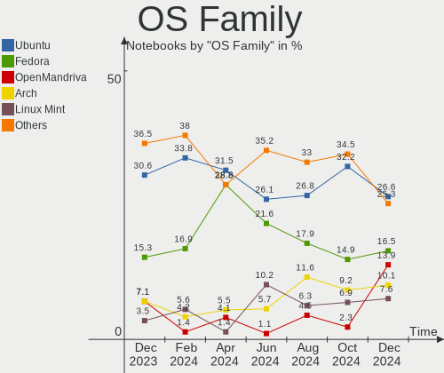
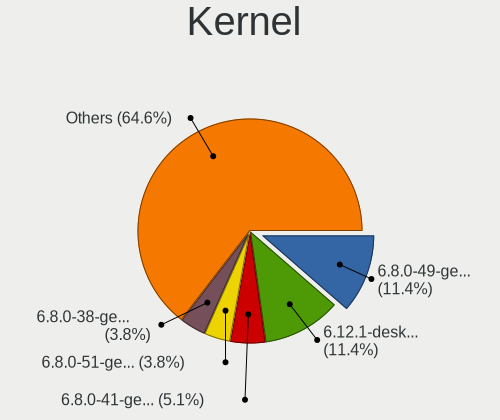
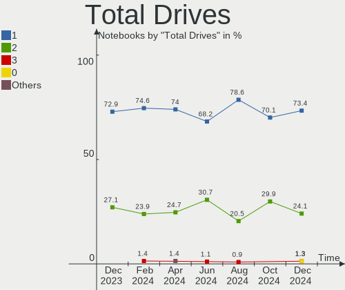
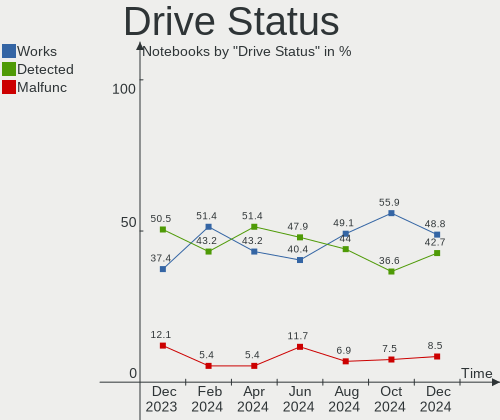
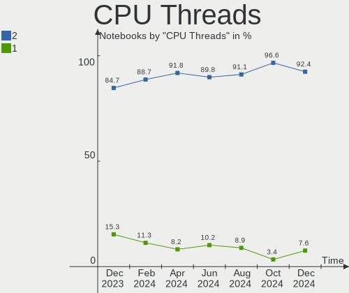
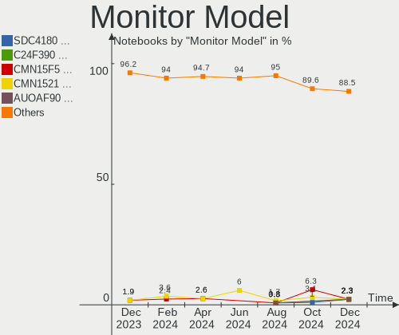
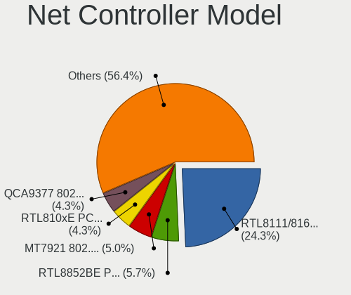
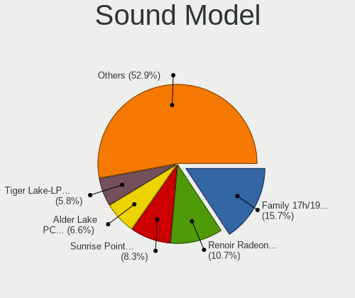
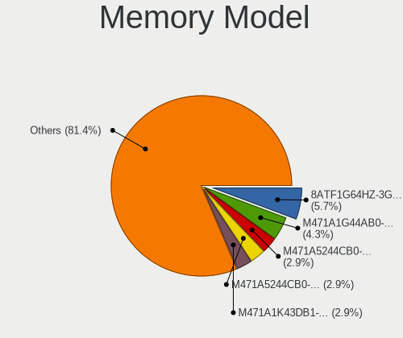

Linux in India - Hardware Trends (Notebooks)
--------------------------------------------

A project to identify most popular hardware characteristics and track their change
over time based on data collected by Linux users at https://Linux-Hardware.org.

Anyone can contribute to this report by the [hw-probe](https://github.com/linuxhw/hw-probe) tool:

    sudo -E hw-probe -all -upload

Period: Oct, 2022.

Contents
--------

* [ System ](#system)
  - [ OS                       ](#os)
  - [ OS Family                ](#os-family)
  - [ Kernel                   ](#kernel)
  - [ Kernel Family            ](#kernel-family)
  - [ Kernel Major Ver.        ](#kernel-major-ver)
  - [ Arch                     ](#arch)
  - [ DE                       ](#de)
  - [ Display Server           ](#display-server)
  - [ Display Manager          ](#display-manager)
  - [ OS Lang                  ](#os-lang)
  - [ Boot Mode                ](#boot-mode)
  - [ Filesystem               ](#filesystem)
  - [ Part. scheme             ](#part-scheme)
  - [ Dual Boot with Linux/BSD ](#dual-boot-with-linuxbsd)
  - [ Dual Boot (Win)          ](#dual-boot-win)

* [ Board ](#board)
  - [ Vendor                   ](#vendor)
  - [ Model                    ](#model)
  - [ Model Family             ](#model-family)
  - [ MFG Year                 ](#mfg-year)
  - [ Form Factor              ](#form-factor)
  - [ Secure Boot              ](#secure-boot)
  - [ Coreboot                 ](#coreboot)
  - [ RAM Size                 ](#ram-size)
  - [ RAM Used                 ](#ram-used)
  - [ Total Drives             ](#total-drives)
  - [ Has CD-ROM               ](#has-cd-rom)
  - [ Has Ethernet             ](#has-ethernet)
  - [ Has WiFi                 ](#has-wifi)
  - [ Has Bluetooth            ](#has-bluetooth)

* [ Location ](#location)
  - [ Country                  ](#country)
  - [ City                     ](#city)

* [ Drives ](#drives)
  - [ Drive Vendor             ](#drive-vendor)
  - [ Drive Model              ](#drive-model)
  - [ HDD Vendor               ](#hdd-vendor)
  - [ SSD Vendor               ](#ssd-vendor)
  - [ Drive Kind               ](#drive-kind)
  - [ Drive Connector          ](#drive-connector)
  - [ Drive Size               ](#drive-size)
  - [ Space Total              ](#space-total)
  - [ Space Used               ](#space-used)
  - [ Malfunc. Drives          ](#malfunc-drives)
  - [ Malfunc. Drive Vendor    ](#malfunc-drive-vendor)
  - [ Malfunc. HDD Vendor      ](#malfunc-hdd-vendor)
  - [ Malfunc. Drive Kind      ](#malfunc-drive-kind)
  - [ Failed Drives            ](#failed-drives)
  - [ Failed Drive Vendor      ](#failed-drive-vendor)
  - [ Drive Status             ](#drive-status)

* [ Storage controller ](#storage-controller)
  - [ Storage Vendor           ](#storage-vendor)
  - [ Storage Model            ](#storage-model)
  - [ Storage Kind             ](#storage-kind)

* [ Processor ](#processor)
  - [ CPU Vendor               ](#cpu-vendor)
  - [ CPU Model                ](#cpu-model)
  - [ CPU Model Family         ](#cpu-model-family)
  - [ CPU Cores                ](#cpu-cores)
  - [ CPU Sockets              ](#cpu-sockets)
  - [ CPU Threads              ](#cpu-threads)
  - [ CPU Op-Modes             ](#cpu-op-modes)
  - [ CPU Microcode            ](#cpu-microcode)
  - [ CPU Microarch            ](#cpu-microarch)

* [ Graphics ](#graphics)
  - [ GPU Vendor               ](#gpu-vendor)
  - [ GPU Model                ](#gpu-model)
  - [ GPU Combo                ](#gpu-combo)
  - [ GPU Driver               ](#gpu-driver)
  - [ GPU Memory               ](#gpu-memory)

* [ Monitor ](#monitor)
  - [ Monitor Vendor           ](#monitor-vendor)
  - [ Monitor Model            ](#monitor-model)
  - [ Monitor Resolution       ](#monitor-resolution)
  - [ Monitor Diagonal         ](#monitor-diagonal)
  - [ Monitor Width            ](#monitor-width)
  - [ Aspect Ratio             ](#aspect-ratio)
  - [ Monitor Area             ](#monitor-area)
  - [ Pixel Density            ](#pixel-density)
  - [ Multiple Monitors        ](#multiple-monitors)

* [ Network ](#network)
  - [ Net Controller Vendor    ](#net-controller-vendor)
  - [ Net Controller Model     ](#net-controller-model)
  - [ Wireless Vendor          ](#wireless-vendor)
  - [ Wireless Model           ](#wireless-model)
  - [ Ethernet Vendor          ](#ethernet-vendor)
  - [ Ethernet Model           ](#ethernet-model)
  - [ Net Controller Kind      ](#net-controller-kind)
  - [ Used Controller          ](#used-controller)
  - [ NICs                     ](#nics)
  - [ IPv6                     ](#ipv6)

* [ Bluetooth ](#bluetooth)
  - [ Bluetooth Vendor         ](#bluetooth-vendor)
  - [ Bluetooth Model          ](#bluetooth-model)

* [ Sound ](#sound)
  - [ Sound Vendor             ](#sound-vendor)
  - [ Sound Model              ](#sound-model)

* [ Memory ](#memory)
  - [ Memory Vendor            ](#memory-vendor)
  - [ Memory Model             ](#memory-model)
  - [ Memory Kind              ](#memory-kind)
  - [ Memory Form Factor       ](#memory-form-factor)
  - [ Memory Size              ](#memory-size)
  - [ Memory Speed             ](#memory-speed)

* [ Printers & scanners ](#printers--scanners)
  - [ Printer Vendor           ](#printer-vendor)
  - [ Printer Model            ](#printer-model)
  - [ Scanner Vendor           ](#scanner-vendor)
  - [ Scanner Model            ](#scanner-model)

* [ Camera ](#camera)
  - [ Camera Vendor            ](#camera-vendor)
  - [ Camera Model             ](#camera-model)

* [ Security ](#security)
  - [ Fingerprint Vendor       ](#fingerprint-vendor)
  - [ Fingerprint Model        ](#fingerprint-model)
  - [ Chipcard Vendor          ](#chipcard-vendor)
  - [ Chipcard Model           ](#chipcard-model)

* [ Unsupported ](#unsupported)
  - [ Unsupported Devices      ](#unsupported-devices)
  - [ Unsupported Device Types ](#unsupported-device-types)

System
------

OS
--

Installed operating systems

| Name                         | Notebooks | Percent |
|------------------------------|-----------|---------|
| Ubuntu 22.04                 | 15        | 18.75%  |
| Fedora 36                    | 8         | 10%     |
| Arch Rolling                 | 6         | 7.5%    |
| Ubuntu 20.04                 | 4         | 5%      |
| Pop!_OS 22.04                | 4         | 5%      |
| Kali 2022.3                  | 4         | 5%      |
| Zorin 16                     | 3         | 3.75%   |
| OpenMandriva 4.50            | 3         | 3.75%   |
| Manjaro 22.0.0               | 3         | 3.75%   |
| Fedora 37                    | 3         | 3.75%   |
| Ubuntu 22.10                 | 2         | 2.5%    |
| openSUSE Tumbleweed-XXXXXXXX | 2         | 2.5%    |
| Kubuntu 22.04                | 2         | 2.5%    |
| Garuda Linux Soaring         | 2         | 2.5%    |
| Elementary 6.1               | 2         | 2.5%    |
| ArcoLinux Rolling            | 2         | 2.5%    |
| Ubuntu Budgie 22.10          | 1         | 1.25%   |
| Ubuntu 18.04                 | 1         | 1.25%   |
| OpenMandriva 4.3             | 1         | 1.25%   |
| Manjaro                      | 1         | 1.25%   |
| Lubuntu 20.04                | 1         | 1.25%   |
| LMDE 5                       | 1         | 1.25%   |
| Linux Mint 21                | 1         | 1.25%   |
| Linux Mint 20.3              | 1         | 1.25%   |
| KDE neon 22.04               | 1         | 1.25%   |
| KDE neon 20.04               | 1         | 1.25%   |
| Gentoo 2.8                   | 1         | 1.25%   |
| Fedora 35                    | 1         | 1.25%   |
| Fedora 32                    | 1         | 1.25%   |
| Clear Linux 37440            | 1         | 1.25%   |
| Artix                        | 1         | 1.25%   |

OS Family
---------

OS without a version

| Name          | Notebooks | Percent |
|---------------|-----------|---------|
| Ubuntu        | 22        | 27.5%   |
| Fedora        | 13        | 16.25%  |
| Arch          | 6         | 7.5%    |
| Pop!_OS       | 4         | 5%      |
| OpenMandriva  | 4         | 5%      |
| Manjaro       | 4         | 5%      |
| Kali          | 4         | 5%      |
| Zorin         | 3         | 3.75%   |
| openSUSE      | 2         | 2.5%    |
| Linux Mint    | 2         | 2.5%    |
| Kubuntu       | 2         | 2.5%    |
| KDE neon      | 2         | 2.5%    |
| Garuda Linux  | 2         | 2.5%    |
| Elementary    | 2         | 2.5%    |
| ArcoLinux     | 2         | 2.5%    |
| Ubuntu Budgie | 1         | 1.25%   |
| Lubuntu       | 1         | 1.25%   |
| LMDE          | 1         | 1.25%   |
| Gentoo        | 1         | 1.25%   |
| Clear Linux   | 1         | 1.25%   |
| Artix         | 1         | 1.25%   |

Kernel
------

Version of the Linux kernel

| Version                  | Notebooks | Percent |
|--------------------------|-----------|---------|
| 5.15.0-50-generic        | 9         | 11.25%  |
| 5.15.0-48-generic        | 9         | 11.25%  |
| 5.15.0-52-generic        | 5         | 6.25%   |
| 5.19.13-200.fc36.x86_64  | 3         | 3.75%   |
| 5.19.0-23-generic        | 3         | 3.75%   |
| 5.18.0-kali7-amd64       | 3         | 3.75%   |
| 6.0.3-1-default          | 2         | 2.5%    |
| 5.19.5-desktop-1omv4090  | 2         | 2.5%    |
| 5.19.12-200.fc36.x86_64  | 2         | 2.5%    |
| 5.19.0-76051900-generic  | 2         | 2.5%    |
| 5.15.74-1-lts            | 2         | 2.5%    |
| 5.15.71-1-MANJARO        | 2         | 2.5%    |
| 6.0.5-arch1-1            | 1         | 1.25%   |
| 6.0.2-zen1-1-zen         | 1         | 1.25%   |
| 6.0.2-arch1-1            | 1         | 1.25%   |
| 6.0.1-arch2-1            | 1         | 1.25%   |
| 6.0.1-1199.native        | 1         | 1.25%   |
| 5.9.10-100.fc32.x86_64   | 1         | 1.25%   |
| 5.4.0-128-generic        | 1         | 1.25%   |
| 5.4.0-126-generic        | 1         | 1.25%   |
| 5.4.0-1074-gke           | 1         | 1.25%   |
| 5.19.4-100.fc35.x86_64   | 1         | 1.25%   |
| 5.19.16-76051916-generic | 1         | 1.25%   |
| 5.19.14-300.fc37.x86_64  | 1         | 1.25%   |
| 5.19.14-200.fc36.x86_64  | 1         | 1.25%   |
| 5.19.13-zen1-1-zen       | 1         | 1.25%   |
| 5.19.13-300.fc37.x86_64  | 1         | 1.25%   |
| 5.19.12-artix1-1         | 1         | 1.25%   |
| 5.19.12-arch1-1          | 1         | 1.25%   |
| 5.19.12-300.fc37.x86_64  | 1         | 1.25%   |
| 5.19.11-desktop-2omv4090 | 1         | 1.25%   |
| 5.19.11-arch1-1          | 1         | 1.25%   |
| 5.19.11-200.fc36.x86_64  | 1         | 1.25%   |
| 5.19.0-kali2-amd64       | 1         | 1.25%   |
| 5.19.0-051900-generic    | 1         | 1.25%   |
| 5.17.5-300.fc36.x86_64   | 1         | 1.25%   |
| 5.16.7-desktop-1omv4003  | 1         | 1.25%   |
| 5.15.74-3-MANJARO        | 1         | 1.25%   |
| 5.15.72-1-lts            | 1         | 1.25%   |
| 5.15.69-gentoo           | 1         | 1.25%   |

Kernel Family
-------------

Linux kernel without a distro release

| Version | Notebooks | Percent |
|---------|-----------|---------|
| 5.15.0  | 25        | 31.25%  |
| 5.19.0  | 7         | 8.75%   |
| 5.19.13 | 5         | 6.25%   |
| 5.19.12 | 5         | 6.25%   |
| 5.4.0   | 3         | 3.75%   |
| 5.19.11 | 3         | 3.75%   |
| 5.18.0  | 3         | 3.75%   |
| 5.15.74 | 3         | 3.75%   |
| 6.0.3   | 2         | 2.5%    |
| 6.0.2   | 2         | 2.5%    |
| 6.0.1   | 2         | 2.5%    |
| 5.19.5  | 2         | 2.5%    |
| 5.19.14 | 2         | 2.5%    |
| 5.15.71 | 2         | 2.5%    |
| 6.0.5   | 1         | 1.25%   |
| 5.9.10  | 1         | 1.25%   |
| 5.19.4  | 1         | 1.25%   |
| 5.19.16 | 1         | 1.25%   |
| 5.17.5  | 1         | 1.25%   |
| 5.16.7  | 1         | 1.25%   |
| 5.15.72 | 1         | 1.25%   |
| 5.15.69 | 1         | 1.25%   |
| 5.15.65 | 1         | 1.25%   |
| 5.15.60 | 1         | 1.25%   |
| 5.14.0  | 1         | 1.25%   |
| 5.13.0  | 1         | 1.25%   |
| 5.11.0  | 1         | 1.25%   |
| 5.10.0  | 1         | 1.25%   |

Kernel Major Ver.
-----------------

Linux kernel major version

| Version | Notebooks | Percent |
|---------|-----------|---------|
| 5.15    | 34        | 42.5%   |
| 5.19    | 26        | 32.5%   |
| 6.0     | 7         | 8.75%   |
| 5.4     | 3         | 3.75%   |
| 5.18    | 3         | 3.75%   |
| 5.9     | 1         | 1.25%   |
| 5.17    | 1         | 1.25%   |
| 5.16    | 1         | 1.25%   |
| 5.14    | 1         | 1.25%   |
| 5.13    | 1         | 1.25%   |
| 5.11    | 1         | 1.25%   |
| 5.10    | 1         | 1.25%   |

Arch
----

OS architecture (x86_64, i586, etc.)

| Name   | Notebooks | Percent |
|--------|-----------|---------|
| x86_64 | 80        | 100%    |

DE
--

Desktop Environment

| Name       | Notebooks | Percent |
|------------|-----------|---------|
| GNOME      | 47        | 58.75%  |
| KDE5       | 14        | 17.5%   |
| X-Cinnamon | 5         | 6.25%   |
| Unknown    | 4         | 5%      |
| XFCE       | 3         | 3.75%   |
| Pantheon   | 2         | 2.5%    |
| i3         | 2         | 2.5%    |
| MATE       | 1         | 1.25%   |
| LXQt       | 1         | 1.25%   |
| Budgie     | 1         | 1.25%   |

Display Server
--------------

X11 or Wayland

| Name    | Notebooks | Percent |
|---------|-----------|---------|
| X11     | 48        | 60%     |
| Wayland | 28        | 35%     |
| Tty     | 2         | 2.5%    |
| Unknown | 2         | 2.5%    |

Display Manager
---------------

SDDM, LightDM, etc.

| Name    | Notebooks | Percent |
|---------|-----------|---------|
| Unknown | 25        | 31.25%  |
| GDM3    | 18        | 22.5%   |
| SDDM    | 13        | 16.25%  |
| GDM     | 13        | 16.25%  |
| LightDM | 10        | 12.5%   |
| XDM     | 1         | 1.25%   |

OS Lang
-------

Language

| Lang    | Notebooks | Percent |
|---------|-----------|---------|
| en_IN   | 42        | 52.5%   |
| en_US   | 35        | 43.75%  |
| en_AG   | 1         | 1.25%   |
| Default | 1         | 1.25%   |
| C       | 1         | 1.25%   |

Boot Mode
---------

EFI or BIOS

| Mode | Notebooks | Percent |
|------|-----------|---------|
| EFI  | 50        | 62.5%   |
| BIOS | 30        | 37.5%   |

Filesystem
----------

Type of filesystem

| Type    | Notebooks | Percent |
|---------|-----------|---------|
| Ext4    | 57        | 71.25%  |
| Btrfs   | 17        | 21.25%  |
| Overlay | 4         | 5%      |
| Zfs     | 2         | 2.5%    |

Part. scheme
------------

Scheme of partitioning

| Type    | Notebooks | Percent |
|---------|-----------|---------|
| GPT     | 50        | 62.5%   |
| Unknown | 23        | 28.75%  |
| MBR     | 7         | 8.75%   |

Dual Boot with Linux/BSD
------------------------

Hosting more than one Linux/BSD

| Dual boot | Notebooks | Percent |
|-----------|-----------|---------|
| No        | 75        | 93.75%  |
| Yes       | 5         | 6.25%   |

Dual Boot (Win)
---------------

Hosting Linux and Windows

| Dual boot | Notebooks | Percent |
|-----------|-----------|---------|
| No        | 52        | 65%     |
| Yes       | 28        | 35%     |

Board
-----

Vendor
------

Motherboard manufacturer

| Name             | Notebooks | Percent |
|------------------|-----------|---------|
| Lenovo           | 22        | 27.5%   |
| Hewlett-Packard  | 18        | 22.5%   |
| Dell             | 18        | 22.5%   |
| ASUSTek Computer | 11        | 13.75%  |
| Acer             | 4         | 5%      |
| Sony             | 2         | 2.5%    |
| Timi             | 1         | 1.25%   |
| MSI              | 1         | 1.25%   |
| MICROMAX         | 1         | 1.25%   |
| LG Electronics   | 1         | 1.25%   |
| AVITA            | 1         | 1.25%   |

Model
-----

Motherboard model

| Name                                 | Notebooks | Percent |
|--------------------------------------|-----------|---------|
| Dell Inspiron 3543                   | 2         | 2.5%    |
| Timi Mi NoteBook Pro                 | 1         | 1.25%   |
| Sony VPCEB46FG                       | 1         | 1.25%   |
| Sony VPCEA45FG                       | 1         | 1.25%   |
| MSI Pulse GL66 11UGK                 | 1         | 1.25%   |
| MICROMAX Canvas Lapbook L1161        | 1         | 1.25%   |
| LG 14Z990-V.AR52A2                   | 1         | 1.25%   |
| Lenovo ThinkPad T490 20RYS07R00      | 1         | 1.25%   |
| Lenovo ThinkPad T460s 20FAS2K13B     | 1         | 1.25%   |
| Lenovo ThinkPad T450s 20BWA0DW00     | 1         | 1.25%   |
| Lenovo ThinkPad L450 20DSS00M01      | 1         | 1.25%   |
| Lenovo ThinkPad E480 20KNS0E200      | 1         | 1.25%   |
| Lenovo ThinkPad E14 Gen 3 20YES00200 | 1         | 1.25%   |
| Lenovo ThinkPad E14 Gen 3 20YDCTO1WW | 1         | 1.25%   |
| Lenovo ThinkPad E14 Gen 2 20TAS08F00 | 1         | 1.25%   |
| Lenovo ThinkPad E14 Gen 2 20T6S00D00 | 1         | 1.25%   |
| Lenovo ThinkPad E14 20RAS1RA00       | 1         | 1.25%   |
| Lenovo ThinkPad E14 20RAS0KY00       | 1         | 1.25%   |
| Lenovo ThinkBook 14-IIL 20SL         | 1         | 1.25%   |
| Lenovo Legion Y7000 2019 1050 81V4   | 1         | 1.25%   |
| Lenovo Legion Y540-15IRH-PG0 81SY    | 1         | 1.25%   |
| Lenovo IdeaPad S540-15IML D 81NG     | 1         | 1.25%   |
| Lenovo IdeaPad Gaming 3 15ARH05 82EY | 1         | 1.25%   |
| Lenovo IdeaPad Gaming 3 15ACH6 82K2  | 1         | 1.25%   |
| Lenovo IdeaPad 5 Pro 16ACH6 82L5     | 1         | 1.25%   |
| Lenovo IdeaPad 5 14ARE05 81YM        | 1         | 1.25%   |
| Lenovo IdeaPad 320-15ISK 80XH        | 1         | 1.25%   |
| Lenovo IdeaPad 3 15ADA05 81W1        | 1         | 1.25%   |
| Lenovo G500 20236                    | 1         | 1.25%   |
| HP ProBook 4540s                     | 1         | 1.25%   |
| HP ProBook 440 G8 Notebook PC        | 1         | 1.25%   |
| HP Pavilion Laptop 14-ec1xxx         | 1         | 1.25%   |
| HP Pavilion Gaming Laptop 15-ec2xxx  | 1         | 1.25%   |
| HP Pavilion dv6                      | 1         | 1.25%   |
| HP Laptop 15s-gy0xxx                 | 1         | 1.25%   |
| HP Laptop 15s-gr0xxx                 | 1         | 1.25%   |
| HP Laptop 15s-du3xxx                 | 1         | 1.25%   |
| HP Laptop 15-bs0xx                   | 1         | 1.25%   |
| HP Laptop 14s-ef1xxx                 | 1         | 1.25%   |
| HP Laptop 14s-dr1xxx                 | 1         | 1.25%   |

Model Family
------------

Motherboard model prefix

| Name               | Notebooks | Percent |
|--------------------|-----------|---------|
| Lenovo ThinkPad    | 11        | 13.75%  |
| Dell Inspiron      | 8         | 10%     |
| Lenovo IdeaPad     | 7         | 8.75%   |
| HP Laptop          | 6         | 7.5%    |
| Dell Vostro        | 6         | 7.5%    |
| ASUS VivoBook      | 5         | 6.25%   |
| HP Pavilion        | 3         | 3.75%   |
| HP EliteBook       | 3         | 3.75%   |
| Dell Latitude      | 3         | 3.75%   |
| ASUS ASUS          | 3         | 3.75%   |
| Lenovo Legion      | 2         | 2.5%    |
| HP ProBook         | 2         | 2.5%    |
| Timi Mi            | 1         | 1.25%   |
| Sony VPCEB46FG     | 1         | 1.25%   |
| Sony VPCEA45FG     | 1         | 1.25%   |
| MSI Pulse          | 1         | 1.25%   |
| MICROMAX Canvas    | 1         | 1.25%   |
| LG 14Z990-V.AR52A2 | 1         | 1.25%   |
| Lenovo ThinkBook   | 1         | 1.25%   |
| Lenovo G500        | 1         | 1.25%   |
| HP InsydeH2O       | 1         | 1.25%   |
| HP 255             | 1         | 1.25%   |
| HP 2000            | 1         | 1.25%   |
| HP 15              | 1         | 1.25%   |
| Dell G3            | 1         | 1.25%   |
| AVITA NS14A6       | 1         | 1.25%   |
| ASUS X550LC        | 1         | 1.25%   |
| ASUS TUF           | 1         | 1.25%   |
| ASUS K53SM         | 1         | 1.25%   |
| Acer Nitro         | 1         | 1.25%   |
| Acer Extensa       | 1         | 1.25%   |
| Acer Aspire        | 1         | 1.25%   |
| Unknown            | 1         | 1.25%   |

MFG Year
--------

Motherboard manufacture year

| Year | Notebooks | Percent |
|------|-----------|---------|
| 2021 | 17        | 21.25%  |
| 2020 | 11        | 13.75%  |
| 2019 | 10        | 12.5%   |
| 2013 | 6         | 7.5%    |
| 2016 | 5         | 6.25%   |
| 2015 | 5         | 6.25%   |
| 2022 | 4         | 5%      |
| 2018 | 4         | 5%      |
| 2014 | 4         | 5%      |
| 2012 | 4         | 5%      |
| 2017 | 3         | 3.75%   |
| 2011 | 3         | 3.75%   |
| 2010 | 3         | 3.75%   |
| 2008 | 1         | 1.25%   |

Form Factor
-----------

Physical design of the computer

| Name     | Notebooks | Percent |
|----------|-----------|---------|
| Notebook | 80        | 100%    |

Secure Boot
-----------

Enabled or disabled

| State    | Notebooks | Percent |
|----------|-----------|---------|
| Disabled | 73        | 91.25%  |
| Enabled  | 7         | 8.75%   |

Coreboot
--------

Have coreboot on board

| Used | Notebooks | Percent |
|------|-----------|---------|
| No   | 80        | 100%    |

RAM Size
--------

Total RAM memory

| Size in GB | Notebooks | Percent |
|------------|-----------|---------|
| 4.01-8.0   | 34        | 42.5%   |
| 8.01-16.0  | 19        | 23.75%  |
| 3.01-4.0   | 12        | 15%     |
| 16.01-24.0 | 12        | 15%     |
| 32.01-64.0 | 1         | 1.25%   |
| 24.01-32.0 | 1         | 1.25%   |
| 1.01-2.0   | 1         | 1.25%   |

RAM Used
--------

Used RAM memory

| Used GB   | Notebooks | Percent |
|-----------|-----------|---------|
| 3.01-4.0  | 23        | 28.75%  |
| 2.01-3.0  | 20        | 25%     |
| 4.01-8.0  | 18        | 22.5%   |
| 1.01-2.0  | 16        | 20%     |
| 8.01-16.0 | 2         | 2.5%    |
| 0.51-1.0  | 1         | 1.25%   |

Total Drives
------------

Number of drives on board

| Drives | Notebooks | Percent |
|--------|-----------|---------|
| 1      | 59        | 73.75%  |
| 2      | 21        | 26.25%  |

Has CD-ROM
----------

Has CD-ROM on board

| Presented | Notebooks | Percent |
|-----------|-----------|---------|
| No        | 62        | 77.5%   |
| Yes       | 18        | 22.5%   |

Has Ethernet
------------

Has Ethernet on board

| Presented | Notebooks | Percent |
|-----------|-----------|---------|
| Yes       | 67        | 83.75%  |
| No        | 13        | 16.25%  |

Has WiFi
--------

Has WiFi module

| Presented | Notebooks | Percent |
|-----------|-----------|---------|
| Yes       | 78        | 97.5%   |
| No        | 2         | 2.5%    |

Has Bluetooth
-------------

Has Bluetooth module

| Presented | Notebooks | Percent |
|-----------|-----------|---------|
| Yes       | 68        | 85%     |
| No        | 12        | 15%     |

Location
--------

Country
-------

Geographic location (country)

| Country | Notebooks | Percent |
|---------|-----------|---------|
| India   | 80        | 100%    |

City
----

Geographic location (city)

| City          | Notebooks | Percent |
|---------------|-----------|---------|
| Bengaluru     | 11        | 13.75%  |
| Chennai       | 8         | 10%     |
| Mumbai        | 5         | 6.25%   |
| Hyderabad     | 4         | 5%      |
| Delhi         | 4         | 5%      |
| Pune          | 3         | 3.75%   |
| Nagpur        | 3         | 3.75%   |
| Kolkata       | 3         | 3.75%   |
| Vadodara      | 2         | 2.5%    |
| Surat         | 2         | 2.5%    |
| Noida         | 2         | 2.5%    |
| New Delhi     | 2         | 2.5%    |
| Navi Mumbai   | 2         | 2.5%    |
| Jaipur        | 2         | 2.5%    |
| Indore        | 2         | 2.5%    |
| Ernakulam     | 2         | 2.5%    |
| Visakhapatnam | 1         | 1.25%   |
| Udupi         | 1         | 1.25%   |
| Trivandrum    | 1         | 1.25%   |
| Solapur       | 1         | 1.25%   |
| Mohali        | 1         | 1.25%   |
| Mallampet     | 1         | 1.25%   |
| Malappuram    | 1         | 1.25%   |
| Ludhiana      | 1         | 1.25%   |
| Lucknow       | 1         | 1.25%   |
| Kondotty      | 1         | 1.25%   |
| Karaikudi     | 1         | 1.25%   |
| Kannur        | 1         | 1.25%   |
| Kanchrapara   | 1         | 1.25%   |
| Haldwani      | 1         | 1.25%   |
| Gurgaon       | 1         | 1.25%   |
| Ghaziabad     | 1         | 1.25%   |
| Gaya          | 1         | 1.25%   |
| Bisrakh       | 1         | 1.25%   |
| Bhuj          | 1         | 1.25%   |
| Bhubaneswar   | 1         | 1.25%   |
| Bardhaman     | 1         | 1.25%   |
| Angul         | 1         | 1.25%   |
| Ahmedabad     | 1         | 1.25%   |

Drives
------

Drive Vendor
------------

Hard drive vendors

| Vendor                    | Notebooks | Drives | Percent |
|---------------------------|-----------|--------|---------|
| Samsung Electronics       | 15        | 15     | 15.31%  |
| WDC                       | 14        | 14     | 14.29%  |
| Seagate                   | 14        | 14     | 14.29%  |
| Toshiba                   | 8         | 8      | 8.16%   |
| KIOXIA                    | 8         | 8      | 8.16%   |
| Micron Technology         | 7         | 7      | 7.14%   |
| Intel                     | 7         | 7      | 7.14%   |
| SanDisk                   | 4         | 5      | 4.08%   |
| Crucial                   | 4         | 4      | 4.08%   |
| HGST                      | 3         | 3      | 3.06%   |
| Kingston                  | 2         | 2      | 2.04%   |
| Hitachi                   | 2         | 2      | 2.04%   |
| China                     | 2         | 2      | 2.04%   |
| Unknown                   | 1         | 2      | 1.02%   |
| Union Memory (Shenzhen)   | 1         | 1      | 1.02%   |
| SK hynix                  | 1         | 1      | 1.02%   |
| Realtek Semiconductor     | 1         | 1      | 1.02%   |
| Micron/Crucial Technology | 1         | 1      | 1.02%   |
| Gigabyte Technology       | 1         | 1      | 1.02%   |
| FORESEE                   | 1         | 1      | 1.02%   |
| Unknown                   | 1         | 1      | 1.02%   |

Drive Model
-----------

Hard drive models

| Model                                              | Notebooks | Percent |
|----------------------------------------------------|-----------|---------|
| Toshiba MQ04ABF100 1TB                             | 5         | 5%      |
| Seagate ST1000LM035-1RK172 1TB                     | 3         | 3%      |
| Seagate ST1000LM024 HN-M101MBB 1TB                 | 3         | 3%      |
| WDC WDS120G2G0A-00JH30 120GB SSD                   | 2         | 2%      |
| WDC WD5000LPVX-75V0TT0 500GB                       | 2         | 2%      |
| Seagate ST500LT012-9WS142 500GB                    | 2         | 2%      |
| Seagate ST1000LM049-2GH172 1TB                     | 2         | 2%      |
| Seagate ST1000LM048-2E7172 1TB                     | 2         | 2%      |
| Samsung SSD 980 500GB                              | 2         | 2%      |
| Samsung MZVLQ512HBLU-00BH1 512GB                   | 2         | 2%      |
| Micron 2210_MTFDHBA512QFD 512GB                    | 2         | 2%      |
| KIOXIA KBG40ZNV512G 512GB                          | 2         | 2%      |
| KIOXIA KBG40ZNV256G 256GB                          | 2         | 2%      |
| KIOXIA KBG40ZNS256G NVMe 256GB                     | 2         | 2%      |
| HGST HTS721010A9E630 1TB                           | 2         | 2%      |
| Crucial CT240BX500SSD1 240GB                       | 2         | 2%      |
| China SSD 256GB                                    | 2         | 2%      |
| WDC WDS240G2G0B-00EPW0 240GB SSD                   | 1         | 1%      |
| WDC WDS100T2G0A-00JH30 1TB SSD                     | 1         | 1%      |
| WDC WD3200BEKT-08PVMT1 320GB                       | 1         | 1%      |
| WDC WD10SPZX-60Z10T1 1TB                           | 1         | 1%      |
| WDC WD10SPZX-24Z10 1TB                             | 1         | 1%      |
| WDC WD10SPZX-08Z10 1TB                             | 1         | 1%      |
| WDC WD10JPVX-60JC3T1 1TB                           | 1         | 1%      |
| WDC PC SN530 SDBPNPZ-512G-1002 512GB               | 1         | 1%      |
| WDC PC SN530 SDBPMPZ-256G-1001 256GB               | 1         | 1%      |
| WDC PC SN520 SDAPNUW-512G-1006 512GB               | 1         | 1%      |
| Unknown SD32G  32GB                                | 1         | 1%      |
| Unknown DS2032  32GB                               | 1         | 1%      |
| Union Memory (Shenzhen) UMIS RPEYJ512VMM2QWY 512GB | 1         | 1%      |
| Toshiba MQ01ABF050 500GB                           | 1         | 1%      |
| Toshiba MQ01ABD100 1TB                             | 1         | 1%      |
| Toshiba MK3265GSXN 320GB                           | 1         | 1%      |
| SK hynix SKHynix_HFS256GD9TNG-L3A0B 256GB          | 1         | 1%      |
| Seagate Expansion 2TB                              | 1         | 1%      |
| Seagate BACKUP+ 500GB                              | 1         | 1%      |
| Sandisk WDC PC SN540 SDDPNPF-1T00-1032 1024GB      | 1         | 1%      |
| Sandisk WD Black SN750 / PC SN730 NVMe SSD 1TB     | 1         | 1%      |
| SanDisk SD9TB8W256G1001 256GB SSD                  | 1         | 1%      |
| SanDisk SD9SN8W128G1014 128GB SSD                  | 1         | 1%      |

HDD Vendor
----------

Hard disk drive vendors

| Vendor  | Notebooks | Drives | Percent |
|---------|-----------|--------|---------|
| Seagate | 13        | 13     | 39.39%  |
| Toshiba | 8         | 8      | 24.24%  |
| WDC     | 7         | 7      | 21.21%  |
| HGST    | 3         | 3      | 9.09%   |
| Hitachi | 2         | 2      | 6.06%   |

SSD Vendor
----------

Solid state drive vendors

| Vendor              | Notebooks | Drives | Percent |
|---------------------|-----------|--------|---------|
| WDC                 | 4         | 4      | 18.18%  |
| Samsung Electronics | 4         | 4      | 18.18%  |
| Intel               | 3         | 3      | 13.64%  |
| Crucial             | 3         | 3      | 13.64%  |
| SanDisk             | 2         | 2      | 9.09%   |
| China               | 2         | 2      | 9.09%   |
| Kingston            | 1         | 1      | 4.55%   |
| Gigabyte Technology | 1         | 1      | 4.55%   |
| FORESEE             | 1         | 1      | 4.55%   |
| Unknown             | 1         | 1      | 4.55%   |

Drive Kind
----------

HDD or SSD

| Kind    | Notebooks | Drives | Percent |
|---------|-----------|--------|---------|
| NVMe    | 39        | 42     | 41.05%  |
| HDD     | 32        | 33     | 33.68%  |
| SSD     | 22        | 22     | 23.16%  |
| MMC     | 1         | 2      | 1.05%   |
| Unknown | 1         | 1      | 1.05%   |

Drive Connector
---------------

SATA, SAS, NVMe, etc.

| Type | Notebooks | Drives | Percent |
|------|-----------|--------|---------|
| SATA | 50        | 54     | 54.35%  |
| NVMe | 39        | 42     | 42.39%  |
| SAS  | 2         | 2      | 2.17%   |
| MMC  | 1         | 2      | 1.09%   |

Drive Size
----------

Size of hard drive

| Size in TB | Notebooks | Drives | Percent |
|------------|-----------|--------|---------|
| 0.51-1.0   | 27        | 27     | 50.94%  |
| 0.01-0.5   | 25        | 27     | 47.17%  |
| 1.01-2.0   | 1         | 1      | 1.89%   |

Space Total
-----------

Amount of disk space available on the file system

| Size in GB     | Notebooks | Percent |
|----------------|-----------|---------|
| 101-250        | 25        | 31.25%  |
| 251-500        | 21        | 26.25%  |
| 501-1000       | 15        | 18.75%  |
| 1-20           | 6         | 7.5%    |
| 1001-2000      | 5         | 6.25%   |
| 51-100         | 4         | 5%      |
| More than 3000 | 2         | 2.5%    |
| 21-50          | 2         | 2.5%    |

Space Used
----------

Amount of used disk space

| Used GB   | Notebooks | Percent |
|-----------|-----------|---------|
| 1-20      | 26        | 32.5%   |
| 21-50     | 14        | 17.5%   |
| 51-100    | 13        | 16.25%  |
| 101-250   | 12        | 15%     |
| 251-500   | 11        | 13.75%  |
| 501-1000  | 3         | 3.75%   |
| 1001-2000 | 1         | 1.25%   |

Malfunc. Drives
---------------

Drive models with a malfunction

| Model                                 | Notebooks | Drives | Percent |
|---------------------------------------|-----------|--------|---------|
| WDC WD10JPVX-60JC3T1 1TB              | 1         | 1      | 10%     |
| Toshiba MQ01ABD100 1TB                | 1         | 1      | 10%     |
| Toshiba MK3265GSXN 320GB              | 1         | 1      | 10%     |
| Seagate ST500LT012-9WS142 500GB       | 1         | 1      | 10%     |
| Seagate ST1000LM048-2E7172 1TB        | 1         | 1      | 10%     |
| Samsung Electronics SSD 980 500GB     | 1         | 1      | 10%     |
| Samsung Electronics SSD 870 EVO 500GB | 1         | 1      | 10%     |
| Intel SSDSCKKF256G8H 256GB            | 1         | 1      | 10%     |
| Hitachi HTS727550A9E364 500GB         | 1         | 1      | 10%     |
| China SSD 256GB                       | 1         | 1      | 10%     |

Malfunc. Drive Vendor
---------------------

Vendors of faulty drives

| Vendor              | Notebooks | Drives | Percent |
|---------------------|-----------|--------|---------|
| Toshiba             | 2         | 2      | 20%     |
| Seagate             | 2         | 2      | 20%     |
| Samsung Electronics | 2         | 2      | 20%     |
| WDC                 | 1         | 1      | 10%     |
| Intel               | 1         | 1      | 10%     |
| Hitachi             | 1         | 1      | 10%     |
| China               | 1         | 1      | 10%     |

Malfunc. HDD Vendor
-------------------

Vendors of faulty HDD drives

| Vendor  | Notebooks | Drives | Percent |
|---------|-----------|--------|---------|
| Toshiba | 2         | 2      | 33.33%  |
| Seagate | 2         | 2      | 33.33%  |
| WDC     | 1         | 1      | 16.67%  |
| Hitachi | 1         | 1      | 16.67%  |

Malfunc. Drive Kind
-------------------

Kinds of faulty drives

| Kind | Notebooks | Drives | Percent |
|------|-----------|--------|---------|
| HDD  | 6         | 6      | 60%     |
| SSD  | 3         | 3      | 30%     |
| NVMe | 1         | 1      | 10%     |

Failed Drives
-------------

Failed drive models

Zero info for selected period =(

Failed Drive Vendor
-------------------

Failed drive vendors

Zero info for selected period =(

Drive Status
------------

Number of failed and malfunc. drives

| Status   | Notebooks | Drives | Percent |
|----------|-----------|--------|---------|
| Detected | 38        | 45     | 44.71%  |
| Works    | 38        | 45     | 44.71%  |
| Malfunc  | 9         | 10     | 10.59%  |

Storage controller
------------------

Storage Vendor
--------------

Storage controller vendors

| Vendor                      | Notebooks | Percent |
|-----------------------------|-----------|---------|
| Intel                       | 55        | 51.89%  |
| AMD                         | 13        | 12.26%  |
| Samsung Electronics         | 11        | 10.38%  |
| KIOXIA                      | 8         | 7.55%   |
| Micron Technology           | 7         | 6.6%    |
| SanDisk                     | 6         | 5.66%   |
| Micron/Crucial Technology   | 2         | 1.89%   |
| Union Memory (Shenzhen)     | 1         | 0.94%   |
| SK hynix                    | 1         | 0.94%   |
| Realtek Semiconductor       | 1         | 0.94%   |
| Kingston Technology Company | 1         | 0.94%   |

Storage Model
-------------

Storage controller models

| Model                                                                        | Notebooks | Percent |
|------------------------------------------------------------------------------|-----------|---------|
| AMD FCH SATA Controller [AHCI mode]                                          | 13        | 11.5%   |
| Samsung NVMe SSD Controller 980                                              | 9         | 7.96%   |
| Intel Sunrise Point-LP SATA Controller [AHCI mode]                           | 9         | 7.96%   |
| KIOXIA NVMe SSD Controller BG4                                               | 8         | 7.08%   |
| Micron Non-Volatile memory controller                                        | 7         | 6.19%   |
| Intel Volume Management Device NVMe RAID Controller                          | 7         | 6.19%   |
| Intel 8 Series SATA Controller 1 [AHCI mode]                                 | 6         | 5.31%   |
| Intel 7 Series Chipset Family 6-port SATA Controller [AHCI mode]             | 6         | 5.31%   |
| Intel 82801 Mobile SATA Controller [RAID mode]                               | 5         | 4.42%   |
| Intel Tiger Lake-LP SATA Controller                                          | 4         | 3.54%   |
| Intel Wildcat Point-LP SATA Controller [AHCI Mode]                           | 3         | 2.65%   |
| Intel 400 Series Chipset Family SATA AHCI Controller                         | 3         | 2.65%   |
| SanDisk Non-Volatile memory controller                                       | 2         | 1.77%   |
| Intel Non-Volatile memory controller                                         | 2         | 1.77%   |
| Intel Ice Lake-LP SATA Controller [AHCI mode]                                | 2         | 1.77%   |
| Intel Comet Lake SATA AHCI Controller                                        | 2         | 1.77%   |
| Intel Cannon Point-LP SATA Controller [AHCI Mode]                            | 2         | 1.77%   |
| Intel Cannon Lake Mobile PCH SATA AHCI Controller                            | 2         | 1.77%   |
| Intel 5 Series/3400 Series Chipset 4 port SATA AHCI Controller               | 2         | 1.77%   |
| Union Memory (Shenzhen) Non-Volatile memory controller                       | 1         | 0.88%   |
| SK hynix Non-Volatile memory controller                                      | 1         | 0.88%   |
| SanDisk WD Blue SN570 NVMe SSD                                               | 1         | 0.88%   |
| SanDisk WD Blue SN550 NVMe SSD                                               | 1         | 0.88%   |
| SanDisk WD Blue SN500 / PC SN520 NVMe SSD                                    | 1         | 0.88%   |
| SanDisk WD Black SN750 / PC SN730 NVMe SSD                                   | 1         | 0.88%   |
| Samsung NVMe SSD Controller SM981/PM981/PM983                                | 1         | 0.88%   |
| Samsung NVMe SSD Controller SM951/PM951                                      | 1         | 0.88%   |
| Realtek Realtek Non-Volatile memory controller                               | 1         | 0.88%   |
| Micron/Crucial P2 NVMe PCIe SSD                                              | 1         | 0.88%   |
| Micron/Crucial Non-Volatile memory controller                                | 1         | 0.88%   |
| Kingston Company Company Non-Volatile memory controller                      | 1         | 0.88%   |
| Intel SSD Pro 7600p/760p/E 6100p Series                                      | 1         | 0.88%   |
| Intel SSD 660P Series                                                        | 1         | 0.88%   |
| Intel Atom Processor E3800 Series SATA AHCI Controller                       | 1         | 0.88%   |
| Intel Alder Lake-P SATA AHCI Controller                                      | 1         | 0.88%   |
| Intel 6 Series/C200 Series Chipset Family 6 port Mobile SATA AHCI Controller | 1         | 0.88%   |
| Intel 500 Series Chipset Family SATA AHCI Controller                         | 1         | 0.88%   |
| Intel 5 Series/3400 Series Chipset 6 port SATA AHCI Controller               | 1         | 0.88%   |

Storage Kind
------------

Kind of storage controller (IDE, SATA, NVMe, SAS, ...)

| Kind | Notebooks | Percent |
|------|-----------|---------|
| SATA | 59        | 53.64%  |
| NVMe | 39        | 35.45%  |
| RAID | 12        | 10.91%  |

Processor
---------

CPU Vendor
----------

Processor vendors

| Vendor | Notebooks | Percent |
|--------|-----------|---------|
| Intel  | 59        | 73.75%  |
| AMD    | 21        | 26.25%  |

CPU Model
---------

Processor models

| Model                                   | Notebooks | Percent |
|-----------------------------------------|-----------|---------|
| Intel 11th Gen Core i5-1135G7 @ 2.40GHz | 4         | 5%      |
| AMD Ryzen 7 5800H with Radeon Graphics  | 4         | 5%      |
| AMD Ryzen 3 3250U with Radeon Graphics  | 4         | 5%      |
| Intel Core i5-10210U CPU @ 1.60GHz      | 3         | 3.75%   |
| Intel Core i3-6006U CPU @ 2.00GHz       | 3         | 3.75%   |
| Intel Core i3-4005U CPU @ 1.70GHz       | 3         | 3.75%   |
| Intel Core i7-6600U CPU @ 2.60GHz       | 2         | 2.5%    |
| Intel Core i5-9300H CPU @ 2.40GHz       | 2         | 2.5%    |
| Intel Core i5-8265U CPU @ 1.60GHz       | 2         | 2.5%    |
| Intel Core i5-8250U CPU @ 1.60GHz       | 2         | 2.5%    |
| Intel Core i5-2450M CPU @ 2.50GHz       | 2         | 2.5%    |
| Intel Core i5-10300H CPU @ 2.50GHz      | 2         | 2.5%    |
| Intel Core i3-1005G1 CPU @ 1.20GHz      | 2         | 2.5%    |
| Intel Core i3 CPU M 380 @ 2.53GHz       | 2         | 2.5%    |
| Intel 11th Gen Core i5-11300H @ 3.10GHz | 2         | 2.5%    |
| Intel 11th Gen Core i3-1115G4 @ 3.00GHz | 2         | 2.5%    |
| AMD Ryzen 7 4800H with Radeon Graphics  | 2         | 2.5%    |
| AMD Ryzen 7 4700U with Radeon Graphics  | 2         | 2.5%    |
| Intel Pentium CPU N3540 @ 2.16GHz       | 1         | 1.25%   |
| Intel Pentium CPU 2020M @ 2.40GHz       | 1         | 1.25%   |
| Intel Core i7-8565U CPU @ 1.80GHz       | 1         | 1.25%   |
| Intel Core i7-7500U CPU @ 2.70GHz       | 1         | 1.25%   |
| Intel Core i7-5600U CPU @ 2.60GHz       | 1         | 1.25%   |
| Intel Core i7-4600U CPU @ 2.10GHz       | 1         | 1.25%   |
| Intel Core i7-4500U CPU @ 1.80GHz       | 1         | 1.25%   |
| Intel Core i7-10750H CPU @ 2.60GHz      | 1         | 1.25%   |
| Intel Core i7-10510U CPU @ 1.80GHz      | 1         | 1.25%   |
| Intel Core i5-8350U CPU @ 1.70GHz       | 1         | 1.25%   |
| Intel Core i5-6300U CPU @ 2.40GHz       | 1         | 1.25%   |
| Intel Core i5-5300U CPU @ 2.30GHz       | 1         | 1.25%   |
| Intel Core i5-5200U CPU @ 2.20GHz       | 1         | 1.25%   |
| Intel Core i5-4210U CPU @ 1.70GHz       | 1         | 1.25%   |
| Intel Core i5-4200U CPU @ 1.60GHz       | 1         | 1.25%   |
| Intel Core i5-3340M CPU @ 2.70GHz       | 1         | 1.25%   |
| Intel Core i5-3210M CPU @ 2.50GHz       | 1         | 1.25%   |
| Intel Core i5-1035G1 CPU @ 1.00GHz      | 1         | 1.25%   |
| Intel Core i5 CPU M 480 @ 2.67GHz       | 1         | 1.25%   |
| Intel Core i3-3217U CPU @ 1.80GHz       | 1         | 1.25%   |
| Intel Core i3-2348M CPU @ 2.30GHz       | 1         | 1.25%   |
| Intel Core i3-2328M CPU @ 2.20GHz       | 1         | 1.25%   |

CPU Model Family
----------------

Processor model prefix

| Model         | Notebooks | Percent |
|---------------|-----------|---------|
| Intel Core i5 | 23        | 28.75%  |
| Intel Core i3 | 13        | 16.25%  |
| Other         | 11        | 13.75%  |
| Intel Core i7 | 9         | 11.25%  |
| AMD Ryzen 7   | 8         | 10%     |
| AMD Ryzen 5   | 7         | 8.75%   |
| AMD Ryzen 3   | 4         | 5%      |
| Intel Pentium | 2         | 2.5%    |
| Intel Atom    | 1         | 1.25%   |
| AMD E2        | 1         | 1.25%   |
| AMD A10       | 1         | 1.25%   |

CPU Cores
---------

Number of processor cores

| Number | Notebooks | Percent |
|--------|-----------|---------|
| 2      | 37        | 46.25%  |
| 4      | 27        | 33.75%  |
| 8      | 9         | 11.25%  |
| 6      | 5         | 6.25%   |
| 14     | 1         | 1.25%   |
| 12     | 1         | 1.25%   |

CPU Sockets
-----------

Number of sockets

| Number | Notebooks | Percent |
|--------|-----------|---------|
| 1      | 80        | 100%    |

CPU Threads
-----------

Threads per core (Hyper-Threading)

| Number | Notebooks | Percent |
|--------|-----------|---------|
| 2      | 73        | 91.25%  |
| 1      | 7         | 8.75%   |

CPU Op-Modes
------------

CPU Operation Modes (32-bit, 64-bit)

| Op mode        | Notebooks | Percent |
|----------------|-----------|---------|
| 32-bit, 64-bit | 80        | 100%    |

CPU Microcode
-------------

Microcode number

| Number     | Notebooks | Percent |
|------------|-----------|---------|
| Unknown    | 19        | 23.75%  |
| 0x806c1    | 7         | 8.75%   |
| 0x806ec    | 6         | 7.5%    |
| 0x406e3    | 5         | 6.25%   |
| 0x40651    | 4         | 5%      |
| 0x0a50000c | 4         | 5%      |
| 0xa0652    | 3         | 3.75%   |
| 0x706e5    | 3         | 3.75%   |
| 0x306d4    | 3         | 3.75%   |
| 0x906ea    | 2         | 2.5%    |
| 0x906a3    | 2         | 2.5%    |
| 0x806ea    | 2         | 2.5%    |
| 0x306a9    | 2         | 2.5%    |
| 0x30678    | 2         | 2.5%    |
| 0x206a7    | 2         | 2.5%    |
| 0x20655    | 2         | 2.5%    |
| 0x0a50000d | 2         | 2.5%    |
| 0x08600106 | 2         | 2.5%    |
| 0x806eb    | 1         | 1.25%   |
| 0x806e9    | 1         | 1.25%   |
| 0x806d1    | 1         | 1.25%   |
| 0x08608103 | 1         | 1.25%   |
| 0x08600103 | 1         | 1.25%   |
| 0x08108109 | 1         | 1.25%   |
| 0x08101007 | 1         | 1.25%   |
| 0x0600611a | 1         | 1.25%   |

CPU Microarch
-------------

Microarchitecture

| Name             | Notebooks | Percent |
|------------------|-----------|---------|
| KabyLake         | 13        | 16.25%  |
| TigerLake        | 8         | 10%     |
| Haswell          | 7         | 8.75%   |
| Zen+             | 6         | 7.5%    |
| Zen 3            | 6         | 7.5%    |
| Skylake          | 6         | 7.5%    |
| Zen 2            | 5         | 6.25%   |
| SandyBridge      | 4         | 5%      |
| IvyBridge        | 4         | 5%      |
| IceLake          | 4         | 5%      |
| Westmere         | 3         | 3.75%   |
| CometLake        | 3         | 3.75%   |
| Broadwell        | 3         | 3.75%   |
| Silvermont       | 2         | 2.5%    |
| Alderlake Hybrid | 2         | 2.5%    |
| Zen              | 1         | 1.25%   |
| Puma             | 1         | 1.25%   |
| Excavator        | 1         | 1.25%   |
| Unknown          | 1         | 1.25%   |

Graphics
--------

GPU Vendor
----------

Vendors of graphics cards

| Vendor | Notebooks | Percent |
|--------|-----------|---------|
| Intel  | 56        | 55.45%  |
| AMD    | 26        | 25.74%  |
| Nvidia | 19        | 18.81%  |

GPU Model
---------

Graphics card models

| Model                                                                                 | Notebooks | Percent |
|---------------------------------------------------------------------------------------|-----------|---------|
| Intel Haswell-ULT Integrated Graphics Controller                                      | 7         | 6.8%    |
| Intel TigerLake-LP GT2 [Iris Xe Graphics]                                             | 6         | 5.83%   |
| AMD Picasso/Raven 2 [Radeon Vega Series / Radeon Vega Mobile Series]                  | 6         | 5.83%   |
| Intel Skylake GT2 [HD Graphics 520]                                                   | 5         | 4.85%   |
| AMD Renoir                                                                            | 5         | 4.85%   |
| AMD Cezanne                                                                           | 5         | 4.85%   |
| Intel CometLake-U GT2 [UHD Graphics]                                                  | 4         | 3.88%   |
| Intel 3rd Gen Core processor Graphics Controller                                      | 4         | 3.88%   |
| Intel 2nd Generation Core Processor Family Integrated Graphics Controller             | 4         | 3.88%   |
| Nvidia TU117M                                                                         | 3         | 2.91%   |
| Nvidia GA107M [GeForce RTX 3050 Mobile]                                               | 3         | 2.91%   |
| Intel WhiskeyLake-U GT2 [UHD Graphics 620]                                            | 3         | 2.91%   |
| Intel UHD Graphics 620                                                                | 3         | 2.91%   |
| Intel Iris Plus Graphics G1 (Ice Lake)                                                | 3         | 2.91%   |
| Intel HD Graphics 5500                                                                | 3         | 2.91%   |
| Intel CometLake-H GT2 [UHD Graphics]                                                  | 3         | 2.91%   |
| Nvidia TU117M [GeForce GTX 1650 Mobile / Max-Q]                                       | 2         | 1.94%   |
| Nvidia GP108M [GeForce MX250]                                                         | 2         | 1.94%   |
| Nvidia GF117M [GeForce 610M/710M/810M/820M / GT 620M/625M/630M/720M]                  | 2         | 1.94%   |
| Intel Tiger Lake UHD Graphics                                                         | 2         | 1.94%   |
| Intel Atom Processor Z36xxx/Z37xxx Series Graphics & Display                          | 2         | 1.94%   |
| Intel Alder Lake-P Integrated Graphics Controller                                     | 2         | 1.94%   |
| AMD Sun XT [Radeon HD 8670A/8670M/8690M / R5 M330 / M430 / Radeon 520 Mobile]         | 2         | 1.94%   |
| Nvidia GP107M [GeForce GTX 1050 3 GB Max-Q]                                           | 1         | 0.97%   |
| Nvidia GM108M [GeForce MX130]                                                         | 1         | 0.97%   |
| Nvidia GM108M [GeForce 930M]                                                          | 1         | 0.97%   |
| Nvidia GF108M [GeForce GT 620M/630M/635M/640M LE]                                     | 1         | 0.97%   |
| Nvidia GA107M [GeForce RTX 3050 Ti Mobile]                                            | 1         | 0.97%   |
| Nvidia GA106M [GeForce RTX 3060 Mobile / Max-Q]                                       | 1         | 0.97%   |
| Nvidia GA104M [GeForce RTX 3070 Mobile / Max-Q]                                       | 1         | 0.97%   |
| Intel TigerLake-H GT1 [UHD Graphics]                                                  | 1         | 0.97%   |
| Intel HD Graphics 620                                                                 | 1         | 0.97%   |
| Intel HD Graphics 520                                                                 | 1         | 0.97%   |
| Intel Core Processor Integrated Graphics Controller                                   | 1         | 0.97%   |
| Intel CoffeeLake-H GT2 [UHD Graphics 630]                                             | 1         | 0.97%   |
| AMD Wani [Radeon R5/R6/R7 Graphics]                                                   | 1         | 0.97%   |
| AMD Topaz XT [Radeon R7 M260/M265 / M340/M360 / M440/M445 / 530/535 / 620/625 Mobile] | 1         | 0.97%   |
| AMD Raven Ridge [Radeon Vega Series / Radeon Vega Mobile Series]                      | 1         | 0.97%   |
| AMD Park [Mobility Radeon HD 5430/5450/5470]                                          | 1         | 0.97%   |
| AMD Mullins [Radeon R3 Graphics]                                                      | 1         | 0.97%   |

GPU Combo
---------

Combinations of graphics cards

| Name           | Notebooks | Percent |
|----------------|-----------|---------|
| 1 x Intel      | 40        | 50%     |
| 1 x AMD        | 16        | 20%     |
| Intel + Nvidia | 13        | 16.25%  |
| AMD + Nvidia   | 5         | 6.25%   |
| Intel + AMD    | 3         | 3.75%   |
| 2 x AMD        | 2         | 2.5%    |
| 1 x Nvidia     | 1         | 1.25%   |

GPU Driver
----------

Free vs proprietary

| Driver      | Notebooks | Percent |
|-------------|-----------|---------|
| Free        | 69        | 86.25%  |
| Proprietary | 11        | 13.75%  |

GPU Memory
----------

Total video memory

| Size in GB | Notebooks | Percent |
|------------|-----------|---------|
| Unknown    | 56        | 70%     |
| 0.01-0.5   | 8         | 10%     |
| 1.01-2.0   | 7         | 8.75%   |
| 3.01-4.0   | 4         | 5%      |
| 0.51-1.0   | 4         | 5%      |
| 2.01-3.0   | 1         | 1.25%   |

Monitor
-------

Monitor Vendor
--------------

Monitor vendors

| Vendor                  | Notebooks | Percent |
|-------------------------|-----------|---------|
| BOE                     | 18        | 20.22%  |
| Chimei Innolux          | 15        | 16.85%  |
| LG Display              | 14        | 15.73%  |
| AU Optronics            | 14        | 15.73%  |
| Samsung Electronics     | 7         | 7.87%   |
| PANDA                   | 7         | 7.87%   |
| Goldstar                | 4         | 4.49%   |
| Sony                    | 2         | 2.25%   |
| Chi Mei Optoelectronics | 2         | 2.25%   |
| Lenovo                  | 1         | 1.12%   |
| InfoVision              | 1         | 1.12%   |
| Hewlett-Packard         | 1         | 1.12%   |
| Dell                    | 1         | 1.12%   |
| CSO                     | 1         | 1.12%   |
| BenQ                    | 1         | 1.12%   |

Monitor Model
-------------

Monitor models

| Model                                                                 | Notebooks | Percent |
|-----------------------------------------------------------------------|-----------|---------|
| PANDA LCD Monitor NCP004D 1920x1080 344x194mm 15.5-inch               | 4         | 4.49%   |
| Sony LCD Monitor SNY05FA 1366x768 310x170mm 13.9-inch                 | 2         | 2.25%   |
| Samsung Electronics LCD Monitor SDC4171 2880x1800 302x189mm 14.0-inch | 2         | 2.25%   |
| Chimei Innolux LCD Monitor CMN15F5 1920x1080 344x193mm 15.5-inch      | 2         | 2.25%   |
| BOE LCD Monitor BOE0700 1920x1080 344x194mm 15.5-inch                 | 2         | 2.25%   |
| AU Optronics LCD Monitor AUO40EC 1366x768 344x193mm 15.5-inch         | 2         | 2.25%   |
| AU Optronics LCD Monitor AUO403D 1920x1080 309x173mm 13.9-inch        | 2         | 2.25%   |
| Samsung Electronics SyncMaster SAM058D 1600x900 443x249mm 20.0-inch   | 1         | 1.12%   |
| Samsung Electronics LCD Monitor SEC5441 1366x768 344x194mm 15.5-inch  | 1         | 1.12%   |
| Samsung Electronics LCD Monitor SEC3959 1366x768 344x194mm 15.5-inch  | 1         | 1.12%   |
| Samsung Electronics LCD Monitor SEC3350 1366x768 344x193mm 15.5-inch  | 1         | 1.12%   |
| Samsung Electronics LCD Monitor SDC4154 2880x1800 302x189mm 14.0-inch | 1         | 1.12%   |
| PANDA LCD Monitor NCP0054 1920x1080 344x194mm 15.5-inch               | 1         | 1.12%   |
| PANDA LCD Monitor NCP004F 1920x1080 309x174mm 14.0-inch               | 1         | 1.12%   |
| PANDA LCD Monitor NCP002D 1920x1080 344x194mm 15.5-inch               | 1         | 1.12%   |
| LG Display LCD Monitor LGD062E 1920x1080 344x194mm 15.5-inch          | 1         | 1.12%   |
| LG Display LCD Monitor LGD0613 1920x1080 309x174mm 14.0-inch          | 1         | 1.12%   |
| LG Display LCD Monitor LGD05FE 1920x1080 344x194mm 15.5-inch          | 1         | 1.12%   |
| LG Display LCD Monitor LGD05FA 1920x1080 309x174mm 14.0-inch          | 1         | 1.12%   |
| LG Display LCD Monitor LGD05E5 1920x1080 344x194mm 15.5-inch          | 1         | 1.12%   |
| LG Display LCD Monitor LGD05B1 1920x1080 309x174mm 14.0-inch          | 1         | 1.12%   |
| LG Display LCD Monitor LGD053C 1920x1080 309x174mm 14.0-inch          | 1         | 1.12%   |
| LG Display LCD Monitor LGD0525 1366x768 344x194mm 15.5-inch           | 1         | 1.12%   |
| LG Display LCD Monitor LGD0514 1920x1080 309x174mm 14.0-inch          | 1         | 1.12%   |
| LG Display LCD Monitor LGD046D 1920x1080 309x174mm 14.0-inch          | 1         | 1.12%   |
| LG Display LCD Monitor LGD0454 1366x768 310x174mm 14.0-inch           | 1         | 1.12%   |
| LG Display LCD Monitor LGD0446 1920x1080 309x174mm 14.0-inch          | 1         | 1.12%   |
| LG Display LCD Monitor LGD03AB 1366x768 344x194mm 15.5-inch           | 1         | 1.12%   |
| LG Display LCD Monitor LGD0266 1366x768 344x194mm 15.5-inch           | 1         | 1.12%   |
| Lenovo Q24i-1L LEN66C0 1920x1080 527x296mm 23.8-inch                  | 1         | 1.12%   |
| InfoVision LCD Monitor IVO0489 1366x768 256x144mm 11.6-inch           | 1         | 1.12%   |
| Hewlett-Packard Z23n HWP3284 1920x1080 510x290mm 23.1-inch            | 1         | 1.12%   |
| Goldstar ULTRAGEAR GSM5BB3 2560x1440 597x336mm 27.0-inch              | 1         | 1.12%   |
| Goldstar MONITOR GSM59C6 1920x1080 509x286mm 23.0-inch                | 1         | 1.12%   |
| Goldstar IPS FULLHD GSM5AB8 1920x1080 480x270mm 21.7-inch             | 1         | 1.12%   |
| Goldstar FULL HD GSM5BDE 1920x1080 480x270mm 21.7-inch                | 1         | 1.12%   |
| Dell D2020H DELF11F 1600x900 432x243mm 19.5-inch                      | 1         | 1.12%   |
| CSO LCD Monitor CSO1601 2560x1600 345x215mm 16.0-inch                 | 1         | 1.12%   |
| Chimei Innolux LCD Monitor CMN15E7 1920x1080 344x193mm 15.5-inch      | 1         | 1.12%   |
| Chimei Innolux LCD Monitor CMN15E3 1920x1080 344x193mm 15.5-inch      | 1         | 1.12%   |

Monitor Resolution
------------------

Monitor screen resolution

| Resolution         | Notebooks | Percent |
|--------------------|-----------|---------|
| 1920x1080 (FHD)    | 47        | 55.29%  |
| 1366x768 (WXGA)    | 27        | 31.76%  |
| 2880x1800          | 3         | 3.53%   |
| 1600x900 (HD+)     | 3         | 3.53%   |
| 2560x1600          | 2         | 2.35%   |
| 2560x1440 (QHD)    | 2         | 2.35%   |
| 1680x1050 (WSXGA+) | 1         | 1.18%   |

Monitor Diagonal
----------------

Diagonal size in inches

| Inches | Notebooks | Percent |
|--------|-----------|---------|
| 15     | 47        | 52.81%  |
| 14     | 23        | 25.84%  |
| 13     | 8         | 8.99%   |
| 23     | 3         | 3.37%   |
| 21     | 2         | 2.25%   |
| 27     | 1         | 1.12%   |
| 24     | 1         | 1.12%   |
| 20     | 1         | 1.12%   |
| 19     | 1         | 1.12%   |
| 16     | 1         | 1.12%   |
| 12     | 1         | 1.12%   |

Monitor Width
-------------

Physical width

| Width in mm | Notebooks | Percent |
|-------------|-----------|---------|
| 301-350     | 78        | 87.64%  |
| 501-600     | 5         | 5.62%   |
| 401-500     | 4         | 4.49%   |
| 351-400     | 1         | 1.12%   |
| 201-300     | 1         | 1.12%   |

Aspect Ratio
------------

Proportional relationship between the width and the height

| Ratio | Notebooks | Percent |
|-------|-----------|---------|
| 16/9  | 75        | 93.75%  |
| 16/10 | 5         | 6.25%   |

Monitor Area
------------

Area in inch

| Area in inch | Notebooks | Percent |
|----------------|-----------|---------|
| 101-110        | 45        | 50.56%  |
| 81-90          | 31        | 34.83%  |
| 201-250        | 6         | 6.74%   |
| 151-200        | 2         | 2.25%   |
| 91-100         | 2         | 2.25%   |
| 61-70          | 1         | 1.12%   |
| 301-350        | 1         | 1.12%   |
| 111-120        | 1         | 1.12%   |

Pixel Density
-------------

Pixels per inch

| Density       | Notebooks | Percent |
|---------------|-----------|---------|
| 121-160       | 47        | 53.41%  |
| 101-120       | 26        | 29.55%  |
| 51-100        | 9         | 10.23%  |
| More than 240 | 3         | 3.41%   |
| 161-240       | 3         | 3.41%   |

Multiple Monitors
-----------------

Total monitors connected

| Total | Notebooks | Percent |
|-------|-----------|---------|
| 1     | 71        | 88.75%  |
| 2     | 9         | 11.25%  |

Network
-------

Net Controller Vendor
---------------------

Controller vendors

| Vendor                   | Notebooks | Percent |
|--------------------------|-----------|---------|
| Realtek Semiconductor    | 58        | 44.62%  |
| Intel                    | 32        | 24.62%  |
| Qualcomm Atheros         | 20        | 15.38%  |
| MediaTek                 | 5         | 3.85%   |
| Broadcom                 | 5         | 3.85%   |
| Ralink                   | 2         | 1.54%   |
| Qualcomm                 | 2         | 1.54%   |
| Marvell Technology Group | 2         | 1.54%   |
| Xiaomi                   | 1         | 0.77%   |
| Samsung Electronics      | 1         | 0.77%   |
| OnePlus                  | 1         | 0.77%   |
| Google                   | 1         | 0.77%   |

Net Controller Model
--------------------

Controller models

| Model                                                                          | Notebooks | Percent |
|--------------------------------------------------------------------------------|-----------|---------|
| Realtek RTL8111/8168/8411 PCI Express Gigabit Ethernet Controller              | 40        | 26.49%  |
| Realtek RTL810xE PCI Express Fast Ethernet controller                          | 10        | 6.62%   |
| Qualcomm Atheros QCA9377 802.11ac Wireless Network Adapter                     | 9         | 5.96%   |
| Realtek RTL8822CE 802.11ac PCIe Wireless Network Adapter                       | 8         | 5.3%    |
| MediaTek MT7921 802.11ax PCI Express Wireless Network Adapter                  | 5         | 3.31%   |
| Realtek RTL8821CE 802.11ac PCIe Wireless Network Adapter                       | 4         | 2.65%   |
| Qualcomm Atheros AR9285 Wireless Network Adapter (PCI-Express)                 | 4         | 2.65%   |
| Intel Wi-Fi 6 AX201                                                            | 4         | 2.65%   |
| Intel Wi-Fi 6 AX200                                                            | 4         | 2.65%   |
| Intel Comet Lake PCH-LP CNVi WiFi                                              | 4         | 2.65%   |
| Qualcomm Atheros QCA9565 / AR9565 Wireless Network Adapter                     | 3         | 1.99%   |
| Intel Ethernet Connection I219-LM                                              | 3         | 1.99%   |
| Broadcom BCM43142 802.11b/g/n                                                  | 3         | 1.99%   |
| Realtek RTL8852AE 802.11ax PCIe Wireless Network Adapter                       | 2         | 1.32%   |
| Realtek RTL8723BE PCIe Wireless Network Adapter                                | 2         | 1.32%   |
| Realtek RTL8188EUS 802.11n Wireless Network Adapter                            | 2         | 1.32%   |
| Qualcomm Atheros AR9485 Wireless Network Adapter                               | 2         | 1.32%   |
| Marvell Group Yukon Optima 88E8059 [PCIe Gigabit Ethernet Controller with AVB] | 2         | 1.32%   |
| Intel Wireless 8265 / 8275                                                     | 2         | 1.32%   |
| Intel Wireless 8260                                                            | 2         | 1.32%   |
| Intel Wireless 7265                                                            | 2         | 1.32%   |
| Intel Ethernet Connection I218-LM                                              | 2         | 1.32%   |
| Intel Ethernet Connection (3) I218-LM                                          | 2         | 1.32%   |
| Intel Cannon Lake PCH CNVi WiFi                                                | 2         | 1.32%   |
| Intel Alder Lake-P PCH CNVi WiFi                                               | 2         | 1.32%   |
| Broadcom BCM43228 802.11a/b/g/n                                                | 2         | 1.32%   |
| Xiaomi Mi/Redmi series (RNDIS + ADB)                                           | 1         | 0.66%   |
| Samsung Galaxy series, misc. (tethering mode)                                  | 1         | 0.66%   |
| Realtek RTL8821AE 802.11ac PCIe Wireless Network Adapter                       | 1         | 0.66%   |
| Realtek RTL8723DE Wireless Network Adapter                                     | 1         | 0.66%   |
| Realtek Realtek Network controller                                             | 1         | 0.66%   |
| Realtek Killer E2600 Gigabit Ethernet Controller                               | 1         | 0.66%   |
| Ralink WLAN controller                                                         | 1         | 0.66%   |
| Ralink RT3290 Wireless 802.11n 1T/1R PCIe                                      | 1         | 0.66%   |
| Qualcomm SDM845-BERYLLIUM _SN:CD5379A7                                         | 1         | 0.66%   |
| Qualcomm Mobile Router                                                         | 1         | 0.66%   |
| Qualcomm Atheros QCA8172 Fast Ethernet                                         | 1         | 0.66%   |
| Qualcomm Atheros QCA6174 802.11ac Wireless Network Adapter                     | 1         | 0.66%   |
| OnePlus OnePlus                                                                | 1         | 0.66%   |
| Intel Tiger Lake PCH CNVi WiFi                                                 | 1         | 0.66%   |

Wireless Vendor
---------------

Wireless vendors

| Vendor                | Notebooks | Percent |
|-----------------------|-----------|---------|
| Intel                 | 28        | 35%     |
| Realtek Semiconductor | 21        | 26.25%  |
| Qualcomm Atheros      | 19        | 23.75%  |
| MediaTek              | 5         | 6.25%   |
| Broadcom              | 5         | 6.25%   |
| Ralink                | 2         | 2.5%    |

Wireless Model
--------------

Wireless models

| Model                                                          | Notebooks | Percent |
|----------------------------------------------------------------|-----------|---------|
| Qualcomm Atheros QCA9377 802.11ac Wireless Network Adapter     | 9         | 11.25%  |
| Realtek RTL8822CE 802.11ac PCIe Wireless Network Adapter       | 8         | 10%     |
| MediaTek MT7921 802.11ax PCI Express Wireless Network Adapter  | 5         | 6.25%   |
| Realtek RTL8821CE 802.11ac PCIe Wireless Network Adapter       | 4         | 5%      |
| Qualcomm Atheros AR9285 Wireless Network Adapter (PCI-Express) | 4         | 5%      |
| Intel Wi-Fi 6 AX201                                            | 4         | 5%      |
| Intel Wi-Fi 6 AX200                                            | 4         | 5%      |
| Intel Comet Lake PCH-LP CNVi WiFi                              | 4         | 5%      |
| Qualcomm Atheros QCA9565 / AR9565 Wireless Network Adapter     | 3         | 3.75%   |
| Broadcom BCM43142 802.11b/g/n                                  | 3         | 3.75%   |
| Realtek RTL8852AE 802.11ax PCIe Wireless Network Adapter       | 2         | 2.5%    |
| Realtek RTL8723BE PCIe Wireless Network Adapter                | 2         | 2.5%    |
| Realtek RTL8188EUS 802.11n Wireless Network Adapter            | 2         | 2.5%    |
| Qualcomm Atheros AR9485 Wireless Network Adapter               | 2         | 2.5%    |
| Intel Wireless 8265 / 8275                                     | 2         | 2.5%    |
| Intel Wireless 8260                                            | 2         | 2.5%    |
| Intel Wireless 7265                                            | 2         | 2.5%    |
| Intel Cannon Lake PCH CNVi WiFi                                | 2         | 2.5%    |
| Intel Alder Lake-P PCH CNVi WiFi                               | 2         | 2.5%    |
| Broadcom BCM43228 802.11a/b/g/n                                | 2         | 2.5%    |
| Realtek RTL8821AE 802.11ac PCIe Wireless Network Adapter       | 1         | 1.25%   |
| Realtek RTL8723DE Wireless Network Adapter                     | 1         | 1.25%   |
| Realtek Realtek Network controller                             | 1         | 1.25%   |
| Ralink WLAN controller                                         | 1         | 1.25%   |
| Ralink RT3290 Wireless 802.11n 1T/1R PCIe                      | 1         | 1.25%   |
| Qualcomm Atheros QCA6174 802.11ac Wireless Network Adapter     | 1         | 1.25%   |
| Intel Tiger Lake PCH CNVi WiFi                                 | 1         | 1.25%   |
| Intel Ice Lake-LP PCH CNVi WiFi                                | 1         | 1.25%   |
| Intel Comet Lake PCH CNVi WiFi                                 | 1         | 1.25%   |
| Intel Centrino Wireless-N 1000 [Condor Peak]                   | 1         | 1.25%   |
| Intel Centrino Advanced-N 6205 [Taylor Peak]                   | 1         | 1.25%   |
| Intel Cannon Point-LP CNVi [Wireless-AC]                       | 1         | 1.25%   |

Ethernet Vendor
---------------

Ethernet vendors

| Vendor                   | Notebooks | Percent |
|--------------------------|-----------|---------|
| Realtek Semiconductor    | 51        | 71.83%  |
| Intel                    | 11        | 15.49%  |
| Qualcomm                 | 2         | 2.82%   |
| Marvell Technology Group | 2         | 2.82%   |
| Xiaomi                   | 1         | 1.41%   |
| Samsung Electronics      | 1         | 1.41%   |
| Qualcomm Atheros         | 1         | 1.41%   |
| OnePlus                  | 1         | 1.41%   |
| Google                   | 1         | 1.41%   |

Ethernet Model
--------------

Ethernet models

| Model                                                                          | Notebooks | Percent |
|--------------------------------------------------------------------------------|-----------|---------|
| Realtek RTL8111/8168/8411 PCI Express Gigabit Ethernet Controller              | 40        | 56.34%  |
| Realtek RTL810xE PCI Express Fast Ethernet controller                          | 10        | 14.08%  |
| Intel Ethernet Connection I219-LM                                              | 3         | 4.23%   |
| Marvell Group Yukon Optima 88E8059 [PCIe Gigabit Ethernet Controller with AVB] | 2         | 2.82%   |
| Intel Ethernet Connection I218-LM                                              | 2         | 2.82%   |
| Intel Ethernet Connection (3) I218-LM                                          | 2         | 2.82%   |
| Xiaomi Mi/Redmi series (RNDIS + ADB)                                           | 1         | 1.41%   |
| Samsung Galaxy series, misc. (tethering mode)                                  | 1         | 1.41%   |
| Realtek Killer E2600 Gigabit Ethernet Controller                               | 1         | 1.41%   |
| Qualcomm SDM845-BERYLLIUM _SN:CD5379A7                                         | 1         | 1.41%   |
| Qualcomm Mobile Router                                                         | 1         | 1.41%   |
| Qualcomm Atheros QCA8172 Fast Ethernet                                         | 1         | 1.41%   |
| OnePlus OnePlus                                                                | 1         | 1.41%   |
| Intel Ethernet Connection (6) I219-V                                           | 1         | 1.41%   |
| Intel Ethernet Connection (4) I219-LM                                          | 1         | 1.41%   |
| Intel Ethernet Connection (13) I219-V                                          | 1         | 1.41%   |
| Intel 82579LM Gigabit Network Connection (Lewisville)                          | 1         | 1.41%   |
| Google Pixel 6 Pro                                                             | 1         | 1.41%   |

Net Controller Kind
-------------------

Ethernet, WiFi or modem

| Kind     | Notebooks | Percent |
|----------|-----------|---------|
| WiFi     | 78        | 54.17%  |
| Ethernet | 66        | 45.83%  |

Used Controller
---------------

Currently used network controller

| Kind     | Notebooks | Percent |
|----------|-----------|---------|
| WiFi     | 72        | 90%     |
| Ethernet | 8         | 10%     |

NICs
----

Total network controllers on board

| Total | Notebooks | Percent |
|-------|-----------|---------|
| 2     | 64        | 80%     |
| 1     | 15        | 18.75%  |
| 0     | 1         | 1.25%   |

IPv6
----

IPv6 vs IPv4

| Used | Notebooks | Percent |
|------|-----------|---------|
| No   | 53        | 66.25%  |
| Yes  | 27        | 33.75%  |

Bluetooth
---------

Bluetooth Vendor
----------------

Controller vendors

| Vendor                          | Notebooks | Percent |
|---------------------------------|-----------|---------|
| Intel                           | 25        | 36.76%  |
| Realtek Semiconductor           | 17        | 25%     |
| Qualcomm Atheros Communications | 13        | 19.12%  |
| Foxconn / Hon Hai               | 4         | 5.88%   |
| Broadcom                        | 3         | 4.41%   |
| Lite-On Technology              | 2         | 2.94%   |
| IMC Networks                    | 2         | 2.94%   |
| Ralink                          | 1         | 1.47%   |
| Dell                            | 1         | 1.47%   |

Bluetooth Model
---------------

Controller models

| Model                                                                               | Notebooks | Percent |
|-------------------------------------------------------------------------------------|-----------|---------|
| Realtek Bluetooth Radio                                                             | 12        | 17.65%  |
| Intel AX201 Bluetooth                                                               | 8         | 11.76%  |
| Qualcomm Atheros  Bluetooth Device                                                  | 7         | 10.29%  |
| Intel Bluetooth 9460/9560 Jefferson Peak (JfP)                                      | 7         | 10.29%  |
| Intel Bluetooth wireless interface                                                  | 5         | 7.35%   |
| Intel AX200 Bluetooth                                                               | 4         | 5.88%   |
| Realtek  Bluetooth 4.2 Adapter                                                      | 3         | 4.41%   |
| Qualcomm Atheros AR9462 Bluetooth                                                   | 3         | 4.41%   |
| Foxconn / Hon Hai Wireless_Device                                                   | 2         | 2.94%   |
| Broadcom BCM43142 Bluetooth 4.0                                                     | 2         | 2.94%   |
| Realtek RTL8821A Bluetooth                                                          | 1         | 1.47%   |
| Realtek RTL8723B Bluetooth                                                          | 1         | 1.47%   |
| Ralink RT3290 Bluetooth                                                             | 1         | 1.47%   |
| Qualcomm Atheros QCA61x4 Bluetooth 4.0                                              | 1         | 1.47%   |
| Qualcomm Atheros Bluetooth                                                          | 1         | 1.47%   |
| Qualcomm Atheros AR3011 Bluetooth                                                   | 1         | 1.47%   |
| Lite-On Qualcomm Atheros QCA9377 Bluetooth                                          | 1         | 1.47%   |
| Lite-On Bluetooth Device                                                            | 1         | 1.47%   |
| Intel Bluetooth Device                                                              | 1         | 1.47%   |
| IMC Networks Wireless_Device                                                        | 1         | 1.47%   |
| IMC Networks Bluetooth Device                                                       | 1         | 1.47%   |
| Foxconn / Hon Hai Foxconn T77H114 BCM2070 [Single-Chip Bluetooth 2.1 + EDR Adapter] | 1         | 1.47%   |
| Foxconn / Hon Hai BCM20702A0                                                        | 1         | 1.47%   |
| Dell Wireless 365 Bluetooth                                                         | 1         | 1.47%   |
| Broadcom HP Portable Bumble Bee                                                     | 1         | 1.47%   |

Sound
-----

Sound Vendor
------------

Sound card vendors

| Vendor                    | Notebooks | Percent |
|---------------------------|-----------|---------|
| Intel                     | 58        | 63.04%  |
| AMD                       | 23        | 25%     |
| Nvidia                    | 10        | 10.87%  |
| Sennheiser Communications | 1         | 1.09%   |

Sound Model
-----------

Sound card models

| Model                                                                      | Notebooks | Percent |
|----------------------------------------------------------------------------|-----------|---------|
| AMD Family 17h/19h HD Audio Controller                                     | 19        | 15.7%   |
| Intel Sunrise Point-LP HD Audio                                            | 10        | 8.26%   |
| AMD Renoir Radeon High Definition Audio Controller                         | 10        | 8.26%   |
| Intel Tiger Lake-LP Smart Sound Technology Audio Controller                | 8         | 6.61%   |
| Intel Haswell-ULT HD Audio Controller                                      | 7         | 5.79%   |
| Intel 8 Series HD Audio Controller                                         | 7         | 5.79%   |
| Intel 7 Series/C216 Chipset Family High Definition Audio Controller        | 7         | 5.79%   |
| AMD Raven/Raven2/Fenghuang HDMI/DP Audio Controller                        | 7         | 5.79%   |
| Nvidia TU107 GeForce GTX 1650 High Definition Audio Controller             | 4         | 3.31%   |
| Intel Comet Lake PCH-LP cAVS                                               | 4         | 3.31%   |
| Nvidia Audio device                                                        | 3         | 2.48%   |
| Intel Wildcat Point-LP High Definition Audio Controller                    | 3         | 2.48%   |
| Intel Ice Lake-LP Smart Sound Technology Audio Controller                  | 3         | 2.48%   |
| Intel Comet Lake PCH cAVS                                                  | 3         | 2.48%   |
| Intel Cannon Point-LP High Definition Audio Controller                     | 3         | 2.48%   |
| Intel Broadwell-U Audio Controller                                         | 3         | 2.48%   |
| Intel 5 Series/3400 Series Chipset High Definition Audio                   | 3         | 2.48%   |
| Intel Cannon Lake PCH cAVS                                                 | 2         | 1.65%   |
| Intel Alder Lake PCH-P High Definition Audio Controller                    | 2         | 1.65%   |
| AMD Kabini HDMI/DP Audio                                                   | 2         | 1.65%   |
| Sennheiser Communications Headset [PC 8]                                   | 1         | 0.83%   |
| Nvidia GP107GL High Definition Audio Controller                            | 1         | 0.83%   |
| Nvidia GF108 High Definition Audio Controller                              | 1         | 0.83%   |
| Nvidia GA104 High Definition Audio Controller                              | 1         | 0.83%   |
| Intel Tiger Lake-H HD Audio Controller                                     | 1         | 0.83%   |
| Intel Atom Processor Z36xxx/Z37xxx Series High Definition Audio Controller | 1         | 0.83%   |
| Intel 6 Series/C200 Series Chipset Family High Definition Audio Controller | 1         | 0.83%   |
| AMD Redwood HDMI Audio [Radeon HD 5000 Series]                             | 1         | 0.83%   |
| AMD FCH Azalia Controller                                                  | 1         | 0.83%   |
| AMD Family 15h (Models 60h-6fh) Audio Controller                           | 1         | 0.83%   |
| AMD Cedar HDMI Audio [Radeon HD 5400/6300/7300 Series]                     | 1         | 0.83%   |

Memory
------

Memory Vendor
-------------

Memory module vendors

| Vendor              | Notebooks | Percent |
|---------------------|-----------|---------|
| SK hynix            | 17        | 24.64%  |
| Samsung Electronics | 16        | 23.19%  |
| Micron Technology   | 11        | 15.94%  |
| Kingston            | 6         | 8.7%    |
| Crucial             | 5         | 7.25%   |
| A-DATA Technology   | 4         | 5.8%    |
| Unknown             | 3         | 4.35%   |
| Transcend           | 3         | 4.35%   |
| Ramaxel Technology  | 2         | 2.9%    |
| CSX                 | 2         | 2.9%    |

Memory Model
------------

Memory module models

| Model                                                       | Notebooks | Percent |
|-------------------------------------------------------------|-----------|---------|
| Micron RAM 4ATF1G64HZ-3G2E1 8GB SODIMM DDR4 3200MT/s        | 3         | 4.11%   |
| SK hynix RAM HMT41GS6BFR8A-PB 8GB SODIMM DDR3 1600MT/s      | 2         | 2.74%   |
| SK hynix RAM HMAA1GS6CJR6N-XN 8192MB SODIMM DDR4 3200MT/s   | 2         | 2.74%   |
| SK hynix RAM HMA851S6DJR6N-XN 4GB SODIMM DDR4 3200MT/s      | 2         | 2.74%   |
| SK hynix RAM HMA81GS6AFR8N-UH 8GB SODIMM DDR4 2667MT/s      | 2         | 2.74%   |
| Samsung RAM M471A5244CB0-CTD 4GB SODIMM DDR4 3266MT/s       | 2         | 2.74%   |
| Samsung RAM M471A1K43DB1-CWE 8GB SODIMM DDR4 3200MT/s       | 2         | 2.74%   |
| Samsung RAM M471A1G44AB0-CWE 8GB SODIMM DDR4 3200MT/s       | 2         | 2.74%   |
| Micron RAM 8ATF1G64HZ-3G2J1 8GB SODIMM DDR4 3200MT/s        | 2         | 2.74%   |
| Micron RAM 8ATF1G64HZ-2G3E1 8GB SODIMM DDR4 2400MT/s        | 2         | 2.74%   |
| A-DATA RAM Module 8GB SODIMM DDR4 3200MT/s                  | 2         | 2.74%   |
| Unknown RAM Module 8GB SODIMM DDR4 2133MT/s                 | 1         | 1.37%   |
| Unknown RAM Module 2GB SODIMM DDR3 1333MT/s                 | 1         | 1.37%   |
| Unknown RAM Module 2GB SODIMM DDR3                          | 1         | 1.37%   |
| Transcend RAM TS1GSK64W6H 8GB SODIMM DDR3 1600MT/s          | 1         | 1.37%   |
| Transcend RAM JM1600KSN-4G 4GB SODIMM DDR3 1600MT/s         | 1         | 1.37%   |
| Transcend RAM JM1333KSH-4G 4GB SODIMM DDR3 1333MT/s         | 1         | 1.37%   |
| SK hynix RAM Module 8192MB SODIMM DDR4 2133MT/s             | 1         | 1.37%   |
| SK hynix RAM Module 4GB SODIMM DDR3 1600MT/s                | 1         | 1.37%   |
| SK hynix RAM HMT451S6AFR8A-PB 4GB SODIMM DDR3 1600MT/s      | 1         | 1.37%   |
| SK hynix RAM HMT41GS6MFR8C-PB 8GB SODIMM DDR3 1600MT/s      | 1         | 1.37%   |
| SK hynix RAM HMT325S6CFR8C-PB 2048MB SODIMM DDR3 1600MT/s   | 1         | 1.37%   |
| SK hynix RAM HMAB2GS6AMR6N-XN 16GB SODIMM DDR4 3200MT/s     | 1         | 1.37%   |
| SK hynix RAM HMA851S6JJR6N-VK 4GB SODIMM DDR4 2667MT/s      | 1         | 1.37%   |
| SK hynix RAM HMA851S6CJR6N-XN 4GB SODIMM DDR4 3200MT/s      | 1         | 1.37%   |
| SK hynix RAM HMA851S6CJR6N-VK 4GB SODIMM DDR4 2667MT/s      | 1         | 1.37%   |
| SK hynix RAM HMA851S6AFR6N-UH 4GB SODIMM DDR4 2667MT/s      | 1         | 1.37%   |
| SK hynix RAM HMA81GS6JJR8N-VK 8GB SODIMM DDR4 2667MT/s      | 1         | 1.37%   |
| Samsung RAM M471B5773DH0-CK0 2048MB SODIMM DDR3 1600MT/s    | 1         | 1.37%   |
| Samsung RAM M471B5773DH0-CH9 2GB SODIMM DDR3 1600MT/s       | 1         | 1.37%   |
| Samsung RAM M471B5273DH0-CK0 4GB SODIMM DDR3 1600MT/s       | 1         | 1.37%   |
| Samsung RAM M471B5173QH0-YK0 4GB SODIMM DDR3 1600MT/s       | 1         | 1.37%   |
| Samsung RAM M471B1G73BH0-YK0 8GB SODIMM DDR3 1600MT/s       | 1         | 1.37%   |
| Samsung RAM M471A5244CB0-CRC 4GB SODIMM DDR4 2667MT/s       | 1         | 1.37%   |
| Samsung RAM M471A2G43AB2-CWE 16GB SODIMM DDR4 3200MT/s      | 1         | 1.37%   |
| Samsung RAM M471A1K43EB1-CWE 8GB SODIMM DDR4 3200MT/s       | 1         | 1.37%   |
| Samsung RAM M471A1K43DB1-CTD 8GB SODIMM DDR4 2667MT/s       | 1         | 1.37%   |
| Samsung RAM M471A1K43CB1-CRC 8GB SODIMM DDR4 2667MT/s       | 1         | 1.37%   |
| Samsung RAM M471A1G44BB0-CWE 8GB SODIMM DDR4 3200MT/s       | 1         | 1.37%   |
| Samsung RAM M471A1G44AB0-CWE 8GB Row Of Chips DDR4 3200MT/s | 1         | 1.37%   |

Memory Kind
-----------

Memory module kinds

| Kind   | Notebooks | Percent |
|--------|-----------|---------|
| DDR4   | 40        | 75.47%  |
| DDR3   | 12        | 22.64%  |
| LPDDR4 | 1         | 1.89%   |

Memory Form Factor
------------------

Physical design of the memory module

| Name         | Notebooks | Percent |
|--------------|-----------|---------|
| SODIMM       | 50        | 96.15%  |
| Row Of Chips | 2         | 3.85%   |

Memory Size
-----------

Memory module size

| Size  | Notebooks | Percent |
|-------|-----------|---------|
| 8192  | 34        | 57.63%  |
| 4096  | 15        | 25.42%  |
| 16384 | 5         | 8.47%   |
| 2048  | 5         | 8.47%   |

Memory Speed
------------

Memory module speed

| Speed   | Notebooks | Percent |
|---------|-----------|---------|
| 3200    | 22        | 36.07%  |
| 2667    | 15        | 24.59%  |
| 1600    | 10        | 16.39%  |
| 2400    | 6         | 9.84%   |
| 2133    | 3         | 4.92%   |
| 3266    | 2         | 3.28%   |
| 1333    | 2         | 3.28%   |
| Unknown | 1         | 1.64%   |

Printers & scanners
-------------------

Printer Vendor
--------------

Printer device vendors

| Vendor | Notebooks | Percent |
|--------|-----------|---------|
| Canon  | 1         | 100%    |

Printer Model
-------------

Printer device models

| Model         | Notebooks | Percent |
|---------------|-----------|---------|
| Canon LBP2900 | 1         | 100%    |

Scanner Vendor
--------------

Scanner device vendors

Zero info for selected period =(

Scanner Model
-------------

Scanner device models

Zero info for selected period =(

Camera
------

Camera Vendor
-------------

Camera device vendors

| Vendor                                 | Notebooks | Percent |
|----------------------------------------|-----------|---------|
| IMC Networks                           | 15        | 18.75%  |
| Chicony Electronics                    | 14        | 17.5%   |
| Microdia                               | 10        | 12.5%   |
| Realtek Semiconductor                  | 6         | 7.5%    |
| Luxvisions Innotech Limited            | 6         | 7.5%    |
| Quanta                                 | 5         | 6.25%   |
| Acer                                   | 4         | 5%      |
| Suyin                                  | 3         | 3.75%   |
| Sunplus Innovation Technology          | 3         | 3.75%   |
| Sonix Technology                       | 2         | 2.5%    |
| Lite-On Technology                     | 2         | 2.5%    |
| Cheng Uei Precision Industry (Foxlink) | 2         | 2.5%    |
| Syntek                                 | 1         | 1.25%   |
| Samsung Electronics                    | 1         | 1.25%   |
| Primax Electronics                     | 1         | 1.25%   |
| Pixart Imaging                         | 1         | 1.25%   |
| Logitech                               | 1         | 1.25%   |
| Hewlett-Packard                        | 1         | 1.25%   |
| Apple                                  | 1         | 1.25%   |
| Alcor Micro                            | 1         | 1.25%   |

Camera Model
------------

Camera device models

| Model                                               | Notebooks | Percent |
|-----------------------------------------------------|-----------|---------|
| IMC Networks Integrated Camera                      | 8         | 10%     |
| Microdia Integrated_Webcam_HD                       | 5         | 6.25%   |
| Luxvisions Innotech Limited HP TrueVision HD Camera | 5         | 6.25%   |
| IMC Networks USB2.0 HD UVC WebCam                   | 5         | 6.25%   |
| Chicony Integrated Camera                           | 4         | 5%      |
| Realtek Integrated_Webcam_HD                        | 3         | 3.75%   |
| Chicony HP TrueVision HD Camera                     | 3         | 3.75%   |
| Acer Integrated Camera                              | 3         | 3.75%   |
| Sunplus Integrated_Webcam_HD                        | 2         | 2.5%    |
| Sonix USB2.0 HD UVC WebCam                          | 2         | 2.5%    |
| Realtek Integrated Webcam                           | 2         | 2.5%    |
| Quanta HP HD Camera                                 | 2         | 2.5%    |
| Microdia Laptop_Integrated_Webcam_HD                | 2         | 2.5%    |
| Lite-On Integrated Camera                           | 2         | 2.5%    |
| Chicony HD WebCam                                   | 2         | 2.5%    |
| Syntek Integrated Camera                            | 1         | 1.25%   |
| Suyin USB 2.0 Camera                                | 1         | 1.25%   |
| Suyin HP TrueVision HD Integrated Webcam            | 1         | 1.25%   |
| Suyin HP TrueVision HD                              | 1         | 1.25%   |
| Sunplus XiaoMi USB 2.0 Webcam                       | 1         | 1.25%   |
| Samsung Galaxy series, misc. (MTP mode)             | 1         | 1.25%   |
| Realtek Lenovo EasyCamera                           | 1         | 1.25%   |
| Quanta HP Wide Vision HD Camera                     | 1         | 1.25%   |
| Quanta HD User Facing                               | 1         | 1.25%   |
| Quanta ACER HD User Facing                          | 1         | 1.25%   |
| Primax HP HD Webcam [Fixed]                         | 1         | 1.25%   |
| Pixart Imaging USB_2.0_Webcam                       | 1         | 1.25%   |
| Microdia USB 2.0 Camera                             | 1         | 1.25%   |
| Microdia Integrated Webcam                          | 1         | 1.25%   |
| Microdia 1.3 MPixel Integrated Webcam               | 1         | 1.25%   |
| Luxvisions Innotech Limited Integrated Camera       | 1         | 1.25%   |
| Logitech Webcam C270                                | 1         | 1.25%   |
| IMC Networks UVC VGA Webcam                         | 1         | 1.25%   |
| IMC Networks USB2.0 VGA UVC WebCam                  | 1         | 1.25%   |
| HP w200                                             | 1         | 1.25%   |
| Chicony USB2.0 HD UVC WebCam                        | 1         | 1.25%   |
| Chicony USB 2.0 Camera                              | 1         | 1.25%   |
| Chicony LG Camera                                   | 1         | 1.25%   |
| Chicony Integrated Camera (1280x720@30)             | 1         | 1.25%   |
| Chicony EasyCamera                                  | 1         | 1.25%   |

Security
--------

Fingerprint Vendor
------------------

Fingerprint sensor vendors

| Vendor                             | Notebooks | Percent |
|------------------------------------|-----------|---------|
| Validity Sensors                   | 6         | 37.5%   |
| Shenzhen Goodix Technology         | 5         | 31.25%  |
| Synaptics                          | 2         | 12.5%   |
| Elan Microelectronics              | 2         | 12.5%   |
| Realtek USB2.0 Finger Print Bridge | 1         | 6.25%   |

Fingerprint Model
-----------------

Fingerprint sensor models

| Model                                                           | Notebooks | Percent |
|-----------------------------------------------------------------|-----------|---------|
| Shenzhen Goodix  FingerPrint Device                             | 3         | 18.75%  |
| Validity Sensors VFS495 Fingerprint Reader                      | 2         | 12.5%   |
| Shenzhen Goodix Fingerprint Reader                              | 2         | 12.5%   |
| Validity Sensors VFS7500 Touch Fingerprint Sensor               | 1         | 6.25%   |
| Validity Sensors VFS491                                         | 1         | 6.25%   |
| Validity Sensors Synaptics VFS7552 Touch Fingerprint Sensor     | 1         | 6.25%   |
| Validity Sensors Fingerprint scanner                            | 1         | 6.25%   |
| Synaptics Prometheus MIS Touch Fingerprint Reader               | 1         | 6.25%   |
| Synaptics Metallica MOH Touch Fingerprint Reader                | 1         | 6.25%   |
| Realtek USB2.0 Finger Print Bridge FocalTech Fingerprint Device | 1         | 6.25%   |
| Elan ELAN:Fingerprint                                           | 1         | 6.25%   |
| Elan ELAN:ARM-M4                                                | 1         | 6.25%   |

Chipcard Vendor
---------------

Chipcard module vendors

| Vendor      | Notebooks | Percent |
|-------------|-----------|---------|
| Alcor Micro | 2         | 66.67%  |
| Broadcom    | 1         | 33.33%  |

Chipcard Model
--------------

Chipcard module models

| Model                               | Notebooks | Percent |
|-------------------------------------|-----------|---------|
| Alcor Micro AU9540 Smartcard Reader | 2         | 66.67%  |
| Broadcom 5880                       | 1         | 33.33%  |

Unsupported
-----------

Unsupported Devices
-------------------

Total unsupported devices on board

| Total | Notebooks | Percent |
|-------|-----------|---------|
| 0     | 53        | 66.25%  |
| 1     | 20        | 25%     |
| 2     | 5         | 6.25%   |
| 5     | 1         | 1.25%   |
| 3     | 1         | 1.25%   |

Unsupported Device Types
------------------------

Types of unsupported devices

| Type                     | Notebooks | Percent |
|--------------------------|-----------|---------|
| Fingerprint reader       | 16        | 42.11%  |
| Bluetooth                | 5         | 13.16%  |
| Camera                   | 4         | 10.53%  |
| Net/wireless             | 3         | 7.89%   |
| Communication controller | 3         | 7.89%   |
| Chipcard                 | 3         | 7.89%   |
| Graphics card            | 2         | 5.26%   |
| Sound                    | 1         | 2.63%   |
| Multimedia controller    | 1         | 2.63%   |

