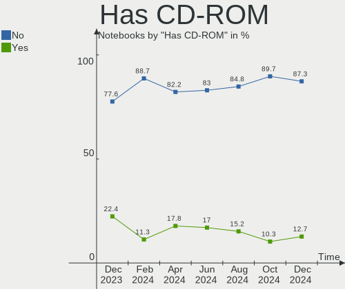
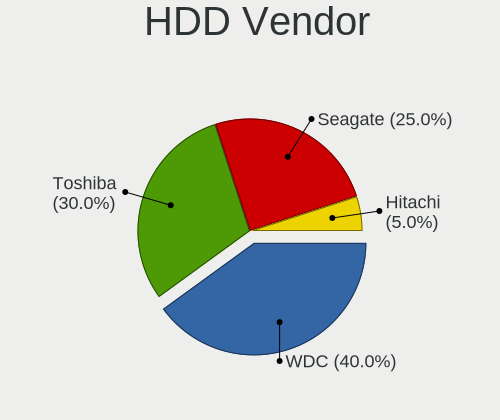
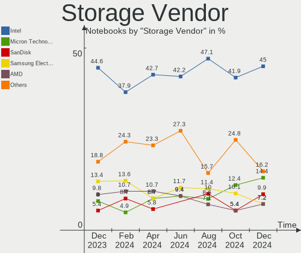
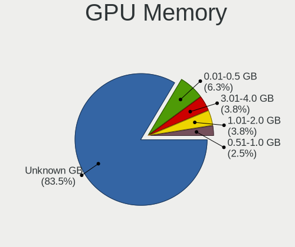
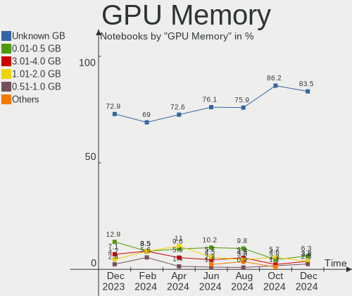
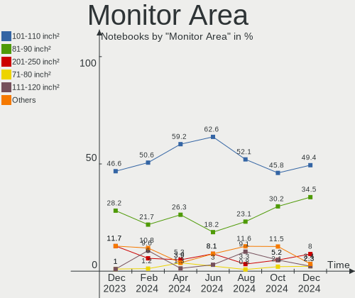
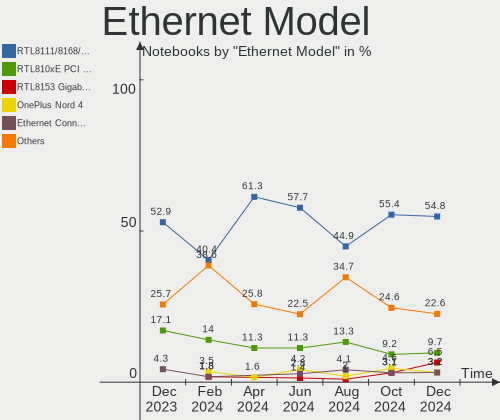
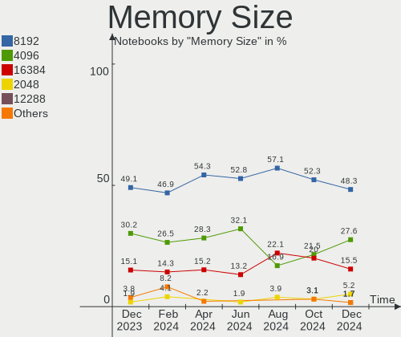
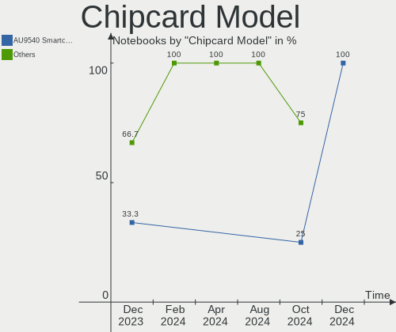

Linux in India - Hardware Trends (Notebooks)
--------------------------------------------

A project to identify most popular hardware characteristics and track their change
over time based on data collected by Linux users at https://Linux-Hardware.org.

Anyone can contribute to this report by the [hw-probe](https://github.com/linuxhw/hw-probe) tool:

    sudo -E hw-probe -all -upload

Period: Dec, 2023.

Contents
--------

* [ System ](#system)
  - [ OS                       ](#os)
  - [ OS Family                ](#os-family)
  - [ Kernel                   ](#kernel)
  - [ Kernel Family            ](#kernel-family)
  - [ Kernel Major Ver.        ](#kernel-major-ver)
  - [ Arch                     ](#arch)
  - [ DE                       ](#de)
  - [ Display Server           ](#display-server)
  - [ Display Manager          ](#display-manager)
  - [ OS Lang                  ](#os-lang)
  - [ Boot Mode                ](#boot-mode)
  - [ Filesystem               ](#filesystem)
  - [ Part. scheme             ](#part-scheme)
  - [ Dual Boot with Linux/BSD ](#dual-boot-with-linuxbsd)
  - [ Dual Boot (Win)          ](#dual-boot-win)

* [ Board ](#board)
  - [ Vendor                   ](#vendor)
  - [ Model                    ](#model)
  - [ Model Family             ](#model-family)
  - [ MFG Year                 ](#mfg-year)
  - [ Form Factor              ](#form-factor)
  - [ Secure Boot              ](#secure-boot)
  - [ Coreboot                 ](#coreboot)
  - [ RAM Size                 ](#ram-size)
  - [ RAM Used                 ](#ram-used)
  - [ Total Drives             ](#total-drives)
  - [ Has CD-ROM               ](#has-cd-rom)
  - [ Has Ethernet             ](#has-ethernet)
  - [ Has WiFi                 ](#has-wifi)
  - [ Has Bluetooth            ](#has-bluetooth)

* [ Location ](#location)
  - [ Country                  ](#country)
  - [ City                     ](#city)

* [ Drives ](#drives)
  - [ Drive Vendor             ](#drive-vendor)
  - [ Drive Model              ](#drive-model)
  - [ HDD Vendor               ](#hdd-vendor)
  - [ SSD Vendor               ](#ssd-vendor)
  - [ Drive Kind               ](#drive-kind)
  - [ Drive Connector          ](#drive-connector)
  - [ Drive Size               ](#drive-size)
  - [ Space Total              ](#space-total)
  - [ Space Used               ](#space-used)
  - [ Malfunc. Drives          ](#malfunc-drives)
  - [ Malfunc. Drive Vendor    ](#malfunc-drive-vendor)
  - [ Malfunc. HDD Vendor      ](#malfunc-hdd-vendor)
  - [ Malfunc. Drive Kind      ](#malfunc-drive-kind)
  - [ Failed Drives            ](#failed-drives)
  - [ Failed Drive Vendor      ](#failed-drive-vendor)
  - [ Drive Status             ](#drive-status)

* [ Storage controller ](#storage-controller)
  - [ Storage Vendor           ](#storage-vendor)
  - [ Storage Model            ](#storage-model)
  - [ Storage Kind             ](#storage-kind)

* [ Processor ](#processor)
  - [ CPU Vendor               ](#cpu-vendor)
  - [ CPU Model                ](#cpu-model)
  - [ CPU Model Family         ](#cpu-model-family)
  - [ CPU Cores                ](#cpu-cores)
  - [ CPU Sockets              ](#cpu-sockets)
  - [ CPU Threads              ](#cpu-threads)
  - [ CPU Op-Modes             ](#cpu-op-modes)
  - [ CPU Microcode            ](#cpu-microcode)
  - [ CPU Microarch            ](#cpu-microarch)

* [ Graphics ](#graphics)
  - [ GPU Vendor               ](#gpu-vendor)
  - [ GPU Model                ](#gpu-model)
  - [ GPU Combo                ](#gpu-combo)
  - [ GPU Driver               ](#gpu-driver)
  - [ GPU Memory               ](#gpu-memory)

* [ Monitor ](#monitor)
  - [ Monitor Vendor           ](#monitor-vendor)
  - [ Monitor Model            ](#monitor-model)
  - [ Monitor Resolution       ](#monitor-resolution)
  - [ Monitor Diagonal         ](#monitor-diagonal)
  - [ Monitor Width            ](#monitor-width)
  - [ Aspect Ratio             ](#aspect-ratio)
  - [ Monitor Area             ](#monitor-area)
  - [ Pixel Density            ](#pixel-density)
  - [ Multiple Monitors        ](#multiple-monitors)

* [ Network ](#network)
  - [ Net Controller Vendor    ](#net-controller-vendor)
  - [ Net Controller Model     ](#net-controller-model)
  - [ Wireless Vendor          ](#wireless-vendor)
  - [ Wireless Model           ](#wireless-model)
  - [ Ethernet Vendor          ](#ethernet-vendor)
  - [ Ethernet Model           ](#ethernet-model)
  - [ Net Controller Kind      ](#net-controller-kind)
  - [ Used Controller          ](#used-controller)
  - [ NICs                     ](#nics)
  - [ IPv6                     ](#ipv6)

* [ Bluetooth ](#bluetooth)
  - [ Bluetooth Vendor         ](#bluetooth-vendor)
  - [ Bluetooth Model          ](#bluetooth-model)

* [ Sound ](#sound)
  - [ Sound Vendor             ](#sound-vendor)
  - [ Sound Model              ](#sound-model)

* [ Memory ](#memory)
  - [ Memory Vendor            ](#memory-vendor)
  - [ Memory Model             ](#memory-model)
  - [ Memory Kind              ](#memory-kind)
  - [ Memory Form Factor       ](#memory-form-factor)
  - [ Memory Size              ](#memory-size)
  - [ Memory Speed             ](#memory-speed)

* [ Printers & scanners ](#printers--scanners)
  - [ Printer Vendor           ](#printer-vendor)
  - [ Printer Model            ](#printer-model)
  - [ Scanner Vendor           ](#scanner-vendor)
  - [ Scanner Model            ](#scanner-model)

* [ Camera ](#camera)
  - [ Camera Vendor            ](#camera-vendor)
  - [ Camera Model             ](#camera-model)

* [ Security ](#security)
  - [ Fingerprint Vendor       ](#fingerprint-vendor)
  - [ Fingerprint Model        ](#fingerprint-model)
  - [ Chipcard Vendor          ](#chipcard-vendor)
  - [ Chipcard Model           ](#chipcard-model)

* [ Unsupported ](#unsupported)
  - [ Unsupported Devices      ](#unsupported-devices)
  - [ Unsupported Device Types ](#unsupported-device-types)

System
------

OS
--

Installed operating systems

| Name                         | Notebooks | Percent |
|------------------------------|-----------|---------|
| Ubuntu 22.04                 | 18        | 21.18%  |
| Fedora 39                    | 12        | 14.12%  |
| Arch Rolling                 | 6         | 7.06%   |
| Ubuntu 23.10                 | 5         | 5.88%   |
| Debian 12                    | 4         | 4.71%   |
| Xero Rolling                 | 3         | 3.53%   |
| Ubuntu 20.04                 | 3         | 3.53%   |
| OpenMandriva 23.08           | 3         | 3.53%   |
| Kali 2023.4                  | 3         | 3.53%   |
| Zorin 17                     | 2         | 2.35%   |
| Zorin 16                     | 2         | 2.35%   |
| Pop!_OS 22.04                | 2         | 2.35%   |
| Linux Mint 21.2              | 2         | 2.35%   |
| Kubuntu 23.10                | 2         | 2.35%   |
| EndeavourOS Rolling          | 2         | 2.35%   |
| Ubuntu MATE 23.04            | 1         | 1.18%   |
| Ubuntu MATE 22.04            | 1         | 1.18%   |
| openSUSE Tumbleweed-XXXXXXXX | 1         | 1.18%   |
| OpenMandriva 5.0             | 1         | 1.18%   |
| OpenMandriva 23.11           | 1         | 1.18%   |
| OpenMandriva 23.10           | 1         | 1.18%   |
| Nobara 38                    | 1         | 1.18%   |
| LMDE 6                       | 1         | 1.18%   |
| Linux Mint 21                | 1         | 1.18%   |
| Kubuntu 23.04                | 1         | 1.18%   |
| Kubuntu 22.04                | 1         | 1.18%   |
| KDE neon 22.04               | 1         | 1.18%   |
| Fedora 38                    | 1         | 1.18%   |
| Boss 9                       | 1         | 1.18%   |
| blendOS                      | 1         | 1.18%   |
| AlmaLinux 9.3                | 1         | 1.18%   |

OS Family
---------

OS without a version

| Name         | Notebooks | Percent |
|--------------|-----------|---------|
| Ubuntu       | 26        | 30.59%  |
| Fedora       | 13        | 15.29%  |
| OpenMandriva | 6         | 7.06%   |
| Arch         | 6         | 7.06%   |
| Zorin        | 4         | 4.71%   |
| Kubuntu      | 4         | 4.71%   |
| Debian       | 4         | 4.71%   |
| Xero         | 3         | 3.53%   |
| Linux Mint   | 3         | 3.53%   |
| Kali         | 3         | 3.53%   |
| Ubuntu MATE  | 2         | 2.35%   |
| Pop!_OS      | 2         | 2.35%   |
| EndeavourOS  | 2         | 2.35%   |
| openSUSE     | 1         | 1.18%   |
| Nobara       | 1         | 1.18%   |
| LMDE         | 1         | 1.18%   |
| KDE neon     | 1         | 1.18%   |
| Boss         | 1         | 1.18%   |
| blendOS      | 1         | 1.18%   |
| AlmaLinux    | 1         | 1.18%   |

Kernel
------

Version of the Linux kernel

| Version                     | Notebooks | Percent |
|-----------------------------|-----------|---------|
| 6.2.0-37-generic            | 9         | 10.59%  |
| 6.2.0-39-generic            | 6         | 7.06%   |
| 5.15.0-91-generic           | 5         | 5.88%   |
| 5.15.0-89-generic           | 4         | 4.71%   |
| 6.6.6-200.fc39.x86_64       | 3         | 3.53%   |
| 6.6.4-arch1-1               | 3         | 3.53%   |
| 6.6.4-200.fc39.x86_64       | 3         | 3.53%   |
| 6.5.0-9-generic             | 3         | 3.53%   |
| 6.5.0-14-generic            | 3         | 3.53%   |
| 6.5.0-13-generic            | 3         | 3.53%   |
| 6.4.11-desktop-1omv2390     | 3         | 3.53%   |
| 6.1.0-16-amd64              | 3         | 3.53%   |
| 6.6.8-200.fc39.x86_64       | 2         | 2.35%   |
| 6.6.7-arch1-1               | 2         | 2.35%   |
| 6.6.7-200.fc39.x86_64       | 2         | 2.35%   |
| 6.6.2-desktop-1omv2390      | 2         | 2.35%   |
| 6.5.0-kali3-amd64           | 2         | 2.35%   |
| 6.6.8-arch1-1               | 1         | 1.18%   |
| 6.6.7-203.fsync.fc38.x86_64 | 1         | 1.18%   |
| 6.6.6-zen1-1-zen            | 1         | 1.18%   |
| 6.6.6-arch1-1               | 1         | 1.18%   |
| 6.6.6-100.fc38.x86_64       | 1         | 1.18%   |
| 6.6.6-1-default             | 1         | 1.18%   |
| 6.6.5-arch1-1               | 1         | 1.18%   |
| 6.6.3-200.fc39.x86_64       | 1         | 1.18%   |
| 6.5.6-76060506-generic      | 1         | 1.18%   |
| 6.5.5-zen1-1-zen            | 1         | 1.18%   |
| 6.5.5-desktop-1omv2390      | 1         | 1.18%   |
| 6.5.4-76060504-generic      | 1         | 1.18%   |
| 6.5.13-hardened2-1-hardened | 1         | 1.18%   |
| 6.5.11-300.fc39.x86_64      | 1         | 1.18%   |
| 6.5.0-kali2-amd64           | 1         | 1.18%   |
| 6.5.0-1009-oem              | 1         | 1.18%   |
| 6.2.0-35-generic            | 1         | 1.18%   |
| 6.2.0-34-generic            | 1         | 1.18%   |
| 6.2.0-32-generic            | 1         | 1.18%   |
| 6.2.0-26-generic            | 1         | 1.18%   |
| 6.1.69-1-lts                | 1         | 1.18%   |
| 6.1.67-060167-generic       | 1         | 1.18%   |
| 6.1.0-13-amd64              | 1         | 1.18%   |

Kernel Family
-------------

Linux kernel without a distro release

| Version | Notebooks | Percent |
|---------|-----------|---------|
| 6.2.0   | 19        | 22.35%  |
| 6.5.0   | 13        | 15.29%  |
| 5.15.0  | 9         | 10.59%  |
| 6.6.6   | 7         | 8.24%   |
| 6.6.4   | 6         | 7.06%   |
| 6.6.7   | 5         | 5.88%   |
| 6.1.0   | 5         | 5.88%   |
| 6.6.8   | 3         | 3.53%   |
| 6.4.11  | 3         | 3.53%   |
| 6.6.2   | 2         | 2.35%   |
| 6.5.5   | 2         | 2.35%   |
| 6.6.5   | 1         | 1.18%   |
| 6.6.3   | 1         | 1.18%   |
| 6.5.6   | 1         | 1.18%   |
| 6.5.4   | 1         | 1.18%   |
| 6.5.13  | 1         | 1.18%   |
| 6.5.11  | 1         | 1.18%   |
| 6.1.69  | 1         | 1.18%   |
| 6.1.67  | 1         | 1.18%   |
| 5.4.0   | 1         | 1.18%   |
| 5.14.0  | 1         | 1.18%   |
| 5.10.0  | 1         | 1.18%   |

Kernel Major Ver.
-----------------

Linux kernel major version

| Version | Notebooks | Percent |
|---------|-----------|---------|
| 6.6     | 25        | 29.41%  |
| 6.5     | 19        | 22.35%  |
| 6.2     | 19        | 22.35%  |
| 5.15    | 9         | 10.59%  |
| 6.1     | 7         | 8.24%   |
| 6.4     | 3         | 3.53%   |
| 5.4     | 1         | 1.18%   |
| 5.14    | 1         | 1.18%   |
| 5.10    | 1         | 1.18%   |

Arch
----

OS architecture (x86_64, i586, etc.)

| Name   | Notebooks | Percent |
|--------|-----------|---------|
| x86_64 | 85        | 100%    |

DE
--

Desktop Environment

| Name       | Notebooks | Percent |
|------------|-----------|---------|
| GNOME      | 49        | 57.65%  |
| KDE5       | 25        | 29.41%  |
| X-Cinnamon | 4         | 4.71%   |
| XFCE       | 2         | 2.35%   |
| MATE       | 2         | 2.35%   |
| qtile      | 1         | 1.18%   |
| i3         | 1         | 1.18%   |
| Unknown    | 1         | 1.18%   |

Display Server
--------------

X11 or Wayland

| Name    | Notebooks | Percent |
|---------|-----------|---------|
| Wayland | 48        | 56.47%  |
| X11     | 33        | 38.82%  |
| Tty     | 3         | 3.53%   |
| Unknown | 1         | 1.18%   |

Display Manager
---------------

SDDM, LightDM, etc.

| Name    | Notebooks | Percent |
|---------|-----------|---------|
| GDM3    | 29        | 34.12%  |
| Unknown | 24        | 28.24%  |
| SDDM    | 15        | 17.65%  |
| LightDM | 9         | 10.59%  |
| GDM     | 8         | 9.41%   |

OS Lang
-------

Language

| Lang  | Notebooks | Percent |
|-------|-----------|---------|
| en_IN | 50        | 58.82%  |
| en_US | 26        | 30.59%  |
| en_GB | 5         | 5.88%   |
| C     | 4         | 4.71%   |

Boot Mode
---------

EFI or BIOS

| Mode | Notebooks | Percent |
|------|-----------|---------|
| EFI  | 55        | 64.71%  |
| BIOS | 30        | 35.29%  |

Filesystem
----------

Type of filesystem

| Type    | Notebooks | Percent |
|---------|-----------|---------|
| Ext4    | 47        | 55.29%  |
| Tmpfs   | 17        | 20%     |
| Btrfs   | 15        | 17.65%  |
| Overlay | 5         | 5.88%   |
| Xfs     | 1         | 1.18%   |

Part. scheme
------------

Scheme of partitioning

| Type    | Notebooks | Percent |
|---------|-----------|---------|
| GPT     | 59        | 69.41%  |
| Unknown | 22        | 25.88%  |
| MBR     | 4         | 4.71%   |

Dual Boot with Linux/BSD
------------------------

Hosting more than one Linux/BSD

| Dual boot | Notebooks | Percent |
|-----------|-----------|---------|
| No        | 75        | 88.24%  |
| Yes       | 10        | 11.76%  |

Dual Boot (Win)
---------------

Hosting Linux and Windows

| Dual boot | Notebooks | Percent |
|-----------|-----------|---------|
| No        | 53        | 62.35%  |
| Yes       | 32        | 37.65%  |

Board
-----

Vendor
------

Motherboard manufacturer

| Name             | Notebooks | Percent |
|------------------|-----------|---------|
| Hewlett-Packard  | 27        | 31.76%  |
| Lenovo           | 17        | 20%     |
| Dell             | 16        | 18.82%  |
| ASUSTek Computer | 11        | 12.94%  |
| Acer             | 7         | 8.24%   |
| MSI              | 2         | 2.35%   |
| Infinix          | 2         | 2.35%   |
| Timi             | 1         | 1.18%   |
| Sony             | 1         | 1.18%   |
| realme           | 1         | 1.18%   |

Model
-----

Motherboard model

| Name                                              | Notebooks | Percent |
|---------------------------------------------------|-----------|---------|
| Dell Vostro 3580                                  | 2         | 2.35%   |
| Dell Inspiron 3558                                | 2         | 2.35%   |
| Timi Mi NoteBook Pro                              | 1         | 1.18%   |
| Sony VPCEH25EN                                    | 1         | 1.18%   |
| realme RMNBXXXX                                   | 1         | 1.18%   |
| MSI Thin GF63 12HW                                | 1         | 1.18%   |
| MSI Modern 14 B4MW                                | 1         | 1.18%   |
| Lenovo V15 G2 ALC Ua 82KD                         | 1         | 1.18%   |
| Lenovo V145-15AST 81MT                            | 1         | 1.18%   |
| Lenovo ThinkPad X13 Gen 2a 20XH0076IG             | 1         | 1.18%   |
| Lenovo ThinkPad X1 Carbon 6th 20KH006JRT          | 1         | 1.18%   |
| Lenovo ThinkPad T480 20L6S29E1T                   | 1         | 1.18%   |
| Lenovo ThinkPad T480 20L6S0U302                   | 1         | 1.18%   |
| Lenovo ThinkPad T14s Gen 2a 20XGCTO1WW            | 1         | 1.18%   |
| Lenovo ThinkPad P14s Gen 4 21K5S00F00             | 1         | 1.18%   |
| Lenovo ThinkPad P1 Gen 3 20TJS1EV01               | 1         | 1.18%   |
| Lenovo ThinkPad L470 20J5S0JM00                   | 1         | 1.18%   |
| Lenovo K14 G2 IRU 21G1                            | 1         | 1.18%   |
| Lenovo IdeaPad Gaming 3 15IHU6 82K1               | 1         | 1.18%   |
| Lenovo IdeaPad Gaming 3 15ACH6 82K2               | 1         | 1.18%   |
| Lenovo IdeaPad 320-15ISK 80XH                     | 1         | 1.18%   |
| Lenovo IdeaPad 130-15IKB 81H7                     | 1         | 1.18%   |
| Lenovo G50-45 80E3                                | 1         | 1.18%   |
| Lenovo E41-25 81FS                                | 1         | 1.18%   |
| Infinix INBOOK X3 Slim                            | 1         | 1.18%   |
| Infinix INBOOK X1 NEO                             | 1         | 1.18%   |
| HP ZBook Firefly 16 inch G9 Mobile Workstation PC | 1         | 1.18%   |
| HP ZBook Firefly 14 inch G8 Mobile Workstation PC | 1         | 1.18%   |
| HP Victus by Laptop 16-e0xxx                      | 1         | 1.18%   |
| HP Victus by 15.6 inch Gaming Laptop PC           | 1         | 1.18%   |
| HP ProBook 450 G1                                 | 1         | 1.18%   |
| HP ProBook 440 G7                                 | 1         | 1.18%   |
| HP Pavilion Laptop 15-eg2xxx                      | 1         | 1.18%   |
| HP Pavilion Laptop 15-cs3xxx                      | 1         | 1.18%   |
| HP Pavilion Laptop 14-dv2xxx                      | 1         | 1.18%   |
| HP Pavilion Gaming Laptop 15-ec1xxx               | 1         | 1.18%   |
| HP Pavilion Gaming Laptop 15-ec0xxx               | 1         | 1.18%   |
| HP Pavilion g6                                    | 1         | 1.18%   |
| HP Pavilion dv6-1152tx (VB620PA#A)                | 1         | 1.18%   |
| HP Pavilion 15                                    | 1         | 1.18%   |

Model Family
------------

Motherboard model prefix

| Name              | Notebooks | Percent |
|-------------------|-----------|---------|
| Lenovo ThinkPad   | 8         | 9.41%   |
| HP Pavilion       | 8         | 9.41%   |
| Dell Inspiron     | 7         | 8.24%   |
| HP Laptop         | 6         | 7.06%   |
| ASUS VivoBook     | 5         | 5.88%   |
| ASUS ASUS         | 5         | 5.88%   |
| Lenovo IdeaPad    | 4         | 4.71%   |
| Dell Vostro       | 4         | 4.71%   |
| Dell Latitude     | 4         | 4.71%   |
| HP EliteBook      | 3         | 3.53%   |
| Infinix INBOOK    | 2         | 2.35%   |
| HP ZBook          | 2         | 2.35%   |
| HP Victus         | 2         | 2.35%   |
| HP ProBook        | 2         | 2.35%   |
| Acer Nitro        | 2         | 2.35%   |
| Acer Aspire       | 2         | 2.35%   |
| Timi Mi           | 1         | 1.18%   |
| Sony VPCEH25EN    | 1         | 1.18%   |
| realme RMNBXXXX   | 1         | 1.18%   |
| MSI Thin          | 1         | 1.18%   |
| MSI Modern        | 1         | 1.18%   |
| Lenovo V15        | 1         | 1.18%   |
| Lenovo V145-15AST | 1         | 1.18%   |
| Lenovo K14        | 1         | 1.18%   |
| Lenovo G50-45     | 1         | 1.18%   |
| Lenovo E41-25     | 1         | 1.18%   |
| HP OMEN           | 1         | 1.18%   |
| HP Notebook       | 1         | 1.18%   |
| HP 2000           | 1         | 1.18%   |
| HP 15             | 1         | 1.18%   |
| Dell Precision    | 1         | 1.18%   |
| ASUS ROG          | 1         | 1.18%   |
| Acer Swift        | 1         | 1.18%   |
| Acer One          | 1         | 1.18%   |
| Unknown           | 1         | 1.18%   |

MFG Year
--------

Motherboard manufacture year

| Year | Notebooks | Percent |
|------|-----------|---------|
| 2022 | 14        | 16.47%  |
| 2021 | 13        | 15.29%  |
| 2018 | 11        | 12.94%  |
| 2020 | 10        | 11.76%  |
| 2023 | 9         | 10.59%  |
| 2019 | 6         | 7.06%   |
| 2017 | 5         | 5.88%   |
| 2013 | 4         | 4.71%   |
| 2011 | 4         | 4.71%   |
| 2015 | 2         | 2.35%   |
| 2014 | 2         | 2.35%   |
| 2012 | 2         | 2.35%   |
| 2009 | 2         | 2.35%   |
| 2016 | 1         | 1.18%   |

Form Factor
-----------

Physical design of the computer

| Name     | Notebooks | Percent |
|----------|-----------|---------|
| Notebook | 85        | 100%    |

Secure Boot
-----------

Enabled or disabled

| State    | Notebooks | Percent |
|----------|-----------|---------|
| Disabled | 72        | 84.71%  |
| Enabled  | 13        | 15.29%  |

Coreboot
--------

Have coreboot on board

| Used | Notebooks | Percent |
|------|-----------|---------|
| No   | 85        | 100%    |

RAM Size
--------

Total RAM memory

| Size in GB | Notebooks | Percent |
|------------|-----------|---------|
| 4.01-8.0   | 33        | 38.82%  |
| 8.01-16.0  | 18        | 21.18%  |
| 16.01-24.0 | 16        | 18.82%  |
| 3.01-4.0   | 12        | 14.12%  |
| 32.01-64.0 | 4         | 4.71%   |
| 24.01-32.0 | 2         | 2.35%   |

RAM Used
--------

Used RAM memory

| Used GB   | Notebooks | Percent |
|-----------|-----------|---------|
| 2.01-3.0  | 25        | 29.41%  |
| 1.01-2.0  | 25        | 29.41%  |
| 4.01-8.0  | 19        | 22.35%  |
| 3.01-4.0  | 12        | 14.12%  |
| 8.01-16.0 | 4         | 4.71%   |

Total Drives
------------

Number of drives on board

| Drives | Notebooks | Percent |
|--------|-----------|---------|
| 1      | 62        | 72.94%  |
| 2      | 23        | 27.06%  |

Has CD-ROM
----------

Has CD-ROM on board

| Presented | Notebooks | Percent |
|-----------|-----------|---------|
| No        | 66        | 77.65%  |
| Yes       | 19        | 22.35%  |

Has Ethernet
------------

Has Ethernet on board

| Presented | Notebooks | Percent |
|-----------|-----------|---------|
| Yes       | 67        | 78.82%  |
| No        | 18        | 21.18%  |

Has WiFi
--------

Has WiFi module

| Presented | Notebooks | Percent |
|-----------|-----------|---------|
| Yes       | 85        | 100%    |

Has Bluetooth
-------------

Has Bluetooth module

| Presented | Notebooks | Percent |
|-----------|-----------|---------|
| Yes       | 75        | 88.24%  |
| No        | 10        | 11.76%  |

Location
--------

Country
-------

Geographic location (country)

| Country | Notebooks | Percent |
|---------|-----------|---------|
| India   | 85        | 100%    |

City
----

Geographic location (city)

| City               | Notebooks | Percent |
|--------------------|-----------|---------|
| Bengaluru          | 10        | 11.76%  |
| Hyderabad          | 8         | 9.41%   |
| Delhi              | 8         | 9.41%   |
| Chennai            | 6         | 7.06%   |
| Patna              | 4         | 4.71%   |
| Kolkata            | 4         | 4.71%   |
| Kochi              | 4         | 4.71%   |
| Pune               | 3         | 3.53%   |
| Mumbai             | 3         | 3.53%   |
| Ahmedabad          | 3         | 3.53%   |
| Thrissur           | 2         | 2.35%   |
| Kottayam           | 2         | 2.35%   |
| Jaipur             | 2         | 2.35%   |
| Indore             | 2         | 2.35%   |
| Dehradun           | 2         | 2.35%   |
| Coimbatore         | 2         | 2.35%   |
| Chandigarh         | 2         | 2.35%   |
| Bhopal             | 2         | 2.35%   |
| Visakhapatnam      | 1         | 1.18%   |
| Varanasi           | 1         | 1.18%   |
| Vadodara           | 1         | 1.18%   |
| Thiruvananthapuram | 1         | 1.18%   |
| Satna              | 1         | 1.18%   |
| Sārangarh         | 1         | 1.18%   |
| Sangli             | 1         | 1.18%   |
| Narsingpur         | 1         | 1.18%   |
| Mangalore          | 1         | 1.18%   |
| Madurai            | 1         | 1.18%   |
| Lucknow            | 1         | 1.18%   |
| Kanpur             | 1         | 1.18%   |
| Kannur             | 1         | 1.18%   |
| Jalandhar          | 1         | 1.18%   |
| Durgapur           | 1         | 1.18%   |
| Alwar              | 1         | 1.18%   |

Drives
------

Drive Vendor
------------

Hard drive vendors

| Vendor                       | Notebooks | Drives | Percent |
|------------------------------|-----------|--------|---------|
| Samsung Electronics          | 20        | 21     | 19.23%  |
| WDC                          | 11        | 11     | 10.58%  |
| Seagate                      | 11        | 11     | 10.58%  |
| Micron Technology            | 9         | 9      | 8.65%   |
| Toshiba                      | 6         | 6      | 5.77%   |
| SK hynix                     | 5         | 5      | 4.81%   |
| Sandisk                      | 5         | 7      | 4.81%   |
| Intel                        | 4         | 6      | 3.85%   |
| KIOXIA                       | 3         | 3      | 2.88%   |
| Kingston                     | 3         | 3      | 2.88%   |
| Crucial                      | 3         | 3      | 2.88%   |
| Unknown                      | 2         | 2      | 1.92%   |
| Micron/Crucial Technology    | 2         | 2      | 1.92%   |
| Lexar                        | 2         | 2      | 1.92%   |
| Lenovo                       | 2         | 2      | 1.92%   |
| China                        | 2         | 2      | 1.92%   |
| Zebronics                    | 1         | 1      | 0.96%   |
| UMIS                         | 1         | 1      | 0.96%   |
| Transcend                    | 1         | 1      | 0.96%   |
| Shenzhen Longsys Electronics | 1         | 1      | 0.96%   |
| SCUDA                        | 1         | 1      | 0.96%   |
| Phison                       | 1         | 1      | 0.96%   |
| MAS                          | 1         | 1      | 0.96%   |
| KingFast                     | 1         | 1      | 0.96%   |
| JMicron Technology           | 1         | 1      | 0.96%   |
| HGST                         | 1         | 1      | 0.96%   |
| FORESEE                      | 1         | 1      | 0.96%   |
| BIWIN                        | 1         | 1      | 0.96%   |
| A-DATA Technology            | 1         | 1      | 0.96%   |
| Unknown                      | 1         | 1      | 0.96%   |

Drive Model
-----------

Hard drive models

| Model                                      | Notebooks | Percent |
|--------------------------------------------|-----------|---------|
| Seagate ST1000LM035-1RK172 1TB             | 5         | 4.63%   |
| Seagate ST500LT012-1DG142 500GB            | 3         | 2.78%   |
| Samsung MZALQ512HBLU-00BL2 512GB           | 3         | 2.78%   |
| Micron 2210_MTFDHBA512QFD 512GB            | 3         | 2.78%   |
| WDC WD10SPZX-60Z10T0 1TB                   | 2         | 1.85%   |
| Toshiba MQ04ABF100 1TB                     | 2         | 1.85%   |
| SanDisk NVMe SSD Drive 512GB               | 2         | 1.85%   |
| Samsung MZVLQ512HBLU-00B00 512GB           | 2         | 1.85%   |
| Micron 2450_MTFDKBA512TFK 512GB            | 2         | 1.85%   |
| China SSD 256GB                            | 2         | 1.85%   |
| Zebronics 2.5SSD128GB                      | 1         | 0.93%   |
| WDC WDS240G2G0B-00EPW0 240GB SSD           | 1         | 0.93%   |
| WDC WD7500BPVT-60HXZT3 752GB               | 1         | 0.93%   |
| WDC WD5000LPCX-75VHAT0 500GB               | 1         | 0.93%   |
| WDC WD5000LPCX-21VHAT0 500GB               | 1         | 0.93%   |
| WDC WD10SPZX-75Z10T3 1TB                   | 1         | 0.93%   |
| WDC WD10SPZX-24Z10 1TB                     | 1         | 0.93%   |
| WDC WD10SPZX-08Z10 1TB                     | 1         | 0.93%   |
| WDC WD10SPSX-60A6WT0 1TB                   | 1         | 0.93%   |
| WDC PC SN530 SDBPNPZ-1T00-1006 1TB         | 1         | 0.93%   |
| Unknown MMC Card  4GB                      | 1         | 0.93%   |
| Unknown MMC Card  32GB                     | 1         | 0.93%   |
| UMIS RPETJ512MGE2QDQ 512GB                 | 1         | 0.93%   |
| Transcend TS1TMTE400S 1TB                  | 1         | 0.93%   |
| Toshiba XG6 NVMe SSD Controller 512GB      | 1         | 0.93%   |
| Toshiba MQ01ABF050 500GB                   | 1         | 0.93%   |
| Toshiba MQ01ABD050 500GB                   | 1         | 0.93%   |
| Toshiba MK5059GSXP 500GB                   | 1         | 0.93%   |
| SK hynix SKHynix_HFS001TEJ9X164N 1024GB    | 1         | 0.93%   |
| SK hynix PC801 HFS512GEJ9X101N 512GB       | 1         | 0.93%   |
| SK hynix PC711 HFS256GDE9X073N 256GB       | 1         | 0.93%   |
| SK hynix BC901 NVMe 512GB                  | 1         | 0.93%   |
| SK hynix BC511 512GB                       | 1         | 0.93%   |
| Shenzhen Longsys FORESEE VP1000F512G 512GB | 1         | 0.93%   |
| Seagate ST2000LM007-1R8174 2TB             | 1         | 0.93%   |
| Seagate ST1000LX015-1U7172 1TB             | 1         | 0.93%   |
| Seagate Expansion HDD 2TB                  | 1         | 0.93%   |
| SCUDA 256GB SATA SSD                       | 1         | 0.93%   |
| Sandisk WD Blue SN570 500GB                | 1         | 0.93%   |
| Sandisk WD Blue SN570 250GB                | 1         | 0.93%   |

HDD Vendor
----------

Hard disk drive vendors

| Vendor  | Notebooks | Drives | Percent |
|---------|-----------|--------|---------|
| Seagate | 11        | 11     | 42.31%  |
| WDC     | 9         | 9      | 34.62%  |
| Toshiba | 5         | 5      | 19.23%  |
| HGST    | 1         | 1      | 3.85%   |

SSD Vendor
----------

Solid state drive vendors

| Vendor              | Notebooks | Drives | Percent |
|---------------------|-----------|--------|---------|
| Samsung Electronics | 5         | 6      | 27.78%  |
| Kingston            | 3         | 3      | 16.67%  |
| Crucial             | 3         | 3      | 16.67%  |
| China               | 2         | 2      | 11.11%  |
| Zebronics           | 1         | 1      | 5.56%   |
| WDC                 | 1         | 1      | 5.56%   |
| SCUDA               | 1         | 1      | 5.56%   |
| Lexar               | 1         | 1      | 5.56%   |
| Intel               | 1         | 1      | 5.56%   |

Drive Kind
----------

HDD or SSD

| Kind    | Notebooks | Drives | Percent |
|---------|-----------|--------|---------|
| NVMe    | 51        | 58     | 50.5%   |
| HDD     | 26        | 26     | 25.74%  |
| SSD     | 18        | 19     | 17.82%  |
| Unknown | 4         | 4      | 3.96%   |
| MMC     | 2         | 2      | 1.98%   |

Drive Connector
---------------

SATA, SAS, NVMe, etc.

| Type | Notebooks | Drives | Percent |
|------|-----------|--------|---------|
| NVMe | 51        | 58     | 54.26%  |
| SATA | 39        | 47     | 41.49%  |
| SAS  | 2         | 2      | 2.13%   |
| MMC  | 2         | 2      | 2.13%   |

Drive Size
----------

Size of hard drive

| Size in TB | Notebooks | Drives | Percent |
|------------|-----------|--------|---------|
| 0.01-0.5   | 26        | 28     | 60.47%  |
| 0.51-1.0   | 15        | 15     | 34.88%  |
| 1.01-2.0   | 2         | 2      | 4.65%   |

Space Total
-----------

Amount of disk space available on the file system

| Size in GB | Notebooks | Percent |
|------------|-----------|---------|
| 251-500    | 36        | 42.35%  |
| 101-250    | 19        | 22.35%  |
| 501-1000   | 9         | 10.59%  |
| 1-20       | 8         | 9.41%   |
| 21-50      | 4         | 4.71%   |
| 1001-2000  | 4         | 4.71%   |
| 51-100     | 3         | 3.53%   |
| 2001-3000  | 1         | 1.18%   |
| Unknown    | 1         | 1.18%   |

Space Used
----------

Amount of used disk space

| Used GB   | Notebooks | Percent |
|-----------|-----------|---------|
| 1-20      | 26        | 30.59%  |
| 21-50     | 19        | 22.35%  |
| 101-250   | 17        | 20%     |
| 51-100    | 14        | 16.47%  |
| 251-500   | 6         | 7.06%   |
| 1001-2000 | 1         | 1.18%   |
| 501-1000  | 1         | 1.18%   |
| Unknown   | 1         | 1.18%   |

Malfunc. Drives
---------------

Drive models with a malfunction

| Model                            | Notebooks | Drives | Percent |
|----------------------------------|-----------|--------|---------|
| WDC WD10SPZX-60Z10T0 1TB         | 2         | 2      | 18.18%  |
| Seagate ST500LT012-1DG142 500GB  | 2         | 2      | 18.18%  |
| WDC WDS240G2G0B-00EPW0 240GB SSD | 1         | 1      | 9.09%   |
| WDC WD7500BPVT-60HXZT3 752GB     | 1         | 1      | 9.09%   |
| WDC WD5000LPCX-75VHAT0 500GB     | 1         | 1      | 9.09%   |
| WDC WD10SPZX-24Z10 1TB           | 1         | 1      | 9.09%   |
| Seagate ST2000LM007-1R8174 2TB   | 1         | 1      | 9.09%   |
| HGST HTS545050A7E380 500GB       | 1         | 1      | 9.09%   |
| China SSD 256GB                  | 1         | 1      | 9.09%   |

Malfunc. Drive Vendor
---------------------

Vendors of faulty drives

| Vendor  | Notebooks | Drives | Percent |
|---------|-----------|--------|---------|
| WDC     | 6         | 6      | 54.55%  |
| Seagate | 3         | 3      | 27.27%  |
| HGST    | 1         | 1      | 9.09%   |
| China   | 1         | 1      | 9.09%   |

Malfunc. HDD Vendor
-------------------

Vendors of faulty HDD drives

| Vendor  | Notebooks | Drives | Percent |
|---------|-----------|--------|---------|
| WDC     | 5         | 5      | 55.56%  |
| Seagate | 3         | 3      | 33.33%  |
| HGST    | 1         | 1      | 11.11%  |

Malfunc. Drive Kind
-------------------

Kinds of faulty drives

| Kind | Notebooks | Drives | Percent |
|------|-----------|--------|---------|
| HDD  | 9         | 9      | 81.82%  |
| SSD  | 2         | 2      | 18.18%  |

Failed Drives
-------------

Failed drive models

Zero info for selected period =(

Failed Drive Vendor
-------------------

Failed drive vendors

Zero info for selected period =(

Drive Status
------------

Number of failed and malfunc. drives

| Status   | Notebooks | Drives | Percent |
|----------|-----------|--------|---------|
| Detected | 46        | 59     | 50.55%  |
| Works    | 34        | 39     | 37.36%  |
| Malfunc  | 11        | 11     | 12.09%  |

Storage controller
------------------

Storage Vendor
--------------

Storage controller vendors

| Vendor                       | Notebooks | Percent |
|------------------------------|-----------|---------|
| Intel                        | 50        | 44.64%  |
| Samsung Electronics          | 15        | 13.39%  |
| AMD                          | 11        | 9.82%   |
| Micron Technology            | 9         | 8.04%   |
| SanDisk                      | 6         | 5.36%   |
| SK hynix                     | 5         | 4.46%   |
| Shenzhen Longsys Electronics | 3         | 2.68%   |
| KIOXIA                       | 3         | 2.68%   |
| Micron/Crucial Technology    | 2         | 1.79%   |
| Lenovo                       | 2         | 1.79%   |
| Union Memory (Shenzhen)      | 1         | 0.89%   |
| Transcend                    | 1         | 0.89%   |
| Toshiba America Info Systems | 1         | 0.89%   |
| Phison Electronics           | 1         | 0.89%   |
| INNOGRIT                     | 1         | 0.89%   |
| ADATA Technology             | 1         | 0.89%   |

Storage Model
-------------

Storage controller models

| Model                                                                        | Notebooks | Percent |
|------------------------------------------------------------------------------|-----------|---------|
| AMD FCH SATA Controller [AHCI mode]                                          | 11        | 9.24%   |
| Intel Volume Management Device NVMe RAID Controller                          | 10        | 8.4%    |
| Samsung NVMe SSD Controller 980 (DRAM-less)                                  | 9         | 7.56%   |
| Intel 82801 Mobile SATA Controller [RAID mode]                               | 9         | 7.56%   |
| Intel Sunrise Point-LP SATA Controller [AHCI mode]                           | 5         | 4.2%    |
| Intel 7 Series Chipset Family 6-port SATA Controller [AHCI mode]             | 5         | 4.2%    |
| Micron 2210 NVMe SSD [Cobain]                                                | 3         | 2.52%   |
| Intel Tiger Lake-LP SATA Controller                                          | 3         | 2.52%   |
| Intel Alder Lake-P SATA AHCI Controller                                      | 3         | 2.52%   |
| SK hynix BC901 NVMe Solid State Drive (DRAM-less)                            | 2         | 1.68%   |
| Shenzhen Longsys Lexar NM620 NVME SSD (DRAM-less)                            | 2         | 1.68%   |
| SanDisk Ultra 3D / WD Blue SN570 NVMe SSD (DRAM-less)                        | 2         | 1.68%   |
| Samsung NVMe SSD Controller SM981/PM981/PM983                                | 2         | 1.68%   |
| Samsung NVMe SSD Controller PM9B1 (DRAM-less)                                | 2         | 1.68%   |
| Samsung NVMe SSD Controller PM9A1/PM9A3/980PRO                               | 2         | 1.68%   |
| Micron 2450 NVMe SSD [HendrixV] (DRAM-less)                                  | 2         | 1.68%   |
| Micron 2300 NVMe SSD [Santana]                                               | 2         | 1.68%   |
| Intel Wildcat Point-LP SATA Controller [AHCI Mode]                           | 2         | 1.68%   |
| Intel Optane NVME SSD H10 with Solid State Storage [Teton Glacier]           | 2         | 1.68%   |
| Intel Comet Lake SATA AHCI Controller                                        | 2         | 1.68%   |
| Intel Cannon Point-LP SATA Controller [AHCI Mode]                            | 2         | 1.68%   |
| Intel 8 Series SATA Controller 1 [AHCI mode]                                 | 2         | 1.68%   |
| Intel 6 Series/C200 Series Chipset Family 6 port Mobile SATA AHCI Controller | 2         | 1.68%   |
| Intel 400 Series Chipset Family SATA AHCI Controller                         | 2         | 1.68%   |
| Union Memory (Shenzhen) AM630 PCIe 4.0 x4 NVMe SSD Controller                | 1         | 0.84%   |
| Transcend NVMe PCIe SSD 110S/112S/120S/MTE300S/MTE400S/MTE652T2 (DRAM-less)  | 1         | 0.84%   |
| Toshiba America Info Systems XG6 NVMe SSD Controller                         | 1         | 0.84%   |
| SK hynix Platinum P41/PC801 NVMe Solid State Drive                           | 1         | 0.84%   |
| SK hynix Gold P31/BC711/PC711 NVMe Solid State Drive                         | 1         | 0.84%   |
| SK hynix BC511 NVMe SSD                                                      | 1         | 0.84%   |
| Shenzhen Longsys SM2263EN/SM2263XT-based OEM NVME SSD (DRAM-less)            | 1         | 0.84%   |
| SanDisk WD PC SN810 / Black SN850 NVMe SSD                                   | 1         | 0.84%   |
| Sandisk WD PC SN740 NVMe SSD 512GB (DRAM-less)                               | 1         | 0.84%   |
| SanDisk WD Black SN770 / PC SN740 256GB / PC SN560 (DRAM-less) NVMe SSD      | 1         | 0.84%   |
| SanDisk Ultra 3D / WD Blue SN550 NVMe SSD                                    | 1         | 0.84%   |
| SanDisk Extreme Pro / WD Black SN750 / PC SN730 / Red SN700 NVMe SSD         | 1         | 0.84%   |
| Phison PS5019-E19 PCIe4 NVMe Controller (DRAM-less)                          | 1         | 0.84%   |
| Micron/Crucial P2 [Nick P2] / P3 / P3 Plus NVMe PCIe SSD (DRAM-less)         | 1         | 0.84%   |
| Micron/Crucial P1 NVMe PCIe SSD[Frampton2]                                   | 1         | 0.84%   |
| Micron 3400 NVMe SSD [Hendrix]                                               | 1         | 0.84%   |

Storage Kind
------------

Kind of storage controller (IDE, SATA, NVMe, SAS, ...)

| Kind | Notebooks | Percent |
|------|-----------|---------|
| NVMe | 51        | 44.35%  |
| SATA | 44        | 38.26%  |
| RAID | 20        | 17.39%  |

Processor
---------

CPU Vendor
----------

Processor vendors

| Vendor | Notebooks | Percent |
|--------|-----------|---------|
| Intel  | 61        | 71.76%  |
| AMD    | 24        | 28.24%  |

CPU Model
---------

Processor models

| Model                                      | Notebooks | Percent |
|--------------------------------------------|-----------|---------|
| Intel Core i5-8265U CPU @ 1.60GHz          | 3         | 3.53%   |
| Intel Core i5-1035G1 CPU @ 1.00GHz         | 3         | 3.53%   |
| Intel 12th Gen Core i5-12500H              | 3         | 3.53%   |
| Intel 11th Gen Core i3-1115G4 @ 3.00GHz    | 3         | 3.53%   |
| AMD Ryzen 5 4600H with Radeon Graphics     | 3         | 3.53%   |
| AMD Ryzen 3 3250U with Radeon Graphics     | 3         | 3.53%   |
| Intel Core i5-3210M CPU @ 2.50GHz          | 2         | 2.35%   |
| Intel Core i5-10300H CPU @ 2.50GHz         | 2         | 2.35%   |
| Intel Core i3-6006U CPU @ 2.00GHz          | 2         | 2.35%   |
| Intel Core i3-5005U CPU @ 2.00GHz          | 2         | 2.35%   |
| Intel 12th Gen Core i7-1255U               | 2         | 2.35%   |
| Intel 12th Gen Core i5-12450H              | 2         | 2.35%   |
| Intel 12th Gen Core i5-1240P               | 2         | 2.35%   |
| Intel 12th Gen Core i5-1235U               | 2         | 2.35%   |
| AMD Ryzen 7 PRO 5850U with Radeon Graphics | 2         | 2.35%   |
| AMD Ryzen 5 5600H with Radeon Graphics     | 2         | 2.35%   |
| Intel Pentium CPU N3710 @ 1.60GHz          | 1         | 1.18%   |
| Intel Pentium CPU B960 @ 2.20GHz           | 1         | 1.18%   |
| Intel Pentium CPU 5405U @ 2.30GHz          | 1         | 1.18%   |
| Intel Core i7-8650U CPU @ 1.90GHz          | 1         | 1.18%   |
| Intel Core i7-8550U CPU @ 1.80GHz          | 1         | 1.18%   |
| Intel Core i7-10850H CPU @ 2.70GHz         | 1         | 1.18%   |
| Intel Core i7-10510U CPU @ 1.80GHz         | 1         | 1.18%   |
| Intel Core i5-8350U CPU @ 1.70GHz          | 1         | 1.18%   |
| Intel Core i5-7440HQ CPU @ 2.80GHz         | 1         | 1.18%   |
| Intel Core i5-7300U CPU @ 2.60GHz          | 1         | 1.18%   |
| Intel Core i5-7200U CPU @ 2.50GHz          | 1         | 1.18%   |
| Intel Core i5-6300U CPU @ 2.40GHz          | 1         | 1.18%   |
| Intel Core i5-4210U CPU @ 1.70GHz          | 1         | 1.18%   |
| Intel Core i5-3437U CPU @ 1.90GHz          | 1         | 1.18%   |
| Intel Core i5-2430M CPU @ 2.40GHz          | 1         | 1.18%   |
| Intel Core i5-10310U CPU @ 1.70GHz         | 1         | 1.18%   |
| Intel Core i3-7100U CPU @ 2.40GHz          | 1         | 1.18%   |
| Intel Core i3-7020U CPU @ 2.30GHz          | 1         | 1.18%   |
| Intel Core i3-4005U CPU @ 1.70GHz          | 1         | 1.18%   |
| Intel Core i3-4000M CPU @ 2.40GHz          | 1         | 1.18%   |
| Intel Core i3-3227U CPU @ 1.90GHz          | 1         | 1.18%   |
| Intel Core i3-2330M CPU @ 2.20GHz          | 1         | 1.18%   |
| Intel Core 2 Duo CPU T9600 @ 2.80GHz       | 1         | 1.18%   |
| Intel Core 2 Duo CPU T6400 @ 2.00GHz       | 1         | 1.18%   |

CPU Model Family
----------------

Processor model prefix

| Model            | Notebooks | Percent |
|------------------|-----------|---------|
| Other            | 23        | 27.06%  |
| Intel Core i5    | 19        | 22.35%  |
| Intel Core i3    | 10        | 11.76%  |
| AMD Ryzen 5      | 10        | 11.76%  |
| Intel Core i7    | 4         | 4.71%   |
| Intel Pentium    | 3         | 3.53%   |
| AMD Ryzen 7 PRO  | 3         | 3.53%   |
| AMD Ryzen 7      | 3         | 3.53%   |
| AMD Ryzen 3      | 3         | 3.53%   |
| Intel Core 2 Duo | 2         | 2.35%   |
| Intel Celeron    | 1         | 1.18%   |
| AMD A8           | 1         | 1.18%   |
| AMD A6           | 1         | 1.18%   |
| AMD A4           | 1         | 1.18%   |
| AMD A10          | 1         | 1.18%   |

CPU Cores
---------

Number of processor cores

| Number | Notebooks | Percent |
|--------|-----------|---------|
| 2      | 31        | 36.47%  |
| 4      | 25        | 29.41%  |
| 6      | 9         | 10.59%  |
| 8      | 8         | 9.41%   |
| 12     | 6         | 7.06%   |
| 10     | 5         | 5.88%   |
| 14     | 1         | 1.18%   |

CPU Sockets
-----------

Number of sockets

| Number | Notebooks | Percent |
|--------|-----------|---------|
| 1      | 85        | 100%    |

CPU Threads
-----------

Threads per core (Hyper-Threading)

| Number | Notebooks | Percent |
|--------|-----------|---------|
| 2      | 72        | 84.71%  |
| 1      | 13        | 15.29%  |

CPU Op-Modes
------------

CPU Operation Modes (32-bit, 64-bit)

| Op mode        | Notebooks | Percent |
|----------------|-----------|---------|
| 32-bit, 64-bit | 85        | 100%    |

CPU Microcode
-------------

Microcode number

| Number     | Notebooks | Percent |
|------------|-----------|---------|
| Unknown    | 55        | 64.71%  |
| 0x08108109 | 5         | 5.88%   |
| 0x0a50000d | 3         | 3.53%   |
| 0x906a3    | 2         | 2.35%   |
| 0x806ec    | 2         | 2.35%   |
| 0x0a704103 | 2         | 2.35%   |
| 0xa0652    | 1         | 1.18%   |
| 0x906e9    | 1         | 1.18%   |
| 0x906a4    | 1         | 1.18%   |
| 0x806ea    | 1         | 1.18%   |
| 0x806c1    | 1         | 1.18%   |
| 0x406e3    | 1         | 1.18%   |
| 0x406c4    | 1         | 1.18%   |
| 0x306a9    | 1         | 1.18%   |
| 0x0a50000c | 1         | 1.18%   |
| 0x0a404102 | 1         | 1.18%   |
| 0x0a404101 | 1         | 1.18%   |
| 0x08608103 | 1         | 1.18%   |
| 0x08600106 | 1         | 1.18%   |
| 0x07030105 | 1         | 1.18%   |
| 0x0700010b | 1         | 1.18%   |
| 0x06006705 | 1         | 1.18%   |

CPU Microarch
-------------

Microarchitecture

| Name             | Notebooks | Percent |
|------------------|-----------|---------|
| KabyLake         | 14        | 16.47%  |
| Alderlake Hybrid | 11        | 12.94%  |
| Unknown          | 9         | 10.59%  |
| TigerLake        | 7         | 8.24%   |
| Zen+             | 6         | 7.06%   |
| Zen 3            | 4         | 4.71%   |
| Zen 2            | 4         | 4.71%   |
| IvyBridge        | 4         | 4.71%   |
| Skylake          | 3         | 3.53%   |
| SandyBridge      | 3         | 3.53%   |
| IceLake          | 3         | 3.53%   |
| Haswell          | 3         | 3.53%   |
| Excavator        | 3         | 3.53%   |
| CometLake        | 3         | 3.53%   |
| Penryn           | 2         | 2.35%   |
| Broadwell        | 2         | 2.35%   |
| Tremont          | 1         | 1.18%   |
| Silvermont       | 1         | 1.18%   |
| Puma             | 1         | 1.18%   |
| Jaguar           | 1         | 1.18%   |

Graphics
--------

GPU Vendor
----------

Vendors of graphics cards

| Vendor | Notebooks | Percent |
|--------|-----------|---------|
| Intel  | 58        | 55.24%  |
| AMD    | 25        | 23.81%  |
| Nvidia | 22        | 20.95%  |

GPU Model
---------

Graphics card models

| Model                                                                     | Notebooks | Percent |
|---------------------------------------------------------------------------|-----------|---------|
| Nvidia TU117M [GeForce GTX 1650 Mobile / Max-Q]                           | 8         | 7.41%   |
| AMD Picasso/Raven 2 [Radeon Vega Series / Radeon Vega Mobile Series]      | 6         | 5.56%   |
| Nvidia GA107M [GeForce RTX 3050 Mobile]                                   | 5         | 4.63%   |
| Intel TigerLake-LP GT2 [Iris Xe Graphics]                                 | 4         | 3.7%    |
| Intel HD Graphics 620                                                     | 4         | 3.7%    |
| Intel Alder Lake-P GT2 [Iris Xe Graphics]                                 | 4         | 3.7%    |
| Intel 3rd Gen Core processor Graphics Controller                          | 4         | 3.7%    |
| AMD Renoir [Radeon RX Vega 6 (Ryzen 4000/5000 Mobile Series)]             | 4         | 3.7%    |
| AMD Cezanne [Radeon Vega Series / Radeon Vega Mobile Series]              | 4         | 3.7%    |
| Intel WhiskeyLake-U GT2 [UHD Graphics 620]                                | 3         | 2.78%   |
| Intel UHD Graphics 620                                                    | 3         | 2.78%   |
| Intel Tiger Lake-LP GT2 [UHD Graphics G4]                                 | 3         | 2.78%   |
| Intel Iris Plus Graphics G1 (Ice Lake)                                    | 3         | 2.78%   |
| Intel CometLake-H GT2 [UHD Graphics]                                      | 3         | 2.78%   |
| Intel HD Graphics 5500                                                    | 2         | 1.85%   |
| Intel HD Graphics 520                                                     | 2         | 1.85%   |
| Intel Haswell-ULT Integrated Graphics Controller                          | 2         | 1.85%   |
| Intel CometLake-U GT2 [UHD Graphics]                                      | 2         | 1.85%   |
| Intel Alder Lake-UP3 GT2 [UHD Graphics]                                   | 2         | 1.85%   |
| Intel Alder Lake-UP3 GT2 [Iris Xe Graphics]                               | 2         | 1.85%   |
| Intel Alder Lake-P Integrated Graphics Controller                         | 2         | 1.85%   |
| Intel Alder Lake-P GT1 [UHD Graphics]                                     | 2         | 1.85%   |
| Intel 2nd Generation Core Processor Family Integrated Graphics Controller | 2         | 1.85%   |
| AMD Stoney [Radeon R2/R3/R4/R5 Graphics]                                  | 2         | 1.85%   |
| AMD Rembrandt [Radeon 680M]                                               | 2         | 1.85%   |
| AMD Phoenix1                                                              | 2         | 1.85%   |
| Nvidia TU117M [GeForce GTX 1650 Ti Mobile]                                | 1         | 0.93%   |
| Nvidia TU117GLM [Quadro T2000 Mobile / Max-Q]                             | 1         | 0.93%   |
| Nvidia GP108M [GeForce MX250]                                             | 1         | 0.93%   |
| Nvidia GP108M [GeForce MX230]                                             | 1         | 0.93%   |
| Nvidia GF119M [GeForce 410M]                                              | 1         | 0.93%   |
| Nvidia GF117M [GeForce 610M/710M/810M/820M / GT 620M/625M/630M/720M]      | 1         | 0.93%   |
| Nvidia GA104 [Geforce RTX 3070 Ti Laptop GPU]                             | 1         | 0.93%   |
| Nvidia G94GLM [Quadro FX 2700M]                                           | 1         | 0.93%   |
| Nvidia AD107M [GeForce RTX 4050 Max-Q / Mobile]                           | 1         | 0.93%   |
| Intel Whiskey Lake-U GT1 [UHD Graphics 610]                               | 1         | 0.93%   |
| Intel Skylake GT2 [HD Graphics 520]                                       | 1         | 0.93%   |
| Intel Raptor Lake-P [UHD Graphics]                                        | 1         | 0.93%   |
| Intel Raptor Lake-P [Iris Xe Graphics]                                    | 1         | 0.93%   |
| Intel JasperLake [UHD Graphics]                                           | 1         | 0.93%   |

GPU Combo
---------

Combinations of graphics cards

| Name           | Notebooks | Percent |
|----------------|-----------|---------|
| 1 x Intel      | 46        | 54.12%  |
| 1 x AMD        | 15        | 17.65%  |
| Intel + Nvidia | 12        | 14.12%  |
| AMD + Nvidia   | 8         | 9.41%   |
| 2 x AMD        | 2         | 2.35%   |
| 1 x Nvidia     | 2         | 2.35%   |

GPU Driver
----------

Free vs proprietary

| Driver      | Notebooks | Percent |
|-------------|-----------|---------|
| Free        | 72        | 84.71%  |
| Proprietary | 12        | 14.12%  |
| Unknown     | 1         | 1.18%   |

GPU Memory
----------

Total video memory

| Size in GB | Notebooks | Percent |
|------------|-----------|---------|
| Unknown    | 61        | 71.76%  |
| 0.01-0.5   | 11        | 12.94%  |
| 3.01-4.0   | 6         | 7.06%   |
| 1.01-2.0   | 4         | 4.71%   |
| 0.51-1.0   | 3         | 3.53%   |

Monitor
-------

Monitor Vendor
--------------

Monitor vendors

| Vendor                  | Notebooks | Percent |
|-------------------------|-----------|---------|
| BOE                     | 23        | 22.12%  |
| AU Optronics            | 21        | 20.19%  |
| Chimei Innolux          | 15        | 14.42%  |
| LG Display              | 14        | 13.46%  |
| Samsung Electronics     | 8         | 7.69%   |
| Goldstar                | 5         | 4.81%   |
| Dell                    | 4         | 3.85%   |
| PANDA                   | 3         | 2.88%   |
| Chi Mei Optoelectronics | 2         | 1.92%   |
| BenQ                    | 2         | 1.92%   |
| Unknown                 | 1         | 0.96%   |
| TMX                     | 1         | 0.96%   |
| STD                     | 1         | 0.96%   |
| SGT                     | 1         | 0.96%   |
| KDC                     | 1         | 0.96%   |
| HJC                     | 1         | 0.96%   |
| Hewlett-Packard         | 1         | 0.96%   |

Monitor Model
-------------

Monitor models

| Model                                                                 | Notebooks | Percent |
|-----------------------------------------------------------------------|-----------|---------|
| AU Optronics LCD Monitor AUO61ED 1920x1080 344x194mm 15.5-inch        | 3         | 2.88%   |
| Samsung Electronics S24F350 SAM0D20 1920x1080 521x293mm 23.5-inch     | 2         | 1.92%   |
| PANDA LCD Monitor NCP004D 1920x1080 344x194mm 15.5-inch               | 2         | 1.92%   |
| LG Display LCD Monitor LGD0613 1920x1080 309x174mm 14.0-inch          | 2         | 1.92%   |
| LG Display LCD Monitor LGD039F 1366x768 345x194mm 15.6-inch           | 2         | 1.92%   |
| Chimei Innolux LCD Monitor CMN15F5 1920x1080 344x193mm 15.5-inch      | 2         | 1.92%   |
| Chimei Innolux LCD Monitor CMN1521 1920x1080 344x193mm 15.5-inch      | 2         | 1.92%   |
| Chimei Innolux LCD Monitor CMN14C3 1366x768 309x173mm 13.9-inch       | 2         | 1.92%   |
| BOE LCD Monitor BOE0827 1366x768 309x174mm 14.0-inch                  | 2         | 1.92%   |
| AU Optronics LCD Monitor AUO38ED 1920x1080 344x193mm 15.5-inch        | 2         | 1.92%   |
| AU Optronics LCD Monitor AUO2992 1920x1080 344x193mm 15.5-inch        | 2         | 1.92%   |
| Unknown LCD Monitor FFFF 2288x1287 2550x2550mm 142.0-inch             | 1         | 0.96%   |
| TMX TL156VDXP0101 TMX1561 1920x1080 344x194mm 15.5-inch               | 1         | 0.96%   |
| STD MON-0057 STD2196 1920x1080 480x260mm 21.5-inch                    | 1         | 0.96%   |
| SGT YSD SGT1700 1280x768 360x250mm 17.3-inch                          | 1         | 0.96%   |
| Samsung Electronics S22B370 SAM0899 1920x1080 477x268mm 21.5-inch     | 1         | 0.96%   |
| Samsung Electronics LF24T35 SAM707D 1920x1080 528x297mm 23.9-inch     | 1         | 0.96%   |
| Samsung Electronics LCD Monitor SEC5443 1920x1200 367x230mm 17.1-inch | 1         | 0.96%   |
| Samsung Electronics LCD Monitor SDC4852 1366x768 344x194mm 15.5-inch  | 1         | 0.96%   |
| Samsung Electronics LCD Monitor SDC4181 2880x1800 302x189mm 14.0-inch | 1         | 0.96%   |
| Samsung Electronics LCD Monitor SDC4161 1920x1080 344x194mm 15.5-inch | 1         | 0.96%   |
| PANDA LCD Monitor NCP004F 1920x1080 309x174mm 14.0-inch               | 1         | 0.96%   |
| LG Display LCD Monitor LGD076D 1920x1080 355x200mm 16.0-inch          | 1         | 0.96%   |
| LG Display LCD Monitor LGD0696 1920x1200 286x179mm 13.3-inch          | 1         | 0.96%   |
| LG Display LCD Monitor LGD062E 1920x1080 344x194mm 15.5-inch          | 1         | 0.96%   |
| LG Display LCD Monitor LGD05FA 1920x1080 309x174mm 14.0-inch          | 1         | 0.96%   |
| LG Display LCD Monitor LGD0521 1920x1080 309x174mm 14.0-inch          | 1         | 0.96%   |
| LG Display LCD Monitor LGD0484 1366x768 344x194mm 15.5-inch           | 1         | 0.96%   |
| LG Display LCD Monitor LGD03DF 1366x768 344x194mm 15.5-inch           | 1         | 0.96%   |
| LG Display LCD Monitor LGD02F2 1366x768 344x194mm 15.5-inch           | 1         | 0.96%   |
| LG Display LCD Monitor LGD02EB 1366x768 309x174mm 14.0-inch           | 1         | 0.96%   |
| LG Display LCD Monitor LGD02DC 1366x768 344x194mm 15.5-inch           | 1         | 0.96%   |
| KDC LCD Monitor KDC0422 1920x1080 309x174mm 14.0-inch                 | 1         | 0.96%   |
| HJC LCD Monitor HJC003D 1920x1080 309x174mm 14.0-inch                 | 1         | 0.96%   |
| Hewlett-Packard P24v G5 HPN381E 1920x1080 526x296mm 23.8-inch         | 1         | 0.96%   |
| Goldstar LG IPS FULLHD GSM5AB8 1920x1080 480x270mm 21.7-inch          | 1         | 0.96%   |
| Goldstar HD PLUS GSM5AC7 1600x900 440x250mm 19.9-inch                 | 1         | 0.96%   |
| Goldstar FHD GSM5BE2 1920x1080 480x270mm 21.7-inch                    | 1         | 0.96%   |
| Goldstar FHD GSM5B54 1920x1080 480x270mm 21.7-inch                    | 1         | 0.96%   |
| Goldstar 2D FHD TV GSM59C6 1920x1080 509x286mm 23.0-inch              | 1         | 0.96%   |

Monitor Resolution
------------------

Monitor screen resolution

| Resolution        | Notebooks | Percent |
|-------------------|-----------|---------|
| 1920x1080 (FHD)   | 57        | 60%     |
| 1366x768 (WXGA)   | 23        | 24.21%  |
| 1920x1200 (WUXGA) | 5         | 5.26%   |
| 1280x1024 (SXGA)  | 2         | 2.11%   |
| 3840x2160 (4K)    | 1         | 1.05%   |
| 2880x1800         | 1         | 1.05%   |
| 2560x1600         | 1         | 1.05%   |
| 2560x1440 (QHD)   | 1         | 1.05%   |
| 2288x1287         | 1         | 1.05%   |
| 2160x1440         | 1         | 1.05%   |
| 1600x900 (HD+)    | 1         | 1.05%   |
| 1600x1200         | 1         | 1.05%   |

Monitor Diagonal
----------------

Diagonal size in inches

| Inches  | Notebooks | Percent |
|---------|-----------|---------|
| 15      | 47        | 45.19%  |
| 14      | 20        | 19.23%  |
| 13      | 11        | 10.58%  |
| 21      | 6         | 5.77%   |
| 23      | 4         | 3.85%   |
| 24      | 3         | 2.88%   |
| 17      | 3         | 2.88%   |
| 16      | 3         | 2.88%   |
| 19      | 2         | 1.92%   |
| Unknown | 2         | 1.92%   |
| 142     | 1         | 0.96%   |
| 27      | 1         | 0.96%   |
| 11      | 1         | 0.96%   |

Monitor Width
-------------

Physical width

| Width in mm    | Notebooks | Percent |
|----------------|-----------|---------|
| 301-350        | 76        | 73.79%  |
| 501-600        | 8         | 7.77%   |
| 401-500        | 7         | 6.8%    |
| 351-400        | 6         | 5.83%   |
| 201-300        | 3         | 2.91%   |
| Unknown        | 2         | 1.94%   |
| More than 2000 | 1         | 0.97%   |

Aspect Ratio
------------

Proportional relationship between the width and the height

| Ratio   | Notebooks | Percent |
|---------|-----------|---------|
| 16/9    | 76        | 85.39%  |
| 16/10   | 7         | 7.87%   |
| 4/3     | 2         | 2.25%   |
| 5/4     | 1         | 1.12%   |
| 3/2     | 1         | 1.12%   |
| 1.00    | 1         | 1.12%   |
| Unknown | 1         | 1.12%   |

Monitor Area
------------

Area in inch²

| Area in inch² | Notebooks | Percent |
|----------------|-----------|---------|
| 101-110        | 48        | 46.6%   |
| 81-90          | 29        | 28.16%  |
| 201-250        | 12        | 11.65%  |
| 151-200        | 3         | 2.91%   |
| 131-140        | 2         | 1.94%   |
| Unknown        | 2         | 1.94%   |
| More than 1000 | 1         | 0.97%   |
| 71-80          | 1         | 0.97%   |
| 51-60          | 1         | 0.97%   |
| 301-350        | 1         | 0.97%   |
| 121-130        | 1         | 0.97%   |
| 111-120        | 1         | 0.97%   |
| 91-100         | 1         | 0.97%   |

Pixel Density
-------------

Pixels per inch

| Density       | Notebooks | Percent |
|---------------|-----------|---------|
| 121-160       | 54        | 54.55%  |
| 101-120       | 21        | 21.21%  |
| 51-100        | 14        | 14.14%  |
| 161-240       | 6         | 6.06%   |
| Unknown       | 2         | 2.02%   |
| More than 240 | 1         | 1.01%   |
| 1-50          | 1         | 1.01%   |

Multiple Monitors
-----------------

Total monitors connected

| Total | Notebooks | Percent |
|-------|-----------|---------|
| 1     | 65        | 76.47%  |
| 2     | 20        | 23.53%  |

Network
-------

Net Controller Vendor
---------------------

Controller vendors

| Vendor                | Notebooks | Percent |
|-----------------------|-----------|---------|
| Realtek Semiconductor | 60        | 45.45%  |
| Intel                 | 31        | 23.48%  |
| MediaTek              | 13        | 9.85%   |
| Qualcomm Atheros      | 12        | 9.09%   |
| Broadcom              | 3         | 2.27%   |
| Ralink                | 2         | 1.52%   |
| Broadcom Limited      | 2         | 1.52%   |
| Xiaomi                | 1         | 0.76%   |
| Samsung Electronics   | 1         | 0.76%   |
| Ralink Technology     | 1         | 0.76%   |
| Qualcomm              | 1         | 0.76%   |
| Motorola PCS          | 1         | 0.76%   |
| Google                | 1         | 0.76%   |
| DisplayLink           | 1         | 0.76%   |
| D-Link                | 1         | 0.76%   |
| ASIX Electronics      | 1         | 0.76%   |

Net Controller Model
--------------------

Controller models

| Model                                                             | Notebooks | Percent |
|-------------------------------------------------------------------|-----------|---------|
| Realtek RTL8111/8168/8411 PCI Express Gigabit Ethernet Controller | 37        | 23.27%  |
| Realtek RTL810xE PCI Express Fast Ethernet controller             | 12        | 7.55%   |
| MediaTek MT7921 802.11ax PCI Express Wireless Network Adapter     | 10        | 6.29%   |
| Intel Alder Lake-P PCH CNVi WiFi                                  | 7         | 4.4%    |
| Realtek RTL8822CE 802.11ac PCIe Wireless Network Adapter          | 6         | 3.77%   |
| Intel Wireless 8265 / 8275                                        | 6         | 3.77%   |
| Realtek RTL8821CE 802.11ac PCIe Wireless Network Adapter          | 5         | 3.14%   |
| Qualcomm Atheros QCA9377 802.11ac Wireless Network Adapter        | 5         | 3.14%   |
| Intel Wi-Fi 6 AX201                                               | 5         | 3.14%   |
| Realtek RTL8852AE 802.11ax PCIe Wireless Network Adapter          | 4         | 2.52%   |
| Realtek RTL8723DE Wireless Network Adapter                        | 3         | 1.89%   |
| Intel Ethernet Connection (4) I219-LM                             | 3         | 1.89%   |
| Realtek RTL8188EUS 802.11n Wireless Network Adapter               | 2         | 1.26%   |
| Realtek Killer E2600 Gigabit Ethernet Controller                  | 2         | 1.26%   |
| Ralink RT3290 Wireless 802.11n 1T/1R PCIe                         | 2         | 1.26%   |
| Qualcomm Atheros QCA9565 / AR9565 Wireless Network Adapter        | 2         | 1.26%   |
| Qualcomm Atheros AR9485 Wireless Network Adapter                  | 2         | 1.26%   |
| Qualcomm Atheros AR9285 Wireless Network Adapter (PCI-Express)    | 2         | 1.26%   |
| Intel Wireless 3160                                               | 2         | 1.26%   |
| Intel Ice Lake-LP PCH CNVi WiFi                                   | 2         | 1.26%   |
| Intel Ethernet Connection (4) I219-V                              | 2         | 1.26%   |
| Intel Comet Lake PCH-LP CNVi WiFi                                 | 2         | 1.26%   |
| Xiaomi Mi/Redmi series (RNDIS)                                    | 1         | 0.63%   |
| Samsung GT-I9070 (network tethering, USB debugging enabled)       | 1         | 0.63%   |
| Realtek RTL8822BE 802.11a/b/g/n/ac WiFi adapter                   | 1         | 0.63%   |
| Realtek RTL8821AE 802.11ac PCIe Wireless Network Adapter          | 1         | 0.63%   |
| Realtek RTL8723BE PCIe Wireless Network Adapter                   | 1         | 0.63%   |
| Realtek RTL8188EE Wireless Network Adapter                        | 1         | 0.63%   |
| Realtek RTL8125 2.5GbE Controller                                 | 1         | 0.63%   |
| Realtek Realtek WLAN controller                                   | 1         | 0.63%   |
| Realtek 802.11ac NIC                                              | 1         | 0.63%   |
| Ralink MT7601U Wireless Adapter                                   | 1         | 0.63%   |
| Qualcomm QCNFA765 Wireless Network Adapter                        | 1         | 0.63%   |
| Qualcomm Atheros AR9462 Wireless Network Adapter                  | 1         | 0.63%   |
| Motorola PCS motorola edge 40                                     | 1         | 0.63%   |
| MediaTek Wi-Fi 6E MT7902 Wireless Network Adapter                 | 1         | 0.63%   |
| MediaTek MT7922 802.11ax PCI Express Wireless Network Adapter     | 1         | 0.63%   |
| MediaTek M40Air_EEA                                               | 1         | 0.63%   |
| Intel Wireless 8260                                               | 1         | 0.63%   |
| Intel Wi-Fi 6 AX201 160MHz                                        | 1         | 0.63%   |

Wireless Vendor
---------------

Wireless vendors

| Vendor                | Notebooks | Percent |
|-----------------------|-----------|---------|
| Intel                 | 31        | 35.23%  |
| Realtek Semiconductor | 26        | 29.55%  |
| Qualcomm Atheros      | 12        | 13.64%  |
| MediaTek              | 12        | 13.64%  |
| Ralink                | 2         | 2.27%   |
| Broadcom              | 2         | 2.27%   |
| Ralink Technology     | 1         | 1.14%   |
| Qualcomm              | 1         | 1.14%   |
| D-Link                | 1         | 1.14%   |

Wireless Model
--------------

Wireless models

| Model                                                                | Notebooks | Percent |
|----------------------------------------------------------------------|-----------|---------|
| MediaTek MT7921 802.11ax PCI Express Wireless Network Adapter        | 10        | 11.36%  |
| Intel Alder Lake-P PCH CNVi WiFi                                     | 7         | 7.95%   |
| Realtek RTL8822CE 802.11ac PCIe Wireless Network Adapter             | 6         | 6.82%   |
| Intel Wireless 8265 / 8275                                           | 6         | 6.82%   |
| Realtek RTL8821CE 802.11ac PCIe Wireless Network Adapter             | 5         | 5.68%   |
| Qualcomm Atheros QCA9377 802.11ac Wireless Network Adapter           | 5         | 5.68%   |
| Intel Wi-Fi 6 AX201                                                  | 5         | 5.68%   |
| Realtek RTL8852AE 802.11ax PCIe Wireless Network Adapter             | 4         | 4.55%   |
| Realtek RTL8723DE Wireless Network Adapter                           | 3         | 3.41%   |
| Realtek RTL8188EUS 802.11n Wireless Network Adapter                  | 2         | 2.27%   |
| Ralink RT3290 Wireless 802.11n 1T/1R PCIe                            | 2         | 2.27%   |
| Qualcomm Atheros QCA9565 / AR9565 Wireless Network Adapter           | 2         | 2.27%   |
| Qualcomm Atheros AR9485 Wireless Network Adapter                     | 2         | 2.27%   |
| Qualcomm Atheros AR9285 Wireless Network Adapter (PCI-Express)       | 2         | 2.27%   |
| Intel Wireless 3160                                                  | 2         | 2.27%   |
| Intel Ice Lake-LP PCH CNVi WiFi                                      | 2         | 2.27%   |
| Intel Comet Lake PCH-LP CNVi WiFi                                    | 2         | 2.27%   |
| Realtek RTL8822BE 802.11a/b/g/n/ac WiFi adapter                      | 1         | 1.14%   |
| Realtek RTL8821AE 802.11ac PCIe Wireless Network Adapter             | 1         | 1.14%   |
| Realtek RTL8723BE PCIe Wireless Network Adapter                      | 1         | 1.14%   |
| Realtek RTL8188EE Wireless Network Adapter                           | 1         | 1.14%   |
| Realtek Realtek WLAN controller                                      | 1         | 1.14%   |
| Realtek 802.11ac NIC                                                 | 1         | 1.14%   |
| Ralink MT7601U Wireless Adapter                                      | 1         | 1.14%   |
| Qualcomm QCNFA765 Wireless Network Adapter                           | 1         | 1.14%   |
| Qualcomm Atheros AR9462 Wireless Network Adapter                     | 1         | 1.14%   |
| MediaTek Wi-Fi 6E MT7902 Wireless Network Adapter                    | 1         | 1.14%   |
| MediaTek MT7922 802.11ax PCI Express Wireless Network Adapter        | 1         | 1.14%   |
| Intel Wireless 8260                                                  | 1         | 1.14%   |
| Intel Wi-Fi 6 AX201 160MHz                                           | 1         | 1.14%   |
| Intel Wi-Fi 6 AX200                                                  | 1         | 1.14%   |
| Intel Ultimate N WiFi Link 5300                                      | 1         | 1.14%   |
| Intel Raptor Lake PCH CNVi WiFi                                      | 1         | 1.14%   |
| Intel Comet Lake PCH CNVi WiFi                                       | 1         | 1.14%   |
| Intel Centrino Advanced-N 6235                                       | 1         | 1.14%   |
| D-Link DWA-131 Wireless N Nano Adapter (Rev. E1) [Realtek RTL8192EU] | 1         | 1.14%   |
| Broadcom BCM43142 802.11b/g/n                                        | 1         | 1.14%   |
| Broadcom BCM4313 802.11bgn Wireless Network Adapter                  | 1         | 1.14%   |

Ethernet Vendor
---------------

Ethernet vendors

| Vendor                | Notebooks | Percent |
|-----------------------|-----------|---------|
| Realtek Semiconductor | 52        | 74.29%  |
| Intel                 | 9         | 12.86%  |
| Broadcom Limited      | 2         | 2.86%   |
| Xiaomi                | 1         | 1.43%   |
| Motorola PCS          | 1         | 1.43%   |
| MediaTek              | 1         | 1.43%   |
| Google                | 1         | 1.43%   |
| DisplayLink           | 1         | 1.43%   |
| Broadcom              | 1         | 1.43%   |
| ASIX Electronics      | 1         | 1.43%   |

Ethernet Model
--------------

Ethernet models

| Model                                                             | Notebooks | Percent |
|-------------------------------------------------------------------|-----------|---------|
| Realtek RTL8111/8168/8411 PCI Express Gigabit Ethernet Controller | 37        | 52.86%  |
| Realtek RTL810xE PCI Express Fast Ethernet controller             | 12        | 17.14%  |
| Intel Ethernet Connection (4) I219-LM                             | 3         | 4.29%   |
| Realtek Killer E2600 Gigabit Ethernet Controller                  | 2         | 2.86%   |
| Intel Ethernet Connection (4) I219-V                              | 2         | 2.86%   |
| Xiaomi Mi/Redmi series (RNDIS)                                    | 1         | 1.43%   |
| Realtek RTL8125 2.5GbE Controller                                 | 1         | 1.43%   |
| Motorola PCS motorola edge 40                                     | 1         | 1.43%   |
| MediaTek M40Air_EEA                                               | 1         | 1.43%   |
| Intel Ethernet Connection I219-LM                                 | 1         | 1.43%   |
| Intel Ethernet Connection (5) I219-LM                             | 1         | 1.43%   |
| Intel Ethernet Connection (23) I219-V                             | 1         | 1.43%   |
| Intel 82579LM Gigabit Network Connection (Lewisville)             | 1         | 1.43%   |
| Google Nexus/Pixel Device (tether)                                | 1         | 1.43%   |
| DisplayLink Dell Universal Dock D6000                             | 1         | 1.43%   |
| Broadcom NetLink BCM57785 Gigabit Ethernet PCIe                   | 1         | 1.43%   |
| Broadcom Limited NetXtreme BCM5761e Gigabit Ethernet PCIe         | 1         | 1.43%   |
| Broadcom Limited NetXtreme BCM5761 Gigabit Ethernet PCIe          | 1         | 1.43%   |
| ASIX AX88179 Gigabit Ethernet                                     | 1         | 1.43%   |

Net Controller Kind
-------------------

Ethernet, WiFi or modem

| Kind     | Notebooks | Percent |
|----------|-----------|---------|
| WiFi     | 85        | 55.56%  |
| Ethernet | 67        | 43.79%  |
| Modem    | 1         | 0.65%   |

Used Controller
---------------

Currently used network controller

| Kind     | Notebooks | Percent |
|----------|-----------|---------|
| WiFi     | 75        | 86.21%  |
| Ethernet | 12        | 13.79%  |

NICs
----

Total network controllers on board

| Total | Notebooks | Percent |
|-------|-----------|---------|
| 2     | 63        | 74.12%  |
| 1     | 21        | 24.71%  |
| 0     | 1         | 1.18%   |

IPv6
----

IPv6 vs IPv4

| Used | Notebooks | Percent |
|------|-----------|---------|
| No   | 47        | 55.29%  |
| Yes  | 38        | 44.71%  |

Bluetooth
---------

Bluetooth Vendor
----------------

Controller vendors

| Vendor                          | Notebooks | Percent |
|---------------------------------|-----------|---------|
| Intel                           | 27        | 36%     |
| Realtek Semiconductor           | 18        | 24%     |
| IMC Networks                    | 12        | 16%     |
| Qualcomm Atheros Communications | 9         | 12%     |
| Lite-On Technology              | 3         | 4%      |
| Ralink                          | 2         | 2.67%   |
| Foxconn / Hon Hai               | 2         | 2.67%   |
| USI                             | 1         | 1.33%   |
| Broadcom                        | 1         | 1.33%   |

Bluetooth Model
---------------

Controller models

| Model                                          | Notebooks | Percent |
|------------------------------------------------|-----------|---------|
| Intel Bluetooth Device                         | 14        | 18.67%  |
| Realtek Bluetooth Radio                        | 13        | 17.33%  |
| IMC Networks Wireless_Device                   | 9         | 12%     |
| Intel Bluetooth wireless interface             | 6         | 8%      |
| Qualcomm Atheros  Bluetooth Device             | 5         | 6.67%   |
| Intel Bluetooth 9460/9560 Jefferson Peak (JfP) | 5         | 6.67%   |
| Realtek  Bluetooth 4.2 Adapter                 | 3         | 4%      |
| IMC Networks Bluetooth Radio                   | 3         | 4%      |
| Ralink RT3290 Bluetooth                        | 2         | 2.67%   |
| Lite-On Wireless_Device                        | 2         | 2.67%   |
| USI Bluetooth Device                           | 1         | 1.33%   |
| Realtek RTL8821A Bluetooth                     | 1         | 1.33%   |
| Realtek RTL8723B Bluetooth                     | 1         | 1.33%   |
| Qualcomm Atheros Bluetooth USB Host Controller | 1         | 1.33%   |
| Qualcomm Atheros Bluetooth                     | 1         | 1.33%   |
| Qualcomm Atheros AR3012 Bluetooth              | 1         | 1.33%   |
| Qualcomm Atheros AR3011 Bluetooth              | 1         | 1.33%   |
| Lite-On Bluetooth Device                       | 1         | 1.33%   |
| Intel Centrino Bluetooth Wireless Transceiver  | 1         | 1.33%   |
| Intel AX200 Bluetooth                          | 1         | 1.33%   |
| Foxconn / Hon Hai Wireless_Device              | 1         | 1.33%   |
| Foxconn / Hon Hai Bluetooth Device             | 1         | 1.33%   |
| Broadcom BCM43142 Bluetooth 4.0                | 1         | 1.33%   |

Sound
-----

Sound Vendor
------------

Sound card vendors

| Vendor              | Notebooks | Percent |
|---------------------|-----------|---------|
| Intel               | 61        | 58.1%   |
| AMD                 | 24        | 22.86%  |
| Nvidia              | 14        | 13.33%  |
| C-Media Electronics | 2         | 1.9%    |
| YSTEK Technology    | 1         | 0.95%   |
| JMTek               | 1         | 0.95%   |
| DSEA A/S            | 1         | 0.95%   |
| ASUSTek Computer    | 1         | 0.95%   |

Sound Model
-----------

Sound card models

| Model                                                                                             | Notebooks | Percent |
|---------------------------------------------------------------------------------------------------|-----------|---------|
| AMD Family 17h/19h HD Audio Controller                                                            | 18        | 13.74%  |
| Intel Alder Lake PCH-P High Definition Audio Controller                                           | 13        | 9.92%   |
| Intel Sunrise Point-LP HD Audio                                                                   | 10        | 7.63%   |
| AMD Renoir Radeon High Definition Audio Controller                                                | 8         | 6.11%   |
| Nvidia TU107 GeForce GTX 1650 High Definition Audio Controller                                    | 7         | 5.34%   |
| Intel Tiger Lake-LP Smart Sound Technology Audio Controller                                       | 7         | 5.34%   |
| Nvidia Audio device                                                                               | 5         | 3.82%   |
| Intel 7 Series/C216 Chipset Family High Definition Audio Controller                               | 5         | 3.82%   |
| AMD Raven/Raven2/Fenghuang HDMI/DP Audio Controller                                               | 5         | 3.82%   |
| Intel Cannon Point-LP High Definition Audio Controller                                            | 4         | 3.05%   |
| Intel Ice Lake-LP Smart Sound Technology Audio Controller                                         | 3         | 2.29%   |
| Intel Comet Lake PCH cAVS                                                                         | 3         | 2.29%   |
| AMD Rembrandt Radeon High Definition Audio Controller                                             | 3         | 2.29%   |
| AMD Kabini HDMI/DP Audio                                                                          | 3         | 2.29%   |
| AMD Family 15h (Models 60h-6fh) Audio Controller                                                  | 3         | 2.29%   |
| Intel Wildcat Point-LP High Definition Audio Controller                                           | 2         | 1.53%   |
| Intel Raptor Lake-P/U/H cAVS                                                                      | 2         | 1.53%   |
| Intel Haswell-ULT HD Audio Controller                                                             | 2         | 1.53%   |
| Intel Comet Lake PCH-LP cAVS                                                                      | 2         | 1.53%   |
| Intel Broadwell-U Audio Controller                                                                | 2         | 1.53%   |
| Intel 82801I (ICH9 Family) HD Audio Controller                                                    | 2         | 1.53%   |
| Intel 8 Series HD Audio Controller                                                                | 2         | 1.53%   |
| Intel 6 Series/C200 Series Chipset Family High Definition Audio Controller                        | 2         | 1.53%   |
| AMD High Definition Audio Controller                                                              | 2         | 1.53%   |
| AMD FCH Azalia Controller                                                                         | 2         | 1.53%   |
| YSTEK Technology USB-UAC AP                                                                       | 1         | 0.76%   |
| Nvidia GF119 HDMI Audio Controller                                                                | 1         | 0.76%   |
| Nvidia GA104 High Definition Audio Controller                                                     | 1         | 0.76%   |
| JMTek USB PnP Audio Device                                                                        | 1         | 0.76%   |
| Intel Xeon E3-1200 v3/4th Gen Core Processor HD Audio Controller                                  | 1         | 0.76%   |
| Intel Jasper Lake HD Audio                                                                        | 1         | 0.76%   |
| Intel CM238 HD Audio Controller                                                                   | 1         | 0.76%   |
| Intel Atom/Celeron/Pentium Processor x5-E8000/J3xxx/N3xxx Series High Definition Audio Controller | 1         | 0.76%   |
| Intel 8 Series/C220 Series Chipset High Definition Audio Controller                               | 1         | 0.76%   |
| DSEA A/S EPOS BTD 800                                                                             | 1         | 0.76%   |
| C-Media Electronics USB Audio Device                                                              | 1         | 0.76%   |
| C-Media Electronics USB Advanced Audio Device                                                     | 1         | 0.76%   |
| ASUSTek Computer C-Media Audio                                                                    | 1         | 0.76%   |
| AMD RV710/730 HDMI Audio [Radeon HD 4000 series]                                                  | 1         | 0.76%   |

Memory
------

Memory Vendor
-------------

Memory module vendors

| Vendor              | Notebooks | Percent |
|---------------------|-----------|---------|
| SK hynix            | 18        | 30.51%  |
| Samsung Electronics | 15        | 25.42%  |
| Micron Technology   | 11        | 18.64%  |
| Kingston            | 5         | 8.47%   |
| Crucial             | 4         | 6.78%   |
| A-DATA Technology   | 4         | 6.78%   |
| Ramaxel Technology  | 1         | 1.69%   |
| Unknown             | 1         | 1.69%   |

Memory Model
------------

Memory module models

| Model                                                            | Notebooks | Percent |
|------------------------------------------------------------------|-----------|---------|
| Micron RAM 8ATF1G64HZ-3G2R1 8GB SODIMM DDR4 3200MT/s             | 4         | 6.25%   |
| Samsung RAM M471A5244CB0-CTD 4GB SODIMM DDR4 3266MT/s            | 3         | 4.69%   |
| SK hynix RAM HMAA1GS6CJR6N-XN 8GB SODIMM DDR4 3200MT/s           | 2         | 3.13%   |
| SK hynix RAM HMA81GS6DJR8N-XN 8GB SODIMM DDR4 3200MT/s           | 2         | 3.13%   |
| SK hynix RAM HMA81GS6AFR8N-UH 8GB SODIMM DDR4 2667MT/s           | 2         | 3.13%   |
| Micron RAM 4ATF1G64HZ-3G2F1 8GB SODIMM DDR4 3200MT/s             | 2         | 3.13%   |
| SK hynix RAM Module 32GB SODIMM DDR5 4800MT/s                    | 1         | 1.56%   |
| SK hynix RAM Module 16GB SODIMM DDR4 3200MT/s                    | 1         | 1.56%   |
| SK hynix RAM HMT451S6DFR8A-PB 4GB SODIMM DDR3 1600MT/s           | 1         | 1.56%   |
| SK hynix RAM HMT451S6AFR8A-PB 4096MB SODIMM DDR3 1600MT/s        | 1         | 1.56%   |
| SK hynix RAM HMT351S6CFR8C-H9 4GB SODIMM DDR3 1334MT/s           | 1         | 1.56%   |
| SK hynix RAM HMCG66AGBSA092N 8GB SODIMM DDR5 5600MT/s            | 1         | 1.56%   |
| SK hynix RAM HMAG68EXNSA051N 8GB SODIMM DDR4 3200MT/s            | 1         | 1.56%   |
| SK hynix RAM HMAA2GS6CJR8N-XN 16GB SODIMM DDR4 3200MT/s          | 1         | 1.56%   |
| SK hynix RAM HMA851S6DJR6N-XN 4GB SODIMM DDR4 3200MT/s           | 1         | 1.56%   |
| SK hynix RAM HMA851S6AFR6N-UH 4096MB SODIMM DDR4 2667MT/s        | 1         | 1.56%   |
| SK hynix RAM H9JCNNNCP3MLYR-N6E 2GB Row Of Chips LPDDR5 6400MT/s | 1         | 1.56%   |
| SK hynix RAM H9HCNNNCPMMLXR-NEE 8GB SODIMM LPDDR4 4266MT/s       | 1         | 1.56%   |
| Samsung RAM U6E3S4AA-MGCR 1GB Row Of Chips LPDDR4 4267MT/s       | 1         | 1.56%   |
| Samsung RAM Module 16GB SODIMM DDR4 3200MT/s                     | 1         | 1.56%   |
| Samsung RAM Module 16GB SODIMM DDR4 2667MT/s                     | 1         | 1.56%   |
| Samsung RAM M471B5273DH0-CH9 4096MB SODIMM DDR3 1334MT/s         | 1         | 1.56%   |
| Samsung RAM M471B5273CH0-CF8 4GB SODIMM DDR3 1333MT/s            | 1         | 1.56%   |
| Samsung RAM M471A1K43EB1-CWE 8GB SODIMM DDR4 3200MT/s            | 1         | 1.56%   |
| Samsung RAM M471A1K43DB1-CWE 8GB SODIMM DDR4 3200MT/s            | 1         | 1.56%   |
| Samsung RAM M471A1G44BB0-CWE 8GB SODIMM DDR4 3200MT/s            | 1         | 1.56%   |
| Samsung RAM M471A1G44AB0-CWE 8GB SODIMM DDR4 3200MT/s            | 1         | 1.56%   |
| Samsung RAM M425R2GA3BB0-CWMOD 16GB SODIMM DDR5 5600MT/s         | 1         | 1.56%   |
| Samsung RAM M425R2GA3BB0-CQKOL 16GB SODIMM DDR5 4800MT/s         | 1         | 1.56%   |
| Samsung RAM M4 70T5663QZ3-CF7 2GB SODIMM DDR2 2048MT/s           | 1         | 1.56%   |
| Samsung RAM K4UBE3D4AA-MGCR 8GB SODIMM LPDDR4 4266MT/s           | 1         | 1.56%   |
| Samsung RAM 53E1G32D4NQ-046WTE 4GB Row Of Chips LPDDR4 3200MT/s  | 1         | 1.56%   |
| Ramaxel RAM RMSA3270ME86H9F-2666 4GB SODIMM DDR4 2667MT/s        | 1         | 1.56%   |
| Micron RAM MTC8C1084S1SC48BA1 16GB SODIMM DDR5 4800MT/s          | 1         | 1.56%   |
| Micron RAM MTC4C10163S1SC48BA1 8GB SODIMM DDR5 4800MT/s          | 1         | 1.56%   |
| Micron RAM MT40A1G16TB-062E:F 8GB Row Of Chips DDR4 3200MT/s     | 1         | 1.56%   |
| Micron RAM 8KTF51264HZ-1G6E1 4096MB SODIMM DDR3 1600MT/s         | 1         | 1.56%   |
| Micron RAM 8ATF1G64HZ-3G2J1 8GB SODIMM DDR4 3200MT/s             | 1         | 1.56%   |
| Micron RAM 4ATF51264HZ-3G2J1 4GB SODIMM DDR4 3200MT/s            | 1         | 1.56%   |
| Micron RAM 4ATF1G64HZ-3G2E2 8GB SODIMM DDR4 3200MT/s             | 1         | 1.56%   |

Memory Kind
-----------

Memory module kinds

| Kind   | Notebooks | Percent |
|--------|-----------|---------|
| DDR4   | 29        | 59.18%  |
| DDR3   | 7         | 14.29%  |
| DDR5   | 6         | 12.24%  |
| LPDDR4 | 5         | 10.2%   |
| SDRAM  | 1         | 2.04%   |
| LPDDR5 | 1         | 2.04%   |

Memory Form Factor
------------------

Physical design of the memory module

| Name         | Notebooks | Percent |
|--------------|-----------|---------|
| SODIMM       | 45        | 91.84%  |
| Row Of Chips | 4         | 8.16%   |

Memory Size
-----------

Memory module size

| Size  | Notebooks | Percent |
|-------|-----------|---------|
| 8192  | 26        | 49.06%  |
| 4096  | 16        | 30.19%  |
| 16384 | 8         | 15.09%  |
| 32768 | 2         | 3.77%   |
| 2048  | 1         | 1.89%   |

Memory Speed
------------

Memory module speed

| Speed | Notebooks | Percent |
|-------|-----------|---------|
| 3200  | 21        | 40.38%  |
| 2667  | 7         | 13.46%  |
| 1600  | 6         | 11.54%  |
| 4800  | 4         | 7.69%   |
| 3266  | 3         | 5.77%   |
| 5600  | 2         | 3.85%   |
| 4266  | 2         | 3.85%   |
| 2400  | 2         | 3.85%   |
| 6400  | 1         | 1.92%   |
| 4267  | 1         | 1.92%   |
| 2048  | 1         | 1.92%   |
| 1334  | 1         | 1.92%   |
| 1333  | 1         | 1.92%   |

Printers & scanners
-------------------

Printer Vendor
--------------

Printer device vendors

Zero info for selected period =(

Printer Model
-------------

Printer device models

Zero info for selected period =(

Scanner Vendor
--------------

Scanner device vendors

Zero info for selected period =(

Scanner Model
-------------

Scanner device models

Zero info for selected period =(

Camera
------

Camera Vendor
-------------

Camera device vendors

| Vendor                                 | Notebooks | Percent |
|----------------------------------------|-----------|---------|
| Chicony Electronics                    | 14        | 17.72%  |
| IMC Networks                           | 9         | 11.39%  |
| Realtek Semiconductor                  | 7         | 8.86%   |
| Microdia                               | 7         | 8.86%   |
| Luxvisions Innotech Limited            | 7         | 8.86%   |
| Bison Electronics                      | 7         | 8.86%   |
| Quanta                                 | 6         | 7.59%   |
| Sunplus Innovation Technology          | 5         | 6.33%   |
| Sonix Technology                       | 5         | 6.33%   |
| Suyin                                  | 3         | 3.8%    |
| Cheng Uei Precision Industry (Foxlink) | 3         | 3.8%    |
| Lite-On Technology                     | 2         | 2.53%   |
| Acer                                   | 2         | 2.53%   |
| Syntek                                 | 1         | 1.27%   |
| SunplusIT                              | 1         | 1.27%   |

Camera Model
------------

Camera device models

| Model                                                          | Notebooks | Percent |
|----------------------------------------------------------------|-----------|---------|
| Sonix USB2.0 HD UVC WebCam                                     | 5         | 6.25%   |
| Realtek Integrated_Webcam_HD                                   | 4         | 5%      |
| Quanta ACER HD User Facing                                     | 4         | 5%      |
| Microdia Integrated_Webcam_HD                                  | 4         | 5%      |
| Luxvisions Innotech Limited HP Wide Vision HD Camera           | 4         | 5%      |
| IMC Networks USB2.0 VGA UVC WebCam                             | 3         | 3.75%   |
| Chicony HP HD Camera                                           | 3         | 3.75%   |
| Microdia USB Camera                                            | 2         | 2.5%    |
| Luxvisions Innotech Limited HP TrueVision HD Camera            | 2         | 2.5%    |
| IMC Networks USB2.0 HD UVC WebCam                              | 2         | 2.5%    |
| IMC Networks Integrated Camera                                 | 2         | 2.5%    |
| Chicony Integrated Camera                                      | 2         | 2.5%    |
| Chicony HP TrueVision HD Camera                                | 2         | 2.5%    |
| Cheng Uei Precision Industry (Foxlink) HP TrueVision HD Camera | 2         | 2.5%    |
| Bison SunplusIT Integrated Camera                              | 2         | 2.5%    |
| Bison Integrated Camera                                        | 2         | 2.5%    |
| Bison EasyCamera                                               | 2         | 2.5%    |
| Syntek Integrated Camera                                       | 1         | 1.25%   |
| Suyin Sony Visual Communication Camera                         | 1         | 1.25%   |
| Suyin Laptop_Integrated_Webcam_HD                              | 1         | 1.25%   |
| Suyin Integrated_Webcam_HD                                     | 1         | 1.25%   |
| SunplusIT 720p HD Camera                                       | 1         | 1.25%   |
| Sunplus XiaoMi USB 2.0 Webcam                                  | 1         | 1.25%   |
| Sunplus Laptop_Integrated_Webcam_FHD                           | 1         | 1.25%   |
| Sunplus Integrated_Webcam_HD                                   | 1         | 1.25%   |
| Sunplus HP TrueVision HD Camera                                | 1         | 1.25%   |
| Sunplus HD WebCam                                              | 1         | 1.25%   |
| Realtek Integrated Webcam_HD                                   | 1         | 1.25%   |
| Realtek Integrated Camera                                      | 1         | 1.25%   |
| Realtek EasyCamera                                             | 1         | 1.25%   |
| Quanta HP TrueVision HD Camera                                 | 1         | 1.25%   |
| Quanta HP True Vision FHD Camera                               | 1         | 1.25%   |
| Microdia Integrated_Webcam_FHD                                 | 1         | 1.25%   |
| Luxvisions Innotech Limited Integrated Camera                  | 1         | 1.25%   |
| Lite-On HP Wide Vision HD Camera                               | 1         | 1.25%   |
| Lite-On HP HD Camera                                           | 1         | 1.25%   |
| IMC Networks Lenovo EasyCamera                                 | 1         | 1.25%   |
| IMC Networks Integrated RGB Camera                             | 1         | 1.25%   |
| Chicony HP Webcam-50                                           | 1         | 1.25%   |
| Chicony HP Webcam                                              | 1         | 1.25%   |

Security
--------

Fingerprint Vendor
------------------

Fingerprint sensor vendors

| Vendor                | Notebooks | Percent |
|-----------------------|-----------|---------|
| Synaptics             | 5         | 41.67%  |
| Validity Sensors      | 4         | 33.33%  |
| Elan Microelectronics | 3         | 25%     |

Fingerprint Model
-----------------

Fingerprint sensor models

| Model                                                    | Notebooks | Percent |
|----------------------------------------------------------|-----------|---------|
| Validity Sensors VFS495 Fingerprint Reader               | 2         | 16.67%  |
| Synaptics Metallica MIS Touch Fingerprint Reader         | 2         | 16.67%  |
| Synaptics FS7604 Touch Fingerprint Sensor with PurePrint | 2         | 16.67%  |
| Elan ELAN:ARM-M4                                         | 2         | 16.67%  |
| Validity Sensors VFS5011 Fingerprint Reader              | 1         | 8.33%   |
| Validity Sensors VFS101 Fingerprint Reader               | 1         | 8.33%   |
| Synaptics Prometheus MIS Touch Fingerprint Reader        | 1         | 8.33%   |
| Elan ELAN:Fingerprint                                    | 1         | 8.33%   |

Chipcard Vendor
---------------

Chipcard module vendors

| Vendor      | Notebooks | Percent |
|-------------|-----------|---------|
| Broadcom    | 2         | 66.67%  |
| Alcor Micro | 1         | 33.33%  |

Chipcard Model
--------------

Chipcard module models

| Model                                          | Notebooks | Percent |
|------------------------------------------------|-----------|---------|
| Broadcom BCM5880 Secure Applications Processor | 1         | 33.33%  |
| Broadcom 5880                                  | 1         | 33.33%  |
| Alcor Micro AU9540 Smartcard Reader            | 1         | 33.33%  |

Unsupported
-----------

Unsupported Devices
-------------------

Total unsupported devices on board

| Total | Notebooks | Percent |
|-------|-----------|---------|
| 0     | 58        | 68.24%  |
| 1     | 25        | 29.41%  |
| 2     | 2         | 2.35%   |

Unsupported Device Types
------------------------

Types of unsupported devices

| Type                  | Notebooks | Percent |
|-----------------------|-----------|---------|
| Fingerprint reader    | 12        | 41.38%  |
| Multimedia controller | 5         | 17.24%  |
| Camera                | 4         | 13.79%  |
| Graphics card         | 3         | 10.34%  |
| Chipcard              | 2         | 6.9%    |
| Storage               | 1         | 3.45%   |
| Net/wireless          | 1         | 3.45%   |
| Bluetooth             | 1         | 3.45%   |

